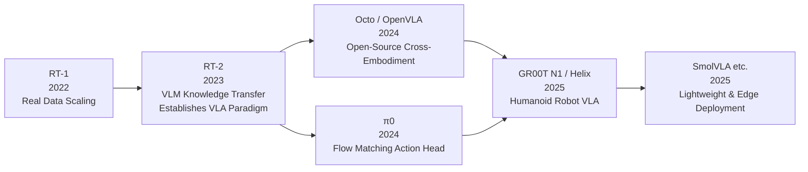
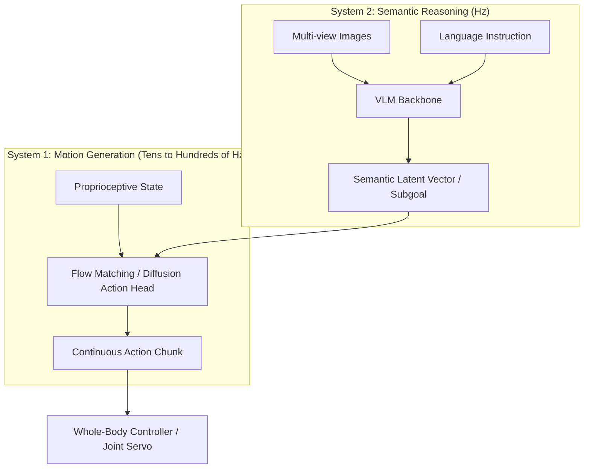
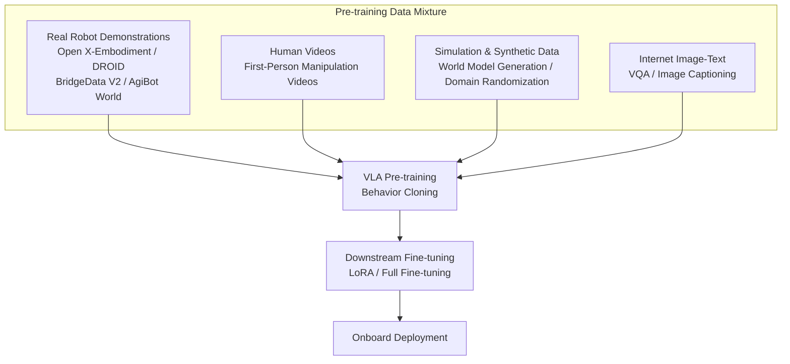

# Chapter 19: Vision-Language-Action Models (VLA)

## Abstract

Vision-Language-Action Models (VLA) represent the most influential technical paradigm in recent embodied AI: they unify the semantic understanding capabilities of large-scale Vision-Language Models (VLM) with robot action generation within a single end-to-end network, enabling robots to directly output executable actions based on natural language instructions and visual observations. This chapter begins with the definition and mathematical formulation of VLA, systematically reviewing its architectural paradigms—including discrete action token autoregression, diffusion policy and flow matching continuous action heads, and the "slow thinking-fast execution" dual-system architecture. It then delves into the design trade-offs of representative systems such as RT-1/RT-2, OpenVLA, Octo, π0, GR00T N1, Helix, and SmolVLA. Subsequently, it discusses data engineering for cross-embodiment pre-training (Open X-Embodiment, DROID, BridgeData V2, AgiBot World Colosseo, etc.), adaptation methods for full-body control of humanoid robots, inference latency and edge deployment constraints, as well as evaluation benchmarks and typical failure modes. This chapter, together with Chapter 18 (Imitation Learning and Policy Learning), Chapter 20 (World Models and Long-Horizon Reasoning), and Chapter 21 (Data Infrastructure), constitutes the intelligent layer technology mainline of this book.

**Keywords**: Vision-Language-Action Model; VLA; RT-2; OpenVLA; π0; GR00T N1; Helix; Flow Matching; Diffusion Policy; Action Chunking; Cross-Embodiment Pre-training; Dual-System Architecture; Edge Deployment

---

## 19.1 VLA Overview: From End-to-End Control to Embodied Foundation Models

### 19.1.1 Definition and Positioning

**Vision-Language-Action Model (VLA)** refers to a large model policy that takes visual observations and natural language instructions as input and directly outputs robot actions (or action sequences). Its core idea is to compress the traditionally layered pipeline of "perception—understanding—decision—control" into a single end-to-end trainable neural network. By leveraging the semantic priors obtained from pre-training Vision-Language Models on internet-scale data, it achieves generalization over objects, tasks, and instructions in the open world.

!!! note "Terminology Explanation: Vision-Language-Action Model, Vision-Language Model, Embodied Foundation Model, End-to-End Policy"
    - **Vision-Language-Action Model (VLA)**: A multimodal large model that takes images (or video frames) and language instructions as input and outputs robot actions. The term was formally established by Google DeepMind's RT-2 work (2023).
    - **Vision-Language Model (VLM)**: A model pre-trained on internet image-text data, capable of visual question answering and image description, such as PaLI-X, SigLIP+Llama combinations, etc. It serves as the semantic backbone of VLA.
    - **Embodied Foundation Model**: A general-purpose model oriented towards physical world tasks, adaptable to various robot embodiments. VLA is currently the primary implementation form.
    - **End-to-End Policy**: A policy network that goes from raw sensor input to actuator output without passing through manually designed intermediate modules (such as explicit pose estimation or grasp planning).

Compared to the classic imitation learning discussed in Chapter 18, the difference of VLA lies not in the training paradigm (most VLAs still use behavioral cloning as the backbone), but in **scale and prior knowledge**: parameter scale jumps from millions to billions, training data expands from single-task demonstrations to millions of cross-embodiment, cross-scenario episodes, and the model carries open-vocabulary semantics from internet image-text pre-training. This endows VLA with instruction-following and novel object generalization capabilities that are difficult for classic methods to achieve.

For the entire book, this chapter sits at the center of the "intelligence layer" narrative: Chapters 14–17 answer "how robots are controlled and taught," Chapter 18 answers "how policies learn from data," and this chapter answers "how to truly drive a physical body with the common sense of large models." The answer to this question is reshaping the division of labor in the entire humanoid robot industry—the boundaries between model companies, data companies, and robot manufacturers are largely being redrawn along the VLA technology stack (Chapter 28 will discuss its industrial consequences).

From a hardware perspective, VLA also explains why the first half of this book repeatedly emphasized certain design choices: wrist cameras and proprioceptive interfaces (Chapter 5) are the "senses" of VLA; onboard computing power and thermal design (Chapter 6) determine how large a backbone can run; force control bandwidth and joint precision (Chapter 4) determine whether the action head's output can be faithfully executed. Large models have not made hardware less important—quite the opposite, they amplify differences in hardware quality into differences in data quality and deployment density.

### 19.1.2 Development Trajectory: From RT-1 to Open-Source Ecosystem

The lineage of VLA can be traced back to Google's **RT-1 (Robotics Transformer, 2022)**: It trained a Transformer policy on approximately 130,000 real robot demonstration episodes, covering over 700 tasks, and first demonstrated the feasibility of large-scale, real-data-driven, language-conditioned manipulation policies. Subsequently, **RT-2 (2023)** took a critical step: representing actions as text tokens and performing co-fine-tuning directly on internet-scale pre-trained Vision-Language Models (PaLI-X, PaLM-E), thereby transferring network-scale semantic knowledge (such as instructions requiring common sense reasoning like "pick out the animal that is about to go extinct") to robot control. RT-2 thus established the term VLA and its basic paradigm.

Since then, the ecosystem has expanded rapidly: On the open-source side, **Octo** (a generalist policy trained on heterogeneous cross-embodiment data) and **OpenVLA** (a 7-billion-parameter open-source model trained on approximately 970,000 episodes from Open X-Embodiment) emerged; the startup **Physical Intelligence** launched **π0** based on flow matching, demonstrating dexterous long-horizon tasks like folding clothes and packing boxes; NVIDIA released the open foundation model **GR00T N1** for general-purpose humanoid robots; Figure released **Helix** to drive its Figure 02 humanoid robot; and the Hugging Face community introduced **SmolVLA** for low-cost hardware. VLA work in the autonomous driving domain (e.g., DriveVLA, Impromptu VLA) and the robotics domain have been cross-fertilizing, further enriching this lineage.

There are three turning points worth remembering in this trajectory. First, RT-2 proved the value of **knowledge transfer**: robots no longer need to learn "what a dinosaur is" or "what a hammer is" from scratch; these concepts can be inherited from internet pre-training. Second, OpenVLA proved the power of **open ecosystems**: an academic team could replicate and surpass industrial closed-source baselines with a budget of hundreds of GPU-days, rapidly democratizing VLA research. Third, π0 and GR00T N1 proved the necessity of **generative action heads**: when tasks escalate from "pick and place" to "folding clothes"—high-dimensional, multi-modal, temporally tightly coupled dexterous manipulation—the precision and bandwidth of the discrete token approach begin to fall short.

### 19.1.3 Boundaries Between VLA and Related Concepts

To avoid conceptual confusion, it is necessary to delineate the boundaries between VLA and adjacent terms. VLA is not a simple synonym for VLM: VLM is only responsible for understanding; VLA must output executable actions. A VLM that describes an image perfectly, no matter how accurately, is not a VLA without an action head. VLA is also not a new paradigm for policy learning: in the vast majority of cases, it is still behavioral cloning (Chapter 18), just with the policy network replaced by a pre-trained large model. The relationship between VLA and **teleoperation (Chapter 17)** is symbiotic in terms of data—currently, the vast majority of VLA training data comes from human teleoperation demonstrations, and VLA, in turn, is used for intent assistance and automatic error correction in teleoperation. Finally, the division of labor between VLA and **world models (Chapter 20)** is "reaction" vs. "prediction": VLA directly produces actions given observations; world models predict observations given actions. The coupling of the two is currently the most active research frontier.

| Concept | Input | Output | Contains Actions? | Typical Representative |
|---|---|---|---|---|
| VLM | Image + Text | Text | No | PaLI-X, Gemini |
| Classic Imitation Learning Policy | Observation | Action | Yes | ACT, Diffusion Policy |
| VLA | Image + Instruction (+ State) | Action | Yes | RT-2, OpenVLA, π0 |
| World Model | Observation + Action | Future Observation/State | Inverse | Cosmos, Dreamer |
| LLM Planner | Text (Task) | Sub-goal Sequence | Indirect | SayCan, CoT Planning |

### 19.1.4 Mathematical Formulation of VLA

Formally, VLA is a conditional policy model. Given a multimodal observation \(o_t\) at time \(t\) (usually including images from one or more camera views, proprioceptive state \(q_t\), and optionally depth, tactile data, etc.) and a natural language instruction \(\ell\), VLA learns the following conditional distribution:

$$
\pi_\theta\big(a_{t:t+H} \mid o_t, \ell\big)
$$

where \(a_{t:t+H} = (a_t, a_{t+1}, \dots, a_{t+H-1})\) is an **action chunk** for the future \(H\) steps, and \(\theta\) represents the model parameters. The design of outputting action chunks rather than single-step actions is inherited from **Action Chunking with Transformers (ACT)**, which significantly alleviates error accumulation in long-horizon tasks and reduces the demand on inference frequency.

The training objective is typically the negative log-likelihood (behavioral cloning loss) over the demonstration dataset \(\mathcal{D} = \{(o_t, \ell, a_{t:t+H})\}\):

$$
\mathcal{L}_{\mathrm{BC}}(\theta) = -\mathbb{E}_{(o,\ell,a)\sim\mathcal{D}} \log \pi_\theta\big(a \mid o, \ell\big)
$$

The divergence between different architectures essentially lies in **how to parameterize this conditional distribution**: discrete token autoregression (RT-2, OpenVLA), denoising diffusion (RDT-1B, DexVLA), flow matching (π0, GR00T N1), or a mixture of the three. This choice directly determines the model's accuracy ceiling, inference latency, and deployability, and is the main thread of Section 19.2.

!!! note "Term Explanation: Action Chunk, Conditional Policy, Behavior Cloning Loss, Compounding Error"
    - **Action chunk**: A sequence of future \(H\) steps of actions predicted at once, which can be executed in an open-loop manner for several steps before re-inference.
    - **Conditional policy**: An action distribution conditioned on observations and instructions; VLA is an instance of it under multimodal large models.
    - **Behavior cloning loss**: The negative log-likelihood of demonstration actions, which is the basic training objective for most VLAs.
    - **Compounding error**: The phenomenon where small policy deviations accumulate frame by frame, pushing the system out of the training distribution; action chunks and temporal integration are common mitigation methods.

## 19.2 Architectural Paradigms

### 19.2.1 Vision-Language Backbone: The Semantic Foundation of VLA

Almost all VLAs are built upon a pre-trained VLM backbone, whose role is to encode images and instructions into semantically rich token sequences. Typical approaches include:

- **Vision Encoder**: Uses SigLIP, DINOv2, or a combination of both (e.g., OpenVLA simultaneously uses DINOv2's low-level spatial features and SigLIP's semantic features) to segment images into patch tokens;
- **Language Model Backbone**: Employs decoder-only Transformers such as Llama, PaLI-X, Gemma, Eagle-2, etc., concatenating visual tokens with instruction tokens for unified multimodal autoregressive or bidirectional attention encoding;
- **Proprioception Injection**: Maps low-dimensional states like joint positions and gripper status into additional tokens via an MLP, or adds them to the action head input.

!!! note "Terminology Explanation: Backbone Network, Vision Encoder, Multimodal Projection, Co-fine-tuning"
    - **Backbone Network**: The pre-trained large model part responsible for primary representation computation; in VLA, it usually refers to the VLM.
    - **Vision Encoder**: A network that maps images into a sequence of feature vectors, commonly pre-trained using contrastive learning (CLIP/SigLIP) or self-supervision (DINOv2).
    - **Multimodal Projector**: A lightweight adaptation layer that aligns the visual feature space to the language model's word embedding space.
    - **Co-fine-tuning**: Joint fine-tuning on a mixture of robot data and original image-text data to prevent the VLM from forgetting its semantic knowledge on robot data—RT-2 demonstrates this is crucial for retaining generalization ability.

The choice of backbone determines the VLA's "common sense reservoir." The core engineering trade-off is: a larger backbone provides stronger instruction understanding but also incurs higher memory usage and inference latency, posing hard constraints for onboard deployment on humanoid robots (see 19.5.3).

### 19.2.2 Action Representation I: Discrete Token Autoregression

The approach adopted by RT-2 and OpenVLA is **action token prediction**: quantizing continuous actions for each degree of freedom into discrete bins (RT-2 uses 256 uniform bins), then mapping these bins to the language model's vocabulary (often using the least-used tokens at the end of the vocabulary). Thus, action generation becomes a "next token prediction" problem identical to text generation.

$$
\hat{a}_{t} = \mathrm{decode}\big(\mathrm{tokenizer}^{-1}(y_1, y_2, \dots, y_D)\big), \quad y_i \sim p_\theta(y_i \mid o_t, \ell, y_{<i})
$$

The biggest advantage of this scheme is **reusability**: no modification to the VLM structure is required; training infrastructure, regularization techniques, and even reinforcement learning post-training (RLHF-like methods) can be directly borrowed from the language model ecosystem. The costs are equally evident:

1. **Quantization Error**: 256 bins may be insufficient for high-precision assembly tasks; increasing resolution lengthens the sequence;
2. **Sequence Length**: The number of tokens for \(D\) degrees of freedom × \(H\) action chunks grows linearly with dimensionality. Autoregressive token-by-token decoding keeps inference latency high; typical models can only output action chunks at a few Hz;
3. **High-Frequency Jitter**: Discretization disrupts the temporal smoothness of actions, requiring additional post-processing or temporal integration.

To address efficiency, **FAST (Efficient Action Tokenization)** proposes using the Discrete Cosine Transform (DCT) to compress action chunks in the frequency domain before tokenization, representing high-frequency action sequences with far fewer tokens than per-dimension quantization. This significantly reduces autoregressive decoding steps and is an important improvement of the discrete route towards high-frequency actions.

### 19.2.3 Action Representation II: Diffusion and Flow Matching Continuous Action Heads

Another route preserves action continuity: the semantic representation output by the VLM backbone serves as a condition for an **action expert** to generate continuous action chunks. The two mainstream generative models are diffusion models and flow matching.

**Diffusion Policy** models action chunk generation as the reverse process of denoising diffusion: starting from pure noise \(a^{K}\), it iteratively denoises over \(K\) steps to obtain the action \(a^{0}\). The training objective is the noise prediction loss:

$$
\mathcal{L}_{\mathrm{diff}}(\theta) = \mathbb{E}_{k, a^0, \epsilon} \big\| \epsilon - \epsilon_\theta(a^k, k \mid o_t, \ell) \big\|^2
$$

**Flow Matching** learns a deterministic velocity field connecting the noise distribution and the data distribution. Using a linear interpolation path \(a^\tau = \tau a^1 + (1-\tau) a^0\) (where \(a^0\) is Gaussian noise and \(a^1\) is the true action), the conditional flow matching loss is:

$$
\mathcal{L}_{\mathrm{FM}}(\theta) = \mathbb{E}_{\tau, a^0, a^1} \big\| v_\theta(a^\tau, \tau \mid o_t, \ell) - (a^1 - a^0) \big\|^2
$$

During inference, starting from \(a^0 \sim \mathcal{N}(0, I)\), numerical integration of the ordinary differential equation \(\dot{a}^\tau = v_\theta(a^\tau, \tau)\) yields the action chunk. π0 and GR00T N1 both use flow matching action heads; RDT-1B (a diffusion foundation model for bimanual manipulation) and DexVLA (a plug-in diffusion expert) use the diffusion route. Compared to discrete tokens, continuous action heads have inherent advantages for high-dimensional, high-frequency actions (e.g., bimanual 50 Hz control, dexterous hand multi-finger coordination). Moreover, diffusion/flow matching naturally support **multimodal action distributions**—when faced with demonstration data like "can bypass the obstacle from the left or the right," they do not learn a compromised "crash into the wall" action, which is impossible with unimodal regression loss.

| Dimension | Discrete Token Autoregression | Diffusion/Flow Matching Action Head |
|---|---|---|
| Representative Systems | RT-2, OpenVLA, Octo | π0, GR00T N1, RDT-1B, DexVLA |
| Action Continuity | Quantized bins, quantization error exists | Inherently continuous |
| Multimodal Distribution Modeling | Autoregression can express but sample inefficient | Naturally supported |
| Inference Latency | Token-by-token decoding, latency grows with dimensionality | Fixed number of iterative steps (typically a few to tens of steps) |
| High-Frequency Actions (>20 Hz) | Requires compression techniques like FAST | Suitable |
| Infrastructure Reusability | Fully reuses LLM ecosystem | Requires additional action expert and sampler |

!!! note "Terminology Explanation: Action Expert, Denoising Diffusion, Flow Matching, Velocity Field, Multimodal Distribution"
    - **Action Expert**: A sub-network in VLA dedicated to generating continuous actions, typically sharing or cross-attending to semantic representations from the VLM backbone, but with its own parameters and output head.
    - **Denoising Diffusion**: A generative model that learns to reverse a process of gradually adding noise to data; inference requires multiple forward iterations.
    - **Flow Matching**: A generative framework that learns a deterministic transport velocity field between a noise distribution and a data distribution; can be seen as a "straightened" variant of diffusion models, typically requiring fewer steps for sampling.
    - **Velocity Field**: The vector field \(v_\theta(a,\tau)\) learned in flow matching, indicating the direction of movement for a sample at each point along the transport path.
    - **Multimodal Distribution**: An action distribution with multiple high-probability regions, e.g., "can bypass from the left or the right"; generative models can faithfully represent multimodality, whereas mean squared regression would learn a compromise point between the two modes.

### 19.2.4 Dual-System Architecture: Slow Thinking and Fast Execution

Inspired by cognitive science's "System 1/System 2," since 2025, humanoid robot VLAs have generally converged on a **dual-system architecture**: a large model running at low frequency handles semantic understanding and high-level decision-making, while a small model running at high frequency handles real-time action generation.

- **Figure's Helix**: System 2 (S2) is a VLM with approximately 7 billion parameters, understanding the scene and instructions at a few Hz and outputting semantic latent vectors; System 1 (S1) is a visuomotor Transformer with approximately 80 million parameters, translating the semantic latent vectors into continuous control quantities for the upper body (including arms, wrists, and fingers) at approximately 200 Hz. The two systems are trained end-to-end jointly but run asynchronously.
- **NVIDIA GR00T N1**: Uses the Eagle-2 vision-language module for reasoning and a flow matching Diffusion Transformer (DiT) action head for real-time motion generation, trained end-to-end on a heterogeneous mixture of real robot trajectories, human videos, and synthetic data.
- Academic works like **Fast-in-Slow** further explore designs such as shared representations between fast and slow systems, and how the slow system's output serves as a conditional prompt for the fast system.

The dual-system architecture is essentially an engineering trade-off between **semantic generalization capability** and **control bandwidth**: large models cannot run at 200 Hz, and reflexive low-level control does not require "deep deliberation" every time. It is conceptually isomorphic to classical hierarchical control (Chapter 14), with the only difference being that the high-level component has been replaced from a symbolic planner to a learned VLM.

### 19.2.5 Condition Injection and Interface Design

Regardless of the chosen action representation, one question must be answered: **how is the semantic representation injected into the action generation process**. There are four mainstream interface designs:

1.  **Concatenation**: Vision-language tokens and action tokens are autoregressively processed in the same sequence. This is the simplest structure, used by RT-2 and OpenVLA.
2.  **Cross-Attention**: Each layer of the action expert reads the multimodal representation from the backbone via cross-attention. The DiT action heads of π0 and GR00T N1 adopt this method, allowing for deeper semantic conditioning.
3.  **Adaptive Layer Normalization (AdaLN)**: The condition vector is injected into the scaling and shifting parameters of the normalization layer. This has low computational cost and is a classic conditioning method for DiT-based models.
4.  **Latent Bridge**: The slow system outputs a compressed semantic latent vector, which the fast system uses as a condition to run at high frequency. The S1/S2 interface of Helix falls into this category.

The choice of interface design affects more than just performance: concatenation has the highest data efficiency during training but the highest inference cost; cross-attention better preserves semantic details; the latent bridge naturally supports asynchronous deployment. For a systems engineer, the interface is often a decision that needs to be frozen earlier than the backbone selection, as it directly determines the data format, training pipeline, and deployment topology.

## 19.3 Representative VLA System Analysis

### 19.3.1 RT Series: The Paradigm Setters

**RT-1 (Robotics Transformer)** contributed through data scaling: approximately 130,000 real-world demonstrations and over 700 language-annotated tasks, proving the feasibility of the "real robot data + Transformer + behavior cloning" recipe. However, its vision and semantic modules are lightweight, limiting open-world generalization.

**RT-2**'s key innovation was treating actions as text: directly performing co-fine-tuning on PaLI-X (approximately 55 billion parameters) and PaLM-E (approximately 12 billion parameters) instances with robot data and raw image-text data. This yielded three emergent capabilities—**semantic generalization** (understanding concepts absent from the training set but present in internet corpora), **symbol understanding** (numbers, icons), and **basic reasoning** (multi-step reasoning like "choose an object that can be used as a hammer" via chain-of-thought prompting). RT-2's lesson is equally important: the massive backbone incurs severe deployment burdens (requiring cloud or large accelerator cards for inference), and discretization limits fine manipulation capabilities.

### 19.3.2 OpenVLA and Octo: Founders of the Open-Source Ecosystem

**OpenVLA** is the most widely cited open-source VLA: approximately 7 billion parameters, employing a DINOv2+SigLIP dual vision encoder and a Llama-series language backbone, pre-trained on approximately 970,000 real robot episodes from the **Open X-Embodiment** dataset, surpassing previous open-source baselines on benchmarks like LIBERO. Its value lies not in a single metric, but in **full openness**: weights, training code, and data recipes are all publicly available, and it supports parameter-efficient fine-tuning like LoRA, enabling academia and small teams to perform downstream adaptation on a single multi-GPU workstation.

**Octo** explored another open-source path: training a generalist policy on 800,000 cross-embodiment episodes with a smaller Transformer backbone, using a diffusion-based action head and task/goal conditioning interfaces, emphasizing "plug-and-play fine-tuning on new embodiments." Together, they established the de facto standard for open-source VLA: cross-embodiment pre-training + parameter-efficient fine-tuning + standardized evaluation.

The rise of open-source VLA also brought a methodological dividend: **reproducible ablation studies**. With fully open models like OpenVLA, the community can systematically answer the key question "what does pre-trained VLM actually contribute?"—experiments generally show that internet pre-training mainly contributes semantic and instruction generalization, with limited impact on pure motor skills (e.g., precise insertion); the retention level of low-level visual encoder features, action tokenization granularity, and fine-tuning strategies often determine downstream success more than backbone size. The engineering guidance value of such conclusions is comparable to the models themselves.

### 19.3.3 π0: Flow Matching Generalist Policy

**π0**, proposed by Physical Intelligence, features a core design of "VLM backbone + flow matching action expert": the backbone reuses the semantic capabilities of internet pre-trained VLMs, while the action expert uses flow matching to generate continuous action chunks at up to 50 Hz, covering **long-horizon, dual-arm dexterous manipulation** tasks like folding laundry, clearing tables, and packing boxes. π0 also demonstrates a "pre-training then post-training" recipe of cross-embodiment pre-training (mixed data from single-arm, dual-arm, and mobile manipulation platforms) plus high-quality task data fine-tuning. Its open-source version (openpi) further promoted the adoption of flow matching action heads. Its successor, π0.5, introduces a hierarchical inference structure of "high-level semantic reasoning + low-level action generation," moving towards open-environment generalization.

π0's demonstrations caused a stir because it conquered a class of tasks previously considered "unlearnable": **deformable object manipulation**. Clothing and bedsheets lack fixed geometric models, making model-based planning approaches nearly impossible, yet the purely data-driven flow matching strategy could induce a "flatten—fold—smooth" skill structure from thousands of teleoperated folding episodes. This case is often cited to argue: when tasks are hard to model but easy to demonstrate, large-capacity generative strategies are currently the most effective technical route.

### 19.3.4 GR00T N1 and Helix: Humanoid Robot-Specific VLAs

Humanoid robots pose two unique challenges for VLAs: high-dimensional action spaces (30–50+ degrees of freedom for the whole body) and strong dynamic constraints from bipedal balance. Two representative systems offer different answers:

- **GR00T N1 (NVIDIA)**: Positioned as an "open foundation model for general-purpose humanoid robots," with a dual-system design—Eagle-2 VLM for vision-language reasoning and a flow matching DiT action head for real-time motion generation. Its data strategy is particularly noteworthy: heterogeneous mixing of real robot trajectories, human videos (via action labeling/latent action learning), and simulation synthetic data (generated using NVIDIA Cosmos world model and Isaac simulation) to alleviate the scarcity of real humanoid robot data.
- **Helix (Figure)**: An asynchronous architecture with S2 (approximately 7 billion parameter VLM) + S1 (approximately 80 million parameter visuomotor policy), driving continuous control of all 35 degrees of freedom in the Figure 02 upper body with a single set of weights, without needing separate training or hand-designed action primitives for each task, and demonstrating dual-robot collaboration and zero-shot grasping of "any unseen household object."

| System | Publisher | Backbone Scale | Action Generation | Target Embodiment | Openness |
|---|---|---|---|---|---|
| RT-1 | Google | Lightweight Transformer | Discrete tokens | Single-arm mobile manipulator | Paper open |
| RT-2 | Google DeepMind | ~12B–55B | Discrete tokens | Single-arm mobile manipulator | Closed-source |
| Octo | UC Berkeley et al. | ~100M | Diffusion head | Multi-embodiment robotic arm | Open weights |
| OpenVLA | Stanford et al. | ~7B | Discrete tokens | Multi-embodiment robotic arm | Fully open |
| π0 | Physical Intelligence | ~3B class | Flow matching | Dual-arm/mobile manipulator | Open (openpi) |
| RDT-1B | Tsinghua University et al. | ~1.2B | Diffusion | Dual-arm | Open |
| GR00T N1 | NVIDIA | VLM+DiT dual system | Flow matching | Humanoid robot | Open weights |
| Helix | Figure | S2 ~7B + S1 ~80M | Continuous regression | Humanoid robot (Figure 02) | Closed-source |
| SmolVLA | Hugging Face | ~450M | Flow matching | Low-cost robotic arm | Fully open |
| Gemini Robotics | Google DeepMind | Gemini 2.0 series | Continuous actions | Dual-arm to humanoid | Restricted open |

### 19.3.5 Lightweight and Edge Deployment: SmolVLA, TinyVLA, and Efficiency Optimization

The tension between large models and onboard compute has driven the lightweight direction. **SmolVLA** (Hugging Face) compresses parameters to approximately 450 million, using an asynchronous inference stack (overlapping policy inference and action execution), capable of driving LeRobot ecosystem low-cost robotic arms on consumer GPUs or even CPUs, validating the cost-effectiveness of the "community data + small model" route. **TinyVLA** systematically studied the feasibility of data-efficient, pre-training-free small VLAs. Efficiency optimization methods also include: visual token pruning and merging, KV-cache, quantization (INT8/INT4), action chunk prediction to reduce inference frequency, and fast-slow asynchronous inference. For complete humanoid robots, these optimizations directly determine whether a VLA can fit within the onboard compute budget (typically, the sustained power reserved for intelligent computing on a complete robot is only on the order of tens of watts, see Chapter 6).

### 19.3.6 Other Noteworthy Directions

Beyond the mainline systems, several branch directions are rapidly evolving and worth tracking:

- **Reasoning-Enhanced VLA**: Introducing explicit reasoning into VLA, such as Gemini Robotics-ER's embodied reasoning (first performing pointing, affordance judgment, and multi-step reasoning, then outputting actions) and various "plan-then-execute" hierarchical variants, aiming to improve long-horizon tasks and failure recovery;
- **Spatial and Geometry-Enhanced VLA**: SpatialVLA, TraceVLA, etc., address VLM shortcomings in spatial reasoning through 3D position encoding, visual trajectory prompting, etc. (see 19.5.2);
- **Autonomous Driving VLA**: DriveVLA, CoVLA, Impromptu VLA, etc., transfer the VLA paradigm to driving scenarios. Their experience handling long-tail scenarios and semantic instructions (e.g., Impromptu VLA's practice of open-sourcing weights and data) is feeding back into the robotics field;
- **Vertical Domain VLA**: Dedicated data and fine-tuned models are emerging in domains like healthcare (Open-H-Embodiment and its GR00T-H), logistics, and food service, with industry know-how directly encoded into data recipes.

These branches share a common judgment: general-purpose VLA provides the "foundation," but entering specific industries still requires the "superstructure" of domain data and domain constraints.

## 19.4 Data and Training

### 19.4.1 Cross-Embodiment Pre-training Data

The generalization capability of VLA primarily stems from **cross-embodiment pre-training**: training on a mixture of data from multiple robots and diverse scenarios forces the model to learn "operational physical intuition" decoupled from specific embodiments. Key datasets include:

- **Open X-Embodiment**: An open dataset aggregated by over 20 institutions, covering more than 20 robot embodiments and millions of episodes. It serves as the common foundation for subsequent work such as OpenVLA, Octo, and the RT series.
- **DROID**: An operation dataset distributedly collected across multiple laboratories and real home environments, renowned for its diversity in scenes and viewpoints.
- **BridgeData V2**: A desktop manipulation dataset annotated with language instructions, commonly used as a benchmark for imitation learning research.
- **AgiBot World Colosseo**: A large-scale humanoid/dual-arm manipulation platform dataset released by AgiBot, providing scarce high-quality real-robot data for full-size humanoid robots.

### 19.4.2 Data Recipe and Co-training

Empirically, VLA training involves three key recipe issues. The first is the **mixture ratio**: the proportion of robot data, image-text data, and human videos directly affects the balance between semantic retention and action precision. Co-fine-tuning in RT-2 and heterogeneous mixing in GR00T N1 both indicate that completely discarding image-text data leads to degradation in semantic generalization. The second is **action space alignment**: different embodiments have varying joint spaces, control frequencies, and gripper interfaces. Common practices include unifying to end-effector pose space, grouping output heads by embodiment, or aligning human videos via latent actions. The third is **quality filtering**: pauses, regressions, and failed segments in teleoperation demonstrations, if not filtered, significantly degrade policy quality—this is why teams are racing to build teleoperation data pipelines (Chapters 17 and 21).

!!! note "Terminology Explanation: Cross-Embodiment, Action Space Alignment, Latent Action, Data Mixture Ratio"
    - **Cross-embodiment**: Joint training on data from multiple robot morphologies (single-arm, dual-arm, humanoid, mobile base) to pursue a general policy decoupled from specific embodiments.
    - **Action space alignment**: Unifying action representations from different embodiments (e.g., unifying to end-effector 6D pose + gripper opening/closing) to enable joint training on mixed data.
    - **Latent action**: Action proxy variables learned unsupervised from inter-frame changes in videos, used to extract supervisory signals from human videos without action annotations.
    - **Data mixture ratio**: The proportion of each data source in training batches, a hyperparameter as critical as model scale in VLA training.

### 19.4.3 Fine-tuning, Post-training, and Quantized Deployment

Mainstream approaches for downstream adaptation include: **LoRA/adapter fine-tuning** (freezing the backbone, training only low-rank increments, reducing memory requirements by over an order of magnitude), **full fine-tuning** (higher performance ceiling but requires multiple GPUs), and **post-training reinforcement learning** (fine-tuning VLA in real or simulated environments using PPO-like algorithms, or optimizing policies with world models, see Chapter 20 for WMPO, etc.). A typical deployment pipeline is: FP16 training → INT8/INT4 quantization → TensorRT compilation → onboard Orin-level SoC inference. The impact of quantization on action precision must be measured via task-level metrics, not just proxy metrics like perplexity.

### 19.4.4 Human Videos and Synthetic Data: Mitigating Real-Robot Data Scarcity

The cost of collecting real-robot data for humanoid robots is far higher than for robotic arms (expensive whole-body hardware, difficulty of full-body teleoperation, limited robot time), forcing the community to seek alternative data sources:

- **Human Videos**: First-person manipulation videos (e.g., large-scale egocentric video datasets like Ego4D) are abundant but lack action labels. Solutions include using hand pose estimation algorithms to infer actions, learning "latent action" representations to encode inter-frame changes as pseudo-actions, or using videos solely for visual-semantic pre-training rather than action supervision.
- **Simulation Synthetic Data**: Programmatically generating task variants in engines like Isaac Sim (methods such as MimicGen, DexMimicGen that "scale up from a few demonstrations to large-scale data"), mixed with real-robot data after domain randomization.
- **World Model Generated Data**: Using action-conditioned video generation models to augment counterfactual trajectories from a few real segments (Chapter 20). The data recipe for GR00T N1 includes such synthetic data.

The effectiveness ranking of these three data types varies by task, but one empirical rule has been widely validated: **synthetic data provides diversity, real-robot data provides precision**—without either, the model is either "knowledgeable but clumsy" or "dexterous but unfamiliar." A systematic discussion of data engineering is provided in Chapter 21.

## 19.5 Adaptation for Humanoid Robots

### 19.5.1 Full-Body Action Space and Hierarchical Control

Directly mapping VLA outputs to position commands for over 40 joints across the whole body simultaneously faces two issues: the curse of dimensionality and dynamic feasibility. Learned policies do not inherently guarantee bipedal balance. The mainstream engineering solution is **hierarchical**:

1. The VLA outputs upper-body targets (end-effector poses, wrist/finger commands, or joint trajectories above the waist);
2. A Whole-Body Control (WBC) or reinforcement learning-based motion controller (Chapters 14, 15) solves for full-body joint commands that satisfy balance constraints in real time;
3. Balance-critical joints such as the ankles and hips are closed-loop controlled by low-level controllers and are not exposed to the VLA.

Helix's S1 outputs continuous upper-body control quantities, and GR00T N1 unifies motion skills and manipulation skills within an action head—both embody this idea. Strictly speaking, current humanoid VLAs address "manipulation intelligence," while "locomotion intelligence" still primarily relies on the motion control stack from Chapter 15. The deep integration of the two (manipulation during walking, whole-body coordinated carrying) is a frontier direction.

!!! note "Terminology: Whole-Body Control, Motion Primitive, Hierarchical Policy, Skill Routing"
    - **Whole-Body Control (WBC)**: A control framework that uniformly solves for whole-body torque/position commands satisfying balance, contact, and task constraints at the joint level (Chapter 14). It is a common execution layer for grounding VLA outputs.
    - **Motion primitive**: Predefined or pre-learned parameterized action templates (e.g., "grasp," "place"). A VLA can select one and provide parameters, reducing output dimensionality.
    - **Hierarchical policy**: A policy structure where a high-level layer outputs subgoals and a low-level layer outputs actions. Dual-system VLAs are an instance of this in the era of large models.
    - **Skill routing**: A mechanism that switches and schedules among skill modules such as navigation, manipulation, and locomotion based on the task phase.

### 19.5.2 Spatial Representation and 3D Perception

Pure 2D image features have limited performance in spatial reasoning ("put the cup to the left of the plate," "reach the second shelf"), driving the 3D transformation of VLAs:

- **SpatialVLA** injects 3D positional encodings expressed in the robot's coordinate frame (Ego3D positional encoding and adaptive action grids) into cross-embodiment data, improving spatial generalization and data efficiency;
- **TraceVLA** uses visual trace prompting to enhance the spatiotemporal perception of generalist policies;
- Point cloud/voxel representations, occupancy grids, and implicit neural fields have also been introduced into the VLA input side, trading some inference speed for geometric accuracy.

For humanoid robots, the combination of head-mounted multi-view cameras and wrist cameras provides natural stereo observation, but camera calibration, occlusion, and view jitter caused by body motion are far more challenging than for fixed manipulator arms (see the discussion on sensing calibration in Chapter 5).

### 19.5.3 Inference Latency, Frequency, and Onboard Deployment Constraints

The engineering constraints of VLA deployment can be summarized by three numbers: **semantic loop latency** (a single forward pass of a VLM typically takes hundreds of milliseconds), **action loop frequency** (joint servoing requires a smooth command stream above 100 Hz), and **compute budget** (onboard SoC-level compute, shared with motion control and perception). Standard methods to bridge these gaps include:

- **Asynchronous inference**: The VLM runs at a low frequency, while the action head or interpolator unfolds the most recent action chunk at a high frequency (SmolVLA's asynchronous stack, Helix's S1/S2 division of labor);
- **Action chunking + temporal ensemble**: Each inference outputs \(H\) steps of actions, which are weighted and smoothed over overlapping windows—a tradition from ACT that remains effective in the VLA era;
- **Quantization and compilation**: INT8/INT4 quantization, TensorRT/ONNX compilation, and KV-cache reuse;
- **Hierarchical offloading**: The slow system is placed on a base station or in the cloud, while the fast system runs onboard—at the cost of introducing network latency and availability risks; safety-critical loops must be closed onboard.

!!! note "Terminology: Asynchronous Inference, Temporal Ensemble, Quantization, KV-cache"
    - **Asynchronous inference**: Policy network inference and action execution run in parallel; the execution side uses the most recent inference result to prevent the robot from "freezing while thinking."
    - **Temporal ensemble**: Overlapping action chunks are averaged with time-dependent weights to smooth jitter introduced by chunk-by-chunk inference.
    - **Quantization**: Reducing weights/activations from FP16 to INT8/INT4 to lower memory usage and latency, requiring evaluation of the impact on task success rates.
    - **KV-cache**: Caching historical key/value pairs during autoregressive decoding to avoid redundant computation; a fundamental method for accelerating LLM inference.

### 19.5.4 Interface for Mobile Manipulation and Navigation

Humanoid robot tasks are rarely confined to a desktop: fetching an object requires first walking to a shelf, and delivering a meal requires navigating through a corridor. Mobile manipulation imposes a requirement for "manipulation-navigation integration" on VLAs. The current engineering approach is **skill routing**: a high-level scheduler (which can be an LLM planner or a state machine) switches between the navigation stack (SLAM + local planning, where traditional solutions are more mature) and the manipulation VLA based on the task phase; the VLA only takes over after reaching the operation pose. Works like Mobility VLA attempt to unify navigation commands ("go to the kitchen") and manipulation commands into a single multimodal policy. True integration of navigation and manipulation—adjusting the upper body posture while walking, tidying shelves while moving—requires the VLA output to simultaneously drive the chassis/legs and arms, returning to the full-body action space problem of 19.5.1. This is a threshold that must be crossed to achieve "whole-house service" scenarios.

## 19.6 Evaluation and Failure Modes

### 19.6.1 Benchmarks and Evaluation Dimensions

The difficulty of VLA evaluation lies in the inability to scale real robot experiments, leading the community to adopt a dual-track system of "simulation benchmarks + controlled real-world robot suites." **LIBERO** provides a desktop manipulation benchmark with four types of programmatic variations—spatial relations, objects, goals, and long-horizon tasks—widely used to measure VLA generalization dimensions; **LIBERO-Plus** further increases perturbation intensity and combinatorial complexity. On the real robot side, standardized gradient tests such as "unseen objects/unseen instructions/unseen backgrounds/unseen lighting" are commonly used, along with cross-embodiment transfer tests (training on embodiment A, fine-tuning on embodiment B). Evaluation reports should simultaneously provide success rate, completion time, intervention count, and failure attribution, rather than a single success rate (see Chapter 25 for systematic evaluation methodology).

| Evaluation Dimension | Typical Variation Factors | Capability Assessed | Common Carriers |
|---|---|---|---|
| Object Generalization | Unseen object categories, colors, materials | Visual-semantic transfer | LIBERO-OBJECT, real robot gradient tests |
| Spatial Generalization | Position/orientation/layout changes | Spatial reasoning and coordinate transformation | LIBERO-SPATIAL |
| Instruction Generalization | Paraphrasing, compositional instructions, counterfactual instructions | Language understanding | LIBERO-GOAL |
| Long-Horizon | Multi-stage tasks, mid-task perturbations | Goal maintenance and recovery | LIBERO-LONG |
| Visual Robustness | Background, lighting, camera pose changes | Representation invariance | LIBERO-Plus perturbation suite |
| Cross-Embodiment | New arm types, new grippers, new humanoid platforms | Action space transfer | Cross-embodiment fine-tuning experiments |

A methodological pitfall must be emphasized: **the correlation between simulation success rate and real robot success rate is not always valid**, especially in contact-rich tasks. A rigorous evaluation process should use simulation for large-scale screening and real robots for final confirmation, clearly noting the differences between the two in papers or delivery documents.

### 19.6.2 Typical Failure Modes

Failures of VLA in field deployment exhibit forms distinctly different from classical controllers:

| Failure Mode | Phenomenon | Root Cause | Mitigation Method |
|---|---|---|---|
| Semantic Hallucination | Grasping objects unrelated to the instruction | VLM priors suppress visual evidence | Data balancing, instruction augmentation, visual grounding supervision |
| Out-of-Distribution Drift | Sharp drop in success rate after background/lighting/tabletop changes | Insufficient diversity in demonstration data | Data augmentation, cross-scenario collection, domain randomization |
| Action Jitter/Pause | Jitter or hesitation at action chunk boundaries | Discretization, multi-modal distribution compromise | Temporal integration, flow matching head, increasing chunk size |
| Long-Horizon Disorientation | Forgetting sub-goals in multi-step tasks | Lack of explicit task state | Hierarchical planning, chain-of-thought, progress supervision |
| Recovery Inability | Inability to retry after a single grasp failure | Lack of failure-recovery data in demonstrations | Collect corrective demonstrations, DAgger-style roll-in |
| Safety Violation | Collisions, overspeed, approaching humans | No hard constraints in the policy | Onboard safety layer, velocity/workspace limits |

### 19.6.3 Safety Constraints: A Hard Defense Line Above Learned Policies

Regardless of how high the VLA success rate is, its output must pass through a **non-learnable safety layer**: joint position/velocity/torque limits, workspace virtual fences, power and force limits in human-collaboration scenarios (see the standard systems in Chapter 12, such as the collaborative power limit concept in ISO/TS 15066), and an emergency stop circuit independent of the learned policy. The learning system is responsible for "doing the right thing," while the hard safety layer is responsible for "never doing the wrong thing." This layered approach is the engineering prerequisite for VLA to enter factories and homes.

In practical implementation, safety layer design can follow three principles:

1. **Determinism First**: Safety logic is implemented using formally verifiable rules, independent of any learning component's output;
2. **Independent Power and Sensing**: The emergency stop and collision detection circuit has its own power supply and sensors, capable of triggering even when the main computer crashes;
3. **Least Privilege**: The VLA can only output "advisory" targets; the final execution quantities must pass through limiters and monitors, architecturally preventing the policy from directly driving actuators.

### 19.6.4 Open-Source Ecosystem and Toolchain

The rapid adoption of VLA is largely due to a mature open-source toolchain. Readers can follow the path below to reproduce the content of this chapter:

- **Models and Weights**: OpenVLA, Octo, π0 (openpi), SmolVLA, RDT-1B, and GR00T N1 all provide public weights, covering a full gradient from 400 million to 7 billion parameters;
- **Training Frameworks**: Hugging Face's **LeRobot** unifies dataset formats, policy implementations, and low-cost hardware interfaces, making it the first choice for getting started with VLA training; openpi provides reference implementations and fine-tuning scripts for the flow matching action head;
- **Evaluation Environments**: LIBERO/LIBERO-Plus, along with each model's own real robot reproduction guide, form a validation ladder from simulation to real robots.

For engineering teams, a pragmatic technology selection path is typically: first use LeRobot + SmolVLA to complete the data loop on a low-cost arm, then use OpenVLA or π0-class models as performance baselines, and finally perform dual-system transformation and onboard deployment optimization on the target humanoid platform.

## 19.7 Summary and Outlook

VLA advances robot manipulation from "programming for each task" to "defining tasks with language and demonstrations." Its essence is the combination of internet-scale semantic priors with robot action data. The technical landscape outlined in this chapter can be summarized as follows: Architecturally, two routes—discrete tokens and diffusion/flow matching continuous action heads—coexist, with humanoid robot scenarios converging towards a "slow thinking, fast execution" dual system; in terms of data, cross-embodiment pre-training + high-quality fine-tuning has become the standard recipe, with the scarcity of real robot data driving the use of human videos and synthetic data; for deployment, quantization, asynchronous inference, and hierarchical offloading collectively bridge the gap between large models and onboard computing power.

Looking ahead three to five years, several directions deserve special attention:

1. **Convergence of VLA and World Models**: Action prediction informs the future, and the future feeds back into actions (UWM, WorldVLA are already emerging); the boundary between policy and model is dissolving. See Chapter 20 for details;
2. **Post-Training and Online Learning**: Moving from "one-shot behavior cloning" to "continuous improvement during deployment"; reinforcement learning post-training and automatic failure data roll-in will become standard;
3. **Full-Body Control**: VLA expands from upper-body manipulation to integrated walking-manipulation full-body control, truly realizing the value of the humanoid form;
4. **Standardization and Compliance**: As VLA enters factories and homes, functional safety assessment methods for learning systems (Chapters 12, 25) will move from a blank slate to established norms.

The current shortcomings of VLA—goal maintenance in long-horizon tasks, failure recovery, and prediction of physical consequences—point directly to the theme of Chapter 20: World Models and Long-Term Reasoning.
