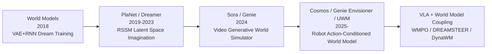
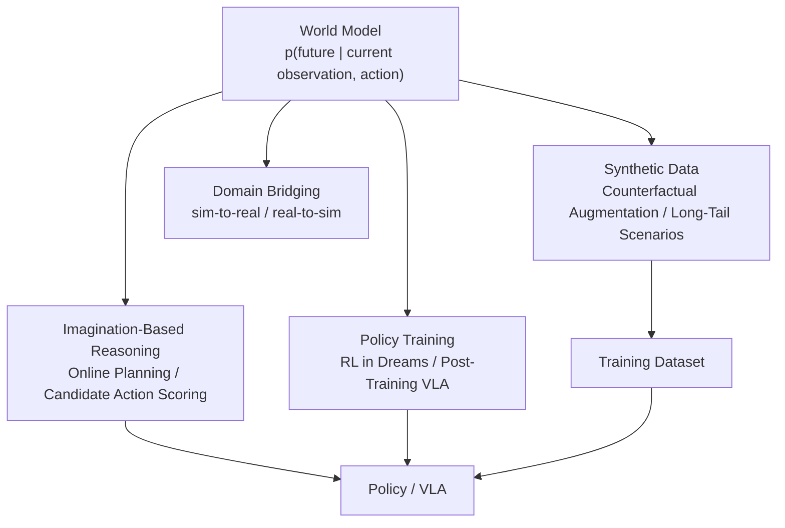
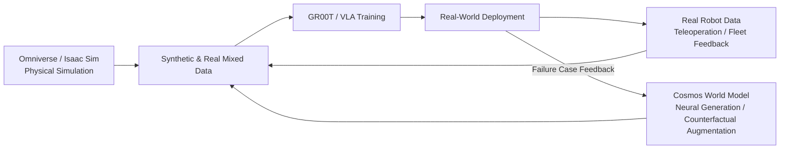
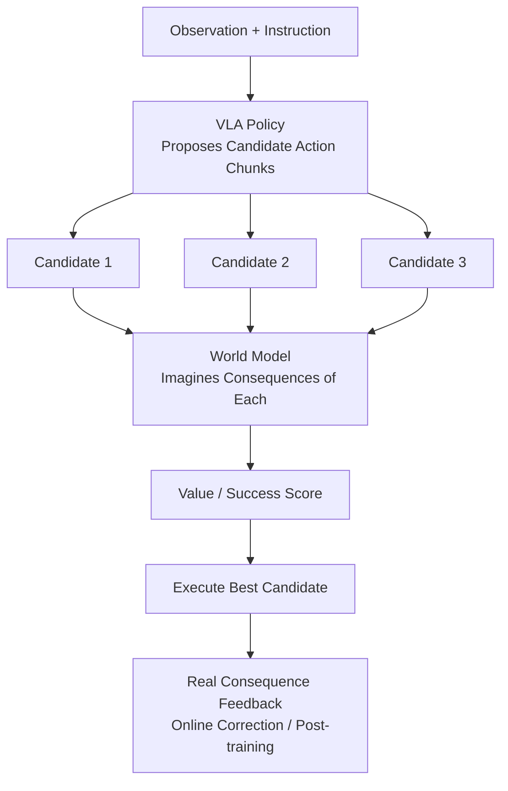
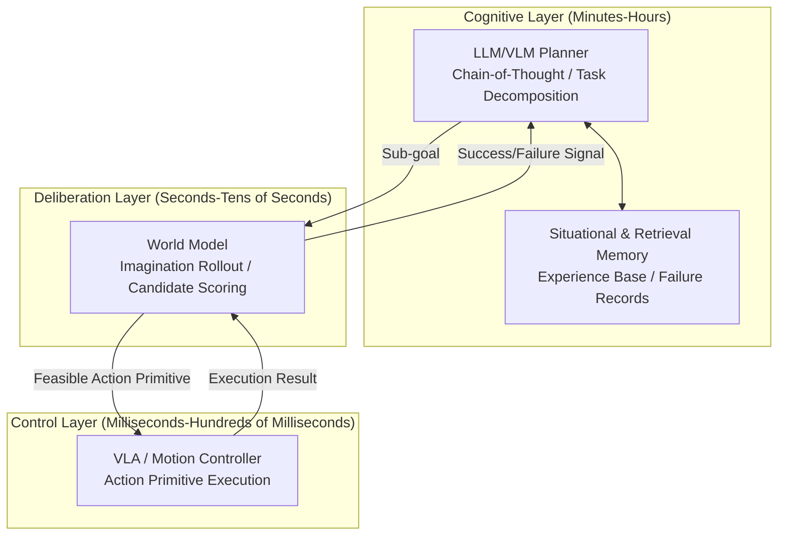

# Chapter 20: World Models and Long-Horizon Reasoning

## Abstract

If the VLA in Chapter 19 addresses "understanding instructions and executing actions correctly," then this chapter focuses on two deeper questions: whether a robot can **predict the consequences of its own actions** (world model), and whether it can **organize multi-step behavior for distant goals** (long-horizon reasoning). A World Model is a learnable simulator of environment dynamics, enabling robots to simulate the future in "imagination," evaluate candidate actions, and generate synthetic training data. It is becoming a key infrastructure bridging simulation and reality, perception and decision-making. Starting from the POMDP formalism, this chapter traces the lineage of world models from the Dreamer family of latent-space models to Sora-inspired video generative simulators. It delves into robot-oriented world model systems such as NVIDIA Cosmos, Genie Envisioner, Genie Sim 3.0, UWM, and WorldVLA, discussing engineering trade-offs among representation modalities (pixel/latent space/point cloud/tactile), as well as coupling methods between world models and VLA policies (WMPO, DREAMSTEER, DynaWM, WAM4D, etc.). In the long-horizon reasoning section, this chapter covers symbolic task planning (PDDL), large language model planners (chain-of-thought, SayCan-style value grounding), neuro-symbolic hybrid reasoning, imagination-based simulation and tree search with world models, and memory mechanisms. Finally, it discusses the fusion of neural simulation and sim-to-real, computational constraints, and failure risks. This chapter echoes Chapter 19 (VLA), Chapter 21 (Data Infrastructure), and Chapter 23 (Simulation and Physics Engines).

**Keywords**: World Model; Long-Horizon Reasoning; Task Planning; Video Generation; NVIDIA Cosmos; Genie Envisioner; UWM; WorldVLA; Neuro-Symbolic Reasoning; Chain-of-Thought; Imagination-Based Simulation; Tree Search; Neural Simulator; Sim-to-Real

## 20.1 World Models: Definition, Formalization, and Cognitive Roots

Before human infants learn to grasp, they already show surprise at objects "disappearing into thin air"—this classic observation from developmental psychology indicates that expectations about the basic laws of the physical world are foundational building blocks of intelligence. For humanoid robots to move beyond scripted demonstrations and enter open environments, they similarly need an internal model of "how the world works." This chapter first provides a formal definition, then expands along two threads: the technical lineage and engineering deployment.

### 20.1.1 Definition and POMDP Formalization

A **World Model** is a learned predictive model of "given the current state and action, how will the environment evolve?" Within the framework of a Partially Observable Markov Decision Process (POMDP), the environment is characterized by state transitions \(p(s_{t+1} \mid s_t, a_t)\), observations \(p(o_t \mid s_t)\), and rewards \(p(r_t \mid s_t, a_t)\), while the agent can only see observations \(o_t\). The world model learns a joint approximation of these three (or their latent space counterparts):

$$
\hat{p}_\theta\big(\hat{s}_{t+1}, r_t \mid \hat{s}_t, a_t\big), \qquad \hat{s}_t = f_\theta(o_{\le t}, a_{<t})
$$

where \(\hat{s}_t\) is the belief state compressed from historical observations and actions. Once such a model is available, the agent can **"imagine" the consequences of action sequences without interacting with the real environment**. This is the computational counterpart of human "look before you leap," and it is the technical essence of "physical AI thinks before it acts" emphasized by NVIDIA when introducing Cosmos 3.

It is necessary to distinguish the relationship between world models and the VLA from Chapter 19. VLA learns \(p(a \mid o, \ell)\)—"see something, do something"; world models learn \(p(o' \mid o, a)\)—"do something, what happens." The former is a policy, the latter is a model; mathematically, they are conditional distributions in opposite directions. Classical optimal control theory has long pointed out that possessing both a model and a value function enables powerful planning capabilities; the advantage of pure policy methods lies in fast inference without the need for online search. The technical route competition and convergence between this chapter and Chapter 19 is essentially a new form of this classic opposition in the era of large models.

!!! note "Terminology Explanation: World Model, POMDP, Belief State, Action-Conditioned Prediction, Neural Simulator"
    - **World Model**: A differentiable model that learns environment dynamics (transitions, observations, rewards), usable for imagination-based reasoning, planning, and data generation.
    - **POMDP (Partially Observable Markov Decision Process)**: A sequential decision-making framework where the agent cannot directly observe the complete state but only receives noisy observations.
    - **Belief State**: A compressed representation of the history of observations and actions, serving as a proxy for the true state.
    - **Action-Conditioned Prediction**: A form of prediction that generates future observations (or latent states) conditioned on a sequence of candidate actions; a learned version of model predictive control.
    - **Neural Simulator**: A simulation system that uses generative models to replace or supplement traditional physics engines, such as scene rollouts based on video diffusion.

### 20.1.2 Lineage: From Dreamer to Generative World Simulators

The research lineage of learned world models can be divided into four generations. The first generation is represented by **Ha & Schmidhuber (2018)'s World Models**: using a VAE to compress observations, an RNN to predict latent states, and training a simple controller in a "dream" environment, demonstrating the feasibility of imagination-based reasoning. The second generation is the **PlaNet and Dreamer series (DeepMind)**: proposing the **Recurrent State-Space Model (RSSM)**, combining deterministic and stochastic state components, training via the variational evidence lower bound (ELBO), and performing policy gradients (Dreamer) or online planning (PlaNet) directly in the imagined latent space trajectory, achieving sample efficiency comparable to or exceeding model-free methods on Atari and continuous control benchmarks. The third generation is **generative world models based on large-scale video pre-training**: marked by Sora's demonstration of long-term consistent video generation, the community began to believe that video generation models implicitly contain transferable physical intuition; DeepMind's Genie series further transformed video generation into **action-interactive** world models. The fourth generation is the current stage—**specialized world models for robotics and physical AI**: NVIDIA Cosmos, Genie Envisioner, UWM, etc., treat action conditioning, multi-view consistency, and policy interfaces as first-class citizens; driving world models like GAIA-1 (Wayve) in the autonomous driving domain also provide parallel references.

The RSSM from the Dreamer family deserves a bit more elaboration, as it is the key to understanding the "latent space imagination" approach. RSSM decomposes the belief state into a deterministic component \(h_t\) (propagated by GRU, carrying memory) and a stochastic component \(z_t\) (carrying multi-modal uncertainty). The training objective is to reconstruct the observation while constraining the divergence between the posterior and prior, i.e., the variational evidence lower bound:

$$
\mathcal{L}_{\mathrm{ELBO}} = \mathbb{E}_{q}\!\Big[\sum_{t} \underbrace{\log p(o_t \mid h_t, z_t)}_{\text{Reconstruction}} + \underbrace{\log p(r_t \mid h_t, z_t)}_{\text{Reward}} - \underbrace{\mathrm{KL}\big[q(z_t \mid h_t, o_t) \,\|\, p(z_t \mid h_t)\big]}_{\text{Posterior-Prior Regularization}}\Big]
$$

After training, the policy can be updated using actor-critic entirely within the imagined rollout of \(p(z_t \mid h_t)\), exchanging one real-world interaction for multiple steps of virtual experience—this is the source of Dreamer's sample efficiency. Contemporary video world models transfer this same idea from low-dimensional states to pixel space, at the cost of a several-order-of-magnitude increase in the computational cost of each "imagination" step, which determines their current primary use for data and evaluation rather than real-time planning.

### 20.1.3 Four Major Uses of World Models in Robotics

World models are not a single-purpose component; they play at least four roles in the humanoid robot technology stack:

1. **Imagination-Based Reasoning and Planning**: Performing forward rollouts for candidate action sequences, scoring them with learned value or reward functions, enabling online planning or offline policy evaluation;
2. **Policy Training Environment**: Training policies within the world model (e.g., Dreamer series, WMPO), avoiding costly real-world trial and error, alleviating the data bottleneck for VLA post-training;
3. **Synthetic Data Engine**: Action-conditioned video generation can "augment" a small amount of real data into diverse trajectories (new viewpoints, new disturbances, counterfactual branches), feeding back into VLA pre-training—this is one source of synthetic data in the GR00T N1 data recipe;
4. **Sim-to-Real Bridge**: Using neural rendering/video generation to "translate" simulation images into a realistic style, or conversely, mapping real observations to the policy training domain (e.g., Mask2Real-WM uses segmentation masks as a sim-to-real bridge).

The accuracy requirements for the world model differ across these four uses, and this difference determines the deployment order: synthetic data can tolerate some physical errors (diversity itself is valuable), while imagination-based planning is most sensitive to errors (errors directly translate into decision errors). Therefore, the common deployment order in industry is "data engine first, online planning last," a point that will be revisited in Section 20.5.2.

### 20.1.4 Cognitive Roots: Mental Simulation and "Look Before You Leap"

The idea of world models is not a product of the deep learning era. The **mental simulation** theory in cognitive science posits that humans "rehearse" the consequences of actions in their minds before executing them—estimating weight before lifting a heavy object, predicting the landing point before crossing a ditch. The **internal model** hypothesis in cybernetics suggests that the cerebellum contains forward models of the body and environment, used to predict sensory consequences and counteract feedback delays. Robotic world models are the engineering implementation of these two ideas: replacing biological neural circuits with differentiable models, and replacing mental rehearsal with imagination-based rollouts.

This lineage offers two insights for engineering practice. First, **forward prediction is an inevitable choice for biological intelligence under feedback delay constraints** — biological conduction delays reach the order of hundreds of milliseconds, on par with the onboard inference delays of humanoid robots, suggesting that a "prediction-correction" architecture is equally unavoidable in robotics. Second, **internal models and controllers develop synergistically**: in human infants, motor precision and physical expectations mature in tandem. This echoes the cross-disciplinary trend seen in Section 20.3.3, where policies and world models are jointly trained, serving as mutual supervisors.

## 20.2 Video Generative World Models

### 20.2.1 From Video Diffusion to Action-Conditioned Prediction

The backbone of modern video world models is typically the **Diffusion Transformer (DiT)**: videos are divided into spacetime patches, compressed into a latent space, and denoised via diffusion in that latent space. The key modification to turn a video generator into a "world model" is the introduction of **action conditioning**—encoding robot actions (joint sequences, end-effector poses, or semantic action labels) as conditioning tokens, enabling the model to generate "what the camera will see if that action is executed":

$$
\hat{o}_{t+1:t+K} \sim p_\theta\big(o_{t+1:t+K} \mid o_{\le t}, a_{t:t+K}\big)
$$

The difficulties of this formulation include: (1) **Long-term consistency**—errors accumulate with rollout steps, and object deformation or contact events are often "smoothed out"; (2) **Physical correctness**—generative models excel at "looking plausible" but may not satisfy contact mechanics and conservation laws; (3) **Causal confusion**—if training data contains correlation biases between actions and scene changes, the model may learn spurious causal relationships. Engineering mitigation strategies include chunked autoregressive generation, history conditioning, geometric/depth auxiliary supervision, and hybrid approaches with traditional physics engines (see 20.5.1).

!!! note "Terminology: Diffusion Transformer, Spacetime Patch, Action Conditioning, Chunked Autoregression, History Conditioning"
    - **Diffusion Transformer (DiT)**: A diffusion model architecture using a Transformer as the denoising backbone, the mainstream backbone for contemporary video generation models.
    - **Spacetime patch**: A processing method that simultaneously divides a video into small blocks in both time and space, flattening them into tokens, allowing Transformers to directly process video.
    - **Action conditioning**: Encoding action sequences as conditioning signals injected into the generation process, so the output video reflects the consequences of that action.
    - **Chunked autoregression**: Generating a short video segment at a time and conditioning on previously generated segments to continue, balancing long-term consistency and error accumulation.
    - **History conditioning**: Predicting the future conditioned on multiple historical observations to alleviate state ambiguity from single-frame conditioning.

### 20.2.2 NVIDIA Cosmos and the Physical AI Data Flywheel

**NVIDIA Cosmos** is the current industry benchmark for physical AI world models. According to NVIDIA's positioning of Cosmos 3, it is a set of **open world foundation models** that combine visual reasoning, multimodal generation, and action prediction, enabling robots, autonomous vehicles, and visual AI agents to "think" before acting. Its product forms include: world models for video generation and prediction, transfer models for "realifying" synthetic data, and open-weight models and toolchains for downstream fine-tuning. Cosmos's strategic significance lies in its closed loop with NVIDIA's existing stack: **Omniverse/Isaac Sim** handles physically accurate simulation, **Cosmos** handles low-cost, diverse neural generation, and **GR00T** handles policy consumption—together forming a physical AI data flywheel of "generate data → train policy → evaluate and feedback". The theme "from simulation to production," repeatedly emphasized by NVIDIA in GTC and ICRA reports, is technically underpinned by this combination. Industry impact is already visible: for example, the Open-H-Embodiment project builds foundation models for medical robots and a surgical simulator (Cosmos-H-Surgical-Simulator) based on GR00T and Cosmos, indicating the stack's spillover beyond humanoid robots.

From an engineering perspective, Cosmos-like products offer three capabilities directly integrable into development workflows:

- **Text-to-scene**: Generating training scene videos from text descriptions, quickly covering long-tail scenarios (extreme lighting, unusual object arrangements) at a fraction of the cost of physical set construction;
- **Sim-to-real transfer**: "Translating" physically correct but visually unrealistic renders from Isaac Sim into realistic styles, bridging the visual domain gap of sim-to-real;
- **Prediction**: Generating future segments given current observations and candidate actions for policy evaluation or human review.

These three capabilities correspond precisely to the data engine, domain bridging, and imagination-based reasoning among the four major uses in Section 20.1.3, also demonstrating that industry and academia share a consistent assessment of world model value.

### 20.2.3 World Models for Robot Manipulation: Genie Envisioner, UWM, WorldVLA

Academic progress is also rapid. **Genie Envisioner** (Zhiyuan Genie Team) encodes instructions, multi-view observations, and proprioceptive states into multimodal representations, performs action-conditioned video prediction via diffusion/flow matching, building a unified world foundation platform for robot manipulation, providing policy evaluation and data generation interfaces. **UWM (Unified World Models)** (University of Washington, Toyota Research Institute, etc.) couples video diffusion and action diffusion within the same framework: the same model can both predict video given actions (world model) and generate actions given goals (policy), enabling joint pre-training on large-scale video without action labels and robot data with action labels—this "dual identity" directly dissolves the boundary between world models and policies. **WorldVLA** extends autoregressive VLA into an "action world model": alternatingly predicting actions and next-frame observations within a unified token sequence, allowing action generation and future prediction to supervise each other; experiments show that future prediction tasks in turn improve action accuracy. These works collectively point to a judgment: **predicting the future and selecting actions are two sides of the same coin**.

The appeal of a unified architecture can be understood from a data perspective: internet videos without action labels are nearly infinite, while robot data with action labels is scarce and expensive. If a model is required to simultaneously learn "how videos evolve" and "how actions cause evolution," then massive video data can serve as training signals for the world model, indirectly improving action decisions—effectively turning the world's surveillance videos into "physics textbooks" for robots. This approach is consistent with the use of human videos in Section 19.4.4, differing only in that the supervision signal shifts from latent actions to explicit future prediction.

| System | Institution | Generation Backbone | Conditioning Interface | Primary Use |
|---|---|---|---|---|
| Cosmos | NVIDIA | Video Diffusion (DiT) | Text/Video/Action | Physical AI Data Generation & Prediction |
| Genie Envisioner | Zhiyuan Genie Team | Diffusion/Flow Matching | Instruction + Multi-view + Proprioception | Manipulation World Model & Policy Evaluation |
| UWM | University of Washington, TRI, etc. | Video + Action Dual Diffusion | Action ↔ Video Mutual Conditioning | Unified World Model & Policy Pre-training |
| WorldVLA | University Consortium | Autoregressive Token | Alternating Action & Frame Prediction | Action World Model |
| GAIA-1 | Wayve | Autoregressive Video Generation | Driving Action/Text | Autonomous Driving Scenario Reasoning |
| Genie Sim 3.0 | Zhiyuan | High-Fidelity Simulation + Generation | Humanoid Robot Tasks | Comprehensive Humanoid Robot Simulation Platform |

### 20.2.4 Evaluating World Models: How to Measure "How Well It Thinks"

Evaluating world models is more difficult than evaluating generative models, because "good-looking frames" do not equal "physical correctness." The current community uses three categories of metrics, which complement each other:

- **Generation Quality Metrics**: FVD (Fréchet Video Distance), etc., measure the distribution distance between generated and real videos. They are common metrics in video generation but are insensitive to physical errors—a video with object interpenetration can still appear "very realistic";
- **Physical Consistency Metrics**: Using pre-trained detectors/depth estimators to check whether generated results satisfy occlusion relationships, rigid body constraints, contact events (e.g., "the object moves only after the hand contacts it"), and counting/identity consistency (objects do not appear/disappear without cause);
- **Downstream Utility Metrics**: The most convincing category—training policies with data generated by the world model, or planning within the world model, directly measuring the improvement in real task success rates. The 1X World Model Challenge and Genie Envisioner's evaluation protocols both emphasize this "utility as ground truth" standard.

| Metric Category | Representative Metric/Method | Advantages | Limitations |
|---|---|---|---|
| Generation Quality | FVD, Per-frame PSNR/SSIM | Automated, scalable | Weakly correlated with physical correctness |
| Physical Consistency | Contact Event Detection, Depth Consistency, Identity Tracking | Directly corresponds to usability | Depends on detector accuracy |
| Downstream Utility | Policy Training Gain, Planning Success Rate | Aligned with final goal | Computationally expensive, influenced by policy |

For engineering selection, a pragmatic recommendation is: **use generation quality metrics for coarse screening, then use small-scale downstream experiments for final decisions**. Do not conclude based solely on demo videos—world model demo videos are the most "survivorship-biased" material in the entire embodied AI field. Two other details in evaluation protocol design are equally important: first, test scenarios must be strictly deduplicated from training scenarios (the "memory" capability of video models can inflate performance on leaked test sets); second, uncertainty estimates should be reported alongside metrics—a single high-scoring run has almost no statistical significance in generative model evaluation.

## 20.3 World Models for Humanoid Robots

### 20.3.1 The Specifics of Humanoid Scenarios and Representative Works

Before delving into technical details, it is crucial to define the problem boundary of this section: We are not discussing "whether humanoid robots need world models"—bipedal balance itself has long relied on the dynamic models from Chapters 14 and 15—but rather "what a semantic-level world model for humanoid robots looks like," i.e., the ability to predict objects, scenes, and task consequences. This distinction is important: the former involves millisecond-level mechanical calculations, while the latter involves second-to-minute-level scenario reasoning, with completely different model forms and data sources.

Humanoid robots introduce three specific challenges for world models: **High and swaying viewpoint** (non-stationarity of first-person observation), **rich whole-body contact** (hand-object, foot-ground, body-environment contacts coexisting), and **data scarcity** (real robot trajectories are far less abundant than those for robotic arms). To address these challenges, a series of specialized works have emerged since 2025: **Humanoid World Models** proposes an open-world foundation model for humanoid robots, covering dynamic predictions for locomotion and manipulation; the **1X World Model Challenge** (with its technical report "Generative World Modelling for Humanoids") promotes generative world modeling for humanoids through a competition format, providing real home scene data and unified evaluation; **Genie Sim 3.0** offers a high-fidelity comprehensive simulation platform for humanoid robots, combining simulation environments with generative methods to support data production and policy evaluation for manipulation and locomotion tasks. A common orientation of these works is that world models for humanoid robots must **explicitly handle the observation dynamics introduced by locomotion**, rather than simply adopting the modeling paradigm of fixed-base robotic arms.

The impact of locomotion on observation modeling deserves separate emphasis. The camera on a fixed robotic arm is stationary, the background is nearly constant, and the model only needs to learn the local dynamics of "hand and object." In contrast, the head-mounted camera of a humanoid robot undergoes periodic oscillations with each step, and the gait phase is coupled with manipulation timing (precise insertion is difficult during the swing phase). A pragmatic approach is to input **gait phase and proprioception** as additional conditions to the world model, making predictions contingent on "which phase of the gait I am currently in." Another approach is to actively align manipulation tasks with the stance phase, using a planner rather than the model itself to avoid the most dynamically intense time windows. This "locomotion-manipulation coupling" problem has almost no counterpart in fixed-base literature and represents an original challenge for humanoid world models.

### 20.3.2 The Representation Debate: Pixels, Latent Space, Point Clouds, and Tactile

The performance ceiling of a world model is largely determined by the state representation. Currently, four parallel approaches exist:

- **Pixel Space**: Directly predicts video frames. Information-preserving and compatible with generative model ecosystems, but computationally expensive and prone to capacity dilution by texture details; Cosmos, Genie Envisioner fall into this category.
- **Latent Space**: Predicts dynamics on compressed representations (Dreamer series RSSM, DREAMSTEER's latent world model). Fast inference and efficient planning, but compression may lose fine-grained geometry critical for manipulation.
- **3D Geometric Space**: Works like **3D Point World Models** show that learning dynamics on point clouds (supplemented with point completion) yields more accurate contact-level dynamics than pixels, especially important for manipulation tasks; the cost is a more complex point cloud acquisition and processing pipeline.
- **Tactile and Multimodal Space**: **TACO** proposes a tactile world model, using tactile predictions as a self-correction signal for VLA post-training, suggesting that "world models" should model not only visual consequences but also contact mechanics consequences.

!!! note "Terminology Explanation: Pixel-space model, Latent-space model, Point-cloud dynamics, Tactile world model, Rollout divergence"
    - **Pixel-space model**: A world model that directly generates future image/video frames, offering high fidelity but high computational cost.
    - **Latent-space model**: A world model that predicts dynamics on latent variables compressed by an encoder, such as RSSM, suitable for fast multi-step imagination.
    - **Point-cloud dynamics**: Uses 3D point clouds as the state and predicts their evolution with actions, offering high geometric accuracy.
    - **Tactile world model**: Predicts the evolution of tactile signals caused by actions, used for evaluation and correction in contact-rich tasks.
    - **Rollout divergence (compounding error)**: The gradual amplification of errors in multi-step autoregressive prediction, causing long-term imagination to become distorted.

| Representation Route | Representative Work | Single Prediction Cost | Geometric/Contact Accuracy | Planning Suitability | Main Shortcoming |
|---|---|---|---|---|---|
| Pixel Space | Cosmos, Genie Envisioner | High | Medium | Weak (needs extra encoding) | Expensive, prone to texture focus |
| Latent Space | RSSM/Dreamer, DREAMSTEER | Low | Low-Medium | Strong | Compression loses detail |
| 3D Geometry | 3D Point World Models | Medium | High | Medium-Strong | Complex sensing and pipeline |
| Tactile/Multimodal | TACO | Medium | High (contact) | Medium | Scarce tactile data |

The engineering criterion for representation selection can be summarized in one sentence: **Use latent space for the planning loop, pixel space for the data engine, and supplement with 3D/tactile for contact tasks.** It is not uncommon for a system to use multiple representations simultaneously—for example, using a pixel model for data generation and a latent model for online reasoning, maintaining semantic consistency through a shared encoder or multi-task training.

### 20.3.3 Coupling World Models with VLAs

The frontier trend from 2025–2026 is to combine the VLAs from Chapter 19 with the world models from this chapter, forming a closed loop of "policy proposal—model evaluation—feedback correction." Representative works include:

- **WMPO (World Model-based Policy Optimization)**: Performs imagination-based policy optimization of VLA policies within a world model, improving policy performance offline and avoiding the sample cost of real-world reinforcement learning.
- **DREAMSTEER**: Uses a latent world model to score and steer candidate actions of a VLA policy during deployment, reducing failures without any fine-tuning.
- **DynaWM**: Uses a foundation VLA-guided world model for manipulating moving objects, injecting VLA semantic priors into dynamic prediction.
- **WAM4D**: Proposes a 4D world action model, unifying spatiotemporal representation with spatial register tokens, compressing the world model and action model into a fast network.
- **Ego-Vision World Model**: Uses a first-person world model to support contact planning for humanoid robots, linking the prediction of "seeing" with "touching."

The deep motivation behind this coupling architecture is to **make slow thinking explicit**: rather than having a single network implicitly weigh action consequences, it explicitly "imagines—compares—then acts." The cost is a multiplied inference budget (one multi-step rollout per candidate), so it is currently used mainly for semantic loops or failure recovery loops, rather than low-level control loops.

### 20.3.4 Humanoid Data Scarcity and the Breakthrough Role of World Models

Returning to the most realistic constraint for humanoid robots—data. The teleoperation collection efficiency for a whole humanoid robot is far lower than for a fixed robotic arm (due to the difficulty of whole-body mapping, expensive equipment, and high site requirements), yet VLAs have an appetite for data starting in the tens of millions of episodes. World models offer three breakthrough paths here:

1.  **Counterfactual Augmentation**: Starting from the same real trajectory, generate branching results like "if the grasp angle were 10 degrees off" or "if the lighting were dimmer," turning one piece of real data into multiple training signals.
2.  **Failure Trajectory Synthesis**: In real data collection, people tend to keep only successful demonstrations, while failures and recoveries are crucial supervision for policy robustness—world models can safely "manufacture failures."
3.  **Cross-Embodiment Transfer**: "Translate" manipulation dynamics accumulated on robotic arms into the humanoid perspective and action space, reducing the data cold-start cost for new robot models.

The common prerequisite for these three paths is that the generative model's depiction of **contact events** is sufficiently credible, which is precisely the weakest point of current pixel-space models (see 20.5.3). Therefore, a more reliable combination in the short term is "world models handle semantic and visual diversity, physics engines handle contact correctness," converging in the simulation infrastructure discussed in Chapter 23.

An often-overlooked organizational issue is the **quality control pipeline for generated data**: before synthetic segments enter the training set, they should undergo filtering of the same level as real data (physical feasibility checks, task relevance annotation, failure type classification). Otherwise, the systematic biases of the world model will be silently inherited by the policy. In other words, world models do not eliminate data engineering; they shift it from the "collection side" to the "generation and quality control side"—a topic that Chapter 21 will explore.

## 20.4 Long-Term Reasoning and Planning

### 20.4.1 Task Planning and Symbolic Methods

**Task Planning** studies how to generate sequences of actions to achieve high-level goals. Classical methods use formal languages like **PDDL (Planning Domain Definition Language)** to describe action preconditions and effects, solving problems via search (A*, SAT encoding, planning graphs). Their advantages are **verifiable correctness and natural handling of long-range dependencies**—a ten-step dependency like "first open the door, then pick up the object, then place it on the table" is trivial for a symbolic planner. The disadvantages are that domain models must be manually authored, and the symbol grounding gap between symbols and continuous perception/control persists. Real-world scenarios for humanoid robots (homes, factories) make it difficult to exhaustively list preconditions, prompting the community to combine symbolic planning with learned models.

!!! note "Terminology: PDDL, Preconditions and Effects, Grounding Problem, Affordance"
    - **PDDL (Planning Domain Definition Language)**: A standard language for describing action preconditions and effects in a planning domain; the factual input format for classical AI planners.
    - **Precondition / Effect**: The logical conditions required for an action to be executable, and the changes to the world state after execution; the reasoning basis of symbolic planning.
    - **Symbol Grounding Problem**: The problem of how abstract symbols (e.g., "cup", "on the table") correspond to continuous perception and motor spaces; a core obstacle to deploying symbolic methods.
    - **Affordance**: The possibilities for action that an environment or object offers to a specific agent (e.g., "a chair can be sat on", "a handle can be pulled"); connects perception and action selection.

### 20.4.2 Large Models as Planners

Large language models provide another source of long-term reasoning: internet corpora implicitly contain vast amounts of "procedural common sense" (e.g., add oil before cooking, sort items before tidying a desk). There are three main usage paradigms:

1. **Zero-shot Task Decomposition**: The LLM directly outputs a sequence of subgoals (e.g., SayCan multiplies the LLM's candidate skill scores with an affordance function to select the next step that is "both reasonable according to the model and feasible for the robot").
2. **Chain-of-Thought (CoT) and Embodied Reasoning**: Guiding the model to reason explicitly before making decisions. RT-2's chain-of-thought prompting and Alpamayo-R1's "reasoning-action prediction bridging" (for long-tail autonomous driving scenarios) both show that explicit reasoning traces improve generalization.
3. **Code as Policies**: Having the LLM generate executable code that calls perception and control APIs, compiling reasoning results into policy programs with loops, conditionals, and exception handling, offering both readability and precision.

SayCan's selection formula is worth remembering as a minimalist expression of the idea "language probability × physical feasibility". Let the LLM's semantic score for a candidate skill \(s\) be \(p_{\mathrm{LLM}}(s \mid \ell, \mathrm{context})\), and the value/affordance function give the probability of successfully completing that skill in the current state as \(V(s)\). The selection is:

$$
s^{*} = \arg\max_{s} \; p_{\mathrm{LLM}}(s \mid \ell, \mathrm{context}) \cdot V(s)
$$

This multiplicative structure—"language says what to do, value says what can be done"—remains the basic skeleton of most large-model planning systems, though the implementation of \(V(s)\) has expanded from learned value functions to world model rollouts (20.4.4) and direct VLM scoring.

The counterpart on the VLM side is **embodied reasoning models** (e.g., Gemini Robotics-ER): they first perform identification, affordance judgment, and multi-step reasoning in the visual scene, then hand off to an action model for execution, decoupling "thinking clearly" from "acting accurately".

It is important to recognize the inherent weaknesses of large-model planners. First, **hallucination and common-sense gaps**: LLMs may plan physically impossible steps (e.g., "put wet clothes directly into a drawer"), requiring affordance checks or world model verification as a safety net. Second, **insensitivity to execution feedback**: purely feedforward planning fails once the environment deviates from expectations; closed-loop replanning is essential. Third, **latency and cost**: each replanning step involves a large model call, and the rhythm of the semantic loop must match the task's time scale. A common engineering reinforcement pattern is "LLM proposes + verifier filters + retry on failure": the LLM handles divergence, while the verifier (symbolic checker, world model, or a second LLM) handles convergence.

### 20.4.3 Neuro-Symbolic Hybrid Reasoning

**Neuro-Symbolic Reasoning** attempts to combine the strengths of both approaches: using neural networks for perceptual grounding and intuitive scoring, and symbolic systems for compositionality and verifiability. Typical patterns include: neural perception outputs predicate truth values (e.g., "cup is on the table" is true), and a symbolic planner searches over the predicate state; or using an LLM to automatically generate/complete PDDL domain files, which are then solved by a classical planner, compressing the uninterpretable reasoning into the "write the domain model" step while keeping the solution process rigorous. For humanoid robots, the neuro-symbolic route is particularly attractive in **safety-critical and audit-required scenarios** (e.g., healthcare, eldercare, hazardous operations), because its decision traces can be formally inspected.

The trade-offs among the three planning paradigms—symbolic planning, large-model planning, and model-based search—can be summarized as follows:

| Dimension | Symbolic Planning (PDDL) | Large-Model Planning (LLM/CoT) | Model-Based Search (MCTS, etc.) |
|---|---|---|---|
| Domain Model Source | Manually authored | Implicit from pre-training | Learned world model |
| Long-Range Dependencies | Strong | Medium | Depends on model accuracy |
| Physical Grounding | Requires manual bridging | Weak-Medium | Strong (model is the dynamics) |
| Interpretability/Auditability | Strong | Medium (reasoning traces) | Weak |
| Online Latency | Low-Medium | High | Medium-High |
| Failure Recovery | Rule-based replanning | Re-prompting | Re-rolling |

In practice, these three are often combined: LLMs handle open-ended semantics, symbolic checkers handle constraint filtering, and world models handle physical feasibility—the complete "propose-verify" pattern described at the end of 20.4.2.

### 20.4.4 Imaginative Rollouts and Tree Search with World Models

World models provide a "sandbox" for long-term reasoning. Given the current belief state, the agent can perform depth-\(K\) rollouts of candidate plans in imagination, scoring them by cumulative discounted reward:

$$
a_{t:t+K}^{*} = \arg\max_{a_{t:t+K}} \; \mathbb{E}_{\hat{p}_\theta}\Big[\sum_{k=0}^{K} \gamma^{k} \, \hat{r}_{t+k}\Big]
$$

Three classes of algorithms solve this optimization: **Random Shooting / CEM**—sample many action sequences and pick the best; simple and parallelizable, used by PlaNet. **Gradient Methods**—leverage the differentiability of the world model to directly compute gradients over the action sequence. **Discrete Search and MCTS**—perform tree search in a discretized action (or subgoal) space. AlphaZero demonstrated the power of "model + tree search + self-play", and its robotic variants are being revived as world models mature. The Dreamer family shows a third route: **not planning online, but training an amortized policy in imagination**, amortizing the planning cost into the training phase—WMPO can be seen as a contemporary implementation of this idea in VLAs.

!!! note "Terminology: Random Shooting, CEM, MCTS, Amortized Policy, Replanning"
    - **Random Shooting**: A planning method that uniformly samples many candidate action sequences, evaluates them with a model, and picks the best; gradient-free but inefficient in high dimensions.
    - **CEM (Cross-Entropy Method)**: A stochastic optimization method that iteratively updates the sampling distribution based on high-scoring samples, gradually focusing on the optimal action sequence.
    - **MCTS (Monte Carlo Tree Search)**: A search algorithm that balances exploration and exploitation on a tree structure, estimating node values via simulated returns; a core component of AlphaZero.
    - **Amortized Policy**: A policy trained by repeatedly planning in imagination during the training phase and distilling the planning results into the policy network, eliminating the need for explicit search at inference time.
    - **Replanning**: Re-planning every few steps based on the latest observations, using a feedback loop to counteract model errors.

### 20.4.5 Memory, Reflection, and Contextualization

The final piece of long-term reasoning is **cross-timescale memory**. Short-term memory is handled by the Transformer context window, but minute-level tasks already exceed typical window sizes. Medium-term memory is often implemented via **episodic buffers** (keyframes, subgoal completion states, failure records). Long-term memory involves **retrieval-augmented generation** (RAG: retrieving similar situations from an experience library for decision reference) and **parametric memory** (distilling experience into weights). Works like **In-Context World Modeling** explore enabling models to infer environment dynamics on the fly from interaction history alone, without gradient updates, suggesting the possibility of "context as model". For humanoid robots, the memory system is also a carrier for personalized service: remembering the locations of items in a user's home, preferences, and prohibitions is the dividing line between a home robot that "can move" and one that "is useful".

Accompanying memory is the **reflection** mechanism: after a task ends (or fails), the system replays the execution trajectory, attributes the cause of failure (perception error? planning error? execution deviation?), and writes the conclusion into the experience library for future retrieval. This kind of "post-mortem analysis" has been shown to significantly improve multi-turn task success rates in LLM agent research. Its robotic counterpart—automatically annotating failure segments and feeding them back into the training set or experience library—is the cognitive-layer version of the data flywheel described in 20.3.4.

### 20.4.6 Integration Essentials for Hierarchical Reasoning Systems

When assembling the components of this chapter into a functioning long-term reasoning system, there are four engineering points that are often overlooked but determine success or failure:

1. **Timescale Matching**: The cognitive layer (second-to-minute-level decisions) must tolerate jitter and timeouts from high-level components, and the control layer must perform timeliness checks on high-level outputs—a delayed "perfect plan" is more dangerous than a timely "suboptimal plan";
2. **State Synchronization**: The world states maintained by each of the three layers (symbolic predicates, belief states, joint states) must have a clear consistency protocol; otherwise, a split can occur where "the planner thinks the door is open, but the controller never executed the action";
3. **Failure Reporting Semantics**: Low-level failures need to be reported in a way understandable to the high-level layer ("failed to grasp" rather than "joint 3 torque exceeded limit"), otherwise the planner cannot perform meaningful recovery reasoning;
4. **Degraded-Mode Strategy**: When the world model or large model is unavailable (timeout, low confidence), the system should be able to degrade to a pure VLA reactive mode or safely stop, rather than hang.

These four points are often omitted in demo systems, but in real deployments, they often mark the boundary between "functional" and "reliable," and are directly related to the middleware in Chapter 22 and the end-to-end software stack in Chapter 24.

!!! note "Terminology: Timescale Matching, State Synchronization, Degraded-Mode Strategy, Closed-Loop Replanning"
    - **Timescale Matching**: An architectural principle that adapts the decision frequency of each layer's components to the physical time constants of the dynamics they control.
    - **State Synchronization**: Ensuring consistency in the perception of the world state among the planning, deliberation, and control layers, typically achieved through a shared fact base or explicit state messages.
    - **Degraded-Mode Policy**: A simpler but reliable backup behavior mode activated when advanced components fail; a fundamental means of functional safety design.
    - **Closed-Loop Replanning**: A mechanism to periodically refresh the plan with the latest observations to counteract model errors and environmental changes.

## 20.5 Engineering Deployment: From Simulation to Reality

The preceding sections provided a technical landscape of world models and long-term reasoning. This section shifts to a deployment perspective: the form these components take in real products, their computational cost, and the new risks they introduce. A general assessment is: **Today, world models are primarily data center infrastructure, not real-time components on onboard chips**—understanding this is crucial for having a sober expectation of their capability boundaries.

### 20.5.1 Integration of Neural Simulation and Physics Engines

World models will not replace physics engines; instead, a division of labor is emerging: physics engines (MuJoCo, Isaac, etc., see Chapter 23) ensure **correctness and differentiability of contact mechanics**, while world models provide **visual realism, scene diversity, and long-tail coverage**. Integration methods include: using simulation to generate physically correct trajectories, then using video generation models to make the visuals realistic (the inverse of real-to-sim); using world models to generate initial scene states and perturbations, and physics engines to simulate contact details (e.g., the combination of high-fidelity simulation and generation in Genie Sim 3.0); and using world models for **policy pre-screening**—first eliminating clearly failing plans in imagination, then putting a few candidates into high-fidelity simulation or real-robot validation. **Sim-to-Real transfer** and **domain randomization** (Chapters 18, 23) remain necessary final steps here: the error distribution of neural simulators differs from physics engines, but both require systematic calibration and conservative use.

The integration modes can be summarized into three progressive forms:

1.  **Parallel**: Physics engines and world models each generate data, which is mixed during training (current mainstream, e.g., GR00T data recipe);
2.  **Serial**: One side's output is enhanced by the other—simulation trajectories are made realistic, or generated initial states are handed to the physics engine for rollout;
3.  **Embedded**: Neural models serve as differentiable sub-modules of the physics engine (e.g., learning contact models, material deformation), or the physics engine provides hard constraint projection for neural generation—this is a research frontier with low maturity.

### 20.5.2 Computational Budget and Product Form

The computational cost of world models is an order of magnitude higher than VLA: a single multi-candidate, multi-step, pixel-level imagination rollout involves dozens of large model forward passes. Engineering responses include: **hierarchical use** (triggering the world model only at semantic decision points, keeping the control loop lightweight), **latent space substitution for pixel space** (DREAMSTEER-style approach), **distillation and caching** (distilling the world model into a smaller model for online scoring, or caching environment dynamics for static scenes). In terms of product form, world models currently create value more as **offline data engines** (Cosmos for GR00T data production) than as online components, a path consistent with how world models in autonomous driving were first used for simulation evaluation before entering the vehicle.

!!! note "Terminology: Offline Data Engine, Online Component, Distillation, Uncertainty Quantification"
    - **Offline Data Engine**: A usage of world models that runs batch processes in data centers to produce training data; latency-insensitive and can use the largest models.
    - **Online Component**: A usage of world models deployed in the robot control loop, subject to real-time constraints; typically requires distillation or smaller models.
    - **Distillation**: Training a smaller model using the output of a larger model, trading a small performance loss for an order-of-magnitude inference speedup; step distillation for video diffusion (compressing tens of sampling steps into a few) is particularly critical.
    - **Uncertainty Quantification**: Techniques (ensembles, stochastic components, calibration) that allow a world model to output both predictions and confidence levels; a prerequisite for using imagination rollouts in safety-critical scenarios.

### 20.5.3 Failure Modes and Risks

World models introduce a new class of systemic risks that must be explicitly managed in system design:

| Failure Mode | Manifestation | Consequence | Mitigation |
|---|---|---|---|
| Physical Hallucination | Generating impossible deformations/penetrations/teleportation | Plans based on imagination fail in real execution | Physics engine verification, contact consistency supervision |
| Rollout Divergence | Long-term imagination gradually deviates from reality | Long-horizon planning is misled | Short window rolling + replanning, uncertainty estimation |
| Causal Confusion | Learning correlations instead of causation | Counterfactual reasoning errors | Action-conditioned training, interventional data |
| Out-of-Distribution Overconfidence | High-confidence predictions for unseen dynamics | Catastrophic decisions | Ensemble uncertainty, OOD detection, real-robot verification |
| Evaluation Self-Deception | Using a model to evaluate policies trained on the same data | Inflated success rates | Real-robot sampling validation, third-party benchmarks |

Particularly concerning is **using a world model to evaluate policies trained on the same data**: the blind spots of the model and the policy often overlap, systematically overestimating performance. Reliable evaluation still requires real robots and independent simulation as a safety net (Chapter 25).

### 20.5.4 Industry Observation: The Engineering Race for World Models

From an industry dynamics perspective, world models are repeating the trajectory VLA followed a year ago: moving from paper demonstrations to engineering products. Several notable threads:

-   **NVIDIA's Platformization**: From the bundled showcase of Omniverse virtual worlds and physical AI at GTC, to the open-weight release of Cosmos 3, to the "Physical AI Agent Skills" tools for the research community (released around CVPR to accelerate development in autonomous driving, robotics, and visual AI), NVIDIA's strategy is to make world models an ecosystem infrastructure like CUDA;
-   **In-House Development by Robotics Companies**: 1X used a world model challenge to turn its home-scenario data into a community evaluation standard; Zhiyuan built a "data-simulation-model" loop around Genie Envisioner/Genie Sim; Figure and Tesla are widely believed to use neural simulation internally to aid policy iteration;
-   **Cross-Pollination with Autonomous Driving**: The "generative simulation evaluation" methodology validated by driving world models like GAIA-1 is being adopted by robotics, while robotics' contact-rich scenarios, in turn, impose stricter physical correctness requirements on driving world models;
-   **Tooling by Startups**: A number of startups are beginning to offer "World Model as a Service," packaging generation, evaluation, and data quality checks into APIs, lowering the barrier for small and medium-sized robotics teams.

The short-term winner of this race may not be the team with the most aesthetically pleasing model, but the team that **integrates the world model into the data flywheel and creates a positive cycle**—this is directly related to the industry competition landscape discussed in Chapter 28.

A practical suggestion for readers: when tracking progress in world models, watch less demo videos and pay more attention to three things—open weights and licensing (can it be commercially fine-tuned?), interfaces with physics engines (can contacts be verified?), and real downstream task performance gains. These three points are the touchstones for distinguishing "infrastructure" from "demo."

## 20.6 Summary and Outlook

World models and long-term reasoning are key pieces of the puzzle for embodied intelligence to evolve from "reactive skills" to "deliberate behavior." The landscape of this chapter can be summarized as follows: world models are transitioning from the latent space imagination of the Dreamer series to world foundation models such as Cosmos, Genie Envisioner, and UWM, which are built on video generation, action-conditioned, and deeply coupled with VLA; long-term reasoning seeks a balance among symbolic planning, large model planners, neuro-symbolic hybrids, and model-based tree search, with memory mechanisms extending the reasoning time scale from seconds to hours.

Looking ahead, noteworthy trends include:

1. **Unified Architecture for Policy and Model**: The route demonstrated by UWM and WorldVLA—"one model serves as both policy and world"—may dissolve the boundary between this chapter and Chapter 19;
2. **Engineering for Physical Correctness**: Contact consistency supervision, physics engine hybridization, and uncertainty quantification will transform world models from "video generators" into "trustworthy simulators";
3. **Personalization of Online World Models**: After deployment, robots continuously update their own world models (the direction indicated by In-Context World Modeling), enabling every home and every production line to have customized dynamic models;
4. **Auditability of Reasoning**: Neuro-symbolic and explicit reasoning traces will shift from academic options to product necessities due to compliance requirements (Chapters 12 and 29).

For the industry, the most certain value of world models currently lies on the data side—they are the most powerful tool for overcoming the scarcity of real-world data for humanoid robots; for academia, the "unification of policy and world model" may be the architectural prototype leading to truly general embodied intelligence. In the long run, when a system simultaneously possesses the skill breadth of VLA (Chapter 19), the predictive capability of world models, and the long-range consistency of planners, humanoid robots can evolve from "tools that execute instructions" to "partners that understand tasks"—this will also lead to the systematic discussion of data infrastructure in Chapter 21.
