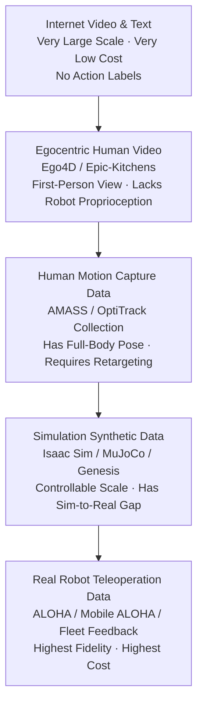
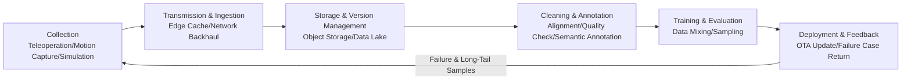
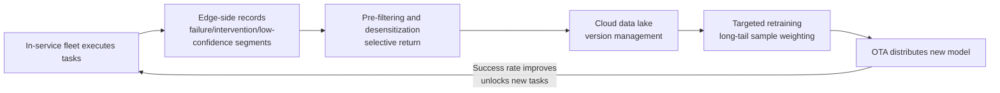
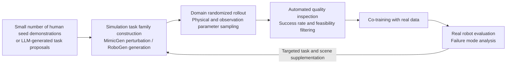

# Chapter 21: Data Infrastructure

## Summary

The intelligence level of humanoid robots is shifting from "model-driven" to "data-driven": the performance ceiling of Vision-Language-Action (VLA) models, imitation learning, and reinforcement learning increasingly depends on the scale, diversity, and quality of training data, rather than purely on network architecture innovations. Unlike internet text/images, robot data cannot be directly crawled from the web—it must be "produced" through teleoperation, motion capture, simulation synthesis, and fleet data feedback, and then undergo cleaning, annotation, alignment, and version management before entering the training pipeline. This chapter elaborates on the complete lifecycle of humanoid robot data infrastructure from a systems engineering perspective: data requirement modeling and modality pyramid, real-world data collection (teleoperation systems, robot-free collection, motion capture and retargeting), simulation synthetic data and data engine, representative public datasets and benchmarks (Open X-Embodiment, AgiBot World, DROID, ARIO, etc.), data formats and toolchains (LeRobot, etc.), as well as engineering constraints such as storage, bandwidth, cost, and compliance. A Python example for estimating data fleet storage and bandwidth is provided to illustrate the engineering scale. This chapter aims to answer a core question: how should a "data factory" that can continuously feed general-purpose humanoid robot models be designed and operated. After reading this chapter, readers should be able to perform a three-dimensional positioning of "cost—fidelity—scale" for any data source and propose an engineering solution before entering the training pipeline.

**Keywords**: Data Infrastructure; Data Engine; Data Flywheel; Teleoperation; Motion Capture; Synthetic Data; Domain Randomization; Open X-Embodiment; AgiBot World; DROID; LeRobot; VLA

---

## 21.1 Overview of Data Infrastructure

### 21.1.1 From Model-Driven to Data-Driven: The "Data Bottleneck" of Humanoid Robots

In classical robotics, behavior is primarily generated through precise modeling and optimal control—dynamic equations, constraints, and cost functions are manually constructed by engineers, and the system's generalization capability is limited by model accuracy. In the new learning-centric paradigm, behavior is "distilled" from large-scale demonstration or interaction data: Diffusion Policy, Action Chunking Transformer (ACT), and various VLA models (such as OpenVLA, π0, GR00T N1) all use massive multimodal trajectories as training material.

This paradigm shift brings structural contradictions. It is important to emphasize that "data-driven" does not mean the demise of model knowledge: dynamic models, geometric constraints, and safety rules still play fundamental roles in the quality inspection, retargeting, and feasibility screening stages of the data pipeline; what changes is their role from "direct generators of behavior" to "gatekeepers of data."

Specifically, the structural contradictions are reflected in the following three aspects:

- **Internet data is "free," robot data is "expensive."** Text and images can be obtained from public networks at very low cost, while a robot manipulation trajectory with joint states, force sensing, and multi-view video must be "produced" second by second by real hardware or high-fidelity simulation.
- **Data scarcity is particularly severe for humanoid robots.** Industrial robotic arms have decades of deployment accumulation, while the inventory of general-purpose humanoid robots has only reached the tens of thousands level in recent years; moreover, humanoid robots have high degrees of freedom (30–60 joints throughout the body) and a wide range of tasks (walking, carrying, bimanual manipulation, human-robot interaction), with the information dimension of a single trajectory being much higher than that of a fixed robotic arm.
- **Data distribution determines capability boundaries.** The generalization error of Behavior Cloning increases as the demonstration data's coverage of the target distribution decreases; policies trained on data collected in a single lab, on a single platform, for a single task are difficult to transfer to open environments.

The importance of data distribution can be quantitatively understood from the perspective of **covariate shift**. Let the error probability of the policy at each time step be \(\epsilon\) and the task horizon be \(T\); then the cumulative error of behavior cloning grows superlinearly with \(T\)—classical analysis gives an upper bound of \(O(\epsilon T^2)\): a one-step error brings the robot into a state outside the training distribution, thus further increasing the error probability at the next step, forming an "error compounding" effect. DAgger (Dataset Aggregation) methods iteratively have experts label the states actually visited by the policy, reducing the upper bound to \(O(\epsilon T)\); their essence is **using targeted supplementary data collection to correct distribution shift**—this is the theoretical basis for the data engine closed loop (see Section 21.3.3).

Therefore, the industry generally regards data infrastructure as a "strategic asset" as important as actuators and batteries: whoever can produce high-quality multimodal data at a lower unit cost and higher throughput gains the initiative in model iteration. This closed-loop logic is vividly called the **Data Flywheel**: deployed robots generate data, data improves models, improved models enhance robot capabilities and task success rates, thereby supporting larger-scale deployment and more data.

!!! note "Terminology Explanation: Data-Driven, Data Flywheel, VLA"
    - **Data-driven**: System behavior is primarily determined by models learned from data, rather than by manually established analytical models.
    - **Data flywheel**: A self-reinforcing cycle where deployed robots generate data, data improves AI models, models enhance robot performance and generate more data.
    - **VLA (Vision-Language-Action model)**: A large model that takes visual observations and language instructions as input and directly outputs robot actions; it is one of the mainstream technical routes for current general-purpose humanoid robot intelligence.

### 21.1.2 Data Modalities and the Data Pyramid

Humanoid robot training data naturally forms a pyramid structure along the three dimensions of "acquisition cost—scale—fidelity":



The layers are not substitutes but complements: modern training pipelines typically adopt a "pyramid curriculum"—first pre-train vision-language representations using internet video and text, then learn task priors and full-body motion priors from human video and motion capture data, next train low-level control and policies using large-scale simulation data, and finally perform alignment and fine-tuning with a small amount of high-quality real robot data. The HumanPlus Shadowing System is a typical representative of this approach: it first uses human motion data like AMASS to train full-body low-level policies in simulation, then uses RGB camera-based human pose estimation to drive a real humanoid robot to collect manipulation data.

From a modality perspective, a complete humanoid robot training sample (usually called a **trajectory** or **episode**) generally includes:

| Modality | Typical Content | Typical Sampling Rate | Main Use |
|------|---------|-----------|---------|
| Vision | Head/wrist/third-person RGB, Depth | 15–60 Hz | Scene understanding, policy input |
| Proprioception | Joint angles, joint velocities, IMU, base pose | 100–1000 Hz | State estimation, policy input, action supervision |
| Action Labels | Joint target positions/torques, end-effector poses | 30–500 Hz | Supervisory signal for behavior cloning |
| Force/Tactile | 6-axis force sensors, tactile arrays | 100–1000 Hz | Contact-rich tasks, safety monitoring |
| Language | Task instructions, step-by-step descriptions, speech | Event-level | VLA conditional input, task annotation |
| Environmental Context | Audio, scene point clouds, object pose ground truth | 1–30 Hz | Multimodal understanding, data filtering |

!!! note "Terminology Explanation: Episode, Multi-Sampling-Rate Mixing, Action Label"
    - **Episode**: The recording unit for one complete task execution; it is the basic granularity of robot learning data. A single episode contains tens to thousands of time steps.
    - **Multi-sampling-rate mixing**: The sampling rate difference between modalities can be up to two orders of magnitude (e.g., 30 Hz video vs. 1 kHz torque). The storage format must support timestamp-aligned retrieval. During training, alignment sampling is usually based on the lowest frequency modality, or high-frequency modalities are downsampled and feature-pooled.
    - **Action label**: The action signal used as the "ground truth" in supervised learning. In teleoperation data, it comes directly from the operator's command channel; in simulation data, it comes from the generation policy; in data without robot collection, it must be obtained indirectly through retargeting post-processing, with quality depending on the accuracy of the post-processing pipeline.

### 21.1.3 Full Lifecycle of Data Infrastructure

Data infrastructure is not a single "dataset repository" but a complete pipeline covering production, flow, consumption, and feedback. Its lifecycle can be divided into six stages:



Each stage has its specific engineering constraints: the collection stage is limited by hardware quantity and operator efficiency; the transmission stage is limited by bandwidth and edge storage; the storage stage is limited by cost and retrieval efficiency; the annotation stage is limited by manpower and automation tools; the training stage focuses on data mixing and curriculum design; the deployment stage distributes new models via OTA software updates and returns failure cases and long-tail scenarios, forming a **Fleet Data Flywheel**. Sections 21.2–21.5 will elaborate on this pipeline step by step.

From an organizational perspective, this pipeline typically spans four types of teams: collection operations (workstation and operator management), platform engineering (storage, transmission, and toolchains), algorithms (training, evaluation, and mixing decisions), and compliance and safety. The most common failure mode for data infrastructure projects is not a wrong technology choice, but a lack of a common metric among the four teams for "what kind of data is considered useful"—establishing a unified indicator system anchored on real-robot evaluation is the first priority of project governance.

### 21.1.4 Relationship Between This Chapter and Other Chapters in the Book

Data infrastructure sits between the hardware layer and the algorithm layer: the sensing and computing hardware discussed in Chapter 5 determines the physical upper limit of data collection (camera specifications, bus bandwidth, edge computing power); the software middleware in Chapter 22 determines the data flow within the robot (ROS 2 topics, DDS QoS, time synchronization); and the perception, planning, control, and VLA models in subsequent chapters are the ultimate consumers of the data pipeline. A key thread for understanding this chapter is: **the design metrics of data infrastructure (throughput, synchronization accuracy, effective data rate, unit cost) must ultimately be translated into the real-robot performance gains of downstream models**—discussing data scale in isolation from model evaluation is meaningless.

## 21.2 Real-World Data Collection

Real-world data is the category with the highest fidelity and the highest unit cost among humanoid robot training data. This section expands along four technical routes: "with robot/without robot/human side/fleet side." Teleoperation systems directly produce "observation-action" pairs; robot-free collection uses human demonstrations to bypass hardware bottlenecks; motion capture provides ground truth for full-body motion; and fleet feedback turns deployment itself into a continuous data source. The cost structures, data characteristics, and applicable stages of these four routes differ, and actual projects typically use a combination.

### 21.2.1 Teleoperation Collection: Master-Slave Teleoperation Systems

Among real robot data, the highest quality comes from **teleoperation**: a human operator directly controls a slave robot to complete tasks via a master device. The system synchronously records all observations and actions, naturally forming "observation-action" pairs that can be directly used for behavioral cloning.

A representative system in this direction is the ALOHA Teleoperation System: a set of low-cost dual-arm master-slave teleoperation hardware. The operator faces away from the robot, directly pulling the slave arm with the master arm, obtaining intuitive force feedback and motion mapping through mechanical coupling, used to collect imitation learning data for bimanual fine manipulation. Its derivative platform, Mobile ALOHA, further mounts the dual arms on a mobile base, allowing the operator to perform tasks requiring "mobility + bimanual manipulation" capabilities, such as cooking, cleaning, and taking elevators, via full-body guidance, used to collect data for home and warehouse scenarios. The ALOHA series demonstrates two important engineering conclusions:

- **Low-cost hardware can produce high-value data.** ALOHA achieves contact-rich manipulation data collection, previously requiring expensive force-controlled robotic arms, at a hardware cost on the order of tens of thousands of RMB.
- **Isomorphic master-slave design significantly reduces cognitive load.** When the kinematics of the master and slave arms are consistent, operators can achieve high collection efficiency and success rates without extensive training.

In the more general **bilateral teleoperation** architecture, command signals flow from the master to the slave, and force/tactile feedback flows from the slave back to the master, enhancing transparency and safety, particularly suitable for contact-sensitive scenarios like handling fragile objects or assembly. The cost is increased system complexity and cost, along with strict requirements for communication latency.

Besides master-slave robotic arms, common teleoperation interfaces in data factories include: VR headsets with controllers/data gloves (providing immersive first-person view and 6-DOF hand tracking, suitable for full-body teleoperation of humanoid robots), and exoskeletons (directly measuring the operator's full-body joint angles, mapping them to the robot's full body). Regardless of the interface, **end-to-end latency** is a core experience metric: generally, when the total latency of visual feedback plus the control loop exceeds approximately 100 ms, the operator's control precision and task success rate decrease significantly. Therefore, collection systems commonly use local direct video connections and low-latency video transmission, rather than routing through the cloud.

!!! note "Terminology Explanation: Teleoperation, Isomorphic Master-Slave, Bilateral Teleoperation, Transparency"
    - **Teleoperation**: A human operator remotely controls a robot via an interface device; the robot's state and operation commands are synchronously recorded as demonstration data.
    - **Isomorphic leader-follower**: The kinematic structure of the master device and the slave robot are consistent, with a direct mapping in joint space.
    - **Bilateral teleoperation**: Adds a force/tactile feedback channel from the slave to the master on top of master-slave control.
    - **Transparency**: The degree to which the force perceived by the operator matches the actual contact force of the slave; a core metric of teleoperation system fidelity.

The efficiency of teleoperation collection can be characterized by "effective trajectories per hour." Let the average execution time for a single task be \(T_{task}\), the reset time between tasks be \(T_{reset}\), and the success rate be \(p\). Then the effective throughput rate for a single collection station is:

$$
\eta = \frac{3600 \cdot p}{T_{task} + T_{reset}} \quad [\text{trajectories/hour}]
$$

Generally, for desktop-level bimanual tasks, \(T_{task}\) is between 30–120 seconds, \(T_{reset}\) often requires 10–60 seconds (object reset, scene arrangement), and the success rate \(p\) for untrained operators is about 60–80%. This means the daily output of a single station is typically only on the order of hundreds. To accumulate a dataset on the scale of hundreds of thousands, dozens to hundreds of collection stations must be deployed in parallel – this is the origin of the "data factory" model.

### 21.2.2 Collection Protocol Design: Tasks, Metadata, and Quality Control

The fundamental difference between a data factory and ordinary laboratory collection lies in **protocolization**. A scalable collection protocol should include at least the following elements:

- **Task Decomposition Specification**: Break down complex tasks into atomic episodes with clear start/end criteria, each corresponding to one trajectory. Task descriptions use structured templates (scene, objects, target state, success criteria) to facilitate subsequent retrieval and balancing.
- **Metadata Specification**: Each trajectory is bound with operator ID, station ID, robot unit number and calibration version, collection software version, and environment labels (lighting, weather, scene category). Trajectories lacking metadata are nearly impossible to trace for problem sources during large-scale mixed training.
- **Time Synchronization Specification**: All cameras, robot state, and force signals share a unified clock source (hardware sync or PTP/NTP software sync), with timestamp alignment verification performed before storage.
- **Quality Inspection Process**: Real-time quality checks at the collection end (automatic alarms for frame drops, synchronization errors, calibration failures) plus offline spot checks (stratified sampling by station and operator to verify success rate annotations).

The benefits of protocolization are multifaceted: a unified protocol allows collection capacity from multiple stations, cities, or even countries to be merged into a single data lake; structured metadata makes "sampling training by task distribution" possible, which is precisely one of the key variables affecting VLA training effectiveness.

### 21.2.3 Robot-Free Data Collection: Handheld Interfaces and First-Person Data

The bottleneck of teleoperation lies in the number of robot hardware units. One alternative approach is **robot-free data collection**: humans directly complete tasks using tools equipped with sensors, and then map human actions to the robot.

- **UMI Gripper Interface**: A combination of a handheld gripper and a wrist-mounted camera. The operator performs grasping and manipulation tasks in natural environments using the handheld gripper. The system records first-person video and the gripper's open/close state, then recovers the 6-DOF pose trajectory through post-processing. Its advantage is completely eliminating dependence on the robot itself, allowing large-scale parallel collection of "in-the-wild" data in any real environment.
- **HuDOR**: A human-to-robot demonstration framework for dexterous hands. It collects fine-grained human hand motion data to train imitation learning policies for dexterous robot hands, addressing the difficulty of teleoperating high-DOF hands.
- **Human-Centric Video Datasets**: The Ego4D first-person video dataset (over 3000 hours of egocentric video for first-person skill and interaction understanding) and the Epic-Kitchens dataset (first-person kitchen interaction videos), although lacking robot action labels, are widely used for learning affordances, hand-object interaction patterns, and task temporal structures, providing "human priors" for policies.

The core technical challenge of robot-free collection is the **embodiment gap**: there are systematic differences in geometry, degrees of freedom, and contact characteristics between the human hand and a robot gripper/dexterous hand. Direct mapping can produce infeasible actions. Engineering typically requires post-processing steps like motion retargeting, grasp mapping, and feasibility filtering, along with a small amount of real robot data for alignment.

From a data economics perspective, robot-free collection transforms "data production" from capital-intensive (acquiring and maintaining robot fleets) to labor-intensive (recruiting and training collectors). Its marginal cost structure is closer to traditional data annotation industries. Therefore, it is particularly suitable for on-site collection in target deployment environments (homes, supermarkets, warehouses) – collectors enter real scenes with handheld devices, simultaneously achieving scene realism and action naturalness, which is irreplicable by any laboratory station.

### 21.2.4 Motion Capture and Full-Body Motion Retargeting

For locomotion abilities like walking and full-body coordination, **motion capture (mocap)** is the mainstream method for obtaining high-quality full-body motion data. The OptiTrack motion capture system achieves sub-millimeter 3D human tracking using infrared optical markers and is a typical device for laboratory-grade humanoid robot motion data collection and robot retargeting.

In terms of data assets, the AMASS motion dataset aggregates multiple public motion capture databases, unifying them under a common parameterization (SMPL human model) to form a large-scale, clean collection of full-body human pose and shape sequences. It is widely used for humanoid robot simulation pre-training: first training low-level full-body tracking policies on AMASS, then transferring to real robots. The HumanPlus Shadowing dataset goes a step further, collecting data by having a humanoid robot perform "shadowing" of human motion, binding human motion with the robot's own state, used for training full-body imitation and teleoperation policies.

The cost structure of the motion capture route lies between teleoperation and simulation: optical mocap venues and equipment require significant investment and professional maintenance for calibration, but collecting a single full-body motion sequence takes only seconds, resulting in extremely high data density per unit time. Its main limitation is the lack of object interaction and force information required for manipulation tasks, so it is typically used complementarily with teleoperation data, rather than as a replacement.

**Motion retargeting** from human to robot is typically formulated as a constrained optimization problem: given the different joint structures and link lengths between the human and robot, solve for the robot joint trajectory \(q(t)\) such that key task-space features (hand/foot positions, center of mass, orientation) track the human demonstration:

$$
\min_{q(t)} \sum_{k} w_k \left\| f_k(q(t)) - x_k^{human}(t) \right\|^2 \quad \text{s.t.} \quad q_{min} \le q \le q_{max},\; |\dot{q}| \le \dot{q}_{max}
$$

where \(f_k(\cdot)\) is the forward kinematics mapping for the \(k\)-th task-space feature, and \(w_k\) is the weight. Engineering must also handle self-collision, ground contact consistency, and dynamic feasibility (the center of mass projection must fall within the support polygon); otherwise, the retargeted motion may be infeasible on the real robot.

For walking-type motions, an additional check on **contact timing consistency** is required: the transition moments between the stance phase and swing phase in human demonstrations must match the consistency of the robot's foot contact forces after retargeting. If a human performs an action in the single-stance phase that requires double support for stability, direct retargeting will inevitably lead to imbalance. In engineering practice, contact states are typically incorporated as hard constraints or strong regularization terms into the aforementioned optimization problem, and a full-body dynamics rollout in simulation is used for final feasibility screening. Only segments that pass this screening enter the real robot training set.

### 21.2.5 Fleet Feedback and Data Flywheel

When robots enter large-scale deployment, the main battlefield for data collection shifts from "data factories" to "in-service fleets." The Fleet Data Flywheel describes the following closed loop: robots deployed at customer sites continuously record task execution processes (especially failure, human intervention, and low-confidence segments), which are filtered and sent back to the cloud for the next round of model training; new models are distributed via OTA software updates to improve the overall fleet success rate, thereby unlocking more task scenarios and generating more data.

The unique value of fleet feedback data lies in:

- **True long-tail distribution**. No matter how diverse the workstation scenarios in a data factory are, they cannot cover the long tail of lighting, ground conditions, objects, and human-robot interactions in real deployments; it is precisely these long-tail samples that determine the robustness of the policy.
- **Failure samples as supervisory signals**. Moments of human intervention naturally mark the failure boundaries of the policy, serving as an important supplement to offline data.
- **Decreasing marginal cost**. The collection hardware is already deployed and paid for by customers; the marginal cost of data is mainly bandwidth, storage, and annotation, far lower than building a dedicated collection fleet.

Its engineering constraints are equally evident: privacy compliance (the site may contain sensitive information such as faces and home environments), return bandwidth (multi-channel video data is massive, typically requiring edge-side pre-filtering), and traceability of data versions and model versions (which version of the model was trained on which data). Section 21.5 will provide quantitative engineering estimates.



It is worth noting that the speed of the data flywheel is limited by the slowest link in the entire chain: if desensitization and annotation rely on manual work, or OTA releases require lengthy regression validation, the theoretical gains of the flywheel will be eroded by operational friction. Therefore, leading companies generally invest significant engineering resources in "automatic filtering—automatic pre-annotation—grayscale release," with the goal of compressing the cycle from "on-site failure" to "fix model online" from months to weeks or even days.

## 21.3 Simulation Synthetic Data and Data Engines

Real-world data is constrained by physical time and hardware quantity, while simulation transforms data production into an infinitely parallelizable computational problem. This section discusses the composition of simulation data pipelines, two types of amplification techniques—demonstration augmentation and automatic task generation—and the fundamental constraint of the Sim-to-Real gap. This constraint dictates that simulation data must be used in conjunction with real data, and that the "data engine" must be closed-loop rather than open-loop.

### 21.3.1 Simulation Data Generation Pipeline

Real-world data is expensive and constrained by physical time. **Synthetic data** provides a parallelizable and scalable second source. Current mainstream simulation and training platforms include:

| Platform | Positioning | Role in the Data Pipeline |
|------|------|------------------|
| NVIDIA Isaac Sim | GPU-accelerated photorealistic robot simulator | High-fidelity rendering and physics simulation, supporting the GR00T synthetic data pipeline |
| NVIDIA Isaac Lab | Modular learning framework based on Isaac Sim | Large-scale parallel policy training and data generation |
| MuJoCo Physics Engine | High-fidelity contact dynamics engine | Humanoid robot control research and policy pre-training |
| Genesis Generative Physics Engine | Emerging generative general-purpose physics engine | Ultra-fast parallel simulation, reducing data generation time |
| HumanoidVerse | Multi-simulator training framework | Cross-engine training for Sim-to-Real humanoid robot learning |
| ManiSkill3 | High-throughput manipulation simulation benchmark | Large-scale manipulation task data and policy evaluation |

The typical flow of a simulation data pipeline is: Scene and asset generation (objects, lighting, textures) → Task definition (success criteria, initial condition distribution) → Policy or planner rollout (demonstrations generated by scripted policies, optimization controllers, or trained policies) → Data export and quality inspection. Since simulation can provide perfect ground truth (object poses, segmentation masks, contact forces), synthetic data has a natural advantage for tasks requiring dense annotations.

Compared to real-world collection, the economic model of simulation data production is fundamentally different: its throughput is approximately linearly correlated with compute power—the number of GPU parallel instances \(N_{env}\) determines daily output, and the marginal cost per data point is primarily electricity and compute depreciation, typically one to two orders of magnitude lower than teleoperation. However, this advantage only holds when "the policy can indeed learn transferable skills in simulation," which is the Sim-to-Real constraint discussed in Section 21.3.3.

Two aspects determine the practical value of synthetic data:

- **Asset Layer**: Synthetic data is extremely sensitive to the diversity of scene assets. Engineering practice typically combines three sources to build an asset library: scan reconstruction (3D scanning of real objects), procedural generation (parameterized objects and layouts), and generative models (text-to-3D assets). The GR00T synthetic data pipeline is built upon Isaac Sim's high-fidelity rendering and asset system.
- **Quality Inspection Layer**: Simulation rollouts are not inherently correct—scripted policies may produce physically infeasible trajectories, and numerical anomalies in the physics engine (penetration, explosions) can also contaminate data. Synthetic data also requires success rate filtering, dynamic feasibility checks, and visual plausibility sampling. The logic of this quality inspection is consistent with that for real data, but it can be highly automated using simulation ground truth.

### 21.3.2 Demonstration Augmentation and Automatic Task Generation

The key question for simulation data is not "can it be generated," but "what to generate"—the diversity of the task distribution determines the generalization value of the data. Two representative methods address this from complementary perspectives:

- **MimicGen**: A demonstration augmentation framework that uses a small number of human seed demonstrations as templates. By perturbing object poses and initial conditions in simulation, it automatically expands dozens of seed demonstrations into thousands of varied demonstrations. Its insight is that the value of human demonstrations lies in the "decomposition of task strategy and keyframes," while specific geometric variations can be cheaply supplemented by simulation.
- **RoboGen**: An automatic task generation framework driven by large language models. It allows an LLM to propose diverse tasks, generate corresponding simulation scene code and reward functions, and then automatically execute the simulation to collect data, thereby expanding the diversity of synthetic data at the task semantic level.

These two methods correspond to two amplification dimensions of the data engine: **intra-task instance diversity** and **cross-task semantic diversity**. Combined with Domain Randomization—randomizing physical and observation parameters such as friction coefficients, mass, lighting, and camera intrinsics/extrinsics in simulation—the trained policy becomes more robust to distribution shifts in the real world. Domain Adaptation methods further use a small amount of real data to align the distribution of the simulation-trained policy.



The fundamental difference between this closed loop and the traditional "one-time dataset building" approach is that the direction of simulation task generation is driven by **real robot failure modes**, not by what assets are currently available in the library—each iteration of the data engine specifically patches the policy's capability gaps.

### 21.3.3 Sim-to-Real Gap and Mixed Data Strategy

The inherent flaw of simulation data is the **Sim-to-Real gap**: contact mechanics, deformable bodies, sensor noise, and actuator dynamics can only be approximately modeled in simulation. A policy that performs well in simulation does not guarantee it will work on a real robot. This gap is particularly pronounced for humanoid robots, as their tasks involve bipedal contact transitions, soft contacts, and whole-body dynamic balance—precisely the aspects that physics engines find most difficult to simulate accurately.

The engineering response is a **co-training strategy**: using large-scale simulation data to provide task diversity and dense supervision, and a small amount of real data to calibrate distribution shifts. Industry practice shows that in training VLA-type models, the ratio of real to synthetic data, and the strength of domain randomization for synthetic data, often have a greater impact on the final real-robot success rate than the model architecture itself. Therefore, the design goal of a data engine is not to maximize data volume, but to maximize the **real-robot performance gain per unit of training compute**—this is also the ultimate criterion for evaluating any data source.

The main sources of the Sim-to-Real gap and common mitigation methods are summarized as follows:

| Gap Source | Typical Manifestation | Common Mitigation Methods |
|---------|---------|-------------|
| Contact mechanics error | Unrealistic soft contact, friction, and collision response | Contact parameter identification, domain randomization, fine-tuning with real contact data |
| Actuator dynamics error | Unmodeled torque response delay, backlash, and saturation | Actuator model identification (system identification), torque-current calibration |
| Observation error | Rendered texture/lighting differs from real camera | High-fidelity rendering, real background textures, camera noise modeling |
| Dynamics parameter error | Mass, center of mass, inertia mismatch with real robot | Parameter randomization with online adaptation, real robot system identification |
| Insufficient distribution coverage | Simulation task distribution misaligned with real tasks | MimicGen/RoboGen-style task expansion, supplementary collection of real long-tail data |

!!! note "Terminology Explanation: Data Engine, Sim-to-Real, Domain Randomization"
    - **Data engine**: A continuous data production system built around the closed loop of "discovering model flaws → targeted data production → retraining → re-evaluation," as opposed to a one-time dataset construction project.
    - **Sim-to-Real gap**: The systematic bias between the simulation distribution and the real-world distribution, arising from physical modeling errors and observation modeling errors.
    - **Domain randomization**: Applying random perturbations to physical and observation parameters in simulation, enabling the policy to become insensitive to parameter variations and thus bridge the Sim-to-Real gap.

## 21.4 Representative Public Datasets and Benchmarks

Public datasets serve as a coordinate system for understanding industry data practices: they define de facto standards for data scale, modality combinations, and task taxonomies, while also providing starting training materials for small and medium-sized teams. This section categorizes the most representative resources into three types—"cross-embodiment aggregation, single-platform deep mining, and human-centric"—and concludes with engineering selection criteria.

### 21.4.1 Cross-Embodiment Aggregation Datasets

The data collection capacity of a single institution is limited, making cross-institution aggregation a crucial pathway for rapidly expanding data scale.

**The Open X-Embodiment dataset** is a milestone on this path: a large-scale aggregated robot learning dataset that integrates demonstration data from over twenty institutions and more than twenty types of real robot platforms, unified into a standardized data format and task description. It is widely used for cross-embodiment VLA pre-training. The accompanying RT-X series of models validates the "positive cross-embodiment transfer" hypothesis: joint training on data from other robots can improve the target robot's performance on unseen tasks. For humanoid robots, the significance of Open X-Embodiment lies in providing a vast repository of "general manipulation priors," allowing humanoid-specific data to be fine-tuned on top of it.

**The ARIO All-Robots-in-One dataset** proposes a unified data standard, aggregating approximately 3 million episodes from real-world, simulation, and format-converted sources, covering various robot morphologies. Its value lies in standardized embodiment descriptions and a unified data schema, enabling heterogeneous data sources to be mixed within the same training pipeline.

!!! note "Terminology Explanation: Positive Cross-Embodiment Transfer, Episode, Dataset vs. Benchmark"
    - **Positive cross-embodiment transfer**: A phenomenon where joint training on data from other robot platforms improves the target robot's performance on its own tasks; the RT-X experiments in Open X-Embodiment first validated this effect at scale.
    - **Episode**: A recording unit of a complete task execution, typically from the start of the task until a success/failure criterion is triggered, containing synchronized sequences of all modalities during that period.
    - **Dataset vs. Benchmark**: A dataset provides training materials; a benchmark additionally specifies task splits, evaluation protocols, and metrics for fair comparison of different methods. The same resource often serves both roles.

### 21.4.2 Single-Platform Large-Scale Datasets

Complementing the aggregation approach is deep collection on a unified platform by a single institution. These datasets offer advantages in embodiment consistency and task systematicity:

| Dataset | Scale and Composition | Features and Uses |
|--------|-----------|-----------|
| AgiBot World (智元机器人) | Publicly reported as millions of trajectories, collected from hundreds of humanoid robots; the AgiBot World Colosseo paper describes its large-scale manipulation platform | Consistent humanoid embodiment, multi-scenario and multi-task, supports full-body VLA training |
| DROID Robot Manipulation Dataset | Tens of thousands of real-world manipulation trajectories, distributedly collected across multiple labs and environments | High visual and environmental diversity, primarily for robustness research |
| BridgeData V2 | Tabletop manipulation data with language instructions | Common benchmark for language-conditioned imitation learning |
| RH20T Manipulation Dataset | Approximately 110,000 contact-rich manipulation sequences | Includes visual, force, audio, and human demonstration pairs simultaneously, suitable for multimodal research |
| OmniAction Dataset | Approximately 141,000 episodes, covering 112 skills and 748 objects | Integrates visual, speech, and environmental audio context, targeting proactive robot manipulation |

Taking AgiBot World as an example, its paper, AgiBot World Colosseo, showcases a "data factory"-style collection organization: unified embodiment, unified collection protocol, coverage of multiple scenarios like home, industry, and retail, and encoding of language instructions, multi-view observations, embodiment states, and joint sequences into a unified multimodal representation, directly serving full-body VLA model training. This vertical integration model of "self-built embodiment + self-built data + self-trained model" is becoming the standard configuration for leading humanoid robot companies.

DROID represents another organizational model: **distributed consortium collection**. Multiple labs collect data in parallel in their respective real-world environments, following a unified data schema and hardware reference design, and finally aggregate it into a library. This model sacrifices high consistency in embodiment and protocol in exchange for environmental diversity unattainable by a single institution—differences in lighting, backgrounds, objects, and manipulation styles across labs serve as natural data augmentation for improving visual and environmental robustness. The trade-off between the two models is essentially a balance between "consistency" and "diversity": the former is preferred during fine-tuning, while the latter is preferred during pre-training.

RH20T and OmniAction demonstrate advancements in the modality dimension: the former proves the irreplaceability of force and audio for contact-rich tasks (insertion, assembly, wiping)—pure visual strategies often fail in these tasks due to occlusion; the latter incorporates speech commands and environmental sounds into the context, exploring the multimodal signal foundation required for "robots proactively initiating interactions." For humanoid robots, the significance of these modality explorations lies in the fact that the ultimate scenario for humanoid platforms is open environments shared with humans, and single-modality data cannot support the understanding required for such scenarios.

### 21.4.3 Human-Centric and Full-Body Motion Data

Beyond robot-specific data, three types of "human-side" datasets play an irreplaceable role in the humanoid robot training pipeline. Their common value is: **human data is measured in millions of hours, while robot data is measured in millions of episodes**—using human data to learn the semantic and motion priors of "how a task should be done," and then using robot data to solve the embodied implementation of "how the robot specifically does it," is a practical path to bridge the data scale gap. Four representative types of resources are as follows:

- **AMASS Motion Dataset**: A large-scale, clean human motion capture dataset, unified into a parametric human model, serving as the de facto standard source for simulation-based pre-training of full-body motion policies.
- **Ego4D First-Person Video Dataset**: Over 3,000 hours of first-person video, used for learning first-person skills and hand-object interaction understanding.
- **Epic-Kitchens Dataset**: First-person kitchen interaction videos, widely used for research on manipulation sequences and activity understanding.
- **HumanPlus Shadowing Dataset**: Collected by having a humanoid robot shadow human motion, binding human demonstrations with the robot's full-body state, used for full-body imitation and teleoperation policy training.

### 21.4.4 Engineering Guidelines for Dataset Selection

Faced with numerous datasets, engineering selection can follow these guidelines:

1.  **Embodiment Matching Priority**: Data from the target robot (or its close approximation) has the lowest transfer cost; cross-embodiment data is suitable for pre-training, not fine-tuning.
2.  **Modality Completeness**: Check if all required modalities for training are included (e.g., force for contact tasks, language for VLA).
3.  **Task and Scenario Coverage**: Prioritize datasets with systematic coverage of the target application distribution, rather than simply pursuing the number of episodes.
4.  **Protocol and Licensing**: Confirm whether the data license permits commercial use and whether the collection protocol is reproducible (calibration, coordinate systems, time synchronization methods).
5.  **Mixability**: Assess whether the data format is easily convertible to a unified schema (e.g., LeRobot format or RLDS) and whether it can be mixed with proprietary data for training.

It is important to note that the true value of public datasets often lies not in "directly training a deployable policy," but in: serving as a pre-training foundation to reduce the cold-start cost of proprietary data, acting as a public benchmark for fair method comparison, and providing a reference for data protocol design. Viewing public data as a supplement, rather than a replacement, for the upper limits of capability is a more realistic positioning of data assets.

## 21.5 Data Engineering: Format, Storage, Cost, and Compliance

Once data leaves the collection endpoint, it enters the realm of pure software engineering: format determines interoperability, quality inspection determines the effective data rate, storage and bandwidth determine operational costs, and compliance determines business boundaries. This section provides engineering practice points for these four aspects, along with a quantitative cost estimation example.

### 21.5.1 Data Formats and Toolchains

Multi-modal, multi-sampling-rate robot data imposes special requirements on storage formats: they must efficiently compress video while ensuring **temporal synchronization** and **random access** performance across modalities. The current mainstream open-source toolchain is LeRobot: an end-to-end PyTorch library covering dataset formats, teleoperation, training, and deployment. Its data format organizes multi-view video, state, and action sequences using a standardized schema, supports streaming reads and incremental appending, and has become a de facto starting point for academia and small teams building data pipelines. The RLDS (Reinforcement Learning Datasets) format adopted by Open X-Embodiment is another widely followed standard, emphasizing episode-level metadata and cross-dataset interoperability.

Regardless of the format chosen, the data schema design should explicitly include the following fields: embodiment identifier and calibration parameters, timestamps and coordinate system definitions for each modality, task descriptions and success labels, and collection protocol version. "Bare trajectories" lacking this metadata will incur high costs in subsequent mixed training and traceability.

The engineering trade-offs for three common format types are as follows:

| Type | Representative | Advantages | Limitations |
|------|----------------|------------|-------------|
| Standardized research format | LeRobot dataset format, RLDS (used by Open X-Embodiment) | Mature ecosystem, plug-and-play with open-source training pipelines | Requires custom schema extensions for additional modalities like force/tactile sensing |
| Enterprise custom format | Internal schemas of various data factories | Tailored to own embodiment and protocols, high retrieval efficiency | High cost for cross-institution sharing and open-source reproduction |
| General serialization container | MCAP, HDF5, Parquet, etc. | General-purpose toolchains, controllable performance | Lacks robot semantic layer, requires custom conventions |

A common architecture in practice is "use enterprise custom formats on the collection side for efficiency, convert to standard formats like LeRobot/RLDS for training when entering the data lake," with a set of version-managed converters maintained between the two formats.

### 21.5.2 Data Quality: Synchronization, Filtering, and Deduplication

Core metrics for data quality engineering include:

- **Temporal synchronization error**: The alignment accuracy of timestamps across multiple cameras, embodiment states, and force/tactile signals. Generally, this should be controlled within milliseconds; otherwise, "observation-action" pairs in high-speed manipulation tasks will exhibit systematic misalignment.
- **Episode-level quality inspection**: Automatic or semi-automatic removal of episodes with task failure, abnormal interruptions, or operator errors.
- **Distribution deduplication and reweighting**: Avoid high-frequency repetitive scenarios dominating the training distribution; oversampling long-tail scenarios is a common method to improve robustness.
- **Semantic annotation**: Task instructions, segmented sub-tasks, object and scene labels, which can directly serve VLA training and retrieval-based data mixing.

The composite metric of **effective data rate** deserves emphasis: Let the raw collection volume be \(D_{raw}\), and the usable volume after frame drop removal, synchronization verification, success rate filtering, and deduplication be \(D_{eff}\). Then the effective data rate \(r = D_{eff}/D_{raw}\). In collection projects lacking protocol-based management, \(r\) can be as low as 50% — meaning nearly half of the storage, bandwidth, and annotation budget is consumed by invalid data. Moving quality inspection as early as possible to the collection side (real-time alerts, on-the-spot re-collection) is the most effective way to improve \(r\).

### 21.5.3 Storage, Bandwidth, and Cost: Quantitative Estimation

The cost of data infrastructure can be estimated using a simple order-of-magnitude model. Assume a single collection robot has \(N_c\) cameras, each with a bitrate of \(r_c\) (after compression), and the combined bitrate for low-bandwidth signals like state/force/tactile is \(r_s\). Then the raw data volume per hour per robot is

$$
D_{hour} = (N_c \cdot r_c + r_s) \times 3600 \text{ s}
$$

For a data factory with \(M\) collection stations and \(H\) effective collection hours per day, the daily increment is \(M \cdot H \cdot D_{hour}\), from which the annual storage requirement and upstream bandwidth requirement are determined. The following Python example provides an estimate for a typical data factory:

```python
# Data factory storage and bandwidth estimation
N_c = 4          # Number of cameras: head stereo + dual wrist + third-person (4 as representative)
r_c = 8e6        # Bitrate per camera after compression (bit/s), typical for 1080p30 H.265
r_s = 2e6        # Combined bitrate for state/force/audio (bit/s), including timestamps and metadata
M = 100          # Number of collection stations
H = 6            # Effective collection hours per station per day

D_hour = (N_c * r_c + r_s) * 3600 / 8          # Bytes per hour per robot
D_day  = D_hour * M * H                         # Daily increment (bytes)
D_year = D_day * 300                            # Based on 300 effective collection days

print(f"Data volume per robot per hour: {D_hour/1e9:.1f} GB")
print(f"Data factory daily increment:   {D_day/1e12:.2f} TB")
print(f"Annual storage requirement:     {D_year/1e15:.2f} PB")
print(f"Required average upstream bandwidth: {D_day*8/(H*3600)/1e9:.1f} Gbit/s (concentrated during collection hours)")
```

Typical results show that a hundred-station-level data factory has a daily increment on the order of 10 TB and an annual storage requirement reaching the PB level. The corresponding cloud storage and CDN backhaul costs can reach millions of RMB annually — not including collection hardware depreciation, operator labor, and annotation costs. Therefore, **edge-side pre-filtering** (only returning successful episodes and key modalities), **tiered storage** (hot data on SSD, cold data on object storage), and **video encoding optimization** are the three major levers for cost control.

### 21.5.4 Data Mixture and Curriculum Design on the Training Side

The final engineering decision before data enters the training pipeline is the **mixture**: the weights with which various data sources, tasks, and modalities participate in training. Empirically, the trade-offs that need to be balanced include:

- **Real vs. Synthetic**: Synthetic data provides diversity, while real data calibrates the distribution; when the synthetic proportion is too high, real-world performance actually degrades. Generally, the mixture ratio needs to be iteratively adjusted based on real-world evaluation results, rather than being set once.
- **Cross-embodiment vs. Embodiment-specific**: Cross-embodiment data like Open X-Embodiment provides general priors, while embodiment-specific data determines final accuracy. A common practice is to pre-train on cross-embodiment data first, then fine-tune on embodiment-specific data, or to mix-train with a certain ratio and weight embodiment-specific data in the loss.
- **Task balancing vs. Long-tail weighting**: Uniform sampling can cause high-frequency simple tasks to dominate the gradient; inverse frequency weighting based on task difficulty and failure rate is a common method to improve long-tail capabilities, but excessive weighting can introduce training instability.

The mixture itself should be treated as a "data hyperparameter" as important as model hyperparameters and incorporated into experiment management: each training run should record the precise mixture, data version, and sampling seed to ensure results are reproducible and attributable.

### 21.5.5 Compliance, Privacy, and Security

Humanoid robot data inherently contains sensitive information: first-person view videos may capture faces, home interiors, and commercial premises; fleet-returned data involves client sites. Engineering requirements include:

- **Collection-side anonymization**: Automatic blurring of faces/license plates, filtering of voice keywords, ideally completed at the edge;
- **Informed consent and agreements**: Notification of personnel in the collection scene, agreement on data usage and retention periods;
- **Access control and auditing**: Tiered permissions, download logging, version traceability;
- **Cross-border compliance**: Different jurisdictions have different requirements for data leaving the country, requiring partitioned storage for globally deployed fleets.

These requirements will, in turn, influence data architecture design — for example, "anonymize at the edge before entering the data lake" becomes a mandatory step in the pipeline, not an option. A practical data compliance checklist typically includes control points across five stages: pre-collection (scene authorization, personnel notification, agreement signing), during collection (real-time anonymization, automatic stop recording for sensitive scenes), pre-ingestion (secondary anonymization review, removal of sensitive metadata), during use (minimum privilege access, training purpose auditing), and at retirement (deletion upon expiry, cascading cleanup after authorization revocation). Compliance costs should be included in the data budget like storage costs, rather than being applied as a post-hoc patch.

## 21.6 Chapter Summary

This chapter systematically elaborates on the full lifecycle of humanoid robot data infrastructure. The core viewpoints can be summarized as follows:

1. **Data is the strategic means of production in the era of humanoid robots.** Under the VLA and imitation learning paradigms, the upper limit of model capability is jointly determined by the scale, diversity, and quality of data; the data flywheel is one of the deepest moats for leading companies.
2. **Data sources form a pyramid.** Internet videos, egocentric videos, motion capture, simulation-generated data, and real teleoperation data are stratified by cost and fidelity. Modern training pipelines use a curriculum-based approach to mix data from each layer.
3. **Teleoperation and simulation generation are the two major production engines.** ALOHA/Mobile ALOHA-style master-slave teleoperation, UMI/HuDOR-style robot-free data collection, and OptiTrack/AMASS-style motion capture provide real or quasi-real data; Isaac Sim/MuJoCo/Genesis plus MimicGen/RoboGen-style data engines provide scalable synthetic data, with domain randomization and mixed training used to bridge the Sim-to-Real gap.
4. **Public datasets have accelerated the entire field.** Open X-Embodiment validated cross-embodiment pre-training, AgiBot World demonstrated the feasibility of a humanoid robot data factory, and DROID, BridgeData V2, RH20T, OmniAction, ARIO, etc., each have their own focus. Selection should be based on criteria of embodiment matching, modality completeness, and task coverage.
5. **Data engineering determines unit cost.** Toolchains like LeRobot unify formats and protocols; time synchronization, quality inspection, and deduplication determine the effective data rate; storage, bandwidth, and compliance constitute non-negligible operational costs that must be quantitatively planned at the architectural design stage.
6. **The ultimate metric for data infrastructure is real-robot performance.** Throughput, synchronization accuracy, effective data rate, and unit cost are only intermediate metrics; any decision on data source and ratio must ultimately be adjudicated through controlled real-robot evaluation.

Looking ahead to the coming years, three trends warrant continued attention: First, **world models as a data source**—using learned world models to replace physics engines for generating "imagined trajectories" could potentially reduce the cost of synthetic data by another order of magnitude, but their physical realism still needs to be anchored by real data; Second, **the empirical establishment of data-model co-scaling laws**, i.e., answering "under what ratio, how much of what kind of data yields how much real-robot performance improvement," which will transform data investment from experience-driven to quantitative decision-making; Third, **the nascent stage of cross-enterprise data assetization and trading**, for which the unification of data formats and compliance standards is a prerequisite. Regardless of the path, data infrastructure will long occupy one of the largest shares of humanoid robot engineering investment.

Above the data infrastructure lies the software runtime environment that converts this data and models into real-time robot behavior—Chapter 22 will shift to software middleware, discussing how ROS 2, DDS, real-time buses, and planning-control components organize the various computing units of a humanoid robot into a deterministic whole. Reading the two chapters together provides a complete chain: data is produced and consumed within the pipeline, while the pipeline itself runs on top of the middleware.
