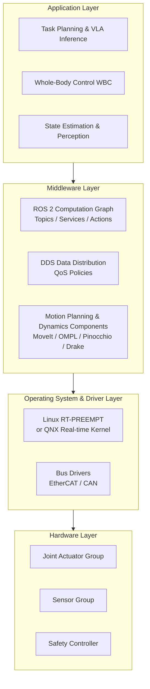
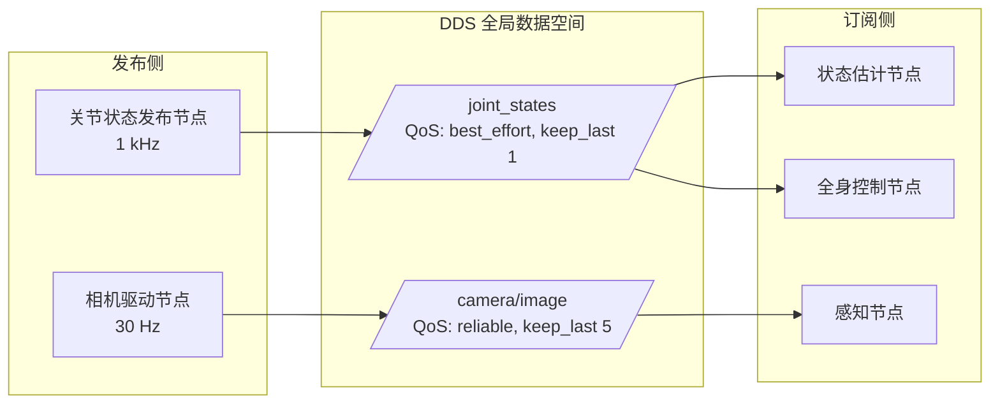
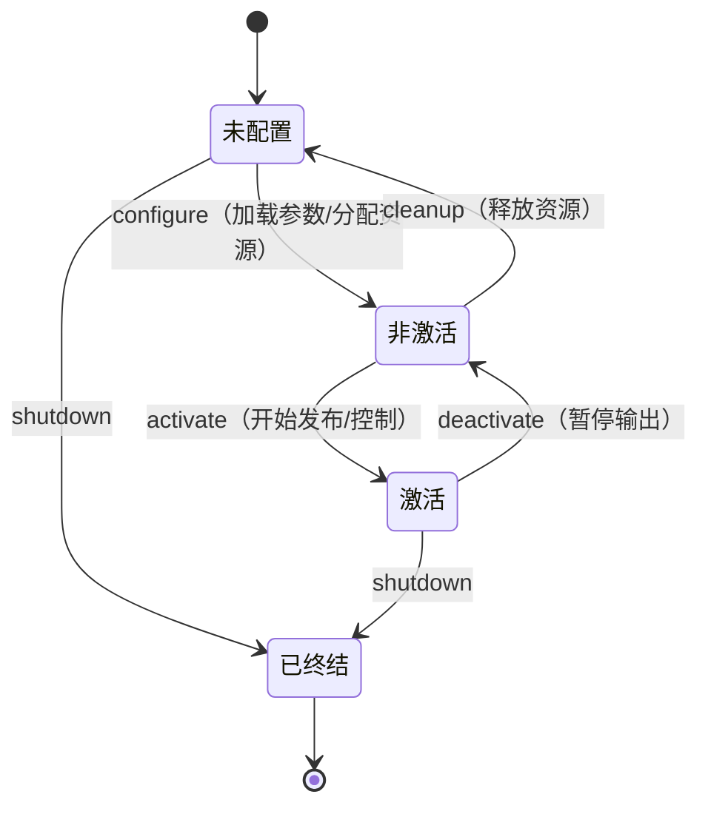
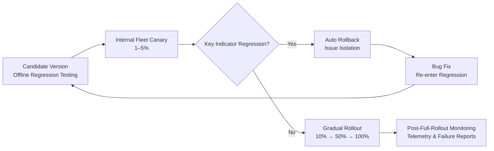

# Chapter 22: Software Middleware

## Summary

Humanoid robots are among the systems with the highest software complexity in the field of robotics today: dozens of actuators throughout the body operate in closed loops with millisecond-level cycles, multiple cameras, LiDAR, and force-torque sensors stream data at various rates, and VLA large models, whole-body controllers, motion planners, and safety monitors must run cooperatively on heterogeneous computing units. The component that organizes these parts into a deterministic whole is software middleware—a foundational software layer situated above the operating system and below application algorithms. This chapter systematically elaborates on the technical system of humanoid robot software middleware: robot middleware frameworks (ROS and ROS 2, DDS data distribution service and its QoS mechanisms), real-time communication and fieldbuses (EtherCAT, CAN/CAN FD), motion planning and dynamics computation components (MoveIt, OMPL, Pinocchio, Drake, URDF/MJCF description formats), real-time operating systems (QNX, Linux RT-PREEMPT), and deployment-oriented OTA software updates and fleet management platforms. It also discusses the constraints imposed by functional safety standards (IEC 61508, ISO 13849, ISO 13482, ISO/TS 15066) on software architecture. The chapter concludes with a Python example analyzing real-time task schedulability and end-to-end latency budgets, providing an engineering methodology from requirements to architecture selection.

**Keywords**: Software Middleware; ROS 2; DDS; QoS; Real-time Communication; EtherCAT; CAN; MoveIt; OMPL; Pinocchio; Drake; URDF; MJCF; RT-PREEMPT; QNX; OTA; Fleet Management; Functional Safety

---

## 22.1 Overview of Software Middleware

### 22.1.1 What is Robot Middleware

**Robot middleware** is a layer of software infrastructure situated between the operating system and robot applications. Its core responsibilities are fourfold:

- **Inter-Process Communication (IPC)**: Provides a unified message passing mechanism (publish/subscribe, request/response) for software modules distributed across multiple processes and computing units, shielding underlying transport details;
- **Abstraction and Reuse**: Encapsulates common capabilities such as sensor drivers, actuator interfaces, coordinate transforms, and robot descriptions into standardized components, allowing algorithm developers to avoid reinventing the wheel;
- **Concurrency and Real-time Scheduling Support**: Provides executors, callback groups, and priority mechanisms, enabling multi-rate control loops to meet timing constraints under shared computational resources;
- **Toolchain**: Visualization, record/replay (rosbag-like), parameter management, launch orchestration, and diagnostics constitute a complete workflow for development, debugging, and deployment.

In a humanoid robot project without middleware, every new algorithm must solve from scratch the problems of "where does the data come from, at what timing does it arrive, and how to degrade upon failure." Development costs would grow quadratically with the number of modules. Middleware converges these cross-cutting concerns into a unified facility, making it a prerequisite for collaborative development by teams of hundreds.

!!! note "Terminology Explanation: Middleware, Inter-Process Communication, Cross-Cutting Concerns"
    - **Middleware**: A foundational software layer between the operating system and application software, providing communication, abstraction, and common services for distributed applications; robot middleware additionally covers robot-specific needs such as sensor/actuator interfaces and coordinate transforms.
    - **Inter-Process Communication (IPC)**: Mechanisms for exchanging data between processes on the same machine or across machines, including shared memory, message queues, and network transport; middleware encapsulates these mechanisms into a unified programming abstraction.
    - **Cross-cutting concern**: Functions such as logging, time synchronization, parameter configuration, and diagnostics that "every module needs but do not belong to any single module's business logic"; the core value of middleware is to centralize the implementation of these concerns.

### 22.1.2 Special Requirements of Humanoid Robots for Middleware

Compared to fixed robotic arms or wheeled chassis, humanoid robots impose more stringent requirements on middleware:

| Challenge | Specific Manifestation | Requirement for Middleware |
|-----------|------------------------|---------------------------|
| High-dimensional whole-body control | 30–60 joints, 1 kHz-level force control loops | Real-time channel with microsecond-level jitter, zero-copy data transfer |
| Heterogeneous computing | Real-time control core + high-performance AI core + safety MCU coexist | Unified communication abstraction across processes, chips, and networks |
| Multi-modal high bandwidth | Multiple RGB-D cameras, LiDAR, tactile arrays | High message throughput and lossy/lossless QoS grading |
| Dynamic task switching | Real-time switching between walking, manipulation, and interaction modes | Lifecycle management and deterministic state machine |
| Safety-critical | Falling or losing control of the whole robot may injure people | Communication failure detection, watchdog, and degradation strategies |
| Cloud collaboration | OTA updates, fleet data backflow | Secure isolation between vehicle-cloud channel and on-board bus |

These requirements explain why the software architecture of humanoid robots is almost invariably a "**real-time layer + non-real-time layer**" dual-layer structure: force control and safety logic run on the real-time layer (real-time operating system + fieldbus), while perception, planning, and large model inference run on the non-real-time layer (general-purpose Linux + middleware). The two layers exchange states and targets through strictly defined interfaces.

### 22.1.3 Layered Reference Architecture

A typical layered reference architecture for humanoid robot software is as follows:



The remainder of this chapter expands outward from the middleware layer: Section 22.2 discusses the robot middleware framework itself, Section 22.3 delves downward into real-time communication and buses, Section 22.4 moves upward to introduce planning and dynamics components built on the framework, Section 22.5 discusses real-time operating systems and deployment/operations facilities, and Section 22.6 provides architecture synthesis and an example.

## 22.2 Robot Middleware Framework: From ROS to ROS 2

The robot middleware framework is the "skeleton" of the entire software stack: it determines how modules are decomposed, how data flows, and how the system starts up and degrades. This section unfolds along the thread of "Limitations of ROS 1 → Architectural response of ROS 2/DDS → Engineering usage of QoS → Organization of the computation graph," which is also the most mainstream evolution path for current humanoid robot product software stacks.

### 22.2.1 Legacy and Limitations of ROS 1

Although the Robot Operating System (ROS) has "Operating System" in its name, it is essentially a set of robot middleware: it defines abstractions such as nodes, topics, services, and the parameter server, and provides a vast ecosystem of open-source packages. Since 2007, ROS 1 has dominated the robotics research community, but its architecture has three limitations that are difficult to patch:

- **Single point of failure (roscore)**: The discovery and registration of all nodes depend on a centralized master node. If the master fails, the entire system becomes paralyzed, failing to meet product-level reliability requirements.
- **Lack of real-time capability and QoS concepts**: Communication based on TCP/UDP cannot express transmission policies such as "this state stream allows frame loss but cannot tolerate latency."
- **Lack of security**: Without authentication and encryption mechanisms, it cannot be directly deployed in networked commercial products.

These limitations are tolerable in laboratory single-robot scenarios but are fatal in product forms like humanoid robots, which involve multiple computing units, are safety-critical, and require fleet operations.

### 22.2.2 ROS 2 and DDS: Data-Centric Publish-Subscribe

**ROS 2 middleware** has been completely restructured to address the above limitations. Its most critical design decision is to base the communication layer on the international standard **DDS (Data Distribution Service)**. DDS is a Data-Centric Publish-Subscribe (DCPS) middleware standard:

- **Decentralized discovery**: Nodes automatically discover each other via multicast, eliminating single points of failure.
- **Global data space**: Topics are modeled as data objects with keys. Subscribers declare their interest, and DDS handles distribution, supporting one-to-many and many-to-many communication.
- **Rich QoS policies**: Reliability, durability, history depth, deadline, liveliness, etc., can be configured independently per topic.
- **Replaceable implementations**: ROS 2 supports multiple DDS implementations through the RMW (ROS Middleware) abstraction layer, allowing vendors to choose based on real-time requirements, resource usage, or certification needs.

For real-time control scenarios, ROS 2 also provides the `ros2_control` framework (standardization of controllers and hardware interfaces) and a real-time-friendly executor design: with proper configuration (real-time kernel, memory pre-allocation, static priority scheduling, zero-copy intra-process communication), ROS 2 nodes can support 1 kHz soft real-time control loops; more stringent hard real-time loops are handled at the fieldbus layer discussed in Section 22.3.

DDS's **automatic discovery** mechanism deserves special mention: upon startup, a node announces its published/subscribed topics and QoS via multicast. After a successful match with a counterpart, a direct data channel is established, and subsequent data transmission no longer passes through any central node. The discovery protocol itself also performs QoS compatibility checks—for example, if a subscriber requires `reliable` but the publisher only offers `best_effort`, the match will fail and provide diagnostics. This "compile-time check of interface contracts" can intercept many integration accidents in large systems. Different DDS implementations (e.g., eProsima Fast DDS, Eclipse Cyclone DDS) have different trade-offs in discovery overhead, shared memory transport, and real-time behavior. The RMW abstraction layer decouples application code from specific implementations, facilitating replacement based on deployment scenarios.



### 22.2.3 QoS Policies: Customizing Transport Contracts for Each Data Stream

DDS's QoS (Quality of Service) mechanism allows declaring transport contracts per topic, which is the most practical feature distinguishing ROS 2 from ROS 1. Typical QoS configurations in humanoid robots are as follows:

| Data Stream | Reliability | History | Rationale |
|-------------|-------------|---------|-----------|
| Joint states /joint_states | best_effort | keep_last(1) | High-frequency periodic data; old frames are immediately outdated; losing a frame is better than delaying one |
| Camera image | best_effort or reliable | keep_last(1–5) | High bandwidth; vision algorithms usually tolerate occasional frame loss |
| Control commands | reliable | keep_last(1) | Commands must not be lost, but only the latest value is needed |
| Map /map | reliable + transient_local | keep_last(1) | Late-joining nodes must also receive the last map |
| Safety events /estop | reliable | keep_all | No safety event can be lost |

For large messages like camera images and point clouds, there are two performance levers beyond QoS: first, **intra-process zero-copy communication**—by placing publishing and subscribing nodes in the same process, messages pass only pointers, not data, reducing the transmission overhead of a single 1080p image frame from milliseconds to microseconds; second, **shared memory transport**—some DDS implementations use shared memory and handle passing instead of socket copying in cross-process scenarios. The data throughput of multiple RGB-D cameras on a humanoid robot's head can reach hundreds of MB per second. Whether these mechanisms are enabled directly determines whether the perception pipeline can be closed on general-purpose computing units.

!!! note "Terminology Explanation: Publish/Subscribe, DCPS, QoS, Zero-Copy"
    - **Publish/Subscribe**: Communication parties do not address each other directly. Publishers write data to topics, subscribers declare interest, and the middleware handles matching and distribution, achieving module decoupling.
    - **DCPS (Data-Centric Publish-Subscribe)**: The core model of DDS, which treats communication as reading and writing data objects in a "global data space," rather than point-to-point message passing.
    - **QoS (Quality of Service)**: A set of parameters describing data stream transport policies, such as reliability (reliable/best_effort), durability (transient_local), history depth (keep_last/keep_all), and deadline.
    - **Zero-Copy**: A mechanism within the same process or shared memory domain where large messages are passed by reference rather than copying data. It is key to achieving real-time performance for high-bandwidth data streams like images and point clouds.

### 22.2.4 Computation Graph Organization: Nodes, Lifecycle, and Actions

ROS 2 applications are organized as a **computation graph**: nodes are execution units, and topics, services (synchronous request/response), and actions (asynchronous tasks with feedback and cancellability) are edges. A typical division in a humanoid robot system is: one driver node per sensor and actuator group, one group of nodes each for state estimation, perception, planning, and control, and task-level behaviors modeled with action servers (e.g., "walk to point A," "grasp object B"), facilitating cancellation and monitoring by a higher-level task planner.

The **lifecycle node** introduced in ROS 2 is particularly important for productization: nodes go through a controlled state machine of "unconfigured → inactive → active → destructed." During system startup, all modules can be deterministically brought up in dependency order, and in case of failure, they can be degraded in order. For a commercial robot that needs to "reliably start with a single power button press," this mechanism transforms startup orchestration from a scripting trick into an architectural guarantee.



### 22.2.5 Integration with Data Infrastructure

Middleware also serves as the in-vehicle carrier for the data infrastructure discussed in Chapter 21. Three integration points warrant explicit design consideration during architecture selection:

- **Recording and Playback**: Recording tools based on middleware topics (rosbag/MCAP class) are the in-vehicle entry point for the data collection pipeline. The recording format directly determines the cost of subsequent conversion for lake ingestion.
- **Time Synchronization**: A unified clock is needed across multiple computing units (Ethernet PTP or hierarchical synchronization based on EtherCAT distributed clocks); otherwise, multi-modal trajectories from different cameras cannot be aligned—this is mutually causal with the millisecond-level synchronization requirements of Chapter 21.
- **Vehicle-Cloud Channel**: Fleet data backflow and OTA download packets share a constrained uplink/downlink. Traffic shaping and priority isolation must be performed at the middleware layer to prevent log backhaul from crowding out control-related traffic.

## 22.3 Real-Time Communication and Fieldbuses

Middleware solves "how modules talk to each other," while fieldbuses solve "how control instructions reach actuators within a deterministic time limit." The high joint loop closure frequency, large number of nodes, and strict synchronization requirements of humanoid robots mean that the choice of fieldbus directly determines the physical upper limit of the overall machine's control performance. This section first establishes a quantitative language for real-time performance, then analyzes the two main routes, EtherCAT and CAN, one by one.

### 22.3.1 Quantifying Real-Time Performance: Latency, Jitter, and Schedulability

**Real-time** does not mean "fast," but rather "**deterministic**": the system must respond within a provable time limit. The core indicators describing real-time performance are:

- **Latency**: The time from the occurrence of an event to the completion of the response;
- **Jitter**: The difference between the worst-case and typical latency; for a control loop, jitter is often more harmful than average latency because it directly reduces the phase margin of the control law;
- **Deadline**: The time limit within which a task must be completed; missing a deadline for a hard real-time task is considered a system failure.

Based on the consequences of missing a deadline, real-time tasks are divided into three categories: **Hard real-time** (missing the deadline means failure, e.g., joint torque control, emergency stop response), **Soft real-time** (missing the deadline degrades service quality, e.g., video streaming), and **Firm real-time** (the result of a missed deadline is directly discarded, e.g., one iteration of a planner). The essence of the layered architecture in humanoid robot software is to assign these three types of tasks to execution environments that match their determinism levels.

The schedulability of periodic real-time tasks can be analyzed using the classic Rate-Monotonic (RM) analysis. Consider a task set with \(n\) periodic tasks, where the computation time of the \(i\)-th task is \(C_i\) and its period is \(T_i\). Static priorities are assigned such that shorter periods get higher priorities. A sufficient condition for RM scheduling feasibility (the Liu & Layland bound) is:

$$
U = \sum_{i=1}^{n} \frac{C_i}{T_i} \le n\left(2^{1/n} - 1\right)
$$

As \(n \to \infty\), this bound converges to \(\ln 2 \approx 0.693\); if using Deadline Monotonic or Earliest Deadline First (EDF) scheduling, the utilization upper limit can reach 1. On the real-time core of a humanoid robot, bus communication tasks, state estimation tasks, whole-body control tasks, and logging tasks typically run concurrently. RM analysis is the first quantitative checkpoint to determine "whether this core can handle the load"—the Python example in Section 22.6 will demonstrate its usage.

### 22.3.2 EtherCAT: The Main Fieldbus for Deterministic Joint Control

**EtherCAT** is currently the de facto main fieldbus for joint control in humanoid robots. Proposed by Beckhoff and based on standard Ethernet frames, its hallmark mechanism is "**processing on the fly**": the master sends a logical frame that passes sequentially through all slaves in a daisy chain. Each slave reads its corresponding output data area and inserts its input data as the frame passes through it, without needing to fully receive and then forward the frame as in traditional Ethernet. This mechanism offers two decisive advantages:

- **Extremely low and deterministic cycle time**: A single network cable connects dozens of joint drives. The transmission delay of the entire frame is determined by physical propagation and the very short forwarding delay at each station. A 1 kHz full-duplex state/command exchange for 40 joints across the whole body is a standard configuration on EtherCAT;
- **Distributed Clocks (DC)**: The local clocks of all slaves are synchronized with the master's reference clock, with synchronization errors typically within microseconds. This ensures that all joints sample and apply torque at the same instant—a physical foundation for the correctness of whole-body coordinated control (e.g., WBC).

The engineering trade-offs are: it requires a real-time protocol stack on the master (usually running on RT-PREEMPT Linux or a dedicated real-time core), the wiring topology is constrained by the daisy chain, and the slave chip ecosystem is relatively concentrated. Typical humanoid robots divide all body joints into 2–4 EtherCAT branches (left leg, right leg, left arm/right arm/torso) to shorten individual chain lengths and isolate fault domains.

From a protocol detail perspective, EtherCAT abstracts a logical network segment into a 4 GB "process data image." Data telegrams in the master frame are addressed by slave address or logical address, and read/write operations are completed as the frame flies through each station. The communication cycle (e.g., 250 µs or 1 ms) is the control cycle. The master protocol stack must precisely complete frame assembly, transmission, collection, and verification within each cycle—this is why it imposes stringent real-time requirements on the operating system. On the slave side, process data (target torque/position downstream; encoder, temperature, current upstream) are automatically mapped by the slave controller (ESC) hardware, and the drive firmware does not need to intervene in the transmission process itself.

### 22.3.3 CAN and CAN FD: Low-Cost, High-Robustness Alternatives

**CAN bus (Controller Area Network)** originates from the automotive industry and is known for its multi-master arbitration, differential signaling, and strong immunity to interference. In humanoid robots, CAN/CAN FD is commonly used for:

- Motor control of joints with low bandwidth requirements (e.g., small hand joints, head joints);
- Low-speed sensor networks like the Battery Management System (BMS), temperature and current monitoring;
- Redundant channels for safety-related signals (emergency stop link).

The nominal maximum data rate for classic CAN is 1 Mbit/s with an 8-byte payload per frame; CAN FD increases the data segment rate to several Mbit/s and expands the payload to 64 bytes, significantly alleviating the bandwidth bottleneck. Compared to EtherCAT, the latency determinism of CAN depends on bus load rate and message priority arbitration. In engineering practice, the bus load rate is typically controlled below 30% to ensure bounded worst-case latency.

CAN's arbitration mechanism is the source of its determinism: each node listens to the bus while sending its message identifier (ID). If a node detects that its recessive bit is overwritten by a dominant bit, it voluntarily stops transmitting—the lower the ID value, the higher the priority. The latency of the highest-priority message can be strictly bounded and calculated, which is the theoretical basis for its use in carrying emergency stop and safety signals. The trade-off is equally clear: low-priority messages may suffer from "starvation" under high load. Therefore, planning the message IDs for a CAN network (which signals must be real-time, which can tolerate queuing) is an important task in the overall vehicle/machine network design.

### 22.3.4 Fieldbus Selection Comparison

| Dimension | EtherCAT | CAN / CAN FD | Standard Ethernet (Non-Real-Time) |
|-----------|----------|--------------|-----------------------------------|
| Typical Cycle Capability | 125 µs – 1 ms | 1 – 10 ms | Uncertain (millisecond-level jitter) |
| Topology | Daisy Chain / Line | Bus (Multi-Master) | Star (Switch) |
| Clock Synchronization | Distributed Clocks, µs level | No built-in mechanism | Requires upper-layer protocols like PTP |
| Typical Use Cases | Main joint torque control backbone | Low-speed joints, BMS, safety links | Perception data, logging, cloud |
| Master Requirements | Real-time protocol stack | Standard CAN controller | No special requirements |

The common engineering practice is **layered hybrid use**: EtherCAT handles the joint closed-loop backbone, CAN FD handles hands and low-speed devices, Gigabit Ethernet handles interconnection between cameras/LiDARs and onboard computing units, and Wi-Fi/5G handles the vehicle-cloud link. Protocol bridging and data shaping are performed by gateway nodes between the layers.

## 22.4 Motion Planning and Dynamics Computation Components

The middleware provides "pipelines," and the high-value computations flowing through these pipelines are completed by a set of specialized components. This section introduces four types of open-source components that form the "waist" of the humanoid robot software stack: MoveIt/OMPL for geometric planning, Pinocchio for dynamics computation, Drake for optimization and verification, and the ontology description formats URDF and MJCF that run through them. The common characteristics of these components are: algorithmically mature, standardized interfaces, and all can be embedded into the ROS 2 computation graph as nodes or libraries for invocation.

### 22.4.1 Core Operator of Kinematics: Task Jacobian

The mapping from joint space to task space is a fundamental operation for almost all planning and control components. Let the robot joint configuration be \(q \in \mathbb{R}^n\), and the pose of the end-effector (or any task feature point) be \(x = f(q)\). Then the **Task Jacobian** is defined as the matrix that maps joint space velocities to task space velocities:

$$
\dot{x} = J(q)\,\dot{q}, \qquad J(q) = \frac{\partial f(q)}{\partial q}
$$

Inverse kinematics (solved via pseudo-inverse \(J^{+}\) or damped least squares iteration), operational space control (\(\tau = J^T F\) mapping task space forces to joint torques), and task priority projection in whole-body control are all built upon this operator. Its computational efficiency—recomputing every millisecond for a humanoid robot with 40+ degrees of freedom—is precisely the reason for the existence of libraries like Pinocchio in Section 22.4.3.

It is important to distinguish that the Jacobian also encodes the mechanism's **singularity**: when \(J\) is near singular, a small task space velocity requires enormous joint velocities, and the numerical condition number of the kinematic solution deteriorates sharply. The redundant degrees of freedom of humanoid robots (whole-body \(n \gg 6\)) provide the freedom to use the null space to avoid singularities while simultaneously addressing secondary tasks (such as posture maintenance, joint limit avoidance). This is also the mathematical foundation for 7-DOF arms and whole-body redundancy control (see Chapter 9 for a discussion on manipulability).

### 22.4.2 MoveIt and OMPL: The De Facto Standard for Sampling-Based Motion Planning

**MoveIt Motion Planning** is the most mature motion planning framework in the ROS ecosystem: it integrates collision environment representation (based on occupancy representations like octrees), forward/inverse kinematics plugins, collision detection, and planner interfaces into a single pipeline, widely used for whole-body motion planning of robotic arms and humanoid robots. Its default planner backend is **OMPL (Open Motion Planning Library)**: an open-source C++ library implementing sampling-based motion planning algorithms such as RRT, RRT*, PRM, and BIT*.

The basic idea of sampling-based planning is to randomly sample and locally connect in the configuration space (C-space), gradually building a reachable path graph or tree, thereby avoiding explicit modeling of obstacles in high-dimensional space—this is crucial for humanoid robots with 40+ DOFs, as explicitly representing their C-space obstacles is computationally infeasible. In engineering practice, MoveIt/OMPL is commonly used in the "slow layer": generating collision-free geometric paths for the arm or whole body, which are then executed in real-time by lower-level controllers (such as WBC or MPC) that ensure dynamic feasibility. Common enhancements in humanoid scenarios include: biasing sampling with motion capture data or learned priors, using constraint manifolds to describe dual-arm closed chains and posture maintenance tasks, and using planning results as reference trajectories for model predictive control.

A typical MoveIt request processing pipeline consists of five stages: planning scene update (integrating perception point clouds/occupancy maps) → collision detection (self and environment, based on libraries like FCL) → sampling planning (OMPL planner solving within a time limit) → path post-processing (time parameterization and smoothing, e.g., TOTG algorithm) → execution and online monitoring (deviation during trajectory execution and replanning for dynamic obstacles). Each stage can be replaced with a custom implementation—this plugin-based design makes MoveIt both a framework and an integration point, allowing teams to reuse only its collision pipeline while developing their own planner, or vice versa.

### 22.4.3 Pinocchio: Millisecond-Level Rigid Body Dynamics

**Pinocchio** is an open-source C++ library for efficient rigid body dynamics, kinematics, and analytical derivative computation, implementing Featherstone's Articulated Body Algorithm (ABA, \(O(n)\) complexity) and Composite Rigid Body Algorithm (CRBA), and providing efficient evaluation of joint torques, center of mass, Jacobians, and their analytical derivatives. In humanoid robots, it is almost the standard computational kernel for whole-body control, trajectory optimization, and model-based state estimation—every control cycle of WBC requires recomputing the mass matrix \(M(q)\), Coriolis/gravity terms \(h(q, \dot{q})\), and contact Jacobians. Pinocchio reduces the time for these operations to the microsecond to tens of microseconds range, making 1 kHz whole-body control feasible on a general-purpose CPU.

Its performance stems from three levels of design: first, the algorithm layer uses \(O(n)\) recursive algorithms instead of explicitly constructing and inverting the \(n \times n\) mass matrix; second, the implementation layer extensively uses expression templates and cache-friendly data structures to avoid dynamic memory allocation (also critical for real-time performance); third, it provides **analytical derivatives** (e.g., \(\partial M/\partial q\)), enabling gradient-based trajectory optimization and MPC to avoid slow and numerically unstable finite differences. For floating-base systems like humanoid robots, Pinocchio also supports unified modeling of the base 6-DOF and joints, directly outputting the floating-base dynamics equation

$$
M(q)\ddot{q} + h(q, \dot{q}) = S^T \tau + J_c^T f_c
$$

where \(S\) is the actuation selection matrix, and \(J_c\), \(f_c\) are the contact Jacobian and contact forces—this is precisely the dynamics constraint row in the whole-body control QP.

### 22.4.4 Drake: Optimization-Based Control and Verification

**Drake System Toolbox** is a system modeling toolbox led by MIT, oriented towards optimization-based control and analysis: it integrates multi-rigid-body dynamics (including contact), mathematical programming solver interfaces (QP, SOCP, SDP, etc.), and system analysis tools within a unified system graph framework. In humanoid robot R&D, Drake typically plays two roles: first, as a **prototyping and verification environment for optimization-based control** (such as trajectory optimization, MPC, LQR-Trees); second, as an **offline analysis and verification tool** for performing reachability analysis and stability certificate computation for controllers. Complementing Pinocchio's "online computational kernel" positioning, Drake leans more towards the design and verification side.

### 22.4.5 Robot Description Formats: URDF and MJCF

All the aforementioned components rely on a machine-readable ontology description. The two current mainstream formats are:

- **URDF Robot Description Format**: XML-based, describing links, joints, inertial parameters, and geometry (including collision and visual meshes). It is the standard robot description format in the ROS ecosystem, used as input by MoveIt, RViz, and numerous driver packages. Its limitations include poor expressiveness for actuators, sensors, and closed-loop kinematic chains, which the community mitigates with xacro macros and SRDF (semantic supplements).
- **MJCF Simulation Format**: MuJoCo's XML modeling format, designed for articulated rigid body systems with contacts, actuators, and sensors. Its physical parameters (friction, damping, actuator gains) are far more complete than URDF, making it the mainstream description format for simulation training and Sim-to-Real research.

In engineering practice, URDF is typically maintained as the "single source of truth" for the whole robot model, and automatic conversion tools are used to generate MJCF for the simulation pipeline; parameter drift (inertia, limits, friction) between the two formats is a common hidden cause of Sim-to-Real failure and requires version management and automated validation.

Accompanying the ontology description is the coordinate transformation infrastructure: the `tf2` library in the ROS ecosystem maintains a time-varying transformation tree between all robot coordinate frames (base, links, cameras, map frame), allowing any node to query "the transformation from frame A to frame B at a given time." For humanoid robots, the transformation tree simultaneously serves control (foot relative to center of mass), perception (point cloud registration to the map), and data recording (unifying coordinate systems for multiple modalities), making it one of the most frequently used common components in the middleware layer.

## 22.5 Real-Time Operating Systems and Deployment Operations

Middleware and components address "development phase" issues; when robots leave the laboratory, "runtime phase" issues—whether the operating system can provide determinism, how software can be safely updated remotely, how hundreds or thousands of robots can be uniformly operated, and how safety certification can be closed—take center stage. This section discusses these four types of runtime infrastructure.

### 22.5.1 Real-Time Operating Systems: QNX and Linux RT-PREEMPT

General-purpose operating systems (such as standard Linux) are not designed for hard real-time: kernel preemption-disabled regions, interrupt handling, and the non-determinism of the scheduler can cause uncontrollable latency spikes. **Real-Time Operating Systems (RTOS)** meet strict timing requirements through kernel preemption, priority scheduling, and deterministic interrupt response. The two mainstream choices for humanoid robots are:

- **Linux RT-PREEMPT**: A set of kernel patches that makes most of the Linux kernel preemptible, providing deterministic low-latency behavior. Its advantage is fully retaining the Linux ecosystem (drivers, ROS 2, container toolchains), compressing worst-case latency from the millisecond level to tens of microseconds. It is the mainstream solution for real-time kernels in current humanoid robots. Supporting engineering practices include CPU isolation (isolcpus), interrupt affinity binding, memory locking (mlockall), and real-time priority (SCHED_FIFO).
- **QNX**: A commercial microkernel real-time operating system widely used in automotive and safety-critical systems, offering high reliability and deterministic scheduling, along with functional safety certification qualifications. Its microkernel architecture prevents driver failures from propagating to the kernel, making it suitable for safety monitoring and low-level control; the trade-off is ecosystem and licensing costs.

A typical humanoid robot adopts a heterogeneous combination of "**QNX or RT-PREEMPT real-time core for control + standard Linux core for perception and AI**", with data exchanged between the two cores via shared memory or deterministic Ethernet channels. Safety-related functions (emergency stop, torque limiting, fall protection) are mandatorily placed on the real-time side.

!!! note "Terminology Explanation: Hard Real-Time, Preemptible Kernel, Priority Inversion, CPU Isolation"
    - **Hard Real-Time**: A real-time level where missing a deadline constitutes system failure; joint force control and safety loops fall into this category.
    - **Preemptible Kernel**: A kernel where execution in kernel mode can be preempted by higher-priority tasks; the RT-PREEMPT patch replaces most spinlocks in the Linux kernel with sleepable locks, compressing the longest non-preemptible region to tens of microseconds.
    - **Priority Inversion**: A phenomenon where a high-priority task is indirectly blocked while waiting for a lock held by a low-priority task; the mainstream countermeasure is the priority inheritance mutex.
    - **CPU Isolation**: A configuration method (e.g., the `isolcpus` kernel parameter) that removes specified CPU cores from the general scheduling domain, dedicating them to real-time tasks; combined with interrupt affinity and memory locking, it forms the standard trio for real-time tuning.

### 22.5.2 OTA Software Updates

**Over-the-Air (OTA) Software Updates** refer to the ability to wirelessly deploy control strategies, firmware, and system software to a deployed fleet of humanoid robots. It is the "last mile" for closing the data flywheel (see Chapter 21). Robot OTA is more dangerous than OTA for phones or cars: a single defective controller update could directly cause the entire robot to fall. Therefore, engineering requires:

- **A/B Partitioning and Rollback**: New firmware is written to a spare partition; if the first boot self-test fails, it automatically rolls back to the last known good version.
- **Canary Release**: First update 1%–5% of the fleet, monitor key indicators (fall rate, emergency stop count, task success rate), and gradually scale up if no regression is observed.
- **Layered Updates**: AI models, application software, real-time firmware, and low-level drivers each go through different approval and release channels. Model updates can be released daily, while firmware updates must undergo complete regression testing.
- **Update Window and State Constraints**: Updates are only allowed when the robot is in a charging/idle state, and a forced safe stop is required before the update begins.

Additionally, software supply chain security also applies to robots: update packages must be signed and verified on the device (to prevent malicious firmware injection). The release pipeline should maintain a complete traceable chain from source code commits to firmware images (SBOM, Software Bill of Materials), enabling rapid identification of the affected fleet when component-level vulnerabilities are discovered.



### 22.5.3 Fleet Management Platform

A **Fleet Management Platform** is a cloud platform for task orchestration, charging scheduling, health monitoring, and data analysis across multiple deployed humanoid robots. Its functional stack typically includes: task assignment and traffic coordination (deadlock and conflict resolution when multiple robots share a workspace), battery and charging strategy optimization (predicting energy consumption based on task queues, staggered charging), predictive maintenance (identifying precursors to joint wear based on motor current, temperature, and vibration telemetry), and software configuration management (inventory of model versions, maps, and calibration parameters for each robot). For operators, the platform's metrics directly determine the business model: **Average Daily Effective Operating Time per Robot** and **Human Intervention Rate** are two North Star metrics. The former, multiplied by per-robot output, represents revenue capacity; the latter determines the manpower size of the remote operations team.

A key principle for the interface design between the fleet platform and the on-robot middleware is: **Cloud commands must be rejectable**. Task-level commands issued by the platform (e.g., "go to shelf A and pick up a box") only carry the target and constraints; the specific motion generation, obstacle avoidance, and safety degradation are entirely handled autonomously by the onboard system. The robot has the right to delay or reject execution when in any unsafe state and must report the reason for rejection back. This division of responsibilities—"cloud orchestration, onboard autonomy"—is isomorphic to the requirement in Section 22.5.4 that "safety functions must be independent of intelligent functions." Network unreachability or cloud failure should not cause a single robot to lose its ability to operate safely.

### 22.5.4 Constraints of Functional Safety Standards on Software Architecture

The entry of humanoid robots into human living spaces imposes constraints on their software architecture to comply with functional safety standards. The currently directly relevant standard families include:

- **IEC 61508**: The foundational functional safety standard for electrical/electronic/programmable electronic safety-related systems, defining the SIL (Safety Integrity Level) framework, which is the methodological source for most safety arguments.
- **ISO 13849**: A standard for safety-related parts of control systems for machinery, quantifying safety function reliability with PL (Performance Level). Joint torque limiting and emergency stop chains are typically designed according to this.
- **ISO 13482**: A safety standard for personal care robots, directly covering mobile service robots that coexist closely with humans in non-industrial environments.
- **ISO/TS 15066**: A technical specification for collaborative robots, defining power and force limiting principles for human-robot collaboration, providing a reference for contact safety design in humanoid robot coexistence scenarios.

The direct implication of these standards for the software middleware layer is: **Safety functions must be isolated from intelligent functions**. Safety monitoring (torque/speed/spatial limits, emergency stop, fall protection) should run on an independent, certifiable safety controller with its own sensor channels and execution cut-off paths. No node on the ROS 2 computation graph (including VLA large models) should be on the critical path of the safety loop. "Intelligence can fail, but safety must be fail-safe"—this layering principle is the first check item in all humanoid robot software architecture reviews.

```mermaid
flowchart LR
    subgraph Intelligent Domain[Intelligent Domain (Linux + ROS 2)]
        A[VLA / Planning / Perception]
    end
    subgraph Real-Time Domain[Real-Time Domain (RTOS)]
        B[Whole-Body Control WBC]
    end
    subgraph Safety Domain[Safety Domain (Safety Controller)]
        C[Safety Monitoring<br/>Torque/Speed/Spatial Limits]
        D[Emergency Stop Chain]
    end
    A -->|Target Trajectory| B
    B -->|Torque Command| C
    C -->|Output After Validation| E[Joint Actuators]
    C -->|Cut Off on Exceedance| E
    D -->|Hardwired Cut Off| E
```

The figure above shows the corresponding three-domain architecture: any failure in the intelligent domain or real-time domain must be independently caught by the safety domain. The safety domain does not rely on the correctness of any upper-layer software, only on its own sensing and logic. During design reviews, each safety function should be able to answer three questions: What does it detect? From what is it independent? How does it remain effective when the main power fails?

## 22.6 Architecture Synthesis: Real-Time Budget and Schedulability Example

When assembling the components of this chapter into a complete machine, the core questions the architect must answer are: **How to allocate the end-to-end delay budget among components, and whether the real-time core can handle all periodic tasks**. The following Python example demonstrates a typical real-time core schedulability analysis and joint loop delay budget decomposition:

```python
# Real-time core RM schedulability analysis + end-to-end delay budget
import math

# --- 1) RM schedulability analysis ---
# Tasks: (name, computation time C_i [µs], period T_i [µs])
tasks = [
    ("EtherCAT master transceiver",  80,  1000),   # 1 kHz bus cycle
    ("State estimation (EKF)",       120,  1000),   # 1 kHz
    ("Whole-body control WBC",       350,  1000),   # 1 kHz
    ("Safety monitoring",             30,   500),   # 2 kHz
    ("Telemetry and logging",        200, 10000),   # 100 Hz
]
U = sum(C/T for _, C, T in tasks)
n = len(tasks)
bound = n * (2**(1/n) - 1)
print(f"CPU utilization U = {U:.3f}")
print(f"RM schedulability sufficient condition upper bound = {bound:.3f} (n={n})")
print("RM judgment:", "Schedulable (sufficient condition met)" if U <= bound else "Sufficient condition not met, response time analysis required")

# --- 2) Joint control loop end-to-end delay budget ---
# Link: encoder sampling -> EtherCAT uplink -> state estimation -> WBC computation -> EtherCAT downlink -> actuator execution
budget = {
    "Encoder sampling and filtering":      50,   # µs
    "EtherCAT uplink transmission":       100,
    "State estimation":                   120,
    "WBC optimization computation":       350,
    "EtherCAT downlink transmission":     100,
    "Actuator torque establishment":      150,
    "Safety margin (jitter absorption)":  130,
}
total = sum(budget.values())
print(f"\nEnd-to-end delay budget total: {total} µs (control cycle 1000 µs)")
for k, v in budget.items():
    print(f"  {k:<18s} {v:>4d} µs  ({v/10:.1f}%)")
```

Typical conclusions are threefold: First, in the delay budget of the 1 kHz whole-body control loop, WBC computation and bus transmission account for the majority, explaining why efficient dynamics libraries like Pinocchio and EtherCAT's fly-through processing are essential. Second, RM analysis shows the task set utilization \(U \approx 0.63\), below the sufficient condition upper bound of about 0.74 for \(n=5\); schedulability holds but the margin is not ample—once WBC computation time grows with the number of contact points, multi-core splitting or response time analysis for more detailed justification is needed. Third, jitter absorption must be explicitly included in the budget—in this example, the sum of all delays is exactly 1000 µs, equal to the control cycle itself; an "average delay design" that ignores jitter will cause worst-case timeout, a common root cause of field incidents.

## 22.7 Chapter Summary

This chapter elaborates on the technical system of humanoid robot software middleware, with core conclusions as follows:

1. **Middleware is the organizational principle of humanoid robot software**. It converges inter-process communication, hardware abstraction, concurrent scheduling, and toolchains into a unified facility, serving as a prerequisite for hundred-person collaboration and product deployment.
2. **ROS 2 + DDS constitutes the current de facto standard**. The data-centric publish/subscribe, decentralized discovery, and topic-based QoS contracts enable it to simultaneously carry joint state streams, high-bandwidth vision streams, and safety event streams; lifecycle nodes and ros2_control supplement the controllable startup and hardware abstraction required for productization.
3. **Real-time performance is ensured through layering**. ROS 2 supports the soft real-time layer; 1 kHz-level joint closed loops are offloaded to fieldbuses such as EtherCAT (fly-through processing + distributed clocks) and CAN FD; RT-PREEMPT Linux and QNX provide a deterministic operating system foundation; RM schedulability analysis and end-to-end delay budgets are quantitative tools for architecture review.
4. **Planning and dynamics components form the "waist" of the software stack**. MoveIt/OMPL addresses geometric planning in high-dimensional configuration spaces, Pinocchio provides millisecond-level dynamics computation, Drake supports optimization-based control and offline verification, and the URDF/MJCF dual format bridges both control and simulation domains.
5. **Deployment, operations, and safety are the final boundaries of productization**. OTA updates require A/B partitions, canary releases, and rollback; fleet management platforms transform single-machine products into operable services; IEC 61508, ISO 13849, ISO 13482, and ISO/TS 15066 mandate hard isolation between safety functions and intelligent functions at the architecture level.

At this point, the book has completed the foundational layer exposition from hardware (Chapters 1–9) to data (Chapter 21) to runtime software (this chapter); subsequent chapters will discuss the specific implementation of perception, planning, control, and learning algorithms on this foundation.
