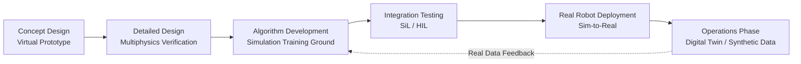
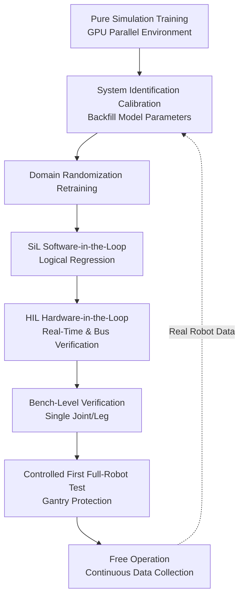
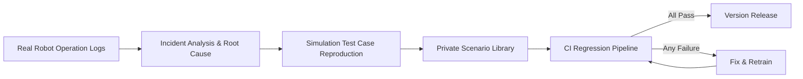

# Chapter 23: Simulation and Physics Engines

## Abstract

Simulation serves as the "intermediate proving ground" for humanoid robots transitioning from blueprints to the real world: it transforms expensive hardware trial-and-error into inexpensive numerical experiments, and amplifies scarce real-world data into vast synthetic experience. This chapter begins with the mathematical foundations of rigid-body dynamics simulation, systematically explaining the core principles of physics engines, including articulated body equations of motion, forward dynamics algorithms, contact modeling, and time integration. It then analyzes the architectural features and applicable boundaries of mainstream platforms such as the MuJoCo physics engine, NVIDIA Isaac Sim/Isaac Lab, Gazebo, the Drake systems toolbox, the Genesis generative physics engine, and ManiSkill3, and discusses the asset pipeline composed of the URDF robot description format and the MJCF simulation format. Building on this foundation, the chapter delves into how GPU-based massively parallel simulation reshapes the reinforcement learning training paradigm, as well as the engineering implementation of visual and force sensor simulation and synthetic data pipelines. Finally, centered on the core proposition of Sim-to-Real transfer, it provides a three-layer toolbox of domain randomization, system identification, and hardware-in-the-loop (HIL) testing, and illustrates the methodology of controlled comparison using simulation benchmarks such as HumanoidBench and ManiSkill. This chapter complements Chapter 14 (Control), Chapter 18 (Policy Learning), and Chapter 25 (Evaluation Systems).

**Keywords**: Physics Engine; Rigid Body Dynamics; Contact Modeling; MuJoCo; NVIDIA Isaac Sim; Gazebo; GPU Parallel Simulation; Domain Randomization; Sim-to-Real Transfer; Hardware-in-the-Loop Testing

---

## 23.1 The Role of Simulation in Humanoid Robot Development

### 23.1.1 Why Humanoid Robots Cannot Do Without Simulation

Humanoid robots are among the robot forms discussed in this book that are most dependent on simulation, for four reasons.

First, **the cost of trial and error is extremely high**. The total material cost of a full-size humanoid robot is typically on the order of tens to hundreds of thousands of US dollars. A single uncontrolled fall can damage harmonic drives, torque sensors, or structural components, with repair cycles measured in weeks. Simulation compresses the cost of "falling ten thousand times" to the level of electricity bills, making the exploration of aggressive control strategies feasible.

Second, **the sample hunger of Reinforcement Learning (RL)**. Current mainstream legged locomotion control policies are often trained using model-free reinforcement learning algorithms such as Proximal Policy Optimization (PPO), and convergence often requires billions of environment interaction steps. At a control frequency of 50 Hz, a single real robot running continuously for a year can only accumulate approximately 1.6 billion steps, accompanied throughout by wear and safety risks. In contrast, GPU-based parallel simulation can complete an equivalent scale of sampling within hours.

Third, **the scalability of data collection**. The throughput of collecting real-world demonstration data via teleoperation is limited by the number of operators and available hardware units. Synthetic data pipelines in simulation can programmatically generate scenes, objects, lighting, and annotations, with scale virtually unconstrained by physical limitations. NVIDIA Isaac Sim's support for the GR00T synthetic data pipeline is an industrial practice of this approach.

Fourth, **safety and reproducibility**. Simulation environments can precisely reproduce the same initial conditions, supporting regression testing and controlled comparisons, which is crucial for verifying iterations of control software versions.

!!! note "Terminology Explanation: Simulation, Digital Twin, Synthetic Data, Regression Testing"
    - **Simulation**: Using mathematical models to reproduce the evolution of a physical system in a computer, used for prediction, training, and validation.
    - **Digital Twin**: A high-fidelity simulation replica that maintains state synchronization with a specific physical entity, emphasizing a "one-to-one" mapping; general simulation is not tied to a specific entity.
    - **Synthetic Data**: Sensor data and its annotations programmatically generated by a simulator, used for training perception or policy models.
    - **Regression Testing**: Re-running an existing test suite after each software change to confirm that no performance degradation has been introduced.

### 23.1.2 The Role of Simulation in the Complete Robot Development Process

Simulation runs through the entire lifecycle of humanoid robot development, playing different roles at different stages:

| Stage | Simulation Role | Typical Tasks |
|---|---|---|
| Concept Design | Virtual Prototype | Configuration comparison, joint torque spectrum estimation, reachable space analysis |
| Detailed Design | Multiphysics Verification | Structural strength interface verification, thermal simulation coupling, cable motion interference check |
| Algorithm Development | Training Ground & Testbed | Controller tuning, RL policy training, planning algorithm validation |
| Integration Testing | In-the-Loop Verification | Software-in-the-Loop (SiL), Hardware-in-the-Loop (HIL), Regression Testing |
| Deployment & Operations | Digital Twin & Data Factory | Fault reproduction, synthetic data generation, policy retraining |



!!! note "Terminology Explanation: Virtual Prototype, Software-in-the-Loop, Hardware-in-the-Loop, Multiphysics Simulation"
    - **Virtual Prototype**: A complete digital model used to evaluate design candidates before manufacturing a physical prototype.
    - **Software-in-the-Loop (SiL)**: The control software under test and the simulated plant run in a closed loop within the same computing environment.
    - **Hardware-in-the-Loop (HIL)**: Real controller hardware runs in a closed loop with a real-time simulated plant; see Section 23.7.4 for details.
    - **Multiphysics Simulation**: A coupled simulation that simultaneously solves multiple physical fields such as structural, thermal, electromagnetic, and fluid dynamics.

### 23.1.3 The Capability Boundary of Simulation: The Reality Gap

Simulation is not a free lunch. The systematic discrepancy between simulation and reality is called the **reality gap** or **sim-to-real gap**, whose main sources include:

- **Contact mechanics errors**: Foot-ground and hand-object contacts involve stick-slip, asperity deformation, and impact; any contact model is only an approximation of real physics.
- **Actuator nonlinearities**: Gear backlash, friction, hysteresis, and temperature drift are difficult to model precisely.
- **Insufficient sensor distortion models**: Camera motion blur, lens radial distortion, IMU bias wander, etc., are often simplified or ignored.
- **Unmodeled flexible bodies and clearances**: Cables, skins, foot padding, and structural elastic deformation are invisible in pure rigid-body simulation.
- **Rendering domain gap**: Statistical differences in texture, lighting, and noise distribution between simulated images and real cameras directly degrade the transfer performance of visual policies.

Therefore, the methodological main line of this chapter is not "how to make simulation more realistic," but rather "how to ensure that conclusions drawn in simulation remain valid in reality, given the inevitable inaccuracy of simulation"—this is the starting point for the Sim-to-Real transfer toolbox in Section 23.7.

## 23.2 Mathematical Foundations of Rigid Body Dynamics Simulation

### 23.2.1 Equations of Motion for Articulated Rigid Body Systems

Humanoid robots are typically modeled in simulation as **floating base articulated rigid body systems**: the pelvis (base) has a spatial pose with 6 degrees of freedom, and the limbs are connected via revolute joints to form a tree-like kinematic chain. The equation of motion is

$$
\mathbf{M}(\mathbf{q})\,\ddot{\mathbf{q}} + \mathbf{C}(\mathbf{q}, \dot{\mathbf{q}})\,\dot{\mathbf{q}} + \mathbf{g}(\mathbf{q}) = \mathbf{S}^{\top}\boldsymbol{\tau} + \mathbf{J}_c(\mathbf{q})^{\top}\,\mathbf{f}_c
$$

where \(\mathbf{q} \in \mathbb{R}^{n+6}\) are the generalized coordinates (including the floating base pose), \(\mathbf{M}\) is the mass matrix, \(\mathbf{C}\dot{\mathbf{q}}\) is the Coriolis and centrifugal term, \(\mathbf{g}\) is the gravity term, \(\mathbf{S}\) is the selection matrix for actuated joints, \(\boldsymbol{\tau}\) is the joint torque, \(\mathbf{J}_c\) is the contact Jacobian, and \(\mathbf{f}_c\) is the contact force. The core task of the physics engine at each step is to solve the **forward dynamics** of this equation: given the current state \((\mathbf{q}, \dot{\mathbf{q}})\) and applied torques \(\boldsymbol{\tau}\), find the acceleration \(\ddot{\mathbf{q}}\), then perform time integration to advance the state.

!!! note "Terminology Explanation: Generalized Coordinates, Floating Base, Mass Matrix, Selection Matrix, Contact Jacobian"
    - **Generalized coordinates**: The minimal set of coordinates required to fully describe the system configuration; for a humanoid robot, this means the base pose plus all joint angles.
    - **Floating base**: The root link that is not fixed to an inertial frame and can move freely in space; this is the essential difference between modeling legged robots and fixed-base manipulators.
    - **Mass matrix (\(\mathbf{M}\))**: A linear mapping from generalized acceleration to generalized force, symmetric positive definite; its condition number affects the accuracy of numerical solutions.
    - **Selection matrix (\(\mathbf{S}\))**: Maps actuator torques to the corresponding joints; the 6 degrees of freedom of the floating base are not directly actuated, reflecting the underactuated nature of humanoid robots.
    - **Contact Jacobian (\(\mathbf{J}_c\))**: Maps joint-space velocities to contact point spatial velocities; \(\mathbf{J}_c^{\top}\mathbf{f}_c\) is the generalized force equivalent of the contact forces.

### 23.2.2 Forward Dynamics Algorithms: CRBA and ABA

Directly inverting \(\mathbf{M}\) has a complexity of \(O(n^3)\), which is not economical for floating base systems with over 30 degrees of freedom. Classical rigid body dynamics algorithms leverage the tree structure of the kinematic chain for efficient recursion:

- **Composite Rigid Body Algorithm (CRBA)**: Constructs the mass matrix \(\mathbf{M}\) explicitly with \(O(n^2)\) complexity (actually better for tree structures), suitable for scenarios requiring an explicit mass matrix, such as model-based control and some contact solvers;
- **Articulated Body Algorithm (ABA)**: Does not construct \(\mathbf{M}\) explicitly, but directly computes \(\ddot{\mathbf{q}}\) with \(O(n)\) complexity through forward-backward recursion; it is the preferred choice for high-performance engines and dynamics libraries like MuJoCo and Pinocchio.

In engineering practice, forward/inverse dynamics and analytical derivatives are typically computed by calling mature libraries: the open-source C++ library Pinocchio provides efficient implementations of rigid body dynamics, kinematics, and analytical derivatives, widely embedded in controllers and simulation pipelines; the Drake systems toolbox deeply integrates dynamics with mathematical programming solvers, targeting optimization-based control and analysis.

### 23.2.3 Contact Modeling: Complementarity Constraints and Penalty Methods

Contact is the soul of legged locomotion and manipulation simulation, and also the most challenging aspect to achieve both "fast and accurate". The two main technical routes are as follows.

**Constraint-based contact**. Non-penetration and Coulomb friction are formulated as complementarity conditions: normal velocity \(v_n \ge 0\), normal force \(f_n \ge 0\), and they are complementary \(v_n \cdot f_n = 0\), meaning the contact point is either separating (\(f_n=0\)) or in firm contact with no relative normal motion (\(v_n=0\)). The friction cone constraint is

$$
\|\mathbf{f}_t\| \le \mu f_n
$$

where \(\mathbf{f}_t\) is the tangential friction force and \(\mu\) is the friction coefficient. For numerical solvability, the cone is often linearized into a polyhedral cone, transforming the problem into a **Linear Complementarity Problem (LCP)** or a convex optimization problem. The uniqueness of the MuJoCo physics engine lies in modeling contact as a convex optimization problem, allowing soft contact and regularization, achieving good numerical stability and potential differentiability while maintaining physical plausibility.

**Penalty-based contact**. Allows small penetration \(\delta\) between contacting bodies, generating a normal force using virtual spring-dampers

$$
f_n = k_p\,\delta + k_d\,\dot{\delta}, \qquad \delta > 0
$$

The penalty method is simple to implement and easy to parallelize, making it the choice for most GPU simulators; however, large stiffness \(k_p\) values introduce stiff differential equations, forcing smaller integration time steps, and the physical correspondence between penetration depth and contact force requires careful calibration.

!!! note "Terminology Explanation: Complementarity Condition, Coulomb Friction Cone, LCP, Soft Contact, Stiff Equation"
    - **Complementarity condition**: A constraint form where two non-negative quantities cannot both be positive (\(a\ge 0,\, b\ge 0,\, ab=0\)), capturing the "contact or separation" binary logic.
    - **Coulomb friction cone**: The contact force must lie within a cone with the normal as its axis and a half-angle of \(\arctan\mu\); otherwise, sliding occurs.
    - **Linear Complementarity Problem (LCP)**: The standard complementarity problem form obtained after linearizing the friction cone, solvable by Lemke's algorithm or interior point methods.
    - **Soft contact**: Introducing regularization in constraint solving so that contact force varies continuously with small penetration, improving numerical convergence; MuJoCo's contact model falls into this category.
    - **Stiff equation**: A differential equation where time constants within the system differ vastly; explicit integration requires very small time steps for stability.

The engineering comparison between the two routes is as follows:

| Dimension | Constraint-based Contact | Penalty-based Contact |
|---|---|---|
| Physical Accuracy | High, no macroscopic penetration | Depends on stiffness calibration, steady-state penetration exists |
| Numerical Stability | Good, step size not limited by contact stiffness | Large stiffness requires small step sizes |
| Parallel Friendliness | Solver has significant serial components | Per-contact independent computation, inherently parallel |
| Differentiability | Requires special handling (e.g., convex optimization implicit differentiation) | Directly differentiable |
| Typical Platforms | MuJoCo, Drake | GPU parallel simulators (e.g., Isaac series, optional mode in Genesis) |

### 23.2.4 Time Integration and Numerical Stability

After obtaining \(\ddot{\mathbf{q}}\), numerical integration is needed to advance the state. Common schemes include:

- **Forward Euler**: \(\dot{\mathbf{q}}_{k+1} = \dot{\mathbf{q}}_k + h\ddot{\mathbf{q}}_k\), \(\mathbf{q}_{k+1} = \mathbf{q}_k + h\dot{\mathbf{q}}_k\). Simplest to implement, but energy grows monotonically for oscillatory systems, leading to poor stability;
- **Semi-implicit Euler / Symplectic Euler**: First updates velocity using the new acceleration, then updates position using the **new velocity**. As a symplectic integrator, it bounds energy error over long simulations, making it a mainstay in physics engines;
- **Implicit Euler**: Constructs update equations using quantities at the next time step, requiring solving a system of equations; computationally expensive but inherent numerical damping suppresses high-frequency instability, suitable for stiff systems with contact;
- **Higher-order Runge-Kutta (e.g., RK4)**: High accuracy but requires multiple dynamics evaluations per step, and lacks symplectic properties; common in scenarios demanding trajectory precision with less sensitivity to energy drift.

Time step selection is a key trade-off between accuracy and speed: generally, a simulation step of \(0.5\)–\(2\) ms for legged contact balances contact stability and throughput; control loops run at downsampled frequencies from 20–50 Hz (policy layer) to 500–1000 Hz (torque layer). A common metric for evaluating simulation speed is the **Real-Time Factor (RTF)**, defined as the ratio of simulated time to wall-clock time; RL training pursues RTF >> 1, while HIL testing requires RTF = 1.

### 23.2.5 Python Example: Energy Drift in Pendulum Integration

The following example compares the energy behavior of forward Euler and semi-implicit Euler integration for a simple pendulum, intuitively demonstrating the advantage of symplectic integrators in long-duration simulations—a difference that is further amplified in multi-hour humanoid walking simulations.

```python
# Simple Pendulum: Energy Error Comparison of Explicit Euler vs Semi-Implicit Euler
# Dynamics: theta_ddot = -(g/L) * sin(theta)
import numpy as np

g, L, m = 9.81, 1.0, 1.0     # Gravitational acceleration, pendulum length, mass
h = 1e-3                     # Integration step size (s)
T = 20.0                     # Simulation duration (s)
steps = int(T / h)

def energy(theta, omega):
    return 0.5 * m * (L * omega)**2 - m * g * L * np.cos(theta)

def simulate(mode):
    theta, omega = 0.5, 0.0  # Initial pendulum angle 0.5 rad
    E0 = energy(theta, omega)
    drift = []
    for _ in range(steps):
        alpha = -(g / L) * np.sin(theta)
        if mode == "explicit":           # Explicit Euler
            theta_new = theta + h * omega
            omega_new = omega + h * alpha
        else:                            # Semi-implicit Euler: update velocity first
            omega_new = omega + h * alpha
            theta_new = theta + h * omega_new
        theta, omega = theta_new, omega_new
        drift.append(energy(theta, omega) - E0)
    return np.array(drift)

for mode in ("explicit", "semi-implicit"):
    d = simulate(mode)
    print(f"{mode:>14s}: Energy drift after 20 s {d[-1]:+.6f} J, max |drift| {np.abs(d).max():.6f} J")
```

Typical output shows: the energy of explicit Euler grows approximately linearly over time (the system is artificially "injected" with energy, manifested as increasing swing amplitude), while the energy error of semi-implicit Euler exhibits bounded oscillations. The damping, contact solving, and integrator selection within the physics engine collectively determine the magnitude of such numerical artifacts. Developers should perform energy conservation regression tests on undisturbed scenarios before using long-duration simulation data.

## 23.3 Mainstream Physics Engines and Simulation Platforms

### 23.3.1 MuJoCo Physics Engine

**MuJoCo Physics Engine** originated from the team of Emo Todorov at the University of Washington. It was open-sourced by DeepMind in 2021 and is continuously maintained. It is a high-fidelity physics engine with rich contact dynamics, widely used in humanoid control research. Its technical features include:

- **Convex optimization contact solving**: Formulates contact dynamics as a convex optimization problem, supporting soft contacts and constraint regularization, resulting in smooth contact behavior with good physical consistency, which is crucial for legged locomotion and dexterous manipulation;
- **Generalized coordinate dynamics**: Recursively computes directly in joint space, avoiding large-scale sparse systems of the Lagrange multiplier method, and combined with ABA for high throughput;
- **MJCF native format**: Models are described using the MJCF simulation format (see Section 23.4.2), with semantics close to control requirements;
- **C API + Python bindings**: Facilitates integration into training pipelines, and has long been the de facto standard simulator for legged control and deep RL papers.

Typical uses of MuJoCo include: algorithm validation for whole-body control and MPC, policy training in small to medium-scale (tens to hundreds of parallel environments), and simulation of manipulation tasks requiring precise contact behavior. Its shortcomings include relatively simple rendering capabilities and GPU large-scale parallelism relying on later versions and derivative works (e.g., MJX).

### 23.3.2 NVIDIA Isaac Sim and Isaac Lab

**NVIDIA Isaac Sim** is a GPU-accelerated photorealistic robot simulator built on the Omniverse platform, based on the USD (Universal Scene Description) scene format and the PhysX physics engine. Its core advantage is **photorealistic rendering**: the RTX ray tracing pipeline can generate camera data with realistic lighting, materials, and motion blur, making it a primary platform for synthetic data generation and visual policy training, and supporting the GR00T synthetic data pipeline.

**NVIDIA Isaac Lab** is a modular learning framework built on Isaac Sim for large-scale robot policy training. It modularizes RL environments, reward terms, observations, and domain randomization configurations, and comes with built-in motion and manipulation task examples for humanoid robots (e.g., Unitree H1/G1). It is a common entry point for training whole-body policies for humanoid robots in the industry. The relationship between the two is: Isaac Sim provides the simulation and rendering foundation, while Isaac Lab provides a learning-oriented abstraction layer on top of it.

### 23.3.3 Isaac Gym Benchmarks and GPU End-to-End Reinforcement Learning

Before Isaac Lab, **Isaac Gym** pioneered high-throughput RL with an end-to-end design where "physics and rendering are both on the GPU, and observation and action tensors never leave GPU memory." **Isaac Gym Benchmarks** is a collection of GPU-accelerated reinforcement learning benchmarks built on top of it, covering task families from inverted pendulums to dexterous hands (e.g., Shadow Hand rotating a ball) to quadruped/humanoid locomotion, providing a unified high-throughput comparison environment for policy training and evaluation. Its historical significance lies in proving that when a single GPU can simultaneously advance thousands of environments, "simulation sampling speed" is no longer the bottleneck for RL, shifting research focus to reward design and Sim-to-Real methods themselves.

!!! note "Terminology Explanation: End-to-End GPU Pipeline, Parallel Environments, Tensor API, Physics Step and Policy Step"
    - **End-to-end GPU pipeline**: Physics simulation, rendering, observation assembly, and policy inference all reside on the GPU, avoiding the synchronization overhead of CPU-GPU data transfer.
    - **Parallel environments**: Batch advancing thousands of independent environment instances within the same physics step, which is the source of GPU high throughput.
    - **Tensor API**: An interface that reads and writes the state of all environments using batched tensors, replacing traditional per-environment function calls.
    - **Physics step and policy step**: Physics integrates at millisecond-level small steps, while the policy executes every few physics steps, with the two frequencies decoupled.

### 23.3.4 Gazebo

**Gazebo** is an open-source 3D robot simulator providing physics engines, sensor models, and scene editing capabilities. It is maintained by Open Robotics and deeply integrated with the ROS ecosystem. Its characteristics include:

- **Multiple physics engine backends**: Optional backends like ODE, Bullet, Simbody, DART, etc., facilitating cross-validation;
- **Rich sensor plugins**: Ready-made models for cameras, depth cameras, LiDAR, IMU, force/torque sensors, published as ROS topics;
- **SDF scene description and graphical editing**: Suitable for building structured test scenarios (warehouses, stairs, porches);
- **Classic Gazebo and new-generation Gazebo (formerly Ignition)**: The latter has been refactored into modular libraries, improving rendering and distributed simulation capabilities.

Gazebo's physics throughput and contact accuracy are not outstanding, but it excels in its ecosystem: navigation stacks, MoveIt motion planning, and the ros_control controller framework can all run end-to-end directly in Gazebo, making it still the main platform for system integration testing and teaching scenarios.

### 23.3.5 Drake Systems Toolbox

**Drake Systems Toolbox** is a systems modeling toolbox from MIT focused on optimization-based control and analysis, continuously invested in by the Toyota Research Institute (TRI). Unlike "general-purpose simulators," Drake's strength lies in the **rigorous combination of dynamics and mathematical programming**: its multibody dynamics implementation emphasizes numerical accuracy (including high-fidelity contact representations like the hydroelastic contact model) and seamlessly integrates with toolchains for trajectory optimization, LQR, MPC, reachability analysis, etc. For scenarios requiring formal analysis or high-precision contact research (e.g., hybrid system stability analysis for bipedal walking), Drake provides a depth that other platforms find hard to replace; correspondingly, its rendering and GPU parallelism capabilities are weaker.

### 23.3.6 Genesis Generative Physics Engine

**Genesis Generative Physics Engine** is an emerging generative general-purpose physics engine that appeared around 2024, targeting robotics and other fields. Its design goal is to unify rigid bodies, soft bodies, fluids, and deformable bodies within a differentiable, GPU-accelerated framework, and to reduce environment construction costs with extremely high simulation speeds (official demos show significantly higher rigid body scene throughput than traditional engines) and a "generative" philosophy—using natural language or procedural generation to create interactive scenes and tasks. For humanoid robots, the unified modeling of deformable bodies and soft contacts is expected to improve aspects long neglected by rigid body assumptions, such as foot sole foam and flexible skins. As an emerging platform, its ecosystem and engineering validation are still being accumulated.

### 23.3.7 ManiSkill3 and GPU Parallel Rendering

**ManiSkill3** is a GPU-parallel robot simulation and rendering benchmark platform for embodied AI, built on the SAPIEN engine. Its key feature is **simultaneously GPU-izing both physics parallelism and rendering parallelism**, enabling high throughput for manipulation tasks with visual observations, bridging the long-standing trade-off between "high-fidelity vision" and "large-scale sampling." Its task set covers rigid/articulated object manipulation, mobile manipulation, etc., and comes with demonstration data and baselines. See Section 23.8.2 for details.

### 23.3.8 Platform Capability Comparison

| Platform | Physics Kernel | Parallelism | Rendering Fidelity | Contact Quality | Typical Positioning |
|---|---|---|---|---|---|
| MuJoCo | Proprietary (Convex Contact) | CPU-centric, MJX provides GPU path | Medium | High | Control Research, RL Training |
| Isaac Sim / Lab | PhysX | GPU Large-Scale Parallel | High (RTX Ray Tracing) | Medium-High | Synthetic Data, Large-Scale RL |
| Isaac Gym | PhysX | GPU Large-Scale Parallel | Medium | Medium | High-Throughput RL Benchmark |
| Gazebo | ODE/Bullet/DART etc. | CPU-centric | Medium | Medium | ROS Integration Testing |
| Drake | Proprietary (Hydroelastic) | CPU | Medium-Low | High (Research-Grade) | Optimal Control & Analysis |
| Genesis | Proprietary Unified Solver | GPU Large-Scale Parallel | Medium-High | Medium-High (Includes Soft Bodies) | General/Generative Simulation |
| ManiSkill3 | SAPIEN (PhysX-based) | GPU Physics + Rendering Parallel | High | Medium | Embodied Manipulation Benchmark |

General selection principles are: choose MuJoCo/Drake when contact accuracy and control validation are the priority; choose the Isaac family or ManiSkill3 when visual synthetic data and large-scale RL are the priority; choose Gazebo when ROS full-stack integration is the priority; and watch Genesis when exploring soft/deformable interactions. Most teams actually adopt a **multi-simulator strategy**, using two or more engines to cross-validate key conclusions, reducing the systemic risk of modeling bias from a single engine.

## 23.4 Robot Description Formats and Asset Pipeline

### 23.4.1 URDF Robot Description Format

**URDF Robot Description Format** is an XML-based robot model format that describes links, joints, inertia, and geometry for simulation and control. It is the standard in the ROS ecosystem. Its core elements include:

- `<link>`: Links, containing visualization geometry (`<visual>`), collision geometry (`<collision>`), and inertial parameters (`<inertial>`: mass, center of mass, inertia tensor);
- `<joint>`: Joints, with types including revolute, prismatic, fixed, etc., containing axis, limits, and dynamic parameters (damping, friction);
- `<transmission>` and `<gazebo>` extensions: Describe actuator mapping and simulation-specific parameters.

URDF's limitations are also clear: it only supports tree structures (closed chains require hacks), does not support parallel joint groups or detailed actuator models, and has weak scene description capabilities. In engineering, the xacro macro mechanism is often used to parameterize and generate URDFs to manage humanoid models with dozens of joints.

### 23.4.2 MJCF Simulation Format

**MJCF Simulation Format** is MuJoCo's XML modeling format used to describe articulated rigid body systems with contacts, actuators, and sensors. Compared to URDF, MJCF's differences lie precisely in being "designed for simulation and control":

- **Compile-time expansion**: MJCF allows omitting inertial parameters, which are automatically calculated by the compiler from geometry and density;
- **Native support for closed chains and equality constraints**: Uses `<equality>` to describe closed-loop mechanisms like four-bar linkages;
- **Actuators and sensors as first-class citizens**: `<actuator>` supports motors, position/velocity servos, and tendon drives; `<sensor>` directly declares force/torque, tactile, and other readings;
- **Contact parameterization**: Each pair of geometries can be configured with condim, friction, and soft contact parameters, aligning with MuJoCo's convex contact solver semantics.

### 23.4.3 USD and the Engineering Reality of Format Conversion

Isaac Sim uses **USD (Universal Scene Description)**, proposed by Pixar, as its scene format. Its hierarchical composition and efficient instancing capabilities are suitable for large scenes and GPU rendering. Thus, a typical humanoid robot asset pipeline is: CAD → URDF/MJCF (control and dynamics semantics) → USD (Isaac rendering semantics), with information loss at each step. Common conversion issues include:

- **Inertia tensor loss or error**: If visual meshes exported from CAD lack density assumptions, inertial parameters are completely wrong, directly causing dynamic distortion;
- **Collision mesh inflation**: Directly using high-polygon visual meshes as collision meshes slows collision detection by one to two orders of magnitude; convex decomposition or primitive approximation is necessary;
- **Differences in joint orientation and limit conventions**: Conventions for joint axes, zero positions, and handedness vary between formats, requiring per-joint verification after conversion;
- **Incompatibility of material and friction parameter semantics**: Rendering materials (PBR) and physical materials (friction, restitution coefficient) are two separate systems that must be maintained independently.

!!! note "Terminology Explanation: Convex Decomposition, Primitive Approximation, Zero Calibration, Asset Pipeline"
    - **Convex decomposition**: Splitting a non-convex mesh into a union of several convex bodies, balancing collision detection speed and geometric fidelity.
    - **Primitive approximation**: Replacing mesh collision bodies with basic geometries like spheres, capsules, and boxes; fastest for detection but with the largest geometric error.
    - **Zero calibration**: Determining the correspondence between the model's joint angle zero position and the real robot's encoder zero position; the first step in aligning the simulation model with the real robot.
    - **Asset pipeline**: The process of converting, verifying, and version-managing models from CAD to formats usable by various simulators.

### 23.4.4 Engineering Essentials for Humanoid Robot Simulation Modeling

Whether a humanoid robot model is "realistic" often depends not on the engine but on the modeling details:

1. **Mass property source hierarchy**: CAD theoretical values → measured weighing values → system identification corrected values, with increasing reliability; the overall center of mass error should be controlled to the millimeter level, otherwise the balance controller will be constantly "surprised" on the real robot;
2. **Actuator model**: At a minimum, incorporate first-order lag for velocity/torque loops, torque saturation, backlash, and Coulomb friction in joint space; quasi-direct drive (QDD) joints also require modeling the current loop bandwidth;
3. **Paired parameters for foot-ground contact**: Contact stiffness, damping, and friction coefficients must be calibrated per pair of "foot sole material - ground material" and covered within the domain randomization range;
4. **Sensor mounting pose extrinsics**: Errors in the extrinsics of cameras/IMUs relative to the link directly contaminate visual policies and state estimation; they must be written into the model using a calibration process (see relevant content in Chapters 6 and 21);
5. **Collision pair culling**: Humanoid robots have a large number of geometric pairs; explicitly disable collision detection for link pairs that cannot possibly touch to gain significant acceleration.

## 23.5 GPU Large-Scale Parallel Simulation and Policy Training

### 23.5.1 From CPU Serial to GPU Parallel: An Order-of-Magnitude Leap in Throughput

Traditional CPU simulation is limited by the number of cores, and parallelizing tens of environments is near its limit. GPU parallel simulation represents states as batched tensors, executing collision detection, constraint solving, and integration all in kernel form in batches, allowing a single GPU to parallelize thousands to tens of thousands of environments. Assuming a single environment's physical throughput is \(s\) steps/second, the ideal total throughput for parallelizing \(N\) environments is approximately

$$
S_{\text{total}} \approx N \cdot s \cdot \eta(N)
$$

where \(\eta(N)\) is the parallel efficiency, close to 1 before the GPU is saturated, and decreasing after saturation due to kernel scheduling and memory bandwidth contention. Engineering experience suggests: set the number of environments near the inflection point of the throughput curve (not the maximum), and ensure observation assembly, reward calculation, and policy forward passes are also completed on the GPU to avoid per-step CPU-GPU memory transfers negating the benefits—this is the design philosophy of Isaac Gym's end-to-end GPU pipeline.

### 23.5.2 Multi-Simulator Training Frameworks like HumanoidVerse

**HumanoidVerse** is a multi-simulator training framework for Sim-to-Real humanoid robot learning. Its design philosophy warrants specific discussion: the modeling bias of a single simulator is systematic (specific contact solver, specific integrator, specific actuator model). A policy trained to convergence in a single engine may overfit to that engine's "physical flavor." HumanoidVerse decouples the training environment from the high-level algorithm, allowing the same policy to be trained and evaluated across multiple simulation backends. This effectively adds another layer of randomization in the "engine space," testing the policy's robustness. This approach complements domain randomization: domain randomizes **parameters**, while multi-engine training randomizes **solver structure**.

### 23.5.3 Engineering Trade-offs in Parallel Training

More parallelism is not always better; the following factors must be weighed:

| Factor | Impact | Engineering Suggestion |
|---|---|---|
| GPU Memory Capacity | Limits the number of environments and observation dimensions | Use low resolution for visual observations + in-memory preprocessing |
| Physics-Policy Frequency Ratio | Determines the number of physics steps per policy step | Typically 10–50, depending on control bandwidth |
| Environment Heterogeneity | Domain randomization increases kernel branching | Store parameters in vectors, avoid per-environment conditional statements |
| Early Termination | Resetting failed environments causes utilization imbalance | Use bucketed resets or short episode concatenation |
| Random Seed Management | Affects reproducibility | Bind seeds to environment IDs, record full configuration |

Furthermore, high throughput can mask sample efficiency issues: when hundreds of billions of steps can be collected in an hour, algorithm comparisons should shift to **wall-clock convergence speed** and **final real-robot performance**, rather than traditional sample complexity metrics. Evaluation methods should be adjusted accordingly (see Chapter 25).

## 23.6 Sensor Simulation and Synthetic Data

### 23.6.1 Visual Sensor Rendering Pipeline

Visual sensor simulation operates on two levels. The **geometry layer** is handled by the rendering engine: rasterization or ray tracing generates RGB, depth, semantic segmentation, and instance segmentation images. Isaac Sim's RTX pipeline and ManiSkill3's GPU parallel rendering represent the two extremes of "single-scene high fidelity" and "batch-scene high throughput." The **noise layer** is responsible for injecting real sensor distortions: lens distortion, rolling shutter, motion blur, exposure noise, depth camera holes and quantization stripes, LiDAR multipath echoes, etc. Rendering only "clean" images while ignoring noise modeling is a common cause of Sim-to-Real failure for visual policies.

### 23.6.2 Force and Proprioception Simulation

Proprioceptive sensors for humanoid robots (joint encoders, IMUs, foot force/torque sensors, joint torque sensors) are generated in simulation using a "ground truth + noise model" approach: ideal readings are extracted from the dynamic state, then bias, random walk, quantization, and delay are superimposed. Two points require special attention in engineering: First, IMU simulation must include the Coriolis coupling term between gravity projection and angular velocity; otherwise, IMU-based state estimation will exhibit systematic bias during transfer. Second, simulated contact force readings should be aligned with the real sensor's mounting position and filtering characteristics—the "free" global contact ground truth in simulation should not be directly exposed to the policy, otherwise the policy will learn privileged information unavailable on the real robot (unless intentionally used in an asymmetric Actor-Critic teacher-student framework).

### 23.6.3 Synthetic Data Pipeline

The value of synthetic data lies in transforming the labor-intensive "collect-annotate" process into a compute-intensive "procedural generation" process. A typical synthetic data pipeline for humanoid robots includes: scene and object asset generation → pose and lighting randomization → physics simulation stepping → multi-modal sensor rendering → automatic annotation (bounding boxes, segmentation, keypoints, contact states) → dataset export. NVIDIA Isaac Sim's support for the GR00T synthetic data pipeline is an industrial example of this paradigm: generating manipulation trajectories and visual observations at scale in simulation for pre-training or augmenting humanoid robot foundation models. It is important to note that the **ratio** of synthetic to real data, and the **coverage** of the real distribution by the synthetic distribution, are more important than absolute quantity; data infrastructure and ratio methods are detailed in Chapter 21.

## 23.7 Sim-to-Real: Bridging the Reality Gap

### 23.7.1 Decomposition of the Reality Gap Sources

**Sim-to-Real Transfer** is a general term for techniques that transfer policies or controllers trained in simulation to real robots. Translating the qualitative discussion from Section 23.1.3 into an operational level, the reality gap can be divided into three categories based on how they can be handled:

- **Parameterizable Gap**: Continuous parameters such as mass, friction, delay, and stiffness—covered by domain randomization, narrowed by system identification;
- **Structural Gap**: Non-parametric effects such as backlash, hysteresis, and soft body deformation—requiring supplementary modeling (e.g., adding history to observations for implicit identification) or structural design to avoid;
- **Perceptual Distribution Gap**: Statistical differences between rendered and real images—bridged using visual domain randomization, real data mixing, or domain adaptation.

### 23.7.2 Domain Randomization

**Domain Randomization** is a Sim-to-Real technique that randomizes simulation parameters during training to improve policy robustness against real-world model mismatch. Formally, let simulation parameters \(\boldsymbol{\xi}\) (mass, friction, delay, external disturbances, etc.) follow a distribution \(p(\boldsymbol{\xi})\). The policy training objective then shifts from maximizing return in a single environment to maximizing the expected return:

$$
\max_{\pi}\; \mathbb{E}_{\boldsymbol{\xi}\sim p(\boldsymbol{\xi})}\left[\, J(\pi;\, \boldsymbol{\xi}) \,\right]
$$

Typical randomization parameters for humanoid robots include: link mass and center of mass (on the order of ±10%), joint friction and damping, ground friction coefficient and stiffness, actuator gain and delay, IMU/encoder noise, external push disturbances, and foot terrain. Three engineering key points are:

1. **Range Calibration**: The randomization range must cover the real parameter distribution (with priors from system identification). Too wide a range slows convergence and yields conservative policies; too narrow leads to transfer failure;
2. **Observation History**: Incorporating several steps of historical observations allows the policy to implicitly identify environmental parameters online (effectively making \(\boldsymbol{\xi}\) partially observable), significantly improving transfer robustness;
3. **Curriculum Convergence**: Learning skills with a narrow range first, then robustness with a wide range, converges faster than using a wide range throughout training.

### 23.7.3 System Identification and Real Robot Calibration

**System Identification** is the process of building a mathematical model of a dynamic system from measured input-output data to align simulation with reality. For a single joint, drive chain parameters (gain, delay, friction curve) can be fitted via frequency sweep or step excitation. For the whole robot, excitation trajectories are collected under constraints (e.g., double support), and inertial parameters are optimized to minimize the residual between predicted and measured torque/motion:

$$
\min_{\boldsymbol{\theta}}\; \sum_{t} \left\| \boldsymbol{\tau}_{\text{meas}}(t) - \boldsymbol{\tau}_{\text{model}}\big(\mathbf{q}_t, \dot{\mathbf{q}}_t, \ddot{\mathbf{q}}_t;\, \boldsymbol{\theta}\big) \right\|^2
$$

where \(\boldsymbol{\theta}\) represents the inertial, friction, and actuator parameters to be identified. The identification results are used to backfill the simulation model, narrowing the reality gap itself; they also provide empirical evidence for the domain randomization range. The relationship between the two is: system identification "pulls simulation toward reality," while domain randomization "makes the policy insensitive to residual errors." Together, they form the mainstream Sim-to-Real workflow.

### 23.7.4 In-the-Loop Verification: SiL, HIL, and Hardware-in-the-Loop Testing

Before deploying a policy on the robot, the engineering workflow requires layered in-the-loop verification. **Hardware-in-the-Loop (HIL) Testing** is a verification method where real hardware controllers interact with a real-time simulation model of the controlled object, enabling safe and repeatable testing of control software. A typical in-the-loop ladder for humanoid robots is:

1. **SiL**: Control software (compiled as an executable isomorphic to the target platform) runs in a closed loop with the simulator on an industrial PC to verify logical correctness;
2. **HIL**: Control software runs on the real onboard computing platform, closed-loop with a real-time simulator via real bus interfaces (EtherCAT/CAN) to verify real-time performance, drive chain, and communication timing;
3. **Single-Joint/Single-Leg Bench HIL**: Some real actuators participate in the closed loop to verify the electromechanical interface;
4. **Controlled First Full-Robot Test**: Low-amplitude motion verification under a gantry protection system, gradually expanding the envelope.



A special requirement for HIL simulation is **hard real-time**: the simulation must advance synchronously with wall-clock time (RTF = 1); any timeout manifests as bus frame loss on the controller side. Therefore, HIL typically uses deterministic scheduling (real-time kernel) and simplified physics models, rather than the high-throughput variants used for RL training.

## 23.8 Simulation Benchmarks and Regression Verification

### 23.8.1 HumanoidBench and Whole-Body Task Benchmarks

**HumanoidBench** is a whole-body humanoid locomotion and manipulation simulation benchmark based on the Unitree H1 robot morphology, providing over 40 tasks for controlled comparison of VLA and control algorithms. Its tasks cover pure mobility (walking, running, balancing), pure manipulation (reaching, carrying, inserting), and locomotion-manipulation coupling (e.g., pushing objects while moving). It uses a unified robot model and environmental parameters, making cross-algorithm comparisons meaningful. For humanoid robot research, the value of HumanoidBench lies in transforming the core challenge of "whole-body coordination" from anecdotal demonstrations into quantifiable comparison protocols. Its limitations include covering only simulation and being tied to the Unitree H1 morphology; extrapolation to other robot models and real hardware requires additional verification. The overall methodology for evaluation systems is discussed in Chapter 25.

### 23.8.2 ManiSkill and Manipulation Skill Benchmarks

The **ManiSkill** benchmark targets generalizable manipulation skills, providing standardized tasks, simulation environments, and evaluation protocols. Its third-generation platform, ManiSkill3 (see Section 23.3.7), supports large-scale evaluation with GPU-parallel physics and rendering. For humanoid robots whose core selling point is manipulation capability, the ManiSkill series offers a complete comparison stack from demonstration data and baseline policies to success rates, enabling the screening of clearly substandard policies before deployment on the robot.

### 23.8.3 Scenario Libraries and Regression Testing

Beyond public benchmarks, internal **private scenario libraries** form the main body of the simulation verification system: every historical real-robot failure (slipping, collision, overheating, communication loss) is converted into a reproducible simulation test case and integrated into the continuous integration (CI) pipeline. Any software version must pass full regression testing before release. Health metrics for a scenario library include: number and coverage of test cases, reproduction fidelity of failure cases (consistency between simulation reproduction and real-robot logs), and the cycle time from real-robot incident to test case inclusion. This "incident-driven scenario library" approach elevates simulation from a development tool to an organizational safety asset.



## 23.9 Chapter Summary

This chapter focuses on "how simulation can reliably serve humanoid robots." Mathematically, the floating-base articulated body equations \(\mathbf{M}\ddot{\mathbf{q}}+\mathbf{C}\dot{\mathbf{q}}+\mathbf{g}=\mathbf{S}^{\top}\boldsymbol{\tau}+\mathbf{J}_c^{\top}\mathbf{f}_c\) and contact complementarity conditions define the solver's target for physics engines, while CRBA/ABA algorithms and symplectic integrators determine their speed and long-term stability. Platform-wise, MuJoCo excels in convex contact solving, NVIDIA Isaac Sim/Isaac Lab in photorealistic rendering and GPU-scaled training, Gazebo in ROS ecosystem integration, Drake in rigorous analysis for optimal control, and Genesis and ManiSkill3 represent new directions in differentiable unified physics and full-GPU pipelines; URDF and MJCF serve as dual semantic standards for model assets. Methodologically, GPU parallelism transforms the RL sampling bottleneck into an algorithmic problem, while the Sim-to-Real reality gap requires a three-layer toolkit: system identification (narrowing model error), domain randomization (dulling policy sensitivity), and SiL/HIL in-the-loop verification (engineering safety net). Simulation benchmarks (HumanoidBench, ManiSkill) and private scenario libraries institutionalize comparison and regression. The next chapter will build on this to discuss the end-to-end software stack from perception to action, and how simulation outputs are deployed onto onboard computing platforms.
