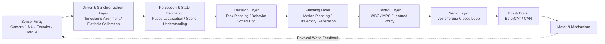
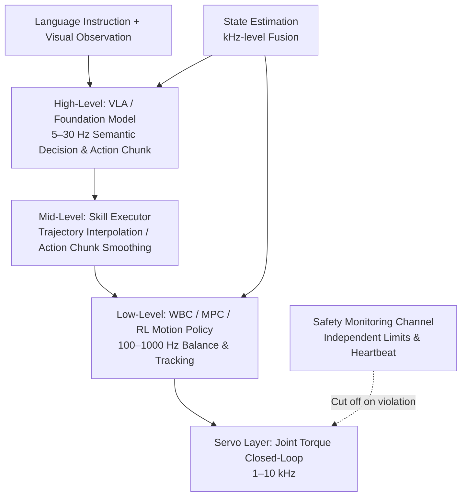
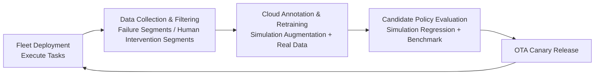

# Chapter 24: End-to-End Software Stack

## Abstract

The intelligence of a humanoid robot is ultimately embodied in a complete data pathway that begins with the entry of photons and force signals and ends with current flowing into the motors. This chapter takes the "end-to-end software stack" as its subject, connecting the algorithms and hardware from previous chapters into a deployable system: it first presents a five-layer architecture of perception, decision-making, planning, control, and execution, along with a frequency hierarchy spanning milliseconds to seconds, and discusses the two paradigms of the modular stack and the end-to-end learning stack, as well as their convergence trends. It then analyzes layer by layer the engineering implementation of multi-sensor integration and time synchronization, state estimation, task planning and motion planning, whole-body control and joint servoing, as well as the hierarchical inference approach for integrating vision-language-action models such as RT-1/RT-2, Octo, OpenVLA, π0, and GR00T N1 into the stack. The focus of this chapter falls on **edge deployment**: the power and compute constraints of onboard computing platforms, quantization and compilation optimization for on-device VLA inference, real-time operating systems like Linux RT-PREEMPT and QNX, and methods for decomposing the end-to-end latency budget. Finally, it discusses the post-deployment operational closed loop formed by the ROS 2 middleware, the LeRobot open-source stack, OTA software updates, fleet management platforms, and the vehicle data flywheel. This chapter deeply connects with Chapter 14 (Control), Chapter 19 (VLA), Chapter 21 (Data), and Chapter 22 (Middleware), and provides a software perspective analysis framework for the complete system case study in Chapter 26.

**Keywords**: End-to-End Software Stack; System Architecture; Frequency Hierarchy; State Estimation; Task Planning; Whole-Body Control; VLA Hierarchical Inference; On-Device VLA Inference; Real-Time Operating System; OTA Software Update; Fleet Management; Data Flywheel

---

## 24.1 Overall Architecture of the End-to-End Software Stack

### 24.1.1 Data Pathway from Perception to Action

The "end-to-end" nature of a humanoid robot software stack has two meanings: **signal pathway end-to-end** in the systems engineering sense (from sensor sampling to motor torque output), and **model end-to-end** in the machine learning sense (a differentiable model that directly maps observations to actions). This chapter covers both, with the latter's integration into the former as the main thread. A typical real-time data pathway is as follows:



Any delay, jitter, or frame loss in any link of the pathway will be amplified along the chain. Therefore, the first principle of end-to-end stack design is **full-link budgeting**: allocate delay, bandwidth, and compute budgets for each link, while retaining margins (see Section 24.6.4 for details).

### 24.1.2 Layered Architecture and Frequency Hierarchy

The humanoid robot software stack is naturally layered according to time scales, with frequencies differing by several orders of magnitude between layers:

| Layer | Function | Typical Frequency | Typical Latency Budget | Typical Implementation |
|---|---|---|---|---|
| Task Layer | Instruction understanding, task decomposition | Event-triggered (seconds or more) | Hundreds of ms | LLM / PDDL Planner / Behavior Tree |
| Planning Layer | Path and trajectory generation | 1–20 Hz | Tens of ms | MoveIt / OMPL / MPC |
| Policy Layer | Visuomotor policy inference | 5–50 Hz | 20–200 ms | VLA / Diffusion Policy / RL Policy |
| Control Layer | Whole-body control, state estimation | 100–1000 Hz | 1–10 ms | WBC / Hierarchical QP / Kalman Filter |
| Servo Layer | Joint torque/position closed loop | 1–10 kHz | < 1 ms | Driver Firmware / FOC |

This "slow thinking, fast reaction" frequency hierarchy is not accidental: higher layers process large amounts of information but tolerate latency, while lower layers process less information but are intolerant of jitter. Layers are decoupled through **well-defined state interfaces** (task goals, reference trajectories, desired torques), allowing the implementation of any layer to be replaced—for example, replacing a hand-crafted planner with a learned policy—without perturbing other layers.

!!! note "Terminology Explanation: Frequency Hierarchy, State Interface, Latency Budget, Jitter, Watchdog"
    - **Frequency hierarchy**: An architecture where layers of the software stack operate at different control bandwidths, with output downsampled layer by layer.
    - **State interface**: A clearly defined data contract passed between layers, such as "desired joint position + velocity + feedforward torque".
    - **Latency budget**: The sum of the maximum allowed processing times allocated to each link in the chain, which must be less than the response time limit required by the upper layer.
    - **Jitter**: The deviation of the actual execution time of a periodic task from its ideal time; jitter in the servo layer directly translates into torque noise.
    - **Watchdog**: A hardware or software timer that monitors task heartbeats; if not fed (reset) before timeout, it triggers a safe shutdown.

### 24.1.3 Two Paradigms: Modular Stack vs. End-to-End Learning Stack

The **modular stack** decomposes perception, localization, planning, and control into independent modules, each implementable with the most mature technologies (geometric vision + model-based control). Its advantages are that each module can be independently verified, faults can be isolated, and behavior is interpretable, making it the mainstream for industrial deployment. Its disadvantages are error cascading between modules and the difficulty of covering long-tail scenarios with hand-crafted rules. The **end-to-end learning stack** uses a single differentiable model (e.g., VLA) to map observations directly to actions. Its advantages are a high upper bound and scalability with data; its disadvantages are weak interpretability and verifiability, and a lack of guarantees for out-of-distribution scenarios.

The current practice in the humanoid robot industry is a **hybrid architecture**: learning and model-based methods complement each other by layer—low-level balancing and joint servoing are still guaranteed by model-based control for real-time performance and stability, while high-level skills and semantic understanding are provided by learned models for generalization. A comparison of the two paradigms and the hybrid approach is as follows:

| Dimension | Modular Stack | End-to-End Learning Stack | Layered Hybrid (Mainstream Practice) |
|---|---|---|---|
| Verifiability | High, module-by-module certification | Low, black box | Safety layer verifiable, intelligence layer statistically evaluated |
| Long-tail Generalization | Weak, relies on rule enumeration | Strong, scales with data | Relatively strong, learning layer handles it |
| Real-time Guarantee | Strong | Limited by inference latency | Strong, safety closed loop does not depend on large models |
| Failure Interpretability | High | Low | Medium, attribution by layer |
| Data Requirement | Low | Extremely high | Medium-high |

Section 24.5 of this chapter will discuss this "layered hybrid" integration approach in detail.

## 24.2 Perception and State Estimation Layer

### 24.2.1 Multi-Sensor Integration and Time Synchronization

Humanoid robots are typically equipped with multi-camera systems, depth cameras, IMUs, joint encoders, foot force/torque sensors, and joint torque sensors, with data rates ranging from hundreds of Hz (cameras) to kHz (encoders). Typical sensor integration specifications are as follows:

| Sensor | Typical Data Rate | Typical Interface | Synchronization Requirement |
|---|---|---|---|
| Global shutter cameras ×2–4 | 30–120 Hz | MIPI / GMSL / USB3 | Frame-level hardware trigger, exposure synchronization |
| Depth camera | 30–90 Hz | USB3 / Ethernet | Alignment with RGB frames |
| IMU (pelvis/head) | 200–1000 Hz | SPI / UART | Common clock domain with encoders |
| Joint encoders ×30+ | 1–10 kHz | Embedded bus (EtherCAT/CAN) | Distributed clock synchronization |
| Foot force/torque sensors | 500–2000 Hz | EtherCAT / Analog acquisition | Alignment with control cycle |

The first major engineering challenge at the integration layer is **time synchronization**: the sampling instants of different sensors must be aligned to a unified clock, with errors controlled to the millisecond level (sub-millisecond required for vision and IMU fusion). Common methods include hardware triggers, PTP (Precision Time Protocol) network time synchronization, and software timestamp interpolation compensation. The second challenge is **consistency of extrinsic calibration**: if the extrinsics of the camera-IMU-joint chain (see the corresponding method entry in this knowledge graph for joint camera-IMU calibration methods) drift due to collision, temperature changes, or assembly loosening, all downstream fusion results will exhibit systematic bias. Therefore, the stack must include built-in online self-checking and alarming for extrinsic parameters.

!!! note "Term Explanation: Time Synchronization, Hardware Trigger, PTP, Extrinsic Parameters, Timestamp Interpolation"
    - **Time synchronization**: The process of aligning the sampling instants of multiple sensors to a unified time reference.
    - **Hardware trigger**: Using physical signal lines to simultaneously trigger sampling across multiple sensors, offering the highest synchronization accuracy.
    - **PTP (IEEE 1588)**: A protocol achieving sub-microsecond time synchronization by exchanging messages with hardware timestamps over a network.
    - **Extrinsic parameters**: The relative pose between sensor coordinate systems (or between a sensor and a robot link).
    - **Timestamp interpolation**: A software method to compensate for asynchronous sampling by linearly interpolating poses between two sampling points.

### 24.2.2 State Estimation: Proprioceptive Fusion

State estimation serves as the "source of truth" connecting the physical world to all decision-making layers. The core estimated quantities for a humanoid robot are the floating base's pose and velocity, typically fused using an Extended Kalman Filter (EKF) or factor graph from the following information:

- **Legged odometry**: Utilizing the constraint that the supporting foot's velocity is zero under contact assumptions, the base motion is inferred from joint encoders and forward kinematics.
- **IMU**: Provides high-frequency angular velocity and acceleration, compensating for the low rate and transmission flexibility of encoders.
- **Contact state**: Determined by foot force/torque sensors or joint torque residuals, indicating whether the odometry update is reliable.
- **External observations**: Low-frequency corrections to the base pose from visual or laser features, suppressing drift.

Key engineering points lie in **robustness of contact detection**: misclassifying a slip as stationary directly contaminates the odometry; and **upper bound on estimation latency**: state estimation must be completed before the WBC cycle, with a typical budget of a few milliseconds.

!!! note "Term Explanation: Extended Kalman Filter, Factor Graph, Legged Odometry, Contact Detection, Zero-Velocity Update"
    - **Extended Kalman Filter (EKF)**: A recursive state estimator that locally linearizes nonlinear systems, computationally efficient and a mainstay for embedded fusion.
    - **Factor graph**: A graph structure representing the estimation problem with variable nodes and constraint factor nodes, solved via batch optimization for high accuracy and smooth historical trajectories.
    - **Legged odometry**: An estimation method that uses the no-slip constraint between the supporting foot and the ground to infer base motion from joint encoders.
    - **Contact detection**: Determining whether each foot is in a supporting state, a prerequisite for the reliability of legged odometry.
    - **Zero-velocity update (ZUPT)**: Forcing the velocity observation of a confirmed stationary supporting foot to zero to suppress IMU integration drift.

### 24.2.3 Scene Understanding: From Geometry to Semantics

Scene understanding for manipulation outputs three types of products: **Geometric layer** (occupancy grids, depth point clouds, traversable areas), serving obstacle avoidance and foothold selection; **Object layer** (object detection, 6D pose, open/close state of articulated objects), serving grasping and manipulation planning; **Semantic layer** (scene graphs, affordance annotations), serving task planning and language conditioning for VLA. In end-to-end learning stacks, these three types of products are often not explicit intermediate representations but are compressed into features of the visual encoder; however, even in hybrid architectures, explicit occupancy and pose estimation remain trusted sources for safety-critical functions (collision avoidance).

## 24.3 Decision and Planning Layer

### 24.3.1 Task Planning: From Symbolic Planning to LLM Planning

**Task Planning** is the process of generating a high-level action sequence to achieve a goal. It commonly uses symbolic representations like PDDL (Planning Domain Definition Language): abstracting actions like "grasp-transport-place" into operators with preconditions and effects, and a planner searches for a solution sequence. In engineering deployment, Behavior Trees are widely adopted for their maintainability and reactive execution: they organize skills into selector, sequence, parallel, and condition nodes, allowing interruption by external events and local retries during runtime, making them more suitable for dynamic workshop environments than one-shot planned sequences. In recent years, Large Language Models (LLMs) have emerged as task planners: decomposing natural language instructions into sequences of skill invocations. Their open-vocabulary capability mitigates the bottleneck of manual knowledge encoding in symbolic planning, but requires integration with execution feedback verification and failure replanning mechanisms (neural-symbolic reasoning approach) to suppress hallucinations.

!!! note "Term Explanation: PDDL, Behavior Tree, Skill Primitive, Reactive Execution, Replanning on Failure"
    - **PDDL (Planning Domain Definition Language)**: A language for describing planning problems using predicates, action operators, preconditions, and effects.
    - **Behavior Tree (BT)**: A task scheduling form that organizes control flow in a tree structure, with nodes returning success/failure/running states.
    - **Skill primitive**: The smallest encapsulated capability callable by the task layer, e.g., "grasp object X" or "walk to point Y".
    - **Reactive execution**: Adapting subsequent actions in real-time based on the latest perception during execution, rather than blindly following a predetermined plan.
    - **Replanning on failure**: A mechanism that feeds failure reasons back to the planning layer to regenerate a sequence when a skill execution fails.

### 24.3.2 Motion Planning: MoveIt and Sampling-Based Planners

Motion planning refines the discrete goals from the task layer into continuous, collision-free trajectories. **MoveIt Motion Planning** is a commonly used motion planning framework in the ROS ecosystem, integrating planners like **OMPL (Open Motion Planning Library)**, inverse kinematics solvers, and collision detection. It is widely used for whole-body motion planning of robotic arms and humanoid robots; OMPL provides sampling-based motion planning algorithms such as RRT*, PRM, and BIT*, which are probabilistically complete in high-dimensional configuration spaces. For humanoid robots, special constraints in motion planning include: a large number of whole-body collision checks (including self-collision), balance constraints that need coordination with the control layer, and the plan-execute asynchrony problem (the environment changes during planning). Engineering practice often uses a two-level structure: "planning on a coarse model, online obstacle avoidance during execution".

!!! note "Term Explanation: Probabilistic Completeness, Self-Collision, Configuration Space, Plan-Execute Asynchrony, Online Obstacle Avoidance"
    - **Probabilistic completeness**: The property of a sampling-based planner that, as the number of samples approaches infinity, it will find a feasible solution with probability 1 (if one exists).
    - **Self-collision**: Collision between the robot's own links, which must be explicitly checked for humanoid robots due to dense limb configurations.
    - **Configuration space (C-space)**: The space whose coordinates are all joint angles; planning involves searching for a collision-free path from start to goal within this space.
    - **Plan-execute asynchrony**: The problem where the environment has deviated from the planning assumptions by the time the plan is completed, rendering the trajectory outdated.
    - **Online obstacle avoidance**: The ability of the execution layer to locally modify a reference trajectory based on the latest perception.

### 24.3.3 Interface Design Between Planning and Control

The interface form between the planning layer's output and the control layer's input determines the system's composability. Three common forms: **Trajectory interface** (time-parameterized joint/end-effector trajectories, pure tracking by the control layer), simple but loses online adjustment capability; **Goal interface** (footholds, end-effector target poses, motion autonomously generated by the control layer), good real-time performance but weak controllability; **Reference + constraint interface** (reference trajectory with feasible region and contact timing), the standard approach for whole-body MPC, balancing performance and online adaptability. The correspondence between interface selection and the overall control architecture is discussed in Chapters 14 and 15.

## 24.4 Control Execution Layer

### 24.4.1 Whole-Body Control and Model-Based Control Family

The control layer coordinates all joints and contact points of a humanoid robot in a unified manner. **Whole-Body Control (WBC)** coordinates all joints and contact points to simultaneously achieve multiple tasks such as balance, gaze, and manipulation; its common implementation, **Hierarchical QP Whole-Body Control (Hierarchical QP WBC)**, stacks multiple tasks by priority and solves them via cascaded quadratic programming, ensuring that high-priority tasks (e.g., not falling) are satisfied before low-priority tasks (e.g., arm posture). **Model Predictive Control (MPC)** repeatedly solves a finite-horizon optimal control problem based on a predictive model and executes only the first control step, making it the mainstream approach for centroid trajectory and contact force planning. Interaction compliance is provided by **Impedance Control** and **Admittance Control**: the former adjusts the mass-damper-spring characteristics at the end-effector, while the latter converts measured external forces into desired motion trajectories. Mathematical details of these methods are given in Chapter 14; this chapter focuses on their integration constraints within the stack: WBC/MPC must complete a single solution within 1–10 ms and is sensitive to state estimation delays.

Integration acceptance for the control layer typically includes four hard metrics: **solution time** (worst-case, not average, must be less than a certain proportion of the cycle to leave margin for other real-time tasks), **constraint feasibility** (relaxation and degradation behavior when QP is infeasible must be clearly defined), **contact switching transients** (torque impacts at foot landing/lifting must be limited within actuator bandwidth), and **failure injection tests** (artificially delay state estimation or lose bus frames to verify the controller's safe response). These metrics directly connect to the HIL test matrix in Chapter 23.

### 24.4.2 Joint Servo and Fieldbus

The desired joint torques/positions output by the control layer are sent to each joint drive via the fieldbus. **EtherCAT** is a high-performance industrial fieldbus based on standard Ethernet frames; its "processing on the fly" mechanism allows slave stations to read and write data instantly as the frame passes, and together with Distributed Clocks (DC), it achieves microsecond-level synchronization, making it the mainstream choice for supporting 1 kHz-level whole-body torque control. **CAN bus** (including CAN FD), with its low cost, reduced wiring, and strong anti-interference capability, is widely used for upper-body joints and dexterous hands with lower bandwidth requirements. The division of labor between the two buses within the stack is compared as follows:

| Dimension | EtherCAT | CAN / CAN FD |
|---|---|---|
| Typical control frequency | 1–4 kHz | 0.1–1 kHz |
| Synchronization mechanism | Distributed Clocks (DC), microsecond-level | No native synchronization, relies on message timestamps |
| Bandwidth | 100 Mbit/s shared | 1 Mbit/s (higher for FD data segment) |
| Topology | Primarily line/daisy chain | Bus type, multi-master arbitration |
| Typical installation location | Lower limb large joints, whole-body backbone | Wrist, dexterous hand, sensor nodes |
| Cost and wiring | Higher | Low, twisted pair sufficient |

The key metric for the servo layer is **cycle jitter**: at a 1 kHz control cycle, jitter should be controlled within tens of microseconds; otherwise, time-discretization errors in torque commands can excite joint vibrations. In engineering implementation, the EtherCAT master thread must be bound to a dedicated CPU core and run under a real-time scheduling class (see Section 24.6.3). Electromechanical details such as bus topology (daisy chain/star), cable strain relief, and connector locking are covered in Chapters 6 and 9.

### 24.4.3 Safety Monitoring and Degradation Strategies

The end-to-end stack must assume that any module can fail and incorporate an independent safety monitoring path:

- **Limit monitoring**: Hard limits on joint position/velocity/torque, motor temperature, and bus current; triggering cuts power (STO, Safe Torque Off);
- **Heartbeat monitoring**: Watchdog heartbeats for policy inference, state estimation, and bus communication; timeout leads to maintaining posture or controlled squatting;
- **Behavioral plausibility monitoring**: An independent channel compares commanded and estimated states for consistency (e.g., commanded walking but IMU shows a tipping trend), triggering emergency braking;
- **Degradation strategies**: When computing power or sensors partially fail, the system degrades from full autonomous mode to low-speed remote control or stationary hold mode.

The safety path should be independent of the intelligent main path in terms of power supply and computation. This is a fundamental requirement of functional safety standards such as IEC 61508 for safety-related systems (standard compliance details are in Chapter 12).

## 24.5 Integration of Learning-Based Strategies: VLA and the End-to-End Stack

### 24.5.1 Position of Imitation Learning Strategies in the Stack

Imitation learning methods compress expert demonstrations into policy networks, typically occupying the "policy layer" position within the stack. **Behavior Cloning (BC)** trains a policy via supervised learning to replicate expert demonstrations, serving as a baseline for skill learning; **Action Chunking with Transformers (ACT)** uses a transformer in a CVAE form to predict a sequence of future actions in one go, smoothed via temporal ensemble for execution, significantly reducing error accumulation in long-horizon fine manipulation tasks. Its combination with the ALOHA low-cost bimanual teleoperation platform pioneered the paradigm of "low-cost data collection + end-to-end policy"; **Diffusion Policy** models the action distribution as a conditional denoising diffusion process, capable of generating multimodal and smooth robot actions, excelling in fine manipulation tasks. The in-stack characteristics of these three are compared below:

| Dimension | Behavior Cloning (BC) | ACT | Diffusion Policy |
|---|---|---|---|
| Action Representation | Single-step regression | Action chunk (CVAE+Transformer) | Conditional denoising diffusion process |
| Multimodal Distribution Modeling | Weak | Medium | Strong |
| Long-horizon Error Accumulation | Severe | Significantly mitigated | Mitigated |
| Single Inference Latency | Very low | Low | Relatively high (multi-step denoising) |
| Typical Output Frequency | 10–50 Hz | 5–50 Hz (chunking + ensemble) | 5–20 Hz |

The action output frequencies of these three (5–50 Hz) naturally fall between the planning layer and the control layer, requiring a high-speed tracking controller at the lower level to take over—this is the first integration point of the hybrid architecture.

### 24.5.2 VLA Model Lineage

Vision-Language-Action (VLA) models combine large-scale vision-language pre-training with robot action heads, representing the current mainstream candidate for the "intelligent core" of the end-to-end stack. The representative lineage included in this knowledge graph is as follows:

| Model | Institution | Architecture Highlights | Data Foundation |
|---|---|---|---|
| RT-1 | Google DeepMind | Transformer-based scaled real-world robot control model | ~130,000 real robot demonstrations (publicly reported) |
| RT-2 | Google DeepMind | VLA transferring web-scale vision-language knowledge to robot control | Web images + robot data joint fine-tuning |
| Octo | UC Berkeley et al. | Open-source generalist robot policy trained on heterogeneous cross-embodiment data | Open X-Embodiment |
| OpenVLA | Stanford et al. | 7B parameter open-source VLA | 970,000 episodes from Open X-Embodiment |
| π0 | Physical Intelligence | VLA flow model for general control and open-world generalization | Cross-embodiment multi-task data |
| GR00T N1 | NVIDIA | Open foundation model for humanoid robots with VLA + diffusion transformer action head | Real robot + simulated synthetic data (Isaac Sim pipeline) |

The evolutionary trajectory of this lineage is clear: from the single-arm, single-task RT-1, to RT-2 incorporating web knowledge transfer, to the cross-embodiment open-source Octo and OpenVLA, and finally to GR00T N1 targeting humanoid robots, integrating diffusion action heads and synthetic data pipelines. The internal structure and training methods of VLA models are detailed in Chapter 19; this chapter focuses on their **system integration issues**.

### 24.5.3 Hierarchical Inference: Hybrid Architecture of High-Level VLA and Low-Level Control

Directly connecting VLA output to motors is infeasible: VLA inference frequency (typically 5–30 Hz) is far lower than the 500 Hz+ required for balance control. The mainstream industrial solution is **hierarchical inference**:



Taking GR00T N1's dual-system design as a typical example: the slow system (vision-language reasoning) generates intentions and action chunks, the fast system (diffusion transformer action head) refines them into smooth joint commands, which are then executed by the lower-level whole-body control. This "semantically slow, reflexively fast" structure is homologous to biological nervous systems and is an inevitable choice under edge-side computational constraints—large models cannot run at kilohertz, and kilohertz loops do not require large models.

!!! note "Terminology Explanation: Action Chunk, Temporal Ensemble, Dual-System Architecture, Skill Executor, Asymmetric Frequency"
    - **Action Chunk**: A sequence of k future action steps predicted by the policy in one go, originating from ACT, now a mainstream design for VLA action heads.
    - **Temporal Ensemble**: Weighted averaging of multiple action chunk predictions for overlapping time steps to suppress execution jitter.
    - **Dual-System Architecture**: An architecture where a slow semantic reasoning system collaborates with a fast action generation system, exemplified by GR00T N1.
    - **Skill Executor**: Middleware that translates high-level skill invocations into low-level control interfaces (trajectories, goals, constraints).
    - **Asymmetric Frequency**: An architectural feature where the high-level large model infers at a low frequency, the low-level controller runs at a high frequency, and a buffer queue bridges the two.

### 24.5.4 Boundaries of On-Device, Edge, and Cloud Inference

Where to place VLA inference is a top-level architectural decision for the end-to-end stack. The trade-offs among the three are as follows:

| Dimension | On-Device (Onboard) | Edge (Site Server) | Cloud |
|---|---|---|---|
| Latency | Lowest and deterministic (tens of ms) | Affected by LAN quality | Highly affected by WAN fluctuations |
| Availability | Operable offline | Depends on site network | Depends on continuous connectivity |
| Privacy & Compliance | Data stays on robot | Data stays on site | May require cross-border/desensitization processing |
| Upper Model Size Limit | Limited by memory & power (7B requires quantization) | Medium | Virtually unlimited |
| Update Frequency | Via OTA | Flexible | Most flexible |

The industry trend is **on-device by default, cloud on demand**: safety-related and reactive capabilities must be closed-loop on-device (which is why the on-device VLA inference entry emphasizes the triple constraints of latency, connectivity, and privacy), while slow, non-safety-critical semantic reasoning (e.g., daily report generation, post-task analysis) can be offloaded to the cloud. Hybrid solutions require the stack to implement **inference-location-agnostic interfaces**: the same policy service can be provided by either a local model or a remote model, dynamically switching based on network status, and any switch must not interrupt the underlying safety closed loop.

## 24.6 Edge Deployment and On-Device Inference

### 24.6.1 Power and Compute Constraints of Onboard Computing Platforms

Humanoid robot on-device computing faces hard constraints: limited battery capacity (typically 0.5–2 kWh for the whole machine), where every 100 W increase in compute load directly reduces endurance; additionally, computing units must withstand continuous vibration and temperature cycles from walking. A typical configuration is a "heterogeneous dual-zone": the safety zone runs servo and safety monitoring on low-power real-time controllers (MCU/real-time SoC); the intelligent zone runs perception, policy, and planning on GPU SoCs (e.g., Jetson series embedded modules), with available compute typically ranging from tens to hundreds of TOPS (INT8) and a power budget of 15–60 W. The division of responsibilities between the two compute zones is as follows:

| Compute Zone | Hardware Form | Running Content | Key Constraints |
|---|---|---|---|
| Safety/Real-Time Zone | MCU, Real-Time SoC | Joint servo, bus master, safety monitoring | Hard real-time, determinism, functional safety |
| Intelligent Zone | GPU SoC (Embedded) | Perception, state estimation, policy inference, planning | Compute/power ratio, memory bandwidth |
| Gateway Zone (Optional) | Communication Module | Cloud link, OTA, log upload | Offline degradation, data compression |

For compute selection methodology and power integrity design, see Chapter 6. This chapter focuses on **software-side optimization** given a fixed compute budget.

!!! note "Terminology: TOPS, Memory Bandwidth, Power Budget, Thermal Design Power, Thermal Throttling"
    - **TOPS (Tera Operations Per Second)**: Trillions of integer operations per second, a common nominal metric for edge AI chip compute (typically referring to INT8).
    - **Memory Bandwidth**: The amount of memory data that can be transferred per unit time; for large model inference, it often becomes a bottleneck earlier than compute power.
    - **Power Budget**: The maximum power allocated to the computing subsystem; exceeding it reduces endurance or triggers thermal protection.
    - **Thermal Design Power (TDP)**: The thermal power that the cooling system can continuously dissipate, determining the sustained availability of compute performance.
    - **Thermal Throttling**: The chip automatically reduces its frequency when temperature exceeds limits, making nominal compute power unavailable; a hidden risk in high-temperature environments.

### 24.6.2 On-Device VLA Inference: Quantization, Compilation Optimization, and Latency Decomposition

**On-Device VLA Inference** refers to deploying vision-language-action models directly on the robot's built-in edge computing device, rather than offloading to edge or cloud servers, to meet latency, connectivity, and privacy constraints. Its engineering toolchain includes:

- **Quantization**: Compressing weights and activations from FP16 to INT8/INT4, reducing memory footprint and memory bandwidth approximately proportionally, at the cost of accuracy loss that must be controlled with a calibration set; a 7-billion-parameter model is about 14 GB in FP16, 7 GB in INT8, and 3.5 GB in INT4; quantization is a key method for fitting 7B-level VLA models into onboard memory;
- **Compilation Optimization**: Using inference compilers like TensorRT for operator fusion, kernel selection, and memory reuse, typically yielding significant additional speedup;
- **Action Head Restructuring**: Multi-step denoising in diffusion/flow-matching action heads is a major latency contributor; can be compressed using distillation (consistency methods) or few-step sampling;
- **Speculation and Asynchrony**: Visual encoding and language encoding can be reused across cycles (not recomputed if the scene is unchanged); action chunk prediction and execution can be pipelined.

Research on on-device inference benchmarks like VLA-Perf shows that VLA inference latency is highly sensitive to model size, quantization configuration, and action head design; selection must be based on actual measurements. Taking a model with parameter count \(N_p\) as an example, the weight memory footprint is approximately

$$
M_{\text{weights}} \approx N_p \times b, \qquad b \in \{2\,\text{B (FP16)},\ 1\,\text{B (INT8)},\ 0.5\,\text{B (INT4)}\}
$$

Inference latency can be decomposed as

$$
T_{\text{VLA}} = T_{\text{vision}} + T_{\text{lang}} + T_{\text{action-head}} + T_{\text{pre/post}}
$$

and each term should be optimized against the budget; when a single term exceeds the budget and cannot be resolved, the architectural option is to downgrade high-level inference to "event-triggered" (running only on new instructions or scene changes) rather than at a fixed period.

### 24.6.3 Real-Time Operating Systems and Scheduling

General-purpose operating systems are not designed for hard real-time; Real-Time Operating Systems (RTOS) meet microsecond-level timing requirements through kernel preemption, priority scheduling, and deterministic interrupt response. Common options for humanoid robots include:

- **Linux RT-PREEMPT**: A patch set that makes most of the Linux kernel preemptible and interrupts threaded, retaining the rich Linux ecosystem while providing scheduling latency on the order of tens of microseconds; a common choice for the main controller;
- **Xenomai**: A dual-kernel solution where real-time tasks run on the Cobalt real-time core, with latency as low as microseconds, but with higher maintenance complexity;
- **QNX**: A commercial microkernel RTOS where the file system and network stack are user-space services, offering excellent reliability and determinism, widely used in automotive and safety-critical systems;
- **Zephyr**: An open-source RTOS for resource-constrained embedded devices, commonly used for sensor nodes and motor controllers.

An engineering comparison of the four is as follows:

| Dimension | Linux RT-PREEMPT | Xenomai | QNX | Zephyr |
|---|---|---|---|---|
| Scheduling Latency Magnitude | Tens of microseconds | Microsecond-level | Microsecond-level | Microsecond-level |
| Ecosystem Richness | Very high (full Linux) | High (reuses Linux user-space) | Medium | Low (embedded) |
| Maintenance Cost | Low | High | Medium (commercial license) | Low |
| Safety Certification Foundation | Requires self-build | Requires self-build | Has mature certification cases | Partial |
| Typical Installation Location | Main control computer | Main control computer | Safety domain controller | Joint/sensor nodes |

A typical scheduling design is: bind the EtherCAT master and WBC tasks to a dedicated CPU core with the highest SCHED_FIFO priority and lock memory (mlockall); policy inference and normal processes share the remaining cores, with cgroups limiting their preemption interference; all real-time threads disable dynamic memory allocation and non-deterministic system calls. More details on kernel and driver aspects can be found in Chapters 6 and 22.

### 24.6.4 Python Example: End-to-End Latency Budget Decomposition

The following example demonstrates how to perform a latency budget decomposition for a "camera input to torque output" control chain, and calculate the worst-case total latency and effective control frequency.

```python
# End-to-end latency budget: camera exposure -> perception -> VLA -> WBC -> bus -> driver
# Goal: worst-case total latency <= response time limit required by higher-level tasks
stages = {
    # Stage: (typical latency ms, worst-case jitter ms)
    "Camera exposure + transfer":      (12.0, 3.0),
    "Preprocessing + perception":      ( 8.0, 2.0),
    "VLA inference (INT8)":            (45.0, 8.0),
    "Action chunk interpolation + WBC": ( 2.0, 0.3),
    "EtherCAT transfer":               ( 0.5, 0.1),
    "Driver response + motor time constant": ( 5.0, 1.0),
}

typ = sum(v[0] for v in stages.values())
worst = sum(v[0] + v[1] for v in stages.values())
print(f"Typical end-to-end latency: {typ:.1f} ms")
print(f"Worst-case end-to-end latency: {worst:.1f} ms  (≈ effective response frequency {1000/worst:.0f} Hz)")
print("\nWorst-case latency breakdown by stage:")
for name, (t, j) in sorted(stages.items(), key=lambda x: -(x[1][0]+x[1][1])):
    print(f"  {name:<24s} {t+j:6.1f} ms  ({100*(t+j)/worst:.0f}%)")

budget = 100.0  # Response time limit allowed by higher-level tasks (ms)
slack = budget - worst
print(f"\nMargin under budget {budget:.0f} ms: {slack:+.1f} ms")
if slack < 0:
    print("Conclusion: Budget exceeded; need to compress the largest latency term (VLA inference in this case)")
```

In this example, VLA inference accounts for more than half of the worst-case latency, confirming the assertion in Section 24.6.2: on-device large model inference is the primary optimization target in the end-to-end latency budget; when quantization and compilation optimization are still insufficient, reducing the policy layer frequency (trading action chunks for execution smoothness) is the final system-level measure.

## 24.7 Middleware and System Integration

### 24.7.1 ROS 2 and Communication Backbone

**ROS 2 Middleware** is the de facto standard robotic middleware based on DDS for publish/subscribe and real-time support, providing node management, topic/service/action communication, parameter and lifecycle management. In the end-to-end stack, ROS 2 serves as the integration skeleton for non-real-time or soft real-time domains (perception, planning, human-robot interaction, logging); hard real-time domains (WBC, EtherCAT master) typically run as independent real-time processes, bridged to ROS 2 via shared memory or real-time safe publishers. DDS QoS policies (reliability, deadline, durability) require per-topic tuning: high-frequency topics like state estimation use "best-effort + keep-last" for low latency, while command and parameter updates use "reliable + persistent" to guarantee delivery. Middleware architecture, DDS selection, and message definition specifications are detailed in Chapter 22 and are not expanded upon here.

### 24.7.2 Dynamics Libraries and Algorithm Components

Model computation within the stack relies on mature components: **Pinocchio** provides efficient rigid body dynamics, kinematics, and analytical derivatives, serving as the shared dynamics kernel for WBC/MPC and simulators; **OMPL** and **MoveIt** provide planning capabilities (see Section 24.3.2); MJCF/URDF models are loaded at runtime via a model parser into a unified dynamics data structure. A key engineering discipline for component reuse is the **single source of truth**: simulation, planning, and control must consume the same robot model and calibration data. Any divergence where "control uses one model, simulation uses another" artificially amplifies the Sim-to-Real gap.

### 24.7.3 Open-Source End-to-End Stack: LeRobot

**LeRobot** is an end-to-end PyTorch library covering dataset formats, teleoperation, training, and deployment, maintained by Hugging Face. It unifies four stages of the policy learning stack—standardized dataset format (LeRobotDataset), teleoperation acquisition interface, mainstream policy implementations (ACT, Diffusion Policy, etc.), and deployment inference—within a single framework, significantly reducing the integration cost "from data to deployment." For humanoid robot teams, the value of frameworks like LeRobot lies in providing validated end-to-end reference implementations: enterprises can build proprietary pipelines on its data format and policy interfaces, focusing engineering effort on platform adaptation and safety layers rather than rebuilding infrastructure. A systematic discussion of related data infrastructure is found in Chapter 21.

### 24.7.4 Logging, Replay, and Debugging Toolchain

The maintainability of an end-to-end stack depends on **observability**. Engineering requires full-chain logging to meet three criteria: First, **unified time base**—all topics, bus frames, and internal events carry synchronized timestamps; otherwise, cross-process causal analysis is impossible. Second, **replayability**—raw sensor streams recorded in formats like rosbag should be re-injectable into the stack to reproduce any real-world anomaly. Third, **deterministic replay**—in debug mode, fix random seeds and scheduling order so that "recorded bugs" can be stably reproduced; this is a prerequisite for locating issues like occasional falls or occasional grasp failures. Log data also serves as raw material for the accident-driven scenario library in Chapter 23 and the data flywheel in Section 24.8.3. Therefore, the storage quota, ring buffer, and selective upload strategy of the logging system must be designed during the architecture phase, not as a post-hoc patch.

## 24.8 Post-Deployment Operations: OTA, Fleet, and Data Loop

### 24.8.1 OTA Software Update

**OTA Software Update** is the technology for wirelessly deploying control policies, firmware, and system software to a deployed fleet of humanoid robots. Robot OTA is more sensitive than phone/car OTA: a single defective control policy update can directly cause physical accidents. Engineering requirements include: A/B dual partitions with automatic rollback on failure; staged rollout of updates; signature verification and version-hardware compatibility matrix for update packages; and mandatory simulation regression before updates (linked with the scenario library in Chapter 23)—any control-related update must first pass full simulation regression and HIL validation. A typical staged rollout pipeline is as follows:

| Stage | Scope | Pass Criteria | Failure Handling |
|---|---|---|---|
| Simulation Regression | Full scenario library | 100% pass | Block release, return for fix |
| HIL Bench | Representative configurations | Real-time and safety cases pass | Block release |
| Single-Unit Canary | 1–2 internal test units | Continuous accident-free operation for several hours | Automatic rollback |
| Small Batch | 5%–10% of fleet | KPIs not worse than current version | Automatic rollback and alert |
| Full Rollout | Entire fleet | Stable KPIs during canary period | Continuous monitoring |

### 24.8.2 Fleet Management Platform

**Fleet Management Platform** is a cloud platform for task orchestration, charging, health monitoring, and analysis across multiple deployed humanoid robots. Its core functions include: task scheduling and work order dispatch (integrating with factory WMS/MES); battery and charging orchestration (ensuring availability while extending battery life); health monitoring (anomaly detection for joint temperature, torque residuals, vibration spectra, supporting predictive maintenance); and KPI analysis (task success rate, mean time between failures, intervention count). The availability target of the fleet platform directly determines the viability of the business model—no matter how capable a single robot is, a fleet that cannot be orchestrated into stable operational capacity cannot generate revenue.

### 24.8.3 Data Flywheel and Continuous Learning

**Fleet Data Flywheel** is a closed-loop system where data generated by a deployed robot fleet continuously improves models, and models in turn enhance fleet performance, generating more data. Its operational mechanism is:



Two engineering points for the flywheel: First, **collection strategy should favor information gain**—full upload is infeasible; trigger collection based on "failure, low confidence, human takeover." Second, **evaluation threshold must be higher than the current version**—candidate policies are allowed into canary only if they outperform the current version in both simulation regression and controlled real-world evaluation. The storage, annotation, and compliance infrastructure for the data loop is detailed in Chapter 21.

It is crucial to recognize that the data flywheel has a **cold start problem**: when the fleet size is insufficient, the diversity of collected data is limited, and the rate of model improvement is constrained by deployment scale rather than algorithmic capability. Therefore, the flywheel design must form a three-way complementary data supply with synthetic simulation data (Chapter 23) and human teleoperation demonstrations (Chapter 17); no single source is sufficient to sustain continuous evolution.

## 24.9 Chapter Summary

This chapter organizes humanoid robot software from a "collection of algorithms" into a "deployable system." Architecturally, the end-to-end stack is frequency-layered by task layer, planning layer, policy layer, control layer, and servo layer, with state interfaces decoupling layers and a safety monitoring path forming an independent chain; modular stacks and end-to-end learning stacks converge under the "layered hybrid" paradigm—learning models like ACT, Diffusion Policy, OpenVLA, π0, and GR00T N1 occupy the semantic and skill layers, while WBC, MPC, and impedance/admittance control secure the real-time and stability layers.

In deployment, the power and compute constraints of edge computing make on-device VLA inference (quantization, compilation optimization, action head reconstruction) the primary battleground for latency budgets. Linux RT-PREEMPT, Xenomai, QNX, and Zephyr form the real-time foundation, while ROS 2, Pinocchio, MoveIt/OMPL, and LeRobot provide the integration skeleton. In operations, OTA software updates, fleet management platforms, and fleet data flywheels extend single robots into a continuously evolving operational capacity network. Thus, this book completes the technical chain from materials and hardware (Chapters 1–9), manufacturing and testing (Chapters 10–13), control and intelligence (Chapters 14–22), to simulation and software systems (Chapters 23–24). Subsequent chapters transition to evaluation, case studies, and industry perspectives.
