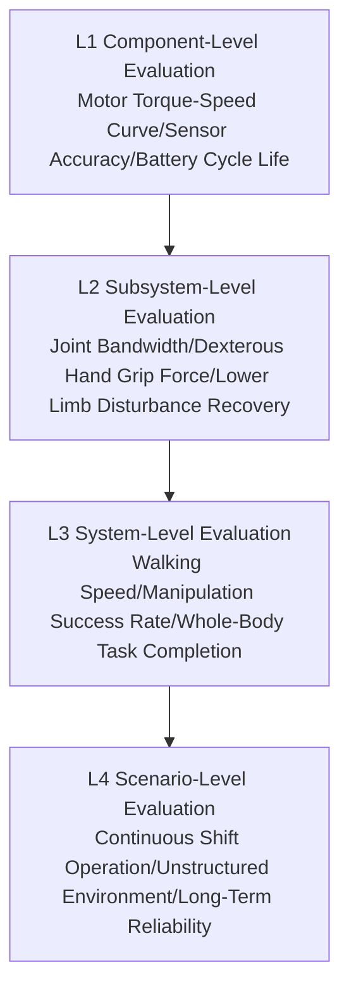
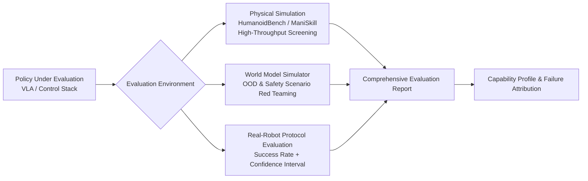
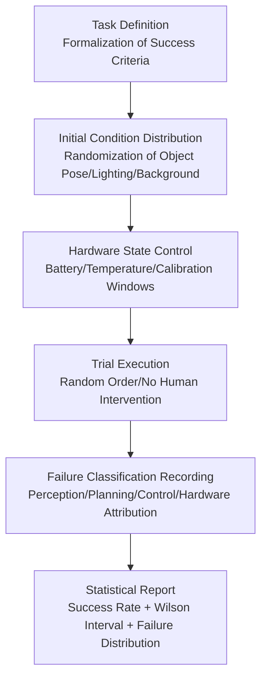

# Chapter 25: Humanoid Robot Evaluation System

## Abstract

"How capable is this humanoid robot?" — This seemingly simple question currently has a weak answer across the entire industry. Demo videos can be edited, single success rates can be cherry-picked for specific scenarios, but mass production deployment requires an evaluation system that is **reproducible, comparable, and attributable**. This chapter systematically reviews the methodologies and tool stacks for humanoid robot evaluation. Starting from the purpose and hierarchical structure of evaluation, it distinguishes component-level, subsystem-level, system-level, and scenario-level evaluations, and discusses three technical routes: simulation evaluation, real-robot evaluation, and generative evaluation based on world models. It then proceeds by capability dimension: motion control and whole-body performance evaluation introduces MPJPE, Torque Variation Score (TVS), HumanoidBench, and Human-Like Actuation Score (HLAS); manipulation skill evaluation introduces LIBERO, LIBERO-Plus, ManiSkill, and Isaac Gym benchmarks, as well as methods for evaluating simulation fidelity itself; foundation model evaluation discusses the generalization dimensions of VLA models, humanoid robot foundation model benchmarks, and the new paradigm of policy red-teaming using world simulators; the real-robot evaluation section provides statistical inference methods for success rates, key points for evaluation protocol design, and reliability/durability evaluation; finally, it discusses existing problems and trends such as benchmark overfitting and the demo-to-product gap. Together with Chapter 12 (Certification and Compliance), this chapter forms the methodological loop for the "verification and market layer" of humanoid robots: the former answers "Is the robot good enough?", the latter answers "Is the robot safe and legal enough?".

**Keywords**: Evaluation Benchmark; HumanoidBench; LIBERO; ManiSkill; HLAS; MPJPE; Success Rate Statistics; sim-to-real; Generalization; World Model Evaluation

---

## 25.1 Purpose and Hierarchical Structure of Evaluation

### 25.1.1 Why Evaluation is a Bottleneck for Embodied Intelligence

The large language model field has relatively mature public benchmarks like MMLU and HumanEval, where every leap in model capability has quantifiable records. The humanoid robot field is different: demonstrations of parkour, folding clothes, and carrying objects from various manufacturers' launches are dazzling, but the outside world cannot answer three fundamental questions:

1.  **Is it reproducible?** Was the demo a successful segment picked from how many attempts? Were the initial conditions carefully designed?
2.  **Is it comparable?** Robot A can fold a T-shirt, Robot B can carry a 20 kg box. Which one is more capable?
3.  **Is it generalizable?** Can a task learned in one room still be performed with different lighting, different objects, or a different floor plan?

These three questions correspond to three fundamental attributes of evaluation: **reproducibility, comparability, and generalization predictiveness**. The value of an evaluation system is not just academic ranking, but also the "common currency" of the industry chain: hardware manufacturers need it to prove capability boundaries to customers, model companies need it to screen algorithms, investors need it to identify the gap between marketing and actual progress, and certification bodies (Chapter 12) need it to quantify the evidence for "safety" and "capability".

!!! note "Term Explanation: Demo-to-Product Gap"
    The systematic gap between metrics optimized for staged demonstrations and those required for reliable, certifiable, mass-producible products. Demonstrations pursue single-shot visual impact, while products require long-term, fault-free expected performance. One core mission of an evaluation system is to quantify the latter, making the chasm between "good demo" and "usable product" measurable, rather than obscured by marketing rhetoric.

### 25.1.2 The Hierarchical Pyramid of Evaluation

A complete humanoid robot evaluation system is divided into four layers from bottom to top based on abstraction level:



- **L1 Component Level**: Various hardware indicators discussed in Chapters 2–6 of this book — peak and continuous torque of actuators (see Human-Like Actuation Score HLAS, Section 25.2.4), reducer precision grade, torque sensor noise floor, battery energy density. Characterized by mature measurement methods and existing standards, but component indicators alone cannot predict overall robot capability.
- **L2 Subsystem Level**: Joint position/force control bandwidth, maximum grip force and degree-of-freedom utilization of the dexterous hand, recovery capability of the lower limb under thrust disturbances. This level begins to exhibit the "indicator combination" problem — bandwidth, precision, and load are often mutually exclusive.
- **L3 System Level**: Task-oriented evaluation, such as walking speed, stair traversal success rate, success rate and completion time for specified manipulation tasks. Academic benchmarks (HumanoidBench, LIBERO, etc.) primarily operate at this level.
- **L4 Scenario Level**: Comprehensive performance over an 8-hour continuous shift, Mean Time Between Failures (MTBF), task generalization in uncontrolled environments. This is the level that truly matters for products, and it is currently almost a blank area in public benchmarks.

There is a classic **aggregation error** problem between levels: L1 being all excellent does not guarantee L3 being useful (integration losses, control bottlenecks), and L3 having high scores does not guarantee L4 reliability (durability, maintainability). A mature evaluation system must establish independent indicators at each level and study the mapping relationships between levels.

### 25.1.3 Three Technical Routes for Evaluation

Based on the evaluation environment, there are currently three parallel development routes:

| Route | Representative Tools | Advantages | Limitations |
|------|----------|------|------|
| Simulation Evaluation | Isaac Gym Benchmarks, HumanoidBench, ManiSkill, LIBERO | Low cost, parallelizable, precisely reproducible | sim-to-real gap, contact/friction modeling errors |
| Real-Robot Evaluation | Task Success Rate Protocols, Telemetry Data, Competitions | Undisputed realism | High cost, low throughput, reproducibility difficult to guarantee |
| Generative/World Model Evaluation | Policy Simulators based on Video World Models | Combines throughput with visual realism, can generate OOD scenarios | Physical consistency not yet guaranteed, still in research phase |

These three routes are not substitutes but form a funnel: simulation for large-scale initial screening, world models for supplementary testing of out-of-distribution and safety scenarios, and real robots for final confirmation. The evaluation of "Gemini Robotics policies in the Veo World Simulator" introduced in Section 25.4.3 is a representative work of the third route.

### 25.1.4 Design Principles for Evaluation Metrics

Whether designing a new benchmark or reviewing an evaluation report, four principles can be used to check the quality of metrics:

1.  **Monotonicity**: An increase in the metric should stably correspond to a real improvement in capability. If a metric can be inflated by sacrificing an unmeasured dimension (e.g., sacrificing movement speed for success rate), it violates monotonicity and must be paired with a reporting constraint (in this case, completion time).
2.  **Decomposability**: The total score should be decomposable into physically or semantically meaningful components, allowing low scores to be directly attributed to subsystems or capability dimensions. The five-component structure of HLAS and the difficulty stratification of DSJE are examples of decomposability; a single, indecomposable black-box score (like the total score of some comprehensive leaderboards) has limited diagnostic value.
3.  **Gaming Resistance**: The metric definition should make the cost of "targeted optimization" higher than the cost of "real capability improvement". Benchmarks with public and fixed initial conditions are highly susceptible to overfitting. Secret test sets and perturbation scanning (LIBERO-Plus style) are the main methods to improve gaming resistance.
4.  **Cost of Measurement**: The measurement cost of a metric determines how frequently it can be used. Real-robot metrics cannot be used for daily regression, so an evaluation system is always a combination of "cheap proxy metrics for high-frequency monitoring + expensive real metrics for milestone confirmation". The correlation between proxy and real metrics itself needs periodic calibration.

---

### 25.1.5 Organization of this Chapter

Section 25.2 deals with the evaluation of "physical capabilities" (motion control and whole-body performance), Section 25.3 deals with the evaluation of "hand skills" (manipulation skill benchmarks), Section 25.4 deals with the evaluation of the "brain" (foundation models and VLA), Section 25.5 deals with the statistics and protocols for real-robot evaluation, and Section 25.6 discusses existing problems and trends in the system. Reading can be cross-referenced with other chapters of this book: hardware component indicators correspond to Chapters 2–6, motion control principles correspond to chapters on whole-body control and walking, and safety-related evaluation evidence chains correspond to Chapter 12.

## 25.2 Motion Control and Full-Body Performance Evaluation

### 25.2.1 Motion Imitation Error: MPJPE and Its Limitations

Motion imitation based on motion capture or video retargeting is one of the mainstream paradigms for full-body control of humanoid robots. The most commonly used evaluation metric is **MPJPE (Mean Per-Joint Position Error)**:

$$
\text{MPJPE} = \frac{1}{T}\sum_{t=1}^{T} \frac{1}{J}\sum_{j=1}^{J} \left\| \mathbf{p}_j^{robot}(t) - \mathbf{p}_j^{ref}(t) \right\|_2
$$

where \(\mathbf{p}_j(t)\) is the position of the \(j\)-th body keypoint in the world coordinate system. MPJPE is intuitive and easy to compute, but it has a fundamental flaw: **it only measures the imitation result, without distinguishing the source of error**. When a segment of motion imitation fails, is it due to insufficient capability of the policy network, or is the motion itself inherently "difficult to learn" (dynamically unfriendly to reinforcement learning)? Confusing these two can mislead the direction of algorithm iteration.

To address this issue, the 2025 work *Benchmarking Humanoid Imitation Learning with Motion Difficulty* (arXiv:2512.07248) proposed the **Torque Variation Score (TVS)**: by applying small perturbations to the poses of a reference motion, it measures the magnitude of torque variation required to "correct" the perturbation. The physical meaning of this metric is the dynamic sensitivity of the motion—high-TVS motions correspond to flat regions in the reward landscape, leading to vanishing policy gradients, and thus are inherently difficult to learn using gradient-based methods. Experiments show that TVS is strongly correlated with the imitation error of mainstream methods such as UHC and PHC+, thereby supporting three practical tools:

- **Maximum Imitable Difficulty (MID)**: Characterizes the upper limit of a policy's capability—the TVS threshold at which error begins to diverge, used for horizontal comparison of different policies;
- **Difficulty-Stratified Joint Error (DSJE)**: Reports MPJPE stratified by motion difficulty, revealing an attribution structure where "high error on low-difficulty motions = policy deficiency; high error on high-difficulty motions = task difficulty itself";
- **Defective Motion Detection**: Identifies segments in the dataset with abnormally high difficulty, used for motion capture data cleaning and quality control.

The significance of this work extends beyond motion imitation: **good evaluation metrics should support error attribution, not just scoring**.

### 25.2.2 HumanoidBench: Full-Body Locomotion and Manipulation Benchmark

**HumanoidBench** (arXiv:2403.10506) is one of the most widely cited simulation benchmarks for full-body control of humanoid robots. It is based on the Unitree H1 robot morphology and includes over 40 tasks covering four categories of capabilities:

- **Locomotion**: walking, running, climbing stairs, etc.;
- **Reaching / Manipulation**: carrying, pushing/pulling, object interaction;
- **Loco-Manipulation**: manipulating while walking, requiring full-body coordination of upper and lower limbs;
- **Dexterous Hand Tasks**: some tasks are equipped with high-degree-of-freedom hands to examine fine manipulation.

Its methodological value lies in **controlled comparison**: all algorithms face the same robot model, physical parameters, and task definitions, with differences only in the "brain". Experiments in HumanoidBench also reveal a phenomenon with cautionary implications for the industry: on this benchmark, hierarchical/decomposed structures (high-level planning + low-level pre-trained skills) generally outperform end-to-end reinforcement learning baselines, indicating that "a single network directly learning 40+ full-body tasks" is currently unrealistic given existing algorithms and data—evaluation results, in turn, shape the consensus on architecture selection.

Limitations are equally clear: tasks and action spaces are tied to the Unitree H1 morphology, so conclusions require caution when extrapolating to other humanoid platforms; moreover, high scores in a purely simulated environment do not equate to real-robot capability (discussed in Section 25.3.5 on fidelity evaluation).

### 25.2.3 Classic Physical Metrics for Bipedal Locomotion

Beyond academic benchmarks, bipedal locomotion capabilities have a set of classic metrics derived from biomechanics and control theory, which remain common language in papers and product specifications:

- **Walking Speed and Normalized Speed**: Absolute speed (m/s) is non-dimensionalized by leg length to obtain the Froude number \(Fr = v^2/(g l)\), enabling comparison across robots of different sizes;
- **Cost of Transport (CoT)**: Energy consumption per unit weight per unit distance,
  $$
  CoT = \frac{P}{m g v}
  $$
  where \(P\) is average power consumption. Typical human walking CoT is around 0.2, while bipedal robots generally remain several times to an order of magnitude higher, making it a core metric for energy efficiency;
- **Disturbance Recovery Capability**: Whether the robot remains upright under standardized push disturbances (push rod or pendulum with specified impulse), and the number of steps required for recovery;
- **Terrain Traversal Rate**: Success rate across standard terrain sets such as steps, slopes, gravel, and grass;
- **Stability Margin**: Dynamic margin based on ZMP/Capture Point (see relevant chapters in this book for principles), which can serve as a continuous metric in simulation.

### 25.2.4 Human-Level Actuation Score (HLAS): A Quantitative Benchmark for Hardware Capability

"Has this robot's actuator reached human level?" Manufacturers often make such claims, but single-point specifications like peak torque or peak speed cannot indicate whether a joint can simultaneously output appropriate torque, power, and endurance under task-relevant poses and velocities. The 2025 work *Human-Level Actuation for Humanoids* (arXiv:2511.06796) proposed a reproducible framework that turns "human-level" into a measurable quantity:

1. **DoF Atlas**: Uses ISB (International Society of Biomechanics) conventions to unify joint coordinate systems and range-of-motion definitions, ensuring that human joints and robot joints are compared under the same coordinate semantics;
2. **Human-Equivalence Envelope (HEE)**: Characterizes the capability boundary of human joints on the torque-power plane as a function of pose and velocity;
3. **Human-Level Actuation Score (HLAS)**: A scalar score with a reference human value of 1.0, decomposable into five physically meaningful components—**workspace coverage, HEE envelope coverage, torque pattern bandwidth, efficiency, and thermal sustainability**.

The engineering value of HLAS lies in its **decomposability**: when the total score is low, one can immediately identify whether the shortcoming is insufficient range of motion (mechanical design issue), a gap in the torque-power envelope (motor/gearbox selection issue), or poor thermal sustainability (heat dissipation design issue), thereby directly translating evaluation results into design iteration inputs (linking to discussions on actuators and motor design in Chapters 3 and 4). This type of metric, using the human body as a reference frame, represents an important direction for hardware evaluation: not pursuing the maximization of absolute values, but rather an interpretable gap relative to a biological reference.

## 25.3 Operational Skill Evaluation Benchmarks

### 25.3.1 LIBERO: Lifelong Learning and Knowledge Transfer

**LIBERO** (*Benchmarking Knowledge Transfer for Lifelong Robot Learning*, NeurIPS 2023, arXiv:2304.13470) uses short-horizon tabletop manipulation tasks as a vehicle. The core research question is not "single-task success rate" but **knowledge transfer**: when a robot learner learns sequentially across a series of tasks, can it leverage knowledge from previous tasks to accelerate subsequent learning and avoid catastrophic forgetting? To this end, LIBERO provides a programmable mechanism for object and scene variation, organizing task suites along variation dimensions—spatial layout changes, object category changes, goal (instruction) changes, and long-horizon compositional tasks—thereby breaking down "generalization" from a vague slogan into independently measurable dimensions.

LIBERO's impact on the VLA (Vision-Language-Action) era is profound: its standardized task suites and evaluation protocols have become one of the default options for reporting generalization performance in numerous VLA model papers; its design philosophy of "decoupling by variation dimensions" has been widely adopted by subsequent benchmarks.

### 25.3.2 LIBERO-Plus: A Systematic Dissection of Robustness

If LIBERO examines "how fast one learns," **LIBERO-Plus** (arXiv:2510.13626) examines "how stable one is under perturbations." It extends LIBERO to **10,030 tasks**, systematically applying pressure along seven perturbation dimensions:

1. Camera viewpoint changes;
2. Robot initial state changes;
3. Language instruction changes (paraphrasing, stylistic variation);
4. Lighting changes;
5. Background changes;
6. Sensor noise;
7. Object layout changes.

This "single-variable perturbation sweep" experimental design can precisely pinpoint a model's vulnerable dimensions. Its analytical findings carry methodological significance for the entire VLA field: many models reporting high success rates on standard LIBERO suffer significant performance drops under specific perturbation dimensions (typically camera viewpoint and initial state shifts), indicating that in-benchmark success rates mask robustness deficits. **The competition in benchmark design is shifting from "task quantity" to "systematicity of perturbation dimensions"**—a clear signal of the evaluation system's own evolution.

### 25.3.3 ManiSkill and Isaac Gym Benchmarks

**ManiSkill** is a unified benchmark for generalizable manipulation skills, providing standardized task definitions, simulation environments, and evaluation protocols. Its distinctive feature lies in emphasizing large-scale parallel simulation throughput and realistic observations such as point clouds/RGB-D, supporting comparisons across multiple paradigms—from imitation learning and reinforcement learning to offline multi-task training—under the same protocol.

**Isaac Gym Benchmarks** are built on NVIDIA Isaac Gym. Their core contribution is moving both physics simulation and policy learning entirely onto the GPU, end-to-end eliminating CPU-GPU data transfers, thereby increasing reinforcement learning sample throughput by several orders of magnitude. For humanoid robots, high throughput means it is feasible to run large-scale parallel terrain randomization and domain randomization experiments, which has directly spurred the recent explosion of "simulation training + real-world deployment" bipedal locomotion policies. The Isaac Gym toolchain (and its successor Isaac Lab) has become one of the de facto infrastructures for training and evaluating humanoid locomotion policies.

### 25.3.4 Multi-Dimensional Trade-offs in Benchmark Selection

Faced with numerous simulation benchmarks, researchers should select tools based on evaluation goals:

| Benchmark | Primary Evaluation Target | Morphology | Task Scale | Feature |
|-----------|---------------------------|------------|------------|---------|
| HumanoidBench | Full-body locomotion + manipulation policies | Bipedal humanoid (Unitree H1) | 40+ tasks | Humanoid-specific, controlled comparison |
| LIBERO | Knowledge transfer / lifelong learning | Tabletop single arm | Multi-task suite | Decoupled variation dimensions |
| LIBERO-Plus | VLA robustness | Tabletop single arm | 10,030 tasks | Seven-dimensional perturbation sweep |
| ManiSkill | Generalizable manipulation skills | Multi-morphology | Large task set | High throughput, realistic observations |
| Isaac Gym Benchmarks | RL training and evaluation throughput | Multi-morphology | Task set | GPU end-to-end acceleration |

A caution is needed regarding **benchmark incommensurability**: success rate numbers from different benchmarks are not horizontally comparable. Any cross-benchmark comparison of the form "Model A achieves 90% on Benchmark X, Model B achieves 80% on Benchmark Y" is an invalid argument. Cross-model comparisons must be anchored to the same benchmark, the same protocol, and the same evaluation seed distribution.

### 25.3.5 Evaluating the Simulator Itself: Fidelity Benchmarks

The validity of simulation-based evaluation depends on the sim-to-real gap, and this gap itself needs to be evaluated. The 2019 work by Collins et al., *Benchmarking Simulated Robotic Manipulation through a Real World Dataset*, provides a "hardware-free" fidelity evaluation paradigm: it releases a real-world dataset and standardized protocol of tasks performed by a real robot (Kinova MICO2 arm + Robotiq sensor, recorded by Qualisys motion capture), allowing researchers to compare trajectories generated by their own simulators against it, quantifying deviations using **23 kinematic and dynamic metrics**. The insight of this work is that: **a simulator is not an "all-or-nothing" assumption, but a model that can be benchmarked**; when choosing a simulation stack (PyBullet, MuJoCo, Isaac series, etc.), fidelity benchmark data should enter the selection decision alongside speed and functionality.

## 25.4 Foundation Models and VLA Evaluation

### 25.4.1 Specifics of VLA Evaluation

Vision-Language-Action (VLA) models unify perception, language understanding, and action generation into a single network. Their evaluation is far more challenging than that of traditional controllers, for three reasons:

1. **The open-loop instruction space is infinite**: Traditional benchmarks specify "put the red block into the bowl." VLAs must handle arbitrary natural language expressions, making instruction understanding itself a source of error.
2. **Failure modes are semantic**: The model may "understand incorrectly but execute perfectly" or "understand correctly but fail physically," requiring hierarchical attribution.
3. **Real-robot evaluation is extremely costly**: Each model variant requires a sufficient number of real-robot runs for statistical significance (Section 25.5), forcing evaluation to shift toward simulation and world models.

Therefore, VLA evaluation is typically organized along dimensions: **intra-instruction generalization** (new expressions for the same task), **visual generalization** (new objects/backgrounds/viewpoints), **semantic generalization** (new instruction combinations), and **physical generalization** (new object properties like weight, friction). The seven-dimensional perturbation set of LIBERO-Plus is a concrete implementation of this dimensional thinking.

### 25.4.2 Humanoid Robot Foundation Model Benchmarks

As various humanoid companies release their own "robot foundation models," independent third-party ratings have emerged. The Humanoid Foundation Model Benchmark (humanoid.guide, released in 2026) is a representative attempt: it rates and compares humanoid robot AI foundation models across **ten capability dimensions**, covering locomotion, manipulation, reasoning, sim-to-real transfer, and more, and is publicly accessible for queries.

This type of "industry rating" benchmark complements academic benchmarks: academic benchmarks provide precise comparisons under controlled conditions, while industry benchmarks offer a panoramic map across manufacturers. When using the former, one must scrutinize protocol details; when using the latter, attention must be paid to the transparency of its scoring methodology—the evidence on which the rating is based (public demonstrations, technical reports, or third-party testing) determines the credibility of the conclusions.

### 25.4.3 World Model Evaluation: Generative Red Teaming

Real-robot evaluation is expensive, and physical simulations struggle to cover visual diversity. Thus, a new path has emerged: **using learned world models as evaluation environments**. The 2026 work *Evaluating Gemini Robotics Policies in a Veo World Simulator* is a landmark case: researchers fine-tuned the Veo2 video generation model on robot data to construct an action-conditioned, multi-view consistent world simulator. Combined with generative scene editing, they evaluated Gemini Robotics policies on ALOHA 2 bimanual tasks under three settings:

- **Nominal scenarios**: Verify consistency between evaluation results in the simulator and real-robot evaluations.
- **Out-of-distribution (OOD) scenarios**: Generate visual changes unseen during training to test policy generalization.
- **Safety-critical scenarios**: Generate hazardous situations (e.g., a person entering, obstacles appearing) to "red-team" the policy.

The profound significance of this paradigm is that it operationalizes the exploration of "unknown unsafe scenarios" from SOTIF (discussed in Chapter 12)—edge cases that previously required luck to encounter can now be mass-produced and automatically evaluated using generative models. Its limitations must also be clearly recognized: the physical consistency of generated videos (contact, object states after occlusion) has no hard guarantee. Evaluation conclusions used for safety arguments must be backed by real-robot spot checks. World model evaluation is an amplifier, not a free pass.



### 25.4.4 Datasets as Evaluation Infrastructure

In the era of large models, the boundary between datasets and evaluation is dissolving: datasets define the capability distribution, and evaluation samples from that distribution. Public datasets closely related to humanoid robot evaluation include:

- **Open X-Embodiment**: A large-scale cross-embodiment dataset aggregating demonstration data from diverse real robot platforms and institutions, widely used for VLA pre-training; its platform diversity also makes it a data foundation for "cross-morphology generalization" evaluation.
- **DROID**: A real-world manipulation dataset distributedly collected across multiple laboratories and environments, whose environmental diversity directly serves visual and environmental robustness evaluation.
- **RH20T**: Approximately 110,000 contact-rich manipulation sequences containing visual, force, audio, and human demonstration pairs, providing a reference for evaluating force control/contact tasks.
- **AMASS** and other human motion datasets: Provide reference motion sources for locomotion imitation evaluation (Section 25.2.1); the motion capture quality issues derived from them are precisely the application target of the "defective action detection" tool in the TVS work.

Evaluation designers must be wary of **distribution bias** in datasets: a high score evaluated within the distribution of data trained from a single laboratory and a single platform has limited predictive power for the external world. Dataset composition (who collected it, where it was collected, and what was used to collect it) should be a mandatory disclosure item in evaluation reports.

## 25.5 Real-Robot Evaluation Methods and Statistics

### 25.5.1 Statistical Inference of Success Rate

The most fundamental metric in real-robot evaluation is the task success rate. Given \(n\) independent repeated trials with \(k\) successes, the point estimate is \(\hat{p} = k/n\). However, the credibility of "19 successes out of 20 trials (95%)" is completely different from "950 successes out of 1000 trials (95%)"; a confidence interval must be reported. Since the number of robot trials is often limited, the Wilson interval is recommended over the normal approximation:

$$
\frac{\hat{p} + \frac{z^2}{2n} \pm z\sqrt{\frac{\hat{p}(1-\hat{p})}{n} + \frac{z^2}{4n^2}}}{1 + \frac{z^2}{n}}
$$

where \(z\) is the standard normal quantile (for 95% confidence, \(z \approx 1.96\)). Some useful engineering intuitions: with \(n=20\) trials all successful, the lower bound of the 95% confidence interval is only about 83%; to compress the success rate interval width to within ±5%, hundreds of independent trials are required. This explains why serious VLA evaluations often demand hundreds of rollouts per task, and why "a single successful demonstration at a press conference" provides almost no statistical information about capability.

!!! note "Terminology Explanation: The Trap of the i.i.d. Assumption"
    Success rate statistics assume that each trial is independent and identically distributed, but this assumption is often quietly violated in real-robot evaluations: battery level drops, motor temperature rises, object positions on the conveyor belt retain the influence of the previous trial, and the operator subconsciously adjusts initial conditions to "save the situation" between consecutive trials. Evaluation protocols must approximate i.i.d. through randomizing trial order, controlling hardware state (temperature, battery level windows), automatic resetting, and operator blinding; otherwise, the mathematical guarantees of the confidence interval are invalidated.

### 25.5.2 Key Points in Evaluation Protocol Design

A rigorous real-robot evaluation protocol should include at least the following elements:



- **Formalization of Success Criteria**: Describe success using mechanically verifiable state conditions (e.g., "the object is completely within the target area and the robot has returned to the standby pose"), avoiding subjective judgments like "it looks successful";
- **Declaration of Initial Condition Distribution**: The sampling range of the object's initial pose must be specified — a "100% success rate" with randomization only within a central 5 cm area is completely different from randomization across the entire desktop;
- **Intervention and Takeover Logging**: Any human intervention (teleoperation takeover, manual reset of internal policy state) must be counted and disclosed; the degree of teleoperation assistance is a key variable in autonomy evaluation;
- **Failure Attribution Classification**: Classify failures statistically by perception error, planning error, control execution error, and hardware fault. The distribution of failure modes is often more informative than the total score (echoing the attribution idea in Section 25.2.1);
- **Computational and Time Costs**: Task completion time, inference latency, and energy consumption should be reported together to prevent "infinite retries + slow execution" from inflating the success rate.

### 25.5.3 Autonomy Levels and Hidden Variables

The biggest "hidden variable" in real-robot evaluation is the **degree of autonomy**. Two robots that both "complete the task" may differ significantly: one is fully autonomous, while the other relies on multiple human teleoperation interventions. Evaluation reports should explicitly declare the autonomy level. Reference dimensions for grading include: whether perception is onboard, whether decision-making is onboard, whether human intervention is required for recovery, and whether environmental modifications are preset (e.g., pasting markers, fixing furniture). One of the values of industry competitions (e.g., various robot challenges) is to make these variables explicit — horizontal comparison under a unified venue, unified rules, and unified judging provides information density far higher than demonstrations released by individual manufacturers.

### 25.5.4 Reliability and Durability Evaluation

The core of scene-level (L4) evaluation is the time dimension: the question is not whether the robot "can do it," but "how long can it keep doing it without failure." Key metrics include:

- **MTBF (Mean Time Between Failures)** and **MTTR (Mean Time To Repair)**, which together determine availability \(A = MTBF/(MTBF + MTTR)\);
- **Task Degradation Curve**: The drift of success rate/accuracy over time during continuous operation for several hours (combined effect of thermal drift, wear, and battery level drop);
- **Accelerated Life Testing (ALT)**: Accelerating failure by increasing stress levels (temperature, load, cycle frequency) and extrapolating lifespan under normal stress, requiring clear acceleration model assumptions;
- **Maintainability Metrics**: Replacement cycle and replacement time for consumable parts (dexterous hand tendons, batteries, foot cushioning materials).

Reliability data is inherently difficult to obtain during the paper stage — it requires cumulative operation of hundreds or thousands of hours. This is why operational data from fleet deployment is becoming one of the deepest moats for leading companies, and also echoes the "data flywheel" concept: operational data feeds back into model improvement, and the improved model is redeployed to the fleet.

### 25.5.5 Python Example: Wilson Confidence Interval and Trial Number Planning

The following code implements the Wilson interval and answers two of the most common questions in evaluation scheduling: (1) Given trial results, what is the credible interval for the success rate? (2) How many trials are needed to compress the interval half-width to a target value?

```python
import math

def wilson_interval(k, n, z=1.96):
    """Wilson score interval for a binomial proportion.

    k: number of successes, n: total number of trials, z: standard normal quantile (95% -> 1.96)
    Returns (lower bound, point estimate, upper bound)
    """
    p = k / n
    denom = 1 + z**2 / n
    center = (p + z**2 / (2 * n)) / denom
    half = z * math.sqrt(p * (1 - p) / n + z**2 / (4 * n**2)) / denom
    return center - half, p, center + half

def required_trials(p, half_width, z=1.96):
    """Rough estimate of the number of trials needed to compress the Wilson interval half-width to half_width.

    Using the normal approximation half-width z*sqrt(p(1-p)/n) for iterative approximation is sufficient for engineering scheduling accuracy.
    """
    n = 1
    while True:
        lo, _, hi = wilson_interval(int(round(p * n)), n, z)
        if (hi - lo) / 2 <= half_width:
            return n
        n += 1

# Scenario 1: Press release claim "20 trials all successful"
lo, p, hi = wilson_interval(20, 20)
print(f"20/20 successes: point estimate {p:.1%}, 95% interval [{lo:.1%}, {hi:.1%}]")
# -> Lower bound is only about 83%: a perfect small sample does not prove a high success rate

# Scenario 2: Rigorous evaluation "372 successes out of 400 trials"
lo, p, hi = wilson_interval(372, 400)
print(f"372/400 successes: point estimate {p:.1%}, 95% interval [{lo:.1%}, {hi:.1%}]")

# Scenario 3: Scheduling planning — true success rate ~90%, target interval half-width <= 3%
n = required_trials(0.90, 0.03)
print(f"With a true success rate of 90%, compressing the half-width to ±3% requires approximately {n} independent trials")
```

The running results will confirm the intuition from Section 25.5.1: the lower bound of the interval for 20 perfect successes is only slightly above 80%, and to compress the interval half-width to ±3%, around 400 independent trials are needed when the true success rate is near 90% — considering that each real-robot rollout, including reset time, takes one or two minutes, statistical validation for a single task alone would occupy an entire day of machine time. This is why real-robot evaluation is expensive, and it is the economic root of the value of simulation and world model evaluation (Section 25.1.3).

!!! note "Terminology Explanation: Difference Between Wilson Interval and Normal Approximation"
    The simple normal approximation interval for the success rate \(\hat{p} \pm z\sqrt{\hat{p}(1-\hat{p})/n}\) can produce absurd results outside the range \([0,1]\) when \(n\) is small or \(\hat{p}\) is close to 0/1 (e.g., zero width for 20/20, implying "absolute reliability"). The Wilson interval, constructed by inverting the score test for the binomial distribution, maintains correct coverage even with small samples and extreme proportions, and is the default form that should be used in robot evaluation reports; for more conservative cases, the Clopper-Pearson exact interval can be used.

---

## 25.6 Existing Problems and Development Trends

### 25.6.1 Benchmark Overfitting and Leaderboard Dynamics

Once any public benchmark becomes the focus of the community, it triggers **Goodhart's Law** ("When a metric becomes a target, it ceases to be a good metric"): models begin to overfit to the benchmark tasks, and the correlation between benchmark scores and actual capability diminishes. Special mitigation measures in the robotics domain include: regularly replacing/perturbing task suites (LIBERO-Plus-style perturbation expansion), held-out test sets (held-out tasks), real-robot re-verification, and upgrading evaluation from "single-point success rate" to "multi-dimensional capability profiling." The evaluation system itself also requires versioning and renewal; a benchmark that has not been updated for five years is essentially of historical value only.

### 25.6.2 From Offline Benchmarks to Online Evaluation

The ultimate form of evaluation is likely to be **continuous online evaluation**: every task execution, every takeover, and every failure generated by a robot in real-world deployment enters the evaluation pipeline, forming a capability curve that evolves over time and software versions. This transforms evaluation from an "admission exam" into a "lifetime health check," converging with the runtime compliance monitoring discussed in Chapter 12. Technical challenges to be addressed include: privacy compliance (home scenario data), automatic mining and clustering of failure events, and bias correction for cross-fleet statistics.

### 25.6.3 Standardization: The Final Piece of the Evaluation Puzzle

The current fragmented landscape of individual benchmarks cannot persist in the long term. The foreseeable evolution direction is: academia continues to produce task suites and metrics (HumanoidBench, LIBERO series), industry alliances and standards organizations (echoing the standards system in Chapter 12) consolidate these into test specifications, and certification bodies incorporate safety-related parts (e.g., obstacle avoidance capability testing in human-robot collaboration scenarios) into the conformity assessment evidence chain. At that point, "evaluation—standards—certification" will form a complete trust chain from the lab to the market—this is precisely the vision depicted by Chapter 12 and this chapter together in this monograph.

### 25.6.4 An Evaluation Review Checklist

As a practical application of this chapter's methodology, when faced with any robot capability claim (paper, press release, white paper, due diligence material), the following checklist can be used to quickly assess the quality of its evidence:

| Review Item | Qualified Performance | Red Flags |
|-------------|----------------------|-----------|
| Number of trials and intervals | Reports \(n\), \(k\), and confidence intervals | Only "99% success rate" without sample size |
| Initial conditions | Declares sampling distribution and randomizes | Fixed initial poses, staged setups |
| Autonomy claim | Clearly states number and timing of teleoperation takeovers | Avoids the question of "whether human intervention occurred" |
| Failure demonstration | Provides failure classification statistics | Only shows success clips |
| Environmental diversity | Multiple sites, lighting conditions, objects | Single laboratory setting |
| Benchmark anchor | Reproducible comparison on public benchmarks | Only cites custom private tests |
| Time dimension | Reports continuous operation duration and degradation | Only single best performance |

A single checklist cannot replace a complete evaluation system, but it can distinguish most marketing rhetoric from serious evidence—until benchmark standardization is complete, this "reader's self-defense capability" is itself part of the evaluation ecosystem.

---

## 25.7 Chapter Summary

- The core attributes of an evaluation system are reproducibility, comparability, and generalization predictive power; its value lies in quantifying the "demo-product gap" and providing a common currency for the industry chain.
- Evaluation is hierarchically divided into component-level, subsystem-level, system-level, and scenario-level, with aggregation errors between layers requiring layered metrics; by environment, it is divided into simulation, real robot, and world model routes, forming a funnel of "simulation screening → world model supplementary testing → real robot confirmation."
- Motion control evaluation is moving from "scoring" to "attribution": MPJPE measures imitation results, TVS measures intrinsic learning difficulty of actions and supports attribution tools like MID/DSJE; HumanoidBench provides controlled comparisons of over 40 whole-body tasks based on Unitree H1; HLAS uses the human body as a reference (=1.0) to decompose actuator capability into five components: workspace, HEE coverage, bandwidth, efficiency, and thermal sustainability.
- Manipulation skill evaluation is represented by LIBERO (knowledge transfer), LIBERO-Plus (10,030 tasks, seven-dimensional perturbation robustness), ManiSkill (generalizable manipulation), and Isaac Gym benchmarks (GPU high-throughput RL); simulator fidelity itself can be benchmarked (Collins et al.'s 23-metric approach).
- VLA/foundation model evaluation is organized along four generalization dimensions: instruction, vision, semantics, and physics; the industry has seen a ten-dimensional humanoid foundation model benchmark; using world simulators (Veo2 fine-tuning) for OOD and safety-critical scenario red-teaming is a frontier paradigm but cannot replace real-robot validation.
- Real-robot evaluation must report Wilson confidence intervals and control the risk of i.i.d. assumption violation; protocol design requires formalizing success criteria, declaring initial condition distributions, and disclosing teleoperation interventions; reliability evaluation (MTBF/MTTR, task degradation, ALT) is the core of scenario-level capability and the moat of fleet data.
- Benchmark overfitting is a long-term game; the evaluation system will evolve toward multi-dimensional capability profiling, continuous online evaluation, and the integration of "evaluation—standards—certification."

---

## References

[1] Sferrazza, C., et al. (2024). *HumanoidBench: Simulated Humanoid Benchmark for Whole-Body Locomotion and Manipulation*. arXiv:2403.10506. https://arxiv.org/abs/2403.10506

[2] Liu, B., et al. (2023). *LIBERO: Benchmarking Knowledge Transfer for Lifelong Robot Learning*. NeurIPS 2023. arXiv:2304.13470. https://arxiv.org/abs/2304.13470

[3] *LIBERO-Plus: In-depth Robustness Analysis of Vision-Language-Action Models*. (2025). arXiv:2510.13626. https://arxiv.org/abs/2510.13626

[4] *Benchmarking Humanoid Imitation Learning with Motion Difficulty*. (2025). arXiv:2512.07248. https://arxiv.org/abs/2512.07248

[5] *Human-Level Actuation for Humanoids*. (2025). arXiv:2511.06796. https://arxiv.org/abs/2511.06796

[6] Collins, J., et al. (2019). *Benchmarking Simulated Robotic Manipulation through a Real World Dataset*.

[7] Choromanski, K., et al. (2026). *Evaluating Gemini Robotics Policies in a Veo World Simulator*.

[8] Makoviychuk, V., et al. (2021). *Isaac Gym: High Performance GPU-Based Physics Simulation For Robot Learning*. NeurIPS 2021 Datasets and Benchmarks.

[9] ManiSkill series versions: Unified benchmark and simulation environment for generalizable manipulation skills.

[10] Open X-Embodiment Collaboration. (2023). *Open X-Embodiment: Robotic Learning Datasets and RT-X Models*.

[11] Khazatsky, A., et al. (2024). *DROID: A Large-Scale In-The-Wild Robot Manipulation Dataset*.

[12] humanoid.guide. (2026). *Humanoid Foundation Models Benchmark*. https://humanoid.guide/foundation-models/

[13] Goodhart, C. A. E. (1975). Problems of monetary management: the U.K. experience (Original formulation of Goodhart's Law).
