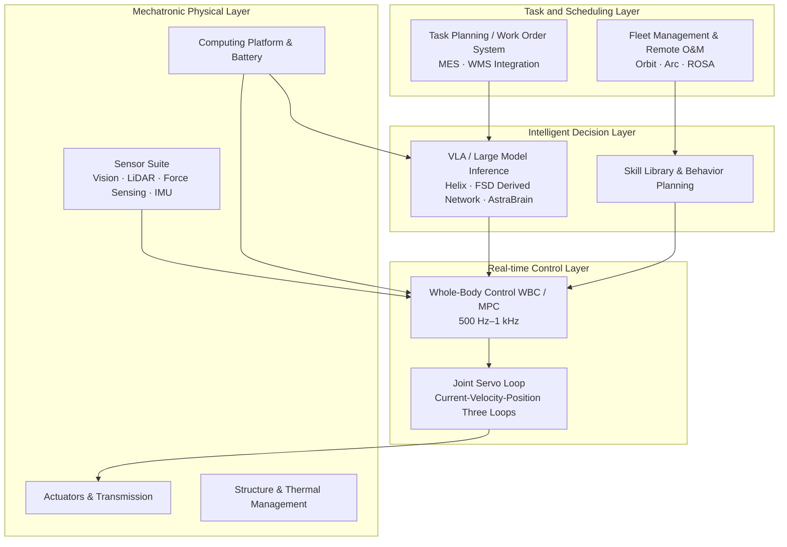
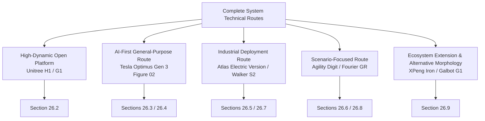
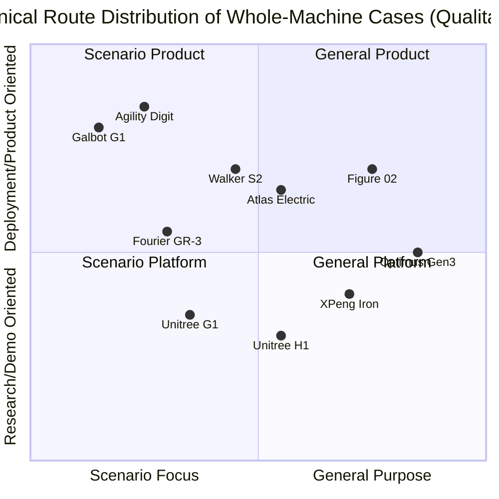

# Chapter 26: Complete System Case Studies

## Summary

The preceding chapters analyzed humanoid robots from a "bottom-up" perspective, covering materials, components, subsystems, and algorithms. This chapter shifts to a "top-down" whole-system perspective, examining how real products achieve system integration and engineering trade-offs under constraints through eight representative complete system case studies. The cases cover four main technical routes: the high-dynamic open platform route represented by Unitree H1/G1, the "AI-first" general-purpose route represented by Tesla Optimus Gen 3 and Figure 02, the heavy-load/industrial deployment route represented by Boston Dynamics Atlas (electric version) and UBTECH Walker S2, the scenario-focused route represented by Agility Digit and Fourier GR series, and also discusses XPeng Iron's automotive ecosystem route and Galbot G1's wheeled chassis alternative route. Each case is examined from five dimensions: positioning and evolution, system architecture, key parameters, deployment progress, and engineering trade-offs. Finally, a cross-case horizontal comparison and design pattern summary are provided. All parameters in this chapter are sourced from the product entity cards (Appendix D) in this Knowledge Graph (KG); missing items are marked as "Not disclosed" without speculation.

**Keywords**: Complete system integration; Unitree H1/G1; Tesla Optimus; Figure 02; Atlas (electric version); Agility Digit; Walker S2; Fourier GR; Design trade-offs; Technical routes

---

## 26.1 Complete System Integration: From Components to System

### 26.1.1 The Complete System as a Product of System Trade-offs Under Constraints

The engineering design of a humanoid robot system is essentially about finding feasible solutions within a multi-objective space constrained by five factors: mass, power, cost, computational power, and safety. Chapters 4–6 discussed component-level technologies such as actuators, sensing, and computing power supplies, but component performance cannot be simply summed: the final performance of a complete system depends on the **interface matching** and **budget allocation** between subsystems. Typical complete system budgets include:

- **Mass Budget**: Allocation among structural components, actuators, batteries, computing, and wiring. Generally, actuators account for 30%–45% of the total mass, batteries 8%–15%, and structural components 25%–35%.
- **Power Budget**: Distinction between peak motion power and sustained power. The instantaneous electrical power for bipedal dynamic walking can reach the kilowatt level, while the sustained power consumption for computing and sensing is typically on the order of hundreds of watts.
- **Degrees of Freedom (DOF) Budget**: Trade-offs between legs (6–7 DOF/leg), waist (1–3 DOF), arms (4–7 DOF/arm), and dexterous hands (6–22 DOF/hand) directly determine cost and reliability.
- **Data Budget**: Bandwidth of perception sensors, TOPS and storage of the computing platform, and real-time requirements of the control loop (typical whole-body control loop is 500 Hz–1 kHz).

The dynamics of a complete system can be uniformly described by floating-base rigid body dynamics (see Chapter 14):

$$
\mathbf{M}(\mathbf{q})\ddot{\mathbf{q}} + \mathbf{C}(\mathbf{q},\dot{\mathbf{q}})\dot{\mathbf{q}} + \mathbf{g}(\mathbf{q}) = \mathbf{S}^{\top}\boldsymbol{\tau} + \mathbf{J}_c^{\top}\mathbf{f}_c
$$

where \(\mathbf{q}\in\mathbb{R}^{n+6}\) represents the generalized coordinates including the floating base pose, \(\mathbf{M}\) is the mass matrix, \(\mathbf{S}\) is the actuated joint selection matrix, \(\mathbf{J}_c\) is the contact Jacobian, and \(\mathbf{f}_c\) is the contact force. Many trade-offs in complete system design—such as the impact of foot mass on swing inertia, or the coupling between battery capacity, endurance, and total system mass—can find corresponding physical quantities in this equation.

### 26.1.2 Key Indicators for Complete System Evaluation

For cross-case comparison, this chapter adopts the following indicator family:

| Indicator | Definition | Engineering Significance |
|------|------|----------|
| Peak Torque Density | Joint peak torque / Joint module mass (N·m/kg) | Determines upper limit of dynamic motion capability |
| Power-to-Weight Ratio-like Indicator | Payload capacity / Total system mass | Determines practical handling capability |
| Energy Autonomy | Battery capacity / Typical task average power | Determines single operation duration |
| DOF Structure | Leg/Waist/Arm/Hand DOF allocation | Determines task coverage and cost |
| Perception-Computing Configuration | Sensor suite × Onboard computing power | Determines autonomy and AI deployment capability |
| Openness | SDK, ROS2 support, secondary development documentation | Determines ecosystem and research value |
| Deployment Maturity | Runtime and scale in real customer scenarios | Distinguishes "demonstration" from "product" |

!!! note "Term Explanation: The Demo-to-Product Gap"
    The concept entity `ent_concept_demo_to_product_gap` in this Knowledge Graph points out: there is a systematic gap between the single-task success rate in demonstration videos, motion performance in ideal environments, and the **Mean Time Between Failures (MTBF)** required in real scenarios, stability with task success rate ≥99%, and the ability to sustain continuous operation for several hours daily. When evaluating each case, this chapter uses "whether there is a record of continuous deployment in third-party customer scenarios" as a key criterion to distinguish demonstrations from products.

### 26.1.3 Hierarchical Architecture View of the Complete System

Although the technical routes of various manufacturers differ significantly, the functional hierarchy of complete systems is highly isomorphic. The following hierarchical view can serve as a unified framework for analyzing each case later:



When reading each complete system case, an effective analytical question is: **At which layer does the manufacturer's differentiation occur?** Unitree's differentiation lies in L1 (self-developed high-torque-density joints) and ecosystem openness, Figure's differentiation is in L3 (Helix VLA), Walker S2's differentiation is in L4 (battery swapping, multi-robot coordination, and MES integration), while Digit's differentiation spans L1 morphology and L4's RaaS business model. The essence of complete system competition is to form barriers in one or two layers while achieving industry baseline standards in the remaining layers.

### 26.1.4 Selection Logic for Cases in This Chapter



Case selection follows three criteria: First, there is a product entity card (Appendix D) in the KG that has undergone dual manual and AI review; second, there is a verifiable record of deployment or mass production in real scenarios; third, together they cover the main technical routes and business models of the current industry. A total of eight cases correspond to the `ent_product_*` entity family in the KG.

## 26.2 Case 1: Unitree H1 and G1 – High-Dynamic Electric Drive Platform and Open Ecosystem

### 26.2.1 Positioning and Evolution

Unitree Robotics started with electric drive joints for quadruped robots and migrated its high-torque-density quasi-direct drive (QDD) joint technology to humanoid platforms. The KG entity `ent_product_unitree_h1` (Unitree H1) was released in 2023, positioned as a full-size high-dynamic research platform; `ent_product_unitree_g1` (Unitree G1) was released in 2024, with an aggressive price of approximately 16,000 USD, becoming an entry-level platform for developers and the education market.

### 26.2.2 System Architecture and Key Parameters

The H1 uses Unitree's self-developed M107 permanent magnet synchronous motor joints, with a peak knee torque of 360 N·m and a peak torque density of approximately 189 N·m/kg. It once set a running speed record of 3.3 m/s for a full-size humanoid robot. The basic version has a 4 DOF arm, with an optional H1-2 upgrade to a 7 DOF arm. The G1 is approximately 127 cm tall and weighs about 35 kg, with 23 DOF in the basic version and expandable to 43 DOF in the EDU version, which can also be optionally equipped with the Dex3-1 five-finger dexterous hand and an NVIDIA Jetson Orin computing module.

| Parameter | Unitree H1 | Unitree G1 |
|------|-----------|------------|
| Height / Weight | Approx. 180 cm / Approx. 47 kg | Approx. 127 cm / Approx. 35 kg |
| Total DOF | 26–27 DOF | 23–43 DOF (Basic/EDU version) |
| Peak Joint Torque | Knee 360 N·m (M107 motor) | 90–120 N·m |
| Movement Speed | Walking approx. 1.5 m/s; Running 3.3 m/s | Approx. 2 m/s |
| Battery Life | Approx. 1.5–2 h (864 Wh) | Approx. 1.5–2 h (9,000 mAh quick-release battery) |
| Computing Platform | Intel Core / Jetson Orin NX (optional) | 8-core CPU; EDU version optional Jetson Orin |
| Openness | ROS2 + Unitree SDK | ROS2 + Python/C++ SDK + OTA |
| Price | Approx. 90,000 USD | Starting from approx. 16,000 USD |

### 26.2.3 Engineering Highlights and Limitations

**Highlights** are threefold. First, the cost structure and dynamic performance brought by self-developed joints: the QDD scheme eliminates the cost and backlash issues of high-reduction-ratio harmonic drives, and combined with low-reduction-ratio transmission, achieves high-bandwidth force control, which is the physical basis for the 3.3 m/s running capability. Second, the price stratification strategy of the product matrix: the G1 lowers the entry barrier for the entire machine to a consumer level, making it one of the world's leading humanoid development platforms in terms of shipment volume, widely adopted by university labs and embodied intelligence research teams. Third, the open ecosystem: support for ROS2 and SDK makes it a mainstream hardware carrier for research areas such as reinforcement learning-based motion control and VLA deployment verification.

**Limitations** are equally clear: the basic version of the H1 has only a 4 DOF arm, unable to perform dexterous operations requiring wrist posture adjustment; the G1 has a payload of only about 2 kg, unsuitable for industrial handling; the battery life of both is approximately 1.5–2 hours, insufficient to support full-day operational scenarios. Therefore, Unitree's positioning is clear—**motion capability and development platform**, rather than an end-to-end industrial operation product.

---

## 26.3 Case 2: Tesla Optimus Gen 3 – Manufacturing Vertical Integration and Data Closed Loop

### 26.3.1 Positioning and Evolution

The Tesla Optimus (KG entity family `ent_product_tesla_optimus_gen1/gen2/gen3`) represents an automaker's transfer of electrification, perception, and manufacturing capabilities to humanoid robots. The core upgrade of Gen 3 lies in the hands: the degrees of freedom per hand increased from 11 DOF in Gen 2 to 22 DOF, with approximately 25 actuators per hand and a total of about 50 actuators for both hands. The new body designed for mass production is called Optimus V3. As of mid-2026, Optimus is mainly undergoing internal testing and task learning at Tesla factories in Fremont, Austin, etc., and has not been publicly sold.

### 26.3.2 System Architecture: Robotization of the FSD Methodology

Optimus's technical approach can be summarized as "the embodiment of the FSD methodology":

1. **Pure Vision Perception**: The head integrates multiple Autopilot cameras, building an environmental model using Occupancy Network and Bird's Eye View (BEV) representations, without using LiDAR.
2. **End-to-End Policy Learning**: Full-body motion and manipulation policies are trained using imitation learning and reinforcement learning, with Whole-Body Control (WBC) at the lower level ensuring balance and contact safety.
3. **High-DOF Dexterous Hand**: 22 DOF/hand + approx. 50 hand actuators, targeting tool use and flexible assembly-level manipulation capabilities.
4. **Self-Developed Computing**: Equipped with Tesla's self-developed AI5 chip, designed for local large model inference.

| Parameter | Optimus Gen 3 / V3 |
|------|--------------------|
| Height / Weight | Approx. 173 cm / Approx. 57 kg (Gen 2 baseline, V3 TBD) |
| Total DOF | Torso 28+; Hands 22×2 |
| Payload | Two-hand carrying approx. 20 kg |
| Walking Speed | Approx. 1.2 m/s (V3 reported) |
| Main Control Chip | Tesla AI5 |
| Price | Target 20,000–30,000 USD (long-term target, not officially for sale) |
| Deployment Status | Internal testing and task learning at Tesla factories |

### 26.3.3 Engineering Highlights and Limitations

**Highlights**: First is **manufacturing vertical integration** – Tesla develops its own linear/rotary actuators, battery packs, and power management, and leverages the automotive-grade supply chain, which underpins its confidence in the long-term price target of 20,000–30,000 USD; second is the **data flywheel** – data generated by robots performing tasks in its own factories flows directly back into training, forming the self-reinforcing cycle described by the KG concept entity `ent_concept_data_flywheel`, and Tesla does not need to pay customers for data acquisition costs. **Limitations**: As of mid-2026, Optimus has no record of sustained deployment in third-party customer scenarios; most performance figures come from official demonstrations and third-party analyses; the robustness of the pure vision solution in industrial environments with strong light or dust still needs verification; the high-DOF hand design places extremely high demands on actuator miniaturization and reliability, with mass production consistency being a major risk.

---

## 26.4 Case 3: Figure 02 – VLA-First General-Purpose Humanoid

### 26.4.1 Positioning and Evolution

Figure AI's Figure 02 (KG entity `ent_product_figure_ai_figure_02`, succeeded by `ent_product_figure_ai_figure_03`) was released in August 2024, targeting industrial manufacturing and logistics scenarios. Its most notable architectural feature is "AI-first": the entire machine is designed around the self-developed Helix VLA (Vision-Language-Action) model, rather than building hardware first and adding intelligence later.

### 26.4.2 System Architecture and Key Parameters

The Figure 02 is equipped with the Helix VLA model, capable of controlling the upper body at 200 Hz, enabling zero-shot grasping of thousands of unseen objects; dual NVIDIA RTX GPU modules provide approximately 3 times the on-device inference capability of Figure 01; 6 RGB cameras and multimodal sensors support environmental perception. The entire machine features integrated cable routing, with a 2.25 kWh battery integrated into the torso.

| Parameter | Figure 02 |
|------|-----------|
| Height / Weight | Approx. 168 cm / Approx. 70 kg |
| Total DOF | 28 DOF (Hands 16 DOF/pair) |
| Payload | Hand 25 kg; Whole-body carrying 20 kg |
| Walking Speed | Approx. 1.2 m/s |
| Battery Life | Approx. 5 h (2.25 kWh torso battery) |
| Computing Platform | Dual NVIDIA RTX GPU modules |
| AI Architecture | Helix VLA (Vision-Language-Action) |
| Deployment Record | Verified in real tasks at BMW Spartanburg factory |

### 26.4.3 Engineering Highlights and Limitations

**Highlights**: Helix VLA represents the "end-to-end general manipulation policy" approach – a single neural network simultaneously handles visual understanding, language instructions, and action output. The 200 Hz upper body control frequency indicates that VLA inference can be coupled with real-time control loops, rather than only performing high-level planning at the second level. Its deployment at the BMW Spartanburg factory for tasks like chassis assembly and material handling in collaboration with humans marks a milestone for general-purpose humanoid robots entering real automotive production lines. **Limitations**: The scale of the single-site pilot is limited, and the task types remain concentrated on structured handling and assembly assistance; the generalization capability of the VLA model is still sensitive to changes in target workpieces and station layouts, requiring new data collection and fine-tuning for new customer deployments, and the marginal deployment cost has not yet reached a "plug-and-play" level.

## 26.5 Case 4: Boston Dynamics Atlas (Electric Version) – From Hydraulic to All-Electric Heavy-Duty Platform

### 26.5.1 Positioning and Evolution

Boston Dynamics retired its hydraulic Atlas in April 2024 and launched an all-electric version (KG entity `ent_product_boston_dynamics_atlas_electric`, product card `product_atlas_electric`), positioning it for heavy-duty industrial tasks. This transition itself is an important case study: while the hydraulic solution offered outstanding power density and impact resistance, it suffered from leakage maintenance, noise, and energy efficiency issues; the all-electric solution, paired with custom high-power electric actuators, retains dynamic capabilities while significantly improving maintainability and mass-production feasibility.

### 26.5.2 System Architecture and Key Parameters

| Parameter | Atlas (Electric Version) |
|-----------|--------------------------|
| Height / Weight | Approx. 190 cm / Approx. 90 kg |
| Total Degrees of Freedom | 56 DOF |
| Payload | Instantaneous 50 kg; Continuous 30 kg |
| Range of Motion | Hip, waist, neck 360° continuous rotation; Maximum arm span 2.3 m |
| Walking Speed | Approx. 9 km/h (third-party evaluation) |
| Battery Life | Approx. 4 h (typical tasks), supports autonomous hot-swap battery |
| Protection Rating | IP67; -20°C to 40°C |
| Software Platform | Proprietary real-time control stack + Orbit fleet management |
| Deployment Direction | Hyundai manufacturing bases, Google DeepMind research scenarios |

### 26.5.3 Engineering Highlights and Limitations

**Highlights**: The 56 DOF and multiple 360° continuous rotation joints represent a unique morphological design—the full-range rotation of the waist and hips allows Atlas to "turn without changing footsteps," reducing repositioning steps in confined workspaces. This kinematic advantage was inherited and enhanced from the hydraulic era. The 30 kg continuous payload is among the highest in current electric humanoids. Combined with IP67 protection and a wide operating temperature range, it targets harsh industrial environments rather than laboratories. The autonomous hot-swap battery, coupled with Orbit fleet management, aims for near-continuous operation. **Limitations**: The total mass of approx. 90 kg imposes higher requirements on floor load-bearing and human-robot collaboration safety; the price is undisclosed (third-party estimates around 150,000 USD); the control complexity corresponding to its high dynamic capabilities makes the secondary development ecosystem far less mature than open platforms like Unitree, with customers primarily relying on complete solutions delivered by the manufacturer.

---

## 26.6 Case 5: Agility Robotics Digit – A Productization Sample for Logistics Scenarios

### 26.6.1 Positioning and Evolution

Agility Robotics' Digit (KG entity `ent_product_agility_robotics_digit` and its iteration `ent_product_agility_robotics_digit_next_gen`) originates from the research lineage of the bipedal robot Cassie and is one of the most widely deployed humanoid robots in the warehousing and logistics sector. Unlike the "general-purpose" approach, Digit's morphology has been optimized from the start for a single task family—moving totes in human-built environments.

### 26.6.2 Task-Oriented Morphological Design

Digit's design reflects task-driven principles throughout: the integrated head and torso reduces the complexity of perception-control coupling; the reverse knee (crouched leg) configuration prevents leg interference when carrying totes while facilitating squatting and stair climbing; the perception system uses 4 Intel RealSense depth cameras + LiDAR + IMU + force sensors, enabling autonomous navigation without external infrastructure.

| Parameter | Digit |
|-----------|-------|
| Height / Weight | Approx. 175 cm / Approx. 63.5–65 kg |
| Payload | 16 kg (continuous carrying of 35 lb) |
| Walking Speed | Approx. 5.4 km/h |
| Battery Life | Approx. 4 h (typical tasks), autonomous docking for charging |
| Perception | 4× Intel RealSense + LiDAR + IMU + Force Sensing |
| Manufacturing | RoboFab factory, designed annual capacity of 10,000 units |
| Business Model | Direct sales + RaaS (Robot-as-a-Service) |
| Customers | Warehousing clients such as Amazon, GXO, Spanx |

### 26.6.3 Engineering Highlights and Limitations

**Highlights**: First is **commercial deployment maturity**—real-world warehouse operation records from third-party customers like Amazon and GXO make it one of the few samples to cross the "demo-product gap"; second is **business model innovation**, where RaaS (KG concept entity `ent_concept_robot_as_a_service`) replaces outright purchase with a subscription, converting customer CapEx into OpEx and bundling maintenance, software updates, and fleet management, lowering the initial procurement barrier; third is the mass-production readiness represented by the dedicated RoboFab factory. **Limitations**: The task spectrum is narrow; upper limb manipulation is limited to tote-level handling, lacking five-finger dexterous manipulation; while the reverse knee configuration is advantageous for carrying, its kinematic difference from the human forward knee makes it less advantageous in anthropomorphic tasks (e.g., seated driving operations).

---

## 26.7 Case 6: UBTECH Walker S2 – Systematic Delivery of Industrial Humanoids

### 26.7.1 Positioning and Evolution

UBTECH's Walker series is the most complete humanoid product line from Chinese manufacturers in terms of industrial delivery records. The Walker S1 (KG entity `ent_product_ubtech_walker_s1`, released in October 2024) has entered training in automotive factories such as BYD, Dongfeng Liuzhou Motor, Geely Auto, and Audi FAW; the Walker S2 (KG entity `ent_product_ubtech_walker_s2`, product card `product_walker_s2`) is the second-generation industrial model, targeting automotive manufacturing, 3C electronics, and logistics warehousing.

### 26.7.2 System Architecture and Key Parameters

The Walker S2 features 52 DOF, a maximum dual-arm payload of 15 kg, a fourth-generation five-finger dexterous hand, and ±162° waist rotation, enabling tasks such as unpacking, material loading, quality inspection, and spraying. Its core engineering highlight is the **autonomous battery hot-swap system**: battery replacement in approximately 3 minutes supports nearly 24-hour continuous operation. The perception system includes binocular stereo vision, depth LiDAR, six-axis force sensors, and IMU; the software stack comprises the ROSA 2.0 operating system and a multimodal large model, supporting multi-robot coordination and MES system integration.

| Parameter | Walker S1 | Walker S2 |
|-----------|-----------|-----------|
| Height / Weight | 172 cm / 76 kg | Approx. 176 cm / Approx. 70–75 kg |
| Total Degrees of Freedom | 41 DOF | 52 DOF |
| Payload | 15 kg while walking | Max 15 kg (dual arms) |
| Dexterous Hand | Third generation (6-array tactile) | Fourth-generation five-finger dexterous hand |
| Walking Speed | Not disclosed | Approx. 2 m/s |
| Battery Life / Swap | Not disclosed | Approx. 2 h + 3 min autonomous hot-swap |
| Computing Platform | Not disclosed | X86 + NVIDIA Jetson Orin |
| Customer Validation | BYD, Geely, Audi FAW, etc. | NIO, BYD, Airbus, etc. |

### 26.7.3 Engineering Highlights and Limitations

**Highlights**: The Walker S2 embodies the "systematization of industrial humanoids"—it delivers not just single-machine performance but integrates battery swap automation, multi-robot coordination scheduling, and MES (Manufacturing Execution System) connectivity as part of the complete product. This is precisely the "uptime" that industrial customers truly purchase, rather than the difficulty of actions in demo videos. Its multi-automaker training records also indicate that automotive assembly logistics is currently the most realistic entry point for industrial humanoids (see Chapter 27 for details). **Limitations**: The single-battery life of approx. 2 hours dictates reliance on battery swap infrastructure; the unit cost (third-party estimates 68,000–120,000 USD) relative to the labor cost of the workstations it could replace still results in a relatively long payback period; special processes like spraying require explosion-proof and protection-level modifications, which currently necessitate customization.

## 26.8 Case 7: Fourier GR-1 and GR-3 — Scene Migration from Medical Rehabilitation

### 26.8.1 Positioning and Evolution

Fourier Intelligence started with rehabilitation exoskeletons and medical robots, and its humanoid product line shows a clear "force control technology migration" path: The GR-1 (KG entity `ent_product_fourier_gr1`, released in July 2023) is one of the earliest mass-produced and delivered bipedal humanoid platforms in China; the GR-3 (KG entity `ent_product_fourier_gr3`, released in August 2025, internal codename Care-bot) has clearly shifted towards interactive companionship and elderly care scenarios.

### 26.8.2 System Architecture and Key Parameters

The GR-1 uses self-developed FSA (Fourier Self-Actuator) integrated actuators, combining motors, drivers, reducers, and encoders. The force control technology migrated from rehabilitation exoskeletons enables compliant control in contact tasks, and it has been deployed in the rehabilitation departments of several top-tier hospitals for gait training and rehabilitation assistance. The GR-3 represents a different design philosophy: Morandi warm-toned exterior, soft-covered interior, 55 DOF with a 12 DOF dexterous hand, dual hot-swappable batteries providing approximately 3 hours of battery life, and an integrated "full-sense interaction system" combining hearing, vision, and touch. Its target scenarios include companionship for the elderly living alone, child interaction, and rehabilitation assistance.

| Parameter | Fourier GR-1 | Fourier GR-3 |
|-----------|--------------|--------------|
| Positioning | General-purpose/Rehabilitation humanoid platform | Interactive companion (Care-bot) |
| Height / Weight | 165 cm / 55 kg | 165 cm / 71 kg |
| Total DOF | 44 DOF | 55 DOF |
| Key Metrics | Max joint torque 230 N·m; Dual-arm payload 10 kg | 12 DOF dexterous hand; Full-sense interaction |
| Walking Speed | 5 km/h | Not disclosed |
| Battery Life | Not disclosed | Approx. 3 h (dual hot-swappable batteries) |
| Typical Customers | Top-tier hospital rehab dept., research | Elderly care, home (pre-sale) |

### 26.8.3 Engineering Highlights and Limitations

**Highlights**: The Fourier case demonstrates that "scenario know-how can inversely define the whole machine." The stringent requirements for force control safety and contact compliance in rehabilitation scenarios are precisely the entry barriers for medical-grade products. The GR-3's soft covering and friendly appearance design directly address the non-technical constraint of "human psychological acceptance of machines" in home scenarios. **Limitations**: The requirements for task success rate and safety certification (e.g., ISO 13482 personal care robot standard) in rehabilitation and companionship scenarios are far higher than in demonstration scenarios. The pace of large-scale deployment is constrained by the clinical validation cycle. The business model for companionship scenarios (unit price, renewal rate) has not yet been proven, making it a long-cycle track.

---

## 26.9 Case 8: Ecosystem Extension and Form Substitution — XPENG Iron and Galbot G1

### 26.9.1 XPENG Iron: Automotive Ecosystem Route

The XPENG Iron (KG entity `ent_product_xpeng_iron`, product card `product_xpeng_iron`) is a Chinese example of the "automaker builds humanoid" route, forming a cross-market comparison with Tesla Optimus. Its technical foundation reuses the XPENG automotive ecosystem: self-developed Turing AI chip (40 cores, 3000 TOPS-level computing power), 720° eagle-eye vision, Tianji AIOS, and end-to-end large model + reinforcement learning. The first-generation Iron stands 178 cm tall, weighs 70 kg, has 62 active DOF, and a 15 DOF hand with tactile feedback. It has been undergoing training tasks like screw tightening, material sorting, and production form inspection on the P7 production line at the Guangzhou factory. Mass production is planned for the end of 2026, with future applications in store navigation and commercial services.

The strategic logic of this route is consistent with Optimus: automakers possess ready-made capabilities in motors, batteries, perception, chips, and final assembly manufacturing. Humanoid robots are a "re-packaging" of these capabilities. The risks are also the same: a lack of real third-party customer data and limited breadth of training tasks within the factory.

### 26.9.2 Galbot G1: A Pragmatic Alternative with a Wheeled Base

Galaxy General's Galbot G1 (KG entity `ent_product_galbot_g1`) represents a rethinking of the assumption that "humanoids must be bipedal." The G1 uses a 360° omnidirectional wheeled base instead of bipedal walking. Through torso lifting (65 cm stroke) and folding leg structures, it covers a vertical working range, with a maximum working height of approximately 240 cm. It stands 173 cm tall and weighs about 85 kg. Its AI system, AstraBrain, uses pure visual navigation (no QR codes or LiDAR required) and has achieved 24/7 commercial deployment in scenarios like pharmacies, convenience stores, and warehouse logistics.

The engineering benefits of the wheeled solution can be directly quantified: bipedal robots continuously consume energy to maintain posture, whereas a wheeled base concentrates energy on upper-body manipulation and computation, significantly extending battery life. It also eliminates the failure modes of dynamic balance control, resulting in inherently higher reliability. The trade-off is an inability to navigate unstructured terrain like stairs or steps—but in flat commercial environments like pharmacies and convenience stores, this constraint is almost non-existent.

!!! note "Design Insight: Form Follows Task, Not the Other Way Around"
    Galbot G1 and Digit illustrate the same principle from opposite directions: Digit retains bipedal legs for carrying totes in narrow corridors and stair environments, while Galbot G1 abandons bipedal legs for all-day operation in flat commercial environments. The rationality of a "humanoid form" does not come from the form itself, but from the fact that **the environment is designed for humans**; when the target environment happens to be flat and regular, a wheeled humanoid upper body is the superior solution.

## 26.10 Cross-Case Horizontal Comparison

### 26.10.1 Key Parameter Summary Table

| Model | Height/Weight | Total DOF | Payload | Speed | Battery Life | AI/Computing | Price/Mode | Deployment Maturity |
|-------|---------------|-----------|---------|-------|--------------|--------------|------------|---------------------|
| Unitree H1 | 180 cm / 47 kg | 26–27 | Not disclosed | Run 3.3 m/s | 1.5–2 h | Jetson Orin NX optional | ~90,000 USD | Leading research platform shipments |
| Unitree G1 | 127 cm / 35 kg | 23–43 | ~2 kg | 2 m/s | 1.5–2 h | 8-core CPU + Orin optional | ~16,000 USD | Leading developer ecosystem |
| Optimus Gen 3 | 173 cm / ~57 kg | 28+ + 22×2 hands | ~20 kg | ~1.2 m/s | 2–4 h (estimated) | Tesla AI5 | Target 20–30k USD | Internal factory only |
| Figure 02 | 168 cm / 70 kg | 28 (hands 16/pair) | Hand 25 kg | 1.2 m/s | ~5 h | Dual RTX GPU + Helix VLA | Not disclosed | BMW production line pilot |
| Atlas Electric | 190 cm / 90 kg | 56 | Continuous 30 kg | ~9 km/h | ~4 h, hot-swappable | Custom real-time stack + Orbit | Not disclosed | Hyundai early deployment |
| Agility Digit | 175 cm / ~65 kg | 16–28 | 16 kg | 5.4 km/h | ~4 h, autonomous charging | RealSense + LiDAR | RaaS | Amazon/GXO warehouse |
| Walker S2 | 176 cm / ~72 kg | 52 | Dual arms 15 kg | ~2 m/s | 2 h + 3 min battery swap | X86 + Orin + ROSA 2.0 | Not disclosed | Multi-automaker training |
| Fourier GR-1 | 165 cm / 55 kg | 44 | Dual arms 10 kg | 5 km/h | Not disclosed | Not disclosed | Not disclosed | Tertiary hospital rehabilitation |
| XPeng Iron | 178 cm / 70 kg | 62 | Not disclosed | Not disclosed | Not disclosed | Turing chip + Tianji AIOS | Not disclosed | Own factory training |
| Galbot G1 | 173 cm / 85 kg | Not disclosed | Not disclosed | Not disclosed | Long (wheeled) | AstraBrain pure vision | Not disclosed | Pharmacy/convenience store 24h |

### 26.10.2 Two-Dimensional Distribution of Technical Routes



### 26.10.3 Cross-Case Design Principles

Synthesizing the eight cases, the following whole-machine design principles can be distilled:

1. **Battery Life–Mass–Battery Swap Triangular Trade-off**: Battery energy density (Chapters 3, 6) determines that "increasing battery size" simultaneously raises total machine mass and joint power requirements. Atlas and Walker S2 opt for autonomous hot-swappable battery exchange, while Digit chooses autonomous docking charging. The essence is trading infrastructure for uptime, rather than blindly increasing battery capacity. If the average task power is \(P_{avg}\), the usable battery energy is \(E_{bat}\), and the battery swap/charging interruption time is \(t_{int}\), then the effective operation ratio is

$$
\eta_{uptime} = \frac{E_{bat}/P_{avg}}{E_{bat}/P_{avg} + t_{int}} = \frac{1}{1 + t_{int}\,P_{avg}/E_{bat}}
$$

   Taking Walker S2 as an example, approximately 2 h battery life and 3 min battery swap imply a theoretical uptime ceiling of about 97.5%. This is the arithmetic essence of "near 24-hour continuous operation." The Python example below compares theoretical uptime under three energy replenishment strategies:

```python
# Whole-machine uptime comparison: battery expansion vs autonomous charging vs hot-swap battery exchange
# Convention: average task power P_avg (W), usable battery energy E_bat (Wh)
P_avg = 400.0  # W, typical average power magnitude for industrial handling tasks

def uptime(E_bat_wh, t_interrupt_min):
    """Returns theoretical effective operation ratio η"""
    t_run = E_bat_wh / P_avg * 60.0   # Single operation duration (min)
    return t_run / (t_run + t_interrupt_min)

strategies = {
    "Base battery (500 Wh, autonomous charging 60 min)": (500.0, 60.0),
    "Doubled battery (1000 Wh, autonomous charging 60 min)": (1000.0, 60.0),
    "Hot-swap battery exchange (equivalent 800 Wh, swap 3 min)": (800.0, 3.0),
}
for name, (e, t) in strategies.items():
    print(f"{name}: single operation {e/P_avg:.2f} h, uptime = {uptime(e, t)*100:.1f}%")
```

   The conclusion of the example is counterintuitive: doubling battery capacity only increases uptime from about 55% to about 71%, while a 3-minute hot-swap battery exchange can directly exceed 96%. This explains why Atlas, Walker S2, and GR-3 all design automated battery swapping as a whole-machine-level function rather than a post-sale accessory.

2. **Degrees of Freedom Concentrated in Hands**: In 2023, the competitive focus of whole machines was on leg dynamic capability (H1's 3.3 m/s). After 2025, the focus shifted to hands (Optimus 22 DOF/hand, Figure 16 DOF/pair, Walker S2 fourth-generation dexterous hand). The reason is that "being able to walk" is already a baseline, while "being able to work" with hands is the customer's paying point; miniaturization of hand actuators has thus become the fastest-growing part of the whole-machine BOM.

3. **Two-Polarized Computing Architecture**: Research platforms (G1, H1) use general-purpose Jetson/x86 combinations in exchange for development ecosystem; productized whole machines (Optimus, Figure, XPeng) move toward custom or high-compute custom chips, because the edge inference of VLA models is more sensitive to memory bandwidth and power consumption than absolute TOPS.

4. **Negative Correlation Between Deployment Maturity and Openness**: The most maturely deployed Digit and Walker S2 offer closed turnkey solutions; the most open-ecosystem G1/H1 primarily serve research. This negative correlation reflects the current industry reality—real-world deployment requires deep vendor involvement, and a division of labor of "general platform + third-party applications" has not yet formed.

5. **Scenario Focus Precedes Generalization**: Digit (logistics boxes), Galbot G1 (pharmacies/convenience stores), and GR-3 (healthcare companionship) all narrow the task domain to achieve reliability metrics. This aligns with the judgment of the KG concept `ent_concept_demo_to_product_gap`: the shortest path to bridge the demo-to-product gap is to narrow the scenario, not to improve generality.

---

## 26.11 Chapter Summary

This chapter, through eight whole-machine system cases, demonstrates the main technical routes and design trade-offs in humanoid robot system integration. Unitree H1/G1 proves the platform value of self-developed high-dynamic electric joint actuation plus an open ecosystem; Tesla Optimus and Figure 02 showcase two forms of the "AI-first" route—manufacturing vertical integration and VLA end-to-end architecture; Electric Atlas and Walker S2 represent directions of form innovation and systematic delivery in heavy-load/industrial deployment; Digit and Fourier GR series validate the commercial feasibility of the scenario-focused route; XPeng Iron and Galbot G1 respectively suggest two "atypical" paths: automotive ecosystem migration and wheeled form substitution. These cases collectively point to a conclusion: the quality of whole-machine design cannot be ranked by a single parameter but should be evaluated within a three-dimensional coordinate system of "target scenario × business model × technology foundation." Chapter 27 will follow this line of thought to systematically expand the application scenario analysis of humanoid robots.
