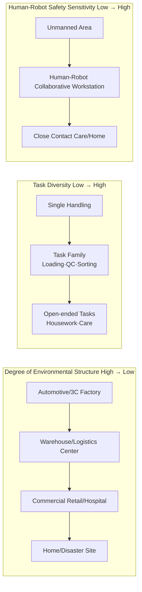
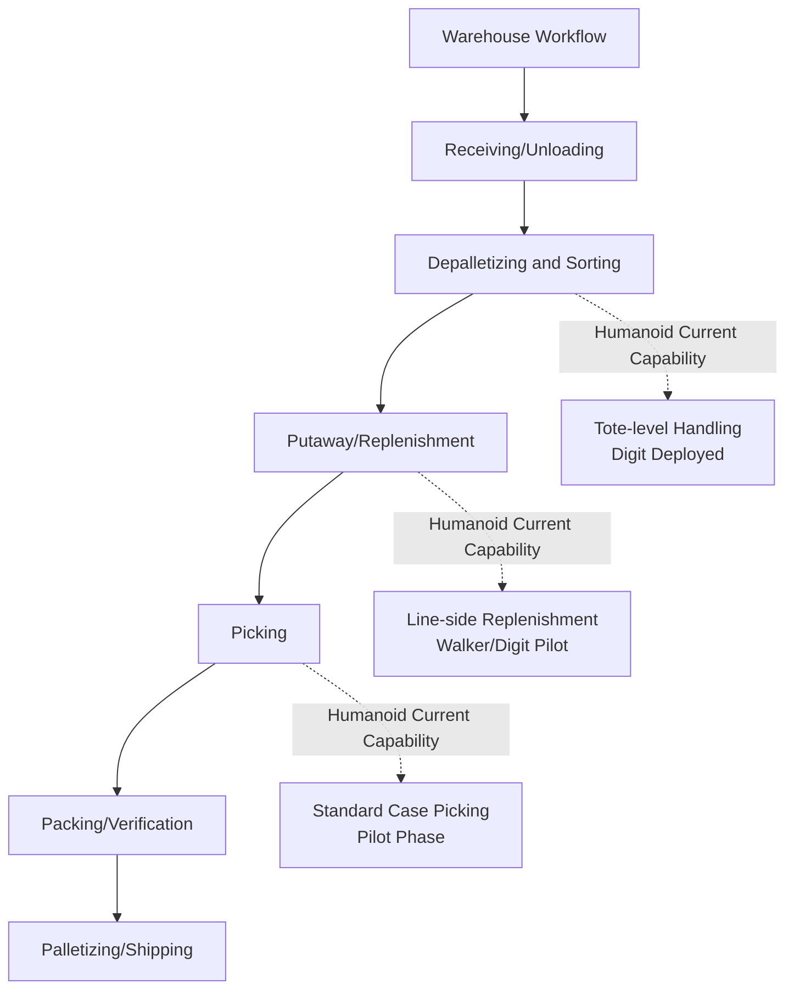
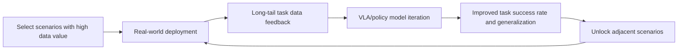

# Chapter 27 Application Scenarios

## Summary

The value of humanoid robots must ultimately be realized in specific scenarios. This chapter takes "scenario-driven" as the main thread and systematically analyzes seven categories of application scenarios for humanoid robots: warehouse logistics, automotive manufacturing and industrial assembly, industrial inspection and maintenance, medical rehabilitation and elderly care, home and domestic services, commercial retail and public services, and scientific research education and developer ecosystems. For each category, this chapter follows a unified framework: scenario definition and task decomposition, adaptability analysis of the humanoid form, key technology requirements, representative deployments based on real entities from the Knowledge Graph (KG) (Agility Digit, Walker S1/S2, Figure 02, Galbot G1, Fourier GR-1/GR-3, Unitree G1, EngineAI PM01, etc.), and current bottlenecks. The scenario classification and analysis dimensions in this chapter reference the search domains and target entity types defined by the application research workflow of this project (the four research direction definition files in `scripts/ai4sci_workstreams/applications/`: warehouse_logistics, industrial_inspection, assistive_rehabilitation, home_assistive). At the end of the chapter, common cross-scenario engineering constraints are given—safety standards, Total Cost of Ownership (TCO) model, RaaS business model, and data flywheel—laying the scenario-side foundation for the market and investment analysis in Chapter 28.

**Keywords**: Application Scenarios; Warehouse Logistics; Automotive Manufacturing; Industrial Inspection; Medical Rehabilitation; Elderly Care Companionship; Home Services; Human-Robot Collaboration Safety; TCO; RaaS

---

## 27.1 Application Scenario Analysis Framework

### 27.1.1 Why "Scenario" is More Important Than "Form"

The comparison of complete machine cases in Chapter 26 shows that the most successful products currently deployed (Digit for warehousing, Galbot G1 for pharmacies and convenience stores) are products where the scenario defines the form, not the other way around. Application scenario analysis answers three progressive questions:

1.  **Why this scenario?** Is there a sufficiently large labor gap or danger coefficient in this scenario that makes robot replacement economically or ethically justifiable?
2.  **Why humanoid?** Is the environment of this scenario designed for humans (steps, door handles, shelf heights, tool interfaces), making a humanoid form cheaper than re-engineering the environment?
3.  **Why now?** Have actuator costs, VLA model generalization capabilities, and battery technology crossed the baseline for this scenario?

Only when all three questions are answered affirmatively does the scenario have the conditions for deployment. This chapter examines each category of scenarios according to this logic.

### 27.1.2 Scenario Taxonomy: Three Orthogonal Dimensions

Humanoid robot application scenarios can be positioned along three orthogonal dimensions:

-   **Degree of Environmental Structure**: From highly structured automotive welding workshops, to semi-structured warehouses and hospitals, to unstructured homes and disaster sites.
-   **Task Diversity**: From single repetitive tasks (moving totes), to task families (dozens of workstations in final assembly logistics), to open-ended tasks (household chores).
-   **Human-Robot Interaction and Safety Sensitivity**: From low sensitivity in unmanned warehouses, to medium sensitivity in collaborative production lines, to high sensitivity in elderly care and home scenarios.



Generally speaking, commercial maturity breaks through first at the corner of "high structuralization, low task diversity, low safety sensitivity": this is why warehouse logistics and automotive final assembly logistics became the pioneers of deployment in 2024–2026.

### 27.1.3 Scenario-Capability Mapping Matrix

The following table maps the seven scenario categories to complete machine capability requirements (capability definitions are in Section 26.1.2):

| Scenario | Mobility Requirements | Manipulation Requirements | Endurance/Replenishment | Safety Level | Typical Payload | Representative Complete Machine (KG Entity) |
|---|---|---|---|---|---|---|
| Warehouse Logistics | Level walking, narrow aisles | Box grasping, palletizing | 4 h+, autonomous charging | Medium (human-robot zoning) | 10–20 kg | `ent_product_agility_robotics_digit` |
| Automotive Manufacturing/Assembly | Line walking, workstation positioning | Dual-arm collaboration, tool use | Battery swap 24 h | High (collaborative workstation) | 5–15 kg | `ent_product_ubtech_walker_s2` |
| Industrial Inspection | All-weather, stairs/pipe galleries | Meter reading, valve operation | Long endurance + wide temperature range | Medium | <5 kg | `ent_product_boston_dynamics_atlas_electric` |
| Medical Rehabilitation | Low speed, stable | Compliant force-controlled contact | Shift-level | Extremely High | Contact force level | `ent_product_fourier_gr1` |
| Elderly Care Companionship | Indoor low speed | Light manipulation, emotional interaction | Hot-swappable | Extremely High | <3 kg | `ent_product_fourier_gr3` |
| Home Services | Unstructured indoor | Diverse household manipulation | Long endurance | Extremely High | 1–5 kg | `ent_product_one_x_technologies_neo` |
| Commercial Retail | Flat ground | Shelf picking/placing, guidance | 24 h shift work | High | 1–5 kg | `ent_product_galbot_g1` |
| Scientific Research Education | Laboratory | Open secondary development | 1–2 h acceptable | Low | — | `ent_product_unitree_g1`, `ent_product_engineai_pm01` |

### 27.1.4 Quantitative Framework for Scenario Economics: TCO and Unit Task Cost

Whether a scenario is viable is ultimately determined by comparing the Total Cost of Ownership (TCO) with the cost of human labor replacement. A simplified TCO model is:

$$
TCO = \frac{C_{robot} + \sum_{t=1}^{T} \frac{C_{maint}(t) + C_{energy}(t) + C_{integrate}(t)}{(1+r)^t}}{N_{task}}
$$

Where \(C_{robot}\) is the acquisition cost (or annualized rent under the RaaS model), \(C_{maint}\), \(C_{energy}\), and \(C_{integrate}\) are the costs of maintenance, energy, and integration/retrofitting respectively, \(r\) is the discount rate, \(T\) is the service life, and \(N_{task}\) is the total number of effective tasks completed over the lifecycle. The threshold cost of labor replaced by the robot can be written as:

$$
C_{labor}^{eff} = w \cdot h_{shift} \cdot n_{shift} \cdot \eta_{task}
$$

Where \(w\) is the comprehensive hourly labor cost, \(h_{shift}\) and \(n_{shift}\) are the shift duration and number of shifts to reflect the robot's advantage of continuous operation, and \(\eta_{task}\) is the robot's effective coverage rate for the workstation's tasks. When \(TCO < C_{labor}^{eff}\), the scenario has an economic closed loop. Currently, in most industrial scenarios, the constraint is not in the denominator (number of tasks) but in the numerator's \(C_{integrate}\)—integration and retrofitting costs often account for 30% to 50% of the first-year deployment cost. This explains why "retrofitting the production line for the robot" versus "the robot adapting to the production line" has become a strategic debate.

### 27.1.5 Driving Factors and Time Window for Scenario Deployment

The question "Why now?" can be broken down into four simultaneously converging forces (the KG concept entity `ent_concept_demo_to_product_gap` summarizes the new wave of 2025–2026):

1.  **AI Capability Convergence**: Large models and VLA (Vision-Language-Action models, see Chapter 19) have endowed robots with cross-task perception, understanding, and generalization capabilities. Task programming is shifting from "per-workstation teaching" to "data-driven learning," directly compressing \(C_{integrate}\).
2.  **Cost Curve Convergence**: Precision manufacturing and supply chain maturity (see Chapter 7) have led to a rapid decline in the cost of core components like actuators and reducers, bringing the complete machine BOM into the TCO-acceptable range for industrial customers.
3.  **Labor Structure Convergence**: Rising labor costs in manufacturing and logistics, recruitment difficulties, and an aging population have raised the threshold of \(C_{labor}^{eff}\), allowing more scenarios to cross the economic closed-loop line.
4.  **Capital Convergence**: The capital market provides large-scale funding for leading players, enabling them to withstand long verification cycle scenario pilots (e.g., Figure's 11-month deployment at BMW).

The four forces are aligned in direction but differ in speed: AI capabilities and cost curves change quarterly, labor structure changes annually, while standards and certification systems change over several years. The order of scenario deployment is essentially the result of ranking each scenario's sensitivity to these four forces.

---

## 27.2 Warehouse Logistics Scenario

### 27.2.1 Scenario Definition and Task Decomposition

Warehouse logistics (corresponding to the application research direction `warehouse_logistics`) covers picking, packing, palletizing/depalletizing, shelf replenishment, and "last meter" material handling. Common characteristics of this scenario include: a large number of SKUs, high order fluctuation, significant seasonal labor demand, and a warehouse environment (aisle width, shelf height, tote specifications) designed around ergonomics.



### 27.2.2 Suitability of Humanoid Form Factor

Warehouses are the strongest scenario for the argument that humanoid robots operate in "environments designed for humans": narrow aisles (typically within 1.2 m), shelf heights (within human reach), tote handles, and door handles are all scaled to human dimensions. Wheeled AMRs (Autonomous Mobile Robots) are more efficient for planar transport but cannot handle steps, pit edges, or workstations requiring "reaching high and using both hands"; the humanoid/bipedal form factor precisely fills this "last meter" gap. Agility Digit's reverse knee joint design is optimized for the specific action of "squatting while holding a tote in a narrow aisle" (see Section 26.6).

### 27.2.3 Key Technical Requirements

| Capability | Typical Requirement | Description |
|------------|---------------------|-------------|
| Continuous Payload | 15–20 kg | Full weight of a standard tote |
| Throughput per Unit Time | Comparable to human pace (tens of cases/hour) | Determines TCO viability |
| Autonomous Charging/Battery Swap | Downtime < 5 min | Determines uptime (see Section 26.10.3 formula) |
| Fleet Management | Integration with WMS | Task scheduling, not single-unit intelligence |
| Safety | Human-robot zoning or collaborative speed limits | Relaxed in unmanned zones, restricted in mixed-traffic areas |

### 27.2.4 Representative Deployments and Bottlenecks

The benchmark case in KG is Agility Digit (`ent_product_agility_robotics_digit`): it has performed tote sorting and handling in warehouses for customers such as Amazon, GXO, and Spanx, delivered via a RaaS model, with supply supported by the RoboFab factory capable of producing 10,000 units annually. Galaxy General Galbot G1 (`ent_product_galbot_g1`), using a wheeled chassis + lifting torso solution, achieves 24-hour deployment in warehouse and retail replenishment scenarios, validating the cost logic of "wheels replacing bipedal locomotion on flat surfaces."

Current bottlenecks are primarily threefold: first, SKU generalization in picking—soft packaging, transparent, and reflective objects remain challenging for vision-grasping strategies; second, cycle time gaps—humanoid single-case processing time still exceeds that of skilled workers, requiring multi-shift advantages (\(n_{shift}\) term) to compensate; third, deep WMS integration—robots must understand wave, location, and priority semantics, not just execute point-to-point transport.

### 27.2.5 Python Example: Economic Calculation for a Warehouse Handling Station

The following example uses the TCO framework from Section 27.1.4 to estimate the breakeven condition for "replacing one warehouse handler with a humanoid robot." All parameters are illustrative assumptions used to demonstrate the calculation method, not to provide industry conclusions:

```python
# Warehouse handling station: Humanoid robot TCO vs. labor cost (illustrative parameters)
w = 25.0          # Total labor cost (USD/h)
h_shift = 8.0     # Shift duration (h)
n_shift_human = 1.0   # Human shifts (including breaks, effectively ~1 shift)
eta_task = 0.85       # Robot effective task coverage rate

# Robot side: RaaS annual rent + integration + energy + maintenance
rent_year = 60000.0     # RaaS annual rent (USD)
integrate_year1 = 30000.0  # First-year integration/retrofit cost (USD)
maint_year = 8000.0     # Annual maintenance (USD)
energy_year = 1500.0    # Annual energy (USD)
n_shift_robot = 2.5     # Robot equivalent consecutive shifts (battery swap/autonomous charging)
years = 5

# Annual labor cost (single station)
c_labor_year = w * h_shift * 250 * n_shift_human  # 250 working days
# Annualized robot cost
c_robot_year = rent_year + maint_year + energy_year + integrate_year1 / years
# Effective labor value replaced by robot (multi-shift × coverage)
c_labor_eff = c_labor_year * n_shift_robot * eta_task

print(f"Annual labor cost (single shift): {c_labor_year:,.0f} USD")
print(f"Annualized robot cost:     {c_robot_year:,.0f} USD")
print(f"Effective labor value replaced by robot: {c_labor_eff:,.0f} USD")
print(f"Economic viability: {'Viable' if c_labor_eff > c_robot_year else 'Not viable'}")
```

The example reveals two structural characteristics of the warehouse scenario: first, **multi-shift capability is the primary economic lever**—when robots can operate for more than two shifts, even if single-shift cycle time lags behind humans, annual total output can still surpass them; second, **coverage rate \(\eta_{task}\) is a sensitive variable**—a drop from 0.85 to 0.6 immediately breaks viability, which is why manufacturers prioritize deploying "tote handling" as a narrow, high-coverage task, leaving complex picking for later.

---

## 27.3 Automotive Manufacturing and Industrial Assembly Scenarios

### 27.3.1 Scenario Definition and Task Decomposition

Automotive manufacturing is currently the most densely deployed scenario for industrial humanoid robots. The task families in the final assembly workshop include: parts sorting and delivery (SPS logistics), wire harness plugging, screw tightening, interior trim installation, quality inspection, and gluing. The common characteristics of these tasks are: workstations are ergonomically designed, tasks have a certain degree of diversity but the environment is highly structured, and there is an extremely high requirement for "no line stoppage."

### 27.3.2 Representative Deployments: From Training to Production Lines

The KG product entity records benchmark deployments of several manufacturers in automotive scenarios:

| Whole Machine (KG Entity) | Customer/Base | Task | Phase |
|---------------------------|---------------|------|-------|
| Figure 02 (`ent_product_figure_ai_figure_02`) | BMW Spartanburg | Chassis assembly, material handling | Production line pilot |
| Walker S1 (`ent_product_ubtech_walker_s1`) | BYD, Dongfeng Liuzhou Motor, Geely, Audi FAW | Final assembly logistics, handling, quality inspection | Multi-factory training |
| Walker S2 (`ent_product_ubtech_walker_s2`) | NIO, BYD, Airbus, etc. | Unpacking, material loading, quality inspection, spraying | Enterprise delivery |
| Tesla Optimus Gen 3 (`ent_product_tesla_optimus_gen3`) | Tesla's own factory | Battery sorting, material handling | Internal testing |
| XPeng Iron (`ent_product_xpeng_iron`) | XPeng Guangzhou factory | Screw tightening, material organization, viewing production forms | Production line training |

This table itself reveals an industry fact: **OEMs are both the most active customers and the most active competitors** (Tesla, XPeng self-develop and self-use). For third-party robot manufacturers, the strategic value of the automotive scenario lies in high workstation density and strong replicability—a workstation solution validated in one factory can be horizontally promoted to dozens of factories.

### 27.3.3 Key Technical Requirements

- **Cycle time and uptime**: Production line cycle times are measured in seconds. Robots must either be embedded within the cycle time (high dynamic requirements) or undertake logistics tasks outside the cycle time (current mainstream choice). The Walker S2's 3-minute autonomous hot-swap battery change is precisely designed to match three-shift continuous production.
- **Dexterous manipulation**: Wire harness plugging and clip installation require a 10+ DOF dexterous hand with force/tactile feedback; the Walker S2's fourth-generation five-fingered dexterous hand and the Optimus's 22 DOF hand are both designed for such processes.
- **Human-robot collaboration safety**: Collaborative workstations must meet speed, force, and contact pressure limits (see Section 27.9 Standards System for details).
- **System integration**: Integration with MES (Manufacturing Execution System) to receive work orders and report status—this is the watershed between "robot entering the factory" and "robot exhibiting at a show."

### 27.3.4 Bottlenecks

The main bottleneck lies in the cost of workstation migration: every time a workstation is changed, it requires re-collecting teaching or teleoperation data, adjusting fixtures, and re-validating safety, resulting in a high integration cost \(C_{integrate}\). The zero-shot generalization of VLA models (e.g., Figure Helix's grasping of unseen workpieces) is compressing this cost, but as of 2026, "plug-and-play for workstation changes" has not yet been achieved.

### 27.3.5 Workstation Grading: The Climbing Path from Logistics Workstations to Assembly Workstations

Workstations in the automotive final assembly workshop can be graded according to their friendliness to humanoid robots, forming a climbing path for deployment:

| Workstation Grade | Typical Workstation | Environmental Constraints | Operational Requirements | Deployment Status (as of 2026) |
|-------------------|--------------------|---------------------------|--------------------------|-------------------------------|
| G1 Logistics Workstation | Tote delivery, SPS sorting, empty tote retrieval | Open aisles | Box gripping and handling | Multi-point deployment (Walker, Digit series) |
| G2 Auxiliary Workstation | Parts pre-assembly, quality inspection assistance, form verification | Workstation side operation | Dual-arm collaboration, visual judgment | Pilot validation (Figure@BMW, Iron@XPeng) |
| G3 Line-side Workstation | Wire harness plugging, clip installation, screw tightening | Embedded in line cycle time | Dexterous hand + force control, tool use | Transition zone from demo to pilot |
| G4 Specialized Workstation | Spraying, gluing, welding assistance | Explosion-proof/certification required | Process-level precision | Requires customized modification, not yet deployed at scale |

This grading illustrates that the essence of current "robot entering the factory" is **first filling the labor gap in G1 logistics workstations**, then climbing to G2/G3 as dexterous hand and force control capabilities mature. Any claim that "humanoid robots will soon fully replace production line workers" confuses the technical distance between G1 and G3.

---

## 27.4 Industrial Inspection and Maintenance Scenarios

### 27.4.1 Scenario Definition and Task Decomposition

Industrial inspection (corresponding to the application research direction `industrial_inspection`) covers equipment visual inspection, non-destructive testing (NDT) assistance, meter and gauge reading, confined space entry, and linkage with plant control systems. Typical customers are operators in the power, petrochemical, metallurgical, and rail transit industries.

### 27.4.2 Suitability of the Humanoid Form

The demand for humanoid forms in inspection scenarios comes from two points: First, facilities like power plants and substations have numerous stairs, ladders, and thresholds, where bipedal/humanoid mobility is superior to wheeled chassis. Second, operational interfaces such as valves, handles, and key switches are designed for human hands. However, specialized robots (rail-mounted, quadruped) are highly competitive in this scenario. The differentiation for humanoids lies in the integration of "inspection + simple intervention"—being able to perform light operations like adjusting a valve on the spot upon detecting an anomaly, rather than just transmitting images back.

### 27.4.3 Key Technical Requirements and Representative Platforms

- **Environmental adaptability**: Wide temperature range (-20°C to 40°C), protection rating IP65+, explosion-proof certification (petrochemical scenarios); the Atlas electric version's IP67 and wide temperature range (`ent_product_boston_dynamics_atlas_electric`) are designed for harsh industrial environments.
- **Perception**: Infrared thermal imaging, acoustic fingerprinting, gas detection, and visual recognition for meter reading.
- **Long endurance and autonomous recharging**: Inspection routes are long with sparse points, making energy budgets tighter than in handling scenarios.
- **System integration**: Integration with plant systems like DCS/SCADA to achieve an "inspection discovery—work order generation—disposal closure" loop.

The bottleneck in this scenario is the low value density per inspection and the high unit price of the robot. Therefore, the primary justification for current projects is "replacing human entry into high-risk areas" (safety value rather than cost value), such as routine inspections in high-temperature, radiation, or toxic environments.

### 27.4.4 Extension to Emergency and Specialized Scenarios

The technology stack of industrial inspection (mobility, remote perception, tolerance to harsh environments) is highly homologous to disaster emergency response. Therefore, inspection is often seen as a springboard for humanoids to enter specialized scenarios. It should be noted that in extremely unstructured environments like rubble and debris, the humanoid form may not be optimal—the KG paper entity `ent_paper_maur_roboa_construction_and_evaluat_2022` ("RoBoa: Construction and Evaluation of a Steerable Vine Robot for Search and Rescue Applications") demonstrates a completely different route: RoBoa achieves a slender 17 m-level configuration through an everted flexible fabric tube, capable of drilling into narrow crevices of collapsed buildings—spaces no humanoid robot can enter. The methodological significance of this case for scenario analysis is: **The correct question for specialized scenarios is not "can a humanoid enter," but "which form has the lowest unit risk cost."** The reasonable positioning of humanoids in specialized scenarios is closer to "general-purpose operators in hazardous environments" (e.g., valve operation and tool use during nuclear facility decommissioning) rather than explorers of extreme spaces.

---

## 27.5 Medical Rehabilitation and Elderly Care Scenarios

### 27.5.1 Scenario Definition and Task Decomposition

Medical rehabilitation and elderly care (corresponding to the application research direction `assistive_rehabilitation`) includes physical therapy assistance, gait training, support for Activities of Daily Living (ADL) for the elderly, and social interaction and reminders for people with cognitive impairments. The evaluation metrics for this scenario differ from those of general industrial scenarios: in addition to task success rate, clinical indicators such as adherence, engagement, and functional improvement are also included.

### 27.5.2 Representative Platforms and Research Evidence

Fourier is the core entity family for this scenario in the KG: the GR-1 (`ent_product_fourier_gr1`) has entered the rehabilitation departments of several tertiary hospitals for gait training and rehabilitation therapy assistance, with its force-controlled compliance inherited from Fourier's rehabilitation exoskeleton product line; the GR-3 (`ent_product_fourier_gr3`, Care-bot) is further oriented towards companionship and rehabilitation assistance for elderly people living alone, featuring a soft-covered appearance, a full-sense interaction system (auditory, visual, tactile), and dual hot-swappable batteries to support long-duration companionship tasks.

Evidence from the research side is also accumulating. The KG paper entity `ent_paper_mishra_does_elderly_enjoy_playing_bin_2021` ("Do the elderly enjoy playing bingo with a robot? – A case study with the humanoid robot Nadine") reports on the deployment of the social humanoid robot Nadine as an autonomous bingo host in a nursing home: computer vision analysis showed that elderly residents smiled more and staff burden was reduced during robot-hosted activities. Such research illustrates the unique value of the humanoid form in terms of **social acceptance** – the affinity of human faces and body language for the elderly population is difficult to replace with non-humanoid devices.

### 27.5.3 Key Technical Requirements

| Capability | Requirement | Basis |
|------|------|------|
| Compliant Force Control | Contact force closed-loop, collision detection, and rapid retraction | Direct physical contact with the elderly/patients |
| Safety Certification | ISO 13482 (Personal Care Robots), etc. | See Section 27.9 for details |
| Interaction Naturalness | Multimodal voice, expression, touch | Adherence and engagement metrics |
| Continuous Operation | Shift-level endurance, silent battery swap | Design basis for GR-3 dual hot-swappable batteries |
| Privacy Compliance | Local processing of audio and video data | Strong privacy constraints in elderly care scenarios |

### 27.5.4 Bottlenecks

The scaling of rehabilitation medical scenarios is constrained by the clinical validation cycle and medical insurance reimbursement pathways: entry as a "medical device" requires registration and clinical evaluation, while as a "consumer product," it is difficult to support a high unit price. The current practical path is institutional procurement (rehabilitation departments, nursing homes) + service-based billing, while home market adoption still awaits cost reduction and standard improvement.

### 27.5.5 Rehabilitation Service Closed Loop and Evaluation Metrics

The uniqueness of rehabilitation and care scenarios lies in the service being a clinical closed loop of "assessment—intervention—re-assessment," where the robot simultaneously assumes the dual roles of intervention executor and data collector:


Unlike industrial scenarios where "throughput per unit time" is the core metric, the KPI system for this scenario is human-centered: training adherence (the proportion of prescribed training completed by the patient), engagement (the level of active involvement during training, estimable from visual expressions and movement amplitude analysis), and functional improvement (the difference in standardized scale scores before and after training). The value proposition of humanoid robots in this closed loop is not to replace therapists, but to **amplify the service radius per unit time of the therapist** – one therapist can simultaneously supervise the training process of multiple devices, which has direct structural significance for the rehabilitation medical system, which has long suffered from a shortage of therapists.

---

## 27.6 Home and Domestic Service Scenarios

### 27.6.1 Scenario Definition and Task Decomposition

Home service (corresponding to the application research direction `home_assistive`) is the scenario with the highest task diversity and the lowest degree of environmental structuring: tidying and organizing, cleaning, laundry, fetching items, companionship, and emergency call response. Among the KG product entities, 1X Technologies' NEO (`ent_product_one_x_technologies_neo`) and Fourier's GR-3 target this type of scenario; Tesla also lists home service as a long-term target scenario for Optimus.

Classifying household tasks along the two dimensions of "operational intensity × environmental variability" reveals the path for increasing autonomy:

| Task Level | Typical Tasks | Operational Intensity | Environmental Variability | Current Autonomy Level |
|----------|----------|----------|------------|----------------|
| L0 Companionship & Interaction | Voice reminders, emotional communication, video calls | No contact | Low | Already productizable (GR-3 positioning) |
| L1 Light Fetching | Handing water, fetching remote control, delivering medicine | Single-hand, light load | Medium | Usable with teleoperation assistance |
| L2 Tidying & Organizing | Clearing tables, folding clothes | Two-hand operation | High | Demonstration level, unstable success rate |
| L3 Complex Housework | Washing dishes, cooking meal prep, deep cleaning | Tools + liquids + fragile items | Very High | Research stage |

This classification aligns with the scenario taxonomy in Section 27.1.2: autonomy advances first from the corner of "low operational intensity, low environmental variability," and each level's breakthrough relies on long-tail task samples accumulated by the data flywheel.

### 27.6.2 Why the Home is the "Last" Scenario to be Conquered

The difficulties of the home scenario are systemic:

1. **Unstructured Environment**: Every home has different layouts, item placements, and lighting conditions, preventing perception and manipulation models from relying on prior maps;
2. **Open Task Space**: The variety of objects and operational sequences for household tasks is nearly infinite, demanding generalization capabilities from VLA models far beyond those required for factory task families;
3. **Safety and Psychological Acceptance**: Coexistence with children, the elderly, and pets makes the system highly sensitive to collision forces, fall risks, and the "uncanny valley" effect;
4. **Price Ceiling**: The willingness to pay of home users is far lower than the TCO threshold of industrial clients, requiring the entire machine BOM to be an order of magnitude lower than industrial models.

The KG report entity `ent_report_humanoid_home_robot_safety_is_all_about_2026` ("Home Robot Safety Is All About Relationships") points out that ISO is updating the safety requirements for personal care robots, which have been in effect for 12 years, indirectly reflecting the evolution of home robot safety standards alongside the productization process.

### 27.6.3 Current Feasible Entry Points

In the short term, the practical path for the home scenario is to "narrow the task domain": enter with low operational intensity tasks such as companionship, reminders, and light fetching (the companionship positioning of the GR-3 follows this logic), use teleoperation assistance (human-in-the-loop) to cover long-tail tasks while simultaneously accumulating data, and gradually expand the scope of autonomous tasks. This is consistent with the judgment of the KG concept `ent_concept_demo_to_product_gap` – the gap is largest for the home scenario, and narrowing the entry point is a necessary route.

---

## 27.7 Commercial Retail and Public Service Scenarios

### 27.7.1 Scenario Definition and Representative Deployments

Commercial retail scenarios cover shelf restocking and inventory in pharmacies and convenience stores, store navigation, promotional interactions, and unattended nighttime operations. The most complete case in the KG is Galbot G1 (`ent_product_galbot_g1`): a wheeled omnidirectional chassis + a 65 cm lifting torso covering a working height of up to approximately 240 cm, pure visual navigation requiring no modification to store infrastructure, and its AstraBrain system supports 24-hour commercial deployment in pharmacies and convenience stores. XPeng Iron also plans to target store navigation and commercial services.

### 27.7.2 Scenario Characteristics and Bottlenecks

The technical threshold for commercial retail is lower than for industry (narrow task families, semi-structured environments), but it has unique constraints: mixed pedestrian traffic requires higher dynamic obstacle avoidance and behavioral predictability; unattended nighttime store operations require remote maintenance and abnormal self-handling capabilities; the limited payment capacity of a single store requires sufficiently low machine cost and operational cost. This scenario essentially uses robots to fill the labor gap during nighttime and off-peak hours in the retail industry, with an economic model close to "shared employees."

## 27.8 Scientific Research, Education, and Developer Scenarios

### 27.8.1 Scenario Definition and Unique Position

Scientific research and education is a scenario that is easily overlooked but had the largest actual shipment scale during 2024–2026. Universities and research institutions purchase humanoid platforms for motion control, reinforcement learning, VLA deployment, and embodied intelligence research. This scenario is insensitive to "task success rate" but highly sensitive to openness, documentation, and price.

Unitree G1 (`ent_product_unitree_g1`), with a price of approximately 16,000 USD and ROS2 with Python/C++ SDK, has become one of the world's leading humanoid development platforms in terms of shipment volume. H1 (`ent_product_unitree_h1`), with its 3.3 m/s running capability, serves high-dynamic motion research. EngineAI PM01 (`ent_product_engineai_pm01`) targets the algorithm teaching and secondary development market with open-source training/deployment code and an education version configuration.

The typical trade-offs for research teams when selecting a platform can be summarized as follows:

| Selection Dimension | Description | Representative Options |
|----------|------|----------|
| Budget and Accessibility | Unit purchase price and delivery lead time | G1 Basic Edition, PM01 Education Edition |
| Depth of Secondary Development | SDK level (joint-level/task-level), simulation model completeness | Unitree SDK + ROS2 |
| Computing Power Expansion | Whether edge computing like Jetson Orin can be added | G1 EDU Edition |
| Manipulation Capability | Whether dexterous hands are optional | G1 + Dex3-1, H1-2 upgraded arms |
| Motion Performance | High-dynamic validation needs such as running and jumping | H1 |

### 27.8.2 Strategic Significance: Outpost for Ecosystem and Data

The commercial value of the scientific research and education scenario lies not in the profit per unit, but in three points: first, it cultivates a developer ecosystem familiar with the vendor's SDK, creating platform stickiness; second, university research outputs (papers, open-source algorithms) feed back into the vendor's technology roadmap; third, it reserves talent and system integrators for future industrial scenarios. From a KG perspective, this scenario is a springboard for robot manufacturers to move from "selling products" to "building an ecosystem," and it is also an important variable in the analysis of the enterprise competitive landscape in Chapter 28.

---

## 27.9 Cross-Scenario Common Engineering Constraints

### 27.9.1 Safety Standards System

Humanoid robots interacting closely with humans in the work environment must comply with standards for functional safety, electrical safety, electromagnetic compatibility, and mechanical safety. The main standards summarized by the KG concept entity `ent_concept_human_robot_collaboration_safety` are as follows:

| Standard | Scope | Core Requirements |
|------|----------|------|
| ISO 13482:2014 | Personal care robots | Speed, force, contact pressure limits |
| ISO/TS 15066 | Collaborative robots | Human-robot collaboration safety requirements (quasi-static/transient contact limits) |
| IEC 61508 | Functional safety | Safety Integrity Level (SIL) for control systems |
| ISO 13849 | Safety of machinery control systems | Performance Level (PL) for safety-related control parts |
| IEC 62368 | Safety of audio/video and information technology equipment | Electrical safety, fire risk |

Regarding regional market access: the EU requires CE marking, the US requires UL certification and FCC electromagnetic compatibility, and China has CR certification (China Robot Certification) and CCC. The direct implication for application scenarios is: the higher the safety sensitivity of the scenario (elderly care, home), the longer the certification cycle, and the more the scenario's scaling pace is constrained by the evolution of standards.

### 27.9.2 Business Model: From CapEx to RaaS

Robot-as-a-Service (RaaS, KG concept `ent_concept_robot_as_a_service`) replaces outright purchase with leasing or subscription, bundling maintenance, software updates, and fleet management. RaaS transforms the acquisition cost \(C_{robot}\) in the TCO formula (Section 27.1.4) into predictable annualized operating expenses while transferring availability risk to the vendor—this precisely matches customers in warehousing, retail, etc., who are sensitive to cash flow and lack robot operation and maintenance capabilities. Agility Digit's warehouse deployments adopt the RaaS model.

### 27.9.3 Data Flywheel and Scenario Selection

The cycle described by the KG concept `ent_concept_data_flywheel`—deployment generates data, data improves models, models enhance performance and unlock more deployments—means that scenario selection has strategic compounding effects:



The scenario strategies of Tesla (own factory), Figure (BMW production line), and Ubtech (multi-automaker training) all follow this logic: first occupy the scenario with the optimal "data density × willingness to pay," then diffuse to adjacent scenarios. For entrepreneurs, the primary question for scenario selection is not "where is the biggest demand," but "where can data make me improve the fastest."

### 27.9.4 Failure Modes and Maintenance

Recurring failure modes in cross-scenario deployments include: falling (dynamic balance failure), grasping failure (insufficient perception or policy generalization), battery/actuator thermal runaway risks, and task suspension due to network interruption. The engineering mitigation approach is a hierarchical degradation strategy: fallback to a safe posture upon task failure, remote teleoperation takeover, and then on-site manual intervention. The cost of the maintenance system (spare parts, OTA, predictive maintenance) can account for a significant proportion of TCO in large-scale deployments and is an indispensable item in scenario economic calculations.

---

## 27.10 Chapter Summary

This chapter analyzed seven application scenarios for humanoid robots based on the "scenario-driven" framework. Warehousing/logistics and automotive manufacturing, with their "structured environment + clear task families + strong willingness to pay," are the current pioneers in deployment (evidenced by production line records of Digit, Walker S1/S2, Figure 02, and Optimus). Industrial inspection is justified by safety value. Medical rehabilitation and elderly care (Fourier GR-1/GR-3) exhibit long-cycle characteristics constrained by clinical validation and payment pathways. Home service is the ultimate scenario with the highest task diversity and the largest gap, currently entered through low-manipulation-intensity tasks like companionship. Commercial retail (Galbot G1) validates the pragmatic approach of a wheeled humanoid upper body. Scientific research and education (Unitree G1/H1, EngineAI PM01) assume the strategic role of an outpost for ecosystem and data. Cross-scenario common constraints—safety standards, TCO, RaaS, and the data flywheel—determine the pace and order of scenario deployment: structured before unstructured, industrial before home, narrow tasks before general tasks.

Practical advice for readers can be summarized in three sentences: **When evaluating a scenario, first look at coverage rate, then cycle time** (\(\eta_{task}\) is a sensitive variable for TCO closure); **When evaluating a vendor, first look at deployment records, then demo videos** (the criterion for crossing the demo-to-product gap is the continuous runtime in third-party scenarios); **When evaluating timing, first look at standards, then price** (the scaling pace of high-safety-sensitivity scenarios is determined by the certification system, not the BOM). Chapter 28 will build upon this scenario landscape to analyze market structure, enterprise competition, and investment logic.
