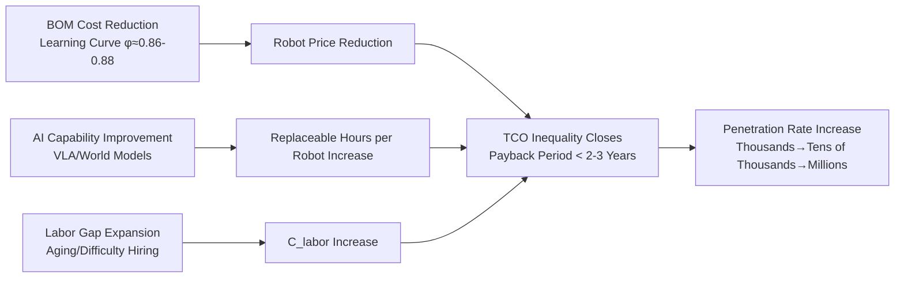
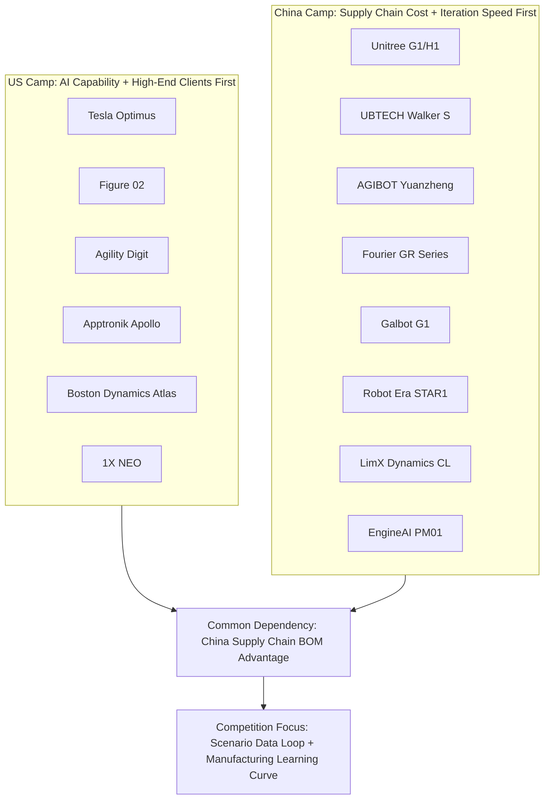
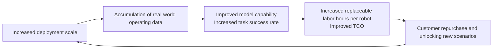
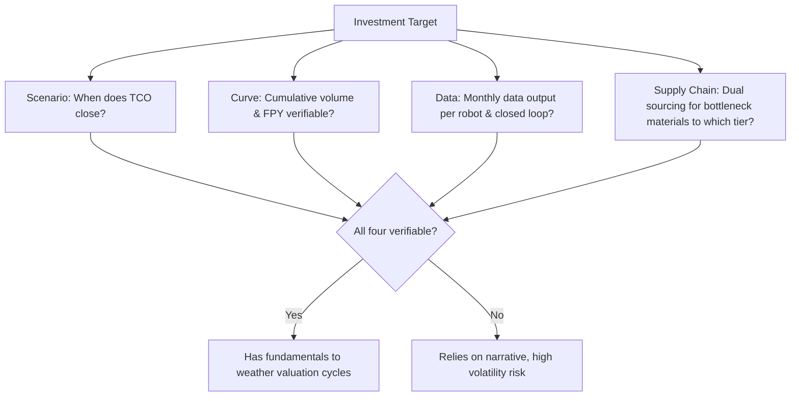

# Chapter 28: Markets, Enterprises, and Investment

## Summary

Humanoid robots are transitioning from the technology validation phase to the commercial validation phase. Market size forecasts, enterprise competitive landscapes, and capital flows together constitute the "third perspective" for understanding this industry—the first two (technology and manufacturing) have been covered in previous chapters of this book. This chapter addresses three questions: How large is the market, who are the players, and where is the money flowing? It first reviews industry public forecasts (represented by reports such as the Bank of America Research Institute's *Humanoid Robots 101* included in the knowledge graph) regarding shipment volumes, costs, and penetration path maps, emphasizing their uncertainty as analyst estimates. It then analyzes demand structure and payment capacity across four scenario levels: industrial, logistics, commercial services, and household. Subsequently, it systematically inventories the product positioning and commercialization progress of major global OEMs—Tesla, Figure AI, Agility Robotics, Apptronik, Boston Dynamics, 1X Technologies, Sanctuary AI, as well as Chinese enterprise groups including Unitree, UBTECH, AGIBOT, Fourier, Galbot, Robot Era, LimX Dynamics, EngineAI, Astribot, and Leju. It further reviews financing and valuation dynamics, supply chain investment themes, and business models (OEM sales, leasing, and RaaS). Finally, it discusses market risks and investment frameworks. All market figures in this chapter are based on industry public forecasts or publicly reported data, provided for reference of magnitude only.

**Keywords**: Market Size; Penetration Rate; Total Cost of Ownership; Competitive Landscape; Financing and Valuation; RaaS; Supply Chain Investment; Embodied Intelligence

## 28.1 Market Size and Growth Forecast

### 28.1.1 Common Framework for Forecasts: Three-Stage Penetration

Although the figures from various institutions differ significantly, industry public forecasts are highly consistent in the **shape of the penetration path**. The three-stage framework proposed by the Bank of America Institute in *Humanoid Robots 101* (April 2025, knowledge graph entity ent_report_bofa_humanoid_robots_101_2025) is representative:

1. **Development Period (approx. 2025–2027)**: Small-batch industrial and logistics pilots, with global annual shipments in the thousands to tens of thousands. Customers are essentially purchasing "co-development rights" and data collection access points.
2. **Large-Scale Commercial Adoption Period (approx. 2028–2034)**: Penetration into commercial services and semi-structured environments, with shipments reaching hundreds of thousands to millions of units. TCO (Total Cost of Ownership) closes in some scenarios.
3. **Mass Consumer Adoption Period (approx. 2035 onwards)**: Home and elderly care scenarios begin, with installed base reaching hundreds of millions. The long-term outlook of this report is: under its assumptions, the global installed base of humanoid robots could reach approximately 3 billion units by 2060.

!!! note "Methodological Warning on Forecast Figures"
    Humanoid robots are not yet standardized products. Institutional forecasts vary greatly in their statistical scope for "humanoid robots" (whether including wheeled-chassis humanoids, fixed-base dual-arm systems), unit price assumptions, and elasticity assumptions for labor substitution. All market figures in this chapter should be understood as **magnitude indicators from industry public forecasts**, not precise predictions. The same report also explicitly notes inherent uncertainties in its BOM and shipment forecasts.

### 28.1.2 Magnitude Picture of Shipments and Revenue

Based on the common range of industry public forecasts (the overlap under different institutional scopes), a prudent magnitude picture can be presented:

| Time Window | Global Annual Shipment Magnitude | Average Unit Price Magnitude | Corresponding Annual Production Value Magnitude | Dominant Scenarios |
|---|---|---|---|---|
| 2025–2027 | Thousands – Tens of thousands | $50,000 – $250,000 (full-size industrial); from $16,000 (research) | Hundreds of millions – Billions of USD | Auto/3C factory pilots, research |
| 2028–2030 | Tens of thousands – Hundreds of thousands | $20,000 – $100,000 | Billions – Tens of billions of USD | Manufacturing, logistics handling & sorting |
| 2030–2035 | Hundreds of thousands – Millions | $13,000 – $50,000 (BOM forecast see Chapter 13) | Tens of billions – Hundreds of billions of USD | Commercial services, inspection, general industry |
| 2035 onwards | Millions+/year | $10,000 – $20,000 level | Hundreds of billions of USD+ | Home, elderly care, public services |

Three underlying variables drive this curve: **BOM cost curve** (as described in Chapter 13, industry public forecasts from ~$35,000 to $13,000–$17,000), **AI capability curve** (VLA models and world models, see Chapters 19, 20), and **labor gap curve** (structural labor shortages in manufacturing and aging societies). The temporal alignment of these three determines whether the forecast falls on the upper or lower bound of the range.

### 28.1.3 Sources of Forecast Divergence: Why Institutional Figures Differ by an Order of Magnitude

It is common for shipment forecasts for the same year to differ by a factor of 5–10 between institutions. The divergence mainly stems from four assumptions:

- **Scope Assumption**: Whether to count wheeled-chassis humanoids (e.g., Galaxy General G1), fixed-base dual-arm systems, or "semi-humanoids" (legless mobile manipulation platforms). A broad or narrow scope directly causes several-fold differences.
- **Price-Demand Elasticity Assumption**: Pessimists assume slow price decline and scenarios limited to highly structured factories; optimists assume rapid price decline along the learning curve and spillover into the service industry.
- **AI Capability Assumption**: This is the largest implicit variable. If VLA models achieve a "99% success rate per scenario" breakthrough by 2027–2028, the penetration curve takes the upper bound; if the success rate for long-tail tasks remains stuck around 90%, customers will always need "human supervision of robots," preventing TCO closure.
- **Policy and Labor Assumption**: Subsidies (e.g., procurement and scenario opening policies by Chinese local governments) can artificially boost shipments in the short term, while employment-protective regulations may suppress penetration.

The advice for readers is: **Focus on the assumptions behind the forecast, not the terminal value of the forecast.** A forecast that provides assumptions for the three elements "BOM drops to $20,000, single-scenario success rate 99%, dual-shift labor cost $50,000" carries far more information than an isolated "1 million units by 2030."

### 28.1.4 Demand Elasticity: Conversion Logic from TCO to Penetration Rate

The micro-foundation of market size is the TCO comparison for a single scenario. The customer's (especially industrial customers') decision inequality can be written as

$$
\frac{P_{robot}}{Y} + C_{om} + C_{int} < C_{labor}
$$

Where \(P_{robot}/Y\) is the annualized cost of the robot price over its useful life \(Y\), \(C_{om}\) is the annual operation and maintenance cost (including maintenance, energy, insurance), \(C_{int}\) is the annualized cost of integration and production line modification, and \(C_{labor}\) is the annual labor cost of the replaced position. Taking a manufacturing dual-shift position as an example, the typical annual labor cost in developed economies is $40,000–$80,000, and in coastal China, it is $15,000–$30,000. When the robot price drops below $30,000 and annual O&M is below $10,000, the payback period can be compressed to 2–3 years. This is the demand-side expression of "BOM drops to the $20,000 level, TCO begins to close" as described in Section 13.4.4. The penetration rate is highly elastic to the payback period: for each year the payback period shortens, the potential customer pool reachable roughly expands by an order of magnitude (rule of thumb, not an exact law).



### 28.1.5 Python Example: Sensitivity Analysis of Payback Period

The following script calculates the payback period for replacing a dual-shift material handling position under different combinations of robot price and O&M costs, demonstrating the sensitivity of the TCO inequality to price (figures are for magnitude demonstration, not specific product quotes):

```python
# Sensitivity analysis of payback period for humanoid robot replacing dual-shift position
def payback_years(price, om_cost, int_cost, labor_cost, utilization=0.85):
    """
    price:      Robot price (USD)
    om_cost:    Annual O&M cost (USD/year)
    int_cost:   One-time integration and modification cost (USD)
    labor_cost: Annual labor cost of replaced position (USD/year)
    utilization: Effective utilization rate (considering charging, faults, waiting)
    """
    annual_saving = labor_cost * utilization - om_cost
    if annual_saving <= 0:
        return float("inf")
    return (price + int_cost) / annual_saving

scenarios = [
    # (Robot Price, Annual O&M, Integration Cost, Annual Labor Cost, Label)
    (150000, 30000, 50000, 60000, "Current full-size industrial / Developed economy dual-shift"),
    ( 50000, 15000, 20000, 60000, "After scaling / Developed economy dual-shift"),
    ( 30000, 10000, 10000, 60000, "After BOM closure / Developed economy dual-shift"),
    ( 30000, 10000, 10000, 20000, "After BOM closure / Coastal China dual-shift"),
    ( 16000,  8000,  5000, 20000, "Consumer-level price / Coastal China single-shift"),
]

for price, om, integ, labor, tag in scenarios:
    pb = payback_years(price, om, integ, labor)
    msg = f"{pb:5.1f} years" if pb != float("inf") else "Not closed"
    print(f"{tag:<38s} Payback period: {msg}")
```

Typical output shows: At the $150,000 price point, even replacing a developed economy dual-shift position results in a payback period of over 5 years, acceptable only to "labor insurance" type customers; when the price drops to the $30,000 level, the payback period enters within 2 years, and TCO begins to close; in markets with lower labor costs, closure requires an even lower robot price – this quantitatively explains why **the extreme cost-reduction route of Chinese robot manufacturers (e.g., Unitree G1's $16,000 pricing) has a leveraging effect on market penetration**, and also explains why developed economy markets are the sweet spot for early humanoid robot penetration.

## 28.2 Demand Structure: Scenario Grading and Payment Capability

### 28.2.1 Technology-Economy Matrix for Four-Level Scenarios

The application entities in the knowledge graph (e.g., ent_application_industrial_manufacturing) correspond to the scenario analysis in Chapter 27 of this book. This chapter provides a grading matrix from a market perspective:

| Scenario Level | Typical Tasks | Degree of Structure | Payment Capability | Substitution Logic | Current Status (Public Data) |
|---|---|---|---|---|---|
| L1 Industrial Manufacturing | Material handling, loading/unloading, inter-station transfer | High | Strong (capital expenditure budget) | Replaces two-shift handling/auxiliary workers | Multiple OEMs have launched pilots in automotive factories |
| L2 Warehouse Logistics | Box/bag handling, sorting, loading/unloading | Medium-High | Strong (billed by throughput) | Replaces seasonal flexible labor | Agility Digit, etc., have signed commercial deployment agreements |
| L3 Commercial Services | Guided tours, inspection, retail restocking, cleaning assistance | Medium | Medium (operating budget) | Supplements rather than replaces | Small-scale demonstrations |
| L4 Home/Elderly Care | Care assistance, household chores | Low | Weak but extremely large scale | Creates new supply | Companies like 1X have launched home pilots; long-term scenario |

The key insight is: **Short-term revenue lies in L1/L2, long-term potential lies in L4, yet L4 has the highest technical barriers (unstructured environments, safety, cost).** A company's ability to prioritize scenarios is itself a core strategic capability.

### 28.2.2 True Motivations of Early Customers

Analyzing public pilot cases, the payment motivations of early customers are typically not current ROI, but one of three factors:

- **Data and Process Positioning**: Automakers piloting humanoid robots gain core benefits by accumulating process knowledge and safety standards for "robot labor";
- **Labor Insurance**: In regions with structurally worsening labor shortages, pilots serve as an option against future labor gaps;
- **Brand and Capital Market Signals**: For OEMs themselves, having top-tier client logos is the strongest financing asset.

Understanding this explains why "there are more signing announcements than repurchase announcements" at this stage—the industry is still in a phase of exchanging customer education for data and iteration time.

### 28.2.3 Regional Market Structure

From the perspective of demand geography, the consensus picture under public data is:

- **China**: The largest potential manufacturing scenario (largest manufacturing labor base), the most complete supply chain, and the most aggressive local policy support (scenario opening, procurement subsidies, data collection center construction); at the same time, relatively low labor costs mean TCO closure requires lower machine prices (see calculation example in 28.1.5), with market penetration primarily "price-driven";
- **United States**: High labor costs, developed logistics and retail sectors, leading AI capabilities—a sweet spot for "capability-driven" penetration; manufacturing reshoring policies provide additional demand narratives for humanoid robots;
- **Japan and Europe**: The highest degree of aging, with the strongest willingness to pay and urgency for elderly care (L4), but cautious regulation and strong union influence mean penetration pace may be slower than in China and the US;
- **Other Emerging Markets**: Short-term demand is mainly for research and display purposes.

The implication of regional structure for companies is: Chinese OEMs must win the cost war in their domestic market, while for overseas expansion, they must fill gaps in safety certifications (CE, UL) and service networks; US OEMs enjoy TCO benefits in their domestic market, but if their BOM relies on the Chinese supply chain, they are exposed to dual volatility from tariffs and export policies.

## 28.3 Competitive Landscape: Major Global OEMs

### 28.3.1 North American Camp

| Company (KG Card) | Representative Product | Positioning & Progress (Public Sources) |
|---|---|---|
| Tesla (company_tesla / ent_oem_tesla) | Optimus | Vertical integration, factory-first deployment; public targets point to mass manufacturing and long-term ~$20,000 price point |
| Figure AI (company_figure_ai / ent_oem_figure_ai) | Figure 02 (product_figure_02) | Logistics & manufacturing scenarios; co-creation with automotive clients; building BotQ factory; financing scale among industry leaders (see 28.4) |
| Agility Robotics (company_agility_robotics) | Digit (product_digit) | Focused on logistics handling; RoboFab dedicated production line planned at tens-of-thousands scale; commercial deployments signed |
| Apptronik (company_apptronik) | Apollo | Derived from NASA exoskeleton/humanoid technology; public pilot collaborations with Mercedes-Benz and others |
| Boston Dynamics (company_boston_dynamics) | Electric Atlas (product_atlas_electric) | Benchmark in dynamic control technology; post-electrification focus on industrial applications, backed by Hyundai Motor Group |
| 1X Technologies (company_one_x_technologies) | NEO | Pioneer in home scenarios; adopts teleoperation-assisted home data collection strategy |
| Sanctuary AI (company_sanctuary_ai) | Phoenix | Core selling points in dexterous manipulation and cognitive software |

### 28.3.2 China Camp

The China camp is characterized by **high volume, fast iteration, aggressive price reduction, and deep supply chain strength**. Key players (all have knowledge graph company cards):

| Company | Representative Product | Positioning & Progress (Public Sources) |
|---|---|---|
| Unitree (company_unitree / ent_oem_unitree_robotics) | G1, H1, H2 | Consumer-grade pricing disruptor; G1 starts at $16,000; outstanding motion control capabilities |
| UBTECH (company_ubtech) | Walker S Series | Listed in Hong Kong; focuses on automotive factory training scenarios; publicly disclosed multiple automaker collaborations |
| AGIBOT (company_agi_bot) | Yuanzheng A2, etc. (product_agi_bot_a2) | Aggressive mass production pace; covers industrial and commercial services; active open-source embodied intelligence data |
| Fourier (company_fourier) | GR-1, GR-3 (product_fourier_gr1 / gr3) | Originated from rehabilitation medical equipment, extending to general-purpose humanoids |
| Galbot (company_galbot) | Galbot G1 | Wheeled chassis + dual-arm approach; focuses on retail and industrial grasping; strong VLA capabilities |
| Robot Era (company_star1) | STAR1 | Tsinghua University background; end-to-end model and hardware synergy |
| LimX Dynamics (company_limx) | CL Series | Known for reinforcement learning motion control; extends from bipedal/quadrupedal to humanoid |
| EngineAI (company_engineai) | PM01, SE01 (product_engineai_pm01) | High dynamic motion capabilities; research and developer market |
| Astribot (company_astribot) | S1 (product_astribot_s1) | Known for upper limb operation speed and force control |
| Leju (company_leju) | KUAVO | Started in education market; open-source ecosystem strategy |
| Songyan Dynamics (company_songyan_dynamics) | N2 | Small-medium size, extreme cost-performance ratio route |
| MagicLab (company_magic_atom) | MagicBot | Dreame Technology background; industrial scenario oriented |
| XPeng Robotics (company_xpeng_robotics) | Iron | Automaker background; reuses autonomous driving perception and manufacturing systems |

### 28.3.3 Landscape Assessment: Three Structural Characteristics

**First, a bipolar US-China landscape with divergent paths.** The US camp prioritizes AI capabilities and high-end industrial clients (Figure, Agility partnering with automakers and logistics giants), while the China camp prioritizes supply chain cost and iteration speed (Unitree pushes entry-level pricing to the ~$16,000 range). Supply chain reports in the knowledge graph (e.g., ent_report_bofa_humanoid_robots_101_2025) explicitly state that BOM assumptions based on the Chinese supply chain are the foundation of current cost forecasts, meaning **the global humanoid robot industry is deeply dependent on the Chinese supply chain for manufacturing**.

**Second, automakers have become the single largest "incubation scenario."** Tesla for internal use, Figure with BMW, Apptronik with Mercedes-Benz, UBTECH with multiple Chinese automakers—OEMs simultaneously play the triple role of customer, investor, and manufacturing mentor. The reason is that automotive factories possess the sweet spot of being "sufficiently structured" and having "sufficiently high labor costs," and automakers understand the learning curve of mass manufacturing.

**Third, a true platform monopolist has yet to emerge.** Unlike smartphones or electric vehicles, the "operating system layer" (motion control, VLA, simulation stack) of humanoid robots has not converged, and hardware forms (wheeled vs. bipedal, harmonic vs. planetary reducers, dexterous hand DOF) are still in divergent exploration. The "approximately 24-month supplier window" judgment mentioned in knowledge graph reports—entering the supply chain before architecture convergence—also applies to the assessment of the OEM landscape: the current situation is a **qualifying round, not the final**.

### 28.3.4 Four Strategic Archetypes of OEMs

Setting aside country labels, the strategic choices of current OEMs can be summarized into four archetypes, with distinctly different resource allocation logics:

| Strategic Archetype | Representative Companies | Resource Allocation Focus | Core Bet | Main Risk |
|---|---|---|---|---|
| Scenario Deep-Dive | Agility (logistics), 1X (home) | Reliability in a single scenario, operations & service network | Single-scenario TCO closes first, creating a cash flow flywheel | Low scenario ceiling, high horizontal migration cost |
| Platform Generalist | Tesla, Figure, AGIBOT | General hardware platform + large model + mass manufacturing | Winner-takes-all after generality crosses inflection point | Huge capital consumption, uncertain inflection point timing |
| Cost Disruptor | Unitree, Songyan Dynamics | Supply chain integration & rapid iteration | Price reduction creates new demand pools (research, education, light commercial) | Low price point backlash on reliability and brand |
| Technology Spillover | Boston Dynamics, LimX Dynamics, Astribot | Single technology strength (dynamic control, reinforcement learning, force control manipulation) | Strength becomes industry standard, monetized via licensing/premium products | Strength matched by large models or open-source solutions |

Notably, the four archetypes are not mutually exclusive: Tesla is both a platform generalist and (potentially) a cost disruptor; AGIBOT also rapidly pushes down its price range alongside its platform route. The value of the archetype framework lies in reminding investors and practitioners: **the same industry news carries completely different signal strengths for different archetypes**—for example, a pilot order from an automaker is a lifeline for a scenario deep-dive player but just one data entry point for a platform generalist.



## 28.4 Financing and Valuation

### 28.4.1 Overall Picture of Capital Flow

Since 2023, humanoid robots and embodied intelligence have become one of the most concentrated tracks for global hard-tech investment. The overall characteristics under public reporting are:

- **Leading complete machine companies have raised hundreds of millions to billions of dollars in a single round**, with valuations reaching tens of billions of dollars; Figure AI's multiple funding rounds are among the most notable cases in public reports, with investors covering top tech companies and mainstream venture capital;
- **Chinese embodied intelligence companies have an extremely high financing density**: X Square Robot (ent_company_x_square_robot_secures_four_co_2026), included in the knowledge graph, has completed four consecutive financing rounds with a valuation exceeding $2.8 billion, and has simultaneously received investment from China's four major internet tech giants, making it a typical sample of the dual narrative of "model company + complete machine company"叠加 capital favor;
- **The channel for listed companies has opened**: UBTech has already been listed on the Hong Kong stock exchange; multiple supply chain companies (Leaderdrive, Shuanghuan Transmission, Tuopu Group, Sanhua Intelligent Controls, etc.) have received significant valuation revaluations on the A-share market as "humanoid robot concept" stocks—the capital market's pricing of the supply chain has even preceded the revenue realization of complete machines.

### 28.4.2 Anatomy of Valuation Logic

At the current stage, the valuation of complete machine companies does not depend on current revenue (most companies' revenue is still mainly from pilots and small batches), but is a superposition of three layers of options:

$$
V = V_{tech} + V_{data} + V_{mfg}
$$

- \(V_{tech}\): Technology leadership option—verifiable leadership in motion control, VLA models, and dexterous manipulation (assessable through public benchmarks and demonstrations);
- \(V_{data}\): Data asset option—deployment scale equals data collection scale; factory and customer site data is the exclusive raw material for training next-generation models;
- \(V_{mfg}\): Manufacturing learning curve option—those who first complete capacity ramp-up gain a first-mover position on the cost curve (see Chapter 13).

!!! note "Due Diligence Checklist from an Investment Perspective"
    When evaluating a humanoid robot company, signals more reliable than "demo videos" include: quantitative disclosure of single-task success rates and third-party replication, number of deployed customers and repurchase rates, in-house/outsourced structure of key components, manufacturing metrics like FPY and ramp-up pace, the degree of automation in the data closed loop, and the monthly data output per robot. Demos can be rehearsed; manufacturing yield and repurchase rates cannot.

### 28.4.3 New Features of Financing Structure

Compared to the previous wave of robot investment (2015–2018), this round has three new features:

1. **Deep participation of industrial capital**: Automakers, battery factories, and internet platforms enter as strategic investors (X Square Robot's simultaneous endorsement by four major internet giants is an extreme case); industrial capital brings both orders and scenarios;
2. **"Model + Complete Machine" bundled financing**: The capital market favors the closed-loop narrative of "embodied intelligence foundation model + proprietary hardware carrier"; the valuation premium for pure hardware companies is relatively suppressed;
3. **Large-scale entry of local government funds** (Chinese market): Multiple regions have established tens of billions of yuan-level embodied intelligence/robot industry funds, supporting the construction of data collection centers and testing grounds. On one hand, this accelerates capacity building; on the other hand, it also plants the seeds of concern over regional capacity homogenization competition.

### 28.4.4 Valuation Anchor: From PS to "Value per Deployed Unit"

In the stage where revenue is insufficient to support traditional valuation models, the valuation anchor actually used by the market has undergone three shifts:

- **Around 2023: Team anchor**. Priced based on founder background (top labs, big company resumes) and investor lineup; essentially a "talent option";
- **2024–2025: Order anchor**. Priced based on the number of pilot orders from automakers/logistics customers and the logos of top-tier clients; essentially a "scenario option";
- **From 2026 onwards: Deployment anchor**. Leading indicators shift to cumulative deployed units, effective monthly operating hours per unit, and data return volume; valuation begins to be linked to "value per deployed unit × deployment scale".

This shift itself is a signal of industry maturation: the closer the valuation anchor is to operational metrics, the lower the bubble component. For primary market participants, identifying which anchor is currently pricing a company is more valuable for decision-making than arguing about its absolute valuation level—companies priced by the team anchor need to be penetrated by technical due diligence; companies priced by the order anchor need verification of repurchase terms in orders; companies priced by the deployment anchor need auditing of their unit count and operating hour statistics.

## 28.5 Supply Chain Investment Themes

### 28.5.1 Why "Sellers of Shovels" Realize Returns Before "Gold Prospectors"

The revenue realization of complete machines depends on the long cycle of scenario validation, while the revenue realization of the supply chain only depends on the capital expenditure and trial production volume of complete machine manufacturers. The historical analogy is clear: in the electric vehicle wave, battery and structural component suppliers were the first to realize performance. The corresponding target pool for humanoid robots (all have knowledge graph cards):

| Segment | Representative Companies | Key Investment Logic Points |
|---|---|---|
| Harmonic/Planetary Reducers | Harmonic Drive Systems, Nabtesco, Leaderdrive, Laifual, Shuanghuan Transmission, Zhongda Leader | Largest volume elasticity: 30+ reducers per robot; landscape evolving from Japanese duopoly to multi-polar China-Japan |
| Screws (Roller/Ball) | GSA, Rollvis, Ewellix, Nanjing Craft, Best, Dingzhi | Core of linear actuators; high-precision grinder capacity is a hard bottleneck |
| Motors and Drives | maxon, Kollmorgen, Moons', Jiangsu Leili, Buke, Nidec | Dual tracks of frameless torque motors and coreless motors |
| Sensors | ATI, Kunwei, Bota Systems, Heidenhain, Renishaw, Orbbec, Hesai, RoboSense | High elasticity for localization of six-axis force/torque sensors and encoders |
| Actuator Assembly Tier 1 | Tuopu Group, Sanhua Intelligent Controls | Undertaking outsourcing from complete machine manufacturers, replicating the growth path of automotive parts |
| Materials and Magnetic Materials | Zhongke Sanhuan, JL Mag, Zhenghai Magnetic Materials, Ningbo Yunsheng, Baowu Magnesium | Rare earth magnet usage grows linearly with the number of body motors; lightweight magnesium/aluminum alloys |
| Batteries | CATL, EVE Energy | Customization opportunities for high-rate, high-safety battery packs |
| Computing Platforms | NVIDIA, Horizon Robotics, Black Sesame Technologies, Rockchip, Allwinner | New incremental market for edge-side large model inference chips |

### 28.5.2 Breakdown of Component Value per Robot

Further converting the segments from 28.5.1 into "value per robot" provides a more intuitive view of elasticity ranking. The following are typical magnitudes under industry public breakdowns (using a full-size industrial type, approximately 40 degrees of freedom, equipped with dexterous hands as an example; actual values vary significantly with the solution):

| Segment | Value per Robot Magnitude (Current / After Scaling) | Source of Elasticity |
|---|---|---|
| Reducers (Harmonic + Planetary, 30+) | Thousands–$15,000 / Drops to below half | Dual elasticity of quantity × import substitution |
| Screws (Linear Actuators 10–14) | Thousands–$10,000 / Larger drop | Release of grinder capacity and process maturity |
| Motors (Frameless Torque + Coreless, 40+) | Thousands of dollars | Localization and platformization |
| Force/Torque Sensors (2–4 Six-axis + Joint Torque) | Thousands of dollars | Current high unit price of six-axis force sensors; large space for localization |
| Computing Platform (1–2 SoCs) | Hundreds–Thousands of dollars | Slight increase with model edge deployment |
| Battery Pack (2–4 kWh) | Hundreds of dollars | Low unit price but high certainty |
| Structure and Appearance Parts | Hundreds–Thousands of dollars | Cost reduction through die-casting |
| Dexterous Hands (1–2) | Hundreds–Thousands of dollars | Reduction in degrees of freedom and local solutions |

From this, an empirical conclusion on investment elasticity ranking can be drawn: **The segments with the greatest elasticity are those where "high unit price × high quantity × high import substitution potential" are combined**—at the current point, this best fits reducers, screws, and six-axis force sensors; while batteries and structural parts follow a "high certainty, low elasticity" supporting logic. This ranking will dynamically change as the BOM decreases: when actuator value is compressed, the relative proportion of sensors and computing platforms will actually increase.

### 28.5.3 Two Risk Lines for Supply Chain Investment

- **Technology Route Risk**: Harmonic vs. planetary, roller screws vs. other linear solutions, brushed vs. brushless, LiDAR vs. pure vision—route switching can strand heavy asset capacity. The "window period before architecture convergence" judgment emphasized in the knowledge graph report is bidirectional: it is both an opportunity and a source of risk for betting on the wrong route;
- **Geopolitical and Policy Risk**: Fluctuations in rare earth permanent magnet export controls (the knowledge graph entity ent_report_oceanwall_rare_earth_bottleneck_2025 has a dedicated analysis on this) will simultaneously impact overseas complete machine manufacturers and Chinese magnet exporters; export policies for computing chips affect the high-end computing configurations of Chinese complete machine manufacturers. Supply chain investment must undergo stress testing against policy scenarios.

## 28.6 Business Models: From Selling Hardware to Selling Labor

### 28.6.1 Comparison of Three Business Models

| Model | Revenue Structure | Impact on Customer TCO | Requirements for OEM | Current Status |
|---|---|---|---|---|
| Direct Sales (CAPEX) | One-time hardware revenue + maintenance | Customer bears residual value and utilization risk | Channel and service network | Current mainstream (almost the only model in the scientific research market) |
| Leasing (OPEX) | Monthly fee | Reduces customer initial investment, shifts payback period forward | Balance sheet pressure, requires financial partners | Emerging in logistics scenarios |
| RaaS (Robot-as-a-Service, billing per task/hour) | Billing per item moved, per hour worked | Customer TCO directly linked to output | Bears utilization risk, must operate and own the fleet | Early exploration; considered one of the end-state models |

The economic essence of RaaS is that **the OEM transfers "utilization risk" from the customer to itself**. Therefore, it demands extremely high single-robot reliability (MTBF) and very low maintenance costs, supported by a remote operations platform—robot fleet management platforms like Formant (company_formant, product_formant_platform) and Freedom Robotics (company_freedom_robotics) in the knowledge graph are the infrastructure for this model.

### 28.6.2 Revenue Potential of Software and Services

In the long term, hardware gross margins will be compressed by competition along the learning curve, and the profit pool will shift to three layers of software: **Skill Application Layer** (strategy models and process packages for specific tasks), **Fleet Operations Layer** (scheduling, remote takeover, predictive maintenance), and **Data and Model Services Layer** (continuous training and licensing of embodied models). This is structurally isomorphic to the "software-defined vehicle" narrative in the automotive industry, but software monetization for humanoid robots may be faster—because what customers are buying is fundamentally "labor" rather than "equipment."

### 28.6.3 Data Flywheel: The Coupling Point of Business Model and AI

The key variable distinguishing the humanoid robot business model from traditional industrial equipment is that every sold unit generates training data. The resulting data flywheel is:



Whether the flywheel can spin depends on three engineering prerequisites: **Automated data backflow** (event-triggered upload from the robot's edge side, not manual copying), **Trainability of data** (sensor alignment, timestamp synchronization, task labeling system, see Chapter 21), and **Measurability of capability improvement** (a release-verification closed loop with task success rate as the core metric, see Chapter 25). Any company claiming a RaaS or "data asset" narrative should be asked during due diligence whether these three conditions are already in place—a "data flywheel" without an automated backflow pipeline is just a PPT flywheel.

### 28.6.4 Decision Logic for Business Model Selection

The three models are not substitutes but coexist in layers based on technology and customer maturity. The OEM's decision logic can be summarized as:

- **When single-robot reliability is not yet validated** (short MTBF, high field failure rate), only direct sales are viable—keeping operational risk on the customer side while providing paid maintenance, and using maintenance data to feed reliability improvements;
- **When reliability crosses the threshold, but customers still lack procurement budget line items**, leasing is a transitional form, requiring the OEM to bring in financial institutions to share the balance sheet burden;
- **When task success rate and utilization are both predictable, and billing by output is naturally feasible** (e.g., per item moved), RaaS becomes economically viable. At this point, the competitive focus shifts from hardware parameters to operational efficiency and capital cost.

In other words, the business model is a function of reliability and operational capability, not merely a sales strategy choice. This also explains why the due diligence framework in 28.7 lists MTBF, repurchase rate, and operating hours as core indicators: **they simultaneously determine where a company can position itself on the business model spectrum.**

## 28.7 Risk Factors and Investment Framework

### 28.7.1 Major Risk Checklist

1.  **Technology Risk**: Task success rates in unstructured environments are still far below commercial thresholds; there is an "out-of-distribution generalization gap" between demo videos and real-world deployment.
2.  **Demand Risk**: The conversion rate from industrial customer pilots to volume orders is unproven; if repurchase data in 2027–2028 falls short of expectations, valuation systems will face correction.
3.  **Cost Risk**: BOM reduction depends on external factors like rare earth magnets and high-precision processing equipment; the cost curve is not purely endogenous.
4.  **Policy and Ethical Risk**: Public opinion and regulatory responses to employment disruption, liability determination for human-robot mixed operations (see Chapter 29).
5.  **Valuation Risk**: Primary market valuations imply assumptions of realization post-2030; any single star company's delivery failure could trigger a sector-wide correction.

### 28.7.2 A Concise Investment Analysis Framework

Summarizing this chapter, any humanoid robot investment target can be evaluated with four questions:

- **Scenario**: What is its first "10,000-unit scale scenario"? At what price point does the TCO inequality (28.1.4) for that scenario close?
- **Curve**: Where is it on the learning curve? Are cumulative production volume, FPY, and bottleneck station cycle time verifiable?
- **Data**: How much effective training data does each deployed robot generate per month? Is the closed loop automated?
- **Supply Chain**: What is the supply assurance structure for key bottleneck materials (ball screws, reducers, magnets, computing power)? To what tier does dual sourcing extend?



### 28.7.3 Historical Lessons: Lessons from Three Waves of Robot Investment

Humanoid robots are not the first time capital has been enthusiastic. Reviewing three waves of robot investment provides a sobering comparison:

1.  **Service Robot Wave around 2010**: Companion and guide robots beyond floor cleaners emerged in large numbers; most exited the market due to "insufficient interaction capability + pseudo-demand scenarios." Lesson: **Companion narratives without task success rate support are unsustainable.**
2.  **Collaborative Robot and Logistics Robot Wave (2015–2018)**: Survivors were categories like AMR/AGV (e.g., Geek+, Quicktron, etc., warehouse automation companies, all with knowledge graph cards) that had "closed scenarios and calculable ROI," while generalized "lightweight humanoid/dual-arm" projects mostly went silent. Lesson: **Calculable ROI in closed scenarios is a necessary condition for weathering cycles.**
3.  **Embodied Intelligence Wave (2021–present)**: The fundamental difference from the previous two waves is that AI capabilities (large models + imitation learning + reinforcement learning) offer genuine generalization potential, and the BOM curve has entered a closable range for the first time. However, the race between "the speed of AI capability improvement" and "the length of capital patience" remains undecided.

The investment discipline from history can be summarized in one sentence: **Pay for verifiable task success rates and recalculable TCO; reserve a discount for narratives.**

## 28.8 Chapter Summary

- Industry public forecasts diverge in numbers but converge in shape: 2025–2027 pilot phase, 2028–2034 scaled commercialization, post-2035 consumer penetration; the Bank of America Institute's "Humanoid Robots 101" BOM trajectory (~$35,000 → $13,000–$17,000) and 2060 outlook of 3 billion units in use are representative references, but all are analyst estimates.
- The micro-foundation of market size is the scenario-level TCO inequality; a robot price below $30,000 and a payback period shortened to 2–3 years are critical conditions for a penetration rate leap.
- The competitive landscape is bipolar between China and the US: the US leads with AI capabilities and high-end customers; China leads with supply chain costs and iteration speed. Automotive companies are the most important incubation scenarios. The landscape is still in the qualifying round.
- Capital side: Top-tier OEMs have raised hundreds of millions to billions of dollars (represented by Figure AI); Chinese embodied intelligence companies have extremely high financing density (represented by X Square Robot with a valuation exceeding $2.8 billion). Valuations are a superposition of three options: technology, data, and manufacturing.
- The supply chain realizes performance before the OEMs: Reducers, ball screws, motors, force sensors, actuator Tier 1 suppliers (Tuopu, Sanhua), magnetic materials, batteries, and computing platforms constitute the main investment themes, but stress tests must be conducted for technology route shifts and geopolitical policy risks.
- Business models will evolve from direct sales through leasing to RaaS, with the profit pool shifting long-term towards skill applications, fleet operations, and data model services.

## Knowledge Graph Entities Covered in This Chapter

| Entity ID | Name | Reference in This Chapter |
|---|---|---|
| ent_report_bofa_humanoid_robots_101_2025 | Bank of America Institute *Humanoid Robots 101* | 28.1.1, 28.3.3 |
| ent_report_oceanwall_rare_earth_bottleneck_2025 | Rare Earth Bottleneck Analysis Report | 28.5.2 |
| ent_report_unitree_unitree_g1_humanoid_agent_pric_2024 | Unitree G1 Price Announcement | 28.1.2, 28.3.2 |
| ent_company_x_square_robot_secures_four_co_2026 | X Square Robot Financing (Valuation Exceeds $2.8 Billion) | 28.4.1 |
| ent_oem_tesla / ent_oem_figure_ai / ent_oem_unitree_robotics | Tesla / Figure AI / Unitree Robotics | 28.3 |
| ent_application_industrial_manufacturing | Industrial Manufacturing Application Scenario | 28.2.1 |
| Appendix D Company/Product Cards | company_/product_ series: Agility, Apptronik, Boston Dynamics, 1X, Sanctuary, UBTECH, AGIBOT, Fourier, Galbot, Robot Era (star1), LimX, EngineAI, Astribot, Leju, Magic Atom, Songyan Power, XPeng, as well as Harmonic Drive, Nabtesco, Leaderdrive, Shuanghuan, GSA, Rollvis, Ewellix, maxon, Kollmorgen, Mingzhi, ATI, Kunwei, Orbbec, Hesai, RoboSense, Tuopu, Sanhua, Zhongke Sanhuan, Jinli Yongci, CATL, EVE, NVIDIA, Horizon Robotics, Black Sesame, Formant, Freedom Robotics, etc. | 28.3–28.6 |

## References

- Bank of America Institute. (2025-04). *Humanoid Robots 101*. https://institute.bankofamerica.com/content/dam/transformation/humanoid-robots.pdf (Industry public forecasts; figures are analyst estimates)
- Unitree Robotics. (2024). *Unitree G1 Humanoid Agent — Price from $16K* (Corporate announcement entity included in the knowledge graph)
- Knowledge graph research/companies/ and research/reports/ entity families; Appendix D: Major suppliers and enterprise directory
- Cross-references in this book: Chapter 6 (Supply Chain Landscape), Chapter 13 (Mass Production and Scaling), Chapter 27 (Application Scenarios), Chapter 29 (Policy, Regulation, and Ethics)
