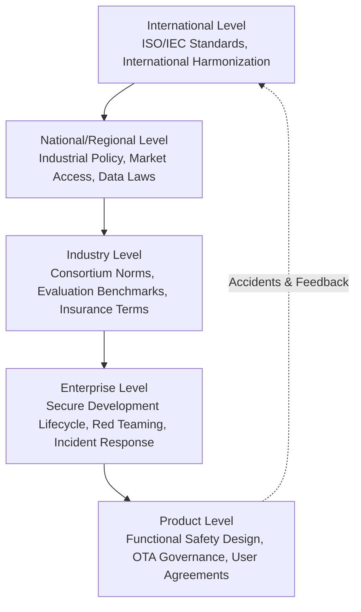
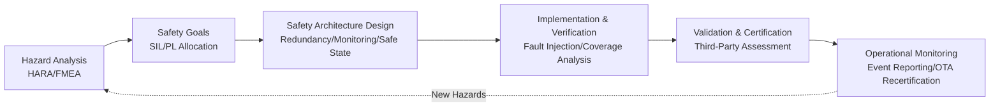
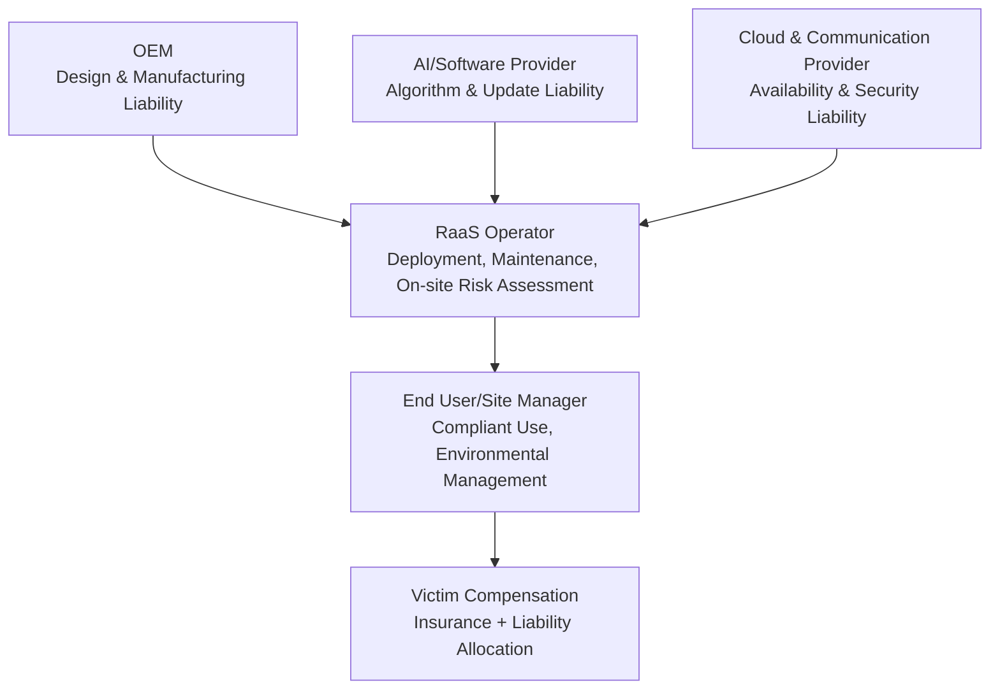
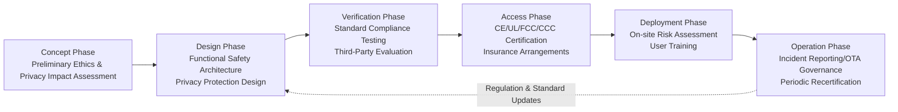

# Chapter 29: Policy, Regulation, and Ethics

## Abstract

Humanoid robots are the first machines designed to enter human living spaces in "human form": they possess physical force application capabilities, mobility, and increasingly autonomous decision-making abilities. Consequently, their governance spans multiple dimensions, including industrial policy, product safety regulation, data privacy, liability attribution, and social ethics. This chapter adopts a perspective at the intersection of engineering and governance: it first outlines the hierarchical structure of governance frameworks and the challenges posed by the "Demo-to-Product Gap" for regulation; then compares the robotics and AI industrial policy orientations of major economies such as China, the United States, the European Union, Japan, and South Korea; subsequently, it systematically introduces the safety standards system relevant to humanoid robots (ISO/TS 15066, ISO 13482, ISO 13849, IEC 61508, etc.) and regional market access certifications (CE, UL, FCC, CCC), pointing out the coverage gaps in current standards for humanoid robots; it then discusses product liability, insurance, and the chain of liability under the Robot-as-a-Service (RaaS) model, as well as data governance and biometric privacy; finally, it analyzes social impacts such as labor disruption, human-robot relationship ethics, and dual-use concerns, and provides a governance toolbox and outlook. The stance of this chapter is: policy and ethics are not external constraints imposed after technology development, but first-class inputs into the design of humanoid robot systems.

**Keywords**: Robotics Policy; Functional Safety; Human-Robot Collaboration Safety; Product Liability; Data Privacy; Biometrics; Robot Ethics; Regulatory Sandbox; Market Access Certification; Social Impact

---

## 29.1 Overview of Policy, Regulation, and Ethics

### 29.1.1 Why Humanoid Robots Require Dedicated Governance Discussion

Compared to industrial robotic arms, the governance of humanoid robots presents challenges arising from four structural characteristics:

1.  **Physical Embodiment**: Embodied intelligent systems directly apply forces to the physical world, where software defects can cause physical injury. This naturally extends the principle that "Safety must be built in, not bolted on" from the autonomous driving domain to humanoid robots.
2.  **Spatial Openness**: The value proposition of humanoid robots lies precisely in working within unstructured environments designed for humans, without fences. The traditional industrial robot paradigm of "isolation equals safety" no longer applies.
3.  **Data Intensity**: Robots are mobile sensor platforms, continuously collecting data such as images, voice, faces, and gait, inherently touching upon privacy and biometric governance (see Section 29.5).
4.  **Autonomous Evolution**: The Data Flywheel implies that a product's capabilities continue to change after leaving the factory. One-time certification targeting the "as-shipped state" is insufficient for continuously learning systems.

The concept of the "Demo-to-Product Gap" in the knowledge graph reminds us that there is a systematic gap between metrics optimized for stage demonstrations (single-attempt success rate, action aesthetics) and product metrics suitable for certification, mass production, and insurance (Mean Time Between Failures, failure mode coverage, traceability). The objects of regulatory and ethical discussion must be the latter.

!!! note "Terminology: Policy, Regulation, Standards, Ethics Governance"
    - **Policy**: Guidelines, plans, and fiscal instruments formulated by the government to guide industrial development and risk control, usually without mandatory technical binding force.
    - **Regulation**: A system of rules with legal binding force, such as market access, accident liability, and data protection laws.
    - **Standard**: Technical specifications published by standardization organizations. They are mostly voluntary in nature but often gain de facto mandatory force when cited by regulations.
    - **Ethics Governance**: Value alignment and social acceptance management that goes beyond the baseline of compliance, involving issues such as fairness, dignity, and transparency.

### 29.1.2 Levels of the Governance Framework

The governance of humanoid robots is a multi-layered nested structure; failure at any layer transfers risk to other layers:

- **International Level**: ISO and IEC develop cross-nationally recognized safety and performance standards, reducing trade barriers.
- **National/Regional Level**: Industrial subsidies, export controls, product liability laws, data protection laws (e.g., EU GDPR, China's PIPL).
- **Industry Level**: Insurance premiums, evaluation benchmarks, best practice white papers (industry reports like Bank of America Institute's "Humanoid Robots 101" also shape expectations at the capital market level).
- **Enterprise and Product Level**: Secure development lifecycle, Fault Tree Analysis, OTA update governance, incident reporting mechanisms.

### 29.1.3 From Prototype to Product: Seven Transitions from a Governance Perspective

The "Seven Transitions from 0 to 1" framework in the knowledge graph indicates that moving a humanoid robot from prototype to product requires crossing seven gates: Technology, System, Supply Chain, Manufacturing, Cost, Validation, and Market. Among these, the **Validation** transition and the **Market** transition directly correspond to the theme of this chapter. The Validation transition requires upgrading safety from "didn't fall during the demo" to an auditable chain of evidence. The Market transition requires addressing issues of liability, insurance, data compliance, and public acceptance. In other words, governance maturity is itself a dimension of product maturity.

### 29.1.4 Relationship with Other Chapters in This Book

This chapter serves as the concluding chapter for the governance dimension of the book, echoing content from several preceding chapters: the engineering implementation of safety standards directly connects with the V&V process in Chapter 9 and the certification and quality standards in Chapter 12; the technical implementation of data privacy relies on the data infrastructure in Chapter 21 and the software stack design in Chapter 24; the RaaS liability chain is complementary to the business model analysis in Chapter 28; and the discussion of employment impact presupposes the application scenario penetration path in Chapter 27. Readers can view this chapter as "placing the engineering decisions from previous chapters into a social coordinate system."

### 29.1.5 Governance Maturity Self-Assessment

Before delving into the sections, a quick self-assessment checklist for enterprise governance maturity is provided. Subsequent sections will elaborate on each item:

| Dimension | Beginner (Prototype Stage) | Intermediate (Small Batch) | Mature (Large-Scale Deployment) |
|---|---|---|---|
| Safety | Relies on operator supervision | Safety functions like emergency stop and force limiting implemented | Safety architecture argued per SIL/PL + incident reporting |
| Compliance | No certification plan | Initiated CE/UL certification planning | Multi-region certifications complete, OTA re-certification process established |
| Liability | Relies on liability disclaimers | Product liability insurance procured | Liability-insurance-contract system established, complete traceability chain |
| Data | No data policy | Privacy policy and data minimization implemented | Privacy by design + cross-border compliance + data flywheel governance |
| Ethics | No dedicated discussion | Demo transparency statement | Ethics review mechanism + user control design |

## 29.2 Robotics and AI Policies of Major Economies

### 29.2.1 Typology of Policy Instruments

Although national policy measures are numerous, they can be categorized into five types of instruments:

| Instrument Type | Typical Measures | Function Stage |
|---|---|---|
| Demand Pull | Government procurement, demonstration projects, application subsidies | Market transition |
| Supply Support | R&D funding, tax incentives, first-set insurance compensation | Technology and manufacturing transition |
| Factor Guarantee | Talent cultivation, data openness, testing grounds | System and validation transition |
| Risk Regulation | Safety standards, market access, accident liability | Validation and market transition |
| International Competition | Export controls, technology alliances, standard-setting leadership | Supply chain transition |

### 29.2.2 China: Top-Level Planning-Driven Full-Chain Layout

China has designated humanoid robots as a key direction for future industries. In 2023, the competent authority for industry and information technology issued a special guiding document for the humanoid robot field, proposing phased goals of establishing an innovation system and breaking through key technologies by 2025, and forming a safe and reliable industrial and supply chain system by 2027 (Note: This is a summary paraphrase of policy objectives; specific wording shall be subject to official documents). Its policy characteristics include:

- **"Robotics+" Application Action**: Driven by scenarios such as manufacturing, logistics, healthcare, elderly care, and emergency response, promoting paired pilot projects between complete machines and scenario parties;
- **Local Competition**: Beijing, Shanghai, Shenzhen, Hangzhou, and other cities have successively introduced special policies for humanoid robots, building innovation centers, training grounds, and pilot-scale bases, forming a three-tier structure of "national planning—local implementation—park hosting";
- **Supply Chain Autonomy Orientation**: Setting up special research projects for weak links such as reducers, ball screws, and torque sensors, echoing the supply chain governance discussed in Chapter 7; the supply pattern of upstream materials like rare earth permanent magnets (see industry reports on rare earth bottlenecks) is also considered from an industrial security perspective;
- **Standards First**: Domestic standardization bodies and industry alliances are advancing the development of standards for humanoid robot terminology, safety, testing methods, etc., and actively engaging with the ISO/IEC international standardization process.

### 29.2.3 United States: Parallel R&D Funding and Risk Prudence

U.S. robotics policy exhibits a dual-layer structure of "federal R&D funding + state-level application regulation":

- **R&D Side**: The National Robotics Initiative has continuously funded fundamental robotics research for over a decade, while the defense and aerospace systems (DARPA, NASA) have driven early technologies like bipedal locomotion and teleoperation; recent AI policy resources have further tilted towards embodied intelligence;
- **Enterprise Ecosystem Dominance**: Industrial policy is relatively indirect, primarily relying on capital markets and vertical integration by large technology companies (chips, cloud computing, complete machine manufacturers). Complete machine manufacturers like Tesla, Figure AI, and Unitree Robotics, along with computing platform suppliers like NVIDIA, form the main innovation force (see Chapter 28 for company case studies);
- **Regulatory Side**: There is no unified federal robotics law; safety is achieved indirectly through the OSHA occupational safety framework, product liability litigation, and industry standards (e.g., UL certification). State-level licensing and accident reporting systems in the autonomous driving field are seen as precedents for robot regulation; export controls (advanced computing chips, rare earth supply chains) draw the humanoid robot industry chain into geopolitical games.

### 29.2.4 European Union: Risk Classification and Compliance Pre-positioning

The EU is known for "establishing rules first." Its most relevant systems for humanoid robots include:

- **EU AI Act**: Imposes differentiated obligations on AI systems based on risk levels (unacceptable risk, high risk, limited risk, minimal risk). Humanoid robots used in law enforcement, critical infrastructure, employment screening, etc., may be classified as high-risk, requiring compliance with data governance, technical documentation, human oversight, robustness, etc.;
- **Machinery Regulation**: Replaces the previous Machinery Directive, bringing machines with "self-evolving behavior" into scope, requiring manufacturers to conduct risk assessments and attach declarations of conformity, forming one of the legal bases for the CE mark;
- **Data and Privacy**: The GDPR sets strict processing conditions for personal data collected by robots, especially biometric data like facial images and voiceprints;
- **Liability System**: The EU has long discussed adapting the product liability framework for AI and robots, with core debates on the burden of proof for defects and liability continuation after software updates.

The characteristic of the EU approach is **compliance pre-positioning**: most compliance validation must be completed before a product enters the market. This imposes cost pressures on startups but also provides a trust premium for certified products.

### 29.2.5 Japan and South Korea: Robot Nation-Building Driven by Social Needs

- **Japan**: Under the overarching framework of "Society 5.0," robots are seen as the national answer to the aging population and low birth rate. "Robot Revolution" related initiatives promote robot penetration in manufacturing, nursing care, and agriculture; nursing care robots (e.g., transfer aids, companion devices) enjoy special subsidies and insurance payment channels. Japan has deep expertise in humanoid robots (the ASIMO generation), and its policies emphasize building social acceptance for human-machine coexistence;
- **South Korea**: Through the Act on the Promotion of Intelligent Robots Development and Distribution, a support system from R&D to market has been established, including robot industry clusters and empirical special zones. Institutional pilots for outdoor driving rules for service robots (e.g., delivery, guidance) and regulatory sandboxes for personal mobility devices are relatively active. Since around 2023, humanoid robots have been included in national strategic technology discussions, with large enterprises (automotive, electronics groups) investing in complete machine manufacturers.

### 29.2.6 Comparison of Policy Orientations

| Dimension | China | United States | European Union | Japan | South Korea |
|---|---|---|---|---|---|
| Policy Style | Top-level planning, full chain | R&D funding, enterprise-led | Compliance pre-positioning, risk classification | Social needs-driven | Special zone pilots, large conglomerate-driven |
| Core Scenarios | Manufacturing, logistics, elderly care, emergency | Manufacturing, warehousing, defense | Industry, public services | Nursing care, agriculture, services | Delivery, guidance, manufacturing |
| Regulatory Focus | Standard development + supply chain security | Litigation and industry self-regulation primarily | AI Act + Machinery Regulation | Social acceptance + nursing care payment | Outdoor driving and special zone rules |
| Implication for Industry | Rapid scaling, policy window period | Fast innovation speed, deferred liability risk | High entry barriers, trust premium | Deep existing scenarios, mature payment system | Many empirical opportunities, limited market size |

Two methodological points require readers' attention: First, there is often a gap between policy texts and implementation intensity. When evaluating a country's environment, one should observe the actual flow of fiscal funds, the number of pilot projects implemented, and the follow-up speed of local governments, rather than just looking at planning titles. Second, humanoid robot policies are highly coupled with broader AI, semiconductor, and new energy policies. Looking only at "robot special programs" will underestimate the true support intensity and constraint strength. For companies going overseas, the compliance architecture design should at least cover the cross-cutting requirements of the three jurisdictions: "home country + primary manufacturing location + primary sales location."

### 29.2.7 Standards Leadership and Supply Chain Geopolitics

The final layer of industrial policy is international competition, unfolding along two main lines:

- **Struggle for Standards Leadership**: Whoever writes their technical practices into international standards first sets the compliance cost structure for global competitors. Major economies are actively positioning themselves in ISO/IEC standardization activities related to humanoid robots and embodied intelligence. Domestic industry alliances are also pushing testing methods formed in mass production practices into international proposals. For engineering teams, tracking the standardization process is not paperwork—the testing methods in draft standards are likely to become entry barriers within two years;
- **Supply Chain Security and Export Controls**: The humanoid robot industry chain is highly dependent on a few critical nodes—advanced computing chips, rare earth permanent magnet materials, precision reducers and ball screws. Industry analyses on rare earth supply bottlenecks (e.g., Oceanwall's rare earth report) and export control measures by major economies have elevated the "availability of critical materials" from a procurement issue to a national policy issue. The typical response from complete machine manufacturers is a "combination punch" of multi-source certification, strategic inventory, and localized substitution, which complements the supply chain governance discussed in Chapter 7.

In other words, the "compliance radius" of a humanoid robot company extends beyond the product itself to cover the geographic distribution and technology sources of its supply chain—this must be assessed upfront when formulating overseas strategies.

## 29.3 Safety Standards and Functional Safety

### 29.3.1 Standards Map Related to Humanoid Robots

Most currently available standards originated in the era of industrial robotic arms and service robots. Humanoid robots typically require a "combined application" of these standards:

| Standard | Scope of Application | Relationship with Humanoid Robots |
|---|---|---|
| ISO 10218 (Industrial Robot Safety) | Fixed-base industrial robots and integrated cells | Reference for risk assessment and safety function design methods |
| ISO/TS 15066 (Collaborative Robot Safety) | Collaborative operating systems, including human-robot contact force/pressure limits | Contact safety benchmark for human-robot collaboration scenarios |
| ISO 13482 (Personal Care Robot Safety) | Personal care and service robots (including service humanoids) | Primary safety basis for service humanoid robots in non-industrial environments |
| ISO 13849 (Safety of Machinery Control Systems) | Safety-related control components, quantified by PL (Performance Level) | Design basis for safety functions such as emergency stop and safety monitoring |
| IEC 61508 (Functional Safety of Electrical/Electronic/Programmable Electronic Systems) | General functional safety, quantified by SIL (Safety Integrity Level) | Top-level methodology for safety-related electronic systems |
| IEC 62368, UL 1740, etc. | Audio/video/ICT equipment safety, robots and electric equipment | Electrical safety, battery and charging safety |
| FCC Part 15, EMC Directive | Electromagnetic compatibility | Wireless communication and whole-machine EMC compliance |

!!! note "Terminology Explanation: Functional Safety, SIL, PL, Risk Assessment"
    - **Functional safety**: The property of a system to maintain risk within an acceptable range even when a fault occurs, as distinct from "inherent safety."
    - **SIL (Safety Integrity Level)**: A safety integrity level defined by IEC 61508; the higher the level, the lower the allowable probability of systematic and random hardware failures.
    - **PL (Performance Level)**: A safety performance level for control systems defined by ISO 13849, ranging from PLa to PLe.
    - **Risk assessment**: A systematic process to identify hazards, estimate the severity of harm and probability of exposure, and determine risk reduction measures.

### 29.3.2 Functional Safety Engineering Process

Safety-related functions of humanoid robots—emergency stop, joint torque limiting, fall protection, speed and separation monitoring—should follow a functional safety development lifecycle that interfaces with the V&V process from Chapter 9:

Key engineering practices include:

- **Safe state definition**: For bipedal robots, "stopping" does not equal "safe"—a power-off free fall can itself cause secondary injury. Therefore, active safe states such as controlled squatting, knee-tuck falls, and support arm extension must be designed. This is a functional safety challenge unique to humanoid robots compared to wheeled platforms.
- **Separation of safety-related and non-safety channels**: Safety circuits (emergency stop, torque cutoff) should be implemented on independent channels meeting the target SIL/PL and must not rely on general-purpose computing platforms running AI strategies (see Chapters 6 and 22 for real-time operating system selection).
- **Failure Mode and Effects Analysis (FMEA)**: The knowledge graph lists FMEA as a separate method entry. A special challenge for humanoid robots is that "AI component failures" are difficult to characterize using traditional random failure models, requiring a combination of scenario-based testing and operational monitoring.

!!! note "Terminology Explanation: Safety Case, Residual Risk, Fault Injection"
    - **Safety case**: A formal document that uses a structured chain of argumentation (claim—argument—evidence) to demonstrate that "the system is sufficiently safe in specific scenarios." It is the core vehicle for regulatory communication and third-party assessment.
    - **Residual risk**: The risk that remains after all risk reduction measures have been taken. It must be explicitly assessed for acceptability and disclosed to users, rather than pursuing absolute zero risk.
    - **Fault injection**: A method of artificially inducing faults during testing—such as sensor failure, communication packet loss, or actuator jamming—to verify that safety mechanisms act as intended. It provides direct evidence of safety verification coverage.

### 29.3.3 Regional Market Access Certification

Products entering different markets must meet their respective certification combinations (the knowledge graph entry "Regional Access Certification (UL/FCC/CE)" summarizes these):

| Region | Main Certification/Mark | Nature | Core Focus |
|---|---|---|---|
| European Union | CE Marking (Machinery Directive, EMC, Radio Equipment, etc.) | Mandatory | Self-declaration + Notified Body, risk assessment documentation |
| United States | UL Certification, OSHA Workplace Requirements | Voluntary/De Facto Threshold | Electrical and fire safety, insurance acceptance |
| United States | FCC (Electromagnetic Compatibility and Radio Frequency) | Mandatory | Wireless transmission compliance |
| China | CCC Certification, CR Robot Certification | Mandatory/Voluntary | Electrical safety, robot-specific certification |
| Japan | PSE, Radio Law Certification | Mandatory | Electrical appliance safety, wireless compliance |

For startups, certification planning must be front-loaded before design freeze: once the architecture of safety functions (e.g., whether to use dual-channel emergency stop) is finalized, the cost of later modification is far higher than early compliance design.

### 29.3.4 Standards Gap: Aspects Where Humanoid Robots "Lack Standards"

Although combined application can cover most risks, humanoid robots still face significant standards gaps:

1. **Bipedal dynamic stability**: Existing standards assume static tipping or fixed bases; there are no test methods or acceptance criteria for fall risks during bipedal walking.
2. **Dynamic human-robot contact**: The force/pressure limit framework of ISO/TS 15066 is based on quasi-static contact; collisions between a walking robot and a pedestrian are transient dynamic problems.
3. **Safety case for learning-based components**: The behavior of neural network policies cannot be exhaustively verified using traditional deterministic methods. How to construct a safety case is an open question, and audit methods for the sim-to-real evidence chain are still under exploration.
4. **Continuously updated systems**: The boundaries for recertification after OTA software updates (see Chapters 22 and 24) change the behavior of a certified product and remain unclear.

Discussions on standardization for humanoid robots and embodied intelligence are underway within international standardization bodies, but generally, moving from technical consensus to standard publication takes several years—this is precisely the rationale for regulatory sandboxes (see Section 29.7).

### 29.3.5 Battery, Charging, and Transportation Safety Compliance

Beyond the whole machine, the energy system is another high-frequency compliance trigger. Humanoid robots commonly carry large-capacity lithium battery packs (see Chapter 6), and their governance requirements span three stages:

- **Product level**: Cells and battery packs must pass the electrical safety certification system of the target market (e.g., general safety standards and transport test specifications for portable device batteries). Protection designs against overcharging, short circuits, and thermal runaway propagation are core items in certification testing.
- **Usage level**: Fire protection conditions for automatic charging/swapping stations, isolation of charging areas from personnel, and degradation strategies in the event of BMS failure should be included in the risk assessment of the deployment site.
- **Logistics level**: Large-capacity lithium batteries are restricted goods for air and ground transport, with specific regulations for transport packaging, state of charge, and accompanying documentation. This is a tangible operational constraint for cross-border delivery and after-sales spare parts logistics and must be planned in advance within the supply chain design.

The particularity of battery compliance lies in its crossing of three regulatory systems—"product safety—transportation safety—fire safety." A lapse in any one link can become a bottleneck for whole-machine delivery.

## 29.4 Legal Dimensions of Liability, Insurance, and Business Models

### 29.4.1 Product Liability Framework

Product Liability refers to the legal responsibility of manufacturers and sellers for personal injury or property damage caused by defective or unsafe products, and it directly applies to humanoid robots. Traditional product liability law distinguishes three types of defects:

- **Manufacturing Defect**: An individual product deviates from its design specifications (e.g., a robot's torque sensor is uncalibrated);
- **Design Defect**: The design itself is unreasonable (e.g., a knee joint lacks overheat protection);
- **Warning Defect**: Failure to adequately inform about foreseeable risks (e.g., not warning "Do not operate on wet floors").

Humanoid robots introduce two new challenges to this framework: First, **the imputability of learned behaviors** — if an injury stems from a policy network's generalization failure outside its training distribution, does the defect lie in the data, the algorithm, or the deployer? Second, **the liability timing for continuously evolving products** — when an OTA update causes behavior that deviates from the factory state, is liability borne by the manufacturer or the update approver? Currently, most jurisdictions continue to apply existing product liability and consumer protection frameworks, while legislation specifically targeting autonomous systems is still evolving.

### 29.4.2 Liability Chain in the RaaS Model

Robot-as-a-Service (RaaS) replaces outright purchase with leasing or subscriptions, bundling maintenance, software updates, and fleet management. RaaS alters the liability structure:

Under RaaS, robots are not permanently owned by users, and manufacturers continuously alter the product via OTA, blurring the boundary between "product" and "service." This elevates the importance of liability agreements based on service contracts (SLAs, disclaimers, insurance arrangements). The engineering implication is that fleet-level telemetry, event logging, and traceability (Chapter 21 Data Infrastructure) are not just operational tools but also legal evidence chains.

### 29.4.3 Insurance and Risk Pooling

Insurance is the invisible infrastructure for the marketization of humanoid robots. Current feasible approaches include: incorporating robots into add-on clauses of corporate property insurance and public liability insurance; specialized product liability insurance for pilot projects; and government-led insurance compensation mechanisms for first-of-a-kind major equipment. The obstacle to precise pricing is the lack of accident statistics — which returns to the data flywheel and fleet telemetry: only by accumulating failure data through large-scale deployment can insurance pricing move from "conservative rejection" to "actuarial insurability." Experience from the autonomous driving industry (e.g., the principle emphasized in robotaxi industry reports that "safety must be built in") shows that explainable safety arguments and standardized incident reporting are common prerequisites for gaining insurance and regulatory trust.

### 29.4.4 Incident Reporting, Recalls, and Lifecycle Governance

Product launch is not the end of liability. A mature governance system requires enterprises to establish three operational mechanisms:

1. **Incident Monitoring and Reporting**: Drawing from the automotive and medical device industries, establish a graded, time-limited reporting system for incidents such as falls causing injury, uncontrolled collisions, and data breaches, and share appropriately with regulators and peers. Industry-level aggregation of incident data is a public good for standard revision and insurance pricing;
2. **Defect Investigation and Recall**: When a batch-level defect (e.g., thermal runaway risk in a battery batch, failure of fall protection in a firmware version) is confirmed, enterprises need a traceable product serial number system, remote deactivation capability, and a recall process. For robots, OTA rollback is a low-cost "recall" method, but it requires institutionalizing impact assessments, phased rollouts, and rollback plans for each OTA;
3. **Decommissioning and End-of-Life**: Battery recycling, data erasure (user home data must be verifiably erased before resale or disposal), and commitments to spare parts availability are both environmental and consumer protection requirements, as well as components of brand trust.

The common foundation of these mechanisms is **traceability**: from component batches and firmware versions to each OTA and every incident, the full lifecycle data chain is the technical backbone for liability allocation, defect localization, and regulatory communication.

## 29.5 Data Governance, Privacy, and Biometrics

### 29.5.1 Robots as Mobile Sensor Platforms

A humanoid robot entering a home or hospital, with its sensor suite (RGB/depth cameras, microphone arrays, LiDAR, tactile sensors), continuously collects data on everyone in the environment — including visitors, neighbors, and patients who have not consented. Privacy and Biometrics governance covers identifiable biometric features such as faces, voiceprints, and gaits, as well as sensitive inferred materials like home layouts and lifestyle habits. Compared to mobile apps, the risks of robot data are higher: collection is continuous and passive, data is multimodal and cross-identifiable, and it may be uploaded to the cloud for model training (the dark side of the data flywheel).

### 29.5.2 Data Protection Frameworks in Major Jurisdictions

- **EU GDPR**: Establishes principles such as legal basis, purpose limitation, data minimization, and the right to be forgotten. Biometric data is generally classified as special category data with extremely strict processing conditions; the AI Act further requires documentation of data governance for high-risk systems;
- **China's Personal Information Protection Law (PIPL) and Data Security Law**: Establish systems for notice-consent, separate consent for sensitive personal information, and security assessments for cross-border data transfers; robot companies also need to pay attention to the requirements for model training data in regulations related to generative AI services;
- **United States**: No federal unified privacy law; state-level legislation (e.g., California's privacy law system) and industry regulations (e.g., HIPAA in healthcare) apply in a patchwork manner. Biometric information has specific legislation in some states, and violations can lead to high-stakes class action lawsuits;
- **Others**: Japan's APPI, South Korea's PIPA, etc., all impose obligations on the processing of personal information, requiring compliance for cross-border operations.

### 29.5.3 Engineering Compliance: Privacy by Design

Privacy by Design requires translating compliance into architectural decisions:

| Technical Measure | Function |
|---|---|
| On-device processing and anonymization (face blurring, skeletonization before upload) | Reduces raw biometric data leaving the device |
| Data classification and minimization (microphone continuous recording default off) | Reduces compliance exposure |
| Local storage and differential privacy/federated learning training | Balances data flywheel and privacy |
| Explicit status indicators (recording light, physical privacy mode switch) | Fulfills notification obligations and social acceptance |
| Data retention periods and deletion pipelines | Supports the right to be forgotten and audits |

Healthcare Assistance and Home Service are the two application scenarios with the highest privacy sensitivity: the former overlaps with medical device and patient data regulations (research on tele-ultrasound, hospital humanoid robots, etc., is entering clinically adjacent scenarios), and the latter involves minors and individuals incapable of consent. Privacy impact assessments before deployment should be a mandatory step.

### 29.5.4 Compliance Closure for the Data Flywheel

The data flywheel is a technical asset but also an amplifier of compliance liabilities: the larger the collection scale and the faster the model iteration, the wider the impact of a single compliance defect (e.g., a batch of data lacking valid consent) — data trained into a model is difficult to "delete," creating a real technical-legal conflict in the context of the GDPR's right to be forgotten. Feasible engineering mitigation paths include:

- **Data Lineage Management**: Record the source, authorization status, and timestamp for each training sample, making "withdrawing a user's data and retraining or machine unlearning" technically operable;
- **Authorization-Graded Training**: Partition data by authorization level, using only data with a complete authorization chain for core models, and using gray data only for controlled evaluation;
- **Synthetic Data Substitution**: Replace some real face and voice data with simulation and generative data (see Chapter 23) to reduce privacy exposure at the source;
- **Periodic Compliance Audits**: Integrate data compliance checks into the release gate for each model version, rather than as a post-hoc fix in annual audits.

In other words, the data infrastructure of Chapter 21 must serve not only model performance but also carry compliance semantics from the design stage — the system must enforce the distinction between "can train" and "should train."

## 29.6 Ethical and Social Implications

### 29.6.1 Labor Disruption and Employment Transformation

The impact of humanoid robots on employment is one of the most heated topics in public discourse. Industry research (such as Bank of America Institute's *Humanoid Robots 101* on the phased deployment over decades) generally expects penetration to unfold gradually along the path of "structured industrial scenarios → semi-structured logistics/retail → unstructured home services," rather than replacing humans overnight. Several judgments need clarification for readers:

- **Tasks are replaced, not occupations**: Most occupations consist of multiple tasks. Robots first take over repetitive, dangerous, and heavy-duty parts, leading to a reorganization of occupational content;
- **Labor gaps come first**: Target scenarios like manufacturing, logistics, and caregiving face widespread recruitment difficulties in major economies. In the short term, robots fill gaps rather than displace jobs;
- **New jobs emerge**: Roles such as teleoperators, robot maintenance technicians, data annotators and auditors, and safety compliance engineers are already growing;
- **Distribution effects require policy offsets**: Transition costs are concentrated among low-skilled workers. Retraining systems, social security, and possible tax adjustments (such as public discussions on automation taxes) lie at the intersection of industrial and social policy. Companies should incorporate these into risk assessments for market transitions.

### 29.6.2 Human-Robot Relationship Ethics: Companionship, Anthropomorphism, and Dignity

The humanoid form introduces unique ethical issues:

1. **Anthropomorphic deception**: Humanoid appearance and interaction can lead users to overestimate a robot's understanding and emotional capabilities, especially among vulnerable groups like the elderly and children. Interview studies with older adults (e.g., *Older Adults' Task Preferences for Robot Assistance in the Home*, 2023) found that they prefer robots for physical household assistance over social companionship and wish to retain control over robot behavior—suggesting that "respecting user autonomy" should take precedence over the design impulse to "create intimacy";
2. **Dignity in caregiving scenarios**: Poorly designed care robots may make care recipients feel monitored or objectified. Ethical design requires preserving human final decision-making authority and avoiding replacing necessary human contact with robots;
3. **Transparency obligation**: Users should always be aware they are interacting with a machine. Voice and behavior designs should not deliberately conceal the machine's identity;
4. **Data and emotional manipulation**: Preference data accumulated through long-term companionship, if used for commercial inducement, poses a new form of manipulation risk.

### 29.6.3 Dual-Use and Militarization

Humanoid robot technology is a classic dual-use technology: the same whole-body control, teleoperation, and autonomous navigation stack can be used for disaster relief or military scenarios. Current public discussions focus on: attribution of responsibility for armed robots, constraints of international humanitarian law on autonomous weapons, and the use of teleoperated "avatars" in conflict. Most leading robot manufacturers publicly declare a prohibition on weaponizing their products and include restrictive clauses in sales agreements and remote operations. However, from a governance perspective, corporate self-regulation needs to align with export controls and international convention discussions (such as long-standing debates under the Convention on Certain Conventional Weapons). Norms within the research community (e.g., statements on misuse risks in public publications) are also part of responsible diffusion control.

### 29.6.4 Safety Culture and Demonstration Ethics

Finally, returning to the industry itself: the humanoid robot field heavily relies on demonstration videos for dissemination, creating a "demonstration ethics" issue—edited, single-success, implicitly human-assisted demonstrations can systematically distort expectations of the public, investors, and even regulators. The concept of the "gap between demonstration metrics and product metrics" in the knowledge graph is an engineering formulation of this phenomenon. A healthy safety culture requires: clearly indicating the level of autonomy in demonstrations (whether teleoperated, sped up), publishing failure cases and accident data, and using cautious language for unverified capabilities. This is both ethical self-discipline and the foundation for long-term industry credibility.

### 29.6.5 Fairness, Accessibility, and the Digital Divide

The final social impact dimension is distributive fairness. The high initial cost of humanoid robots means their benefits naturally favor enterprises and households with greater purchasing power, potentially exacerbating three divides:

- **Between enterprises**: Large manufacturers deploy robots first to reduce costs and increase efficiency, while SMEs face a dilemma of "automate or be eliminated, but lack funds to automate"—the RaaS subscription model is a market response to this issue, and its inclusive value deserves policy encouragement;
- **Between regions**: New jobs in robot maintenance, data services, etc., concentrate in tech hub cities, while displaced jobs may be in broader areas. Regional transition policies need advance planning;
- **Between populations**: The elderly and people with disabilities should be the biggest beneficiaries of assistive robots, but if product design defaults to "typical young users," they may be excluded. Accessibility design and age-friendly interaction (large fonts, voice-first, physical emergency stop buttons) should enter product definition from the requirements stage, not as an afterthought.

The practical implication for engineering teams is that accessibility and affordability are part of technical metrics—the cost engineering discussed in Chapter 13 and scenario selection in Chapter 27 will ultimately feed back into the industry's lifeline through social acceptance.

### 29.6.6 Public Perception and Risk Communication

Social acceptance is ultimately determined by public perception, which is largely shaped by two extreme narratives: one is the panic narrative of "robots will replace humans soon," and the other is the overpromising narrative of "robots can do everything." Both distort governance discussions: the former leads to overly defensive regulation, the latter sows the seeds of trust collapse. Responsible risk communication should follow three principles:

1. **Distinguish "verified capabilities" from "roadmap expectations"**: Clearly mark in communication materials which functions are deployed at scale, which are in pilot, and which are still R&D targets;
2. **Disclose risks in understandable ways**: Explain to non-expert users the robot's capability boundaries (cannot operate on slippery surfaces, cannot lift a person exceeding rated weight), as important as airline safety demonstrations;
3. **Provide channels for public participation**: Hold community hearings and trial feedback sessions before deploying in sensitive scenarios like elderly care, healthcare, and education, turning "those being deployed upon" from passive recipients into co-designers.

Historical experience (the ups and downs of the autonomous driving industry are a recent example) shows that a single amplified accident event impacts the entire industry far beyond its statistical significance—trust takes years to build and days to collapse. Risk communication is a necessary investment to hedge against this asymmetry.

## 29.7 Governance Toolbox and Outlook

### 29.7.1 Compliance Roadmap for Enterprises

### 29.7.2 Regulatory Sandboxes and Agile Governance

During the window where standards and legislation lag behind technology, **regulatory sandboxes**—allowing empirical trials with exemptions from certain rules in limited areas, durations, and populations—have become an agile governance tool adopted by major economies. China's application demonstration zones, South Korea's empirical special zones, and Japan's national strategic special zones all have similar arrangements. For enterprises, sandboxes are channels to accumulate real-world operational data and regulatory trust before formal compliance paths are clear; for regulators, accident and behavior data from sandboxes provide an empirical basis for formal rulemaking.

### 29.7.3 Outlook: From Compliance to Value Alignment

Three predictable trends in the long-term direction of humanoid robot governance: First, standards systems will fill gaps in bipedal dynamic safety and learning-based component validation, forming a truly "humanoid-specific" family of safety standards; second, liability and insurance systems will move from case-by-case negotiation to actuarial and institutionalized frameworks as fleet sizes grow; third, as Embodied General Intelligence capabilities advance, governance focus will shift from "physical safety" to "behavior alignment"—robots must not only act safely but also act according to human values. Chapter 30 will continue this outlook from a technological evolution perspective.

For readers of this book, a more practical judgment is: in the next five to ten years, differences in governance capabilities will become as critical as differences in technical capabilities in distinguishing leading companies from followers—just as functional safety was for the automotive industry and privacy compliance for mobile internet. The winners in the humanoid robot industry will be those companies that internalize compliance and ethics as engineering capabilities, rather than outsourcing them to legal departments.

### 29.7.4 Self-Regulation in the Research Community and Open-Source Ecosystem

Governance is not solely the responsibility of governments and enterprises. The humanoid robot field heavily relies on open-source software stacks, public datasets, and preprint papers. Self-regulation within the research community constitutes the "fourth pillar" of governance:

- **Dataset ethics review**: Motion capture and teleoperation data involve real human actions, voices, and facial information. Informed consent, anonymization, and usage scope limitations during collection should be prerequisites for release, akin to human subject review;
- **Responsible release of models and weights**: Embodied models can directly drive physical robots. Publishers should specify training data sources, known failure modes, and prohibited scenarios in model cards;
- **Reproducibility and evaluation integrity**: Using public benchmarks (such as HumanoidBench, LIBERO, ManiSkill, etc., detailed in Chapter 25) and reporting complete evaluation protocols is the most effective peer constraint against "demonstration exaggeration";
- **Safety research sharing**: The benefits of sharing negative results related to safety, such as fall protection, emergency stop architectures, and adversarial failure modes, far outweigh secrecy—an industry-level safety knowledge base is a public good.

### 29.7.5 Action Checklist for Different Readers

As a conclusion to this chapter, governance discussions are translated into actionable recommendations:

- **For robot and algorithm teams**: Complete functional safety architecture review and preliminary privacy impact assessment before the next design freeze; prioritize incident logging and data lineage capabilities in upcoming iterations;
- **For entrepreneurs and managers**: Front-load certification planning, insurance quotation inquiries, and regulatory monitoring mechanisms for target markets—the cost of these three "front-loading" actions is far lower than post-hoc remediation;
- **For researchers**: Clearly indicate the level of autonomy in demonstrations in papers and releases, prioritize public benchmarks, and publish safety-related negative results;
- **For policy researchers**: Focus on three major standards gaps: bipedal dynamic safety, learning-based component validation, and continuously updating systems—these are both academic issues and legislative material.

## 29.8 Chapter Summary

This chapter unifies policy, regulation, and ethics as "first-class inputs for humanoid robot system design." At the industrial policy level, China drives a full-chain layout through top-level planning, the United States relies on R&D funding and corporate ecosystems, the EU prioritizes compliance, and Japan and South Korea are guided by social needs—each of these five pathways carries practical implications for engineering teams. In safety regulation, the current system applies a combination of ISO/TS 15066, ISO 13482, ISO 13849, IEC 61508, and regional access certifications (CE, UL, FCC, CCC), but bipedal dynamic safety, learning-based component validation, and continuously updating systems remain gaps in standards. Legally, product liability, RaaS liability chains, and insurance mechanisms together form an invisible market-based infrastructure; in data, privacy and biometric governance require privacy-by-design as an architectural-level decision; socially, employment transition, human-robot relationship ethics, dual-use concerns, and demonstration ethics demand that the industry trade transparency for long-term trust. Governance maturity and technology maturity must evolve in tandem—this is a necessary condition for humanoid robots to move from prototypes to society.

Policy and ethics are often regarded as "soft" topics, but this chapter aims to illustrate that they ultimately solidify into hard constraints: without passing certification tests, products cannot be launched; without a clear liability chain, insurance cannot be priced; without proper privacy design, the data flywheel cannot legally spin. Treating governance as an engineering problem is precisely the extension of this book's "from principles to products" methodology into the social dimension.

## Further Reading (Knowledge Graph Entries)

- Standards: ISO 13482 Safety of personal care robots, ISO/TS 15066 Collaborative robot safety, ISO 13849, IEC 61508, Regional access certifications (UL/FCC/CE)
- Concepts: Human-robot collaboration safety, Privacy and biometrics, Product liability, Robotics as a Service (RaaS), Seven leaps from 0 to 1, Gap between demonstration metrics and product metrics, Data flywheel, Embodied general intelligence
- Reports: Bank of America Institute *Humanoid Robots 101* (2025), NVIDIA *For Robotaxis, Safety Must Be Built In, Not Bolted On* (2026), Rare earth bottleneck industry report
- Papers: Study on preferences of elderly home residents for robot-assisted tasks (2023), Comparison of robotic and human teleoperation for remote ultrasound (2025), Humanoids in Hospitals (2025)
- Application Scenarios: Healthcare, Home services

All the above entries can be retrieved as structured records (including English/Korean names, sources, and related entities) in the `research/` directory of this knowledge graph. Readers are advised to use the knowledge graph construction method introduced in Chapter 2 to treat the "standards—concepts—reports—scenarios" covered in this chapter as a queryable subgraph, rather than a static reading list.
