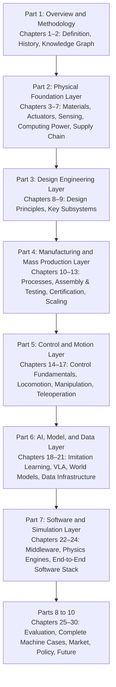
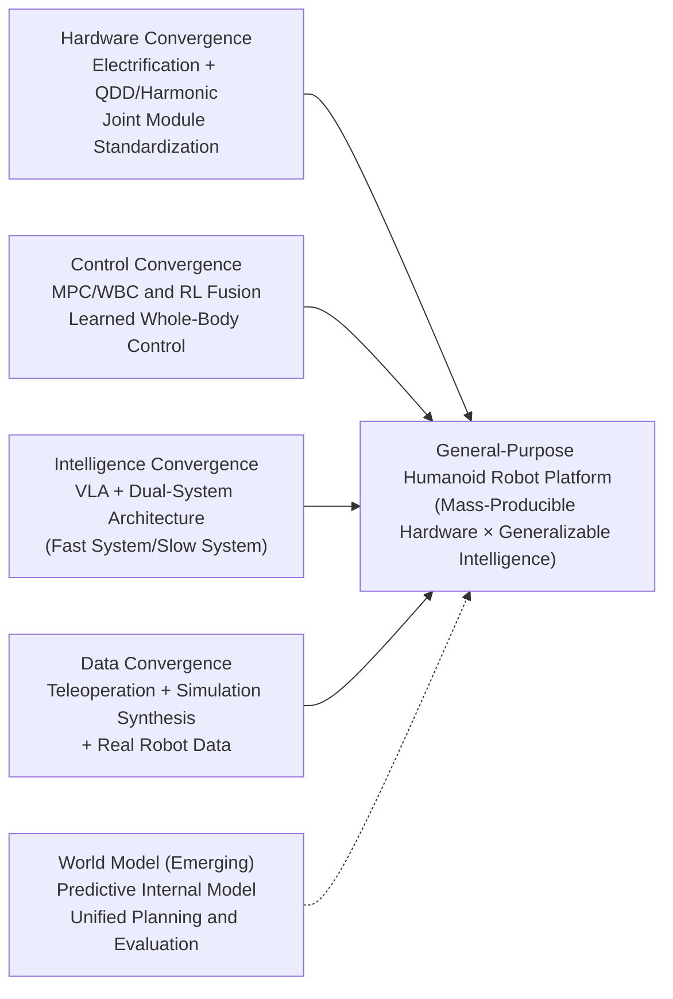
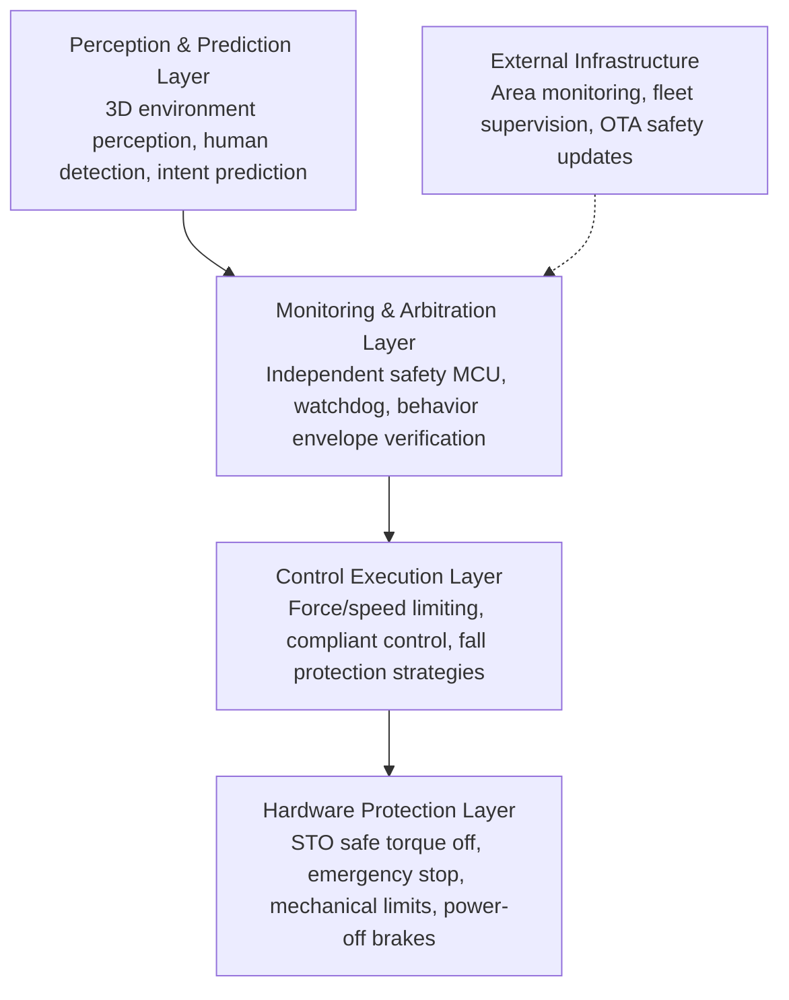
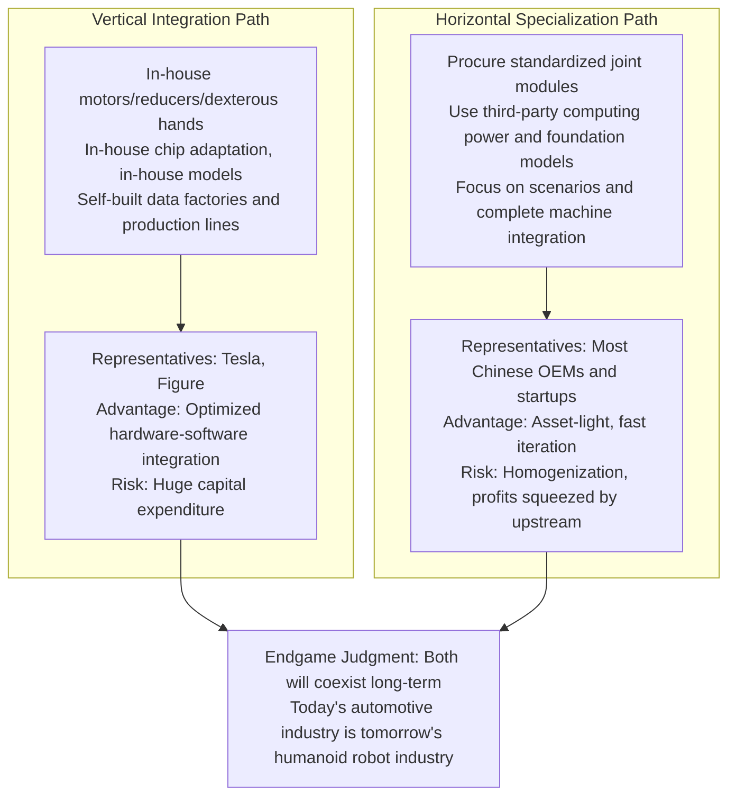
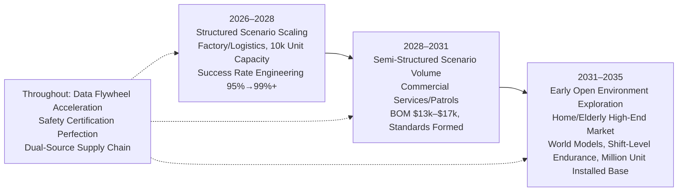

# Chapter 30: Future Outlook

## Summary

This chapter concludes the book. The preceding 29 chapters systematically deconstructed humanoid robots along the main thread of "Physics Foundation – Design Engineering – Manufacturing & Mass Production – Motion Control – AI & Data – Software & Simulation – Evaluation & Verification – Complete Machine Market – Policy & Ethics," covering materials, actuators, sensing, computing, supply chains, subsystems, processes, algorithms, and markets. This chapter builds upon this foundation to provide a comprehensive outlook: it first reviews the book's structure and uses the Technology Readiness Level (TRL) framework to assess the position of each technology layer; it then discusses the four ongoing technological convergences—hardware morphology, motion control, intelligent architecture, and data pipelines—and the possibility of the World Model as the next convergence point; next, it delves into four unresolved fundamental challenges—Generalization, Safety, Cost, and Energy—providing quantitative constraint analyses; it then outlines the evolutionary direction of the industry landscape, including the debate between vertical integration and horizontal specialization, rare earth and supply chain constraints, and new competitive barriers formed by the Data Flywheel; finally, it presents a five-to-ten-year roadmap for 2026–2035, specifying key milestones, metrics, and variables that could alter the roadmap for each phase, concluding the book with the concept of "Embodied General Intelligence (EGI)." The stance of this chapter is one of engineering prudence: all predictions are accompanied by their assumptions and uncertainties; industry-common numbers are phrased as "typically" or "generally"; analyst forecasts are strictly distinguished from verified facts.

**Keywords:** Technological Convergence; Generalization; Functional Safety; BOM Cost; Energy Endurance; World Model; Data Flywheel; Robotics as a Service; Industry Landscape; Roadmap; Embodied General Intelligence

---

## 30.1 Concluding Perspective: Book Structure and Technology Readiness Level Assessment

### 30.1.1 The Logical Main Thread of the Book's Ten Parts

A humanoid robot is a quintessential "full-stack" engineering object: its upper performance limit is determined by material physics, its lower limit by manufacturing processes, and its ability to realize value is determined by the market and policy. The ten-part structure of this book is essentially a bottom-up, layer-by-layer analysis of this object.



This structure corresponds to an important fact: **A bottleneck in any single layer becomes a bottleneck for the entire machine**. The coercivity of NdFeB magnets determines the peak torque density of joint motors (Chapter 3), the backlash and stiffness of joint modules determine the bandwidth ceiling of Whole-Body Control (WBC) (Chapters 9, 14), battery energy density determines endurance and the duration of executable tasks (Chapter 6), and the scale and diversity of data determine the generalization boundary of Vision-Language-Action (VLA) models (Chapters 19, 21). Technological progress over the next five years will likely continue to be characterized by this "multi-layer collaborative advancement" rather than breakthroughs in isolated areas.

### 30.1.2 From Prototype to Product: Re-examining the Seven Transitions

Chapter 1 introduced the "Seven Transitions from 0 to 1" framework: for a humanoid robot to move from a lab prototype to a sellable product, it must sequentially complete transitions across seven dimensions: **Technology, System, Supply Chain, Manufacturing, Cost, Verification, and Market**. Looking back from the end of the book, the value of this framework lies in explaining why the "demo boom" of 2023–2026 does not directly equate to industry maturity.

- **Technology Transition**: Single skills (walking, grasping) are usable under controlled conditions—already demonstrated extensively by Atlas, Optimus, Figure 02, Unitree H1/G1, etc.
- **System Transition**: Perception, decision-making, execution, energy, and thermal management operate collaboratively without failure on the complete machine for extended periods—the current industry average Mean Time Between Failures (MTBF) remains a core pain point, typically measured in "days" rather than "months."
- **Supply Chain Transition**: Key components like harmonic drives, planetary roller screws, and torque sensors shift from "custom parts" to "off-the-shelf parts"—this is currently happening (Chapter 7).
- **Manufacturing Transition & Cost Transition**: Moving from manual assembly to production line cycle manufacturing, with BOM costs entering a downward trajectory (see Section 30.5).
- **Verification Transition**: Moving from having no standards to forming a certifiable safety and performance system—this has the largest gap (see Section 30.4).
- **Market Transition**: Moving from government and research procurement to real paying industrial and commercial customers—Figure AI's 11-month deployment at a BMW plant and UBTECH's Walker S orders from automotive factories are early signals.

The concept of the "Demo-to-Product Gap" from the knowledge graph accurately characterizes this reality: there is a systematic gap between metrics optimized for demonstrations (single-attempt success rate, visual appeal) and metrics optimized for products (MTBF, maintainability, certification compliance, unit economics). Bridging this gap is the main task for the industry over the next five to ten years.

### 30.1.3 Technology Readiness Level Assessment: Where Each Technology Layer Currently Stands

The following table provides a prudent assessment of the technology layers covered in this book, using the common TRL 1–9 semantics (TRL 4 = laboratory validation, TRL 6 = demonstration in relevant environment, TRL 9 = long-term operation in actual environment). The ratings represent the editor's comprehensive judgment, intended for trend reference rather than precise measurement.

| Technology Layer | Representative Technology | Current TRL (approx.) | Key Constraints to Reaching TRL 9 |
|---|---|---|---|
| Structural & Functional Materials | NdFeB, Aluminum Alloys, Engineering Plastics | 9 | Rare earth supply & heavy rare earth reduction |
| Actuators | Frameless Torque Motors + Harmonic/Planetary, Quasi-Direct Drive (QDD) | 7–8 | Lifespan, backlash consistency, cost |
| Dexterous Hands | Tendon-driven/Linkage-driven Multi-fingered Hands | 5–7 | Durability, tactile feedback loop, cost |
| Sensing & Perception Hardware | Depth Cameras, IMUs, 6-axis Force Sensors | 8 | Robustness & standardization of tactile arrays |
| Computing & Power | Jetson Thor-class Edge Computing, Li-ion Battery Packs | 7–8 | Compute-to-power ratio, energy density |
| Bipedal Locomotion Control | MPC+WBC, Reinforcement Learning Gaits | 7–8 | Robustness on complex terrain, fall recovery |
| Loco-Manipulation | Whole-body policies like HOVER, ASAP, ExBody2 | 5–6 | Reliability in contact-rich tasks |
| Task-level Intelligence | VLA (RT-2, OpenVLA, π0, GR00T N1) | 4–6 | Generalization, long-horizon tasks, success rate |
| World Models | Video Generative World Models, 1X/Humanoid World Models | 3–5 | Physical consistency, long-range prediction |
| Mass Production Processes | Joint Module Lines, Complete Machine Assembly | 5–7 | Yield rate, cycle time, test fixtures |
| Safety Certification System | Adaptation of ISO 13482, ISO/TS 15066 | 3–5 | Lack of humanoid-specific standards |

This table reveals one of the book's conclusions: **The bottleneck for the humanoid robot industry is not "whether it can move," but "whether it can work reliably, safely, and cheaply over the long term."** Technological evolution over the next decade will primarily revolve around the entries in this table with TRL ≤ 6.

## 30.2 Technology Convergence Trends

When an industry transitions from the exploration phase to the engineering phase, the most significant signal is the convergence of technology roadmaps: competitors no longer go their separate ways but reach a consensus on several key architectural choices. From 2024 to 2026, the humanoid robot field has seen four clear convergences, with one more currently forming.



### 30.2.1 Hardware Morphology Convergence: Electrification, Quasi-Direct Drive, and Joint Modularization

The hydraulic route (represented by early Atlas) has largely exited the new generation of humanoid robots; electric drive has become the consensus. Within electric drive, the industry has further converged on two mainstream technical routes:

- **High Reduction Ratio Route**: Frameless Torque Motor + Harmonic Reducer or Precision Planetary Reducer, with encoders and torque sensors at the output end. The Bank of America Institute's April 2025 report "Humanoid Robots 101" notes that harmonic reducers are currently a mainstream choice for rotary actuators in humanoid robots, while linear actuators commonly use Planetary Roller Screws.
- **Quasi-Direct Drive (QDD) Route**: Low reduction ratio (typically 6–10:1) + high-torque outer rotor motor, relying on the current loop for inherent compliance and transparent force control. Representative solutions can be found in the knowledge graph entry for "Quasi-Direct Drive Actuator" and its proliferation in quadruped and humanoid platforms. Series Elastic Actuators (SEA) serve as an intermediate route, still adopted in joints requiring precise force control and impact resistance.

A deeper convergence occurs at the **integration level**: motors, reducers, dual encoders, torque sensors, drivers, and brakes are integrated into standardized "Joint Modules" (Chapter 9), allowing OEMs to build robots of different configurations like building blocks. This "modularization" trend is highly analogous to the "camera module" trend in the smartphone industry, shifting the competitive focus from individual components to system integration and software.

### 30.2.2 Motion Control Convergence: From Model-Based Control to Learned Whole-Body Control

Bipedal control has evolved through three generations of paradigms: simplified model planning represented by Zero-Moment Point (ZMP) and Capture Point (Chapters 14, 15); optimal control represented by Model Predictive Control (MPC) + Hierarchical Quadratic Programming Whole-Body Control (Hierarchical QP WBC); and learned control represented by Reinforcement Learning (RL). The current convergence direction is not "one replacing the other," but **hierarchical fusion**:

- **Low Level (1 kHz class)**: Joint servo and force control, still the domain of classical control;
- **Mid Level (50–500 Hz)**: RL-trained whole-body policies responsible for gait, balance recovery, and whole-body coordination. Works like the HOVER general-purpose humanoid controller, the ASAP framework, and ExBody2 demonstrate that a single policy network can simultaneously support walking, running, jumping, whole-body teleoperation tracking, and other modes;
- **High Level (1–10 Hz)**: Model-based planning or learned high-level policies responsible for task decomposition and contact sequencing.

A 2025 survey, "A Survey of Behavior Foundation Model," further summarizes this trend as a "Behavior Foundation Model": using a single large-scale pre-trained whole-body control model to replace individually trained policies for each skill, enabling motor capabilities to be transferred via prompting and fine-tuning, much like language models. This naturally connects with the policy learning context described in Chapters 18–19. It can be said that **the "GPT moment" for the motion layer—the emergence of general-purpose motion policies—is one of the most noteworthy convergence events in the next five years**.

### 30.2.3 Intelligence Architecture Convergence: VLA and the Dual-System Paradigm

The architectural convergence for task-level intelligence has been more rapid. Since RT-1 (Robotics Transformer) and RT-2 directly extended Vision-Language Models to output actions as VLAs, works like OpenVLA, the Octo generalist policy, Physical Intelligence's π0, NVIDIA GR00T N1, and Google's Gemini Robotics have emerged densely within two years, quickly forming a de facto architectural consensus:

1.  **Backbone Network Reuse**: Utilizing internet-scale vision-language pre-trained models as the backbone, inheriting their semantic priors;
2.  **Action Chunking**: Predicting a sequence of actions at once (adopted by ACT, Diffusion Policy), balancing reactivity and smoothness;
3.  **Dual System (System 1 / System 2)**: A low-frequency "Slow System" responsible for language understanding, task planning, and reasoning, and a high-frequency "Fast System" responsible for converting intentions into continuous actions—GR00T N1 explicitly adopts this division, and systems like Gemini Robotics exhibit a similar structure;
4.  **Cross-Embodiment Pre-training + Embodiment Adaptation**: Pre-training on multi-embodiment datasets like Open X-Embodiment, then transferring to specific humanoid embodiments.

!!! note "Terminology Explanation: VLA, Action Chunking, Dual System, Cross-Embodiment Transfer"
    - **VLA (Vision-Language-Action)**: A large model mapping visual observations and language instructions to robot actions, extending the "Vision-Language Model (VLM)" into the action space.
    - **Action Chunking**: The policy outputs a future sequence of \(H\) actions \(\{a_t,\dots,a_{t+H-1}\}\) instead of a single action step, reducing cumulative errors and decision frequency.
    - **Dual System (System 1/System 2)**: A metaphor borrowed from cognitive science, where System 2 is slow and deliberate, and System 1 is fast and reactive. In robotics, this corresponds to a cascade of "planning model + reactive policy."
    - **Cross-Embodiment Transfer**: Joint training on data from different robotic arms/humanoid robots, allowing the policy to acquire operation priors that are weakly correlated with specific hardware.

### 30.2.4 Data Pipeline Convergence: The Ratio of Teleoperation, Simulation, and Real Data

Convergence on the data side is manifested in the standardization of a "three-source hybrid" pipeline (detailed in Chapter 21):

- **Teleoperation Collection**: Low-cost dual-arm teleoperation platforms like ALOHA and Mobile ALOHA, the UMI handheld gripper interface, and HumanPlus's Shadowing system have reduced the cost of collecting human demonstration data by 1–2 orders of magnitude;
- **Simulation Synthesis**: NVIDIA Isaac Sim/Isaac Lab, MuJoCo and its Playground, and the Genesis generative physics engine provide large-scale parallel data generation and Domain Randomization. Systems like MimicGen demonstrate an amplification path of "few human demonstrations + procedural augmentation";
- **Real Robot Data Feedback**: "In-the-wild" operation datasets like DROID and multi-embodiment collections like Open X-Embodiment provide anchors for the real-world distribution. AgiBot World Colosseo showcases the direction for OEMs to build their own million-scale real trajectory data factories.

Generally, the ratio of real to synthetic data in current mainstream VLA training is heavily skewed (synthetic data dominates), but the upper limit of generalization is often determined by the **diversity** of that real data, not its quantity. This "art of ratio" will likely remain a core know-how for various players in the foreseeable future.

### 30.2.5 World Models: The Next Convergence Point

If VLA addresses "how to act given an instruction," then World Models address "what the world will be like after an action." Efforts like 1X's World Model Challenge and Humanoid World Models explore using video generation models to predict action consequences. NVIDIA's released Cosmos 3 open-world foundation model combines visual reasoning, multimodal generation, and action prediction, aiming to enable physical AI to "think before acting."

The strategic significance of World Models lies in their potential to **unify three currently separate aspects**:

1.  **Planning**: "Imagining" the consequences of multiple action sequences within an internal model and executing the best one (i.e., model-based policy evaluation);
2.  **Evaluation**: Conducting safe, low-cost closed-loop testing of policies in a simulation-like generative environment, mitigating the expense and danger of real-world evaluation (Chapter 25);
3.  **Data**: Generating physically plausible training data that complements real data.

Current video-generation-based World Models still suffer from insufficient physical consistency in contact-rich manipulation tasks (e.g., difficulty in precisely predicting object pose after grasping). Their maturation likely requires further integration of 3D representations, tactile modalities, and differentiable physics (Chapter 20). However, judging from industry signals, major players have all designated World Models as a must-win battleground for the next-generation platform.

## 30.3 One of the Unsolved Challenges: Generalization

### 30.3.1 Four Levels of Generalization

Generalization is the first deep chasm between "demonstrations" and "products." The generalization required for humanoid robots encompasses at least four levels, with increasing difficulty:

| Level | Meaning | Current Status |
|---|---|---|
| Object Generalization | Grasping and manipulating unseen objects | Partially achieved: effective for common object categories with large-scale data |
| Pose/Layout Generalization | Success despite changes in object position, lighting, and background | Basically usable, but high failure rate in edge cases |
| Task Generalization | Composing reasonable action sequences for new tasks described in language | Preliminary implementation: VLAs can combine seen skills, but long-horizon task success rates are low |
| Environment/Embodiment Generalization | Transferring to new sites and new robot embodiments | Research frontier: cross-embodiment transfer remains an open problem |

An empirical rule is: **Each increase in generalization level roughly requires an order of magnitude more data.** This explains why a "pour a glass of water" demonstration is common, while "cook a meal in an unfamiliar kitchen" remains distant—the latter requires all four levels of generalization to hold simultaneously, and failures accumulate multiplicatively: if the single-step success rate is \(p\), the overall success rate for an \(n\)-step task is approximately \(p^n\). When \(p=0.95\) and \(n=50\), the overall success rate is less than 8%; to achieve a 90% overall success rate, the single-step success rate must exceed 99.8%. This simple multiplicative law is the first key to understanding the phenomenon of "impressive demonstrations, unreliable products."

### 30.3.2 Data Scale and Compositional Generalization: A Quantitative Perspective

From a learning theory perspective, the error of a policy on out-of-distribution (OOD) data can be formally decomposed as:

$$
\mathbb{E}_{\mathcal{D}_{test}}[\ell(\pi)] \;\le\; \mathbb{E}_{\mathcal{D}_{train}}[\ell(\pi)] \;+\; d\big(\mathcal{D}_{train}, \mathcal{D}_{test}\big) \;+\; \mathcal{O}\!\left(\sqrt{\frac{\log |\Pi|}{N}}\right)
$$

where \(\mathcal{D}_{train}\) and \(\mathcal{D}_{test}\) are the training and deployment distributions, \(d(\cdot,\cdot)\) is some measure of discrepancy between the two distributions, \(|\Pi|\) is the effective capacity of the policy class, and \(N\) is the number of samples. This inequality provides three complementary paths for error reduction: **expanding real data coverage** (reducing \(d\)), **increasing sample size** (reducing the third term), and **introducing structured priors** (reducing \(|\Pi|\), e.g., using hierarchical policies, skill primitives, or symbolic planning to constrain the search space). The resurgence of neuro-symbolic reasoning and task planning essentially embodies the third path.

Unlike language models, the "tokens" of robot data must be generated through physical interaction and cannot be infinitely scraped from the internet. Therefore, "whether a Scaling Law exists for robotics and what its exponent is" remains an open question; most empirical observations support the judgment that "performance grows logarithmically with data volume and saturates prematurely when real-world diversity is insufficient."

### 30.3.3 The Long-Term Nature of the Sim-to-Real Gap

Sim-to-Real transfer, through domain randomization, domain adaptation, and system identification, has achieved engineering-level success in bipedal locomotion control—primarily because errors in dynamics simulation can be absorbed through randomization and online adaptation. However, for manipulation tasks, residuals in contact mechanics, friction, deformable objects, and visual rendering make it difficult to directly deploy purely simulated policies. Works like VIRAL demonstrate progress in large-scale visual Sim-to-Real for mobile manipulation, but the industry consensus is: **Simulation will continue to serve as a "data amplifier" and "safe testbed," not a substitute for real data.** The long-term solution to bridging the gap may come from a combination of three elements: more realistic differentiable physics, visual priors provided by generative world models, and simulation parameter calibration driven by real data feedback (Digital Twin).

### 30.3.4 List of Open Problems

In the direction of generalization, open problems worth tracking over the next five to ten years include:

- The debate between **hierarchical** (skill library + planning) and **end-to-end** (single network + scaling) approaches for long-horizon tasks: which will achieve product-level reliability first;
- Failure detection and recovery: whether policies can "realize they are failing" like humans and abort or seek help;
- Continual learning: absorbing new tasks after deployment without catastrophic forgetting;
- The **metric** of generalization itself: benchmarks like HumanoidBench, LIBERO/LIBERO-Plus, ManiSkill, and the "Humanoid Robot Foundation Model Benchmark" are standardizing evaluation protocols, but "high benchmark score = good real-world deployment" is far from established.

## 30.4 Unsolved Challenges Part II: Safety

### 30.4.1 The Specificity of Humanoid Robot Safety Issues

The safety challenges of humanoid robots differ structurally from those of industrial robotic arms and collaborative robots (Cobots):

1. **Dynamic Instability**: Bipedal platforms are inherently under continuous balance control. Controller failure, ground disturbances, or power interruptions can cause the entire machine to topple—a typical full-size humanoid robot weighs between 50–90 kg, and the impact of a fall far exceeds the contact injury magnitude of a collaborative arm;
2. **Shared Workspace**: Their design value lies precisely in entering unstructured spaces built for humans, making it impossible to isolate them with fences like industrial robots;
3. **Full-Body Contact**: Mobile manipulation means that hands, arms, torso, and legs may all come into unintended contact with humans. Limiting power and force only at the end-effector is insufficient;
4. **AI Uncertainty**: The behavior of learning-based strategies is difficult to exhaustively verify, posing a fundamental challenge to traditional "fault tree + deterministic testing" certification methodologies.

The "Human-Equivalence Envelope" and "Human-Level Actuation Score" in the knowledge graph offer another perspective: when a robot's joint torque, speed, and mass approach human levels, its danger also approaches that of "a strong person"—this shifts safety design from "limiting capability" to "managing behavior."

### 30.4.2 Standards System: Current Status and Gaps

The existing referenceable standards system (detailed in Chapters 12 and 29) is shown in the table below:

| Standard | Scope | Limitations for Humanoid Robots |
|---|---|---|
| IEC 61508 | General functional safety framework for electrical/electronic programmable systems | Does not cover dynamic balance and AI decision-making |
| ISO 13849 | Performance Level (PL) for safety-related control systems in machinery | Geared toward deterministic control, difficult to evaluate learning strategies |
| ISO/TS 15066 | Collaborative robots: power and force limiting, speed and separation monitoring | Contact limits designed for fixed-base robotic arms, not applicable to mobile bipedal platforms |
| ISO 13482 | Safety of personal care robots | Closest match but published in 2014, does not address capabilities of the VLA/RL era |
| UL / FCC / CE | Regional market access (electrical, EMC, machinery directives) | Lacks specific humanoid provisions required for compliance demonstration |

The conclusion is clear: **There is currently no dedicated safety standard for dynamically balanced humanoid robots.** The industry generally expects that standards organizations and major manufacturers will drive the development of humanoid-specific provisions in the coming years; until then, OEMs can only self-certify safety through a combination of "risk analysis + referencing multiple standards + third-party assessment," which directly raises the barrier to entering the consumer market.

### 30.4.3 Engineering Approach: Layered Safety Architecture

During the period of standard absence, engineering practice is converging on a "Layered Safety" architecture:



- **Perception Layer**: Safety-certified 3D sensing is emerging—for example, Sonair's safety-certified 3D ultrasonic sensor for reliable human detection in human-robot collaboration spaces;
- **Monitoring Layer**: A safety microcontroller (Safety MCU) independent of the main computing stack continuously verifies whether AI decisions stay within the "behavior envelope" (speed, force, workspace). The collaboration between FORT Robotics and NVIDIA Halos demonstrates an "Outside-In" safety monitoring approach—safety conclusions do not depend on the AI's internal state but are observed and arbitrated via an independent channel;
- **Control Layer**: Impedance Control and Admittance Control provide contact compliance; specialized fall protection strategies (e.g., arm retraction, knee bending, sideways falling) are becoming research topics;
- **Hardware Layer**: Safe Torque Off (STO), power-off brakes, and mechanical limits serve as the final line of defense.

The core idea of this architecture is the classic "**Defense in Depth**": it does not assume that any single component (especially AI) is always correct.

### 30.4.4 Liability, Insurance, and Social Acceptance

Beyond technical safety, the absence of a product liability framework also constrains commercialization: when a learning robot causes harm, is the liability with the OEM, the model provider, or the deployer? Chapter 29 has systematically discussed policy and ethics; here, only one point is noted: actuarial insurance requires quantifiable failure rate data, which in turn demands large-scale real-world deployment—creating a cycle of "no deployment without insurance, no insurance data without deployment." The RaaS model (see 30.5.4), by keeping robots on the manufacturer's balance sheet and having the manufacturer assume operation, maintenance, and liability, is a practical path to breaking this cycle. Governance of privacy and biometric data (home cameras, voice) is another unavoidable hurdle for household scenarios.

## 30.5 Unsolved Problem Three: Cost

### 30.5.1 BOM Cost Trajectory and Learning Objectives

Cost is the decisive variable for humanoid robots to transition from "thousand-unit pilot projects" to "million-unit industries." Analyst estimates from *Humanoid Robots 101* suggest that by the end of 2025, the typical BOM (Bill of Materials) cost for a humanoid robot is approximately $35,000 per unit (assuming 16 rotary actuators, 14 linear actuators, harmonic drives, planetary roller screws, a 6-DOF dexterous hand, one depth camera and one LiDAR, primarily using Chinese-made components). It is projected that driven by economies of scale and component design improvements, this cost will decrease to $13,000–$17,000 per unit by 2030–2035, implying an average annual reduction of about 14%. Market price signals are more aggressive: Unitree G1 directly targets the scientific research and light commercial market with a starting price of $16,000.

It is important to distinguish between three price concepts to avoid being misled by promotional figures:

- **BOM Cost**: The procurement cost of components, excluding manufacturing, R&D amortization, and profit.
- **Factory Price/Selling Price**: Includes manufacturing and gross margin. Low-priced versions for scientific research typically sacrifice torque, battery life, and durability.
- **TCO (Total Cost of Ownership)**: Includes maintenance, energy consumption, insurance, and downtime losses. This is the true basis for customer decision-making.

### 30.5.2 Learning Curve: A Quantitative Model for Cost Reduction

The law of manufacturing cost decreasing with cumulative production volume is typically characterized by Wright's Law:

$$
C(N) = C_1 \left(\frac{N}{N_1}\right)^{-b}
$$

Where \(N\) is the cumulative production volume, \(C_1\) is the unit cost at cumulative production volume \(N_1\), and \(b>0\) is the learning index. For each doubling of cumulative production, the cost decreases to \(2^{-b}\) of its previous value (known as the progress ratio). For mature categories like lithium batteries, \(b\) is typically between 0.2 and 0.3. For early-stage complex electromechanical products, a conservative estimate of \(b\approx0.15\) (i.e., approximately 10% cost reduction per doubling) is more prudent. The Python example below demonstrates the cumulative production volume required to reach a target BOM cost of $15,000, starting from a 2025 BOM of $35,000 and a cumulative installed base of approximately 16,000 units.

```python
# Wright's Law: Cumulative production required for humanoid robot BOM cost reduction (illustrative estimate)
C1, N1 = 35_000, 16_000      # 2025: BOM ≈ $35,000, cumulative installations ≈ 16,000 units
b = 0.15                     # Learning index (conservative estimate)

def cost(N):
    return C1 * (N / N1) ** (-b)

for target in (25_000, 20_000, 15_000):
    N_target = N1 * (C1 / target) ** (1 / b)
    print(f"Target BOM {target:>6,} USD -> Requires cumulative production of approx. {N_target:,.0f} units")
```

The results roughly indicate that reducing the BOM to $15,000 requires cumulative production on the order of millions of units. This means that **the arrival of the cost inflection point essentially depends on whether the demand side can support sustained doubling of production volume**, rather than being a purely engineering or technical problem. This estimate is highly sensitive to \(b\) and the starting data, and should only be considered as an order-of-magnitude reference.

### 30.5.3 Cost Reduction Levers and Supply Chain Constraints

From an engineering perspective, the levers for cost reduction have been systematically discussed in Chapters 10–13. Here, their priorities are summarized:

1. **Design Phase**: Design for Manufacturing (DFM), Design for Assembly (DFA), and Value Analysis/Value Engineering (VA/VE) eliminate costs at the drawing stage. Generally speaking, over 70% of a product's cost is locked in once the design is finalized.
2. **Component Phase**: Localization and multi-sourcing of high-cost components like joint modules and dexterous hands, along with BOM Cost Engineering to reduce costs item by item.
3. **Manufacturing Phase**: Production line automation, test fixtures, and yield ramp-up.
4. **Scale Phase**: Shared platforms and cross-model reuse to amortize R&D and tooling costs.

Constraints are equally clear: High-performance rare earth permanent magnets (NdFeB) rely on heavy rare earth grain boundary diffusion processes. The OceanWall report *Robotics and The Rare Earth Bottleneck* suggests that rare earth magnet supply could become an upstream bottleneck for the scaling of humanoid robots. Precision reducers and planetary roller screws depend on high-end machine tool capacity (Chapter 7). In other words, **the cost curve is not a pure function; it is simultaneously a function of supply chain geopolitics**.

### 30.5.4 Business Model Innovation: RaaS and the Data Flywheel

When per-unit costs are difficult to reduce to consumer levels in the short term, business model innovation becomes key to a smooth transition. Robot-as-a-Service (RaaS) replaces outright purchase with leasing or subscription, bundling maintenance, software updates, and fleet management. For customers, this converts capital expenditure into operating expenditure, lowering the adoption barrier. For manufacturers, retaining asset ownership also retains **data ownership**, thereby initiating the Fleet Data Flywheel: every deployed robot continuously feeds back real-world data, improving models, enhancing performance and reliability, and supporting further large-scale deployment. RaaS is therefore not just a financial arrangement but also an organizational form for data strategy (see 30.7.4).

## 30.6 Unsolved Problem Four: Energy

### 30.6.1 Quantitative Analysis of Battery Life Constraints

Energy is the most physically constrained of the four unsolved problems. Battery life is directly determined by battery energy and average power consumption:

$$
T_{run} \approx \frac{\rho_e \cdot m_b \cdot \eta_{sys}}{\bar{P}}
$$

Where \(\rho_e\) is the specific energy of the battery, \(m_b\) is the battery mass, \(\eta_{sys}\) is the system-level discharge efficiency (including BMS losses, voltage conversion, and depth-of-discharge limits), and \(\bar P\) is the average power of the entire robot. Taking the NCR18650B-grade NCA cell from Chapter 6 as an example, its specific energy is approximately 243 Wh/kg. If the battery pack mass is 3 kg, the usable coefficient is 0.85, and the average robot power is 350 W (typical for walking plus light-load operation in the 300–500 W range), the battery life is approximately 1.8 hours. This is consistent with the typical nominal battery life of around 2 hours for current commercially available full-size humanoid robots, indicating **an energy gap of approximately 4 times compared to the desired usage expectation of one factory shift (8 hours) or one day of home use**.

### 30.6.2 Energy Efficiency: Cost of Transport

A common dimensionless metric for evaluating locomotion efficiency is the Cost of Transport (CoT):

$$
\mathrm{CoT} = \frac{P}{m g v}
$$

This represents the power consumption per unit body weight and per unit speed. The CoT for human walking is typically on the order of 0.2, while the walking CoT for current bipedal robots is generally several times higher than that of humans. The main reasons include reducer friction, motor copper losses, continuous work for posture control, and the lack of tendon-like elastic energy recovery. Three known paths to reduce CoT are: quasi-direct drive at the actuator level (lower reduction ratio to reduce transmission losses), utilization of passive dynamics in gait, and temporary energy storage using series elastic actuators. These paths also serve to reduce \(\bar P\), indirectly extending battery life.

### 30.6.3 Battery Technology Roadmap: High-Nickel, Solid-State, and Quick-Swap

Candidate routes to bridge the 4x energy gap include:

- **Incremental Improvement with High-Nickel/Silicon-Carbon**: Within the existing liquid lithium-ion system, specific energy increases slowly at an average rate of about 3–5% per year. This is reliable but insufficient to bridge the gap on its own.
- **Solid-State Batteries**: Replacing liquid electrolyte with a solid electrolyte theoretically allows for significantly higher specific energy than existing systems and improves safety (Chapter 3). Industry analysis generally expects these to gradually enter high-end applications like robotics in the 2030s, but current costs and mass production processes are not yet mature.
- **Quick-Swap Batteries and Automatic Charging**: Instead of increasing energy density, this changes the "energy replenishment method"—a 3-minute battery swap or autonomous recharging during task intervals transforms the "single-charge battery life" problem into an "energy replenishment infrastructure" problem. For factory scenarios, this is often a more practical engineering solution than waiting for a battery revolution.

### 30.6.4 System-Level Energy-Saving Design

The energy problem is ultimately a systems engineering problem: increasing battery capacity increases the robot's overall mass, which in turn raises walking power consumption, creating a clear **mass-energy vicious cycle**. System-level optimization must therefore be performed at the whole-robot level (Chapters 8, 9): structural lightweighting (magnesium alloys, topology optimization), low-power computing platforms (next-generation edge computing like Jetson Thor increases computing power while controlling power budgets), on-device VLA inference to avoid the communication energy and latency of cloud round trips, and task-level energy planning (explicitly incorporating "energy consumption" into the cost function of task planning). Generally speaking, the overall robot energy budget should be frozen and decomposed to subsystems early in the design phase, just like the mass budget and cost budget.

## 30.7 Evolution of the Industry Landscape

### 30.7.1 Current Landscape: Three Types of Players – Complete Machines, Components, and Computing Power

As of 2026, industry participants can be roughly divided into three categories (detailed in Chapters 26 and 28):

| Category | Representatives | Key Competitive Points |
|---|---|---|
| OEMs | Tesla (Optimus), Figure AI, Boston Dynamics (Atlas), Agility (Digit), Apptronik (Apollo), 1X (NEO), Unitree (G1/H1), Zhiyuan Robot (Yuanzheng A1), UBTECH (Walker S), Fourier Intelligence (GR-1) | Complete machine integration, AI models, data assets, mass production capabilities |
| Core Components | Harmonic Drive Systems, Nabtesco, maxon, Sanhua Intelligent Controls, Tuopu Group, Leaderdrive, Inovance Technology, etc. | Consistency and cost of reducers, ball screws, motors, sensors |
| Computing Power & Platforms | NVIDIA (Jetson Thor, Isaac, GR00T), Simulation & data toolchain vendors | Chips, simulation, foundation models, developer ecosystem |

Market data (consistent with Chapter 1): In 2025, the global humanoid robot market size was approximately $2.9–3.2 billion, with installations around 16,000 units, of which China accounted for over 80%; Unitree's 2025 revenue was 1.708 billion RMB and it has advanced its IPO on the STAR Market; according to Omdia, Zhiyuan Robot shipped 5,168 units in 2025; UBTECH's humanoid robot orders in 2025 were nearly 1.4 billion RMB; Tesla's Optimus Gen 3 began mass production in Fremont in January 2026; Figure AI completed a $1 billion Series C funding round and completed an 11-month real-world deployment at a BMW factory, handling over 90,000 parts. These signals collectively indicate: **The main battlefield of industrial competition has shifted from "whose demo is cooler" to "who can ramp up mass production and real-world deployment faster."**

### 30.7.2 The Debate Between Vertical Integration and Horizontal Specialization

The core tension in the future landscape lies in the debate between **Vertical Integration** and **Horizontal Specialization**:



Historical experience (automotive, smartphone industries) shows: During periods of rapid technological change, vertical integration dominates (the iteration speed of hardware-software synergy overrides everything); during periods of technological maturity, horizontal specialization dominates (scale and specialization lower costs). Humanoid robots are currently in the former stage – this explains why leading manufacturers generally develop their own actuators and models; however, as joint modules and foundation models become commoditized, the seeds for the latter stage have already been planted.

### 30.7.3 Geopolitics and Supply Chain: Revisiting the Rare Earth Bottleneck

The supply chain governance analysis from Chapter 7 requires a geopolitical dimension in this outlook: The "muscles" of humanoid robots rely on rare earth permanent magnets, and global production capacity for high-performance NdFeB is highly concentrated; reports like OceanWall have identified rare earth magnetic materials as a potential bottleneck for robot scaling. Concurrently, export controls on high-end chips, the distribution of precision machine tool production capacity, and various countries' policy support for "robot industry sovereignty" are reshaping the geographic layout of supply chains. For OEMs, the keywords for supply chain strategy over the next decade will be: **Dual Sourcing, in-house production/strategic binding of key components, and multi-location production layouts for different markets.**

### 30.7.4 Data Flywheel: A New Competitive Moat

Hardware can be disassembled and copied, model architectures are published in papers, but **the data assets accumulated through large-scale real-world deployment are irreplicable**. The Data Flywheel – deployment generates data, data improves models, models enhance performance, performance promotes deployment – is becoming the true moat for leading companies:

- The flywheel requires a "minimum viable scenario" to start: structured tasks like factory handling and logistics sorting provide the first real data soil;
- The flywheel's speed depends on data infrastructure: auto-labeling, failure case mining, simulation replay, and retraining pipelines (Chapter 21);
- The moat effect of the flywheel exhibits a Matthew effect: the models of leaders continuously improve on the real distribution, while followers, even with equivalent algorithms, lack data from the same distribution.

It can be expected that in the next five years, "who owns the largest real-world robot data loop" will be a better predictor of industry ranking than "who has higher paper scores."

### 30.7.5 Consensus and Divergence in Market Forecasts

Summarizing forecasts from multiple institutions compiled in Chapter 1: The market size in 2025 is approximately $3 billion, potentially exceeding $10–15 billion by 2030 (implying a CAGR of ~35–43%); the adoption phases outlined in *Humanoid Robots 101* are: 2025–2027 small-scale industrial/logistics pilots, 2028–2034 commercial service and semi-structured environment scaling, and mass consumer adoption from 2035 onwards, with extremely optimistic long-term stock projections. The correct attitude towards such forecasts is: **Treat them as "conditional probability statements" rather than "promises"** – the conditions for their realization (cost reduction curves, safety certification progress, AI generalization breakthroughs) are precisely the unresolved challenges discussed in Sections 30.3–30.6 of this chapter. The divergence in forecasts themselves (the $1.9–3.2 billion range for 2025) also indicates that this industry lacks a unified metric; transparency in definitions (factory gate price vs. end-user price, including services or not) is more important than point estimates.

## 30.8 Five-to-Ten-Year Roadmap (2026–2035)

### 30.8.1 Methodology Statement for the Roadmap

This section’s roadmap synthesizes the aforementioned technology convergence trends, the resolution pace of the four major unsolved challenges, and the intersection of mainstream institutional forecasts. It satisfies three methodological principles: First, **capability milestones, not calendar years, serve as the main axis**—years are merely expectations, capabilities are the logic. Second, **distinguish between high-confidence and low-confidence judgments**—structural trends (cost decline, modularization) have high confidence, while specific timings (which year it enters homes) have low confidence. Third, **acknowledge unpredictability**—nonlinear progress in foundation models and geopolitical events can shift the entire timeline.

### 30.8.2 Near Term (2026–2028): Large-Scale Validation in Structured Scenarios

- **Scenarios**: Automotive and 3C factories, warehousing logistics (sorting, handling, machine tending)—structured environments, repetitive tasks, high fault tolerance, clear willingness to pay.
- **Technical Focus**: Engineering mobile manipulation success rates (from 95% to 99%+), fault recovery and remote takeover systems, production line cycle time matching.
- **Industry Focus**: Ramping up to tens of thousands of units annual production capacity, BOM decreasing toward the $20,000 range, achieving unit economics in RaaS models.
- **Milestone Events (Candidate Criteria)**: A single customer deploys over 100 units with contract renewals; emergence of specialized insurance actuarial products for humanoid robots; VLA models achieve "boringly reliable" performance on a defined task family.

### 30.8.3 Mid Term (2028–2031): Semi-Structured Scenarios and Cost Inflection Point

- **Scenarios**: Commercial services (retail restocking, hotels, hospital logistics), security patrols, hazardous environment operations—spaces designed for humans but tasks are enumerable.
- **Technical Focus**: Unified motor skill library in behavioral foundation models; task-level generalization covering task families rather than single tasks; initial formation of safety certification systems (humanoid-specific standards entering approval).
- **Industry Focus**: BOM approaching the $13,000–$17,000 range; cumulative production reaching hundreds of thousands of units, learning curve effects becoming apparent; formation of a horizontal division of labor ecosystem (modules, toolchains, integrators).
- **Milestone Events (Candidate Criteria)**: TCO matches or falls below labor costs in several scenarios; emergence of a single model with annual shipments exceeding 100,000 units.

### 30.8.4 Long Term (2031–2035): Early Exploration of Open Environments and Home Scenarios

- **Scenarios**: Early high-end market for home services and elderly care companionship—open environments, long-tail tasks, highest sensitivity to safety and privacy.
- **Technical Focus**: Planning and self-assessment supported by world models, continuous learning, natural human-robot interaction; if next-generation energy sources like solid-state batteries mature on schedule, they will push endurance to "shift-level."
- **Industry Focus**: Definition of consumer-grade products and implementation of regulatory frameworks; data privacy governance becoming a component of product competitiveness.
- **Milestone Events (Candidate Criteria)**: Emergence of home humanoid robots that pass full safety certification and are sold via subscription; installed base crossing the one-million-unit threshold.



### 30.8.5 Key Milestones and Metrics

The roadmap should be testable by observable indicators. It is recommended to continuously track the following KPIs:

| Dimension | Metric | 2026 Baseline (Approx.) | 2030 Target (Approx.) | 2035 Outlook |
|---|---|---|---|---|
| Reliability | Task Success Rate (Limited Task Family) | 90–98% | ≥99.5% | ≥99.9% |
| Reliability | Mean Time Between Failures | Days | Weeks–Months | >Months |
| Cost | Typical BOM | ~$35,000 | ≤$20,000 | ≤$15,000 |
| Energy | Actual Task Endurance | ~2 hours | 4–6 hours | Shift-Level (8 hours) |
| Intelligence | Task Family Generalization (Success Rate for New Tasks in Same Family) | <70% | ≥90% | ≥95% (Including Long-Horizon) |
| Industry | Global Annual Shipments | Tens of Thousands | Hundreds of Thousands | Millions |
| Standards | Humanoid-Specific Safety Standards | None | Submitted for Approval/First Edition | Mature Certification System |

The numbers in the table are **target ranges** synthesized from industry analyst estimates and engineering extrapolations, intended to depict magnitudes rather than precise commitments.

### 30.8.6 Variables That Could Rewrite the Roadmap

Finally, the main risks and upside variables for the roadmap must be honestly listed:

| Variable | Direction | Impact |
|---|---|---|
| Nonlinear breakthroughs in foundation models (e.g., world model maturity, cross-embodiment generalization solved) | Upside | Intelligence-related milestones advance by 2–3 years overall |
| Early mass production of energy storage technologies like solid-state batteries | Upside | Home and mobile scenarios unlocked earlier |
| Severe safety incident triggers regulatory tightening | Downside | Shared-space deployment frozen for 1–3 years |
| Rare earth/chip supply chain disruption | Downside | Cost inflection point delayed, regional market fragmentation |
| Macroeconomic and labor market changes | Bidirectional | Affects willingness to pay and capital expenditure |
| Stricter data privacy regulations | Downside (Short-term) | Home scenario data collection limited, flywheel slows |

## 30.9 Conclusion: Toward Embodied General Intelligence

### 30.9.1 Embodied General Intelligence: The Ultimate Question of This Book

The knowledge graph defines Embodied General Intelligence (EGI) as the long-term goal of building intelligent agents capable of flexibly learning, reasoning, and acting through a physical body in diverse physical environments. Looking back at the entire book, every piece of the EGI puzzle already exists independently: materials and actuators provide a "body" approaching human capability (the human-equivalent envelope is converging year by year), VLA provides preliminary "task understanding," world models point toward "imagination," and the data flywheel provides a "mechanism for accumulating experience." **What has not yet happened is the closed-loop integration of these pieces within a single system, on the same timescale**—allowing body, perception, imagination, and action to form a continuously self-improving whole.

This is precisely why humanoid robots deserve to be written about as an independent discipline: it is not an extension of mechanical engineering, nor a branch of AI applications, but the first engineering object that demands "intelligence must sustain itself through a physical body in an open world." Every one of its unsolved challenges—generalization, safety, cost, energy—is essentially a tension at the intersection of "intelligence" and "physics."

### 30.9.2 A Word to the Reader

For engineers, the 29 preceding chapters of this book are your toolbox, and the four major challenges in this chapter are your problem list. For researchers, the open questions in Sections 30.3–30.6 are worth investing in on a five-year scale. For entrepreneurs and investors, the landscape and roadmap in Sections 30.7–30.8 suggest: in the long race of humanoid robots, **the real risk is not technological immaturity, but allocating resources based on incorrect maturity assumptions**. Humanoid robots will not arrive suddenly one morning; like electricity, automobiles, and the internet, they will first become indispensable in edge scenarios, then quietly become part of daily life. The mission of this book is to help you see their full structure before that day arrives.

## 30.10 Chapter Summary

- The ten parts of the book constitute a complete stack of "Physical Foundation → Design → Manufacturing → Control → Intelligence → Software → Evaluation → Market → Policy"; a bottleneck at any layer is a bottleneck for the whole system. Current shortcomings are concentrated in reliability, safety certification, and unit economics, rather than in locomotion capability itself.
- Technology is converging along four paths: hardware toward electrification and joint modularization; motion control toward a layered fusion of "classical servo + learned whole-body strategies"; task intelligence toward the VLA + dual-system paradigm; data engineering toward a triple-source mix of teleoperation/simulation/real-world data; world models are the most likely next convergence point.
- The four major unsolved challenges each have quantitative constraints: generalization is constrained by the \(p^n\) success rate multiplicative law and distributional shift; safety lacks humanoid-specific standards, with layered defense-in-depth as a transitional engineering approach; cost follows Wright’s Law, requiring cumulative production of millions of units for BOM to fall to the $15,000 range; energy has an approximately 4x endurance gap that must be closed through a combination of battery technology, efficiency improvements, and replenishment mode innovation.
- The industry landscape features a three-layer competition of "complete machines—components—computing platforms," with vertical integration and horizontal division of labor coexisting long-term; the data flywheel replaces algorithms as the deepest moat; market forecasts should be used cautiously as conditional probability statements.
- The 2026–2035 roadmap progresses along three phases of "Structured → Semi-Structured → Open Environments," with capability milestones as the main axis, continuously validated by seven KPIs, and remains sensitive to bidirectional variables such as foundation model breakthroughs, safety incidents, and supply chain disruptions.

## References

1. Bank of America Institute. (2025-04-29). *Humanoid Robots 101*. https://institute.bankofamerica.com/content/dam/transformation/humanoid-robots.pdf
2. OceanWall. (2025). *Robotics and The Rare Earth Bottleneck*. https://oceanwall.com/wp-content/uploads/2025/10/Robotics-Market-and-Rare-Earth-Magnet-Supply-Chain_.pdf
3. Chi, C., et al. (2023). Diffusion Policy: Visuomotor Policy Learning via Action Diffusion. https://arxiv.org/abs/2303.04137
4. Brohan, A., et al. (2022). RT-1: Robotics Transformer for Real-World Control at Scale. https://arxiv.org/abs/2212.06817
5. Brohan, A., et al. (2023). RT-2: Vision-Language-Action Models Transfer Web Knowledge to Robotic Control. https://arxiv.org/abs/2307.15818
6. Open X-Embodiment Collaboration. (2023). Open X-Embodiment: Robotic Learning Datasets and RT-X Models. https://arxiv.org/abs/2310.08864
7. Octo Model Team. (2024). Octo: An Open-Source Generalist Robot Policy. https://github.com/octo-models/octo
8. Kim, M. J., et al. (2024). OpenVLA: An Open-Source Vision-Language-Action Model. https://github.com/openvla/openvla
9. Physical Intelligence. (2024). π0: A Vision-Language-Action Flow Model for General Robot Control (openpi codebase). https://github.com/Physical-Intelligence/openpi
10. NVIDIA. (2025). GR00T N1: An Open Foundation Model for Generalist Humanoid Robots (Data and Model Resources). https://huggingface.co/datasets/nvidia/PhysicalAI-Robotics-GR00T-X-Embodiment-Sim
11. Abeyruwan, S., et al. (2025). Gemini Robotics: Bringing AI into the Physical World. https://arxiv.org/abs/2503.20020
12. Ψ₀ Team. (2026). Ψ₀: An Open Foundation Model Towards Universal Humanoid Loco-Manipulation. https://arxiv.org/abs/2603.12263
13. Khazatsky, A., et al. (2024). DROID: A Large-Scale In-The-Wild Robot Manipulation Dataset. https://arxiv.org/abs/2403.12945
14. Sferrazza, C., et al. (2024). HumanoidBench: Simulated Humanoid Benchmark for Whole-Body Locomotion and Manipulation. https://arxiv.org/abs/2403.10506
15. Liu, R., et al. (2025). A Survey of Behavior Foundation Model: Next-Generation Whole-Body Control System of Humanoid Robots. https://arxiv.org/abs/2506.20487
16. Humanoid World Models Team. (2025). Humanoid World Models: Open World Foundation Models for Humanoid Robotics. https://arxiv.org/abs/2506.01182
17. 1X Technologies. (2025). Generative World Modelling for Humanoids: 1X World Model Challenge Technical Report. https://arxiv.org/abs/2510.07092
18. Mandlekar, A., et al. (2023). MimicGen: A Data Generation System for Scalable Robot Learning using Human Demonstrations. https://arxiv.org/abs/2310.17596
19. Fu, Z., et al. (2024). Mobile ALOHA: Learning Bimanual Mobile Manipulation with Low-Cost Whole-Body Teleoperation. https://mobile-aloha.github.io/
20. Chi, C., et al. (2024). Universal Manipulation Interface (UMI). https://umi-gripper.github.io/
21. Fu, Z., et al. (2024). HumanPlus: Humanoid Shadowing and Imitation from Humans. https://humanoid-ai.github.io/
22. He, T., et al. (2024). HOVER: Versatile Neural Whole-Body Controller for Humanoid Robots. https://hover-versatile-humanoid.github.io/
23. He, T., et al. (2025). ASAP: Aligning Simulation and Real-World Physics for Learning Agile Humanoid Whole-Body Skills. https://agile.human2humanoid.com/
24. ExBody2 Team. (2024). ExBody2: Advanced Expressive Humanoid Whole-Body Control. https://exbody2.github.io/
25. NVIDIA. Isaac Sim. https://developer.nvidia.com/isaac-sim
26. NVIDIA. Isaac Lab. https://developer.nvidia.com/isaac-lab
27. Todorov, E., et al. MuJoCo Physics Engine. https://mujoco.org/
28. MuJoCo Playground. (2025). https://playground.mujoco.org/
29. Genesis Authors. (2024). Genesis: A Generative and Universal Physics Engine for Robotics and Beyond. https://genesis-world.readthedocs.io/
30. Hugging Face. LeRobot: Making AI for Robotics More Accessible. https://github.com/huggingface/lerobot
31. Grauman, K., et al. (2022). Ego4D: Around the World in 3,000 Hours of Egocentric Video. https://ego4d-data.org/
32. NVIDIA. (2025). Introducing NVIDIA Jetson Thor, the Ultimate Platform for Physical AI. https://developer.nvidia.com/blog/introducing-nvidia-jetson-thor-the-ultimate-platform-for-physical-ai/
33. NVIDIA. (2026). How Cosmos 3 Helps Physical AI Think Before It Acts. https://blogs.nvidia.com/blog/cosmos-3-physical-ai-open-world-foundation-model/
34. Unitree Robotics. (2024). Unitree G1 Humanoid Agent | Price from $16K. https://www.unitree.com/mobile/news
35. Robotics Tomorrow. (2026-06-22). FORT Robotics Extends Its Trust Layer for Physical AI by Adding Outside-In Safety in Collaboration with NVIDIA Halos. http://www.RoboticsTomorrow.com/news/2026/06/22/fort-robotics-extends-its-trust-layer-for-physical-ai-by-adding-outside-in-safety-in-collaboration-with-nvidia-halos-for-robotics-/26752
36. Robotics Tomorrow. (2026-06-30). Robot Safety Is Now 3D: Sonair Unveils World's First Safety-Certified 3D Ultrasonic Sensor for Human-Robot Collaboration. http://www.RoboticsTomorrow.com/news/2026/06/30/robot-safety-is-now-3d-sonair-unveils-worlds-first-safety-certified-3d-ultrasonic-sensor-for-human-robot-collaboration/26791
37. IEC 61508:2010. *Functional safety of electrical/electronic/programmable electronic safety-related systems*. International Electrotechnical Commission.
38. ISO 13849-1:2015. *Safety of machinery — Safety-related parts of control systems*. International Organization for Standardization.
39. ISO/TS 15066:2016. *Robots and robotic devices — Collaborative robots*. International Organization for Standardization.
40. ISO 13482:2014. *Robots and robotic devices — Safety requirements for personal care robots*. International Organization for Standardization.
