# 제 1장 서론: 왜 인간형 로봇인가?

## 요약

인간형 로봇(Humanoid Robot)은 외형과 운동 방식이 인간을 모방한 로봇으로, 일반적으로 몸통, 머리, 두 팔, 두 다리 및 다관절 손을 갖추고 있습니다. 2025–2026년, 이 분야는 '기술 시연'에서 '산업 현장 적용'으로의 중요한 전환점을 맞이하고 있습니다. 2025년 글로벌 시장 규모는 약 29–32억 달러, 설치 대수는 약 1만 6천 대이며, 이 중 중국이 80% 이상을 차지합니다. 테슬라 Optimus Gen 3는 2026년 1월 프리몬트 공장에서 양산을 시작했으며, Figure AI는 BMW 스파르탄버그 공장에서 11개월 동안 9만여 개의 부품을 운반하는 실제 산업 검증을 완료했습니다. 또한, 위슈 테크놀로지, 지위안 로봇, 유비테크 등 중국 제조사는 만 대 규모의 생산 능력 확장 단계에 진입했습니다.

그러나 시연 영상에서 걷기, 달리기 또는 물건 잡기를 수행할 수 있는 '시연형 로봇'과 공장, 창고 또는 가정에서 수년간 안정적으로 작업할 수 있는 '제품형 로봇' 사이에는 여전히 큰 격차가 존재합니다. 이 격차는 신뢰성, 비용, 유지보수성 및 규정 준수라는 네 가지 차원에서 나타납니다. 실험실 시제품에서 대규모 복제에 이르기까지, 인간형 로봇은 일곱 단계의 점진적인 도약 과정을 거쳐야 합니다. 이 분야는 기계, 전자, 제어, 인공지능, 재료, 제조, 공급망 및 정책 등 여러 학문에 걸쳐 있기 때문에, 지식 그래프 방식으로 학제 간 지식을 체계화해야만 체계적인 인지, 추론 및 의사 결정을 지원할 수 있습니다.

**핵심어**: 인간형 로봇; 산업화; 지식 그래프; 시스템 공학; 0에서 1까지; 체화된 지능; VLA; 신뢰성; 학습 곡선; 기술 채택 S 곡선

---

## 1.1 휴머노이드 로봇이란?

### 1.1.1 기본 정의

휴머노이드 로봇은 인간의 신체 구조와 운동 능력을 모방하도록 설계된 로봇입니다. 산업용 로봇 팔, 청소 로봇, 드론 등 특수 목적 로봇과 달리 휴머노이드 로봇의 핵심 특징은 다음과 같습니다.

- **이족 보행**: 바퀴나 궤도 대신 두 다리로 사람처럼 걷습니다.
- **상체 조작**: 일반적으로 두 개의 팔과 여러 개의 손가락을 가진 손을 갖추어 물체를 잡고, 운반하고, 도구를 조작할 수 있습니다.
- **인간-환경 호환성**: 외형 크기가 인간과 유사하여, 이론적으로 인간을 위해 설계된 계단, 문, 도구, 작업대, 운송 수단을 직접 사용할 수 있습니다.

한 문장으로 요약하면: **휴머노이드 로봇은 인간이 만든 세상에서 인간의 방식으로 작업을 수행하려는 범용 기계입니다.**

!!! note "용어 설명: 로봇(Robot)"
    로봇이라는 용어는 체코어 *robota* (강제 노동, 노역)에서 유래했으며, 1920년 카렐 차페크(Karel Čapek)의 희곡 《R.U.R. (로섬의 만능 로봇)》에서 현대적 맥락에 처음 도입되었습니다. 시스템 과학 관점에서 로봇은 프로그래밍 가능한 전기-기계 시스템으로, 물리적 세계에서 인식, 의사 결정 및 동작 실행을 통해 유용한 작업을 수행합니다. 이는 '인간형 기계'와 동일하지 않으며, 로봇 팔, 이동 플랫폼, 드론 등 비인간형 형태도 포함합니다.

### 1.1.2 왜 인간형인가?

초보자들이 가장 자주 묻는 질문은 바퀴 달린 로봇이 더 안정적이고 로봇 팔이 더 저렴한데, 왜 이족 보행 인간형을 만드는가? 입니다. 그 이유는 세 가지로 요약할 수 있으며, 더 깊은 이론적 관점에서 설명될 수 있습니다.

| 이유 | 구체적 설명 |
|------|---------|
| **환경 호환성** | 인간 사회의 계단, 문턱, 좁은 통로, 난간, 작업대는 모두 인체 치수에 맞게 설계되었습니다. 바퀴 달린 로봇은 계단을 오르내릴 수 없고, 고정된 로봇 팔은 이동할 수 없습니다. 인간형 형태는 이론적으로 이러한 공간에 직접 진입할 수 있습니다. |
| **작업 범용성** | 공장에서 나사 조이기, 상자 운반, 버튼 누르기, 문 밀기 등의 동작은 인간이 두 손으로 수행합니다. 휴머노이드 로봇이 충분히 유연하다면, 각 작업마다 전용 장비를 다시 설계할 필요 없이 다양한 작업을 수행할 수 있습니다. |
| **사회적 수용성** | 서비스, 의료, 가정 등 인간과 밀접하게 접촉하는 환경에서 인간형 외형은 인간이 그 동작 의도를 더 쉽게 이해하고 예측할 수 있게 하여 안전감과 상호작용 경험을 향상시킵니다. |

이 세 가지 장점은 현재로서는 '이론적 장점'에 불과합니다. 현실에서 이족 보행은 여전히 에너지 소모가 크고, 제어가 어렵고, 넘어지기 쉬우며, 정교한 손의 비용과 신뢰성은 아직 인간 수준에 크게 미치지 못합니다. 이것이 휴머노이드 로봇의 산업화가 매우 어려운 이유입니다.

!!! note "용어 설명: 어포던스(Affordance)"
    어포던스는 미국 심리학자 제임스 J. 깁슨(James J. Gibson)이 1977년에 제안한 개념으로, 환경 대상이 '관찰자에게 행동 가능성을 제공'함을 의미합니다. 예를 들어, 계단의 높이는 약 15–18cm, 문 손잡이 높이는 약 90–110cm로, 이러한 치수는 두 발로 서서 팔이 닿을 수 있는 인간의 신체를 위해 설계되었습니다. 휴머노이드 로봇의 인체 치수는 '인간을 위해 만들어진' 이러한 어포던스를 환경을 개조하지 않고 직접 활용할 수 있게 합니다.

!!! note "용어 설명: 언캐니 밸리(Uncanny Valley)"
    언캐니 밸리는 일본 로봇 공학자 모리 마사히로(Masahiro Mori)가 1970년에 제안했습니다. 이 가설은 로봇이나 인간형 시뮬라크르의 외형과 동작이 인간에 가깝지만 완전히 일치하지 않을 때, 관찰자의 호감도가 급격히 떨어지며 강한 불쾌감을 유발한다고 주장합니다. Mori의 원래 논문은 '*Bunshin* (분신)' 개념을 통해 인간형 물체와 감정 반응 간의 관계를 논의했습니다. 휴머노이드 로봇 설계의 경우, 이는 외형과 동작이 지나치게 의인화될 필요가 없으며, 핵심은 '예측 가능성'과 '행동 일관성'에 있음을 의미합니다.

경제학적 관점에서 인간형 형태는 일종의 **범용성 투자**입니다. 단일 작업에서의 최적 효율성을 희생하는 대신, 작업 간, 환경 간 적응 능력을 얻습니다. 특수 목적 로봇이 작업을 수행하는 효율을 $\eta_s$, 휴머노이드 로봇의 효율을 $\eta_h$라고 할 때, $\eta_h < \eta_s$이지만 작업 종류 $N$이 충분히 크다면 인간형의 총 배치 비용이 더 낮을 수 있습니다.

$$
C_{total}^{(h)} = C_{robot} + \sum_{i=1}^{N} c_{adapt,i} \quad \text{vs.} \quad C_{total}^{(s)} = \sum_{i=1}^{N} (C_{robot,i} + c_{integration,i})
$$

$N$이 증가하고 $c_{adapt,i}$가 충분히 작을 때, 인간형 방식이 총소유비용(TCO) 측면에서 우위를 점할 수 있습니다.

!!! note "용어 설명: 총소유비용(TCO)"
    총소유비용(Total Cost of Ownership)은 경제학 및 공급망 관리의 핵심 개념으로, 자산의 구매부터 폐기까지 전체 수명 주기 동안의 모든 비용을 의미합니다. 여기에는 초기 구매 비용, 통합 비용, 운영 에너지 소비, 유지 보수, 가동 중단 손실, 교육, 소프트웨어 업그레이드 및 최종 처분 비용이 포함됩니다. 휴머노이드 로봇 산업화의 사업 타당성 평가는 일반적으로 단순 하드웨어 판매 가격 대신 TCO를 기준으로 비교합니다.

### 1.1.3 주요 형태와 분류

휴머노이드 로봇은 단일 형태만 있는 것은 아닙니다. 하체 설계에 따라 다음과 같이 나눌 수 있습니다.

- **전신 이족 보행 인간형**: 키 1.5–1.8m, 두 다리로 보행, 예: Tesla Optimus, Unitree H1, Figure 02/03, 보스턴 다이내믹스 Atlas.
- **바퀴형/혼합형 인간형**: 상체는 인간형, 하체는 바퀴 또는 다리-바퀴 혼합, 예: Agility Digit, Hexagon AEON (BMW 라이프치히 공장용).
- **소형 데스크탑 인간형**: 주로 연구, 교육 및 엔터테인먼트용, 예: NAO, Pepper, Unitree G1.
- **반신 또는 텔레프레즌스 인간형**: 상체만 있으며 원격 현장감 및 상호작용용.

응용 목표에 따라 다음과 같이 나눌 수도 있습니다.

- **연구 플랫폼**: 대학 및 연구소에서 알고리즘 개발용, 예: Atlas, H1.
- **산업 응용형**: 공장, 물류 대상, 예: Figure 03, Optimus Gen 3.
- **서비스/가정형**: 상업 서비스, 의료 간병, 가정 도우미 대상, 현재는 아직 성숙하지 않음.

### 1.1.4 주요 하위 시스템 개요

휴머노이드 로봇은 기계 본체, 액추에이터, 센서, 컴퓨팅 플랫폼, 전원, 소프트웨어 및 AI 모델 등 여러 하위 시스템으로 구성됩니다. 아래 다이어그램은 단순화된 구조를 보여줍니다.

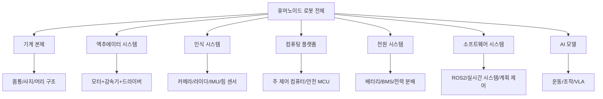

!!! note "용어 설명: 액추에이터(Actuator)"
    액추에이터는 로봇의 '근육'으로, 전기 에너지나 다른 형태의 에너지를 기계적 운동과 힘으로 변환합니다. 휴머노이드 로봇은 일반적으로 20–50개의 액추에이터를 가지고 있습니다. 제어 이론 관점에서 액추에이터는 시스템 입력 $u$의 물리적 구현이며, 그 대역폭, 토크 밀도, 백래시 및 응답 지연은 폐루프 제어 성능에 직접적인 영향을 미칩니다.

!!! note "용어 설명: 감속기(Reducer/Gearbox)"
    감속기는 모터 회전 속도를 낮추고 출력 토크를 증폭하는 장치입니다. 일반적인 유형으로는 하모닉 드라이브(Harmonic Drive), RV 감속기(Rotary Vector), 유성 기어박스(Planetary Gearbox)가 있습니다. 감속비 $N$은 출력 토크 $T_{out} = N \cdot T_{motor} \cdot \eta$ ($\eta$는 전달 효율)를 만들지만, 마찰, 관성 및 백래시도 도입합니다.

!!! note "용어 설명: IMU(Inertial Measurement Unit)"
    관성 측정 장치는 가속도계와 자이로스코프를 포함하며, 때로는 지자기 센서도 포함하여 자세, 각속도 및 선형 가속도를 감지합니다. IMU는 로봇 상태 추정의 핵심 센서이지만, 측정에는 바이어스 드리프트(bias drift)와 노이즈가 존재하므로 운동학, 시각 또는 힘 정보와의 융합이 필요합니다.

!!! note "용어 설명: VLA(Vision-Language-Action Model)"
    시각-언어-행동 모델은 이미지, 자연어 명령 및 로봇 동작을 통합적으로 모델링할 수 있는 AI 아키텍처입니다. 일반적으로 시각 인코더와 대규모 언어 모델을 백본으로 사용하여 저수준 동작 토큰 또는 정책 파라미터를 출력함으로써, 휴머노이드 로봇이 "빨간 상자를 왼쪽 탁자 위에 놓아"와 같은 자연어 명령에 따라 작업을 수행할 수 있게 합니다.

!!! note "용어 설명: BMS(Battery Management System)"
    배터리 관리 시스템은 배터리 안전을 보호하고 사용 시간을 최적화하는 전자 시스템으로, 배터리 상태 추정(SOC/SOH), 셀 밸런싱, 과충전/과방전 보호, 열 관리 및 고장 진단을 담당합니다. BMS의 기능 안전 등급은 전체 기계의 안전 인증에 직접적인 영향을 미칩니다.

### 1.1.5 로봇의 형식적 정의

제어 이론과 시스템 과학의 관점에서 로봇은 **동적 시스템**(Dynamical System)으로 형식화될 수 있습니다.

$$
\dot{x}(t) = f\big(x(t), u(t)\big), \quad y(t) = h\big(x(t), u(t)\big)
$$

여기서:

- $x(t) \in \mathbb{R}^n$ 는 시스템 상태 벡터, 예: 관절 각도, 각속도, 질량 중심 위치, 자세 쿼터니언 등;
- $u(t) \in \mathbb{R}^m$ 는 제어 입력, 예: 모터 전류, 토크 또는 전압;
- $y(t) \in \mathbb{R}^p$ 는 시스템 출력, 즉 센서 측정값;
- $f$ 는 상태 전이 함수, 시스템 동역학을 설명;
- $h$ 는 관측 함수, 센서 모델을 설명.

!!! note "용어 설명: 상태 공간(State Space)"
    상태 공간은 제어 이론에서 동적 시스템의 모든 가능한 상태를 설명하는 수학적 공간입니다. 시스템의 미래 진화는 현재 상태와 미래 입력에만 의존하며 과거와는 무관하며, 이러한 성질을 "마르코프 성질(Markov Property)"이라고 합니다. 휴머노이드 로봇의 상태 공간 차원은 일반적으로 30–100차원 이상이며, 이른바 "차원의 저주"를 초래합니다.

휴머노이드 로봇의 경우 $f$는 일반적으로 강체 동역학 방정식으로 주어집니다. 라그랑주 방정식을 예로 들면:

$$
M(q)\ddot{q} + C(q, \dot{q})\dot{q} + G(q) = S^T \tau + J_c^T F_c
$$

여기서:

- $q \in \mathbb{R}^n$는 일반화 좌표입니다;
- $M(q)$는 질량 행렬입니다;
- $C(q, \dot{q})$는 코리올리 힘과 원심력 항입니다;
- $G(q)$는 중력 항입니다;
- $\tau$는 관절 토크입니다;
- $S$는 선택 행렬입니다;
- $J_c$는 접촉점 야코비 행렬입니다;
- $F_c$는 지면 접촉력입니다.

!!! note "용어 설명: 야코비 행렬(Jacobian Matrix)"
    야코비 행렬 $J$는 로봇의 관절 공간 속도에서 작업 공간(예: 말단 효과기 또는 질량 중심) 속도로의 선형 매핑을 설명합니다: $v = J(q)\dot{q}$. 힘 제어에서 그 전치 $J^T$는 작업 공간 힘을 관절 토크로 매핑합니다: $\tau = J^T F$. 야코비 행렬은 로봇 운동학 및 정역학 분석의 핵심 도구입니다.

**에이전트(Agent)** 관점에서 로봇은 환경과 상호작용하는 자율 개체이며, **감지-결정-실행 루프(Sense-Decide-Act Loop)**를 따릅니다:

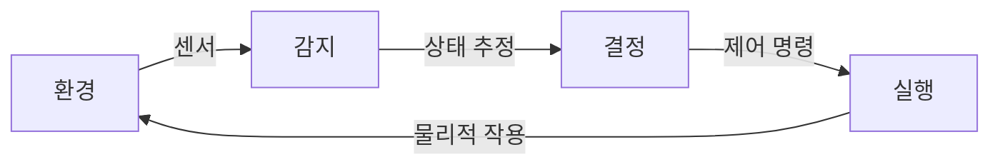

구현된 지능(Embodied AI) 프레임워크에서 지능은 알고리즘에만 존재하는 것이 아니라 **신체 형태, 센서 구성 및 동적 상호작용에 내장되어 있습니다**. 이 개념은 형태 계산(Morphological Computation)과 밀접하게 관련됩니다: 로봇 본체의 물리적 특성(예: 유연성, 질량 분포, 탄성 발) 자체가 계산 기능의 일부를 담당하여 제어기의 부담을 줄일 수 있습니다.

!!! note "용어 설명: 구현된 지능(Embodied AI)"
    구현된 지능은 지능적 행동이 물리적 신체를 가진 에이전트가 실제 환경과 상호작용함으로써 발생해야 하며, 단순한 기호 추론이나 오프라인 데이터 학습에 의존해서는 안 된다고 강조합니다. 그 철학적 기원은 메를로-퐁티(Merleau-Ponty)의 "신체 주체" 개념과 피아제(Piaget)의 인지 발달 이론으로 거슬러 올라갑니다. 휴머노이드 로봇의 경우, 구현된 지능은 운동 제어, 감지, 추론 및 사회적 상호작용이 신체-환경 결합 프레임워크 아래 통합되어야 함을 의미합니다.

!!! note "용어 설명: 형태 계산(Morphological Computation)"
    형태 계산은 에이전트 자체의 물리적 구조와 재료 특성을 활용하여 "계산" 작업의 일부를 수행함으로써 명시적 제어기의 복잡성을 줄이는 것을 의미합니다. 예를 들어, 새의 깃털과 뼈 구조, 치타의 척추 탄성, 휴머노이드 로봇의 유연한 관절은 어느 정도 "동적 안정성 문제를 미리 해결"하여 상위 제어를 더 간결하게 만들 수 있습니다.

### 1.1.6 휴머노이드 로봇의 분류학

휴머노이드 로봇을 체계적으로 연구하기 위해서는 명확한 분류 차원을 설정해야 합니다. 다음은 여섯 가지 차원에서 형식화된 분류 기준을 제시합니다:

**이동 방식에 따른 분류**

| 유형 | 정의 | 대표 제품 |
|------|------|---------|
| 이족 보행 | 두 다리만으로 이동 구현 | Tesla Optimus, Unitree H1, Figure 02 |
| 바퀴 이동 | 바퀴로 이동, 상체는 인간형 | Agility Digit(초기), 이동 서비스 로봇 |
| 다리-바퀴 혼합 | 다리와 바퀴를 모두 갖추고 모드 전환 가능 | 일부 연구 플랫폼, 바퀴-다리 복합 로봇 |
| 고정 베이스 | 상체만 있고 이동 능력 없음 | 원격 현장 로봇, 일부 서비스 로봇 |

**크기와 규모에 따른 분류**

| 유형 | 키 범위 | 전형적 응용 |
|------|---------|---------|
| 전신 성인형 | 1.5–1.8 m | 산업, 서비스, 가정 |
| 청소년/아동형 | 1.0–1.4 m | 교육, 연구, 동반 |
| 데스크탑형 | 0.3–0.8 m | 과학 연구, 교육, 엔터테인먼트 |

**구동 방식에 따른 분류**

| 유형 | 원리 | 장단점 |
|------|------|--------|
| 모터 구동 | 전동기 + 감속기 | 성숙, 제어 가능, 소음 낮음; 토크 밀도 제한 |
| 유압 구동 | 유압 펌프 + 실린더/액추에이터 | 높은 출력 밀도; 누유, 유지보수 복잡 |
| 공압 구동 | 가스 압력 구동 | 유연, 안전; 효율 낮음, 제어 어려움 |
| 힘줄/케이블 구동 | 모터가 케이블로 원격 관절 구동 | 원격 관성 감소; 마찰, 마모 |
| 인공 근육 | 공압 인공 근육, EAP 등 | 높은 생체 모방; 수명 및 반복성 낮음 |

**자율성 등급에 따른 분류**

| 등급 | 설명 | 휴머노이드 로봇 적용 상태 |
|------|------|------------------|
| L0 원격 조작 | 완전히 인간이 원격 제어 | 현재 대규모 산업 배치 |
| L1 보조 | 인간 주도, 로봇이 보조 제공 | 일부 조립 작업 |
| L2 반자율 | 로봇이 특정 하위 작업 수행, 인간 감독 | 현재 주류 목표 |
| L3 조건부 자율 | 제한된 환경 및 작업에서 자율 운행 | 연구 및 소규모 시범 |
| L4/L5 고도/완전 자율 | 개방 환경에서 장기 자율 운행 | 아직 미실현 |

**응용 분야에 따른 분류**

| 분야 | 전형적 작업 | 성숙도 |
|------|---------|--------|
| 산업 제조 | 운반, 분류, 나사 조임, 품질 검사 | 초기 시범 |
| 창고 물류 | 피킹, 운반, 팔레타이징 | 시범 단계 |
| 상업 서비스 | 안내, 환영, 소매 | 소규모 배치 |
| 의료 재활 | 간병, 보행 보조, 재활 훈련 | 연구/시범 |
| 가정 서비스 | 청소, 돌봄, 동반 | 극초기 |
| 과학 연구 교육 | 알고리즘 검증, 교육 시연 | 비교적 성숙 |

**상업화 단계에 따른 분류**

| 단계 | 특징 | 대표 |
|------|------|------|
| 실험실 시제품 | 단일 기술 검증, 반복 불가 | 대학 연구 프로젝트 |
| 엔지니어링 시제품 | 시스템 통합, 소량 운행 가능 | 초기 스타트업 제품 |
| 소량 검증 | 수십~수백 대, 실제 환경 테스트 | Unitree, Zhiyuan, UBTECH |
| 양산 제품 | 대규모 생산, 비용 통제 가능 | Tesla Optimus Gen 3(목표) |
| 규모화 운영 | 다중 시나리오 fleet 관리 | 아직 미성숙 |

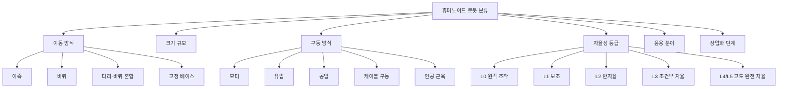

---

## 1.2 인간형 로봇의 발전 과정

인간형 로봇의 역사는 기술 발전사일 뿐만 아니라 수학, 제어 이론, 컴퓨터 과학, 재료 과학 및 경제학이 교차하는 축소판이기도 합니다. 다음에서는 과학적 사상의 근원에서 출발하여 그 발전 과정을 정리합니다.

### 1.2.1 기계적 자동 장치 시대 (18–19세기)

전력과 전자 제어가 등장하기 전, 인간형 자동 장치는 순수 기계 공학의 걸작이었습니다.

- **자크 드 보캉송(Jacques de Vaucanson)** 은 1738년에 '피리 부는 사람', '북 치는 사람', 그리고 유명한 '소화 오리'를 제작하여 복잡한 캠, 기어 및 링크 기구를 선보였습니다.
- **자케드로 부자(Jaquet-Droz)** 는 18세기 70년대에 '글 쓰는 사람', '그림 그리는 사람', '오르간 연주자'를 제작했으며, 캠에 프로그램을 코딩하고 캠을 교체하여 행동을 변경할 수 있었습니다.

이러한 자동 장치는 감지 및 의사 결정 능력이 없었지만, **복잡한 움직임이 기계적 메커니즘을 통해 정밀하게 코딩될 수 있음**을 증명했습니다. 그 제어 방식은 본질적으로 개방 루프였습니다. 캠 윤곽이 '프로그램'이고 시간이 '입력'이었습니다.

!!! note "용어 설명: 개방 루프 제어(Open-Loop Control)"
    개방 루프 제어는 제어기의 출력이 시스템의 실제 상태에 대한 피드백에 의존하지 않는 것을 의미합니다. 예를 들어, 기계적 자동 장치는 외부 교란을 고려하지 않고 미리 설정된 캠에 따라 움직입니다. 수학적 형태는 $u(t) = u_{ref}(t)$입니다. 개방 루프 제어는 간단하고 비용이 저렴하지만 불확실성에 대처할 수 없습니다. 현대 로봇은 일반적으로 폐쇄 루프 제어를 사용합니다.

### 1.2.2 사이버네틱스와 컴퓨터 과학의 탄생 (20세기 30–50년대)

현대 로봇 공학의 사상적 기반은 20세기 중반에 마련되었습니다.

- **노버트 위너(Norbert Wiener)** 는 1948년에 《사이버네틱스: 동물과 기계에서의 제어와 통신에 관한 과학》을 출판하여 피드백 제어, 정보 이론 및 시스템 과학의 통합 프레임워크를 제안했습니다.
- **클로드 섀넌(Claude Shannon)** 은 1948년에 《통신의 수학적 이론》을 발표하여 정보 이론의 기초를 마련했으며, 그의 엔트로피 개념 $H(X) = -\sum p(x)\log p(x)$는 감지, 학습 및 의사 결정을 위한 측정 도구가 되었습니다.
- **앨런 튜링(Alan Turing)** 은 1936년에 튜링 기계 모델을 제안하고 1950년에 '튜링 테스트'를 제안하여 인공지능의 사상적 전통을 열었습니다.

!!! note "용어 설명: 피드백 제어(Feedback Control)"
    피드백 제어는 시스템 출력과 원하는 기준값 사이의 오차에 따라 입력을 조정하여 시스템 상태를 목표로 향하게 하는 것을 의미합니다. 핵심 아이디어는 $u(t) = K\big(r(t) - y(t)\big)$이며, 여기서 $K$는 제어기 이득입니다. 위너는 피드백 메커니즘을 엔지니어링 시스템에서 생물학적, 사회적 및 인지 시스템으로 확장하여 사이버네틱스의 기초를 마련했습니다.

피드백 제어는 로봇이 불확실한 환경에서 안정성을 유지할 수 있게 해주며, 이는 이족 보행 로봇의 동적 균형을 위한 이론적 출발점입니다.

### 1.2.3 초기 인간형 로봇 (1960s–1980s)

이 시기에는 전자 컴퓨터와 서보 모터가 로봇에 적용되기 시작했습니다.

- **WABOT-1 (와세다 대학, 1973)**: 세계 최초의 완전한 인간형 로봇으로, 높이 약 2미터이며 두 다리, 두 팔 및 시각 시스템을 갖추고 정적 보행을 구현했습니다. 제어 컴퓨터는 당시의 미니컴퓨터 수준으로 연산 능력이 매우 제한적이었습니다.
- **WL-10 시리즈 (와세다 대학, 1980s)**: 보다 자연스러운 동적 보행을 구현하여 이후 이족 보행 제어 연구의 기초를 마련했습니다.
- **HD-2 (카토 연구실)**: 운동 협응 능력을 더욱 향상시켰습니다.

이 시기의 핵심 특징은 **정적 보행(Static Walking)** 이었습니다. 로봇의 질량 중심(Center of Mass, CoM) 투영이 항상 지지 다각형 내에 유지되어 속도는 느리지만 안정적이었습니다.

!!! note "용어 설명: 질량 중심(Center of Mass, CoM)"
    질량 중심은 물체의 질량 분포의 평균 위치입니다. 다중 강체 시스템의 경우 질량 중심 위치 $r_{CoM} = \frac{\sum_i m_i r_i}{\sum_i m_i}$입니다. 로봇 공학에서 질량 중심 투영이 지지 다각형 내에 있는지 여부는 정적 안정성을 판단하는 일반적인 기준입니다.

!!! note "용어 설명: 영점 모멘트(Zero Moment Point, ZMP)"
    영점 모멘트는 유고슬라비아(현 세르비아)의 로봇 공학자 미오미르 부코브라토비치(Miomir Vukobratović)가 1969년에 제안했습니다. ZMP는 지면 위의 한 점으로, 중력과 관성력에 의한 수평 모멘트가 0이 되는 지점입니다. 평면 접촉의 경우 ZMP가 지지 다각형 내에 있으면 로봇이 지지 경계 주위로 전복되지 않습니다. ZMP 기준은 지난 수십 년간 이족 보행 로봇 제어의 주류 안정성 판단 기준이었습니다.

### 1.2.4 동적 균형 시대 (1990s–2010s)

이 시기에는 제어 이론과 컴퓨팅 능력의 발전으로 인간형 로봇이 동적 보행, 달리기, 심지어 점프까지 가능해졌습니다.

- **혼다 ASIMO (2000)**: 시속 6km로 달리기, 계단 오르내리기, 장애물 회피, 음성 상호작용이 가능하여 2000년대 인간형 로봇의 기술적 상징이 되었습니다. 혼다는 2018년에 높은 비용과 불명확한 적용 시나리오를 이유로 ASIMO 개발을 중단했습니다.
- **소니 QRIO (2003)**: 소형 이족 보행 엔터테인먼트 로봇으로 강력한 운동 제어 능력을 보여주었지만 상업적 이유로 곧 생산이 중단되었습니다.
- **보스턴 다이내믹스 PETMAN/Atlas (2009–2013)**: PETMAN은 방호복 테스트용으로 사용되었고, Atlas는 유압 구동 이족 동적 운동의 최고 수준을 대표하며 뒤돌아 공중제비, 파쿠르, 장애물 넘기를 할 수 있었습니다.

이 시기의 핵심 기술은 다음과 같습니다.

1. **ZMP 궤적 계획 및 preview control (Kajita et al., 2003)**: 이족 보행을 선형 도립 진자 모델(LIPM) 하의 최적 제어 문제로 변환했습니다.
2. **모델 예측 제어(MPC)**: 유한 시간 영역 내에서 제어 입력을 순차적으로 최적화하여 제약 조건 및 다중 접촉 문제를 처리합니다.
3. **비선형 최적화 및 전신 제어(WBC)**: 하지, 상지 및 몸통의 움직임을 조정하여 복잡한 작업을 수행합니다.

!!! note "용어 설명: 선형 도립 진자 모델(Linear Inverted Pendulum Model, LIPM)"
    선형 도립 진자 모델은 카지타 슈지(Shuuji Kajita) 등이 제안했으며, 이족 보행 로봇을 무질량 막대를 통해 지면에 연결된 하나의 질점으로 단순화합니다. 질량 중심 높이가 일정하고 각운동량을 무시한다고 가정할 때, 수평 동역학은 선형 방정식입니다: $\ddot{x} = \frac{g}{z_c} x + \frac{1}{m z_c} u_x$, 여기서 $z_c$는 질량 중심 높이, $g$는 중력 가속도입니다. LIPM은 보행 계획을 크게 단순화했으며 preview control의 이론적 기초입니다.

!!! note "용어 설명: 모델 예측 제어(Model Predictive Control, MPC)"
    모델 예측 제어는 유한 예측 시간 영역 내에서 최적 제어 시퀀스를 계산하고 첫 번째 단계의 제어만 실행하는 순차적 최적화 방법입니다. 표준 형태는 다음과 같습니다: $\min_{u_{0:N-1}} \sum_{k=0}^{N-1} \ell(x_k, u_k) + V_f(x_N)$, $x_{k+1} = f(x_k, u_k)$ 및 제약 조건 $x_k \in \mathcal{X}, u_k \in \mathcal{U}$를 만족합니다. MPC는 제약 조건을 명시적으로 처리할 수 있어 이족 동적 균형 및 족식 로봇 제어의 주류 방법입니다.

!!! note "용어 설명: 전신 제어(Whole-Body Control, WBC)"
    전신 제어는 로봇의 여러 작업(예: 균형 유지, 발 궤적 추적, 물체 조작, 장애물 회피)을 동시에 조정하는 제어 시스템을 의미합니다. 일반적으로 작업 계층 또는 가중 최적화 프레임워크를 사용하여 우선순위가 높은 작업(예: 균형)을 우선순위가 낮은 작업의 null 공간에서 실행하여 핵심 제약 조건이 위반되지 않도록 합니다.

### 1.2.5 AI 융합 및 양산 시대 (2020s ~ 현재)

2020년대에 인간형 로봇이 다시 주목받고 있으며, 핵심 동력은 인공지능, 공급망 성숙 및 자본 투자입니다.

- **AI 대규모 모델 및 VLA**: RT-2, OpenVLA, GR00T N1, Figure Helix, π0 등의 모델은 시각, 언어 및 동작을 통합하여 로봇이 자연어 명령을 이해하고 새로운 작업으로 일반화할 수 있게 합니다.
- **강화 학습 및 sim-to-real**: 시뮬레이션에서 운동 및 조작 전략을 훈련하고 도메인 무작위화(Domain Randomization) 및 전이 학습을 통해 실제 로봇에 배포합니다.
- **공급망 성숙**: 하모닉 감속기, 프레임리스 토크 모터, 힘 센서, 고성능 컴퓨팅 플랫폼의 비용이 빠르게 하락하고 있습니다.
- **양산 시도**: Tesla Optimus, Figure BotQ, Unitree, 지위안 로봇 등이 수만 대에서 수백만 대 규모의 생산 능력을 계획하고 있습니다.

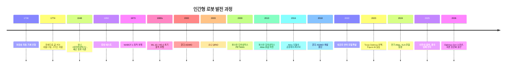

### 1.2.6 혼다 ASIMO: 기술적 정점과 상업적 어려움

혼다 ASIMO(Advanced Step in Innovative Mobility)는 2000년대 가장 대표적인 인간형 로봇입니다. 시속 6km로 달리기, 계단 오르내리기, 장애물 회피, 악수, 심지어 간단한 음성 상호작용이 가능했습니다.

그러나 혼다는 2018년 ASIMO 개발을 중단했습니다. 그 이유는 깊이 생각해볼 만합니다:

- **비용 과다**: 단일 대당 비용이 100만 달러를 초과하여 상업화가 불가능했습니다.
- **적용 시나리오 불명확**: 전시 및 접객 외에는 지속 가능한 비즈니스 모델을 찾기 어려웠습니다.
- **기술 폐쇄성**: 시스템이 고도로 맞춤화되어 확장이 어려웠습니다.

ASIMO의 사례가 보여주는 교훈: **기술이 앞선다고 해서 반드시 상업적 성공을 보장하는 것은 아니다**. 휴머노이드 로봇이 산업화되기 위해서는 비용, 적용 시나리오 및 유지보수성에서 돌파구를 마련해야 합니다.

### 1.2.7 보스턴 다이내믹스 Atlas: 동적 능력의 한계

보스턴 다이내믹스 Atlas는 이족 보행 동적 운동의 최고 수준을 대표하며, 백플립, 파쿠르, 장애물 넘기를 수행할 수 있습니다. 2024년, 보스턴 다이내믹스는 유압식 Atlas를 퇴역시키고 완전 전기식 모델을 출시하며, 특히 현대자동차 그룹의 공장 네트워크 내에서 상업적 응용 탐색으로 전환했습니다.

Atlas의 가치는 제어 이론과 로봇의 한계를 밀어붙이는 데 있지만, 상업화 경로는 여전히 탐색 중입니다.

### 1.2.8 2025–2026년 새로운 물결: 시연에서 실제 배치로

ASIMO 및 초기 Atlas와 달리, 2025–2026년의 새로운 물결은 **실제 시나리오에서의 장기 배치 및 양산 가능성**을 강조합니다:

- **Tesla Optimus**: 2026년 1월 21일, Gen 3가 프리몬트 공장에서 양산 시작; Model S/X 생산 라인이 Optimus 생산 라인으로 개조되어 연간 목표 생산량 100만 대; 텍사스 기가팩토리에 전용 공장 건설 중, 연간 목표 생산량 1000만 대.
- **Figure AI**: 2025년 9월 10억 달러 규모의 시리즈 C 자금 조달 완료, 기업 가치 390억 달러; Figure 02가 BMW 스파르탄버그 공장에서 11개월간 배치되어 9만여 개 부품을 운반하고 3만여 대의 BMW X3 생산에 참여.
- **중국 제조사**: 위슈 테크놀로지(宇树科技) 2025년 매출 17.08억 위안, 비경상손익 제외 순이익 약 6억 위안, 2026년 커촹반 IPO 승인 접수; 지위안 로보틱스(智元机器人) 2025년 출하량 Omdia 통계 기준 5168대로 세계 1위; 유비테크(优必选) 2025년 휴머노이드 로봇 주문 약 14억 위안.

이번 물결의 핵심 동력은 다음과 같습니다:

1. AI 대규모 모델과 VLA로 로봇이 더 강력한 인식, 이해 및 일반화 능력을 획득했습니다.
2. 정밀 제조 및 공급망 성숙으로 핵심 부품 비용이 빠르게 하락했습니다.
3. 인건비 상승과 제조업 자동화 수요가 명확한 시장을 제공했습니다.
4. 자본 시장이 선두 기업에 대규모 자금 지원을 제공할 의향이 있습니다.

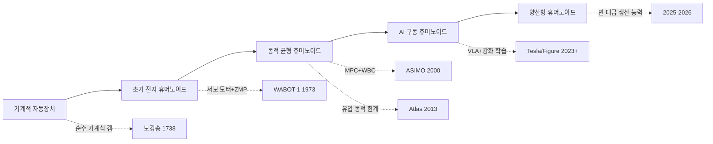

---

## 1.3 왜 지금이 휴머노이드 로봇의 핵심 창구 시기인가?

### 1.3.1 시장 규모 및 성장 예측

여러 연구 기관의 2025–2026년 최신 예측에 따르면, 글로벌 휴머노이드 로봇 시장은 빠르게 확장되고 있습니다:

| 연구 기관 | 2025년 시장 규모 | 2030년 예측 | 2032/2034/2035년 예측 | 핵심 판단 |
|---------|----------------|------------|----------------------|---------|
| MarketsandMarkets | 29.2억 달러 | 152.6억 달러 | — | CAGR 39.2% (2025–2030) |
| Research Nester | 31.4억 달러 | — | — | CAGR 38.5% (2026–2035) |
| BCC Research | 19.0억 달러 | 110.0억 달러 | — | CAGR 42.8% |
| MarketIntelo | 32.0억 달러 | — | 431.0억 달러 (2034) | CAGR 35.0% |
| Maximizemarketresearch | 29.2억 달러 | — | 295.7억 달러 (2032) | CAGR 39.2% |
| Goldman Sachs | — | — | 380억 달러 (2035) | 장기 낙관 시나리오 |
| Yahoo Finance / Counterpoint | 약 9억 달러 수익 (2025) | 70억 달러 (2030) | — | 상업 수익 중심 |

데이터 출처: MarketsandMarkets, Research Nester, BCC Research, MarketIntelo, Maximize Market Research, Goldman Sachs, Yahoo Finance (2025–2026년 보고서)

각 기관의 예측 차이가 크지만, 공통적인 추세는 다음과 같습니다: **2025년 시장 규모는 약 30억 달러 수준, 2026년에는 40–50억 달러에 이를 것으로 예상되며, 2030년에는 100–150억 달러를 돌파할 가능성이 있습니다.**

#### 1.3.1.1 예측 방법론: 하향식과 상향식

시장 예측은 본질적으로 미래 수요와 공급에 대한 정량적 추론이며, 일반적으로 두 가지 방법을 상호 검증에 사용합니다.

**하향식 (Top-Down)**: 거시적 TAM에서 출발하여 보급률을 곱합니다:

$$
M_{t} = TAM_t \cdot p_t \cdot ASP_t
$$

여기서:

- $M_t$: 시점 $t$의 예측 시장 규모 (달러);
- $TAM_t$: 총 접근 가능 시장 (Total Addressable Market), 이론적으로 해당 제품을 구매할 수 있는 모든 시장의 총액;
- $p_t$: 기술 보급률, 즉 목표 시장에서 실제로 휴머노이드 로봇을 채택하는 비율;
- $ASP_t$: 평균 판매 가격 (Average Selling Price).

**상향식 (Bottom-Up)**: 출하량과 평균 가격에서 출발합니다:

$$
M_t = N_t \cdot ASP_t
$$

여기서 $N_t$는 출하량입니다. 두 방법의 결과 차이가 너무 클 경우, 일반적으로 보급률이나 평균 가격에 대한 가정에 차이가 있음을 의미합니다. 2025년 각 기관의 시장 규모 예측은 19–32억 달러 사이이며, 차이는 주로 저가 연구용 본체 포함 여부, 서비스 및 소프트웨어 수익 포함 여부, 그리고 출고가 또는 최종 소비자 가격 적용 여부에서 비롯됩니다.

!!! note "용어 설명: CAGR (Compound Annual Growth Rate)"
    복합 연간 성장률은 일정 기간 동안 특정 지표의 연평균 성장 폭을 설명합니다. 초기 값이 $V_0$이고 최종 값이 $V_T$이며, 기간이 $T$년인 경우,
    $$
    CAGR = \left(\frac{V_T}{V_0}\right)^{1/T} - 1
    $$
    예를 들어 2025년 30억 달러에서 2030년 150억 달러로 성장하는 경우, $CAGR = (150/30)^{1/5}-1 \approx 37.9\%$입니다. CAGR은 연간 변동성을 평활화하지만 경로 위험을 반영하지는 않습니다.

!!! note "용어 설명: ASP (Average Selling Price)"
    평균 판매 가격은 총 판매 수익을 총 출하량으로 나눈 값입니다. 휴머노이드 로봇 시장의 ASP는 매우 빠르게 하락합니다: 2023년 연구/프로토타입 단계에서는 ASP가 10만 달러를 초과할 수 있었지만, 2025년 중국 제조업체는 일부 모델을 1–3만 달러로 낮췄습니다. 시장 예측에서 ASP 곡선에 대한 가정이 다르면 수익 예측에 큰 영향을 미칠 수 있습니다.

#### 1.3.1.2 시나리오 분석 및 신뢰 구간

단일 예측 수치는 불확실성을 쉽게 가릴 수 있습니다. 더 나은 방법은 시나리오 가정을 설정하여 낙관, 기준, 비관의 세 가지 경로를 구성하는 것입니다.

2030년 출하량 $N_{30}$과 ASP $P_{30}$을 확률 변수로 설정하면, 시장 규모는

$$
M_{30} = N_{30} \cdot P_{30}
$$

로그 정규 분포 가정을 사용하여 90% 신뢰 구간을 추정할 수 있습니다:

$$
\ln M_{30} \sim \mathcal{N}\left(\ln(N_{base}P_{base}), \sigma_N^2 + \sigma_P^2 + 2\rho\sigma_N\sigma_P\right)
$$

여기서:

- $N_{base}, P_{base}$: 기준 출하량 및 기준 ASP;
- $\sigma_N, \sigma_P$: 출하량 및 ASP의 로그 표준 편차, 예측 불확실성을 반영;
- $\rho$: 출하량과 ASP의 상관 계수, 일반적으로 음수 (규모 확대에 따른 가격 하락 동반).

기준 시나리오 $N_{base}=500$천 대, $P_{base}=30{,}000$달러, $\sigma_N=0.5$, $\sigma_P=0.3$, $\rho=-0.3$을 예로 들면:

```python
import numpy as np

N_base, P_base = 500e3, 30_000
sigma_N, sigma_P, rho = 0.5, 0.3, -0.3

mu = np.log(N_base * P_base)
sigma = np.sqrt(sigma_N**2 + sigma_P**2 + 2*rho*sigma_N*sigma_P)

samples = np.random.lognormal(mu, sigma, 100_000)
print(f"2030 시장 규모 중앙값: ${np.median(samples)/1e9:.2f}B")
print(f"90% 신뢰 구간: ${np.percentile(samples,5)/1e9:.1f}B - ${np.percentile(samples,95)/1e9:.1f}B")
```

실행 결과는 대략 다음과 같습니다: 중앙값 150억 달러, 90% 신뢰 구간 60–370억 달러. 이 범위는 서로 다른 기관의 2030년 예측이 100억 달러에서 380억 달러까지 다양한 이유를 설명합니다.

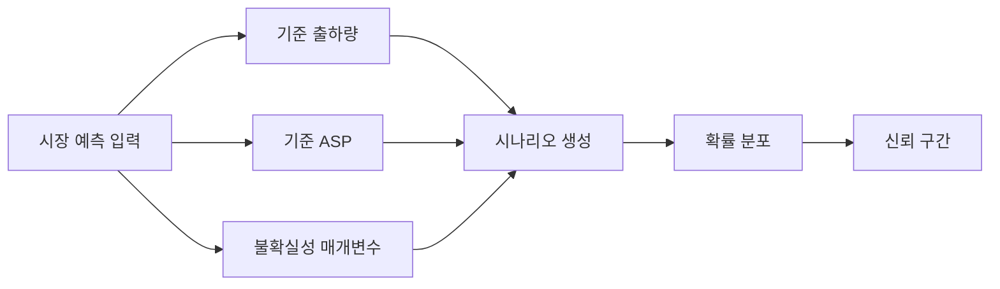

### 1.3.2 출하량 및 지역 구도

금액 예측보다 출하량 데이터가 실제 진행 상황을 더 잘 반영합니다:

| 지표 | 데이터 | 출처/시기 |
|------|------|----------|
| 2025년 글로벌 휴머노이드 로봇 설치량 | 약 16,000대 | Counterpoint Research (2026년 1월) |
| 중국의 글로벌 설치량 비중 | 80% 이상 | Counterpoint Research (2026년 1월) |
| 2027년 글로벌 출하량 예측 | 115,000대 | ABI Research |
| 2027년 누적 설치량 예측 | 100,000대 이상 | Counterpoint Research |
| 2026년 1분기 중국 휴머노이드 로봇 수출 전년 대비 증가율 | 210% | 중국 해관 데이터 (2026년 1–4월) |
| 2026년 중국 휴머노이드 로봇 판매량 예측 | 28,000대 | 모건스탠리 |

**2025년 글로벌 시장 점유율 (설치량 기준):**

| 기업 | 본사 | 2025년 시장 점유율 | 대표 제품 | 주요 적용 분야 |
|------|------|----------------|---------|------------|
| AgiBot (지위안 로봇) | 상하이 | 약 31% | X2, G2 | 제조, 물류, 서비스 |
| Unitree (위수 테크놀로지) | 항저우 | 약 27% | G1, H1 | 연구, 산업, 소비 |
| UBTECH (유비테크) | 선전 | 약 5% | Walker S/S1/S2 | 자동차 제조 |
| Leju (러쥐 로봇) | 선전 | 약 5% | Kuavo | 교육, 의료, 서비스 |
| Tesla | 미국 | 약 5% | Optimus Gen 2/3 | 내부 공장, 물류 |
| 기타 | 글로벌 | 약 27% | 다양한 제품 | 다양 |

데이터 출처: Robozaps, Counterpoint Research, Omdia, 36氪, 虎嗅 (2025–2026년)

위 표에서 볼 수 있듯이, 중국 기업들은 2025년 글로벌 설치량 기준 상위 4위 중 3자리를 차지하며 합계 시장 점유율이 70%를 초과했습니다. 이는 중국의 공급망, 원가 경쟁력 및 제조 역량에서의 우위를 반영합니다.

### 1.3.3 투자 열기와 자본 증권화

2025~2026년은 휴머노이드 로봇 투자의 폭발기이자 자본 증권화의 원년입니다.

**글로벌 주요 자금 조달 이벤트 (2025~2026):**

| 회사 | 시기 | 라운드 | 금액 | 가치 평가/하이라이트 |
|------|------|------|------|----------|
| Figure AI | 2025년 9월 | Series C | 10억 달러 이상 | 가치 평가 390억 달러 |
| Apptronik | 2025년 | Series A | 4억 300만 달러 | 메르세데스-벤츠, 구글 투자 |
| EngineAI | 2025~2026년 | A/B 라운드 | 1억 4천만~2억 달러 | 중국 선전 |
| RobotEra | 2025~2026년 | A/Growth | 1억 4천만 달러 이상 | 지리, 베이치 투자 |
| Galbot | 2025년 12월 | — | 3억 달러 | — |
| Leju Robotics | 2025년 10월 | — | 2억 달러 | — |
| Spirit AI | 2026년 4월 | Series A | 1억 4,500만 달러 | 임베디드 인텔리전스 플랫폼 |

**중국 시장 자금 조달 및 상장 동향 (2025~2026):**

| 회사 | 시기 | 이벤트 | 규모/가치 평가 |
|------|------|------|----------|
| Galaxy General | 2025년 | 단일 라운드 자금 조달 | 3억 달러 초과, 가치 평가 211억 위안 |
| Unitree Technology | 2026년 3월 | 과학기술혁신판 IPO 접수 | 약 42억 위안 모집, 가치 평가 약 420억 위안 |
| UBTECH | 2025년 | 홍콩 증시 3차 재융자 | 합계 약 65억 홍콩 달러, 누적 융자 86억 9,100만 홍콩 달러 |
| Zhiyuan Robot | 2025~2026년 | 주식 개혁 + 역합병 상장 | 가치 평가 150억 위안 이상 |
| Leju Robotics | 2025년 | Pre-IPO 라운드 | 약 15억 위안 |
| Fourier Intelligence | 2025~2026년 | 상장 지도 등록 | 가치 평가 100억 위안대 |

데이터 출처: Crunchbase, 36氪, 펑황망, 신랑재경, AI 중국망 (2025~2026년)

**주요 관찰 사항**:

- 2025년 글로벌 로봇 스타트업 자금 조달 총액은 85억 달러를 초과하여 2021년 이후 최고치를 기록했습니다. 이 중 휴머노이드 로봇 전용 자금 조달은 약 43억 달러로 2018년 대비 약 6배 증가했습니다.
- 2025년 중국 3분기까지 로봇 분야 자금 조달은 500억 위안(약 70억 달러)에 달하여 전년 동기 대비 250% 증가했습니다.
- 2026년 1분기, 중국 휴머노이드 로봇 전 산업 체인 자금 조달 건수는 100건을 초과했으며, 단일 최대 금액은 25억 위안, 10억 위안 이상의 대규모 자금 조달은 15건이었습니다.
- 20개 이상의 임베디드 인텔리전스 기업이 2026년 초에 명확한 상장 계획을 밝혔습니다.

### 1.3.4 비용 하락 곡선

비용 하락은 휴머노이드 로봇 산업화의 핵심 신호입니다. 골드만삭스와 뱅크오브아메리카 등의 기관 데이터에 따르면:

| 지표 | 데이터 | 출처 |
|------|------|------|
| 2023~2024년 제조 비용 감소율 | 40% | Goldman Sachs (via Deloitte) |
| 현재 서양 공장 파일럿 단위 비용 | 9~10만 달러 | Bank of America (2026) |
| 현재 중국 BOM 비용 | 약 3만 5천 달러 | Bank of America (2026) |
| 2030년 단위 비용 예측 | 1만 7천 달러 미만 | Bank of America |
| Unitree G1 판매 가격 | 약 1만 6천 달러 | 공개 판매 가격 |
| Unitree R1 판매 가격 (2025년 7월) | 5,900 달러 | 공개 판매 가격 |
| Tesla Optimus 목표 판매 가격 | 2~3만 달러 | 머스크, 2026년 1월 |

데이터 출처: Goldman Sachs, Bank of America, Optimusk.blog, 공개 판매 가격 정보 (2025~2026년)

Unitree는 2025년 7월에 5,900달러의 R1 휴머노이드 로봇을 출시하여 시장을 놀라게 했습니다. 이 가격대는 이전에 달성하는 데 수년이 걸릴 것으로 예상되었습니다. 이는 비용 압축에 있어 중국 공급망의 엄청난 잠재력을 보여줍니다.

### 1.3.5 노동 시장의 구조적 수요

휴머노이드 로봇 산업화의 근본적인 동인 중 하나는 노동 구조 변화입니다.

- **고령화**: 중국의 60세 이상 인구 비율은 이미 20%를 초과했으며, 제조업 현장 인력 부족은 계속 확대되고 있습니다. 일본과 유럽도 심각한 고령화에 직면해 있습니다.
- **위험 작업 대체**: 화학, 광업, 건설, 구조 등 분야에는 많은 위험 작업이 존재하며, 휴머노이드 로봇은 인간을 대신하여 고위험 환경에 투입될 수 있습니다.
- **유연 생산 수요**: 전통적인 산업용 로봇은 반복 작업에 능숙하지만, 다품종 소량 생산, 빈번한 라인 변경이 필요한 생산 방식에 있어 휴머노이드 로봇은 이론적으로 더 큰 유연성을 제공합니다.

#### 1.3.5.1 고령화와 노동력 부족의 정량화

인구 구조 변화는 **노년 부양비**(Old-Age Dependency Ratio, OADR)로 측정할 수 있습니다.

$$
OADR_t = \frac{P_{65+,t}}{P_{15-64,t}} \times 100\%
$$

여기서 $P_{65+,t}$는 65세 이상 인구, $P_{15-64,t}$는 15~64세 생산 가능 인구입니다. 중국의 2023년 OADR은 약 21.1%였으며, 2035년에는 30%를 초과할 것으로 예상됩니다. 일본은 2023년에 이미 50%를 넘었습니다. 이는 생산 가능 인구 100명당 부양해야 할 노인 인구가 21명에서 30명 이상으로 증가하여 노동력 공급 압박이 지속적으로 커지고 있음을 의미합니다.

따라서 제조업 임금은 상승 압력을 받고 있습니다. 특정 직무의 연간 인건비를 $C_h$라고 하고, 로봇이 해당 직무를 대체하는 연간 등가 비용을 $C_r$이라고 할 때, 대체 조건은 다음과 같습니다.

$$
C_r < C_h
$$

로봇의 연간 등가 비용은 다음과 같이 분해할 수 있습니다.

$$
C_r = \frac{C_{robot} - S_{residual}}{T_{life}} + C_{maint} + C_{energy}
$$

여기서:

- $C_{robot}$: 로봇 구매 비용 (달러);
- $S_{residual}$: 설계 수명 종료 시 잔존 가치 (달러);
- $T_{life}$: 설계 수명 (년);
- $C_{maint}$: 연간 유지 보수 비용 (달러/년);
- $C_{energy}$: 연간 에너지 비용 (달러/년).

!!! note "용어 설명: 노년 부양비 (Old-Age Dependency Ratio)"
    노년 부양비는 고령화가 노동력 공급 압력에 미치는 영향을 측정하는 핵심 지표로, 65세 이상 인구와 15~64세 생산 가능 인구의 비율로 정의됩니다. OADR이 높을수록 생산 가능 인구 한 명이 부담해야 할 노인이 많아지고, 사회적 연금 및 의료 지출 압력이 커지며, 노동력 공급이 상대적으로 위축됨을 의미합니다.

#### 1.3.5.2 인간-로봇 대체 손익분기점 분석

대체 조건을 시간당 임금으로 변환하는 것이 더 직관적입니다. 로봇의 설계 수명이 8년, 연간 가동 시간이 6,000시간(약 하루 16시간 × 375일), 구매 비용이 5만 달러, 연간 유지 보수 비용이 구매 가격의 10%(5,000달러/년), 연간 에너지 비용이 1,000달러이고 잔존 가치를 무시한다고 가정하면:

$$
C_r = \frac{50{,}000}{8} + 5{,}000 + 1{,}000 = 12{,}250 \text{ 달러/년}
$$

로봇 시간당 비용:

$$
c_r = \frac{12{,}250}{6{,}000} \approx 2.04 \text{ 달러/시간}
$$

해당 직무의 인간 근로자 연간 총 비용(임금, 사회 보험, 복리 후생 포함)이 6만 달러이고 연간 근무 시간이 2,000시간이라면 시간당 비용은 30달러/시간입니다. 이 경우 로봇 대체로 인한 인건비 우위는 약 $30 - 2.04 = 27.96$ 달러/시간입니다. 로봇의 효율이 인간의 50%에 불과하더라도 등가 시간당 비용은 4.08달러/시간에 불과하여 여전히 상당한 우위를 점합니다.

```python
# 인간-로봇 대체 손익분기점 계산
C_robot = 50_000      # 구매 비용 (달러)
T_life = 8            # 설계 수명 (년)
hours_per_year = 6000 # 연간 가동 시간
C_maint = 0.10 * C_robot  # 연간 유지 보수 비용
C_energy = 1_000      # 연간 에너지 비용

C_r = C_robot / T_life + C_maint + C_energy
c_r = C_r / hours_per_year
print(f"로봇 연간 등가 비용: ${C_r:,.0f}/년")
print(f"로봇 시간당 비용: ${c_r:.2f}/시간")

# 손익분기점 인간 시간당 임금
C_h_human = 60_000    # 인간 연간 총 비용
h_human = 2000        # 인간 연간 근무 시간
c_h = C_h_human / h_human
breakeven_efficiency = c_r / c_h
print(f"인간 시간당 비용: ${c_h:.2f}/시간")
print(f"손익분기 효율 임계값: {breakeven_efficiency*100:.1f}%")
```

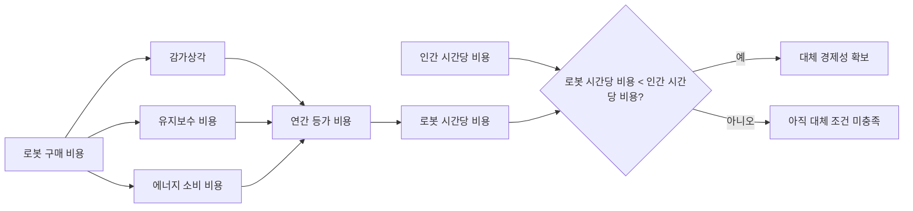

!!! note "용어 설명: 손익분기점(Break-Even Point)"
    손익분기점은 두 가지 방안의 총 비용이 동일해지는 임계 상태를 의미합니다. 인간-로봇 대체 분석에서는 로봇의 효율이 인간 대비 어느 정도 수준이 되어야 경제적으로 동등해지는지 판단하는 데 자주 사용됩니다. 이 분석은 교육 비용, 작업 적응성, 사회적 수용도 등 비재무적 요소를 무시하므로, 실제 의사 결정에는 보다 포괄적인 TCO 평가가 필요합니다.

휴머노이드 로봇의 경제성 분석에 대한 자세한 내용은 제13장 13.3절을 참조하십시오.

### 1.3.6 AI 능력의 도약

휴머노이드 로봇이 2020년대에 다시 주목받게 된 핵심 요인은 인공지능 능력의 도약에 있습니다:

- **컴퓨터 비전**: 객체 탐지, 의미론적 분할, 깊이 추정 능력이 크게 향상되어 로봇이 환경을 더 잘 이해할 수 있게 되었습니다.
- **대규모 언어 모델(LLM)**: 로봇이 복잡한 명령과 맥락을 이해할 수 있게 합니다.
- **VLA 모델**: 시각, 언어, 행동을 통합하여 로봇이 자연어 명령에 따라 조작 작업을 수행할 수 있게 합니다. 대표적인 모델로는 RT-2, OpenVLA, GR00T N1, Figure Helix, π0 등이 있습니다.
- **강화 학습**: 시뮬레이션 환경에서 보행(locomotion) 및 조작 기술을 훈련하고, sim-to-real 전이를 통해 실제 로봇에 적용합니다.

이러한 AI 능력은 전통적인 제어 방법이 개방 환경에서 가지는 한계를 보완하여, 휴머노이드 로봇이 '사전 프로그래밍된 동작 실행'에서 '지각에 기반한 자율 의사 결정'으로 진화하도록 합니다.

### 1.3.7 시장 예측 방법론의 경계

시장 예측 수치는 주목할 만하지만, 그 방법론적 경계를 이해하는 것도 equally 중요합니다. 산업 분석에서는 일반적으로 다음 프레임워크를 사용합니다:

!!! note "용어 설명: TAM/SAM/SOM"
    - **TAM(Total Addressable Market)**: 총 잠재 시장, 이론적으로 특정 제품이나 서비스를 구매할 수 있는 모든 시장의 총액을 의미합니다.
    - **SAM(Serviceable Addressable Market)**: 서비스 가능 시장, 기업이 실제로 접근하여 서비스를 제공할 수 있는 시장 부분으로, 지역, 유통 채널, 기술 능력에 의해 제한됩니다.
    - **SOM(Serviceable Obtainable Market)**: 획득 가능 시장, 기업이 단기간 내에 실제로 확보할 수 있는 시장 점유율을 의미합니다.

예를 들어, 2035년 글로벌 휴머노이드 로봇 TAM이 3800억 달러라면, 특정 기업의 SAM은 산업 제조 세분 시장에 국한될 수 있으며, SOM은 생산 능력, 유통 채널, 브랜드에 따라 달라집니다.

**기술 채택 S 곡선(Logistic Curve)**

신기술의 시장 침투율은 일반적으로 S 곡선을 따릅니다:

$$
P(t) = \frac{L}{1 + e^{-k(t - t_0)}}
$$

여기서:

- $L$은 시장 침투율 상한(일반적으로 100% 또는 특정 포화 값으로 설정);
- $k$는 성장률 매개변수;
- $t_0$는 변곡점 시간, 즉 침투율 증가가 가장 빠른 시점;
- $P(t)$는 시점 $t$에서의 시장 침투율입니다.

S 곡선의 변곡점은 최대 성장률에 해당하며, 투자 결정 및 생산 능력 계획에 중요한 의미를 갖습니다.

!!! note "용어 설명: 학습 곡선(Learning Curve)"
    학습 곡선은 누적 생산량이 증가함에 따라 단위 비용이 감소하는 정량적 관계를 설명합니다. 고전적인 형태는 다음과 같습니다:
    $$
    C_n = C_1 \cdot n^{-b}
    $$
    여기서 $C_n$은 n번째 제품의 비용, $C_1$은 첫 번째 제품의 비용, $b$는 학습 지수입니다. 학습률 $LR$은 생산량이 두 배가 될 때마다 비용이 감소하는 비율로 정의됩니다: $LR = 1 - 2^{-b}$. 예를 들어, $b = 0.32$이면 $LR \approx 20\%$, 즉 생산량이 두 배가 될 때마다 비용이 20% 감소합니다.

!!! note "용어 설명: 경험 곡선(Experience Curve)"
    경험 곡선은 1960년대 보스턴 컨설팅 그룹(BCG)이 제안한 것으로, 학습 곡선을 더 넓은 비즈니스 시나리오로 확장한 것입니다. 여기에는 제조 학습뿐만 아니라 공급망 최적화, 설계 개선, 규모의 경제, 프로세스 혁신이 포함됩니다. 경험 곡선은 전략 컨설팅에서 업계 선두 기업이 비용 측면에서 지속적인 우위를 유지하는 이유를 설명하는 데 자주 사용됩니다.

**시장 예측에 대한 비판적 고찰**

1. **예측 기간이 길수록 불확실성이 커집니다**: 2035년 예측은 기술 성숙도, 정책 규제, 사회적 수용도에 대한 가정에 크게 의존합니다.
2. **출하량과 수익이 완전히 일치하지는 않습니다**: 저가형 교육/연구용 로봇은 출하량을 늘릴 수 있지만 수익 기여도는 제한적일 수 있습니다.
3. **중미 시장 구조 차이**: 중국의 공급망 비용 우위로 인해 중국 제조업체가 출하량에서 선두를 차지할 수 있지만, 고급 응용 분야와 소프트웨어 서비스 가치는 여전히 미국 기업이 주도할 가능성이 있습니다.
4. **거품 위험**: 2025~2026년의 높은 밸류에이션과 높은 자금 조달액에는 상당한 자본 시장 심리적 요소가 포함되어 있으므로, '자금 조달 가능'과 '수익 창출 가능'을 구분해야 합니다.

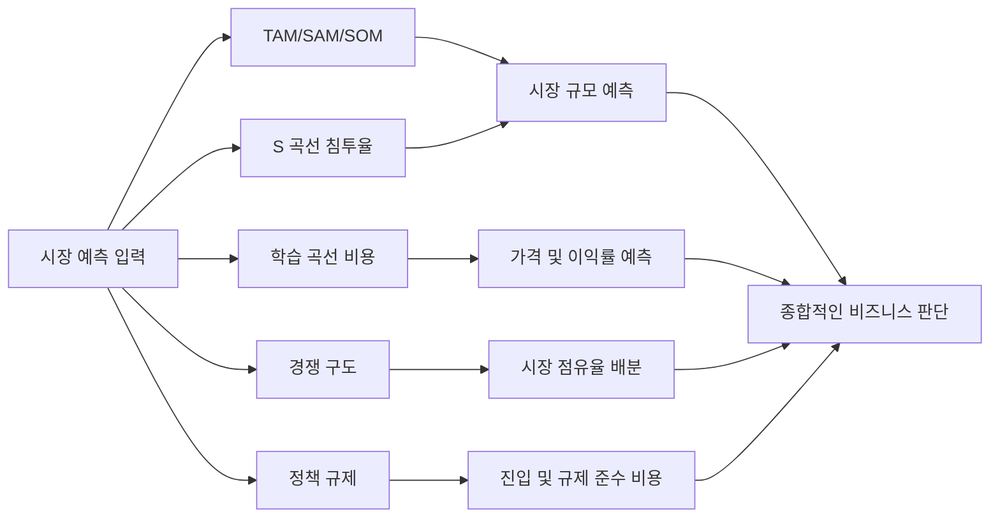

**Python 예제 1: 기술 채택 S 곡선 매개변수 피팅 및 예측**

다음 코드는 과거 출하량 데이터를 사용하여 Logistic 곡선을 피팅하고 미래 시장 침투율을 예측합니다:

```python
import numpy as np
import matplotlib.pyplot as plt
from scipy.optimize import curve_fit

# 가상의 연도 및 글로벌 출하량 (천 대)
years = np.array([2023, 2024, 2025, 2026])
shipments_k = np.array([1.5, 5.0, 16.0, 40.0])

# 가상의 장기 포화 출하량 5000 천 대
L = 5000.0

# 침투율로 표준화
P = shipments_k / L

# Logistic 모델
def logistic(t, k, t0):
    return L / (1 + np.exp(-k * (t - t0)))

# 피팅
popt, _ = curve_fit(logistic, years, shipments_k, p0=[0.8, 2028])
k, t0 = popt
print(f"피팅 매개변수: k={k:.4f}, t0={t0:.2f}")

# 예측
future_years = np.arange(2023, 2036)
predicted = logistic(future_years, k, t0)

plt.figure(figsize=(8, 5))
plt.scatter(years, shipments_k, color='red', label='과거 출하량 (천 대)')
plt.plot(future_years, predicted, label=f'Logistic 피팅: k={k:.3f}, t0={t0:.1f}')
plt.axhline(L, color='gray', linestyle='--', label=f'포화량 L={L} 천 대')
plt.xlabel('연도')
plt.ylabel('글로벌 출하량 (천 대)')
plt.title('휴머노이드 로봇 시장 채택 S 곡선 예측')
plt.legend()
plt.grid(True)
plt.tight_layout()
plt.show()
```

!!! note "용어 설명: 곡선 피팅(Curve Fitting)"
    곡선 피팅은 최적화 방법을 통해 관측 데이터 집합에 가장 근접한 수학적 곡선을 찾는 과정입니다. 일반적인 방법으로는 최소제곱법(Least Squares)과 최대우도추정이 있습니다. 피팅된 매개변수의 불확실성은 신뢰 구간과 잔차 분석을 통해 평가해야 합니다.

**Python 예제 2: 학습 곡선 비용 프로젝션**

다음 코드는 학습 곡선에 따라 누적 생산량 증가 시 단위 BOM 비용을 추정합니다:

```python
import numpy as np
import matplotlib.pyplot as plt

C1 = 100_000.0  # 첫 번째 BOM 비용 (달러)
learning_rate = 0.20  # 생산량 두 배가 될 때마다 비용 20% 감소
b = -np.log2(1 - learning_rate)

n_units = np.logspace(0, 6, 100)  # 1 ~ 1e6 대
C_n = C1 * n_units ** (-b)
```

plt.figure(figsize=(8, 5))
plt.loglog(n_units, C_n)
plt.axhline(17_000, color='red', linestyle='--', label='Bank of America 2030 목표 $17k')
plt.axhline(5_900, color='green', linestyle='--', label='Unitree R1 판매가 $5.9k')
plt.xlabel('누적 생산량 (대)')
plt.ylabel('단위당 BOM 비용 (달러)')
plt.title(f'학습 곡선: 학습률 {learning_rate*100:.0f}%')
plt.legend()
plt.grid(True, which='both', linestyle='--', alpha=0.5)
plt.tight_layout()
plt.show()

# 목표 비용 달성에 필요한 누적 생산량 계산
target_cost = 17_000
n_required = (target_cost / C1) ** (-1 / b)
print(f"${target_cost:,.0f} 달성에 필요한 누적 생산량 약: {n_required:,.0f} 대")
```

!!! note "용어 설명: BOM (Bill of Materials)"
    자재 명세서(BOM)는 제품 하나를 제조하는 데 필요한 모든 부품과 그 비용을 나열한 목록입니다. BOM 비용은 하드웨어 제품 원가 분석의 기초가 되지만, 연구개발, 금형, 인증, 마케팅, 물류 및 애프터서비스 등 간접 비용은 포함되지 않습니다.

---

## 1.4 핵심 모순: 걸을 수 있는 로봇 vs 팔 수 있는 로봇

휴머노이드 로봇의 산업화가 직면한 핵심 판단은 시장에 두 가지 성공 기준이 존재한다는 것입니다. 하나는 '시연을 완료할 수 있는 것'이고, 다른 하나는 '제품이 될 수 있는 것'입니다.

| 차원 | 걸을 수 있는 로봇 (시연형) | 팔 수 있는 로봇 (제품형) |
|------|----------------------|----------------------|
| **목표** | 기술 가능성 시연 | 고객 문제 해결 및 수익 창출 |
| **환경** | 통제됨, 평탄함, 조명 고정 | 개방적, 불확실함, 동적 변화 |
| **운영 시간** | 몇 분에서 몇 시간 | 하루 8–16시간, 연간 300일 이상 |
| **고장률** | 실패 및 재시작 허용 | 99% 이상의 가용성 달성 필수 |
| **비용** | 비용 불문, 성능 추구 | 고객 수용 가능 범위 내로 통제 필수 |
| **유지보수** | 엔지니어의 현장 디버깅 | 일반 기술자의 신속한 수리 가능 |
| **규정 준수** | 인증 불필요 | 안전, EMC, 전기 등 인증 필수 |

이러한 격차는 네 가지 차원에서 이해할 수 있습니다.

### 1.4.1 신뢰성: '달릴 수 있음'에서 '고장 나지 않음'으로

시연형 로봇은 몇 가지 특정 동작(예: 몇 걸음 걷기, 컵 집기)에서만 잘 작동하면 될 수 있습니다. 그러나 제품형 로봇은 수만에서 수십만 시간의 운영 동안 성능 안정성을 유지해야 합니다.

**구체적인 과제는 다음과 같습니다:**

- **기계적 마모**: 감속기, 베어링, 기어는 장기간 사용 시 마모와 백래시 증가가 발생합니다.
- **전자 부품 노후화**: 커패시터, 배터리, 커넥터는 고온, 진동 환경에서 노후화되어 고장 납니다.
- **센서 드리프트**: IMU 제로 바이어스 드리프트, 카메라 캘리브레이션 변화, 힘 센서 온도 드리프트는 인식 및 제어 성능 저하를 유발합니다.
- **소프트웨어 안정성**: 알고리즘이 경계 조건에서 이상 현상을 보일 수 있으며, 완벽한 고장 감지 및 복구 메커니즘이 필요합니다.

산업용 로봇을 기준으로 삼으면, 자동차 생산 라인의 산업용 로봇은 일반적으로 MTBF(평균 무고장 시간)가 60,000시간 이상 요구됩니다. 반면, 현재 대부분의 휴머노이드 로봇의 MTBF는 이 수준에 훨씬 못 미칩니다. Figure 02는 BMW에서 11개월 배치 동안 약 1,250시간 운영을 완료했는데, 이는 업계의 중요한 이정표이지만 8시간/일 × 300일/년 = 2,400시간/년의 산업 표준에는 여전히 차이가 있습니다.

!!! note "용어 설명: 신뢰성 함수 R(t)"
    신뢰성 함수 $R(t)$는 제품이 시간 구간 $[0, t]$에서 고장 없이 작동할 확률을 나타냅니다. 일정 고장률 $\lambda$를 갖는 지수 분포의 경우:
    $$
    R(t) = e^{-\lambda t}
    $$
    평균 무고장 시간 $MTBF = \frac{1}{\lambda}$입니다. 지수 분포는 무작위 고장 단계에 적용되지만, 초기 고장 및 마모 고장 단계에는 적용되지 않습니다.

!!! note "용어 설명: MTBF (Mean Time Between Failures)"
    평균 무고장 시간은 수리 가능한 장비의 신뢰성을 측정하는 핵심 지표로, 두 번의 연속 고장 사이의 평균 시간을 의미합니다. 일정 고장률의 지수 분포에서 $MTBF = 1/\lambda$입니다. MTBF가 높을수록 장비가 고장날 가능성이 낮습니다. MTBF는 통계적 개념이며, 장비가 정확히 MTBF 시간에 고장난다는 것을 의미하지는 않습니다.

!!! note "용어 설명: 배스튜브 곡선 (Bathtub Curve)"
    배스튜브 곡선은 제품 전 수명 주기 동안의 고장률 변화 추세를 설명하며, 세 단계로 나뉩니다:
    1. **초기 고장기 (Infant Mortality)**: 고장률이 시간에 따라 감소하며, 일반적으로 제조 결함, 설계 문제로 인해 발생합니다;
    2. **무작위 고장기 (Useful Life)**: 고장률이 거의 일정하며, 정상 사용 단계에 해당합니다;
    3. **마모 고장기 (Wear-Out)**: 고장률이 시간에 따라 증가하며, 재료 노화, 피로, 마모로 인해 발생합니다.
    배스튜브 곡선의 형태는 제품 엔지니어링에서 '번인(Burn-in)' 및 예방적 유지보수 전략에 대한 통찰을 제공합니다.

### 1.4.2 비용: '백만 달러'에서 '몇만 달러'로

비용은 휴머노이드 로봇 상업화를 제약하는 가장 중요한 요소 중 하나입니다. 다음은 주요 비용 구성입니다 (전신 이족 보행 휴머노이드 로봇 기준):

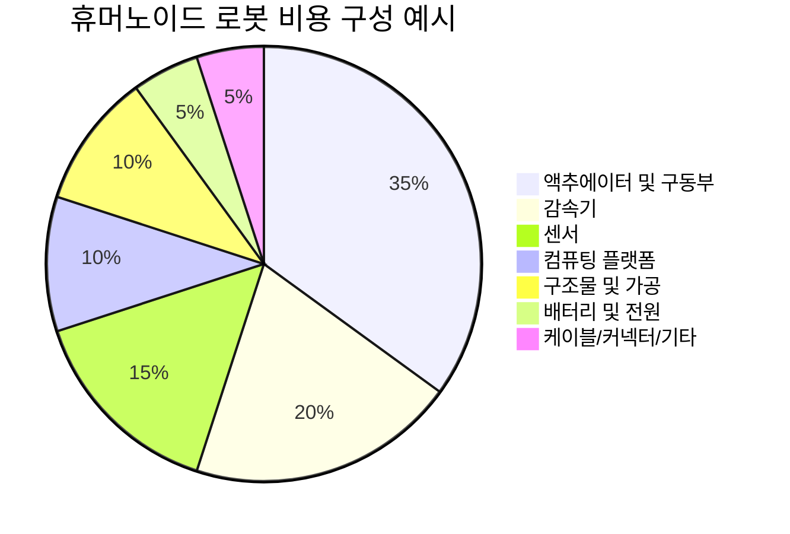

**주요 부품 단가 참고 (2025–2026년 시장 수준):**

| 부품 | 고급 수입 | 국산 대체 | 설명 |
|--------|---------|---------|------|
| 하모닉 감속기 | 2000–5000 위안 | 800–2000 위안 | 수량 약 10–20개 |
| RV 감속기 | 5000–15,000 위안 | 2000–6000 위안 | 주로 다리 대하중 관절에 사용 |
| 프레임리스 토크 모터 | 3000–10,000 위안 | 1000–4000 위안 | 수량 약 10–20개 |
| 6축 힘 센서 | 5000–20,000 위안 | 2000–8000 위안 | 주로 발목/손목에 사용 |
| 라이다 | 3000–10,000 위안 | 1000–5000 위안 | 예: Livox Mid-360 |
| 고성능 컴퓨팅 플랫폼 | 5000–20,000 위안 | 3000–10,000 위안 | 예: Jetson AGX Orin/Thor |

전신 휴머노이드 로봇의 BOM(자재 명세서) 비용은 2025–2026년에 구성에 따라 크게 다릅니다: 서방 업체의 파일럿 비용은 약 9–10만 달러인 반면, 중국 업체의 BOM은 이미 약 3.5만 달러로 낮아졌습니다. 대규모 상업화를 위해서는 단위 비용을 3만 달러 미만으로 더 낮춰야 합니다.

**비용 모델링 프레임워크**

제품 총비용은 다음과 같이 분해할 수 있습니다:

$$
C_{total} = C_{BOM} + C_{NRE} + C_{manufacturing} + C_{logistics} + C_{service}
$$

여기서:

- $C_{BOM}$: 자재 명세서 비용;
- $C_{NRE}$: 일회성 엔지니어링 개발 비용 (Non-Recurring Engineering), 연구개발, 금형, 인증, 소프트웨어 포함;
- $C_{manufacturing}$: 제조 비용, 인건비, 설비 감가상각, 공장 운영 포함;
- $C_{logistics}$: 물류 및 재고 비용;
- $C_{service}$: 애프터서비스, 수리, 교육 비용.

!!! note "용어 설명: NRE (Non-Recurring Engineering)"
    NRE는 칩 테이프아웃 비용, 금형 비용, 인증 비용, 소프트웨어 개발 비용 등 일회성, 비반복적인 엔지니어링 개발 비용을 의미합니다. NRE는 제품 수명 주기 총 판매량에 걸쳐 상각되며, 판매량이 많을수록 단위 NRE 비용은 낮아집니다.

### 1.4.3 유지보수성: '엔지니어 동반'에서 '현장 수리'로

상업적으로 배치된 로봇은 신속한 수리, 부품 교체 및 소프트웨어 업그레이드를 지원해야 합니다. 이를 위해서는 다음이 필요합니다:

- **모듈식 설계**: 액추에이터, 배터리, 센서 등 부품을 신속하게 분리 및 교체 가능해야 합니다.
- **표준화된 인터페이스**: 특수 공구 및 교육 비용 절감.
- **원격 진단**: 플릿 관리 플랫폼을 통해 로봇 상태를 모니터링하고 잠재적 고장을 사전에 발견.
- **OTA 업그레이드**: 소프트웨어를 원격으로 업데이트하여 버그 수정 및 성능 최적화.
- **예비 부품 공급**: 완벽한 예비 부품 재고 및 물류 시스템 구축.

예를 들어, 자동차 공장의 로봇에 고장이 발생하면 일반적으로 30분 이내에 운영을 재개해야 합니다. 휴머노이드 로봇이 이와 유사한 수준에 도달하려면 설계 단계부터 유지보수성을 고려해야 합니다.

!!! note "용어 설명: MTTR (Mean Time To Repair)"
    평균 수리 시간은 고장 발생부터 시스템이 정상 작동을 재개할 때까지 필요한 평균 시간을 의미합니다. 여기에는 고장 감지, 진단, 수리, 검증 및 복구 시간이 포함됩니다. 가용성(Availability)과 MTBF 및 MTTR의 관계는 다음과 같습니다: $A = \frac{MTBF}{MTBF + MTTR}$.

!!! note "용어 설명: 가용성 (Availability)"
    가용성 $A$는 시스템이 규정된 조건에서 규정된 시간 동안 작업 가능 상태에 있을 확률입니다. 수리 가능한 시스템의 경우 정상 상태 가용성은 다음과 같습니다:
    $$
    A = \frac{MTBF}{MTBF + MTTR}
    $$
    이는 신뢰성과 유지보수성을 종합적으로 반영합니다. 가용성 향상은 MTBF 증가(더 신뢰성 있음) 또는 MTTR 감소(더 수리하기 쉬움) 두 가지 경로를 통해 달성할 수 있습니다.

!!! note "용어 설명: OTA (Over-The-Air)"
    무선 업데이트는 무선 네트워크를 통해 장치 소프트웨어를 원격으로 업데이트하는 것을 의미합니다. OTA를 통해 로봇은 배치 후에도 취약점 수정, 알고리즘 최적화, 기능 추가가 가능하며, 리콜이나 현장 유지보수가 필요하지 않습니다. OTA는 또한 사이버 보안 위험을 수반하므로, 신원 인증, 암호화 및 롤백 메커니즘이 필요합니다.

### 1.4.4 규정 준수: '연구실 자유'에서 '시장 진입'으로

휴머노이드 로봇은 작업 환경에서 인간과 밀접하게 상호 작용하므로, 기능 안전, 전기 안전, 전자파 적합성, 기계 안전 등 관련 표준을 준수해야 합니다. 주요 표준은 다음과 같습니다:

| 표준 | 적용 범위 | 핵심 요구 사항 |
|------|---------|---------|
| ISO 13482:2014 | 개인 케어 로봇 | 속도, 힘, 접촉 압력 제한 |
| ISO/TS 15066 | 협동 로봇 | 인간-로봇 협업 안전 요구 사항 |
| IEC 61508 | 기능 안전 | 제어 시스템 안전 무결성 수준 (SIL) |
| ISO 13849 | 기계 안전 제어 시스템 | 제어 시스템 안전 관련 부품 |
| IEC 62368 | 오디오/비디오 및 정보 기술 장비 안전 | 전기 안전, 화재 위험 |

지역별로 시장 진입 요구 사항도 다릅니다:

- **EU**: CE 마크
- **미국**: UL 인증, FCC 전자파 적합성
- **중국**: CR 인증(중국 로봇 인증), CCC 등

규정 준수는 설계 선택(예: 최대 동작 속도, 외장 재질, 비상 정지 버튼 위치)에 영향을 미칠 뿐만 아니라 테스트 비용과 시간에도 직접적인 영향을 미칩니다. 전체 안전 인증 주기는 6~18개월이 소요될 수 있으며, 비용은 수만 달러에서 수십만 달러에 이릅니다.

!!! note "용어 설명: 기능 안전(Functional Safety)"
    기능 안전이란 시스템이 고장 조건에서도 안전한 상태를 유지할 수 있는 능력을 말합니다. IEC 61508은 안전 무결성 수준 SIL 1~4를 정의하며, SIL 4가 최고 수준입니다. 기능 안전을 구현하려면 위험 분석, 이중화 설계, 고장 감지, 안전 차단 메커니즘 및 시스템 검증이 필요합니다.

!!! note "용어 설명: EMC(Electromagnetic Compatibility)"
    전자파 적합성이란 장비가 전자기 환경에서 정상적으로 작동하면서 다른 장비에 허용할 수 없는 전자기 간섭을 일으키지 않는 능력을 말합니다. EMC 테스트에는 방사 방출(RE), 전도 방출(CE), 정전기 방전(ESD), 전기적 빠른 과도 현상(EFT) 등이 포함됩니다.

### 1.4.5 시스템 신뢰성: 직렬 모델

여러 부품으로 구성된 로봇에서 어느 하나의 핵심 부품이 고장 나면 전체 기기가 고장 나는 경우, 시스템 신뢰성은 각 부품 신뢰성의 곱(직렬 모델)으로 근사할 수 있습니다.

$$
R_s(t) = \prod_{i=1}^{n} R_i(t)
$$

각 부품의 고장률이 일정하고 $\lambda_i$인 경우:

$$
R_s(t) = \exp\left(-\sum_{i=1}^{n} \lambda_i t\right), \quad MTBF_s = \frac{1}{\sum_{i=1}^{n} \lambda_i}
$$

이는 각 부품의 신뢰성이 매우 높더라도 부품 수가 증가하면 전체 기기 MTBF가 현저히 감소한다는 것을 의미합니다. 예를 들어, 로봇에 30개의 액추에이터가 있고 각 액추에이터의 MTBF가 100,000시간인 경우, 액추에이터 서브시스템만의 직렬 MTBF는 약 3,333시간입니다.

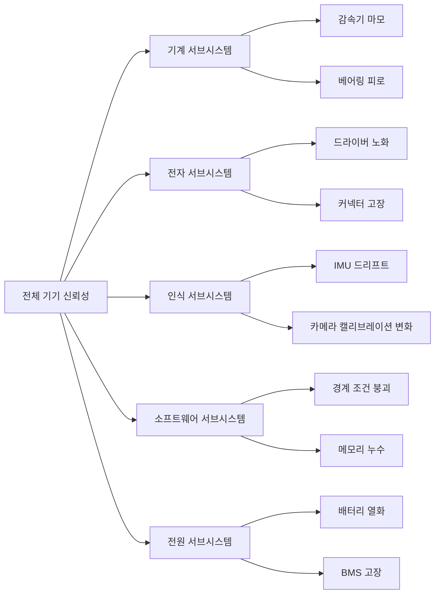

**Python 예제 3: 직렬 시스템 신뢰성 추정**

```python
import numpy as np
import matplotlib.pyplot as plt

# 각 핵심 서브시스템의 MTBF(시간) 가정
components = {
    '액추에이터×30': 100_000 / 30,
    '감속기×20': 150_000 / 20,
    '센서 키트': 80_000,
    '컴퓨팅 플랫폼': 120_000,
    '배터리/BMS': 60_000,
    '케이블 커넥터': 50_000,
}

# 각 부품 고장률 계산
lambdas = {k: 1/v for k, v in components.items()}
total_lambda = sum(lambdas.values())
system_mtbf = 1 / total_lambda
print(f"시스템 총 고장률: {total_lambda:.6f} /시간")
print(f"시스템 MTBF: {system_mtbf:,.0f} 시간")

# 신뢰성 함수 그래프
t = np.linspace(0, 10_000, 500)
R_system = np.exp(-total_lambda * t)
R_target = np.exp(-t / 60_000)  # 산업용 로봇 참고

plt.figure(figsize=(8, 5))
plt.plot(t, R_system, label=f'휴머노이드 로봇 직렬 모델 (MTBF={system_mtbf:.0f}h)')
plt.plot(t, R_target, '--', label='산업용 로봇 참고 (MTBF=60,000h)')
plt.xlabel('운영 시간 t (시간)')
plt.ylabel('신뢰성 R(t)')
plt.title('직렬 시스템 신뢰성의 시간에 따른 감소')
plt.legend()
plt.grid(True)
plt.tight_layout()
plt.show()
```

!!! note "용어 설명: 고장률(Failure Rate)"
    고장률 $\lambda(t)$은 단위 시간당 고장이 발생할 확률 밀도이며, 일반적으로 FIT(Failures In Time, 10⁻⁹ 회/시간) 또는 %/1000시간 단위로 사용됩니다. 일정한 고장률에서 $\lambda = 1/MTBF$입니다.

**Python 예제 4: 가용성 A와 MTBF/MTTR의 관계**

```python
import numpy as np
import matplotlib.pyplot as plt

# MTBF 고정, MTTR 변화
mtbf = 1000  # 시간
mttr_range = np.linspace(1, 200, 100)
A_fixed_mtbf = mtbf / (mtbf + mttr_range)

# MTTR 고정, MTBF 변화
mttr = 24  # 시간
mtbf_range = np.linspace(100, 5000, 100)
A_fixed_mttr = mtbf_range / (mtbf_range + mttr)

fig, axs = plt.subplots(1, 2, figsize=(12, 5))

axs[0].semilogy(mttr_range, 1 - A_fixed_mtbf)
axs[0].set_xlabel('MTTR (시간)')
axs[0].set_ylabel('비가용성 1-A')
axs[0].set_title(f'MTBF={mtbf}h 일 때, MTTR이 비가용성에 미치는 영향')
axs[0].grid(True)

axs[1].plot(mtbf_range, A_fixed_mttr)
axs[1].set_xlabel('MTBF (시간)')
axs[1].set_ylabel('가용성 A')
axs[1].set_title(f'MTTR={mttr}h 일 때, MTBF가 가용성에 미치는 영향')
axs[1].grid(True)

plt.tight_layout()
plt.show()

# 예제: 99% 가용성 달성, MTTR=24h 에 필요한 MTBF
target_A = 0.99
mttr_example = 24
required_mtbf = mttr_example * target_A / (1 - target_A)
print(f"MTTR={mttr_example}h 일 때, 가용성 {target_A*100:.0f}% 달성을 위한 MTBF ≥ {required_mtbf:,.0f}h")
```

---

## 1.5 0에서 1까지의 일곱 가지 도약

휴머노이드 로봇을 개념에서 확장 가능한 제품으로 전환하려면 일곱 가지 단계적 도약 단계를 거쳐야 합니다. 아래 그림은 이 과정의 거시적 흐름을 보여줍니다:


### 1.5.1 단계와 NASA TRL / DoD MRL 매핑

각 단계의 기술 및 제조 성숙도를 보다 정확하게 평가하기 위해 NASA의 기술 성숙도 등급(TRL)과 미국 국방부의 제조 성숙도 등급(MRL)에 매핑할 수 있습니다:

| 도약 단계 | TRL 범위 | MRL 범위 | 핵심 과제 | 주요 위험 | 종료 기준 |
|---------|---------|---------|---------|---------|---------|
| 실험실 시제품 | TRL 1–3 | MRL 1–2 | 원리 검증, 핵심 기술 돌파 | 이론적 불가능, 성능 한계 | 핵심 기술이 통제된 조건에서 재현 가능 |
| 엔지니어링 시제품 | TRL 4–5 | MRL 3–4 | 시스템 통합, 구조/열/전원 설계 | 통합 실패, 신뢰성 부족 | 시제품이 연속 작동 및 지정 작업 완료 가능 |
| 소량 검증 | TRL 6 | MRL 5–6 | 제조 가능성, 공급망, 현장 테스트 | 공정 불안정, 공급업체 리스크 | 수십 대의 시제품이 실제 환경에서 안정적으로 작동 |
| 양산 준비 | TRL 7 | MRL 7–8 | 생산 라인 설계, BOM 최적화, 품질 시스템 | 생산 능력 확대 지연, 수율 저하 | 생산 라인 검증 통과, 공정 흐름 고정 |
| 현장 배치 | TRL 8 | MRL 8 | 고객 현장 검증, 가치 증명 | 고객 요구 불일치, 현장 적응 어려움 | 고객이 상업 주문 또는 장기 계약 체결 |
| 운영 유지보수 | TRL 9 | MRL 9 | fleet 관리, 원격 진단, 예비 부품 | 고장률 높음, 서비스 비용 통제 불가 | 가용성이 계약 약속 수준에 도달 |
| 대규모 복제 | TRL 9 | MRL 10 | 다지역, 다중 시나리오, 비즈니스 모델 복제 | 시장 포화, 경쟁 심화 | 지속 가능한 수익성 및 대규모 성장 |

!!! note "용어 설명: TRL(Technology Readiness Level)"
    기술 성숙도 등급은 NASA가 제안한 것으로, 기술이 개념에서 실제 적용까지의 성숙도를 평가하는 데 사용됩니다. TRL 1은 기본 원리 관찰, TRL 9는 실제 임무에서 검증된 시스템입니다. TRL은 기술 프로젝트 관리, 예산 배분 및 위험 평가의 중요한 도구입니다.

!!! note "용어 설명: MRL(Manufacturing Readiness Level)"
    제조 성숙도 등급은 미국 국방부가 제안한 것으로, 제조 공정이 개념에서 완전 생산까지의 성숙도를 평가하는 데 사용됩니다. MRL 1은 제조 가능성 식별, MRL 10은 완전 저속/전속 생산 및 지속적 개선입니다. MRL은 TRL과 상호 보완적이며, 함께 기술 산업화 성숙도를 결정합니다.

### 1.5.2 첫 번째 단계: 실험실 시제품

**목표**: 핵심 기술의 실현 가능성 증명.

이 단계는 일반적으로 대학이나 기업 연구소에서 수행되며, 연구자들은 이족 동적 보행, 전신 제어 또는 정밀 조작과 같은 특정 문제에 집중합니다. 시제품은 기성 부품과 많은 수동 매개변수 조정을 사용할 수 있으며, 엔지니어링보다는 논문 발표나 특허 출원에 중점을 둡니다.

**핵심 인도물**:

- 개념 검증 시제품
- 핵심 알고리즘 프로토타입
- 학술 논문 또는 특허

**주요 위험**: 이론적 가정이 성립하지 않음, 핵심 성능 지표 달성 불가.

### 1.5.3 두 번째 단계: 엔지니어링 시제품

**목표**: 기술 프로토타입을 반복 가능한 시스템으로 전환.

엔지니어링 시제품 단계에서는 시스템 통합, 구조 강도, 열 관리, 전원 효율 및 소프트웨어 안정성에 주목하기 시작합니다. 부품은 점차 기성품에서 맞춤형 부품으로 전환되며, 제어 알고리즘은 실제 하드웨어와 깊이 결합됩니다.

**핵심 인도물**:

- 반복 작동 가능한 완전한 시스템
- 구조 설계 도면 및 BOM
- 제어 소프트웨어 프레임워크
- 초기 테스트 보고서

### 1.5.4 세 번째 단계: 소량 검증

**목표**: 설계의 제조 가능성 및 공급망 안정성 검증.

일반적으로 수십 대에서 수백 대의 시제품을 제작하여 실제 또는 실제에 가까운 환경에서 장기 테스트를 수행합니다. 이 단계에서는 설계 결함, 공정 문제 및 공급업체 리스크가 드러나며, 양산을 위한 입력을 제공합니다.

**2025–2026년 사례**: UBTECH Walker S2 월 생산 능력 300대 초과; Leju 2025년 수천 대의 본체 로봇 대량 납품; Unitree, Zhiyuan이 만 대급 생산 능력 계획에 진입.

### 1.5.5 네 번째 단계: 양산 준비

**목표**: 엔지니어링 시제품을 반복 가능하고 추적 가능하며 확장 가능한 생산 공정으로 전환.

양산 준비 단계에는 생산 라인 설계, 공정 고정, BOM 최적화, 공급업체 고정, 테스트 프로세스 표준화 및 품질 시스템 구축이 포함됩니다.

**2025–2026년 사례**: Tesla가 Fremont Model S/X 생산 라인을 Optimus Gen 3 생산 라인으로 개조, 연간 생산 능력 목표 100만 대; Figure AI가 BotQ 공장 완공, 초기 연간 생산 능력 12,000대, 10만 대로 확장 계획.

### 1.5.6 다섯 번째 단계: 현장 배치

**목표**: 실제 고객 시나리오에서 가치 검증.

배치 단계에서는 로봇을 공장 생산 라인, 창고 물류 또는 상업 서비스와 같은 실제 고객 환경에 투입합니다. 이 단계에서는 현장 적응, 인간-로봇 협업, 이상 상황 처리 및 운영 지원 문제를 해결해야 합니다.

**2025–2026년 사례**: Figure 02가 BMW 스파르탄부르크 공장에서 11개월 배치 완료; BMW 2026년 여름 라이프치히 공장에서 Hexagon AEON 휴머노이드 로봇 시범 운영 시작; Tesla Optimus가 Fremont 및 텍사스 공장에서 배터리 분류, 부품 운반 및 품질 검사 작업 수행.

### 1.5.7 여섯 번째 단계: 운영 유지보수

**목표**: 로봇의 장기적 안정적 운영 보장 및 지속적 최적화.

운영 유지보수 단계에서는 원격 모니터링, 고장 진단, OTA 업그레이드, 예비 부품 공급, 수리 교육 및 성능 최적화에 중점을 둡니다. 이 단계의 데이터 피드백은 제품 반복의 중요한 근거가 됩니다.

### 1.5.8 일곱 번째 단계: 대규모 복제

**목표**: 여러 지역 및 시나리오에서 대규모 확산.

대규모 복제 단계는 제품, 공급망, 서비스 및 비즈니스 모델이 성숙되어 여러 지역 및 시나리오에서 대규모로 확산될 수 있음을 의미합니다.

**2025–2026년 관찰**: 업계는 다섯 번째 단계에서 여섯 번째, 일곱 번째 단계로 넘어가는 과정에 있습니다. 대부분의 제조업체는 여전히 시범 및 소량 단계에 있으며, 진정한 대규모 복제는 아직 오지 않았습니다.

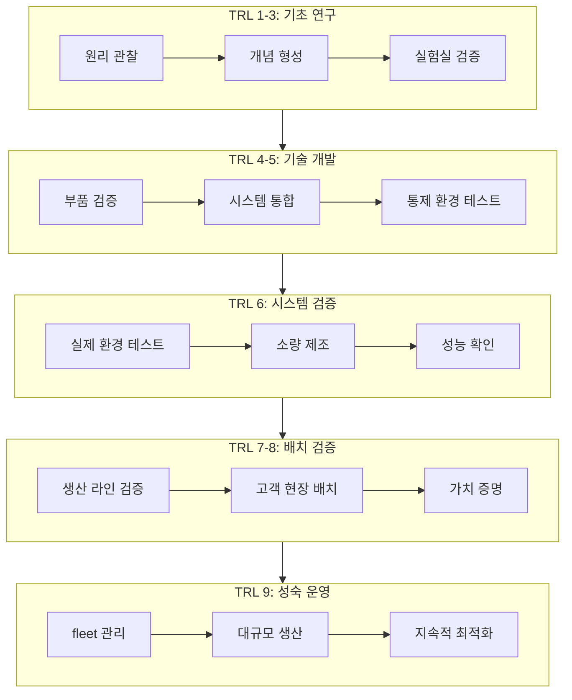

### 1.5.9 단계 게이트(Stage-Gate) 관리

고복잡성 제품의 경우 일반적으로 단계 게이트(Stage-Gate) 관리 방법을 사용합니다: 각 단계가 끝날 때 "게이트"를 설정하고, 검토를 통과해야만 다음 단계로 진행할 수 있습니다. 검토 차원은 다음과 같습니다:

| 차원 | 검토 질문 |
|------|---------|
| 기술 성숙도 | 핵심 기술이 단계 목표에 도달했는가? |
| 제조 준비도 | 공정, 공급망, 생산 능력이 준비되었는가? |
| 비용 통제 | 목표 BOM 비용을 달성할 수 있는가? |
| 품질 및 신뢰성 | 테스트 데이터가 신뢰성 목표를 충족하는가? |
| 규정 준수 인증 | 안전 인증 계획이 명확한가? |
| 상업적 실현 가능성 | 고객 가치와 비즈니스 모델이 성립하는가? |

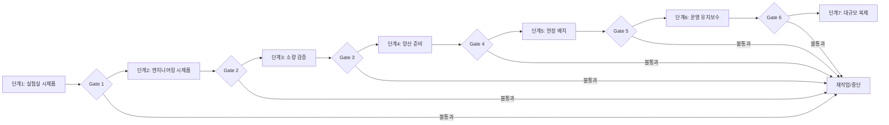

---

## 1.6 시스템 복잡성의 원천

휴머노이드 로봇이 산업화되기 어려운 근본적인 이유는 고도로 복잡한 시스템 공학 대상이기 때문입니다. 그 복잡성은 주로 다음과 같은 측면에서 비롯됩니다.

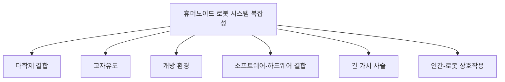

### 1.6.1 다학제 결합

휴머노이드 로봇은 기계 공학, 전자 공학, 제어 이론, 컴퓨터 과학, 인공지능, 재료 과학, 인간 공학 등 여러 학문을 동시에 포함합니다. 이러한 학문들의 설계 목표와 제약 조건은 종종 서로 충돌합니다. 예를 들어, 경량화는 더 얇은 구조 부재를 요구하지만 강성과 강도를 낮춥니다. 고성능 AI 알고리즘은 더 큰 연산 능력을 필요로 하지만 전력 소비와 방열 부담을 증가시킵니다.

!!! note "용어 설명: 강결합과 약결합"
    시스템 과학에서 두 하위 시스템의 상태나 매개변수가 서로 강하게 영향을 미치면 강결합이라고 하고, 영향이 작거나 무시할 수 있으면 약결합이라고 합니다. 휴머노이드 로봇에서 배터리 용량, 방열, 연산 능력, 구조 강도 및 동적 성능 사이에는 강결합이 존재합니다. 연산 능력을 높이면 전력 소비와 발열이 증가하여 더 큰 배터리와 방열 구조가 필요하고, 이는 무게를 증가시켜 동적 균형과 에너지 소비에 영향을 미칩니다.

#### 1.6.1.1 설계 결합 행렬과 설계 구조 행렬

하위 시스템 간의 결합을 정량화하기 위해 **설계 구조 행렬**(Design Structure Matrix, DSM)을 도입할 수 있습니다. 시스템에 $n$개의 하위 시스템이 있다고 가정하고, 결합 행렬 $\mathcal{D} \in \{0,1\}^{n \times n}$을 정의합니다. 여기서 $d_{ij}=1$은 하위 시스템 $i$의 설계 결정이 하위 시스템 $j$의 성능에 직접적인 영향을 미친다는 것을 의미합니다. 휴머노이드 로봇 주요 하위 시스템의 DSM은 다음과 같이 표현할 수 있습니다.

|  | 구조 | 액추에이터 | 인지 | 연산 | 전원 | 소프트웨어 | AI |
|--|------|--------|------|------|------|------|----|
| 구조 | — | 1 | 1 | 1 | 1 | 0 | 0 |
| 액추에이터 | 1 | — | 0 | 1 | 1 | 1 | 0 |
| 인지 | 1 | 0 | — | 1 | 1 | 1 | 1 |
| 연산 | 1 | 1 | 1 | — | 1 | 1 | 1 |
| 전원 | 1 | 1 | 1 | 1 | — | 1 | 0 |
| 소프트웨어 | 0 | 1 | 1 | 1 | 1 | — | 1 |
| AI | 0 | 0 | 1 | 1 | 0 | 1 | — |

행렬에서 1의 밀도가 높을수록 시스템 전체의 결합도가 높아집니다. 위 표의 밀도는 약 44%로, 일반적인 소비자 가전 제품(보통 15–25%)보다 훨씬 높습니다. 높은 결합은 단일 설계 변경이 연쇄적인 수정을 유발할 수 있음을 의미하며, 시스템 통합 및 검증의 복잡성을 증가시킵니다.

시스템 결합도는 다음과 같이 정의할 수 있습니다.

$$
\rho_c = \frac{\sum_{i \neq j} d_{ij}}{n(n-1)}
$$

여기서 $\rho_c$는 결합도, $n$은 하위 시스템 수입니다. 위 예시에서 $n=7$, 비대각선 1의 개수는 26이므로 $\rho_c = 26/(7\times6) \approx 0.619$입니다. 가중 DSM을 사용하면 영향 강도를 구분할 수도 있습니다.

!!! note "용어 설명: 설계 구조 행렬 (Design Structure Matrix)"
    설계 구조 행렬은 시스템 공학에서 작업, 구성 요소 또는 하위 시스템 간의 의존 관계를 설명하는 부울 행렬 또는 가중 행렬입니다. DSM을 클러스터 분석하여 높은 결합도를 가진 모듈 그룹을 식별하고, 모듈식 설계 및 인터페이스 표준화를 안내할 수 있습니다. DSM은 1981년 Donald Steward가 프로젝트 관리 연구에서 처음 제안했으며, 현재 복잡한 제품 개발에 널리 사용됩니다.

#### 1.6.1.2 에너지-질량-연산 능력 삼각 제약

휴머노이드 로봇에는 근본적인 에너지-질량-연산 능력 삼각 제약이 존재합니다. 온보드(onboard) 연산 능력을 높이면 전력 소비와 열 방출이 동시에 증가하는 반면, 배터리 에너지 밀도는 느리게 증가하므로 다음과 같은 결과가 발생합니다.

$$
E_{battery} \geq \left(P_{compute} + P_{actuators} + P_{sensors}\right) \cdot t_{operation}
$$

여기서:

- $E_{battery}$: 배터리 사용 가능 에너지 (Wh);
- $P_{compute}, P_{actuators}, P_{sensors}$: 연산, 액추에이터, 인지 전력 소비 (W);
- $t_{operation}$: 목표 작동 시간 (h).

연산 전력 소비가 $\Delta P$만큼 증가하면, 작동 시간 $t$를 유지하기 위해 배터리 용량을 늘려야 합니다.

$$
\Delta E = \Delta P \cdot t
$$

리튬 이온 배터리 에너지 밀도 $\rho_E \approx 250 \text{ Wh/kg}$로 계산하면, 배터리 무게 증가량은 다음과 같습니다.

$$
\Delta m = \frac{\Delta E}{\rho_E} = \frac{\Delta P \cdot t}{\rho_E}
$$

예를 들어, 온보드 연산 전력 소비를 100W에서 200W로 높이고(증가량 $\Delta P = 100$ W), 4시간 작동이 필요하다면:

$$
\Delta m = \frac{100 \times 4}{250} = 1.6 \text{ kg}
$$

이 1.6kg의 추가 질량은 모두 동체에 집중되어 무게 중심을 높이고, 다리 부하와 보행 에너지 소비를 증가시켜 양의 피드백을 형성합니다. 따라서 하드웨어 선정은 연산 능력, 전력 소비, 무게 사이에서 파레토 최적화를 수행해야 합니다. 전원 및 에너지 관리에 대한 자세한 분석은 6장 6.2절을 참조하십시오.

```python
# 연산 전력 소비 증가가 배터리 질량 및 보행 에너지 소비에 미치는 영향 계산
Delta_P = 100       # 연산 전력 소비 증가 (W)
t_op = 4            # 작동 시간 요구 (h)
rho_E = 250         # 배터리 에너지 밀도 (Wh/kg)
g = 9.81            # 중력 가속도 (m/s^2)

Delta_m = Delta_P * t_op / rho_E
print(f"배터리 무게 증가: {Delta_m:.2f} kg")

# 추가 보행 에너지 소비 추정: 보폭 0.7 m, 속도 1 m/s 가정,
# COT = 1.0 (무차원, 인간 약 0.2 대비)
COT = 1.0
v = 1.0             # 보행 속도 (m/s)
extra_power = COT * Delta_m * g * v
print(f"추가 보행 전력 소비: {extra_power:.1f} W")
```

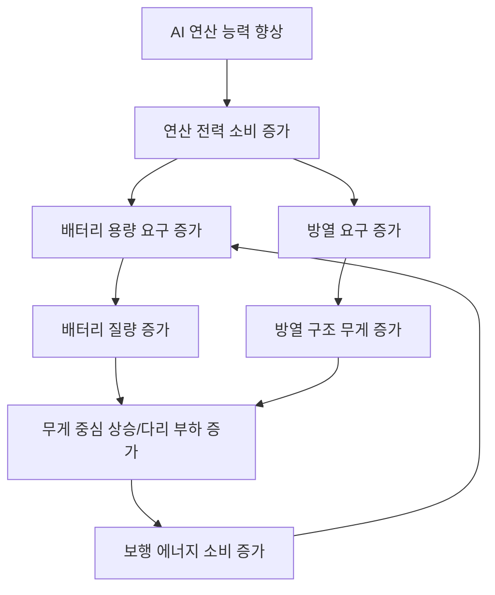

### 1.6.2 고자유도와 동적 불안정성

휴머노이드 로봇은 일반적으로 20–50개의 자유도를 가지며, 본질적으로 불안정한 이족 지지 상태에 있습니다. 운동 제어는 접촉 제약, 마찰 제약, 힘 제약 및 운동학적 제약을 동시에 만족하면서 고차원 상태 공간에서 실시간으로 해를 구해야 합니다.

!!! note "용어 설명: 자유도 (Degree of Freedom, DOF)"
    자유도는 기계 시스템의 독립적인 운동 매개변수의 수를 나타냅니다. 직렬 로봇의 경우 각 관절이 하나의 독립적인 운동을 제공하면 총 DOF는 관절 수와 같습니다. 휴머노이드 로봇은 일반적으로 20–50개의 DOF를 가지며, 각 다리 5–7개, 각 팔 6–7개, 몸통 2–3개, 머리 2–3개, 각 손 6–20개로 구성됩니다.

!!! note "용어 설명: 차원의 저주 (Curse of Dimensionality)"
    차원의 저주는 Richard Bellman이 동적 계획법 연구에서 제안한 개념으로, 상태 공간의 차원이 증가함에 따라 계산 복잡성, 데이터 요구 사항 및 최적화 난이도가 기하급수적으로 증가하는 현상을 말합니다. 30차원 상태 공간의 경우 각 차원을 10개의 값으로만 이산화하더라도 총 상태 수는 $10^{30}$에 달하여 일반적인 계산 능력을 훨씬 초과합니다.

### 1.6.3 개방 환경의 예측 불가능성

실제 환경은 높은 불확실성을 가지고 있습니다. 바닥 재질, 조명 조건, 물체 형상, 사람의 행동, 장애물 분포 등의 요소가 동적으로 변화합니다. 로봇은 인지, 추론, 계획 및 실행의 폐쇄 루프(closed-loop) 능력을 갖추어야 합니다.

!!! note "용어 설명: 창발 행동 (Emergent Behavior)"
    창발 행동은 복잡한 시스템에서 여러 단순 구성 요소의 상호 작용으로 인해 발생하며, 개별 구성 요소의 행동만으로는 직접 예측할 수 없는 전체적인 현상을 말합니다. 휴머노이드 로봇에서 보행, 군집 협력, 인간-로봇 상호작용 중 예상치 못한 행동은 창발적일 수 있습니다. 시스템 공학은 시뮬레이션, 테스트 및 모니터링을 통해 창발적 위험을 식별하고 관리해야 합니다.

### 1.6.4 소프트웨어-하드웨어 심층 결합

휴머노이드 로봇의 성능은 알고리즘뿐만 아니라 센서 정밀도, 액추에이터 응답, 통신 지연, 연산 능력 및 전원 관리에 따라 달라집니다. 소프트웨어 최적화는 하드웨어 특성을 충분히 고려해야 하며, 하드웨어 선정도 소프트웨어 요구 사항을 충족해야 합니다.

#### 1.6.4.1 종단 간 지연 예산

인지-결정-실행 폐쇄 루프의 총 지연 시간은 로봇의 동적 환경 대응 능력을 결정합니다. 각 단계의 지연 시간을 다음과 같이 설정합니다.

$$
T_{total} = T_{sensor} + T_{comm}^{sense} + T_{compute} + T_{comm}^{ctrl} + T_{actuator}
$$

여기서:

- $T_{sensor}$: 센서 수집 및 판독 지연;
- $T_{comm}^{sense}$: 센서에서 컴퓨팅 플랫폼까지의 통신 지연;
- $T_{compute}$: 인식 및 의사 결정 추론 지연;
- $T_{comm}^{ctrl}$: 컴퓨팅 플랫폼에서 액추에이터까지의 통신 지연;
- $T_{actuator}$: 액추에이터 응답 지연.

일반적인 값 (2025–2026년 수준):

| 단계 | 일반적인 지연 | 설명 |
|------|---------|------|
| 카메라 노출 및 판독 $T_{sensor}$ | 5–33 ms | 프레임 속도 관련, 30 Hz 카메라 약 33 ms |
| 센서에서 컴퓨팅 플랫폼 통신 $T_{comm}^{sense}$ | 1–5 ms | 버스에 따라 다름, GigE는 높고 MIPI/PCIe는 낮음 |
| 인식 및 의사 결정 추론 $T_{compute}$ | 20–100 ms | VLA 대규모 모델 추론은 100 ms 이상 가능 |
| 컴퓨팅에서 액추에이터 통신 $T_{comm}^{ctrl}$ | 1–2 ms | 실시간 이더넷 또는 CAN-FD |
| 액추에이터 응답 $T_{actuator}$ | 1–10 ms | 전류 루프 대역폭에 의해 결정됨 |

총 지연은 일반적으로 30–150 ms 사이입니다. 낙상 회복과 같은 고속 반응 작업의 경우 사용 가능한 반응 시간 창은 약 200–300 ms이므로 제어 알고리즘은 충분한 여유를 확보해야 합니다. 더 엄격한 분석은 샘플링 정리를 사용해야 합니다. 제어 루프 샘플링 주기 $T_s$는 다음을 충족해야 합니다.

$$
T_s < \frac{1}{2 f_{max}}
$$

여기서 $f_{max}$는 억제해야 하는 교란 주파수입니다. 10 Hz의 몸통 흔들림을 억제하려면 샘플링 주기는 50 ms 미만이어야 합니다.

!!! note "용어 설명: 제어 대역폭 (Control Bandwidth)"
    제어 대역폭은 폐루프 제어 시스템이 효과적으로 추적하거나 억제할 수 있는 최대 주파수 범위로, 일반적으로 폐루프 이득이 -3 dB로 감소하는 주파수로 정의됩니다. 샤논 샘플링 정리에 따르면 디지털 컨트롤러의 샘플링 주파수는 신호 최고 주파수의 최소 2배여야 합니다. 공학 실무에서는 안정성과 안티앨리어싱 성능을 보장하기 위해 일반적으로 10–20배 이상을 사용합니다. 제어 대역폭은 샘플링 주기, 센서 지연, 액추에이터 동역학 및 통신 지연에 의해 제한됩니다.

#### 1.6.4.2 인식-의사 결정-실행 데이터 흐름

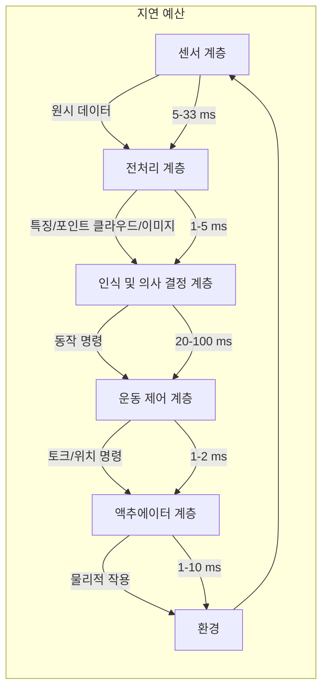

이 데이터 흐름은 소프트웨어-하드웨어 공동 설계에 요구 사항을 제시합니다. AI 추론이 너무 많은 CPU/GPU 리소스를 차지하면 제어 작업 지터가 발생할 수 있습니다. 통신 프로토콜이 비결정적이면 고주파 제어 루프의 안정성을 보장하기 어렵습니다. 따라서 주류 휴머노이드 로봇은 계층형 컴퓨팅 아키텍처를 채택합니다. 실시간 제어 작업은 MCU/RTOS에서 실행되고, 인식 및 AI 작업은 Linux/GPU에서 실행되며, 둘 사이는 결정적 버스 또는 공유 메모리를 통해 통신합니다. 컴퓨팅 플랫폼 아키텍처에 대한 자세한 내용은 6장 6.1절을 참조하고, 소프트웨어 스택 설계는 22장을 참조하십시오.

```python
# 종단 간 지연 예산 및 안정성 여유 분석
delays = {
    '카메라 판독': 33,        # ms
    '센서 통신': 5,        # ms
    'AI 추론': 80,          # ms
    '제어 통신': 2,          # ms
    '액추에이터 응답': 5,        # ms
}

T_total = sum(delays.values())
print(f"종단 간 총 지연: {T_total} ms")

# 낙상 회복 작업의 경우 사용 가능한 반응 창 250 ms 가정
reaction_window = 250
margin = reaction_window - T_total
print(f"안전 여유: {margin} ms")

# 제어 대역폭 추정: 샘플링 주기는 총 지연의 1/3 ~ 1/5
T_s = T_total / 5  # ms
f_bw = 1 / (2 * T_s / 1000)  # Hz, 나이퀴스트 주파수
print(f"추정 제어 대역폭 상한: {f_bw:.1f} Hz")
```

!!! note "용어 설명: 결정적 통신 (Deterministic Communication)"
    결정적 통신이란 메시지 전송 지연이 알려진 상한을 가지며 지터가 매우 작은 통신 메커니즘을 말합니다. 최선형(best-effort) 이더넷과 달리, 실시간 이더넷(EtherCAT, PROFINET IRT 등), CAN-FD 및 시간 민감 네트워크(TSN)는 스케줄링, 시간 트리거 또는 마스터-슬레이브 동기화를 통해 결정성을 보장합니다. 휴머노이드 로봇의 고대역폭 인식 데이터와 비실시간 AI 작업은 일반 네트워크를 사용할 수 있지만, 관절 수준의 제어 루프는 일반적으로 결정적 통신이 필요합니다.

### 1.6.5 긴 가치 사슬과 공급망 위험

휴머노이드 로봇의 가치 사슬은 원자재, 부품, 모듈, 완제품에서 애플리케이션 서비스 및 운영 유지보수에 이르기까지 매우 깁니다. 어느 한 단계에서 문제가 발생하면 전체 기계 납품과 비용 관리에 영향을 미칠 수 있습니다.

액추에이터를 예로 들면, 그 가치 사슬은 다음과 같습니다.

```
희토류 광물 → 영구 자석 재료 → 모터 → 감속기 → 엔코더 → 드라이버 → 액추에이터 어셈블리 → 완제품 → 애플리케이션 서비스
```

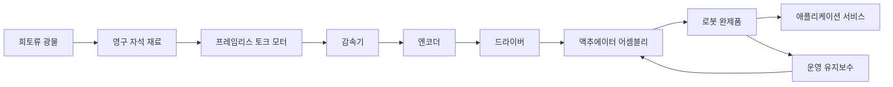

### 1.6.6 인간-로봇 상호작용과 사회적 수용성

휴머노이드 로봇은 궁극적으로 인간 사회에서 작업해야 하며, 그 동작, 외관, 소리 및 행동은 모두 인간의 감정에 영향을 미칩니다. 로봇의 동작이 너무 경직되거나 예측 불가능하면 공포나 불편을 유발할 수 있습니다. 로봇의 외관이 너무 사실적이면 '불쾌한 골짜기' 효과를 유발할 수 있습니다.

!!! note "용어 설명: 인간-로봇 상호작용 (Human-Robot Interaction, HRI)"
    인간-로봇 상호작용은 인간과 로봇 간의 상호작용을 연구하는 학제 간 분야로, 심리학, 인지 과학, 디자인, 공학 및 윤리학을 포괄합니다. HRI는 상호작용의 이해 가능성, 안전성, 효율성 및 사회적 수용성에 중점을 둡니다. 휴머노이드 로봇의 경우 HRI 설계는 자세, 시선, 동작 예측 가능성, 음성 톤 및 물리적 접촉 안전을 특별히 고려해야 합니다.

---

### 1.6.7 복잡성의 정량화: 인터페이스 수와 시스템 엔트로피

시스템 복잡성은 인터페이스 수와 엔트로피를 통해 초기 정량화할 수 있습니다. $n$개의 하위 시스템으로 구성된 시스템에서 두 하위 시스템 간에 인터페이스가 존재할 가능성이 있다면 잠재적 인터페이스 수는 $O(n^2)$입니다. 휴머노이드 로봇은 6–10개의 주요 하위 시스템을 포함하며, 각 하위 시스템 내에는 여러 구성 요소가 있어 인터페이스 수는 수백 개에 달할 수 있습니다.

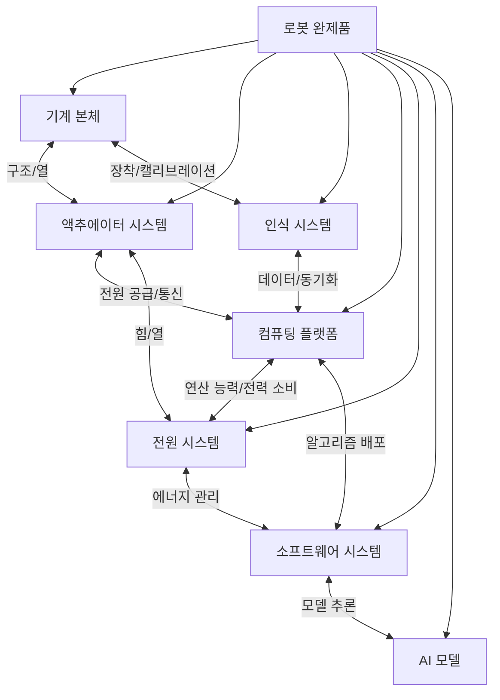

정보 이론적 관점에서 시스템의 불확실성은 엔트로피로 측정할 수 있습니다. 각 인터페이스에 $m$가지 가능한 고장 모드가 있는 경우 시스템의 총 불확실성은 인터페이스 수와 고장 모드 수와 관련됩니다. 복잡성 관리의 목표는 모듈화, 표준화된 인터페이스 및 인터페이스 계약을 통해 시스템 엔트로피를 줄이는 것입니다.

!!! note "용어 설명: 시스템 엔트로피 (System Entropy)"
    시스템 엔트로피는 열역학 및 정보 이론의 엔트로피 개념을 차용하여 시스템의 무질서도 또는 불확실성을 설명합니다. 시스템 공학에서 높은 엔트로피는 구성 요소 간 관계가 복잡하고, 동작을 예측하기 어렵고, 고장 전파 경로가 많음을 의미합니다. 시스템 엔트로피를 줄이는 방법에는 모듈화, 인터페이스 표준화, 결합 분리 설계 및 디지털 트윈이 있습니다.

### 1.6.8 연쇄 위험과 고장 전파

휴머노이드 로봇의 고장은 종종 연쇄 효과를 나타냅니다. 한 하위 시스템의 미세한 고장이 결합 인터페이스를 통해 다른 하위 시스템으로 전파되어 결국 전체 기계 정지 또는 안전 사고로 이어질 수 있습니다. 예를 들어:

- IMU 드리프트 → 상태 추정 오류 → 착지 위치 편차 → 발 힘 센서 비정상 판독값 → 컨트롤러 오판단 → 낙상
- 배터리 전압 강하 → 모터 출력 토크 부족 → 관절 추적 오차 증가 → 전신 컨트롤러 과도 보상 → 열 보호 트리거 → 정지


연쇄 위험을 관리하려면 다음이 필요합니다.

1. **고장 모드 및 영향 분석(FMEA)** : 잠재적 고장과 그 결과를 체계적으로 식별합니다.
2. **이중화 설계** : 핵심 센서, 액추에이터 및 통신 링크의 이중화.
3. **고장 감지 및 격리(FDI)** : 실시간으로 이상을 감지하고 고장 원인을 격리합니다.
4. **안전 상태 기계** : 고장 시 안전 상태(예: 정지, 웅크리기, 손잡이 잡기)로 전환합니다.

!!! note "용어 설명: FMEA(Failure Mode and Effects Analysis)"
    고장 모드 및 영향 분석은 제품 또는 프로세스에서 잠재적인 고장 모드, 그 원인 및 영향을 식별하고 위험 우선 순위 번호(RPN = 심각도 × 발생도 × 검출도)를 평가하는 체계적인 위험 평가 방법입니다. FMEA는 자동차, 항공 우주 및 의료 기기 산업의 표준 도구입니다.

!!! note "용어 설명: 고장 감지 및 격리(Fault Detection and Isolation, FDI)"
    고장 감지는 시스템에 고장이 발생했는지 여부를 판단하는 것이고, 고장 격리는 고장이 발생한 위치 또는 원인을 확인하는 것입니다. FDI 방법에는 모델 기반 잔차 생성, 데이터 기반 이상 감지 및 규칙 기반 진단이 포함됩니다. 휴머노이드 로봇에서 FDI는 안전한 작동에 매우 중요합니다.

### 1.6.9 사회기술시스템 관점

휴머노이드 로봇은 기술 시스템일 뿐만 아니라 사회기술시스템(Sociotechnical System)입니다. 그 배치는 작업 흐름, 분업, 교육 요구 사항, 법규 및 대중 인식에 영향을 미칩니다. 기술적 성공이 사회적 수용을 의미하는 것은 아니며, 제품 설계는 다음 사항을 고려해야 합니다:

- **일자리 영향** : 인간을 대체하는가, 아니면 인간의 능력을 향상시키는가?
- **개인정보 및 보안** : 로봇이 수집한 데이터는 어떻게 보호되는가?
- **책임 소재** : 사고 발생 시 제조사, 운영자 또는 사용자 중 누구에게 책임이 있는가?
- **문화적 차이** : 지역에 따라 로봇의 외형과 행동에 대한 수용도가 다르다.

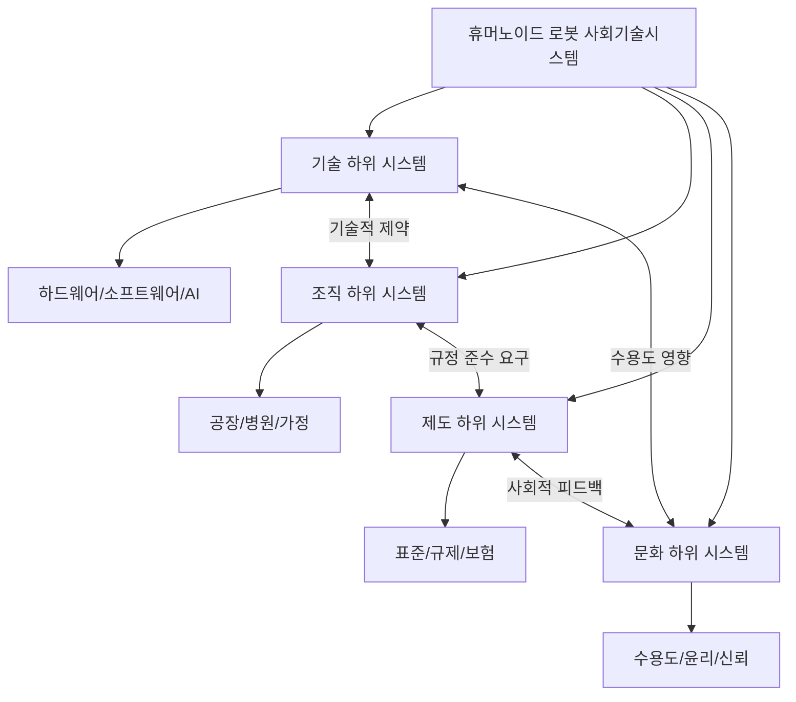

---

## 1.7 지식 그래프가 필요한 이유는 무엇인가?

이처럼 복잡한 시스템 공학 문제에 직면했을 때, 기존의 문헌 검토, 기술 보고서 또는 제품 목록만으로는 체계적인 인지적 지원을 제공하기 어렵습니다. 이들은 종종 평면적이고 파편화되어 있어, 다양한 기술, 부품, 기업, 표준 및 응용 분야 간의 연관 관계를 명확하게 제시하지 못합니다.

### 1.7.1 전통적인 지식 구성 방식의 한계

| 방식 | 장점 | 한계 |
|------|------|------|
| 논문 리뷰 | 연구 진행 상황을 체계적으로 정리 | 업데이트가 느리고 산업 정보 연계 어려움 |
| 제품 데이터베이스 | 제품 매개변수 조회 용이 | 기술 원리 및 공급망 관계 부족 |
| 산업 보고서 | 시장 통찰력 제공 | 일회성인 경우가 많고 동적 업데이트 어려움 |
| 기술 블로그 | 시의적절하고 구체적 | 파편화되고 출처 품질이 일정하지 않음 |

### 1.7.2 지식 그래프의 핵심 장점

지식 그래프는 개체를 노드로, 관계를 엣지로 사용하여 휴머노이드 로봇 분야의 다양한 지식을 구조적으로 구성합니다. 각 개체(예: 감속기, 논문, 회사, 표준)는 명확한 유형, 속성 및 출처를 가지며, 각 관계(예: "사용", "구성", "제조", "적용")는 정의되고 검증됩니다.

지식 그래프는 다음과 같은 장점이 있습니다:

**(1) 계층 간 연계**

지식 그래프는 기초 재료에서 전체 시스템, 알고리즘에서 하드웨어, 제조에서 시장에 이르기까지 다층적 관계를 표현할 수 있습니다. 예를 들어, 다음을 추적할 수 있습니다:

```
특정 알고리즘 → 특정 데이터셋 사용 → 특정 로봇에 배포 → 특정 제조사 감속기 사용 → 특정 재료로 제작 → 특정 표준의 적용을 받음
```

이러한 계층 간 연결은 병목 현상 식별, 대안 평가 및 시스템 최적화에 중요합니다.

**(2) 출처 추적 가능**

각 개체와 관계는 논문, 보고서, 회사 공식 웹사이트 또는 표준 문서와 같은 출처에 연결될 수 있습니다. 이는 지식의 검증 가능성을 보장합니다.

**(3) 동적 진화**

휴머노이드 로봇 분야는 빠르게 발전하며 새로운 지식, 제품 및 기업이 끊임없이 등장합니다. 지식 그래프는 증분 업데이트 및 버전 관리를 지원합니다.

**(4) 추론 및 질의 지원**

지식 그래프를 기반으로 복잡한 질의 및 추론이 가능합니다. 예를 들어:

- 하모닉 드라이브 감속기를 사용하는 모든 휴머노이드 로봇 찾기
- 특정 알고리즘이 의존하는 하드웨어 목록 식별
- 특정 부품의 공급업체 집중도 분석
- 특정 표준이 영향을 미치는 설계 선택 추적

### 1.7.3 이 책의 지식 그래프 방법론

이 책은 지식 그래프를 핵심 구성 방식으로 선택하여 휴머노이드 로봇의 0에서 1까지의 전체 프로세스 지식을 체계적으로 정리합니다. 구체적으로:

- **개체** : 재료, 부품, 방법, 알고리즘, 데이터셋, 소프트웨어, 로봇, 기업, 표준, 응용 분야 등을 포함합니다.
- **관계** : 구성 관계, 사용 방법, 제조 관계, 배포 관계, 적용 관계, 테스트 관계, 규제 관계 등을 포함합니다.
- **계층화** : 물리 계층, 인식 계층, 의사 결정 계층, 실행 계층, 시스템 계층, 산업 계층에 따라 지식을 구성합니다.
- **계층 간 연결** : 기초 연구에서 산업 응용까지의 완전한 체인을 드러냅니다.

아래 다이어그램은 이 책의 지식 그래프 단순화된 구조를 보여줍니다:

```mermaid
graph TD
    subgraph 물리 계층
        M[재료] --> C[부품]
        C --> A[액추에이터]
    end

    subgraph 인식 계층
        S[센서] --> P[인식 알고리즘]
    end

    subgraph 의사 결정 계층
        AI[AI 모델] --> PL[계획 알고리즘]
    end

    subgraph 실행 계층
        A --> CTRL[제어 알고리즘]
        CTRL --> A
    end

    subgraph 시스템 계층
        R[로봇 완제품] --> SW[소프트웨어 스택]
    end

    subgraph 산업 계층
        SUP[공급업체] --> OEM[완제품 제조사]
        OEM --> APP[응용 시나리오]
        APP --> MKT[시장]
        STD[표준] --> R
    end

    A --> R
    P --> AI
    PL --> CTRL
    SW --> AI
    SW --> CTRL
```

!!! note "용어 설명: 지식 그래프(Knowledge Graph)"
    지식 그래프는 개체(노드), 관계(엣지) 및 속성으로 구성된 그래프 구조를 사용하여 지식을 표현하는 의미 네트워크입니다. 이는 시맨틱 웹(Semantic Web) 및 온톨로지(Ontology) 연구에서 비롯되었으며, 2012년 Google이 Knowledge Graph 개념을 공식적으로 제안했습니다. 지식 그래프는 구조화된 질의, 추론 및 시각화를 지원하며, 학제 간 복잡한 지식을 처리하는 효과적인 도구입니다.

### 1.7.4 인지적 확장성: 지식 그래프가 휴머노이드 로봇에 적합한 이유

휴머노이드 로봇 분야의 지식은 수십 개의 학문, 수백 개의 부품, 수천 개의 기업 및 수만 편의 문헌에 걸쳐 있습니다. 인간 인지의 단기 기억 및 작업 기억 용량은 제한적이어서 이렇게 많은 파편화된 정보를 동시에 처리할 수 없습니다. 지식 그래프는 다음 방식을 통해 인지적 확장성을 향상시킵니다:

1. **계층적 추상화** : 복잡한 시스템을 관리 가능한 계층과 모듈로 분해합니다.
2. **관계 명시화** : 암시적 연관성(예: "특정 모터가 특정 로봇에 사용됨")을 명시적으로 표현합니다.
3. **다중 규모 탐색** : 거시적 수준에서 산업 체인의 전체적인 그림을 볼 수 있을 뿐만 아니라 미시적 수준에서 특정 부품의 기술 매개변수를 추적할 수 있습니다.
4. **지속적 업데이트** : 기술 및 산업 발전에 따라 지식 그래프는 지속적으로 확장 및 수정될 수 있습니다.

```mermaid
graph TD
    A[휴머노이드 로봇 지식] --> B[물리 계층]
    A --> C[인식 계층]
    A --> D[의사 결정 계층]
    A --> E[실행 계층]
    A --> F[시스템 계층]
    A --> G[산업 계층]

    B --> B1[재료 속성]
    B --> B2[부품 사양]
    C --> C1[센서 유형]
    C --> C2[인식 알고리즘]
    D --> D1[운동 계획]
    D --> D2[VLA 모델]
    E --> E1[액추에이터]
    E --> E2[제어 법칙]
    F --> F1[완제품 통합]
    F --> F2[소프트웨어 스택]
    G --> G1[기업]
    G --> G2[시장]
    G --> G3[표준]
```

## 1.8 이 책의 구성과 읽기 경로

이 책은 휴머노이드 로봇 산업화의 논리적 사슬에 따라 내용을 구성했으며, 총 10개 부분, 30개 장으로 이루어져 있습니다.

### 1.8.1 전체 구성

| 부분 | 주제 | 장 |
|------|------|------|
| 제1부 | 총론 및 방법론 | 제1–2장 |
| 제2부 | 물리 기반층: 재료, 부품 및 공급망 | 제3–7장 |
| 제3부 | 설계 엔지니어링층 | 제8–9장 |
| 제4부 | 제조 및 양산층 | 제10–13장 |
| 제5부 | 제어 및 운동층 | 제14–17장 |
| 제6부 | AI, 모델 및 데이터층 | 제18–21장 |
| 제7부 | 소프트웨어 및 시뮬레이션층 | 제22–24장 |
| 제8부 | 평가, 벤치마크 및 검증 | 제25장 |
| 제9부 | 완제품, 기업 및 시장 | 제26–28장 |
| 제10부 | 정책, 윤리 및 미래 | 제29–30장 |

### 1.8.2 다양한 독자를 위한 읽기 경로

다양한 전문 배경을 가진 독자는 다음 경로에 따라 선택적으로 읽을 수 있습니다.

**학생/신규 진입자 (기초부터 읽기를 권장)**

```
제1장 → 제3–5장 → 제8장 → 제14–16장 → 제18–19장 → 제26장
```

**기계/제조 엔지니어 (물리적 구현에 초점)**

```
제3–5장 → 제8–9장 → 제10–13장 → 제25장
```

**AI/소프트웨어 엔지니어 (알고리즘 및 시스템에 초점)**

```
제18–21장 → 제22–24장 → 제14–17장 → 제5–6장
```

**산업/투자자 (비즈니스 및 생태계에 초점)**

```
제1장 → 제7장 → 제13장 → 제26–28장 → 제29–30장
```

**정책 연구자 (규제 및 사회적 영향에 초점)**

```
제1장 → 제12장 → 제29–30장
```

---

## 1.9 왜 휴머노이드인가: 더 깊은 형태 경제학

### 1.10.1 형태와 작업의 매칭

로봇 형태의 선택은 본질적으로 작업-환경-비용의 세 가지 요소가 매칭된 결과입니다. 바퀴형 로봇은 평평한 지면에서 효율이 가장 높습니다. 비행 로봇은 3차원 공간에서의 빠른 이동에 적합합니다. 로봇 팔은 반복적인 정밀 작업에 능숙합니다. 휴머노이드 로봇은 다음 조건에서 잠재적 이점을 가집니다.

- 환경이 인간을 위해 설계됨 (계단, 문, 도구, 작업대)
- 작업이 다양하고 사전에 완전히 열거하기 어려움
- 인간과의 근접 협력이 필요함
- 전용 장비의 통합 및 개조 비용이 범용 휴머노이드 솔루션보다 높음

```mermaid
graph TD
    A[로봇 형태 선택] --> B[바퀴형]
    A --> C[다리형]
    A --> D[비행형]
    A --> E[로봇 팔]
    A --> F[휴머노이드]

    B --> B1[평평한 지면 고효율]
    C --> C1[복잡한 지형 통과성]
    D --> D1[3차원 공간 빠른 이동]
    E --> E1[고정밀 반복 작업]
    F --> F1[인간 환경 범용성]
    F --> F2[인간-로봇 협업 수용성]
```

### 1.10.2 이족 보행의 균형

이족 보행은 높은 에너지 효율과 높은 기동성 사이의 절충입니다. 생체역학적으로 볼 때, 인간의 이족 보행 에너지 효율은 약 0.8 J/(kg·m)로 바퀴형 이동에 비해 여전히 차이가 있지만, 이족 보행은 장애물을 넘고, 계단을 오르내리며, 좁은 공간에서 회전할 수 있습니다.

!!! note "용어 설명: 운송 비용 (Cost of Transport, COT)"
    운송 비용은 단위 질량, 단위 거리를 이동하는 데 소비되는 에너지를 의미하며, 일반적으로 단위는 J/(N·m) 또는 무차원(중력으로 나눔)입니다. 인간의 COT는 약 0.2입니다. 전통적인 이족 보행 로봇의 COT는 일반적으로 1–10 사이로 인간보다 훨씬 높습니다. 최적화된 현대 이족 보행 로봇은 0.5–1에 근접할 수 있습니다.

이족 보행 제어의 어려움은 다음과 같습니다.

1. **동적 불안정성**: 단일 지지 단계에서 로봇은 역진자 동역학 하에서 안정성을 유지해야 합니다.
2. **접촉 전환**: 보행 과정에서 지지하는 발이 전환되어 시스템 동역학이 이산적으로 변화합니다.
3. **저구동성**: 지면 접촉력을 직접 제어할 수 없으며, 전체 운동을 통해 간접적으로만 조절할 수 있습니다.

수학적으로 이족 보행 로봇은 혼합 시스템(Hybrid System)으로 볼 수 있습니다.

$$
\begin{cases}
\dot{x} = f_i(x, u), & \text{접촉 모드 } i \text{에 있을 때} \\
x^+ = \Delta_{ij}(x^-), & \text{모드 전환 } i \to j \text{이 발생할 때}
\end{cases}
$$

여기서 $\Delta_{ij}$는 충돌/전환 매핑입니다.

!!! note "용어 설명: 혼합 시스템 (Hybrid System)"
    혼합 시스템은 연속 동역학과 이산 사건으로 구성된 동적 시스템입니다. 로봇 공학에서 이족 보행의 연속 동역학은 사지 운동이고, 이산 사건은 발이 지면에 닿거나 떨어지는 것, 지지 단계 전환입니다. 혼합 시스템 이론은 보행 안정성을 분석하기 위한 수학적 프레임워크를 제공합니다.

### 1.10.3 범용성과 전용성의 경제학

휴머노이드 로봇의 상업적 타당성은 궁극적으로 범용성 프리미엄이 전용성 효율 손실을 초과하는지 여부에 달려 있습니다. 다음과 같이 가정합니다.

- 전용 장비가 단일 작업을 완료하는 연간 비용: $C_s$
- 휴머노이드 로봇이 $N$개의 작업을 완료하는 연간 비용: $C_h + \sum_{i=1}^{N} c_i$

그러면 휴머노이드 솔루션이 비용 우위를 가지는 조건은 다음과 같습니다.

$$
C_h + \sum_{i=1}^{N} c_i < \sum_{i=1}^{N} C_{s,i}
$$

작업 수 $N$이 증가하고, 전용 장비 통합 비용이 높으며, 작업 전환이 빈번할 때 휴머노이드 솔루션의 범용성 프리미엄이 더 쉽게 나타납니다.

```mermaid
graph LR
    A[작업 수 N] --> B[전용 솔루션 총 비용]
    A --> C[휴머노이드 솔루션 총 비용]

    B -->|선형 증가| D[ΣCs]
    C -->|아선형 증가| E[Ch + Σci]

    D --> F[손익분기점]
    E --> F
```

---

## 1.10 산업화 핵심 지표 대시보드

휴머노이드 로봇의 0에서 1로의 진행 상황을 추적하기 위해 다음과 같은 핵심 지표 대시보드를 구축할 수 있습니다.

| 차원 | 지표 | 2025년 업계 수준 | 산업 목표 |
|------|------|----------------|---------|
| 기술 | 이족 보행 속도 | 3–6 km/h | 5–8 km/h |
| 기술 | 배터리 지속 시간 | 2–4 시간 | 8–12 시간 |
| 기술 | 손재주 손 DOF | 6–11 | 15–20 |
| 신뢰성 | MTBF | 500–2,000 h | > 20,000 h |
| 신뢰성 | 가용성 | 90–95% | > 99% |
| 비용 | BOM | $35k–100k | <$20k |
| 비용 | 판매 가격 | $10k–250k | <$30k |
| 제조 | 연간 생산 능력 | 백대–만대 | > 10만 대 |
| 배치 | 단일 현장 운영 시간 | 100–1,500 h | > 5,000 h |
| 규정 준수 | 인증 적용 범위 | 일부/시범 | 전체 시장 접근 |

```mermaid
graph LR
    A[산업화 대시보드] --> B[기술 지표]
    A --> C[신뢰성 지표]
    A --> D[비용 지표]
    A --> E[제조 지표]
    A --> F[배치 지표]
    A --> G[규정 준수 지표]

    B --> B1[속도/지속 시간/부하]
    C --> C1[MTBF/MTTR/가용성]
    D --> D1[BOM/판매 가격/TCO]
    E --> E1[생산 능력/수율/사이클 타임]
    F --> F1[운영 시간/작업 성공률]
    G --> G1[인증/표준/시장 접근]
```

---

## 1.11 이 장의 추가 읽기 및 사고 문제

### 1.12.1 추가 읽기

- 위너《사이버네틱스》제1장: 피드백과 정보
- Kajita 외《Introduction to Humanoid Robotics》: LIPM과 preview control
- Siciliano & Khatib《Springer Handbook of Robotics》: 로봇 공학 전반
- Mori《불쾌한 골짜기(The Uncanny Valley)》: 휴머노이드 외형과 감정 반응
- Ebeling《An Introduction to Reliability and Maintainability Engineering》: 신뢰성 공학 기초

### 1.12.2 연습 문제

1. 어떤 로봇에 20개의 액추에이터가 있고 각 액추에이터의 MTBF가 80,000시간이라고 가정할 때, 액추에이터 서브시스템만의 직렬 모델에서 MTBF를 계산하시오.
2. 학습 곡선 공식을 사용하여 첫 번째 제품의 비용이 10만 달러이고 학습률이 20%일 때, 누적 생산량이 10,000대에 도달했을 때의 단위 비용을 계산하시오.
3. ZMP 기준이 평평한 발을 가진 로봇에는 적용 가능하지만, 점 접촉이나 복잡한 지형에서는 더 일반적인 처리 방법이 필요한 이유를 설명하시오.
4. Tesla Optimus와 Figure AI의 산업화 경로에서의 유사점과 차이점을 비교하시오.
5. 휴머노이드 로봇 연구개발 프로젝트에 적용 가능한 TRL/MRL 평가 체크리스트를 설계하시오.

---

## 1.12 표준, 인증 및 시장 진입 체계

휴머노이드 로봇이 실험실에서 시장으로 나아가기 위해서는 다층적인 표준 및 인증 체계를 통과해야 합니다. 이러한 표준은 제품이 충족해야 하는 안전 요구사항을 규정할 뿐만 아니라 설계 선택, 테스트 절차 및 비용 구조를 형성합니다.

### 1.13.1 표준 체계의 계층 구조

글로벌 로봇 표준 체계는 피라미드 구조를 보입니다: 최상위는 국제 기초 표준, 중간은 지역 및 산업 응용 표준, 최하위는 기업 내부 표준 및 테스트 규격입니다.

```mermaid
graph TD
    A[로봇 표준 체계] --> B[국제 표준]
    A --> C[지역 표준]
    A --> D[산업 표준]
    A --> E[기업 표준]

    B --> B1[ISO/IEC 기초 표준]
    B --> B2[IEEE 기술 표준]
    C --> C1[EU EN/CE]
    C --> C2[미국 UL/FCC]
    C --> C3[중국 GB/CR/CCC]
    D --> D1[자동차 ISO/TS 15066]
    D --> D2[의료 IEC 60601]
    D --> D3[물류 VDI 2853]
    E --> E1[설계 규격]
    E --> E2[테스트 규격]
    E --> E3[공급업체 규격]
```

!!! note "용어 설명: 표준(Standard)"
    표준은 공인된 기관이 제정하고 합의를 통해 승인된 규범적 문서로, 제품, 프로세스 또는 서비스의 기술 요구사항을 통일하는 데 사용됩니다. 표준은 거래 비용을 낮추고, 상호 운용성을 높이며, 안전을 보장하지만, 기술 장벽 및 시장 진입 장벽이 될 수도 있습니다.

### 1.13.2 주요 국제 및 지역 표준 개요

| 표준/인증 | 제정 기관 | 적용 범위 | 핵심 관심 사항 |
|----------|---------|---------|-----------|
| ISO 13482:2014 | ISO | 개인 케어 로봇 | 기계적 안전, 속도/힘 제한, 접촉 안전 |
| ISO/TS 15066:2016 | ISO | 협동 로봇 | 최대 허용 압력/힘, 안전 기능 |
| ISO 13849-1:2023 | ISO | 기계 안전 제어 시스템 | 제어 시스템 안전 관련 부품 신뢰성 |
| IEC 61508:2010 | IEC | 기능 안전 일반 표준 | SIL 등급, 안전 수명 주기 |
| IEC 62368-1:2018 | IEC | 정보 기술 장비 안전 | 전기 안전, 화재, 에너지 위험 |
| UL 1740 | UL | 산업용 로봇 안전 | 로봇 시스템 안전 평가 |
| FCC Part 15 | FCC | 미국 무선 장비 | 전자기 적합성 및 무선 주파수 간섭 |
| CE 마크 | EU | EU 시장 진입 | 관련 지침 준수(기계 지침, 저전압 지침 등) |
| CR 인증 | 중국 로봇 연합/인증감독위원회 | 중국 로봇 시장 진입 | 안전, EMC, 성능, 신뢰성 |
| CCC | 중국 품질감독검사검역총국 | 강제 제품 인증 | 전기 안전 등 |

!!! note "용어 설명: CE 마크와 CCC 인증"
    CE 마크는 제품이 EU 시장에 진입하기 위한 적합성 선언 마크로, 제품이 EU 관련 지침의 기본 요구사항을 충족함을 나타냅니다. CCC(China Compulsory Certification)는 중국 강제 제품 인증으로, 인체 안전, 동식물 생명 건강 및 환경 보호와 관련된 제품은 판매를 위해 CCC 인증을 받아야 합니다.

### 1.13.3 휴머노이드 로봇 표준이 직면한 특별한 과제

산업용 로봇 팔 및 협동 로봇에 비해 휴머노이드 로봇의 표준 제정은 특별한 과제에 직면합니다:

1. **형태 다양성**: 이족 보행, 바퀴형, 혼합 형태를 단일 표준으로 포괄하기 어렵습니다.
2. **동적 접촉**: 낙상, 충돌, 파지 등 동적 접촉 시나리오의 안전 평가가 복잡합니다.
3. **인간-로봇 상호작용**: 가정 및 서비스 시나리오에서 어린이, 노인, 장애인과의 상호작용은 추가 고려가 필요합니다.
4. **AI 자율성**: VLA 및 강화 학습 모델의 불확실성은 기능 안전 평가에 새로운 과제를 제기합니다.
5. **교차 시나리오 응용**: 동일한 로봇이 공장, 물류, 서비스 등 다양한 시나리오에서 사용될 수 있어 표준 적용 경계가 모호합니다.

```mermaid
graph TD
    A[휴머노이드 로봇 표준화 과제] --> B[형태 다양성]
    A --> C[동적 접촉]
    A --> D[인간-로봇 상호작용]
    A --> E[AI 자율성]
    A --> F[교차 시나리오 응용]

    B --> B1[이족/바퀴형/혼합 표준 불일치]
    C --> C1[낙상/충돌/파지 안전]
    D --> D1[어린이/노인/취약 계층]
    E --> E1[모델 불확실성/설명 가능성]
    F --> F1[동일 제품 다중 시나리오 인증]
```

---

## 1.13 AI와 양산 시대의 기술 스택

### 1.14.1 전통적 제어에서 학습 기반으로

휴머노이드 로봇의 제어 방법은 고전적 제어에서 최적 제어, 그리고 학습 기반으로 진화해 왔습니다:

```mermaid
graph LR
    A[고전적 제어] --> B[ZMP/LIPM]
    B --> C[MPC/WBC]
    C --> D[강화 학습]
    D --> E[엔드투엔드 VLA]

    A --> A1[PD 제어]
    B --> B1[역진자 모델]
    C --> C1[제약 최적화]
    D --> D1[시뮬레이션 훈련]
    E --> E1[시각-언어-행동 통합]
```

!!! note "용어 설명: 강화 학습(Reinforcement Learning, RL)"
    강화 학습은 환경과의 상호작용을 통해 최적 정책을 학습하는 머신러닝 방법입니다. 에이전트는 상태 $s_t$에서 행동 $a_t$를 취하고, 보상 $r_t$를 받으며 다음 상태 $s_{t+1}$로 전이합니다. 목표는 누적 보상 $R = \sum_{t} \gamma^t r_t$을 최대화하는 것입니다. 로봇 공학에서 RL은 보행 및 조작 정책을 학습하는 데 자주 사용됩니다.

!!! note "용어 설명: Sim-to-Real"
    Sim-to-Real은 시뮬레이션 환경에서 훈련된 정책을 실제 로봇으로 전이하는 과정을 말합니다. 시뮬레이션과 실제 세계는 동역학, 인식 및 접촉 모델의 차이(reality gap)가 존재하므로, 도메인 무작위화, 시스템 식별, 잔차 학습 및 실제 미세 조정 등의 기술을 통해 격차를 줄여야 합니다.

### 1.14.2 VLA 모델 아키텍처 개요

VLA 모델은 일반적으로 세 가지 핵심 모듈로 구성됩니다:

1. **시각 인코더**: 이미지/비디오를 시각 특징으로 변환합니다.
2. **언어 모델**: 자연어 명령을 이해하고 작업 계획을 생성합니다.
3. **행동 디코더**: 시각-언어 표현을 로봇 행동(관절 위치, 속도, 토크 또는 말단 자세)으로 매핑합니다.

```mermaid
graph LR
    I[이미지 입력] --> V[시각 인코더]
    T[텍스트 명령] --> L[언어 모델]
    V --> F[다중 모달 융합]
    L --> F
    F --> A[행동 디코더]
    A --> M[로봇 행동]
```

대표적인 VLA 모델은 다음과 같습니다:

- **RT-2 (Google DeepMind)**: 로봇 행동을 언어 토큰으로 처리합니다.
- **OpenVLA**: 오픈소스 VLA 모델로, 다중 로봇 데이터 미세 조정을 지원합니다.
- **GR00T N1 (NVIDIA)**: 휴머노이드 로봇을 위한 기초 모델입니다.
- **Helix (Figure AI)**: 엔드투엔드 고속 휴머노이드 로봇 제어입니다.
- **π0 (Physical Intelligence)**: 범용 로봇 정책 모델입니다.

!!! note "용어 설명: 도메인 무작위화(Domain Randomization)"
    도메인 무작위화는 시뮬레이션 훈련에서 물리적 매개변수(질량, 마찰, 감쇠, 지형, 조명, 질감 등)를 의도적으로 무작위화하여 정책이 시뮬레이션과 실제의 차이에 강건하도록 하는 기술입니다. 수학적으로 정책 최적화 목표는 $J = \mathbb{E}_{p(\xi)}[R(\pi, \xi)]$이며, 여기서 $\xi$는 무작위화된 환경 매개변수입니다.

### 1.14.3 데이터 플라이휠과 규모화 학습

휴머노이드 로봇의 AI 성능 향상은 데이터 플라이휠에 의존합니다:

```mermaid
graph LR
    A[로봇 배포] --> B[실제 데이터 수집]
    B --> C[데이터 정제 및 레이블링]
    C --> D[모델 훈련]
    D --> E[모델 배포]
    E --> A

    D --> F[시뮬레이션 데이터 생성]
    F --> C
```

실제 데이터에는 원격 조작 시연, 인간 동작 캡처, 자율 주행 기록 및 실패 사례가 포함됩니다. 시뮬레이션 데이터는 대량의 다양한 시나리오를 빠르게 생성할 수 있지만, reality gap이 존재합니다. 성공적인 데이터 전략은 일반적으로 실제 데이터와 시뮬레이션 데이터의 결합입니다.

!!! note "용어 설명: 데이터 플라이휠(Data Flywheel)"
    데이터 플라이휠은 제품 사용이 많을수록 더 많은 데이터가 생성되고, 모델이 개선되며, 제품 경험이 향상되어 더 많은 사용을 유도하는 긍정적인 피드백 루프를 말합니다. 휴머노이드 로봇에서 데이터 플라이휠은 일반화 능력과 지속적인 개선을 실현하는 핵심 메커니즘입니다.

## 1.14 산업화 경로의 다국 비교

### 1.15.1 미국: 기술 선도와 자본 주도

미국은 휴머노이드 로봇 분야의 기술 혁신과 자본 운용에서 선도적입니다:

- **대표 기업**: Tesla, Figure AI, Boston Dynamics, Agility Robotics, Apptronik.
- **강점**: AI 알고리즘, 대규모 모델, 자본 시장, 첨단 제조.
- **과제**: 제조 비용 높음, 공급망 일부 아시아 의존, 높은 인건비.

### 1.15.2 중국: 공급망과 비용 우위

중국은 세계 최대의 휴머노이드 로봇 생산 및 출하 시장이 되었습니다:

- **대표 기업**: Unitree, Zhiyuan Robot, UBTECH, Leju, Fourier, Galaxy General.
- **강점**: 완전한 공급망, 저비용 제조, 빠른 반복, 거대한 내수 시장.
- **과제**: 고급 칩, 일부 핵심 부품 여전히 수입 의존, 국제 시장 접근 및 브랜드 인지도.

### 1.15.3 일본과 유럽: 기술 축적과 응용 탐색

- **일본**: ASIMO, HRP 시리즈가 많은 이족 보행 제어 및 인간-로봇 상호작용 경험을 축적했지만, 상업화는 상대적으로 신중합니다.
- **유럽**: 안전 표준, 협동 로봇, 의료 및 산업 응용을 중시하지만, 대규모 양산 기업은 부족합니다.

#### 1.15.4 비교우위 프레임워크와 정책 도구 상자

각국의 휴머노이드 로봇 산업 내 분업은 비교우위 이론으로 설명할 수 있습니다. 국가 $i$가 휴머노이드 로봇 완제품을 생산하는 기회비용을 $OC_i$ (다른 첨단 기술 산업 생산량으로 측정)라고 할 때, 기회비용이 낮은 국가가 완제품 통합에서 비교우위를 가집니다. 현재 중국의 비교우위는 액추에이터, 감속기 등 전기기계 부품의 대규모 생산 능력에 있습니다. 미국의 비교우위는 AI 모델, 칩 설계 및 고부가가치 소프트웨어에 있습니다. 일본의 강점은 정밀 감속기와 장기 신뢰성 기술에 있습니다. 유럽의 강점은 안전 표준, 의료 규제 경험 및 산업 디자인에 있습니다.

정부 정책은 비교우위를 변화시키는 외생 변수로 볼 수 있습니다. 일반적인 정책 도구는 다음과 같습니다:

| 정책 도구 | 작용 메커니즘 | 전형적 적용 |
|---------|---------|---------|
| 연구개발 보조금 | 기업 R&D 비용 절감 | 미국 NSF/DoD 로봇 프로젝트, 중국 국가 중점 연구개발 계획 |
| 정부 조달 | 초기 시장 검증 제공 | 공장, 병원, 공공 장소 시범 |
| 산업 펀드 | 자본 제약 완화 | 중국 지방 정부 로봇 펀드 |
| 표준 제정 | 시장 진입 규칙 형성 | EU CE, 중국 CR, 미국 UL |
| 인재 양성 | 엔지니어 공급 확대 | 대학 로봇 전공, 산학 융합 |

```mermaid
graph TD
    A[국가 산업 정책] --> B[연구개발 보조금]
    A --> C[정부 조달]
    A --> D[산업 펀드]
    A --> E[표준 제정]
    A --> F[인재 양성]

    B --> G[혁신 비용 절감]
    C --> H[초기 수요 창출]
    D --> I[자금 조달 규모 확대]
    E --> J[진입 장벽 설정]
    F --> K[요소 공급 증가]

    G --> L[비교우위 재편]
    H --> L
    I --> L
    J --> L
    K --> L
```

!!! note "용어 설명: 비교우위 (Comparative Advantage)"
    비교우위는 데이비드 리카도(David Ricardo)가 1817년에 제안한 개념으로, 한 국가 또는 주체가 어떤 제품을 생산하는 기회비용이 다른 주체보다 낮을 때, 절대적 효율이 가장 높지 않더라도 해당 제품 생산에 전문화하고 무역을 통해 이익을 얻어야 한다는 것을 의미합니다. 휴머노이드 로봇 산업 체인에서 비교우위는 부품, 완제품, 소프트웨어 및 서비스의 국제 분업 구도를 결정합니다.

!!! note "용어 설명: 기회비용 (Opportunity Cost)"
    기회비용은 경제학의 핵심 개념으로, 특정 대안을 선택함으로써 포기한 최선의 대안의 이익을 의미합니다. 예를 들어, 한 국가가 동일한 자원을 반도체 설계 대신 휴머노이드 로봇 완제품 제조에 투입할 때 포기하는 반도체 산업의 이익이 바로 기회비용입니다. 비교우위 분석은 절대적 효율보다 상대적 효율을 강조합니다.

```python
# 4개국 비교우위 정량적 예시: 비용 지수와 기술 수준을 2차원 지표로
import numpy as np

countries = ['미국', '중국', '일본', '유럽']
cost_index = np.array([85, 45, 70, 75])       # 완제품 제조 비용 지수, 낮을수록 좋음
tech_index = np.array([95, 75, 85, 80])       # 종합 기술 수준 지수, 높을수록 좋음

# 단위 기술 수준당 필요 비용 계산 (기회비용 대리 지표)
opportunity_cost = cost_index / tech_index
for c, oc in zip(countries, opportunity_cost):
    print(f"{c}: 기회비용 지수 = {oc:.3f}")
```

결과에서 중국의 기회비용 지수가 가장 낮아, 현재 자원 부존 하에서 중국이 완제품 제조에 상대적 비교우위를 가짐을 의미합니다. 미국은 기술 수준이 가장 높지만 비용도 가장 높아, 고부가가치 단계를 차지하는 데 더 적합합니다. 각국 정책이 산업 구도에 미치는 영향은 28장과 29장에서 더 논의됩니다.

---

## 1.15 미래 전망: '몸을 가짐'에서 '일을 함'으로

휴머노이드 로봇 산업화의 궁극적 지표는 기술 파라미터가 아니라 **실제 경제 활동에서 지속적으로 가치를 창출하는 것**입니다. 이는 다음을 의미합니다:

1. **시연에서 생산성으로**: 로봇이 고객이 기꺼이 비용을 지불할 작업을 완료할 수 있어야 합니다.
2. **단일 기기에서 함대(fleet)로**: 여러 로봇이 협력하여 작업하고 통합 플랫폼으로 관리됩니다.
3. **원격 조작에서 자율성으로**: 인간이 직접 제어하기보다 감독합니다.
4. **시범에서 비즈니스 모델로**: 명확한 비용 구조, 가격 책정, 서비스 및 수익 모델이 필요합니다.

```mermaid
graph LR
    A[현재 상태] --> B[단기 목표]
    B --> C[중기 목표]
    C --> D[장기 비전]

    A --> A1[만 대급 출하]
    A --> A2[공장 시범]
    B --> B1[십만 대급 생산 능력]
    B --> B2[다중 시나리오 배치]
    C --> C1[백만 대급 시장]
    C --> C2[반자율 운행]
    D --> D1[범용 노동력]
    D --> D2[사회 심층 융합]
```

---

## 1.16 주요 공식 빠른 참조

| 공식 | 의미 | 적용 시나리오 |
|------|------|---------|
| $\dot{x} = f(x,u), y = h(x,u)$ | 동적 시스템 형식화 | 제어 설계, 상태 추정 |
| $M(q)\ddot{q} + C(q,\dot{q})\dot{q} + G(q) = \tau$ | 라그랑주 동역학 | 운동 계획, 시뮬레이션 |
| $P(t) = L / (1 + e^{-k(t-t_0)})$ | 기술 채택 S-곡선 | 시장 예측 |
| $C_n = C_1 n^{-b}$ | 학습 곡선 | 비용 예측 |
| $R(t) = e^{-\lambda t}$ | 신뢰도 함수 | 수명 예측 |
| $MTBF = 1/\lambda$ | 평균 고장 간격 | 신뢰도 지표 |
| $A = MTBF / (MTBF + MTTR)$ | 가용성 | 유지보수 계획 |
| $R_s = \prod R_i$ | 직렬 시스템 신뢰도 | 시스템 신뢰도 설계 |

---

## 1.17 이 장의 요약

이 장은 산업화 관점에서 "왜 휴머노이드 로봇인가"와 "왜 지금이 휴머노이드 로봇의 중요한 창구 기간인가"라는 두 가지 질문에 체계적으로 답변합니다.

핵심 관점은 다음과 같습니다.

1. **휴머노이드 로봇은 인간의 형태와 운동 능력을 모방한 범용 기계**이며, 그 장점은 환경 호환성, 작업 범용성 및 사회적 수용성에 있지만, 이러한 장점은 현재 이론적으로만 존재합니다.

2. **현재 산업화의 중요한 창구 기간**입니다: 2025년 글로벌 시장 규모는 약 30억 달러, 설치 대수는 약 1만 6천 대이며, 중국이 80% 이상을 차지합니다; 테슬라, Figure AI, 우슈, 지위안, 유비테크 등 주요 제조업체는 실제 배치 또는 양산 단계에 진입했습니다.

3. **비용이 빠르게 하락하고 있습니다**: 2023-2024년 제조 비용이 40% 하락했으며, 중국 제조업체의 BOM은 약 3만 5천 달러로 낮아졌고, 우슈 R1의 가격은 5,900달러에 불과하여 대규모 적용의 기반을 마련했습니다.

4. **휴머노이드 로봇 산업화의 핵심 모순은 '걸을 수 있음'과 '팔 수 있음'의 차이**입니다. 신뢰성, 비용, 유지보수성 및 규정 준수는 제품화의 4차원 제약 조건을 구성합니다.

5. **0에서 1까지는 7단계의 도약이 필요합니다**: 실험실 시제품, 엔지니어링 시제품, 소량 검증, 양산 준비, 현장 배치, 운영 유지보수 및 대규모 복제. 2025-2026년 업계는 현장 배치에서 운영 유지보수 및 대규모 복제로 전환하는 초기 단계에 있습니다.

6. **휴머노이드 로봇은 고도로 복잡한 시스템 엔지니어링 대상**으로, 다학제 결합, 높은 자유도, 개방 환경의 불확실성, 하드웨어와 소프트웨어의 심층 결합, 긴 가치 사슬 및 인간-로봇 상호작용의 복잡성 등의 특징을 가지고 있습니다.

7. **전통적인 지식 조직 방식은 이러한 복잡성을 다루기 어렵습니다**. 지식 그래프는 개체-관계 방식으로 학제 간 지식을 구조화하여, 계층 간 연관성, 출처 추적, 동적 진화 및 복잡한 질의를 지원할 수 있습니다.

8. **휴머노이드 형태의 선택은 형태 경제학의 결과**입니다: 인간이 구축한 환경에서 이족 보행의 범용성은 단일 작업에서의 효율성 열위를 상쇄할 수 있으며, 이는 작업 다양성과 배치 규모가 충분히 클 때 가능합니다.

9. **신뢰성과 가용성은 정량화 가능한 엔지니어링 지표**입니다: $R(t)$, MTBF, MTTR, 직렬 시스템 모델 및 가용성 공식을 통해 시연에서 제품으로의 엔지니어링 판단 기준을 수립할 수 있습니다.

10. **표준과 인증은 시장 진입의 필수 조건**입니다: ISO, IEC, UL, CE, CCC, CR 등 다층 표준 체계는 제품 설계, 테스트 프로세스 및 비용 구조를 형성합니다.

11. **AI와 양산이 기술 스택을 재편하고 있습니다**: VLA 모델, 강화 학습, sim-to-real 및 데이터 플라이휠은 휴머노이드 로봇을 사전 프로그래밍된 동작에서 인식 기반 자율 행동으로 진화시키고 있습니다.

12. **2025-2026년의 산업 구도는 미국의 기술 혁신, 중국의 공급망 및 비용 우위, 일본과 유럽의 기술 축적에 의해 공동으로 형성**되며, 진정한 대규모 복제는 아직 도래하지 않았습니다.

후속 장에서는 이 프레임워크를 중심으로 휴머노이드 로봇의 재료에서 시장, 기술에서 산업에 이르는 전체 여정을 점진적으로 심층 탐구할 것입니다.

---

## 1.18 이 장의 기호표

| 기호 | 의미 | 단위/차원 | 최초 등장 |
|------|------|----------|---------|
| $x(t)$ | 시스템 상태 벡터 | $\mathbb{R}^n$ | 1.1.5 |
| $u(t)$ | 제어 입력 | $\mathbb{R}^m$ | 1.1.5 |
| $y(t)$ | 시스템 출력/센서 측정값 | $\mathbb{R}^p$ | 1.1.5 |
| $q$ | 일반화 좌표 | $\mathbb{R}^n$ | 1.1.5 |
| $M(q)$ | 질량 행렬 | kg·m² | 1.1.5 |
| $C(q,\dot{q})$ | 코리올리 힘과 원심력 항 | kg·m²/s | 1.1.5 |
| $G(q)$ | 중력 항 | N·m | 1.1.5 |
| $\tau$ | 관절 토크 | N·m | 1.1.5 |
| $J_c$ | 접촉점 야코비 행렬 | — | 1.1.5 |
| $F_c$ | 지면 접촉력 | N | 1.1.5 |
| $C_{total}^{(h)}$ | 휴머노이드 방식 총 소유 비용 | 달러 | 1.1.2 |
| $C_{total}^{(s)}$ | 전용 방식 총 소유 비용 | 달러 | 1.1.2 |
| $N$ | 작업 종류 수 | — | 1.1.2 |
| $\eta_s$ | 전용 로봇 작업 효율 | — | 1.1.2 |
| $\eta_h$ | 휴머노이드 로봇 작업 효율 | — | 1.1.2 |
| $R(t)$ | 신뢰성 함수 | 확률 | 1.4.1 |
| $\lambda$ | 고장률 | /시간 | 1.4.1 |
| $MTBF$ | 평균 무고장 시간 | 시간 | 1.4.1 |
| $MTTR$ | 평균 수리 시간 | 시간 | 1.4.3 |
| $A$ | 가용성 | 확률 | 1.4.3 |
| $C_n$ | $n$번째 제품 비용 | 달러 | 1.3.7 |
| $C_1$ | 첫 번째 제품 비용 | 달러 | 1.3.7 |
| $b$ | 학습 지수 | — | 1.3.7 |
| $LR$ | 학습률 | — | 1.3.7 |
| $P(t)$ | 시장 침투율 | — | 1.3.7 |
| $L$ | 시장 침투율 상한 | — | 1.3.7 |
| $k$ | S-곡선 성장률 매개변수 | 1/년 | 1.3.7 |
| $t_0$ | S-곡선 변곡점 시간 | 년 | 1.3.7 |
| $M_t$ | 시장 규모 | 달러 | 1.3.1.1 |
| $TAM_t$ | 총 접근 가능 시장 | 달러 | 1.3.1.1 |
| $ASP_t$ | 평균 판매 가격 | 달러 | 1.3.1.1 |
| $N_t$ | 출하량 | 대 | 1.3.1.1 |
| $C_h$ | 인간 직무 연간 비용 | 달러/년 | 1.3.5.1 |
| $C_r$ | 로봇 연간 등가 비용 | 달러/년 | 1.3.5.1 |
| $c_h$ | 인간 시간당 비용 | 달러/시간 | 1.3.5.2 |
| $c_r$ | 로봇 시간당 비용 | 달러/시간 | 1.3.5.2 |
| $OADR_t$ | 노년 부양비 | % | 1.3.5.1 |
| $\mathcal{D}$ | DSM 결합 행렬 | $\{0,1\}^{n\times n}$ | 1.6.1.1 |
| $\rho_c$ | 시스템 결합도 | — | 1.6.1.1 |
| $E_{battery}$ | 배터리 사용 가능 에너지 | Wh | 1.6.1.2 |
| $\rho_E$ | 배터리 에너지 밀도 | Wh/kg | 1.6.1.2 |
| $T_{total}$ | 종단 간 총 지연 시간 | s | 1.6.4.1 |
| $T_s$ | 제어 샘플링 주기 | s | 1.6.4.1 |
| $f_{max}$ | 외란 최고 주파수 | Hz | 1.6.4.1 |
| $OC_i$ | 국가 $i$의 완제품 생산 기회 비용 | — | 1.15.4 |

## 이 장의 지식 그래프 앵커

**핵심 엔터티**

| 엔터티 유형 | 대표 엔터티 |
|---------|---------|
| `robot_system` | Tesla Optimus Gen 3, Unitree H1/G1/R1, Figure 02/03, Boston Dynamics Atlas, Agility Digit, Hexagon AEON |
| `company` | Tesla, Figure AI, Unitree, AgiBot, UBTECH, Leju Robotics, Apptronik, Boston Dynamics |
| `component` | actuator, harmonic reducer, RV reducer, IMU, LiDAR, compute unit |
| `technology` | locomotion, manipulation, teleoperation, VLA, sim-to-real |
| `concept` | systems engineering, mass production, compliance, uncanny valley |
| `standard` | ISO 13482, IEC 61508, ISO 13849, ISO/TS 15066 |
| `market` | industrial manufacturing, logistics, healthcare, home service |

**핵심 관계**

| 관계 유형 | 의미 | 예시 |
|---------|------|------|
| `is_part_of` | 부품이 완제품을 구성 | 액추에이터 → 로봇 |
| `implemented_on` | 방법/알고리즘이 로봇에 배포 | Helix → Figure 03 |
| `applies_to` | 표준/공정이 시스템에 적용 | ISO 13482 → 서비스 로봇 |
| `manufactures` | 공급업체가 부품을 제조 | Harmonic Drive Systems → 고조파 감속기 |
| `sources_from` | 완제품 제조사가 공급업체로부터 조달 | Tesla → Tuopu Group |
| `uses_dataset` | 방법이 데이터셋을 사용 | GR00T N1 → 휴머노이드 로봇 훈련 데이터 |
| `requires` | 방법이 하드웨어/소프트웨어에 의존 | VLA → Jetson Thor |
| `deployed_at` | 로봇이 고객 현장에 배포 | Figure 02 → BMW Spartanburg |

**계층 간 연결 예시**

```
희토류 재료 → 영구 자석 → 프레임리스 토크 모터 → 액추에이터 → 로봇 완제품 → BMW 공장 배포 → 산업 제조 시장 → 안전 표준/인증
```

**핵심 사고 질문**

1. 휴머노이드 로봇과 바퀴형 로봇, 산업용 로봇 팔의 본질적인 차이점은 무엇인가?
2. 2025–2026년이 휴머노이드 로봇 산업화의 핵심 창구 기간으로 여겨지는 이유는 무엇이며, 이를 뒷받침하는 데이터는 무엇인가?
3. "걸을 수 있는 로봇"과 "팔 수 있는 로봇"은 어떤 측면에서 차이가 있는가?
4. 실험실에서 대규모 배포까지 거쳐야 하는 단계는 무엇이며, 각 단계의 핵심 과제와 위험은 무엇인가?
5. 지식 그래프 방법론은 휴머노이드 로봇 분야의 지식 파편화 문제를 어떻게 해결하는가?

---

## 참고 문헌 및 데이터 출처

[1] Siciliano, B., & Khatib, O. (Eds.). (2016). *Springer Handbook of Robotics* (2nd ed.). Springer.

[2] Sakagami, Y., Watanabe, R., Aoyama, C., Matsunaga, S., Higaki, N., & Fujimura, K. (2002). The intelligent ASIMO: System overview and integration. *IEEE/RSJ International Conference on Intelligent Robots and Systems (IROS)*, 2478–2483.

[3] Kuindersma, S., Deits, R., Fallon, M., Valenzuela, A., Dai, H., Permenter, F., ... & Tedrake, R. (2016). Optimization-based locomotion planning, estimation, and control design for the Atlas humanoid robot. *Autonomous Robots*, 40(3), 429–455.

[4] ISO 13482:2014. *Robots and robotic devices — Safety requirements for personal care robots*. International Organization for Standardization.

[5] IEC 61508:2010. *Functional safety of electrical/electronic/programmable electronic safety-related systems*. International Organization for Standardization.

[6] Mori, M. (1970). The uncanny valley. *Energy*, 7(4), 33–35.

[7] Gibson, J. J. (1977). The theory of affordances. In R. Shaw & J. Bransford (Eds.), *Perceiving, Acting, and Knowing* (pp. 67–82). Lawrence Erlbaum.

[8] Wiener, N. (1948). *Cybernetics: Or Control and Communication in the Animal and the Machine*. MIT Press.

[9] Shannon, C. E. (1948). A mathematical theory of communication. *Bell System Technical Journal*, 27(3), 379–423.

[10] Turing, A. M. (1950). Computing machinery and intelligence. *Mind*, 59(236), 433–460.

[11] Vukobratović, M., & Borovac, B. (2004). Zero-moment point — Thirty five years of its life. *International Journal of Humanoid Robotics*, 1(1), 157–173.

[12] Kajita, S., Kanehiro, F., Kaneko, K., Fujiwara, K., Harada, K., Yokoi, K., & Hirukawa, H. (2003). Biped walking pattern generation by using preview control of zero-moment point. *IEEE International Conference on Robotics and Automation (ICRA)*, 2, 1620–1626.

[13] Kajita, S., Hirukawa, H., Harada, K., & Yokoi, K. (2014). *Introduction to Humanoid Robotics*. Springer.

[14] Pfeifer, R., & Bongard, J. (2006). *How the Body Shapes the Way We Think: A New View of Intelligence*. MIT Press.

[15] Wilson, A. D., & Golonka, S. (2013). Embodied cognition is not what you think it is. *Frontiers in Psychology*, 4, 58.

[16] MarketsandMarkets. (2026). *Humanoid Robot Market Report, 2025–2030*.

[17] Research Nester. (2026). *Humanoid Robot Market Size & Forecast, 2026–2035*.

[18] BCC Research. (2026). *Global Humanoid Robot Market Report*.

[19] MarketIntelo. (2026). *Physical AI Humanoid Robotics Market Size, Share & Trends Analysis Report 2025–2034*.

[20] Maximizemarketresearch. (2026). *Global Humanoid Robot Market Size, 2025–2032*.

[21] Goldman Sachs Global Investment Research. (2025–2026). *Humanoid robots: The next general purpose platform?*

[22] Robozaps. (2026-06-09). Humanoid Robot Market Size: $38B by 2035 [Data]. https://blog.robozaps.com/b/market-size-for-humanoid-robots

[23] Counterpoint Research. (2026-01). *Humanoid Robot Market Monitor*.

[24] Yahoo Finance / iiots-world. (2026-05-19). *Global Commercial Humanoid Robotics Market Research 2025–2030*.

[25] Bank of America / Deloitte. (2026). *Tech Trends: Humanoid Robot Cost Analysis*.

[26] Fortune / Tesla Q4 2024 Earnings Call. (2025-01-30). Elon Musk reveals massive plans for Tesla and Optimus.

[27] Teslarati. (2026-07-01). Tesla Optimus project fires up as Musk sees production line progress.

[28] Optimusk.blog. (2026-06). *Tesla Optimus Factory Deployment 2025–2026: Inside the Gigafactory Rollout*.

[29] BMW Group PressClub. (2026-02-27/05-13). BMW Group to deploy humanoid robots in production in Germany for the first time.

[30] Figure AI. (2025-11). BMW Spartanburg pilot results: 30,000+ X3 vehicles, 90,000+ parts, 1,250 hours.

[31] TechMarketBriefs. (2026-04). *Figure AI IPO 2026: $39B Valuation, Risks & Bull Case*.

[32] 36氪 / 虎嗅 / 未来汽车日报. (2026-06). 휴머노이드 로봇 해외 진출, '배우'에서 '직장인'으로.

[33] AI 중국망. (2026-04). 乐聚机器人 IPO 지도 완료, 휴머노이드 로봇 상장 열풍 속 누가 먼저 수익을 낼까?

[34] 신랑재경. (2026-04). 위슈(宇树)는 1년에 6억 위안을 벌고, 유비선(优必选)은 1년에 7억 위안 손실: 같은 로봇 트랙, 완전히 다른 회계 장부.

[35] Mankins, J. C. (2009). Technology readiness assessments: A retrospective. *Acta Astronautica*, 65(9–10), 1216–1223.

[36] U.S. Department of Defense. (2011). *Manufacturing Readiness Level (MRL) Deskbook*.

[37] Cooper, R. G. (2008). Perspective: The Stage-Gate® idea-to-launch process — Update, what's new, and NexGen systems. *Journal of Product Innovation Management*, 25(3), 213–232.

[38] OICA. (2025). *World Motor Vehicle Production Statistics*.

[39] International Federation of Robotics (IFR). (2025). *World Robotics 2025 Industrial Robots*.

[40] ISO 13849-1:2023. *Safety of machinery — Safety-related parts of control systems — Part 1: General principles for design*. International Organization for Standardization.

[41] ISO/TS 15066:2016. *Collaborative robots — Safety requirements*. International Organization for Standardization.

[42] IEC 62368-1:2018. *Audio/video, information and communication technology equipment — Part 1: Safety requirements*. International Electrotechnical Commission.

[43] Boston Consulting Group (BCG). (1972). *Perspectives on Experience*. Boston Consulting Group.

[44] Wright, T. P. (1936). Factors affecting the cost of airplanes. *Journal of the Aeronautical Sciences*, 3(4), 122–128.

[45] Barlow, R. E., & Proschan, F. (1975). *Statistical Theory of Reliability and Life Testing: Probability Models*. Holt, Rinehart and Winston.

[46] Ebeling, C. E. (2019). *An Introduction to Reliability and Maintainability Engineering* (3rd ed.). Waveland Press.

[47] Nahmias, S. (2021). *Production and Operations Analysis* (8th ed.). Waveland Press.

[48] Murphy, R. R., & Woods, D. D. (2009). Beyond Asimov: The three laws of responsible robotics. *IEEE Intelligent Systems*, 24(4), 14–20.

[49] Goodrich, M. A., & Schultz, A. C. (2007). Human-robot interaction: A survey. *Foundations and Trends in Human-Computer Interaction*, 1(3), 203–275.

[50] Hogan, N. (1985). Impedance control: An approach to manipulation: Part I — Theory. *Journal of Dynamic Systems, Measurement, and Control*, 107(1), 1–7.

[51] Broekman, W., Aftergood, L., Ho, O., Toschi, C., Jackson, P., & Madhaven, R. (2021). *Technology Readiness Assessment Guidebook*. NASA.

[52] 본서 지식 그래프 프로젝트: Awesome Humanoid Robot. 내부 프로젝트 자료.

### 1.4.6 제품화 4차원 제약의 상충 관계

신뢰성, 비용, 유지보수성 및 규정 준수라는 네 가지 차원은 독립적이지 않으며 서로 제약을 받습니다. 신뢰성을 높이려면 일반적으로 더 비싼 부품과 더 엄격한 테스트가 필요합니다. 비용을 낮추면 유지보수성이나 규정 준수 투자가 희생될 수 있습니다. 인증 주기를 단축하려면 테스트 리소스와 비용을 늘려야 할 수 있습니다.

```mermaid
graph TD
    A[제품화 4차원 제약] --> B[신뢰성]
    A --> C[비용]
    A --> D[유지보수성]
    A --> E[규정 준수]

    B <-->|이중화 설계로 비용 증가| C
    B <-->|고신뢰성 부품으로 인증 지연| E
    C <-->|저비용 소재로 유지보수 빈도 증가| D
    D <-->|모듈식 설계로 초기 비용 증가| C
    E <-->|인증 비용으로 비용 상승| C
    E <-->|안전 요구 사항으로 설계 자유도 제한| B
```

실제 제품 개발에서 기업은 목표 적용 시나리오에 따라 제약 조건의 우선순위를 결정해야 합니다. 예를 들어:

- **공장 생산 라인**: 신뢰성 > 유지보수성 > 규정 준수 > 비용
- **소비자용 교육 로봇**: 비용 > 유지보수성 > 규정 준수 > 신뢰성
- **의료 간호 로봇**: 규정 준수 > 신뢰성 > 유지보수성 > 비용

!!! note "용어 설명: 제약 최적화(Constrained Optimization)"
    제약 최적화는 일련의 제약 조건을 충족시키면서 목적 함수를 최대화 또는 최소화하는 수학적 문제입니다. 표준 형식은 다음과 같습니다: $\min_x f(x)$, $g_i(x) \leq 0$ 및 $h_j(x) = 0$을 충족합니다. 제품화 4차원 제약은 다목적 최적화 문제로 볼 수 있으며, 일반적으로 Pareto 프론티어 방법을 사용하여 최적의 상충 관계를 찾습니다.

### 1.4.7 데모에서 제품으로의 비용 구조 변화

생산량이 증가함에 따라 비용 구조는 크게 변화합니다. 초기 프로토타입의 비용은 주로 NRE와 소량 구매에 의해 결정됩니다. 양산 단계에 진입하면 BOM과 제조 비용이 주도적이 됩니다. 규모화 운영 단계에서는 서비스 및 유지보수 비용의 비중이 증가합니다.

```mermaid
pie title 프로토타입 단계 비용 구성 (소량)
    "NRE 상각" : 45
    "BOM" : 30
    "수동 조립" : 15
    "테스트 인증" : 7
    "물류" : 3
```

```mermaid
pie title 양산 단계 비용 구성 (대량)
    "BOM" : 55
    "제조 비용" : 20
    "수동 조립" : 10
    "물류 및 재고" : 8
    "애프터 서비스" : 5
    "NRE 상각" : 2
```

### 1.4.8 신뢰성과 비용의 파레토 프론티어

제품 설계에서 신뢰성과 비용은 일반적으로 파레토 상충 관계가 있습니다. 신뢰성을 높이려면 더 나은 재료, 더 엄격한 공정 및 더 많은 테스트가 필요하므로 비용이 증가합니다. 기업은 파레토 프론티어에서 자신의 포지셔닝에 적합한 지점을 선택해야 합니다.

```mermaid
graph LR
    A[저비용 저신뢰성] --> B[한계 개선]
    B --> C[파레토 프론티어 변곡점]
    C --> D[고비용 고신뢰성]

    style A fill:#ffcccc
    style D fill:#ccffcc
    style C fill:#ffffcc
```

수학적으로 $R$이 신뢰성 수준, $C$가 비용을 나타낼 때, 파레토 프론티어는 다음 조건을 만족하는 점들로 구성됩니다:

$$
\nexists (R', C') : R' > R \text{ 및 } C' < C
$$

즉, 신뢰성이 더 높고 비용이 더 낮은 솔루션은 존재하지 않습니다.

---


[53] IEEE. (2022). *IEEE 1872-2015 — Standard Ontologies for Robotics and Automation*. IEEE.

[54] ASTM International. (2023). *F45 Committee on Robotics, Automation, and Autonomous Systems*.

[55] VDI/VDE 2853. (2021). *물류 내 서비스 로봇에 대한 요구 사항*. VDI/VDE.

[56] Underwriters Laboratories. (2018). *UL 1740 로봇 및 로봇 장비 안전 표준*.

[57] European Commission. (2006). *기계 지침 2006/42/EC*.

[58] 중국 국가시장감독관리총국(SAMR). (2022). *중국 로봇 인증(CR) 시행 규칙*.

[59] Google DeepMind. (2023). RT-2: 시각-언어-행동 모델이 웹 지식을 로봇 제어로 전이. *arXiv preprint arXiv:2307.15818*.

[60] Kim, S., Zhou, Y., Allshire, A., Bhatia, E., Antonova, R., Hogan, F. R., ... & Fazeli, N. (2024). OpenVLA: 오픈소스 시각-언어-행동 모델. *arXiv preprint arXiv:2406.09246*.

[61] Black, K., Brown, N., Driess, D., Esmail, A., Equi, M., Finn, C., ... & Wahid, A. (2024). π0: 범용 로봇 제어를 위한 시각-언어-행동 흐름 모델. *arXiv preprint arXiv:2410.24164*.

[62] NVIDIA. (2025). GR00T N1: 휴머노이드 로봇을 위한 오픈 기반 모델. *NVIDIA 기술 블로그*.

[63] Figure AI. (2025). Helix: 범용 휴머노이드 제어를 위한 시각-언어-행동 모델. *Figure AI 연구*.

[64] Tobin, J., Fong, R., Ray, A., Schneider, J., Zaremba, W., & Abbeel, P. (2017). 심층 신경망을 시뮬레이션에서 실제 세계로 전이하기 위한 도메인 무작위화. *IEEE/RSJ 국제 지능형 로봇 및 시스템 컨퍼런스(IROS)*, 23–30.

[65] Pinto, L., Andrychowicz, M., Welinder, P., Zaremba, W., & Abbeel, P. (2017). 이미지 기반 로봇 학습을 위한 비대칭 행위자-비평가. *로봇공학: 시스템 및 과학(RSS)*.

[66] Raibert, M. H. (1986). *균형을 잡는 보행 로봇*. MIT Press.

[67] Pratt, J., Carff, J., Drakunov, S., & Goswami, A. (2006). 포착 지점: 휴머노이드 밀기 회복을 위한 한 단계. *IEEE-RAS 국제 휴머노이드 로봇 컨퍼런스*, 200–207.

[68] Stephens, B. J., & Atkeson, C. G. (2010). 힘 제어 관절을 가진 휴머노이드 로봇의 스텝을 통한 밀기 회복. *IEEE-RAS 국제 휴머노이드 로봇 컨퍼런스*, 52–59.

[69] Herzog, A., Rotella, N., Mason, S., Grimminger, F., Schaal, S., & Righetti, L. (2016). 토크 제어 휴머노이드에서 계층적 역동역학을 이용한 운동량 제어. *자율 로봇*, 40(3), 473–491.

[70] Wieber, P. B. (2006). 강한 외란 존재 하에서 안정적인 보행을 위한 궤적 자유 선형 모델 예측 제어. *IEEE-RAS 국제 휴머노이드 로봇 컨퍼런스*, 137–142.

[71] Hwang, J., Fu, Y., & Mittal, R. (2021). 제로샷 텍스트-이미지 생성. *arXiv preprint arXiv:2102.12092*.

[72] Agrawal, P., Nair, A. V., Abbeel, P., Malik, J., & Levine, S. (2016). 찌르기로 찌르기 학습: 직관적 물리학의 경험적 학습. *신경 정보 처리 시스템 발전(NeurIPS)*, 29.

[73] Levine, S., Finn, C., Darrell, T., & Abbeel, P. (2016). 심층 시각 운동 정책의 종단간 훈련. *기계 학습 연구 저널*, 17(1), 1334–1373.

[74] Sutton, R. S., & Barto, A. G. (2018). *강화 학습: 개론*(2판). MIT Press.

[75] IEEE. (2020). *IEEE 7000-2021 — 시스템 설계 중 윤리적 문제 해결을 위한 IEEE 표준 모델 프로세스*.

[76] Winfield, A. F., & Jirotka, M. (2018). 윤리적 거버넌스는 로봇 및 인공지능 시스템에 대한 신뢰 구축에 필수적이다. *왕립학회 철학 거래 A*, 376(2133), 20180085.

[77] Bryson, J. J., Diamantis, M. E., & Grant, T. D. (2017). 사람을 위한, 사람에 의한, 사람의 것: 합성 인격의 법적 공백. *인공지능과 법*, 25(3), 273–291.

[78] Calo, R., Froomkin, A. M., & Kerr, I. (2016). *로봇 법*. Edward Elgar Publishing.

[79] 국제 로봇 연맹(IFR). (2024). *세계 로봇 2024 서비스 로봇*.

[80] McKinsey & Company. (2025). *로봇공학의 미래: 휴머노이드와 범용 자동화로 가는 길*.

[81] Boston Consulting Group (BCG). (2025). *휴머노이드 로봇: 차세대 산업 혁명?*

[82] ABI Research. (2026). *Humanoid Robot Market Forecast: 2025–2035*.

[83] Omdia. (2026). *Humanoid Robotics Market Tracker: 2025 Shipments and Market Share*.

[84] Morgan Stanley. (2026). *China Humanoid Robot Industry Outlook 2026*.

[85] 본서 지식 그래프 프로젝트: Awesome Humanoid Robot. 내부 프로젝트 자료.
