# 제 2장 지식 그래프 구축 방법론

## 요약

휴머노이드 로봇은 재료, 기계, 전자, 제어, 인공지능, 소프트웨어, 제조, 공급망, 응용 및 정책을 아우르는 복잡한 시스템입니다. 이처럼 이질적이고 빠르게 진화하는 지식 영역에 직면하여, 전통적인 문헌 검토, 제품 목록 또는 기술 보고서는 체계적인 인지, 추론 및 의사 결정을 지원하기 어렵습니다. 지식 그래프는 개체-관계-출처의 형식화된 모델을 통해 파편화된 지식을 구조화하고, 연관시키며, 추적 가능하게 만듭니다. 이 장에서는 정보 모델, 스키마 설계, 계층 체계, 계층 간 관계, 데이터 수집 파이프라인, 중복 제거 및 모호성 해소 메커니즘, 수동 검토 프로세스 및 품질 검증 체계를 포함하여, 이 책에서 채택한 지식 그래프 구축 방법론을 체계적으로 설명합니다. 이 방법론은 이 책의 구성 기반일 뿐만 아니라, 다른 복잡한 엔지니어링 분야의 지식 관리에도 참고 자료가 될 수 있습니다.

**핵심어**: 지식 그래프; 정보 모델; 스키마; 개체-관계; 계층 간 연결; 데이터 수집; 품질 관리; 수동 검토

---

## 2.1 데이터에서 지식으로: 전통적인 방식이 충분하지 않은 이유

### 2.1.1 휴머노이드 로봇 지식의 복잡성

휴머노이드 로봇 분야의 지식은 네 가지 뚜렷한 특징을 가집니다:

| 특징 | 구체적 표현 | 인지적 도전 과제 |
|------|---------|--------------|
| **학제 간** | 기계, 전자, 재료, AI, 제어, 제조, 규제 등 관련 | 각 학문이 다른 용어와 모델을 사용하여 통일된 이해가 어려움 |
| **급속한 진화** | 새로운 논문, 제품, 기업, 표준이 지속적으로 등장 | 전통적인 종합 보고서는 출판과 동시에 구식이 됨 |
| **강한 연관성** | 재료가 부품에, 부품이 완제품에, 완제품이 응용에 영향 | 평면적 목록으로 산업 체인을 표현할 수 없음 |
| **다양한 출처** | 논문, 특허, 뉴스, 재무제표, 표준, 블로그 공존 | 품질이 일정하지 않아 출처 추적 필요 |

!!! note "용어 설명: 학제 간 (Interdisciplinary)"
    학제 간이란 연구나 공학 문제를 해결하기 위해 여러 학문의 개념, 방법, 도구를 융합해야 함을 의미합니다. 정보 이론 관점에서 각 학문은 하나의 '기호 체계'로 볼 수 있으며, 그 용어, 가정, 추론 규칙은 국소적인 코딩 방식을 구성합니다. 학제 간의 핵심 어려움은 서로 다른 기호 체계 간의 '번역 손실'과 '의미적 격차'에 있습니다. 지식 그래프는 통일된 개체-관계 언어를 통해 이러한 기호 체계에 공유 참조 계층을 제공합니다.

### 2.1.2 전통적 지식 조직 방식의 한계

| 방식 | 전형적 형태 | 장점 | 한계 |
|------|---------|------|------|
| 문헌 종합 | 학술 논문, 종합 논문 | 체계적, 엄격함 | 업데이트 느림, 산업 데이터 연계 어려움 |
| 제품 데이터베이스 | 매개변수표, 제품 페이지 | 조회 편리 | 원리, 관계, 출처 부족 |
| 산업 보고서 | 시장 분석, 예측 | 비즈니스 통찰력 있음 | 일회성, 지속적 업데이트 어려움 |
| 위키백과 | 공개 백과사전 | 범위 넓음 | 깊이 부족, 구조 느슨함 |
| 기술 블로그 | 회사/개인 블로그 | 신속, 구체적 | 파편화, 신뢰도 일정하지 않음 |

이러한 방식들은 각각 가치가 있지만, **구조화, 연관화, 추적 가능성, 업데이트 가능성**이라는 네 가지 요구 사항을 동시에 충족할 수 없습니다.

!!! note "용어 설명: 추적 가능성 (Traceability)"
    추적 가능성이란 모든 결론이나 데이터가 그 출처, 생성 과정 및 맥락까지 역추적될 수 있음을 의미합니다. 소프트웨어 공학에서 추적 가능성은 요구사항-설계-테스트 체인에 자주 사용됩니다. 지식 공학에서는 모든 지식이 명확한 출처, 작성자, 시간 및 검증 상태를 가져야 합니다. 추적 가능성의 수학적 기초는 '출처 기록'입니다. 지식을 명제로 볼 때, 출처는 해당 명제의 메타데이터로, 명제가 감사 가능함을 보장합니다.

### 2.1.3 지식 그래프의 해결 방안

지식 그래프(Knowledge Graph)는 그래프 구조를 사용하여 지식을 표현하는 방법입니다. 핵심 아이디어는 다음과 같습니다:

- **개체 (Entity)**: 로봇, 회사, 재료, 논문 등 영역 내 객체를 나타냅니다.
- **관계 (Relationship)**: '사용하다', '제조하다', '구성하다', '적용되다' 등 개체 간의 연관성을 나타냅니다.
- **속성 (Property)**: 이름, 연도, 비용, 성능 매개변수 등 개체의 특징을 설명합니다.
- **출처 (Source)**: 지식의 출처를 기록하여 검증 가능성을 보장합니다.

이러한 방식을 통해 지식 그래프는 휴머노이드 로봇 분야의 파편화된 정보를 체계적으로 조직하고, 계층 간 추론 및 복잡한 질의를 지원할 수 있습니다.

!!! note "용어 설명: 그래프 구조 (Graph Structure)"
    그래프 구조는 노드(node)와 엣지(edge)로 구성됩니다. 노드는 객체를, 엣지는 객체 간의 이항 관계를 나타냅니다. 이산 수학에서 그래프는 $G=(V,E)$로 표기되며, $V$는 정점 집합, $E \subseteq V \times V$는 엣지 집합입니다. 그래프 이론은 지식 그래프에 형식적 기반을 제공합니다: 연결성, 경로, 차수, 중심성 등의 개념을 사용하여 지식의 구조적 특징을 분석할 수 있습니다.

### 2.1.4 데이터에서 지식으로의 철학 및 정보 이론적 기초

지식 그래프를 이해하려면 공학적 수준에 머물지 말고 '데이터-정보-지식-지혜'(DIKW) 피라미드, 명제 논리, 1차 논리, 기술 논리, 의미 네트워크 등의 기본 프레임워크로 돌아가야 합니다.

!!! note "용어 설명: DIKW 피라미드 (Data-Information-Knowledge-Wisdom Pyramid)"
    DIKW 피라미드는 원시 신호에서 지혜로의 계층적 발전을 설명합니다:
    - **데이터 (Data)**: 센서 판독값 '42'와 같은 이산적인 원시 기호 또는 관측값.
    - **정보 (Information)**: 맥락이 있는 데이터로, '누가, 언제, 어디서' 등의 질문에 답할 수 있습니다. 예: '모터 온도가 42°C입니다'.
    - **지식 (Knowledge)**: 정보를 재사용 가능한 패턴으로 조직하여 '왜'와 '어떻게'를 설명할 수 있습니다. 예: '모터 온도가 40°C를 초과하면 자석 감자가 가속화됩니다'.
    - **지혜 (Wisdom)**: 복잡한 상황에서 지식을 활용하여 판단을 내리는 능력. 예: '수명 연장을 위해 고온 환경에서는 더 높은 등급의 절연 재료를 선택해야 합니다'.
    정보 이론 관점에서 데이터에서 정보로의 전환은 엔트로피 감소입니다: $H(X|Y) < H(X)$, 즉 맥락 $Y$를 얻은 후 $X$에 대한 불확실성이 감소합니다.

!!! note "용어 설명: 명제 논리 (Propositional Logic)"
    명제 논리는 명제(참/거짓을 판단할 수 있는 진술문)를 논리 연결사(그리고 $\land$, 또는 $\lor$, 아님 $\neg$, 함의 $\rightarrow$)를 통해 결합한 공식을 연구합니다. 이는 컴퓨터 과학에서 부울 회로, 데이터베이스 질의, 자동 추론의 기초입니다. 예를 들어, '로봇이 하모닉 드라이브를 사용한다'는 원자 명제 $P$로 표현할 수 있으며, '로봇이 하모닉 드라이브를 사용하면 로봇에 윤활 유지보수가 필요하다'는 $P \rightarrow Q$로 표현할 수 있습니다.

!!! note "용어 설명: 1차 논리 (First-Order Logic, FOL)"
    1차 논리는 명제 논리에 양화사(전칭 $\forall$, 존재 $\exists$), 변수, 술어, 함수를 도입합니다. 예를 들어, $\forall r \, \text{Robot}(r) \rightarrow \exists a \, \text{Actuator}(a) \land \text{hasPart}(r,a)$는 '모든 로봇에는 어떤 액추에이터가 있다'는 것을 의미합니다. 1차 논리는 지식 표현과 데이터베이스 이론의 공통 기초이지만, 일반적인 1차 논리 추론은 결정 불가능합니다.

!!! note "용어 설명: 기술 논리 (Description Logic, DL)"
    기술 논리는 결정 가능한 1차 논리 부분 집합으로, 개념 계층과 역할 관계를 표현하는 데 특화되어 있습니다. 시맨틱 웹과 온톨로지 공학에서 널리 사용되며, OWL(Web Ontology Language)의 논리적 기초입니다. 기술 논리는 표현력과 추론 복잡성 사이에서 균형을 유지합니다: 예를 들어 $\mathcal{ALC}$는 개념 합성, 분리, 부정, 존재/전칭 양화사를 지원하며, 그 개념 만족 가능성 판정은 ExpTime-완전입니다.

!!! note "용어 설명: 의미 네트워크 (Semantic Network)"
    의미 네트워크는 유향 그래프를 사용하여 지식을 표현하는 방법으로, 노드는 개념이나 인스턴스를, 엣지는 의미 관계를 나타냅니다. 1968년 Quillian이 제안했으며, 지식 그래프의 전신입니다. 의미 네트워크는 연상과 상속을 강조하지만 엄격한 논리적 의미를 가지지 않았으며, RDF와 기술 논리가 등장한 후에야 형식화되었습니다.

!!! note "용어 설명: 프레임 (Frame)"
    프레임은 1975년 Minsky가 제안한 구조화된 지식 표현 방법입니다. 각 프레임에는 슬롯(slot)과 채움 값(filler)이 있습니다. 예를 들어, '로봇' 프레임에는 '이름', '제조사', '자유도' 등의 슬롯이 있을 수 있습니다. 프레임은 객체 지향 프로그래밍의 클래스와 유사하지만, 계산보다는 지식 표현에 중점을 둡니다.

!!! note "용어 설명: 온톨로지 (Ontology)"
    온톨로지는 특정 영역의 개념, 관계, 속성, 제약 조건에 대한 명확하고 형식화된 공유 가능한 명세입니다. 철학에서 온톨로지는 '존재'의 본질을 연구합니다. 컴퓨터 과학에서 온톨로지는 용어를 통일하고 상호 운용성을 촉진하기 위한 공학적 산출물입니다. 온톨로지는 일반적으로 클래스, 속성, 개체, 공리를 포함합니다.

데이터에서 지식으로의 변환 과정은 형식적으로 다음과 같이 이해할 수 있습니다:

1. **패턴 인식**: 원시 데이터에서 의미 있는 구조를 추출합니다.
2. **개념화**: 구조를 미리 정의된 범주와 관계에 매핑합니다.
3. **연관화**: 서로 다른 개념 간에 관계를 설정하여 네트워크를 형성합니다.
4. **형식화**: 논리 언어를 사용하여 개념과 관계를 설명하고 추론을 지원합니다.
5. **검증**: 출처와 검토를 통해 지식의 신뢰성을 보장합니다.

아래 Mermaid 다이어그램은 DIKW 피라미드와 지식 그래프 구축 단계 간의 대응 관계를 보여줍니다:

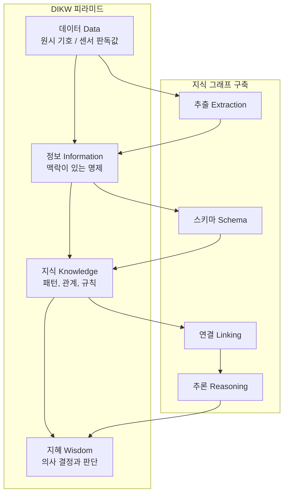

정보 이론의 관점에서 볼 때, DIKW 피라미드의 각 계층은 엔트로피 감소에 해당합니다. 원시 데이터는 맥락이 부족하여 엔트로피가 가장 높고, 정보는 메타데이터를 통해 불확실성을 낮추며, 지식은 패턴을 통해 표현을 더욱 압축하고, 지혜는 제약 조건 하에서 최적의 의사 결정을 의미합니다. 지식 그래프의 가치는 "정보"를 "지식"으로 고정시키고, 그래프 구조와 논리 규칙을 통해 지식에서 지혜로의 자동 추론을 지원하는 데 있습니다.

지식 표현 방법의 역사적 발전은 아래 그림으로 요약할 수 있습니다:

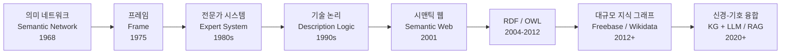

### 2.1.5 요약

전통적인 지식 조직 방식은 구조화, 연관성, 추적 가능성 및 업데이트 가능성 측면에서 명백한 한계를 가지고 있습니다. 지식 그래프는 그래프 구조, 통합 스키마 및 출처 검증을 통해 복잡한 영역에 공학적인 지식 관리 방법을 제공합니다. 그 이론적 기반에는 정보 이론, 명제 논리, 1차 논리, 기술 논리, 의미 네트워크, 프레임 및 온톨로지가 포함됩니다.

---

## 2.2 정보 모델

이 책에서 사용하는 정보 모델은 "**개체-관계-출처-검증**" 사중항으로 요약할 수 있습니다. 아래에서 각각 설명합니다.

### 2.2.1 개체 모델

각 개체는 하나의 Markdown 파일로 표현되며, 파일의 frontmatter는 YAML 형식을 사용하며 다음 핵심 필드를 포함합니다.

```yaml
---
id: ent_robot_unitree_h1_humanoid_robot_2024
type: robot_system
title: Unitree H1 Humanoid Robot
domain: 11_applications_markets
theoretical_depth: system
aliases:
  - Unitree H1
  - 宇树 H1
status: active
created_at: 2024-01-15T00:00:00Z
updated_at: 2026-06-30T00:00:00Z
sources:
  - id: unitree_official_h1
    type: website
    title: Unitree H1 Official Page
    url: https://www.unitree.com/products/h1
verification:
  reviewed_by: human_and_ai
  reviewed_at: 2026-06-30T00:00:00Z
---
```

!!! note "용어 설명: Frontmatter"
    Frontmatter는 Markdown 파일 상단의 메타데이터 블록으로, 일반적으로 `---`로 감싸며 YAML 형식을 사용합니다. 작성자가 본문을 변경하지 않고 문서에 구조화된 속성을 추가할 수 있게 합니다. 기술적 구현 측면에서 Frontmatter는 일반 텍스트와 데이터베이스 레코드 사이의 경량 메타데이터 계층입니다.

!!! note "용어 설명: YAML"
    YAML(YAML Ain't Markup Language)은 사람이 읽을 수 있는 데이터 직렬화 형식으로, 구성 파일과 메타데이터에 자주 사용됩니다. 스칼라, 리스트, 딕셔너리 등의 구조를 지원하며, 들여쓰기를 통해 계층을 표현합니다. YAML은 표현력 면에서 JSON과 동등하지만, 사람이 읽고 편집하기에 더 편리합니다.

**개체 필드 설명:**

| 필드 | 유형 | 필수 | 설명 |
|------|------|------|------|
| `id` | 문자열 | 예 | 개체 고유 식별자, 소문자, 영문자, 숫자 및 밑줄만 포함 |
| `type` | 열거형 | 예 | 개체 유형, 예: `paper`, `method`, `component`, `company` |
| `title` | 문자열 | 예 | 개체 제목 |
| `domain` | 열거형 | 예 | 소속 도메인 코드, 예: `02_components`, `07_ai_models_algorithms` |
| `theoretical_depth` | 열거형 | 예 | 이론적 깊이: `foundation`, `principle`, `formalism`, `method`, `system` |
| `aliases` | 리스트 | 아니요 | 별칭, 검색 및 동음이의어 해소용 |
| `status` | 열거형 | 예 | 상태: `active`, `staged`, `rejected`, `deprecated` |
| `sources` | 리스트 | 예 | 출처 정보 |
| `verification` | 객체 | 예 | 검토 정보 |

### 2.2.2 개체 유형

이 책의 개체 유형은 휴머노이드 로봇 전 산업 체인을 포괄합니다. 주요 유형은 다음과 같습니다.

| 개체 유형 | 영문 | 예시 | 설명 |
|---------|------|------|------|
| 논문 | `paper` | Diffusion Policy, GR00T N1 | 학술 논문 또는 사전 인쇄본 |
| 방법 | `method` | Action Chunking, MPC | 연구 방법 또는 기술 방법 |
| 알고리즘 | `algorithm` | PPO, SAC, QP | 구체적인 알고리즘 |
| 데이터셋 | `dataset` | Open X-Embodiment, DROID | 훈련 또는 평가 데이터셋 |
| 소프트웨어 플랫폼 | `software_platform` | ROS 2, Isaac Sim, MuJoCo | 소프트웨어 또는 플랫폼 |
| 기술 | `technology` | URDF, EtherCAT, VLA | 기술 개념 또는 프레임워크 |
| 부품 | `component` | 고조파 감속기, 프레임리스 토크 모터 | 하드웨어 부품 |
| 로봇 시스템 | `robot_system` | Tesla Optimus, Unitree H1 | 완전한 로봇 제품 |
| 회사 | `company` | Tesla, Figure AI, 우슈 테크놀로지 | 기업 또는 기관 |
| 부품 제조사 | `component_manufacturer` | Harmonic Drive Systems | 부품을 전문으로 제조하는 업체 |
| 1차 공급업체 | `tier1_supplier` | 산화 지능 | 완제품 제조사에 직접 납품하는 공급업체 |
| 완제품 제조사 | `oem` | Tesla, 유비테크 | 주문자 상표 부착 생산 업체 |
| 표준 | `standard` | ISO 13482, IEC 61508 | 표준 또는 규정 |
| 재료 | `material` | 네오디뮴 자석, 알루미늄-마그네슘 합금 | 원자재 또는 재료 |
| 응용 | `application` | 자동차 제조, 물류 창고 | 응용 시나리오 |
| 시장 | `market` | 산업용 휴머노이드 로봇 시장 | 시장 또는 세분화된 분야 |
| 기초 개념 | `concept` | 시스템 공학, 불쾌한 골짜기 효과 | 추상적 개념 |
| 원리 | `principle` | 동역학, 제어 이론 | 기초 원리 |
| 형식화 | `formalism` | 오일러-라그랑주 방정식, QP | 수학적 또는 계산적 형식 |
| 벤치마크 | `benchmark` | Human-Level Actuation Score | 평가 기준 |
| 장비 | `equipment` | 시스템 통합 테스트 벤치 | 장비 또는 도구 |

#### 2.2.2.1 개체 유형의 존재론적 약속과 분류학

!!! note "용어 설명: 분류학(Taxonomy)"
    분류학은 도메인 개념을 체계적으로 분류하는 학문입니다. 존재론 공학에서 분류학은 일반적으로 `rdfs:subClassOf` 관계로 구성된 방향성 비순환 그래프(DAG)로 표현됩니다. 형식적으로, 클래스 $C_1$이 클래스 $C_2$의 하위 클래스이면 $C_1 \preceq C_2$입니다. 이 부분 순서 관계는 반사성, 반대칭성 및 전이성을 만족하여 각 개체가 추상적인 것에서 구체적인 것으로 이어지는 상속 체인에 배치될 수 있도록 합니다.

표 2.2의 개체 유형은 단순히 나열된 것이 아니라, 휴머노이드 로봇 지식의 "추상적 개념"에서 "물리적 제품"에 이르는 연속 스펙트럼에 대응합니다. 이를 세 가지 주요 존재론적 약속(ontological commitment)으로 추상화할 수 있습니다.

1. **물리적 개체(Physical Entity)**: 시공간을 차지하고 질량과 에너지를 가지는 객체, 예: `component`, `robot_system`, `material`, `company`.
2. **정보 개체(Information Entity)**: 기호나 데이터 형태로 존재하는 객체, 예: `paper`, `method`, `algorithm`, `dataset`, `standard`.
3. **과정 및 상태(Process & State)**: 사건, 능력 또는 시장 상태를 설명하는 개체, 예: `application`, `market`, `technology`, `benchmark`.

형식화된 언어로, 개체 유형 부분 순서 집합 $(\mathcal{T}, \preceq)$을 정의할 수 있습니다. 여기서 $\mathcal{T}$는 유형 집합이고 $\preceq$는 하위 클래스 관계입니다. 임의의 개체 $e$에 대해 가장 구체적인 유형은 $type(e) \in \mathcal{T}$이며, 인스턴스화된 클래스 계층은 다음과 같이 표현할 수 있습니다.

$$\mathcal{A}(e) = \{ t \in \mathcal{T} \mid type(e) \preceq t \}$$

예를 들어, `frameless_motor` 개체는 다음을 만족합니다.

$$\mathcal{A}(e) = \{ \text{frameless\_motor}, \text{component}, \text{physical\_entity}, \text{entity} \}$$

이러한 분류 구조는 두 가지 직접적인 공학적 가치를 제공합니다. 첫째는 **상속 추론**을 지원합니다. 존재론이 `component`가 반드시 `mass` 속성을 가져야 한다고 규정하면, 모든 `frameless_motor` 개체는 자동으로 이 제약을 상속합니다. 둘째는 **계층 간 쿼리**를 지원합니다. 모든 `physical_entity`를 쿼리하면 부품, 로봇, 재료 등을 한 번에 반환할 수 있습니다.

!!! note "용어 설명: 방향성 비순환 그래프(Directed Acyclic Graph, DAG)"
    방향성 비순환 그래프는 간선에 방향이 있고 방향성 순환이 없는 그래프입니다. 형식적으로, 그래프 $G=(V,E)$가 방향성 비순환 그래프가 되기 위한 필요충분조건은 $v_k=v_1$이고 $(v_i, v_{i+1}) \in E$인 정점 시퀀스 $v_1, v_2, \dots, v_k$가 존재하지 않는 것입니다. 존재론의 클래스 계층은 반드시 DAG여야 합니다. 그렇지 않으면 "$A$는 $B$의 하위 클래스이고 $B$는 $A$의 하위 클래스이다"라는 논리적 모순이 발생합니다.

#### 2.2.2.2 엔터티 유형과 전체 장 절 매핑

엔터티 유형의 설계는 본서의 후속 장 절 구분에 직접적으로 기여합니다. 표 2.3은 주요 엔터티 유형과 해당 장 절 간의 인덱스 관계를 제시하여, 독자가 지식 그래프와 본문 사이를 쉽게 이동할 수 있도록 합니다.

| 엔터티 유형 | 주요 해당 장 | 설명 |
|------------|-------------|------|
| `material` | 제3장 | 희토류 영구자석, 구조 재료, 배터리 재료, 반도체 재료 |
| `component` | 제4, 5, 6장 | 액추에이터, 센서, 컴퓨팅/전원/열 관리 하드웨어 |
| `robot_system` | 제8, 9장 | 전체 기계 설계 원리 및 핵심 하위 시스템 |
| `method` / `algorithm` / `software_platform` | 제7장 및 이후 AI 장 | 제어, 인지, 결정 알고리즘 및 미들웨어 |
| `company` / `tier1_supplier` / `oem` | 제7장 | 공급업체 지도 및 공급망 관리 |
| `standard` / `policy` | 제12장 | 정책, 법률, 윤리 |

다음 Python 예제는 `networkx`를 사용하여 엔터티 유형의 하위 클래스 DAG를 구축하고 각 유형의 조상 집합을 계산하는 방법을 보여줍니다.

```python
import networkx as nx

G = nx.DiGraph()
# 유형 계층 구조 (예시)
edges = [
    ("entity", "physical_entity"),
    ("entity", "information_entity"),
    ("physical_entity", "component"),
    ("physical_entity", "robot_system"),
    ("physical_entity", "material"),
    ("information_entity", "paper"),
    ("information_entity", "method"),
    ("information_entity", "algorithm"),
]
G.add_edges_from(edges)

# 각 유형의 조상 집합 계산 (자기 자신 포함)
for t in G.nodes():
    ancestors = nx.ancestors(G, t) | {t}
    print(f"{t}: {sorted(ancestors)}")
```

실행 결과 설명: `component`의 조상 집합은 `['component', 'entity', 'physical_entity']`입니다. 이는 해당 유형에 대한 속성 제약이 DAG를 따라 위로 집계되고 아래로 상속됨을 의미합니다.

!!! note "용어 설명: 상속 추론 (Inheritance Reasoning)"
    상속 추론은 하위 클래스가 상위 클래스의 속성과 제약을 자동으로 획득하는 추론 과정입니다. 기술 논리에서 $\text{Component} \sqsubseteq \text{PhysicalEntity}$이고 $\text{PhysicalEntity} \sqsubseteq \exists \text{hasMass}$이면, $\text{Component} \sqsubseteq \exists \text{hasMass}$를 추론할 수 있습니다. 이는 온톨로지 엔지니어링에서 중복 모델링을 피하고 일관성을 보장하는 핵심 메커니즘입니다.

### 2.2.3 관계 모델

관계도 Markdown 파일로 표현되며, frontmatter에는 소스 엔터티, 대상 엔터티, 관계 유형, 출처 및 검증 정보가 포함됩니다.

```yaml
---
id: rel_ent_component_harmonic_reducer_2024_is_part_of_ent_component_rotary_actuator_2024
source_id: ent_component_harmonic_reducer_2024
target_id: ent_component_rotary_actuator_2024
type: is_part_of
strength: strong
direction: directed
status: active
sources:
  - id: curated_workflow_relationship
    type: website
    title: Humanoid Robot Workflow Relationship Curation
verification:
  reviewed_by: ai_autonomous
  reviewed_at: 2026-07-01T00:00:00Z
---
```

**관계 필드 설명:**

| 필드 | 유형 | 필수 | 설명 |
|------|------|------|------|
| `id` | 문자열 | 예 | 관계 고유 식별자 |
| `source_id` | 문자열 | 예 | 소스 엔터티 ID |
| `target_id` | 문자열 | 예 | 대상 엔터티 ID |
| `type` | 열거형 | 예 | 관계 유형 |
| `strength` | 열거형 | 아니요 | 관계 강도: `strong`, `moderate`, `weak` |
| `direction` | 열거형 | 예 | 방향: `directed`, `bidirectional` |
| `status` | 열거형 | 예 | 상태 |
| `sources` | 리스트 | 예 | 출처 정보 |
| `verification` | 객체 | 예 | 검토 정보 |

### 2.2.4 관계 유형

본서에서 정의하는 관계 유형은 기술 의존성, 구성 관계, 제조 관계, 적용 시나리오 및 규제 관계 등을 포함합니다.

| 관계 유형 | 의미 | 예시 |
|---------|------|------|
| `is_part_of` | 소스는 대상의 구성 요소 | 하모닉 드라이브 → 회전 액추에이터 |
| `uses` | 소스가 대상을 사용 | VLA 모델 → 데이터셋 |
| `requires` | 소스가 대상에 의존 | MPC → IMU |
| `implemented_on` | 방법/알고리즘이 대상에 배포 | Diffusion Policy → Unitree H1 |
| `manufactures` | 소스가 대상을 제조 | Harmonic Drive Systems → 하모닉 드라이브 |
| `supplies` | 소스가 대상에 공급 | Tuopu Group → Tesla |
| `sources_from` | 소스가 대상으로부터 조달 | Tesla → Tuopu Group |
| `applies_to` | 소스가 대상에 적용 | ISO 13482 → 서비스 로봇 |
| `regulates` | 소스가 대상을 규제/제약 | IEC 61508 → 제어 시스템 |
| `tested_with` | 소스가 대상으로 테스트됨 | 로봇 → HIL 테스트 벤치 |
| `validates_on` | 소스가 대상을 검증 | 테스트 벤치 → 로봇 |
| `analyzes` | 소스가 대상을 분석 | FEA → 기계 구조 |
| `models` | 소스가 대상을 모델링 | URDF → 로봇 |
| `manages` | 소스가 대상을 관리 | Fleet 플랫폼 → 로봇 |
| `deployed_at` | 소스가 대상 시나리오에 배포 | Figure 02 → BMW Spartanburg |
| `competes_with` | 소스가 대상과 경쟁 | Tesla → Figure AI |
| `partners_with` | 소스가 대상과 협력 | BMW → Figure AI |

### 2.2.5 출처 및 검증 모델

모든 엔터티와 관계에는 출처 및 검증 정보가 있어야 합니다.

**출처 유형:**

| 유형 | 설명 | 예시 |
|------|------|------|
| `primary` | 1차 출처, 예: 논문 원문, 회사 공식 웹사이트 | arXiv 논문, Unitree 공식 웹사이트 |
| `secondary` | 2차 분석, 예: 리뷰, 보고서 | Goldman Sachs 보고서 |
| `press_release` | 보도 자료 | 회사 자금 조달 공지 |
| `patent` | 특허 문서 | 액추에이터 구조 특허 |
| `report` | 연구 보고서 | Counterpoint Research |
| `paper` | 학술 논문 | Conference on Robot Learning |
| `annual_report` | 연례 보고서 | Tesla 10-K |
| `website` | 웹사이트 | 기술 블로그, 백과사전 |
| `interview` | 인터뷰 | CEO 인터뷰 |
| `other` | 기타 | 내부 정리 자료 |

**검증 필드:**

| 필드 | 유형 | 설명 |
|------|------|------|
| `reviewed_by` | 열거형 | `human`, `ai`, `ai_autonomous`, `human_and_ai` |
| `reviewed_at` | 타임스탬프 | 검토 시간 |
| `review_notes` | 문자열 | 검토 메모 |

정보 모델 사중항의 관계는 아래 그림으로 나타낼 수 있습니다.

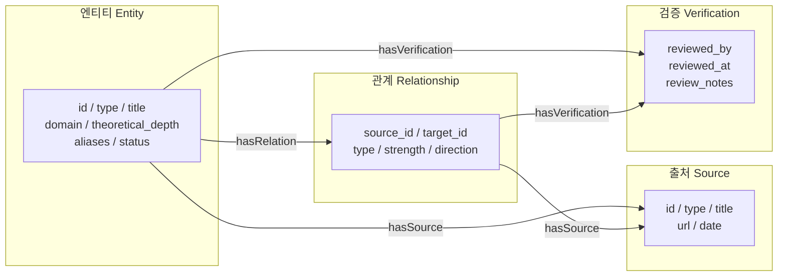

### 2.2.6 지식 그래프의 그래프 이론 기초

지식 그래프의 기본 데이터 구조는 그래프입니다. 그래프 이론 기초를 이해하는 것은 스키마 설계, 품질 평가, 저장 및 쿼리 방식 선택에 매우 중요합니다.

!!! note "용어 설명: 방향 그래프 (Directed Graph)"
    방향 그래프는 간선에 방향이 있는 그래프로, $G=(V,E)$로 표기하며, $E$는 순서가 있는 정점 쌍의 집합으로 $E \subseteq V \times V$입니다. 지식 그래프에서 트리플 $(s,p,o)$는 방향 그래프의 한 간선이며, 방향은 주어 $s$에서 목적어 $o$로 향합니다.

!!! note "용어 설명: 트리플 (Triple)"
    트리플은 지식 그래프의 기본 데이터 단위로, 형태는 $(subject, predicate, object)$이며, 줄여서 $(s,p,o)$라고 합니다. 예:
    $$(\text{Unitree H1}, \text{uses}, \text{고조파 감속기})$$
    트리플은 1차 논리의 원자 공식 $P(s,o)$에 대응하며, RDF, SPARQL 및 기술 논리의 공통 기반입니다.

!!! note "용어 설명: 속성 그래프 (Labeled Property Graph, LPG)"
    속성 그래프는 노드와 간선 모두 레이블(label)과 속성(property)을 가질 수 있는 그래프 데이터 모델입니다. Neo4j와 같은 그래프 데이터베이스는 LPG 모델을 채택합니다. LPG와 RDF의 주요 차이점은 LPG는 간선이 속성을 가질 수 있는 반면, RDF의 간선은 술어이며 속성은 보조 노드나 reification을 통해 표현해야 한다는 점입니다.

!!! note "용어 설명: 자원 기술 프레임워크 (Resource Description Framework, RDF)"
    RDF는 W3C가 권장하는 시맨틱 웹 데이터 모델로, 지식을 트리플 집합으로 표현합니다. RDF의 각 자원은 통합 자원 식별자(URI)를 가지며, 술어도 URI입니다. RDF는 상호 운용성과 형식적 의미론을 강조하며, SPARQL 쿼리 언어와 OWL 온톨로지의 데이터 기반입니다.

!!! note "용어 설명: 차수 (Degree)"
    무방향 그래프에서 노드의 차수 $d(v)$는 해당 노드에 연결된 간선의 수입니다. 방향 그래프에서는 진입 차수 $d_{in}(v)$(해당 노드를 가리키는 간선 수)와 진출 차수 $d_{out}(v)$(해당 노드에서 나가는 간선 수)로 나뉩니다. 차수의 분포는 지식 그래프 구조 분석의 기본 지표입니다.

!!! note "용어 설명: 경로 (Path)와 연결 성분 (Connected Component)"
    경로는 그래프에서 한 노드에서 다른 노드로 가는 노드-간선 시퀀스입니다. 연결 성분은 그래프에서 임의의 두 노드 사이에 경로가 존재하는 최대 부분 그래프를 말합니다. 방향 그래프에서는 약한 연결 성분과 강한 연결 성분으로 더 나뉩니다. 경로와 연결성은 그래프 탐색, 쿼리 및 추론의 기초입니다.

!!! note "용어 설명: 중심성 (Centrality)"
    중심성은 그래프에서 노드의 중요도를 측정합니다. 일반적인 유형은 다음과 같습니다:
    - **차수 중심성 (Degree Centrality)**: $C_D(v) = \frac{d(v)}{|V|-1}$
    - **매개 중심성 (Betweenness Centrality)**: $C_B(v) = \sum_{s \neq v \neq t} \frac{\sigma_{st}(v)}{\sigma_{st}}$, 여기서 $\sigma_{st}$는 $s$에서 $t$까지의 최단 경로 수이고, $\sigma_{st}(v)$는 $v$를 통과하는 최단 경로 수입니다.
    - **근접 중심성 (Closeness Centrality)**: $C_C(v) = \frac{|V|-1}{\sum_{u \neq v} d(v,u)}$

!!! note "용어 설명: PageRank"
    PageRank는 무작위 보행 기반 노드 중요도 측정으로, 원래 웹 페이지 순위를 매기는 데 사용되었습니다. 반복 공식은 다음과 같습니다:
    $$PR(v) = \frac{1-\alpha}{|V|} + \alpha \sum_{u \in N_{in}(v)} \frac{PR(u)}{d_{out}(u)}$$
    여기서 $\alpha$는 감쇠 계수로, 일반적으로 0.85를 사용합니다. PageRank는 중요성이 간선을 통해 전파될 수 있다고 가정하며, 지식 그래프의 핵심 엔티티를 발견하는 데 적합합니다.

!!! note "용어 설명: 군집 계수 (Clustering Coefficient)"
    군집 계수는 노드의 이웃들이 서로 연결된 정도를 측정합니다. 지역 군집 계수는 다음과 같이 정의됩니다:
    $$C(v) = \frac{2 \cdot |\{(u,w) \in E : u,w \in N(v)\}|}{d(v)(d(v)-1)}$$
    높은 군집 계수는 지역 커뮤니티 구조가 긴밀함을 나타내며, 도메인의 기술 클러스터나 공급망 클러스터와 대응될 수 있습니다.

아래 Mermaid 다이어그램은 LPG와 RDF 두 데이터 모델을 비교합니다:

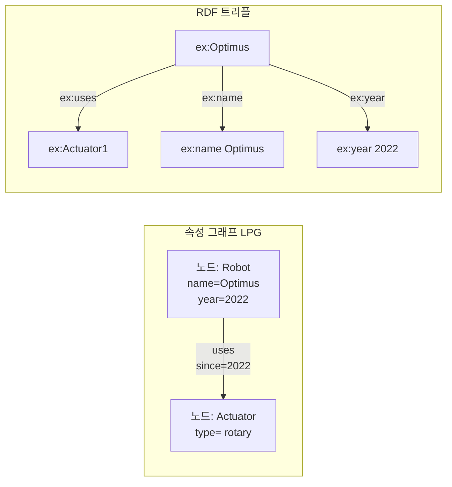

아래 Python 예제는 `networkx`를 사용하여 간단한 휴머노이드 로봇 지식 그래프를 구축하고, 차수, PageRank 및 군집 계수를 계산하는 방법을 보여줍니다.

```python
import networkx as nx

# 방향 그래프 생성
G = nx.DiGraph()

# 엔티티 노드 추가
entities = [
    ("Optimus", {"type": "robot_system"}),
    ("Unitree H1", {"type": "robot_system"}),
    ("Harmonic Reducer", {"type": "component"}),
    ("Frameless Motor", {"type": "component"}),
    ("Rotary Actuator", {"type": "component"}),
    ("Tesla", {"type": "company"}),
    ("Harmonic Drive Systems", {"type": "company"}),
]
G.add_nodes_from(entities)
```

# 관계 엣지 추가
triples = [
    ("Optimus", "uses", "Harmonic Reducer"),
    ("Optimus", "uses", "Frameless Motor"),
    ("Unitree H1", "uses", "Harmonic Reducer"),
    ("Rotary Actuator", "is_part_of", "Optimus"),
    ("Rotary Actuator", "is_part_of", "Unitree H1"),
    ("Harmonic Reducer", "is_part_of", "Rotary Actuator"),
    ("Frameless Motor", "is_part_of", "Rotary Actuator"),
    ("Tesla", "manufactures", "Optimus"),
    ("Harmonic Drive Systems", "manufactures", "Harmonic Reducer"),
]
G.add_edges_from([(s, o, {"predicate": p}) for s, p, o in triples])

# 차수 분석
print("In-degree:", dict(G.in_degree()))
print("Out-degree:", dict(G.out_degree()))

# PageRank
pr = nx.pagerank(G, alpha=0.85)
print("PageRank:", sorted(pr.items(), key=lambda x: -x[1]))

# 클러스터링 계수는 무방향 그래프 필요
G_undirected = G.to_undirected()
cc = nx.clustering(G_undirected)
print("Clustering coefficient:", cc)
```

---

## 2.3 계층 구조와 이론적 깊이

### 2.3.1 Domain 계층

이질적 지식을 조직화하기 위해, 이 책은 휴머노이드 로봇 분야를 13개의 domain으로 구분합니다:

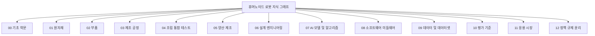

**Domain 설명:**

| 코드 | 명칭 | 포함 내용 |
|------|------|---------|
| `00_foundations` | 기초 학문 | 수학, 물리학, 화학, 컴퓨터 과학 기초 |
| `01_raw_materials` | 원자재 | 희토류, 자성 재료, 합금, 배터리 재료, 반도체 |
| `02_components` | 부품 | 액추에이터, 감속기, 모터, 센서, 연산 장치 |
| `03_manufacturing_processes` | 제조 공정 | 기계 가공, 권선, 주조, 열처리, DFM |
| `04_assembly_integration_testing` | 조립 통합 테스트 | 조립 라인, 테스트 벤치, HIL, 캘리브레이션 |
| `05_mass_production` | 양산 제조 | 생산 능력 확대, BOM, 수율, 공급망 |
| `06_design_engineering` | 설계 엔지니어링 | 기계 설계, 동역학, URDF, FEA |
| `07_ai_models_algorithms` | AI 모델 및 알고리즘 | VLA, 모방 학습, 강화 학습, 제어 알고리즘 |
| `08_software_middleware` | 소프트웨어 미들웨어 | ROS 2, 실시간 시스템, 시뮬레이션 플랫폼, fleet 관리 |
| `09_data_datasets` | 데이터 및 데이터셋 | 원격 조작 데이터, 공개 데이터셋, 데이터 엔지니어링 |
| `10_evaluation_benchmarks` | 평가 기준 | 시뮬레이션 기준, 실제 작업 기준, 안전 기준 |
| `11_applications_markets` | 응용 시장 | 산업 제조, 물류, 의료, 가정, 시장 |
| `12_policy_regulation_ethics` | 정책 규제 윤리 | 표준, 인증, 책임, 윤리, 사회적 영향 |

### 2.3.2 이론적 깊이 (Theoretical Depth)

각 엔터티에는 지식 계층에서의 위치를 반영하는 이론적 깊이가 부여됩니다:

| 깊이 | 의미 | 예시 |
|------|------|------|
| `foundation` | 기초 학문 | 선형대수학, 뉴턴 역학, 재료 과학 |
| `principle` | 기본 원리 | 제어 이론, 머신러닝 원리 |
| `formalism` | 형식화 방법 | 오일러-라그랑주 방정식, QP, 마르코프 결정 과정 |
| `method` | 방법 또는 기술 | Diffusion Policy, MPC, URDF |
| `system` | 시스템 또는 제품 | Tesla Optimus, ROS 2, Open X-Embodiment |

이론적 깊이의 역할은 지식의 "뿌리"를 식별하는 것입니다. 예를 들어, 로봇 시스템을 분석할 때, 해당 시스템이 의존하는 방법, 형식화, 원리 및 기초 학문을 거슬러 올라가 완전한 인지 연결 고리를 형성할 수 있습니다.

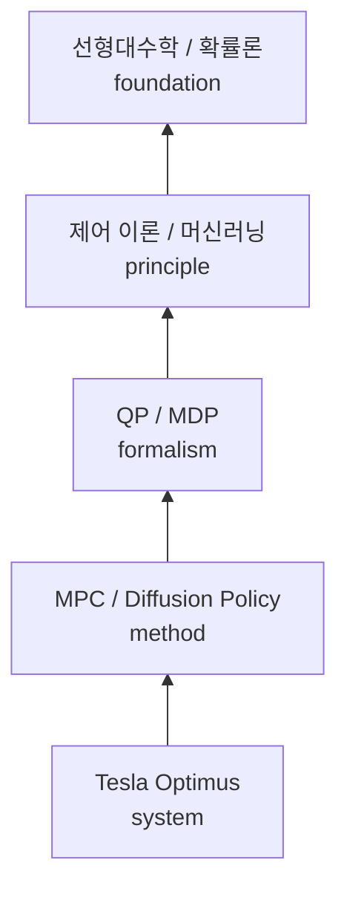

Domain 계층과 이론적 깊이는 함께 2차원 조직 프레임워크를 구성합니다: 동일한 domain 내의 엔터티는 foundation에서 system으로 이론적 깊이에 따라 진행되며, 서로 다른 domain 간에는 계층 간 관계를 통해 연결되어 완전한 지식 네트워크를 형성합니다.

### 2.3.3 온톨로지 엔지니어링 방법

온톨로지 엔지니어링은 온톨로지를 설계하고 유지 관리하는 체계적인 프로세스입니다. 휴머노이드 로봇과 같은 복잡한 분야에서 온톨로지 엔지니어링은 용어를 통일하고, 관계를 명확히 하며, 추론과 지식 공유를 지원하는 데 도움을 줍니다.

!!! note "용어 설명: 상위 온톨로지 (Upper Ontology / Top-level Ontology)"
    상위 온톨로지는 특정 학문에 국한되지 않는, 학제 간 일반 개념 프레임워크입니다. 유명한 상위 온톨로지는 다음과 같습니다:
    - **BFO (Basic Formal Ontology)**: continuants(지속 존재물)와 occurrents(발생 과정)의 구분을 강조하며, 생물의학 분야에서 널리 사용됩니다.
    - **DOLCE (Descriptive Ontology for Linguistic and Cognitive Engineering)**: 인지 및 언어적 관점에서 엔터티를 설명하며, 물리적 객체, 추상적 객체, 사건 등을 구분합니다.
    - **SUMO (Suggested Upper Merged Ontology)**: 규모가 크며, 철학, 수학, 시간, 공간 등을 포괄하고 WordNet과 매핑됩니다.

!!! note "용어 설명: 도메인 온톨로지 (Domain Ontology)"
    도메인 온톨로지는 특정 학문 또는 응용 시나리오를 위한 온톨로지입니다. 예를 들어 "휴머노이드 로봇 온톨로지", "자동차 제조 온톨로지" 등이 있습니다. 이는 상위 온톨로지의 일반 개념을 상속하고 전문 용어, 관계 및 제약 조건을 추가합니다.

도메인 온톨로지의 설계는 일반적으로 다음 워크플로를 따릅니다:

1. **요구 사항 분석**: 온톨로지의 사용 시나리오와 사용자 질문을 명확히 합니다.
2. **용어 수집**: 문헌, 전문가, 표준에서 핵심 용어를 추출합니다.
3. **개념 계층화**: 클래스와 서브클래스의 계층 구조를 구축합니다.
4. **속성 및 관계 정의**: 데이터 속성(예: 이름, 연도)과 객체 속성(예: 사용, 제조)을 정의합니다.
5. **제약 조건 및 공리**: 카디널리티 제약, 상호 배타 제약, 전이 폐쇄 등을 추가합니다.
6. **평가 및 반복**: 사용 사례, 쿼리 및 전문가 검토를 통해 온톨로지를 검증합니다.

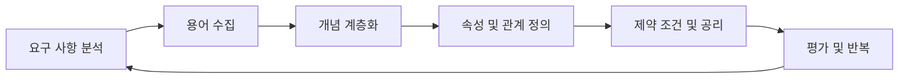

!!! note "용어 설명: OOPS (OntOlogy Pitfall Scanner)"
    OOPS는 자동화된 온톨로지 결함 탐지 도구로, "다형 인스턴스 생성", "클래스와 인스턴스 혼동", "선언되지 않은 동등 관계", "주석 누락" 등 일반적인 온톨로지 설계 오류를 식별할 수 있습니다. OOPS의 탐지 결과는 온톨로지 엔지니어가 온톨로지의 명확성과 일관성을 개선하는 데 도움을 줍니다.

!!! note "용어 설명: 온톨로지 매칭 (Ontology Matching) 및 스키마 정렬 (Schema Alignment)"
    온톨로지 매칭은 두 개 이상의 온톨로지 간 의미적 대응 관계를 발견하는 프로세스입니다. 대응 관계에는 동등(equivalence), 포함(subsumption), 관련(related) 등이 포함됩니다. 스키마 정렬은 데이터베이스 및 지식 그래프 분야의 유사한 문제로, 서로 다른 출처의 Schema를 통합된 뷰로 매핑하는 것을 목표로 합니다. 일반적으로 사용되는 기술에는 문자열 유사도 기반, 구조 유사도 기반, 인스턴스 중복 및 임베딩 학습 방법이 포함됩니다.

!!! note "용어 설명: 상호 운용성 (Interoperability)"
    상호 운용성은 서로 다른 시스템, 조직 또는 데이터셋이 정보를 효과적으로 교환하고 사용할 수 있는 능력을 의미합니다. 온톨로지는 공유 어휘와 형식적 의미를 제공하여 데이터 통합 시 모호성을 줄이고 상호 운용성을 향상시킵니다.

휴머노이드 로봇 분야에서 온톨로지 엔지니어링의 응용 예시:

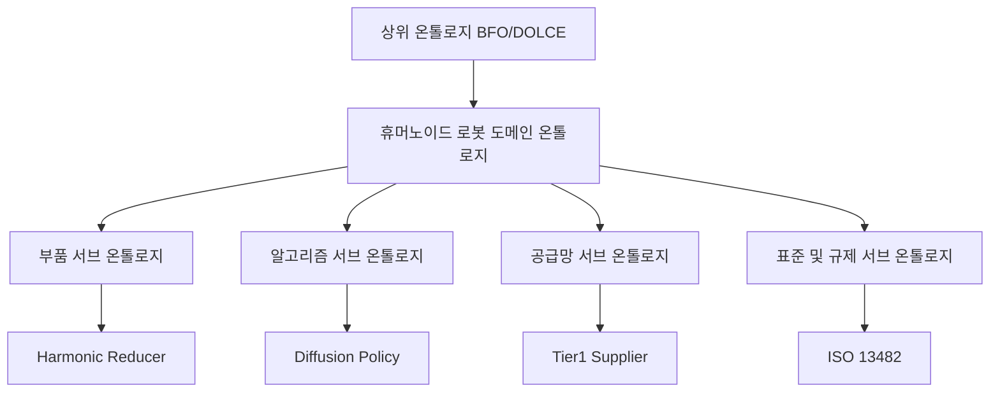

### 2.3.4 형식적 의미와 OWL

형식적 의미는 지식 그래프에 기계가 해석 가능한 의미를 부여하여, 컴퓨터가 모순을 자동으로 감지하고, 암시적 관계를 추론하며, 복잡한 질의에 응답할 수 있도록 합니다.

!!! note "용어 설명: RDF 트리플 (RDF Triple)"
    RDF 트리플은 $(subject, predicate, object)$ 형식이며, 주어와 술어는 URI이고, 목적어는 URI 또는 리터럴일 수 있습니다. 예를 들어:
    ```turtle
    ex:UnitreeH1 rdf:type ex:RobotSystem .
    ex:UnitreeH1 ex:uses ex:HarmonicReducer .
    ```
    RDF는 시맨틱 웹의 데이터 계층 표준으로, 서로 다른 데이터 소스 간의 상호 운용성을 지원합니다.

!!! note "용어 설명: RDFS(RDF Schema)"
    RDFS는 RDF의 어휘 설명 언어로, 클래스(rdfs:Class), 속성(rdf:Property), 하위 클래스 관계(rdfs:subClassOf), 하위 속성 관계(rdfs:subPropertyOf), 정의역/치역(rdfs:domain / rdfs:range)을 정의할 수 있도록 지원합니다. RDFS는 경량 수준의 추론 기능을 제공합니다.

!!! note "용어 설명: OWL(Web Ontology Language)"
    OWL은 W3C가 권장하는 온톨로지 언어로, 기술 논리에 기반하며 RDFS보다 더 강력한 표현력을 제공합니다. OWL은 클래스 표현, 속성 제약, 개체 선언 및 복잡한 추론 작업을 지원합니다. OWL 2는 최신 버전으로, 표현력과 계산 복잡성 간의 균형을 맞추기 위해 더 많은 구성자와 프로파일(profiles)을 추가했습니다.

OWL의 핵심 구성자는 다음과 같습니다:

| 구성자 | 의미 | 예시 |
|------|------|------|
| `owl:Class` | 클래스 | `RobotSystem`은 클래스입니다 |
| `owl:ObjectProperty` | 객체 속성, 두 개체를 연결 | `uses`는 로봇과 부품을 연결 |
| `owl:DatatypeProperty` | 데이터 속성, 개체와 리터럴을 연결 | `hasYear`는 로봇과 연도를 연결 |
| `rdfs:subClassOf` | 하위 클래스 관계 | `HumanoidRobot`은 `RobotSystem`의 하위 클래스 |
| `owl:inverseOf` | 역속성 | `manufactures`와 `manufacturedBy`는 서로 역 |
| `owl:TransitiveProperty` | 추이 속성 | `isPartOf`는 추이적 |
| `owl:FunctionalProperty` | 함수형 속성 | 각 로봇은 고유한 일련번호를 가짐 |
| `owl:Restriction` | 제약 | 각 로봇은 최소 하나의 액추에이터를 가짐 |

다음 Turtle 예제는 휴머노이드 로봇 재료 온톨로지의 일부를 보여줍니다:

```turtle
@prefix ex: <http://example.org/humanoid-robot#> .
@prefix rdfs: <http://www.w3.org/2000/01/rdf-schema#> .
@prefix owl: <http://www.w3.org/2002/07/owl#> .
@prefix xsd: <http://www.w3.org/2001/XMLSchema#> .

ex:RobotSystem a owl:Class .
ex:Component a owl:Class .
ex:Material a owl:Class .

ex:HumanoidRobot rdfs:subClassOf ex:RobotSystem .
ex:Actuator rdfs:subClassOf ex:Component .
ex:MagnetMaterial rdfs:subClassOf ex:Material .

ex:uses a owl:ObjectProperty ;
    rdfs:domain ex:RobotSystem ;
    rdfs:range ex:Component .

ex:isPartOf a owl:ObjectProperty ;
    a owl:TransitiveProperty ;
    rdfs:domain ex:Component ;
    rdfs:range ex:Component .

ex:isMadeOf a owl:ObjectProperty ;
    rdfs:domain ex:Component ;
    rdfs:range ex:Material .

ex:NeodymiumMagnet a ex:MagnetMaterial .
ex:FramelessMotor a ex:Actuator .
ex:Optimus a ex:HumanoidRobot .

ex:FramelessMotor ex:isMadeOf ex:NeodymiumMagnet .
ex:Optimus ex:uses ex:FramelessMotor .
```

위 온톨로지를 기반으로 OWL 추론 엔진은 다음을 도출할 수 있습니다:

- `HumanoidRobot rdfs:subClassOf RobotSystem`이므로 `Optimus`는 `RobotSystem`이기도 합니다.
- `isPartOf`가 추이적이므로, "감속기가 액추에이터의 일부"이고 "액추에이터가 로봇의 일부"라면 "감속기는 로봇의 일부"라고 추론할 수 있습니다.
- `uses`의 정의역이 `RobotSystem`이므로, `FramelessMotor`의 사용 주체는 로봇 시스템이라고 추론할 수 있습니다.

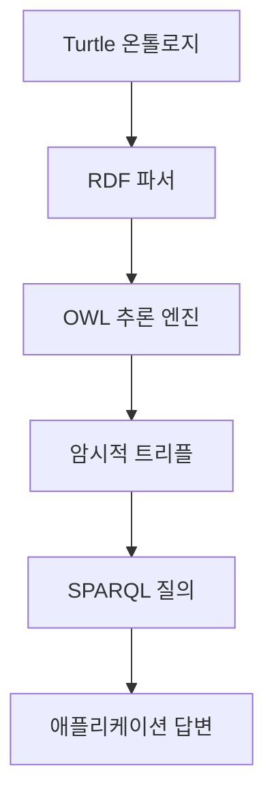

OWL은 클래스 계층, 속성 정의 및 제약 표현을 통해 지식 그래프가 사실을 기록할 뿐만 아니라 자동 추론과 일관성 검사를 지원할 수 있도록 합니다.

## 2.4 계층 간 관계 설계

### 2.4.1 계층 간 관계가 필요한 이유

휴머노이드 로봇의 핵심 과제는 서로 다른 계층 간의 강한 결합에 있습니다. 예를 들어:

- AI 알고리즘(7계층)의 성능은 데이터셋(9계층)과 컴퓨팅 하드웨어(2계층)에 의존합니다.
- 로봇 시스템(11계층)은 부품(2계층)으로 구성되며, 부품은 재료(1계층)로 만들어집니다.
- 제조 방법(3계층)은 설계 선택(6계층)에 영향을 미치고, 이는 전체 기계 비용(5계층)에 영향을 줍니다.

계층 간 관계는 이러한 분산된 개체들을 연결하여 분석 가능한 산업 체인을 형성합니다.

### 2.4.2 대표적인 계층 간 체인

다음은 휴머노이드 로봇 분야의 대표적인 계층 간 체인입니다:

**체인 1: 데이터에서 로봇까지**
```
원격 조작 시스템 → 데이터셋 → VLA 모델 → 엣지 컴퓨팅 플랫폼 → 로봇 완제품
```

**체인 2: 재료에서 시장까지**
```
희토류 재료 → 영구 자석 → 프레임리스 토크 모터 → 액추에이터 → 로봇 → 산업 응용 → 시장 규모
```

**체인 3: 설계에서 인증까지**
```
안전 원리 → 기능 안전 표준 → 안전 설계 → 비상 정지 시스템 → 로봇 → CR/CE 인증
```

**체인 4: 소프트웨어에서 배포까지**
```
ROS 2 미들웨어 → 운동 계획 라이브러리 → 제어 알고리즘 → 시뮬레이션 플랫폼 → sim-to-real → 공장 배포
```

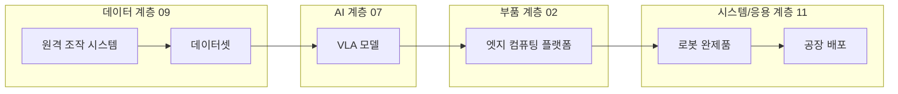

#### 2.4.2.1 계층 간 체인의 가중 경로와 의존 강도

2.4.2절에서는 네 가지 대표적인 체인을 텍스트로 요약했지만, 이러한 체인은 실제 지식 그래프에서 종종 서로 다른 **의존 강도**와 **신뢰도**를 가집니다. 공급망 위험 평가와 기술 의존성 분석을 지원하기 위해, 우리는 계층 간 체인을 가중 유향 그래프로 모델링합니다. 각 관계 $(u,v)$에 대해 두 가지 수치 속성을 부여합니다:

- **관계 강도** $w(u,v) \in [0,1]$: 원본 개체가 대상 개체에 미치는 의존 정도 또는 사실의 확실성을 반영합니다. $1$은 강한 의존(예: "감속기는 액추에이터의 필수 구성 요소"), $0$은 약한 연관을 나타냅니다.
- **출처 신뢰도** $c(u,v) \in [0,1]$: 해당 관계를 뒷받침하는 출처의 신뢰도를 반영합니다. 학술 논문, 공식 문서는 일반적으로 뉴스 기사보다 높습니다.

계층 간 경로 $P = (e_0, e_1, \dots, e_k)$의 **종합 의존 점수**는 간선 강도의 곱으로 정의할 수 있습니다:

$$S(P) = \prod_{i=1}^{k} w(e_{i-1}, e_i)$$

이 식의 물리적 의미는 의존 관계가 **전달 감쇠** 특성을 가진다는 데 있습니다. 체인의 어느 한 고리의 의존도가 약하면 전체 체인의 유효 의존도가 급격히 감소합니다. 예를 들어, 재료→자석→모터→액추에이터→로봇→시장의 각 간선 강도가 모두 $0.9$인 경우, 6개 노드 5개 간선 경로의 의존 점수는 다음과 같습니다:

$$S(P) = 0.9^5 \approx 0.5905$$

이는 각 구간의 관계가 상당히 확실하더라도 "희토류에서 시장까지"라는 거시적 체인 전체에는 약 $41\%$의 의미 감쇠가 있음을 의미합니다. 이 현상은 공급망의 "채찍 효과"와 유사합니다: 국지적 불확실성이 체인에서 증폭됩니다.

!!! note "용어 설명: 채찍 효과 (Bullwhip Effect)"
    채찍 효과는 공급망 관리학의 용어로, 수요 측의 미세한 변동이 공급망 상류로 갈수록 단계적으로 증폭되는 현상을 말합니다. 그 수학적 본질은 양의 피드백을 가진 지연 시스템입니다: 각 단계가 하류 주문량에 따라 재고를 조정하고 예측 오차가 중첩되면 상류 주문의 분산이 실제 수요 분산보다 현저히 커집니다. 지식 그래프에서 관계 신뢰도의 곱 감쇠는 이 효과의 의미론적 매핑으로 볼 수 있습니다.

#### 2.4.2.2 경로 신뢰성의 확률 전파

$c(u,v)$를 관계가 참일 확률로 해석하고 각 관계가 독립적이라고 가정하면, 경로의 모든 관계가 동시에 참일 확률은 다음과 같습니다:

$$R(P) = \prod_{i=1}^{k} c(e_{i-1}, e_i)$$

이것이 **직렬 시스템 신뢰성** 공식입니다: 경로의 어느 한 고리가 실패하면 전체 경로가 손상됩니다. 특정 노드에 여러 병렬 경로가 있는 경우, 해당 노드의 상류 노드에 대한 도달 신뢰성은 병렬 시스템 공식을 사용하여 계산할 수 있습니다:

$$R_{\text{parallel}} = 1 - \prod_{j=1}^{m} (1 - R(P_j))$$

여기서 $P_j$는 $j$번째 병렬 경로입니다. 이 공식은 단일 경로의 신뢰성이 높지 않더라도 여러 독립적인 경로가 전체 도달 신뢰성을 크게 향상시킬 수 있음을 보여줍니다.

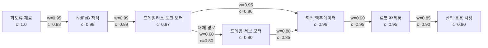

그림을 예로 들면, 주 경로 $A \to B \to C \to D \to E \to F$의 신뢰성은 다음과 같습니다:

$$R_{\text{main}} = 0.98 \times 0.99 \times 0.96 \times 0.95 \times 0.90 \approx 0.797$$

그리고 대체 모터 $G$를 통한 병렬 경로는 다음과 같습니다:

$$R_{A \to C \to D} = 0.98 \times 0.96 \approx 0.941$$
$$R_{A \to G \to D} = 0.80 \times 0.85 \approx 0.680$$
$$R_{\text{parallel}}(A \to D) = 1 - (1-0.941)(1-0.680) \approx 0.981$$

중간 정도의 신뢰도를 가진 대체 경로 하나를 도입함으로써 자석에서 액추에이터까지의 경로 신뢰성을 $94.1\%$에서 $98.1\%$로 향상시킬 수 있음을 알 수 있습니다. 이 계산은 공급망 다중 소싱 결정에 직접적인 참고 의미를 가집니다(자세한 내용은 7장 참조).

다음 Python 예제는 가중 경로 점수와 병렬 경로 신뢰성 계산을 구현합니다:

```python
import itertools

edges = {
    ("A","B"): (0.95, 0.98),
    ("B","C"): (0.99, 0.99),
    ("C","D"): (0.95, 0.96),
    ("D","E"): (0.90, 0.95),
    ("E","F"): (0.85, 0.90),
    ("C","G"): (0.60, 0.80),
    ("G","D"): (0.88, 0.85),
}

def path_score(path, use="strength"):
    idx = 0 if use == "strength" else 1
    s = 1.0
    for u, v in zip(path, path[1:]):
        s *= edges[(u, v)][idx]
    return s

main = ["A","B","C","D","E","F"]
print(f"주 경로 의존 점수: {path_score(main):.4f}")
print(f"주 경로 신뢰성: {path_score(main, 'confidence'):.4f}")

# A->D의 병렬 경로
paths_A_D = [["A","B","C","D"], ["A","B","C","G","D"]]
rels = [path_score(p, "confidence") for p in paths_A_D]
parallel = 1.0
for r in rels:
    parallel *= (1 - r)
parallel = 1 - parallel
print(f"A->D 병렬 신뢰성: {parallel:.4f}")
```

!!! note "용어 설명: 직렬 시스템 신뢰성 (Series System Reliability)"
    신뢰성 공학에서 시스템이 $n$개의 단위로 직렬 연결되고 각 단위의 고장이 서로 독립적이면 시스템 신뢰도는 각 단위 신뢰도의 곱입니다: $R_s = \prod_{i=1}^{n} R_i$. 이 모델은 어느 한 단위의 고장이 시스템 전체의 고장으로 이어짐을 요구하며, 중복이 없는 중요 경로 분석에 적합합니다.

### 2.4.3 계층 간 관계의 검증 기준

계층 간 관계는 서로 다른 분야의 지식을 포함하기 때문에 일반 관계보다 검증하기 어렵습니다. 본서에서는 다음 기준을 채택합니다:

| 기준 | 설명 |
|------|------|
| **출처 명확** | 관계는 논문, 공식 문서, 권위 있는 보고서 등 공개 출처에 의해 뒷받침되어야 함 |
| **논리적 타당성** | 관계는 기술적 또는 비즈니스 논리에 부합해야 하며, 억지로 끼워 맞춰서는 안 됨 |
| **반증 가능성** | 관계는 검증하거나 반박할 수 있을 정도로 구체적이어야 하며, 모호한 표현을 피해야 함 |
| **적절한 세분화** | 지나치게 포괄적이거나(예: "AI가 로봇에 사용됨") 지나치게 세분화되지 않아야 함 |

### 2.4.4 경로 질의와 그래프 순회

계층 간 관계는 본질적으로 그래프에서 경로를 찾는 것이다. 경로 질의와 그래프 순회는 지식 그래프 질의의 핵심 기능이다.

!!! note "용어 설명: 경로 질의(Path Query)"
    경로 질의는 그래프에서 특정 패턴을 만족하는 경로를 찾는 것이다. 예를 들어, "희토류 재료"에서 "시장 규모"로의 경로, "알고리즘"에서 "하드웨어"로의 의존 체인 등이 있다. 경로 질의는 정규 경로 질의(Regular Path Query, RPQ)로 형식화할 수 있으며, 그 패턴은 정규 표현식(예: `uses · is_part_of*`)으로 정의된다.

!!! note "용어 설명: 그래프 순회(Graph Traversal)"
    그래프 순회는 특정 전략에 따라 그래프의 노드를 방문하는 과정이다. 일반적인 전략으로는 깊이 우선 탐색(DFS), 너비 우선 탐색(BFS), 양방향 탐색이 있다. 그래프 순회는 많은 그래프 알고리즘(최단 경로, 연결 성분, 중심성)의 기초가 된다.

경로 질의는 형식 언어로 설명할 수 있다. 관계 집합을 $\Sigma$라고 하고, 경로 패턴을 $r$에 대한 정규 표현식이라고 하면, 경로 질의는 다음과 같은 형태를 가진다:
$$Q(x,y) :- x \xrightarrow{r} y$$
여기서 $r$은 원자 관계 $p$, 연결 $r_1 \cdot r_2$, 선택 $r_1 | r_2$, 또는 클리니 스타 $r^*$가 될 수 있다.

예를 들어, "고조파 감속기를 사용하는 모든 로봇"을 질의하는 것은 다음과 같이 표현할 수 있다:
$$Q(robot) :- robot \xrightarrow{uses \cdot is\_part\_of^*} reducer$$
여기서 $reducer$는 "고조파 감속기"에 바인딩된다.

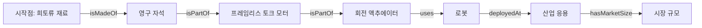

그래프 순회 알고리즘의 선택은 질의 목표에 따라 달라진다:

| 목표 | 알고리즘 | 시간 복잡도 |
|------|------|-----------|
| 두 점 간의 도달 가능성 | DFS / BFS | $O(|V|+|E|)$ |
| 최단 경로 | Dijkstra / BFS(가중치 없는 그래프) | $O(|V|+|E|)$ ~ $O(|E| \log |V|)$ |
| 모든 최단 경로 | Floyd-Warshall | $O(|V|^3)$ |
| 연결 성분 | Union-Find / BFS | $O(|V|+|E|)$ |
| 중심성 | Brandes 알고리즘(매개 중심성) | $O(|V||E|)$ |

---

## 2.5 데이터 수집 파이프라인

### 2.5.1 전체 아키텍처

이 책의 지식 그래프 데이터 수집 파이프라인은 "출처 → 어댑터 → 중복 제거 → 쓰기 → 검증" 아키텍처를 사용합니다:

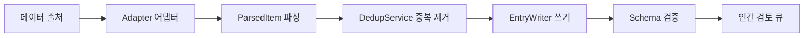

### 2.5.2 데이터 출처

현재 지식 그래프의 데이터 출처는 다음과 같습니다:

| 출처 | 유형 | 내용 | 업데이트 빈도 |
|------|------|------|---------|
| `arxiv_ro_rss` | RSS | 로봇공학 arXiv 논문 | 매일 |
| `humanoid_paper_notebooks_progress` | 데이터셋 | 휴머노이드 로봇 논문 추적 | 매일 |
| `robotics_tomorrow_rss` | RSS | 로봇 뉴스 | 매일 |
| `ieee_spectrum_robotics_rss` | RSS | IEEE Spectrum 로봇 뉴스 | 매일 |
| `unitree_news` | RSS | Unitree 기술 뉴스 | 매일 |
| `nvidia_robotics_blog` | RSS | NVIDIA 로봇 블로그 | 매일 |
| `humanoid_actuators_suppliers` | 수동 정리 JSON | 액추에이터/공급업체 엔터티 | 필요 시 |
| `humanoid_workflow_entities` | 수동 정리 JSON | 워크플로 관련 엔터티 | 필요 시 |
| `humanoid_manufacturing_systems` | 수동 정리 JSON | 제조/시스템 엔터티 | 필요 시 |

### 2.5.3 어댑터 (Adapter)

각 출처에는 원시 데이터를 통일된 형식의 `ParsedItem`으로 변환하는 어댑터가 있습니다. 어댑터는 서로 다른 출처의 데이터 형식 차이를 추상화하여 후속 처리가 통일적으로 수행될 수 있도록 합니다.

어댑터의 주요 역할:
- 원시 데이터 가져오기 또는 읽기
- 제목, 요약, 저자, 날짜, URL 등 메타데이터 추출
- 엔터티 ID 및 초기 속성 생성
- 표준화된 `ParsedItem` 목록 반환

### 2.5.4 중복 제거 (Dedup)

중복 제거 서비스는 쓰기 전에 엔터티가 이미 존재하는지 확인하여 중복 생성을 방지합니다. 중복 제거 전략은 다음과 같습니다:

| 전략 | 설명 |
|------|------|
| ID 매칭 | 정규화된 ID를 통한 직접 매칭 |
| 제목 유사도 | 제목 정제 및 정규화 후 비교 |
| URL 매칭 | 동일 출처의 URL 중복 제거 |
| 요약 유사도 | 텍스트 유사도 알고리즘을 사용한 유사 항목 식별 |

### 2.5.5 쓰기 및 검증

`EntryWriter`는 새로운 엔터티와 관계를 파일 시스템에 쓰는 역할을 합니다. 성능 향상을 위해 작성기는 기존 ID를 미리 로드하여 쓰기 시마다 많은 파일을 스캔하지 않도록 합니다.

쓰기 후 `validate_entries.py`는 모든 엔터티 및 관계 파일에 대해 Schema 검증을 수행하여 필수 필드, 열거형 값, 형식 등이 규격에 맞는지 확인합니다. 검증을 통과해야 인간 검토 큐에 들어가거나 프로덕션 환경에 직접 투입될 수 있습니다.

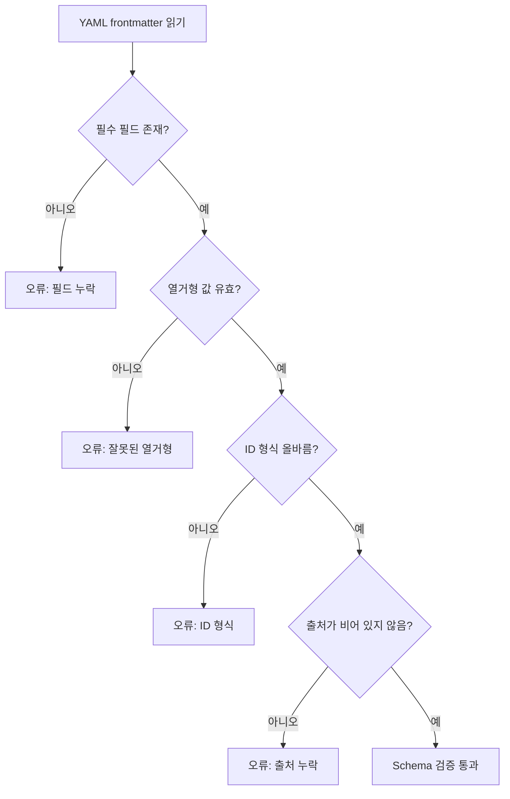

#### 2.5.5.1 파이프라인 처리량 및 지연 시간: 대기열 이론 관점

2.5.1절은 수집 파이프라인의 논리적 단계를 제시했지만, 엔지니어링 측면에서의 실현 가능성을 평가하려면 **처리량**과 **지연 시간**을 정량화해야 합니다. 각 처리 단계를 서비스 노드로 추상화하고, 처리 대기 중인 `ParsedItem`을 고객으로 추상화하면 전체 파이프라인은 대기열 이론(queuing theory)으로 모델링할 수 있습니다.

!!! note "용어 설명: 대기열 이론 (Queuing Theory)"
    대기열 이론은 무작위 도착 프로세스와 서비스 프로세스 간의 상호 작용을 연구하는 수학의 한 분야로, 통신 네트워크, 컴퓨터 시스템 및 제조 생산에 널리 적용됩니다. 가장 기본적인 M/M/1 큐는 다음과 같이 가정합니다: 고객 도착은 푸아송 프로세스(도착률 $\lambda$)를 따르고, 서비스 시간은 지수 분포(서비스율 $\mu$)를 따르며, 단일 서비스대입니다. 시스템이 정상 상태에 도달하고 $\rho = \lambda / \mu < 1$일 때, 평균 큐 길이와 평균 대기 시간은 각각 다음과 같습니다:
    $$L = \frac{\rho}{1-\rho}, \quad W = \frac{1}{\mu - \lambda}$$
    여기서 $\rho$를 **이용률**이라고 합니다. $\rho \to 1$이면 큐 길이와 대기 시간이 발산하여 시스템이 불안정 상태에 빠집니다.

어떤 출처에서 하루에 $\lambda = 100\ \text{개/시간}$의 새 항목이 생성되고, 어댑터-중복 제거-쓰기-검증 전체의 처리 능력이 $\mu = 150\ \text{개/시간}$이라고 가정하면:

$$\rho = \frac{100}{150} = 0.667$$

정상 상태에서의 평균 큐 길이:

$$L = \frac{0.667}{1-0.667} \approx 2.0\ \text{개}$$

평균 대기 시간(서비스 시간 포함):

$$W = \frac{1}{150-100} = 0.02\ \text{시간} = 72\ \text{초}$$

이는 항목이 스테이징 영역에 들어간 후 쓰기 및 검증이 완료될 때까지 평균 약 72초가 소요됨을 의미합니다. 스테이징 영역에는 일반적으로 약 2개의 항목만 대기 중입니다. 출처가 갑자기 $\lambda = 140\ \text{개/시간}$으로 증가하면 $\rho = 0.933$이 되고 $W$는 $900$초(15분)로 상승하여 시스템이 도착률에 매우 민감함을 보여줍니다. 엔지니어링 측면에서는 $\rho$가 약 $0.7$을 초과하지 않도록 **역압(backpressure)** 메커니즘을 설정하거나 쓰기 노드를 수평 확장해야 합니다.

!!! note "용어 설명: 역압 (Backpressure)"
    역압은 스트림 처리 시스템의 흐름 제어 메커니즘입니다: 다운스트림 처리 속도가 업스트림 생성 속도보다 느리면 다운스트림으로 역압 신호를 전파하여 업스트림이 전송 속도를 낮추도록 합니다. 그 본질은 제어 이론의 네거티브 피드백으로, 버퍼가 무한정 증가하는 것을 방지하는 데 사용됩니다. 역압은 토큰 버킷, 슬라이딩 윈도우 또는 백프레셔 큐를 사용하여 구현할 수 있습니다.

#### 2.5.5.2 Schema 검증의 형식적 모델

2.5.5절의 검증 프로세스는 **제약 충족 문제(Constraint Satisfaction Problem, CSP)**로 더욱 형식화할 수 있습니다. 각 엔터티 또는 관계 파일에 대해 변수 집합 $X = \{x_1, x_2, \dots, x_n\}$을 정의합니다. 여기서 $x_i$는 frontmatter의 필드에 해당합니다. 각 필드의 Schema는 제약 $C_i$를 정의합니다. 예를 들어:

- $C_{\text{id}}$: `id`는 정규 표현식 `^[a-z0-9_]+$`과 일치해야 합니다.
- $C_{\text{type}}$: `type`은 열거형 집합 $\mathcal{T}$에 속해야 합니다.
- $C_{\text{sources}}$: `sources`는 비어 있지 않아야 합니다. 즉, $|sources| \ge 1$입니다.

엔터티 파일은 모든 변수가 해당 제약을 동시에 충족하는 경우에만 **유효**합니다:

$$\text{Valid}(X) = \bigwedge_{i=1}^{n} C_i(x_i)$$

하나의 제약이라도 충족되지 않으면 검증이 실패합니다. 이 모델은 데이터베이스의 무결성 제약, 프로그래밍 언어의 타입 시스템과 동일한 기원을 가지며, 단지 제약의 표현력이 OWL보다 약하여 경량 진입점 검사에 더 적합합니다.

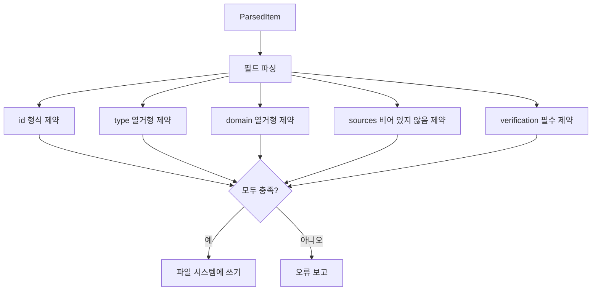

다음 Python 예제는 간단한 CSP 방식을 사용하여 검증 프로세스를 시뮬레이션하고 각 유형의 오류 발생 빈도를 통계로 보여줍니다:

```python
import re
from collections import Counter
```

entities = [
    {"id": "ent_robot_optimus", "type": "robot_system", "domain": "11", "sources": ["s1"]},
    {"id": "Ent_Invalid ID!", "type": "robot_system", "domain": "11", "sources": ["s1"]},
    {"id": "ent_component_motor", "type": "unknown_type", "domain": "02", "sources": []},
    {"id": "ent_paper_diffusion", "type": "paper", "domain": "07", "sources": ["s2"]},
]

valid_types = {"robot_system", "component", "paper", "method", "company"}
id_pattern = re.compile(r"^[a-z0-9_]+$")
valid_domains = {"00","01","02","03","04","05","06","07","08","09","10","11","12"}

errors = Counter()

def validate(e):
    ok = True
    if not id_pattern.match(e["id"]):
        errors["id_format"] += 1; ok = False
    if e["type"] not in valid_types:
        errors["type_enum"] += 1; ok = False
    if e["domain"] not in valid_domains:
        errors["domain_enum"] += 1; ok = False
    if len(e.get("sources", [])) == 0:
        errors["missing_source"] += 1; ok = False
    return ok

valid_count = sum(validate(e) for e in entities)
print(f"Valid: {valid_count}/{len(entities)}")
print("Error distribution:", dict(errors))
```

출력 결과: 두 번째 엔터티는 `id_format`을 위반하고, 세 번째 엔터티는 `type_enum`과 `missing_source`를 동시에 위반합니다. 이러한 세분화된 오류 분류는 CI/CD 보고서에서 문제를 신속하게 파악하는 데 도움이 됩니다.

!!! note "용어 설명: 제약 충족 문제 (Constraint Satisfaction Problem, CSP)"
    CSP는 변수 집합, 도메인 집합 및 제약 집합으로 구성되며, 모든 제약을 충족하는 변수 할당을 찾는 것이 목표입니다. 형식적으로 CSP는 $(X, D, C)$의 삼중항으로 표현되며, 여기서 $X$는 변수, $D$는 도메인, $C$는 제약입니다. CSP는 NP-완전 문제이지만, frontmatter 필드와 같은 제한적이고 구조화된 도메인에서는 검증이 다항 시간 내에 완료될 수 있습니다.

### 2.5.6 지식 추출 기술

지식 추출은 비정형 또는 반정형 데이터를 구조화된 삼중항으로 변환하는 과정입니다. 일반적으로 개체명 인식, 관계 추출, 개체 연결 및 상호참조 해결 등의 단계를 포함합니다.

!!! note "용어 설명: 개체명 인식 (Named Entity Recognition, NER)"
    NER은 텍스트에서 개체명(예: 인명, 지명, 기관명, 기술 용어)을 식별하고 해당 범주를 레이블링하는 작업입니다. 확률 그래프 모델 관점에서 NER은 시퀀스 레이블링 문제입니다: 토큰 시퀀스 $x_1, \dots, x_n$이 주어지면 레이블 시퀀스 $y_1, \dots, y_n$을 예측합니다. 일반적인 방법으로는 조건부 무작위장(CRF), BiLSTM-CRF 및 Transformer 기반 모델(예: BERT)이 있습니다.

!!! note "용어 설명: 조건부 무작위장 (Conditional Random Field, CRF)"
    CRF는 판별적 확률 그래프 모델로, 시퀀스 레이블링에 자주 사용됩니다. 조건부 확률 $P(y|x)$를 직접 모델링하며, 레이블 간의 전이 제약을 포착할 수 있습니다. NER의 경우 CRF 레이어는 출력 레이블 시퀀스의 유효성을 보장할 수 있습니다. 예를 들어 "I-PER"는 "B-ORG" 바로 뒤에 올 수 없습니다.

!!! note "용어 설명: BERT (Bidirectional Encoder Representations from Transformers)"
    BERT는 Transformer 인코더 기반의 사전 학습 언어 모델입니다. 마스크 언어 모델(MLM)과 다음 문장 예측(NSP)을 통해 대규모 텍스트에서 사전 학습된 후, 하위 작업에서 미세 조정됩니다. BERT의 양방향 컨텍스트 표현은 NER, 관계 추출 등의 작업에서 뛰어난 성능을 보입니다.

!!! note "용어 설명: spaCy"
    spaCy는 오픈 소스 자연어 처리 라이브러리로, 토큰화, 품사 태깅, 개체명 인식, 의존 구문 분석 등의 기능을 제공합니다. 사용자 정의 NER 모델 학습을 지원하며, 사전 학습된 다국어 모델도 제공합니다.

!!! note "용어 설명: 관계 추출 (Relation Extraction, RE)"
    관계 추출은 텍스트에서 개체 간의 의미적 관계를 식별하는 작업입니다. 예를 들어, "Tesla manufactures Optimus"에서 `(Tesla, manufactures, Optimus)`를 추출합니다. 관계 추출 방법은 다음과 같습니다:
    - **패턴 기반**: 수동으로 규칙 또는 템플릿 작성.
    - **지도 학습**: 레이블링된 데이터를 사용하여 분류기 학습.
    - **원격 감독 (Distant Supervision)**: 기존 지식 그래프를 활용하여 학습 데이터 자동 레이블링.
    - **프롬프트 기반 학습 (Prompt-based)**: 대규모 언어 모델을 사용하여 프롬프트에 따라 관계 생성.

!!! note "용어 설명: 원격 감독 (Distant Supervision)"
    원격 감독은 지식 그래프에 관계 $(e_1, r, e_2)$가 존재하면, $e_1$과 $e_2$를 동시에 포함하는 모든 문장이 관계 $r$을 표현할 가능성이 있다고 가정합니다. 이 가정은 노이즈를 발생시키므로, 다중 인스턴스 학습(Multi-Instance Learning) 또는 어텐션 메커니즘을 사용하여 완화해야 합니다.

!!! note "용어 설명: 개체 연결 (Entity Linking) 및 개체 의미 해소 (Entity Disambiguation)"
    개체 연결은 텍스트에서 개체 언급(mention)을 지식 베이스의 고유 개체에 매핑하는 과정입니다. 개체 의미 해소는 언급이 여러 개체에 대응될 수 있을 때 올바른 대상을 선택하는 과정입니다. 일반적인 방법은 다음과 같습니다:
    - 지식 베이스 검색: 이름, 별칭, 컨텍스트 기반 매칭.
    - 임베딩 유사도: 언급 컨텍스트와 후보 개체 설명 간의 벡터 유사도 계산.
    - 그래프 신경망: 지식 그래프의 구조적 정보를 활용하여 의미 해소 지원.

!!! note "용어 설명: 상호참조 해결 (Coreference Resolution)"
    상호참조 해결은 텍스트에서 동일한 현실 세계 객체를 가리키는 여러 언급을 식별하는 과정입니다. 예를 들어, "Tesla announced Optimus. It will be deployed in factories."에서 "It"은 "Optimus"를 가리킵니다. 상호참조 해결은 문장 간 관계 추출 및 문서 수준 지식 추출에 필수적입니다.

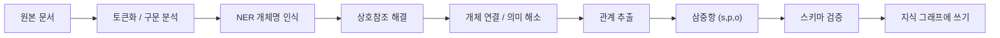

다음 Python 예제는 spaCy를 사용한 간단한 NER과 정규식 패턴을 사용한 관계 추출 과정을 보여줍니다:

```python
import spacy
import re

# spaCy 영어 모델 로드
nlp = spacy.load("en_core_web_sm")

text = """
Tesla manufactures the Optimus humanoid robot.
Unitree launched the H1 humanoid robot in 2024.
Harmonic Drive Systems produces precision harmonic reducers.
"""

doc = nlp(text)

# NER
entities = [(ent.text, ent.label_) for ent in doc.ents]
print("Named entities:", entities)
```

# 관계 추출: 간단한 패턴 기반
relations = []
patterns = [
    (r"(\w+) manufactures the ([\w\s]+) robot", "manufactures"),
    (r"(\w+) launched the ([\w\s]+) robot", "launched"),
    (r"(\w+) produces ([\w\s]+)", "produces"),
]

for pattern, rel in patterns:
    for match in re.finditer(pattern, text, re.IGNORECASE):
        relations.append((match.group(1), rel, match.group(2).strip()))

print("추출된 관계:", relations)
```

---

## 2.6 명명 규칙, 중복 제거 및 의미 해소

### 2.6.1 엔터티 ID 명명 규칙

엔터티 ID는 지식 그래프의 핵심 식별자로, 고유하고 안정적이며 가독성이 있어야 합니다.

**명명 규칙:**
- 형식: `ent_<type>_<normalized_title>_<year>`
- 모두 소문자
- 문자, 숫자, 밑줄만 포함
- 제목 부분은 의미 있는 단어 몇 개만 추출
- 연도는 선택 사항으로, 동명이 다른 세대의 엔터티를 구분하는 데 사용

**예시:**

| 엔터티 | ID |
|------|-----|
| Tesla Optimus | `ent_robot_system_tesla_optimus` |
| Unitree H1（2024） | `ent_robot_unitree_h1_humanoid_robot_2024` |
| Diffusion Policy（2023） | `ent_paper_diffusion_policy_2023` |
| 고조파 감속기（2024） | `ent_component_harmonic_reducer_2024` |

### 2.6.2 관계 ID 명명 규칙

관계 ID는 소스 엔터티 ID, 관계 유형 및 대상 엔터티 ID를 조합하여 구성됩니다:

- 형식: `rel_<source_id>_<type>_<target_id>`
- 모두 소문자
- 문자, 숫자, 밑줄만 포함

**예시:**

| 관계 | ID |
|------|-----|
| 고조파 감속기는 회전 액추에이터의 일부이다 | `rel_ent_component_harmonic_reducer_2024_is_part_of_ent_component_rotary_actuator_2024` |
| Diffusion Policy가 Unitree H1에 배포됨 | `rel_ent_paper_diffusion_policy_2023_implemented_on_ent_robot_unitree_h1_humanoid_robot_2024` |

### 2.6.3 의미 해소 전략

동일한 용어가 다른 맥락에서 다른 엔터티를 지칭할 수 있습니다. 예를 들어:
- "Atlas"는 보스턴 다이내믹스의 로봇, 고대 그리스 신화의 인물 또는 지도 서비스를 의미할 수 있습니다.
- "ROS"는 로봇 운영 체제 또는 다른 약어를 의미할 수 있습니다.

의미 해소 전략은 다음과 같습니다:
- **맥락 기반 의미 해소**: 출처와 설명을 기반으로 엔터티 유형을 판단합니다.
- **별칭 관리**: 각 엔터티에 대한 별칭 목록을 유지하여 중복 생성을 방지합니다.
- **수동 레이블링**: 의미가 매우 모호한 항목에 대해 수동으로 확인합니다.
- **유형 제약**: 관계 유형 자체가 엔터티의 가능한 유형을 제한할 수 있습니다.

### 2.6.4 엔터티 정렬 및 레코드 연결

엔터티 정렬(Entity Alignment)은 서로 다른 지식 그래프 또는 서로 다른 데이터 소스에서 동일한 현실 세계 객체를 지칭하는 엔터티를 식별하는 프로세스입니다. 레코드 연결(Record Linkage)은 데이터베이스 분야의 해당 문제로, 동일한 객체가 서로 다른 레코드에서 중복되어 나타나는 것을 식별하는 것을 목표로 합니다.

!!! note "용어 설명: 자카드 유사도(Jaccard Similarity)"
    자카드 유사도는 두 집합의 교집합과 합집합의 비율을 측정합니다:
    $$J(A,B) = \frac{|A \cap B|}{|A \cup B|}$$
    문자열의 n-gram 집합 비교 또는 태그 집합 비교에 자주 사용됩니다. 자카드 값의 범위는 $[0,1]$이며, 값이 클수록 더 유사함을 나타냅니다.

!!! note "용어 설명: 레벤슈타인 편집 거리(Levenshtein Distance)"
    레벤슈타인 거리는 하나의 문자열을 다른 문자열로 변환하는 데 필요한 최소 단일 문자 편집 작업(삽입, 삭제, 대체) 횟수입니다. 정규화된 유사도는 $1 - \frac{d(s,t)}{\max(|s|,|t|)}$입니다. 철자 변화와 약어 차이를 포착하는 데 적합합니다.

!!! note "용어 설명: TF-IDF 및 코사인 유사도"
    TF-IDF(Term Frequency-Inverse Document Frequency)는 문서의 각 단어에 가중치를 부여하는 백오브워즈 가중치 방법입니다:
    $$\text{TF-IDF}(t,d) = \text{tf}(t,d) \cdot \text{idf}(t)$$
    여기서 $\text{idf}(t) = \log \frac{N}{|\{d : t \in d\}|}$입니다. 문서를 TF-IDF 벡터로 표현한 후 코사인 유사도는 각도를 측정합니다:
    $$\cos(\vec{a},\vec{b}) = \frac{\vec{a} \cdot \vec{b}}{\|\vec{a}\| \|\vec{b}\|}$$

!!! note "용어 설명: 블로킹(Blocking)"
    블로킹은 레코드 연결의 전처리 단계로, 저렴한 전략을 사용하여 레코드를 여러 후보 쌍 집합으로 나누어 $O(n^2)$의 전체 비교를 피합니다. 일반적인 블로킹 키에는 첫 글자, 우편번호, 카테고리 레이블, n-gram 서명 등이 포함됩니다.

!!! note "용어 설명: 쌍별 매칭(Pairwise Matching) 및 클러스터링(Clustering)"
    쌍별 매칭은 각 후보 레코드 쌍에 대해 유사도를 계산하고 일치 여부를 판단하는 프로세스입니다. 전이성(A=B이고 B=C이면 A=C)으로 인해 일치 결과는 일반적으로 동치 클래스를 형성하기 위해 클러스터링이 필요합니다. 일반적인 알고리즘에는 전이 폐쇄, 연결 성분 또는 계층적 클러스터링이 포함됩니다.

!!! note "용어 설명: 신뢰도 점수(Confidence Scoring) 및 진실 발견(Truth Discovery)"
    신뢰도 점수는 각 일치 판단에 확률 또는 점수를 할당하여 임계값 설정 및 수동 검토를 용이하게 합니다. 진실 발견은 여러 충돌하는 출처에서 가장 가능성 있는 올바른 값을 추론하는 프로세스로, 일반적인 방법에는 투표, EM 알고리즘 및 그래프 기반 모델 방법이 포함됩니다.

엔터티 정렬의 일반적인 흐름은 다음 다이어그램과 같습니다:

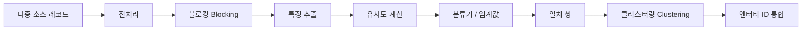

중복 제거 결정 트리는 다음 다이어그램으로 나타낼 수 있습니다:

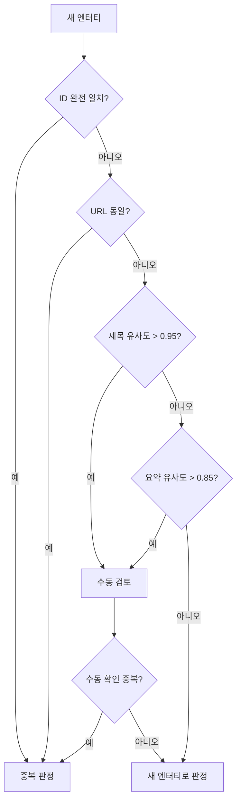

다음 Python 예제는 문자열 유사도, TF-IDF 코사인 유사도 및 간단한 임베딩 코사인 유사도를 사용한 엔터티 중복 제거를 보여줍니다:

```python
import numpy as np
from sklearn.feature_extraction.text import TfidfVectorizer
from sklearn.metrics.pairwise import cosine_similarity

# 후보 엔터티 이름
candidates = [
    "Unitree H1 Humanoid Robot",
    "Unitree H1 robot",
    "宇树 H1 人形机器人",
    "Tesla Optimus Gen 2",
    "Tesla Optimus",
]

# 1. TF-IDF 코사인 유사도
vectorizer = TfidfVectorizer().fit(candidates)
vectors = vectorizer.transform(candidates)
sim_matrix = cosine_similarity(vectors)
print("TF-IDF cosine similarity matrix:")
print(np.round(sim_matrix, 2))

# 2. 간단한 임베딩 기반 코사인 유사도 (랜덤 벡터로 예시, 실제 응용에서는 sentence-transformers 사용 가능)
np.random.seed(42)
embeddings = np.random.rand(len(candidates), 128)
# 정규화
embeddings = embeddings / np.linalg.norm(embeddings, axis=1, keepdims=True)
emb_sim = embeddings @ embeddings.T
print("Embedding cosine similarity matrix:")
print(np.round(emb_sim, 2))
```

# 3. 간단한 중복 제거: 임계값 0.8
threshold = 0.8
duplicates = []
for i in range(len(candidates)):
    for j in range(i+1, len(candidates)):
        if sim_matrix[i, j] > threshold:
            duplicates.append((candidates[i], candidates[j], sim_matrix[i, j]))
print("Duplicate candidates:", duplicates)
```

## 2.7 수동 검토 및 품질 관리

### 2.7.1 3단계 검토 메커니즘

지식 품질을 보장하기 위해 이 책은 3단계 검토 메커니즘을 채택합니다:

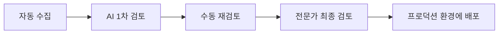

**AI 1차 검토:**
- Schema 검증 자동 완료
- 필수 필드 및 형식 자동 확인
- 명백히 저품질이거나 중복된 항목 자동 식별

**수동 재검토:**
- 엔터티 유형 및 domain이 올바른지 확인
- 관계가 합리적인지 검증
- 출처가 신뢰할 수 있는지 확인

**전문가 최종 검토:**
- 계층 간 관계 및 핵심 주장에 대한 전문적 판단
- 논란이 있는 항목 처리
- 항목이 프로덕션 환경에 들어갈지 결정

### 2.7.2 검토 상태

| 상태 | 설명 |
|------|------|
| `staged` | 수집되었으나 검토되지 않음 |
| `active` | 검토 통과, 프로덕션 환경에 진입 |
| `rejected` | 검토 통과 실패, 반려됨 |
| `deprecated` | 더 이상 사용되지 않거나 대체됨 |

검토 상태 전환은 다음 다이어그램으로 나타낼 수 있습니다:

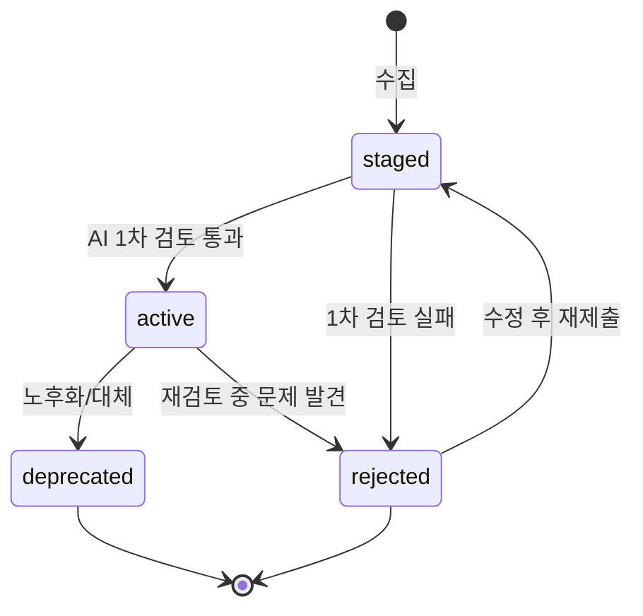

### 2.7.3 품질 지표

이 책은 다음 지표를 사용하여 지식 그래프 품질을 모니터링합니다:

| 지표 | 설명 |
|------|------|
| **엔터티 총계** | 지식 그래프 내 엔터티 수 |
| **관계 총계** | 지식 그래프 내 관계 수 |
| **계층 간 관계 수** | 서로 다른 domain을 연결하는 관계 수 |
| **theoretical_depth 누락 엔터티 수** | 이론적 깊이가 설정되지 않은 엔터티 수 |
| **고립 관계 수** | 출처 또는 대상 엔터티가 존재하지 않는 관계 수 |
| **검토 대기 항목 수** | staging에서 검토를 기다리는 항목 수 |
| **반려된 항목 수** | 검토를 통과하지 못한 항목 수 |

### 2.7.4 지식 그래프 품질 차원

지식 그래프의 품질은 다차원적인 개념입니다. 학계와 산업계에서는 일반적으로 다음 차원에서 평가합니다:

!!! note "용어 설명: 완전성 (Completeness)"
    완전성은 지식 그래프가 목표 도메인 지식을 얼마나 충분히 커버하는지 측정합니다. 다음과 같이 나눌 수 있습니다:
    - **스키마 완전성**: 필요한 모든 클래스와 속성이 정의되었는가.
    - **엔터티 완전성**: 목표 엔터티 집합이 커버되었는가.
    - **속성 완전성**: 엔터티의 핵심 속성이 채워졌는가.
    - **관계 완전성**: 엔터티 간의 중요한 관계가 포착되었는가.
    완전성은 커버리지(coverage)로 정량화할 수 있습니다: $\text{Coverage} = \frac{|\text{실제 포함된 지식}|}{|\text{포함되길 기대하는 지식}|}$.

!!! note "용어 설명: 정확성 (Accuracy)"
    정확성은 지식 그래프 내 사실의 정확도를 측정합니다. 예를 들어, 지식 그래프가 "Tesla가 Optimus를 제조한다"고 주장할 때, 해당 주장이 객관적 현실과 일치하는지 여부입니다. 정확성은 일반적으로 정밀도(Precision)로 평가합니다: $P = \frac{|\{\text{올바른 삼중항}\}|}{|\{\text{추출된 삼중항}\}|}$.

!!! note "용어 설명: 일관성 (Consistency)"
    일관성은 지식 그래프가 미리 정의된 제약 조건과 공리를 충족하는지 측정합니다. 예를 들어, 온톨로지가 "모든 RobotSystem은 최소한 하나의 Component를 가져야 한다"고 규정한다면, Component가 없는 로봇 시스템은 일관성을 위반합니다. 일관성은 OWL 추론기 또는 사용자 정의 규칙을 통해 확인할 수 있습니다.

!!! note "용어 설명: 적시성 (Timeliness) 및 신뢰도 (Credibility)"
    적시성은 지식이 현재 상태를 반영하는지 측정합니다. 휴머노이드 로봇 분야는 빠르게 발전하므로, 오래된 정보는 의사 결정을 오도할 수 있습니다. 신뢰도는 지식 출처의 신뢰 가능 정도를 측정하며, 일반적으로 출처 유형(학술 논문 > 공식 문서 > 뉴스 > 블로그) 및 검토 상태와 관련됩니다.

!!! note "용어 설명: 설명 가능성 (Explainability)"
    설명 가능성은 지식 그래프의 결론이 출처와 추론 체인으로 추적될 수 있는 정도를 의미합니다. 지식 기반 의사 결정 시스템의 경우, 설명 가능성은 사용자가 결론을 감사하고, 편향을 발견하며, 오류를 수정할 수 있게 해주므로 매우 중요합니다.

!!! note "용어 설명: 정밀도, 재현율 및 F1 점수 (Precision, Recall, F1)"
    정밀도, 재현율 및 F1은 정보 검색 및 머신러닝의 기본 지표입니다:
    $$P = \frac{TP}{TP+FP}, \quad R = \frac{TP}{TP+FN}, \quad F1 = \frac{2PR}{P+R}$$
    여기서 $TP$는 참 긍정, $FP$는 거짓 긍정, $FN$은 거짓 부정입니다. 지식 그래프 품질 평가에서 $TP$는 "올바르게 추출/주장된 삼중항 수", $FP$는 "잘못된 삼중항 수", $FN$은 "누락된 올바른 삼중항 수"로 정의할 수 있습니다.

!!! note "용어 설명: 통계적 품질 관리 (Statistical Quality Control)"
    통계적 품질 관리는 제조업에서 유래했으며, 핵심 아이디어는 샘플링 검사와 프로세스 모니터링을 통해 제품 품질을 보장하는 것입니다. 지식 그래프 검토에서는 일정 비율의 항목을 무작위로 추출하여 수동 재검토를 수행하고 전체 오류율을 추정할 수 있습니다. 배치 오류율이 임계값을 초과하면 해당 배치에 대해 전체 재검토를 수행합니다. 또한, 검토자 간 일치도(inter-annotator agreement)를 사용하여 레이블링 품질을 평가할 수 있으며, 일반적으로 Kappa 계수를 사용합니다:
    $$\kappa = \frac{P_o - P_e}{1 - P_e}$$
    여기서 $P_o$는 관찰자 일치율, $P_e$는 무작위 일치율입니다.

품질 모니터링 대시보드는 정기적으로 다음 지표를 출력해야 합니다:

| 차원 | 지표 | 계산 방법 |
|------|------|---------|
| 완전성 | 엔터티 커버리지 | 커버된 목표 엔터티 수 / 목표 엔터티 총 수 |
| 완전성 | 속성 채움률 | 채워진 속성 수 / 기대 속성 총 수 |
| 정확성 | 수동 샘플링 정밀도 | 샘플 내 올바른 삼중항 비율 |
| 일관성 | Schema 위반 수 | 제약 조건을 위반한 엔터티/관계 수 |
| 적시성 | 평균 업데이트 간격 | 현재 시간 - 마지막 업데이트 시간의 중앙값 |
| 신뢰도 | 출처 유형 분포 | 1차/2차/뉴스 출처 비율 |
| 설명 가능성 | 출처 누락 비율 | 출처가 없는 삼중항 비율 |

```mermaid
flowchart TD
    A["지식 그래프"] --> B["완전성 검사"]
    A --> C["정확성 샘플링"]
    A --> D["일관성 추론"]
    A --> E["적시성 스캔"]
    A --> F["출처 신뢰도 평가"]
    B --> G["품질 보고서"]
    C --> G
    D --> G
    E --> G
    F --> G
    G --> H["수동 재검토 큐"]
```

다음 Python 예제는 지식 그래프의 핵심 품질 지표(커버리지, 고립 간선 및 Schema 일관성 포함)를 계산합니다:

```python
import pandas as pd
import networkx as nx

# 엔터티 및 관계 데이터 시뮬레이션
entities = pd.DataFrame({
    "id": ["e1", "e2", "e3", "e4"],
    "type": ["robot_system", "component", "company", "paper"],
    "domain": ["11", "02", "11", "07"],
    "theoretical_depth": ["system", "method", "system", None],
})

relations = pd.DataFrame({
    "source_id": ["e1", "e1", "e2", "e5"],
    "target_id": ["e2", "e3", "e4", "e1"],
    "type": ["uses", "manufactured_by", "is_part_of", "uses"],
})

# 커버리지: theoretical_depth가 있는 엔터티 비율
coverage = entities["theoretical_depth"].notna().mean()
print(f"Theoretical depth coverage: {coverage:.2%}")

# 고립 간선: 출처 또는 대상이 엔터티 집합에 없는 관계
entity_ids = set(entities["id"])
dangling = relations[
    ~relations["source_id"].isin(entity_ids) |
    ~relations["target_id"].isin(entity_ids)
]
print(f"Dangling edges: {len(dangling)}")
print(dangling)
```

# 스키마 일관성: 관계 유형에 해당하는 소스/대상 유형이 유효한지 확인
allowed = {
    "uses": {"source": {"robot_system", "method"}, "target": {"component", "dataset"}},
    "manufactured_by": {"source": {"robot_system", "component"}, "target": {"company"}},
    "is_part_of": {"source": {"component"}, "target": {"component", "robot_system"}},
}

def check_schema(row):
    rel_type = row["type"]
    if rel_type not in allowed:
        return False
    src_type = entities.set_index("id").loc.get(row["source_id"], {}).get("type")
    tgt_type = entities.set_index("id").loc.get(row["target_id"], {}).get("type")
    return src_type in allowed[rel_type]["source"] and tgt_type in allowed[rel_type]["target"]

relations["schema_valid"] = relations.apply(check_schema, axis=1)
print(f"Schema consistency: {relations['schema_valid'].mean():.2%}")
print(relations)
```

#### 2.7.4.1 품질 관리를 위한 통계적 샘플링

2.7.3절에서는 여러 품질 지표를 제시했지만, 이를 실행 가능한 검토 프로세스로 전환하려면 통계적 질문에 답해야 합니다: **주어진 신뢰 수준에서 전체 오류율을 추정하려면 몇 개의 항목을 샘플링해야 하는가?** 이는 본질적으로 이항 비율 신뢰 구간 문제입니다.

!!! note "용어 설명: 이항 비율 신뢰 구간 (Binomial Proportion Confidence Interval)"
    모집단에서 $n$개의 샘플을 무작위로 추출하여 그중 $k$개가 "오류" 샘플인 경우, 샘플 오류율은 $\hat{p} = k/n$입니다. 샘플링의 무작위성으로 인해 $\hat{p}$는 실제 오류율 $p$의 추정치일 뿐입니다. Wilson 점수 구간은 $p$에 대한 $100(1-\alpha)\%$ 신뢰 구간을 제공합니다:
    $$\hat{p} \pm \frac{z}{1+z^2/n} \sqrt{\frac{\hat{p}(1-\hat{p})}{n} + \frac{z^2}{4n^2}}$$
    여기서 $z = z_{1-\alpha/2}$는 표준 정규 분포의 분위수입니다. $n$이 클 때 Wilson 구간은 정규 근사 구간 $\hat{p} \pm z\sqrt{\hat{p}(1-\hat{p})/n}$에 가깝습니다.

95% 신뢰 수준에서 실제 오류율을 절대 오차 $E$ 이내로 추정하고 예상 오류율이 약 $\hat{p}$인 경우, 최소 샘플 크기는 다음 공식으로 추정할 수 있습니다:

$$n \approx \frac{z^2 \hat{p}(1-\hat{p})}{E^2}$$

$z_{0.975} \approx 1.96$, 예상 오류율 $\hat{p}=0.05$, 허용 오차 $E=0.02$를 적용하면:

$$n \approx \frac{1.96^2 \times 0.05 \times 0.95}{0.02^2} \approx 456.2$$

즉, 각 배치에서 최소 457개를 무작위로 샘플링해야 합니다. 배치의 총 항목 수가 457개 미만인 경우 전체를 검토해야 합니다.

검토 결과는 **p-관리도 (p-chart)**를 사용하여 프로세스를 모니터링할 수도 있습니다. 연속된 $m$개의 배치에 대해 각각 오류율 $\hat{p}_1, \dots, \hat{p}_m$을 계산하고, 중심선과 관리 한계는 다음과 같습니다:

$$\bar{p} = \frac{1}{m}\sum_{i=1}^{m} \hat{p}_i$$
$$\text{UCL} = \bar{p} + 3\sqrt{\frac{\bar{p}(1-\bar{p})}{n_i}}, \quad \text{LCL} = \max\left(0, \bar{p} - 3\sqrt{\frac{\bar{p}(1-\bar{p})}{n_i}}\right)$$

특정 배치의 오류율이 관리 상한을 초과하면 해당 배치에 체계적인 품질 문제가 있는 것이므로 전체 재검토가 필요합니다.

!!! note "용어 설명: p-관리도 (p-chart)"
    p-관리도는 통계적 공정 관리 (SPC)에서 불량률을 모니터링하는 데 사용되는 도구입니다. 배치 불량률을 세로축, 시간을 가로축으로 하여 중심선 (CL)과 상/하 관리 한계 (UCL/LCL)를 그립니다. 관측점이 관리 한계를 벗어나거나 비무작위 패턴을 보이면 프로세스가 관리 상태를 벗어났음을 나타냅니다. 이론적 기반은 이항 분포의 정규 근사이며, 관리 한계는 일반적으로 $\pm 3\sigma$로 설정됩니다.

다음 Python 예제는 Wilson 신뢰 구간, 최소 샘플 크기를 계산하고 p-관리도를 그립니다:

```python
import numpy as np
import matplotlib.pyplot as plt
from scipy import stats

def wilson_interval(k, n, alpha=0.05):
    p = k / n
    z = stats.norm.ppf(1 - alpha / 2)
    denom = 1 + z**2 / n
    centre = (p + z**2 / (2*n)) / denom
    margin = z * np.sqrt((p*(1-p) + z**2/(4*n)) / n) / denom
    return centre - margin, centre + margin

# 예제: 457개 샘플링, 23개 오류 발견
n, k = 457, 23
lo, hi = wilson_interval(k, n)
print(f"오류율 추정: {k/n:.3f}, 95% Wilson CI: [{lo:.3f}, {hi:.3f}]")

# 최소 샘플 크기
p_hat, E = 0.05, 0.02
z = stats.norm.ppf(0.975)
n_min = int(np.ceil(z**2 * p_hat * (1-p_hat) / E**2))
print(f"최소 샘플 크기: {n_min}")

# p-관리도
np.random.seed(0)
batch_sizes = np.full(20, 457)
errors = np.random.binomial(batch_sizes, 0.05)
p_hat_i = errors / batch_sizes
p_bar = p_hat_i.mean()
ucl = p_bar + 3*np.sqrt(p_bar*(1-p_bar)/batch_sizes)
lcl = np.maximum(0, p_bar - 3*np.sqrt(p_bar*(1-p_bar)/batch_sizes))

plt.figure(figsize=(8,4))
plt.plot(p_hat_i, marker='o', label='배치 오류율')
plt.axhline(p_bar, color='green', label='CL')
plt.plot(ucl, color='red', linestyle='--', label='UCL')
plt.plot(lcl, color='red', linestyle='--', label='LCL')
plt.xlabel('배치 인덱스'); plt.ylabel('오류율')
plt.title('KG 검토 품질에 대한 p-관리도')
plt.legend(); plt.grid(True)
plt.tight_layout()
plt.savefig('p_chart_kg_quality.png', dpi=150)
print("Saved p_chart_kg_quality.png")
```

이 코드가 출력하는 95% Wilson 신뢰 구간은 약 $[0.032, 0.076]$로, 샘플에서 $5\%$의 오류율이 관찰되더라도 실제 오류율은 여전히 $3.2\%$에서 $7.6\%$ 사이일 수 있음을 보여줍니다. p-관리도는 `coverage_dashboard.py`의 품질 대시보드에 통합될 수 있습니다 (2.7.3절 참조).

---

## 2.8 지식 그래프의 응용

### 2.8.1 질의 및 탐색

지식 그래프는 다양한 질의 방식을 지원합니다:

**엔티티별 질의:**
- 특정 로봇의 모든 부품 조회
- 특정 부품의 모든 공급업체 조회
- 특정 방법이 사용하는 데이터셋 조회

**관계별 질의:**
- 하모닉 감속기를 사용하는 모든 로봇 조회
- 자동차 공장에 배치된 모든 휴머노이드 로봇 조회
- ISO 13482의 적용을 받는 모든 시스템 조회

**경로별 질의:**
- 재료에서 완제품, 시장까지의 전체 연결 경로
- 알고리즘에서 하드웨어, 응용까지의 기술 의존 체인
- 표준에서 설계 선택까지의 영향 경로

#### 2.8.1.1 질의 예시: SPARQL, Cypher 및 Python 구현

2.8.1절에서는 질의 유형을 개괄했으며, 본 절에서는 RDF 트리플 저장소, 속성 그래프 데이터베이스 및 Python 메모리 그래프에 각각 해당하는 세 가지 실행 가능한 예시를 제시합니다.

**예시 1: SPARQL – 하모닉 감속기를 사용하는 모든 로봇 조회**

```sparql
PREFIX ex: <http://example.org/humanoid-robot#>

SELECT ?robot ?manufacturer
WHERE {
  ?robot rdf:type ex:HumanoidRobot .
  ?robot ex:uses ?actuator .
  ?actuator rdf:type ex:RotaryActuator .
  ?actuator ex:isPartOf ?reducer .
  ?reducer rdf:type ex:HarmonicReducer .
  OPTIONAL { ?robot ex:manufacturedBy ?manufacturer . }
}
```

이 질의는 `ex:isPartOf`의 역관계를 통해 액추에이터에서 감속기로 연결될 수 있다고 가정합니다. 온톨로지에 `ex:isPartOf`의 역속성인 `ex:hasPart`가 선언되어 있다면 `owl:inverseOf`를 통해 자동 추론됩니다. 하모닉 감속기의 물리적 메커니즘에 대한 자세한 내용은 4장을 참조하십시오.

**예시 2: Cypher – 부품의 다단계 공급업체 조회**

```cypher
MATCH (c:Component {name: 'Harmonic Reducer'})<-[:manufactures]-(m:ComponentManufacturer)
OPTIONAL MATCH (m)-[:supplies]->(oem:OEM)-[:manufactures]->(r:RobotSystem)
RETURN c.name AS component, m.name AS manufacturer, oem.name AS oem, r.name AS robot
```

이 질의는 부품에서 출발하여 `manufactures` 관계를 따라 제조업체를 찾고, 다시 `supplies` 관계를 따라 OEM을 거쳐 최종적으로 로봇 시스템을 찾습니다. 이는 공급망 분석에서 계층 간 관계의 가치를 보여줍니다 (자세한 내용은 7장 참조).

**예시 3: Python 메모리 그래프 경로 탐색 – 네오디뮴 자석에서 시장까지**

```python
import networkx as nx

G = nx.DiGraph()
G.add_edges_from([
    ("NdFeB Magnet", "Frameless Motor", {"rel": "isMadeOf"}),
    ("Frameless Motor", "Rotary Actuator", {"rel": "isPartOf"}),
    ("Rotary Actuator", "Optimus", {"rel": "isPartOf"}),
    ("Optimus", "Car Factory", {"rel": "deployedAt"}),
    ("Car Factory", "Industrial Market", {"rel": "hasMarketSize"}),
    ("Optimus", "BMW Spartanburg", {"rel": "deployedAt"}),
])

# NdFeB Magnet에서 Industrial Market까지의 모든 단순 경로
paths = list(nx.all_simple_paths(G, "NdFeB Magnet", "Industrial Market"))
print("Paths:", paths)

# 최단 경로 (간선 수 기준)
sp = nx.shortest_path(G, "NdFeB Magnet", "Industrial Market")
print("Shortest path:", sp)
```

실행 결과는 두 가지 시장 경로를 출력합니다: `... → Optimus → Car Factory → Market` 및 `... → Optimus → BMW Spartanburg → Market`. 이러한 경로 질의는 기술-시장 매핑 및 공급망 취약성 평가에 매우 중요합니다.

!!! note "용어 설명: 선택적 패턴 (OPTIONAL Pattern)"
    OPTIONAL은 SPARQL의 수식어로, 패턴이 존재하면 바인딩 결과를 반환하고, 그렇지 않으면 전체 행이 필터링되지 않도록 합니다. 이는 관계 대수의 왼쪽 외부 조인(left outer join)에 해당하며, 특정 속성이 채워지지 않아 주체 레코드가 손실되는 것을 방지하기 위해 누락된 데이터를 처리하는 데 사용됩니다.

### 2.8.2 추론 및 분석

지식 그래프를 기반으로 더 높은 수준의 추론이 가능합니다:

- **병목 식별**: 공급업체가 소수인 핵심 부품을 찾아 공급망 리스크 평가.
- **대안 분석**: 특정 부품이 품절되거나 가격이 상승할 때 대체 부품 및 공급업체 탐색.
- **기술 성숙도 평가**: 관련 논문, 제품, 배치 사례를 통해 특정 기술의 성숙도 판단.
- **투자 대상 연구**: 특정 회사의 지식 그래프 내 위치, 기술 배치 및 공급망 관계 분석.

### 2.8.3 시각화

지식 그래프는 네트워크 그래프, 트리 맵, 생키 다이어그램 등의 형태로 시각화할 수 있습니다:

- **네트워크 그래프**: 엔티티와 관계의 전체 구조 표시.
- **트리 맵**: 특정 시스템의 부품 계층 구조 표시.
- **생키 다이어그램**: 재료에서 완제품, 시장으로의 가치 흐름 표시.
- **타임라인**: 기술, 제품, 기업의 발전 과정 표시.

### 2.8.4 저장 및 질의 시스템

지식 그래프의 저장 및 질의 시스템은 확장성, 질의 성능 및 응용 시나리오를 결정합니다. 데이터 모델에 따라 주로 RDF 트리플 저장소와 속성 그래프 데이터베이스의 두 가지 범주로 나뉩니다.

!!! note "용어 설명: RDF 트리플 저장소 (Triple Store)"
    RDF 트리플 저장소는 RDF 트리플을 전문적으로 저장하는 데이터베이스로, SPARQL 질의 및 OWL/RDFS 추론을 지원합니다. 대표적인 시스템으로 Apache Jena, GraphDB, Virtuoso 및 Amazon Neptune(RDF 모드)이 있습니다. 트리플 저장소의 장점은 형식적 의미론과 표준 상호운용성으로, 강력한 의미론적 제약이 필요한 시나리오에 적합합니다.

!!! note "용어 설명: 속성 그래프 데이터베이스 (Property Graph Database)"
    속성 그래프 데이터베이스는 노드, 엣지, 레이블 및 속성으로 데이터를 구성하며, 유연한 그래프 탐색 및 패턴 매칭을 지원합니다. 대표적인 시스템으로 Neo4j, Amazon Neptune(Gremlin 모드), JanusGraph 및 TigerGraph가 있습니다. 속성 그래프 데이터베이스의 장점은 고성능 그래프 탐색과 풍부한 속성 표현으로, 추천 시스템, 사기 탐지 및 공급망 분석에 적합합니다.

!!! note "용어 설명: SPARQL"
    SPARQL은 W3C 권장 RDF 질의 언어로, 구문은 SQL과 유사하지만 그래프 패턴 매칭을 위해 설계되었습니다. 예:
    ```sparql
    SELECT ?robot WHERE {
      ?robot ex:uses ex:HarmonicReducer .
    }
    ```
    SPARQL은 선택적 패턴, 필터, 집계, 서브쿼리 및 연방 질의를 지원합니다.

!!! note "용어 설명: Cypher"
    Cypher는 Neo4j에서 개발한 속성 그래프 질의 언어로, ASCII 아트 스타일로 노드와 관계를 표현합니다. 예:
    ```cypher
    MATCH (r:RobotSystem)-[:uses]->(c:Component)
    WHERE c.name = 'Harmonic Reducer'
    RETURN r.name
    ```

!!! note "용어 설명: Gremlin"
    Gremlin은 Apache TinkerPop의 그래프 탐색 언어로, 함수형 스타일을 채택합니다. 이는 그래프 데이터베이스의 "공용어"로, 다양한 백엔드에서 실행될 수 있습니다. 예:
    ```gremlin
    g.V().hasLabel('RobotSystem').out('uses').has('name','Harmonic Reducer').in('uses').values('name')
    ```

!!! note "용어 설명: 벡터 검색 및 RAG (Retrieval-Augmented Generation)"
    벡터 검색은 텍스트나 엔티티를 밀집 벡터로 임베딩하고, 근사 최근접 이웃(ANN) 검색을 통해 의미적으로 유사한 항목을 빠르게 찾습니다. RAG는 검색 결과를 대규모 언어 모델에 컨텍스트로 제공하여 환각을 줄이고 사실성을 높입니다. 지식 그래프와 RAG를 결합할 때, 그래프의 구조화된 관계를 사용하여 벡터 검색의 의미적 관련성을 보완하는 "그래프 증강 생성(GraphRAG)"을 구현할 수 있습니다.

| 차원 | RDF 삼중항 저장소 | 속성 그래프 데이터베이스 |
|------|----------------|--------------|
| 데이터 모델 | 삼중항 $(s,p,o)$ | 노드+엣지+속성 |
| 질의 언어 | SPARQL | Cypher, Gremlin |
| 추론 능력 | 강함 (OWL/RDFS) | 약함 또는 확장 필요 |
| 스키마 유연성 | 높음 | 높음 |
| 그래프 탐색 성능 | 중간 | 높음 |
| 대표적 응용 | 시맨틱 웹, 생명과학 | 소셜 네트워크, 추천, 공급망 |

```mermaid
flowchart LR
    subgraph RDF["RDF 기술 스택"]
        A["RDF 데이터"] --> B["SPARQL 질의"]
        B --> C["OWL 추론"]
    end
    subgraph PG["속성 그래프 기술 스택"]
        D["노드/엣지/속성"] --> E["Cypher/Gremlin"]
        E --> F["그래프 알고리즘 라이브러리"]
    end
    RDF --> G["애플리케이션 계층"]
    PG --> G
    G --> H["시각화 / 추천 / 질의응답"]
```

다음 Python 예제는 pandas를 사용하여 RDF 삼중항 저장소를 시뮬레이션하고 간단한 SPARQL 스타일 질의를 실행하는 방법을 보여줍니다:

```python
import pandas as pd

# RDF 삼중항 시뮬레이션
triples = [
    ("ex:Optimus", "rdf:type", "ex:HumanoidRobot"),
    ("ex:Optimus", "ex:uses", "ex:HarmonicReducer"),
    ("ex:UnitreeH1", "rdf:type", "ex:HumanoidRobot"),
    ("ex:UnitreeH1", "ex:uses", "ex:HarmonicReducer"),
    ("ex:HarmonicReducer", "rdf:type", "ex:Component"),
    ("ex:HarmonicReducer", "ex:manufacturedBy", "ex:HarmonicDriveSystems"),
]
df = pd.DataFrame(triples, columns=["subject", "predicate", "object"])

# SPARQL 스타일 질의: HarmonicReducer를 사용하는 모든 로봇 찾기
robots = df[
    (df["predicate"] == "ex:uses") &
    (df["object"] == "ex:HarmonicReducer")
]["subject"].tolist()
print("Robots using HarmonicReducer:", robots)

# 질의: HarmonicReducer의 제조사 찾기
manufacturer = df[
    (df["subject"] == "ex:HarmonicReducer") &
    (df["predicate"] == "ex:manufacturedBy")
]["object"].tolist()
print("Manufacturer:", manufacturer)
```

### 2.8.5 평가 기준 및 경진대회

지식 그래프 분야의 평가 기준은 알고리즘 발전을 촉진했습니다. 주요 작업과 기준은 다음과 같습니다:

!!! note "용어 설명: 지식 그래프 완성 (Knowledge Graph Completion, KGC)"
    지식 그래프 완성은 기존 삼중항을 기반으로 누락된 삼중항을 예측하는 작업으로, 링크 예측(link prediction)과 엔티티 예측을 포함합니다. 일반적인 방법으로는 임베딩 기반 모델(TransE, DistMult, ComplEx, RotatE)과 그래프 신경망 기반 모델이 있습니다.

!!! note "용어 설명: 링크 예측 (Link Prediction)"
    링크 예측은 $(s,p,?)$ 또는 $(?,p,o)$가 주어졌을 때 누락된 엔티티를 예측하거나, $(s,?,o)$가 주어졌을 때 관계를 예측하는 작업입니다. 평가 지표는 일반적으로 Mean Rank(MR), Mean Reciprocal Rank(MRR) 및 Hits@N을 포함합니다.

!!! note "용어 설명: 엔티티 정렬 기준 (Entity Alignment Benchmark)"
    엔티티 정렬 기준은 두 개 이상의 다국어 지식 그래프 간의 정렬 시드를 제공하여 정렬 알고리즘을 평가합니다. 대표적인 데이터셋으로는 DBP15K, DWY100K 및 OpenEA 시리즈가 있습니다. 평가 지표는 일반적으로 Hits@1 및 Hits@10입니다.

| 작업 | 대표 기준 | 평가 지표 |
|------|---------|---------|
| 지식 그래프 완성 | FB15k-237, WN18RR, YAGO3-10 | MRR, Hits@1, Hits@10 |
| 링크 예측 | OGBL-BioKG, OGBL-Wikikg2 | MRR, Hits@10 |
| 엔티티 정렬 | DBP15K, DWY100K | Hits@1, Hits@10 |
| 질의응답 | WebQuestions, ComplexWebQuestions | F1, Hits@1 |
| 엔티티 연결 | AIDA-CoNLL, MSNBC | 정밀도, 재현율, F1 |

```mermaid
flowchart TD
    A["평가 작업"] --> B["지식 그래프 완성"]
    A --> C["링크 예측"]
    A --> D["엔티티 정렬"]
    A --> E["지식 그래프 질의응답"]
    A --> F["엔티티 연결"]
    B --> G["FB15k-237 / WN18RR"]
    C --> H["OGBL-Wikikg2"]
    D --> I["DBP15K / DWY100K"]
    E --> J["WebQuestions"]
    F --> K["AIDA-CoNLL"]
```

## 2.9 한계와 발전 방향

### 2.9.1 현재의 한계

지식 그래프 방법론이 뚜렷한 장점을 가지고 있지만, 이 책에서 구축한 지식 그래프에는 여전히 몇 가지 한계가 존재합니다:

| 한계 | 설명 |
|------|------|
| **불균형한 범위** | AI 알고리즘과 논문은 비교적 완전하게 다루어졌지만, 제조, 공급망 및 정책 분야는 상대적으로 취약함 |
| **희소한 관계** | 일부 시스템 수준의 개체는 계층 간 관계가 부족하여 지속적인 보완이 필요함 |
| **출처 품질의 편차** | 일부 항목은 뉴스 기사나 블로그에 의존하여 학술 논문에 비해 신뢰도가 낮음 |
| **동적 업데이트 부담** | 분야의 발전 속도가 빨라 시의성을 유지하기 위해 지속적인 투자가 필요함 |
| **양적 속성 부족** | 비용, 성능 등의 수치 속성이 충분히 구조화되지 않음 |

### 2.9.2 발전 방향

향후 지식 그래프는 다음과 같은 방향으로 지속적으로 개선될 수 있습니다:

- **양적 속성 강화**: 부품, 로봇, 시장 등의 개체에 더 많은 수치 속성을 추가하여 비용 분석 및 성능 비교 지원
- **시계열 정보 도입**: 개체와 관계의 시간 범위를 기록하여 역사적 진화 분석 지원
- **다국어 지원 강화**: 영어, 중국어, 한국어 등 다국어 제목과 설명 추가
- **시뮬레이션 데이터 연동**: 지식 그래프를 시뮬레이션 플랫폼 및 데이터셋과 연결하여 지식에서 실험으로의 폐쇄 루프 지원
- **대화형 프론트엔드 개발**: 웹 인터페이스를 구축하여 자연어 질의, 그래프 탐색 및 경로 분석 지원
- **자동 완성 도입**: 대규모 언어 모델을 활용하여 누락된 관계와 속성 제안을 자동 생성한 후, 사람이 검토

### 2.9.3 지식 그래프의 DevOps

지식 그래프를 지속적 통합/지속적 배포(CI/CD) 프로세스에 포함시키는 것은 장기적인 가용성과 신뢰성을 보장하는 핵심입니다.

!!! note "용어 설명: ETL과 ELT"
    ETL(Extract-Transform-Load)은 먼저 추출하고, 변환한 후, 대상 시스템에 로드하는 프로세스입니다. ELT(Extract-Load-Transform)는 원시 데이터를 먼저 로드한 후 대상 시스템에서 변환합니다. 지식 그래프 수집은 일반적으로 ETL을 사용하는데, 이는 쓰기 전에 개체 추출, 의미 중복 제거 및 스키마 정렬을 완료해야 하기 때문입니다.

!!! note "용어 설명: 버전 관리(Versioning)"
    버전 관리는 지식 그래프의 시간에 따른 변화를 기록하여 이전 상태를 추적하고, 차이를 비교하며, 오류를 복구할 수 있도록 합니다. 파일 기반 지식 그래프의 경우 Git 자체가 버전 관리 시스템 역할을 할 수 있습니다. 데이터베이스 기반 지식 그래프의 경우 증분 로그와 타임스탬프 메커니즘을 설계해야 합니다.

!!! note "용어 설명: CI/CD (지속적 통합 / 지속적 배포)"
    CI/CD는 소프트웨어 엔지니어링에서 빌드, 테스트 및 배포를 자동화하는 방법입니다. 지식 그래프 엔지니어링에서 CI/CD는 스키마 검증, 품질 검사, 링크 예측 테스트 및 시각화 생성을 자동으로 실행하여 각 업데이트가 기존 구조를 손상시키지 않도록 보장합니다.

!!! note "용어 설명: 증분 업데이트(Incremental Update)와 롤백(Rollback)"
    증분 업데이트는 마지막 업데이트 이후 새로 추가되거나 수정된 데이터만 처리하여 계산 오버헤드를 줄입니다. 롤백은 오류가 발견되었을 때 시스템을 이전의 안정적인 상태로 되돌리는 작업입니다. 둘 다 완전한 출처 기록과 변경 로그 지원이 필요합니다.

!!! note "용어 설명: 출처와 유래(Provenance)"
    지식 공학에서 provenance는 데이터의 출처, 생성 과정 및 처리 이력을 의미합니다. W3C PROV는 개체, 활동 및 에이전트 간의 관계를 설명할 수 있는 표준화된 출처 모델입니다. 출처 정보는 감사, 신뢰성 및 책임 추적에 필수적입니다.

!!! note "용어 설명: LLM과 RAG 연동"
    대규모 언어 모델(LLM)은 지식 추출, 관계 제안 및 텍스트 요약을 지원하는 데 사용될 수 있습니다. RAG(Retrieval-Augmented Generation)는 지식 그래프를 검색 소스로 사용하여 LLM에 구조화된 컨텍스트를 제공합니다. 이 둘을 결합할 때는 LLM의 환각 문제와 지식 그래프의 범위 부족 문제에 주의해야 합니다.

지식 그래프 DevOps 파이프라인은 아래 그림과 같습니다:

```mermaid
flowchart LR
    A["데이터 소스"] --> B["ETL 추출"]
    B --> C["스테이징 영역"]
    C --> D["스키마 검증"]
    D --> E{"품질 검사"}
    E -->|통과| F["메인 브랜치에 병합"]
    E -->|실패| G["수동 수정"]
    F --> H["빌드 및 배포"]
    H --> I["프로덕션 환경"]
    I --> J["모니터링 및 롤백"]
```

지식 그래프와 LLM/RAG의 연동 아키텍처는 아래 그림으로 나타낼 수 있습니다:

```mermaid
flowchart LR
    A["사용자 질의"] --> B["질의 이해"]
    B --> C{"구조화된 지식이 필요한가?"}
    C -->|예| D["지식 그래프 검색"]
    C -->|아니오| E["벡터 검색"]
    D --> F["서브그래프 / 트리플"]
    E --> G["관련 텍스트 조각"]
    F --> H["컨텍스트 조립"]
    G --> H
    H --> I["LLM 생성"]
    I --> J["출처 참조가 포함된 답변"]
```

트리플의 수명 주기는 아래 그림으로 요약할 수 있습니다:

```mermaid
flowchart LR
    A["데이터 소스"] --> B["추출"]
    B --> C["의미 중복 제거 / 정렬"]
    C --> D["스키마 검증"]
    D --> E["수동 검토"]
    E --> F["프로덕션 환경"]
    F --> G["질의 / 추론"]
    G --> H["모니터링 및 업데이트"]
    H --> I["버전 아카이빙"]
```

---

## 2.10 장 요약

이 장에서는 이 책에서 사용된 지식 그래프 구축 방법론을 체계적으로 설명했습니다. 핵심 요점은 다음과 같습니다:

1. **정보 모델은 "개체-관계-출처-검증" 사중항을 채택**하며, 각 개체와 관계는 명확한 스키마, 출처 및 검토 기록을 가집니다.

2. **개체 유형은 휴머노이드 로봇 전 산업 체인을 포괄**하며, 논문, 방법, 알고리즘, 데이터셋, 소프트웨어, 부품, 로봇, 회사, 표준, 재료, 응용, 시장 등을 포함합니다.

3. **관계 유형은 구성, 사용, 의존, 배포, 제조, 공급, 적용, 규제 등 다양한 연관성을 포괄**하여 계층 간 링크 구축을 지원합니다.

4. **도메인 계층화는 분야를 13개 계층으로 나누며**, 기초 학문에서 정책, 법률 및 윤리까지 포함합니다. 이론적 깊이는 개체를 foundation, principle, formalism, method, system의 다섯 가지 수준으로 구분합니다.

5. **데이터 수집 파이프라인은 출처, 어댑터, 중복 제거, 쓰기, 검증 및 수동 검토의 여섯 단계로 구성**되어 지식의 품질과 시의성을 보장합니다.

6. **명명 규칙, 중복 제거 및 의미 중복 제거, 3단계 검토 메커니즘**은 대규모 지식 그래프의 일관성과 정확성을 유지하는 핵심입니다.

7. **지식 그래프는 질의, 추론, 시각화 및 계층 간 분석을 지원**하며, 휴머노이드 로봇 분야의 체계적 인지를 위한 인프라입니다.

8. **현재 지식 그래프는 여전히 불균형한 범위, 희소한 관계, 동적 업데이트 부담 등의 한계를 가지며**, 향후 양적 속성, 시계열 정보, 다국어, 시뮬레이션 연동, 대화형 프론트엔드 및 DevOps 방향으로 지속적으로 발전해야 합니다.

### 장 기호표

편의를 위해 이 장에서 사용된 주요 기호를 정리합니다.

| 기호 | 의미 | 단위/값 범위 |
|------|------|--------------|
| $G=(V,E)$ | 그래프, 정점 집합 $V$, 간선 집합 $E$ | — |
| $(s,p,o)$ | RDF/트리플: 주어, 술어, 목적어 | — |
| $d(v)$ | 노드 $v$의 차수 | 정수 |
| $PR(v)$ | 노드 $v$의 PageRank 값 | $[0,1]$ |
| $C(v)$ | 노드 $v$의 국소 군집 계수 | $[0,1]$ |
| $\mathcal{T}$ | 개체 유형 집합 | — |
| $type(e)$ | 개체 $e$의 유형 | $\mathcal{T}$의 원소 |
| $w(u,v)$ | 관계 $(u,v)$의 의존 강도 | $[0,1]$ |
| $c(u,v)$ | 관계 $(u,v)$의 출처 신뢰도 | $[0,1]$ |
| $S(P)$ | 경로 $P$의 종합 의존 점수 | $[0,1]$ |
| $R(P)$ | 경로 $P$의 신뢰성 | $[0,1]$ |
| $\lambda$ | 데이터 도착률 | 건/시간 |
| $\mu$ | 데이터 처리율 | 건/시간 |
| $\rho = \lambda/\mu$ | 시스템 이용률 | $[0,1)$ |
| $L$ | 정상 상태 평균 대기열 길이 | 건 |
| $W$ | 정상 상태 평균 대기 시간 | 시간 |
| $X,D,C$ | CSP의 변수, 값 도메인, 제약 조건 | — |
| $\hat{p}$ | 표본 오류율 | $[0,1]$ |
| $z_{1-\alpha/2}$ | 표준 정규 분포 분위수 | — |
| $\text{UCL}/\text{LCL}$ | p-관리도 상/하 관리 한계 | $[0,1]$ |

---

## 참고 문헌 및 데이터 출처

[1] Hogan, A., Blomqvist, E., Cochez, M., d'Amato, C., Melo, G. D., Gutierrez, C., ... & Zimmermann, A. (2021). Knowledge graphs. ACM Computing Surveys (CSUR), 54(4), 1-37.

[2] Ji, S., Pan, S., Cambria, E., Marttinen, P., & Yu, P. S. (2021). A survey on knowledge graphs: Representation, acquisition, and applications. IEEE Transactions on Neural Networks and Learning Systems, 33(2), 494-514.

[3] Wang, Q., Mao, Z., Wang, B., & Guo, L. (2017). Knowledge graph embedding: A survey of approaches and applications. IEEE Transactions on Knowledge and Data Engineering, 29(12), 2724-2743.

[4] Bollacker, K., Evans, C., Paritosh, P., Sturge, T., & Taylor, J. (2008). Freebase: A collaboratively created graph database for structuring human knowledge. In Proceedings of the 2008 ACM SIGMOD International Conference on Management of Data, 1247-1250.

[5] Vrandečić, D., & Krötzsch, M. (2014). Wikidata: A free collaborative knowledgebase. Communications of the ACM, 57(10), 78-85.

[6] Auer, S., Bizer, C., Kobilarov, G., Lehmann, J., Cyganiak, R., & Ives, Z. (2007). DBpedia: A nucleus for a web of open data. In The Semantic Web, 722-735.

[7] Noy, N. F., Shah, N. H., Whetzel, P. L., Dai, B., Dorf, M., Griffith, N., ... & Musen, M. A. (2009). BioPortal: Ontologies and integrated data resources at the click of a mouse. Nucleic Acids Research, 37(suppl_2), W170-W173.

[8] Tyson, A., et al. (2020). AIChemist: A knowledge graph for AI-driven materials discovery. npj Computational Materials, 6, 1-12.

[9] 본서 지식 그래프 프로젝트: Awesome Humanoid Robot. 내부 프로젝트 자료, `scripts/ingestion/`, `scripts/validate_entries.py`, `scripts/coverage_dashboard.py` 등 포함.

[10] Page, L., Brin, S., Motwani, R., & Winograd, T. (1999). The PageRank citation ranking: Bringing order to the web. Technical Report, Stanford InfoLab.

[11] W3C. (2014). RDF 1.1 Concepts and Abstract Syntax. W3C Recommendation. https://www.w3.org/TR/rdf11-concepts/

[12] W3C. (2014). RDF Schema 1.1. W3C Recommendation. https://www.w3.org/TR/rdf-schema/

[13] W3C. (2012). OWL 2 Web Ontology Language Document Overview (Second Edition). W3C Recommendation. https://www.w3.org/TR/owl2-overview/

[14] W3C. (2013). SPARQL 1.1 Overview. W3C Recommendation. https://www.w3.org/TR/sparql11-overview/

[15] W3C. (2013). PROV-O: The PROV Ontology. W3C Recommendation. https://www.w3.org/TR/prov-o/

[16] Arp, R., Smith, B., & Spear, A. D. (2015). Building ontologies with basic formal ontology. MIT Press.

[17] Gangemi, A., Guarino, N., Masolo, C., Oltramari, A., & Schneider, L. (2002). Sweetening ontologies with DOLCE. In Knowledge Engineering and Knowledge Management: Ontologies and the Semantic Web, 166-181.

[18] Niles, I., & Pease, A. (2001). Towards a standard upper ontology. In Proceedings of the International Conference on Formal Ontology in Information Systems, 2-9.

[19] Poveda-Villalón, M., Suárez-Figueroa, M. C., & Gómez-Pérez, A. (2014). Validating ontologies with OOPS!. In Knowledge Engineering and Knowledge Management, 267-281.

[20] Euzenat, J., & Shvaiko, P. (2013). Ontology matching (2nd ed.). Springer.

[21] Lafferty, J., McCallum, A., & Pereira, F. C. (2001). Conditional random fields: Probabilistic models for segmenting and labeling sequence data. In Proceedings of ICML, 282-289.

[22] Devlin, J., Chang, M. W., Lee, K., & Toutanova, K. (2019). BERT: Pre-training of deep bidirectional transformers for language understanding. In Proceedings of NAACL-HLT, 4171-4186.

[23] Honnibal, M., & Montani, I. (2017). spaCy 2: Natural language understanding with Bloom embeddings, convolutional neural networks and incremental parsing. To appear, 7(1), 411-420.

[24] Mintz, M., Bills, S., Snow, R., & Jurafsky, D. (2009). Distant supervision for relation extraction without labeled data. In Proceedings of ACL-IJCNLP, 1003-1011.

[25] Bordes, A., Usunier, N., Garcia-Duran, A., Weston, J., & Yakhnenko, O. (2013). Translating embeddings for modeling multi-relational data. In NeurIPS, 2787-2795.

[26] Sun, Z., Deng, Z. H., Nie, J. Y., & Tang, J. (2019). RotatE: Knowledge graph embedding by relational rotation in complex space. In ICLR.

[27] Schlichtkrull, M., Kipf, T. N., Bloem, P., van den Berg, R., Titov, I., & Welling, M. (2018). Modeling relational data with graph convolutional networks. In ESWC, 593-607.

[28] Levenshtein, V. I. (1966). Binary codes capable of correcting deletions, insertions, and reversals. Soviet Physics Doklady, 10(8), 707-710.

[29] Jaccard, P. (1912). The distribution of the flora in the alpine zone. New Phytologist, 11(2), 37-50.

[30] Salton, G., & McGill, M. J. (1983). Introduction to modern information retrieval. McGraw-Hill.

[31] Christen, P. (2012). Data matching: Concepts and techniques for record linkage, entity resolution, and duplicate detection. Springer.

[32] Li, Y., Li, J., Suhara, Y., Doan, A., & Tan, W. C. (2020). Deep entity matching with pre-trained language models. Proceedings of the VLDB Endowment, 14(1), 50-60.

[33] Cohen, J. (1960). A coefficient of agreement for nominal scales. Educational and Psychological Measurement, 20(1), 37-46.

[34] Newman, M. E. (2010). Networks: An introduction. Oxford University Press.

[35] Hagberg, A., Swart, P., & Chult, D. S. (2008). Exploring network structure, dynamics, and function using NetworkX. In Proceedings of SciPy, 11-15.

[36] TinkerPop, A. (2019). Apache TinkerPop 3 documentation. https://tinkerpop.apache.org/docs/current/

[37] Francis, N., Green, A., Guagliardo, P., Libkin, L., Lindaaker, T., Marsault, V., ... & Taylor, A. (2018). Cypher: An evolving query language for property graphs. In Proceedings of SIGMOD, 1433-1445.

[38] Bizer, C., Heath, T., & Berners-Lee, T. (2011). Linked data: The story so far. In Semantic Services, Interoperability and Web Applications: Emerging Concepts, 205-227.

[39] Lewis, P., Perez, E., Piktus, A., Petroni, F., Karpukhin, V., Goyal, N., ... & Kiela, D. (2020). Retrieval-augmented generation for knowledge-intensive NLP tasks. In NeurIPS, 9459-9474.

[40] Toutanova, K., Chen, D., Pantel, P., Poon, H., Choudhury, P., & Gamon, M. (2015). Representing text for joint embedding of text and knowledge bases. In Proceedings of EMNLP, 1499-1509.

[41] Thellmann, K., & Scheglmann, S. (2024). GraphRAG: A modular approach to knowledge-enabled retrieval-augmented generation. arXiv preprint arXiv:2405.18414.

---

## 이 장의 지식 그래프 앵커 포인트

**핵심 엔티티**

| 엔티티 유형 | 대표 엔티티 |
|---------|---------|
| `concept` | knowledge graph, schema, entity, relationship, verification |
| `technology` | YAML, Markdown, RSS, Mermaid, ROS 2 |
| `software_platform` | `validate_entries.py`, `coverage_dashboard.py`, `EntryWriter`, `DedupService` |
| `method` | schema validation, deduplication, cross-layer relationship, curation |
| `standard` | ISO 13482, IEC 61508 |

**핵심 관계**

| 관계 유형 | 의미 | 예시 |
|---------|------|------|
| `is_part_of` | 개념/컴포넌트가 더 큰 시스템에 속함 | Schema → 지식 그래프 |
| `uses` | 방법/도구가 특정 기술을 사용함 | 지식 그래프 → YAML |
| `requires` | 프로세스가 특정 컴포넌트에 의존함 | 데이터 수집 → 중복 제거 서비스 |
| `applies_to` | 표준/방법이 특정 객체에 적용됨 | Schema 검증 → 엔티티 파일 |
| `validates_on` | 도구가 특정 객체를 검증함 | `validate_entries.py` → 관계 파일 |

**계층 간 연결 예시**

```
원본 데이터 소스 → Adapter → ParsedItem → 중복 제거 → 엔티티 파일 → Schema 검증 → 수동 검토 → 프로덕션 환경 → 쿼리/추론/시각화
```

**핵심 사고 질문**

1. 휴머노이드 로봇 분야에서 전통적인 문헌 검토 대신 지식 그래프가 필요한 이유는 무엇인가?
2. 엔티티-관계-출처-검증 사중항 각각의 역할은 무엇인가?
3. Domain 계층화와 이론적 깊이가 이질적 지식을 조직화하는 데 어떻게 도움이 되는가?
4. 계층 간 관계의 설계 원칙과 검증 기준은 무엇인가?
5. 지식 그래프의 동적 업데이트와 품질 관리를 어떻게 보장할 것인가?
