# 제 3장 핵심 재료

## 요약

휴머노이드 로봇의 출력 밀도, 동적 응답, 지속 시간 및 안전 경계는 본질적으로 상위 재료의 전자 구조, 결정학적 특성, 결함 상태 및 계면 거동에 의해 공동으로 결정됩니다. 본 장에서는 응집물리학, 물리야금학, 전기화학 및 반도체 물리학과 같은 기초 학문을 바탕으로 네 가지 핵심 재료 시스템, 즉 희토류 영구자석 재료, 구조 재료, 전기화학 에너지 재료 및 광대역 반도체 재료를 중심으로 다룹니다. 각 재료는 결정 구조와 전자 구조, 주요 물리량과 성능 지표, 물리/화학 메커니즘, 고장 모드, 특성 분석 방법, 공급망 현황 및 휴머노이드 로봇 시나리오에서의 설계 제약 조건 등의 차원에서 체계적으로 설명되며, 검증된 실험 및 산업 문헌을 인용하여 뒷받침합니다.

**핵심어**: 휴머노이드 로봇; Nd-Fe-B; 자기 결정 이방성; 결정립계 확산; 알루미늄 합금 시효; 마그네슘 합금 부식; 리튬 이온 배터리; 고체 전해질; SiC; GaN

## 3.1 희토류 영구자석 재료

### 3.1.1 자기적 물리적 기원: 스핀, 궤도 및 교환 상호작용

자성은 원자 내 짝을 이루지 않은 전자의 두 가지 내재적 각운동량, 즉 스핀 각운동량과 궤도 각운동량에서 비롯됩니다. 이들은 각각 스핀 자기 모멘트와 궤도 자기 모멘트에 해당합니다. 고체에서 인접 원자의 자기 모멘트는 고전적인 자기 쌍극자 상호작용을 통해 배열되는 것이 아니라 **교환 상호작용**(exchange interaction)을 통해 결합됩니다.

교환 상호작용의 에너지는 Heisenberg 형태로 근사적으로 표현할 수 있습니다:

$$
E_{ex} = -2J \sum_{\langle i,j \rangle} \mathbf{S}_i \cdot \mathbf{S}_j
$$

여기서 \(J\)는 교환 적분, \(\mathbf{S}_i\), \(\mathbf{S}_j\)는 인접 원자의 스핀입니다. \(J > 0\)일 때 자기 모멘트는 평행하게 배열되어 강자성체를 형성하고, \(J < 0\)일 때는 반평행하게 배열되어 반강자성체를 형성합니다. 전이 금속 Fe, Co, Ni의 \(3d\) 전자 파동 함수 중첩이 크고 교환 적분 \(J\)가 현저하여 높은 퀴리 온도와 높은 포화 자화 강도를 갖습니다.

!!! note "용어 설명: 스핀, 궤도 각운동량, 교환 상호작용, 퀴리 온도, 포화 자화 강도"
    - **스핀(spin)**: 전자의 내재적 각운동량으로, 전자가 자체 축을 중심으로 회전하는 것으로 비유적으로 이해할 수 있습니다. 스핀 양자수 \(s = 1/2\)이며, 스핀 자기 모멘트 \(\mu_s = -g_s \mu_B s\)를 생성합니다. 여기서 \(g_s \approx 2\)는 란데 인자, \(\mu_B\)는 보어 마그네톤입니다. 그 본질은 디랙 방정식으로 설명되는 상대론적 양자 효과입니다.
    - **궤도 각운동량(orbital angular momentum)**: 전자가 원자핵 주위를 운동하여 생성되는 각운동량으로, 궤도 자기 모멘트를 생성합니다. 결정 내에서 궤도 운동은 결정장의 영향을 받아 일부가 "소멸"됩니다.
    - **교환 상호작용(exchange interaction)**: 파울리 배타 원리가 다중 전자 파동 함수의 반대칭성을 요구하는 데서 비롯된 양자 역학적 효과입니다. 이는 고전적인 전자기 상호작용이 아니라 전자 간 쿨롱 상호작용의 양자적 표현으로, 자기 모멘트가 평행(강자성) 또는 반평행(반강자성)으로 배열되는지를 결정합니다.
    - **퀴리 온도(Curie temperature)**: 열 운동이 교환 상호작용의 질서 정연한 배열을 파괴할 수 있는 온도로, 이 온도 이상에서는 재료가 상자성체가 됩니다.
    - **포화 자화 강도(saturation magnetization, \(M_s\))**: 모든 배열 가능한 자기 모멘트가 외부 자기장의 작용 하에 완전히 일치할 때 단위 부피당 자기 모멘트입니다. 이는 단위 부피당 짝을 이루지 않은 전자 수에 의해 결정되며, 재료가 제공할 수 있는 최대 자속 밀도의 상한선입니다.

희토류 원소 Nd, Dy, Tb의 자성은 주로 국소화된 \(4f\) 전자에서 비롯됩니다. \(4f\) 전자가 \(5s^2 5p^6\) 외각 전자에 의해 차폐되어 결정장이 \(4f\) 전자에 미치는 영향은 약하지만, 스핀-궤도 결합이 매우 강하여 희토류 이온은 큰 총 각운동량 \(\mathbf{J}\)와 자기 모멘트를 갖습니다. 희토류 이온과 전이 금속 \(3d\) 전자 사이의 \(4f-3d\) 교환 상호작용(\(J_{4f-3d}\))은 R-TM-B(R = 희토류, TM = 전이 금속) 영구자석 재료가 높은 퀴리 온도를 얻는 핵심입니다.

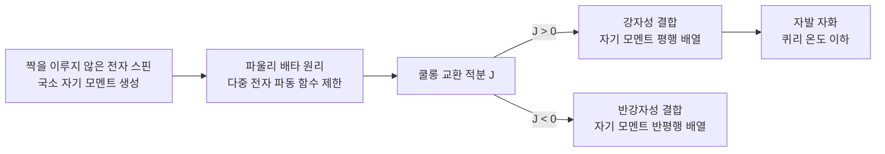

### 3.1.2 자기 결정 이방성과 단일 이온 모델

**자기 결정 이방성**은 자화 강도가 서로 다른 결정 방향을 따라갈 때 에너지가 다른 현상으로, 그 물리적 근원은 스핀-궤도 결합과 결정장의 결합 작용에 있습니다. 단축 이방성의 경우 이방성 에너지 밀도는 다음과 같이 쓸 수 있습니다.

$$
E_K = K_1 \sin^2\theta + K_2 \sin^4\theta + \cdots
$$

여기서 \(\theta\)는 자화 방향과 **용이 자화축**(easy axis) 사이의 각도이며, \(K_1\), \(K_2\)는 자기 결정 이방성 상수입니다. \(K_1 > 0\)일 때 용이축은 \(c\)축 방향이고, \(K_1 < 0\)일 때 용이면은 \(c\)축에 수직입니다.

!!! note "용어 설명: 자기 결정 이방성, 용이 자화축, 이방성 자기장, 스핀-궤도 결합, 결정장, 단일 이온 모델, Stevens 인자"
    - **자기 결정 이방성(magnetocrystalline anisotropy)**: 자화 방향이 결정학적 방향에 묶이는 현상입니다. 결정 내 전자 구름의 비구형 분포로 인해 특정 방향으로 자화하는 것이 더 "수월"하다고 이해할 수 있습니다.
    - **용이 자화축(easy axis)**: 자화 방향이 이 축과 일치할 때 자기 결정 이방성 에너지가 가장 낮은 방향입니다. 반대는 곤란 자화축(hard axis)입니다.
    - **이방성 자기장(anisotropy field, \(H_A\))**: 자화 방향을 용이축에서 곤란축으로 돌리는 데 필요한 등가 자기장으로, \(H_A = 2K_1/(\mu_0 M_s)\)입니다. 이는 용이축에 자기 모멘트가 "고정"되는 강도를 정량화합니다.
    - **스핀-궤도 결합(spin-orbit coupling)**: 전자 스핀 자기 모멘트와 궤도 운동에 의해 생성된 자기장 사이의 상호작용으로, 자기 결정 이방성의 핵심 원천입니다. 표현식은 \(\lambda \mathbf{L} \cdot \mathbf{S}\)이며, \(\lambda\)는 결합 상수입니다.
    - **결정장(crystal field)**: 주변 원자 또는 이온이 중심 이온의 전자 구름에 생성하는 정전기적 퍼텐셜입니다. 이는 희토류 이온의 에너지 준위 축퇴를 해제합니다(Stark 분할).
    - **단일 이온 모델(single-ion model)**: 전체 결정의 자기 결정 이방성은 각 희토류 이온의 이방성이 중첩된 것이라고 간주합니다. 각 희토류 이온은 결정장 내에서 특정한 에너지 준위 구조를 형성하며, 자화 방향이 변경되면 그 자유 에너지도 함께 변경됩니다.
    - **Stevens 인자**: 희토류 이온 \(4f\) 전자 구름의 모양을 설명하는 매개변수로, 이 이온이 결정장에 반응하는 방식을 결정하여 자기 결정 이방성의 부호와 크기를 결정합니다.

희토류 이온의 자기 결정 이방성은 단일 이온 모델로 설명할 수 있습니다. 결정장은 희토류 이온의 \(2J+1\)개 축퇴 상태를 분할하고, 자화 방향이 다르면 전자가 점유하는 에너지 준위가 달라져 이방성 에너지가 발생합니다. Nd\(_2\)Fe\(_{14}\)B에서 Nd\(^{3+}\)의 용이축은 \([001]\) 방향인 반면, Dy\(^{3+}\), Tb\(^{3+}\)는 서로 다른 Stevens 인자와 결정장 매개변수로 인해 더 강한 단축 이방성을 갖습니다.

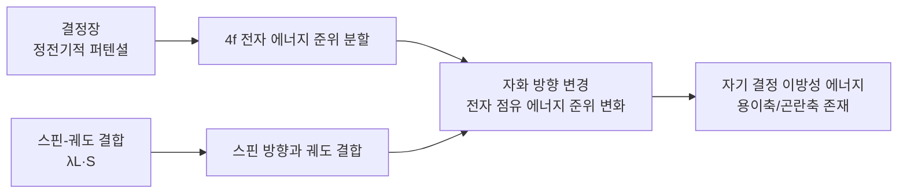

### 3.1.3 자기 구역, 구역벽 및 Brown 역설

큰 덩어리의 강자성체 내부는 **자기 구역**을 형성하여 소자계 에너지를 낮춥니다. 자기 구역벽 두께 \(\delta_w\)는 교환 에너지 \(A\)와 이방성 에너지 \(K_1\)의 경쟁에 의해 결정됩니다:

$$
\delta_w = \pi \sqrt{\frac{A}{K_1}}
$$

Nd\(_2\)Fe\(_{14}\)B의 교환 강성 \(A \approx 7.7\) pJ/m, \(K_1 \approx 4.6\) MJ/m\(^3\)일 때, \(\delta_w \approx 4\) nm로 추정됩니다. 실제 자기 구역 크기는 소자계, 결정립 크기 및 결함에 의해 공동으로 결정됩니다.

!!! note "용어 설명: 자기 구역, 구역벽, Bloch 벽, 소자계, 교환 강성, 보자력, Brown 역설"
    - **자기 구역(magnetic domain)**: 강자성체 내부에서 자발 자화 방향이 일치하는 작은 영역입니다. 서로 다른 자기 구역의 자화 방향은 다르며, 전체적으로 외부에 낮은 자유 자기극 밀도를 나타내어 소자계 에너지를 낮춥니다.
    - **구역벽(domain wall)**: 인접한 자기 구역 사이의 전이층으로, 자화 방향이 나노미터 규모 내에서 점진적으로 회전합니다.
    - **Bloch 벽(Bloch wall)**: 자화 방향이 벽면 내에서 회전하여 벽면에 자유 자기극이 없는 유형의 구역벽입니다. 덩어리 재료에서 흔히 볼 수 있습니다.
    - **소자계(demagnetizing field)**: 재료 표면의 자유 자기극에 의해 생성되는, 자화 방향과 반대되는 내부 자기장입니다. 그 크기는 시료 모양과 관련되며, \(\mathbf{H}_d = -N \mathbf{M}\)로 표현됩니다. 여기서 \(N\)은 소자 계수입니다.
    - **교환 강성(exchange stiffness, \(A\))**: 인접 원자 자기 모멘트가 평행을 유지하는 경향의 강도를 설명하며, 교환 상호작용에서 비롯됩니다. 단위는 J/m입니다.
    - **보자력(coercivity, \(H_c\) 또는 \(H_{cj}\))**: 거시적 자화 강도를 0으로 만드는 데 필요한 역방향 자기장입니다. 이는 재료가 역자화에 저항하는 능력을 반영합니다.
    - **Brown 역설(Brown's paradox)**: 이상적인 균일 단결정의 이론적 보자력은 이방성 자기장에 가까워야 하지만, 실제 소결 자석의 보자력은 이 값보다 훨씬 낮아 결함과 비이상적 구조가 역자화 과정을 지배함을 시사합니다.

```mermaid
flowchart LR
    A[큰 덩어리 강자성체<br/>높은 소자계 에너지] --> B[자기 구역 분할<br/>자유 자기극 감소]
    B --> C[자기 구역 사이에 구역벽 형성]
    C --> D[교환 에너지 A는 벽 두께를 원함]
    C --> E[이방성 에너지 K는 벽 두께를 얇게 원함]
    D --> F[Bloch 벽 두께<br/>δ_w ≈ π√(A/K)]
    E --> F
```

Brown의 역설은 이상적인 균일 단결정 타원체의 경우 역자화가 일관된 회전을 통해서만 실현되어야 하며, 이론적 보자력은 이방성 장 \(H_A = 2K_1/(\mu_0 M_s)\) (Nd\(_2\)Fe\(_{14}\)B의 경우 약 7 T)에 가까워야 한다고 지적합니다. 그러나 실제 소결 Nd-Fe-B 자석의 보자력은 일반적으로 1-3 T에 불과하여 이론값보다 훨씬 낮습니다. 이러한 차이는 실제 자석에 결정립 표면 결함, 결정립계 상 불연속성, 국부적 조성 변동과 같은 구조적 비이상성이 존재하여 역자화 자구가 \(H_A\)보다 훨씬 낮은 자기장에서 핵 생성될 수 있음을 설명합니다. 따라서 보자력 최적화의 본질은 단순히 고유 이방성을 높이는 것이 아니라 미세 구조 공학입니다.

### 3.1.4 Nd\(_2\)Fe\(_{14}\)B의 결정 구조와 내자성

Nd\(_2\)Fe\(_{14}\)B 주상은 복잡한 정방정 구조를 가지며, **공간군** \(P4_2/mnm\) (No. 136)이고, 각 **단위 셀**은 68개의 원자(8 Nd, 56 Fe, 4 B)를 포함합니다. Fe 원자는 6개의 비등가 결정학적 위치(\(16k_1\), \(16k_2\), \(8j_1\), \(8j_2\), \(4e\), \(4c\))를 차지하며, 각 위치의 국부적 배위 환경과 교환 상호작용이 달라 높은 포화 자화에 기여합니다. B 원자는 Nd 원자로 구성된 삼각기둥 간극을 차지하여 Fe 함량이 높은 정방정상을 안정화하고 퀴리 온도를 높입니다.

!!! note "용어 설명: 공간군, 단위 셀, 내자성, 자기 에너지 곱, 잔류 자화, 각형도"
    - **공간군 (space group)** : 결정 내 원자 배열의 대칭성을 설명하는 완전한 수학적 군으로, 병진, 회전, 반사 등의 대칭 연산을 포함합니다.
    - **단위 셀 (unit cell)** : 결정 구조의 최소 반복 단위로, 병진을 통해 전체 공간을 채울 수 있습니다.
    - **내자성 (intrinsic magnetic properties)** : 화학 조성과 결정 구조에만 의존하고 미세 형상과 무관한 특성으로, \(M_s\), \(K_1\), \(T_C\) 등이 있습니다.
    - **자기 에너지 곱 (energy product, \((BH)_{\max}\))** : 감자 곡선 제2사분면에서 자기 유도 \(B\)와 자기장 세기 \(H\)의 곱의 최댓값으로, 영구 자석의 에너지 저장 밀도를 측정하는 핵심 지표입니다.
    - **잔류 자화 (remanence, \(B_r\))** : 외부 자기장이 0으로 감소된 후 재료가 유지하는 자기 유도입니다. \(M_s\)와 결정립 배향도에 따라 달라집니다.
    - **각형도 (squareness, \(H_k/H_{cj}\))** : 감자 곡선이 무릎점 이상에서 직사각형에 가까운지 설명합니다. 각형도가 좋을수록 모터 작동점이 더 안정적입니다.

Nd\(_2\)Fe\(_{14}\)B의 내자성 매개변수는 아래 표와 같습니다:

| 매개변수 | 값 | 물리적 의미 |
|-----|------|---------|
| 퀴리 온도 \(T_C\) | 585 K (312 °C) | 강자성-상자성 전이 온도 |
| 상온 포화 자화 \(\mu_0 M_s\) | 1.61 T | 최대 잔류 자화 결정 |
| 자기 결정 이방성 장 \(\mu_0 H_A\) | ~7 T | 용이축 안정성 |
| 이방성 상수 \(K_1\) | 4.6 MJ/m\(^3\) | 역자화 에너지 장벽 |
| 이론적 최대 자기 에너지 곱 \((BH)_{\max}\) | ~512 kJ/m\(^3\) (64 MGOe) | 단결정 이상값 |
| 상용 소결 자석 \((BH)_{\max}\) | 270-440 kJ/m\(^3\) | 배향도, 밀도에 의해 제한됨 |

실제 소결 자석의 잔류 자화 \(B_r\)와 보자력 \(H_{cj}\)는 배향도, 밀도 및 결정립계에 의해 제어됩니다. 고성능 자석은 제트 밀을 통해 \(3-5\) \(\mu\)m의 편평한 분말 입자를 얻고, 1.5-2 T 자기장에서 배향시킨 후 가압하고, 1050-1100 °C에서 소결하며, 결정립 크기는 일반적으로 \(5-8\) \(\mu\)m로 제어됩니다.

```mermaid
flowchart LR
    A[높은 잔류 자화 Br] --> B[높은 Ms + 높은 배향도]
    C[높은 보자력 Hcj] --> D[높은 이방성 + 우수한 결정립계]
    B --> E[자기 에너지 곱 (BH)max]
    D --> E
    E --> F[모터 토크 밀도]
    subgraph "감자 곡선 특징점"
    G[Br]
    H[무릎점]
    I[Hcj]
    end
    E --> G
    E --> H
    E --> I
```

### 3.1.5 보자력 메커니즘: 핵 생성형, 피닝형 및 결정립계 공학

소결 Nd-Fe-B 자석의 보자력 메커니즘은 주로 두 가지로 분류할 수 있습니다:

1. **핵 생성 제어형 (nucleation-controlled)** : 역자화 자구가 먼저 결정립 표면 또는 표면 근처 결함에서 핵 생성된 후, 자구벽이 결정립 전체를 빠르게 휩쓸고 지나갑니다. 보자력은 핵 생성장에 따라 달라지며, 결정립 표면 결함과 결정립계 상의 화학 조성이 핵심입니다.

2. **피닝 제어형 (pinning-controlled)** : 자구벽이 이동하는 동안 결정립계, 석출상 또는 결함에 의해 고정됩니다. 열변형 나노결정립 Nd-Fe-B 자석은 일반적으로 이 유형에 속합니다.

!!! note "용어 설명: 핵 생성, 피닝, 역자화 자구, 결정립계 공학"
    - **핵 생성 (nucleation)** : 열역학적 구동력 하에서 역자화된 작은 영역이 결함이나 표면에서 발생합니다. 핵 생성장이 낮을수록 보자력이 작아집니다.
    - **피닝 (pinning)** : 자구벽이 이동 중 국부적 포텐셜 우물(결정립계 상, 석출물, 응력장)에 포획되어 벗어나기 위해 추가 에너지가 필요합니다.
    - **역자화 자구 (reverse domain)** : 자화 방향이 외부 자기장 방향과 반대인 자구로, 보자력 손실의 물리적 매개체입니다.
    - **결정립계 공학 (grain boundary engineering)** : 결정립계 상의 조성, 두께 및 연속성을 제어하여 결정립 간 자기적 분리와 결함 불활성화를 최적화함으로써 보자력을 향상시킵니다.

일반적인 소결 자석의 경우 핵 생성 제어가 지배적입니다. 결정립 표면의 결함(예: 산화, Nd 결핍층, 기계적 손상)은 핵 생성장을 현저히 낮춥니다. 결정립계 확산 공정은 결정립 표면층에 높은 이방성 껍질을 형성하여 결함 영역의 국부적 이방성 장을 높여 역자화 자구의 핵 생성을 억제합니다.

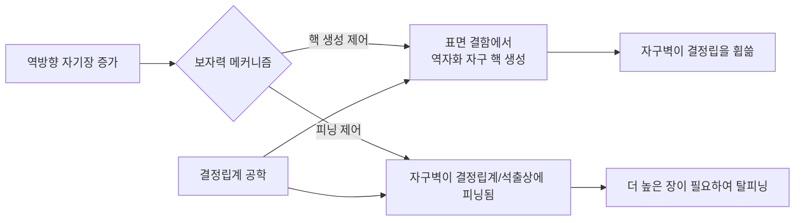

### 3.1.6 결정립계 확산: Dy/Tb 코어-쉘 구조와 확산 동역학

중희토류 원소 Dy, Tb가 Nd를 대체하면 (Nd,Dy)\(_2\)Fe\(_{14}\)B 또는 (Nd,Tb)\(_2\)Fe\(_{14}\)B를 형성하며, 이들의 상온 이방성 장은 각각 약 15 T 및 22 T로 Nd\(_2\)Fe\(_{14}\)B의 ~7 T보다 훨씬 높습니다. **결정립계 확산 공정** (Grain Boundary Diffusion Process, GBDP)을 통해 잔류 자화를 크게 낮추지 않으면서 Dy/Tb를 결정립 표면층에 도입하여 중희토류가 풍부한 껍질(코어-쉘 구조)을 형성함으로써 보자력을 크게 향상시킬 수 있습니다.

!!! note "용어 설명: 결정립계 확산 (GBDP), 코어-쉘 구조, 화학 유도 액상막 이동 (CILFM), 확산, 결정립계, 3차원 원자 탐침 (APT)"
    - **결정립계 확산 (GBDP)** : 중희토류 공급원을 자석 표면에 도포하고 열처리를 통해 원자가 결정립계를 따라 자석 내부로 빠르게 침투하여 결정립 표면층에 높은 이방성 껍질을 형성하는 공정입니다.
    - **코어-쉘 구조 (core-shell structure)** : 결정립 중심은 낮은 중희토류 함량의 Nd\(_2\)Fe\(_{14}\)B 주상(코어)을 유지하고, 가장자리는 Dy/Tb가 풍부한 높은 이방성 층(쉘)을 형성합니다.
    - **화학 유도 액상막 이동 (CILFM)** : 희토류가 풍부한 액상이 결정립계에서 화학 퍼텐셜/표면 장력 구배로 인해 이동하여 용질 원자를 빠르게 확산시키고 껍질을 형성합니다.
    - **확산 (diffusion)** : 원자가 화학 퍼텐셜 구배의 구동력 하에 고농도 영역에서 저농도 영역으로 이동하며, Fick의 법칙을 따릅니다. 결정립계 확산 속도는 결정립 내 확산보다 훨씬 빠릅니다.
    - **결정립계 (grain boundary)** : 배향이 다른 결정립 사이의 계면으로, 원자 배열이 느슨하고 확산 통로가 많으며 에너지가 높습니다.
    - **3차원 원자 탐침 (APT)** : 전기장을 이용해 이온을 증발시키고 비행 시간 질량 분석을 통해 원자 종류와 위치를 결정하는 특성 분석 기술로, 거의 원자 수준의 분해능에 도달할 수 있습니다.

GBDP의 일반적인 공정: Dy/Tb 공급원(금속, 불화물 DyF\(_3\), 수소화물 TbH\(_3\) 또는 저융점 합금)을 자석 표면에 도포한 후 800-950 °C에서 확산 열처리하여 중희토류가 결정립계를 따라 내부로 침투하고 주상 결정립 가장자리에 (Nd,HRE)\(_2\)Fe\(_{14}\)B 껍질을 형성합니다. Hono 등은 3차원 원자 탐침(APT)을 통해 GBDP 후 Dy가 주로 결정립 표면층 1-2 μm 범위에 분포하여 높은 이방성 장 껍질을 형성하고 역자화 자구의 핵 생성을 효과적으로 억제함을 확인했습니다.

확산 과정은 화학 유도 액상막 이동 (Chemically Induced Liquid Film Migration, CILFM)에 의해 제어됩니다: 희토류가 풍부한 액상이 결정립계에서 형성되고, 표면 장력/화학 퍼텐셜 구배로 인해 액상막 이동이 구동되어 중희토류 원소가 결정립계를 따라 빠르게 확산되고 껍질을 형성합니다. 2025년 Lee 등은 TaF\(_5\) 2단계 확산과 Pr\(_{70}\)Cu\(_{15}\)Al\(_{10}\)Ga\(_5\) 합금의 복합 공정을 보고했으며, 첫 번째 확산 단계에서 육방정 TaB\(_2\) 결정립간 석출상을 형성하여 CILFM을 억제하고, 두 번째 확산 단계에서 더 얇고 Pr 농도가 더 높은 껍질을 형성하여 중희토류 없이 보자력 \(\mu_0 H_c = 2.35\) T를 달성했습니다.

```mermaid
flowchart LR
    A[Dy/Tb 소스 코팅] --> B[800-950 °C 열처리]
    B --> C[결정립계에 희토류 풍부 액상 형성]
    C --> D[화학적 유도 액상막 이동 CILFM]
    D --> E[중희토류가 결정립계를 따라 침투]
    E --> F[주상 결정립 가장자리에<br/>(Nd,HRE)2Fe14B 쉘 형성]
    F --> G[코어: 낮은 HRE 주상]
    F --> H[쉘: 높은 HRE, 높은 H_A]
    H --> I[보자력 향상]
```

**표 3-1 대표적인 Nd-Fe-B 결정립계 확산 공정과 자기 특성**

| 확산 소스 | 자석 기재 | 주요 효과 | 문헌 |
|-------|---------|---------|------|
| Dy 증착 | 소결 Nd-Fe-B | \(H_{cj}\) 향상, 잔류자화 약간 감소 | Huang & Mo, Vacuum 2024 |
| Tb 확산 + Ga 공동 | 소결 Nd-Fe-B | \(H_{cj}\) 53.15% 향상, 잔류자화 감소 없음 | Wang et al., PMC11820678 |
| TaF\(_5\) + Pr-Al-Cu-Ga | 소결 Nd-Fe-B | 중희토류 없음, \(\mu_0 H_c = 2.35\) T | Lee et al., Acta Mater. 2025 |
| Dy-Al-Cu 합금 | 소결 Nd-Fe-Co-B | 보자력, 열안정성 및 내식성 동시 향상 | Liu et al., JMMM 2024 |
| Tb-Pr-Ce-Cu 확산 | 소결 Nd-Fe-B | Tb 사용량 감소 및 보자력 향상 | Zhan et al., Mater. Today Commun. 2025 |

### 3.1.7 온도 특성, 보자력 온도 계수 및 모터 선정

모터 작동 시 권선 온도는 100-180 °C에 도달할 수 있으므로, 영구자석의 고온 안정성이 매우 중요합니다. Nd\(_2\)Fe\(_{14}\)B의 \(K_1\)과 \(M_s\)는 온도 상승에 따라 감소하여 보자력이 저하됩니다. 보자력 온도 계수 \(\beta\)는 다음과 같이 정의됩니다.

$$
\beta = \frac{H_{cj}(T_2) - H_{cj}(T_1)}{H_{cj}(T_1)(T_2 - T_1)} \times 100\%
$$

일반적인 소결 Nd-Fe-B의 \(\beta\)는 약 -0.5 ~ -0.8 %/°C입니다. Dy/Tb의 도입은 고온 보자력을 개선할 수 있으며, 상용 등급은 N(≤80 °C), M(≤100 °C), H(≤120 °C), SH(≤150 °C), UH(≤180 °C), EH(≤200 °C) 및 AH(≤230 °C)로 구분됩니다. 휴머노이드 로봇 관절 모터가 장시간 고부하로 작동하는 경우 일반적으로 UH 또는 EH 등급을 선택해야 합니다.

!!! note "용어 설명: 보자력 온도 계수, 잔류자화 온도 계수, 동작점, 무릎점, 와전류 손실"
    - **보자력 온도 계수(\(\beta\))**: 단위 온도 변화에 따른 보자력 상대 변화율(%)로, 음수는 온도 상승 시 보자력 감소를 의미합니다.
    - **잔류자화 온도 계수(\(\alpha\))**: 단위 온도 변화에 따른 잔류자화 상대 변화율(%)입니다.
    - **동작점(operating point)**: 모터 작동 시 영구자석 감자 곡선 상의 \(B\), \(H\) 좌표입니다.
    - **무릎점(knee point)**: 감자 곡선에서 선형 영역에서 급격한 감소 영역으로 전환되는 변곡점입니다. 동작점이 무릎점보다 낮아지면 외부 자기장 제거 후 자석이 원래 자화 상태를 회복하지 못하고 비가역 감자가 발생합니다.
    - **와전류 손실(eddy current loss)**: 교번 자기장이 전도성 자석 내부에 유도하는 순환 전류로 인해 발생하는 줄 열로, 저항률과 자석 분할 방식에 따라 달라집니다.

보자력 외에도 모터 설계 시 다음 사항을 고려해야 합니다.
- **잔류자화 \(B_r\)**: 공극 자속 밀도와 토크 상수를 결정합니다.
- **각형도 \(H_k/H_{cj}\)**: 모터 효율과 동작점 안정성에 영향을 미칩니다.
- **저항률**: 와전류 손실에 영향을 미치며, 고주파 모터에는 높은 저항률의 자석이 필요합니다.
- **온도 계수 \(\alpha\) 및 \(\beta\)**: 각각 잔류자화와 보자력의 온도 변화를 설명합니다.

전신 로봇 1대에 30-50개의 모터를 사용하고, 각 모터에 50-100g의 Nd-Fe-B가 사용된다고 가정하면, 로봇 1대당 Nd-Fe-B 사용량은 약 1.5-4kg입니다. Dy/Tb 함량을 3-8 wt%로 계산하면, 로봇 1대당 Dy/Tb 산화물 필요량은 50-300g입니다.

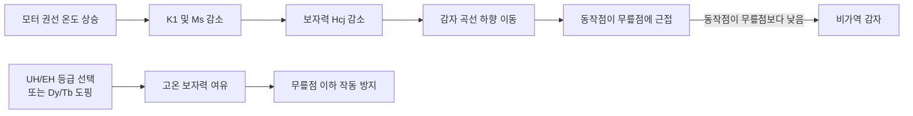

### 3.1.8 부식 메커니즘 및 방호

소결 Nd-Fe-B는 다상으로 구성됩니다: 주상 Nd\(_2\)Fe\(_{14}\)B, Nd 풍부 결정립계상 및 소량의 Nd\(_2\)O\(_3\), B\(_6\)O 등. Nd 풍부 결정립계상은 화학적 활성이 높고 표준 전극 전위가 낮아, 습윤 환경에서 Fe 기반 주상과 **미세 갈바니 전지**를 형성하여 결정립계 우선 부식을 유발합니다. 부식 생성물은 다공성이며 보호 기능을 제공하지 못하고 오히려 자기 특성 저하를 가속화합니다.

!!! note "용어 설명: 미세 갈바니 부식, 표준 전극 전위, 결정립계상, 도금, 합금화"
    - **미세 갈바니 부식(micro-galvanic corrosion)**: 전위가 다른 두 상이 전해질에서 접촉할 때, 낮은 전위상이 양극으로 산화되고 높은 전위상이 음극으로 환원 반응(예: 산소 흡수 또는 수소 발생)을 촉진합니다.
    - **표준 전극 전위(standard electrode potential, \(E^0\))**: 표준 상태에서 특정 전기쌍의 표준 수소 전극(SHE)에 대한 평형 전위로, 전위가 낮을수록 산화되기 쉽습니다.
    - **결정립계상(grain boundary phase)**: 결정립 경계에 분포하며 주상과 조성이 다른 Nd 풍부상으로, 보자력과 내식성 모두에 영향을 미칩니다.
    - **도금(coating)**: 자석 표면에 금속 또는 유기층을 증착하여 환경 매체를 차단합니다.
    - **합금화(alloying)**: 자석에 Co, Ga, Cu 등의 원소를 첨가하여 결정립계상 조성을 변경하고 화학적 안정성을 높입니다.

방호 전략은 다음과 같습니다.

1. **표면 도금**: 전기 아연 도금, 니켈-구리-니켈 다층 도금, 에폭시 수지 코팅. Ni-Cu-Ni 도금은 내식성이 우수하지만 도금층 기공 및 모서리 효과를 제어해야 합니다.
2. **합금화 개질**: Co를 첨가하여 결정립계상의 내식성 향상; Ga, Cu를 첨가하여 결정립계상의 젖음성 및 화학적 안정성 개선.
3. **결정립계 확산 최적화**: 결정립계상의 연속성과 화학적 안정성을 개선합니다. Mo 등의 연구는 최적화된 확산 및 시효 열처리가 보자력, 열안정성 및 내식성을 동시에 향상시킬 수 있음을 지적합니다.

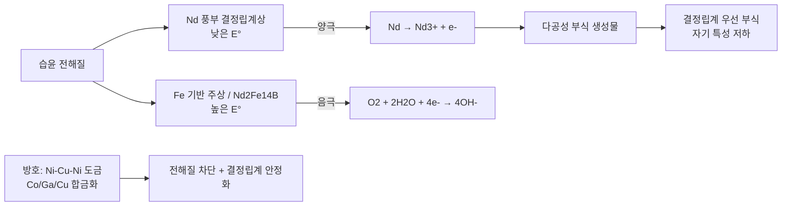

### 3.1.9 회수 및 재생: 도시 광산 관점

Nd-Fe-B 자석은 30-32 wt%의 희토류(Nd, Pr, Dy, Tb)를 함유하고 있어, 전자 폐기물에서 희토류를 회수하는 것은 자원 및 전략적 측면에서 중요한 의미를 갖습니다. 주요 회수 경로는 다음과 같습니다.

- **습식 제련**: 산 침출, 추출 분리를 통해 고순도 희토류를 회수할 수 있지만 폐산 처리가 필요합니다.
- **건식 제련**: 용융염 전해 또는 고온 환원으로 대규모 처리에 적합합니다.
- **수소 파쇄-탈수소-재결합(HDDR)**: 수소화-불균등화-탈수소-재결합 반응을 이용하여 자석 분말을 직접 재생합니다.

!!! note "용어 설명: 습식 제련, 건식 제련, HDDR, 도시 광산"
    - **습식 제련(hydrometallurgy)**: 수용액에서 산, 염기 또는 착화 반응을 이용하여 금속을 용해, 분리, 회수하는 방법입니다.
    - **건식 제련(pyrometallurgy)**: 고온에서 용융, 환원 또는 전해를 통해 금속을 회수하는 방법입니다.
    - **HDDR(Hydrogenation-Disproportionation-Desorption-Recombination)**: 수소와 Nd-Fe-B의 반응으로 분해시킨 후, 탈수소를 통해 미세한 결정립의 자석 분말로 재결합시키는 공정입니다.
    - **도시 광산(urban mining)**: 폐전자제품 및 산업 폐기물을 회수 가능한 금속 자원으로 간주하는 개념입니다.

Kovačič 2025의 리뷰 논문은 소결 Nd-Fe-B의 부식 및 회수에 관한 최신 연구를 체계적으로 요약하며, 향후 회수 기술은 희토류 회수율, 에너지 소비 및 환경 영향을 고려해야 한다고 지적합니다.

### 3.1.10 미세자기 시뮬레이션 및 보자력 예측

미세자기 시뮬레이션은 Nd-Fe-B의 보자력 메커니즘을 이해하고 미세 구조를 최적화하는 중요한 도구입니다. Landau-Lifshitz-Gilbert(LLG) 방정식은 미세자기의 기본 방정식입니다.

$$
\frac{\partial \mathbf{m}}{\partial t} = -\gamma \mathbf{m} \times \mathbf{H}_{eff} + \alpha \mathbf{m} \times \frac{\partial \mathbf{m}}{\partial t}
$$

여기서 \(\mathbf{m}\)은 정규화된 자화 강도, \(\gamma\)는 자이로자기비, \(\alpha\)는 Gilbert 감쇠 계수, \(\mathbf{H}_{eff}\)는 교환장, 이방성장, 반자장 및 외부 인가장을 포함하는 유효장입니다.

!!! note "용어 설명: 미세자기학, LLG 방정식, 자이로자기비, Gilbert 감쇠, 유효장"
    - **미세자기학 (micromagnetics)** : 연속체 근사 하에서 자화 벡터의 시공간 진화를 해석하는 이론적 프레임워크로, 원자 자기 모멘트와 거시적 자기 구역 사이의 규모를 다룹니다.
    - **LLG 방정식 (Landau-Lifshitz-Gilbert equation)** : 외부 장과 감쇠 작용 하에서 자화 벡터의 세차 운동과 이완을 설명하는 동역학 방정식입니다.
    - **자이로자기비 (gyromagnetic ratio, \(\gamma\))** : 자기 모멘트와 각운동량의 비율로, 자기장 내에서 자기 모멘트의 세차 주파수를 결정합니다.
    - **Gilbert 감쇠 (Gilbert damping, \(\alpha\))** : 자화 세차 운동의 에너지가 격자로 소산되는 속도를 나타냅니다.
    - **유효장 (effective field)** : 모든 자기 모멘트에 작용하는 장의 총합으로, 에너지 범함수의 자화에 대한 변분을 통해 얻을 수 있습니다.

미세자기학 시뮬레이션을 통해 다음을 연구할 수 있습니다:
- 결정립 크기가 보자력에 미치는 영향: 최적의 결정립 크기 범위(일반적으로 3-8 μm)가 존재하며, 너무 큰 결정립은 결함 확률을 증가시키고 너무 작은 결정립은 교환 결합을 강화합니다.
- 결정립계 상 두께와 자기 분리 효과: 이상적인 결정립계 상 두께는 인접 결정립을 충분히 탈결합시켜야 하지만, 너무 두꺼우면 잔류 자화가 감소합니다.
- 코어-쉘 구조 최적화: Dy/Tb 쉘의 두께와 농도 분포는 보자력과 잔류 자화 간의 트레이드오프(trade-off)에 영향을 미칩니다.

2025년 Lee 등의 연구는 미세자기학 시뮬레이션을 통해 CILFM 형성을 억제하는 얇고 높은 Pr 농도의 쉘이 결정립 표면의 핵 생성장을 현저히 향상시킬 수 있음을 보여주었으며, 이는 중희토류가 없는 자석에서 높은 보자력을 얻는 핵심 요소입니다.

### 3.1.11 영구자석 모터의 자기 회로 설계와 손실

휴머노이드 로봇 관절 모터는 일반적으로 **영구자석 동기 모터**(Permanent Magnet Synchronous Motor, PMSM) 또는 프레임리스 토크 모터를 사용합니다. 영구자석의 자기 특성은 모터 설계에 직접적인 영향을 미칩니다:

- **공극 자속 밀도** \(B_g\): 영구자석의 잔류 자화 \(B_r\)와 자기 회로 구조에 의해 결정되며, 일반적인 값은 0.8-1.2 T입니다.
- **토크 상수** \(K_t\): 공극 자속 밀도, 권선 턴 수 및 모터 기하학적 치수와 관련됩니다.
- **감자 곡선**: 고온 및 큰 전류에 의한 감자 자기장 하에서 작동점이 무릎점(knee point) 이상에 위치하도록 해야 합니다.

!!! note "용어 설명: 영구자석 동기 모터, 공극 자속 밀도, 토크 상수, 감자 곡선"
    - **영구자석 동기 모터 (PMSM)** : 회전자가 영구자석으로 여자되고 고정자 권선에 교류가 인가되어 회전 자기장을 생성하며, 이들이 동기 회전하는 모터입니다.
    - **공극 자속 밀도 (air-gap flux density)** : 모터 고정자와 회전자 사이의 공극에서의 자기 유도 강도로, 전자기 토크를 직접 결정합니다.
    - **토크 상수 (torque constant, \(K_t\))** : 단위 전류당 발생하는 토크로, 공극 자속 밀도와 권선 유효 턴 수에 비례합니다.
    - **감자 곡선 (demagnetization curve)** : 제2사분면의 \(B-H\) 곡선으로, 역방향 자기장 하에서 영구자석의 자화 거동을 설명합니다.

모터 손실에는 동손, 철손, 기계적 손실 및 영구자석 와전류 손실이 포함됩니다. 고주파 운전 시 영구자석 와전류 손실이 현저해지며, 자석 분할, 자석 비저항 증가 또는 본드 자석 사용을 통해 저감할 수 있습니다.

#### 3.1.11.1 단순화된 자기 회로 모델과 공극 자속 밀도

영구자석 모터 설계는 일반적으로 등가 자기 회로에서 출발합니다. 영구자석, 공극 및 철심으로 구성된 폐쇄 자기 회로에서 철심의 자기 저항을 무시하면 자속 연속성 조건은 다음과 같습니다.

$$
\Phi_g = B_g A_g = B_m A_m
$$

그리고 암페어 폐회로 법칙은 다음을 제공합니다.

$$
H_m l_m + H_g l_g = 0
$$

여기서 \(H_g = B_g / \mu_0\)입니다. Nd-Fe-B 영구자석의 감자 곡선은 작동 영역에서 선형으로 근사할 수 있습니다:

$$
B_m = \mu_0 \mu_r H_m + B_r
$$

여기서 \(\mu_r\)은 **회복 투자율**(recoil permeability)이며, 소결 Nd-Fe-B의 \(\mu_r \approx 1.04-1.08\)입니다. 위 식들을 연립하면 공극 자속 밀도를 얻을 수 있습니다.

$$
B_g = \frac{B_r}{\frac{A_g}{A_m} + \mu_r \frac{l_g}{l_m}}
$$

실제 설계에서는 Carter 계수 \(k_c\)를 사용하여 슬롯 개구부가 공극 자기 저항에 미치는 영향을 보정합니다: \(l_{g,\text{eff}} = k_c k_s g\), 여기서 \(k_s\)는 포화 계수(일반적으로 1.1-1.3)입니다. \(A_g/A_m \approx 1\), \(l_g/l_m \ll 1\)일 때 \(B_g \approx B_r\)이지만, 전기자 반작용 감자에 대응하기 위해 영구자석 두께 \(l_m\)은 일반적으로 \(l_m/l_g = 5-10\)으로 설정됩니다.

!!! note "용어 설명: 기자력, 자기 저항, 자기 퍼미언스, 회복 투자율, Carter 계수"
    - **기자력 (magnetomotive force, MMF)** : 자속을 구동하는 "자기 포텐셜"로, 영구자석이 제공하는 MMF는 \(F_m = H_m l_m\)입니다.
    - **자기 저항 (reluctance, \(\mathcal{R}\))** : 자기 회로가 자속에 대해 나타내는 저항으로, \(\mathcal{R}=l/(\mu A)\)이며 전기 저항에 해당합니다.
    - **자기 퍼미언스 (permeance, \(P\))** : 자기 저항의 역수로, \(P=\mu A/l\)입니다.
    - **회복 투자율 (recoil permeability, \(\mu_r\))** : 영구자석이 국부적으로 감자된 후 재자화될 때 \(B-H\) 소이력선의 기울기와 \(\mu_0\)의 비율입니다.
    - **Carter 계수 (Carter coefficient, \(k_c\))** : 슬롯 개구부로 인한 공극 자기 저항 증가를 고려한 경험적 계수로, 일반적으로 \(k_c \approx 1.0-1.3\)입니다.

```mermaid
flowchart LR
    A[모터 사양<br/>토크/회전수/전압] --> B[자기 회로 기하학적 설계]
    B --> C[영구자석 치수<br/>lm, Am]
    C --> D[등가 자기 회로 계산]
    D --> E[Bg = Br/(Ag/Am + μr·lg/lm)]
    E --> F[권선 턴 수와 극 수]
    F --> G[열 검토 및 효율 맵]
```

#### 3.1.11.2 토크 방정식과 역기전력

표면 부착형 PMSM(SPMSM)의 경우, 직축 및 교축 인덕턴스가 거의 동일하며(\(L_d \approx L_q\)), 전자기 토크는 주로 영구자석 쇄교 자속 \(\lambda_m\)과 교축 전류 \(i_q\)에 의해 발생합니다:

$$
T_e = \frac{3}{2} p \lambda_m i_q
$$

여기서 \(p\)는 극 쌍 수입니다. 영구자석 쇄교 자속과 공극 자속 밀도의 관계는 다음과 같습니다.

$$
\lambda_m = N_{ph} k_w \frac{2}{\pi} \tau l B_g
$$

여기서 \(N_{ph}\)는 상당 직렬 턴 수, \(k_w\)는 권선 계수, \(\tau\)는 극 간격, \(l\)은 철심 축 방향 길이입니다. 역기전력 진폭은 다음과 같습니다.

$$
E_{ph} = \omega_e \lambda_m = p \Omega_m \lambda_m
$$

토크 상수 \(K_t = T_e / I_q = \frac{3}{2} p \lambda_m\)(피크 전류와 피크 토크 대응). 정현파 구동의 경우, 선간 전압 실효값은 다음을 만족합니다.

$$
V_{LL,rms} \approx \sqrt{E_{ph}^2 + (\omega_e L_s I)^2}
$$

고속 약자속 영역에서는 전압 한계 타원 제약 조건도 충족해야 합니다.

!!! note "용어 설명: 쇄교 자속, 역기전력, 극 쌍 수, 약자속, 권선 계수"
    - **쇄교 자속 (flux linkage, \(\lambda\))** : 코일과 쇄교하는 총 자속으로, \(\lambda = N \Phi\)입니다.
    - **역기전력 (back-EMF)** : 회전자가 회전하면서 자속선을 절단하여 고정자 권선에 유도되는 전압입니다.
    - **극 쌍 수 (pole-pair number, \(p\))** : 모터의 한 쌍의 N-S 자극에 해당하는 공간 주기 수입니다.
    - **약자속 (field weakening)** : 직축 감자 전류 \(i_d < 0\)를 인가하여 모터의 정출력 운전 영역을 확장하는 것입니다.
    - **권선 계수 (winding factor, \(k_w\))** : 분포, 단절 및 스큐를 고려한 권선 유효 턴 수의 할인 계수입니다.

#### 3.1.11.3 손실 구성과 효율 맵

모터 총 손실은 다음과 같이 분해될 수 있습니다.

$$
P_{loss} = P_{Cu} + P_{Fe} + P_{pm} + P_{mech}
$$

- 동손: \(P_{Cu} = 3 I^2 R_s\), 여기서 \(R_s\)는 상 저항이며 온도가 증가함에 따라 증가합니다: \(R_s(T) = R_{25}[1+\alpha_{Cu}(T-25)]\).
- 철손: 수정된 Steinmetz 방정식을 사용합니다.

$$
P_{Fe} = k_h f B_m^\alpha + k_e (f B_m)^2 + k_a (f B_m)^{1.5}
$$

여기 \(k_h\), \(k_e\), \(k_a\)는 규소강판 제조사가 제공하며, \(\alpha\)는 일반적으로 1.6-2.2입니다.
- 영구자석 와전류 손실:

$$
P_{pm} = \frac{\pi^2}{20 \rho_{pm}} \frac{(B_m f)^2 t^4}{V_{pm}} \quad \text{(박판 근사)}
$$

여기서 \(\rho_{pm}\)은 영구자석 저항률, \(t\)는 자석 분할 두께입니다.
- 기계적 손실: 베어링 마찰과 풍손으로, 일반적으로 차지하는 비율이 작습니다.

효율은

$$
\eta = \frac{P_{out}}{P_{out}+P_{loss}}
$$

휴머노이드 로봇 관절은 종종 저속 대토크와 고속 소토크 사이를 전환하므로, 설계 시 정격점이 효율 맵의 고효율 영역(\(\eta \ge 90\%\))에 위치하도록 해야 합니다.

!!! note "용어 설명: Steinmetz 방정식, 동손, 철손, 와전류 손실, 효율 맵"
    - **Steinmetz 방정식**: 경험적 철손 모델로, 히스테리시스 손실, 와전류 손실 및 이상 손실을 각각 주파수와 자속 밀도의 멱함수로 나타냅니다.
    - **동손(copper loss)**: 권선 저항에서 전류로 인해 발생하는 줄열입니다.
    - **철손(core loss)**: 교번 자계가 철심에서 발생시키는 히스테리시스 및 와전류 손실입니다.
    - **와전류 손실(eddy-current loss)**: 도전 재료가 교번 자계에서 유도된 순환 전류로 인해 발생하는 손실입니다.
    - **효율 맵(efficiency map)**: 다양한 회전수-토크 작업점에서의 효율 등고선도로, 전동기 선정의 핵심 도구입니다.

#### 3.1.11.4 관절 전동기 설계 수치 예제

정격 출력 200 W, 정격 회전수 3000 rpm인 로봇 무릎 관절 전동기를 고려합니다. Nd-Fe-B 잔류 자속 밀도 \(B_r = 1.2\) T, 복귀 투자율 \(\mu_r = 1.05\), 공극 \(l_g = 0.5\) mm, 자석 길이 \(l_m = 4\) mm, 극호 계수 \(A_g/A_m = 1.1\)이 주어졌습니다. 공극 자속 밀도, 토크 상수 및 정격 전류를 추정합니다.

```python
import numpy as np

# 영구자석 및 자기 회로 파라미터
Br = 1.2          # T
mu_r = 1.05
lg = 0.5e-3       # m
lm = 4.0e-3       # m
Ag_over_Am = 1.1
p = 4             # 극 쌍 수
N_ph = 60         # 상당 직렬 턴 수
kw = 0.93         # 권선 계수
tau = 0.020       # 극 간격 m
l_core = 0.030    # 축 방향 길이 m

# 공극 자속 밀도
Bg = Br / (Ag_over_Am + mu_r * lg / lm)
print(f"Bg = {Bg:.3f} T")

# 영구자석 쇄교 자속
lambda_m = N_ph * kw * (2/np.pi) * tau * l_core * Bg
print(f"lambda_m = {lambda_m:.4f} Wb")

# 정격 각속도
Omega_m = 3000 * 2*np.pi / 60  # rad/s
E_ph = p * Omega_m * lambda_m
print(f"상 역기전력 진폭 = {E_ph:.2f} V")

# 토크 상수
Kt = 1.5 * p * lambda_m          # Nm/A_peak
T_rated = 0.64                   # 200 W @ 3000 rpm
Iq_rated = T_rated / Kt
print(f"Kt = {Kt:.3f} Nm/A")
print(f"정격 Iq = {Iq_rated:.2f} A")

# 손실 추정
Rs = 0.12         # Ω
I = Iq_rated
P_Cu = 3 * I**2 * Rs
P_out = T_rated * Omega_m
eta = P_out / (P_out + P_Cu)
print(f"동손 = {P_Cu:.1f} W, 효율(동손만) = {eta*100:.1f}%")
```

위 스크립트의 출력은 약 \(B_g \approx 0.95\) T, \(K_t \approx 0.31\) Nm/A, 정격 전류 약 2.1 A입니다. 권선 저항이 0.12 Ω인 경우 동손만으로 1.5 W에 달하며, 이에 해당하는 효율은 약 99.3%입니다(철손 및 기계적 손실 무시). 이는 소형 관절이 정격점에서 효율을 매우 높게 설계할 수 있지만, 피크 토크에서는 동손이 급격히 증가함을 의미합니다.

### 3.1.12 희토류 영구자석 공급망과 가격 메커니즘

희토류 영구자석 공급망은 채광, 선광, 분리 제련, 합금 제조, 자석 제조, 표면 처리 및 응용 최종 단계를 포함합니다. 중국은 이 산업 체인에서 지배적인 위치를 차지하고 있습니다:

| 단계 | 중국의 글로벌 점유율 | 주요 기업/지역 |
|-----|------------|--------------|
| 희토류 광산 채광 | 60-70% | 북방희토, 중국희토그룹 |
| 분리 제련 | ~90% | 중국오광, 성화자원 |
| NdFeB 자성 재료 | 85-93% | 중과삼환, 금력영자, 영파운승 |
| 중희토류 가공 | ~99% | 중국 남부 이온형 희토류 광산 |

2025년 4월 중국은 Dy, Tb 등 중중희토류에 대해 수출 허가 규제를 시행하여 국제 시장에서 고보자력 자석의 가격 변동을 초래했습니다. Adamas Intelligence는 수요 추세가 지속되고 공급 증가가 예상에 미치지 못할 경우, 2035년까지 전 세계 NdFeB 연간 부족량이 20.6만 톤에 달할 수 있다고 예측합니다. 휴머노이드 로봇은 새로운 수요원으로서 현재 단일 기기 사용량은 많지 않지만, 이미 타이트한 공급망을 더욱 압박할 것입니다.

---

## 3.2 구조 재료

### 3.2.1 금속 강화 메커니즘: 전위 이동의 방해

금속의 강도는 다양한 메커니즘을 통해 향상될 수 있으며, 핵심은 **전위** 이동을 방해하는 것입니다. 전위는 결정 내 원자 배열의 선 결함이며, 그 미끄러짐은 금속 소성 변형의 주요 방식입니다. 전위의 이동은 버거스 벡터 \(\mathbf{b}\)로 설명됩니다.

!!! note "용어 설명: 전위, 버거스 벡터, 미끄러짐, 소성 변형"
    - **전위(dislocation)**: 결정 내 원자 배열의 선 결함으로, 완전 결정의 이론적 전단 응력보다 훨씬 낮은 조건에서 국부적 미끄러짐이 발생하도록 합니다.
    - **버거스 벡터(Burgers vector, \(\mathbf{b}\))**: 전위로 인한 격자 왜곡의 정도와 방향을 설명하는 벡터로, 그 크기는 원자 간격 정도입니다.
    - **미끄러짐(slip)**: 전위가 특정 결정면과 결정 방향을 따라 이동하여 결정의 거시적 형상 변화를 초래합니다.
    - **소성 변형(plastic deformation)**: 하중 제거 후 회복되지 않는 영구 변형으로, 전위 증식 및 이동에 의해 지배됩니다.

주요 강화 메커니즘은 다음과 같습니다.

**고용 강화**: 용질 원자가 격자 왜곡을 일으켜 전위와 탄성 상호 작용을 합니다. Fleischer 모델은 용질 농도 \(c\)에 따른 강화 증가량을 제시합니다.

$$
\Delta\tau_{ss} \propto c^{2/3}
$$

희석 고용체의 경우 강화 증가량은 대략 \(c^{1/2}\)에 비례합니다. 용질 원자와 기지 원자 간의 크기 불일치 및 탄성 계수 불일치가 클수록 강화 효과가 커집니다.

!!! note "용어 설명: 고용 강화, 용질 원자, 격자 왜곡"
    - **고용 강화(solid-solution strengthening)**: 용질 원자가 기지 격자에 무작위로 분포하여 탄성 응력장을 통해 전위 이동을 방해합니다.
    - **용질 원자(solute atom)**: 기지에 용해된 이종 원자입니다.
    - **격자 왜곡(lattice distortion)**: 원자 크기 또는 결합 차이로 인해 주변 격자에 탄성 변형이 발생하는 현상입니다.

**석출 강화**: 제2상 입자가 전위가 절단하거나 우회하는 것을 방해합니다. 입자가 전단 불가능할 때 Orowan 메커니즘에 따라 입자를 우회하는 임계 전단 응력은 다음과 같습니다.

$$
\tau_{Orowan} = \frac{Gb}{2\pi\lambda} \ln\frac{r}{r_0}
$$

여기서 \(G\)는 전단 탄성 계수, \(b\)는 버거스 벡터, \(\lambda\)는 입자 간 거리, \(r\)은 입자 반경입니다. 피크 시효 시 미세하게 분산된 정합 또는 반정합 석출상이 최대 강화 효과를 제공합니다. 과시효 시 입자가 조대화되어 \(\lambda\)가 증가하고 강화 효과가 감소합니다.

!!! note "용어 설명: 석출 강화, Orowan 메커니즘, 정합/반정합, 피크 시효, 과시효"
    - **석출 강화(precipitation strengthening)**: 기지에 미세하게 분산된 제2상 입자가 전위 이동을 방해합니다.
    - **Orowan 메커니즘**: 전위가 전단 불가능한 입자를 우회하여 입자 주위에 전위 루프를 남기며, 추가 응력이 필요합니다.
    - **정합/반정합 석출상(coherent/semi-coherent precipitate)**: 석출상이 기지 격자와 연속적 또는 부분적으로 일치하여 계면 에너지가 낮고 강화 효과가 뛰어납니다.
    - **피크 시효(peak aging)**: 석출상의 크기와 밀도가 최적의 강화 효과를 나타내는 시효 상태입니다.
    - **과시효(overaging)**: 석출상이 조대화되고 간격이 증가하여 강도는 감소하지만 인성/내식성이 개선되는 경우가 많습니다.

**미세립 강화**: Hall-Petch 관계는 항복 강도와 결정립 크기 \(d\)의 관계를 제시합니다.

$$
\sigma_y = \sigma_0 + k_y d^{-1/2}
$$

결정립 미세화는 강도와 인성을 동시에 향상시킵니다. 이는 결정립계가 전위 이동을 방해하고 균열을 둔화시키기 때문입니다. 그러나 지나치게 미세한 결정립은 고온 크리프 저항을 감소시킬 수 있습니다.

!!! note "용어 설명: 미세립 강화, Hall-Petch 관계, 항복 강도"
    - **미세립 강화(grain refinement strengthening)**: 결정립 크기를 줄여 결정립계 면적을 증가시키고 전위 미끄러짐을 방해합니다.
    - **Hall-Petch 관계**: 항복 강도가 결정립 크기의 제곱근 역수에 선형적으로 증가하는 경험적 관계입니다.
    - **항복 강도(yield strength)**: 재료가 소성 변형을 시작할 때의 응력입니다.

**가공 경화**: 전위 밀도 \(\rho\) 증가로 인해 유동 응력이 상승합니다.

$$
\sigma = \sigma_0 + \alpha M G b \sqrt{\rho}
$$

여기서 \(\alpha\)는 상수, \(M\)은 Taylor 인자입니다.

!!! note "용어 설명: 가공 경화, 전위 밀도, Taylor 인자"
    - **가공 경화(work hardening)**: 소성 변형이 전위 밀도를 증가시켜 후속 변형에 더 높은 응력이 필요하게 합니다.
    - **전위 밀도(dislocation density, \(\rho\))**: 단위 부피 내 전위선의 총 길이입니다.
    - **Taylor 인자(Taylor factor)**: 단결정 임계 분해 전단 응력을 다결정 거시적 항복 응력과 연결하는 방향 평균 인자입니다.

**집합 조직 강화**: 결정학적 방향 제어를 통해 미끄러짐계의 작동을 조절합니다. 마그네슘과 같은 HCP 금속의 경우 집합 조직을 제어하여 쉽게 미끄러지는 방향을 주 응력 방향과 어긋나게 하여 항복 강도를 높일 수 있지만 연성은 감소합니다.

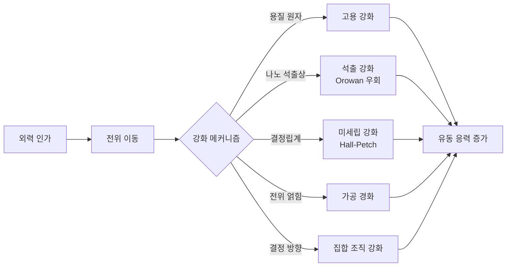

### 3.2.2 알루미늄 합금: 시효 석출 순서와 합금 번호 선택

알루미늄 합금은 인간형 로봇 구조 부품에 가장 많이 사용되는 금속 재료입니다. 주요 합금 원소에 따라 2xxx(Al-Cu), 5xxx(Al-Mg), 6xxx(Al-Mg-Si), 7xxx(Al-Zn-Mg-Cu) 등 시리즈로 분류됩니다.

!!! note "용어 설명: 알루미늄 합금 시리즈, 고용화 처리, 시효 처리"
    - **알루미늄 합금 시리즈**: 주요 합금 원소에 따라 분류된 국제 번호 체계로, 1xxx는 순수 알루미늄, 2xxx는 Cu 기반, 5xxx는 Mg 기반, 6xxx는 Mg-Si 기반, 7xxx는 Zn-Mg-Cu 기반입니다.
    - **고용화 처리(solution treatment)**: 합금을 단상 영역으로 가열하여 용질 원자를 충분히 용해시킨 후 급속 냉각하여 과포화 고용체를 유지하는 열처리입니다.
    - **시효 처리(aging)**: 상온 또는 가열 조건에서 과포화 고용체로부터 강화상을 석출시키는 열처리입니다.

**6xxx계(Al-Mg-Si)** 는 우수한 압출성, 용접성 및 내식성으로 인해 프레임과 외장재에 널리 사용됩니다. 강화상은 Mg\(_2\)Si이며, 고용화 처리 후 시효 석출 순서는 다음과 같습니다.

$$
\text{SSSS} \rightarrow \text{GP 구역} \rightarrow \beta'' \rightarrow \beta' \rightarrow \beta\text{(Mg}_2\text{Si)}
$$

\(\beta''\)상은 기지와 정합하여 주요 강화 효과를 제공합니다. \(T6\) 처리(고용화+인공 시효)는 강도와 성형성의 우수한 균형을 제공합니다. 일반적인 6061-T6의 항복 강도는 약 276 MPa, 인장 강도는 약 310 MPa입니다.

!!! note "용어 설명: GP 구역, β'', β', β(Mg2Si), T6 처리"
    - **GP 구역(Guinier-Preston zone)**: 알루미늄 기지 내 용질 원자가 농축된 나노 규모의 빈영역/농축 영역으로, 석출의 전구체입니다.
    - **\(\beta''\)**: 기지와 정합하는 준안정 석출상으로, 크기가 작고 밀도가 높아 6xxx 합금 피크 시효의 주요 강화상입니다.
    - **\(\beta'\)**: 반정합 과도 석출상입니다.
    - **\(\beta\)(Mg\(_2\)Si)**: 안정 평형상으로, 조대화되면 강화 효과가 감소합니다.
    - **T6 처리**: 고용화 담금질 후 피크 강도까지 인공 시효하는 처리입니다.

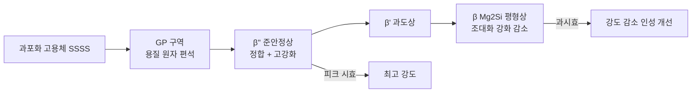

**7xxx계(Al-Zn-Mg-Cu)** 는 강도가 가장 높아 고응력 관절 및 동력 전달 부품에 사용됩니다. 주요 강화상은 \(\eta'\)-MgZn\(_2\) 및 T-Al\(_2\)Mg\(_3\)Zn\(_3\)입니다. 7050, 7075 등의 합금 번호는 T6/T7/T8 처리 후 항복 강도가 500 MPa 이상에 도달할 수 있습니다. Starink와 Wang(2003)은 과시효 7xxx 합금의 항복 강도에 대한 물리적 모델을 수립하여 석출상 조대화, 고용 강화 및 집합 조직의 영향을 고려했습니다. 그러나 7xxx 합금은 응력 부식에 민감하므로 과시효(T7) 또는 결정립 미세화를 통해 개선해야 합니다.

!!! note "용어 설명: 응력 부식, T7 처리"
    - **응력 부식 균열 (stress corrosion cracking, SCC)** : 인장 응력과 부식 환경이 함께 작용하여 발생하는 취성 균열.
    - **T7 처리** : 고용화 담금질 후 과시효 처리로, 내응력 부식성을 향상시키기 위해 사용됨.

**다이캐스트 알루미늄 합금** : 일체형 다이캐스팅 기술이 휴머노이드 로봇 구조 제조에서 주목받고 있습니다. 다이캐스트 알루미늄 합금은 Fe 함량을 제어하여 \(\beta\)-Al\(_5\)FeSi 침상상이 인성에 미치는 불리한 영향을 줄여야 하며, 동시에 Cu 함량을 제어하여 내식성을 개선해야 합니다. Al-Si-Mg계 (예: A356, A380) 및 Al-Si-Cu-Mg계가 일반적인 다이캐스트 합금입니다.

### 3.2.3 마그네슘 합금: HCP 구조, 변형 메커니즘 및 집합 조직

마그네슘 합금의 밀도는 1.7-1.8 g/cm\(^3\)로, 알루미늄의 약 2/3, 강철의 약 1/4에 해당하는 가장 가벼운 구조용 금속입니다. HCP 구조는 독특한 기계적 및 부식 거동을 유발합니다.

!!! note "용어 설명: HCP 구조, c/a 비, 임계 분해 전단 응력(CRSS), 쌍정, 집합 조직"
    - **HCP (hexagonal close-packed)** : 육방 최밀 충전 구조로, 원자 배열이 ABAB 적층을 이룹니다.
    - **c/a 비** : HCP 단위 셀의 높이 \(c\)와 밑면 변의 길이 \(a\)의 비율로, 이상값은 \(\sqrt{8/3} \approx 1.633\)입니다.
    - **임계 분해 전단 응력 (CRSS)** : 특정 슬립계를 작동시키는 데 필요한 분해 전단 응력.
    - **쌍정 (twinning)** : 결정의 일부가 특정 계면을 따라 균일하게 전단 변형되어 거울 대칭 방위를 형성하며, 슬립이 어려운 방향의 변형을 조정하는 데 사용됩니다.
    - **집합 조직 (texture)** : 다결정 재료에서 결정립 방위 분포의 우선 방위.

**결정학 및 변형 메커니즘** : \(\alpha\)-Mg의 \(c/a = 1.624\)로, 이상적인 구 적층의 1.633보다 약간 작습니다. 상온에서 기저면 슬립 \(\langle 11\bar{2}0 \rangle(0001)\)의 임계 분해 전단 응력(CRSS)이 가장 낮아(약 0.5-0.7 MPa) 주요 변형 모드입니다. 주상면 슬립 \(\langle 11\bar{2}0 \rangle(10\bar{1}0)\), 원추면 슬립 \(\langle 11\bar{2}2 \rangle(11\bar{2}\bar{1})\) 및 \(\langle c+a \rangle\) 전위는 더 높은 온도나 응력에서 작동해야 하며, CRSS는 기저면 슬립보다 1-2 자릿수 높습니다.

쌍정은 \(c\)축 변형을 조정하는 중요한 메커니즘입니다. 인장 쌍정 \(\{10\bar{1}2\}\langle 10\bar{1}\bar{1} \rangle\)은 \(c\)축에 평행한 압축 또는 \(c\)축에 수직인 인장 시 쉽게 활성화됩니다. 압축 쌍정 \(\{10\bar{1}1\}\langle 10\bar{1}\bar{2} \rangle\)은 더 높은 응력을 필요로 합니다. 쌍정으로 인한 쌍정계와 전위 상호 작용은 가공 경화 거동에 상당한 영향을 미칩니다.

슬립계가 적고 CRSS 차이가 크기 때문에 마그네슘 합금은 상온에서 연성이 낮고, 이방성이 강하며, 성형 후 집합 조직이 뚜렷합니다. 일반적인 개선 전략은 다음과 같습니다.
- **결정립 미세화** : Hall-Petch 강화 효과를 높이고, 비기저면 슬립을 촉진합니다.
- **희토류 원소 합금화** : Gd, Y, Ce, Nd 등은 주상면/원추면 슬립과 기저면 슬립의 CRSS 비율을 낮추어 상온 연성을 향상시킬 수 있습니다(소위 '희토류 집합 조직 약화 효과').
- **열처리** : T4/T5/T6 처리를 통해 제2상 분포를 제어합니다.

#### 3.2.3.1 HCP 슬립계의 기하학적 구속과 Schmid 법칙

금속이 거시적 소성 변형을 일으키려면 임의의 변형률 텐서를 조정하기 위해 5개의 독립적인 슬립계(von Mises 기준)가 필요합니다. HCP 마그네슘은 상온에서 기저면 슬립 $\langle 11\bar{2}0 \rangle(0001)$의 CRSS만 충분히 낮고, 기저면 슬립은 2개의 독립적인 슬립계만 제공할 수 있습니다. 따라서 외부 응력 방향이 기저면 슬립에 불리할 경우, 재료는 쌍정 또는 비기저면 슬립을 통해 변형을 조정해야 하므로 항복 응력이 증가하고 연성이 감소하며 이방성이 강화됩니다.

Schmid 법칙은 거시적 항복을 외부 분해 전단 응력과 연결합니다. 단축 인장 또는 압축의 경우, 특정 슬립계에 작용하는 분해 전단 응력은 다음과 같습니다.

$$
\tau = \sigma \cos\phi \cos\lambda = m \, \sigma
$$

여기서 $\sigma$는 외부 축 응력, $\phi$는 하중 축과 슬립면 법선 사이의 각도, $\lambda$는 하중 축과 슬립 방향 사이의 각도이며, $m = \cos\phi \cos\lambda$를 **Schmid 계수**라고 합니다. $\tau$가 해당 슬립계의 CRSS에 도달하면 슬립이 시작됩니다.

!!! note "용어 설명: 독립 슬립계, Schmid 법칙, Schmid 계수, von Mises 기준"
    - **독립 슬립계 (independent slip system)** : 독립적인 소성 변형률 성분을 생성할 수 있는 슬립계 조합. 다결정 재료의 균일 변형에는 최소 5개가 필요합니다.
    - **Schmid 법칙 (Schmid's law)** : 슬립이 시작되는 조건은 슬립계에 작용하는 분해 전단 응력이 임계값 CRSS에 도달하는 것입니다.
    - **Schmid 계수 (Schmid factor)** : 거시적 응력을 분해 전단 응력으로 변환하는 기하학적 인자, $m = \cos\phi \cos\lambda$.
    - **von Mises 기준** : 다결정 재료가 임의의 형상 변화를 실현하려면 최소 5개의 독립적인 슬립계가 필요하다는 고전적 판단 기준.

마그네슘의 기저면 슬립의 경우, 하중이 $c$축에 평행할 때 $\cos\phi = 0$이므로 기저면 슬립이 작동할 수 없습니다. 이때는 $\{10\bar{1}2\}$ 인장 쌍정 또는 고온에서의 비기저면 슬립을 통해 $c$축 방향의 변형률을 조정해야 합니다. 이것이 HCP 마그네슘의 상온 성형성이 낮은 기하학적 근원입니다.

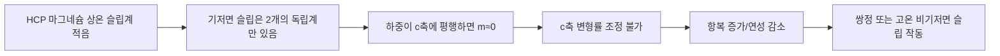

#### 3.2.3.2 쌍정의 결정학과 전단량

쌍정은 HCP 마그네슘이 $c$축 압축 또는 $c$축에 수직인 인장을 조정하는 중요한 메커니즘입니다. $\{10\bar{1}2\}\langle 10\bar{1}\bar{1} \rangle$ 인장 쌍정을 예로 들면, 전단량 $\gamma$는 결정 기하학으로부터 유도할 수 있습니다.

$$
\gamma = \frac{|c/a|^2 - 3}{\sqrt{3}\, c/a}
$$

$\alpha$-Mg의 경우 $c/a \approx 1.624$이므로 대입하면

$$
\gamma = \frac{1.624^2 - 3}{\sqrt{3} \times 1.624} \approx 0.129
$$

즉, 쌍정은 결정을 쌍정면을 따라 약 12.9%의 균일 전단을 발생시킵니다. 쌍정이 시작되면 격자 방위가 급격히 변하여 기저면 슬립에 불리했던 방위가 유리해져 응력을 완화할 수 있습니다. 그러나 쌍정계 자체는 전위 이동의 장애물이 되어 상당한 가공 경화와 반복 하중 하에서의 쌍정-역쌍정 피로 손상을 유발합니다.

!!! note "용어 설명: 쌍정 전단량, 쌍정계, 역쌍정"
    - **쌍정 전단량 (twinning shear, $\gamma$)** : 쌍정 과정에서 결정이 쌍정면을 따라 발생하는 특징적인 전단 변수로, 결정 구조에 의해 결정됩니다.
    - **쌍정계 (twin boundary)** : 모재와 쌍정 사이의 정합 계면으로, 전위 이동의 장애물 역할을 할 수 있습니다.
    - **역쌍정 (detwinning)** : 역방향 하중 시 쌍정이 사라지고 방위가 회복되는 과정으로, 마그네슘 합금의 사이클 연화 중요한 메커니즘입니다.

#### 3.2.3.3 희토류 원소가 집합 조직을 약화시키는 물리적 메커니즘

Gd, Y, Ce, Nd와 같은 희토류 원소(RE)를 마그네슘에 첨가하면 변형 집합 조직을 현저히 약화시키고 상온 연성을 향상시킬 수 있습니다. 전통적인 관점에서는 그 역할이 다음과 같다고 봅니다.

1. **비기저면 슬립의 CRSS 감소** : RE 원자는 원자 반경이 커서 적층 결함 에너지(SFE)와 전위 코어 구조를 변화시켜 원추면 $\langle c+a \rangle$ 전위가 더 쉽게 분해되고 이동할 수 있게 하여 독립 슬립계의 수를 증가시킵니다.
2. **결정립 성장 방위 변경** : RE 원소가 결정립계에 편석되거나 희토류상을 형성하여 특정 방위의 결정립 성장을 억제하고 기저면 집합 조직을 분산시킵니다.
3. **동적 재결정 촉진** : RE는 재결정 온도를 낮추고 재결정 집합 조직을 변경하여 무작위 방위의 새로운 결정립을 형성합니다.

!!! note "용어 설명: 적층 결함 에너지, 전위 코어, 동적 재결정, 집합 조직 약화"
    - **적층 결함 에너지 (stacking fault energy, SFE)** : 최밀면 적층 순서에 오류가 발생할 때 단위 면적당 에너지 비용으로, 전위 분해 및 비기저면 슬립에 영향을 미칩니다.
    - **전위 코어 (dislocation core)** : 전위 중심 근처에서 원자가 심하게 왜곡된 영역으로, 그 구조는 전위가 보존적 슬립을 하는지 비보존적 클라임을 하는지 결정합니다.
    - **동적 재결정 (dynamic recrystallization, DRX)** : 변형 과정 중에 재결정이 동시에 발생하여 결정립을 미세화하고 집합 조직을 약화시킬 수 있습니다.
    - **집합 조직 약화 (texture weakening)** : 결정립 방위 분포를 더 무작위로 만들어 기계적 특성의 이방성을 감소시킵니다.

다음 Python 스크립트는 하중 방향에 따른 HCP 마그네슘 기저면 슬립과 인장 쌍정의 Schmid 계수 변화를 계산하고, $c$축 방위가 항복 이방성에 미치는 영향을 보여줍니다.

```python
import numpy as np
import matplotlib.pyplot as plt
```

# HCP 기저면 슬립계 (0001)[11-20]과 인장 쌍정 {10-12}<10-1-1>
# c축을 z, a1을 x로 설정; 하중축은 x-z 평면 내에서 c축과 이루는 각도가 theta
theta_deg = np.linspace(0, 90, 91)
theta = np.deg2rad(theta_deg)

# 기저면 슬립: 슬립면 법선 n = [0,0,1], 슬립 방향 b = [1,0,0]
# 하중축 L = [sinθ, 0, cosθ]
cos_phi_base = np.cos(theta)   # n·L
cos_lambda_base = np.sin(theta) # b·L
m_base = np.abs(cos_phi_base * cos_lambda_base)

# 인장 쌍정 {10-12}<10-1-1>: 쌍정면 법선과 쌍정 방향을 근사적으로 취함
# 단순화 모델: 쌍정면 법선 n_t ≈ [sqrt(3)/2, 0, c/a] 정규화,
# 쌍정 방향 d_t ≈ [-c/a, 0, sqrt(3)/2] 정규화 (c/a=1.624)
coa = 1.624
n_t = np.array([np.sqrt(3)/2, 0, coa])
n_t = n_t / np.linalg.norm(n_t)
d_t = np.array([-coa, 0, np.sqrt(3)/2])
d_t = d_t / np.linalg.norm(d_t)

L = np.vstack([np.sin(theta), np.zeros_like(theta), np.cos(theta)]).T
cos_phi_twin = np.abs(L @ n_t)
cos_lambda_twin = np.abs(L @ d_t)
m_twin = cos_phi_twin * cos_lambda_twin

plt.figure(figsize=(8,4))
plt.plot(theta_deg, m_base, label='기저면 슬립 Schmid 인자')
plt.plot(theta_deg, m_twin, label='{10-12} 인장 쌍정 Schmid 인자')
plt.xlabel('하중축과 c축 사이 각도 θ (°)')
plt.ylabel('Schmid 인자 |m|')
plt.title('HCP 마그네슘 기저면 슬립과 인장 쌍정의 방향 민감성')
plt.legend(); plt.grid(True); plt.tight_layout(); plt.show()

# 추정: 기저면 CRSS = 0.6 MPa, θ=45°일 때 거시 항복 응력 σ = CRSS/m
print(f"θ=45° 기저면 m={m_base[45]:.3f}, 추정 항복 응력={0.6/m_base[45]:.1f} MPa")
print(f"θ=0°  기저면 m={m_base[0]:.3f}, 기저면 슬립으로 변형 불가")
```

출력 결과는 기저면 슬립의 Schmid 인자가 $\theta = 45°$ 부근에서 최대가 되어 가장 낮은 거시 항복 응력에 해당함을 보여줍니다. 반면 $\theta \rightarrow 0°$일 때 기저면 슬립 인자는 0에 수렴하므로, 쌍정 또는 프리즘면/피라미드면 슬립을 통해 변형되어야 하며 항복 응력이 급격히 증가합니다. 이는 압연 마그네슘 판재의 횡방향과 법선방향 성능 차이를 설명하며, RE 합금화를 통한 비기저면 슬립 활성화가 성형성 개선에 중요한 이유를 보여줍니다. 휴머노이드 로봇 외장재와 프레임에 마그네슘 합금 다이캐스팅을 사용할 경우, 후속 성형 및 열처리를 통해 집합조직을 제어해야 하며, 관련 내용은 제8장 8.3절 구조 경량화 설계에서 확인할 수 있습니다.

### 3.2.4 마그네슘 합금의 부식 전기화학과 표면 보호

마그네슘 합금의 내식성 부족은 광범위한 적용을 제한하는 핵심 문제이며, 그 원인은 다음과 같습니다.

1. **열역학적 불안정성**: 표준 전극 전위 \(E^0_{Mg^{2+}/Mg} = -2.37\) V vs SHE로, 공학용 금속 중 가장 낮은 수준입니다.
2. **보호성 산화막 불량**: 표면의 MgO/Mg(OH)\(_2\) 막은 Cl\(^-\) 함유 환경에서 불안정하며, Cl\(^-\)가 OH\(^-\)를 치환하여 가용성 MgCl\(_2\)를 형성합니다.
3. **제2상 미세 갈바니 부식**: AZ계 합금의 \(\beta\)-Mg\(_{17}\)Al\(_{12}\)상은 \(\alpha\)-Mg 기지보다 높은 전극 전위를 가져 미세 갈바니를 형성하여 기지 부식을 가속화합니다.

!!! note "용어 설명: 부식 전위, 부식 전류 밀도, 마이크로아크 산화, 화학 변환 피막, 고전류 펄스 전자빔(HCPEB)"
    - **부식 전위(corrosion potential, \(E_{corr}\))**: 금속이 부식계에서 자발적으로 나타내는 혼합 전위로, 양극과 음극 반응 속도가 같을 때의 값입니다.
    - **부식 전류 밀도(corrosion current density, \(i_{corr}\))**: 부식 전위에 해당하는 전류 밀도로, 부식 속도를 반영합니다.
    - **마이크로아크 산화(MAO/PEO)**: 전해액에서 마이크로아크 방전을 통해 금속 표면에 세라믹 산화막을原位(in-situ) 생성하는 방법입니다.
    - **화학 변환 피막(chemical conversion coating)**: 화학 또는 전기화학 반응을 통해 금속 표면에 보호성 화합물 피막을 형성하는 방법입니다.
    - **고전류 펄스 전자빔(HCPEB)**: 고에너지 펄스 전자빔을 이용해 표면을 급속 용융 및 응고시켜 결정립을 미세화하고 조직을 균질화하는 기술입니다.

Song & Atrens(2003)는 마그네슘 합금 부식의 체계적인 프레임워크를 구축하며, 불순물 원소 Fe, Ni, Cu, Co의 허용 한계가 매우 낮다(보통 < 50 ppm)고 지적했습니다. 이는 이들이 수소 발생을 위한 효율적인 음극 부위를 형성하기 때문입니다. 순도 향상과 Fe/Mn 비율 제어는 내식성 개선의 기본입니다.

#### 3.2.4.1 부식 열역학과 Pourbaix 다이어그램

마그네슘의 수용액 중 주요 반응은 다음과 같습니다.

$$
\text{Mg} \rightarrow \text{Mg}^{2+} + 2e^-, \quad E^0 = -2.37\ \text{V vs SHE}
$$

$$
\text{Mg} + 2\text{H}_2\text{O} \rightarrow \text{Mg(OH)}_2 + \text{H}_2
$$

Pourbaix 다이어그램은 전위-pH에서의 안정상을 나타냅니다. 중성 수용액에서 마그네슘의 전위는 수소 발생선보다 훨씬 낮아 열역학적으로 지속적인 수소 발생이 일어납니다. pH > 10.5일 때 \(\text{Mg(OH)}_2\) 피막이 생성되어 일부 부동태화를 제공할 수 있습니다. 그러나 Cl\(^-\) 함유 환경에서는 \(\text{Mg(OH)}_2 + 2\text{Cl}^- \rightarrow \text{MgCl}_2 + 2\text{OH}^-\) 반응으로 부동태 피막이 국부적으로 용해되어 공식(pitting)이 발생합니다. 로봇이 고습도 또는 땀/세정액 환경에서 작동할 경우 Cl\(^-\) 침투가 주요 고장 경로입니다.

!!! note "용어 설명: Pourbaix 다이어그램, 부동태 피막, 공식, 수소 발생 반응"
    - **Pourbaix 다이어그램**: 전위와 pH를 좌표로 하여 수용액 중 원소의 안정상을 나타내는 열역학적 상평형도입니다.
    - **부동태 피막(passive film)**: 금속 표면에 생성된 치밀한 산화물/수산화물 피막으로, 부식 속도를 현저히 낮춥니다.
    - **공식(pitting corrosion)**: 국부적으로 부동태 피막이 파괴되어 작은 구멍을 형성하고 용해가 가속화되는 국부 부식 형태입니다.
    - **수소 발생 반응(hydrogen evolution reaction, HER)**: \(2\text{H}_2\text{O} + 2e^- \rightarrow \text{H}_2 + 2\text{OH}^-\) 반응으로, 마그네슘 표면에서 음극 반응으로 부식을 주도합니다.

#### 3.2.4.2 부식 동역학: Butler-Volmer 방정식과 Tafel 외삽법

전극 반응 속도는 Butler-Volmer 방정식으로 설명됩니다.

$$
i = i_0 \left\{ \exp\left[\frac{(1-\beta)nF\eta}{RT}\right] - \exp\left[-\frac{\beta nF\eta}{RT}\right] \right\}
$$

여기서 \(i_0\)는 교환 전류 밀도, \(\beta\)는 대칭 인자, \(\eta = E - E_{eq}\)는 과전위입니다. 강분극 영역에서는 Tafel 방정식으로 단순화됩니다.

$$
\eta_a = b_a \log\left(\frac{i}{i_0}\right), \quad \eta_c = -b_c \log\left(\frac{|i|}{i_0}\right)
$$

Tafel 기울기 \(b_a = 2.303 RT/[(1-\beta)nF]\), \(b_c = 2.303 RT/(\beta nF)\)입니다. 부식 전위 \(E_{corr}\)에서 양극 용해 전류와 음극 수소 발생 전류가 같으며, 그 값이 \(i_{corr}\)입니다. 분극 곡선에서 두 Tafel 선의 교차점을 선형 외삽하여 \(i_{corr}\)을 측정할 수 있습니다.

Stern-Geary 관계는 분극 저항 \(R_p\)와 \(i_{corr}\)의 연관성을 제공합니다.

$$
i_{corr} = \frac{b_a b_c}{2.303(b_a + |b_c|) R_p}
$$

부식 속도는 일반적으로 질량 손실 또는 두께 손실로 표시됩니다.

$$
CR = \frac{K \cdot i_{corr} \cdot EW}{\rho}
$$

\(i_{corr}\)의 단위가 \(\mu\text{A/cm}^2\), \(\rho\)가 \(\text{g/cm}^3\)일 때, \(K = 0.00327\)을 취하면 \(CR\)의 단위는 mm/year입니다. AZ91D를 예로 들면, \(i_{corr} \approx 10-100\ \mu\text{A/cm}^2\)는 연간 부식 깊이 약 0.02-0.2 mm에 해당하며, 이는 두께가 2-3 mm에 불과한 로봇 외피에서는 무시할 수 없습니다.

!!! note "용어 설명: 교환 전류 밀도, Tafel 기울기, 분극 저항, Stern-Geary 방정식, 부식 속도"
    - **교환 전류 밀도 (exchange current density, \(i_0\))**: 평형 상태에서 정반응과 역반응의 전류 밀도가 같을 때의 전류 밀도.
    - **Tafel 기울기 (Tafel slope)**: 강분극 영역에서 과전위와 전류 로그 간 관계의 기울기로, 반응 동역학을 반영합니다.
    - **분극 저항 (polarization resistance, \(R_p\))**: 부식 전위 근처 분극 곡선의 선형 영역 기울기로, \(R_p = (\mathrm{d}E/\mathrm{d}i)_{E_{corr}}\)입니다.
    - **Stern-Geary 방정식**: \(R_p\)와 Tafel 기울기를 사용하여 \(i_{corr}\)을 추정하는 고전적인 관계식입니다.
    - **부식 속도 (corrosion rate, \(CR\))**: 단위 시간당 재료 손실 두께로, 일반적으로 mm/year를 사용합니다.

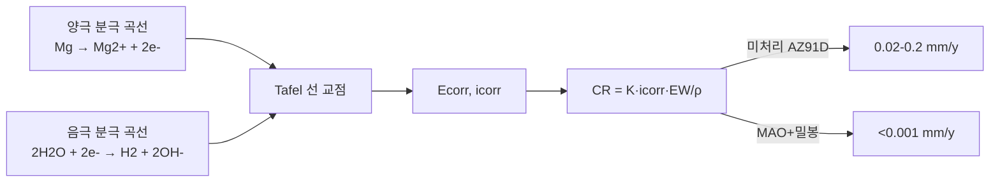

#### 3.2.4.3 표면 처리 선택 원칙 및 수명 예측

표면 처리의 핵심은 음극 활성도를 동시에 낮추고, 전해질을 차단하며, Cl\(^-\) 침투를 억제하는 것입니다. 일반적인 공법의 성능 비교는 다음과 같습니다.

| 공정 | 피막 성분 | 내식성 향상 | 주요 한계 |
|-----|---------|-----------|---------|
| MAO/PEO | MgO/MgAl\(_2\)O\(_4\)/Mg\(_2\)SiO\(_4\) | 현저하나, 밀봉 필요 | 피막 다공성, 거침 |
| 화학 변환 피막 | Ce/La 산화물, 피테이트 | 중간 | 피막 얇음, 기계적 내마모성 낮음 |
| 무전해 Ni-P 도금 | 비정질/나노결정 Ni-P | 우수 | 전처리 산세가 모재 활성화 |
| HCPEB 용융 응고 | 미세결정/과포화 고용체 | 모재 개선 | 장비 비용 높음 |
| 나노입자 복합 양극 산화 | Al\(_2\)O\(_3\)+SiC/TiO\(_2\) | 피막 치밀, Cl\(^-\) 차단 | 공정 일관성 개선 필요 |

실제 로봇 부품 설계에서는 MAO를 하지로 사용하여 내마모성과 밀착성을 제공하고, 에폭시-그래핀 밀봉층으로 화학적 차단을 추가한 후, 최종적으로 폴리우레탄 탑코트를 도포하여 1000시간 중성 염수 분무(NSS) 수명을 달성할 수 있습니다.

다음 Python 스크립트는 Tafel 외삽 데이터를 기반으로 \(i_{corr}\)과 부식 속도를 추정하고, 보호 전후의 수명 향상을 비교합니다.

```python
import numpy as np

# 3.5 wt% NaCl에서 AZ91D의 Tafel 매개변수 가정
ba = 0.060      # V/decade (양극)
bc = 0.120      # V/decade (음극)
Rp_untreated = 250.0   # Ω·cm^2
Rp_coated = 25000.0    # Ω·cm^2 (MAO+밀봉)

# Stern-Geary를 사용한 icorr 계산 (A/cm^2)
def icorr_from_Rp(Rp, ba, bc):
    return (ba * bc) / (2.303 * (ba + bc) * Rp)

i_untreated = icorr_from_Rp(Rp_untreated, ba, bc)
i_coated = icorr_from_Rp(Rp_coated, ba, bc)
print(f"미처리 icorr = {i_untreated*1e6:.1f} μA/cm^2")
print(f"보호 후 icorr = {i_coated*1e6:.2f} μA/cm^2")

# 부식 속도 (mm/year), AZ91D 등가 원자량 EW≈12.2 g, ρ≈1.81 g/cm^3
K = 0.00327
EW = 12.2
rho = 1.81
def CR(i_ua_cm2):
    return K * i_ua_cm2 * EW / rho

CR_untreated = CR(i_untreated*1e6)
CR_coated = CR(i_coated*1e6)
print(f"미처리 부식 속도 = {CR_untreated:.3f} mm/y")
print(f"보호 후 부식 속도 = {CR_coated:.5f} mm/y")
print(f"보호 후 수명 향상 배수 ≈ {CR_untreated/CR_coated:.0f}x")
```

이 예시는 MAO+밀봉이 \(R_p\)를 250에서 25000 Ω·cm\(^2\)로 높이면 부식 속도가 약 0.165 mm/y에서 0.0017 mm/y로 감소하여 수명이 약 100배 향상됨을 보여줍니다.

### 3.2.5 탄소 섬유 복합 재료: 이방성과 적층판 이론

탄소 섬유 강화 폴리머 기반 복합 재료(CFRP)는 매우 높은 비강도와 비강성을 가지며, 그 기계적 특성은 섬유 방향에 크게 의존합니다. 단방향 CFRP의 섬유 방향 탄성 계수 \(E_1\)과 횡방향 계수 \(E_2\)는 큰 차이를 보입니다.

$$
E_1 \approx E_f V_f + E_m (1 - V_f)
$$
$$
\frac{1}{E_2} \approx \frac{V_f}{E_f} + \frac{1 - V_f}{E_m}
$$

여기서 \(E_f\), \(E_m\)은 각각 섬유와 기지의 계수이고, \(V_f\)는 섬유 부피 분율입니다. 일반적인 T700/에폭시 수지 단방향 적층판의 \(E_1 \approx 140\) GPa, \(E_2 \approx 10\) GPa입니다.

!!! note "용어 설명: CFRP, 섬유 부피 분율, 기지, 적층판, 고전 적층판 이론(CLT)"
    - **CFRP (Carbon Fiber Reinforced Polymer)**: 탄소 섬유를 강화재로, 폴리머를 기지로 하는 복합 재료.
    - **섬유 부피 분율 (fiber volume fraction, \(V_f\))**: 복합 재료에서 섬유 부피가 차지하는 비율로, 강성과 강도를 직접 결정합니다.
    - **기지 (matrix)**: 섬유를 감싸고 하중을 전달하는 폴리머 상으로, 동시에 섬유를 환경 침식으로부터 보호합니다.
    - **적층판 (laminate)**: 여러 층의 단방향 적층판을 서로 다른 방향으로 적층하여 구성된 복합 재료 판.
    - **고전 적층판 이론 (CLT)**: Kirchhoff 직선 법선 가정을 기반으로 A, B, D 강성 행렬을 통해 적층판의 면내, 결합 및 굽힘 거동을 설명하는 이론.

적층판 설계는 적층 각도(0°, ±45°, 90°) 조합을 통해 다방향 하중 요구 사항을 충족해야 합니다. 고전 적층판 이론(CLT)은 Kirchhoff 가정을 기반으로 A, B, D 행렬을 통해 면내, 결합 및 굽힘 강성을 설명합니다. 층간 전단 및 박리는 CFRP의 주요 파괴 모드이며, 계면상(sizing/agent)의 화학적 설계는 층간 성능에 매우 중요합니다.

!!! note "용어 설명: 박리, 계면상, 사이징제"
    - **박리 (delamination)**: 적층판에서 인접한 층 사이의 균열 파괴.
    - **계면상 (interphase)**: 섬유 표면과 기지 사이에 형성되는 특정 화학 구조와 기계적 특성을 가진 전이 영역.
    - **사이징제 (sizing)**: 섬유 표면에 코팅되는 화학 코팅으로, 섬유와 기지 계면의 젖음성과 접착력을 개선합니다.

### 3.2.6 위상 최적화와 다중 재료 통합

위상 최적화는 구조적 컴플라이언스 최소화 또는 고유 진동수 최대화를 목표로, 응력/변위 제약 조건을 만족하면서 재료 분포를 최적화합니다. 그 수학적 형태는 다음과 같습니다.

$$
\min_\rho C(\rho) = \mathbf{F}^T \mathbf{U}
$$
$$
\text{s.t.} \quad \mathbf{K}(\rho)\mathbf{U} = \mathbf{F}, \quad 0 < \rho_{\min} \le \rho \le 1, \quad \int_\Omega \rho \, d\Omega \le V^*
$$

여기서 \(\rho\)는 요소 의사 밀도, \(\mathbf{K}\)는 강성 행렬입니다. SIMP 방법은 중간 밀도 값을 페널티하여 0/1 이산 해를 촉진합니다.

!!! note "용어 설명: 위상 최적화, SIMP, 유사 밀도, 컴플라이언스, 강성 행렬"
    - **위상 최적화(topology optimization)**: 주어진 설계 영역과 제약 조건 하에서 최적의 재료 분포를 찾는 구조 최적화 방법.
    - **SIMP(Solid Isotropic Material with Penalization)**: 유사 밀도로 탄성 계수를 보간하고 중간 밀도에 페널티를 부과하는 위상 최적화 방법.
    - **유사 밀도(pseudo-density, \(\rho\))**: 각 유한 요소 내 재료의 상대 밀도를 나타내는 설계 변수로, 0은 빈 공간, 1은 실체를 의미.
    - **컴플라이언스(compliance)**: 외력作用下 구조의 총 변형 에너지로, 컴플라이언스 최소화는 강성 최대화와 동일.
    - **강성 행렬(stiffness matrix, \(\mathbf{K}\))**: 유한 요소법에서 절점 변위와 절점 힘을 연결하는 행렬.

다중 재료 위상 최적화는 서로 다른 재료의 밀도/강성 조합을 추가로 도입하여, 동일 부품 내에서 알루미늄 합금 골격 + 마그네슘 합금 충전 + 탄소 섬유 국부 보강의 복합 구조를 구현할 수 있습니다. 이는 하중 경로가 복잡하고 무게에 민감한 휴머노이드 로봇 관절에 중요한 가치를 지닙니다.

#### 3.2.6.1 SIMP 보간과 민감도 유도

SIMP 방법에서 요소 탄성 계수와 유사 밀도의 관계는 다음과 같습니다.

$$
E_e(\rho_e) = E_{\min} + \rho_e^p (E_0 - E_{\min})
$$

여기서 \(p \ge 3\)은 페널티 인자, \(E_{\min}\)은 강성 행렬의 특이성을 방지하기 위한 미소 탄성 계수입니다. 전체 강성 행렬은 각 요소 강성 행렬의 조립입니다.

$$
\mathbf{K}(\rho) = \sum_{e} E_e(\rho_e) \mathbf{k}_e^0
$$

총 컴플라이언스는 다음과 같습니다.

$$
C(\rho) = \mathbf{U}^T \mathbf{K} \mathbf{U} = \sum_e E_e(\rho_e) \mathbf{u}_e^T \mathbf{k}_e^0 \mathbf{u}_e
$$

\(\rho_e\)에 대해 미분하면 요소 민감도를 얻을 수 있습니다.

$$
\frac{\partial C}{\partial \rho_e} = -p \rho_e^{p-1} (E_0 - E_{\min}) \mathbf{u}_e^T \mathbf{k}_e^0 \mathbf{u}_e
$$

음의 부호는 밀도 증가가 컴플라이언스를 감소(강성 증가)시킴을 나타냅니다. 최적화는 최적성 기준(OC) 업데이트를 사용합니다.

$$
\rho_e^{\text{new}} =
\begin{cases}
\rho_{\min}, & \rho_e B_e^\eta \le \rho_{\min} \\
\rho_e B_e^\eta, & \rho_{\min} < \rho_e B_e^\eta < 1 \\
1, & \rho_e B_e^\eta \ge 1
\end{cases}
$$

여기서 \(B_e = -\partial C/\partial \rho_e / (\lambda V_e)\)이며, \(\lambda\)는 이분법을 통해 체적 제약 조건 \(\sum_e \rho_e V_e = V^*\)을 만족하도록 조정됩니다.

!!! note "용어 설명: 민감도 분석, 최적성 기준(OC), 페널티 인자, 체적 분율, 라그랑주 승수"
    - **민감도 분석(sensitivity analysis)**: 설계 변수에 대한 목적 함수의 도함수를 계산하는 과정으로, 최적화 방향을 결정합니다.
    - **최적성 기준(optimality criteria, OC)**: KKT 조건을 기반으로 유도된 발견적 설계 변수 업데이트 기준입니다.
    - **페널티 인자(penalization factor, \(p\))**: SIMP에서 중간 밀도 재료의 강성을 낮추는 지수로, 클수록 0/1 해에 가까워집니다.
    - **체적 분율(volume fraction)**: 최적화 후 남은 재료 체적과 설계 영역 전체 체적의 비율입니다.
    - **라그랑주 승수(Lagrange multiplier, \(\lambda\))**: 체적 제약 조건을 목적 함수에 도입할 때의 그림자 가격입니다.

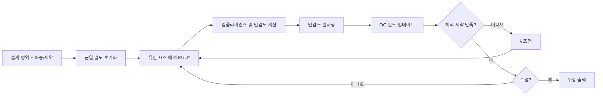

#### 3.2.6.2 민감도 필터링 및 제조 가능성 제약

유한 요소 이산화로 인한 수치적 불안정성에는 체커보드(checkerboard) 및 메쉬 의존성이 포함됩니다. 밀도 필터링은 요소를 중심으로 반경 \(r_{\min}\)의 가중 평균을 통해 이러한 문제를 억제합니다.

$$
\tilde{\rho}_e = \frac{\sum_{i \in N_e} w_{ei} \rho_i}{\sum_{i \in N_e} w_{ei}}, \quad w_{ei} = \max(0, r_{\min} - d_{ei})
$$

여기서 \(N_e\)는 필터링 이웃, \(d_{ei}\)는 요소 중심 간 거리입니다. 필터링된 민감도는 연쇄 법칙을 통해 보정됩니다. 또한 프로젝션(projection) 방법과 Heaviside 필터링을 도입하여 더 선명한 흑/백 경계를 얻을 수 있습니다. 제조 제약에는 최소 치수, 오버행 각도(overhang angle) 및 연결성이 포함되어 결과를 금속 적층 제조(SLM, DMLS)에 직접 사용할 수 있도록 보장합니다.

!!! note "용어 설명: 메쉬 의존성, 체커보드, 필터 반경, 프로젝션 방법, 오버행 각도"
    - **메쉬 의존성(mesh dependency)**: 위상 최적화 결과가 메쉬가 세밀해짐에 따라 더 가는 지지대가 나타나는 현상.
    - **체커보드(checkerboard)**: 요소 밀도가 0/1로 교차하는 수치적 인공물로, 비물리적인 위상을 유발합니다.
    - **필터 반경(filter radius, \(r_{\min}\))**: 밀도/민감도 가중 평균의 이웃 반경으로, 최소 구조 치수를 제어합니다.
    - **프로젝션 방법(projection method)**: 필터링된 회색조 밀도를 0/1에 가깝게 선명화하는 방법.
    - **오버행 각도(overhang angle)**: 적층 제조에서 지지대 없이 인쇄 가능한 최대 돌출 각도로, 금속 SLM의 경우 일반적으로 약 45°입니다.

#### 3.2.6.3 휴머노이드 로봇 팔다리 경량화 예제

다음 Python 스크립트는 고전적인 88-line SIMP 위상 최적화를 구현하여, 단부 하중을 받는 캔틸레버 판(로봇 팔뚝에 비유)의 컴플라이언스 최소화 설계를 수행합니다. 출력은 유사 밀도 분포이며, 유지된 영역이 주요 하중 경로를 형성합니다.

```python
import numpy as np
import matplotlib.pyplot as plt

# SIMP 위상 최적화: 캔틸레버 판, 왼쪽 고정, 오른쪽 아래 모서리에 아래 방향 하중
nelx, nely = 60, 20  # 요소 수
volfrac = 0.4        # 체적 분율
penal = 3.0          # 페널티 인자
rmin = 2.5           # 필터 반경
E0, Emin = 1.0, 1e-9
nu = 0.3

def lk():
    """4절점 평면 응력 요소 강성 행렬"""
    A11 = np.array([[12, 3, -6, -3], [3, 12, 3, 0], [-6, 3, 12, -3], [-3, 0, -3, 12]])
    A12 = np.array([[-6, -3, 0, 3], [-3, -6, -3, -6], [0, -3, -6, 3], [3, -6, 3, -6]])
    B11 = np.array([[-4, 3, -2, 9], [3, -4, -9, 4], [-2, -9, -4, -3], [9, 4, -3, -4]])
    B12 = np.array([[2, -3, 4, -9], [-3, 2, 9, -2], [4, 9, 2, 3], [-9, -2, 3, 2]])
    KE = 1/(1-nu**2)/12 * (np.vstack([np.hstack([A11, A12]),
                                       np.hstack([A12.T, B11])]) +
                           np.vstack([np.hstack([B11, B12]),
                                       np.hstack([B12.T, A11.T])]))
    return KE

KE = lk()
N = (nely+1)*(nelx+1)
dof = 2
F = np.zeros((N*dof, 1))
U = np.zeros((N*dof, 1))
fixed = np.arange(0, 2*(nely+1))  # 왼쪽 전체 고정
free = np.setdiff1d(np.arange(N*dof), fixed)
# 오른쪽 아래 모서리에 아래 방향 하중
F[-1, 0] = -1.0
x = np.ones((nely, nelx)) * volfrac
```

def FE(nelx, nely, x, penal):
    K = np.zeros((N*dof, N*dof))
    for elx in range(nelx):
        for ely in range(nely):
            n1 = (nely+1)*elx + ely
            n2 = (nely+1)*(elx+1) + ely
            edof = np.array([2*n1, 2*n1+1, 2*n2, 2*n2+1,
                             2*n2+2, 2*n2+3, 2*n1+2, 2*n1+3])
            K[np.ix_(edof, edof)] += (Emin + x[ely, elx]**penal*(E0-Emin)) * KE
    K = (K + K.T) / 2
    return K

def check(nelx, nely, rmin, x, dc):
    dcn = np.zeros_like(dc)
    for i in range(nelx):
        for j in range(nely):
            imin, imax = max(int(i-np.floor(rmin)), 0), min(int(i+np.floor(rmin))+1, nelx)
            jmin, jmax = max(int(j-np.floor(rmin)), 0), min(int(j+np.floor(rmin))+1, nely)
            for ii in range(imin, imax):
                for jj in range(jmin, jmax):
                    fac = max(0, rmin - np.sqrt((i-ii)**2 + (j-jj)**2))
                    dcn[j, i] += fac * x[jj, ii] * dc[jj, ii]
            sumfac = 0.0
            for ii in range(imin, imax):
                for jj in range(jmin, jmax):
                    fac = max(0, rmin - np.sqrt((i-ii)**2 + (j-jj)**2))
                    sumfac += fac
            dcn[j, i] /= (x[j, i] * sumfac) if sumfac else 1
    return dcn

def OC(nelx, nely, x, volfrac, dc):
    l1, l2 = 0, 1e5
    move = 0.2
    while l2 - l1 > 1e-4:
        lmid = 0.5 * (l2 + l1)
        xnew = np.maximum(0.001,
                          np.maximum(x - move,
                                     np.minimum(1.0,
                                                np.minimum(x + move,
                                                           x * np.sqrt(-dc / lmid)))))
        if np.sum(xnew) - volfrac * nelx * nely > 0:
            l1 = lmid
        else:
            l2 = lmid
    return xnew

for iter in range(100):
    K = FE(nelx, nely, x, penal)
    U[free] = np.linalg.solve(K[np.ix_(free, free)], F[free])
    c = 0.0
    dc = np.zeros((nely, nelx))
    for elx in range(nelx):
        for ely in range(nely):
            n1 = (nely+1)*elx + ely
            n2 = (nely+1)*(elx+1) + ely
            edof = np.array([2*n1, 2*n1+1, 2*n2, 2*n2+1,
                             2*n2+2, 2*n2+3, 2*n1+2, 2*n1+3])
            Ue = U[edof].flatten()
            ce = np.dot(Ue, KE @ Ue)
            c += (Emin + x[ely, elx]**penal*(E0-Emin)) * ce
            dc[ely, elx] = -penal * x[ely, elx]**(penal-1) * (E0-Emin) * ce
    dc = check(nelx, nely, rmin, x, dc)
    x = OC(nelx, nely, x, volfrac, dc)

plt.imshow(1 - x, cmap='gray', origin='lower')
plt.title('위상 최적화된 로봇 암 링크 (검은색 = 재료)')
plt.xlabel('x'); plt.ylabel('y')
plt.tight_layout(); plt.show()
```

이 스크립트는 60×20 그리드에서 100회 반복하여 트러스 구조를 얻습니다. 실제 공학에서는 먼저 위상 최적화로 하중 전달 경로를 얻은 후, 형상/치수 최적화를 수행하고 라운드, 구멍 등의 공정 세부 사항을 도입합니다.

#### 3.2.6.4 다중 재료 위상 최적화와 적층 제조 통합

다중 재료 위상 최적화는 서로 다른 재료 \(m\)의 의사 밀도 \(\rho_{m,e}\)를 독립적으로 보간합니다:

$$
E_e = E_{\min} + \sum_m \rho_{m,e}^{p_m} E_m^0
$$

일반적으로 사용되는 다중 재료 보간 모델에는 SIMP 확장, DMO(Discrete Material Optimization) 및 RAMP가 있습니다. 다중 재료 최적화 결과는 적층 제조에서 경사 재료의 프린팅을 안내할 수 있습니다. 예를 들어, 로봇 엉덩이 관절 브래킷은 고응력 골격으로 Ti-6Al-4V를, 충진 감량을 위해 AlSi10Mg를 사용하고, 국부적으로 연속 탄소 섬유 강화재를 삽입합니다. 제조 제약 조건은 최적화에서 동시에 고려되어야 합니다: 금속 SLM은 지지대를 줄이기 위해 오버행 각도 \(\ge 45^\circ\)를 요구하며, 최소 구멍 직경과 벽 두께는 스폿 직경(약 0.2-0.4 mm)보다 커야 합니다.

!!! note "용어 설명: 다중 재료 보간, DMO, RAMP, 경사 재료, SLM"
    - **다중 재료 보간(multi-material interpolation)**: 동일한 설계 변수 프레임워크에서 여러 재료의 강성 기여도를 설명하는 수학적 방법.
    - **DMO(Discrete Material Optimization)**: 재료 선택 문제를 연속 밀도 변수의 최적화 문제로 변환하는 방법.
    - **RAMP(Rational Approximation of Material Properties)**: 또 다른 탄성 계수 보간 모델로, 낮은 체적 분율에서 SIMP의 회색 문제를 완화할 수 있음.
    - **경사 재료(functionally graded material, FGM)**: 조성/성능이 공간적으로 연속적으로 변화하는 재료.
    - **SLM(Selective Laser Melting)**: 레이저 선택 용융 금속 적층 제조 공정.


### 3.2.7 피로, 파괴 및 충격 거동

인간형 로봇 구조 부재는 반복 하중과 충격 하중을 받으며, 피로 및 파괴 성능이 매우 중요합니다. 금속 재료의 피로 수명은 일반적으로 S-N 곡선으로 설명됩니다:

$$
N_f = \left(\frac{\sigma_a}{\sigma_f'}\right)^{1/b}
$$

여기서 \(N_f\)는 피로 수명, \(\sigma_a\)는 응력 진폭, \(\sigma_f'\)는 피로 강도 계수, \(b\)는 피로 강도 지수입니다. 이 식을 **Basquin 관계식**이라고 하며, 고주기 피로 영역(일반적으로 \(N_f > 10^4\))에서 응력 진폭과 수명의 역멱 관계를 잘 설명합니다. 로그 좌표에서 \(\log\sigma_a\)와 \(\log N_f\)는 선형 관계를 가지며, 기울기는 \(b\)입니다(일반적인 값은 -0.05 ~ -0.12).

!!! note "용어 설명: S-N 곡선, Basquin 관계식, 피로 한도, 파괴 인성, 충격 후 압축 강도(CAI)"
    - **S-N 곡선**: 응력 진폭과 피로 파괴 사이클 수의 관계 곡선.
    - **Basquin 관계식**: 고주기 피로에서 응력 진폭과 사이클 수의 멱법칙 관계, \(\sigma_a = \sigma_f' (2N_f)^b\).
    - **피로 한도(fatigue limit)**: 재료가 무한 사이클에서 피로 파괴되지 않는 최대 응력 진폭.
    - **파괴 인성(fracture toughness, \(K_{IC}\))**: 재료가 균열 진전에 저항하는 능력, 균열 선단 응력장 강도의 임계값을 정량화.
    - **충격 후 압축 강도(CAI)**: 복합재료가 충격을 받은 후의 잔류 압축 강도, 손상 허용 한계 평가에 사용.

#### 3.2.7.1 파괴 역학과 균열 선단 응력장

균열이 있는 부재의 강도는 재료 강도만으로 결정될 수 없으며, 균열 선단의 응력장 강도에 의해 제어됩니다. Irwin은 **응력 확대 계수** \(K_I\)를 정의했습니다:

$$
K_I = Y \sigma \sqrt{\pi a}
$$

여기서 \(\sigma\)는 원방 응력, \(a\)는 균열 크기, \(Y\)는 기하학적 보정 계수입니다. \(K_I\)가 재료의 **파괴 인성** \(K_{IC}\)에 도달하면 균열이 불안정하게 진전됩니다. 알루미늄 합금 7075-T6의 경우 \(K_{IC} \approx 27\) MPa·\(m^{1/2}\)이고, 6061-T6의 경우 \(K_{IC} \approx 29\) MPa·\(m^{1/2}\)입니다.

균열 선단 소성 영역 크기는 다음과 같이 추정할 수 있습니다:

$$
r_p = \frac{1}{\pi}\left(\frac{K_I}{\sigma_y}\right)^2
$$

\(r_p\)가 균열 크기 및 시편 크기보다 훨씬 작을 때 선형 탄성 파괴 역학(LEFM)이 적용 가능하며, 그렇지 않으면 탄소성 파괴 역학(J 적분 또는 균열 선단 열림 변위 CTOD)을 사용해야 합니다.

!!! note "용어 설명: 응력 확대 계수, Irwin 소성 영역, 선형 탄성 파괴 역학, J 적분"
    - **응력 확대 계수(stress intensity factor, \(K\))**: 균열 선단의 탄성 응력장 강도를 설명하는 매개변수, 아래 첨자 I, II, III은 각각 모드 I(열림), 모드 II(미끄러짐), 모드 III(찢어짐) 균열에 해당.
    - **Irwin 소성 영역(Irwin plastic zone)**: 균열 선단에서 응력이 항복 강도를 초과하여 형성되는 소성 영역 크기 추정치.
    - **선형 탄성 파괴 역학(LEFM)**: 선형 탄성 가정 하에 균열 선단 응력장을 분석하는 파괴 역학 분야.
    - **J 적분(J-integral)**: 탄소성 파괴 역학에서 균열 선단 에너지 방출률을 특성화하는 경로 적분, 광범위한 항복에 적용 가능.

#### 3.2.7.2 피로 균열 진전: Paris 법칙

피로 균열 진전 속도는 Paris 법칙으로 설명됩니다:

$$
\frac{da}{dN} = C (\Delta K)^m
$$

여기서 \(\Delta K = K_{\max} - K_{\min}\)은 응력 확대 계수 폭, \(C\)와 \(m\)은 재료 상수입니다. 일반적인 알루미늄 합금의 \(m \approx 2.5-4\)입니다. Paris 법칙은 안정적인 진전 영역(II 영역)에 적용됩니다. \(\Delta K\)가 문턱값 \(\Delta K_{th}\)보다 낮으면 균열이 진전하지 않고, \(K_{\max}\)가 \(K_{IC}\)에 가까워지면 빠른 불안정 진전 영역(III 영역)으로 들어갑니다.

휴머노이드 로봇 관절의 경우, 초기 균열 크기 \(a_0 = 0.5\) mm, 임계 균열 크기 \(a_c\)가 \(K_{IC} = Y \sigma_{\max}\sqrt{\pi a_c}\)에 의해 결정된다면, 피로 수명은 Paris 법칙을 적분하여 추정할 수 있습니다:

$$
N_f = \int_{a_0}^{a_c} \frac{da}{C(\Delta K)^m}
$$

#### 3.2.7.3 누적 손상: Miner 선형 법칙

구조물이 변동 진폭 사이클 하중을 받을 때, Miner 선형 누적 손상 법칙을 사용할 수 있습니다:

$$
D = \sum_i \frac{n_i}{N_{f,i}}
$$

여기서 \(n_i\)는 \(i\)번째 응력 진폭 수준에서의 실제 사이클 수, \(N_{f,i}\)는 해당 응력 진폭에서 S-N 곡선으로부터 얻은 파괴 사이클 수입니다. \(D \ge 1\)일 때 피로 파괴가 예측됩니다. Miner 법칙은 하중 순서 효과와 평균 응력 영향을 무시하므로, 실제 공학에서는 안전 계수 \(D_{allow} = 0.3-0.5\)를 사용하는 경우가 많습니다.

다음 Python 스크립트는 Basquin 관계식과 Miner 법칙을 사용하여 변동 진폭 하중 하에서 로봇의 피로 수명을 추정하는 방법을 보여줍니다:

```python
import numpy as np

# 재료 매개변수: 가상의 6061-T6 알루미늄 합금 Basquin 매개변수
sigma_f_prime = 620e6  # Pa
b = -0.11              # Basquin 지수

# S-N 곡선
def Nf(sigma_a):
    """주어진 응력 진폭 (Pa)에 대해 파괴 사이클 수 반환"""
    return (sigma_a / sigma_f_prime) ** (1/b)

# 변동 진폭 하중 스펙트럼: [(응력 진폭 Pa, 사이클 수), ...]
load_spectrum = [
    (120e6, 5000),   # 고응력, 적은 사이클
    (80e6, 50000),   # 중간 응력
    (50e6, 200000),  # 저응력, 많은 사이클
]

damage = 0.0
for sigma_a, n in load_spectrum:
    N = Nf(sigma_a)
    d = n / N
    damage += d
    print(f"σ_a={sigma_a/1e6:.0f} MPa: N_f={N:.2e}, n/N={d:.4f}")

print(f"총 누적 손상 D = {damage:.4f}")
print(f"잔여 수명 계수 = {1/damage:.2f}")
```

출력 예시는 고응력 사이클이 저응력 사이클보다 손상에 훨씬 더 크게 기여함을 보여주며, 이는 피로 손상이 높은 응력 진폭에 매우 민감함을 나타냅니다. 휴머노이드 로봇 관절 베어링, 감속기 출력축 등 주요 하중 부재는 이러한 방법을 기반으로 피로 수명을 검증해야 하며, 자세한 내용은 제8장 8.4절 구조 신뢰성 설계를 참조하십시오.

#### 3.2.7.4 복합재료 충격 손상과 CAI

CFRP가 저속 충격을 받으면 표면에 약간의 움푹 들어간 자국만 나타날 수 있지만, 내부에서는 이미 기지 균열, 섬유-기지 계면 박리 및 층간 분리가 발생합니다. 충격 손상은 압축 강도를 현저히 저하시키는데, 이는 층간 분리가 압축 하중 하에서 국부 좌굴을 유발하기 때문입니다. **충격 후 압축 강도(CAI)**는 충격 후 시편의 잔류 압축 강도와 원래 압축 강도의 비율로 정의되며, 일반적으로 낙하식 충격 시험 후 측정됩니다.

CAI는 기지 인성, 적층 설계 및 계면 강도와 밀접한 관련이 있습니다. 인성 향상 수지(예: 열가소성 인성 향상 에폭시), 3차원 직조 또는 Z-pin 강화는 CAI를 향상시킬 수 있습니다. 휴머노이드 로봇의 다리, 몸통 등 충격 가능성이 있는 부위는 재료 선정 시 정적 강도, 피로 수명 및 충격 손상 허용 한계를 동시에 고려해야 합니다.

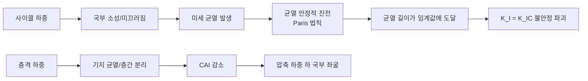

### 3.2.8 접합 기술 및 표면 공학

이종 재료 접합은 휴머노이드 로봇 구조 설계의 난제입니다. 알루미늄 합금과 마그네슘 합금, 금속과 CFRP의 접합은 전기화학적 적합성, 열팽창 정합 및 기계적 하중 전달을 동시에 고려해야 합니다.

#### 3.2.8.1 갈바닉 부식의 열역학적 및 동역학적 제약

두 가지 다른 전위를 가진 금속이 전해질에서 접촉하면, 낮은 전위의 금속이 양극으로 산화되고 높은 전위의 금속이 음극으로 환원 반응을 촉진합니다. 갈바닉 부식 전류는 혼합 전위 이론으로 추정할 수 있습니다. 알루미늄(\(E_{Al} \approx -0.8\) V vs SHE, 부동태 상태)과 마그네슘(\(E_{Mg} \approx -1.7\) V vs SHE)이 직접 접촉한다고 가정하면, 양극인 마그네슘의 용해 전류 밀도가 크게 증가합니다.

단순화된 모델에서 갈바닉 전류 밀도 \(i_g\)는 다음을 만족합니다:

$$
i_g = \frac{E_{cathode} - E_{anode}}{R_{solution} + R_{contact}}
$$

여기서 \(R_{solution}\)은 전해질 저항, \(R_{contact}\)는 계면 접촉 저항입니다. 실제 부식 속도는 음극 반응(일반적으로 산소 환원 또는 수소 발생)의 확산 제한 전류에 따라 달라집니다. 공학적으로는 일반적으로 전위차가 0.25 V 미만이어야 직접 접촉이 가능하며, 그렇지 않으면 절연 와셔, 양극 산화층, 니켈 도금층 등을 사용하여 분리해야 합니다.

!!! note "용어 설명: 갈바닉 부식, 혼합 전위 이론, 음극 반응, 확산 제한 전류"
    - **갈바닉 부식(galvanic corrosion)**: 서로 다른 전위를 가진 두 금속이 전해질에서 갈바닉 전지를 형성하여 낮은 전위의 금속이 가속 부식되는 현상.
    - **혼합 전위 이론(mixed potential theory)**: 부식 시스템에서 양극과 음극 분극 곡선의 교차점이 부식 전위와 전류를 결정하는 이론.
    - **음극 반응(cathodic reaction)**: 음극 표면에서 발생하는 환원 반응, 예: \(O_2 + 2H_2O + 4e^- \rightarrow 4OH^-\).
    - **확산 제한 전류(limiting diffusion current)**: 반응물의 확산 속도가 속도 결정 단계가 될 때의 최대 전류.

#### 3.2.8.2 열팽창 부정합 응력

온도 변화는 이종 재료 접합부에 열응력을 발생시킵니다. 두 재료로 구성된 적층 구조에서 온도 변화 \(\Delta T\)가 발생할 때, 두 재료가 자유롭게 변형될 수 없다면 계면 수직 응력은 다음과 같이 근사할 수 있습니다.

$$
\sigma = \frac{E_1 E_2}{E_1 + E_2} (\alpha_1 - \alpha_2) \Delta T
$$

여기서 \(E_i\)는 탄성 계수, \(\alpha_i\)는 열팽창 계수입니다. 알루미늄(\(\alpha_{Al} = 23 \times 10^{-6}\) /K, \(E_{Al} = 70\) GPa)과 CFRP 단방향 적층판의 길이 방향(\(\alpha_{CFRP} \approx 0\) /K, \(E_{CFRP} \approx 140\) GPa)을 연결하는 예를 들어, 온도 변화 \(\Delta T = -80\) K(경화 온도에서 실온으로 냉각)일 때:

$$
\sigma = \frac{70 \times 140}{70 + 140} \times 10^9 \times (23 - 0) \times 10^{-6} \times 80 \approx 85\ \text{MPa}
$$

이 잔류 인장 응력은 계면 근처에서 기지 균열 또는 층간 분리를 유발하기에 충분하므로, CFRP-금속 연결은 종종 점진적 이종 구조, 접착 및 기계적 체결, 또는 열팽창 적합 합금을 사용하여 완화합니다.

!!! note "용어 설명: 열팽창 계수, 잔류 응력, 열 부정합"
    - **열팽창 계수(coefficient of thermal expansion, CTE)**: 온도 변화에 따른 재료 길이 변화율.
    - **잔류 응력(residual stress)**: 외부 하중 없이 재료 내부에 존재하는 자체 평형 응력.
    - **열 부정합(thermal mismatch)**: 이종 재료의 CTE 차이로 인한 변형 불일치.

#### 3.2.8.3 마찰 교반 용접의 물리적 메커니즘

마찰 교반 용접(FSW)은 알루미늄, 마그네슘 등 저융점 경합금에 특히 적합한 고상 접합 기술입니다. 용접 과정에서 회전하는 교반 핀이 접합부에 삽입되어 용접선을 따라 이동하며, 마찰열로 재료가 소성 상태(일반적으로 융점의 0.6-0.9배)에 도달하고, 재료는 교반 핀 주변에서 격렬한 소성 유동을 겪으며 재혼합되어 치밀한 용접 접합부를 형성합니다.

FSW 접합부는 네 영역으로 나눌 수 있습니다:
1. **용접 너겟 영역(nugget zone)**: 교반 핀 바로 아래에서 동적 재결정이 발생하여 결정립이 미세화됩니다.
2. **열기계적 영향 영역(TMAZ)**: 교반과 열의 공동 작용으로 결정립이 굽혀지고 늘어납니다.
3. **열 영향 영역(HAZ)**: 열 사이클의 영향만 받아 석출물 조대화 또는 연화가 발생합니다.
4. **모재(base metal)**: 영향을 받지 않은 원래 조직.

!!! note "용어 설명: 용접 너겟 영역, 열기계적 영향 영역, 열 영향 영역, 동적 재결정"
    - **용접 너겟 영역(nugget zone)**: FSW 접합부 중심에서 가장 높은 온도와 가장 큰 변형을 겪는 영역.
    - **열기계적 영향 영역(thermo-mechanically affected zone, TMAZ)**: 온도와 기계적 교반의 영향을 동시에 받는 전이 영역.
    - **열 영향 영역(heat-affected zone, HAZ)**: 열 사이클의 영향만 받고 소성 변형이 발생하지 않은 영역.
    - **동적 재결정(dynamic recrystallization)**: 변형 과정에서 형성된 새로운 무변형 결정립.


#### 3.2.8.4 접합 방식 선택과 표면 공학

일반적인 접합 방식의 적용 범위는 다음과 같습니다:

| 접합 방식 | 적용 재료 | 장점 | 주요 한계 |
|---------|---------|------|---------|
| 기계적 체결 | 금속, CFRP | 분해 가능, 유지보수 용이 | 응력 집중, 갈바닉 부식 위험 |
| 접착 접합 | 금속-CFRP | 응력 분포 균일, 절연 가능 | 내열/내습성 제한, 경화 시간 김 |
| 리벳 접합 | 알루미늄, 마그네슘 박판 | 공정 성숙도 높음 | 중량 증가, 구멍 주변 응력 집중 |
| 마찰 교반 용접 | Al/Mg 합금 | 고상 접합, 기공/균열 없음 | 장비 강성 요구 높음, 후면 지지 필요 |
| 레이저 용접 | Al, 강 | 에너지 집중, 변형 작음 | 고반사 재료는 특수 공정 필요 |

표면 공학 측면에서, 앞서 언급한 마그네슘 합금 표면 처리 외에도 알루미늄 합금의 양극 산화, 미세 아크 산화, 무전해 니켈 도금 등이 널리 사용됩니다. CFRP의 경우, 표면 플라즈마 처리, 사이징제 최적화를 통해 수지 기재와 섬유 간의 계면 결합을 개선할 수 있습니다. 이종 재료 접합 및 표면 보호의 최종 솔루션은 전체 기체 조립 공정 및 사용 환경과 협력하여 설계되어야 하며, 자세한 내용은 제9장 9.2절 구조 통합 및 조립을 참조하십시오.

### 3.2.9 경량화 지표와 재료 선정 전략

구조 재료 선정은 다음 지표를 종합적으로 고려해야 합니다:

| 지표 | 정의 | 재료 비교 |
|-----|------|---------|
| 비강도 | \(\sigma/\rho\) | 마그네슘 합금 > 알루미늄 합금 > 강 |
| 비강성 | \(E/\rho\) | CFRP > 마그네슘 합금 > 알루미늄 합금 |
| 비에너지 흡수율 | 단위 질량당 흡수 에너지 | 마그네슘 합금, CFRP 우수 |
| 피로비 | 피로 한도/인장 강도 | 알루미늄 합금 0.3-0.4, 강 0.4-0.5 |
| 비용비 | 단위 성능당 비용 | 알루미늄 합금 최적 |

!!! note "용어 설명: 비강도, 비강성, 비에너지 흡수율, 피로비"
    - **비강도(specific strength)**: 강도와 밀도의 비율로, 단위 질량 재료의 하중 지지 능력을 측정합니다.
    - **비강성(specific stiffness)**: 탄성 계수와 밀도의 비율로, 단위 질량 재료의 변형 저항 능력을 측정합니다.
    - **비에너지 흡수율(specific energy absorption)**: 단위 질량이 흡수하는 충격 에너지로, 완충 및 충격 흡수 능력을 반영합니다.
    - **피로비(fatigue ratio)**: 피로 한도와 인장 강도의 비율로, 반복 하중 하에서 재료의 효율을 반영합니다.

실제 재료 선정은 성능, 비용, 공정, 재활용성 간의 균형을 맞춰야 합니다. 예를 들어, 고응력 조인트에는 7075-T6 또는 CFRP를 사용할 수 있고, 대면적 커버 부품에는 마그네슘 합금 다이캐스팅 또는 엔지니어링 플라스틱을 사용할 수 있으며, 높은 열전도성이 필요한 부위에는 알루미늄 합금을 사용할 수 있습니다.

### 3.2.10 구조 재료 공급망과 수명 주기 평가

구조 재료의 공급망 위험은 주로 알루미늄, 마그네슘의 1차 제련 에너지 소비와 원광 품위 저하에 있습니다. 재생 알루미늄의 탄소 배출량은 1차 알루미늄보다 약 78-95% 낮으므로, 로봇 구조 부품은 높은 비율의 재생 알루미늄을 우선적으로 사용해야 합니다. 마그네슘 제련은 현재 주로 피전 공정(Pidgeon process)에 의존하며, 에너지 소비가 높고 CO\(_2\)를 발생시키므로, 전해법 제련이 장기적인 탄소 감축 방향입니다.

수명 주기 평가(LCA) 프레임워크는 재료 선택이 탄소 발자국, 자원 고갈 및 생태 독성에 미치는 영향을 식별하는 데 도움이 됩니다. 재료 선택은 전 수명 주기 환경 영향을 고려해야 합니다:

- **1차 알루미늄 vs 재생 알루미늄**: 재생 알루미늄의 탄소 배출량은 1차 알루미늄보다 약 78-95% 낮습니다.
- **마그네슘 합금 제련**: 피전 공정은 에너지 소비가 높고, 전해법은 탄소 배출을 크게 줄일 수 있습니다.
- **탄소 섬유 재활용**: 열분해 또는 용매 회수 탄소 섬유는 성능을 일부 유지할 수 있지만, 비용은 여전히 높습니다.

!!! note "용어 설명: 수명 주기 평가(LCA), 탄소 발자국, 생태 독성"
    - **수명 주기 평가(LCA)**: 제품의 원자재 획득, 제조, 사용, 폐기까지의 전 과정 환경 영향을 정량화하는 체계적인 방법.
    - **탄소 발자국(carbon footprint)**: 활동 또는 제품으로 인한 온실가스 총 배출량.
    - **생태 독성(ecotoxicity)**: 재료 또는 그 분해 산물이 생태계 생물에 미치는 유해 정도.

---

## 3.3 전기화학 에너지 재료

### 3.3.1 전극 열역학과 리튬 이온 삽입 반응

리튬 이온 배터리는 Li\(^+\)가 양극 및 음극 활물질 격자에 가역적으로 삽입/탈리되는 현상에 기반합니다. 전극 전위는 전기화학 반응의 깁스 자유 에너지 변화에 의해 결정됩니다:

$$
E = -\frac{\Delta G}{nF}
$$

여기서 \(n\)은 이동 전자 수, \(F\)는 패러데이 상수입니다. 양극 재료는 높은 전위(3-5 V vs Li/Li\(^+\))를 제공하고, 음극 재료는 낮은 전위(<1 V vs Li/Li\(^+\))를 제공하며, 두 전위차가 배터리 전압을 구성합니다. 더 정확하게는, 전극 전위는 네른스트 방정식으로 설명할 수 있습니다:

$$
E = E^0 - \frac{RT}{nF} \ln Q
$$

여기서 \(Q\)는 반응 지수입니다. 삽입 반응에서 Li\(^+\) 활성도의 변화는 \(Q\)를 직접 변화시켜 전극 전위를 변화시킵니다.

!!! note "용어 설명: 삽입 반응, 전극 전위, 깁스 자유 에너지, 전기화학 퍼텐셜, 네른스트 방정식, 패러데이 상수"
    - **삽입 반응(intercalation)** : 객채 이온(예: Li\(^+\))이 호스트 격자 층간 또는 채널에 가역적으로 삽입되고 탈리되는 반응으로, 호스트 골격은 기본적으로 유지됩니다.
    - **전극 전위(electrode potential)** : 전극과 기준 전극 사이의 전위차로, 산화환원 반응의 경향성을 나타냅니다.
    - **깁스 자유 에너지(Gibbs free energy, \(G\))** : 항온 항압에서 시스템이 비팽창 일을 할 수 있는 에너지로, \(\Delta G < 0\)는 과정이 자발적임을 의미합니다.
    - **전기화학 퍼텐셜(electrochemical potential)** : 화학 퍼텐셜과 정전기 퍼텐셜 에너지의 합으로, 하전 입자는 상평형 시 전기화학 퍼텐셜이 같습니다.
    - **네른스트 방정식(Nernst equation)** : 반응물 활성도에 따른 전극 전위 변화를 설명하는 방정식으로, 열역학적 평형 조건을 전기화학에서 구체적으로 표현한 것입니다.
    - **패러데이 상수(Faraday constant, \(F\))** : 1몰 전자가 가진 전하량으로, 약 96485 C/mol입니다.

리튬 이온 삽입 반응은 다음과 같이 쓸 수 있습니다:

$$
\text{Li}_{1-x}\text{MO}_2 + x\text{Li}^+ + x\text{e}^- \rightleftharpoons \text{LiMO}_2
$$

여기서 M은 전이 금속입니다. 삽입 과정은 호스트 재료가 안정적인 결정 프레임워크, 빠른 Li\(^+\) 확산 채널 및 허용 가능한 전자 전도도를 가져야 합니다. Li\(^+\)의 고상 확산은 픽의 제2법칙을 따르며, 확산 계수 \(D_{Li^+}\)는 일반적으로 10\(^{-15}\)-10\(^{-10}\) cm\(^2\)/s 범위입니다.

!!! note "용어 설명: 픽의 법칙, 확산 계수, 화학 퍼텐셜 구배"
    - **픽의 법칙(Fick's law)** : 확산 플럭스와 농도 구배의 관계를 설명하는 경험 법칙입니다. 제1법칙은 정상 상태 플럭스를, 제2법칙은 비정상 상태 농도 변화를 제공합니다.
    - **확산 계수(diffusion coefficient, \(D\))** : 매질에서 입자의 확산 속도를 나타내는 물리량으로, 온도 및 활성화 에너지와 관련됩니다.
    - **화학 퍼텐셜 구배(chemical potential gradient)** : 입자를 높은 화학 퍼텐셜 영역에서 낮은 화학 퍼텐셜 영역으로 이동시키는 실제 열역학적 힘입니다.

### 3.3.2 양극 재료: 층상 산화물과 올리빈 구조

**NMC(LiNi\(_x\)Mn\(_y\)Co\(_z\)O\(_2\))** 는 \(\alpha\)-NaFeO\(_2\)형 층상 구조로, 공간군 \(R\bar{3}m\)에 속합니다. Li\(^+\)는 3a 위치, 전이 금속은 3b 위치, 산소는 6c 위치를 차지합니다. Li\(^+\)는 2차원 층간에서 이동하며, 확산 계수는 약 10\(^{-12}\)–10\(^{-14}\) m\(^2\)/s입니다.

!!! note "용어 설명: NMC, 층상 산화물, 공간군, Li/Ni 혼합, 격자 산소 방출, 표면 재구성"
    - **NMC** : 니켈 코발트 망간 산화물 삼원계 층상 양극 재료로, Ni/Mn/Co 비율을 조정하여 용량, 안정성 및 비용의 균형을 맞춥니다.
    - **층상 산화물(layered oxide)** : 전이 금속 층과 리튬 층이 교대로 배열된 2차원 구조로, 리튬이 층간에서 2차원 확산합니다.
    - **공간군(space group)** : 결정 대칭성의 수학적 설명입니다.
    - **Li/Ni 혼합(Li/Ni mixing)** : Ni\(^{2+}\) 이온 반경이 Li\(^+\)와 유사하여 Li 위치를 쉽게 점유하고 Li\(^+\) 확산 채널을 차단합니다.
    - **격자 산소 방출(lattice oxygen release)** : 높은 탈리튬 상태에서 격자 산소가 O\(_2\)로 산화되어 방출되며, 구조 파괴 및 열 폭주를 유발합니다.
    - **표면 재구성(surface reconstruction)** : 전기화학적 사이클링 중 양극 표면이 암염상 등 새로운 구조로 변환되어 계면 임피던스를 증가시킵니다.

고니켈화(NMC622→NMC811→NMC90)는 Ni 함량을 높여 가역 용량을 증가시키지만, 다음과 같은 문제를 야기합니다:

- **Li/Ni 혼합** : Ni\(^{2+}\) 이온 반경이 Li\(^+\)와 유사하여 Li 위치를 쉽게 점유하고 Li\(^+\) 확산 채널을 차단합니다.
- **격자 산소 방출** : 높은 탈리튬 상태에서 격자 산소가 산화되어 O\(_2\)를 방출하고 열 폭주를 유발합니다.
- **표면 재구성** : 표면 근처에 암염상 NiO 층이 형성되어 계면 임피던스를 증가시킵니다.
- **미세 균열** : 이방성 격자 팽창/수축으로 인해 2차 입자 내부에 미세 균열이 발생하여 전해질 침투 및 부반응을 가속화합니다.

완화 전략으로는 벌크 도핑(Al, Mg, Ti, Zr), 표면 코팅(Al\(_2\)O\(_3\), Li\(_2\)ZrO\(_3\), 인산염), 코어-쉘 구조 및 농도 구배 설계가 있습니다.

**LiFePO\(_4\)** 는 올리빈 구조로, 공간군 \(Pnma\)에 속합니다. 열 안정성이 우수하고 사이클 수명이 길며 비용이 낮지만, 본질적인 전자 전도도가 낮아(약 10\(^{-9}\) S/cm) 탄소 코팅 및 나노화를 통해 개선해야 합니다. LiFePO\(_4\)의 이론 용량은 170 mAh/g이며, 실제로는 160 mAh/g 이상에 도달할 수 있습니다. 충방전 메커니즘은 2상 반응(LiFePO\(_4\) ↔ FePO\(_4\) + Li\(^+\) + e\(^-\))이며, 반응 계면 이동은 Li\(^+\)의 1차원 확산에 의해 제어됩니다.

!!! note "용어 설명: 올리빈 구조, 탄소 코팅, 2상 반응, 1차원 확산"
    - **올리빈 구조(olivine structure)** : FeO\(_6\) 팔면체와 PO\(_4\) 사면체로 구성된 3차원 프레임워크로, Li\(^+\)가 1차원 채널을 따라 이동합니다.
    - **탄소 코팅(carbon coating)** : 양극 입자 표면에 전도성 탄소 층을 증착하여 전자 전도도와 계면 안정성을 향상시킵니다.
    - **2상 반응(two-phase reaction)** : 충방전 과정에서 리튬 부족상과 리튬 풍부상의 두 상이 공존하며, 반응 전선이 이동합니다.
    - **1차원 확산(one-dimensional diffusion)** : Li\(^+\)가 특정 결정 방향 채널을 따라서만 이동할 수 있어 확산 경로가 제한됩니다.

### 3.3.3 음극 재료: 흑연, 실리콘-탄소 및 리튬 금속

**흑연**은 현재 가장 성숙된 음극 재료로, 이론 용량은 372 mAh/g(LiC\(_6\)에 해당)입니다. Li\(^+\)가 흑연 층간에 삽입되어 다양한 스테이지 화합물(stage I-V)을 형성합니다. 흑연 음극의 부피 변화는 작고(<12%) 사이클 안정성이 우수하지만, 용량이 이미 이론적 한계에 근접했습니다.

!!! note "용어 설명: 흑연, 스테이지 화합물, 실리콘-탄소 복합체, 리튬 수지상, 전단 탄성률"
    - **흑연(graphite)** : 탄소 원자가 층상으로 배열된 음극 재료로, Li\(^+\)가 층간에 삽입되어 흑연 삽입 화합물을 형성합니다.
    - **스테이지 화합물(stage compound)** : 흑연 층간에서 Li\(^+\)가 주기적으로 다른 층수를 점유하는 구조로, stage I은 모든 두 탄소 층 사이에 리튬이 삽입됨을 의미합니다.
    - **실리콘-탄소 복합체(Si/C composite)** : 나노 실리콘을 탄소 매트릭스에 분산시켜 탄소가 실리콘의 부피 팽창을 완충하고 전도성 네트워크를 유지하도록 합니다.
    - **리튬 수지상(Li dendrite)** : 리튬 금속 음극 표면에서 국부적 전기장 및 농도 불균일로 인해 형성되는 바늘 모양의 리튬 침전물로, 분리막을 관통하여 단락을 유발할 수 있습니다.
    - **전단 탄성률(shear modulus, \(G\))** : 재료가 전단 변형에 저항하는 능력으로, 고체 전해질의 높은 전단 탄성률은 수지상을 기계적으로 억제할 수 있습니다.

**실리콘**의 이론 용량은 4,200 mAh/g(Li\(_{22}\)Si\(_5\)에 해당)으로 높지만, 완전 리튬화 시 부피 팽창이 약 300%에 달하여 다음과 같은 문제를 초래합니다:
- 입자 분쇄, 전기적 접촉 손실
- SEI 막의 지속적인 파괴 및 재생성, 활성 리튬 및 전해질 소모
- 고체 전해질 계면 막 두께 증가, 계면 임피던스 증가

산업계에서는 실리콘-탄소 복합체(Si/C) 또는 산화아실리콘(SiO\(_x\)) 전략을 채택하여 실리콘 함량을 5-15 wt%로 제어함으로써 에너지 밀도 향상과 사이클 안정성 사이의 균형을 유지합니다.

**리튬 금속** 음극은 가장 높은 비용량(3,860 mAh/g)과 가장 낮은 전위를 가지며, 고체 배터리의 이상적인 음극입니다. 그러나 리튬 수지상 성장으로 인한 단락 및 열 폭주 위험은 그 응용을 제한하는 핵심 과학적 문제입니다. 고체 전해질의 높은 전단 탄성률은 수지상을 기계적으로 억제할 수 있지만, 결정립계, 공극 및 국부적 전류 밀도 불균일은 여전히 수지상 관통을 유발할 수 있습니다. Monroe와 Newman의 고전적 판단 기준에 따르면, 전해질의 전단 탄성률이 리튬 금속의 약 두 배일 때 수지상을 억제할 수 있지만, 실제로 계면 불균일성으로 인해 이 기준은 지나치게 낙관적입니다.

### 3.3.4 액체 전해질 및 SEI 막

액체 전해질은 일반적으로 탄산염 용매(EC, DMC, EMC, DEC)와 리튬 염(LiPF\(_6\), LiFSI, LiTFSI)으로 구성됩니다. 이온 전도도는 약 10\(^{-3}\)–10\(^{-2}\) S/cm이지만, 고온 또는 고전압에서 산화 분해될 수 있습니다.

!!! note "용어 설명: 액체 전해질, 탄산염 용매, 리튬 염, 이온 전도도"
    - **액체 전해질 (liquid electrolyte)** : 용매와 리튬 염으로 구성된 이온 전도성 액체로, 양극과 음극 사이에서 Li\(^+\)를 전달합니다.
    - **탄산염 용매 (carbonate solvent)** : EC(에틸렌 카보네이트), DMC(디메틸 카보네이트) 등이 있으며, 리튬 이온의 용매화 환경을 제공합니다.
    - **리튬 염 (lithium salt)** : LiPF\(_6\) 등이 있으며, 용매에서 Li\(^+\)와 음이온으로 해리되어 전하 운반체를 제공합니다.
    - **이온 전도도 (ionic conductivity)** : 전해질이 이온을 전도하는 능력으로, 단위는 S/cm입니다.

SEI 피막은 전해액이 음극 표면에서 환원되어 형성된 부동태층으로, 주요 성분은 Li\(_2\)CO\(_3\), LiF, ROLi, RCOOLi 등입니다. Peled가 처음으로 SEI 개념을 제안했으며, 이상적인 SEI는 다음을 가져야 한다고 지적했습니다.

- 높은 Li\(^+\) 전도도 (분극 감소)
- 전자 절연성 (전해액의 지속적인 환원 방지)
- 기계적 유연성 (음극 부피 변화 적응)
- 열적 안정성 (고온에서 분해 발열 방지)

!!! note "용어 설명: SEI 피막, 부동태층, 전해액 첨가제"
    - **SEI (Solid Electrolyte Interphase)** : 전극 표면에서 전해액 분해로 형성된 고체 부동태 피막으로, Li\(^+\)는 통과시키지만 전자와 용매 분자의 지속적인 반응은 차단합니다.
    - **부동태층 (passivation layer)** : 추가적인 화학 반응을 막거나 늦추는 보호성 박막입니다.
    - **전해액 첨가제 (electrolyte additive)** : 전해액에 소량 첨가되어 SEI 성분을 조절하고 부반응을 억제하는 기능성 물질로, VC, FEC 등이 있습니다.

전해액 첨가제(VC, FEC, LiPO\(_2\)F\(_2\), LiDFOB)를 통해 SEI 성분과 구조를 조절하여 사이클 수명을 크게 개선할 수 있습니다.

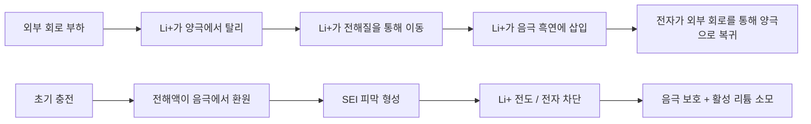

### 3.3.5 고체 전해질: 황화물, 산화물 및 폴리머

전고체 배터리는 액체 전해질과 분리막을 고체 전해질로 대체하여 에너지 밀도와 안전성을 동시에 향상시킬 수 있습니다. 고체 전해질은 화학 계열에 따라 황화물, 산화물, 폴리머 및 할로겐화물로 분류됩니다.

!!! note "용어 설명: 고체 전해질, 전기화학적 창, 리튬 안정성, 공기 안정성"
    - **고체 전해질 (solid electrolyte)** : 고체 상태에서 이온을 전도하는 물질로, 분리막과 이온 전도체의 기능을 겸합니다.
    - **전기화학적 창 (electrochemical window)** : 전해질이 산화환원 분해 없이 안정한 전위 범위로, 창이 넓을수록 고전압 양극과 매칭하기 좋습니다.
    - **리튬 안정성 (stability against Li metal)** : 전해질이 리튬 금속과 접촉할 때 지속적인 부반응을 일으키지 않는 능력입니다.
    - **공기 안정성 (air stability)** : 전해질이 공기 중에서 수분을 흡수하거나 분해되거나 유독 가스를 발생시키지 않는 능력입니다.

**황화물계 고체 전해질**(예: Li\(_{10}\)GeP\(_2\)S\(_{12}\), Li\(_6\)PS\(_5\)Cl, Li\(_3\)PS\(_4\))은 가장 높은 상온 이온 전도도(10\(^{-2}\) S/cm)를 가지며, 액체 전해질에 근접합니다. 전도 메커니즘은 Li\(^+\)가 PS\(_4\)/GeS\(_4\) 사면체로 구성된 골격 내에서 공극 또는 간극을 통해 이동하는 것입니다. 그러나 황화물은 수분에 매우 민감하여 H\(_2\)S를 방출하고 이온 전도도를 낮춥니다. 또한 양극 재료와 화학적/전기화학적 비상용성이 있어 표면 코팅으로 완충해야 합니다.

**산화물계 고체 전해질**(예: LLZO, LATP, LLTO, LiPON)은 화학적 안정성이 좋고, 전기화학적 창이 넓으며, 기계적 강도가 높습니다. 입방상 LLZO(Li\(_7\)La\(_3\)Zr\(_2\)O\(_{12}\))의 상온 이온 전도도는 약 10\(^{-4}\)–10\(^{-3}\) S/cm이며, 리튬 금속에 대해 안정적입니다. 그러나 산화물은 취성이 크고 계면 접촉이 좋지 않으며 고온 소결이 필요하여 가공 비용이 높습니다.

**폴리머계 고체 전해질**(예: PEO-LiTFSI)은 유연성이 좋고 계면 접촉이 우수하지만, 상온 이온 전도도가 낮아(10\(^{-6}\)–10\(^{-5}\) S/cm) 실용화를 위해서는 60 °C 이상으로 가열해야 합니다. 전도 메커니즘은 Li\(^+\)가 에테르 산소 사슬과 배위하고 폴리머 사슬의 움직임에 따라 이동하는 것입니다. 폴리머-무기 복합 전해질(예: PEO + LLZO/LATP)은 유연성과 이온 전도도를 모두 확보할 수 있어 현재 연구 핫스팟입니다.

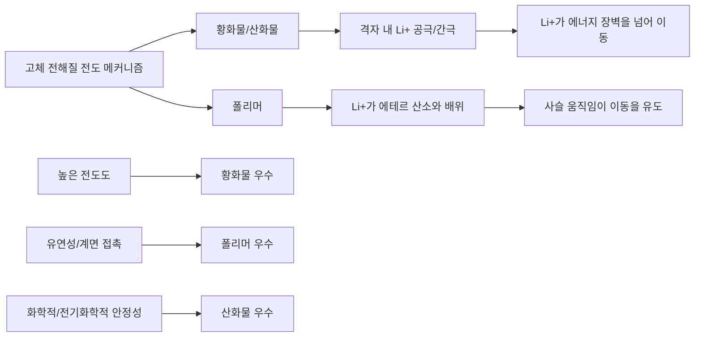

**표 3-2 주요 고체 전해질 계열 비교**

| 유형 | 대표 물질 | 상온 이온 전도도 (S/cm) | 리튬 안정성 | 공기 안정성 | 주요 과제 |
|-----|---------|---------------------|-----------|-----------|---------|
| 황화물 | Li\(_6\)PS\(_5\)Cl, LGPS | 10\(^{-3}\)–10\(^{-2}\) | 중간 | 나쁨 (H\(_2\)S 방출) | 수분 민감, 계면 부반응 |
| 산화물 | LLZO, LATP | 10\(^{-4}\)–10\(^{-3}\) | 좋음 | 좋음 | 취성, 계면 접촉, 높은 가공 온도 |
| 폴리머 | PEO-LiTFSI | 10\(^{-6}\)–10\(^{-5}\) | 좋음 | 좋음 | 상온 전도도 낮음, 산화 안정성 나쁨 |
| 할로겐화물 | Li\(_3\)YCl\(_6\), Li\(_3\)YBr\(_6\) | 10\(^{-4}\)–10\(^{-3}\) | 좋음 | 중간 | 고전압 양극 안정성, 비용 |

### 3.3.6 열 폭주 메커니즘과 배터리 팩 설계

리튬 이온 배터리의 열 폭주는 발열 연쇄 반응의 결과로, 다음 단계를 포함합니다.

1. SEI 분해 (약 90-120 °C)
2. 음극과 전해액 반응
3. 분리막 용융/수축 (PE 분리막 약 130 °C)
4. 양극 산소 방출 (NMC811 약 200-250 °C)
5. 전해액 연소 (EC/DMC 인화점 약 30-40 °C)

!!! note "용어 설명: 열 폭주, 분리막, 인화점, 발열 연쇄 반응"
    - **열 폭주 (thermal runaway)** : 배터리 내부의 발열 반응 속도가 방열 속도를 초과하여 온도가 지속적으로 상승하고 연쇄 반응을 유발하는 현상입니다.
    - **분리막 (separator)** : 양극과 음극을 분리하고 이온이 통과하도록 하는 미세 다공성 막으로, 용융 수축 시 내부 단락을 유발할 수 있습니다.
    - **인화점 (flash point)** : 액체 증기가 점화될 수 있는 최저 온도입니다.
    - **발열 연쇄 반응 (exothermic chain reaction)** : 이전 단계 반응의 발열이 다음 단계 반응을 유발하여 양성 피드백을 형성하는 현상입니다.

전고체 배터리는 가연성 액체 전해질을 제거하고 열적 안정성이 높은 전해질을 사용함으로써 열 폭주를 근본적으로 억제할 수 있습니다. 그러나 전고체 배터리에도 리튬 덴드라이트, 계면 접촉 저항, 전해질-전극 화학적 비상용성 등의 안전 문제가 여전히 존재합니다.

#### 3.3.6.1 열 폭주 임계 조건과 에너지 균형

배터리 온도 변화는 에너지 보존 방정식으로 설명됩니다.

$$
\rho C_p \frac{dT}{dt} = \dot{q}_{gen} - \dot{q}_{cool}
$$

여기서 \(\rho C_p\)는 셀의 부피 비열, \(\dot{q}_{gen}\)은 단위 부피당 발열 전력, \(\dot{q}_{cool}\)은 단위 부피당 방열 전력입니다. 발열 항목에는 줄열과 엔트로피 열이 포함됩니다.

$$
\dot{q}_{gen} = I^2 R_{int} + I T \frac{dE_{ocv}}{dT}
$$

줄열은 전류의 제곱에 비례합니다. 엔트로피 열 항은 충전/방전 시 부호가 반대이지만, 일반적으로 줄열의 5-15%에 불과합니다. 열 폭주의 임계 조건은 온도에 대한 발열 속도의 미분이 온도에 대한 방열 속도의 미분을 초과하는 경우입니다.

$$
\frac{\partial \dot{q}_{gen}}{\partial T} > \frac{\partial \dot{q}_{cool}}{\partial T}
$$

이 조건이 충족되면 온도 양성 피드백이 환경 방열로 상쇄될 수 없어 열 폭주에 진입합니다. SEI 분해, 음극-전해액 반응 및 양극 산소 방출의 활성화 에너지는 각각 80-130 kJ/mol, 100-200 kJ/mol 및 150-300 kJ/mol이며, 온도가 높을수록 반응이 빨라져 지수 함수적 발열을 형성합니다.

!!! note "용어 설명: 단열 온도 상승, 자기 발열 속도, 열 저항, 대류 열전달 계수"
    - **단열 온도 상승 (adiabatic temperature rise, \(\Delta T_{ad}\))** : 방열이 없는 조건에서 반응이 모든 열을 방출하여 발생하는 온도 상승, \(\Delta T_{ad} = Q_{total}/(m C_p)\).
    - **자기 발열 속도 (self-heating rate, \(\mathrm{d}T/\mathrm{d}t\))** : 단위 시간당 배터리 자체 온도 상승 속도, 가속 열량계(ARC)로 직접 측정.
    - **열 저항 (thermal resistance, \(R_{th}\))** : 열 전달 경로에서의 온도 상승과 열류의 비율, \(R_{th} = \Delta T / P\).
    - **대류 열전달 계수 (heat transfer coefficient, \(h\))** : 유체와 고체 표면 간 단위 면적, 단위 온도 차이당 열류량, 자연 대류 약 5-25 W/(m\(^2\)·K).


#### 3.3.6.2 배터리 팩 크기 및 열 설계 수치 예시

휴머노이드 로봇의 본체에 48V, 20Ah 배터리 팩을 탑재할 수 있다고 가정하고, 셀은 3.7V, 5Ah NMC 원통형 배터리, 에너지 밀도 250Wh/kg을 사용한다고 가정:

- 총 에너지: \(E = 48 \times 20 = 960\) Wh
- 배터리 질량: \(m = 960 / 250 = 3.84\) kg
- 직렬 수: \(48 / 3.7 \approx 13\) 직렬
- 병렬 수: \(20 / 5 = 4\) 병렬
- 총 셀 수: \(13 \times 4 = 52\) 개

로봇의 순간 전력 요구량이 960W라면 평균 방전율 \(C = 960 / 960 = 1\) C; 관절 고역학 피크 전력은 3-5kW에 달하며, 이는 3-5 C 펄스에 해당합니다. 셀 내부 저항 \(R_{int} = 20\) mΩ, 4병렬 후 등가 내부 저항 약 5mΩ, 피크 5C 시 줄 열 전력:

$$
P_{Joule} = I^2 R_{int} = (5 \times 20)^2 \times 0.005 = 50\ \text{W}
$$

아래 스크립트는 다양한 방전율 및 냉각 조건에서 셀의 정상 상태 온도 상승을 계산합니다:

```python
import numpy as np

# 셀 파라미터 (21700 NMC 기준)
C_cell = 5.0        # Ah
V_cell = 3.7        # V
R_int = 20e-3       # Ω
m_cell = 0.070      # kg
cp = 1000           # J/(kg·K)
surface_area = 2*np.pi*0.0105*0.070  # m^2 (21700 근사)

# 방전율 및 전류
C_rates = np.array([1, 2, 3, 5, 8])
I = C_rates * C_cell  # A
P_joule = I**2 * R_int  # W

# 냉각 조건: 자연 대류 h=10 W/m^2K; 강제 공랭 h=40; 수랭 h=200
for h, label in [(10, '자연 대류'), (40, '강제 공랭'), (200, '수랭')]:
    dT = P_joule / (h * surface_area)
    print(f"{label}: 8C 온도 상승 ≈ {dT[-1]:.1f} K")
```

출력 결과는 8C 펄스에서 자연 대류 시 온도 상승이 수십 켈빈에 달할 수 있음을 보여주며, 국부 셀의 조기 노화를 방지하기 위해 수랭 또는 상변화 재료를 사용하여 셀 온도 차이를 5K 이내로 제어해야 합니다.

### 3.3.7 배터리 관리 시스템 및 상태 추정

배터리 관리 시스템(BMS)은 로봇 배터리의 안전과 성능을 보장하는 핵심입니다. 주요 기능은 다음과 같습니다:

- **충전 상태 추정 (SOC)** : 일반적으로 개방 회로 전압법, 전류 적산법 및 칼만 필터법 사용.
- **건강 상태 추정 (SOH)** : 용량 감소 및 내부 저항 증가를 통해 평가.
- **밸런싱 제어** : 능동 밸런싱 또는 수동 밸런싱, 직렬 셀 간 SOC 불일치 방지.
- **열 관리** : 셀 온도 모니터링, 가열/냉각 시스템 제어.

!!! note "용어 설명: BMS, SOC, SOH, 밸런싱 제어"
    - **BMS (Battery Management System)** : 배터리 전압, 전류, 온도를 모니터링하고 상태를 추정하며 보호 제어를 실행하는 전자 시스템.
    - **SOC (State of Charge)** : 배터리 잔여 용량과 정격 용량의 비율, 연료 게이지와 유사.
    - **SOH (State of Health)** : 새 배터리 대비 현재 배터리의 최대 용량 또는 내부 저항의 건강 정도.
    - **밸런싱 제어 (cell balancing)** : 직렬 배터리 팩에서 각 셀의 SOC를 일치시켜 과충전 및 과방전을 방지.

고역학 휴머노이드 로봇의 경우 BMS는 고방전율 펄스 방전, 빠른 상태 업데이트 및 안전 장치 보호를 지원해야 합니다.

#### 3.3.7.1 등가 회로 모델

Thevenin 등가 회로는 BMS 상태 추정의 기초입니다. 단자 전압은 다음과 같이 표현됩니다.

$$
V_t(t) = E_{ocv}\bigl(SOC(t)\bigr) - I(t) R_0 - V_p(t)
$$

여기서 \(R_0\)는 옴 내부 저항, \(V_p\)는 분극 전압이며, 다음을 만족합니다.

$$
\frac{dV_p}{dt} = -\frac{V_p}{\tau_p} + \frac{I R_p}{\tau_p}, \quad \tau_p = R_p C_p
$$

파라미터 \(R_0, R_p, C_p\)는 HPPC(Hybrid Pulse Power Characterization) 테스트를 통해 다양한 SOC 및 온도에서 식별할 수 있습니다. 개방 회로 전압 \(E_{ocv}(SOC)\)는 일반적으로 7-13차 다항식 또는 룩업 테이블로 표현되며, 그 기울기 \(dE_{ocv}/dSOC\)는 SOC 추정 정확도에 직접적인 영향을 미칩니다.

!!! note "용어 설명: 개방 회로 전압, 분극 전압, 시정수, HPPC"
    - **개방 회로 전압 (open-circuit voltage, OCV)** : 전류가 흐르지 않고 평형 상태에 도달했을 때의 배터리 단자 전압, SOC와 일대일 대응.
    - **분극 전압 (polarization voltage)** : 전기화학 반응 및 이온 확산 지연으로 인한 전압 강하.
    - **시정수 (time constant, \(\tau\))** : RC 회로 응답 특성 시간, \(\tau = RC\).
    - **HPPC (Hybrid Pulse Power Characterization)** : 펄스 전류를 인가하여 배터리 내부 저항 및 전력 특성을 식별하는 표준 테스트.

#### 3.3.7.2 확장 칼만 필터 SOC 추정

순수 전류 적산은 전류 센서 오차 및 용량 추정 오차가 누적되므로 전압 피드백과 융합해야 합니다. 확장 칼만 필터(EKF)는 SOC와 분극 전압을 상태로 사용합니다:

$$
\mathbf{x} = \begin{bmatrix} SOC \\ V_p \end{bmatrix}
$$

상태 방정식

$$
SOC_{k+1} = SOC_k - \frac{I_k \Delta t}{Q_n}, \quad V_{p,k+1} = e^{-\Delta t/\tau_p} V_{p,k} + R_p(1-e^{-\Delta t/\tau_p}) I_k
$$

관측 방정식

$$
V_{t,k} = E_{ocv}(SOC_k) - I_k R_0 - V_{p,k}
$$

EKF는 \(E_{ocv}\)의 야코비안을 선형화하여 예측-업데이트 루프를 수행하고, 전압 오차를 SOC에 피드백하여 전류 적산 드리프트를 억제합니다. 휴머노이드 로봇의 고역학 전류 노이즈가 크므로 EKF의 프로세스 노이즈 공분산 \(Q\)와 측정 노이즈 공분산 \(R\)은 온라인으로 조정해야 합니다.

```mermaid
flowchart LR
    A[전류 I, 전압 Vt] --> B[EKF 예측]
    B --> C[OCV 룩업]
    C --> D[관측 업데이트]
    D --> E[SOC, Vp 추정]
    E --> F[밸런싱/열 관리/안전 보호]
    F --> G[고장 경고]
```

아래 Python 스크립트는 간소화된 EKF SOC 추정 프로세스를 보여줍니다:

```python
import numpy as np

Qn = 5.0            # 정격 용량 Ah
dt = 1.0            # s
R0 = 0.020          # Ω
Rp = 0.010          # Ω
tau_p = 30.0        # s
Cp = tau_p / Rp

# 간소화된 OCV-SOC 관계 (V)
def ocv(soc):
    return 3.0 + 0.8*soc + 0.1*np.sin(2*np.pi*soc)

def docv_dsoc(soc):
    return 0.8 + 0.1*2*np.pi*np.cos(2*np.pi*soc)
```

# 상태 [SOC; Vp]
x = np.array([[0.7], [0.0]])
P = np.eye(2) * 1e-3
Q = np.diag([1e-5, 1e-4])
R = 1e-3

# 시뮬레이션: 10 A 방전 10분, 전압 측정에 노이즈 포함
I = 10.0
N = 600
socs = []
for k in range(N):
    # 예측
    A = np.array([[1.0, 0.0],
                  [0.0, np.exp(-dt/tau_p)]])
    B = np.array([[-dt/(Qn*3600)],
                  [Rp*(1 - np.exp(-dt/tau_p))]])
    x = A @ x + B * I
    P = A @ P @ A.T + Q

    # 관측
    Vt_true = ocv(x[0,0]) - I*R0 - x[1,0]
    Vt_meas = Vt_true + np.random.normal(0, np.sqrt(R))

    # 갱신
    H = np.array([[docv_dsoc(x[0,0]), -1.0]])
    y = Vt_meas - (ocv(x[0,0]) - I*R0 - x[1,0])
    S = H @ P @ H.T + R
    K = P @ H.T / S
    x = x + K * y
    P = (np.eye(2) - K @ H) @ P
    socs.append(x[0,0])

print(f"최종 SOC 추정: {socs[-1]*100:.2f}%")
print(f"순수 암페어시 적분 SOC: {(0.7 - I*N*dt/(Qn*3600))*100:.2f}%")
```

해당 스크립트에서 EKF는 전압 피드백을 융합하여 측정 노이즈가 존재하더라도 SOC 추정이 수렴합니다. 순수 암페어시 적분은 초기 오차와 전류 노이즈로 인해 빠르게 발산합니다.

### 3.3.8 고체 전지 제조 공정과 과제

고체 전지 제조 공정은 액체 전지와 현저히 다릅니다:

- **황화물 전해질**: 전 불활성 분위기(Ar 또는 N\(_2\))에서 가공하여 H\(_2\)S 생성을 방지해야 합니다. 냉간 정수압 프레스, 열간 프레스 또는 용액법을 사용하여 필름을 형성합니다.
- **산화물 전해질**: 고온 소결(>1000 °C)이 필요하며 취성이 크므로 일반적으로 박막 또는 복합 전해질로 제조됩니다.
- **폴리머 전해질**: 용액 캐스팅, 압출 또는 3D 프린팅으로 성형할 수 있으며 유연성이 좋지만 이온 전도도가 낮습니다.

!!! note "용어 설명: 냉간 정수압 프레스, 열간 프레스, 계면 접촉 임피던스"
    - **냉간 정수압 프레스(cold isostatic pressing, CIP)**: 상온에서 모든 방향으로 균일하게 유체 압력을 가하여 분말을 치밀화하는 공정.
    - **열간 프레스(hot pressing)**: 고온에서 가열과 가압을 동시에 수행하여 소결을 촉진하고 치밀화 및 계면 결합을 향상시키는 공정.
    - **계면 접촉 임피던스(interfacial contact resistance)**: 고체-고체 계면의 불완전한 접촉으로 인해 발생하는 추가 저항.

핵심 과제로는 고체-고체 계면 접촉 임피던스, 전극/전해질 열팽창 정합, 대규모 생산 비용 및 일관성 제어가 있습니다.

### 3.3.9 배터리 재료 공급망과 재활용

배터리 핵심 재료 공급망은 높은 지리적 집중도를 보입니다. 리튬 자원은 주로 남미의 '리튬 트라이앵글'과 호주가 주도합니다. 코발트 광석 생산량의 70% 이상이 콩고민주공화국에서 나옵니다. 중국은 양극재, 배터리 제조 및 재활용 생산능력을 주도합니다.

배터리 재활용은 자원 의존도를 낮추는 핵심입니다:

- **습식 제련법으로 Li, Co, Ni, Mn 회수**
- **건식 제련법으로 Cu, Al, Fe 회수**
- **양극재 직접 재생**은 재제조 비용과 에너지 소비를 줄일 수 있어 연구 핫스팟이 되고 있습니다.

!!! note "용어 설명: 직접 재생, 자원 고갈, 공급망 회복탄력성"
    - **직접 재생(direct recycling)**: 폐전극 재료를 수리하여 결정 구조를 최대한 유지한 채 배터리에 재사용하는 공정.
    - **자원 고갈(resource depletion)**: 재생 불가능한 자원이 소진되어 가는 추세.
    - **공급망 회복탄력성(supply chain resilience)**: 공급망이 교란 상황에서도 기능을 유지하고 신속히 복구하는 능력.

---

## 3.4 광대역 반도체 재료

### 3.4.1 에너지 밴드 이론과 캐리어 수송

반도체 내 전자의 에너지는 밴드 구조를 형성하며, 가전자대 상단과 전도대 하단 사이의 에너지 차이를 **밴드갭** \(E_g\)이라고 합니다. Si의 \(E_g = 1.12\) eV, SiC의 \(E_g = 2.3-3.3\) eV (다형체에 따라 변화), GaN의 \(E_g = 3.4\) eV입니다. 광대역은 더 높은 고유 온도, 더 높은 항복 전계 및 더 낮은 고유 캐리어 농도를 제공합니다:

$$
n_i = \sqrt{N_c N_v} \exp\left(-\frac{E_g}{2k_B T}\right)
$$

!!! note "용어 설명: 에너지 밴드, 가전자대, 전도대, 밴드갭, 고유 캐리어 농도, 항복 전계, 온 저항"
    - **에너지 밴드 (energy band)**: 결정 내 전자가 가질 수 있는 에너지 값의 연속적인 분포대로, 주기적 포텐셜 장에서 슈뢰딩거 방정식의 해로 형성됩니다.
    - **가전자대 (valence band)**: 절대 영도에서 전자로 가득 찬 가장 높은 에너지 밴드.
    - **전도대 (conduction band)**: 가전자대 위의 빈 에너지 밴드로, 전자가 들어가면 자유롭게 전도할 수 있습니다.
    - **밴드갭 (bandgap, \(E_g\))**: 가전자대 상단에서 전도대 하단까지의 에너지 차이로, 재료의 광학적 및 전기적 임계값을 결정합니다.
    - **고유 캐리어 농도 (intrinsic carrier concentration, \(n_i\))**: 고유 반도체에서 열적 여기에 의해 생성된 전자-정공 쌍의 농도.
    - **항복 전계 (breakdown electric field, \(E_c\))**: 재료에서 애벌런치 또는 터널링 항복이 발생하기 전의 최대 전계.
    - **온 저항 (on-resistance, \(R_{on}\))**: 소자가 켜졌을 때의 저항으로, 전도 손실에 직접적인 영향을 미칩니다.

항복 전계 \(E_c\)는 밴드갭과 관련되어 있으며, 근사적으로 다음을 만족합니다:

$$
E_c \propto E_g^{3/2}
$$

SiC의 임계 항복 전계는 약 2-3 MV/cm로 Si의 10배입니다; GaN은 약 3-4 MV/cm입니다. 더 높은 항복 전계는 더 얇은 드리프트 영역을 사용할 수 있게 하여 온 저항 \(R_{on,sp}\)을 낮춥니다:

$$
R_{on,sp} \propto \frac{1}{E_c^3}
$$

즉, 동일한 항복 전압에서 SiC의 \(R_{on,sp}\)는 Si의 약 1/300-1/400입니다.

```mermaid
flowchart LR
    A[광대역 Eg↑] --> B[항복 전계 Ec↑]
    B --> C[드리프트 영역 더 얇아짐]
    C --> D[온 저항 Ron,sp↓]
    D --> E[전도 손실↓]
    A --> F[고유 캐리어 ni↓]
    F --> G[고온 누설 전류↓]
    E --> H[고전압 / 고온 / 고주파 이점]
    G --> H
```

### 3.4.2 탄화규소: 다형체, 열전도율 및 전력 소자

SiC는 200가지 이상의 다형체가 존재하며, 가장 일반적인 것은 4H-SiC와 6H-SiC입니다. 4H-SiC는 높은 전자 이동도(\(\mu_n \approx 800-1000\) cm\(^2\)/(V·s))와 우수한 등방성으로 인해 전력 소자에 선호됩니다.

!!! note "용어 설명: 다형체, 4H-SiC, 전자 이동도, MOSFET, 임계 전압, 계면 상태"
    - **다형체 (polytype)**: 화학 조성은 동일하지만 적층 순서가 다른 결정 구조 변형체.
    - **4H-SiC**: SiC의 육방정계 다형체 중 하나로, 높은 전자 이동도와 등방성을 가집니다.
    - **전자 이동도 (electron mobility, \(\mu_n\))**: 단위 전계 하에서 전자의 평균 드리프트 속도로, 소자의 온 저항과 스위칭 속도를 결정합니다.
    - **MOSFET (Metal-Oxide-Semiconductor Field-Effect Transistor)**: 금속-산화물-반도체 전계 효과 트랜지스터.
    - **임계 전압 (threshold voltage, \(V_{th}\))**: 채널이 반전되어 켜지기 위해 필요한 게이트 전압.
    - **계면 상태 (interface state)**: 반도체/산화물 계면의 전자 에너지 준위로, 캐리어를 포획하여 이동도 저하 및 임계 전압 변동을 유발합니다.

SiC MOSFET의 우수한 특성은 다음과 같습니다:

- **고온 동작**: 접합 온도가 175-200 °C에 도달할 수 있어 Si의 150 °C보다 훨씬 높습니다.
- **고속 스위칭 주파수**: 스위칭 손실이 낮아 인버터 스위칭 주파수를 10-20 kHz에서 50-100 kHz로 높일 수 있습니다.
- **낮은 온 저항**: 동일한 내전압 등급에서 \(R_{DS(on)}\)이 Si MOSFET 및 IGBT보다 현저히 낮습니다.

SiC의 높은 열전도율 (4H-SiC 약 490 W/(m·K))은 방열에 유리하지만, MOS 계면에 높은 계면 상태 밀도가 존재하여 채널 이동도 저하 및 임계 전압 변동을 유발합니다. 질화 어닐링, 산화 후 어닐링 등의 공정을 통해 계면 품질을 개선할 수 있습니다.

### 3.4.3 질화갈륨: 분극 효과와 2차원 전자 가스

GaN은 일반적으로 이종 기판 (Si, SiC, 사파이어) 위에 섬아연석 구조로 에피택셜 성장됩니다. 섬아연석 구조는 반전 대칭성이 부족하기 때문에 GaN/AlGaN 이종 계면에 **자발 분극** (spontaneous polarization)과 **압전 분극** (piezoelectric polarization)이 존재합니다. 분극의 불연속성은 계면에서 고농도의 2차원 전자 가스 (2DEG)를 유도합니다:

$$
n_s = \frac{\sigma_{pol}}{e} - \frac{\varepsilon}{e^2 d}\left(e\phi_B + E_F - \Delta E_c\right)
$$

!!! note "용어 설명: 섬아연석, 자발 분극, 압전 분극, 2차원 전자 가스 (2DEG), HEMT"
    - **섬아연석 (wurtzite)**: 육방정계 결정 구조로, 중심 반전 대칭성이 부족하여 자발 분극이 존재합니다.
    - **자발 분극 (spontaneous polarization)**: 결정 자체가 비중심 대칭 구조로 인해 갖는 고유한 전기 분극.
    - **압전 분극 (piezoelectric polarization)**: 격자 부정합으로 인한 변형이 압전 효과에 의해 추가적인 분극을 생성하는 현상.
    - **2차원 전자 가스 (2DEG)**: 이종 계면 근처의 얇은 층에 국한된 높은 이동도의 전자 가스.
    - **HEMT (High Electron Mobility Transistor)**: 2DEG를 채널로 사용하는 고전자 이동도 트랜지스터.

여기서 \(\sigma_{pol}\)은 분극 전하 면밀도, \(\phi_B\)는 쇼트키 장벽, \(d\)는 AlGaN 장벽층 두께입니다. 2DEG 전자 이동도는 1500-2000 cm\(^2\)/(V·s)에 달하고, 농도는 10\(^{13}\) cm\(^{-2}\)에 이르러 GaN HEMT는 매우 낮은 온 저항과 매우 높은 스위칭 속도를 제공합니다.

```mermaid
flowchart LR
    A[섬아연석 반전 대칭 부재] --> B[자발 분극 Psp]
    C[AlGaN/GaN 격자 부정합] --> D[압전 분극 Ppz]
    B --> E[계면 분극 전하 불연속]
    D --> E
    E --> F[고농도 2DEG]
    F --> G[고이동도 채널]
    G --> H[낮은 Ron + 높은 스위칭 속도]
```

GaN HEMT는 게이트 구조에 따라 공핍형 (d-mode), 증가형 (e-mode) 및 캐스코드 구조로 분류됩니다. e-mode GaN은 p-GaN 캡층 또는 리세스 게이트를 통해 노멀리 오프 특성을 구현하여 전력 전자 응용에 더 적합합니다.

### 3.4.4 전력 소자 손실 메커니즘과 드라이버 설계

모터 구동 인버터의 총 손실은 전도 손실과 스위칭 손실을 포함합니다:

$$
P_{loss} = P_{cond} + P_{sw}
$$
$$
P_{cond} = I_{rms}^2 R_{DS(on)}
$$
$$
P_{sw} = f_{sw}(E_{on} + E_{off})
$$

여기서 \(f_{sw}\)는 스위칭 주파수, \(E_{on}\), \(E_{off}\)는 단일 스위칭 에너지입니다.

!!! note "용어 설명: 전도 손실, 스위칭 손실, THD, 인버터"
    - **전도 손실 (conduction loss)**: 소자가 켜져 있을 때 온 저항으로 인해 발생하는 줄 열 손실.
    - **스위칭 손실 (switching loss)**: 소자가 켜지고 꺼지는 과정에서 전압과 전류가 겹쳐 발생하는 에너지 손실.
    - **THD (Total Harmonic Distortion)**: 전류 또는 전압 파형이 정현파에서 벗어난 정도.
    - **인버터 (inverter)**: 직류 전력을 교류 전력으로 변환하는 전력 전자 장치.

**로봇 구동에서 SiC와 GaN의 상호 보완성**:

- **SiC MOSFET**: 고전압 (≥650 V), 대전력, 연속 운전이 필요한 주 구동 관절에 적합합니다. 20 kHz 스위칭 주파수에서 SiC 인버터 효율은 97.2%에 달하며, 접합 온도 상승은 약 45 °C입니다.
- **GaN HEMT**: 저전압 (≤650 V), 고주파 (100 kHz-1 MHz), 소형 관절 구동에 적합합니다. 100 kHz에서 GaN 인버터의 스위칭 손실은 SiC보다 약 40% 낮고, 전류 THD는 3.8%에서 2.5%로 감소하며, 토크 응답 시간은 0.12초에서 0.05초로 단축됩니다.

EPC가 2025년에 출시한 EPC91120 휴머노이드 로봇 관절 GaN 모터 구동 인버터는 직경 32mm, 피크 전류 42A, 효율 80% 이상으로, 고집적 관절 구동에서 GaN의 장점을 보여줍니다.

#### 3.4.4.1 전도 및 스위칭 손실 해석 모델

MOSFET의 도통 손실은 접합 온도에 따라 크게 변화하며, 일반적으로 다음과 같이 근사됩니다.

$$
P_{cond} = I_{rms}^2 R_{DS(on),25^\circ C} \bigl[1 + \delta (T_j - 25)\bigr]
$$

여기서 \(\delta \approx 0.0038\ /^\circ\text{C}\)는 SiC MOSFET의 온도 계수이며, GaN HEMT의 온도 계수는 약간 낮습니다.

스위칭 손실은 전압, 전류 및 게이트 전하와 관련된 경험식으로 나타낼 수 있습니다.

$$
P_{sw} = f_{sw} \frac{(E_{on} + E_{off}) V_{DC} I_{rms}}{V_{ref} I_{ref}}
$$

GaN과 같이 역회복이 없는 소자의 경우, 바디 다이오드 역회복 손실 \(P_{rr}\)은 무시할 수 있습니다. SiC MOSFET의 바디 다이오드는 데드 타임 동안 환류를 통해 역회복 전하 \(Q_{rr}\)을 생성하며, 그 손실은 다음과 같습니다.

$$
P_{rr} = Q_{rr} V_{DC} f_{sw}
$$

데드 타임 \(t_d\) 동안의 바디 다이오드 도통 손실

$$
P_{dt} = 2 V_f I_L f_{sw} t_d
$$

여기서 \(V_f\)는 바디 다이오드의 순방향 전압 강하입니다. 인버터의 총 손실에는 구동 손실 \(P_{drv} = Q_g V_{gs} f_{sw}\)과 출력 커패시턴스 손실 \(P_{oss} = \frac{1}{2} C_{oss} V_{DC}^2 f_{sw}\)도 포함되며, 소전력 GaN 관절에서는 이러한 성분을 무시할 수 없습니다.

!!! note "용어 설명: 역회복 전하, 데드 타임, 바디 다이오드, 게이트 전하, 출력 커패시턴스"
    - **역회복 전하 (reverse recovery charge, \(Q_{rr}\))** : 다이오드가 순방향 도통에서 역방향 차단으로 전환될 때 소수 캐리어 전하가 소거되는 현상.
    - **데드 타임 (dead time)** : 상하 암 스위칭 시 두 소자가 동시에 차단되는 간격으로, 관통 단락을 방지합니다.
    - **바디 다이오드 (body diode)** : MOSFET의 소스-드레인 PN 접합에 의해 형성된 기생 다이오드로, 환류에 사용됩니다.
    - **게이트 전하 (gate charge, \(Q_g\))** : 소자를 켜기 위해 게이트에 주입해야 하는 전하로, 구동 손실과 스위칭 속도를 결정합니다.
    - **출력 커패시턴스 (output capacitance, \(C_{oss}\))** : 소자가 꺼졌을 때 드레인-소스 간의 등가 커패시턴스로, 스위칭 손실과 소프트 스위칭 조건에 영향을 미칩니다.

#### 3.4.4.2 48 V 관절 드라이버 손실 비교 예시

48 V DC 버스, 정격 상전류 10 A(RMS), 출력 전력 약 500 W의 휴머노이드 로봇 관절을 고려합니다. SiC MOSFET(20 kHz)과 GaN HEMT(200 kHz) 방식을 각각 평가합니다. 소자 파라미터는 아래 표와 같습니다.

| 파라미터 | SiC MOSFET | GaN HEMT |
|-----|-----------|----------|
| \(R_{DS(on)}\) @ 25 °C | 25 mΩ | 15 mΩ |
| \(E_{on}+E_{off}\) @ 25 A, 48 V | 80 μJ | 15 μJ |
| \(Q_{rr}\) | 50 nC | ~0 |
| \(Q_g\) | 15 nC | 3 nC |
| \(V_f\) (바디 다이오드) | 3.3 V | ~0 (바디 다이오드 없음) |

도통 손실, 스위칭 손실 및 효율은 아래 식으로 추정할 수 있습니다. 다음 Python 스크립트는 두 방식을 직접 비교합니다.

```python
import numpy as np

Vdc = 48.0          # V
I_rms = 10.0        # A per phase
f_sw_sic = 20e3     # Hz
f_sw_gan = 200e3    # Hz
Tj = 100.0          # °C
delta = 0.0038      # /°C

# SiC 파라미터
Rds_sic = 25e-3
Esw_sic = 80e-6     # J @ 25A, 48V (I_rms/I_ref=10/25 비율로 스케일링)
Qrr_sic = 50e-9
Qg_sic = 15e-9
Vf_sic = 3.3
td = 200e-9         # s

# GaN 파라미터
Rds_gan = 15e-3
Esw_gan = 15e-6     # J @ 10A, 48V
Qrr_gan = 0
Qg_gan = 3e-9
Vf_gan = 0

def inverter_loss(Rds, Esw, Qrr, Qg, Vf, fsw):
    P_cond = 3 * I_rms**2 * Rds * (1 + delta*(Tj-25))
    # 각 암당 스위칭 주기당 두 번 스위칭, 3상 총 6개 스위치
    P_sw = 6 * fsw * Esw * (Vdc/48) * (I_rms/25 if Rds==25e-3 else I_rms/10)
    P_rr = 6 * Qrr * Vdc * fsw
    P_dt = 6 * Vf * I_rms * fsw * td
    P_drv = 6 * Qg * 12 * fsw  # 12 V 구동
    return P_cond, P_sw, P_rr, P_dt, P_drv

Pout = 3 * Vdc/np.sqrt(2) * I_rms  # 근사 3상 출력 전력
for name, params in [('SiC', (Rds_sic, Esw_sic, Qrr_sic, Qg_sic, Vf_sic, f_sw_sic)),
                     ('GaN', (Rds_gan, Esw_gan, Qrr_gan, Qg_gan, Vf_gan, f_sw_gan))]:
    Pc, Psw, Prr, Pdt, Pdrv = inverter_loss(*params)
    Ptot = Pc + Psw + Prr + Pdt + Pdrv
    eta = Pout / (Pout + Ptot)
    print(f"{name}: Pcond={Pc:.2f} W, Psw={Psw:.2f} W, "
          f"Ptot={Ptot:.2f} W, η={eta*100:.2f}%")
```

이 스크립트의 출력은 48 V/10 A 조건에서 GaN 방식이 스위칭 주파수를 10배 높였음에도 \(\mu\Omega\)급 도통 저항과 매우 낮은 스위칭 에너지로 인해 총 손실이 SiC 방식보다 낮을 수 있으며, 효율이 98% 이상에 도달할 수 있음을 보여줍니다. 더 높은 스위칭 주파수는 모터 인덕턴스와 필터 커패시터를 줄일 수 있어, 휴머노이드 로봇 관절 드라이버의 부피를 100 cm\(^3\)급에서 10 cm\(^3\)급으로 낮출 수 있습니다.

#### 3.4.4.3 열저항 제약과 방열 설계

소자 접합 온도는 열저항 네트워크에 의해 결정됩니다.

$$
T_j = T_a + P_{loss} (R_{th,jc} + R_{th,cs} + R_{th,sa})
$$

여기서 \(R_{th,jc}\)는 접합-케이스 열저항, \(R_{th,cs}\)는 케이스-방열판 접촉 열저항, \(R_{th,sa}\)는 방열판-환경 열저항입니다. GaN HEMT를 예로 들면, 총 열저항 \(R_{th,ja} = 25\ ^\circ\text{C/W}\), 총 손실 5 W, 환경 온도 40 °C일 때 접합 온도 \(T_j = 40 + 5 \times 25 = 165\ ^\circ\text{C}\)입니다. GaN 소자의 최대 접합 온도는 일반적으로 150-175 °C이므로, 고전력 관절은 낮은 열저항 패키징과 능동 냉각을 사용해야 합니다.

!!! note "용어 설명: 열저항, 접합 온도, 접촉 열저항, 방열판"
    - **열저항 (thermal resistance, \(R_{th}\))** : 단위 열전력에 의한 온도 상승으로, 단위는 K/W 또는 °C/W입니다.
    - **접합 온도 (junction temperature, \(T_j\))** : 반도체 소자의 활성 영역 온도로, 신뢰성과 수명을 결정합니다.
    - **접촉 열저항 (contact thermal resistance)** : 계면의 불균일성과 공극으로 인한 추가 열저항으로, 일반적으로 방열 그리스나 상변화 재료를 사용하여 낮춥니다.
    - **방열판 (heat sink)** : 방열 면적을 확장하고 대류 열전달을 강화하는 금속 부재입니다.

```mermaid
flowchart LR
    A[3상 인버터] --> B[도통 손실]
    A --> C[스위칭 손실]
    A --> D[데드 타임/역회복 손실]
    A --> E[구동/출력 커패시턴스 손실]
    B --> F[총 손실 Ptot]
    C --> F
    D --> F
    E --> F
    F --> G[Tj = Ta + Ptot·Rth]
    G -->|Tj < Tjmax| H[열 설계 적합]
    G -->|Tj > Tjmax| I[방열 확대/손실 감소]
```

### 3.4.5 신뢰성 문제: 게이트 산화막, 동적 도통 저항 및 우주선

광대역 갭 전력 소자의 신뢰성 문제는 실리콘 소자와 다릅니다.

- **SiC MOS 게이트 산화물 신뢰성**: SiC/SiO₂ 계면 준위 밀도가 높아 문턱 전압 변동 및 채널 이동도 저하를 유발합니다. 고온 게이트 바이어스(HTGB) 및 고온 고습 역바이어스(H3TRB) 시험은 게이트 산화물 신뢰성을 평가하는 표준 방법입니다.
- **GaN 동적 온저항(dynamic RDS(on))**: 표면 준위와 버퍼층 트랩에 의한 전자 포획으로 인해 GaN HEMT는 고주파 스위칭 후 온저항이 일시적으로 증가하여 효율 및 열 설계에 영향을 미칩니다.
- **우주선 단일 입자 소손(SEB)**: 고전압 SiC 소자는 우주선 유도 단일 입자 효과에 민감하므로 전계 최적화 및 이중화 설계를 통해 내성을 높여야 합니다.

!!! note "용어 설명: 게이트 산화물 신뢰성, 동적 온저항, 우주선 단일 입자 소손, HTGB, H3TRB"
    - **게이트 산화물 신뢰성(gate oxide reliability)**: 게이트 산화물이 장기간 바이어스 및 온도 스트레스 하에서 절연 성능을 유지하는 능력.
    - **동적 온저항(dynamic on-resistance)**: 스위칭 과도 상태 후 트랩 전하 방출이 느려져 온저항이 일시적으로 증가하는 현상.
    - **우주선 단일 입자 소손(SEB)**: 고에너지 입자가 소자 내에서 전자-정공 쌍을 생성하여 기생 바이폴라 트랜지스터를 턴온시켜 열 손상을 유발하는 현상.
    - **HTGB(High Temperature Gate Bias)**: 고온 게이트 바이어스 스트레스 시험.
    - **H3TRB(High Humidity High Temperature Reverse Bias)**: 고온 고습 역바이어스 시험.

### 3.4.6 게이트 구동 및 패키징 기술

와이드 밴드갭 소자의 빠른 스위칭 속도는 게이트 구동 및 패키징에 엄격한 요구 사항을 제기합니다:

- **게이트 구동**: 게이트 루프 인덕턴스를 최소화하여 기생 발진 및 오턴을 방지해야 합니다. GaN 소자의 게이트 전압 창은 좁아(일반적으로 0-5V 또는 -3-7V) 구동 정밀도가 높아야 합니다.
- **패키징**: 저기생 인덕턴스 패키지(예: QFN, PQFN, 임베디드 패키지, 양면 방열 패키지)는 GaN/SiC의 고주파 이점을 최대한 활용하는 데 중요합니다.
- **EMC 설계**: 높은 dv/dt 및 di/dt는 EMI 문제를 유발하므로 PCB 레이아웃, 차폐 및 필터링을 최적화해야 합니다.

!!! note "용어 설명: 게이트 구동, 기생 인덕턴스, QFN, EMC, dv/dt, di/dt"
    - **게이트 구동(gate driver)**: 전력 소자 게이트에 빠른 충방전 전류를 제공하는 회로로, 스위칭 속도와 신뢰성을 결정합니다.
    - **기생 인덕턴스(parasitic inductance)**: 패키지 및 PCB 배선에서 불가피하게 발생하는 인덕턴스로, 빠른 전류 변화와 함께 전압 스파이크를 생성합니다.
    - **QFN(Quad Flat No-lead)**: 저기생 인덕턴스 표면 실장 패키지.
    - **EMC(Electromagnetic Compatibility)**: 장치가 전자기 환경에서 정상적으로 작동하면서 다른 장치에 허용할 수 없는 간섭을 일으키지 않는 능력.
    - **dv/dt, di/dt**: 전압/전류의 시간 변화율로, 와이드 밴드갭 소자의 빠른 스위칭 속도로 인해 값이 매우 높습니다.

### 3.4.7 상호 연결, 센싱 및 시스템 통합 재료

휴머노이드 로봇은 또한 감지, 신호 전송 및 상호 연결을 위해 다양한 기능성 재료에 의존합니다. 이러한 재료는 전력 반도체만큼 눈에 띄지는 않지만, 로봇의 감지 정밀도, 케이블 수명 및 시스템 신뢰성을 직접적으로 결정합니다.

#### 3.4.7.1 스트레인 게이지의 압저항 효과와 브리지 출력

금속 호일 스트레인 게이지는 **압저항 효과**를 이용합니다: 재료가 변형을 받으면 저항이 변화합니다. 등방성 금속의 경우 저항 상대 변화는 다음과 같습니다.

$$
\frac{\Delta R}{R} = K \varepsilon
$$

여기서 \(K\)는 게이지 팩터, \(\varepsilon\)는 변형률입니다. 금속 호일 스트레인 게이지의 \(K\)는 약 2.0-2.2로, 기하학적 치수 변화(푸아송 효과)와 저항률의 미세한 변화에서 비롯됩니다. 반도체 실리콘 스트레인 게이지의 \(K\)는 50-150에 달할 수 있으며, 이는 변형에 대한 에너지 밴드 구조의 강한 응답에서 비롯되지만 온도 민감도가 높습니다.

실제 측정에서는 휘트스톤 브리지를 사용하여 감도를 높이고 온도 드리프트를 억제하는 경우가 많습니다. 1/4 브리지(단일 활성 게이지)의 경우 출력 전압은 다음과 같습니다.

$$
\frac{V_{out}}{V_{in}} = \frac{K \varepsilon}{4}
$$

풀 브리지(4개의 활성 게이지)의 경우 출력은 1/4 브리지의 4배이며 온도로 인한 열 출력을 상쇄할 수 있습니다.

!!! note "용어 설명: 압저항 효과, 게이지 팩터, 휘트스톤 브리지, 열 출력"
    - **압저항 효과(piezoresistive effect)**: 재료의 저항이 기계적 변형에 따라 변화하는 현상.
    - **게이지 팩터(gauge factor, \(K\))**: 단위 변형률당 저항의 상대적 변화.
    - **휘트스톤 브리지(Wheatstone bridge)**: 4개의 저항으로 구성된 측정 회로로, 미세한 저항 변화를 감지할 수 있습니다.
    - **열 출력(thermal output)**: 온도 변화로 인해 발생하는 가짜 변형 신호.

#### 3.4.7.2 MEMS IMU의 물리적 원리

MEMS 관성 측정 장치(IMU)는 일반적으로 3축 가속도계와 3축 자이로스코프를 통합합니다.

**가속도계**는 뉴턴의 제2법칙에 기반합니다: 가동 질량 \(m\)이 외부 가속도 \(a\)를 받으면 관성력 \(F = ma\)를 받아 지지 빔이 변형됩니다. 변형량은 정전 용량 변화를 통해 감지됩니다:

$$
\Delta C = \varepsilon_0 A \left(\frac{1}{d_0 - \Delta d} - \frac{1}{d_0}\right) \approx \varepsilon_0 A \frac{\Delta d}{d_0^2}
$$

여기서 \(d_0\)는 초기 간격, \(A\)는 전극 면적, \(\varepsilon_0\)는 진공 유전율입니다.

**자이로스코프**는 코리올리 힘에 기반합니다. 질량이 구동축을 따라 속도 \(v\)로 진동하고 동시에 입력축을 중심으로 각속도 \(\Omega\)로 회전할 때 코리올리 힘을 받습니다.

$$
F_c = -2m \, \boldsymbol{\Omega} \times \boldsymbol{v}
$$

이 힘은 질량을 감지축 방향으로 변위시키고, 정전 용량 변화를 통해 각속도를 측정합니다. 석영 MEMS 자이로스코프는 석영의 압전 효과를 이용하여 구동과 감지를 동시에 수행하며, 온도 안정성이 실리콘 MEMS보다 우수합니다.

!!! note "용어 설명: 코리올리 힘, 정전 용량 감지, 구동축, 감지축"
    - **코리올리 힘(Coriolis force)**: 회전 기준계에서 관찰되는 관성력으로, 각속도와 질점 속도의 외적에 비례합니다.
    - **정전 용량 감지(capacitive sensing)**: 전극 간격 변화로 인한 정전 용량 변화를 통해 미세 변위를 측정합니다.
    - **구동축(drive axis)**: MEMS 자이로스코프에서 질량이 진동하도록 여기되는 방향.
    - **감지축(sense axis)**: 코리올리 힘에 의해 변위가 발생하여 감지되는 방향.

```mermaid
flowchart LR
    A[외부 가속도 a] --> B[관성력 F=ma]
    B --> C[지지 빔 변형]
    C --> D[정전 용량 변화 ΔC]
    D --> E[전압 출력]
    F[각속도 Ω] --> G[구동 진동 v]
    G --> H[코리올리 힘 Fc=2mΩv]
    H --> I[감지축 변위]
    I --> J[정전 용량 감지]
    J --> K[각속도 출력]
```

#### 3.4.7.3 CMOS 이미지 센서의 광전 변환

CMOS 이미지 센서는 픽셀 어레이, 판독 회로 및 아날로그-디지털 변환기로 구성됩니다. 각 픽셀의 핵심은 실리콘 포토다이오드로, 광자 에너지 \(E = h\nu\)가 실리콘 밴드갭 \(E_g = 1.12\) eV보다 클 때 전자-정공 쌍을 생성합니다. 파장 \(\lambda = 550\) nm의 가시광선은 약 2.25 eV의 광자 에너지에 해당하며 실리콘에 효과적으로 흡수될 수 있습니다.

양자 효율(QE)은 생성된 전자 수와 입사 광자 수의 비율로 정의되며, 포토다이오드 깊이, 반사 방지 코팅 및 픽셀 필 팩터의 영향을 받습니다. 일반적인 CMOS 센서의 QE는 가시광선 대역에서 50-70%입니다.

!!! note "용어 설명: 양자 효율, 필 팩터, 판독 노이즈, 동적 범위"
    - **양자 효율(quantum efficiency, QE)**: 입사 광자당 생성된 광전자 수의 비율.
    - **필 팩터(fill factor)**: 픽셀에서 감광 영역 면적이 전체 픽셀 면적에서 차지하는 비율.
    - **판독 노이즈(read noise)**: 판독 회로에서 발생하는 전자 노이즈로, 저조도 성능을 결정합니다.
    - **동적 범위(dynamic range)**: 센서가 동시에 기록할 수 있는 가장 강한 신호와 가장 약한 신호의 비율.

#### 3.4.7.4 플렉시블 케이블 및 커넥터 재료

고플렉시블 케이블 도체는 저항을 낮추고 굽힘 내성을 높이기 위해 고순도 무산소 구리(OFHC, 순도 99.99%) 또는 은도금 구리를 사용합니다. 반복적인 굽힘에 따른 피로 수명은 도체 단면적, 연선 피치 및 절연체 탄성률에 따라 달라집니다. 절연체는 유연성과 내열성을 모두 고려하여 TPE, TPU, 실리콘 또는 테플론을 사용합니다. 커넥터 접점은 Cu-Be, Cu-Ni-Sn 등의 구리 합금에 금도금을 사용하고, 하우징은 고강도 엔지니어링 플라스틱 또는 알루미늄 합금을 사용하며, 잠금 장치는 스테인리스 스프링을 사용합니다.

다음 Python 스크립트는 스트레인 게이지 브리지 출력과 MEMS 가속도계 정전 용량 변화의 추정을 보여줍니다:

```python
import numpy as np

# 스트레인 게이지 파라미터
K = 2.1          # 게이지 팩터
strain = 500e-6  # 마이크로 변형률 500 με
Vin = 5.0        # 브리지 여기 전압 V

# 1/4 브리지 출력
Vout_quarter = Vin * K * strain / 4
print(f"1/4 브리지 출력: {Vout_quarter*1e3:.3f} mV")
```

# 전브리지 출력
Vout_full = Vin * K * strain
print(f"전브리지 출력: {Vout_full*1e3:.3f} mV")

# MEMS 가속도계 커패시턴스 변화
m = 1e-9         # 질량 블록 1 µg 수준 (kg)
a = 9.8          # 1 g 가속도 (m/s^2)
k = 10.0         # 지지 빔 등가 강성 N/m
eps0 = 8.854e-12 # F/m
A = 1e-9         # 전극 면적 m^2
d0 = 2e-6        # 초기 간극 m

dx = m * a / k
dC = eps0 * A * dx / d0**2
print(f"1g 가속도에서 변위 {dx*1e9:.3f} nm, 커패시턴스 변화 {dC*1e18:.2f} aF")
```

이 예시는 MEMS 가속도계가 1 g 가속도에서 나노미터 수준의 변위와 아토패럿(aF) 수준의 커패시턴스 변화를 보여주며, 고감도 판독 회로와 차동 검출을 통해 잡음을 억제해야 함을 나타냅니다. 스트레인 게이지, IMU 및 시각 센서의 로봇 인식 시스템에서의 융합 사용 방법은 제5장 5.2절 다중 모드 센서 융합에서 확인할 수 있습니다.

### 3.4.8 반도체 공급망과 지리적 리스크

와이드 밴드갭 반도체 공급망은 기판, 에피택시, 소자 제조 단계에 집중되어 있습니다. SiC 기판은 Wolfspeed, Coherent, II-VI, 천악선진(天岳先进), 천과합달(天科合达) 등이 주도하고 있으며, GaN-on-Si 에피택시 및 소자는 EPC, Infineon, Navitas, GaN Systems 등이 주도하고 있습니다. 기판 결함 밀도, 에피택시 균일성 및 웨이퍼 크기는 생산 능력 확장의 병목입니다.

핵심 광물과 지리적 집중성은 다음과 같이 나타납니다:

- **희토류**: 중국은 전 세계 희토류 채굴의 60-70%, 분리 제련의 약 90%, NdFeB 자석 제조의 85-93%를 차지합니다. 2025년 4월부터 중국은 Dy, Tb 등 중중희토류에 대해 수출 허가 규제를 시행하고 있습니다.
- **리튬**: 남미 "리튬 트라이앵글"(아르헨티나, 볼리비아, 칠레)과 호주가 리튬 자원을 주도하며, 중국은 리튬 이차전지 양극재 및 배터리 제조를 주도합니다.
- **코발트**: 콩고민주공화국(DRC)은 전 세계 코발트 광산 생산량의 70% 이상을 차지합니다.
- **고순도 석영 및 반도체급 실리콘**: 미국, 노르웨이, 일본 등이 고급 소재를 점유하고 있습니다.

2025년 이후 희토류 수출 규제로 인해 고온 등급 자석 공급이 부족해지고, 국제 시장 가격이 한때 국내 가격의 6배까지 상승했으며, 납품 기간이 연장되었습니다. Tesla, Figure 등 기업은 미국 Mountain Pass, 호주 Lynas 등 대체 공급처를 모색하기 시작했지만, 생산 능력 구축에는 3-5년이 소요됩니다.

---

## 본장 기호표

| 기호 | 의미 | 일반 단위 | 최초 등장 절 |
|-----|------|---------|------------|
| \(J\) | 교환 적분 | eV 또는 J | 3.1.1 |
| \(\mathbf{S}\) | 스핀 각운동량 | \( \hbar \) | 3.1.1 |
| \(M_s\) | 포화 자화 | A/m 또는 T | 3.1.1 |
| \(T_C\) | 퀴리 온도 | K 또는 °C | 3.1.1 |
| \(K_1, K_2\) | 자기 결정 이방성 상수 | J/m\(^3\) | 3.1.2 |
| \(H_A\) | 이방성 장 | A/m 또는 T | 3.1.2 |
| \(\delta_w\) | 자기 벽 두께 | m | 3.1.3 |
| \(A\) | 교환 강성 | J/m | 3.1.3 |
| \(H_c, H_{cj}\) | 보자력 | A/m 또는 T | 3.1.3 |
| \((BH)_{\max}\) | 최대 자기 에너지 곱 | kJ/m\(^3\) 또는 MGOe | 3.1.4 |
| \(B_r\) | 잔류 자속 밀도 | T | 3.1.4 |
| \(\alpha, \beta\) | 잔류/보자력 온도 계수 | %/°C | 3.1.7 |
| \(B_g\) | 공극 자속 밀도 | T | 3.1.11.1 |
| \(\mu_r\) | 복귀 투자율 | 1 | 3.1.11.1 |
| \(K_t\) | 토크 상수 | Nm/A | 3.1.11.2 |
| \(\sigma_y\) | 항복 강도 | MPa | 3.2.1 |
| \(d\) | 결정립 크기 | m 또는 \(\mu\)m | 3.2.1 |
| \(k_y\) | Hall-Petch 기울기 | MPa·\(m^{1/2}\) | 3.2.1 |
| \(G\) | 전단 탄성 계수 | GPa | 3.2.1 |
| \(b\) | 버거스 벡터 | m | 3.2.1 |
| \(\rho\) | 전위 밀도 | m\(^{-2}\) | 3.2.1 |
| \(c/a\) | HCP 단위 셀 축비 | 1 | 3.2.3 |
| \(\tau\) | 분해 전단 응력 | MPa | 3.2.3.1 |
| \(m\) | Schmid 계수 | 1 | 3.2.3.1 |
| \(\gamma\) | 쌍정 전단 변형률 | 1 | 3.2.3.2 |
| \(i_{corr}\) | 부식 전류 밀도 | \(\mu\)A/cm\(^2\) | 3.2.4.2 |
| \(R_p\) | 분극 저항 | \(\Omega\)·cm\(^2\) | 3.2.4.2 |
| \(E_1, E_2\) | 복합재 종방향/횡방향 탄성 계수 | GPa | 3.2.5 |
| \(V_f\) | 섬유 체적 분율 | 1 | 3.2.5 |
| \(\rho_e\) | 의사 밀도 | 1 | 3.2.6.1 |
| \(C\) | 컴플라이언스 | J | 3.2.6.1 |
| \(N_f\) | 피로 수명 | 사이클 수 | 3.2.7 |
| \(\sigma_f'\) | 피로 강도 계수 | MPa | 3.2.7 |
| \(b\) | Basquin 지수 | 1 | 3.2.7 |
| \(K_I, K_{IC}\) | 응력 강도 계수/파괴 인성 | MPa·\(m^{1/2}\) | 3.2.7.1 |
| \(\Delta K\) | 응력 강도 계수 범위 | MPa·\(m^{1/2}\) | 3.2.7.2 |
| \(D\) | 누적 피로 손상 | 1 | 3.2.7.3 |
| \(\alpha\) | 열팽창 계수 | K\(^{-1}\) | 3.2.8.2 |
| \(E\) | 전극 전위/탄성 계수 | V 또는 GPa | 3.3.1/3.2.5 |
| \(F\) | 패러데이 상수 | C/mol | 3.3.1 |
| \(D_{Li^+}\) | 리튬 이온 확산 계수 | m\(^2\)/s | 3.3.1 |
| \(SOC, SOH\) | 충전 상태/건강 상태 | 1 | 3.3.7 |
| \(E_g\) | 반도체 밴드갭 | eV | 3.4.1 |
| \(n_i\) | 진성 캐리어 농도 | cm\(^{-3}\) | 3.4.1 |
| \(E_c\) | 항복 전계 | V/cm 또는 MV/cm | 3.4.1 |
| \(R_{on,sp}\) | 비온 저항 | m\(\Omega\)·cm\(^2\) | 3.4.1 |
| \(n_s\) | 2차원 전자 가스 농도 | cm\(^{-2}\) | 3.4.3 |
| \(K\) | 스트레인 게이지 감도 계수 | 1 | 3.4.7.1 |
| \(QE\) | 양자 효율 | 1 | 3.4.7.3 |

## 본장 요약

본장은 기초 학문 관점에서 휴머노이드 로봇의 핵심 재료를 재조명했습니다:

1. **희토류 영구 자석 재료는 휴머노이드 로봇 모터의 핵심입니다**. Nd\(_2\)Fe\(_{14}\)B는 현재 가장 높은 자기 에너지 곱을 제공하지만, 보자력은 이론적 이방성 장(Brown 역설)보다 훨씬 낮으므로 결정립계 확산, 결정립계 상 최적화 등 미세 구조 공학을 통해 고온 안정성을 향상시켜야 합니다.

2. **구조 재료의 선택은 강화 메커니즘, 밀도 및 내식성의 종합적인 균형입니다**. 알루미늄 합금은 시효 석출 강화에 의존합니다. 마그네슘 합금의 HCP 구조는 변형 및 부식 거동을 결정합니다. 탄소 섬유 복합재는 적층 설계를 통해 이방성 최적화를 실현합니다.

3. **배터리 재료의 안전성은 전극-전해질 계면의 열화학적 안정성에 뿌리를 두고 있습니다**. 고체 전해질은 가연성 액체 전해질을 제거하여 본질적 안전성을 향상시키지만, 황화물/산화물/폴리머 시스템은 각각 이온 전도도, 계면 접촉 및 공기 안정성 간의 트레이드오프(trade-off)에 직면합니다.

4. **SiC와 GaN은 로봇의 고주파 구동에 상호 보완적인 경로를 제공합니다**. SiC는 고전압 대전력 메인 드라이브에 적합하고, GaN은 저전압 고주파 소형 관절 구동에 적합합니다.

5. **재료 문제는 기술 범위를 넘어 공급망 안전 및 지리적 전략적 의제가 되었습니다**. 희토류, 리튬, 코발트 등 핵심 광물의 지리적 집중성과 수출 규제는 산업계가 재료의 효율적 사용, 재활용 순환 및 공급처 다각화를 동시에 추진하도록 요구합니다.

## 이 장의 지식 그래프 앵커

**핵심 엔터티**

| 엔터티 유형 | 대표 엔터티 |
|---------|---------|
| `material` | Nd\(_2\)Fe\(_{14}\)B, Dy, Tb, Pr-Al-Cu 결정립계 확산원, 6061-T6, 7075-T6, AZ91D, AM60, ZM5, CFRP, PEEK, NMC811, LiFePO\(_4\), 흑연, Si/C, Li\(_6\)PS\(_5\)Cl, LLZO, PEO-LiTFSI, 4H-SiC, GaN HEMT |
| `company` | 북방희토, 중과삼환, 금력영자, 영파윤승, Hitachi Metals, TDK, MP Materials, Lynas, 남산알루미늄, 문찬그룹, 닝더스다이, 중창신항, 이웨이리넝, 인피니언, EPC, Infineon, NVIDIA, Tesla |
| `component` | 영구자석 동기모터, 프레임리스 토크모터, 구조부품, 배터리팩, GaN 인버터, SiC MOSFET, IMU, 힘 센서 |
| `technology` | 결정립계 확산(GBDP), 알루미늄 합금 시효, 미세아크산화, SEI 공학, 고체 전해질, 위상 최적화, SIMP 방법 |
| `principle/formalism` | 자기결정 이방성, Hall-Petch 강화, Orowan 메커니즘, 깁스 상률, 에너지 밴드 이론, 분극 유도 2DEG |
| `market` | 희토류 영구자석 시장, 휴머노이드 로봇 리튬배터리 시장, GaN 전력 반도체 시장 |

**핵심 관계**

| 관계 유형 | 의미 | 예시 |
|---------|------|------|
| `is_part_of` | 재료가 부품의 구성 요소임 | Nd\(_2\)Fe\(_{14}\)B → 영구자석 모터 |
| `is_alloyed_with` | 합금화/도핑 관계 | Nd-Fe-B + Dy/Tb → 고보자력 자석 |
| `is_treated_by` | 재료가 특정 공정으로 처리됨 | AZ91D → 미세아크산화 → 내식층 |
| `is_strengthened_by` | 강화 메커니즘 | 7xxx 알루미늄 합금 → 석출 강화 |
| `conducts_ion` | 이온 전도 관계 | LLZO → Li\(^+\) |
| `has_interface` | 계면 관계 | 음극 흑연 ↔ SEI 막 |
| `supplies` | 공급망 관계 | 중국 → NdFeB 자성재료 → 글로벌 모터 제조사 |

**계층 간 연결 예시**

```
Dy/Tb 원자 점유 (Nd,HRE)2Fe14B 껍질층
    → 결정립계 확산 후 보자력 향상
    → 영구자석 모터 고온 감자 여유 증가
    → 휴머노이드 로봇 관절이 더 높은 전류/토크를 견딜 수 있음
    → 전체 기기 동적 성능 향상
```

**핵심 사고 질문**

1. Nd-Fe-B 자석의 보자력이 이방성장보다 훨씬 낮은 Brown 역설의 근본 원인은 무엇인가? 결정립계 확산은 구조적으로 이 문제를 어떻게 해결하는가?
2. 마그네슘 합금의 HCP 구조는 상온 연성을 어떻게 제한하며, 이를 극복할 수 있는 합금화 또는 공정 전략은 무엇인가?
3. 고니켈 삼원계 양극의 열폭주 연쇄 반응에는 어떤 핵심 단계가 포함되는가? 고체 전해질이 이러한 위험을 완전히 제거할 수 있는가?
4. SiC와 GaN의 에너지 밴드 구조 차이는 모터 구동에서의 상호 보완적 포지셔닝을 어떻게 결정하는가?
5. 특정 핵심 희토류 원소의 수출이 제한될 경우, 로봇 산업은 재료, 설계 및 재활용의 세 가지 측면에서 어떤 대응 전략을 취할 수 있는가?

---

## 참고 문헌 및 데이터 출처

[1] Sagawa, M., Fujimura, S., Togawa, N., Yamamoto, H., & Matsuura, Y. (1984). New material for permanent magnets on a base of Nd and Fe. *Journal of Applied Physics*, 55(6), 2083-2087.

[2] Hono, K., & Sepehri-Amin, H. (2012). Strategy for high-coercivity Nd-Fe-B magnets. *Scripta Materialia*, 67(6), 530-535.

[3] Sepehri-Amin, H., Ohkubo, T., & Hono, K. (2013). The mechanism of coercivity enhancement by the grain boundary diffusion process of Nd-Fe-B sintered magnets. *Acta Materialia*, 61(6), 1982-1990.

[4] Chen, F. (2020). Recent progress of grain boundary diffusion process of Nd-Fe-B magnets. *Journal of Magnetism and Magnetic Materials*, 514, 167227.

[5] Lee, S., Kim, G., Lee, K., Kim, S., Kim, T., Lee, S., Kim, D., Lee, W., & Lee, J. (2025). A novel two-step grain boundary diffusion process using TaF\(_5\) and Pr\(_{70}\)Cu\(_{15}\)Al\(_{10}\)Ga\(_5\) for realizing high-coercivity in Nd-Fe-B-sintered magnets without use of heavy rare-earth. *Acta Materialia*, 285, 120660.

[6] Wang, L., et al. (2025). Enhanced coercivity and Tb distribution optimization in sintered Nd-Fe-B magnets by Tb grain boundary diffusion. *PMC*, PMC11820678.

[7] Mo, C., Wang, M., Ou, S., & Huang, C. (2025). Optimizing grain boundary diffusion and aging heat treatment for enhancing coercivity, thermal stability, and corrosion resistance in NdFeB permanent magnets. *Journal of Materials Science: Materials in Electronics*, 36, 1888.

[8] Kovačič, T. P. (2025). Corrosion of sintered NdFeB permanent magnets. *Journal of The Electrochemical Society*, 172(4), 041506.

[9] Gutfleisch, O., et al. (2011). Magnetic materials and devices for the 21st century: stronger, lighter, and more energy efficient. *Advanced Materials*, 23(7), 821-842.

[10] Polmear, I. J., StJohn, D., Nie, J. F., & Qian, M. (2017). *Light Alloys: Metallurgy of the Light Metals* (5th ed.). Butterworth-Heinemann.

[11] Starink, M. J., & Wang, S. C. (2003). A model for the yield strength of overaged Al-Zn-Mg-Cu alloys. *Acta Materialia*, 51(17), 5131-5150.

[12] Avedesian, M. M., & Baker, H. (Eds.). (1999). *ASM Specialty Handbook: Magnesium and Magnesium Alloys*. ASM International.

[13] Wu, T., et al. (2023). Corrosion and protection of magnesium alloys. *Coatings*, 13(9), 1533.

[14] Song, G. L., & Atrens, A. (2003). Understanding magnesium corrosion: a framework for improved alloy performance. *Advanced Engineering Materials*, 5(12), 837-858.

[15] Bettles, C. J., & Gibson, M. A. (2005). Current wrought magnesium alloys: strengths and weaknesses. *JOM*, 57(5), 46-49.

[16] Goodenough, J. B., & Park, K. S. (2013). The Li-ion rechargeable battery: a perspective. *Journal of the American Chemical Society*, 135(4), 1167-1176.

[17] Tarascon, J. M., & Armand, M. (2001). Issues and challenges facing rechargeable lithium batteries. *Nature*, 414(6861), 359-367.

[18] Janek, J., & Zeier, W. G. (2016). A solid future for battery development. *Nature Energy*, 1(9), 16141.

[19] Manthiram, A. (2017). An outlook on lithium ion battery technology. *ACS Central Science*, 3(10), 1063-1069.

[20] Manthiram, A., Song, B., & Li, W. (2017). A reflection on lithium-ion battery cathode chemistry. *Nature Communications*, 8, 15914.

[21] Li, Z., Fu, J., Zhou, X., & Zhang, Q. (2023). Ionic conduction in polymer-based solid electrolytes. *Advanced Science*, 10(10), 2201718.

[22] Ai, S., Wu, X., Wang, J., et al. (2024). Research progress on solid-state electrolytes in solid-state lithium batteries: Classification, ionic conductive mechanism, interfacial challenges. *Nanomaterials*, 14(22), 1773.

[23] Goodenough, J. B., & Kim, Y. (2010). Challenges for rechargeable Li batteries. *Chemistry of Materials*, 22(3), 587-603.

[24] Baliga, B. J. (2013). *Gallium Nitride and Silicon Carbide Power Devices*. World Scientific.

[25] Millan, J., Godignon, P., Perpina, X., Perez-Tomas, A., & Rebollo, J. (2014). 광대역 갭 전력 반도체 소자에 대한 조사. *IEEE Transactions on Power Electronics*, 29(5), 2155-2163.

[26] Charpe, P. P., & Shrirao, N. M. (2025). 고효율 모터 구동 응용 분야에서 SiC 및 GaN 전력 소자의 비교 시뮬레이션 연구. *National Journal of Electric Drives and Control Systems*, 1(3), 24-32.

[27] Risbud, D., & Zuniga, M. (2025). 하드 및 소프트 스위칭 응용을 위한 광대역 갭 전력 스위치(GaN HEMT 및 SiC 전력 MOSFET)의 장기적 관점. *CS MANTECH 2025*.

[28] Li, K., Evans, P., & Johnson, M. SiC/GaN 전력 반도체 소자의 이론적 비교 및 실험적 평가. University of Nottingham. (기술 보고서.)

[29] Infineon Technologies. (2025). 모터 드라이브 및 로봇 공학을 위한 GaN 전력 반도체.

[30] Efficient Power Conversion (EPC). (2025). EPC91120: 휴머노이드 로봇 공학에 맞춤화된 소형 고효율 GaN 모터 드라이브 인버터.

[31] Magfine. (2026-03-27). 휴머노이드 로봇은 많은 자석을 필요로 한다: 희토류 수요 분석.

[32] Adamas Intelligence. 희토류 자석 시장 전망 및 공급 부족 예측.

[33] IDTechEx. (2025). *희토류 자석 2026-2036: 기술, 공급, 시장, 전망*.

[34] Optimusk.blog. (2026-06-01). 테슬라 옵티머스 공급망 분석.

[35] Rare Earth Exchanges. (2026-01-10). 중국의 휴머노이드 로봇 급증과 희토류.

[36] CN Changsong. (2026-01-06). 휴머노이드 로봇의 알루미늄 판재: 재료 선택과 기술적 돌파구.

[37] AI Robots Eidos. (2026-06-20). 경량 로봇을 가능하게 하는 마그네슘 합금.

[38] Cnevpost / TrendForce. (2026-01-28). 2035년까지 휴머노이드 로봇의 고체 배터리 수요가 74 GWh에 도달할 수 있음.

[39] CM Batteries. (2026-06-15). 휴머노이드 로봇 배터리 선택을 위한 완벽 가이드.

[40] Fraunhofer IPA. (2025). 휴머노이드 가치 사슬 연구.

[41] Hendershot, J. R., & Miller, T. J. E. (1994). *브러시리스 영구자석 모터 설계*. Magna Physics Publishing and Clarendon Press.

[42] Gieras, J. F. (2010). *영구자석 모터 기술: 설계 및 응용* (3판). CRC Press.

[43] Bendsøe, M. P., & Sigmund, O. (2003). *위상 최적화: 이론, 방법 및 응용*. Springer.

[44] Andreassen, E., Clausen, A., Schevenels, M., Lazarov, B. S., & Sigmund, O. (2011). 88줄 코드를 사용한 MATLAB에서의 효율적인 위상 최적화. *Structural and Multidisciplinary Optimization*, 43(1), 1-16.

[45] Stern, M., & Geary, A. L. (1957). 전기화학적 분극: I. 분극 곡선 형태의 이론적 분석. *Journal of The Electrochemical Society*, 104(1), 56-63.

[46] Pourbaix, M. (1974). *수용액에서의 전기화학적 평형 도감* (2판 영어판). National Association of Corrosion Engineers.

[47] Plett, G. L. (2015). *배터리 관리 시스템, 제1권: 배터리 모델링*. Artech House.

[48] Huria, T., Ceraolo, M., Gazzarri, J., & Jackey, R. (2013). 상용 고출력 리튬-폴리머 배터리의 SOC 추정을 위한 단순화된 확장 칼만 필터 관측기. *SAE Technical Paper 2013-01-1544*.

[49] Infineon Technologies. (2020). *응용 노트 AN-2015-10: 데이터시트 매개변수를 사용한 MOSFET 전력 손실 계산*.

[50] Reusch, D., & Strydom, J. (2014). 고주파 GaN 기반 포인트 오브 로드 컨버터에서 PCB 레이아웃이 회로 성능에 미치는 영향 이해. *IEEE Applied Power Electronics Conference and Exposition (APEC)*, 1574-1578.
