# 제 4장 액추에이터: 휴머노이드 로봇의 "근육"

## 요약

액추에이터(actuator)는 휴머노이드 로봇이 전기 에너지를 기계적 운동으로 변환하고, 환경과 상호작용할 때 하중을 견디며 에너지를 방출하는 "근육"입니다. 산업용 로봇 팔과 달리, 휴머노이드 로봇은 관절이 컴팩트한 질량과 부피 내에서 높은 순간 토크, 넓은 속도 범위, 밀리초 단위 응답, 역구동 가능한 유연성, 그리고 인간과 공존할 수 있는 안전성을 동시에 제공해야 합니다. 이 장에서는 전자기학, 역학 및 열역학의 기본 원리부터 시작하여, 모터가 토크를 생성하는 물리적 메커니즘, 감속기가 토크를 증폭하고 관성을 반사하는 법칙, 강성/탄성/준직구동 등 액추에이터 아키텍처의 트레이드오프, 그리고 전류/속도/위치/힘 다중 제어 루프와 전력 전자의 구현을 순차적으로 논의합니다. 마지막으로 Tesla Optimus, Boston Dynamics Atlas, Agility Digit 등의 사례를 통해 관절 선정 지표, 공급망 현황 및 최신 동향을 제시합니다.

**키워드**: 휴머노이드 로봇; 액추에이터; 영구자석 동기 모터; 하모닉 감속기; 직렬 탄성 액추에이터; 준직구동; 자계 방향 제어; 토크 밀도; 역구동성; 임피던스 제어

---

## 4.1 액추에이터 개요와 로봇 관절 요구사항

### 4.1.1 액추에이터란 무엇인가: 에너지 흐름에서 기계적 인터페이스까지

로봇 관절은 일반적으로 **액추에이터**, 동력 전달 장치, 구조 부품, 센서 및 드라이버로 구성됩니다. 액추에이터는 컨트롤러가 보낸 전기 신호를 받아 전원의 전기 에너지를 기계적 에너지로 변환하며, 최종적으로 관절의 각변위, 각속도 또는 출력 토크로 나타납니다. 물리학적 관점에서 이는 전자기장이 전류가 흐르는 도체에 일을 하고, 기어/링크 등의 동력 전달 장치를 통해 토크-속도 비율을 변경하는 과정입니다.

!!! note "용어 설명: 액추에이터, 관절, 토크, 출력, 대역폭, 투명성, 효율"
    - **액추에이터(actuator)**: 전기 에너지, 유압 에너지, 공압 에너지 또는 화학 에너지 등의 1차 에너지를 기계적 운동으로 변환하는 장치. 전동 액추에이터의 핵심은 일반적으로 모터와 동력 전달 장치입니다.
    - **관절(joint)**: 로봇의 두 링크 사이의 운동 쌍으로, 일반적으로 액추에이터에 의해 구동되어 하나 이상의 회전 또는 병진 자유도를 구현합니다.
    - **토크 / 모멘트(torque)**: 힘이 회전 효과를 생성하는 정도를 나타내며, 크기는 힘에 팔 길이를 곱한 값 \(\tau = r F_\perp\)입니다. 단위는 N·m입니다. 토크는 관절이 중력과 관성을 극복하고 동작을 수행할 수 있는지 여부를 결정합니다.
    - **출력(power)**: 단위 시간당 일 또는 에너지 변환의 비율로, 기계적 출력 \(P = \tau \omega\) (토크 × 각속도), 전기적 출력 \(P = V I\)입니다. 단위는 W입니다. 출력은 동작의 "속도"와 "힘"이 동시에 충족될 수 있는지 여부를 결정합니다.
    - **대역폭(bandwidth)**: 액추에이터가 제어 명령 주파수에 응답하는 능력으로, 일반적으로 폐루프 시스템의 진폭이 -3 dB로 감소하는 주파수 \(f_{-3\mathrm{dB}}\)로 표시됩니다. 대역폭이 높을수록 로봇이 빠르고 정밀한 동적 동작을 수행할 수 있습니다.
    - **투명성 / 역구동성(transparency / backdrivability)**: 외부에서 관절 출력단을 손으로 밀었을 때 모터 측이 이를 "감지"하고 원활하게 움직일 수 있는 능력. 투명성이 높다는 것은 마찰과 감속비가 작다는 것을 의미하며, 힘 제어 및 인간-로봇 상호작용에 적합합니다.
    - **효율(efficiency)**: 출력 기계적 출력과 입력 전기 출력의 비율 \(\eta = P_{\text{out}}/P_{\text{in}}\). 효율은 배터리 지속 시간과 열 부하를 결정합니다.

휴머노이드 로봇의 각 관절은 중력 및 관성 하중 하에서 작동해야 하므로, 액추에이터는 질량과 부피가 제한된 상황에서 여러 상충되는 지표를 동시에 충족해야 합니다.

### 4.1.2 출력 밀도, 토크 밀도 및 동적 응답

액추에이터를 에너지 변환 장치로 간주할 때, 핵심 지표는 두 가지로 요약할 수 있습니다.

1. **토크 밀도** \(\tau_d = \tau_{\text{peak}} / m\) (단위: N·m/kg) 또는 N·m/L, 단위 질량/부피가 생성할 수 있는 토크를 측정합니다.
2. **출력 밀도** \(P_d = P_{\text{peak}} / m\) (단위: W/kg), 단위 질량이 출력할 수 있는 기계적 출력을 측정합니다.

이 둘은 모터 회전 속도를 통해 연결됩니다.

$$
P = \tau \, \omega
$$

여기서 \(\omega\)는 각속도(rad/s)입니다. 모터 자체는 일반적으로 고속, 저토크 영역에서 가장 효율적으로 작동합니다. 로봇 관절은 저속, 고토크를 필요로 하므로 감속기를 통해 "토크 증폭"을 해야 합니다. 이러한 매칭은 이 장의 후속 논의의 핵심입니다.

로봇의 동적 응답은 **기계적 시상수**로 설명할 수도 있습니다.

$$
\tau_m = \frac{J \, R}{k_t^2}
$$

여기서 \(J\)는 회전자와 부하의 등가 회전 관성, \(R\)은 전기자 저항, \(k_t\)는 토크 상수입니다. 시상수가 작을수록 모터의 가속 및 감속이 빨라집니다.

!!! note "용어 설명: 회전 관성, 기계적 시상수, 토크 상수"
    - **회전 관성(moment of inertia)**: 물체가 각가속도에 저항하는 능력으로, 병진 운동에서의 질량과 유사합니다. 회전축에서 멀고 질량이 클수록 회전 관성이 커집니다. 단위는 kg·m²입니다.
    - **기계적 시상수(mechanical time constant)**: 모터가 정지 상태에서 정상 상태 속도의 약 63%까지 가속하는 데 필요한 시간으로, 기계적 응답 속도를 반영합니다.
    - **토크 상수(torque constant)**: 모터 전류와 생성된 토크 사이의 비례 계수 \(\tau = k_t I\). 단위는 N·m/A이며, 그 크기는 자기장 강도와 권선 유효 길이에 따라 달라집니다.

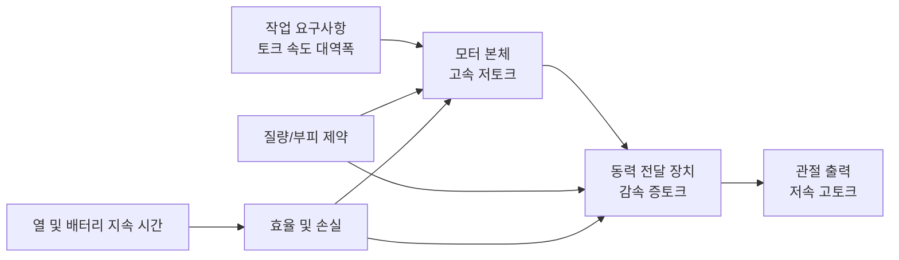

### 4.1.3 안전, 순응성 및 접촉 상호작용

휴머노이드 로봇은 공장이나 가정 환경에서 사람이나 물체와 접촉합니다. 액추에이터가 "강성"이면 충돌 시 접촉력이 순간적으로 매우 커질 수 있습니다. 반면, 순응성을 가진 액추에이터는 충격 에너지를 탄성체에 일시적으로 저장하거나 전류 루프를 통해 외력을 감지하고 능동적으로 물러날 수 있습니다. Neville Hogan이 1985년에 제안한 **임피던스 제어**(impedance control)는 로봇 끝단을 프로그래밍 가능한 "질량-스프링-댐퍼" 시스템으로 표현하여 접촉력과 위치 편차 사이에 제어 가능한 관계를 형성합니다[3].

#### 임피던스 제어의 물리적 기초: 질점-스프링-댐퍼에서 포트 특성까지

로봇 끝단을 질량-스프링-댐퍼 단위로 추상화하면, 그 동역학 방정식은 뉴턴의 제2법칙에서 직접 쓸 수 있습니다.

\[
M_d \, \ddot{x} + B_d \, \dot{x} + K_d \, (x - x_d) = F_{ext}
\]

여기서:
- \(M_d\): 기대 등가 질량(kg), 충돌 시 가속도 응답을 결정합니다.
- \(B_d\): 기대 등가 감쇠(N·s/m 또는 kg/s), 에너지 소산 속도를 결정합니다.
- \(K_d\): 기대 등가 강성(N/m), 위치 편차와 복원력의 관계를 결정합니다.
- \(x_d\): 기대 궤적 위치(m);
- \(F_{ext}\): 환경이 로봇 끝단에 작용하는 외력(N).

라플라스 영역에서 이 방정식은 로봇 포트의 **기계적 임피던스**로 쓸 수 있습니다.

\[
Z(s) = \frac{F_{ext}(s)}{\dot{X}(s)} = M_d s + B_d + \frac{K_d}{s}
\]

그 물리적 의미는 다음과 같습니다. 외부에서 속도 \(\dot{x}\)로 로봇 포트를 "밀면" 로봇은 힘 \(F_{ext}\)로 응답합니다. 임피던스 \(Z(s)\)는 힘과 속도 사이의 동적 전달 함수입니다. 임피던스가 클수록 동일한 속도 섭동에 대해 생성되는 반력이 커져 로봇이 더 "딱딱하게" 작동합니다. 임피던스가 작을수록 반력이 작아져 더 "순응적으로" 작동합니다.

**수치 예시**: 기대 매개변수를 \(M_d=2\ \text{kg}\), \(B_d=50\ \text{N·s/m}\), \(K_d=2000\ \text{N/m}\)로 설정합니다. 로봇 끝단이 외부에서 \(0.01\ \text{m/s}\)의 일정 속도로 밀릴 때, 정상 상태에서는 스프링 항이 지배적이며 접촉력은

\[
F_{ext} \approx K_d \Delta x
\]

0.1초 동안 밀면 변위 증가분 \(\Delta x \approx 0.001\ \text{m}\)이므로,

\[
F_{ext} \approx 2000 \times 0.001 = 2\ \text{N}
\]

반면, 임피던스 제어가 없고 로봇의 강성 위치 루프 강성이 \(K_{pos}=10^5\ \text{N/m}\)로 높은 경우, 동일한 변위는

\[
F_{ext} \approx 10^5 \times 0.001 = 100\ \text{N}
\]

을 생성합니다. 이는 임피던스 제어가 잠재적인 충돌력을 약 두 자릿수 감소시킬 수 있음을 보여줍니다. 더 깊은 임피던스 제어 구현과 수동성 분석은 4.5.6절을 참조하십시오. 전체 로봇 균형/접촉력 계획과의 관계는 6장을 참조하십시오.

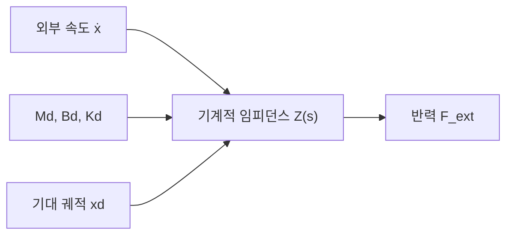

!!! note "용어 설명: 기계적 임피던스, 라플라스 영역, 등가 질량, 등가 감쇠, 등가 강성"
    - **기계적 임피던스(mechanical impedance)**: 힘과 속도 사이의 동적 전달 함수, 단위 N·s/m.
    - **라플라스 영역(Laplace domain)**: 복소 변수 \(s\)를 사용하여 선형 시불변 시스템의 동역학을 설명하는 주파수/연산자 영역.
    - **등가 질량(equivalent mass)**: 임피던스 제어에서 로봇 포트가 나타내는 가상 질량.
    - **등가 감쇠(equivalent damping)**: 임피던스 제어에서 로봇 포트가 나타내는 가상 감쇠, 에너지 소산을 결정합니다.
    - **등가 강성(equivalent stiffness)**: 임피던스 제어에서 로봇 포트가 나타내는 가상 스프링 강성.

!!! note "용어 설명: 순응성, 임피던스, 어드미턴스, 인간-로봇 상호작용 안전"
    - **순응성(compliance)**: 기구가 외력作用下에서 변형을 생성하는 능력. 순응성은 "강성이 낮음"으로 이해되어야 하며, 예를 들어 스프링이 강철 막대보다 더 순응적입니다.
    - **임피던스(impedance)**: 로봇이 외부에 가하는 "저항 특성", 즉 힘과 변위/속도 사이의 관계. 임피던스 제어는 로봇이 외부에 대해 설정된 질량-스프링-댐퍼 시스템으로 작동하도록 합니다.
    - **어드미턴스(admittance)**: 임피던스의 역수로, 외력에 대한 운동의 응답을 나타냅니다. 위치 제어 위주의 시스템은 종종 어드미턴스 제어를 사용하여 힘 조절을 구현합니다.
    - **인간-로봇 상호작용 안전(human-robot interaction safety)**: 기계적 순응성, 힘 제한, 충돌 감지 및 저관성 설계를 통해 잠재적인 충돌로 인한 부상을 허용 가능한 범위로 줄입니다.

종합적으로, 우수한 휴머노이드 로봇 관절은 그림 4.1에 표시된 다차원 공간에서 절충점을 찾아야 합니다.

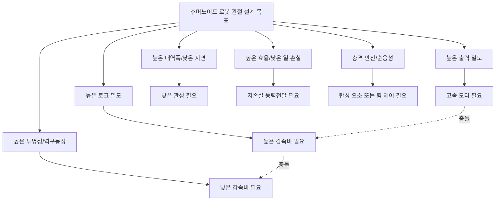


#### 전신 동역학 관점에서의 관절 부하

지금까지 우리는 액추에이터 요구 사항을 토크, 속도, 대역폭 등의 지표로 추상화했습니다. 그러나 이러한 지표는 독립적으로 주어지는 것이 아니라, **전신 역동역학**(whole-body inverse dynamics)이 작업 동작과 접촉 조건으로부터 역산출해 냅니다[36][37]. 이를 이해하면 선정 단계에서 "관절에 필요한 토크 크기"를 경험적 표에서 계산 가능한 물리적 인과 관계로 환원할 수 있습니다.

##### 관절 토크의 라그랑주 유래

\(n\) 자유도 로봇의 동역학은 라그랑주 형식으로 다음과 같이 표현할 수 있습니다.

\[
\tau = M(q)\ddot{q} + C(q,\dot{q})\dot{q} + g(q) - J^T F_{ext}
\]

각 항의 물리적 의미는 다음과 같습니다.

- \(M(q)\): **질량 행렬**(mass matrix), 각 관절 가속도 간의 관성 결합을 설명합니다.
- \(C(q,\dot{q})\dot{q}\): **코리올리 힘과 원심력 항**, 비관성 좌표계와 링크 상대 운동에 의해 발생합니다.
- \(g(q)\): **중력 항**, 로봇 형상에서 중력 위치 에너지의 기울기와 같습니다.
- \(J^T F_{ext}\): **외부 접촉력이 야코비안 전치를 통해 관절 공간으로 매핑된 토크**입니다.
- \(q,\dot{q},\ddot{q}\)는 각각 일반화 좌표, 속도, 가속도입니다.

!!! note "용어 설명: 일반화 좌표, 질량 행렬, 코리올리 힘, 야코비안, 접촉력 스크류"
    - **일반화 좌표(generalized coordinates)**: 시스템의 형상을 유일하게 결정하는 독립 변수 집합으로, 로봇의 경우 일반적으로 관절 각도 \(q\)를 사용합니다.
    - **질량 행렬(mass matrix)**: 라그랑주 동역학에서 양의 정부호 대칭 행렬 \(M(q)\)로, 요소 \(M_{ij}\)는 관절 \(j\)의 가속도가 관절 \(i\)에 필요한 토크에 미치는 영향을 나타냅니다.
    - **코리올리 힘 / 원심력(Coriolis / centrifugal force)**: 링크의 상대 회전으로 인해 비관성계에서 나타나는 관성력 항으로, 속도의 곱에 비례합니다.
    - **야코비안 행렬(Jacobian)**: 관절 속도를 작업 공간 속도(예: 발끝 선속도)로 매핑하는 행렬입니다. 그 전치는 작업 공간 힘을 관절 토크로 다시 매핑합니다.
    - **접촉력 스크류(contact wrench)**: 접촉점에 작용하는 힘과 모멘트의 조합으로, 일반적으로 \(F_{ext} = [f_x,f_y,f_z,m_x,m_y,m_z]^T\)로 표기합니다.


##### 지지기와 스윙기의 부하 특성

걷기 동작에서 한쪽 다리를 예로 들면, 보행 주기는 다음과 같이 나눌 수 있습니다.

1. **지지기(stance phase)**: 발바닥이 지면에 닿아 다리가 역진자처럼 전신 중량을 지지합니다. 이때 고관절, 무릎, 발목의 관절 토크는 주로 **지면 반력**과 중력 모멘트의 균형을 맞추는 데 사용됩니다.
2. **스윙기(swing phase)**: 발이 지면에서 떠나 앞으로 흔들리며, 관절 토크는 주로 자체 링크 관성을 극복하고 빠른 굴곡/신전을 실현하는 데 사용되며, 접촉 항 \(J^T F_{ext}\)은 거의 0입니다.

지지기에서는 무릎 관절 토크가 가장 큰 경우가 많습니다. 지면 반력이 종아리를 통해 무릎 관절에 전달될 때 큰 모멘트 팔이 생성되기 때문입니다. 스윙기에서는 발목 관절이 지면 장애물을 피하기 위해 빠른 배측굴곡/저측굴곡이 필요하며, 주로 발과 종아리의 관성을 극복합니다.

!!! note "용어 설명: 지지기, 스윙기, 지면 반력, 역진자 모델"
    - **지지기(stance phase)**: 보행 주기에서 발이 지면에 접촉하는 단계입니다.
    - **스윙기(swing phase)**: 발이 지면에서 떠서 앞으로 흔들리는 단계입니다.
    - **지면 반력(ground reaction force, GRF)**: 지면이 발바닥에 작용하는 반작용 힘으로, 지지기 동안 체중의 1–1.5배에 달할 수 있습니다.
    - **역진자 모델(inverted pendulum model)**: 지지 다리를 발바닥을 중심으로 회전하는 단진자로 단순화하여 균형에 필요한 토크를 대략적으로 추정하는 데 사용됩니다.

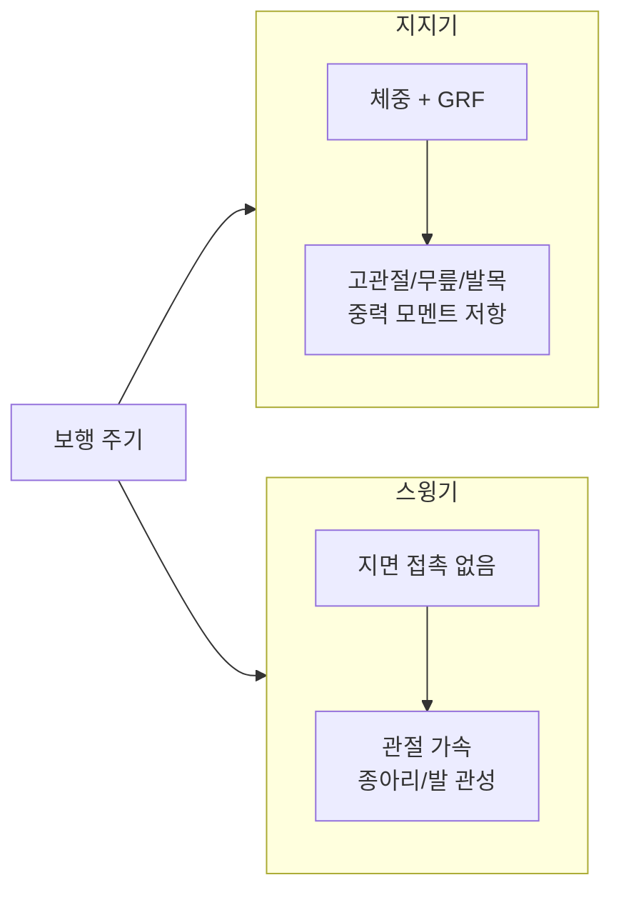

##### 2링크 다리의 무릎 토크 추정

무릎 토크가 왜 그렇게 큰지 정성적으로 이해하기 위해, 다리를 대퇴부(길이 \(l_t\))와 하퇴부(길이 \(l_s\))로 구성된 2링크 모델로 단순화하고, 전신 질량은 몸통 질량 중심에 집중되었다고 가정합니다. 지지기에서 몸통 질량 중심은 발바닥 위쪽에 위치하며, 수평 거리는 대략 지면에 투영된 하퇴부의 길이와 같습니다. 전신 중량 \(m_{tot}g\)이 무릎 관절 수평 전방 거리 \(d\)에 작용한다고 가정하면, 정지 자세를 유지하기 위해 무릎 관절에 필요한 토크는 대략 다음과 같습니다.

\[
\tau_{knee} \approx m_{tot} g \, d
\]

여기서 \(d\)는 발바닥 접촉점에서 무릎 관절까지의 수평 거리입니다. 사람이 직립했을 때 \(d\)는 5–10 cm에 달할 수 있으므로, 80 kg급 로봇이 한쪽 다리로 지지할 때

\[
\tau_{knee} \approx 80 \times 9.8 \times 0.08 \approx 63\ \text{N·m}
\]

이는 준정적 추정에 불과합니다. 지면 반력 피크, 동적 가속도 및 무릎 관절 자체 가속도를 고려하면 실제 피크 토크는 1.5–2.5배 더 커집니다. 이 간단한 모델은 무릎 관절 토크가 고관절과 비슷하거나 더 클 수 있음을 보여줍니다. 무릎 관절에서 지면 반력의 모멘트 팔이 고관절보다 더 긴 경우가 많기 때문입니다[38].

!!! note "용어 설명: 2링크 모델, 모멘트 팔, 준정적 추정, 지면 반력 모멘트 팔"
    - **2링크 모델(two-link model)**: 대퇴부와 하퇴부를 각각 하나의 링크로 단순화한 동역학 근사 모델입니다.
    - **모멘트 팔(moment arm)**: 힘의 작용선에서 회전축까지의 수직 거리로, 토크 크기를 결정합니다.
    - **준정적 추정(quasi-static estimate)**: 가속도 관성력을 무시하고 정적 힘 평형만으로 부하를 추정하는 방법입니다.
    - **지면 반력 모멘트 팔(GRF moment arm)**: 지면 반력 작용선에서 관절 축까지의 거리로, 관절 토크의 주요 원천입니다.

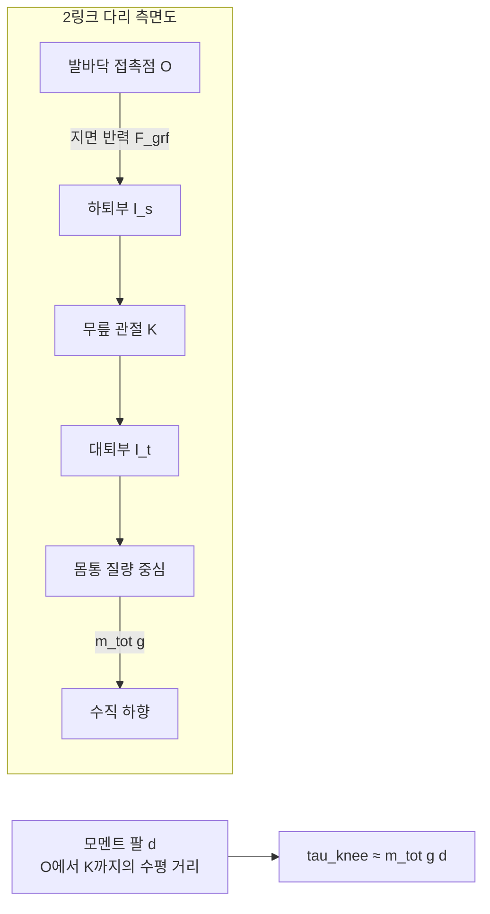

##### 접촉력 스크류의 관절 전달

발바닥이 지면 반력 \(F_{grf}\)을 받을 때, 이 힘은 하퇴부, 발목 관절, 무릎 관절, 고관절을 통해 위쪽으로 전달됩니다. 발끝에서 관절 \(i\)까지의 야코비안을 \(J_i\)라고 하면, 관절 토크 증분은 다음과 같습니다.

\[
\Delta \tau_i = J_i^T F_{grf}
\]

**발뒤꿈치 착지(heel-strike)** 순간, 지면 반력은 하퇴부 방향으로 큰 축력을 발생시키고, 동시에 발목 관절에서 모멘트 팔이 매우 짧은 토크를 형성하므로 발목 토크에 스파이크가 나타납니다. **발구름(push-off)** 단계에서는 저측굴곡근이 발목 관절을 통해 큰 추력을 출력해야 하므로, 역시 발목 토크 피크가 발생합니다. 발목 관절은 지면에 가장 가깝고 모멘트 팔이 짧기 때문에, 동일한 지면 모멘트를 생성하려면 더 큰 관절 토크가 필요하며, 이것이 바로 발목 액추에이터의 피크 토크가 매우 높은 이유입니다.

!!! note "용어 설명: 발뒤꿈치 착지, 발구름, 관절 토크 스파이크, 토크 전달"
    - **발뒤꿈치 착지(heel-strike)**: 스윙하는 발이 지면에 닿는 순간의 충격 접촉입니다.
    - **발구름(push-off)**: 지지기 말기에 발이 뒤쪽 아래로 지면을 밀어 몸을 추진하는 동작입니다.
    - **관절 토크 스파이크(torque spike)**: 충격이나 급속한 부하로 인한 단시간 고토크 현상입니다.
    - **토크 전달(torque transmission)**: 접촉력이 링크의 기하학적 관계를 통해 각 관절에서 생성되는 토크입니다.


##### 동적 및 정적 구동 여유

공학에서는 일반적으로 2단계 방법으로 액추에이터 사양을 결정합니다.

1. **준정적 worst-case**: 로봇이 극단적인 자세(예: 한쪽 다리로 서서 최대한 앞으로 기울이거나, 가장 깊게 쪼그린 상태)에 있을 때 각 관절에 필요한 토크를 계산합니다.
2. **동적 증폭**: 위의 정적 토크에 동적 증폭 계수 \(k_{dyn} \approx 1.5\sim2.5\)를 곱하여 보행, 점프 또는 낙상 회복 시의 관성 부하를 포함시킵니다.

전체 궤적 최적화는 더 정확하지만, 전체 작업 궤적과 접촉 시퀀스를 미리 알아야 하며 계산 비용이 높습니다. 반면, quasi-static + dynamic margin 방법은 초기 설계 단계에서 모터와 감속비를 빠르게 선별하는 데 유용합니다. 관절의 피크 토크 여유가 부족할 경우, 이후 감속비를 높이거나 더 큰 모터로 교체해야 하며, 이는 질량과 투명성(transparency) 측면에서 손실을 초래합니다.

!!! note "용어 설명: 구동 여유, 동적 증폭 계수, worst-case 자세, 궤적 최적화"
    - **구동 여유(actuation margin)**: 작업에 필요한 피크 토크 대비 액추에이터 피크 토크의 여유 비율.
    - **동적 증폭 계수(dynamic amplification factor)**: 준정적 토크를 동적 토크로 증폭하는 경험적 계수.
    - **worst-case 자세**: 관절 토크를 최대화하는 극단적인 정적 형상.
    - **궤적 최적화(trajectory optimization)**: 동역학적 제약 조건을 만족시키면서 운동 궤적과 접촉력을 동시에 최적화하는 수치적 방법.

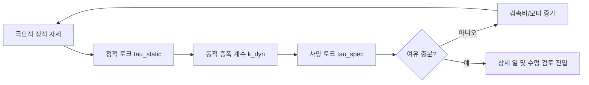


---

## 4.2 모터 기초: 전자기학, 역학 및 열학

### 모터 전자기장 기초: 맥스웰 방정식에서 유한요소 사상까지

모터 토크와 치수에 대한 구체적인 계산에 들어가기 전에, 전자기장의 연속체 기술로부터 모터 설계의 물리적 기초를 설명할 필요가 있습니다. 영구자석 모터는 본질적으로 고정자, 회전자, 공극에서의 자기장 분포를 푸는 경계값 문제입니다[8][29].

#### 모터 설계에서의 맥스웰 방정식

모터의 동작 주파수가 빛의 속도보다 훨씬 낮을 때, 변위 전류는 무시할 수 있으며 자기장은 **정자기학**(magnetostatics) 방정식을 만족합니다:

\[
\nabla \times \mathbf{H} = \mathbf{J}, \qquad
\nabla \cdot \mathbf{B} = 0, \qquad
\mathbf{B} = \mu \mathbf{H}
\]

여기서:

- \(\mathbf{H}\): 자기장 세기, 단위 A/m;
- \(\mathbf{B}\): 자기 유도, 단위 T;
- \(\mathbf{J}\): 전류 밀도, 단위 A/m²;
- \(\mu = \mu_r \mu_0\): 재료의 투자율.

시간 변화 항을 복원하면 완전한 맥스웰-앙페르 법칙은

\[
\nabla \times \mathbf{H} = \mathbf{J} + \frac{\partial \mathbf{D}}{\partial t}
\]

그리고 자기장 가우스 법칙

\[
\nabla \cdot \mathbf{B} = 0
\]

적분 형태는 각각 앙페르 회로 법칙과 자속 연속 법칙입니다. 정자기학에서 변위 전류를 무시하는 타당성은 모터에서 전기장의 변화율이 전도 전류 밀도보다 훨씬 작기 때문에 \(\partial \mathbf{D}/\partial t\)가 자기장에 기여하는 바를 무시할 수 있기 때문입니다.

!!! note "용어 설명: 맥스웰 방정식, 정자기학, 앙페르 회로 법칙, 자속 연속, 투자율"
    - **맥스웰 방정식(Maxwell's equations)**: 전기장, 자기장과 전하, 전류 사이의 관계를 설명하는 네 가지 기본 방정식.
    - **정자기학(magnetostatics)**: 시간에 따라 변하지 않는 자기장 문제를 연구하는 분야로, 변위 전류를 무시합니다.
    - **앙페르 회로 법칙(Ampère's circuital law)**: 폐곡선을 따른 자기장 세기의 선적분은 해당 곡선으로 둘러싸인 면적을 통과하는 전도 전류와 같습니다.
    - **자속 연속(magnetic flux continuity)**: 임의의 폐곡면을 통과하는 자속은 0입니다. 즉, 자기 단극자는 존재하지 않습니다.
    - **투자율(permeability)**: 재료의 자기장 전도 능력, \(\mu = \mu_r \mu_0\).

##### 자기 벡터 전위와 2차원 푸아송 방정식

\(\nabla \cdot \mathbf{B}=0\)이므로 **자기 벡터 전위** \(\mathbf{A}\)를 도입하여

\[
\mathbf{B} = \nabla \times \mathbf{A}
\]

2차원 모터 단면 문제의 경우, 자기장이 \(z\) 방향 성분 \(A_z(x,y)\)만 있고 전류 밀도도 \(z\) 방향 성분 \(J_z\)만 있다고 가정하면, \(\nabla \times \mathbf{H} = \mathbf{J}\)에 대입하여 다음을 얻습니다.

\[
\nabla \cdot \left( \frac{1}{\mu} \nabla A_z \right) = -J_z
\]

이것은 모터 유한요소 해석기의 핵심 방정식입니다. JMAG, Ansys Maxwell, Altair Flux, FEMM과 같은 상용 소프트웨어는 고정자, 회전자, 영구자석, 공기 영역을 삼각형 또는 사각형 메쉬로 이산화하고 각 요소 내에서 \(A_z\)를 근사한 후 위 편미분 방정식의 약형을 풉니다[8][29].

!!! note "용어 설명: 자기 벡터 전위, 푸아송 방정식, 유한요소법, 메쉬, 약형"
    - **자기 벡터 전위(magnetic vector potential)**: 회전이 자기 유도를 제공하는 보조 벡터장.
    - **푸아송 방정식(Poisson equation)**: \(\nabla^2 u = -f\) 형태의 2차 타원형 편미분 방정식.
    - **유한요소법(finite element method, FEM)**: 연속 영역을 유한한 작은 요소로 이산화하여 수치적으로 해를 구하는 방법.
    - **메쉬(mesh)**: 이산화된 요소의 집합으로, 수치 해의 정밀도와 계산량을 결정합니다.
    - **약형(weak form)**: 시험 함수를 곱하고 부분 적분하여 얻은 적분 방정식으로, 유한요소 이산화에 적합합니다.


##### 연속체에서 집중 자로로

연속체 모델에서 재료의 "자속 방해" 능력은 \(1/\mu\)로 나타납니다. 자기장을 하나의 가느다란 자속관으로 제한하면, 관의 길이를 따라 적분하여 다음을 얻습니다.

\[
\mathcal{R} = \int \frac{dl}{\mu A}
\]

이것은 4.2.6절에서 소개된 등가 자로의 자기 저항 \(R = l/(\mu A)\)의 근원입니다. 따라서 집중 자로 모델은 "단일 자속관, 균일 단면" 가정 하의 유한요소 연속체 모델의 이산 근사입니다. 자로법은 계산이 빠르고 물리적으로 직관적이어서 초기 설계 및 매개변수 스캔에 적합합니다. 그러나 다음을 포착할 수 없습니다:

- **돌극 효과와 자기 포화**: 철심의 국부적 포화는 국소 투자율을 변화시켜 선형 자로 가정을 무효화합니다;
- **단부 효과**: 축 방향 3차원 누설 자속, 권선 단부 자기장은 2차원 모델에서 표현할 수 없습니다;
- **슬롯과 고조파**: 개방 슬롯으로 인한 공극 투자율 고조파는 정밀한 메쉬로만 분해할 수 있습니다.

이것이 고성능 모터 설계에 FEM이 반드시 필요한 이유입니다.

!!! note "용어 설명: 자기 저항, 집중 자로, 자기 포화, 누설 자속, 슬롯 고조파"
    - **자기 저항(reluctance)**: 자로의 자속 방해, \(\mathcal{R}=l/(\mu A)\).
    - **집중 자로(lumped magnetic circuit)**: 자기 저항, 기자력원, 자속 등의 집중 요소로 자기장을 근사하는 모델.
    - **자기 포화(magnetic saturation)**: 강자성 재료에서 투자율이 자속 밀도 증가에 따라 감소하는 현상.
    - **누설 자속(leakage flux)**: 주 자로를 통과하지 않고 공기 중에서 폐회로를 형성하는 자속.
    - **슬롯 고조파(slot harmonic)**: 고정자 개방 슬롯으로 인한 공극 투자율의 주기적 변화.

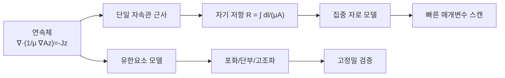

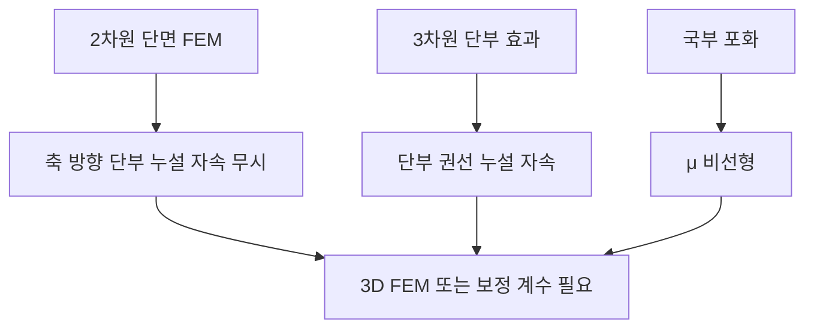

### 4.2.1 로렌츠 힘과 모터 토크

모터가 토크를 발생시키는 근본적인 원천은 자기장이 움직이는 전하 또는 전류가 흐르는 도체에 작용하는 힘, 즉 **로렌츠 힘**(Lorentz force)입니다. 길이가 \(l\)이고 전류 \(I\)가 흐르는 도체가 자기 유도 \(B\)인 자기장 내에 있을 때 받는 암페어 힘은

$$
\mathbf{F} = I \, \mathbf{l} \times \mathbf{B}
$$

크기는 \(F = B I l \sin\theta\)이며, 방향은 오른손 법칙(또는 외적)에 의해 결정됩니다. 회전 모터에서 많은 도체가 회전자 슬롯에 고정되어 있으며, 반경 \(r\)에 있는 각 도체가 생성하는 접선 방향 힘이 함께 토크를 형성합니다:

$$
\tau = \sum_i r_i F_i = \sum_i r_i B_i l_i I_i \sin\theta_i
$$

등가 총 도체 수 \(N\), 평균 반경 \(r\) 및 공극 자속 밀도 \(B\)로 표현하면 공학에서 일반적으로 사용되는 형태로 쓸 수 있습니다:

$$
\tau = k_t \, I
$$

여기서 \(k_t = N B l r\) (기하학적 요소와 자기장 요소를 결합)은 **토크 상수**라고 합니다. 이 관계는 자기장이 결정된 경우 모터 출력 토크가 전기자 전류에 비례함을 보여줍니다.

!!! note "용어 설명: 로렌츠 힘, 암페어 힘, 자기 유도 밀도, 자속, 쇄교 자속, 토크 상수"
    - **로렌츠 힘(Lorentz force)** : 전자기장이 운동하는 전하에 작용하는 힘 \(\mathbf{F}=q(\mathbf{E}+\mathbf{v}\times\mathbf{B})\). 도체에서는 캐리어 전체가 받는 암페어 힘으로 나타난다.
    - **암페어 힘(Ampère force)** : 전류가 흐르는 도선이 자기장에서 받는 힘으로, 본질적으로 로렌츠 힘의 거시적 통계 결과이다.
    - **자기 유도 밀도(magnetic flux density)** : 자기장의 세기와 방향을 나타내는 물리량으로 \(B\)로 표시하며, 단위는 테슬라(T). 전동기에서는 영구 자석 또는 여자 권선에 의해 발생한다.
    - **자속(magnetic flux)** : 어떤 면적을 통과하는 자기장의 총량 \(\Phi = \int \mathbf{B}\cdot d\mathbf{A}\), 단위는 웨버(Wb).
    - **쇄교 자속(flux linkage)** : 코일의 권수와 각 권선의 자속의 곱 \(\lambda = N \Phi\)으로, 자기장과 코일의 결합 정도를 나타낸다. 역기전력은 쇄교 자속의 시간 변화율에 비례한다.
    - **토크 상수(torque constant, \(k_t\))** : 전류가 토크를 발생시키는 계수로, 단위는 N·m/A. 영구 자석 전동기에서 \(k_t\)와 \(k_e\)는 SI 단위계에서 수치가 동일하다.


### 4.2.2 직류 전동기의 등가 회로와 전압 방정식

전동기 구동을 이해하기 위해 먼저 직류 유지 전동기를 등가 회로로 추상화한다: 전기자는 저항 \(R_a\), 인덕턴스 \(L_a\), 그리고 운동 유도 전압원(역기전력 \(E_b\))의 직렬 연결로 볼 수 있다. 외부에서 단자 전압 \(V\)를 인가할 때 회로 방정식은 다음과 같다.

$$
V = R_a I + L_a \frac{dI}{dt} + E_b
$$

정상 상태에서는 인덕턴스 항이 0이 되므로 전류는

$$
I = \frac{V - E_b}{R_a}
$$

역기전력은 회전 속도에 비례한다:

$$
E_b = k_e \, \omega
$$

여기서 \(k_e\)는 **역기전력 상수**이며, 단위는 V·s/rad 또는 V/(rad/s)이다. SI 단위계에서 영구 자석 전동기의 \(k_t\)(N·m/A)와 \(k_e\)(V·s/rad)는 수치가 동일하다.

정상 상태 토크는 다음과 같이 쓸 수 있다.

$$
\tau = k_t \, I = k_t \frac{V - k_e \omega}{R_a}
$$

이는 고정된 단자 전압에서 회전 속도가 높을수록 역기전력이 커져 사용 가능한 전류가 작아지고, 따라서 출력 토크가 낮아짐을 의미한다. 이것이 바로 직류 전동기의 자연스러운 **토크-속도 특성**이다.

!!! note "용어 설명: 역기전력, 전기자 저항, 전기자 인덕턴스, 전압 방정식, 기계적 특성"
    - **역기전력(back electromotive force, back-EMF)** : 도체가 자기장 내에서 운동할 때 자속을 절단하여 발생하는 유도 기전력으로, 방향은 인가 전압과 반대이며 크기는 회전 속도에 비례한다.
    - **전기자 저항(armature resistance)** : 전동기 권선과 정류자의 등가 저항 \(R_a\)으로, 동손 \(I^2 R_a\)을 발생시킨다.
    - **전기자 인덕턴스(armature inductance)** : 권선의 등가 인덕턴스 \(L_a\)로, 전류 변화율을 제한하며 전기적 시상수 \(\tau_e = L_a/R_a\)를 만든다.
    - **전압 방정식** : 인가 전압이 저항 전압 강하, 인덕턴스 전압 강하 및 역기전력에 의해 어떻게 평형을 이루는지 설명하는 관계식.
    - **기계적 특성** : 일정 전압에서 전동기의 토크가 회전 속도에 따라 변화하는 곡선으로, 일반적으로 구속 토크에서 무부하 속도까지 내려가는 직선이다.

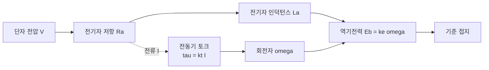

### 4.2.3 교류 회전 자기장과 영구 자석 동기 전동기

실제 인간형 로봇에는 **영구 자석 동기 전동기**(PMSM)가 많이 사용된다. 고정자 3상 권선에 위상차 120°인 정현파 전류를 인가하면 공극에 전기 각속도 \(\omega_e\)로 회전하는 자기장이 형성된다:

$$
\omega_e = 2 \pi f = p \, \omega_m
$$

여기서 \(f\)는 전류 주파수, \(p\)는 **극 쌍 수**, \(\omega_m\)은 기계 각속도이다. 회전자에는 영구 자석이 장착되어 있으며, 그 자기장은 고정자 회전 자기장에 의해 "끌려" 동기 회전한다. 동기 속도는 다음과 같다.

$$
n_s = \frac{60 f}{p} \quad (\text{r/min})
$$

!!! note "용어 설명: 영구 자석 동기 전동기, 극 쌍 수, 동기 속도, 전기 각속도, 기계 각속도, 회전 자기장"
    - **영구 자석 동기 전동기(permanent magnet synchronous motor, PMSM)** : 회전자에 영구 자석을 사용하여 여자 자기장을 발생시키고, 고정자에 교류를 인가하여 회전 자기장을 형성하여 동기 회전하는 전동기.
    - **극 쌍 수(pole pair number, \(p\))** : 전동기 내 N-S 자극의 쌍 수. 극 쌍 수가 많을수록 동일한 기계 속도에 대한 전기 주파수가 높아진다.
    - **동기 속도(synchronous speed)** : 회전 자기장의 회전 속도. 회전자는 이상적으로 이 속도로 운전된다.
    - **전기 각속도(electrical angular velocity)** : 전기 주기로 측정한 각속도로, 기계 각속도의 \(p\)배이다.
    - **회전 자기장(rotating magnetic field)** : 다상 교류 권선에 의해 공간에서 일정한 속도로 회전하는 자기장으로, 교류 전동기 작동의 기초이다.

**자계 방향 제어**(FOC) 하에서는 고정자 전류를 회전자와 함께 회전하는 \(d\)축(직축, 영구 자석 쇄교 자속과 정렬)과 \(q\)축(교축, \(d\)축보다 90° 전기각 앞섬)으로 분해한다. 표면 부착형 영구 자석 전동기(SPMSM)의 경우 \(L_d = L_q\)이며, 전자기 토크는

$$
\tau = \frac{3}{2} p \, \lambda_f \, i_q
$$

매입형 영구 자석 전동기(IPMSM)의 경우 **릴럭턴스 토크**가 존재한다:

$$
\tau = \frac{3}{2} p \left[ \lambda_f i_q + (L_d - L_q) i_d i_q \right]
$$

여기서 \(\lambda_f\)는 영구 자석에 의해 발생된 회전자 쇄교 자속이다. 첫 번째 항은 영구 자석 토크이고, 두 번째 항은 \(d\), \(q\)축 인덕턴스 차이로 인한 릴럭턴스 토크이다.

!!! note "용어 설명: 직축, 교축, 쇄교 자속, 릴럭턴스 토크, 돌극 효과, 매입형 영구 자석 전동기"
    - **직축(d-axis)** : 회전자 영구 자석 쇄교 자속 방향과 일치하는 축으로, \(d\)로 표기한다.
    - **교축(q-axis)** : 직축보다 90° 전기각 앞서는 축으로, 토크를 발생시키는 주요 전류 방향이다.
    - **쇄교 자속(flux linkage, \(\lambda_f\))** : 회전자 영구 자석이 고정자 권선에 결합하는 쇄교 자속으로, 영구 자석 토크의 원천이다.
    - **릴럭턴스 토크(reluctance torque)** : 자기 회로의 이방성(\(L_d \neq L_q\))으로 인해 전류가 \(d\), \(q\)축에서 서로 다른 자기 저항을 만들어 발생하는 추가 토크.
    - **돌극 효과(salient-pole effect)** : 회전자 \(d\), \(q\)축의 자기 저항이 달라 \(L_d \neq L_q\)가 되는 현상.
    - **매입형 영구 자석 전동기(IPMSM)** : 영구 자석이 회전자 철심 내부에 매립되어 있으며, 릴럭턴스 토크를 활용하여 토크 밀도를 높이며, 주로 견인 전동기에 사용된다.

### 4.2.4 무브러시 직류 전동기와 정현파 영구 자석 동기 전동기의 정류 및 FOC

**무브러시 직류 전동기**(BLDC)와 PMSM은 구조가 유사하지만 역기전력 파형이 다르다: BLDC는 사다리꼴 파형으로 설계되어 간단한 6단 정류(60° 전기각마다 도통 상을 전환)와 함께 사용된다; PMSM의 역기전력은 정현파이며, FOC와 함께 사용하면 더 작은 토크 리플과 더 높은 효율을 얻을 수 있다.

!!! note "용어 설명: 무브러시 직류 전동기, 사다리꼴 역기전력, 6단 정류, 홀 센서, 정현파 역기전력"
    - **무브러시 직류 전동기(brushless DC motor, BLDC)** : 기계적 브러시를 전자적 정류로 대체한 직류 전동기로, 일반적으로 역기전력이 사다리꼴 파형이며 제어가 간단하고 비용이 낮다.
    - **사다리꼴 역기전력 / 정현파 역기전력** : 각각 전동기 권선의 유도 전압이 회전자 위치에 따라 사다리꼴 또는 정현파로 변화하는 것을 의미한다. 정현파 전동기는 정현파 전류와 함께 사용하여 토크 리플을 제로로 만들 수 있다.
    - **6단 정류(six-step commutation)** : BLDC에서 60° 전기각마다 도통 상을 전환하며, 임의의 순간에 두 상이 도통되고 한 상은 개방된다.
    - **홀 센서(Hall sensor)** : 회전자 자극 위치를 감지하는 자기 스위치로, BLDC 정류에 자주 사용된다.

**자계 방향 제어**의 핵심 개념은 3상 정지 좌표계의 전류를 **Clark 변환**을 통해 2상 정지 \(\alpha\beta\) 좌표계로 변환하고, 다시 **Park 변환**을 통해 회전자와 함께 회전하는 \(dq\) 좌표계로 변환하여 교류량을 직류량으로 만든 후, PI 제어기로 \(i_d\)와 \(i_q\)를 각각 제어하는 것입니다. 마지막으로 **공간 벡터 펄스 폭 변조**(SVPWM)를 통해 3상 인버터 스위칭 신호를 생성합니다.

!!! note "용어 설명: 자계 방향 제어, Clark 변환, Park 변환, 공간 벡터 펄스 폭 변조, 인버터"
    - **자계 방향 제어(field-oriented control, FOC)**: 고정자 전류 벡터를 회전자 회전 좌표계로 분해하여 독립적으로 제어함으로써 교류 전동기를 직류 전동기처럼 쉽게 토크를 제어할 수 있도록 합니다.
    - **Clark 변환**: 3상 정지 좌표계 \(abc\)를 2상 정지 좌표계 \(\alpha\beta\)로 변환합니다.
    - **Park 변환**: 2상 정지 좌표계 \(\alpha\beta\)를 회전자와 함께 회전하는 \(dq\) 좌표계로 변환합니다.
    - **공간 벡터 펄스 폭 변조(SVPWM)**: 3상 인버터가 목표 전압 벡터에 가장 가까운 출력을 내도록 하는 PWM 방식으로, 정현파 PWM보다 전압 이용률이 약 15% 높습니다.
    - **인버터(inverter)**: 직류 전력을 교류 전력으로 변환하는 전력 전자 회로로, 일반적으로 6개의 스위칭 소자로 3상 브리지를 구성합니다.

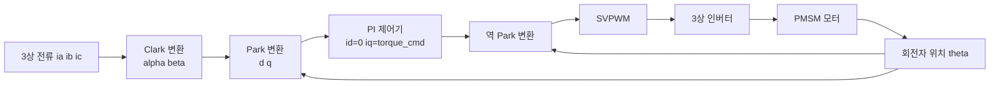

### 4.2.5 프레임리스 토크 모터와 관절 통합

휴머노이드 로봇의 고관절, 어깨 관절은 종종 수십에서 수백 N·m의 출력 토크를 필요로 합니다. 일반 서보 모터에 높은 감속비를 사용하면 토크를 증폭할 수 있지만, 투명성과 대역폭을 희생합니다. 한 가지 해결책은 **프레임리스 토크 모터**(frameless torque motor)를 사용하는 것입니다. 이 모터는 고정자와 회전자를 관절 구조에 직접 내장하고, 하우징, 엔드 캡 및 베어링을 제거하며, 직경이 크고 극 수가 많아 저속에서 직접 큰 토크를 출력할 수 있습니다.

프레임리스 토크 모터의 토크 밀도는 다음과 같이 표현할 수 있습니다.

$$
\tau = 2 \pi r^2 l B_{\text{gap}} J_s
$$

여기서 \(r\)은 공극 반경, \(l\)은 축 방향 길이, \(B_{\text{gap}}\)은 공극 자속 밀도, \(J_s\)는 전기 부하(권선 총 전류 per 둘레)입니다. \(r\)을 증가시키면 토크는 제곱에 비례하여 증가하므로, 대구경 프레임리스 모터는 동일한 질량에서 더 높은 토크를 얻을 수 있습니다.

!!! note "용어 설명: 프레임리스 토크 모터, 전기 부하, 공극, 직접 구동, 토크 모터"
    - **프레임리스 토크 모터(frameless torque motor)**: 하우징, 회전축 및 엔드 캡이 없는 모터로, 사용자가 고정자와 회전자를 기계 구조에 직접 통합하여 토크 밀도를 극대화합니다.
    - **전기 부하(electric loading)**: 단위 원주 길이당 총 암페어 도체 수로, 권선의 "전류 운반 능력"을 나타냅니다.
    - **공극(air gap)**: 고정자와 회전자 사이의 미세한 공기 간극으로, 자속이 이를 가로질러야 합니다. 공극이 작을수록 자기 저항이 낮지만, 제조 및 열 변형에 대한 요구 사항이 더 높아집니다.
    - **직접 구동(direct drive)**: 모터가 감속기를 거치지 않고 직접 부하를 구동하며, 백래시가 없고 투명성이 높지만, 큰 토크의 모터가 필요합니다.
    - **토크 모터(torque motor)**: 저속 대토크용으로 설계된 모터로, 일반적으로 직경이 크고 극 수가 많습니다.

Tesla Optimus의 회전 관절은 프레임리스 토크 모터와 하모닉 드라이브 감속기를 결합한 일체형 솔루션을 채택한 것으로 알려져 있습니다[14].

### 4.2.6 손실 및 열 모델

모터는 이상적인 에너지 변환기가 아니며, 손실은 주로 열 형태로 소산됩니다.主要有三类:

1. **동손**(권선 저항 발열):
   $$
   P_{\text{Cu}} = I^2 R_{\text{ac}}
   $$
   여기서 \(R_{\text{ac}}\)는 교류 등가 저항이며, 주파수에 따라 약간 증가합니다.

2. **철손**(자심에서의 히스테리시스 및 와전류 손실):
   $$
   P_{\text{Fe}} = P_{\text{hyst}} + P_{\text{eddy}} \approx k_h f B^n + k_e f^2 B^2
   $$
   여기서 \(f\)는 자화 주파수, \(B\)는 자속 밀도 진폭, \(n\)은 Steinmetz 계수(일반적으로 1.6-2.2)입니다.

3. **기계적 손실**: 베어링 마찰 및 풍손으로, 일반적으로 작습니다.

!!! note "용어 설명: 동손, 철손, 히스테리시스 손실, 와전류 손실, 열 저항, 절연 등급, 열 시정수"
    - **동손(copper loss)**: 전류가 권선 저항을 통해 흐를 때 발생하는 줄 열로, 전류의 제곱에 비례합니다.
    - **철손 / 철심 손실(core loss)**: 교번 자계가 강자성 재료에서 발생시키는 에너지 손실로, 히스테리시스 손실과 와전류 손실을 포함합니다.
    - **히스테리시스 손실(hysteresis loss)**: 강자성 재료가 반복적으로 자화될 때 자구벽 이동 마찰로 인한 에너지 손실로, 주파수와 자속 밀도와 관련이 있습니다.
    - **와전류 손실(eddy current loss)**: 교번 자계가 전도성 철심에 유도하는 와전류로 인해 발생하는 줄 열로, 주파수의 제곱에 비례합니다.
    - **열 저항(thermal resistance)**: 열 전달 경로가 온도 상승에 대해 갖는 저항으로, 단위는 K/W입니다. 온도 상승 = 손실 × 열 저항.
    - **절연 등급(insulation class)**: 모터 권선 절연 재료가 허용하는 최고 작동 온도로, 예를 들어 F등급 155 °C, H등급 180 °C입니다.
    - **열 시정수(thermal time constant)**: 모터 온도가 정상 상태 온도 상승의 63%에 도달하는 데 필요한 시간으로, 단시간 과부하 용량을 결정합니다.

모터의 열적 거동은 1차 열 등가 회로로 설명할 수 있습니다.

$$
T_j = T_{\text{amb}} + P_{\text{loss}} \, R_{\text{th}}
$$

여기서 \(T_j\)는 권선(접합) 온도, \(T_{\text{amb}}\)는 주변 온도, \(R_{\text{th}}\)는 총 열 저항입니다. 열용량 \(C_{\text{th}}\)를 고려하면 온도 변화는 다음을 만족합니다.

$$
C_{\text{th}} \frac{dT_j}{dt} + \frac{T_j - T_{\text{amb}}}{R_{\text{th}}} = P_{\text{loss}}
$$

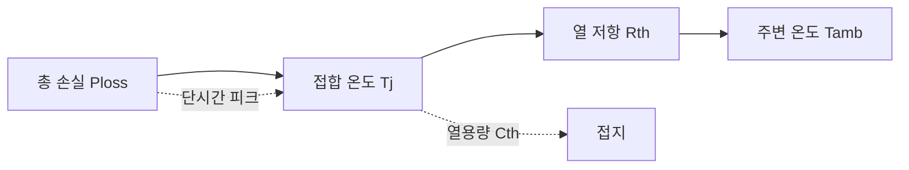

권선 온도가 절연 한계에 가까워지면 전류를 낮추거나 냉각을 증가시켜야 하며, 이는 **연속 토크**와 **피크 토크**의 차이를 결정합니다. 피크 토크는 단시간 동안 연속 값을 초과할 수 있으며, 열용량이 순간 열을 흡수하지만 지속할 수는 없습니다.

#### 2-노드 열 네트워크 모델

단일 노드 모델은 권선에서 주변까지의 평균 온도 상승만 제공할 수 있으며, 단시간 피크 동안 "권선이 먼저 뜨거워지고 하우징이 나중에 뜨거워지는" 과도 거동을 설명할 수 없습니다. 더 정밀한 모델은 모터를 **권선 노드** \(T_w\)와 **하우징 노드** \(T_c\)의 두 열 노드로 나눕니다. 두 노드 사이는 열 저항 \(R_{th1}\)과 열용량 \(C_w\)로 설명하고, 하우징에서 주변까지는 \(R_{th2}\)와 \(C_c\)로 설명합니다(그림 4.2(c) 참조).

\[
\begin{aligned}
C_w \frac{dT_w}{dt} &= P_{\text{loss}} - \frac{T_w - T_c}{R_{th1}} \\
C_c \frac{dT_c}{dt} &= \frac{T_w - T_c}{R_{th1}} - \frac{T_c - T_{\text{amb}}}{R_{th2}}
\end{aligned}
\]

2-노드 모델은 단시간 과부하를 더 정확하게 예측할 수 있습니다. 권선 열용량 \(C_w\)가 존재하기 때문에 수 초간 지속되는 전류 피크는 \(T_w\)만 순간적으로 상승시키고 하우징 온도 \(T_c\)는 거의 변하지 않습니다. 따라서 피크 토크는 연속 토크보다 훨씬 높을 수 있습니다. 과부하 지속 시간이 권선 열 시정수와 비슷해질 때만 절연 과열을 걱정해야 합니다.

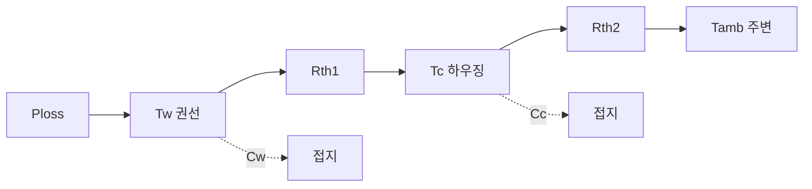

!!! note "용어 설명: 2-노드 열 네트워크, 열저항, 열용량, 과도 열 임피던스, 열 시상수"
    - **2-노드 열 네트워크 (two-node thermal network)** : 전동기를 권선과 하우징이라는 두 개의 열 노드로 단순화한 집중 파라미터 열 모델.
    - **열저항 (thermal resistance, \(R_{th}\))** : 열 전달 경로가 온도 상승에 대해 갖는 저항, 단위 K/W.
    - **열용량 (thermal capacitance, \(C_{th}\))** : 물체가 열 에너지를 저장하는 능력으로, 온도 변화 속도를 결정하며 단위는 J/K.
    - **과도 열 임피던스 (transient thermal impedance)** : 시간에 따라 변하는 유효 열저항으로, \(Z_{th}(t)=\Delta T(t)/P\)이며 단시간 과부하 평가에 사용됨.
    - **열 시상수 (thermal time constant, \(\tau_{th}=R_{th}C_{th}\))** : 온도가 정상 상태 온도 상승의 63%에 도달하는 데 걸리는 시간.

#### 표면 부착 영구자석 전동기의 등가 자기 회로

전동기 토크와 기하학적 치수를 보다 정량적으로 연결하기 위해, 표면 부착 영구자석 전동기(SPMSM)를 하나의 **등가 자기 회로**로 추상화할 수 있습니다. 영구자석은 일정한 기자력(MMF) 소스 \(F_m\) 과 내부 자기 저항 \(R_m\) 이 직렬로 연결된 것으로 간주됩니다. 공극, 고정자 치, 고정자 요크는 각각 자기 저항 \(R_g\), \(R_t\), \(R_y\) 로 표현됩니다. 자기 회로의 키르히호프 법칙에 따라 총 자속은 다음과 같습니다.

\[
\Phi = \frac{F_m}{R_m + R_g + R_t + R_y}
\]

고품질 규소강판에서 철심의 자기 저항은 일반적으로 공극 자기 저항보다 훨씬 작습니다. 즉, \(R_t+R_y \ll R_g\)입니다. 또한 영구자석과 공극의 등가 단면적이 거의 같다고 가정하면, 공극 자속 밀도는 다음과 같이 쓸 수 있습니다.

\[
B_g \approx \frac{\mu_0 F_m}{g' + l_m/\mu_r}
\]

여기서 \(g' = k_c g\)는 고정자 슬롯의 영향을 고려한 **카터 등가 공극**(Carter gap)이며, \(k_c>1\)은 카터 계수입니다. \(l_m\)과 \(\mu_r\)은 각각 영구자석 두께와 상대 투자율입니다. 이 식은 다음을 나타냅니다.

- 영구자석 두께 \(l_m\)을 증가시키면 기자력은 높아지지만 내부 자기 저항도 증가하므로 최적 두께가 존재합니다.
- 공극 \(g\)를 줄이면 자기 회로의 총 자기 저항이 크게 낮아져 \(B_g\)가 증가하지만, 제조 공차, 열 변형 및 기계적 안전성에 의해 제한됩니다.
- 더 높은 잔류 자속 밀도 \(B_r\)(즉, 더 높은 \(F_m\))를 가진 Nd-Fe-B 자석을 선택하는 것은 공극 자속 밀도를 높이는 가장 직접적인 방법입니다.

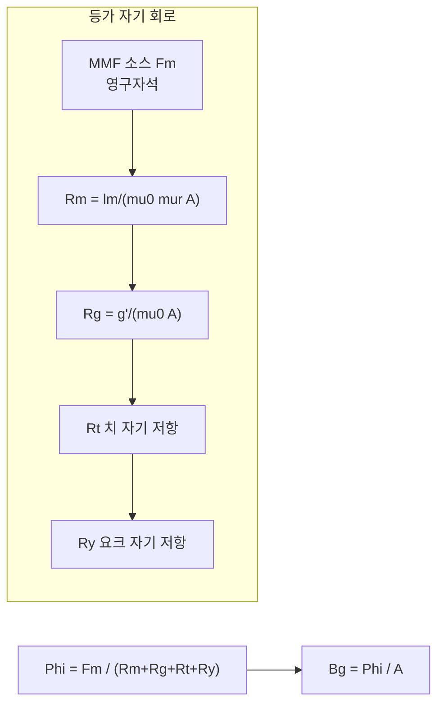

!!! note "용어 설명: 기자력, 자기 저항, 등가 자기 회로, 카터 계수, 공극 자속 밀도"
    - **기자력 (magnetomotive force, MMF)** : 자기 회로에서 자속을 구동하는 "자기 압력"으로, 영구자석은 일정한 MMF 소스 \(F_m = H_c l_m\)로 등가화될 수 있습니다.
    - **자기 저항 (reluctance)** : 자기 회로가 자속에 대해 갖는 저항으로, \(R = l/(\mu A)\)이며 기하학적 길이에 비례하고 투자율에 반비례합니다.
    - **등가 자기 회로 (magnetic equivalent circuit)** : 자기 저항, 기자력 소스, 자속 등의 요소를 사용하여 전동기 자기장을 모델링하는 집중 파라미터 모델입니다.
    - **카터 계수 (Carter coefficient)** : 슬롯이 있는 공극을 매끄러운 공극으로 환산하기 위한 보정 계수로, \(k_c>1\)이며 고정자 치와 슬롯이 공극 자기 저항을 등가적으로 증가시키는 것을 반영합니다.
    - **공극 자속 밀도 (air-gap flux density, \(B_g\))** : 공극에서의 자기 유도 강도로, 전동기의 전자기 토크와 역기전력을 직접 결정합니다.

#### 영구자석의 감자 특성과 안전 동작점

Nd-Fe-B 영구자석의 사용 가능한 동작 영역은 감자 곡선의 제2사분면에 있습니다. 자석 성능을 특성화하는 주요 매개변수는 다음과 같습니다.

- **잔류 자속 밀도 \(B_r\)** : 외부 자기장이 0으로 감소된 후 자석 내부의 자기 유도 강도.
- **보자력 \(H_c\)** : 자석의 자화 강도를 0으로 만드는 데 필요한 역방향 자기장 강도.
- **내재 보자력 \(H_{ci}\)** : 자석의 감자 저항 능력을 특성화하는 고유 매개변수로, 고온에서 크게 감소합니다.

Nd-Fe-B의 감자 곡선은 저온에서는 거의 선형이지만, 고온 또는 높은 역방향 자기장에서는 "니점"(knee)이 나타납니다. 외부 자기 회로의 부하선과 전기자 반작용 자기장에 의해 결정되는 자석의 동작점이 니점 아래로 떨어지면 **비가역 감자**가 발생합니다. 따라서 최악의 전류(단락, 구속) 및 온도 조건에서 다음을 보장해야 합니다.

\[
B_m(T_{\max}, I_{\max}) > B_{\text{knee}}(T_{\max})
\]

공학적으로는 일반적으로 10%–20%의 안전 여유를 유지합니다. 인간형 로봇의 높은 과부하 관절의 경우, 감자 검증은 전동기 설계의 필수 단계입니다[29].

```mermaid
xychart-beta
    title "Nd-Fe-B 제2사분면 감자 곡선 개요"
    x-axis "H [-kA/m]" [0, 1, 2, 3, 4]
    y-axis "B [T]"
    line "20 degC" [1.4, 1.2, 0.8, 0.4, 0.0]
    line "120 degC" [1.2, 0.9, 0.5, 0.2, -0.1]
    annotation "니점" {x: 3, y: 0.2}
```

!!! note "용어 설명: 감자 곡선, 니점, 보자력, 내재 보자력, 비가역 감자"
    - **감자 곡선 (demagnetization curve)** : 제2사분면에서 영구자석의 \(B\!-\!H\) 관계로, 잔류 자속 밀도에서 보자력까지의 자석 상태를 설명합니다.
    - **니점 (knee point)** : 감자 곡선에서 거의 선형에서 급격히 휘어지는 전환점으로, 이 지점 아래에서는 비가역 감자가 발생하기 쉽습니다.
    - **보자력 (coercivity, \(H_c\))** : 자기 유도 강도 \(B\)를 0으로 만드는 데 필요한 역방향 자기장.
    - **내재 보자력 (intrinsic coercivity, \(H_{ci}\))** : 자석 내부의 자화 강도 \(J\)를 0으로 만드는 역방향 자기장으로, 감자 저항 능력을 반영합니다.
    - **비가역 감자 (irreversible demagnetization)** : 자석의 동작점이 니점을 넘어서면 외부 조건이 회복되더라도 자기 성능이 완전히 회복되지 않는 손실입니다.

#### 영구자석 와전류 손실과 억제

분수 슬롯 집중 권선(FSCW)에 의해 생성된 공간 고조파 기자력은 회전자 영구자석에 와전류를 유도하여 자석 발열 및 감자를 유발할 수 있습니다. 영구자석의 와전류 손실 밀도는 다음과 같이 근사적으로 표현될 수 있습니다.

\[
p_{\text{PM,eddy}} \propto \frac{B_{\nu}^2 \, f_{\nu}^2 \, t^2}{\rho_{\text{PM}}}
\]

여기서 \(B_{\nu}\), \(f_{\nu}\)는 각각 \(\nu\)차 고조파의 자속 밀도 진폭과 주파수, \(t\)는 자석 두께, \(\rho_{\text{PM}}\)은 자석의 저항률입니다. 억제 방법은 다음과 같습니다.

1. **분할 (segmentation)** : 전체 자석을 축 방향 또는 원주 방향으로 여러 조각으로 나누어 와전류 경로를 차단합니다.
2. **적층 (lamination)** : 본드 자석 또는 얇은 시트 적층 구조를 사용하여 등가 저항률을 높입니다.
3. **극-슬롯 조합 최적화** : 고조파 진폭 \(B_{\nu}\)를 줄입니다.
4. **고저항률 자석 선택** : Sm-Co 또는 페라이트와 같은 자석을 사용하지만, 자기 에너지 곱과 저항률 간의 균형이 필요합니다.


!!! note "용어 설명: 영구자석 와전류 손실, 슬롯 고조파, 분할, 적층, 저항률"
    - **영구자석 와전류 손실 (PM eddy-current loss)** : 교번 고조파 자기장이 전도성 영구자석에 유도하는 와전류에 의해 발생하는 줄 열입니다.
    - **슬롯 고조파 (slot harmonic)** : 고정자 슬롯으로 인해 발생하는 공극 투자율 고조파로, 영구자석 와전류 손실의 주요 원인입니다.
    - **분할 (segmentation)** : 전체 자석을 와전류 경로 방향으로 분할하여 저항을 증가시키고 와전류를 줄입니다.
    - **적층 (lamination)** : 절연된 얇은 시트 자석을 적층하는 것으로, 규소강판에서 철손을 억제하는 원리와 동일합니다.
    - **저항률 (resistivity, \(\rho\))** : 재료가 전류 흐름에 저항하는 능력으로, 저항률이 높을수록 와전류 손실이 작아집니다.

#### 고전적인 전동기 치수 방정식 (\(D^2L\) 방정식)

전동기의 전자기 토크는 본질적으로 공극 원주력에 반경을 곱한 것과 같습니다. 권선 전류 분포를 **선 부하 (electric loading)** \(A_{\text{rms}}\) (단위 원주 길이당 rms 암페어 도체 수)로 나타내면, 고전적인 전동기 치수 방정식은 다음과 같습니다.

\[
T = \frac{\pi}{2\sqrt{2}} \, k_w \, B_{g1} \, A_{\text{rms}} \, D^2 L
\]

여기서 \(D\)는 공극 직경, \(L\)은 축방향 철심 길이, \(B_{g1}\)은 공극 자속 밀도 기본파 진폭, \(k_w\)는 권선 계수입니다. 이 식은 다음을 설명합니다:

- 토크는 모터의 **유효 체적** \(D^2L\)에 비례합니다. 이는 모터 **체적에 따른 치수 결정**의 근본적인 근거입니다.
- 고정된 체적에서 \(B_{g1}\)(더 강한 자석, 더 작은 공극) 또는 \(A_{\text{rms}}\)(더 많은 도체, 더 높은 전류 밀도)를 높이면 토크를 증가시킬 수 있습니다.
- 직경 \(D\)를 증가시키는 것이 길이 \(L\)을 증가시키는 것보다 토크 향상에 더 효과적입니다(2차 대 1차). 이것이 프레임리스 토크 모터가 대직경 평판형 구조를 채택하는 이유입니다.

```mermaid
xychart-beta
    title "토크와 체적의 관계 개요"
    x-axis "D^2 L [m^3]" [0, 1, 2, 3, 4, 5]
    y-axis "T [N m]"
    line "치수 방정식" [0, 2, 4, 6, 8, 10]
```

!!! note "용어 설명: 선부하, 치수 방정식, 권선 계수, 공극 자속 밀도 기본파, 유효 체적"
    - **선부하 / 전기부하 (electric loading, \(A_{\text{rms}}\))**: 공극 원주 단위 길이당 총 rms 암페어 도체 수, 단위 A/m.
    - **치수 방정식 (sizing equation)**: 모터 토크를 기하학적 치수와 전자기 부하의 곱으로 표현하는 경험적/해석적 공식.
    - **권선 계수 (winding factor, \(k_w\))**: 실제 권선의 기본파 기자력과 집중 정수권 권선의 비율로, 분포 및 단절 효과를 반영합니다.
    - **공극 자속 밀도 기본파 (fundamental air-gap flux density, \(B_{g1}\))**: 공극 자기장의 공간 푸리에 분해 후 기본파 성분.
    - **유효 체적 (active volume)**: 일반적으로 \(D^2L\)을 의미하며, 모터의 전자기 토크 능력의 주요 척도입니다.


### 4.2.7 로렌츠 힘에서 토크 방정식으로의 분포 권선 모델링

4.2.1절에서 우리는 단일 도체에 작용하는 암페어 힘을 이미 제시했습니다. \(\tau = k_t I\)를 권선 기하학과 더 밀접하게 연결하기 위해, 고정자 슬롯에 축방향 길이 \(l\)을 따라 분포된 총 \(N\)턴의 유효 도체가 있고, 공극 자속 밀도의 반경 방향 성분이 \(B_r(\theta)\)라고 가정합니다. \(i\)번째 도체는 기계각 \(\theta_i\)에 위치하고, 회전축으로부터 반경 \(r\)에 있으며, 도체 전류는 \(I\)(방향은 지면에 수직)입니다. 그러면 이 도체에 작용하는 접선 방향 로렌츠 힘은

$$
F_{\tau,i} = l \, I \, B_r(\theta_i)
$$

입니다. 이 도체가 회전축에 기여하는 토크는 \(r F_{\tau,i}\)입니다. 모든 도체를 합산하고 공극 자속 밀도를 기본파 진폭 \(B_{g1}\)으로 근사하면 다음을 얻습니다.

$$
\tau = r l I \sum_{i=1}^{N} B_r(\theta_i)
     \approx r l N B_{g1} \, k_w \, I
$$

여기서 \(k_w\)는 **권선 계수** (winding factor)이며, 분포 권선에서 각 도체의 자기장이 서로 다른 위상각을 가지면서 발생하는 감쇠를 종합한 것입니다 (일반적으로 \(k_w \approx 0.85\sim0.96\)). 기하학적 요소와 자기장 상수를 결합하면 공학에서 일반적으로 사용되는 토크 방정식을 얻습니다.

$$
\tau = k_t I, \qquad k_t = r l N B_{g1} k_w
$$

3상 PMSM의 경우, \(k_t\)를 종종 \(\frac{3}{2} p \lambda_f / I_{\text{peak}}\) 형태로 추가 작성하며, 둘은 SI 단위계에서 일치합니다. 이 유도는 토크 상수가 본질적으로 "단위 전류가 공극 자기장에서 생성하는 총 로렌츠 토크"임을 설명합니다. 따라서 반경 \(r\), 축방향 길이 \(l\), 공극 자속 밀도 \(B_g\) 또는 권선 턴 수 \(N\)을 증가시키면 \(k_t\)가 증가합니다.

!!! note "용어 설명: 권선 계수, 분포 권선, 공극 자속 밀도 기본파, 유효 도체"
    - **권선 계수 (winding factor, \(k_w\))**: 실제 권선에 의해 생성된 기본파 기자력과 모든 도체가 한 곳에 집중되었을 때 생성되는 기자력의 비율로, 분포, 단절 등의 효과가 기본파에 미치는 감쇠를 반영합니다.
    - **분포 권선 (distributed winding)**: 권선 코일이 여러 슬롯에 분산되어 있어 자기장 활용이 더 효율적이고 고조파가 낮지만, 코일 단부가 더 깁니다.
    - **공극 자속 밀도 기본파 (fundamental air-gap flux density)**: 공극 자기장을 공간 푸리에 분해한 후의 기본파 성분 \(B_{g1}\)으로, 유효 토크를 생성하는 주요 원천입니다.
    - **유효 도체 (effective conductor)**: 실제로 공극 자속을 차단하고 토크를 생성하는 데 참여하는 도체 수로, 권선 계수를 곱하여 보정해야 합니다.

```mermaid
flowchart LR
    A["N개의 도체 분포<br/>고정자 슬롯 내"] --> B["각 도체에 작용하는<br/>접선 로렌츠 힘"]
    B --> C["반경 r이 형성하는<br/>단일 토크"]
    C --> D["합산 및 권선 계수 곱<br/>tau = r l N kw Bg I"]
    D --> E["토크 상수 정의<br/>kt = r l N kw Bg"]
```

### 4.2.8 Clarke 변환과 Park 변환의 명시적 행렬

자계 방향 제어(FOC)는 3상 정지 좌표계 \(abc\)의 전류/전압을 2상 정지 좌표계 \(\alpha\beta\)로 변환한 다음, 회전자와 함께 회전하는 \(dq\) 좌표계로 변환합니다. 아래에는 **진폭 불변 (amplitude-invariant)** 형태의 가장 일반적인 행렬을 제시합니다.

**Clarke 변환** (3→2, 전력은 보존되지 않지만 진폭은 보존):

$$
\begin{bmatrix} i_\alpha \\ i_\beta \\ i_0 \end{bmatrix}
=
\frac{2}{3}
\begin{bmatrix}
1 & -\frac{1}{2} & -\frac{1}{2} \\
0 & \frac{\sqrt{3}}{2} & -\frac{\sqrt{3}}{2} \\
\frac{1}{2} & \frac{1}{2} & \frac{1}{2}
\end{bmatrix}
\begin{bmatrix} i_a \\ i_b \\ i_c \end{bmatrix}
$$

3상 무중성선 시스템 \(i_a+i_b+i_c=0\)의 경우, 영상분 \(i_0=0\)이므로 처음 두 행만 사용합니다.

**Park 변환** (\(\alpha\beta\)→\(dq\), 회전각 \(\theta_e\)는 회전자 자속 전기각):

$$
\begin{bmatrix} i_d \\ i_q \end{bmatrix}
=
\begin{bmatrix}
\cos\theta_e & \sin\theta_e \\
-\sin\theta_e & \cos\theta_e
\end{bmatrix}
\begin{bmatrix} i_\alpha \\ i_\beta \end{bmatrix}
$$

역변환은 다음과 같습니다.

$$
\begin{bmatrix} i_\alpha \\ i_\beta \end{bmatrix}
=
\begin{bmatrix}
\cos\theta_e & -\sin\theta_e \\
\sin\theta_e & \cos\theta_e
\end{bmatrix}
\begin{bmatrix} i_d \\ i_q \end{bmatrix}
$$

Clarke 변환의 물리적 의미는 두 개의 직교 정지 권선 \(\alpha\beta\)를 사용하여 서로 120° 차이가 나는 세 개의 정지 권선을 등가적으로 대체하는 것입니다. Park 변환은 \(\alpha\beta\)를 회전자와 동기 회전하는 \(dq\) 축에 투영합니다. \(dq\) 좌표계가 회전자에 대해 상대적으로 정지해 있기 때문에, 원래 시간에 따라 정현파로 변하던 교류량이 직류량이 되어 PI 제어기가 정상 상태 오차 없이 추종할 수 있습니다.

!!! note "용어 설명: 진폭 불변 변환, 영상분, 동기 회전 좌표계, 투영"
    - **진폭 불변 변환 (amplitude-invariant transformation)**: 변환 후 벡터의 진폭이 변환 전과 일치하지만, 전력의 퍼 유닛 값은 직접 보존되지 않습니다. 공학 제어에서 전류 진폭을 직관적으로 읽는 데 편리합니다.
    - **영상분 (zero-sequence component)**: 3상 전류 합의 1/3로, 무중성선 시스템에서는 항상 0이며, 전기-기계 에너지 변환에 참여하지 않습니다.
    - **동기 회전 좌표계 (synchronous rotating frame)**: 전기 각속도 \(\omega_e\)로 회전자 자기장과 함께 회전하는 \(dq\) 좌표계.
    - **투영 (projection)**: 공간 벡터를 지정된 좌표축으로 분해하여 해당 축의 성분을 얻는 것.

```mermaid
flowchart LR
    A["3상 정지 abc"] --> B["Clarke<br/>alpha beta"]
    B --> C["Park<br/>d q"]
    C --> D["PI 제어기<br/>id iq 직류"]
    D --> E["역 Park<br/>alpha* beta*"]
    E --> F["SVPWM<br/>abc 스위칭 신호"]
```

### 4.2.9 PMSM의 dq축 전압 방정식과 각 항목의 물리적 의미

회전 \(dq\) 좌표계에서 표면부착형/매입형 PMSM의 고정자 전압 방정식은 다음과 같이 쓸 수 있습니다.

$$
\begin{aligned}
v_d &= R_s i_d + L_d \frac{di_d}{dt} - \omega_e L_q i_q \\
v_q &= R_s i_q + L_q \frac{di_q}{dt} + \omega_e L_d i_d + \omega_e \lambda_f
\end{aligned}
$$

항목별 설명은 다음과 같습니다:

1. **저항 전압 강하** \(\,R_s i_d\), \(R_s i_q\): 권선 옴 손실로 인한 전압 강하.
2. **변압기 전압** \(\,L_d \frac{di_d}{dt}\), \(L_q \frac{di_q}{dt}\): 전류 변화가 인덕턴스에 유도하는 전압으로, 전류 루프의 동적 응답을 결정합니다.
3. **속도 전압 / 회전 기전력(크로스 커플링 항)** \(\,-\omega_e L_q i_q\) 및 \( \omega_e L_d i_d \): \(dq\) 좌표계 자체가 회전함에 따라 인덕턴스 에너지가 회전자 위치 변화에 따라 발생하는 결합 항입니다. 이들은 \(d\)축 전류 변화를 \(q\)축 전압에 결합시키고(그 반대도 마찬가지), 전류 루프에서는 일반적으로 **디커플링 피드포워드** 보상이 필요합니다.
4. **영구자석 역기전력** \(\,\omega_e \lambda_f\): 회전자 영구자석 자속이 고정자 권선을 절단하여 발생하는 유도 기전력으로, 방향은 \(q\)축 양의 방향입니다. 회전 속도가 높을수록 역기전력이 커지며, 전류를 유지하기 위해 더 높은 단자 전압이 필요합니다.

SPMSM(\(L_d = L_q = L_s\))의 경우, \(i_d=0\) 제어를 사용하면 \(q\)축 방정식은 다음과 같이 단순화됩니다.

$$
v_q = R_s i_q + L_s \frac{di_q}{dt} + \omega_e \lambda_f, \qquad
\tau = \frac{3}{2} p \lambda_f i_q
$$

이때 토크는 \(i_q\)에만 비례하므로 제어가 매우 직관적입니다. IPMSM은 \(L_d \neq L_q\)로 인해 발생하는 릴럭턴스 토크를 활용하여 MTPA를 통해 동일한 전류에서 더 큰 토크를 얻습니다.

!!! note "용어 설명: 속도 전압, 회전 기전력, 디커플링 피드포워드, 역기전력, 영구자석 자속"
    - **속도 전압(speed voltage)**: 좌표계 또는 도체의 움직임으로 인해 자속 변화가 발생하여 유도되는 전압 항으로, 전기-기계 에너지 변환을 나타냅니다.
    - **디커플링 피드포워드(decoupling feedforward)**: 전류 제어기에 \(\omega_e L i\) 항을 추가하여 \(d\), \(q\)축 간의 동적 결합을 제거합니다.
    - **역기전력(back-EMF)**: 회전자 자속이 고정자 권선을 절단하여 발생하는 유도 전압으로, \(E_b = \omega_e \lambda_f\)입니다.
    - **영구자석 자속(permanent-magnet flux linkage, \(\lambda_f\))**: 영구자석이 고정자 상 권선에 결합하는 일정한 자속 크기입니다.

### 4.2.10 코깅 토크와 토크 리플

전류가 이상적인 정현파라도 모터 출력 토크에는 주기적인 변동이 존재하며, 이를 통틀어 **토크 리플**(torque ripple)이라고 합니다. 주요 원인은 세 가지입니다:

1. **코깅 토크(cogging torque)**: 영구자석의 자기극과 고정자 슬롯 사이의 상호 작용으로 인해 회전자가 특정 "치-슬롯 정렬" 위치에 정지하려는 경향이 발생합니다. 회전자가 회전할 때 이 토크는 슬롯 통과 주파수로 맥동합니다.
2. **역기전력 고조파**: 실제 역기전력은 이상적인 정현파가 아니며 5차, 7차 등의 고조파를 포함하고, 기본파 전류와 작용하여 6차 토크 리플을 발생시킵니다.
3. **전류 고조파와 정류 맥동**: BLDC의 6단계 정류, 인버터 데드타임, 전류 루프의 제한된 대역폭은 모두 전류 고조파를 유발하여 토크 리플을 발생시킵니다.

코깅 토크의 기본파 진폭은 다음과 같이 근사적으로 표현할 수 있습니다.

$$
\tau_{\text{cog}}(\theta) \approx \sum_{k} \tau_{\text{cog},k} \sin\left( k N_s \frac{\theta}{p} \right)
$$

여기서 \(N_s\)는 고정자 슬롯 수, \(p\)는 극 쌍 수, \(\theta\)는 기계적 회전 각도입니다.

일반적으로 사용되는 억제 방법은 다음과 같습니다:

- **스큐(skewing)**: 회전자 자극 또는 고정자 슬롯을 축 방향으로 한 치 피치만큼 비틀어, 축 방향 위치에 따른 코깅 토크가 서로 상쇄되도록 합니다.
- **분수 슬롯 집중 권선(FSCW)**: 고정자 슬롯 수와 극 수가 서로 소수가 되도록 선택하여 코깅 토크의 고조파 차수와 진폭을 낮춥니다.
- **극호 최적화**: 영구자석이 덮는 극호 각도를 조정하여 코깅 토크 기본파를 약화시킵니다.
- **전류 고조파 주입**: 온라인으로 토크 리플을 감지하고 보상 전류를 주입하는 방식으로, 역기전력 고조파로 인한 리플에 적합합니다.

!!! note "용어 설명: 코깅 토크, 토크 리플, 스큐, 분수 슬롯 집중 권선, 극호"
    - **코깅 토크(cogging torque)**: 영구자석과 고정자 치-슬롯 사이의 자기 저항 변화로 인해 발생하는 무전류 토크 리플.
    - **토크 리플(torque ripple)**: 출력 토크의 평균값 주변에서 발생하는 주기적인 변동으로, 일반적으로 피크-피크 값 또는 백분율로 표시됩니다.
    - **스큐(skewing)**: 자극 또는 슬롯을 축 방향으로 기울여 치 효과를 축 방향으로 평균화합니다.
    - **분수 슬롯 집중 권선(fractional-slot concentrated winding, FSCW)**: 극당 상당 슬롯 수가 분수인 집중 권선 구조로, 코깅 토크를 크게 줄이고 단부를 짧게 할 수 있습니다.
    - **극호(pole arc)**: 영구자석이 원주 상에서 덮는 전기 각도로, 공극 자기장의 고조파 함량에 영향을 미칩니다.

```mermaid
flowchart LR
    A["치-슬롯 상호 작용"] --> B["코깅 토크"]
    C["역기전력 고조파"] --> D["고조파 토크 리플"]
    E["전류 고조파/정류"] --> F["제어 관련 리플"]
    B --> G["억제 방법"]
    D --> G
    F --> G
    G --> H["스큐"]
    G --> I["FSCW"]
    G --> J["고조파 주입"]
```

### 4.2.11 권선 형식: 집중 권선, 분포 권선 및 FSCW

PMSM 고정자 권선은 코일 스팬에 따라 **집중 권선**(concentrated winding)과 **분포 권선**(distributed winding)으로 나눌 수 있습니다:

- **집중 권선**: 각 코일이 하나의 치 피치만을 건너며, 단부가 짧고 구리 손실이 낮으며 슬롯 충전율이 높아 자동 권선에 적합합니다. 그러나 공극 기자력 고조파가 높습니다.
- **분포 권선**: 코일이 여러 치 피치를 건너며, 자기장의 정현파 특성이 더 좋고 고조파가 낮지만 단부가 길고 구리 손실이 약간 더 큽니다.

**분수 슬롯 집중 권선(FSCW)** 은 집중 권선의 한 종류로, 극당 상당 슬롯 수

$$
q = \frac{N_s}{2 p m}
$$

가 분수(\(m=3\)은 상 수)입니다. 예를 들어 12슬롯/10극(\(q=2/5\))은 로봇 프레임리스 모터의 일반적인 구성입니다. FSCW의 장점은 다음과 같습니다:

1. 단부가 매우 짧아 구리 손실이 낮고 높은 토크 밀도에 유리합니다.
2. 코깅 토크가 낮아 일반적으로 스큐가 필요하지 않습니다.
3. 극 수가 많고 축 방향 길이가 짧아 평평한 관절에 적합합니다.
4. 코일이 독립적이어서 대량 자동 권선에 용이합니다.

주요 단점은 다음과 같습니다:

- **회전자 와전류 손실**: 고정자 기자력 고조파가 영구자석에 와전류를 유도하여 자석 발열 또는 심지어 감자 현상을 일으킬 수 있습니다. 자석을 분할하거나 낮은 전도율의 자석을 사용해야 하는 경우가 많습니다.
- **권선 계수가 낮음**: 특정 극-슬롯 조합의 기본파 권선 계수는 약 0.866 정도로, 보상하기 위해 더 많은 턴 수가 필요합니다.

!!! note "용어 설명: 집중 권선, 분포 권선, 극당 상당 슬롯 수, 단부 권선, 슬롯 충전율"
    - **집중 권선(concentrated winding)**: 코일 스팬이 하나의 치 피치와 같은 권선으로, 구조가 컴팩트합니다.
    - **분포 권선(distributed winding)**: 코일 스팬이 하나의 치 피치보다 크고 여러 슬롯에 분포된 권선으로, 자기장 파형이 더 정현파에 가깝습니다.
    - **극당 상당 슬롯 수(slots per pole per phase, \(q\))**: \(q = N_s/(2pm)\)이며, 정수이면 정수 슬롯 권선, 분수이면 분수 슬롯 권선입니다.
    - **단부 권선(end winding)**: 슬롯 외부에서 코일 양단을 연결하는 도선 부분으로, 공극 자기장에는 관여하지 않지만 구리 손실을 발생시킵니다.
    - **슬롯 충전율(slot fill factor)**: 슬롯 내 도체 단면적과 슬롯 가용 면적의 비율로, 높은 충전율은 토크 밀도 향상에 유리합니다.

```mermaid
flowchart TD
    A["권선 형식"] --> B["집중 권선"]
    A --> C["분포 권선"]
    B --> D["단부 짧음, 구리 손실 낮음"]
    B --> E["고조파 높음"]
    C --> F["자기장 정현파, 고조파 낮음"]
    C --> G["단부 김, 구리 손실 큼"]
    D --> H["FSCW, 로봇 관절에 적합"]
    E --> H
    H --> I["자석 와전류 손실 주의"]
```

### 4.2.12 소형 로봇 모터의 수치 예제

크기 정도에 대한 직관을 얻기 위해 상지 관절용 소형 브러시리스 모터를 고려해 보겠습니다: 토크 상수 \(k_t = 0.10\ \text{N·m/A}\), 상 저항 \(R = 0.50\ \Omega\), 모선 전압 \(V_{dc} = 48\ \text{V}\), 열 저항 \(R_{th} = 2.0\ \text{K/W}\), 주변 온도 \(T_{amb}=40°\text{C}\), 절연 등급 F(한계 155°\text{C}).

1. **무부하 속도**: 출력 토크가 0일 때 역기전력은 가용 전압과 거의 같습니다. 저항 전압 강하를 무시하면,
   $$
   \omega_{nl} \approx \frac{V_{dc}}{k_e} = \frac{48}{0.10} = 480\ \text{rad/s} \approx 4580\ \text{r/min}
   $$
   여기서 SI 단위에서 \(k_e = k_t\)를 사용했습니다.

2. **구속 토크**: 속도가 0일 때 전류는 저항에 의해서만 제한됩니다.
   $$
   I_{stall} = \frac{V_{dc}}{R} = \frac{48}{0.50} = 96\ \text{A}, \qquad
   \tau_{stall} = k_t I_{stall} = 0.10 \times 96 = 9.6\ \text{N·m}
   $$

3. **최대 출력점**: 이상적인 DC 모터의 최대 출력은 \(\omega = \omega_{nl}/2\), \(\tau = \tau_{stall}/2\)에서 발생합니다.
   $$
   P_{max} = \frac{\tau_{stall} \omega_{nl}}{4} = \frac{9.6 \times 480}{4} = 1152\ \text{W}
   $$

4. **연속 토크 열 제한**: 허용 권선 온도 상승 \(\Delta T = 155 - 40 = 115\ \text{K}\). 1차 열 모델에 의해
   $$
   P_{loss} = \frac{\Delta T}{R_{th}} = \frac{115}{2.0} = 57.5\ \text{W}
   $$
   동손이 지배적이라면 \(I_{rms} = \sqrt{P_{loss}/R} = \sqrt{57.5/0.50} \approx 10.7\ \text{A}\)이며, 이에 해당하는 연속 토크는
   $$
   \tau_{cont} = k_t I_{rms} = 0.10 \times 10.7 \approx 1.07\ \text{N·m}
   $$

이 예제는 동일한 모터가 단시간에 약 10 N·m을 출력할 수 있지만, 지속 운전 시에는 약 1 N·m만 유지할 수 있음을 보여줍니다. 이것이 바로 휴머노이드 로봇에 단시간 피크 출력과 열 관리가 모두 중요한 근본적인 이유입니다.

!!! note "용어 설명: 무부하 속도, 구속 토크, 연속 토크, 절연 등급, 열 제한"
    - **무부하 속도(no-load speed)**: 부하가 없을 때 모터가 도달할 수 있는 최고 속도로, 역기전력과 모선 전압에 의해 제한됩니다.
    - **구속 토크(stall torque)**: 속도가 0일 때의 출력 토크로, 저항과 전류 한계에 의해 제한됩니다.
    - **연속 토크(continuous torque)**: 허용 온도 상승 내에서 지속적으로 출력할 수 있는 토크로, 열 저항과 동손에 의해 결정됩니다.
    - **절연 등급(insulation class)**: 권선 절연 재료가 허용하는 최고 온도로, F등급은 155 °C, H등급은 180 °C입니다.
    - **열 제한(thermal limit)**: 모터의 지속 운전 능력의 경계로, 권선 최고 허용 온도에 의해 결정됩니다.

---

## 4.3 전동 기구: 기어, 감속기 및 순응 요소

### 4.3.1 기어 기초: 감속 증토 및 반사 관성

기어 쌍의 가장 기본적인 기능은 회전 속도와 토크의 비율을 변경하는 것입니다. 입력(모터 측) 회전 속도를 \(\omega_m\), 출력(부하 측) 회전 속도를 \(\omega_l\)이라고 하면, **전동비**(또는 감속비)는

$$
G = \frac{\omega_m}{\omega_l} = \frac{\tau_l}{\tau_m}
$$

여기서 두 번째 등호는 이상적인 무손실 조건에서 성립합니다. 실제로는 마찰과 변형이 있으므로 출력 동력은

$$
P_l = \eta \, P_m
$$

\(\eta\)는 전동 효율입니다. 감속기는 또한 부하 관성을 모터 측으로 "반사"합니다. 부하 회전 관성을 \(J_l\)이라고 하면, 감속비 \(G\)를 거친 후 모터가 느끼는 등가 부하 관성은

$$
J_{\text{ref}} = \frac{J_l}{G^2}
$$

이는 높은 감속비가 모터 측에서 느껴지는 부하 관성을 현저히 낮추어 모터가 더 쉽게 가속할 수 있게 함을 의미합니다. 그러나 높은 감속비는 마찰, 백래시 및 강성 손실을 유발하기도 합니다.

!!! note "용어 설명: 전동비, 감속비, 효율, 반사 관성, 부하 관성, 감속기"
    - **전동비 / 감속비(gear ratio / reduction ratio)**: 입력 회전 속도와 출력 회전 속도의 비율로, 일반적으로 1보다 크면 감속 증토를 의미합니다.
    - **효율(transmission efficiency)**: 출력 동력과 입력 동력의 비율로, 기어 맞물림, 베어링 등으로 인한 에너지 손실을 반영합니다.
    - **반사 관성 / 환산 관성(reflected inertia)**: 부하 관성을 전동비의 제곱으로 나누어 모터 측으로 환산한 등가 관성입니다.
    - **부하 관성(load inertia)**: 구동 대상 측의 회전 관성입니다.
    - **감속기(gear reducer)**: 기어, 베어링, 하우징으로 구성된 감속 증토 장치입니다.

```mermaid
flowchart LR
    M["모터<br/>Jm omegam taum"] --> G["감속기<br/>전동비 G eta"]
    G --> L["부하<br/>Jl omegal taul"]
    J["Jl/G^2 모터 측 환산"] --> M
    T["taul = eta G taum"] --> L
```

### 4.3.2 하모닉 드라이브: 변형파 전동

**하모닉 드라이브**(harmonic drive)는 플렉스스플라인(flexspline), 서큘러 스플라인(circular spline), 웨이브 제너레이터(wave generator)의 세 부분으로 구성됩니다. 웨이브 제너레이터는 타원형 캠으로, 얇은 벽의 플렉스스플라인에 삽입되어 플렉스스플라인을 타원형으로 변형시키며, 타원 장축에서 플렉스스플라인의 치가 서큘러 스플라인과 맞물립니다. 웨이브 제너레이터가 회전하면 맞물림 영역이 원주 방향으로 이동하며, 플렉스스플라인은 서큘러 스플라인에 대해 천천히 회전합니다.

#### 하모닉 드라이브의 운동학적 유도

웨이브 제너레이터를 입력으로 하여 한 바퀴(\(360°\)) 회전하면, 플렉스스플라인도 함께 한 바퀴 회전합니다. 플렉스스플라인이 서큘러 스플라인보다 \(\Delta z = z_c - z_f\)개의 치가 적기 때문에, 웨이브 제너레이터가 한 바퀴 회전할 때마다 플렉스스플라인은 맞물림 지점에서 서큘러 스플라인에 대해 \(\Delta z\)개의 치만큼 "뒤처지며", 이는 플렉스스플라인의 서큘러 스플라인에 대한 상대 회전각으로 나타납니다.

$$
\Delta \theta_f = -\frac{\Delta z}{z_f} \cdot 360°
$$

따라서 전동비(입력 회전 속도 \(\omega_{in}\)와 출력 회전 속도 \(\omega_{out}\)의 비)는

$$
G = \frac{\omega_{in}}{\omega_{out}} = \frac{z_c}{z_c - z_f}
$$

일반적인 단단 하모닉 감속비는 30:1에서 160:1까지입니다. 하모닉 전동의 "두 점 맞물림"은 웨이브 제너레이터의 타원 형상에서 비롯됩니다. 타원 장축 양 끝에 각각 하나의 맞물림 영역이 있고, 단축에서는 이탈됩니다. 웨이브 제너레이터가 회전함에 따라 이 두 맞물림 영역은 "변형파"처럼 원주 방향으로 전파되므로, 하모닉 드라이브는 **변형파 전동**(strain wave gearing)이라고도 불립니다. 동시에 맞물리는 치의 수가 전체 치의 25%–30%에 달할 수 있어, 하중 지지 능력과 위치 정밀도가 매우 높습니다.

#### 플렉스스플라인의 원주 응력

웨이브 제너레이터는 얇은 벽의 플렉스스플라인을 타원형으로 펼칩니다. 플렉스스플라인의 중립원 반경 \(r_f\), 벽 두께 \(t\), 타원 장반경 \(a\), 단반경 \(b\)일 때, 근사 타원도 \(e = (a-b)/2\)는 플렉스스플라인의 최대 반경 방향 변형에 해당합니다. 그 원주 인장 응력은 근사적으로 다음과 같습니다.

$$
\sigma_{hoop} \approx E \, \frac{e}{r_f}
$$

여기서 \(E\)는 플렉스스플라인 재료의 탄성 계수입니다. 이 반복 응력은 하모닉 드라이브의 피로 수명을 제한하는 핵심 요소이며, 일반적으로 고강도 합금강을 사용하고 치형을 최적화하여 변형량을 줄입니다. Harmonic Drive의 기술 자료에 따르면 일반적인 플렉스스플라인의 피로 수명은 \(10^7\)–\(10^8\) 회전에 달할 수 있습니다[10][23].

!!! note "용어 설명: 변형파 전동, 원주 응력, 피로 수명, 타원도"
    - **변형파 전동(strain wave gearing)**: 유연 기어의 주기적인 탄성 변형을 이용하여 감속을 구현하는 전동 방식으로, 하모닉 드라이브가 대표적인 예입니다.
    - **원주 응력 / 주응력(hoop stress)**: 얇은 벽의 원형 링이 반경 방향 변형을 받을 때 원주 방향으로 발생하는 인장 응력입니다.
    - **피로 수명(fatigue life)**: 재료가 반복 응력 하에서 피로 파괴가 발생하기 전까지의 반복 횟수입니다.
    - **타원도(ellipticity)**: 웨이브 제너레이터가 형성하는 타원의 장축과 단축의 차이로, 플렉스스플라인의 변형량을 결정합니다.

!!! note "용어 설명: 하모닉 드라이브, 플렉스스플라인, 서큘러 스플라인, 웨이브 제너레이터, 변형파, 제로 백래시, 전동 오차"
    - **하모닉 드라이브(harmonic drive)**: 얇은 벽의 유연 기어의 탄성 변형을 이용하여 높은 감속비를 구현하는 정밀 감속기입니다.
    - **플렉스스플라인(flexspline)**: 얇은 벽의 유연 기어로, 일반적으로 서큘러 스플라인보다 두 개의 치가 적습니다.
    - **서큘러 스플라인(circular spline)**: 강성 내치 링으로, 고정되거나 출력축으로 사용됩니다.
    - **웨이브 제너레이터(wave generator)**: 타원형 캠 어셈블리로, 플렉스스플라인에 제어 가능한 탄성 변형을 발생시킵니다.
    - **변형파(strain wave)**: 플렉스스플라인이 웨이브 제너레이터의 작용으로 형성하는 주기적인 탄성 변형파입니다.
    - **제로 백래시(zero backlash)**: 다수의 치가 동시에 맞물리고 플렉스스플라인이 예압되어 있어, 하모닉 드라이브에는 거의 치간 유격이 없습니다.
    - **전동 오차(transmission error)**: 출력축의 실제 회전각과 이상적인 회전각의 차이로, 정밀도와 강성을 반영합니다.

```mermaid
flowchart LR
    A["웨이브 제너레이터<br/>타원 캠"] --> B["플렉스스플라인<br/>얇은 벽 외치"]
    B --> C["서큘러 스플라인<br/>강성 내치"]
    C --> D["출력 플랜지"]
    A --> E["입력축"]
    B -.변형파.-> F["다치 맞물림<br/>고감속비"]
```

하모닉 드라이브의 장점은 높은 감속비, 제로 백래시, 콤팩트한 구조입니다. 단점은 플렉스스플라인이 반복 응력을 받아 피로 수명과 열 변형에 민감하고, 효율이 일반적으로 70-90%이며, 높은 감속비로 인해 역구동성이 낮다는 점입니다.

#### 하모닉 플렉스스플라인의 쉘 역학 및 피로 핫스팟

4.3.2절에서는 원주 인장 응력 \(\sigma_{hoop}\)을 사용하여 플렉스스플라인의 응력을 초기 추정했습니다. 더 정확한 해석은 플렉스스플라인을 웨이브 제너레이터 위에 지지된 **얇은 벽 원통형 쉘**로 간주해야 합니다. 타원형 웨이브 제너레이터의 작용 하에서 플렉스스플라인은 동시에 다음을承受합니다.

1. **원주 인장 응력** \(\sigma_{hoop}\): 반경 방향 변형으로 인해 발생합니다.
2. **굽힘 응력** \(\sigma_{bend}\): 쉘 곡률이 원주 방향으로 변화하여 발생하며, 얇은 쉘에 큰 영향을 미칩니다.
3. **국부 접촉 응력**: 치 맞물림 지점의 헤르츠 접촉 응력(다음 절 참조).

Timoshenko/Kirchhoff 쉘 이론에 따르면, 타원 변형 하에서의 최대 굽힘 응력은 근사적으로 다음과 같습니다.

\[
\sigma_{bend} \approx \frac{E t e}{2 r_f^2}
\]

여기서 \(t\)는 벽 두께, \(e\)는 타원 장축과 단축 차이의 절반, \(r_f\)는 플렉스스플라인의 중립원 반경입니다. 피로 균열은 **플렉스스플라인 통 바닥과 출력 플랜지 사이의 격막 영역**에서 가장 쉽게 발생하는데, 이 영역은 굽힘 및 비틀림 응력 집중이 중첩되기 때문입니다. 따라서 고급 하모닉 드라이브는 플렉스스플라인에 쇼트 피닝 강화, 치근 필렛 최적화 및 재료 열처리를 적용하여 피로 수명을 연장합니다[10][23].

```mermaid
flowchart LR
    A["웨이브 제너레이터 타원 변형"] --> B["원주 인장 응력"]
    A --> C["쉘 굽힘 응력"]
    B --> D["격막 영역 응력 집중"]
    C --> D
    D --> E["피로 균열 발생원"]
```

!!! note "용어 설명: 얇은 벽 원통형 쉘, Timoshenko 쉘 이론, Kirchhoff 쉘 이론, 굽힘 응력, 격막 영역"
    - **얇은 벽 원통형 쉘(thin cylindrical shell)**: 벽 두께가 반경에 비해 매우 작은 원통 구조로, 하모닉 플렉스스플라인이 이에 해당합니다.
    - **Timoshenko 쉘 이론**: 전단 변형을 고려한 쉘 이론으로, 중간 두께 쉘에 적용됩니다.
    - **Kirchhoff 쉘 이론**: 전단 변형을 무시하는 고전적인 얇은 쉘 이론으로, 매우 얇은 쉘에 적용됩니다.
    - **굽힘 응력(bending stress)**: 곡률 변화로 인해 쉘 표면에 발생하는 인장/압축 응력입니다.
    - **격막 영역(diaphragm region)**: 플렉스스플라인 바닥과 출력 플랜지를 연결하는 천이 얇은 벽 영역으로, 응력 집중이 가장 심합니다.

### 4.3.3 유성 감속기 및 사이클로이드 감속기

**유성 감속기**는 선 기어, 유성 기어, 링 기어 및 유성 캐리어로 구성됩니다. 선 기어가 입력, 유성 캐리어가 출력이며, 링 기어가 고정될 때 전동비는

$$
G = 1 + \frac{z_r}{z_s}
$$

여기서 \(z_r\)는 링 기어 잇수, \(z_s\)는 선 기어 잇수입니다. 유성 감속기는 효율이 높고(최대 97%), 하중 지지 능력이 뛰어나며, 로봇 관절의 중저감속비 구간에 자주 사용됩니다.

#### 유성 감속기의 하중 분배와 효율

여러 개의 유성 기어(보통 3~5개)가 동시에 맞물리기 때문에 유성 감속기는 우수한 **하중 분배**(load sharing) 특성을 가집니다. 이상적인 경우 각 유성 기어는 전체 토크의 \(1/N_p\)를承受하며, 여기서 \(N_p\)는 유성 기어 개수입니다. 실제로는 제조 오차와 베어링 변형으로 인해 각 유성 기어의 하중이 불균일해지며, 이를 균형 잡기 위해 플로팅 선 기어나 플렉시블 유성 캐리어가 자주 사용됩니다.

유성 감속기의 총 효율은 다음과 같이 분해할 수 있습니다.

$$
\eta_{planetary} = \eta_{sun-planet}^{N_p} \, \eta_{planet-ring}^{N_p} \, \eta_{bearing}
$$

여기서 \(\eta_{sun-planet}\), \(\eta_{planet-ring}\)는 각각 한 쌍의 기어 맞물림 효율이고, \(\eta_{bearing}\)는 베어링과 오일 휘젓기 손실입니다. 동력 분기 덕분에 단일 단 유성 감속기는 높은 효율을 유지하면서도 큰 감속비를 구현할 수 있습니다.

!!! note "용어 설명: 하중 분배, 플로팅 선 기어, 동력 분기, 오일 휘젓기 손실"
    - **하중 분배(load sharing)**: 여러 맞물림 지점이 함께 하중을承担하여 단일 지점의 응력을 낮춥니다.
    - **플로팅 선 기어(floating sun gear)**: 축 방향으로 미세 조정 가능한 선 기어로, 제조 오차를 보상하여 유성 기어 하중을 균형 잡습니다.
    - **동력 분기(power splitting)**: 입력 동력이 여러 경로를 통해 출력으로 전달되어 하중 지지 능력을 향상시킵니다.
    - **오일 휘젓기 손실(churning loss)**: 기어가 윤활유를 휘저을 때 발생하는 점성 저항 손실입니다.

**사이클로이드 감속기**(cycloidal drive)는 편심 설치된 사이클로이드 디스크와 핀 기어의 맞물림을 이용합니다. 사이클로이드 디스크의 외사이클로이드 윤곽이 핀 기어 하우징 내부의 원통형 핀 열과 맞물리며, 편심축이 한 바퀴 회전할 때 사이클로이드 디스크는 단 하나의 치 피치만 이동하여 매우 높은 감속비(단일 단으로 100:1 이상)를 구현합니다.

#### 사이클로이드 윤곽과 전동비

사이클로이드 디스크의 표준 치형은 **외사이클로이드**(epitrochoid)의 등거리 곡선입니다. 핀 기어 하우징 반경을 \(R_r\), 핀 중심원 반경을 \(R_p\), 편심량을 \(e\), 핀 반경을 \(r_r\)이라고 가정합니다. 사이클로이드 디스크 치형은 매개변수 방정식으로 설명할 수 있습니다.

$$
\begin{aligned}
x(\phi) &= \left(R_p - e\right) \cos\phi + \frac{e}{k_1} \cos\left[(k_1 - 1)\phi\right] - r_r \cos\alpha \\
y(\phi) &= \left(R_p - e\right) \sin\phi - \frac{e}{k_1} \sin\left[(k_1 - 1)\phi\right] - r_r \sin\alpha
\end{aligned}
$$

여기서 \(k_1 = R_p/e\)는 사이클로이드 디스크 단폭 계수 관련 매개변수, \(\phi\)는 생성 매개변수, \(\alpha\)는 치형 법선 각도입니다. 간략화된 **전동비**는 다음과 같습니다.

$$
G = \frac{z_p}{z_p - z_c}
$$

여기서 \(z_p\)는 핀 잇수, \(z_c\)는 사이클로이드 디스크 잇수이며, 둘의 차이는 보통 1입니다. 단일 치 차이 사이클로이드 감속기의 경우 \(G = z_c\)입니다. 편심량 \(e\)는 핀 기어 하우징에 대한 사이클로이드 디스크의 오프셋 양을 결정하고, 핀 반경 \(r_r\)은 맞물림 간극과 접촉 응력에 영향을 미칩니다. \(r_r\)을 증가시키면 접촉 강도는 높아지지만 유효 맞물림 깊이가 감소합니다. Sensinger는 사이클로이드 치형, 응력 및 효율에 대한 통합 최적화 방법을 제시했습니다[13].

!!! note "용어 설명: 외사이클로이드, 등거리 곡선, 단폭 계수, 핀, 편심량"
    - **외사이클로이드(epitrochoid)**: 한 원이 다른 고정된 원의 바깥쪽을 따라 구를 때, 원 위 또는 원 안의 한 점이 그리는 궤적입니다.
    - **등거리 곡선(offset curve)**: 원래 곡선과 일정한 법선 거리를 유지하는 곡선으로, 사이클로이드 디스크의 실제 치형을 생성하는 데 사용됩니다.
    - **단폭 계수(shortening ratio)**: 외사이클로이드 진폭의 압축 정도를 설명하는 매개변수로, 치형 곡률을 결정합니다.
    - **핀(ring pins/rollers)**: 핀 기어 하우징에 고정된 원통형 핀 또는 롤러로, 사이클로이드 디스크와 맞물립니다.
    - **편심량(eccentricity, \(e\))**: 사이클로이드 디스크 중심과 입력축 중심 사이의 거리로, 사이클로이드 운동의 진폭을 결정합니다.

```mermaid
flowchart TD
    subgraph 사이클로이드 윤곽 기하
    A["편심축 회전 phi"] --> B["사이클로이드 디스크 중심이<br/>핀 기어 하우징 중심 주위를 운동"]
    B --> C["사이클로이드 디스크가 동시에 자전<br/>한 개의 치 차이"]
    C --> D["전동비 G = zp/(zp-zc)"]
    E["핀 반경 rr"] --> F["접촉 응력<br/>및 백래시에 영향"]
    end
```

!!! note "용어 설명: 유성 감속기, 선 기어, 유성 기어, 링 기어, 유성 캐리어, 사이클로이드 감속기, 사이클로이드 디스크, 핀 기어 하우징"
    - **유성 감속기(planetary gearbox)**: 여러 유성 기어가 동시에 선 기어 및 링 기어와 맞물리는 감속 기구로, 동력 분기와 높은 하중 지지력을 제공합니다.
    - **선 기어(sun gear)**: 중앙에 위치한 입력 기어입니다.
    - **유성 기어(planet gear)**: 선 기어 주위를 공전하며 자전하는 기어입니다.
    - **링 기어(ring gear)**: 내부 기어가 있는 고정 또는 출력 외부 링입니다.
    - **유성 캐리어(planet carrier)**: 유성 기어를 지지하고 출력을 전달하는 브래킷입니다.
    - **사이클로이드 감속기(cycloidal drive)**: 사이클로이드 디스크와 핀 기어의 맞물림을 통해 감속을 구현하는 기구로, 높은 강성, 높은 감속비, 낮은 백래시를 특징으로 합니다.
    - **사이클로이드 디스크(cycloidal disc)**: 사이클로이드 치형을 가진 원반으로, 일반적으로 두 개의 사이클로이드 디스크가 180° 차이로 설치되어 관성력을 균형 잡습니다.
    - **핀 기어 하우징(ring gear housing with pins)**: 내부에 원통형 핀 열이 내장된 하우징으로, 사이클로이드 디스크와 맞물립니다.

```mermaid
flowchart TD
    subgraph 유성 감속기
    S["선 기어"] --> P["유성 기어"]
    R["링 기어 고정"] --> P
    P --> C["유성 캐리어 출력"]
    end
    subgraph 사이클로이드 감속기
    E["편심 입력축"] --> D["사이클로이드 디스크"]
    N["핀 기어 하우징"] --> D
    D --> O["출력 플랜지"]
    end
```

#### 기어/사이클로이드 치의 헤르츠 접촉 응력

기어, 사이클로이드 핀 및 베어링 롤링체 간의 접촉은 모두 **헤르츠 접촉**으로 분류할 수 있습니다. 두 탄성체가 법선력 \(F_n\)作用下 타원(또는 직사각형) 접촉 패치를 형성하며, 최대 접촉 압력은 다음과 같습니다.

\[
p_{\max} = \frac{2 F_n}{\pi a b}
\]

여기서 \(a\), \(b\)는 접촉 타원의 장반경과 단반경입니다. \(p_{\max}\)는 치면 소성 변형, 피팅 및 스커핑 위험을 직접 결정하므로 감속기 하중 지지 능력의 핵심 제약 조건입니다. 주어진 재료와 형상에 대해 허용 접촉 응력 \([p_H]\)은 최대 허용 법선력을 결정하며, 이는 출력 토크와 사용 수명을 제한합니다[30].

```mermaid
flowchart LR
    A["법선력 Fn"] --> B["헤르츠 접촉 타원"]
    B --> C["pmax = 2Fn/(pi a b)"]
    C --> D["출력 토크 / 수명 제한"]
```

!!! note "용어 설명: 헤르츠 접촉 응력, 접촉 타원, 최대 접촉 압력, 피팅, 스커핑"
    - **헤르츠 접촉 응력(Hertzian contact stress)**: 두 탄성체가 법선 압력 하에 접촉할 때 발생하는 국부적인 압력 분포입니다.
    - **접촉 타원(contact ellipse)**: 일반적인 곡면 접촉 시 형성되는 타원형 접촉 영역입니다.
    - **최대 접촉 압력(maximum contact pressure, \(p_{\max}\))**: 접촉 패치 중심에서의 최대 압축 응력입니다.
    - **피팅(pitting)**: 반복 응력 하에서 접촉 표면에 피로 박리로 인해 발생하는 작은 구멍입니다.
    - **스커핑(scuffing)**: 고속 중하중 하에서 치면 오일막이 파괴되어 발생하는 금속 점착 손상입니다.

#### 구름 접촉 피로와 L10 수명

베어링과 사이클로이드 핀은 모두 구름 접촉에 속하며, 피로 수명은 일반적으로 **Lundberg-Palmgren 관계**로 설명됩니다.

\[
L_{10} = \left(\frac{C}{P}\right)^p
\]

여기서 \(C\)는 기본 동정격 하중, \(P\)는 등가 동당량 하중, \(L_{10}\)은 90%의 베어링이 도달할 수 있는 정격 수명(백만 회전)을 나타냅니다. 지수 \(p=3\)은 볼 베어링에 적용되고, \(p=10/3\)은 롤러 베어링에 적용됩니다. 인간형 로봇의 고속 관절에서는 원심력과 자이로 모멘트가 베어링 수명을 현저히 감소시키므로, 선정 단계에서 \(L_{10}\)이 설계 수명 요구 사항을 충족하는지 반드시 검증해야 합니다.

```mermaid
xychart-beta
    title "L10 수명과 하중비의 관계"
    x-axis "C/P" [0, 1, 2, 3, 4]
    y-axis "L10 [백만 회전]"
    line "볼 베어링 p=3" [0, 1, 8, 27, 64]
    line "롤러 베어링 p=10/3" [0, 1, 10, 32, 100]
```

!!! note "용어 설명: 구름 접촉 피로, L10 수명, 정격 동하중, 등가 동하중, Lundberg-Palmgren"
    - **구름 접촉 피로(rolling-contact fatigue)**: 구름체와 궤도가 반복적인 접촉 응력 하에서 발생하는 피로 파괴.
    - **L10 수명**: 동일한 베어링의 90%가 주어진 하중에서 도달하거나 초과할 수 있는 수명.
    - **정격 동하중(dynamic load rating, \(C\))**: 제조사가 제시하는, 100만 회전 L10 수명에 해당하는 허용 하중.
    - **등가 동하중(equivalent dynamic load, \(P\))**: 레이디얼 및 축방향 하중을 종합한 등가 하중.
    - **Lundberg-Palmgren 관계**: 구름 베어링 수명과 하중비 간의 멱법칙 경험식.

#### Stribeck 마찰 곡선과 윤활 상태

윤활 접촉면의 마찰력은 상대 속도 \(v\)에 따라 전형적인 **Stribeck 곡선**으로 변화하며, 네 가지 영역으로 구분됩니다:

1. **정마찰 영역**(\(v=0\)): 정마찰력이 최대이며, 돌파해야 움직임이 시작됨;
2. **경계 윤활 영역**(저속): 금속 표면의 미세 돌기가 직접 접촉하여 마찰 계수가 높음;
3. **혼합 윤활 영역**(중속): 부분적인 유막이 하중을 지지하며, 마찰 계수는 속도 증가에 따라 감소함;
4. **유체 동압 윤활 영역**(고속): 완전한 유막이 치면을 분리하여 마찰 계수는 낮지만 점성 저항이 존재함.

Stribeck 곡선은 감속기에서 발생하는 다양한 현상, 즉 저속 크리핑(스틱-슬립), 토크 역전 시의 데드존, 그리고 높은 감속비 감속기의 **역구동성 불량** 원인을 설명합니다. 저속에서는 마찰이 지배적이어서 외부 힘이 정마찰을 극복하고 모터를 구동하기 어렵기 때문입니다.

```mermaid
xychart-beta
    title "Stribeck 마찰 곡선 개요"
    x-axis "상대 속도 v" [0, 1, 2, 3, 4]
    y-axis "마찰 계수 mu"
    line "Stribeck" [0.5, 0.45, 0.2, 0.08, 0.1]
    annotation "경계 윤활" {x: 1, y: 0.45}
    annotation "혼합 윤활" {x: 3, y: 0.15}
    annotation "유체 동압 윤활" {x: 4, y: 0.09}
```

!!! note "용어 설명: Stribeck 곡선, 경계 윤활, 혼합 윤활, 유체 동압 윤활, 크리핑"
    - **Stribeck 곡선(Stribeck curve)**: 윤활 접촉면의 마찰 계수가 속도에 따라 변화하는 곡선.
    - **경계 윤활(boundary lubrication)**: 저속에서 유막이 매우 얇아 표면 미세 돌기가 직접 접촉하는 상태.
    - **혼합 윤활(mixed lubrication)**: 유막과 표면 접촉이 함께 하중을 지지하는 과도 상태.
    - **유체 동압 윤활(hydrodynamic lubrication)**: 고속에서 완전한 유막이 두 표면을 완전히 분리하는 상태.
    - **크리핑 / 스틱-슬립(stick-slip)**: 정마찰과 동마찰이 번갈아 발생하여 저속에서 나타나는 떨림 현상.

#### 동력 전달 체인의 비틀림 강성 측정 및 파라미터 식별

동력 전달 체인의 비틀림 강성 \(K\), 백래시 \(\delta\), 등가 감쇠 \(c\)는 **토크-각도 히스테리시스 곡선**을 통해 측정할 수 있습니다. 실험 시 모터 측을 고정하고, 출력단에 정현파 형태의 토크 \(\tau(\theta)\)를 천천히 인가하며 각도 응답을 기록합니다. 이상적인 순수 탄성체의 곡선은 원점을 지나는 직선입니다. 실제 감속기는 그림 4.3(d)와 같은 히스테리시스 루프를 나타내며, 여기서 다음을 추출할 수 있습니다:

- **강성** \(K\): 히스테리시스 루프 상승 구간의 직선 기울기;
- **백래시** \(\delta\): 영점 부근에서 토크 변화 없이 각도만 변하는 구간;
- **감쇠** \(c\): 히스테리시스 루프가 둘러싸는 면적은 주기당 소산 에너지 \(W_d\)를 나타내며, 근사적으로 \(c \approx W_d/(\pi \omega \theta_0^2)\)로 계산 가능.

```mermaid
xychart-beta
    title "토크-각도 히스테리시스 곡선 개요"
    x-axis "각도 theta [rad]" [0, 1, 2, 3]
    y-axis "토크 tau [N m]"
    line "가하중" [-0.05, 0, 50, 100]
    line "제하중" [100, 50, 0, -0.05]
    annotation "백래시 delta" {x: 1, y: 0}
    annotation "강성 K" {x: 2, y: 50}
```

!!! note "용어 설명: 토크-각도 히스테리시스 곡선, 비틀림 강성, 백래시, 등가 감쇠, 에너지 소산"
    - **토크-각도 히스테리시스 곡선(torque-angle hysteresis loop)**: 가하중과 제하중 경로가 일치하지 않는 힘-변형 곡선.
    - **비틀림 강성(torsional stiffness, \(K\))**: 단위 비틀림 변형에 필요한 토크, \(K=\Delta\tau/\Delta\theta\).
    - **백래시(backlash, \(\delta\))**: 정역전 시 토크 전달이 없는 각도 공차 구간.
    - **등가 감쇠(equivalent damping, \(c\))**: 점성 감쇠 모델로 히스테리시스 루프의 에너지 손실을 근사한 계수.
    - **에너지 소산(energy dissipation)**: 히스테리시스 루프가 둘러싸는 면적으로, 변형 사이클에서 열로 변환된 기계적 에너지를 나타냄.

### 4.3.4 벨트 드라이브, 로프/텐던 드라이브 및 링크

기어 외에도 인간형 로봇은 **동기 벨트**, **와이어 로프/텐던**, **링크**를 사용하여 운동을 전달하는 경우가 많습니다:

- **동기 벨트**: 벨트 이(tooth)와 풀리가 맞물려 미끄러짐이 없으며, 원거리 동력 전달에 적합합니다. 이탈(teeth jumping)을 방지하기 위해 장력을 예압해야 하며, 탄성 계수가 강성을 결정합니다.
- **텐던 드라이브**: 와이어 로프를 사용하여 모터(종종 근위부에 위치)의 힘을 원위 관절로 전달하며, 말단의 관성을 줄일 수 있어 로봇 핸드에 자주 사용됩니다. 마찰, 예압, 크리프 및 마모에 대한 연구가 필요합니다.
- **링크**: 강성 링크를 통해 한 관절의 운동을 다른 관절로 전달합니다(예: 4절 링크 무릎 관절). 장점은 강성이 높고 미끄러짐이 없다는 점이며, 단점은 공간을 많이 차지하고 운동 범위가 제한된다는 점입니다.

#### 텐던 드라이브의 Capstan 효과와 장력 비대칭

텐던 로프가 풀리를 감쌀 때 마찰로 인해 진입측 장력 \(T_1\)과 이탈측 장력 \(T_2\)는 **Capstan 방정식**(Euler–Eytelwein 공식이라고도 함)을 따릅니다.

$$
\frac{T_1}{T_2} = e^{\mu \theta}
$$

여기서 \(\mu\)는 텐던 로프와 풀리 사이의 마찰 계수, \(\theta\)는 감싸는 각도(포각)입니다. 이는 다음을 의미합니다:

- 모터가 텐던 로프를 당길 때, 능동측 장력은 크고 종동측 장력은 작습니다;
- 운동 방향이 반전되면 양측의 장력 관계가 서로 바뀝니다;
- 정역전 운동 시 동일한 위치에 해당하는 모터 토크가 달라져 **히스테리시스**(hysteresis)가 발생합니다.

히스테리시스와 전달 손실을 줄이기 위해 텐던 드라이브 시스템은 종종 저마찰 코팅 풀리, 최소 포각, 그리고 예압력 설계를 사용합니다. 예압력 \(T_0\)은 이완을 방지할 만큼 충분히 커야 하지만, 마찰과 베어링 하중을 증가시키지 않도록 과도해서는 안 됩니다.

!!! note "용어 설명: Capstan 방정식, 포각, 히스테리시스, 예압력, 텐던 로프"
    - **Capstan 방정식 / Euler–Eytelwein 공식**: 유연한 로프가 원통체를 감쌀 때 양단 장력 관계를 설명하는 공식, \(T_1/T_2 = e^{\mu\theta}\).
    - **포각(wrap angle, \(\theta\))**: 로프와 풀리가 접촉하는 부분의 중심각.
    - **히스테리시스(hysteresis)**: 가하중과 제하중 경로가 일치하지 않는 현상으로, 힘-변위 관계에 루프 오차를 발생시킴.
    - **텐던 로프(tendon/cable)**: 인장력을 전달하는 데 사용되는 유연한 와이어 로프 또는 폴리머 로프로, 일반적으로 높은 인장 강성을 가짐.

```mermaid
flowchart LR
    A["텐던 장력 T2"] --> B["풀리 감싸기<br/>포각 theta"]
    B --> C["출력 장력 T1 = T2 e^{mu theta}"]
    C --> D["방향 반전 시<br/>장력 관계 교환"]
    D --> E["히스테리시스 발생"]
```

#### 텐던 드라이브 수치 예제: Capstan 효과로 인한 장력 증폭 및 히스테리시스

반경 \(r=5\ \text{mm}\)인 풀리를 감싸는 스테인리스 스틸 텐던 로프를 고려합니다. 텐던 로프와 풀리 사이의 마찰 계수 \(\mu=0.15\)입니다. 모터 측에서 장력 \(T_2=20\ \text{N}\)을 가하고, 포각 \(\theta=\pi\ \text{rad}\)(반 바퀴 감기)일 때 부하 측 장력은 다음과 같습니다.

\[
T_1 = T_2 e^{\mu\theta} = 20 \times e^{0.15\pi} \approx 20 \times 1.60 \approx 32.0\ \text{N}
\]

포각이 \(2\pi\)(한 바퀴 전체)로 증가하면,

\[
T_1 = 20 \times e^{0.30\pi} \approx 20 \times 2.57 \approx 51.4\ \text{N}
\]

이는 다관절 핸드와 같은 다중 풀리 라우팅에서 마찰 계수가 크지 않더라도 풀리를 여러 번 통과하면 장력이 현저히 증폭될 수 있음을 보여줍니다. 운동 방향이 반전되면 원래의 능동측과 종동측이 서로 바뀌어 부하 측 장력은 다음과 같이 됩니다.

\[
T_1' = \frac{T_2}{e^{\mu\theta}} = \frac{20}{1.60} \approx 12.5\ \text{N}
\]

동일 위치에서 정방향과 역방향에 대응하는 장력 차이 \(\Delta T = 32.0 - 12.5 = 19.5\ \text{N}\)는 힘줄 구동 힘 제어에서 **히스테리시스**의 주요 원인입니다. 히스테리시스를 줄이기 위해 공학에서는 일반적으로 감싸는 각도를 \(90^\circ\) 이내로 제어하고, 저마찰 코팅(예: PTFE)을 사용하며, 설계 단계에서 수치적 방법으로 장력 분포를 평가합니다.

```python
import numpy as np
import matplotlib.pyplot as plt

mu = 0.15          # 마찰 계수
T2 = 20.0          # 모터 측 장력 N
theta = np.linspace(0, 2*np.pi, 200)  # 감싸는 각도 0 ~ 2π rad

T1_forward = T2 * np.exp(mu * theta)   # 모터 당김 방향
T1_reverse = T2 * np.exp(-mu * theta)  # 역방향 운동

plt.figure(figsize=(7,4))
plt.plot(np.degrees(theta), T1_forward, label='모터 당김')
plt.plot(np.degrees(theta), T1_reverse, label='역방향 운동')
plt.xlabel('감싸는 각도 θ [°]')
plt.ylabel('부하 측 장력 T1 [N]')
plt.title('캡스턴 효과: 장력이 감싸는 각도에 따라 변화')
plt.legend(); plt.grid(True)
plt.tight_layout()
plt.savefig('capstan_effect.png', dpi=150)
```

위 그래프는 감싸는 각도가 \(0^\circ\)에서 \(360^\circ\)로 증가할 때, 정방향 장력이 20 N에서 약 51 N으로 증가하고 역방향 장력은 약 7.8 N으로 감소함을 보여줍니다. 이러한 비대칭성은 로봇 핸드의 힘 제어 알고리즘에서 장력 센서 피드백 또는 모델 피드포워드를 통해 보상되어야 합니다. 로봇 핸드의 힘줄 구동에 대한 자세한 내용은 9장을 참조하십시오.

!!! note "용어 설명: 장력 증폭, 히스테리시스 오차, 저마찰 코팅, 장력 피드백"
    - **장력 증폭 (tension amplification)**: 마찰로 인해 도르래를 통과한 후 힘줄 장력이 증폭되는 현상.
    - **히스테리시스 오차 (hysteresis error)**: 정방향 및 역방향 운동 시 동일 위치에서 출력 힘이 다른 오차.
    - **저마찰 코팅 (low-friction coating)**: 힘줄과 도르래 사이의 마찰 계수를 낮추는 표면 처리.
    - **장력 피드백 (tension feedback)**: 인장 센서로 힘줄 장력을 측정하여 폐루프 보상에 사용.

!!! note "용어 설명: 타이밍 벨트, 힘줄 구동, 예압, 탄성 신장, 크리프, 링크 기구"
    - **타이밍 벨트 (timing belt)**: 내부 표면에 톱니가 있는 전동 벨트로, 풀리와 맞물려 동기 전동을 구현.
    - **힘줄 구동 / 케이블 구동 (tendon / cable drive)**: 유연한 로프를 사용하여 힘과 운동을 구동단에서 실행단으로 전달하며, 공간이 제한되거나 원격 구동이 필요한 경우에 자주 사용.
    - **예압 (preload / pretension)**: 전동 벨트나 로프 설치 시 가해지는 장력으로, 느슨함을 제거하고 강성을 높이는 데 사용.
    - **탄성 신장 (elastic elongation)**: 로프나 벨트가 하중을 받을 때 탄성 계수로 인해 발생하는 길이 변화.
    - **크리프 (creep)**: 재료가 장기간 응력을 받을 때 느리고 비가역적으로 변형되는 현상으로, 힘줄 구동의 영점 드리프트를 유발할 수 있음.
    - **링크 기구 (linkage mechanism)**: 강체 막대와 회전 쌍으로 구성된 기구로, 입력 운동을 필요한 출력 운동으로 변환 가능.

### 4.3.5 강성, 백래시 및 고유 진동수

구동 체인의 **비틀림 강성** \(K\)는 단위 각도 변형에 필요한 토크로 정의됩니다:

$$
K = \frac{\Delta \tau}{\Delta \theta}
$$

전체 구동 체인은 모터 관성 \(J_m\), 감속기 강성 \(K_g\), 부하 관성 \(J_l\)로 구성된 2차 시스템으로 근사할 수 있으며, 그 **고유 진동수**는 다음과 같습니다:

$$
\omega_n = \sqrt{K_g \left( \frac{1}{J_m} + \frac{1}{J_l/G^2} \right)}
$$

또는 간단히:

$$
\omega_n \approx \sqrt{ \frac{K_g}{J_{\text{eq}}} }
$$

여기서 \(J_{\text{eq}}\)는 동일한 측으로 환산된 등가 관성입니다. \(K_g\)가 낮거나 \(J_{\text{eq}}\)가 크면 \(\omega_n\)이 낮아져 제어 시스템이 공진을 유발할 수 있습니다.

**백래시** (backlash)는 기어 쌍이 정방향과 역방향을 전환할 때 치간 간격으로 인해 발생하는 공회전 각도입니다. 이는 위치 오차, 토크 방향 전환 지연 및 진동을 유발하므로, 힘 제어 정밀도가 높은 관절에서는 백래시를 최대한 제거해야 합니다.

!!! note "용어 설명: 비틀림 강성, 백래시, 고유 진동수, 공진, 전동 오차, 히스테리시스"
    - **비틀림 강성 (torsional stiffness)**: 축 또는 구동 체인이 비틀림 변형에 저항하는 능력, 단위 N·m/rad.
    - **백래시 (backlash)**: 기어 맞물림 시 치간 간격으로 인한 공회전 각도로, 정역방향 전환 시 출력이 입력에 반응하지 않음.
    - **고유 진동수 (natural frequency)**: 시스템이 감쇠 없이 자유 진동하는 주파수. 제어 대역폭이 이에 근접하거나 초과하면 공진이 유발됨.
    - **공진 (resonance)**: 외부 여기 주파수가 시스템 고유 진동수에 근접할 때 발생하는 큰 진동으로, 제어 성능을 악화시킴.
    - **전동 오차 (transmission error)**: 입력과 출력 간 이상적인 운동 관계의 편차로, 탄성 변형, 백래시 및 제조 오차를 포함.
    - **히스테리시스 (hysteresis)**: 하중을 가할 때와 제거할 때의 곡선이 일치하지 않는 현상으로, 힘-변형 관계에 루프가 발생하여 힘 제어 정밀도에 영향을 미침.

```mermaid
flowchart LR
    A["모터 관성 Jm"] --> B["감속기<br/>비틀림 강성 Kg"]
    B --> C["부하 관성 Jl"]
    B -.백래시 delta theta.-> C
    D["고유 진동수<br/>omega_n = sqrt(Kg/Jeq)"] --> E["제어 대역폭 상한"]
```

### 4.3.6 반사 관성과 모터 크기

감속기는 토크를 증폭할 뿐만 아니라 전동비의 제곱에 따라 부하 관성을 모터 측으로 "반사"합니다. 감속기 자체 관성 \(J_g\)를 포함하면 모터 축의 총 등가 관성은 다음과 같습니다:

$$
J_{\text{eq}} = J_m + J_g + \frac{J_l}{G^2}
$$

여기서 \(J_l\)은 부하 관성입니다. 높은 감속비는 \(J_l/G^2\)을 매우 작게 만들어 모터가 자체 관성만 극복하면 부하를 빠르게 가속할 수 있으므로, 저관성 고속 모터를 선택할 수 있습니다. 그러나 \(G\)가 너무 크면:

- 마찰과 백래시가 증가하고 역구동성이 저하됨;
- 감속기 관성 \(J_g\)가 \(J_{\text{eq}}\)에서 차지하는 비율이 증가함;
- 외부 충격이 \(G\)배로 증폭되어 모터 측에 전달되어 감속기와 모터가 손상되기 쉬움.

공학에서는 종종 **관성 매칭** 기준을 도입합니다: 다음과 같을 때

$$
G^2 = \frac{J_l}{J_m}
$$

부하 가속도 \(\alpha_l = \tau_m G / (J_m G^2 + J_l)\)가 최대에 도달합니다. 인간형 로봇은 높은 피크 토크, 높은 대역폭 및 낮은 마찰을 동시에 요구하므로, 실제 전동비는 이상적인 매칭 지점에서 벗어나는 경우가 많으며, 가속 능력과 힘 제어 투명성 사이에서 균형을 맞춰야 합니다.

!!! note "용어 설명: 등가 관성, 관성 매칭, 부하 가속도, 역구동성, 투명성"
    - **등가 관성 (equivalent inertia)**: 동일한 기준 축으로 환산된 총 회전 관성.
    - **부하 가속도 (load acceleration)**: 부하 측에서 얻는 각가속도로, 모터 토크, 전동비 및 총 등가 관성의 영향을 받음.
    - **투명성 (transparency)**: 외부 힘이 모터 측으로 원활하게 전달되어 전류 루프에서 감지될 수 있는 정도. 낮은 감속비와 높은 효율은 투명성 향상에 도움이 됨.

```mermaid
flowchart LR
    A["부하 관성 Jl"] --> B["G^2로 나누기"]
    B --> C["반사 관성"]
    D["모터 관성 Jm"] --> E["총 등가 관성"]
    C --> E
    E --> F["가속 능력"]
    E --> G["대역폭과 투명성"]
```

### 4.3.7 관절 기계 통합: 베어링, 밀봉, 윤활 및 신뢰성

감속기와 모터는 관절의 핵심 동력 전달 부품일 뿐입니다. 이를 로봇 전체에 장기간 안정적으로 통합하려면 베어링, 밀봉, 윤활 및 시스템 신뢰성 문제도 해결해야 합니다. 관절 고장은 종종 모터 소손이 아니라 베어링 마모, 윤활 불량, 감속기 내 오염물 유입 또는 엔코더 고장으로 인해 발생합니다.

#### 로봇 관절에서의 구름 베어링 선정

로봇 관절에는 일반적으로 세 가지 유형의 구름 베어링이 사용됩니다:

- **깊은 홈 볼 베어링** (deep-groove ball bearing): 주로 반경 방향 하중을 견디며, 일부 축 방향 하중도 견딜 수 있고, 비용이 저렴하며 고속 회전에 적합.
- **앵귤러 콘택트 볼 베어링 쌍 구성** (angular-contact ball bearing pair): 반경 방향 및 양방향 축 방향 하중을 동시에 견딜 수 있으며, 모터 출력단이나 감속기 입력단에서 경사 기어로 인한 축 방향 힘을 견디는 데 자주 사용.
- **교차 롤러 베어링** (crossed-roller bearing): 롤러가 90°로 교차 배열되어 있어, 매우 작은 축 방향 크기로 반경 방향, 축 방향 및 전복 모멘트를 동시에 견딜 수 있으며, 하모닉 드라이브 감속기 출력 플랜지와 관절 하우징 사이에 널리 사용됨.

!!! note "용어 설명: 딥 그루브 볼 베어링, 앵귤러 콘택트 베어링, 크로스드 롤러 베어링, 전복 모멘트"
    - **딥 그루브 볼 베어링(deep-groove ball bearing)** : 구름체가 볼이고, 궤도가 깊은 홈 형태인 레이디얼 베어링.
    - **앵귤러 콘택트 베어링(angular-contact bearing)** : 구름체와 궤도의 접촉 법선이 베어링 반경 방향 평면과 일정 각도를 이루며, 레이디얼 하중과 축 방향 하중을 동시에 받을 수 있음.
    - **크로스드 롤러 베어링(crossed-roller bearing)** : 원통 롤러가 서로 수직으로 교차 배열되어 복합 하중을 견딜 수 있음.
    - **전복 모멘트(overturning moment)** : 관절을 축에 수직인 축을 중심으로 회전시키는 모멘트.

```mermaid
flowchart LR
    subgraph 관절 베어링 배치
    A["모터 로터"] --> B["딥 그루브 볼 베어링"]
    B --> C["감속기 입력"]
    C --> D["앵귤러 콘택트 베어링 쌍"]
    D --> E["감속기 출력 플랜지"]
    E --> F["크로스드 롤러 베어링"]
    F --> G["관절 출력"]
    end
    H["외부 레이디얼/축 방향/전복 모멘트"] --> F
```

#### 베어링 수명과 예압, 속도, 오염

구름 베어링의 피로 수명은 4.3.3절의 Lundberg-Palmgren 관계식으로 주어집니다:

\[
L_{10} = \left(\frac{C}{P}\right)^p
\]

실제 관절 설계에서 \(P\)는 외부 하중뿐만 아니라 다음 요소의 영향을 받습니다:

1. **예압(preload)** : 한 쌍의 앵귤러 콘택트 베어링에 축 방향 예압을 가하면 유격을 제거하고 강성을 높일 수 있지만, 등가 하중 \(P\)가 증가하여 \(L_{10}\)이 감소합니다.
2. **회전 속도** : 고속에서는 원심력과 자이로 모멘트가 베어링 내부 하중을 증가시키고, 윤활막 온도가 상승하며 점도가 감소합니다.
3. **오염** : 먼지나 연마 입자가 베어링에 유입되면 궤도에 압흔을 남겨 국부 응력 집중을 유발하고 피로 수명을 현저히 단축시킵니다.

공학적으로는 윤활, 청결도 및 신뢰도를 종합적으로 고려하기 위해 수명 보정 계수 \(a_{ISO}\)를 도입하여 기본 정격 수명을 다음과 같이 보정합니다:

\[
L_{na} = a_1 a_{ISO} L_{10}
\]

여기서 \(a_1\)은 신뢰도 보정 계수입니다(90% 신뢰도에서 \(a_1=1\)).

!!! note "용어 설명: 예압, 베어링 유격, 수명 보정 계수, 청결도, 신뢰도"
    - **예압(preload)** : 설치 시 가해지는 지속적인 축 방향 힘으로, 베어링 내부 유격을 제거하는 데 사용됩니다.
    - **베어링 유격(bearing clearance)** : 구름체와 궤도 사이의 간격으로, 강성과 발열에 영향을 미칩니다.
    - **수명 보정 계수(life modification factor)** : 윤활 및 오염 조건을 고려하여 베어링 수명을 보정하는 계수입니다.
    - **청결도(cleanliness)** : 윤활제 내 입자 오염 정도로, 구름 접촉 피로에 직접적인 영향을 미칩니다.
    - **신뢰도(reliability)** : 베어링이 정격 수명 내에 고장 나지 않을 확률입니다.

```mermaid
flowchart LR
    A["정격 동하중 C"] --> B["등가 동하중 P"]
    B --> C["기본 L10 수명"]
    C --> D["예압 보정"]
    E["속도/온도 보정"] --> D
    F["오염/청결도 보정"] --> D
    D --> G["보정 후 수명 L_na"]
```

#### 밀봉 및 오염 방지

하모닉 드라이브, 유성 기어 감속기 및 엔코더는 모두 청결도에 민감합니다. 일반적인 밀봉 형태는 다음과 같습니다:

- **접촉식 고무 립 실(rubber lip seal)** : 탄성 립이 샤프트 표면에 밀착되어 방진 및 방수 효과가 우수하지만 마찰과 마모가 발생합니다.
- **비접촉식 래버린스 실(labyrinth seal)** : 굴곡진 간극을 이용해 입자를 차단하며, 마찰이 적고 수명이 길지만 방수 성능은 상대적으로 약합니다.
- **자기 실/원심 실** : 고속에서 원심력을 이용해 오염물을 배출하며, 주로 모터 내부에 사용됩니다.

휴머노이드 로봇이 공장 분진이나 야외 환경에서 작동할 때 관절은 최소 **IP54** 등급을 충족해야 하며, 물에 잠기거나 세척이 필요한 시나리오에서는 **IP65 이상**이 요구됩니다. 하모닉 드라이브에 금속 칩이나 모래 먼지가 혼입되면 플렉스 스플라인과 서큘러 스플라인의 마모가 가속화되어 전달 오차가 증가하고 피로 파괴로 이어질 수 있습니다.

!!! note "용어 설명: 립 실, 래버린스 실, IP 등급, 방진 방수"
    - **립 실(lip seal)** : 탄성 재질의 립이 회전 샤프트와 접촉하여 형성되는 밀봉 부재입니다.
    - **래버린스 실(labyrinth seal)** : 굴곡진 통로를 이용해 고체 입자와 액체의 유입을 막는 비접촉식 밀봉입니다.
    - **IP 등급(ingress protection rating)** : 국제 보호 등급으로, IP54는 방진 및 방수(튀는 물)를, IP65는 방진 및 방수(분사되는 물)를 의미합니다.
    - **방진 방수(dust/water protection)** : 고체 입자와 액체가 관절 내부로 유입되는 것을 방지하는 능력입니다.

```mermaid
flowchart LR
    A["외부 환경<br/>분진/수증기"] --> B["하우징 보호<br/>IP54/IP65"]
    B --> C["1차 방어선<br/>래버린스 실"]
    C --> D["2차 방어선<br/>고무 립 실"]
    D --> E["감속기/베어링<br/>청정 윤활"]
    E --> F["낮은 마모, 긴 수명"]
```

#### 윤활 기초

윤활제는 구름체와 궤도 사이에 유막을 형성하여 금속 간 직접 접촉을 방지합니다. 관절에 일반적으로 사용되는 윤활 방식:

- **그리스(grease)** : 밀봉이 간단하고 누출이 적어 일회 윤활 또는 정기적인 재급유에 적합합니다. 그리스 성능은 **베이스 오일 점도**, **증점제 유형** 및 **NLGI 등급**에 의해 결정됩니다. NLGI 0–2 등급이 로봇 관절에 자주 사용됩니다.
- **윤활유(oil)** : 방열이 좋고 여과가 가능하지만 밀봉과 오일 회로가 필요하며, 주로 고속 기어박스에 사용됩니다.

하모닉 드라이브는 일반적으로 전용 하모닉 그리스를 사용하며, 베이스 오일 점도와 증점제 배합은 얇은 벽의 플렉스 스플라인과 미동 마모에 최적화되어 있습니다. 유성/사이클로이드 기어박스는 **탄성유체윤활(elastohydrodynamic lubrication, EHL)** 조건을 충족하는 윤활유막 두께가 필요합니다:

\[
\Lambda = \frac{h_{min}}{\sqrt{R_{q1}^2 + R_{q2}^2}} \gtrsim 1
\]

여기서 \(h_{min}\)은 최소 유막 두께이고, \(R_{q1},R_{q2}\)는 두 치면의 표면 거칠기입니다. \(\Lambda<1\)이면 치면 미세 돌기 접촉이 심화되어 마모와 피팅 위험이 증가합니다.

!!! note "용어 설명: 그리스, 베이스 오일, NLGI 등급, 탄성유체윤활, 막 두께비"
    - **그리스(grease)** : 베이스 오일과 증점제로 구성된 반고체 윤활제입니다.
    - **베이스 오일(base oil)** : 그리스에서 윤활 작용을 하는 액체 오일 상입니다.
    - **NLGI 등급(NLGI grade)** : 그리스 농도의 표준 등급으로, 숫자가 클수록 더 단단합니다.
    - **탄성유체윤활(elastohydrodynamic lubrication, EHL)** : 고압에서 탄성 변형과 유체 동압이 함께 작용하는 윤활 상태입니다.
    - **막 두께비(film thickness ratio)** : 최소 유막 두께와 복합 표면 거칠기의 비율로, 윤활 충분도를 측정합니다.

```mermaid
flowchart LR
    A["치면 거칠기 Rq"] --> B["윤활유막 두께 h_min"]
    B --> C["막 두께비 Λ = h_min/Rq"]
    C --> D{"Λ ≥ 1?"}
    D -->|예| E["EHL 충분<br/>낮은 마모"]
    D -->|아니오| F["경계 윤활<br/>피팅 위험"]
```

#### 관절 신뢰도: 직렬 모델

관절은 베어링, 플렉스 스플라인/기어, 엔코더, 드라이버, 밀봉 부재 등으로 구성된 **직렬 시스템**으로 볼 수 있습니다. 핵심 부품 중 하나라도 고장 나면 관절이 고장 납니다. 각 부품의 신뢰도가 \(R_i\)일 때, 관절 신뢰도는 다음과 같습니다:

\[
R_{joint} = \prod_i R_i
\]

예를 들어, 베어링 신뢰도 0.99, 플렉스 스플라인 0.995, 엔코더 0.99, 드라이버 0.995인 경우:

\[
R_{joint} = 0.99 \times 0.995 \times 0.99 \times 0.995 \approx 0.970
\]

이러한 "약한 고리 효과"는 단순히 모터 성능을 높이는 것만으로는 전체 기계의 신뢰도를 보장할 수 없음을 의미합니다. 각 하위 시스템에 대해 디레이팅 설계를 수행하고, 높은 신뢰도의 부품을 선택하거나, 핵심 부위에 이중화(예: 이중 엔코더, 이중 베어링)를 도입해야 합니다. 휴머노이드 로봇 전체의 경우, 여러 관절이 직렬로 연결되어 전체 기계 신뢰도가 더욱 낮아지므로, 단일 관절의 신뢰도 목표는 일반적으로 \(R_i>0.999\)가 요구되어 전체 기계의 수만 시간 운용 요구를 충족해야 합니다.

!!! note "용어 설명: 신뢰도, 직렬 시스템, 디레이팅 설계, 이중화, MTBF"
    - **신뢰도(reliability)** : 규정된 조건에서 규정된 시간 동안 규정된 기능을 완료할 확률입니다.
    - **직렬 시스템(series system)** : 모든 부품이 정상적으로 작동해야 시스템이 정상인 시스템입니다.
    - **디레이팅 설계(derating)** : 부품의 작동 응력을 정격 값보다 낮추어 수명과 신뢰도를 높이는 설계입니다.
    - **이중화(redundancy)** : 예비 부품이나 측정 채널을 추가하여 시스템의 오류 허용 능력을 향상시키는 것입니다.
    - **MTBF(mean time between failures)** : 평균 고장 간격 시간으로, 수리 가능한 시스템의 신뢰도를 설명하는 데 자주 사용됩니다.

```mermaid
flowchart LR
    A["입력"] --> B["베어링 R1"]
    B --> C["플렉스 스플라인/기어 R2"]
    C --> D["엔코더 R3"]
    D --> E["드라이버 R4"]
    E --> F["씰 R5"]
    F --> G["출력<br/>R_joint = Π Ri"]
```

## 4.4 액추에이터 아키텍처: 강성, 탄성, 준직구동 및 가변 강성

### 4.4.1 강성 고감속비 액추에이터

가장 전통적인 로봇 관절은 "모터 + 고감속비 감속기"를 사용하는 **강성 액추에이터**입니다. 일반적인 구성은 서보 모터 + 하모닉 드라이브 + 출력 엔코더입니다. 장점은 다음과 같습니다.

- 구조가 간단하고 기술이 성숙함;
- 감속기가 모터의 고속 저토크를 관절의 저속 고토크로 변환;
- 위치 정밀도가 높아 위치 제어에 적합.

단점도 명확합니다.

- 감속기의 마찰이 크고 역구동이 어려워 외부 힘이 모터 측으로 전달되기 어려움;
- 고감속비가 외부 충격 하중을 \(G\) 배로 증폭시켜 모터 측에 전달하여 손상을 초래하기 쉬움;
- 추가적인 힘/토크 센서를 설치하지 않는 한 출력 토크를 직접 감지할 수 없음;
- 사람과 충돌 시 강성이 높아 충격 에너지를 흡수할 곳이 없음.

!!! note "용어 설명: 강성 액추에이터, 고감속비, 자체 잠금, 토크 센서, 위치 제어"
    - **강성 액추에이터(rigid actuator)**: 출력단과 모터 측 사이에 탄성 요소가 거의 없고 강성이 매우 높은 액추에이터.
    - **고감속비(high reduction ratio)**: 감속비가 일반적으로 50:1 이상, 심지어 100:1 이상.
    - **자체 잠금(self-locking)**: 전동 효율이 약 50% 미만이거나 리드 각이 매우 작을 때 부하력이 모터를 역구동할 수 없어 관절이 '잠긴' 것처럼 됨.
    - **토크 센서(torque sensor)**: 축의 토크를 측정하는 센서로, 일반적으로 스트레인 게이지 또는 자기 탄성 원리를 사용.
    - **위치 제어(position control)**: 관절 각도를 제어량으로 하는 제어 방식으로, 산업용 로봇의 주류.

### 4.4.2 직렬 탄성 액추에이터(SEA)

1995년 Pratt와 Williamson이 **직렬 탄성 액추에이터**(Series Elastic Actuator, SEA)를 제안했습니다. 모터와 출력단 사이에 탄성체(스프링 또는 탄성 토션 바)를 직렬로 연결합니다[1]. 기본 아이디어는 힘 제어 문제를 변위 제어 문제로 변환하는 것입니다. 출력 토크는 스프링 변형에 비례합니다.

$$
\tau_{\text{out}} = K_s \, (\theta_m/G - \theta_l)
$$

여기서 \(K_s\)는 직렬 스프링 강성, \(\theta_m\)은 모터 회전 각도, \(\theta_l\)은 부하 출력 회전 각도, \(G\)는 감속비입니다. 스프링 양단의 각도 차이를 측정하면 출력 토크를 추정할 수 있으며, 값비싼 대형 토크 센서가 필요하지 않습니다.

#### SEA의 질량-스프링-댐퍼 모델과 힘 제어 대역폭

모터가 감속기를 거친 후의 등가 관성을 \(J_m' = J_m G^2\), 댐핑을 \(b_m'\), 부하 관성을 \(J_l\), 부하 댐핑을 \(b_l\)이라고 표기합니다. SEA의 단순화된 2질량 모델은 다음과 같이 쓸 수 있습니다.

$$
\begin{aligned}
J_m' \ddot{\theta}_m + b_m' \dot{\theta}_m + K_s (\theta_m - \theta_l) &= \tau_m G \\
J_l \ddot{\theta}_l + b_l \dot{\theta}_l - K_s (\theta_m - \theta_l) &= -\tau_{\text{ext}}
\end{aligned}
$$

출력 토크는 스프링 토크와 같습니다.

$$
\tau_{\text{out}} = K_s (\theta_m - \theta_l)
$$

댐핑을 무시하고 모터단을 힘 소스로 간주하면 SEA 힘 제어 채널의 근사 고유 진동수는 다음과 같습니다.

$$
\omega_{\text{SEA}} \approx \sqrt{ \frac{K_s}{J_l + J_m/G^2} }
$$

스프링 강성 \(K_s\)가 낮을수록 동일한 출력 토크에서 스프링 변형이 커지고 토크 분해능이 높아지며(엔코더가 더 작은 힘을 분해할 수 있으므로) 에너지 저장 능력도 향상됩니다. 그러나 \(\omega_{\text{SEA}}\)가 낮아져 힘 제어 대역폭이 제한됩니다. 따라서 SEA 설계의 핵심은 **강성-대역폭-분해능 삼각 관계**입니다. 높은 분해능은 부드러운 스프링이 필요하고, 높은 대역폭은 단단한 스프링이 필요하며, 둘 다 동시에 얻을 수 없습니다. Paine 등은 고성능 SEA의 설계 및 제어에 대해 체계적으로 논의했습니다[11].

!!! note "용어 설명: 2질량 모델, 힘 제어 대역폭, 토크 분해능, 강성-대역폭 절충, 에너지 저장"
    - **2질량 모델(two-mass model)**: 모터 측과 부하 측을 각각 두 개의 관성으로 등가화하고, 그 사이를 스프링으로 연결한 동역학 모델.
    - **힘 제어 대역폭(force-control bandwidth)**: 토크 폐루프 시스템이 명령을 효과적으로 추종할 수 있는 최대 주파수.
    - **토크 분해능(torque resolution)**: 액추에이터가 분해할 수 있는 최소 출력 토크 차이로, 스프링 강성과 엔코더 분해능의 영향을 받음.
    - **강성-대역폭 절충(stiffness-bandwidth trade-off)**: 낮은 강성은 토크 분해능을 높이지만 대역폭을 낮추고, 높은 강성은 그 반대.
    - **에너지 저장(energy storage)**: 탄성체가 외력을 받을 때 위치 에너지를 저장하고, 역방향 운동 시 방출하여 에너지 효율을 높임.

!!! note "용어 설명: 직렬 탄성 액추에이터, 탄성체, 직렬 스프링 강성, 토크 추정, 에너지 저장"
    - **직렬 탄성 액추에이터(SEA)**: 구동 체인에 탄성 요소를 직렬로 연결한 액추에이터로, 탄성 변형을 측정하여 토크 감지와 순응 제어를 구현.
    - **탄성체 / 스프링(spring / elastic element)**: 외력作用下 가역적으로 변형되는 기계 요소로, 위치 에너지를 저장.
    - **직렬 스프링 강성(series spring stiffness, \(K_s\))**: 스프링이 단위 변형을 일으키는 데 필요한 토크로, 단위는 N·m/rad. 강성이 낮을수록 동일 토크에서 변형이 커지고 힘 제어 분해능이 높아지지만 대역폭은 낮아짐.
    - **토크 추정(torque estimation)**: 탄성 변형을 측정하고 강성을 곱하여 출력 토크를 간접적으로 계산.
    - **에너지 저장(energy storage)**: 탄성체가 감속 또는 외부 추진 시 에너지를 저장하고, 가속 시 방출하여 에너지 효율을 높임.

SEA의 동역학은 다음과 같이 근사할 수 있습니다.

$$
J_m \ddot{\theta}_m + b_m \dot{\theta}_m + \frac{K_s}{G}(\theta_m/G - \theta_l) = \tau_m
$$

**힘 제어 대역폭**은 스프링 강성에 의해 제한되며, 근사적으로 다음과 같습니다.

$$
\omega_{\text{SEA}} \approx \sqrt{ \frac{K_s}{J_m G^2 + J_l} }
$$

따라서 SEA의 핵심 설계 절충은 다음과 같습니다. 스프링 강성이 낮을수록 힘 제어 분해능이 높아지고 에너지 저장량이 많아지지만 대역폭이 낮아집니다. 강성이 높을수록 강성 구동기에 가까워지지만 순응성의 장점을 잃게 됩니다.

```mermaid
flowchart LR
    M["모터"] --> G["감속기 G"]
    G --> S["직렬 스프링 Ks"]
    S --> O["관절 출력"]
    E1["모터단 엔코더"] --> S
    E2["출력단 엔코더"] --> S
    S --> F["스프링 변형 delta theta"]
    F --> T["출력 토크 tau = Ks delta theta"]
```

SEA는 NASA Valkyrie, DRC-HUBO+ 등 초기 이족 보행 로봇과 재활 외골격에 널리 사용되었습니다.

#### SEA와 QDD의 강성-대역폭 절충: 주파수 영역 설명

SEA와 QDD의 힘 제어 능력 차이는 주파수 영역에서 직관적으로 설명할 수 있습니다. SEA의 힘 제어 채널은 **스프링이 지배하는 2차 시스템**에 가깝습니다.

\[
\frac{\tau_{\text{out}}(s)}{\tau_m(s)} \approx \frac{K_s}{J_{\text{eq}} s^2 + c s + K_s}
\]

대역폭은 스프링 강성 \(K_s\)와 등가 관성 \(J_{\text{eq}}\)에 의해 결정되는 고유 진동수 \(\omega_{\text{SEA}}\approx\sqrt{K_s/J_{\text{eq}}}\)에 의해 제한됩니다. 스프링이 부드러울수록 대역폭은 낮아지지만 토크 분해능과 에너지 저장 능력은 향상됩니다. QDD에는 직렬 스프링이 없으므로 힘 제어 대역폭은 주로 모터의 전자기 시간 상수와 출력단 반사 관성에 의해 제한되며, **관성 지배** 시스템으로 나타나 대역폭이 현저히 높지만 부하를 직접 구동하기 위해 고토크 모터가 필요합니다.

보드 선도에서 SEA의 진폭-주파수 곡선은 \(\omega_{\text{SEA}}\)에서 공진 피크가 나타난 후 급격히 감소합니다. QDD의 곡선은 더 넓은 주파수 범위에서 0 dB에 가깝게 유지되며, 고주파수 대역에서만 모터 인덕턴스와 기계적 관성으로 인해 롤오프됩니다. 설계 시 "부드러움/고분해능/안전"과 "강성/고대역폭/고토크 밀도" 사이에서 절충해야 합니다.

```mermaid
flowchart LR
    subgraph 보드 선도 개요
    A["저주파"]
    B["SEA 공진 피크"]
    C["QDD 평탄 영역"]
    D["고주파 롤오프"]
    end
    A --> B --> D
    A --> C --> D
```

!!! note "용어 설명: 스프링 지배 시스템, 관성 지배 시스템, 힘 제어 대역폭, 주파수 영역 절충, 보드 선도"
    - **스프링 지배 시스템(spring-dominated system)** : 탄성 요소의 강성이 시스템 동적 지배 극점을 결정하는 기계 시스템.
    - **관성 지배 시스템(inertia-dominated system)** : 모터와 부하 관성이 동적 응답 상한을 결정하는 시스템.
    - **힘 제어 대역폭(force-control bandwidth)** : 힘 폐루프가 명령을 효과적으로 추종할 수 있는 최고 주파수.
    - **주파수 영역 절충(frequency-domain trade-off)** : 진폭/위상 주파수 곡선을 통해 강성, 대역폭 및 안정성 간의 관계를 분석.
    - **보드 선도(Bode plot)** : 시스템 주파수 응답의 진폭과 위상이 주파수에 따라 변화하는 그래프.

### 4.4.3 준직구동(QDD)과 고유감각 힘 제어

**준직구동**(Quasi-Direct Drive, QDD)은 **저감속비**(보통 3:1 ~ 10:1)와 **고토크 밀도 프레임리스 모터**를 사용한다. 감속비가 낮기 때문에 모터 측에서 거의 역구동이 가능하며, 외력이 직접 모터 전류 변화를 유발할 수 있다. 이때 모터 전류를 측정하여 출력 토크를 추정할 수 있다:

$$
\tau_{\text{out}} \approx G \, k_t \, I_m - J_{\text{eq}} \ddot{\theta}_m
$$

여기서 두 번째 항은 관성 보상이다. QDD의 힘 제어 대역폭은 SEA보다 훨씬 높은데, 이는 저강성 스프링의 제약이 없기 때문이다. 그 대가로 대구경, 고토크 밀도 모터가 필요하며 모터 열 설계에 더 높은 요구 사항이 발생한다.

#### QDD의 충돌 동역학적 이점

로봇의 발이나 손이 외부와 충돌할 때 접촉력 피크는 충돌 측 등가 관성과 밀접한 관련이 있다. 지면 강성이 매우 크다고 가정하면 충돌 순간의 접촉력은 다음과 같이 근사할 수 있다:

$$
F_{\text{impact}} \approx \frac{\Delta p}{\Delta t} \approx v_0 \sqrt{ \frac{k_{\text{contact}}}{J_{\text{eq,out}}} }
$$

여기서 \(v_0\)는 충돌 초기 속도, \(k_{\text{contact}}\)는 접촉 강성, \(J_{\text{eq,out}}\)는 접촉점으로 환산된 등가 관성이다. 감속비 \(G\)를 가진 모터 구동 관절의 경우, 출력단으로 환산된 모터 관성은 \(J_m G^2\)이므로:

$$
J_{\text{eq,out}} = J_l + J_m G^2 + J_g G^2
$$

QDD는 저감속비(\(G=3\sim10\))를 사용하여 \(J_m G^2\)가 고감속비 방식보다 현저히 작다. 따라서 충돌 피크 힘이 더 낮아 로봇이 지면 충격에 대해 더 "유연"해지며, 이것이 MIT Cheetah가 고동적 주행과 착지 충격 완충을 구현할 수 있었던 핵심이다[2].

!!! note "용어 설명: 충돌 힘 피크, 접촉 강성, 등가 관성, 충격 완충, 저감속비"
    - **충돌 힘 피크(impact force peak)** : 충돌 순간 발생하는 최대 접촉력으로, 등가 관성 및 상대 속도와 관련됨.
    - **접촉 강성(contact stiffness)** : 접촉면이 변형에 저항하는 능력으로, 지면/물체는 일반적으로 강성이 매우 높음.
    - **등가 관성(equivalent inertia)** : 연구 지점으로 환산된 총 회전 관성으로, 충돌 동적 응답을 결정함.
    - **충격 완충(impact mitigation)** : 등가 관성을 낮추거나 유연성을 증가시켜 충돌 힘 피크를 줄이는 능력.
    - **저감속비(low gear ratio)** : 감속비가 작음(보통 <10), 출력단에서 모터 관성 반사가 낮음.

```mermaid
flowchart LR
    A["고감속비 G=100"] --> B["Jm G^2 매우 큼"]
    B --> C["충돌 피크 힘 큼"]
    D["QDD G=6"] --> E["Jm G^2 매우 작음"]
    E --> F["충돌 피크 힘 작음"]
    F --> G["고동적 안전"]
```

!!! note "용어 설명: 준직구동, 저감속비, 고유감각 힘 제어, 전류 루프 힘 제어, 역구동성, 대역폭"
    - **준직구동(quasi-direct drive, QDD)** : 저감속비(보통 <10:1)와 고토크 밀도 모터를 사용하는 액추에이터로, 직구동의 높은 투명성과 감속기의 토크 증폭을 겸비함.
    - **저감속비(low reduction ratio)** : 감속비가 10:1 미만이며, 보통 고토크 모터와 함께 사용됨.
    - **고유감각 힘 제어(proprioceptive force control)** : 모터 자체의 전류 및 위치 정보를 이용하여 관절 출력 토크를 추정하며, 별도의 힘 센서가 필요 없음.
    - **전류 루프 힘 제어(current-based force control)** : 힘 제어 명령을 전류 명령으로 변환하는데, 모터 토크가 전류에 비례하기 때문임.
    - **역구동성(backdrivability)** : 외력이 모터를 원활하게 역회전시킬 수 있는 능력. 저마찰, 저감속비가 역구동성 향상에 도움이 됨.
    - **대역폭(bandwidth)** : 시스템이 빠른 힘/위치 명령에 응답하는 능력. QDD는 탄성 요소가 없어 힘 제어 대역폭이 수백 Hz에 도달할 수 있음.

MIT Cheetah 시리즈 사족 보행 로봇은 QDD의 대표적인 예이다: Wensing 등이 2017년에 보고한 Cheetah 관절은 맞춤형 프레임리스 모터와 단일 유성 감속기를 사용하여 고동적 주행과 착지 충격 완충을 구현했다[2]. Seok 등은 2015년에 에너지 효율적인 다리 로봇의 설계 원리를 추가로 요약하며, 저감속비와 경량 다리가 고속 동적 운동의 핵심이라고 지적했다[4]. Kenneally, De 및 Koditschek은 모듈식 직접 구동 다리 로봇 군의 관점에서 고투명성, 저반사 관성 관절의 설계 기준을 체계적으로 논의했다[44].

```mermaid
flowchart LR
    A["토크 명령 tau*"] --> B["전류 명령 I* = tau*/(G kt)"]
    B --> C["전류 루프 PI"]
    C --> D["인버터 + 프레임리스 모터"]
    D --> E["저감속비 유성 G"]
    E --> F["관절 출력"]
    G["엔코더 theta_m"] --> H["속도/가속도 추정"]
    H --> I["관성 보상<br/>Jeq alpha_m"]
    D --> J["전류 측정 Im"]
    J --> K["토크 추정 tau_hat = G kt Im"]
    I --> L["출력 토크 추정"]
    K --> L
```

### 4.4.4 가변 강성 액추에이터

**가변 강성 액추에이터**(Variable Stiffness Actuator, VSA)는 SEA를 기반으로 추가로 가변 강성 메커니즘을 도입하여, 작업 필요에 따라 관절의 물리적 강성을 변경할 수 있게 한다. 예를 들어 DLR의 FSJ(Floating Spring Joint)는 길항(antagonistic) 스프링 메커니즘을 사용하여 두 스프링의 예압을 변경함으로써 강성을 조절한다[24].

!!! note "용어 설명: 가변 강성 액추에이터, 길항 구동, 강성 조절, 기계적 임피던스, 에너지 효율"
    - **가변 강성 액추에이터(VSA)** : 출력단 강성을 능동적으로 변경할 수 있는 액추에이터로, 고강성 위치 결정 작업과 저강성 유연 상호작용을 모두 충족함.
    - **길항 구동(antagonistic drive)** : 두 개의 구동 요소가 서로 "대항"하여 동일한 출력을 구동하는 방식으로, 인체 근육의 굴근/신근 쌍과 유사함.
    - **강성 조절(stiffness modulation)** : 기계적 구조를 통해 탄성 요소의 유효 강성을 변경하여 관절이 외부에 다른 "경도"를 나타내도록 함.
    - **기계적 임피던스(mechanical impedance)** : 시스템이 동적 외력에 저항하는 특성으로, 강성, 감쇠 및 관성을 포함함.
    - **에너지 효율(energy efficiency)** : 가변 강성 액추에이터는 저강성 시 탄성 에너지를 저장/방출하여 모터 에너지 소비를 줄일 수 있음.

#### 길항 가변 강성 모델

한 쌍의 대칭 비선형 스프링을 예로 들면, 양단 예압량을 각각 \(\alpha\) 및 \(-\alpha\)라고 하고, 스프링 힘-변위 관계를 \(F = k x + k_3 x^3\)이라고 가정한다. 관절이 중립 위치에서 \(x\)만큼 이탈할 때 양측 스프링 힘은 각각:

$$
\begin{aligned}
F_1 &= k(x+\alpha) + k_3 (x+\alpha)^3 \\
F_2 &= k(x-\alpha) + k_3 (x-\alpha)^3
\end{aligned}
$$

순 출력 힘은 \(F_1 - F_2\)이며, 끝점 접선 강성은:

$$
K_{\text{eff}} = \frac{d(F_1 - F_2)}{dx}
           = 2k + 6 k_3 \alpha^2 + 6 k_3 x^2
$$

작은 변위 \(x \approx 0\)에서:

$$
K_{\text{eff}} \approx 2k + 6 k_3 \alpha^2
$$

예압량 \(\alpha\)를 변경함으로써 끝점 강성을 연속적으로 조절할 수 있다: \(\alpha=0\)일 때 강성이 가장 낮고, \(\alpha\)를 증가시키면 강성이 높아진다. DLR FSJ는 이러한 길항 메커니즘을 이용하여 가변 강성을 구현한다[24].

!!! note "용어 설명: 길항 스프링, 예압량, 끝점 강성, 비선형 스프링, 중립 위치"
    - **길항 스프링(antagonistic spring)**： 쌍으로 배치되어 서로 대항하는 스프링으로, 생물 근육의 굴근/신근 짝과 유사합니다.
    - **예압량(preload, pretension)**： 스프링 설치 또는 조정 시 가해지는 초기 변형량입니다.
    - **끝점 강성(endpoint stiffness)**： 관절 출력단에서 작은 변위 하의 힘-변위 변화율입니다.
    - **비선형 스프링(nonlinear spring)**： 힘-변위 관계가 직선이 아니며, 넓은 범위의 강성 조절을 구현하는 데 자주 사용됩니다.
    - **중립 위치(neutral position)**： 스프링 예압이 대칭이고 알짜 힘이 0인 평형 위치입니다.

```mermaid
flowchart LR
    A["예압 조절 alpha"] --> B["길항 스프링 장력 변화"]
    B --> C["끝점 접선 강성 Keff 변화"]
    C --> D["낮은 alpha: 유연"]
    C --> E["높은 alpha: 강성"]
```

VSA의 단점은 메커니즘이 복잡하고, 대역폭이 낮으며, 제어가 어렵다는 점입니다. 현재 휴머노이드 로봇 전체에 적용된 사례는 적지만, 재활 로봇 및 생체 모방 연구에서는 큰 주목을 받고 있습니다.

#### 가변 강성 수치 예제: 길항 스프링 강성 조절

4.4.4절의 길항 비선형 스프링 모델을 사용합니다. 매개변수: 선형 강성 \(k=1000\ \text{N/m}\), 3차 비선형 계수 \(k_3=5\times10^4\ \text{N/m}^3\), 최대 예압량 \(\alpha_{\max}=0.01\ \text{m}\). 작은 변위 \(x\approx0\)에서 끝점 접선 강성은

\[
K_{\text{eff}} \approx 2k + 6k_3 \alpha^2
\]

\(\alpha=0\)일 때, \(K_{\text{eff}}=2k=2000\ \text{N/m}\); \(\alpha=0.01\ \text{m}\)일 때,

\[
K_{\text{eff}} = 2000 + 6\times 5\times10^4 \times (0.01)^2
= 2000 + 30 = 2030\ \text{N/m}
\]

이 예에서 비선형 항의 기여는 작습니다. 만약 강한 비선형 스프링(예: \(k_3=5\times10^6\ \text{N/m}^3\))을 사용하면,

\[
K_{\text{eff}} = 2000 + 6\times 5\times10^6 \times 10^{-4}
= 2000 + 3000 = 5000\ \text{N/m}
\]

강성 조절 범위는 2.5배에 도달할 수 있습니다. 실제 VSA에서는 재료의 비선형성에만 의존하기보다 캠, 레버 또는 유연 메커니즘을 통해 넓은 범위의 가변 강성을 구현하는 경우가 많습니다.

```python
import numpy as np
import matplotlib.pyplot as plt

k = 1000.0                    # N/m
k3_strong = 5.0e6             # N/m^3
alpha = np.linspace(0, 0.01, 200)  # m

K_eff_weak = 2*k + 6*5.0e4*alpha**2
K_eff_strong = 2*k + 6*k3_strong*alpha**2

plt.figure(figsize=(7,4))
plt.plot(alpha*1000, K_eff_weak/1000, label='k3=5e4 N/m^3')
plt.plot(alpha*1000, K_eff_strong/1000, label='k3=5e6 N/m^3')
plt.xlabel('예압량 α [mm]')
plt.ylabel('끝점 강성 Keff [kN/m]')
plt.title('길항 가변 강성 액추에이터: 예압량에 따른 강성 변화')
plt.legend(); plt.grid(True)
plt.tight_layout()
plt.savefig('vsa_stiffness.png', dpi=150)
```

이 코드는 두 가지 비선형 계수 하에서 예압량에 따른 끝점 강성의 변화를 그립니다. 예압량을 조절함으로써 VSA는 하나의 작동 주기 내에서 관절 강성을 낮은 유연 상태에서 높은 강성 위치 결정 상태로 전환할 수 있으며, 이것이 고정 강성 SEA/QDD와 구별되는 핵심 장점입니다. 가변 강성 액추에이터의 재활 로봇 적용에 대해서는 12장을 참조하십시오.

!!! note "용어 설명: 강성 조절 범위, 강한 비선형 스프링, 캠 메커니즘, 유연 메커니즘"
    - **강성 조절 범위(stiffness modulation range)**： 가변 강성 액추에이터가 도달할 수 있는 최대 강성과 최소 강성의 비율입니다.
    - **강한 비선형 스프링(strongly nonlinear spring)**： 힘-변위 곡선이 직선에서 현저히 벗어나는 스프링입니다.
    - **캠 메커니즘(cam mechanism)**： 캠 윤곽을 통해 입력 변위를 특정 출력 힘-변위 관계로 변환하는 메커니즘입니다.
    - **유연 메커니즘(compliant mechanism)**： 탄성 변형을 이용하여 힘과 운동을 전달하는 메커니즘입니다.

### 4.4.5 강성, SEA, QDD 및 가변 강성의 트레이드오프

네 가지 아키텍처는 **토크 밀도**와 **투명성/유연성**이라는 두 가지 차원에서 대략 그림 4.6과 같이 위치합니다.

```mermaid
flowchart LR
    subgraph 토크 밀도 vs 투명성
    direction TB
    A["높은 토크 밀도<br/>낮은 투명성"] --> B["강성 고감속비<br/>Harmonic drive"]
    C["중간 토크 밀도<br/>중간 투명성"] --> D["SEA<br/>Series elastic"]
    E["낮은 토크 밀도<br/>높은 투명성"] --> F["QDD<br/>Quasi-direct drive"]
    G["가변 강성<br/>가변 투명성"] --> H["VSA<br/>Variable stiffness"]
    end
    X["강성 고감속비"] --> Y["SEA"] --> Z["QDD"]
    X -."탄성 증가".-> Y
    Y -."감속비 감소/모터 토크 증가".-> Z
```

어떤 아키텍처를 선택할지는 작업에 따라 달라집니다. 산업용 그리핑 및 고부하 위치 결정은 강성 액추에이터에 유리합니다. 사람과의 빈번한 접촉이 있는 서비스 로봇은 SEA 또는 QDD에 유리합니다. 에너지 회수가 필요한 동적 주행에는 QDD가 더 유리합니다.


---

## 4.5 제어 및 구동 전자

### 4.5.1 3상 인버터와 PWM

영구자석 동기 전동기는 3상 인버터로 전원을 공급받습니다. 인버터는 6개의 전력 스위칭 소자(MOSFET 또는 IGBT)로 구성된 3상 브리지로, 고속 스위칭을 통해 직류 링크 전압 \(V_{dc}\)를 초핑하여 3상 교류 전압으로 변환합니다. 스위칭 소자의 도통 시간 비율(즉, **듀티 사이클** \(D\))을 제어하여 출력 전압의 진폭을 조절할 수 있습니다:

$$
V_{\text{phase,rms}} \approx \frac{D}{\sqrt{2}} \, V_{dc}
$$

실제로는 **펄스 폭 변조**(PWM) 기술이 사용되며, 일반적인 스위칭 주파수는 10-40 kHz(Si MOSFET/IGBT)에서 100 kHz 이상(GaN/SiC)입니다. 스위칭 주파수가 높을수록 전류 고조파가 작아지고 제어 대역폭이 증가하지만, 스위칭 손실도 증가합니다.

!!! note "용어 설명: 3상 인버터, PWM, 듀티 사이클, 데드 타임, MOSFET, IGBT, 스위칭 손실, 도통 손실"
    - **3상 인버터(three-phase inverter)**: 6개의 스위칭 소자로 구성된 3상 풀 브리지로, 직류 전력을 진폭/주파수가 제어 가능한 3상 교류 전력으로 변환합니다.
    - **PWM(pulse-width modulation)**: 고속 스위칭과 도통 시간 듀티 사이클 조절을 통해 원하는 평균 전압을 등가적으로 얻는 방법입니다.
    - **듀티 사이클(duty cycle)**: 하나의 스위칭 주기 내에서 도통 시간이 차지하는 비율로, 출력 전압의 평균값을 결정합니다.
    - **데드 타임(dead time)**: 상하 암이 동시에 도통되는 것을 방지하기 위해 삽입되는 짧은 "동시 차단" 시간으로, 전압/전류 왜곡을 유발합니다.
    - **MOSFET / IGBT**: 두 가지 일반적인 전력 스위칭 소자입니다. MOSFET은 저전압 고주파에 적합하고, IGBT는 고전압 대전류에 적합합니다. SiC/GaN은 차세대 광대역 갭 소자입니다.
    - **스위칭 손실(switching loss)**: 스위칭 소자가 켜지거나 꺼질 때 전압과 전류가 중첩되어 발생하는 순간적인 전력 손실입니다.
    - **도통 손실(conduction loss)**: 스위칭 소자가 도통될 때 도통 저항 또는 포화 전압 강하로 인해 발생하는 줄 열입니다.

전력 전자의 총 손실은 주행 거리와 방열에 영향을 미칩니다. 관절 구동기의 효율은 다음과 같이 표현할 수 있습니다.

$$
\eta_{\text{drive}} = \frac{P_{\text{out}}}{P_{\text{out}} + P_{\text{cond}} + P_{\text{sw}} + P_{\text{dead}}}
$$

여기서 \(P_{\text{dead}}\)는 데드 타임으로 인한 추가 손실입니다.

### 4.5.2 자속 기준 제어(FOC)의 수학적 구조

FOC는 PMSM의 토크 제어를 \(i_d\)와 \(i_q\)에 대한 독립적인 제어로 분리합니다. 회전 \(dq\) 좌표계에서 고정자 전압 방정식은 다음과 같습니다.

$$
\begin{aligned}
v_d &= R_s i_d + L_d \frac{di_d}{dt} - \omega_e L_q i_q \\
v_q &= R_s i_q + L_q \frac{di_q}{dt} + \omega_e L_d i_d + \omega_e \lambda_f
\end{aligned}
$$

여기서 \(R_s\)는 고정자 저항, \(L_d\), \(L_q\)는 \(d\), \(q\)축 인덕턴스, \(\omega_e\)는 전기 각속도, \(\lambda_f\)는 영구자석 자속 쇄교입니다.

#### Clarke/Park 변환 행렬

컨트롤러에서 구현을 용이하게 하기 위해, **진폭 불변** 형태의 표준 행렬을 아래에 제시합니다. Clarke 변환은 다음과 같습니다.

$$
\begin{bmatrix} i_\alpha \\ i_\beta \\ i_0 \end{bmatrix}
=
\frac{2}{3}
\begin{bmatrix}
1 & -\frac{1}{2} & -\frac{1}{2} \\
0 & \frac{\sqrt{3}}{2} & -\frac{\sqrt{3}}{2} \\
\frac{1}{2} & \frac{1}{2} & \frac{1}{2}
\end{bmatrix}
\begin{bmatrix} i_a \\ i_b \\ i_c \end{bmatrix}
$$

Park 변환은 다음과 같습니다.

$$
\begin{bmatrix} i_d \\ i_q \end{bmatrix}
=
\begin{bmatrix}
\cos\theta_e & \sin\theta_e \\
-\sin\theta_e & \cos\theta_e
\end{bmatrix}
\begin{bmatrix} i_\alpha \\ i_\beta \end{bmatrix}
$$

역변환은 \(dq\) 전압/전류를 \(\alpha\beta\) 평면에 다시 투영한 후, SVPWM을 통해 3상 스위칭 신호를 생성합니다.

토크 방정식은 다음과 같이 다시 씁니다.

$$
\tau = \frac{3}{2} p \left[ \lambda_f i_q + (L_d - L_q) i_d i_q \right]
$$

SPMSM의 경우 일반적으로 \(i_d = 0\)으로 설정하면 \(\tau \propto i_q\)가 됩니다. IPMSM의 경우 **최대 토크 전류비**(MTPA) 제어를 활용하여, 주어진 전류 진폭에서 최적의 \(i_d\), \(i_q\) 조합을 선택하여 출력 토크를 최대화합니다:

$$
\frac{\partial \tau}{\partial i_d} = 0 \quad \Rightarrow \quad i_d = \frac{\lambda_f}{2(L_q - L_d)} - \sqrt{ \frac{\lambda_f^2}{4(L_q - L_d)^2} + i_q^2 }
$$

고속 영역에서는 **약자속 제어**(flux weakening)도 필요하며, 음의 \(i_d\)를 주입하여 영구자석 자계를 약화시켜 전압 제한 내에서 모터가 계속 속도를 높일 수 있도록 합니다.

#### 전압 제한 타원과 전류 제한 원

정상 상태에서 저항 전압 강하를 무시하면 전압 제약 조건은 다음과 같이 쓸 수 있습니다.

$$
\left(\omega_e L_q i_q\right)^2 + \left(\omega_e L_d i_d + \omega_e \lambda_f\right)^2 \le V_{max}^2
$$

또는

$$
\left(i_d + \frac{\lambda_f}{L_d}\right)^2 + \left(\frac{L_q}{L_d} i_q\right)^2 \le \left(\frac{V_{max}}{\omega_e L_d}\right)^2
$$

이는 중심이 \((-\lambda_f/L_d, 0)\)에 있고 장단축이 인덕턴스 비율과 관련된 **전압 제한 타원**입니다. 회전 속도 \(\omega_e\)가 증가함에 따라 타원은 축소되고 왼쪽으로 이동하므로, 고속 영역에서는 전류 동작점이 타원 내에 유지되도록 음의 \(i_d\)(약자속)가 필요합니다.

전류 제한은 인버터와 모터의 열적 성능에 의해 결정됩니다:

$$
i_d^2 + i_q^2 \le I_{max}^2
$$

이는 \(i_d\)-\(i_q\) 평면상의 **전류 제한 원**에 해당합니다.

MTPA 궤적은 원점에서 출발하여 전류 원의 접선 방향으로 최대 토크 방향으로 진행합니다. 약자속 영역에 진입하면, 동작점은 전압 타원과 전류 원의 교선을 따라 음의 \(i_d\), 양의 \(i_q\) 방향으로 이동하여 토크와 전압 제약 조건을 동시에 충족시킵니다.

!!! note "용어 설명: 최대 토크 전류비, 약자속 제어, 전압 타원, 전류 원, 분리 제어"
    - **최대 토크 전류비(MTPA)**: 주어진 고정자 전류 진폭에서 \(i_d\), \(i_q\)를 배분하여 토크를 최대화하는 제어 전략입니다.
    - **약자속 제어(flux weakening)**: 음의 \(i_d\)를 통해 영구자석 자속 쇄교를 상쇄하여 모터의 정출력 고속 운전 영역을 확장합니다.
    - **전압 타원 / 전류 원**: \(i_d\)-\(i_q\) 평면에서 인버터 전압 및 전류 제한에 의해 형성되는 가용 영역의 경계입니다.
    - **분리 제어(decoupling control)**: 상호 결합된 다변수 시스템을 독립적인 단일 변수로 분해하여 제어하는 것으로, FOC는 토크와 자속의 분리를 실현합니다.

```mermaid
flowchart TD
    A["id-iq 평면"] --> B["전류 제한 원"]
    A --> C["전압 제한 타원"]
    B --> D["MTPA 궤적"]
    C --> E["약자속 궤적"]
    D --> F["저속 고토크 영역"]
    E --> G["고속 정출력 영역"]
```


#### PMSM의 상태 공간 모델과 분리 피드포워드

\(d\), \(q\)축 전류를 상태 변수 \(x=[i_d,\,i_q]^T\)로, 전압을 입력 \(u=[v_d,\,v_q]^T\)로 하여 SPMSM의 전압 방정식을 표준 상태 공간 형태로 쓸 수 있습니다.

\[
\dot{x} = A x + B u + E \omega_e
\]

여기서

\[
A = \begin{bmatrix}
-\dfrac{R_s}{L_d} & \dfrac{L_q}{L_d}\omega_e \\[6pt]
-\dfrac{L_d}{L_q}\omega_e & -\dfrac{R_s}{L_q}
\end{bmatrix},
\quad
B = \begin{bmatrix}
\dfrac{1}{L_d} & 0 \\[6pt]
0 & \dfrac{1}{L_q}
\end{bmatrix},
\quad
E = \begin{bmatrix}
0 \\[6pt]
-\dfrac{\lambda_f}{L_q}
\end{bmatrix}
\]

행렬 \(A\)의 비대각 요소는 \(d\), \(q\)축 전류 간의 **교차 결합**을 나타냅니다. \(i_q\)는 \(L_q\omega_e i_q\)를 통해 \(d\)축 전압에 영향을 미치고, \(i_d\)도 \(q\)축에 결합됩니다. 전류 루프의 동적 성능을 향상시키기 위해 전류 제어기 출력에 **분리 피드포워드**를 추가합니다.

\[
v_d^{\text{ff}} = -\omega_e L_q i_q^*, \qquad
v_q^{\text{ff}} = \omega_e L_d i_d^* + \omega_e \lambda_f
\]

이를 통해 각 축의 폐루프 대상은 근사적으로 1차 지연 \(1/(R_s + Ls)\)가 되어 PI 파라미터 튜닝이 용이해집니다[7][35].

```mermaid
flowchart LR
    A["id* iq*"] --> PI["PI 제어기"]
    PI --> Dec["분리 피드포워드 v_d^ff v_q^ff"]
    Dec --> Sum["+"]
    W["omega_e L i"] --> Sum
    Sum --> INV["인버터"]
    INV --> M["PMSM"]
```

!!! note "용어 설명: 상태공간 모델, 교차 결합, 분리 피드포워드, 상태 행렬, 입력 행렬"
    - **상태공간 모델(state-space model)** : 1차 미분방정식 시스템으로 시스템 동특성을 기술, \(\dot{x}=Ax+Bu\).
    - **교차 결합(cross-coupling)** : \(d\), \(q\)축이 회전 좌표계 운동으로 인해 서로에게 미치는 전압 영향 항.
    - **분리 피드포워드(decoupling feedforward)** : 제어량에 속도 및 전류 관련 보상 항을 추가하여 축 간 결합을 제거.
    - **상태 행렬(state matrix, \(A\))** : 시스템의 내부 동특성과 안정성을 결정하는 행렬.
    - **입력 행렬(input matrix, \(B\))** : 제어 입력을 상태 변화율에 매핑하는 행렬.

#### 토크 리플 피드포워드 보상

4.2.10절에서 코깅 토크와 역기전력 고조파가 토크 리플의 주요 원인임을 논의했습니다. 이러한 고조파가 반복 가능한 위치 의존성을 가지면, 엔코더로 측정된 회전자 위치를 통해 **피드포워드 보상**을 수행할 수 있습니다. 6차 고조파를 예로 들면, \(i_q\) 명령에 다음을 중첩합니다.

\[
i_q^{\text{comp}}(\theta) = \sum_k I_k \sin\!\left(k N_s \frac{\theta}{p} + \phi_k\right)
\]

여기서 \(N_s\)는 고정자 슬롯 수, \(p\)는 극 쌍 수, \(I_k\), \(\phi_k\)는 오프라인 교정 또는 온라인 적응 알고리즘을 통해 얻습니다. 보상 전류에 의해 생성된 전자기 토크는 원래 리플과 크기는 같고 위상은 반대이므로, 출력 토크의 고조파 성분을 현저히 낮춥니다.

```mermaid
flowchart LR
    A["엔코더 theta"] --> B["고조파 테이블 / 적응"]
    B --> C["iq^comp"]
    C --> D["전류 명령에 중첩"]
    D --> E["인버터 + 모터"]
    E --> F["토크 리플 감소"]
```

!!! note "용어 설명: 토크 리플 피드포워드, 고조파 보상, 위치 의존 외란, 적응 알고리즘"
    - **토크 리플 피드포워드(torque-ripple feedforward)** : 회전자 위치에 따라 보상 전류를 미리 주입하여 주기적인 토크 외란을 상쇄.
    - **고조파 보상(harmonic compensation)** : 특정 차수의 고조파 성분에 대해 크기가 같고 방향이 반대인 보상량을 인가.
    - **위치 의존 외란(position-dependent disturbance)** : 회전자 위치에 따라 크기나 위상이 주기적으로 변하는 외란으로, 피드포워드로 억제하기 적합.
    - **적응 알고리즘(adaptive algorithm)** : 측정된 오차를 기반으로 보상 파라미터를 온라인으로 수정하여 마모 및 온도 변화에 시스템이 적응하도록 함.

### 4.5.3 공간 벡터 PWM (SVPWM)

3상 인버터의 8개 스위칭 상태는 8개의 **기본 전압 벡터**에 해당합니다. 6개의 비영 벡터 \(\mathbf{V}_1\sim\mathbf{V}_6\)는 \(\alpha\beta\) 평면에서 정육각형을 형성하고, 2개의 영 벡터 \(\mathbf{V}_0\), \(\mathbf{V}_7\)는 원점에 위치합니다. SVPWM의 핵심 아이디어는 임의의 목표 전압 벡터 \(\mathbf{V}^*\)가 해당 섹터에 인접한 두 개의 비영 벡터와 영 벡터를 사용하여 볼트-초 등가로 합성될 수 있다는 것입니다.

목표 벡터가 제1 섹터(\(\mathbf{V}_1\), \(\mathbf{V}_2\)로 둘러싸임)에 있다고 가정하고, 스위칭 주기를 \(T_s\)라고 하면, 작용 시간은 다음과 같습니다.

$$
\mathbf{V}^* T_s = \mathbf{V}_1 T_1 + \mathbf{V}_2 T_2 + \mathbf{V}_0 T_0
$$

여기서 \(T_1+T_2+T_0 = T_s\)입니다. 각 섹터에 대해 먼저 \(\mathbf{V}_\alpha^*\), \(\mathbf{V}_\beta^*\)로 섹터 번호를 판별한 다음, 테이블을 참조하여 인접 벡터의 작용 시간을 계산하고, 마지막으로 \(T_1\), \(T_2\), \(T_0\)를 3상 암의 도통 시간으로 할당합니다.

SVPWM이 정현파 PWM에 비해 가지는 장점은 다음과 같습니다.

1. DC 링크 전압利用率이 약 15.5% 향상되어, 상전압 기본파 진폭이 \(V_{dc}/\sqrt{3}\)에 도달할 수 있습니다.
2. 스위칭 고조파가 반송파 주파수의 2배 부근에 집중되어 전류 리플이 더 작습니다.
3. 디지털 구현이 용이하여 현대 모터 구동의 표준 변조 전략입니다.

!!! note "용어 설명: 기본 전압 벡터, 볼트-초 등가, 섹터, 영 벡터, DC 링크 전압利用率"
    - **기본 전압 벡터(basic voltage vector)** : 인버터 스위칭 상태를 \(\alpha\beta\) 평면에서 벡터로 표현한 것.
    - **볼트-초 등가(volt-second equivalence)** : 하나의 스위칭 주기 내에서 서로 다른 전압 벡터의 작용 시간과 진폭의 곱의 합이 목표 벡터의 볼트-초 적분과 같음.
    - **섹터(sector)** : 정육각형의 6개 60° 영역으로, 어떤 두 개의 비영 벡터를 사용할지 판단하는 데 사용.
    - **영 벡터(zero vector)** : 3상 암이 모두 상단 또는 하단에 연결되어 0 전압에 해당하는 벡터로, 듀티비 조절에 사용.
    - **DC 링크 전압利用率(DC-bus voltage utilization)** : 인버터 출력 기본파 전압 진폭과 DC 링크 전압의 비율.

```mermaid
flowchart LR
    A["목표 벡터 V*"] --> B["섹터 판별"]
    B --> C["V1 V2 작용 시간 계산"]
    C --> D["영 벡터 V0/V7 삽입"]
    D --> E["3상 PWM 생성"]
```

#### SVPWM의 완전한 알고리즘과 듀티비 유도

3상 인버터의 8개 스위칭 상태는 8개의 기본 전압 벡터에 해당합니다. 6개의 비영 벡터 \(\mathbf{V}_1\sim\mathbf{V}_6\)는 \(\alpha\beta\) 평면에서 \(60^\circ\) 간격으로 육각형을 이루고, 2개의 영 벡터 \(\mathbf{V}_0(000)\), \(\mathbf{V}_7(111)\)는 원점에 위치합니다. 임의의 목표 전압 벡터 \(\mathbf{V}^*\)는 해당 섹터에 인접한 두 개의 비영 벡터와 영 벡터를 사용하여 **볼트-초 평형**으로 합성할 수 있습니다.

제1 섹터를 예로 들면, \(\mathbf{V}^*\)는 \(\mathbf{V}_1(100)\)과 \(\mathbf{V}_2(110)\) 사이에 위치합니다. 스위칭 주기를 \(T_s\)라고 하고, 작용 시간을 각각 \(T_1\), \(T_2\), \(T_0\)라고 하면,

\[
\mathbf{V}^* T_s = \mathbf{V}_1 T_1 + \mathbf{V}_2 T_2 + \mathbf{V}_0 T_0, \qquad T_1+T_2+T_0=T_s
\]

\(\mathbf{V}_1=(2/3)V_{dc}\), \(\mathbf{V}_2=(1/3)V_{dc}+j(\sqrt{3}/3)V_{dc}\)를 대입하고 실수부와 허수부를 분리하면,

\[
T_1 = \frac{\sqrt{3} T_s}{V_{dc}}
\left( v_\alpha^* - \frac{1}{\sqrt{3}} v_\beta^* \right), \qquad
T_2 = \frac{\sqrt{3} T_s}{V_{dc}} \cdot \frac{2}{\sqrt{3}} v_\beta^*
\]

나머지 섹터는 테이블 참조 또는 좌표 회전을 통해 얻습니다. 영 벡터 시간 \(T_0=T_s-T_1-T_2\)는 변조비를 조절하고 스위칭 손실을 줄이는 데 사용됩니다.

SVPWM의 상전압 기본파 진폭은 최대 \(V_{dc}/\sqrt{3}\)에 도달할 수 있는 반면, 정현파 PWM(SPWM)은 \(V_{dc}/2\)에 불과하므로, SVPWM의 DC 링크 전압利用率은 약 15.5% 향상됩니다[34].

\[
\frac{V_{\max,\text{SVPWM}}}{V_{\max,\text{SPWM}}}
= \frac{V_{dc}/\sqrt{3}}{V_{dc}/2}
= \frac{2}{\sqrt{3}} \approx 1.155
\]

```mermaid
flowchart LR
    subgraph 전압 공간 벡터 육각형
    direction TB
    V0["V0/V7 원점"] --> V1["V1"]
    V1 --> V2["V2"]
    V2 --> V3["V3"]
    V3 --> V4["V4"]
    V4 --> V5["V5"]
    V5 --> V6["V6"]
    V6 --> V1
    Vstar["V* 제1섹터"] --> V1
    Vstar --> V2
    end
```

!!! note "용어 설명: 기본 전압 벡터, 섹터, 볼트-초 평형, 듀티 사이클, 모선 전압 이용률"
    - **기본 전압 벡터(basic voltage vector)** : 인버터의 8가지 스위칭 상태를 \(\alpha\beta\) 평면에 벡터로 표현한 것.
    - **섹터(sector)** : 육각형의 6개 \(60^\circ\) 영역으로, 인접한 두 개의 0이 아닌 벡터를 선택하는 데 사용됨.
    - **볼트-초 평형(volt-second balance)** : 하나의 스위칭 주기 내에서 각 벡터의 전압-시간 곱의 합이 목표 벡터의 볼트-초 곱과 같아야 한다는 원리.
    - **듀티 사이클(duty cycle)** : 스위칭 주기 내에서 특정 스위칭 상태가 차지하는 시간 비율.
    - **모선 전압 이용률(DC-bus utilization)** : 인버터 출력 기본파 전압 진폭과 직류 모선 전압의 비율.

#### 데드타임 효과와 보상

상하 암이 동시에 도통되는 것을 방지하기 위해 드라이버는 스위칭 신호에 짧은 **데드타임(dead time)** \(t_d\) (보통 수백 나노초에서 수 마이크로초)을 삽입합니다. 데드타임 동안 상하 스위치는 모두 꺼지며, 출력 전압은 전류 방향에 의해 결정됩니다. 이로 인해 실제 출력 전압과 이상적인 전압 사이에 오차가 발생합니다.

\[
\Delta V \approx \frac{t_d}{T_s} V_{dc} \, \operatorname{sgn}(i)
\]

여기서 \(\operatorname{sgn}(i)\)는 상전류 극성입니다. 데드타임 오차는 전류 파형을 왜곡시키고, 저속에서 토크 리플을 증가시키며, 전류 영점 부근에서 '클램핑' 현상을 유발할 수 있습니다. 간단한 **피드포워드 보상**은 전압 명령에 전류 극성과 관련된 보정 항을 추가하는 것입니다.

\[
v_{\text{comp}} = \frac{t_d}{T_s} V_{dc} \, \operatorname{sgn}(i)
\]

영점 검출이 어려운 경우, 펄스 보상 또는 관측기 기반 방법을 사용할 수도 있습니다[35].

```mermaid
flowchart LR
    A["이상적인 PWM"] --> B["데드타임 삽입"]
    B --> C["전류 극성이 실제 전압 결정"]
    C --> D["전압 왜곡 / 토크 리플"]
    D --> E["sgn(i) 기반 피드포워드 보상"]
```

!!! note "용어 설명: 데드타임, 데드타임 왜곡, 전류 극성, 피드포워드 보상, 영점 클램핑"
    - **데드타임(dead time)** : 암 단락을 방지하기 위해 상하 스위치를 동시에 끄는 짧은 시간.
    - **데드타임 왜곡(dead-time distortion)** : 데드타임 동안 실제 출력 전압이 이상적인 PWM 전압에서 벗어나는 현상.
    - **전류 극성(current polarity)** : 상전류의 방향으로, 데드타임 동안 환류 다이오드의 도통 경로를 결정함.
    - **피드포워드 보상(feedforward compensation)** : 알려진 데드타임 오차 모델을 기반으로 전압 명령을 사전에 보정하는 것.
    - **영점 클램핑(zero-current clamping)** : 전류가 0일 때 데드타임으로 인해 출력 전압이 고정되어 전류 파형 왜곡을 유발하는 현상.

#### 전류 샘플링 및 ADC 설계

FOC는 전류 샘플링의 대역폭, 정밀도 및 동기화에 대한 요구사항이 매우 높습니다. 일반적인 전류 감지 방식은 다음과 같습니다.

1. **션트 저항(shunt resistor)** : 저렴하고 대역폭이 높으며 선형성이 좋지만, 전력 손실과 공통 모드 전압을 고려해야 합니다.
2. **홀 효과 전류 센서** : 절연 측정이 가능하고 설치가 편리하지만, 대역폭과 온도 드리프트에 주의해야 합니다.
3. **플럭스게이트 센서** : 정밀도가 가장 높아 고급 서보 및 테스트 장비에 주로 사용됩니다.

평균 전류를 정확하게 포착하기 위해 샘플링 시점은 PWM과 동기화되어야 하며, 일반적으로 PWM 주기 중심(즉, 제로 벡터 중간)에서 ADC를 트리거합니다. 샘플링 주파수가 너무 낮으면 **에일리어싱(aliasing)** 이 발생하여 고주파 스위칭 고조파가 기저대역으로 잘못 매핑될 수 있습니다. 또한 전류 센서에는 **영점 오프셋**이 존재하므로, 전원 투입 또는 정지 시 보정을 수행해야 합니다. 그렇지 않으면 출력 토크에 직류 성분이 유입될 수 있습니다.

```mermaid
flowchart LR
    A["PWM 캐리어"] --> B["중심 트리거 ADC"]
    B --> C["평균 전류 샘플링"]
    C --> D["안티에일리어싱 필터"]
    D --> E["오프셋 보정"]
    E --> F["FOC 전류 루프"]
```

!!! note "용어 설명: 션트 저항, 절연 전류 센서, PWM 동기 샘플링, 에일리어싱, 영점 오프셋 보정"
    - **션트 저항(shunt resistor)** : 알려진 작은 저항의 전압 강하를 이용하여 전류를 측정하며, 저렴하고 응답이 빠름.
    - **절연 전류 센서(isolated current sensor)** : 입력/출력이 전기적으로 절연된 전류 측정 소자로, 홀 센서, 플럭스게이트 센서 등이 있음.
    - **PWM 동기 샘플링(PWM-synchronous sampling)** : 스위칭 리플이 없는 평균 전류를 얻기 위해 PWM 주기의 특정 시점에 ADC를 트리거하는 것.
    - **에일리어싱(aliasing)** : 샘플링 주파수가 충분하지 않을 때 고주파 신호가 저주파 신호로 잘못 매핑되는 현상.
    - **영점 오프셋 보정(offset calibration)** : 전류가 흐르지 않을 때 센서의 출력 편차를 측정하고 제거하는 것.

#### 센서리스 제어 기초

일부 관절(예: 로봇 핸드 내부, 열악한 환경)에서는 엔코더를 설치할 수 없어 **센서리스 제어**가 필요합니다. 중고속 영역에서 가장 일반적으로 사용되는 방법은 **역기전력 관측기**입니다. 전압 모델을 기반으로 고정자 자속을 추정합니다.

\[
\frac{d\lambda_\alpha}{dt} = v_\alpha - R i_\alpha, \qquad
\frac{d\lambda_\beta}{dt}  = v_\beta - R i_\beta
\]

그런 다음 영구자석 자속 \(\lambda_f\) 와 인덕턴스 기여분을 이용하여 회전자 자속을 구하고 회전자 위치를 추출합니다.

\[
\theta_e = \operatorname{atan2}(\lambda_\beta - L_s i_\beta,\; \lambda_\alpha - L_s i_\alpha)
\]

이 방법의 정밀도는 저속에서 현저히 떨어지는데, 이는 역기전력이 너무 작고 저항 전압 강하 및 파라미터 오차의 비중이 커지기 때문입니다. 돌극형 모터(IPMSM)의 경우, 영속/저속에서 **고주파 신호**(고주파 전압 또는 전류)를 주입하고, \(L_d \neq L_q\) 로 인한 전류 응답 차이를 이용하여 회전자 위치를 추정할 수 있습니다[33]. 확장 칼만 필터(EKF)와 슬라이딩 모드 관측기도 공학적으로 널리 사용되는 구현 형태입니다.

```mermaid
flowchart LR
    A["v_alpha beta i_alpha beta"] --> B["자속 관측기"]
    B --> C["lambda_alpha beta"]
    C --> D["회전자 각도 추출"]
    D --> E["theta_e"]
    E --> F["FOC"]
    G["저속 HFI"] --> D
```

!!! note "용어 설명: 센서리스 제어, 역기전력 관측기, 자속 관측기, 고주파 주입, 확장 칼만 필터"
    - **센서리스 제어(sensorless control)** : 기계적 위치 센서를 사용하지 않고 전기량을 통해 회전자 위치를 추정하는 방식.
    - **역기전력 관측기(back-EMF observer)** : 전압 방정식을 이용하여 역기전력을 추정하고, 이를 통해 속도와 위치를 계산하는 관측기.
    - **자속 관측기(flux observer)** : 전압 강하를 적분하여 고정자/회전자 자속 위치를 추정하는 관측기.
    - **고주파 주입(high-frequency injection, HFI)** : 고주파 전압/전류 신호를 주입하고, 돌극 효과를 이용하여 저속 회전자 위치를 추정하는 방법.
    - **확장 칼만 필터(extended Kalman filter, EKF)** : 선형화를 기반으로 모터 상태와 위치를 재귀적으로 추정하는 방법.

#### FOC 및 SVPWM의 Python 구현 예시

다음은 바로 실행 가능한 Python 코드 조각으로, Clarke/Park 변환, SVPWM 섹터 판별 및 전류 루프 PI 이산 구현을 보여줍니다. 이 코드는 프로덕션 수준의 드라이브 펌웨어는 아니지만, 좌표 변환 및 변조 과정을 이해하는 데 도움이 됩니다.

```python
import numpy as np

# ---------- Clarke 변환 (크기 불변) ----------
def clarke(i_a, i_b, i_c):
    i_alpha = (2.0/3.0) * (i_a - 0.5*i_b - 0.5*i_c)
    i_beta  = (2.0/3.0) * (np.sqrt(3)/2 * i_b - np.sqrt(3)/2 * i_c)
    return i_alpha, i_beta
```

# ---------- Park 변환 ----------
def park(i_alpha, i_beta, theta_e):
    i_d =  i_alpha * np.cos(theta_e) + i_beta * np.sin(theta_e)
    i_q = -i_alpha * np.sin(theta_e) + i_beta * np.cos(theta_e)
    return i_d, i_q

# ---------- 역 Park 변환 ----------
def inv_park(v_d, v_q, theta_e):
    v_alpha = v_d * np.cos(theta_e) - v_q * np.sin(theta_e)
    v_beta  = v_d * np.sin(theta_e) + v_q * np.cos(theta_e)
    return v_alpha, v_beta

# ---------- SVPWM: 섹터 판별 및 작용 시간 ----------
def svpwm(v_alpha, v_beta, v_dc, t_s):
    # 기본 벡터 크기
    v_ref = np.sqrt(v_alpha**2 + v_beta**2)
    angle = np.arctan2(v_beta, v_alpha)
    sector = int(np.floor((angle + np.pi/6) / (np.pi/3))) % 6 + 1
    
    # 기본 벡터 크기 2/3 Vdc로 정규화
    X = np.sqrt(3) * v_beta * t_s / v_dc
    Y = t_s / v_dc * (np.sqrt(3)/2 * v_beta + 3.0/2.0 * v_alpha)
    Z = t_s / v_dc * (np.sqrt(3)/2 * v_beta - 3.0/2.0 * v_alpha)
    
    if sector == 1:
        t1, t2 = Z, Y
    elif sector == 2:
        t1, t2 = Y, -X
    elif sector == 3:
        t1, t2 = -Z, X
    elif sector == 4:
        t1, t2 = -Y, Z
    elif sector == 5:
        t1, t2 = -X, -Z
    else:  # sector 6
        t1, t2 = X, -Y
    
    t1 = max(0.0, min(t_s, t1))
    t2 = max(0.0, min(t_s - t1, t2))
    t0 = t_s - t1 - t2
    return sector, t1, t2, t0

# 예시: id=0 제어
i_a, i_b, i_c = 2.0, -1.0, -1.0
theta = 0.5
i_alpha, i_beta = clarke(i_a, i_b, i_c)
i_d, i_q = park(i_alpha, i_beta, theta)
print(f"id={i_d:.3f}, iq={i_q:.3f}")
```

위 `clarke` 및 `park` 함수는 4.2.8절에 제시된 크기 불변 행렬에 해당합니다. `svpwm` 함수는 $\alpha\beta$ 평면상의 목표 전압 벡터를 인접 기본 벡터와 영 벡터로 분해합니다. 과변조($t_1+t_2>T_s$)가 발생하면 $t_1$, $t_2$를 제한하고 영 벡터 시간을 재할당해야 합니다.

```python
# ---------- 전류 루프 PI 이산 구현(후방 오일러) ----------
class CurrentPI:
    def __init__(self, Kp, Ki, Ts):
        self.Kp = Kp
        self.Ki = Ki
        self.Ts = Ts
        self.integral = 0.0
    
    def update(self, ref, meas):
        err = ref - meas
        self.integral += err * self.Ts
        return self.Kp * err + self.Ki * self.integral

# 예시 파라미터
R = 0.30          # Ω
L = 0.0005        # H
omega_i = 2*np.pi*2000  # 2 kHz 대역폭
Kp = L * omega_i
Ki = R * omega_i
Ts = 1/20000      # 스위칭 주기 20 kHz

pi_q = CurrentPI(Kp, Ki, Ts)
# 각 제어 주기마다 호출: vq_cmd = pi_q.update(iq_ref, iq_meas)
```

실제 드라이버에서 전류 루프는 일반적으로 DSP/ARM에서 10–40 kHz로 실행되며, PWM 데드타임, ADC 샘플링 지연 및 양자화 노이즈를 고려해야 합니다. 위 코드는 오프라인 시뮬레이션 및 파라미터 민감도 분석에 사용할 수 있습니다.

!!! note "용어 설명: 과변조, 후방 오일러, 적분 포화, 이산 PI"
    - **과변조(over-modulation)** : 목표 전압 벡터가 SVPWM 육각형 경계를 초과하여 제한이 필요한 상태.
    - **후방 오일러(backward Euler)** : PI 제어기 이산화에 자주 사용되는 수치 적분 방법.
    - **적분 포화(integrator windup)** : 오차가 장기간 지속되어 적분 항이 과도해지는 현상으로, 안티와인드업 처리가 필요함.
    - **이산 PI(discrete PI)** : 디지털 제어기에서 구현된 PI 알고리즘.


### 4.5.4 전류 루프 PI 파라미터의 공학적 튜닝

전류 루프는 FOC의 최내부 루프로, 그 대역폭이 토크 응답 속도를 직접 결정합니다. $d$축(또는 $q$축) 플랜트를 1차 지연으로 근사하면

$$
G_i(s) = \frac{1}{R_s + L_d s}
$$

PI 제어기 $K_p + K_i/s$를 사용합니다. 일반적인 **영점-극점 상쇄** 튜닝법은 PI 제어기의 영점이 플랜트의 극점을 상쇄하도록 하는 것으로,

$$
\frac{K_i}{K_p} = \frac{R_s}{L_d}
$$

이때 폐루프 전달 함수는 다음과 같이 근사됩니다.

$$
\frac{I_d(s)}{I_d^*(s)} \approx \frac{K_p/L_d}{s + K_p/L_d}
$$

원하는 전류 루프 대역폭이 $\omega_i$(rad/s)일 때,

$$
K_p \approx L_d \, \omega_i, \qquad K_i \approx R_s \, \omega_i
$$

공학적 경험: 전류 루프 대역폭은 일반적으로 스위칭 주파수의 1/10에서 1/5 사이로 설정합니다. 예를 들어 스위칭 주파수가 20 kHz일 때 전류 루프 대역폭은 2–4 kHz로 설정할 수 있습니다. 대역폭이 너무 높으면 노이즈와 스위칭 고조파가 증폭되고, 너무 낮으면 외부 루프 성능이 제한됩니다.

!!! note "용어 설명: 전류 루프 대역폭, 영점-극점 상쇄, PI 제어기, 스위칭 주파수, 노이즈"
    - **전류 루프 대역폭(current-loop bandwidth)** : 전류 폐루프 시스템의 크기가 -3 dB로 감소하는 주파수.
    - **영점-극점 상쇄(pole-zero cancellation)** : 제어기 영점으로 플랜트 극점을 상쇄하여 폐루프를 저역 통과 시스템으로 단순화하는 방법.
    - **PI 제어기(proportional-integral controller)** : 비례항과 적분항으로 구성되어 정상 상태 오차를 제거하는 데 사용됨.
    - **스위칭 주파수(switching frequency)** : 인버터 PWM의 캐리어 주파수로, 고조파, 손실 및 구현 가능한 제어 대역폭에 영향을 미침.
    - **노이즈(noise)** : 전류 샘플링 및 엔코더의 고주파 교란으로, 과도한 대역폭은 그 영향을 증폭시킴.

```mermaid
flowchart LR
    A["원하는 대역폭 omega_i"] --> B["Kp = L omega_i"]
    B --> C["Ki = R omega_i"]
    C --> D["f_sw/10 제약 조건 검증"]
    D --> E["실험적 미세 조정"]
```

### 4.5.5 전류 루프, 속도 루프, 위치 루프의 계단식 제어

실제 관절 구동은 일반적으로 3단계 계단식 제어를 사용합니다: 최내부 **전류 루프**(토크 루프), 중간 **속도 루프**, 최외부 **위치 루프**. 각 루프의 대역폭은 안정성을 보장하기 위해 다음 루프의 약 5-10배입니다.

!!! note "용어 설명: 전류 루프, 속도 루프, 위치 루프, PI 제어기, 피드포워드, 안티와인드업, 대역폭 캐스케이드"
    - **전류 루프 (current loop)** : 모터 상전류를 제어량으로 하는 가장 빠른 내부 루프로, 출력 토크를 직접 결정합니다.
    - **속도 루프 (velocity loop)** : 모터 회전 속도를 제어량으로 하여 전류 명령을 출력합니다.
    - **위치 루프 (position loop)** : 관절 각도를 제어량으로 하여 속도 명령을 출력합니다.
    - **PI 제어기 (proportional-integral controller)** : 비례항과 적분항으로 구성된 고전적인 제어기로, 정상 상태 오차를 제거하는 데 사용됩니다.
    - **피드포워드 (feedforward)** : 목표 궤적에 따라 제어량을 미리 계산하여 추가함으로써 추종 성능을 향상시킵니다.
    - **안티와인드업 (anti-windup)** : 포화 상태에서 적분기가 과도하게 누적되는 것을 방지하여, 포화에서 벗어난 후의 큰 오버슈트를 방지합니다.
    - **대역폭 캐스케이드 (bandwidth cascade)** : 내부 루프의 대역폭이 외부 루프보다 훨씬 높아 외부 루프 명령을 내부 루프가 빠르게 추종할 수 있도록 합니다.

```mermaid
flowchart TD
    P["위치 명령 theta*"] --> PC["위치 루프 PI"]
    PC --> V["속도 명령 omega*"]
    V --> VC["속도 루프 PI"]
    VC --> I["전류 명령 I*"]
    I --> IC["전류 루프 PI"]
    IC --> INV["3상 인버터"]
    INV --> M["PMSM"]
    M --> ENC["엔코더 theta"]
    ENC --> DIFF["omega = dtheta/dt"]
    DIFF --> VC
    ENC --> PC
    M --> CS["전류 센서"]
    CS --> IC
```

전류 루프 대역폭은 일반적으로 1-5 kHz에 도달할 수 있습니다. 속도 루프는 50-500 Hz, 위치 루프는 5-100 Hz이며, 부하 관성, 강성 및 샘플링 속도에 따라 달라집니다.

### 4.5.6 힘/토크 제어와 임피던스 제어

환경과 상호작용이 필요한 관절의 경우 위치 루프만으로는 충분하지 않으며 **힘/토크 제어**가 추가로 필요합니다. 일반적인 전략은 다음과 같습니다.

- **직접 힘 제어** : 힘/토크 센서를 통해 출력 토크를 폐루프 제어합니다.
- **전류 루프 힘 제어** : QDD는 \(\tau = k_t I\)를 이용하여 모터 전류를 직접 제어합니다.
- **SEA 힘 제어** : 스프링 변형을 통해 토크를 추정하고 폐루프 제어합니다.
- **임피던스 제어** : 로봇 말단을 프로그래밍 가능한 기계적 임피던스로 표현합니다.

$$
\tau = M_d (\ddot{\theta}^* - \ddot{\theta}) + B_d (\dot{\theta}^* - \dot{\theta}) + K_d (\theta^* - \theta)
$$

여기서 \(M_d\), \(B_d\), \(K_d\)는 각각 목표 관성, 감쇠 및 강성입니다. Hogan의 임피던스 제어 이론은 로봇의 순응적 상호작용을 위한 수학적 기초를 마련했습니다[3].

#### 임피던스 제어의 이산 구현 및 수치 예제

연속 시간 임피던스 법칙

\[
\tau = M_d (\ddot{\theta}^* - \ddot{\theta}) + B_d (\dot{\theta}^* - \dot{\theta}) + K_d (\theta^* - \theta)
\]

을 이산화하면 관절 토크 명령을 얻을 수 있습니다. 샘플링 주기를 \(T_s\)라고 하고, 후방 오일러 방법을 사용하여 속도와 가속도를 근사화합니다.

\[
\dot{\theta}_k \approx \frac{\theta_k - \theta_{k-1}}{T_s}, \qquad
\ddot{\theta}_k \approx \frac{\theta_k - 2\theta_{k-1} + \theta_{k-2}}{T_s^2}
\]

그러면 \(k\)번째 단계의 토크 명령은 다음과 같습니다.

\[
\tau_k = M_d (\ddot{\theta}^*_k - \ddot{\theta}_k) + B_d (\dot{\theta}^*_k - \dot{\theta}_k) + K_d (\theta^*_k - \theta_k)
\]

이 토크 명령은 전류 루프를 통해 \(i_q^* = \tau_k/(G k_t)\)로 변환된 후, FOC와 인버터를 통해 모터에 인가됩니다.

**수치 예제** : 관절의 목표 임피던스가 \(M_d=0.5\ \text{kg·m}^2\), \(B_d=2.0\ \text{N·m·s/rad}\), \(K_d=50\ \text{N·m/rad}\)이고, 샘플링 주기 \(T_s=1\ \text{ms}\)라고 가정합니다. \(t=0\)에서 관절이 \(\theta=0\)에 위치하고 목표 위치가 \(\theta^*=0.1\ \text{rad}\)로 계단 입력됩니다. 초기 속도와 가속도가 모두 0이면 첫 번째 단계의 토크 명령은 다음과 같습니다.

\[
\tau_0 = 0 + 0 + 50\times(0.1 - 0) = 5.0\ \text{N·m}
\]

이 토크는 관절을 목표 위치로 움직이게 합니다. \(\theta\)가 \(\theta^*\)에 가까워짐에 따라 스프링 항은 감소하고 감쇠 항은 운동 에너지를 소비하며, 최종적으로 정상 상태 오차는 0이 됩니다 (중력과 같은 일정한 토크가 존재하는 경우 임피던스 법칙에 피드포워드 중력 보상 \(\tau_g\)를 추가할 수 있습니다).

```python
import numpy as np
import matplotlib.pyplot as plt

# 임피던스 파라미터
Md, Bd, Kd = 0.5, 2.0, 50.0   # kg·m^2, N·m·s/rad, N·m/rad
Ts = 0.001                     # s
t = np.arange(0, 2.0, Ts)
theta_star = 0.1 * np.ones_like(t)  # rad

# 단순화된 이산 시뮬레이션: 관절을 순수 관성 J=0.8 kg·m^2로 근사
J = 0.8
theta = np.zeros_like(t)
theta_dot = np.zeros_like(t)
tau = np.zeros_like(t)

for k in range(2, len(t)):
    # 수치 미분
    th_d = (theta[k-1] - theta[k-2]) / Ts
    th_dd = (theta[k-1] - 2*theta[k-2] + theta[k-3]) / Ts**2
    st_d = (theta_star[k-1] - theta_star[k-2]) / Ts
    st_dd = (theta_star[k-1] - 2*theta_star[k-2] + theta_star[k-3]) / Ts**2
    
    tau[k] = Md*(st_dd - th_dd) + Bd*(st_d - th_d) + Kd*(theta_star[k] - theta[k-1])
    # 가속도와 적분
    alpha = tau[k] / J
    theta_dot[k] = theta_dot[k-1] + alpha * Ts
    theta[k] = theta[k-1] + theta_dot[k] * Ts

plt.figure(figsize=(8,4))
plt.plot(t, theta, label='θ [rad]')
plt.plot(t, theta_star, 'k--', label='θ* [rad]')
plt.plot(t, tau, label='τ [N·m]')
plt.xlabel('시간 [s]')
plt.ylabel('값')
plt.title('임피던스 제어 계단 응답 시뮬레이션')
plt.legend(); plt.grid(True)
plt.tight_layout()
plt.savefig('impedance_step.png', dpi=150)
```

위 시뮬레이션은 관절 자체를 순수 관성으로 가정했으며, 감속기 유연성, 마찰 및 모터 동특성을 고려하지 않았습니다. 실제 엔지니어링에서는 임피던스 외부 루프를 전류 루프 및 속도 루프와 캐스케이드로 연결하고, 샘플링 지연과 수동성 조건에 주의해야 합니다. 임피던스 제어의 물리적 기초와 충돌 힘 감소 예시는 4.1.3절에서 확인할 수 있습니다.

!!! note "용어 설명: 이산 임피던스 법칙, 후방 오일러, 계단 응답, 중력 피드포워드"
    - **이산 임피던스 법칙 (discrete impedance law)** : 연속 시간 임피던스 법칙을 수치적 방법으로 이산화한 시간 영역 토크 명령입니다.
    - **후방 오일러 (backward Euler)** : 안정성이 우수한 수치 미분/적분 방법입니다.
    - **계단 응답 (step response)** : 시스템의 계단 입력에 대한 응답으로, 동적 성능을 평가하는 데 사용됩니다.
    - **중력 피드포워드 (gravity feedforward)** : 제어량에 중력 토크 보상을 추가하여 중력으로 인한 정상 상태 오차를 제거합니다.

!!! note "용어 설명: 힘/토크 제어, 임피던스 제어, 어드미턴스 제어, 힘-위치 혼합 제어, 목표 임피던스"
    - **힘/토크 제어(force/torque control)**: 관절 출력 힘 또는 토크를 제어량으로 하는 제어 방식.
    - **임피던스 제어(impedance control)**: 로봇의 외부 운동에 대한 저항 특성을 조절하여 순응적 상호작용을 구현.
    - **어드미턴스 제어(admittance control)**: 힘을 입력으로, 위치를 출력으로 하는 제어 방식으로, 힘 센서가 베이스에 위치한 로봇에 주로 사용됨.
    - **힘-위치 혼합 제어(hybrid force/position control)**: 서로 다른 자유도에서 힘 또는 위치를 각각 제어하는 방식. 예를 들어, 표면 법선 방향으로는 힘을, 접선 방향으로는 위치를 제어.
    - **목표 임피던스(desired impedance)**: 설계자가 로봇이 나타내길 원하는 등가 질량-스프링-댐퍼 파라미터.

#### 임피던스/어드미턴스 제어의 수동성

임피던스 제어는 로봇 포트를 목표하는 기계적 임피던스 \(Z(s)\)로 표현하며, \(F(s)=Z(s)\,sX(s)\)(힘과 속도의 관계)를 만족합니다. \(Z(s)\)를 단일 포트 네트워크로 간주할 때, \(Z(s)\)가 **정실(positive real)** 함수이면 해당 포트는 **수동(passive)** 입니다:

- \(Z(s)\)의 모든 극점은 좌반평면 또는 허수축에 위치하며, 허수축 극점은 1차이고 유수가 양수입니다.
- 모든 실수 주파수 \(\omega\)에 대해 \(\operatorname{Re}\{Z(j\omega)\}\ge 0\)을 만족합니다.

수동성의 중요한 의미는 두 수동 시스템이 연결된 후에도 수동성을 유지하여 **임의의 수동 환경과의 결합 안정성**을 보장한다는 점입니다. 이것이 Hogan의 임피던스 제어[3]와 Colgate, Hogan의 접촉 안정성 분석[32]의 이론적 기초입니다. 휴머노이드 로봇의 경우, 제어기가 구현한 임피던스가 항상 정실 함수라면, 알 수 없는 강성을 가진 사람이나 물체와 접촉하더라도 불안정해지지 않습니다.

```mermaid
flowchart LR
    A["로봇 포트 Z(s)"]<-->B["수동 환경 Ze(s)"]
    C["Z(s) 정실"] --> D["결합 시스템 수동"]
    D --> E["임의의 수동 환경에서 안정"]
```

!!! note "용어 설명: 수동성, 정실 함수, 단일 포트 네트워크, 결합 안정성, 기계적 임피던스"
    - **수동성(passivity)**: 시스템이 외부에서 흡수하는 에너지가 항상 음이 아니며, 스스로 에너지를 생성하지 않음.
    - **정실 함수(positive real function)**: 모든 주파수에서 실수부가 음이 아니고, 극점이 안정성 조건을 만족하는 전달 함수.
    - **단일 포트 네트워크(one-port network)**: 한 쌍의 단자를 통해 외부와 에너지를 교환하는 시스템.
    - **결합 안정성(coupled stability)**: 로봇과 환경이 연결된 후 전체 폐루프가 안정적으로 유지되는 능력.
    - **기계적 임피던스(mechanical impedance)**: 힘과 속도 사이의 동적 관계 \(Z(s)=F(s)/\dot{X}(s)\).


### 4.5.7 센서: 위치, 속도 및 전류

FOC는 정확한 회전자 위치를 필요로 합니다. 일반적으로 사용되는 위치 센서는 다음과 같습니다:

- **광전/자기 엔코더**: 분해능이 높아 17-23비트 단회전 절대값까지 가능.
- **레졸버(resolver)**: 진동에 강하고 고온에 견디지만, 분해능은 처리 회로에 따라 달라짐.
- **홀 센서**: BLDC의 초기 상전환이나 저비용 솔루션에 사용.

전류 검출은 일반적으로 **션트 저항**, **홀 전류 센서** 또는 **플럭스게이트 센서**를 사용하며, 높은 대역폭, 낮은 노이즈, PWM 동기 샘플링이 요구됩니다.

!!! note "용어 설명: 엔코더, 레졸버, 절대값 엔코더, 증분형 엔코더, 전류 센서, 션트 저항"
    - **엔코더(encoder)**: 각변위를 전기 신호로 변환하는 센서로, 증분형과 절대형으로 나뉨.
    - **레졸버(resolver)**: 전자기 유도 기반 각도 위치 센서로, 전자 부품이 없어 신뢰성이 높음.
    - **절대값 엔코더(absolute encoder)**: 전원 공급 시 고유한 각도 값을 출력하며, 리셋이 필요 없음.
    - **증분형 엔코더(incremental encoder)**: 상대적인 펄스를 출력하며, 리셋 동작이 필요함.
    - **전류 센서(current sensor)**: 권선 전류를 측정하는 센서.
    - **션트 저항(shunt resistor)**: 알려진 작은 저항의 전압 강하를 이용하여 전류를 측정하며, 저렴하고 대역폭이 높음.

---

## 4.6 휴머노이드 로봇의 대표적인 관절 설계

### 4.6.1 회전 관절과 선형 관절

휴머노이드 로봇의 관절은 운동 형태에 따라 다음과 같이 나눌 수 있습니다:

- **회전 관절(revolute joint)**: 각변위를 제공하며, 어깨, 팔꿈치, 엉덩이, 무릎, 발목 등에 사용됩니다. 일반적으로 모터 + 하모닉/유성 감속기를 사용하여 구현합니다.
- **선형 관절(prismatic / linear joint)**: 직선 변위를 제공하며, 일반적으로 모터 + 볼 스크류 / 유성 롤러 스크류를 사용하여 구현하며, 척추, 무릎/발목 관절의 푸시-풀 구동에 자주 사용됩니다.

!!! note "용어 설명: 회전 관절, 선형 관절, 자유도, 관절 가동 범위, 작업 공간, 관절 한계"
    - **회전 관절(revolute joint)**: 하나의 축을 중심으로 회전만 허용하는 운동 쌍입니다.
    - **선형 관절(prismatic joint)**: 하나의 축을 따라 병진 운동만 허용하는 운동 쌍입니다.
    - **자유도(degree of freedom, DoF)**: 시스템의 독립적인 운동을 설명하는 데 필요한 최소 변수 개수입니다. 휴머노이드 로봇의 전신 DoF는 일반적으로 30-50 사이입니다.
    - **관절 가동 범위 / 관절 한계(joint range / joint limit)**: 관절이 허용하는 최대 운동 범위로, 기계 구조와 케이블 구속에 의해 제한됩니다.
    - **작업 공간(workspace)**: 로봇 말단이 도달할 수 있는 모든 공간 위치의 집합입니다.

#### 볼 스크류와 유성 롤러 스크류의 역학 및 효율

휴머노이드 로봇의 선형 관절(예: Optimus의 몸통과 다리 일부 직선 구동기)은 종종 볼 스크류 또는 유성 롤러 스크류를 사용하여 모터의 회전 운동을 직선 추력으로 변환합니다. 기본 운동학 관계는 다음과 같습니다: 리드(lead) $l$은 스크류가 한 바퀴 회전할 때 너트가 전진하는 거리를 나타내므로, 너트의 선변위는

$$
x = \frac{l}{2\pi} \, \theta
$$

여기서 $\theta$는 스크류 회전 각도(rad)입니다. 시간에 대해 미분하면 선속도와 각속도의 관계를 얻습니다.

$$
v = \frac{l}{2\pi} \, \omega
$$

모터 출력 토크를 $\tau$라고 할 때, 손실을 무시하면 발생하는 축 방향 추력은

$$
F = \frac{2\pi}{l} \, \tau
$$

전달 효율 $\eta$를 고려하면

$$
F = \frac{2\pi \, \eta}{l} \, \tau
$$

또는 역으로 모터에 필요한 토크는

$$
\tau = \frac{F \, l}{2\pi \, \eta}
$$

예를 들어, Tesla Optimus 선형 관절은 유성 롤러 스크류를 사용하는 것으로 알려져 있으며, $F=8000\ \text{N}$의 추력이 필요하고, 스크류 리드 $l=5\ \text{mm}=0.005\ \text{m}$, 효율 $\eta=0.90$인 경우, 모터 측에 필요한 연속 토크는 약

$$
\tau = \frac{8000 \times 0.005}{2\pi \times 0.90} \approx 7.07\ \text{N·m}
$$

입니다. 이는 선형 관절이 여전히 비교적 큰 크기의 프레임리스 토크 모터를 필요로 하는 이유를 설명합니다.

!!! note "용어 설명: 피치, 리드, 볼 스크류, 유성 롤러 스크류, 백 드라이빙, 셀프 록킹"
    - **피치 / 리드(lead, $l$)**: 스크류가 한 바퀴 회전할 때 너트가 축 방향으로 이동하는 거리, 단위 mm/rev 또는 m/rad.
    - **볼 스크류(ball screw)**: 볼이 스크류와 너트의 레이스웨이 사이를 구르며 하중을 전달하며, 마찰이 낮고 효율이 높습니다.
    - **유성 롤러 스크류(planetary roller screw)**: 여러 개의 유성 롤러가 볼을 대체하며, 접촉 면적이 커서 동일 크기의 볼 스크류보다 하중 지지 능력과 수명이 훨씬 뛰어납니다.
    - **백 드라이빙(back-driving)**: 축 방향 하중이 너트를 역회전시키는 현상으로, 리드 각과 마찰에 관련됩니다.
    - **셀프 록킹(self-locking)**: 리드 각이 마찰각보다 작을 때 축 방향 힘이 스크류를 역구동할 수 없어 관절이 정지 상태를 유지합니다.

스크류의 역학적 이점은 **리드 각**(lead angle) $\lambda$으로 이해할 수 있습니다. 스크류 나사산을 경사면으로 펼치면 리드 각은 다음을 만족합니다.

$$
\tan\lambda = \frac{l}{\pi d_m}
$$

여기서 $d_m$은 나사 유효 지름입니다. 스크류 쌍의 효율은 근사적으로 다음과 같이 쓸 수 있습니다.

$$
\eta = \frac{\tan\lambda}{\tan(\lambda + \rho)}
$$

$\rho$는 등가 마찰각이며, $\tan\rho = \mu$, $\mu$는 구름 또는 미끄럼 마찰 계수입니다. 볼 스크류의 경우 $\mu\approx0.003$–$0.01$로 효율이 90%–95%에 달할 수 있습니다. 미끄럼 스크류의 경우 $\mu$는 0.1–0.2에 달할 수 있으며 효율은 30%–50%에 불과합니다.

!!! note "용어 설명: 리드 각, 마찰각, 등가 마찰 계수, 나사 유효 지름"
    - **리드 각(lead angle, $\lambda$)**: 나사산을 펼쳤을 때 경사면과 축에 수직인 평면 사이의 각도입니다.
    - **마찰각(friction angle, $\rho$)**: 마찰 계수에 해당하는 등가 각도로, $\tan\rho=\mu$입니다.
    - **등가 마찰 계수(equivalent friction coefficient)**: 구름/미끄럼 접촉, 윤활 상태를 종합한 마찰 계수입니다.
    - **나사 유효 지름(pitch diameter, $d_m$)**: 나사산의 산과 골 사이의 평균 지름입니다.

$\lambda < \rho$일 때 스크류는 **셀프 록킹** 특성을 가지며, 즉 축 방향 하중이 모터를 역구동할 수 없습니다. $\lambda > \rho$일 때 스크류는 백 드라이빙이 가능합니다. 휴머노이드 로봇 관절은 일반적으로 힘 제어와 순응적 상호작용을 위해 어느 정도의 백 드라이빙 성능이 필요하므로, 셀프 록킹 사다리꼴 스크류보다는 리드가 큰 볼/롤러 스크류를 주로 선택합니다.

볼 스크류와 유성 롤러 스크류의 핵심 차이는 하중 지지 요소에 있습니다. 볼은 점 접촉으로 헤르츠 접촉 응력이 높은 반면, 유성 롤러는 선 접촉으로 접촉 면적이 크게 증가합니다. SKF 기술 자료에 따르면, 동일 크기에서 유성 롤러 스크류의 정격 동적 하중은 볼 스크류의 3–5배, 수명은 10–15배에 달할 수 있지만, 비용과 제조 정밀도 요구 사항도 더 높습니다[43]. 따라서 Optimus와 같이 높은 추력을 강조하는 플랫폼은 롤러 스크류를 선호하는 반면, 일반 산업용 직선 모듈은 주로 볼 스크류를 사용합니다.

```mermaid
flowchart LR
    A["모터 토크 tau"] --> B["스크류 회전 omega"]
    B --> C["리드 l"]
    C --> D["축 방향 추력 F = 2π η tau / l"]
    E["볼: 점 접촉"] --> F["중간 하중 지지, 고효율"]
    G["롤러: 선 접촉"] --> H["고하중 지지, 긴 수명, 고비용"]
```

##### 스크류 축 방향 강성과 임계 속도

직선 관절의 동적 성능은 또한 스크류의 축 방향 강성과 임계 속도에 의해 제한됩니다. 스크류는 축 방향 인장/압축을 받는 막대로 근사할 수 있으며, 축 방향 강성은

$$
K_{axial} = \frac{E A}{L}
$$

여기서 $E$는 탄성 계수, $A$는 스크류 유효 단면적, $L$은 지지 간격입니다. 강성이 낮을수록 하중 작용 시 탄성 변형이 커지고 위치 루프 대역폭이 제한됩니다.

양단 지지된 스크류 축의 **임계 속도**(1차 굽힘 공진)는 근사적으로 다음과 같습니다.

$$
n_{cr} \approx \frac{60 \, \lambda_1^2}{2\pi L^2} \sqrt{\frac{E I}{\rho A}}
$$

여기서 $\lambda_1$은 지지 조건 계수(양단 힌지 지지 시 $\lambda_1=\pi$), $I$는 단면 2차 모멘트, $\rho$는 재료 밀도입니다. 고속 직선 관절 설계 시 작동 속도가 $n_{cr}$보다 훨씬 낮도록 보장해야 하며, 그렇지 않으면 심한 진동과 소음이 발생할 수 있습니다.

!!! note "용어 설명: 축 방향 강성, 임계 속도, 굽힘 공진, 지지 조건"
    - **축 방향 강성(axial stiffness)**: 스크류가 축 방향 탄성 변형에 저항하는 능력, $K_{axial}=\Delta F/\Delta x$.
    - **임계 속도(critical speed)**: 축이 1차 굽힘 공진을 일으키는 속도로, 이 속도를 초과하여 운전하면 진동이 발생합니다.
    - **굽힘 공진(bending resonance)**: 축이 원심력 또는 외란作用下에서 횡방향 굽힘 진동을 일으키는 현상.
    - **지지 조건(support condition)**: 스크류 양단의 구속 방식(고정/힌지 지지/자유)으로, 임계 속도에 영향을 미칩니다.

### 4.6.2 엉덩이, 무릎, 발목, 어깨, 팔꿈치, 손목의 구속 조건

각 관절이 받는 하중과 운동 범위는 매우 다릅니다:

| 관절 | 일반적인 자유도 | 주요 운동 | 핵심 요구 사항 |
|------|-----------|---------|---------|
| 엉덩이 | 3(굴곡/신전, 외전/내전, 회전) | 전신 체중 지지, 보행 | 높은 토크, 넓은 각도 범위 |
| 무릎 | 1(굴곡/신전) | 지지 및 추진 | 높은 피크 토크, 빠른 굴곡/신전 |
| 발목 | 2-3(저측굴곡/배측굴곡, 내번/외번) | 균형 조절, 지면 접촉 | 높은 토크, 순응적 접촉 |
| 어깨 | 3(굴곡/신전, 외전, 회전) | 팔의 광범위한 운동 | 높은 토크 밀도, 경량화 |
| 팔꿈치 | 1(굴곡/신전) | 팔 신전 | 중간 토크, 빠른 속도 |
| 손목 | 2-3(굴곡/신전, 요측/척측 편위, 회전) | 말단 자세 조정 | 소형, 저관성 |

엉덩이 관절과 발목 관절은 수십에서 수백 N·m에 달하는 피크 토크를 출력해야 하므로, 종종 대구경 프레임리스 토크 모터에 하모닉 감속기를 사용합니다. 손목 관절은 매우 낮은 관성이 요구되므로, 소형 모터에 유성 감속기 또는 텐던 구동을 자주 사용합니다.

#### 대표적인 관절 토크 및 속도 요구 사항

아래 표는 공개 문헌과 제조사 자료에서 흔히 볼 수 있는 휴머노이드 로봇의 하지 및 상지 관절 설계 지표를 요약한 것입니다. 로봇마다 체중, 신장 및 작업이 크게 다르므로 수치는 참고용입니다.

| 관절 | 자유도 | 피크 토크 (N·m) | 연속 토크 (N·m) | 최대 각속도 (rad/s) | 비고 / 대표 플랫폼 |
|------|--------|----------------|----------------|--------------------|-----------------|
| 고관절 굴곡/신전 | 1–2 | 80–180 | 20–50 | 6–12 | 전신 체중 지지, Optimus, Atlas |
| 고관절 외전/내전 | 1 | 60–120 | 15–35 | 5–10 | 측면 균형, TALOS, Digit |
| 무릎 굴곡/신전 | 1 | 100–250 | 30–60 | 8–15 | 지지 및 추진, 고토크 필요 |
| 발목 배측굴곡/저측굴곡 | 1–2 | 60–150 | 15–40 | 8–12 | 고대역폭 접촉 조절, ASIMO |
| 발목 내번/외번 | 1 | 20–50 | 5–15 | 5–10 | 지형 적응 |
| 어깨 굴곡/신전/외전 | 1–2 | 40–100 | 10–25 | 8–15 | 넓은 각도 범위, Optimus |
| 팔꿈치 굴곡/신전 | 1 | 20–50 | 5–15 | 10–20 | 빠른 신전 |
| 손목 굴곡/신전/요회전 | 2–3 | 5–15 | 1–4 | 10–30 | 소형 다중 DOF, 저관성 |

고관절과 무릎은 단일 지지 구간에서 거의 모든 체중에 의한 모멘트를 견뎌야 하므로 높은 토크가 필요합니다. 무릎은 발뒤꿈치 착지부터 중간 지지 구간까지 큰 굴곡 모멘트를 경험하므로 피크 토크가 고관절보다 높은 경우가 많습니다. 발목은 지면 반력을 빠르게 조절하여 균형과 유연한 접촉을 구현하기 위해 고대역폭이 필요합니다. 어깨와 팔꿈치는 넓은 운동 범위에서 중간 수준의 토크를 제공해야 합니다. 손목은 말단부에 가까워 관성 민감도가 가장 높으므로 일반적으로 소형 모터나 원격 텐던 구동을 사용하여 동적 부하를 줄입니다.

!!! note "용어 설명: 피크 토크, 연속 토크, 각속도, 단일 지지 구간, 지면 반력"
    - **피크 토크 (peak torque)** : 관절이 짧은 시간 동안 출력할 수 있는 최대 토크로, 일반적으로 모터 전류 한계와 감속기 강도에 의해 제한됩니다.
    - **연속 토크 (continuous torque)** : 열적 제한 하에서 지속적으로 출력할 수 있는 토크입니다.
    - **각속도 (angular velocity)** : 관절 회전 속도로, 단위는 rad/s입니다.
    - **단일 지지 구간 (single-leg support phase)** : 보행 주기에서 한쪽 다리만 체중을 지지하는 단계입니다.
    - **지면 반력 (ground reaction force)** : 지면이 발바닥에 가하는 반작용력으로, 발목이 토크를 조절하여 그 분포를 제어합니다.

### 4.6.3 전신 액추에이터 수량 및 질량 분포

휴머노이드 로봇의 전신 액추에이터 수는 일반적으로 20~50개 사이입니다. 아래 표는 더 세분화된 전신 자유도와 액추에이터 분포, 그리고 질량 및 전력 비율의 일반적인 범위를 보여줍니다.

| 부위 | 일반적인 DoF | 측면당 액추에이터 수 | 액추에이터 질량 비율 | 전력 비율 | 주요 설계 목표 |
|------|----------|-------------|----------------|--------------|--------------|
| 머리/목 | 2–3 | 1 | 2–4% | <5% | 소형, 경량 |
| 몸통/척추 | 2–4 | 1–2 | 5–10% | 5–10% | 자세 조절, 유연성 |
| 팔 | 7 × 2 | 7 | 15–25% | 15–25% | 넓은 ROM, 경량화 |
| 다리 | 6 × 2 | 6 | 30–45% | 35–50% | 고토크, 고출력 밀도 |
| 손 | 11–22 × 2 | 11–22 | 10–20% | 5–15% | 소형, 저관성, 힘 제어 |
| **전체 합계** | **30–50** | **20–40 (본체) + 20–40 (손)** | **25–40%** | **50–70%** | — |

전신 액추에이터 질량 분율(actuator mass fraction)은 통합도를 측정하는 핵심 지표입니다. 60–80 kg급 휴머노이드 로봇을 예로 들면, 액추에이터 총 질량이 20 kg이고 전신 피크 기계적 출력이 2–3 kW일 경우 **비출력**(power-to-mass) 목표는 약 100–150 W/kg(액추에이터 본체)이며, 전신 비출력은 약 30–50 W/kg입니다. 이 지표를 향상시키려면 고토크 밀도 모터, 고효율 감속기, 통합형 방열 및 경량 구조 간의 협력 최적화가 필요합니다.

!!! note "용어 설명: 자유도, 액추에이터 질량 분율, 비출력, 출력 밀도, 운동 범위"
    - **자유도 (degree of freedom, DoF)** : 시스템의 독립적인 운동을 설명하는 데 필요한 최소 변수 수입니다.
    - **액추에이터 질량 분율 (actuator mass fraction)** : 액추에이터 총 질량이 로봇 전체 질량에서 차지하는 비율입니다.
    - **비출력 / 출력 대 질량비 (power-to-mass ratio)** : 단위 질량당 출력할 수 있는 기계적 출력으로, 단위는 W/kg입니다.
    - **운동 범위 (range of motion, ROM)** : 관절이 허용하는 최대 운동 각도 범위입니다.

```mermaid
flowchart TD
    A["휴머노이드 로봇 액추에이터 분포"] --> B["머리/목 2-3 DoF"]
    A --> C["몸통/척추 2-4 DoF"]
    A --> D["팔 7 DoF x 2"]
    A --> E["다리 6 DoF x 2"]
    A --> F["손 11-22 DoF x 2"]
    D --> D1["어깨 3 + 팔꿈치 1 + 손목 3"]
    E --> E1["고관절 3 + 무릎 1 + 발목 2"]
```

### 4.6.4 사례: Optimus, Atlas, Digit, Figure

위의 선정 원칙은 플랫폼마다 다르게 구현됩니다. 다음에서는 액추에이터 아키텍처, 관절 유형, 자유도 및 시나리오 포지셔닝의 네 가지 차원에서 네 가지 대표 플랫폼을 체계적으로 비교합니다.

**Tesla Optimus**는 "전동 일체형 관절 + 원격 손" 경로의 전형적인 예입니다. Tesla AI Day 2022 및 이후 공개 정보에 따르면, Optimus Gen 2/Gen 3의 몸통은 28개의 액추에이터(14개의 회전 관절과 14개의 선형 관절)를 사용합니다[14]. 회전 관절은 프레임리스 토크 모터 + 하모닉 감속기를 사용하여 고관절, 어깨 등 중하중 부위에서 높은 토크 밀도를 출력하는 것으로 알려져 있습니다. 선형 관절은 프레임리스 토크 모터 + 행성 롤러 나사를 사용하여 회전 운동을 무릎, 발목, 척추 등 부위의 큰 추력 선형 운동으로 변환합니다. 손은 Gen 2의 11 DoF에서 Gen 3의 22 DoF로 업그레이드되었으며, 텐던 구동을 사용하여 소형 액추에이터를 전완이나 손바닥 내부에 배치하여 손가락 말단 관성을 줄입니다(자세한 내용은 4.3.4절 및 9장 참조). 이 경로는 대량 생산과 비용 효율성을 강조하며, 회전/선형 관절의 모듈식 설계는 빠른 반복과 조립에 유리합니다.

**Boston Dynamics Atlas**는 유압에서 전동으로의 구동 기술 진화를 보여줍니다. 초기 Atlas는 3–20 MPa급 유압 액추에이터를 사용하여 매우 높은 출력 밀도로 백플립, 파쿠르 등 고동적 동작을 수행했습니다[15][42]. 2024년에 발표된 완전 전동 Atlas는 맞춤형 고출력 전동 액추에이터로 전환하여 높은 폭발력을 유지하면서 시스템 복잡성과 유지보수 요구 사항을 줄였습니다. Atlas의 관절 설계는 특히 균형 회복과 착지 충격 완화에 중점을 두고 있으며, 이는 4.4.3절에서 논의된 QDD의 낮은 반사 관성 이점과 일치합니다.

**Agility Robotics Digit**는 SEA를 다리 주요 액추에이터 아키텍처로 선택했습니다. Digit의 다리 관절은 모터와 출력 사이에 탄성체를 직렬로 연결하여 스프링 변형을 측정함으로써 토크 감지와 유연한 제어를 구현합니다[16]. 이 선택은 Digit이 창고 물류를 대상으로 장시간 보행하며 인간과 공존해야 하는 시나리오와 밀접한 관련이 있습니다. SEA의 에너지 저장 능력은 보행 효율을 높이고, 탄성 요소는 발뒤꿈치 착지 시 충격을 흡수할 수 있습니다. 반면, Digit의 상지 자유도는 적어 팔레트 운반, 문 열기/닫기 등 조작에 주로 사용되며 정밀 파지에는 사용되지 않습니다.

**Figure AI Figure 02**는 완전 전동 액추에이터와 엔드투엔드 AI의 통합을 강조합니다. Figure 02의 전체 질량은 약 70 kg이며, 20 kg의 부하를 운반할 수 있다고 주장합니다. 관절은 고토크 밀도 전동 액추에이터를 사용하고 토크 센싱을 통합하여 인간과 협력하는 범용 조작을 지원하는 것으로 알려져 있습니다[17]. Optimus와 유사하게 Figure 02도 손과 시각-언어-행동(VLA) 모델의 결합을 중요시하지만, 공개된 기술 세부 사항은 적습니다.

아래 표는 액추에이터 아키텍처, 주요 관절 유형, 자유도, 일반적인 응용 시나리오 및 공급망 전략의 다섯 가지 관점에서 위 플랫폼을 가로로 비교합니다.

| 플랫폼 | 액추에이터 아키텍처 | 주요 관절 유형 | 몸통/사지 자유도 | 대표 시나리오 | 공급망/통합 전략 |
|------|-----------|-------------|----------------|---------|---------------|
| Tesla Optimus Gen 2/3 | 전동 일체형 관절(강성/고감속비 위주) | 회전: 프레임리스 모터+하모닉; 선형: 프레임리스 모터+행성 롤러 나사 | 28 몸통 + 22 DoF 손 | 공장 조립, 물류 운반 | 자체 개발 모터와 감속기 일체화, 수직 통합 |
| Boston Dynamics Atlas (2024) | 맞춤형 고출력 전동 액추에이터 | 고토크 회전 관절, 폭발력과 동적 균형 강조 | 완전 공개되지 않음 | 고동적 운동, 연구/특수 | 자체 개발 유압/전동 구동, 장기 반복 |
| Agility Robotics Digit | 다리 SEA, 상체 강성 관절 | 직렬 탄성 회전 관절 + 단순 상체 | 다리 4×2 + 몸통/상체 다수 | 창고 물류, 인간-로봇 공존 | 외부 조달+자체 개발 혼합, 보행 에너지 효율 강조 |
| Figure AI Figure 02 | 전전동, 토크 센싱 통합 | 고토크 회전 관절 + 다중 DoF 정교한 손 | 완전 공개되지 않음 | 일반 제조 작업, 협업 | AI와 액추에이터 협력 강조, 세부 사항 미공개 |

표에서 볼 수 있듯이, 현재 주요 플랫폼은 모두 전전동 방식을 선택했지만 액추에이터 아키텍처에서는 뚜렷한 차이가 있습니다. Optimus/Atlas는 높은 부하와 동적 동작을 지원하기 위해 고토크 밀도 강성 관절에 치우치고, Digit는 SEA를 통해 에너지 효율과 순응성을 확보하며, Figure 02는 AI 기반 범용 조작을 강조합니다. 이러한 차이는 본질적으로 제4.4.5절에서 설명한 "토크 밀도-투명성" 절충이 다양한 응용 시나리오에서 구체적으로 어떻게 선택되는지를 반영합니다. 전체 기계 동작 계획이 작업 요구 사항을 관절 토크에 매핑하는 방법은 제6장을 참조하고, 정교한 손의 힘줄 구동과 촉각 통합은 제9장을 참조하십시오.

!!! note "용어 설명: 행성 롤러 나사, 유압 액추에이터, 정교한 손, 힘줄 구동 손, 휴머노이드 로봇 플랫폼, 수직 통합"
    - **행성 롤러 나사(planetary roller screw)**: 나사, 롤러 및 너트로 구성된 고효율 정밀 직선 전동 기구로, 볼 나사보다 하중 지지력과 수명이 훨씬 높습니다.
    - **유압 액추에이터(hydraulic actuator)**: 고압 오일을 이용해 피스톤을 밀어 힘을 생성하는 액추에이터로, 출력 밀도가 매우 높지만 시스템이 복잡합니다.
    - **정교한 손(dexterous hand)**: 다중 자유도와 다중 접점을 가진 인간 손을 모방한 것으로, 파지와 정밀 조작을 수행할 수 있습니다.
    - **힘줄 구동 손(tendon-driven hand)**: 모터를 팔뚝이나 손바닥에 배치하고 힘줄을 통해 손가락 관절을 구동하여 손가락 관성을 낮춥니다.
    - **휴머노이드 로봇 플랫폼(humanoid robot platform)**: 연구 및 상업용 애플리케이션을 위한 완전한 로봇 시스템으로, Atlas, Digit, Optimus, Figure 등이 있습니다.
    - **수직 통합(vertical integration)**: 기업이 상류 부품과 하류 완제품 제조를 동시에 장악하는 것으로, Tesla의 자체 개발 액추에이터가 그 예입니다.

---

## 4.7 성능 지표와 선정 방법

### 4.7.1 토크-속도 곡선과 출력 포락선

모터 데이터 시트는 일반적으로 **연속 토크-속도 곡선**과 **피크 토크-속도 곡선**을 제공합니다. 곡선 아래 영역이 안전 작업 영역(SOA)입니다. 곡선 경계는 다음 요소에 의해 결정됩니다.

1. **전압 제한선**: \(V = k_e \omega + I R\), 회전 속도가 높을수록 전류를 생성하는 데 사용할 수 있는 전압이 작아져 토크가 낮아집니다.
2. **열 제한선**: 권선 온도 상승에 의해 결정되며, 연속 운전 시 초과할 수 없습니다. 피크 운전 시 단시간 동안 초과할 수 있습니다.
3. **기계적 한계**: 베어링 한계 속도, 회전자 강도 등.

기계적 출력 전력은 다음과 같습니다.

$$
P = \tau \, \omega
$$

\(\tau\)-\(\omega\) 평면에서 등출력선은 쌍곡선입니다. 최대 기계적 출력점은 일반적으로 연속 토크 곡선과 전압 제한선의 교차점 근처에 위치합니다.

!!! note "용어 설명: 연속 토크, 피크 토크, 구속 토크, 무부하 속도, 안전 작업 영역, 출력 포락선"
    - **연속 토크(continuous torque)**: 허용 온도 상승 범위 내에서 지속적으로 출력할 수 있는 토크.
    - **피크 토크(peak torque)**: 단시간 동안 출력할 수 있는 최대 토크로, 전류 한계 또는 자기 회로 포화에 의해 제한됩니다.
    - **구속 토크(stall torque)**: 회전 속도가 0일 때 출력할 수 있는 최대 토크.
    - **무부하 속도(no-load speed)**: 무부하 상태에서의 최고 회전 속도.
    - **안전 작업 영역(SOA)**: 모터가 안전하게 작동할 수 있는 토크-속도 범위.
    - **출력 포락선(power envelope)**: 토크-속도 평면에서 일정한 출력의 경계로, 일반적으로 쌍곡선 형태를 띱니다.

```mermaid
flowchart TD
    subgraph 토크-속도 평면
    direction LR
    A["구속 토크"] --> B["피크 영역"]
    B --> C["전압 제한선"]
    C --> D["무부하 속도"]
    E["열 제한선<br/>연속 운전"] --> C
    end
    F["출력 포락선 P=tau*omega"] --> G["최대 기계적 출력점"]
```

### 4.7.2 연속 출력, 피크 출력 및 듀티 사이클

관절 액추에이터의 성능은 **제곱 평균 제곱근(RMS) 토크**로도 평가해야 합니다. 주기적인 동작에 대해 RMS 토크는 다음과 같이 정의됩니다.

$$
\tau_{\text{RMS}} = \sqrt{ \frac{1}{T} \int_0^T \tau^2(t) \, dt }
$$

\(\tau_{\text{RMS}}\)가 연속 토크를 초과하지 않으면 모터 온도 상승이 허용 가능합니다. 피크 토크는 단시간 동안만 RMS 값을 초과하며, 지속 시간은 열 시정수에 의해 결정됩니다.

!!! note "용어 설명: RMS 토크, 듀티 사이클, 열 시정수, 과부하 용량, 정격 출력"
    - **RMS 토크(root-mean-square torque)**: 등가 열 효과를 나타내는 토크 값으로, 주기적인 부하에서의 발열을 평가하는 데 사용됩니다.
    - **듀티 사이클(duty cycle)**: 부하 지속 시간과 전체 주기의 비율로, 허용 평균 출력에 영향을 미칩니다.
    - **과부하 용량(overload capability)**: 액추에이터가 단시간 동안 정격 값을 초과하여 작동할 수 있는 능력으로, 열용량에 의해 결정됩니다.
    - **정격 출력(rated power)**: 정격 조건에서 지속적으로 출력할 수 있는 기계적 출력입니다.

### 4.7.3 효율 맵과 효율 캐스케이드

모터와 감속기가 함께 관절 효율을 결정합니다. 모터 효율은 부하와 속도에 따라 변하며, 일반적으로 중간 부하, 중고속에서 가장 높습니다. 감속기 효율은 토크, 속도 및 온도에 따라 변합니다. 전체 관절 효율은 다음과 같습니다.

$$
\eta_{\text{joint}} = \eta_{\text{motor}} \cdot \eta_{\text{gear}} \cdot \eta_{\text{drive}}
$$

이를 **효율 캐스케이드(efficiency cascade)**라고 합니다. 세 요소의 효율이 각각 90%, 85%, 97%인 경우 총 효율은 약 74%에 불과합니다.

!!! note "용어 설명: 효율 맵, 효율 캐스케이드, 부분 부하 효율, 회생 제동"
    - **효율 맵(efficiency map)**: 토크와 속도를 좌표로 하는 효율 등고선도로, 효율적인 작업 영역을 선택하는 데 사용됩니다.
    - **효율 캐스케이드(efficiency cascade)**: 여러 직렬 요소의 효율을 곱하여 얻은 총 효율.
    - **부분 부하 효율(partial-load efficiency)**: 모터가 정격 부하가 아닌 상태에서의 효율로, 일반적으로 정격 효율보다 낮습니다.
    - **회생 제동(regenerative braking)**: 모터를 발전기로 작동시켜 기계적 에너지를 전원으로 되돌려 에너지 효율을 높일 수 있습니다.

### 4.7.4 관성 매칭과 감속비 선택

감속비 \(G\) 선택은 다음을 동시에 충족해야 합니다.

1. **토크 요구 사항**: \(G \ge \tau_{\text{load,peak}} / \tau_{\text{motor,peak}}\).
2. **속도 요구 사항**: \(G \le \omega_{\text{motor,max}} / \omega_{\text{load,max}}\).
3. **관성 매칭**: 부하 가속을 최대화하려면 이론적으로 다음을 충족해야 합니다.

$$
G^2 = \frac{J_l}{J_m}
$$

즉, 모터 측 반사 관성이 모터 자체 관성과 같아야 하며, 이를 **관성 매칭(inertia matching)**이라고 합니다. 그러나 휴머노이드 로봇의 경우 높은 토크, 높은 대역폭, 낮은 마찰을 동시에 충족해야 하므로 실제 \(G\)는 이상적인 값에서 벗어나는 경우가 많습니다.

4. **대역폭 요구 사항**: 구동 체인의 고유 진동수는 위치/힘 제어 목표 대역폭의 5-10배 이상이어야 합니다.

!!! note "용어 설명: 관성 매칭, 부하 관성, 모터 관성, 최적 감속비, 속도-토크 트레이드오프"
    - **관성 매칭(inertia matching)**: 감속비를 선택하여 모터 측으로 반사된 부하 관성을 모터 관성과 같게 하여 가속도를 최대화하는 것.
    - **최적 감속비(optimal gear ratio)**: 토크, 속도, 관성, 효율 및 대역폭을 종합적으로 고려한 최적의 감속비.
    - **속도-토크 트레이드오프(speed-torque trade-off)**: 감속비가 클수록 출력 토크는 커지지만 출력 속도는 낮아져 두 가지를 동시에 얻을 수 없습니다.

### 4.7.5 기계적 상수: 토크 상수와 역기전력 상수

모터 데이터 시트에서 가장 기본적인 두 가지 전자기 상수는 **토크 상수** \(k_t\)와 **역기전력 상수** \(k_e\)입니다.

- **토크 상수** \(k_t\): 단위 전류당 생성되는 토크, \(\tau = k_t I\), 단위 N·m/A.
- **역기전력 상수** \(k_e\): 단위 회전 속도당 생성되는 역기전력, \(E_b = k_e \omega\), 단위 V·s/rad (V/(rad/s)와 동일).

영구 자석 모터의 경우 에너지 보존 법칙에 의해 SI 단위계에서 두 값이 수치적으로 동일함을 증명할 수 있습니다.

$$
k_t \approx k_e \quad (\text{SI})
$$

엄밀한 관계는 \(k_t = \sqrt{3} k_{e,\text{line-line,rms}}\) 등이며, 이는 제조사가 채택한 역기전력 정의(선간 전압 또는 상 전압, 피크 또는 실효값)에 따라 다릅니다. 선정 시 데이터 시트의 단위와 정의를 주의 깊게 확인하여 혼용으로 인한 토크 추정 오류를 방지해야 합니다.

!!! note "용어 설명: 토크 상수, 역기전력 상수, 선간 전압, 상 전압, SI 단위계"
    - **토크 상수(torque constant, \(k_t\))**: 전류가 토크를 생성하는 비례 계수.
    - **역기전력 상수(back-EMF constant, \(k_e\))**: 회전 속도가 역기전력을 생성하는 비례 계수.
    - **선간 전압 / 상 전압(line-line / phase voltage)**: 3상 시스템에서 두 선 사이 또는 상과 중성점 사이의 전압으로, 수치적으로 \(\sqrt{3}\) 차이가 납니다.
    - **SI 단위계(International System of Units)**: 국제 단위계로, 이 단위계에서 \(k_t\)와 \(k_e\)는 수치적으로 동일합니다.

### 4.7.6 선정 예제: 고관절 모터 + 감속기

60 kg급 휴머노이드 로봇의 **고관절 굴곡/신전** 액추에이터를 고려하며, 설계 사양은 다음과 같습니다.

- 출력 피크 토크: \(\tau_{peak} = 120\ \text{N·m}\)
- 출력 연속 RMS 토크: \(\tau_{rms} = 35\ \text{N·m}\)
- 출력 최대 각속도: \(\omega_{out,max} = 8\ \text{rad/s}\)
- 감속기 효율: \(\eta = 0.85\)

후보 모터 파라미터: 피크 토크 \(\tau_{m,peak} = 3.0\ \text{N·m}\), 연속 RMS 토크 \(\tau_{m,cont} = 1.0\ \text{N·m}\), 최대 회전 속도 \(\omega_{m,max} = 300\ \text{rad/s}\).

**단계 1: 피크 토크 기준 감속비 초기 선정**

$$
G \ge \frac{\tau_{peak}}{\tau_{m,peak} \, \eta} = \frac{120}{3.0 \times 0.85} \approx 47.1
$$

**단계 2: 속도 요구 사항 기준 상한 검증**

$$
G \le \frac{\omega_{m,max}}{\omega_{out,max}} = \frac{300}{8} = 37.5
$$

## 1단계와 2단계 충돌: 모터 피크 토크 부족 또는 최고 속도 부족. 예를 들어 \(\tau_{m,peak}=4.5\ \text{N·m}\), \(\omega_{m,max}=400\ \text{rad/s}\)인 모터로 재선정 필요:

$$
G \ge \frac{120}{4.5 \times 0.85} \approx 31.4, \qquad
G \le \frac{400}{8} = 50
$$

토크 여유와 속도 여유를 고려하여 \(G = 40\) 선정.

**3단계: 연속 RMS 토크 검증**

모터 측 연속 토크 요구량은

$$
\tau_{m,rms} = \frac{\tau_{rms}}{G \eta} = \frac{35}{40 \times 0.85} \approx 1.03\ \text{N·m}
$$

모터 연속 토크 1.0 N·m보다 약간 크므로, \(G\)를 42로 약간 높이거나 연속 토크 1.2 N·m인 모터를 선택하여 해결 가능.

**4단계: 열 검증**

모터 상저항 \(R = 0.30\ \Omega\), 열저항 \(R_{th} = 1.8\ \text{K/W}\), 허용 온도 상승 \(\Delta T = 115\ \text{K}\)로 가정.

$$
P_{loss,allow} = \frac{\Delta T}{R_{th}} = \frac{115}{1.8} \approx 63.9\ \text{W}
$$

해당 허용 RMS 전류

$$
I_{rms,max} = \sqrt{\frac{P_{loss,allow}}{R}} = \sqrt{\frac{63.9}{0.30}} \approx 14.6\ \text{A}
$$

모터 토크 상수 \(k_t = 0.12\ \text{N·m/A}\)이므로, 허용 연속 토크

$$
\tau_{cont,allow} = k_t I_{rms,max} = 0.12 \times 14.6 \approx 1.75\ \text{N·m}
$$

요구량 1.03 N·m보다 크므로 열 설계 통과.

**5단계: 반복 최적화**

전체 시스템이 질량에 민감한 경우, \(G\)와 모터 질량, 감속기 질량, 효율의 Pareto 프론티어를 작성하여 모든 제약 조건을 만족하면서 질량이 가장 작은 조합을 선택. 일반적으로 높은 감속비는 더 작은 모터를 허용하지만 더 무거운 감속기를 필요로 함; 낮은 감속비는 그 반대. 휴머노이드 로봇의 고관절은 종종 \(G=30\sim80\) 사이에서 절충.

!!! note "용어 설명: 피크 토크, 연속 RMS 토크, 감속비, 효율, 열 검증, Pareto 프론티어"
    - **피크 토크 (peak torque)**: 단시간 최대 출력 토크로, 모터+감속기의 강도 하한을 결정.
    - **연속 RMS 토크 (continuous RMS torque)**: 주기적 부하의 등가 열 토크.
    - **감속비 (gear ratio)**: 모터 회전 속도와 출력 회전 속도의 비율.
    - **열 검증 (thermal check)**: RMS 전류 하에서 모터의 온도 상승이 절연 한계 이하인지 확인.
    - **Pareto 프론티어 (Pareto front)**: 다중 목표 최적화에서 모든 목표를 동시에 개선할 수 없는 해의 집합.

```mermaid
flowchart TD
    A["작업 요구사항<br/>토크 속도 열"] --> B["초기 모터 선정"]
    B --> C["피크 기준 G 선정<br/>G >= tau_peak/(kt_m eta)"]
    C --> D["속도 기준 G 검증<br/>G <= omega_m/omega_out"]
    D --> E{"제약 조건 충돌?"}
    E -->|예| F["모터/감속기 교체"]
    F --> B
    E -->|아니오| G["열 검증<br/>I_rms R_th"]
    G --> H{"통과?"}
    H -->|아니오| I["G 증가 또는 방열 강화"]
    I --> C
    H -->|예| J["질량/효율 반복 최적화"]
```

---


#### 선정 예제: 무릎 관절 액추에이터

다음은 60 kg급 휴머노이드 로봇의 **무릎 관절 굴곡/신전**을 예로 들어, 4.7.6절 고관절 예제와 다른 설계 과정을 설명.

**작업 요구사항**

- 로봇 질량 \(m=60\ \text{kg}\);
- 무릎 관절 출력 피크 토크: \(\tau_{peak}=200\ \text{N·m}\)(한쪽 다리 지지, 쪼그려 앉았다 일어서기, 계단 오르기 시);
- 출력 최대 각속도: \(\omega_{out,max}=10\ \text{rad/s}\);
- 일반적인 동작 주기 \(T=1.5\ \text{s}\), 지지기 1.0 s(평균 토크 150 N·m), 스윙기 0.5 s(평균 토크 30 N·m).

출력단 RMS 토크는

\[
\tau_{\text{rms}} = \sqrt{\frac{150^2\times 1.0 + 30^2\times 0.5}{1.5}}
\approx 124\ \text{N·m}
\]

**모터 및 감속비 초기 선정**

후보 프레임리스 모터: 피크 토크 \(\tau_{m,peak}=8\ \text{N·m}\), 연속 토크 \(\tau_{m,cont}=2.5\ \text{N·m}\), 최고 속도 \(\omega_{m,max}=500\ \text{rad/s}\). 감속기 효율 \(\eta=0.85\).

피크 토크 기준 감속비 선정:

\[
G \ge \frac{\tau_{peak}}{\tau_{m,peak}\eta}
= \frac{200}{8\times 0.85}
\approx 29.4
\]

최고 속도 기준 상한 검증:

\[
G \le \frac{\omega_{m,max}}{\omega_{out,max}}
= \frac{500}{10}=50
\]

\(G=40\) 선정.

**연속 토크 및 열 검증**

모터 측 RMS 토크 요구량

\[
\tau_{m,\text{rms}} = \frac{\tau_{\text{rms}}}{G\eta}
= \frac{124}{40\times 0.85}
\approx 3.65\ \text{N·m}
\]

모터 연속 토크 2.5 N·m보다 약간 큼. 감속비를 \(G=45\)로 높이거나 연속 토크가 더 큰 모터를 선택하여 해결 가능. \(G=45\) 사용 시

\[
\tau_{m,\text{rms}} \approx \frac{124}{45\times 0.85}\approx 3.24\ \text{N·m}
\]

여전히 약간 크므로, 해당 후보 모터는 열 제한 측면에서 다소 빡빡함. \(\tau_{m,cont}=3.5\ \text{N·m}\)인 모터로 교체 후 만족.

열 검증: 상저항 \(R=0.25\ \Omega\), 열저항 \(R_{th}=1.2\ \text{K/W}\), 절연 등급 H(한계 \(180^\circ\text{C}\)), 환경 온도 \(40^\circ\text{C}\)로 가정.

\[
P_{loss,allow}=\frac{180-40}{1.2}\approx 117\ \text{W}
\]

허용 RMS 전류

\[
I_{rms,max}=\sqrt{\frac{117}{0.25}}\approx 21.6\ \text{A}
\]

토크 상수 \(k_t=0.20\ \text{N·m/A}\)인 경우, 허용 연속 토크 \(0.20\times 21.6\approx 4.3\ \text{N·m}\)로 3.24 N·m보다 크므로 열 설계 통과.

```mermaid
flowchart TD
    A["무릎 관절 요구사항<br/>200 Nm 피크 / 10 rad/s"] --> B["초기 모터 선정<br/>8 Nm 피크"]
    B --> C["피크 기준 G>=29 선정"]
    C --> D["속도 기준 G<=50 검증"]
    D --> E["G=40~45 선정"]
    E --> F["RMS 토크 검증"]
    F --> G{"열 검증 통과?"}
    G -->|아니오| H["모터 교체/방열 추가"]
    H --> B
    G -->|예| I["초기 선정 완료"]
```

!!! note "용어 설명: 무릎 관절 액추에이터, RMS 토크, 피크 토크, 열 검증, 감속비 선정"
    - **무릎 관절 액추에이터 (knee actuator)**: 무릎 관절의 굴곡/신전을 구동하는 액추에이터로, 전신 중량과 동적 충격을 견딤.
    - **RMS 토크 (root-mean-square torque)**: 등가 열 효과를 나타내는 토크로, 주기적 부하 하의 열 평가에 사용.
    - **피크 토크 (peak torque)**: 단시간 최대 출력 토크로, 모터 피크 전류와 감속기 강도에 의해 결정.
    - **열 검증 (thermal check)**: RMS 전류 하에서 모터의 정상 상태 온도 상승이 절연 한계 이하인지 확인.
    - **감속비 선정 (gear ratio selection)**: 토크, 속도, 관성 및 수명 제약 조건을 만족하도록 감속비 선택.


#### 토크-속도 곡선 및 RMS 토크의 Python 계산 예제

엔지니어링 선정 시 작업 토크 시퀀스를 등가 열 토크로 변환하고 모터의 안전 작업 영역(SOA)을 그리는 경우가 많음. 아래에 Python 예제를 제시.

```python
import numpy as np
import matplotlib.pyplot as plt

```

# 모터 파라미터
kt = 0.12        # N·m/A
R = 0.30         # Ω
Vdc = 48.0       # V
Tmax = 155.0     # °C
Tamb = 40.0      # °C
Rth = 1.8        # K/W

# 회전 속도 범위
omega = np.linspace(0, 400, 400)  # rad/s

# 전압 제한: tau = kt * (Vdc - kt*omega)/R
tau_volt = kt * (Vdc - kt*omega) / R
tau_volt = np.maximum(tau_volt, 0)

# 열 제한 (연속)
Ploss_max = (Tmax - Tamb) / Rth
I_cont = np.sqrt(Ploss_max / R)
tau_thermal = kt * I_cont * np.ones_like(omega)

# 피크 전류 제한
I_peak = 30.0
tau_peak = kt * I_peak * np.ones_like(omega)

# 실제 피크 포락선은 전압 제한과 전류 제한 중 작은 값
tau_peak_env = np.minimum(tau_peak, tau_volt)

plt.figure(figsize=(8,5))
plt.plot(omega, tau_peak_env, 'r-', label='피크 토크 (전압+전류 제한)')
plt.plot(omega, tau_thermal, 'b--', label='연속 열 제한')
plt.fill_between(omega, 0, np.minimum(tau_thermal, tau_volt),
                 alpha=0.2, label='안전 작업 영역 SOA')
plt.xlabel('각속도 omega [rad/s]')
plt.ylabel('토크 tau [N·m]')
plt.title('모터 토크-속도 곡선 및 SOA')
plt.legend()
plt.grid(True)
plt.savefig('motor_soa.png', dpi=150)
```

다음은 일반적인 무릎 관절 작업 토크 프로파일로, RMS 토크 계산에 사용할 수 있습니다:

```python
# 보행 주기 내 샘플링된 토크 가정 (N·m)
t = np.linspace(0, 1.5, 1500)
tau_profile = (120 * np.sin(2*np.pi*t/1.5) * 
               (t < 1.0) + 30 * (t >= 1.0))

dt = t[1] - t[0]  # 균일 샘플링 간격
tau_rms = np.sqrt(np.sum(tau_profile**2) * dt / (t[-1]-t[0]))
print(f"RMS 토크 = {tau_rms:.2f} N·m")
```

RMS 값이 모터의 연속 열 제한을 초과하는 경우, 감속비를 늘리거나 더 큰 모터를 선택하거나 방열을 개선해야 합니다. 이 스크립트는 초기 다중 설계안 선별을 위한 빠른 도구로 사용할 수 있습니다.

!!! note "용어 설명: 안전 작업 영역, 전압 제한선, 열 제한선, 토크 포락선, 수치 적분"
    - **안전 작업 영역 (safe operating area, SOA)**: 모터가 장기간 또는 단시간 안전하게 작동할 수 있는 토크-속도 영역.
    - **전압 제한선 (voltage limit line)**: 모선 전압과 역기전력에 의해 결정되는 토크 상한.
    - **열 제한선 (thermal limit line)**: 권선 온도 상승에 의해 결정되는 연속 운전 경계.
    - **토크 포락선 (torque envelope)**: 속도 변화에 따른 피크 및 연속 토크의 경계 곡선.
    - **수치 적분 (numerical integration)**: 이산 샘플링을 사용하여 연속 적분을 근사하는 방법으로, RMS 계산에 사용됨.

#### 액추에이터 질량-출력 토크 밀도의 Pareto 프론티어

액추에이터 설계는 전형적인 다목적 최적화 문제입니다: 출력 피크 토크가 일정할 때, 모터 질량을 줄이려면 감속비를 높이거나 모터의 전자기 부하를 증가시켜야 합니다. 그러나 감속비가 증가하면 감속기 질량, 마찰 및 손실도 증가합니다. 많은 실현 가능한 설계점을 "액추에이터 총 질량"을 가로축, "출력 토크 밀도"를 세로축으로 하는 평면에 그리면, **Pareto 프론티어**의 왼쪽 위 경계에 있는 점들은 질량을 증가시키지 않고는 토크 밀도를 더 이상 높일 수 없고, 토크 밀도를 낮추지 않고는 질량을 더 이상 줄일 수 없음을 의미합니다.

**무릎점 (knee of the curve)** 최적화는 일반적으로 엔지니어링에서 선호됩니다: 적은 질량 증가로 현저한 토크 밀도 향상을 얻으면서, 역구동성과 효율을 과도하게 희생하지 않습니다. 휴머노이드 로봇 전체 설계에서는 종종 엉덩이, 무릎과 같은 중부하 관절을 Pareto 프론티어의 무릎점 근처에 배치하고, 손목, 목과 같은 경부하 관절은 질량이 더 가벼운 해에 치우치게 배치합니다.

```mermaid
xychart-beta
    title "액추에이터 Pareto 프론티어 개요"
    x-axis "액추에이터 총 질량 [kg]" [0, 1, 2, 3, 4]
    y-axis "출력 토크 밀도 [N m/kg]"
    line "Pareto 프론티어" [80, 60, 45, 35, 28]
    annotation "무릎점" {x: 2, y: 45}
```

!!! note "용어 설명: Pareto 프론티어, 다목적 최적화, 무릎점, 토크 밀도, 질량-성능 절충"
    - **Pareto 프론티어 (Pareto front)**: 다목적 최적화에서 모든 목표를 동시에 개선할 수 없는 해의 집합 경계.
    - **다목적 최적화 (multi-objective optimization)**: 서로 상충되는 여러 목적 함수를 동시에 최적화하는 것.
    - **무릎점 (knee point)**: Pareto 프론티어에서 곡률이 가장 큰 지점으로, 한계 이득이 가장 큰 절충 해를 나타냄.
    - **토크 밀도 (torque density)**: 단위 질량당 출력 가능한 토크, 단위 N·m/kg.
    - **질량-성능 절충 (mass-performance trade-off)**: 질량을 줄이면 종종 성능 저하 또는 비용 증가가 따름.

#### 공개 휴머노이드 로봇 액추에이터 사양 비교

다음 표는 여러 공개 플랫폼의 주요 지표를 요약합니다. 대부분의 제조사가 관절 수준의 연속 토크, 냉각 경계 또는 감속비를 공개하지 않았으며, 표에서 * 표시된 값은 제3자 추정치 또는 논문 공개 데이터이며, 설계 시 공식 RFQ를 기준으로 해야 합니다.

| 플랫폼 | 로봇 질량 | 신장 | 주요 관절 피크 토크 (공개 출처) | 액추에이터 유형 / 비고 | 출처 |
|------|----------|------|------------------------------|-------------------|------|
| Honda ASIMO (2011) | ≈50 kg | 130 cm | 관절 수준 데이터 미공개; 서보 모터 + 하모닉 감속기 사용 | 전통적인 고감속비 회전 관절 | [28] |
| PAL Robotics TALOS | 95 kg | 175 cm | 엉덩이 284 N·m / 무릎 465 N·m / 발목 284 N·m (최대 순간) | 하모닉 + 전관절 토크 센서 | [26] |
| Tesla Optimus Gen 2/Gen 3 | ≈57–73 kg | 173 cm | 관절 수준 토크 미공개; 본체 28개 액추에이터 (14 회전 + 14 선형) | 프레임리스 토크 모터 + 하모닉/행성 롤러 스크류 | [14] |
| Agility Robotics Digit | ≈65 kg | 175 cm | 관절 수준 토크 미공개; 다리 SEA 사용 | 직렬 탄성 액추에이터, 물류 지향 | [16] |
| Figure AI Figure 02 | 70 kg | 168 cm | 관절 수준 토크 미공개; 전기식, 20 kg 적재 | 맞춤형 전기 관절 | [17] |
| Boston Dynamics Atlas (2024/2026) | 89 kg | 150 cm | 관절 수준 토크 미공개; 전기식, 360° 회전 관절 | 맞춤형 고출력 전기 액추에이터 | [15] |

위 표에서 알 수 있는 점:

- TALOS는 비교적 완전한 하지 관절 토크 한계를 공개하여 중부하 관절 설계의 참조 기준점으로 적합합니다.
- 현대 상업 플랫폼 (Optimus, Digit, Figure, Atlas)은 로봇 수준 지표를 더 강조하며, 관절 세부 사항은 대부분 영업 비밀에 속합니다.
- Unitree H1 등 국내 플랫폼은 무릎/엉덩이/발목 피크 토크가 약 360/220/75 N·m 수준임을 공개하여 QDD/고토크 관절의 공개 기준으로 사용할 수 있습니다[27].
- 준직접 구동 및 일체형 관절 모듈의 보급으로, 로봇 질량이 55–90 kg 범위 내에서도 수백 N·m의 무릎/엉덩이 피크 토크를 얻을 수 있습니다.

!!! note "용어 설명: 로봇 질량, 관절 피크 토크, 공개 사양, 토크 센서, RFQ"
    - **로봇 질량 (robot mass)**: 휴머노이드 로봇 본체의 총 질량으로, 관절 부하와 관성에 영향을 미칩니다.
    - **관절 피크 토크 (joint peak torque)**: 관절이 짧은 시간 동안 출력할 수 있는 최대 토크.
    - **공개 사양 (public specification)**: 제조사 또는 논문에서 공개적으로 발표한 기술 파라미터.
    - **토크 센서 (torque sensor)**: 관절 출력 토크를 측정하는 센서로, SEA 또는 힘 제어 관절에 자주 사용됩니다.
    - **RFQ (request for quotation)**: 공급업체에 공식 견적 및 기술 사양을 요청하는 것.

## 4.8 공급망 및 주요 제조사

### 4.8.1 모터 제조사

휴머노이드 로봇 관절 모터는 높은 토크 밀도, 낮은 코깅 토크, 맞춤형 프레임리스 구조가 필요합니다. 주요 공급업체는 다음과 같습니다:

- **국제**: Maxon, Faulhaber, Moog, Kollmorgen, Nidec, Allied Motion.
- **국내**: 汇川技术, 雷赛智能, 禾川科技, 步科股份, 江苏雷利, 江苏鼎智, 伟创电气, 昊志机电.

Maxon 등 제조사는 초소형 브러시/브러시리스 모터부터 프레임리스 토크 모터까지 완전한 제품 라인을 제공하며, 엔코더와 드라이버도 함께 공급합니다.

### 4.8.2 구동 칩 및 전력 모듈

관절 구동 전자장치는 MCU/DSP, 게이트 드라이버, 전력 스위치, 전류 샘플링 및 통신 인터페이스를 포함합니다. 주요 제조사:

- **전력 반도체**: Infineon, STMicroelectronics, onsemi, Rohm, Wolfspeed(SiC), EPC/Navitas/GaN Systems(GaN).
- **구동 및 MCU**: Texas Instruments, STMicroelectronics, NXP, Microchip, Renesas.
- **모터 구동 전용 칩/모듈**: Trinamic(TMC), Allegro, MPS, 峰岹科技, 纳芯微, 必易微.

GaN 및 SiC 소자는 스위칭 주파수를 높이고 손실을 줄여 휴머노이드 로봇 관절 드라이버를 더 가볍고 작게 만듭니다.

### 4.8.3 감속기 제조사

감속기는 휴머노이드 로봇 관절의 비용과 성능의 핵심입니다. 주요 공급업체:

- **하모닉 감속기**: Harmonic Drive(일본), Nabtesco(RV, 일본), 绿的谐波(중국), 来福谐波(중국), 大族传动, 中技克美.
- **유성/사이클로이드 감속기**: SEW-Eurodrive, Sumitomo, Nidec-Shimpo, Neugart, Wittenstein, 中大力德, 双环传动, 秦川机床.
- **초소형 유성 감속기**: 정교한 손용으로, Maxon, Faulhaber, 국산 초소형 감속기 업체 등 다양한 제조사가 있습니다.

### 4.8.4 센서 제조사

- **엔코더/레졸버**: Heidenhain, Renishaw, Tamagawa, Amtel, 多摩川, 汇川, 禾赛?(참고: 禾赛는 라이다), 奥普特?
- **힘/토크 센서**: ATI Industrial Automation, Robotiq, TE Connectivity, 坤维科技, 宇立仪器, 蓝点触控.
- **전류 센서**: Allegro, LEM, Melexis, 希磁科技, 纳芯微.

!!! note "용어 설명: 공급망, BOM, 수직 통합, 핵심 부품"
    - **공급망(supply chain)**: 원자재, 부품부터 완제품 제조 및 판매까지의 전체 프로세스 네트워크.
    - **BOM(bill of materials)**: 제품의 자재 명세서로, 모든 부품과 그 비용을 나열합니다.
    - **수직 통합(vertical integration)**: 기업이 상류 부품과 하류 완제품 제조를 동시에 장악하는 것, 예: Tesla의 자체 액추에이터 개발.
    - **핵심 부품(critical components)**: 성능, 비용 또는 공급 안전성에 큰 영향을 미치는 부품, 예: 감속기, 모터, 구동 칩.

#### 공급망 비용 구조 및 선정 기준

휴머노이드 로봇 액추에이터 공급망 선정은 단일 부품 사양만 볼 것이 아니라 시스템 비용, 납기, 품질 일관성 및 기술 지원 측면에서 종합적으로 평가해야 합니다. 40개 관절급 휴머노이드 로봇을 예로 들면, 액추에이터 BOM 비용은 일반적으로 로봇 전체 하드웨어 비용의 30%–50%를 차지하며, 감속기, 모터, 구동 칩 및 센서가 가장 중요한 네 가지 항목입니다.

| 부품 | 액추에이터 BOM 비율 | 주요 비용 요인 | 선정 핵심 지표 |
|--------|------------------|-------------|-------------|
| 감속기 | 35%–50% | 재료, 치형 가공, 열처리 | 감속비, 백래시, 비틀림 강성, 피로 수명 |
| 모터 본체 | 20%–30% | 영구자석, 규소강판, 권선 동선 | 토크 밀도, $k_t$, 열저항, 코깅 토크 |
| 구동 전자장치 | 15%–25% | 전력 소자, MCU, 전류 센서 | 스위칭 주파수, 효율, EMC, 보호 기능 |
| 센서 | 5%–15% | 엔코더 분해능, 힘 센서 정밀도 | 분해능, 대역폭, 내간섭성, 이중화 |

표의 비율은 현재 공개된 업계 인터뷰 및 공급망 분석을 기반으로 한 추정치이며, 구체적인 프로젝트는 생산 규모(천 대 vs 만 대)와 맞춤화 정도에 따라 크게 달라집니다. IFR《World Robotics 2024 – Service Robots》보고서에 따르면, 글로벌 전문/서비스 로봇 시장은 지속적으로 확장되고 있으며, 물류, 의료 등 분야의 고성능 액추에이터 수요는 휴머노이드 로봇 공급망에 규모의 경제 효과와 반복적인 개선 압력을 가져오고 있습니다[45].

엔지니어링 선정 시 **계층적 스크리닝 방법**을 권장합니다:

1. **성능 임계값 스크리닝**: 작업 피크 토크, 속도, 대역폭에 따라 하드 요구사항을 나열하고 충족하지 못하는 후보를 제외합니다;
2. **수명 및 신뢰성 검증**: 감속기 L10 수명, 모터 절연 등급, 베어링 수명이 설계 수명을 충족하는지 확인합니다;
3. **비용 및 공급 평가**: 단가, MOQ(최소 주문 수량), 납기, 2차 공급 가능성을 비교합니다;
4. **통합 검증**: 시제품 테스트를 통해 EMC, 열 관리, 제어 인터페이스 및 기계적 인터페이스의 일치를 확인합니다.

!!! note "용어 설명: BOM 비용, MOQ, 2차 공급, 수명 주기 비용, 계층적 스크리닝"
    - **BOM 비용(bill-of-materials cost)**: 제품의 모든 부품 조달 비용 합계.
    - **MOQ(minimum order quantity)**: 공급업체가 수락하는 최소 주문 수량으로, 소량 프로토타입 비용에 영향을 미칩니다.
    - **2차 공급(second source)**: 공급 중단 위험을 줄이기 위한 대체 가능한 두 번째 공급업체.
    - **수명 주기 비용(life-cycle cost)**: 조달, 유지보수, 가동 중단 손실을 포함한 전체 주기 비용.
    - **계층적 스크리닝(hierarchical screening)**: 성능, 신뢰성, 비용, 공급 측면에서 점진적으로 후보 범위를 좁히는 방법.

#### 국산 대체 및 공급망 탄력성

현재 휴머노이드 로봇 액추에이터 공급망은 **고급 감속기와 고급 엔코더의 높은 집중도**를 특징으로 합니다: 하모닉 감속기 글로벌 선두 기업 Harmonic Drive, RV 감속기 Nabtesco가 큰 시장 점유율을 차지하고 있습니다; 고급 자기 엔코더/광학 엔코더도 주로 일본, 유럽 기업이 공급합니다. 이러한 집중도는 지정학적 긴장과 생산 능력 부족 시 특히 공급 위험을 초래합니다.

국내 공급망은 지난 10년 동안 빠르게 발전했습니다: 绿的谐波, 来福谐波는 하모닉 감속기 분야에서 양산 공급을 실현했습니다; 汇川, 禾川, 雷赛 등은 프레임리스 모터와 서보 드라이브 분야에서 경쟁력을 갖추고 있습니다; 峰岹科技, 纳芯微 등은 게이트 드라이버와 전류 센서 칩에서 돌파구를 마련했습니다. 그러나 **초정밀 하모닉 감속기, 초고분해능 광학 엔코더, 차량용 전력 모듈** 등 고급 분야에서는 국산 대체가 여전히 진행 중입니다.

공급망 탄력성을 높이기 위한 엔지니어링 전략은 다음과 같습니다:

1. **이중 소싱**: 핵심 부품에 대해 최소 두 개의 공급업체를 인증하여 단일 소스를 피합니다;
2. **모듈식 인터페이스**: 모터, 감속기, 드라이버 인터페이스를 표준화하여 공급업체 전환을 용이하게 합니다;
3. **안전 재고 및 VMI**: 납기가 긴 부품에 대해 합리적인 재고 또는 공급업체 관리 재고를 설정합니다;
4. **수직 통합**: 핵심 부품을 자체 개발(예: Tesla의 자체 액추에이터, Optimus 모터와 감속기 일체형)하지만, 자본 투자와 생산 능력 확대 간의 균형을 고려해야 합니다.

!!! note "용어 설명: 공급망 탄력성, 이중 소싱, 수직 통합, VMI, 생산 능력 확대"
    - **공급망 탄력성(supply chain resilience)**: 공급망이 중단을 견디고 신속하게 복구하는 능력.
    - **이중 소싱(dual sourcing)**: 동일한 부품에 대해 두 개의 공급업체를 인증하는 것.
    - **수직 통합(vertical integration)**: 기업이 상류 부품으로 확장하여 핵심 부품을 자체 생산하는 것.
    - **VMI(vendor managed inventory)**: 공급업체 관리 재고, 실제 소비에 따라 보충.
    - **생산 능력 확대(production ramp-up)**: 시험 생산에서 대량 양산으로의 과정, 수율과 비용이 점진적으로 최적화됨.

## 4.9 최신 트렌드

### 유압, 공압 및 인공 근육 등 대체 구동 방식

현재 휴머노이드 로봇의 관절은 전동 방식이 주를 이루지만, 유압, 공압, 인공 근육 등 대체 구동 기술은 특정 시나리오에서 고유한 장점을 가집니다. 이들의 물리적 메커니즘과 경계 조건을 이해하면 전동 방식이 항상 최적이 아닌 경우를 판단하는 데 도움이 됩니다.

#### 유압 구동

유압 액추에이터는 고압 오일(일반적으로 10–30 MPa, 약 100–300 bar)을 사용하여 피스톤이나 회전 베인을 구동합니다. 출력 동력은 다음과 같습니다.

\[
P = p \, Q
\]

여기서 \(p\)는 작동 압력, \(Q\)는 체적 유량입니다. 유압 구동의 장점은 매우 뚜렷합니다.

- **동력/힘 밀도가 매우 높음**: 동일 질량에서 유압 실린더의 출력은 모터+감속기를 훨씬 능가합니다.
- **응답 속도가 빠름**: 오일의 체적 탄성 계수가 크고 압력파 전파 속도가 빠릅니다.
- **본질적인 유연성**: 오일과 배관은 어느 정도 압축성을 가지며, 어큐뮬레이터와 함께 충격을 흡수할 수 있습니다.

단점도 명확합니다.

- **시스템이 복잡함**: 펌프, 오일 탱크, 필터, 어큐뮬레이터, 밸브 및 배관이 필요합니다.
- **질량 외부 이동**: 동력 장치가 관절 내부에 있지 않은 경우가 많아 전체 기계 질량이 증가합니다.
- **누유, 소음 및 유지보수**: 밀봉 불량은 오일 누출과 환경 오염을 유발합니다.
- **안전성**: 고압 오일 분사는 위험합니다.

Boston Dynamics의 초기 Atlas는 유압 액추에이터를 사용하여 고역동 점프와 백플립을 수행했으며, 동력은 기내 내연 기관으로 구동되는 유압 펌프 스테이션에서 공급되었습니다[42]. BigDog 사족 보행 로봇도 험지에서 큰 추력을 출력하기 위해 유압 구동을 채택했습니다[19].

!!! note "용어 설명: 유압 액추에이터, 작동 압력, 체적 유량, 어큐뮬레이터, 체적 탄성 계수"
    - **유압 액추에이터(hydraulic actuator)**: 고압 유체 압력을 이용하여 힘이나 토크를 생성하는 액추에이터.
    - **작동 압력(operating pressure)**: 유압 시스템이 정상 작동하는 압력으로, 일반적으로 MPa 또는 bar를 사용합니다.
    - **체적 유량(volumetric flow rate)**: 단위 시간당 특정 단면을 통과하는 유체의 부피로, 단위는 m³/s 또는 L/min입니다.
    - **어큐뮬레이터(accumulator)**: 가압된 유체 에너지를 저장하는 용기로, 압력 맥동을 완충하고 순간적인 대유량을 공급하는 데 사용됩니다.
    - **체적 탄성 계수(bulk modulus)**: 액체가 압축에 저항하는 능력으로, 유압 시스템의 강성과 응답 속도를 결정합니다.

```mermaid
flowchart LR
    A["오일 탱크"] --> B["유압 펌프"]
    B --> C["어큐뮬레이터"]
    C --> D["비례 밸브/서보 밸브"]
    D --> E["유압 실린더/스윙 모터"]
    E --> F["관절 출력"]
    F --> G["리턴 필터"]
    G --> A
```

##### 공압 구동 및 McKibben 인공 근육

공압 인공 근육(Pneumatic Artificial Muscle, PAM)의 가장 대표적인 구현은 **McKibben 근육**입니다. 팽창 가능한 고무 내부 튜브 외부에 편조 메쉬 슬리브를 감싸고, 공기를 주입하면 메쉬 각도가 변경되어 축 방향 수축력을 생성합니다. 고전적인 힘 모델은 다음과 같이 쓸 수 있습니다.

\[
F = P \, \pi r^2 \left( 1 - \frac{a}{b^2}\sin^2\theta \right)
\]

또는 작은 각도 근사에서

\[
F \propto P \, (3\cos^2\theta - 1)
\]

여기서 \(P\)는 내부 공기압, \(r\)은 근육 반경, \(\theta\)는 편조 와이어와 튜브 축 사이의 각도입니다. \(\theta\)가 감소하면 근육이 축 방향으로 수축하고, \(\theta\)가 증가하면 늘어납니다.

McKibben 근육의 장점은 가볍고, 저렴하며, 본질적으로 유연하다는 것입니다. 단점은 강성이 낮고, 응답이 느리며(공기 압축성이 큼), 외부 압축기가 필요하고, 힘-변위 관계가 매우 비선형적이라는 점입니다. Tondu와 Lopez는 그 모델링 및 제어 방법을 체계적으로 논의했습니다[39].

!!! note "용어 설명: 공압 인공 근육, McKibben 근육, 편조 메쉬, 압축성"
    - **공압 인공 근육(pneumatic artificial muscle)**: 기체 압력을 이용하여 수축력을 생성하는 유연 액추에이터.
    - **McKibben 근육(McKibben muscle)**: 고무 주머니와 외부 편조 메쉬로 구성된 공압 인공 근육.
    - **편조 메쉬(braided mesh)**: 고무 주머니를 감싸는 섬유망으로, 근육 팽창 시 기하학적 구속과 힘 출력을 결정합니다.
    - **압축성(compressibility)**: 기체 부피가 압력에 따라 변하는 특성으로, 공압 시스템의 낮은 강성과 느린 응답을 유발합니다.

```mermaid
flowchart LR
    subgraph McKibben 근육 기하학
    A["고무 내부 주머니"] --> B["편조 메쉬 슬리브"]
    B --> C["편조 각도 θ"]
    C --> D["공기 주입 팽창"]
    D --> E["θ 감소"]
    E --> F["축 방향 수축력 F"]
    end
    G["공기압 P"] --> D
```

##### HASEL 및 형상 기억 합금

- **HASEL(Hydraulically Amplified Self-healing Electrostatic) 액추에이터**: 밀봉된 소프트 백에 액체 유전체를 채우고 양쪽 전극에 고전압 전기장을 가하면 전극 간의 정전 압력이 액체를 전극이 덮이지 않은 영역으로 밀어내어 소프트 백이 국부적으로 팽창하고 수축 또는 굽힘 운동을 생성합니다. Acome 등은 2018년에 근육 수준 성능의 HASEL 액추에이터를 처음 보고했습니다[41]. 장점은 응답 속도가 빠르고 절연 파괴 손상을 자가 치유할 수 있다는 점입니다. 과제는 고전압 드라이버와 액체 밀봉이 필요하다는 것입니다.
- **형상 기억 합금(Shape Memory Alloy, SMA)**: 예를 들어 니티놀(NiTi)은 저온 마르텐사이트 상과 고온 오스테나이트 상 사이에서 가역적인 상 변태를 일으킵니다. 줄 가열을 통해 SMA 와이어는 약 4–8%의 회복 변형률을 생성하고 수백 MPa의 출력 응력을 낼 수 있습니다. 장점은 구조가 간단하고 힘 밀도가 높다는 것입니다. 단점은 효율이 낮고(일반적으로 <10%), 대역폭이 낮으며(가열/냉각 시간이 김) 히스테리시스가 존재한다는 점입니다[40].

!!! note "용어 설명: HASEL, 정전 압력, 유전 액체, 형상 기억 합금, 마르텐사이트, 오스테나이트"
    - **HASEL**: 정전 구동과 액체 변위를 결합한 유압 증폭 자가 치유 정전 액추에이터.
    - **정전 압력(electrostatic pressure)**: 전기장이 유전체 계면에 생성하는 맥스웰 응력.
    - **유전 액체(dielectric liquid)**: 전기를 전도하지 않고 높은 전기장을 견딜 수 있는 액체(예: 실리콘 오일).
    - **형상 기억 합금(shape memory alloy, SMA)**: 열탄성 마르텐사이트 상 변태를 통해 형상을 회복하는 합금.
    - **마르텐사이트(martensite)**: 저온, 낮은 대칭성의 고체 상으로 변형되기 쉽습니다.
    - **오스테나이트(austenite)**: 고온, 높은 대칭성의 모상으로 원래 형상을 회복합니다.

##### 대체 구동 방식 비교

아래 표는 힘 밀도, 대역폭, 효율, 유연성 및 시스템 복잡성의 다섯 가지 차원에서 전동, 유압, 공압, McKibben, HASEL, SMA를 정성적으로 비교합니다.

| 구동 유형 | 힘 밀도 | 대역폭 | 효율 | 유연성 | 시스템 복잡성 |
|---------|--------|------|------|--------|-----------|
| 전동(모터+감속기) | 중–고 | 고 | 중–고 | 저–중 | 중 |
| 유압 | 극고 | 고 | 중 | 중–고 | 고 |
| 공압(공기 실린더) | 중 | 중 | 저–중 | 고 | 고 |
| McKibben 근육 | 중–고 | 저 | 저 | 극고 | 고 |
| HASEL | 중 | 고 | 중 | 고 | 중–고 |
| SMA | 고(비력) | 저 | 저 | 중 | 저 |

표에서 알 수 있듯이 전동 방식은 효율, 대역폭, 시스템 복잡성 사이에서 최상의 균형을 이루므로 현재 휴머노이드 로봇의 주류가 되었습니다. 유압은 높은 동력 밀도와 동적 응답에서 대체 불가능하지만 시스템이 복잡합니다. 인공 근육류 구동은 유연성과 생체 모방 측면에서 잠재력이 크지만, 힘 제어 정밀도, 효율 및 수명은 여전히 돌파구가 필요합니다.

!!! note "용어 설명: 힘 밀도, 대역폭, 효율, 유연성, 시스템 복잡성"
    - **힘 밀도(force density)**: 단위 질량 또는 부피당 생성되는 힘.
    - **대역폭(bandwidth)**: 액추에이터가 빠른 명령에 응답하는 능력.
    - **효율(efficiency)**: 출력 기계 에너지와 입력 에너지의 비율.
    - **유연성(compliance)**: 액추에이터가 외력 하에서 변형되는 능력.
    - **시스템 복잡성(system complexity)**: 구동 시스템에 필요한 보조 장치와 제어 난이도의 종합적인 척도.

```mermaid
flowchart LR
    A["전동"] --> B["주류 휴머노이드 로봇<br/>Optimus/Atlas/Figure"]
    C["유압"] --> D["고동력 밀도<br/>초기 Atlas/BigDog"]
    E["공압/McKibben"] --> F["고유연 생체 모방<br/>재활/외골격"]
    G["HASEL/SMA"] --> H["소프트/생체 모방 최전선<br/>아직 연구 개발 중"]
```


### 4.9.1 고도 집적화 관절 모듈

미래 액추에이터는 프레임리스 모터, 감속기, 이중 엔코더, 토크 센서, 드라이버 및 냉각 구조를 **일체형 관절 모듈**로 집적하는 방향으로 나아가고 있습니다. 집적화는 케이블을 줄이고, 신뢰성을 높이며, 조립 비용을 낮출 수 있지만, 열 관리, 전자기 적합성(EMC) 및 제조 공차에 대한 더 높은 요구 사항을 제기합니다.

#### 일체형 관절 모듈의 집적 아키텍처

고도 집적화 관절 모듈은 프레임리스 모터, 감속기, 이중 엔코더, 토크 센서, 드라이버 및 냉각 구조를 하나의 컴팩트한 유닛으로 패키징합니다. 일반적인 아키텍처는 그림 4.9와 같습니다.

```mermaid
flowchart TD
    subgraph 일체형 관절 모듈
    A["프레임리스 토크 모터"] --> B["하모닉/유성 감속기"]
    B --> C["출력 플랜지 + 크로스 롤러 베어링"]
    C --> D["관절 출력"]
    E["모터 측 엔코더"] --> A
    F["출력 측 엔코더"] --> C
    G["토크 센서 / 탄성체"] --> C
    H["드라이버 전원 보드"] --> A
    I["드라이버 제어 보드"] --> H
    J["냉각 채널"] --> A
    J --> K["하우징 방열"]
    end
```

통합의 주요 이점:

1. **케이블 감소**: 전원선, 엔코더선, 통신선을 모두 내장하여 케이블 피로와 EMI 감소;
2. **강성 향상**: 모터 회전자, 감속기 및 출력 베어링의 동축 설계로 돌출 및 변형 감소;
3. **방열 개선**: 모터 권선과 드라이버 전력 소자가 하우징 방열 채널을 공유;
4. **조립 및 유지보수 용이**: 모듈식 유닛을 직접 교체 가능, 생산 라인 조립 시간 단축.

대가는 제조 공차, 전자기 적합성(EMC) 및 열 관리에 대한 더 높은 요구사항입니다.

#### 열-기계-전자기 통합 설계

일체형 관절은 제한된 공간 내에서 열, 기계 및 전자기 문제를 동시에 해결해야 합니다:

- **열 설계**: 모터 구리 손실과 드라이버 스위칭 손실이 함께 발열합니다. 총 손실 $P_{loss}=100\ \text{W}$, 하우징에서 환경까지의 열저항 $R_{th,ha}=0.5\ \text{K/W}$이면, 정상 상태 하우징 온도 상승 $\Delta T_{case}=50\ \text{K}$입니다. 주변 온도가 40 °C이면 하우징은 90 °C에 도달하여, 사람 손이 닿는 한계 및 인접 전자 부품 한계에 근접합니다. 따라서 알루미늄 합금 하우징 방열 핀, 방열 그리스, 액체 냉각 채널 또는 팬을 통해 방열을 강화해야 합니다.
- **기계 설계**: 감속기 출력단은 반경 방향, 축 방향 및 전복 모멘트를 견뎌야 합니다. 크로스 롤러 베어링 선정은 다음을 충족해야 합니다.
  $$
  F_{eq} \le \frac{C}{f_s}
  $$
  여기서 $C$는 정격 동적 하중, $f_s$는 안전 계수(일반적으로 1.5–2.5)입니다.
- **전자기 설계**: 드라이버 전원 보드와 엔코더 신호선은 스위칭 노이즈 결합을 방지하기 위해 격리되어야 합니다. 전원 접지와 신호 접지는 단일 지점으로 연결하고, 전원 회로와 민감 회로는 구역을 나누어 배치합니다.

!!! note "용어 설명: EMC, 열저항 네트워크, 동축 설계, 방열 핀, 전원 접지/신호 접지"
    - **EMC (electromagnetic compatibility)**: 장치가 전자기 환경에서 정상적으로 작동하고 다른 장치에 간섭을 일으키지 않는 능력.
    - **열저항 네트워크 (thermal resistance network)**: 집중 열저항을 사용하여 열원에서 환경까지의 열 전달 경로를 설명.
    - **동축 설계 (coaxial design)**: 모터, 감속기, 출력축을 동일 축선에 배치하여 반경 방향 하중과 변형 감소.
    - **방열 핀 (heat sink fin)**: 표면적을 늘려 대류 방열을 강화하는 구조.
    - **전원 접지/신호 접지 (power ground / signal ground)**: 각각 큰 전류와 작은 신호를 위한 기준 접지 평면.

#### 신뢰성 및 유지보수성

일체형 관절의 신뢰성은 직렬 모델을 따릅니다: 모터, 감속기, 엔코더, 드라이버, 밀봉 부재의 신뢰도가 각각 $R_m$, $R_g$, $R_e$, $R_d$, $R_s$이면, 관절 신뢰도는

$$
R_{joint} = R_m R_g R_e R_d R_s
$$

각 부품의 신뢰도가 모두 0.995라고 가정하면, 관절 신뢰도는 약 $0.995^5 \approx 0.975$에 불과합니다. 전체 기계의 MTBF가 수만 시간이 되려면 단일 부품 신뢰도는 일반적으로 0.999 이상이어야 하며, 디레이팅 설계, 이중화 엔코더 및 밀봉을 통해 달성합니다.

유지보수성 측면에서 모듈식 관절은 **핫스왑 교체**를 지원합니다. 특정 관절이 고장나면, 정지 후 전체 모듈을 신속하게 교체할 수 있으며, 전체 기계를 분해할 필요가 없습니다. 그러나 이를 위해서는 관절이 표준화된 기계적 인터페이스, 통신 프로토콜(예: CAN-FD, EtherCAT) 및 매개변수 자동 인식 기능을 갖추어야 합니다.

!!! note "용어 설명: MTBF, 디레이팅 설계, 핫스왑, CAN-FD, EtherCAT"
    - **MTBF (mean time between failures)**: 평균 고장 간격 시간, 주로 수리 가능한 시스템에 사용.
    - **디레이팅 설계 (derating)**: 부품의 작동 응력을 정격 값보다 낮추어 수명을 연장.
    - **핫스왑 (hot-swap)**: 시스템을 종료하지 않고 부품을 교체하는 것. 실제 로봇 유지보수에서는 주로 정지 후 신속한 교체를 의미.
    - **CAN-FD (controller area network with flexible data-rate)**: 차량용/산업용 필드버스로, 다중 관절 통신에 적합.
    - **EtherCAT**: 고대역폭, 저지연 관절 제어에 적합한 실시간 산업용 이더넷 프로토콜.

### 4.9.2 케이블/텐던 구동 및 원격 구동

팔과 손가락 말단의 관성을 줄이기 위해, 점점 더 많은 설계가 모터를 근위부(전완/상완)에 배치하고, 고성능 텐던 또는 보우덴 케이블을 통해 원위 관절을 구동합니다. 케이블 구동은 마찰, 탄성 신장, 마모, 예압 및 오류 허용 문제를 해결해야 하지만, 정교한 손 분야에서 전망이 넓습니다.

### 4.9.3 인공 근육 및 새로운 구동 방식

인공 근육에는 다음이 포함됩니다:

- **공압 인공 근육 (Pneumatic Artificial Muscle, PAM)**: 가스 팽창을 이용하여 수축력을 생성, 출력 밀도가 높지만 공기 공급원 필요.
- **형상 기억 합금 (Shape Memory Alloy, SMA)**: 상변화를 이용하여 변형 생성, 힘은 크지만 응답 느리고 효율 낮음.
- **유전 탄성체 액추에이터 (Dielectric Elastomer Actuator, DEA)**: 전기장으로 박막 변형 유도, 변형률 크지만 전압 높고 수명 제한적.
- **HASEL (Hydraulically Amplified Self-healing ELectrostatic)**: 정전기로 액체 변위 유도, 빠른 응답과 유연성을 겸비.

이러한 기술은 특정 생체 모방 또는 소프트 로봇 응용 분야에서 잠재력을 보여주지만, 현재로서는 인간형 로봇의 높은 출력 밀도, 높은 정밀도 및 긴 수명에 대한 종합적인 요구를 충족시키기 어렵습니다.

!!! note "용어 설명: 인공 근육, 케이블 구동, 원격 구동, 일체형 관절, 소프트 구동"
    - **인공 근육 (artificial muscle)**: 생물 근육의 수축 특성을 모방한 소프트 또는 유연한 액추에이터.
    - **케이블 구동 / 텐던 구동 (cable/tendon drive)**: 유연한 케이블을 사용하여 근위 모터의 운동을 원위 관절로 전달.
    - **원격 구동 (distal actuation)**: 액추에이터가 구동되는 관절 근처에 위치. 반대로, **근위 구동**은 말단의 관성을 줄이기 위해 모터를 말단에서 먼 위치에 배치.
    - **일체형 관절 (integrated joint)**: 모터, 감속기, 센서, 드라이버를 동일한 기계 유닛에 통합한 관절 모듈.
    - **소프트 구동 (soft actuator)**: 유연한 재료로 구성되어 넓은 범위의 변형을 생성할 수 있는 액추에이터.

---

## 장 요약

1. **액추에이터는 인간형 로봇의 에너지 변환 및 운동 생성의 핵심**입니다. 모터는 로렌츠 힘을 기반으로 토크를 생성하고, 감속기를 통해 증폭하여 관절을 구동합니다. 성능은 전자기 설계, 열 관리 및 동력 전달 체인에 의해 공동으로 결정됩니다.

2. **모터 유형과 제어 방식이 동적 품질을 결정**합니다. 영구자석 동기 모터와 FOC의 조합은 현대 고성능 관절의 주류입니다. 프레임리스 토크 모터는 소형 고토크 관절을 가능하게 합니다.

3. **전동 기구는 토크, 관성, 강성 및 효율의 변환기**입니다. 하모닉 감속기는 고감속비 정밀 관절에 적합하고, 유성/사이클로이드 감속기는 고효율/고강성 시나리오에 적합하며, 벨트/텐던 구동은 원격 구동에 적합합니다.

4. **액추에이터 아키텍처에는 보편적인 최적해가 없습니다**. 강성 고감속비 액추에이터는 중부하 위치 결정에 적합합니다. SEA는 힘 감지와 순응성을 제공합니다. QDD는 높은 대역폭과 투명성을 제공합니다. VSA는 능동적으로 강성을 조절할 수 있습니다.

5. **제어 및 구동 전자는 폐루프 성능의 보장**입니다. 전류/속도/위치 3단 종속, FOC, PWM 인버터 및 다양한 센서가 관절이 빠르고, 안정적이며, 안전하게 작동할 수 있는지 공동으로 결정합니다.

6. **선정은 출력, 토크, 대역폭, 효율, 질량 및 안전 사이에서 체계적인 균형이 필요**합니다. 토크-속도 곡선, RMS 토크, 효율 종속 및 관성 매칭은 엔지니어링 선정의 기본 도구입니다.

7. **공급망 안전이 점점 중요**해지고 있습니다. 모터, 감속기, 구동 칩 및 센서의 주요 제조사 집중도가 높으며, 인간형 로봇의 대량 생산은 수직 통합과 국산화 대체를 촉진할 것입니다.

```

## 이 장의 기호표

| 기호 | 의미 | 단위 | 최초 등장 / 정의 |
|------|------|------|----------------|
| \(\tau\) | 토크 / 모멘트 | N·m | 4.1.1 |
| \(\omega\) | 각속도 | rad/s | 4.1.2 |
| \(P\) | 출력 | W | 4.1.2 |
| \(J\) | 관성 모멘트 | kg·m² | 4.1.2 |
| \(k_t\) | 토크 상수 | N·m/A | 4.2.1 |
| \(k_e\) | 역기전력 상수 | V·s/rad | 4.2.2 |
| \(B\) | 자기 유도 세기 | T | 4.2.1 |
| \(\lambda_f\) | 영구자석 자속 쇄교 | Wb 또는 V·s | 4.2.3 |
| \(L_d, L_q\) | 직축/교축 인덕턴스 | H | 4.2.9 |
| \(R_s\) | 고정자 저항 | Ω | 4.2.9 |
| \(G\) | 감속비 / 전동비 | 무차원 | 4.3.1 |
| \(\eta\) | 효율 | 무차원 | 4.3.1 |
| \(K_s\) | 직렬 스프링 강성 | N·m/rad | 4.4.2 |
| \(K_d, B_d, M_d\) | 목표 강성, 감쇠, 관성 | N·m/rad, N·m·s/rad, kg·m² | 4.1.3, 4.5.6 |
| \(V_{dc}\) | 직류 버스 전압 | V | 4.2.12 |
| \(R_{th}\) | 열 저항 | K/W | 4.2.6 |
| \(f_{-3\mathrm{dB}}\) | -3 dB 대역폭 | Hz | 4.1.1 |
| \(i_d, i_q\) | 직축, 교축 전류 | A | 4.2.3 |
| \(v_d, v_q\) | 직축, 교축 전압 | V | 4.2.9 |
| \(p\) | 극수 | 무차원 | 4.2.3 |
| \(K_g\) | 동력 전달계 비틀림 강성 | N·m/rad | 4.3.5 |
| \(\omega_n\) | 고유 각주파수 | rad/s | 4.3.5 |
| \(L_{10}\) | 구름 베어링 정격 수명 | 백만 회전 | 4.3.3 |
| \(T_1, T_2\) | 텐던 진입단/이탈단 장력 | N | 4.3.4 |
| \(\mu\) | 마찰 계수 | 무차원 | 4.3.4 |
| \(\theta\) | 회전각 / 감싸는 각 | rad | 4.3.1, 4.3.4 |

## 이 장의 지식 그래프 앵커

**핵심 개체**

| 개체 유형 | 대표 개체 |
|---------|---------|
| `component` | 액추에이터, 프레임리스 토크 모터, 하모닉 드라이브, 유성 감속기, 사이클로이드 감속기, 행성 롤러 나사, 직렬 탄성 액추에이터, 준직구동 관절, 가변 강성 액추에이터, 정교한 손, 3상 인버터, 엔코더, 토크 센서 |
| `technology` | FOC, SVPWM, PID/PI 제어, 임피던스 제어, 어드미턴스 제어, 약자속 제어, MTPA, 전류 루프 힘 제어, 고유 감각 힘 제어 |
| `principle/formalism` | 로렌츠 힘, 토크 방정식, 역기전력, 전압 방정식, 출력 방정식, 반사 관성, 비틀림 강성, 고유 진동수, 효율 직렬 연결, 열 등가 회로 |
| `company` | Tesla, Boston Dynamics, Agility Robotics, Figure AI, Maxon, Harmonic Drive, 绿的谐波, 汇川技术, Infineon, TI, EPC |
| `material` | Nd-Fe-B 영구자석, 규소 강판, 구리 권선, 베어링강, 알루미늄 합금, 엔지니어링 플라스틱, 탄성체 |
| `robot` | Tesla Optimus, Boston Dynamics Atlas, Agility Digit, Figure 02, MIT Cheetah |

**핵심 관계**

| 관계 유형 | 의미 | 예시 |
|---------|------|------|
| `is_part_of` | 부품이 완제품에 속함 | 액추에이터 → 휴머노이드 로봇 관절 |
| `drives` | 액추에이터가 관절을 구동함 | PMSM + 하모닉 드라이브 → 고관절 |
| `amplifies_torque_by` | 전동 기구가 토크를 증폭함 | 하모닉 드라이브 G=100 → 토크 100배 증폭 |
| `measures` | 센서가 물리량을 측정함 | 엔코더 → 회전자 위치; 스프링 변형 → 출력 토크 |
| `controls` | 제어 알고리즘이 물리량을 조절함 | FOC → 모터 전류; 임피던스 제어 → 말단 임피던스 |
| `has_property` | 성능 속성 | 액추에이터 → 토크 밀도; 관절 → 대역폭 |
| `supplies` | 공급망 관계 | Harmonic Drive / 绿的谐波 → 휴머노이드 로봇 제조사 |

**계층 간 연결 예시**

```
Nd-Fe-B 자석 자기 에너지 곱 향상
    → 프레임리스 토크 모터 k_t 증가, 부피 감소
    → 준직구동 관절 토크 밀도 향상
    → 로봇이 더 낮은 감속비에서 필요한 토크 출력 가능
    → 역구동성 및 힘 제어 대역폭 향상
    → 완제품 동적 보행 및 접촉 상호작용 능력 강화
```

**핵심 사고 질문**

1. 로렌츠 힘은 어떻게 모터 토크로 변환되는가? 왜 공극 반경을 증가시키면 프레임리스 토크 모터의 토크 밀도가 크게 향상되는가?
2. 높은 감속비의 하모닉 드라이브가 토크 밀도를 향상시키는 동시에 역구동성, 반사 관성 및 충돌 안전성에 어떤 영향을 미치는가?
3. SEA와 QDD는 힘 제어 원리에서 본질적으로 어떤 차이가 있는가? 각각의 대역폭 제한 요인은 무엇인가?
4. FOC에서 Clark/Park 변환의 물리적 의미는 무엇인가? 왜 SPMSM에 대해 \(i_d=0\) 제어가 합리적인가?
5. 60 kg급 휴머노이드 로봇용 무릎 관절 액추에이터를 설계한다면, 모터, 감속비, 센서 및 제어 아키텍처를 어떻게 선택하겠는가? 어떤 핵심 데이터가 필요한가?

## 참고 문헌 및 데이터 출처

[1] Pratt, G. A., & Williamson, M. M. (1995). Series elastic actuators. In *Proceedings 1995 IEEE/RSJ International Conference on Intelligent Robots and Systems. Human Robot Interaction and Cooperative Robots*, vol. 1, pp. 399–406. IEEE. https://doi.org/10.1109/IROS.1995.525827

[2] Wensing, P. M., Wang, A., Seok, S., Otten, D., Lang, J., & Kim, S. (2017). Proprioceptive actuator design in the MIT Cheetah: Impact mitigation and high-bandwidth physical interaction for dynamic legged robots. *IEEE Transactions on Robotics*, 33(3), 509–522. https://doi.org/10.1109/TRO.2016.2640183

[3] Hogan, N. (1985). Impedance control: An approach to manipulation—Parts I, II, III. *ASME Journal of Dynamic Systems, Measurement, and Control*, 107(1), 1–24. https://doi.org/10.1115/1.3140701

[4] Seok, S., Wang, A., Otten, D., & Kim, S. (2015). Design principles for energy-efficient legged locomotion and implementation on the MIT Cheetah robot. *IEEE/ASME Transactions on Mechatronics*, 20(3), 1117–1129. https://doi.org/10.1109/TMECH.2014.2339013

[5] Spong, M. W., Hutchinson, S., & Vidyasagar, M. (2006). *Robot Modeling and Control*. John Wiley & Sons.

[6] Siciliano, B., & Khatib, O. (Eds.). (2016). *Springer Handbook of Robotics* (2nd ed.). Springer.

[7] Krause, P. C., Wasynczuk, O., Sudhoff, S. D., & Pekarek, S. D. (2013). *Analysis of Electric Machinery and Drive Systems* (3rd ed.). Wiley-IEEE Press.

[8] Hendershot, J. R., & Miller, T. J. E. (2010). *Design of Brushless Permanent-Magnet Machines*. Motor Design Books LLC.

[9] Maxon Motor. (2023). *Formulas and Units: Drive Systems for High-Performance Applications*. Technical Manual. https://www.maxongroup.com

[10] Harmonic Drive LLC. *Strain Wave Gearing / CSF and SHD Component Sets: Technical Data*. https://www.harmonicdrive.net

[11] Paine, N., Oh, S., & Sentis, L. (2014). Design and control considerations for high-performance series elastic actuators. *IEEE/ASME Transactions on Mechatronics*, 19(3), 1080–1091. https://doi.org/10.1109/TMECH.2013.2276425

[12] Asada, H., & Youcef-Toumi, K. (1987). *Direct-Drive Robots: Theory and Practice*. MIT Press.

[13] Sensinger, J. W. (2010). Unified approach to cycloid drive profile, stress, and efficiency optimization. *ASME Journal of Mechanical Design*, 132(2), 024503. https://doi.org/10.1115/1.4000832

[14] Tesla. (2022). *Tesla AI Day 2022: Optimus Humanoid Robot*. Public presentation. https://www.tesla.com/ai-day

[15] Boston Dynamics. (2024). *New Atlas: Electric, Stronger, More Agile*. Technical blog / press release. https://bostondynamics.com/atlas

[16] Agility Robotics. *Digit Technical Specifications*. https://www.agilityrobotics.com/digit

[17] Figure AI. *Figure 02 Technical Summary*. https://www.figure.ai

[18] Bledt, G., Powell, M. J., Katz, B., Di Carlo, J., Wensing, P. M., & Kim, S. (2018). MIT Cheetah 3: Design and control of a robust, dynamic quadruped robot. In *2018 IEEE/RSJ International Conference on Intelligent Robots and Systems (IROS)*, pp. 2245–2252. IEEE. https://doi.org/10.1109/IROS.2018.8594005

[19] Raibert, M., Blankespoor, K., Nelson, G., & Playter, R. (2008). BigDog, the rough-terrain quadruped robot. *IFAC Proceedings Volumes*, 41(2), 10822–10825. https://doi.org/10.3182/20080706-5-KR-1001.01833

[20] Di Carlo, J., Wensing, P. M., Katz, B., Bledt, G., & Kim, S. (2018). Dynamic locomotion in the MIT Cheetah 3 through convex model-predictive control. In *2018 IEEE/RSJ International Conference on Intelligent Robots and Systems (IROS)*, pp. 1–9. IEEE. https://doi.org/10.1109/IROS.2018.8594448

[21] Khatib, O. (1987). A unified approach for motion and force control of robot manipulators: The operational space formulation. *IEEE Journal on Robotics and Automation*, 3(1), 43–53. https://doi.org/10.1109/JRA.1987.1087068

[22] Maxon Motor. *Frameless Motors and IDX Drive Systems: Product Catalog*. https://www.maxongroup.com

[23] Harmonic Drive. (2024). *Strain Wave Gearing Technical Paper*. https://www.harmonicdrive.net

[24] Wolf, S., Eiberger, O., & Hirzinger, G. (2011). The DLR FSJ: Energy based design of a variable stiffness joint. In *2011 IEEE International Conference on Robotics and Automation (ICRA)*, pp. 5082–5089. IEEE. https://doi.org/10.1109/ICRA.2011.5980303

[25] Saerens, E., Crispel, S., López García, P., Verstraten, T., Ducastel, V., Vanderborght, B., & Lefeber, D. (2019). Scaling laws for robotic transmissions. *Mechanism and Machine Theory*, 140, 601–621. https://doi.org/10.1016/j.mechmachtheory.2019.06.027

[26] Stasse, O., Flayols, T., Budhiraja, R., Giraud-Esclasse, K., Carpentier, J., Mirabel, J., Del Prete, A., Souères, P., Mansard, N., Lamiraux, F., Laumond, J.-P., Marchionni, L., Tome, H., & Ferro, F. (2017). TALOS: A new humanoid research platform targeted for industrial applications. In *2017 IEEE-RAS 17th International Conference on Humanoid Robotics (Humanoids)*, pp. 689–695. IEEE. https://doi.org/10.1109/HUMANOIDS.2017.8246947

[27] Unitree Robotics. *H1 휴머노이드 로봇 사양*. 제품 페이지. https://www.unitree.com/products/h1

[28] Honda. (2014). *새로운 ASIMO의 주요 사양* (Key specifications of the new ASIMO). Honda Robotics 보도자료. https://www.honda.es/hondadreams/wp-content/uploads/20140716-NP-La-última-generación-de-ASIMO-de-Honda-hace-su-debut-en-Europa1.pdf

[29] Gieras, J. F. (2010). *Permanent Magnet Motor Technology: Design and Applications* (3rd ed.). CRC Press. ISBN 978-0-429-29273-6

[30] Harris, T. A., & Kotzalas, M. N. (2006). *Rolling Bearing Analysis* (5th ed.). CRC Press. ISBN 978-0-8493-7182-0

[31] Armstrong-Hélouvry, B., Dupont, P., & De Wit, C. C. (1994). A survey of models, analysis tools and compensation methods for the control of machines with friction. *Automatica*, 30(7), 1083–1138. https://doi.org/10.1016/0005-1098(94)90209-7

[32] Colgate, J. E., & Hogan, N. (1988). Robust stability of dynamically interacting systems. *International Journal of Control*, 48(1), 65–88. https://doi.org/10.1080/00207178808906161

[33] Bolognani, S., Oboe, R., & Zigliotto, M. (1999). Sensorless full-digital PMSM drive with EKF estimation of speed and rotor position. *IEEE Transactions on Industrial Electronics*, 46(1), 184–191. https://doi.org/10.1109/41.744407

[34] Texas Instruments. (2013). *공간 벡터 변조를 이용한 PMSM 모터의 자계 방향 제어*. 응용 보고서 SPRABQ0. https://www.ti.com/lit/an/sprabq0

[35] Krishnan, R. (2010). *Permanent Magnet Synchronous and Brushless DC Motor Drives*. CRC Press. ISBN 978-0-8247-5384-9

[36] Craig, J. J. (2005). *Introduction to Robotics: Mechanics and Control* (3rd ed.). Pearson.

[37] Featherstone, R. (2014). *Rigid Body Dynamics Algorithms*. Springer.

[38] Vukobratović, M., & Borovac, B. (2004). Zero-moment point—thirty five years of its life. *International Journal of Humanoid Robotics*, 1(1), 157–173. https://doi.org/10.1142/S0219843604000083

[39] Tondu, B., & Lopez, P. (2000). Modeling and control of McKibben artificial muscle robot actuators. *IEEE Control Systems Magazine*, 20(2), 15–38. https://doi.org/10.1109/37.833638

[40] Otsuka, K., & Wayman, C. M. (1998). *Shape Memory Materials*. Cambridge University Press.

[41] Acome, E., Mitchell, S. K., Morrissey, T. G., Emmett, M. B., Benjamin, C., King, M., Radakovitz, M., & Keplinger, C. (2018). Hydraulically amplified self-healing electrostatic actuators with muscle-like performance. *Science*, 359(6371), 61–65. https://doi.org/10.1126/science.aao6139

[42] Kuindersma, S., Deits, R., Fallon, M., Valenzuela, A., Dai, H., Permenter, F., Koolen, T., Marion, P., & Tedrake, R. (2016). Optimization-based locomotion planning, estimation, and control design for the Atlas humanoid robot. *Autonomous Robots*, 40(3), 429–455. https://doi.org/10.1007/s10514-015-9479-3

[43] SKF Group. (2023). *볼 및 롤러 스크류: 기술 핸드북*. https://www.skf.com/group/products/rolling-bearings/ball-screws

[44] Kenneally, G., De, A., & Koditschek, D. E. (2016). 직접 구동 다리 로봇 계열을 위한 설계 원칙. *IEEE Robotics and Automation Letters*, 1(2), 900–907. https://doi.org/10.1109/LRA.2016.2528294

[45] 국제로봇연맹(IFR). (2024). *세계 로봇 공학 2024 – 서비스 로봇*. https://ifr.org/wr-service-robots/
