# 제 6 장 계산, 전원 및 열 관리

## 요약

휴머노이드 로봇이 실제 세계에서 실시간으로 인지, 추론 및 고동적 동작을 수행하려면 그 뒤에 계산, 전원 및 열 관리의 세 가지 하위 시스템이 긴밀하게 결합되어야 합니다. 계산 시스템은 밀리초 또는 마이크로초 단위의 시간 척도에서 센서 데이터 처리, 상태 추정, 운동 계획 및 딥러닝 추론을 완료해야 합니다. 전원 시스템은 제한된 부피와 무게 예산 내에서 킬로와트급 순시 전력을 제공하고 안전을 보장해야 합니다. 열 관리 시스템은 CPU, GPU, NPU, 모터 드라이버 및 배터리에서 발생하는 열을 신속하게 방출하여 성능 저하 또는 열 폭주를 방지해야 합니다. 이 장에서는 디지털 논리, 컴퓨터 구조, 전기화학 및 열전달의 기본 원리부터 시작하여 휴머노이드 로봇의 컴퓨팅 플랫폼 아키텍처, 프로세서 및 가속 장치, 인식 알고리즘 구현, 통신 미들웨어 및 실시간 운영 체제, 배터리 및 전원 관리, 열 설계 및 열 안전, 그리고 이 세 가지의 협력 최적화 방법을 체계적으로 설명합니다. 또한 양안 스테레오 매칭, 카메라 캘리브레이션, LiDAR 포인트 클라우드 왜곡 보정이라는 세 가지 완전한 Python 예제를 통해 이론에서 코드로의 구현 경로를 보여줍니다.

**키워드**: 휴머노이드 로봇; 계산 시스템; CPU; GPU; NPU; 임베디드 플랫폼; ROS 2; 실시간 운영 체제; 배터리 관리 시스템; 열 관리; DVFS; 양안 스테레오 매칭; 카메라 캘리브레이션; LiDAR 왜곡 보정

---

## 6.1 인간형 로봇 컴퓨팅 시스템 개요

### 6.1.1 센서에서 액추에이터까지의 컴퓨팅 체인

인간형 로봇의 완전한 제어 폐루프는 다음과 같이 요약할 수 있습니다: 물리적 세계 → 센서 → 아날로그-디지털 변환 → 전처리 → 인식 및 상태 추정 → 의사 결정 및 계획 → 제어 법칙 계산 → 전력 증폭 → 액추에이터 → 물리적 세계. 각 단계마다 계산, 지연 및 에너지 소비가 수반됩니다.

!!! note "용어 설명: 컴퓨팅 체인, 지연, 대역폭, 처리량, 제어 폐루프"
    - **컴퓨팅 체인(compute pipeline)**: 데이터가 생성되어 소비되기까지 거치는 모든 처리 단계로, 수집, 전송, 전처리, 추론, 의사 결정 및 실행을 포함합니다.
    - **지연(latency)**: 데이터 샘플이 시스템에 입력된 후 해당 출력이 생성될 때까지의 시간 차이로, 단위는 일반적으로 밀리초(ms) 또는 마이크로초(μs)를 사용합니다.
    - **대역폭(bandwidth)**: 단위 시간당 특정 체인을 통과할 수 있는 데이터 양으로, 일반적으로 MB/s 또는 Gb/s를 사용합니다. 높은 대역폭이 낮은 지연을 의미하지는 않습니다.
    - **처리량(throughput)**: 시스템이 단위 시간당 처리할 수 있는 작업 수로, 예를 들어 초당 처리되는 이미지 프레임 수(fps) 또는 추론 배치 수입니다.
    - **제어 폐루프(control loop)**: 시스템이 지속적으로 목표 출력과 실제 측정값을 비교하고, 제어기를 통해 편차를 수정하는 피드백 구조입니다.

정보 이론의 관점에서 센서는 연속적인 물리적 과정을 샘플링하여 이산 디지털 신호로 변환합니다. 아날로그-디지털 변환기(ADC)는 아날로그 전압을 디지털 코드로 변환하며, 이 과정은 샘플링, 양자화 및 인코딩을 포함합니다.

!!! note "용어 설명: 아날로그-디지털 변환, ADC, 샘플링, 양자화, 인코딩"
    - **아날로그-디지털 변환(Analog-to-Digital Conversion, ADC)**: 연속적인 아날로그 신호를 이산 디지털 신호로 변환하는 과정입니다.
    - **ADC(Analog-to-Digital Converter)**: 아날로그-디지털 변환을 수행하는 회로 또는 소자입니다.
    - **샘플링(sampling)**: 이산적인 시간 지점에서 아날로그 신호의 진폭을 획득하는 과정입니다.
    - **양자화(quantization)**: 연속적인 진폭을 유한한 이산 레벨로 매핑하는 과정으로, 양자화 오차가 발생합니다.
    - **인코딩(encoding)**: 양자화된 레벨을 이진 코드로 표현하는 과정입니다.

나이퀴스트-섀넌 샘플링 정리에 따르면, 에일리어싱을 방지하기 위해 샘플링 주파수 \(f_s\)는 측정 대상 신호의 최고 주파수 성분 \(f_{\max}\)의 최소 두 배여야 합니다:

$$
f_s \geq 2 f_{\max}
$$

!!! note "용어 설명: 나이퀴스트-섀넌 샘플링 정리, 샘플링 주파수, 에일리어싱, 기계적 고조파"
    - **나이퀴스트-섀넌 샘플링 정리(Nyquist-Shannon sampling theorem)**: 샘플링된 신호로부터 원래 신호를 왜곡 없이 복원하려면 샘플링 속도가 신호 최고 주파수 성분의 최소 두 배여야 합니다.
    - **샘플링 주파수(sampling frequency)**: 초당 샘플링 횟수로, 단위는 Hz입니다.
    - **에일리어싱(aliasing)**: 샘플링 속도가 충분하지 않을 때 고주파 신호가 스펙트럼 상에서 저주파 신호로 접혀 왜곡이 발생하는 현상입니다.
    - **기계적 고조파(mechanical harmonic)**: 기계적 진동에서 기본 주파수의 정수배 주파수를 갖는 진동 성분입니다.

예를 들어, IMU가 본체의 진동을 측정할 때 500 Hz의 기계적 고조파를 고려한다면 샘플링 속도는 최소 1 kHz여야 합니다. 관절 토크 루프는 일반적으로 1–5 kHz로 작동하고, 비전 시스템의 프레임 속도는 일반적으로 30–120 Hz이며, LiDAR 포인트 클라우드 업데이트 속도는 일반적으로 10–20 Hz입니다. 센서마다 대역폭, 지연 및 계산 요구 사항이 크게 다르므로 계층적으로 처리해야 합니다.

**전체 시스템 센서 대역폭 추정**. 인간형 로봇이 다음과 같이 구성되어 있다고 가정합니다:

| 센서 | 개수 | 샘플링 속도 | 샘플당 데이터 양 | 총 대역폭 |
|---|---|---|---|---|
| RGB 카메라 | 4 | 60 fps | 2 MB (1920×1080 RAW) | 480 MB/s |
| 깊이 카메라 | 2 | 30 fps | 4 MB | 240 MB/s |
| LiDAR | 1 | 10 Hz | 3 MB (~100k 포인트) | 30 MB/s |
| IMU | 1 | 1 kHz | 24 B | 24 KB/s |
| 관절 엔코더 | 20 | 1 kHz | 8 B | 160 KB/s |
| 힘/토크 센서 | 4 | 1 kHz | 48 B | 192 KB/s |

카메라 데이터만으로도 700 MB/s를 초과하므로, 컴퓨팅 플랫폼은 높은 대역폭의 MIPI/CSI 인터페이스, 대용량 메모리 및 효율적인 ISP/DMA를 갖춰야 합니다. 분산 아키텍처는 왜곡 보정, 다운샘플링, 특징 추출과 같은 일부 전처리 작업을 프론트엔드 노드에 위임하여 백본 네트워크 부하를 크게 줄일 수 있습니다.

!!! note "용어 설명: MIPI, CSI, ISP, DMA, 프론트엔드 노드"
    - **MIPI(Mobile Industry Processor Interface)**: 모바일 기기 프로세서 인터페이스 표준 연합으로, 카메라, 디스플레이 등 고속 직렬 인터페이스를 정의합니다.
    - **CSI(Camera Serial Interface)**: MIPI에서 정의한 카메라 직렬 인터페이스로, 모바일 및 임베디드 카메라에 널리 사용됩니다.
    - **ISP(Image Signal Processor)**: 이미지 신호 프로세서로, 디모자이킹, 노이즈 제거, 화이트 밸런스, 색상 보정 등을 담당합니다.
    - **DMA(Direct Memory Access)**: 직접 메모리 접근으로, CPU를 점유하지 않고 주변 장치가 메모리를 읽고 쓸 수 있도록 합니다.
    - **프론트엔드 노드(front-end node)**: 센서에 가까운 전처리 계산 유닛입니다.


### 6.1.2 실시간성, 결정론 및 안전 무결성 수준

로봇 제어의 시간 요구 사항은 일반적으로 실시간성(real-time)으로 설명되지만, "실시간"이 "빠름"과 동일한 의미는 아닙니다. 이는 시스템이 정해진 마감 시간(deadline) 내에 작업을 완료해야 함을 의미합니다.

!!! note "용어 설명: 실시간성, 결정론, 하드 리얼타임, 소프트 리얼타임, 지터, 마감 시간"
    - **실시간성(real-time)**: 시스템이 외부 이벤트에 응답하는 시간 제약이 예측 가능하고 검증 가능함을 의미합니다.
    - **결정론(determinism)**: 동일한 입력이 동일한 조건에서 동일하거나 매우 재현 가능한 타이밍 동작을 생성함을 의미합니다.
    - **하드 리얼타임(hard real-time)**: 마감 시간을 놓치면 시스템 오류 또는 위험을 초래합니다. 예: 관절 전류 루프, 비상 정지.
    - **소프트 리얼타임(soft real-time)**: 가끔 시간 초과가 허용됩니다. 예: 음성 상호 작용, 시각적 디스플레이.
    - **지터(jitter)**: 이상적인 주기적 순간에 비해 작업이 실제로 실행되는 순간의 변동으로, 일반적으로 최대 편차 또는 표준 편차로 측정됩니다.
    - **마감 시간(deadline)**: 작업이 완료되어야 하는 가장 늦은 시점입니다.

안전 관련 기능의 경우, 산업계에서는 IEC 61508에서 정의한 안전 무결성 수준(SIL)과 ISO 13849의 성능 수준(PL)을 사용하여 정량화하는 것이 일반적입니다. 자동차 분야에서는 ISO 26262의 자동차 안전 무결성 수준(ASIL)을 사용합니다. 인간형 로봇이 사람과 협력할 때, 안전 관련 컴퓨팅 체인은 일반적으로 SIL 2 / ASIL B 이상을 충족해야 합니다.

**안전 무결성 수준 및 하드웨어 내결함성**. SIL 2는 시간당 위험 고장 확률(PFH, Probability of Failure per Hour)이 \(10^{-6}\) 미만에서 \(10^{-7}\) 사이여야 하며, 일반적으로 진단 커버리지(DC)가 90% 이상이어야 하고 중복 또는 자체 점검 메커니즘을 채택해야 합니다. 일반적인 아키텍처는 다음과 같습니다:

- **1oo1(단일 채널)**: 낮은 SIL에 적합하며, 자체 진단에 의존합니다.
- **1oo2(이중 채널 이기종)**: 두 개의 독립적인 채널이 동시에 실행되고 결과를 비교하여 하나의 고장을 감지할 수 있습니다.
- **2oo3(3중 2)**: 세 개의 채널이 투표하여 하나의 채널 고장을 허용할 수 있습니다.

!!! note "용어 설명: SIL, ASIL, PL, PFH, 진단 커버리지, 중복, 2oo3"
    - **SIL(Safety Integrity Level)**: IEC 61508에서 정의한 안전 무결성 수준으로, SIL 1부터 SIL 4까지 있습니다.
    - **ASIL(Automotive Safety Integrity Level)**: ISO 26262 자동차 안전 무결성 수준으로, A부터 D까지 있습니다.
    - **PL(Performance Level)**: ISO 13849에서 정의한 성능 수준으로, a부터 e까지 있습니다.
    - **PFH(Probability of Failure per Hour)**: 시간당 위험 고장 확률입니다.
    - **진단 커버리지(Diagnostic Coverage)**: 진단을 통해 감지된 고장의 비율입니다.
    - **2oo3(2 out of 3)**: 3중 2 투표 시스템입니다.

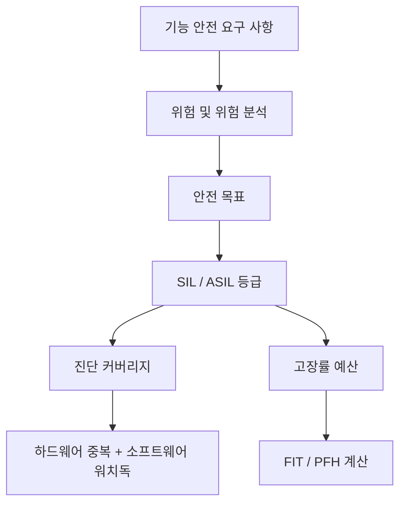

### 6.1.3 중앙 집중식 vs 분산식 vs 엣지-클라우드 협업

인간형 로봇의 컴퓨팅 아키텍처는 주로 세 가지 패러다임이 있습니다:

1. **중앙 집중식(centralized)** : 모든 인지, 의사 결정 및 제어 알고리즘이 하나의 고성능 메인 컴퓨터에서 실행되어 전역 최적화 및 개발/디버깅에 용이하지만, 통신 대역폭, 실시간성 및 단일 지점 신뢰성에 대한 요구사항이 높습니다.
2. **분산식(distributed)** : 저지연 제어 작업을 관절 드라이버, IMU 노드 또는 전용 비전 프런트엔드로 내리고, 메인 컴퓨터는 고급 인지 및 계획을 담당합니다. 백본 네트워크 부하를 줄이고 내결함성을 향상시킬 수 있습니다.
3. **엣지-클라우드 협업(edge-cloud)** : 로봇이 로컬에서 실시간 폐루프를 완료하고, 비실시간 대규모 학습, 지도 업데이트 또는 의미 이해 작업을 클라우드에 업로드합니다. 네트워크 불확실성과 데이터 프라이버시를 처리해야 합니다.

!!! note "용어 설명: 중앙 집중식, 분산식, 엣지 컴퓨팅, 클라우드 컴퓨팅, 단일 지점 장애"
    - **중앙 집중식(centralized)** : 계산 및 의사 결정이 단일 또는 소수의 노드에 집중됩니다.
    - **분산식(distributed)** : 계산 작업이 여러 물리적 노드에 분산되어 네트워크를 통해 협업합니다.
    - **엣지 컴퓨팅(edge computing)** : 데이터 생성 원천 근처에서 계산을 수행하여 원격지로 업로드되는 데이터 양과 지연 시간을 줄입니다.
    - **클라우드 컴퓨팅(cloud computing)** : 광역 네트워크를 통해 원격 데이터 센터의 탄력적인 컴퓨팅 리소스에 접근합니다.
    - **단일 지점 장애(single point of failure)** : 시스템에서 한 구성 요소가 고장 나면 전체 시스템이 마비되는 단일 구성 요소입니다.

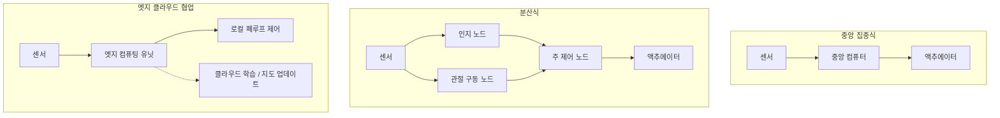

## 6.2 프로세서와 가속 장치

### 6.2.1 CPU: 아키텍처, 파이프라인, 캐시, 분기 예측, SIMD/NEON/AVX, 메모리 벽

중앙 처리 장치(CPU)는 범용 연산의 핵심입니다. 현대 CPU는 명령어 수준 병렬성(ILP), 스레드 수준 병렬성(TLP) 및 데이터 수준 병렬성(DLP)을 통해 성능을 향상시킵니다.

!!! note "용어 설명: CPU, 명령어 집합 아키텍처, 마이크로아키텍처, 파이프라인, 수퍼스칼라, 비순차 실행"
    - **CPU (Central Processing Unit)** : 범용 명령어 시퀀스를 실행하는 프로세서로, 복잡한 제어 흐름과 저지연 직렬 작업에 능숙합니다.
    - **명령어 집합 아키텍처 (ISA)** : 소프트웨어와 하드웨어 간의 인터페이스로, 명령어 형식, 레지스터 및 주소 지정 모드를 정의합니다 (예: x86, ARMv8, RISC-V).
    - **마이크로아키텍처 (microarchitecture)** : ISA의 구체적인 구현 방식으로, 성능, 전력 소비 및 면적을 결정합니다.
    - **파이프라인 (pipeline)** : 명령어 실행을 인출, 디코딩, 실행, 메모리 접근, 쓰기 저장 등의 여러 단계로 나누어 여러 명령어가 중첩 실행되도록 합니다.
    - **수퍼스칼라 (superscalar)** : 각 사이클마다 여러 명령어를 발행할 수 있는 프로세서 설계입니다.
    - **비순차 실행 (out-of-order execution)** : 특정 명령어가 데이터 의존성으로 인해 차단될 때, 의존성이 없는 후속 명령어를 먼저 실행하여 파이프라인 활용도를 높입니다.

**파이프라인과 CPI**. 이상적으로, \(k\) 단계 파이프라인은 각 사이클마다 하나의 명령어를 완료하며, 클록 사이클은 \(k\) 단계 중 가장 느린 단계의 지연 시간과 거의 같습니다. 실제 성능은 CPI (Cycles Per Instruction)에 의해 제한됩니다:

$$
\text{실행 시간} = \text{명령어 수} \times \text{CPI} \times \text{클록 사이클}
$$

분기 명령어는 파이프라인을 중단시킵니다. 분기 예측기(branch predictor)는 과거 정보를 통해 분기 방향을 추측하며, 예측 실패 시 파이프라인을 비워야(flush) 하므로 패널티가 발생합니다.

**캐시 계층**. CPU는 다중 레벨 캐시(L1/L2/L3)를 사용하여 주 메모리 접근 지연 시간을 완화합니다. 캐시 적중 시 접근 시간은 1–10 ns 수준이며, 미적중 시 DRAM 접근은 최대 100 ns에 달할 수 있습니다. 지역성 원리에는 시간 지역성과 공간 지역성이 포함됩니다.

!!! note "용어 설명: 캐시, 적중, 미적중, 지역성, 캐시 라인, 캐시 일관성"
    - **캐시 (cache)** : CPU와 주 메모리 사이에 위치한 고속 메모리로, 최근에 접근한 데이터의 복사본을 저장합니다.
    - **적중 (hit)** : 필요한 데이터가 캐시에 있는 경우; **미적중 (miss)** : 더 느린 계층에서 가져와야 하는 경우.
    - **시간 지역성 (temporal locality)** : 최근에 접근한 데이터는 곧 다시 접근될 가능성이 높습니다.
    - **공간 지역성 (spatial locality)** : 특정 주소에 접근한 후, 인접한 주소에 접근할 가능성이 높습니다.
    - **캐시 라인 (cache line)** : 캐시와 주 메모리 간에 전송되는 최소 데이터 블록으로, 일반적으로 64 B입니다.
    - **캐시 일관성 (cache coherence)** : 멀티코어 시스템에서 동일한 메모리 주소에 대한 여러 코어 캐시의 뷰(view)를 일관되게 유지하는 메커니즘입니다.

**SIMD / NEON / AVX**. 단일 명령어 다중 데이터(SIMD)를 사용하면 하나의 명령어로 여러 데이터 요소를 동시에 조작할 수 있습니다. ARM NEON과 x86 AVX/AVX-512는 대표적인 SIMD 확장입니다. 벡터 덧셈 \(c_i = a_i + b_i\)의 경우, SIMD는 4개, 8개, 심지어 16개의 부동소수점 숫자를 벡터 레지스터에 패킹하여 한 번에 처리할 수 있습니다.

!!! note "용어 설명: SIMD, 벡터 레지스터, NEON, AVX, 데이터 수준 병렬성"
    - **SIMD (Single Instruction Multiple Data)** : 하나의 명령어로 여러 데이터 요소를 동시에 처리하는 병렬 방식입니다.
    - **벡터 레지스터 (vector register)** : 여러 스칼라 데이터를 담을 수 있는 넓은 레지스터로, 예를 들어 128 bit NEON, 256 bit AVX, 512 bit AVX-512가 있습니다.
    - **NEON** : ARM 아키텍처의 SIMD/벡터 확장입니다.
    - **AVX (Advanced Vector Extensions)** : Intel/AMD x86 프로세서의 SIMD 확장입니다.
    - **데이터 수준 병렬성 (DLP)** : 많은 데이터 요소에 동일한 연산을 적용하는 병렬 형태입니다.

**메모리 벽 (memory wall)** . 프로세서의 최대 연산 능력은 메모리 대역폭 및 지연 시간 개선보다 훨씬 빠르게 증가하여, 많은 애플리케이션이 계산 자체보다 데이터 이동에 의해 제한됩니다. Wulf와 McKee는 1995년에 "메모리 벽" 개념을 제시하며 프로세서와 DRAM 간의 성능 격차가 지속적으로 확대되고 있음을 지적했습니다.

**Amdahl의 법칙**. 시스템의 특정 부분을 가속할 때, 전체 가속비는 해당 부분이 차지하는 비율에 의해 제한됩니다. 가속 가능한 부분의 비율을 \(f\), 해당 부분의 가속비를 \(S\)라고 하면, 전체 가속비는 다음과 같습니다:

$$
S_{\text{overall}} = \frac{1}{(1 - f) + \frac{f}{S}}
$$

만약 \(f = 0.5\), \(S = 10\)이면, 전체는 약 1.82배만 가속됩니다. Amdahl의 법칙은 특정 부분의 성능만 향상시키는 이득에는 한계가 있으며, 전체 계산 체인을 최적화해야 함을 설명합니다.

**Gustafson의 법칙**. 확장 가능한 문제의 경우, 문제 규모가 커짐에 따라 병렬 부분의 비율 \(f\)도 증가하므로, 가속비는 \(S_{\text{overall}} \approx 1 - f + f \cdot S\)로 근사할 수 있습니다. 이는 고정된 문제의 가속비보다는 병렬 시스템의 확장성을 강조합니다.

!!! note "용어 설명: Amdahl의 법칙, Gustafson의 법칙, 가속비, 확장성, 직렬 병목"
    - **Amdahl의 법칙 (Amdahl's law)** : 고정된 문제 규모에서 전체 가속비는 가속 가능한 부분의 비율에 의해 제한됩니다.
    - **Gustafson의 법칙 (Gustafson's law)** : 확장 가능한 문제 규모에서 가속비는 병렬 부분의 비율이 증가함에 따라 선형에 가까워집니다.
    - **가속비 (speedup)** : 최적화 후 실행 시간과 최적화 전 실행 시간의 비율입니다.
    - **확장성 (scalability)** : 시스템이 리소스 증가에 따라 성능 향상을 유지하는 능력입니다.
    - **직렬 병목 (serial bottleneck)** : 병렬화할 수 없는 부분이 전체 성능에 미치는 제한입니다.

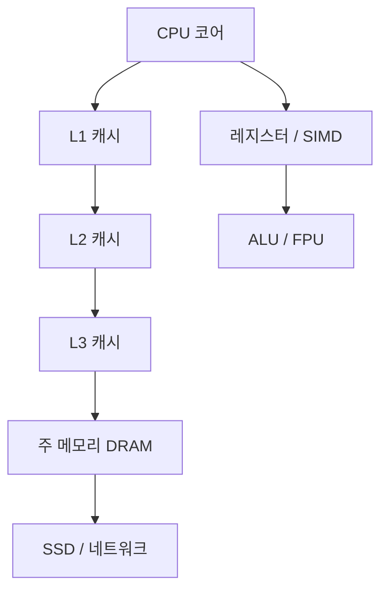

### 6.2.2 GPU: CUDA core / Tensor core / warp / shared memory / bandwidth / CUDA / OpenCL

그래픽 처리 장치(GPU)는 원래 그래픽 렌더링용으로 설계되었지만, 현재는 범용 병렬 컴퓨팅(GPGPU)의 주력이 되었으며, 특히 행렬 곱셈, 합성곱, 딥러닝 및 포인트 클라우드 처리에 적합합니다.

!!! note "용어 설명: GPU, CUDA core, Tensor core, SM, warp, 비디오 메모리 대역폭"
    - **GPU (Graphics Processing Unit)** : 고도로 병렬화된 스트림 프로세서 배열로, 규칙적인 데이터 병렬 작업에 능숙합니다.
    - **CUDA core** : NVIDIA GPU에서 스칼라/벡터 부동소수점 및 정수 연산을 실행하는 기본 단위입니다.
    - **Tensor core** : NVIDIA Volta 이후 아키텍처에서 행렬 곱셈 누산(MMA) 전용 하드웨어 유닛으로, FP16/INT8/BF16 등 저정밀도를 지원합니다.
    - **SM (Streaming Multiprocessor)** : NVIDIA GPU에서 여러 CUDA core, Tensor core, 레지스터, 공유 메모리 및 스케줄러로 구성된 계산 클러스터입니다.
    - **warp** : NVIDIA GPU에서 32개 스레드로 구성된 실행 단위로, 동일 warp 내 스레드는 SIMT(단일 명령어 다중 스레드) 방식으로 실행됩니다.
    - **비디오 메모리 대역폭 (memory bandwidth)** : GPU 전역 비디오 메모리(HBM/GDDR/LPDDR)가 초당 전송할 수 있는 데이터 양으로, 일반적으로 GB/s 단위로 표시됩니다.

GPU는 SIMT 실행 모델을 사용합니다: 동일 warp의 32개 스레드는 동일한 명령어를 실행하지만 다른 데이터를 조작합니다. 스레드가 분기로 인해 다른 경로를 생성할 때는 직렬화되어 실행(분기 발산)되므로 효율성이 떨어집니다.

공유 메모리(shared memory)는 SM 내의 고속 프로그래밍 가능 캐시로, 지연 시간이 전역 비디오 메모리의 약 1/100입니다. 데이터를 전역 비디오 메모리에서 공유 메모리로 로드한 후 스레드가 협력하여 계산하면 대역폭 의존성을 크게 줄일 수 있습니다.

!!! note "용어 설명: 전역 메모리, 공유 메모리, 레지스터, 분기 발산, CUDA, OpenCL"
    - **전역 메모리 (global memory)** : GPU 상의 모든 스레드가 접근 가능한 대용량 비디오 메모리, 높은 지연 시간과 높은 대역폭을 가짐.
    - **공유 메모리 (shared memory)** : 동일한 스레드 블록 내 스레드들이 공유하는 빠른 온칩 저장소, 수동 관리로 지역성 최적화 가능.
    - **레지스터 (register)** : 각 스레드 전용의 가장 빠른 저장소, 개수는 하드웨어에 의해 제한됨.
    - **분기 발산 (branch divergence)** : 동일한 warp 내 스레드들이 서로 다른 분기 경로를 따라가며 하드웨어가 직렬로 실행하게 되는 현상.
    - **CUDA (Compute Unified Device Architecture)** : NVIDIA의 GPU 병렬 컴퓨팅 플랫폼 및 프로그래밍 모델.
    - **OpenCL (Open Computing Language)** : 다중 제조사의 이기종 병렬 프로그래밍 프레임워크.

GPU 피크 연산 성능 \(P\)은 CUDA 코어 수 \(N\), 주파수 \(f\), 사이클당 코어당 연산 수 \(o\)와 관련이 있습니다:

$$
P = N \times f \times o
$$

예를 들어, 2048개의 CUDA 코어와 1.3 GHz 주파수를 가진 GPU에서 각 CUDA 코어가 사이클당 2회의 FP32 FMA(곱셈-덧셈)를 실행할 수 있다면, 피크 FP32 성능은 약 \(2048 \times 1.3 \times 2 \times 2 = 10.6\) TFLOPS입니다.

**메모리 병합 접근과 점유율**. GPU 전역 메모리는 트랜잭션(transaction) 단위로 접근되며, 동일한 warp의 32개 스레드가 연속된 주소에 접근할 때 하드웨어는 여러 번의 접근을 소수의 트랜잭션으로 병합하여 유효 대역폭을 크게 향상시킵니다. 접근 패턴이 분산되거나 정렬되지 않으면 트랜잭션 수가 증가하여 대역폭 활용도가 떨어집니다. 점유율(occupancy)은 각 SM에서 활성 warp 수와 최대 warp 수의 비율을 의미하며, 높은 점유율은 메모리 지연 시간을 숨기는 데 도움이 되지만, 너무 높으면 레지스터/공유 메모리 자원 경쟁을 유발할 수 있습니다.

!!! note "용어 설명: 메모리 병합 접근, 점유율, 트랜잭션, 지연 시간 숨김, 자원 경쟁"
    - **메모리 병합 접근 (coalesced memory access)** : 동일한 warp 내 스레드들이 연속된 메모리 주소에 접근하여 하드웨어에 의해 효율적인 트랜잭션으로 병합되는 것.
    - **점유율 (occupancy)** : SM에서 활성 warp 수와 최대 지원 가능한 warp 수의 비율.
    - **트랜잭션 (transaction)** : GPU와 비디오 메모리 간의 단일 데이터 전송 단위.
    - **지연 시간 숨김 (latency hiding)** : 다른 warp을 실행하는 것으로 전환하여 긴 지연 시간 작업을 감추는 것.
    - **자원 경쟁 (resource contention)** : 레지스터, 공유 메모리 또는 캐시 부족으로 인한 성능 저하.

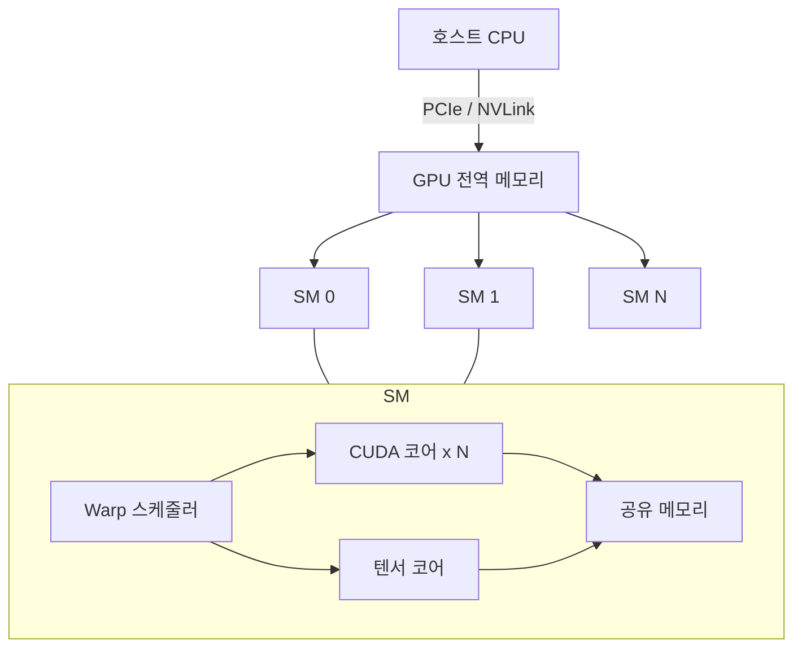

### 6.2.3 NPU / TPU / DSP: systolic array / MAC array / quantization / INT8 / FP16 / ONNX / TensorRT / TOPS/W

신경망 프로세서(NPU) 및 유사 가속기는 딥러닝 추론에 특화되어 있으며, 일반적으로 에너지 효율(TOPS/W)에서 범용 CPU/GPU를 크게 능가합니다.

!!! note "용어 설명: NPU, TPU, DSP, MAC, systolic array, 양자화, INT8, FP16"
    - **NPU (Neural Processing Unit)** : 신경망 추론/훈련을 특별히 가속하는 프로세서로, 일반적으로 SoC에 통합됨.
    - **TPU (Tensor Processing Unit)** : Google이 개발한 텐서 가속기로, 대규모 수축기 배열(systolic array)로 유명함.
    - **DSP (Digital Signal Processor)** : 디지털 신호 처리에 최적화된 프로그래밍 가능 프로세서로, 오디오, 모뎀 및 시각 전처리에 자주 사용됨.
    - **MAC (Multiply-Accumulate)** : 곱셈-덧셈 연산 \(a \times b + c\)으로, 행렬 곱셈과 합성곱의 기본 연산.
    - **systolic array (수축기 배열)** : 데이터가 인접 처리 요소 간에 심장 박동처럼 흐르는 계산 배열로, 규칙적인 행렬 연산에 적합함.
    - **양자화 (quantization)** : 모델 가중치와 활성화를 고정밀도 부동소수점(예: FP32)에서 저정밀도 정수(예: INT8) 또는 반정밀도 부동소수점(FP16/BF16)으로 매핑하여 저장 및 계산량을 줄이는 것.
    - **INT8 / FP16** : 8비트 정수 및 16비트 반정밀도 부동소수점으로, 엣지 추론에서 일반적으로 사용되는 저정밀도 형식.

**수축기 배열 원리**. 행렬 곱셈 \(C = A \times B\)를 고려해 보십시오. 여기서 \(A\)의 행과 \(B\)의 열이 2차원 PE(처리 요소) 배열을 순차적으로 통과하며, 각 PE는 한 번의 MAC을 완료하고 부분 합을 인접 유닛에 전달합니다. 이 설계는 주 메모리에 대한 빈번한 접근을 피하고 계산 밀도가 높습니다.

!!! note "용어 설명: PE, 부분 합, 추론, 훈련, TOPS, TOPS/W"
    - **PE (Processing Element)** : 가속기의 기본 계산 유닛.
    - **부분 합 (partial sum)** : 행렬 곱셈의 중간 결과 누적 값.
    - **추론 (inference)** : 훈련된 모델을 사용하여 새 데이터에 대한 순방향 계산을 수행하는 것.
    - **훈련 (training)** : 역전파를 통해 모델 가중치를 업데이트하는 과정.
    - **TOPS (Tera Operations Per Second)** : 초당 조 회 연산으로, NPU 피크 연산 성능을 측정하는 데 자주 사용됨.
    - **TOPS/W** : 와트당 TOPS로, 에너지 효율을 측정함.

**양자화와 배포**. FP32를 INT8로 양자화할 때는 일반적으로 선형 매핑을 사용합니다:

$$
x_{\text{int8}} = \text{round}\left(\frac{x_{\text{fp32}} - z}{s}\right)
$$

여기서 \(s\)는 스케일 팩터(scale), \(z\)는 제로 포인트(zero-point)입니다. 양자화 후, 합성곱 또는 완전 연결 계층의 MAC은 정수 연산으로 완료될 수 있으며, 그런 다음 scale과 zero-point를 사용하여 FP32 출력으로 역양자화됩니다.

**ONNX와 TensorRT**. ONNX(Open Neural Network Exchange)는 프레임워크 간 모델 표현 형식입니다. TensorRT는 NVIDIA의 추론 최적화 도구로, 레이어 융합, 정밀도 교정, 커널 자동 튜닝 및 동적 텐서 메모리 최적화를 수행할 수 있습니다.

!!! note "용어 설명: ONNX, TensorRT, 레이어 융합, 커널 자동 튜닝, 교정"
    - **ONNX (Open Neural Network Exchange)** : 개방형 딥러닝 모델 교환 형식으로, PyTorch, TensorFlow 등 프레임워크 간 상호 운용성을 지원함.
    - **TensorRT** : NVIDIA의 추론 최적화 도구 및 런타임.
    - **레이어 융합 (layer fusion)** : 여러 연속 연산자를 하나의 커널로 병합하여 비디오 메모리 접근 및 커널 시작 오버헤드를 줄이는 것.
    - **커널 자동 튜닝 (kernel auto-tuning)** : 대상 GPU에 가장 적합한 CUDA 커널 구현을 선택하는 것.
    - **교정 (calibration)** : 대표 데이터를 사용하여 양자화 매개변수(scale, zero-point)를 결정하는 과정.

**PTQ와 QAT**. 훈련 후 양자화(Post-Training Quantization, PTQ)는 훈련된 FP32 모델을 직접 양자화하여 간단하고 빠르지만 정밀도 손실이 발생할 수 있습니다. 양자화 인식 훈련(Quantization-Aware Training, QAT)은 훈련 과정에서 저정밀도 연산을 시뮬레이션하여 네트워크가 양자화 오류에 적응하도록 하며, 일반적으로 더 높은 정밀도를 얻을 수 있습니다. 로봇 인식 작업의 경우 정밀도에 민감하다면(예: 깊이 추정, 자세 추정), QAT 또는 혼합 정밀도(일부 레이어는 FP16/FP32 유지)를 자주 사용합니다.

!!! note "용어 설명: PTQ, QAT, 혼합 정밀도, 인식 훈련, 양자화 오류"
    - **PTQ (Post-Training Quantization)** : 훈련 완료 후 모델 가중치와 활성화를 직접 양자화하는 것.
    - **QAT (Quantization-Aware Training)** : 훈련 시 양자화된 순방향 과정을 시뮬레이션하여 네트워크가 양자화 노이즈에 적응하도록 학습하는 것.
    - **혼합 정밀도 (mixed precision)** : 모델의 다른 부분에서 다른 수치 정밀도를 사용하는 것.
    - **양자화 오류 (quantization error)** : 저정밀도 표현으로 인해 발생하는 근사 오류.

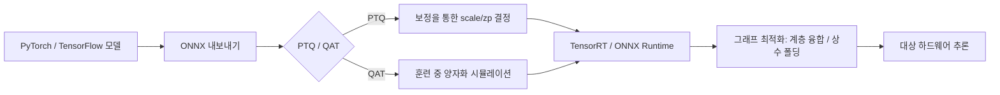

### 6.2.4 FPGA와 재구성 가능 컴퓨팅

현장 프로그래머블 게이트 어레이(FPGA)는 구성 가능 논리 블록(CLB), DSP 슬라이스, 블록 RAM 및 프로그래머블 상호 연결로 구성되어 하드웨어 수준에서 데이터 경로를 맞춤 설정할 수 있습니다. CPU/GPU의 "명령어 구동" 실행 방식과 달리 FPGA는 "데이터 흐름 구동" 방식입니다. 즉, 일단 구성이 완료되면 데이터는 맞춤 설정된 논리 경로를 따라 흐르며, 매 클록 주기마다 결정적인 결과를 생성합니다. 이러한 결정성 덕분에 FPGA는 로봇 공학에서 마이크로초 응답이 필요한 인터페이스, 프로토콜 변환 및 센서 동기화에 특히 적합합니다.

!!! note "용어 설명: FPGA, CLB, LUT, DSP 슬라이스, 블록 RAM, 재구성 가능 컴퓨팅, HLS, SRAM 기반 FPGA"
    - **FPGA(Field-Programmable Gate Array)**: 하드웨어 설명 언어 또는 고수준 합성 도구를 통해 현장에서 구성할 수 있는 디지털 회로입니다.
    - **CLB(Configurable Logic Block)**: FPGA에서 조합 논리 및 순차 논리를 구현하는 기본 단위입니다.
    - **LUT(Look-Up Table)**: 조회 테이블을 사용하여 임의의 부울 함수를 구현하며, CLB의 핵심입니다.
    - **DSP 슬라이스**: FPGA에 통합된 하드와이어드 곱셈-누산기/곱셈기 유닛입니다.
    - **블록 RAM(Block RAM)**: FPGA 온칩 분산 SRAM으로, 중간 데이터를 캐싱하는 데 사용됩니다.
    - **재구성 가능 컴퓨팅(reconfigurable computing)**: 애플리케이션에 따라 하드웨어 구조를 동적으로 변경하는 컴퓨팅 패러다임입니다.
    - **HLS(High-Level Synthesis)**: C/C++/Python 설명을 자동으로 하드웨어 회로로 합성하는 설계 방법입니다.
    - **SRAM 기반 FPGA**: SRAM 셀을 통해 구성 비트를 저장하며, 전원이 꺼지면 구성이 손실되고 전원을 켜면 다시 로드해야 합니다.

#### LUT, CLB 및 부울 함수 구현

FPGA 논리의 기본은 **LUT(Look-Up Table)**입니다. \(n\) 입력 LUT는 \(2^n\)개의 출력 값을 저장할 수 있으므로, 임의의 \(n\) 입력, 1 출력 부울 함수를 구현할 수 있습니다. 4입력 LUT(4-LUT)의 경우 구현 가능한 함수 공간은 \(2^{2^4} = 65536\)가지입니다. 여러 LUT를 프로그래머블 상호 연결을 통해 조합하면 임의의 복잡한 조합 논리를 구현할 수 있습니다.

!!! note "용어 설명: 부울 함수, 진리표, 조합 논리, 순차 논리, 플립플롭"
    - **부울 함수(Boolean function)**: 입력과 출력이 0/1만 있는 이산 함수입니다.
    - **진리표(truth table)**: 모든 입력 조합과 해당 출력을 나열한 표입니다.
    - **조합 논리(combinational logic)**: 출력이 현재 입력에만 의존하며, 메모리 특성이 없습니다.
    - **순차 논리(sequential logic)**: 출력이 현재 입력과 이전 상태에 의존하며, 상태 저장을 위해 플립플롭이 필요합니다.
    - **플립플롭(flip-flop)**: 클록 에지에서 트리거되는 1비트 저장 단위입니다.

CLB는 일반적으로 여러 개의 LUT, 플립플롭 및 멀티플렉서로 구성됩니다. CLB의 출력은 LUT의 조합 논리 결과 또는 플립플롭의 순차 출력에서 나올 수 있습니다. 따라서 FPGA의 모든 알고리즘은 **조합 논리(LUT) + 상태 레지스터(플립플롭) + 상호 연결**로 분해될 수 있습니다.

**예시: LUT를 사용한 전가산기 구현**. 1비트 전가산기는 3개의 입력(\(A, B, C_{in}\))과 2개의 출력(합 \(S\), 자리올림 \(C_{out}\))을 가집니다. 부울 표현식은 다음과 같습니다.

$$
S = A \oplus B \oplus C_{in}
$$

$$
C_{out} = AB + (A \oplus B) C_{in}
$$

3입력 LUT 하나로 합 또는 자리올림 중 하나의 출력을 구현할 수 있습니다. 다중 비트 가산기의 경우 여러 개의 1비트 전가산기를 직렬로 연결하거나, 자리올림 체인(carry chain) 전용 구조를 사용하여 가속화할 수 있습니다. 최신 FPGA의 CLB는 고속 자리올림 논리를 내장하고 있어 32비트 가산기도 매우 높은 주파수에서 작동할 수 있습니다.

#### 타이밍 분석: 셋업/홀드, 클록 스큐 및 최대 주파수

FPGA 설계는 타이밍 제약 조건을 충족해야 하며, 그렇지 않으면 메타스테이블 상태 또는 기능 오류가 발생할 수 있습니다. 타이밍 분석의 핵심은 셋업 시간(setup time)과 홀드 시간(hold time)입니다.

!!! note "용어 설명: 셋업 시간, 홀드 시간, 클록 스큐, 크리티컬 패스, Fmax, 메타스테이블 상태"
    - **셋업 시간(setup time)**: 플립플롭의 클록 에지가 도착하기 전에 입력 데이터가 안정적으로 유지되어야 하는 최소 시간입니다.
    - **홀드 시간(hold time)**: 플립플롭의 클록 에지가 도착한 후에 입력 데이터가 안정적으로 유지되어야 하는 최소 시간입니다.
    - **클록 스큐(clock skew)**: 동일한 클록이 다른 플립플롭에 도달하는 시간 차이입니다.
    - **크리티컬 패스(critical path)**: 조합 논리 지연이 가장 긴 경로로, 최대 작동 주파수를 결정합니다.
    - **Fmax**: 회로가 안정적으로 작동할 수 있는 최대 클록 주파수입니다.
    - **메타스테이블 상태(metastability)**: 플립플롭이 샘플링할 때 입력이 정확히 변화하여 출력이 불확실한 전압 레벨에 있는 상태입니다.

셋업 시간 제약 조건은 다음과 같이 쓸 수 있습니다.

$$
T_{clk} \ge t_{cq} + t_{comb} + t_{su} + t_{skew}
$$

여기서 \(T_{clk}\)는 클록 주기, \(t_{cq}\)는 플립플롭의 클록-출력 지연, \(t_{comb}\)는 조합 논리 지연, \(t_{su}\)는 셋업 시간, \(t_{skew}\)는 클록 스큐입니다. 이로부터 최대 주파수를 얻을 수 있습니다.

$$
F_{max} = \frac{1}{t_{cq} + t_{comb} + t_{su} + t_{skew}}
$$

홀드 시간 제약 조건은 다음과 같습니다.

$$
t_{cq} + t_{comb} \ge t_{hold} + t_{skew}
$$

타이밍 분석과 관련된 또 다른 중요한 문제는 **클록 도메인 교차(Clock Domain Crossing, CDC)**입니다. 신호가 한 클록 도메인에서 다른 비동기 클록 도메인으로 전달될 때는 이중 플립플롭 동기화기, FIFO 또는 핸드셰이크 프로토콜을 통해 처리해야 합니다. 그렇지 않으면 메타스테이블 상태가 다운스트림 논리로 전파될 수 있습니다. 로봇 공학에서 흔한 CDC 시나리오는 다음과 같습니다. 센서 데이터가 독립적인 클록으로 샘플링된 후 FPGA 메인 클록 도메인으로 전달되거나, FPGA가 외부 CPU와 다른 주파수의 AXI 버스를 통해 통신하는 경우입니다.

#### 리소스 추정 및 전력 모델

FPGA의 주요 리소스는 LUT, 플립플롭(FF), DSP 슬라이스 및 BRAM입니다. 설계 전에 알고리즘을 기반으로 리소스 사용량을 추정해야 합니다. 예를 들어, \(N\)비트 \(M\)탭 FIR 필터의 경우:

- 곱셈: 각 탭당 1회 곱셈. 계수가 고정된 경우 LUT로 구현 가능하고, 계수가 가변적인 경우 일반적으로 DSP 슬라이스를 사용합니다.
- 덧셈: \(M-1\)회 덧셈.
- 지연선: \(M\)개의 \(N\)비트 레지스터.

\(N=16, M=32\)인 경우 각 곱셈에 하나의 DSP 슬라이스를 사용하면 총 32개의 DSP 슬라이스가 필요합니다. 지연선은 SRL(Shift Register LUT) 또는 BRAM으로 구현할 수 있습니다.

!!! note "용어 설명: FIR 필터, 탭, 지연선, SRL, AXI 버스"
    - **FIR 필터(Finite Impulse Response filter)**: 유한 임펄스 응답 필터입니다.
    - **탭(tap)**: FIR 필터의 계수와 해당 지연 샘플입니다.
    - **지연선(delay line)**: 과거 샘플을 저장하는 시프트 레지스터 구조입니다.
    - **SRL(Shift Register LUT)**: LUT로 구현된 시프트 레지스터로, FF 리소스를 절약합니다.
    - **AXI 버스(Advanced eXtensible Interface)**: ARM에서 정의한 고성능 온칩 버스 프로토콜입니다.

FPGA의 전력 소비는 주로 세 부분으로 구성됩니다.

1. **정적 전력**: 트랜지스터 누설 전류로, 공정, 온도 및 구성 규모에 따라 달라집니다. 28nm 이하 공정에서는 정적 전력을 무시할 수 없습니다.
2. **동적 전력**: 논리 스위칭으로 소비되는 에너지로, 대략 \(\alpha C V^2 f\)로 표현됩니다. 여기서 \(\alpha\)는 활동 인자, \(C\)는 부하 커패시턴스, \(V\)는 코어 전압, \(f\)는 클록 주파수입니다.
3. **I/O 전력**: 고속 인터페이스(예: GTH/GTY 트랜시버)가 외부 부하를 구동할 때 소비되는 전력입니다.

휴머노이드 로봇의 저전력 관절 컨트롤러의 경우, 저전력 FPGA(예: Lattice, Microchip PolarFire) 또는 SoC FPGA(예: AMD Zynq UltraScale+)를 선택하면 실시간성과 에너지 효율성 사이에서 균형을 맞출 수 있습니다.

#### HLS 설계 흐름 및 Python 예제

HLS는 알고리즘 설명(C/C++/Python)을 RTL(Verilog/VHDL)로 변환하여 소프트웨어 엔지니어도 FPGA를 활용할 수 있게 합니다. 일반적인 HLS 최적화 지시어에는 파이프라인(pipeline), 데이터 흐름(dataflow), 루프 언롤(unroll), 배열 분할(array_partition) 및 인터페이스 합성(interface synthesis)이 포함됩니다.

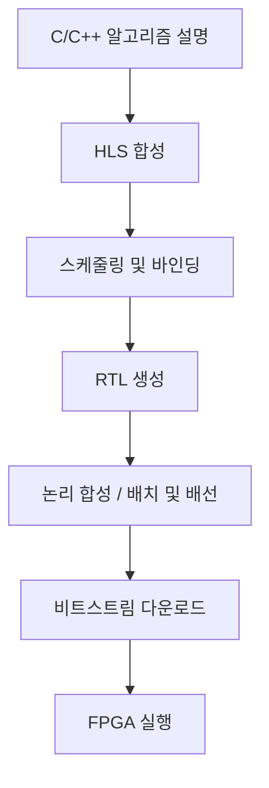

**Python 예제: 비트 연산 병렬 CRC-8**. 아래 코드는 FPGA 비트스트림을 직접 생성하지 않고, 순수 Python으로 룩업 테이블과 비트 XOR을 사용하여 FPGA에서 단일 사이클로 완료할 수 있는 CRC-8 계산을 시연하여 LUT 친화적인 알고리즘 구조를 이해하는 데 도움을 줍니다.

```python
"""
CRC-8 (SMBus 다항식 x^8 + x^2 + x + 1)을 룩업 테이블로 구현.
이 테이블 기반 접근 방식은 FPGA 친화적입니다: 하나의 256x8 ROM 룩업과 하나의 XOR.
"""
import numpy as np

POLY = 0x07  # x^8 + x^2 + x + 1

# 256개 항목 룩업 테이블 구축
crc_table = np.zeros(256, dtype=np.uint8)
for i in range(256):
    crc = i
    for _ in range(8):
        if crc & 0x80:
            crc = ((crc << 1) ^ POLY) & 0xFF
        else:
            crc = (crc << 1) & 0xFF
    crc_table[i] = crc

def crc8_table(data: bytes) -> int:
    """룩업 테이블을 사용한 바이트 단위 CRC-8."""
    crc = 0x00
    for byte in data:
        idx = (crc ^ byte) & 0xFF
        crc = crc_table[idx]
    return crc

# 예제: 짧은 센서 프레임의 CRC-8 계산
frame = bytes([0x01, 0x02, 0x03, 0x04, 0x05])
print(f"CRC-8 of {frame.hex()} = 0x{crc8_table(frame):02X}")

# 바이트/사이클 구현을 위한 FPGA 리소스 추정:
# - 256 x 8비트 LUT/BRAM 룩업 테이블
# - 8비트 XOR
# - 실행 중인 CRC를 위한 8비트 레지스터
```

FPGA에서 위의 `crc_table`은 256×8 분산 RAM 또는 BRAM으로 합성될 수 있습니다. 각 클록 사이클마다 입력 바이트를 읽고, 테이블을 조회한 후 현재 CRC와 XOR하여 바이트/사이클의 결정론적 CRC 계산을 구현할 수 있습니다. EtherCAT과 같이 실시간 CRC 검증이 필요한 산업용 버스의 경우, 이러한 하드 로직 구현은 소프트웨어 CRC보다 1–2배 더 빠릅니다.

FPGA와 GPU/NPU의 관계는 경쟁이 아닌 보완 관계입니다. GPU/NPU는 대규모 연산 능력과 높은 처리량의 인식 및 전략 추론을 담당하고, FPGA는 결정론적 인터페이스, 프로토콜 변환 및 전처리를 담당합니다. 휴머노이드 로봇에서 흔히 볼 수 있는 "ARM + FPGA" 조합(예: AMD Kria, Zynq)은 FPGA를 사용하여 고속 I/O를 처리하는 동시에 ARM에서 Linux 및 ROS 2를 실행하여 소프트웨어-하드웨어 협업을 실현합니다. FPGA와 다양한 센서 인터페이스의 자세한 전기적 특성은 5장 5.4절을 참조하십시오.

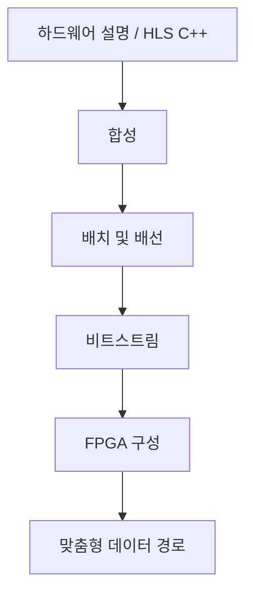

### 6.2.5 일반적인 로봇 컴퓨팅 플랫폼 비교표

아래 표는 휴머노이드 로봇 및 자율 로봇에서 흔히 볼 수 있는 임베디드 컴퓨팅 플랫폼을 나열합니다. 성능 데이터는 공개 사양에서 가져왔으며, 실제 전력 소비 및 연산 능력은 특정 구성 및 냉각 조건에 따라 다릅니다.

| 플랫폼 | 아키텍처 | CPU | GPU/NPU | AI 연산 능력 | 메모리/대역폭 | 일반적인 전력 소비 | 적용 계층 |
|---|---|---|---|---|---|---|---|
| NVIDIA Jetson AGX Orin 64GB | ARM + Ampere GPU | 12× Cortex-A78AE | 2048 CUDA + 64 Tensor | 275 TOPS (INT8) | 64 GB LPDDR5, 204.8 GB/s | 15–60 W | 인식/의사 결정 메인 컨트롤러 |
| NVIDIA Jetson AGX Xavier | ARM + Volta GPU | 8× Carmel | 512 CUDA + 64 Tensor | 32 TOPS | 32 GB LPDDR4x | 10–30 W | 인식/의사 결정 메인 컨트롤러 |
| Intel NUC 13 Pro | x86 | Core i5/i7 | Iris Xe / 선택적 외장 GPU | 수 TOPS | DDR4/DDR5 | 28–65 W | 개발/고급 메인 컨트롤러 |
| Qualcomm RB5 / QCS8550 | ARM | Kryo / Oryon | Adreno GPU + Hexagon DSP | 15–48 TOPS | LPDDR5 | 5–15 W | 인식 프론트엔드 |
| AMD Kria K26 | ARM + FPGA | 4× Cortex-A53 | Mali GPU + FPGA | FPGA 맞춤형 | 4 GB DDR4 | 5–10 W | I/O 및 실시간 제어 |
| Apple M-series | ARM | 고성능 + 효율 코어 | Neural Engine + GPU | 11–38 TOPS | 통합 메모리 | 10–100 W | 개발/고급 엣지 |
| Tesla FSD Chip | ARM + NPU | 12× Cortex-A72 | 2× NPU | 144 TOPS | LPDDR4 | ~36 W | 자율 주행/로봇 |
| Horizon Journey 5 | ARM + BPU | 8× Cortex-A55 | 2× BPU | 128 TOPS | LPDDR5 | 20–30 W | 자율 주행/로봇 |
| Rockchip RK3588 | ARM | 4× A76 + 4× A55 | Mali-G610 + 6 TOPS NPU | 6 TOPS | LPDDR4x/LPDDR5 | 5–10 W | 저비용 인식 |

!!! note "용어 설명: SoC, LPDDR, TOPS, TDP, 개발 키트, 캐리어 보드"
    - **SoC(System on Chip)**: 시스템에 필요한 CPU, GPU, NPU, I/O, 메모리 컨트롤러 등을 단일 칩에 통합한 것.
    - **LPDDR(Low-Power DDR)**: 모바일/임베디드 기기를 위한 저전력 메모리 표준.
    - **TDP(Thermal Design Power)**: 열 설계 전력으로, 냉각 시스템이 처리해야 하는 일반적인 전력 소비 상한선.
    - **개발 키트(developer kit)**: SoM, 캐리어 보드, 방열판 및 전원 공급 장치를 포함한 완전한 개발 보드.
    - **캐리어 보드(carrier board)**: SoM을 탑재하고 주변 인터페이스를 제공하는 인쇄 회로 기판.

플랫폼 선택은 연산 능력, 전력 소비, 방열, 크기, 비용, 생태계 및 실시간 성능 간의 균형이 필요합니다. 휴머노이드 로봇의 머리와 몸통에는 일반적으로 Jetson AGX Orin 또는 동급 플랫폼이 배치되고, 관절 계층에는 MCU/FPGA를 사용하여 실시간 제어를 수행합니다.

## 6.3 지각 컴퓨팅 작업과 알고리즘 구현

### 6.3.1 계산 그래프와 연산자: 합성곱, 행렬 곱, 풀링, 어텐션의 복잡도

현대 로봇 지각 시스템은 일반적으로 계산 그래프(computational graph)로 표현되며, 노드는 연산자(operator), 간선은 텐서(tensor)입니다. 핵심 연산자의 계산 복잡도를 이해하는 것은 성능 분석 및 하드웨어 선정의 기초입니다.

!!! note "용어 설명: 계산 그래프, 연산자, 텐서, FLOPs, 파라미터 수, 연산 강도"
    - **계산 그래프(computational graph)**: 노드로 연산을, 간선으로 데이터 의존성을 나타내는 그래프 구조로, 신경망 또는 알고리즘의 데이터 흐름을 설명합니다.
    - **연산자(operator)**: 그래프 내 기본 연산으로, 합성곱, 행렬 곱, ReLU, softmax 등이 있습니다.
    - **텐서(tensor)**: 다차원 배열로, 딥러닝의 기본 데이터 구조입니다.
    - **FLOPs(Floating Point Operations)**: 부동소수점 연산 횟수로, 계산량을 측정합니다.
    - **파라미터 수(number of parameters)**: 모델에서 학습 가능한 가중치의 총 개수로, 저장 공간과 메모리 사용량을 결정합니다.
    - **연산 강도(arithmetic intensity)**: 1바이트 메모리에 접근할 때 수행되는 연산 횟수로, Roofline 모델의 핵심 변수입니다.

**합성곱의 복잡도**. 입력 특성 맵 크기 \(H \times W\), 입력 채널 \(C_{in}\), 출력 채널 \(C_{out}\), 커널 크기 \(K \times K\), 출력 크기 \(H' \times W'\)에 대해 합성곱의 곱셈-덧셈 횟수는 다음과 같습니다:

$$
\text{FLOPs}_{\text{conv}} \approx 2 H' W' C_{out} K^2 C_{in}
$$

계수 2는 한 번의 곱셈과 한 번의 덧셈에서 비롯됩니다. 스트라이드, 그룹 합성곱 또는 팽창 합성곱을 사용하는 경우 이에 맞게 조정해야 합니다.

**행렬 곱셈**. 행렬 곱 \(C = A B\)에서 \(A \in \mathbb{R}^{m \times k}\), \(B \in \mathbb{R}^{k \times n}\)일 때 FLOPs는 다음과 같습니다:

$$
\text{FLOPs}_{\text{matmul}} = 2 m k n
$$

Transformer의 self-attention 계산량은 일반적으로 \(O(n^2 d)\)이며, 여기서 \(n\)은 시퀀스 길이, \(d\)는 특성 차원입니다.

**어텐션의 복잡도 분석**. 표준 scaled dot-product attention 계산:

$$
\text{Attention}(Q, K, V) = \text{softmax}\left(\frac{Q K^T}{\sqrt{d_k}}\right) V
$$

여기서 \(Q, K, V \in \mathbb{R}^{n \times d}\)입니다. \(Q K^T\) 계산에는 \(2 n^2 d\) FLOPs가 필요하며, softmax와 \(V\)와의 곱셈은 각각 약 \(O(n^2 d)\)가 필요하므로 총 계산량은 \(O(n^2 d)\)입니다. \(n\)이 큰 경우(예: 긴 시퀀스 비디오, 언어 모델) \(n^2\) 항이 계산과 메모리를 지배합니다. FlashAttention과 같은 알고리즘은 블록 계산과 메모리 접근 재배열을 통해 HBM 읽기/쓰기 횟수를 줄여 대역폭이 제한된 상황에서 유효 처리량을 향상시킵니다.

**풀링**. 최대 풀링 또는 평균 풀링은 학습 가능한 파라미터가 없으며, 주로 비교 또는 합산을 포함하므로 계산량이 상대적으로 낮습니다.

**연산 강도**. 연산 강도 \(I\)는 다음과 같이 정의됩니다:

$$
I = \frac{\text{FLOPs}}{\text{Bytes transferred}}
$$

Roofline 모델에서 \(I\)가 플랫폼의 능선점(ridge point)보다 낮으면 애플리케이션은 메모리 대역폭에 의해 제한되고, 능선점보다 높으면 최대 연산 성능에 의해 제한됩니다.

**예제: 합성곱 계층의 연산 강도**. \(3 \times 3\) 합성곱, 입력 \(H \times W = 112 \times 112\), \(C_{in} = 64\), \(C_{out} = 128\), 출력 크기가 동일하다고 가정합니다. FLOPs는 약 \(2 \times 112^2 \times 128 \times 9 \times 64 \approx 1.85\) GFLOPs입니다. 가중치와 입력/출력을 각각 한 번씩 읽는다고 가정하면 메모리 접근량은 약 \(112^2 \times 64 \times 4 + 3^2 \times 64 \times 128 \times 4 + 112^2 \times 128 \times 4 \approx 9.3\) MB입니다. 연산 강도 \(I \approx 1.85 \times 10^9 / 9.3 \times 10^6 \approx 199\) FLOPs/Byte입니다. Jetson AGX Orin의 능선점은 약 1–3 FLOPs/Byte이므로, 이 합성곱 계층은 일반적으로 연산 성능에 의해 제한됩니다. 매우 작은 배치나 희소 메모리 접근을 사용하는 경우 대역폭 제한 영역으로 이동할 수 있습니다.

!!! note "용어 설명: 배치, 희소 메모리 접근, Roofline 능선점, 연산 성능 제한, 대역폭 제한"
    - **배치(batch)**: 한 번에 처리되는 샘플의 수입니다. 배치를 늘리면 일반적으로 데이터 재사용성이 향상됩니다.
    - **희소 메모리 접근(sparse access)**: 연속적이지 않거나 무작위적인 메모리 접근 패턴으로, 캐시 효율성을 저하시킵니다.
    - **연산 성능 제한(compute-bound)**: 성능이 최대 연산 성능에 의해 결정됩니다.
    - **대역폭 제한(memory-bound)**: 성능이 메모리 대역폭에 의해 결정됩니다.

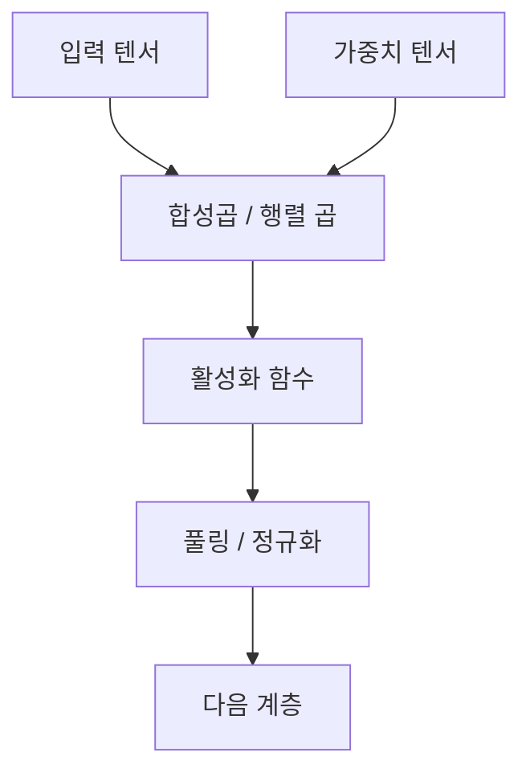

### 6.3.2 양안 스테레오 정합 알고리즘

양안 스테레오 비전은 일정한 베이스라인 \(B\)만큼 떨어진 두 대의 카메라로 동일한 장면을 동시에 촬영하고, 삼각 측량을 이용하여 픽셀 깊이를 복원합니다. 핵심 단계는 다음과 같습니다: 카메라 캘리브레이션, 에피폴라 기하학, 스테레오 정류, 비용 계산, 비용 집계, 시차 계산 및 최적화, 깊이 역산.

!!! note "용어 설명: 양안 스테레오 비전, 베이스라인, 에피폴라 기하학, 에피폴라 제약, 본질 행렬, 기본 행렬"
    - **양안 스테레오 비전(binocular stereo vision)**: 두 시점의 이미지를 이용하여 장면의 3차원 구조를 복원하는 시각 방법입니다.
    - **베이스라인(baseline, B)**: 두 카메라 광학 중심 사이의 직선 거리입니다.
    - **에피폴라 기하학(epipolar geometry)**: 두 카메라 뷰 사이의 기하학적 관계를 설명하는 이론적 프레임워크입니다.
    - **에피폴라 제약(epipolar constraint)**: 공간상의 한 점이 두 이미지에 투영된 점은 반드시 해당 에피폴라 선 위에 있어야 하므로, 2차원 정합을 1차원 검색으로 축소합니다.
    - **본질 행렬(essential matrix, E)**: 카메라 정규화 좌표계에서 두 뷰의 기하학적 관계를 설명하는 \(3 \times 3\) 행렬로, \(E = [\mathbf{t}]_\times R\)입니다.
    - **기본 행렬(fundamental matrix, F)**: 픽셀 좌표계에서 두 뷰의 기하학적 관계를 설명하며, 내부 파라미터 정보를 포함합니다. \(F = K_2^{-T} E K_1^{-1}\)입니다.

왼쪽 및 오른쪽 카메라의 광학 중심을 각각 \(O_L\), \(O_R\)이라고 하고, 공간 점 \(P\)의 왼쪽 및 오른쪽 이미지 투영을 \(p_L\), \(p_R\)이라고 합니다. 카메라가 캘리브레이션된 경우, 에피폴라 정류 후 두 이미지의 행이 정렬되어 \(p_L = (x, y)\), \(p_R = (x - d, y)\)가 됩니다. 여기서 \(d\)를 **시차(disparity)**라고 합니다.

**에피폴라 기하학과 본질 행렬**. 두 카메라의 내부 파라미터가 동일하고 캘리브레이션되었으며, 오른쪽 카메라의 왼쪽 카메라에 대한 회전 및 평행 이동이 각각 \(R\), \(t\)라고 가정합니다. 정규화된 이미지 좌표 \(x_L, x_R\)은 에피폴라 제약을 만족합니다:

$$
x_R^T E x_L = 0, \quad E = [t]_\times R
$$

여기서 \([t]_\times\)는 평행 이동 벡터 \(t\)의 반대칭 행렬입니다. 픽셀 좌표 \(p_L = K x_L\), \(p_R = K x_R\)을 사용하는 경우:

$$
p_R^T F p_L = 0, \quad F = K^{-T} E K^{-1}
$$

기본 행렬 \(F\)는 2차원 검색을 1차원 에피폴라 선으로 제한하며, 이는 스테레오 정합 효율의 핵심입니다.

**BM 블록 정합 알고리즘**. OpenCV의 `StereoBM`은 전체 이미지에 대해 고정 창으로 SAD/SSD 정합을 수행하며, 속도는 빠르지만 경계가 흐려집니다. 비용 함수는 다음과 같습니다:

$$
C_{BM}(x, y, d) = \sum_{(u, v) \in W} |I_L(x+u, y+v) - I_R(x+u-d, y+v)|
$$

SGBM은 여기에 다중 경로 비용 집계와 Birchfield-Tomasi 서브픽셀 비용을 도입하여 약한 텍스처 및 경계 영역을 크게 개선합니다.

!!! note "용어 설명: 시차, 스테레오 정류, 재투영, 삼각 측량"
    - **시차(disparity)**: 동일한 점의 왼쪽 및 오른쪽 이미지에서 수평 좌표의 차이로, \(d = x_L - x_R\)입니다.
    - **스테레오 정류(rectification)**: 호모그래피 변환을 통해 두 이미지를 동일한 평면으로 변환하여 해당 에피폴라 선이 수평으로 정렬되도록 하는 과정입니다.
    - **재투영(reprojection)**: 이미지 좌표를 3차원 공간으로 역투영하는 과정입니다.
    - **삼각 측량(triangulation)**: 두 개 이상의 광선 교차를 이용하여 공간 점의 위치를 결정하는 방법입니다.

**깊이와 시차의 관계**. 유사 삼각형에 따르면:

$$
Z = \frac{f B}{d}
$$

여기서 \(Z\)는 깊이, \(f\)는 보정된 초점 거리(픽셀 단위), \(B\)는 베이스라인(미터), \(d\)는 시차(픽셀)입니다. 이 식은 시차가 클수록 깊이가 가깝고, 베이스라인이 클수록 동일한 깊이에 대한 분해능이 높아지지만 가려진 영역도 커짐을 나타냅니다.

**비용 계산**. 매칭 비용은 좌우 픽셀 대응 관계의 유사성을 측정하며, 일반적으로 사용되는 방법은 다음과 같습니다:

- SAD(절대 차이의 합): \(C_{SAD} = \sum |I_L - I_R|\)
- SSD(제곱 차이의 합): \(C_{SSD} = \sum (I_L - I_R)^2\)
- NCC(정규화 상호 상관)
- 상호 정보(Mutual Information)

!!! note "용어 설명: 매칭 비용, SAD, SSD, NCC, 상호 정보"
    - **매칭 비용(matching cost)**: 좌우 이미지에서 두 후보 픽셀의 유사성을 측정하는 함수입니다.
    - **SAD(절대 차이의 합)**: 픽셀 차이 절댓값의 합으로, 조명 변화에 민감합니다.
    - **SSD(제곱 차이의 합)**: 픽셀 차이 제곱의 합으로, 큰 차이에 더 큰 패널티를 부여합니다.
    - **NCC(정규화 상호 상관)**: 밝기와 대비 변화에 더 강건한 상관 측정입니다.
    - **상호 정보(mutual information)**: 통계적 의존성에 기반한 유사성 측정으로, Hirschmüller의 SGM이 방사 차이를 처리하는 데 사용합니다.

**SGBM 비용 집계**. Hirschmüller가 제안한 반전역 매칭(Semi-Global Matching, SGM)은 여러 방향으로 1차원 동적 계획법을 수행하여 전역 최적화를 근사합니다. OpenCV의 SGBM은 그 변형으로, Birchfield-Tomasi 비용과 블록 매칭을 사용합니다. 에너지 함수는 다음과 같습니다:

$$
E(D) = \sum_p C(p, D_p) + \sum_{q \in N_p} P_1 \cdot [|D_p - D_q| = 1] + \sum_{q \in N_p} P_2 \cdot [|D_p - D_q| > 1]
$$

첫 번째 항은 데이터 비용, 두 번째 항은 작은 시차 변화에 패널티를 부여하여(에지 보존), 세 번째 항은 큰 변화에 패널티를 부여합니다(단, 일반적으로 이미지 에지에서 제한됨).

!!! note "용어 설명: SGBM, SGM, 동적 계획법, 비용 집계, 서브픽셀 정밀화"
    - **SGBM(Semi-Global Block Matching)**: OpenCV에서 구현된 반전역 블록 매칭 알고리즘입니다.
    - **SGM(Semi-Global Matching)**: Hirschmüller가 제안한 다방향 1차원 경로를 따라 비용을 집계하는 스테레오 매칭 방법입니다.
    - **동적 계획법(dynamic programming)**: 복잡한 최적화 문제를 하위 문제로 분해하고 중간 결과를 저장하는 방법입니다.
    - **비용 집계(cost aggregation)**: 국소 이웃 또는 경로에서 매칭 비용을 누적하여 강건성을 높입니다.
    - **서브픽셀 정밀화(subpixel refinement)**: 정수 시차 주변에서 포물선을 피팅하거나 국소 최적화를 수행하여 더 정밀한 부동 소수점 시차를 얻습니다.

**Python 구현 예시**. 다음 코드는 OpenCV를 사용한 양안 보정, SGBM 시차 계산, 깊이 맵 변환 및 선택적 WLS 필터링을 보여줍니다.

```python
import cv2
import numpy as np

# 1. 좌우 이미지 읽기 (보정된/알려진 카메라 내부 및 외부 파라미터)
imgL = cv2.imread('left.png', cv2.IMREAD_GRAYSCALE)
imgR = cv2.imread('right.png', cv2.IMREAD_GRAYSCALE)

# 2. 카메라 내부 파라미터 (예시 값, 실제로는 보정을 통해 얻어야 함)
K = np.array([[700.0, 0.0, 320.0],
              [0.0, 700.0, 240.0],
              [0.0, 0.0, 1.0]])
D = np.zeros((4, 1))  # 왜곡 계수
image_size = (640, 480)

# 3. 스테레오 보정: 보정 변환 행렬 계산
# R, T는 오른쪽 카메라의 왼쪽 카메라에 대한 회전 및 평행 이동 (보정 또는 스테레오 보정에서 얻음)
R = np.eye(3)
T = np.array([[0.12]])  # 베이스라인 12 cm
R1, R2, P1, P2, Q, roi1, roi2 = cv2.stereoRectify(
    K, D, K, D, image_size, R, T,
    flags=cv2.CALIB_ZERO_DISPARITY, alpha=0
)

# 4. 보정 매핑 생성
map1x, map1y = cv2.initUndistortRectifyMap(K, D, R1, P1, image_size, cv2.CV_32FC1)
map2x, map2y = cv2.initUndistortRectifyMap(K, D, R2, P2, image_size, cv2.CV_32FC1)

rectL = cv2.remap(imgL, map1x, map1y, cv2.INTER_LINEAR)
rectR = cv2.remap(imgR, map2x, map2y, cv2.INTER_LINEAR)

# 5. SGBM 파라미터 설정
sgbm = cv2.StereoSGBM_create(
    minDisparity=0,
    numDisparities=128,        # 16의 배수여야 함
    blockSize=5,
    P1=8 * 3 * 5 ** 2,         # 작은 시차 변화에 대한 패널티 제어
    P2=32 * 3 * 5 ** 2,        # 큰 시차 변화에 대한 패널티 제어
    disp12MaxDiff=1,
    uniquenessRatio=10,
    speckleWindowSize=100,
    speckleRange=32,
    mode=cv2.STEREO_SGBM_MODE_SGBM_3WAY
)

# 6. 시차 맵 계산 (16비트 고정 소수점, 실제 값은 16으로 나누어야 함)
disparity = sgbm.compute(rectL, rectR).astype(np.float32) / 16.0

# 7. 서브픽셀 정밀화 (선택 사항): 정수 시차에 포물선 피팅을 통해 정밀도를 더 높일 수 있음
# disparity는 이미 SGBM 내부에서 서브픽셀 처리를 거친 결과입니다.

# 8. 시차를 깊이로 변환: Z = f * B / d
# Q 행렬은 stereoRectify에서 생성되며, reprojectImageTo3D를 통해 직접 (X, Y, Z)를 얻을 수 있음
points_3d = cv2.reprojectImageTo3D(disparity, Q)
# 또는 수동 계산
f = P1[0, 0]      # 보정된 초점 거리 (픽셀)
b = abs(T[0])     # 베이스라인 (미터)
with np.errstate(divide='ignore'):
    depth = (f * b) / disparity
depth[disparity <= 0] = 0  # 유효하지 않은 시차는 0으로 설정

# 9. WLS 필터링 (선택 사항): 오른쪽 뷰를 참조로 필요
right_matcher = cv2.ximgproc.createRightMatcher(sgbm)
wls = cv2.ximgproc.createDisparityWLSFilter(matcher_left=sgbm)
wls.setLambda(8000)
wls.setSigmaColor(1.5)
disparity_right = right_matcher.compute(rectR, rectL).astype(np.float32) / 16.0
filtered_disp = wls.filter(disparity, rectL, None, disparity_right)
```

위 코드에서 `cv2.stereoRectify`는 내부 파라미터 \(K\), 왜곡 \(D\), 회전 \(R\), 평행 이동 \(T\)를 통해 보정된 투영 행렬 \(P_1, P_2\)와 재투영 행렬 \(Q\)를 계산합니다. `Q[2, 3]` 및 `Q[3, 2]` 등의 항은 초점 거리와 베이스라인 정보를 인코딩합니다. 시차 맵에서 유효하지 않은 값은 일반적으로 음수 또는 0으로 설정되며, 깊이 계산 시 제외해야 합니다.


### 6.3.3 카메라 보정의 완전한 Python 프로세스

카메라 보정은 카메라 내부 파라미터(초점 거리, 주점, 왜곡 계수)와 외부 파라미터(카메라의 세계 좌표계에 대한 자세)를 결정하는 과정입니다. Zhang이 2000년에 제안한 방법은 체커보드의 다중 시점 이미지를 사용하며, 폐쇄형 해법과 비선형 최적화를 결합하여 현재 가장 널리 사용되는 보정 방법입니다.

!!! note "용어 설명: 카메라 캘리브레이션, 내부 파라미터, 외부 파라미터, 왜곡, 주점, 초점 거리, 체커보드, Zhang 방법"
    - **카메라 캘리브레이션(camera calibration)** : 카메라의 이미징 기하학적 파라미터를 추정하는 과정.
    - **내부 파라미터(intrinsic parameters)** : 카메라 자체에 의해 결정되는 파라미터로, 초점 거리 \(f_x, f_y\), 주점 \(c_x, c_y\) 및 왜곡 계수를 포함.
    - **외부 파라미터(extrinsic parameters)** : 카메라 좌표계에 대한 세계 좌표계의 회전 \(R\) 및 평행 이동 \(t\).
    - **왜곡(distortion)** : 실제 렌즈가 이상적인 핀홀 모델에서 벗어나 발생하는 이미지의 기하학적 변형으로, 방사 왜곡과 접선 왜곡을 포함.
    - **주점(principal point)** : 광축과 이미지 평면의 교차점으로, 이상적으로는 이미지의 중심.
    - **체커보드(checkerboard)** : 흑백이 교차하는 격자 패턴의 캘리브레이션 보드로, 코너 점을 자동으로 검출하기 쉬움.
    - **Zhang 방법(Zhang's method)** : 체커보드의 다중 시점 이미지를 활용하여 먼저 호모그래피 행렬의 폐쇄형 해를 구한 후, 비선형 최적화를 통해 재투영 오차를 최소화하는 캘리브레이션 방법.

**핀홀 카메라 모델**. 공간 점 \(P = [X, Y, Z]^T\)이 이미지 평면에 투영:

$$
s \begin{bmatrix} u \\ v \\ 1 \end{bmatrix}
= K [R \ | \ t]
\begin{bmatrix} X \\ Y \\ Z \\ 1 \end{bmatrix}
$$

여기서 \(K\)는 내부 파라미터 행렬:

$$
K = \begin{bmatrix} f_x & 0 & c_x \\ 0 & f_y & c_y \\ 0 & 0 & 1 \end{bmatrix}
$$

**왜곡 모델**. 일반적으로 사용되는 Brown-Conrady 모델은 방사 왜곡과 접선 왜곡을 포함:

$$
x_{\text{distorted}} = x(1 + k_1 r^2 + k_2 r^4 + k_3 r^6) + 2 p_1 x y + p_2(r^2 + 2 x^2)
$$
$$
y_{\text{distorted}} = y(1 + k_1 r^2 + k_2 r^4 + k_3 r^6) + p_1(r^2 + 2 y^2) + 2 p_2 x y
$$

여기서 \(r^2 = x^2 + y^2\)이고, \((x, y)\)는 정규화된 이미지 좌표.

!!! note "용어 설명: 방사 왜곡, 접선 왜곡, Brown-Conrady 모델, 재투영 오차"
    - **방사 왜곡(radial distortion)** : 렌즈 곡률로 인해 이미지 점이 방사 방향으로 벗어나는 현상으로, "배럴" 또는 "핀쿠션" 형태로 나타남.
    - **접선 왜곡(tangential distortion)** : 렌즈와 센서가 평행하지 않아 이미지 점이 접선 방향으로 벗어나는 현상.
    - **Brown-Conrady 모델** : 방사 및 접선 왜곡을 설명하는 고전적인 다항식 모델.
    - **재투영 오차(reprojection error)** : 3차원 점을 추정된 파라미터로 이미지 평면에 투영했을 때, 검출된 2차원 점 사이의 픽셀 거리.

**Python 완전한 캘리브레이션流程**. 다음 코드는 체커보드 코너 검출, 캘리브레이션, 오차 평가, 파라미터 저장/로드 및 왜곡 제거를 보여줍니다.

```python
import cv2
import numpy as np
import glob

# 1. 체커보드 파라미터: 내부 코너 개수 (가로 x 세로) 및 격자 물리적 크기
CHECKERBOARD = (9, 6)
SQUARE_SIZE = 0.025  # 각 격자 변의 길이 25 mm

# 2. 3차원 세계 좌표 준비: Z=0 평면상의 코너 좌표
objp = np.zeros((CHECKERBOARD[0] * CHECKERBOARD[1], 3), np.float32)
objp[:, :2] = np.mgrid[0:CHECKERBOARD[0], 0:CHECKERBOARD[1]].T.reshape(-1, 2)
objp *= SQUARE_SIZE

objpoints = []  # 3차원 점 리스트
imgpoints = []  # 2차원 이미지 점 리스트

# 3. 모든 캘리브레이션 이미지 읽기
calibration_images = sorted(glob.glob('calib_*.png'))

for fname in calibration_images:
    img = cv2.imread(fname)
    gray = cv2.cvtColor(img, cv2.COLOR_BGR2GRAY)

    # 4. 체커보드 코너 찾기
    ret, corners = cv2.findChessboardCorners(
        gray, CHECKERBOARD,
        flags=cv2.CALIB_CB_ADAPTIVE_THRESH +
              cv2.CALIB_CB_NORMALIZE_IMAGE +
              cv2.CALIB_CB_FAST_CHECK
    )

    if ret:
        # 5. 서브픽셀 코너 정밀화
        criteria = (cv2.TERM_CRITERIA_EPS + cv2.TERM_CRITERIA_MAX_ITER, 30, 0.001)
        corners2 = cv2.cornerSubPix(gray, corners, (11, 11), (-1, -1), criteria)

        objpoints.append(objp)
        imgpoints.append(corners2)

        # 시각화 (선택 사항)
        cv2.drawChessboardCorners(img, CHECKERBOARD, corners2, ret)
        cv2.imshow('Corners', img)
        cv2.waitKey(100)

cv2.destroyAllWindows()

# 6. 카메라 캘리브레이션
ret, K, D, rvecs, tvecs = cv2.calibrateCamera(
    objpoints, imgpoints, gray.shape[::-1], None, None
)

print("캘리브레이션 결과:")
print("재투영 오차:", ret)
print("내부 파라미터 행렬 K:\n", K)
print("왜곡 계수 D:\n", D)

# 7. 이미지별 재투영 오차 계산
mean_error = 0
for i in range(len(objpoints)):
    imgpoints2, _ = cv2.projectPoints(
        objpoints[i], rvecs[i], tvecs[i], K, D
    )
    error = cv2.norm(imgpoints[i], imgpoints2, cv2.NORM_L2) / len(imgpoints2)
    mean_error += error
print("평균 재투영 오차 (픽셀):", mean_error / len(objpoints))

# 8. 캘리브레이션 결과 저장
np.savez('camera_calibration.npz', K=K, D=D, rvecs=rvecs, tvecs=tvecs)

# 9. 캘리브레이션 결과 로드
data = np.load('camera_calibration.npz')
K_loaded = data['K']
D_loaded = data['D']

# 10. 왜곡 제거 예시
img = cv2.imread('sample.png')
undistorted = cv2.undistort(img, K_loaded, D_loaded)

# 또는 최적의 새 카메라 행렬을 사용하여 더 많은 유효 픽셀 유지
h, w = img.shape[:2]
optimal_K, roi = cv2.getOptimalNewCameraMatrix(
    K_loaded, D_loaded, (w, h), 1, (w, h)
)
undistorted_opt = cv2.undistort(img, K_loaded, D_loaded, None, optimal_K)
```

캘리브레이션 품질의 핵심 지표는 재투영 오차입니다. 소비자용 카메라의 경우 오차는 0.3 픽셀 이내여야 하며, 고정밀 측정의 경우 0.1 픽셀 미만이어야 합니다. 오차가 너무 큰 경우 가능한 원인으로는 코너 검출 부정확, 체커보드 평탄도 불량, 캘리브레이션 자세 범위 부족, 이미지 흐림 또는 조명 불균일 등이 있습니다.

**스테레오 카메라 캘리브레이션 및 스테레오 보정**. 스테레오 시스템은 좌우 카메라를 각각 캘리브레이션하는 것 외에도 두 카메라 간의 상대적인 자세 \(R, T\)를 추정해야 합니다. OpenCV는 `cv2.stereoCalibrate`를 제공하여 좌우 내부 파라미터, 왜곡 및 상대 자세를 동시에 최적화하여 좌우 이미지에서 대응 코너 점의 재투영 오차를 최소화합니다. 캘리브레이션 후 스테레오 보정을 추가로 수행할 수 있습니다:

```python
# 양안 캘리브레이션: 좌우 카메라가 동일한 체커보드 이미지를 동시에 수집해야 함
ret, K1, D1, K2, D2, R, T, E, F = cv2.stereoCalibrate(
    objpoints, left_imgpoints, right_imgpoints,
    K1, D1, K2, D2, image_size,
    flags=cv2.CALIB_FIX_INTRINSIC
)

# 스테레오 정류
R1, R2, P1, P2, Q, roi1, roi2 = cv2.stereoRectify(
    K1, D1, K2, D2, image_size, R, T,
    flags=cv2.CALIB_ZERO_DISPARITY, alpha=0
)
```

여기서 \(F\)는 기본 행렬, \(E\)는 본질 행렬, \(Q\)는 재투영 행렬입니다. 스테레오 정류 후, 좌우 이미지의 대응점은 동일한 \(y\) 좌표를 가지므로, 스테레오 매칭의 2차원 탐색이 1차원 탐색으로 축소됩니다.

!!! note "용어 설명: 양안 캘리브레이션, 스테레오 정류, 재투영 행렬, StereoCalibrate"
    - **양안 캘리브레이션 (stereo calibration)** : 두 카메라의 내부 파라미터와 두 카메라 간의 상대적인 자세를 동시에 추정하는 과정.
    - **재투영 행렬 (reprojection matrix, Q)** : 시차 맵을 3차원 포인트 클라우드로 변환하는 4×4 행렬.
    - **StereoCalibrate** : OpenCV에서 양안 카메라 캘리브레이션에 사용되는 함수.

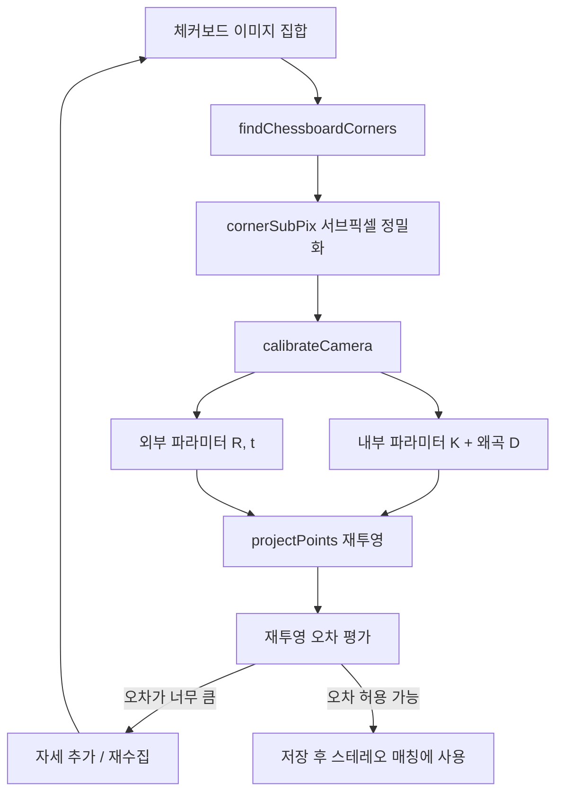

### 6.3.4 LiDAR 포인트 클라우드 왜곡 제거 예제

기계식 회전 LiDAR는 한 번의 스캔 과정에서 센서 자체가 로봇과 함께 움직이므로, 포인트 클라우드에 운동 왜곡(motion distortion)이 발생합니다. 왜곡 제거(deskew)는 각 포인트의 정확한 타임스탬프를 기반으로, 포인트를 수집 시점의 센서 좌표계에서 통일된 기준 시점의 좌표계로 변환해야 합니다.

!!! note "용어 설명: LiDAR, 포인트 클라우드, 운동 왜곡, 왜곡 제거, 타임스탬프, 스캔 프레임, IMU"
    - **LiDAR (Light Detection and Ranging)** : 레이저를 발사하고 반사파를 수신하여 거리를 측정하는 센서.
    - **포인트 클라우드 (point cloud)** : 다수의 3차원 좌표점으로 구성된 데이터셋으로, 종종 강도, 타임스탬프, 링 번호 등의 정보를 포함.
    - **운동 왜곡 (motion distortion)** : 센서나 대상이 움직이는 동안 지속적으로 데이터를 수집하여, 한 프레임 내의 서로 다른 포인트가 서로 다른 좌표계에 위치하게 되는 현상.
    - **왜곡 제거 (deskew)** : 타임스탬프와 운동 추정을 기반으로 각 포인트를 통일된 기준 좌표계로 변환하는 과정.
    - **타임스탬프 (timestamp)** : 데이터 수집 시점을 기록하는 시간 레이블.
    - **IMU (Inertial Measurement Unit)** : 3축 가속도와 3축 각속도를 측정하는 관성 센서.

LiDAR 한 프레임의 스캔이 \(t_0\)부터 \(t_1\)까지라고 할 때, 기준 시점을 \(t_{ref}\)로 선택합니다. 임의의 포인트 \(p_i\)에 대해, 타임스탬프가 \(t_i\)이고 LiDAR 로컬 좌표계에서의 좌표가 \(p_i^{L(t_i)}\)라고 가정합니다. \(t_i\) 시점에서 \(t_{ref}\) 시점까지의 센서 자세 변환 \(T_{ref}^{t_i} = (R, t)\)을 추정해야 하며, 그 후:

$$
p_i^{ref} = R \, p_i^{L(t_i)} + t
$$

IMU나 오도메트리에서 이산적인 시점의 자세를 알고 있다면, 각 포인트의 타임스탬프에 대해 선형 보간을 통해 변환을 얻을 수 있습니다.

!!! note "용어 설명: 자세, 변환 행렬, SE(3), 회전 행렬, 쿼터니언, 보간"
    - **자세 (pose)** : 공간에서 물체의 위치와 방향을 나타내며, 일반적으로 \(T = (R, t)\)로 표현.
    - **변환 행렬 (transformation matrix)** : \(4 \times 4\) 행렬로, 회전과 평행 이동을 동시에 나타냄.
    - **SE(3)** : 3차원 유클리드 변환군, 즉 강체 변환의 수학적 집합.
    - **쿼터니언 (quaternion)** : 회전을 표현하는 간결한 수학적 형태로, 짐벌 락을 방지.
    - **보간 (interpolation)** : 알려진 이산 샘플로부터 중간 값을 추정하는 방법.

**Python 구현 예제**. 다음 코드는 각 포인트의 상대적 타임스탬프(0에서 1 사이)를 알고 있다고 가정하고, IMU/오도메트리 자세를 사용하여 구면 선형 보간(Slerp) 및 선형 평행 이동 보간을 수행합니다.

```python
import numpy as np
from scipy.spatial.transform import Slerp, Rotation as R

# LiDAR 포인트 클라우드 한 프레임 가정: N x 4, 열은 [x, y, z, relative_time]
# relative_time은 [0, 1] 사이, 0은 프레임 시작, 1은 프레임 끝
points = np.loadtxt('lidar_scan.txt')  # N x 4
xyz = points[:, :3]
times = points[:, 3]

# 프레임 시작 및 끝 시점의 자세를 알고 있다고 가정 (기준 좌표계, 예: 프레임 중간점 기준)
# T_start, T_end는 4x4 동차 변환 행렬
T_start = np.eye(4)
T_end = np.eye(4)
T_end[:3, :3] = R.from_euler('z', 0.05).as_matrix()  # Z축 기준 0.05 rad 회전
T_end[:3, 3] = np.array([0.10, 0.02, 0.005])           # 10 cm 평행 이동

# 회전 및 평행 이동 추출
R_start = T_start[:3, :3]
t_start = T_start[:3, 3]
R_end = T_end[:3, :3]
t_end = T_end[:3, 3]

# 키프레임 회전 보간기 구축
key_rots = R.from_matrix([R_start, R_end])
key_times = [0.0, 1.0]
slerp = Slerp(key_times, key_rots)

# 각 포인트를 기준 시점으로 변환 (여기서는 프레임 중간점 t=0.5 선택)
ref_time = 0.5
deskewed = np.zeros_like(xyz)

for i in range(len(xyz)):
    tau = times[i]
    # t_i 시점의 자세 보간
    Ri = slerp([tau]).as_matrix()[0]
    ti = (1 - tau) * t_start + tau * t_end
    T_tau = np.eye(4)
    T_tau[:3, :3] = Ri
    T_tau[:3, 3] = ti

    # t_i에서 기준 시점 t_ref까지의 상대 변환 계산
    T_ref = np.eye(4)
    T_ref[:3, :3] = slerp([ref_time]).as_matrix()[0]
    T_ref[:3, 3] = (1 - ref_time) * t_start + ref_time * t_end

    T_rel = T_ref @ np.linalg.inv(T_tau)
    p = np.append(xyz[i], 1.0)
    p_ref = T_rel @ p
    deskewed[i] = p_ref[:3]

# 로봇 베이스나 월드 좌표계로 변환해야 하는 경우, LiDAR 외부 파라미터 T_lidar_to_base를 왼쪽에 곱함
# deskewed_base = (T_lidar_to_base @ np.hstack([deskewed, np.ones((N,1))]).T).T[:, :3]

print("원본 포인트 수:", len(xyz))
print("왜곡 제거 후 포인트 수:", len(deskewed))
```

더 조밀한 자세 추정이 필요한 경우, 한 프레임을 시간에 따라 여러 서브프레임으로 나누고 각 서브프레임에 대해 IMU 적분을 통해 상대 자세를 얻을 수 있습니다. 일반적인 방법은 타임스탬프에서 자세로의 연속 함수(예: B-스플라인 또는 선형 보간)를 구성하는 것입니다.

!!! note "용어 설명: IMU 적분, B-스플라인, 외부 파라미터, 라이다 좌표계, 베이스 좌표계"
    - **IMU 적분 (IMU integration)**: 가속도를 적분하여 속도를 얻고, 각속도를 적분하여 자세를 얻음으로써 짧은 시간 동안의 위치 및 자세 변화를 추정합니다.
    - **B-스플라인 (B-spline)**: 연속 시간 궤적을 나타내는 조각별 다항식으로, 연속 시간 SLAM에 적합합니다.
    - **외부 파라미터 (extrinsic parameter)**: LiDAR 좌표계에서 로봇 베이스 좌표계로의 고정 변환입니다.
    - **라이다 좌표계 (LiDAR frame)**: LiDAR 광학 중심을 원점으로 하는 로컬 좌표계입니다.
    - **베이스 좌표계 (base frame)**: 로봇 섀시 또는 몸체의 기준 좌표계입니다.


### 6.3.5 비주얼 오도메트리 / 특징 매칭 소개

비주얼 오도메트리(Visual Odometry, VO)는 연속적인 이미지를 통해 카메라 움직임을 추정합니다. 고전적인 방법으로는 특징점 기반 방법(예: ORB, SIFT)과 직접법(예: LK 광류, DSO)이 있습니다. VO의 핵심 수학적 문제는 두 장 이상의 이미지에서 대응점이 주어졌을 때, 카메라 간의 상대적인 자세와 해당 점들의 3차원 위치를 복원하는 것입니다. 이 문제는 사진 측량학 및 컴퓨터 비전의 다중 뷰 기하학 이론으로 거슬러 올라갑니다.

!!! note "용어 설명: 비주얼 오도메트리, SLAM, 특징점, 디스크립터, 매칭, RANSAC, 본질 행렬"
    - **비주얼 오도메트리 (VO)**: 시각 정보를 통해 카메라의 자체 움직임을 추정하는 알고리즘입니다.
    - **SLAM (Simultaneous Localization and Mapping)**: 자신의 위치를 추정함과 동시에 환경 지도를 구축합니다.
    - **특징점 (feature point)**: 이미지 내에서 두드러지고 반복 가능한 로컬 점으로, 코너, 블롭 등이 있습니다.
    - **디스크립터 (descriptor)**: 특징점 주변의 벡터 표현으로, 서로 다른 이미지 간 매칭에 사용됩니다.
    - **RANSAC (Random Sample Consensus)**: 무작위 샘플링과 일관성 검사를 통해 이상치를 제거하는 강건한 추정 방법입니다.
    - **본질 행렬 / 기본 행렬**: 6.3.2절 정의 참조.

#### 특징 검출, 디스크립터 및 매칭

특징점 기반 방법의 성능은 검출, 기술, 매칭의 세 가지 단계에 달려 있습니다.

**검출**. 좋은 특징점은 다양한 시점, 조명, 스케일에서 안정적으로 검출될 수 있어야 합니다. 일반적으로 사용되는 Harris 코너 응답 함수는 다음과 같습니다:

$$
R = \det(M) - k \cdot \mathrm{tr}(M)^2
$$

여기서 \(M\)은 이미지 그래디언트 자기상관 행렬(구조 텐서)이고, \(k\)는 경험적 상수(보통 0.04–0.06)입니다. \(R\)이 임계값보다 크고 국소 최대값일 때 해당 점은 코너로 표시됩니다. ORB는 여기에 FAST 검출기와 방향 추정을 추가하여 회전 불변성을 구현합니다.

!!! note "용어 설명: Harris 코너, 구조 텐서, FAST, 스케일 불변, 회전 불변"
    - **Harris 코너 (Harris corner)**: 이미지 그래디언트 자기상관 행렬을 기반으로 검출된 코너입니다.
    - **구조 텐서 (structure tensor)**: 이미지 그래디언트의 외적으로 구성된 2×2 행렬로, 국소 그레이스케일 변화 방향을 설명합니다.
    - **FAST (Features from Accelerated Segment Test)**: 원주 픽셀의 밝기를 비교하여 코너를 빠르게 검출합니다.
    - **스케일 불변 (scale invariant)**: 특징 검출 및 기술이 이미지 크기 변화에 대해 안정적입니다.
    - **회전 불변 (rotation invariant)**: 특징 기술이 이미지 회전에 대해 안정적입니다.

**디스크립터**. SIFT 디스크립터는 128차원 그래디언트 히스토그램 벡터를 사용하며, 스케일, 회전 및 조명 변화에 강건하지만 계산량이 많습니다. ORB는 이진 BRIEF 디스크립터를 사용하여 픽셀 쌍을 비교하여 256비트 벡터를 생성하고, 해밍 거리를 사용하여 빠르게 매칭할 수 있습니다. 디스크립터는 로컬 이미지 패치를 고차원 특징 공간에 매핑하는 것으로 볼 수 있으며, 이상적으로는 동일한 점의 디스크립터 거리는 작고, 다른 점의 디스크립터 거리는 커야 합니다.

**매칭**. 가장 일반적인 방법은 최근접 이웃 탐색입니다. 첫 번째 이미지의 각 디스크립터에 대해 두 번째 이미지에서 가장 가까운 디스크립터를 찾습니다. 강건성을 높이기 위해 종종 **최근접/차근접 비율 (NN ratio)** 을 사용합니다. 최근접 거리 \(d_1\)과 차근접 거리 \(d_2\)의 비율이 임계값(예: 0.7–0.8)보다 작은 경우에만 매칭을 수락합니다. 그 원리는 최근접과 차근접이 모두 가까우면 디스크립터의 식별력이 부족하여 매칭이 신뢰할 수 없다는 것입니다.

#### 8점 알고리즘과 본질 행렬 추정

보정된 카메라의 경우, 두 뷰 기하학은 본질 행렬 \(E\)로 설명할 수 있습니다. 공간 점 \(P\)의 두 정규화된 이미지 상 좌표가 각각 \(\mathbf{x}_1, \mathbf{x}_2\)(3×1 동차 좌표)라고 하면, 에피폴라 제약 조건은 다음과 같습니다:

$$
\mathbf{x}_2^T E \mathbf{x}_1 = 0
$$

본질 행렬 \(E = [\mathbf{t}]_\times R\)은 5 자유도(3 회전 + 3 병진 - 1 스케일)를 가지지만, 특이값 제약 조건으로 인해 일반적으로 8쌍의 매칭점으로 선형적으로 풀 수 있으며, 이를 **8점 알고리즘 (Eight-Point Algorithm)** 이라고 합니다.

\(E\)를 열 방향으로 9차원 벡터 \(\mathbf{e}\)로 펼치면, 각 매칭점 쌍은 하나의 선형 방정식을 제공합니다:

$$
\begin{bmatrix}
x_2 x_1 & x_2 y_1 & x_2 & y_2 x_1 & y_2 y_1 & y_2 & x_1 & y_1 & 1
\end{bmatrix} \mathbf{e} = 0
$$

여기서 \(x_i, y_i\)는 정규화된 좌표입니다. 8쌍의 점은 \(8 \times 9\) 행렬을 구성하고, \(\mathbf{e}\)는 그 영공간입니다. 더 많은 점이 있을 경우 SVD를 사용하여 최소 제곱 해를 구할 수 있습니다. 구해진 \(E\)는 일반적으로 본질 행렬의 내재적 제약 조건(두 개의 동일한 0이 아닌 특이값)을 만족하지 않으므로, 다시 SVD를 수행하고 두 특이값을 동일하게 강제한 후 재구성해야 합니다.

!!! note "용어 설명: 8점 알고리즘, 에피폴라 제약 조건, 정규화된 좌표, SVD, 영공간"
    - **8점 알고리즘 (Eight-Point Algorithm)**: 8쌍의 매칭점을 사용하여 본질 행렬 또는 기본 행렬을 선형적으로 추정하는 방법입니다.
    - **에피폴라 제약 조건 (epipolar constraint)**: 두 뷰에서 대응점이 만족하는 기하학적 관계입니다.
    - **정규화된 좌표 (normalized coordinates)**: 내부 파라미터 행렬의 역변환 후의 이미지 좌표입니다.
    - **SVD (Singular Value Decomposition)**: 특이값 분해로, 선형 최소 제곱 문제를 푸는 데 사용됩니다.
    - **영공간 (null space)**: 행렬 매핑 후 결과가 영벡터가 되는 입력 공간입니다.

#### RANSAC 강건 추정

실제 매칭에는 종종 많은 오매칭이 포함됩니다. RANSAC은 무작위 샘플링과 일관성 검사를 통해 모델을 추정하고 이상치를 제거합니다. 인라이어 비율을 \(\varepsilon\)라고 하고, 매번 \(n\)개의 점(8점 알고리즘의 경우 \(n=8\))을 샘플링하면, 확률 \(p\)로 적어도 한 번은 모두 인라이어 집합을 샘플링하기 위해 \(k\)번의 반복이 필요합니다:

$$
k = \frac{\ln(1 - p)}{\ln(1 - \varepsilon^n)}
$$

예를 들어, 인라이어 비율 \(\varepsilon = 0.5\)이고 성공 확률 \(p = 0.99\)를 원한다면, 8점 알고리즘의 경우:

$$
k = \frac{\ln(0.01)}{\ln(1 - 0.5^8)} \approx 117
$$

즉, 약 117번의 무작위 샘플링이 필요합니다. 인라이어 비율이 30%로 떨어지면 약 766번의 반복이 필요합니다. 이는 프론트엔드 매칭 품질(예: ratio test, 교차 검증 사용)을 향상시키면 RANSAC 계산량을 크게 줄일 수 있음을 보여줍니다.

!!! note "용어 설명: 인라이어, 아웃라이어, 인라이어 비율, RANSAC 반복 횟수, 모델 일관성"
    - **인라이어 (inlier)**: 기하학적 모델에 부합하는 데이터 점입니다.
    - **아웃라이어 (outlier)**: 모델에 부합하지 않는 이상 데이터 점입니다.
    - **인라이어 비율 (inlier ratio)**: 전체 데이터 점 중 인라이어의 비율입니다.
    - **RANSAC 반복 횟수**: 신뢰 수준에 도달하기 위해 필요한 무작위 샘플링 횟수입니다.
    - **모델 일관성 (model consensus)**: 데이터 점에서 모델까지의 오차가 임계값보다 작은 상태입니다.

#### 본질 행렬로부터 자세 복원 및 삼각 측량

\(E\)를 추정한 후, SVD 분해를 통해 4개의 가능한 \((R, \mathbf{t})\) 세트를 얻을 수 있습니다. 삼각 측량을 통해 3차원 점을 복원하고 그 깊이가 양수인지 확인하여 올바른 자세를 유일하게 결정할 수 있습니다.

두 카메라의 투영 행렬이 \(P_1 = K[I \ | \ \mathbf{0}]\) 및 \(P_2 = K[R \ | \ \mathbf{t}]\)일 때, 공간 점 \(X\)의 두 이미지 상 투영은 \(\mathbf{x}_1 = P_1 X\), \(\mathbf{x}_2 = P_2 X\)입니다. 삼각 측량은 이 두 투영 제약 조건을 만족하는 \(X\)를 푸는 것입니다. 노이즈로 인해 두 광선은 일반적으로 교차하지 않으며, **선형 삼각 측량법** 또는 **비선형 번들 조정 (Bundle Adjustment)** 을 사용하여 풀 수 있습니다.

!!! note "용어 설명: 삼각 측량, 번들 조정, 재투영 오차, 양의 깊이 제약"
    - **삼각 측량(triangulation)** : 다중 뷰 투영으로 3차원 점 위치 복원.
    - **번들 조정(Bundle Adjustment, BA)** : 카메라 자세와 3차원 점을 동시에 최적화하여 재투영 오차 최소화.
    - **재투영 오차(reprojection error)** : 3차원 점을 이미지에 투영한 후 관측점과의 픽셀 거리.
    - **양의 깊이 제약(positive depth constraint)** : 3차원 점이 반드시 카메라 전방에 위치해야 하는 제약.

#### Python 예제: 8점법 + RANSAC + 삼각 측량

다음 코드는 단순화된 VO 프론트엔드를 보여줍니다: 정규화된 8점법으로 본질 행렬을 추정하고, RANSAC으로 이상치를 제거한 후, 자세를 분해하고 삼각 측량으로 3차원 점을 복원합니다. 실제 시스템에서는 ORB/SIFT 등 실제 특징 검출 및 매칭을 사용해야 합니다.

```python
"""
Simplified visual odometry frontend:
random correspondences -> normalized 8-point -> RANSAC -> E decomposition -> triangulation.
"""
import numpy as np


def skew(v):
    """Return 3x3 skew-symmetric matrix of vector v."""
    return np.array([[0, -v[2], v[1]],
                     [v[2], 0, -v[0]],
                     [-v[1], v[0], 0]])


def estimate_eight_point(pts1, pts2):
    """Estimate essential matrix from N>=8 normalized correspondences."""
    A = []
    for (x1, y1), (x2, y2) in zip(pts1, pts2):
        A.append([x2*x1, x2*y1, x2, y2*x1, y2*y1, y2, x1, y1, 1])
    A = np.array(A)
    _, _, Vt = np.linalg.svd(A)
    E = Vt[-1].reshape(3, 3)
    # Enforce singular-value constraint
    U, S, Vt = np.linalg.svd(E)
    S = np.diag([1, 1, 0])
    E = U @ S @ Vt
    return E


def decompose_essential(E):
    """Decompose E into 4 possible (R, t)."""
    U, _, Vt = np.linalg.svd(E)
    W = np.array([[0, -1, 0], [1, 0, 0], [0, 0, 1]])
    R1 = U @ W @ Vt
    R2 = U @ W.T @ Vt
    t = U[:, 2]
    if np.linalg.det(R1) < 0:
        R1 = -R1
    if np.linalg.det(R2) < 0:
        R2 = -R2
    return [(R1, t), (R1, -t), (R2, t), (R2, -t)]


def triangulate_point(P1, P2, x1, x2):
    """Linear triangulation of a single point."""
    A = np.vstack([
        x1[0] * P1[2] - P1[0],
        x1[1] * P1[2] - P1[1],
        x2[0] * P2[2] - P2[0],
        x2[1] * P2[2] - P2[1]
    ])
    _, _, Vt = np.linalg.svd(A)
    X = Vt[-1]
    return X[:3] / X[3]


def ransac_essential(pts1, pts2, threshold=1e-3, max_iter=500, p=0.99):
    """RANSAC for essential matrix."""
    best_E, best_inliers = None, []
    n = len(pts1)
    for _ in range(max_iter):
        idx = np.random.choice(n, 8, replace=False)
        E = estimate_eight_point(pts1[idx], pts2[idx])
        # Sampson distance as error metric
        errs = []
        for x1, x2 in zip(pts1, pts2):
            Ex1 = E @ x1
            Etx2 = E.T @ x2
            num = (x2.T @ E @ x1) ** 2
            den = Ex1[0]**2 + Ex1[1]**2 + Etx2[0]**2 + Etx2[1]**2
            errs.append(num / (den + 1e-12))
        inliers = np.where(np.array(errs) < threshold)[0]
        if len(inliers) > len(best_inliers):
            best_inliers = inliers
            best_E = E
        # Adaptively update iterations
        if len(best_inliers) > 8:
            eps = len(best_inliers) / n
            k = np.log(1 - p) / np.log(1 - eps**8)
            max_iter = min(max_iter, int(k))
    return best_E, best_inliers


# Synthetic test: two cameras translated by 0.5 m along X
np.random.seed(0)
K = np.eye(3)
R_true = np.eye(3)
t_true = np.array([0.5, 0.0, 0.0])
P1 = K @ np.hstack([np.eye(3), np.zeros((3, 1))])
P2 = K @ np.hstack([R_true, t_true.reshape(3, 1)])

# Generate 100 3D points in front of camera
X = np.random.uniform(-1, 1, (100, 3))
X[:, 2] += 3.0  # ensure positive depth

x1 = (P1 @ np.hstack([X, np.ones((100, 1))]).T).T
x1 = x1[:, :3] / x1[:, 2:3]
x2 = (P2 @ np.hstack([X, np.ones((100, 1))]).T).T
x2 = x2[:, :3] / x2[:, 2:3]

# Add noise and 20% outliers
noise = 1e-3
x1n = x1 + np.random.randn(*x1.shape) * noise
x2n = x2 + np.random.randn(*x2.shape) * noise
outlier_idx = np.random.choice(100, 20, replace=False)
x2n[outlier_idx] += np.random.randn(20, 3) * 0.3

E, inliers = ransac_essential(x1n, x2n)
print(f"RANSAC found {len(inliers)} inliers out of {len(x1n)}")

# Refine E with all inliers
E_refined = estimate_eight_point(x1n[inliers], x2n[inliers])
```

# 양의 깊이를 확인하여 올바른 포즈 선택
poses = decompose_essential(E_refined)
best_pose, best_count = None, 0
for R, t in poses:
    P2_test = K @ np.hstack([R, t.reshape(3, 1)])
    count = 0
    for x1_i, x2_i in zip(x1n[inliers], x2n[inliers]):
        X3d = triangulate_point(P1, P2_test, x1_i, x2_i)
        if X3d[2] > 0:
            count += 1
    if count > best_count:
        best_count = count
        best_pose = (R, t)

R_est, t_est = best_pose
print("추정된 병진 벡터 (스케일까지):", t_est)
print("실제 병진 벡터:", t_true)
```

실행 후 확인 가능: RANSAC이 약 80%의 인라이어를 효과적으로 식별; 추정된 병진 벡터가 실제 병진 방향과 일치 (스케일 팩터만 차이). 단안 VO의 스케일 불확실성은 두 프레임 이미지에서 0.5m의 절대 운동 크기를 직접 얻을 수 없음을 의미하며, IMU, 스테레오 또는 알려진 크기의 물체를 통해 스케일을 복원해야 함.

#### 시각-관성 오도메트리 (VIO)

순수 VO는 스케일 불확실성 문제가 있음: 두 프레임 이미지에서 복원된 운동 궤적은 알 수 없는 스케일 팩터만큼 차이남. IMU는 고주파 가속도와 각속도 측정을 제공하며, 가속도계는 스케일 정보(중력 방향을 통해)를, 자이로스코프는 정밀한 자세 변화를 제공함. VIO는 이미지 특징 제약과 IMU 사전 적분 제약을 융합하여, 팩터 그래프 또는 확장 칼만 필터(EKF) 프레임워크에서 포즈, 속도 및 IMU 바이어스를 추정함.

!!! note "용어 설명: 시각-관성 오도메트리, 사전 적분, 팩터 그래프, 확장 칼만 필터, 스케일"
    - **시각-관성 오도메트리 (VIO)** : 카메라와 IMU 측정을 융합하여 6자유도 포즈를 추정하는 알고리즘.
    - **사전 적분 (preintegration)** : Forster 등이 제안한 IMU 측정의 컴팩트 적분 방법으로, 최적화 중 반복 적분을 방지함.
    - **팩터 그래프 (factor graph)** : 변수를 노드로, 제약을 팩터로 표현하는 그래프 최적화 모델.
    - **확장 칼만 필터 (EKF)** : 비선형 시스템을 선형화 근사하여 상태를 추정하는 순환적 방법.
    - **스케일 (scale)** : 단안 비전에서 거리와 운동 크기의 절대 비율.

VIO의 핵심 상태 벡터는 일반적으로 다음을 포함함:

$$
\mathbf{x} = [\mathbf{p}, \mathbf{v}, \mathbf{q}, \mathbf{b}_a, \mathbf{b}_g]^T
$$

여기서 \(\mathbf{p}\)는 위치, \(\mathbf{v}\)는 속도, \(\mathbf{q}\)는 자세 쿼터니언, \(\mathbf{b}_a\)와 \(\mathbf{b}_g\)는 각각 가속도계와 자이로스코프 바이어스임. IMU 측정 모델은 다음과 같음:

$$
\tilde{\mathbf{a}} = \mathbf{R}_{wb}^T (\ddot{\mathbf{p}} - \mathbf{g}) + \mathbf{b}_a + \mathbf{n}_a
$$
$$
\tilde{\boldsymbol{\omega}} = \boldsymbol{\omega} + \mathbf{b}_g + \mathbf{n}_g
$$

여기서 \(\mathbf{g}\)는 중력 가속도, \(\mathbf{n}\)은 측정 잡음임. VIO는 로봇 내비게이션, AR/VR 및 드론에서 널리 사용되며, 대표적인 오픈소스 구현으로는 OKVIS, VINS-Mono, ORB-SLAM3 및 OpenVINS가 있음. VIO와 SLAM 백엔드에 대한 더 체계적인 소개는 6.3.6절과 제14장 14.3절을 참조.

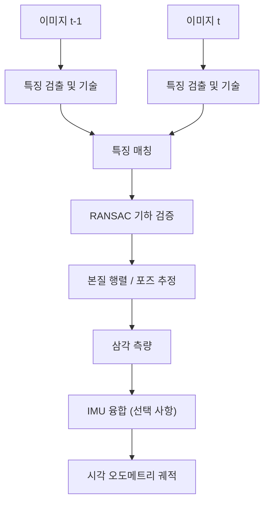


### 6.3.6 SLAM 백엔드: 그래프 최적화와 g2o / GTSAM / Ceres

SLAM 알고리즘은 일반적으로 프론트엔드(front-end)와 백엔드(back-end) 두 부분으로 나뉨. 프론트엔드는 센서 데이터에서 기하 제약을 추출하는 역할을 하며, 예를 들어 시각 특징 매칭, 포인트 클라우드 정합 또는 IMU 사전 적분이 있음; 백엔드는 이러한 제약을 일관된 상태 추정으로 융합하고 프론트엔드에서 누적된 오차를 보정함.

!!! note "용어 설명: SLAM 프론트엔드, SLAM 백엔드, 포즈 그래프, 팩터 그래프, 루프 폐쇄"
    - **SLAM 프론트엔드 (front-end)** : 원시 센서 데이터에서 상대 포즈 또는 관측 제약을 추출, 연관 및 생성하는 모듈.
    - **SLAM 백엔드 (back-end)** : 프론트엔드에서 생성된 제약을 전역 또는 지역 최적화하여 일관된 궤적과 지도를 얻는 모듈.
    - **포즈 그래프 (pose graph)** : 노드가 로봇 포즈를, 엣지가 상대 포즈 제약을 나타내는 그래프 모델.
    - **팩터 그래프 (factor graph)** : 변수 노드가 추정량을, 팩터 노드가 제약 또는 측정을 나타내는 이분 그래프의 한 종류.
    - **루프 폐쇄 (loop closure)** : 로봇이 이전에 방문한 위치로 돌아왔음을 인식하여 전역 제약을 추가하고 드리프트를 제거함.

프론트엔드의 출력은 일반적으로 드리프트를 포함함: 시각 오도메트리의 스케일 불확실성, LiDAR 정합의 프레임 간 오차, IMU 적분 바이어스 등이 시간에 따라 누적됨. 루프 폐쇄는 "현재 프레임과 과거 프레임 간의 상대 포즈"라는 강력한 제약을 제공하며, 백엔드는 최적화를 통해 이러한 제약을 전체 궤적에 분배하여 전역 오차를 크게 줄임.

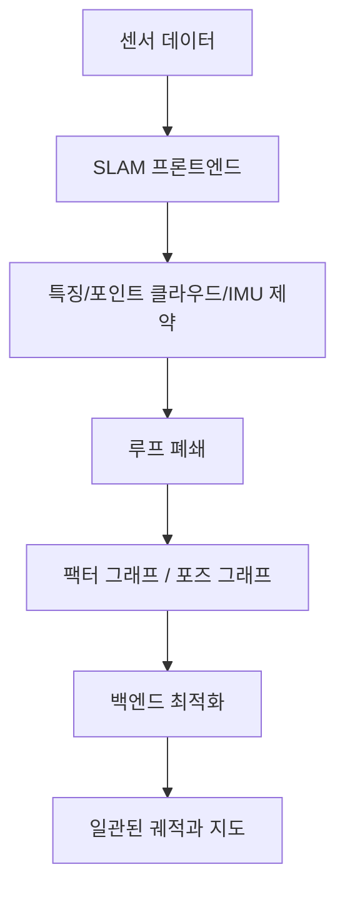

**팩터 그래프 표현**. 백엔드에서 추정 변수는 일반적으로 로봇 포즈 \( \mathbf{x}_i \)와 랜드마크(landmark) \( \mathbf{l}_j \)를 포함함. 각 측정은 잔차 함수 \( \mathbf{r}_k(\mathbf{x}) \)에 해당하는 팩터를 생성함. 예를 들어:

- **오도메트리 팩터**: \( \mathbf{r}_{ij}^{odo} = \mathrm{Log}\left( \mathbf{T}_{ij}^{-1} \mathbf{T}_i^{-1} \mathbf{T}_j \right) \), 여기서 \( \mathbf{T}_i \in SE(2) \) 또는 \( SE(3) \).
- **루프 팩터**: 형태는 오도메트리 팩터와 동일하지만, \( i \)와 \( j \)가 인접하지 않음.
- **GPS 사전 팩터**: \( \mathbf{r}_i^{gps} = \mathbf{p}_i - \mathbf{p}_i^{gps} \).
- **랜드마크 관측 팩터**: 투영 오차 또는 재투영 오차.

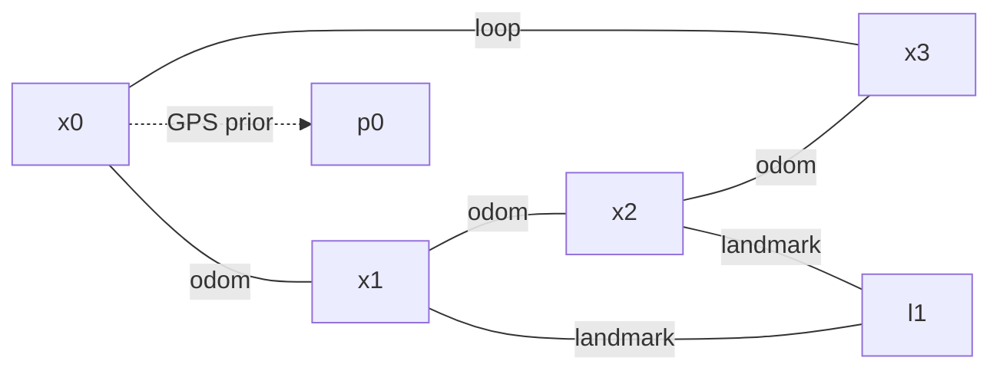

최대 우도 추정 프레임워크에서 측정 잡음이 가우시안 분포를 따른다고 가정할 때, 백엔드의 최적화 목표는 마할라노비스 거리 제곱합을 최소화하는 것임:

$$
\min_{\mathbf{x}} \frac{1}{2} \sum_i \|\mathbf{r}_i(\mathbf{x})\|^2_{\mathbf{\Sigma}_i}
$$

여기서 \( \mathbf{\Sigma}_i \)는 \( i \)번째 측정의 공분산 행렬이고, \( \|\mathbf{r}\|^2_{\mathbf{\Sigma}} = \mathbf{r}^T \mathbf{\Sigma}^{-1} \mathbf{r} \)임. 정보 행렬 \( \mathbf{\Omega}_i = \mathbf{\Sigma}_i^{-1} \)을 도입하면 목적 함수는 \( \frac{1}{2} \sum_i \mathbf{r}_i^T \mathbf{\Omega}_i \mathbf{r}_i \)로도 쓸 수 있음.

!!! note "용어 설명: 잔차, 정보 행렬, 공분산, 마할라노비스 거리"
    - **잔차(residual)** : 모델 예측값과 실제 측정값 사이의 차이 벡터.
    - **정보 행렬(information matrix)** : 공분산 행렬의 역행렬로, 측정이 변수에 가하는 제약의 강도를 나타냄.
    - **공분산 행렬(covariance matrix)** : 측정 잡음 또는 추정 불확실성을 설명하는 2차 통계량.
    - **마할라노비스 거리(Mahalanobis distance)** : 공분산 구조를 고려한 가중 거리.

**선형화와 해법**. 잔차 함수는 일반적으로 비선형입니다. 현재 추정값 \( \mathbf{x} \) 근처에서 1차 테일러 전개를 수행합니다:

$$
\mathbf{r}_i(\mathbf{x} + \Delta \mathbf{x}) \approx \mathbf{r}_i(\mathbf{x}) + \mathbf{J}_i \Delta \mathbf{x}
$$

여기서 \( \mathbf{J}_i = \partial \mathbf{r}_i / \partial \mathbf{x} \) 는 야코비 행렬입니다. 이를 목적 함수에 대입하고 \( \Delta \mathbf{x} \) 에 대해 미분하여 0으로 설정하면 정규 방정식(normal equations)을 얻습니다:

$$
\left( \sum_i \mathbf{J}_i^T \mathbf{\Omega}_i \mathbf{J}_i \right) \Delta \mathbf{x} = - \sum_i \mathbf{J}_i^T \mathbf{\Omega}_i \mathbf{r}_i
$$

!!! note "용어 설명: 야코비 행렬, 정규 방정식, 가우스-뉴턴법, 레벤버그-마쿼트법"
    - **야코비 행렬(Jacobian)** : 잔차의 상태 변수에 대한 편미분 행렬로, 국소 선형화 관계를 나타냄.
    - **정규 방정식(normal equations)** : 최소제곱 문제에서 \( \mathbf{J}^T \mathbf{\Omega} \mathbf{J} \Delta \mathbf{x} = -\mathbf{J}^T \mathbf{\Omega} \mathbf{r} \) 로 구성된 선형 시스템.
    - **가우스-뉴턴법(Gauss-Newton)** : 반복적인 선형화와 정규 방정식 풀이를 통해 비선형 최소제곱 해에 근접하는 방법.
    - **레벤버그-마쿼트법(Levenberg-Marquardt)** : 가우스-뉴턴법에 감쇠항 \( \lambda \mathbf{I} \) 을 추가하여 수렴 안정성을 높인 방법.

\( \mathbf{H} = \sum_i \mathbf{J}_i^T \mathbf{\Omega}_i \mathbf{J}_i \), \( \mathbf{b} = -\sum_i \mathbf{J}_i^T \mathbf{\Omega}_i \mathbf{r}_i \) 라고 하면, 각 반복에서 \( \mathbf{H} \Delta \mathbf{x} = \mathbf{b} \) 를 풉니다. LM 알고리즘은 \( \mathbf{H} \) 를 \( \mathbf{H} + \lambda \, \mathrm{diag}(\mathbf{H}) \) 로 대체하고, \( \lambda \) 를 조정하여 가우스-뉴턴법과 경사 하강법 사이를 전환합니다.

**희소 구조와 Schur 보수**. SLAM에서 야코비 행렬은 일반적으로 매우 희소합니다. 각 인자는 소수의 변수에만 관련됩니다. 희소 최소제곱 솔버(예: CHOLMOD, CSparse)는 이 구조를 활용하여 효율적으로 풀이할 수 있습니다. 자세와 랜드마크를 동시에 최적화하는 경우, \( \mathbf{H} \) 를 다음과 같이 블록화할 수 있습니다:

$$
\begin{bmatrix}
\mathbf{H}_{pp} & \mathbf{H}_{pl} \\
\mathbf{H}_{lp} & \mathbf{H}_{ll}
\end{bmatrix}
\begin{bmatrix}
\Delta \mathbf{x}_p \\
\Delta \mathbf{x}_l
\end{bmatrix}
=
\begin{bmatrix}
\mathbf{b}_p \\
\mathbf{b}_l
\end{bmatrix}
$$

랜드마크 부분에 대해 Schur 보수를 취하면 자세 서브시스템을 먼저 풀고, 이후 랜드마크 점을 역대입하여 구할 수 있습니다. 이 기법은 번들 조정(bundle adjustment)에서 특히 중요합니다.

!!! note "용어 설명: 희소 행렬, Schur 보수, 번들 조정"
    - **희소 행렬(sparse matrix)** : 대부분의 요소가 0인 행렬로, SLAM에서 각 인자는 소수의 변수에만 영향을 미칩니다.
    - **Schur 보수(Schur complement)** : 소거법을 통해 고차원 선형 시스템을 일부 변수만 포함하는 저차원으로 축소하는 기법.
    - **번들 조정(bundle adjustment)** : 카메라 자세와 3차원 랜드마크 점을 동시에 최적화하여 재투영 오차를 최소화하는 과정.

**g2o, GTSAM, Ceres 비교**. 세 가지 모두 SLAM/상태 추정 분야에서 가장 널리 사용되는 백엔드 최적화 라이브러리입니다:

| 특성 | g2o | GTSAM | Ceres Solver |
|---|---|---|---|
| 주요 언어 | C++ | C++ (Python 바인딩 제공) | C++ |
| 핵심 추상화 | 그래프 최적화 정점/간선 | 팩터 그래프 | 범용 비선형 최소제곱 |
| 자동 미분 | 야코비 수동 작성 필요 | 자동 미분 및 기호 미분 제공 | 강력한 AutoDiff |
| 증분 최적화 | g2o 증분 확장 | iSAM2 증분 평활화 | 증분을 기본 지원하지 않음 |
| 다양체/리 군 | 내장 SE(2)/SE(3) 타입 | Manifolds/LieGroups 기본 지원 | 사용자 정의 국소 매개변수화 필요 |
| 대표적 응용 | ORB-SLAM, Cartographer | GTSAM 예제, 시각-관성 항법 | LOAM, VINS-Mono (일부 모듈) |

!!! note "용어 설명: 자동 미분, 다양체, 리 군, 증분 최적화"
    - **자동 미분(automatic differentiation)** : 연산자 오버로딩 또는 소스 코드 변환을 통해 정확한 도함수를 자동으로 계산하여 수동 야코비 유도를 피하는 방법.
    - **다양체(manifold)** : 국소적으로 유클리드 공간과 위상동형인 비선형 공간 (예: 회전군 \( SO(3) \)).
    - **리 군(Lie group)** : 군 구조와 매끄러운 다양체 구조를 동시에 갖는 집합 (예: \( SE(3) \)).
    - **증분 최적화(incremental optimization)** : 새로운 측정이 추가될 때 전체 그래프를 처음부터 최적화하지 않고 영향을 받는 부분 해만 업데이트하는 방법.

다음은 완전한 2D 자세 그래프 최적화 Python 예제입니다. 이 예제는 g2o/GTSAM에 의존하지 않고 `scipy.optimize.least_squares`만 사용하므로, 독자가 직접 실행하고 알고리즘의 핵심을 이해하기 쉽습니다.

```python
"""
2D pose graph optimization with scipy.optimize.least_squares.
Generates a square trajectory with odometry edges and one loop closure.
"""
import numpy as np
import matplotlib.pyplot as plt
from scipy.optimize import least_squares


def pose_compose(xi, xj):
    """Compose two SE(2) poses: xi * xj."""
    xi_, yi_, thi = xi
    xj_, yj_, thj = xj
    cos_i, sin_i = np.cos(thi), np.sin(thi)
    return np.array([
        xi_ + cos_i * xj_ - sin_i * yj_,
        yi_ + sin_i * xj_ + cos_i * yj_,
        thi + thj
    ])


def pose_inv(x):
    """Inverse of an SE(2) pose."""
    px, py, th = x
    c, s = np.cos(th), np.sin(th)
    return np.array([
        -c * px - s * py,
         s * px - c * py,
        -th
    ])


def pose_diff(xi, xj):
    """Relative pose from xi to xj: xi^{-1} * xj."""
    return pose_compose(pose_inv(xi), xj)


def wrap_angle(theta):
    """Wrap angle to [-pi, pi]."""
    return (theta + np.pi) % (2 * np.pi) - np.pi
```

# Ground-truth square trajectory: 4 sides, 10 poses per side
n_side = 10
side_len = 1.0
true_poses = []
for k in range(4):
    theta = k * np.pi / 2
    for i in range(n_side):
        t = i / n_side
        if k == 0:
            p = np.array([t * side_len, 0.0, theta])
        elif k == 1:
            p = np.array([side_len, t * side_len, theta])
        elif k == 2:
            p = np.array([(1 - t) * side_len, side_len, theta])
        else:
            p = np.array([0.0, (1 - t) * side_len, theta])
        true_poses.append(p)
true_poses = np.array(true_poses)
num_poses = len(true_poses)

# Build odometry measurements with noise
odom_edges = []
for i in range(num_poses - 1):
    z = pose_diff(true_poses[i], true_poses[i + 1])
    z += np.array([0.01, 0.01, 0.02]) * np.random.randn(3)
    z[2] = wrap_angle(z[2])
    odom_edges.append((i, i + 1, z))

# Add a loop closure between the last and first pose
z_loop = pose_diff(true_poses[-1], true_poses[0])
z_loop += np.array([0.05, 0.05, 0.05]) * np.random.randn(3)
z_loop[2] = wrap_angle(z_loop[2])
loop_edges = [(num_poses - 1, 0, z_loop)]

# Anchor the first pose to remove gauge freedom
anchor = true_poses[0].copy()


def residuals(params):
    """Compute all residuals for least_squares."""
    poses = params.reshape(num_poses, 3)
    poses[0] = anchor  # fix origin
    res = []

    # Odometry residuals
    for i, j, z in odom_edges:
        delta = pose_diff(poses[i], poses[j])
        err = delta - z
        err[2] = wrap_angle(err[2])
        # Weight by information (inverse std)
        err *= np.array([10.0, 10.0, 5.0])
        res.append(err)

    # Loop closure residual
    for i, j, z in loop_edges:
        delta = pose_diff(poses[i], poses[j])
        err = delta - z
        err[2] = wrap_angle(err[2])
        err *= np.array([5.0, 5.0, 3.0])
        res.append(err)

    return np.concatenate(res)


# Initial estimate: integrate noisy odometry without loop closure
init_poses = np.zeros((num_poses, 3))
init_poses[0] = anchor
for idx, (i, j, z) in enumerate(odom_edges):
    init_poses[j] = pose_compose(init_poses[i], z)

# Optimize
result = least_squares(
    residuals,
    init_poses.ravel(),
    method='lm',
    max_nfev=200
)
opt_poses = result.x.reshape(num_poses, 3)
opt_poses[0] = anchor

# Plot
plt.figure(figsize=(6, 6))
plt.plot(true_poses[:, 0], true_poses[:, 1], 'k-o', label='Ground truth')
plt.plot(init_poses[:, 0], init_poses[:, 1], 'r-s', label='Initial (odom only)')
plt.plot(opt_poses[:, 0], opt_poses[:, 1], 'b-^', label='Optimized')
plt.axis('equal')
plt.grid(True)
plt.legend()
plt.title('2D Pose Graph Optimization')
plt.xlabel('x [m]')
plt.ylabel('y [m]')
plt.tight_layout()
plt.savefig('pose_graph_2d.png', dpi=150)
plt.show()
```

실행 결과는 일반적으로 다음과 같습니다: 오도메트리 적분만으로 얻은 초기 궤적은 시작점으로 돌아올 때 명확한 드리프트가 있는 반면, 최적화된 궤적은 실제 정사각형 궤적과 거의 일치합니다. 오도메트리와 루프 클로저의 정보 가중치(즉, 잔차 앞의 승수)를 조정하면 최종 해에 미치는 영향을 변경할 수 있습니다.

**Ceres Solver C++ 코드 조각**. 동일한 2D 포즈 그래프 문제는 Ceres에서 다음과 같이 작성할 수 있습니다:

```cpp
#include <ceres/ceres.h>

struct PoseGraph2DError {
  PoseGraph2DError(double dx, double dy, double dtheta)
      : dx_(dx), dy_(dy), dtheta_(dtheta) {}

  template <typename T>
  bool operator()(const T* const xi, const T* const xj, T* residuals) const {
    // xi = [px, py, theta], xj = [px, py, theta]
    T cos_i = cos(xi[2]), sin_i = sin(xi[2]);
    T dx_pred = cos_i * (xj[0] - xi[0]) + sin_i * (xj[1] - xi[1]);
    T dy_pred = -sin_i * (xj[0] - xi[0]) + cos_i * (xj[1] - xi[1]);
    T dtheta_pred = xj[2] - xi[2];
    residuals[0] = dx_pred - T(dx_);
    residuals[1] = dy_pred - T(dy_);
    residuals[2] = dtheta_pred - T(dtheta_);
    return true;
  }

  double dx_, dy_, dtheta_;
};

// Usage:
ceres::CostFunction* cost =
    new ceres::AutoDiffCostFunction<PoseGraph2DError, 3, 3, 3>(
        new PoseGraph2DError(z_dx, z_dy, z_dtheta));
problem.AddResidualBlock(cost, nullptr, pose_i, pose_j);
```

Ceres의 `AutoDiffCostFunction`은 야코비안 계산을 자동으로 수행합니다. 잔차 정의만 제공하면 됩니다. \( SO(3) \) 또는 \( SE(3) \)가 관련된 경우, 일반적으로 `LocalParameterization` 또는 `Manifold`를 함께 사용하여 다양체에서의 업데이트를 처리해야 합니다.

**GTSAM 소개**. GTSAM은 팩터 그래프를 핵심 추상화로 사용하며, Python 인터페이스로 직접 문제를 구성할 수 있습니다:

```python
import gtsam
from gtsam import Pose2, Values, NonlinearFactorGraph
from gtsam import BetweenFactorPose2, PriorFactorPose2

graph = NonlinearFactorGraph()
initial = Values()

# 사전 정보를 추가하여 첫 번째 자세 고정
graph.add(PriorFactorPose2(0, Pose2(0, 0, 0), noise_model))
initial.insert(0, Pose2(0, 0, 0))

# 주행 거리 측정 및 루프 폐쇄 팩터 추가
graph.add(BetweenFactorPose2(i, j, Pose2(dx, dy, dtheta), noise_model))

# 최적화
optimizer = gtsam.LevenbergMarquardtOptimizer(graph, initial)
result = optimizer.optimize()
```

!!! note "용어 설명: GTSAM, iSAM2, Bayes 트리"
    - **GTSAM(Georgia Tech Smoothing and Mapping library)**：팩터 그래프와 Bayes 트리를 기반으로 한 C++/Python 상태 추정 라이브러리.
    - **iSAM2**：GTSAM의 증분 평활화 및 매핑 알고리즘으로, Bayes 트리를 활용하여 새로운 측정값이 추가될 때 국소적 업데이트를 수행.
    - **Bayes 트리(Bayes tree)**：팩터 그래프 소거 후 얻어지는 트리 구조의 데이터로, 증분 추론을 지원.

백엔드 그래프 최적화의 공학적 핵심 사항은 세 가지로 요약할 수 있습니다:

1. **프론트엔드 제약 조건의 품질이 최적화의 상한을 결정**. 잘못된 루프 폐쇄나 정합은 "유령" 제약 조건을 유발하여 최적화 결과가 발산할 수 있음; 강건한 커널 함수(Huber, Cauchy) 또는 RANSAC 검증이 필수적.
2. **정보 행렬은 실제 측정 정밀도를 반영해야 함**. 저비용 주행 거리 측정기에 과도한 가중치를 부여하거나 고정밀 GPS에 낮은 가중치를 부여하면 결과가 왜곡됨.
3. **희소 솔버와 증분 알고리즘은 대규모 시나리오의 핵심**. 실내/실외 SLAM의 노드 수는 \( 10^4 \sim 10^6 \) 수준에 달할 수 있으며, 희소 구조를 활용해야만 실시간 제약 조건 내에서 최적화를 완료할 수 있음.

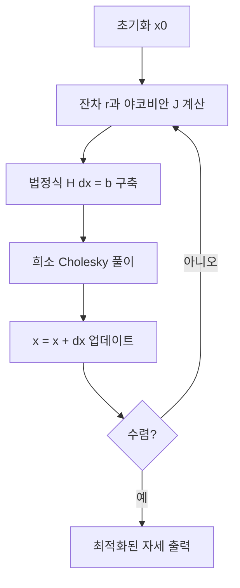

그래프 최적화에 대한 보다 체계적인 소개는 Grisetti 등의 튜토리얼 [58], g2o 논문 [59], GTSAM 소개 [60] 및 Ceres Solver 문서 [61]를 참조하시기 바랍니다.

---

## 6.4 통신, 미들웨어 및 실시간 운영체제

휴머노이드 로봇의 통신과 미들웨어는 센서, 연산 유닛 및 액추에이터를 연결하는 "신경계"입니다. 일반적인 이족 보행 로봇은 수십 헤르츠의 다중 카메라 인식 스트림, 킬로헤르츠의 관절 힘 제어 루프, 10헤르츠 이상의 고수준 계획, 그리고 기체 전체 모듈 간의 시간 동기화, 오류 진단 및 로깅을 동시에 실행할 수 있습니다. 이러한 트래픽은 대역폭, 지연 시간, 지터, 신뢰성 및 보안 측면에서 요구 사항의 차이가 매우 커서 단일 네트워크나 프로토콜로 충족할 수 없습니다. 이 절에서는 DDS/RTPS의 발행-구독 의미론에서 시작하여 TSN, EtherCAT, CAN-FD와 같은 결정적 버스로 깊이 들어간 다음, ROS 2 상위 프레임워크, 메시지 직렬화 및 성능 추정, 시간 동기화로 확장하여 최종적으로 비교적 완전한 로봇 통신 미들웨어 그림을 제시합니다.

!!! note "용어 설명: 미들웨어, 버스, 프로토콜, 발행-구독, 결정적 통신"
    - **미들웨어(middleware)**: 운영체제와 응용 소프트웨어 사이에 위치한 소프트웨어 계층으로, 분산 애플리케이션에 통신, 데이터 관리, 자원 스케줄링 등 일반 서비스를 제공합니다.
    - **버스(bus)**: 여러 노드가 공유하는 물리적 전송 매체 또는 통신 채널 (예: CAN 버스, 이더넷 버스).
    - **프로토콜(protocol)**: 통신하는 양측이 데이터 교환을 위해 합의한 형식, 타이밍 및 의미 규칙 집합.
    - **발행-구독(publish-subscribe)**: 송신자(발행자)와 수신자(구독자)가 주제를 통해 결합이 해제되어 서로의 존재를 알 필요가 없습니다.
    - **결정적 통신(deterministic communication)**: 통신 지연 시간 또는 그 상한을 예측하고 보장할 수 있는 통신 방식.

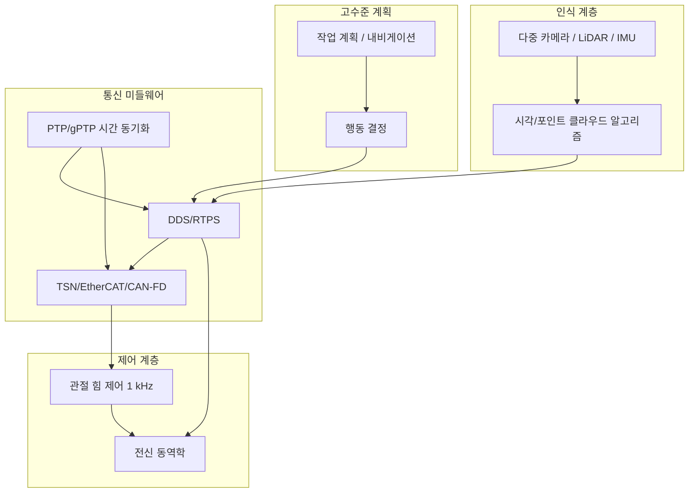

### 6.4.1 ROS 2 및 DDS

로봇 운영체제 ROS 2는 데이터 분산 서비스(DDS)를 하위 통신 미들웨어로 채택하여 발행-구독 메커니즘, 서비스 품질(QoS) 정책 및 분산 노드 검색을 구현합니다. 사용자 정의 TCP 마스터 노드를 기반으로 한 ROS 1과 달리, ROS 2의 통신은 분산되어 있으며 노드는 DDS를 통해 직접 서로를 검색할 수 있어 다중 머신 분산 배포를 기본적으로 지원합니다.

!!! note "용어 설명: ROS 2, DDS, 발행-구독, QoS, 토픽, 노드, RMW"
    - **ROS 2(Robot Operating System 2)**: 로봇을 위한 2세대 오픈 소스 미들웨어 프레임워크로, 하위 계층은 기본적으로 DDS를 기반으로 합니다.
    - **DDS(Data Distribution Service)**: OMG 표준 실시간 발행-구독 미들웨어로, 항공, 자동차, 로봇 분야에서 널리 사용됩니다.
    - **QoS(Quality of Service)**: 신뢰성, 지속성, 기한, 히스토리 깊이 등을 포함하는 통신 정책 집합.
    - **토픽(topic)**: 동일한 데이터 유형을 전달하는 논리적 채널.
    - **노드(node)**: ROS 2에서의 최소 연산 단위.
    - **RMW(ROS Middleware Interface)**: ROS 2와 하위 DDS 구현 간의 추상 인터페이스 계층.

#### DDS 데이터 모델 및 엔티티 계층 구조

DDS의 핵심 추상화는 계층적 엔티티(Entity) 모델입니다. 각 엔티티는 기본 클래스 `Entity`에서 상속되며 리스너(Listener) 및 QoS를 구성할 수 있습니다. 위에서 아래로 주요 엔티티는 다음과 같습니다:

1. **DomainParticipant**: DDS 도메인(domain) 내의 통신 참가자. 일반적으로 프로세스는 하나의 DomainParticipant를 생성하여 특정 도메인 ID(정수)에 가입합니다. 동일한 도메인 ID 내의 DomainParticipant는 서로 검색할 수 있으며, 다른 도메인은 기본적으로 격리됩니다.
2. **Publisher / Subscriber**: 발행자와 구독자는 DataWriter / DataReader의 컨테이너로, 일괄 관리 및 수명 주기 제어를 담당합니다.
3. **Topic**: 이름과 데이터 유형으로 공동 정의된 논리적 채널. DDS는 유형 지원(TypeSupport)을 통해 컴파일 타임 또는 런타임에 Topic의 메모리 레이아웃을 알 수 있습니다.
4. **DataWriter**: 발행 측 엔티티. 애플리케이션은 `write(sample)`을 호출하여 샘플을 DataWriter의 히스토리 캐시에 푸시하고, DDS 구현이 RTPS를 통해 일치하는 DataReader로 전송하는 역할을 담당합니다.
5. **DataReader**: 구독 측 엔티티. 애플리케이션은 `take()` 또는 `read()`를 통해 DataReader의 히스토리 캐시에서 샘플을 가져옵니다.

!!! note "용어 설명: DomainParticipant, Publisher, Subscriber, Topic, DataWriter, DataReader, Listener"
    - **DomainParticipant**: DDS 도메인 내의 통신 엔티티로, 동일한 도메인 내의 노드는 서로 검색할 수 있습니다.
    - **Publisher / Subscriber**: DataWriter / DataReader의 컨테이너로, 발행 또는 구독 객체 그룹을 관리합니다.
    - **DataWriter / DataReader**: 각각 데이터를 발행하고 구독하는 데 사용되는 객체.
    - **Listener**: DDS의 콜백 인터페이스로, 매칭, 데이터 가용성, QoS 위반 등의 이벤트를 비동기적으로 알리는 데 사용됩니다.

이러한 계층 구조는 두 가지 중요한 엔지니어링 특성을 제공합니다:

- **동일 프로세스 내 다중 노드 격리**: 서로 다른 DomainParticipant는 동일한 프로세스에서 실행되더라도 다른 도메인에 속할 수 있어 서로 간섭하지 않습니다.
- **리소스 및 QoS 그룹화**: Publisher와 Subscriber는 컨테이너 역할을 하여 기본 QoS를 통일적으로 설정할 수 있으며, DataWriter/DataReader는 이를 기반으로 재정의할 수 있습니다.

일반적인 관계는 다음과 같이 요약할 수 있습니다:

$$
\text{DomainParticipant} \supseteq \{ \text{Publisher}, \text{Subscriber}, \text{Topic} \}
$$

$$
\text{Publisher} \supseteq \{ \text{DataWriter}_i \}, \quad \text{Subscriber} \supseteq \{ \text{DataReader}_j \}
$$

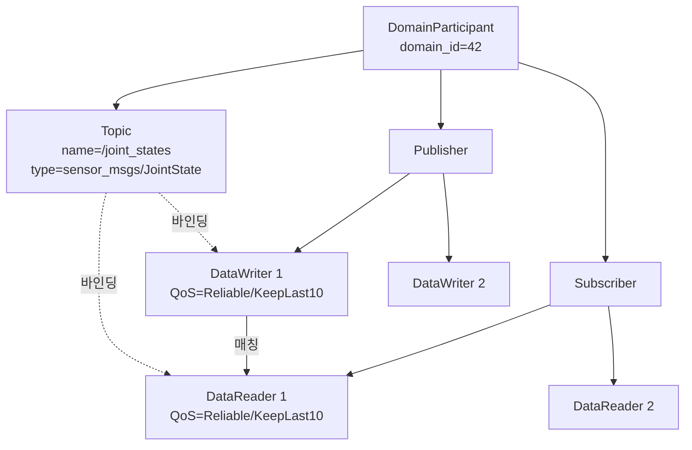

DDS의 데이터 모델은 **샘플(sample) 단위의 키 기반 데이터 스트림**입니다. Topic의 각 샘플은 인스턴스 키(instance key)를 가질 수 있습니다. 예를 들어 동일한 `/joint_states` 토픽에서 다른 관절은 다른 인스턴스가 될 수 있습니다. DataWriter는 각 인스턴스에 대해 독립적인 히스토리 큐를 유지 관리하며, DataReader는 특정 인스턴스를 개별적으로 수신, 필터링 또는 만료시킬 수 있습니다. 이러한 설계는 "동일한 토픽 내 여러 동시 엔티티" 시나리오(예: 여러 대의 비행기, 여러 대의 차량 상태)를 처리하는 데 유용합니다.

!!! note "용어 설명: 샘플, 인스턴스 키, 키 기반 데이터, 히스토리 큐"
    - **샘플(sample)**: Topic에서 한 번의 데이터 발행 단위.
    - **인스턴스 키(instance key)**: 동일한 Topic 내에서 다른 논리적 인스턴스를 구분하는 필드로, DDS가 각 인스턴스의 수명 주기와 히스토리를 개별적으로 관리할 수 있게 합니다.
    - **키 기반 데이터(keyed data)**: 인스턴스 키가 있는 데이터 유형으로, 여러 인스턴스가 동일한 Topic에 공존할 수 있게 합니다.
    - **히스토리 큐(history queue)**: DataWriter 또는 DataReader에 저장된 최근 몇 개의 샘플 캐시.

#### RTPS 프로토콜: 검색 및 전송

DDS의 하위 유선 프로토콜은 **RTPS(Real-Time Publish-Subscribe)** 라고 하며, OMG DDSI-RTPS 사양에 의해 정의됩니다. RTPS의 설계 목표는 중앙 브로커 없이 분산 발행자와 구독자가 자동으로 서로를 검색하고 사용자 데이터를 교환할 수 있도록 하는 것입니다.

!!! note "용어 설명: RTPS, DDSI, Broker, 유선 프로토콜, 엔드포인트"
    - **RTPS(Real-Time Publish-Subscribe)** : DDS의 표준 유선 프로토콜로, 발견, 매칭 및 데이터 전송을 담당합니다.
    - **DDSI(DDS Interoperability)** : OMG가 제정한 DDS 상호 운용 유선 프로토콜 사양입니다.
    - **Broker** : 메시지 미들웨어의 중앙 전달 노드입니다. RTPS는 브로커 없는 설계입니다.
    - **유선 프로토콜(wire protocol)** : 데이터가 물리적 네트워크에서 실제로 전송되는 바이트 형식과 상태 머신입니다.
    - **엔드포인트(endpoint)** : RTPS에서 DataWriter 또는 DataReader의 네트워크 계층 표현입니다.

RTPS의 발견은 두 단계로 나뉩니다:

1. **Participant Discovery Protocol(PDP)** : 각 DomainParticipant가 주기적으로 **ParticipantDeclaration**(RTPS에서는 일반적으로 SPDPdiscoveredParticipantData로 캡슐화됨)을 전송하여 자신의 존재, GUID, QoS, 사용 가능한 전송 등을 알립니다. 수신자는 이를 기반으로 Participant 수준의 매칭 관계를 설정합니다.
2. **Endpoint Discovery Protocol(EDP)** : PDP 완료 후, 참가자들은 각자의 DataWriter/DataReader 정보(엔드포인트 이름, Topic, 유형, QoS)를 교환하여 어떤 엔드포인트가 매칭될 수 있는지 확인합니다.

이 두 트래픽을 합쳐 **metatraffic(메타 트래픽)** 이라고 하며, 애플리케이션 데이터를 전달하는 **user traffic(사용자 트래픽)** 과 분리됩니다. 메타 트래픽은 일반적으로 best-effort 방식으로 UDP 멀티캐스트 또는 유니캐스트를 통해 전송됩니다.

!!! note "용어 설명: PDP, EDP, SPDP, metatraffic, user traffic, GUID"
    - **PDP(Participant Discovery Protocol)** : RTPS의 참가자 발견 프로토콜입니다.
    - **EDP(Endpoint Discovery Protocol)** : RTPS의 엔드포인트 발견 프로토콜입니다.
    - **SPDP(Simple Participant Discovery Protocol)** : 가장 일반적으로 사용되는 PDP 구현으로, 주기적인 알림을 기반으로 합니다.
    - **Metatraffic** : 발견, 하트비트, 확인 등의 제어 트래픽입니다.
    - **User traffic** : 애플리케이션이 실제로 게시하는 센서, 제어 명령 등의 데이터 트래픽입니다.
    - **GUID(Globally Unique Identifier)** : RTPS에서 각 엔티티(Participant, Writer, Reader)의 전역 고유 식별자입니다.

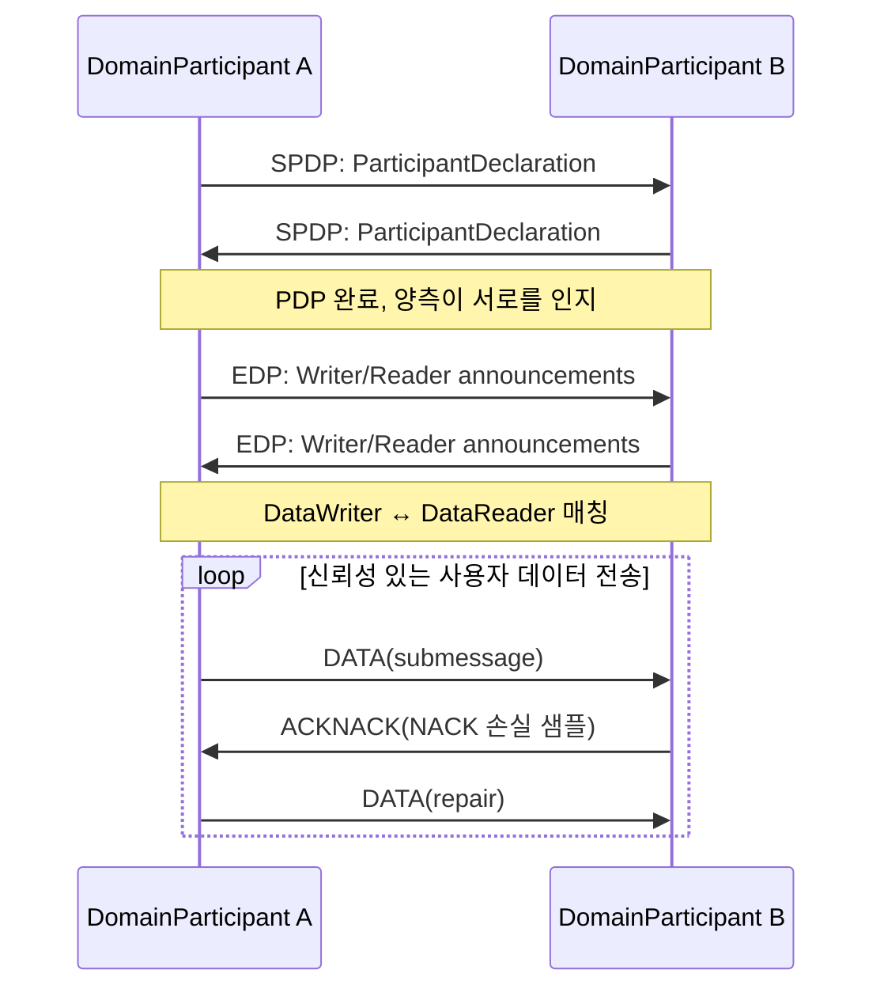

RTPS는 기본적으로 **UDP/IP** 위에서 실행됩니다. 그 이유는 다음과 같습니다:

- UDP는 비연결성, 저지연으로 주기적인 센서 데이터에 적합합니다.
- 멀티캐스트는 일대다 발견을 자연스럽게 지원합니다.
- RTPS는 전송 계층 위에서 자체적으로 신뢰성과 순서를 구현하므로 TCP에 의존하지 않습니다.

고처리량의 동일 호스트 통신을 위해, 최신 DDS 구현(Fast DDS, CycloneDDS 등)은 **공유 메모리 전송(SHM, Shared Memory Transport)** 을 지원합니다. 게시자와 구독자가 동일한 호스트에 있을 때, 샘플은 공유 메모리 세그먼트에 직접 기록되고, 수신자는 제로 카피(zero-copy)로 읽어 UDP 프로토콜 스택 오버헤드, 데이터 직렬화 복사 및 커널-사용자 모드 전환을 피합니다.

!!! note "용어 설명: UDP, TCP, 멀티캐스트, 유니캐스트, 공유 메모리, 제로 카피"
    - **UDP(User Datagram Protocol)** : 비연결형 전송 계층 프로토콜로, 오버헤드가 낮지만 신뢰성을 보장하지 않습니다.
    - **TCP(Transmission Control Protocol)** : 연결 지향적인 신뢰성 있는 전송 프로토콜이지만, 핸드셰이크, 재정렬 및 버퍼링 지연이 발생합니다.
    - **멀티캐스트(multicast)** : 일대다 네트워크 전송 방식으로, 하나의 데이터 패킷을 여러 수신자가 수신할 수 있습니다.
    - **유니캐스트(unicast)** : 일대일 네트워크 전송 방식입니다.
    - **공유 메모리(shared memory)** : 동일한 호스트의 여러 프로세스가 직접 액세스할 수 있는 동일한 물리적 메모리 세그먼트입니다.
    - **제로 카피(zero-copy)** : 데이터 전송 중에 추가 메모리 복사가 발생하지 않아 CPU 오버헤드와 지연을 줄입니다.

RTPS의 메시지 형식은 여러 **submessage**로 구성되며, 일반적인 submessage 유형은 다음과 같습니다:

| Submessage | 역할 |
|---|---|
| `DATA` | 사용자 샘플 또는 메타데이터 전달 |
| `DATA_FRAG` | 대용량 샘플 분할 전송 |
| `HEARTBEAT` | Writer가 Reader에게 현재 사용 가능한 시퀀스 번호 범위를 알림 |
| `ACKNACK` | Reader가 수신 확인 또는 재전송 요청 |
| `GAP` | Writer가 Reader에게 특정 시퀀스 번호가 더 이상 사용 불가능함을 알림 |
| `NACK_FRAG` | 분할 데이터의 재전송 요청 |

**모범 사례** : 로봇에서는 일반적으로 발견을 "유니캐스트 + 소량 멀티캐스트" 혼합 모드로 구성합니다. 소규모 LAN에서는 멀티캐스트를 사용하여 PDP를 수행할 수 있습니다. 대규모 또는 Wi-Fi 환경에서는 네트워크 플러딩을 줄이기 위해 유니캐스트 발견으로 구성하고 피어 노드 목록(peer list)을 지정할 수 있습니다.

#### QoS 정책 상세 설명

DDS의 QoS(Quality of Service)는 정책 객체로, Topic, DataWriter, DataReader, Publisher, Subscriber 및 DomainParticipant에 각각 설정할 수 있습니다. DataWriter와 DataReader가 매칭될 때, DDS는 양측의 QoS가 호환 가능한지(compatible) 확인합니다.

!!! note "용어 설명: QoS, 호환 정책, 요청-제공 모델, 리소스 제한"
    - **QoS(Quality of Service)** : DDS에서 통신 의미와 리소스를 설명하는 정책 집합입니다.
    - **요청-제공 모델(request-offer model)** : DataReader가 특정 QoS를 요청하고, DataWriter가 특정 QoS를 제공합니다. 매칭되려면 Reader의 요청 ≤ Writer의 약속을 충족해야 합니다.
    - **리소스 제한(resource limits)** : DDS 엔티티가 사용할 수 있는 최대 메모리 샘플 수입니다.

아래 표는 주요 QoS 정책과 휴머노이드 로봇에서의 일반적인 사용 예를 보여줍니다.

| QoS 정책 | 게시자 측 의미 | 구독자 측 의미 | 로봇 일반적인 시나리오 |
|---|---|---|---|
| RELIABILITY | Reliable / Best-Effort | 동일 | 긴급 정지: Reliable 사용; 이미지: Best-Effort 사용 |
| HISTORY | Keep Last N / Keep All | 동일 | 제어 명령: Keep Last 1; 로그: Keep All (리소스 허용 시) |
| DURABILITY | Volatile / Transient Local / Transient / Persistent | 동일 | 지도: Transient Local 사용 |
| DEADLINE | 최소 게시 주기 약속 | 최소 수신 주기 기대 | 관절 상태 1 kHz 모니터링 |
| LATENCY_BUDGET | DDS가 일괄/지연 전송을 허용하는 예산 | 허용 가능한 추가 지연 | 중요하지 않은 로그 집계 |
| LIFESPAN | 샘플 유효 기간 | 동일 | 만료된 이미지 자동 폐기 |
| LIVELINESS | Automatic / Manual, lease duration | 동일 | 노드 생존 여부 감지 |
| OWNERSHIP | Shared / Exclusive + strength | 동일 | 다중 컨트롤러 중재 |
| PARTITION | 논리적 파티션 이름 | 동일 | 다중 로봇 격리 |
| TIME_BASED_FILTER | 최소 간격 필터링 | 동일 | 고주파 샘플링을 10 Hz로 감소 |
| TRANSPORT_PRIORITY | 전송 우선순위 | 동일 | 긴급 제어 프레임 우선 전송 |

**RELIABILITY（신뢰성）**. Reliable 모드에서 RTPS는 **NACK 기반 복구(NACK-based repair)**를 사용합니다. Reader가 HEARTBEAT를 수신한 후 시퀀스 번호 누락을 발견하면 ACKNACK을 보내 재전송을 요청하고, Writer는 NACK을 수신하면 캐시에서 해당 샘플을 다시 전송합니다. Best-Effort 모드에서는 ACKNACK을 보내지 않으며, 샘플은 전송 즉시 폐기되어 지연 시간이 가장 낮지만 패킷 손실이 발생할 수 있습니다.

!!! note "용어 설명: NACK, ACK, HEARTBEAT, 재전송, 확인"
    - **NACK (Negative Acknowledgment)** : 수신자가 송신자에게 어떤 데이터를 받지 못했는지 알립니다.
    - **ACK (Acknowledgment)** : 수신자가 데이터 수신을 확인합니다.
    - **HEARTBEAT** : 송신자가 주기적으로 수신자에게 현재까지 전송된 시퀀스 번호 창을 알립니다.
    - **재전송 (retransmission)** : 송신자가 NACK에 따라 손실된 데이터를 다시 전송합니다.

신뢰성의 오버헤드는 다음 공식으로 대략적으로 추정할 수 있습니다.

$$
L_{\text{reliable}} = L_{\text{send}} + L_{\text{prop}} + L_{\text{sched}} + L_{\text{NACK-repair}}
$$

여기서 \(L_{\text{NACK-repair}}\)는 안정적인 네트워크에서는 0에 가깝지만, 패킷 손실이 발생하면 RTT 정도(백 마이크로초에서 밀리초)의 추가 지연이 발생합니다.

**HISTORY（이력）**. Keep Last \(N\)은 최근 \(N\)개의 샘플만 유지하고 오래된 샘플은 덮어씁니다. Keep All은 리소스 제한까지 확인되지 않은 모든 샘플을 유지합니다. DataReader에서 Keep Last 1을 사용하면 `/cmd_vel` 속도 명령어 수신과 같이 "최신 값만 중요"한 의미를 효과적으로 구현할 수 있습니다.

!!! note "용어 설명: Keep Last, Keep All, 이력 깊이, 리소스 제한"
    - **Keep Last** : 최근 N개의 샘플만 유지하는 HISTORY 모드입니다.
    - **Keep All** : 소비되거나 확인되지 않은 모든 샘플을 유지하는 HISTORY 모드입니다.
    - **이력 깊이 (history depth)** : Keep Last 모드의 N 값입니다.
    - **리소스 제한 (resource limits)** : DDS 엔터티의 최대 샘플 수, 인스턴스 수 및 샘플/인스턴스 비율을 제어하는 매개변수입니다.

**DURABILITY（지속성）**. 4단계로 나뉩니다.

- **Volatile** : 이력을 유지하지 않으며, 새 구독자가 가입한 후에만 이후 데이터를 수신할 수 있습니다. 메모리 사용량이 가장 적습니다.
- **Transient Local** : DataWriter가 로컬 메모리에 이력 샘플을 유지하며, 새로 일치하는 DataReader가 가입하면 즉시 최신 샘플을 수신할 수 있습니다. 지도, 매개변수, 설정과 같은 "상태형" 데이터에 적합합니다.
- **Transient / Persistent** : 외부 지속성 서비스(DDS Persistence Service)가 이력을 저장하며, DataWriter가 종료된 후에도 새 Reader가 데이터를 가져올 수 있습니다. 구현이 복잡하여 로봇 분야에서는 거의 사용되지 않습니다.

메모리 사용량은 다음과 같이 근사할 수 있습니다.

$$
M_{\text{durability}} \approx N_{\text{samples}} \times S_{\text{sample}} \times N_{\text{instances}}
$$

여기서 \(S_{\text{sample}}\)은 직렬화된 샘플 크기입니다. 1 MB 포인트 클라우드 지도의 경우, 이력 깊이가 1이고 인스턴스 수가 1이면 Transient Local은 약 1 MB를 차지합니다.

**DEADLINE 및 LATENCY_BUDGET**. DEADLINE은 Writer가 지정된 주기 내에 최소 한 번은 게시할 것을 요구합니다. Reader는 해당 주기 내에 수신할 것으로 기대합니다. 이를 충족하지 못하면 DDS는 `on_requested_deadline_missed` 또는 `on_offered_deadline_missed` 콜백을 트리거합니다. LATENCY_BUDGET을 사용하면 DDS가 예산 내에서 일괄 전송 또는 스케줄링 최적화를 수행할 수 있습니다.

**LIFESPAN**. 샘플은 DataWriter 측에서 유효 기간이 있으며, 만료되면 전송되지 않더라도 폐기되어 오래된 데이터가 네트워크에 퍼지는 것을 방지합니다. 예를 들어, 100ms 전의 장애물 감지 결과는 고속 이동 로봇에게는 의미가 없을 수 있습니다.

**LIVELINESS**. Automatic 모드에서는 Writer 프로세스가 정상적으로 실행되는 한 DDS가 자동으로 Writer가 살아 있다고 간주합니다. Manual 모드에서는 애플리케이션이 주기적으로 `assert_liveliness()`를 호출해야 하며, 그렇지 않으면 Reader가 `on_liveliness_changed`를 트리거하고 Writer가 활성 상태를 잃은 것으로 간주합니다. lease duration은 시간 초과 임계값을 정의합니다.

**OWNERSHIP**. Shared 모드에서는 여러 Writer가 동일한 Topic에 게시한 데이터를 모두 Reader가 수신합니다. Exclusive 모드에서는 strength가 가장 높은 Writer의 데이터만 수신됩니다. 이는 다중 컨트롤러 핫 백업에서 매우 유용합니다. 주 컨트롤러는 strength가 높고, 백업 컨트롤러는 strength가 낮으며, 주 컨트롤러가 실패하면 백업 컨트롤러가 자동으로 인계받습니다.

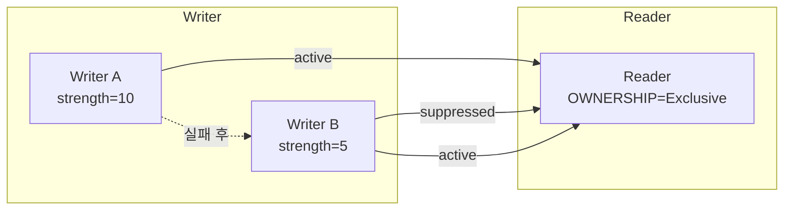

**PARTITION**. 논리적 파티션 이름을 사용하여 동일한 도메인을 더 세분화합니다. 예를 들어, 로봇 A와 로봇 B가 모두 도메인 0에 있지만 각각 `robot_A` 및 `robot_B` 파티션에 속하는 경우, 명시적으로 파티션 간 구성을 하지 않는 한 서로 구독하지 않습니다.

**콜백 메커니즘**. DDS는 `on_requested_deadline_missed`, `on_liveliness_changed`, `on_sample_lost`, `on_sample_rejected`, `on_requested_incompatible_qos` 등의 Listener 콜백을 제공합니다. 엔지니어링 관점에서는 `/emergency_stop`과 같은 중요한 토픽에서 LIVELINESS_CHANGED 및 DEADLINE_MISSED를 모니터링하여 통신 이상을 신속하게 감지하는 것이 좋습니다.

#### DDS 보안 및 확장성

DDS-Security는 OMG가 정의한 보안 플러그인 사양으로, DDS에 인증, 접근 제어, 암호화 및 감사 기능을 제공합니다. 이는 플러그인 아키텍처를 통해 DDS 구현에 통합되며, RTPS 핵심 메시지 형식을 수정하지 않고 서브메시지 수준에서 보안 캡슐화를 추가합니다.

!!! note "용어 설명: DDS-Security, 인증, 접근 제어, 암호화, 감사, 플러그인"
    - **DDS-Security** : OMG가 DDS를 위해 정의한 보안 확장 사양입니다.
    - **인증 (authentication)** : 통신하는 양측의 신원을 확인하는 프로세스입니다.
    - **접근 제어 (access control)** : 정책에 따라 어떤 엔터티가 어떤 Topic을 게시/구독할 수 있는지 결정합니다.
    - **암호화 (encryption)** : 메시지 내용을 변환하여 권한이 없는 자가 읽을 수 없도록 합니다.
    - **감사 (logging)** : 사후 분석을 위해 보안 이벤트를 기록합니다.
    - **플러그인 (plugin)** : 동적으로 로드할 수 있는 보안 기능 모듈입니다.

DDS-Security는 주로 다음 플러그인을 포함합니다.

1. **Authentication Plugin** : PKI 및 디지털 인증서를 기반으로 DomainParticipant의 신원을 확인하고, Diffie-Hellman 또는 ECDH를 사용하여 세션 키를 협상합니다.
2. **Access Control Plugin** : `permissions.xml` 및 `governance.xml`을 통해 각 Participant가 읽고 쓸 수 있는 Topic, 가입할 수 있는 도메인, 생성할 수 있는 Publisher/Subscriber를 정의합니다.
3. **Cryptography Plugin** : RTPS 메시지의 암호화, 서명, HMAC 및 키 파생을 제공합니다.
4. **Logging Plugin** : 보안 관련 이벤트를 기록합니다.

!!! note "용어 설명: PKI, 디지털 인증서, Diffie-Hellman, ECDH, HMAC, 디지털 서명"
    - **PKI (Public Key Infrastructure)** : 공개 키 암호화를 기반으로 하는 신원 인증 인프라입니다.
    - **디지털 인증서 (digital certificate)** : 신뢰할 수 있는 기관이 발급한, 공개 키와 신원을 바인딩하는 전자 문서입니다.
    - **Diffie-Hellman / ECDH** : 공개 채널에서 양측이 공유 키를 협상할 수 있도록 하는 키 교환 프로토콜입니다.
    - **HMAC (Hash-based Message Authentication Code)** : 해시 함수 기반의 메시지 인증 코드로, 무결성 검증에 사용됩니다.
    - **디지털 서명 (digital signature)** : 개인 키로 데이터 요약에 서명하여 데이터 출처와 무결성을 검증합니다.

보안 배포에는 두 가지 유형의 XML 파일이 필요합니다.

- **Governance**：전역 보안 정책을 정의합니다. 예를 들어 암호화, 서명 활성화 여부, 인증되지 않은 참가자의 도메인 참여 허용 여부 등을 정의합니다.
- **Permissions**：각 Participant의 구체적인 권한을 정의합니다. 읽기/쓰기가 허용된 Topic, 유효 기간, domain id 등을 포함합니다.

!!! note "용어 설명: Governance, Permissions, 보안 도메인"
    - **Governance**：DDS-Security에서 전역 보안 정책을 정의하는 파일입니다.
    - **Permissions**：DDS-Security에서 개별 Participant의 읽기/쓰기 권한을 정의하는 파일입니다.
    - **보안 도메인(security domain)**：인증 및 접근 제어 로직을 통해 격리된 통신 범위입니다.

로봇 시스템에서 DDS-Security의 일반적인 적용 사례는 다음과 같습니다.

- **다중 로봇 격리**：로봇 A가 로봇 B의 제어 명령을 잘못 수신하지 않도록 보장합니다.
- **운영 권한 계층화**：상위 컴퓨터는 `/cmd_vel`을 게시할 수 있고, 관절 구동 노드는 특정 제어 Topic만 구독하고 상태 Topic을 게시할 수 있습니다.
- **원격 조작 보안**：외부 원격 조작 단말은 인증서 인증을 통과해야 높은 권한의 Topic에 쓸 수 있습니다.

보안 외에도 DDS의 확장성은 **domain 분할** 및 **Topic 라우팅**에서 나타납니다. 대형 로봇 또는 로봇 편대는 DDS 게이트웨이 또는 ROS 2의 `domain bridge`를 통해 서로 다른 domain 간에 선택된 Topic을 전달하여 계층적 네트워크를 구현할 수 있습니다.

- 고수준 계획 도메인 (저주파, 대용량 데이터, 로봇 간)
- 실시간 제어 도메인 (고주파, 소용량 데이터, 엄격한 타이밍)
- 유지보수 진단 도메인 (로그, 펌웨어 업그레이드)

```mermaid
flowchart TD
    subgraph Domain_0
    A1["로봇 A 인식 노드"]
    A2["로봇 A 제어 노드"]
    end
    subgraph Domain_1
    B1["로봇 B 인식 노드"]
    B2["로봇 B 제어 노드"]
    end
    subgraph Domain_42
    C["클라우드 모니터링 / 편대 스케줄링"]
    end
    A1 <-->|"domain bridge<br/>상태만 전달"| C
    B1 <-->|"domain bridge<br/>상태만 전달"| C
    A2 -.->|"격리"| B2
```

#### DDS 구현 비교

현재 주요 DDS 구현으로는 CycloneDDS, Fast DDS, RTI Connext DDS, GurumDDS 및 OpenDDS가 있습니다. 아래 표는 로봇 공학 관점에서 비교한 것입니다.

| 구현 | 라이선스 | ROS 2 기본 RMW | 공유 메모리 | DDS-Security | 주요 도구 체인 | 일반적인 적용 시나리오 |
|---|---|---|---|---|---|---|
| Eclipse CycloneDDS | EPL 2.0 | Rolling/Jazzy 기본 | 지원 | 부분 지원 | `cyclonedds` CLI | 오픈 소스 로봇, 학술 프로젝트 |
| eProsima Fast DDS | Apache 2.0 | Humble 기본 | 우수 | 지원 | Fast DDS Monitor | 상업용 로봇, 동일 머신 제로 카피 |
| RTI Connext DDS | 상업용 | 선택 사항 `rmw_connextdds` | 지원 | 완전 | RTI Admin Console, Monitor | 항공 우주, 자동차, 고보안 |
| GurumDDS | 상업용 | 선택 사항 | 지원 | 완전 | Gurum Net | 한국 산업/로봇 시장 |
| OpenDDS | 오픈 소스 (OCI) | 공식 RMW 없음 | 지원 | 지원 | OpenDDS Monitor | 기존 OpenDDS 생태계 |

!!! note "용어 설명: CycloneDDS, Fast DDS, RTI Connext, GurumDDS, OpenDDS, EPL, Apache 2.0"
    - **CycloneDDS**：Eclipse 재단이 유지 관리하는 오픈 소스 DDS 구현으로, 간결함과 고성능으로 유명합니다.
    - **Fast DDS**：eProsima가 개발한 기능이 풍부한 DDS/RTPS 구현으로, 공유 메모리와 보안을 지원합니다.
    - **RTI Connext DDS**：Real-Time Innovations의 상업용 DDS 제품으로, 도구 체인이 성숙했습니다.
    - **GurumDDS**：한국 Gurum Networks의 상업용 DDS 구현입니다.
    - **OpenDDS**：Object Computing이 유지 관리하는 오픈 소스 DDS 구현입니다.
    - **EPL / Apache 2.0**：일반적인 오픈 소스 소프트웨어 라이선스입니다.

선택 권장 사항:

- **연구 및 프로토타입**：CycloneDDS는 구성이 간단하고 ROS 2와의 통합이 우수합니다.
- **고성능 동일 머신 통신**：Fast DDS의 공유 메모리 구현 및 제로 카피 특성이 뛰어납니다.
- **보안 중요/인증 프로젝트**：RTI Connext DDS는 완전한 보안 플러그인, 도구 체인 및 인증 지원 문서를 제공합니다.
- **다중 DDS 상호 운용**：DDS 상호 운용성은 이론적으로 가능하지만, 실제로는 서로 다른 구현이 QoS 기본값 및 검색 동작에 차이가 있으므로 프로젝트 초기에 상호 연결 테스트를 수행해야 합니다.

#### ROS 2 실행 모델 및 rclcpp/rclpy

ROS 2는 DDS 위에 `rcl`(C 인터페이스), `rclcpp`(C++) 및 `rclpy`(Python) 클라이언트 라이브러리를 제공합니다. 실행 모델을 이해하는 것은 저지연, 결정론적 로봇 소프트웨어를 구현하는 데 중요합니다.

!!! note "용어 설명: rcl, rclcpp, rclpy, 클라이언트 라이브러리, 실행기, 콜백"
    - **rcl**：ROS 2의 C 언어 클라이언트 라이브러리 인터페이스입니다.
    - **rclcpp / rclpy**：ROS 2의 C++ 및 Python 클라이언트 라이브러리입니다.
    - **클라이언트 라이브러리(client library)**：개발자에게 노드 생성, 게시/구독, 서비스 호출 등의 API를 제공하는 라이브러리입니다.
    - **실행기(executor)**：콜백 함수 실행을 스케줄링하는 메커니즘입니다.
    - **콜백(callback)**：이벤트(예: 새 메시지 도착, 타이머 트리거, 서비스 요청)에 대한 응답 함수입니다.

**노드와 실행기**. 하나의 ROS 2 프로세스는 하나 이상의 Node를 포함할 수 있습니다. 실행기는 DDS/RMW 계층에서 이벤트를 수집하고 해당 콜백을 호출하는 역할을 합니다. ROS 2는 세 가지 주요 실행기를 제공합니다.

1. **SingleThreadedExecutor**：모든 콜백이 FIFO 순서로 동일한 스레드에서 실행됩니다. 가장 간단하지만, 시간이 오래 걸리는 콜백 하나가 다른 콜백을 차단할 수 있습니다.
2. **MultiThreadedExecutor**：스레드 풀을 사용하여 콜백을 동시에 실행하며, I/O 집약적이거나 병렬 계산이 가능한 시나리오에 적합합니다.
3. **StaticSingleThreadedExecutor**：초기화 시 콜백 순서를 결정하여 실행 중 스케줄링 오버헤드를 줄일 수 있으며, 결정론적이고 콜백 집합이 고정된 실시간 작업에 적합합니다.

!!! note "용어 설명: SingleThreadedExecutor, MultiThreadedExecutor, StaticSingleThreadedExecutor, FIFO, 스레드 풀"
    - **SingleThreadedExecutor**：단일 스레드에서 콜백을 순차적으로 실행하는 실행기입니다.
    - **MultiThreadedExecutor**：다중 스레드에서 콜백을 동시에 실행하는 실행기입니다.
    - **StaticSingleThreadedExecutor**：스케줄링 오버헤드를 최적화하기 위해 콜백 순서를 정적으로 결정하는 실행기입니다.
    - **FIFO(First In First Out)**：선입선출 스케줄링 순서입니다.
    - **스레드 풀(thread pool)**：미리 생성된 스레드 그룹으로, 재사용 및 스레드 생성 오버헤드를 줄이는 데 사용됩니다.

**콜백 그룹(Callback Groups)**. ROS 2의 콜백은 두 가지 유형의 콜백 그룹에 배치될 수 있습니다.

- **MutuallyExclusive**：그룹 내 콜백은 동시에 실행될 수 없으며, 공유 리소스에 액세스하는 콜백에 적합합니다.
- **Reentrant**：그룹 내 콜백은 재진입 가능하며 동시에 실행될 수 있으며, 상태 비저장 및 병렬 계산에 적합합니다.

실시간 콜백(예: 제어 법칙)을 독립적인 콜백 그룹에 배치하고 `MultiThreadedExecutor`의 스레드 수 제한과 결합하면 실시간 부하와 비실시간 부하를 어느 정도 격리할 수 있습니다.

```mermaid
flowchart TD
    subgraph Node
    A["구독 /joint_states"] --> B["콜백 그룹 A<br/>MutuallyExclusive<br/>실시간 제어"]
    C["구독 /camera/image_raw"] --> D["콜백 그룹 B<br/>Reentrant<br/>인식 처리"]
    E["타이머 1 kHz"] --> B
    end
    B --> F["Executor 스레드 풀"]
    D --> F
    F --> G["DDS/RTPS"]
```

**구성 및 프로세스 내 통신(Composition)**. ROS 2는 여러 노드를 동일한 프로세스로 컴파일(composition)하고 `rclcpp::intra_process`를 통해 **프로세스 내 제로 카피 통신**을 구현할 수 있습니다. 게시자와 구독자가 동일한 프로세스에 있고 호환 가능한 QoS를 사용하는 경우 샘플 포인터를 DDS 직렬화 및 네트워크 스택을 거치지 않고 직접 전달할 수 있습니다.

!!! note "용어 설명: Composition, 프로세스 내 통신, 제로 카피, 포인터 전달"
    - **Composition**: 여러 ROS 2 노드를 하나의 프로세스에 배치하는 기술.
    - **프로세스 내 통신 (intra-process communication)**: 동일 프로세스 내 노드 간 직접 통신으로, DDS 네트워크 계층을 우회합니다.
    - **제로 카피 (zero-copy)**: 데이터 전송 시 추가 메모리 복사를 수행하지 않습니다.
    - **포인터 전달 (pointer passing)**: 데이터 복사 대신 데이터 포인터를 전달하여 제로 카피를 구현합니다.

**RMW 추상화 계층**. ROS 2는 RMW 인터페이스를 통해 기본 DDS 구현의 차이점을 숨깁니다. `rmw_fastrtps_cpp`, `rmw_cyclonedds_cpp`, `rmw_connextdds` 등은 서로 다른 DDS의 어댑터 계층입니다. RMW를 전환하려면 일반적으로 환경 변수 `RMW_IMPLEMENTATION`만 설정하면 되며, 애플리케이션 코드를 수정할 필요가 없습니다.

**실시간성 함정**:

1. **콜백 내 동적 메모리 할당**: `std::vector`, `std::string` 등은 힙 할당을 유발하여 예측 불가능한 지연을 초래할 수 있습니다. 실시간 경로에서는 메모리를 미리 할당하거나 사용자 정의 할당자를 사용해야 합니다.
2. **스핀 락과 바쁜 대기**: 일부 DDS 구현은 데이터를 기다릴 때 스핀 락을 사용하여 CPU를 소모하고 동일 프로세스의 다른 스레드에 영향을 줄 수 있습니다.
3. **DDS 히스토리 캐시**: Keep All 또는 많은 인스턴스는 메모리를 무제한으로 증가시키므로 ResourceLimits와 함께 사용해야 합니다.
4. **Executor의 FIFO 스케줄링**: SingleThreadedExecutor는 주기적 작업의 정확한 트리거 시간을 보장할 수 없습니다. `rclcpp::Timer`를 사용하고 실시간 우선순위 스레드를 함께 사용하는 것이 좋습니다.

```mermaid
flowchart TD
    A["ROS 2 애플리케이션 rclcpp/rclpy"] --> B["rcl 인터페이스 계층"]
    B --> C["RMW 추상화 계층"]
    C --> D["DDS 구현 계층"]
    D --> E["RTPS 프로토콜 계층"]
    E --> F["UDP / SHM 전송 계층"]
    F --> G["네트워크 카드 / 공유 메모리"]
```

### 6.4.2 시간 민감 네트워크 TSN / EtherCAT / CAN-FD

로봇 내부 통신은 일반적으로 두 가지 유형으로 나뉩니다.

- **데이터 집약형 버스**: 다중 카메라, 포인트 클라우드, 로그. 높은 대역폭과 허용 가능한 지연 시간이 필요합니다.
- **제어 집약형 버스**: 관절 힘 제어, 안전 체인. 결정론적 저지연 및 저지터가 필요합니다.

TSN, EtherCAT 및 CAN-FD는 각각 다른 계층에 해당합니다. TSN은 고속 이더넷에서 결정론적 통합을 지향합니다. EtherCAT은 고성능 서보 및 모션 제어를 지향합니다. CAN-FD는 저비용, 중저속 분산 노드(예: 배터리 관리, 센서)를 지향합니다.

!!! note "용어 설명: TSN, EtherCAT, CAN-FD, 필드버스, 결정론적 통신, 사이클 타임, 지터"
    - **TSN (Time-Sensitive Networking)**: IEEE 802.1 시리즈 표준으로, 기존 이더넷에서 결정론적 지연 및 동기화를 제공합니다.
    - **EtherCAT (Ethernet for Control Automation Technology)**: Beckhoff가 개발한 산업용 이더넷 필드버스로, "플라잉 리드/라이트" 메커니즘을 사용하며 사이클 타임이 100 μs에 달할 수 있습니다.
    - **CAN-FD (Controller Area Network with Flexible Data-rate)**: CAN 버스의 업그레이드 버전으로, 데이터 속도와 프레임당 데이터 길이를 향상시킵니다.
    - **필드버스 (fieldbus)**: 컨트롤러와 현장 장치를 연결하는 디지털 통신 네트워크입니다.
    - **사이클 타임 (cycle time)**: 제어 루프가 반복되는 시간 간격입니다.
    - **지터 (jitter)**: 실제 사이클과 이상적인 사이클 간의 편차입니다.

#### TSN 핵심 메커니즘 상세 설명

TSN은 IEEE 802.1 표준 모음으로, 핵심 목표는 표준 이더넷에서 최선형 트래픽과 시간 중요 트래픽을 동시에 전달하는 것입니다.

!!! note "용어 설명: TSN, 시간 민감 네트워크, 최선형 트래픽, 결정론적 트래픽, 셰이퍼"
    - **TSN (Time-Sensitive Networking)**: 표준 이더넷에서 결정론적 서비스를 제공하는 IEEE 802.1 표준 제품군입니다.
    - **최선형 트래픽 (best-effort traffic)**: 지연 및 대역폭이 보장되지 않는 트래픽입니다.
    - **결정론적 트래픽 (time-critical traffic)**: 엄격한 지연 및 지터 상한이 있는 트래픽입니다.
    - **셰이퍼 (shaper)**: 트래픽 출력 시기와 속도를 제어하는 네트워크 메커니즘입니다.

아래 표는 TSN의 핵심 메커니즘과 그 역할을 보여줍니다.

| IEEE 표준 | 메커니즘 | 핵심 기능 | 로봇 애플리케이션 |
|---|---|---|---|
| 802.1Qbv | Time-Aware Shaper (TAS) | 게이트 스케줄링, 우선순위별 시간 창 할당 | 로봇 제어 프레임과 비전 프레임의 시분할 전송 |
| 802.1Qbu / 802.3br | Frame Preemption | 높은 우선순위 프레임이 낮은 우선순위 프레임을 선점 가능 | 비상 정지 프레임이 대용량 데이터 프레임을 중단 |
| 802.1CB | FRER | 프레임 복제 및 제거, 경로 중복 제공 | 안전 중요 제어 이중 경로 |
| 802.1Qci | PSFP | 스트림별 필터링 및 감독, 오류 노드의 트래픽 주입 방지 | 결함 노드가 네트워크를 마비시키는 것을 방지 |
| 802.1AS | gPTP | 서브 마이크로초 수준 시간 동기화 | 다중 센서 시간 정렬 |

!!! note "용어 설명: TAS, Frame Preemption, FRER, PSFP, gPTP"
    - **TAS (Time-Aware Shaper)**: 게이트 제어 목록 기반 타임 슬롯 셰이퍼입니다.
    - **Frame Preemption**: 높은 우선순위 프레임이 낮은 우선순위 프레임의 전송을 중단할 수 있도록 하는 메커니즘입니다.
    - **FRER (Frame Replication and Elimination for Reliability)**: 신뢰성을 위한 프레임 복제 및 제거 메커니즘입니다.
    - **PSFP (Per-Stream Filtering and Policing)**: 스트림별 필터링 및 감독 메커니즘입니다.
    - **gPTP (generic PTP)**: IEEE 802.1AS에서 정의한 시간 동기화 프로토콜입니다.

**IEEE 802.1Qbv TAS**. TAS는 각 이더넷 포트의 출력 게이트를 8개의 큐로 나누고, 각 큐에는 게이트가 있으며, 게이트 상태는 **Gate Control List (GCL)** 에 의해 주기적으로 제어됩니다. GCL은 시간-게이트 상태 테이블입니다. 예:

| 시간 오프셋 (μs) | 큐 7 (최고) | 큐 6 | ... | 큐 0 (최저) |
|---|---|---|---|---|
| 0–100 | 열림 | 닫힘 | ... | 닫힘 |
| 100–400 | 닫힘 | 열림 | ... | 닫힘 |
| 400–1000 | 닫힘 | 닫힘 | ... | 열림 |

!!! note "용어 설명: GCL, 게이트 제어 목록, 타임 슬롯, 사이클 타임, 보호 대역"
    - **GCL (Gate Control List)**: 각 큐 게이트의 열림/닫힘 상태를 정의하는 시간표입니다.
    - **타임 슬롯 (time slot)**: GCL에서 특정 트래픽에 할당된 고정된 시간입니다.
    - **사이클 타임 (cycle time)**: GCL이 한 번 반복되는 시간 길이입니다.
    - **보호 대역 (guard band)**: 중요 타임 슬롯 전에 예약된 시간으로, 낮은 우선순위 프레임이 링크를 너무 오래 점유하는 것을 방지합니다.

사이클 타임 \(T_{\text{cycle}}\)은 가장 엄격한 제어 루프를 기반으로 설계됩니다. 예를 들어, 1 kHz 관절 제어 루프는 제어 프레임이 1 ms 내에 송수신 및 계산을 완료해야 합니다. TSN 사이클이 250 μs인 경우, 제어 프레임은 최대 4개의 타임 슬롯 내에서 종단 간 전송을 완료할 수 있습니다. 보호 대역 \(T_{\text{guard}}\)은 일반적으로 전송 가능한 최대 프레임 시간과 같으며, 낮은 우선순위 프레임이 중요 타임 슬롯이 시작될 때 여전히 링크를 점유하고 있는 것을 방지합니다.

```mermaid
flowchart LR
    subgraph TAS 게이트 스케줄링
    direction LR
    A["t=0\n큐7 열림\n제어 프레임"] --> B["t=100μs\n큐7 닫힘"]
    B --> C["t=100-400μs\n큐6 열림\n센서 프레임"]
    C --> D["t=400-950μs\n큐0 열림\n백그라운드 트래픽"]
    D --> E["t=950-1000μs\n보호 대역"]
    E --> A
    end
```

**IEEE 802.1Qbu / 802.3br Frame Preemption**. 프레임 선점은 높은 우선순위 "익스프레스 프레임"이 전송 중인 낮은 우선순위 "선점 가능 프레임"을 중단할 수 있도록 합니다. 선점된 프레임은 나중에 계속 전송되며, 수신자는 체크섬을 통해 재조립합니다. 이는 중요 프레임의 대기 지연을 더욱 줄여주지만, 스위치와 네트워크 카드가 동시에 지원해야 합니다.

**IEEE 802.1CB FRER**. FRER는 두 개의 분리된 경로에 중요 프레임을 복제하고 수신 측에서 중복 프레임을 제거하여 신뢰성을 높입니다. 로봇의 경우, 안전 체인(예: 비상 정지, 관절 토크 제한)을 FRER 스트림으로 구성할 수 있어 단일 링크에 장애가 발생하더라도 제어에 영향을 미치지 않습니다.

```mermaid
flowchart TD
    A["송신단 Talker"] --> B["스위치 1"]
    A --> C["스위치 2"]
    B --> D["수신단 Listener"]
    C --> D
    D --> E["시퀀스 번호 중복 제거"]
    E --> F["애플리케이션"]
```

**IEEE 802.1Qci PSFP**. PSFP는 스위치에 유입되는 각 스트림을 필터링, 규제 및 게이팅합니다. 특정 노드가 장애로 인해 대량의 데이터를 버스트로 전송하면 PSFP는 규정을 초과하는 프레임을 폐기하거나 마킹하여 중요 스트림을 보호합니다.

**IEEE 802.1AS gPTP**. gPTP는 TSN의 시간 동기화 프로토콜로, IEEE 1588 PTP를 기반으로 하지만 더 엄격한 가정을 합니다. 네트워크 내 모든 장치가 gPTP를 지원하며, 마스터-슬레이브 관계는 BMCA(Best Master Clock Algorithm)를 통해 결정됩니다. gPTP는 Sync, Follow_Up, Pdelay_Req, Pdelay_Resp 메시지를 통해 링크 지연을 측정하고 클록을 동기화하며, 정밀도는 서브 마이크로초 수준에 도달할 수 있습니다.

!!! note "용어 설명: BMCA, 마스터 클록, 슬레이브 클록, 투명 클록, 경계 클록"
    - **BMCA(Best Master Clock Algorithm)**: 최적의 마스터 클록을 선택하는 알고리즘.
    - **마스터 클록(master clock)**: 기준 시간을 제공하는 클록.
    - **슬레이브 클록(slave clock)**: 마스터 클록과 동기화되는 클록.
    - **투명 클록(transparent clock)**: 스위치 내에서 패킷의 체류 시간을 측정하고 수정하는 장치.
    - **경계 클록(boundary clock)**: 여러 포트에서 각각 마스터/슬레이브 역할을 수행하며, 네트워크 세그먼트 간 동기화를 위한 클록 장치.

**지연 추정 예시**. 제어 프레임 길이 \(L = 1500\ \text{B}\), 링크 속도 \(R = 1\ \text{Gb/s}\)라고 가정하면, 프레임 전송 시간은 다음과 같습니다.

$$
T_{\text{tx}} = \frac{L \times 8}{R} = \frac{1500 \times 8}{10^9} = 12\ \mu\text{s}
$$

하나의 스위치를 통과한 후(투명 클록 수정 적용), 전달 지연은 약 1–5 μs입니다. 3개의 스위치를 통과하면 총 전송 지연은 약 20–40 μs로, 1 ms 제어 주기보다 훨씬 짧습니다.

#### EtherCAT 프로토콜 심층 분석

EtherCAT은 표준 이더넷 프레임을 기반으로 하는 산업용 필드버스로, Beckhoff가 제안하고 EtherCAT Technology Group이 유지 관리합니다. 가장 큰 특징은 "processing on the fly"입니다. 슬레이브가 프레임이 통과할 때 즉시 데이터를 읽고 쓰며, 프레임을 완전히 수신한 후 전달하지 않습니다.

!!! note "용어 설명: EtherCAT, 마스터, 슬레이브, 플라이 리드/라이트, 워킹 카운터, 분산 클록"
    - **EtherCAT(Ethernet for Control Automation Technology)**: 이더넷 기반의 고속 산업용 필드버스.
    - **마스터(master)**: EtherCAT 통신을 시작하고 제어하는 노드.
    - **슬레이브(slave)**: 서보 드라이브, I/O 모듈 등 마스터 명령에 응답하는 노드.
    - **플라이 리드/라이트(processing on the fly)**: 슬레이브가 데이터 프레임이 통과할 때 즉시 읽고 쓰는 방식.
    - **워킹 카운터(Working Counter, WC)**: 각 EtherCAT 프레임 끝에 있는 카운터로, 슬레이브가 성공적으로 처리했는지 확인하는 데 사용됩니다.
    - **분산 클록(Distributed Clocks, DC)**: 모든 슬레이브가 공통 시간 기준을 공유하도록 하는 EtherCAT의 동기화 메커니즘.

**EtherCAT 프레임 구조**. 표준 이더넷 프레임의 EtherType은 `0x88A4`이며, 그 뒤에 EtherCAT 헤더와 여러 개의 데이터그램이 옵니다.

| 필드 | 길이 | 설명 |
|---|---|---|
| 이더넷 헤더 | 14 B | 목적지 MAC, 소스 MAC, EtherType=0x88A4 |
| EtherCAT 헤더 | 2 B | 데이터 길이, 예약 비트 |
| 데이터그램 1 | 가변 | 명령, 인덱스, 주소, 데이터, WC |
| ... | 가변 | 여러 데이터그램 |
| FCS | 4 B | 이더넷 프레임 체크섬 |

!!! note "용어 설명: EtherType, 데이터그램, FCS, MAC 주소"
    - **EtherType**: 이더넷 프레임에서 상위 프로토콜을 식별하는 필드.
    - **데이터그램(Datagram)**: EtherCAT 프레임 내의 독립적인 데이터 단위.
    - **FCS(Frame Check Sequence)**: 이더넷 프레임 끝에 있는 체크섬 시퀀스로, 전송 오류를 감지하는 데 사용됩니다.
    - **MAC 주소(Media Access Control address)**: 이더넷 장치의 물리적 주소.

각 데이터그램의 명령에는 `APRD`(자동 증분 물리 읽기), `APWR`(자동 증분 물리 쓰기), `FPRD`(고정 주소 읽기), `FPWR`(고정 주소 쓰기), `LRW`(논리 읽기/쓰기) 등이 있습니다. 마스터는 논리 주소를 사용하여 프로세스 데이터를 슬레이브의 메모리 맵 영역에 매핑합니다.

**분산 클록(DC)**. DC는 각 슬레이브에서 패킷의 도착 및 출발 시간을 측정하여 전파 지연과 클록 오프셋을 계산하고 보상합니다.

1. 마스터가 특수 동기화 프레임을 전송하면 각 슬레이브는 로컬 타임스탬프 \(t_{\text{in}}\) 및 \(t_{\text{out}}\)를 기록합니다.
2. 왕복 측정을 통해 각 슬레이브에서 기준 클록까지의 **전파 지연** \(t_{\text{prop}}\)을 계산합니다.
3. 슬레이브는 \(t_{\text{prop}}\) 및 주기 오프셋을 기반으로 로컬 클록을 조정합니다.
4. 각 주기마다 마스터는 ARMW(Auto Repeat Read/Write) 패킷을 전송하고, 슬레이브는 SYNC0과 같은 동기화 이벤트가 트리거될 때 데이터를 래치합니다.

!!! note "용어 설명: 전파 지연, 클록 오프셋, 드리프트 보상, SYNC0, ARMW"
    - **전파 지연(propagation delay)**: 신호가 송신단에서 수신단까지 도달하는 데 걸리는 시간.
    - **클록 오프셋(clock offset)**: 두 클록 간의 시간 차이.
    - **드리프트 보상(drift compensation)**: 클록 주파수 차이를 수정하는 것.
    - **SYNC0**: EtherCAT 슬레이브의 하드웨어 동기화 신호.
    - **ARMW**: 클록 동기화를 위해 EtherCAT에서 사용되는 자동 반복 읽기/쓰기 명령.

DC 동기화 정밀도는 일반적으로 100 ns 이내로, 여러 축의 서보가 동일한 마이크로초 단위 시점에 샘플링 및 업데이트를 지원하기에 충분합니다.

**PDO 및 SDO**. PDO(Process Data Object)는 주기적인 프로세스 데이터로, EtherCAT 프레임의 논리 메모리 영역에 매핑되어 매 주기마다 자동으로 읽고 씁니다. SDO(Service Data Object)는 비주기적인 매개변수 구성에 사용되며, 메일박스(mailbox) 프로토콜을 통해 오브젝트 사전에 접근합니다.

!!! note "용어 설명: PDO, SDO, 오브젝트 사전, 메일박스, 프로세스 데이터"
    - **PDO(Process Data Object)**: 주기적인 프로세스 데이터 오브젝트.
    - **SDO(Service Data Object)**: 매개변수 구성을 위한 서비스 데이터 오브젝트.
    - **오브젝트 사전(object dictionary)**: CANopen/EtherCAT 장치에서 매개변수의 인덱스 테이블.
    - **메일박스(mailbox)**: 비주기적 통신을 위한 버퍼 메커니즘.
    - **프로세스 데이터(process data)**: 제어 루프에서 주기적으로 교환되는 데이터.

**토폴로지**. EtherCAT은 라인, 트리, 링 토폴로지를 지원합니다. 링 토폴로지는 케이블 이중화를 제공합니다. 특정 케이블 세그먼트가 끊어지면 슬레이브가 자동으로 루프백하여 마스터가 단절 지점을 감지하고 나머지 슬레이브와 계속 통신할 수 있습니다.

```mermaid
flowchart LR
    A["EtherCAT 마스터"] --> B["슬레이브 1"]
    B --> C["슬레이브 2"]
    C --> D["..."]
    D --> E["슬레이브 N"]
    E -->|"루프백"| A
    B -.->|"이중화 루프백"| E
```

**주기 시간 계산**. EtherCAT 주기 시간은 프레임 전송 시간과 슬레이브 처리 시간에 의해 결정됩니다.

$$
T_{\text{cycle}} \geq T_{\text{frame}} + N \times T_{\text{slave}} + T_{\text{margin}}
$$

여기서 프레임 전송 시간은 다음과 같습니다.

$$
T_{\text{frame}} = \frac{L_{\text{frame}} \times 8}{R}
$$

예를 들어, 100개의 슬레이브, 각 슬레이브당 16 B 입력 + 16 B 출력, 총 데이터량 약 3200 B, 프레임 헤더 포함 약 3240 B, 100 Mb/s 속도에서:

$$
T_{\text{frame}} = \frac{3240 \times 8}{100 \times 10^6} \approx 260\ \mu\text{s}
$$

각 슬레이브 처리 시간이 1 μs라면, 이론적 최소 주기는 약 360 μs입니다. 실제 엔지니어링에서는 여유를 두기 위해 일반적으로 500 μs–1 ms를 사용합니다.

#### CAN-FD 물리 계층 및 데이터 링크 계층

CAN-FD(Controller Area Network with Flexible Data-rate)는 클래식 CAN의 업그레이드 버전으로, Bosch가 제안하고 현재 ISO 11898-1:2015로 표준화되었습니다. CAN의 중재 메커니즘과 멀티 마스터 구조를 유지하면서 데이터 세그먼트 속도를 5–8 Mbps로 높이고, 프레임당 데이터 세그먼트 길이를 8 B에서 64 B로 확장했습니다.

!!! note "용어 설명: CAN, CAN-FD, 중재, 멀티 마스터 구조, 비트 스터핑, 종단 저항"
    - **CAN(Controller Area Network)**: 자동차 및 산업 제어에 사용되는 직렬 버스 프로토콜.
    - **CAN-FD**: 유연한 데이터 속도를 지원하는 CAN 업그레이드 버전.
    - **중재(arbitration)**: 여러 노드가 동시에 전송할 때 식별자 우선순위를 통해 충돌을 해결하는 메커니즘.
    - **멀티 마스터 구조(multi-master)**: 여러 노드가 능동적으로 통신을 시작할 수 있는 토폴로지.
    - **비트 스터핑(bit stuffing)**: 긴 시간 동안 신호 변화가 없을 때 삽입되는 반대 극성 비트.
    - **종단 저항(termination resistor)**: 버스 양 끝에 연결되어 신호 반사를 방지하는 저항.

**물리 계층**. CAN-FD는 차동 신호 CAN_H와 CAN_L을 사용합니다. 도미넌트 비트(dominant, 논리 0)일 때 두 선의 전압 차는 약 2 V이고, 리세시브 비트(recessive, 논리 1)일 때 두 선의 전압은 거의 같습니다. 버스 양 끝에는 각각 120 Ω 종단 저항이 연결되며, 중간 노드는 연결하지 않습니다.

!!! note "용어 설명: CAN_H, CAN_L, 도미넌트 비트, 리세시브 비트, 차동 신호"
    - **CAN_H / CAN_L**: CAN 버스의 두 차동 신호선.
    - **도미넌트 비트(dominant bit)**: CAN 버스에서 논리 0으로, 리세시브 비트를 덮어씁니다.
    - **리세시브 비트(recessive bit)**: CAN 버스에서 논리 1입니다.
    - **차동 신호(differential signal)**: 두 선 사이의 전압 차로 정보를 전송하며, 노이즈 내성이 강합니다.

**CAN-FD 프레임 형식**. 클래식 CAN과 비교하여 CAN-FD 프레임은 제어 세그먼트에 FDF(FD Format), BRS(Bit Rate Switch), ESI(Error State Indicator) 비트가 추가되었습니다.

- **중재 세그먼트**: 클래식 CAN 속도(예: 500 kbps)로 전송되며, SOF, 중재 ID, RTR, IDE 등을 포함합니다.
- **제어 세그먼트**: FDF=1은 CAN-FD 프레임을 나타냅니다. BRS=1은 데이터 세그먼트가 고속으로 전환됨을 나타냅니다. ESI는 송신 노드가 에러 패시브 상태인지 여부를 나타냅니다.
- **데이터 세그먼트**: 고속(예: 2–8 Mbps)으로 전송되며, 길이는 0–64 B(DLC 인코딩을 통해)입니다.
- **CRC 세그먼트**: 17비트 또는 21비트 CRC를 사용하며, 비트 스터핑 규칙이 개선되었습니다.
- **ACK 세그먼트**: 중재 속도로 전송됩니다.

!!! note "용어 설명: FDF, BRS, ESI, DLC, CRC, ACK"
    - **FDF(FD Format)**: CAN-FD 형식 플래그 비트.
    - **BRS(Bit Rate Switch)**: 데이터 세그먼트 속도 전환 플래그.
    - **ESI(Error State Indicator)**: 에러 상태 표시 비트.
    - **DLC(Data Length Code)**: 데이터 길이 인코딩.
    - **CRC(Cyclic Redundancy Check)**: 순환 중복 검사.
    - **ACK(Acknowledgment)**: 확인 비트.

```mermaid
flowchart LR
    A["SOF"] --> B["중재 세그먼트<br/>500 kbps"]
    B --> C["제어 세그먼트<br/>FDF/BRS/ESI"]
    C --> D["데이터 세그먼트<br/>2-8 Mbps<br/>0-64 B"]
    D --> E["CRC 세그먼트"]
    E --> F["ACK 세그먼트<br/>500 kbps"]
    F --> G["EOF"]
```

**비트 타이밍**. CAN-FD의 샘플 포인트는 여러 세그먼트로 구성됩니다.

$$
T_{\text{bit}} = T_{\text{SYNC_SEG}} + T_{\text{PROP_SEG}} + T_{\text{PHASE_SEG1}} + T_{\text{PHASE_SEG2}}
$$

!!! note "용어 설명: 샘플 포인트, SJW, 전파 세그먼트, 위상 세그먼트, 동기 점프 폭"
    - **샘플 포인트(sample point)**: 버스에서 각 비트가 샘플링되는 시점.
    - **SJW(Synchronization Jump Width)**: 재동기화를 위한 동기 점프 폭.
    - **전파 세그먼트(propagation segment)**: 버스에서 신호 전파 지연을 보상하는 세그먼트.
    - **위상 세그먼트(phase segment)**: 샘플 포인트를 미세 조정하는 세그먼트.
    - **동기 점프 폭(SJW)**: 비트 타이밍 조정이 허용되는 폭.

버스 부하(bus load)는 CAN/CAN-FD 네트워크의 혼잡도를 측정하는 지표입니다.

$$
\rho_{\text{bus}} = \frac{\sum_i n_i \tau_i}{T}
$$

여기서 \(n_i\)는 i번째 유형의 프레임 수, \(\tau_i\)는 각 프레임이 버스를 점유하는 시간, \(T\)는 관찰 주기입니다. 엔지니어링에서는 일반적으로 버스 부하를 50% 미만으로 유지하여 중재 및 재전송 여유를 확보합니다.

**클래식 CAN과의 비교**:

| 특성 | 클래식 CAN | CAN-FD |
|---|---|---|
| 최대 데이터 세그먼트 속도 | 1 Mbps | 5–8 Mbps (실제로는 2–5 Mbps 자주 사용) |
| 프레임당 데이터 길이 | 8 B | 64 B |
| 데이터 세그먼트 CRC | 15비트 | 17/21비트 |
| 비트 스터핑 | 동일 극성 5비트마다 1비트 삽입 | 동일 극성 10비트마다 1비트 삽입 (CRC 세그먼트) |
| 호환성 | 클래식 CAN만 가능 | 기존 CAN 노드와 공존 가능 (호환 트랜시버 필요) |

CAN-FD는 로봇의 배터리 관리 시스템(BMS), 관절 드라이버 상태 보고, 힘/토크 센서 등과 같은 노드에 자주 사용됩니다. 이러한 시나리오는 대역폭 요구 사항이 높지 않지만 비용, 신뢰성 및 노이즈 내성에 대한 요구 사항이 높습니다.

### 6.4.3 실시간 운영 체제: Linux PREEMPT_RT, Xenomai, QNX, Zephyr

범용 운영 체제(예: 표준 Linux)는 하드 실시간용으로 설계되지 않았습니다. 실시간 운영 체제(RTOS)는 커널 선점, 우선순위 스케줄링 및 결정적 인터럽트 응답을 통해 마이크로초 단위의 타이밍 요구 사항을 충족합니다.

!!! note "용어 설명: 실시간 운영 체제, 선점, 우선순위, 인터럽트 지연, 스케줄러"
    - **실시간 운영 체제(RTOS)**: 결정적 시간 제약을 충족할 수 있는 운영 체제.
    - **선점(preemption)**: 높은 우선순위 작업이 낮은 우선순위 작업을 중단하고 즉시 실행될 수 있는 것.
    - **우선순위(priority)**: 작업 실행 순서를 결정하는 속성.
    - **인터럽트 지연(interrupt latency)**: 인터럽트 발생부터 인터럽트 서비스 루틴 진입까지의 시간.
    - **스케줄러(scheduler)**: 어떤 작업이 언제 실행될지 결정하는 커널 구성 요소.

**Linux PREEMPT_RT**. 메인라인 Linux에 실시간 패치를 적용하여 커널 코드의 대부분을 선점 가능하게 하고 인터럽트를 스레드화합니다. Linux의 풍부한 생태계를 유지하면서 수십 마이크로초의 스케줄링 지연을 제공하므로 로봇 메인 컨트롤러의 일반적인 선택입니다.

**Xenomai**. Linux 위에 듀얼 커널(dual-kernel) 실시간 확장을 제공합니다. 실시간 작업은 Cobalt 실시간 커널에서 실행되고, 비실시간 작업은 Linux 커널에서 실행됩니다. Xenomai의 스케줄링 지연은 마이크로초 수준까지 낮출 수 있지만 구성 및 유지 관리가 더 복잡합니다.

**QNX**. BlackBerry가 소유한 마이크로커널 실시간 운영 체제로, 자동차, 의료 및 산업 분야에서 널리 사용됩니다. 마이크로커널 아키텍처는 파일 시스템, 네트워크 스택 등을 사용자 공간 서비스로 배치하고 커널은 최소 기능만 유지하여 높은 신뢰성과 안전성을 제공합니다.

**Zephyr**. Linux Foundation이 호스팅하는 오픈 소스 RTOS로, 리소스가 제한된 임베디드 장치를 대상으로 하며 다양한 아키텍처를 지원하며 센서 노드 및 모터 컨트롤러에 자주 사용됩니다.

!!! note "용어 설명: 마이크로커널, 듀얼 커널 실시간, 인터럽트 스레드화, 스케줄링 지연"
    - **마이크로커널(microkernel)**: 커널 공간에 가장 기본적인 서비스(프로세스, 메모리, IPC)만 유지하고 다른 서비스는 사용자 공간에서 실행합니다.
    - **듀얼 커널 실시간(dual-kernel real-time)**: 범용 OS 옆에 독립적인 실시간 커널을 실행하는 아키텍처.
    - **인터럽트 스레드화(interrupt threading)**: 인터럽트 핸들러를 커널 스레드로 실행하여 더 높은 우선순위의 실시간 작업이 선점할 수 있도록 합니다.
    - **스케줄링 지연(scheduling latency)**: 작업이 실행 가능 상태가 된 후 실제로 실행을 시작할 때까지의 시간.

```mermaid
flowchart TD
    A["애플리케이션 작업"] --> B["실시간 커널 스케줄러"]
    B --> C["선점 가능 커널"]
    C --> D["하드웨어 인터럽트"]
    E["Linux 서비스"] -.->|"비실시간"| C
```

### 6.4.4 시간 동기화: PTP/gPTP, hardware timestamping

다중 센서 융합은 모든 데이터가 통일된 시간 기준을 가져야 합니다. 일반적으로 사용되는 시간 동기화 프로토콜에는 NTP, PTP(IEEE 1588) 및 gPTP(IEEE 802.1AS)가 있습니다.

!!! note "용어 설명: NTP, PTP, gPTP, 하드웨어 타임스탬프, 마스터 클록, 슬레이브 클록"
    - **NTP(Network Time Protocol)** : 인터넷에서 흔히 사용되는 시간 동기화 프로토콜로, 정밀도는 일반적으로 밀리초 단위입니다.
    - **PTP(Precision Time Protocol)** : IEEE 1588 표준으로, 이더넷에서 서브 마이크로초 동기화를 구현할 수 있습니다.
    - **gPTP(generic PTP)** : IEEE 802.1AS, TSN 네트워크의 시간 동기화 프로토콜입니다.
    - **하드웨어 타임스탬프(hardware timestamping)** : 네트워크 카드 PHY/MAC이 데이터 패킷 송수신 시 타임스탬프를 기록하여 운영체제 스택의 지터를 제거합니다.
    - **마스터 클록(grandmaster/master)** : 기준 시간을 제공하는 노드입니다.
    - **슬레이브 클록(slave clock)** : 마스터 클록과 동기화되는 노드입니다.

#### 시간 동기화가 필요한 이유

휴머노이드 로봇의 카메라, LiDAR, IMU, 관절 엔코더, 힘 센서는 일반적으로 서로 다른 클록 소스에 의해 구동됩니다. 각 센서 내부 클록의 정밀도가 높더라도 장시간 작동 시 수정 발진기의 주파수 차이로 인해 드리프트가 발생합니다. 시간 동기화가 없으면 한 프레임의 픽셀과 동일한 시점의 관절 상태, IMU 데이터를 연관시킬 수 없습니다.

!!! note "용어 설명: 수정 발진기, 클록 드리프트, 시간 기준, 데이터 연관"
    - **수정 발진기(crystal oscillator)** : 클록 신호를 제공하는 발진 회로로, 주파수에 제조 공차와 온도 드리프트가 존재합니다.
    - **클록 드리프트(clock drift)** : 두 개의 독립적인 클록이 주파수 차이로 인해 시간 차이가 점차 커지는 현상입니다.
    - **시간 기준(time reference)** : 시스템 내에서 통일적으로 사용되는 시간 소스입니다.
    - **데이터 연관(data association)** : 서로 다른 센서의 동일 시점 측정값을 연관시키는 과정입니다.

예를 들어, 로봇이 1 m/s 속도로 이동할 경우 1 ms의 시간 오차는 1 mm의 위치 편차를 유발합니다. 1 kHz 힘 제어 루프의 경우 100 μs의 시간 편차는 상당한 토크 위상 오차를 초래할 수 있습니다. 따라서 다중 센서 융합은 일반적으로 100 μs 미만, 이상적으로는 10 μs 미만의 시간 동기화 정밀도를 요구합니다.

#### PTP/gPTP 메시지 교환 및 지연 모델

PTP는 Sync, Follow_Up, Delay_Req, Delay_Resp 메시지를 교환하여 마스터-슬레이브 간 경로 지연 및 클록 오프셋을 측정합니다. 마스터 클록이 \(t_1\)에 Sync를 보내고 슬레이브 클록이 \(t_2\)에 수신한다고 가정합니다. 슬레이브 클록이 \(t_3\)에 Delay_Req를 보내고 마스터 클록이 \(t_4\)에 수신합니다. 업링크와 다운링크 지연이 대칭(\(d_{\text{ms}} = d_{\text{sm}} = d\))이라고 가정할 때:

$$
\text{offset} = \frac{(t_2 - t_1) - (t_4 - t_3)}{2}
$$

$$
\text{delay} = \frac{(t_2 - t_1) + (t_4 - t_3)}{2}
$$

!!! note "용어 설명: offset, delay, Sync, Follow_Up, Delay_Req, Delay_Resp"
    - **offset(클록 오프셋)** : 마스터 클록과 슬레이브 클록 간의 시간 차이입니다.
    - **delay(경로 지연)** : 메시지가 네트워크에서 왕복하는 단방향 지연입니다.
    - **Sync** : 마스터 클록이 주기적으로 전송하는 동기화 메시지입니다.
    - **Follow_Up** : Sync의 정확한 전송 타임스탬프를 포함하는 메시지입니다.
    - **Delay_Req** : 슬레이브 클록이 전송하는 지연 측정 요청입니다.
    - **Delay_Resp** : 마스터 클록이 응답하는 지연 측정 응답입니다.

```mermaid
sequenceDiagram
    participant M as 마스터 클록
    participant S as 슬레이브 클록
    Note over M: t1 기록
    M->>S: Sync
    Note over S: t2 기록
    M->>S: Follow_Up(t1)
    Note over S: t3 기록
    S->>M: Delay_Req
    Note over M: t4 기록
    M->>S: Delay_Resp(t4)
    Note over S: offset 및 delay 계산
```

실제 네트워크에서는 업링크와 다운링크 지연이 비대칭인 경우가 많습니다. PTP는 **투명 클록(Transparent Clock, TC)** 및 **경계 클록(Boundary Clock, BC)** 을 통해 스위치가 도입하는 체류 시간을 보정합니다.

- **투명 클록(TC)** : 스위치가 각 PTP 메시지의 내부 체류 시간을 측정하고 Follow_Up 또는 PTP 메시지의 보정 필드(correction field)에 이 시간을 누적합니다. 슬레이브 클록은 계산 시 총 보정 값을 직접 뺍니다.
- **경계 클록(BC)** : 스위치가 다른 포트에서 각각 마스터 및 슬레이브 클록으로 작동하여 각 네트워크 세그먼트가 독립적으로 동기화되도록 하여 한 세그먼트의 지연 지터가 다른 세그먼트로 전파되는 것을 방지합니다.
- **일반 클록(Ordinary Clock, OC)** : PTP 포트가 하나만 있는 단말 장치로, 마스터 클록 또는 슬레이브 클록으로 작동할 수 있습니다.

!!! note "용어 설명: 투명 클록, 경계 클록, 일반 클록, 보정 필드, 체류 시간"
    - **투명 클록(transparent clock)** : 스위치 내 메시지 체류 시간을 측정하고 보정하는 장치입니다.
    - **경계 클록(boundary clock)** : 여러 포트에서 각각 마스터/슬레이브로 작동하는 클록 장치입니다.
    - **일반 클록(ordinary clock)** : PTP 포트가 하나만 있는 단말 클록입니다.
    - **보정 필드(correction field)** : PTP 메시지에서 경로 보정 값을 누적하는 필드입니다.
    - **체류 시간(residence time)** : 메시지가 스위치 내부에 머무는 시간입니다.

#### 하드웨어 타임스탬프와 소프트웨어 타임스탬프

타임스탬프는 프로토콜 스택의 다양한 계층에서 생성될 수 있으며 정밀도 차이가 큽니다:

| 타임스탬프 위치 | 일반적인 정밀도 | 특징 |
|---|---|---|
| 애플리케이션 계층 | 밀리초 단위 | 스케줄링, 커널 모드 전환 영향이 큼 |
| 커널 네트워크 스택 | 수십 마이크로초 단위 | 애플리케이션 계층보다 우수하지만 인터럽트 및 스케줄링 영향 받음 |
| 네트워크 카드 MAC | 서브 마이크로초 단위 | 주류 PTP 방식 |
| 네트워크 카드 PHY / 하드웨어 지원 | 나노초 단위 | 정밀도가 가장 높지만 비용도 높음 |

!!! note "용어 설명: PHY, MAC, 프로토콜 스택, 애플리케이션 계층, 커널 네트워크 스택"
    - **PHY(Physical Layer)** : 네트워크 물리 계층 송수신기입니다.
    - **MAC(Media Access Control)** : 매체 접근 제어 계층으로, 프레임의 캡슐화 및 스케줄링을 담당합니다.
    - **프로토콜 스택(protocol stack)** : 네트워크 통신 프로토콜의 계층적 구현입니다.
    - **애플리케이션 계층(application layer)** : 사용자 프로그램이 실행되는 프로토콜 계층입니다.
    - **커널 네트워크 스택(kernel network stack)** : 운영체제 커널에서 구현된 네트워크 프로토콜 처리입니다.

하드웨어 타임스탬프는 일반적으로 네트워크 카드 MAC 또는 PHY가 데이터 패킷이 물리 계층에 도착/출발할 때 기록하며, 타임스탬프는 PTP 메시지 또는 DMA 디스크립터에 직접 기록됩니다. Linux의 `SOF_TIMESTAMPING_RAW_HARDWARE` 및 `SOF_TIMESTAMPING_TX_HARDWARE` 옵션을 사용하여 하드웨어 타임스탬프를 활성화할 수 있습니다. PTP 구현 소프트웨어(예: `linuxptp`)는 이러한 타임스탬프를 읽고 클록 서보 알고리즘(예: PI 제어기)을 실행하여 시스템 클록을 조정합니다.

#### 실제 배포 시 고려 사항

실제 로봇 시스템에 PTP/gPTP를 배포할 때는 다음 사항에 유의해야 합니다.

1. **Grandmaster 선택** : BMCA(Best Master Clock Algorithm)를 통해 클록 소스 품질이 가장 높고 우선 순위 구성이 최적인 노드를 마스터 클록으로 자동 선택합니다. 일반적으로 GNSS/GPS 수신 기능이 있는 스위치 또는 메인 제어 컴퓨터를 grandmaster로 선택합니다.

2. **Failover 및 Holdover** : grandmaster가 작동 불능이 되면 BMCA가 자동으로 새 마스터 클록을 선출합니다. 슬레이브 클록은 동기화가 끊어진 후 holdover 모드로 전환되어 로컬 수정 발진기에 의존하여 시간을 유지하다가 재동기화됩니다.

3. **PTP Domain** : 여러 개의 독립적인 PTP 도메인을 사용하여 서로 다른 하위 시스템을 분리할 수 있습니다. 예를 들어, 인식 도메인은 domain 0을 사용하고 제어 도메인은 domain 1을 사용합니다.

4. **VLAN 및 QoS** : PTP 메시지는 높은 우선 순위 VLAN(예: PCP=7)으로 구성하고 TSN 셰이퍼를 통해 백그라운드 트래픽의 영향을 받지 않도록 보장해야 합니다.

5. **Logging** : 각 슬레이브 클록의 PTP offset, delay, 드리프트 보상량을 기록하여 시간 동기화 저하 문제를 진단할 수 있도록 합니다.

```mermaid
flowchart TD
    A["GNSS/GPS 수신기"] --> B["Grandmaster 스위치"]
    B --> C["경계 클록 BC<br/>인식 도메인"]
    B --> D["경계 클록 BC<br/>제어 도메인"]
    C --> E["카메라 / LiDAR"]
    D --> F["관절 구동부 / IMU"]
    E -->|"domain 0"| C
    F -->|"domain 1"| D
```

### 6.4.5 메시지 직렬화, 통신 토폴로지 및 성능 추정

미들웨어 위에는 메시지 직렬화와 네트워크 토폴로지 설계가 있습니다. 잘못된 선택은 CPU가 인코딩/디코딩에 낭비되거나 네트워크가 병목 현상이 되는 원인이 됩니다.

!!! note "용어 설명: 직렬화, 역직렬화, 토폴로지, 대역폭, 지연, 지터"
    - **직렬화(serialization)**: 메모리의 데이터 구조를 전송 가능한 바이트 스트림으로 변환하는 과정.
    - **역직렬화(deserialization)**: 바이트 스트림을 메모리 데이터 구조로 복원하는 과정.
    - **토폴로지(topology)**: 네트워크에서 노드와 링크의 연결 방식.
    - **대역폭(bandwidth)**: 링크가 단위 시간당 전송할 수 있는 데이터 양.
    - **지연(latency)**: 데이터가 송신에서 수신까지 걸리는 시간.
    - **지터(jitter)**: 지연의 변동량.

#### 직렬화 형식 비교

일반적인 직렬화 형식은 **자기 기술형**(JSON, XML 등)과 **이진 스키마형**(CDR, protobuf, FlatBuffers, Cap'n Proto, MessagePack 등)으로 나눌 수 있습니다.

| 형식 | 스키마 정의 | 일반적인 용도 | 직렬화 오버헤드 | 제로 카피 | 스키마 진화 |
|---|---|---|---|---|---|
| OMG CDR | IDL | DDS 기본 인코딩 | 낮음 | 아니요 | 제한적 |
| ROS 2 IDL | .msg / .idl | ROS 2 메시지 | 낮음 | 아니요(loaned 제외) | 제한적 |
| protobuf | .proto | 서비스 통신, 설정 | 중간 | 아니요 | 우수 |
| FlatBuffers | .fbs | 게임, 모바일 앱 | 낮음 | 예(읽기에 복사 불필요) | 우수 |
| Cap'n Proto | .capnp | 고성능 IPC | 매우 낮음 | 예 | 우수 |
| MessagePack | 스키마 없음 | 동적 언어 통신 | 중간 | 아니요 | 제한적 |
| JSON / XML | 스키마 없음 | 설정, REST API | 높음 | 아니요 | 유연하지만 제약 없음 |

!!! note "용어 설명: CDR, IDL, protobuf, FlatBuffers, Cap'n Proto, MessagePack, JSON, XML"
    - **CDR(Common Data Representation)**: OMG에서 정의한 이진 데이터 표현 형식으로, DDS가 기본적으로 사용합니다.
    - **IDL(Interface Definition Language)**: 데이터 타입 인터페이스를 정의하는 언어.
    - **protobuf**: Google이 개발한 이진 직렬화 라이브러리로, 스키마 진화를 지원합니다.
    - **FlatBuffers**: Google이 개발한 제로 카피 직렬화 라이브러리.
    - **Cap'n Proto**: Kenton Varda가 설계한 고성능 제로 카피 직렬화 형식.
    - **MessagePack**: 이진 JSON으로, 컴팩트하지만 역직렬화가 필요합니다.
    - **JSON / XML**: 텍스트 기반 직렬화 형식으로, 사람이 읽을 수 있지만 오버헤드가 큽니다.

로봇 시스템에서 **DDS CDR / ROS 2 IDL**은 DDS/ROS 2와의 기본 통합으로 인해 기본 선택입니다. **FlatBuffers / Cap'n Proto**는 다국어, 고처리량의 동일 머신 IPC 또는 로그 저장에 적합합니다. **protobuf**는 gRPC 서비스 통신에 널리 사용됩니다. **JSON/XML**은 설정 파일 및 사람과의 상호작용 인터페이스에 적합합니다.

#### 토폴로지 구조 비교

로봇 네트워크 토폴로지는 주로 스타형, 체인형, 링형, 버스형, 메시형이 있습니다.

| 토폴로지 | 지연 | 신뢰성 | 배선 복잡도 | 적용 시나리오 |
|---|---|---|---|---|
| 스타형(switch) | 낮음(1홉) | 중간(스위치 단일 장애점) | 중간 | 다중 카메라, LiDAR, 메인 컨트롤러 |
| 체인형(daisy-chain) | 누적 | 낮음(단일 지점 체인 끊김) | 낮음 | 관절 캐스케이드 |
| 링형(ring) | 낮음 | 높음(중복 루프) | 중간 | EtherCAT, TSN FRER |
| 버스형(bus) | 중간 | 낮음(충돌/중재) | 낮음 | CAN-FD, 클래식 CAN |
| 메시형(mesh) | 낮음 | 높음 | 높음 | 다중 로봇 편대, 무선 |

!!! note "용어 설명: 스타형, 체인형, 링형, 버스형, 메시형 토폴로지"
    - **스타형 토폴로지(star topology)**: 모든 노드가 독립적인 링크로 중앙 스위치에 연결됩니다.
    - **체인형 토폴로지(daisy-chain topology)**: 노드가 순차적으로 직렬 연결된 토폴로지.
    - **링형 토폴로지(ring topology)**: 노드가 처음과 끝이 연결되어 링을 형성하며, 중복 경로를 제공합니다.
    - **버스형 토폴로지(bus topology)**: 모든 노드가 동일한 전송 매체를 공유합니다.
    - **메시형 토폴로지(mesh topology)**: 노드 간에 여러 개의 중복 경로가 있습니다.

```mermaid
flowchart TD
    subgraph 스타형
    S1["스위치"] --> A1["카메라"]
    S1 --> B1["LiDAR"]
    S1 --> C1["메인 컨트롤러"]
    end
    subgraph 체인형
    A2["메인 컨트롤러"] --> B2["관절 1"]
    B2 --> C2["관절 2"]
    C2 --> D2["관절 N"]
    end
    subgraph 링형
    A3["메인 컨트롤러"] --> B3["노드 1"]
    B3 --> C3["노드 2"]
    C3 --> D3["노드 N"]
    D3 --> A3
    end
```

#### 지연 예산 분해

로봇의 종단 간 지연은 다음과 같이 분해할 수 있습니다.

$$
L_{\text{total}} = L_{\text{sensor}} + L_{\text{serialize}} + L_{\text{queue}} + L_{\text{transport}} + L_{\text{deserialize}} + L_{\text{sched}}
$$

| 구성 요소 | 일반적인 크기 | 최적화 방법 |
|---|---|---|
| 센서 수집 \(L_{\text{sensor}}\) | 1–10 ms(카메라 노출+읽기) | 글로벌 셔터, 짧은 노출, 높은 프레임 속도 |
| 직렬화 \(L_{\text{serialize}}\) | 10–100 μs | CDR, 제로 카피, FlatBuffers |
| 미들웨어 대기 \(L_{\text{queue}}\) | 0–수 ms | QoS Keep Last, 우선순위 스케줄링 |
| 전송 \(L_{\text{transport}}\) | 10–100 μs(동일 머신/로컬 네트워크) | SHM, TSN, 고대역폭 링크 |
| 역직렬화 \(L_{\text{deserialize}}\) | 10–100 μs | 제로 카피, 사전 할당 |
| 스케줄링 \(L_{\text{sched}}\) | 10 μs–수 ms | 실시간 스케줄링, CPU 격리 |

```mermaid
flowchart LR
    A["센서 수집"] --> B["직렬화"]
    B --> C["미들웨어 대기"]
    C --> D["전송"]
    D --> E["역직렬화"]
    E --> F["수신 측 스케줄링"]
    F --> G["알고리즘/제어"]
```

#### 대역폭 추정 예시

휴머노이드 로봇 구성을 가정합니다.

| 센서 | 수량 | 해상도 / 형식 | 프레임 속도 | 단일 Mbps | 합계 Mbps |
|---|---|---|---|---|---|
| RGB 카메라 | 4 | 1920×1080, RAW10 | 60 fps | 1920×1080×10×60 / 10^6 ≈ 1244 | 4976 |
| 깊이 카메라 | 2 | 640×480, 16-bit | 30 fps | 640×480×16×30 / 10^6 ≈ 147 | 295 |
| LiDAR | 1 | 100k 포인트/프레임, 16 B/포인트 | 10 Hz | 100000×16×8×10 / 10^6 ≈ 128 | 128 |
| IMU / 엔코더 / 힘 센서 | — | — | — | ≈ 1 | 1 |
| **합계** | | | | | **≈ 5400** |

!!! note "용어 설명: RAW, 프레임 속도, Mbps, 포인트 클라우드, 원시 데이터"
    - **RAW**: 압축 또는 처리되지 않은 원시 이미지 데이터.
    - **프레임 속도(frame rate)**: 초당 수집되는 이미지 프레임 수.
    - **Mbps**: 메가비트/초, 대역폭 단위.
    - **포인트 클라우드(point cloud)**: 3차원 좌표점으로 구성된 데이터 세트.

원시 데이터 스트림만으로 약 5.4 Gb/s가 필요합니다. 실제 시스템에서는 일반적으로:

- 카메라 전단에서 ISP 및 압축(H.264/H.265, JPEG 등)을 수행하여 비디오 스트림을 수백 Mbps로 낮춥니다.
- 10 GbE 또는 더 빠른 네트워크를 사용하여 다중 카메라를 연결합니다.
- 제어 버스용으로 100 Mb/s–1 Gb/s의 TSN/EtherCAT 링크를 별도로 유지합니다.

엔지니어링 관점에서 총 대역폭 사용률은 링크 용량의 60%–70%를 초과하지 않는 것이 좋으며, 이는 버스트 및 재전송 여유를 확보하기 위함입니다.

$$
B_{\text{required}} = \frac{B_{\text{raw}}}{\eta_{\text{headroom}}}
$$

만약 원시 요구사항이 5.4 Gb/s이고, 헤드룸 \(\eta = 0.6\)을 적용하면 최소 \(5.4 / 0.6 = 9\) Gb/s의 링크 용량이 필요합니다. 따라서 10 GbE는 고급 휴머노이드 로봇 백본 네트워크의 일반적인 선택이 됩니다.

#### 지터와 데드라인 미스 확률

하드 실시간 제어 루프에서는 평균 지연 시간뿐만 아니라 지터와 데드라인 미스 확률에도 주목해야 합니다. 제어 작업 주기가 \(T_s\)이고, 단일 데드라인 미스 확률이 \(p\)라면, \(n\)회 연속 실행 중 적어도 한 번 미스가 발생할 확률은 \(1 - (1-p)^n\)입니다.

!!! note "용어 설명: 데드라인, 미스 확률, 지터, 신뢰 구간"
    - **데드라인 (deadline)** : 작업이 반드시 완료되어야 하는 가장 늦은 시점.
    - **미스 확률 (miss probability)** : 작업이 데드라인 내에 완료되지 못할 확률.
    - **신뢰 구간 (confidence interval)** : 통계적 추정의 불확실성 범위.

공학에서는 일반적으로 최대 지연 시간 \(L_{\max}\), 평균 지연 시간 \(\bar{L}\), 99.9% 분위 지연 시간 \(L_{99.9}\)을 사용하여 시스템을 평가합니다. 1 kHz 관절 힘 제어의 경우 일반적으로 다음을 요구합니다:

$$
L_{\max} < 0.5\ T_s = 500\ \mu\text{s}
$$

$$
L_{99.9} < 0.2\ T_s = 200\ \mu\text{s}
$$

### 6.4.6 로봇 상위 미들웨어와 소프트웨어 프레임워크

DDS 통신 위에서 ROS 2는 운동 제어, 운동 계획 및 내비게이션을 위한 다양한 상위 프레임워크를 제공합니다. 이러한 프레임워크의 경계와 상호 작용을 이해하는 것은 완전한 로봇 소프트웨어 스택을 구축하는 데 핵심적입니다.

!!! note "용어 설명: ROS 2 Control, MoveIt 2, Nav2, 행동 트리, 상태 머신"
    - **ROS 2 Control** : ROS 2의 로봇 하드웨어 추상화 및 컨트롤러 프레임워크.
    - **MoveIt 2** : ROS 2의 운동 계획 프레임워크.
    - **Nav2** : ROS 2의 내비게이션 프레임워크.
    - **행동 트리 (behavior tree)** : 모듈식 작업 실행 모델.
    - **상태 머신 (state machine)** : 상태와 전이로 구성된 제어 모델.

#### ROS 2 Control

ROS 2 Control은 하드웨어 추상화 계층 (hardware interfaces)과 컨트롤러 관리자 (controller manager)를 제공하여 상위 제어 알고리즘이 특정 액추에이터 인터페이스에 신경 쓰지 않도록 합니다.

!!! note "용어 설명: 하드웨어 인터페이스, 컨트롤러 관리자, 컨트롤러, 실시간 루프, 관절 궤적"
    - **하드웨어 인터페이스 (hardware interface)** : 모터, 센서 등 하드웨어의 읽기/쓰기 인터페이스를 추상화합니다.
    - **컨트롤러 관리자 (controller manager)** : 컨트롤러의 로드, 시작, 중지를 담당하는 구성 요소.
    - **컨트롤러 (controller)** : 위치 제어, 힘 제어 등 구체적인 제어 알고리즘을 구현하는 구성 요소.
    - **실시간 루프 (real-time loop)** : 고정 주기로 실행되는 결정론적 제어 루프.
    - **관절 궤적 (joint trajectory)** : 시간에 따른 관절 위치 변화를 설명하는 곡선.

핵심 구성 요소:

- **Hardware Component** : `hardware_interface::SystemInterface` 또는 `ActuatorInterface`를 통해 실제 하드웨어 또는 시뮬레이션 인터페이스를 ROS 2 Control에 연결합니다.
- **Controller Manager** : 컨트롤러 수명 주기를 유지하고 리소스 충돌을 관리합니다.
- **Controller** : `joint_trajectory_controller`, `forward_command_controller`, `admittance_controller` 등 구체적인 제어 법칙을 구현합니다.
- **Resource Manager** : 하드웨어 인터페이스의 Claim을 관리하여 여러 컨트롤러가 동시에 동일한 관절을 제어하는 것을 방지합니다.

일반적인 실시간 루프:

1. 하드웨어 인터페이스에서 관절 위치와 토크를 읽습니다 (`read()`).
2. 컨트롤러가 참조 명령과 피드백을 기반으로 제어 출력을 계산합니다 (`update()`).
3. 제어 명령을 하드웨어 인터페이스에 씁니다 (`write()`).

```mermaid
flowchart TD
    A["참조 명령<br/>JointTrajectory"] --> B["Controller Manager"]
    B --> C["Joint Trajectory Controller"]
    C --> D["Forward Command Controller"]
    D --> E["Hardware Interface<br/>read/write"]
    E --> F["실제 액추에이터 / 시뮬레이션"]
    G["실시간 루프 1 kHz"] --> B
```

일반적인 컨트롤러:

- **Joint Trajectory Controller** : 부드러운 관절 궤적을 실행하며, 내부적으로 일반적으로 스플라인 보간을 수행합니다.
- **Forward Command Controller** : 참조 명령을 하드웨어 인터페이스에 직접 전달합니다.
- **Admittance Controller** : 외력과 원하는 임피던스에 따라 순응 운동을 생성하며, 인간-로봇 상호 작용에 적합합니다.

#### MoveIt 2

MoveIt 2는 ROS 2의 운동 계획 프레임워크이며, 핵심 모듈은 다음과 같습니다:

- **Planning Scene** : 로봇 모델, 장애물, 충돌 감지 상태를 유지 관리합니다.
- **Planning Pipeline** : 운동 계획기 (예: OMPL, CHOMP, STOMP)와 계획 어댑터 (예: 제약 조건 근사, 궤적 처리)로 구성됩니다.
- **Trajectory Execution Manager** : 계획된 궤적을 ROS 2 Control로 보내 실행합니다.

!!! note "용어 설명: 운동 계획, 계획 장면, 충돌 감지, 궤적, OMPL, CHOMP, STOMP"
    - **운동 계획 (motion planning)** : 로봇이 초기 상태에서 목표 상태까지 충돌 없는 궤적을 찾는 것.
    - **계획 장면 (planning scene)** : 로봇과 환경의 기하학적 정보를 포함하는 계획 환경 표현.
    - **충돌 감지 (collision detection)** : 로봇이 자신 또는 환경과 충돌하는지 확인.
    - **OMPL (Open Motion Planning Library)** : RRT, PRM 등의 알고리즘을 제공하는 오픈 소스 운동 계획 라이브러리.
    - **CHOMP / STOMP** : 최적화 기반 운동 계획 알고리즘.

```mermaid
flowchart TD
    A["목표 pose / 관절 구성"] --> B["Planning Scene"]
    B --> C["Planning Pipeline"]
    C --> D["OMPL / CHOMP / STOMP"]
    D --> E["궤적 후처리<br/>시간 매개변수화 / 제약 조건 검사"]
    E --> F["Trajectory Execution"]
    F --> G["ROS 2 Control"]
```

#### Navigation 2 (Nav2)

Nav2는 ROS 2의 내비게이션 프레임워크로, 행동 트리 (Behavior Tree, BT)를 사용하여 내비게이션 작업을 구성합니다. 핵심 모듈은 다음과 같습니다:

- **Planner** : 전역 경로 계획, 예: A*, Dijkstra.
- **Controller** : 지역 궤적 추적, 예: DWB (Dynamic Window Approach), TEB (Timed Elastic Band).
- **Recoveries** : 장애 복구 동작, 예: 비용 맵 지우기, 제자리 회전.
- **Costmap** : 점유 격자 맵, 충돌 회피에 사용.

!!! note "용어 설명: 전역 계획, 지역 제어, 행동 트리, 비용 맵, 복구 동작"
    - **전역 계획 (global planning)** : 시작점에서 목표점까지의 대략적인 경로 계획.
    - **지역 제어 (local control)** : 전역 경로를 추적하고 동적 장애물을 회피.
    - **행동 트리 (behavior tree)** : 노드 조합을 기반으로 작업 실행을 제어하는 트리 구조.
    - **비용 맵 (costmap)** : 장애물과 통행 비용을 나타내는 격자 맵.
    - **복구 동작 (recovery behavior)** : 내비게이션 실패 시 실행되는 복구 동작.

행동 트리 vs 상태 머신:

| 특성 | 행동 트리 | 상태 머신 |
|---|---|---|
| 모듈성 | 높음, 서브트리 재사용 가능 | 중간, 상태 전이 하드코딩 |
| 가독성 | 높음, 트리 구조 직관적 | 중간, 복잡할 때 전이 폭발 |
| 중단 및 복구 | 기본 지원 | 추가 설계 필요 |
| 적용 시나리오 | 복잡한 작업 조합, 내비게이션 | 간단한 상태 전환, 장치 제어 |

```mermaid
flowchart TD
    Root["Navigation BT"] --> Seq["Sequence"]
    Seq --> A["ComputePathToPose"]
    Seq --> B["FollowPath"]
    Seq --> Sel["Selector"]
    Sel --> C["GoalReached"]
    Sel --> D["ClearCostmapRecovery"]
    Sel --> E["SpinRecovery"]
```

#### 로그, 진단 및 rosbag2

로봇 소프트웨어 스택에는 관측 가능성 지원도 필요합니다:

- **rclcpp/rclpy logging**: 계층형 로그(DEBUG/INFO/WARN/ERROR/FATAL)로, 콘솔, 파일 또는 원격 서버로 출력을 지원합니다.
- **diagnostics**: ROS 2 진단 스택으로, 하드웨어 및 소프트웨어 상태(온도, 전압, 오류 횟수)를 집계합니다.
- **rosbag2**: ROS 2의 데이터 기록 및 재생 도구로, Topic, 시간, QoS 기준으로 기록하여 오프라인 디버깅 및 알고리즘 반복을 용이하게 합니다.

!!! note "용어 설명: 로그, 진단, rosbag, 관측 가능성, 재생"
    - **로그(logging)**: 시스템 실행 상태와 이벤트에 대한 정보를 기록합니다.
    - **진단(diagnostics)**: 시스템 건강 상태를 모니터링하고 보고합니다.
    - **rosbag2**: ROS 2의 데이터 녹화 및 재생 도구입니다.
    - **관측 가능성(observability)**: 로그, 지표, 추적을 통해 시스템 내부 상태를 이해하는 능력입니다.
    - **재생(playback)**: 기록된 데이터를 시스템에 다시 게시합니다.

```mermaid
flowchart TD
    A["센서 / 컨트롤러 / 플래너"] --> B["ROS 2 Logging"]
    A --> C["Diagnostics Aggregator"]
    A --> D["rosbag2 Recorder"]
    B --> E["콘솔 / 파일 / 원격"]
    C --> F["/diagnostics"]
    D --> G["저장 .mcap / .db3"]
```

### 6.4.7 실시간 Linux: PREEMPT_RT, cyclictest 및 스레드 우선순위

휴머노이드 로봇의 관절 전류 루프, 힘 제어 및 균형 제어는 일반적으로 0.5–2 ms의 하드 실시간 주기를 요구하지만, 표준 Linux 커널의 스케줄링 지연은 수십에서 수백 마이크로초 사이에서 변동하여 가장 엄격한 루프의 결정론적 요구를 충족할 수 없습니다. PREEMPT_RT(Real-Time Preemption) 패치는 범용 Linux를 하드 실시간에 가까운 운영 체제로 변환하여 휴머노이드 로봇의 실시간 제어 작업이 예측 가능한 지연으로 실행될 수 있도록 합니다.

!!! note "용어 설명: PREEMPT_RT, 실시간 선점, 스케줄링 지연, 하드 실시간 제어"
    - **PREEMPT_RT(Real-Time Preemption)**: Linux 커널의 거의 모든 코드 섹션을 선점 가능하게 만드는 패치/구성 세트로, 스케줄링 지연을 마이크로초 수준으로 낮추는 것을 목표로 합니다.
    - **실시간 선점(real-time preemption)**: 높은 우선순위의 실시간 작업이 커널 내의 낮은 우선순위 실행 경로를 중단할 수 있습니다.
    - **스케줄링 지연(scheduling latency)**: 이벤트 발생(예: 타이머 만료)부터 해당 스레드가 실제로 실행을 시작할 때까지의 시간 차이입니다.
    - **하드 실시간 제어(hard real-time control)**: 마감 시간 전에 완료되어야 하며, 그렇지 않으면 시스템 불안정이나 위험을 초래할 수 있는 제어 작업입니다.

#### 표준 Linux와 PREEMPT_RT의 차이

표준 Linux는 인터럽트 핸들러, 스핀락으로 보호된 코드 섹션, 소프트 인터럽트 컨텍스트 등 많은 커널 코드를 선점 불가능한 임계 영역에 배치합니다. 높은 우선순위 작업이 실행되어야 할 때 이러한 임계 영역이 종료될 때까지 기다려야 하므로 지연이 예측 불가능해집니다. PREEMPT_RT의 핵심 아이디어는 "가능한 많은 커널 실행 경로를 스케줄러 관리 하에 두는 것"이며, 주요 기술은 다음과 같습니다:

- **스레드화된 인터럽트(threaded interrupts)**: 기존의 상반부(top-half) 빠른 응답과 하반부(bottom-half) 시간 소모적 처리를 모두 스케줄 가능한 커널 스레드로 변환하여, 낮은 우선순위 인터럽트가 높은 우선순위 실시간 작업에 의해 선점될 수 있습니다.
- **우선순위 상속(priority inheritance)**: 높은 우선순위 작업이 상호 배제 잠금으로 인해 낮은 우선순위 작업에 의해 차단될 때, 낮은 우선순위 작업이 일시적으로 우선순위를 높여 우선순위 역전(priority inversion)을 방지합니다.
- **수면 가능 스핀락(sleeping spinlocks)**: 일반 `spinlock_t`를 수면 가능 버전으로 대체하여, 잠금을 보유한 상태에서도 스케줄러에 의해 전환될 수 있습니다.
- **고해상도 타이머(high-resolution timers, hrtimers)**: 타이머 정밀도를 기존 `jiffies`(보통 1–10 ms)에서 마이크로초 또는 나노초 수준으로 향상시킵니다.

!!! note "용어 설명: 스레드화된 인터럽트, 우선순위 상속, 수면 가능 스핀락, 고해상도 타이머, 우선순위 역전"
    - **스레드화된 인터럽트(threaded interrupts)**: 인터럽트 처리 함수를 커널 스레드로 실행하여 스케줄 가능한 엔터티로 만듭니다.
    - **우선순위 상속(priority inheritance)**: 실시간 스케줄링 프로토콜로, 낮은 우선순위 작업이 높은 우선순위 작업에 필요한 자원을 보유할 때 일시적으로 높은 우선순위를 상속합니다.
    - **수면 가능 스핀락(sleeping spinlocks)**: PREEMPT_RT에서 `spinlock_t`를 개조한 것으로, 경합 시 스레드가 바쁜 대기 대신 수면할 수 있습니다.
    - **고해상도 타이머(hrtimer)**: 고정 클록 틱에 의존하지 않고 나노초 정밀도로 만료 시간을 설정할 수 있는 커널 타이머입니다.
    - **우선순위 역전(priority inversion)**: 높은 우선순위 작업이 낮은 우선순위 작업에 의해 간접적으로 차단되는 현상입니다.

```mermaid
flowchart LR
    subgraph 표준 Linux
    A["하드웨어 인터럽트"] --> B["상반부 ISR\n인터럽트 비활성화/선점 불가"]
    B --> C["하반부 softirq\n선점 불가"]
    C --> D["일반 스레드"]
    end
    subgraph PREEMPT_RT
    E["하드웨어 인터럽트"] --> F["짧은 진입점"]
    F --> G["스레드화된 IRQ\n스케줄 가능"]
    G --> H["RT 제어 스레드\nSCHED_FIFO"]
    end
```

#### 커널 구성 및 빌드 요점

PREEMPT_RT를 사용하는 일반적인 방법은 두 가지입니다:

1. **메인라인 커널**: Linux 6.12부터 PREEMPT_RT 지원이 메인라인(x86, AArch64, RISC-V)에 병합되었으므로, 커널 구성에서 `CONFIG_PREEMPT_RT=y`[71]를 활성화하기만 하면 됩니다.
2. **패치 적용/배포판 실시간 커널**: Ubuntu Pro `linux-realtime`, Debian `linux-image-rt`, Yocto RT 커널과 같은 배포판을 사용하거나, 직접 `linux-stable-rt` 소스 트리를 다운로드합니다.

주요 구성 항목:

- `CONFIG_PREEMPT_RT=y`: 실시간 선점을 활성화합니다.
- `CONFIG_HZ_1000=y`: 커널 클록 틱을 1000 Hz로 높여, hrtimer가 아닌 작업의 분해능 오차를 줄입니다.
- `CONFIG_NO_HZ_FULL=y`: 격리된 CPU에서 스케줄러 클록 인터럽트를 비활성화하여 지터를 줄입니다.
- `CONFIG_CPU_FREQ_DEFAULT_GOV_PERFORMANCE=y` 또는 CPU 주파수 스케일링 비활성화: 주파수 전환으로 인한 지연을 방지합니다.

!!! note "용어 설명: CONFIG_PREEMPT_RT, CONFIG_HZ_1000, CONFIG_NO_HZ_FULL, CPU 주파수 스케일링"
    - **CONFIG_PREEMPT_RT**: 커널 구성 스위치로, 활성화하면 커널이 실시간 선점 모드로 전환됩니다.
    - **CONFIG_HZ_1000**: 내부 클록 틱을 1000 Hz로 설정하며, hrtimer 외의 최소 스케줄링 단위입니다.
    - **CONFIG_NO_HZ_FULL**: 지정된 CPU에서 주기적인 클록 인터럽트를 비활성화하여 "tickless" 코어로 만듭니다.
    - **CPU 주파수 스케일링(CPU frequency scaling)**: 부하에 따라 CPU 주파수를 동적으로 조정하여 전력을 절약하지만, 마이크로초 수준의 지연과 불확실성을 유발합니다.

#### CPU 격리: isolcpus 및 cgroup.cpuset

실시간 스레드를 비실시간 부하(커널 스레드, 사용자 데몬, 인터럽트)와 분리하기 위해 CPU 격리가 자주 사용됩니다:

- **부팅 매개변수 `isolcpus=2,3`**: CPU 2, 3을 커널 로드 밸런서에서 격리하여 일반 스케줄러가 그 위에서 작업을 마이그레이션하지 않지만, 인터럽트는 여전히 해당 코어로 라우팅될 수 있으므로 `irqaffinity` 또는 `NO_HZ_FULL`과 함께 사용해야 합니다.
- **cgroup v2 `cpuset.cpus`**: 실시간 작업을 지정된 cgroup에 배치하여 격리된 CPU에서만 실행되도록 제한합니다. `isolcpus`보다 유연하며 동적으로 조정할 수 있습니다.

일반적인 부팅 매개변수 예시:

```bash
quiet preempt=rt rcu_nocbs=2,3 isolcpus=2,3 nohz_full=2,3 irqaffinity=0,1 intel_pstate=disable processor.max_cstate=1
```

!!! note "용어 설명: CPU 격리, isolcpus, cgroup.cpuset, RCU nocbs, irqaffinity"
    - **CPU 격리 (CPU isolation)**: 특정 CPU 코어를 일반 스케줄링, 인터럽트 및 커널 백그라운드 작업에서 분리하여 실시간 작업 전용으로 사용합니다.
    - **isolcpus**: Linux 부팅 매개변수로, 지정된 CPU를 격리하여 일반 사용자 작업이 실행되지 않도록 합니다.
    - **cgroup.cpuset**: cgroup 서브시스템으로, 프로세스 그룹이 지정된 CPU 및 메모리 노드에서만 실행되도록 제한합니다.
    - **RCU nocbs**: 지정된 CPU의 RCU 콜백을 다른 코어로 오프로드하여 격리된 코어의 지연 시간을 줄입니다.
    - **irqaffinity**: 인터럽트의 기본 선호도를 제어하는 부팅 매개변수 또는 인터페이스입니다.

#### cyclictest로 스케줄링 지연 시간 측정

`cyclictest`는 rt-tests 스위트의 핵심 도구로, 주기적인 스레드를 생성하고 "예상 깨움 시간"과 "실제 실행 시간"의 차이를 측정하여 스케줄링 지연 시간 분포를 얻습니다[72].

일반적인 명령어:

```bash
# CPU 2에 바인딩, 단일 스레드, 주기 1ms, 우선순위 80, 총 100만 회 샘플링
sudo cyclictest -a 2 -t1 -p 80 -i 1000 -l 1000000 -m -n -q -h 200
```

매개변수 설명:

- `-a 2`: 스레드 선호도 CPU 2.
- `-p 80`: SCHED_FIFO 우선순위 80.
- `-i 1000`: 주기 1000μs.
- `-l 1000000`: 100만 회 샘플링.
- `-m`: `mlockall()`을 호출하여 메모리 잠금.
- `-n`: `clock_nanosleep` 사용.
- `-q`: 간결한 출력.
- `-h 200`: 0–200μs 지연 시간 히스토그램 출력.

!!! note "용어 설명: cyclictest, rt-tests, 샘플링, 히스토그램, 지터"
    - **cyclictest**: Linux 스케줄링 지연 시간을 측정하는 표준 도구.
    - **rt-tests**: Linux Foundation에서 유지 관리하는 실시간 테스트 도구 모음.
    - **샘플링 (sample)**: 주기적인 깨움부터 실제 실행까지의 측정 기록.
    - **히스토그램 (histogram)**: 많은 지연 시간 샘플을 구간별로 통계하여 분포 및 꼬리 지연 시간을 관찰하는 데 사용.
    - **지터 (jitter)**: 주기적 작업의 실제 실행 시간과 이상적인 시간의 편차.

출력 해석 예시:

```text
T: 0 ( 1234) P:80 I:1000 C:1000000 Min:      2 Act:    5 Avg:    6 Max:     35
```

- `Min`: 최소 지연 시간 (μs).
- `Avg`: 평균 지연 시간 (μs).
- `Max`: 최대 지연 시간 (μs), 하드 리얼타임 성능 평가의 핵심 지표.
- `Act`: 현재 지연 시간.

```mermaid
flowchart LR
    A["cyclictest 스레드\nSCHED_FIFO p80"] -->|"예상 T+k·1 ms"| B["clock_nanosleep"]
    B -->|"커널 hrtimer 만료"| C["스케줄러가 스레드 깨움"]
    C -->|"실제 CPU 획득"| D["실제 시간 측정"]
    D --> E["지터 계산 = 실제 - 예상"]
    E --> F["Min/Avg/Max + 히스토그램 출력"]
```

#### POSIX 실시간 스케줄링 및 스레드 우선순위

Linux 사용자 공간은 POSIX API를 통해 실시간 스케줄링 정책을 설정합니다[73]. 주요 정책은 다음과 같습니다:

- **SCHED_FIFO**: 선입선출, 높은 우선순위 작업이 준비되면 낮은 우선순위 작업을 즉시 선점합니다. 동일 우선순위 작업은 타임 슬라이스로 라운드 로빈되지 않으며, 반드시 자발적으로 양보해야 합니다.
- **SCHED_RR**: SCHED_FIFO와 유사하지만, 동일 우선순위 작업이 타임 슬라이스로 라운드 로빈되어 여러 동일 우선순위 실시간 스레드에 적합합니다.

우선순위 범위: SCHED_FIFO/RR의 우선순위는 1–99이며, 숫자가 클수록 우선순위가 높습니다. 설정하려면 root 또는 `CAP_SYS_NICE` 권한이 필요하거나 `/etc/security/limits.d/`에서 `rtprio`를 구성해야 합니다.

!!! note "용어 설명: SCHED_FIFO, SCHED_RR, pthread_setschedparam, 스케줄링 정책"
    - **SCHED_FIFO**: Linux 실시간 스케줄링 정책, 우선순위에 따라 엄격하게 선점하며 타임 슬라이스가 없습니다.
    - **SCHED_RR**: Linux 실시간 스케줄링 정책, 동일 우선순위 스레드가 타임 슬라이스로 라운드 로빈됩니다.
    - **pthread_setschedparam**: POSIX 스레드 API, 스레드 스케줄링 정책 및 우선순위를 설정하는 데 사용됩니다.
    - **스케줄링 정책 (scheduling policy)**: 커널이 어떤 스레드를 언제 실행할지 결정하는 규칙입니다.

C 코드 예시: 주기적 실시간 스레드

다음 프로그램은 `SCHED_FIFO`를 사용하여 1ms 주기 작업을 생성하고, 지터 통계를 측정 및 출력하는 방법을 보여줍니다. 컴파일 시 `-pthread -lrt -lm`이 필요하며, 실행 시 `sudo`가 필요합니다.

```c
#include <stdio.h>
#include <stdlib.h>
#include <signal.h>
#include <sched.h>
#include <time.h>
#include <unistd.h>
#include <sys/mman.h>
#include <limits.h>
#include <math.h>

#define NSEC_PER_SEC 1000000000LL
#define NSEC_PER_USEC 1000LL

static volatile int keep_running = 1;

void signal_handler(int sig) {
    keep_running = 0;
}

static inline long long timespec_to_ns(const struct timespec *ts) {
    return (long long)ts->tv_sec * NSEC_PER_SEC + ts->tv_nsec;
}

int main(int argc, char *argv[]) {
    int period_us = 1000;
    int priority = 80;
    int cpu = 2;
    long long max_samples = 100000;

    if (argc >= 2) period_us = atoi(argv[1]);
    if (argc >= 3) priority = atoi(argv[2]);
    if (argc >= 4) cpu = atoi(argv[3]);

    signal(SIGINT, signal_handler);
    signal(SIGTERM, signal_handler);

    /* 메모리 잠금, 페이지 폴트 방지 */
    if (mlockall(MCL_CURRENT | MCL_FUTURE) == -1) {
        perror("mlockall");
        return 1;
    }

    /* CPU 선호도 */
    cpu_set_t cpuset;
    CPU_ZERO(&cpuset);
    CPU_SET(cpu, &cpuset);
    if (sched_setaffinity(0, sizeof(cpuset), &cpuset) == -1) {
        perror("sched_setaffinity");
        return 1;
    }

    /* SCHED_FIFO 설정 */
    struct sched_param param;
    param.sched_priority = priority;
    if (sched_setscheduler(0, SCHED_FIFO, &param) == -1) {
        perror("sched_setscheduler");
        return 1;
    }

    struct timespec next;
    clock_gettime(CLOCK_MONOTONIC, &next);

    long long sum = 0, sum_sq = 0;
    long long min_jitter = LLONG_MAX, max_jitter = 0;
    long long count = 0;

    while (keep_running && count < max_samples) {
        /* 절대 시간 수면 */
        if (clock_nanosleep(CLOCK_MONOTONIC, TIMER_ABSTIME, &next, NULL) != 0) {
            break;
        }

        struct timespec now;
        clock_gettime(CLOCK_MONOTONIC, &now);
```

```c
        long long jitter_ns = timespec_to_ns(&now) - timespec_to_ns(&next);
        if (jitter_ns < 0) jitter_ns = 0;

        /* 소량의 제어 계산 시뮬레이션 */
        volatile double x = 0.0;
        for (int i = 0; i < 50; i++) {
            x += i * 0.001;
        }

        /* 다음 주기로 진행 */
        next.tv_nsec += period_us * NSEC_PER_USEC;
        while (next.tv_nsec >= NSEC_PER_SEC) {
            next.tv_nsec -= NSEC_PER_SEC;
            next.tv_sec++;
        }

        sum += jitter_ns;
        sum_sq += jitter_ns * jitter_ns;
        if (jitter_ns < min_jitter) min_jitter = jitter_ns;
        if (jitter_ns > max_jitter) max_jitter = jitter_ns;
        count++;
    }

    if (count == 0) return 0;

    double mean = (double)sum / count;
    double std = sqrt((double)sum_sq / count - mean * mean);

    printf("period=%d us, priority=%d, cpu=%d, samples=%lld\n",
           period_us, priority, cpu, count);
    printf("jitter (ns): min=%lld, max=%lld, mean=%.1f, std=%.1f\n",
           min_jitter, max_jitter, mean, std);

    return 0;
}
```

컴파일 및 실행:

```bash
gcc -O2 -o rt_periodic rt_periodic.c -pthread -lrt -lm
sudo taskset -c 2 ./rt_periodic 1000 80 2
```

!!! note "용어 설명: mlockall, CPU 친화성, clock_nanosleep, TIMER_ABSTIME"
    - **mlockall**: 프로세스가 할당했거나 할당할 메모리를 물리 메모리에 잠가서 실행 중 페이지 폴트를 방지합니다.
    - **CPU 친화성 (CPU affinity)**: 스레드를 특정 CPU 코어에서만 실행하도록 제한하여 캐시 무효화와 스케줄러 마이그레이션을 줄입니다.
    - **clock_nanosleep**: 고정밀 절전 시스템 호출입니다. `TIMER_ABSTIME`과 함께 사용하면 절대 시간 기준으로 깨어나 누적 드리프트를 방지합니다.
    - **TIMER_ABSTIME**: `clock_nanosleep`의 플래그로, 목표 시간이 절대 시간임을 나타냅니다.

#### Python에서 실시간 스케줄링 설정

Python 표준 라이브러리 `os` 모듈은 `sched_setscheduler`(Unix)와 `sched_param`을 제공하여 현재 프로세스를 SCHED_FIFO로 설정할 수 있습니다. 아래 예제는 우선순위를 설정하고 주기 지터를 측정하는 루프를 보여줍니다. root 권한으로 실행해야 합니다.

```python
import os
import time
import signal
import statistics

# root 권한 필요
def set_fifo_priority(priority=80):
    param = os.sched_param(priority)
    os.sched_setscheduler(0, os.SCHED_FIFO, param)

def rt_loop(period_us=1000, loops=10000):
    set_fifo_priority(80)
    # Python 표준 라이브러리에는 mlockall이 없음; 필요시 ctypes로 libc 호출

    period_ns = period_us * 1000
    next_t = time.perf_counter_ns()
    jitters = []

    for _ in range(loops):
        deadline = next_t
        # 다음 주기까지 바쁜 대기 (데모용; 프로덕션에서는 clock_nanosleep 사용)
        while time.perf_counter_ns() < deadline:
            pass
        now = time.perf_counter_ns()
        jitters.append(now - deadline)
        next_t += period_ns

    avg_ns = statistics.mean(jitters)
    max_ns = max(jitters)
    std_ns = statistics.stdev(jitters) if len(jitters) > 1 else 0
    print(f"주기 {period_us} us, 샘플 {loops}")
    print(f"평균 지터 {avg_ns:.0f} ns, 최대 지터 {max_ns:.0f} ns, 표준편차 {std_ns:.0f} ns")

if __name__ == "__main__":
    signal.signal(signal.SIGINT, lambda s, f: exit(0))
    rt_loop()
```

!!! warning "주의"
    `SCHED_FIFO` 높은 우선순위로 CPU를 양보하지 않고 무한 루프를 실행하면 전체 CPU가 멈추고 마우스/키보드가 응답하지 않을 수 있습니다. 반드시 통제된 환경에서 테스트하고 `SIGINT` 종료 메커니즘을 설정하십시오.

#### 실시간 제어 모범 사례

휴머노이드 로봇의 저수준 제어를 PREEMPT_RT Linux에 배포할 때는 다음 사례를 따르는 것이 좋습니다.

1. **실시간 루프에서 동적 메모리 할당 피하기**: `malloc`/`new`는 페이지 폴트와 잠금 경합을 유발할 수 있습니다. 모든 버퍼는 초기화 시 미리 할당하십시오.
2. **`mlockall()`로 프로세스 메모리 잠그기**: 실행 중 페이지 오류를 방지합니다.
3. **CPU 주파수 스케일링 및 C-state 절전 기능 끄기**: `cpufrequtils`를 통해 `performance` governor로 설정하거나 부팅 파라미터에서 `processor.max_cstate=1`을 제한하십시오.
4. **CPU 친화성 설정 및 코어 격리**: 제어 스레드를 `isolcpus`/`nohz_full` 코어에 바인딩하고 인터럽트 친화성을 비실시간 코어로 제한하십시오.
5. **`SCHED_FIFO` 선택 및 우선순위 합리적으로 설계**: 예: 전류 루프 > 힘 제어 > 통신 > 로깅, 우선순위 역전을 피하십시오.
6. **`usleep` 대신 `clock_nanosleep(TIMER_ABSTIME)` 사용**: 주기 누적 드리프트를 방지합니다.
7. **`cyclictest`와 실제 부하로 검증**: 대상 하드웨어에서 장시간 실행하고 CPU, 메모리, I/O 부하를 동시에 가하여 최대 지연 시간을 관찰하십시오.

```mermaid
flowchart LR
    A["초기화 단계"] --> B["mlockall + 메모리 사전 할당"]
    B --> C["SCHED_FIFO 우선순위 설정"]
    C --> D["격리된 CPU에 바인딩"]
    D --> E["실시간 루프"]
    E -->|"clock_nanosleep"| F["주기적 작업"]
    F -->|"malloc 없음/IO 없음"| G["제어 출력"]
    G --> E
```

일반적인 성능 지표: 잘 구성된 x86 또는 ARM64 실시간 커널에서 전류 루프 수준의 1ms 주기 작업의 경우 `cyclictest`로 측정한 최대 지연 시간은 일반적으로 50μs 미만입니다. 최악의 경우(격리되지 않음, 메모리 잠금 없음) 수백 마이크로초에서 밀리초에 달할 수 있으며, 이는 로봇 제어를 실패하게 만들 수 있습니다[57][71][72].

## 6.5 전원 시스템

### 6.5.1 배터리 화학: Li-ion, LiFePO4, solid-state; 에너지 밀도, 출력 밀도, 사이클 수명

배터리는 휴머노이드 로봇의 이동식 에너지원입니다. 일반적인 충전식 배터리 화학 시스템에는 리튬 이온 배터리(Li-ion), 리튬 인산철(LiFePO₄) 및 고체 배터리(solid-state battery)가 포함됩니다.

!!! note "용어 설명: 리튬 이온 배터리, 리튬 인산철, 고체 배터리, 양극, 음극, 전해질, 분리막"
    - **리튬 이온 배터리(Li-ion battery)**: 리튬 이온이 양극과 음극 사이에서 삽입/탈리되어 충방전을 수행하는 이차 전지.
    - **리튬 인산철(LiFePO₄, LFP)**: 리튬 인산철을 양극 재료로 사용하는 리튬 이온 배터리로, 열 안정성이 우수하고 사이클 수명이 깁니다.
    - **고체 배터리(solid-state battery)**: 액체 전해질 대신 고체 전해질을 사용하는 배터리로, 에너지 밀도와 안전성 잠재력이 더 높습니다.
    - **양극(cathode)**: 방전 시 리튬 이온을 받아들이는 전극.
    - **음극(anode)**: 방전 시 리튬 이온을 방출하는 전극.
    - **전해질(electrolyte)**: 리튬 이온의 전도를 허용하는 매체.
    - **분리막(separator)**: 양극과 음극의 직접적인 접촉을 방지하지만 이온 통과를 허용하는 미세 다공성 막.

배터리 성능은 일반적으로 세 가지 지표로 측정됩니다:

- **에너지 밀도(energy density)**: 단위 질량 또는 부피당 저장된 에너지, 단위 Wh/kg 또는 Wh/L.
- **출력 밀도(power density)**: 단위 질량 또는 부피당 출력 가능한 전력, 단위 W/kg 또는 W/L.
- **사이클 수명(cycle life)**: 용량이 초기 값의 일정 비율(예: 80%)로 감소할 때까지 완료할 수 있는 충방전 사이클 횟수.

일반적인 매개변수 비교는 다음과 같습니다(데이터는 공개 문헌 및 산업 보고서에서 가져왔으며, 구체적인 제품은 차이가 큽니다):

| 화학 시스템 | 질량 에너지 밀도 (Wh/kg) | 부피 에너지 밀도 (Wh/L) | 사이클 수명 (회) | 열 안정성 | 주요 용도 |
|---|---|---|---|---|---|
| NCM (삼원계 리튬) | 200–300 | 500–700 | 1000–2000 | 중간 | 전기 자동차, 고급 로봇 |
| LFP (리튬 인산철) | 140–180 | 300–400 | 3000–6000 | 우수 | 에너지 저장, 상용차, 로봇 |
| 고체 배터리 (실험실/초기 상용) | 300–500 | 800–1200 | 검증 필요 | 우수 | 미래 고성능 로봇 |

배터리의 에너지 \(E\)는 용량 \(Q\), 전압 \(V\)와의 관계는 다음과 같습니다:

$$
E = Q \cdot V
$$

여기서 \(Q\)는 일반적으로 Ah(암페어시), \(V\)는 공칭 전압, \(E\)의 단위는 Wh입니다. 예를 들어, 48 V, 20 Ah 배터리 팩의 저장 에너지는 \(48 \times 20 = 960\) Wh입니다.

!!! note "용어 설명: 에너지 밀도, 출력 밀도, 사이클 수명, 공칭 전압, 암페어시, 와트시"
    - **에너지 밀도(energy density)**: 단위 질량/부피당 저장된 전기 에너지.
    - **출력 밀도(power density)**: 단위 질량/부피당 출력 가능한 전력.
    - **공칭 전압(nominal voltage)**: 일반적인 작동 지점에서의 배터리 전압. 예: LiFePO₄ 단전지는 약 3.2 V, NCM은 약 3.6–3.7 V.
    - **암페어시(Ah)**: 배터리 용량의 단위로, 1 A 전류로 1시간 동안 방전 가능함을 나타냅니다.
    - **와트시(Wh)**: 에너지의 단위로, 1 Wh = 1 W × 1 h입니다.

#### 배터리 전기화학 기초: 전극 전위, 동역학 및 확산

리튬 이온 배터리의 에너지 저장은 본질적으로 양극 및 음극 활물질 격자 내에서 리튬의 가역적인 삽입/탈리 반응입니다. 공칭 전압, 율속 성능, 저온 감쇠 및 노화를 이해하려면 전기화학 열역학 및 동역학으로 돌아가야 합니다.

!!! note "용어 설명: 삽입 반응, 탈리 반응, 활물질, 전해액, 리튬 이온"
    - **삽입 반응(intercalation)**: 리튬 이온이 호스트 격자 구조를 파괴하지 않고 가역적으로 삽입되는 반응.
    - **탈리 반응(deintercalation)**: 리튬 이온이 호스트 격자에서 빠져나오는 반응.
    - **활물질(active material)**: 배터리에서 전기화학 반응에 참여하여 리튬 이온을 저장하는 주요 재료.
    - **전해액(electrolyte)**: 양극과 음극 사이에서 리튬 이온을 전도하는 이온 전도체.
    - **리튬 이온(Li⁺)**: 리튬 이온 배터리에서 전하 전송을 담당하는 캐리어.

**전극 전위와 네른스트 방정식**. 전극 전위는 활물질 내 리튬의 화학 퍼텐셜에 의해 결정됩니다. 인터칼레이션 전극의 경우 네른스트 방정식은 다음과 같이 쓸 수 있습니다:

$$
E(x) = E^\circ - \frac{RT}{F} \ln\left( \frac{a_{\mathrm{Li}^+,\mathrm{host}}}{a_{\mathrm{Li}^+}} \right)
$$

여기서 \(E^\circ\)는 표준 전극 전위, \(R\)은 기체 상수(8.314 J/(mol·K)), \(T\)는 절대 온도, \(F\)는 패러데이 상수(96485 C/mol), \(a\)는 활성도입니다. 묽은 용액 근사에서 전극 전위는 리튬화 정도 \(x\)(즉, SOC)에 따라 변합니다. 개방 회로 전압 \(OCV(x)\)는 양극과 음극 전위의 차이입니다:

$$
OCV(x) = E_\mathrm{cathode}(x) - E_\mathrm{anode}(x)
$$

흑연 음극의 경우 전위는 금속 리튬에 매우 가깝습니다(약 0.05–0.2 V vs Li/Li⁺). 따라서 전체 배터리 전압은 주로 양극 재료에 의해 결정됩니다. LiFePO₄의 플랫폼 전위는 약 3.45 V vs Li/Li⁺이고, NCM(LiNi₀.₈Co₀.₁Mn₀.₁O₂)은 약 3.7–3.8 V입니다.

!!! note "용어 설명: 네른스트 방정식, 전극 전위, 활성도, 개방 회로 전압, 리튬 기준 전위"
    - **네른스트 방정식(Nernst equation)**: 전극 전위와 반응물 활성도 사이의 관계를 설명하는 방정식.
    - **전극 전위(electrode potential)**: 기준 전극에 대한 전극의 전위.
    - **활성도(activity)**: 재료 내 이온 또는 원자의 화학 퍼텐셜을 반영하는 유효 농도.
    - **개방 회로 전압(open-circuit voltage, OCV)**: 외부 전류가 없을 때 배터리의 단자 전압.
    - **리튬 기준 전위(potential vs Li/Li⁺)**: 리튬 금속 기준 전극에 대한 전위.

**버틀러-볼머 방정식과 분극**. 배터리가 방전될 때 전극 반응은 평형에서 벗어나 과전위 \(\eta\)를 생성합니다. 버틀러-볼머(Butler-Volmer) 방정식은 전하 이동 전류 밀도 \(j\)와 과전위의 관계를 설명합니다:

$$
j = j_0 \left[ \exp\left( \frac{\alpha_a F \eta}{RT} \right) - \exp\left( -\frac{\alpha_c F \eta}{RT} \right) \right]
$$

여기서 \(j_0\)는 교환 전류 밀도, \(\alpha_a, \alpha_c\)는 양극 및 음극 전달 계수(일반적으로 \(\alpha_a \approx \alpha_c \approx 0.5\)로 근사)입니다. 낮은 과전위 영역에서는 \(j \approx j_0 F \eta / RT\)로 선형화할 수 있으며, 전하 이동 저항 \(R_{ct} = RT / (F j_0)\)으로 정의됩니다. 고율 방전 시 전하 이동 분극과 농도 분극 모두 단자 전압을 현저히 낮추고 줄열을 발생시킵니다.

!!! note "용어 설명: 버틀러-볼머 방정식, 교환 전류 밀도, 과전위, 분극, 전하 이동 저항"
    - **버틀러-볼머 방정식(Butler-Volmer equation)**: 전기화학 반응 속도와 과전위 사이의 관계를 설명하는 방정식.
    - **교환 전류 밀도(exchange current density)**: 평형 상태에서 정방향과 역방향 반응 전류 밀도의 크기로, 반응 활성을 나타냅니다.
    - **과전위(overpotential)**: 실제 전극 전위와 평형 전위의 차이.
    - **분극(polarization)**: 전류가 흐를 때 전극 전위가 평형 값에서 벗어나는 현상.
    - **전하 이동 저항(charge-transfer resistance)**: 전하 이동 단계가 전류에 대해 나타내는 저항.

**고상 확산**. 양극 활물질 입자 내부의 리튬 이온 확산은 피크의 제2법칙을 따릅니다. 반경이 \(R_p\)인 구형 입자의 경우 확산 시상수는 다음과 같이 근사할 수 있습니다:

$$
\tau_D = \frac{R_p^2}{D_{\mathrm{Li}^+}}
$$

여기서 \(D_{\mathrm{Li}^+}\)는 고상 확산 계수(LFP 약 \(10^{-16}–10^{-14}\ \mathrm{m^2/s}\), NCM 약 \(10^{-13}–10^{-12}\ \mathrm{m^2/s}\))입니다. 방전 속도가 너무 빠르면 입자 표면의 리튬 이온 농도가 고갈되고 내부는 여전히 리튬이 풍부하여 농도 분극이 형성되고 용량 발휘가 제한됩니다. 입자 크기를 줄이거나, 작동 온도를 높이거나, 확산 계수가 높은 재료를 사용하면 율속 성능을 개선할 수 있습니다.

!!! note "용어 설명: 피크 법칙, 확산 계수, 확산 시간 상수, 농도 분극"
    - **피크 법칙 (Fick's law)**: 물질이 고농도 영역에서 저농도 영역으로 확산하는 법칙을 설명합니다.
    - **확산 계수 (diffusion coefficient)**: 확산 속도를 나타내는 재료 매개변수입니다.
    - **확산 시간 상수 (diffusion time constant)**: 확산 과정이 평형에 도달하는 특성 시간입니다.
    - **농도 분극 (concentration polarization)**: 반응물 농도 구배로 인해 발생하는 분극입니다.

**SEI 막의 형성과 성장**. 첫 충전 시, 전해질이 흑연 음극 표면에서 환원 분해되어 고체 전해질 계면막(SEI)을 형성합니다. 주요 성분으로는 Li₂CO₃, LiF, ROCO₂Li, 알킬리튬 등이 포함됩니다. SEI 막은 이온 전도체이지만 전자 절연체로, 전해질의 지속적인 분해를 막습니다. 그러나 사이클 과정에서 SEI는 지속적으로 파괴-재구성되며, 활성 리튬을 소모하고 두꺼워져 용량 감소와 임피던스 상승을 초래합니다. 고온, 고전압 및 급속 충전은 SEI 성장을 가속화합니다.

!!! note "용어 설명: SEI 막, LiF, Li₂CO₃, 활성 리튬, 임피던스 증가"
    - **SEI 막 (Solid Electrolyte Interphase)**: 음극 표면에 전해질 분해 생성물로 형성된 보호막입니다.
    - **LiF / Li₂CO₃**: SEI에서 흔히 발견되는 무기 리튬염 성분입니다.
    - **활성 리튬 (cyclable lithium)**: 충방전 사이클에 참여할 수 있는 리튬 이온의 총량입니다.
    - **임피던스 증가 (impedance growth)**: 사이클 또는 보관에 따라 배터리 내부 저항이 증가하는 현상입니다.

**Python 예제: 네른스트 방정식을 이용한 OCV-SOC 곡선 근사**. 아래 코드는 LFP와 NCM의 개방 회로 전압이 SOC에 따라 어떻게 변하는지 비교합니다. 실제 OCV-SOC 곡선은 상전이 평탄부(LFP의 경우 약 20–80% SOC에서 전압 평탄부가 매우 평평함)를 고려해야 하므로, 여기서는 경험적 Redlich-Kister 전개식을 사용하여 피팅하며, 서로 다른 양극의 전위 차이를 중점적으로 보여줍니다.

```python
"""
LFP 및 NCM 양극에 대한 OCV-SOC 곡선 근사
Redlich-Kister 전개식 사용. 설명 목적으로만 사용.
"""
import numpy as np
import matplotlib.pyplot as plt

R = 8.314      # J/(mol K)
T = 298.15     # K
F = 96485      # C/mol

soc = np.linspace(0.05, 0.95, 200)

# LFP: 3.45 V 근처에서 매우 평평한 평탄부; 작은 기울기와 곡률 추가
ocv_lfp = (3.45
           + 0.05 * np.log(soc / (1 - soc))
           + 0.02 * (2 * soc - 1)
           - 0.03 * (2 * soc - 1)**3)

# NCM: 경사진 프로파일, 더 높은 평균 전압
ocv_ncm = (3.85
           + 0.20 * np.log(soc / (1 - soc))
           + 0.15 * (2 * soc - 1)
           - 0.05 * (2 * soc - 1)**3)

plt.figure(figsize=(8, 4))
plt.plot(soc * 100, ocv_lfp, label='LFP (LiFePO₄)')
plt.plot(soc * 100, ocv_ncm, label='NCM (LiNi₀.₈Co₀.₁Mn₀.₁O₂)')
plt.xlabel('SOC [%]')
plt.ylabel('OCV vs graphite anode [V]')
plt.title('Typical positive-electrode OCV-SOC behavior')
plt.grid(True)
plt.legend()
plt.tight_layout()
plt.savefig('ocv_soc_curves.png', dpi=150)
plt.show()
```

```mermaid
flowchart TD
    A["양극 활물질<br/>Li⁺ 탈삽입"] --> B["전해질 내 Li⁺ 이동"]
    B --> C["음극 활물질<br/>Li⁺ 삽입"]
    D["외부 회로 e⁻ 흐름"] --> A
    C --> D
    E["SEI 막"] -.->|"이온 전도 / 전자 절연"| C
```

전기화학적 관점에서의 엔지니어링 설계 시사점은 세 가지입니다. 첫째, 저온에서 \(D_{\mathrm{Li}^+}\)와 전해질 전도도가 급격히 감소하여 사용 가능한 출력과 용량이 모두 감소합니다. 둘째, 고율 펄스 방전은 분극을 증폭시키므로, BMS의 SOP 추정은 순간 전류와 온도를 반드시 고려해야 합니다. 셋째, 급속 충전 전략은 전하 이동 과전위와 리튬 이온 농도 구배를 동시에 제어하여 음극에서의 리튬 석출을 방지해야 합니다. 배터리 전기화학 모델링에 대한 심층 내용은 Newman과 Thomas-Alyea의 저서 [74]를 참조하십시오.

### 6.5.2 배터리 관리 시스템 BMS: SOC/SOH 추정, 밸런싱, 과충전/과방전 보호, 열 폭주

배터리 관리 시스템(BMS)은 배터리 팩을 모니터링하고 보호하여 안전하고 효율적이며 긴 수명의 작동 범위 내에서 작동하도록 보장합니다.

!!! note "용어 설명: BMS, SOC, SOH, 밸런싱, 열 폭주, 과충전, 과방전"
    - **BMS (Battery Management System)**: 배터리 관리 시스템으로, 배터리 팩의 모니터링, 보호 및 제어를 담당합니다.
    - **SOC (State of Charge)**: 충전 상태, 잔여 용량 백분율을 나타냅니다.
    - **SOH (State of Health)**: 건강 상태, 배터리의 현재 최대 용량과 초기 용량의 비율을 반영합니다.
    - **밸런싱 (balancing)**: 직렬 연결된 배터리 셀 간의 전압/용량을 일치시켜 특정 셀의 과충전 또는 과방전을 방지합니다.
    - **열 폭주 (thermal runaway)**: 배터리 내부 발열 반응이 자체적으로 가속화되어 온도가 급격히 상승하는 현상입니다.
    - **과충전 / 과방전**: 충전 전압이 상한을 초과하거나 방전 전압이 하한 미만으로 떨어지는 현상으로, 배터리를 손상시키거나 안전 사고를 유발할 수 있습니다.

**열 폭주 메커니즘**. 리튬 이온 배터리의 열 폭주는 일반적으로 과충전, 과방전, 단락, 기계적 손상 또는 고온에 의해 유발됩니다. 과정은 SEI 막 분해(약 80–120 °C), 분리막 수축(약 130 °C), 양극 산소 방출 및 전해질 산화(약 150–250 °C)를 거쳐 최종적으로 내부 단락과 격렬한 발열로 이어집니다. BMS는 전압, 온도 및 가스 센서(예: CO, HF)를 통해 다단계 경고를 수행하며, 이상 징후 감지 시 주 릴레이를 차단하고 소화 또는 배기 장치를 작동시킵니다.

!!! note "용어 설명: SEI 막, 분리막, 전해질, 양극 산소 방출, 가스 센서"
    - **SEI 막 (Solid Electrolyte Interphase)**: 음극 표면에 형성된 고체 전해질 계면막으로, 배터리 성능과 안전성에 매우 중요합니다.
    - **양극 산소 방출 (cathode oxygen release)**: 고온에서 양극 재료가 산소를 방출하여 전해질 연소 위험을 증가시킵니다.
    - **가스 센서 (gas sensor)**: 배터리의 이상 가스 발생(CO, HF, 탄화수소)을 감지하는 센서입니다.

**SOC 추정**. 쿨롱 카운팅법은 전류를 적분하여 SOC를 추정합니다:

$$
SOC(t) = SOC(t_0) + \frac{1}{Q_{nom}} \int_{t_0}^{t} \eta \, I(\tau) \, d\tau
$$

여기서 \(Q_{nom}\)은 공칭 용량, \(\eta\)는 충방전 효율, \(I\)는 전류(충전 시 양수)입니다. 쿨롱 카운팅은 오차가 누적되므로, 종종 개방 회로 전압(OCV) 테이블 조회 또는 칼만 필터와 결합됩니다.

!!! note "용어 설명: 쿨롱 카운팅, 개방 회로 전압, 칼만 필터, 내부 저항"
    - **쿨롱 카운팅 (coulomb counting)**: 전류를 적분하여 배터리의 충방전량을 추정하는 방법입니다.
    - **개방 회로 전압 (OCV)**: 부하가 없을 때 배터리의 단자 전압으로, SOC와 단조 관계를 가집니다.
    - **칼만 필터 (Kalman filter)**: 모델과 측정값을 사용하여 상태를 재귀적으로 추정하는 알고리즘입니다.
    - **내부 저항 (internal resistance)**: 배터리 내부의 등가 저항으로, 충방전 시 단자 전압이 OCV에서 벗어나게 합니다.

**SOH 추정**. 일반적인 방법으로는 용량 감소법, 내부 저항 증가법, 증분 용량 분석(ICA) 및 차분 전압 분석(DVA)이 있습니다.

**확장 칼만 필터(EKF) SOC 추정**. 배터리는 1차 RC 등가 회로로 모델링할 수 있습니다:

$$
U_t = U_{OCV}(SOC) - I R_0 - U_1
$$
$$
\dot{U}_1 = -\frac{U_1}{R_1 C_1} + \frac{I}{C_1}
$$
$$
\dot{SOC} = -\frac{\eta I}{Q_{nom}}
$$

상태 벡터는 \([SOC, U_1]^T\)로, 관측량은 단자 전압 \(U_t\)입니다. EKF는 각 샘플링 시점마다 먼저 모델을 통해 상태를 예측한 후, 전압 측정값을 사용하여 상태를 업데이트함으로써 전류 적분 드리프트와 전압 측정 노이즈를 동시에 억제합니다. 더 진보된 무향 칼만 필터(UKF)와 입자 필터(PF)는 강한 비선형성을 처리할 수 있지만 계산량이 더 많습니다.

!!! note "용어 설명: 등가 회로 모델, 1차 RC, 분극 전압, 확장 칼만 필터, 무향 칼만 필터"
    - **등가 회로 모델(equivalent circuit model, ECM)**: 전압원, 저항, 커패시터를 사용하여 배터리의 전기적 거동을 모사하는 단순화된 모델.
    - **1차 RC 모델**: 하나의 옴 내부 저항 \(R_0\)과 하나의 RC 병렬 분극 가지로 구성된 배터리 모델.
    - **분극 전압(polarization voltage)**: 배터리 충방전 과정에서 전기화학적 분극과 농도 분극으로 인해 발생하는 추가 전압 강하.
    - **무향 칼만 필터(UKF)**: 무향 변환을 통해 비선형 시스템을 처리하는 칼만 필터 변형.
    - **입자 필터(PF)**: 몬테카를로 샘플링 기반의 비선형/비가우시안 상태 추정 방법.

**밸런싱**. 수동 밸런싱은 저항을 통해 고전압 셀의 에너지를 소모하고, 능동 밸런싱은 인덕터, 커패시터 또는 변압기를 통해 고전압 셀에서 저전압 셀로 에너지를 전달하여 효율은 높지만 비용이 더 높습니다.

```mermaid
flowchart TD
    A["배터리 팩"] --> B["전압 / 전류 / 온도 샘플링"]
    B --> C["SOC / SOH 추정"]
    C --> D["밸런싱 제어"]
    D --> E["수동 밸런싱"]
    D --> F["능동 밸런싱"]
    B --> G["안전 보호"]
    G --> H["과충전 / 과방전 / 과온 차단"]
```

### 6.5.3 전압 변환: Buck, Boost, Buck-Boost, LDO; 효율, 리플, EMI

로봇 내부의 다양한 서브시스템은 서로 다른 전압 레벨을 필요로 합니다. 스위칭 전원 공급 장치와 선형 레귤레이터는 두 가지 기본적인 변환기입니다.

!!! note "용어 설명: Buck, Boost, Buck-Boost, LDO, 스위칭 전원 공급 장치, 선형 레귤레이터, 리플"
    - **Buck(강압)**: 출력 전압이 입력 전압보다 낮은 스위칭 변환기.
    - **Boost(승압)**: 출력 전압이 입력 전압보다 높은 스위칭 변환기.
    - **Buck-Boost(승강압)**: 출력 전압이 입력 전압보다 높거나 낮을 수 있는 변환기로, 출력 극성이 반전될 수 있습니다.
    - **LDO(Low-Dropout Regulator)**: 저드롭아웃 선형 레귤레이터로, 노이즈는 낮지만 효율이 입출력 전압 차이에 의해 제한됩니다.
    - **스위칭 전원 공급 장치(switching regulator)**: 인덕터/커패시터를 고속으로 스위칭하여 효율적인 전압 변환을 구현합니다.
    - **선형 레귤레이터(linear regulator)**: 직렬로 연결된 통전 소자의 전압 강하를 조정하여 전압을 안정화하며, 구조는 간단하지만 효율이 낮습니다.
    - **리플(ripple)**: 출력 전압의 교류 성분.

**Buck 변환기**. 스위치의 듀티 사이클 \(D\)를 제어하여 출력을 조절합니다:

$$
V_{out} = D \cdot V_{in}
$$

이상적인 효율은 \(V_{out}/V_{in}\)에 가깝지만, 실제로는 스위칭 손실, 도통 손실, 인덕터 구리 손실 등으로 인해 감소합니다.

**Boost 변환기**:

$$
V_{out} = \frac{V_{in}}{1 - D}
$$

**효율**. 스위칭 전원 공급 장치의 효율 \(\eta\)는 출력 전력과 입력 전력의 비율로 정의됩니다:

$$
\eta = \frac{P_{out}}{P_{in}} = \frac{P_{out}}{P_{out} + P_{loss}}
$$

전력 손실에는 주로 도통 손실(\(I^2 R\)), 스위칭 손실(주파수 및 기생 커패시턴스 관련), 코어 손실(히스테리시스 및 와전류) 및 제어 회로 소비 전력이 포함됩니다.

!!! note "용어 설명: 듀티 사이클, 도통 손실, 스위칭 손실, 코어 손실, EMI"
    - **듀티 사이클(duty cycle)**: 스위치가 켜져 있는 시간이 전체 주기에서 차지하는 비율.
    - **도통 손실(conduction loss)**: 전류가 도통 저항 또는 인덕터 저항을 흐를 때 발생하는 \(I^2 R\) 손실.
    - **스위칭 손실(switching loss)**: 스위치가 켜지고 꺼지는 과도 상태에서 전압과 전류가 겹쳐 발생하는 손실.
    - **코어 손실(core loss)**: 인덕터/변압기 코어에서 히스테리시스와 와전류로 인한 에너지 소산.
    - **EMI(Electromagnetic Interference)**: 전자기 간섭으로, 스위칭 전원 공급 장치의 고주파 스위칭이 주요 원인입니다.

**LDO**. 출력 전압:

$$
V_{out} = V_{in} - V_{dropout}
$$

효율은 약 \(V_{out}/V_{in}\)입니다. 전압 차이가 크거나 전류가 클 때 효율이 매우 낮지만, 노이즈가 매우 낮아 센서, ADC 및 클록 전원 공급에 적합합니다.

**리플 및 EMI 억제**. Buck 출력 리플의 피크-투-피크 값은 다음과 같이 근사할 수 있습니다:

$$
\Delta V_{out} \approx \frac{V_{out} (1 - D)}{L C f_{sw}^2}
$$

여기서 \(L\)은 인덕턴스, \(C\)는 출력 커패시턴스, \(f_{sw}\)는 스위칭 주파수입니다. 스위칭 주파수를 높이면 인덕터와 커패시터의 크기를 줄일 수 있지만, 스위칭 손실과 EMI가 증가합니다. EMI 억제 조치에는 입출력 필터 커패시터, LC/π형 필터, 차폐, 적절한 PCB 접지면 및 루프 면적 제어, 소프트 스위칭(ZVS/ZCS) 기술 등이 포함됩니다.

!!! note "용어 설명: 스위칭 주파수, 리플 피크-투-피크, LC 필터, 소프트 스위칭, ZVS, ZCS"
    - **스위칭 주파수(switching frequency)**: 스위치가 초당 스위칭하는 횟수.
    - **리플 피크-투-피크(peak-to-peak ripple)**: 출력 전압 교류 성분의 최대 피크-대-피크 차이.
    - **LC 필터**: 인덕터와 커패시터로 구성된 저역 통과 필터로, 고주파 리플을 억제하는 데 사용됩니다.
    - **소프트 스위칭(soft switching)**: 전압 또는 전류가 0일 때 스위치를 전환하여 스위칭 손실과 EMI를 줄입니다.
    - **ZVS(Zero Voltage Switching)**: 영전압 스위칭.
    - **ZCS(Zero Current Switching)**: 영전류 스위칭.

```mermaid
flowchart LR
    A["배터리 팩 48 V"] --> B["Buck -> 24 V"]
    B --> C["Buck -> 12 V"]
    C --> D["Buck -> 5 V"]
    D --> E["LDO -> 3.3 V / 1.8 V"]
    E --> F["센서 / MCU"]
    C --> G["Jetson / GPU"]
    B --> H["모터 드라이브"]
```

#### Buck 변환기의 정상 상태 및 소신호 분석

Buck(강압) 변환기는 로봇 전원 시스템에서 가장 기본적인 토폴로지입니다. 정상 상태 리플, CCM/DCM 경계 및 소신호 특성을 이해하는 것은 48 V→24 V→12 V→5 V 다단계 전력 분배를 설계하는 기초입니다.

!!! note "용어 설명: Buck 변환기, CCM, DCM, 볼트-초 평형, 리플"
    - **CCM(Continuous Conduction Mode)**: 인덕터 전류가 전체 스위칭 주기 동안 0으로 떨어지지 않는 동작 모드.
    - **DCM(Discontinuous Conduction Mode)**: 인덕터 전류가 주기 내에 0으로 떨어지고 일정 시간 유지되는 동작 모드.
    - **볼트-초 평형(volt-second balance)**: 정상 상태에서 인덕터 전압의 한 주기 적분이 0이 되는 것.
    - **리플(ripple)**: 출력 전압 또는 전류의 주기적인 교류 성분.

**이상적인 정상 상태 관계**. 스위치가 켜져 있을 때 인덕터 양단 전압은 \(V_{in} - V_{out}\)이고, 꺼져 있을 때 다이오드(또는 동기 정류 스위치)가 전류를 유지하며 인덕터 전압은 \(-V_{out}\)입니다. 볼트-초 평형에 의해:

$$
(V_{in} - V_{out}) D T_s = V_{out} (1 - D) T_s
$$

이상적인 전압 변환 비율을 얻습니다:

$$
\frac{V_{out}}{V_{in}} = D
$$

여기서 \(D\)는 듀티 사이클, \(T_s = 1/f_{sw}\)는 스위칭 주기입니다.

**인덕터 전류 리플**. CCM에서 인덕터 전류 상승 기울기는 \((V_{in}-V_{out})/L\)이고, 하강 기울기는 \(-V_{out}/L\)입니다. 피크-투-피크 리플은:

$$
\Delta I_L = \frac{V_{out}(1-D) T_s}{L} = \frac{V_{out}(1-D)}{L f_{sw}}
$$

엔지니어링에서는 일반적으로 \(\Delta I_L\)을 평균 인덕터 전류 \(I_L \approx I_{out}\)의 20%–40%로 제어하여 인덕터 크기, 전류 스트레스 및 출력 리플 간의 균형을 맞춥니다.

!!! note "용어 설명: 인덕터 전류 리플, 피크-투-피크, 듀티 사이클, 스위칭 주기"
    - **인덕터 전류 리플(inductor current ripple)**: 스위칭 주기 동안 인덕터 전류의 변동량.
    - **피크-투-피크(peak-to-peak)**: 파형의 최대값과 최소값의 차이.
    - **스위칭 주기(switching period)**: 한 번의 완전한 스위칭 사이클 시간.

**출력 전압 리플**. 출력 커패시터는 주로 인덕터 전류의 교류 성분을 흡수합니다. CCM에서 ESR을 무시할 때 커패시터 충방전으로 인한 리플은 다음과 같이 근사됩니다:

$$
\Delta V_{out} \approx \frac{\Delta I_L}{8 C f_{sw}} = \frac{V_{out}(1-D)}{8 L C f_{sw}^2}
$$

만약 커패시터의 등가 직렬 저항 \(R_{ESR}\)을 고려하면 추가적인 \(\Delta V_{ESR} \approx \Delta I_L R_{ESR}\)이 발생합니다. 세라믹 커패시터의 경우 ESR이 매우 작아 용량성 리플이 지배적이며, 전해 커패시터의 경우 ESR 리플이 지배적일 수 있습니다.

!!! note "용어 설명: 출력 커패시터, ESR, 용량성 리플, 저항성 리플"
    - **출력 커패시터(output capacitor)**: 출력 전압을 평활화하는 데 사용되는 커패시터입니다.
    - **ESR(Equivalent Series Resistance)**: 커패시터의 등가 직렬 저항입니다.
    - **용량성 리플(capacitive ripple)**: 커패시터의 충방전으로 인한 전압 리플입니다.
    - **저항성 리플(resistive ripple)**: ESR 양단의 전압 강하로 인한 리플입니다.

**CCM/DCM 경계**. 임계 인덕턴스 값 \(L_{crit}\)은 주기 끝에서 인덕터 전류가 정확히 0이 되는 값에 해당합니다:

$$
L_{crit} = \frac{V_{out}(1-D)}{2 I_{out} f_{sw}}
$$

\(L < L_{crit}\)이거나 부하가 매우 가벼울 때 변환기는 DCM으로 진입합니다. DCM에서 전압 변환비는 다음과 같이 됩니다:

$$
\frac{V_{out}}{V_{in}} = \frac{D}{D + \delta}
$$

여기서 \(\delta\)는 전류 감쇠 구간의 듀티 사이클로, 부하와 관련됩니다. 경부하 시 DCM은 스위칭 손실이 감소하고 다이오드 역회복 문제가 없기 때문에(동기 정류를 사용하는 경우) CCM보다 더 높은 효율을 달성할 수 있습니다.

!!! note "용어 설명: 임계 인덕턴스, 경부하, 동기 정류, 역회복"
    - **임계 인덕턴스(critical inductance)**: CCM과 DCM의 경계에 해당하는 인덕턴스 값입니다.
    - **경부하(light load)**: 정격 전력보다 훨씬 작은 부하 조건입니다.
    - **동기 정류(synchronous rectification)**: 환류 다이오드 대신 MOSFET을 사용하여 도통 손실을 줄입니다.
    - **역회복(reverse recovery)**: 다이오드가 꺼질 때 역방향 전류 회복 과정에서 발생하는 손실입니다.

**효율 모델링**. Buck 변환기의 총 손실은 다음과 같이 분해할 수 있습니다:

$$
P_{loss} = P_{cond,high} + P_{cond,low} + P_{sw} + P_{gate} + P_{ind} + P_{cap}
$$

여기서:

- 하이사이드 스위치 도통 손실: \(P_{cond,high} = D I_{out}^2 R_{DS(on),H}\)
- 로우사이드 스위치 도통 손실: \(P_{cond,low} = (1-D) I_{out}^2 R_{DS(on),L}\)
- 스위칭 손실: \(P_{sw} \approx f_{sw} (E_{on} + E_{off}) V_{in}/V_{test} \cdot I_{out}/I_{test}\)
- 인덕터 구리 손실: \(P_{ind} = I_{RMS}^2 R_L\)
- 게이트 구동 손실: \(P_{gate} = f_{sw} (Q_{g,H} + Q_{g,L}) V_{drive}\)

효율 \(\eta = P_{out} / (P_{out} + P_{loss})\). 로봇 전원 설계는 일반적으로 정격 부하에서 90%–95% 이상의 효율을 요구합니다. 배전 손실이 열로 변환되어 작동 시간을 단축시키기 때문입니다.

!!! note "용어 설명: 도통 손실, 스위칭 손실, 게이트 전하, 정격 부하 효율"
    - **도통 손실(conduction loss)**: 소자의 도통 저항에서 발생하는 \(I^2R\) 손실입니다.
    - **스위칭 손실(switching loss)**: 스위치가 전환되는 과정에서 전압과 전류가 중첩되어 발생하는 손실입니다.
    - **게이트 전하(gate charge)**: MOSFET 게이트를 구동하는 데 필요한 전하로, 게이트 구동 손실을 결정합니다.
    - **정격 부하 효율(full-load efficiency)**: 정격 출력 전력에서의 변환 효율입니다.

**Python 예제: Buck 변환기 파라미터 설계**. 입력 48 V, 출력 12 V, 출력 전류 5 A, 스위칭 주파수 500 kHz, 인덕터 전류 리플 30% 미만, 출력 전압 리플 50 mV 미만이 주어졌을 때, 필요한 인덕터, 커패시터 및 이상 효율을 계산합니다.

```python
"""
Buck converter design calculator.
Given Vin, Vout, Iout, fsw, ripple specs, compute L, C, and estimate efficiency.
"""
import numpy as np

# Specifications
Vin = 48.0          # V
Vout = 12.0         # V
Iout = 5.0          # A
fsw = 500e3         # Hz
Ts = 1.0 / fsw
delta_IL_ratio = 0.30   # inductor current ripple / Iout
delta_Vout_max = 50e-3  # V

D = Vout / Vin
print(f"Duty cycle D = {D:.3f}")

# Inductor for target ripple
L = Vout * (1 - D) / (delta_IL_ratio * Iout * fsw)
print(f"Required inductance L >= {L*1e6:.2f} uH")

# Choose standard value
L = 10e-6
delta_IL = Vout * (1 - D) / (L * fsw)
print(f"With L=10 uH, delta_IL = {delta_IL:.3f} A ({delta_IL/Iout*100:.1f}%)")

# Output capacitance (ignoring ESR)
C = delta_IL / (8 * fsw * delta_Vout_max)
print(f"Required output capacitance C >= {C*1e6:.2f} uF")

# Efficiency estimate
Rds_H = 8e-3      # high-side Rds(on)
Rds_L = 4e-3      # low-side Rds(on)
RL = 15e-3        # inductor DCR
P_out = Vout * Iout
P_cond_H = D * Iout**2 * Rds_H
P_cond_L = (1 - D) * Iout**2 * Rds_L
P_ind = Iout**2 * RL
P_sw = 0.5        # rough estimate, depends on switching transient
P_gate = 0.05
P_loss = P_cond_H + P_cond_L + P_ind + P_sw + P_gate
eta = P_out / (P_out + P_loss)
print(f"Pout={P_out:.2f} W, Ploss={P_loss:.3f} W")
print(f"Estimated efficiency = {eta*100:.2f}%")
```

실행 결과 예시: 듀티 사이클 \(D=0.25\), 필요한 인덕터 약 9.6 μH (10 μH 표준값 사용), 필요한 출력 커패시터 약 7.2 μF, 추정 효율 약 94%. 실제 설계에서는 입력 전압이 높아짐에 따라 증가하는 MOSFET 스위칭 손실, 인덕터 포화 전류, 커패시터 RMS 전류 정격 및 열 설계를 추가로 고려해야 합니다. DC-DC 변환기의 시스템 분석에 대해서는 Erickson과 Maksimovic의 교재 [75]를 참조할 수 있습니다.

```mermaid
flowchart LR
    A["Vin"] --> S["하이사이드 스위치 S"]
    S --> N["스위치 노드"]
    N --> L["인덕터 L"]
    L --> C["커패시터 C + 부하 R"]
    N --> D["로우사이드 스위치 / 다이오드"]
    D --> GND["GND"]
    C --> GND
```

### 6.5.4 배전 및 보호: 퓨즈, 컨택터, 비상 정지, 핫스왑, 하네스 사이징

배전 시스템은 배터리 에너지를 각 부하에 안전하게 전달하고, 고장 시 신속하게 차단합니다. 소비자 가전 제품과 달리, 휴머노이드 로봇의 배전 네트워크는 킬로와트급 순시 전력, 수십 개의 저전압 서브시스템 및 고주파 PWM 모터 구동 전류를 동시에 처리하므로, 단일 보호 소자의 오작동이나 고장이 전체 시스템 정지 또는 안전 사고로 이어질 수 있습니다. 따라서 배전 및 보호 설계는 회로 이론, 전자기학, 열학 및 기능 안전 표준으로 돌아가 정량적 분석과 조정된 구성을 수행해야 합니다.

!!! note "용어 설명: 퓨즈, 접촉기, 비상정지, 핫스왑, 와이어 하네스, 릴레이, 보호 협조, 차단 용량"
    - **퓨즈(fuse)** : 과전류 시 용단체가 용융되어 회로를 차단하는 일회성 보호 소자.
    - **접촉기(contactor)** : 대전류 전자기 스위치로, 주회로를 연결/차단하며 일반적으로 소호 능력을 가짐.
    - **비상정지(E-stop, emergency stop)** : 긴급 상황에서 즉시 동력을 차단하는 안전 장치로, 일반적으로 ISO 13850 또는 IEC 60947-5-5를 준수해야 함.
    - **핫스왑(hot-swap)** : 시스템을 종료하지 않고 배터리나 모듈을 교체하는 방식으로, 삽입 시 돌입 전류를 억제해야 함.
    - **와이어 하네스(wire harness)** : 각 서브시스템을 연결하는 전선과 커넥터의 집합체로, 단면적, 전압 강하, 온도 상승 및 차폐에 주의해야 함.
    - **릴레이(relay)** : 소전류로 대전류 회로를 제어하는 전기 제어 스위치.
    - **보호 협조(protection coordination)** : 고장 시 상위 및 하위 보호 소자가 올바른 순서로 동작하여 선택적 차단을 보장하는 것.
    - **차단 용량(breaking capacity / interrupting rating)** : 보호 소자가 안전하게 차단할 수 있는 최대 고장 전류.

#### 보호 소자의 시간-전류 특성과 협조

퓨즈와 차단기 선택의 핵심은 **시간-전류 특성(time-current characteristic, TCC)** , 즉 주어진 과전류 배수에서 동작하는 데 필요한 시간입니다. 퓨즈는 일반적으로 \(I^2 t\)(줄 적분)로 용단 에너지를 설명합니다:

$$
I^2 t = \int_0^{t_f} i^2(t) \, dt
$$

여기서 \(t_f\)는 용단 시간입니다. 주어진 용단체 재료와 구조에 대해 용단에 필요한 \(I^2 t\)는 기본적으로 일정합니다. 큰 단락 전류에서는 매우 빠르게 용단되고, 작은 과부하에서는 느리게 용단되는 이러한 반한시 특성 덕분에 퓨즈는 모터 기동 돌입 전류를 견디면서 심각한 단락 시 빠르게 차단할 수 있습니다.

!!! note "용어 설명: 시간-전류 특성, 반한시, \(I^2 t\), 예비 아크, 아크 에너지"
    - **시간-전류 특성(TCC)** : 보호 소자의 동작 시간과 전류 크기의 관계 곡선.
    - **반한시(inverse time)** : 전류가 클수록 동작 시간이 짧아짐.
    - **\(I^2 t\)** : 전류 제곱의 시간 적분으로, 용단 또는 내열 에너지를 측정하는 지표.
    - **예비 아크(pre-arcing)** : 용단체가 용융되어 아크가 형성되기 전 단계로, 예비 아크 \(I^2 t\)에 해당.
    - **아크 에너지(arcing energy)** : 퓨즈 차단 과정에서 아크가 방출하는 에너지.

**퓨즈와 전선의 협조**. 전선 절연체에는 최대 허용 온도가 있으며, 지속적인 과전류는 절연 노화를 초래합니다. 퓨즈의 정격 전류 \(I_{fuse}\)는 다음을 충족해야 합니다:

$$
I_{load,cont} \le I_{fuse} \le 0.75 I_{wire,ampacity}
$$

여기서 \(I_{load,cont}\)는 지속 부하 전류, \(I_{wire,ampacity}\)는 전선 허용 전류입니다. 0.75는 경험 계수로, 주변 온도, 다중 전선 다발 포설로 인한 방열 악화를 보상합니다. 예를 들어, 허용 전류가 20A인 전선의 경우 정격 전류가 15A를 초과하지 않는 퓨즈를 선택해야 합니다.

**단락 차단 용량**. 배터리 팩의 내부 저항이 매우 낮을 때 단락 전류는 수백에서 수천 암페어에 이를 수 있습니다. 퓨즈의 차단 용량은 최대 예상 단락 전류 \(I_{sc,max}\)보다 커야 합니다:

$$
I_{interrupting} > I_{sc,max} = \frac{V_{bat}}{R_{loop}}
$$

여기서 \(R_{loop}\)는 단락 루프의 총 저항으로, 배터리 내부 저항, 전선 저항, 커넥터 및 접촉 저항을 포함합니다. 차단 용량을 무시하면 퓨즈 폭발이나 지속적인 아크 발생이 발생할 수 있습니다.

**차단기와 퓨즈 비교**:

| 특성 | 퓨즈 | 차단기(열자기식/전자식) |
|---|---|---|
| 재설정 가능성 | 일회성, 교체 필요 | 수동/자동 재설정 가능 |
| 비용 | 낮음 | 높음 |
| 동작 속도 | 매우 빠름, 반도체 보호에 적합 | 느림, 회선 보호에 적합 |
| 차단 용량 | 수백 kA까지 가능(반도체 퓨즈) | 일반적으로 6–100 kA |
| 보조 접점 | 일반적으로 없음 | 보조 접점, 원격 트립 가능 |

```mermaid
flowchart LR
    A["배터리 팩"] --> B["주 퓨즈\n고차단"]
    B --> C["주 접촉기"]
    C --> D["분기 퓨즈"]
    D --> E["모터 드라이버"]
    D --> F["컴퓨팅 플랫폼"]
    D --> G["센서 / BMS"]
```

#### 비상정지 및 안전 차단 회로

비상정지 회로는 안전 관련 회로로, ISO 13850의 "누르면 정지, 수동 재설정, 자동 재시작 불가" 원칙을 따라야 합니다. 휴머노이드 로봇은 일반적으로 **이중 채널 리던던시** 비상정지 회로를 사용합니다: 두 개의 상시 폐쇄 접점이 안전 릴레이에 직렬로 연결되어 있으며, 어느 한 채널이 차단되면 정지가 트리거됩니다.

!!! note "용어 설명: 이중 채널 리던던시, 안전 릴레이, 안전 카테고리, 정지 카테고리, STO"
    - **이중 채널 리던던시(dual-channel redundancy)** : 동일한 안전 신호를 감지하기 위해 두 개의 독립적인 경로를 사용하여 진단 커버리지를 향상시킴.
    - **안전 릴레이(safety relay)** : 강제 가이드 접점과 리던던시 감지를 갖춘 안전 제어 소자.
    - **안전 카테고리(safety category)** : ISO 13849에서 정의한 제어 시스템 안전 성능 분류로, Category 3는 단일 고장이 감지 가능해야 함.
    - **정지 카테고리(stop category)** : IEC 60204-1에서 정의한 0/1/2 클래스 정지로, 0 클래스는 즉시 동력 차단.
    - **STO(Safe Torque Off)** : 인버터의 안전 토크 차단 기능 안전 모드.

비상정지 시 안전 릴레이는 접촉기 코일 전원을 차단하여 주 접촉기를 분리합니다. 동시에 모든 모터 드라이버에 STO 신호를 보내 인버터의 스위칭을 중지하지만 제어 전원은 유지합니다. 배터리를 직접 차단하는 것과 비교하여 STO는 접촉기가 부하 전류 하에서 차단될 때 발생하는 아크 침식을 방지하여 접촉기 수명을 연장합니다.

**접촉기 선정**. 주 접촉기의 정격 전류 \(I_{cont}\)는 최대 지속 전류보다 커야 하며 여유를 두어야 합니다:

$$
I_{cont} \ge 1.25 I_{max,cont}
$$

직류 응용의 경우 접촉기의 직류 차단 용량에도 주의해야 합니다. 직류 아크는 자연적인 영점이 없어 교류보다 소호가 더 어렵기 때문에 직류 접촉기에는 일반적으로 자기 소호 또는 다중 접점 직렬 구조가 필요합니다.

#### 핫스왑 및 돌입 전류 억제

배터리나 모듈을 핫스왑할 때 모듈 입력단에 대용량 디커플링 커패시터가 있기 때문에 삽입 순간에 큰 **돌입 전류(inrush current)** 가 발생합니다:

$$
I_{inrush} \approx \frac{V_{bus}}{R_{loop}}, \quad \tau = R_{loop} C_{in}
$$

제한이 없으면 돌입 전류로 인해 퓨즈가 용단되거나 접촉기 접점이 용융 용접되거나 버스 전압이 낮아져 다른 모듈이 리셋될 수 있습니다. 핫스왑 컨트롤러는 MOSFET 게이트 전압을 제어하여 MOSFET을 천천히 턴온시켜 돌입 전류를 제어 가능한 범위로 제한합니다.

!!! note "용어 설명: 돌입 전류, 핫스왑 컨트롤러, 소프트 스타트, ORing, 프리차지"
    - **돌입 전류(inrush current)** : 전원 연결 순간에 커패시터 부하로 흐르는 큰 전류.
    - **핫스왑 컨트롤러(hot-swap controller)** : 삽입 시 돌입 전류를 제한하고 과전류를 모니터링하는 전용 IC.
    - **소프트 스타트(soft start)** : 전력 소자의 턴온 속도를 제어하여 전류가 천천히 상승하도록 하는 기동 방식.
    - **ORing(OR-ing)** : MOSFET을 사용하여 다중 전원 병렬 시 이상적인 다이오드 기능을 구현하여 역전류를 방지.
    - **프리차지(pre-charge)** : 주 접촉기를 닫기 전에 전류 제한 저항을 통해 커패시터를 충전하여 큰 전류 충격을 방지.

일반적인 핫스왑 전류 제한 회로에서 전류 감지 저항 \(R_{sense}\)의 전압 강하는 증폭된 후 기준 전압과 비교되어 MOSFET 게이트를 제어합니다. 제한 전류 값:

$$
I_{limit} = \frac{V_{sense,th}}{R_{sense}}
$$

예를 들어, \(V_{sense,th} = 50\ \mathrm{mV}\), \(R_{sense} = 5\ \mathrm{m\Omega}\)이면 \(I_{limit} = 10\ \mathrm{A}\)입니다.

다중 배터리 병렬 시나리오에서는 쇼트키 다이오드 대신 **ORing MOSFET 컨트롤러**를 사용하여 도통 손실을 줄입니다. 다이오드 전압 강하 0.3–0.5V, 전류 50A에서 손실은 15–25W인 반면, 도통 저항 1mΩ의 MOSFET 손실은 2.5W에 불과합니다.

#### 와이어 하네스 단면적, 전압 강하 및 허용 전류

와이어 하네스 설계는 세 가지 제약 조건(허용 전류(온도 상승), 전압 강하 및 기계적 강도)을 동시에 충족해야 합니다. 직류 저항:

$$
R = \rho \frac{L}{A}
$$

여기서 \(\rho\)는 저항률이며, 구리는 20°C에서 \(\rho_{20} = 1.68 \times 10^{-8}\ \Omega\cdot\mathrm{m}\)입니다. 온도가 상승하면 저항이 증가합니다:

$$
R_T = R_{20} [1 + \alpha (T - 20)]
$$

구리의 온도 계수 \(\alpha \approx 0.00393\ /°\mathrm{C}\)입니다. 80°C에서 저항은 20°C보다 약 23.6% 높으므로 선로 손실과 전압 강하를 계산할 때 이를 고려해야 합니다.

!!! note "용어 설명: 전압 강하, 온도 계수, 선로 손실, 단자 전압 강하, 압착"
    - **전압 강하(voltage drop)** : 전류가 도선 저항을 통과할 때 발생하는 전압 손실.
    - **온도 계수(temperature coefficient)** : 저항률이 온도 변화에 따라 변화하는 상대적 변화율.
    - **선로 손실(line loss)** : 도선 저항에서 열 에너지 형태로 소산되는 전력.
    - **단자 전압 강하(terminal drop)** : 커넥터와 단자의 접촉 저항에서 발생하는 전압 강하.
    - **압착(crimping)** : 기계적 변형을 통해 단자와 도선을 신뢰성 있게 연결하는 공정.

**전압 강하 제약 조건**. 48 V 시스템의 경우 허용 전압 강하는 일반적으로 정격 전압의 1%–3%입니다. 허용 전압 강하 \(\Delta V_{max} = 2\% \times 48 = 0.96\ \mathrm{V}\), 부하 전류 \(I = 20\ \mathrm{A}\), 선로 길이 \(L = 2\ \mathrm{m}\)(왕복 4 m)일 때 필요한 단면적:

$$
A = \frac{\rho I L_{loop}}{\Delta V_{max}} = \frac{1.68 \times 10^{-8} \times 20 \times 4}{0.96} \approx 1.40 \times 10^{-6}\ \mathrm{m^2} = 1.40\ \mathrm{mm^2}
$$

실제로는 1.5 mm² 또는 2.5 mm²와 같은 표준 규격으로 올림하여 적용하고, 전류 용량을 검증해야 합니다.

**교류 표피 효과**. PWM 모터 구동 전류의 경우 기본 주파수는 수십 헤르츠에 불과할 수 있지만, 20 kHz 스위칭 주파수의 고조파 전류는 전류를 도선 표면에 집중시킵니다. 표피 두께:

$$
\delta = \sqrt{\frac{\rho}{\pi f \mu}}
$$

여기서 \(\mu\)는 투자율이며, 구리의 경우 \(\mu \approx \mu_0 = 4\pi \times 10^{-7}\ \mathrm{H/m}\)입니다. 20 kHz에서:

$$
\delta = \sqrt{\frac{1.68 \times 10^{-8}}{\pi \times 2 \times 10^4 \times 4\pi \times 10^{-7}}} \approx 0.46\ \mathrm{mm}
$$

도선 반경이 표피 두께와 비슷해지면 교류 저항이 크게 증가합니다. 대전류 교류 모선은 표피 효과를 줄이기 위해 다심 세선(Litz wire) 또는 얇은 구리 모선을 자주 사용합니다.

#### Python 예제: 배전 보호 파라미터 설계

다음 코드는 주어진 부하, 선로 길이 및 허용 전압 강하 하에서 최소 도선 단면적을 계산하고, 퓨즈의 \(I^2 t\) 및 단락 차단 조건을 추정합니다.

```python
"""
Power distribution protection design calculator.
Given load current, cable length, and allowed voltage drop,
compute minimum copper cross-section and check fuse I^2t.
"""
import numpy as np

# Inputs
V_nom = 48.0          # V
I_cont = 20.0         # A continuous load current
L_one_way = 2.0       # m one-way cable length
L_loop = 2 * L_one_way
Delta_V_ratio = 0.02  # allow 2% voltage drop
Delta_V_max = V_nom * Delta_V_ratio

# Copper properties at 20 C, then corrected to 80 C operating temp
rho_20 = 1.68e-8      # Ohm m
alpha = 3.93e-3       # /C
T_op = 80.0           # C
rho_T = rho_20 * (1 + alpha * (T_op - 20))

# Minimum cross-section for voltage drop
A_min = rho_T * I_cont * L_loop / Delta_V_max
print(f"Minimum copper area for {Delta_V_ratio*100:.0f}% drop: {A_min*1e6:.2f} mm^2")

# Choose next standard size and compute actual drop / loss
A_std = 2.5e-6        # m^2  (2.5 mm^2)
R_wire = rho_T * L_loop / A_std
Delta_V = I_cont * R_wire
P_loss = I_cont**2 * R_wire
print(f"With A=2.5 mm^2: R={R_wire*1e3:.3f} mOhm, "
      f"drop={Delta_V:.3f} V, loss={P_loss:.2f} W")

# Fuse I^2t check for a prospective short circuit
R_loop_short = R_wire + 5e-3  # include battery + connector resistances
I_sc = V_nom / R_loop_short
print(f"Prospective short-circuit current: {I_sc:.1f} A")

# Fuse melting I^2t (example: 25 A gG fuse, approx 500 A^2 s at 5xIn)
I_fuse = 25.0
t_fuse = 0.5          # s at 4x overload (illustrative)
I2t_fuse = (4 * I_fuse)**2 * t_fuse
print(f"Fuse I^2t (illustrative): {I2t_fuse:.1f} A^2 s")

# Cable withstand I^2t should be larger than fuse I^2t
cable_withstand = (A_std * 1e6)**2 * 0.1  # rough empirical A^2 s/mm^4
print(f"Cable withstand I^2t (rough): {cable_withstand:.1f} A^2 s")
print("Cable can withstand fuse energy?" , cable_withstand > I2t_fuse)
```

일반적인 출력: 2.5 mm² 구리선의 80 °C에서 왕복 저항은 약 32 mΩ, 20 A에서 전압 강하 0.64 V, 선로 손실 12.8 W; 예상 단락 전류는 약 7.3 kA이며, 퓨즈의 차단 용량은 이보다 높아야 합니다. 공학적으로는 접촉기 전압 강하, 단자 접촉 저항 및 주변 온도에 대해 20%–30%의 여유를 두어야 합니다.

```mermaid
flowchart LR
    A["부하 전류 I"] --> B["전류 용량에 따른 초기 단면적 선정"]
    C["선로 길이 L"] --> D["허용 전압 강하에 따른 단면적 검증"]
    E["주변 온도 / 다발 계수"] --> B
    F["단락 전류 I_sc"] --> G["퓨즈 차단 용량 검증"]
    B --> H["최종 선규"]
    D --> H
    G --> H
```

배전 시스템 설계의 체계적인 방법에 대해서는 《IEC 60364 저압 전기 설비》 및 UL 2580 전기 자동차 배터리 안전 표준을 참조할 수 있습니다; 기능 안전 및 비상 정지 설계는 ISO 13850, IEC 60204-1 및 ISO 13849를 참조하거나, 본서 제12장 12.2절의 로봇 안전 표준 체계에 대한 체계적인 정리를 참조할 수 있습니다.

### 6.5.5 전력 예산과 C-rate

전력 예산(power budget)은 전체 기기의 각 모듈 소비 전력을 추정하고 할당하는 것입니다. C-rate는 배터리 충방전 전류가 용량 대비 몇 배인지를 나타냅니다.

!!! note "용어 설명: 전력 예산, C-rate, 피크 전력, 지속 전력, 에너지 예산"
    - **전력 예산(power budget)** : 시스템 각 모듈의 소비 전력 총합 및 할당 계획.
    - **C-rate** : 충방전 전류와 배터리 정격 용량의 비율. 1C는 1시간 동안 전체 용량을 방전함을 의미합니다.
    - **피크 전력(peak power)** : 짧은 시간 동안 도달할 수 있는 최대 전력.
    - **지속 전력(continuous power)** : 장기간 안정적으로 출력할 수 있는 전력.
    - **에너지 예산(energy budget)** : 작업에 필요한 총 에너지와 배터리 사용 가능 에너지의 매칭.

C-rate와 전류의 관계:

$$
I = C\text{-rate} \times Q_{nom}
$$

예를 들어, 20 Ah 배터리를 2C로 방전하면 전류는 40 A입니다. 전력 출력은 다음과 같습니다:

$$
P = V \cdot I = V \cdot C\text{-rate} \cdot Q_{nom}
$$

높은 C-rate는 더 큰 내부 저항 발열을 초래합니다:

$$
P_{heat} = I^2 R_{int}
$$

따라서 로봇의 순간적인 고출력 동작(예: 점프, 빠른 기립)은 배터리와 와이어 하네스의 열적 스트레스를 현저히 증가시킵니다.

**계산 예: 전체 시스템 전력 예산**. 인간형 로봇의 구성이 다음과 같다고 가정합니다.

| 모듈 | 수량 | 단일 모듈 지속 전력 | 듀티 사이클 | 등가 지속 전력 |
|---|---|---|---|---|
| Jetson AGX Orin | 1 | 45 W | 1.0 | 45 W |
| 관절 모터 드라이버 | 20 | 8 W | 0.6 | 96 W |
| 모터 본체 동손 | 20 | 5 W | 0.4 | 40 W |
| 센서 및 프론트엔드 | — | 10 W | 1.0 | 10 W |
| 통신 및 배전 손실 | — | 15 W | 1.0 | 15 W |
| 팬/펌프 등 보조 장치 | — | 8 W | 1.0 | 8 W |
| **합계** | | | | **214 W** |

배터리가 48 V, 25 Ah인 경우, 총 에너지 \(E = 48 \times 25 = 1200\) Wh입니다. 214 W로 지속 운전 시 이론적 작동 시간은 약 \(1200 / 214 \approx 5.6\) 시간입니다. 배터리 사용 가능 용량(보통 80%–90%만 사용)과 변환 손실을 고려하면 실제 작동 시간은 약 4–5시간입니다. 로봇이 고강도 운동을 하면 모터 순시 전력으로 인해 총 전력이 500 W 이상에 도달할 수 있으며, 작동 시간은 그에 따라 단축됩니다.

!!! note "용어 설명: 사용 가능 용량, 변환 효율, 작동 시간, 전력 예산표"
    - **사용 가능 용량(usable capacity)**: 실제로 사용이 허용되는 배터리 용량으로, 배터리 수명 보호를 위해 일반적으로 공칭 용량보다 작습니다.
    - **변환 효율(conversion efficiency)**: 전력이 변환기나 모터를 통과한 후의 출력과 입력의 비율입니다.
    - **작동 시간(endurance)**: 장치가 완전 충전 상태에서 지속적으로 작동할 수 있는 시간입니다.
    - **전력 예산표(power budget table)**: 각 모듈의 소비 전력과 합계를 표로 추정한 것입니다.


### 6.5.6 BMS 상태 추정: 쿨롱 카운팅과 EKF

배터리 관리 시스템(BMS)의 핵심 작업 중 하나는 배터리의 충전 상태(SOC), 건강 상태(SOH) 및 전력 상태(SOP)를 실시간으로 추정하는 것입니다. 이 중 SOC는 배터리의 "연료 게이지"에 해당하며, 작동 시간 추정과 충방전 전략에 직접적인 영향을 미칩니다.

!!! note "용어 설명: SOC, SOH, SOP, BMS, 충전 상태, 건강 상태"
    - **SOC(State of Charge)**: 배터리의 남은 사용 가능 용량과 현재 최대 사용 가능 용량의 백분율로, 일반적으로 0–100%로 표시됩니다.
    - **SOH(State of Health)**: 새 배터리 상태 대비 배터리의 현재 최대 용량 또는 내부 저항 비율로, 노화 정도를 반영합니다.
    - **SOP(State of Power)**: 배터리가 현재 상태에서 안전하게 제공할 수 있는 최대 전력입니다.
    - **BMS(Battery Management System)**: 배터리 팩의 전압, 전류, 온도를 모니터링하고 관리하는 전자 시스템입니다.

SOC를 추정하기 위해 공학에서 가장 일반적으로 사용되는 방법은 등가 회로 모델(Equivalent Circuit Model, ECM) 기반의 상태 관측기입니다. 등가 회로는 전압원, 저항, 커패시터 등의 집중 소자를 사용하여 배터리의 단자 전압 거동을 근사합니다.

!!! note "용어 설명: 등가 회로 모델, Rint 모델, Thevenin 모델, RC 네트워크, OCV-SOC 곡선"
    - **등가 회로 모델(ECM)**: 회로 소자를 사용하여 배터리의 전기화학적 거동을 근사하는 단순화된 모델입니다.
    - **Rint 모델**: 하나의 이상적인 전압원과 직렬 내부 저항만을 포함하는 가장 간단한 모델입니다.
    - **Thevenin 모델**: Rint 모델에 하나 이상의 RC 분기를 추가하여 과도 응답을 설명합니다.
    - **RC 네트워크**: 저항-커패시터 병렬 분기로, 배터리의 분극 과정을 시뮬레이션합니다.
    - **OCV-SOC 곡선**: SOC에 따른 배터리 개방 회로 전압의 관계 곡선으로, SOC 추정의 중요한 참고 자료입니다.

가장 일반적으로 사용되는 Thevenin 1차 RC 모델은 아래 그림과 같습니다. 이 모델은 이상적인 전압원 \( OCV(SOC) \), 옴 내부 저항 \( R_0 \), 그리고 하나의 분극 RC 분기 \( R_1 \parallel C_1 \)로 구성됩니다.

```mermaid
graph LR
    Vt["V_t"] --- R0["R_0"]
    R0 --- n1[" "]
    n1 --- Vrc["V_rc1"]
    Vrc --- R1["R_1"]
    R1 --- n2[" "]
    n2 --- C1["C_1"]
    C1 --- n1
    n2 --- OCV["OCV(SOC)"]
    OCV --- GND["GND"]
    style Vt fill:#fff
    style GND fill:#fff
```

SOC의 정의는 전류 적분을 기반으로 합니다.

$$
SOC(t) = SOC_0 - \frac{1}{Q_{nom}} \int_0^t \eta \, i(\tau) \, d\tau
$$

여기서 \( Q_{nom} \)은 공칭 용량(Ah), \( i \)는 전류(방전 시 양수), \( \eta \)는 쿨롱 효율입니다. 위 식의 이산 형태가 바로 **쿨롱 카운팅**입니다.

$$
SOC_k = SOC_{k-1} - \frac{\eta \, i_k \, \Delta t}{Q_{nom}}
$$

쿨롱 카운팅은 구현이 간단하지만 명백한 단점이 있습니다.

- **초기값 오차**: \( SOC_0 \)가 정확하지 않으면 오차가 계속 유지됩니다.
- **전류 센서 드리프트 및 노이즈**: 적분은 바이어스를 증폭시킵니다.
- **용량 감소**: 실제 \( Q_{max} \)는 노화에 따라 감소하지만, 여전히 \( Q_{nom} \)을 사용하면 시스템적 편차가 발생합니다.
- **쿨롱 효율 불확실성**: 저온 또는 고율 방전 시 \( \eta \)를 정확하게 보정하기 어렵습니다.

따라서 단독 쿨롱 카운팅만으로는 높은 정밀도 요구를 충족하기 어려우며, 일반적으로 전압 피드백과 결합됩니다. 확장 칼만 필터(EKF)는 이러한 융합을 구현하는 고전적인 방법입니다.

!!! note "용어 설명: 쿨롱 카운팅, 쿨롱 효율, 확장 칼만 필터, 상태 벡터, 관측 모델"
    - **쿨롱 카운팅(coulomb counting)**: 전류를 적분하여 SOC를 추정하는 방법입니다.
    - **쿨롱 효율(coulombic efficiency)**: 충방전 과정에서 실제로 전기화학 반응에 참여한 전하량과 총 통과 전하량의 비율입니다.
    - **확장 칼만 필터(EKF)**: 각 시점에서 비선형 시스템을 선형화하여 근사하는 순환 베이즈 추정기입니다.
    - **상태 벡터(state vector)**: 시스템 내부 상태를 설명하는 변수 집합입니다.
    - **관측 모델(measurement model)**: 상태를 측정 가능한 출력에 매핑하는 방법을 설명하는 방정식입니다.

**EKF 상태 공간 모델**. 1차 RC Thevenin 모델을 예로 들어, 상태 벡터를

$$
\mathbf{x}_k = \begin{bmatrix} SOC_k \\ V_{rc1,k} \end{bmatrix}
$$

로 설정합니다. 프로세스 모델은 쿨롱 카운팅과 RC 분기 동역학에서 비롯됩니다.

$$
\begin{cases}
SOC_k = SOC_{k-1} - \dfrac{\eta \, i_k \, \Delta t}{Q_{nom}} + w_{1,k} \\[6pt]
V_{rc1,k} = e^{-\Delta t / \tau_1} V_{rc1,k-1} + R_1 \left(1 - e^{-\Delta t / \tau_1}\right) i_k + w_{2,k}
\end{cases}
$$

여기서 \( \tau_1 = R_1 C_1 \)입니다. 측정 모델은 단자 전압입니다.

$$
V_{t,k} = OCV(SOC_k) + V_{rc1,k} + i_k R_0 + v_k
$$

**EKF 예측 및 업데이트 방정식**. 프로세스 모델을 \( \mathbf{x}_k = \mathbf{f}(\mathbf{x}_{k-1}, \mathbf{u}_k) + \mathbf{w}_k \), 관측 모델을 \( \mathbf{z}_k = \mathbf{h}(\mathbf{x}_k, \mathbf{u}_k) + \mathbf{v}_k \)로 표기합니다.

예측 단계:

$$
\hat{\mathbf{x}}_{k|k-1} = \mathbf{f}(\hat{\mathbf{x}}_{k-1|k-1}, \mathbf{u}_k)
$$

$$
\mathbf{P}_{k|k-1} = \mathbf{F}_k \mathbf{P}_{k-1|k-1} \mathbf{F}_k^T + \mathbf{Q}_k
$$

업데이트 단계:

$$
\mathbf{K}_k = \mathbf{P}_{k|k-1} \mathbf{H}_k^T \left( \mathbf{H}_k \mathbf{P}_{k|k-1} \mathbf{H}_k^T + \mathbf{R}_k \right)^{-1}
$$

$$
\hat{\mathbf{x}}_{k|k} = \hat{\mathbf{x}}_{k|k-1} + \mathbf{K}_k \left( \mathbf{z}_k - \mathbf{h}(\hat{\mathbf{x}}_{k|k-1}, \mathbf{u}_k) \right)
$$

$$
\mathbf{P}_{k|k} = \left( \mathbf{I} - \mathbf{K}_k \mathbf{H}_k \right) \mathbf{P}_{k|k-1}
$$

여기서 \( \mathbf{F} = \partial \mathbf{f} / \partial \mathbf{x} \), \( \mathbf{H} = \partial \mathbf{h} / \partial \mathbf{x} \)는 야코비 행렬, \( \mathbf{Q} \)와 \( \mathbf{R} \)은 각각 프로세스 노이즈와 측정 노이즈 공분산, \( \mathbf{K} \)는 칼만 이득입니다.

!!! note "용어 설명: 칼만 이득, 프로세스 노이즈, 측정 노이즈, 공분산 행렬 P"
    - **칼만 이득(Kalman gain)** : 예측과 측정의 신뢰도를 절충하는 이득 행렬.
    - **프로세스 노이즈(process noise)** : 모델 불확실성 또는 외란으로 인해 상태 전이에 도입되는 노이즈.
    - **측정 노이즈(measurement noise)** : 센서 측정 과정에서 도입되는 노이즈.
    - **공분산 행렬 P** : 상태 추정 불확실성의 척도.

```mermaid
flowchart TD
    A["k-1 시점 상태 x, P"] --> B["예측: f, F, P-"]
    B --> C["측정: z = V_t"]
    C --> D["뉴잉 및 칼만 이득 K 계산"]
    D --> E["갱신: x, P"]
    E --> F["k 시점 상태 x, P"]
    F --> A
```

다음은 완전한 Python 예제로, 펄스 방전, 휴지 및 충전을 포함한 합성 전류 프로파일을 시뮬레이션하고, 쿨롱 카운팅과 EKF의 SOC 추정 성능을 비교합니다.

```python
"""
1차 RC 테브닌 모델과 EKF를 사용한 배터리 SOC 추정.
합성 전류 프로파일 + 노이즈가 포함된 전압 측정.
"""
import numpy as np
import matplotlib.pyplot as plt

# --- 모델 파라미터 ---
Q_nom = 2.5          # Ah
R0 = 0.01            # Ohm
R1 = 0.005           # Ohm
C1 = 2000.0          # Farad
tau1 = R1 * C1
eta = 1.0            # 쿨롱 효율
dt = 1.0             # s

# OCV-SOC 룩업 테이블 (리튬이온 셀 예시)
soc_grid = np.array([0.0, 0.1, 0.2, 0.3, 0.4, 0.5, 0.6, 0.7, 0.8, 0.9, 1.0])
ocv_grid = np.array([3.0, 3.45, 3.55, 3.62, 3.70, 3.78, 3.85, 3.92, 4.00, 4.08, 4.20])


def ocv(soc):
    """구간별 선형 OCV(SOC)."""
    return np.interp(soc, soc_grid, ocv_grid)


def docv_dsoc(soc):
    """유한 차분을 통한 SOC에 대한 OCV의 미분."""
    eps = 1e-4
    return (ocv(soc + eps) - ocv(soc - eps)) / (2 * eps)


# --- 합성 실험 ---
t_end = 600
N = int(t_end / dt) + 1
t = np.arange(N) * dt

# 합성 전류: 방전 펄스, 휴지, 충전 펄스 (방전 > 0)
i_true = np.zeros(N)
i_true[50:200] = 30.0      # 30 A 방전
i_true[300:450] = -20.0    # 20 A 충전

# 실제 SOC 및 RC 전압
soc_true = np.zeros(N)
soc_true[0] = 0.8
v_rc_true = np.zeros(N)
for k in range(1, N):
    soc_true[k] = soc_true[k-1] - eta * i_true[k] * dt / (Q_nom * 3600)
    v_rc_true[k] = (np.exp(-dt/tau1) * v_rc_true[k-1]
                    + R1 * (1 - np.exp(-dt/tau1)) * i_true[k])

v_t_true = ocv(soc_true) + v_rc_true + i_true * R0
v_t_noisy = v_t_true + 0.01 * np.random.randn(N)  # 10 mV 노이즈

# --- 쿨롱 카운팅 (초기 오차 포함) ---
soc_cc = np.zeros(N)
soc_cc[0] = 0.75  # 5% 초기 오차
for k in range(1, N):
    soc_cc[k] = soc_cc[k-1] - eta * i_true[k] * dt / (Q_nom * 3600)

# --- EKF ---
x = np.array([0.75, 0.0])  # [SOC; V_rc1]
P = np.diag([0.01**2, 0.001**2])
Q = np.diag([1e-6, 1e-6])
R = np.array([[0.01**2]])

soc_ekf = np.zeros(N)
v_rc_ekf = np.zeros(N)
soc_ekf[0] = x[0]
v_rc_ekf[0] = x[1]

for k in range(1, N):
    # 예측
    F = np.array([
        [1.0, 0.0],
        [0.0, np.exp(-dt/tau1)]
    ])
    x[0] = x[0] - eta * i_true[k] * dt / (Q_nom * 3600)
    x[1] = np.exp(-dt/tau1) * x[1] + R1 * (1 - np.exp(-dt/tau1)) * i_true[k]
    P = F @ P @ F.T + Q

    # 갱신
    z = v_t_noisy[k]
    h = ocv(x[0]) + x[1] + i_true[k] * R0
    H = np.array([[docv_dsoc(x[0]), 1.0]])
    y = z - h
    S = H @ P @ H.T + R
    K = P @ H.T @ np.linalg.inv(S)
    x = x + (K @ np.array([y])).ravel()
    P = (np.eye(2) - K @ H) @ P

    soc_ekf[k] = x[0]
    v_rc_ekf[k] = x[1]

# --- 그래프 ---
fig, ax = plt.subplots(3, 1, figsize=(8, 7), sharex=True)
ax[0].plot(t, i_true, 'k')
ax[0].set_ylabel('전류 [A]')
ax[0].set_title('합성 전류 프로파일')
ax[0].grid(True)

ax[1].plot(t, soc_true, 'k-', label='실제 SOC')
ax[1].plot(t, soc_cc, 'r--', label='쿨롱 카운팅 (초기 오차)')
ax[1].plot(t, soc_ekf, 'b-', label='EKF SOC')
ax[1].set_ylabel('SOC')
ax[1].legend()
ax[1].grid(True)

ax[2].plot(t, v_t_true, 'k-', label='실제 전압')
ax[2].plot(t, v_t_noisy, 'gray', alpha=0.5, label='노이즈 포함 전압')
ax[2].plot(t, ocv(soc_ekf) + v_rc_ekf + i_true * R0, 'b-', label='EKF 전압')
ax[2].set_ylabel('단자 전압 [V]')
ax[2].set_xlabel('시간 [s]')
ax[2].legend()
ax[2].grid(True)
```

```python
plt.tight_layout()
plt.savefig('bms_ekf_soc.png', dpi=150)
plt.show()
```

실행 후 관찰할 수 있는 점: 쿨롱 카운팅은 초기 오차 \( 0.75 \) 대 \( 0.80 \)로 인해 실제 SOC에서 항상 벗어나 있습니다. EKF는 전압 측정 피드백 작용 하에 수십 초 내에 추정 SOC를 실제 값 근처로 되돌릴 수 있습니다. 측정 잡음 \( \sigma_V = 10\ \mathrm{mV} \)와 프로세스 잡음 \( \mathbf{Q} \)의 상대적 크기가 수렴 속도와 정상 상태 변동을 결정합니다.

**SOH 추정 간략 설명**. SOH는 일반적으로 두 가지 지표로 측정됩니다:

1. **용량 감소**: \( SOH_Q = Q_{max} / Q_{nom} \), 사이클 횟수에 따라 감소합니다.
2. **임피던스 증가**: \( SOH_R = R_{0,aged} / R_{0,new} \), 일반적으로 노화에 따라 증가합니다.

용량과 내부 저항의 변화 속도는 SOC 및 \( V_{rc} \)보다 훨씬 느리므로, **결합 EKF**를 사용하여 \( Q_{max} \) 또는 \( R_0 \)를 상태 벡터에 추가하거나, **이중 EKF**를 사용하여 빠르게 변하는 상태와 느리게 변하는 파라미터를 각각 추정할 수 있습니다. 그러나 SOH 추정은 장기적인 충방전 사이클 데이터가 필요하며, 온도, 방전율, 노화 경로의 보정에 의존합니다. 그렇지 않으면 파라미터가 관측 불가능하거나 추정이 발산하기 쉽습니다.

!!! note "용어 설명: 결합 EKF, 이중 EKF, 파라미터 관측 불가능"
    - **결합 EKF(joint EKF)**: 추정할 파라미터와 상태를 동일한 상태 벡터에 함께 넣어 업데이트합니다.
    - **이중 EKF(dual EKF)**: 하나의 필터는 빠르게 변하는 상태를 추정하고, 다른 필터는 느리게 변하는 파라미터를 추정하며, 두 필터가 번갈아 실행됩니다.
    - **파라미터 관측 불가능(parameter unobservability)**: 특정 파라미터가 현재 입력-출력 조건에서 유일하게 결정될 수 없는 상태입니다.

```mermaid
graph LR
    SOC["SOC"] --> OCV["OCV(SOC)"]
    RC["V_rc1"] --- SUM["+"]
    OCV --- SUM
    R0["i R_0"] --- SUM
    SUM --> Vt["V_t"]
    style Vt fill:#fff
```

배터리 등가 회로 모델과 EKF SOC 추정에 대한 심층 내용은 Plett의 논문 시리즈 [62] 및 Huria 등의 SAE 기술 보고서 [63]를 참조하시기 바랍니다.

---

## 6.6 열 관리

### 6.6.1 열원 및 손실 모델: CPU/GPU/NPU, VRM, 모터 드라이버

휴머노이드 로봇 내부의 열원은 주로 연산 칩, 전원 변환 회로 및 모터 드라이버를 포함합니다.

!!! note "용어 설명: 열원, TDP, VRM, 모터 드라이버, 스위칭 손실, 도통 손실"
    - **열원(heat source)** : 전기 에너지를 열 에너지로 변환하는 부품 또는 영역.
    - **TDP(Thermal Design Power)** : 열 설계 전력으로, 방열 시스템은 이에 따라 설계되어야 합니다.
    - **VRM(Voltage Regulator Module)** : CPU/GPU에 전원을 공급하는 전압 조정 모듈로, 인덕터, 커패시터 및 MOSFET으로 구성됩니다.
    - **모터 드라이버(motor driver)** : 제어 신호를 모터 전류로 증폭하는 전력 전자 회로.
    - **스위칭 손실 / 도통 손실** : 6.5.3절 참조.

CMOS 디지털 회로의 경우 동적 전력 소비는 다음과 같이 근사할 수 있습니다.

$$
P_{dyn} = \alpha C V^2 f
$$

여기서 \(\alpha\)는 스위칭 활동 인자, \(C\)는 등가 부하 커패시턴스, \(V\)는 공급 전압, \(f\)는 클록 주파수입니다. 정적 전력 소비(누설 전류)는 저부하 시에도 무시할 수 없습니다.

$$
P_{static} = I_{leak} V
$$

!!! note "용어 설명: 동적 전력, 정적 전력, 누설 전류, 활동 인자, 부하 커패시턴스"
    - **동적 전력(dynamic power)** : 회로가 스위칭될 때 소비되는 전력.
    - **정적 전력(static power)** : 회로가 정지 상태일 때 누설 전류로 인해 소비되는 전력.
    - **누설 전류(leakage current)** : 트랜지스터가 꺼져 있을 때에도 미세한 전류가 흐르는 현상.
    - **활동 인자(activity factor)** : 게이트 회로가 실제로 스위칭될 확률.
    - **부하 커패시턴스(load capacitance)** : 게이트 출력단에서 충전 및 방전이 필요한 등가 커패시턴스.

MOSFET의 도통 손실은 \(P_{cond} = I_{RMS}^2 R_{DS(on)}\)입니다. 스위칭 손실은 스위칭 주파수, 전압-전류 중첩 시간 및 게이트 전하와 관련됩니다. 모터 드라이버에서는 구리 손실(권선 저항)과 철 손실(코어 손실)도 많은 열을 발생시킵니다.

**모터 구동 열 추정**. 관절 드라이버가 지속적으로 전류 \(I_{RMS} = 10\) A를 출력하고, MOSFET 총 도통 저항 \(R_{DS(on)} = 0.02\ \Omega\)(다중 병렬), PWM 스위칭 주파수 \(f_{sw} = 20\) kHz, 스위칭당 에너지 손실 \(E_{sw} = 50\ \mu\mathrm{J}\)인 경우, 도통 손실과 스위칭 손실은 각각 다음과 같습니다.

$$
P_{cond} = I_{RMS}^2 R_{DS(on)} = 10^2 \times 0.02 = 2\ \text{W}
$$
$$
P_{sw} = 6 \times E_{sw} \times f_{sw} = 6 \times 50 \times 10^{-6} \times 20 \times 10^3 = 6\ \text{W}
$$

계수 6은 3상 인버터의 6개 스위칭 소자에 해당합니다. 단일 드라이버 손실은 약 8W이며, 20개의 관절을 합산하면 최대 160W에 달할 수 있습니다. 이는 드라이브 보드가 방열판에 밀착되거나 열 패드를 통해 케이스와 연결되어야 함을 의미합니다.

!!! note "용어 설명: PWM, 3상 인버터, 도통 저항, 스위칭 에너지, RMS 전류"
    - **PWM(Pulse Width Modulation)** : 펄스 듀티 사이클을 조절하여 평균 전압을 제어하는 기술.
    - **3상 인버터(three-phase inverter)** : 직류를 3상 교류로 변환하여 브러시리스 모터를 구동하는 회로.
    - **도통 저항(\(R_{DS(on)}\))** : MOSFET이 완전히 도통되었을 때의 드레인-소스 저항.
    - **스위칭 에너지(switching energy)** : 한 번의 스위칭 과정에서 손실되는 에너지.
    - **RMS 전류(Root Mean Square current)** : 등가 열 효과를 나타내는 전류 실효값.

```mermaid
flowchart TD
    A["전기 에너지 입력"] --> B["연산 칩"]
    A --> C["VRM"]
    A --> D["모터 드라이브"]
    A --> E["배터리 내부 저항"]
    B --> F["열"]
    C --> F
    D --> F
    E --> F
    F --> G["방열 시스템"]
```

### 6.6.2 열 전달 기초: 전도(푸리에), 대류(뉴턴), 복사(슈테판-볼츠만)

열 전달에는 세 가지 기본 메커니즘인 전도, 대류 및 복사가 있습니다.

!!! note "용어 설명: 전도, 대류, 복사, 열유속, 열전도율, 대류 열전달 계수"
    - **전도(conduction)** : 물질 내부 미세 입자 간 상호 작용을 통해 열이 전달되며, 거시적 운동이 필요하지 않습니다.
    - **대류(convection)** : 유체(기체 또는 액체)의 거시적 운동에 의한 열 전달.
    - **복사(radiation)** : 전자기파를 통해 열이 전달되며, 매질이 필요하지 않습니다.
    - **열유속(heat flux)** : 단위 면적당 열 흐름량, 단위 W/m².
    - **열전도율(thermal conductivity, k)** : 재료의 열 전도 능력을 나타내는 척도, 단위 W/(m·K).
    - **대류 열전달 계수(convective heat transfer coefficient, h)** : 유체와 고체 표면 간 열 교환 강도를 설명하는 계수, 단위 W/(m²·K).

**푸리에 열전도 법칙**:

$$
q = -k \nabla T
$$

평판을 통한 1차원 정상 상태 열전도의 열유속:

$$
q = \frac{k}{L}(T_1 - T_2)
$$

여기서 \(L\)은 벽 두께, \(T_1, T_2\)는 양쪽 표면 온도입니다.

**뉴턴 냉각 법칙**:

$$
q = h (T_s - T_\infty)
$$

여기서 \(T_s\)는 표면 온도, \(T_\infty\)는 유체 온도입니다.

**슈테판-볼츠만 복사 법칙**:

$$
q = \varepsilon \sigma (T_s^4 - T_\infty^4)
$$

여기서 \(\varepsilon\)은 방사율, \(\sigma = 5.67 \times 10^{-8}\ \mathrm{W/(m^2 \cdot K^4)}\)는 슈테판-볼츠만 상수입니다.

**열전도 방정식**. 과도 온도장은 다음을 만족합니다.

$$
\rho c_p \frac{\partial T}{\partial t} = \nabla \cdot (k \nabla T) + \dot{q}
$$

여기서 \(\rho\)는 밀도, \(c_p\)는 비열, \(k\)는 열전도율, \(\dot{q}\)는 단위 체적당 열원 전력입니다. 1차원 정상 상태, 내부 열원 없음, 물성치가 일정한 문제의 경우 방정식은 \(d^2 T / dx^2 = 0\)으로 축소되며, 온도는 두께에 따라 선형적으로 분포합니다. 즉, \(T(x) = T_1 + (T_2 - T_1) x / L\)입니다.

!!! note "용어 설명: 열전도 방정식, 정상 상태, 과도 상태, 온도장, 열원 항"
    - **열전도 방정식(heat equation)** : 시간과 공간에 따른 온도 변화를 설명하는 편미분 방정식.
    - **온도장(temperature field)** : 공간 각 지점의 온도 분포.
    - **열원 항(heat generation term)** : 단위 체적당 열이 발생하는 속도.

!!! note "용어 설명: 푸리에 법칙, 뉴턴 냉각 법칙, 슈테판-볼츠만 법칙, 방사율"
    - **푸리에 법칙(Fourier's law)** : 전도 열유속은 온도 구배에 비례합니다.
    - **뉴턴 냉각 법칙(Newton's law of cooling)** : 대류 열유속은 표면과 유체 간 온도 차이에 비례합니다.
    - **슈테판-볼츠만 법칙(Stefan-Boltzmann law)** : 흑체 복사 전력은 절대 온도의 네제곱에 비례합니다.
    - **방사율(emissivity)** : 실제 표면의 복사 능력과 동일 온도 흑체의 비율.

### 6.6.3 TIM, 방열판, 히트 파이프, 베이퍼 챔버, 액체 냉각, 팬

칩에서 환경까지의 열 저항 체인은 칩 접합-케이스 열 저항, 열 인터페이스 재료(TIM) 열 저항, 방열판 열 저항, 대류 열 저항을 포함합니다.

!!! note "용어 설명: 열저항, 접합온도, 케이스온도, TIM, 방열판, 히트파이프, 베이퍼 챔버, 액체 냉각, 팬"
    - **열저항(thermal resistance)** : 온도차와 열류량의 비율, 단위 K/W, 저항과 유사함.
    - **접합온도(junction temperature, Tj)** : 반도체 칩 내부 PN 접합의 온도.
    - **케이스온도(case temperature, Tc)** : 칩 패키지 외부 케이스의 온도.
    - **TIM(Thermal Interface Material)** : 칩과 방열판 사이의 틈을 채우는 열전도 재료, 예: 방열 그리스, 열 패드, 상변화 재료.
    - **방열판(heat sink)** : 공기와의 접촉 면적을 늘리는 금속 핀 구조.
    - **히트파이프(heat pipe)** : 작동 유체의 상변화를 이용해 열을 효율적으로 전달하는 이상 열전달 소자.
    - **베이퍼 챔버(vapor chamber)** : 2차원으로 확장된 히트파이프로, 열을 빠르고 균일하게 분산시킴.
    - **액체 냉각(liquid cooling)** : 액체 순환을 통해 열을 제거하는 냉각 방식.
    - **팬(fan)** : 강제 대류 장치로, 대류 열전달 계수를 높임.

**열저항 네트워크**. 총 온도 상승은 다음과 같이 표현됨:

$$
T_j - T_a = P \cdot (R_{jc} + R_{TIM} + R_{hs} + R_{conv})
$$

여기서 \(T_j\)는 접합온도, \(T_a\)는 환경 온도, \(P\)는 소비 전력, \(R\)은 각 단계의 열저항임.

**TIM 선택**. TIM 열저항 \(R_{TIM}\)은 다음과 같이 표현됨:

$$
R_{TIM} = \frac{BLT}{k \cdot A}
$$

여기서 \(BLT\)는 본드 라인 두께(bond line thickness), \(k\)는 TIM 열전도율, \(A\)는 접촉 면적임. 일반적인 TIM 유형으로는 방열 그리스(\(k \approx 1-10\) W/(m·K)), 열 패드(\(k \approx 3-15\) W/(m·K)), 상변화 재료(실온에서 고체, 가열 시 연화되어 틈을 채움), 액체 금속(\(k \approx 20-80\) W/(m·K), 전도성이며 부식 위험 있음), 흑연 시트가 있음. 고전력 칩의 경우 높은 열전도율과 낮은 \(BLT\)를 가진 TIM을 선택하는 것이 중요함.

!!! note "용어 설명: 본드 라인 두께, 열 패드, 상변화 재료, 액체 금속, 흑연 시트"
    - **본드 라인 두께(BLT)** : 압력 하에서 TIM이 틈을 채운 후의 유효 두께.
    - **열 패드(thermal pad)** : 미리 성형된 유연한 열전도 재료로, 조립이 쉽지만 열저항이 높음.
    - **상변화 재료(phase change material, PCM)** : 특정 온도에서 연화되어 미세한 틈을 채우는 TIM.
    - **액체 금속(liquid metal)** : 저융점 금속 합금으로, 열전도율이 매우 높지만 전도성과 부식성이 있음.
    - **흑연 시트(graphite sheet)** : 이방성 열전도 재료로, 면 내 열전도율이 높아 열 분산에 적합함.

!!! note "용어 설명: 열저항 네트워크, 직렬 열저항, 환경 온도, 온도 상승"
    - **열저항 네트워크(thermal resistance network)** : 열저항을 저항에 비유하여 다층 열전달 경로를 분석하는 방법.
    - **직렬 열저항(thermal resistances in series)** : 열류가 여러 열저항을 순차적으로 통과하며, 총 열저항은 각 열저항의 합임.
    - **환경 온도(ambient temperature)** : 방열판 주변 유체의 온도.
    - **온도 상승(temperature rise)** : 특정 지점의 온도가 환경 온도보다 높은 차이.

히트파이프의 열전달 능력은 고체 금속보다 훨씬 높음. 등가 열전도율은 1000–10000 W/(m·K) 수준에 달하며, 좁은 공간에서 열을 먼 곳의 방열판으로 운반하는 데 적합함. 베이퍼 챔버는 열원을 면 열원으로 확장하여 국부 열류 밀도를 낮춤.

```mermaid
flowchart LR
    A["칩 접합 Tj"] -->|"Rjc"| B["패키지 케이스 Tc"]
    B -->|"RTIM"| C["방열판 베이스"]
    C -->|"Rspread"| D["핀"]
    D -->|"Rconv"| E["환경 Ta"]
    F["히트파이프 / 베이퍼 챔버"] --> C
    G["팬"] --> D
```

#### 대류 열전달과 핀 효율

방열판은 칩의 열을 공기 중으로 방출하며, 이는 대류 열전달 강도에 크게 의존함. 대류는 자연 대류(온도 차이로 인한 부력에 의해 구동됨)와 강제 대류(팬에 의해 구동됨)로 나뉨. 무차원 수, 경계층 거동 및 핀 효율을 이해하는 것은 방열판을 정량적으로 설계하는 기초임.

!!! note "용어 설명: 자연 대류, 강제 대류, 경계층, 대류 열전달 계수, 무차원 수"
    - **자연 대류(natural convection)** : 유체 밀도 차이와 중력에 의해 구동되는 대류.
    - **강제 대류(forced convection)** : 팬, 펌프 등 외부 동력에 의해 구동되는 대류.
    - **경계층(boundary layer)** : 유체 속도나 온도가 벽면 값에서 자유 흐름 값으로 전이되는 얇은 영역.
    - **대류 열전달 계수(convective heat transfer coefficient, h)** : 단위 면적, 단위 온도 차이당 열전달량, 단위 W/(m²·K).
    - **무차원 수(dimensionless number)** : 여러 물리량을 조합한 단위 없는 매개변수로, 유동 및 열전달 특성을 나타내는 데 사용됨.

**레이놀즈 수, 프란틀 수, 누셀트 수**. 이 세 가지 무차원 수는 강제 대류 열전달의 핵심임:

$$
Re = \frac{\rho u L}{\mu} = \frac{u L}{\nu}
$$

$$
Pr = \frac{\mu c_p}{k} = \frac{\nu}{\alpha}
$$

$$
Nu = \frac{h L}{k}
$$

여기서 \(u\)는 특성 유속, \(L\)은 특성 길이, \(\rho\)는 밀도, \(\mu\)는 동적 점도, \(\nu\)는 동점성 계수, \(\alpha = k/(\rho c_p)\)는 열확산 계수, \(k\)는 유체 열전도 계수임. 레이놀즈 수는 관성력과 점성력의 비, 프란틀 수는 운동량 확산과 열 확산의 비, 누셀트 수는 대류 열전달과 순수 전도의 상대적 강도를 나타냄.

!!! note "용어 설명: 레이놀즈 수, 프란틀 수, 누셀트 수, 동점성 계수, 열확산 계수"
    - **레이놀즈 수(Reynolds number, Re)** : 관성력과 점성력의 비로, 유동이 층류인지 난류인지 결정함.
    - **프란틀 수(Prandtl number, Pr)** : 운동량 확산과 열 확산 능력의 비.
    - **누셀트 수(Nusselt number, Nu)** : 순수 전도에 대한 대류 열전달 강도의 배수.
    - **동점성 계수(kinematic viscosity)** : 동적 점도와 밀도의 비, 단위 m²/s.
    - **열확산 계수(thermal diffusivity)** : 재료 내 열 확산 능력의 척도.

**일반적인 대류 열전달 상관식**. 공기의 평판 강제 대류에서 층류 국소 누셀트 수는 다음과 같이 근사됨:

$$
Nu_x \approx 0.332 Re_x^{1/2} Pr^{1/3}
$$

난류의 경우:

$$
Nu_x \approx 0.0296 Re_x^{4/5} Pr^{1/3}
$$

평행 핀 채널 내 완전 발달 층류의 경우 일반적으로 다음을 사용함:

$$
Nu_D \approx 8.23
$$

여기서 \(D\)는 수력 직경임. 자연 대류 수직 평판의 층류 상관식은 일반적으로 다음을 사용함:

$$
Nu_L = 0.59 (Gr_L Pr)^{1/4}
$$

그라쇼프 수 \(Gr = g \beta \Delta T L^3 / \nu^2\)는 부력과 점성력의 비를 나타내며, \(\beta\)는 체적 팽창 계수임.

!!! note "용어 설명: 그라쇼프 수, 층류, 난류, 수력 직경"
    - **그라쇼프 수(Grashof number, Gr)** : 자연 대류에서 부력과 점성력의 비.
    - **층류(laminar flow)** : 유체가 층을 이루며 흐르고 혼합이 적은 상태.
    - **난류(turbulent flow)** : 유체가 불규칙하게 맥동하고 혼합이 많은 상태.
    - **수력 직경(hydraulic diameter)** : 비원형 채널의 등가 직경.

**핀 효율**. 직사각형 직선 핀 효율 \(\eta_f\)는 핀의 실제 방열량과 핀 전체 온도가 루트 온도와 같다고 가정했을 때의 방열량의 비율로 정의됨. 단면이 일정하고 끝단이 단열된 직사각형 핀의 경우:

$$
\eta_f = \frac{\tanh(mL)}{mL}, \quad m = \sqrt{\frac{h P}{k A_c}}
$$

여기서 \(P\)는 핀 둘레, \(A_c\)는 핀 단면적, \(k\)는 핀 재료의 열전도 계수, \(L\)은 핀 높이임. \(mL\)이 클 때 \(\tanh(mL) \to 1\)이 되어 효율은 \(1/(mL)\)에 따라 감소함. 핀 효율을 높이는 방법으로는 재료 열전도 계수 향상(알루미늄, 구리), 핀 두께 감소, 대류 열전달 계수 증가 또는 핀 높이 제한이 있음.

!!! note "용어 설명: 핀 효율, 직사각형 핀, 단열 끝단, 과잉 온도"
    - **핀 효율(fin efficiency)** : 핀의 실제 열교환량과 이상적인 최대 열교환량의 비율.
    - **직사각형 핀(rectangular fin)** : 단면이 직사각형인 직선 핀.
    - **단열 끝단(adiabatic tip)** : 핀 끝단에서 열교환이 없다고 가정하는 단순화된 경계 조건.
    - **과잉 온도(excess temperature)** : 국소 온도와 주변 온도의 차이.

**방열판 총 열저항**. \(N\)개의 핀이 있는 방열판의 총 대류 열저항은 다음과 같이 근사할 수 있습니다:

$$
R_{conv} = \frac{1}{h (A_{base} + N \eta_f A_{fin})}
$$

여기서 \(A_{fin} = 2 H W\)는 단일 핀의 양쪽 면적(끝단 제외), \(A_{base}\)는 베이스 플레이트의 노출 면적입니다. 핀 개수나 높이를 늘리면 표면적이 증가하지만, 동시에 유속을 감소시켜 \(h\)를 낮추고 핀 효율을 떨어뜨리므로 최적의 형상 설계가 존재합니다.

!!! note "용어 설명: 방열판 열저항, 핀 표면적, 베이스 면적, 표면 대류 열저항"
    - **방열판 열저항(heat sink thermal resistance)** : 방열판으로 인해 발생하는 열저항.
    - **핀 표면적(fin surface area)** : 핀이 유체와 접촉하는 총 면적.
    - **베이스 면적(base area)** : 방열판 베이스 플레이트가 유체에 직접 노출된 면적.
    - **표면 대류 열저항(surface convection resistance)** : 대류 열전달 계수에 의해 결정되는 열저항.

**Python 예제: 강제 대류 핀 방열판 설계**. 소비 전력 30 W, 주변 온도 35 °C, 허용 온도 상승 50 K, 팬 풍속 3 m/s가 주어졌을 때, 필요한 방열판 크기를 추정하고 핀 효율을 계산합니다.

```python
"""
강제 대류용 방열판 크기 산정 및 핀 효율 추정.
~50 C 주변 공기 물성치.
"""
import numpy as np

P = 30.0            # W
T_amb = 35.0        # C
Delta_T = 50.0      # K 허용 온도 상승
u_air = 3.0         # m/s 유입 속도

# ~50 C 공기 물성치
rho = 1.09          # kg/m3
mu = 1.96e-5        # Pa s
k_air = 0.0278      # W/(m K)
Pr = 0.71
nu = mu / rho

# 목표 총 열저항
R_total = Delta_T / P
print(f"필요 총 열저항 (대류만): {R_total:.3f} K/W")

# 방열판 형상 가정
H = 0.040           # 핀 높이 40 mm
W = 0.080           # 핀 폭 80 mm
N_fins = 25
t_fin = 0.001       # 1 mm 핀 두께
gap = (W - N_fins * t_fin) / (N_fins - 1)
print(f"핀 간격: {gap*1e3:.2f} mm")

# 채널 유동 수력 직경
dh = 2 * gap * H / (gap + H)
Re = u_air * dh / nu
print(f"dh 기준 Re = {Re:.1f}")

# 평행 평판 사이 완전 발달 층류에 대한 Nusselt 수
Nu = 8.23 if Re < 2300 else 0.023 * Re**0.8 * Pr**0.4
h = Nu * k_air / dh
print(f"대류 계수 h = {h:.2f} W/(m2 K)")

# 핀 효율
k_al = 200.0        # 알루미늄 열전도율 W/(m K)
P = 2 * (W + t_fin) # 둘레 근사
Ac = W * t_fin
m = np.sqrt(h * P / (k_al * Ac))
eta_f = np.tanh(m * H) / (m * H)
print(f"핀 효율 eta_f = {eta_f:.3f}")

# 총 면적
A_fin_single = 2 * H * W
A_base = W * (W - N_fins * t_fin)
A_total = A_base + N_fins * eta_f * A_fin_single
R_conv = 1.0 / (h * A_total)
print(f"총 대류 면적 = {A_total:.4f} m2")
print(f"추정 대류 열저항 = {R_conv:.3f} K/W")
print(f"{P} W에서의 온도 상승 = {P * R_conv:.1f} K")
```

일반적인 결과: 3 m/s 풍속에서 알루미늄 방열판의 대류 열전달 계수는 약 50–100 W/(m²·K)이고, 40 mm 높이 핀의 효율은 약 80%–90%이며, 총 대류 열저항은 0.5–1.0 K/W까지 낮출 수 있어 30 W급 Jetson 모듈의 방열 요구 사항을 충족하기에 충분합니다. 구리 베이스 플레이트나 히트파이프를 사용하면 확산 열저항을 더욱 낮출 수 있습니다. 대류 열전달 상관식과 핀 해석에 대한 심층 내용은 Kays 등의 열전달 교재 [76]를 참조하십시오.

```mermaid
flowchart LR
    A["열원"] --> B["베이스 플레이트"]
    B --> C["핀 뿌리"]
    C --> D["핀 끝단"]
    E["냉각 공기"] -->|"h"| D
    E -->|"h"| C
    F["경계층"] -.->|"h 결정"| E
```

### 6.6.4 열 모델링: 집중 RC 열 네트워크, CFD 기초

열 모델링 방법은 집중 매개변수법과 수치 시뮬레이션법으로 나눌 수 있습니다.

!!! note "용어 설명: 집중 매개변수, RC 열 네트워크, CFD, 유한 체적법, 격자"
    - **집중 매개변수법(lumped parameter method)** : 복잡한 시스템을 소수의 노드와 열저항/열용량 요소로 단순화합니다.
    - **RC 열 네트워크(thermal RC network)** : 저항을 열저항에, 커패시턴스를 열용량에 비유한 과도 열 모델입니다.
    - **CFD(Computational Fluid Dynamics)** : 전산 유체 역학, 유동장과 온도장을 수치적으로 해석하는 데 사용됩니다.
    - **유한 체적법(finite volume method)** : CFD에서 일반적으로 사용되는 이산화 방법입니다.
    - **격자(mesh)** : 연속적인 해석 영역을 이산적인 요소의 집합으로 나눕니다.

**RC 열 네트워크**. 열용량 \(C_{th}\)는 물체가 열을 저장하는 능력을 나타냅니다:

$$
C_{th} = m c_p
$$

여기서 \(m\)은 질량, \(c_p\)는 비열입니다. 과도 열 방정식:

$$
C_{th} \frac{dT}{dt} = P - \frac{T - T_a}{R_{th}}
$$

정상 상태에서 \(dT/dt = 0\)이면 \(T = T_a + P R_{th}\)를 얻습니다.

**예제: 칩 온도 과도 응답**. CPU 소비 전력 \(P = 30\) W, 방열판 조합 열저항 \(R_{th} = 1.5\) K/W, 알루미늄 방열판 질량 \(m = 0.1\) kg, 알루미늄 비열 \(c_p = 900\) J/(kg·K)이라고 가정하면, 열용량 \(C_{th} = 0.1 \times 900 = 90\) J/K, 시정수 \(\tau = R_{th} C_{th} = 1.5 \times 90 = 135\) s입니다. 주변 온도 \(T_a = 25\) °C, 정상 상태 온도 상승 \(\Delta T = P R_{th} = 30 \times 1.5 = 45\) K, 정상 상태 온도 \(T_{ss} = 70\) °C입니다. 시간에 따른 온도 변화는 다음과 같습니다:

$$
T(t) = T_a + P R_{th} \left(1 - e^{-t/\tau}\right)
$$

약 \(3\tau \approx 405\) s(6.7분) 후에 온도는 정상 상태의 95%에 도달합니다. 이는 단기 피크 부하가 즉시 고온을 유발하지는 않지만, 장시간 고부하에는 충분한 방열 여유가 필요함을 의미합니다.

!!! note "용어 설명: 열용량, 비열용량, 과도상태, 정상상태, 시정수"
    - **열용량(thermal capacitance)** : 물체의 온도를 1K 높이는 데 필요한 열량.
    - **비열용량(specific heat capacity)** : 단위 질량 물질의 온도를 1K 높이는 데 필요한 열량.
    - **과도상태(transient)** : 온도가 시간에 따라 변화하는 상태.
    - **정상상태(steady state)** : 온도가 시간에 따라 변하지 않는 상태.
    - **시정수(time constant)** : \(\tau = R_{th} C_{th}\), 시스템 응답 속도를 나타냄.

**CFD 기초**. CFD는 나비에-스토크스 방정식과 에너지 방정식을 풉니다. 자연대류 및 강제대류 방열판 설계의 경우 CFD는 속도장, 압력장 및 온도 분포를 예측하여 핀 간격, 높이 및 팬 배치 최적화를 돕습니다.

### 6.6.5 열 안전: throttling, TJunction, reliability, derating

온도가 너무 높으면 반도체 성능 저하, 수명 단축, 심지어 영구적인 손상이 발생할 수 있습니다.

!!! note "용어 설명: 쓰로틀링, 접합 온도, 신뢰성, 디레이팅, MTTF, 아레니우스 방정식"
    - **쓰로틀링(throttling)** : 칩이 온도 임계값을 초과할 때 능동적으로 클록 주파수 또는 전압을 낮추어 발열을 줄이는 것.
    - **접합 온도(Tjunction)** : 반도체 PN 접합의 온도로, 칩의 안전한 작동을 제한하는 가장 중요한 온도입니다.
    - **신뢰성(reliability)** : 제품이 규정된 조건에서 규정된 시간 동안 규정된 기능을 수행할 수 있는 능력.
    - **디레이팅(derating)** : 수명 연장을 위해 의도적으로 소자를 정격 값보다 낮은 조건에서 작동시키는 것.
    - **MTTF(Mean Time To Failure)** : 평균 고장 시간.
    - **아레니우스 방정식** : 온도와 화학 반응 속도/노화 속도 간의 관계를 설명하는 경험적 공식.

반도체 신뢰성은 일반적으로 아레니우스 모델로 설명됩니다:

$$
AF = \exp\left[ \frac{E_a}{k_B} \left( \frac{1}{T_{use}} - \frac{1}{T_{test}} \right) \right]
$$

여기서 \(AF\)는 가속 계수, \(E_a\)는 활성화 에너지, \(k_B\)는 볼츠만 상수, \(T\)는 절대 온도입니다. 온도가 10°C 상승할 때마다 많은 전자 소자의 고장률은 약 두 배가 됩니다(경험 법칙).

!!! note "용어 설명: 가속 계수, 활성화 에너지, 볼츠만 상수, 고장률"
    - **가속 계수(acceleration factor)** : 고온 테스트가 사용 조건에 비해 고장을 가속하는 배수.
    - **활성화 에너지(activation energy)** : 고장 과정을 유발하는 데 필요한 최소 에너지.
    - **볼츠만 상수(Boltzmann constant)** : \(k_B \approx 1.38 \times 10^{-23}\ \mathrm{J/K}\).
    - **고장률(failure rate)** : 단위 시간당 고장이 발생할 확률.

열 설계의 목표는 주요 칩의 접합 온도 \(T_j\)를 최대 허용 값 미만으로 유지하고 여유를 두는 것입니다. 예를 들어, Jetson AGX Orin의 최대 접합 온도는 약 105°C이며, 엔지니어링적으로는 일반적으로 정상 상태 작동 접합 온도를 85°C 미만으로 제어합니다.

**신뢰성 계산 예시**. 특정 MOSFET이 85°C 사용 조건에서 MTTF가 100,000시간이고 활성화 에너지 \(E_a = 0.7\) eV라고 가정합니다. 방열 불량으로 인해 접합 온도가 105°C까지 상승하면 가속 계수는 다음과 같습니다:

$$
AF = \exp\left[ \frac{0.7 \times 1.602 \times 10^{-19}}{1.38 \times 10^{-23}} \left( \frac{1}{358} - \frac{1}{378} \right) \right] \approx 3.2
$$

즉, 105°C에서의 노화 속도는 85°C에서의 약 3.2배이며, 등가 MTTF는 약 31,000시간으로 감소합니다. 이는 방열 설계가 제품 수명에 미치는 중요한 영향을 보여줍니다.

### 6.6.6 관절 구동기 열저항 네트워크 시뮬레이션 예제

휴머노이드 로봇의 관절 구동기는 높은 동적 운동 중에 상당한 손실을 발생시킵니다: 모터 권선의 구리 손실, 철심의 철손, 구동기 MOSFET의 도통 손실과 스위칭 손실 등입니다. 열이 적시에 방출되지 않으면 권선 절연 등급 저하, 영구 자석 감자, 전력 소자의 접합 온도 초과로 인해 신뢰성과 수명이 현저히 저하됩니다. 열저항 네트워크(thermal resistance network)는 복잡한 3차원 열전달을 집중 파라미터 회로로 단순화하는 일반적인 방법입니다.

!!! note "용어 설명: 열저항, 열용량, 열류, 접합 온도, 환경 온도, 집중 파라미터"
    - **열저항(thermal resistance, \(R_{th}\))** : 단위 열류가 통과할 때 두 지점 간의 온도 차이, 단위 K/W, 저항에 비유.
    - **열용량(thermal capacitance, \(C_{th}\))** : 물체가 열을 저장하는 능력, 단위 J/K, 커패시터에 비유.
    - **열류(heat flow, \(\dot{Q}\))** : 단위 시간당 전달되는 열량, 단위 W, 전류에 비유.
    - **접합 온도(junction temperature, \(T_j\))** : 반도체 칩 PN 접합의 온도로, 열 설계에서 가장 중요한 제약 조건입니다.
    - **환경 온도(ambient temperature, \(T_{amb}\))** : 방열판 주변 냉각 매체의 온도.
    - **집중 파라미터(lumped parameter)** : 연속적으로 분포된 물리량을 소수의 이산 노드 파라미터로 근사하는 방법.

열-전기 유추에서:

| 열량 | 전기 유추 | 기호/단위 |
|---|---|---|
| 온도 | 전압 | \(T\) [K] |
| 열류 | 전류 | \(\dot{Q}\) [W] |
| 열저항 | 저항 | \(R_{th}\) [K/W] |
| 열용량 | 커패시터 | \(C_{th}\) [J/K] |

모터 권선에서 하우징을 거쳐 환경까지의 2-노드 RC 네트워크를 고려합니다. \(T_w\)를 권선 온도, \(T_c\)를 하우징/고정자 온도, \(T_{amb}\)를 환경 온도라고 하면 열 평형 방정식은 다음과 같습니다:

$$
\begin{cases}
C_{th,w} \dfrac{dT_w}{dt} = \dot{Q}_{loss} - \dfrac{T_w - T_c}{R_{th,wc}} \\[8pt]
C_{th,c} \dfrac{dT_c}{dt} = \dfrac{T_w - T_c}{R_{th,wc}} - \dfrac{T_c - T_{amb}}{R_{th,ca}}
\end{cases}
$$

여기서 \(R_{th,wc}\)는 권선에서 하우징까지의 열저항, \(R_{th,ca}\)는 하우징에서 환경까지의 열저항, \(C_{th,w}\)와 \(C_{th,c}\)는 각각 권선과 하우징의 열용량입니다.

!!! note "용어 설명: 권선, 고정자, 하우징 열저항, 대류 열저항, 전도 열저항"
    - **권선(winding)** : 모터에서 절연 구리선으로 감긴 코일로, 구리 손실의 주요 원천입니다.
    - **고정자(stator)** : 모터의 고정 부분으로, 일반적으로 하우징과 열 접촉이 양호합니다.
    - **하우징 열저항(case thermal resistance)** : 열이 고정자/하우징에서 방열판 또는 환경으로 전달될 때의 열저항.
    - **대류 열저항(convection thermal resistance)** : 유체의 대류 열전달로 인해 발생하는 열저항.
    - **전도 열저항(conduction thermal resistance)** : 고체의 열전도로 인해 발생하는 열저항.

**손실 모델**. 간략화된 분석에서 관절 구동기의 주요 열원은 다음과 같습니다:

- **구리 손실** : \(P_{Cu} = I^2 R\), 여기서 \(I\)는 권선 전류 실효값, \(R\)은 상 저항입니다.
- **철손/코어 손실** : 자속 밀도, 주파수와 관련된 와전류 손실과 히스테리시스 손실로, 일반적으로 Steinmetz 방정식으로 근사합니다.
- **구동기 스위칭 손실** : \(P_{sw} = f_{sw} (E_{on} + E_{off})\), PWM 주파수와 스위칭 에너지와 관련됩니다.

아래 Python 예제는 `scipy.integrate.solve_ivp`를 사용하여 계단 전류 하에서 권선-하우징 2-노드 네트워크의 과도 상태 시뮬레이션을 수행합니다.

```python
"""
관절 모터 구동용 열 RC 네트워크 시뮬레이션.
2-노드 모델: 권선 -> 하우징 -> 환경.
"""
import numpy as np
import matplotlib.pyplot as plt
from scipy.integrate import solve_ivp

# --- 열 파라미터 ---
R_th_wc = 0.5       # K/W, 권선-하우징 열저항
R_th_ca = 2.0       # K/W, 하우징-환경 열저항
C_th_w = 50.0       # J/K, 권선 열용량
C_th_c = 200.0      # J/K, 하우징 열용량
T_amb = 25.0        # degC
```

# --- 전기/손실 파라미터 ---
R_phase = 0.1       # 옴, 상 저항
I_rms = 10.0        # A, t=0에서 인가되는 스텝 전류
P_cu = I_rms**2 * R_phase

# 선택 사항: 일정한 열원으로 드라이버 스위칭 손실 추가
P_sw = 3.0          # W
P_loss = P_cu + P_sw


def thermal_ode(t, T):
    """상태 벡터 T = [T_winding, T_case]."""
    T_w, T_c = T
    dTw_dt = (P_loss - (T_w - T_c) / R_th_wc) / C_th_w
    dTc_dt = ((T_w - T_c) / R_th_wc - (T_c - T_amb) / R_th_ca) / C_th_c
    return [dTw_dt, dTc_dt]


# 초기 조건: 모두 주변 온도
T0 = [T_amb, T_amb]
t_span = (0, 600)  # 10분
t_eval = np.linspace(*t_span, 1000)

sol = solve_ivp(thermal_ode, t_span, T0, t_eval=t_eval, method='RK45')

# 정상 상태 확인
T_w_ss = T_amb + P_loss * (R_th_wc + R_th_ca)
T_c_ss = T_amb + P_loss * R_th_ca

# 플롯
plt.figure(figsize=(8, 5))
plt.plot(sol.t, sol.y[0], 'r-', label='권선 온도')
plt.plot(sol.t, sol.y[1], 'b-', label='케이스 온도')
plt.axhline(T_w_ss, color='r', linestyle='--', alpha=0.5, label='권선 정상 상태')
plt.axhline(T_c_ss, color='b', linestyle='--', alpha=0.5, label='케이스 정상 상태')
plt.axhline(T_amb, color='k', linestyle=':', alpha=0.5, label='주변 온도')
plt.xlabel('시간 [s]')
plt.ylabel('온도 [°C]')
plt.title('모터 권선 열적 과도 현상 (스텝 전류)')
plt.legend()
plt.grid(True)
plt.tight_layout()
plt.savefig('thermal_rc_motor.png', dpi=150)
plt.show()

print(f"정상 상태 권선 온도: {T_w_ss:.2f} °C")
print(f"정상 상태 케이스 온도: {T_c_ss:.2f} °C")
```

이 예제에서 권선 온도 상승은 주로 \( R_{th,wc} \) 와 \( C_{th,w} \) 에 의해 제어됩니다. 케이스 온도 상승은 전체 드라이버가 주변 환경으로 방열되는 장기적인 추세를 반영합니다. 권선 정상 상태 온도가 절연 등급(예: F 등급 155 °C 또는 H 등급 180 °C)을 초과하는 경우, 전류를 낮추거나, 열 전달 경로를 개선하거나, 방열을 강화해야 합니다.

```mermaid
flowchart LR
    Q["열원 Qdot"] --> A["권선 Tw"]
    A ---|"R_th_wc"| B["케이스 Tc"]
    B ---|"R_th_ca"| C["주변 Tamb"]
    A -.->|"C_th_w"| GND1[" "]
    B -.->|"C_th_c"| GND2[" "]
    C --- GND2
```

**SPICE 네트리스트 예제**. 열-전기 유사성으로 인해 동일한 RC 네트워크를 LTspice/ngspice에서 직접 시뮬레이션할 수 있습니다. 온도를 노드 전압으로, 열 흐름을 전류로 간주하고, 전압원을 사용하여 열을 생성하고 저항/커패시터를 사용하여 열 저항/열 용량을 구현합니다:

```spice
* 모터 권선-케이스-주변 열 RC 네트워크
* 온도는 볼트 단위의 노드 전압으로 표현됩니다 (1 V = 1 K 또는 1 degC)
* 열 흐름은 암페어 단위의 전류로 표현됩니다 (1 A = 1 W)

Iheat 0 Tw DC 13.0          ; 총 열원 = P_cu + P_sw = 13 W
Rwc   Tw Tc   0.5           ; 권선-케이스 열 저항 0.5 K/W
Rca   Tc Tamb 2.0           ; 케이스-주변 열 저항 2.0 K/W
Cw    Tw 0    50.0          ; 권선 열 용량 50 J/K
Cc    Tc 0    200.0         ; 케이스 열 용량 200 J/K
Vamb  Tamb 0  DC 25.0       ; 주변 온도 = 25 degC

.tran 0 600 0 0.1
.plot tran V(Tw) V(Tc)
.end
```

SPICE에서 위 네트리스트를 실행하면, 노드 `Tw`와 `Tc`의 전압 과도 응답이 권선과 케이스의 온도 변화에 해당합니다. 이 방법의 장점은 전열 결합 모델을 구동 회로 및 제어 로직과 동일한 시뮬레이션 환경에서 분석할 수 있다는 점입니다.

```mermaid
flowchart TD
    A["전류 명령"] --> B["I^2 R + P_sw"]
    B --> C["열 흐름 Qdot"]
    C --> D["권선 노드 Tw"]
    D --> E["케이스 노드 Tc"]
    E --> F["주변 Tamb"]
    D --> G{"Tw > T_limit?"}
    G -->|예| H["전류 제한 / 출력 감소 / 경보"]
    G -->|아니오| I["정상 작동"]
```

**엔지니어링 핵심 사항**:

1. **열 저항 파라미터는 반드시 실측하거나 모터 데이터시트에서 획득해야 합니다**. 권선에서 케이스까지의 열 저항은 함침 공정, 슬롯 절연, 열 전도 패드 두께와 밀접한 관련이 있습니다.
2. **과도 상태와 정상 상태를 동시에 검증해야 합니다**. 단시간 과부하는 정상 상태 한계를 초과하지 않을 수 있지만, 권선 열 시정수가 작아 순간적인 온도 상승이 한계를 초과할 수 있습니다.
3. **주변 온도의 최악 조건에 대해 여유를 두어야 합니다**. 로봇 내부는 50–60 °C에 도달할 수 있으므로, 설계는 최악의 환경 조건을 기준으로 평가해야 합니다.
4. **철손과 스위칭 손실을 무시해서는 안 됩니다**. 고속 모터 또는 높은 PWM 주파수에서 이 두 손실은 동손과 비슷해질 수 있습니다.

배터리 및 모터 드라이버의 열 모델링에 대한 자세한 내용은 Incropera 등의 열전달 교재 [18]와 Huria 등의 배터리 전열 결합 모델 논문 [64]을 참조하십시오.

---

## 6.7 컴퓨팅-전원-열 공동 설계

### 6.7.1 DVFS, 전력 상한, 작업 스케줄링, 열 인식 제어

컴퓨팅, 전원 및 열은 결합되어 있습니다. 전력 소비는 부하 및 주파수에 따라 변하고, 온도는 전력 소비에 따라 변하며, 고온은 다시 사용 가능한 성능을 제한합니다. 공동 최적화는 이 세 가지 사이에서 동적 균형을 유지해야 합니다.

!!! note "용어 설명: DVFS, 전력 상한, 작업 스케줄링, 열 인식 제어, 성능 상태"
    - **DVFS (Dynamic Voltage and Frequency Scaling)** : 동적 전압 주파수 조정, 전압 및 주파수를 낮추어 전력 소비를 줄입니다.
    - **전력 상한 (power capping)** : 시스템 또는 구성 요소의 최대 허용 전력 소비를 설정합니다.
    - **작업 스케줄링 (task scheduling)** : 작업이 어떤 코어에서, 언제 실행될지 결정합니다.
    - **열 인식 제어 (thermal-aware control)** : 제어 전략에서 온도 제약 조건을 고려합니다.
    - **P-state / C-state** : CPU의 성능 상태 및 유휴 상태.

DVFS의 전력 이점은 \(P \propto V^2 f\)에서 비롯됩니다. 주파수와 전압은 일반적으로 거의 선형적으로 관련됩니다 (\(V \propto f\)). 따라서 주파수를 낮추면 전력 소비가 거의 세제곱에 가깝게 감소합니다.

!!! note "용어 설명: P-state, C-state, 에너지 효율, 성능 대 전력비"
    - **P-state** : 프로세서 작동 시의 전압-주파수 조합.
    - **C-state** : 프로세서 유휴 시의 절전 상태, C0는 실행 상태, C1–C6은 더 깊은 절전 상태.
    - **에너지 효율 (energy efficiency)** : 단위 계산을 완료하는 데 소비되는 에너지.
    - **성능 대 전력비 (performance per Watt)** : 단위 전력 소비당 성능.

**DVFS 계산 예시**. 특정 프로세서가 \(f_0 = 2.0\) GHz, \(V_0 = 1.0\) V에서 전력 소비 \(P_0 = 30\) W라고 가정합니다. 주파수를 \(f_1 = 1.0\) GHz로 낮추면 전압은 약 \(V_1 = 0.7\) V로 감소합니다 (\(V \propto f^{0.7}\) 가정). 그러면 새로운 전력 소비는:

$$
P_1 = P_0 \left(\frac{V_1}{V_0}\right)^2 \left(\frac{f_1}{f_0}\right) = 30 \times 0.7^2 \times 0.5 \approx 7.35\ \text{W}
$$

전력 소비는 약 24.5%로 감소하고, 성능은 약 50%입니다. 동일한 작업을 완료하는 데 필요한 시간은 두 배가 되지만, 총 에너지 소비(에너지)는 오히려 감소합니다. 왜냐하면 \(E = P \times t \approx 7.35 \times 2 t_0 = 14.7 t_0\)가 \(30 t_0\)보다 작기 때문입니다. 이는 에너지가 제한된 모바일 로봇에 낮은 주파수 실행이 유리한 이유를 설명합니다.

작업 스케줄링은 열 관리와 결합될 수 있습니다. 계산 집약적인 작업을 온도가 낮은 코어로 이동하거나, 중요하지 않은 작업을 온도가 내려간 후로 연기합니다.

```mermaid
flowchart TD
    A["작업 부하"] --> B["스케줄러"]
    B --> C["DVFS 컨트롤러"]
    C --> D["전압 / 주파수"]
    D --> E["전력 소비"]
    E --> F["온도"]
    F --> G["온도 모니터링"]
    G -->|"과열"| H["주파수 낮춤 / 전력 제한"]
    G -->|"저온"| I["주파수 높임 / 속도 증가"]
```

### 6.7.2 Roofline 모델 및 성능/Watt 최적화

Roofline 모델은 애플리케이션 성능을 연산 강도의 함수로 표현하여, 애플리케이션이 연산 성능 제한인지 메모리 대역폭 제한인지 판단하는 데 도움을 줍니다.

!!! note "용어 설명: Roofline 모델, 능선점, 대역폭 천장, 연산 성능 천장, 성능 상한"
    - **Roofline 모델** : 연산 강도를 가로축, 성능을 세로축으로 하여 플랫폼 성능 상한을 보여주는 시각화 모델.
    - **능선점 (ridge point)** : 대역폭 천장과 연산 성능 천장의 교차점으로, 대역폭 제한과 연산 성능 제한을 구분하는 임계 연산 강도입니다.
    - **대역폭 천장 (memory bandwidth roof)** : 데이터 이동 속도에 의해 제한되는 성능 상한.
    - **연산 성능 천장 (compute roof)** : 최고 연산 성능에 의해 제한되는 성능 상한.

Roofline 모델 성능 상한:

$$
\text{Performance} = \min\begin{cases}
P_{peak} \\
I \cdot B_{mem}
\end{cases}
$$

여기서 \(P_{peak}\)는 최고 연산 성능, \(B_{mem}\)은 메모리 대역폭, \(I\)는 연산 강도입니다.

!!! note "용어 설명: 최고 연산 성능, 메모리 대역폭, 연산 강도, 최적화 여유"
    - **최고 연산 성능 (peak performance)** : 하드웨어가 이상적인 조건에서 도달할 수 있는 최대 계산 속도.
    - **메모리 대역폭 (memory bandwidth)** : 프로세서와 메모리 간 데이터 전송 속도.
    - **최적화 여유 (optimization headroom)** : 현재 성능과 이론적 상한 간의 차이.

최적화 전략: 애플리케이션이 대역폭 제한 영역에 있으면 데이터 재사용 증가, 캐시/공유 메모리 사용, 양자화를 통한 데이터 양 감소로 개선할 수 있습니다. 연산 성능 제한 영역에 있으면 병렬화, 벡터화, 연산자 융합을 통해 개선할 수 있습니다.

**계산 예시: Jetson AGX Orin의 Roofline 추정**. Orin GPU의 최고 FP16/INT8 연산 성능은 약 170 TOPS(고밀도)이고, LPDDR5 메모리 대역폭은 약 204.8 GB/s입니다. 능선점 연산 강도는:

$$
I_{\text{ridge}} = \frac{P_{peak}}{B_{mem}} = \frac{170 \times 10^{12}\ \text{ops/s}}{204.8 \times 10^9\ \text{B/s}} \approx 830\ \text{ops/B}
$$

INT8 연산의 경우 1바이트가 한 번의 연산을 나타낼 수 있으므로, 능선점은 약 830 FLOPs/Byte입니다. 6.3.1절의 합성곱 계층 연산 강도는 약 199 FLOPs/Byte로 능선점보다 낮아, 단일 프레임 추론 시 해당 합성곱 계층이 메모리 대역폭에 의해 제한될 수 있음을 나타냅니다. 그러나 배치 크기를 늘리고 Tensor core 및 가중치 재사용을 통해 연산 강도를 능선점 오른쪽으로 효과적으로 밀어내어 연산 성능 제한으로 전환할 수 있습니다.

!!! note "용어 설명: 고밀도 연산 성능, 희소 연산 성능, Roofline 능선점, 연산 성능 천장, 메모리 천장"
    - **고밀도 연산 성능 (dense performance)** : 모든 계산 유닛이 연산에 참여하는 최고 성능.
    - **희소 연산 성능 (sparse performance)** : 가중치/활성화 희소성을 활용하여 0 값을 건너뛴 후의 최고 성능으로, 일반적으로 고밀도 연산 성능보다 높습니다.
    - **메모리 천장 (memory roof)** : 대역폭에 의해 결정되는 성능 상한선.
    - **연산 성능 천장 (compute roof)** : 최고 연산 성능에 의해 결정되는 성능 상한선.

### 6.7.3 전체 시스템 전력 및 열 시뮬레이션 접근 방식

전체 시스템 열 시뮬레이션은 일반적으로 다음 단계를 따릅니다.

1. **전력 모델 구축**: 각 구성 요소의 정상 상태 전력 소비, 최대 전력 소비 및 듀티 사이클을 나열합니다.
2. **기하학적 모델 구축**: CAD 모델 또는 단순화된 기하학을 사용하여 로봇 외부 케이스, 방열판, 공기 덕트를 나타냅니다.
3. **재료 속성 설정**: 열전도율, 비열, 밀도, 방사율.
4. **메쉬 생성**: 중요 영역은 조밀하게, 먼 영역은 성기게 메쉬를 생성합니다.
5. **경계 조건 설정**: 주변 온도, 대류 계수, 팬 곡선, 접촉 열 저항.
6. **정상 상태/과도 온도장 해석**: 주요 칩 접합 온도 및 외부 케이스 온도를 평가합니다.
7. **반복 최적화**: 열 목표를 충족할 때까지 방열판, 공기 덕트, TIM, 전력 분배를 조정합니다.

!!! note "용어 설명: 듀티 사이클, CAD, 경계 조건, 메쉬 수렴, 팬 곡선"
    - **듀티 사이클 (duty cycle)** : 특정 구성 요소가 높은 전력 소비 상태에 있는 시간 비율.
    - **CAD (Computer-Aided Design)** : 컴퓨터 지원 설계.
    - **경계 조건 (boundary condition)** : 해석 영역 경계에서의 물리적 제약 조건 (예: 온도, 열유속, 대류).
    - **메쉬 수렴 (mesh convergence)** : 메쉬를 조밀하게 한 후 결과가 더 이상 크게 변하지 않아 수치 해가 신뢰할 수 있음을 나타냅니다.
    - **팬 곡선 (fan curve)** : 팬 유량과 압력 강하 간의 관계 곡선.

```mermaid
flowchart TD
    A["전력 모델"] --> B["기하학 / CAD"]
    B --> C["재료 속성"]
    C --> D["메쉬 생성"]
    D --> E["경계 조건"]
    E --> F["CFD / 열 네트워크 해석"]
    F --> G["온도장 / 접합 온도 평가"]
    G -->|"불만족"| H["방열 / 전력 최적화"]
    H --> A
    G -->|"만족"| I["열 설계 통과"]
```

### 6.7.4 모델 배포: PyTorch → ONNX → TensorRT 양자화 및 Jetson 실측

인간형 로봇의 인식 네트워크(시각 검출, 의미 분할, 자세 추정, 정책 네트워크)는 일반적으로 연구 개발 단계에서 PyTorch로 훈련되지만, 로봇에 배포할 때는 임베디드 GPU/NPU에서 효율적으로 실행될 수 있는 형식으로 변환해야 합니다. 배포 단계의 핵심 지표는 **지연 시간(latency)**, **처리량(throughput)**, **전력 소비(power)**입니다. 50Hz의 시각 폐루프는 종단 간 추론 지연 시간이 20ms 미만이어야 하며, 동시에 전체 기기의 열 설계 전력은 추론 엔진이 단위 와트당 최대한 많은 연산을 수행하도록 요구합니다. PyTorch → ONNX → TensorRT는 현재 NVIDIA Jetson 플랫폼에서 가장 주류를 이루는 배포 경로입니다.

!!! note "용어 설명: 모델 배포, 추론 지연 시간, 처리량, 전력 소비, Jetson"
    - **모델 배포(model deployment)**: 훈련된 딥러닝 모델을 대상 하드웨어에서 실행 가능한 추론 프로그램으로 변환하는 과정입니다.
    - **추론 지연 시간(inference latency)**: 입력 데이터가 준비된 시점부터 모델 출력을 사용할 수 있을 때까지의 시간입니다.
    - **처리량(throughput)**: 단위 시간당 완료된 추론 횟수로, 일반적으로 fps 또는 samples/s로 표시됩니다.
    - **전력 소비(power consumption)**: 하드웨어 실행 시 소비되는 전력으로, 단위는 W입니다.
    - **Jetson**: 로봇 및 엣지 AI를 위한 NVIDIA의 임베디드 컴퓨팅 플랫폼 시리즈로, 대표적으로 Jetson AGX Orin이 있습니다.

#### 양자화: FP32에서 FP16, 그리고 INT8로

양자화는 모델 가중치와 활성화를 고정밀 부동소수점에서 저정밀 표현으로 매핑하는 과정입니다. 일반적인 정밀도 수준은 다음과 같습니다:

- **FP32**: 훈련 및 기준 추론의 기본 32비트 부동소수점으로, 정밀도는 가장 높지만 계산 및 저장 오버헤드가 큽니다.
- **FP16**: 16비트 반정밀도 부동소수점으로, NVIDIA GPU Tensor 코어에서 기본 지원되며 일반적으로 정밀도 손실 없이 속도를 크게 향상시킬 수 있습니다.
- **INT8**: 8비트 정수로, 스케일(scale)과 제로포인트(zero-point)를 결정하기 위한 캘리브레이션(calibration)이 필요하며, 메모리 사용량과 계산량을 크게 줄일 수 있지만 정밀도가 손실될 수 있습니다.

선형 양자화 매핑 공식:

$$
x_{\text{int8}} = \text{round}\left(\frac{x_{\text{fp32}} - z}{s}\right)
$$

여기서 \(s\)는 스케일 팩터(scale), \(z\)는 제로포인트(zero-point)입니다. 역양자화는 INT8 결과를 다시 근사 FP32 값으로 매핑하여 후속 레이어 또는 출력에 사용합니다.

!!! note "용어 설명: FP32, FP16, INT8, scale, zero-point, 역양자화"
    - **FP32 / FP16 / INT8**: 각각 32비트 부동소수점, 16비트 반정밀도 부동소수점, 8비트 정수 양자화 형식을 나타냅니다.
    - **scale(스케일 팩터)**: 부동소수점 범위를 정수 범위로 매핑하는 선형 계수 \(s\)입니다.
    - **zero-point(제로포인트)**: 부동소수점 값 \(x=0\)에 해당하는 정수 값 \(z\)로, 0을 보존하기 위한 비대칭 양자화에 사용됩니다.
    - **역양자화(dequantization)**: 저정밀 정수 값을 부동소수점 근사 값으로 복원하는 과정입니다.

양자화 시점에 따른 분류:

- **훈련 후 양자화(Post-Training Quantization, PTQ)**: 훈련 완료 후 소량의 대표적인 캘리브레이션 데이터를 사용하여 각 레이어의 scale/zp를 결정하며, 간단하고 빠릅니다.
- **양자화 인식 훈련(Quantization-Aware Training, QAT)**: 훈련 순전파 과정에서 저정밀 반올림을 시뮬레이션하여 네트워크가 양자화 오류를 보상하도록 학습시키며, 일반적으로 정밀도가 더 높습니다.
- **동적 양자화 vs 정적 양자화**: 동적 양자화는 추론 시 실시간으로 활성화 범위를 통계적으로 계산하고, 정적 양자화는 변환/캘리브레이션 단계에서 활성화 범위를 고정합니다. TensorRT의 INT8은 일반적으로 정적 양자화를 사용합니다.

!!! note "용어 설명: PTQ, QAT, 동적 양자화, 정적 양자화, 캘리브레이션"
    - **PTQ(Post-Training Quantization)**: 훈련 완료 후 직접 가중치와 활성화를 양자화합니다.
    - **QAT(Quantization-Aware Training)**: 훈련 시 양자화 오류를 시뮬레이션하고 최적화합니다.
    - **동적 양자화(dynamic quantization)**: 런타임 시 동적으로 활성화의 양자화 파라미터를 계산합니다.
    - **정적 양자화(static quantization)**: 오프라인 캘리브레이션 후 활성화 양자화 파라미터를 고정합니다.
    - **캘리브레이션(calibration)**: 대표적인 데이터를 사용하여 각 레이어의 활성화 범위를 추정하고, 이를 통해 scale과 zero-point를 결정합니다.

#### ONNX 내보내기: PyTorch에서 중간 표현으로

ONNX(Open Neural Network Exchange)는 프레임워크 간 모델 그래프 표현 형식입니다. PyTorch는 `torch.onnx.export`를 통해 동적 계산 그래프를 정적 ONNX 그래프로 내보냅니다[65]. 주요 매개변수는 다음과 같습니다:

- `opset_version`: ONNX 연산자 집합 버전으로, 어떤 PyTorch 연산자를 직접 변환할 수 있는지 결정합니다.
- `input_names` / `output_names`: 입력 및 출력 텐서에 이름을 지정하여 이후 TensorRT 바인딩을 용이하게 합니다.
- `dynamic_axes`: 배치(batch), 시퀀스 길이 등 어떤 차원이 동적인지 선언하여 고정된 형태로 인해 여러 배치를 처리하지 못하는 것을 방지합니다.

!!! note "용어 설명: ONNX, opset, 동적 차원, input_names, output_names"
    - **ONNX(Open Neural Network Exchange)**: 오픈 소스 딥러닝 모델 교환 형식으로, 프레임워크 및 하드웨어 간 배포를 지원합니다.
    - **opset**: ONNX에서 정의한 연산자 버전 집합으로, opset_version이 높을수록 지원되는 연산자가 많아집니다.
    - **동적 차원(dynamic axes)**: 내보내기 시 배치 크기와 같은 가변 길이 텐서 차원을 선언합니다.
    - **input_names / output_names**: ONNX 그래프에서 입력 및 출력 노드의 이름입니다.

torchvision의 ResNet-18 예시:

```python
import torch
import torchvision

model = torchvision.models.resnet18(weights='IMAGENET1K_V1')
model.eval().cuda()

dummy_input = torch.randn(1, 3, 224, 224, device='cuda')

torch.onnx.export(
    model,
    dummy_input,
    'resnet18.onnx',
    export_params=True,
    opset_version=17,
    do_constant_folding=True,
    input_names=['input'],
    output_names=['output'],
    dynamic_axes={
        'input': {0: 'batch_size'},
        'output': {0: 'batch_size'}
    }
)
print('ONNX export done.')
```

내보내기 후 Netron을 사용하여 그래프 구조를 확인하고 ONNX Runtime으로 정밀도 검증을 수행할 수 있습니다.

#### TensorRT 추론 엔진 구축

TensorRT는 NVIDIA의 추론 최적화 도구로, ONNX 그래프에 대해 레이어 융합, 텐서 메모리 최적화, 커널 자동 튜닝을 수행하고 대상 GPU에 최적화된 직렬화 엔진(engine)을 생성합니다[67]. 엔진을 구축하는 두 가지 일반적인 방법은 다음과 같습니다:

1. **trtexec 명령줄**: 빠른 검증 및 벤치마킹에 적합합니다.
2. **Python/C++ API**: 로봇 인식 파이프라인에 통합하기 적합합니다.

!!! note "용어 설명: TensorRT, 추론 엔진, 레이어 융합, 커널 자동 튜닝, 직렬화 엔진"
    - **TensorRT**: NVIDIA의 딥러닝 추론 최적화 도구 및 런타임입니다.
    - **추론 엔진(inference engine)**: 최적화된 실행 가능한 모델 표현으로, 일반적으로 `.plan` 또는 `.trt` 파일로 직렬화됩니다.
    - **레이어 융합(layer fusion)**: 여러 연속 연산자를 단일 CUDA 커널로 병합하여 GPU 메모리 접근을 줄입니다.
    - **커널 자동 튜닝(kernel auto-tuning)**: 대상 GPU에 따라 최적의 커널 구현을 자동으로 선택합니다.
    - **직렬화 엔진(serialized engine)**: 디스크에 저장된 컴파일된 엔진으로, 역직렬화 후 직접 추론할 수 있습니다.

`trtexec`로 FP16 엔진 구축 예시:

```bash
/usr/src/tensorrt/bin/trtexec \
  --onnx=resnet18.onnx \
  --saveEngine=resnet18_fp16.trt \
  --fp16 \
  --minShapes=input:1x3x224x224 \
  --optShapes=input:4x3x224x224 \
  --maxShapes=input:8x3x224x224 \
  --workspace=4096
```

매개변수 설명:

- `--fp16`: FP16 정밀도를 활성화합니다.
- `--minShapes` / `--optShapes` / `--maxShapes`: 동적 입력 형태의 범위를 지정합니다.
- `--workspace`: 빌더가 사용할 수 있는 최대 작업 공간(MB)입니다. 최신 TensorRT(≥10)에서는 `--memPoolSize=workspace:4096M`에 해당합니다.

!!! note "용어 설명: trtexec, builder config, workspace, 동적 형태, 최적화 프로필"
    - **trtexec**: TensorRT에 내장된 명령줄 도구 및 예제 프로그램으로, 엔진을 빌드하고 벤치마크를 실행하는 데 사용됩니다.
    - **builder config**: 엔진 빌드 시 구성 객체로, 정밀도 플래그, workspace, 최적화 프로필 등을 포함합니다.
    - **workspace**: TensorRT 빌더가 레이어 융합, 알고리즘 검색 시 사용하는 임시 GPU 메모리 상한입니다.
    - **동적 형태(dynamic shapes)**: 실행 시 변경 가능한 입력 차원으로, 최소/최적/최대 범위를 미리 선언해야 합니다.
    - **최적화 프로필(optimization profile)**: 동적 형태 하에서 최적의 커널을 생성하기 위한 대표적인 크기 집합입니다.

Python API로 엔진 빌드 예시:

```python
import tensorrt as trt

logger = trt.Logger(trt.Logger.WARNING)
builder = trt.Builder(logger)
network = builder.create_network(
    1 << int(trt.NetworkDefinitionCreationFlag.EXPLICIT_BATCH)
)
parser = trt.OnnxParser(network, logger)

with open('resnet18.onnx', 'rb') as f:
    parser.parse(f.read())

config = builder.create_builder_config()
config.max_workspace_size = 1 << 30  # 1 GiB
config.set_flag(trt.BuilderFlag.FP16)

# 동적 형태 최적화 프로필
profile = builder.create_optimization_profile()
profile.set_shape(
    'input',
    min=(1, 3, 224, 224),
    opt=(4, 3, 224, 224),
    max=(8, 3, 224, 224)
)
config.add_optimization_profile(profile)

engine = builder.build_engine(network, config)
with open('resnet18_fp16_api.trt', 'wb') as f:
    f.write(engine.serialize())
print('TensorRT engine built.')
```

#### INT8 정적 양자화 및 보정 캐시

에너지 효율을 최대화해야 할 때 INT8을 활성화할 수 있습니다. TensorRT는 보정기(calibrator)를 제공해야 하며, 일반적으로 `IInt8EntropyCalibrator2`를 사용합니다. 보정 과정에서 TensorRT는 보정 데이터로 순전파를 실행하여 각 레이어의 활성화 범위를 통계 내고 calibration cache(.cache 파일)를 생성합니다. 이후 엔진 빌드 시 이 캐시를 직접 로드하여 반복 보정을 피할 수 있습니다.

```python
import tensorrt as trt
import numpy as np

class EntropyCalibrator(trt.IInt8EntropyCalibrator2):
    def __init__(self, data_loader, cache_file='calibration.cache'):
        super().__init__()
        self.data_loader = data_loader
        self.cache_file = cache_file
        self.batch = next(iter(data_loader)).numpy().astype(np.float32)
        self.device_input = cuda.mem_alloc(self.batch.nbytes)

    def get_batch_size(self):
        return self.batch.shape[0]

    def get_batch(self, names):
        try:
            batch = next(self.data_iter).numpy().astype(np.float32)
        except (StopIteration, AttributeError):
            self.data_iter = iter(self.data_loader)
            batch = next(self.data_iter).numpy().astype(np.float32)
        cuda.memcpy_htod(self.device_input, batch)
        return [int(self.device_input)]

    def read_calibration_cache(self):
        try:
            with open(self.cache_file, 'rb') as f:
                return f.read()
        except FileNotFoundError:
            return None

    def write_calibration_cache(self, cache):
        with open(self.cache_file, 'wb') as f:
            f.write(cache)

# 빌드 시 INT8 활성화
calibrator = EntropyCalibrator(calibration_data_loader)
config.set_flag(trt.BuilderFlag.INT8)
config.int8_calibrator = calibrator
```

!!! note "용어 설명: IInt8EntropyCalibrator2, 보정 캐시, 활성화 범위"
    - **IInt8EntropyCalibrator2**: TensorRT의 엔트로피 최소화 기반 INT8 보정기 인터페이스입니다.
    - **보정 캐시(calibration cache)**: 각 레이어의 scale/zp를 저장한 파일로, 반복 보정을 피할 수 있습니다.
    - **활성화 범위(activation range)**: 특정 레이어 출력 텐서의 일반적인 입력 하에서의 최소/최대값으로, 양자화 파라미터를 결정하는 데 사용됩니다.

```mermaid
flowchart LR
    A["PyTorch 모델\nFP32"] -->|"torch.onnx.export"| B["ONNX 중간 표현"]
    B --> C{"정밀도 선택"}
    C -->|"FP32/FP16"| D["TensorRT Builder"]
    C -->|"INT8"| E["보정 데이터 + Calibrator"]
    E -->|"calibration cache 생성"| D
    D --> F["최적화된 TensorRT Engine"]
    F --> G["Jetson GPU / DLA 추론"]
```

```mermaid
flowchart TD
    A["ONNX 로드"] --> B["Builder / Network / Config 생성"]
    B --> C["정밀도 플래그 설정\nFP16 / INT8"]
    C --> D["workspace / profile 구성"]
    D --> E{"INT8 활성화?"}
    E -->|"예"| F["calibration cache 읽기/생성"]
    E -->|"아니오"| G["그래프 최적화 및 커널 선택"]
    F --> G
    G --> H["build_engine"]
    H --> I["직렬화 .trt / .plan"]
```

#### Jetson 실측: 지연 시간 및 전력 소비

Jetson 시리즈(AGX Orin, Orin NX, Xavier)는 ARM64 CPU + 통합 Ampere/Volta GPU를 사용하며, 전력 모드는 `nvpmodel`로 설정하고, 실행 주파수는 `jetson_clocks`로 고정할 수 있습니다. 시스템 상태 모니터링 주요 도구:

- **`jtop`**: `jetson-stats` 패키지에서 제공하는 TUI/API로, CPU/GPU 주파수, 온도, 전력 소비, 팬 속도 등을 읽을 수 있습니다[69].
- **`tegrastats`**: NVIDIA 공식 명령줄 도구로, 원시 시스템 통계를 출력합니다.

!!! note "용어 설명: ARM64, nvpmodel, jetson_clocks, jtop, tegrastats"
    - **ARM64**: 64비트 ARM 아키텍처, Jetson의 CPU 명령어 세트.
    - **nvpmodel**: NVIDIA 전원 모드 구성 도구로, 15W / 30W / 50W 등 전력 상한을 전환할 수 있습니다.
    - **jetson_clocks**: Jetson CPU/GPU를 최대 주파수로 고정하는 스크립트로, 주파수 전환으로 인한 지터를 제거합니다.
    - **jtop**: 타사 Jetson 모니터링 도구로, 대화형 인터페이스와 Python API를 제공합니다.
    - **tegrastats**: Jetson 공식 시스템 통계 도구로, 전압, 전류, 전력 소비, 온도 등 원시 데이터를 출력할 수 있습니다.

추론 지연 시간 측정 코드 예시:

```python
import time
import numpy as np
import tensorrt as trt
import pycuda.driver as cuda
import pycuda.autoinit

def load_engine(engine_path):
    with open(engine_path, 'rb') as f, trt.Runtime(trt.Logger()) as runtime:
        return runtime.deserialize_cuda_engine(f.read())

def benchmark(engine_path, shape=(1, 3, 224, 224), warmup=10, runs=1000):
    engine = load_engine(engine_path)
    context = engine.create_execution_context()
    context.set_binding_shape(0, shape)

    h_input = np.random.randn(*shape).astype(np.float32)
    h_output = np.empty((shape[0], 1000), dtype=np.float32)

    d_input = cuda.mem_alloc(h_input.nbytes)
    d_output = cuda.mem_alloc(h_output.nbytes)
    stream = cuda.Stream()

    # 워밍업
    for _ in range(warmup):
        cuda.memcpy_htod_async(d_input, h_input, stream)
        context.execute_async_v3(stream_handle=stream.handle)
        cuda.memcpy_dtoh_async(h_output, d_output, stream)
    stream.synchronize()

    times_ms = []
    for _ in range(runs):
        t0 = time.perf_counter_ns()
        cuda.memcpy_htod_async(d_input, h_input, stream)
        context.execute_async_v3(stream_handle=stream.handle)
        cuda.memcpy_dtoh_async(h_output, d_output, stream)
        stream.synchronize()
        t1 = time.perf_counter_ns()
        times_ms.append((t1 - t0) * 1e-6)

    print(f"shape={shape}, runs={runs}")
    print(f"mean={np.mean(times_ms):.3f} ms, std={np.std(times_ms):.3f} ms")
    print(f"min={np.min(times_ms):.3f} ms, max={np.max(times_ms):.3f} ms")
    return times_ms

if __name__ == '__main__':
    benchmark('resnet18_fp16.trt')
```

`jtop`을 사용하여 전력 소비를 동시에 기록:

```python
from jtop import jtop
import threading
import time

power_samples = []

def log_power(interval=0.1, duration=30.0):
    with jtop() as jetson:
        t0 = time.time()
        while jetson.ok() and time.time() - t0 < duration:
            stats = jetson.stats
            # jtop에서 전력 필드는 버전에 따라 'Power VIN' 또는 'tot power'일 수 있음
            power = stats.get('Power VIN') or stats.get('tot power') or 0.0
            power_samples.append(power)
            time.sleep(interval)

# 추론 스레드 시작과 동시에 기록 시작
pwr_thread = threading.Thread(target=log_power, args=(0.1, 30.0))
pwr_thread.start()
# benchmark(...)
pwr_thread.join()
print(f"평균 전력 소비: {sum(power_samples)/len(power_samples):.2f} W")
```

`tegrastats`를 사용하여 파일로 직접 출력한 후 파싱할 수도 있습니다:

```bash
sudo tegrastats --interval 100 --logfile tegra_power.log &
python benchmark.py
kill %1
# POM_5V_IN / VDD_IN 등의 필드를 파싱하여 전력 소비 얻기
```

```mermaid
flowchart TD
    A["TensorRT Engine 로드"] --> B["ExecutionContext 생성"]
    B --> C["pinned 메모리와 CUDA 비디오 메모리 할당"]
    C --> D["워밍업"]
    D --> E["N회 추론 반복"]
    E --> F["H2D 복사"]
    F --> G["execute_async_v3"]
    G --> H["D2H 복사"]
    H --> I["stream.synchronize"]
    I --> J["단일 지연 시간 기록"]
    J --> K["jtop / tegrastats로 전력 소비 읽기"]
    K --> L["mean/std + 평균 전력 소비 통계"]
```

#### FP32 / FP16 / INT8 비교 예시

다음 표는 Jetson AGX Orin에서 ResNet-18 batch=1을 실행한 예시 결과를 보여줍니다. 구체적인 값은 JetPack 버전, 방열, nvpmodel 및 입력 크기에 따라 달라집니다:

| 정밀도 | 평균 지연 시간 | 표준 편차 | 최대 전력 소비 | 비고 |
|---|---|---|---|---|
| FP32 | ~3.5 ms | ~0.4 ms | ~18 W | 기준 정밀도 최고 |
| FP16 | ~1.5 ms | ~0.2 ms | ~15 W | Tensor 코어 네이티브, 기본 권장 |
| INT8 | ~0.8 ms | ~0.15 ms | ~12 W | 보정 필요, 정밀도 민감 작업은 검증 필요 |

표에서 볼 수 있듯이, FP16은 정밀도 손실이 거의 없으면서 지연 시간과 전력 소비를 크게 줄입니다. INT8은 에너지 효율을 더욱 향상시키지만, 보정 세트와 실제 데이터에서 정밀도를 신중하게 검증해야 하며, 특히 휴머노이드 로봇의 관절 각도 예측, 깊이 추정 등의 회귀 작업에서는 더욱 주의가 필요합니다.

#### DLA(Deep Learning Accelerator) 소개

Jetson AGX Orin/AGX Xavier에는 DLA(Deep Learning Accelerator)도 통합되어 있습니다. 이는 고정 기능의 딥러닝 가속기로, 더 낮은 전력 소비로 FP16/INT8 추론을 실행할 수 있습니다[70]. 네트워크의 모든 연산자가 DLA에서 지원되는 경우 GPU 부하와 전체 전력 소비를 크게 줄일 수 있습니다. 지원되지 않는 연산자가 있는 경우 `--allowGPUFallback`을 설정하여 TensorRT가 자동으로 GPU로 폴백하도록 할 수 있습니다.

```bash
/usr/src/tensorrt/bin/trtexec \
  --onnx=resnet18.onnx \
  --saveEngine=resnet18_dla0_int8.trt \
  --useDLACore=0 \
  --int8 \
  --allowGPUFallback
```

!!! note "용어 설명: DLA, GPU fallback, 고정 기능 가속기"
    - **DLA(Deep Learning Accelerator)** : NVIDIA Jetson에 통합된 전용 딥러닝 가속기로, 저전력 추론에 적합합니다.
    - **GPU fallback** : 연산자가 DLA에서 지원되지 않을 때, 자동으로 GPU에서 실행되는 메커니즘입니다.
    - **고정 기능 가속기(fixed-function accelerator)** : 범용 CUDA core 대신 전용 회로로 특정 연산을 수행하여 에너지 효율이 높지만 유연성은 낮습니다.

#### 배포 경험 요약

1. **정확성을 먼저 확보한 후 속도를 추구하라** : 로봇 작업에서 인식 오류는 충돌이나 낙상으로 직결될 수 있으므로, INT8 적용 전에 반드시 전체 검증을 수행해야 합니다.
2. **동적 배치(dynamic batch)는 신중하게** : 동적 형태는 엔진 크기와 빌드 시간을 증가시킵니다. 배치가 고정된 경우 최상의 성능을 위해 정적 형태로 내보내는 것이 좋습니다.
3. **엔진 파일 캐싱** : TensorRT 엔진은 GPU 아키텍처 및 JetPack 버전과 밀접하게 연관되므로, 대상 장치에서 한 번 빌드한 후 직렬화하여 재사용해야 합니다.
4. **동기 추론 vs 비동기 파이프라인** : 단일 작업 지연 시간(latency)은 동기 실행으로 측정합니다. 전체 시스템 처리량(throughput)은 CUDA stream, 멀티스레딩 또는 파이프라인(전처리 → H2D → 추론 → D2H → 후처리)을 통해 향상시킬 수 있습니다.
5. **전력 소비는 제약이지 부작용이 아니다** : 휴머노이드 로봇에서 GPU/NPU의 전력 소비는 방열과 배터리 수명에 직접적인 영향을 미치며, FP16이 일반적으로 지연 시간-전력-정확성의 최적 균형점입니다.

---

## 6.8 공급망과 주요 제조사

휴머노이드 로봇의 컴퓨팅, 전원 및 열 관리 서브시스템의 공급망은 고도로 글로벌화되어 있으며, 동시에 반도체 제조, 배터리 재료 및 열 인터페이스 재료와 같은 상류 단계의 제약을 받습니다.

!!! note "용어 설명: 공급망, ODM, OEM, IDM, Fabless, Foundry"
    - **공급망(supply chain)**: 원자재부터 최종 제품까지의 모든 단계와 기업 네트워크.
    - **ODM(Original Design Manufacturer)**: 주문자 상표 부착 설계 제조업체, 설계 및 제조를 담당하며 브랜드사가 OEM으로 판매.
    - **OEM(Original Equipment Manufacturer)**: 주문자 상표 부착 생산업체, 일반적으로 위탁 생산 공장 또는 브랜드 완제품 제조업체를 의미.
    - **IDM(Integrated Device Manufacturer)**: 칩 설계, 제조, 패키징 및 테스트를 동시에 수행하는 수직 통합 기업.
    - **Fabless**: 팹리스 설계 회사, 칩만 설계하고 Foundry에 제조 위탁.
    - **Foundry**: 웨이퍼 파운드리, 예: TSMC, 삼성, Intel Foundry.

**컴퓨팅 플랫폼 제조사**: NVIDIA (Jetson 시리즈, Thor), Intel (NUC, Xeon), Qualcomm (RB 시리즈, QCS 시리즈), AMD (Kria FPGA, Ryzen Embedded), Apple (M 시리즈), NXP (i.MX, S32), Renesas, Horizon Robotics, Rockchip, Allwinner 등.

**전원 및 배터리 제조사**: CATL, BYD, LG Energy Solution, Samsung SDI, Panasonic, EVE Energy, 신왕다(欣旺达), 이위에 리튬(亿纬锂能), 텍사스 인스트루먼트(TI), ADI, Infineon, ON Semiconductor, MPS, STMicroelectronics 등이 BMS, 전력 반도체 및 전원 관리 IC를 제공.

**열 관리 제조사**: Aavid (Boyd), Delta, Nidec, Fujikura, 쌍홍(双鸿), 초중(超众), 치홍(奇鋐) 등이 방열판, 히트파이프, 베이퍼 챔버, 팬 및 액체 냉각 솔루션을 제공; Shin-Etsu, Dow, Henkel, 신에츠(信越) 등이 TIM 재료를 제공.

**제조 병목 현상**. 첨단 공정(7nm 이하) 웨이퍼 파운드리, HBM 고대역폭 메모리, 고급 전력 반도체(SiC/GaN)는 현재 로봇 및 자율주행 컴퓨팅 플랫폼의 핵심 병목 현상입니다. 지정학적 요인과 수출 통제는 공급망 불확실성을 더욱 증가시킵니다.

**국산 대체 현황**. 중국 본토는 컴퓨팅 칩, 전력 반도체 및 배터리 분야에서 완전한 산업 체인을 형성했습니다: 화웨이昇腾, Horizon Robotics Journey, Cambricon Siyuan, Rockchip RK 시리즈는 엣지부터 엣지까지의 AI 컴퓨팅 성능을 제공; BYD, CATL은 글로벌 전기차 배터리 시장에서 중요한 점유율을 차지; 실란 마이크로(士兰微), 화룬 마이크로(华润微), 스타 반도체(斯达半导), 시대 전기(时代电气) 등이 IGBT 및 SiC 모듈 분야에서 지속적으로 돌파구를 마련. 국산 대체의 성숙도는 휴머노이드 로봇의 비용 통제 가능성과 공급망 탄력성에 직접적인 영향을 미칩니다.

!!! note "용어 설명: 국산 대체, IGBT, SiC, GaN, HBM, 웨이퍼 파운드리"
    - **국산 대체(domestic substitution)**: 자국 또는 현지 공급망 제품으로 수입 제품을 대체하는 과정.
    - **IGBT(Insulated Gate Bipolar Transistor)**: 절연 게이트 양극성 트랜지스터, 중고전압 전력 스위칭 소자.
    - **SiC(Silicon Carbide)**: 탄화규소, 광대역 반도체, 고주파 고온 전력 응용에 적합.
    - **GaN(Gallium Nitride)**: 질화갈륨, 또 다른 광대역 반도체, 고주파 고효율 전원에 적합.
    - **HBM(High Bandwidth Memory)**: 고대역폭 메모리, 3D 적층을 통해 높은 대역폭 구현.
    - **웨이퍼 파운드리(wafer foundry)**: 웨이퍼 제조 서비스를 제공하는 반도체 공장.

**비용 구조**. 고급 휴머노이드 로봇을 예로 들면, 컴퓨팅 플랫폼(SoM + 캐리어 보드 + 방열)은 전체 BOM 비용의 10%–20%를 차지할 수 있음; 배터리 팩은 15%–25%; 모터 및 드라이브는 30%–40%; 구조 부품, 센서, 배선 및 조립이 나머지를 차지. 양산 규모가 확대되고 칩 집적도가 높아짐에 따라 컴퓨팅 및 전원 서브시스템의 비용 비중은 감소할 것으로 예상됩니다.

**완제품 컴퓨팅 아키텍처 사례**. 현재 주류 휴머노이드 로봇 제조사는 대부분 "중앙 두뇌 + 분산 소뇌" 아키텍처를 채택:

- **Tesla Optimus**: 자체 개발 FSD 칩을 인식 및 의사 결정 주 제어기로 사용, 본체와 관절은 맞춤형 통신 버스로 연결, 시각 중심의 엔드투엔드 제어 강조.
- **Boston Dynamics Atlas**: 임베디드 실시간 컴퓨터를 사용하여 상태 추정 및 보행 제어 처리, 유압/전기 액추에이터는 전용 드라이브 보드에 의해 폐쇄 루프 제어, 고역학적 움직임의 결정론 강조.
- **Agility Digit / Figure 02**: NVIDIA Jetson 또는 유사 플랫폼을 사용하여 다중 카메라 인식 및 내비게이션 처리, 하위 계층은 EtherCAT 또는 유사 버스를 통해 관절 드라이버 연결.
- **UBTECH Walker / Zhiyuan Expedition A2 / Fourier GR-1**: 대부분 NVIDIA Jetson AGX Orin / Xavier 또는 국산 대체 플랫폼을 상위 컴퓨터로 사용, ARM MCU/FPGA와 결합하여 관절 실시간 제어 수행.

이러한 사례는 공통적으로 보여줍니다: 휴머노이드 로봇 컴퓨팅 아키텍처는 초기 PC/산업용 컴퓨터 + 모션 제어 카드에서 고도로 통합된 임베디드 SoC + 실시간 버스 + 클라우드 협업으로 진화하고 있습니다.

### 공급망 위험 정량화 및 탄력성 설계

휴머노이드 로봇 공급망은 비용과 성능뿐만 아니라 지정학적 요인, 자연 재해, 생산 능력 병목 및 수요 변동으로 인한 시스템적 위험에 직면합니다. 공급망 탄력성을 정량적으로 평가하는 것은 제품이 프로토타입에서 양산으로 넘어가는 핵심 단계입니다.

!!! note "용어 설명: 공급망 탄력성, 집중도, 안전 재고, 리드 타임, 공급 중단 위험"
    - **공급망 탄력성(supply chain resilience)**: 공급망이 교란 후 기능을 회복하고 유지하는 능력.
    - **집중도(concentration)**: 특정 부품이 소수의 공급업체 또는 지역에 의해 통제되는 정도.
    - **안전 재고(safety stock)**: 수요 또는 공급 불확실성에 대비하여 추가로 보유하는 재고.
    - **리드 타임(lead time)**: 주문부터 제품 수령까지의 간격 시간.
    - **공급 중단 위험(supply disruption risk)**: 공급업체가 적시에 부품을 납품하지 못할 확률 또는 영향.

**공급업체 집중도 지표**. 일반적으로 CR4(상위 4대 공급업체 시장 점유율 합계)와 허핀달-허쉬만 지수(HHI)를 사용하여 시장 집중도를 측정:

$$
CR_4 = \sum_{i=1}^{4} s_i
$$

$$
HHI = \sum_{i=1}^{N} s_i^2
$$

여기서 \(s_i\)는 \(i\)번째 공급업체의 시장 점유율(소수점으로 표시)입니다. HHI가 0.15 미만이면 낮은 집중도, 0.15–0.25는 중간 집중도, 0.25 초과는 높은 집중도를 나타냅니다. 예를 들어, 고급 GPU/NPU 가속기 시장은 현재 CR4가 100%에 가깝고 HHI가 0.25를 훨씬 초과하여 높은 집중도에 속합니다.

!!! note "용어 설명: CR4, HHI, 시장 점유율, 과점"
    - **CR4(four-firm concentration ratio)**: 상위 4대 기업의 시장 점유율 합계.
    - **HHI(Herfindahl-Hirschman Index)**: 시장 점유율의 제곱합, 산업 집중도 측정.
    - **시장 점유율(market share)**: 특정 기업이 전체 시장에서 차지하는 비율.
    - **과점(oligopoly)**: 소수의 대기업이 시장을 지배하는 구조.

**안전 재고와 서비스 수준**. 핵심 부품의 경우, 안전 재고 \(SS\)는 수요 불확실성과 리드 타임 불확실성을 사용하여 추정 가능:

$$
SS = z_{\alpha} \sqrt{\sigma_D^2 L + \sigma_L^2 D^2}
$$

여기서 \(z_{\alpha}\)는 해당 서비스 수준의 표준 정규 분위수(예: 95% 서비스 수준은 \(z \approx 1.65\)에 해당), \(\sigma_D\)는 단위 시간당 수요 표준 편차, \(D\)는 평균 수요율, \(L\)은 평균 리드 타임, \(\sigma_L\)은 리드 타임 표준 편차입니다. 서비스 수준이 높을수록, 불확실성이 클수록 필요한 안전 재고가 증가합니다.

!!! note "용어 설명: 서비스 수준, 정규 분위수, 수요 불확실성, 리드 타임 불확실성"
    - **서비스 수준(service level)**: 재고 부족이 발생하지 않을 확률 목표.
    - **정규 분위수(normal quantile)**: 표준 정규 분포의 해당 분위점 값.
    - **수요 불확실성(demand uncertainty)**: 실제 수요가 예측을 중심으로 변동하는 정도.
    - **리드 타임 불확실성(lead-time uncertainty)**: 공급업체 납품 시간의 변동.

**지역 집중도와 탄소 발자국**. 상업적 위험 외에도 핵심 광물 및 제조 단계의 지리적 집중은 지정학적 위험을 초래합니다. 리튬, 코발트, 니켈, 희토류 등 배터리 및 모터 핵심 재료의 글로벌 생산량은 고도로 집중되어 있습니다. 탄산리튬을 예로 들면, 남미 "리튬 트라이앵글"과 호주가 전 세계 생산량의 대부분을 차지; 희토류 가공은 중국에 고도로 집중되어 있습니다. 완제품 제조사는 일반적으로 장기 계약, 광산 지분 참여, 지역별 조달 및 재활용 시스템을 통해 위험을 분산시킵니다.

| 핵심 자재 | 주요 용도 | 주요 생산국/지역 | 위험 등급 |
|---|---|---|---|
| 리튬 | 배터리 양극/전해질 | 호주, 칠레, 아르헨티나, 중국 | 높음 |
| 코발트 | NCM 양극 | 콩고민주공화국, 인도네시아 | 높음 |
| 희토류 | 영구자석 모터 | 중국, 미국, 미얀마 | 높음 |
| 고순도 실리콘 | 칩 | 미국, 독일, 일본, 중국 | 중간 |
| 구리 | 와이어 하네스, 모터 권선 | 칠레, 페루, 중국 | 중간 |

!!! note "용어 설명: 장기 계약, 광산 지분 투자, 지역화 조달, 재활용 시스템"
    - **장기 계약(long-term agreement)** : 가격과 공급량을 고정하는 다년간 구매 계약.
    - **광산 지분 투자(equity stake in mines)** : 광산에 투자하여 우선 구매권을 확보하는 방식.
    - **지역화 조달(regionalization)** : 주요 시장 인근에 공급망을 구축하여 납품 거리를 단축하는 방식.
    - **재활용 시스템(recycling system)** : 폐배터리, 모터 재료를 회수하여 재사용하는 시스템.

**전과정 탄소 배출량 추정**. 배터리 팩은 로봇 전체 탄소 발자국의 주요 원천 중 하나입니다. 1kWh NCM 배터리를 예로 들면, 채광에서 셀 출하까지의 탄소 배출량은 전력 구조와 제조 공정에 따라 약 60–150kg CO₂-eq/kWh입니다(IEA 글로벌 전기차 전망에서 제시한 범위와 유사함)[81]. 1.2kWh 배터리를 탑재한 휴머노이드 로봇의 배터리 탄소 발자국은 약 70–180kg CO₂-eq입니다. 로봇 사용 수명 동안 5000kWh의 전력을 소비하고, 전력망 탄소 집약도가 0.5kg CO₂/kWh라면 사용 단계 배출량은 약 2500kg CO₂-eq로 제조 단계보다 훨씬 높습니다. 따라서 에너지 효율을 높이고 재생 가능 에너지로 충전하는 것이 전과정 배출량을 줄이는 데 중요합니다.

!!! note "용어 설명: 탄소 발자국, 탄소 집약도, CO₂ 등가, 전과정 평가"
    - **탄소 발자국(carbon footprint)** : 제품 또는 활동에서 발생하는 온실가스 총 배출량.
    - **탄소 집약도(carbon intensity)** : 단위 에너지 또는 생산량당 CO₂ 배출량.
    - **CO₂ 등가(CO₂ equivalent)** : 이산화탄소 효과로 통일하여 환산한 온실가스 양.
    - **전과정 평가(Life Cycle Assessment, LCA)** : 제품 전과정에 대한 환경 영향을 체계적으로 평가하는 방법.

**Python 예제: 핵심 부품 집중도와 안전 재고**. 아래 코드는 가상의 공급업체 시장 점유율에 대한 CR4와 HHI를 계산하고, 특정 핵심 칩의 안전 재고를 추정합니다.

```python
"""
Supply-chain risk metrics: CR4, HHI, and safety stock estimation.
"""
import numpy as np

# Supplier market shares for a critical AI accelerator (hypothetical)
shares = np.array([0.55, 0.25, 0.12, 0.05, 0.03])
CR4 = shares[:4].sum()
HHI = (shares ** 2).sum()
print(f"CR4 = {CR4:.2f}")
print(f"HHI = {HHI:.3f}")
if HHI < 0.15:
    print("Concentration: low")
elif HHI < 0.25:
    print("Concentration: moderate")
else:
    print("Concentration: high")

# Safety stock for a critical chip
D = 1000          # units per month average demand
sigma_D = 150     # units per month demand std dev
L = 3.0           # months lead time
sigma_L = 0.5     # months lead time std dev
service_level = 0.95
z = 1.645         # 95% service level

SS = z * np.sqrt(sigma_D**2 * L + sigma_L**2 * D**2)
print(f"Safety stock for {service_level*100:.0f}% service level: {SS:.0f} units")
```

일반적인 출력: CR4 = 0.97, HHI = 0.372로 높은 집중도를 보이며, 안전 재고는 약 870개입니다. 휴머노이드 로봇과 같은 소량 고부가가치 제품의 경우 안전 재고 보유 비용이 높기 때문에, 장기 계약 체결, 2차 공급업체 육성 또는 핀 호환 국산 대체품 사용이 더 실용적인 전략입니다. 공급망 네트워크 설계 및 위험 관리에 대한 체계적인 방법은 Simchi-Levi 등의 저서 [77]를 참조하십시오.

```mermaid
flowchart TD
    A["수요 예측"] --> B["공급업체 평가"]
    B --> C["CR4 / HHI 분석"]
    C --> D{"집중도 과도?"}
    D -->|예| E["2차 공급업체 / 국산 대체"]
    D -->|아니오| F["장기 계약"]
    E --> G["안전 재고 전략"]
    F --> G
    G --> H["회복력 있는 공급망"]
```

!!! note "용어 설명: 핀 호환, 2차 공급업체, 장기 계약, 국산 대체"
    - **핀 호환(pin-to-pin compatible)** : 다른 제조사의 칩 패키지와 핀 배열이 동일하여 직접 교체 가능함.
    - **2차 공급업체(second source)** : 주 공급업체 외의 예비 공급업체.
    - **장기 계약(long-term agreement, LTA)** : 가격과 공급량을 고정하는 계약.
    - **국산 대체(domestic substitution)** : 수입 제품을 자국 공급업체 제품으로 대체하는 것.

!!! note "용어 설명: BOM, 중앙 두뇌, 분산 소뇌, 종단간 제어, 상태 추정"
    - **BOM(Bill of Materials)** : 제품에 필요한 모든 부품을 나열한 자재 명세서.
    - **중앙 두뇌** : 고수준의 인식, 의사 결정 및 계획을 담당하는 연산 장치.
    - **분산 소뇌** : 저수준 실시간 제어와 반사를 담당하는 분산 노드.
    - **종단간 제어(end-to-end control)** : 센서에서 액추에이터 출력까지 직접 매핑하는 제어 방법.
    - **상태 추정(state estimation)** : 센서 데이터로부터 로봇 상태를 추론하는 과정.

```mermaid
flowchart TD
    A["상류: 반도체 재료 / 리튬 / 구리 / 희토류"] --> B["웨이퍼 제조 / 배터리 재료"]
    B --> C["칩 설계 / 배터리 셀"]
    C --> D["연산 모듈 / BMS / 전원 모듈"]
    D --> E["휴머노이드 로봇 완제품 통합"]
    E --> F["최종 응용"]
```

## 6.9 최신 동향

휴머노이드 로봇의 컴퓨팅, 전원 및 열 관리 분야는 빠르게 진화하고 있으며, 주요 동향은 다음과 같습니다.

1. **전용 NPU 및 이기종 컴퓨팅**. Transformer, 확산 모델 및 로봇 정책을 위한 전용 가속기(예: NVIDIA Blackwell, Qualcomm Hexagon NPU, Apple Neural Engine)는 지속적으로 에너지 효율을 향상시키고 있습니다. 미래의 로봇 메인 컨트롤러는 CPU + GPU + NPU + ISP + DSP의 이기종 SoC를 채택할 것입니다.

2. **메모리 내 컴퓨팅 및 메모리 근접 컴퓨팅**. 메모리 벽을 완화하기 위해 HBM, CXL, 메모리 내 컴퓨팅(PIM/CIM) 및 메모리 근접 컴퓨팅 기술이 HPC에서 엣지 컴퓨팅으로 확산되고 있습니다.

3. **고체 배터리 및 고에너지 밀도 셀**. 고체 배터리는 질량 에너지 밀도를 400 Wh/kg 이상으로 높여 로봇의 작동 시간을 크게 연장할 수 있지만, 비용, 사이클 수명 및 제조 공정은 여전히 과제로 남아 있습니다.

4. **SiC/GaN 전력 전자**. 와이드 밴드갭 반도체는 모터 구동 및 전원 변환 효율을 높이고 열 손실을 줄여 휴머노이드 로봇을 더욱 컴팩트하고 오래 지속되도록 만듭니다.

5. **액체 냉각 및 상변화 방열**. Jetson Thor와 같은 플랫폼의 전력 소비가 75–120 W 수준으로 증가함에 따라 기존의 공랭식 및 베이퍼 챔버로는 부족할 수 있으며, 액체 냉각, 상변화 재료, 마이크로채널 방열이 고급 솔루션이 될 것입니다.

6. **엣지-클라우드 협업 및 모델 압축**. 대규모 모델을 로봇 측에 배포하려면 양자화, 프루닝, 증류 및 신경 아키텍처 검색(NAS)과 같은 기술이 필요하며, 동시에 클라우드를 통해 훈련, 지도 업데이트 및 장기 기억을 수행합니다.

7. **기능 안전과 정보 보안의 통합**. 로봇이 가정과 공장에 진입함에 따라 컴퓨팅 플랫폼은 기능 안전(ISO 13849, IEC 61508)과 사이버 보안(IEC 62443) 요구 사항을 동시에 충족해야 합니다.

8. **휴머노이드 로봇 전용 SoC**. NVIDIA Jetson Thor, Tesla Dojo/FSD와 같은 동향은 미래에 휴머노이드 로봇의 인식-계획-제어 통합 워크로드를 위한 전용 SoC가 등장하여, 다중 채널 카메라 ISP, 고성능 NPU, 기능 안전 MCU 및 고속 네트워크 인터페이스를 통합하여 단일 칩으로 헤드/토르소 컴퓨팅 요구 사항을 충족할 수 있음을 시사합니다.

9. **디지털 트윈 및 온라인 열-전기-제어 최적화**. 로봇의 각 노드에서 전력 소비, 온도 및 자세 데이터를 실시간으로 수집하여 디지털 트윈에서 열-전기-제어 결합 전략을 훈련함으로써 예측 열 관리 및 적응형 전력 할당을 구현합니다.

10. **지속 가능한 컴퓨팅 및 그린 로봇**. 대규모 모델과 로봇의 수가 증가함에 따라 전 수명 주기 에너지 소비 및 탄소 배출이 주목받고 있습니다. 미래 설계는 에너지 효율 최적화, 재생 가능 에너지 충전, 배터리 재사용 및 재활용 가능한 재료 사용에 더 중점을 둘 것입니다.

### 최신 기술 심층 분석: 고체 배터리, 메모리 내 컴퓨팅 및 고급 방열

위의 10가지 동향 중 세 가지는 실험실에서 엔지니어링 실용성에 빠르게 접근하고 있습니다: 고체 배터리, 메모리 내 컴퓨팅(CIM/PIM) 및 고급 액체 냉각/상변화 방열입니다. 이들은 재료, 소자 또는 시스템 수준에서 휴머노이드 로봇의 에너지 및 컴퓨팅 경계를 변화시키므로 별도로 심층 분석할 가치가 있습니다.

!!! note "용어 설명: 고체 전해질, 황화물 전해질, 산화물 전해질, 폴리머 전해질, 덴드라이트"
    - **고체 전해질(solid electrolyte)**: 기존 액체 전해질을 대체하는 고체 리튬 이온 전도체.
    - **황화물 전해질(sulfide electrolyte)**: Li₂S-P₂S₅ 계열이 대표적이며, 이온 전도도가 높지만 공기 안정성이 낮습니다.
    - **산화물 전해질(oxide electrolyte)**: LLZO, LAGP 등이 있으며, 화학적 안정성이 좋지만 취성이 강하고 계면 접촉이 좋지 않습니다.
    - **폴리머 전해질(polymer electrolyte)**: PEO-LiTFSI 등이 있으며, 유연성이 좋지만 상온 전도도가 낮습니다.
    - **덴드라이트(dendrite)**: 금속 리튬이 음극 표면에 형성하는 침상 침전물로, 분리막을 뚫고 단락을 일으킬 수 있습니다.

**고체 배터리의 원리와 과제**. 고체 배터리는 고체 전해질을 사용하여 액체 전해질과 폴리올레핀 분리막을 대체함으로써 이론적으로 에너지 밀도와 안전성을 동시에 향상시킬 수 있습니다. 작동 전압 창이 더 넓어 고전압 양극(예: LiNi₀.₅Mn₁.₅O₄, 약 4.7 V) 및 리튬 금속 음극(이론 용량 3860 mAh/g, 흑연 372 mAh/g보다 훨씬 높음)과 일치시킬 수 있습니다. 리튬 금속 음극을 사용하면 음극 용량을 한 자릿수 높일 수 있습니다.

고체 배터리의 핵심 과제는 고체-고체 계면 임피던스입니다. 세라믹 전해질과 전극 입자는 점 접촉을 하여 접촉 면적이 작고 계면 저항이 큽니다. 사이클 중 전극 부피 변화는 접촉을 더욱 악화시킵니다. 또한 리튬 덴드라이트는 고체 전해질 결정립계에서 여전히 성장할 수 있으며, 특히 높은 전류 밀도에서 그렇습니다. 현재의 엔지니어링 솔루션에는 제자리 중합 계면층, 계면 버퍼층(예: Li₃N, LiPON), 복합 전해질(세라믹+폴리머) 및 적층 압력 인가가 포함됩니다. 고체 배터리의 재료 및 계면 과학은 Janek 및 Zeier의 리뷰 [78]를 참조할 수 있습니다.

!!! note "용어 설명: 계면 임피던스, 결정립계, 리튬 금속 음극, 적층 압력"
    - **계면 임피던스(interfacial impedance)**: 전극과 전해질 계면에서의 전하 전송 저항.
    - **결정립계(grain boundary)**: 다결정 재료에서 결정립 사이의 계면.
    - **리튬 금속 음극(lithium metal anode)**: 금속 리튬을 음극 활물질로 사용.
    - **적층 압력(stack pressure)**: 고체-고체 접촉을 개선하기 위해 셀 적층체에 가해지는 기계적 압력.

**이온 전도도 및 확산 길이**. 고체 전해질의 이온 전도도 \(\sigma\)는 배터리 내부 저항과 속도 성능을 결정합니다. 황화물 전해질의 상온 이온 전도도는 \(10^{-2}\ \mathrm{S/cm}\)에 도달할 수 있어 액체 전해질과 비슷합니다. 산화물은 약 \(10^{-4}\ \mathrm{S/cm}\)입니다. 폴리머는 상온에서 \(10^{-5}\ \mathrm{S/cm}\)에 불과하여 실용화하려면 60 °C 이상으로 가열해야 합니다. 고체 내 이온의 확산 길이 \(L_D\)는 확산 계수 \(D\) 및 시간 \(t\)와 \(L_D = \sqrt{D t}\)의 관계를 가지며, 두꺼운 전해질 시트에서 리튬 이온 농도 구배는 추가 분극을 유발합니다.

**메모리 내 컴퓨팅 및 메모리 근접 컴퓨팅의 에너지 분석**. 기존 폰 노이만 아키텍처에서는 데이터가 프로세서와 메모리 사이를 자주 이동하여 많은 에너지를 소비합니다. 메모리 내 컴퓨팅(CIM)은 곱셈-누산 연산을 메모리 어레이 내에서 직접 수행하여 데이터 이동을 줄입니다. SRAM 어레이에서 8×8비트 MAC 한 번은 워드 라인을 활성화하고 비트 라인에 전하를 축적하기만 하면 되므로, 에너지는 기존 디지털 MAC에 비해 10–100배 낮출 수 있습니다.

!!! note "용어 설명: 메모리 내 컴퓨팅, 메모리 근접 컴퓨팅, MAC, 데이터 이동 에너지, 워드 라인/비트 라인"
    - **메모리 내 컴퓨팅(CIM)**: 메모리 어레이 내부에서 직접 계산을 수행하는 기술.
    - **메모리 근접 컴퓨팅(near-memory computing)**: 계산 유닛을 메모리 가까이에 배치하여 데이터 이동 거리를 줄입니다.
    - **워드 라인(word line)/비트 라인(bit line)**: 메모리 어레이에서 주소 지정 및 읽기/쓰기에 사용되는 도선.
    - **데이터 이동 에너지(data movement energy)**: 저장소와 계산 유닛 사이에서 데이터를 이동하는 데 소비되는 에너지.

에너지 추정: DRAM에서 프로세서로 32비트 데이터를 읽는 데 약 640 pJ가 소비되는 반면, 32비트 정수 덧셈 한 번은 약 0.1 pJ에 불과합니다. Transformer로 대표되는 메모리 집약적 워크로드의 경우 데이터 이동 에너지가 총 에너지 소비의 50%–90%를 차지합니다. CIM은 가중치를 메모리 어레이에 상주시키고 어레이 내에서 내적을 완료함으로써 이 비율을 크게 낮춥니다. SRAM 기반 CIM의 경우 8비트 MAC 에너지는 0.1–1 pJ까지 낮아질 수 있는 반면, 기존 7nm 디지털 MAC은 약 1–10 pJ입니다.

!!! note "용어 설명: 폰 노이만 병목, 내적, 가중치 상주, SRAM"
    - **폰 노이만 병목(von Neumann bottleneck)**: 프로세서와 메모리 분리로 인한 대역폭/에너지 병목 현상.
    - **내적(dot product)**: 벡터의 해당 요소를 곱한 후 합산하는 것으로, 신경망의 기본 연산입니다.
    - **가중치 상주(weight stationary)**: 신경망 가중치를 메모리에 그대로 유지하여 이동을 줄입니다.
    - **SRAM(Static Random-Access Memory)**: 정적 랜덤 액세스 메모리로, 속도가 빠르고 전력 소비가 적습니다.

**Python 예제: 기존 디지털 MAC과 CIM의 에너지 비교**. 아래 코드는 단일 완전 연결 계층을 실행할 때 기존 아키텍처와 CIM 아키텍처의 데이터 이동 및 계산 에너지를 대략적으로 추정합니다.

```python
"""
대략적인 에너지 비교: 디지털 MAC vs 메모리 내 컴퓨팅 MAC.
값은 설명을 위한 크기 정도 추정치입니다.
"""
import numpy as np

N = 1024          # 입력 차원
M = 512           # 출력 차원
ops = 2 * N * M   # 곱셈-누산 연산 수

# 연산당 / 데이터 이동당 에너지 (pJ)
E_mac_digital = 3.0          # 7nm 디지털 로직에서 8비트 MAC당 pJ
E_dram_read = 20.0           # DRAM에서 바이트당 읽기 에너지 (오프칩)
E_sram_read = 0.5            # SRAM에서 바이트당 읽기 에너지 (온칩)
E_cim_mac = 0.3              # SRAM 기반 CIM에서 8비트 MAC당 pJ
```

```python
weights_bytes = N * M        # 8비트 가중치
activations_bytes = N + M    # 입력 + 출력

# 시나리오 1: 디지털 프로세서, 가중치를 DRAM에서 매번 가져옴
E_compute_digital = ops * E_mac_digital
E_data_dram = (weights_bytes + activations_bytes) * E_dram_read
E_total_digital = E_compute_digital + E_data_dram

# 시나리오 2: CIM, 가중치는 SRAM 어레이에 고정, 입력/출력만 이동
E_compute_cim = ops * E_cim_mac
E_data_cim = activations_bytes * E_sram_read
E_total_cim = E_compute_cim + E_data_cim

print(f"디지털 총 에너지: {E_total_digital/1e6:.2f} uJ")
print(f"CIM 총 에너지:     {E_total_cim/1e6:.2f} uJ")
print(f"에너지 비율 (디지털/CIM): {E_total_digital/E_total_cim:.1f}x")
print(f"디지털 데이터/연산 비율: {E_data_dram/E_compute_digital:.2f}")
```

일반적인 결과: 디지털 방식의 총 에너지 소비는 약 34 μJ이며, 이 중 데이터 이동이 대부분을 차지합니다. CIM 방식의 총 에너지 소비는 약 0.6 μJ로, 에너지 소비가 약 50배 감소합니다. 이는 CIM이 메모리 벽을 극복하기 위한 핵심 경로 중 하나로 간주되는 이유를 설명하며, 실제 적용에는 아날로그 노이즈, 정밀도, 어레이 크기 및 컴파일 도구 체인 등의 과제가 남아 있습니다. Horowitz가 ISSCC 2014에서 발표한 고전적인 분석 [79]은 데이터 이동 에너지가 지배적인 하드웨어 설계 추세를 체계적으로 설명합니다.

**고급 냉각: 마이크로채널 및 침수 냉각**. 단일 칩의 전력 소비가 100W를 초과할 때(예: Jetson Thor, 미래 로봇 SoC), 기존의 공랭식 및 베이퍼 챔버는 접합 온도를 안전 범위 내로 유지하지 못할 수 있습니다. 마이크로채널 액체 냉각은 칩 뒷면에 수십에서 수백 마이크로미터 너비의 유로를 에칭하여 냉각수가 핫스팟을 직접 통과하도록 하며, 대류 열전달 계수는 10⁴–10⁵ W/(m²·K)에 도달하여 강제 공랭식보다 2–3 자릿수 높습니다.

!!! note "용어 설명: 마이크로채널, 침수 냉각, 임계 열유속, 이상 유동"
    - **마이크로채널 (microchannel)**: 특징적인 크기가 10–1000 μm인 냉각 유로.
    - **침수 냉각 (immersion cooling)**: 전자 부품을 절연 냉각액에 직접 담가 방열하는 방식.
    - **임계 열유속 (Critical Heat Flux, CHF)**: 비등 열전달에서 막 비등이 발생하여 열전달이 악화되는 열유속의 상한.
    - **이상 유동 (two-phase flow)**: 액체와 증기가 동시에 존재하는 유동으로, 기화 잠열을 이용하여 열전달을 강화합니다.

이상 유동 마이크로채널 냉각은 마이크로채널의 추가 업그레이드입니다. 냉각액이 채널 내에서 상변화를 일으켜 기화 잠열 \(h_{fg}\)을 흡수하므로, 단위 질량당 열 운반 능력이 크게 향상됩니다. 물의 기화 잠열은 약 2260 kJ/kg인 반면, 단상 물을 25 °C에서 60 °C로 가열할 때 흡수하는 열량은 약 147 kJ/kg에 불과합니다. 이상 유동 냉각의 CHF는 최대 열유속을 제한하며, 공학적으로는 일반적으로 열유속을 CHF의 50%–70% 미만으로 제어합니다. 마이크로채널 방열판의 고전적인 설계는 Tuckerman과 Pease의 선구적인 연구 [80]를 참조할 수 있습니다.

!!! note "용어 설명: 기화 잠열, 막 비등, 핵 비등, 열유속"
    - **기화 잠열 (latent heat of vaporization)**: 단위 질량의 액체가 기화하는 데 필요한 열량.
    - **핵 비등 (nucleate boiling)**: 벽면에서 기포가 생성되어 이탈하는 효율적인 비등 상태.
    - **막 비등 (film boiling)**: 벽면이 증기막으로 덮여 열전달 효율이 급격히 떨어지는 비등 상태.
    - **열유속 (heat flux)**: 단위 면적당 열 유량, 단위 W/m².

```mermaid
flowchart TD
    A["로봇 SoC 100 W+"] --> B{"방열 방식 선택"}
    B -->|"<50 W"| C["공랭식 + 베이퍼 챔버"]
    B -->|"50-150 W"| D["단상 액체 냉각 / 마이크로채널"]
    B -->|"150 W+ 또는 고열유속"| E["이상 유동 마이크로채널 / 침수 냉각"]
    C --> F["접합 온도 제어"]
    D --> F
    E --> F
```

이 세 가지 최첨단 기술은 각각 에너지 저장, 컴퓨팅 효율 및 열 제거라는 세 가지 차원에서 현재의 물리적 한계를 돌파합니다. 고체 배터리는 휴머노이드 로봇의 작동 시간을 시간 단위에서 더 긴 시간으로 확장합니다. CIM/PIM은 인식 및 정책 네트워크의 에너지 효율을 한 자릿수 향상시킵니다. 고급 액체 냉각은 수백 와트급 SoC가 컴팩트한 본체 내에서 안정적으로 작동할 수 있도록 합니다. 이들은 모두 더 높은 집적도, 더 낮은 에너지 소비, 더 가벼운 무게를 가진 차세대 휴머노이드 로봇 플랫폼을 지향합니다.

!!! note "용어 설명: 디지털 트윈, 예측 유지보수, 적응형 전력 분배, 정보 보안"
    - **디지털 트윈 (digital twin)**: 물리적 개체를 디지털 공간에 고충실도로 매핑한 모델.
    - **예측 유지보수 (predictive maintenance)**: 상태 모니터링 및 모델 예측을 기반으로 고장 발생 전에 유지보수를 수행하는 것.
    - **적응형 전력 분배 (adaptive power allocation)**: 작업 요구 사항 및 열 상태에 따라 각 모듈의 전력 예산을 동적으로 조정하는 것.
    - **정보 보안 (cybersecurity)**: 시스템을 사이버 공격 및 데이터 유출로부터 보호하는 조치.

---

## 장 요약

이 장에서는 기본 원리부터 엔지니어링 실무까지, 휴머노이드 로봇의 컴퓨팅, 전원 및 열 관리의 세 가지 하위 시스템을 체계적으로 논의했습니다.

- **컴퓨팅 시스템**: CPU/GPU/NPU/FPGA의 아키텍처 원리, 로봇 컴퓨팅 플랫폼 선택 및 인식 알고리즘 구현을 분석하고, 양안 스테레오 매칭, 카메라 캘리브레이션, LiDAR 포인트 클라우드 왜곡 보정에 대한 세 가지 완전한 Python 예제를 제공했습니다.
- **통신 및 실시간성**: DDS/RTPS 데이터 모델, 검색 프로토콜, QoS 정책, DDS-Security 및 구현 비교를 심층적으로 소개했습니다. TSN, EtherCAT, CAN-FD의 기본 메커니즘; ROS 2 실행 모델; 메시지 직렬화, 통신 토폴로지 및 대역폭/지연 시간 추정; ROS 2 Control, MoveIt 2, Nav2 등의 상위 프레임워크; PTP/gPTP 시간 동기화 및 하드웨어 타임스탬프; 그리고 PREEMPT_RT 실시간 Linux, cyclictest 및 스레드 우선순위를 다루었습니다.
- **전원 시스템**: 배터리 화학, BMS, 전압 변환, 배전 보호 및 전력 예산/C-rate를 설명했습니다.
- **열 관리**: 열전도/대류/복사의 기초, TIM/방열판/히트파이프/베이퍼 챔버/액체 냉각, 열 모델링 및 열 안전에 대해 설명했습니다.
- **공동 설계**: DVFS, 전력 상한, 작업 스케줄링, Roofline 모델, 전체 시스템 열 시뮬레이션 접근 방식, 그리고 PyTorch → ONNX → TensorRT 양자화 및 Jetson 실측 배포 프로세스를 논의했습니다.

세 가지의 핵심 모순은 고성능 컴퓨팅에는 높은 전력 소비가 필요하고, 높은 전력 소비에는 강력한 방열이 필요하며, 강력한 방열은 무게와 부피를 증가시키지만, 휴머노이드 로봇은 무게와 부피에 매우 민감하다는 점입니다. 따라서 단일 하위 시스템을 개별적으로 최적화하는 것이 아니라 시스템 수준에서 공동 최적화를 수행해야 합니다.

미래 휴머노이드 로봇의 경쟁력은 알고리즘과 기계 설계뿐만 아니라, 제한된 에너지, 방열 및 비용 예산 내에서 안정적이고 안전하며 지연 시간이 짧은 컴퓨팅 성능을 지속적으로 제공할 수 있는지 여부에 달려 있습니다. 이를 위해서는 엔지니어가 컴퓨터 아키텍처, 전기화학, 열전달 및 실시간 시스템에 대한 학제 간 시야를 동시에 갖추어야 합니다.

## 이 장의 지식 그래프 앵커

### 6.10.1 핵심 엔티티와 관계 속성표

| 엔티티 | 유형 | 주요 속성 | 다른 엔티티와의 관계 |
|---|---|---|---|
| CPU | 프로세서 | 범용, 저지연, 캐시, 분기 예측 | 제어 알고리즘 실행, GPU/NPU와 협력 |
| GPU | 프로세서 | CUDA 코어, Tensor 코어, 고대역폭 | 딥러닝 및 포인트 클라우드 처리 가속 |
| NPU | 프로세서 | MAC 어레이, 저정밀도, 고효율 | 추론 가속 |
| FPGA | 프로세서 | 재구성 가능, 결정론적 I/O | 실시간 제어, 맞춤형 인터페이스 |
| ROS 2 | 미들웨어 | 발행-구독, QoS, DDS | 센서, 알고리즘, 액추에이터 연결 |
| DDS | 미들웨어 | 실시간 pub-sub, QoS | ROS 2 통신 지원 |
| Li-ion | 배터리 화학 | 고에너지 밀도 | 전체 기계 에너지 공급 |
| LiFePO₄ | 배터리 화학 | 긴 수명, 열 안정성 | 전체 기계 에너지 공급 |
| BMS | 전자 시스템 | SOC/SOH, 밸런싱, 보호 | 배터리 팩 관리 |
| VRM | 전원 | 강압, 고전류 | CPU/GPU에 전원 공급 |
| Heat sink | 방열 | 핀, 대류 | 칩 온도 저하 |
| Heat pipe | 방열 | 상변화, 고열전도 | 열 운반 |
| DVFS | 제어 전략 | 동적 전압 및 주파수 조절 | 성능과 전력 소비 균형 |
| Roofline | 성능 모델 | 연산 강도, 대역폭/연산 성능 한계 | 알고리즘 및 하드웨어 선택 가이드 |

이러한 엔티티 간의 관계는 도메인 간 지식 네트워크를 구성합니다. 프로세서는 미들웨어를 통해 센서/액추에이터와 상호 작용하고, 배터리와 전원 변환기는 프로세서와 드라이버에 에너지를 공급하며, 방열기는 이들의 폐열을 배출하고, DVFS와 작업 스케줄링은 열 상태와 전력 예산에 따라 프로세서 동작을 동적으로 조절합니다. 이러한 관계를 이해하는 것은 전체 기계 수준의 협력 설계의 기초입니다.

### 6.10.2 계층 간 예시: 점프 동작에서의 연산-전원-열 협력

휴머노이드 로봇이 한 번의 점프를 실행한다고 가정합니다.

1. **인식 계층**: 스테레오 카메라가 60Hz로 작동하고, GPU가 SGBM 깊이 추정 및 장애물 감지를 실행하며, 전력 소비는 약 30W입니다.
2. **계획 계층**: CPU/NPU가 보행 네트워크와 착지 예측을 실행하며, 전력 소비는 약 15W입니다.
3. **제어 계층**: MCU/FPGA가 1kHz로 12개의 관절 모터를 폐쇄 루프 제어하며, 순간 전류는 100A에 도달할 수 있습니다.
4. **전원 계층**: 배터리가 3C–5C로 방전되고, VRM과 모터 드라이버에서 상당한 도통 손실과 스위칭 손실이 발생합니다.
5. **열 계층**: CPU/GPU의 접합 온도가 상승하고, 모터 코일과 드라이브 MOSFET이 발열하며, 팬과 방열기가 열을 배출해야 합니다.
6. **협력**: 온도가 임계값에 가까워지면 DVFS가 NPU 주파수를 낮춥니다. 배터리 잔량이 부족하면 스케줄러가 중요하지 않은 인식 작업을 연기합니다. BMS는 셀 온도와 전압을 모니터링하고 필요시 전류를 제한합니다.

### 6.10.3 이 장의 다섯 가지 질문

1. 휴머노이드 로봇이 하드 실시간과 소프트 실시간 작업을 구분해야 하는 이유는 무엇입니까? 각각 하나의 예를 들어 설명하십시오.
2. Roofline 모델을 사용하여 설명하십시오: Transformer attention이 큰 배치에서 연산 성능 한계에 더 쉽게 도달하는 반면, 작은 배치에서는 메모리 대역폭에 의해 제한될 수 있는 이유는 무엇입니까?
3. 스테레오 깊이 공식 \(Z = fB/d\)을 유도하고, 베이스라인 크기가 깊이 정밀도와 폐색에 미치는 영향을 설명하십시오.
4. 배터리가 높은 C-rate로 방전될 때, 용량 감소 외에 어떤 공학적 위험이 발생합니까?
5. Jetson AGX Orin이 50W 전력 소비로 작동하고, 방열기 열저항이 0.5K/W이며, 주변 온도가 35°C일 때, 패키지 케이스 온도를 추정하십시오. 접합-케이스 열저항이 0.2K/W라면 접합 온도는 약 얼마입니까?

### 6.10.4 이 장의 기호표

참조의 편의와 기호 일관성을 보장하기 위해 아래 표는 이 장에 등장하는 주요 기호를 요약합니다. 일부 기호는 다른 맥락에서 다른 의미를 가질 수 있으며, 표에는 현재 장에서의 일반적인 정의가 제공됩니다.

| 기호 | 의미 | 일반적인 단위 / 비고 |
|---|---|---|
| \(f_s\) | 샘플링 주파수 | Hz |
| \(f_{\max}\) | 신호 최고 주파수 성분 | Hz |
| \(B\) | 스테레오 베이스라인, 또는 네트워크 대역폭 | m / MB·s⁻¹ / Gb·s⁻¹ (맥락에 따라 다름) |
| \(d\) | 시차 | pixel |
| \(Z\) | 깊이 | m |
| \(f\) | 초점 거리 (픽셀 단위) | pixel |
| \(K\) | 카메라 내부 파라미터 행렬 | 3×3 |
| \(R, t\) | 회전 행렬, 평행 이동 벡터 | — / m |
| \(E, F\) | 본질 행렬, 기본 행렬 | 3×3 |
| \(P_{peak}\) | 최대 연산 성능 | FLOPS / TOPS |
| \(B_{mem}\) | 메모리 대역폭 | GB·s⁻¹ |
| \(I\) | 연산 강도 | FLOPs·Byte⁻¹ |
| \(CPI\) | 명령어당 사이클 수 | cycle/instruction |
| \(f_{sw}\) | 스위칭 주파수 | Hz |
| \(D\) | Buck/Boost 듀티 사이클 | 무차원, 0–1 |
| \(V_{in}, V_{out}\) | 입력/출력 전압 | V |
| \(I_{out}\) | 출력 전류 | A |
| \(L, C\) | 인덕턴스, 커패시턴스 | H / F |
| \(\eta\) | 효율, 또는 쿨롱 효율 | 무차원 |
| \(R_{DS(on)}\) | MOSFET 온 저항 | Ω |
| \(SOC\) | 충전 상태 | 0–1 또는 % |
| \(SOH\) | 건강 상태 | 0–1 또는 % |
| \(Q_{nom}\) | 공칭 용량 | Ah |
| \(R_0, R_1, C_1\) | 배터리 등가 회로 파라미터 | Ω / Ω / F |
| \(OCV\) | 개방 회로 전압 | V |
| \(C\)-rate | 충방전율 | h⁻¹ |
| \(P\) | 전력 | W |
| \(E\) | 에너지 | Wh / J |
| \(T\) | 온도 | °C 또는 K |
| \(T_j, T_c, T_a\) | 접합 온도, 케이스 온도, 주변 온도 | °C 또는 K |
| \(R_{th}\) | 열저항 | K·W⁻¹ |
| \(C_{th}\) | 열용량 | J·K⁻¹ |
| \(k\) | 열전도율 | W·m⁻¹·K⁻¹ |
| \(h\) | 대류 열전달 계수 | W·m⁻²·K⁻¹ |
| \(\varepsilon\) | 방사율 | 무차원 |
| \(\sigma\) | 슈테판-볼츠만 상수 | \(5.67\times10^{-8}\) W·m⁻²·K⁻⁴ |
| \(Re, Pr, Nu, Gr\) | 레이놀즈 수, 프란틀 수, 누셀트 수, 그라쇼프 수 | 무차원 |
| \(AF\) | 신뢰성 가속 계수 | 무차원 |
| \(E_a\) | 활성화 에너지 | eV 또는 J |
| \(k_B\) | 볼츠만 상수 | \(1.38\times10^{-23}\) J·K⁻¹ |
| \(\rho\) | 저항률 또는 밀도 | Ω·m / kg·m⁻³ (맥락에 따라 다름) |
| \(A\) | 도체 단면적 또는 방열 면적 | m² |
| \(I_{fuse}\) | 퓨즈 정격 전류 | A |
| \(I^2 t\) | 용단 줄 적분 | A²·s |
| \(t_{su}, t_{hold}\) | 설정 시간, 유지 시간 | s |
| \(F_{max}\) | 최대 클록 주파수 | Hz |
| \(\mathbf{x}\) | 상태 벡터 | 맥락에 따라 다름 |
| \(\mathbf{z}\) | 관측 벡터 | 맥락에 따라 다름 |
| \(\mathbf{P}, \mathbf{Q}, \mathbf{R}\) | 공분산 행렬, 프로세스 노이즈, 측정 노이즈 | 맥락에 따라 다름 |
| \(s, z\) | 양자화 scale, zero-point | 정밀도에 따라 다름 |

기호 사용 제안:

- 동일한 기호가 다른 물리적 영역에서 다른 의미를 가질 수 있습니다(예: \(B\)는 베이스라인 또는 대역폭을 나타낼 수 있음). 처음 등장할 때는 `!!! note "용어 설명: ..."` 상자로 명확히 설명해야 합니다.
- 열량은 통일적으로 대문자 \(T\)를 사용하여 온도를 나타내고, 아래 첨자 \(j/c/a/amb\)로 접합, 케이스, 주변을 구분합니다. \(R_{th}\)와 \(C_{th}\)의 아래 첨자 `th`는 thermal을 의미하며, 전기적 \(R, C\)와 구별됩니다.
- 이 장의 기호는 제4장(액추에이터), 제5장(센서) 및 제14장(제어)과 최대한 일관성을 유지합니다. 충돌이 발생할 경우 이 장의 맥락 정의를 우선합니다.

---

## 참고 문헌 및 데이터 출처

1. Hennessy J L, Patterson D A. *Computer Architecture: A Quantitative Approach* (6판). Morgan Kaufmann, 2019.
2. Patterson D A, Hennessy J L. *Computer Organization and Design: The Hardware/Software Interface* (RISC-V 에디션). Morgan Kaufmann, 2020.
3. NVIDIA. *CUDA C Programming Guide*. https://docs.nvidia.com/cuda/cuda-c-programming-guide/
4. NVIDIA. *Jetson AGX Orin Series Technical Brief*. https://www.nvidia.com/en-us/autonomous-machines/embedded-systems/jetson-orin/
5. Hirschmüller H. Stereo processing by semiglobal matching and mutual information. *IEEE Transactions on Pattern Analysis and Machine Intelligence*, 2008, 30(2): 328-341.
6. Zhang Z. A flexible new technique for camera calibration. *IEEE Transactions on Pattern Analysis and Machine Intelligence*, 2000, 22(11): 1330-1334.
7. Szeliski R. *Computer Vision: Algorithms and Applications* (2판). Springer, 2022.
8. Thrun S, Burgard W, Fox D. *Probabilistic Robotics*. MIT Press, 2005.
9. Open Robotics. *ROS 2 Documentation*. https://docs.ros.org/en/rolling/
10. Object Management Group. *Data Distribution Service (DDS) Specification*. https://www.omg.org/spec/DDS/
11. IEEE 802.1 Working Group. *IEEE 802.1 Time-Sensitive Networking (TSN) Task Group*. https://1.ieee802.org/tsn/
12. EtherCAT Technology Group. *EtherCAT Communication Principles*. https://www.ethercat.org/
13. Linux Foundation. *Real-Time Linux Wiki*. https://wiki.linuxfoundation.org/realtime/start
14. QNX Software Systems. *QNX Neutrino RTOS Documentation*. https://www.qnx.com/developers/docs/
15. IEEE 1588-2019. *IEEE Standard for a Precision Clock Synchronization Protocol for Networked Measurement and Control Systems*.
16. Linden D, Reddy T B. *Handbook of Batteries* (4판). McGraw-Hill, 2011.
17. Lu L, Han X, Li J, Hua J, Ouyang M. A review on the key issues for lithium-ion battery management in electric vehicles. *Journal of Power Sources*, 2013, 226: 272-288.
18. Incropera F P, DeWitt D P, Bergman T L, Lavine A S. *Fundamentals of Heat and Mass Transfer* (7판). Wiley, 2011.
19. Wulf W A, McKee S A. Hitting the memory wall: implications of the obvious. *ACM SIGARCH Computer Architecture News*, 1995, 23(1): 20-24.
20. Williams S, Waterman A, Patterson D. Roofline: an insightful visual performance model for multicore architectures. *Communications of the ACM*, 2009, 52(4): 65-76.
21. Amdahl G M. Validity of the single processor approach to achieving large scale computing capabilities. *Proceedings of AFIPS Spring Joint Computer Conference*, 1967: 483-485.
22. IEC 61508:2010. *Functional Safety of Electrical/Electronic/Programmable Electronic Safety-related Systems*.
23. ISO 26262:2018. *Road Vehicles — Functional Safety*.
24. Birchfield S, Tomasi C. A pixel dissimilarity measure that is insensitive to image sampling. *IEEE Transactions on Pattern Analysis and Machine Intelligence*, 1998, 20(4): 401-406.
25. Bradski G. The OpenCV Library. *Dr. Dobb's Journal of Software Tools*, 2000.
26. Virtanen P, et al. SciPy 1.0: fundamental algorithms for scientific computing in Python. *Nature Methods*, 2020, 17: 261-272.
27. Zhang J, Singh S. LOAM: Lidar odometry and mapping in real-time. *Robotics: Science and Systems*, 2014.
28. Shan T, Englot B. LEGO-LOAM: lightweight and ground-optimized lidar odometry and mapping on variable terrain. *IEEE/RSJ International Conference on Intelligent Robots and Systems (IROS)*, 2018.
29. Hill M D, Reddi V J. Gables: a roofline model for mobile SoCs. *IEEE International Symposium on High Performance Computer Architecture (HPCA)*, 2019.
30. Goodfellow I, Bengio Y, Courville A. *Deep Learning*. MIT Press, 2016.
31. Forster C, Carlone L, Dellaert F, Scaramuzza D. On-Manifold Preintegration for Real-Time Visual-Inertial Odometry. *IEEE Transactions on Robotics*, 2017, 33(1): 1-21.
32. Qin T, Li P, Shen S. VINS-Mono: A robust and versatile monocular visual-inertial state estimator. *IEEE Transactions on Robotics*, 2018, 34(4): 1004-1020.
33. Campos C, et al. ORB-SLAM3: An accurate open-source library for visual, visual-inertial and multimap SLAM. *IEEE Transactions on Robotics*, 2021, 37(6): 1874-1890.
34. Nagel L W, Pederson D O. SPICE (Simulation Program with Integrated Circuit Emphasis). Technical Report, EECS Department, University of California, Berkeley, 1973.
35. Feng X, Ouyang M, Liu X, Lu L, Xia Y, He X. Thermal runaway mechanism of lithium ion battery for electric vehicles: A review. *Energy Storage Materials*, 2018, 10: 246-267.
36. Dao T, Fu D Y, Ermon S, Rudra A, Ré C. FlashAttention: Fast and memory-efficient exact attention with IO-awareness. *Advances in Neural Information Processing Systems (NeurIPS)*, 2022: 16344-16359.
37. Schwab K. The Fourth Industrial Revolution. World Economic Forum, 2016.
38. Tesla. *AI Day 2022: Optimus Robot*. 2022.
39. Boston Dynamics. *Atlas Humanoid Robot*. https://www.bostondynamics.com/atlas
40. NVIDIA. *Jetson Thor: The Next Generation Robot Compute Platform*. 2024.
41. Object Management Group. *DDS Interoperability Wire Protocol (DDSI-RTPS) Specification, v2.5*. https://www.omg.org/spec/DDSI-RTPS/
42. Gerkey B, Vaughan R T, Howard A. The Player/Stage project: Tools for multi-robot and distributed sensor systems. *International Conference on Advanced Robotics (ICAR)*, 2003: 317-323.
43. Maruyama Y, Kato S, Azumi T. Exploring the performance of ROS2. *International Conference on Embedded Software (EMSOFT)*, 2016: 1-10.
44. Object Management Group. *DDS Security Specification*. https://www.omg.org/spec/DDS-SECURITY/
45. IEEE 802.1Qbv-2015. *IEEE Standard for Local and Metropolitan Area Networks—Bridges and Bridged Networks—Amendment 25: Enhancements for Scheduled Traffic*.
46. IEEE 802.1Qbu-2016. *IEEE Standard for Local and Metropolitan Area Networks—Bridges and Bridged Networks—Amendment 26: Frame Preemption*.
47. IEEE 802.1CB-2017. *IEEE Standard for Local and Metropolitan Area Networks—Frame Replication and Elimination for Reliability*.
48. IEEE 802.1Qci-2017. *IEEE Standard for Local and Metropolitan Area Networks—Bridges and Bridged Networks—Amendment 28: Per-Stream Filtering and Policing*.
49. IEEE 802.1AS-2020. *IEEE Standard for Local and Metropolitan Area Networks—Timing and Synchronization for Time-Sensitive Applications*.
50. EtherCAT Technology Group. *EtherCAT Device Protocol Specification*. https://www.ethercat.org/
51. CiA. *CiA 1301 CANopen FD*. https://www.can-cia.org/
52. ROS 2 Control. *ros2_control documentation*. https://control.ros.org/
53. MoveIt 2. *MoveIt 2 Documentation*. https://moveit.picknik.ai/
54. Nav2. *Navigation 2 Documentation*. https://docs.nav2.org/
55. Colledanchise M, Ögren P. *Behavior Trees in Robotics and AI: An Introduction*. CRC Press, 2018.
56. Varga E. *Hands-On RTOS with Microcontrollers*. Packt Publishing, 2020.
57. Buttazzo G C. *Hard Real-Time Computing Systems: Predictable Scheduling Algorithms and Applications* (3판). Springer, 2011.
58. Grisetti G, Kummerle R, Stachniss C, Burgard W. A tutorial on graph-based SLAM. *IEEE Intelligent Transportation Systems Magazine*, 2010, 2(4): 31-43.
59. Kümmerle R, Grisetti G, Strasdat H, Konolige K, Burgard W. g2o: A general framework for graph optimization. *IEEE International Conference on Robotics and Automation (ICRA)*, 2011: 3607-3613.
60. Dellaert F. Factor graphs and GTSAM: A hands-on introduction. Georgia Institute of Technology Technical Report GT-RIM-CP&R-2012-002, 2012.
61. Agarwal S, Mierle K, others. Ceres Solver. https://ceres-solver.org/
62. Plett G L. Extended Kalman filtering for battery management systems of LiPB-based HEV battery packs: Part 1. Background; Part 2. Modeling and identification; Part 3. State and parameter estimation. *Journal of Power Sources*, 2004, 134(2): 252-261, 262-276, 277-292.
63. Huria T, Ceraolo M, Gazzarri J, Jackey R. Simplified Extended Kalman Filter observer for SOC estimation of commercial power-oriented lithium ferro phosphate battery cells. SAE Technical Paper 2013-01-1544, 2013.
64. Huria T, Ceraolo M, Gazzarri J, Jackey R. High fidelity electrical model with thermal dependence for characterization and simulation of high power lithium battery cells. *IEEE International Electric Vehicle Conference (IEVC)*, 2012: 1-8.
65. PyTorch. *Export a PyTorch model to ONNX*. https://pytorch.org/tutorials/beginner/onnx/export_simple_model_to_onnx_tutorial.html
66. ONNX. *Open Neural Network Exchange*. https://onnx.ai/
67. NVIDIA. *TensorRT Developer Guide*. https://docs.nvidia.com/deeplearning/tensorrt/developer-guide/index.html
68. NVIDIA. *Jetson AGX Orin Developer Kit User Guide*. https://developer.nvidia.com/embedded/jetson-agx-orin-devkit-user-guide
69. Bonghi R. *jetson-stats*. https://github.com/rbonghi/jetson_stats
70. NVIDIA. *TensorRT trtexec sample*. https://github.com/NVIDIA/TensorRT/tree/release/10.1/samples/trtexec
71. Linux Foundation. *Real-Time Linux Wiki*. https://wiki.linuxfoundation.org/realtime/start
72. Linux Foundation. *cyclictest — rt-tests*. https://wiki.linuxfoundation.org/realtime/documentation/howto/tools/cyclictest
73. The Open Group. *POSIX.1-2017: sched_setscheduler*. https://pubs.opengroup.org/onlinepubs/9699919799/functions/sched_setscheduler.html
74. Newman J, Thomas-Alyea K E. *Electrochemical Systems* (4판). Wiley, 2012.
75. Erickson R W, Maksimovic D. *Fundamentals of Power Electronics* (3판). Springer, 2020.
76. Kays W M, Crawford M E, Weigand B. *Convective Heat and Mass Transfer* (4판). McGraw-Hill, 2005.
77. Simchi-Levi D, Kaminsky P, Simchi-Levi E. *Designing and Managing the Supply Chain* (3판). McGraw-Hill, 2008.
78. Janek J, Zeier W G. A solid future for battery development. *Nature Energy*, 2016, 1(9): 16141.
79. Horowitz M. Computing's energy problem (and what we can do about it). *IEEE International Solid-State Circuits Conference (ISSCC)*, 2014.
80. Tuckerman D B, Pease R F W. High-performance heat sinking for VLSI. *IEEE Electron Device Letters*, 1981, 2(5): 126-129.
81. International Energy Agency (IEA). *Global EV Outlook 2024*. https://www.iea.org/reports/global-ev-outlook-2024
