# 제7장 공급업체 지도와 공급망 거버넌스

## 요약

휴머노이드 로봇은 정밀 기계, 고출력 액추에이터, 다중 감각 인식, 엣지 인텔리전스 및 고에너지 밀도 전원을 하나로 통합한 복잡한 시스템입니다. 스마트폰이나 전기 자동차와 비교할 때, 생산량이 적고 부품의 맞춤화 정도가 높으며 품질 및 신뢰성 요구 사항이 엄격하여 공급망은 단순한 비용 문제를 넘어 양산 가능 여부와 지속적인 납품 능력을 결정짓는 전략적 병목 현상입니다. 이 장에서는 경제학, 운용 과학 및 엔지니어링 관리의 기본 개념을 바탕으로 휴머노이드 로봇의 자재 명세서(BOM) 구조, 공급업체 계층화, 핵심 부품 공급업체 지도, 지리적 분포 및 산업 클러스터, 공급망 위험 식별 및 정량화, 거버넌스 전략, 지정학 및 무역 정책, 지속 가능성 및 ESG, BOM 비용 및 should-cost 모델링을 체계적으로 설명합니다. 또한 6개의 Python 예제를 통해 몬테카를로 공급 중단 시뮬레이션, 집중도 측정, 공급망 네트워크 시각화, 학습 곡선 예측 및 다중 소싱 총소유비용(TCO) 비교를 보여줍니다. 마지막으로 Tesla Optimus, Boston Dynamics Atlas, 중국 완성체 제조업체 및 일본/독일 정밀 부품 생태계를 사례로 최신 동향과 지식 그래프 앵커 포인트를 논의합니다.

**키워드**: 휴머노이드 로봇; 공급망 거버넌스; BOM; 공급업체 지도; 공급망 위험; HHI; CR3/CR5; RPN; EOQ; 안전 재고; 학습 곡선; TCO; 지정학; ESG; should-cost

---

## 7.1 왜 공급망이 휴머노이드 로봇의 전략적 병목인가

### 7.1.1 가치 사슬에서 공급망으로: 기본 개념

휴머노이드 로봇이 개념 단계에서 대량 납품에 이르기까지는 광석, 화학 물질, 반도체, 정밀 금속 부품, 모터 권선, 감속기, 센서, 소프트웨어 알고리즘 및 완제품 조립이 연결되어야 합니다. 이러한 일련의 활동은 먼저 **가치 사슬(value chain)**을 구성합니다. 이는 기업이 투입물을 가치 있는 제품으로 전환하여 고객에게 전달하는 과정에서 수행하는 일련의 활동입니다[37]. 이러한 활동이 여러 법적 주체, 지리적 영역 및 재산권 경계를 넘어설 때 **공급망(supply chain)**이 형성됩니다.

!!! note "용어 설명: 가치 사슬, 공급망, 상류, 하류, 통합업체"
    - **가치 사슬**: 기업이 제품이나 서비스를 창출하기 위해 수행하는 설계, 조달, 생산, 마케팅, 납품, 애프터서비스 등의 활동 순서.
    - **공급망**: 핵심 제품을 중심으로 원자재에서 최종 고객에 이르기까지 관련된 자재, 정보, 자금 흐름의 네트워크.
    - **상류(upstream)**: 원자재, 부품 및 기초 기술에 가까운 쪽.
    - **하류(downstream)**: 완제품 조립, 유통, 고객 및 애플리케이션 시나리오에 가까운 쪽.
    - **통합업체(integrator/system integrator)**: 여러 하위 시스템을 완전한 제품 또는 솔루션으로 통합하는 기업.

정치경제학 및 제도경제학의 관점에서 볼 때, 공급망은 단순한 기술 네트워크가 아니라 **거버넌스 구조(governance structure)**입니다[37]. 완성체 제조업체가 핵심 부품을 공급업체에 아웃소싱할 때, 이는 사실상 거래 조직 방식을 선택하는 것입니다: 시장 거래, 장기 계약, 전략적 제휴 또는 수직적 통합. 어떤 방식을 선택할지는 자산 특수성, 불확실성, 거래 빈도 및 협상력에 따라 달라집니다.

!!! note "용어 설명: 거버넌스 구조, 자산 특수성, 불확실성, 거래 빈도, 수직적 통합"
    - **거버넌스 구조**: 거래 당사자 간의 이해관계와 위험을 조정하는 제도적 장치로, 시장, 계약, 제휴 및 계층 조직을 포함합니다.
    - **자산 특수성(asset specificity)**: 특정 거래를 위해 투입되어 다른 용도로 전환하기 어려운 자산(예: 전용 금형, 맞춤형 소프트웨어, 독점 공정).
    - **불확실성(uncertainty)**: 거래 환경, 수요, 기술 또는 정책의 변화 정도.
    - **거래 빈도(transaction frequency)**: 거래가 반복적으로 발생하는 빈도.
    - **수직적 통합(vertical integration)**: 기업이 인수 합병 또는 내부 확장을 통해 상류 및 하류 단계를 동일한 재산권 경계 내로 통합하는 것.


### 7.1.2 전략적 병목 현상의 형성 메커니즘

휴머노이드 로봇은 현재 시제품에서 소량 생산 단계로 넘어가는 단계에 있으며, 전형적인 '고복잡성, 저생산량, 고맞춤화' 특성을 보입니다. 이 세 가지 특성이 결합되어 공급망을 전략적 병목 현상으로 만듭니다:

1. **고복잡성**: 완제품은 일반적으로 수백 개의 SKU를 포함하며 기계, 전자, 전자기, 열, 소프트웨어 등 여러 학문 분야가 결합됩니다.
2. **저생산량**: 자동차가 연간 수십만 대에서 수백만 대 생산되는 것과 비교하여 휴머노이드 로봇의 현재 생산량은 적어 공급업체가 특별히 생산을 확장하려 하지 않습니다.
3. **고맞춤화**: 액추에이터, 정교한 손, 힘 제어 관절, 이족 보행 구조는 종종 맞춤 설계가 필요하며 기성 부품을 직접 조달하기 어렵습니다.

!!! note "용어 설명: SKU, 맞춤화, 규모의 경제, 범위의 경제"
    - **SKU(Stock Keeping Unit)**: 재고 보유 단위로, 일반적으로 서로 다른 사양, 모델 또는 포장의 최소 재고 관리 단위를 나타냅니다.
    - **맞춤화(customization)**: 표준화된 제품을 제공하는 대신 특정 고객 요구 사항에 맞게 제품 설계나 공정을 조정하는 것.
    - **규모의 경제(economies of scale)**: 생산량 증가로 인해 단위 비용이 감소하는 현상으로, 고정 비용 분할 및 학습 효과에서 비롯됩니다.
    - **범위의 경제(economies of scope)**: 여러 제품을 동시에 생산할 때 자원 공유로 인한 비용 절감.

공급업체가 생산량이 적고 요구 사항이 높으며 맞춤화가 많은 고객을 만나면 더 높은 프리미엄, 더 긴 납기, 심지어 주문 거절을 요구합니다. 이로 인해 **역량 병목(capability bottleneck)**과 **생산 능력 병목(capacity bottleneck)**이 발생합니다. 완성체 제조업체가 핵심 부품을 안정적으로 확보하지 못하면 설계를 검증할 수 없고, 양산을 시작할 수 없으며, 결과적으로 '판매 부족 → 공급업체 투자 의욕 상실 → 비용 하락 불가 → 판매 더욱 부족'이라는 부정적 피드백 루프에 빠지게 됩니다.

!!! note "용어 설명: 역량 병목, 생산 능력 병목, 부정적 피드백 루프, 경로 의존성"
    - **역량 병목**: 공급업체나 내부 팀이 설계, 공정, 테스트 등에서 기술 요구 사항을 충족하지 못하는 제약.
    - **생산 능력 병목**: 생산 시설, 장비 또는 인력이 수요량을 충족하지 못하는 제약.
    - **부정적 피드백 루프(negative feedback loop)**: 시스템 내에서 자체 강화되는 쇠퇴 과정으로, 균형에서 벗어날 때 편차를 더욱 확대합니다.
    - **경로 의존성(path dependence)**: 초기 선택이 이후 발전 궤적을 고정시켜 전환 비용을 증가시키는 현상.

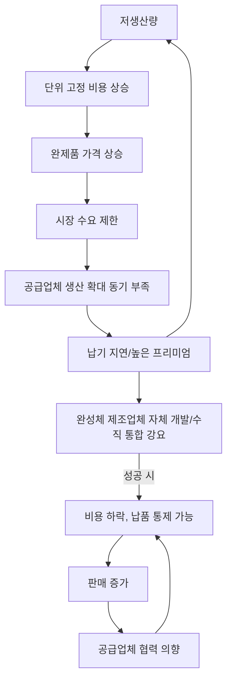

### 7.1.3 공급망 위험의 시스템적 특성

공급망 위험은 **시스템적(systemic)** 특성을 가집니다. 즉, 단일 노드의 중단이 네트워크를 통해 전파되어 완제품 납품 지연, 품질 문제 또는 비용 급등으로 확대됩니다. 2008년 금융 위기 이후의 자동차 공급망, 2020–2022년 반도체 부족, 2021–2022년 해운 혼잡은 현대 공급망의 '효율성 우선' 설계가 충격 앞에서 매우 취약함을 보여줍니다.

!!! note "용어 설명: 시스템적 위험, 연쇄적 고장, 채찍 효과, 회복 탄력성"
    - **시스템적 위험**: 단일 단위가 아닌 전체 시스템이 직면하는 붕괴 위험으로, 상관관계와 전염성을 가집니다.
    - **연쇄적 고장(cascading failure)**: 하나의 노드 고장이 인접 노드의 연속적인 고장을 유발하는 전파 과정.
    - **채찍 효과(bullwhip effect)**: 수요 측의 작은 변동이 공급망 상류로 증폭되어 재고와 생산 능력의 급격한 변동을 초래하는 현상.
    - **회복 탄력성(resilience)**: 시스템이 교란 후 기능을 회복하고 유지하는 능력으로, 흡수, 적응 및 복구의 세 가지 차원을 포함합니다.

휴머노이드 로봇의 경우 주요 위험 노드는 다음과 같습니다: 고성능 네오디뮴 철 붕소 자석 재료, 하모닉 감속기, RV 감속기, 힘/토크 센서, 고정밀 엔코더, 고성능 SoC/GPU/NPU, SiC/GaN 전력 소자, 리튬 배터리 양극재 등. 이러한 노드는 종종 **공급업체 집중도가 높고, 전환 비용이 높으며, 생산 확장 주기가 긴** 특성을 가집니다.

## 7.2 휴머노이드 로봇 BOM 및 공급업체 계층

### 7.2.1 자재 명세서(BOM)의 구조

**자재 명세서(Bill of Materials, BOM)**는 제품 구성을 설명하는 가장 기본적인 문서로, 한 제품을 제조하는 데 필요한 모든 원자재, 부품, 하위 조립품 및 그 수량 관계를 나열합니다. BOM은 원가 계산의 출발점일 뿐만 아니라 조달, 계획, 재고 관리 및 공급업체 협업의 핵심 데이터 구조입니다.

!!! note "용어 설명: BOM, EBOM, MBOM, Indented BOM, Phantom"
    - **BOM(Bill of Materials)** : 제품 구조표로, 제품을 구성하는 모든 자재와 그 계층 관계를 기록합니다.
    - **EBOM(Engineering BOM)** : 엔지니어링 설계 관점으로, 기능 모듈별로 구성됩니다.
    - **MBOM(Manufacturing BOM)** : 제조 관점으로, 조립 공정 및 생산 라인별로 구성됩니다.
    - **Indented BOM(들여쓰기 자재 명세서)** : 상위-하위 계층을 들여쓰기로 표시하여 부품 관계를 보여줍니다.
    - **Phantom(가상 부품)** : BOM에서 논리적 하위 구성 요소로 존재하지만 별도로 입고되지 않는 조립 단위입니다.

BOM 원가는 단위 사용량과 단가를 기준으로 직접 계산할 수 있습니다:

$$
C_{\text{BOM}} = \sum_{i} q_i \cdot p_i
$$

여기서 \(q_i\)는 i번째 부품의 단위 사용량, \(p_i\)는 해당 부품의 구매 단가 또는 자체 제조 원가입니다. 다중 레벨 BOM의 경우 하위에서 상위로 재귀적으로 집계해야 합니다:

$$
C_{\text{parent}} = \sum_{j} q_j \cdot C_j + C_{\text{assembly},j}
$$

여기서 \(C_j\)는 하위 조립품의 롤업 원가이거나 외부 구매 부품의 단가일 수 있습니다.

### 7.2.2 공급업체 계층: Tier-1 / Tier-2 / Tier-3

자동차 및 전자 산업에서는 일반적으로 계층적 공급업체 시스템이 사용됩니다. 휴머노이드 로봇의 경우 다음과 같이 유사하게 분류할 수 있습니다:

- **Tier-1(1차 공급업체)** : 완제품 제조사에 직접 납품하며, 일반적으로 액추에이터 모듈, 정교한 손, 배터리 팩, 컴퓨팅 플랫폼 등 하위 시스템을 제공합니다.
- **Tier-2(2차 공급업체)** : Tier-1에 납품하며, 모터, 감속기, 드라이버, 센서, 구조 부품, PCB 등을 제공합니다.
- **Tier-3(3차 공급업체)** : 원자재, 칩, 자성 재료, 화학 제품, 특수 가스, 정밀 베어링 등 기초 자재를 제공합니다.

!!! note "용어 설명: Tier-1, Tier-2, Tier-3, N단계 공급망, OEM, ODM"
    - **Tier-1 공급업체** : 최종 조립 공장에 하위 시스템 또는 모듈을 직접 납품하는 공급업체.
    - **Tier-2 공급업체** : Tier-1에 부품 또는 자재를 공급하는 공급업체.
    - **Tier-3 공급업체** : 더 상위의 원자재, 기초 부품 또는 장비 공급업체.
    - **N단계 공급망(N-tier supply chain)** : 여러 계층에 걸친 완전한 공급 네트워크.
    - **OEM(Original Equipment Manufacturer)** : 주문자 상표 부착 제조업체, 일반적으로 완제품 제조사를 의미.
    - **ODM(Original Design Manufacturer)** : 제조업체 개발 생산 방식, 설계 및 제조를 담당하며 브랜드는 구매자 소유.

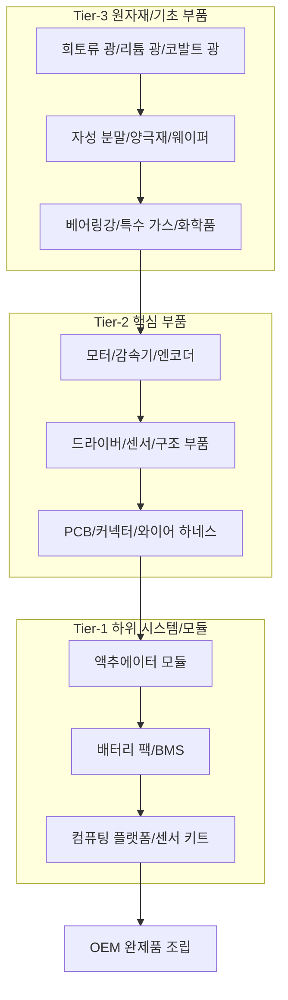

### 7.2.3 휴머노이드 로봇 BOM의 원가 분해 (공개 추정치)

현재 휴머노이드 로봇이 아직 대규모 소비자 시장에 진입하지 않았기 때문에, 공개된 원가 데이터는 대부분 업계 추정치입니다. 아래 표는 분해 및 공급망 조사에 기반한 **공개 추정치** 구조를 제시하며, 비용 분포를 설명하기 위한 용도로만 사용되며 특정 기종을 지칭하지 않습니다.

| 하위 시스템 | BOM 원가 추정 비율(%) | 주요 구성 요소 | 공급 집중도 특성 |
|---|---|---|---|
| 액추에이터 시스템(모터+감속기+드라이버) | 35–45 | 프레임리스 토크 모터, 하모닉/유성 감속기, 서보 드라이버 | 높음 |
| 센서 및 센서 키트 | 15–25 | 카메라, LiDAR, IMU, 힘/토크 센서, 엔코더 | 중간-높음 |
| 컴퓨팅 플랫폼 | 10–18 | SoC/GPU/NPU, 메모리, 저장 장치, 캐리어 보드 | 높음 |
| 배터리 및 전력 전자 | 8–15 | 배터리 셀, BMS, MOSFET/SiC/GaN, 커넥터 | 중간 |
| 구조 부품 및 외장 부품 | 5–10 | 알루미늄 합금, 탄소 섬유, 플라스틱, 케이블 | 낮음 |
| 소프트웨어 및 알고리즘 라이선스 | 3–8 | 미들웨어, 시뮬레이션, AI 모델, 특허 | 중간 |
| 기타(포장, 테스트, 소모품) | 2–5 | 지그, 테스트 장비, 운송 | 낮음 |

!!! note "용어 설명: BOM 원가 분해, 원가 동인, 원가 집중도"
    - **BOM 원가 분해** : 제품 총 원가를 하위 시스템 또는 부품별로 분할하는 구조 분석.
    - **원가 동인(cost driver)** : 총 원가에 가장 큰 영향을 미치는 변수 또는 부품 범주.
    - **원가 집중도** : 소수의 부품이 총 원가에서 차지하는 비율로, 원가 절감 중점 영역을 식별하는 데 사용됨.

액추에이터 시스템은 일반적으로 BOM의 35% 이상을 차지하며, 원가와 공급 리스크가 가장 집중된 부분입니다. 컴퓨팅 플랫폼은 액추에이터만큼 비중이 크지는 않지만, 기술 발전 속도가 빠르고 공급업체가 고도로 집중되어 있어 중요한 전략적 병목 지점을 구성합니다.

---

## 7.3 핵심 부품 공급업체 지도

휴머노이드 로봇 공급망은 정밀 기계, 전자기, 반도체, 화학 및 재료 등 여러 산업에 걸쳐 있습니다. 이 절에서는 핵심 부품 범주별로 공급업체 지도를 작성하고 대표적인 기업을 나열합니다. 시장이 아직 초기 단계에 있으므로, 아래의 점유율과 포지셔닝은 **업계 추정치** 또는 기업 공개 정보를 기반으로 합니다. 전체 목록은 부록 D를 참조하십시오.

!!! note "참고: 전체 공급업체 목록"
    이 절의 표는 각 범주당 5~10개의 대표 기업만 나열하여 산업 구조와 기술 경로를 설명하기 위한 것입니다. 더 완전한 주요 공급업체 및 기업 목록은 **부록 D**를 참조하십시오.

### 7.3.1 모터 및 구동

**모터**는 전기 에너지를 기계적 에너지로 변환하는 액추에이터입니다. 휴머노이드 로봇 관절에는 일반적으로 **프레임리스 토크 모터(frameless torque motor)**와 **무브러시 DC 모터(BLDC, Brushless DC Motor)**가 사용되며, 감속기와 결합하여 높은 토크 밀도를 출력합니다.

!!! note "용어 설명: 프레임리스 토크 모터, 무브러시 DC 모터, 영구자석 동기 모터, 토크 밀도"
    - **프레임리스 토크 모터**: 회전자와 고정자로 구성되며 하우징과 베어링이 없는 직접 구동 모터로, 관절에 직접 내장할 수 있습니다.
    - **무브러시 DC 모터(BLDC)**: 기계적 브러시를 전자적 정류로 대체한 DC 모터로, 수명이 길고 효율이 높습니다.
    - **영구자석 동기 모터(PMSM)**: 회전자에 영구자석이 있고, 고정자 전류가 회전자 자기장과 동기 회전하는 AC 모터입니다.
    - **토크 밀도(torque density)**: 모터의 단위 부피 또는 단위 질량당 출력할 수 있는 토크로, 단위는 N·m/kg 또는 N·m/L입니다.

모터 제어는 일반적으로 **자계 방향 제어(FOC, Field-Oriented Control)**를 사용하며, Clarke/Park 변환을 통해 3상 전류를 여자 성분과 토크 성분으로 분리하여 DC 모터와 유사한 제어 성능을 구현합니다.

!!! note "용어 설명: 자계 방향 제어(FOC), Clarke 변환, Park 변환, PWM, 인버터"
    - **자계 방향 제어(FOC)**: AC 모터의 고정자 전류를 자속 생성과 토크 생성의 두 직교 성분으로 분해하여 각각 제어하는 방법입니다.
    - **Clarke 변환**: 3상 정지 좌표계를 2상 정지 좌표계로 변환하는 수학적 변환입니다.
    - **Park 변환**: 2상 정지 좌표계를 회전자와 함께 회전하는 좌표계로 변환하여 직류량 제어를 가능하게 합니다.
    - **PWM(Pulse Width Modulation)**: 펄스 폭 변조로, 스위칭 듀티 사이클을 조절하여 평균 전압 또는 전류를 제어합니다.
    - **인버터(inverter)**: 직류 전력을 교류 전력으로 변환하는 전력 전자 회로입니다.

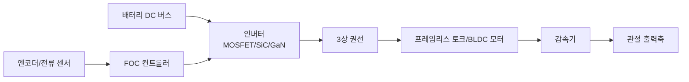

#### 7.3.1.1 모터 전자기-열 결합 기초

모터는 전기 에너지를 기계적 에너지로 변환하는 에너지 변환 장치입니다. 휴머노이드 로봇 관절에 일반적으로 사용되는 영구자석 동기 모터(PMSM)와 무브러시 DC 모터(BLDC)의 경우, 전자기 토크는 **토크 상수(torque constant)** $K_t$와 직축 전류 $I_q$로 직접 관련됩니다:

$$
T_e = K_t \cdot I_q
$$

여기서 $T_e$는 전자기 토크(N·m), $K_t$의 단위는 N·m/A입니다. 이상적인 영구자석 모터의 경우, $K_t$와 **역기전력 상수(back-EMF constant)** $K_e$는 SI 단위계에서 수치적으로 동일하며($K_t \approx K_e$), 후자는 다음을 만족합니다:

$$
E_b = K_e \cdot \omega_m
$$

$E_b$는 선간 역기전력 진폭(V), $\omega_m$은 모터 기계적 각속도(rad/s)입니다. 상전압 평형 방정식은 다음과 같이 쓸 수 있습니다:

$$
V_{dc} \approx \sqrt{3} \left( E_b + I \cdot R_s \right) = \sqrt{3} \left( K_e \omega_m + I R_s \right)
$$

$V_{dc}$는 DC 버스 전압(V), $R_s$는 상 권선 저항(Ω)입니다. 이 식은 고정된 버스 전압에서 회전 속도가 높을수록 구동 전류에 사용 가능한 전압 여유가 줄어들어 고속 영역의 출력 토크가 제한됨을 나타냅니다. 즉, **약자속 영역(flux-weakening region)**의 시작입니다.

!!! note "용어 설명: 토크 상수, 역기전력 상수, 상 권선 저항, 약자속 영역"
    - **토크 상수($K_t$)**: 단위 전류당 생성되는 전자기 토크, N·m/A.
    - **역기전력 상수($K_e$)**: 단위 회전 속도당 생성되는 유도 기전력, V/(rad/s).
    - **상 권선 저항($R_s$)**: 모터 고정자 각 상 권선의 직류 저항, Ω.
    - **약자속 영역**: 직축 감자 전류를 인가하여 모터 최고 회전 속도를 확장하는 운전 영역.

모터 손실은 주로 **동손(copper loss)**, **철손(iron loss)** 및 **기계적 손실(mechanical loss)**을 포함합니다. 관절 서보 과도 상태 및 단시간 피크 부하 조건에서는 일반적으로 동손이 지배적입니다:

$$
P_{cu} = 3 I^2 R_s
$$

총 손실 $P_{loss}$는 최종적으로 열로 변환되어 권선 온도를 상승시킵니다. 권선 온도 상승은 1차 열 저항 모델로 설명할 수 있습니다:

$$
\Delta T = T_w - T_a = P_{loss} \cdot R_{th}
$$

$\Delta T$는 권선 대 환경 온도 상승(K), $T_w$는 권선 온도(℃), $T_a$는 환경 온도(℃), $R_{th}$는 권선에서 환경까지의 등가 열 저항(K/W)입니다. 이를 통해 **연속 토크(continuous torque)** $T_{cont}$를 도출할 수 있습니다:

$$
T_{cont} = K_t \sqrt{ \frac{T_{w,max} - T_a}{3 R_s R_{th}} }
$$

$T_{w,max}$는 절연 등급이 허용하는 최대 권선 온도(예: F등급 155℃)입니다. 실제 피크 토크 $T_{peak}$는 자석 감자, 권선 절연 및 드라이버 전류 한계에 의해 함께 제한되며, 일반적으로 모터 데이터시트에 제공되며 열 모델만으로 외삽할 수 없습니다.

주기적 부하의 경우 **등가 실효 토크(RMS torque)**를 사용하여 열 한계를 검증할 수 있습니다:

$$
T_{RMS} = \sqrt{ \frac{1}{t_{cycle}} \int_0^{t_{cycle}} T^2(t) \, dt }
$$

$T_{RMS} \le T_{cont}$이면 모터는 장기 운전 중 과열되지 않습니다. 단시간 피크가 있는 경우 $T_{peak}$와 드라이버 전류 한계 $I_{max}$를 검증해야 합니다:

$$
T_{peak} = K_t \cdot I_{max}
$$

!!! note "용어 설명: 동손, 철손, 열 저항, 연속 토크, RMS 토크, 피크 토크"
    - **동손**: 전류가 권선 저항을 흐를 때 발생하는 줄 열.
    - **철손**: 교번 자기장이 철심에서 발생시키는 히스테리시스 및 와전류 손실.
    - **열 저항(thermal resistance)**: 열 전달 경로에서 열 흐름에 대한 저항, K/W.
    - **연속 토크**: 정격 온도 상승에서 지속적으로 출력할 수 있는 토크.
    - **RMS 토크**: 주기적 부하의 등가 발열 토크.
    - **피크 토크**: 단시간 허용되는 최대 출력 토크.

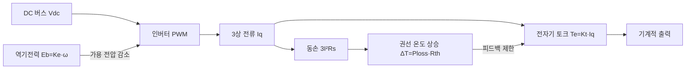

**수치 예시**: 어떤 프레임리스 토크 모터의 $K_t = 0.35\ \text{N·m/A}$, $R_s = 0.25\ \Omega$, $R_{th} = 2.5\ \text{K/W}$, 환경 온도 $T_a = 40\ ^\circ\text{C}$, 절연 등급 F($T_{w,max}=155\ ^\circ\text{C}$).

연속 전류:

$$
I_{cont} = \sqrt{\frac{155 - 40}{3 \times 0.25 \times 2.5}} \approx \sqrt{61.3} \approx 7.83\ \text{A}
$$

연속 토크:

$$
T_{cont} = 0.35 \times 7.83 \approx 2.74\ \text{N·m}
$$

드라이버 피크 전류가 30A이면 단시간 피크 토크는 약 $0.35 \times 30 = 10.5\ \text{N·m}$입니다. 휴머노이드 로봇의 엉덩이/무릎 등 중부하 관절은 일반적으로 30–100 N·m급 관절 출력이 필요하므로, 높은 감속비의 감속기와 함께 사용해야 합니다[226][228].

| 회사 | 본사 | 주요 제품/포지셔닝 | 비고 |
|---|---|---|---|
| Kollmorgen | 미국 | 토크 모터, 서보 모터 | 협동 로봇 관절에 널리 사용 |
| TQ-RoboDrive | 독일 | 토크 모터, 할로우 컵 모터 | 휴머노이드 로봇의 정교한 손에 자주 사용 |
| Maxon | 스위스 | 브러시리스 DC 모터, 감속기, 드라이버 | 고정밀, 의료/항공 배경 |
| Nidec | 일본 | 브러시리스 모터, HDD 모터, 서보 모터 | 규모가 크고 비용 우위가 뚜렷함 |
| 汇川技术 | 중국 | 서보 모터, 인버터, 드라이버 | 국내 선두, 산업 자동화 포괄 |
| 禾川科技 | 중국 | 서보 모터 및 드라이브 | 국산 대체 대표 |
| 步科股份 | 중국 | 저압 서보, 토크 모터 | 이동 로봇/협동 로봇 |
| 鸣志电器 | 중국 | 스테핑 모터, 할로우 컵 모터, 브러시리스 모터 | 정교한 손 마이크로 모터 |
| Moog | 미국 | 정밀 운동 제어, 토크 모터 | 항공우주 고신뢰성 |
| Allied Motion | 미국 | 브러시리스 모터, 서보 시스템 | 산업 및 로봇 응용 |

드라이버는 컨트롤러 명령을 전력 출력으로 변환합니다. 관절 드라이버는 높은 전류 루프 대역폭, 낮은 EMI, 컴팩트한 크기 및 방열 성능이 필요합니다. 일반적인 솔루션으로는 MOSFET, SiC MOSFET 또는 GaN HEMT 기반 3상 하프 브리지 인버터가 있습니다.

### 7.3.2 감속기

감속기는 모터 회전 속도를 낮추고 출력 토크를 증폭하는 데 사용되며, 휴머노이드 로봇 관절의 핵심 동력 전달 부품입니다. 일반적인 유형으로는 **하모닉 드라이브(harmonic drive)** , **유성 기어박스(planetary gearbox)** , **사이클로이드 드라이브(cycloidal drive)** 및 **RV 감속기(Rotary Vector reducer)** 가 있습니다.

!!! note "용어 설명: 하모닉 드라이브, 유성 기어박스, 사이클로이드 드라이브, RV 감속기, 백래시, 전달 강성"
    - **하모닉 드라이브**: 플렉스 스플라인, 서큘러 스플라인 및 웨이브 제너레이터를 사용하여 탄성 변형을 통해 운동과 토크를 전달하는 고정밀 감속기입니다.
    - **유성 기어박스**: 여러 유성 기어가 태양 기어 주위를 회전하는 기어 메커니즘으로, 구조가 컴팩트하고 효율이 높습니다.
    - **사이클로이드 드라이브**: 사이클로이드 기어와 핀 톱니가 맞물리는 감속 메커니즘으로, 토크가 크고 강성이 높습니다.
    - **RV 감속기**: 2단 감속 메커니즘으로, 1단은 유성 기어, 2단은 사이클로이드 드라이브이며, 중하중 관절에 사용됩니다.
    - **백래시(backlash)** : 기어 쌍이 방향을 바꿀 때의 유격 각도로, 제어 정밀도에 영향을 미칩니다.
    - **전달 강성(transmission stiffness)** : 출력단이 탄성 변형에 저항하는 능력으로, 동적 응답에 영향을 미칩니다.

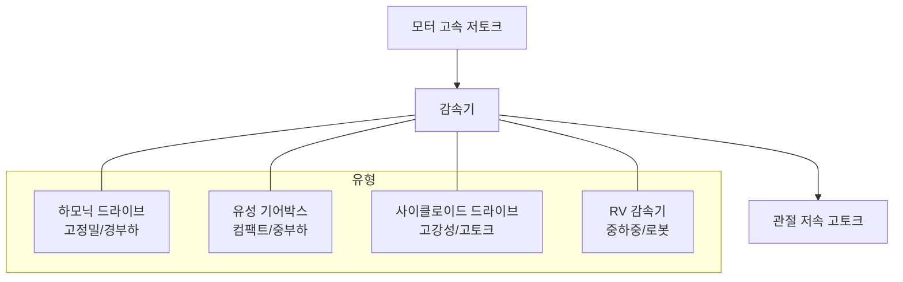

#### 7.3.2.1 감속기 효율, 강성 및 반사 관성

감속기는 회전 속도-토크 관계를 변경할 뿐만 아니라 동력 전달 체인의 에너지 손실, 동적 강성 및 등가 관성을 결정합니다. 감속비를 $N = \omega_{in}/\omega_{out} = T_{out}/T_{in}$(손실 무시)로 설정하고, 전달 효율을 $\eta$로 설정하면 출력 전력과 입력 전력의 관계는 다음과 같습니다.

$$
P_{out} = \eta \cdot P_{in}
$$

출력 토크와 입력 토크의 관계는 다음과 같습니다.

$$
T_{out} = \eta \cdot N \cdot T_{in}
$$

효율 손실은 주로 기어 맞물림 마찰, 베어링 마찰, 오일 교반 손실 및 씰 저항에서 발생합니다. 하모닉 드라이브의 경우 일반적인 효율 $\eta$는 80%–95% 사이이며, 부하, 회전 속도, 그리스 온도 및 작동 시간에 따라 변합니다. 유성 기어박스의 효율은 일반적으로 90%–98%입니다. 사이클로이드 및 RV 감속기는 다중 치 맞물림으로 인해 효율이 유성 기어보다 약간 낮지만 강성이 더 높습니다.

!!! note "용어 설명: 전달 효율, 감속비, 기계적 이점, 맞물림 손실"
    - **전달 효율(transmission efficiency)** : 출력 전력과 입력 전력의 비율로, 에너지 손실을 반영합니다.
    - **감속비(gear ratio)** : 입력 회전 속도와 출력 회전 속도의 비율입니다.
    - **기계적 이점(mechanical advantage)** : 출력 힘/토크와 입력 힘/토크의 비율입니다.
    - **맞물림 손실(meshing loss)** : 기어 맞물림 표면의 마찰과 변형으로 인한 전력 손실입니다.

제어 관점에서 감속기는 부하 관성을 모터 축으로 **반사(reflect)** 하며, 등가 관성은 다음과 같습니다.

$$
J_{ref} = \frac{J_{load}}{N^2}
$$

$J_{load}$는 부하 측 회전 관성(kg·m²)입니다. 높은 감속비는 모터 측에서 필요한 가속 토크를 크게 줄일 수 있지만, 관절 출력 회전 속도도 낮춥니다. 총 등가 관성에는 감속기 자체 관성 $J_{gear}$와 모터 회전자 관성 $J_m$이 포함되어야 합니다.

$$
J_{eq} = J_m + J_{gear} + \frac{J_{load}}{N^2}
$$

동력 전달 체인의 **비틀림 강성(torsional stiffness)** $K_\theta$는 부하 작용 하에서 관절의 탄성 변형을 결정합니다. 모터 측 강성이 $K_m$이고 감속기 출력 측 등가 강성이 $K_g$인 경우, 두 개가 직렬로 연결된 등가 강성은 다음과 같습니다.

$$
\frac{1}{K_{eq}} = \frac{1}{K_m} + \frac{1}{N^2 K_g}
$$

출력 측 각도 변형:

$$
\theta_{deflection} = \frac{T_{out}}{K_{eq}}
$$

휴머노이드 로봇 관절의 경우, 백래시와 비틀림 강성이 함께 위치 루프 대역폭과 힘 제어 정밀도에 영향을 미칩니다. 고동적 관절은 일반적으로 백래시 $< 1\ \text{arcmin}$, 비틀림 강성 $> 10^4\ \text{N·m/rad}$이 필요합니다.

!!! note "용어 설명: 반사 관성, 등가 관성, 비틀림 강성, 백래시, 위치 루프 대역폭"
    - **반사 관성**: 부하 관성을 모터 축으로 환산한 등가 값입니다.
    - **등가 관성**: 모터 축 측의 총 회전 관성으로, 모터, 감속기 및 부하 반사 성분을 포함합니다.
    - **비틀림 강성**: 동력 전달 체인이 비틀림 변형에 저항하는 능력, N·m/rad입니다.
    - **백래시(backlash)** : 방향 전환 유격 각도입니다.
    - **위치 루프 대역폭**: 위치 폐루프가 응답할 수 있는 정현파 명령의 주파수 상한입니다.

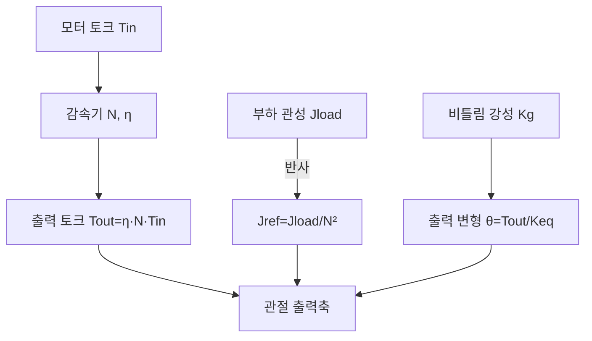

**수치 예시**: 어떤 하모닉 드라이브 $N = 100$, $\eta = 0.90$, 부하 관성 $J_{load} = 0.05\ \text{kg·m}^2$, 모터 회전자 관성 $J_m = 2 \times 10^{-4}\ \text{kg·m}^2$, 감속기 자체 관성 $J_{gear} = 1 \times 10^{-4}\ \text{kg·m}^2$.

반사 관성:

$$
J_{ref} = \frac{0.05}{100^2} = 5 \times 10^{-6}\ \text{kg·m}^2
$$

등가 관성:

$$
J_{eq} = 2 \times 10^{-4} + 1 \times 10^{-4} + 5 \times 10^{-6} \approx 3.05 \times 10^{-4}\ \text{kg·m}^2
$$

모터와 감속기 관성이 지배적임을 알 수 있습니다. 모터가 3 N·m을 출력하면 관절 출력 토크는 다음과 같습니다.

$$
T_{out} = 0.90 \times 100 \times 3 = 270\ \text{N·m}
$$

이는 감속비를 선택할 때 "큰 출력 토크를 얻기 위한 높은 감속비"와 "높은 출력 회전 속도를 유지하기 위한 낮은 감속비" 사이에서 균형을 맞춰야 함을 의미합니다[235].

| 회사 | 본사 | 주요 제품 | 비고 |
|---|---|---|---|
| Harmonic Drive Systems | 일본 | 하모닉 드라이브 | 업계 선두, 글로벌 점유율 선도 |
| HD Systems (Harmonic Drive LLC) | 미국 | 하모닉 드라이브 | 북미 시장 |
| Nabtesco | 일본 | RV 감속기, 하모닉 드라이브 | RV 감속기 글로벌 선두 |
| 绿的谐波 | 중국 | 하모닉 드라이브 | 국내 선두, 점유율 빠르게 상승 |
| 来福谐波 | 중국 | 하모닉 드라이브 | 국산 대체 |
| 双环传动 | 중국 | RV 감속기, 유성 감속기 | 정밀 기어 제조 기반 |
| 中大力德 | 중국 | 유성/하모닉/RV | 로봇 감속기 포트폴리오 |
| 南通振康 | 중국 | RV 감속기 | 용접 로봇용 |
| Sumitomo Drive Technologies | 일본 | 사이클로이드/유성 감속기 | 산업용 동력 전달 |
| SEW-EURODRIVE | 독일 | 유성/산업용 기어 | 산업 자동화 |

### 7.3.3 센서

인간형 로봇은 자체 상태(고유 감각)와 외부 환경(외부 감각)을 인식해야 합니다. 고유 감각 센서에는 **엔코더(encoder)**, **관성 측정 장치(IMU)**, **힘/토크 센서(force/torque sensor)**가 포함되며, 외부 감각에는 **카메라(RGB/RGB-D)**, **LiDAR**, **밀리미터파 레이더**, **초음파** 등이 있습니다.

!!! note "용어 설명: 엔코더, IMU, 힘/토크 센서, RGB-D, LiDAR, MEMS"
    - **엔코더**: 각변위 또는 직선 변위를 전기 신호로 변환하는 센서로, 광전식, 자기식, 리졸버 등으로 나뉩니다.
    - **IMU(Inertial Measurement Unit)**: 3축 가속도와 3축 각속도를 측정하는 관성 센서 조합입니다.
    - **힘/토크 센서**: 접촉력과 토크를 측정하는 센서로, 손목, 발목 및 협동 로봇 관절에 자주 사용됩니다.
    - **RGB-D 카메라**: 컬러 이미지와 깊이 이미지를 동시에 출력하는 카메라입니다.
    - **LiDAR(Light Detection and Ranging)**: 레이저를 발사하고 반사파를 수신하여 거리를 측정하는 3차원 센서입니다.
    - **MEMS(Micro-Electro-Mechanical Systems)**: 미세 전자 기계 시스템으로, 저비용 IMU, 마이크, 압력 센서에 사용됩니다.

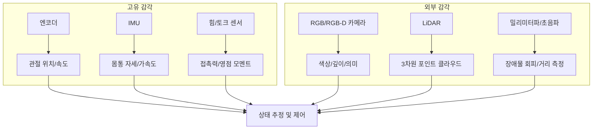

| 회사 | 본사 | 주요 제품 | 비고 |
|---|---|---|---|
| Heidenhain | 독일 | 고정밀 광전/자기 엔코더 | 산업 및 로봇 고급 |
| Renishaw | 영국 | 자기 엔코더, 광학 스케일 | 정밀 운동 |
| Tamagawa Seiki | 일본 | 엔코더, 리졸버 | 서보 모터配套 |
| 奥普光电 | 중국 | 광전 엔코더 | 국산 대체 |
| Bosch Sensortec | 독일 | MEMS IMU, 기압계 | 소비자 전자 및 로봇 |
| TDK/InvenSense | 일본/미국 | MEMS IMU | 저비용 솔루션 |
| ATI Industrial Automation | 미국 | 6축 힘/토크 센서 | 로봇 손목/발목 |
| 宇立仪器 | 중국 | 6축 힘 센서 | 국산 선두 |
| Intel RealSense | 미국 | RGB-D 카메라 | 로봇 개발에 자주 사용 |
| Ouster / Hesai / Livox | 미국/중국 | 솔리드 스테이트/기계식 LiDAR | 자율 주행 및 로봇 |

#### 7.3.3.1 비전/깊이 카메라 모듈

비전/깊이 카메라는 인간형 로봇의 외부 감각 및 장면 이해의 핵심 진입점입니다. 현재 주류 3차원 깊이 획득 기술에는 **구조광(structured light)**, **비행 시간(ToF, dToF/iToF 포함)** 및 **양안 스테레오 비전(stereo vision)**의 세 가지 경로가 있으며, 각각 다른 광학 부품, 방출기 및 이미지 센서 조합에 의존합니다.

!!! note "용어 설명: 구조광, 비행 시간(ToF), dToF, iToF, SPAD, VCSEL, 양안 스테레오 비전"
    - **구조광(structured light)**: 알려진 적외선 패턴을 투사하고 물체 표면에서의 변형을 분석하여 깊이 이미지를 얻는 기술입니다.
    - **비행 시간(ToF, Time-of-Flight)**: 광 펄스 또는 변조된 빛의 왕복 시간을 측정하여 거리를 계산하는 3차원 이미징 기술입니다.
    - **dToF(direct ToF)**: 단일 광 펄스의 왕복 시간을 직접 측정하며, 종종 SPAD와 함께 사용되어 장거리, 저전력 깊이 감지를 구현합니다.
    - **iToF(indirect ToF)**: 변조된 빛의 위상차를 측정하여 간접적으로 거리를 계산하며, 중단거리 고해상도 장면에 적합합니다.
    - **SPAD(Single-Photon Avalanche Diode)**: 단일 광자 애벌런치 다이오드로, 높은 감도를 가지며 dToF 광자 계수에 사용될 수 있습니다.
    - **VCSEL(Vertical-Cavity Surface-Emitting Laser)**: 수직 공진 표면 발광 레이저로, 구조광 및 ToF의 광원으로 자주 사용됩니다.
    - **양안 스테레오 비전(stereo vision)**: 두 대의 카메라 시차와 조밀 매칭 알고리즘을 이용하여 깊이를 복원하는 수동적 비전 방법입니다.

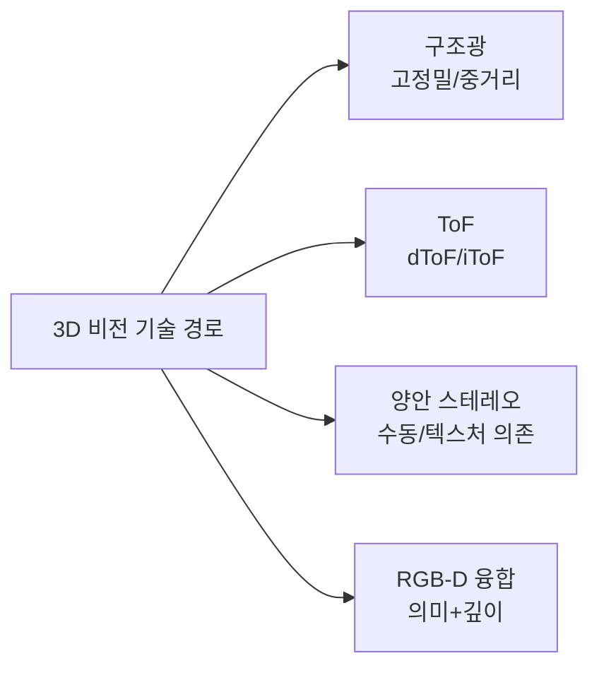

| 회사 | 본사 | 핵심 기술 및 제품 | 대표 로봇 응용 | 공급 상태/비고 |
|---|---|---|---|---|
| 灵明光子 | 중국 | SPAD/SiPM dToF 센서 | 깊이 카메라, 장애물 회피 | 국산 칩, 양산 확대 중[회사 공식 웹사이트] |
| 聚芯微电子 | 중국 | iToF 이미지 센서, 3D 감지 솔루션 | 서비스 로봇 비전 | 공개 자료 |
| 阜时科技 | 중국 | SPAD dToF 칩, 구조광 투사 | 로봇/안면 인식/차량 | 공개 자료 |
| 飞芯电子 | 중국 | dToF 라이다/깊이 감지 칩 | 로봇, 청소기 | 공개 자료 |
| 海康机器人 | 중국 | 산업용 카메라, RGB-D, 스테레오 카메라 | 물류/제조 로봇 | 海康威視 자회사 |
| 奥比中光 | 중국 | 구조광/ToF 3D 비전 모듈 | 서비스/인간형 로봇 | 국산 3D 비전 선두 |
| 图漾科技 | 중국 | 산업용 3D 카메라(구조광/ToF) | 물류 파지, 검사 | 공개 자료 |
| Intel RealSense | 미국 | 스테레오/구조광/RGB-D 깊이 카메라 | 로봇 개발 프로토타입 | 제품 라인 조정 중, 주의 필요 |
| Sony | 일본 | ToF 이미지 센서, CMOS | 고급 3D 카메라 | 핵심 부품 공급업체 |
| 舜宇光学 | 중국 | 광학 렌즈/모듈/ToF 모듈 | 스마트폰/로봇 비전 | 광학 부품 공급 안정적 |

#### 7.3.3.2 LiDAR

LiDAR는 레이저를 발사하고 반사파를 수신하여 3차원 포인트 클라우드를 구축하며, 인간형 로봇의 내비게이션, 지도 작성 및 장애물 감지에 중요한 센서입니다. 스캔 방식에 따라 기계식 회전, MEMS 반고체, OPA/Flash 솔리드 스테이트 및 FMCW 등의 경로로 나뉘며, 각 경로는 시야, 해상도, 비용 및 신뢰성 간에 상당한 절충이 있습니다.

!!! note "용어 설명: 기계식 회전 LiDAR, MEMS LiDAR, 솔리드 스테이트 LiDAR, OPA, Flash LiDAR, FMCW LiDAR"
    - **기계식 회전 LiDAR**: 360° 회전 스캔을 통해 수평 시야를 확보하며, 포인트 클라우드 밀도가 높지만 비용이 높고 수명이 제한적입니다.
    - **MEMS LiDAR**: 미세 전자 기계식 미러를 사용하여 빔을 편향시키는 반고체 방식으로, 부피와 비용이 기계식보다 우수합니다.
    - **솔리드 스테이트 LiDAR**: 기계적 스캔 부품이 없어 신뢰성이 높으며, OPA, Flash 등의 경로가 포함됩니다.
    - **OPA(Optical Phased Array)**: 광학 위상 배열로, 위상 제어를 통해 전자 스캔을 구현합니다.
    - **Flash LiDAR**: 한 번에 전체 시야를 조사하여 단거리 고프레임 응용에 적합합니다.
    - **FMCW LiDAR**: 주파수 변조 연속파 라이다로, 거리와 속도를 동시에 측정할 수 있으며 간섭에 강합니다.

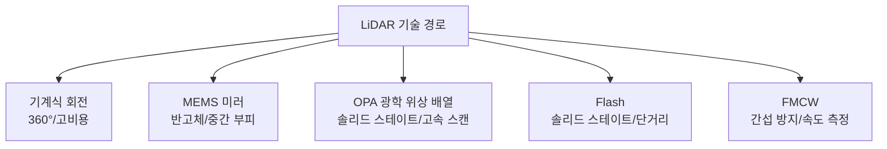

| 회사 | 본사 | 주요 제품/기술 | 대표 로봇 응용 | 공급 상태/비고 |
|---|---|---|---|---|
| 헤사이 테크놀로지 | 중국 | 기계/반고체/순고체 LiDAR | 자율주행, 로봇 | 공개 IPO 서류/연례 보고서 |
| 수텅 주쥐안 | 중국 | MEMS/고체 LiDAR, 인식 솔루션 | 자율주행, 로봇 | 홍콩 증시 상장 공개 자료 |
| 베이싱 광자 | 중국 | dToF/고체 LiDAR | 로봇, 차량 네트워크 | 공개 자료 |
| 라이선 인텔리전트 | 중국 | 기계/하이브리드 고체 LiDAR | 로봇, 무인 차량 | 공개 자료 |
| 지아광 테크놀로지 | 중국 | 고체/Flash LiDAR | 로봇, AGV | 공개 자료 |
| 란워 Livox | 중국 | 비반복 스캔 LiDAR | 로봇, 측량 | DJI 산하 |
| Ouster | 미국 | 고체 디지털 LiDAR | 산업/자율주행 | 공개 자료 |
| Luminar | 미국 | 1550 nm 장거리 LiDAR | 자율주행 | 장거리 솔루션, 비용 높음 |
| Innovusion | 중국 | 1550 nm 이미지급 LiDAR | 자율주행 | 비용 높음 |

#### 7.3.3.3 IMU

**관성 측정 장치(IMU)**는 3축 가속도와 3축 각속도를 측정하며, 휴머노이드 로봇의 상태 추정, 균형 제어 및 항법 추측의 기초입니다. 소비자용 솔루션은 주로 MEMS 기반이며, 고급 시나리오에서는 정밀도를 높이기 위해 광섬유 자이로(FOG) 또는 레이저 자이로(RLG)를 사용할 수 있습니다.

!!! note "용어 설명: MEMS IMU, 바이어스 불안정성, FOG, RLG, 결합 항법"
    - **MEMS IMU**: 미세 전자 기계 시스템 기반 관성 측정 장치로, 크기가 작고 비용이 낮으며 대량 적용에 적합합니다.
    - **바이어스 불안정성(bias instability)**: 자이로 출력 바이어스의 시간에 따른 무작위 드리프트 지표, 단위 °/h.
    - **FOG(Fiber Optic Gyroscope)**: 광섬유 자이로스코프로, 정밀도가 높고 충격에 강하며 고급 항법에 자주 사용됩니다.
    - **RLG(Ring Laser Gyroscope)**: 링 레이저 자이로스코프로, 정밀도가 매우 높으며 주로 항공우주 및 고급 장비에 사용됩니다.
    - **결합 항법(GNSS/INS integration)**: 관성 항법과 위성 항법을 융합하여 드리프트를 억제하고 위치 정밀도를 높입니다.

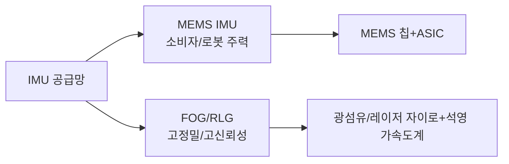

| 회사 | 본사 | 주요 제품 | 대표 로봇 응용 | 공급 상태/비고 |
|---|---|---|---|---|
| Bosch Sensortec | 독일 | MEMS IMU, 기압계 | 소비자/서비스 로봇 | 성숙한 공급 |
| TDK/InvenSense | 일본/미국 | MEMS IMU, IMU+기압계 | 로봇, 웨어러블 | 저비용 솔루션 |
| 신동 롄커 | 중국 | 고성능 MEMS IMU | 로봇, 무인 시스템 | 과학기술혁신위원회 공개 자료 |
| 싱왕 위다 | 중국 | MEMS/광섬유 IMU, 결합 항법 | 무인 차량/로봇 | 공개 자료 |
| 화이 테크놀로지 | 중국 | 관성 항법, IMU 테스트 | 자율주행/로봇 | 공개 자료 |
| 베이더우 싱통 | 중국 | GNSS/INS 결합 항법, 고정밀 위치 | 로봇, 무인 시스템 | 공개 자료 |
| STMicroelectronics | 스위스/이탈리아 | MEMS IMU, 가속도계 | 소비자/산업 | 대규모 공급 |
| Analog Devices | 미국 | 고정밀 MEMS IMU | 산업/로봇 | 고급 솔루션 |

#### 7.3.3.4 힘/토크 및 촉각

힘/토크 센서는 휴머노이드 로봇에 접촉력과 토크 피드백을 제공하며, 순응 제어, 양팔 협업 및 보행 균형의 핵심입니다. 손목과 발목에는 일반적으로 **6축 힘/토크 센서**가 구성되고, 손가락 끝과 발바닥에는 1축 힘 센서를 사용할 수 있으며, 정교한 손은 고밀도 촉각 어레이에 의존하여 미끄러짐, 질감 및 파지 상태를 감지합니다.

!!! note "용어 설명: 6축 힘/토크 센서, 1축 힘 센서, 촉각 센서, Taxel, 스트레인 게이지형, 정전용량형, 압저항형"
    - **6축 힘/토크 센서**: 3차원 힘과 3차원 토크를 동시에 측정하는 센서.
    - **1축 힘 센서**: 단일 방향의 힘 크기를 측정하는 센서.
    - **촉각 센서(tactile sensor)**: 접촉력, 압력, 온도, 미끄러짐 등을 감지하는 피부형 센서.
    - **Taxel**: 촉각 어레이의 개별 감지 픽셀.
    - **스트레인 게이지형/정전용량형/압저항형**: 힘 센서의 다양한 변환 원리로, 각각 스트레인 게이지 변형, 정전용량 극판 간격 변화 및 반도체 압저항 효과에 기반합니다.

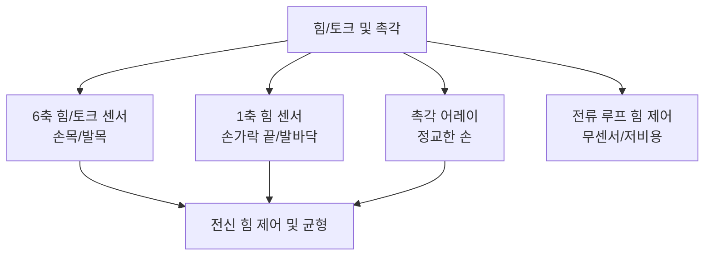

| 회사 | 본사 | 주요 제품 | 대표 로봇 응용 | 공급 상태/비고 |
|---|---|---|---|---|
| ATI Industrial Automation | 미국 | 6축 힘/토크 센서 | 손목/발목/협동 로봇 | 업계 벤치마크 |
| Robotiq | 캐나다 | 힘/토크 센서, 그리퍼 | 협동 로봇 말단 | 공개 자료 |
| OnRobot | 덴마크 | 힘 제어 센서, 그리퍼 | 협동 조립 | 공개 자료 |
| Bota Systems | 스위스 | 6축 힘 센서 | 보행/휴머노이드 로봇 | 공개 자료 |
| Kistler | 스위스 | 압전식 힘/토크 센서 | 테스트 및 산업 | 고정밀 |
| 위리 인스트루먼트 | 중국 | 6축 힘 센서 | 로봇 손목/발목/테스트 | 국내 선두 |
| 쿤웨이 테크놀로지 | 중국 | 6축 힘/토크 센서 | 협동/휴머노이드 로봇 | 공개 자료 |
| 커리 센싱 | 중국 | 중량/힘 센서, 6축 힘 | 산업/물류/로봇 | 공개 자료 |
| 한웨이 테크놀로지 | 중국 | 유연 압력/촉각 센서 | 로봇 피부, 웨어러블 | 공개 자료 |
| 로우촉 테크놀로지 | 중국 | 유연 그리퍼, 촉각 센싱 | 식품/3C 파지 | 공개 자료 |
| 타산 테크놀로지/Touchlab | 영국/중국 | 전자 피부/촉각 어레이 | 정교한 손, 서비스 로봇 | 공개 자료 |

#### 7.3.3.5 엔코더

엔코더는 관절에 위치, 속도 및 방향 피드백을 제공하며, 서보 시스템 폐루프 제어의 전제 조건입니다. 원리에 따라 광전 엔코더, 자기 엔코더 및 리졸버로 나눌 수 있으며, 출력에 따라 증분형과 절대형으로 나뉩니다. 고정밀, 저지연, 내유성 및 내진동은 로봇 관절 엔코더의 주요 선정 지표입니다.

!!! note "용어 설명: 광전 엔코더, 자기 엔코더, 리졸버, 분해능, 라인 수"
    - **광전 엔코더**: 그레이팅 디스크와 광전 검출기를 사용하여 각도 변위를 감지하는 엔코더로, 정밀도가 높지만 오일에 민감합니다.
    - **자기 엔코더**: 자극과 홀/자기저항 소자를 사용하여 각도 변위를 감지하며, 오염 저항성이 강합니다.
    - **리졸버(resolver)**: 전자기 유도 기반 각도 센서로, 열악한 환경에 강하고 고온에 견딥니다.
    - **분해능**: 엔코더가 분별할 수 있는 최소 각도 또는 변위.
    - **라인 수**: 증분 엔코더의 회전당 출력 펄스 수로, 기본 분해능을 결정합니다.

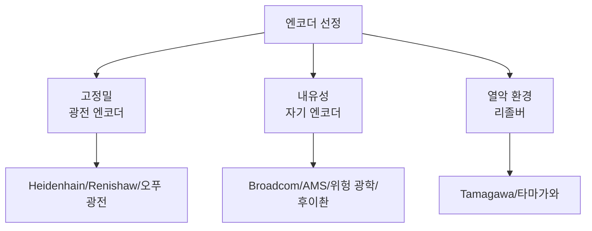

| 회사 | 본사 | 주요 제품 | 대표 로봇 응용 분야 | 공급 상태/비고 |
|---|---|---|---|---|---|
| Heidenhain | 독일 | 고정밀 광전/자기 엔코더 | 고급 공작기계/로봇 | 수입 고급 |
| Renishaw | 영국 | 자기 엔코더, 광학 스케일 | 정밀 운동 | 수입 |
| Broadcom | 미국 | 광전 엔코더 칩 | 서보 모터 | 핵심 부품 공급업체 |
| AMS-Osram | 오스트리아 | 자기 위치 센서, 엔코더 IC | 산업/자동차 | 공개 자료 |
| CUI Devices | 미국 | 인크리멘탈/앱솔루트 엔코더 | 서보 모터 | 공개 자료 |
| US Digital | 미국 | 광학/자기 엔코더 | 로봇 관절 | 공개 자료 |
| Maxon | 스위스 | 엔코더, 모터+엔코더 모듈 | 고급 로봇 | 통합 솔루션 |
| Tamagawa Seiki | 일본 | 엔코더, 리졸버 | 서보 모터配套 | 일본계 선두 |
| 奥普光电 | 중국 | 광전 엔코더, 광학 스케일 | 공작기계/로봇 | 국산 대체 |
| 禹衡光学 | 중국 | 광전 엔코더 | 서보/로봇 | 국산 대체 |
| 汇川技术 | 중국 | 자기 엔코더, 서보配套 엔코더 | 국산 서보 | 자체 공급+외부 공급 |
| 鸣志电器 | 중국 | 엔코더 및 스테핑/서보配套 | 로봇 | 공개 자료 |

#### 7.3.3.6 마이크와 오디오

마이크와 오디오 서브시스템은 휴머노이드 로봇의 음성 상호작용, 환경음 인식 및 음원 위치 파악을 담당합니다. 소비자 전자 제품 수준의 솔루션은 주로 MEMS 마이크를 사용하며, 일반적으로 어레이 형태로 배치되고 빔포밍, 에코 제거 및 음성 활동 감지 알고리즘과 함께 사용되어 원거리 음성 수집을 구현합니다.

!!! note "용어 설명: MEMS 마이크, 마이크 어레이, 빔포밍, 원거리 음성 수집, 음성 활동 감지"
    - **MEMS 마이크**: 미세 전자 기계 공정 기반의 콘덴서 마이크로, 크기가 작고 일관성이 좋으며 어레이에 적합합니다.
    - **마이크 어레이**: 여러 개의 마이크를 기하학적으로 배치하여 음원 위치 파악과 빔포밍을 구현합니다.
    - **빔포밍(beamforming)**: 신호 처리를 통해 특정 방향의 소리를 강화하고 소음과 잔향을 억제합니다.
    - **원거리 음성 수집**: 먼 거리(수 미터)에서 음성을 수집하는 능력입니다.
    - **음성 활동 감지(VAD, Voice Activity Detection)**: 음성의 시작과 끝을 인식하는 기술입니다.


| 회사 | 본사 | 주요 제품 | 대표 로봇 응용 분야 | 공급 상태/비고 |
|---|---|---|---|---|
| 歌尔股份 | 중국 | MEMS 마이크, 음향 모듈 | 스마트 스피커/로봇 | 글로벌 음향 선두 |
| 瑞声科技 | 중국 | MEMS 마이크, 스피커 | 휴대폰/로봇 | 공개 자료 |
| 敏芯股份 | 중국 | MEMS 마이크, 압력 센서 | 소비자 전자/로봇 | 코스닥 공개 자료 |
| Knowles | 미국 | MEMS 마이크 | 고급 소비자 전자 | 공개 자료 |
| STMicroelectronics | 스위스/이탈리아 | MEMS 마이크 ASIC | 소비자/산업 | 공개 자료 |
| TDK/InvenSense | 일본/미국 | MEMS 마이크 | 소비자/로봇 | 공개 자료 |

#### 7.3.3.7 밀리미터파 레이더와 초음파

밀리미터파 레이더와 초음파는 저렴하고 전천후 사용이 가능한 보조 센서로, 종종 카메라 및 LiDAR와 함께 사용됩니다. 밀리미터파 레이더는 연기, 먼지, 비, 눈 및 저조도 조건에서도 거리와 속도 정보를 제공할 수 있습니다. 초음파는 근거리 장애물 회피 및 대략적인 위치 파악에 사용됩니다.

!!! note "용어 설명: 밀리미터파 레이더, 초음파, FMCW 레이더, 도플러 효과, 소나"
    - **밀리미터파 레이더(mmWave radar)**: 30–300 GHz 대역에서 작동하는 레이더로, 거리 측정 및 속도 측정이 가능합니다.
    - **초음파(ultrasonic)**: 기계적 파동의 반사를 이용하여 거리를 측정하며, 비용이 저렴하고 단거리에 적합합니다.
    - **FMCW 레이더**: 주파수 변조 연속파 레이더로, 거리와 속도를 동시에 측정할 수 있습니다.
    - **도플러 효과**: 파원과 관찰자의 상대 운동으로 인해 주파수가 변하는 현상입니다.
    - **소나(sonar)**: 음파를 이용하여 수중 또는 공중의 목표물을 탐지하는 장치입니다.

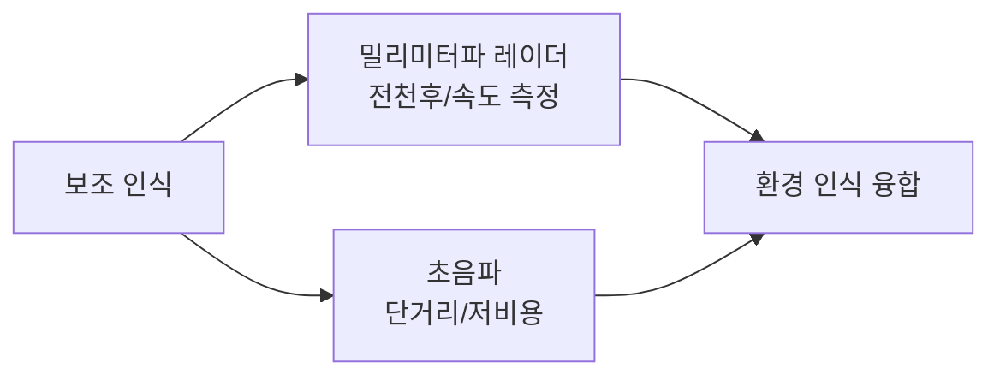

| 회사 | 본사 | 주요 제품 | 대표 로봇 응용 분야 | 공급 상태/비고 |
|---|---|---|---|---|
| Texas Instruments | 미국 | mmWave 레이더 칩(AWR/IWR) | 로봇, 자동차 | 공개 자료 |
| NXP Semiconductors | 네덜란드 | 77 GHz 레이더 칩 | 자동차/로봇 | 공개 자료 |
| Infineon | 독일 | mmWave 레이더 센서 | 자동차/로봇 | 공개 자료 |
| Bosch | 독일 | 밀리미터파 레이더 모듈 | 자동차/로봇 | 공개 자료 |
| Continental | 독일 | 밀리미터파 레이더, ADAS 센서 | 자동차/로봇 | 공개 자료 |
| 华域汽车 | 중국 | 밀리미터파 레이더, ADAS 모듈 | 자동차/로봇 | 공개 자료 |
| 德赛西威 | 중국 | 밀리미터파 레이더, 도메인 컨트롤러 | 자동차/로봇 | 공개 자료 |
| 保隆科技 | 중국 | 밀리미터파 레이더, 초음파 센서 | 자동차/로봇 | 공개 자료 |
| 奥迪威 | 중국 | 초음파 센서 | 로봇, 자동차 | 공개 자료 |
| 汇川技术 | 중국 | 초음파/근접 센서 | 산업/이동 로봇 | 공개 자료 |

#### 7.3.3.8 다중 센서 융합 및 데이터 동기화

다중 센서 융합은 서로 다른 물리적 원리, 서로 다른 시간 척도 및 서로 다른 공간 해상도를 가진 인식 데이터를 통합된 환경 모델로 결합합니다. 융합을 구현하기 위한 전제 조건은 정확한 시간 동기화(소프트 동기화 또는 하드 동기화 PPS/PTP)와 외부 파라미터 보정입니다. 센서 공급업체 선택은 하드웨어 비용뿐만 아니라 데이터 인터페이스, 드라이버 적응 및 융합 알고리즘 개발 작업량에도 영향을 미칩니다.

!!! note "용어 설명: 시간 동기화, 외부 파라미터 보정, 타임스탬프, 소프트 동기화, 하드 동기화, 칼만 필터"
    - **시간 동기화**: 여러 센서의 데이터가 통일된 시간 기준을 갖도록 하는 프로세스입니다.
    - **외부 파라미터 보정(extrinsic calibration)**: 서로 다른 센서 간의 공간적 위치 및 자세 관계를 결정하는 프로세스입니다.
    - **타임스탬프(timestamp)**: 데이터 수집 시점을 표시하는 시간 레이블입니다.
    - **소프트 동기화**: 소프트웨어를 통해 서로 다른 센서의 타임스탬프를 정렬하며, 정밀도는 일반적으로 밀리초 수준입니다.
    - **하드 동기화**: 하드웨어 트리거 신호(예: PPS, PTP)를 통해 마이크로초 수준의 동기화를 구현합니다.
    - **칼만 필터(Kalman filter)**: 잡음이 있는 다중 소스 추정치를 융합하는 상태 추정 알고리즘입니다.

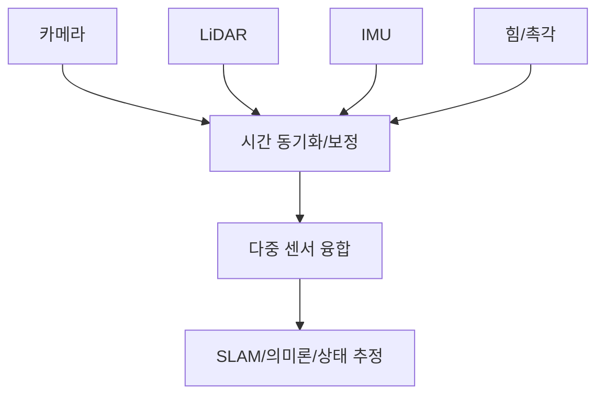

완성차 제조업체는 센서 공급업체를 평가할 때 단일 성능 외에도 표준 ROS/ROS2 드라이버, SDK, 보정 도구 및 장기 공급 약속을 제공하는지 여부에 주의해야 합니다. 공급업체를 변경하면 일반적으로 재보정 및 알고리즘 튜닝이 필요하며, 숨겨진 비용을 무시할 수 없습니다.

#### 7.3.3.9 센서 공급망의 국산 대체 평가

공급망 보안 측면에서 센서는 국산 대체 우선 순위가 높은 분야입니다. 아래 표는 국산화 진행률, 기술 성숙도, 주요 병목 현상 및 대표적인 국산 공급업체의 네 가지 차원에서 주요 센서 범주를 정성적으로 평가합니다. 국산 대체가 단순한 핀 투 핀 교체를 의미하지 않으며, 종종 재보정, 알고리즘 적응 및 신뢰성 검증이 수반된다는 점을 강조해야 합니다.

!!! note "용어 설명: 국산 대체, 기술 성숙도, 도입 주기, 신뢰성 검증"
    - **국산 대체(import substitution)**: 자국 또는 현지 공급업체의 제품으로 수입 제품을 대체하는 프로세스입니다.
    - **기술 성숙도(technology readiness level, TRL)**: 기술이 개념 단계에서 양산 적용까지의 성숙도를 나타내는 수준입니다.
    - **도입 주기(qualification cycle)**: 신제품이 샘플 검증에서 대량 구매까지 필요한 시간입니다.
    - **신뢰성 검증(reliability verification)**: 환경, 수명 및 스트레스 테스트를 통해 제품이 사용 요구 사항을 충족하는지 확인하는 프로세스입니다.

| 센서 종류 | 국산화 진행률 | 기술 성숙도 | 주요 병목 | 대표 국산 공급업체 |
|---|---|---|---|---|
| 일반 MEMS IMU | 높음 | 성숙 | 고급 제로 편향 안정성 | 심동롄커, 싱왕위다 |
| 광전 인코더 | 중간 | 거의 성숙 | 고정밀 격자, 세분화 회로 | 아오푸광전, 위헝광학 |
| 자기전 인코더 | 중상 | 성숙 | 고온/유분 환경 정밀도 | 후이촨, 밍즈 |
| 6축 힘 센서 | 중간 | 향상 중 | 크로스토크 보정, 과부하 보호 | 위리, 쿤웨이, 커리 |
| 3D 비전 모듈 | 중상 | 성숙 | 고급 SPAD/VCSEL 칩 | 아오비중광, 하이캉 로보틱스 |
| LiDAR | 높음 | 성숙 | 장거리/고체 칩 | 헤사이, 수텅쥐안, 베이싱 |
| MEMS 마이크 | 높음 | 성숙 | 고급 신호 대 잡음비 | 거얼, 루이성, 민신 |

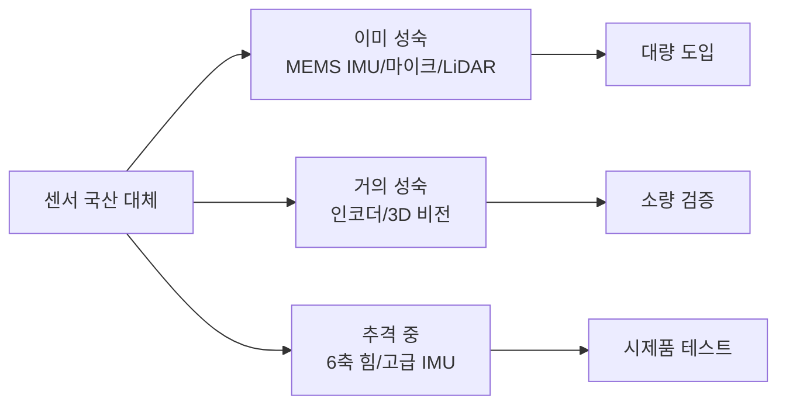

위 센서 세분화 분야의 공급업체 지도는 아래 그림으로 요약할 수 있습니다. 강조할 점은, 인간형 로봇은 일반적으로 다중 센서 융합 아키텍처를 채택하며, 단일 센서 공급업체를 변경할 경우 융합 알고리즘과 데이터 동기화 링크를 다시 보정해야 한다는 것입니다.

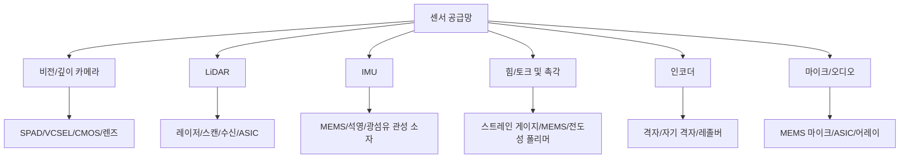


### 7.3.4 컴퓨팅 플랫폼

인간형 로봇 컴퓨팅 플랫폼은 인식, 상태 추정, 운동 계획, 제어 및 AI 추론을 동시에 실행해야 합니다. 주류 아키텍처로는 **시스템 온 칩(SoC)**에 통합된 CPU+GPU+NPU, 독립 GPU/FPGA/MCU, 그리고 미래에 등장할 수 있는 전용 로봇 SoC가 있습니다.

!!! note "용어 설명: SoC, CPU, GPU, NPU, MCU, FPGA, TOPS, TOPS/W"
    - **SoC(System on Chip)**: CPU, GPU, NPU, I/O, 메모리 컨트롤러 등을 단일 칩에 통합.
    - **CPU(Central Processing Unit)**: 범용 프로세서, 복잡한 제어 흐름 및 직렬 작업에 적합.
    - **GPU(Graphics Processing Unit)**: 고병렬 스트림 프로세서, 딥러닝 및 포인트 클라우드 처리에 적합.
    - **NPU(Neural Processing Unit)**: 전용 신경망 가속기, 에너지 효율이 높음.
    - **MCU(Microcontroller Unit)**: 마이크로컨트롤러, 실시간 제어 및 I/O에 사용.
    - **FPGA(Field-Programmable Gate Array)**: 현장에서 구성 가능한 디지털 회로, 저지연 I/O에 적합.
    - **TOPS**: 초당 1조 회 연산, AI 피크 연산 능력 측정.
    - **TOPS/W**: 와트당 TOPS, 에너지 효율 측정.

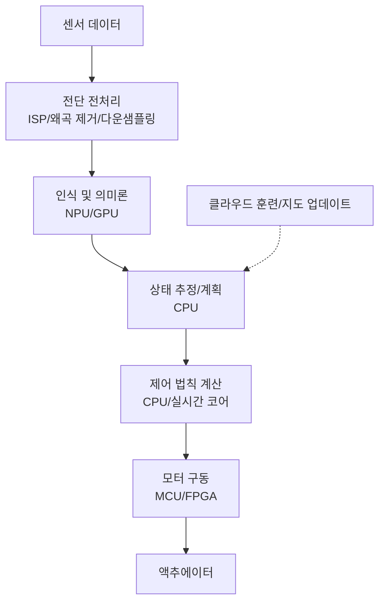

| 회사/플랫폼 | 본사 | 주요 제품 | 비고 |
|---|---|---|---|
| NVIDIA | 미국 | Jetson AGX Orin/Thor, Isaac Sim | 로봇 컴퓨팅 플랫폼 선두주자 |
| Qualcomm | 미국 | QCS/RB 시리즈, Hexagon NPU | 모바일/로봇 SoC |
| Intel | 미국 | Core/NUC, Movidius/Myriad | x86 메인 컨트롤러 및 AI 가속기 |
| AMD/Xilinx | 미국 | Kria, Versal, FPGA | 재구성 가능 컴퓨팅 |
| Horizon Robotics | 중국 | Journey 5/6, BPU | 자율주행/로봇 |
| Black Sesame | 중국 | A1000, 화산 시리즈 | 자율주행/로봇 |
| Huawei Hisilicon | 중국 | Ascend, Kirin | AI 및 엣지 SoC |
| Rockchip | 중국 | RK3588 등 | 저비용 로봇 메인 컨트롤러 |
| Apple | 미국 | M-series / Neural Engine | 개발/고급 엣지 |
| Tesla | 미국 | FSD Chip / Dojo | 자체 개발 자율주행/로봇 칩 |

#### 7.3.4.1 로봇 컴퓨팅 플랫폼의 연산 능력, 에너지 효율 및 지연 모델

인간형 로봇 컴퓨팅 플랫폼은 인식, 계획, 제어 및 AI 추론을 위한 이기종 컴퓨팅 요구를 동시에 충족해야 합니다. 컴퓨팅 플랫폼을 평가할 때는 피크 연산 능력(TOPS)만 보는 것이 아니라 **연산 능력(throughput)**, **에너지 효율(energy efficiency)** 및 **지연(latency)**의 세 가지 차원에서 종합적으로 평가해야 합니다.

!!! note "용어 설명: TOPS, FLOPS, 산술 강도, 메모리 대역폭, Roofline 모델, 활용률"
    - **TOPS**: 초당 1조 회 정수/고정 소수점 연산, NPU/AI 가속기 피크 연산 능력 측정에 자주 사용.
    - **FLOPS**: 초당 부동 소수점 연산 횟수.
    - **산술 강도(arithmetic intensity)**: 단위 메모리 접근량당 연산 횟수, 단위 op/byte.
    - **메모리 대역폭(memory bandwidth)**: 프로세서와 메모리 간 단위 시간당 전송 가능한 데이터 양, 단위 GB/s.
    - **Roofline 모델**: 피크 연산 능력과 메모리 대역폭이라는 두 가지 상한선으로 실제 성능 병목을 설명하는 모델.
    - **활용률(utilization)**: 실제 성능과 피크 성능의 비율.

Roofline 모델은 실제 도달 가능한 연산 능력 $P$를 피크 연산 능력 $P_{peak}$와 "메모리 대역폭 제한 연산 능력" $I \cdot B$ 중 작은 값으로 표현합니다:

$$
P = \min\left(P_{peak},\ I \cdot B\right)
$$

여기서 $I$는 산술 강도(operations/byte), $B$는 메모리 대역폭(byte/s)입니다. $I < P_{peak}/B$일 때 애플리케이션은 메모리 대역폭에 제약을 받고, $I > P_{peak}/B$일 때 피크 연산 능력에 제약을 받습니다. 이 임계값을 **Ridge point**라고 합니다:

$$
I_{ridge} = \frac{P_{peak}}{B}
$$

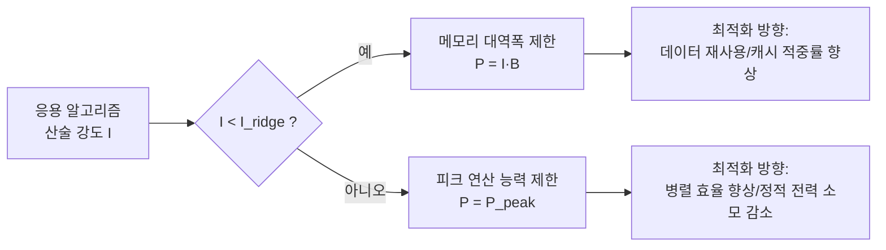

에너지 효율은 일반적으로 **TOPS/W**로 표시합니다. 전력 소모가 정적 전력 $P_{static}$과 연산 능력에 비례하는 동적 전력 $P_{dynamic}=\alpha P$($\alpha$는 에너지 소모 계수, 단위 J/op)로 구성된다면:

$$
E = \frac{P}{P_{static} + \alpha P}
$$

$P$가 피크에 가까워지면 에너지 효율은 $1/\alpha$에 수렴하고, 저부하 시 정적 전력 소모 비중이 증가하여 에너지 효율이 떨어집니다.

**수치 예시**: 어떤 로봇 SoC의 NPU 피크 연산 능력 $P_{peak}=100\ \text{TOPS}$, 메모리 대역폭 $B=100\ \text{GB/s}$, 정적 전력 $P_{static}=5\ \text{W}$, TOPS당 동적 에너지 소모 $\alpha=0.1\ \text{W/TOPS}$.

Ridge point:

$$
I_{ridge} = \frac{100 \times 10^{12}}{100 \times 10^9} = 1000\ \text{op/byte}
$$

어떤 인식 네트워크의 산술 강도 $I=500\ \text{op/byte}$라면, 실제 연산 능력은 대역폭에 의해 제한됩니다:

$$
P = 500 \times 100 \times 10^9 = 50\ \text{TOPS}
$$

해당 소비 전력 $P_{total}=5 + 0.1 \times 50 = 10\ \text{W}$이며, 에너지 효율은 $50/10=5\ \text{TOPS/W}$입니다. 알고리즘 최적화로 $I$가 $2000\ \text{op/byte}$까지 향상되면 연산 능력은 피크 $100\ \text{TOPS}$에 도달하고, 소비 전력은 $15\ \text{W}$, 에너지 효율은 $6.67\ \text{TOPS/W}$입니다. 이는 대역폭 제한 영역에서 알고리즘 데이터 재사용률을 높이는 것이 단순히 피크 연산 능력을 높이는 것보다 더 효과적임을 의미합니다.

지연 시간 측면에서, 네트워크의 각 레이어가 처리해야 하는 데이터 양이 $D$ (byte)이고 대역폭이 $B$라면, 데이터 이동 시간만 최소한 다음과 같이 필요합니다:

$$
T_{memory} = \frac{D}{B}
$$

총 계산량이 $W$ (ops)이고 실제 연산 능력이 $P$라면, 계산 시간은 $T_{compute}=W/P$입니다. 종단 간 지연 시간은 일반적으로 둘 중 더 큰 값에 의해 결정됩니다. 제어 루프는 휴머노이드 로봇에 밀리초 수준의 지연 시간을 요구하므로, 피크 연산 능력 외에도 **결정적 지연 시간**과 **최악 실행 시간(WCET)**도 핵심 지표입니다. 자세한 내용은 제6장 6.3절을 참조하십시오.

```python
import numpy as np
import matplotlib.pyplot as plt

# 플랫폼 파라미터
P_peak = 100          # TOPS
B = 100               # GB/s
P_static = 5          # W
alpha = 0.1           # W/TOPS

I = np.logspace(1, 4, 200)  # op/byte
P_actual = np.minimum(P_peak, I * B)  # TOPS
power = P_static + alpha * P_actual
tops_per_w = P_actual / power

plt.figure(figsize=(10, 4))

plt.subplot(1, 2, 1)
plt.loglog(I, P_actual, label="실제 TOPS")
plt.axhline(P_peak, color="red", linestyle="--", label="피크 TOPS")
plt.xlabel("연산 강도 (op/byte)")
plt.ylabel("실제 TOPS")
plt.title("루프라인 모델")
plt.legend()
plt.grid(True, which="both", alpha=0.3)

plt.subplot(1, 2, 2)
plt.semilogx(I, tops_per_w)
plt.xlabel("연산 강도 (op/byte)")
plt.ylabel("TOPS/W")
plt.title("에너지 효율 대 연산 강도")
plt.grid(True, which="both", alpha=0.3)

plt.tight_layout()
plt.show()

print(f"리지 포인트 = {P_peak/B:.0f} op/byte")
```

!!! note "용어 설명: 결정적 지연 시간, WCET, 메모리 벽, 연산 강도"
    - **결정적 지연 시간(deterministic latency)**: 엄격하게 보장 가능한 최대 응답 시간.
    - **WCET(Worst-Case Execution Time)**: 최악의 경우 실행 시간.
    - **메모리 벽(memory wall)**: 프로세서 연산 능력의 증가 속도가 메모리 대역폭보다 훨씬 빨라 실제 성능이 데이터 이동에 의해 제한되는 현상.
    - **연산 강도 향상**: 온칩 데이터 재사용 및 캐시 적중률 증가를 통해 연산 강도를 높이는 것.

### 7.3.5 배터리 및 전력 반도체

휴머노이드 로봇은 배터리의 에너지 밀도, 출력 밀도, 사이클 수명 및 안전성에 대한 요구 사항이 높습니다. 현재 주류는 **리튬 이온 배터리(Li-ion)**이며, 화학 시스템에는 **삼원계(NCM/NCA)**와 **인산철리튬(LFP)**이 포함됩니다. 미래에는 **고체 배터리(solid-state battery)**가 더 높은 에너지 밀도와 안전성으로 주목받고 있습니다.

!!! note "용어 설명: 리튬 이온 배터리, 삼원계 배터리, 인산철리튬, 고체 배터리, 에너지 밀도, 출력 밀도"
    - **리튬 이온 배터리(Li-ion)**: 리튬 이온이 양극과 음극 사이에 삽입/탈리되는 과정을 통해 충방전이 이루어지는 이차 전지.
    - **삼원계 배터리(NCM/NCA)**: 양극에 니켈, 코발트, 망간 또는 니켈, 코발트, 알루미늄을 포함하는 리튬 이온 배터리로, 에너지 밀도가 높습니다.
    - **인산철리튬(LFP)**: 양극이 인산철리튬인 리튬 이온 배터리로, 사이클 수명이 길고 열적 안정성이 우수합니다.
    - **고체 배터리**: 액체 전해질 대신 고체 전해질을 사용하는 배터리로, 에너지 밀도와 안전성 잠재력이 더 큽니다.
    - **에너지 밀도**: 단위 질량 또는 부피당 저장된 에너지로, 단위는 Wh/kg 또는 Wh/L입니다.
    - **출력 밀도**: 단위 질량 또는 부피당 출력 가능한 전력으로, 단위는 W/kg 또는 W/L입니다.

전력 반도체는 전력 변환 및 모터 구동을 담당합니다. 기존 실리콘 기반 MOSFET/IGBT는 더 높은 효율, 더 높은 스위칭 주파수 및 더 작은 부피를 위해 **탄화규소(SiC)** 및 **질화갈륨(GaN)** 와이드 밴드갭 반도체로 전환되고 있습니다.

!!! note "용어 설명: 전력 반도체, MOSFET, IGBT, SiC, GaN, 와이드 밴드갭 반도체"
    - **전력 반도체**: 전력 변환 및 스위칭 제어에 사용되는 고전력 반도체 소자.
    - **MOSFET(Metal-Oxide-Semiconductor FET)**: 전압 제어형 전계 효과 트랜지스터로, 스위칭 속도가 빠릅니다.
    - **IGBT(Insulated Gate Bipolar Transistor)**: 절연 게이트 양극성 트랜지스터로, 중고전력에 적합합니다.
    - **SiC(탄화규소)**: 와이드 밴드갭 반도체 재료로, 고온, 고주파, 고효율에 강합니다.
    - **GaN(질화갈륨)**: 와이드 밴드갭 반도체로, 스위칭 주파수가 높고 온 저항이 낮습니다.
    - **와이드 밴드갭 반도체(WBG)**: 실리콘보다 밴드갭이 넓은 반도체 재료로, SiC, GaN 등이 있습니다.

```mermaid
flowchart LR
    A["배터리 팩<br/>셀 직렬/병렬"] --> B["BMS"]
    B --> C["DC 버스"]
    C --> D["SiC/GaN 인버터"]
    D --> E["모터"]
    C --> F["DC-DC 컨버터"]
    F --> G["컴퓨팅 플랫폼/센서"]
```

| 회사 | 본사 | 주요 제품 | 비고 |
|---|---|---|---|
| CATL | 중국 | 동력 배터리, LFP/삼원계 | 글로벌 동력 배터리 선두 |
| BYD | 중국 | 블레이드 배터리(LFP) | 자체 공급 + 외부 공급 |
| LG Energy Solution | 한국 | 삼원계/LFP 동력 배터리 | 글로벌 주요 공급업체 |
| Panasonic | 일본 | 원통형/동력 배터리 | Tesla와 장기 협력 |
| Samsung SDI | 한국 | 삼원계 동력 배터리 | 고에너지 밀도 |
| EVE Energy | 중국 | 동력 배터리, 원통형 배터리 | 로봇/전동 공구 |
| Infineon | 독일 | SiC/GaN/IGBT/MOSFET | 전력 반도체 선두 |
| STMicroelectronics | 스위스/이탈리아 | SiC MOSFET, 드라이버 IC | 자동차 및 산업 |
| onsemi | 미국 | SiC, MOSFET, IGBT | 전원 및 구동 |
| Wolfspeed | 미국 | SiC 기판 및 소자 | 와이드 밴드갭 재료 |

#### 7.3.5.1 리튬 이온 배터리 등가 회로 및 에너지-전력 특성

리튬 이온 배터리는 이상적인 전압원 $V_{oc}(SoC)$과 내부 저항 $R_{int}$이 직렬로 연결된 테브난 등가 회로로 추상화할 수 있습니다. 단자 전압 $V_t$와 전류 $I$의 관계는 다음과 같습니다:

$$
V_t = V_{oc}(SoC) - I \cdot R_{int}
$$

여기서 $V_{oc}$는 개방 회로 전압으로, 충전 상태 $SoC$에 따라 변합니다. $R_{int}$는 배터리 내부 저항으로, 옴 저항과 분극 저항을 포함합니다. 방전 시 $I>0$이면 단자 전압이 감소하고, 충전 시 $I<0$이면 단자 전압이 증가합니다.

!!! note "용어 설명: 개방 회로 전압, 내부 저항, 충전 상태, 분극, 테브난 등가"
    - **개방 회로 전압(OCV)**: 부하가 없을 때 배터리의 단자 전압으로, SoC 및 온도와 관련됩니다.
    - **내부 저항(internal resistance)**: 배터리 내부의 전류에 대한 저항으로, 전압 강하와 발열을 유발합니다.
    - **충전 상태(SoC)**: 잔여 용량과 정격 용량의 비율로, 0–100%입니다.
    - **분극(polarization)**: 전기화학 반응이 평형 상태에서 벗어나 발생하는 전압 손실입니다.
    - **테브난 등가(Thevenin equivalent)**: 복잡한 네트워크를 전압원과 직렬 저항으로 구성된 회로 모델로 등가화하는 것입니다.

```mermaid
flowchart LR
    A["V_oc(SoC)<br/>이상적 전압원"] --> B["R_int<br/>내부 저항"]
    B --> C["V_t<br/>단자 전압"]
    C --> D["부하 R_L"]
    D --> E["전류 I"]
    E --> F["발열 I²R_int"]
```

배터리가 출력할 수 있는 최대 전력은 단자 전압 하한 $V_{min}$에 의해 제한됩니다. $V_t=V_{min}$으로 설정하면 전류 $I=(V_{oc}-V_{min})/R_{int}$가 되며, 따라서:

$$
P_{max} = V_{min} \cdot I = \frac{(V_{oc} - V_{min}) V_{min}}{R_{int}}
$$

이 식은 내부 저항이 작을수록, 개방 전압이 높을수록 배터리가 높은 에너지와 높은 출력을 동시에 제공할 수 있음을 설명합니다.

에너지 밀도 $E_g$(Wh/kg)와 출력 밀도 $P_g$(W/kg)의 Ragone 관계는 다음과 같이 근사할 수 있습니다:

$$
E_g \cdot P_g \le \frac{V_{oc}^2}{4 R_{int} \cdot m_{cell}}
$$

여기서 $m_{cell}$은 셀 질량입니다. 이 부등식은 에너지 밀도와 출력 밀도 사이에 기본적인 상충 관계가 있음을 나타냅니다. 높은 출력을 위해서는 낮은 내부 저항 설계가 필요하며, 이는 활물질 비율을 희생하여 에너지 밀도를 낮출 수 있습니다.

C-rate는 충방전 전류를 정격 용량 $C_{nom}$(Ah)에 대한 배수로 나타냅니다:

$$
I = C_{rate} \cdot C_{nom}
$$

1C는 1시간 동안 정격 용량을 방전함을 의미합니다. 휴머노이드 로봇의 순간 전력 요구는 2–5C에 도달할 수 있지만, 지속적인 고율 방전은 노화를 가속화하고 열 부하를 증가시킵니다. 리튬, 코발트, 니켈 등 배터리 핵심 소재의 자원 분포와 공급망 리스크에 대한 자세한 내용은 3장을 참조하십시오.

**수치 예시**: 특정 NCM 셀의 정격 용량 $C_{nom}=5\ \text{Ah}$, 평균 개방 전압 $V_{oc}=3.7\ \text{V}$, 내부 저항 $R_{int}=10\ \text{m}\Omega$, 질량 $m=0.20\ \text{kg}$, 단자 전압 하한 $V_{min}=3.0\ \text{V}$.

에너지 밀도:

$$
E_g = \frac{5\ \text{Ah} \times 3.7\ \text{V}}{0.20\ \text{kg}} = 92.5\ \text{Wh/kg}
$$

최대 연속 방전 전류:

$$
I_{max} = \frac{3.7 - 3.0}{0.010} = 70\ \text{A}
$$

해당 C-rate:

$$
C_{rate} = \frac{70}{5} = 14C
$$

최대 출력 전력:

$$
P_{max} = 3.0 \times 70 = 210\ \text{W}
$$

출력 밀도:

$$
P_g = \frac{210}{0.20} = 1050\ \text{W/kg}
$$

발열 전력:

$$
P_{heat} = I^2 R_{int} = 70^2 \times 0.010 = 49\ \text{W}
$$

이때 발열 전력은 출력 전력의 23%를 차지하며, 열 관리는 고율 방전의 핵심 제약 조건이 됩니다. 자세한 내용은 6장 6.2절을 참조하십시오.

```python
import numpy as np
import matplotlib.pyplot as plt

# 셀 파라미터
C_nom = 5.0        # Ah
V_oc = 3.7         # V
R_int = 0.010      # ohm
m = 0.20           # kg
V_min = 3.0        # V

I_max = (V_oc - V_min) / R_int
P_max = V_min * I_max
E_g = C_nom * V_oc / m
P_g = P_max / m

print(f"에너지 밀도 = {E_g:.1f} Wh/kg")
print(f"최대 전력 = {P_max:.1f} W")
print(f"출력 밀도 = {P_g:.1f} W/kg")
print(f"최대 전류 = {I_max:.1f} A ({I_max/C_nom:.1f}C)")

# Ragone 곡선: 내부 저항을 변경하여 에너지-출력 상충 관계 관찰
R_values = np.array([0.005, 0.010, 0.020, 0.030])  # ohm
E_g_const = E_g  # 에너지 밀도가 일정하다고 가정
P_g_values = (V_oc**2 / (4 * R_values * m))

plt.figure(figsize=(7, 4))
plt.plot(P_g_values, [E_g_const]*len(R_values), marker="o")
for r, pg in zip(R_values, P_g_values):
    plt.annotate(f"R={r*1000:.0f} mΩ", (pg, E_g_const), textcoords="offset points", xytext=(0, 10), ha="center")
plt.xlabel("출력 밀도 (W/kg)")
plt.ylabel("에너지 밀도 (Wh/kg)")
plt.title("Ragone Plot: 에너지 밀도 vs. 출력 밀도")
plt.grid(True, alpha=0.3)
plt.tight_layout()
plt.show()
```

!!! note "용어 설명: Ragone 곡선, C-rate, 출력 밀도, 에너지 밀도, 열 부하"
    - **Ragone 곡선**: 에너지 밀도와 출력 밀도 간의 상충 관계 곡선.
    - **C-rate**: 정격 용량 대비 충방전 배율.
    - **출력 밀도**: 단위 질량당 출력 가능한 전력.
    - **에너지 밀도**: 단위 질량당 저장된 에너지.
    - **열 부하**: 고율 방전 시 발생하는 줄 열.

#### 7.3.5.2 전력 반도체 스위칭 손실과 접합 온도 모델

전력 반도체(MOSFET/IGBT/SiC/GaN)는 인버터에서 고주파 스위칭 작업을 담당합니다. 손실은 **도통 손실(conduction loss)**과 **스위칭 손실(switching loss)**로 구분됩니다. 도통 손실은 온 저항 $R_{ds(on)}$ 또는 포화 전압 $V_{ce(sat)}$에 의해 발생하며, 스위칭 손실은 스위칭 주파수 $f_{sw}$, DC 링크 전압 $V_{dc}$, 부하 전류 $I$에 비례합니다.

3상 인버터의 한 상 암(arm)에서 PWM 제어 시 MOSFET의 도통 손실은 다음과 같이 근사할 수 있습니다:

$$
P_{cond} = I_{rms}^2 \cdot R_{ds(on)} \cdot D
$$

여기서 $I_{rms}$는 드레인 전류 실효값, $D$는 듀티 사이클입니다. 스위칭 손실 경험 모델은 다음과 같습니다:

$$
P_{sw} = \frac{1}{2} V_{dc} \cdot I \cdot (t_{on} + t_{off}) \cdot f_{sw}
$$

$t_{on}$, $t_{off}$는 턴온/턴오프 시간입니다. 총 손실:

$$
P_{loss} = P_{cond} + P_{sw}
$$

!!! note "용어 설명: 도통 손실, 스위칭 손실, 듀티 사이클, 스위칭 주파수, 접합 온도, 열 저항"
    - **도통 손실**: 소자가 도통될 때 저항/전압 강하로 인해 발생하는 손실.
    - **스위칭 손실**: 소자가 턴온 및 턴오프 과정에서 전압과 전류가 중첩되어 발생하는 손실.
    - **듀티 사이클(duty cycle)**: PWM 주기 내에서 도통 시간이 차지하는 비율.
    - **스위칭 주파수**: 단위 시간당 스위칭 횟수.
    - **접합 온도(junction temperature)**: 반도체 PN 접합의 온도.
    - **열 저항(thermal resistance)**: 접합에서 방열 환경까지 열이 이동하는 경로의 저항.

```mermaid
flowchart TD
    A["인버터 총 손실 P_loss"] --> B["도통 손실<br/>I_rms²·R_ds(on)·D"]
    A --> C["스위칭 손실<br/>½V_dc·I·(t_on+t_off)·f_sw"]
    B --> D["접합 온도 상승<br/>T_j = T_a + P_loss·R_th"]
    C --> D
    D --> E["열 설계 제약<br/>T_j ≤ T_j,max"]
```

접합 온도 상승은 열 저항 모델로 설명할 수 있습니다:

$$
T_j = T_a + P_{loss} \cdot (R_{th,jc} + R_{th,ch} + R_{th,ha})
$$

$T_a$는 환경 온도, $R_{th,jc}$는 접합-케이스 열 저항, $R_{th,ch}$는 케이스-방열판 열 저항, $R_{th,ha}$는 방열판-환경 열 저항입니다. SiC/GaN은 낮은 온 저항과 빠른 스위칭 속도로 인해 $P_{loss}$를 크게 줄여 방열 부피를 감소시킬 수 있습니다.

**수치 예시**: 특정 SiC MOSFET의 $R_{ds(on)}=5\ \text{m}\Omega$, $t_{on}+t_{off}=50\ \text{ns}$, 구동 관절 전류 실효값 $I_{rms}=10\ \text{A}$, 듀티 사이클 $D=0.5$, $V_{dc}=48\ \text{V}$, $f_{sw}=20\ \text{kHz}$, 총 열 저항 $R_{th}=2.0\ \text{K/W}$, $T_a=40\ ^\circ\text{C}$.

도통 손실:

$$
P_{cond} = 10^2 \times 0.005 \times 0.5 = 0.25\ \text{W}
$$

스위칭 손실:

$$
P_{sw} = 0.5 \times 48 \times 10 \times 50 \times 10^{-9} \times 20 \times 10^3 = 0.24\ \text{W}
$$

총 손실:

$$
P_{loss} = 0.25 + 0.24 = 0.49\ \text{W}
$$

접합 온도:

$$
T_j = 40 + 0.49 \times 2.0 = 40.98\ ^\circ\text{C}
$$

비교를 위해, 실리콘 기반 MOSFET($R_{ds(on)}=30\ \text{m}\Omega$, $t_{on}+t_{off}=200\ \text{ns}$)을 사용할 경우:

$$
P_{cond} = 10^2 \times 0.030 \times 0.5 = 1.5\ \text{W}
$$

$$
P_{sw} = 0.5 \times 48 \times 10 \times 200 \times 10^{-9} \times 20 \times 10^3 = 0.96\ \text{W}
$$

총 손실 $2.46\ \text{W}$, 접합 온도 $44.9\ ^\circ\text{C}$. 단일 소자의 온도 상승은 크지 않지만, 전체 기기에 수십 개의 관절 드라이버가 있을 경우 SiC는 총 열 손실을 약 5배 줄여 방열판과 배터리 부담을 크게 감소시킵니다.

```python
import numpy as np
import matplotlib.pyplot as plt

def mosfet_loss(Rds, t_sw, Irms, D, Vdc, fsw):
    P_cond = Irms**2 * Rds * D
    P_sw = 0.5 * Vdc * Irms * t_sw * fsw
    return P_cond, P_sw

Irms = 10.0
D = 0.5
Vdc = 48.0
fsw = 20e3
R_th = 2.0
T_a = 40.0

devices = {
    "SiC MOSFET": {"Rds": 0.005, "t_sw": 50e-9},
    "Si MOSFET": {"Rds": 0.030, "t_sw": 200e-9},
}

fsw_range = np.linspace(5e3, 50e3, 100)
plt.figure(figsize=(9, 4))

for name, params in devices.items():
    P_total = []
    for f in fsw_range:
        pc, ps = mosfet_loss(params["Rds"], params["t_sw"], Irms, D, Vdc, f)
        P_total.append(pc + ps)
    plt.plot(fsw_range/1e3, P_total, label=name)
    pc, ps = mosfet_loss(params["Rds"], params["t_sw"], Irms, D, Vdc, 20e3)
    print(f"{name}: P_cond={pc:.2f} W, P_sw={ps:.2f} W, total={pc+ps:.2f} W, Tj={T_a + (pc+ps)*R_th:.1f} °C")

plt.xlabel("스위칭 주파수 (kHz)")
plt.ylabel("MOSFET 당 총 손실 (W)")
plt.title("전력 반도체 손실 vs 스위칭 주파수")
plt.legend()
plt.grid(True, alpha=0.3)
plt.tight_layout()
plt.show()
```

!!! note "용어 설명: SiC MOSFET, GaN HEMT, 온 저항, 스위칭 시간, 열 저항 체인"
    - **SiC MOSFET**: 탄화규소 금속 산화물 반도체 전계 효과 트랜지스터.
    - **GaN HEMT**: 질화갈륨 고전자 이동도 트랜지스터.
    - **온 저항**: MOSFET이 완전히 도통되었을 때 드레인-소스 간 저항.
    - **스위칭 시간**: 소자가 꺼짐에서 켜짐 또는 켜짐에서 꺼짐으로 전환되는 데 필요한 시간.
    - **열 저항 체인**: 반도체 접합에서 환경까지의 직렬 열 저항 경로.

### 7.3.6 핵심 소재

핵심 소재는 전체 공급망에 걸쳐 있습니다. 고성능 **네오디뮴-철-붕소(NdFeB) 영구 자석**은 모터 토크 밀도를 결정합니다. **구리**는 권선과 케이블에 사용됩니다. **리튬, 코발트, 니켈**은 배터리 양극재에 사용됩니다. **네오디뮴, 디스프로슘, 테르븀**과 같은 희토류 원소는 자석에 사용됩니다. **고순도 실리콘, 탄화규소 기판**은 칩과 전력 소자에 사용됩니다.

!!! note "용어 설명: 네오디뮴-철-붕소, 희토류 원소, 영구 자석, 코발트, 니켈, 양극재, 탄화규소 기판"
    - **네오디뮴-철-붕소(NdFeB)**: 네오디뮴, 철, 붕소로 구성된 희토류 영구 자석 재료로, 높은 자기 에너지 곱을 가짐.
    - **희토류 원소(rare earth elements)**: 란타넘 계열 원소에 스칸듐, 이트륨을 더한 총 17종의 금속 원소로, 특수한 전자기적 특성을 가짐.
    - **영구 자석(permanent magnet)**: 외부 여자 없이 장기간 자성을 유지하는 재료.
    - **코발트/니켈**: 삼원계 양극재의 핵심 원소로, 에너지 밀도와 안정성에 영향을 미침.
    - **양극재**: 리튬 이온 배터리에서 리튬 이온을 제공하는 핵심 재료.
    - **탄화규소 기판(SiC substrate)**: SiC 전력 소자 및 RF 소자 제조에 사용되는 단결정 재료.

```mermaid
flowchart TD
    A["희토류 광석"] --> B["희토류 산화물"]
    B --> C["NdFeB 자석 분말"]
    C --> D["영구 자석"]
    D --> E["모터 회전자"]
    F["리튬/코발트/니켈 광석"] --> G["양극재"]
    G --> H["배터리 셀"]
    H --> I["배터리 팩"]
    J["고순도 석영/실리콘"] --> K["실리콘 웨이퍼"]
    K --> L["칩/전력 소자"]
```

| 재료/분류 | 주요 용도 | 주요 공급원 (공개 추정) | 주요 위험 |
|---|---|---|---|
| NdFeB 자석 | 모터 영구 자석 회전자 | 중국 (약 80–90% 생산 능력), 일본 | 희토류 채굴 및 제련 집중 |
| 희토류 산화물 | 자석, 촉매, 연마 | 중국, 미국, 호주, 미얀마 | 제련 분리 집중도 높음 |
| 리튬 | 리튬 배터리 | 호주, 칠레, 아르헨티나, 중국 | 자원 보유국 정책 및 가격 변동 |
| 코발트 | 삼원계 양극재 | 콩고 민주 공화국 약 70% 생산량 | 공급망 책임 및 지정학적 위험 |
| 니켈 | 삼원계/고니켈 배터리 | 인도네시아, 필리핀, 러시아, 캐나다 | ESG 및 수출 정책 |
| 고순도 구리 | 권선, 케이블, 방열 | 칠레, 페루, 중국, 콩고 | 가격 주기 및 수요 증가 |
| 탄화규소 기판 | SiC 소자 | 미국, 일본, 유럽, 중국 | 8인치 수율 및 생산 능력 확대 |
### 7.3.7 관절 모듈 분해 및 공급망

**관절 모듈(joint module)**은 휴머노이드 로봇 운동 시스템의 최소 납품 가능 단위입니다. 일반적인 회전 관절 모듈은 최소한 프레임리스 토크 모터, 감속기, 엔코더, 힘/토크 센서, 브레이크, 베어링, 드라이버, 하우징, 케이블 및 그리스를 포함합니다. 관절 모듈은 로봇의 토크 밀도, 동적 응답, 제어 정밀도 및 신뢰성을 동시에 결정하기 때문에, BOM 분해 및 공급망 관리는 완성체 제조사의 원가 절감 및 공급 안정성 확보의 핵심 수단입니다.

!!! note "용어 설명: 관절 모듈, 관절 모듈 어셈블리, 시스템 통합 업체"
    - **관절 모듈(joint module)**: 모터, 감속기, 엔코더, 센서, 브레이크 및 하우징을 하나로 통합한 회전 또는 직선 구동 유닛.
    - **관절 모듈 어셈블리(joint module assembly)**: 로봇 관절 위치에 직접 조립할 수 있는 완전한 모듈.
    - **시스템 통합 업체(system integrator)**: 여러 하위 시스템을 완제품 또는 솔루션으로 통합하는 기업.

```mermaid
flowchart TD
    A["관절 모듈 어셈블리"] --> B["프레임리스 토크 모터"]
    A --> C["감속기<br/>하모닉/유성/RV/사이클로이드"]
    A --> D["위치/속도 피드백<br/>엔코더/레졸버"]
    A --> E["힘/토크 센서<br/>6축 힘/1축 힘"]
    A --> F["브레이크/홀딩 브레이크<br/>무여자 제동"]
    A --> G["베어링<br/>딥 그루브/앵귤러 컨택트/크로스 롤러"]
    A --> H["드라이버/서보 드라이버"]
    A --> I["하우징 및 구조 부품<br/>알루미늄 합금/마그네슘 합금"]
    A --> J["케이블 및 커넥터<br/>전원/신호/버스"]
    B --> K["영구 자석/권선/규소 강판"]
    C --> L["플렉스 스플라인/서큘러 스플라인/니들 핀/유성 캐리어"]
```

#### 7.3.7.1 관절 모듈 어셈블리 및 통합 업체

관절 모듈 어셈블리 업체는 모터, 감속기, 엔코더, 힘 센서, 브레이크 등을 통합하여 직접 조립 가능한 모듈로 만드는 역할을 합니다. 완성체 제조사는 모듈을 외부에서 조달하거나, 핵심 부품을 자체 개발한 후 Tier-1 업체에 위탁하여 통합할 수 있습니다. 아래 표는 대표적인 어셈블리 및 통합 공급업체를 나타내며, 그 포지션은 전문 감속기/모터 제조사에서 로봇 OEM 자체 개발 체계까지 확장됩니다.

| 공급업체 | 본사 | 대표 제품/포지셔닝 | 대표 로봇 응용 분야 | 공급 상태/비고 |
|---|---|---|---|---|---|
| 녹스 하모닉 | 중국 쑤저우 | 하모닉 감속기 + 관절 모듈 | 협동/휴머노이드 로봇 | 국산 하모닉 선두주자, 생산 능력 지속 확장 |
| 라이푸 하모닉 | 중국 저장성 | 하모닉 감속기, 관절 모듈 | 협동/서비스 로봇 | 국산 대체 |
| 솽환 트랜스미션 | 중국 저장성 | RV/유성/하모닉 감속기, 기어 | 산업용 로봇/휴머노이드 | 정밀 기어 제조 기반 |
| 중다 리더 | 중국 닝보 | 유성/하모닉 감속기, 모터 드라이브, 모듈 | 로봇 관절 | 공개 자료 |
| 허촨 테크놀로지 | 중국 저장성 | 서보 모터, 드라이버, 관절 모듈 | 산업용/휴머노이드 로봇 | 공개 자료 |
| 후이촨 테크놀로지 | 중국 선전 | 서보 시스템, 모터, 드라이버 | 산업용 로봇/휴머노이드 | 국내 자동화 선두주자 |
| 에스톤 | 중국 난징 | 서보, 로봇 본체, 모듈 | 산업용 로봇/휴머노이드 | 자체 공급 + 외부 공급 |
| 유비테크 | 중국 선전 | Walker 시리즈 관절 모듈 | 교육/서비스/휴머노이드 | 주로 자체 개발 완제품 |
| 위슈 테크놀로지 | 중국 항저우 | H1/G1 관절 액추에이터 | 고동적 휴머노이드 | 자체 개발 |
| 지위안 로봇 | 중국 상하이 | 위안정/링시 관절 모듈 | 범용 휴머노이드 | 스타트업, 빠른 반복 |
| 광저우 CNC | 중국 광저우 | 서보 모터, 드라이브, 로봇 | 산업용/휴머노이드 | 공개 자료 |
| 투오스다 | 중국 둥관 | 산업용 로봇, 액추에이터 | 산업 자동화 | 공개 자료 |
| 페이티엔 로봇 | 중국 선전 | 산업용 로봇, 서보 | 산업용/휴머노이드 | 공개 자료 |

중국 관절 모듈 공급업체는 지리적으로 장강 삼각주와 주강 삼각주에 고도로 집중되어 있으며, 동시에 베이징-톈진-허베이, 중부 지역, 청두-충칭 등지에서 완제품 제조업체와 대학/연구소를 기반으로 보완을 이루고 있습니다. 아래 그림은 간략화된 지역 분포 개요를 보여주며, 노드는 완전한 생산 능력 배치를 나타내는 것이 아니라 산업 집적 특성을 설명하기 위한 것입니다.

```mermaid
flowchart TD
    subgraph 长三角["장강 삼각주 (쑤저우/우시/상하이/닝보/항저우)"]
        A1["녹스 하모닉"] --- A2["라이푸 하모닉"]
        A3["후이촨 테크놀로지"] --- A4["허촨 테크놀로지"]
        A5["밍즈 전기"] --- A6["위리 계기"]
        A7["지위안 로봇"] --- A8["위슈 테크놀로지"]
    end
    subgraph 珠三角["주강 삼각주 (선전/둥관/광저우)"]
        B1["유비테크"] --- B2["광저우 CNC"]
        B3["투오스다"] --- B4["페이티엔 로봇"]
        B5["후이촨 테크놀로지 본사"]
    end
    subgraph 京津冀["베이징-톈진-허베이 (베이징/톈진/허베이)"]
        C1["샤오미 로봇"] --- C2["완제품 연구개발"]
    end
    subgraph 华中["중부 지역 (우한/창사)"]
        D1["화중 CNC"] --- D2["서보 및 모터"]
    end
    subgraph 成渝["청두-충칭 (청두/충칭)"]
        E1["청두/충칭 정밀 가공"] --- E2["부품 구조물"]
    end
    长三角 --> F["완제품 제조업체 통합 검증"]
    珠三角 --> F
    京津冀 --> F
    华中 --> F
    成渝 --> F
```

#### 7.3.7.2 프레임리스 토크 모터

프레임리스 토크 모터는 관절에 직접 내장되어 토크 밀도, 동적 응답 및 열 관리 능력을 결정합니다. 외국 브랜드는 고급 의료, 항공 우주 및 협동 로봇 분야에서 선발 우위를 가지고 있습니다. 국내 브랜드는 이동 로봇, 협동 로봇 및 휴머노이드 로봇 분야에서 빠르게 추격하고 있으며, 일부 제조업체는 이미 양산 공급을 실현했습니다.

| 공급업체 | 본사 | 주요 제품 | 대표 로봇 응용 분야 | 공급 상태/비고 |
|---|---|---|---|---|
| Maxon | 스위스 | 브러시리스 DC 모터, 프레임리스 모터, 드라이버 | 고급 의료/로봇 | 고정밀, 소량 맞춤 |
| Moog | 미국 | 정밀 운동 제어, 프레임리스 토크 모터 | 항공/고신뢰성 로봇 | 수입 고급 |
| Kollmorgen | 미국 | 프레임리스 토크 모터, 서보 시스템 | 협동/산업용 로봇 | 협동 로봇 관절에 널리 사용 |
| TQ-RoboDrive | 독일 | 프레임리스 모터, 코어리스 모터 | 휴머노이드 로봇 손 | 손微型 모터에 자주 사용 |
| 후이촨 테크놀로지 | 중국 선전 | 서보 모터, 프레임리스 모터 | 산업용/휴머노이드 로봇 | 국산 선두주자 |
| 허촨 테크놀로지 | 중국 저장성 | 서보 모터 및 드라이브 | 국산 대체 | 공개 자료 |
| 부커 주식회사 | 중국 상하이 | 저전압 서보, 프레임리스 모터 | 이동 로봇/협동 로봇 | 공개 자료 |
| 밍즈 전기 | 중국 상하이 | 스테핑/코어리스/브러시리스 모터 | 손微型 모터 | 공개 자료 |
| 한스 모터 | 중국 선전 | 리니어/토크 모터 | 자동화/로봇 | 한스 레이저 산하 |
| 장터 모터 | 중국 장시성 | 서보 모터, 신에너지 자동차 모터 | 산업용/로봇 | 공개 자료 |
| 신즈 그룹 | 중국 저장성 | 모터 고정자/회전자 철심 | 모터 부품 | 공개 자료 |
| 장쑤 레이리 | 중국 장쑤성 | 마이크로 특수 모터, 어셈블리 | 가전/로봇 | 공개 자료 |
| 항텐 전기 | 중국 구이저우성 | 모터, 커넥터 | 군수/고급 장비 | 공개 자료 |
| 항수아이 주식회사 | 중국 닝보 | 마이크로 모터, 펌프류 | 자동차/로봇 | 공개 자료 |

#### 7.3.7.3 감속기

감속기는 모터 속도를 낮추고 출력 토크를 증폭시키며, 휴머노이드 로봇 관절에서 가치와 공정 난이도가 가장 높은 부품 중 하나입니다. 원리에 따라 하모닉, 유성, 사이클로이드 및 RV의 네 가지 주요 유형으로 나눌 수 있으며, 각각 다른 하중, 정밀도 및 강성 요구 사항에 적합합니다.

| 공급업체 | 본사 | 주요 제품 | 대표 로봇 응용 분야 | 공급 상태/비고 |
|---|---|---|---|---|
| Harmonic Drive Systems | 일본 | 하모닉 감속기 | 고급 로봇 | 업계 선두주자 |
| Nabtesco | 일본 | RV 감속기, 하모닉 감속기 | 중하중/고정밀 관절 | RV 선두주자 |
| 녹스 하모닉 | 중국 쑤저우 | 하모닉 감속기 | 협동/휴머노이드 로봇 | 국산 선두주자 |
| 라이푸 하모닉 | 중국 저장성 | 하모닉 감속기 | 로봇 | 국산 대체 |
| 솽환 트랜스미션 | 중국 저장성 | RV/유성/하모닉 감속기, 기어 | 산업용/휴머노이드 로봇 | 정밀 기어 기반 |
| 중다 리더 | 중국 닝보 | 유성/하모닉/RV 감속기 | 로봇 | 공개 자료 |
| 궈마오 주식회사 | 중국 장쑤성 | 감속기 | 산업용/물류 | 공개 자료 |
| 친촨 공작기계 | 중국 산시성 | 유성/볼 스크류/기어 | 공작기계/로봇 | 공개 자료 |
| 펑리 지능형 | 중국 저장성 | 소형 모듈 기어/감속기 | 로봇/전동 공구 | 공개 자료 |
| 하오즈 전기 | 중국 광저우 | 하모닉 감속기, 전기 스핀들 | 로봇/공작기계 | 공개 자료 |
| 통리 테크놀로지 | 중국 저장성 | 감속기 | 산업용 | 공개 자료 |
| Sumitomo Drive Technologies | 일본 | 사이클로이드/유성 감속기 | 산업용 동력 전달 | 공개 자료 |
| SEW-EURODRIVE | 독일 | 유성/산업용 기어 | 산업 자동화 | 공개 자료 |

```mermaid
flowchart LR
    A["감속기 선정"] --> B["하모닉<br/>경하중/고정밀"]
    A --> C["유성<br/>컴팩트/중하중"]
    A --> D["사이클로이드<br/>고강성"]
    A --> E["RV<br/>중하중/고토크"]
```

#### 7.3.7.4 엔코더

엔코더는 관절에 위치 및 속도 피드백을 제공하며, 서보 폐루프 정밀도를 결정하는 요소 중 하나입니다. 관절 모듈에는 일반적으로 이중 엔코더가 구성됩니다. 모터 측 엔코더는 FOC 제어에 사용되고, 출력 측 엔코더는 부하 측 위치 보상에 사용됩니다.

| 공급업체 | 본사 | 주요 제품 | 대표 로봇 응용 분야 | 공급 상태/비고 |
|---|---|---|---|---|
| Heidenhain | 독일 | 고정밀 광전/자기 엔코더 | 고급 공작기계/로봇 | 수입 고급 |
| Renishaw | 영국 | 자기 엔코더, 리니어 스케일 | 정밀 운동 | 수입 |
| Broadcom | 미국 | 광전 엔코더 칩 | 서보 모터 | 핵심 부품 |
| AMS-Osram | 오스트리아 | 자기 위치 센서, 엔코더 IC | 산업용/자동차 | 공개 자료 |
| CUI Devices | 미국 | 증분/절대 엔코더 | 서보 모터 | 공개 자료 |
| US Digital | 미국 | 광학/자기 엔코더 | 로봇 관절 | 공개 자료 |
| Maxon | 스위스 | 엔코더, 모터+엔코더 모듈 | 고급 로봇 | 통합 솔루션 |
| 다마가와 정기 | 일본 | 엔코더, 레졸버 | 서보 모터 부속 | 일계 선두주자 |
| 아오푸 광전 | 중국 창춘 | 광전 엔코더, 리니어 스케일 | 공작기계/로봇 | 국산 대체 |
| 위헝 광학 | 중국 창춘 | 광전 엔코더 | 서보/로봇 | 국산 대체 |
| 후이촨 테크놀로지 | 중국 선전 | 자기 엔코더, 서보 부속 엔코더 | 국산 서보 | 자체 공급 + 외부 공급 |
| 밍즈 전기 | 중국 상하이 | 엔코더 및 스테핑/서보 부속 | 로봇 | 공개 자료 |

```mermaid
flowchart TD
    A["엔코더 선정"] --> B["고정밀<br/>광전 엔코더"]
    A --> C["내유성<br/>자기 엔코더"]
    A --> D["열악 환경<br/>리졸버"]
    B --> E["Heidenhain/Renishaw"]
    C --> F["Broadcom/AMS/국산 자기 엔코더"]
    D --> G["다마가와/Tamagawa"]
```

#### 7.3.7.5 토크 센서

토크 센서는 관절에 순응 제어 능력을 부여합니다. 휴머노이드 로봇의 손목, 발목에는 일반적으로 6축 힘/토크 센서가 사용됩니다. 일부 완성차 업체는 고급 힘 센서의 비용 부담을 줄이기 위해 전류 루프와 유연한 구조를 기반으로 한 저비용 힘 제어 방안도 모색하고 있습니다.

| 공급업체 | 본사 | 주요 제품 | 대표 로봇 적용 분야 | 공급 상태/비고 |
|---|---|---|---|---|
| ATI Industrial Automation | 미국 | 6축 힘/토크 센서 | 손목/발목/협동 로봇 | 업계 표준 |
| Robotiq | 캐나다 | 힘/토크 센서, 그리퍼 | 협동 로봇 말단 | 공개 자료 |
| OnRobot | 덴마크 | 힘 제어 센서, 그리퍼 | 협동 조립 | 공개 자료 |
| Bota Systems | 스위스 | 6축 힘 센서 | 보행/휴머노이드 로봇 | 공개 자료 |
| Kistler | 스위스 | 압전식 힘/토크 센서 | 테스트 및 산업용 | 고정밀 |
| Yuli Instrument | 중국 상하이 | 6축 힘 센서 | 로봇 손목/발목/테스트 | 국산 선두 |
| Kunwei Technology | 중국 쑤저우 | 6축 힘/토크 센서 | 협동/휴머노이드 로봇 | 공개 자료 |
| Keli Sensing | 중국 닝보 | 중량/힘 센서, 6축 힘 | 산업/물류/로봇 | 공개 자료 |
| Hanwei Technology | 중국 정저우 | 유연한 압력/촉각 센서 | 로봇 피부, 웨어러블 | 공개 자료 |
| Zhonghang Electronic Measuring Instruments | 중국 산시 | 스트레인 게이지식 힘/중량 센서 | 산업/항공 | 공개 자료 |

#### 7.3.7.6 브레이크

브레이크는 정전 또는 비상 정지 시 관절 위치를 유지하는 데 사용되며, 휴머노이드 로봇 안전 기능의 중요한 구성 요소입니다. **무전 브레이크(power-off brake)**는 정전 시 스프링이 가압하여 제동하고, 전원 공급 시 해제되며, 고장 안전(fail-safe) 특성을 가집니다.

!!! note "용어 설명: 브레이크, 무전 브레이크, 통전 해제, 고장 안전"
    - **브레이크(brake)**: 정전 또는 정지 시 관절을 잠그는 장치.
    - **무전 브레이크(power-off brake)**: 정전 시 스프링이 가압하여 제동하고, 전원 공급 시 해제되는 브레이크.
    - **통전 해제**: 제동을 해제하기 위해 지속적인 전원 공급이 필요한 안전 설계.
    - **고장 안전(fail-safe)**: 고장 또는 정전 상황에서 자동으로 안전 상태에 진입하는 설계 원칙.

| 공급업체 | 본사 | 주요 제품 | 대표 로봇 적용 분야 | 공급 상태/비고 |
|---|---|---|---|---|
| Yingliu Stock | 중국 안후이 | 전자기 브레이크, 정밀 주조품 | 서보 모터/로봇 | 공개 자료 |
| Wuxi Chuangming | 중국 장쑤 | 전자기 브레이크, 클러치 | 로봇/자동화 | 공개 자료 |
| Taiwan Chiain Day | 중국 대만 | 전자기 브레이크/클러치 | 서보 모터 | 공개 자료 |
| Mayr | 독일 | 안전 브레이크, 토크 리미터 | 고급 자동화 | 수입 |
| Ortlinghaus | 독일 | 전자기 클러치/브레이크 | 공작 기계/로봇 | 수입 |
| SITEMA | 스위스 | 안전 브레이크, 잠금 장치 | 선형 축/프레스 | 수입 고급 |

```mermaid
flowchart LR
    A["모터 축"] --> B["앵귤러 콘택트 베어링<br/>입력측 프리로드"]
    A --> C["딥 그루브 볼 베어링<br/>보조 지지"]
    D["감속기 출력"] --> E["크로스드 롤러 베어링<br/>다방향 하중"]
    F["무전 브레이크"] --> G["관절 잠금<br/>정전 보호"]
```

#### 7.3.7.7 베어링

베어링은 모터 축과 감속기 출력 축을 지지하며, 레이디얼 하중, 스러스트 하중 및 전복 모멘트를 견딥니다. 휴머노이드 로봇 관절은 하중과 정밀도 요구 사항에 따라 딥 그루브 볼 베어링, 앵귤러 콘택트 볼 베어링 및 크로스드 롤러 베어링을 조합하여 사용하는 경우가 많습니다.

!!! note "용어 설명: 딥 그루브 볼 베어링, 앵귤러 콘택트 볼 베어링, 크로스드 롤러 베어링, 프리로드, 정격 동하중"
    - **딥 그루브 볼 베어링(deep groove ball bearing)**: 주로 레이디얼 하중을 받으며, 일부 스러스트 하중도 견딜 수 있습니다.
    - **앵귤러 콘택트 볼 베어링(angular contact ball bearing)**: 레이디얼 하중과 스러스트 하중을 동시에 견딜 수 있으며, 종종 쌍으로 프리로드하여 사용합니다.
    - **크로스드 롤러 베어링(crossed roller bearing)**: 롤러가 교차 배열되어 다방향 하중을 동시에 견딜 수 있으며, 회전 정밀도가 높습니다.
    - **프리로드(preload)**: 베어링에 초기 하중을 가하여 내부 유격을 제거하고 강성을 높입니다.
    - **정격 동하중(dynamic load rating)**: 베어링이 정격 수명 동안 견딜 수 있는 하중입니다.

| 공급업체 | 본사 | 베어링 유형 | 대표 로봇 적용 분야 | 공급 상태/비고 |
|---|---|---|---|---|
| C&U Group | 중국 저장 | 딥 그루브 볼/앵귤러 콘택트 | 모터/로봇 | 국산 선두 |
| Wanxiang Qianchao | 중국 저장 | 딥 그루브 볼/휠 베어링 | 자동차/로봇 | 공개 자료 |
| Luoyang LYC | 중국 허난 | 대형/정밀 베어링 | 공작 기계/로봇 | 공개 자료 |
| Wuzhou Xinchun | 중국 저장 | 베어링 링/완제품 | 자동차/로봇 | 공개 자료 |
| Nanfang Jinggong | 중국 장쑤 | 니들/클러치 베어링 | 자동차/로봇 | 공개 자료 |
| Sinomach Precision Industry | 중국 허난 | 초정밀 베어링 | 공작 기계/로봇 | 공개 자료 |
| Wazhou ZWZ | 중국 랴오닝 | 딥 그루브 볼/원통 롤러 | 산업/로봇 | 공개 자료 |
| Xiangyang Bearing | 중국 후베이 | 자동차/테이퍼 롤러 | 산업/로봇 | 공개 자료 |
| Schaeffler | 독일 | 전 제품군 정밀 베어링 | 고급 로봇 | 수입 |
| SKF | 스웨덴 | 딥 그루브 볼/앵귤러 콘택트/롤러 | 산업/로봇 | 수입 선두 |
| NSK | 일본 | 고정밀 볼 베어링 | 서보 모터/로봇 | 수입 |
| NTN | 일본 | 정밀 베어링 | 모터/로봇 | 수입 |
| Timken | 미국 | 테이퍼/원통 롤러 | 산업용 | 수입 |

#### 7.3.7.8 드라이버/서보 드라이버

서보 드라이버는 컨트롤러 명령을 모터 전력 출력으로 변환하며, 일반적으로 FOC 제어를 사용하고 전류 루프, 속도 루프 및 위치 루프를 포함합니다. 관절 드라이버는 부피, 방열, EMI 및 전류 루프 대역폭에 대한 요구 사항이 높으며, 국산 대체의 핵심 분야입니다.

!!! note "용어 설명: 서보 드라이버, 전류 루프, 속도 루프, 위치 루프, 버스 통신"
    - **서보 드라이버(servo drive)**: 서보 모터의 전류, 속도 및 위치를 제어하는 전력 전자 장치.
    - **전류 루프/속도 루프/위치 루프**: 서보 제어의 3루프 구조로, 내부에서 외부로 갈수록 응답 속도가 빨라집니다.
    - **버스 통신**: 드라이버와 컨트롤러가 CAN/EtherCAT/RS485 등의 버스를 통해 데이터를 교환합니다.

| 공급업체 | 본사 | 주요 제품 | 대표 로봇 적용 분야 | 공급 상태/비고 |
|---|---|---|---|---|
| Elmo Motion Control | 이스라엘 | 소형 서보 드라이버 | 협동/의료 로봇 | 수입 고급 |
| Copley Controls | 미국 | 서보 드라이버 | 정밀 운동 | 수입 |
| Ingenia Motion Control | 스페인 | 디지털 서보 드라이버 | 로봇 관절 | 수입 |
| Inovance Technology | 중국 선전 | 서보 드라이버, 인버터 | 산업/휴머노이드 | 국산 선두 |
| Hechuan Technology | 중국 저장 | 서보 드라이버 | 산업/로봇 | 공개 자료 |
| Leadshine Technology | 중국 선전 | 서보/스테핑 드라이브 | 산업 자동화 | 공개 자료 |
| Estun Automation | 중국 난징 | 서보 드라이브, 컨트롤러 | 산업용 로봇 | 공개 자료 |
| Moons' Industries | 중국 상하이 | 스테핑/서보 드라이브 | 로봇 | 공개 자료 |
| Buke Stock | 중국 상하이 | 저전압 서보 드라이버 | 이동/협동 로봇 | 공개 자료 |
| INVT | 중국 선전 | 서보 드라이브, 인버터 | 산업용 | 공개 자료 |
| Xinje Electric | 중국 우시 | 서보/PLC | 산업용 | 공개 자료 |
| Googol Technology | 중국 선전/홍콩 | 모션 컨트롤러/드라이브 | 로봇/공작 기계 | 공개 자료 |

```mermaid
flowchart LR
    A["운동 명령"] --> B["서보 드라이버<br/>FOC/PWM"]
    B --> C["프레임리스 모터"]
    C --> D["감속기/관절 출력"]
    D --> E["엔코더/전류 센서"]
    E --> B
```

#### 7.3.7.9 관절 하우징, 구조 부품 및 체결 부품

관절 하우징과 구조 부품은 지지, 밀봉, 방열 및 경량화 기능을 담당하며, 일반적인 공정으로는 알루미늄 합금/마그네슘 합금 다이캐스팅, CNC 정밀 가공 및 3D 프린팅이 있습니다. 다이캐스팅은 대량 생산의 복잡한 박육 부품에 적합하고, CNC는 고정밀 맞춤면을 충족시키며, 3D 프린팅은 소량의 위상 최적화 및 시제품 검증에 사용됩니다.

!!! note "용어 설명: 다이캐스팅, CNC, 3D 프린팅, 마그네슘 합금, 양극 산화, 구조 부품"
    - **다이캐스팅 (die casting)** : 용융 금속을 고압으로 금형에 주입하여 성형하는 공정으로, 복잡한 박육 부품에 적합합니다.
    - **CNC (Computer Numerical Control)** : 수치 제어 가공으로, 고정밀 구조 부품에 사용됩니다.
    - **3D 프린팅 (적층 제조)** : 재료를 층층이 쌓아 올리는 방식으로, 소량의 복잡한 구조에 적합합니다.
    - **마그네슘 합금** : 알루미늄 합금보다 밀도가 낮은 경량 구조 재료입니다.
    - **양극 산화** : 알루미늄/마그네슘 표면에 산화 피막을 형성하여 내식성과 절연성을 향상시킵니다.

| 공급업체 | 본사 | 가공 능력/제품 | 대표적인 로봇 응용 분야 | 공급 상태/비고 |
|---|---|---|---|---|
| Tuopu Group | 중국 저장성 | 알루미늄 합금/마그네슘 합금 다이캐스팅, CNC | 자동차/로봇 구조 부품 | 공개 자료 |
| Sanhua Intelligent Controls | 중국 저장성 | 정밀 알루미늄 부품, 열 관리 | 로봇/자동차 | 공개 자료 |
| Xusheng Group | 중국 닝보 | 알루미늄 합금 다이캐스팅/CNC | 자동차/로봇 하우징 | 공개 자료 |
| IKD | 중국 닝보 | 알루미늄 합금 정밀 다이캐스팅 | 자동차/로봇 구조 | 공개 자료 |
| Wenzao Co., Ltd. | 중국 | 정밀 구조 부품, 다이캐스팅 | 로봇/3C | 공개 자료 |
| Lingyi iTech | 중국 광둥성 | 금속/CNC/사출 구조 부품 | 소비자 가전/로봇 | 공개 자료 |
| Luxshare Precision | 중국 광둥성 | 정밀 제조, 구조 부품, 커넥터 | 로봇/소비자 가전 | 공개 자료 |
| Huaxiang | 중국 저장성 | 금속 구조 부품, 다이캐스팅 | 자동차/로봇 | 공개 자료 |

```mermaid
flowchart LR
    A["알루미늄 합금/마그네슘 합금 잉곳"] --> B["다이캐스팅 성형"]
    B --> C["CNC 정밀 가공"]
    C --> D["표면 처리<br/>양극 산화/도장"]
    D --> E["나사 인서트/베어링 시트 조립"]
    E --> F["관절 하우징 총조립"]
```

#### 7.3.7.10 그리스와 윤활유

관절 감속기와 베어링에는 장수명, 저마찰, 전단 저항성, 광범위한 온도 범위를 갖춘 그리스가 필요합니다. 그리스 선택은 감속기의 백래시 안정성, 소음 및 수명에 직접적인 영향을 미치며, 시제품 단계에서 간과하기 쉽지만 양산 단계에서는 엄격히 관리해야 하는 자재입니다.

!!! note "용어 설명: 그리스, 베이스 오일, 증점제, 극압 첨가제, NLGI 등급"
    - **그리스 (grease)** : 증점제가 베이스 오일에 분산된 반고체 윤활제입니다.
    - **베이스 오일 (base oil)** : 그리스의 주요 액체 성분입니다.
    - **증점제 (thickener)** : 베이스 오일을 반고체 구조로 만드는 첨가제입니다.
    - **극압 첨가제 (EP additive)** : 고하중에서 보호막을 형성하여 금속 간 접촉을 방지합니다.
    - **NLGI 등급** : 그리스 농도 분류로, 숫자가 클수록 더 단단합니다.

| 공급업체 | 본사 | 대표 제품 | 대표적인 로봇 응용 분야 | 공급 상태/비고 |
|---|---|---|---|---|
| Great Wall Lubricant | 중국 | 로봇/베어링 그리스 | 국산 로봇 | 중국석화 계열 |
| Kunlun Lubricant | 중국 | 산업용 그리스/오일 | 산업/로봇 | 중국석유 계열 |
| Klüber | 독일 | 특수 그리스 | 고급 감속기/베어링 | 수입 |
| Kyodo Yushi | 일본 | 로봇 감속기 그리스 | 하모닉/RV | 수입 |
| TotalEnergies | 프랑스 | 산업용 윤활유/그리스 | 로봇 | 수입 |
| Kyodo Yushi | 일본 | 베어링/기어 그리스 | 로봇 | 수입 |

#### 7.3.7.11 케이블과 커넥터

휴머노이드 로봇 관절은 움직임이 빈번하므로 케이블은 높은 유연성, 굽힘 내구성, 비틀림 저항성 및 전자기 차폐 능력을 갖춰야 합니다. 커넥터는 소형화, 신뢰성, 유지보수 용이성을 충족해야 합니다. 동력선, 엔코더 신호선 및 통신 버스는 일반적으로 간섭을 줄이고 고장 진단을 용이하게 하기 위해 분리 배선됩니다.

!!! note "용어 설명: 고유연 케이블, 드래그 체인 케이블, 커넥터, 차폐, IP 등급"
    - **고유연 케이블 (high-flex cable)** : 반복적인 굽힘을 견딜 수 있는 케이블로, 로봇 운동 부위에 적합합니다.
    - **드래그 체인 케이블 (drag chain cable)** : 드래그 체인 내에서 반복적으로 이동하는 케이블입니다.
    - **커넥터 (connector)** : 전기/신호 연결을 구현하는 인터페이스 소자입니다.
    - **차폐 (shielding)** : 전자기 간섭을 방지하는 전도성 층입니다.
    - **IP 등급** : 고체 및 액체 침투에 대한 보호 등급입니다.

| 공급업체 | 본사 | 주요 제품 | 대표적인 로봇 응용 분야 | 공급 상태/비고 |
|---|---|---|---|---|
| TE Connectivity | 스위스/미국 | 커넥터, 센서 케이블 | 산업/로봇 | 수입 선두 |
| Molex | 미국 | 커넥터, 와이어 하네스 | 소비자 가전/로봇 | 수입 |
| Amphenol | 미국 | 원형/산업용 커넥터 | 로봇/군수 | 수입 |
| Luxshare Precision | 중국 광둥성 | 커넥터, 와이어 하네스, 구조 부품 | 소비자 가전/로봇 | 공개 자료 |
| AVIC Optoelectronics | 중국 허난성 | 군/산업용 커넥터 | 고급 장비/로봇 | 공개 자료 |
| Yonggui Electric | 중국 저장성 | 커넥터, 와이어 하네스 | 철도/신에너지 자동차/로봇 | 공개 자료 |
| Woer | 중국 선전 | 열수축 재료, 케이블 부속품 | 로봇/전력 | 공개 자료 |

```mermaid
flowchart TD
    A["케이블과 커넥터"] --> B["동력선<br/>모터 3상/브레이크"]
    A --> C["신호선<br/>엔코더/힘 센서"]
    A --> D["통신 버스<br/>CAN/EtherCAT"]
    A --> E["고유연 드래그 체인 케이블<br/>수백만 회 굽힘"]
```

위 관절 모듈 하위 부품을 종합하면 공급 집중도와 위험 등급을 아래 그림으로 요약할 수 있습니다. 하모닉 감속기, 고급 엔코더 및 6축 힘 센서는 고집중도/고위험 노드에 속합니다. 프레임리스 토크 모터와 드라이버는 중간 집중도에 속합니다. 구조 부품, 케이블 및 그리스는 공급 탄력성이 상대적으로 좋습니다.

```mermaid
flowchart TD
    subgraph 고집중["고집중/고위험"]
        A["하모닉 감속기<br/>CR3 약 80%+"]
        B["고급 엔코더<br/>수입 주도"]
        C["6축 힘 센서<br/>국산 대체 진행 중"]
    end
    subgraph 중집중["중집중/중위험"]
        D["프레임리스 토크 모터<br/>외자+국산"]
        E["드라이버<br/>국산 점유율 상승"]
    end
    subgraph 저집중["저집중/대체 용이"]
        F["구조 부품/하우징<br/>가공 자원 분산"]
        G["케이블/커넥터<br/>전자 제조 성숙"]
        H["그리스<br/>다양한 브랜드 선택 가능"]
    end
    classDef high fill:#f96;
    classDef med fill:#ff9;
    classDef low fill:#9f9;
    class A,B,C high;
    class D,E med;
    class F,G,H low;
```


#### 7.3.7.12 관절 모듈 비용 및 공급 위험 분석

관절 모듈의 BOM 비용 분포는 모터, 감속기, 힘 센서 및 드라이버의 영향을 가장 많이 받습니다. 다음은 공개 추정치를 기반으로 한 회전 관절 모듈의 비용 구조 예시로, 공급 위험과 원가 절감 핵심 사항을 설명하기 위한 것이며 특정 기종을 지칭하지 않습니다.

!!! note "용어 설명: 관절 모듈 비용 구조, BOM 비용 집중도, 이중 소싱 전략"
    - **관절 모듈 비용 구조** : 관절 모듈의 각 하위 부품이 총 비용에서 차지하는 비율 분포입니다.
    - **BOM 비용 집중도** : 소수의 부품이 관절 모듈 총 비용에서 차지하는 비율입니다.
    - **이중 소싱 전략 (dual sourcing)** : 동일한 핵심 자재에 대해 두 개의 적격 공급업체를 육성하여 공급 중단 위험을 낮추는 전략입니다.

| 하위 부품 | 관절 모듈 비용 추정치(%) | 주요 공급업체 구도 | 공급 위험 등급 | 일반적인 관리 전략 |
|---|---|---|---|---|
| 감속기 | 25–35 | 일/중 하모닉, RV 업체 집중 | 높음 | 이중 소싱 개발, 국산 대체 |
| 프레임리스 토크 모터 | 20–28 | 외자+국산 | 중상 | 장기 계약, 자체 개발 준비 |
| 힘/토크 센서 | 12–18 | 고급 수입/국산 추격 | 중상 | 이중 소싱, 설계 원가 절감 |
| 서보 드라이버 | 8–12 | 외자 고급/국산 추격 | 중 | 다중 소싱, 플랫폼화 |
| 엔코더 | 5–8 | 고급 수입/국산 추격 | 중 | 이중 엔코더 방식, 국산화 |
| 베어링 | 4–6 | 글로벌 선두+국산 | 중저 | AVL 분산 |
| 하우징/구조 부품 | 4–6 | 다이캐스팅/CNC 자원 분산 | 낮음 | 경쟁 입찰+공정 최적화 |
| 브레이크 | 3–5 | 외자+국산 | 중저 | AVL 분산 |
| 케이블/커넥터 | 2–4 | 전자 제조 성숙 | 낮음 | 표준 부품 풀 |
| 그리스 | <1 | 다양한 브랜드 선택 가능 | 낮음 | 규격 인증 |

```mermaid
flowchart TD
    A["관절 모듈 비용-리스크 매트릭스"] --> B["고비용+고리스크<br/>감속기/힘 센서"]
    A --> C["고비용+중리스크<br/>프레임리스 모터/드라이버"]
    A --> D["저비용+저리스크<br/>구조 부품/케이블/그리스"]
    B --> E["우선 이중 소싱/국산 대체"]
    C --> F["장기 계약/플랫폼화"]
    D --> G["경쟁 입찰/공정 최적화"]
```

위 추정치는 업계 공개 범위이며, 실제 비율은 감속기 유형(하모닉 vs 유성), 힘 센서 구성 및 양산 규모에 따라 크게 달라집니다. 완성체 제조사는 자체 should-cost 모델을 구축하고, 양산 규모 확대에 따라 동적으로 업데이트해야 합니다.

#### 7.3.7.13 관절 모듈 테스트 및 검증 공급망

관절 모듈은 양산 전에 성능, 신뢰성 및 안전성 검증을 완료해야 합니다. 테스트 항목에는 토크-회전 속도 특성, 전동 효율, 백래시, 강성, 온도 상승, 수명, EMC 및 보호 등급이 포함됩니다. 테스트 장비와 지그 자체의 공급망도 완성체 제조사의 검증 주기와 비용에 영향을 미칩니다.

!!! note "용어 설명: 다이나모미터, 백래시 테스트, 전동 효율, 수명 테스트, EMC"
    - **다이나모미터(dynamometer)** : 모터 또는 모듈의 토크, 회전 속도 및 출력을 측정하는 테스트 장비.
    - **백래시 테스트** : 감속기의 방향 전환 공차를 측정하는 테스트.
    - **전동 효율** : 출력 전력과 입력 전력의 비율.
    - **수명 테스트(life test)** : 장기 사용 조건을 시뮬레이션하여 내구성을 평가하는 테스트.
    - **EMC(Electromagnetic Compatibility)** : 전자파 적합성, 장치가 전자기 환경에서 정상 작동하도록 보장.

| 공급업체/장비 유형 | 본사 | 주요 제품 | 대표 테스트 항목 | 공급 상태/비고 |
|---|---|---|---|---|
| Keysight | 미국 | 오실로스코프, 전력 분석기, 네트워크 분석기 | 신호 무결성, 전력 | 수입 고급 |
| Tektronix | 미국 | 오실로스코프, 프로브 | 드라이버 디버깅 | 수입 |
| National Instruments (NI) | 미국 | 데이터 수집, PXI 플랫폼 | 다채널 동기 테스트 | 수입 |
| Yokogawa | 일본 | 전력 분석기, 오실로스코프 | 모터 효율 | 수입 |
| HBM (Hottinger Brüel & Kjær) | 독일 | 토크 센서, 데이터 수집 | 토크/힘 교정 | 수입 |
| Qingyan Lingchuang | 중국 | 로봇 테스트 플랫폼 | 전체 성능 | 공개 자료 |
| Donghua Test | 중국 | 동적 신호 테스트 시스템 | 진동/모드 | 공개 자료 |

```mermaid
flowchart TD
    A["관절 모듈 프로토타입"] --> B["성능 테스트<br/>토크/회전 속도/효율"]
    A --> C["정밀도 테스트<br/>백래시/강성/반복 위치"]
    A --> D["신뢰성 테스트<br/>수명/온도 상승/보호"]
    A --> E["EMC 테스트<br/>전도/방사"]
    B --> F["테스트 보고서 및 개선"]
    C --> F
    D --> F
    E --> F
```

#### 7.3.7.14 관절 모듈 공급망 관리 핵심 사항

관절 모듈의 공급망 관리를 위해 완성체 제조사는 기술, 상업 및 규정 준수의 세 가지 차원에서 시스템을 구축해야 합니다. 기술적으로는 명확한 사양서, 공차 체인 및 테스트 규격을 마련해야 하며, 상업적으로는 AVL, 이중 소싱 및 장기 계약을 통해 비용과 탄력성을 균형 있게 유지해야 합니다. 규정 준수 측면에서는 핵심 자재의 출처 추적 가능성, 수출 통제 및 ESG 요구 사항을 충족해야 합니다.

!!! note "용어 설명: 사양서, 공차 체인, AVL, 출처 추적"
    - **사양서(specification)** : 제품의 성능, 치수, 인터페이스 및 테스트 요구 사항을 설명하는 문서.
    - **공차 체인(tolerance chain)** : 부품 공차가 조립 과정에서 누적되어 전달되는 경로.
    - **AVL(Approved Vendor List)** : 승인된 적격 공급업체 목록.
    - **출처 추적(traceability)** : 자재의 출처, 배치 및 흐름을 추적하는 능력.

| 관리 차원 | 주요 조치 | 일반적인 도구/방법 |
|---|---|---|
| 기술 관리 | 사양 동결, DFM, 테스트 규격 | QFD, FMEA, DOE |
| 상업 관리 | 다중 소싱, 장기 계약, 생산 능력 예약 | should-cost, TCO, VMI |
| 규정 준수 관리 | 분쟁 광물, 수출 통제, 탄소 발자국 | RMI, ECCN, LCA |

#### 7.3.7.15 관절 모듈 공급업체 전환 리스크

관절 모듈의 핵심 하위 부품 공급업체 전환은 종종 긴 도입 기간과 숨은 비용을 수반합니다. 감속기와 힘 센서의 전환은 백래시, 강성, 교정 및 수명을 재검증해야 하며, 모터와 드라이버의 전환은 FOC 파라미터 튜닝 및 EMC 재테스트를 포함합니다. 엔코더 전환은 위치 피드백 모델과 오차 보상 테이블을 다시 구축해야 합니다.

| 하위 부품 | 주요 전환 리스크 | 일반적인 도입 기간 | 완화 조치 |
|---|---|---|---|
| 감속기 | 백래시/강성 변화, 수명 차이 | 6–12개월 | 이중 소싱 병행 검증 |
| 프레임리스 모터 | 토크 상수, 열 특성 차이 | 3–6개월 | 파라미터 라이브러리화 |
| 힘 센서 | 크로스토크, 교정, 과부하 보호 | 3–6개월 | 통합 인터페이스 표준 |
| 드라이버 | EMC, 제어 대역폭 | 3–6개월 | 플랫폼 설계 |
| 엔코더 | 분해능/신호 프로토콜 차이 | 2–4개월 | 소프트웨어 추상화 계층 |

#### 7.3.7.16 관절 모듈 물리적 모델링 및 선정 공식

관절 모듈은 "모터 + 감속기 + 센서 + 구조"의 통합 시스템으로 추상화할 수 있습니다. 출력단 토크, 회전 속도, 관성 및 열 특성이 로봇이 목표 동작을 수행할 수 있는지 여부를 결정합니다. 모터 전자기 토크를 $T_m$, 감속비를 $N$, 효율을 $\eta$라고 하면, 관절 출력 토크 $T_j$와 출력 회전 속도 $\omega_j$는 각각 다음과 같습니다.

$$
T_j = \eta \cdot N \cdot T_m
$$

$$
\omega_j = \frac{\omega_m}{N}
$$

여기서 $\omega_m$은 모터 기계적 회전 속도(rad/s)입니다. DC 버스 전압이 $V_{dc}$, 모터 역기전력 상수가 $K_e$, 상 저항이 $R_s$인 경우, 모터 최대 무부하 회전 속도는 대략 다음과 같습니다.

$$
\omega_{m,max} \approx \frac{V_{dc}/\sqrt{3} - I_{max} R_s}{K_e}
$$

해당 관절 최대 출력 회전 속도는 $\omega_{j,max} = \omega_{m,max}/N$입니다.

동역학적 관점에서 관절 출력축 측 총 관성 $J_{out}$과 모터 측 등가 관성 $J_{eq}$의 관계는 다음과 같습니다.

$$
J_{eq} = J_m + J_g + \frac{J_{out}}{N^2}
$$

모터에 필요한 가속 토크 $T_{acc}$는 다음과 같습니다.

$$
T_{acc} = J_{eq} \cdot \dot{\omega}_m = \left( J_m + J_g + \frac{J_{out}}{N^2} \right) \cdot N \dot{\omega}_j
$$

여기서 $\dot{\omega}_j$는 관절 출력 각가속도(rad/s²)입니다. 총 모터 토크 요구량은 부하 토크, 마찰 토크 및 가속 토크의 합입니다.

$$
T_m = \frac{T_{load}}{\eta N} + T_{friction} + J_{eq} \cdot \dot{\omega}_m
$$

열 제약 측면에서 관절 운동 주기가 $t_{cycle}$, 토크 곡선이 $T_m(t)$인 경우 다음을 충족해야 합니다.

$$
T_{RMS} = \sqrt{ \frac{1}{t_{cycle}} \int_0^{t_{cycle}} T_m^2(t) \, dt } \le T_{cont}
$$

동시에 피크 토크는 다음을 충족해야 합니다.

$$
\max |T_m(t)| \le T_{peak}
$$

!!! note "용어 설명: 관절 출력 토크, 등가 관성, RMS 검증, 피크 검증, 감속비 선정"
    - **관절 출력 토크** : 관절 출력축이 제공할 수 있는 토크, N·m.
    - **등가 관성** : 모터 축으로 환산된 총 관성.
    - **RMS 검증** : 등가 발열 토크를 사용하여 모터의 장기 열 한계를 확인.
    - **피크 검증** : 모터/드라이버의 단기 최대 토크 용량을 확인.
    - **감속비 선정** : 속도와 토크 요구 사항을 충족하면서 모터가 효율 영역에서 작동하고 관성 불일치를 최소화.

**감속비 선정의 물리적 직관**: $N$을 증가시키면 모터 토크 요구량과 반사 관성을 줄일 수 있지만, 출력 회전 속도가 감소하고 감속기 백래시, 마찰 및 관성의 영향이 증폭됩니다. $N$을 줄이면 모터의 고회전 속도, 고토크가 요구되어 모터 크기와 비용이 증가할 수 있습니다. 공학적으로는 **관성 매칭 계수** $M = J_{eq}/J_m$을 경험적 지표로 사용하며, 서보 관절은 일반적으로 $M$이 1–10 사이에 있기를 원합니다[226][227].

```mermaid
flowchart TD
    A["목표 관절 운동<br/>Tj(t), ωj(t)"] --> B["감속비 N"]
    B --> C["모터 회전속도/토크<br/>ωm=N·ωj, Tm=Tj/(ηN)"]
    C --> D{"RMS ≤ Tcont?"}
    D -->|아니오| E["모터 증대 또는 N 감소"]
    E --> B
    D -->|예| F{"최대값 ≤ Tpeak?"}
    F -->|아니오| G["구동 전류 또는 모터 K_t 증가"]
    F -->|예| H{"속도 ≤ ωm,max?"}
    H -->|아니오| I["N 감소 또는 모선 전압 증가"]
    H -->|예| J["선정 가능"]
```

#### 7.3.7.17 Python 예제: 관절 모듈 열 제약 및 최대 토크 검증

다음 코드는 목표 관절 운동 곡선을 기반으로 모터 측 등가 RMS 토크와 최대 토크를 계산하고, 연속/최대 제한을 충족하는지 판단합니다.

```python
import numpy as np
import matplotlib.pyplot as plt

# 모터 파라미터
Kt = 0.35          # N·m/A
Rs = 0.25          # Ω/상
Rth = 2.5          # K/W
T_ambient = 40.0   # °C
T_wmax = 155.0     # °C, F급 절연
I_max = 30.0       # A, 드라이버 최대 전류

# 감속기 파라미터
N = 100            # 감속비
eta = 0.90         # 효율

# 관성 파라미터 (kg·m²)
J_m = 2e-4
J_g = 1e-4
J_out = 0.05
J_eq = J_m + J_g + J_out / N**2

# 연속 토크 (열 모델 기반)
I_cont = np.sqrt((T_wmax - T_ambient) / (3 * Rs * Rth))
T_cont = Kt * I_cont
T_peak = Kt * I_max

print(f"모터 연속 토크 T_cont = {T_cont:.2f} N·m")
print(f"모터 최대 토크 T_peak = {T_peak:.2f} N·m")

# 보행 주기 내 관절 토크 및 속도 시뮬레이션 (예제 데이터)
t = np.linspace(0, 1.0, 1000)  # 1 s 주기
omega_j = 2.0 * np.sin(2 * np.pi * t)          # rad/s
alpha_j = np.gradient(omega_j, t)
T_load = 15.0 * np.sin(2 * np.pi * t + 0.5)    # N·m 출력단 부하
T_friction = 0.05                               # N·m 모터 측 마찰

# 모터 측 토크 요구량
T_motor = T_load / (eta * N) + T_friction + J_eq * (N * alpha_j)
T_rms = np.sqrt(np.mean(T_motor**2))
T_peak_req = np.max(np.abs(T_motor))

print(f"\n관절 출력 부하 최대값: {np.max(np.abs(T_load)):.2f} N·m")
print(f"모터 측 RMS 토크: {T_rms:.2f} N·m")
print(f"모터 측 최대 토크: {T_peak_req:.2f} N·m")
print(f"RMS 검증: {'통과' if T_rms <= T_cont else '실패'}")
print(f"최대값 검증: {'통과' if T_peak_req <= T_peak else '실패'}")

# 관절 출력 등가 토크
T_joint = eta * N * T_motor
plt.figure(figsize=(10, 4))
plt.plot(t, T_load, label="부하 토크 (N·m)", alpha=0.7)
plt.plot(t, T_joint, label="사용 가능한 관절 토크 (N·m)", alpha=0.7)
plt.axhline(eta * N * T_cont, color="green", linestyle="--", label="연속 관절 토크")
plt.axhline(eta * N * T_peak, color="red", linestyle="--", label="최대 관절 토크")
plt.xlabel("시간 (s)")
plt.ylabel("토크 (N·m)")
plt.title("관절 모듈 토크 성능 확인")
plt.legend()
plt.grid(True, alpha=0.3)
plt.tight_layout()
plt.show()
```

!!! note "용어 설명: 열 제약, 최대값 검증, 운동 주기, 관성 매칭"
    - **열 제약**: 모터 장기 운전 시 권선 온도 상승이 절연 한계를 초과하지 않도록 함.
    - **최대값 검증**: 단시간 최대 토크가 모터 자기 회로 및 드라이버 전류 한계를 초과하지 않도록 함.
    - **운동 주기**: 반복 운동의 한 완전한 사이클 시간.
    - **관성 매칭**: 모터 관성과 부하 반사 관성의 비율 관계.

### 7.3.8 동력 전달 및 구조 부품 공급망

관절 모듈 외에도, 휴머노이드 로봇의 팔, 다리, 몸통 및 정교한 손은 다수의 동력 전달 부품과 구조 부품에 의존합니다: 볼/롤러 나사를 이용한 선형 자유도 구현, 링크와 로커 암을 통한 하지 하중 전달, 타이밍 벨트, 텐던 로프 및 와이어 로프를 이용한 원거리 또는 순응 동력 전달, 스프링과 탄성체는 에너지 저장, 충격 흡수 및 직렬 탄성 액추에이터(SEA)에 사용됩니다.

!!! note "용어 설명: 동력 전달 부품, 구조 부품, 선형 자유도, 순응 동력 전달"
    - **동력 전달 부품**: 원동기에서 작동단으로 동력을 전달하는 부품 (예: 나사, 벨트, 로프, 기어).
    - **구조 부품**: 로봇의 골격을 구성하고 하중을 지지하는 부품.
    - **선형 자유도(linear DOF)**: 직선 방향으로 움직이는 자유도.
    - **순응 동력 전달(compliant transmission)**: 탄성 요소를 통해 액추에이터에 순응성을 부여하는 동력 전달 방식.

#### 7.3.8.1 볼 나사 / 롤러 나사 / 유성 롤러 나사

나사는 회전 운동을 직선 운동으로 변환하며, 휴머노이드 로봇의 선형 액추에이터(예: 다리, 몸통 푸시로드)의 핵심 동력 전달 부품입니다. **볼 나사**는 효율이 높고 정밀도가 우수합니다. **롤러 나사**는 하중 지지 능력이 더 뛰어납니다. **유성 롤러 나사**는 유성 배열된 롤러를 통해 높은 강성과 컴팩트한 구조를 구현하며, 고하중, 고응답성을 요구하는 휴머노이드 로봇 관절에 적합합니다.

!!! note "용어 설명: 볼 나사, 롤러 나사, 유성 롤러 나사, 리드, 백래시, 정격 동하중"
    - **볼 나사(ball screw)**: 나사와 너트 사이에서 볼이 구르며 운동과 힘을 전달하는 선형 동력 전달 부품.
    - **롤러 나사(roller screw)**: 볼 대신 롤러를 사용하여 볼 나사보다 하중 지지 능력이 높음.
    - **유성 롤러 나사(planetary roller screw)**: 롤러가 유성 배열되어 강성이 높고 수명이 길며 구조가 컴팩트함.
    - **리드(lead)**: 나사가 한 바퀴 회전할 때 너트가 이동하는 거리.
    - **백래시(backlash)**: 나사 쌍의 방향 전환 시 발생하는 유격으로, 위치 정밀도에 영향을 미침.

```mermaid
flowchart LR
    A["나사용 특수강"] --> B["연삭/압연 나사"]
    B --> C["볼 나사<br/>고효율"]
    B --> D["롤러 나사<br/>고하중"]
    B --> E["유성 롤러 나사<br/>고강성/컴팩트"]
    C --> F["선형 액추에이터"]
    D --> F
    E --> F
    F --> G["휴머노이드 로봇 다리/몸통"]
```

| 공급업체 | 본사 | 주요 제품 | 정밀도/사양 | 대표 로봇 응용 분야 | 공급 상태/비고 |
|---|---|---|---|---|---|---|
| THK | 일본 | 볼스크류, 리니어 가이드 | C0-C7 | 정밀 공작기계/로봇 | 수입 고급 |
| NSK | 일본 | 볼스크류, 지지 유닛 | C0-C7 | 공작기계/로봇 | 수입 |
| Schneeberger | 스위스 | 마이크로 볼스크류, 가이드 | 고정밀 | 의료/로봇 | 수입 |
| 상은 Hiwin | 대만 | 볼스크류, 리니어 가이드 | C3-C7 | 자동화/로봇 | 공개 자료 |
| TBI Motion | 대만 | 볼스크류, 리니어 모듈 | C3-C7 | 자동화/로봇 | 공개 자료 |
| 난징 공예 | 중국 장쑤 | 볼스크류, 리니어 가이드 | C3-C7 | 공작기계/로봇 | 공개 자료 |
| 친촨 공작기계 | 중국 산시 | 볼스크류, 기어 | 중고정밀 | 공작기계/로봇 | 공개 자료 |
| 베스트 | 중국 장쑤 | 정밀 부품, 스크류 | 공개 자료 | 자동차/로봇 | 공개 자료 |
| 헝리 유압 | 중국 장쑤 | 유압 부품, 정밀 주조 | 공개 자료 | 건설 기계/로봇 | 공개 자료 |
| 우저우 신춘 | 중국 저장 | 베어링 링, 정밀 부품 | 공개 자료 | 자동차/로봇 | 공개 자료 |
| 딩지 테크놀로지 | 중국 | 마이크로 스크류, 모터 어셈블리 | 마이크로 | 의료/로봇 | 공개 자료 |
| 지난 진디 | 중국 산둥 | 볼스크류, 리니어 가이드 | 공개 자료 | 공작기계/로봇 | 공개 자료 |

#### 7.3.8.2 링크, 로커 암, thigh/shank 구조 부품

인간형 로봇 하지의 대퇴부(thigh)와 하퇴부(shank)는 일반적으로 알루미늄 합금 또는 마그네슘 합금 구조 부품을 사용하며, 다이캐스팅 + CNC 가공 공정을 통해 경량화와 강성 균형을 실현합니다. 링크와 로커 암은 액추에이터 출력을 발까지 전달하며, 보행 및 점프 시의 충격 하중을 견딥니다.

!!! note "용어 설명: 링크, 로커 암, thigh, shank, 위상 최적화"
    - **링크(link)**: 두 운동 쌍을 연결하고 힘과 운동을 전달하는 강성 부재.
    - **로커 암(rocker arm)**: 고정 축을 중심으로 흔들리며 힘 또는 운동 방향을 변경하는 레버 부재.
    - **thigh(대퇴부)**: 인간형 로봇의 엉덩이에서 무릎 사이의 다리 구조 부품.
    - **shank(하퇴부)**: 인간형 로봇의 무릎에서 발목 사이의 다리 구조 부품.
    - **위상 최적화(topology optimization)**: 주어진 하중과 구속 조건 하에서 최적의 재료 분포를 찾는 구조 설계 방법.

| 공급업체 | 본사 | 주요 제품/공정 | 대표 로봇 응용 분야 | 공급 상태/비고 |
|---|---|---|---|---|
| 톱 그룹 | 중국 저장 | 알루미늄 합금/마그네슘 합금 다이캐스팅, CNC | 자동차/로봇 thigh/shank | 공개 자료 |
| 산화 지콩 | 중국 저장 | 정밀 알루미늄 부품, 열 관리 | 로봇 구조 부품 | 공개 자료 |
| 쉬성 그룹 | 중국 닝보 | 알루미늄 합금 다이캐스팅/CNC | 로봇 하우징/구조 부품 | 공개 자료 |
| 아이커디 | 중국 닝보 | 알루미늄 합금 정밀 다이캐스팅 | 로봇 구조 부품 | 공개 자료 |
| 원자오 주식회사 | 중국 | 정밀 구조 부품, 다이캐스팅 | 로봇/3C | 공개 자료 |
| 링이 지조 | 중국 광둥 | 금속/CNC/사출 구조 부품 | 소비자 전자/로봇 | 공개 자료 |
| 리쉰 정밀 | 중국 광둥 | 정밀 제조, 구조 부품 | 로봇/소비자 전자 | 공개 자료 |
| 화샹 | 중국 저장 | 금속 구조 부품, 다이캐스팅 | 자동차/로봇 | 공개 자료 |

```mermaid
flowchart TD
    A["하지 구조 부품"] --> B["대퇴부 thigh<br/>알루미늄 합금/탄소 섬유"]
    A --> C["하퇴부 shank<br/>알루미늄 합금/마그네슘 합금"]
    A --> D["고관절 링크"]
    A --> E["무릎 관절 로커 암"]
    A --> F["발목 관절 브래킷"]
    B --> G["전체 하지 어셈블리"]
    C --> G
    D --> G
    E --> G
    F --> G
```

#### 7.3.8.3 동기 벨트 / 텐던 / 와이어 로프

동기 벨트, 텐던 및 와이어 로프는 원거리, 경량화 및 유연한 동력 전달을 구현하는 데 사용됩니다. 동기 벨트는 정확한 속도비와 중간 하중에 적합합니다. 텐던 구동은 모터를 관절에서 먼 위치에 배치하여 원위 관성 모멘트를 줄일 수 있습니다. 와이어 로프는 높은 하중과 높은 강성이 필요한 견인 시나리오에 사용됩니다.

!!! note "용어 설명: 동기 벨트, 텐던, 와이어 로프, 전동비, 예압력"
    - **동기 벨트(timing belt)**: 톱니가 있는 벨트와 풀리가 맞물리는 유연한 동력 전달 부품으로, 전동비가 정확합니다.
    - **텐던(tendon)**: 가는 유연성 케이블로, 모터 구동력을 원위 관절로 전달하는 데 자주 사용됩니다.
    - **와이어 로프(wire rope)**: 여러 가닥의 강선을 꼬아 만든 것으로, 강도가 높고 내마모성이 뛰어납니다.
    - **전동비**: 입력 회전 속도와 출력 회전 속도의 비율.
    - **예압력(pretension)**: 전동 벨트나 로프 설치 시 가해지는 초기 장력.

| 공급업체 | 본사 | 주요 제품 | 대표 로봇 응용 분야 | 공급 상태/비고 |
|---|---|---|---|---|
| Gates | 미국 | 동기 벨트, 풀리 | 자동화/로봇 | 수입 |
| ContiTech | 독일 | 동기 벨트, 컨베이어 벨트 | 산업/로봇 | 콘티넨탈 그룹 산하 |
| Breco | 독일 | 폴리우레탄 동기 벨트 | 정밀 컨베이어/로봇 | 수입 |
| Synchroflex | 네덜란드 | 동기 벨트 | 자동화/로봇 | 수입 |
| 메가다인 Megadyne | 이탈리아 | 동기 벨트, 풀리 | 자동화/로봇 | 수입 |
| 싼밍화유 | 중국 | 전동 벨트/와이어 로프 | 로봇/기계 | 공개 자료 |
| 파얼성 | 중국 장쑤 | 와이어 로프, 강연선 | 기중기/로봇 | 공개 자료 |

#### 7.3.8.4 스프링 및 탄성체

스프링과 탄성체는 관절에서 에너지 저장, 감쇠, 힘 제어 및 유연성 기능을 담당합니다. **직렬 탄성 액추에이터(SEA)**는 모터와 출력 사이에 스프링을 직렬로 연결하여 낮은 임피던스의 힘 제어와 에너지 회수를 가능하게 하며, 보행 및 인간형 로봇에서 일반적으로 사용되는 유연 구동 방식입니다.

!!! note "용어 설명: 스프링, 탄성체, 직렬 탄성 액추에이터(SEA), 강성, 에너지 저장"
    - **직렬 탄성 액추에이터(SEA, Series Elastic Actuator)**: 구동기와 출력단 사이에 탄성 요소를 직렬로 연결하여 유연한 힘 제어를 구현하는 액추에이터.
    - **강성(stiffness)**: 구조물이 변형에 저항하는 능력.
    - **에너지 저장(energy storage)**: 탄성 요소가 하중을 받을 때 기계적 에너지를 저장하고 방출 시 일을 하는 것.

| 공급업체 | 본사 | 주요 제품 | 대표 로봇 응용 분야 | 공급 상태/비고 |
|---|---|---|---|---|
| 메이리 테크놀로지 | 중국 저장 | 스프링, 탄성 요소 | 자동차/로봇 | 공개 자료 |
| 화웨이 테크놀로지 | 중국 저장 | 서스펜션 스프링, 정밀 스프링 | 자동차/로봇 | 공개 자료 |
| Mubea | 독일 | 자동차/산업용 스프링 | 자동차/로봇 | 수입 |
| Lesjöfors | 스웨덴 | 정밀 스프링 | 산업/로봇 | 수입 |
| 무베어 | 독일 | 스프링, 스태빌라이저 바 | 자동차/로봇 | 수입 |
| 중딩 주식회사 | 중국 안후이 | 고무 씰, 탄성체 | 자동차/로봇 | 공개 자료 |

```mermaid
flowchart LR
    A["SEA 직렬 탄성 액추에이터"] --> B["모터+감속기"]
    A --> C["탄성체/스프링"]
    A --> D["힘 센서"]
    C --> E["유연 출력<br/>에너지 저장/방출"]
```


#### 7.3.8.5 구조 부품 경량화 재료 및 공정

구조 부품의 경량화는 인간형 로봇의 에너지 소비, 동적 응답 및 작동 시간에 직접적인 영향을 미칩니다. 일반적으로 사용되는 재료로는 알루미늄 합금, 마그네슘 합금, 탄소 섬유 복합 재료 및 엔지니어링 플라스틱이 있습니다. 공정은 다이캐스팅, 압출, CNC, 압축 성형 및 적층 제조를 포함합니다.

!!! note "용어 설명: 탄소 섬유 복합 재료, 엔지니어링 플라스틱, 압출 성형, 압축 성형, 적층 제조"
    - **탄소 섬유 복합 재료(CFRP)**: 탄소 섬유를 강화재로, 수지를 기재로 하는 고강도 경량 재료.
    - **엔지니어링 플라스틱**: 우수한 기계적, 열적 및 화학적 특성을 가진 플라스틱 (예: PEEK, PA, PC).
    - **압출 성형(extrusion)**: 재료를 금형을 통해 밀어내어 성형하는 공정.
    - **압축 성형(compression molding)**: 금형에서 가열 및 가압하여 성형하는 공정.
    - **적층 제조(additive manufacturing)**: 즉 3D 프린팅, 재료를 층층이 쌓아 올리는 방식.

| 재료 | 밀도 약값 (g/cm³) | 주요 장점 | 주요 단점 | 대표 응용 분야 |
|---|---|---|---|---|
| 알루미늄 합금 6061/7075 | 2.7 | 가공 용이, 저비용 | 강성/비강도가 CFRP보다 낮음 | 하우징, 링크 |
| 마그네슘 합금 AZ91D | 1.8 | 더 가벼움, 다이캐스팅 우수 | 내식성 불량, 발화 위험 | 하우징, 브래킷 |
| 탄소 섬유 복합 재료 | 1.5–1.6 | 높은 비강도, 설계 가능 | 고비용, 내충격성 불량 | 대퇴부, 하퇴부 |
| 엔지니어링 플라스틱 PEEK | 1.3 | 내마모성, 내화학성 | 고비용 | 베어링 시트, 스페이서 |
| 티타늄 합금 | 4.5 | 고강도 내식성 | 고비용, 가공 어려움 | 체결 부품, 고하중 관절 |

```mermaid
flowchart TD
    A["구조 부재 선정"] --> B["알루미늄 합금<br/>저비용/가공 용이"]
    A --> C["마그네슘 합금<br/>더 가벼움/다이캐스팅"]
    A --> D["탄소섬유<br/>고비강도"]
    A --> E["엔지니어링 플라스틱<br/>내마모/절연"]
    B --> F["하우징/링크"]
    C --> F
    D --> G["thigh/shank"]
    E --> H["스페이서/커버"]

#### 7.3.8.6 휴머노이드 로봇 동력전달 체인과 운동학적 커플링

동력전달 체인의 질은 휴머노이드 로봇 운동학의 정밀도, 효율 및 동적 성능을 직접 결정합니다. 전달 간극은 위치 오차와 스틱-슬립(stick-slip)을 유발하고, 강성 부족은 대역폭을 낮추며, 관성이 과도하면 가속도를 제한합니다. 완성차 업체는 선정 시 동력전달 부품 매개변수를 순방향 운동학 및 동역학 모델에 통합하여 최적화해야 합니다.

!!! note "용어 설명: 동력전달 체인, 백래시, 마찰, 관성, 강성, 스틱-슬립"
    - **동력전달 체인(transmission chain)**: 원동기에서 구동단까지 운동과 힘을 전달하는 부품의 시퀀스.
    - **백래시(backlash)**: 동력전달 체인 방향 전환 시의 유격으로, 위치 지연을 유발합니다.
    - **마찰(friction)**: 접촉면 상대 운동 시의 저항으로, 제어 정밀도와 에너지 소비에 영향을 미칩니다.
    - **관성(inertia)**: 물체가 각가속도 또는 선가속도에 저항하는 능력.
    - **강성(stiffness)**: 시스템이 변형에 저항하는 능력.
    - **스틱-슬립(stick-slip)**: 정지 마찰과 동마찰이 교차하여 발생하는 저속 떨림 현상.

| 동력전달 부품 | 주요 특성 | 휴머노이드 운동학에 미치는 영향 | 대표 적용 부위 |
|---|---|---|---|
| 하모닉/유성 감속기 | 고감속비, 고토크 | 관절 강성과 백래시에 영향 | 회전 관절 |
| 볼/롤러 나사 | 회전→직선, 고효율 | 선형 자유도 정밀도에 영향 | 다리 푸시로드/몸통 |
| 동기벨트 | 유연성, 원거리 전동 | 탄성 변형과 진동 유발 | 팔/머리 |
| 텐던/와이어 로프 | 경량화, 원격 구동 | 원단 관성 감소, 예압 필요 | 정교한 손/손가락 |
| 스프링/탄성체 | 순응, 에너지 저장 | 시스템 고유 진동수 변경 | SEA/발끝 |

```mermaid
flowchart LR
    A["엉덩이 회전 관절"] --> B["대퇴부 thigh"]
    B --> C["무릎 관절"]
    C --> D["하퇴부 shank"]
    D --> E["발목 관절"]
    E --> F["발"]
    B -.-> G["링크/로커 암"]
    C -.-> G
    D -.-> H["나사/스프링"]
```

동력전달 체인과 구조 부재의 공급업체 관리는 단순한 가격 비교를 넘어서야 합니다. 완성차 업체는 Tier-1/Tier-2 공급업체와 공차 체인, 동역학 모델 및 테스트 규격을 공유해야만 양산 단계에서 설계된 운동학적 성능을 안정적으로 구현할 수 있습니다.


#### 7.3.8.7 체결구, 실링 부재 및 표면 처리

체결구, 실링 부재 및 표면 처리는 '소형 부품'에 속하지만 관절의 조립 일관성, 보호 등급 및 장기 신뢰성에 직접적인 영향을 미칩니다. 휴머노이드 로봇은 고강도, 풀림 방지, 내식성 및 경량화된 체결구에 대한 높은 요구 사항이 있으며, 실링 부재는 IP 등급 및 윤활 유지 요구 사항을 충족해야 합니다.

!!! note "용어 설명: 체결구, 실링 부재, 양극 산화, 무전해 니켈 도금, 다크로메트"
    - **체결구(fastener)**: 볼트, 나사, 너트, 와셔 등 연결 부품.
    - **실링 부재(seal)**: 액체, 가스 또는 분진 누출을 방지하는 부품(예: O-링, 오일 실).
    - **양극 산화(anodizing)**: 알루미늄 표면에 산화막을 형성하여 내식성과 절연성을 향상시킵니다.
    - **무전해 니켈 도금(electroless nickel plating)**: 금속 표면에 니켈 층을 증착하는 표면 처리 공정.
    - **다크로메트(Dacromet)**: 우수한 내식성을 지닌 아연-알루미늄 코팅.

| 분류 | 대표 공급업체 | 본사 | 주요 제품 | 대표 적용 |
|---|---|---|---|---|
| 체결구 | 진이 실업 | 중국 | 고강도 볼트, 너트 | 구조 연결 |
| 체결구 | 상하이 바오우 | 중국 | 표준 부품, 이형 체결구 | 완제품 조립 |
| 체결구 | 뷔르트 | 독일 | 고강도 체결구 | 자동차/로봇 |
| 실링 부재 | NOK | 일본 | 오일 실, O-링 | 관절 밀봉 |
| 실링 부재 | 트렐레보리 | 스웨덴 | 실링 부재, 방진 부품 | 로봇/자동차 |
| 표면 처리 | 홍다 전자 | 중국 | 양극 산화, 니켈 도금 | 하우징/구조 부재 |
| 표면 처리 | 산푸 신커 | 중국 | 전기 도금 화학품 | 표면 처리 |

```mermaid
flowchart LR
    A["구조 부재 가공 완료"] --> B["표면 처리<br/>양극/니켈/다크로메트"]
    B --> C["체결구 조립<br/>고강도/풀림 방지"]
    C --> D["실링 부재 설치<br/>오일 실/O-링"]
    D --> E["보호 등급 검증"]
```


#### 7.3.8.8 동력전달 부품 공급망의 지리적 분포

동력전달 부품 공급업체 역시 지역별 집중 현상을 보입니다. 일본과 대만은 정밀 나사, 가이드 레일 분야에서 고급 시장을 점유하고 있습니다. 중국 본토의 창장 삼각주와 주장 삼각주는 다이캐스팅 구조 부재, 체결구 및 표준 부품에서 비용 및 대응 속도 측면에서 우위를 점하고 있습니다. 독일과 스웨덴은 고급 베어링, 실링 부재 및 특수 강재 분야에서 선두를 유지하고 있습니다.

!!! note "용어 설명: 공급망 지리적 분포, 지역 집적, 대응 속도"
    - **공급망 지리적 분포**: 공급업체의 전 세계 또는 지역 내 공간적 배치.
    - **지역 집적(regional agglomeration)**: 관련 기업이 특정 지리적 영역에 집중적으로 분포하는 현상.
    - **대응 속도(responsiveness)**: 공급망이 수요 변화에 신속하게 조정하는 능력.

```mermaid
flowchart TD
    A["동력전달 부품 공급망 지리적 분포"] --> B["일본/대만<br/>정밀 나사/가이드 레일"]
    A --> C["창장 삼각주/주장 삼각주<br/>다이캐스팅/구조 부재/체결구"]
    A --> D["독일/스웨덴<br/>베어링/실링/특수강"]
    A --> E["미국<br/>고급 벨트/로프/복합재"]
```

#### 7.3.8.9 공급망 핵심 자재 목록 예시

아래 표는 휴머노이드 로봇 하지 회전 관절을 예시로 핵심 자재와 이중 소싱 제안을 보여줍니다. 이 예시는 공급망 관리 개념을 설명하기 위한 것이며 특정 기종을 나타내지 않습니다.

| 자재 | 권장 주 공급처 | 권장 대체 공급처 | 전환 기간 추정 |
|---|---|---|---|
| 하모닉 감속기 | Harmonic Drive/루츠 하모닉 | 라이푸 하모닉 | 6–12 개월 |
| 프레임리스 토크 모터 | Kollmorgen/후이촨 기술 | 허촨 기술/부커 주식 | 3–6 개월 |
| 6축 힘 센서 | ATI/위리 계기 | 쿤웨이 기술/커리 센싱 | 3–6 개월 |
| 서보 드라이브 | Elmo/후이촨 기술 | 허촨 기술/레이사이 지능 | 3–6 개월 |
| 크로스 롤러 베어링 | Schaeffler/SKF | 궈지 정공/런번 그룹 | 2–4 개월 |
| 엔코더 | Heidenhain/아오푸 광전 | 위헝 광학/후이촨 기술 | 2–4 개월 |

전환 기간의 길이는 재교정, 신뢰성 검증 및 공급업체 생산 능력 확보에 필요한 시간에 따라 달라지며, 완성차 업체는 설계 단계에서부터 대체 방안을 마련해야 합니다.

동력전달 및 구조 부재 공급망의 완전성은 휴머노이드 로봇의 운동학적 성능, 경량화 여지 및 양산 일관성에 직접적인 영향을 미칩니다. 나사는 선형 자유도 정밀도를 결정하고, 링크/로커 암은 하지 강성과 내충격성을 결정하며, 벨트/로프/스프링은 시스템의 순응성과 동적 응답을 결정합니다. 완성차 업체는 공급망 관리에서 이러한 부품을 관절 모듈과 동등한 수준의 2차 위험 노드로 간주해야 합니다.

```mermaid
flowchart TD
    A["동력전달 및 구조 부재"] --> B["나사/가이드 레일"]
    A --> C["링크/로커 암"]
    A --> D["동기벨트/텐던"]
    A --> E["스프링/탄성체"]
    B --> F["선형 자유도"]
    C --> G["하지 강성과 내충격성"]
    D --> H["원거리/순응 전동"]
    E --> I["에너지 저장/SEA/감진"]
```


---

## 7.4 지리적 분포와 산업 클러스터

### 7.4.1 글로벌 공급망 지리적 분포

휴머노이드 로봇 공급망은 뚜렷한 지리적 집적 특성을 보인다. 상류 광물 및 재료 분포는 천연자원 부존 조건에 의해 제약을 받고, 중류 정밀 제조는 일본, 독일, 대만, 중국 창장 삼각주/주강 삼각주에 집중되어 있으며, 하류 완제품 및 알고리즘 혁신은 주로 미국 실리콘밸리/보스턴, 중국 선전/상하이 및 베이징에 분포한다.

!!! note "용어 설명: 산업 클러스터, 지리적 집적, 비교 우위, 자원 부존"
    - **산업 클러스터(industrial cluster)**: 지리적으로 집중되어 상호 연관된 기업과 기관으로 구성된 네트워크.
    - **지리적 집적(geographic agglomeration)**: 경제 활동이 특정 지역에 집중되는 현상.
    - **비교 우위(comparative advantage)**: 한 국가 또는 지역이 더 낮은 기회 비용으로 특정 제품이나 서비스를 생산할 수 있는 우위.
    - **자원 부존(resource endowment)**: 한 지역이 보유한 천연자원, 노동력, 자본 및 기술 조건.

경제학적 관점에서 산업 클러스터의 형성은 **마셜 외부성(Marshallian externalities)**에서 비롯된다: 전문화된 노동력 풀, 공급업체 근접성 및 지식 확산. 이 세 가지 메커니즘은 거래 비용을 낮추고 혁신 확산을 가속화한다.

!!! note "용어 설명: 마셜 외부성, 노동력 풀, 지식 확산, 거래 비용"
    - **마셜 외부성**: 산업 클러스터가 가져오는 긍정적 외부효과로, 노동 시장 공유, 중간 투입재 획득 가능성 및 기술 파급 효과를 포함.
    - **노동력 풀(labor pooling)**: 지역 내에 다수의 관련 숙련 노동자가 집중되어 기업과 직원 간의 매칭 비용을 낮춤.
    - **지식 확산(knowledge spillover)**: 기술, 경험 및 정보가 다양한 주체 간에 시장을 통해 전달되지 않고 확산되는 현상.
    - **거래 비용(transaction cost)**: 거래 대상을 찾고, 협상하고, 계약하고, 이행하고, 감독하는 데 드는 비용.

```mermaid
flowchart TD
    subgraph 상류
    A1["희토류/리튬/코발트 광물<br/>중국/호주/칠레/콩고(민주공화국)"] --> A2["제련 및 재료<br/>중국/일본/한국"]
    end
    subgraph 중류
    B1["정밀 기어/감속기<br/>일본/독일/중국"]
    B2["반도체/칩<br/>대만/미국/한국/일본"]
    B3["모터/센서<br/>일본/독일/중국/스위스"]
    end
    subgraph 하류
    C1["완제품 연구개발<br/>미국/중국/일본/한국"]
    C2["시스템 통합<br/>중국/독일/미국"]
    C3["응용 분야<br/>전 세계"]
    end
    A2 --> B1
    A2 --> B2
    A2 --> B3
    B1 --> C1
    B2 --> C1
    B3 --> C1
    C1 --> C2 --> C3
```

### 7.4.2 주요 산업 클러스터 및 역할

| 클러스터 | 핵심 역량 | 대표 기업/기관 | 휴머노이드 로봇 공급망에 대한 의미 |
|---|---|---|---|
| 일본 나가노/야마나시/시즈오카 | 정밀 감속기, 서보 모터, 베어링, 엔코더 | Harmonic Drive, Nabtesco, Tamagawa, THK | 고정밀 동력 전달 및 운동 제어 핵심 |
| 독일 바덴뷔르템베르크/바이에른 | 정밀 기계, 자동차 Tier-1, 전력 반도체, 센서 | Bosch, SEW, Schaeffler, Infineon, KUKA | 산업용 신뢰성, 자동화 통합 |
| 대만 | 웨이퍼 파운드리, 패키징/테스트, PCB | TSMC, Foxconn, ASE | 칩 제조 및 전자 제조 서비스 |
| 중국 창장 삼각주 (쑤저우/우시/상하이) | 정밀 가공, 감속기, 모터, 센서 | 绿的谐波, 汇川, 鸣志, 宇立 | 국내 대체 및 비용 경쟁력 |
| 중국 주강 삼각주 (선전/둥관) | 전자 제조, 배터리, 구조 부품, 완제품 통합 | 优必选, 大疆, 比亚迪, 欣旺达 | 빠른 반복, 완전한 전자 생태계 |
| 미국 실리콘밸리/보스턴 | AI 알고리즘, 칩, 완제품 혁신, 벤처 캐피탈 | NVIDIA, Tesla, Boston Dynamics, Figure AI | 기술 최전선 및 자본 집중 |
| 한국 | 배터리, 메모리, 디스플레이, 로봇 | LG Energy, Samsung SDI, 현대자동차/로봇 | 배터리 및 전자 부품 |

### 7.4.3 니어쇼어링, 프렌드쇼어링 및 공급망 지역화

최근 몇 년 동안 공급망 전략은 '효율성 극대화'에서 '효율성과 회복력의 균형'으로 전환되고 있다. 기업들은 생산 기지를 더 가깝거나 정치적 동맹국이 있는 곳으로 이전하는 **니어쇼어링(nearshoring)**과 **프렌드쇼어링(friendshoring)**을 채택하기 시작했다.

!!! note "용어 설명: 니어쇼어링, 프렌드쇼어링, 오프쇼어링, 리쇼어링, 공급망 회복력"
    - **니어쇼어링(nearshoring)**: 생산 또는 조달을 목표 시장에 더 가까운 국가나 지역으로 이전하는 것.
    - **프렌드쇼어링(friendshoring)**: 공급망을 정치적 동맹국 또는 가치관이 유사한 경제권에 배치하는 것.
    - **오프쇼어링(offshoring)**: 생산 또는 조달을 비용이 더 낮은 해외 지역으로 이전하는 것.
    - **리쇼어링(reshoring)**: 해외 생산 능력을 자국으로 되돌리는 것.
    - **공급망 회복력**: 공급망이 교란을 견디고 흡수하며 신속하게 복구하는 능력.

지역화는 단순히 완전한 산업 사슬을 복제하는 것이 아니라 '지역 허브 + 글로벌 전문화 분업'의 혼합 구조를 형성하는 것이다. 휴머노이드 로봇의 경우 희토류, 리튬, 코발트와 같은 상류 자원은 완전히 지역화하기 어렵다. 그러나 감속기, 모터, 구조 부품의 가공 단계는 소비지 근처로 이전하여 관세 및 물류 위험을 줄일 수 있다.

### 7.4.4 Python 예제: networkx를 사용한 3계층 공급망 네트워크 그리기

다음 코드는 `networkx`와 `matplotlib`를 사용하여 단순화된 3계층 공급망 네트워크를 그린다. 노드는 기업 또는 공장을 나타내고, 엣지는 공급 관계를 나타낸다.

```python
import networkx as nx
import matplotlib.pyplot as plt

# 방향성 그래프 생성: 원자재 -> 부품 -> 서브시스템 -> 완제품
G = nx.DiGraph()

# 노드 추가 및 계층 표시
nodes = {
    "희토류 광산 A": 0, "리튬 광산 B": 0, "구리 광산 C": 0,
    "자석 재료 공장": 1, "양극재 공장": 1, "구리 재료 공장": 1,
    "모터 공장": 2, "배터리 공장": 2, "구조 부품 공장": 2,
    "액추에이터 모듈": 3, "배터리 팩": 3,
    "휴머노이드 로봇 OEM": 4,
}

G.add_nodes_from(nodes.keys())
edges = [
    ("희토류 광산 A", "자석 재료 공장"), ("자석 재료 공장", "모터 공장"), ("모터 공장", "액추에이터 모듈"),
    ("리튬 광산 B", "양극재 공장"), ("양극재 공장", "배터리 공장"), ("배터리 공장", "배터리 팩"),
    ("구리 광산 C", "구리 재료 공장"), ("구리 재료 공장", "모터 공장"), ("구리 재료 공장", "구조 부품 공장"),
    ("구조 부품 공장", "액추에이터 모듈"),
    ("액추에이터 모듈", "휴머노이드 로봇 OEM"), ("배터리 팩", "휴머노이드 로봇 OEM"),
]
G.add_edges_from(edges)

# 계층별 레이아웃
pos = {}
levels = {}
for node, level in nodes.items():
    levels.setdefault(level, []).append(node)
for level, nodelist in levels.items():
    n = len(nodelist)
    for i, node in enumerate(nodelist):
        pos[node] = (i - (n - 1) / 2, -level)

plt.figure(figsize=(10, 6))
nx.draw_networkx_nodes(G, pos, node_color="lightblue", node_size=1800, alpha=0.9)
nx.draw_networkx_labels(G, pos, font_size=8, font_family="sans-serif")
nx.draw_networkx_edges(G, pos, arrowstyle="->", arrowsize=15, edge_color="gray")
plt.title("3계층 공급망 네트워크 예시")
plt.axis("off")
plt.tight_layout()
plt.show()

# 일부 네트워크 지표 출력
print("노드 수:", G.number_of_nodes())
print("엣지 수:", G.number_of_edges())
print("최장 경로 길이:", nx.dag_longest_path_length(G))
print("핵심 경로:", " -> ".join(nx.dag_longest_path(G)))
```

!!! note "용어 설명: 유향 그래프, 임계 경로, 노드, 간선, 진출 차수, 진입 차수"
    - **유향 그래프(directed graph)**：간선에 방향이 있는 그래프로, 자재나 정보의 흐름을 표현하는 데 적합합니다.
    - **임계 경로(critical path)**：네트워크에서 가장 긴 경로로, 전체 납기 기간을 결정합니다.
    - **노드(node)**：네트워크 내의 개체입니다.
    - **간선(edge)**：노드 간의 연결 관계입니다.
    - **진출 차수/진입 차수(out-degree/in-degree)**：한 노드에서 바깥/안쪽으로 연결된 간선의 개수입니다.

---

## 7.5 공급망 위험 식별 및 정량화

### 7.5.1 위험 분류

공급망 위험은 원천에 따라 다음과 같이 분류할 수 있다: 공급 위험, 수요 위험, 운영 위험, 재무 위험, 지정학적 및 규제 위험, 자연 및 재해 위험, ESG 및 평판 위험.

!!! note "용어 설명: 공급 위험, 수요 위험, 운영 위험, 재무 위험, 지정학적 위험"
    - **공급 위험**: 공급업체의 납품 중단, 품질 불량, 가격 인상 또는 생산 능력 부족의 위험.
    - **수요 위험**: 시장 수요 예측 오류로 인한 재고 과잉 또는 품절 위험.
    - **운영 위험**: 내부 생산, 물류, 품질, 정보 시스템 장애로 인한 위험.
    - **재무 위험**: 환율 변동, 공급업체 파산, 신용 불이행으로 인한 위험.
    - **지정학적 위험**: 전쟁, 제재, 무역 장벽, 정책 변화로 인한 위험.

```mermaid
flowchart TD
    A["공급망 위험"] --> B["공급 위험"]
    A --> C["수요 위험"]
    A --> D["운영 위험"]
    A --> E["재무 위험"]
    A --> F["지정학적/규제 위험"]
    A --> G["자연/재해 위험"]
    A --> H["ESG/평판 위험"]
    B --> B1["공급 중단"]
    B --> B2["가격 인상"]
    B --> B3["품질 문제"]
    F --> F1["수출 통제"]
    F --> F2["관세"]
    F --> F3["현지화 요구사항"]
```

### 7.5.2 공급업체 집중도: CR3 및 HHI

시장 집중도를 측정하는 것은 공급 위험 식별의 기초이다. **CR3(Concentration Ratio 3)**는 상위 3개 공급업체의 시장 점유율 합계를 나타낸다. **HHI(Herfindahl-Hirschman Index)**는 모든 공급업체의 시장 점유율을 제곱하여 합산한다.

!!! note "용어 설명: CR3, CR5, HHI, 시장 집중도, 과점"
    - **CR3 / CR5**: 상위 3개/상위 5개 기업의 시장 점유율 합계.
    - **HHI(Herfindahl-Hirschman Index)**: 시장 점유율 제곱의 합으로, 반독점 및 경쟁 분석에 자주 사용됨.
    - **시장 집중도**: 소수 기업이 시장의 대부분을 차지하는 정도.
    - **과점(oligopoly)**: 소수 기업이 시장을 지배하는 구조.

시장에 \(n\)개의 기업이 있고, \(i\)번째 기업의 시장 점유율이 \(s_i\)(소수 형태)라고 가정하면:

$$
\text{CR3} = s_1 + s_2 + s_3
$$

$$
\text{HHI} = \sum_{i=1}^{n} s_i^2 \times 10{,}000
$$

HHI 값의 범위는 0–10,000이다. 미국 법무부는 일반적으로 HHI < 1,500을 저집중도, 1,500–2,500을 중간 집중도, > 2,500을 고집중도로 간주한다.

```python
import pandas as pd

# 예시: 특정 핵심 부품의 시장 점유율(소수), 데이터는 공개 추정치
shares = pd.Series([0.42, 0.28, 0.15, 0.08, 0.04, 0.03])

# CR3 및 HHI 계산
cr3 = shares.nlargest(3).sum()
cr5 = shares.nlargest(5).sum()
hhi = (shares ** 2).sum() * 10000

print(f"CR3 = {cr3:.1%}")
print(f"CR5 = {cr5:.1%}")
print(f"HHI = {hhi:.0f}")

# 집중도 수준 판단
if hhi < 1500:
    level = "저집중도"
elif hhi < 2500:
    level = "중간 집중도"
else:
    level = "고집중도"
print(f"집중도 수준: {level}")
```

### 7.5.3 FMEA 및 위험 우선 순위 수(RPN)

**고장 모드 및 영향 분석(FMEA, Failure Mode and Effects Analysis)**은 잠재적 고장 모드를 체계적으로 식별하고, 그 영향을 평가하며, 개선 우선 순위를 정하는 방법이다. 위험 우선 순위 수는 다음과 같이 정의된다:

$$
\text{RPN} = S \times O \times D
$$

여기서 \(S\)는 심각도(Severity), \(O\)는 발생도(Occurrence), \(D\)는 검출도(Detection)이며, 일반적으로 각각 1–10점으로 평가한다.

!!! note "용어 설명: FMEA, RPN, 심각도, 발생도, 검출도"
    - **FMEA**: 제품 또는 프로세스의 잠재적 고장 모드와 그 영향을 체계적으로 분석하는 도구.
    - **RPN(Risk Priority Number)**: 위험 우선 순위 수, 개선 우선 순위를 정렬하는 데 사용됨.
    - **심각도(Severity)**: 고장 결과의 심각한 정도.
    - **발생도(Occurrence)**: 고장 원인이 발생하는 빈도.
    - **검출도(Detection)**: 고장 발생 전에 발견하거나 통제할 가능성.

```mermaid
flowchart TD
    A["잠재적 고장 모드 식별"] --> B["심각도 S 평가"]
    B --> C["발생도 O 평가"]
    C --> D["검출도 D 평가"]
    D --> E["RPN = S*O*D 계산"]
    E --> F{"RPN이 임계값보다 높은가?"}
    F -->|예| G["개선 조치 수립"]
    F -->|아니오| H["수용 또는 모니터링"]
    G --> I["RPN 재평가"]
```

RPN의 한계는 세 가지 차원의 가중치가 동일하고, 높은 S와 낮은 O를 가진 위험의 순위가 충분히 매겨지지 않을 수 있다는 점이다. 실제로는 S-O 매트릭스 또는 비용-편익 분석이 보완적으로 사용된다.

### 7.5.4 복구 시간 및 소진 시간

공급망 탄력성 분석에서 두 가지 핵심 지표는 **복구 시간(Time to Recover, TTR)**과 **생존 시간(Time to Survive, TTS)**이다. TTR은 공급업체 중단 후 정상 공급이 복구될 때까지 필요한 시간이다. TTS는 기업이 현재 재고와 대체 공급으로 생산을 유지할 수 있는 시간이다.

!!! note "용어 설명: TTR, TTS, 재고 버퍼, 대체 공급, 업무 연속성"
    - **TTR(Time to Recover)**: 공급 중단부터 정상 복구까지 필요한 시간.
    - **TTS(Time to Survive)**: 해당 공급원 없이 기업이 운영을 유지할 수 있는 시간.
    - **재고 버퍼(inventory buffer)**: 수요 또는 공급 변동을 흡수하기 위해 보유하는 추가 재고.
    - **대체 공급(alternative supply)**: 중단 시 다른 공급업체 또는 내부 생산 능력으로 전환하는 능력.
    - **업무 연속성(business continuity)**: 조직이 중대한 중단 후 핵심 운영을 유지하는 능력.

TTS < TTR인 경우, 기업은 복구 전에 생산이 중단된다. 이 경우 안전 재고를 늘리거나, 대체 공급업체를 개발하거나, 조달 리드 타임을 단축해야 한다.

#### 7.5.4.1 TTR/TTS 기반 안전 재고 및 다중 소싱 의사 결정 모델

TTR과 TTS의 비교를 통해 공급망 탄력성 격차를 정량화할 수 있다. 특정 핵심 자재의 일일 평균 수요가 \(d\)(개/일), 현재 재고가 \(I_0\), 발주된 파이프라인 재고가 \(I_{transit}\), 적격 대체 공급업체로 전환 후 첫 번째 물량이 \(t_{alt}\)일 내에 인도될 수 있다고 가정하면, 총 사용 가능한 공급량은 \(I_0 + I_{transit} + d \cdot t_{alt}\)이며, 따라서:

$$
TTS = \frac{I_0 + I_{transit} + d \cdot t_{alt}}{d}
$$

기업이 \(TTS \ge TTR\)을 원할 경우, 필요한 최소 재고 수준은:

$$
I_{target} = d \cdot (TTR - t_{alt}) - I_{transit}
$$

\(t_{alt}=0\)(대체 없음, 재고만 소비 가능)인 경우, \(I_{target}=d \cdot TTR\)이며, 이는 전체 복구 주기를 커버할 수 있는 재고가 필요함을 의미한다. 대체 공급업체를 개발하는 것은 \(t_{alt}\)를 통해 일부 재고 요구량을 상쇄하는 것과 같다. 안전 재고 및 EOQ의 정량적 모델은 7장 7.6.3절을 참조하라.

!!! note "용어 설명: 파이프라인 재고, 안전 재고 목표, 복구 주기, 대체 전환 시간"
    - **파이프라인 재고(pipeline inventory)**: 발주되었으나 아직 도착하지 않은 자재.
    - **안전 재고 목표(safety stock target)**: 서비스 수준을 충족하기 위해 필요한 재고 수준.
    - **복구 주기**: 공급업체가 공급 중단에서 정상 납품으로 복구되는 데 필요한 시간.
    - **대체 전환 시간**: 중단 발생부터 대체 공급업체의 첫 번째 물량 인도까지 필요한 시간.

```mermaid
flowchart TD
    A["공급 중단"] --> B["TTR 평가"]
    C["현재 재고+파이프라인+대체<br/>사용 가능 공급량"] --> D["TTS 계산"]
    B --> E{"TTS ≥ TTR ?"}
    D --> E
    E -->|예| F["생산 유지<br/>복구 추적 시작"]
    E -->|아니오| G["격차 = TTR - TTS"]
    G --> H["안전 재고 증가"]
    G --> I["대체 공급업체 활성화/개발"]
    G --> J["조달 리드 타임 단축"]
```

다중 소싱 도입 후, 주 공급처 점유율이 $\alpha$, 대체 공급처 점유율이 $1-\alpha$이고, 두 공급처의 독립적 공급 중단 확률이 각각 $p_1$, $p_2$일 때, 해당 자재의 월간 공급 중단 기대 손실은 다음과 같이 근사할 수 있습니다.

$$
E[\text{loss}] = \alpha \cdot p_1 + (1-\alpha) \cdot p_2 - \alpha(1-\alpha) \cdot p_1 p_2 \cdot \beta
$$

여기서 $\beta$는 두 공급처가 동시에 중단될 때의 부분 보상 계수입니다($0 \le \beta \le 1$). 세 번째 항은 두 공급처가 동시에 공급을 중단하더라도 기업이 재고, 내부 생산 능력 또는 시장 조달을 통해 부족분을 일부 보충할 수 있으므로 실제 손실이 두 공급처 손실의 합보다 작음을 나타냅니다.

**수치 예시**: 어떤 하모닉 감속기의 일일 평균 수요는 $d=20$개, 주 공급처 TTR=60일, 대체 공급처는 $t_{alt}=10$일 내에 납품을 시작할 수 있으며, 운송 중 재고 $I_{transit}=200$개입니다.

대체 공급처 없는 재고 목표:

$$
I_{target} = 20 \times (60 - 0) - 200 = 1000\ \text{개}
$$

대체 공급처 있는 재고 목표:

$$
I_{target} = 20 \times (60 - 10) - 200 = 800\ \text{개}
$$

즉, 대체 공급처를 도입하면 안전 재고를 200개 줄일 수 있습니다. 단가 2000원/개, 연간 보유 비용률 20%로 계산하면 연간 절감되는 재고 자금 비용은 다음과 같습니다.

$$
200 \times 2000 \times 0.20 = 80{,}000\ \text{원}
$$

그러나 대체 공급처를 유지하려면 샘플 검증, 소량 구매 및 품질 감사가 필요하며, 연간 고정 비용은 약 15만 원입니다. 따라서 공급 중단 확률이나 생산 중단 손실이 충분히 높을 때만 이중 소싱이 총 비용을 낮춥니다.

```python
import numpy as np
import matplotlib.pyplot as plt

d = 20                 # 일일 평균 수요 (개)
TTR = 60               # 복구 시간 (일)
unit_price = 2000      # 단가 (원)
holding_rate = 0.20    # 연간 보유 비용률
alt_setup_cost = 150_000  # 대체 공급처 연간 고정 비용 (원)

I_transit = 200
t_alt_range = np.linspace(0, 30, 31)  # 대체 공급처 시작 시간 0-30일

I_target = np.maximum(0, d * (TTR - t_alt_range) - I_transit)
annual_holding_cost = I_target * unit_price * holding_rate
# 대체 공급처를 사용하는 경우(t_alt < 30으로 간주) 고정 비용 부담
total_cost = annual_holding_cost + alt_setup_cost * (t_alt_range < 30)

plt.figure(figsize=(8, 4))
plt.plot(t_alt_range, annual_holding_cost/1e4, label="재고 보유 비용")
plt.plot(t_alt_range, total_cost/1e4, label="총 비용 (대체 공급처 고정 비용 포함)")
plt.axhline(d*TTR*unit_price*holding_rate/1e4, color="red", linestyle="--", label="대체 공급처 없는 재고 비용")
plt.xlabel("대체 공급처 시작 시간 t_alt (일)")
plt.ylabel("비용 (만원/년)")
plt.title("TTR/TTS 기반 재고-다중 소싱 비용 절충")
plt.legend()
plt.grid(True, alpha=0.3)
plt.tight_layout()
plt.show()

for t_alt in [0, 10, 20, 30]:
    inv = max(0, d*(TTR - t_alt) - I_transit)
    cost = inv * unit_price * holding_rate
    print(f"t_alt={t_alt:2d}일: 목표 재고={inv:.0f}개, 연간 보유 비용={cost/1e4:.2f}만원")
```

!!! note "용어 설명: 기대 손실, 다중 소싱 점유율, 보상 계수, 재고 자금 비용"
    - **기대 손실 (expected loss)**: 위험 이벤트 발생 시 손실의 가중 평균값.
    - **다중 소싱 점유율**: 여러 공급처 간의 구매량 할당 비율.
    - **보상 계수**: 다중 소싱이 동시에 실패할 때 기업이 다른 수단을 통해 부족분을 보충하는 비율.
    - **재고 자금 비용**: 재고에 묶인 자금의 기회 비용.

### 7.5.5 Python 예제 1: 단일/이중 소싱 공급 중단이 납품에 미치는 영향에 대한 몬테카를로 시뮬레이션

다음 코드는 12개월 동안 단일 공급업체 전략과 이중 공급업체 전략 하에서 매월 무작위 공급 중단 확률이 납품 신뢰성에 미치는 영향을 시뮬레이션합니다.

```python
import numpy as np
import matplotlib.pyplot as plt

np.random.seed(42)

months = 12
n_sim = 5000
p_disrupt_single = 0.08  # 단일 공급업체 월간 공급 중단 확률
p_disrupt_dual = 0.08    # 각 이중 소싱 공급업체의 월간 독립적 공급 중단 확률

# 단일 소싱: 해당 공급업체가 중단되면当月 납품량이 비례하여 손실
def simulate_single(p, months, n_sim, disruption_impact=0.9):
    # 매월 0/1 공급 중단 이벤트 생성
    disruptions = np.random.rand(n_sim, months) < p
    # 공급 중단 시 disruption_impact 만큼 납품 손실; 그렇지 않으면 100%
    deliveries = np.where(disruptions, 1 - disruption_impact, 1.0)
    return deliveries.mean(axis=1)  # 평균 월간 납품율

# 이중 소싱: 두 공급업체가 동시에 중단될 때만 납품에 심각한 영향 (40% 유지)
def simulate_dual(p, months, n_sim, dual_impact=0.6, both_impact=0.9):
    d1 = np.random.rand(n_sim, months) < p
    d2 = np.random.rand(n_sim, months) < p
    # 한 업체만 중단: 다른 업체가 일부 보충, dual_impact 손실
    # 두 업체 모두 중단: both_impact 손실
    deliveries = np.ones((n_sim, months))
    only_one = d1 ^ d2
    both = d1 & d2
    deliveries[only_one] = 1 - dual_impact
    deliveries[both] = 1 - both_impact
    return deliveries.mean(axis=1)

single_del = simulate_single(p_disrupt_single, months, n_sim)
dual_del = simulate_dual(p_disrupt_dual, months, n_sim)

print(f"단일 소싱 평균 납품율: {single_del.mean():.2%}")
print(f"이중 소싱 평균 납품율: {dual_del.mean():.2%}")
print(f"단일 소싱 납품율 < 80% 확률: {(single_del < 0.8).mean():.2%}")
print(f"이중 소싱 납품율 < 80% 확률: {(dual_del < 0.8).mean():.2%}")
```

# 분포 그리기
plt.figure(figsize=(9, 5))
plt.hist(single_del, bins=50, alpha=0.6, label="단일 소스", color="red")
plt.hist(dual_del, bins=50, alpha=0.6, label="이중 소스", color="green")
plt.axvline(single_del.mean(), color="red", linestyle="--", label=f"단일 평균={single_del.mean():.2%}")
plt.axvline(dual_del.mean(), color="green", linestyle="--", label=f"이중 평균={dual_del.mean():.2%}")
plt.xlabel("월평균 납품률")
plt.ylabel("빈도")
plt.title("몬테카를로: 단일 vs 이중 소스 납품 신뢰성")
plt.legend()
plt.grid(True, alpha=0.3)
plt.tight_layout()
plt.show()
```

!!! note "용어 설명: 몬테카를로 시뮬레이션, 납품 신뢰성, 무작위 공급 중단, 시나리오 시뮬레이션"
    - **몬테카를로 시뮬레이션(Monte Carlo simulation)**: 대량의 무작위 표본 추출을 통해 시스템 출력 분포를 추정하는 수치적 방법.
    - **납품 신뢰성(delivery reliability)**: 약속된 시간/수량대로 납품을 완료하는 비율.
    - **무작위 공급 중단(random disruption)**: 일정 확률로 발생하는 공급 중단 사건.
    - **시나리오 시뮬레이션(scenario simulation)**: 다양한 가정 시나리오 하에서 시스템 동작을 모델링하는 것.

#### 7.5.8 네트워크 연쇄 고장과 취약성 정량화

공급망은 본질적으로 공급업체, 공장, 물류 노드 및 고객으로 구성된 **유향 네트워크(directed network)**입니다. 단일 노드의 고장은 공급 관계를 통해 상류 또는 하류로 전파되어 연쇄 고장(cascading failure)을 유발합니다. 이러한 네트워크 특성을 이해하려면 그래프 이론과 네트워크 과학 도구가 필요합니다[230][231][232].

공급망 네트워크가 $n$개의 노드로 구성되어 있다고 가정하고, **인접 행렬(adjacency matrix)** $\mathbf{A} \in \{0,1\}^{n \times n}$로 공급 관계를 나타냅니다: 노드 $i$가 노드 $j$에 자재를 공급하면 $A_{ij} = 1$, 그렇지 않으면 0입니다. 노드 $i$의 **입차수(in-degree)** $k_i^{in}$와 **출차수(out-degree)** $k_i^{out}$는 각각 상류 공급업체 수와 하류 고객 수를 나타냅니다:

$$
k_i^{in} = \sum_j A_{ji}, \quad k_i^{out} = \sum_j A_{ij}
$$

!!! note "용어 설명: 인접 행렬, 입차수, 출차수, 유향 네트워크, 공급 관계"
    - **인접 행렬**: 네트워크 내 노드 간 연결 관계를 설명하는 행렬.
    - **입차수**: 특정 노드를 가리키는 간선의 수로, 상류 공급원의 수를 나타냄.
    - **출차수**: 특정 노드에서 시작하는 간선의 수로, 하류 고객의 수를 나타냄.
    - **유향 네트워크**: 간선에 방향이 있는 그래프 네트워크.
    - **공급 관계**: 공급업체가 구매자에게 제품 또는 서비스를 제공하는 연결.

노드의 **취약성(vulnerability)**은 자체 고장 확률뿐만 아니라 네트워크 내 위치에도 의존합니다. **매개 중심성(betweenness centrality)**은 노드가 '다리' 역할을 하는 중요성을 측정합니다: 많은 최단 공급 경로가 특정 노드를 통과하는 경우, 해당 노드의 중단은 광범위한 영향을 미칩니다.

$$
B_i = \sum_{s \neq i \neq t} \frac{\sigma_{st}(i)}{\sigma_{st}}
$$

여기서 $\sigma_{st}$는 노드 $s$에서 $t$까지의 최단 경로 총 수이고, $\sigma_{st}(i)$는 노드 $i$를 통과하는 최단 경로 수입니다.

연쇄 고장은 **임계값 모델(threshold model)**로 근사할 수 있습니다: 노드 $i$가 고장난 후, 하류 노드 $j$가 상실한 공급 입력 비율이 중복 임계값 $\theta_j$를 초과하면 $j$도 고장납니다. 공식적으로, 노드 $j$에 $k_j^{in}$개의 상류 노드가 있고 그중 $f_j$개가 고장난 경우, 다음 조건이 성립할 때:

$$
\frac{f_j}{k_j^{in}} \ge \theta_j
$$

노드 $j$는 고장 상태가 됩니다. 이 과정은 더 이상 새로운 노드가 고장 나지 않을 때까지 반복됩니다. 단일 소스 공급의 중요 노드의 경우 $\theta_j \approx 0$이므로 연쇄 고장이 매우 쉽게 발생합니다. 다중 소스 또는 안전 재고를 보유한 노드의 경우 $\theta_j$가 높아 복원력이 더 강합니다.

!!! note "용어 설명: 매개 중심성, 연쇄 고장, 임계값 모델, 중복 임계값, 네트워크 복원력"
    - **매개 중심성**: 최단 경로에서 다리 역할을 하는 정도를 측정하는 노드 지표.
    - **연쇄 고장**: 하나의 노드 고장이 인접 노드의 연속적인 고장을 유발하는 전파 과정.
    - **임계값 모델**: 노드 고장 여부가 손상된 입력 비율이 임계값을 초과하는지에 따라 결정되는 단순화된 모델.
    - **중복 임계값**: 노드가 견딜 수 있는 고장 난 상류 노드 비율의 상한.
    - **네트워크 복원력**: 교란 후 네트워크가 연결성과 기능을 유지하는 능력.

```mermaid
flowchart TD
    A["원자재 광산"] --> B["제련소"]
    B --> C["자석재료 공장"]
    C --> D["전동기 공장"]
    D --> E["액추에이터 모듈 공장"]
    E --> F["OEM 완제품 공장"]
    G["칩 공장"] --> E
    H["베어링 공장"] --> D
    B -.->|중단| I["연쇄 전파"]
    I --> C
    I --> D
    I --> E
    I --> F
```

**네트워크 취약성 개선 지표**: 매개 중심성 외에도 **네트워크 연결도(connectivity)**, **평균 경로 길이(average path length)** 및 **최대 연결 부분 그래프 크기(giant connected component size)**를 복원력 측정 기준으로 계산할 수 있습니다. 다중 소스 조달, 안전 재고 및 대체 경로는 본질적으로 중요 노드에 대한 네트워크 의존도를 낮추는 것입니다.

#### 7.5.9 Python 예제: 공급망 네트워크 연쇄 고장 시뮬레이션

아래 코드는 `networkx`를 사용하여 단순화된 휴머노이드 로봇 공급망 네트워크를 구축하고, 노드 차수와 매개 중심성을 계산하며, 무작위 공격과 표적 공격 하에서의 연쇄 고장을 시뮬레이션합니다.

```python
import networkx as nx
import numpy as np
import matplotlib.pyplot as plt

# 유향 공급망 네트워크 구축: 간선 i -> j는 i가 j에 공급함을 의미
G = nx.DiGraph()

nodes = {
    "희토류 광산": ("상류", 0.05),
    "리튬 광산": ("상류", 0.05),
    "구리 광산": ("상류", 0.05),
    "자석재료 공장": ("Tier-3", 0.10),
    "양극재 공장": ("Tier-3", 0.10),
    "구리재 공장": ("Tier-3", 0.10),
    "프레임리스 전동기 공장": ("Tier-2", 0.08),
    "배터리 셀 공장": ("Tier-2", 0.08),
    "구조물 부품 공장": ("Tier-2", 0.08),
    "감속기 공장": ("Tier-2", 0.08),
    "드라이버 공장": ("Tier-2", 0.08),
    "액추에이터 모듈": ("Tier-1", 0.05),
    "배터리 팩": ("Tier-1", 0.05),
    "OEM": ("완제품", 0.0),
}

for n, attr in nodes.items():
    G.add_node(n, tier=attr[0], failure_prob=attr[1])

edges = [
    ("희토류 광산", "자석재료 공장"), ("자석재료 공장", "프레임리스 전동기 공장"),
    ("리튬 광산", "양극재 공장"), ("양극재 공장", "배터리 셀 공장"),
    ("구리 광산", "구리재 공장"), ("구리재 공장", "프레임리스 전동기 공장"), ("구리재 공장", "구조물 부품 공장"),
    ("프레임리스 전동기 공장", "액추에이터 모듈"), ("감속기 공장", "액추에이터 모듈"),
    ("드라이버 공장", "액추에이터 모듈"), ("구조물 부품 공장", "액추에이터 모듈"),
    ("배터리 셀 공장", "배터리 팩"), ("액추에이터 모듈", "OEM"), ("배터리 팩", "OEM"),
]
G.add_edges_from(edges)
```

# 네트워크 지표
in_degrees = dict(G.in_degree())
betweenness = nx.betweenness_centrality(G, normalized=True)
print("노드 진입 차수와 매개 중심성:")
for n in sorted(G.nodes()):
    print(f"  {n}: in-degree={in_degrees[n]}, betweenness={betweenness[n]:.3f}")

# 연쇄 실패 시뮬레이션 (임계값 모델)
def cascading_failure(G, initial_failed, threshold=0.5):
    failed = set(initial_failed)
    changed = True
    while changed:
        changed = False
        for node in list(G.nodes()):
            if node in failed:
                continue
            preds = list(G.predecessors(node))
            if not preds:
                continue
            failed_preds = [p for p in preds if p in failed]
            if len(failed_preds) / len(preds) >= threshold:
                failed.add(node)
                changed = True
    return failed

# 무작위 공격: 상위 노드 2개 무작위 실패
np.random.seed(3)
random_fail = set(np.random.choice([n for n in nodes if nodes[n][0] == "상위"], size=2, replace=False))
failed_random = cascading_failure(G, random_fail, threshold=0.5)
print(f"\n무작위 공격 {random_fail}으로 인한 실패 노드 수: {len(failed_random)}")

# 표적 공격: 매개 중심성이 가장 높은 2개 노드 실패
top_nodes = sorted(betweenness, key=betweenness.get, reverse=True)[:2]
failed_targeted = cascading_failure(G, set(top_nodes), threshold=0.5)
print(f"표적 공격 {set(top_nodes)}으로 인한 실패 노드 수: {len(failed_targeted)}")

# 시각화
pos = nx.spring_layout(G, seed=42, k=2.0)
plt.figure(figsize=(10, 7))
node_colors = ["red" if n in failed_targeted else "lightblue" for n in G.nodes()]
nx.draw_networkx_nodes(G, pos, node_color=node_colors, node_size=1800, alpha=0.9)
nx.draw_networkx_labels(G, pos, font_size=9)
nx.draw_networkx_edges(G, pos, arrowstyle="->", arrowsize=15, edge_color="gray", alpha=0.6)
plt.title("공급망 네트워크 연쇄 실패 (표적 공격)")
plt.axis("off")
plt.tight_layout()
plt.show()
```

!!! note "용어 설명: 무작위 공격, 표적 공격, 매개 중심성 공격, 연쇄 범위"
    - **무작위 공격**: 노드를 무작위로 선택하여 실패시킵니다.
    - **표적 공격**: 네트워크에서 중요도가 높은 노드를 우선 공격합니다.
    - **매개 중심성 공격**: 매개 중심성 순서대로 표적 공격을 수행합니다.
    - **연쇄 범위**: 한 번의 초기 실패가 최종적으로 초래하는 총 실패 노드 수입니다.

## 7.6 공급망 거버넌스 전략

### 7.6.1 공급업체 관계 스펙트럼

공급망 거버넌스는 '통합이 많을수록 좋다'거나 '아웃소싱이 많을수록 좋다'는 것이 아니라, **자체 생산(make)**과 **외부 조달(buy)** 사이에서 최적의 경계를 찾는 것이다. 거래 비용 경제학에 따르면, 자산 특수성이 높고 불확실성이 크며 거래가 빈번할 때 기업은 내부화 또는 장기 계약을 선호하고, 반대의 경우 시장 조달을 선택한다[37].

!!! note "용어 설명: 자체 생산과 외부 조달, 거래 비용 경제학, 자산 특수성, 포로 문제"
    - **자체 생산과 외부 조달(make-or-buy)**: 기업이 직접 생산할지 외부에서 조달할지에 대한 전략적 선택.
    - **거래 비용 경제학(Transaction Cost Economics, TCE)**: 기업의 경계와 거버넌스 구조 선택을 연구하는 경제학 이론.
    - **자산 특수성(asset specificity)**: 특정 관계에 투자된 자산을 다른 용도로 전환하기 어려운 정도.
    - **포로 문제(hold-up problem)**: 거래 당사자가 관계 특수적 투자 후 상대방에게 협상 우위를 이용해 잉여를 착취당하는 문제.

```mermaid
flowchart LR
    A["시장 조달"] --> B["단기 계약"]
    B --> C["장기 계약"]
    C --> D["전략적 제휴/공동 개발"]
    D --> E["수직적 통합/자체 개발"]
    A -->|"낮은 자산 특수성"| F["비용 낮음, 유연성 높음"]
    E -->|"높은 자산 특수성"| G["통제 강함, 투자 큼"]
```

### 7.6.2 다중 소싱, 전략적 재고 및 공급업체 개발

일반적인 거버넌스 전략은 다음과 같다:

1. **다중 소싱(multi-sourcing)**: 동일 부품을 두 개 이상의 공급업체로부터 조달하여 공급 중단 위험을 줄이지만, 규모의 경제와 관계 깊이를 희생할 수 있다.
2. **전략적 재고(strategic inventory)**: 핵심 자재에 대해 일상적인 회전 수요보다 높은 재고를 보유하여 위험 완충 장치로 활용.
3. **공급업체 개발(supplier development)**: 완제품 제조사가 기술, 자금 및 관리 자원을 투입하여 공급업체의 역량과 생산 능력을 향상시키는 것.
4. **장기 계약 및 선불금**: 조달량 약속을 통해 생산 능력 확보와 가격 안정성을 확보.
5. **공급업체 협력 계획(CPFR, Collaborative Planning, Forecasting and Replenishment)**: 수요 예측과 재고 정보를 공유하여 채찍 효과를 줄임.

!!! note "용어 설명: 다중 소싱, 단일 소싱, 전략적 재고, 공급업체 개발, CPFR"
    - **다중 소싱(multi-sourcing)**: 동일한 자재를 여러 공급업체로부터 조달.
    - **단일 소싱(single sourcing)**: 하나의 공급업체로부터만 조달하며, 주로 고도로 맞춤화되거나 독점 기술에 사용됨.
    - **전략적 재고(strategic inventory)**: 공급 중단이나 가격 충격에 대비하여 보유하는 재고.
    - **공급업체 개발(supplier development)**: 구매자가 공급업체의 품질, 비용, 납품 및 기술 능력 향상을 지원.
    - **CPFR**: 협력적 계획, 예측 및 보충으로, 공급망 정보 비대칭성을 줄이는 데 목적이 있음.

```mermaid
flowchart TD
    A["위험 식별"] --> B{"독점/고집중도 여부?"}
    B -->|예| C["다중/이중 소싱 개발"]
    B -->|아니오| D["단일 소싱 + 모니터링"]
    C --> E["장기 계약으로 생산 능력 확보"]
    D --> E
    E --> F["전략적 재고 완충"]
    F --> G["정보 공유 및 CPFR"]
    G --> H["지속적 성과 평가"]
```

### 7.6.3 전략적 재고 및 안전 재고 모델 (EOQ/뉴스보이 모델 포함)

#### 경제적 주문량(EOQ)

**경제적 주문량(Economic Order Quantity, EOQ)**은 수요가 확정적이고, 재고 부족이 없으며, 즉시 보충된다는 가정 하에 주문 비용과 보유 비용의 합을 최소화하는 주문량이다.

!!! note "용어 설명: EOQ, 주문 비용, 보유 비용, 수요율"
    - **EOQ**: 총 재고 비용이 최소가 되는 1회 주문량.
    - **주문 비용(ordering cost)**: 주문 1회당 발생하는 고정 비용(예: 조달 프로세스, 운송 설정).
    - **보유 비용(holding cost)**: 단위 재고를 단위 시간 동안 보관, 자금 점유 및 손실로 인한 비용.
    - **수요율(demand rate)**: 단위 시간당 수요량.

연간 수요를 \(D\), 1회 주문 고정 비용을 \(S\), 단위 연간 보유 비용을 \(H\)라고 하면:

$$
Q^* = \sqrt{\frac{2DS}{H}}
$$

총 가변 비용은:

$$
TC(Q) = \frac{D}{Q}S + \frac{Q}{2}H
$$

#### 안전 재고와 서비스 수준

수요와 리드 타임이 불확실할 때는 변동을 완충하기 위해 **안전 재고(safety stock)**를 설정해야 한다. 리드 타임 내 수요 표준편차가 \(\sigma_{LT}\)이고, 목표 서비스 수준에 해당하는 z 값이 \(z_{\alpha}\)이면:

$$
SS = z_{\alpha} \cdot \sigma_{LT}
$$

!!! note "용어 설명: 안전 재고, 서비스 수준, 리드 타임, 수요 변동, z 값"
    - **안전 재고**: 수요 및 공급 불확실성에 대비하여 추가로 보유하는 재고.
    - **서비스 수준(service level)**: 재고 부족이 발생하지 않을 확률로, 주기 서비스 수준 또는 주문 충족률로 표시됨.
    - **리드 타임(lead time)**: 주문부터 입고까지의 시간 간격.
    - **수요 변동**: 수요가 평균 주변에서 변동하는 정도.
    - **z 값**: 목표 서비스 수준 분위수에 해당하는 표준 정규 분포 값.

리드 타임 \(L\)이 고정되고, 일일 수요가 독립적이며 동일한 분포를 따르고 평균이 \(\mu_d\), 표준편차가 \(\sigma_d\)이면, 리드 타임 내 수요의 평균과 표준편차는:

$$
\mu_{LT} = L \cdot \mu_d, \quad \sigma_{LT} = \sqrt{L} \cdot \sigma_d
$$

재주문점(ROP)은:

$$
ROP = \mu_{LT} + SS
$$

#### 뉴스보이 모델(Newsvendor Model)

제품 수요가 불확실하고 단일 보충 주기만 고려할 때, **뉴스보이 모델**을 사용하여 최적 주문량을 결정할 수 있다. 단위 조달 비용 \(c\), 판매 가격 \(p\), 미판매 단위 잔존 가치 \(s\), 단위 부족 기회 손실 \(c_u = p - c\), 단위 과잉 비용 \(c_o = c - s\)라고 하면, 최적 주문량은 다음을 만족한다:

$$
P(D \le Q^*) = \frac{c_u}{c_u + c_o} = \frac{p - c}{p - s}
$$

이 비율을 **임계 분위수(critical fractile)**라고 한다.

!!! note "용어 설명: 뉴스보이 모델, 임계 분위수, 부족 비용, 잔존 가치, 기회 손실"
    - **뉴스보이 모델**: 수요 불확실성 하에서 일회성 주문량을 결정하는 고전적 재고 모델.
    - **임계 분위수**: 최적 주문량에 해당하는 수요 누적 분포 함수 값.
    - **부족 비용(underage cost)**: 주문 부족으로 인한 손실.
    - **잔존 가치(salvage value)**: 미판매 제품의 잔여 가치.
    - **기회 손실(opportunity loss)**: 재고 부족 또는 과잉으로 인해 잃은 잠재적 이익.

```python
import numpy as np
import matplotlib.pyplot as plt

# EOQ 예시
D = 1200       # 연간 수요량 (개)
S = 100        # 1회 주문 비용 (원)
H = 12         # 단위 연간 보유 비용 (원/개)

Q_star = np.sqrt(2 * D * S / H)
TC_star = (D / Q_star) * S + (Q_star / 2) * H

print(f"EOQ = {Q_star:.1f} 개")
print(f"최소 연간 총 가변 비용 = {TC_star:.1f} 원")

# 안전 재고 예시
mu_d = 10           # 일일 평균 수요
sigma_d = 3         # 일일 수요 표준편차
L = 14              # 리드 타임 (일)
service_level = 0.95
z = 1.645           # 95% 서비스 수준에 해당하는 z 값

sigma_LT = np.sqrt(L) * sigma_d
SS = z * sigma_LT
ROP = L * mu_d + SS
print(f"리드 타임 내 수요 표준편차 = {sigma_LT:.2f}")
print(f"안전 재고 = {SS:.1f} 개")
print(f"재주문점 ROP = {ROP:.1f} 개")

# 뉴스보이 모델 예시
c = 50      # 조달 비용
p = 120     # 판매 가격
s = 20      # 잔존 가치
cu = p - c  # 부족 비용
co = c - s  # 과잉 비용
critical = cu / (cu + co)
print(f"임계 분위수 = {critical:.2%}")

# 수요가 정규 분포 N(100, 25)를 따른다고 가정
Q_opt = 100 + 25 * 1.645  # 임계 분위수에 대략적으로 해당
print(f"뉴스보이 모델 최적 주문량 ≈ {Q_opt:.1f}")
```

# EOQ 비용 곡선 그리기
Qs = np.linspace(50, 400, 200)
TCs = (D / Qs) * S + (Qs / 2) * H
plt.figure(figsize=(8, 4))
plt.plot(Qs, TCs, label="총 관련 비용")
plt.axvline(Q_star, color="red", linestyle="--", label=f"EOQ={Q_star:.1f}")
plt.xlabel("주문량 Q")
plt.ylabel("연간 관련 비용")
plt.title("EOQ 비용 절충")
plt.legend()
plt.grid(True, alpha=0.3)
plt.tight_layout()
plt.show()
```


---

## 7.7 지정학, 무역 정책 및 수출 통제

### 7.7.1 수출 통제와 기술 단절

수출 통제는 국가가 안보, 외교 또는 경제적 이익을 위해 민감 기술, 제품 및 데이터의 해외 반출을 제한하는 법적 도구입니다. 미국의 《수출관리규정》(EAR, Export Administration Regulations)은 **상업통제목록(CCL)**과 **실체목록(Entity List)**을 통해 특정 국가, 실체 및 물품에 대해 허가 요건을 부과합니다.

!!! note "용어 설명: 수출 통제, EAR, CCL, 실체목록, 허가증, 외국직접제품규칙"
    - **수출 통제(export control)** : 정부가 특정 상품, 기술, 소프트웨어의 수출을 규제하는 제도.
    - **EAR(Export Administration Regulations)** : 미국 상무부 산업안보국(BIS)이 관리하는 수출 통제 규정.
    - **CCL(Commerce Control List)** : 상업통제목록으로, EAR 규제 대상 물품과 해당 수출통제분류코드(ECCN)를 명시.
    - **실체목록(Entity List)** : 목록에 등재된 실체는 EAR 규제 물품을 획득할 때 일반적으로 허가증이 필요.
    - **허가증(license)** : 수출 통제 하에서 특정 수출을 허용하는 공식 승인.
    - **외국직접제품규칙(FDPR)** : 미국 특정 기술이나 소프트웨어를 사용하여 해외에서 생산된 직접 제품의 수출을 제한하는 규칙.

휴머노이드 로봇의 경우, 규제 대상이 될 수 있는 물품에는 고급 GPU/AI 칩, 특정 EDA 소프트웨어, 첨단 반도체 제조 장비, 고정밀 관성 센서, 일부 군용 등급 부품 등이 포함됩니다. 완제품 자체가 규제 대상이 아니더라도 내부 핵심 칩이 EAR의 적용을 받으면 글로벌 공급망 구축에 영향을 미칩니다.

### 7.7.2 관세, 원산지 및 현지 함량 요건

관세는 부품과 완제품의 국경 간 비용에 직접적인 영향을 미칩니다. **원산지 규칙(rules of origin)**은 제품의 '국적'을 결정하며, 이에 따라 적용되는 관세와 무역 혜택이 결정됩니다. **현지 함량 요건(local content requirements)**은 제품의 일정 비율 이상의 부가가치가 자국 또는 특정 지역에서 창출되어야 함을 요구합니다.

!!! note "용어 설명: 관세, 원산지 규칙, 현지 함량, 최혜국 대우, 자유무역협정"
    - **관세(tariff)** : 정부가 수출입 상품에 부과하는 세금.
    - **원산지 규칙(rules of origin)** : 제품의 원산지를 결정하는 기준으로, 관세와 쿼터에 영향을 미침.
    - **현지 함량(local content)** : 제품에서 현지에서 생산되거나 조달된 부분의 비율.
    - **최혜국 대우(MFN)** : WTO 회원국 간에 제3국보다 불리하지 않은 관세 대우를 상호 부여하는 것.
    - **자유무역협정(FTA)** : 두 개 이상의 국가 간 관세 및 비관세 장벽을 낮추는 협정.

미국의 《인플레이션 감축법》(IRA)은 전기차 배터리의 핵심 광물 원산지와 배터리 부품 제조 장소에 대해 현지 함량 요건을 부과하여 세액 공제를 받을 수 있도록 합니다. 유사한 논리가 로봇 배터리 및 핵심 전자 부품으로 확대될 수 있습니다. USMCA는 자동차 원산지에 대해 더 높은 비율 요건을 부과하며, 향후 로봇 완제품이 유사한 규칙의 적용을 받으면 공급망 지리가 재편될 것입니다.

### 7.7.3 EU 및 독일의 공급망 실사 의무

EU의 《기업 지속가능성 실사 지침》(CSDDD)은 대기업이 자체 운영, 자회사 및 가치 사슬에서 발생하는 실제적 및 잠재적 인권 및 환경 영향을 식별, 예방, 완화 및 시정하도록 요구합니다. 독일의 《공급망 실사법》(LkSG)은 이미 시행되어 관련 기업이 위험 관리 시스템을 구축하고 정기적인 위험 분석을 수행하며 보고하도록 요구합니다.

!!! note "용어 설명: CSDDD, LkSG, 실사, 인권 영향, 환경 영향"
    - **CSDDD(Corporate Sustainability Due Diligence Directive)** : EU 기업 지속가능성 실사 지침.
    - **LkSG(Lieferkettensorgfaltspflichtengesetz)** : 독일 공급망 실사법.
    - **실사(due diligence)** : 거래 또는 협력 전에 위험을 체계적으로 조사하고 평가하는 것.
    - **인권 영향** : 기업 활동이 직원, 지역사회 및 공급망 노동자의 권리에 미치는 영향.
    - **환경 영향** : 기업 활동이 생태계, 기후, 생물다양성에 미치는 영향.

이러한 규정은 규제 준수 책임을 1차 공급업체에서 상류로 확장합니다. 휴머노이드 로봇 기업이 EU에 수출하거나 EU에서 조달하는 경우, 희토류, 코발트, 리튬 등 고위험 물질을 포괄하는 추적 시스템을 구축해야 합니다.

```mermaid
flowchart TD
    A["무역 정책 및 규제"] --> B["수출 통제"]
    A --> C["관세 및 원산지"]
    A --> D["현지화/보조금 요건"]
    A --> E["실사 규제"]
    B --> B1["칩/센서/소프트웨어 제한"]
    C --> C1["국경 간 비용 상승"]
    D --> D1["지역 생산 능력 배치"]
    E --> E1["상류 인권/환경 추적"]
    B1 --> F["공급망 재구축"]
    C1 --> F
    D1 --> F
    E1 --> F
```

---

## 7.8 지속가능성과 ESG

### 7.8.1 ESG와 공급망 지속가능성

**ESG(Environmental, Social, Governance)**는 기업의 비재무적 성과를 평가하는 프레임워크로, 환경, 사회, 지배구조의 세 가지 차원을 포괄합니다. 휴머노이드 로봇 공급망에서 ESG는 규제 준수 요구사항일 뿐만 아니라 투자자와 고객이 점점 더 중요하게 여기는 조달 기준입니다.

!!! note "용어 설명: ESG, 지속가능성, 트리플 보텀 라인, 이해관계자"
    - **ESG**: 환경, 사회, 지배구조의 세 가지 비재무적 성과 차원.
    - **지속가능성(sustainability)**: 미래 세대가 자신의 필요를 충족할 능력을 저해하지 않으면서 현재 세대의 필요를 충족하는 발전 모델.
    - **트리플 보텀 라인(Triple Bottom Line)**: 이익(Profit), 사람(People), 지구(Planet)의 통합적 성과.
    - **이해관계자(stakeholder)**: 기업의 의사결정에 영향을 받는 모든 당사자로, 주주, 직원, 공급업체, 지역사회 등을 포함.

### 7.8.2 라이프사이클 평가와 탄소 배출 범위

**라이프사이클 평가(LCA, Life Cycle Assessment)**는 ISO 14040/14044 표준에 따라 제품의 원자재 획득, 제조, 운송, 사용, 폐기 처리 전 과정의 환경 영향을 평가합니다. 탄소 배출은 일반적으로 세 가지 범위로 구분됩니다:

- **범위 1**: 기업의 직접 배출(예: 공장 연소, 차량).
- **범위 2**: 기업이 구매한 전력, 열로 인한 간접 배출.
- **범위 3**: 가치 사슬 상하류에서 발생하는 기타 간접 배출로, 원자재 조달, 운송, 제품 사용 및 폐기를 포함.

!!! note "용어 설명: LCA, 범위 1/2/3 배출, 탄소 발자국, 온실가스 프로토콜"
    - **LCA(Life Cycle Assessment)**: 제품 전 과정의 환경 영향을 체계적으로 평가하는 방법.
    - **범위 1/2/3 배출**: 온실가스 프로토콜에 따른 기업 탄소 배출 분류.
    - **탄소 발자국(carbon footprint)**: 활동 또는 제품에서 발생하는 이산화탄소 등가 배출 총량.
    - **온실가스 프로토콜(GHG Protocol)**: 기업 온실가스 회계 및 보고를 위한 국제 표준.

휴머노이드 로봇 기업의 경우 범위 3 배출이 지배적인 경우가 많습니다. 배터리, 자성 재료, 칩 등 상류 원자재가 고에너지 소비 산업에 속하기 때문입니다. 공급망에 대한 탄소 발자국 추적 및 감축 협력은 ESG 관리의 핵심이 될 것입니다.

#### 7.8.2.1 휴머노이드 로봇 탄소 발자국 단순화 회계 모델

공급망 탄소 발자국 회계는 부품 수준에서 상향식으로 집계할 수 있습니다. 특정 부품 $i$의 탄소 배출량 $E_i$는 활동 데이터 $AD_i$(재료 질량, 에너지 소비, 운송 톤-킬로미터 등)에 배출 계수 $EF_i$를 곱한 값과 같습니다:

$$
E_i = AD_i \cdot EF_i
$$

전체 기계의 탄소 발자국은 모든 부품 배출량의 합계입니다:

$$
E_{product} = \sum_i E_i = \sum_i AD_i \cdot EF_i
$$

배출 계수는 일반적으로 IPCC, 생태환경부 또는 산업 데이터베이스(Ecoinvent, GaBi 등)를 참조합니다. 범위 1/2/3의 구분은 본질적으로 배출 책임 경계입니다: 범위 1은 기업의 직접 연소 또는 공정 배출, 범위 2는 구매한 전력 및 열, 범위 3은 상류 원자재와 하류 사용/폐기입니다. 범위 1/2/3의 자세한 정의는 7장 7.8.2절을 참조하십시오.

!!! note "용어 설명: 활동 데이터, 배출 계수, 배출 책임 경계, 탄소 등가량, GWP"
    - **활동 데이터(activity data)**: 배출을 유발하는 활동량(예: kg 재료, kWh 전력, ton·km 운송).
    - **배출 계수(emission factor)**: 단위 활동 데이터에 해당하는 이산화탄소 등가 배출량.
    - **배출 책임 경계(emission boundary)**: 기업이 탄소 배출을 회계할 때 포함하는 범위.
    - **탄소 등가량(CO₂e)**: 다양한 온실가스를 지구 온난화 잠재력에 따라 이산화탄소 등가량으로 환산한 값.
    - **GWP(Global Warming Potential)**: 특정 온실가스가 특정 시간 규모 내에서 CO₂ 대비 온난화 능력.

```mermaid
flowchart TD
    A["제품 탄소 발자국 E_product"] --> B["범위1<br/>직접 배출"]
    A --> C["범위2<br/>구매 전력/열"]
    A --> D["범위3<br/>상류 원자재 및 하류 사용/폐기"]
    B --> B1["공장 연소/공정"]
    C --> C1["전력 조달"]
    D --> D1["희토류/자성재료/배터리"]
    D --> D2["운송 및 물류"]
    D --> D3["제품 사용 및 폐기"]
```

휴머노이드 로봇 회전 관절 모듈의 주요 배출원은 다음과 같습니다:

1. 알루미늄 합금 하우징: $m_{Al}$(kg) × $EF_{Al}$(약 8–12 kg CO₂e/kg).
2. 구리 권선: $m_{Cu}$(kg) × $EF_{Cu}$(약 2–4 kg CO₂e/kg).
3. 네오디뮴-철-붕소 자석: $m_{NdFeB}$(kg) × $EF_{NdFeB}$(약 30–60 kg CO₂e/kg, 희토류 제련 전력 구조에 따라 다름).
4. 배터리: $E_{cell}$(Wh) × $EF_{cell}$(약 60–150 kg CO₂e/kWh).
5. 운송: 질량 × 거리 × 운송 배출 계수.

**수치 예시**: 관절 모듈의 질량 및 에너지 소비 가정은 다음과 같습니다:

| 자재/활동 | 활동 데이터 | 배출 계수 | 탄소 배출량(kg CO₂e) |
|---|---:|---:|---:|
| 알루미늄 합금 하우징 | 0.35 kg | 10 kg CO₂e/kg | 3.50 |
| 구리 권선 | 0.20 kg | 3 kg CO₂e/kg | 0.60 |
| 네오디뮴-철-붕소 자석 | 0.05 kg | 45 kg CO₂e/kg | 2.25 |
| 배터리(전체 기계 분담) | 100 Wh | 100 kg CO₂e/kWh | 10.00 |
| 기계 가공 전력 소비 | 0.5 kWh | 0.55 kg CO₂e/kWh | 0.28 |
| 운송(500 km 트럭) | 0.6 kg × 500 km | 0.0001 kg CO₂e/(kg·km) | 0.03 |

해당 관절 모듈 단품 탄소 발자국은 약:

$$
E_{joint} = 3.50 + 0.60 + 2.25 + 10.00 + 0.28 + 0.03 = 16.66\ \text{kg CO₂e}
$$

전체 기계에 40개의 관절이 포함되고 배터리 전체 배출량이 400 kg CO₂e라면, 전체 기계 생산 단계 범위 3 배출량은 약:

$$
E_{embodied} = 40 \times 16.66 + 400 \approx 1{,}066\ \text{kg CO₂e}
$$

이는 일반 휘발유 차량이 약 5,000–6,000 km 주행할 때의 배기가스 배출량에 해당합니다. 배출 계수는 전력망 청정도, 재활용 재료 비율 및 공정 효율성에 따라 크게 변동하므로, 위 수치는 회계 방법을 설명하기 위한 것임을 유의해야 합니다.

```python
import pandas as pd

data = {
    "항목": ["알루미늄 합금 하우징", "구리 권선", "네오디뮴-철-붕소 자석", "배터리(전체 기계 분담)", "기계 가공 전력 소비", "운송"],
    "활동 데이터": [0.35, 0.20, 0.05, 0.100, 0.5, 0.6*500],
    "단위": ["kg", "kg", "kg", "kWh", "kWh", "kg·km"],
    "배출 계수": [10.0, 3.0, 45.0, 100.0, 0.55, 0.0001],
    "EF 단위": ["kgCO2e/kg", "kgCO2e/kg", "kgCO2e/kg", "kgCO2e/kWh", "kgCO2e/kWh", "kgCO2e/(kg·km)"],
}
df = pd.DataFrame(data)
df["탄소 배출량(kgCO2e)"] = df["활동 데이터"] * df["배출 계수"]

print(df.to_string(index=False))
print(f"\n단일 관절 모듈 탄소 발자국 = {df['탄소 배출량(kgCO2e)'].sum():.2f} kg CO2e")

n_joints = 40
battery_embodied = 400
total = n_joints * df["탄소 배출량(kgCO2e)"].sum() + battery_embodied
print(f"전체 기계({n_joints}개 관절 포함) 생산 단계 범위3 배출 ≈ {total:.0f} kg CO2e")
```

!!! note "용어 설명: 범위3 배출, 내재 탄소, 전력망 배출 계수, 재활용 재료 비율"
    - **범위3 배출**: 기업 가치 사슬 상하류에서 발생하는 간접 배출.
    - **내재 탄소(embodied carbon)**: 제품 제조 과정에 내재된 탄소 배출.
    - **전력망 배출 계수**: 단위 전력 소비에 해당하는 이산화탄소 배출.
    - **재활용 재료 비율**: 제품에 사용된 재생 재료의 비율로, 내재 탄소를 크게 줄일 수 있음.

### 7.8.3 분쟁 광물과 책임 있는 조달

탄탈럼, 주석, 텅스텐, 금(3TG) 및 코발트 등의 광물은 일부 분쟁 지역 및 고위험 지역에서 채굴되며, 강제 노동, 아동 노동 및 환경 파괴와 관련될 수 있습니다. **분쟁 광물(conflict minerals)** 규정은 기업에 출처 조사 및 공개를 요구합니다.

!!! note "용어 설명: 분쟁광물, 3TG, 책임조달, 제련소 감사, RMI"
    - **분쟁광물**: 분쟁 지역에서 채굴되어 무장 단체에 자금을 지원할 수 있는 광물.
    - **3TG**: 탄탈럼(Tantalum), 주석(Tin), 텅스텐(Tungsten), 금(Gold).
    - **책임조달(responsible sourcing)**: 조달 과정에서 인권과 환경 영향을 고려하는 관행.
    - **제련소 감사(smelter audit)**: 광물 제련소에 대한 제3자 감사를 실시하여 원산지 규정 준수를 확인.
    - **RMI(Responsible Minerals Initiative)**: 책임광물 이니셔티브로, 제련소 목록과 감사 기준을 제공.

```mermaid
flowchart TD
    A["휴머노이드 로봇 ESG 관리"] --> B["환경"]
    A --> C["사회"]
    A --> D["지배구조"]
    B --> B1["LCA 및 범위 3 탄소 배출"]
    B --> B2["배터리 재활용 및 재사용"]
    B --> B3["친환경 소재 대체"]
    C --> C1["분쟁광물 실사"]
    C --> C2["공급업체 노동 기준"]
    C --> C3["지역사회 영향"]
    D --> D1["반뇌물/반부패"]
    D --> D2["공급망 투명성 공개"]
    D --> D3["이사회 ESG 감독"]
```

---

## 7.9 BOM 비용과 should-cost 모델링

### 7.9.1 should-cost와 견적 분석

**Should-cost**는 자재, 인건비, 설비, 제조 간접비, 이윤 및 관리비를 분석하여 "제품에 얼마의 비용이 들어가야 하는지"를 추정하는 하향식 원가 추정 방법입니다. 공급업체의 견적을 그대로 받아들이는 것이 아니라, 구매 협상과 원가 절감을 위한 중요한 도구입니다.

!!! note "용어 설명: should-cost, 견적 분석, 원가 절감, 목표 원가, 학습 곡선"
    - **should-cost**: 공학 및 경제 분석에 기반한 합리적인 원가 추정치입니다.
    - **견적 분석(quotation analysis)**: 공급업체 견적의 합리성을 평가하는 프로세스입니다.
    - **원가 절감(cost down)**: 설계 최적화, 공정 개선, 구매 협상을 통해 원가를 낮추는 엔지니어링 활동입니다.
    - **목표 원가(target costing)**: 시장 가격과 목표 이윤에서 허용 가능한 원가를 역산하여 부품별로 분해하는 방식입니다.
    - **학습 곡선(learning curve)**: 누적 생산량이 증가함에 따라 단위 작업 시간 또는 원가가 일정 비율로 감소하는 법칙입니다.

should-cost 모델은 일반적으로 다음을 포함합니다:

$$
C_{\text{should}} = C_{\text{material}} + C_{\text{labor}} + C_{\text{machine}} + C_{\text{overhead}} + C_{\text{profit}}
$$

여기서 자재 및 기계 비용은 시장 공개 가격 또는 설비 감가상각을 통해 추정할 수 있습니다. 인건비와 제조 간접비는 공정 시간과 공장 요율을 결합하여 추정하며, 이윤은 업계 평균 수준을 참고합니다.

### 7.9.2 학습 곡선과 경험 곡선

**학습 곡선(learning curve)**은 누적 생산량이 두 배가 될 때마다 단위 원가(또는 작업 시간)가 일정 비율로 감소하는 현상을 설명합니다. 첫 번째 제품의 원가를 \(C_1\), 누적 생산량을 \(n\), 학습률을 \(LR\)(예: 80%, 85%)이라고 하면:

$$
C_n = C_1 \cdot n^b, \quad b = \frac{\log(LR)}{\log 2}
$$

!!! note "용어 설명: 학습 곡선, 경험 곡선, 학습률, 누적 생산량, 규모의 경제"
    - **학습 곡선**: 누적 생산량 증가에 따라 단위 원가가 감소하는 정량적 법칙입니다.
    - **경험 곡선(experience curve)**: 학습 곡선보다 더 광범위한 개념으로, 기술 발전, 규모의 경제, 공정 개선으로 인한 원가 절감을 포함합니다.
    - **학습률(learning rate)**: 누적 생산량이 두 배가 될 때 단위 원가가 감소하는 비율입니다.
    - **누적 생산량(cumulative production)**: 특정 시점까지 누적하여 생산된 제품의 총량입니다.

\(LR = 80\%\)인 경우, 누적 생산량이 두 배가 되면 단위 원가는 원래의 80%로 감소합니다. \(LR = 90\%\)인 경우 90%로 감소합니다. 학습률이 낮을수록 원가 절감 속도가 빠릅니다. 학습 곡선은 수동 조립, 복잡한 디버깅 등 반복적인 작업에 적용됩니다. 고도로 자동화된 반도체 제조의 경우, 경험 곡선은 주로 공정 개선과 규모의 경제에서 비롯됩니다.

### 7.9.3 Python 예제 2: 학습 곡선과 누적 생산량이 원가에 미치는 영향

```python
import numpy as np
import matplotlib.pyplot as plt

C1 = 1000.0  # 첫 번째 제품 원가 (원)
learning_rates = [0.75, 0.80, 0.85, 0.90]
n_values = np.logspace(0, 4, 200)  # 1개에서 10000개

plt.figure(figsize=(9, 5))
for lr in learning_rates:
    b = np.log(lr) / np.log(2)
    costs = C1 * n_values ** b
    plt.loglog(n_values, costs, label=f"LR={lr:.0%}")

plt.axhline(100, color="gray", linestyle="--", alpha=0.7, label="목표 원가")
plt.xlabel("누적 생산량 n")
plt.ylabel("단위 원가 C_n")
plt.title("학습 곡선: 단위 원가 대 누적 생산량")
plt.legend()
plt.grid(True, which="both", alpha=0.3)
plt.tight_layout()
plt.show()

# 목표 원가 달성에 필요한 누적 생산량 계산
target_cost = 100.0
for lr in learning_rates:
    b = np.log(lr) / np.log(2)
    n_needed = (target_cost / C1) ** (1 / b)
    print(f"LR={lr:.0%}: {target_cost}원 달성에 약 {n_needed:.0f}개의 누적 생산량 필요")
```

!!! note "용어 설명: 로그 좌표, 목표 원가, 누적 생산량 두 배"
    - **로그 좌표(logarithmic scale)**: 축이 로그 눈금으로 표시되어 멱법칙 관계를 관찰하기 쉽습니다.
    - **목표 원가(target cost)**: 기업이 달성하고자 하는 원가 수준입니다.
    - **누적 생산량 두 배**: 누적 생산량이 원래의 두 배로 증가하는 것입니다.

### 7.9.4 Python 예제 3: 다중 소싱 하의 총소유비용(TCO) 비교

**총소유비용(TCO, Total Cost of Ownership)**은 구매 단가뿐만 아니라 물류, 품질, 재고, 위험 및 관리 비용을 포함합니다.

!!! note "용어 설명: TCO, 구매 가격, 물류 비용, 품질 비용, 위험 비용"
    - **TCO(Total Cost of Ownership)**: 특정 자산/자재를 소유하거나 사용하는 데 드는 모든 비용입니다.
    - **구매 가격**: 공급업체가 견적한 단가입니다.
    - **물류 비용**: 운송, 보관, 통관, 보험 등의 비용입니다.
    - **품질 비용**: 검사, 재작업, 폐기, 보증, 리콜 등의 비용입니다.
    - **위험 비용**: 공급 중단, 가격 인상, 환율 변동으로 인한 예상 손실입니다.

연간 수요 \(D\), 단가 \(p\), 개당 물류 비용 \(l\), 개당 품질 비용 \(q\), 개당 위험 비용 \(r\), 재고 보유 비용률 \(h\), 평균 재고 회전량 \(Q/2\)라고 하면:

$$
TCO = D \cdot (p + l + q + r) + \frac{Q}{2} \cdot p \cdot h
$$

```python
import pandas as pd

D = 1000  # 연간 수요량

scenarios = {
    "single_source_low_price": {
        "unit_price": 80,
        "logistics": 5,
        "quality": 6,
        "risk": 15,        # 단일 소싱 공급 중단 위험 비용 높음
        "order_qty": 300,
        "holding_rate": 0.20,
    },
    "dual_source_higher_price": {
        "unit_price": 90,
        "logistics": 6,    # 다중 소싱 관리 비용 약간 높음
        "quality": 4,      # 경쟁으로 품질 위험 감소
        "risk": 5,         # 이중 소싱으로 공급 중단 위험 크게 감소
        "order_qty": 150,  # 주문당 배치 크기 더 작음
        "holding_rate": 0.20,
    },
}

rows = []
for name, s in scenarios.items():
    purchase_cost = D * s["unit_price"]
    logistics_cost = D * s["logistics"]
    quality_cost = D * s["quality"]
    risk_cost = D * s["risk"]
    holding_cost = (s["order_qty"] / 2) * s["unit_price"] * s["holding_rate"]
    tco = purchase_cost + logistics_cost + quality_cost + risk_cost + holding_cost
    rows.append({
        "Scenario": name,
        "구매 비용": purchase_cost,
        "물류 비용": logistics_cost,
        "품질 비용": quality_cost,
        "위험 비용": risk_cost,
        "재고 보유 비용": holding_cost,
        "TCO": tco,
    })

```

```python
df = pd.DataFrame(rows)
print(df.to_string(index=False))
print(f"\n이중 소스 대 단일 소스 TCO 변화: {df.loc[1, 'TCO'] - df.loc[0, 'TCO']:+.0f} 원")
```

다중 소스 전략은 일반적으로 조달 단가와 물류 관리 비용을 증가시키지만, 공급 중단 위험 비용과 품질 문제로 인한 잠재적 손실을 크게 줄일 수 있습니다. 위험 프리미엄이 높을 때는 다중 소스가 오히려 TCO를 낮출 수 있습니다.

#### 7.9.6 제조 공정 should-cost 분해 사례

should-cost는 단순한 총 가격이 아니라, 공정별, 자원별로 항목을 분해한 엔지니어링 추정치입니다. 휴머노이드 로봇 관절용 알루미늄 합금 하우징을 예로 들면, should-cost에는 최소한 **재료비**, **다이캐스팅 비용**, **CNC 정밀 가공 비용**, **표면 처리 비용**, **금형/공구 상각비** 및 **수율 손실**[229][233][234]이 포함됩니다. 일반적인 표현식은 다음과 같습니다.

$$
C_{should} = \sum_k \frac{C_{material,k}}{Y_k} + \sum_k t_k \cdot R_k + \sum_k \frac{C_{tool,k}}{N_{life,k}} + C_{overhead} + C_{profit}
$$

여기서 $Y_k$는 공정 $k$의 수율(yield), $t_k$는 단위 가공 시간(h), $R_k$는 장비/인력 시간당 요율(원/h), $C_{tool,k}$는 공구 또는 금형 비용, $N_{life,k}$는 수명 부품 수, $C_{overhead}$는 제조 간접비 및 관리비 배분, $C_{profit}$는 공급업체의 합리적인 이익입니다.

!!! note "용어 설명: 공정 비용, 장비 요율, 공구 상각비, 수율, 제조 간접비"
    - **공정 비용**: 하나의 가공 또는 조립 공정을 완료하는 데 필요한 직접 비용입니다.
    - **장비 요율(machine rate)**: 장비의 시간당 감가상각비, 에너지비, 유지보수비 및 운영비의 합계입니다.
    - **공구 상각비**: 공구 또는 금형 비용을 제품 한 개당 분담하는 비용입니다.
    - **수율(yield)**: 총 투입 수량 대비 합격품 수량의 비율입니다.
    - **제조 간접비(overhead)**: 공장 감가상각비, 품질, 물류, 관리 등 간접 생산 비용입니다.

**재료비**는 먼저 소재 중량, 재료 단가 및 재료 이용률에 따라 결정됩니다. 다이캐스팅 하우징은 일반적으로 소재 중량 기준으로 견적되며, CNC 가공 후 재료가 제거되어 칩이 발생합니다.

$$
C_{material} = \frac{W_{blank} \cdot P_{mat}}{Y_{blank}}
$$

$W_{blank}$는 소재 중량(kg), $P_{mat}$는 알루미늄 합금 잉곳 단가(원/kg), $Y_{blank}$는 소재 양품률입니다.

**다이캐스팅 비용**은 다이캐스팅 기계의 톤수, 사이클 타임, 인건비 및 에너지 요율과 관련이 있습니다.

$$
C_{die\_cast} = t_{cycle} \cdot R_{die\_cast} + \frac{C_{die}}{N_{die\_life}}
$$

$t_{cycle}$는 다이캐스팅 사이클 타임(h/개), $R_{die\_cast}$는 다이캐스팅 기계 종합 요율(원/h), $C_{die}$는 금형 투자 비용, $N_{die\_life}$는 금형 수명 부품 수입니다.

**CNC 가공 비용**:

$$
C_{CNC} = \sum_i t_i \cdot R_{CNC,i} + \sum_j \frac{C_{tool,j}}{N_{tool,j}}
$$

$i$는 각 가공면을 순회하고, $j$는 공구를 순회합니다. 주요 맞춤면(베어링 자리, 밀봉면, 나사 바닥 구멍)은 정밀 가공이 필요하며 공구 마모가 빠르므로 별도로 계산해야 합니다.

**표면 처리 비용**(양극 산화, 도장 등)은 일반적으로 면적 또는 중량 기준으로 청구됩니다.

$$
C_{surface} = A_{surface} \cdot P_{surface}
$$

$A_{surface}$는 처리 면적(m²), $P_{surface}$는 단위 면적당 가격(원/m²)입니다.

!!! note "용어 설명: 다이캐스팅 사이클 타임, 금형 수명, CNC 공수, 표면 처리 면적, 재료 이용률"
    - **다이캐스팅 사이클 타임**: 한 번의 다이캐스팅 사이클을 완료하는 데 필요한 시간입니다.
    - **금형 수명**: 금형이 폐기될 때까지 생산할 수 있는 합격품 수입니다.
    - **CNC 공수**: CNC 공작 기계가 한 개의 부품을 가공하는 데 필요한 시간입니다.
    - **표면 처리 면적**: 양극 산화, 도장 등 처리가 필요한 표면적입니다.
    - **재료 이용률**: 완제품 중량 대비 소재 중량의 비율입니다.

```mermaid
flowchart TD
    A["should-cost 분해"] --> B["재료비"]
    A --> C["다이캐스팅 비용"]
    A --> D["CNC 비용"]
    A --> E["표면 처리 비용"]
    A --> F["금형/공구 상각비"]
    A --> G["제조 간접비+이익"]
    B --> H["소재 중량 × 단가 / 수율"]
    C --> I["사이클 타임 × 요율 + 금형 상각비"]
    D --> J["∑공수 × 요율 + ∑공구 상각비"]
    E --> K["처리 면적 × 단가"]
    F --> L["금형/공구 투자 비용 / 수명 부품 수"]
```

#### 7.9.7 Python 예제: 관절 하우징 should-cost 계산기

아래 코드는 알루미늄 합금 관절 하우징을 예로 들어 should-cost를 항목별로 계산하고, 수율과 배치 크기 변화가 단위 비용에 미치는 영향을 보여줍니다.

```python
import numpy as np
import matplotlib.pyplot as plt

class ShouldCostModel:
    def __init__(self, annual_volume):
        self.N = annual_volume
        # 재료
        self.blank_weight = 0.35      # kg
        self.al_price = 28.0          # 원/kg
        self.blank_yield = 0.97       # 소재 양품률
        # 다이캐스팅
        self.cycle_time = 90 / 3600   # h/개
        self.die_cast_rate = 180.0    # 원/h
        self.die_investment = 350_000 # 원
        self.die_life = 200_000       # 개
        # CNC
        self.cnc_time = 25 / 60       # h/개
        self.cnc_rate = 120.0         # 원/h
        self.tool_cost = 4.5          # 원/개 (수명 기준 상각 완료)
        # 표면 처리
        self.surface_area = 0.045     # m²
        self.surface_price = 220.0    # 원/m²
        # 간접비 및 이익
        self.overhead_rate = 0.25     # 직접비의 25%
        self.profit_rate = 0.12       # 비용+간접비의 12%

    def cost(self):
        C_mat = self.blank_weight * self.al_price / self.blank_yield
        C_die_cast = self.cycle_time * self.die_cast_rate + self.die_investment / min(self.N, self.die_life)
        C_cnc = self.cnc_time * self.cnc_rate + self.tool_cost
        C_surface = self.surface_area * self.surface_price
        direct = C_mat + C_die_cast + C_cnc + C_surface
        overhead = direct * self.overhead_rate
        profit = (direct + overhead) * self.profit_rate
        return {
            "재료": C_mat,
            "다이캐스팅": C_die_cast,
            "CNC": C_cnc,
            "표면 처리": C_surface,
            "제조 간접비": overhead,
            "이익": profit,
            "should_cost": direct + overhead + profit,
        }
```

# 단일 지점 계산
model = ShouldCostModel(annual_volume=10_000)
costs = model.cost()
print(f"연간 생산량 {model.N:,.0f}개일 때의 should-cost 분해 (원/개):")
for k, v in costs.items():
    print(f"  {k}: {v:.2f}")

# 배치 민감도
volumes = np.array([1_000, 2_500, 5_000, 10_000, 20_000, 50_000])
should_costs = []
for v in volumes:
    m = ShouldCostModel(annual_volume=v)
    should_costs.append(m.cost()["should_cost"])

plt.figure(figsize=(8, 4))
plt.semilogx(volumes, should_costs, marker="o")
plt.xlabel("Annual volume (pieces)")
plt.ylabel("Should-cost per piece (CNY)")
plt.title("Should-cost vs. Annual Volume for Joint Housing")
plt.grid(True, alpha=0.3)
plt.tight_layout()
plt.show()
```

!!! note "용어 설명: should-cost 계산기, 배치 민감도, 금형 상각, 간접비율"
    - **should-cost 계산기**: 공학적·경제적 가정에 따라 제품 원가를 항목별로 추정하는 도구.
    - **배치 민감도**: 연간 생산량에 따른 원가 변화 분석.
    - **금형 상각**: 금형 고정 투자를 제품 1개당 원가에 분할 배분하는 것.
    - **간접비율**: 간접비가 직접비에서 차지하는 비율.

---

## 7.10 사례 연구

### 7.10.1 Tesla Optimus

Tesla Optimus는 "수직 통합 + 자동차 공급망 재사용" 경로를 대표합니다. Tesla는 자동차 분야에서 이미 배터리 셀, 모터, 전력 전자, 소프트웨어에서 제조 장비에 이르는 심층적인 자체 개발 역량을 구축했으며, 이를 휴머노이드 로봇으로 이전하고 있습니다.

!!! note "용어 설명: 수직 통합, 자동차 공급망 재사용, 일체형 다이캐스팅, 자체 개발 칩"
    - **수직 통합**: 기업이 설계, 핵심 부품, 제조 및 소프트웨어를 내부 통제 하에 두는 것.
    - **자동차 공급망 재사용**: 자동차 산업의 기존 공급업체, 공정 및 규모 이점을 활용하여 로봇 요구 사항을 충족하는 것.
    - **일체형 다이캐스팅(gigacasting)**: 대형 다이캐스팅 기계로 차체 구조 부품을 한 번에 성형하여 부품 수를 줄이는 것.
    - **자체 개발 칩**: 기업이 성능 또는 공급 안전 요구 사항을 충족하기 위해 전용 칩을 자체 설계하는 것.

Tesla는 2022 AI Day에서 14개의 선형 액추에이터와 14개의 회전 액추에이터를 포함한 Optimus의 액추에이터 설계를 공개했으며, 일부 모터와 감속기를 내부 생산하려고 시도했습니다. FSD(Full Self-Driving) 칩과 신경망 스택은 로봇의 인식 및 의사 결정에 직접 재사용될 수 있습니다.

```mermaid
flowchart TD
    A["Tesla 내부 역량"] --> B["배터리/모터/전자 제어"]
    A --> C["FSD 칩/AI 스택"]
    A --> D["일체형 구조 부품"]
    A --> E["제조 장비 및 공정"]
    B --> F["Optimus 액추에이터 및 전원"]
    C --> G["Optimus 인식/계획/제어"]
    D --> H["Optimus 몸통/사지 구조"]
    E --> I["Optimus 조립 및 양산"]
    F --> J["완제품"]
    G --> J
    H --> J
    I --> J
```

Tesla의 강점은 규모, 자본 및 제조 문화에 있습니다. 도전 과제는 휴머노이드 로봇이 자동차보다 훨씬 높은 유연성, 정밀 조작 및 이족 균형을 요구하며, 공급망이 자동차의 성공을 재현할 수 있을지는 여전히 검증이 필요합니다.

### 7.10.2 보스턴 다이내믹스 Atlas

보스턴 다이내믹스(Boston Dynamics)는 오랫동안 이족 및 사족 로봇 기술을 선도해 왔습니다. 초기 Atlas는 **유압 구동(hydraulic actuation)** 을 사용하여 높은 출력 밀도와 빠른 동적 응답을 제공했지만, 시스템이 복잡하고 누출 및 유지보수 비용이 높았습니다. 2024년에 공개된 완전 전기식 Atlas는 모터 구동으로 전환하여 공급망이 유압 부품에서 모터, 감속기, 배터리 및 전자 시스템으로 완전히 이전되었음을 의미합니다.

!!! note "용어 설명: 유압 구동, 전기 구동, 동적 응답, 출력 밀도, 유지보수 비용"
    - **유압 구동**: 액체 압력을 이용하여 동력을 전달하는 구동 방식으로, 높은 출력 밀도가 필요한 상황에 적합합니다.
    - **전기 구동**: 모터와 감속기를 이용하여 동력을 출력하는 구동 방식으로, 깨끗하고 유지보수가 간단합니다.
    - **동적 응답**: 제어 명령 변화에 대한 시스템의 빠른 응답 능력.
    - **출력 밀도**: 단위 질량 또는 부피당 출력되는 동력.
    - **유지보수 비용**: 장비의 정상 작동을 유지하는 데 필요한 보수, 수리 및 교체 비용.

보스턴 다이내믹스의 공급망 전략은 비용 우선보다는 고성능, 소량 맞춤 제작에 더 중점을 둡니다. 현대차와의 협력을 통해 미래에는 자동차 공급망을 활용한 규모화를 추진할 수 있습니다.

```mermaid
flowchart TD
    A["Atlas 기술 경로"] --> B["유압 Atlas"]
    A --> C["완전 전기식 Atlas"]
    B --> B1["유압 펌프/밸브/실린더"]
    B --> B2["고동적이지만 유지보수 복잡"]
    C --> C1["모터/감속기/배터리"]
    C --> C2["규모화 및 유지보수 용이"]
    B1 --> D["공급망 재구성"]
    C1 --> D
```

### 7.10.3 중국 완제품 제조사: UBTech, Unitree, Fourier Intelligence, Xiaomi

중국 휴머노이드 로봇 완제품 제조사는 각각 특징이 있습니다:

- **UBTech(유비테크)**: 비교적 일찍 Walker 시리즈를 출시했으며, 서보 액추에이터 자체 개발과 교육/서비스 시나리오를 강조하고, 공급망은 모터, 감속기 및 일부 센서를 포함합니다.
- **Unitree Technology(우수 테크놀로지)**: 사족 로봇과 고동적 휴머노이드 로봇 H1/G1로 유명하며, 저비용 고성능 액추에이터와 운동 제어에 강점이 있습니다.
- **Fourier Intelligence(푸리에 인텔리전스)**: 재활 로봇에서 시작하여 범용 휴머노이드 로봇 GR-1은 의료 및 요양 시나리오를 강조합니다.
- **Xiaomi(샤오미, CyberOne)**: 소비자 가전 공급망과 AIoT 생태계를 활용하여 로봇을 스마트 홈, 휴대폰 생태계와 연결하려고 시도합니다.

!!! note "용어 설명: 서보 액추에이터, 고동적, 재활 로봇, AIoT, 생태계 시너지"
    - **서보 액추에이터(servo actuator)**: 모터, 감속기, 드라이버 및 컨트롤러가 통합된 모듈식 구동 유닛.
    - **고동적(high-dynamic)**: 로봇이 빠르고 큰 가속도의 움직임을 수행하는 능력.
    - **재활 로봇(rehabilitation robot)**: 환자의 재활 훈련을 돕는 로봇.
    - **AIoT(AI + Internet of Things)**: 인공지능과 사물인터넷이 융합된 응용 생태계.
    - **생태계 시너지(ecosystem synergy)**: 서로 다른 제품, 서비스 및 플랫폼 간의 상호 보완 및 연계.

```mermaid
flowchart TD
    A["중국 휴머노이드 로봇 완제품 제조사"] --> B["UBTech<br/>서보 자체 개발/교육 서비스"]
    A --> C["Unitree Technology<br/>고동적/저비용 액추에이터"]
    A --> D["Fourier Intelligence<br/>재활 시나리오/GR-1"]
    A --> E["Xiaomi<br/>소비자 가전 생태계"]
    B --> F["국산 대체 공급망"]
    C --> F
    D --> F
    E --> G["휴대폰/가전/IoT 공급망 재사용"]
```

중국 완제품 제조사의 강점은 현지 제조 생태계의 완전성, 빠른 반복 속도 및 높은 비용 민감도에 있습니다. 도전 과제는 고급 감속기, 고정밀 엔코더 및 고급 AI 칩이 여전히 부분적으로 수입에 의존한다는 점입니다.

### 7.10.4 일본/독일 정밀 부품 공급업체 생태계

일본 나가노, 야마나시, 시즈오카 등에는 정밀 감속기, 베어링, 엔코더, 서보 모터 기업이 많이 집중되어 있습니다. 독일 바덴뷔르템베르크, 바이에른은 자동차 Tier-1, 산업 자동화, 센서 및 전력 반도체 분야에서 강점을 보입니다.

!!! note "용어 설명: 정밀 제조, 장인 정신, 히든 챔피언, 인더스트리 4.0"
    - **정밀 제조**: 극도로 높은 정밀도와 일관성으로 부품을 생산하는 제조 능력.
    - **장인 정신(craftsmanship)**: 공정 세부 사항과 품질에 대한 장기적인 집중과 전승.
    - **히든 챔피언(hidden champion)**: 틈새 시장에서 세계를 선도하지만知名度가 높지 않은 중소기업.
    - **인더스트리 4.0(Industrie 4.0)**: 독일이 제안한 스마트 제조 및 디지털 생산 전략.

| 국가/지역 | 대표 기업 | 핵심 역량 | 휴머노이드 로봇에 대한 의미 |
|---|---|---|---|
| 일본 | Harmonic Drive Systems | 하모닉 감속기 | 고정밀 회전 관절 |
| 일본 | Nabtesco | RV 감속기, 하모닉 감속기 | 중하중 및 고정밀 관절 |
| 일본 | THK | 리니어 가이드, 볼 스크류 | 선형 액추에이터 |
| 일본 | Tamagawa Seiki | 엔코더, 레졸버 | 관절 피드백 |
| 일본 | Nidec | 모터 | 고출력 밀도 구동 |
| 독일 | Schaeffler | 베어링, 정밀 기계 | 회전 및 직선 지지 |
| 독일 | Bosch | 센서, 산업 소프트웨어, 자동차 Tier-1 | 인식 및 시스템 통합 |
| 독일 | Infineon | 전력 반도체 | 모터 구동 및 전원 |
| 독일 | SEW-EURODRIVE | 감속기 및 구동 시스템 | 산업용 동력 전달 |
| 독일 | KUKA | 산업용 로봇 및 자동화 | 제조 및 통합 |

일본/독일 생태계의 강점은 재료, 공정, 정밀도 및 신뢰성에 대한 축적에 있습니다. 도전 과제는 비용이 상대적으로 높고, 응답 속도가 느리며, 생산 능력 확장이 보수적이라는 점입니다.

---

## 7.11 최신 트렌드

### 7.11.1 AI 기반 공급망 의사결정

대규모 언어 모델과 머신러닝이 수요 예측, 재고 최적화, 공급업체 선정 및 위험 경보에 활용되고 있습니다. 다중 소스 데이터(주문, 물류, 뉴스, 날씨, 정책)를 분석함으로써 AI는 중단 신호를 더 일찍 식별하고 대응 전략을 추천할 수 있습니다.

!!! note "용어 설명: 수요 예측, 재고 최적화, 위험 경보, 디지털 트윈, 예측 분석"
    - **수요 예측**: 과거 데이터와 외부 요인을 기반으로 미래 수요를 추정합니다.
    - **재고 최적화**: 서비스 수준을 충족하면서 재고 비용을 최소화합니다.
    - **위험 경보**: 지표 모니터링을 통해 잠재적 위험을 사전에 발견합니다.
    - **디지털 트윈 (digital twin)**: 물리적 객체나 프로세스를 디지털 공간에 고충실도로 매핑한 것입니다.
    - **예측 분석 (predictive analytics)**: 통계 및 머신러닝 방법을 사용하여 미래 사건을 예측합니다.

### 7.11.2 공급망 디지털 트윈과 블록체인 추적

**공급망 디지털 트윈**은 공급업체, 공장, 물류, 재고 및 고객 데이터를 실시간 모델로 통합하여 시나리오 시뮬레이션과 최적화를 지원합니다. **블록체인**은 변경 불가능성과 분산 특성으로 인해 분쟁 광물, 배터리 소재 및 고부가가치 부품의 원산지 추적에 사용됩니다.

!!! note "용어 설명: 블록체인, 분산 원장, 추적 가능성, 변경 불가능, 스마트 계약"
    - **블록체인 (blockchain)**: 분산되고 탈중앙화된 데이터 기록 기술입니다.
    - **분산 원장 (distributed ledger)**: 여러 노드가 공동으로 유지 관리하는 데이터베이스입니다.
    - **추적 가능성 (traceability)**: 제품이나 자재의 이력, 위치, 사용 능력을 추적하는 능력입니다.
    - **변경 불가능 (immutability)**: 한 번 기록되면 수정이 어려운 특성입니다.
    - **스마트 계약 (smart contract)**: 블록체인에서 자동으로 실행되는 계약 코드입니다.

### 7.11.3 적층 제조와 분산 생산

**적층 제조 (Additive Manufacturing, AM)** 는 3D 프린팅으로, 소량의 복잡한 구조 부품, 지그 및 예비 부품 생산에 사용될 수 있습니다. 생산량이 아직 적은 휴머노이드 로봇의 경우 AM은 금형 비용을 낮추고 시제품 제작 주기를 단축할 수 있습니다. 향후 분산 생산과 결합되면 장거리 물류 위험을 완화할 수도 있습니다.

!!! note "용어 설명: 적층 제조, 3D 프린팅, 절삭 제조, 금형 비용, 분산 생산"
    - **적층 제조 (AM)**: 재료를 층층이 쌓아 부품을 제조하는 기술입니다.
    - **3D 프린팅**: 적층 제조의 일반적인 명칭입니다.
    - **절삭 제조 (subtractive manufacturing)**: 재료를 제거하여 부품을 얻는 전통적인 가공 방식입니다.
    - **금형 비용**: 대량 성형을 위해 금형을 제작하는 고정 투자 비용입니다.
    - **분산 생산**: 생산 능력을 여러 지리적 위치에 분산시키는 방식입니다.

### 7.11.4 지역화, 주권 공급망 및 친환경 소재

향후 10년 동안 공급망은 '효율성'과 '회복탄력성' 사이에서 재균형을 이룰 가능성이 높습니다. 지역화 생산, 주권 공급망(sovereign supply chain) 및 친환경 소재 대체가 핵심 키워드가 될 것입니다. 희토류 재활용, 무코발트/저코발트 배터리, 재생 알루미늄 및 바이오 기반 플라스틱과 같은 기술이 휴머노이드 로봇의 소재 지형에 영향을 미칠 것입니다.

!!! note "용어 설명: 주권 공급망, 지역화, 친환경 소재, 순환 경제, 도시 광업"
    - **주권 공급망**: 국가 또는 지역이 전략적 안보를 위해 통제하는 공급망 단계입니다.
    - **지역화 (regionalization)**: 공급망이 지역 내에 집중되는 추세입니다.
    - **친환경 소재**: 환경 영향이 적은 대체 소재입니다.
    - **순환 경제 (circular economy)**: 재사용, 재제조 및 재활용을 통해 자원 소비를 줄이는 경제 모델입니다.
    - **도시 광업 (urban mining)**: 폐제품에서 가치 있는 재료를 회수하는 것입니다.

```mermaid
flowchart TD
    A["공급망 최신 트렌드"] --> B["AI 기반 의사결정"]
    A --> C["디지털 트윈과 블록체인 추적"]
    A --> D["적층 제조와 분산 생산"]
    A --> E["지역화와 주권 공급망"]
    A --> F["친환경 소재와 순환 경제"]
    B --> G["중단에 대한 더 빠른 대응"]
    C --> H["투명성과 규정 준수"]
    D --> I["소량 유연 생산"]
    E --> J["지정학적 위험 감소"]
    F --> K["환경 발자국 감소"]
```

---

## 7.12 장 요약

이 장에서는 경제학, 운영 연구 및 엔지니어링 관리 관점에서 휴머노이드 로봇 공급업체 지도와 공급망 거버넌스를 체계적으로 논의했습니다.

- **전략적 병목**: 휴머노이드 로봇은 높은 복잡성, 낮은 생산량 및 높은 맞춤화로 인해 공급망이 양산 능력과 비용 곡선을 결정짓는 핵심 병목 현상이 됩니다.
- **BOM 및 계층화**: 액추에이터, 센서, 컴퓨팅 플랫폼, 배터리가 주요 비용 중심을 구성합니다. Tier-1/2/3 계층화는 위험 노드를 식별하는 데 도움이 됩니다.
- **공급업체 지도**: 모터, 감속기, 센서, 컴퓨팅 플랫폼, 배터리, 전력 반도체 및 핵심 소재는 각각 다른 기술 경로와 지리적 분포를 보여줍니다.
- **지리 및 클러스터**: 일본/독일은 고정밀 구동계와 전력 반도체를 장악하고, 중국의 창장 삼각주/주강 삼각주는 완벽한 전자 제조 및 국산 대체 능력을 갖추고 있으며, 미국은 칩 및 알고리즘 혁신을 선도합니다.
- **위험 정량화**: CR3, HHI, RPN, TTR/TTS 및 몬테카를로 시뮬레이션은 정적 집중도에서 동적 중단 영향까지 분석 도구를 제공합니다.
- **거버넌스 전략**: 다중 소스 조달, 전략적 재고, 장기 계약, 공급업체 개발 및 CPFR은 회복탄력성을 높이는 주요 수단입니다. EOQ, 안전 재고 및 뉴스보이 모델은 재고 의사결정의 기초를 제공합니다.
- **지정학 및 ESG**: 수출 통제, 관세, 현지화 요구사항, CSDDD/LkSG와 같은 규정이 공급망을 재편하고 있습니다. ESG 및 분쟁 광물 실사는 피할 수 없는 의제가 되었습니다.
- **비용 모델링**: should-cost, 학습 곡선 및 TCO는 완성차 업체가 조달 단가 외에 실제 비용을 이해하고 다중 소스/단일 소스 결정을 위한 근거를 제공합니다.
- **사례 및 트렌드**: Tesla, Boston Dynamics, 중국 완성차 업체 및 일본/독일 정밀 생태계는 다양한 경로를 보여줍니다. AI, 디지털 트윈, 블록체인, 적층 제조 및 지역화는 미래의 핵심 트렌드입니다.

공급망 거버넌스의 궁극적인 목표는 모든 위험을 제거하는 것이 아니라 비용, 회복탄력성, 혁신 및 규정 준수 사이에서 동적 최적해를 찾는 것입니다.

---

## 7.13 이 장의 지식 그래프 앵커

### 7.13.1 핵심 엔터티와 관계 요약표

| 엔터티 | 유형 | 주요 속성 | 다른 엔터티와의 관계 |
|---|---|---|---|
| 공급망 | 시스템 | 네트워크, 계층, 흐름 | 원자재, 부품, 완제품, 고객 연결 |
| BOM | 문서 | 계층 구조, 부품 사용량, 비용 | 완제품 구성 설명, 조달 및 계획 주도 |
| Tier-1 공급업체 | 조직 | 서브시스템 납품 | OEM에 공급, Tier-2에 의존 |
| Tier-2 공급업체 | 조직 | 핵심 부품 | Tier-1에 공급, Tier-3에 의존 |
| Tier-3 공급업체 | 조직 | 원자재/기초 소자 | 상류에 광물, 재료, 웨이퍼 제공 |
| 하모닉 드라이브 | 부품 | 고정밀, 경부하 | 모터, 엔코더와 관절 구성 |
| 프레임리스 토크 모터 | 부품 | 고토크 밀도 | 감속기, 드라이버와 통합 |
| 힘/토크 센서 | 센서 | 6축 측정 | 손목/발목에 장착, 접촉력 피드백 |
| IMU | 센서 | 가속도/각속도 | 상태 추정 및 균형 제어에 사용 |
| SoC/GPU/NPU | 연산 | AI 연산력, 전력 소모 | 인지, 계획, 제어 알고리즘 실행 |
| 배터리 팩/BMS | 에너지 | 에너지 밀도, 안전성 | 완제품에 전원 공급 및 셀 모니터링 |
| SiC/GaN | 재료/소자 | 광대역갭, 고효율 | 모터 구동 및 전원 변환에 사용 |
| 네오디뮴 자석 | 재료 | 고자기에너지적 | 모터 영구자석 회전자에 사용 |
| 리튬/코발트/니켈 | 원자재 | 배터리 양극 | 자원 부존 및 지정학적 영향 |
| 산업 클러스터 | 지리 | 마셜 외부성 | 공급업체, 노동력, 지식 집결 |
| HHI | 지표 | 시장 집중도 | 공급 리스크 및 과점 정도 정량화 |
| RPN | 지표 | 리스크 우선 순위 번호 | 고장 모드 개선 우선순위 정렬 |
| EOQ | 모델 | 발주량 | 발주 비용과 보유 비용 균형 |
| 안전 재고 | 재고 | 불확실성 완충 | 서비스 수준 및 리드 타임과 관련 |
| TCO | 지표 | 총소유비용 | 가격, 물류, 품질, 리스크 종합 |
| 학습 곡선 | 모델 | 누적 생산량-비용 관계 | 원가 절감 예측 지침 |
| ESG | 프레임워크 | 환경/사회/지배구조 | 공급망 행동 및 공시 제약 |
| CSDDD/LkSG | 규제 | 실사 | 기업에 공급망 리스크 식별 및 완화 요구 |
| 디지털 트윈 | 기술 | 실시간 매핑 | 공급망 시뮬레이션 및 최적화 지원 |

### 7.13.2 계층 간 예시: 희토류 광산에서 Optimus 관절 액추에이터까지

완전한 계층 간 연결은 다음과 같이 설명할 수 있습니다:

1. **재료 계층**: 내몽골 또는 호주의 희토류 광산에서 네오디뮴, 디스프로슘 등 희토류 원소를 채굴하고, 중국 제련 분리 공장에서 산화물과 금속으로 가공합니다.
2. **소자 계층**: 자석 공장에서 희토류 금속을 네오디뮴 자석 분말로 만들어 소결하여 영구자석을 제조합니다. 모터 공장은 자석을 프레임리스 토크 모터 회전자에 장착하고 고정자 권선을 감습니다.
3. **부품 계층**: 감속기 공장에서 하모닉 드라이브의 플렉스 스플라인, 서큘러 스플라인, 웨이브 제너레이터를 가공합니다. 엔코더 공장은 자기식 또는 광학식 위치 피드백을 제공합니다.
4. **서브시스템 계층**: Tier-1 공급업체가 모터, 감속기, 드라이버, 엔코더 및 힘 센서를 통합하여 일체형 관절 액추에이터 모듈을 만듭니다.
5. **완제품 계층**: OEM이 여러 액추에이터 모듈을 본체, 팔, 다리에 조립하고 배터리 팩, 컴퓨팅 플랫폼 및 센서 제품군을 연결합니다.
6. **거버넌스 계층**: 조달팀은 should-cost 분석을 통해 가격을 협상하고, 이중 소싱 전략을 통해 감속기 공급 중단 리스크를 줄이며, LCA를 통해 자석의 탄소 발자국을 추적합니다.
7. **정책 계층**: EAR이 특정 고성능 칩에 대한 수출 통제를 시행하는 경우, 완제품 제조업체는 대체 방안을 평가하거나 지리적 배치를 조정해야 합니다.

### 7.13.3 이 장의 다섯 가지 질문

1. 왜 '높은 복잡성, 낮은 생산량, 높은 맞춤화'가 휴머노이드 로봇 공급망을 전략적 병목 현상으로 만드는가? 규모의 경제와 자산 특수성으로 설명하시오.
2. 특정 감속기 시장에서 상위 5개 업체의 점유율이 각각 40%, 25%, 15%, 8%, 5%라고 가정할 때, CR3와 HHI를 계산하고 집중도 수준을 판단하시오.
3. EOQ 모델에서 연간 수요가 두 배로 증가하고 발주 비용과 보유 비용이 변하지 않을 때, 최적 발주량은 어떻게 변하는가? 총 가변 비용은 어떻게 변하는가?
4. 이중 소싱이 일반적으로 납품 신뢰성을 향상시키지만 조달 단가를 높일 수도 있는 이유는 무엇인가? 어떤 조건에서 이중 소싱이 TCO를 낮추는가?
5. EU CSDDD와 독일 LkSG가 휴머노이드 로봇 기업에 제시하는 새로운 공급망 거버넌스 요구 사항은 무엇인가? 기업은 어떻게 규정 준수 체계를 구축해야 하는가?

### 7.13.4 이 장의 기호표

| 기호 | 의미 | 일반 단위 | 최초 등장 절 |
|---|---|---|---|
| $C_{\text{BOM}}$ | 자재 명세서 롤업 비용 | 원 | 7.2.1 |
| $q_i$ | $i$번째 부품 단위 사용량 | 개/대 | 7.2.1 |
| $p_i$ | $i$번째 부품 단가 | 원/개 | 7.2.1 |
| $K_t$ | 모터 토크 상수 | N·m/A | 7.3.1.1 |
| $K_e$ | 역기전력 상수 | V/(rad/s) | 7.3.1.1 |
| $R_s$ | 상 권선 저항 | Ω | 7.3.1.1 |
| $R_{th}$ | 열 저항 | K/W | 7.3.1.1 |
| $N$ | 감속비 | 무차원 | 7.3.2.1 |
| $\eta$ | 전달 효율 | 무차원 | 7.3.2.1 |
| $J$ | 관성 모멘트 | kg·m² | 7.3.2.1 |
| $K_\theta$ | 비틀림 강성 | N·m/rad | 7.3.2.1 |
| $P_{peak}$ | 최대 연산 성능 | TOPS | 7.3.4.1 |
| $B$ | 메모리 대역폭 | GB/s | 7.3.4.1 |
| $I$ | 연산 강도 | op/byte | 7.3.4.1 |
| $V_{oc}$ | 배터리 개방 회로 전압 | V | 7.3.5.1 |
| $R_{int}$ | 배터리 내부 저항 | Ω | 7.3.5.1 |
| $SoC$ | 충전 상태 | % | 7.3.5.1 |
| $C_{rate}$ | 충방전율 | 1/h | 7.3.5.1 |
| $R_{ds(on)}$ | MOSFET 온 저항 | Ω | 7.3.5.2 |
| $f_{sw}$ | 스위칭 주파수 | Hz | 7.3.5.2 |
| $T_j$ | 접합 온도 | °C | 7.3.5.2 |
| CR3/CR5 | 시장 집중도 | % | 7.5.2 |
| HHI | 허핀달-허쉬만 지수 | 0–10 000 | 7.5.2 |
| RPN | 리스크 우선 순위 번호 | 1–1000 | 7.5.3 |
| TTR | 복구 시간 | 일 | 7.5.4 |
| TTS | 소진 시간 | 일 | 7.5.4 |
| $d$ | 일일 수요 | 개/일 | 7.5.4.1 |
| $SS$ | 안전 재고 | 개 | 7.6.3 |
| $ROP$ | 재발주점 | 개 | 7.6.3 |
| $Q^*$ | 경제적 발주량 | 개 | 7.6.3 |
| $C_{should}$ | should-cost 추정 비용 | 원 | 7.9.1 |
| $LR$ | 학습률 | % | 7.9.2 |
| $TCO$ | 총소유비용 | 원 | 7.9.4 |
| $E_i$ | 부품 탄소 배출량 | kg CO₂e | 7.8.2.1 |
| $EF_i$ | 배출 계수 | kg CO₂e/단위 | 7.8.2.1 |
| $AD_i$ | 활동 데이터 | 다양함 | 7.8.2.1 |
| $LQ$ | 입지 계수 | 무차원 | 7.4.5 |

이 장의 기호는 SI 단위계를 따릅니다. 재무 및 비즈니스 지표는 중국어 맥락에 따라 원, 개, 일 등 일반적인 단위를 사용합니다. 특정 배출 계수는 최신 IPCC, GHG Protocol 또는 기업이 인정한 LCA 데이터베이스를 인용해야 합니다.

### 7.2.4 공급업체 평가 및 선정 매트릭스

공급업체 선정은 가격만 고려해서는 안 되며, 품질, 납품, 비용, 개발 및 리스크를 종합적으로 고려해야 합니다. 일반적으로 사용되는 프레임워크는 **QCDD (Quality, Cost, Delivery, Development)** 또는 보다 포괄적인 스코어카드입니다.

!!! note "용어 설명: QCDD, 승인된 공급업체 목록, 스코어카드, AVL, KPI"
    - **QCDD**: 품질(Quality), 비용(Cost), 납품(Delivery), 개발(Development)의 4차원 평가 프레임워크.
    - **승인된 공급업체 목록 (Approved Vendor List, AVL)**: 심사 승인을 거쳐 공식적으로 조달할 수 있는 공급업체 목록.
    - **스코어카드 (scorecard)**: 공급업체 성과를 정량적으로 평가하는 도구.
    - **KPI (Key Performance Indicator)**: 핵심 성과 지표, 공급업체 성과 측정에 사용.

일반적인 평가 차원과 가중치는 다음과 같이 설계할 수 있습니다:

| 차원 | 가중치 | 평가 내용 |
|---|---|---|
| 품질 | 25% | PPM, 반품률, 감사 결과, 품질 시스템 구축 |
| 비용 | 25% | 견적 경쟁력, should-cost 격차, 원가 절감 제안 |
| 납품 | 20% | 정시 납품률, 대응 속도, 생산 능력 탄력성 |
| 기술 | 15% | 연구개발 역량, 특허, 공동 개발 의지 |
| 리스크/ESG | 15% | 재무 건전성, 지리적 집중도, 규정 준수 및 지속 가능성 성과 |

```mermaid
flowchart TD
    A["공급업체 후보 풀"] --> B["자격 사전 심사"]
    B --> C["현장/시스템 감사"]
    C --> D["샘플 및 소량 생산 검증"]
    D --> E["QCDD 스코어카드 평가"]
    E --> F{"기준 충족?"}
    F -->|예| G["AVL 등록"]
    F -->|아니오| H["시정 또는 제외"]
    G --> I["분기별 성과 검토"]
```

### 7.3.9 핵심 부품 기술 파라미터 및 선정 로직

핵심 파라미터를 이해하는 것은 부품 선정의 전제 조건입니다. 모터의 **피크 토크(peak torque)**는 단시간 과부하 용량을 결정하고, **연속 토크(continuous torque)**는 장기 운전 성능을 결정합니다. 이 둘 사이는 권선 열저항, 방열 조건 및 전류 제한에 의해 영향을 받습니다.

!!! note "용어 설명: 피크 토크, 연속 토크, 권선 저항, 열저항, 역기전력"
    - **피크 토크**: 모터가 짧은 시간 동안 출력할 수 있는 최대 토크입니다.
    - **연속 토크**: 모터가 정격 온도 상승 하에서 지속적으로 출력할 수 있는 토크입니다.
    - **권선 저항**: 모터 코일의 직류 저항으로, 동손과 발열에 영향을 미칩니다.
    - **열저항(thermal resistance)**: 열원에서 방열 환경으로 열이 전달될 때의 저항으로, 단위는 K/W입니다.
    - **역기전력(back-EMF)**: 모터 회전 시 권선에 유도되는 역방향 전압으로, 회전 속도에 비례합니다.

감속기의 핵심 파라미터에는 **감속비(gear ratio)**, **전동 효율(transmission efficiency)**, **물림 강성(mesh stiffness)** 및 **피로 수명(fatigue life)**이 포함됩니다. 휴머노이드 로봇 관절은 일반적으로 50:1에서 160:1의 감속비와 1 arcmin 미만의 백래시를 요구하여 동적 정밀도를 보장합니다.

!!! note "용어 설명: 감속비, 전동 효율, 물림 강성, 피로 수명"
    - **감속비**: 입력 회전 속도와 출력 회전 속도의 비율로, 손실을 무시할 경우 출력 토크와 입력 토크의 비율과 같습니다.
    - **전동 효율**: 출력 동력과 입력 동력의 비율로, 에너지 손실을 반영합니다.
    - **물림 강성**: 기어 맞물림 지점에서 변형에 저항하는 능력으로, 시스템의 동적 응답에 영향을 미칩니다.
    - **피로 수명**: 재료가 반복 하중 하에서 피로 파괴가 발생하기 전까지의 사이클 수 또는 작동 시간입니다.

센서 선정 시에는 **분해능(resolution)**, **샘플링 속도(sampling rate)**, **측정 범위(range)** 및 **신호 대 잡음비(SNR)**에 주목해야 합니다. IMU의 바이어스 불안정성, 힘 센서의 크로스토크, 엔코더의 분해능은 모두 제어 정밀도에 직접적인 영향을 미칩니다.

!!! note "용어 설명: 분해능, 샘플링 속도, 측정 범위, 신호 대 잡음비"
    - **분해능**: 센서가 식별할 수 있는 최소 입력 변화량입니다.
    - **샘플링 속도**: 초당 신호를 수집하는 횟수로, 단위는 Hz입니다.
    - **측정 범위**: 센서가 측정할 수 있는 입력 범위입니다.
    - **신호 대 잡음비(SNR)**: 신호 전력과 잡음 전력의 비율로, 일반적으로 dB로 표시됩니다.

배터리는 에너지 밀도 외에도 **C-rate(충방전율)**, **충전 상태(SoC)**, **건강 상태(SoH)** 및 열 폭주 위험에 주목해야 합니다. 고율 방전은 순간 전력을 제공할 수 있지만, 노화를 가속화하고 열 관리 부담을 증가시킵니다.

!!! note "용어 설명: C-rate, SoC, SoH, 열 폭주"
    - **C-rate**: 배터리 충방전 전류의 정격 용량 대비 배수로, 1C는 1시간 동안 완전 충전/방전을 의미합니다.
    - **SoC(State of Charge)**: 배터리의 잔여 충전량 백분율입니다.
    - **SoH(State of Health)**: 새 배터리 대비 배터리의 건강 상태로, 일반적으로 용량 유지율로 측정됩니다.
    - **열 폭주(thermal runaway)**: 배터리 내부 발열 반응이 자체 가속화되어 온도가 통제 불능 상태가 되는 현상입니다.

영구 자석의 핵심 지표는 **자기에너지적(BHmax)**이며, 단위는 kJ/m³ 또는 MGOe입니다. 네오디뮴 자석의 자기 에너지적은 300–400 kJ/m³ 이상에 달할 수 있으며, 이는 모터의 높은 토크 밀도를 구현하는 핵심입니다.

!!! note "용어 설명: 자기 에너지적, 잔류 자속 밀도, 보자력"
    - **자기에너지적(BHmax)**: 영구 자석 재료의 최대 자기 에너지 밀도를 나타내는 척도입니다.
    - **잔류 자속 밀도(remanence, Br)**: 외부 자기장이 제거된 후 재료에 남아 있는 자속 밀도입니다.
    - **보자력(coercivity, Hc)**: 재료를 감자시키는 데 필요한 역방향 자기장의 세기입니다.

### 7.5.6 위험 가치(VaR)와 스트레스 테스트

RPN 및 집중도 외에도 기업은 **위험 가치(Value at Risk, VaR)**를 사용하여 주어진 신뢰 수준과 시간 범위 내에서 발생할 수 있는 최대 손실을 추정하고, **스트레스 테스트(stress testing)**를 통해 극단적인 시나리오에서의 공급망 성과를 평가할 수 있습니다.

!!! note "용어 설명: 위험 가치, VaR, 신뢰 수준, 스트레스 테스트, 시나리오 분석"
    - **위험 가치(VaR)**: 일정 신뢰 수준과 보유 기간 내에서 포트폴리오 또는 사업이 입을 수 있는 최대 예상 손실입니다.
    - **신뢰 수준**: 통계적 구간이 실제 값을 포함할 확률로, 예: 95%, 99%.
    - **스트레스 테스트**: 극단적이지만 합리적인 시나리오에서 시스템의 견고성을 평가하는 방법입니다.
    - **시나리오 분석(scenario analysis)**: 특정 가상 시나리오 집합에 대한 모델링 및 평가입니다.

```mermaid
flowchart LR
    A["역사적 가격/중단 데이터"] --> B["몬테카를로/역사적 시뮬레이션"]
    B --> C["손실 분포"]
    C --> D["VaR 추정"]
    E["극단 시나리오 설계"] --> F["스트레스 테스트"]
    F --> G["비상 대응 계획"]
```

### 7.6.4 계약 설계와 인센티브 메커니즘

공급망 거버넌스는 종종 **위임-대리인 문제(principal-agent problem)**를 수반합니다. 구매자(위임인)는 공급업체(대리인)가 열심히 일하고 품질에 투자하기를 원하지만, 양측 간에는 **정보 비대칭**이 존재하여 **역선택**(사전 정보 은닉)과 **도덕적 해이**(사후 행동 은닉)가 발생할 수 있습니다.

!!! note "용어 설명: 위임-대리인 문제, 정보 비대칭, 역선택, 도덕적 해이, 인센티브 호환성"
    - **위임-대리인 문제**: 위임인의 이익과 대리인의 이익이 일치하지 않을 때 발생하는 거버넌스 문제입니다.
    - **정보 비대칭**: 거래 당사자 중 한쪽이 상대방이 관찰하거나 검증할 수 없는 정보를 보유하는 상황입니다.
    - **역선택(adverse selection)**: 계약 체결 전에 대리인이 자신의 유형이나 품질 정보를 숨기는 현상입니다.
    - **도덕적 해이(moral hazard)**: 계약 체결 후 대리인이 행동을 관찰할 수 없기 때문에 노력 수준을 낮추는 현상입니다.
    - **인센티브 호환성(incentive compatibility)**: 대리인이 자신의 이익을 추구할 때 위임인의 목표도 달성하도록 하는 메커니즘 설계입니다.

**계약 설계**를 통해 – 예를 들어 원가 플러스 인센티브 계약, 이익 공유 계약, 품질 보너스/패널티 조항, 생산 능력 유보 비용 등 – 이러한 문제를 완화할 수 있습니다. 핵심은 관찰 가능하고 검증 가능한 지표(납기 준수율, PPM, 성능 테스트)를 사용하여 인센티브를 성과와 연계하는 것입니다.

```mermaid
flowchart TD
    A["구매자 목표"] --> B["검증 가능한 성과 지표"]
    B --> C["계약 조항 설계"]
    C --> D["공급업체 인센티브"]
    D --> E["공급업체 행동"]
    E --> F["성과 결과"]
    F --> G["보너스/패널티/재계약"]
    G --> A
```

### 7.7.4 제재와 역외 적용의 연쇄 효과

**역외 적용(long-arm jurisdiction)**은 한 국가가 자국의 법률을 해외의 법인 및 행위에 적용하는 관행을 말합니다. 미국의 수출 통제와 **2차 제재(secondary sanctions)**는 자국 기업을 제한할 뿐만 아니라 제재 대상과 거래하는 제3국 기업을 위협하여 은행, 물류, 보험 등 서비스 제공업체가 관련 거래에서 철수하도록 강제합니다.

!!! note "용어 설명: 역외 적용, 2차 제재, 수출 허가증, 기술 봉쇄"
    - **역외 적용**: 한 국가의 법원 또는 행정 기관이 해외 주체에 대해 관할권을 행사하는 것입니다.
    - **2차 제재**: 자국 법률을 직접 위반하지는 않았지만 제재 대상과 거래하는 제3국 법인에 대해 부과하는 제재입니다.
    - **수출 허가증**: 정부가 특정 수출을 승인하는 허가 문서입니다.
    - **기술 봉쇄**: 기술, 장비 및 인력 이동을 제한하여 대상 산업의 발전을 저지하는 정책입니다.

```mermaid
flowchart TD
    A["수출 통제/제재"] --> B["통제된 칩/소프트웨어 금수 조치"]
    A --> C["은행/물류/보험 철수"]
    B --> D["완제품 업체 재설계"]
    C --> E["조달 및 지불 중단"]
    D --> F["공급망 재구축"]
    E --> F
```

### 7.8.4 배터리 재활용과 순환 공급망

휴머노이드 로봇 보유량이 증가함에 따라 배터리 폐기는 새로운 자원 흐름을 형성할 것입니다. **순환 공급망(closed-loop supply chain)**은 폐배터리에서 리튬, 코발트, 니켈, 구리를 재활용하여 원광석에 대한 의존도를 낮추는 것을 강조합니다.

!!! note "용어 설명: 폐쇄 루프 공급망, 계단식 사용, 회수율, 제품 여권, 생태 설계"
    - **폐쇄 루프 공급망**: 폐제품 회수, 재제조 또는 재사용을 순방향 공급망 네트워크에 통합한 것.
    - **계단식 사용(cascade use)**: 퇴역 배터리를 성능 요구사항이 낮은 에너지 저장 용도에 사용하여 수명을 연장하는 것.
    - **회수율(recovery rate)**: 폐제품에서 가치 있는 재료를 회수하는 비율.
    - **제품 여권(digital product passport)**: 제품의 재료, 공정, 탄소 발자국 및 재활용 정보를 기록하는 디지털 파일.
    - **생태 설계(eco-design)**: 제품 설계 단계에서 환경 영향과 재활용성을 고려하는 방법.

```mermaid
flowchart TD
    A["배터리 생산"] --> B["설치 및 사용"]
    B --> C["퇴역"]
    C --> D{"SoH 평가"}
    D -->|높음| E["계단식 사용<br/>에너지 저장/저속 차량"]
    D -->|낮음| F["분해 및 회수"]
    E --> G["최종 회수"]
    F --> H["Li/Co/Ni/Cu 추출"]
    H --> A
```

### 7.9.5 고정비, 변동비 및 손익분기점

should-cost 분석은 **고정비(fixed cost)**와 **변동비(variable cost)**를 구분해야 합니다. 고정비는 생산량에 따라 변하지 않는 비용으로, 공장 감가상각, 연구개발비 상각, 전용 공구 등이 있습니다. 변동비는 생산량에 따라 선형적으로 변하는 비용으로, 재료비, 성과급 인건비, 에너지비 등이 있습니다.

!!! note "용어 설명: 고정비, 변동비, 손익분기점, 공헌이익, 상각"
    - **고정비**: 단기적으로 생산량 변화에 영향을 받지 않는 비용.
    - **변동비**: 생산량 증감에 따라 거의 선형적으로 변하는 비용.
    - **손익분기점(break-even point)**: 총 수익이 총 비용과 같아지는 생산량.
    - **공헌이익(contribution margin)**: 단가에서 단위 변동비를 뺀 잔액으로, 고정비를 충당하는 데 사용됨.
    - **상각(amortization)**: 무형 자산이나 장기 투자 비용을 여러 회계 기간에 걸쳐 분배하는 것.

단가를 \(p\), 단위 변동비를 \(v\), 고정비를 \(F\)라고 하면, 손익분기 생산량은 다음과 같습니다.

$$
Q_{BE} = \frac{F}{p - v}
$$

이 공식은 소량 생산 단계에서 고정비 분담 부담이 크다는 것을 보여주며, 완성차 업체는 종종 공용 플랫폼, 모듈식 설계 또는 공급업체와의 금형 비용 공동 분담을 통해 이를 완화합니다.

```mermaid
flowchart LR
    A["고정비 F"] --> B["총비용 TC = F + vQ"]
    C["단가 p"] --> D["총수익 TR = pQ"]
    B --> E["손익분기점"]
    D --> E
```

### 7.10.5 사례 간 공급망 전략 비교

| 차원 | Tesla Optimus | 보스턴 다이내믹스 Atlas | 중국 완성차 업체 | 일본/독일 생태계 |
|---|---|---|---|---|
| 핵심 전략 | 수직 통합 + 자동차 공급망 재사용 | 고성능 맞춤형 + 소량 생산 | 국산 대체 + 빠른 반복 | 정밀 부품 + 장기 협력 |
| 모터 출처 | 자체 개발/자동차 재사용 | 맞춤형 조달 | 국산 + 수입 혼합 | 고정밀 수입 위주 |
| 감속기 출처 | 자체 개발/다중 소스 개발 | 맞춤형 하모닉/유성 | 국산 Leaderdrive 등 | Harmonic Drive/Nabtesco |
| 컴퓨팅 플랫폼 | FSD/자체 개발 칩 | 외부 고성능 플랫폼 | NVIDIA/국산 칩 | NVIDIA/Intel/Infineon |
| 배치 가정 | 대량 생산 | 소량 생산/연구 | 중소량 생산 | 중소량 생산 |
| 위험 특성 | 기술 통합 위험 | 비용 및 규모화 위험 | 고급 칩/감속기 수입 의존 | 대응 속도 및 비용 위험 |

!!! note "용어 설명: 플랫폼화, 애자일 개발, 반복 속도"
    - **플랫폼화(platformization)**: 공용 아키텍처와 모듈을 사용하여 여러 제품을 지원하고 개발 비용을 절감하는 것.
    - **애자일 개발(agile development)**: 짧은 주기의 반복을 통해 요구사항 변화에 빠르게 대응하는 개발 방법.
    - **반복 속도(iteration speed)**: 설계-테스트-개선 주기를 한 번 완료하는 데 필요한 시간.

### 7.11.5 생성형 AI와 자율 조달

**생성형 AI(generative AI)**는 공급업체 견적 요청서, 계약 초안, 위험 보고서 및 공급망 시나리오 스크립트를 자동으로 생성하는 데 사용될 수 있습니다. **자율 조달(autonomous procurement)**은 규칙과 AI를 기반으로 소싱, 가격 비교, 발주 및 예외 처리를 자동으로 수행하는 것을 의미합니다.

!!! note "용어 설명: 생성형 AI, 자율 조달, 서비스형 공급망, RPA"
    - **생성형 AI**: 텍스트, 이미지, 코드 등 콘텐츠를 생성할 수 있는 인공지능 모델.
    - **자율 조달**: 건별 수동 개입 없이 자동화된 조달 프로세스.
    - **서비스형 공급망(SCaaS)**: 공급망 계획, 실행 및 분석 역량을 클라우드 서비스 형태로 제공하는 것.
    - **RPA(Robotic Process Automation)**: 반복적인 백오피스 작업을 수행하기 위한 로봇 프로세스 자동화.

```mermaid
flowchart TD
    A["수요 신호"] --> B["생성형 AI 견적 요청 생성"]
    B --> C["RPA 자동 배포"]
    C --> D["공급업체 견적"]
    D --> E["AI 가격 비교 및 위험 평가"]
    E --> F{"권한 범위 내인가?"}
    F -->|예| G["자동 발주"]
    F -->|아니오| H["수동 승인"]
    G --> I["이행 모니터링"]
```

### 7.2.5 공급망 성숙도 모델

기업의 공급망 역량은 **반응형(reactive)**에서 **능동형(proactive)**을 거쳐 **적응형(adaptive)**으로 진화할 수 있습니다. 성숙도가 높을수록 교란 발생 전에 위험을 식별하고 사전에 완충 장치를 구성할 수 있습니다.

!!! note "용어 설명: 공급망 성숙도, 반응형, 능동형, 적응형, 벤치마킹"
    - **공급망 성숙도**: 기업의 공급망 프로세스, 데이터, 협업 및 복원력 수준을 평가하는 계층적 프레임워크.
    - **반응형**: 문제가 발생한 후에야 시정 조치를 취하는 방식.
    - **능동형**: 모니터링과 예측을 통해 사전에 개입하는 방식.
    - **적응형**: 시스템이 환경 변화에 따라 전략과 구조를 자동으로 조정하는 방식.
    - **벤치마킹(benchmarking)**: 업계 모범 사례와 비교하여 개선 영역을 식별하는 것.

간소화된 5단계 성숙도 모델은 다음과 같습니다.

| 단계 | 명칭 | 특징 |
|---|---|---|
| 1 | 초기 단계 | 정보 분산, 개인 경험 의존, 수동적 문제 해결 |
| 2 | 관리 단계 | 기본 프로세스 및 KPI 존재, 부서 간 협력 약함 |
| 3 | 정의 단계 | 프로세스 표준화, 공급업체 관리 매뉴얼 및 AVL 보유 |
| 4 | 정량 단계 | 데이터 기반 의사 결정, 위험 모델 및 비용 모델 보유 |
| 5 | 최적화 단계 | 공급망 디지털 트윈, AI 예측, 적응형 거버넌스 |

### 7.5.7 Python 예제: 공급망 손실의 위험가치(VaR) 추정

다음 코드는 과거 시뮬레이션 방법을 사용하여 특정 핵심 자재의 월별 조달 손실 분포를 추정하고 95% 신뢰 수준의 VaR를 제공합니다.

```python
import numpy as np
import matplotlib.pyplot as plt

np.random.seed(7)

# 36개월 간의 월별 가격 상승률 시뮬레이션
monthly_returns = np.random.normal(loc=0.001, scale=0.05, size=36)
# 월별 조달 금액 (만 위안)
monthly_spend = 500.0
# 손실 = -지출액 * 수익률; 수익률이 음수이면 가격 상승으로 인한 손실을 의미
losses = -monthly_spend * monthly_returns

# 과거 시뮬레이션 VaR (95% 신뢰 수준)
var_95 = np.percentile(losses, 95)
print(f"월별 조달 금액: {monthly_spend} 만 위안")
print(f"95% VaR: {var_95:.2f} 만 위안")

plt.figure(figsize=(8, 4))
plt.hist(losses, bins=25, edgecolor="black", alpha=0.7)
plt.axvline(var_95, color="red", linestyle="--", label=f"95% VaR={var_95:.1f}")
plt.xlabel("월별 손실 (만 위안)")
plt.ylabel("빈도")
plt.title("조달 위험에 대한 과거 시뮬레이션 VaR")
plt.legend()
plt.grid(True, alpha=0.3)
plt.tight_layout()
plt.show()
```

!!! note "용어 설명: 역사적 시뮬레이션, 신뢰 구간, 손실 분포, 꼬리 위험"
    - **역사적 시뮬레이션**: 과거 데이터를 사용하여 미래 손실 분포를 직접 추정하는 방법.
    - **신뢰 구간**: 추정 결과의 불확실성 범위.
    - **손실 분포**: 가능한 손실 값의 확률 분포.
    - **꼬리 위험(tail risk)**: 극단적 손실이 발생할 확률로, 일반적으로 분포의 꼬리에 위치.

### 7.11.6 공급망 회복탄력성에서 경쟁 우위로

궁극적으로, 공급망 관리 능력의 차이는 제품 출시 시간, 비용, 품질 및 고객 신뢰의 차이로 이어집니다. 공급업체 네트워크, 재고 전략, 위험 모델 및 규정 준수 체계를 동적 시스템으로 통합할 수 있는 휴머노이드 로봇 기업은 규모화 경쟁에서 우위를 점할 것입니다.

### 7.1.4 공급망 회복탄력성과 경쟁 우위

경쟁 초기에는 완성체 업체들이 주로 알고리즘과 기계 설계로 승부를 겨루지만, 제품이 양산 단계에 접어들면 **공급망 회복탄력성** 자체가 경쟁 우위가 됩니다. 빠르게 생산을 확대하고, 안정적으로 납품하며, 비용을 통제하고 규정을 준수할 수 있는 기업만이 시장 기회의 창에서 주도권을 잡을 수 있습니다.

!!! note "용어 설명: 경쟁 우위, 시장 기회의 창, 규모 임계점, 선점자 우위"
    - **경쟁 우위**: 기업이 경쟁사 대비 지속적으로 초과 수익을 얻을 수 있는 능력.
    - **시장 기회의 창(market window)**: 제품이나 기술이 시장에 진입하기에 가장 적합한 시기.
    - **규모 임계점(scale threshold)**: 손익분기점을 달성하거나 현저한 비용 우위를 확보하는 데 필요한 최소 생산량.
    - **선점자 우위(first-mover advantage)**: 시장에 가장 먼저 진입한 기업이 얻는 브랜드, 유통 채널, 경험 및 표준 제정 권한.

공급망 회복탄력성은 단순히 '공급 중단이 없는 것'만을 의미하지 않습니다. 수요 급증 시 빠른 생산 확대, 기술 변화 시 신속한 전환, 정책 변화 시 빠른 규정 준수도 포함합니다. 이는 기업이 설계 단계에서부터 조달 가능성, 제조 가능성 및 대체 가능성을 고려해야 함을 요구합니다.

### 7.4.4 공급망 지도의 동적 진화

공급업체 지도는 고정되어 있지 않습니다. 기술 발전, 정책 조정 및 시장 수요 변화에 따라 일부 부품은 '외부 조달'에서 '내부 생산'으로 전환되고, 일부 자재는 대체되며, 특정 산업 클러스터는 부상하거나 쇠퇴합니다.

!!! note "용어 설명: 기술 대체, 조달 지도, 동적 역량, 실물 옵션"
    - **기술 대체**: 한 기술이나 자재가 성능이 더 우수하거나 비용이 더 낮은 다른 기술로 대체되는 것.
    - **조달 지도(sourcing map)**: 부품 출처, 공급업체 위치 및 위험 등급을 보여주는 시각화 도구.
    - **동적 역량(dynamic capabilities)**: 급변하는 환경에 대응하기 위해 기업이 내부 및 외부 자원을 통합, 구축 및 재구성하는 능력.
    - **실물 옵션(real option)**: 기업이 미래 상황에 따라 투자, 확장 또는 철수할 수 있는 권리.

예를 들어, SiC 소자의 비용이 하락하면 모터 드라이버의 실리콘 기반 IGBT가 점차 대체될 수 있습니다. 희토류 재활용 기술이 성숙해지면 원광의 중요성은 상대적으로 낮아집니다. 완성체 업체는 조달 지도를 동적으로 업데이트하고, 공급업체 개발과 대체 방안을 실물 옵션으로 간주해야 합니다.

### 7.8.5 ESG 평가와 자본 시장

점점 더 많은 투자자들이 ESG 평가를 자산 배분의 기준으로 삼고 있습니다. 공급망 내 환경 위반, 노동 문제 또는 부패 사건은 기업 가치와 자금 조달 비용에 직접적인 영향을 미칩니다. 휴머노이드 로봇 기업이 상장을 계획하거나 ESG 펀드를 유치하려면 공급망 ESG 데이터를 공시 체계에 포함시켜야 합니다.

!!! note "용어 설명: ESG 평가, 녹색 금융, 공시 체계, 자본 비용"
    - **ESG 평가**: 제3자 기관이 기업의 ESG 성과를 평가한 결과.
    - **녹색 금융**: 환경 개선 및 저탄소 발전을 지원하는 금융 활동.
    - **공시 체계**: 기업이 환경, 사회 및 지배구조 정보를 정기적으로 공개하는 제도적 장치.
    - **자본 비용**: 기업이 자금을 조달하기 위해 지불하는 대가로, 위험 등급과 관련됨.

종합적인 공급망 회복탄력성 역량 매트릭스는 기업이 취약점을 파악하는 데 도움이 될 수 있습니다:

| 역량 차원 | 낮은 성숙도 | 높은 성숙도 |
|---|---|---|
| 가시성 | Tier-1 정보만 보유 | Tier-N까지 투시, 실시간 업데이트 |
| 유연성 | 단일 소스, 긴 리드타임 | 다중 소스, 모듈화, 신속한 전환 |
| 협력성 | 정보 사일로 | 핵심 공급업체와 예측 및 재고 공유 |
| 예측성 | 사후 대응 | AI 경보 및 시나리오 시뮬레이션 |
| 규정 준수성 | 수동적 감사 대응 | 능동적 ESG 및 수출 통제 체계 구축 |

이러한 역량을 향상시키려면 부서 간 협업이 필요합니다. 조달, 엔지니어링, 품질, 법무, 재무 및 지속 가능성 팀이 동일한 데이터와 목표를 공유해야 합니다.

### 7.6.5 공급업체 감사와 지속적 개선

공급업체 감사는 QCDD 요구 사항을 실제로 이행하기 위한 핵심 수단입니다. 감사는 일반적으로 문서 검토, 현장 점검, 공정 능력 검증 및 샘플 테스트를 포함합니다. 고위험 부품의 경우 완성체 업체는 **공정 감사(process audit)** 및 **제품 감사(product audit)**도 실시해야 합니다.

!!! note "용어 설명: 공급업체 감사, 공정 감사, 제품 감사, 시정 및 예방 조치, CAPA"
    - **공급업체 감사**: 구매자가 공급업체의 시스템, 프로세스 및 역량을 체계적으로 평가하는 활동.
    - **공정 감사**: 생산 또는 서비스 프로세스가 요구 사항을 충족하는지 여부를 감사하는 것.
    - **제품 감사**: 최종 제품이 규격에 부합하는지 여부를 감사하는 것.
    - **시정 및 예방 조치(CAPA)**: 문제의 근본 원인을 식별하고 시정 및 예방 조치를 취하는 관리 방법.

감사 결과는 폐쇄 루프를 형성해야 합니다: 부적합 사항 발견 → 공급업체에 근본 원인 분석 및 시정 계획 요청 → 추적 검증 → 스코어카드 및 위험 등급 업데이트. 지속적으로 개선하는 공급업체 관계만이 장기적으로 비용을 절감하고 회복탄력성을 높일 수 있습니다.

```mermaid
flowchart TD
    A["감사 계획 수립"] --> B["문서 및 현장 감사"]
    B --> C["부적합 사항 발행"]
    C --> D["공급업체 CAPA"]
    D --> E["시정 검증"]
    E --> F["스코어카드/AVL 업데이트"]
    F --> A
```

### 7.4.5 글로벌 가치 사슬과 스마일 곡선

글로벌 가치 사슬에서 각 단계의 부가가치는 현저히 다릅니다. 연구개발과 핵심 부품은 '스마일 곡선'의 양쪽 끝에 위치하여 부가가치가 높고, 단순 조립 및 가공은 곡선의 바닥에 위치하여 부가가치가 낮습니다. 휴머노이드 로봇 완성체 업체가 더 높은 이윤을 얻으려면 높은 부가가치 단계로 확장해야 합니다.

!!! note "용어 설명: 글로벌 가치 사슬, 스마일 곡선, 부가가치, 산업 업그레이드"
    - **글로벌 가치 사슬(Global Value Chain, GVC)**: 제품이 개념에서 최종 소비에 이르기까지 거치는 국가 간 분업 사슬.
    - **스마일 곡선(smiling curve)**: 산업 체인의 각 단계별 부가가치 분포를 설명하는 곡선으로, 양쪽 끝이 높고 중간이 낮음.
    - **부가가치(value added)**: 생산 활동에서 새로 창출된 가치로, 산출에서 중간 투입을 뺀 값.
    - **산업 업그레이드(industrial upgrading)**: 기업 또는 경제 주체가 더 높은 부가가치 단계로 이동하는 과정.

```mermaid
xychart-beta
    title "스마일 곡선: 휴머노이드 로봇 가치 사슬 부가가치 개념도"
    x-axis ["상류 소재", "부품", "서브시스템", "완성체 조립", "브랜드/소프트웨어/서비스"]
    y-axis "부가가치" 0 --> 100
    line [80, 60, 50, 40, 90]
```

중국 기업의 경우, 고정밀 감속기, 엔코더, AI 칩 및 운영 체제로의 상향 돌파가 낮은 부가가치 함정에서 벗어나는 핵심입니다. 일본/독일 기업의 경우, 지능화 및 서비스화를 통해 곡선의 높은 위치를 유지해야 합니다.

산업 집적도를 측정하는 일반적인 지표는 **입지 계수(location quotient, LQ)**입니다:

$$
LQ_i = \frac{e_i / E_i}{e / E}
$$

여기서 \(e_i\)는 지역 \(i\)의 특정 산업 고용 또는 생산액, \(E_i\)는 지역 \(i\)의 총 고용 또는 생산액, \(e\)는 전국 해당 산업의 고용 또는 생산액, \(E\)는 전국 총량입니다. LQ > 1은 해당 지역이 해당 산업에서 전문화 우위를 가지고 있음을 의미합니다.

!!! note "용어 설명: 입지 계수, 전문화, 산업 집적도"
    - **입지 계수(location quotient)**: 특정 지역의 특정 산업이 전국 대비 전문화된 정도를 측정하는 지표.
    - **전문화(specialization)**: 특정 지역이 특정 산업 또는 단계에 자원을 집중하는 현상.
    - **산업 집적도**: 산업 활동의 공간적 집중 정도.

---

## 참고 문헌 및 데이터 출처

1. Porter M E. *Competitive Advantage: Creating and Sustaining Superior Performance*. Free Press, 1985. (가치 사슬 이론)
2. Williamson O E. *The Economic Institutions of Capitalism: Firms, Markets, Relational Contracting*. Free Press, 1985. (거래 비용 경제학)
3. Marshall A. *Principles of Economics*. Macmillan, 1890. (마셜의 외부성)
4. Krugman P. Geography and Trade. MIT Press, 1991. (경제 지리와 집적)
5. Sheffi Y. *The Resilient Enterprise: Overcoming Vulnerability for Competitive Advantage*. MIT Press, 2005. (공급망 회복탄력성)
6. Chopra S, Meindl P. *Supply Chain Management: Strategy, Planning, and Operation* (7th ed.). Pearson, 2018.
7. Simchi-Levi D, Kaminsky P, Simchi-Levi E. *Designing and Managing the Supply Chain* (3rd ed.). McGraw-Hill, 2008.
8. USGS. *Mineral Commodity Summaries 2024*. U.S. Geological Survey, 2024. https://pubs.usgs.gov/periodicals/mcs2024/
9. IEA. *Critical Minerals Market Review 2023*. International Energy Agency, 2023. https://www.iea.org/reports/critical-minerals-market-review-2023
10. IEA. *Global EV Outlook 2024*. International Energy Agency, 2024. https://www.iea.org/reports/global-ev-outlook-2024
11. BCG. *The Future of Robotics: How Robots Are Changing Industries and Economies*. Boston Consulting Group, 2023. https://www.bcg.com/
12. McKinsey & Company. *The Age of Robots: How Robots Are Redefining Manufacturing and Logistics*. 2023. https://www.mckinsey.com/
13. Yole Développement. *Power SiC 2024: Market and Technology Report*. 2024. https://www.yolegroup.com/
14. Yole Développement. *Power GaN 2024: Market and Technology Report*. 2024. https://www.yolegroup.com/
15. IDTechEx. *Electric Robot Vehicles 2024-2034: Technologies, Trends, Forecasts*. 2024. https://www.idtechex.com/
16. IFR. *World Robotics 2024*. International Federation of Robotics, 2024. https://ifr.org/
17. Tesla. *AI Day 2022: Optimus Robot*. 2022. https://www.tesla.com/AI
18. Tesla. *Q4 2024 Shareholder Deck*. Tesla, Inc., 2025. https://ir.tesla.com/
19. NVIDIA. *Jetson AGX Orin Technical Brief*. NVIDIA Corporation, 2024. https://www.nvidia.com/en-us/autonomous-machines/embedded-systems/jetson-orin/
20. NVIDIA. *Isaac Sim Documentation*. NVIDIA Corporation, 2024. https://docs.nvidia.com/isaacsim/
21. NVIDIA. *Jetson Thor: The Next Generation Robot Compute Platform*. 2024. https://www.nvidia.com/en-us/autonomous-machines/embedded-systems/jetson-thor/
22. Harmonic Drive Systems Inc. *Annual Report 2023*. 2024. https://www.harmonicdrive.net/
23. Nabtesco Corporation. *Annual Report 2023*. 2024. https://www.nabtesco.co.jp/
24. Schaeffler AG. *Annual Report 2023*. 2024. https://www.schaeffler.com/
25. Bosch Group. *Annual Report 2023*. 2024. https://www.bosch.com/
26. Infineon Technologies AG. *Annual Report 2023*. 2024. https://www.infineon.com/
27. CATL. *Annual Report 2023*. Contemporary Amperex Technology Co., Limited, 2024. https://www.catl.com/
28. BYD Company Limited. *Annual Report 2023*. 2024. https://www.byd.com/
29. LG Energy Solution. *Annual Report 2023*. 2024. https://lgensol.com/
30. Panasonic Holdings Corporation. *Annual Report 2024*. 2024. https://holdings.panasonic/global/
31. UBTech Robotics. *Annual Report 2023*. 2024. https://www.ubtrobot.com/
32. Unitree. *Product specifications: H1 / G1 Humanoid Robots*. Unitree Technology, 2024. https://www.unitree.com/
33. Fourier Intelligence. *GR-1 Humanoid Robot Technical Overview*. 2024. https://www.fourierintelligence.com/
34. Xiaomi Corporation. *CyberOne Humanoid Robot Announcement*. 2022. https://www.mi.com/
35. Boston Dynamics. *Atlas Humanoid Robot*. https://www.bostondynamics.com/atlas
36. BIS. *Export Administration Regulations (EAR)*. U.S. Department of Commerce, Bureau of Industry and Security, 15 CFR 730-774. https://www.bis.doc.gov/index.php/regulations/export-administration-regulations-ear
37. U.S. Department of Commerce. *Entity List*. Bureau of Industry and Security. https://www.bis.doc.gov/index.php/policy-guidance/lists-of-parties-of-concern/entity-list
38. European Parliament and Council. *Directive (EU) 2024/1760 on Corporate Sustainability Due Diligence*. OJ L, 2024.
39. Bundesministerium der Justiz. *Lieferkettensorgfaltspflichtengesetz (LkSG)*. BGBl. I S. 2959, 2021.
40. U.S. Congress. *Inflation Reduction Act of 2022*. Public Law 117-169.
41. U.S. Congress. *CHIPS and Science Act of 2022*. Public Law 117-167.
42. Office of the United States Trade Representative. *United States–Mexico–Canada Agreement (USMCA)*. 2020.
43. OECD. *OECD Due Diligence Guidance for Responsible Supply Chains of Minerals from Conflict-Affected and High-Risk Areas* (3rd ed.). OECD Publishing, 2016.
44. IPC. *IPC-1752A Conflict Minerals Data Exchange Standard*. IPC Association Connecting Electronics Industries.
45. Responsible Minerals Initiative (RMI). *Responsible Minerals Assurance Process*. https://www.responsiblemineralsinitiative.org/
46. GHG Protocol. *Corporate Accounting and Reporting Standard*. World Resources Institute / WBCSD, 2015.
47. ISO 14040:2006. *Environmental Management — Life Cycle Assessment — Principles and Framework*.
48. ISO 14044:2006. *Environmental Management — Life Cycle Assessment — Requirements and Guidelines*.
49. ISO 28000:2022. *Security and Resilience — Security Management Systems — Requirements*.
50. IEC 61508:2010. *Functional Safety of Electrical/Electronic/Programmable Electronic Safety-related Systems*.
51. ISO 13849-1:2023. *Safety of Machinery — Safety-related Parts of Control Systems*.
52. IEC 62443 Series. *Industrial Automation and Control Systems Security*.
53. European Parliament and Council. *Regulation (EU) 2023/1542 concerning Batteries and Waste Batteries*. OJ L 191, 2023.
54. European Parliament and Council. *Directive 2011/65/EU on the Restriction of the Use of Certain Hazardous Substances in Electrical and Electronic Equipment (RoHS)*.
55. European Parliament and Council. *Regulation (EC) No 1907/2006 concerning the Registration, Evaluation, Authorisation and Restriction of Chemicals (REACH)*.
56. U.S. Congress. *Dodd-Frank Wall Street Reform and Consumer Protection Act*, Section 1502 Conflict Minerals. 2010.
57. Adamas Intelligence. *Rare Earth Elements: Market Outlook to 2030*. 2023.
58. Cobalt Institute. *Cobalt Market Report 2023*. 2024.
59. SEMI. *World Fab Forecast*. SEMI, 2024.
60. VDMA. *Robotik und Automation: Weltweiter Markt für Robotik*. VDMA, 2024.
61. JETRO. *The Robot Industry in Japan*. Japan External Trade Organization, 2023.
62. Ministry of Industry and Information Technology (MIIT), China. *Robot Industry Development Plan (2021-2025)*. 2021.
63. WTO. *World Trade Report 2023: Re-globalization and Supply Chains*. World Trade Organization, 2023.
64. Science Based Targets initiative (SBTi). *Corporate Net-Zero Standard*. 2023.
65. IPCC. *Climate Change 2023: Synthesis Report*. Intergovernmental Panel on Climate Change, 2023.
66. 绿的谐波传动科技股份有限公司. 회사 공식 웹사이트 및 2023년 연례 보고서. https://www.leaderharmonic.com/
67. 来福谐波传动股份有限公司. 회사 공식 웹사이트. http://www.laifuharmonic.com/
68. 浙江双环传动机械股份有限公司. 2023년 연례 보고서. https://www.shuanghuan.com.cn/
69. 宁波中大力德智能传动股份有限公司. 회사 공식 웹사이트 및 공개 자료. https://www.zhongdale.com/
70. 浙江禾川科技股份有限公司. 회사 공식 웹사이트 및 2023년 연례 보고서. https://www.hctech.com.cn/
71. 深圳市汇川技术股份有限公司. 회사 공식 웹사이트 및 2023년 연례 보고서. https://www.inovance.com/
72. 南京埃斯顿自动化股份有限公司. 회사 공식 웹사이트 및 2023년 연례 보고서. https://www.estun.com/
73. 优必选科技股份有限公司. 회사 공식 웹사이트 및 2023년 연례 보고서. https://www.ubtrobot.com/
74. 杭州宇树科技有限公司. 제품 사양 및 공개 자료. https://www.unitree.com/
75. 智元机器人（Agibot）. 회사 공식 웹사이트 및 공개 자료. https://www.agibot.com/
76. 广州数控设备有限公司. 회사 공식 웹사이트. https://www.gsk.com.cn/
77. 广东拓斯达科技股份有限公司. 회사 공식 웹사이트 및 2023년 연례 보고서. https://www.topsrobot.com/
78. 深圳市配天机器人技术有限公司. 회사 공식 웹사이트. https://www.peitianrobot.com/
79. Maxon Group. 회사 웹사이트 및 제품 카탈로그. https://www.maxongroup.com/
80. Moog Inc. 모션 제어 제품 문헌. https://www.moog.com/
81. Kollmorgen Corporation. 프레임리스 토크 모터 및 서보 드라이브. https://www.kollmorgen.com/
82. TQ-RoboDrive. 프레임리스 모터 및 로봇 액추에이터. https://www.robodrive.com/
83. 上海步科自动化股份有限公司. 회사 공식 웹사이트 및 공개 자료. https://www.hmktech.com/
84. 鸣志电器股份有限公司. 회사 공식 웹사이트 및 2023년 연례 보고서. https://www.moons.com.cn/
85. 大族电机科技有限公司. 회사 공식 웹사이트. https://www.hanssystems.com/
86. 江西特种电机股份有限公司. 회사 공식 웹사이트. https://www.jtdj.com.cn/
87. 信质集团股份有限公司. 회사 공식 웹사이트. https://www.xinzhi.com.cn/
88. 江苏雷利电机股份有限公司. 회사 공식 웹사이트. https://www.jiangsuleili.com/
89. 贵州航天电器股份有限公司. 회사 공식 웹사이트. https://www.cacae.cn/
90. 恒帅股份有限公司. 회사 공식 웹사이트. https://www.henshuai.com/
91. Harmonic Drive Systems Inc. 2023년 연례 보고서 및 제품 카탈로그. https://www.harmonicdrive.net/
92. Nabtesco Corporation. 2023년 연례 보고서. https://www.nabtesco.co.jp/
93. 国茂减速机集团有限公司. 회사 공식 웹사이트. https://www.guomao.com.cn/
94. 秦川机床工具集团股份公司. 회사 공식 웹사이트. https://www.qinchuan.com/
95. 丰立智能科技股份有限公司. 회사 공식 웹사이트. https://www.fengli.com.cn/
96. 广州市昊志机电股份有限公司. 회사 공식 웹사이트. https://www.haozhi.com.cn/
97. 通力科技股份有限公司. 회사 공식 웹사이트. https://www.tongli.com.cn/
98. Heidenhain GmbH. 엔코더 및 길이 게이지. https://www.heidenhain.de/
99. Renishaw plc. 엔코더 및 측정 제품. https://www.renishaw.com/
100. Broadcom Inc. 광학 엔코더 솔루션. https://www.broadcom.com/
101. AMS-Osram AG. 자기 위치 센서. https://ams-osram.com/
102. CUI Devices. 엔코더 및 모션 부품. https://www.cuidevices.com/
103. US Digital. 광학 및 자기 엔코더. https://www.usdigital.com/
104. Tamagawa Seiki Co., Ltd. 엔코더 및 리졸버. https://www.tamagawa-seiki.com/
105. 长春奥普光电技术股份有限公司. 회사 공식 웹사이트. https://www.aoptec.com/
106. 长春禹衡光学有限公司. 회사 공식 웹사이트. https://www.yuhengoptics.com/
107. ATI Industrial Automation. 힘/토크 센서. https://www.ati-ia.com/
108. Robotiq. 힘/토크 센서 및 그리퍼. https://robotiq.com/
109. OnRobot A/S. 힘/토크 센서 및 엔드 이펙터. https://onrobot.com/
110. Bota Systems AG. 로봇 공학용 힘/토크 센서. https://bota-systems.com/
111. Kistler Group. 압전 힘 센서. https://www.kistler.com/
112. 宇立仪器有限公司. 회사 공식 웹사이트. https://www.sri-test.com/
113. 坤维（北京）科技有限公司. 회사 공식 웹사이트. https://www.kunweitech.com/
114. 柯力传感科技股份有限公司. 회사 공식 웹사이트 및 2023년 연례 보고서. https://www.kelichina.com/
115. 汉威科技集团股份有限公司. 회사 공식 웹사이트. https://www.hanwei.cn/
116. 柔触机器人科技有限公司. 회사 공식 웹사이트. https://www.rochu.cn/
117. Touchlab Ltd. 전자 피부 및 촉각 센서. https://touchlab.co.uk/
118. 安徽应流机电股份有限公司. 회사 공식 웹사이트. https://www.yingliu.com/
119. 无锡创明传动工程有限公司. 회사 공식 웹사이트. https://www.wxcm.com.cn/
120. 仟岱有限公司（台湾）. 회사 공식 웹사이트. https://www.chintek.com.tw/
121. Mayr GmbH + Co. KG. 안전 브레이크 및 토크 리미터. https://www.mayr.com/
122. Ortlinghaus GmbH. 클러치 및 브레이크. https://www.ortlinghaus.com/
123. SITEMA GmbH. 안전 브레이크 및 잠금 장치. https://www.sitema.com/
124. 人本集团有限公司. 회사 공식 웹사이트. https://www.cugroup.com/
125. 万向钱潮股份有限公司. 회사 공식 웹사이트. https://www.wxqc.com.cn/
126. 洛阳 LYC 轴承有限公司. 회사 공식 웹사이트. https://www.lyc.com.cn/
127. 浙江五洲新春集团股份有限公司. 회사 공식 웹사이트. https://www.wzxx.com.cn/
128. 江苏南方精工股份有限公司. 회사 공식 웹사이트. https://www.nfjing.com/
129. 国机精工股份有限公司. 회사 공식 웹사이트. https://www.sinomach-pi.com/
130. 瓦房店轴承集团有限责任公司. 회사 공식 웹사이트. https://www.zwz.com.cn/
131. 襄阳汽车轴承股份有限公司. 회사 공식 웹사이트. https://www.zxy.com.cn/
132. Schaeffler AG. 베어링 및 정밀 부품. https://www.schaeffler.com/
133. SKF Group. 베어링 및 유닛. https://www.skf.com/
134. NSK Ltd. 베어링 및 정밀 기계. https://www.nsk.com/
135. NTN Corporation. 베어링 및 드라이브 샤프트. https://www.ntn.co.jp/
136. The Timken Company. 테이퍼 및 원통형 롤러 베어링. https://www.timken.com/
137. Elmo Motion Control Ltd. 서보 드라이브. https://www.elmomc.com/
138. Copley Controls Corp. 서보 드라이브 및 모션 제어. https://www.copleycontrols.com/
139. Ingenia Motion Control. 디지털 서보 드라이브. https://www.ingenia-motion.com/
140. 深圳市雷赛智能控制股份有限公司. 회사 공식 웹사이트. https://www.leisai.com/
141. 深圳市英威腾电气股份有限公司. 회사 공식 웹사이트. https://www.invt.com.cn/
142. 信捷电气股份有限公司. 회사 공식 웹사이트. https://www.xinje.com/
143. 固高科技股份有限公司. 회사 공식 웹사이트. https://www.googoltech.com/
144. 拓普集团股份有限公司. 회사 공식 웹사이트 및 2023년 연례 보고서. https://www.tuopu.com/
145. 三花智控股份有限公司. 회사 공식 웹사이트 및 2023년 연례 보고서. https://www.sanhuagroup.com/
146. 宁波旭升集团股份有限公司. 회사 공식 웹사이트. https://www.xusheng.com/
147. 爱柯迪股份有限公司. 회사 공식 웹사이트. https://www.ikd.com.cn/
148. 文灶股份有限公司. 회사 공식 웹사이트 및 공개 자료.
149. 领益智造股份有限公司. 회사 공식 웹사이트. https://www.ly.com.cn/
150. 立讯精密工业股份有限公司. 회사 공식 웹사이트. https://www.luxshare-ict.com/
151. 华翔集团股份有限公司. 회사 공식 웹사이트. https://www.huaxiang.com/
152. 中国石化润滑油有限公司（长城润滑油）. 회사 공식 웹사이트. https://www.sinopec.com/lube/
153. 中国石油润滑油公司（昆仑润滑油）. 회사 공식 웹사이트. https://www.kunlunlube.com.cn/
154. Klüber Lubrication. 특수 윤활제. https://www.klueber.com/
155. Kyodo Yushi Co., Ltd. 로봇 감속기 그리스. https://www.kyodoyushi.co.jp/
156. TotalEnergies. 산업용 윤활유. https://www.totalenergies.com/
157. 协同油脂株式会社. 회사 공식 웹사이트. https://www.kyodoyushi.co.jp/
158. TE Connectivity Ltd. 커넥터 및 센서 케이블. https://www.te.com/
159. Molex LLC. 커넥터 및 하네스. https://www.molex.com/
160. Amphenol Corporation. 산업용 및 원형 커넥터. https://www.amphenol.com/
161. 中航光电科技股份有限公司. 회사 공식 웹사이트. https://www.jonhon.cn/
162. 浙江永贵电器股份有限公司. 회사 공식 웹사이트. https://www.yonggui.com.cn/
163. 深圳市沃尔核材股份有限公司. 회사 공식 웹사이트. https://www.woer.com/
164. THK Co., Ltd. 볼 스크류 및 리니어 가이드. https://www.thk.com/
165. NSK Ltd. 볼 스크류 및 지지 유닛. https://www.nsk.com/
166. Schneeberger AG. 소형 볼 스크류 및 가이드. https://www.schneeberger.com/
167. 上银科技股份有限公司（Hiwin）. 회사 공식 웹사이트. https://www.hiwin.tw/
168. 台湾滚珠科技股份有限公司（TBI Motion）. 회사 공식 웹사이트. https://www.tbimotion.com/
169. 南京工艺装备制造有限公司. 회사 공식 웹사이트. https://www.njgy.com/
170. 无锡贝斯特精密机械股份有限公司. 회사 공식 웹사이트. https://www.best.com.cn/
171. 江苏恒立液压股份有限公司. 회사 공식 웹사이트. https://www.henglihydraulic.com/
172. 常州市鼎智机电有限公司. 회사 공식 웹사이트. https://www.dingzhirobot.com/
173. 济南金帝精密机械股份有限公司. 회사 공식 웹사이트. https://www.jindi.com/
174. 三明化油有限公司. 회사 공식 웹사이트 및 공개 자료.
175. 法尔胜泓昇集团有限公司. 회사 공식 웹사이트. https://www.farsun.com/
176. 美力科技股份有限公司. 회사 공식 웹사이트. https://www.meilitech.com/
177. 华纬科技股份有限公司. 회사 공식 웹사이트. https://www.huaweitech.com/
178. Mubea GmbH. 자동차 및 산업용 스프링. https://www.mubea.com/
179. Lesjöfors AB. 정밀 스프링. https://www.lesjoforsab.com/
180. 安徽中鼎密封件股份有限公司. 회사 공식 웹사이트. https://www.zhongdinggroup.com/
181. 灵明光子（南京）科技有限公司. 회사 공식 웹사이트. https://www.illumipower.com/
182. 聚芯微电子（深圳）有限公司. 회사 공식 웹사이트. https://www.pixelplus.com.cn/
183. 深圳阜时科技有限公司. 회사 공식 웹사이트. https://www.fushi-tech.com/
184. 飞芯电子科技有限公司. 회사 공식 웹사이트. https://www.feixinelec.com/
185. 杭州海康机器人股份有限公司. 회사 공식 웹사이트. https://www.hikrobotics.com/
186. 奥比中光科技集团股份有限公司. 회사 공식 웹사이트 및 공개 자료. https://www.orbbec.com.cn/
187. 图漾科技（上海）有限公司. 회사 공식 웹사이트. https://www.percipio.xyz/
188. 禾赛科技有限公司. 투자설명서 및 공개 자료. https://www.hesaitech.com/
189. 速腾聚创科技有限公司. 공개 자료. https://www.robosense.cn/
190. 北醒（北京）光子科技有限公司. 회사 공식 웹사이트. https://www.benewake.com/
191. 深圳市镭神智能系统有限公司. 회사 공식 웹사이트. https://www.leishen-lidar.com/
192. 佳光科技（深圳）有限公司. 회사 공식 웹사이트 및 공개 자료.
193. Livox Technology 览沃科技. 회사 공식 웹사이트. https://www.livoxtech.com/
194. 芯动联科电子股份有限公司. 투자설명서 및 공개 자료. https://www.xindong.com.cn/
195. 北京星网宇达科技股份有限公司. 회사 공식 웹사이트. https://www.star-net.cn/
196. 上海华依科技集团股份有限公司. 회사 공식 웹사이트. https://www.huayitech.com/
197. 北京北斗星通导航技术股份有限公司. 회사 공식 웹사이트. https://www.bdstar.com/
198. 歌尔股份有限公司. 회사 공식 웹사이트 및 2023년 연례 보고서. https://www.goertek.com/
199. 瑞声科技控股有限公司. 회사 공식 웹사이트. https://www.aactech.com/
200. 苏州敏芯微电子技术股份有限公司. 회사 공식 웹사이트. https://www.memsensing.com/
201. Texas Instruments Incorporated. mmWave 레이더 센서. https://www.ti.com/mmWave
202. NXP Semiconductors N.V. 자동차 및 산업용 레이더 센서. https://www.nxp.com/products/radar
203. Infineon Technologies AG. mmWave 레이더 솔루션. https://www.infineon.com/cms/en/product/sensor/radar/
204. Continental AG. 레이더 및 ADAS 센서 포트폴리오. https://www.continental-automotive.com/
205. 华域汽车系统股份有限公司. 회사 공식 웹사이트 및 공개 자료. https://www.huayu-auto.com/
206. 惠州市德赛西威汽车电子股份有限公司. 회사 공식 웹사이트. https://www.desay-svautomotive.com/
207. 上海保隆汽车科技股份有限公司. 회사 공식 웹사이트. https://www.baolong.com/
208. 广东奥迪威传感科技股份有限公司. 회사 공식 웹사이트. https://www.audiewell.com/
209. 安徽中鼎密封件股份有限公司. 회사 공식 웹사이트. https://www.zhongdinggroup.com/
210. 美力科技股份有限公司. 회사 공식 웹사이트. https://www.meilitech.com/
211. 华纬科技股份有限公司. 회사 공식 웹사이트. https://www.huaweitech.com/
212. Keysight Technologies. 테스트 및 측정 솔루션. https://www.keysight.com/
213. Tektronix, Inc. 오실로스코프 및 프로브. https://www.tek.com/
214. National Instruments Corporation. 데이터 수집 및 PXI 플랫폼. https://www.ni.com/
215. Yokogawa Electric Corporation. 전력 분석기 및 오실로스코프. https://www.yokogawa.com/
216. HBM (Hottinger Brüel & Kjær). 토크 센서 및 데이터 수집. https://www.hbm.com/
217. 清研凌创（北京）科技有限公司. 회사 공식 웹사이트 및 공개 자료.
218. 江苏东华测试技术股份有限公司. 회사 공식 웹사이트. https://www.dhtest.com/
219. 晋亿实业股份有限公司. 회사 공식 웹사이트. https://www.chinafastener.com/
220. 上海标五高强度紧固件有限公司. 회사 공식 웹사이트 및 공개 자료.
221. Würth Industrie Service GmbH & Co. KG. 체결구 및 조립 자재. https://www.wuerth-industrie.com/
222. NOK Corporation. 오일 씰 및 O-링. https://www.nok.co.jp/
223. Trelleborg AB. 밀봉 솔루션 및 댐핑. https://www.trelleborg.com/
224. 宏达电子股份有限公司. 회사 공식 웹사이트 및 공개 자료.
225. 广州三孚新材料科技股份有限公司. 회사 공식 웹사이트. https://www.sanfukm.com/
226. Fitzgerald A E, Kingsley C, Umans S D. *Electric Machinery* (7th ed.). McGraw-Hill, 2013.
227. Nise N S. *Control Systems Engineering* (7th ed.). Wiley, 2015.
228. Krause P C, Wasynczuk O, Sudhoff S D. *Analysis of Electric Machinery and Drive Systems* (2nd ed.). IEEE Press, 2002.
229. Ellram L M. Total Cost of Ownership: An Analysis Approach for Purchasing. *International Journal of Physical Distribution & Logistics Management*, 1995, 25(8): 4-23.
230. Albert R, Jeong H, Barabasi A L. Error and Attack Tolerance of Complex Networks. *Nature*, 2000, 406(6794): 378-382.
231. Newman M E J. *Networks: An Introduction*. Oxford University Press, 2010.
232. Sheffi Y. Supply Chain Management Under the Threat of International Terrorism. *International Journal of Logistics Management*, 2001, 12(2): 1-11.
233. Bozarth C C, Handfield R B. *Introduction to Operations and Supply Chain Management* (5th ed.). Pearson, 2019.
234. Hopp W J, Spearman M L. *Factory Physics* (3rd ed.). Waveland Press, 2011.
235. Dudley D W. *Handbook of Practical Gear Design*. CRC Press, 1994.
