# 제 9장 핵심 서브시스템 설계

## 요약

휴머노이드 로봇의 전체 성능은 단일 액추에이터나 알고리즘의 승리가 아니라, 하지, 상지, 손, 몸통, 머리와 목, 관절 모듈, 구조 부품 및 검증 체계 등 핵심 서브시스템이 협력하여 설계된 결과입니다. 이 장은 시스템 엔지니어링 관점에서 휴머노이드 로봇을 명확한 인터페이스, 기능 및 검증 요구사항을 가진 서브시스템으로 분해하고, 그 설계 원리, 역학 기초, 엔지니어링 절충 및 대표적인 사례를 단계별로 설명합니다. 내용은 하지와 발, 상지와 팔, 손과 엔드 이펙터, 몸통과 골반, 머리와 목 및 감지 마스트, 관절 모듈 통합, 구조 부품과 제조 공정, 서브시스템 검증 및 테스트를 다루며, Optimus, Atlas, Digit, Walker, H1, Shadow/Figure/Sanctuary 등의 대표적인 손 및 전체 로봇 사례로 확장됩니다. 이 장은 운동학적 도달 영역, 7-DOF 팔 작업 공간과 조작성, 세 손가락 파지력 폐쇄, 관절 모듈 열저항 네트워크 및 캔틸레버 링크 처짐과 모드 등 다섯 가지 주제에 대해 실행 가능한 Python 예제를 제공하여, 독자에게 이론에서 수치 구현까지의 완전한 참조를 제공하고자 합니다.

**핵심어**: 핵심 서브시스템; 하지; 상지; 기민한 손; 몸통; 골반; 관절 모듈; 구조 부품; 검증 및 확인; V 모델; HALT/HASS; 힘 폐쇄; 열저항 네트워크

---

## 9.1 핵심 서브시스템 설계 개요

### 9.1.1 서브시스템 분할: 완제품에서 인도 가능한 유닛으로

휴머노이드 로봇 완제품의 복잡성이 높기 때문에, **서브시스템 분할 (subsystem decomposition)** 을 통해 기능적 응집성, 명확한 인터페이스, 독립적인 설계, 제조 및 검증이 가능한 유닛으로 분할해야 합니다. 분할의 기준은 일반적으로 기능 집합, 물리적 경계, 운동 사슬 독립성, 유지보수 접근성, 공급망 성숙도 및 테스트 가능성을 포함합니다.

!!! note "용어 설명: 서브시스템, 서브시스템 분할, 기능적 응집성, 인터페이스, 인도 가능한 유닛"
    - **서브시스템 (subsystem)**: 여러 부품으로 구성되어 특정 완전한 기능을 수행하는 물리적 또는 논리적 유닛입니다.
    - **서브시스템 분할 (subsystem decomposition)**: 기능, 물리적 또는 프로세스 경계에 따라 완제품을 서브시스템으로 분할하는 과정입니다.
    - **기능적 응집성 (functional cohesion)**: 서브시스템 내부의 각 부품이 동일한 핵심 기능을 중심으로 긴밀하게 협력하는 정도입니다.
    - **인터페이스 (interface)**: 서브시스템 간의 기계적, 전기적, 열적, 데이터 또는 소프트웨어 연결 경계입니다.
    - **인도 가능한 유닛 (deliverable unit)**: 독립적으로 승인, 테스트, 교체 또는 업그레이드할 수 있는 유닛입니다.

일반적인 서브시스템 분할은 다음과 같습니다:

| 서브시스템 | 주요 기능 | 일반적인 자유도/구성 |
|---|---|---|
| 하지 및 발 | 지지, 보행, 완충, 방향 전환 | 고관절 3 + 무릎 1 + 발목 2–3 × 2 |
| 상지 및 팔 | 뻗기, 조작, 하중 전달 | 어깨 3 + 팔꿈치 1 + 손목 2–3 × 2 |
| 손/말단 조작기 | 파지, 집기, 도구 사용 | 다지형 손 또는 2핑거 그리퍼 |
| 몸통 및 골반 | 상하지 연결, 배터리/컴퓨팅 탑재, 자세 조절 | 허리/척추 1–3 |
| 머리 및 목/감지 마스트 | 센서 배치, 시야 조절, 인간-로봇 상호작용 | 목 2–3 |
| 관절 모듈 | 힘/운동 출력, 감지, 제동, 열 관리 | 모터+감속기+엔코더+토크 센서+브레이크 |
| 구조 부재 및 연결 | 하중 지지, 위치 결정, 힘 전달, 보호 | 링크, 브래킷, 관절 하우징, 체결구 |

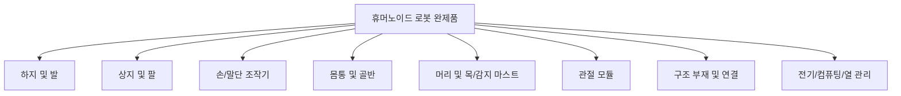

### 9.1.2 인터페이스 정의: 기계, 전기, 열, 데이터 및 안전

서브시스템 간의 인터페이스는 완제품 통합 효율성과 신뢰성을 결정합니다. 인터페이스 설계는 초기에 고정되어야 하며, **인터페이스 제어 문서 (Interface Control Document, ICD)** 를 통해 관리되어야 합니다.

!!! note "용어 설명: 인터페이스 제어 문서, 기계 인터페이스, 전기 인터페이스, 열 인터페이스, 데이터 인터페이스"
    - **인터페이스 제어 문서 (ICD)**: 모든 서브시스템 간 인터페이스 매개변수, 버전 및 책임을 기록한 통제 문서입니다.
    - **기계 인터페이스 (mechanical interface)**: 기하학적 치수, 맞춤, 체결, 공차, 강성 및 질량 제약 조건입니다.
    - **전기 인터페이스 (electrical interface)**: 전압, 전류, 전력, 신호, 커넥터, EMC 및 보호입니다.
    - **열 인터페이스 (thermal interface)**: 열 발생, 방열 경로, 계면 재료, 온도 한계입니다.
    - **데이터 인터페이스 (data interface)**: 통신 프로토콜, 대역폭, 주기, 동기화 및 보안 검증입니다.

인터페이스 5차원의 설계 핵심 사항은 아래 표와 같습니다:

| 인터페이스 차원 | 핵심 매개변수 | 설계 위험 |
|---|---|---|
| 기계 | 위치 결정 핀, 볼트 규격, 맞춤 공차, 강성 | 조립 공차 초과, 풀림, 정렬 불량 |
| 전기 | 정격 전압, 피크 전류, 커넥터 키잉 | 아크, 과전류, 접촉 불량, EMC |
| 열 | 열 저항, 계면 열전도율, 냉각 방식 | 모터/구동부 과열, 감속기 윤활 불량 |
| 데이터 | EtherCAT, CAN-FD, 이더넷, 동기화 정밀도 | 패킷 손실, 지터, 클록 드리프트 |
| 안전 | STO, 비상 정지, 인터록, 고장 안전 상태 | 제어 불능, 충돌, 감전 |

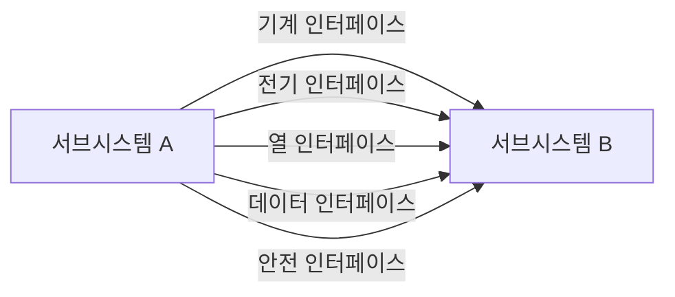

### 9.1.3 V&V, DV 및 PV: 설계 검증에서 제품 검증까지

휴머노이드 로봇 서브시스템 개발은 V 모델을 따르며, 검증과 확인이 전체 프로세스에 걸쳐 이루어집니다. **설계 검증 (Design Verification, DV)** 은 제품이 설계 사양에 따라 제조되었는지 확인하고, **제품 검증 (Product Validation, PV)** 은 제품이 사용자 요구 사항과 실제 시나리오를 충족하는지 확인합니다.

!!! note "용어 설명: V&V, 설계 검증, 제품 검증, 확인, 추적 가능성"
    - **V&V (Verification & Validation)**: 제품이 사양을 준수하는지 확인하고, 제품이 사용자 요구 사항을 충족하는지 확인하는 시스템 엔지니어링 활동입니다.
    - **설계 검증 (DV)**: 통제된 조건에서 설계 출력이 설계 입력을 충족하는지 검사합니다.
    - **제품 검증 (PV)**: 실제 또는 대표적인 시나리오에서 제품이 사용자 요구 사항을 충족하는지 확인합니다.
    - **확인 (validation)**: "올바르게 일을 하고 있는가"가 아니라 "올바른 일을 하고 있는가"에 대한 답변입니다.
    - **추적 가능성 (traceability)**: 요구 사항-설계-검증-문제 간의 양방향 추적 관계입니다.

!!! note "용어 설명: 요구 사항 추적 매트릭스, 테스트 커버리지 매트릭스, 설계 검토, 기준선"
    - **요구 사항 추적 매트릭스 (Requirements Traceability Matrix, RTM)**: 요구 사항, 설계, 검증 및 테스트 케이스를 일대일로 매핑하는 표입니다.
    - **테스트 커버리지 매트릭스 (test coverage matrix)**: 각 요구 사항이 테스트에 의해 커버되는지 확인하는 매트릭스입니다.
    - **설계 검토 (design review)**: 설계 출력을 체계적으로 검토하는 엔지니어링 활동입니다.
    - **기준선 (baseline)**: 공식적인 검토와 승인을 거쳐 후속 변경의 기준이 되는 문서 또는 제품 상태입니다.

DV/PV의 일반적인 계층은 다음과 같습니다:

1. **유닛 레벨**: 모터 테스트 벤치, 감속기 수명, 엔코더 정밀도, 토크 센서 교정.
2. **서브시스템 레벨**: 단일 다리 테스트 벤치, 팔 테스트 벤치, 손 조작 테스트 벤치, 머리/목 서보 테스트 벤치.
3. **시스템 통합 레벨**: 완제품 보행, 조작, 낙하, EMC, 열 평형.
4. **현장 검증 레벨**: 실제 시나리오 시운전, 사용자 승인, 신뢰성 성장.

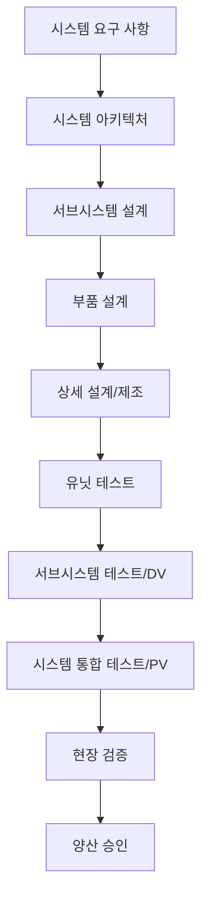

### 9.1.4 모듈식 설계: 표준화, 유지보수성 및 병렬 개발

**모듈식 설계 (modular design)** 는 기능을 표준 인터페이스를 가진 모듈로 캡슐화하여 여러 팀이 병렬로 개발하고, 독립적으로 검증하며, 신속하게 교체할 수 있도록 합니다. 휴머노이드 로봇의 경우, 모듈식 설계는 주로 관절 모듈, 배터리 팩, 컴퓨팅 유닛, 감지 마스트 및 손에 적용됩니다.

!!! note "용어 설명: 모듈식, 표준화, 유지보수성, 병렬 엔지니어링, 플랫폼화"
    - **모듈식 (modularity)**: 시스템을 독립적으로 설계, 제조, 교체할 수 있는 모듈로 분할하는 것입니다.
    - **표준화 (standardization)**: 인터페이스, 사양, 테스트 방법 및 문서 형식을 통일하는 것입니다.
    - **유지보수성 (maintainability)**: 제품에 고장이 발생했을 때 신속하게 수리할 수 있는 능력입니다.
    - **병렬 엔지니어링 (concurrent engineering)**: 여러 분야의 팀이 동시에 설계 및 검증을 수행하는 것입니다.
    - **플랫폼화 (platforming)**: 공통 모듈을 기반으로 여러 제품을 파생시키는 전략입니다.

모듈식 설계의 이점과 과제:

| 이점 | 과제 |
|---|---|
| 개발 주기 단축 | 인터페이스 정의를 조기에 고정해야 함 |
| 통합 위험 감소 | 모듈 간 전자기/열/진동 결합 |
| 유지보수성 향상 | 표준화와 맞춤화의 균형 |
| 플랫폼 확장 지원 | 모듈 비용 및 성능 한계 |

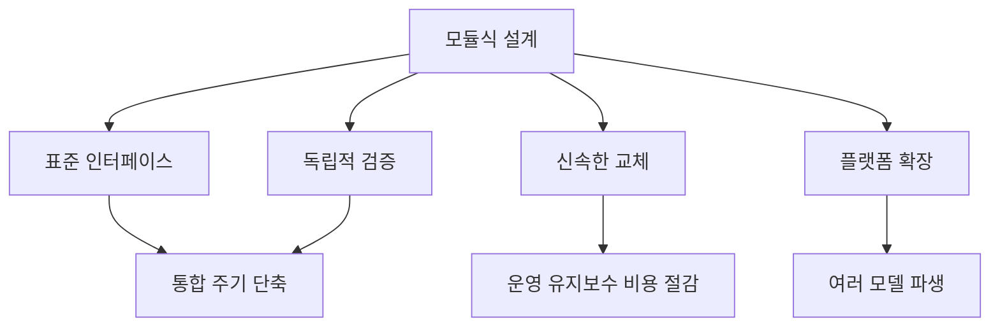

### 9.1.5 본 장의 완제품 설계 프로세스 내 위치

8장에서는 휴머노이드 로봇의 전체 설계 원리를 설명하고, 본 장에서는 핵심 서브시스템에 초점을 맞춥니다. 이후 장에서는 각각 제조 공정, 조립 테스트, 제어 알고리즘 및 AI 모델을 다룰 것입니다. 본 장은 전체 요구 사항과 구체적인 구현을 연결하는 다리 역할을 합니다.

!!! note "용어 설명: 전체 설계, 상세 설계, 설계 반복, 계층 간 연결"
    - **전체 설계(conceptual/system design)** : 기능, 아키텍처, 주요 매개변수 및 주요 트레이드오프 결정.
    - **상세 설계(detailed design)** : 제조 가능한 도면, BOM, 공정 및 테스트 사양 완성.
    - **설계 반복(design iteration)** : 검증 결과에 따라 프로세스를 반복적으로 최적화하는 과정.
    - **계층 간 연결(cross-layer linkage)** : 서로 다른 기술 계층 간의 입력-출력 관계.

## 9.2 하지 및 족부 서브시스템 설계

### 9.2.1 하지 운동 사슬: 고관절, 슬관절, 족관절의 기능 분배

인간형 로봇의 하지는 일반적으로 양측 대칭의 고관절, 슬관절, 족관절로 구성되며, 체중 지지, 신체 추진, 충격 흡수 및 균형 유지의 임무를 수행합니다. 고관절은 일반적으로 3-DOF 직교 배치(굴곡/신전, 외전/내전, 내회전/외회전)를 사용하고, 슬관절은 주로 1-DOF 굴곡/신전을 담당하며, 족관절은 피치와 롤(2-DOF)을 제공하고, 일부 설계는 요(yaw)(3-DOF)를 추가하여 방향 전환을 보조합니다.

!!! note "용어 설명: 고관절, 슬관절, 족관절, 굴곡/신전, 외전/내전, 내회전/외회전"
    - **고관절(hip joint)**: 몸통/골반과 대퇴부를 연결하는 관절로, 일반적으로 다자유도 볼 소켓 형태입니다.
    - **슬관절(knee joint)**: 대퇴부와 하퇴부를 연결하는 관절로, 주로 굴곡/신전을 구현합니다.
    - **족관절(ankle joint)**: 하퇴부와 족부를 연결하는 관절로, 족부의 피치와 롤을 제어합니다.
    - **굴곡/신전(flexion/extension)**: 관절의 시상면 내 전후 운동입니다.
    - **외전/내전(abduction/adduction)**: 관절의 관상면 내 측방 운동입니다.
    - **내회전/외회전(internal/external rotation)**: 사지 장축을 중심으로 한 회전 운동입니다.

!!! note "용어 설명: 시상면, 관상면, 횡단면, 해부학적 자세"
    - **시상면(sagittal plane)**: 신체를 좌우로 나누는 수직면입니다.
    - **관상면(coronal/frontal plane)**: 신체를 전후로 나누는 수직면입니다.
    - **횡단면(transverse plane)**: 신체를 상하로 나누는 수평면입니다.
    - **해부학적 자세(anatomical position)**: 인체가 직립하고, 얼굴은 정면을 향하며, 손바닥은 전방을 향하는 표준 기준 자세입니다.

하지 각 관절의 기능 분배:

| 관절 | 주요 DOF | 핵심 기능 | 일반적인 운동 범위 |
|---|---|---|---|
| 고관절 | 3 | 다리 들기, 측면 흔들기, 방향 전환, 보폭 조절 | 굴곡 ±120°, 외전 ±45°, 회전 ±45° |
| 슬관절 | 1 | 지지기 잠금, 유각기 발 들기, 착지 충격 흡수 | 0–135° 굴곡 |
| 족관절 | 2–3 | 발뒤꿈치 착지 충격 흡수, 발끝 밀기, 측면 기울기 조절 | 피치 ±45°, 롤 ±30° |


### 9.2.2 운동학 모델링: 단순화된 다리의 정기구학

하지의 작업 공간 분석을 용이하게 하기 위해, 단일 다리를 종종 3-DOF 고관절(roll/pitch/yaw) + 1-DOF 슬관절 + 2-DOF 족관절(pitch/roll)의 직렬 체인으로 단순화합니다. 수정된 DH 파라미터 또는 스크류 이론을 사용하여 정기구학을 수립하면, 족부의 고관절에 대한 상대 위치를 계산할 수 있습니다.

!!! note "용어 설명: 정기구학, DH 파라미터, 수정된 DH, 스크류, 동차 변환"
    - **정기구학(forward kinematics)**: 관절 각도로부터 말단의 위치와 자세를 계산하는 매핑입니다.
    - **DH 파라미터(Denavit-Hartenberg parameters)**: 4개의 파라미터(a, α, d, θ)를 사용하여 인접 링크 좌표계 간의 관계를 설명합니다.
    - **수정된 DH(modified DH, MDH)**: 링크 길이 α와 비틀림 각 α를 이전 관절에 정의하여 인접 평행 축의 특이점을 방지합니다.
    - **스크류(screw)**: 강체가 축을 중심으로 회전하고 축을 따라 병진하는 운동을 설명하는 기하학적 양입니다.
    - **동차 변환(homogeneous transformation)**: 4×4 행렬로, 회전과 병진을 동시에 설명합니다.

평면 단순화 다리(고관절 pitch θ₁, 슬관절 θ₂, 족관절 pitch θ₃)의 경우, 족단 위치는 다음과 같이 쓸 수 있습니다:

$$
\begin{aligned}
x &= l_1 \sin\theta_1 + l_2 \sin(\theta_1+\theta_2) + l_3 \sin(\theta_1+\theta_2+\theta_3) \\
z &= -l_1 \cos\theta_1 - l_2 \cos(\theta_1+\theta_2) - l_3 \cos(\theta_1+\theta_2+\theta_3)
\end{aligned}
$$

여기서 \(l_1, l_2, l_3\)는 각각 대퇴부, 하퇴부 및 족부 길이이며, z축은 위쪽을 양의 방향으로 합니다.

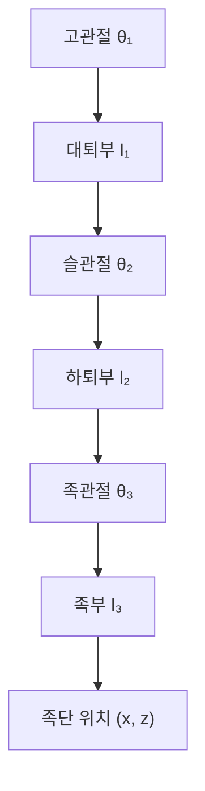

### 9.2.3 족저 도달 가능 영역: Python 예제 1

다음 Python 예제는 단순화된 6-DOF 다리(고관절 roll/pitch/yaw, 슬관절 pitch, 족관절 pitch/roll)의 관절 제한 내에서 족저 중심의 도달 가능 점군을 계산하고, 측면도와 평면도를 그립니다.

```python
import numpy as np
import matplotlib.pyplot as plt

# 하지 단순화 정기구학 및 족저 도달 가능 영역
# 링크 길이 정의 (m): 고관절->슬관절, 슬관절->족관절, 족관절->족저 중심
L_thigh = 0.40
L_shank = 0.40
L_foot  = 0.08

# 관절 제한 (도)
limits = {
    'hip_roll':  (-30, 30),
    'hip_pitch': (-90, 60),
    'hip_yaw':   (-45, 45),
    'knee':      (0, 135),
    'ank_pitch': (-45, 45),
    'ank_roll':  (-20, 20),
}

# x, y, z 축 회전 행렬
def Rx(a): c, s = np.cos(a), np.sin(a); return np.array([[1,0,0],[0,c,-s],[0,s,c]])
def Ry(a): c, s = np.cos(a), np.sin(a); return np.array([[c,0,s],[0,1,0],[-s,0,c]])
def Rz(a): c, s = np.cos(a), np.sin(a); return np.array([[c,-s,0],[s,c,0],[0,0,1]])

# 동차 변환: 축 회전 후 병진
def T_rot_trans(R, p):
    T = np.eye(4)
    T[:3,:3], T[:3,3] = R, p
    return T

points = []
np.random.seed(42)
for _ in range(80000):
    hr = np.radians(np.random.uniform(*limits['hip_roll']))
    hp = np.radians(np.random.uniform(*limits['hip_pitch']))
    hy = np.radians(np.random.uniform(*limits['hip_yaw']))
    kn = np.radians(np.random.uniform(*limits['knee']))
    ap = np.radians(np.random.uniform(*limits['ank_pitch']))
    ar = np.radians(np.random.uniform(*limits['ank_roll']))

    # 고관절: roll -> pitch -> yaw
    T_hip = T_rot_trans(Rz(hy) @ Ry(hp) @ Rx(hr), np.zeros(3))
    # 대퇴부 링크는 -z 방향 (아래쪽)
    T_thigh = T_rot_trans(np.eye(3), np.array([0, 0, -L_thigh]))
    # 슬관절은 pitch만
    T_knee = T_rot_trans(Ry(kn), np.zeros(3))
    # 하퇴부 링크
    T_shank = T_rot_trans(np.eye(3), np.array([0, 0, -L_shank]))
    # 족관절 roll -> pitch
    T_ankle = T_rot_trans(Ry(ap) @ Rx(ar), np.zeros(3))
    # 족저 중심
    T_foot = T_rot_trans(np.eye(3), np.array([0, 0, -L_foot]))

    T_total = T_hip @ T_thigh @ T_knee @ T_shank @ T_ankle @ T_foot
    points.append(T_total[:3, 3])

points = np.array(points)
```

```python
fig, ax = plt.subplots(1, 2, figsize=(12, 5))
ax[0].scatter(points[:,0], points[:,2], s=1, alpha=0.3, c='b')
ax[0].set_xlabel('x (m)'); ax[0].set_ylabel('z (m)')
ax[0].set_title('발바닥 도달 가능 영역 측면도')
ax[0].set_aspect('equal'); ax[0].grid(True)

ax[1].scatter(points[:,0], points[:,1], s=1, alpha=0.3, c='r')
ax[1].set_xlabel('x (m)'); ax[1].set_ylabel('y (m)')
ax[1].set_title('발바닥 도달 가능 영역 평면도')
ax[1].set_aspect('equal'); ax[1].grid(True)
plt.tight_layout(); plt.savefig('leg_workspace_ch9.png', dpi=150)
print(f"샘플링 포인트 수: {len(points)}")
print(f"x 범위: [{points[:,0].min():.3f}, {points[:,0].max():.3f}]")
print(f"y 범위: [{points[:,1].min():.3f}, {points[:,1].max():.3f}]")
print(f"z 범위: [{points[:,2].min():.3f}, {points[:,2].max():.3f}]")
```

이 예제는 관절 운동 범위가 넓더라도 발끝 도달 가능 영역이 링크 길이와 관절 결합 구속 조건에 의해 제한되어 타원체 껍질 형태를 나타냄을 보여줍니다. 설계 시 일반적인 보행 작업점이 도달 가능 영역의 중심에 위치하도록 하여 경계 특이점을 피해야 합니다.

!!! note "용어 설명: 도달 가능 영역, 작업 공간, 몬테카를로 샘플링, 특이 형상"
    - **도달 가능 영역 (reachable workspace)** : 엔드 이펙터가 적어도 하나의 자세로 도달할 수 있는 모든 점의 집합.
    - **작업 공간 (workspace)** : 엔드 이펙터의 도달 가능 점과 도달 가능 자세의 종합적 설명.
    - **몬테카를로 샘플링 (Monte Carlo sampling)** : 무작위 샘플링을 통해 복잡한 기하학적 또는 확률적 문제를 근사하는 방법.
    - **특이 형상 (singular configuration)** : 야코비안의 계수가 낮아지고 속도/힘 전달에 극값 또는 무한 해가 나타나는 형상.

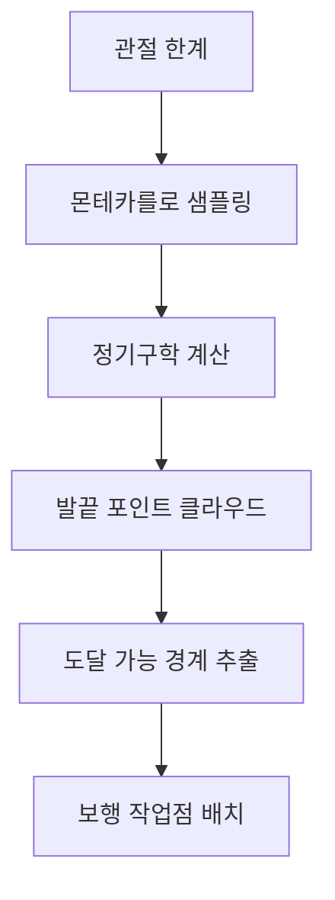

### 9.2.4 컴플라이언트 진동 흡수: 발, 발목, 종아리의 완충 설계

이족 보행은 필연적으로 주기적인 충격을 수반합니다. 지면 반력의 최대값은 체중의 1.2–1.8배(보행 시) 또는 2–3배(달리기/낙하 시)에 달할 수 있습니다. 충격이 강성 관절과 구조물에 직접 전달되면 진동, 소음, 피로 및 센서 노이즈가 발생합니다. 따라서 하지에는 **컴플라이언스(compliance)** 와 **진동 흡수(vibration absorption)** 능력이 필수적입니다.

!!! note "용어 설명: 컴플라이언스, 강성, 감쇠, 진동 흡수, 충격, 지면 반력"
    - **컴플라이언스 (compliance)** : 힘을 받는 시스템이 변형을 일으키는 용이성, 강성의 역수.
    - **강성 (stiffness)** : 단위 변형에 필요한 힘.
    - **감쇠 (damping)** : 진동 에너지를 소산시키는 메커니즘.
    - **진동 흡수 (vibration absorption)** : 재료, 구조 또는 제어를 통해 충격 에너지를 흡수하고 감쇠시키는 것.
    - **충격 (impact)** : 짧은 시간 동안 발생하는 높은 진폭의 힘 또는 가속도.
    - **지면 반력 (Ground Reaction Force, GRF)** : 지면이 발에 작용하는 힘.

컴플라이언트 설계는 일반적으로 세 가지 수준으로 분류됩니다.

1. **수동 컴플라이언스** : 발바닥 고무 패드, 발목 스프링, 종아리 탄성판, 관절 출력 탄성체.
2. **반능동 컴플라이언스** : 가변 강성 메커니즘, 자기유변/전기유변 감쇠기.
3. **능동 컴플라이언스** : 토크 센서 기반 임피던스/어드미턴스 제어, 지형 순응 제어.

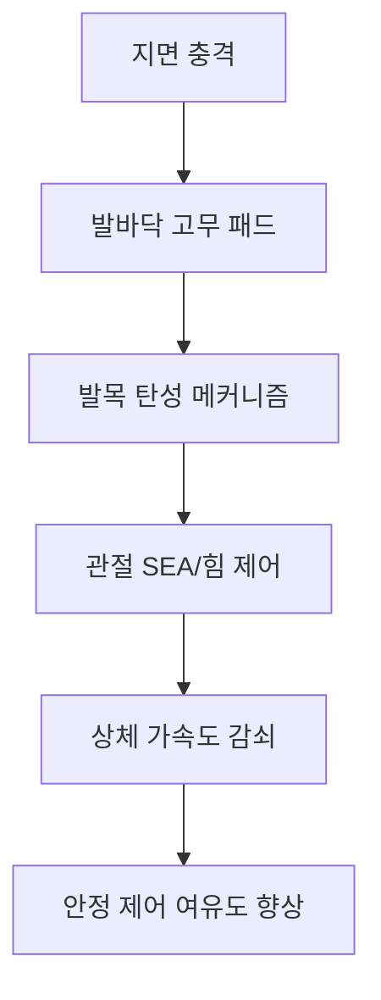

#### 9.2.4.1 발-지면 충격의 집중 파라미터 모델

컴플라이언트 진동 흡수를 제1원리부터 이해하기 위해 발-지면 접촉을 단일 자유도 질량-스프링-감쇠기(mass-spring-damper, MSD) 시스템으로 단순화할 수 있습니다. 등가 질량 \(m\)은 로봇 착지 시 충격에 참여하는 발과 종아리 원위부 질량, 등가 강성 \(k\)는 발바닥 패드와 발목 탄성 메커니즘의 직렬 강성, 등가 감쇠는 \(c\)입니다. 발끝이 지면에 닿는 순간 수직 하향 초기 속도 \(v_0\)를 가지며, 지면 반력 \(F_g(t)\)이 발끝을 감속시킵니다.

!!! note "용어 설명: 질량-스프링-감쇠기, 고유 각진동수, 감쇠비, 임계 감쇠, 오버슈트"
    - **질량-스프링-감쇠기 (mass-spring-damper, MSD)** : 집중 질량, 이상적인 스프링 및 이상적인 감쇠기로 구성된 2차 진동 시스템.
    - **고유 각진동수 (natural angular frequency)** : 감쇠가 없는 자유 진동의 각진동수, \(\omega_n = \sqrt{k/m}\).
    - **감쇠비 (damping ratio)** : 실제 감쇠와 임계 감쇠의 비율, \(\zeta = c / (2\sqrt{mk})\).
    - **임계 감쇠 (critical damping)** : 시스템이 진동 없이 가장 빠르게 평형 위치로 돌아가도록 하는 감쇠, \(c_c = 2\sqrt{mk}\).
    - **오버슈트 (overshoot)** : 부족 감쇠 응답에서 정상 상태 값을 초과하는 최대 피크 값.

운동 방정식은 뉴턴의 제2법칙에 의해 다음과 같이 주어집니다.

$$
m\ddot{x} + c\dot{x} + kx = -mg
$$

여기서 \(x\)는 발끝의 지면에 대한 수직 압축 변위(아래 방향 양수)이고, 우변의 \(-mg\)는 중력 항입니다. 지면 접촉 순간에는 중력을 무시할 수 있으며(충격 시간이 중력이 유의미한 변위를 발생시키는 시간보다 훨씬 짧음), \(y = x + mg/k\)로 치환하여 방정식을 동차화하면 표준 형태를 얻습니다.

$$
\ddot{y} + 2\zeta\omega_n\dot{y} + \omega_n^2 y = 0, \quad \omega_n = \sqrt{\frac{k}{m}}, \quad \zeta = \frac{c}{2\sqrt{mk}}
$$

초기 조건은 \(y(0) = mg/k\)(정적 평형 오프셋), \(\dot{y}(0) = v_0\)입니다. 부족 감쇠 경우 \(0 < \zeta < 1\)에 대한 해석적 해는 다음과 같습니다.

$$
y(t) = e^{-\zeta\omega_n t}\left[ y(0)\cos(\omega_d t) + \frac{\dot{y}(0) + \zeta\omega_n y(0)}{\omega_d}\sin(\omega_d t) \right]
$$

여기서 \(\omega_d = \omega_n\sqrt{1-\zeta^2}\)는 감쇠 고유 각진동수입니다. 지면 반력(정적 평형 부분 제외)은 다음과 같습니다.

$$
F_g(t) = k\,y(t) + c\,\dot{y}(t)
$$

**최대 힘 추정** : 감쇠가 작을 때(\(\zeta < 0.3\)), 최대 압축 변위는 무감쇠 상한을 사용하여 빠르게 추정할 수 있습니다.

$$
\delta_{\max}^{(0)} \approx \frac{v_0}{\omega_n} = v_0\sqrt{\frac{m}{k}}
$$

최대 지면 반력은 압축 변위가 최대이고 속도가 거의 0인 순간에 발생하므로, 더 정확한 추정은 다음과 같습니다.

$$
F_{g,\max} \approx k\,\delta_{\max} + m g
$$

여기서 \(\delta_{\max}\)는 감쇠를 고려한 실제 최대 압축입니다. 이 식은 동일한 접지 속도에서 최대 반력이 \(\sqrt{k}\)에 거의 비례함을 보여줍니다. 즉, 더 부드러운 발바닥 패드는 충격 하중을 현저히 줄이지만, 너무 부드러우면 지지상 안정 시간이 길어지고 위치 정밀도가 저하됩니다.

**수치 예제** : 발 등가 질량 \(m = 1.5\,\text{kg}\), 접지 속도 \(v_0 = 0.8\,\text{m/s}\), 발바닥 패드 강성 \(k = 5\times10^4\,\text{N/m}\), 감쇠비 \(\zeta = 0.25\)로 설정합니다. 그러면:

$$
\omega_n = \sqrt{\frac{5\times10^4}{1.5}} \approx 182.6\,\text{rad/s}, \quad f_n \approx 29.1\,\text{Hz}
$$

무감쇠 상한 \(\delta_{\max}^{(0)} \approx 0.8/182.6 \approx 4.38\,\text{mm}\); 감쇠를 고려한 수치 해는 \(\delta_{\max} \approx 2.94\,\text{mm}\)를 제공하며, 이에 해당하는 최대 지면 반력은:

$$
F_{g,\max} \approx 5\times10^4 \times 2.94\times10^{-3} + 1.5\times9.81 \approx 147 + 15 \approx 162\,\text{N}
$$

수치해 \(169\,\text{N}\)에 근접합니다. 이 최대 힘은 1.5 kg 등가 질량에 대해 약 \(11.5\,g\)의 등가 과부하에 해당하며, 이는 컴플라이언트 설계가 충격 하중을 제한된 범위 내로 제어할 수 있음을 보여줍니다.

```python
import numpy as np
import matplotlib.pyplot as plt
from scipy.integrate import solve_ivp

# 발-지면 충격 집중 파라미터 모델 파라미터
m = 1.5            # 등가 질량 kg
k = 5e4            # 등가 강성 N/m
zeta = 0.25        # 감쇠비
v0 = 0.8           # 접지 속도 m/s (아래 방향)
g = 9.81           # 중력 가속도 m/s^2

omega_n = np.sqrt(k / m)
c = 2 * zeta * np.sqrt(m * k)
omega_d = omega_n * np.sqrt(1 - zeta**2)

def impact_dynamics(t, state):
    x, v = state
    # x는 압축 변위 (아래 방향 양수), 스프링 힘은 위 방향 음수
    dxdt = v
    dvdt = (-k * x - c * v - m * g) / m
    return [dxdt, dvdt]

# 초기: x=0 (압축되지 않음), v=v0 아래 방향 (양수로 취급)
sol = solve_ivp(impact_dynamics, [0, 0.08], [0.0, v0], max_step=1e-4, dense_output=True)
t = sol.t
x = sol.y[0]
v = sol.y[1]
F_g = k * x + c * v  # 지면 반력 (위 방향 양수, x가 아래로 압축될 때 스프링이 위로 밀어 올리므로)

plt.figure(figsize=(10, 4))
plt.subplot(1, 2, 1)
plt.plot(t * 1000, x * 1000, label='압축 변위 x')
plt.xlabel('시간 (ms)'); plt.ylabel('압축 변위 (mm)')
plt.grid(True); plt.legend()
plt.subplot(1, 2, 2)
plt.plot(t * 1000, F_g, label='지면 반력 F_g')
plt.axhline(m * g, color='k', linestyle='--', label='정하중 mg')
plt.xlabel('시간 (ms)'); plt.ylabel('지면 반력 (N)')
plt.grid(True); plt.legend()
plt.tight_layout(); plt.savefig('foot_impact_msd_ch9.png', dpi=150)

print(f"고유 진동수 f_n = {omega_n/(2*np.pi):.2f} Hz")
print(f"최대 압축 변위 = {np.max(x)*1000:.2f} mm")
print(f"최대 지면 반력 = {np.max(F_g):.2f} N")
print(f"최대값 도달 시간 = {t[np.argmax(F_g)]*1000:.2f} ms")
```

이 예제는 충격 하중의 과도 특성을 보여줍니다: 최대 힘은 접지 후 약 \(5\!-\!10\,\text{ms}\)에 나타나며, 이후 감쇠에 의해 감소합니다. 설계 시 \(k\)와 \(\zeta\)를 조정하여 최대 힘, 압축량 및 에너지 반발 사이에서 균형을 맞출 수 있습니다. 자세한 내용은 제6장 6.3절의 열-기계 결합 및 액추에이터 선정에 대한 논의를 참조하십시오.

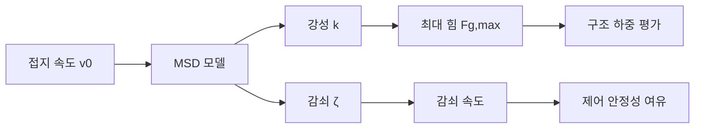

### 9.2.5 질량 분포: 스윙 다리 관성 감소

스윙 다리는 가속도가 높으며, 그 질량과 관성은 에너지 소비와 제어 대역폭에 직접적인 영향을 미칩니다. 설계 원칙은 다음과 같습니다: **질량을 가능한 한 고관절(근위부) 가까이에 배치하고, 하퇴와 발은 경량화합니다.**

!!! note "용어 설명: 관성, 회전 관성, 질량 중심, 스윙 다리, 지지 다리, 질량 분포"
    - **관성(inertia)** : 물체가 각가속도에 저항하는 능력.
    - **회전 관성(moment of inertia)** : 특정 축에 대한 관성으로, 질량 분포와 관련됩니다.
    - **질량 중심(Center of Mass, CoM)** : 질량 가중 평균 위치.
    - **스윙 다리(swing leg)** : 보행 중 지면에 닿지 않는 다리.
    - **지지 다리(stance leg)** : 체중을 지지하는 다리.
    - **질량 분포(mass distribution)** : 질량이 사지의 다른 위치에 할당되는 방식.

다리 링크 질량 분포 경험:

| 부위 | 목표 질량 비율 | 설계 수단 |
|---|---|---|
| 대퇴 | 적절히 집중 가능 | 모터/감속기를 일부 상부에 배치 가능 |
| 하퇴 | 최대한 가볍게 | 탄소 섬유 튜브, 경량 알루미늄 가공 |
| 발 | 최대한 가볍게 | 얇은 벽 쉘, 경량 고무 |

다리 총 질량은 일반적으로 전체 기계 질량의 30–40%를 차지합니다. 하퇴와 발이 너무 무거우면 고관절 토크 요구량이 크게 증가하고 동적 응답이 저하됩니다.

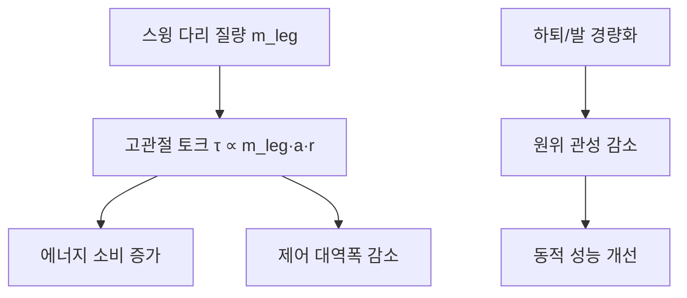

### 9.2.6 발 설계: 접촉면, CoP 및 발 센서

발은 하지와 지면 사이의 유일한 접촉 인터페이스로, 그 형상, 크기, 재질 및 센서 배치는 안정성과 인지 능력에 직접적인 영향을 미칩니다. 발 설계는 **지지 면적, 유연성, 무게 및 센싱 복잡성** 사이에서 균형을 맞춰야 합니다.

!!! note "용어 설명: 발바닥, 압력 중심, CoP, 발 센서, 6축 힘/토크 센서, 촉각 어레이"
    - **발바닥(foot sole)** : 발이 지면과 접촉하는 표면.
    - **압력 중심(Center of Pressure, CoP)** : 지면 반력이 발바닥에 작용하는 등가 작용점.
    - **발 센서(foot sensor)** : 발바닥의 힘, 토크, 압력 또는 촉각을 측정하는 장치.
    - **6축 힘/토크 센서(6-axis F/T sensor)** : 세 가지 힘과 세 가지 토크를 동시에 측정하는 센서.
    - **촉각 어레이(tactile array)** : 분산된 압력/전단력 감지 요소.

CoP와 ZMP의 관계: 발바닥이 수평 지면에 완전히 접촉하고 마찰이 충분할 때 ZMP와 CoP는 일치합니다. 동적 안정성 판단 기준은 CoP가 지지 다각형 내에 위치하는 것입니다:

$$
\mathbf{p}_{\text{CoP}} = \frac{\sum_i p_i F_{z,i}}{\sum_i F_{z,i}}
$$

여기서 \(p_i\)는 각 압력 요소의 위치, \(F_{z,i}\)는 수직 압력입니다.

발 형태 비교:

| 형태 | 장점 | 단점 | 대표 예 |
|---|---|---|---|
| 평판 발 | 지지 안정적, 센서 통합 용이 | 발 아치 완충 부족 | ASIMO, Digit |
| 분할 발 | 발뒤꿈치 착지-구름-발가락 밀기 모방 가능 | 구조 복잡 | Atlas, 일부 연구용 로봇 |
| 점 접촉 발 | 유연함, 장애물 통과 용이 | 안정성 낮음 | 초기 이족 보행 로봇 |


### 9.2.7 하지 설계 핵심 요약

하지 설계의 핵심 지표는 다음과 같이 요약할 수 있습니다:

| 지표 | 주요 설계 파라미터 | 검증 수단 |
|---|---|---|
| 운동 능력 | 관절 범위, 속도, 가속도 | 단일 다리 테스트 벤치, 모션 캡처 |
| 부하 능력 | 최대 토크, 구조 강도 | 정하중/피로 시험 |
| 동적 안정성 | 관성, CoP/GRF 제어 | 보행 실험, 외란 테스트 |
| 에너지 효율 | 질량 분포, 전달 효율, 회생 제동 | 에너지 소비 테스트 |
| 신뢰성 | 밀봉, 윤활, 체결 | HALT, 수명 테스트 벤치 |
| 안전 | 낙상 보호, 충돌 힘 | 낙하 실험, 힘 제한 테스트 |

#### 9.2.8 하지 하중 조건 및 관절 토크 추정

실제 하지 설계는 정격 관절 토크만 고려하는 것이 아니라 일반적인 하중 조건에서 출발해야 합니다. 주요 조건은 다음과 같습니다: **지지 단계(stance phase)** 단일 다리로 전신 지지, **스윙 단계(swing phase)** 다리 들어올리기 가속, **착지 충격(landing impact)** 발이 지면에 닿는 순간, 그리고 **스쿼트/일어서기**, **계단/경사로**, **낙상 보호** 등의 극한 조건입니다.

!!! note "용어 설명: 지지기, 유각기, 착지 충격, 정적 토크, 동적 토크"
    - **지지기(stance phase)**: 보행 주기에서 발이 지면에 닿아 체중을 지지하는 단계.
    - **유각기(swing phase)**: 발이 지면에서 떠나 앞으로 흔들리는 단계.
    - **착지 충격(landing impact)**: 유각기 다리 발끝이 지면에 닿을 때 발생하는 짧은 시간의 높은 진폭 지면 반력.
    - **정적 토크(static torque)**: 중력, 지면 반력 등 정상 상태 하중에 의해 발생하는 관절 토크.
    - **동적 토크(dynamic torque)**: 가속도, 관성력에 의해 발생하는 관절 토크.

공학적 추정에서, 단일 지지기 지면 반력 최대값은 일반적으로 \(1.5\!-\!2.5\,mg\) (보행) 또는 \(2.5\!-\!4.0\,mg\) (달리기/낙하 충격 흡수)이며, 여기서 \(m\)은 전체 질량입니다. 시상면 단순화 모델을 예로 들면, 고관절 토크는 지면 반력이 고관절에 작용하는 모멘트 팔의 중첩으로 근사할 수 있습니다:

$$
\tau_{\text{hip}} \approx F_z \cdot x_{\text{foot}/\text{hip}} + m_{\text{thigh}} g \cdot x_{\text{thigh,CoM}} + m_{\text{shank}} g \cdot x_{\text{shank,CoM}}
$$

더 일반적으로, 임의의 링크 \(i\)에 대해 관절 토크는 다음을 만족합니다:

$$
\tau_i = \mathbf{r}_i \times \mathbf{F}_{\text{ground}} + \sum_{j\ge i} m_j \, \mathbf{g} \times \mathbf{r}_{j,\text{CoM}}
$$

여기서 \(\mathbf{r}_i\)는 관절 \(i\)에서 지면 반력 작용점까지의 벡터, \(m_j\)는 원위 링크 질량, \(\mathbf{r}_{j,\text{CoM}}\)는 원위 링크 질량 중심의 관절에 대한 위치 벡터입니다. 착지 충격 시에는 관성 항 \(I_i \ddot{\theta}_i\)을 추가로 고려해야 하며, 고/슬/발목 관절의 순간 토크는 정상 상태보다 \(30\!-\!80\%\) 더 높을 수 있습니다.

일반적인 휴머노이드 로봇(전체 질량 60–80 kg)의 관절 최대 토크 공학적 추정:

| 관절 | 지지기 토크 (N·m) | 착지 충격 토크 (N·m) | 비고 |
|---|---|---|---|
| 고관절 pitch | 80–180 | 150–300 | 보폭, 몸통 기울기와 강한 상관관계 |
| 슬관절 pitch | 80–200 | 180–400 | 스쿼트 시 최대 |
| 발목 pitch | 60–150 | 120–280 | 발끝 지지 및 발뒤꿈치 착지 |
| 발목 roll | 30–80 | 60–150 | 한발 서기 측면 기울기 |

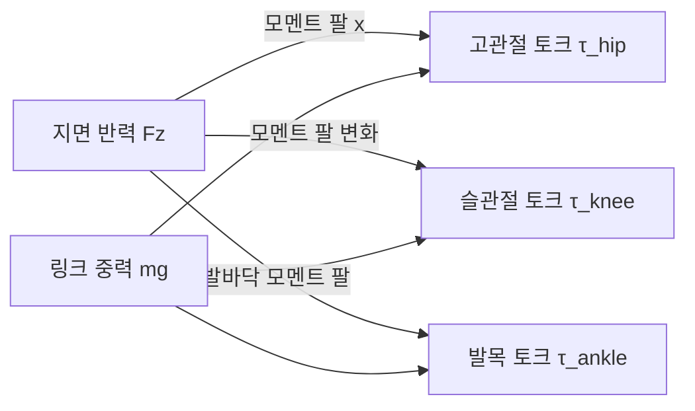


**일반적인 작동 조건 파라미터화 예시**:

| 작동 조건 | 수직 GRF (N) | 수평 GRF (N) | 고관절 토크 (N·m) | 슬관절 토크 (N·m) | 발목 토크 (N·m) |
|---|---|---|---|---|---|
| 정적 서기 (두 발) | 300 | 0 | ±10 | 5 | 5 |
| 한발 지지 (60 kg 로봇) | 600 | 50 | 120 | 100 | 80 |
| 빠른 보행 착지 충격 | 1000 | 150 | 250 | 280 | 200 |
| 스쿼트 일어서기 | 800 | 0 | 200 | 300 | 150 |
| 측면 한발 서기 | 600 | 80 | 80 | 90 | 120 |

표의 값은 공학적 추정치이며, 실제 설계는 다물체 동역학 시뮬레이션과 프로토타입 테스트를 통해 반복적으로 결정해야 합니다. 안전 계수는 일반적으로 동적 불확실성과 재료 분산을 고려하여 \(1.5\!-\!2.5\)를 적용합니다.

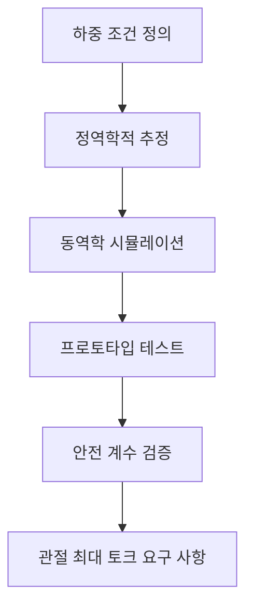

#### 9.2.9 고관절 상세 설계

고관절은 전신 중량을 지지하고 대퇴부를 통해 지면 반력을 전달하며, 설계 핵심은 컴팩트한 공간 내에서 높은 강성, 낮은 마찰 및 긴 수명을 구현하는 것입니다. 일반적인 구조는 3-DOF 직교 축계: 고관절 roll (외전/내전), 고관절 pitch (굴곡/신전), 고관절 yaw (내회전/외회전)이며, 세 축은 일반적으로 중첩 또는 적층 배치를 사용합니다.

!!! note "용어 설명: 교차 롤러 베어링, 정격 동하중, L10 수명, 볼트 배치 원, 예압, 편심 거리, 하우징 강성"
    - **교차 롤러 베어링(crossed roller bearing)**: 롤러가 90°로 교차 배열되어 반경 방향, 축 방향 및 전복 모멘트를 동시에 지지할 수 있는 베어링.
    - **정격 동하중(basic dynamic load rating, C)**: 베어링이 정격 수명 \(10^6\) 회전 시 견딜 수 있는 일정 하중.
    - **L10 수명**: 90%의 베어링이 도달하거나 초과할 수 있는 정격 수명.
    - **볼트 배치 원(bolt circle diameter, BCD)**: 플랜지 장착 볼트 중심 분포 원의 직경.
    - **예압(preload)**: 조립 시 가해지는 초기 압축력으로, 간극 제거 및 강성 향상을 위해 사용.
    - **편심 거리(offset)**: 관절 회전축과 구조적 기하학적 중심 사이의 편차 거리.
    - **하우징 강성(housing stiffness)**: 관절 외부 케이싱의 변형 저항 능력으로, 베어링의 실제 하중 분포에 영향을 미침.

**베어링 선정**: 고관절 출력단에는 일반적으로 교차 롤러 베어링 또는 복열 앵귤러 콘택트 베어링이 사용됩니다. 교차 롤러 베어링을 예로 들면, 정격 동하중 \(C\)는 다음을 충족해야 합니다:

$$
C \ge P \cdot \left(\frac{L_{10}}{10^6}\right)^{1/\epsilon}
$$

여기서 \(P\)는 등가 동하중, \(L_{10}\)은 목표 정격 수명(회전), \(\epsilon=10/3\) (롤러 베어링)입니다. 휴머노이드 로봇 고관절의 경우 목표 수명은 일반적으로 \(>5\times10^7\) 회전으로 설정되며, 이에 해당하는 \(C\)는 최대 반경 방향 하중의 \(1.5\!-\!2.5\) 배여야 합니다. 최대 전복 모멘트 \(M_t\)가 큰 경우, 베어링 정적 하중 안전 계수 \(S_0 = C_0/P_0\)를 검증해야 하며, 일반적으로 \(S_0 \ge 2\)가 요구됩니다.

**볼트 배치 및 예압**: 고관절 플랜지 볼트 배치 원 직경 \(D_{\text{bc}}\)는 일반적으로 베어링 피치 원 직경의 \(1.1\!-\!1.3\) 배입니다. 볼트 예압력 \(F_p\)는 작동 하중 하에서 접합면이 분리되지 않도록 보장해야 합니다:

$$
F_p \ge \frac{F_{\text{external}}}{1 - \frac{k_b}{k_b + k_m}}
$$

여기서 \(k_b\), \(k_m\)은 각각 볼트와 피체결 부재의 강성입니다. M8 고강도 볼트(10.9 등급)의 일반적인 예압력은 20–30 kN이며, 체결 토크 \(T \approx 0.2 F_p d\)입니다.

**편심 거리 제어**: 고관절 각 축의 교차점은 가능한 한 인체 해부학적 비구 중심에 가까워야 하며, 일반적으로 \(\pm 2\,\text{mm}\) 이내로 제어됩니다. 축 오프셋이 너무 크면 보행 중 추가적인 기생 토크와 CoM 흔들림이 발생할 수 있습니다.

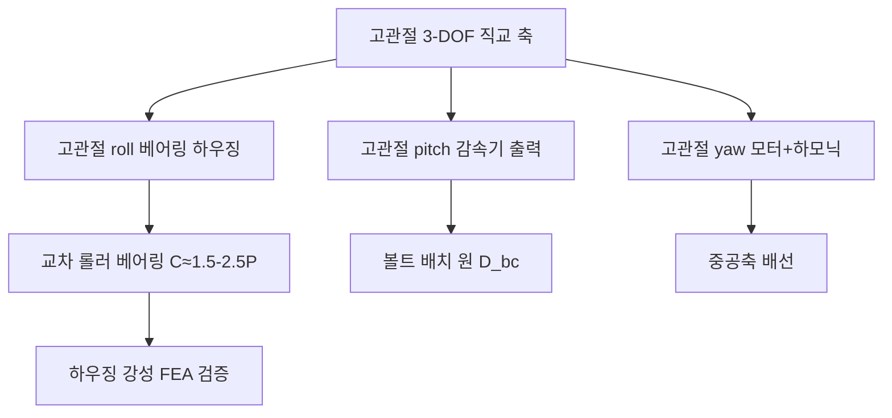


**고관절 강성 경험적 목표**: 로봇 보행 시 골반에 대한 대퇴부의 비틀림 각도 변형은 \(0.1°\) 이내로 제어되어야 합니다. 고관절 roll 축의 정격 작동 토크 \(M=150\,\text{N·m}\)라고 가정하면, 관절 비틀림 강성은 다음을 충족해야 합니다:

$$
K_{\text{hip}} \ge \frac{M}{\theta_{\text{max}}} = \frac{150}{0.1° \times \pi/180} \approx 8.6\times10^4\,\text{N·m/rad}
$$

실제 설계에서 교차 롤러 베어링, 하우징 및 출력 플랜지는 직렬 강성을 구성하며, 일반적으로 하우징 강성은 베어링 강성의 \(2\!-\!5\) 배 이상으로 설계되어 하우징이 취약 부위가 되는 것을 방지해야 합니다.

**베어링 예압 및 마찰**: 교차 롤러 베어링의 예압력이 너무 크면 기동 토크와 온도 상승이 크게 증가합니다. 공학적으로는 경예압 또는 위치 예압이 주로 사용되며, 예압 후 베어링 마찰 토크 \(M_f\)는 다음과 같이 추정할 수 있습니다:

$$
M_f \approx 0.5 \mu P_a d_m
$$

여기서 \(\mu\)는 마찰 계수, \(P_a\)는 예압력, \(d_m\)은 베어링 피치 원 직경입니다. 고관절 베어링 마찰 토크는 일반적으로 \(<2\,\text{N·m}\)이어야 하며, 그렇지 않으면 힘 제어 정밀도에 영향을 미칩니다.


#### 9.2.10 무릎관절 상세 설계

무릎관절은 주로 시상면에서의 굴곡-신전을 담당하지만, 사람이 걸을 때 무릎은 작은 미끄럼-구름 운동을 동반합니다. 로봇 무릎관절에는 일반적으로 **회전 무릎(revolute knee)**과 **4절 링크 무릎(four-bar linkage knee)**의 두 가지 구조가 있습니다.

!!! note "용어 설명: 회전 무릎, 4절 링크 무릎, 슬개골, 기계적 리미트, 베어링 배치, 텐던 드라이브, 벨트 드라이브"
    - **회전 무릎(revolute knee)**: 단일 회전축 무릎관절로, 구조가 간단하고 제어가 직접적입니다.
    - **4절 링크 무릎(four-bar linkage knee)**: 4절 링크 기구를 사용하여 사람 무릎관절의 순간 중심을 근사화하여 인간-로봇 생체 모방성을 개선합니다.
    - **슬개골(patella)**: 생체 모방 설계에서 무릎뼈를 모방한 리미트 또는 가이드 구조입니다.
    - **기계적 리미트(mechanical stop)**: 관절의 운동 범위를 제한하는 물리적 스톱퍼입니다.
    - **베어링 배치(bearing arrangement)**: 관절 축을 지지하는 베어링의 유형, 개수 및 위치 배치입니다.
    - **텐던 드라이브(tendon drive)**: 유연한 텐던 로프를 사용하여 동력을 전달하는 방식입니다.
    - **벨트 드라이브(belt drive)**: 동기 벨트를 사용하여 동력을 전달하는 방식입니다.

**회전 무릎**: 모터 + 하모닉/유성 감속기가 무릎 축을 직접 구동하며, 출력단은 크로스 롤러 베어링 또는 테이퍼 롤러 베어링을 통해 반경 방향 및 축 방향 복합 하중을 지지합니다. 장점은 제어 모델이 간단하고 강성을 직접 측정할 수 있다는 점이며, 단점은 굴곡-신전 과정에서 무릎의 순간 중심이 고정되어 있어 대퇴부에 대한 하퇴부의 궤적이 사람 다리와 크게 다르다는 점입니다.

**4절 링크 무릎**: 대퇴 링크, 하퇴 링크, 전방 링크 및 후방 링크로 4절 링크를 구성하여 무릎관절의 순간 중심이 굴곡-신전 과정에서 사람 무릎의 궤적을 따라 이동하도록 합니다. 장점은 인간-로봇 운동학적 정합성이 더 우수하고 의지/외골격에 널리 사용된다는 점이며, 단점은 메커니즘이 복잡하고 링크 간극과 추가 관성이 존재하며 더 복잡한 정/역기구학이 필요하다는 점입니다.

**슬개골 및 리미트**: 회전 무릎은 일반적으로 신전 방향(\(0°\))에 하드 리미트를 설정하여 과신전을 방지하고, 굴곡 방향은 \(130°\!-\!150°\)로 제한합니다. 리미트 위치에는 잔류 충격을 흡수하기 위한 완충 패드(폴리우레탄 또는 가황 고무)를 설치할 수 있습니다. 4절 링크 무릎은 링크의 기하학적 사점을 통해 자연스러운 신전 잠금을 구현합니다.

**베어링 배치**: 무릎 축은 대퇴부 이하의 모든 무게와 지면 반력을 지지하며, 일반적으로 한 쌍의 테이퍼 롤러 베어링을 백투백(DB) 또는 페이스투페이스(DF)로 배치하여 반경 방향 힘과 전복 모멘트를 동시에 지지합니다. 베어링 스팬 \(L_b\)는 관절 출력 플랜지 직경의 \(0.5\!-\!0.8\) 배로 하는 것이 좋으며, 이는 캔틸레버로 인한 전복 각도 변형을 줄이기 위함입니다.

**텐던/벨트 공간**: 모터를 대퇴부 상단에 배치하여 하퇴부 질량을 줄이는 경우, 동기 벨트나 텐던을 통해 무릎관절을 가로질러 동력을 전달해야 합니다. 동기 벨트는 랩 각도 \(>120°\)를 보장해야 하며, 장력은 작동 장력의 약 \(1.3\!-\!1.5\) 배여야 합니다. 텐던 드라이브에는 가이드 풀리를 설치해야 하며, 최소 풀리 직경은 일반적으로 텐던 직경의 \(20\!-\!40\) 배여야 굽힘 피로를 줄일 수 있습니다.

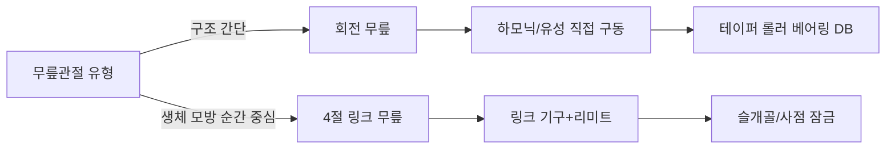


**무릎 축 강도 및 처짐**: 무릎 축 직경 \(d\)는 최대 굽힘 모멘트로 추정할 수 있습니다. 무릎 축 스팬 \(L_b=60\,\text{mm}\), 최대 반경 방향 하중 \(F_r=5000\,\text{N}\)이라고 가정하면 최대 굽힘 모멘트 \(M = F_r L_b / 4 = 75\,\text{N·m}\)입니다. 허용 굽힘 응력 \(\sigma_{\text{adm}} = 200\,\text{MPa}\)를 적용하면:

$$
d \ge \left(\frac{32 M}{\pi \sigma_{\text{adm}}}\right)^{1/3} \approx 0.015\,\text{m} = 15\,\text{mm}
$$

키홈, 베어링 끼워맞춤 및 안전 계수를 고려하여 실제 무릎 축 직경은 일반적으로 \(20\!-\!35\,\text{mm}\)입니다. 축 처짐은 \(<0.02\,\text{mm}\)여야 감속기와 베어링이 정상적으로 작동할 수 있습니다.

**4절 링크 무릎 설계 포인트**: 4절 링크의 링크 길이 비율은 무릎관절 순간 중심 궤적에 영향을 미칩니다. 일반적인 설계는 다음과 같습니다:
- 대퇴 링크 \(a = 80\,\text{mm}\)
- 하퇴 링크 \(b = 90\,\text{mm}\)
- 전방 링크 \(c = 40\,\text{mm}\)
- 후방 링크 \(d = 50\,\text{mm}\)

링크는 일반적으로 \(17\!-\!4\) PH 스테인리스강 또는 7075-T6 알루미늄 합금을 사용하며, 관절 부위에는 무급유 자체 윤활 베어링을 사용합니다.

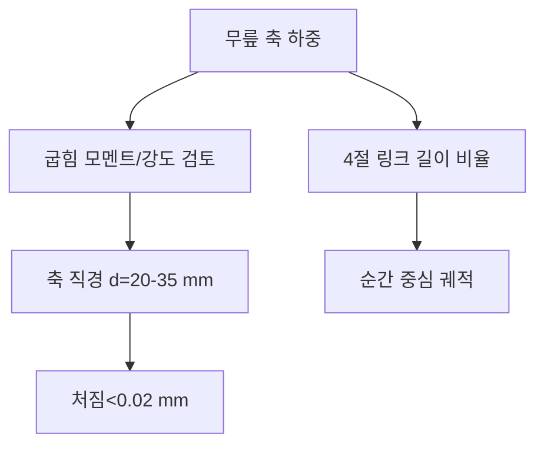

#### 9.2.11 발목관절 및 발 상세 설계

발목관절은 일반적으로 pitch(피치)와 roll(롤)의 두 자유도를 제공하며, 일부 설계는 선회를 돕기 위해 yaw(요)를 추가합니다. 발목 공간은 좁지만 토크 요구량이 커서 하지 설계의 난점 중 하나입니다.

!!! note "용어 설명: 발목관절, pitch/roll 교차점, 하모닉 감속기, 유성 감속기, 6축 힘 센서, 평면도, Shore A, 압축량"
    - **발목관절(ankle joint)**: 하퇴부와 발을 연결하는 관절로, 발의 자세를 제어합니다.
    - **pitch/roll 교차점(pitch/roll intersection)**: 발목관절의 피치 축과 롤 축의 공간적 교차점입니다.
    - **6축 힘/토크 센서(6-axis F/T sensor)**: 세 방향의 힘과 세 방향의 토크를 동시에 측정하는 센서입니다.
    - **평면도(flatness)**: 실제 표면이 이상적인 평면에서 허용되는 변동량입니다.
    - **Shore A**: 고무/탄성체 경도의 쇼어 A 스케일입니다.
    - **압축량(compression set)**: 탄성체가 압축된 후 회복되지 않는 변형량입니다.

**축 교차점**: 보행 시 발목 각도 변화로 인한 발 끝 위치의 기생 변위를 줄이기 위해 pitch 축과 roll 축은 가능한 한 한 점에서 교차해야 하며, 교차점은 발바닥 지지면 중심 위 \(30\!-\!60\,\text{mm}\) 위치에 있는 것이 좋습니다. 축이 교차하지 않으면 추가적인 운동학적 커플링이 발생하여 제어 보상이 어려워집니다.

**감속기 공간**: 발목 pitch 토크는 크므로 일반적으로 하모닉 감속기(감속비 50–100) 또는 사이클로이드/유성 감속기(감속비 30–50)를 사용하여 높은 토크 밀도를 얻습니다. 발목 roll 토크는 상대적으로 작으므로 컴팩트한 하모닉 또는 유성 감속기를 사용할 수 있습니다. 발목 부위의 공간 제약으로 인해 모터는 종종 하퇴부 후면 또는 내측에 배치되며, 동기 벨트/베벨 기어를 통해 발목 축으로 동력을 전달합니다.

**6축 힘 센서 설치**: 6축 힘 센서의 설치면 평면도는 일반적으로 \(\le 0.02\,\text{mm}\), 표면 거칠기는 \(Ra \le 1.6\,\mu\text{m}\)이 요구됩니다. 볼트 예압은 균일하고 대칭적으로 2–3단계에 걸쳐 지정된 토크로 조여야 하며, 센서 베이스의 뒤틀림으로 인한 크로스토크를 방지해야 합니다. 센서 상면과 발판 사이에는 설치 후 영점 미세 조정을 위해 \(0.1\!-\!0.3\,\text{mm}\)의 예압축 간격을 유지해야 합니다.

**발바닥 고무 패드**: 발바닥 패드 재료는 일반적으로 니트릴 고무(NBR), 폴리우레탄(PU) 또는 열가소성 엘라스토머(TPE)를 사용하며, 경도는 Shore A 50–70입니다. 정적 압축량은 패드 두께의 \(10\!-\!20\%\)로 설계하여 발뒤꿈치 착지 시 충분한 완충을 제공하면서도 과도하게 함몰되지 않도록 합니다. 내마모성은 DIN 마모 시험으로 평가할 수 있으며, 목표 마모량은 \(<150\,\text{mm}^3\)입니다.

**발가락 관절**: 일부 생체 모방 발은 추진 및 장애물 극복을 위해 \(1\!-\!2\)개의 발가락 자유도를 추가합니다. 발가락 구동은 소형 리니어 모터 또는 텐던 드라이브를 사용할 수 있으며, 관절 각도 범위는 일반적으로 \(0\!-\!45°\)입니다. 발가락은 복잡성과 무게를 증가시키므로 작업에 따라 선택해야 합니다.

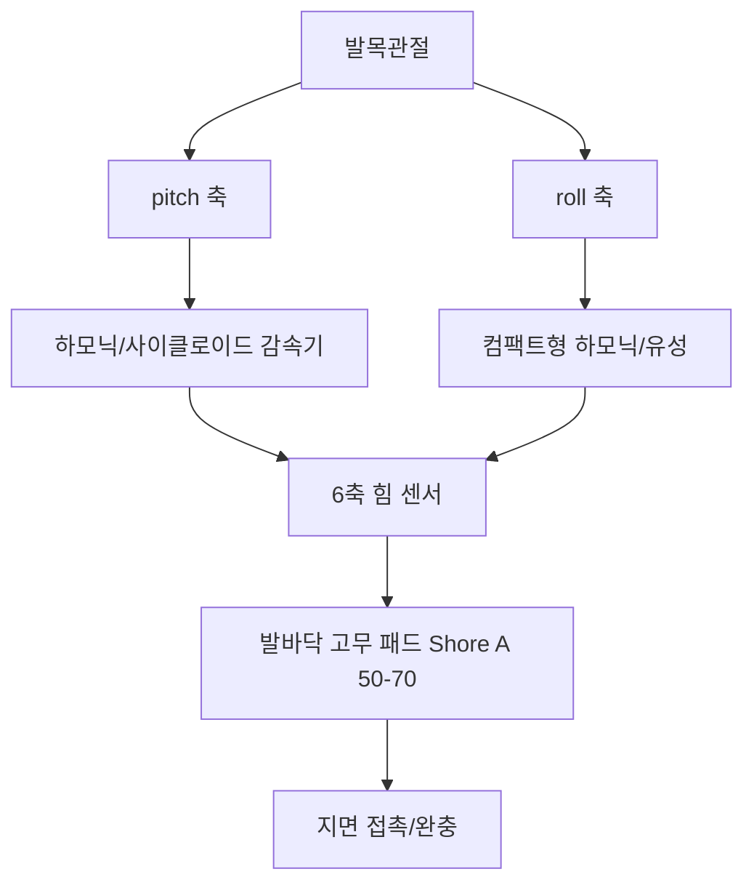


**6축 힘 센서 크로스토크 제어**: 6축 힘 센서의 각 채널 간에는 기계적 커플링과 전기적 크로스토크가 존재합니다. 설치면이 평탄하지 않으면 추가 굽힘 모멘트가 발생하여 힘과 토크 채널 간의 크로스토크로 나타납니다. 엔지니어링 요구 사항:
- 설치면 평면도 \(\le 0.02\,\text{mm}\)
- 볼트 예압 불균일도 \(<10\%\)
- 센서 교정 후 크로스토크 \(<2\%\) FS

**발바닥 압력 분포**: 이상적인 발바닥 압력 분포는 발뒤꿈치 착지 시 압력 중심(CoP)이 발뒤꿈치에서 발가락 쪽으로 이동하는 것입니다. 발바닥에는 3–6개의 압력 센서 영역(발뒤꿈치, 발바닥 아치外侧, 발바닥 아치内侧, 중족골, 발가락)을 배치하여 CoP와 미끄러짐을 추정할 수 있습니다.

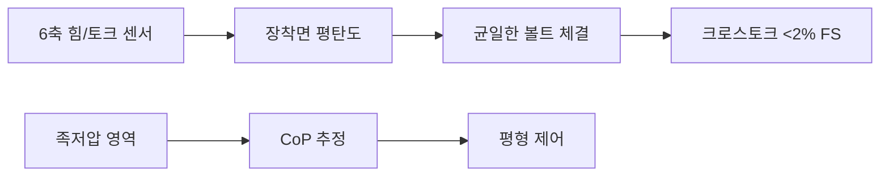

#### 9.2.12 순응 기구 공학적 구현

순응성은 제어에만 의존할 수 없으며, 기계적 구조를 통해 신뢰할 수 있는 충격 흡수와 에너지 관리를 실현해야 합니다. 하지 순응 기구는 족저, 발목, 무릎, 나아가 엉덩이까지 여러 계층에 분포합니다.

!!! note "용어 설명: 순응 기구, 스프링 강성, 댐퍼, 점탄성 재료, 건식 진동 흡수, 에너지 회수"
    - **순응 기구(compliant mechanism)** : 탄성 변형을 통해 힘과 운동을 전달하는 기구.
    - **스프링 강성(spring stiffness)** : 스프링이 단위 변형을 일으키는 데 필요한 힘.
    - **댐퍼(damper)** : 진동 에너지를 소산시키는 장치.
    - **점탄성 재료(viscoelastic material)** : 탄성과 점성 소산 특성을 동시에 갖는 재료.
    - **건식 진동 흡수(tendon vibration absorption)** : 건(tendon)의 탄성을 이용하여 충격 진동을 흡수.
    - **에너지 회수(energy regeneration)** : 기계적 에너지를 전기 에너지로 회수하여 저장하는 과정.

**스프링 강성 선택**: 직렬 탄성 액추에이터(SEA)의 스프링 강성 \(K_s\)는 힘 제어 대역폭과 에너지 저장 사이에서 균형을 맞춰야 합니다. 모터-감속기 측 등가 강성을 \(K_m\)이라고 하면, 출력 강성은 다음과 같이 근사됩니다.

$$
\frac{1}{K_{\text{out}}} = \frac{1}{K_m} + \frac{1}{K_s}
$$

우수한 힘 제어 특성을 얻기 위해 일반적으로 \(K_s = (0.05\!-\!0.2) K_m\)을 취합니다. 너무 부드러우면 위치 강성과 응답 속도가 저하되고, 너무 딱딱하면 순응의 이점을 잃습니다. 일반적인 발목 SEA 스프링 강성은 \(10^4\!-\!10^5\,\text{N·m/rad}\)입니다.

**댐퍼/점탄성 재료**: 착지 충격의 고주파 성분은 댐핑을 통해 빠르게 감쇠되어야 합니다. 폴리우레탄 패드, Sorbothane, 실리콘과 같은 점탄성 재료의 손실 계수 \(\tan\delta\)는 \(0.1\!-\!0.5\) 사이이며, 충격 에너지의 일부를 열에너지로 변환할 수 있습니다. 자기유변/전기유변 댐퍼는 가변 댐핑을 구현할 수 있지만 무게와 전력 소모가 큽니다.

**건식 진동 흡수**: 건 구동에서 적절한 길이의 건 자체가 탄성을 가지며 SEA와 유사한 역할을 할 수 있습니다. 건 예압력을 조절하여 등가 강성을 변경할 수 있습니다. 예압이 너무 낮으면 백래시가 발생하고, 너무 높으면 진동 흡수 효과가 사라집니다. 건 탄성과 모터 관성이 결합되어 공진을 형성할 수 있으므로 댐핑이나 제어를 통해 억제해야 합니다.

**에너지 회수 개념**: 보행 중 지지 다리는 발뒤꿈치 착지부터 전족부 지지 단계까지 중력 위치 에너지를 저장하고, 발끝 밀기 단계에서 방출합니다. 이론적으로 직렬 탄성체와 모터 회생 제동을 통해 에너지의 일부를 회수할 수 있지만, 실제 회수 효율은 모터 발전 효율, 에너지 저장 장치의 출력 밀도 및 변환 회로의 제한을 받아 현재 대부분 연구 단계에 있습니다.

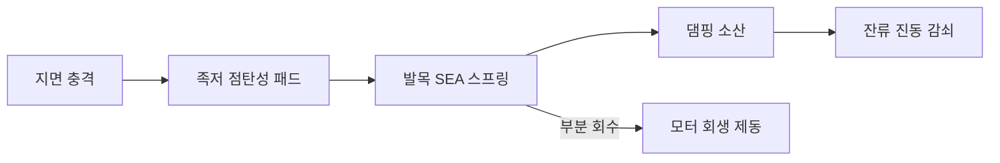


**순응 기구 설계 체크리스트**:

| 검사 항목 | 목표 | 검증 방법 |
|---|---|---|
| 스프링 강성 | \(K_s = 0.05\!-\!0.2 K_m\) | 비틀림 시험 |
| 감쇠비 | \(\zeta = 0.1\!-\!0.3\) | 자유 감쇠 |
| 최대 변형 | 탄성 한계 초과 금지 | FEA/시험 |
| 피로 수명 | \(>10^7\) 회 | 피로 시험대 |
| 온도 안정성 | 작동 온도 범위 내 강성 변화 \(<10\%\) | 고저온 시험 |

**에너지 회수 추정**: 발목 SEA가 보폭당 \(E_s = 5\,\text{J}\)의 에너지를 저장 및 방출할 수 있고, 보행 주파수가 \(1\,\text{Hz}\)이며, 이상적인 회수 효율이 \(30\%\)라면, 전체 발목 에너지 회수 전력은 약 \(3\,\text{W}\)입니다. 배터리 지속 시간 향상에는 제한적이지만, 모터의 최대 전력과 열 부하를 줄일 수 있습니다.

```mermaid
flowchart TD
    A["순응 설계"] --> B["스프링 강성"]
    A --> C["감쇠비"]
    A --> D["피로 수명"]
    B --> E["SEA 파라미터"]
    C --> F["충격 감쇠"]
    D --> G["유지보수 주기"]
```

#### 9.2.13 하지 주요 치수 및 공차

하지 링크 길이, 관절 축 오프셋 및 조립 공차는 운동학 정밀도, 조립 가능성 및 동적 성능을 직접적으로 결정합니다.

!!! note "용어 설명: 링크 길이, 관절 축 오프셋, 베어링 하우징 공차, 동축도, H7/g6, 형체 공차"
    - **링크 길이(link length)** : 인접한 관절 축 사이의 수직 거리.
    - **관절 축 오프셋(joint axis offset)** : 실제 회전 축과 명목 축 사이의 위치 편차.
    - **베어링 하우징 공차(bearing housing tolerance)** : 베어링을 설치하는 구멍 직경의 허용 변동 범위.
    - **동축도(coaxiality)** : 두 축 또는 구멍의 축이 일치하는 정도를 나타내는 형체 공차.
    - **H7/g6** : 구멍 H7, 축 g6의 끼워맞춤 기호로, 헐거운 끼워맞춤을 나타냄.
    - **형체 공차(geometric dimensioning and tolerancing, GD&T)** : 부품의 기하학적 특징이 이상적인 형상, 방향, 위치 및 흔들림에 대해 허용되는 변동량을 제어.

**일반적인 링크 길이 범위**: 신장 1.6–1.8 m의 휴머노이드 로봇 기준:

| 치수 | 범위 | 설명 |
|---|---|---|
| 대퇴 길이 \(l_{\text{thigh}}\) | 0.38–0.45 m | 엉덩이-무릎 축 거리 |
| 경골 길이 \(l_{\text{shank}}\) | 0.38–0.45 m | 무릎-발목 축 거리 |
| 발 길이 | 0.22–0.28 m | 발뒤꿈치-발끝 |
| 발 너비 | 0.08–0.12 m | 측면 기울기 안정성에 영향 |
| 엉덩이 간격 | 0.16–0.22 m | 양쪽 엉덩이 관절 축 거리 |

**관절 축 오프셋**: 엉덩이, 무릎, 발목 세 축의 시상면 내 동일 평면도 오차는 \(\pm 0.3\,\text{mm}\) 이내로 제어되어야 합니다. 그렇지 않으면 보행 중 측면 흔들림 모멘트가 발생합니다. 엉덩이 요(yaw) 축과 피치(pitch)/롤(roll) 축의 직각도는 \(\le 0.05°\)를 권장합니다.

**베어링 하우징 공차**: 구름 베어링의 외륜과 하우징 구멍에는 일반적으로 H7/k6(중간 끼워맞춤) 또는 H7/g6(조립이 용이한 헐거운 끼워맞춤)이 사용됩니다. 관절 출력축과 베어링 내륜에는 일반적으로 k6/m6(약간의 억지 끼워맞춤)이 사용됩니다. 베어링 하우징 구멍의 원통도는 \(\le 0.01\,\text{mm}\), 조립 기준에 대한 동축도는 \(\le 0.02\,\text{mm}\)가 요구됩니다.

**끼워맞춤 예시**: 알루미늄 합금 하우징에 깊은 홈 볼 베어링 6206(외륜 직경 \(D=62\,\text{mm}\)) 설치 시: 하우징 구멍은 H7(\(+0.030/0\)) 선택, 외륜과의 끼워맞춤은 약간의 헐거움 또는 중간 상태; 저널은 k6(\(+0.021/+0.002\)) 선택하여 내륜이 축과 함께 회전하도록 보장.

```mermaid
flowchart TD
    A["하지 링크"] --> B["대퇴 L1"]
    A --> C["경골 L2"]
    A --> D["발 L3"]
    B --> E["엉덩이-무릎 동축도 ≤0.02 mm"]
    C --> E
    D --> F["발목-발 평탄도 ≤0.02 mm"]
    E --> G["베어링 하우징 구멍 H7/k6"]
```


**하지에서의 GD&T 적용 예시**: 무릎 관절 출력 플랜지를 예로 들면:

| 특징 | 공차 | 기준 | 기능 |
|---|---|---|---|
| 플랜지 단면 평탄도 | \(0.02\,\text{mm}\) | — | 경골 단면과의 밀착 |
| 단면의 저널에 대한 직각도 | \(0.03\,\text{mm}\) | A | 경골 축 직각도 보장 |
| 저널 원통도 | \(0.01\,\text{mm}\) | A | 베어링 끼워맞춤 정밀도 |
| 볼트 구멍 위치도 | \(\phi 0.1\,\text{mm}\) | A|B|C | 조립 통과성 |

**공차 체인 예시**: 엉덩이 관절에서 발목 관절까지의 동축도 공차 체인은 다음을 포함합니다: 엉덩이 하우징 베어링 시트 동축도, 대퇴관 양단 플랜지 동축도, 무릎 하우징 동축도, 경골관 동축도, 발목 하우징 동축도. 각 항목을 \(\pm 0.02\,\text{mm}\)로 제어하면 최악의 경우 누적 오차는 \(\pm 0.10\,\text{mm}\)가 되며, 선별 조립 또는 조정 심(shim)을 통해 보상해야 합니다.

```mermaid
flowchart LR
    A["엉덩이 하우징"] -->|"±0.02"| B["대퇴관"]
    B -->|"±0.02"| C["무릎 하우징"]
    C -->|"±0.02"| D["경골관"]
    D -->|"±0.02"| E["발목 하우징"]
    E --> F["동축도 누적 ±0.10"]
```

#### Python 예제: 하지 역정역학 추정

다음 코드는 단순화된 시상면 다리 모델과 지면 반력을 기반으로 엉덩이, 무릎, 발목의 굴곡/신전 모멘트를 추정합니다.

```python
import numpy as np
```

# 하지 역동역학 단순 추정 (시상면)
# 링크 길이 (m)
L_thigh = 0.40      # 고관절-슬관절
L_shank = 0.40      # 슬관절-족관절
L_foot  = 0.10      # 족관절-발바닥 중심 수평 거리

# 링크 질량 및 질량 중심 위치 (각 근위부 기준)
m_thigh, r_thigh = 2.5, 0.5 * L_thigh   # 대퇴 질량 중심은 중점
m_shank, r_shank = 1.8, 0.5 * L_shank   # 하퇴 질량 중심은 중점
m_foot,  r_foot  = 0.8, 0.5 * L_foot    # 발 질량 중심

# 지면 반력 (단일 지지, 최대 하중 조건)
F_grf = np.array([50.0, 600.0])   # [Fx, Fz] N
r_grf_to_ankle = np.array([L_foot, 0.0])  # GRF 작용점 대비 족관절

# 중력 가속도
g = np.array([0.0, -9.81])

def cross2d(r, F):
    """2차원 외적 r x F, 스칼라 모멘트 반환 (양수는 반시계 방향)"""
    return r[0] * F[1] - r[1] * F[0]

# 족관절 모멘트 = GRF에 의한 족관절 모멘트 + 발 중력에 의한 족관절 모멘트
r_foot_com = np.array([r_foot, 0.0])
tau_ankle = cross2d(r_grf_to_ankle, F_grf) + cross2d(r_foot_com, m_foot * g)

# 슬관절 모멘트 = 족관절 모멘트 + (F_grf + 발 중량)에 의한 슬관절 모멘트 + 하퇴 중량에 의한 슬관절 모멘트
F_below_knee = F_grf + m_foot * g
r_knee_to_ankle = np.array([0.0, -L_shank])
r_shank_com = np.array([0.0, -(L_shank - r_shank)])
tau_knee = tau_ankle + cross2d(r_knee_to_ankle, F_below_knee) + cross2d(r_shank_com, m_shank * g)

# 고관절 모멘트 = 슬관절 모멘트 + (F_grf + 발 중량 + 하퇴 중량)에 의한 고관절 모멘트 + 대퇴 중량에 의한 고관절 모멘트
F_below_hip = F_below_knee + m_shank * g
r_hip_to_knee = np.array([0.0, -L_thigh])
r_thigh_com = np.array([0.0, -(L_thigh - r_thigh)])
tau_hip = tau_knee + cross2d(r_hip_to_knee, F_below_hip) + cross2d(r_thigh_com, m_thigh * g)

print(f"족관절 모멘트: {tau_ankle:.2f} N·m")
print(f"슬관절 모멘트: {tau_knee:.2f} N·m")
print(f"고관절 모멘트: {tau_hip:.2f} N·m")

# 간단 민감도 분석: GRF 수직 성분 변화
Fzs = np.linspace(300, 900, 7)
for fz in Fzs:
    F = np.array([50.0, fz])
    ta = cross2d(r_grf_to_ankle, F) + cross2d(r_foot_com, m_foot * g)
    tk = ta + cross2d(r_knee_to_ankle, F + m_foot * g) + cross2d(r_shank_com, m_shank * g)
    th = tk + cross2d(r_hip_to_knee, F + (m_foot + m_shank) * g) + cross2d(r_thigh_com, m_thigh * g)
    print(f"Fz={fz:4.0f}N  ->  고관절={th:7.2f} 슬관절={tk:7.2f} 족관절={ta:7.2f} N·m")
```

해당 예시는: 고관절/슬관절/족관절 모멘트가 지면 반력 수직 성분과 대략 선형 상관관계를 가지며, 고관절 모멘트는 모멘트 팔이 가장 길어 수치가 가장 높음을 보여줍니다. 실제 설계 시에는 동적 관성 항과 안전 계수를 추가로 고려해야 합니다.

---

## 9.3 상지와 팔 하위 시스템 설계

### 9.3.1 상지 운동 체인: 어깨, 팔꿈치, 손목의 기능 분배

휴머노이드 로봇 팔은 일반적으로 인간의 상지를 모방하여 어깨, 팔꿈치, 손목으로 구성되며, 잡기, 운반, 조립, 도구 조작 등의 작업을 수행합니다. 어깨 관절은 일반적으로 3-DOF 직교 배치(구형 관절과 유사)를 사용하고, 팔꿈치 관절은 주로 1-DOF 굴곡/신전을 담당하며, 손목 관절은 2–3개의 DOF를 제공하여 말단 자세를 조정합니다.

!!! note "용어 설명: 어깨 관절, 팔꿈치 관절, 손목 관절, 신전, 굴곡, 회내/회외"
    - **어깨 관절 (shoulder joint)**: 몸통과 상완을 연결하는 관절로, 일반적으로 다자유도를 가집니다.
    - **팔꿈치 관절 (elbow joint)**: 상완과 전완을 연결하는 관절로, 주로 굴곡/신전을 수행합니다.
    - **손목 관절 (wrist joint)**: 전완과 손을 연결하는 관절로, 말단 자세를 조정합니다.
    - **신전 (extension)**: 관절이 굴곡 상태에서 펴진 위치로 돌아가는 운동입니다.
    - **회내/회외 (pronation/supination)**: 전완이 자체 장축을 중심으로 회전하는 운동입니다.

!!! note "용어 설명: 인체측정학, 인체 백분위, 도달 포락선, 기능 치수"
    - **인체측정학 (anthropometry)**: 인체의 치수, 형태 및 힘을 측정하는 학문입니다.
    - **인체 백분위 (anthropometric percentile)**: 인구 집단에서 특정 치수가 이 값보다 작은 비율로, 예를 들어 50 백분위는 평균값입니다.
    - **도달 포락선 (reach envelope)**: 사지 말단이 모든 관절 범위 내에서 도달할 수 있는 공간 경계입니다.
    - **기능 치수 (functional dimension)**: 특정 작업을 수행하는 데 필요한 인체 또는 기구의 치수입니다.

상지 자유도 구성:

| 관절 | DOF | 운동 설명 | 일반적인 범위 |
|---|---|---|---|
| 어깨 | 3 | 굴곡/신전, 외전/내전, 내회전/외회전 | ±180°/±90°/±90° |
| 팔꿈치 | 1 | 굴곡/신전 | 0–135° |
| 손목 | 2–3 | 피치, 롤, (요) | ±45°/±45°/(±90°) |

```mermaid
flowchart LR
    A["몸통"] -->|"어깨 3-DOF"| B["상완"]
    B -->|"팔꿈치 1-DOF"| C["전완"]
    C -->|"손목 2-3 DOF"| D["손/말단"]
```

### 9.3.2 팔 길이, 작업 공간 및 인체 공학적 치수 매칭

팔 길이는 로봇이 도달할 수 있는 범위를 결정합니다. 설계 시 인체 백분위 데이터를 참조하여 로봇이 인간의 일반적인 작업 공간(예: 책상, 선반, 문 손잡이)에 도달할 수 있도록 해야 합니다. 일반적인 휴머노이드 로봇의 팔 길이(어깨에서 손목까지)는 0.55–0.75 m입니다.

!!! note "용어 설명: 팔 길이, 작업 공간, 도달 범위, 인체 백분위, 조작 공간"
    - **팔 길이 (arm length)**: 일반적으로 어깨에서 손목 또는 어깨에서 손가락 끝까지의 직선 거리를 의미합니다.
    - **도달 범위 (reach envelope)**: 팔 말단이 도달할 수 있는 공간 영역입니다.
    - **인체 백분위 (anthropometric percentile)**: 인체 치수 통계 분포에서의 위치로, 예를 들어 50 백분위는 평균값입니다.
    - **조작 공간 (manipulation workspace)**: 일반적인 작업을 수행하는 데 필요한 3차원 공간입니다.

팔 길이 \(L_{arm}\)와 작업 공간 부피는 대략 다음 관계를 만족합니다:

$$
V_{ws} \propto L_{arm}^3
$$

그러나 팔이 너무 길면 관성이 증가하고 강성이 감소하며 어깨/몸통 토크 요구량이 높아집니다. 설계 시 다음을权衡해야 합니다:

| 지표 | 긴 팔의 장점 | 긴 팔의 단점 |
|---|---|---|
| 도달 범위 | 큼 | 관성 증가 |
| 하중 용량 | 힘의 팔이 큼 | 구조 강성 저하 |
| 제어 대역폭 | — | 감소 |
| 인간-로봇 안전성 | — | 충돌 운동 에너지 큼 |

```mermaid
flowchart TD
    A["팔 길이 선택"] --> B["인체 치수 50 백분위"]
    A --> C["작업 공간 요구 사항"]
    A --> D["전체 관성 제약"]
    B --> E["목표 팔 길이"]
    C --> E
    D --> E
```

### 9.3.3 강성 설계: 링크, 관절 및 말단 변형

팔 강성은 위치 정밀도, 동적 응답 및 접촉 안정성에 영향을 미칩니다. 전체 강성은 직렬 스프링으로 모델링할 수 있습니다:

$$
\frac{1}{K_{total}} = \frac{1}{K_{link}} + \frac{1}{K_{joint}} + \frac{1}{K_{drive}}
$$

여기서 \(K_{link}\), \(K_{joint}\), \(K_{drive}\)는 각각 링크, 관절 구조 및 구동 시스템의 강성입니다.

!!! note "용어 설명: 강성, 유연성, 변형, 위치 정밀도, 구동 강성"
    - **강성 (stiffness)**: 단위 변형을 생성하는 데 필요한 힘 또는 토크입니다.
    - **유연성 (compliance)**: 강성의 역수입니다.
    - **변형 (deflection)**: 외력作用下의 기하학적 변위입니다.
    - **위치 정밀도 (positioning accuracy)**: 실제 위치와 목표 위치의 일치 정도입니다.
    - **구동 강성 (drive stiffness)**: 감속기, 관절 출력단이 하중 하에서 가지는 비틀림 강성입니다.

강성을 높이기 위한 조치:

1. **링크**: 상자형 단면, 탄소 섬유 튜브 사용, 단면 2차 모멘트 증가.
2. **관절**: 베어링 예압, 하우징 벽 두께 증가, 볼트 배치 최적화.
3. **구동**: 고강성 감속기(예: 유성, 하모닉, RV) 선택, 백래시 감소.

```mermaid
flowchart TD
    A["말단 강성 부족"] --> B["위치 오차"]
    A --> C["진동/잔류 진동"]
    A --> D["접촉 불안정"]
    E["링크 강성 향상"] --> F["K_total 개선"]
    G["관절/구동 강성 향상"] --> F
```

### 9.3.4 7-DOF 팔: 여유도와 조작성

7-DOF 팔은 6-DOF 데카르트 작업 외에 1차원의 여유도를 가지며, 말단 자세를 유지하면서 팔꿈치 위치 최적화, 장애물 회피, 특이점 회피 및 관절 토크 감소를 수행할 수 있습니다. NASA Valkyrie, TALOS, Optimus 등의 로봇은 7-DOF 팔을 채택하고 있습니다.

!!! note "용어 설명: 여유도, 영공간, 조작성, 야코비안, 힘 타원체"
    - **여유도 (redundancy)**: 관절 수가 작업을 수행하는 데 필요한 자유도 수보다 많은 경우입니다.
    - **영공간 (null space)**: 말단 작업 성능을 변경하지 않는 관절 운동 방향입니다.
    - **조작성 (manipulability)**: Yoshikawa가 정의한 것으로, 기구 말단의 속도/힘 전달 능력을 측정합니다.
    - **야코비안 (Jacobian)**: 관절 속도를 말단 속도로 매핑하는 선형 변환 행렬입니다.
    - **힘 타원체 (force ellipsoid)**: 말단이 출력할 수 있는 힘 방향을 설명합니다.

조작성 측정:

$$
w = \sqrt{\det(\mathbf{J}\mathbf{J}^T)}
$$

여기서 \(\mathbf{J}\)는 팔의 야코비안 행렬입니다. \(w\)가 클수록 해당 구성에서 팔의 운동/힘 전달 능력이 더 균형 잡힙니다.

### 9.3.5 Python 예제 2: 7-DOF 팔 작업 공간 및 조작성

다음 예제는 7-DOF 팔에 대해 몬테카를로 샘플링을 수행하여 말단 위치 분포와 조작성 분포를 계산합니다.

```python
import numpy as np
import matplotlib.pyplot as plt
from mpl_toolkits.mplot3d import Axes3D

# 7-DOF 팔 작업 공간 및 조작성 타원체
# 단순화된 DH 매개변수 사용: 어깨 3 + 팔꿈치 1 + 손목 3
# 링크 길이 (m)
a = [0.0, 0.0, 0.0, 0.30, 0.0, 0.0, 0.0]   # 링크 길이
 d = [0.15, 0.0, 0.0, 0.0, 0.25, 0.0, 0.08]  # 링크 오프셋
alpha = [-np.pi/2, np.pi/2, -np.pi/2, 0, -np.pi/2, np.pi/2, 0]

# 표준 DH 동차 변환
def dh_transform(theta, d, a, alpha):
    ct, st = np.cos(theta), np.sin(theta)
    ca, sa = np.cos(alpha), np.sin(alpha)
    return np.array([
        [ct, -st*ca,  st*sa, a*ct],
        [st,  ct*ca, -ct*sa, a*st],
        [0,   sa,     ca,    d   ],
        [0,   0,      0,     1   ]
    ])

# 관절 제한 (rad)
qlim = [
    (-np.pi, np.pi),
    (-np.pi/2, np.pi/2),
    (-np.pi/3, np.pi/3),
    (0, 2*np.pi/3),
    (-np.pi/2, np.pi/2),
    (-np.pi/2, np.pi/2),
    (-np.pi, np.pi),
]
```

# 기하학적 야코비안
def geometric_jacobian(q):
    T = np.eye(4)
    Ts = [T]
    for i in range(7):
        T = T @ dh_transform(q[i], d[i], a[i], alpha[i])
        Ts.append(T)
    pe = Ts[-1][:3, 3]
    J = np.zeros((6, 7))
    for i in range(7):
        z_i = Ts[i][:3, 2]
        o_i = Ts[i][:3, 3]
        J[:3, i] = np.cross(z_i, pe - o_i)
        J[3:, i] = z_i
    return J

N = 40000
points = np.zeros((N, 3))
manip = np.zeros(N)
np.random.seed(7)
for k in range(N):
    q = np.array([np.random.uniform(lo, hi) for lo, hi in qlim])
    T = np.eye(4)
    for i in range(7):
        T = T @ dh_transform(q[i], d[i], a[i], alpha[i])
    points[k] = T[:3, 3]
    J = geometric_jacobian(q)
    # 위치 야코비안의 3x3 부분 블록을 위치 조작성에 사용
    Jp = J[:3, :]
    manip[k] = np.sqrt(max(np.linalg.det(Jp @ Jp.T), 0))

fig = plt.figure(figsize=(12,5))
ax1 = fig.add_subplot(121, projection='3d')
sc = ax1.scatter(points[:,0], points[:,1], points[:,2], c=manip, s=1, cmap='viridis', alpha=0.5)
ax1.set_xlabel('x'); ax1.set_ylabel('y'); ax1.set_zlabel('z')
ax1.set_title('7-DOF 팔 작업공간과 조작성')
fig.colorbar(sc, ax=ax1, shrink=0.5, label='sqrt(det(J J^T))')

ax2 = fig.add_subplot(122)
ax2.hist(manip, bins=50, color='steelblue', edgecolor='k', alpha=0.7)
ax2.set_xlabel('조작성 측도'); ax2.set_ylabel('빈도')
ax2.set_title('조작성 분포')
plt.tight_layout(); plt.savefig('arm_workspace_ch9.png', dpi=150)
print(f"샘플링 점 수: {N}")
print(f"평균 조작성: {manip.mean():.4f}")
```

!!! note "용어 설명: 몬테카를로 작업공간, 데카르트 공간, 형상 공간, 속도 타원체"
    - **형상 공간(configuration space)** : 모든 관절 변수로 생성된 공간.
    - **데카르트 공간(Cartesian space)** : 말단 위치와 자세로 생성된 공간.
    - **속도 타원체(velocity ellipsoid)** : 야코비안 특이값으로 말단 속도 능력을 설명.

```mermaid
flowchart TD
    A["7-DOF 관절각"] --> B["정기구학"]
    B --> C["말단 위치"]
    A --> D["야코비안 J"]
    D --> E["조작성 w=sqrt(det(JJ^T))"]
    C --> F["작업공간 점군"]
    E --> G["형상 우수성 평가"]
```

### 9.3.6 팔 배선: 케이블, 호스 및 유지보수성

팔 내부에는 모터 동력선, 엔코더 신호선, 토크 센서선, 통신선, 가능한 공기관 또는 액체관을 배치해야 합니다. 배선 설계는 다음 문제를 피해야 합니다:

!!! note "용어 설명: 케이블 수명, 굽힘 반경, 피로, 응력 집중, 와이어 하네스"
    - **케이블 수명(cable life)** : 규정된 굽힘 횟수에서 전기적 성능을 유지하는 능력.
    - **굽힘 반경(bend radius)** : 케이블이 안전하게 구부러질 수 있는 최소 반경.
    - **피로(fatigue)** : 반복 하중 하에서 재료나 구조가 점진적으로 파손되는 현상.
    - **응력 집중(stress concentration)** : 기하학적 급변점에서 국부 응력이 현저히 증가하는 현상.
    - **와이어 하네스(wire harness)** : 여러 케이블을 경로에 따라 묶은 집합체.

배선 원칙:

1. **고정단과 유동단 분리** : 케이블은 링크 중간에 고정하고, 관절부에는 굽힘 여유를 둡니다.
2. **비틀림 방지** : 슬립 링을 사용하거나 관절의 연속 회전 각도를 제한합니다.
3. **굽힘 반경 제어** : 일반적으로 케이블 외경의 8–10배 이상.
4. **내마모성 및 외피** : PTFE/폴리우레탄 외피, 주름관, 케이블 체인 사용.
5. **유지보수성** : 커넥터는 팔 베이스나 어깨 부위에 집중 배치하여 교체가 용이하도록 합니다.

```mermaid
flowchart LR
    A["어깨 커넥터"] -->|"와이어 하네스가 어깨 관절 통과"| B["팔꿈치 커넥터"]
    B -->|"와이어 하네스가 팔꿈치 관절 통과"| C["손목/손 커넥터"]
    C --> D["손가락 액추에이터/센서"]
```

### 9.3.7 상지 설계 요점 요약

| 지표 | 주요 파라미터 | 검증 방법 |
|---|---|---|
| 도달성 | 팔 길이, 관절 범위 | 작업공간 측정 |
| 하중 | 관절 토크, 구조 강도 | 정하중/피로 시험 |
| 정밀도 | 링크/관절 강성, 백래시 | 반복 위치 결정 테스트 |
| 기민성 | 7-DOF 여유, 손목 범위 | 조작 작업 테스트 |
| 신뢰성 | 케이블 수명, 밀봉 | 굽힘/수명 시험대 |
| 안전 | 충돌력, 협착점 | 힘 제한/안전 테스트 |


#### 9.3.8 어깨 관절 상세 설계

어깨 관절은 상지에서 가장 복잡한 관절 중 하나로, 컴팩트한 공간 내에서 3-DOF 직교 운동을 구현하고 팔 전체 질량과 작업 하중을 지지해야 합니다. 일반적인 배치는 어깨 롤(몸통 전후축 기준), 어깨 피치(몸통 좌우축 기준), 어깨 요(상완 장축 기준)의 3중 적층 구조입니다.

!!! note "용어 설명: 어깨 관절, 3-DOF 직교축, 중공축, 앵귤러 콘택트 베어링, 페어링 프리로드, 하우징 벽 두께, 보강 리브"
    - **어깨 관절(shoulder joint)** : 몸통과 상완을 연결하는 다자유도 관절.
    - **3-DOF 직교축(3-DOF orthogonal axes)** : 서로 수직인 세 개의 회전축.
    - **중공축(hollow shaft)** : 중심에 구멍이 뚫린 회전축으로, 케이블이나 배관 통과용.
    - **앵귤러 콘택트 베어링(angular contact bearing)** : 레이디얼 하중과 축방향 하중을 동시에 지지할 수 있는 구름 베어링.
    - **페어링 프리로드(paired preload)** : 두 개의 앵귤러 콘택트 베어링을 특정 배열로 프리로드 설치하여 강성을 높이는 방법.
    - **하우징 벽 두께(housing wall thickness)** : 관절 외부 케이스 벽의 두께.
    - **보강 리브(rib)** : 강성을 높이기 위해 국부적으로 두껍게 한 구조.

**3-DOF 직교축 배치** : 첫 번째 축(어깨 롤)은 일반적으로 몸통 전후 방향과 평행하고, 두 번째 축(어깨 피치)은 어깨 롤과 수직이며 그 출력단에 위치하며, 세 번째 축(어깨 요/상완 회전)은 가장 바깥쪽에 적층됩니다. 세 축은 운동학을 단순화하기 위해 가능한 한 한 점에 교차해야 하며, 실제 교차 오차는 \(<2\,\text{mm}\)를 권장합니다.

**중공축 배선** : 어깨 관절 내부에는 모터 동력선, 엔코더선, 토크 센서선 및 통신선이 통과해야 합니다. 중공축 내경은 일반적으로 \(>15\,\text{mm}\)이며, \(30\%\) 이상의 여유를 확보해야 합니다. 케이블은 PTFE 외피나 플렉시블 플랫 케이블을 사용하여 회전축과의 마찰을 피해야 합니다. 연속 회전이 필요한 경우 특정 층에 슬립 링을 설치하거나 연속 회전 각도를 제한해야 합니다.

**앵귤러 콘택트 베어링 페어링 프리로드** : 어깨 요 축은 굽힘 모멘트와 축방향 힘을 받으므로, 일반적으로 두 개의 앵귤러 콘택트 베어링을 백투백(DB) 또는 페이스투페이스(DF)로 설치하고 프리로드를 가합니다. 프리로드 크기는 일반적으로 베어링 제조업체 권장 사항에 따라 축방향 유격을 제거하고 강성을 높입니다. 프리로드가 과도하면 마찰 발열과 수명 저하가 발생하고, 너무 작으면 유격을 제거할 수 없습니다. 경프리로드 시 축방향 강성은 프리로드가 없는 경우의 약 \(1.5\!-\!2.5\)배입니다.

**하우징 벽 두께와 보강 리브** : 알루미늄 합금 어깨 하우징 벽 두께는 일반적으로 \(4\!-\!8\,\text{mm}\)이며, 베어링 시트 영역은 국부적으로 \(10\!-\!15\,\text{mm}\)로 두껍게 합니다. 보강 리브 높이는 벽 두께의 \(2\!-\!4\)배, 두께는 벽 두께의 \(0.6\!-\!0.8\)배로 하는 것이 권장되며, 배치 방향은 주응력 경로를 따릅니다.

```mermaid
flowchart TD
    A["어깨 3-DOF"] --> B["어깨 롤 축"]
    B --> C["어깨 피치 축"]
    C --> D["어깨 요 축"]
    D --> E["중공축 배선"]
    E --> F["앵귤러 콘택트 베어링 DB 프리로드"]
    F --> G["하우징 벽 두께+보강 리브"]
```

**어깨 관절 동역학적 하중**: 팔을 뻗어 \(5\,\text{kg}\) 하중을 들고 있을 때, 어깨 관절이 견뎌야 하는 모멘트는 다음과 같습니다.

$$
\tau_{\text{shoulder}} \approx m_{\text{arm}} g \cdot r_{\text{arm}} + m_{\text{payload}} g \cdot L_{\text{arm}}
$$

\(m_{\text{arm}}=4\,\text{kg}\), \(r_{\text{arm}}=0.25\,\text{m}\), \(m_{\text{payload}}=5\,\text{kg}\), \(L_{\text{arm}}=0.6\,\text{m}\)인 경우:

$$
\tau_{\text{shoulder}} \approx 4\times9.81\times0.25 + 5\times9.81\times0.6 \approx 10 + 29 = 39\,\text{N·m}
$$

동적 가속도 \(2g\)와 안전 계수 \(1.5\)를 고려하면, 어깨 피치(pitch) 피크 토크 목표는 약 \(120\,\text{N·m}\)입니다.

**어깨 하우징 재료 선택**: 고강도 알루미늄 합금 7075-T6의 항복 강도는 약 \(503\,\text{MPa}\)로 어깨 하우징에 적합합니다. 더 높은 강성이 필요하면 티타늄 합금 Ti-6Al-4V 또는 마그네슘 합금 AZ91D(더 가볍지만 강성은 낮음)를 사용할 수 있습니다.

```mermaid
flowchart TD
    A["어깨 하중"] --> B["팔 자중+부하"]
    B --> C["동적 계수 2g"]
    C --> D["안전 계수 1.5"]
    D --> E["피크 토크 목표"]
    E --> F["재료/구조 선정"]
```

#### 9.3.9 팔꿈치 및 손목 상세 설계

팔꿈치 관절은 상완과 전완을 연결하며 주로 굴곡/신전을 수행합니다. 손목 관절은 말단 자세를 조정하며 일반적으로 피치(pitch)/롤(roll)/요(yaw)를 제공합니다.

!!! note "용어 설명: 팔꿈치 오프셋, 손목 관절, 컴팩트 하모닉 드라이브, 사이클로이드 드라이브, 베어링 수명, 출력 플랜지"
    - **팔꿈치 오프셋(elbow offset)**: 팔꿈치 관절 축이 상완 중심선으로부터 가로 방향으로 벗어난 거리.
    - **손목 관절(wrist joint)**: 전완과 손을 연결하는 관절로 말단 자세를 조정합니다.
    - **컴팩트 하모닉 드라이브(compact harmonic drive)**: 부피가 작고 감속비가 큰 하모닉 드라이브.
    - **사이클로이드 드라이브(cycloidal drive)**: 사이클로이드 치형을 이용하여 높은 감속비를 구현하는 감속기.
    - **베어링 수명(bearing life)**: 베어링이 정격 조건에서 작동할 수 있는 시간 또는 회전수.
    - **출력 플랜지(output flange)**: 감속기 또는 관절의 출력 연결판.

**팔꿈치 오프셋**: 상완 모터의 간섭을 피하고 팔 외형을 사람 팔에 더 가깝게 만들기 위해, 팔꿈치 축은 종종 상완 중심선에서 \(20\!-\!40\,\text{mm}\)만큼 오프셋됩니다. 오프셋은 전완 질량이 어깨 관절에 추가 모멘트를 유발하므로, 전체 기계 동역학에서 보상해야 합니다.

**손목 피치(pitch)/롤(roll)/요(yaw) 축 배치**: 손목에는 일반적으로 두 가지 배치 방식이 있습니다.
1. **직교 손목(orthogonal wrist)**: 세 축이 교차하며 서로 수직입니다. 운동학적으로 분리되어 산업용 로봇 손목과 유사합니다.
2. **비직교 손목(non-orthogonal wrist)**: 부피를 줄이기 위해 세 축이 완전히 교차하지 않거나 각도가 90°에서 약간 벗어나며, 야코비안(Jacobian)을 통한 보상이 필요합니다.

**컴팩트 하모닉 또는 사이클로이드 드라이브**: 손목 공간은 매우 제한적이므로, 컵형 하모닉 드라이브(외경 30–60 mm, 감속비 50–100) 또는 마이크로 사이클로이드 드라이브가 자주 사용됩니다. 출력단은 크로스 롤러 베어링을 통해 말단 하중 모멘트를 지지합니다. 손목 모터는 중공 배선 공간을 최대화하기 위해 프레임리스 토크 모터 또는 중공축 모터를 선택할 수 있습니다.

**베어링 수명 검증**: 손목 관절 베어링의 등가 동하중은 일반적으로 말단 조작력 \(F_{\text{end}}\)와 모멘트 팔 \(L\)에 의해 결정됩니다.

$$
P = X F_r + Y F_a
$$

여기서 \(F_r\), \(F_a\)는 각각 레이디얼 하중과 축방향 하중이며, \(X\), \(Y\)는 베어링 계수입니다. 목표 수명 \(L_{10h}\)(시간)과 회전 속도 \(n\)(rpm)는 다음을 만족합니다.

$$
L_{10h} = \frac{10^6}{60 n} \left(\frac{C}{P}\right)^{\epsilon}
$$

손목 관절의 목표 수명은 일반적으로 \(>10{,}000\) 시간입니다.

```mermaid
flowchart LR
    A["팔꿈치 관절"] -->|"오프셋"| B["굴곡/신전 0-135°"]
    B --> C["손목 피치"]
    C --> D["손목 롤"]
    D --> E["손목 요"]
    E --> F["컴팩트 하모닉/사이클로이드"]
    F --> G["크로스 롤러 베어링"]
```


**손목 컴팩트 설계**: 손목 외경은 일반적으로 \(60\!-\!90\,\text{mm}\) 이내로 제한됩니다. 하모닉 드라이브 SHF-14(외경 약 50 mm, 감속비 50)의 경우 정격 토크는 약 \(40\,\text{N·m}\), 피크 토크는 약 \(100\,\text{N·m}\)으로 중소형 손목 관절에 적합합니다. 더 높은 토크가 필요하면 SHF-17 또는 사이클로이드 드라이브를 사용할 수 있습니다.

**손목 케이블 통로**: 손목에 세 축이 적층될 때, 케이블은 요(yaw), 롤(roll), 피치(pitch) 축을 순차적으로 통과해야 합니다. 각 단의 중공축 내경은 케이블 다발보다 최소 \(30\%\) 더 커야 하며, 축 끝단에는 회전 밀봉 또는 케이블 보호 슬리브를 설치해야 합니다. 손목 케이블의 굽힘 반경은 \(\ge 30\,\text{mm}\)여야 합니다.

```mermaid
flowchart LR
    A["손목 제약 조건"] --> B["외경 60-90 mm"]
    B --> C["하모닉 SHF-14/17"]
    C --> D["토크 40-100 N·m"]
    D --> E["3축 중공 배선"]
```

#### 9.3.10 링크 구조 설계

팔 링크는 경량이면서도 충분한 굽힘 및 비틀림 강성을 제공해야 합니다. 일반적인 단면 형태로는 원형 튜브, 사각 튜브 및 박스 빔이 있습니다.

!!! note "용어 설명: 원형 튜브, 사각 튜브, 박스 빔, 벽 두께 추정, 플랜지, 볼트 그룹, 강성 대 중량비"
    - **원형 튜브(circular tube)**: 단면이 원형인 중공 부재.
    - **사각 튜브(square tube)**: 단면이 직사각형인 중공 부재.
    - **박스 빔(box beam)**: 벽판으로 둘러싸인 폐쇄된 직사각형 단면의 빔.
    - **벽 두께 추정(wall thickness estimation)**: 하중 및 강성 요구 사항에 따라 관벽 두께를 추정합니다.
    - **플랜지(flange)**: 두 부품을 연결하기 위한 구멍이 있는 원반형 구조.
    - **볼트 그룹(bolt group)**: 여러 개의 볼트가 함께 하중을 지지하는 연결부.
    - **강성 대 중량비(stiffness-to-weight ratio)**: 구조 강성과 질량의 비율.

**원형 튜브 vs 사각 튜브/박스 빔**:
- 원형 튜브: 등방성 굽힘 강성이 좋고 비틀림 강성이 우수하여 다방향 하중에 적합합니다. 그러나 다른 부품과의 연결을 위해 평면이나 플랜지를 가공해야 합니다.
- 사각 튜브/박스 빔: 평면, 플랜지 및 커버 플레이트 설치가 용이하며, 강축 방향의 굽힘 강성이 높습니다. 폐쇄형 박스 빔의 비틀림 강성은 개방형 단면보다 훨씬 높습니다.

**벽 두께 추정**: 직사각형 단면의 외팔보에 대해 끝단 처짐은 다음과 같습니다.

$$
\delta = \frac{F L^3}{3 E I}, \quad I = \frac{b h^3 - (b-2t)(h-2t)^3}{12}
$$

목표 처짐 \(\delta_{\text{max}}\)가 주어지면 벽 두께 \(t\)를 역산할 수 있습니다. 일반적인 알루미늄 합금 팔 링크의 벽 두께는 \(2\!-\!5\,\text{mm}\)입니다. 탄소 섬유 튜브의 벽 두께는 \(1.5\!-\!3\,\text{mm}\)입니다.

**플랜지 설계**: 플랜지 두께는 일반적으로 볼트 직경의 \(1.0\!-\!1.5\)배이며, 볼트 배치 원의 지름은 플랜지 외경의 \(0.7\!-\!0.85\)배입니다. 플랜지와 튜브 본체의 연결부에는 응력 집중을 줄이기 위해 필렛(\(R\ge 3\,\text{mm}\))을 두어야 합니다.

**볼트 그룹 하중**: 플랜지에 굽힘 모멘트 \(M\)이 작용할 때, 가장 바깥쪽 볼트의 인장력이 가장 큽니다.

$$
F_{b,\max} = \frac{M \cdot r_{\max}}{\sum r_i^2}
$$

여기서 \(r_i\)는 각 볼트에서 플랜지 중심까지의 거리입니다. 볼트 예압력은 최대 작업 인장력보다 커야 하며 안전 계수 \(1.5\!-\!2.5\)를 유지해야 합니다.

**강성/중량비 최적화**: 굽힘 강성 제약 조건에서 단면 높이를 증가시키는 것이 벽 두께를 증가시키는 것보다 더 효과적입니다. 따라서 큰 단면, 얇은 벽 설계를 우선시하고 내부 리브 또는 폼 충진을 통해 국부 안정성을 향상시킵니다.

```mermaid
flowchart TD
    A["링크 단면"] --> B["원형 튜브"]
    A --> C["사각 튜브"]
    A --> D["박스 빔"]
    B --> E["등방성/비틀림 우수"]
    C --> F["설치 용이"]
    D --> G["높은 비틀림 강성"]
    G --> H["벽 두께 t 추정"]
    H --> I["플랜지+볼트 그룹"]
```


**관벽 국부 좌굴 검증**: 얇은 벽 원형 튜브가 축 방향 압축을 받을 때, 전체 오일러 좌굴 외에도 국부 좌굴이 발생할 수 있습니다. 국부 좌굴 임계 응력은 다음과 같습니다.

$$
\sigma_{cr,local} \approx 0.605 \frac{E t}{R}
$$

여기서 \(R\)은 튜브의 중간 지름, \(t\)는 벽 두께입니다. 설계 시 \(\sigma_{cr,local} > \sigma_{cr,global}\)이거나 적어도 작동 응력보다 높도록 보장해야 합니다.

**플랜지 볼트 수량 추정**: 플랜지에 굽힘 모멘트 \(M\)이 작용하고, 볼트 배치 원 반경 \(R_b\), 볼트 개수 \(n\)일 때, 단일 볼트의 최대 인장력은 다음과 같습니다.

$$
F_b = \frac{2 M}{n R_b}
$$

\(n=6\), \(R_b=40\,\text{mm}\), \(M=100\,\text{N·m}\)인 경우, \(F_b = 833\,\text{N}\)으로 M6 볼트의 허용 예하중보다 훨씬 작아 설계가 안전합니다.

```mermaid
flowchart TD
    A["박벽관"] --> B["전체 오일러 좌굴"]
    A --> C["국부 좌굴"]
    B --> D["세장비 제어"]
    C --> E["t/R 제어"]
    E --> F["일반적으로 t/R > 1/30"]
```

#### 9.3.11 팔 케이블 관리 공학

팔 케이블은 다자유도 운동에서 신뢰성을 유지해야 하며, 휴머노이드 로봇에서 고장률이 높은 서브시스템 중 하나입니다.

!!! note "용어 설명: 케이블 관리, 케이블 캐리어, 회전 조인트, 플렉서블 PCB, 굽힘 반경, 차폐, 접지"
    - **케이블 관리(cable management)**: 로봇 내부 케이블을 배치, 고정 및 보호하는 설계입니다.
    - **케이블 캐리어(cable carrier)**: 움직임에 따라 구부러지며 케이블을 보호하는 체인 모양의 외피입니다.
    - **회전 조인트(rotary joint/slip ring)**: 연속 회전을 허용하는 전기 연결 장치입니다.
    - **플렉서블 PCB(flexible PCB, FPC)**: 구부릴 수 있는 인쇄 회로 기판입니다.
    - **굽힘 반경(bend radius)**: 케이블이 안전하게 구부러질 수 있는 최소 반경입니다.
    - **차폐(shielding)**: 전도성 층을 사용하여 전자기 간섭을 차단합니다.
    - **접지(grounding)**: 회로 또는 차폐층을 공통 기준 전위에 연결합니다.

**중공축 배선**: 어깨, 손목 등 관절에 중공 모터 또는 중공 감속기를 사용하는 경우 케이블이 축 중심을 통과할 수 있습니다. 중공축 내경은 케이블 번들 최대 외경의 \(1.5\!-\!2.0\)배여야 하며, 출구에는 마모를 방지하기 위한 외피를 설치해야 합니다.

**케이블 캐리어**: 팔꿈치 관절 등 외부 배선에는 마이크로 케이블 캐리어를 사용할 수 있습니다. 케이블 캐리어의 굽힘 반경은 케이블 최소 굽힘 반경의 \(1.5\)배 이상이어야 합니다. 고속 왕복 운동(>1 Hz) 시 케이블 캐리어 수명은 \(>10^7\) 사이클로 선정해야 합니다.

**회전 조인트**: 어깨 또는 손목 관절이 \(\pm 360°\)를 초과하는 연속 회전이 필요한 경우 슬립 링 또는 무선 전원/통신 방식을 사용해야 합니다. 슬립 링 접촉 저항 변동은 \(<10\,\text{m}\Omega\)이어야 하며, 수명은 \(>10^7\) 회전이어야 합니다.

**플렉서블 PCB**: 손가락과 손의 많은 센서에 FPC를 사용할 수 있으며, 두께는 \(0.1\!-\!0.3\,\text{mm}\), 굽힘 반경은 최대 \(1\,\text{mm}\)까지 낮출 수 있습니다. FPC는 굽힘 영역에 비아와 패드를 배치하지 않도록 하고 응력 완화 굽힘을预留해야 합니다.

**굽힘 반경 및 고정**: 동력 케이블의 최소 굽힘 반경은 일반적으로 외경의 \(6\!-\!10\)배입니다. 엔코더/차동 신호선은 \(8\!-\!15\)배입니다. 와이어 하네스는 \(80\!-\!150\,\text{mm}\) 간격으로 케이블 타이 또는 클램프로 고정하고, 관절 부위에는 \(10\!-\!20\,\text{mm}\)의 여유를 둡니다.

**차폐 및 접지**: 모터 동력선과 신호선은 분리하여 배치하고 간격은 \(>50\,\text{mm}\)로 합니다. 신호선은 꼬임 차폐선을 사용하고 차폐층은 컨트롤러 측에서 단일 지점 접지합니다. 고주파 통신선(예: EtherCAT, GigE Vision)은 차폐 꼬임 또는 동축 케이블을 사용해야 합니다.

```mermaid
flowchart LR
    A["어깨 커넥터"] -->|"중공축"| B["팔꿈치"]
    B -->|"케이블 캐리어/외피"| C["손목"]
    C -->|"FPC"| D["손가락 센서"]
    E["차폐 꼬임선"] --> A
    F["단일 지점 접지"] --> E
```


**케이블 피로 수명 추정**: 케이블이 관절에서 반복적으로 구부러지면 수명은 굽힘 반경과 굽힘 횟수로 특성화할 수 있습니다. 일반적으로 플렉서블 케이블 제조업체는 최소 굽힘 반경에서의 정격 사이클 수를 제공합니다. 실제 수명은 굽힘 반경이 증가함에 따라 기하급수적으로 증가합니다.

$$
N_{\text{life}} \propto \left(\frac{R_{\text{bend}}}{R_{\text{min}}}\right)^m
$$

여기서 \(m\approx 2\!-\!4\)입니다. 최소 굽힘 반경 \(R_{\text{min}}=30\,\text{mm}\)에서 정격 수명이 \(10^6\) 사이클인 경우, 실제 굽힘 반경이 \(60\,\text{mm}\)일 때 수명은 \(4\!-\!16\times10^6\) 사이클로 증가할 수 있습니다.

**전자파 적합성 구역**: 팔 내부 공간은 다음과 같이 구분하는 것이 좋습니다.
1. 고전압 동력 구역(모터 상선, \(>48\,\text{V}\))
2. 저전압 신호 구역(엔코더, 토크 센서)
3. 통신 구역(EtherCAT, CAN)

각 구역 사이의 최소 간격은 \(30\,\text{mm}\)를 유지하거나 접지된 금속 격벽을 설치합니다.

```mermaid
flowchart LR
    A["케이블 굽힘 반경↑"] --> B["피로 수명↑"]
    C["강약전 구분"] --> D["간격/차폐"]
    D --> E["EMC 준수"]
```

#### 9.3.12 상지 GD&T 예시

어깨 관절 출력 플랜지를 예로 들어 기하 공차 표기의 공학적 의미를 설명합니다.

!!! note "용어 설명: GD&T, 평면도, 직각도, 동축도, 위치도, 데이텀, 최대 실체 요구"
    - **GD&T(Geometric Dimensioning and Tolerancing)**: 기하 치수 및 공차 표기 체계입니다.
    - **평면도(flatness)**: 실제 표면이 이상적인 평면에서 허용되는 변동량입니다.
    - **직각도(perpendicularity)**: 실제 요소가 데이텀에 대해 수직으로 허용되는 변동량입니다.
    - **동축도(coaxiality)**: 두 축이 일치하도록 허용되는 변동량입니다.
    - **위치도(position)**: 실제 요소가 이상적인 위치에서 허용되는 변동량입니다.
    - **데이텀(datum)**: 공차 기준을 설정하는 데 사용되는 이상적인 요소입니다.
    - **최대 실체 요구(Maximum Material Requirement, MMR)**: 최대 실체 상태와 관련된 공차 보상 원칙입니다.

**예시 플랜지 GD&T 요구 사항**:

| 기하 특성 | 공차 | 데이텀 | 설명 |
|---|---|---|---|
| 플랜지 단부 평면도 | \(0.02\,\text{mm}\) | — | 상대면과의 밀착 보장, 국부적 간격 방지 |
| 단부의 베어링 시트 축선에 대한 직각도 | \(0.03\,\text{mm}\) | A(베어링 시트 축선) | 출력축과 링크 축의 직교성 보장 |
| 출력 저널 동축도 | \(\phi 0.015\,\text{mm}\) | A | 축과 하우징 베어링 시트의 동축성 보장 |
| 볼트 구멍 위치도 | \(\phi 0.1\,\text{mm}\) | A|B|C | 볼트 그룹 조립 원활화, MMR 사용 가능 |
| 플랜지 외경 원통도 | \(0.02\,\text{mm}\) | A | 회전 간격 균일성 보장 |

표기 시, 베어링 시트 축선 A는 양단 베어링 구멍(최대 내접 원통 축선)에 의해 설정되며, 단부 B와 C는 보조 위치 결정 데이텀입니다. 볼트 구멍 위치도에 MMR을 적용하면 구멍이 최대 실체에서 벗어날 때 추가 공차 보상을 얻을 수 있어 조립 기능에 영향을 주지 않으면서 제조 비용을 절감할 수 있습니다.

```mermaid
flowchart TD
    A["플랜지 단부"] -->|"평면도 0.02"| B["밀착 밀봉"]
    A -->|"직각도 0.03@A"| C["축계 직교"]
    D["출력 저널"] -->|"동축도 φ0.015@A"| E["베어링 동축"]
    F["볼트 구멍"] -->|"위치도 φ0.1@A|B|C"| G["조립 통과"]
```


**GD&T와 기능 관계**:

| GD&T 항목 | 기능적 영향 | 일반 검사 도구 |
|---|---|---|
| 평면도 | 밀봉, 접촉 강성 | 정밀 직자/틈새 게이지 |
| 직각도 | 축계 직교, 하중 전달 | 직각자/CMM |
| 동축도 | 베어링 수명, 마찰 | V-블록/동축도 측정기 |
| 위치도 | 조립 통과성 | 검사 핀/CMM |
| 원통도 | 베어링 맞춤 조임 | 진원도 측정기 |

**최대 실체 요구 적용**: 볼트 구멍 위치도에 MMR을 적용할 경우, 구멍이 최대 실체 상태(구멍 직경 최소)로 가공되면 허용 위치도가 최소가 됩니다. 구멍 직경이 최소 실체보다 크면 추가 위치도 보상을 얻을 수 있습니다. 이는 구멍 직경 정밀도 요구 사항을 낮추면서 볼트가 원활하게 통과하도록 보장합니다.

```mermaid
flowchart TD
    A["GD&T 표기"] --> B["평면도/직각도"]
    A --> C["동축도/위치도"]
    B --> D["기능 보장"]
    C --> E["조립 통과"]
    E --> F["MMR 보상"]
```

#### Python 예제: 볼트 체결 예하중 및 분리 검증

다음 코드는 주어진 작동 하중에서 필요한 볼트 예하중과 체결 토크를 계산하고 결합면 분리 여부를 검증합니다.

```python
import numpy as np

# 볼트 체결 예하중 및 분리 검증
F_external = 8000.0      # 작동 인장력 N
T_bolt = 0.1             # 볼트 인장 강성 계수 (EA/L) 상대값
T_member = 0.4           # 피체결체 압축 강성 계수 상대값
# 강성비 C = kb / (kb + km)
C = T_bolt / (T_bolt + T_member)
```

# 요구 접합면 잔류 압력 > 0 (분리되지 않음), 안전 계수 1.2
F_preload_min = F_external * (1 - C) * 1.2
print(f"필요 최소 예하중: {F_preload_min:.1f} N")

# 볼트 최대 인장력 = 예하중 + 외부 하중으로 인한 추가 인장력
F_bolt_max = F_preload_min + C * F_external
print(f"볼트 최대 작업 인장력: {F_bolt_max:.1f} N")

# M8 10.9 등급 볼트 파라미터 (공학적 추정)
d = 8.0e-3               # 공칭 직경 m
A_s = 36.6e-6            # 응력 단면적 m^2
sigma_y = 900e6          # 항복 강도 Pa (10.9 등급)
# 허용 예하중 (항복의 70% 기준)
F_preload_allow = 0.7 * sigma_y * A_s
print(f"M8 10.9 등급 허용 예하중(항복의 70%): {F_preload_allow:.1f} N")

# 체결 토크 T = K * Fp * d, K는 0.20
K_torque = 0.20
T_required = K_torque * F_preload_min * d
print(f"필요 체결 토크: {T_required:.3f} N·m")

# 검증
if F_preload_min <= F_preload_allow:
    print("예하중이 요구 사항을 충족합니다")
else:
    print("경고: 예하중이 볼트 허용치를 초과합니다. 더 큰 규격 또는 더 높은 등급의 볼트를 선택해야 합니다")

# 접합면 잔류 압력 (접촉 면적 A_c 가정)
A_c = 0.002              # 접촉 면적 m^2
p_residual = (F_preload_min - F_external * (1 - C)) / A_c
print(f"접합면 잔류 압축 응력: {p_residual/1e3:.2f} kPa")
```

이 계산 예제는 VDI 2230의 핵심 개념을 보여줍니다: 볼트 예하중은 작업 하중에 저항할 뿐만 아니라 접합면이 분리되지 않도록 보장해야 하며, 동시에 예하중은 볼트 강도에 의해 제한됩니다.


#### Python 계산 예제: 베어링 수명 L10 계산

다음 코드는 하중, 회전 속도 및 수명 요구 사항에 따라 롤링 베어링의 정격 동적 하중을 선택합니다.

```python
import numpy as np

# 베어링 수명 L10 계산 (롤러 베어링 epsilon=10/3, 볼 베어링 epsilon=3)
P = 2500.0          # 등가 동적 하중 N
n = 1500.0          # 회전 속도 rpm
L10h_target = 20000 # 목표 정격 수명 h

epsilon = 10/3      # 롤러 베어링

# L10 (rev) = 60 * n * L10h
L10_rev = 60 * n * L10h_target

# 필요 정격 동적 하중 C
C_required = P * (L10_rev / 1e6)**(1/epsilon)
print(f"목표 수명 L10h={L10h_target} h")
print(f"해당 회전수 L10={L10_rev:.2e} rev")
print(f"필요 정격 동적 하중 C >= {C_required:.1f} N")

# 선택 사항: 선택한 베어링 C를 기준으로 실제 수명 역산
C_catalog = 32000.0   # 특정 모델 베어링 정격 동적 하중 N
L10_rev_actual = 1e6 * (C_catalog / P)**epsilon
L10h_actual = L10_rev_actual / (60 * n)
print(f"선택한 베어링 C={C_catalog} N 시, 실제 L10h={L10h_actual:.1f} h")

# 피크 하중 검증: 피크 발생 시 정적 하중 안전 계수 충족 필요
C0_catalog = 45000.0  # 정격 정적 하중 N
P0_peak = 5000.0      # 피크 등가 정적 하중 N
S0 = C0_catalog / P0_peak
print(f"정적 하중 안전 계수 S0 = {S0:.2f} (일반적으로 >=2 요구)")
```

공학적으로, 엉덩이/허리 등 중하중 관절 베어링의 정격 동적 하중은 일반적으로 피크 반경 방향 하중의 \(1.5\!-\!2.5\) 배를 취하며, 전복 모멘트 하의 등가 하중을 검증합니다.


#### Python 계산 예제: 커넥팅 로드 오일러 좌굴 임계 하중

다음 코드는 양단 힌지 지지 조건에서 등단면 압축 부재의 오일러 임계 하중을 계산합니다.

```python
import numpy as np

# 커넥팅 로드 오일러 좌굴 임계 하중 (양단 힌지 지지)
L = 0.35            # 부재 길이 m
b = 0.025           # 단면 폭 m
h = 0.040           # 단면 높이 m
E = 70e9            # 알루미늄 합금 탄성 계수 Pa
K = 1.0             # 길이 계수 (양단 힌지 지지 K=1)

A = b * h
I_min = min(b * h**3 / 12, h * b**3 / 12)  # 최소 관성 모멘트 취함
r_g = np.sqrt(I_min / A)                   # 회전 반경
slenderness = K * L / r_g

# 오일러 임계 응력
sigma_cr = np.pi**2 * E / slenderness**2
P_cr = sigma_cr * A

print(f"단면적 A={A*1e6:.2f} mm^2")
print(f"최소 관성 모멘트 I_min={I_min*1e12:.3f} mm^4")
print(f"회전 반경 r_g={r_g*1e3:.3f} mm")
print(f"세장비 λ={slenderness:.1f}")
print(f"오일러 임계 응력 σ_cr={sigma_cr/1e6:.2f} MPa")
print(f"오일러 임계 하중 P_cr={P_cr/1e3:.2f} kN")

# 재료 항복 초과 여부 검증 (공학적으로 σ_cr < σ_y를 충족해야 하며, 그렇지 않으면 비탄성 좌굴 진입)
sigma_y = 270e6
if sigma_cr < sigma_y:
    print("탄성 오일러 좌굴 적용 가능")
else:
    print("임계 응력이 항복을 초과합니다. 비탄성 좌굴 또는 경험식을 사용해야 합니다")

# 매개변수 스캔: 중공 원형 튜브의 벽 두께가 임계 하중에 미치는 영향
# 외경 D=30 mm, 내경 d 변화
D = 0.030
for d in [0.022, 0.024, 0.026, 0.028]:
    I = np.pi * (D**4 - d**4) / 64
    A_ = np.pi * (D**2 - d**2) / 4
    P = np.pi**2 * E * I / (K * L)**2
    print(f"D={D*1000:.0f}mm d={d*1000:.0f}mm -> P_cr={P/1e3:.2f} kN, 질량={A_*L*2700*1e3:.2f} g")
```

이 계산 예제는 다음을 보여줍니다: 재료와 길이가 고정된 경우, 단면 관성 모멘트를 증가시키는 것(예: 높이 증가, 폐쇄형 박벽 채택)이 좌굴 하중 지지력을 향상시키는 가장 효과적인 수단입니다.

---

## 9.4 손과 말단 효과기 설계

### 9.4.1 인간 손 해부학: 뼈, 힘줄, 자유도 및 파지 패턴

인간의 손은 21개의 내부 자유도(4×4 손가락 관절 + 엄지 5)에 손목 자유도를 더한 고도로 최적화된 말단 효과기입니다. 휴머노이드 로봇 손 설계는 종종 인간 손을 생체 모방 모델로 삼지만, 액추에이터 수, 제어 복잡성 및 비용에 의해 제한됩니다.

!!! note "용어 설명: 중수골, 지골, 근위지골, 중위지골, 원위지골, 중수지관절, 근위지간관절, 원위지간관절"
    - **중수골 (metacarpal)** : 손바닥 안의 긴 뼈로, 손목뼈와 손가락뼈를 연결합니다.
    - **지골 (phalanx/phalanges)** : 손가락 안의 뼈 조각으로, 근위, 중위, 원위로 나뉩니다.
    - **중수지관절 (Metacarpophalangeal joint, MCP)** : 중수골과 근위지골 사이의 관절입니다.
    - **근위지간관절 (Proximal Interphalangeal joint, PIP)** : 근위지골과 중위지골 사이입니다.
    - **원위지간관절 (Distal Interphalangeal joint, DIP)** : 중위지골과 원위지골 사이입니다.

인간 손의 자유도 분포:

| 부위 | 자유도 | 주요 운동 |
|---|---|---|
| 엄지 | 5 | 굴곡/신전, 외전, 대립 |
| 검지/중지/약지/소지 | 각 4 | MCP 2 + PIP 1 + DIP 1 |
| 손목 | 2 | 굴곡/신전, 요측/척측 편위 |

주요 파지 패턴:

| 패턴 | 특징 | 적용 대상 |
|---|---|---|
| 원통형 파지 (power grasp) | 전체 손가락으로 감쌈 | 원통, 공구 손잡이 |
| 첨단 집기 (precision pinch) | 엄지와 검지 끝으로 집기 | 작은 물체 |
| 세 손가락 집기 (tripod grasp) | 엄지, 검지, 중지 | 구/원뿔형 물체 |
| 갈고리 파지 (hook grasp) | 네 손가락 굴곡, 엄지 불참 | 가방, 손잡이 |
| 측면 집기 (lateral pinch) | 엄지 볼로 검지 측면 지지 | 열쇠, 얇은 판 |

```mermaid
flowchart TD
    A["인간 손 자유도"] --> B["엄지 5 DOF"]
    A --> C["검지/중지/약지/소지 4 DOF"]
    A --> D["손목 2 DOF"]
    B --> E["대립/강력 파지"]
    C --> F["정밀/포위 파지"]
    D --> G["자세 조정"]
```

### 9.4.2 다관절 손과 그리퍼: 자유도, 구동 및 비용 절충

로봇 손은 주로 **다관절 손 (dexterous hand)** 과 **두/세 손가락 그리퍼 (gripper)** 로 나뉩니다. 다관절 손은 자유도가 높고 적응성이 뛰어나지만 제어가 복잡하고 비용이 높습니다. 그리퍼는 구조가 간단하고 비용이 낮지만 제한된 파지 유형만 수행할 수 있습니다.

!!! note "용어 설명: 다관절 손, 그리퍼, 언더액추에이티드, 풀액추에이티드, 적응형 파지"
    - **다관절 손 (dexterous hand)** : 여러 손가락, 다자유도를 가지며 복잡한 조작이 가능한 말단 효과기입니다.
    - **그리퍼 (gripper)** : 일반적으로 자유도가 적고 구조가 간단한 파지 장치입니다.
    - **언더액추에이티드 (underactuated)** : 액추에이터 수가 자유도보다 적으며, 기계적 결합을 통해 운동을 전달합니다.
    - **풀액추에이티드 (fully actuated)** : 각 자유도가 독립적인 액추에이터로 구동됩니다.
    - **적응형 파지 (adaptive grasp)** : 손이 물체 형상에 따라 자동으로 감싸는 파지 방식입니다.

| 유형 | 자유도 | 구동 방식 | 장점 | 단점 | 대표 사례 |
|---|---|---|---|---|---|
| 풀액추에이티드 다관절 손 | 16–24 | 모터/힘줄/직결 | 높은 기민함 | 복잡, 고가 | Shadow Hand, HIT Hand |
| 언더액추에이티드 다관절 손 | 8–16 | 힘줄/링크/차동 | 적응형, 경량 | 제어 정밀도 낮음 | Robotiq 3F, SVH |
| 두 손가락 그리퍼 | 1–2 | 모터+볼스크류 | 단순, 신뢰성 | 유형 제한 | Robotiq 2F |
| 소프트 핸드 | 다양 | 공압/케이블 | 순응, 안전 | 힘 제어 어려움 | RBO Hand, PneuNet |

```mermaid
flowchart TD
    A["손 선택"] --> B{"작업 복잡도?"}
    B -->|"높음"| C["다관절 손"]
    B -->|"중간"| D["언더액추에이티드 세 손가락 손"]
    B -->|"낮음"| E["두 손가락 그리퍼"]
    C --> F["고기민성/고비용"]
    D --> G["적응형/중간 비용"]
    E --> H["단순/저비용"]
```

### 9.4.3 힘줄 구동, 링크 구동 및 직결 구동

손 구동 방식은 주로 세 가지: 힘줄 구동, 링크 구동 및 직결 구동(모터를 손가락 관절 내에 배치)입니다.

!!! note "용어 설명: 힘줄 구동, 링크 구동, 직결 구동, 보우덴 케이블, 가이드 풀리, 마찰 손실"
    - **힘줄 구동 (tendon-driven)** : 유연한 케이블(힘줄)을 사용하여 모터의 운동을 손가락 관절로 전달합니다.
    - **링크 구동 (linkage-driven)** : 강성 링크를 사용하여 운동과 힘을 전달합니다.
    - **직결 구동 (direct-drive)** : 모터를 관절에 직접 설치하여 중간 전동 장치가 없습니다.
    - **보우덴 케이블 (Bowden cable)** : 외부 튜브와 내부 와이어로 구성된 유연한 동력 전달선입니다.
    - **마찰 손실 (friction loss)** : 전동 과정에서 마찰로 인해 손실되는 에너지 또는 힘입니다.

세 가지 구동 방식 비교:

| 방식 | 장점 | 단점 | 적용 |
|---|---|---|---|
| 힘줄 구동 | 모터를 전완에 배치 가능, 손가락 경량화 | 마찰, 마모, 장력 교정 복잡 | Shadow Hand, DLR Hand |
| 링크 구동 | 강성 높음, 전동 정밀 | 손가락 크기 큼, 자유도 제한 | 산업용 그리퍼 |
| 직결 구동 | 전동 손실 없음, 제어 직접적 | 손가락 무거움, 모터 방열 어려움 | 소형 손가락, 연구 플랫폼 |

```mermaid
flowchart LR
    A["모터"] -->|"힘줄/Bowden"| B["손가락 관절"]
    A -->|"링크"| B
    A -->|"직결"| B
```

### 9.4.4 파지 힘 폐쇄: Python 예제 3

**힘 폐쇄 (force closure)** 는 주어진 접촉점과 마찰 조건에서 임의의 외부 wrench를 저항할 수 있는지 판단하는 기준입니다. 마찰이 있는 점 접촉의 경우, 각 접촉은 마찰 원뿔을 제공합니다. 마찰 원뿔 모서리의 양의 조합이 원점을 둘러쌀 수 있으면 힘 폐쇄가 달성됩니다.

!!! note "용어 설명: 힘 폐쇄, 마찰 원뿔, 접촉력, wrench, 볼록 껍질, 양의 조합"
    - **힘 폐쇄 (force closure)** : 접촉력이 임의의 외부 교란 wrench를 평형시킬 수 있는 조건입니다.
    - **마찰 원뿔 (friction cone)** : 접촉력 방향이 쿨롱 마찰의 제약을 받아 형성되는 원뿔형 영역입니다.
    - **wrench** : 힘과 모멘트의 6차원 조합입니다.
    - **볼록 껍질 (convex hull)** : 주어진 점 집합을 포함하는 최소 볼록 집합입니다.
    - **양의 조합 (positive combination)** : 계수가 음이 아닌 선형 조합입니다.

쿨롱 마찰 원뿔 제약:

$$
\sqrt{f_x^2 + f_y^2} \leq \mu f_z, \quad f_z \geq 0
$$

여기서 \(\mu\) 는 마찰 계수입니다.

```python
import numpy as np
from scipy.spatial import ConvexHull

# 세 손가락 파지 힘 폐쇄 간단 테스트
# 접촉점 (물체 좌표계, m)
contacts = np.array([
    [ 0.05,  0.00, 0.0],
    [-0.025, 0.0433, 0.0],
    [-0.025,-0.0433, 0.0]
])
mu = 0.5          # 마찰 계수
fz = 1.0          # 법선 힘 단위화
n_edges = 8       # 마찰 원뿔 모서리 수

wrenches = []
for p in contacts:
    # 법선 방향은 -p 방향 (물체 질량 중심을 향함)
    n = -p / (np.linalg.norm(p) + 1e-9)
    # 접선 평면 내 두 개의 직교 기저
    if abs(n[2]) < 0.99:
        t1 = np.cross(n, np.array([0,0,1])); t1 /= np.linalg.norm(t1)
    else:
        t1 = np.array([1,0,0])
    t2 = np.cross(n, t1)
    for k in range(n_edges):
        phi = 2 * np.pi * k / n_edges
        f_dir = n + mu * (np.cos(phi)*t1 + np.sin(phi)*t2)
        f_dir /= np.linalg.norm(f_dir)
        f = fz * f_dir
        tau = np.cross(p, f)
        wrenches.append(np.concatenate([f, tau]))
```

```python
wrenches = np.array(wrenches)
# 힘 폐쇄 판별 기준: 원점이 wrench 볼록 껍질 내부에 위치
# 방법: 원점을 점 집합에 추가하고, 볼록 껍질이 원점을 꼭짓점으로 사용하지 않으면 원점이 내부에 있음
combined = np.vstack([wrenches, np.zeros(6)])
hull = ConvexHull(combined)
origin_vertex = len(wrenches) in hull.vertices
print("볼록 껍질 꼭짓점 개수:", len(hull.vertices))
print("원점이 볼록 껍질 꼭짓점인가:", origin_vertex)
print("힘 폐쇄 성립?", not origin_vertex)

# 추가: 원점을 포함하는 최소 법선력 스케일 계산 (간략화: LP 또는 시행착오 사용)
# 여기서는 개념적 판단만 시연
```

!!! note "용어 설명: 쿨롱 마찰, 법선력, 접선력, 접촉 모델"
    - **쿨롱 마찰(Coulomb friction)**: 마찰력이 수직 항력에 비례하고 상대 운동 방향과 반대 방향으로 작용하는 단순화된 모델.
    - **법선력(normal force)**: 접촉면에 수직인 힘 성분.
    - **접선력(tangential force)**: 접촉면에 평행한 힘 성분.
    - **접촉 모델(contact model)**: 접촉면의 힘-변형 관계를 설명하는 수학적 모델.

```mermaid
flowchart TD
    A["접촉점 + 마찰 원뿔"] --> B["원뿔 모서리로 이산화"]
    B --> C["접촉 wrench 생성"]
    C --> D["볼록 껍질 구성"]
    D --> E{"원점이 볼록 껍질 내부에 있는가?"}
    E -->|"예"| F["힘 폐쇄 성립"]
    E -->|"아니오"| G["접촉/마찰 조정 필요"]
```

### 9.4.5 파지력, 파지력 및 안전 접촉력

손 설계는 세 가지 힘을 명확히 정의해야 합니다:

1. **파지력(gripping force)**: 손가락이 물체에 가하는 법선력으로, 미끄러짐을 방지합니다.
2. **하중력(payload force)**: 손이 안정적으로 운반할 수 있는 최대 외력입니다.
3. **안전 접촉력(safe contact force)**: 사람과 접촉할 때 손상을 주지 않는 힘의 상한입니다.

!!! note "용어 설명: 파지력, 하중력, 안전 접촉력, 미끄러짐, 압궤 손상"
    - **파지력(gripping force)**: 손가락이 물체에 가하는 수직 압력.
    - **하중력(payload force)**: 손이 저항할 수 있는 최대 외부 교란력.
    - **안전 접촉력(safe contact force)**: 인체에 통증이나 손상을 일으키지 않는 접촉력의 상한.
    - **미끄러짐(slip)**: 물체가 손가락 사이에서 상대적으로 미끄러지는 현상.
    - **압궤 손상(crushing injury)**: 과도한 파지력으로 인한 조직 손상.

미끄러짐 방지 조건(중력 방향 파지):

$$
2 \mu F_g \geq m g
$$

여기서 \(F_g\)는 한쪽 손가락의 파지력, \(\mu\)는 마찰 계수, \(m\)은 물체 질량입니다.

인간-로봇 협업 시나리오의 경우 ISO/TS 15066은 손가락/손바닥의 다양한 부위에 대한 통증 역치를 제시하며, 설계 시 최대 파지력을 이 역치 미만으로 제한하고 힘 제어 또는 유연한 손가락 패드를 통해 구현해야 합니다.

```mermaid
flowchart TD
    A["물체 파지"] --> B["m과 μ 추정"]
    B --> C["최소 파지력 F_g 계산"]
    C --> D{"인간과 상호작용하는가?"}
    D -->|"예"| E["최대 힘 < 안전 역치로 제한"]
    D -->|"아니오"| F["구조적 한계에 따라 설계"]
    E --> G["힘 제어/유연한 손가락 패드"]
```

#### 9.4.5.1 손끝 접촉의 헤르츠 응력과 안전 힘 예산

파지력은 미끄러짐을 방지할 뿐만 아니라 손끝과 물체 모두에서 허용할 수 없는 국부 변형이나 손상이 발생하지 않도록 보장해야 합니다. 구형/원통형 손끝과 평면/구형 물체의 접촉의 경우 **헤르츠 접촉 이론(Hertzian contact theory)**을 사용하여 최대 접촉 압축 응력과 접촉 면적을 추정할 수 있습니다.

!!! note "용어 설명: 헤르츠 접촉, 접촉 반폭, 최대 접촉 압력, 등가 탄성 계수, 등가 곡률 반경"
    - **헤르츠 접촉 이론(Hertzian contact theory)**: 법선력 하에서 두 탄성체의 국부 접촉 변형을 설명하는 고전 이론.
    - **접촉 반폭(contact half-width)**: 접촉선에 수직 방향으로 접촉 영역의 반폭 또는 반경.
    - **최대 접촉 압력(maximum contact pressure)**: 접촉 영역 중심에서의 최대 법선 압축 응력.
    - **등가 탄성 계수(effective elastic modulus)**: 두 접촉 재료의 결합 강성을 반영하는 매개변수.
    - **등가 곡률 반경(effective radius of curvature)**: 두 접촉 표면의 곡률을 통합한 매개변수.

손끝이 반경 \(R_1\), 탄성 계수 \(E_1\), 푸아송 비 \(\nu_1\)인 탄성 구이고, 물체가 반경 \(R_2\), 탄성 계수 \(E_2\), 푸아송 비 \(\nu_2\)인 탄성 구라고 가정합니다. 법선력 \(F_n\) 하에서 접촉은 원형이며, 접촉 반경 \(a\)와 최대 접촉 압력 \(p_0\)는 다음과 같습니다:

$$
\frac{1}{E^*} = \frac{1-\nu_1^2}{E_1} + \frac{1-\nu_2^2}{E_2}, \quad \frac{1}{R^*} = \frac{1}{R_1} + \frac{1}{R_2}
$$

$$
a = \left( \frac{3 F_n R^*}{4 E^*} \right)^{1/3}
$$

$$
p_0 = \frac{3 F_n}{2 \pi a^2} = \left( \frac{6 F_n (E^*)^2}{\pi^3 (R^*)^2} \right)^{1/3}
$$

여기서 \(E^*\)는 등가 탄성 계수, \(R^*\)는 등가 곡률 반경입니다. 물체 표면이 평면인 경우 \(R_2 \to \infty\)로 설정할 수 있으며, 그러면 \(1/R^* = 1/R_1\)이 됩니다.

**공학적 의미**: 최대 접촉 압력 \(p_0\)는 손끝 커버층(실리콘, TPE)의 허용 압축 응력과 파지되는 물체(예: 과일, 전자 부품, 플라스틱 케이스)의 허용 접촉 응력보다 낮아야 합니다. 실리콘 손끝의 허용 압축 응력은 일반적으로 \(0.5\!-\!2\,\text{MPa}\)입니다. 취성 물체(예: 달걀 껍질, 유리)는 이 값보다 훨씬 낮습니다.

**안전 힘 예산**: 설계 파지력 \(F_g\)는 세 가지 제약 조건을 동시에 충족해야 합니다:

1. **미끄러짐 방지 제약 조건**: \(F_g \ge \dfrac{m g}{2\mu}\) (두 손가락 집기)
2. **손끝 재료 강도 제약 조건**: \(p_0(F_g) \le [p]_{\text{fingertip}}\)
3. **물체 강도 제약 조건**: \(p_0(F_g) \le [p]_{\text{object}}\)
4. **인간-로봇 안전 제약 조건**: \(F_g \le F_{\text{safe}}\) (예: ISO/TS 15066 통증 역치)

최종 설계 힘은 위 제약 조건들의 교집합을 취하고 안전 계수 \(n_s\)를 도입합니다:

$$
F_{g,\text{design}} = n_s \cdot \max\left( F_{g,\text{slip}},\; F_{g,\text{fingertip}},\; F_{g,\text{object}} \right), \quad F_{g,\text{design}} \le F_{\text{safe}}
$$

**수치 예시**: 손끝이 실리콘 구, \(R_1 = 10\,\text{mm}\), \(E_1 = 5\,\text{MPa}\), \(\nu_1 = 0.45\); 파지되는 물체가 알루미늄 블록 평면, \(E_2 = 70\,\text{GPa}\), \(\nu_2 = 0.33\). 그러면:

$$
\frac{1}{E^*} = \frac{1-0.45^2}{5\times10^6} + \frac{1-0.33^2}{70\times10^9} \approx 1.805\times10^{-7}\,\text{Pa}^{-1}
$$

$$
E^* \approx 5.54\,\text{MPa}, \quad R^* = R_1 = 10\,\text{mm}
$$

\(F_n = 10\,\text{N}\)인 경우:

$$
a = \left( \frac{3\times10\times0.01}{4\times5.54\times10^6} \right)^{1/3} \approx 2.04\,\text{mm}
$$

$$
p_0 = \frac{3\times10}{2\pi(2.04\times10^{-3})^2} \approx 1.15\,\text{MPa}
$$

이 압력은 연질 실리콘 손끝의 일반적인 상한에 가깝습니다. 더 취약한 물체를 파지해야 하는 경우 손끝 곡률 반경을 늘리거나 탄성 계수를 낮추거나 더 큰 접촉 면적을 제공하는 포괄 파지를 사용해야 합니다.

```python
import numpy as np
import matplotlib.pyplot as plt
```

# 헤르츠 접촉 파라미터: 실리콘 고무 손끝(구) 대 알루미늄 평면
R1 = 10e-3          # 손끝 반경 m
E1 = 5e6            # 실리콘 고무 탄성 계수 Pa
nu1 = 0.45
E2 = 70e9           # 알루미늄 탄성 계수 Pa
nu2 = 0.33
R2 = np.inf         # 평면

E_star = 1 / ((1 - nu1**2)/E1 + (1 - nu2**2)/E2)
R_star = 1 / (1/R1 + 1/R2)

Fn = np.linspace(0.5, 50, 100)  # 법선력 N
a = (3 * Fn * R_star / (4 * E_star))**(1/3)
p0 = 3 * Fn / (2 * np.pi * a**2)

plt.figure(figsize=(10, 4))
plt.subplot(1, 2, 1)
plt.plot(Fn, a * 1000)
plt.xlabel('법선력 F_n (N)'); plt.ylabel('접촉 반경 a (mm)')
plt.grid(True)
plt.subplot(1, 2, 2)
plt.plot(Fn, p0 / 1e6)
plt.axhline(2.0, color='r', linestyle='--', label='실리콘 고무 허용 압축 응력 2 MPa')
plt.xlabel('법선력 F_n (N)'); plt.ylabel('최대 접촉 압력 p_0 (MPa)')
plt.legend(); plt.grid(True)
plt.tight_layout(); plt.savefig('hertz_contact_ch9.png', dpi=150)

# 안전 힘 예산 예시
m_obj = 0.3         # 물체 질량 kg
mu = 0.5            # 마찰 계수
F_slip = m_obj * 9.81 / (2 * mu)
# p0 <= 2 MPa 로부터 최대 허용 법선력 역산
p_allow = 2e6       # Pa
Fn_max_from_p0 = (np.pi**3 * R_star**2 * p_allow**3) / (6 * E_star**2)
F_safe = 30.0       # 인간-로봇 안전 상한 N
F_design = min(max(F_slip, 1.0), Fn_max_from_p0, F_safe)
print(f"미끄러짐 방지 필요 힘: {F_slip:.2f} N")
print(f"손끝 허용 압축 응력 제한 최대 법선력: {Fn_max_from_p0:.2f} N")
print(f"인간-로봇 안전 상한: {F_safe:.2f} N")
print(f"권장 설계 파지력: {F_design:.2f} N")
```

이 예제는 부드러운 손끝과 작은 물체의 경우 미끄러짐 방지가 가장 엄격한 제약 조건이 아닌 경우가 많으며, 손끝 재료의 국부 압축 응력이나 인간-로봇 안전 임계값이 파지력 상한을 결정하는 요소임을 보여줍니다. 자세한 내용은 제 5장 5.4절의 촉각 및 힘 센싱 관련 내용을 참조하십시오.

```mermaid
flowchart TD
    A["파지 작업"] --> B["미끄러짐 방지 제약"]
    A --> C["손끝 강도 제약"]
    A --> D["물체 강도 제약"]
    A --> E["인간-로봇 안전 제약"]
    B --> F["최소 파지력"]
    C --> G["최대 허용 파지력"]
    D --> G
    E --> G
    F --> H["설계 힘 = 교집합 × 안전 계수"]
    G --> H
```

### 9.4.6 촉각 센싱: 어레이, 전단력 및 미끄러짐 검출

정교한 조작에는 위치 제어뿐만 아니라 접촉 위치, 법선력, 전단력, 온도, 질감 및 미끄러짐을 감지하기 위한 **촉각 센싱(tactile sensing)** 피드백이 필요합니다.

!!! note "용어 설명: 촉각 센싱, 압력 어레이, 전단력, 미끄러짐 검출, 모달 추정"
    - **촉각 센싱(tactile sensing)**: 접촉 계면의 역학 정보를 측정하는 센싱 기술.
    - **압력 어레이(pressure array)**: 수직 압력을 분산 측정하는 센서 매트릭스.
    - **전단력(shear force)**: 접촉면에 평행한 힘 성분.
    - **미끄러짐 검출(slip detection)**: 물체가 미끄러지기 시작하는지 판단하는 감지 능력.
    - **모달 추정(modal estimation)**: 촉각 신호를 통해 물체의 경도, 질감 등의 속성을 추정하는 것.

촉각 센서 기술 경로:

| 원리 | 측정량 | 장점 | 단점 |
|---|---|---|---|
| 저항식 | 압력 | 저렴함, 얇음 | 드리프트, 히스테리시스 |
| 정전 용량식 | 압력/전단 | 민감함, 동특성 우수 | 노이즈, 배선 복잡 |
| 압전식 | 동적 힘/진동 | 고주파 응답 | 정적 힘 측정 불가 |
| 광학식 | 변형장 | 높은 공간 분해능 | 부피 큼, 연산 요구량 높음 |
| MEMS | 힘/온도 | 집적도 높음 | 취약함, 고가 |

```mermaid
flowchart LR
    A["손끝 접촉"] --> B["압력/전단 센싱"]
    B --> C["신호 처리"]
    C --> D["접촉 위치/힘/미끄러짐 추정"]
    D --> E["파지력 조절"]
```

### 9.4.7 손 설계 요점 요약

| 지표 | 핵심 파라미터 | 검증 수단 |
|---|---|---|
| 자유도 | 손가락/엄지 DOF, 결합 방식 | 동작 범위 테스트 |
| 파지 능력 | 힘 폐쇄, 포괄 물체 크기 범위 | 표준 파지 테스트 세트 |
| 출력 힘 | 손끝 힘, 파지력 | 힘 센서 교정 |
| 감지 | 촉각 유닛 밀도, 동적 범위 | 압력 교정, 미끄러짐 실험 |
| 신뢰성 | 힘줄/링크 수명, 모터 열 | 수명 시험대, 굽힘 테스트 |
| 무게 | 손바닥+손가락 질량 | 저울 측정 |


#### 9.4.8 손가락 마디 크기 및 운동 범위

로봇 손가락 설계는 일반적으로 인간의 손을 생체 모방 기준으로 삼지만, 자유도, 구동력 및 포괄 능력 사이에서 절충이 필요합니다.

!!! note "용어 설명: 근위 지골, 중위 지골, 원위 지골, DIP, PIP, MCP, 관절 각도 제한"
    - **근위 지골(proximal phalanx)**: 손바닥에 가까운 손가락의 첫 번째 마디.
    - **중위 지골(middle phalanx)**: 네 손가락의 중간 마디.
    - **원위 지골(distal phalanx)**: 손가락 끝 마디.
    - **DIP(Distal Interphalangeal joint)**: 원위 지간 관절.
    - **PIP(Proximal Interphalangeal joint)**: 근위 지간 관절.
    - **MCP(Metacarpophalangeal joint)**: 중수지 관절.
    - **관절 각도 제한(joint angle limit)**: 관절이 허용하는 최대/최소 각도.

**마디 길이 비율**: 인간 손의 근위, 중위, 원위 지골 길이 비율은 대략 \(1.0 : 0.6 : 0.4\)입니다. 로봇 손가락은 포괄과 손끝 힘을 보장하기 위해 일반적으로 다음을 사용합니다:

| 마디 | 근위 지골 대비 상대 길이 | 일반적인 절대 길이 |
|---|---|---|
| 근위 | \(1.0\) | 35–55 mm |
| 중위 | \(0.55\!-\!0.65\) | 20–35 mm |
| 원위 | \(0.35\!-\!0.45\) | 15–25 mm |

엄지는 두 개의 마디만 있으며, 근위와 원위 비율은 약 \(1.0 : 0.7\)입니다.

**축 위치**: PIP와 DIP 축은 일반적으로 평행하며 손가락 장축에 수직입니다. MCP 축은 약간 기울어질 수 있으며(손바닥 아치 각도 \(5°\!-\!15°\)), 손가락이 굴곡될 때 중지 쪽으로 모여 집기 안정성을 향상시킵니다.

**일반적인 관절 각도 제한**:

| 관절 | 굴곡 범위 | 신전/외전 |
|---|---|---|
| MCP | \(0°\!-\!90°\) | 측면 \(\pm 15°\) |
| PIP | \(0°\!-\!100°\) | — |
| DIP | \(0°\!-\!80°\) | — |
| 엄지 MCP | \(0°\!-\!60°\) | 외전 \(0°\!-\!50°\) |

설계 시 기계적 제한과 소프트웨어 제한의 이중 보호 장치를 설정하여 힘줄 과인장으로 인한 구조 손상을 방지해야 합니다.

```mermaid
flowchart LR
    A["중수골"] -->|"MCP"| B["근위 지골"]
    B -->|"PIP"| C["중위 지골"]
    C -->|"DIP"| D["원위 지골"]
    D --> E["손끝"]
```


**인간 손과 로봇 손의 차이**: 인간 손의 MCP 관절은 2-DOF(굴곡/신전 + 외전/내전)인 반면, 많은 로봇 손은 단순화된 1-DOF MCP를 사용합니다. 대립 및 측면 집기가 필요한 경우 엄지 MCP와 검지 MCP는 최소 2-DOF가 필요합니다. 언더액추에이티드 손가락은 차동 메커니즘을 통해 1개의 모터로 2개의 MCP 자유도를 구동하여 모터 수를 줄일 수 있습니다.

**관절 각도 제한 설계**: 기계적 제한은 안전 여유로 소프트웨어 제한보다 \(2°\!-\!5°\) 먼저 작동하도록 설정해야 합니다. 제한 재료는 폴리우레탄 또는 POM을 사용하며, 경도 Shore D 70–85로 충격을 흡수하면서도 쉽게 부서지지 않아야 합니다.

```mermaid
flowchart LR
    A["인력 21 DOF"] --> B["로봇 손 단순화"]
    B --> C["저구동 차동"]
    C --> D["모터 수 감소"]
    E["소프트웨어 리미트"] --> F["기계적 리미트 2-5° 사전 설정"]
```

#### 9.4.9 텐던 구동 및 전동 상세

텐던 구동은 최첨단 손에서 가장 일반적인 전동 방식으로, 모터를 전완이나 손바닥에 배치하여 손가락 질량을 줄일 수 있습니다.

!!! note "용어 설명: 풀리 직경, 텐던 재료, Dyneema, 강선, 장력 예압, Capstan 마찰, 백래시"
    - **풀리 직경(pulley diameter)** : 구동 풀리의 피치 원 직경.
    - **텐던 재료(tendon material)** : 텐던을 만드는 섬유 또는 금속 재료.
    - **Dyneema** : 초고분자량 폴리에틸렌 섬유로, 강도가 높고 무게가 가볍습니다.
    - **강선(steel cable)** : 여러 가닥의 강선을 꼬아 만든 유연한 전동 줄.
    - **장력 예압(tension preload)** : 텐던 설치 시의 초기 장력.
    - **Capstan 마찰(Capstan friction)** : 로프가 원통형 표면을 감쌀 때 마찰로 인한 장력 변화.
    - **백래시(backlash)** : 전동 방향 반전 시의 유격.

**풀리 직경 선택** : 풀리 직경 \(D_p\)는 텐던의 굽힘 피로 수명에 직접적인 영향을 미칩니다. 공학적 경험:

$$
D_p \ge (20\!-\!40) d_t
$$

여기서 \(d_t\)는 텐던 직경입니다. Dyneema 텐던은 굽힘 피로에 민감하므로 큰 값을 취하는 것이 좋습니다. 강선은 작은 값을 취할 수 있습니다. 일반적인 손끝 관절 풀리 직경은 \(6\!-\!12\,\text{mm}\)입니다.

**텐던 재료** :
- **Dyneema/Spectra** : 밀도가 낮고(약 \(0.97\,\text{g/cm}^3\)), 인장 강도가 높지만(\(>2.5\,\text{GPa}\)), 내마모성과 내절단성이 일반적입니다.
- **스테인리스 강선(7×7 또는 7×19)** : 내마모성, 내열성이 우수하지만 밀도가 높고 굽힘 강성이 높습니다.
- **코팅 강선** : 스테인리스 외부에 나일론 또는 PTFE를 코팅하여 마찰과 마모를 줄입니다.

**장력 예압** : 단일 텐던 구동은 백래시 제거를 위해 예압이 필요합니다. 이중 텐던 대항 구동에서는 두 텐던의 예압력 \(T_0\)이 최대 작업 장력의 절반보다 커야 느슨해짐을 방지할 수 있습니다. 예압력이 너무 크면 베어링 마찰과 모터 손실이 증가합니다. 일반적인 예압은 최대 작업 장력의 \(1.1\!-\!1.3\)배입니다.

**Capstan 마찰 손실** : 텐던이 반경 \(r\)인 풀리를 감쌀 때 장력이 \(T_1\)에서 \(T_2\)로 변합니다:

$$
T_2 = T_1 e^{\mu \theta}
$$

여기서 \(\mu\)는 마찰 계수, \(\theta\)는 감싸는 각도입니다. 구동 측 장력은 증가하고 종동 측 장력은 감소하여 유효 전달력이 감소합니다. 손실을 줄이기 위해 풀리 표면은 연마하거나 저마찰 코팅(예: PTFE, DLC)을 적용하고, 아이들러 풀리에는 구름 베어링을 사용합니다.

**백래시 제어** : 텐던의 하중 하 탄성 신장, 풀리와 텐던 사이의 미세한 미끄러짐이 백래시를 발생시킵니다. 고강성 텐던, 충분한 예압 및 폐쇄 루프 힘 제어를 통해 백래시를 \(0.5°\) 이내로 제한할 수 있습니다.

```mermaid
flowchart TD
    A["모터"] -->|"권취"| B["풀리 D_p"]
    B -->|"텐던"| C["아이들러 풀리"]
    C -->|"장력 T"| D["손가락 관절"]
    E["예압 T0"] --> D
    F["Capstan 마찰"] -->|"손실"| D
```

**텐던 장력 모니터링** : 폐쇄 루프 텐던 장력 제어를 위해 손바닥이나 전완에 로드 셀(load cell)을 설치하여 텐던 장력을 측정하거나 모터 전류를 관측할 수 있습니다. 전류 관측법은 비용이 저렴하지만 마찰의 영향을 많이 받습니다. 로드 셀은 정밀도가 높지만 복잡성이 증가합니다.

**보우덴 케이블 외피** : 보우덴 케이블(Bowden cable) 외피는 압축 변형에 저항할 수 있는 일정 강성이 필요하며, 내경과 텐던 직경의 간격은 일반적으로 \(0.1\!-\!0.3\,\text{mm}\)입니다. 외피의 굽힘 반경은 \(>50\,\text{mm}\)여야 하며, 그렇지 않으면 마찰이 크게 증가합니다.

```mermaid
flowchart TD
    A["텐던 장력 제어"] --> B["로드 셀 직접 측정"]
    A --> C["모터 전류 관측"]
    B --> D["고정밀/고비용"]
    C --> E["저비용/마찰 영향"]
    F["보우덴 케이블 외피"] --> G["간격 0.1-0.3 mm"]
```

#### 9.4.10 손끝 및 접촉 설계

손끝은 손과 환경이 직접 상호작용하는 인터페이스로, 그 형상, 재료 및 센서 배치는 파지 안정성과 안전성을 결정합니다.

!!! note "용어 설명: 손끝 곡률 반경, 실리콘 경도, 마찰 계수, 접촉 면적, 힘 센서 삽입 홈"
    - **손끝 곡률 반경(fingertip radius of curvature)** : 손끝 표면의 곡률 반경.
    - **실리콘 경도(silicone hardness)** : 실리콘 재료의 쇼어 A 경도.
    - **마찰 계수(friction coefficient)** : 접촉면 간 마찰력과 수직력의 비율.
    - **접촉 면적(contact area)** : 손끝과 물체가 실제로 접촉하는 면적.
    - **힘 센서 삽입 홈(force sensor pocket)** : 손끝 내부에 힘 센서를 설치하는 홈.

**손끝 곡률 반경** : 곡률 반경 \(R_f\)는 접촉 유형과 힘 폐쇄 능력에 영향을 미칩니다. 작은 곡률 반경(\(R_f < 5\,\text{mm}\))은 작은 물체의 정밀 집기에 적합하지만 접촉 응력이 집중됩니다. 큰 곡률 반경(\(R_f > 15\,\text{mm}\))은 포괄 파지에 적합하여 접촉 압력을 분산시킵니다. 다지 로봇 손은 종종 손가락마다 다른 곡률을 사용합니다. 검지/중지 손끝은 더 뾰족하고, 약지/소지는 더 둥글게 만듭니다.

**실리콘 경도** : 손끝 덮개층은 일반적으로 실리콘 또는 TPE를 사용하며, 경도는 Shore A 20–60입니다. 더 부드러운 재료(20–40)는 접촉 면적과 마찰을 증가시켜 깨지기 쉬운 물체에 적합합니다. 더 단단한 재료(50–60)는 더 나은 힘 전달과 내마모성을 제공하여 공구 조작에 적합합니다.

**마찰 계수** : 건조한 실리콘과 일반적인 물체(플라스틱, 목재, 금속) 사이의 정지 마찰 계수는 약 \(0.4\!-\!0.8\)입니다. 마찰을 증가시키기 위해 표면에 미세 구조(홈, 돌기)를 가공하거나 고마찰 코팅을 적용할 수 있습니다. 습하거나 기름진 환경에서는 유효 마찰 계수가 크게 감소합니다.

**접촉 면적** : 부드러운 손끝은 수직력 하에서 변형되며, 접촉 면적 \(A_c\)는 수직력 \(F_n\), 재료 탄성 계수 \(E\), 곡률 반경과 관련이 있습니다. 더 큰 접촉 면적은 국부 압력을 낮추고 접선 마찰력을 증가시킵니다:

$$
F_t \le \mu F_n
$$

**힘 센서 삽입 홈** : 손끝 내부에 소형 6축 힘 센서 또는 변형 빔을 삽입할 수 있습니다. 센서 홈은 센서 상면이 실리콘 층과 밀착되고 하면이 지골에 견고하게 연결되도록 해야 합니다. 홈 깊이는 센서의 압력면이 지골 표면보다 \(0.05\!-\!0.1\,\text{mm}\) 정도 돌출되어 하중이 가해질 때 먼저 센서에 접촉하도록 해야 합니다.

```mermaid
flowchart TD
    A["손끝 설계"] --> B["곡률 반경 Rf"]
    A --> C["실리콘 경도 Shore A"]
    A --> D["표면 질감"]
    B --> E["접촉 유형"]
    C --> F["마찰/순응"]
    D --> G["유효 마찰 계수"]
    E --> H["파지 안정성"]
    F --> H
    G --> H
```

**촉각 어레이 집적 밀도** : 손끝 촉각 센서의 공간 분해능은 일반적으로 \(2\!-\!5\,\text{mm}\)로, 인간 손끝의 Merkel 세포 밀도와 유사합니다. 너무 높은 밀도는 배선 복잡성을 증가시키고, 너무 낮으면 접촉 중심을 정확하게 추정할 수 없습니다. 일반적인 배치는 \(5\times5\)에서 \(8\times8\) 배열입니다.

**손끝 내마모성 및 교체** : 손끝은 마모가 가장 빠른 부위이므로 교체 가능한 모듈로 설계해야 합니다. 실리콘 커버는 스냅핏 또는 억지 끼워맞춤으로 고정하며, 교체 시간 목표는 \(<1\,\text{분}\)입니다. 내마모성 테스트는 왕복 마찰 시험을 사용할 수 있으며, 목표 수명은 \(>10^5\)회 접촉 사이클입니다.

```mermaid
flowchart LR
    A["손끝 분해능"] --> B["2-5 mm"]
    B --> C["5x5-8x8 배열"]
    D["손끝 모듈"] --> E["스냅핏 퀵 릴리스"]
    E --> F["<1분 교체"]
```

#### 9.4.11 손 모터/감속기 선정

손 액추에이터는 매우 작은 공간 내에서 충분한 힘과 속도를 제공해야 합니다. 일반적인 솔루션에는 소형 브러시리스 DC 모터 + 유성 감속기, 소형 하모닉 감속기, 리니어 모터 또는 SMA가 포함됩니다.

!!! note "용어 설명: 손끝 힘, 파지력, 전동 체인, 감속비, 속도-토크 매칭, 모터 연속 토크"
    - **손끝 힘(fingertip force)** : 손가락 손끝이 물체에 가하는 힘.
    - **파지력(gripping force)** : 손가락이 물체에 가하는 죄는 힘.
    - **전동 체인(transmission chain)** : 모터에서 손끝까지의 힘/운동 전달 경로.
    - **감속비(gear ratio)** : 감속기 출력 회전수와 입력 회전수의 비율.
    - **속도-토크 매칭(speed-torque matching)** : 모터 회전수-토크 특성과 부하 요구 사항의 일치.
    - **모터 연속 토크(motor continuous torque)** : 모터가 지속적으로 출력할 수 있는 토크.

**손끝 힘에서 모터 토크까지의 전동 체인** : 손가락이 텐던 구동을 사용한다고 가정하면, 모터 출력은 감속기, 권취 드럼, 텐던을 거쳐 관절 풀리로 전달되며, 전동 관계는 다음과 같습니다:

$$
F_{\text{fingertip}} = \frac{\tau_{\text{motor}} \cdot N \cdot \eta \cdot r_p}{r_j \cdot r_f}
$$

여기서 \(N\)은 감속비, \(\eta\)는 전달 효율, \(r_p\)는 모터 드럼 반경, \(r_j\)는 손가락 관절 풀리 반경, \(r_f\)는 손끝에서 관절까지의 거리(지렛대 길이)입니다. 검지 PIP를 예로 들어, 손끝 힘 \(F_{\text{tip}} = 5\,\text{N}\), 지렛대 길이 \(r_f = 25\,\text{mm}\), 관절 풀리 반경 \(r_j = 4\,\text{mm}\), 드럼 반경 \(r_p = 3\,\text{mm}\), \(N=50\), \(\eta=0.7\)일 때 모터에 필요한 토크는 다음과 같습니다:

$$
\tau_{\text{motor}} = \frac{F_{\text{tip}} \cdot r_j \cdot r_f}{N \cdot \eta \cdot r_p} = \frac{5 \times 4 \times 25}{50 \times 0.7 \times 3} \approx 4.8\,\text{N·mm}
$$

**파지력 추정**: 두 손가락 집기의 경우, 질량 \(m\)인 물체가 미끄러지지 않도록 하는 데 필요한 한쪽 파지력은 다음과 같습니다:

$$
F_g = \frac{m g}{2 \mu}
$$

\(m=0.5\,\text{kg}\), \(\mu=0.5\)이면 \(F_g = 4.9\,\text{N}\)입니다. 안전 계수 \(1.5\!-\!2.0\)을 고려하여 설계 목표는 \(7\!-\!10\,\text{N}\)입니다.

**속도-토크 매칭**: 손가락 폐쇄 속도는 일반적으로 전체 스트로크를 \(0.2\!-\!0.5\,\text{s}\) 내에 완료하는 것을 목표로 합니다. 모터 회전 속도 \(\omega_m\)과 관절 각속도 \(\omega_j\)는 \(\omega_j = \omega_m / N\) 관계를 만족합니다. 빠른 폐쇄와 최대 파지력 요구 사항을 동시에 충족하는 모터의 피크 토크와 회전 속도를 검증해야 합니다.

```mermaid
flowchart LR
    A["모터 토크 τm"] -->|"감속기 N"| B["드럼"]
    B -->|"힘줄 장력"| C["관절 풀리"]
    C -->|"지렛대 길이 rf"| D["손끝 힘 Ftip"]
    E["부하 요구 사항"] --> D
```

**모터 연속 토크 검증**: 손가락을 빠르게 폐쇄할 때 모터는 고속 및 고토크 영역에서 동시에 작동할 수 있습니다. 모터의 열적 한계를 검증해야 합니다:

$$
I_{\text{rms}} = \sqrt{\frac{1}{T}\int_0^T I^2(t) dt} \le I_{\text{rated}}
$$

파지-해제 주기가 \(2\,\text{s}\)이고 폐쇄 단계에서 전류는 높지만 시간이 짧은 경우, RMS 전류를 계산하여 모터 정격 전류를 초과하지 않는지 확인해야 합니다.

**감속기 백래시가 손에 미치는 영향**: 손의 감속기 백래시는 손끝 위치 불확실성을 초래합니다. 손끝 힘 제어의 경우, 백래시는 높은 강성의 동력 전달과 힘 폐쇄 루프 보상을 통해 보상할 수 있습니다. 위치 제어의 경우, 백래시는 \(<0.5°\)여야 합니다.

```mermaid
flowchart TD
    A["모터 선정"] --> B["피크 토크"]
    A --> C["RMS 전류"]
    B --> D["파지력"]
    C --> E["열적 한계"]
    D --> F["작업 충족"]
```

#### 9.4.12 손 밀봉, 배선 및 유지보수

손 구조는 콤팩트하고 자유도가 많으며, 밀봉, 배선 및 유지보수 설계는 종종 과소평가되지만 신뢰성과 전체 수명 주기 비용에 직접적인 영향을 미칩니다.

!!! note "용어 설명: 연성 플랫 케이블, 방수 등급, 퀵 릴리스 핑거, 교정, 유지보수 개구"
    - **연성 플랫 케이블(FFC)**: 평평한 유연한 케이블.
    - **방수 등급(waterproof rating)**: IP 코드로 표시되는 보호 능력.
    - **퀵 릴리스 핑거(quick-detach finger)**: 빠르게 분리 및 교체할 수 있는 손가락 모듈.
    - **교정(calibration)**: 센서/액추에이터 출력을 실제 물리량에 대응시키는 과정.
    - **유지보수 개구(access opening)**: 검사, 수리, 부품 교체를 용이하게 하는 개구.

**연성 플랫 케이블 채널**: 손가락 내부 센서, 모터 엔코더 신호는 FFC 또는 FPC를 통해 배선할 수 있습니다. FPC 채널은 손가락 등쪽 또는 측면을 따라 배치해야 하며, 굽힘 관절에서 직접 구부러지지 않도록 해야 합니다. 채널의 최소 폭은 FPC 폭보다 \(2\,\text{mm}\) 이상 넓어야 하며, 두께 방향으로 \(0.2\,\text{mm}\)의 여유를 확보해야 합니다.

**방수**: 손의 목표 방수 등급은 일반적으로 IP54(방수) 이상입니다. 관절 틈새, 센서 홈, 커넥터는 물 침투에 취약한 부분입니다. 관절 부위에는 미로 구조, O-링 또는 소수성 코팅을 적용할 수 있으며, 커넥터는 방수형을 선택하고 출선부는 열수축 튜브로 밀봉합니다.

**퀵 릴리스 핑거**: 유지보수 시간을 줄이기 위해 손가락은 모듈식 퀵 릴리스 구조로 설계할 수 있습니다. 중수골 끝단은 위치 결정 핀 + 단일 나사 또는 스냅핏을 사용하고, 전기적 연결은 보드-투-보드 커넥터 또는 스프링 접점을 통해 이루어집니다. 손가락 분리 시간 목표는 \(<5\,\text{min}\)입니다.

**교정**: 손은 출하 전에 다음을 수행해야 합니다:
1. **엔코더 영점 교정**: 각 관절의 기계적 리미트 또는 교정 구멍에 해당하는 엔코더 값을 기록합니다.
2. **힘 센서 영점 교정**: 무부하 상태에서 오프셋을 수집하고 제거합니다.
3. **힘줄 장력 교정**: 다양한 예압 하에서 모터 전류-장력 관계를 측정하여 룩업 테이블을 구축합니다.
4. **촉각 어레이 교정**: 알려진 압력 분포를 가진 압력 헤드를 사용하여 각 픽셀의 감도와 크로스토크를 교정합니다.

```mermaid
flowchart TD
    A["손 유지보수"] --> B["퀵 릴리스 핑거"]
    A --> C["FPC 채널"]
    A --> D["방수 커넥터"]
    B --> E["<5 min 교체"]
    C --> F["굽힘 영역 비아 회피"]
    D --> G["IP54 보호"]
```

**인간-기계 안전 설계**: 손이 사람과 접촉할 때는 손끝 최대 힘과 파지 속도를 제한해야 합니다. ISO/TS 15066은 손끝/손바닥 통증 역치를 약 \(140\,\text{N}\)(성인 손바닥)으로 제안하지만, 안전 여유를 위해 로봇 손의 최대 파지력은 일반적으로 \(30\!-\!50\,\text{N}\) 미만으로 제한되며, 유연한 손끝과 힘 제어를 통해 구현됩니다.

**교정 절차 예시**:
1. 손가락을 설치한 후 수동으로 기계적 리미트까지 이동시키고 엔코더 값을 기록합니다.
2. 손바닥에 교정 지그를 설치하고 알려진 장력을 가하여 힘줄 장력-전류 관계를 교정합니다.
3. 표준 추를 사용하여 손끝에 하중을 가하고 힘 센서 출력을 교정합니다.
4. 표준 파지 동작을 실행하여 반복 정밀도를 검증합니다.

```mermaid
flowchart LR
    A["손 안전"] --> B["힘 제한 30-50 N"]
    B --> C["유연한 손끝"]
    C --> D["힘 제어 폐쇄 루프"]
    E["교정 절차"] --> F["영점/장력/힘 교정"]
```

#### Python 예제: 손 힘줄 구동 Capstan 장력 손실

다음 코드는 힘줄이 풀리를 통과할 때 마찰로 인한 장력 변화를 계산합니다.

```python
import numpy as np

# Capstan 마찰 장력 계산
mu = 0.15           # 힘줄-풀리 마찰 계수
r_pulley = 0.005    # 풀리 반경 m
d_tendon = 0.001    # 힘줄 직경 m
# 감싸는 각도 (rad)
theta_deg = 120.0
theta = np.radians(theta_deg)

# 구동측 장력 T1, 종동측 장력 T2 < T1 (제동 방향)
T1 = 10.0           # N
T2 = T1 / np.exp(mu * theta)
loss_ratio = 1 - T2 / T1

print(f"감싸는 각도 θ={theta_deg}°")
print(f"구동측 장력 T1={T1:.2f} N")
print(f"종동측 장력 T2={T2:.2f} N")
print(f"장력 손실 비율={loss_ratio*100:.2f}%")

# 역방향 전달: 종동측 장력 T2가 주어졌을 때 필요한 구동측 장력
T2_required = 8.0
T1_required = T2_required * np.exp(mu * theta)
print(f"종동측 장력 {T2_required} N이 필요하면 구동측은 {T1_required:.2f} N을 제공해야 함")

# 감싸는 각도와 마찰 계수가 손실에 미치는 영향
mus = [0.05, 0.10, 0.15, 0.20, 0.25]
thetas = np.radians([90, 120, 150, 180])
print("\n장력 손실 비율 (%):")
print("mu\\theta  90°    120°   150°   180°")
for mu_ in mus:
    row = [f"{mu_:4.2f}"]
    for th in thetas:
        loss = (1 - 1/np.exp(mu_ * th)) * 100
        row.append(f"{loss:5.1f}")
    print("  ".join(row))
```

공학적으로 Capstan 손실을 줄이기 위해서는 감싸는 각도를 최소화하고, 마찰 계수를 낮추며(연마/코팅/롤러 가이드), 힘 제어에서 장력 차이를 보상해야 합니다.

---

## 9.5 몸통과 골반 설계

### 9.5.1 골반: 상하지 연결 허브 및 하중 지지 구조

골반은 휴머노이드 로봇이 하지와 몸통을 연결하는 핵심 구조로, 양쪽 다리로부터의 지지 반력, 몸통과 팔로부터의 관성 하중을 받으며, 고관절의 장착 기준을 제공합니다. 그 설계는 강성, 무게, 공간 배치 및 조립 접근성 사이에서 균형을 이루어야 합니다.

!!! note "용어 설명: 골반, 허브, 하중 지지 구조, 장착 기준, 하중 전달 경로"
    - **골반(pelvis)** : 척추/몸통과 양측 고관절을 연결하는 골격 구조.
    - **허브(hub)** : 여러 하위 시스템이 교차하며 힘/운동을 전달하는 구조적 노드.
    - **하중 지지 구조(load-bearing structure)** : 주로 기계적 하중을 받는 부품.
    - **장착 기준(mounting datum)** : 다른 부품의 위치를 결정하는 데 사용되는 기하학적 기준면 또는 구멍 시스템.
    - **하중 전달 경로(load path)** : 외력이 작용점에서 지지점까지 전달되는 연속적인 경로.

골반의 하중 특성:

| 하중 원천 | 유형 | 크기 추정 |
|---|---|---|
| 한쪽 다리 지지 시 지면 반력 | 정하중 + 충격 | 체중의 1.5–3배 |
| 팔 흔들림 관성력 | 동적 | 팔 질량 × 가속도에 비례 |
| 허리/척추 작용력 | 모멘트 | 몸통 자세 조절과 관련 |
| 넘어짐 충격 | 충격 | 안전 작동 조건에 따라 설계 필요 |

```mermaid
flowchart TD
    A["지면 반력"] --> B["발"]
    B --> C["종아리"]
    C --> D["허벅지"]
    D --> E["고관절"]
    E --> F["골반"]
    F --> G["몸통/척추"]
    G --> H["배터리/컴퓨팅/팔"]
```

### 9.5.2 허리와 척추: 자세 조절 및 전체 관성

허리 또는 척추는 몸통에 피치, 롤 및 요 자유도를 제공하여 로봇이 구부리기, 옆으로 기울이기, 회전 및 상하지 운동을 조정할 수 있게 합니다. 동시에 허리의 질량과 관성은 전체 로봇의 동적 균형에 큰 영향을 미칩니다.

!!! note "용어 설명: 허리, 척추, 피치, 롤, 요, 전체 관성"
    - **허리(waist)** : 몸통과 골반 사이의 관절 영역.
    - **척추(spine)** : 인간 척추를 모방한 다중 분절 구조로, 다자유도 운동을 제공할 수 있음.
    - **피치(pitch)** : 가로축을 중심으로 한 앞뒤 회전.
    - **롤(roll)** : 세로축을 중심으로 한 측면 회전.
    - **요(yaw)** : 수직축을 중심으로 한 회전.
    - **전체 관성(whole-body inertia)** : 질량 중심에 대한 로봇의 관성 텐서.

허리 자유도 구성:

| 구성 | DOF | 특징 | 대표 사례 |
|---|---|---|---|
| 허리 없음 | 0 | 구조 단순, 강성 최고 | 초기 ASIMO, 일부 소형 로봇 |
| 1-DOF 허리 | 1 | 피치 구부리기 | Digit |
| 2-DOF 허리 | 2 | 피치 + 롤 | 일부 연구용 로봇 |
| 3-DOF 허리 | 3 | 피치 + 롤 + 요 | TALOS, Optimus (공개 자료 기준) |

허리 운동이 질량 중심 위치에 미치는 영향:

$$
\Delta x_{\text{CoM}} = \frac{m_{\text{몸통}} \cdot \Delta x_{\text{몸통}}}{m_{\text{전체}}}
$$

능동적인 구부리기를 통해 발을 움직이지 않고도 CoM을 소폭 조절하여 균형 여유도를 높일 수 있습니다.

```mermaid
flowchart TD
    A["허리 피치"] --> B["몸통 앞으로 기울임"]
    B --> C["CoM 전방 이동"]
    C --> D["걸음 없이 균형 조정 가능"]
```

### 9.5.3 배터리 및 컴퓨팅 통합: 질량 중심, 방열 및 유지보수성

몸통은 배터리 팩, 메인 컨트롤러, 전원 관리, 통신 스위치 및 일부 구동기를 배치하기에 가장 좋은 영역입니다. 공간이 넓고 전체 질량 중심에 가까우며 상하지 배선 연결이 용이하기 때문입니다.

!!! note "용어 설명: 배터리 팩, 전원 관리, 메인 컨트롤러, 통신 스위치, 열 관리"
    - **배터리 팩(battery pack)** : 셀, BMS, 구조 부재로 구성된 에너지 저장 장치.
    - **전원 관리(Power Management)** : 전기 에너지를 분배, 변환 및 보호하는 시스템.
    - **메인 컨트롤러(main controller)** : 고수준 계획 및 제어 알고리즘을 실행하는 연산 장치.
    - **통신 스위치(communication switch)** : 여러 노드를 연결하는 고속 네트워크 장치.
    - **열 관리(thermal management)** : 부품 온도를 제어하는 종합적인 조치.

배터리 및 컴퓨팅 통합 설계 핵심 사항:

| 주제 | 설계 핵심 | 위험 |
|---|---|---|
| 질량 중심 | 배터리를 최대한 엉덩이/허리 가까이 배치하여 상체 피치 관성 감소 | 질량 중심过高, 안정성 저하 |
| 방열 | 컴퓨팅 장치와 배터리 분리 공기 통로, 열적 결합 방지 | 국부 과열로 성능 저하 유발 |
| 유지보수성 | 등이나 측면에 덮개 개방, 핫 스왑 지원 | 수리 어려움, 긴 가동 중단 시간 |
| 안전 | 배터리 난연, 압력 방출 밸브, 충돌 보호 | 열 폭주, 화재 |
| 케이블 | 짧고 굵은 모선으로 손실 감소 | 전자기 간섭, 배선 혼잡 |

```mermaid
flowchart TD
    A["몸통 통합"] --> B["배터리 팩"]
    A --> C["메인 컨트롤러/산업용 PC"]
    A --> D["전원 분배 장치"]
    A --> E["통신 스위치"]
    A --> F["방열 공기 통로/액체 냉각판"]
    B --> G["전체 질량 중심 조절"]
    C --> H["운동 계획 및 AI 추론"]
    D --> I["안전 전력 분배 및 보호"]
```

### 9.5.4 골격 설계: 박스 빔, 보강 리브 및 연결부

몸통 골격은 경량화, 고강성 및 다중 부품 장착 요구 사항을 동시에 충족해야 합니다. 일반적인 구조 형태는 다음과 같습니다.

!!! note "용어 설명: 박스 빔, 보강 리브, 연결부, 국부 강성, 전체 강성"
    - **박스 빔(box beam)** : 네 개의 벽판으로 둘러싸인 폐쇄 단면 빔으로, 비틀림 및 굽힘 강성이 우수함.
    - **보강 리브(rib/stiffener)** : 국부 강성을 높이기 위해 두껍게 만든 구조적 특징.
    - **연결부(joint fitting)** : 부재를 연결하거나 부품을 장착하는 국부 구조.
    - **국부 강성(local stiffness)** : 국부 하중 하에서 구조물의 변형 저항 능력.
    - **전체 강성(global stiffness)** : 전체 하중 하에서 구조물의 변형 저항 능력.

몸통 골격 설계 원칙:

1. **하중 전달 경로 최단화**: 고관절에서 배터리/컴퓨팅 장치까지의 하중 경로를 최대한 직접적으로 구성.
2. **폐쇄 단면 우선**: 박스 빔은 개방 단면에 비해 비틀림 강성이 한 자릿수 높음.
3. **핵심 연결부 국부 보강**: 고관절 장착대, 허리 베어링 하우징은 두께 증가 및 리브 플레이트 사용.
4. **유지보수용 개구부预留**: 덮개 분리 가능, 배터리 교체 및 케이블 점검 용이.

```mermaid
flowchart TD
    A["하중"] --> B["고관절 장착대"]
    B --> C["박스 메인 빔"]
    C --> D["보강 리브/격벽"]
    D --> E["배터리/컴퓨팅 장착면"]
    E --> F["균일한 하중 전달/낮은 변형"]
```

### 9.5.5 케이블 관리: 몸통과 골반의 배선 통로

몸통과 골반은 전체 로봇에서 배선이 가장 밀집된 영역으로, 양쪽 다리, 팔, 머리 및 허리의 모든 케이블이 집중됩니다. 배선 관리가 제대로 되지 않으면 조립 곤란, 전자기 간섭, 마모 및 방열 차단이 발생할 수 있습니다.

!!! note "용어 설명: 배선 통로, 전자기 적합성, 혼선, 접지, 차폐"
    - **배선 통로(cable routing channel)** : 미리 설계된 케이블 배치 공간 또는 도관.
    - **전자기 적합성(Electromagnetic Compatibility, EMC)** : 전자기 환경에서 장치가 정상적으로 작동하는 능력.
    - **혼선(crosstalk)** : 인접한 신호선 간의 전자기 결합 간섭.
    - **접지(grounding)** : 회로 기준점을 대지 또는 섀시에 연결하는 조치.
    - **차폐(shielding)** : 전도성 재료를 사용하여 전자기장을 차단하는 조치.

배선 관리 원칙:

1. **강전/약전 분리**: 동력선과 신호선을 별도 통로에 배치, 필요 시 차폐.
2. **고정과 여유의 균형**: 100–150 mm 간격으로 고정, 관절 부위에는 굽힘 여유 확보.
3. **식별 및 커넥터 표준화**: 고장 위치 파악 및 모듈 교체 용이.
4. **급격한 굽힘 및 압착 방지**: 굽힘 반경, 보호 외피, 주름관 사용.

```mermaid
flowchart LR
    A["왼쪽 다리 배선"] --> C["골반 분배함"]
    B["오른쪽 다리 배선"] --> C
    D["왼쪽 팔 배선"] --> C
    E["오른쪽 팔 배선"] --> C
    F["머리/목 배선"] --> C
    C --> G["몸통 메인 컨트롤러/전원"]
```

### 9.5.6 몸통 설계 핵심 사항 요약

| 지표 | 핵심 파라미터 | 검증 수단 |
|---|---|---|
| 강성 | 골반 비틀림 강성, 척추 굽힘 강성 | FEA, 지그 하중 시험 |
| 질량 분포 | 배터리/컴퓨팅 위치, 전체 CoM 높이 | 3D 모델/시제품 측정 |
| 방열 | 열 저항, 공기 통로 유량, 핫스팟 온도 | 열 평형 시험 |
| 유지보수성 | 덮개 개방 시간, 배터리 교체 시간 | 유지보수 작업 시뮬레이션 |
| 안전 | 배터리 보호, 충돌 에너지 흡수 | 낙하/압착 테스트 |

#### 9.5.7 골반 구조 상세 설계

골반은 상하지 하중이 교차하는 허브로, 그 구조 설계는 전체 비틀림 강성, 고관절 위치 정밀도 및 낙하 생존성을 결정합니다.

!!! note "용어 설명: 골반, 하중 경로, 중앙 하중 상자, 보강 리브, 장착 러그, 낙하 충격 흡수"
    - **골반(pelvis)** : 몸통과 양측 고관절을 연결하는 하중 지지 구조.
    - **하중 경로(load path)** : 외력이 작용점에서 지지점까지 전달되는 연속적인 경로.
    - **중앙 하중 상자(central load box)** : 골반 중심에서 주 하중을 받는 폐쇄형 상자 구조.
    - **장착 러그(mounting lug)** : 다른 부품을 장착하기 위한 귀 모양의 돌출부.
    - **낙하 충격 흡수(drop energy absorption)** : 구조 변형을 통해 낙하 충격 에너지를 흡수하는 능력.

**하중 경로** : 한쪽 다리로 지지할 때, 지면 반력은 발-발목-종아리-무릎-허벅지-고관절을 거쳐 골반으로 전달된 후, 골반 중앙 하중 상자를 통해 몸통, 배터리 팩 및 반대쪽 고관절로 분산됩니다. 설계 시 주 하중 경로는 가능한 짧고 직접적이어야 하며, 취약한 덮개판이나 캔틸레버 러그를 통한 힘 전달을 피해야 합니다.

**중앙 하중 상자** : 골반 중심은 일반적으로 폐쇄형 상자 구조를 사용하며, 상하 벽판, 전후 격벽 및 좌우 측판으로 구성되며, 벽 두께는 \(4\!-\!8\,\text{mm}\)입니다. 상자 구조의 비틀림 강성은 개방 단면보다 훨씬 높아 보행 중 골반의 비틀림 모멘트에 효과적으로 저항할 수 있습니다.

**보강 리브** : 고관절 장착대, 요추 베어링 하우징 등 국부적 고응력 영역에는 방사형 또는 삼각형 리브 플레이트를 설치해야 합니다. 리브 플레이트의 두께는 벽 두께의 \(0.6\!-\!0.8\)배, 높이는 벽 두께의 \(2\!-\!4\)배이며, 벽판과 부드럽게 연결됩니다(모서리 반경 \(R\ge 3\,\text{mm}\)).

**배터리/컴퓨팅 장착 러그** : 배터리 팩과 컴퓨팅 유닛은 일반적으로 여러 개의 M6–M8 볼트를 통해 골반 전후면에 장착됩니다. 러그는 충분한 전단 및 인열 강도를 가져야 하며, 러그 루트 부분에 모서리 반경을 설정해야 합니다. 러그가 큰 충격을 받는 경우, 교체 가능한 충격 흡수 브래킷을 사용할 수 있습니다.

**낙하 충격 흡수** : 골반 하부에는 크러시 튜브, 교체 가능한 충격 흡수 블록 또는 국부적 두께 감소 영역을 설계하여 낙하 시 제어된 소성 변형을 통해 에너지를 흡수하고 배터리와 고관절을 보호할 수 있습니다. 충격 흡수 구조는 개별적으로 교체 가능해야 하며, 전체 기기를 폐기하지 않도록 해야 합니다.

```mermaid
flowchart TD
    A["지면 반력"] --> B["고관절"]
    B --> C["골반 중앙 하중 상자"]
    C --> D["몸통/요추"]
    C --> E["배터리 팩 러그"]
    C --> F["반대쪽 고관절"]
    G["낙하 충격"] --> H["충격 흡수 구조"]
```

**골반 재료 및 공정** : 골반은 알루미늄 합금 다이캐스팅(대량 생산) 또는 CNC 전체 가공(소량 생산)으로 제작할 수 있습니다. 다이캐스팅 골반은 베어링 시트 구멍과 장착면의 기공을 중점적으로 제어해야 하며, 일반적으로 이러한 면은 후속 CNC 정밀 가공이 필요합니다. CNC 골반은 7075-T6 전체 밀링으로 제작할 수 있으며 강성이 더 높지만 비용과 공정 기간이 더 깁니다.

**고관절 장착대 국부 보강** : 고관절 장착대에서 응력 집중이 현저합니다. 다음 방법으로 보강할 수 있습니다.
- 장착대 주변에 방사형 리브를 설치하여 중앙 하중 상자까지 연장;
- 볼트 구멍 주변을 벽 두께의 \(1.5\!-\!2.0\)배로 국부적으로 두껍게 함;
- 강철 또는 티타늄 합금 인서트를 사용하여 높은 하중을 견딤.

```mermaid
flowchart TD
    A["골반 공정"] --> B["다이캐스팅 + CNC 정밀 가공"]
    A --> C["전체 CNC"]
    B --> D["저비용/단기간"]
    C --> E["고강성/고비용"]
    F["고관절 장착대"] --> G["방사형 리브 + 국부 두께 증가"]
```

#### 9.5.8 허리/척추 구현

허리 또는 척추는 몸통이 골반에 대해 자세를 조절하는 능력을 제공하며, 인간형 로봇이 구부리기, 회전 및 균형 조정을 수행하는 데 핵심적입니다.

!!! note "용어 설명: 허리, 척추, 1-DOF 허리, 3-DOF 허리, 벨로우즈, 케이블 통과"
    - **허리(waist)** : 몸통과 골반 사이의 관절 영역.
    - **척추(spine)** : 인간 척추를 모방한 다자유도 구조.
    - **1-DOF 허리(1-DOF waist)** : 피치 자유도만 제공하는 허리.
    - **3-DOF 허리(3-DOF waist)** : 피치, 롤, 요를 제공하는 허리.
    - **벨로우즈(bellows)** : 신축 가능한 관형 보호 부재.
    - **케이블 통과(cable pass-through)** : 케이블이 회전축 또는 관절을 통과하는 경로.

**축 배치** : 1-DOF 허리는 일반적으로 골반 위에 위치한 피치 축입니다. 2-DOF 허리는 롤 축을 추가합니다. 3-DOF 허리는 요 축을 추가로 중첩합니다. 세 축은 직교하여 한 점에서 교차하거나 계층적으로 적층할 수 있습니다. 교차 방식은 운동학적 분리에 유리하지만 구조가 복잡합니다. 적층 방식은 조립이 용이하지만 운동학적 결합이 있습니다.

**감속기 선택** : 허리 피치 축의 토크가 크므로 RV 감속기 또는 대형 하모닉 감속기를 자주 사용합니다. 롤 및 요 토크는 상대적으로 작으므로 하모닉 또는 유성 감속기를 사용할 수 있습니다. 높은 동적 성능을 추구하는 경우 직접 구동 토크 모터 + 저감속비 유성 감속기를 사용할 수도 있습니다.

**벨로우즈 보호** : 허리 관절의 노출된 회전 틈새는 고무 또는 폴리우레탄 벨로우즈로 보호하여 먼지, 액체 및 케이블 엉킴을 방지할 수 있습니다. 벨로우즈는 충분한 축 방향 및 반경 방향 신축 여유를 확보해야 하며, 움직이는 부품과의 마찰을 피해야 합니다.

**케이블 통과** : 허리는 몸통과 하지, 양팔, 머리 케이블 번들의 필수 경로입니다. 중공축 또는 케이블 통과 구멍의 내경은 케이블 번들 외경의 \(1.5\)배보다 커야 하며, 구멍 양쪽 끝에 케이블 보호 링을 설치해야 합니다. 강전 모선과 약신호선은 별도의 구멍 또는 슬롯에 배치하며, 간격은 \(>50\,\text{mm}\)입니다.

```mermaid
flowchart LR
    A["골반"] -->|"피치"| B["허리 관절"]
    B -->|"롤"| C["허리 관절"]
    C -->|"요"| D["몸통"]
    D --> E["벨로우즈 보호"]
    E --> F["중공 케이블 통과"]
```

**허리 관절 동력 추정** : 몸통 질량 \(m_t=20\,\text{kg}\), 질량 중심에서 허리 피치 축까지의 거리 \(r=0.15\,\text{m}\), 구부리기 각가속도 \(\ddot{\theta}=5\,\text{rad/s}^2\)일 때, 허리 피치 토크:

$$
\tau_{\text{waist}} \approx m_t r^2 \ddot{\theta} + m_t g r \sin\theta
$$

\(\theta=30°\)일 때:

$$
\tau_{\text{waist}} \approx 20\times0.15^2\times5 + 20\times9.81\times0.15\times0.5 \approx 2.25 + 14.7 \approx 17\,\text{N·m}
$$

동적 요소와 안전 계수를 고려하여, 허리 피치 피크 토크 목표는 \(50\!-\!100\,\text{N·m}\)입니다.

```mermaid
flowchart LR
    A["몸통 질량 + 가속도"] --> B["허리 피치 토크"]
    B --> C["안전 계수"]
    C --> D["피크 토크 목표"]
    D --> E["RV/하모닉/직접 구동 선정"]
```

#### 9.5.9 열 관리 및 EMI

몸통에는 배터리 팩, 메인 컨트롤러, 전원 분배 장치 등 고출력/고열유속 부품이 집적되어 있어 열 관리와 전자기 적합성(EMI) 설계가 매우 중요합니다.

!!! note "용어 설명: 서멀 패드, 에어 덕트, 히트 파이프, 접지, 차폐 캔, EMI 필터"
    - **서멀 패드(thermal pad)** : 간극을 채우고 열 전도를 향상시키는 탄성 재료.
    - **에어 덕트(air duct)** : 냉각 기류의 흐름을 안내하는 채널.
    - **히트 파이프(heat pipe)** : 상변화를 이용하여 열을 효율적으로 전달하는 장치.
    - **접지(grounding)** : 전기적 기준 연결을 설정하는 조치.
    - **차폐 캔(shielding can)** : 전자기장을 차단하는 금속 덮개.
    - **EMI 필터(EMI filter)** : 전자기 간섭을 억제하는 필터 회로.

**서멀 패드 선택** : 배터리 팩 및 컴퓨팅 모듈과 방열 하우징 사이에는 일반적으로 서멀 패드 또는 서멀 그리스를 채웁니다. 서멀 패드 두께는 \(0.5\!-\!3\,\text{mm}\), 열전도율은 \(2\!-\!12\,\text{W/(m·K)}\)입니다. 접촉 열저항을 낮추기 위해 서멀 패드는 \(10\!-\!30\%\) 압축되어야 하며, 접촉면 거칠기는 \(Ra \le 3.2\,\mu\text{m}\)입니다.

**에어 덕트/히트 파이프** : 공랭식을 사용하는 경우 배터리 팩과 컴퓨팅 유닛 사이에 독립적인 에어 덕트를 설치하여 열 결합을 피해야 합니다. 히트 파이프는 국부적 핫스팟의 열을 넓은 면적의 방열판 또는 하우징으로 빠르게 전달할 수 있으며, 등가 열전도율은 \(10{,}000\!-\!100{,}000\,\text{W/(m·K)}\)에 도달할 수 있습니다.

**접지 방식** : 몸통 금속 프레임을 전체 기기의 접지 기준(샤시 접지)으로 사용합니다. 각 서브시스템의 차폐층은 저임피던스 경로를 통해 단일 지점 접지하여 접지 루프를 방지합니다. 모터 드라이버의 전원 접지와 신호 접지는 전원 입력 부근에서 함께 연결해야 하며, 민감한 아날로그 신호는 차동 전송을 사용합니다.

**차폐 캔** : 메인 컨트롤러, 통신 모듈 등 디지털 회로는 금속 차폐 캔 내부에 배치해야 합니다. 차폐 캔은 PCB 접지면과 다중 접촉점을 가지며, 틈새 크기는 최고 간섭 주파수 파장의 \(1/20\)보다 작아야 합니다. 고속 인터페이스(USB, HDMI, 이더넷)에는 공통 모드 초크와 TVS 보호를 추가해야 합니다.

```mermaid
flowchart TD
    A["배터리/컴퓨팅 발열"] --> B["서멀 패드"]
    B --> C["방열 하우징/히트 파이프"]
    C --> D["에어 덕트/방열판"]
    E["디지털 회로"] --> F["차폐 캔"]
    F --> G["단일 지점 접지"]
```

**열저항 네트워크 간소화 추정**: 배터리 팩 발열 \(P_{\text{bat}}=50\,\text{W}\), 계산 유닛 발열 \(P_{\text{comp}}=80\,\text{W}\), 환경 온도 \(T_{\text{amb}}=40°\text{C}\)라고 가정. 배터리에서 환경까지의 열저항 \(R_{\text{th,bat}}=1.5\,\text{K/W}\), 계산 유닛에서 환경까지의 열저항 \(R_{\text{th,comp}}=1.0\,\text{K/W}\)일 때:

$$
T_{\text{bat}} = 40 + 50 \times 1.5 = 115°\text{C}
$$

$$
T_{\text{comp}} = 40 + 80 \times 1.0 = 120°\text{C}
$$

모두 배터리와 계산 칩의 안전 온도에 근접하거나 초과하므로, 열저항 감소(방열 패드, 히트파이프, 공랭) 또는 발열 감소(클럭 다운)를 통해 해결해야 함.

```mermaid
flowchart TD
    A["발열 P"] --> B["열저항 Rth"]
    B --> C["온도 상승 ΔT=P·Rth"]
    C --> D["한계 초과 여부 평가"]
    D -->|"초과"| E["열저항/소비전력 감소"]
```

#### 9.5.10 몸통 와이어링 하네스 엔지니어링

몸통 와이어링 하네스는 전체 기계 전기 시스템의 "신경계"로, 제한된 공간 내에서 높은 신뢰성의 연결과 유지보수성을 구현해야 함.

!!! note "용어 설명: 중앙 케이블 트레이, 분기, 고정 케이블 타이, 커넥터 패널, 유지보수 개구"
    - **중앙 케이블 트레이(central cable tray)**: 몸통 내 집중 배선 통로.
    - **분기(branch)**: 케이블 트레이에서 각 서브시스템으로 분기되는 지선.
    - **고정 케이블 타이(cable tie)**: 와이어링 하네스를 묶고 고정하는 띠 모양 부품.
    - **커넥터 패널(connector panel)**: 커넥터를 집중 배치하는 설치 패널.
    - **유지보수 개구(access opening)**: 점검 및 유지보수를 용이하게 하는 분리 가능한 개구.

**중앙 케이블 트레이**: 골반과 몸통 내부에는 단면적 \(40\times40\,\text{mm}\) 이상의 중앙 케이블 트레이를 확보하여 양쪽 다리, 양쪽 팔, 머리, 허리의 모든 케이블을 수용해야 함. 케이블 트레이 내벽은 매끄러워야 하며, 날카로운 모서리로 케이블 외피가 손상되지 않도록 해야 함.

**분기 설계**: 와이어링 하네스가 중앙 케이블 트레이에서 각 관절로 분기될 때, 분기점에 분배함 또는 터미널 블록을 설치해야 함. 분배함에는 명확한 표시와 고정점이 있어야 하며, 커넥터가 당겨지지 않도록 해야 함. 각 분기에는 조립 및 유지보수를 위해 \(50\!-\!100\,\text{mm}\)의 여유를 확보해야 함.

**고정 케이블 타이**: 와이어링 하네스는 \(100\!-\!150\,\text{mm}\) 간격으로 케이블 타이 또는 클램프로 고정해야 함. 진동이 큰 영역(엉덩이 관절, 허리 근처)에서는 간격을 \(60\!-\!80\,\text{mm}\)로 줄여야 함. 케이블 타이는 너무 조이지 않아 케이블이 눌려 특성 임피던스가 변하지 않도록 해야 함.

**커넥터 패널**: 몸통 뒷면이나 측면에 커넥터 패널을 설치하여 전원, 통신, 디버그 인터페이스를 집중 배치해야 함. 패널 커넥터는 잠금 장치와 키잉이 있는 산업용 커넥터를 사용해야 하며, 정격 전류는 \(1.5\)배 이상의 여유를 두어야 함.

**유지보수 개구**: 배터리 팩, 메인 컨트롤러, 터미널 블록 등 자주 유지보수가 필요한 부품은 빠르게 열 수 있는 커버판 뒤에 위치해야 함. 커버판은 손나사 또는 퀵 릴리스 래치를 사용하며, 개방 시간 목표는 \(<2\,\text{min}\)임.

```mermaid
flowchart LR
    A["중앙 케이블 트레이"] -->|"분기"| B["왼쪽 다리"]
    A --> C["오른쪽 다리"]
    A --> D["왼쪽 팔"]
    A --> E["오른쪽 팔"]
    A --> F["머리/목"]
    G["커넥터 패널"] --> A
```
---

**와이어링 하네스 굽힘 및 비틀림 예산**: 몸통과 허리의 와이어링 하네스는 구부리기와 돌아보기 동작 시 굽힘과 비틀림을 동시에 받음. 설계 시 최대 비틀림 각도를 계산해야 함: 허리 요 각도 범위가 \(\pm 90°\)인 경우, 와이어링 하네스는 최소 \(\pm 180°\)의 비틀림 여유를 확보해야 함(허리에서 머리까지 갔다가 다시 돌아오는 경로). 와이어링 하네스 길이를 늘리거나, 나선형 감기 또는 회전 조인트를 사용하여 비틀림을 해소할 수 있음.

**와이어링 하네스 고정점 간격**: 진동 영역(엉덩이 관절, 허리)에서는 고정점 간격이 \(60\!-\!80\,\text{mm}\)임. 정적 영역(몸통 내부)에서는 \(150\!-\!200\,\text{mm}\)가 가능함. 고정 부품은 진동 방지 클램프를 사용하여 날카로운 모서리가 외피를 자르지 않도록 해야 함.

```mermaid
flowchart LR
    A["허리 요 각도 ±90°"] --> B["와이어링 하네스 비틀림 ±180°"]
    B --> C["나선형 감기/회전 조인트"]
    D["진동 영역"] --> E["고정 간격 60-80 mm"]
```

## 9.6 머리와 감각 마스트 설계

### 9.6.1 목 2-DOF: 피치와 요

휴머노이드 로봇의 목은 일반적으로 2개의 자유도를 제공합니다: 피치(고개 끄덕임)와 요(고개 흔들림). 일부 설계는 자세 표현을 강화하거나 움직임 블러를 보상하기 위해 롤을 추가합니다. 목 설계는 시야 범위, 응답 속도, 관성 및 외관의 자연스러움 사이에서 균형을 맞춰야 합니다.

!!! note "용어 설명: 목, 피치, 요, 롤, 시야, 움직임 블러"
    - **목(neck)**: 머리와 몸통을 연결하는 관절 구조.
    - **시야(Field of View, FOV)**: 센서가 감지할 수 있는 공간 각도 범위.
    - **움직임 블러(motion blur)**: 카메라/센서가 움직이는 동안 노출로 인해 발생하는 이미지 흐림.

목의 일반적인 파라미터:

| 자유도 | 범위 | 속도 | 기능 |
|---|---|---|---|
| 피치 | ±30° ~ ±45° | 60–180 °/s | 위/아래 보기, 장애물 회피 |
| 요 | ±90° ~ ±180° | 60–180 °/s | 주시, 목표 추적 |
| 롤(선택 사항) | ±15° | 낮음 | 자세 보상/표정 |

```mermaid
flowchart TD
    A["시각 작업"] --> B["목표가 시야 내에 있는가?"]
    B -->|"아니오"| C["목 요/피치"]
    C --> D["머리 자세 조정"]
    D --> E["계속 감지/추적"]
```

### 9.6.2 센서 배치: 카메라, LiDAR, IMU, 마이크

머리는 감지 센서가 집중적으로 배치되는 영역이며, 일반적인 센서로는 RGB 카메라, 깊이 카메라, LiDAR, IMU, 마이크 어레이 등이 있습니다. 배치 시 기준선, FOV, 차폐, 진동 및 케이블을 고려해야 합니다.

!!! note "용어 설명: 입체 시각, 기준선, 시차, 깊이 카메라, LiDAR, IMU, 마이크 어레이"
    - **입체 시각(stereo vision)**: 두 카메라의 시차를 이용하여 깊이를 추정하는 방법.
    - **기준선(baseline)**: 두 카메라 광학 중심 사이의 거리.
    - **시차(disparity)**: 동일한 물체 점이 좌우 이미지에서 갖는 픽셀 위치 차이.
    - **깊이 카메라(depth camera)**: 구조광, ToF, 입체 등 깊이 맵을 직접 출력하는 카메라.
    - **LiDAR(Light Detection and Ranging)**: 레이저 거리 측정을 통해 3D 포인트 클라우드를 획득하는 센서.
    - **IMU(Inertial Measurement Unit)**: 각속도와 선형 가속도를 측정하는 장치.
    - **마이크 어레이(microphone array)**: 여러 개의 마이크로 구성된 음원 위치 추정 및 음성 수집 시스템.

일반적인 머리 센서 배치:

| 센서 | 개수 | 배치 위치 | 주요 파라미터 |
|---|---|---|---|
| RGB-D 카메라 | 2 | 눈 위치 | 기준선 50–80 mm, FOV 60–90° |
| 광각 카메라 | 1–2 | 이마/턱 | 장애물 회피용 넓은 FOV |
| LiDAR | 1 | 정수리/이마 | 수평 360° 또는 전방 120° |
| IMU | 1 | 머리 내부 견고하게 장착 | 몸통 IMU와 상호 보완 |
| 마이크 | 2–4 | 귀/이마 | 음원 위치 추정 및 음성 상호작용 |

양안 깊이 추정:

$$
Z = \frac{f \cdot B}{d}
$$

여기서 \(Z\)는 깊이, \(f\)는 초점 거리, \(B\)는 기준선, \(d\)는 시차입니다.

```mermaid
flowchart LR
    A["좌측 카메라"] --> C["입체 정합"]
    B["우측 카메라"] --> C
    C --> D["시차 맵"]
    D --> E["깊이 맵 Z=fB/d"]
```

### 9.6.3 FOV, 기준선 및 깊이 정밀도

머리 센서의 FOV와 기준선은 로봇의 환경 인식 능력을 직접적으로 결정합니다. FOV가 클수록 환경 커버리지가 좋지만 단일 픽셀 해상도는 낮아집니다. 기준선이 길수록 원거리 깊이 정밀도는 높아지지만 근거리 사각지대는 커집니다.

!!! note "용어 설명: 시야각, 사각지대, 깊이 정밀도, 각분해능, 픽셀 해상도"
    - **시야각(Field of View, FOV)**: 센서가 커버할 수 있는 각도 범위.
    - **사각지대(dead zone)**: 센서가 효과적으로 측정할 수 없는 근거리 영역.
    - **깊이 정밀도(depth accuracy)**: 깊이 측정값과 실제값의 근접 정도.
    - **각분해능(angular resolution)**: 인접한 픽셀 간의 각도 간격.
    - **픽셀 해상도(pixel resolution)**: 단위 각도 또는 단위 거리당 픽셀 수.

깊이 오차 전파:

$$
\Delta Z \approx \frac{Z^2}{f B} \Delta d
$$

깊이 오차는 거리의 제곱에 따라 증가하므로, 긴 기준선은 원거리 정밀도에 유리하지만 근거리 최소 측정 거리를 증가시킵니다.

```mermaid
flowchart TD
    A["기준선 B↑"] --> B["원거리 정밀도↑"]
    A --> C["근거리 사각지대↑"]
    D["FOV↑"] --> E["환경 커버리지↑"]
    D --> F["각분해능↓"]
```

#### 9.6.3.1 입체 시각의 깊이 불확실성과 기준선-FOV 트레이드오프

머리의 RGB-D 또는 입체 카메라의 깊이 인식 능력은 삼각 측량 원리로 엄격하게 유도될 수 있습니다. 좌우 카메라 광학 중심 간 거리를 기준선 \(B\), 광축이 평행하고 초점 거리를 \(f\)(픽셀)라고 가정합니다. 공간 점 \(P\)의 좌우 이미지에서 수평 픽셀 좌표를 각각 \(x_L\)과 \(x_R\)이라고 하면, 시차 \(d = x_L - x_R\)입니다. 닮은 삼각형에 의해:

$$
Z = \frac{f B}{d}
$$

여기서 \(Z\)는 점 \(P\)에서 카메라 기준선까지의 수직 거리(깊이)입니다.

!!! note "용어 설명: 입체 삼각 측량, 시차, 픽셀 좌표, 초점 거리, 기준선, 불확실성 전파"
    - **입체 삼각 측량(stereo triangulation)**: 상대적인 위치와 자세를 알고 있는 두 카메라를 사용하여 픽셀 위치로부터 3차원 좌표를 계산하는 방법.
    - **시차(disparity)**: 동일한 공간 점이 다른 카메라 이미지에서 갖는 픽셀 좌표의 차이.
    - **불확실성 전파(uncertainty propagation)**: 입력 변수의 불확실성으로부터 출력 변수의 불확실성을 유도하는 방법.
    - **픽셀 좌표(pixel coordinate)**: 이미지 평면에서 픽셀 단위의 2차원 좌표.

**깊이 불확실성 유도**: 시차 측정 오차를 \(\sigma_d\)(단위: 픽셀)라고 가정하고, \(Z = fB/d\)에 대해 전미분을 취하면:

$$
\sigma_Z = \left| \frac{\partial Z}{\partial d} \right| \sigma_d = \frac{fB}{d^2}\sigma_d = \frac{Z^2}{fB}\sigma_d
$$

이는 본문에서 제시된 \(\Delta Z\) 공식입니다. 이 공식은 다음을 설명합니다:
1. 깊이 불확실성은 \(Z^2\)에 비례합니다——원거리에서 정밀도가 급격히 저하됩니다.
2. \(fB\)(긴 초점 거리 또는 긴 기준선)를 증가시키면 불확실성을 줄일 수 있습니다.
3. 시차 추정 정밀도(서브픽셀 정합, \(\sigma_d < 0.1\,\text{pixel}\))를 높이는 것이 원거리 정밀도를 향상시키는 근본적인 방법입니다.

**근거리 사각지대**: \(Z\)가 너무 작으면, 목표물이 하나의 카메라 시야에만 나타나거나(다른 카메라의 FOV를 벗어남), 두 카메라의 시야각 차이가 너무 커서 정합이 실패할 수 있습니다. 최소 측정 가능 깊이 \(Z_{\min}\)은 대략 다음과 같습니다:

$$
Z_{\min} \approx \frac{B}{2 \tan(\theta_h/2)}
$$

여기서 \(\theta_h\)는 수평 FOV입니다. 더 엄격하게는, 목표물이 좌우 이미지 모두에서 충분한 중첩 영역을 가져야 합니다.

**FOV와 각분해능**: 수평 FOV \(\theta_h\)와 이미지 너비 \(W\)(픽셀), 초점 거리 \(f\)(픽셀)의 관계:

$$
\theta_h = 2 \arctan\left( \frac{W}{2f} \right)
$$

각분해능(픽셀당 각도):

$$
\alpha = \frac{\theta_h}{W} \approx \frac{1}{f}\,\text{rad/pixel}
$$

깊이 \(Z\)에서 단일 픽셀에 해당하는 물리적 크기:

$$
\Delta x_Z \approx \frac{Z}{f}
$$

**설계 트레이드오프**:
- 긴 기준선 + 좁은 FOV: 원거리 정밀도가 높지만, 근거리 사각지대가 크고 시스템 부피가 큽니다.
- 짧은 기준선 + 넓은 FOV: 근거리 커버리지가 좋고 구조가 컴팩트하지만, 원거리 정밀도가 낮습니다.
- 다중 카메라 조합(광각 + 망원): 다양한 거리 구간에서 전환하여 커버리지와 정밀도를 모두 충족합니다.

**수치 예시**: \(f = 800\,\text{pixel}\), \(B = 65\,\text{mm}\), \(\sigma_d = 0.2\,\text{pixel}\)로 가정:

| 깊이 \(Z\) | 시차 \(d = fB/Z\) | \(\sigma_Z = Z^2\sigma_d/(fB)\) | 상대 정밀도 \(\sigma_Z/Z\) |
|---|---|---|---|
| 0.3 m | 173.3 pixel | 0.58 mm | 0.19% |
| 1.0 m | 52.0 pixel | 6.4 mm | 0.64% |
| 3.0 m | 17.3 pixel | 58 mm | 1.9% |
| 5.0 m | 10.4 pixel | 160 mm | 3.2% |

해당 표는 3m 이상에서 순수 입체 깊이의 센티미터급 오차가 그립 정밀도에 심각한 영향을 미칠 수 있음을 설명하며, LiDAR 또는 구조광 깊이를 융합해야 합니다. 자세한 내용은 5장 5.2절의 깊이 카메라 논의를 참조하십시오.

```python
import numpy as np
import matplotlib.pyplot as plt

# 스테레오 비전 깊이 정밀도 분석
f = 800.0           # 초점 거리 pixel
B = 65e-3           # 베이스라인 m
sigma_d = 0.2       # 시차 오차 pixel

Z = np.linspace(0.3, 8.0, 200)
d = f * B / Z
sigma_Z = Z**2 * sigma_d / (f * B)

# FOV 및 각분해능
W = 1280            # 이미지 너비 pixel
theta_h = 2 * np.arctan(W / (2 * f))
alpha = theta_h / W

plt.figure(figsize=(12, 4))
plt.subplot(1, 3, 1)
plt.plot(Z, d)
plt.xlabel('깊이 Z (m)'); plt.ylabel('시차 d (pixel)')
plt.grid(True)
plt.subplot(1, 3, 2)
plt.semilogy(Z, sigma_Z * 1000)
plt.xlabel('깊이 Z (m)'); plt.ylabel('깊이 불확실성 σ_Z (mm)')
plt.grid(True)
plt.subplot(1, 3, 3)
plt.plot(Z, sigma_Z / Z * 100)
plt.xlabel('깊이 Z (m)'); plt.ylabel('상대 깊이 정밀도 (%)')
plt.grid(True)
plt.tight_layout(); plt.savefig('stereo_depth_accuracy_ch9.png', dpi=150)

print(f"수평 FOV = {np.degrees(theta_h):.2f}°")
print(f"각분해능 = {np.degrees(alpha)*3600:.2f} arcsec/pixel")
print(f"Z=1m에서 단일 픽셀 물리적 크기 ≈ {1/f:.4f} m = {1000/f:.2f} mm")
```

```mermaid
flowchart TD
    A["그립 거리 Z"] --> B{"원거리?"}
    B -->|"예"| C["긴 베이스라인/망원/융합 LiDAR"]
    B -->|"아니오"| D["짧은 베이스라인/광각/구조광"]
    C --> E["고정밀도지만 사각지대 큼"]
    D --> F["넓은 커버리지지만 원거리 정밀도 낮음"]
```

### 9.6.4 눈-손 협응: 머리-팔-손의 캘리브레이션 체인

눈-손 협응(hand-eye coordination)은 로봇이 시각적으로 인지한 목표 위치를 팔/손 동작 공간에 정확하게 매핑하도록 요구합니다. 이를 위해서는 정밀한 **핸드-아이 캘리브레이션(hand-eye calibration)**과 통합된 로봇-카메라 외부 파라미터가 필요합니다.

!!! note "용어 설명: 핸드-아이 캘리브레이션, 외부 파라미터, 내부 파라미터, 좌표 변환, eye-in-hand, eye-to-hand"
    - **핸드-아이 캘리브레이션(hand-eye calibration)**: 로봇 엔드 이펙터와 카메라 간의 좌표 변환을 결정하는 과정.
    - **외부 파라미터(extrinsic parameters)**: 월드 또는 로봇 좌표계에서의 카메라 자세.
    - **내부 파라미터(intrinsic parameters)**: 카메라 자체의 초점 거리, 주점, 왜곡 등 파라미터.
    - **eye-in-hand**: 카메라가 로봇 엔드 이펙터에 장착되어 함께 움직임.
    - **eye-to-hand**: 카메라가 환경에 고정되어 로봇을 관찰함.

헤드 카메라(eye-to-hand 근사)의 경우, 목표점이 카메라 좌표계에서 로봇 베이스 좌표계로 변환되는 과정은 다음과 같습니다:

$$
\mathbf{p}_{base} = \mathbf{T}_{base}^{neck} \mathbf{T}_{neck}^{head} \mathbf{T}_{head}^{cam} \mathbf{p}_{cam}
$$

여기서 각 \(\mathbf{T}\)는 4×4 동차 변환 행렬입니다.

```mermaid
flowchart TD
    A["카메라가 목표 감지"] --> B["카메라 내부 파라미터 왜곡 보정"]
    B --> C["깊이 -> 카메라 3D 점"]
    C --> D["머리-목-몸통-어깨-팔-손 좌표 체인"]
    D --> E["엔드 이펙터 목표 자세"]
    E --> F["동작 계획 및 그립"]
```

### 9.6.5 머리-목 설계 핵심 요약

| 지표 | 핵심 파라미터 | 검증 수단 |
|---|---|---|
| 시야 | FOV, 베이스라인, neck DOF | 캘리브레이션 보드/실제 장면 테스트 |
| 동적 성능 | neck 속도/가속도 | 계단 응답 테스트 |
| 정밀도 | 핸드-아이 캘리브레이션 오차, 반복 위치 정밀도 | 캘리브레이션 잔차, 그립 성공률 |
| 관성 | 머리 질량, 목 토크 | 동역학 시뮬레이션 |
| 외관 | 크기, 비율, 표정 | 인간-로봇 상호작용 실험 |


#### 9.6.6 목 구동 및 강성

목은 머리 무게를 지지하면서 빠르고 정밀한 피치 및 요 운동을 구현해야 하며, 구동 강성과 고유 진동수는 이미지 안정성과 추적 성능에 직접적인 영향을 미칩니다.

!!! note "용어 설명: 목 구동, 중공 배선, 엔코더, IMU, 고유 진동수"
    - **목 구동(neck transmission)**: 목 관절을 구동하는 전동 기구.
    - **중공 배선(hollow cable routing)**: 케이블이 중공축을 통해 관절을 통과함.
    - **엔코더(encoder)**: 관절 각도를 측정하는 센서.
    - **IMU(Inertial Measurement Unit)**: 각속도와 가속도를 측정하는 유닛.
    - **고유 진동수(natural frequency)**: 구조물의 자유 진동 특성 주파수.

**감속기 선택**: 목의 피치 및 요 토크는 상대적으로 작지만 응답 속도 요구사항이 높아, 소형 하모닉 드라이브(외경 30–50 mm, 감속비 50–100) 또는 유성 감속기(감속비 20–50)를 프레임리스/프레임 모터와 함께 사용하는 경우가 많습니다. 백래시로 인한 머리 미세 진동을 줄이기 위해 저백래시 하모닉을 우선 선택합니다.

**중공 배선**: 목 내부에는 카메라 전원/데이터 케이블, LiDAR 케이블, 마이크 케이블 등이 통과해야 합니다. 피치축과 요축은 가능한 중공 설계를 채택하며, 내경은 \(>12\,\text{mm}\)입니다. 케이블은 목 상하단에 고정하고 중간 부분에 굽힘 여유를 남겨 비틀림을 방지합니다.

**엔코더/IMU 설치**: 관절 출력단에는 앱솔루트 엔코더 또는 인크리멘탈 엔코더+홀 리턴을 구성해야 하며, 분해능은 \(\ge 19\,\text{bit/rev}\)를 권장합니다. 머리에는 IMU를 견고하게 장착하고, 몸통/허리 IMU와 중복성을 형성하여 동작 보상 및 이미지 디블러링에 사용합니다.

**고유 진동수 추정**: 머리를 목 끝단의 집중 질량 \(m\)으로 단순화하고, 목을 외팔보로 등가화하면 1차 굽힘 고유 진동수는 다음과 같습니다:

$$
f_1 = \frac{1}{2\pi}\sqrt{\frac{3EI}{mL^3}}
$$

여기서 \(L\)은 목 유효 길이, \(E I\)는 목 등가 굽힘 강성입니다. 제어 대역폭/보행 여기 주파수와의 결합을 피하기 위해 일반적으로 \(f_1 > 30\,\text{Hz}\)가 요구됩니다.

```mermaid
flowchart TD
    A["목"] --> B["피치 하모닉/유성"]
    A --> C["요 하모닉/유성"]
    B --> D["중공축 배선"]
    C --> D
    D --> E["헤드 엔코더+IMU"]
    E --> F["고유 진동수 f1"]
```


**목 서보 대역폭**: 목이 시각 목표를 추적할 때 위치 루프 대역폭은 일반적으로 \(>10\,\text{Hz}\)가 필요합니다. 대역폭은 모터 응답, 감속기 강성 및 구조 고유 진동수에 의해 제한됩니다. 구조 1차 고유 진동수 \(f_1\)은 위치 루프 대역폭의 최소 \(3\!-\!5\)배, 즉 \(f_1 > 30\!-\!50\,\text{Hz}\)여야 합니다.

**목 관성 매칭**: 모터 로터 관성 \(J_m\)과 모터 측으로 환산된 부하 관성 \(J_L\)은 \(J_L/J_m \le 5\!-\!10\)을 만족해야 하며, 그렇지 않으면 응답이 느려집니다. 적절한 감속비 선택을 통해 관성 매칭을 최적화할 수 있습니다.

```mermaid
flowchart TD
    A["목 대역폭 목표"] --> B[">10 Hz"]
    B --> C["f1>30-50 Hz"]
    C --> D["구조 강성"]
    E["관성 매칭"] --> F["JL/Jm<5-10"]
```

#### 9.6.7 센서 마운트 및 열/진동

헤드 센서(카메라, LiDAR, IMU)는 장착면의 기하학적 정밀도, 열 안정성 및 진동 환경에 매우 민감합니다.

!!! note "용어 설명: 센서 브래킷, 장착면 평탄도, 진동 절연 패드, 열팽창, 교정 안정성"
    - **센서 브래킷(sensor bracket)** : 센서를 장착하는 구조 부재.
    - **장착면 평탄도(mounting surface flatness)** : 센서 장착 표면의 평탄도.
    - **진동 절연 패드(vibration isolator pad)** : 진동을 차단하는 탄성 패드.
    - **열팽창(thermal expansion)** : 온도 변화로 인한 치수 변화.
    - **교정 안정성(calibration stability)** : 교정 파라미터가 시간과 환경에 따라 안정적으로 유지되는 정도.

**장착면 평탄도** : 카메라와 LiDAR 장착면 평탄도는 일반적으로 \(\le 0.05\,\text{mm}\)를 요구하며, 표면 거칠기는 \(Ra \le 3.2\,\mu\text{m}\)입니다. 양안 카메라의 두 장착면 간 공면도 오차는 광축 평행성과 입체 교정 정밀도에 직접적인 영향을 미치므로, 공면도는 \(\le 0.03\,\text{mm}\)를 권장합니다.

**진동 절연 패드** : 목과 몸통에서 전달되는 진동을 감쇠시키기 위해 센서 브래킷과 헤드 프레임 사이에 실리콘, Sorbothane 또는 금속 메쉬 진동 절연 패드를 추가할 수 있습니다. 진동 절연 패드의 강성은 센서-브래킷 시스템의 고유 진동수가 주요 가진 주파수(보행 \(1\!-\!3\,\text{Hz}\), 모터 코깅 \(>100\,\text{Hz}\))에서 멀어지도록 선택해야 합니다.

**열팽창** : 카메라 렌즈, 브래킷 및 하우징 재료의 열팽창 계수가 다르므로 온도 변화는 초점 거리와 광축 이동을 유발합니다. 설계 시 카메라 광축이 브래킷의 대칭 중심과 일치하도록 하고, 저열팽창 재료(예: 알루미늄 합금 6061, \(\alpha\approx 23\times10^{-6}/°\text{C}\); 고정밀 용도의 경우 인바 합금)를 선택하는 것이 좋습니다.

**교정 안정성** : 머리-눈 교정 파라미터(카메라 내부 파라미터, 외부 파라미터, IMU 편향)는 전체 기기 작동 온도 범위(\(0\!-\!45°\text{C}\)) 내에서 안정적으로 유지되어야 합니다. 구조 설계는 온도 사이클 동안 센서 브래킷에 소성 변형이나 볼트 풀림이 발생하지 않도록 해야 합니다.

```mermaid
flowchart TD
    A["카메라/LiDAR"] --> B["고평탄도 장착면"]
    B --> C["진동 절연 패드"]
    C --> D["헤드 프레임"]
    D --> E["열팽창 매칭"]
    E --> F["교정 안정성"]
```
---


**양안 카메라 베이스라인 안정성** : 양안 베이스라인이 \(B=65\,\text{mm}\)이고, 온도 변화 \(\Delta T=30°\text{C}\)이며, 브래킷 재료가 알루미늄(\(\alpha=23\times10^{-6}/°\text{C}\))인 경우, 베이스라인 변화는 다음과 같습니다:

$$
\Delta B = B \alpha \Delta T = 65\times23\times10^{-6}\times30 \approx 0.045\,\text{mm}
$$

깊이 정밀도에 미치는 영향은 작지만, 브래킷이 서로 다른 재료 조합(예: 알루미늄+플라스틱)으로 제작된 경우 열팽창 차이로 인해 상대적인 광축 이동이 발생할 수 있으므로, 구조 설계 또는 소프트웨어 보정을 통해 해결해야 합니다.

```mermaid
flowchart LR
    A["온도 변화"] --> B["베이스라인 변화 ΔB"]
    B --> C["깊이 오차"]
    C --> D["재료 매칭/소프트웨어 보정"]
```

## 9.7 관절 모듈 통합 설계

### 9.7.1 관절 모듈 구성 키트: 모터/감속기/엔코더/토크 센서/브레이크

관절 모듈은 휴머노이드 로봇의 가장 기본적인 반복 가능한 유닛으로, 일반적으로 프레임리스 토크 모터, 감속기, 입력/출력 엔코더, 토크 센서, 브레이크, 베어링 및 하우징을 하나로 통합합니다.

!!! note "용어 설명: 프레임리스 토크 모터, 감속기, 엔코더, 토크 센서, 브레이크, 베어링"
    - **프레임리스 토크 모터 (frameless torque motor)**: 하우징과 축이 없는 직접 구동 모터로, 관절 구조에 직접 내장됩니다.
    - **감속기 (speed reducer)**: 회전 속도를 낮추고 토크를 증폭하는 전동 장치입니다.
    - **엔코더 (encoder)**: 각도 또는 위치를 측정하는 센서입니다.
    - **토크 센서 (torque sensor)**: 관절 출력 토크를 측정하는 센서입니다.
    - **브레이크 (brake)**: 전원 차단 또는 고장 시 관절 위치를 유지하는 장치입니다.
    - **베어링 (bearing)**: 회전축을 지지하고 마찰을 줄이는 기계 요소입니다.

관절 모듈 구성 블록도:

```mermaid
flowchart LR
    A["프레임리스 모터"] --> B["감속기"]
    B --> C["출력 플랜지"]
    C --> D["토크 센서"]
    D --> E["링크 측"]
    F["입력 엔코더"] --> A
    G["출력 엔코더"] --> C
    H["브레이크"] --> A
```

### 9.7.2 모터 선정: 토크-속도 곡선과 피크/연속 출력

모터 선정은 피크 토크, 연속 출력, 열 한계 및 속도 요구 사항을 동시에 충족해야 합니다. 프레임리스 토크 모터는 엉덩이, 어깨 등 고토크 관절에 자주 사용되며, 소형 프레임 모터는 손가락, 손목에 사용됩니다.

!!! note "용어 설명: 피크 토크, 연속 토크, 정격 속도, 구속 토크, 역기전력 상수"
    - **피크 토크 (peak torque)**: 모터가 단시간에 출력할 수 있는 최대 토크입니다.
    - **연속 토크 (continuous torque)**: 모터가 장시간 과열 없이 운전 가능한 토크입니다.
    - **정격 속도 (rated speed)**: 정격 조건에서의 작동 속도입니다.
    - **구속 토크 (stall torque)**: 모터 속도가 0일 때의 출력 토크입니다.
    - **역기전력 상수 (back-EMF constant)**: 모터 속도와 유도 전압 사이의 비례 계수입니다.

모터 기본 방정식:

$$
\tau = K_t I, \quad V = R I + K_e \omega
$$

여기서 \(\tau\)는 토크, \(K_t\)는 토크 상수, \(I\)는 전류, \(V\)는 단자 전압, \(R\)은 저항, \(K_e\)는 역기전력 상수, \(\omega\)는 각속도입니다.

```mermaid
flowchart TD
    A["관절 피크 토크 요구"] --> B["모터 피크 토크"]
    A --> C["감속비 N"]
    B --> D["관절 출력 토크 = 모터 토크 × N × η"]
    C --> D
    D --> E["연속 출력 및 열 검토"]
```

#### 9.7.2.1 모터-감속기 통합 선정의 열-역학 경계

모터 선정은 정격 토크만을 고립적으로 봐서는 안 되며, 모터의 전기적 한계, 감속기의 기계적 한계 및 열 한계를 하나의 "가용 작업 영역"으로 통합해야 합니다. DC 브러시리스 모터의 정상 상태 전압 방정식과 토크 방정식은 다음과 같습니다:

$$
\tau = K_t I, \quad V = R I + K_e \omega
$$

여기서 \(K_t\)는 토크 상수 (\(\text{N·m/A}\)), \(K_e\)는 역기전력 상수 (\(\text{V/(rad/s)}\))이며, 동일 모터의 경우 \(K_t = K_e\)입니다 (SI 단위 기준).

!!! note "용어 설명: 가용 작업 영역, 토크-속도 포락선, 열 한계, 전기적 한계, 기계적 한계"
    - **가용 작업 영역 (operating envelope)**: 모터가 각종 제약 조건 하에서 연속 또는 단시간 작동할 수 있는 토크-속도 영역입니다.
    - **토크-속도 포락선 (torque-speed envelope)**: 모터 출력 토크가 속도에 따라 변화하는 경계 곡선입니다.
    - **열 한계 (thermal limit)**: 권선 온도 상승에 의해 결정되는 장기 작동 경계입니다.
    - **전기적 한계 (electrical limit)**: 전원 전압과 역기전력에 의해 결정되는 고속 토크 경계입니다.
    - **기계적 한계 (mechanical limit)**: 감속기, 베어링 또는 구조 강도에 의해 결정되는 최대 출력 토크입니다.

**전기적 한계**: 주어진 모선 전압 \(V_{\text{bus}}\)와 드라이버 변조 후 최대 상전압 \(V_{\text{max}} = k_{\text{mod}} V_{\text{bus}}\) (SVPWM의 경우 \(k_{\text{mod}} \approx 0.577\))에 대해, 고속에서는 역기전력이 대부분의 전압을 소모하며, 전류 발생에 사용 가능한 전압은 감소합니다:

$$
I_{\max}(\omega) = \frac{V_{\text{max}} - K_e \omega}{R}
$$

해당 전기적 토크 경계:

$$
\tau_{\text{elec}}(\omega) = K_t I_{\max}(\omega) = K_t \frac{V_{\text{max}} - K_e \omega}{R}
$$

\(\omega = V_{\max}/K_e\)일 때, \(\tau_{\text{elec}} = 0\)이며, 이 속도는 이론적 무부하 최고 속도입니다.

**열 한계**: 모터가 연속 운전할 때, 동손 \(P_{\text{cu}} = I^2 R\)에 의해 발생하는 열은 열저항 네트워크를 통해 방출되어야 합니다. 권선에서 환경까지의 열저항을 \(R_{\text{th}}\), 허용 최대 권선 온도 상승을 \(\Delta T_{\max}\)라고 하면, 최대 연속 전류는:

$$
I_{\text{cont}} = \sqrt{\frac{\Delta T_{\max}}{R_{\text{th}} R}}
$$

해당 열 한계 토크:

$$
\tau_{\text{cont}} = K_t I_{\text{cont}}
$$

열 한계는 토크-속도 그래프에서 속도에 따라 변하지 않는 수평선에 가깝습니다 (철손 및 풍손 증가는 무시).

**기계적 한계**: 감속기 정격 출력 토크 \(\tau_{\text{gear,rated}}\), 피크 토크 \(\tau_{\text{gear,peak}}\) 및 관절 구조 강도가 기계적 한계를 결정합니다. 모터 측으로 환산:

$$
\tau_{\text{mech,motor}} = \frac{\tau_{\text{gear,peak}}}{N \eta}
$$

여기서 \(N\)은 감속비, \(\eta\)는 전동 효율입니다.

**통합 작업 영역**: 모터 가용 토크는 세 가지 경계의 최소값입니다:

$$
\tau_{\text{avail}}(\omega) = \min\left( \tau_{\text{elec}}(\omega),\; \tau_{\text{cont}},\; \tau_{\text{mech,motor}} \right)
$$

단시간 피크 작업 영역은 \(\tau_{\text{peak}}\)까지 확장될 수 있지만 (자기 포화 및 권선 절연 충격에 의해 제한됨), 지속 시간은 과도 열용량에 의해 제약을 받습니다.

**수치 예시**: 어떤 프레임리스 모터 파라미터: \(K_t = 0.25\,\text{N·m/A}\), \(R = 0.15\,\Omega\), \(V_{\text{bus}} = 48\,\text{V}\), \(k_{\text{mod}} = 0.577\), \(R_{\text{th}} = 1.2\,\text{K/W}\), \(\Delta T_{\max} = 80\,\text{K}\).

$$
V_{\max} = 0.577 \times 48 \approx 27.7\,\text{V}
$$

$$
I_{\text{cont}} = \sqrt{\frac{80}{1.2 \times 0.15}} \approx 21.1\,\text{A}, \quad \tau_{\text{cont}} = 0.25 \times 21.1 \approx 5.28\,\text{N·m}
$$

$$
\omega_{\max} = \frac{V_{\max}}{K_e} = \frac{27.7}{0.25} \approx 110.8\,\text{rad/s} \approx 1058\,\text{rpm}
$$

감속비 \(N = 80\), 효율 \(\eta = 0.85\)인 하모닉 감속기를 장착한 경우, 관절 출력 연속 토크:

$$
\tau_{\text{joint,cont}} = 5.28 \times 80 \times 0.85 \approx 359\,\text{N·m}
$$

이는 엉덩이/무릎 관절의 연속 토크 요구에 근접합니다. 모터 피크 토크가 \(15\,\text{N·m}\)이면 관절 출력 피크 토크는 약 \(1020\,\text{N·m}\)으로, 동적 충격을 커버할 수 있습니다.

```python
import numpy as np
import matplotlib.pyplot as plt
```

# 무프레임 토크 모터 파라미터
Kt = 0.25           # N·m/A
R = 0.15            # Ohm
V_bus = 48.0        # V
k_mod = 0.577       # SVPWM 최대 상전압 계수
R_th = 1.2          # K/W
Delta_T_max = 80.0  # K

V_max = k_mod * V_bus
omega_max = V_max / Kt  # Kt = Ke in SI

# 열적 한계
I_cont = np.sqrt(Delta_T_max / (R_th * R))
tau_cont = Kt * I_cont

# 전기적 한계
omega = np.linspace(0, omega_max, 500)
I_elec = np.maximum(0, (V_max - Kt * omega) / R)
tau_elec = Kt * I_elec

# 기계적 한계 (예시: 모터 단 피크 토크 15 N·m)
tau_mech = 15.0

tau_avail = np.minimum(np.minimum(tau_elec, tau_cont), tau_mech)

plt.figure(figsize=(8, 5))
plt.plot(omega * 30 / np.pi, tau_elec, 'b--', label='전기적 한계 τ_elec')
plt.axhline(tau_cont, color='r', linestyle='--', label=f'열적 한계 τ_cont={tau_cont:.2f} N·m')
plt.axhline(tau_mech, color='g', linestyle='--', label=f'기계적 한계 τ_mech={tau_mech:.1f} N·m')
plt.fill_between(omega * 30 / np.pi, 0, tau_avail, alpha=0.2, color='k', label='사용 가능 작업 영역')
plt.xlabel('회전 속도 (rpm)'); plt.ylabel('모터 단 토크 (N·m)')
plt.title('모터-감속기 공동 선정: 토크-회전 속도 사용 가능 작업 영역')
plt.legend(); plt.grid(True)
plt.xlim(0, omega_max * 30 / np.pi)
plt.ylim(0, tau_mech * 1.1)
plt.tight_layout(); plt.savefig('motor_torque_speed_envelope_ch9.png', dpi=150)

print(f"열적 한계 토크: {tau_cont:.2f} N·m")
print(f"이론적 최고 회전 속도: {omega_max*30/np.pi:.1f} rpm")
print(f"전기적 한계와 열적 한계 교차점 회전 속도: {((V_max - R*I_cont)/Kt)*30/np.pi:.1f} rpm")
```

이 계산 예시는 저속에서는 열적 한계와 기계적 한계가 출력을 제한하고, 고속에서는 전기적 한계(역기전력)가 출력을 제한함을 보여줍니다. 감속비 선택 시 로봇이 일반적으로 사용하는 회전 속도 영역에서도 충분한 토크 여유가 있도록 해야 합니다. 자세한 내용은 제 4장 4.2절의 모터와 드라이브에 관한 논의를 참조하십시오.

```mermaid
flowchart TD
    A["모터 파라미터"] --> B["전기적 한계"]
    A --> C["열적 한계"]
    A --> D["기계적 한계"]
    B --> E["τ_elec(ω)"]
    C --> E
    D --> E
    E --> F["사용 가능 작업 영역"]
    F --> G["감속비 N 최적화"]
```

### 9.7.3 감속기 유형: 하모닉, 유성, RV, 사이클로이드

감속기는 관절의 토크 밀도, 강성, 백래시 및 효율을 결정합니다. 휴머노이드 로봇에 일반적으로 사용되는 유형으로는 하모닉 감속기, 유성 감속기, RV 감속기 및 사이클로이드 감속기가 있습니다.

!!! note "용어 설명: 하모닉 감속기, 유성 감속기, RV 감속기, 사이클로이드 감속기, 백래시, 효율"
    - **하모닉 감속기 (harmonic drive)**: 플렉스플라인의 탄성 변형을 이용하여 높은 감속비를 구현하는 정밀 감속기입니다.
    - **유성 감속기 (planetary gearbox)**: 선 기어, 유성 기어, 링 기어로 구성된 다단 감속기입니다.
    - **RV 감속기 (Rotary Vector reducer)**: 사이클로이드 핀 휠과 유성 기어가 결합된 정밀 감속기입니다.
    - **사이클로이드 감속기 (cycloidal drive)**: 사이클로이드 치형을 이용하여 높은 강성을 구현하는 감속기입니다.
    - **백래시 (backlash)**: 입력 방향이 반전될 때 출력단의 유격 각도입니다.
    - **효율 (efficiency)**: 출력 동력과 입력 동력의 비율입니다.

| 유형 | 단단 감속비 | 강성 | 백래시 | 효율 | 적용 관절 |
|---|---|---|---|---|---|
| 하모닉 | 30–160 | 높음 | 매우 작음 | 70–90% | 어깨, 팔꿈치, 손목, 발목 |
| 유성 | 3–100 | 중간 | 작음 | 90–98% | 무릎, 엉덩이 일부 축 |
| RV | 30–300 | 매우 높음 | 매우 작음 | 80–90% | 엉덩이, 허리 |
| 사이클로이드 | 10–100 | 높음 | 작음 | 85–95% | 무릎, 발목 |

```mermaid
flowchart TD
    A["관절 요구 사항"] --> B{"토크/강성 우선순위?"}
    B -->|"매우 높음"| C["RV/사이클로이드"]
    B -->|"높음+가벼움"| D["하모닉"]
    B -->|"중간+고효율"| E["유성"]
```

### 9.7.4 엔코더와 토크 센서: 분해능, 대역폭 및 드리프트

엔코더는 폐루프 제어에 사용되고, 토크 센서는 힘 제어와 충돌 감지에 사용됩니다. 두 센서의 성능은 관절 제어 품질에 직접적인 영향을 미칩니다.

!!! note "용어 설명: 분해능, 대역폭, 드리프트, 노이즈, 절대형 엔코더, 증분형 엔코더"
    - **분해능 (resolution)**: 센서가 식별할 수 있는 최소 변화량입니다.
    - **대역폭 (bandwidth)**: 센서가 효과적으로 응답할 수 있는 주파수 범위입니다.
    - **드리프트 (drift)**: 입력이 변하지 않을 때 출력이 시간에 따라 서서히 변하는 현상입니다.
    - **노이즈 (noise)**: 출력의 무작위적인 변동입니다.
    - **절대형 엔코더 (absolute encoder)**: 전원 공급 시 고유한 절대 위치를 출력합니다.
    - **증분형 엔코더 (incremental encoder)**: 상대적인 위치 변화를 출력하며, 원점 복귀가 필요합니다.

엔코더 분해능과 토크 센서 대역폭 요구 사항:

| 파라미터 | 일반값 | 설명 |
|---|---|---|
| 입력 엔코더 분해능 | 17–23 bit/rev | 모터 측 고속단 |
| 출력 엔코더 분해능 | 17–21 bit/rev | 관절 출력단 |
| 토크 센서 분해능 | 0.1–1% FS | 풀 스케일 백분율 |
| 토크 센서 대역폭 | 500 Hz–2 kHz | 힘 제어 대역폭에 영향 |

```mermaid
flowchart LR
    A["모터 엔코더"] --> C["속도/위치 루프"]
    B["출력 엔코더"] --> C
    D["토크 센서"] --> E["힘 제어/충돌 감지"]
    C --> F["드라이버 FOC"]
    E --> F
```

### 9.7.5 브레이크와 안전: 정전 시 유지 및 비상 제동

브레이크는 정전 또는 고장 시 관절 위치를 유지하여 로봇이 중력에 의해 붕괴되는 것을 방지하는 데 사용됩니다. 일반적인 유형으로는 스프링 가압 마찰 브레이크와 전자기 브레이크가 있습니다.

!!! note "용어 설명: 스프링 가압 브레이크, 전자기 브레이크, 유지 토크, 비상 제동, STO"
    - **스프링 가압 브레이크 (spring-applied brake)**: 정전 시 스프링이 마찰판을 가압하여 제동하고, 전원 공급 시 해제됩니다.
    - **전자기 브레이크 (electromagnetic brake)**: 전원 공급 시 자기력을 발생시켜 제동 또는 해제합니다.
    - **유지 토크 (holding torque)**: 브레이크가 견딜 수 있는 최대 정적 토크입니다.
    - **비상 제동 (emergency braking)**: 고장 또는 비상 정지 시 빠르고 안전하게 운동을 정지시키는 것입니다.
    - **STO (Safe Torque Off)**: 안전 토크 차단, 모터 구동 출력을 차단합니다.

브레이크 선정 시 고려 사항:

1. **유지 토크 ≥ 관절 최대 정적 부하 토크 × 안전 계수 (일반적으로 1.5–2)**.
2. **응답 시간 < 제어 주기**, 일반적으로 밀리초 단위입니다.
3. **STO 회로와 연동**: 비상 정지 시 구동과 브레이크를 동시에 차단합니다.

```mermaid
flowchart TD
    A["비상 정지 신호/STO"] --> B["드라이버 차단"]
    A --> C["브레이크 체결"]
    B --> D["모터 토크 출력 없음"]
    C --> E["관절 기계적 잠금"]
    D --> F["안전 정지"]
    E --> F
```

### 9.7.6 열 관리: 열저항 네트워크와 Python 계산 예시 4

관절 모듈 내부의 열은 주로 모터의 동손, 철손 및 감속기의 마찰에서 발생합니다. 열이 효과적으로 방출되지 않으면 과열 보호가 작동하여 성능이 저하됩니다.

!!! note "용어 설명: 동손, 철손, 열저항, 열용량, 정상 온도, 과도 온도"
    - **동손(copper loss)** : 전류가 권선 저항을 흐를 때 발생하는 줄열, \(P_{cu} = I^2 R\).
    - **철손(iron loss)** : 자심에서 히스테리시스와 와전류로 인한 열 손실.
    - **열저항(thermal resistance)** : 단위 열류당 온도 상승, \(R_{th} = \Delta T / P\).
    - **열용량(thermal capacitance)** : 열에너지를 저장하는 능력.
    - **정상 온도(steady-state temperature)** : 장시간 운전 후 평형 온도.
    - **과도 온도(transient temperature)** : 시간에 따라 변화하는 온도 과정.

2-노드 열저항 네트워크 모델:

$$
\begin{aligned}
C_1 \frac{dT_1}{dt} &= P - \frac{T_1 - T_2}{R_{12}} \\
C_2 \frac{dT_2}{dt} &= \frac{T_1 - T_2}{R_{12}} - \frac{T_2 - T_{amb}}{R_{2a}}
\end{aligned}
$$

노드 1은 모터 권선, 노드 2는 관절 하우징/방열면입니다.

```python
import numpy as np
import matplotlib.pyplot as plt
from scipy.integrate import solve_ivp

# 관절 모듈 2-노드 열저항 네트워크
# 파라미터: 모터 발열 P (W), 열저항 R12 (K/W), R2a (K/W), 열용량 C1, C2 (J/K)
P   = 80.0    # 모터 지속 손실 W
R12 = 0.8     # 권선에서 하우징까지 열저항 K/W
R2a = 1.5     # 하우징에서 환경까지 열저항 K/W
C1  = 200.0   # 권선 등가 열용량 J/K
C2  = 800.0   # 하우징 등가 열용량 J/K
Tamb = 25.0   # 환경 온도 °C

def thermal_model(t, T):
    T1, T2 = T
    dT1dt = (P - (T1 - T2)/R12) / C1
    dT2dt = ((T1 - T2)/R12 - (T2 - Tamb)/R2a) / C2
    return [dT1dt, dT2dt]

# 과도 시뮬레이션 30분, 처음 10분은 정격 출력, 이후 20분은 정지 냉각
def piecewise_P(t):
    return P if t < 600 else 0.0

def thermal_model_pw(t, T):
    Pnow = piecewise_P(t)
    T1, T2 = T
    dT1dt = (Pnow - (T1 - T2)/R12) / C1
    dT2dt = ((T1 - T2)/R12 - (T2 - Tamb)/R2a) / C2
    return [dT1dt, dT2dt]

t_span = (0, 1800)
t_eval = np.linspace(0, 1800, 2000)
sol = solve_ivp(thermal_model_pw, t_span, [Tamb, Tamb], t_eval=t_eval, method='RK45')

# 정상 상태 해석해 (정격 출력)
T2_ss = Tamb + P * (R12 + R2a)
T1_ss = T2_ss + P * R12

plt.figure(figsize=(10,5))
plt.plot(sol.t/60, sol.y[0], label='권선 온도 T1')
plt.plot(sol.t/60, sol.y[1], label='하우징 온도 T2')
plt.axhline(T1_ss, color='r', linestyle='--', label=f'T1 정상 {T1_ss:.1f} °C')
plt.axhline(T2_ss, color='g', linestyle='--', label=f'T2 정상 {T2_ss:.1f} °C')
plt.axvline(10, color='k', linestyle=':', label='10분 정지')
plt.xlabel('시간 (min)'); plt.ylabel('온도 (°C)')
plt.title('관절 모듈 2-노드 열저항 네트워크 과도 응답')
plt.legend(); plt.grid(True)
plt.tight_layout(); plt.savefig('joint_thermal_ch9.png', dpi=150)
print(f"정상 상태 권선 온도: {T1_ss:.2f} °C")
print(f"정상 상태 하우징 온도: {T2_ss:.2f} °C")
```

!!! note "용어 설명: 열저항 네트워크, 노드, 경계 조건, 대류 열전달, 전도"
    - **열저항 네트워크(thermal resistance network)** : 열저항과 열용량 소자를 사용하여 열전달을 모델링한 등가 회로.
    - **노드(node)** : 네트워크에서 온도가 균일한 대표점.
    - **경계 조건(boundary condition)** : 모델 경계에서의 온도 또는 열류 제약.
    - **대류 열전달(convective heat transfer)** : 유체와 고체 표면 사이의 열 교환.
    - **전도(conduction)** : 고체 내부에서의 열 전달.

```mermaid
flowchart LR
    A["권선 P"] -->|"R12"| B["하우징"]
    B -->|"R2a"| C["환경 Tamb"]
    D["C1"] --- A
    E["C2"] --- B
```

### 9.7.7 전기 및 기계 인터페이스: 커넥터, 밀봉 및 윤활

관절 모듈의 전기 인터페이스는 반복적인 움직임, 진동 및 온도 사이클을 견뎌야 합니다. 기계 인터페이스는 위치 정밀도, 강성 및 밀봉을 보장해야 합니다.

!!! note "용어 설명: 커넥터, 밀봉 등급, 보호 등급, 그리스, 그리스 윤활, 오일 윤활"
    - **커넥터(connector)** : 착탈 가능한 전기 연결 부품.
    - **밀봉 등급(sealing level)** : 고체/액체 침입을 방지하는 능력, 일반적으로 IP 코드로 표시.
    - **보호 등급(Ingress Protection, IP)** : 예: IP54, IP67.
    - **그리스(grease)** : 반고체 윤활제, 감속기와 베어링에 자주 사용됨.
    - **그리스 윤활(grease lubrication)** : 그리스를 사용하는 윤활 방식.
    - **오일 윤활(oil lubrication)** : 윤활유를 사용하는 윤활 방식.

밀봉 및 윤활 핵심 사항:

| 주제 | 설계 핵심 사항 |
|---|---|
| 커넥터 | 키 홈 오방지, 잠금 장치, 차폐, IP67 |
| 밀봉 | 회전축용 오일 시일/O-링, 하우징용 실링 개스킷 |
| 윤활 | 하모닉/RV용 전용 그리스, 수명에 따라 보충 |
| 배기 | 온도 차이로 인한 결로 방지, 통기 밸브 설치 가능 |
| 접지 | 모터 하우징, 엔코더 차폐층 단일점 접지 |

```mermaid
flowchart TD
    A["관절 모듈"] --> B["모터 전원 커넥터"]
    A --> C["엔코더/토크 센서 커넥터"]
    A --> D["통신 커넥터"]
    A --> E["출력 플랜지 기계 인터페이스"]
    A --> F["오일 시일 + O-링"]
    A --> G["그리스 충전"]
```

### 9.7.8 관절 모듈 설계 핵심 사항 요약

| 지표 | 핵심 파라미터 | 검증 방법 |
|---|---|---|
| 토크 밀도 | N·m/kg, N·m/L | 대차 테스트 |
| 제어 대역폭 | 위치/힘 제어 대역폭 | 주파수 응답 테스트 |
| 효율 | 전동 효율, 열 손실 | 온도 상승/에너지 소비 테스트 |
| 신뢰성 | 감속기 수명, 브레이크 수명 | 수명 테스트 장비 |
| 밀봉 | IP 등급, 윤활 유지 | 분무/먼지 시험 |
| 안전 | STO, 브레이크 유지 토크 | 기능 안전 테스트 |

#### 9.7.9 관절 모듈 적층 및 공차

관절 모듈 내부에는 모터, 감속기, 엔코더, 토크 센서, 베어링 및 하우징이 포함됩니다. 각 부품의 동축도, 축 방향 위치 결정 및 예압은 모듈의 정밀도와 수명을 직접 결정합니다.

!!! note "용어 설명: 동축도, 축 방향 예압, 베어링 배치, 모터 축, 감속기, 엔코더, 토크 센서"
    - **동축도(coaxiality)** : 회전축이 일치하는 정도의 형상 공차.
    - **축 방향 예압(axial preload)** : 축 방향으로 가해지는 초기 압축력.
    - **베어링 배치(bearing arrangement)** : 베어링의 종류, 배열 및 예압 방식.
    - **토크 센서(torque sensor)** : 출력 토크를 측정하는 센서.

**동축도 요구 사항**: 모터 축, 감속기 입력 축, 입력 엔코더 축, 출력 엔코더 축 및 토크 센서 중심 구멍은 동축을 보장해야 합니다. 일반적인 동축도 요구 사항:

| 配合部位 | 同축도 요구사항 | 설명 |
|---|---|---|
| 모터 축-감속기 입력 | \(\le 0.02\,\text{mm}\) | 감속기 플렉스 스플라인의 편심 하중 방지 |
| 감속기 출력-토크 센서 | \(\le 0.02\,\text{mm}\) | 센서 크로스토크 감소 |
| 토크 센서-출력 플랜지 | \(\le 0.03\,\text{mm}\) | 출력 정밀도 보장 |
| 입력 엔코더-모터 축 | \(\le 0.05\,\text{mm}\) | 판독 진동 방지 |

**축 방향 프리로드**: 하모닉 드라이브 감속기는 일반적으로 플렉스 스플라인과 서큘러 스플라인 사이의 축 방향 간극을 제거하기 위해 일정한 축 방향 위치 고정 프리로드가 필요합니다. 프리로드 힘은 제조업체 권장 사항에 따라 결정되며, 일반적으로 웨이브 스프링 또는 심(shim) 패드를 사용하여 구현됩니다. 프리로드가 과도하면 마찰과 마모가 증가하고, 너무 작으면 변속이 불안정해집니다.

**베어링 구성**: 모터 로터는 일반적으로 한 쌍의 딥 그루브 볼 베어링 또는 앵귤러 콘택트 볼 베어링으로 지지됩니다. 감속기 출력단에는 크로스 롤러 베어링 또는 앵귤러 콘택트 볼 베어링 쌍이 자주 사용됩니다. 베어링 내륜은 k6/m6 끼워맞춤으로 샤프트와 결합되고, 외륜은 H7/K7 끼워맞춤으로 하우징과 결합됩니다.

```mermaid
flowchart LR
    A["모터 축"] -->|"동축 ≤0.02"| B["감속기 입력"]
    B --> C["감속기 출력"]
    C -->|"동축 ≤0.02"| D["토크 센서"]
    D -->|"동축 ≤0.03"| E["출력 플랜지"]
    F["입력 엔코더"] --> A
    G["출력 엔코더"] --> E
```

**축 방향 위치 결정 체인 설계**: 관절 모듈에서 모터 로터, 감속기 플렉스 스플라인, 토크 센서, 출력 플랜지의 축 방향 위치는 위치 결정면, 플랜지 및 패드를 통해 정밀하게 제어되어야 합니다. 일반적인 축 방향 공차 체인:

| 단계 | 축 방향 공차 (mm) | 제어 방법 |
|---|---|---|
| 모터 로터 단면 | ±0.05 | 기계 가공 위치 결정 |
| 감속기 축 방향 유격 | ±0.03 | 패드 선정 |
| 토크 센서 두께 | ±0.02 | 출하 검사 |
| 출력 플랜지 끼워맞춤 | ±0.05 | 기계 가공 |
| 누적 최악 조건 | ±0.15 | 조정 패드 보상 |

\(0.05\,\text{mm}\) 단위의 심(shim) 패드를 선정하여 실제 축 방향 간극을 \(\pm 0.03\,\text{mm}\) 이내로 제어할 수 있습니다.

```mermaid
flowchart LR
    A["축 방향 공차 체인"] --> B["각 단계 ±0.02-0.05"]
    B --> C["최악 조건 ±0.15"]
    C --> D["심 선정"]
    D --> E["실제 ±0.03"]
```

#### 9.7.10 열 인터페이스 상세 설계

관절 모듈의 열 설계는 발열원에서 환경까지 완전한 열 경로를 구축해야 하며, 열 인터페이스 재료의 선택과 접촉 열 저항 제어가 핵심입니다.

!!! note "용어 설명: 방열 그리스, 방열 패드, 열 저항, 방열판, 강제 공랭, 액체 냉각 인터페이스"
    - **방열 그리스(thermal grease)**: 미세한 간극을 채우는 열전도성 페이스트 재료.
    - **방열 패드(thermal pad)**: 고체 탄성 열 인터페이스 재료.
    - **열 저항(thermal resistance)**: 단위 열류당 온도 상승.
    - **방열판(heat sink)**: 방열 면적을 늘리는 금속 부재.
    - **강제 공랭(forced air cooling)**: 팬을 사용한 강제 대류 방열.
    - **액체 냉각 인터페이스(liquid cooling port)**: 액체 냉각 배관 연결용 인터페이스.

**방열 그리스/패드 선택**: 모터 고정자와 하우징 사이에는 일반적으로 방열 그리스(열전도율 \(3\!-\!8\,\text{W/(m·K)}\)) 또는 방열 패드가 사용됩니다. 그리스는 고정 조립, 분해가 드문 경우에 적합합니다. 방열 패드는 일정한 압축 복원력과 유지보수 편의성이 필요한 경우에 적합합니다. 인터페이스 열 저항 \(R_{\text{int}}\)는 다음과 같이 표현됩니다.

$$
R_{\text{int}} = \frac{t}{k A}
$$

여기서 \(t\)는 인터페이스 재료 두께, \(k\)는 열전도율, \(A\)는 접촉 면적입니다. \(R_{\text{int}}\)를 낮추려면 인터페이스 두께를 줄이고 접촉 압력과 표면 평탄도를 높여야 합니다.

**열 저항 계산**: 모터 권선에서 환경까지의 총 열 저항은 각 단계의 열 저항 합계입니다.

$$
R_{\text{total}} = R_{\text{winding-insulation}} + R_{\text{stator-housing}} + R_{\text{interface}} + R_{\text{housing-ambient}}
$$

일반적인 프레임리스 모터 권선에서 하우징까지의 열 저항은 \(0.3\!-\!1.0\,\text{K/W}\)이고, 하우징에서 환경까지의 자연 대류 열 저항은 \(1.0\!-\!3.0\,\text{K/W}\)입니다.

**방열판과 강제 공랭**: 허벅지, 종아리 등 공간이 허용되는 곳에서는 관절 하우징 외주에 방열 핀을 가공할 수 있습니다. 핀 높이는 \(5\!-\!15\,\text{mm}\), 간격은 \(3\!-\!8\,\text{mm}\)입니다. 필요시 하우징 근처에 초소형 팬을 배치하여 강제 대류로 열 저항을 \(30\!-\!60\%\) 낮출 수 있습니다.

**액체 냉각 인터페이스**: 고출력 관절(지속 손실 \(>200\,\text{W}\))의 경우 액체 냉각을 고려할 수 있습니다. 하우징 내부에 냉각 유로를 가공하고 퀵 커플링으로 외부 배관에 연결합니다. 냉각수로는 일반적으로 에틸렌글리콜 수용액을 사용하며, 유량은 열 평형에 따라 계산됩니다.

$$
\dot{m} = \frac{P}{c_p \Delta T}
$$

여기서 \(c_p\)는 냉각수 비열, \(\Delta T\)는 허용 온도 상승입니다.

```mermaid
flowchart TD
    A["모터 권선 발열"] --> B["절연층 열 저항"]
    B --> C["고정자-하우징 방열 패드"]
    C --> D["하우징 방열판"]
    D -->|"자연/강제 대류"| E["환경"]
    D -->|"선택 사항"| F["액체 냉각 유로"]
```

**열 인터페이스 재료 비교**:

| 재료 | 열전도율 (W/(m·K)) | 두께 (mm) | 압축성 | 적용 시나리오 |
|---|---|---|---|---|
| 방열 그리스 | 3–8 | 0.05–0.1 | 낮음 | 고정 조립, 고열류 |
| 방열 패드 | 2–12 | 0.5–3 | 높음 | 공차 흡수 필요 |
| 상변화 재료 | 3–8 | 0.1–0.3 | 중간 | 고온 연화 충전 |
| 금속 호일(인듐/알루미늄) | 50–150 | 0.1–0.5 | 낮음 | 매우 높은 열류 |

**접촉 열 저항 실측**: 실제 접촉 열 저항은 표면 거칠기, 평탄도, 압력의 영향을 받습니다. 일반적인 알루미늄 합금-알루미늄 합금 건식 접촉 열 저항은 약 \(1\times10^{-4}\!-\!5\times10^{-4}\,\text{m}^2\text{K/W}\)이며, 방열 패드를 추가하면 \(10^{-5}\,\text{m}^2\text{K/W}\) 수준으로 낮출 수 있습니다.

```mermaid
flowchart TD
    A["열 인터페이스 재료"] --> B["방열 그리스"]
    A --> C["방열 패드"]
    A --> D["상변화 재료"]
    A --> E["금속 호일"]
    B --> F["고열류 고정"]
    C --> G["공차 흡수"]
```

#### 9.7.11 전기 인터페이스 및 배선

관절 모듈의 전기 인터페이스는 동력 전달, 신호 무결성 및 장기 신뢰성 요구 사항을 동시에 충족해야 합니다.

!!! note "용어 설명: 커넥터 선정, 핀 수, 정격 전류, 신호선, 케이블 규격, 차폐, EMI 필터링"
    - **커넥터 선정(connector selection)**: 전류, 신호 및 환경에 따라 커넥터를 선택합니다.
    - **핀 수(pin count)**: 커넥터의 도전성 접점 수.
    - **정격 전류(rated current)**: 커넥터 접점의 장기 안전 동작 전류.
    - **케이블 규격(wire gauge)**: 도체 단면적 규격 (예: AWG).
    - **차폐(shielding)**: 도전성 층을 사용하여 전자기 간섭을 차단합니다.
    - **EMI 필터링(EMI filtering)**: 전자기 간섭을 억제하는 필터링 조치.

**커넥터 선정**: 관절 모듈 커넥터는 일반적으로 다음과 같이 구분됩니다.
- 동력 커넥터: 3상 모터선, 피크 전류 10–80 A, 정격 전류 \(>1.5\times\) 피크 전류인 제품 선정.
- 신호 커넥터: 엔코더, 토크 센서, 온도 센서, 주로 차동 쌍 + 전원 사용, 핀 수 8–20.
- 통신 커넥터: EtherCAT, CAN-FD, 차폐된 산업용 이더넷/M12 커넥터 선정.

**케이블 규격**: 전류 밀도 \(3\!-\!5\,\text{A/mm}^2\) 기준으로 도체 단면적을 추정합니다. 예를 들어 지속 전류 20 A에는 \(4\,\text{mm}^2\)(약 AWG 12) 도체를 사용할 수 있습니다. 고주파 신호선은 연선 차폐선을 사용하며, 특성 임피던스를 정합합니다(예: EtherCAT 100 Ω).

**차폐 및 접지**: 모터 동력선 차폐층은 드라이버 측에서 접지합니다. 엔코더/센서 차폐층은 컨트롤러 측에서 단일 지점 접지합니다. 차폐층은 커넥터 금속 하우징에 360° 압착하여 "피그테일(pigtail)" 접지를 피해야 합니다.

**EMI 필터링**: 모터 동력 입력단에 공통 모드 초크와 차동 모드 커패시터를 설치하여 스위칭 노이즈를 억제합니다. 통신 포트에는 TVS 다이오드와 페라이트 비드를 추가합니다. 전원 버스에는 고주파 저ESR 커패시터와 벌크 커패시터를 병렬로 연결해야 합니다.

```mermaid
flowchart LR
    A["드라이버"] -->|"동력"| B["모터 커넥터"]
    A -->|"엔코더"| C["신호 커넥터"]
    A -->|"EtherCAT"| D["통신 커넥터"]
    E["공통 모드 초크"] --> A
    F["TVS/페라이트 비드"] --> C
```


**커넥터 선정 체크리스트**:

| 검사 항목 | 요구 사항 | 설명 |
|---|---|---|
| 정격 전류 | \(>1.5\times\) 피크 전류 | 접점 과열 방지 |
| 삽입 수명 | \(>1000\) 회 | 유지보수 요구 |
| 진동 등급 | IEC 60068-26 준수 | 느슨해짐 방지 |
| 보호 등급 | 관절 IP 등급과 일치 | 일반적으로 IP54 이상 |
| 키/잠금 장치 | 오조립 방지 | 잘못된 삽입 방지 |
| 360° 차폐 | 금속 하우징 압착 | 고주파 EMC |

**케이블 굽힘 피로**: 관절 부근 케이블은 고유연성 케이블(예: 케이블 체인 등급)을 사용해야 하며, 굽힘 수명 시험을 통해 검증해야 합니다.

```mermaid
flowchart LR
    A["커넥터 선정"] --> B["전류/수명/진동/IP"]
    B --> C["오조립 방지 키"]
    C --> D["360° 차폐"]
    D --> E["EMC 준수"]
```

#### 9.7.12 밀봉 및 윤활 공학

관절 모듈은 작동 중 먼지, 습도 및 온도 변화 환경에 노출되므로 밀봉과 윤활은 수명을 보장하는 핵심 요소입니다.

!!! note "용어 설명: O-링 홈, IP 등급, 그리스, 주입구, 수명 유지보수"
    - **O-링 홈(O-ring groove)** : O형 밀봉 링을 설치하는 홈입니다.
    - **IP 등급(Ingress Protection rating)** : 고체/액체 침투에 대한 보호 등급입니다.
    - **그리스(grease)** : 반고체 윤활제입니다.
    - **주입구(grease fitting)** : 그리스를 보충하기 위한 인터페이스입니다.
    - **수명 유지보수(life maintenance)** : 설계 수명을 유지하기 위해 수행되는 정기적인 보수입니다.

**O-링 홈 설계**: 회전축과 하우징 사이에는 일반적으로 O-링 또는 오일 시일이 사용됩니다. O-링 홈 치수는 ISO 3601 또는 AS 568 표준에 따라 선택하며, 홈 너비는 O-링 선 직경의 약 \(1.3\!-\!1.5\) 배, 깊이는 선 직경의 약 \(0.7\!-\!0.85\) 배로 하여 압축률 \(15\!-\!25\%\) 을 보장합니다. 홈 표면 거칠기는 \(Ra \le 1.6\,\mu\text{m}\) 입니다.

**IP 등급**: 실내 서비스 로봇 관절은 일반적으로 IP54(방진, 방수)를 요구합니다. 옥외 또는 산업 현장에서는 IP65 이상을 권장합니다. 커넥터, 통기 밸브, 샤프트 씰은 취약 부분이므로 별도로 검증해야 합니다.

**그리스 선택**: 하모닉 드라이브는 제조사가 지정한 전용 그리스(예: Harmonic Drive grease SK-1A/2)를 사용해야 하며, 베이스 오일 점도, 농도 및 극압 첨가제가 일치해야 합니다. 유성 감속기에는 일반적으로 리튬 베이스 그리스 또는 합성 탄화수소 그리스가 사용됩니다. 그리스 충전량은 감속기 내부 공동의 약 \(30\!-\!50\%\) 이며, 과도하면 교반 손실과 온도 상승이 증가합니다.

**주입구 및 유지보수**: 유지보수를 용이하게 하기 위해 하우징에 그리스 니플 또는 그리스 구멍을 설치할 수 있습니다. 유지보수 주기는 작동 시간 또는 주행 거리에 따라 결정되며, 일반적으로 \(2{,}000\!-\!5{,}000\) 시간마다 그리스를 점검/보충합니다.

```mermaid
flowchart TD
    A["관절 밀봉"] --> B["O-링 홈"]
    A --> C["오일 시일"]
    A --> D["커넥터 밀봉"]
    B --> E["IP54/IP65"]
    F["윤활"] --> G["하모닉 전용 그리스"]
    G --> H["주입구 유지보수"]
```


**그리스 수명**: 그리스 수명은 온도, 회전 속도, 하중의 영향을 받습니다. SKF 경험식을 사용하여 추정할 수 있습니다.

$$
L_{\text{grease}} = k \cdot \frac{10^6}{60 n \left(\frac{d}{D}\right)^{0.5}}
$$

여기서 \(k\) 는 온도 및 오염과 관련된 계수, \(n\) 은 회전 속도, \(d\) 는 베어링 내경, \(D\) 는 외경입니다. 고온 또는 오염 환경에서는 \(k\) 가 현저히 감소하므로 유지보수 주기를 단축해야 합니다.

**통기 밸브**: 관절 모듈이 저온 환경에서 고온 환경으로 이동할 때 내부 공기가 팽창하여 밀봉을 밀어낼 수 있습니다. 반대 방향으로는 습기가 흡입됩니다. 방수 통기 밸브(예: Gore 통기 밸브)를 설치하면 내부 및 외부 압력을 평형시키고 액체 상태의 물이 유입되는 것을 방지할 수 있습니다.

```mermaid
flowchart TD
    A["그리스 수명"] --> B["온도/회전 속도/하중"]
    B --> C["유지보수 주기"]
    D["온도 순환"] --> E["내외부 압력차"]
    E --> F["방수 통기 밸브"]
```

#### 9.7.13 관절 모듈 조립 및 교정

관절 모듈의 조립 순서, 중요 토크 및 교정 절차는 제품 일관성과 성능을 결정합니다.

!!! note "용어 설명: 조립 순서, 중요 토크, 엔코더 영점, 토크 센서 교정, 교정 지그"
    - **조립 순서(assembly sequence)** : 부품을 특정 순서로 조립하는 단계입니다.
    - **중요 토크(critical torque)** : 체결 토크를 엄격히 제어해야 하는 체결 지점입니다.
    - **엔코더 영점(encoder zero)** : 엔코더 판독값에 해당하는 기계적 영점입니다.
    - **토크 센서 교정(torque sensor calibration)** : 센서 출력과 실제 토크 간의 대응 관계를 설정하는 과정입니다.
    - **교정 지그(calibration fixture)** : 교정에 사용되는 전용 공구입니다.

**조립 순서**: 일반적인 관절 모듈 조립 공정:
1. 베어링과 모터 고정자를 하우징에 압입합니다.
2. 회전자를 고정자에 장착하고 입력 엔코더를 설치합니다.
3. 감속기 입력단을 모터 샤프트에 연결하고 출력단을 토크 센서에 연결합니다.
4. 출력 플랜지, 출력 엔코더 및 토크 센서를 설치합니다.
5. 브레이크, 커넥터 및 그리스 주입을 수행합니다.
6. 최종적으로 동축도, 축 방향 유격 및 회전 저항을 검사합니다.

**중요 토크**: 모터와 감속기 연결 볼트, 토크 센서 볼트, 출력 플랜지 볼트, 커넥터 잠금 너트 등은 공정 카드에 따라 토크를 제어해야 합니다. 교정된 토크 렌치 또는 전동 체결 공구를 사용하고 토크 값을 기록하는 것이 좋습니다. 중요 볼트는 일반적으로 VDI 2230에 따라 예압력과 체결 토크를 계산합니다.

**엔코더 영점 교정**: 조립 후 엔코더 판독값을 기계적 영점에 정렬해야 합니다. 일반적인 방법:
- 기계적 교정 구멍/핀: 교정 핀을 삽입할 때 엔코더 판독값을 영점으로 기록합니다.
- 소프트웨어 영점 찾기: 관절을 천천히 구동하여 리미트까지 이동시키고 리미트 위치를 기록하여 영점을 역산합니다.
- 외부 기준: 레이저 트래커 또는 고정밀 엔코더를 사용하여 영점 매핑을 설정합니다.

**토크 센서 교정**: 교정 지그를 사용하여 관절 출력단에既知의 토크를 가하고 센서 출력을 수집하여 교정 행렬을 피팅합니다. 교정은 정방향, 역방향 및 여러 온도 지점을 포함해야 하며, 일반적인 교정 지점 수는 \(\ge 11\) 지점(영점 포함)이고, 3회 반복 로딩하여 평균을 냅니다. 교정 후 비선형성은 \(<0.5\%\) FS, 히스테리시스는 \(<0.3\%\) FS 여야 합니다.

```mermaid
flowchart TD
    A["조립"] --> B["베어링/모터/감속기"]
    B --> C["토크 센서+출력 플랜지"]
    C --> D["엔코더 영점 교정"]
    D --> E["토크 센서 교정"]
    E --> F["성능 테스트"]
    F --> G["합격 출하"]
```
---


**조립 청정도 관리**: 관절 모듈 조립은 클린룸 또는 국소 클린 벤치에서 수행하여 금속 칩, 먼지가 감속기와 베어링에 유입되는 것을 방지해야 합니다. 감속기 조립 전에 플렉스 스플라인과 서큘러 스플라인의 치면 청정도를 확인해야 하며, 필요한 경우 린트 프리 천과 전용 세척제를 사용해야 합니다.

**교정 환경 요구 사항**: 토크 센서 교정은 온도가 안정적인(\(20\pm2°\text{C}\)) 환경에서 수행해야 하며, 교정 전에 센서를 예열(전원 공급 \(30\,\text{min}\) 이상)하여 온도 드리프트를 제거해야 합니다. 교정 후에는 선형성과 반복성을 검증하기 위해 재측정을 수행해야 합니다.

```mermaid
flowchart LR
    A["청정 조립"] --> B["무진 환경"]
    B --> C["감속기/베어링 불순물 없음"]
    D["토크 교정"] --> E["온도 안정"]
    E --> F["30분 예열"]
    F --> G["재측정 검증"]
```

## 9.8 구조 부품 및 제조 공정 선택

### 9.8.1 구조 부품 기능: 하중 지지, 위치 결정, 힘 전달 및 보호

구조 부품은 서브시스템의 물리적 골격으로, 다음과 같은 기능을 수행합니다: 하중 지지, 설치 위치 결정 기준 제공, 힘과 모멘트 전달, 내부 부품 보호, 열 관리 및 케이블 경로 지원.

!!! note "용어 설명: 구조 부품, 하중 지지, 위치 결정 기준, 힘 전달, 보호 하우징"
    - **구조 부품(structural part)** : 로봇 골격을 구성하는 기계 부품.
    - **하중 지지(load bearing)** : 기계적 하중을 견디고 전달함.
    - **위치 결정 기준(locating datum)** : 다른 부품의 위치를 결정하는 기준면/구멍/축.
    - **힘 전달(force transmission)** : 하중을 작용점에서 지지점으로 전달함.
    - **보호 하우징(protective housing)** : 내부 부품을 덮고 외부 손상을 방지하는 외피.

구조 부품 설계는 동시에 다음을 고려해야 합니다:

| 요구 사항 | 관심 사항 |
|---|---|
| 강성 | 단면 2차 모멘트, 재료 탄성 계수, 구조 형식 |
| 강도 | 항복 강도, 피로 한계, 충격 인성 |
| 경량화 | 비강성, 비강도, 위상 최적화 |
| 제조 가능성 | 공정 접근성, 공차, 비용 |
| 조립 가능성 | 기준, 체결, 조정 개구부 |

```mermaid
flowchart TD
    A["구조 부품 설계"] --> B["강성"]
    A --> C["강도"]
    A --> D["경량화"]
    A --> E["제조 가능성"]
    A --> F["조립 가능성"]
    B --> G["전체 성능"]
    C --> G
    D --> G
    E --> H["비용/기간"]
    F --> H
```

### 9.8.2 제조 공정: 주조, 단조, CNC, 적층 제조 및 복합 재료

다양한 제조 공정은 비용, 정밀도, 강도 및 형상 복잡성에서 각각 장단점이 있으며, 부품 기능, 생산량 및 품질 요구 사항에 따라 선택해야 합니다.

!!! note "용어 설명: 주조, 단조, CNC 가공, 적층 제조, 복합 재료, 적층"
    - **주조(casting)** : 용융 금속을 주형에 부어 응고시켜 성형함.
    - **단조(forging)** : 압력을 통해 금속을 소성 변형시켜 결정립 조직을 개선함.
    - **CNC 가공(CNC machining)** : 컴퓨터 수치 제어 절삭 가공.
    - **적층 제조(Additive Manufacturing, AM)** : 재료를 층층이 쌓아 성형하는 기술.
    - **복합 재료(composite material)** : 두 가지 이상의 재료로 구성된 신소재(예: 탄소 섬유 강화 플라스틱).
    - **적층(layup)** : 복합 재료에서 섬유 층을 배치하는 방식.

공정 비교:

| 공정 | 장점 | 단점 | 적용 부품 |
|---|---|---|---|
| 다이캐스팅 | 복잡 형상, 대량 생산, 저비용 | 기공, 단조품 대비 강도 낮음 | 몸체 하우징, 관절 외피 |
| 사형/정밀 주조 | 대형 부품, 소량 생산 | 정밀도 낮음, 후가공 많음 | 베이스, 브래킷 |
| 단조 | 고강도, 고피로 수명 | 금형 비용 높음, 형상 제한 | 고강도 커넥팅 로드, 크랭크 |
| CNC | 고정밀, 유연성 | 재료利用率 낮음, 가공 시간 높음 | 관절 하우징, 장착대, 커넥팅 로드 |
| 적층 제조 | 복잡한 위상, 경량화 | 속도 느림, 표면 거침, 피로 데이터 부족 | 위상 최적화 브래킷, 지그 |
| 복합 재료 | 높은 비강성, 설계 자유도 높음 | 비용 높음, 연결 어려움, 재활용 어려움 | 하퇴부, 팔 외피 |

```mermaid
flowchart TD
    A["부품 요구 사항"] --> B{"생산량?"}
    B -->|"대량"| C["다이캐스팅/단조 + CNC 정밀 가공"]
    B -->|"중간"| D["CNC/반고체 성형"]
    B -->|"소량/맞춤"| E["적층 제조 + CNC"]
    A --> F{"복잡성?"}
    F -->|"높음"| G["적층/다이캐스팅"]
    F -->|"중간"| H["CNC"]
    F -->|"낮음"| I["형재 + 기계 가공"]
```

### 9.8.3 연결 기술: 볼트, 핀, 용접, 접착 및 복합 연결

구조 부품 간의 연결은 전체 기계 강성, 신뢰성, 유지보수성 및 조립 효율성에 직접적인 영향을 미칩니다.

!!! note "용어 설명: 볼트 연결, 위치 결정 핀, 용접, 접착, 복합 연결, 예압력"
    - **볼트 연결(bolted joint)** : 볼트 예압으로 체결력을 발생시키는 분해 가능한 연결.
    - **위치 결정 핀(dowel pin)** : 정밀 위치 결정을 위한 원통형 핀.
    - **용접(welding)** : 모재 또는 충전재를 용융시켜 영구 연결함.
    - **접착(adhesive bonding)** : 접착제를 사용하여 재료를 연결함.
    - **복합 연결(hybrid joining)** : 여러 연결 방식을 조합하여 성능을 향상시킴.
    - **예압력(preload)** : 볼트 체결 후 발생하는 축 방향 체결력.

볼트 예압 토크 추정:

$$
T = K \cdot F_p \cdot d
$$

여기서 \(T\)는 체결 토크, \(K\)는 토크 계수(0.15–0.25), \(F_p\)는 예압력, \(d\)는 볼트 공칭 직경입니다.

연결 방식 비교:

| 방식 | 강성 | 분해 가능 | 피로 | 적용 |
|---|---|---|---|---|
| 볼트 | 높음 | 예 | 중간 | 관절 플랜지, 덮개판, 장착대 |
| 핀+볼트 | 매우 높음 | 예 | 높음 | 고정밀 위치 결정 인터페이스 |
| 용접 | 높음 | 아니요 | 처리 필요 | 프레임, 대형 브래킷 |
| 접착 | 중간 | 아니요 | 중간 | 복합 재료, 진동 감쇠 |
| 복합 | 매우 높음 | 부분적 | 높음 | 주요 하중 지지 조인트 |

!!! note "용어 설명: 피로, S-N 곡선, 피로 한계, 응력 집중, 응력 진폭"
    - **피로(fatigue)** : 재료 또는 구조가 반복 하중 하에서 점진적으로 손상되어 최종 파괴되는 현상.
    - **S-N 곡선** : 응력 진폭과 파괴 사이클 수 간의 관계 곡선.
    - **피로 한계(endurance limit)** : 재료가 무한 사이클을 견딜 수 있는 최대 응력 진폭.
    - **응력 집중(stress concentration)** : 형상 급변 부위에서 국부 응력이 현저히 증가하는 현상.
    - **응력 진폭(stress amplitude)** : 반복 응력에서 최대 응력과 최소 응력 차이의 절반.

```mermaid
flowchart TD
    A["연결 설계"] --> B["하중 분석"]
    B --> C{"분해 필요?"}
    C -->|"예"| D["볼트/핀"]
    C -->|"아니요"| E["용접/접착/복합"]
    D --> F["예압력 및 풀림 방지 설계"]
    E --> G["표면 처리 및 검사"]
```

### 9.8.4 표면 처리: 양극 산화, 코팅, 도금 및 내마모 처리

표면 처리는 내식성, 내마모성, 외관 및 생체 적합성을 향상시킬 수 있습니다. 알루미늄 합금은 양극 산화, 강철 부품은 니켈/아연 도금/흑색 산화 처리, 주요 마찰면은 DLC 코팅 또는 경질 양극 산화 처리가 일반적입니다.

!!! note "용어 설명: 양극 산화, 코팅, 도금, DLC, 내마모, 내식성"
    - **양극 산화(anodizing)** : 알루미늄 표면에 산화막을 생성하는 표면 처리.
    - **코팅(coating)** : 기재 표면을 덮는 박막.
    - **도금(plating)** : 전기화학적 또는 화학적 방법으로 금속층을 증착함.
    - **DLC(Diamond-Like Carbon)** : 다이아몬드 유사 탄소 코팅, 고경도 저마찰.
    - **내마모(wear resistance)** : 마찰 마모에 저항하는 능력.
    - **내식성(corrosion resistance)** : 화학적 또는 전기화학적 부식에 저항하는 능력.

표면 처리 선택:

| 기재 | 처리 | 목적 |
|---|---|---|
| 알루미늄 합금 | 양극 산화 | 내마모, 절연, 착색 |
| 강철 | 니켈/아연 도금 | 방청, 전도성 |
| 강철 | 흑색 산화 | 방청, 무광 |
| 마찰면 | DLC/PTFE | 감마, 내마모 |
| 외관 부품 | 도장/PVD | 미관, 내후성 |

```mermaid
flowchart LR
    A["재료 선택"] --> B["구조 설계"]
    B --> C["공정 선택"]
    C --> D["연결 설계"]
    D --> E["표면 처리"]
    E --> F["전체 기계 검증"]
```

### 9.8.5 Python 예제 5: 외팔 커넥팅 로드의 처짐과 1차 고유 진동수

다음 예제는 단부 하중을 받는 직사각형 단면 외팔 커넥팅 로드의 처짐과 근사적인 1차 굽힘 고유 진동수를 계산합니다.

```python
import numpy as np

# 외팔 커넥팅 로드 처짐 및 1차 고유 진동수
# 기하 및 재료 매개변수
L = 0.35          # 외팔 길이 m
b = 0.030         # 단면 폭 m
h = 0.050         # 단면 높이 m
E = 70e9          # 알루미늄 합금 탄성 계수 Pa
rho = 2700        # 알루미늄 합금 밀도 kg/m^3
F = 50.0          # 단부 집중 하중 N

A = b * h                    # 단면적 m^2
I = b * h**3 / 12            # 단면 2차 모멘트 m^4
delta = F * L**3 / (3 * E * I)  # 외팔 단부 처짐 m
```

# 등가 질량: 외팔보 1차 모드를 단부로 등가한 질량 계수 약 0.23m
m_beam = rho * A * L
m_eff = 0.23 * m_beam
k_eff = 3 * E * I / L**3     # 외팔보 단부 등가 강성 N/m
f1 = (1 / (2 * np.pi)) * np.sqrt(k_eff / m_eff)

print(f"단면적 A = {A*1e6:.2f} mm^2")
print(f"관성 모멘트 I = {I*1e12:.3f} mm^4")
print(f"단부 처짐 δ = {delta*1e3:.4f} mm")
print(f"보 질량 m = {m_beam:.4f} kg")
print(f"등가 강성 k_eff = {k_eff/1e6:.4f} N/μm")
print(f"1차 굽힘 주파수 f1 ≈ {f1:.2f} Hz")

# 매개변수 스캔: 높이 h가 처짐과 주파수에 미치는 영향
hs = np.linspace(0.02, 0.08, 50)
deltas = F * L**3 / (3 * E * (b * hs**3 / 12))
fs = np.array([(1/(2*np.pi))*np.sqrt((3*E*(b*h_**3/12)/L**3)/(0.23*rho*b*h_*L)) for h_ in hs])

import matplotlib.pyplot as plt
fig, ax1 = plt.subplots(figsize=(8,4))
ax1.plot(hs*1000, deltas*1000, 'b-', label='단부 처짐 mm')
ax1.set_xlabel('단면 높이 h (mm)'); ax1.set_ylabel('처짐 (mm)', color='b')
ax1.tick_params(axis='y', labelcolor='b')
ax2 = ax1.twinx()
ax2.plot(hs*1000, fs, 'r--', label='1차 주파수 Hz')
ax2.set_ylabel('1차 주파수 (Hz)', color='r')
ax2.tick_params(axis='y', labelcolor='r')
plt.title('단면 높이가 외팔보 링크 강성과 주파수에 미치는 영향')
fig.tight_layout(); plt.savefig('link_deflection_ch9.png', dpi=150)
```

!!! note "용어 설명: 처짐, 단면 관성 모멘트, 탄성 계수, 고유 진동수, 모드"
    - **처짐(deflection)**: 하중 하에서 구조물의 변위.
    - **단면 관성 모멘트(area moment of inertia)**: 단면의 굽힘 변형에 대한 저항을 나타내는 기하학적 양.
    - **탄성 계수(Young's modulus)**: 재료의 탄성 변형에 대한 저항 능력.
    - **고유 진동수(natural frequency)**: 구조물의 자유 진동 특성 주파수.
    - **모드(mode shape)**: 고유 진동수에서 구조물의 진동 형상.

```mermaid
flowchart TD
    A["단부 하중 F"] --> B["단면 관성 모멘트 I"]
    B --> C["처짐 δ = FL^3/(3EI)"]
    C --> D["강성 부족 시 위치 오차 큼"]
    E["재료 E, 밀도 ρ"] --> F["1차 주파수 f1"]
    F --> G["제어 대역폭/가진 주파수 회피"]
```

### 9.8.6 제조 설계 핵심 요약

| 주제 | 핵심 결정 | 검증 수단 |
|---|---|---|
| 재료 | 알루미늄/티타늄/마그네슘/강/탄소섬유 | 재료 재검증, 기계적 시험 |
| 공정 | 다이캐스팅/CNC/단조/적층 제조 | 초품 검사, 치수 보고서 |
| 연결 | 볼트/핀/용접/접착 | 토크 샘플링, 비파괴 검사 |
| 표면 처리 | 양극 산화/도금/DLC | 막 두께, 염수 분무, 내마모성 |
| 경량화 | 위상 최적화, 격자 구조, 복합재 | 중량 측정, 모드 시험 |


#### 9.8.7 주조 및 다이캐스팅 설계 세부 사항

다이캐스팅은 알루미늄 합금으로 몸체, 관절 외피 등 복잡한 구조 부품을 대량 생산하는 주요 공정이며, 설계 세부 사항이 주물 품질과 금형 수명에 직접적인 영향을 미칩니다.

!!! note "용어 설명: 드래프트 각도, 게이트, 라이저, 벽 두께 천이, 리브, 기공 제어"
    - **드래프트 각도(draft angle)**: 탈형을 용이하게 하기 위해 주물 표면에 설정된 경사각.
    - **게이트(gate)**: 용융 금속이 금형 캐비티로 유입되는 입구.
    - **라이저(riser)**: 수축 보상을 위한 추가 금속 저장소.
    - **벽 두께 천이(wall thickness transition)**: 주물 내 서로 다른 벽 두께 사이의 점진적 천이.
    - **리브(rib)**: 주물에서 국부적으로 두꺼워진 보강 구조.
    - **기공 제어(porosity control)**: 주물 내부 기공을 줄이기 위한 조치.

**드래프트 각도**: 다이캐스팅 부품의 내외부 표면은 일반적으로 \(0.5°\!-\!2°\)의 드래프트 각도가 필요합니다. 깊은 캐비티나 질감 표면은 더 큰 값을 적용합니다. 드래프트 방향은 측면 코어를 최소화하여 금형 복잡성을 줄여야 합니다.

**게이트 및 러너**: 게이트 위치는 용융 금속의 유동 경로를 최단으로 하고 충진을 안정적으로 하여 와류와 산화 개재물을 피해야 합니다. 다중 게이트 설계는 각 캐비티의 충진 시간을 균형 있게 하여 냉각 단차를 방지해야 합니다. 게이트 단면적은 클램핑력과 충진 속도에 따라 계산됩니다.

**라이저 및 수축 보상**: 두꺼운 단면(예: 베어링 시트, 장착 러그 루트)은 수축 공동이 발생하기 쉬우므로 라이저 또는 냉각수로를 설정하여 응고 순서를 제어해야 합니다. 국부적인 두꺼운 벽과 얇은 벽의 천이부에는 필렛(\(R\ge 2\,\text{mm}\))을 설정하고 점진적으로 천이하여 응력 집중을 피해야 합니다.

**리브**: 다이캐스팅 리브 두께는 연결된 벽 두께의 \(0.6\!-\!0.8\)배, 높이는 벽 두께의 \(4\!-\!5\)배를 초과하지 않으며, 드래프트 각도는 \(1°\!-\!2°\)입니다. 리브 교차부는 열점이 형성되기 쉬우므로 국부적으로 얇게 하거나 방열판을 추가해야 합니다.

**기공 제어**: 기공은 다이캐스팅 부품의 대표적인 결함입니다. 제어 조치에는 금형 배기 효율 향상, 사출 속도 곡선 최적화, 진공 다이캐스팅 적용, 합금액 가스 함량 제어, 슬래그 트랩 설정이 포함됩니다. 주요 하중 지지면(예: 베어링 시트 구멍, 장착면)은 후속 CNC를 통해 표면 기공층을 제거하거나 인서트를 사용해야 합니다.

```mermaid
flowchart TD
    A["다이캐스팅 설계"] --> B["드래프트 각도"]
    A --> C["게이트/러너"]
    A --> D["라이저 수축 보상"]
    A --> E["벽 두께 천이"]
    A --> F["기공 제어"]
    B --> G["금형/탈형"]
    F --> H["진공/배기"]
```


**다이캐스팅 합금 선택**: 휴머노이드 로봇 구조 부품에 일반적으로 사용되는 알루미늄 합금:
- **ADC12/A380**: 유동성이 좋고 비용이 낮아 복잡한 박육 부품에 적합하지만 기계적 특성은 일반적입니다.
- **A360/AlSi10Mg(Fe)**: 내식성과 강도가 우수하여 야외 부품에 적합합니다.
- **Aural-2/AlSi9Cu3(Fe)**: 고강도 고인성으로 하중 지지 구조에 적합합니다.

**주물 벽 두께 설계**: 다이캐스팅 부품의 최소 벽 두께는 일반적으로 \(1.5\!-\!2.5\,\text{mm}\)입니다. 하중 지지 영역은 \(4\!-\!8\,\text{mm}\)입니다. 벽 두께 급변부에는 천이 경사 \(1:3\!-\!1:5\)를 설정하여 응력 집중과 냉각 단차를 피해야 합니다.

```mermaid
flowchart TD
    A["다이캐스팅 합금"] --> B["ADC12 저비용"]
    A --> C["A360 내식성"]
    A --> D["Aural-2 고강도"]
    B --> E["몸체 하우징"]
    D --> F["하중 지지 구조"]
```

#### 9.8.8 CNC 가공 설계 세부 사항

CNC 가공은 휴머노이드 로봇 구조 부품의 고정밀 제조 주요 수단이며, 설계는 고정 접근성, 공구 공간 및 형상 공차를 고려해야 합니다.

!!! note "용어 설명: 고정 기준, 공구 접근성, 최소 필렛, 표면 거칠기, 형상 공차"
    - **고정 기준(locating datum)**: 고정 위치 설정에 사용되는 공작물 표면 또는 구멍.
    - **공구 접근성(tool accessibility)**: 공구가 가공 표면에 도달할 수 있는 능력.
    - **최소 필렛(minimum fillet)**: 공구로 가공할 수 있는 최소 내부 필렛 반경.
    - **표면 거칠기(surface roughness)**: 가공 표면의 미세한 불규칙성.
    - **형상 공차(geometric tolerance)**: 형상, 방향, 위치, 흔들림 공차.

**고정 기준**: 부품 설계는 가공 기준(예: 일면 두 핀)을 명확히 하고 소재에 공정 보스 또는 기준 구멍을 남겨야 합니다. 다회 고정 가공 시 기준 변환은 누적 오차를 제어할 수 있어야 합니다. 주요 형상은 가능한 한 단일 고정에서 완료하여 반복 위치 결정 오차를 줄여야 합니다.

**공구 접근성**: 깊은 캐비티, 좁은 홈, 오목 형상은 공구 길이와 직경을 확인해야 합니다. 깊이 대 직경 비율이 \(5:1\)을 초과하면 공구 강성이 현저히 저하되므로 절삭 매개변수를 낮추거나 전용 롱 넥 공구를 사용해야 합니다. 내부 필렛 반경은 공구 반경보다 크고 여유를 두어야 하며, 권장 최소 내부 필렛은 \(R\ge 1.5\,\text{mm}\)입니다.

**최소 필렛**: 알루미늄 부품에 일반적으로 사용되는 공구 최소 필렛은 \(R0.5\!-\!R1.0\)입니다. 강 부품은 공구 마모로 인해 \(R1.0\!-\!R2.0\)을 적용할 수 있습니다. 너무 작은 필렛은 공구 비용과 가공 시간을 증가시킵니다.

**표면 거칠기**:
- 베어링 시트 구멍: \(Ra\,0.8\!-\!1.6\,\mu\text{m}\)
- 맞춤 평면: \(Ra\,1.6\!-\!3.2\,\mu\text{m}\)
- 외관면: \(Ra\,3.2\,\mu\text{m}\) 이하
- 비맞춤면: \(Ra\,6.3\,\mu\text{m}\) 허용 가능

**형상 공차**: 주요 기능 치수에는 선형 공차만이 아닌 GD&T를 표기해야 합니다. 예를 들어 베어링 하우징 구멍에는 원통도, 동축도 및 위치도를 표기해야 하며, 장착면에는 평면도와 직각도를 표기해야 합니다. 기준 시스템은 "3-2-1" 위치 결정 원칙을 따라야 합니다.

```mermaid
flowchart TD
    A["CNC 설계"] --> B["고정 기준"]
    A --> C["공구 접근성"]
    A --> D["최소 모서리 반경"]
    A --> E["표면 거칠기 요구사항"]
    A --> F["GD&T 표기"]
    B --> G["1회 고정으로 주요 특징 가공"]
```

**가공 변형 제어**: 박육 알루미늄 합금 부품은 CNC 가공 중 절삭열과 고정력으로 인해 변형되기 쉽습니다. 대책은 다음과 같습니다:
- 황삭 후 응력을 제거하고 정삭 진행;
- 진공 흡착판이나 형상 추종 지그를 사용하여 고정 변형 최소화;
- 대칭 가공, 층별 절삭을 통해 절삭력과 온도 제어.

**공구 경로 계획**: 깊은 캐비티 가공은 트로코이드 밀링이나 고속 윤곽 밀링을 사용하여 풀 슬롯 커팅을 피해야 합니다. 공구 돌출 길이는 최소화하여 강성을 높이고 진동을 줄여야 합니다.

```mermaid
flowchart TD
    A["박육 CNC"] --> B["황삭 후 응력 제거"]
    A --> C["형상 추종 지그"]
    A --> D["대칭 층별 절삭"]
    B --> E["변형 감소"]
    D --> E
```

#### 9.8.9 적층 제조 설계 세부 사항

적층 제조(AM)는 복잡한 위상 최적화 구조, 쾌속 프로토타이핑 및 소량 맞춤형 부품을 가능하게 하지만, 공정 특성에 맞게 설계해야 합니다.

!!! note "용어 설명: 서포트, 빌드 방향, 후처리, 열간 등방성 가압, 피로 결함"
    - **서포트(support structure)**: 프린팅 과정에서 돌출된 형상을 지지하는 임시 구조물.
    - **빌드 방향(build orientation)**: 부품이 프린팅 플랫폼에 놓이는 방향.
    - **후처리(post-processing)**: 프린팅 후 열처리, 기계 가공, 표면 처리.
    - **열간 등방성 가압(Hot Isostatic Pressing, HIP)**: 고온 고압에서 내부 기공을 제거하는 공정.
    - **피로 결함(fatigue defect)**: 피로 수명에 영향을 미치는 내부 또는 표면 결함.

**서포트 설계**: 돌출 각도가 \(45°\) 미만이거나 돌출 길이가 긴 경우 서포트가 필요합니다. 서포트는 제거가 용이하고 표면 손상을 피해야 합니다. 설계 시 돌출 형상을 최소화하거나 빌드 방향을 변경하여 서포트를 피해야 합니다.

**빌드 방향**: 빌드 방향은 표면 품질, 서포트 양 및 기계적 특성에 영향을 미칩니다. 일반적으로 주요 하중 방향을 프린팅 층간 강도가 높은 방향으로 배치합니다. 금속 분말 베드 용융(PBF)의 층간 강도는 면내 강도의 약 \(80\!-\!95\%\)입니다. 원통형 구멍은 수직 또는 수평으로 배치하는 것이 좋으며, 경사지게 배치하면 타원화를 피할 수 있습니다.

**후처리**: 금속 AM 부품은 일반적으로 조직과 특성을 개선하기 위해 열처리(응력 제거, 고용체 시효)가 필요합니다. 주요 맞춤면, 나사 구멍, 베어링 시트는 CNC 정밀 가공을 통해 치수와 표면 거칠기 요구사항을 충족해야 합니다. 표면 쇼트 블라스팅 또는 화학적 연마는 표면 거칠기를 낮추고 피로 수명을 향상시킬 수 있습니다.

**열간 등방성 가압**: 피로 하중을 받는 주요 부품의 경우 HIP 처리를 통해 내부 미세 기공을 밀봉하고 피로 성능을 향상시킬 수 있습니다. HIP 후 일반적으로 치수 및 성능 검증을 다시 수행해야 합니다.

**피로 결함 관리**: AM 부품의 피로 수명은 표면 거칠기, 내부 기공 및 미용융 결함에 민감합니다. 주요 하중 지지 부품은 X선 또는 CT 검사를 수행해야 하며, 결함 크기는 설계 허용 범위 내에서 제어되어야 합니다. 설계 시 날카로운 모서리와 급격한 단면 변화를 피하고 큰 모서리 반경으로 전환해야 합니다.

```mermaid
flowchart TD
    A["AM 설계"] --> B["빌드 방향 최적화"]
    A --> C["서포트 최소화"]
    A --> D["열처리"]
    A --> E["HIP"]
    A --> F["CT 검사"]
    B --> G["이방성 제어"]
    F --> H["피로 결함 관리"]
```

**금속 AM 재료 선택**:

| 재료 | 항복 강도 (MPa) | 특징 | 적용 분야 |
|---|---|---|---|
| AlSi10Mg | 240–280 | 가볍고, 인쇄 용이 | 브래킷, 하우징 |
| Ti-6Al-4V | 900–1100 | 고강도, 내식성 | 고하중 부품 |
| 18Ni300 (마르에이징 강) | 1800–2000 | 초고강도 | 금형, 주요 조인트 |
| 316L | 400–500 | 내식성, 연성 우수 | 식품/의료 관련 |

**표면 거칠기 제어**: PBF 금속 프린팅 표면 거칠기 \(Ra\)는 일반적으로 \(8\!-\!16\,\mu\text{m}\)입니다. 맞춤면은 CNC 정밀 가공이 필요합니다. 비맞춤 외관면은 쇼트 블라스팅, 화학적 연마 또는 전해 연마를 통해 \(Ra\,1\!-\!3\,\mu\text{m}\)까지 낮출 수 있습니다.

```mermaid
flowchart LR
    A["AM 재료"] --> B["AlSi10Mg 경량"]
    A --> C["Ti-6Al-4V 강함"]
    A --> D["18Ni300 초고강도"]
    B --> E["브래킷/하우징"]
    C --> F["고하중"]
```

#### 9.8.10 공차 누적 분석

전체 기계 정밀도는 많은 부품의 치수 공차 누적에 의해 결정됩니다. 공학에서는 일반적으로 worst-case와 RSS(Root Sum Square) 두 가지 방법을 사용하여 공차 누적을 분석합니다.

!!! note "용어 설명: 공차 누적, worst-case, RSS, 통계적 공차, 폐쇄 루프, 구성 루프"
    - **공차 누적(tolerance stack-up)**: 여러 치수 공차가 조립 결과에 미치는 영향의 합산.
    - **worst-case(극값법)**: 모든 구성 루프가 동시에 극한값을 가질 때의 최악의 경우 분석.
    - **RSS(통계적 공차법)**: 각 치수가 정규 분포를 따른다고 가정하고 분산 합산으로 계산.
    - **폐쇄 루프(closed loop)**: 공차 분석에서 최종적으로 제어해야 하는 치수.
    - **구성 루프(constituent loop)**: 폐쇄 루프에 영향을 미치는 각각의 치수.

\(n\)개의 구성 루프 \(L_i\)와 공차 \(\pm T_i\)가 있고, 폐쇄 루프 \(L_0 = \sum L_i\)라고 가정합니다.

**Worst-case**:

$$
T_{0,\text{wc}} = \sum_{i=1}^{n} T_i
$$

이 방법은 보수적이며, 주요 안전 치수나 소량 생산에 적합합니다.

**RSS**: 각 치수가 독립적이고 정규 분포를 따른다고 가정하며, \(3\sigma\) 공차:

$$
T_{0,\text{rss}} = \sqrt{\sum_{i=1}^{n} T_i^2}
$$

RSS 결과는 일반적으로 worst-case보다 훨씬 작으며, 대량 생산 및 공정 능력이 안정적인 치수에 적합합니다.

**예시**: 어떤 관절 출력 플랜지의 축 방향 간극이 5개 부품 두께 공차로 구성되며, 각각 \(\pm 0.1\,\text{mm}\)입니다:

- Worst-case: \(T_0 = 5 \times 0.1 = 0.5\,\text{mm}\)
- RSS: \(T_0 = \sqrt{5} \times 0.1 \approx 0.224\,\text{mm}\)

기능 요구사항이 간극 \(\pm 0.3\,\text{mm}\)인 경우, RSS는 만족하지만 worst-case는 만족하지 않습니다. 이 경우 주요 치수 정밀도를 높이거나 선별 조립/심(shim) 보상을 추가하여 해결할 수 있습니다.

```mermaid
flowchart TD
    A["공차 누적"] --> B["Worst-case"]
    A --> C["RSS"]
    B --> D["보수적/안전"]
    C --> E["경제적/통계적"]
    D --> F["주요 치수"]
    E --> G["대량 생산 안정 공정"]
```

**공차 할당 방법**: 폐쇄 루프 공차가 초과될 경우 다음 방법을 사용할 수 있습니다:
1. **등공차법**: 각 구성 루프에 동일한 공차 할당;
2. **등정밀도법**: 치수 크기와 가공 난이도에 따라 공차 할당;
3. **경제적 가공 정밀도법**: 가공이 어려운 치수에는 큰 공차를, 쉬운 치수에는 작은 공차 할당;
4. **선별 조립 및 보상**: 그룹 선별 조립 또는 조정 심(shim)을 통해 누적 오차 보상.

**통계적 공차와 Cpk 결합**: RSS 방법을 사용할 때는 각 구성 루프의 공정 능력 \(C_{pk}\ge1.33\)이 요구되며, 그렇지 않으면 실제 합격률이 RSS 예측보다 낮아집니다.

```mermaid
flowchart TD
    A["폐쇄 루프 공차 초과"] --> B["등공차 할당"]
    A --> C["등정밀도 할당"]
    A --> D["선별 조립/보상"]
    B --> E["재설계"]
    D --> F["정밀도 요구사항 완화"]
```

#### 9.8.11 용접 및 접착 설계

용접과 접착은 기계 프레임, 브래킷, 복합재 구조물 및 진동 감쇠 연결에 자주 사용되며, 설계 시 이음부 형태, 치수 및 강도에 주의해야 합니다.

!!! note "용어 설명: 용접부 치수, 겹침 길이, 접착층 두께, 전단 강도, 용접 변형, 접착 이음부"
    - **용접부 치수(weld size)**: 용접부의 유효 두께 또는 목 두께.
    - **겹침 길이(lap length)**: 접착 또는 겹치기 용접에서 겹치는 영역의 길이.
    - **접착층 두께(adhesive thickness)**: 접착제 이음부의 접착층 두께.
    - **전단 강도(shear strength)**: 재료가 전단 하중 하에서 파괴에 저항하는 능력.
    - **용접 변형(welding distortion)**: 용접 열 과정으로 인한 구조 변형.
    - **접착 이음부(adhesive joint)**: 접착제로 연결된 이음부.

**용접 치수**: 맞대기 용접은 판 두께에 따라 설계하며, 필렛 용접의 목 두께 \(a\)는 일반적으로 얇은 판 두께의 \(0.5\!-\!0.7\)배로 하되, \(3\,\text{mm}\) 이상으로 합니다. 용접 계산 길이는 아크 시작/종료 결함 영역을 제외하며, 각 끝에서 \(2a\)를 차감합니다.

**겹침 길이**: 겹침 필렛 용접의 겹침 길이 \(l\)은 다음을 만족해야 합니다:

$$
l \ge \max\left(5t,\; 25\,\text{mm}\right)
$$

여기서 \(t\)는 얇은 판의 두께입니다. 겹침이 너무 짧으면 끝단에 응력 집중과 찢어짐이 발생할 수 있습니다.

**접착제 두께**: 구조용 접착 조인트의 최적 접착제 두께는 일반적으로 \(0.1\!-\!0.3\,\text{mm}\)입니다. 너무 얇으면 접착제가 부족하고, 너무 두꺼우면 응집 강도가 감소하고 경화 수축이 커집니다. 접착 면적은 전단 강도에 따라 설계합니다:

$$
A_{\text{glue}} = \frac{F}{\tau_{\text{adm}}}
$$

여기서 \(\tau_{\text{adm}}\)은 접착제의 허용 전단 강도입니다 (에폭시 구조용 접착제의 경우 약 \(10\!-\!30\,\text{MPa}\), 제조업체 데이터와 노화 계수에 따라 감소).

**용접 변형 제어**: 얇은 판 알루미늄 합금 용접은 열 변형이 발생하기 쉽습니다. 제어 조치에는 용접 순서 최적화, 고정구 구속 사용, 역변형량预留, 열 입력 제어, 용접 후 시효 처리 또는 기계적 교정이 포함됩니다.

```mermaid
flowchart TD
    A["용접/접착"] --> B["용접 치수/목 두께"]
    A --> C["겹침 길이"]
    A --> D["접착제 두께"]
    B --> E["강도 검토"]
    C --> E
    D --> F["접착 면적"]
    E --> G["변형 제어"]
```

**접착 조인트 형식**:

| 조인트 형식 | 강도 | 적용 |
|---|---|---|
| 단일 겹침 | 중 | 얇은 판, 전단 하중 |
| 이중 겹침 | 높음 | 박리 방지 필요 시 |
| 홈 맞춤 | 높음 | 고하중, 박리 저항 |
| 경사 맞춤 | 높음 | 외관과 강도兼顾 |

**접착 표면 처리**: 알루미늄 합금 접착 전에는 양극 산화 또는 인산/크롬산 에칭을 수행하여 표면 에너지와 접착 강도를 높여야 합니다. 복합 재료는 연마 및 이형제 제거가 필요합니다. 표면 처리 불량은 접착 파손의 주요 원인입니다.

```mermaid
flowchart TD
    A["접착 설계"] --> B["조인트 형식"]
    A --> C["접착제 두께 0.1-0.3 mm"]
    A --> D["표면 처리"]
    B --> E["겹침/홈 맞춤/경사 맞춤"]
    D --> F["양극 산화/에칭"]
```

#### Python 예제: 공차 누적 worst-case / RSS

다음 코드는 여러 치수 공차를 합산하여 worst-case와 RSS 결과를 비교합니다.

```python
import numpy as np

# 각 구성 링의 공차 (±mm)
tolerances = np.array([0.05, 0.05, 0.10, 0.08, 0.06])
labels = ["L1", "L2", "L3", "L4", "L5"]

# Worst-case
T_wc = np.sum(tolerances)
# RSS
T_rss = np.sqrt(np.sum(tolerances**2))

print("구성 링 공차:")
for lab, t in zip(labels, tolerances):
    print(f"  {lab}: ±{t:.3f} mm")
print(f"Worst-case 폐쇄 링 공차: ±{T_wc:.3f} mm")
print(f"RSS 폐쇄 링 공차: ±{T_rss:.3f} mm")

# 기능 요구사항 ±0.3 mm
spec = 0.30
print(f"기능 규격: ±{spec:.3f} mm")
print(f"Worst-case {'통과' if T_wc <= spec else '불통'}")
print(f"RSS {'통과' if T_rss <= spec else '불통'}")

# Worst-case 통과를 위해 각 공차를 비례적으로 축소
if T_wc > spec:
    scale = spec / T_wc
    print(f"Worst-case 통과를 위한 공차 축소 계수: {scale:.3f}")
    print("축소 후 공차:", [f"±{t*scale:.3f}" for t in tolerances])
```

Worst-case가 불만족이고 RSS가 만족할 경우, 설계자는 정밀도 향상(비용 높음) 또는 통계적 공차 도입 및 공정 능력 관리를 선택할 수 있습니다.

---

## 9.9 서브시스템 검증 및 테스트

### 9.9.1 검증 피라미드: 유닛, 서브시스템, 시스템, 현장

서브시스템 검증은 하향식 피라미드 구조를 따르며, 부품 유닛에서부터 완제품 현장까지 단계적으로 통합됩니다.

!!! note "용어 설명: 검증 피라미드, 유닛 테스트, 서브시스템 테스트, 시스템 통합 테스트, 현장 테스트"
    - **검증 피라미드(verification pyramid)**: 하위 계층에서 상위 계층으로 단계적으로 통합되는 테스트 계층 구조.
    - **유닛 테스트(unit test)**: 최소 테스트 가능 단위에 대한 검증.
    - **서브시스템 테스트(subsystem test)**: 기능 서브시스템에 대한 검증.
    - **시스템 통합 테스트(system integration test)**: 다중 서브시스템 협력에 대한 검증.
    - **현장 테스트(field test)**: 실제 사용 환경에서의 검증.

```mermaid
flowchart TD
    A["현장 테스트"] --> B["시스템 통합 테스트"]
    B --> C["서브시스템 테스트"]
    C --> D["유닛 테스트"]
    D --> E["부품/컴포넌트 테스트"]
    style A fill:#f9f
    style E fill:#bbf
```

### 9.9.2 벤치 테스트: 단일 다리, 단일 팔, 관절 모듈 및 손

벤치 테스트는 통제된 환경에서 서브시스템의 작업 부하를 재현하여 성능, 효율, 온도 상승, 소음 및 수명을 측정합니다.

!!! note "용어 설명: 벤치 테스트, 부하 스펙트럼, 사이클 수명, 효율, 온도 상승"
    - **벤치 테스트(bench test)**: 전용 테스트 벤치에서 부품 또는 서브시스템에 대해 수행되는 테스트.
    - **부하 스펙트럼(load spectrum)**: 시간에 따른 부하 변화의 통계적 설명.
    - **사이클 수명(cycle life)**: 규정된 부하에서 수행 가능한 사이클 횟수.
    - **효율(efficiency)**: 출력 전력과 입력 전력의 비율.
    - **온도 상승(temperature rise)**: 주변 온도 대비 온도 상승 값.

대표적인 벤치:

| 서브시스템 | 벤치 유형 | 측정량 |
|---|---|---|
| 단일 다리 | 6자유도 다리 테스트 벤치 | 토크, 변위, GRF, 소비 전력 |
| 단일 팔 | 팔 걸이 테스트 벤치 | 말단 힘, 궤적 정밀도, 반복 위치 결정 |
| 관절 모듈 | 모터 테스트 벤치 | 토크-회전 속도, 효율, 주파수 응답 |
| 손 | 파지 테스트 벤치 | 손끝 힘, 파지 성공률, 촉각 |

```mermaid
flowchart LR
    A["테스트 대상 관절"] --> B["부하 모터/브레이크"]
    B --> C["토크/회전 속도/온도 수집"]
    C --> D["부하 스펙트럼 사이클"]
    D --> E["성능 열화 평가"]
```

### 9.9.3 환경 테스트: 온도, 습도, 분진, 진동, 염수 분무

환경 테스트는 극한 또는 일반적인 사용 조건에서 서브시스템의 신뢰성을 검증합니다. 일반적인 표준으로는 MIL-STD-810, IEC 60068, ISO 10218이 있습니다.

!!! note "용어 설명: 환경 테스트, 온도 사이클, 습도, 분진, 진동, 염수 분무"
    - **환경 테스트(environmental test)**: 사용 환경 조건을 시뮬레이션하는 테스트.
    - **온도 사이클(temperature cycling)**: 규정된 고온과 저온 사이를 순환시켜 열팽창 및 수축을 시험.
    - **습도(humidity)**: 공기 중 수증기 함량, 절연 및 부식에 영향.
    - **분진(dust)**: 고체 입자, 밀봉 및 방열에 영향.
    - **진동(vibration)**: 기계적 진동, 연결 및 피로에 영향.
    - **염수 분무(salt spray)**: 염분을 포함한 안개, 부식 가속.

환경 테스트 항목:

| 항목 | 일반적인 조건 | 주요 고장 |
|---|---|---|
| 고온 보관 | 60–70 °C | 그리스 유출, 밀봉 노화 |
| 저온 시동 | -20–0 °C | 그리스 점도 증가, 시동 토크 |
| 온도 사이클 | -20 ↔ 60 °C | 열팽창 및 수축, 커넥터 느슨해짐 |
| 습도 | 95% RH | 결로, 절연 저하 |
| 분진 | IP5X/IP6X | 밀봉 불량 |
| 진동 | 랜덤/정현파 | 체결 느슨해짐, 납땜 피로 |
| 염수 분무 | 5% NaCl, 48–96 h | 부식 |

```mermaid
flowchart TD
    A["환경 스트레스"] --> B["온도"]
    A --> C["습도"]
    A --> D["분진"]
    A --> E["진동"]
    A --> F["염수 분무"]
    B --> G["가속 노화/고장 노출"]
    C --> G
    D --> G
    E --> G
    F --> G
```

### 9.9.4 HALT/HASS: 고가속 수명 시험 및 스트레스 스크리닝

**HALT(Highly Accelerated Life Test)**는 온도, 진동 등의 스트레스를 점진적으로 증가시켜 설계 결함을 노출시키고, **HASS(Highly Accelerated Stress Screen)**는 양산 단계에서 각 제품에 대해 고가속 스트레스 스크리닝을 수행하여 초기 고장을 제거합니다.

!!! note "용어 설명: HALT, HASS, 작동 한계, 파괴 한계, 초기 고장"
    - **HALT(고가속 수명 시험)**: 극한 스트레스를 통해 설계 취약점을 발견하는 시험.
    - **HASS(고가속 스트레스 스크리닝)**: 양산 제품에 HALT 한계보다 낮은 스트레스를 가하는 스크리닝.
    - **작동 한계(operating limit)**: 제품이 여전히 작동할 수 있는 스트레스 한계.
    - **파괴 한계(destruct limit)**: 제품에 돌이킬 수 없는 손상이 발생하는 스트레스 한계.
    - **초기 고장(early failure)**: 제품 수명 초기에 결함으로 인해 발생하는 고장.

HALT/HASS 프로세스:

```mermaid
flowchart TD
    A["HALT 저온 단계"] --> B["HALT 고온 단계"]
    B --> C["급속 온도 사이클"]
    C --> D["진동 단계"]
    D --> E["복합 스트레스"]
    E --> F["설계 결함 식별"]
    F --> G["설계 개선"]
    G --> H["HASS 스크리닝 규격"]
    H --> I["양산 제품별 스크리닝"]
```

### 9.9.5 SiL/HiL: 소프트웨어 인 더 루프 및 하드웨어 인 더 루프

**SiL(Software-in-the-Loop)**은 순수 소프트웨어 환경에서 제어 알고리즘을 검증하고, **HiL(Hardware-in-the-Loop)**은 실제 컨트롤러를 실시간 시뮬레이션 모델에 연결하여 하드웨어 인터페이스와 실시간 성능을 검증합니다.

!!! note "용어 설명: SiL, HiL, 실시간 시뮬레이션, 플랜트 모델, 컨트롤러"
    - **SiL(소프트웨어 인 더 루프)**: 알고리즘이 시뮬레이션 환경에서 실행되는 검증 방식.
    - **HiL(하드웨어 인 더 루프)**: 실제 컨트롤러가 시뮬레이션된 제어 대상과 연결되는 검증 방식.
    - **실시간 시뮬레이션(real-time simulation)**: 시뮬레이션 스텝이 실제 시간과 동기화되는 시뮬레이션.
    - **플랜트 모델(plant model)**: 제어 대상의 수학적 모델.
    - **컨트롤러(controller)**: 제어 알고리즘을 실행하는 하드웨어 또는 소프트웨어.

SiL/HiL 비교:

| 방식 | 컨트롤러 | 제어 대상 | 용도 |
|---|---|---|---|
| SiL | 소프트웨어 모델 | 소프트웨어 모델 | 알고리즘 개발, 파라미터 튜닝 |
| HiL | 실제 하드웨어 | 실시간 시뮬레이션 | 인터페이스 검증, 실시간성, 고장 주입 |

```mermaid
flowchart TD
    A["제어 알고리즘"] --> B{"검증 단계"}
    B -->|"초기"| C["SiL: 시뮬레이션 컨트롤러 + 시뮬레이션 로봇"]
    B -->|"중기"| D["HiL: 실제 컨트롤러 + 실시간 시뮬레이션 로봇"]
    B -->|"후기"| E["실물 테스트 벤치"]
```

### 9.9.6 테스트 규격 및 데이터 관리

테스트는 규격 문서를 작성하여 테스트 조건, 시료, 장비, 절차, 데이터 및 결론을 기록하고, 추적 가능한 문제 종결 체계를 구축해야 합니다.

!!! note "용어 설명: 테스트 규격, 테스트 케이스, 추적 가능성, 문제 종결, DFMEA"
    - **테스트 규격(test specification)**: 테스트 목적, 방법 및 판정 기준을 설명하는 문서.
    - **테스트 케이스(test case)**: 구체적인 테스트 절차와 예상 결과의 집합.
    - **추적 가능성(traceability)**: 테스트와 요구사항, 설계, 문제 간의 연관성.
    - **문제 종결(issue closure)**: 문제 발견부터 근본 원인 분석 및 시정 조치까지의 완전한 프로세스.
    - **DFMEA(Design Failure Mode and Effects Analysis)**: 설계 고장 모드 및 영향 분석.

```mermaid
flowchart TD
    A["요구사항"] --> B["테스트 케이스"]
    B --> C["테스트 실행"]
    C --> D["데이터 수집"]
    D --> E{"통과?"}
    E -->|"아니오"| F["문제 기록"]
    F --> G["근본 원인 분석"]
    G --> H["설계/공정 개선"]
    H --> C
    E -->|"예"| I["테스트 보고서/승인"]
```

### 9.9.7 서브시스템 검증 요점 요약

| 레벨 | 테스트 유형 | 주요 출력 |
|---|---|---|
| 유닛 | 모터/감속기/엔코더/센서 | 성능 곡선, 정밀도, 수명 |
| 서브시스템 | 다리/팔/손/머리-목 스탠드 | 동적 응답, 정밀도, 에너지 소비 |
| 시스템 | 전체 기계 통합 | 보행, 조작, 안전, EMC |
| 현장 | 실제 환경 | 신뢰성, 가용성, 유지보수성 |


#### 9.9.8 관절 모듈 스탠드 테스트 규격

관절 모듈 스탠드 테스트는 성능, 신뢰성 및 일관성을 검증하는 핵심 단계이며, 표준 조건과 경계 조건에서 체계적으로 수행되어야 합니다.

!!! note "용어 설명: 토크-속도, 강성, 백래시, 효율, 온도 상승, 수명 테스트"
    - **토크-속도 테스트 (torque-speed test)**: 다양한 속도에서 관절이 출력할 수 있는 토크 능력을 측정합니다.
    - **강성 테스트 (stiffness test)**: 부하 상태에서 관절 출력단의 비틀림 강성을 측정합니다.
    - **백래시 테스트 (backlash test)**: 입력 방향이 반전될 때 출력단의 유격 각도를 측정합니다.
    - **효율 테스트 (efficiency test)**: 출력 전력과 입력 전력의 비율을 측정합니다.
    - **온도 상승 테스트 (temperature rise test)**: 작동 중 온도 상승 정도를 측정합니다.
    - **수명 테스트 (life test)**: 규정된 부하 스펙트럼 하에서 내구성을 평가합니다.

**토크-속도 테스트**: 측정 대상 관절을 견고한 스탠드에 고정하고, 반대쪽에 부하 모터를 연결하여 역방향 토크를 인가합니다. 저속에서 고속으로 점진적으로 스캔하며 최대 토크, 연속 토크 및 한계 속도를 기록합니다. \(\tau\!-\!\omega\) 곡선을 그리고 피크/연속 작동 영역을 표시합니다.

**강성 테스트**: 관절 출력단에 증가하는 토크를 인가하고 각 변위를 측정하여 \(\tau\!-\!\theta\) 곡선을 피팅하고, 선형 구간의 기울기를 비틀림 강성 \(K_t\)로 취합니다. 테스트는 정방향과 역방향으로 부하를 인가하여 히스테리시스를 평가해야 합니다. 일반적인 관절 강성 목표는 \(>10^4\,\text{N·m/rad}\)입니다.

**백래시 테스트**: 모터 회전자를 고정하고, 출력단에 작은 정·역방향 토크를 천천히 인가하여 출력 각 변위 변화를 측정합니다. 백래시는 일반적으로 각분 또는 아크분으로 표시되며, 정밀 관절은 \(<3\,\text{arcmin}\)을 요구합니다.

**효율 테스트**: 입력 전력 \(P_{\text{in}} = V I\)과 출력 기계적 동력 \(P_{\text{out}} = \tau \omega\)을 측정하고, 효율 \(\eta = P_{\text{out}}/P_{\text{in}}\)을 계산합니다. 여러 토크-속도 지점에서 테스트하여 효율 맵을 작성해야 합니다.

**온도 상승 테스트**: 정격 연속 토크/속도에서 열 평형에 도달할 때까지 작동시키고, 모터 권선, 감속기, 하우징 온도를 기록합니다. 정상 상태 온도 상승은 절연 등급과 그리스 허용 온도보다 낮아야 합니다. 예를 들어 F급 절연은 권선 온도 상승 \(105\,\text{K}\)를 허용하지만, 로봇 응용 분야에서는 일반적으로 \(30\%\)의 여유를 둡니다.

**수명 테스트**: 일반적인 부하 스펙트럼(예: 보행 주기 토크 곡선)에 따라 사이클 부하를 가하고, 토크 변동, 소음, 온도 상승 및 효율 저하를 모니터링합니다. 고장 판정 기준: 토크 정밀도 \(>5\%\) 저하, 백래시 \(>50\%\) 증가, 소음 이상 또는 온도 초과.

```mermaid
flowchart TD
    A["관절 모듈"] --> B["토크-속도"]
    A --> C["강성/백래시"]
    A --> D["효율 맵"]
    A --> E["온도 상승"]
    A --> F["수명 사이클"]
    B --> G["성능 판정 기준"]
    F --> H["고장 판정 기준"]
```


**테스트 보고서 내용**: 각 스탠드 테스트는 다음을 기록해야 합니다:
- 피측정품 일련번호, 소프트웨어 버전, 테스트 날짜;
- 환경 온습도, 테스트 장비 교정 정보;
- 부하 스펙트럼 곡선, 속도 곡선, 온도 곡선;
- 주요 성능 지표(토크, 강성, 백래시, 효율, 온도 상승);
- 고장 판정 기준과 실제 측정 결과 비교;
- 테스트 담당자 서명 및 검토.

**테스트 장비 요구 사항**: 토크 센서 정밀도 \(0.1\%\) FS 이상, 속도 엔코더 분해능 \(\ge 1000\) PPR, 온도 센서 정밀도 \(\pm 0.5°\text{C}\), 데이터 수집 주파수 \(\ge 1\,\text{kHz}\).

```mermaid
flowchart TD
    A["테스트 보고서"] --> B["시료/장비 정보"]
    A --> C["테스트 곡선"]
    A --> D["성능 지표"]
    A --> E["고장 판정 기준"]
    D --> F["합격 판정"]
```

#### 9.9.9 구조 테스트 규격

구조 부품 및 전체 기계 구조는 정하중, 모드, 피로 및 낙하 테스트를 통해 기계적 성능을 검증해야 합니다.

!!! note "용어 설명: 정하중 테스트, 모드 테스트, 피로 테스트, 낙하 테스트, 스트레인 게이지, 가속도계"
    - **정하중 테스트 (static load test)**: 정적 하중을 인가하여 강도와 강성을 평가합니다.
    - **모드 테스트 (modal test)**: 구조의 고유 진동수, 감쇠비 및 모드 형상을 측정합니다.
    - **피로 테스트 (fatigue test)**: 반복 하중을 인가하여 구조 수명을 평가합니다.
    - **낙하 테스트 (drop test)**: 일정 높이에서 낙하시켜 충격 저항 능력을 평가합니다.
    - **스트레인 게이지 (strain gauge)**: 표면 변형률을 측정하는 센서입니다.
    - **가속도계 (accelerometer)**: 가속도를 측정하는 센서입니다.

**정하중 테스트**: 주요 하중 경로에 설계 하중(일반적으로 \(1.25\!-\!1.5\) 배 작업 하중)까지 점진적으로 부하를 가하고 5–30분간 유지하며 변형과 변형률을 측정합니다. 하중 제거 후 잔류 변형을 확인하며, 스팬의 \(<0.1\%\)를 요구합니다.

**모드 테스트**: 해머 타격법 또는 가진기를 사용하여 구조를 가진하고, 가속도계로 응답을 수집하여 처음 3–5차 고유 진동수, 감쇠비 및 모드 형상을 식별합니다. 모드 결과는 시뮬레이션과 비교해야 하며, 일반적으로 오차는 \(<10\%\)를 요구합니다.

**피로 테스트**: 실제 작동 조건을 대표하는 하중 스펙트럼을 구조에 인가하고, \(10^5\!-\!10^7\) 사이클을 반복합니다. 시편의 균열, 강성 저하 및 볼트 풀림을 모니터링합니다. 유압 액추에이터 또는 전자기 가진기를 사용하여 부하를 인가할 수 있습니다.

**낙하 테스트**: 전체 기계 또는 서브시스템을 설계 낙하 높이(예: \(0.3\!-\!1.0\,\text{m}\))에서 표준 지면으로 자유 낙하시켜 충격 흡수 구조, 연결 강도 및 주요 부품의 완전성을 평가합니다. 테스트는 3회 이상 반복해야 하며, 구조 손상 및 기능 복구 여부를 확인합니다.

```mermaid
flowchart TD
    A["구조 테스트"] --> B["정하중"]
    A --> C["모드"]
    A --> D["피로"]
    A --> E["낙하"]
    B --> F["강도/강성"]
    C --> G["고유 진동수"]
    D --> H["수명"]
    E --> I["충격 저항"]
```


**낙하 테스트 조건**:

| 낙하면 | 높이 | 자세 | 횟수 | 판정 기준 |
|---|---|---|---|---|
| 콘크리트/강판 | 0.3–0.5 m | 직립 | 3 | 기능 정상, 균열 없음 |
| 측면 | 0.3 m | 측면 착지 | 2 | 구조 완전 |
| 후방 | 0.3 m | 후면 착지 | 2 | 배터리 손상 없음 |

낙하 테스트 후 기능 테스트, 치수 검사 및 비파괴 검사(육안, 타진, 필요시 X-선/초음파)를 수행해야 합니다.

```mermaid
flowchart LR
    A["낙하 테스트"] --> B["높이/자세/횟수"]
    B --> C["기능 테스트"]
    C --> D["치수/비파괴 검사"]
    D --> E["합격 방출"]
```

#### 9.9.10 측정 불확도와 통계적 공정 관리

현대 로봇 제조는 측정 불확도와 통계적 공정 관리(SPC)를 검증 체계에 통합하여 배치 일관성을 보장해야 합니다.

!!! note "용어 설명: 측정 불확도, Cpk, GR&R, SPC, 관리도, 공정 능력"
    - **측정 불확도 (measurement uncertainty)**: 측정 결과가 참값에서 벗어날 수 있는 산포도입니다.
    - **Cpk (공정 능력 지수)**: 편향을 고려한 공정 능력 지수입니다.
    - **GR&R (Gauge Repeatability and Reproducibility)**: 측정 시스템의 반복성과 재현성입니다.
    - **SPC (Statistical Process Control)**: 통계적 공정 관리입니다.
    - **관리도 (control chart)**: 공정 안정성을 모니터링하는 차트입니다.
    - **공정 능력 (process capability)**: 공정이 규격을 충족하는 능력입니다.

**Cpk 계산**: 주요 치수에 대한 공정 능력 지수:

$$
C_{pk} = \min\left(\frac{\text{USL} - \mu}{3\sigma},\; \frac{\mu - \text{LSL}}{3\sigma}\right)
$$

여기서 USL/LSL은 상/하한 규격 한계, \(\mu\)는 평균, \(\sigma\)는 표준 편차입니다. 일반적으로 주요 치수는 \(C_{pk} \ge 1.33\), 중요 치수는 \(C_{pk} \ge 1.67\)을 요구합니다.

**GR&R**: 측정 시스템 변동은 공정 전체 변동의 \(10\%\) 미만(우수) 또는 최소 \(<30\%\)(허용 가능)여야 합니다. GR&R이 너무 높으면 측정 방법이나 기기를 개선해야 합니다.

**SPC 적용**: 베어링 시트 구경, 동심도, 플랜지 평탄도 등 주요 치수에 대해 \(\bar{x}-R\) 또는 \(\bar{x}-S\) 관리도를 구축합니다. 점이 관리 한계를 벗어나거나 비무작위 추세가 나타나면 즉시 라인을 중단하고 원인을 조사합니다.

```mermaid
flowchart TD
    A["핵심 치수"] --> B["GR&R 평가"]
    B --> C["SPC 관리도"]
    C --> D["Cpk 계산"]
    D -->|"Cpk<1.33"| E["공정 개선"]
    D -->|"Cpk≥1.33"| F["배치 출하"]
```

**GR&R 분석 절차**:
1. \(n\)개의 시료(일반적으로 10개)를 선택하여 규격 범위를 포괄합니다.
2. 2~3명의 작업자를 선정하고, 각 작업자가 각 시료를 2~3회 반복 측정합니다.
3. 반복성(동일 작업자의 다중 측정 변동)과 재현성(작업자 간 변동)을 계산합니다.
4. \(GR\&R = \sqrt{EV^2 + AV^2}\)를 계산하고, 공정 총 변동 또는 공차 범위로 나누어 \(%GR\&R\)을 구합니다.

**관리도 이상 판정 규칙**: 일반적으로 사용되는 Western Electric 규칙은 다음과 같습니다.
- 1점이 \(3\sigma\) 관리 한계를 벗어남
- 연속 9점이 같은 쪽에 위치
- 연속 6점이 증가 또는 감소 추세
- 연속 14점이 상하 교대 패턴

```mermaid
flowchart TD
    A["GR&R 분석"] --> B["반복성 EV"]
    A --> C["재현성 AV"]
    B --> D["GR&R 평가"]
    C --> D
    D -->|"<10%"| E["측정 시스템 수용 가능"]
    D -->|"10-30%"| F["수용 가능하나 주의 필요"]
    D -->|">30%"| G["측정 시스템 개선 필요"]
```

#### 9.9.11 신뢰성 설계

신뢰성 설계는 서브시스템 개발 전 과정에 걸쳐 FMEA, 경감 설계, 환경 스트레스 선별 등을 통해 전체 수명을 향상시킵니다.

!!! note "용어 설명: FMEA, 경감 설계, 환경 스트레스 선별, MTBF, 고장 모드, 신뢰성 성장"
    - **FMEA (Failure Mode and Effects Analysis)**: 고장 모드 및 영향 분석.
    - **경감 설계 (derating design)**: 작동 스트레스를 정격 값보다 낮추는 신뢰성 설계 방법.
    - **환경 스트레스 선별 (Environmental Stress Screening, ESS)**: 환경 스트레스를 통해 초기 결함을 노출시킵니다.
    - **MTBF (Mean Time Between Failures)**: 평균 고장 간격 시간.
    - **고장 모드 (failure mode)**: 제품 고장의 구체적인 표현 형태.
    - **신뢰성 성장 (reliability growth)**: 시험-개선 주기를 통해 신뢰성을 높이는 과정.

**FMEA 예시**: 관절 모듈 감속기를 예로 들면:

| 고장 모드 | 잠재적 원인 | 영향 | 위험 등급 | 예방 조치 |
|---|---|---|---|---|
| 치면 마모 | 윤활 부족, 과부하 | 백래시 증가, 소음 | 높음 | 정기 윤활, 충분한 C 선정 |
| 베어링 피로 | 편심 하중, 예압 부적절 | 고착, 진동 | 높음 | 동축도 관리, 예압 규격화 |
| 실링 불량 | 노화, 조립 손상 | 먼지/수분 유입 | 중간 | 재료 선정, 조립 교육 |
| 엔코더 탈조 | 간섭, 케이블 단선 | 제어 불능 | 높음 | 차폐 접지, 이중화 검증 |

**경감 설계**: 모터 연속 작동 전류는 일반적으로 정격 전류의 \(70\%\)를 초과하지 않습니다. 전자 부품은 온도, 전압, 전류에 대해 50%–80% 경감하여 선정합니다. 볼트 예압력은 항복 강도의 \(70\%\) 이하로 설정합니다.

**환경 스트레스 선별**: 양산 제품은 온도 사이클, 무작위 진동 등의 ESS를 통해 초기 고장을 제거합니다. ESS 스트레스 수준은 HALT 파괴 한계보다 낮아야 하지만 정상 작동 범위보다는 높아야 합니다.

**MTBF 추정**: 전기/전자 부문은 MIL-HDBK-217 또는 Telcordia SR-332를 사용한 부품 개수 예측을 적용할 수 있습니다. 기계 부문은 피로/마모 모델과 벤치 데이터 피팅을 통해 추정합니다. 전체 MTBF 목표는 일반적으로 \(>1{,}000\)시간(초기 플랫폼)에서 \(>5{,}000\)시간(성숙 제품)입니다.

```mermaid
flowchart TD
    A["신뢰성 설계"] --> B["FMEA"]
    A --> C["경감 설계"]
    A --> D["ESS"]
    A --> E["MTBF 추정"]
    B --> F["위험 식별"]
    C --> G["스트레스 저감"]
    D --> H["초기 고장 제거"]
    E --> I["수명 목표"]
```
---


**신뢰성 성장 모델**: 일반적으로 Duane 모델 또는 AMSAA 모델을 사용하여 신뢰성 성장을 설명합니다.

$$
MTBF(t) = MTBF_0 \left(\frac{t}{t_0}\right)^m
$$

여기서 \(m\)은 성장률(일반적으로 \(0.3\!-\!0.6\))입니다. 시험-고장-개선 주기를 통해 MTBF는 누적 시험 시간에 따라 증가합니다.

**경감 설계 기준 예시**:

| 부품 | 파라미터 | 경감 기준 |
|---|---|---|
| MOSFET | 전압 | \(V_{ds} \le 0.8 V_{ds,\text{max}}\) |
| 전해 커패시터 | 전압 | \(V \le 0.7 V_{\text{rated}}\) |
| 커넥터 | 전류 | \(I \le 0.5 I_{\text{rated}}\) |
| 베어링 | 하중 | \(P \le 0.5 C\) |

```mermaid
flowchart TD
    A["신뢰성 성장"] --> B["시험-고장-개선"]
    B --> C["MTBF 향상"]
    D["경감 설계"] --> E["작동 스트레스 저감"]
    E --> F["수명 연장"]
```

## 9.10 대표적인 휴머노이드 로봇 서브시스템 사례

### 9.10.1 Tesla Optimus: 통합형 동체와 액추에이터 통합

Tesla Optimus의 서브시스템 설계는 제조 확장성과 비용 통제에 중점을 둡니다. Tesla AI Day 2022 공개 자료에 따르면, Optimus는 전신 28개의 주요 자유도를 위해 다수의 **액추에이터 모듈(actuator module)**을 채택하고, 배터리 팩, 연산 유닛 및 냉각 시스템을 동체 중앙에 통합했습니다. 그 설계 철학은 전기 자동차의 대량 생산 경험을 차용한 것입니다: 부품 수를 줄이고, 다이캐스팅 구조 부품과 표준화된 관절 모듈을 사용함으로써, 전체 기기의 BOM 비용을 프로토타입 단계부터 점진적으로 낮추는 것을 목표로 합니다. Optimus의 동체는 2.3 kWh 배터리 팩을 인체의 복부 위치에 가깝게 배치하여 전체 기기의 무게 중심을 엉덩이 쪽에 가깝게 하여 동적 균형에 유리하게 합니다; 동시에 연산 유닛은 전방에 배치하여 비전 케이블과 헤드 센서의 짧은 경로 연결을 용이하게 합니다.

!!! note "용어 설명: 통합형 동체, 액추에이터 모듈, 핫 스왑, 제조 확장성"
    - **통합형 동체(integrated torso)**: 구조, 전원, 연산, 냉각을 하나로 통합한 동체 설계.
    - **액추에이터 모듈(actuator module)**: 표준화되고 교체 가능한 구동 유닛.
    - **핫 스왑(hot-swappable)**: 전원을 끄지 않고도 교체할 수 있는 부품.
    - **제조 확장성(manufacturing scalability)**: 프로토타입에서 양산으로 쉽게 확장될 수 있는 설계 능력.

Optimus 서브시스템 특징:

| 서브시스템 | 공개 자료 설명 |
|---|---|
| 하체 | 엉덩이 3 + 무릎 1 + 발목 2 × 2, 보행 및 스쿼트 부하 강조 |
| 상체 | 어깨 3 + 팔꿈치 1 + 손목 2 × 2, 액추에이터 배치는 동체에 근접 |
| 손 | 11-DOF 다섯 손가락 다관절 손, 텐던 구동 |
| 동체 | 2.3 kWh 배터리 팩 중앙 배치, 연산 유닛 전방 배치 |
| 머리 | 2-DOF 목 + 다중 카메라 비전 |

```mermaid
flowchart TD
    A["Optimus 전체 기기"] --> B["동체 배터리+연산"]
    A --> C["표준화된 액추에이터 모듈"]
    A --> D["11-DOF 다관절 손"]
    A --> E["2-DOF 머리/목"]
    C --> F["엉덩이/무릎/발목/어깨/팔꿈치/손목"]
    B --> G["전체 기기 무게 중심 중앙"]
```

### 9.10.2 Boston Dynamics Atlas: 유압 구동과 고동적 하체

Atlas는 유압 구동 휴머노이드 로봇의 대표주자로, 달리기, 점프, 뒤공중제비 및 복잡한 지형 횡단을 포함한 매우 높은 동적 운동 능력을 갖추고 있습니다. 하체와 동체는 **유압 액추에이터(hydraulic actuator)**를 사용하며, 고압 오일을 통해 관절을 구동합니다. 유압 시스템의 출력 밀도는 동일한 질량의 전동기 시스템보다 현저히 높아, Atlas가 관절에서 매우 큰 순간 출력을 낼 수 있게 합니다; 그러나 유압 동력 장치, 서보 밸브, 배관 밀봉 및 유지보수 비용도 그에 따라 증가합니다. Atlas의 발 부분 분할 설계와 높은 자유도의 발목 관절은 지면 반력의 빠른 변화를 이용하여 발구름과 충격 흡수를 가능하게 하며, 동적 성능을 최우선 목표로 하는 서브시스템 설계 철학을 보여줍니다.

!!! note "용어 설명: 유압 액추에이터, 유압 동력 장치, 서보 밸브, 출력 밀도, 동적 응답"
    - **유압 액추에이터(hydraulic actuator)**: 고압 액체를 작동 매체로 사용하는 액추에이터.
    - **유압 동력 장치(Hydraulic Power Unit, HPU)**: 고압 오일을 공급하는 펌프, 밸브, 오일 탱크 시스템.
    - **서보 밸브(servo valve)**: 오일 유량과 방향을 정밀하게 제어하는 밸브.
    - **출력 밀도(power density)**: 단위 질량 또는 부피당 출력 전력.
    - **동적 응답(dynamic response)**: 입력의 급격한 변화에 대한 시스템의 대응 능력.

Atlas 서브시스템 특징:

| 서브시스템 | 특징 |
|---|---|
| 하체 | 고출력 유압 구동, 발목 관절 3-DOF, 발 다단 구조 |
| 상체 | 전동 또는 유압 혼합, 7-DOF |
| 손 | 세 손가락 집게형, 강력한 파지 강조 |
| 동체 | 유압 동력 장치와 배터리 통합 |
| 머리/목 | 입체 시각 및 라이다 통합 |

```mermaid
flowchart TD
    A["Atlas 전체 기기"] --> B["유압 동력 장치"]
    B --> C["고출력 엉덩이/무릎/발목"]
    C --> D["고동적 locomotion"]
    A --> E["세 손가락 집게"]
    A --> F["입체 시각+LiDAR"]
```

### 9.10.3 Agility Digit: 물류 시나리오 하체와 동체

Digit는 물류 시나리오에 특화되어 설계되었으며, 창고에서 상자 운반, 계단 오르내리기 및 장시간 작업을 강조합니다. 하체는 직렬 탄성 액추에이터(SEA)를 사용하고, 동체에는 배터리와 연산 장치가 통합되어 있으며, 팔은 운반 작업을 수행하기 위해 단순화되었습니다. Digit의 설계는 실제 물류 작업을 최우선 입력으로 삼습니다: 발은 크고 유연한 고무 패드가 있어 창고의 일반적인 고르지 않은 바닥에서 안정적으로 걸을 수 있습니다; 동체는 앞으로 기울어져 팔을 선반이나 바닥까지 뻗어 물건을 집을 수 있습니다; 배터리 팩은 후방에 배치되고 현장에서 빠르게 교체할 수 있어 유효 작업 시간을 연장합니다. 팔은 범용적인 다관절 손을 추구하지 않고, 상자 형태의 물체를 잡고 운반하는 데 최적화되어 있어, 시나리오 기반의 서브시스템 선택을 보여줍니다.

!!! note "용어 설명: 직렬 탄성 액추에이터, 물류 시나리오, 운반, 지속 시간"
    - **직렬 탄성 액추에이터(Series Elastic Actuator, SEA)**: 모터와 출력 사이에 탄성체를 직렬로 연결한 액추에이터, 본질적으로 유연함.
    - **물류 시나리오(logistics scenario)**: 보관, 분류, 운반 등의 응용 시나리오.
    - **운반(material handling)**: 물체를 이동시키는 조작 작업.
    - **지속 시간(endurance)**: 단일 충전으로 지속적으로 작동할 수 있는 시간.

Digit 서브시스템 특징:

| 서브시스템 | 특징 |
|---|---|
| 하체 | SEA 구동, 발목 관절 유연, 고르지 않은 바닥에 적응 |
| 동체 | 배터리 팩 후방 배치, 구부려서 바닥 물건 집기/내려놓기 가능 |
| 팔 | 단순화된 4-DOF 팔, 말단은 집게 |
| 머리 | 인식 센서가 동체 전면에 통합 |

```mermaid
flowchart TD
    A["Digit 전체 기기"] --> B["SEA 하체"]
    B --> C["유연한 발목/발"]
    A --> D["구부릴 수 있는 동체"]
    D --> E["바닥 집기/내려놓기"]
    A --> F["단순화된 팔+집게"]
    F --> G["상자 형태 운반"]
```

### 9.10.4 UBTech Walker: 가정 서비스 시나리오 전체 기기 통합

Walker 시리즈는 가정 및 상업용 서비스 시나리오를 대상으로 하며, 인간-로봇 상호작용, 안전 및 양팔 조작 능력을 강조합니다. 동체와 머리 디자인은 외관의 친근함에 중점을 두고, 팔의 자유도는 많으며, 손은 집게와 다관절 손으로 교체 가능합니다. 공장 물류 로봇과 달리, 서비스 시나리오에서는 로봇이 제한된 공간 내에서 사람과 가까이 상호작용해야 하므로, Walker의 어깨와 팔 크기는 인체 비율에 더 가깝고, 말단 속도는 협동 안전 표준을 충족하기 위해 제한됩니다; 머리에는 상호작용 화면과 표정 LED 스트립이 통합되어 시각 및 음성 피드백을 통해 사용자 신뢰를 구축할 수 있습니다. 손은 교체 가능한 설계를 채택하여 두 손가락 집게와 다중 손가락 다관절 손 사이를 전환할 수 있어, 간단한 전달 작업과 정밀한 조작 작업을 모두 처리할 수 있습니다.

!!! note "용어 설명: 서비스 로봇, 인간-로봇 상호작용, 양팔 협조, 교체 가능 말단"
    - **서비스 로봇(service robot)**: 비산업 환경에서 인간에게 서비스를 제공하는 로봇.
    - **인간-로봇 상호작용(Human-Robot Interaction, HRI)**: 인간과 로봇 간의 정보 교환 및 협력.
    - **양팔 협조(bimanual coordination)**: 두 팔이 협력하여 작업을 수행하는 것.
    - **교체 가능 말단(interchangeable end-effector)**: 작업에 따라 빠르게 교체할 수 있는 손 도구.

Walker 서브시스템 특징 (공개 자료 기준):

| 서브시스템 | 특징 |
|---|---|
| 하체 | 이족 보행, 엉덩이/무릎/발목 배치 |
| 동체 | 배터리와 연산 통합, 확장 가능 모듈 |
| 상체 | 양팔 7-DOF, 인간형 팔 길이 |
| 손 | 교체 가능 집게/다관절 손 |
| 머리/목 | 디스플레이+다중 카메라, 표정 상호작용 |

```mermaid
flowchart TD
    A["Walker 전체 기기"] --> B["이족 하체"]
    A --> C["양팔 조작"]
    A --> D["교체 가능 손"]
    A --> E["상호작용형 머리/목"]
    C --> F["가정 서비스 작업"]
    E --> G["인간-로봇 상호작용"]
```

### 9.10.5 Unitree H1: 고동적 및 경량화 하체

Unitree H1은 고동적 운동과 경량화 설계를 강조하며, 고출력 관절 모듈과 탄소 섬유/알루미늄 합금 구조를 사용합니다. 하체 관절의 토크 밀도가 높아 달리기와 점프가 가능합니다. H1의 설계는 동적 성능과 비용 접근성을 핵심 목표로 삼습니다: 종아리와 전완에는 탄소 섬유 튜브와 얇은 벽 알루미늄 합금이 많이 사용되어 스윙 관성을 줄입니다; 엉덩이, 무릎, 발목 관절은 고출력 밀도 모터에 하모닉 또는 유성 감속기를 결합하여 전체 기기가 거의 사족 로봇 속도로 움직일 수 있게 합니다. 상체는 초기 버전에서 상대적으로 단순화되어, 추후 응용 요구에 따라 다관절 손이나 집게를 확장할 수 있는 여지를 남겨두며, 플랫폼 기반 개발 방식을 보여줍니다.

!!! note "용어 설명: 고동적, 경량화, 토크 밀도, 탄소 섬유"
    - **고동적(high-dynamic)**: 큰 가속도와 빠른 응답 능력을 가진 운동 성능.
    - **경량화(lightweighting)**: 성능 저하 없이 질량을 줄이는 것.
    - **토크 밀도(torque density)**: 단위 질량당 출력 토크.
    - **탄소 섬유(carbon fiber)**: 높은 비강도, 높은 비탄성률을 가진 섬유 강화 재료.

# H1 서브시스템 특징 (공개 자료):

| 서브시스템 | 특징 |
|---|---|
| 하지 | 고출력 엉덩이/무릎/발목, 동적 운동 강조 |
| 상지 | 구성 가능, 초기 버전 팔은 상대적으로 단순 |
| 몸통 | 소형 통합 배터리 및 연산 |
| 구조 | 탄소 섬유 + 알루미늄 합금 경량화 |

```mermaid
flowchart TD
    A["H1 전체"] --> B["고토크 밀도 하지"]
    B --> C["달리기/점프"]
    A --> D["경량화 구조"]
    D --> E["저관성/고응답"]
```

### 9.10.6 Fourier GR-1: 범용 휴머노이드 플랫폼 서브시스템

푸리에 인텔리전트 GR-1은 범용 휴머노이드 로봇 플랫폼으로 포지셔닝되며, 모듈성과 확장성을 강조합니다. 전신 자유도가 많고, 2차 개발 및 다양한 엔드 이펙터 교체를 지원합니다. GR-1의 관절 모듈은 통일된 전기 및 기계 인터페이스를 채택하여 연구팀이 다양한 토크 등급의 액추에이터를 신속하게 교체할 수 있도록 합니다. 소프트웨어 인터페이스는 외부에 공개되어 ROS 2 생태계 및 다양한 AI 모델에 쉽게 접속할 수 있습니다. 플랫폼형 제품으로서 GR-1의 몸통과 팔에는 추가 센서 및 연산 확장 슬롯이 마련되어 있어, 사용자는 산업 검사, 연구 교육 또는 인터랙티브 전시 등 시나리오에 따라 2차 개발을 수행할 수 있으며, 이는 단일 제품에서 생태계 기반으로 진화하는 서브시스템 설계 전략을 반영합니다.

!!! note "용어 설명: 범용 플랫폼, 확장성, 2차 개발, 모듈성"
    - **범용 플랫폼 (general-purpose platform)**: 다양한 응용 분야에 적응할 수 있는 기본 로봇 플랫폼.
    - **확장성 (extensibility)**: 추가 모듈을 통해 시스템 기능을 확장할 수 있는 능력.
    - **2차 개발 (secondary development)**: 사용자가 기존 플랫폼에서 응용 프로그램을 개발하는 능력.
    - **모듈성 (modularity)**: 시스템이 독립적으로 개발/교체 가능한 모듈로 구성됨.

GR-1 서브시스템 특징 (공개 자료):

| 서브시스템 | 특징 |
|---|---|
| 전신 | 40+ DOF, 관절 모듈 표준화 |
| 하지 | 인간형 다리/발, 보행 지원 |
| 상지 | 7-DOF 팔, 손 교체 가능 |
| 몸통 | 배터리 및 연산 확장 가능 |

```mermaid
flowchart TD
    A["GR-1 플랫폼"] --> B["표준화된 관절 모듈"]
    B --> C["40+ DOF"]
    A --> D["교체 가능한 엔드 이펙터"]
    D --> E["2차 개발"]
```

### 9.10.7 Shadow Robot Hand: 고자유도 텐션 구동 의수

Shadow Robot Hand는 연구계에서 널리 사용되는 생체 모방 의수로, 20개의 자유도를 가지며 **텐션 구동**과 공압 근육 하이브리드 구동을 사용하여 사람 손에 가까운 복잡한 조작을 수행할 수 있습니다. 각 손가락에는 위치 및 힘 센서가 장착되어 있으며, 손끝에는 촉각 어레이를 선택적으로 장착할 수 있어, 정밀 조작 및 원격 조작 연구에 풍부한 감각 피드백을 제공합니다. 액추에이터와 대부분의 동력 전달 시스템이 전완에 위치하기 때문에 손가락 자체는 상대적으로 가늘게 유지되어 좁은 공간에 들어가기 용이하지만, 텐션의 장력 교정, 마모 보상 및 유지보수 복잡성도 그만큼 증가합니다. Shadow Hand는 파지 알고리즘, 인간-로봇 협업 전략 및 신경-기계 인터페이스 검증에 자주 사용되며, 생체 모방 설계와 로봇 조작 연구를 연결하는 중요한 플랫폼입니다.

!!! note "용어 설명: 생체 모방 손, 텐션 구동, 공압 근육, 원격 조작"
    - **생체 모방 손 (bionic hand)**: 사람 손의 구조와 기능을 모방한 기계 손.
    - **공압 근육 (pneumatic muscle)**: 공기압으로 구동되는 유연한 인공 근육.
    - **원격 조작 (teleoperation)**: 인간이 로봇을 원격으로 제어하는 조작 방식.

Shadow Hand 서브시스템 특징:

| 지표 | 매개변수 |
|---|---|
| 자유도 | 20 |
| 구동 | 텐션 구동 + 부분 공압 근육 |
| 감지 | 손끝 힘/위치/촉각 선택 가능 |
| 응용 | 원격 조작, 정밀 조작 연구 |

```mermaid
flowchart TD
    A["Shadow Hand"] --> B["20 DOF"]
    B --> C["다중 텐션 구동"]
    A --> D["손끝 힘/촉각"]
    D --> E["원격 조작 정밀 작업"]
```

### 9.10.8 Figure 01 및 Sanctuary Phoenix: 범용 휴머노이드 조작을 위한 손

Figure AI와 Sanctuary AI는 모두 휴머노이드 로봇의 범용 환경에서의 조작 능력을 강조하며, 손 설계는 다자유도, 촉각 및 AI 기반 정밀 제어에 중점을 둡니다.

!!! note "용어 설명: 범용 휴머노이드 조작, AI 기반 제어, 엔드 투 엔드 학습"
    - **범용 휴머노이드 조작 (general humanoid manipulation)**: 다양한 환경에서 여러 조작 작업을 수행하는 능력.
    - **AI 기반 제어 (AI-driven control)**: 머신러닝 모델을 사용하여 제어 전략을 생성.
    - **엔드 투 엔드 학습 (end-to-end learning)**: 인식 입력에서 동작 출력으로 직접 매핑하는 학습 방법.

| 손 | 공개 자료 특징 |
|---|---|
| Figure 01 | 다지 정밀 손, 인간과의 협업 강조 |
| Sanctuary Phoenix | 고자유도 손, 원격 조작 데이터 수집 |

```mermaid
flowchart TD
    A["범용 휴머노이드 조작"] --> B["다자유도 손"]
    B --> C["촉각 피드백"]
    C --> D["원격 조작/모방 학습 데이터"]
    D --> E["AI 전략 생성"]
```

### 9.10.9 사례 비교 요약

| 기종 | 구동 방식 | 하지 특징 | 손 특징 | 시나리오 |
|---|---|---|---|---|
| Tesla Optimus | 전동 | 표준화 액추에이터 | 11-DOF 정밀 손 | 공장/범용 |
| Boston Dynamics Atlas | 유압/하이브리드 | 극고동적 | 3지 그리퍼 | 연구/고동적 |
| Agility Digit | 전동 SEA | 유연 물류 다리 | 그리퍼 | 물류 운반 |
| UBTech Walker | 전동 | 서비스 이족 | 교체 가능 손 | 가정/상업 |
| Unitree H1 | 전동 | 고동적 경량화 | 구성 가능 | 연구/범용 |
| Fourier GR-1 | 전동 | 모듈형 | 교체 가능 손 | 플랫폼/개발 |
| Shadow Hand | 텐션/공압 | — | 20-DOF 연구용 손 | 원격 조작/연구 |
| Figure 01 | 전동 | — | 정밀 손 | 범용 조작 |
| Sanctuary Phoenix | 전동 | — | 정밀 손 | 원격 조작/데이터 |

```mermaid
flowchart TD
    A["대표 서브시스템 사례"] --> B["전동 일체형: Optimus/GR-1"]
    A --> C["유압 고동적: Atlas"]
    A --> D["유연 물류: Digit"]
    A --> E["서비스 인터랙션: Walker"]
    A --> F["고동적 경량: H1"]
    A --> G["정밀 손: Shadow/Figure/Sanctuary"]
```

---

## 9.11 서브시스템 설계 최신 동향

### 9.11.1 생체 모방 힘줄과 인공 근육

인체 근육-힘줄 시스템에서 영감을 받아 연구자들은 텐션 구동, 공압 인공 근육, 전기활성 폴리머 및 형상 기억 합금을 기반으로 한 **생체 모방 액추에이터**를 개발하여 높은 출력 밀도, 유연성 및 경량화를 실현하고 있습니다.

!!! note "용어 설명: 생체 모방 힘줄, 인공 근육, 전기활성 폴리머, 형상 기억 합금"
    - **생체 모방 힘줄 (biomimetic tendon)**: 생물 힘줄의 힘 전달 및 에너지 저장을 모방한 인공 구조물.
    - **인공 근육 (artificial muscle)**: 근육 수축을 모방한 유연성 구동기.
    - **전기활성 폴리머 (Electroactive Polymer, EAP)**: 외부 전기장 하에서 변형되는 폴리머 재료.
    - **형상 기억 합금 (Shape Memory Alloy, SMA)**: 열을 가하면 미리 정해진 형상으로 복원되는 스마트 재료.

```mermaid
flowchart TD
    A["생체 모방 힘줄/인공 근육"] --> B["고유연성"]
    A --> C["고출력 대 중량비"]
    A --> D["가변 강성"]
    B --> E["안전한 인간-로봇 상호작용"]
    C --> F["경량 사지"]
    D --> G["환경 적응"]
```

### 9.11.2 촉각 기민한 손과 센서 내장

미래의 기민한 손은 더 높은 밀도의 촉각, 인간 손의 자유도에 더 가까운 방향으로 발전할 것이며, 손가락 패드, 손바닥 표면, 심지어 관절 내부에 다중 모드 센서를 내장하여 힘, 온도, 진동, 미끄러짐 및 재질 인식을 구현할 것입니다.

!!! note "용어 설명: 다중 모드 촉각, 센서 내장, 재질 인식, 신경 형태 감지"
    - **다중 모드 촉각 (multimodal tactile sensing)**: 여러 물리량을 동시에 감지하는 촉각 기술.
    - **센서 내장 (embedded sensing)**: 감지 요소를 구조물 내부에 통합하는 것.
    - **재질 인식 (material recognition)**: 촉각 신호를 통해 물체의 재질을 판단하는 것.
    - **신경 형태 감지 (neuromorphic sensing)**: 생물 신경계의 감지 방식을 모방하는 것.

```mermaid
flowchart TD
    A["촉각 기민한 손"] --> B["고밀도 압력/전단 배열"]
    A --> C["온도/진동 감지"]
    A --> D["미끄러짐 및 재질 인식"]
    B --> E["정밀 힘 제어"]
    C --> F["환경 인식"]
    D --> G["적응형 파지"]
```

### 9.11.3 다이캐스팅 몸통과 대형 일체형 구조

몸통, 골반 등 대형 구조물의 비용을 낮추고 강성을 높이기 위해 자동차 산업의 **대형 다이캐스팅 (gigacasting)** 기술이 로봇 분야에 도입되고 있습니다. 한 번의 다이캐스팅으로 복잡한 박벽 구조를 성형함으로써 부품 수, 용접 공정 및 조립 오차를 줄일 수 있습니다.

!!! note "용어 설명: 대형 다이캐스팅, 일체형 다이캐스팅, 박벽 구조, 조립 감소"
    - **대형 다이캐스팅 (large-scale die casting)**: 대형 복잡 주물을 한 번에 성형하는 기술.
    - **일체형 다이캐스팅 (gigacasting)**: 여러 부품을 하나의 대형 다이캐스팅 부품으로 통합하는 것.
    - **박벽 구조 (thin-walled structure)**: 벽 두께가 얇은 경량 구조.
    - **조립 감소 (assembly reduction)**: 부품 수를 줄여 조립 공정을 낮추는 것.

```mermaid
flowchart TD
    A["전통적인 몸통"] --> B["다중 부품 CNC/용접"]
    B --> C["조립 공정 많음/오차 누적"]
    D["일체형 다이캐스팅 몸통"] --> E["단일 부품 성형"]
    E --> F["높은 강성/낮은 비용/짧은 주기"]
```

### 9.11.4 모듈형 및 개방형 플랫폼 생태계

미래의 휴머노이드 로봇 서브시스템은 **표준화된 모듈**과 **개방형 플랫폼**으로 진화할 것입니다: 다른 제조사의 관절, 손, 머리, 배터리 팩이 통일된 인터페이스를 통해 교체 가능하며, 소프트웨어 스택은 ROS 2/Micro-ROS 등 표준 프레임워크를 통해 상호 운용됩니다.

!!! note "용어 설명: 개방형 플랫폼, 소프트웨어 스택, 상호 운용성, 생태계"
    - **개방형 플랫폼 (open platform)**: 외부에 표준 인터페이스와 개발 도구를 제공하는 로봇 플랫폼.
    - **소프트웨어 스택 (software stack)**: 하위 드라이버부터 상위 애플리케이션까지의 소프트웨어 계층.
    - **상호 운용성 (interoperability)**: 서로 다른 시스템이 함께 작동하는 능력.
    - **생태계 (ecosystem)**: 플랫폼을 중심으로 형성된 공급업체, 개발자 및 사용자 네트워크.

```mermaid
flowchart TD
    A["모듈형 개방형 플랫폼"] --> B["표준 기계/전기 인터페이스"]
    A --> C["통일된 소프트웨어 프레임워크"]
    A --> D["오픈소스 알고리즘 및 데이터셋"]
    B --> E["다중 제조사 호환"]
    C --> F["신속한 애플리케이션 개발"]
    D --> G["커뮤니티 공동 진화"]
```

### 9.11.5 AI 보조 서브시스템 설계

생성 설계, 위상 최적화, 강화 학습 및 다중 물리장 시뮬레이션이 구조 자동 생성, 관절 매개변수 최적화 및 신뢰성 예측에 사용되어 서브시스템 설계 반복을 가속화하고 있습니다.

!!! note "용어 설명: 생성 설계, 위상 최적화, 강화 학습, 다중 물리장 시뮬레이션"
    - **생성 설계 (generative design)**: 알고리즘이 제약 조건에 따라 후보 설계를 자동으로 생성하는 소프트웨어 방법.
    - **위상 최적화 (topology optimization)**: 주어진 하중과 경계 조건에서 재료 분포를 최적화하는 것.
    - **강화 학습 (Reinforcement Learning, RL)**: 환경과 상호작용하며 정책을 학습하는 머신러닝 방법.
    - **다중 물리장 시뮬레이션 (multiphysics simulation)**: 구조, 열, 전자기, 유체 등 여러 물리장을 동시에 고려하는 시뮬레이션.

```mermaid
flowchart TD
    A["AI 보조 설계"] --> B["생성 구조 최적화"]
    A --> C["관절 매개변수 자동 최적화"]
    A --> D["신뢰성 예측"]
    A --> E["시뮬레이션-테스트 폐루프"]
    B --> F["경량 구조"]
    C --> G["고토크 밀도"]
    D --> H["수명 평가"]
```

### 9.11.6 지속 가능 및 재활용 가능 설계

생산량이 증가함에 따라 서브시스템 설계는 재료 조달, 제조 에너지 소비, 작동 효율, 유지보수 소모품 및 폐기 회수를 고려해야 합니다. 모듈형 관절과 표준화된 재료는 재제조 및 재활용에 도움이 됩니다.

!!! note "용어 설명: 지속 가능 설계, 재활용 가능 설계, 수명 주기 평가, 재제조"
    - **지속 가능 설계 (sustainable design)**: 환경에 대한 부정적 영향을 최소화하는 설계.
    - **재활용 가능 설계 (design for recycling)**: 폐기 후 재활용이 용이하도록 하는 설계.
    - **수명 주기 평가 (Life Cycle Assessment, LCA)**: 전체 수명 주기 동안의 환경 영향을 정량화하는 방법.
    - **재제조 (remanufacturing)**: 폐기된 제품을 신제품에 가까운 성능으로 복원하는 과정.

```mermaid
flowchart TD
    A["지속 가능 서브시스템 설계"] --> B["저탄소 재료"]
    A --> C["고효율 구동"]
    A --> D["모듈형 분해 용이"]
    A --> E["재제조/재활용"]
    B --> F["탄소 발자국 감소"]
    C --> F
    D --> G["재료 수명 연장"]
```

---

## 9.12 이 장의 요약

이 장에서는 시스템 엔지니어링 관점에서 휴머노이드 로봇의 핵심 서브시스템 설계 원리와 방법을 체계적으로 설명했습니다. 주요 결론은 다음과 같습니다.

1. **서브시스템 구분 및 인터페이스**: 휴머노이드 로봇은 하지, 상지, 손, 몸통, 머리-목, 관절 모듈, 구조 부품 등 독립적으로 검증 가능한 서브시스템으로 구분되어야 하며, 기계, 전기, 열, 데이터 및 안전 인터페이스를 통해 통합 관리됩니다. V&V, DV/PV 및 모듈식 설계는 개발 위험을 줄이는 핵심 수단입니다.

2. **하지 및 발**: 하지는 운동 능력, 하중 지지 능력, 유연한 진동 흡수 및 질량 분포 사이에서 균형을 이루어야 합니다. 정기구학 및 도달 가능 영역 분석을 통해 보행 작업점의 도달 가능성을 검증할 수 있습니다. 발의 CoP, GRF 및 유연 설계는 동적 안정성에 매우 중요합니다.

3. **상지 및 팔**: 팔 길이, 강성, 7-DOF 중복성 및 조작성은 팔 설계의 핵심입니다. 관절 모듈과 링크 강성이 함께 말단 위치 정밀도와 동적 응답을 결정합니다. 케이블 배선은 신뢰성과 유지보수성에 직접적인 영향을 미칩니다.

4. **손 및 말단 효과기**: 다관절 손과 그리퍼의 선택은 작업 복잡도에 따라 달라집니다. 텐션 구동, 링크 구동 및 직접 구동은 각각 장단점이 있습니다. 힘 폐쇄, 파지력 및 촉각 센싱은 정밀 조작의 기초입니다.

5. **몸통 및 골반**: 골반은 상지와 하지의 연결부로서 높은 강성과 합리적인 힘 전달 경로를 가져야 합니다. 허리 자유도는 CoM 조정을 보조할 수 있습니다. 배터리와 컴퓨팅의 통합은 질량 중심, 방열 및 유지보수성을 고려해야 합니다.

6. **머리-목 및 감시 마스트**: 목의 2-DOF는 대부분의 시야 조정 요구를 충족합니다. 센서 배치는 FOV, 베이스라인, 깊이 정밀도 및 케이블 간의 균형을 고려해야 합니다. 핸드-아이 보정 체인은 시각-조작 폐쇄 루프 정밀도를 보장합니다.

7. **관절 모듈 통합**: 관절 모듈은 서브시스템의 핵심으로, 모터, 감속기, 엔코더, 토크 센서, 브레이크, 열 관리 및 밀봉 윤활 간의 종합적인 설계가 필요합니다. 열 저항 네트워크 모델은 정상 상태 및 과도 온도를 예측하는 데 사용될 수 있습니다.

8. **구조 부품 및 제조**: 재료, 공정, 연결 및 표면 처리의 선택은 전체 기계의 강성, 무게, 비용 및 신뢰성에 직접적인 영향을 미칩니다. 캔틸레버 링크의 처짐 및 모드 해석은 구조물의 빠른 추정을 위한 중요한 도구입니다.

9. **검증 및 테스트**: 서브시스템 검증은 단위, 서브시스템, 시스템 및 현장의 4단계 피라미드를 통해 완료되어야 합니다. 환경 테스트, HALT/HASS, SiL/HiL은 설계 결함을 발견하고 신뢰성을 보장하는 핵심 수단입니다.

10. **대표 사례 및 추세**: Optimus, Atlas, Digit, Walker, H1, GR-1 및 Shadow/Figure/Sanctuary 손은 다양한 시나리오에서의 설계 절충을 보여줍니다. 생체 모방 힘줄, 촉각 손, 다이캐스트 몸통, 모듈식 플랫폼, AI 지원 설계 및 지속 가능한 설계는 미래 발전의 중요한 방향입니다.

---

## 9.12.1 이 장의 기호표

편의를 위해 이 장의 주요 기호, 단위 및 첫 등장 위치를 아래에 요약합니다.

| 기호 | 의미 | 단위 | 첫 등장/주요 적용 |
|---|---|---|---|
| \(l_1, l_2, l_3\) | 대퇴부, 하퇴부, 발 길이 | m | 9.2.2 평면 다리 정기구학 |
| \(\theta_i\) | \(i\)번째 관절 각도 | rad 또는 ° | 9.2.2 정기구학 |
| \(F_z, F_g\) | 지면 반력 수직 성분 | N | 9.2.4, 9.2.8 |
| \(m, k, c\) | 등가 질량, 강성, 감쇠 | kg, N/m, N·s/m | 9.2.4.1 충격 MSD 모델 |
| \(\omega_n, \zeta\) | 고유 각주파수, 감쇠비 | rad/s, 무차원 | 9.2.4.1 |
| \(L_{arm}\) | 팔 길이 | m | 9.3.2 작업 공간 |
| \(K_{link}, K_{joint}, K_{drive}\) | 링크/관절/구동 강성 | N·m/rad | 9.3.3 강성 설계 |
| \(\mathbf{J}\) | 야코비 행렬 | 차원에 따라 다름 | 9.3.4 조작성 |
| \(w = \sqrt{\det(\mathbf{J}\mathbf{J}^T)}\) | 조작성 척도 | 차원에 따라 다름 | 9.3.4 |
| \(\mu\) | 마찰 계수 | 무차원 | 9.4.4 마찰 원뿔 |
| \(F_g\) | 단측 파지력 | N | 9.4.5 미끄럼 방지 |
| \(E^*, R^*\) | 등가 탄성 계수, 등가 곡률 반경 | Pa, m | 9.4.5.1 헤르츠 접촉 |
| \(a, p_0\) | 헤르츠 접촉 반경, 최대 접촉 압력 | m, Pa | 9.4.5.1 |
| \(m_{\text{torso}}, m_{\text{total}}\) | 몸통 질량, 전체 기계 질량 | kg | 9.5.2 허리 CoM 조정 |
| \(B, f, d\) | 스테레오 베이스라인, 초점 거리, 시차 | m, pixel, pixel | 9.6.3 깊이 정밀도 |
| \(\sigma_Z, \sigma_d\) | 깊이 불확실성, 시차 오차 | m, pixel | 9.6.3.1 |
| \(K_t, K_e\) | 모터 토크 상수, 역기전력 상수 | N·m/A, V/(rad/s) | 9.7.2 |
| \(R, R_{\text{th}}\) | 모터 상 저항, 열 저항 | \(\Omega\), K/W | 9.7.2, 9.7.6 |
| \(\tau_{\text{elec}}, \tau_{\text{cont}}\) | 전기적 한계 토크, 열적 한계 토크 | N·m | 9.7.2.1 |
| \(N, \eta\) | 감속비, 전달 효율 | 무차원 | 9.7.2 |
| \(C, C_0, L_{10}\) | 베어링 정격 동하중, 정격 정하중, 정격 수명 | N, N, rev | 9.2.9, 9.3.9 |
| \(E, I, \rho\) | 탄성 계수, 단면 2차 모멘트, 밀도 | Pa, m\(^4\), kg/m\(^3\) | 9.3.10, 9.8.5 |
| \(\delta, f_1\) | 처짐, 1차 고유 진동수 | m, Hz | 9.3.10, 9.8.5 |
| \(C_{pk}, GR\&R\) | 공정 능력 지수, 측정 시스템 반복성 및 재현성 | 무차원 | 9.9.10 |
| \(MTBF\) | 평균 고장 간격 시간 | h | 9.9.11 |

---

## 9.13 이 장의 지식 그래프 앵커

### 9.13.1 핵심 엔티티 및 관계 테이블

이 장에서 다루는 핵심 엔티티는 Awesome Humanoid Robot 지식 그래프에 포함될 수 있으며, 제어, 제조, AI, 응용 등 후속 장에 대한 계층 간 연결을 제공합니다.

| 엔티티 유형 | 대표 엔티티 | 속성 예시 |
|---|---|---|
| 서브시스템 | 하지, 상지, 손, 몸통, 머리-목, 관절 모듈 | 자유도, 질량, 기능 |
| 기계 부품 | 링크, 관절, 골반, 척추, 발 | 재료, 치수, 강성 |
| 구동 요소 | 모터, 감속기, 브레이크, 텐던, 그리퍼 | 토크, 감속비, 수명 |
| 센서 | 엔코더, 토크 센서, 카메라, LiDAR, 촉각 | 분해능, 대역폭, 측정 범위 |
| 공정 | 다이캐스팅, CNC, 단조, 적층 제조, 복합 재료 | 정밀도, 비용, 배치 크기 |
| 검증 방법 | 벤치 테스트, HALT, HiL, 환경 테스트 | 응력, 사이클, 판정 기준 |
| 전체 시스템 | Optimus, Atlas, Digit, Walker, H1, GR-1 | 자유도, 질량, 시나리오 |
| 설계 속성 | 강성, 관성, CoP, 힘 폐쇄, 열 저항 | 계산 방법, 단위 |

관계 예시:

| 헤드 엔티티 | 관계 | 테일 엔티티 | 설명 |
|---|---|---|---|
| 하지 | 포함 | 고관절/무릎/발목 | 운동 사슬 구성 |
| 관절 모듈 | 구동 | 링크 | 모터+감속기 출력 운동 |
| 발 | 측정 | CoP/GRF | 힘 센서를 통해 접촉 정보 획득 |
| 손 | 구현 | 힘 폐쇄 | 접촉력이 외란 균형 |
| 몸통 | 통합 | 배터리/컴퓨팅 | 에너지와 연산 능력 제공 |
| 머리-목 | 지지 | 카메라/LiDAR | 센서 자세 조정 |
| 구조 부품 | 구성 | 재료/공정 | 제조 속성이 성능 결정 |
| 서브시스템 | 통해 | 벤치 테스트 | 성능과 신뢰성 검증 |
| HALT | 식별 | 설계 결함 | 고가속 응력으로 취약점 노출 |
| 정교한 손 | 의존 | 촉각 센싱 | 정밀 힘 제어 구현 |

### 9.13.2 계층 간 연결 예시: 관절 모듈에서 제조 및 테스트까지

"관절 모듈"을 핵심 노드로 하여, 위로는 서브시스템 요구사항에 연결되고 아래로는 제조 공정, 공급망 및 검증 체계에 연결됩니다:

```mermaid
flowchart TD
    A["관절 모듈 설계"] --> B["토크/회전 속도/강성 요구사항"]
    A --> C["모터+감속기+엔코더+토크 센서"]
    A --> D["열 저항 네트워크 및 밀봉 윤활"]
    C --> E["공급망: 자성 재료/베어링/감속기"]
    E --> F["BOM 비용"]
    D --> G["다이캐스팅/CNC 하우징 + 그리스"]
    G --> H["제조 공정 선택"]
    A --> I["벤치 테스트/HALT/HiL"]
    I --> J["신뢰성 검증"]
```

### 9.13.3 이 장의 다섯 가지 핵심 질문

1. **휴머노이드 로봇의 종아리와 발을 최대한 경량화해야 하는 이유는 무엇인가?** 원위부 질량이 증가하면 스윙 다리의 관성과 고관절 토크 요구량이 크게 증가하여 동적 응답성과 에너지 효율이 저하되므로, 탄소 섬유, 박벽 구조 등의 방법을 통해 질량을 최대한 근위부에 집중시켜야 합니다.

2. **7-DOF 팔이 6-DOF 팔에 비해 가지는 장점은 무엇인가?** 7-DOF 팔은 말단 6-DOF 자세 작업을 유지하면서 1차원의 여유 자유도를 가지므로, 자세 최적화, 장애물 회피, 특이점 회피 및 조작성 개선이 가능하지만, 제어와 캘리브레이션이 더 복잡합니다.

3. **그리핑이 힘 폐쇄인지 어떻게 판단하는가?** 각 접촉점의 마찰 원뿔 모서리에 의해 생성된 접촉 렌치의 볼록 껍질이 원점을 포함하면, 양의 조합을 통해 임의의 외부 렌치에 저항할 수 있으므로 힘 폐쇄가 성립합니다.

4. **관절 모듈의 열 설계에서 모터 정격 출력만 고려해서는 안 되는 이유는 무엇인가?** 지속 출력에서 발생하는 열은 열 저항 네트워크를 통해 환경으로 전달되어야 하며, 권선의 정상 상태 온도는 열 저항, 열용량, 방열 조건 및 환경 온도에 의해 공동으로 결정됩니다. 단기 피크는 더 높은 온도 상승을 허용할 수 있지만, 과도 상태를 검증해야 합니다.

5. **서브시스템 검증에서 HALT/HASS와 HiL을 수행해야 하는 이유는 무엇인가?** HALT는 극한 응력 하에서 설계 결함을 노출시키고 작동/파괴 한계를 결정합니다. HASS는 양산 과정에서 초기 고장을 제거합니다. HiL은 실제 컨트롤러와 실시간 시뮬레이션 모델 간의 인터페이스, 실시간성 및 고장 대응을 검증하여 실제 테스트 위험을 줄입니다.

---

## 참고 문헌 및 데이터 출처

1. Siciliano B, Khatib O. *Springer Handbook of Robotics* (2nd ed.). Springer, 2016.（로봇공학 종합 참고서）
2. Craig J J. *Introduction to Robotics: Mechanics and Control* (4th ed.). Pearson, 2017.（로봇 운동학 고전 교재）
3. Spong M W, Hutchinson S, Vidyasagar M. *Robot Modeling and Control*. Wiley, 2005.（로봇 모델링 및 제어）
4. Lynch K M, Park F C. *Modern Robotics: Mechanics, Planning, and Control*. Cambridge University Press, 2017.（현대 로봇공학）
5. Murray R M, Li Z, Sastry S S. *A Mathematical Introduction to Robotic Manipulation*. CRC Press, 1994.（로봇 조작 수학 기초）
6. Corke P. *Robotics, Vision and Control* (2nd ed.). Springer, 2017.（로봇, 비전 및 제어）
7. Siciliano B, Sciavicco L, Villani L, Oriolo G. *Robotics: Modelling, Planning and Control*. Springer, 2009.
8. Angeles J. *Fundamentals of Robotic Mechanical Systems* (4th ed.). Springer, 2013.
9. Mason M T. *Mechanics and Planning of Manipulator Pushing Operations*. MIT Press, 1986.（조작 역학）
10. Murray R M, Sastry S S. Grasping and manipulation using multifingered robot hands. *Robotics*, 1990: 91–128.
11. Bicchi A, Kumar V. Robotic grasping and contact: A review. *IEEE International Conference on Robotics and Automation*, 2000: 348–353.
12. Prattichizzo D, Trinkle J C. Grasping. *Springer Handbook of Robotics*, 2016: 955–988.
13. Hirai K, Hirose M, Haikawa Y, Takenaka T. The development of Honda humanoid robot. *Proceedings of the IEEE ICRA*, 1998: 1321–1326.（ASIMO 초기 기술）
14. Sakagami Y, Watanabe R, Aoyama C, et al. The intelligent ASIMO: system overview and integration. *IEEE/RSJ IROS*, 2002: 2478–2483.
15. Boston Dynamics. *Atlas Humanoid Robot*. https://www.bostondynamics.com/atlas.（Atlas 공개 자료）
16. Boston Dynamics. *Atlas: The Next Generation*. 2016. https://www.bostondynamics.com/.（Atlas 공개 자료）
17. Tesla. *AI Day 2022: Optimus Robot*. 2022. https://www.tesla.com/AI.（Optimus 공개 소개）
18. Tesla. *Q4 2024 Shareholder Deck*. Tesla, Inc., 2025. https://ir.tesla.com/.（Optimus 양산 목표 공개 자료）
19. Agility Robotics. *Digit: Humanoid Robot for Logistics*. https://www.agilityrobotics.com/.（Digit 공개 자료）
20. Agility Robotics. *Digit: Technical Specifications*. https://www.agilityrobotics.com/.（Digit 사양 공개 자료）
21. PAL Robotics. *TALOS Humanoid Robot*. https://pal-robotics.com/robots/talos/.（TALOS 공개 자료）
22. Stasse O, Flayols T, Budhiraja R, et al. TALOS: A new humanoid research platform targeted for industrial applications. *IEEE-RAS Humanoids*, 2017: 689–695.
23. Radford N A, Strawser P, Hambuchen K, et al. Valkyrie: NASA's first bipedal humanoid robot. *Journal of Field Robotics*, 2015, 32(3): 397–419.（Valkyrie 설계）
24. Unitree. *Product specifications: H1 / G1 Humanoid Robots*. Unitree Technology, 2024. https://www.unitree.com/.（H1 공개 자료）
25. UBTech Robotics. *Annual Report 2023*. https://www.ubtrobot.com/.（Walker 공개 자료）
26. UBTech Robotics. *Walker X Humanoid Robot*. https://www.ubtrobot.com/.（Walker 공개 자료）
27. Fourier Intelligence. *GR-1 Humanoid Robot Technical Overview*. 2024. https://www.fourierintelligence.com/.（GR-1 공개 자료）
28. Shadow Robot Company. *Shadow Dexterous Hand*. https://www.shadowrobot.com/.（Shadow Hand 공개 자료）
29. Shadow Robot Company. *Shadow Hand Technical Specification*. https://www.shadowrobot.com/.（Shadow Hand 사양）
30. Figure AI. *Figure 01 Humanoid Robot*. https://www.figure.ai/.（Figure 공개 자료）
31. Sanctuary AI. *Phoenix Humanoid Robot*. https://www.sanctuary.ai/.（Sanctuary Phoenix 공개 자료）
32. Honda Motor Co. *ASIMO Official Site*. https://www.honda.co.jp/ASIMO/.（ASIMO 공개 자료）
33. Pratt G A, Williamson M M. Series elastic actuators. *IEEE/RSJ IROS*, 1995: 399–406.（SEA 고전）
34. Vanderborght B, Albu-Schäffer A, Bicchi A, et al. Variable impedance actuators: A review. *Robotics and Autonomous Systems*, 2013, 61(12): 1601–1614.（가변 강성 액추에이터 리뷰）
35. Robinson D W, Pratt J E, Paluska D J, et al. Series elastic actuator development for a biomimetic walking robot. *IEEE/ASME International Conference on Advanced Intelligent Mechatronics*, 1999: 561–568.
36. Tsagarakis N G, Laffranchi M, Vanderborght B, et al. A compact soft actuator unit for small scale humanoid robots. *IEEE ICRA*, 2009: 4356–4362.
37. Kaneko K, Kanehiro F, Morisawa M, et al. Cybernetic human HRP-4C. *IEEE-RAS Humanoids*, 2009: 7–14.
38. Kaneko K, Kanehiro F, Kajita S, et al. Humanoid robot HRP-2. *IEEE ICRA*, 2004: 1083–1090.
39. Kaneko K, et al. Design of advanced leg module for humanoid robotics research of high power and large range of motion. *IEEE-RAS Humanoids*, 2022.
40. Vukobratović M, Borovac B. Zero-moment point—thirty five years of its life. *International Journal of Humanoid Robotics*, 2004, 1(1): 157–173.（ZMP 리뷰）
41. Kajita S, Hirukawa H, Harada K, Yokoi K. *Introduction to Humanoid Robotics*. Springer Tracts in Advanced Robotics, 2014.
42. Kajita S, Kanehiro F, Kaneko K, et al. Biped walking pattern generation by using preview control of zero-moment point. *IEEE ICRA*, 2003: 1620–1626.
43. Wieber P B. Trajectory free linear model predictive control for stable walking in the presence of strong perturbations. *IEEE-RAS Humanoids*, 2006: 137–142.
44. Pratt J, Carff J, Drakunov S, Goswami A. Capture point: A step toward humanoid push recovery. *IEEE-RAS Humanoids*, 2006: 200–207.
45. Koolen T, de Boer T, Rebula J, et al. Capturability-based analysis and control of legged locomotion, Part 1: Theory and application to simple gait models. *IEEE Transactions on Robotics*, 2012, 28(5): 1095–1113.
46. Featherstone R. *Rigid Body Dynamics Algorithms*. Springer, 2008.（강체 동역학 알고리즘）
47. Orin D E, Goswami A. Centroidal momentum matrix of a humanoid robot: structure and properties. *IEEE/RSJ IROS*, 2008: 653–659.
48. Takenaka T, Matsumoto T, Yoshiike T. Real time motion generation and control for biped robot—1st report: Walking gait pattern generation. *IEEE/RSJ IROS*, 2009: 1084–1091.
49. Stephens B J, Atkeson C G. Dynamic balance force control for compliant humanoid robots. *IEEE/RSJ IROS*, 2010: 1248–1255.
50. Herzog A, Schaal S, Righetti L. Structured contact force optimization for kino-dynamic motion generation. *IEEE/RSJ IROS*, 2016: 2703–2710.
51. Khatib O. A unified approach for motion and force control of robot manipulators: The operational space formulation. *IEEE Journal on Robotics and Automation*, 1987, 3(1): 43–53.
52. Shigley J E, Mischke C R, Budynas R G. *Mechanical Engineering Design* (7th ed.). McGraw-Hill, 2004.（기계 설계 고전 교재）
53. Beer F P, Johnston E R, DeWolf J T, Mazurek D F. *Mechanics of Materials* (7th ed.). McGraw-Hill, 2014.（재료역학）
54. Boresi A P, Schmidt R J. *Advanced Mechanics of Materials* (6th ed.). Wiley, 2003.
55. Ashby M F. *Materials Selection in Mechanical Design* (4th ed.). Butterworth-Heinemann, 2011.（재료 선택）
56. Callister W D, Rethwisch D G. *Materials Science and Engineering: An Introduction* (9th ed.). Wiley, 2013.
57. ASM International. *ASM Handbook, Volume 1: Properties and Selection: Irons, Steels, and High-Performance Alloys*. ASM International, 1990.
58. ASM International. *ASM Handbook, Volume 2: Properties and Selection: Nonferrous Alloys and Special-Purpose Materials*. ASM International, 1990.
59. Boothroyd G, Dewhurst P, Knight W. *Product Design for Manufacture and Assembly* (3rd ed.). CRC Press, 2010.（DFMA 고전）
60. Ulrich K T, Eppinger S D. *Product Design and Development* (7th ed.). McGraw-Hill, 2020.
61. INCOSE. *Systems Engineering Handbook: A Guide for System Life Cycle Processes and Activities* (4th ed.). Wiley, 2015.
62. NASA. *Systems Engineering Handbook*. NASA/SP-2016-6105 Rev 2, 2016.
63. Pahl G, Beitz W, Feldhusen J, Grote K H. *Engineering Design: A Systematic Approach* (3rd ed.). Springer, 2007.
64. ISO 10218-1:2011. *Robots and robotic devices — Safety requirements for industrial robots — Part 1: Robots*.
65. ISO/TS 15066:2016. *Collaborative robots — Safety requirements*.
66. ISO 13482:2014. *Robots and robotic devices — Safety requirements for personal care robots*.
67. IEC 61508:2010. *Functional Safety of Electrical/Electronic/Programmable Electronic Safety-related Systems*.
68. ISO 13849-1:2023. *Safety of machinery — Safety-related parts of control systems — Part 1: General principles for design*.
69. ISO 12100:2010. *Safety of machinery — General principles for design — Risk assessment and risk reduction*.
70. MIL-STD-810H:2019. *Environmental Engineering Considerations and Laboratory Tests*.
71. IEC 60068-2-1:2007. *Environmental testing — Part 2-1: Tests — Test A: Cold*.
72. IEC 60068-2-2:2007. *Environmental testing — Part 2-2: Tests — Test B: Dry heat*.
73. IEC 60068-2-14:2009. *Environmental testing — Part 2-14: Tests — Test N: Change of temperature*.
74. ASTM D573:2018. *Standard Test Method for Rubber—Deterioration in an Air Oven*.
75. VDI 2230 Part 1:2015. *Systematic calculation of high duty bolted joints — Joints with one cylindrical bolt*.
76. SAE AS9100. *Quality Management Systems—Requirements for Aviation, Space and Defense Organizations*.
77. ISO 1101:2017. *Geometrical product specifications (GPS) — Geometrical tolerancing — Tolerances of form, orientation, location and run-out*.
78. IEEE 1588-2019. *IEEE Standard for a Precision Clock Synchronization Protocol for Networked Measurement and Control Systems*.
79. EtherCAT Technology Group. *EtherCAT Communication Principles*. https://www.ethercat.org/.
80. ROS 2 Documentation. https://docs.ros.org/en/humble/.

81. Shigley J E, Mischke C R, Budynas R G, Nisbeth J K. *Shigley's Mechanical Engineering Design* (11th ed.). McGraw-Hill, 2020.（기계 설계 종합 참고 자료）
82. VDI 2230 Part 1:2015. *Systematic calculation of high duty bolted joints — Joints with one cylindrical bolt*. VDI, 2015.
83. ISO 286-1:2010. *Geometrical product specifications (GPS) — ISO code system for tolerances on linear sizes — Part 1: Basis of tolerances, deviations and fits*.
84. ASME Y14.5-2018. *Dimensioning and Tolerancing*. ASME, 2018.（GD&T 표준）
85. SKF Group. *SKF General Catalogue 6000*. SKF, 2023.（베어링 선정 및 수명 계산）
86. NSK Ltd. *NSK Rolling Bearings Catalogue*. NSK, 2023.
87. Schaeffler Technologies AG & Co. KG. *INA/FAG Rolling Bearings Catalogue*. Schaeffler, 2023.
88. ASM International. *ASM Handbook, Volume 15: Casting*. ASM International, 2008.
89. ASM International. *ASM Handbook, Volume 16: Machining*. ASM International, 1989.
90. ASM International. *ASM Handbook, Volume 21: Composites*. ASM International, 2001.
91. MIL-STD-810H:2019. *Environmental Engineering Considerations and Laboratory Tests*. DoD, 2019.
92. IEC 60068-2-6:2007. *Environmental testing — Part 2-6: Tests — Test Fc: Vibration (sinusoidal)*.
93. IEC 60068-2-27:2008. *Environmental testing — Part 2-27: Tests — Test Ea and guidance: Shock*.
94. IEC 60529:2013. *Degrees of protection provided by enclosures (IP Code)*.
95. ISO 1101:2017. *Geometrical product specifications (GPS) — Geometrical tolerancing — Tolerances of form, orientation, location and run-out*.
96. Juvinall R C, Marshek K M. *Fundamentals of Machine Component Design* (6th ed.). Wiley, 2012.
97. Hamrock B J, Schmid S R, Jacobson B O. *Fundamentals of Fluid Film Lubrication* (2nd ed.). Marcel Dekker, 2004.
98. Norton R L. *Machine Design: An Integrated Approach* (5th ed.). Pearson, 2013.
99. Childs P R N. *Mechanical Design Engineering Handbook* (2nd ed.). Butterworth-Heinemann, 2019.
100. ISO/TS 15066:2016. *Collaborative robots — Safety requirements for industrial robots*.
