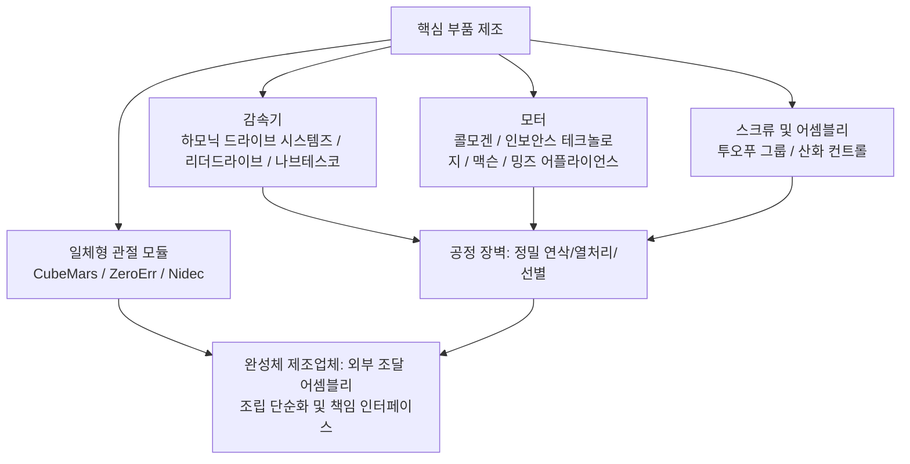

# 제 10장 제조 공정 시스템

## 요약

휴머노이드 로봇이 설계도에서 양산으로 넘어가기 위해서는 전체적인 제조 공정 시스템이 필요합니다. 동일한 관절 하우징이라도 시제품 단계에서는 CNC 정밀 가공이 가능하지만, 수만 대 규모에서는 다이캐스팅이나 단조로 전환되어야 합니다. 동일한 다섯 손가락 로봇 핸드의 초소형 기어는 금속 사출 성형(MIM)으로 제작될 수 있는 반면, 외장 커버는 사출 금형으로 제작됩니다. 이 장은 8~9장의 설계 및 서브시스템 엔지니어링과 연결되어, 휴머노이드 로봇의 4대 주요 제조 공정——CNC 정밀 가공, 사출 성형, 다이캐스팅 및 금속 성형, 적층 제조(3D 프린팅)——의 공정 원리, 정밀도 및 비용 특성, 적용 부품을 체계적으로 설명합니다. 나아가 제조 가능성 설계(DFM) 및 조립 가능성 설계(DFA), 공차 체인 분석 및 GD&T, 금형 및 지그/고정구, 초품 검사(FAI)를 논의하고, 하모닉 드라이브, 프레임리스 토크 모터,行星 롤러 나사, 코어리스 모터 등의 핵심 부품을 예시로 들어 공정 선택이 Harmonic Drive, Leaderdrive, Nabtesco, Kollmorgen, Inovance Technology, Moons', Tuopu Group, Sanhua Intelligent Controls 등 공급업체 생태계와 어떻게 연계되는지 설명합니다. 이 장의 내용은 제11장 "조립, 통합 및 테스트"의 공정 기초가 됩니다.

**키워드**: 제조 공정; CNC 가공; 사출 성형; 다이캐스팅; 적층 제조; DFM; DFA; 공차 체인; GD&T; MBD; FAI; PPAP

---

## 10.1 제조 공정 시스템 개요

### 10.1.1 서브시스템 설계에서 양산까지: 공정 시스템의 위치

제9장에서는 휴머노이드 로봇을 하체, 상체, 손, 몸통, 머리/목, 관절 모듈 등 독립적으로 검증 가능한 서브시스템으로 분해했습니다. 그러나 서브시스템 설계가 확정하는 것은 "형상과 인터페이스"일 뿐, "어떤 장비로, 어떤 택트 타임으로, 얼마의 비용으로 만들 것인가"에 대한 답은 아닙니다. 제조 공정 시스템(manufacturing process system)은 바로 설계와 양산을 연결하는 다리입니다. CAD 모델을 공정 경로(process routing), 지그/고정구, 검사 규격 및 비용 구조로 변환하고, 소량 시생산(Pilot Run)에서 수율과 일관성에 대한 검증을 받습니다.

본 지식 그래프의 휴머노이드 로봇 제품 개발 WBS(작업 분류 체계, Work Breakdown Structure)에서 제조 관련 작업은 여러 단계에 걸쳐 있습니다.

- **P5 본체 구조 엔지니어링 및 프로토타입(Mechanical Structure)**: 중앙 골격 및 사지 링크 설계(P5.1.1), 관절 장착 인터페이스 및 하우징 설계(P5.1.2), 외관 커버 및 분할선 설계(P5.1.3)를 완료하고, 구조 재료 선정(P5.2.1), 적층 제조 지향 설계(DfAM, P5.2.2) 및 양산 공정 평가(P5.2.3)를 수행하여 《재료 선정표》와 양산 공정 로드맵을 출력합니다.
- **P8 구조 강도 시뮬레이션 및 반복(Structural FEA)**: 유한 요소 해석(FEA)을 통해 중요 단면을 검증하며, 해당 메쉬와 하중 가정은 후속 공정에서 구현 가능한 두께, 모서리 반경 및 리브와 일치해야 합니다.
- **P16 소량 시생산 및 양산 준비(Pilot & Production Ramp)**: DFM/DFA 검토(P16.1.1), 금형 및 지그/고정구 설계(P16.1.2), 공급업체 선정 및 감사(P16.2.1)를 수행하고, PPAP/양산 준비 평가(P16.3.3)까지 진행합니다.


!!! note "용어 설명: 공정 경로, 지그/고정구, 초품 검사, PPAP"
    - **공정 경로(process routing)**: 부품이 원자재에서 완제품이 되기까지 거치는 공정 순서로, 장비, 작업 시간 및 검사 지점을 포함합니다.
    - **지그/고정구(tooling)**: 금형, 지그, 검사 지그 등 전용 공정 장비의 총칭입니다.
    - **초품 검사(First Article Inspection, FAI)**: 지그/고정구 또는 공정 변경 후 생산된 첫 번째 부품에 대해 전체 치수를 측정하여 도면 요구 사항에 부합하는지 검증하는 것입니다.
    - **PPAP(Production Part Approval Process, 생산 부품 승인 절차)**: 자동차 산업에서 유래한 양산 부품 승인 절차로, 공급업체가 설계 기록, 공정 흐름도, PFMEA, 관리 계획, 측정 시스템 분석 및 전체 치수 보고서 등의 증거 패키지를 제출하도록 요구합니다.

### 10.1.2 공정 경로 결정 프레임워크: 배치 크기, 정밀도, 비용 및 납기

휴머노이드 로봇 부품의 공정 선택은 본질적으로 다목적 의사 결정 문제이며, 주요 변수는 다음과 같습니다.

1. **연간 수요량(배치 크기)**: 금형 기반 공정(사출, 다이캐스팅, 단조, MIM)의 고정 투자 비용을 상쇄할 수 있는지 결정합니다.
2. **정밀도 및 공차 등급**: 감속기 부품, 나사 부 등은 IT5–IT7 등급을 요구하며, 커버 부품은 일반적으로 IT13 등급이면 충분합니다.
3. **재료**: 알루미늄 합금, 마그네슘 합금, 티타늄 합금, 엔지니어링 플라스틱, 탄소 섬유 복합 재료에 따라 사용 가능한 공정 세트가 다릅니다.
4. **구조 복잡성**: 내부 유로, 격자 구조, 일체형 이형 부품은 종종 적층 제조만 가능합니다.
5. **납기 및 반복 속도**: 연구 개발 단계에서는 빠른 반복을 강조하고, 양산 단계에서는 택트 타임과 일관성을 강조합니다.

공정의 단위 비용은 배치 크기와 무관한 고정 부분과 배치 크기에 비례하는 변동 부분으로 대략 분해할 수 있습니다.

$$
C_{\text{unit}}(N) = \frac{C_{\text{tooling}} + C_{\text{setup}}}{N} + C_{\text{material}} + C_{\text{cycle}} \cdot t_{\text{cycle}} + C_{\text{finish}}
$$

여기서 \(N\)은 총 생산량, \(C_{\text{tooling}}\)은 금형/지그/고정구 비용, \(t_{\text{cycle}}\)은 단위 부품당 사이클 타임입니다. \(N\)이 매우 작을 때는 금형이 필요 없는 공정(CNC, 3D 프린팅)이 유리합니다. \(N\)이 특정 **손익분기 배치 크기** \(N^*\)를 초과하면 금형 기반 공정이 유리해집니다. 일반적으로 사출 및 다이캐스팅의 손익분기점은 수천에서 수만 개 수준이며, 구체적인 값은 금형 복잡성과 기계 시간 요율에 따라 달라집니다.

### 10.1.3 부품-공정 매핑 총괄표

휴머노이드 로봇 전체 BOM의 부품은 "구조-구동-전기-외관"의 네 가지 범주로 분류하여 주요 공정에 매핑할 수 있습니다.

| 부품 범주 | 대표 부품 | 시제품 단계 공정 | 양산 단계 공정 | 주요 정밀도 요구 사항 |
|---|---|---|---|---|
| 구조 하중 지지 부품 | 골반 골격, 대퇴/하퇴 링크, 관절 하우징 | CNC 알루미늄 합금, 탄소 섬유 적층 | 다이캐스팅, 단조 + CNC 정밀 가공 | 베어링 자리 IT6–IT7, 형상 공차 0.02–0.05 mm |
| 구동 부품 | 하모닉 플렉스플라인/서큘러 스플라인, 유성 기어,行星 롤러 나사 | CNC + 연삭 | 단조/분말 야금/MIM + 정밀 연삭 | 치면 IT5–IT6, 나사 리드 정밀도 마이크로미터 수준 |
| 전기 부품 | 프레임리스 토크 모터 고정자/회전자, 코어리스 모터 권선 | 외부 구매 표준 부품 | 전문 모터 공장의 스탬핑/권선 라인 | 적층 공차, 에어 갭 균일성 |
| 외관 커버 부품 | 외장 케이스, 보호판, 장식 부품 | 3D 프린팅, 진공 주형 | 사출 성형, 진공 성형 | 외관 A면, 조립 간격 0.3–0.8 mm |
| 배선 및 커넥터 | 동력 배선, 통신 배선, 커넥터 | 수동 배선 | 반자동 압착 + 도통 테스트 | 압착 인장력, 접촉 저항 |
| 다섯 손가락 로봇 핸드 초소형 부품 | 초소형 기어, 텐던 풀리, 손가락 마디 링크 | CNC, 3D 프린팅 | MIM, 정밀 사출 성형 | 모듈 0.2–0.5 기어 정밀도 |

### 10.1.4 공정 시스템의 디지털 백본: MBD 및 단일 데이터 소스

전통적인 "2D 도면 + 3D 모델"의 이중 체계는 버전 반복에서 불일치를 발생시키기 쉽습니다. **모델 기반 정의(Model-Based Definition, MBD)**는 형상, 운동학, 질량 특성, 기하 공차(GD&T) 및 제조 주석을 단일 디지털 마스터 모델에 내장하여 설계, 공정, 검사 세 측이 동일한 권위 있는 데이터 소스를 공유하도록 합니다. 관절이 많고 인터페이스가 복잡한 휴머노이드 로봇과 같은 제품의 경우 MBD의 가치는 특히 두드러집니다. 관절 하우징의 베어링 자리 공차와 동축도 요구 사항은 3차원 측정기(CMM) 프로그램에서 직접 읽을 수 있어 수동 전사 오류를 방지합니다. URDF 모델의 질량 특성은 MBD의 재료 및 공정 정보와 일관성을 유지하여 제11장의 시스템 식별에 사전 정보를 제공할 수 있습니다.

## 10.2 CNC 정밀 가공

### 10.2.1 공정 원리 및 능력 한계

CNC 정밀 가공(CNC precision machining)은 컴퓨터 수치 제어 절삭을 통해 소재에서 재료를 제거하여 고정밀 구조 부품을 얻는 절삭 공정으로, 밀링, 선삭, 보링/드릴링 및 연삭을 포함합니다. 그 본질적인 제약은 절삭력 \(F_c\)에 의해 발생하는 공구-공작물 시스템의 변형에서 비롯됩니다. 돌출 길이가 \(L\)인 공구에서 끝단 처짐은 대략 다음과 같습니다.

$$
\delta = \frac{F_c L^3}{3EI}
$$

이는 가늘고 긴 형상과 박벽 부품의 가공 정밀도 상한을 결정합니다. 휴머노이드 로봇의 관절 하우징은 종종 박벽의 깊은 캐비티 구조로, 가공 시 벽 두께 진동(채터링)과 공구 변형이 주요 오차 원인입니다. 공학적으로는 일반적으로 층별 절삭, 절삭 깊이 감소, 전용 진공 척 또는 저융점 합금 충전 지지대를 사용하여 이를 억제합니다.

### 10.2.2 정밀도 등급과 공차-비용 법칙

기계 가공 정밀도는 공차 등급(IT 등급)으로 특성화됩니다. 일반적으로 공차 등급이 한 단계씩 엄격해질수록 비용은 거의 지수적으로 증가합니다. 더 엄격한 공차는 더 정밀한 공작 기계, 더 낮은 절삭 매개변수, 더 많은 공정 및 더 높은 불량률을 요구하기 때문입니다.

$$
C \approx C_0 \cdot \left(\frac{T_0}{T}\right)^{\alpha}, \quad \alpha \approx 1.5 \sim 2
$$

여기서 \(T\)는 공차대 폭, \(C_0\)는 기준 비용입니다. 이것이 DFM에서 "공차 완화"의 경제적 근거입니다. 기능을 손상시키지 않는 범위 내에서 엄격한 공차는 실제로 결합이 필요한 치수에만 유지해야 합니다.

| 공정 | 일반적으로 달성 가능한 공차 등급 | 대표적인 표면 거칠기 Ra (μm) | 휴머노이드 로봇의 일반적인 적용 |
|---|---|---|---|
| 일반 밀링/선삭 | IT9–IT11 | 1.6–6.3 | 브래킷, 커버 플레이트, 비결합 구조 |
| 정밀 밀링/보링 | IT7–IT8 | 0.8–1.6 | 관절 하우징 베어링 시트, 감속기 장착면 |
| 연삭 | IT5–IT6 | 0.2–0.8 | 볼스크류 레이스, 기어 저널, 플렉스플라인 결합면 |
| 래핑/호닝 | IT4–IT5 | 0.05–0.4 | 정밀 베어링 시트, 유압 부품 |

### 10.2.3 휴머노이드 로봇의 일반적인 기계 가공 부품

- **관절 하우징 및 골반 프레임**: 대부분 6061/7075 알루미늄 합금(알루미늄-마그네슘 합금 계열, 3장 참조) 5축 밀링 부품으로, 베어링 시트와 감속기 장착면의 동축도와 직각도를 0.02–0.05 mm 수준으로 제어하여 관절 모듈의 전동 정밀도와 수명을 보장해야 합니다.
- **행성 롤러 스크류(planetary roller screw)**: Tesla Optimus와 같은 선형 액추에이터의 핵심 부품으로, 스크류, 롤러 및 너트의 나사 레이스는 정밀 연삭이 필요하며 리드 정밀도는 일반적으로 마이크로미터 수준이며, 높은 헤르츠 접촉 응력을 견디기 위해 표면 경화 처리가 필요합니다. 이 부품의 가공 공정 장벽은 높으며, 현재 공급망 병목 현상 중 하나입니다(7장 참조).
- **고조파 감속기 부품**: 플렉스플라인의 얇은 벽 컵은 매우 낮은 벽 두께 편차와 진원도 오차를 요구하며, 서큘러 스플라인의 내부 기어는 기어 셰이핑 또는 와이어 방전 가공 후 정밀 연삭이 필요합니다.

### 10.2.4 기계 가공 DFM 핵심 사항

제조 용이성 설계(DFM)의 기계 가공 시나리오에서 핵심 규칙은 다음과 같습니다. 깊은 캐비티와 좁은 홈 회피(깊이/폭 비율은 일반적으로 4:1 초과 금지); 내부 필렛 반경은 공구 반경 이상; 박벽 부품에 공정 보강 리브 또는 대칭 구조를 추가하여 응력 완화; 공구 교체를 줄이기 위해 구경 시리즈 통일; 형상 정밀도를 보장하기 위해 결합면을 한 번의 셋업에 집중. 이러한 규칙은 기업의 《DFM 체크리스트》로 정형화되어야 하며, WBS의 P16.1.1 DFM/DFA 검토에서 항목별로 확인해야 합니다.

---

## 10.3 사출 성형

### 10.3.1 공정 원리 및 금형 시스템

사출 성형(injection molding)은 용융된 플라스틱을 고압으로 닫힌 금형 캐비티에 주입하고, 냉각 및 경화시킨 후 금형을 열어 제품을 취출합니다. 공정 변수(용융 온도, 금형 온도, 사출 압력 및 속도, 보압 압력 및 시간, 냉각 시간)는 제품의 치수 정밀도와 결함 경향을 공동으로 결정합니다. 금형 시스템은 캐비티/코어, 러너 시스템, 냉각수로, 이젝터 메커니즘으로 구성됩니다. 복잡한 커버 부품 금형의 개발 주기는 일반적으로 8–16주이며, 비용은 수십만 위안에서 수백만 위안에 이릅니다. 이는 사출 성형이 충분히 큰 배치 크기가 결정된 부품에만 적합하다는 것을 결정합니다.

### 10.3.2 커버 부품 및 파팅 라인 설계

휴머노이드 로봇의 외관 커버 부품(exterior covering)은 사출 성형 공정의 주요 대상입니다. WBS의 P5.1.3 "외관 커버 부품 및 파팅 라인 설계"는 커버 부품 3D 모델, 파팅 라인 계획 및 유지보수 개구부 레이아웃 출력을 요구합니다. 그 엔지니어링 핵심 사항은 다음과 같습니다.

- **파팅 라인 위치**: 시각적으로 덜 민감한 영역을 따라 배치하고 관절 운동 포락선과 안전 간격을 유지하여 운동 간섭 및 끼임 위험을 방지해야 합니다.
- **벽 두께 균일성**: 일반적인 벽 두께는 2.0–3.0 mm이며, 벽 두께가 급변하는 부분은 점진적으로 전환되어 싱크 마크와 휨을 방지해야 합니다.
- **드래프트 각도**: 외관면은 일반적으로 1°–3° 이상이어야 하며, 텍스처 표면은 더 커야 합니다.
- **스냅핏 및 보스**: DFA와 함께 통합 스냅핏을 사용하여 체결구 수를 줄이지만, 조립/분해 수명을 검증해야 합니다.

재료 측면에서 커버 부품은 일반적으로 ABS, PC/ABS 합금 또는 유리 섬유 강화 나일론을 사용합니다. 모터 및 배터리 근처의 단열 쉴드는 더 높은 난연 등급의 재료를 고려할 수 있습니다.

### 10.3.3 일반적인 결함 및 공정 윈도우

| 결함 | 원인 | 대책 |
|---|---|---|
| 쇼트 샷(미충진) | 용융 선단 조기 응고, 배기 불량 | 수지 온도/금형 온도 상승, 게이트 추가, 배기 최적화 |
| 플래시(버) | 형체력 부족, 파팅면 마모 | 형체력 증가, 금형 수리, 사출 압력 감소 |
| 싱크 마크 | 벽 두께 불균일, 보압 부족 | 두께 감소, 보압 강화, 리브 언더컷 |
| 휨 | 냉각 불균일, 배향 응력 | 냉각수로 균형, 게이트 위치 최적화, 어닐링 |
| 웰드 라인 | 다중 흐름 합류 | 게이트 조정, 합류 온도 상승, 오버플로 웰 설정 |

### 10.3.4 비용 모델 및 배치 임계값

사출 성형 단품 비용은 금형 상각이 지배합니다. 금형 비용 \(C_{\text{mold}}\), 수명 \(N_{\text{life}}\) 샷, 단품 재료 및 기계 시간 비용 \(C_{\text{part}}\)라고 하면,

$$
C_{\text{unit}} \approx \frac{C_{\text{mold}}}{\min(N, N_{\text{life}})} + C_{\text{part}}
$$

전체 로봇 계획 생산량이 수백 대 수준일 때, 커버 부품은 3D 프린팅, 진공 주형(실리콘 몰드) 또는 CNC 핸드메이드를 사용하는 것이 좋습니다. 생산량이 수만 대 수준에 도달하면 사출 성형의 단가 이점이 나타납니다. 이것이 휴머노이드 로봇 산업이 "프로토타입-소량 생산-양산"의 세 단계에서 커버 부품 공정이 진화하는 일반적인 경로입니다.

---

## 10.4 다이캐스팅 및 금속 성형

### 10.4.1 고압 다이캐스팅 원리

고압 다이캐스팅(high-pressure die casting, HPDC)은 용융된 알루미늄/마그네슘 합금을 고속 고압으로 강철 금형에 충전하여 복잡한 박벽 구조 부품을 한 번에 성형합니다. 장점은 사이클 타임이 빠르고(단일 사이클 수십 초), 거의 최종 형상(near-net-shape)이며, 치수 일관성이 좋다는 것입니다. 단점은 금형 투자가 크고, 내부에 기공이 포함되기 쉬우며(후속 열처리 및 높은 기밀 요구에 불리), 벽 두께가 너무 얇을 수 없다는 것입니다. 휴머노이드 로봇의 관절 하우징, 몸통 프레임은 생산량이 수천 대 이상에 도달하면 CNC에서 다이캐스팅으로 전환하여 일반적으로 단품 비용을 한 자릿수 낮출 수 있습니다.

### 10.4.2 일체형 다이캐스팅 및 대형 구조 부품

자동차 산업에서 검증된 "일체형 다이캐스팅"(giga casting) 개념이 휴머노이드 로봇으로 침투하고 있습니다. 수십 개의 판금/기계 가공 부품을 용접하여 조립하던 몸통 프레임을 하나 또는 두 개의 대형 다이캐스팅 부품으로 통합하면 부품 수, 조립 시간 및 누적 공차를 크게 줄일 수 있습니다(9장 9.11.3절의 추세 판단과 일치). Tesla Optimus의 공급망 구축에서 액추에이터 어셈블리 및 구조 부품 공급업체인 Tuopu Group과 전기 기계식 액추에이터 파트너인 Sanhua Intelligent Controls는 모두 대형 다이캐스팅 및 정밀 제조 능력을 보유하고 있어 "자동차 부품 공정의 휴머노이드 로봇으로의 이전"이라는 산업 논리를 보여줍니다.

!!! note "용어 설명: 일체형 다이캐스팅, 근접 최종 형상, 열처리 불필요 합금"
    - **일체형 다이캐스팅(giga casting)**: 초대형 다이캐스팅 기계를 사용하여 여러 구조 부품을 단일 대형 주물로 한 번에 성형하는 공정.
    - **근접 최종 형상(near-net-shape)**: 성형 후 최종 치수에 도달하기 위해 소량의 가공만 필요한 공정.
    - **열처리 불필요 합금**: 합금 설계를 통해 주조 상태에서 강도 요구 사항을 충족시켜 열처리 변형을 방지하며, 대형 일체형 부품에 적합합니다.

### 10.4.3 단조, 분말 야금 및 금속 사출 성형

- **단조(forging)**: 소성 변형을 통해 결정립을 미세화하고 조직을 치밀하게 하여 높은 피로 하중을 받는 커넥팅 로드 및 관절 요크 부품에 적합합니다. 일반적인 공정은 "단조 블랭크 + CNC 정밀 가공"입니다.
- **분말 야금(powder metallurgy, PM)**: 대량 생산되는 소형 기어 및 함유 베어링에 적합하며 재료利用率이 높지만 충격 인성이 제한적입니다.
- **금속 사출 성형(Metal Injection Molding, MIM)**: 금속 분말과 바인더를 혼합하여 사출 성형한 후 탈지 및 소결합니다. 특히 로봇 핸드의 초소형 기어, 텐더 풀리 및 이형 소형 부품에 적합합니다. 이러한 부품은 모듈이 작고, 생산량이 많으며, 형상이 복잡하여 CNC 가공이 경제적이지 않습니다.

### 10.4.4 마그네슘 합금 및 반고체 성형

마그네슘 합금의 밀도는 알루미늄 합금의 약 2/3에 불과하여 중량 감소에 민감한 사지 구조에 매력적입니다(3장에서 야금 특성 설명). 그러나 주조 및 가공 시 인화성 및 부식 문제를 처리해야 합니다. 반고체 성형(semi-solid processing, 틱소캐스팅)은 반고체 온도 범위에서 슬러리를 사출하여 가스 혼입이 적고, 수축공이 적으며, 열처리 강화가 가능하여 마그네슘/알루미늄 합금 고성능 구조 부품의 고급 옵션입니다. 현재 휴머노이드 로봇 분야에서는 아직 초기 도입 단계에 있습니다.

## 10.5 적층 제조(3D 프린팅)

### 10.5.1 공정 패밀리 및 성능 비교

적층 제조(Additive Manufacturing, AM)는 재료를 층층이 쌓아 성형하며, 주요 공정 패밀리는 다음과 같습니다:

| 공정 | 재료 | 정밀도/표면 | 일반적인 용도 |
|---|---|---|---|
| FDM/FFF(용융 증착) | PLA, ABS, PA-CF | 낮음, 층무늬 뚜렷 | 개념 모델, 지그/고정구, 비표준 치공구 |
| SLA/DLP(광경화) | 광경화성 수지 | 높음, 표면 양호 | 외관 검증, 정밀 시제품 |
| SLS/MJF(분말 소결) | PA12, TPU | 중간 | 기능성 시제품, 소량 생산 커버 부품 |
| SLM/LPBF(금속 레이저 용융) | AlSi10Mg, Ti6Al4V, 316L | 높음, 후가공 맞춤면 필요 | 위상 최적화 구조 부품, 일체형 관절 부품 |

### 10.5.2 적층 제조를 위한 설계(DfAM)

WBS의 P5.2.2는 DfAM 체크리스트, 프린팅 부품 도면 및 프린팅 파라미터 출력을 명확히 요구합니다. DfAM의 핵심은 "기존 부품을 프린팅하는 것"이 아니라, 적층 공정의 기하학적 자유도를 활용하여 재설계하는 것입니다:

1. **위상 최적화 및 격자 충전**: 강성 제약 조건을 충족하면서 솔리드 구조를 격자 구조로 대체하여 사지 링크의 무게를 30%~60% 감소시킬 수 있습니다.
2. **부품 통합**: 브래킷, 와이어 하네스 클립, 센서 마운트를 단일 부품으로 통합하여 DFA의 부품 수 감소 원칙을 직접 실행합니다.
3. **컨포멀 유로**: 관절 하우징 내부에 컨포멀 냉각 유로를 프린팅하여 9장의 열 관리 설계와 연동합니다.
4. **방향 및 서포트 설계**: 성형 방향은 층간 강도 방향과 서포트 제거 비용을 결정하며, 이방성은 강도 검증에서 명시적으로 모델링되어야 합니다.

### 10.5.3 금속 프린팅 부품의 후처리 및 성능

SLM 알루미늄 합금/티타늄 합금 부품은 일반적으로 열간 등방압 프레스(HIP)로 내부 기공 제거, 응력 제거 어닐링, 맞춤면 CNC 정밀 가공, 표면 샌드블라스팅/아노다이징이 필요합니다. 프린팅 상태의 피로 성능은 일반적으로 단조품보다 낮으므로, 주요 하중 지지 부품은 공정 검증 시편(witness coupon)과 동일 로드 시험편의 기계적 특성 테스트를 통해 배치 추적성을 확보해야 합니다.

### 10.5.4 "프로토타입-소량 생산-양산" 스펙트럼에서의 위치

인간형 로봇에서 적층 제조의 합리적인 위치는 다음과 같습니다: 연구 개발 기간의 빠른 반복(1~7일 납기), 소량 생산 단계의 복잡 부품 및 맞춤형 부품, 양산 라인의 지그/고정구 및 예비 부품. 생산량이 수백에서 수천 개를 초과하면, 기하학적으로 금형을 열 수 없는 구조를 제외한 대부분의 부품은 전통적인 금형 공정으로 전환해야 합니다.

---

## 10.6 DFM, DFA 및 원가 공학

### 10.6.1 제조 용이성 설계(DFM) 방법론

**제조 용이성 설계(Design for Manufacturing, DFM)** 는 부품 및 어셈블리를 대규모로 쉽고, 반복 가능하며, 경제적으로 제조할 수 있도록 하는 엔지니어링 설계 방법입니다. 인간형 로봇에서의 적용 형태는 공정별로 분류된 체크리스트(기계 가공, 판금, 사출, 다이캐스팅, 적층, PCBA 각 1부)이며, 상세 설계 검토 시 항목별로 확인하여 엔지니어링 변경 요청(ECR)을 출력합니다. DFM의 경제적 레버리지는 주로 공차 완화, 재료 및 소재 규격 표준화, 공정 통합, 특수 장비가 필요한 형상 회피에서 비롯됩니다.

### 10.6.2 조립 용이성 설계(DFA) 및 부품 수 감소

**조립 용이성 설계(Design for Assembly, DFA)** 는 부품 수를 줄이고, 연결 방식을 단순화하며, 조립 시간을 단축하여 생산 비용을 낮추고 신뢰성을 향상시킵니다. 그 고전적 판단 기준(Boothroyd-Dewhurst 방법)은 각 부품에 대해 세 가지 질문을 합니다: 해당 부품이 다른 부품에 대해 반드시 움직여야 하는가? 반드시 다른 재료를 사용해야 하는가? 유지보수 또는 조립을 위해 독립적이어야 하는가? 세 질문 모두 '아니오'인 경우 통합을 고려해야 합니다. 인간형 로봇 관절 모듈은 DFA의 고부가가치 대상입니다: 모터, 감속기, 엔코더, 드라이버를 일체형 관절(예: CubeMars, ZeroErr 등의 일체형 관절 모듈)로 통합하는 것은 본질적으로 공급망 수준의 DFA입니다——완성차 업체는 조립 복잡성을 전문 모듈 업체에 이전하여 완성차 조립 택트 타임과 일관성을 확보합니다.

DFA의 효율은 조립 효율(assembly efficiency)로 측정할 수 있습니다:

$$
\eta_{\text{DFA}} = \frac{N_{\min} \cdot t_{\text{basic}}}{t_{\text{total}}}
$$

여기서 \(N_{\min}\)은 이론적 최소 부품 수, \(t_{\text{basic}}\)은 단일 부품 기본 조립 시간, \(t_{\text{total}}\)은 실제 총 조립 시간입니다. 이 지표는 P5.3.2 "조립 순서 및 지그/고정구 계획" 단계에서 예측할 수 있으며, 11장의 조립 라인 계획에서 재검토됩니다.

### 10.6.3 DFM/DFA 검토 및 엔지니어링 변경 피드백 루프

WBS의 P16.1.1 "DFM/DFA 검토"는 DFM/DFA 보고서, 엔지니어링 변경 목록 및 비용 영향 평가를 출력하도록 요구합니다. 검토는 설계, 공정, 품질, 구매 및 공급업체가 공동으로 참여해야 하며, 일반적인 출력은 다음과 같습니다:

| 검토 발견 사항 | 변경 유형 | 비용/기간 영향 |
|---|---|---|
| 관절 하우징 베어링 시트 공차 과도하게 엄격함(IT5) | 기능 요구사항에 맞게 IT6으로 완화 | 기계 가공 비용 감소, 불량률 감소 |
| 커버 부품 나사 보스 과밀 | 스냅핏 + 소량 나사로 변경 | 금형 복잡성 감소, 조립 공수 감소 |
| 링크 3개 용접 조립에서 일체형 다이캐스팅으로 변경 | 공정 경로 변경 | 금형 투자 증가, 단품 비용 대폭 감소 |
| 관절을 가로지르는 와이어 하네스에 케이블 덕트 없음 | 구조에 홈 가공 + 스냅핏 추가 | 신뢰성 향상, 조립 오류 방지 |

### 10.6.4 BOM 원가 공학 및 VA/VE

**BOM 원가 공학(BOM cost engineering)** 은 부품 선정, 공급업체 협상, 수율 및 설계 절충을 균형 있게 조정하여 자재 명세서(BOM) 비용을 체계적으로 분석하고 최적화합니다. **가치 분석/가치 공학(Value Analysis / Value Engineering, VA/VE)** 은 기능을 유지하면서 비용을 절감하거나, 허용 가능한 비용 내에서 기능을 향상시킵니다. P16.3.2 "원가 계산 및 원가 절감"에서 이 둘은 should-cost 모델링(7장 참조)과 결합되어 "목표 원가 → 설계 원가 절감 → 구매 원가 절감 → 수율 원가 절감"의 피드백 루프를 형성합니다. 현재 인간형 로봇 단계에서 원가 절감의 주요 전장은 일반적으로 액추에이터(전체 BOM에서 가장 큰 비중 차지), 감속기 및 컴퓨팅 플랫폼이며,这正是 DFM/DFA 및 VA/VE가 우선적으로 투입되어야 할 대상입니다.

---

## 10.7 공차 체인, GD&T 및 측정

### 10.7.1 공차 체인 중첩: 최대값법과 통계적 방법

**공차 체인(tolerance chain/stack-up)** 분석이 답하는 질문은 다음과 같습니다: \(n\)개의 부품이 직렬로 조립될 때, 폐쇄 링(예: 관절 간극, 끝단 위치 오차)의 공차는 얼마인가? 최대값법(worst case)은 절대적인 보장을 제공합니다:

$$
T_0 = \sum_{i=1}^{n} T_i
$$

통계적 방법(RSS, 제곱합 평균 제곱근법)은 치수가 독립적이고 정규 분포를 따른다는 가정 하에 더 경제적인 추정치를 제공합니다:

$$
T_0 = \sqrt{\sum_{i=1}^{n} T_i^2}
$$

최대값법은 보수적이지만 비용이 높습니다; 통계적 방법은 개별 부품 공차를 완화할 수 있도록 허용하지만, 소량의 불량 가능성이 존재하며, 가정이 성립함을 보장하기 위해 공정 능력(11장 Cpk 참조)이 필요합니다. 공학적 관례는 다음과 같습니다: 안전 관련 및 운동학적 중요 체인에는 최대값법을 사용하고, 일반 조립 체인에는 통계적 방법을 사용합니다.

### 10.7.2 GD&T 및 모델 기반 정의

기하 공차 및 치수(GD&T)는 위치도, 동심도, 직각도, 윤곽도 등의 기호를 사용하여 기능 요구사항을 제조 및 검사 단계에 정확하게 전달하며, 그 표기 체계(ASME Y14.5 / ISO GPS 시리즈)는 정밀 전자기계 제품의 사실상 표준이 되었습니다. 10.1.4절의 MBD와 함께, GD&T 표기는 3D 모델의 피처에 직접 첨부되며, CMM 검사 프로그램이 반자동으로 생성되어 "설계-제조-검사"의 동일 소스를 실현합니다.

### 10.7.3 주요 공차 체인 사례: 관절 동심도 및 다리 운동학 정밀도

휴머노이드 로봇의 끝단 위치 오차는 "링크 제조 오차 + 관절 조립 오차 + 엔코더 오차"에 의해 단계적으로 증폭됩니다. 다리를 예로 들면, 대퇴부와 하퇴부의 길이가 각각 약 400mm이고, 단일 베어링 자리의 동심도 오차가 0.02mm일 때 발생하는 각도 편차는 약 \(0.02/400 \approx 5\times10^{-5}\) rad이며, 두 링크를 거쳐 증폭된 후 발 끝 위치 편차는 여전히 0.1mm 수준입니다; 실제로 발 끝 정밀도를 지배하는 것은 종종 감속기 백래시(하모닉 감속기의 일반적인 백래시는 1 arcmin 미만이지만 장기 마모 후 증가)와 링크 열팽창입니다. 아래는 공차 체인 통계적 중첩에 대한 Python 계산 예제입니다:

```python
import math

# 특정 관절 모듈 조립 체인: 각 요소의 공차 (mm, 대칭 공차대 반폭)
chain = {
    "베어링 자리 가공 공차": 0.010,
    "베어링 유격 환산": 0.008,
    "감속기 설치면 직각도 환산": 0.012,
    "하우징 결합 간극": 0.015,
}

T_worst = sum(chain.values())                      # 최대값법
T_rss = math.sqrt(sum(t**2 for t in chain.values()))  # 통계적 방법(RSS)

for name, t in chain.items():
    print(f"{name}: ±{t:.3f} mm")
print(f"최대값법 폐쇄 링 공차: ±{T_worst:.3f} mm")
print(f"통계적 방법 폐쇄 링 공차: ±{T_rss:.3f} mm")
```

출력은 통계적 방법이 제공하는 폐쇄 링 공차가 최대값법의 약 절반임을 보여주며, 이 차이가 바로 "공차 완화 여유"이며, 이는 직접적으로 단품 가공 비용 절감으로 이어집니다.

### 10.7.4 측정 시스템: CMM, 광학 스캐닝 및 공작기계 내 측정

측정 능력은 공차 요구사항과 일치해야 합니다: 일반적으로 측정 시스템의 불확도는 측정 대상 공차의 1/10보다 우수해야 합니다(측정기 10:1 원칙). 휴머노이드 로봇 구조 부품의 일반적인 수단으로는 삼차원 측정기(CMM) 전체 치수 측정(FAI용), 청색광/레이저 스캐닝 비교(커버 부품 윤곽도용), 공작기계 내 프로브(가공 공정 폐쇄 루프용) 및 관절 모듈 전용 백래시/전동 오차 테스트 장비가 있습니다. 측정 시스템 자체는 GR&R(측정 시스템 반복성 및 재현성) 분석을 통해 검증되어야 하며, 일반적으로 %GR&R이 10%(핵심 특성) 또는 30%(일반 특성) 미만이어야 합니다.

---

## 10.8 핵심 부품의 제조 공정 및 공급업체 생태계

### 10.8.1 감속기: 플렉스 스플라인 변형 하의 정밀 제조

하모닉 감속기(harmonic reducer)는 플렉스 스플라인의 탄성 변형에 의존하여 동력을 전달하며, 그 성능은 치형 정밀도, 플렉스 스플라인 피로 수명 및 백래시에 의해 결정됩니다. 플렉스 스플라인 소재는 단조, 정밀 선삭, 기어 형성/호브 가공 및 열처리를 거쳐야 하며, 치면 정밀도는 IT5–IT6 등급이 요구됩니다; 이것이 **하모닉 드라이브 시스템즈(Harmonic Drive Systems)**가 장기간 고급 시장을 점유해 온 공정 장벽이며, **리더드라이브(Leaderdrive)**와 같은 중국 업체들이 최근 지속적으로 기술을 개발하여 휴머노이드 로봇 공급망에서 점유율을 높이고 있는 방향입니다. RV 감속기(사이클로이드 핀 휠 유성 전동)는 **나브테스코(Nabtesco)**가 대표적이며, 사이클로이드 휠 연삭 및 크랭크축 위상 정밀도 역시 높은 진입 장벽을 구성합니다; 독일의 **비텐슈타인(Wittenstein)**, 이탈리아의 **본피글리올리(Bonfiglioli)**는 정밀 유성 감속기 분야에서 깊은 축적을 가지고 있습니다.

### 10.8.2 모터: 프레임리스 토크 모터 및 할로우 컵 모터

**프레임리스 토크 모터(frameless torque motor)**는 고정자와 회전자를 관절 구조에 직접 내장하며, 그 제조 핵심은 규소 강판의 정밀 프레스 적층, 높은 슬롯 점적율 권선 및 자석(Nd-Fe-B, 3장 참조) 접착 공정입니다; **콜모겐(Kollmorgen)**은 이 분야의 전통적인 강자이며, **인보안스 테크놀로지(Inovance Technology)**와 같은 중국 자동화 업체들이 빠르게 진입하고 있습니다. 로봇 핸드용 **할로우 컵 모터(hollow cup motor)**의 무철심 컵형 권선은 전용 권선 장비가 필요하며, **밍즈 어플라이언스(Mingzhi Appliance)**와 스위스의 **맥슨 그룹(Maxon Group)**이 이 분야의 대표적인 공급업체입니다. 모터 양산의 일관성 지표(역기전력 상수, 코깅 토크, 상간 저항 편차)는 11장의 관절 모듈 EOL 테스트 합격률을 직접적으로 결정합니다.

### 10.8.3 볼스크류 및 액추에이터 어셈블리

유성 롤러 스크류의 나사산 레이스 정밀 연삭 및 롤러 일관성 선별이 공정의 핵심이며, 현재 글로벌 생산 능력은 제한적입니다. **투오푸 그룹(Tuopu Group)**, **산화 컨트롤(Sanhua Intelligent Controls)**과 같은 Tier-1 공급업체는 선형 액추에이터 어셈블리(모터 + 스크류 + 센서 + 하우징)의 통합 제조를 구축하고 있으며, 스크류 연삭, 어셈블리 조립 및 출하 테스트를 턴키 제품으로 통합하고 있습니다 – 완성체 제조업체의 관점에서 이는 일체형 관절 모듈과 마찬가지로 "외부 조달 어셈블리를 통해 조립 단순화 및 책임 인터페이스 명확화"를 추구하는 제조 전략입니다.



---

## 10.9 금형, 지그 및 초품 검사

### 10.9.1 금형 및 지그 설계

WBS의 P16.1.2 "금형 및 지그 설계"는 금형/지그 도면, FAI 계획 및 합격 기준을 출력하도록 요구합니다. 지그 시스템의 계층은 다음과 같습니다: 성형 금형(사출 금형, 다이캐스팅 금형, 단조 금형) → 가공 지그(CNC 지그) → 조립 지그(11장 참조) → 검사 지그(전용 통과/정지 게이지, 윤곽 검사 지그). 지그 개발은 양산 준비의 중요한 경로입니다: 다이캐스팅 금형의 설계 및 제조 주기는 일반적으로 12–20주이며, 설계 동결 전에 공정 타당성 확인이 완료되어야 합니다. 그렇지 않으면 설계 변경이 금형 수정 비용 및 납기 지연으로 직접 이어집니다.

### 10.9.2 초품 검사(FAI) 및 PPAP 연계

초품 검사는 지그로 생산된 첫 번째 부품에 대해 전체 치수 측정 및 재료 검증을 수행하여 "금형이 올바르게 제작되었는지" 확인합니다. FAI 통과 후 소량 생산 검증 단계로 진입하며, 최종적으로 PPAP 증빙 패키지(설계 기록, 엔지니어링 변경 문서, 공정 흐름도, PFMEA, 관리 계획, MSA, 전체 치수 보고서, 초기 공정 연구)에 통합됩니다. 여기서 **PFMEA(공정 실패 모드 및 영향 분석)**는 FMEA 방법론을 제조 공정에 적용한 것입니다: 각 공정에 대해 잠재적 실패 모드의 심각도(S), 발생도(O) 및 검출도(D)를 평가하고, 위험 우선 순위 번호 \(RPN = S \times O \times D\)로 순위를 매겨 개선을 추진합니다. **공급업체 인증(supplier qualification)** – 양산 전에 부품 제조업체의 품질, 생산 능력, 추적성 및 규정 준수를 감사하는 것 – 은 외부 공급망도 동일한 시스템에 포함되도록 보장하며, 이는 WBS의 P16.2.1 "공급업체 선정 및 감사"에 해당합니다.

## 10.10 이 장의 요약

이 장에서는 인간형 로봇 제조 공정 체계를 체계적으로 설명하며, 주요 결론은 다음과 같습니다.

1. **공정 체계는 설계와 양산 사이의 다리이다**: WBS에서 제조 작업은 P5(본체 구조 엔지니어링), P8(구조 FEA) 및 P16(양산 준비)에 걸쳐 있습니다. MBD는 단일 디지털 데이터 소스를 제공하여 설계, 제조 및 검사를 연결합니다.

2. **4대 공정은 각각 경제적 구간이 있다**: CNC 가공은 시제품 및 정밀 동력 전달 부품에 적합하며, 정밀도는 IT5까지 가능하지만 공차가 엄격해질수록 비용은 지수적으로 증가합니다. 사출 성형은 수만 대 규모의 커버 부품에 적합합니다. 다이캐스팅 및 일체형 다이캐스팅은 수천 대 이상의 구조 부품에 적합합니다. 적층 제조는 빠른 반복, 복잡한 부품 및 지그/고정구를 주도합니다. 손익분기 로트 크기는 공정 전환의 핵심 판단 기준입니다.

3. **DFM/DFA는 비용과 품질의 선행 레버이다**: 공차 완화, 부품 수 감소 및 조립 효율성 측정은 설계 동결 전에 검토를 완료해야 합니다. BOM 비용 엔지니어링과 VA/VE는 원가 절감을 프로세스로 정착시킵니다.

4. **공차 체인은 전체 기계의 정밀도 상한을 결정한다**: 극값법은 안전을 보장하고 통계법은 비용을 절감합니다. 관절 동축도, 감속기 백래시 및 열팽창은 발끝 정밀도의 주요 항목입니다. 측정 시스템은 10:1 원칙을 충족하고 GR&R을 통해 검증되어야 합니다.

5. **핵심 부품의 공정 장벽이 공급망 구도를 형성한다**: 하모닉 드라이브 플렉스 스플라인, 행성 롤러 나사 레이스웨이, 코어리스 권선 등의 정밀 공정은 Harmonic Drive, Nabtesco, Maxon 등 업체의 장기적인 장벽이며, Leaderdrive, Inovance Technology, Moons' Industries, Tuopu Group, Sanhua Intelligent Controls 등 중국 공급업체의 돌파 방향이기도 합니다.

---

## 10.10.1 이 장의 기호표

| 기호 | 의미 | 단위 | 최초 출현 |
|---|---|---|---|
| \(C_{\text{unit}}\) | 단품 비용 | 원/개 | 10.1.2 |
| \(C_{\text{tooling}}, C_{\text{mold}}\) | 지그/금형 비용 | 원 | 10.1.2, 10.3.4 |
| \(N, N^*, N_{\text{life}}\) | 생산량, 손익분기 로트 크기, 금형 수명 | 개 | 10.1.2, 10.3.4 |
| \(F_c, \delta, L\) | 절삭력, 공구 처짐, 돌출 길이 | N, mm, mm | 10.2.1 |
| \(T, T_0, T_i\) | 공차대, 폐쇄환 공차, 구성환 공차 | mm | 10.2.2, 10.7.1 |
| \(\eta_{\text{DFA}}\) | 조립 효율 | 무차원 | 10.6.2 |
| \(N_{\min}, t_{\text{basic}}, t_{\text{total}}\) | 이론 최소 부품 수, 기본 조립 시간, 총 조립 시간 | 개, s, s | 10.6.2 |
| \(S, O, D, RPN\) | 심각도, 발생도, 검출도, 위험 우선 순위 | 무차원 | 10.9.2 |

---

## 10.11 이 장의 지식 그래프 앵커 포인트

### 10.11.1 핵심 개체 및 관계 표

| 개체 유형 | 대표 개체 (KG 항목) | 속성 예시 |
|---|---|---|
| 제조 공정 | CNC 정밀 가공 (ent_process_cnc_machining), 사출 성형, 다이캐스팅, 적층 제조 | 정밀도, 로트 크기 구간, 비용 구조 |
| 설계 방법 | 제조 용이성 설계 DFM, 조립 용이성 설계 DFA, 모델 기반 정의 MBD | 체크리스트, 검토 시점 |
| WBS 프로세스 | P5 본체 구조 엔지니어링 및 프로토타입, P16 소량 시생산 및 양산 준비 | 산출물, 승인 지표 |
| 부품 | 행성 롤러 나사, 하모닉 드라이브, 프레임리스 토크 모터, 코어리스 모터 | 정밀도 등급, 공정 장벽 |
| 공급업체 | Harmonic Drive, Leaderdrive, Nabtesco, Kollmorgen, Inovance Technology, Maxon, Moons' Industries, Tuopu Group, Sanhua Intelligent Controls, Wittenstein, Bonfiglioli, CubeMars, ZeroErr | 품목, 공정 능력 |
| 품질 방법 | FAI, PPAP, PFMEA, 공급업체 인증 | 증거 패키지, 심사 차원 |

관계 예시:

| 헤드 개체 | 관계 | 테일 개체 | 설명 |
|---|---|---|---|
| 관절 하우징 | 채택 | 다이캐스팅 / CNC | 로트 크기에 따라 공정 선택 |
| 로봇 핸드 마이크로 기어 | 채택 | MIM | 소형 모듈 복잡 부품의 경제적 공정 |
| DFM/DFA 검토 | 출력 | 엔지니어링 변경 목록 | P16.1.1 산출물 |
| 행성 롤러 나사 | 의존 | 정밀 연삭 | 레이스웨이 정밀도 마이크로미터급 |
| MBD | 연결 | 설계—제조—검사 | 단일 디지털 마스터 모델 |
| PFMEA | 구동 | 관리 계획 | RPN 순위에 따른 개선 |

### 10.11.2 계층 간 연결 예시: 재료에서 양산 준비까지


### 10.11.3 이 장의 다섯 가지 핵심 질문

1. **왜 시제품은 CNC를 사용하고 양산은 다이캐스팅으로 전환하는가?** 금형 관련 공정은 고정 비용을 대량 생산에 분산시켜 단품 비용이 \(1/N\)에 따라 감소합니다. 로트 크기가 손익분기점보다 낮으면 금형이 없는 CNC가 오히려 경제적이며 빠른 설계 반복을 지원합니다.

2. **공차가 왜 무조건 엄격할수록 좋은 것이 아닌가?** CNC 가공 비용은 공차가 엄격해질수록 지수적으로 증가합니다. 공차 체인 통계법은 대부분의 조립 체인이 더 느슨한 단품 공차로도 동일한 폐쇄환 요구 사항을 충족할 수 있음을 보여주며, 과도한 정밀도는 순전한 낭비입니다.

3. **일체형 관절 모듈이 어떻게 동시에 원가 절감과 품질 향상을 가능하게 하는가?** 이는 공급망 수준의 DFA입니다. 부품 수와 조립 공정이 모듈 공장 내에서 통합되어, 완제품 공장은 더 짧은 조립 택트 타임, 더 명확한 책임 범위 및 더 일관된 입고 품질을 얻습니다.

4. **인간형 로봇 양산에서 적층 제조의 올바른 위치는 무엇인가?** 빠른 반복, 기하학적 복잡 부품, 소량 맞춤형 부품 및 생산 라인 지그/고정구입니다. 금형을 열 수 없는 구조를 제외하고, 대량 부품은 금형 공정으로 회귀해야 합니다.

5. **FAI와 PPAP는 어떤 문제를 해결하는가?** FAI는 "지그/고정구가 첫 번째 부품을 올바르게 만들었는지"를 검증하고, PPAP는 "프로세스가 모든 부품을 안정적으로 올바르게 만들 수 있는지"를 검증하여, 이 둘이 함께 제조 리스크를 양산 전에 차단합니다.

## 참고 문헌 및 데이터 출처

1. Kalpakjian S, Schmid S R. *Manufacturing Engineering and Technology* (8th ed.). Pearson, 2020.（제조 공정 교과서）
2. Groover M P. *Fundamentals of Modern Manufacturing: Materials, Processes, and Systems* (7th ed.). Wiley, 2018.（제조 시스템）
3. Boothroyd G, Dewhurst P, Knight W A. *Product Design for Manufacture and Assembly* (3rd ed.). CRC Press, 2010.（DFMA 고전）
4. Shigley J E, Mischke C R, Budynas R G. *Mechanical Engineering Design* (7th ed.). McGraw-Hill, 2004.（기계 설계）
5. ASME Y14.5-2018. *Dimensioning and Tolerancing*. American Society of Mechanical Engineers, 2018.（GD&T 표준）
6. ISO 2768-1:1989. *General tolerances*. International Organization for Standardization, 1989.（일반 공차）
7. ISO 286-1:2010. *Geometrical product specifications (GPS) — ISO code system for tolerances on linear sizes*. ISO, 2010.（IT 공차 등급）
8. AIAG. *Production Part Approval Process (PPAP)* (4th ed.). Automotive Industry Action Group, 2006.（PPAP 핸드북）
9. AIAG. *Potential Failure Mode and Effects Analysis (FMEA)* (4th ed.). AIAG, 2008.（FMEA 핸드북）
10. AIAG. *Statistical Process Control (SPC)* (2nd ed.). AIAG, 2005.（SPC 핸드북）
11. IATF 16949:2016. *Quality management system requirements for automotive production and relevant service parts organizations*. IATF, 2016.（자동차 품질 시스템）
12. ISO/ASTM 52900:2021. *Additive manufacturing — General principles — Fundamentals and vocabulary*. ISO, 2021.（적층 제조 용어）
13. Gibson I, Rosen D, Stucker B. *Additive Manufacturing Technologies* (3rd ed.). Springer, 2021.（적층 제조）
14. Ashby M F. *Materials Selection in Mechanical Design* (4th ed.). Butterworth-Heinemann, 2011.（재료 및 공정 선택）
15. Harmonic Drive Systems Inc. *Corporate and product information*. https://www.hds.co.jp/.（고조파 감속기 공개 자료）
16. Nabtesco Corporation. *Precision reduction gears*. https://www.nabtesco.com/.（RV 감속기 공개 자료）
17. Leaderdrive（녹색 고조파）. *회사 공개 자료*. https://www.leaderdrive.com/.（고조파 감속기 공개 자료）
18. Kollmorgen. *Frameless motors and servo drives*. https://www.kollmorgen.com/.（프레임리스 모터 공개 자료）
19. Inovance Technology（회천 기술）. *회사 공개 자료*. https://www.inovance.com/.（서보 및 모터 공개 자료）
20. Maxon Group. *Precision drive systems*. https://www.maxongroup.com/.（정밀 모터 공개 자료）
21. Tuopu Group（탁보 그룹）. *회사 공개 자료*.（액추에이터 어셈블리 및 구조 부품 공개 정보）
22. Sanhua Intelligent Controls（삼화 지능 제어）. *회사 공개 자료*. https://www.sanhuagroup.com/.（전기 기계식 액추에이터 공개 정보）
23. Tesla. *AI Day 2022: Optimus Robot*. 2022. https://www.tesla.com/AI.（Optimus 액추에이터 및 제조 공개 소개）
24. Wittenstein SE. *Precision gearboxes and servo systems*. https://www.wittenstein.de/.（정밀 감속기 공개 자료）
25. Mingzhi Appliance（명지 전기）. *회사 공개 자료*.（중공 컵 모터 공개 정보）
