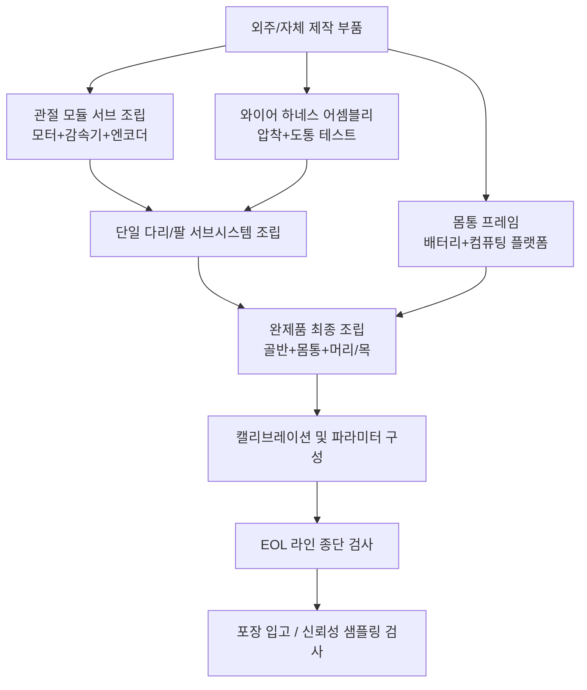

# 제 11장 조립, 통합 및 테스트

## 요약

조립(Assembly), 통합(Integration) 및 테스트(Testing)는 휴머노이드 로봇 엔지니어링 체인에서 "적격 부품을 적격 완제품으로 만드는" 마지막 단계이자, 설계 의도와 제조 변동의 최종 수렴점입니다. 본 장은 제10장의 제조 공정 시스템을 이어받아 네 가지 주요 축을 중심으로 전개됩니다. 첫째는 **조립 공정 엔지니어링**으로, 나사 체결 및 토크 제어, 압입 및 접착, 감속기 및 베어링 조립, 와이어 하네스 엔지니어링 등 핵심 공정과 그 포카요케 설계를 다룹니다. 둘째는 **조립 라인 계획 및 완제품 통합**으로, 조립 순서 및 지그/고정구 계획, 택트 타임 및 라인 밸런싱, 관절 모듈 서브 조립 및 완제품 최종 조립의 계층적 통합 전략을 다룹니다. 셋째는 **캘리브레이션 및 파라미터 구성**으로, 관절 영점 캘리브레이션, 운동학 파라미터 보정, 다중 센서 공동 캘리브레이션 및 시스템 식별을 포함합니다. 넷째는 **테스트 검증 체계**로, 설계 검증(DV) 및 생산 검증(PV), HIL(Hardware-in-the-Loop) 테스트, EOL(End-of-Line) 검사, SPC(통계적 공정 관리) 및 양산 램프업을 다룹니다. 본 장의 내용은 지식 그래프 WBS의 P15(완제품 통합 및 검증 테스트)와 P16(소량 시생산 및 양산 준비) 두 단계에 해당하며, 엔지니어링 프로토타입에서批量 납품으로 가는 작업 매뉴얼입니다.

**키워드**: 조립 공정; 토크 제어; 완제품 통합; 관절 캘리브레이션; 시스템 식별; DV/PV; HIL; EOL 테스트; SPC; 직통률; 양산 램프업

---

## 11.1 양산 체인에서 조립, 통합 및 테스트의 위치

### 11.1.1 부품에서 완제품까지: 조립 계층

휴머노이드 로봇의 조립은 전형적인 다단계 집합 과정입니다: 부품(part) → 구성요소(component) → 서브 어셈블리(subassembly) → 서브시스템(subsystem) → 완제품(system). 다리를 예로 들면, 프레임리스 토크 모터, 하모닉 드라이브, 엔코더 및 토크 센서가 먼저 관절 모듈(서브 어셈블리)로 통합되고, 관절 모듈은 링크 및 와이어 하네스와 통합되어 단일 다리(서브시스템)가 되며, 최종적으로 좌우 다리가 골반 및 몸통과 통합되어 완제품이 됩니다. 각 계층에는 고유한 **조립 표준 작업 지침서(SOP, Standard Operating Procedure)**, 지그/고정구 및 검사 노드가 있으며, 계층의 구분은 생산 라인의 공정 수와 재공품 재고를 직접적으로 결정합니다.

### 11.1.2 V 모델 오른쪽: DV와 PV의 역할

제9장 9.1.3절에서는 이미 설계 프로세스에 V&V, DV(Design Verification, 설계 검증) 및 PV(Production Validation, 생산 검증)의 개념을 도입했습니다. 본 장에서는 실행 관점에서 두 가지의 역할을 더욱 명확히 합니다.

- **DV**는 "설계가 올바른가"에 답합니다: 엔지니어링 시제품(일반적으로 소프트 몰드 또는 기계 가공 부품)을 사용하여 제품이 모든 설계 사양을 충족하는지 검증하며, 수단으로는 환경 시험, 내구 시험, EMC 시험 및 안전 기능 시험이 포함됩니다.
- **PV**는 "제조 공정이 올바른가"에 답합니다: **양산 지그/고정구, 양산 공정, 양산 택트 타임**으로 생산된 제품을 사용하여 제조 공정이 안정적으로 적격품을 생산할 수 있는지 검증하며, 그 증거 패키지는 PPAP/양산 준비 평가(WBS P16.3.3)에 포함됩니다.

즉, DV는 설계를 동결하고, PV는 공정을 동결합니다. 둘 다 통과해야 제품이 SOP(Start of Production, 양산 시작) 조건을 갖추게 됩니다.

### 11.1.3 WBS 관점: P15와 P16의 작업 매핑

지식 그래프의 WBS는 이 단계의 작업을 두 개의 1차 단계로 분해합니다.

- **P15 완제품 통합 및 검증 테스트(Integration & V&V)**: 다리 시스템 통합 및 디버깅(P15.1.1), 팔 및 손 통합(P15.1.2), 인지-계획-제어 폐쇄 루프 통합(P15.1.3); 안전 기능 테스트(P15.2.1), 성능 기준 테스트(P15.2.2), 환경 적응성 테스트(P15.2.3); 관절 및 완제품 내구 테스트(P15.3.1), 소프트웨어 안정성 및 회귀 테스트(P15.3.2), 인증 준비 및 사전 심사(P15.3.3).
- **P16 소량 시생산 및 양산 준비(Pilot & Production Ramp)**: 조립 라인 계획 및 SOP(P16.1.3), 품질 관리 시스템 구축(P16.2.2), 입고 및 공정 이상 처리(P16.2.3), 소량 시생산(P16.3.1), 원가 계산 및 원가 절감(P16.3.2), PPAP/양산 준비 평가(P16.3.3), 서비스 매뉴얼 및 교육(P16.3.4).

본 장의 11.2–11.3절은 P5.3.2/P16.1.3의 조립 엔지니어링 작업에 해당하고, 11.4절은 캘리브레이션 관련 작업에, 11.5–11.6절은 P15의 테스트 작업에, 11.7–11.8절은 P16의 품질 및 램프업 작업에 해당합니다.

---

## 11.2 조립 공정 엔지니어링

### 11.2.1 나사 체결 및 토크 제어

나사 체결은 휴머노이드 로봇 조립에서 가장 많은 체결 방식이며, 그 품질은 예압(preload)에 의해 결정됩니다: 예압이 부족하면 진동 시 풀리고, 과도하면 나사산이 손상되거나 피체결물이 파손됩니다. 체결 토크 \(T\)와 예압 \(F\)의 엔지니어링 관계는 다음과 같습니다.

$$
T = K \cdot F \cdot d
$$

여기서 \(d\)는 나사의 공칭 직경, \(K\)는 토크 계수(일반 범위 0.15–0.25)이며, 이는 마찰 상태에 크게 의존합니다. 윤활, 도금, 와셔 재질의 로트 변동은 동일한 토크에서 예압에 ±30% 수준의 산포를 발생시킬 수 있습니다. 따라서 중요 체결부(관절 모듈 장착, 감속기 플랜지)는 **토크-각도법**을 사용해야 합니다: 먼저 밀착 토크까지 체결한 후, 지정된 각도만큼 회전시켜 볼트의 탄성 신장을 이용하여 예압을 직접 제어함으로써 산포를 ±10% 수준으로 압축합니다.

생산 라인 수준에서는 중요 공정에 곡선 모니터링이 가능한 서보 체결축을 사용하여 "토크-각도" 곡선을 기록하고 밀착점 이상(나사산 손상, 이물질, 와셔 누락)을 판정해야 합니다. 곡선 데이터는 제품 일련번호와 함께 아카이빙되어 추적 가능성의 일부를 구성합니다.

!!! note "용어 설명: 예압, 토크 계수, 토크-각도법, 밀착 토크"
    - **예압(preload)**: 볼트 체결 후 발생하는 축 방향 체결력으로, 피체결물이 느슨해지거나 외부 하중에 저항하는 기초입니다.
    - **토크 계수(torque coefficient, \(K\))**: 체결 토크와 예압 사이의 비례 계수로, 나사 마찰과 지지면 마찰을 종합적으로 반영합니다.
    - **토크-각도법(torque-to-yield / torque-plus-angle)**: 먼저 밀착점까지 체결한 후 각도를 추가하여 볼트 신장량으로 예압을 직접 제어합니다.
    - **밀착 토크(snug torque)**: 체결면이 막 밀착되었을 때의 토크로, 각도 단계의 시작점입니다.

### 11.2.2 압입, 리벳팅 및 접착

- **압입(press fitting)**: 베어링과 베어링 시트, 핀 축과 구멍의 억지 끼워맞춤은 압입을 사용하며, 압입력-변위 곡선을 제어해야 합니다: 압입력의 급격한 감소는 치수 불량 또는 기울어짐을 암시하며, 곡선은 일련번호와 함께 아카이빙됩니다. 휴머노이드 로봇 관절의 크로스 롤러 베어링은 압입 동축도에 특히 민감합니다.
- **리벳팅 및 스냅 체결**: 커버 부품과 경량 구조에는 블라인드 리벳 또는 스냅 핀이 자주 사용되며, 제10장 DFA의 부품 수 절감 전략과 결합됩니다.
- **접착(adhesive bonding)**: 자석 본딩(모터 로터), 구조용 접착제(탄소 섬유 링크 조인트) 및 나사 고정제는 세 가지 일반적인 응용 분야입니다. 접착 품질은 표면 청결도, 접착제 두께 및 경화 조건에 의존하며, 생산 라인에서는 전단 시험편을 사용하여 로트 검증을 수행해야 합니다.

### 11.2.3 감속기 및 베어링 조립: 정밀도가 최종적으로 형성되는 곳

하모닉 드라이브의 완제품 조립 공정(플렉스 스플라인과 출력 플랜지 연결, 웨이브 제너레이터 장착, 서큘러 스플라인 위치 결정)은 백래시와 전달 오차의 최종 값을 직접 결정합니다. 일반적으로 조립은 정토크 멀티 나사를 대각선으로 단계별 체결하여 플렉스 스플라인 컵 본체의 추가 변형을 피해야 합니다. 웨이브 제너레이터 베어링과 플렉스 스플라인 내벽 사이에는 지정된 등급과 충전량으로 그리스를 주입해야 하며, 과도하게 채우면 오일 교반 손실과 온도 상승이 증가합니다. 조립 완료 후 전용 테스트 장비에서 **백래시(backlash)**와 **전달 오차(transmission error)**를 측정하고, 불량품은 다음 공정으로 흘려보내지 않고 수리합니다. 이는 제10장에서 설명한 하모닉 드라이브 시스템즈, Leaderdrive 등 감속기 제조업체의 출하 검사 논리이며, 완제품 제조업체가 자체 개발한 관절에도 동일하게 필요합니다.

베어링 조립의 핵심은 청결도와 예압입니다: 입자상 오염은 베어링 조기 고장의 주요 원인이므로, 조립 구역의 청정도, 방진복 및 이온 에어 건 정전기 제거는 SOP에 포함되어야 합니다. 앵귤러 콘택트 볼 베어링 쌍의 예압량은 스페이서 연삭 또는 심 그룹화를 통해 실현되며, 그룹화 데이터도 추적 가능해야 합니다.

### 11.2.4 와이어 하네스 엔지니어링: 배선, 압착 및 도통 테스트

휴머노이드 로봇의 와이어 하네스는 여러 운동 관절을 통과하며, 완제품 신뢰성에서 가장 취약한 부분 중 하나입니다. WBS의 P5.3.1 "케이블 및 배관 배선 설계"는 《배선 설계 규격》을 출력하도록 요구하며, 케이블 모델, 고정점, 굽힘 반경 및 경로를 명확히 합니다. 조립 측의 주요 제어 항목은 다음과 같습니다.

1. **최소 굽힘 반경**: 운동 부위의 와이어 하네스는 일반적으로 케이블 외경의 7–10배 이상이어야 하며, 비틀림 구간에는 고유연성 드래그 체인 케이블을 사용합니다.
2. **응력 완화**: 커넥터 양쪽 끝에는 고정점이 있어야 하며, 운동 응력이 단자가 아닌 와이어 하네스 본체에 가해지도록 해야 합니다.
3. **압착 품질**: 단자 압착은 압착 높이(crimp height)와 박리력의 두 가지 지표로 제어되며, 샘플링하여 금속 조직 단면을 검사합니다.
4. **도통 및 절연 테스트**: 100% 와이어 하네스는 도통 테스트 장비를 통해 단선, 단락, 핀 오배선을 검사하며, 전원 와이어 하네스는 절연 저항과 내전압을 추가로 측정합니다.

### 11.2.5 포카요케 설계 및 정전기 방지

**포카요케(Poka-Yoke)**는 "조립 정확성"을 작업자의 주의력에서 지그/고정구 및 프로세스로 전환합니다: 비대칭 위치 결정 핀은 역방향 조립을 방지하고, 센서는 부품의 정확한 위치를 확인하며, 체결 프로그램은 공정별로 자동 호출되고, 부품함의 광전 센서는 부품 누락을 방지합니다. 전자 공정(모터 드라이버, 컴퓨팅 플랫폼, 배터리 BMS)은 정전기 방지 체계(EPA 구역, 정전기 방지 손목 밴드 및 작업대 매트, 이온 에어 블로어)에 따라 관리되어 ESD 손상이 완제품에 유입되어 EOL 또는 현장에서 비로소 드러나는 것을 방지해야 합니다.

## 11.3 조립 라인 계획 및 완제품 통합

### 11.3.1 조립 순서 및 지그/고정구 계획

WBS의 P5.3.2 "조립 순서 및 지그/고정구 계획"은 조립 순서도, 지그 목록 및 SOP 초안을 출력하도록 요구합니다. 조립 순서 계획의 원칙은 다음과 같습니다: 내부에서 외부로(먼저 내부 골격과 와이어 하니스를 조립한 후 외장 부품을 조립), 무거운 것부터 가벼운 것 순으로, 어려운 것부터 쉬운 것 순으로(작업 공간이 좁은 공정을 먼저 수행), 정밀도가 중요한 공정은 조기에 배치하고 검사 지점을 설정합니다. 지그와 고정구는 위치 결정 기준 통일(설계 기준 및 검사 기준과 일치), 포카요케(Poka-yoke), 신속 교체의 세 가지 요구 사항을 충족해야 합니다. 휴머노이드 로봇의 완제품 조립에는 일반적으로 수평 조립과 수직 자세 테스트 간 전환을 지원하는 특수 회전 지그가 필요합니다.

### 11.3.2 택트 타임, 라인 밸런싱 및 SOP

조립 라인 계획(WBS P16.1.3)은 **택트 타임(Takt time)**을 핵심으로 합니다. 시장 수요율을 교대당 \(D\)대, 유효 작업 시간을 \(T_{\text{avail}}\)이라고 하면,

$$
\text{Takt} = \frac{T_{\text{avail}}}{D}
$$

모든 공정의 작업 시간은 택트 타임에 근접하도록 균형을 맞춰야 하며, 라인 밸런싱 효율(Line Balancing Efficiency)은 다음과 같습니다.

$$
\eta_{\text{LB}} = \frac{\sum_{i} t_i}{n_{\text{stations}} \cdot t_{\max}}
$$

여기서 \(t_i\)는 \(i\)번째 공정의 작업 시간, \(t_{\max}\)는 병목 공정 시간입니다. 휴머노이드 로봇은 현재 연간 수백에서 수천 대 생산 단계에 있으며, 생산 라인 형태는 주로 **셀 조립(Cell Assembly)** 방식입니다. 소수의 다기능 공정과 숙련된 기술자가 작업하며, 자동차식 컨베이어 라인과는 다릅니다. 그러나 관절 모듈과 같이 완제품보다 수십 배 많은 수요가 있는 부품은 반자동 서브 조립 라인을 먼저 구축할 가치가 있습니다. SOP 문서에는 작업 분해, 주요 사항 그림, 품질 특성(CTQ) 식별 및 이상 상황 처리 지침이 포함되어야 하며, 시간 연구(Time Study) 데이터와 함께 유지 관리되어야 합니다.

### 11.3.3 관절 모듈 서브 조립 및 시스템 통합 테스트 벤치

관절 모듈은 휴머노이드 로봇에서 가장 많고 가치가 높은 서브 어셈블리입니다(완제품 기준 일반적으로 28–50개). 해당 서브 조립 라인은 "조립 → 번인(Burn-in) → 성능 테스트" 순서로 구성되어야 합니다. 모듈 조립 완료 후 부하 번인 런-인(Burn-in Run-in)을 수행하여 그리스가 고르게 분포되고 맞물림 면이 안정적으로 마모되도록 합니다. 이후 **시스템 통합 테스트 벤치(System Integration Test Bench)**에서 성능 평가를 완료합니다. 이러한 테스트 벤치는 완제품 조립 전에 관절 성능, 통신 버스, 제어 루프 및 안전 시스템을 검증하며, 일반적인 테스트 항목으로는 최대 토크, 지속 토크-온도 상승 곡선, 백래시, 토크 센서 드리프트, 통신 패킷 손실률이 있습니다. 테스트에 합격한 모듈에는 고유 일련번호가 부여되고 테스트 파일이 바인딩되어 완제품 BOM 추적의 리프 노드 역할을 합니다.

### 11.3.4 완제품 최종 조립 공정

완제품 최종 조립의 일반적인 순서는 다음과 같습니다: 골반 골격 → 다리 → 몸통(배터리, 컴퓨팅 플랫폼, 전원 분배) → 팔 → 머리/목 및 센서 마스트 → 와이어 하니스 최종 연결 → 외장 부품. 각 서브 시스템이 완료될 때마다 국부적인 전원 온 점검(통신 스캔, 비상 정지 회로, 절연 검사)을 수행하여 후속 조립으로 인해 결함이 가려지는 것을 방지합니다. 완제품 조립이 완료되면 11.4절의 캘리브레이션 및 파라미터 설정 공정으로 넘어간 후, EOL로 진행됩니다.

---

## 11.4 캘리브레이션 및 파라미터 설정

### 11.4.1 관절 캘리브레이션 공정

조립 후 첫 번째 "개별화 데이터"는 **관절 캘리브레이션 공정(Joint Calibration Procedure)**에서 생성됩니다. 각 액추에이터의 절대 영점, 엔코더 오프셋 및 방향 플래그를 결정합니다. 일반적인 구현 방식은 다음과 같습니다. 관절을 저속으로 제어하여 기계적 리미트 또는 전용 캘리브레이션 블록에 접촉시키고, 엔코더 판독값을 기록한 후 기준 자세(예: 다리를 모은 직립 자세)와 비교하여 영점 오프셋을 계산하고 드라이버의 비휘발성 메모리에 기록합니다. 이 공정은 각 관절에 대해 독립적으로 수행되어야 하며 양방향 검증(정방향과 역방향으로 리미트에 접근하여 백래시가 영점에 미치는 영향 평가)을 해야 합니다.

### 11.4.2 기구학적 캘리브레이션 및 링크 파라미터 보상

제조 및 조립 오차로 인해 실제 링크 길이와 관절 축이 공칭 값에서 벗어나 발끝과 손끝의 절대 위치 정밀도에 직접적인 손상을 줍니다. 기구학적 캘리브레이션은 외부 측정(레이저 트래커, 사진 측량 또는 캘리브레이션 지그)을 통해 여러 자세에서의 말단 위치와 자세를 수집하고 DH/PoE 파라미터에 대해 최소 제곱 식별을 수행합니다.

$$
\min_{\Delta \boldsymbol{\theta}} \sum_{k} \left\| \mathbf{p}_k^{\text{meas}} - f(\boldsymbol{q}_k, \boldsymbol{\theta}_0 + \Delta \boldsymbol{\theta}) \right\|^2
$$

여기서 \(\boldsymbol{\theta}\)는 기구학적 파라미터 벡터입니다. 보상된 파라미터는 컨트롤러에 기록되며 8장의 기구학적 캘리브레이션 방법과 연결됩니다. 양산에서는 일반적으로 "첫 번째 제품 전체 파라미터 캘리브레이션 + 배치별 핵심 파라미터 샘플링 검사" 전략을 사용하여 작업 시간을 관리합니다.

### 11.4.3 다중 센서 공동 캘리브레이션

인지-제어 폐루프는 카메라, 심도 카메라/LiDAR, IMU 및 관절 좌표계 간의 외부 파라미터 일관성을 요구합니다. **공동 캘리브레이션(Joint-Camera-IMU Calibration)**은 각 센서의 내부 파라미터, 외부 파라미터 및 시간 오프셋을 추정합니다. 카메라 내부 파라미터는 체커보드/도트 타겟을 사용하여 캘리브레이션합니다. 카메라-LiDAR 외부 파라미터는 재투영 오차 최소화를 통해 계산합니다. IMU와 카메라의 시공간 캘리브레이션은 연속 시간 궤적 추정 방법을 사용하여 수행할 수 있습니다. 머리/목 마스트의 센서는 완제품 자세 변화 시 구조적 변형으로 인해 추가 오차가 발생할 수 있으므로, 캘리브레이션은 완제품 수평 자세 기준(예: 캘리브레이션 룸 내 수평 베이스)에서 수행되어야 하며, EOL에서 특징물을 사용한 재측정을 통해 검증해야 합니다.

### 11.4.4 시스템 식별 및 동역학 파라미터 튜닝

완제품 컨트롤러(균형, 전신 제어)는 정확한 질량, 무게 중심 및 관성 파라미터에 의존합니다. **시스템 식별(System Identification)**은 가진 궤적 하에서의 관절 토크 및 운동 데이터를 사용하여 강체 동역학 방정식의 기준 파라미터(Base Parameters)를 회귀 분석합니다.

$$
\boldsymbol{\tau} = \mathbf{Y}(\mathbf{q}, \dot{\mathbf{q}}, \ddot{\mathbf{q}})\, \boldsymbol{\pi}
$$

여기서 \(\mathbf{Y}\)는 회귀 행렬, \(\boldsymbol{\pi}\)는 식별 대상 파라미터 벡터입니다. 엔지니어링에서는 "CAD 사전 정보 + 관절 수준 마찰 식별 + 전체 팔/전체 다리 가진 식별"의 세 단계로 진행합니다. 마찰 모델(쿨롱 + 점성 + 정지 마찰)의 관절별 식별 결과는 피드포워드 보상 및 EOL의 마찰 일관성 판단 기준에 동시에 사용됩니다.

### 11.4.5 소프트웨어 플래싱, 파라미터 파티션 및 추적

캘리브레이션이 완료되면 완제품은 통일된 소프트웨어 설치를 수행합니다. 펌웨어(드라이버, BMS, 안전 MCU), 운영 체제 이미지, 미들웨어(ROS 2 등) 및 애플리케이션 소프트웨어를 버전 기준에 따라 플래싱하고, 캘리브레이션 파라미터와 일련번호는 파라미터 파티션에 기록합니다. **OTA(Over-The-Air) 소프트웨어 업데이트** 시스템은 출하 전에 최초 등록 및 보안 채널 설정을 완료하여 애프터 서비스 업그레이드 및 12장 이후의 소프트웨어 반복 개발을 위한 경로를 확보합니다. 모든 플래싱 기록(버전 번호, 체크섬, 공정, 시간)은 MES에 입력되고 일련번호와 바인딩되어 "로봇당 하나의 파일"을 형성합니다.

## 11.5 테스트 검증 체계: DV와 PV

### 11.5.1 테스트 피라미드와 계층별 책임

완제품 테스트 체계는 피라미드 구조를 이룹니다. 하위 계층은 부품 및 PCBA 레벨 테스트(입고 검사, ICT 온라인 테스트), 중간 계층은 모듈/서브시스템 테스트(관절 테스트대, 배터리 팩 충방전기, HIL), 상위 계층은 완제품 및 현장 테스트입니다. 계층이 낮을수록 결함 발견 비용이 낮아집니다. 테스트 계획의 목표는 대부분의 결함을 모듈 레벨 이전에 차단하고, 완제품 레벨에서는 통합 문제(인터페이스, 간섭, 시스템 동역학)만 노출되도록 하는 것입니다.

### 11.5.2 DV: 설계 검증 시험 매트릭스

DV는 엔지니어링 시제품을 사용하여 설계 사양을 검증하며, WBS P15.2 및 P15.3 시리즈 작업에 해당합니다.

| 시험 분류 | 대표 항목 | 목적 | WBS 앵커 |
|---|---|---|---|
| 안전 기능 테스트 | 비상정지 링크, 안전 MCU 모니터링, 정전 시 제동 유지, 충돌 감지 | 안전 기능이 설계대로 작동하는지 검증 | P15.2.1 |
| 성능 기준 테스트 | 주행 속도, 배터리 지속 시간, 부하, 파지 성공률, 관절 추종 오차 | KPI 달성 검증 | P15.2.2 |
| 환경 적응성 테스트 | 고온/저온 작동/보관, 습열, 진동, 충격, 방진/방수 | 환경 민감 결함 노출 | P15.2.3 |
| 내구성 테스트 | 관절 사이클 수명, 완제품 주행 거리, 커버 개폐 수명 | 수명 설계 검증 | P15.3.1 |
| EMC 시험 | 전도/방사 방출, 정전기/무선 주파수 내성 | 규제 준수 및 자체 호환성 확보 | P13.3.2 |
| 소프트웨어 안정성 | 장시간 운용, 오류 주입 복구, 회귀 테스트 | 소프트웨어 견고성 검증 | P15.3.2 |

9장 9.9절에서 HALT/HASS 및 개별 환경 시험 방법을 이미 상세히 설명했습니다. 본 절에서는 DV 매트릭스에서의 편성 로직을 강조합니다. 즉, FMEA로 식별된 고장 모드를 인덱스로 시험 프로파일을 설계하여 각 시험이 특정 위험에 추적 가능하도록 합니다.

### 11.5.3 HIL: 통합 단계에서 하드웨어 인 더 루프의 역할

**하드웨어 인 더 루프 테스트(Hardware-in-the-Loop, HIL)** 는 실제 컨트롤러가 실시간으로 시뮬레이션되는 피제어 객체와 상호 작용하여, 완제품 통합 전에 안전하고 반복 가능하게 제어 소프트웨어를 검증합니다. 휴머노이드 로봇의 HIL에는 두 가지 일반적인 형태가 있습니다.

1.  **컨트롤러 HIL**: 실제 메인 컨트롤러/관절 드라이버가 제어 소프트웨어를 실행하고, 실시간 시뮬레이터가 완제품 동역학, 센서 및 고장 시나리오(예: 엔코더 단선, 버스 프레임 손실)를 시뮬레이션하여 고장 대응 및 성능 저하 전략을 검증합니다.
2.  **액추에이터 HIL**: 물리적 액추에이터가 컨트롤러와 함께 실시간 시뮬레이션 모델과 연결되어, 테스트대에서 완제품 부하 스펙트럼을 시뮬레이션하고, 토크 포화, 열 과부하 및 제어 대역폭 문제를 사전에 노출시킵니다.

HIL은 많은 "완제품 레벨" 위험을 테스트대 단계로 앞당기며, SiL(소프트웨어 인 더 루프)과 함께 9장에서 설명한 검증 그라데이션을 형성하여 P15.1.3 "인지-계획-제어 폐루프 통합"의 사전 안전망 역할을 합니다.

### 11.5.4 PV: 생산 검증 및 PPAP

PV의 핵심 명제는 "양산 조건으로 만든 제품이 여전히 적합한가?"입니다. 그 입력은 양산 금형, 양산 공정 파라미터 및 양산 라인 작업자이며, 출력은 PPAP 증거 패키지(10장 10.9.2절 참조)와 양산 준비 평가 결론(WBS P16.3.3)입니다. PV 배치의 샘플 크기와 테스트 항목은 다음을 포함해야 합니다: 전체 치수 측정(샘플링), 초기 공정 능력 연구(핵심 특성 Cpk ≥ 1.67, 일반 특성 Cpk ≥ 1.33은 자동차 업계의 관행 기준), 완제품 EOL 전체 항목 통과, 그리고 최소 한 번의 완전한 포장 및 운송 검증. PV 통과 후 공정 파라미터 윈도우가 고정되며, 이후의 모든 변경(4M 변경: 사람, 기계, 재료, 방법)은 변경 관리 프로세스를 거쳐야 합니다.

---

## 11.6 라인 종단 검사 (EOL)

### 11.6.1 EOL 테스트 항목 설계 원칙

라인 종단 검사(End-of-Line testing, EOL)는 모든 완제품에 대해 수행되며, 그 설계 원칙은 **짧은 택트 타임, 전체 범위 커버리지, 추적 가능성**입니다. 테스트 항목은 "제조가 올바른지"만 검증하고 "설계가 합리적인지"(후자는 DV/PV에 해당)는 검증하지 않으며, 일반적인 택트 타임은 완제품당 수십 분 정도로 제어됩니다. 모든 EOL 데이터는 일련번호에 바인딩되어 MES에 업로드되며, 이는 출하 허가 기준이자 애프터 서비스 문제의 역추적 시작점 역할을 합니다.

### 11.6.2 관절 모듈 EOL

관절 모듈은 서브 조립 라인 말단에서 모듈 레벨 EOL을 수행하며, 일반적인 항목은 다음과 같습니다.

| 테스트 항목 | 방법 | 판정 기준 예시 (일반적) |
|---|---|---|
| 절연 저항/내전압 | 메거, 내전압 시험기 | 절연 저항 ≥ 지정 임계값 |
| 역기전력 상수 | 드래그 방식으로 선간 역기전력 측정 | 공칭값과의 편차 ≤ ±5% |
| 무부하 마찰 토크 | 저속 정/역회전 | 마찰-속도 곡선이 템플릿 내에 있음 |
| 백래시 | 양방향 반복 하중 인가 | ≤ 사양값 (예: 1 arcmin 수준) |
| 토크 센서 영점 | 무부하 판독값 | 영점 드리프트 ≤ 임계값 |
| 통신 및 엔코더 | 버스 스캔, 멀티턴 카운트 | 프레임 손실 없음, 멀티턴 위치 정확 |
| 소음 및 진동 | 마이크/가속도계 (선택 사항) | 이상 스펙트럼 라인 경보 |

### 11.6.3 완제품 EOL

완제품 EOL의 일반적인 프로세스는 다음과 같습니다: 외관 및 체결 검사 → 전원 투입 자체 진단(센서, 드라이버, 배터리 BMS 통신) → 비상정지 및 안전 링크 테스트 → 관절 영점 재확인 → 정적 자세 및 무게중심 정렬 → 제자리 걷기/짧은 보행 → 상체 일반 동작 및 파지 스모크 테스트 → 충전 기능 점검 → 데이터 아카이빙 및 출하. 보행 테스트는 일반적으로 속도 제한 및 안전 장치 보호 하에 수행됩니다. 판정 기준은 "동작 완료 + 주요 신호 엔벨로프가 템플릿 내에 있음"을 위주로 하여, EOL이 시간 소모적인 성능 시험이 되는 것을 방지합니다.

---

## 11.7 품질 및 공정 관리

### 11.7.1 SPC와 공정 능력 지수

**통계적 공정 관리(Statistical Process Control, SPC)** 는 관리도를 사용하여 핵심 특성의 공정 변동을 모니터링하고, 일반 원인 변동과 특수 원인 변동을 구분합니다. 공정 능력 지수는 다음과 같이 정의됩니다.

$$
C_p = \frac{USL - LSL}{6\sigma}, \qquad C_{pk} = \min\!\left(\frac{USL-\mu}{3\sigma}, \frac{\mu-LSL}{3\sigma}\right)
$$

여기서 \(USL/LSL\)은 사양 상한/하한, \(\mu,\sigma\)는 공정 평균 및 표준 편차입니다. WBS의 P16.2.2 "품질 관리 체계 구축"은 품질 계획, 검사 사양 및 SPC 관리도 출력을 요구합니다. 휴머노이드 로봇 생산 라인의 SPC 중점 대상은 다음과 같습니다: 기계 가공 베어링 시트 치수, 체결 토크/회전각 곡선, 압입력 곡선, 사출 성형 커버의 주요 결합 치수, 모듈 EOL의 마찰 및 백래시 데이터.

### 11.7.2 직통률과 시생산 폐루프

**직통률(First Pass Yield, FPY)** 은 제품이 재작업 없이 모든 공정을 한 번에 통과하는 비율이며, 다중 공정에서는 각 스테이션 수율의 곱입니다.

$$
FPY = \prod_{i=1}^{n} y_i
$$

휴머노이드 로봇 완제품은 공정이 많아 단일 스테이션 수율이 98%라도 30개 스테이션의 누적 FPY는 약 55%에 불과합니다. 이것이 바로 P16.3.1 "소량 시생산"에서 시생산 요약 보고서, 직통률 및 문제 해결률을 출력해야 하는 이유입니다. 시생산의 목적은 몇 대의 사용 가능한 시제품을 만드는 것이 아니라 각 스테이션의 \(y_i\)를 높이고 조건을 고정하는 것입니다. 시생산 배치는 "EVT → DVT → PVT"(엔지니어링/설계/생산 검증) 순으로 진행되며, 배치 규모는 점진적으로 확대되고, 문제 해결률과 FPY 추세는 다음 단계 진입을 위한 핵심 관문입니다.

### 11.7.3 이상 처리와 8D

입고 및 공정 이상 처리(WBS P16.2.3)는 **8D 보고서** 프레임워크를 사용합니다: 팀 구성(D1), 문제 설명(D2), 임시 봉쇄(D3), 근본 원인 분석(D4, 일반적으로 5Why/어골도 사용), 영구 시정 조치(D5), 구현 및 검증(D6), 재발 방지(D7, 유사 공정으로 확대 적용), 인정 및 표준화(D8). 안전 관련 결함의 경우, 봉쇄 조치에는 이미 출하된 제품의 추적 스크리닝이 포함되어야 하며, 이는 11.4.5절에서 구축한 "로봇당 하나의 파일" 체계에 의존합니다.

### 11.7.4 추적 체계와 MES

제조 실행 시스템(MES)은 일련번호 관리, 공정 파라미터 바인딩, 테스트 데이터 아카이빙 및 역추적 조회를 담당합니다. 휴머노이드 로봇의 추적 세분화는 다음을 권장합니다: 관절 모듈 일련번호, 감속기/모터 배치, 체결 곡선, 캘리브레이션 파라미터 버전, 소프트웨어 버전 기준선. 현장에서 대량 고장이 발생할 경우, 배치 번호로 영향 범위를 특정하여 애프터 서비스 비용과 평판 손실을 최소 범위로 제한할 수 있습니다.

## 11.8 양산 램프업 및 납품 준비

### 11.8.1 Pilot Run에서 SOP까지: 램프업 곡선

양산 램프업(ramp-up)은 학습 곡선 법칙을 따릅니다. 누적 생산량이 두 배가 될 때마다 단위당 조립 공수는 일정 비율(일반적인 학습률 80%~90%)로 감소하며, FPY와 생산 능력은 동시에 상승합니다. 램프업 기간의 관리 핵심은 다음과 같습니다: 변동 요인을 줄이기 위해 1차 작업班组 고정, 일일 품질 회의를 통한 주요 불량 추적, 엔지니어링 변경 시 '컷인(cut-in)' 관리로 변경 전후 제품 구분. Tesla Optimus는 공장 배치와 높은 생산량 제조를 공개 목표로 하고, Unitree G1은 상대적으로 저렴한 가격으로批量 납품을 실현하며, Figure AI는 Figure 02를 위한 전용 양산 시설을 계획하고 있습니다. 이러한 선두 업체들의 공개된 경로는 모두 인간형 로봇 양산 경쟁력의 본질이 단일 기술 돌파구가 아니라 10~11장에서 설명한 제조 및 조립 시스템을 원활하게 운영하는 것임을 보여줍니다.

### 11.8.2 원가 계산 및 원가 절감 선순환

P16.3.2 "원가 계산 및 원가 절감"은 소량 생산 실제 데이터를 사용하여 10장의 should-cost 모델을 보정합니다: 재료, 공정, 치공구 상각, 수율 손실 및 조립 공수라는 다섯 가지 원가 라인을 구분하고, 절감 잠재력 순으로 프로젝트(VA/VE 프로젝트)를立项하여 "계산 → 立项 → 검증 → 전환"의 분기별 선순환을 형성합니다. 조립 측의 원가 절감 레버리지는 주로 DFA 재설계(체결 및 조정 공정 감소), 모듈식 조달(조립 복잡성 이전) 및 EOL 택트 최적화입니다.

### 11.8.3 서비스 매뉴얼, 예비 부품 및 교육

납품 준비(WBS P16.3.4)는 서비스 매뉴얼, 예비 부품 전략 및 교육 계획을 산출합니다: 서비스 매뉴얼은 MTTR(평균 수리 시간) 목표에 따라 분해/조립 경로를 구성하고, WBS P5.3.3 "유지보수성 및 수리 용이성 설계"의 결과를 실행 가능한 수리 작업으로 전환합니다; 예비 부품 전략은 고장률과 가동 중단 손실에 따라 등급을 나눕니다(관절 모듈, 배터리 팩, 와이어 하네스는 우선 순위가 높은 예비 부품); 교육은 생산 라인 작업자, 품질 검사 및售后 엔지니어의 세 가지 수준을 포함합니다. 이러한 내용은 이 책의 후속 장인 운영 및 전 생애 주기 관리 장과 연결됩니다.

### 11.8.4 양산 준비 검토 및 출시 게이트

PPAP 승인(WBS P16.3.3) 이후, SOP 이전에 교차 기능 양산 준비 검토(readiness review)를 개최하고, 다음 게이트 항목에 대해 항목별로 서명 확인해야 합니다:

| 게이트 항목 | 책임 부서 | 통과 기준 |
|---|---|---|
| 설계 및 공정 동결 | 연구개발/공정 | DV/PV 보고서 마감, 변경 채널 통제 |
| 생산 라인 및 치공구 | 제조 엔지니어링 | 택트 실측 목표 달성, 치공구 검수 완료 |
| 품질 시스템 | 품질 | 관리 계획 발효, 핵심 특성 Cpk 목표 달성 |
| 공급망 | 조달 | 적격 공급업체 명단 확정, PPAP 증빙 완비 |
|售后 준비 | 서비스 | 서비스 매뉴얼, 예비 부품 및 교육 준비 완료 |

게이트 기준을 충족하지 못한 항목은 반드시 명확한 마감 계획과 책임자를 동반해야 출시가 허용되며, 마감되지 않은 제조 리스크가 램프업 기간으로 유입되는 것을 방지합니다.

---

## 11.9 장 요약

본 장에서는 인간형 로봇의 조립, 통합 및 테스트 시스템을 체계적으로 설명하며, 주요 결론은 다음과 같습니다:

1.  **조립은 다계층 집합 과정입니다**: 부품 → 관절 모듈 → 서브시스템 → 완제품, 각 계층은 독립적인 SOP, 치공구 및 검사 노드를 가집니다; 모듈식 분할 조립 + 완제품 최종 조립이 현재 주류 조직 방식입니다.

2.  **조립 품질은 공정에서 만들어집니다**: 체결의 토크-각도 제어, 감속기의 정토크 단계별 조립 및 윤활 관리, 와이어 하네스의 굽힘 반경 및 응력 완화, 압입 및 접착의 곡선 모니터링이 함께 완제품의 초기 정밀도와 장기 신뢰성을 결정합니다; 방오 및 정전기 방지는 정확성을 사람에서 프로세스로 이전합니다.

3.  **교정 및 식별은 개별화된 데이터의 원천입니다**: 관절 영점, 운동학 보정, 다중 센서 외부 파라미터 및 동역학 기준 파라미터는 각 완제품이 일관된 정밀도 출발점을 갖도록 합니다; 소프트웨어 플래싱 및 파라미터 파티셔닝은 MES를 통해 "기기당 1개 파일"을 형성합니다.

4.  **DV는 설계를 동결하고, PV는 공정을 동결합니다**: DV는 FMEA를 인덱스로 사용하여 테스트 매트릭스를 구성하고, HIL은 완제품 리스크를 벤치로 사전 이동시킵니다; PV는 양산 조건에서 PPAP 증거를 생성하고, 초기 공정 능력이 목표에 도달한 후 공정 윈도우를 동결합니다.

5.  **EOL과 SPC는 양산 품질 선순환을 구성합니다**: 모듈 수준 EOL은 대부분의 결함을 차단하고, 완제품 EOL은 통합 정확성만 검증합니다; Cpk, FPY 및 8D는 지속적인 개선을 주도하며, 시험 생산 마감과 램프업 학습 곡선은 양산 원가 곡선의 하락 속도를 결정합니다.

---

## 11.9.1 장 기호표

| 기호 | 의미 | 단위 | 최초 등장 |
|---|---|---|---|
| \(T, F, d, K\) | 체결 토크, 예압력, 나사 직경, 토크 계수 | N·m, N, mm, 무차원 | 11.2.1 |
| \(\text{Takt}\) | 생산 택트 | 초/대 | 11.3.2 |
| \(\eta_{\text{LB}}\) | 라인 밸런스율 | 무차원 | 11.3.2 |
| \(\mathbf{Y}, \boldsymbol{\pi}\) | 동역학 회귀 행렬, 기준 파라미터 벡터 | — | 11.4.4 |
| \(USL, LSL, \mu, \sigma\) | 규격 상한/하한, 공정 평균 및 표준 편차 | 특성에 따라 다름 | 11.7.1 |
| \(C_p, C_{pk}\) | 공정 능력 지수 | 무차원 | 11.7.1 |
| \(FPY, y_i\) | 직통률, 단위 공정 수율 | 무차원 | 11.7.2 |

---

## 11.10 장 지식 그래프 앵커

### 11.10.1 핵심 엔티티 및 관계 테이블

| 엔티티 유형 | 대표 엔티티(KG 항목) | 속성 예시 |
|---|---|---|
| WBS 프로세스 | P15 완제품 통합 및 검증 테스트, P16 소량 시험 생산 및 양산 준비 | 3단계 작업, 인도물 |
| 조립 공정 | 체결 제어, 압입, 접착, 와이어 하네스 압착, 방오 | 곡선 기준, CTQ |
| 교정 방법 | 관절 교정 절차, 결합 교정(카메라-IMU-관절), 시스템 식별 | 영점 오프셋, 외부 파라미터, 기준 파라미터 |
| 테스트 방법 | HIL, DV/PV, EOL, 환경/내구성/EMC 테스트 | 테스트 항목, 기준 |
| 테스트 장비 | 시스템 통합 테스트 벤치, 관절 모듈 EOL 벤치 | 테스트 능력 |
| 품질 방법 | SPC, FPY, 8D, PPAP, MES 추적 | 관리도, 게이트 지표 |
| 완제품 사례 | Tesla Optimus, Unitree G1, Figure 02 | 양산 경로 |

관계 예시:

| 머리 엔티티 | 관계 | 꼬리 엔티티 | 설명 |
|---|---|---|---|
| 관절 모듈 분할 조립 | 통과 | 시스템 통합 테스트 벤치 | 조립 전 성능 및 안전 검증 |
| 완제품 최종 조립 | 의존 | 조립 순서도 / SOP | P5.3.2, P16.1.3 산출물 |
| 관절 교정 | 기록 | 드라이버 파라미터 파티션 | 기기당 1개 파일 추적 |
| HIL | 선행 | 폐쇄 루프 통합 리스크 | P15.1.3 안전망 |
| PV | 통합 | PPAP 증빙 패키지 | 양산 준비 게이트 |
| SPC 관리도 | 모니터링 | 체결/압입 곡선 | 특수 원인 변동 경보 |

### 11.10.2 계층 간 연결 예시: 공정 윈도우에서 완제품 출시까지

### 11.10.3 장의 다섯 가지 핵심 질문

1.  **왜 중요한 볼트 체결에 정토크법 대신 토크-각도법을 사용합니까?** 정토크법의 예압력은 마찰 계수 산포에 따라 ±30%까지 변동될 수 있습니다; 토크-각도법은 볼트 신장량을 통해 예압력을 직접 제어하여 산포를 ±10% 수준으로 압축하므로, 관절 및 감속기 플랜지와 같은 중요한 체결에 필수적입니다.

2.  **DV와 PV의 본질적인 차이점은 무엇입니까?** DV는 엔지니어링 시제품을 사용하여 설계가 사양을 충족하는지 검증하며, "설계가 맞는가?"에 답합니다; PV는 양산 치공구, 공정 및 인력을 사용하여 제조 공정의 안정성을 검증하며, "공정이 맞는가?"에 답합니다. 전자는 설계를 동결하고, 후자는 공정을 동결합니다.

3.  **EOL이 DV를 대체할 수 없는 이유는 무엇입니까?** EOL은 택트가 짧고 테스트 항목이 제한적이며, "이 제품이 올바르게 제조되었는가?"만 검증합니다; 설계 결함(예: 수명 부족, EMC 초과)은 EOL에서 보이지 않으며, DV/PV의 체계적인 테스트 매트릭스로 다루어야 합니다.

4.  **소량 시험 생산의 핵심 지표가 생산량이 아닌 FPY인 이유는 무엇입니까?** 다중 공정에서 FPY는 각 공정 수율의 곱입니다; 시험 생산의 임무는 각 공정의 수율을 높이고 조건을 고정하는 것이며, 그렇지 않으면 생산량을 늘리면 수리 및 폐기 비용만 증가합니다.

5.  **교정 데이터를 일련 번호와 연결하여 보관해야 하는 이유는 무엇입니까?** 영점 오프셋, 외부 파라미터 및 동역학 파라미터는 각 완제품의 "개별화된 지문"이며, 컨트롤러의 정상 작동을 위한 전제 조건일 뿐만 아니라售后 고장 추적 및批量 결함 식별을 위한 핵심 데이터 자산입니다.

## 참고 문헌 및 데이터 출처

1. Groover M P. *Fundamentals of Modern Manufacturing: Materials, Processes, and Systems* (7th ed.). Wiley, 2018.（제조 및 조립 시스템）
2. Boothroyd G, Dewhurst P, Knight W A. *Product Design for Manufacture and Assembly* (3rd ed.). CRC Press, 2010.（DFA 및 조립 분석）
3. Shigley J E, Mischke C R, Budynas R G. *Mechanical Engineering Design* (7th ed.). McGraw-Hill, 2004.（나사 체결 설계）
4. Bickford J H. *Handbook of Bolts and Bolted Joints*. CRC Press, 1998.（볼트 체결 공학）
5. Montgomery D C. *Introduction to Statistical Quality Control* (8th ed.). Wiley, 2019.（SPC 및 공정 능력）
6. AIAG. *Statistical Process Control (SPC)* (2nd ed.). AIAG, 2005.（SPC 핸드북）
7. AIAG. *Measurement Systems Analysis (MSA)* (4th ed.). AIAG, 2010.（측정 시스템 분석）
8. AIAG. *Production Part Approval Process (PPAP)* (4th ed.). AIAG, 2006.（PPAP 핸드북）
9. AIAG. *Potential Failure Mode and Effects Analysis (FMEA)* (4th ed.). AIAG, 2008.（FMEA 핸드북）
10. IATF 16949:2016. *Quality management system requirements for automotive production and relevant service parts organizations*. IATF, 2016.（품질 시스템）
11. ISO 10218-1:2011. *Robots and robotic devices — Safety requirements for industrial robots*. ISO, 2011.（로봇 안전）
12. ISO/TS 15066:2016. *Robots and robotic devices — Collaborative robots*. ISO, 2016.（협동 안전）
13. ISO 13849-1:2015. *Safety of machinery — Safety-related parts of control systems*. ISO, 2015.（기능 안전）
14. Siciliano B, Khatib O. *Springer Handbook of Robotics* (2nd ed.). Springer, 2016.（교정 및 식별 방법）
15. Khalil W, Dombre E. *Modeling, Identification and Control of Robots*. Butterworth-Heinemann, 2002.（로봇 식별 고전）
16. Featherstone R. *Rigid Body Dynamics Algorithms*. Springer, 2008.（동역학 매개변수 식별 기초）
17. Harmonic Drive Systems Inc. *Product and engineering information*. https://www.hds.co.jp/.（하모닉 드라이브 조립 및 성능 공개 자료）
18. Tesla. *AI Day 2022: Optimus Robot*. 2022. https://www.tesla.com/AI.（Optimus 제조 및 양산 공개 소개）
19. Figure AI. *Figure 02 and BotQ manufacturing*. https://www.figure.ai/.（Figure 양산 공개 자료）
20. Unitree Robotics. *G1 Humanoid Robot*. https://www.unitree.com/.（G1 대량 납품 공개 자료）
