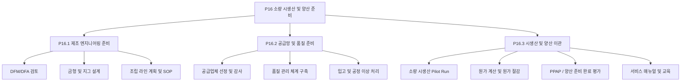
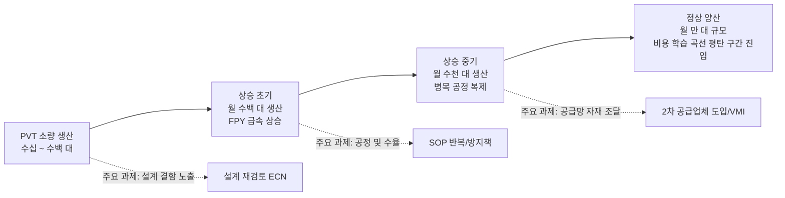
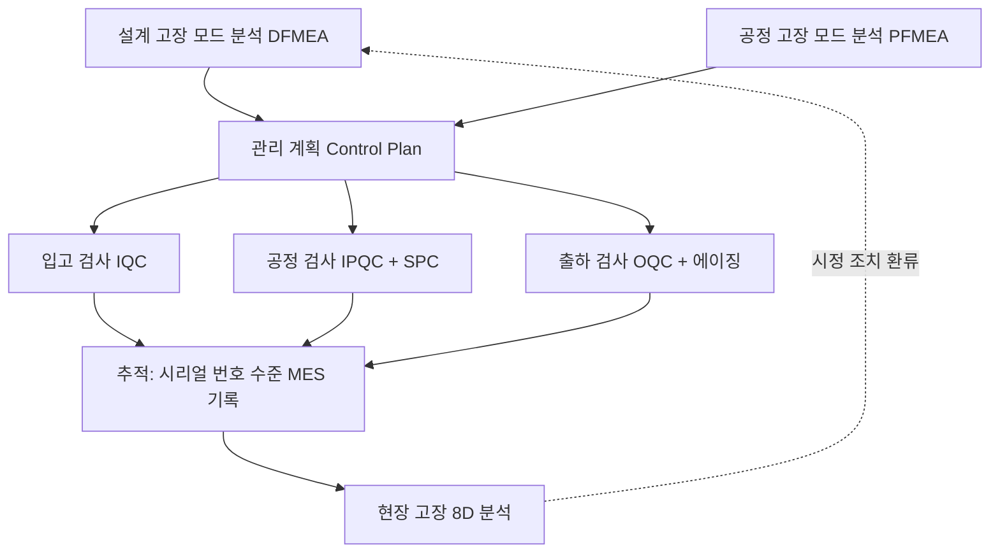
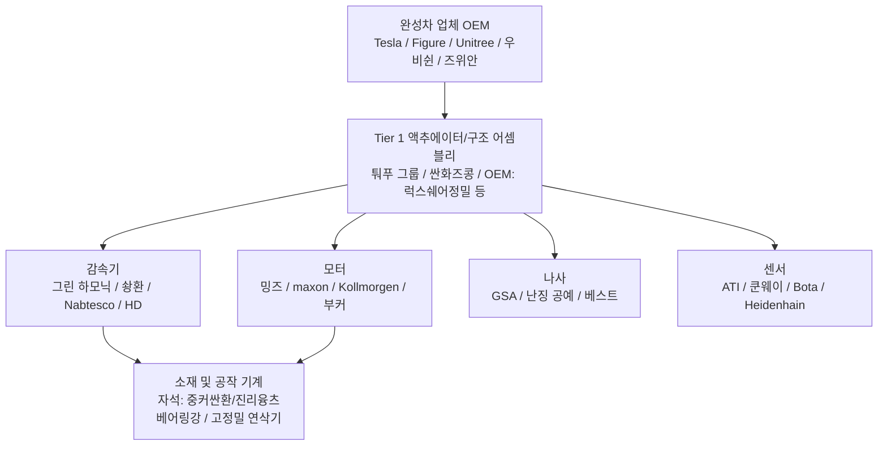

# 제 13장 양산과 규모화

## 요약

휴머노이드 로봇이 연구실 프로토타입에서 만 대, 십만 대 단위 납품으로 나아가기 위해 넘어야 할 것은 단순한 엔지니어링 기술적 격차만이 아닙니다. 더 중요한 것은 제조 시스템 전체의 역량, 즉 제조 가능성 설계, 공급망 확보, 시생산 검증, 생산 능력 램프업, 수율 엔지니어링, 원가 곡선 관리 및 품질 시스템 구축입니다. 이 장에서는 지식 그래프의 양산 프로세스 엔터티(P0 프로젝트 착수부터 P16 소량 시생산 및 양산 준비까지)를 중심으로, 휴머노이드 로봇 양산화의 여섯 가지 핵심 주제, 즉 양산 도입 프로세스, 생산 능력 램프업 모델, 수율 및 신뢰성 엔지니어링, 원가 곡선 및 원가 절감 경로, 공급망 조직 및 공급 보장 전략, 주요 기업의 제조 모드를 체계적으로 논의합니다. 이 장에서는 생산 능력 램프업의 학습 곡선 모델, 직렬 수율 모델, 결함 밀도 모델 및 공정 능력 지수와 같은 정량적 도구를 제시하고, 테슬라(Tesla), Figure AI, 우슈 테크놀로지(Unitree Robotics), 어질리티 로보틱스(Agility Robotics) 등 완성체 제조업체의 공개된 사례와 미국 은행 연구소의 《휴머노이드 로봇 101》(2025) 등 업계 공개 예측의 BOM 원가 궤적을 결합하여 휴머노이드 로봇 규모화의 엔지니어링 경제학적 그림을 그려냅니다. 이 장은 제6장(공급망) 및 제9장(서브시스템 설계)과 상호 보완적입니다. 제6장은 부품 공급 측면의 구도에, 제9장은 설계 검증(DV/PV) 자체에 초점을 맞춘 반면, 이 장은 "설계를 안정적이고 저렴하며 대규모로 생산하는" 제조 시스템 문제에 집중합니다.

**키워드**: 양산 도입; 생산 능력 램프업; 학습 곡선; 수율 엔지니어링; 공정 능력 지수; BOM 원가; DFM/DFA; PPAP; 공급망 공급 보장; 수직 통합

---

## 13.1 프로토타입에서 양산으로: 양산 도입의 전체 프레임워크

### 13.1.1 프로토타입 사고와 양산 사고의 근본적 차이

연구실 프로토타입의 목표는 "가능함을 증명"하는 것이고, 양산 제품의 목표는 "반복 가능함을 증명"하는 것입니다. 둘 사이의 엔지니어링 목적 함수 차이는 다음과 같이 요약할 수 있습니다.

- **프로토타입**: 성능 상한선을 최대화하고, 수동 조정, 단일 부품 맞춤 제작, 긴 조립 시간을 허용합니다.
- **양산**: 성능 하한선이 사양을 충족한다는 전제 하에, 단위 원가, 조립 시간 및 품질 변동을 최소화합니다.

휴머노이드 로봇 한 대는 일반적으로 30–60개의 자유도, 수천 개의 부품, 수십 개의 공급업체를 포함합니다. 단일 지점의 변동, 즉 특정 배치의 하모닉 감속기 백래시 초과, 특정 배치의 프레임리스 토크 모터 자석 감자, 특정 관절 모듈 조립 동축도 불량 등은 완성체 수준에서 보행 안정성이나 수명 문제로 증폭됩니다. 따라서 신제품 도입(NPI)의 본질은 **시스템에서 불확실성을 단계적으로 제거하는 과정**입니다.

!!! note "용어 설명: NPI, EVT/DVT/PVT, DV/PV, 양산 준비 완료"
    - **NPI(New Product Introduction, 신제품 도입)**: 제품 설계를 안정적으로 양산할 수 있는 제조 시스템으로 전환하는 전체 프로세스로, 공정 개발, 공급망 구축, 시생산 검증 및 램프업을 포함합니다.
    - **EVT/DVT/PVT**: 엔지니어링 검증, 설계 검증, 생산 검증의 세 가지 프로토타입 반복 단계입니다. PVT 이후 양산 램프업(Ramp-up)에 진입합니다.
    - **DV/PV(Design Validation / Production Validation)**: DV는 "설계가 사양을 충족하는지" 검증하고, PV는 "양산 공정으로 만든 제품이 여전히 사양을 충족하는지" 검증합니다. 제9장에서 DV/PV의 시험 내용을 논의했으며, 이 장에서는 PV 이후의 제조 일관성에 초점을 맞춥니다.
    - **양산 준비 완료(Production Readiness)**: 공정 동결, 공급망 동결, 품질 기준선 동결이 동시에 달성된 상태로, 일반적으로 PPAP 승인으로 표시됩니다.

### 13.1.2 지식 그래프의 양산 프로세스 주요 라인: P0–P16

지식 그래프는 휴머노이드 로봇의 프로젝트 착수부터 양산까지의 전체 프로세스를 17개의 단계 엔터티(research/methods/ent_process_p0 … p16)로 모델링하여, 이 책 전체의 프로세스 골격을 구성합니다.

| 단계 | 명칭 | 양산과의 관계 |
|---|---|---|
| P0 | 프로젝트 착수 및 사업 기준선 | 목표 원가, 목표 생산량, 목표 시장 결정 |
| P1 | 요구사항 정의 및 시스템 개념(Concept / Pre-A) | 제품 사양 및 플랫폼화 전략 동결 |
| P2–P3 | 산업 디자인 및 전기/기계 전체 설계 | 제조 가능성 상한선 결정 |
| P4–P5 | 관절 모듈 및 구동 시스템, 본체 구조 엔지니어링 | BOM 원가의 주요 부분 결정 |
| P6–P9 | URDF 검증, 시뮬레이션, 구조 및 열 반복 | 시뮬레이션을 통한 물리적 시제품 제작 횟수 감소 |
| P10–P14 | 제어, 로봇 핸드, AI, 전장/전자 및 소프트웨어 통합 | 소프트웨어 플래싱 가능성, 교정 가능성 등 제조 요구사항 결정 |
| P15 | 완성체 통합 및 검증 시험(Integration & V&V) | DV/PV 검증 |
| P16 | 소량 시생산 및 양산 준비(Pilot & Production Ramp) | 이 장의 핵심 |

P16 단계는 다시 세 개의 하위 프로세스 그룹으로 세분화되며, 이는 양산 준비의 세 가지 작업 영역에 해당합니다.



### 13.1.3 양산 도입의 마일스톤과 "동결" 규율

일반적인 양산 도입 타임라인은 네 가지 "동결 지점"을 포함하며, 그 규율은 휴머노이드 로봇 업계의 기존 연구 개발 문화보다 훨씬 엄격합니다.

1. **설계 동결(Design Freeze)**: 이후의 모든 변경은 ECN(Engineering Change Notice, 엔지니어링 변경 통지) 절차를 거쳐 금형, 재고, 판매된 제품에 미치는 영향을 평가해야 합니다.
2. **공정 동결(Process Freeze)**: 조립 순서, 체결 토크, 도포량, 교정 파라미터가 SOP(Standard Operating Procedure, 표준 작업 절차)에 고정됩니다.
3. **공급망 동결(Supply Freeze)**: 핵심 자재의 승인된 공급업체 목록(AVL)과 2차 공급업체 비율이 결정됩니다.
4. **품질 기준선 동결(Quality Baseline Freeze)**: 출하 검사 규격(OQC), 신뢰성 합격 기준 및 추적성 세분화 수준(관절 모듈 일련번호 수준)이 결정됩니다.

자동차 업계에서 일반적으로 사용되는 PPAP(Production Part Approval Process, 생산 부품 승인 절차)는 제9장의 DV/PV 맥락에서는 검증 도구이지만, 이 장의 맥락에서는 **양산 이관의 법적 문서**입니다. 공급업체가 치수 보고서, 재료 보고서, 성능 시험 보고서 및 공정 능력 데이터를 제출하면, 완성체 제조업체가 승인한 후에야 양산 택트에 맞춰 납품할 수 있습니다.

## 13.2 생산능력 계획과 생산능력 상승

### 13.2.1 생산능력의 기본 측정: 사이클 타임, 병목 및 OEE

생산 라인의 생산능력은 병목 공정에 의해 결정됩니다. 생산 라인에 \(n\)개의 공정이 있고, \(i\)번째 공정의 사이클 타임(Cycle Time)이 \(t_i\)(작업 시간과 로딩/언로딩 시간 포함)일 때, 이론적 사이클 타임은 다음과 같습니다.

$$
t_{cyc} = \max_{i=1,\dots,n} t_i, \qquad Q_{theory} = \frac{T_{avail}}{t_{cyc}}
$$

여기서 \(T_{avail}\)은 가용 생산 시간입니다. 실제 생산량에는 **종합 설비 효율**(Overall Equipment Effectiveness, OEE)을 곱해야 합니다.

$$
OEE = A \times P \times Q
$$

- \(A\)(Availability, 시간 가동률): 교체, 고장, 자재 부족으로 인한 라인 정지 시간을 제외합니다.
- \(P\)(Performance, 성능 가동률): 실제 사이클 타임과 이론적 사이클 타임의 비율입니다.
- \(Q\)(Quality, 양품률): 일차 통과 수율(First Pass Yield, FPY)입니다.

휴머노이드 로봇의 최종 조립은 현재까지도 **수동 조립 아일랜드형 생산 라인**이 주를 이룹니다. 관절 모듈 사전 조립, 배선 하네스 포설, 전체 기기 교정은 숙련공에 크게 의존하며, 이는 자동화된 컨베이어 라인이 일반적인 자동차 산업과 본질적으로 다릅니다. 일반적으로 소량 생산 단계에서 전체 기기 최종 조립 사이클 타임은 "일/대" 단위로 측정되며, 상승 목표는 병목 공정을 "시간/대" 단위로 압축하는 것입니다. 제약 요소는 일반적으로 최종 조립이 아니라 **관절 모듈의 번인 테스트(Burn-in)와 전체 기기 교정**에 있습니다. 각 관절은 온도 상승, 백래시, 효율, 소음 테스트가 필요하며, 각 전체 기기는 보행 교정과 센서 교정이 필요합니다. 이러한 공정의 시정수는 생산 라인 투자 규모를 결정합니다.

!!! note "용어 설명: 사이클 타임, 병목, OEE, FPY, 번인 테스트, 교정"
    - **사이클 타임(Cycle Time)**: 생산 라인에서 인접한 두 제품이 생산 완료되는 시간 간격으로, 가장 느린 공정에 의해 결정됩니다.
    - **병목(Bottleneck)**: 사이클 타임이 가장 긴 공정입니다. 병목이 아닌 공정의 속도를 높여도 총 생산능력은 향상되지 않습니다(제약 이론, TOC).
    - **OEE(Overall Equipment Effectiveness)**: 설비 종합 효율을 측정하는 표준 지표로, 세계적 수준의 이산 제조업체의 일반적인 값은 약 85%입니다.
    - **FPY(First Pass Yield, 일차 통과율)**: 수리 없이 모든 검사를 직접 통과하는 제품의 비율로, 생산능력 상승 기간의 가장 중요한 건강 지표입니다.
    - **번인 테스트(Burn-in)**: 고온/최대 부하에서 전원을 켜고 작동시켜 초기 고장을 유발하는 선별 공정입니다.
    - **교정(Calibration)**: 센서 바이어스, 관절 영점, 운동학적 매개변수를 개별 제품 구성에 기록하는 프로세스입니다. 모든 휴머노이드 로봇은 "천 기계 천 면"이며, 교정 데이터는 일련번호와 함께 보관되어야 합니다.

### 13.2.2 생산능력 상승 곡선과 학습 모델

생산능력 상승 기간의 단위 시간당 생산량은 시간이 지남에 따라 대략 S자 곡선을 따르며, 공학에서는 일반적으로 두 가지 모델을 사용하여 설명합니다.

**（1）학습 곡선(라이트의 법칙)**：누적 생산량이 두 배가 될 때마다 단위 비용(또는 단위 노동 시간)이 고정 비율 \(1-\phi\)만큼 감소합니다. 여기서 \(\phi\)는 학습률입니다.

$$
C(N) = C_1 \cdot N^{-b}, \qquad b = -\log_2 \phi
$$

일반적인 이산 제조의 학습률 \(\phi \in [0.80, 0.95]\): \(\phi=0.85\)는 누적 생산량이 두 배가 될 때마다 단위 비용이 15% 감소함을 의미합니다. 휴머노이드 로봇 관절 모듈(모터+감속기+엔코더+드라이버의 일체형 부품)은 소비자용 드론, 신에너지 차량 구동 모터와 공정상 동질성을 가지며, 참조 가능한 학습률은 약 0.85–0.92입니다.

**（2）생산능력 상승 생산량 모델**：생산능력 상승 기간의 월간 생산량 \(Q(t)\)는 대략 다음과 같습니다.

$$
Q(t) = Q_{max}\left(1 - e^{-t/\tau}\right)
$$

여기서 \(\tau\)는 생산능력 상승 시정수로, 생산 라인 시운전, 작업자 숙련도 및 공급망 자재 조달률에 의해 공동으로 결정됩니다. 일반적으로 완전히 새로운 제품군(차용 가능한 공정 유산이 없는 경우)의 \(\tau\)는 분기 단위로 측정됩니다. 자동차 Tier 1 공급업체가 참여하는 생산 라인의 경우 \(\tau\)가 현저히 단축됩니다. 이것이 테슬라(Tesla), 톱 그룹(Tuopu Group), 산화 지능 제어(Sanhua Intelligent Controls)와 같은 자동차 등급 공급업체가 완성차 업체에서 높은 평가를 받는 이유 중 하나입니다.



### 13.2.3 생산능력 상승 기간의 일반적인 고장 모드와 대책

생산능력 상승 기간의 주요 과제는 "느리게 생산하는 것"이 아니라 "일관성 없이 생산하는 것"입니다. 일반적인 문제는 다음과 같습니다.

- **로트 간 일관성 부족**: 동일한 SOP 아래에서도 다른 교대조가 조립한 관절의 백래시 분포가 변동합니다. 대책은 핵심 공정에 **방지책 설계**(Poka-Yoke)와 토크-각도 곡선을 기록하는 네트워크 연결 렌치입니다.
- **교정 생산능력 부족**: 전체 기기 보행 교정은 엔지니어의 경험에 의존합니다. 대책은 교정 프로세스를 스크립트화하고 지그화하여 "숙련공의 매개변수 조정"을 "자동 교정 공정"으로 전환하는 것입니다.
- **소프트웨어 버전 파편화**: 시험 생산 배치의 펌웨어와 출고 펌웨어가 일치하지 않습니다. 대책은 제조 실행 시스템(Manufacturing Execution System, MES) 내 소프트웨어 기준선 관리를 구축하고 OTA(Over-The-Air, 무선 업데이트)를 통해 출고 후 버전 통일을 실현하는 것입니다(지식 그래프 엔터티: ent_technology_ota_software_update_2024).
- **수리 공정이 생산능력 잠식**: FPY가 약 80% 미만이면 수리가 병목 공정을 잠식합니다. 대책은 독립적인 수리 구역과 8D 문제 해결 프로세스를 설정하는 것입니다.

## 13.3 수율 공학과 제조 품질

### 13.3.1 직렬 수율 모델: 왜 휴머노이드 로봇 수율은 "곱셈 문제"인가

휴머노이드 로봇 완제품은 수천 개의 부품과 수십 개의 핵심 모듈이 직렬로 구성됩니다. 완제품의 합격 요건이 모든 핵심 공정이 합격이고 각 공정이 거의 독립적이라면, 완제품의 1회 통과 수율은 각 공정 수율의 곱입니다:

$$
Y_{total} = \prod_{i=1}^{n} Y_i
$$

간단한 계산 예시로 그 심각성을 설명합니다: 로봇에 40개의 관절 모듈 공정과 20개의 완제품 공정이 있고, 각 공정 수율이 99%라면,

$$
Y_{total} = 0.99^{60} \approx 54.7\%
$$

즉, 거의 절반의 완제품이 재작업이 필요합니다. 완제품 FPY가 90%에 도달하려면 평균 단일 공정 수율이 다음을 만족해야 합니다:

$$
\bar{Y} \ge 0.90^{1/60} \approx 99.82\%
$$

이는 휴머노이드 로봇 양산이 반드시 자동차 산업의 PPM(백만분의 일 결함률) 관리에 접근해야 하는 이유를 설명합니다: **단일 지점 수율의 '소수점 이하 자릿수'는 직렬 시스템에서 지수적으로 증폭됩니다.**

### 13.3.2 결함 밀도 모델과 면적/복잡도 스케일링

감속기 치면, 모터 자석 접착, PCB 납땜 등의 공정에서 수율은 일반적으로 결함 밀도 모델로 추정됩니다. 포아송 모델은 다음을 제공합니다:

$$
Y = e^{-D_0 A}
$$

여기서 \(D_0\)는 결함 밀도(단위 면적당 또는 접합당 결함 수), \(A\)는 중요 면적(또는 납땜 포인트 수, 결합면 수)입니다. 개선된 머피 모델은 결함 집중 효과를 고려합니다:

$$
Y = \left(\frac{1 - e^{-D_0 A}}{D_0 A}\right)^2
$$

공학적 의미는 다음과 같습니다: **중요 면적이나 중요 특징 수를 줄이는 것 자체가 수율 공학입니다.** 이는 관절 모듈의 고집적화(모터, 감속기, 엔코더, 드라이버, 토크 센서 일체형)의 이중 이점을 설명합니다——BOM을 낮추고 조립 인터페이스 수를 줄여 직렬 수율을 지수적으로 개선합니다.

### 13.3.3 통계적 공정 관리와 공정 능력 지수

핵심 특성(예: 하모닉 감속기 백래시, 관절 영점 오차, 완제품 정적 균형)은 통계적 공정 관리(SPC)에 포함되어야 합니다. 공정 능력 지수는 다음과 같이 정의됩니다:

$$
C_p = \frac{USL - LSL}{6\sigma}, \qquad C_{pk} = \min\left(\frac{USL-\mu}{3\sigma}, \frac{\mu-LSL}{3\sigma}\right)
$$

여기서 \(USL/LSL\)은 규격 상한/하한, \(\mu,\sigma\)는 공정 평균과 표준편차입니다. 자동차 등급 요구사항은 일반적으로 \(C_{pk} \ge 1.33\)(약 63 PPM에 해당)이며, 핵심 안전 특성은 \(C_{pk} \ge 1.67\)을 요구합니다. 휴머노이드 로봇 관절의 백래시, 무부하 손실, 효율 등의 특성에 대해 현재 안정적으로 \(C_{pk}\) 데이터를 제공할 수 있는 공급업체는 거의 없으며, 이는 P16.2.2 "품질 관리 시스템 구축" 단계에서 반드시 보완해야 할 역량입니다.

### 13.3.4 신뢰성 및 수명 검증

양산 품질은 출하 시 합격뿐만 아니라 수명 기간 내 합격을 의미합니다. 휴머노이드 로봇의 신뢰성 공학 핵심 사항:

- **MTBF 목표**: 산업 현장에서는 일반적으로 평균 고장 간격(MTBF)이 수천 시간 수준을 요구합니다. 일일 2교대 운영 기준으로 연간 약 4000–6000시간 운영 시, 완제품 핵심 부품의 수명은 보증 기간을 커버해야 합니다.
- **가속 수명 시험(ALT)**: 관절 모듈에 정격 부하 이상과 고온을 가하고 역멱법칙 모델로 수명을 외삽합니다:

$$
L = L_0 \left(\frac{S_0}{S}\right)^{m}
$$

여기서 \(S\)는 응력 수준, \(m\)은 재료/메커니즘 관련 지수(피로 파손의 경우 일반적으로 \(m\approx 3\)–\(5\)).
- **고장 모드 라이브러리**: 4장과 5장에서 이미 액추에이터와 구동계의 고장 메커니즘(치면 피로, 베어링 마모, 자석 감자, 엔코더 오염)을 논의했습니다. 양산 단계에서는 이를 관리 계획(Control Plan)의 검사 항목과 빈도로 전환해야 합니다.



### 13.3.5 Python 예제: 직렬 수율과 램프업 기간 폐기 비용

다음 스크립트는 13.3.1의 직렬 수율 모델과 램프업 학습 곡선을 결합하여 램프업 기간 동안 수율 손실로 인한 추가 제조 비용을 추정하고, "수율 우선, 증설 후"의 재무적 의미를 보여줍니다:

```python
# 직렬 수율과 램프업 기간 폐기 비용 예제
import math

# 완제품 핵심 공정: 40개 관절 모듈 공정 + 20개 완제품 공정
n_ops = 60

def total_yield(p_op, n=n_ops):
    """직렬 수율: 각 공정 수율이 p_op일 때 완제품 1회 통과 수율"""
    return p_op ** n

for p in [0.99, 0.995, 0.998, 0.999]:
    print(f"단일 공정 수율 {p:.1%} -> 완제품 FPY {total_yield(p):.1%}")

# 램프업 학습 곡선: 월간 생산량 Q(t) = Qmax * (1 - exp(-t/tau))
Qmax, tau = 2000, 9          # 안정 상태 월 생산 2000대, 램프업 시정수 9개월
fpy0, fpy1, k = 0.55, 0.90, 0.25  # FPY가 55%에서 90%로 수렴, 속도 k
unit_cost = 25000            # 램프업 기간 단위 제조 비용 (달러, 규모 추정)

def monthly_output(t):
    return Qmax * (1 - math.exp(-t / tau))

def monthly_fpy(t):
    return fpy1 - (fpy1 - fpy0) * math.exp(-k * t)

scrap = 0.0
for t in range(24):          # 처음 24개월
    q = monthly_output(t)
    scrap += q * (1 - monthly_fpy(t)) * unit_cost

print(f"램프업 기간 24개월 누적 생산량 약 {sum(monthly_output(t) for t in range(24)):,.0f} 대")
print(f"수율 손실에 따른 폐기/재작업 비용 규모 약 {scrap/1e6:,.0f} 백만 달러")
```

예제의 공학적 해석: FPY가 55%에서 90%로 상승하는 과정에서 수율 손실은 장비 투자와 동일한 규모의 현금 유출입니다. 따라서 램프업 기간의 주요 KPI는 생산량이 아니라 **FPY 기울기**입니다——이는 13.2.3에서 "재작업 공정이 생산 능력을 잠식한다"는 정성적 판단과 상호 보완됩니다.

## 13.4 비용 곡선과 비용 절감 경로

### 13.4.1 BOM 비용의 현황과 공개 예측

BOM(Bill of Materials, 자재 명세서) 비용은 휴머노이드 로봇 상업화의 첫 번째 제약 조건입니다. 업계 공개 예측이 제시하는 규모는 다음과 같습니다(모두 분석 기관 추정치이며, 감사 데이터가 아님).

- 미국 은행 연구소 《Humanoid Robots 101》(2025년 4월, 지식 그래프 엔터티 ent_report_bofa_humanoid_robots_101_2025) 추정: 중국 공급망을 주로 사용하며, 16개의 회전 액추에이터, 14개의 직선 액추에이터(행성 롤러 나사), 6자유도 다기능 손, 깊이 카메라 및 라이다가 장착된 일반적인 휴머노이드 로봇의 2025년 말 BOM은 약 **3.5만 달러/대**입니다.
- 동일 보고서는 BOM이 2030–2035년에 **1.3만–1.7만 달러/대**로 하락할 것으로 예측하며, 연평균 약 14% 감소를 의미하며, 이는 학습 곡선 모델(\(\phi \approx 0.86\)–\(0.88\))과 일치합니다.
- 소비자 가격의 선행 기준점은 이미 나타났습니다: Unitree Robotics G1 휴머노이드 로봇의 공개 판매 가격은 **1.6만 달러**부터 시작하며(지식 그래프 엔터티 ent_report_unitree_unitree_g1_humanoid_agent_pric_2024), 그 경로는 일부 성능(하중, 배터리 지속 시간, 보호 등급)을 희생하여 가격을 낮추는 것으로, 중국 공급망의 비용 잠재력을 검증했습니다.

!!! note "데이터 사용 설명"
    이 섹션과 28장에서 인용된 BOM 및 시장 규모 수치는 모두 업계 공개 예측 또는 기업 공개 가격이며, 분석 기관의 전향적 추정에 속합니다. 실제 값은 기술 경로(고조파 vs 유성, 롤러 나사 vs 사다리꼴 나사, 다기능 손 및 라이다 장착 여부)와 생산량 가정에 따라 달라지므로, 독자는 이를 정확한 예측이 아닌 규모 참고 자료로 간주해야 합니다.

### 13.4.2 BOM 구조: 비용의 주요 부분은 어디인가

지식 그래프의 부품 엔터티와 업계 공개 분해를 종합하면, 전체 크기 전기 구동 휴머노이드 로봇의 BOM은 대략 다음과 같은 구조로 분포됩니다(일반적으로, 설계에 따라 상당한 변동이 있음).

| 비용 항목 | 비중 규모 | 핵심 부품(KG 엔터티 예시) | 비용 절감 레버리지 |
|---|---|---|---|
| 관절 액추에이터(회전+직선) | 40%–60% | 고조파 감속기(Harmonic Drive, Leaderdrive), 유성 감속기(Nabtesco, Wittenstein), 프레임리스 토크 모터(Kollmorgen, maxon), 행성 롤러 나사(GSA, Rollvis, Ewellix) | 통합화, 국산화 대체, 사양 다운그레이드 |
| 다기능 손과 말단 | 5%–15% | Inspire Robots, DH Robotics, Wonik Robotics, 다기능 손 마이크로 나사/텐더 로프 | 자유도 다운그레이드, 텐더 로프 방식 |
| 컴퓨팅 및 센싱 | 10%–20% | NVIDIA Jetson 플랫폼, 깊이 카메라(Orbbec), 라이다(Hesai, RoboSense), IMU, 6축 힘 센서(ATI, Kunwei, Bota Systems) | 국산 SoC, 센서 다운그레이드 및 융합 |
| 배터리 및 전원 | 3%–8% | 리튬 배터리 팩(CATL, EVE Energy), BMS, DC-DC | 플랫폼화된 배터리 팩 |
| 구조 및 외관 | 5%–10% | 알루미늄/마그네슘 합금 다이캐스팅 및 CNC, 탄소 섬유 커버 | 다이캐스팅으로 CNC 대체, 플라스틱으로 알루미늄 대체 |
| 배선 및 전기 | 3%–5% | 커넥터(TE Connectivity, JST), 배선 | EtherCAT 일원화, 무선화 |

### 13.4.3 비용 절감의 네 가지 경로

**경로 1: 설계 비용 절감(Design-to-Cost, DTC).** P1–P5 단계에서 목표 비용을 설정하고 모듈 수준으로 단계적으로 분해합니다. 지식 그래프의 방법 엔터티 **가치 공학/가치 분석**(Value Analysis / Value Engineering, VAVE, ent_method_value_analysis_value_engineering)은 체계적인 도구를 제공합니다: 각 부품에 대해 "그 기능은 무엇이며, 해당 기능을 구현하는 최저 비용 솔루션은 무엇인가"라고 질문합니다. 일반적인 VAVE 사례는 다음과 같습니다: 높은 감속비 고조파 방식을 준직접 구동(Quasi-Direct-Drive, QDD) 방식으로 대체(제어 대역폭을 사용하여 감속기 비용과 부피 절감, Unitree 경로); 고하중 관절에만 행성 롤러 나사를 사용하고 사다리꼴 나사는 사용하지 않음(Tesla Optimus 접근 방식); 다기능 손의 자유도를 20+에서 6–11로 줄여 실제 작업 요구 사항에 맞춤.

**경로 2: 규모의 비용 절감.** 학습 곡선 \(C(N)=C_1 N^{-b}\)으로 설명됩니다. 규모의 비용 절감의 전제 조건은 제조 용이성 설계(DFM)가 선행되어야 한다는 것입니다. 그렇지 않으면 규모는 결함 비용만 증폭시킵니다.

**경로 3: 공급망 비용 절감.** 국산화 대체는 중국 완제품 제조업체의 핵심 레버리지입니다: 고조파 감속기를 Harmonic Drive Systems에서 Leaderdrive 또는 Laifual로 전환, 유성 감속기를 Shuanghuan, Zhongda로 전환, 모터를 Mingzhi Appliance / Moons', Jiangsu Leili로 전환. 업계 공개 분해에서는 이러한 대체가 부품 수준에서 30%–60%의 비용 절감을 가져온다고 일반적으로 보고합니다.

**경로 4: 제조 비용 절감.** 즉, P16.3.2 "비용 계산 및 비용 절감"의 일상화: 다이캐스팅, MIM(금속 사출 성형), 냉간 단조 등의 순성형 공정을 통해 CNC 전체 절삭(지식 그래프 엔터티 ent_process_cnc_machining의 공정 경계 참조)을 대체하여 구조 부품의 기계 가공 시간을 한 자릿수로 단축; 지그와 자동 조임, 자동 도포를 통해 직접 노동력을 절감.

### 13.4.4 비용, 생산량 및 가격의 연동

완제품 제조업체는 동적 연립 방정식에 직면합니다: 가격이 수요를 결정하고, 수요가 생산량을 결정하며, 생산량이 학습 곡선을 통해 비용을 결정하고, 비용이 실현 가능한 가격을 결정합니다. 이 연동의 단순화된 표현은 다음과 같습니다.

$$
P(N) = \frac{C_1 N^{-b}}{1 - m}
$$

여기서 \(m\)은 목표 총이익률입니다. \(N\)이 수천 대 미만일 때, 어떤 정상 총이익률 가격도 산업 고객의 투자 수익 요구 사항(일반적으로 로봇이 인력을 대체하는 투자 회수 기간이 2–3년 이내여야 함)을 충족시키기 어렵습니다. 누적 생산량이 수만 대 수준에 도달하고 BOM이 2만 달러 미만으로 떨어져야 산업 현장의 총소유비용(Total Cost of Ownership, TCO)이 비로소 닫히기 시작합니다. 이것이 "양산 및 규모화" 장의 핵심 결론입니다: **휴머노이드 로봇의 상업화는 본질적으로 제조 학습 곡선과 현장 TCO 곡선 간의 경쟁입니다.**

## 13.5 공급망 조직과 공급 보장 전략

### 13.5.1 주요 장기 리드타임 자재 식별

램프업 기간 공급망 관리의 핵심은 **장기 리드타임, 고병목, 고변동성** 자재입니다. 종합 지식 그래프 엔터티와 업계 공개 정보를 바탕으로, 휴머노이드 로봇의 주요 병목 자재는 다음과 같습니다.

| 자재 | 병목 원인 | KG 관련 엔터티 |
|---|---|---|
| 행성 롤러 나사 | 고정밀 연삭기/사이클론 밀 장비 부족, 공정 노하우 집중 | GSA, Rollvis, Ewellix, 난징 공예(Nanjing Craft), 베스트(Best) |
| 고조파 감속기 | 플렉스플라인 소재 및 치형 가공 일관성 | Harmonic Drive Systems, 그린 하모닉(Leaderdrive), 라이풀(Laifual) |
| 고성능 네오디뮴 자석 | 희토류 원자재 및 수출 규제 변동성 | 중커싼환(Zhongke Sanhuan), 진리융츠(JL Mag), 정하이자차이(Zhenghai Magnet), 닝보윤성(Ningbo Yunsheng); ent_report_oceanwall_rare_earth_bottleneck_2025 |
| 차량용 연산 칩 | 첨단 공정 생산 능력 및 수출 정책 | NVIDIA, 호라이즌(Horizon), 블랙세서미(Black Sesame) |
| 6축 힘 센서 | 교정 생산 능력 및 일관성 | ATI, 쿤웨이 테크놀로지(Kunwei), Bota Systems |
| 고급 엔코더 | 격자 눈금 가공 공정 | Heidenhain, Renishaw, 다마가와(Tamagawa) |

### 13.5.2 공급업체 선정, 심사 및 2차 공급업체 전략

P16.2.1 "공급업체 선정 및 심사"가 휴머노이드 로봇 업계에서 가지는 특수성: 다수의 핵심 공급업체가 자동차 부품, 3C, 의료 기기 업계에서 전환해 온 곳으로, 품질 시스템(IATF 16949 또는 ISO 9001) 성숙도 차이가 매우 큽니다. 실무 요점:

- **등급별 관리**: "병목/레버리지/일반/핵심" 4분면(Kraljic 매트릭스)에 따라 자원 배분; 고조파 감속기, 나사, 자석은 "병목+핵심"에 해당하므로 이중 소싱 또는 생산 능력 사전 예약 계약 체결 필수;
- **프로세스 심사**: 핵심 공급업체에 대해 VDA 6.3 또는 이에 상응하는 프로세스 심사 실시, SPC 데이터 신뢰성 및 변경 관리(사전 통보 없는 소재/공정 변경은 대량 사고의 가장 큰 원인) 중점 점검;
- **2차 공급업체 도입 속도**: 2차 공급업체는 협상 도구일 뿐만 아니라 공급 보장을 위한 보험; 단, 2차 공급업체 부품은 완전한 PPAP와 기기 수준의 A/B 비교 검증을 통과해야 하며, "명목상 이중 소싱, 실제 단일 소싱"을 방지해야 함;
- **재고 전략**: 희토류 자석 등 정책적 변동 자재의 경우 안전 재고는 다음 공식으로 추정 가능

$$
SS = z \cdot \sigma_L \cdot \sqrt{LT}
$$

여기서 \(z\)는 서비스 수준 계수, \(\sigma_L\)은 수요 변동, \(LT\)는 보충 리드타임입니다. 정책 리스크로 인한 "리드타임 분포의 오른쪽 꼬리"는 정규 분포 가정이 아닌 시나리오 기반 비축으로 처리해야 합니다.

### 13.5.3 완성차 업체와 Tier 1의 새로운 관계

휴머노이드 로봇 산업은 자동차 산업의 "완성차 업체—Tier 1—Tier 2" 계층 구조를 복제하고 있습니다. 지식 그래프에는 이미 명확한 1차 공급업체 엔터티가 등장했습니다: **퉈푸 그룹**(Tuopu Group, 액추에이터 어셈블리 방향), **싼화즈콩**(Sanhua Intelligent Controls, 전기기계식 액추에이터 방향). 두 회사 모두 신에너지 차량의 열 관리 및 구조 부품에서 전환하여 완성차 업체의 액추에이터 어셈블리 아웃소싱을 담당합니다. 이러한 모델의 엔지니어링적 의미는 다음과 같습니다.

- 완성차 업체는 "두뇌+소뇌"(AI 및 운동 제어)와 기기 통합에 집중하고, 관절 모듈의 제조 학습 곡선을 차량 양산 경험이 있는 Tier 1에 아웃소싱;
- Tier 1은 다시 감속기(Leaderdrive, Shuanghuan), 모터(Mingsi, Buke 등), 나사(Nanjing Craft, Best) 등 Tier 2를 상위 통합;
- 완성차 업체는 핵심 인터페이스(통신 프로토콜, 토크-위치 특성, 고장 안전 동작)에 대한 정의 권한을 유지하며, 이는 9장에서 설명한 ICD의 확장입니다.



## 13.6 대표적인 제조 방식 및 사례

### 13.6.1 수직 통합 방식: 테슬라 옵티머스

테슬라(Tesla, 지식 그래프 엔터티 ent_oem_tesla)의 양산 철학은 자동차 사업에서 계승되었습니다: **설계의 제조 가능성 내재화**—먼저 목표 원가(공개적으로는 장기 2만 달러대 판매 가격)와 목표 생산량을 설정한 후, 각 액추에이터와 각 나사의 설계를 역산; 자체 개발 액추에이터 어셈블리, 자동차의 다이캐스팅, 모터 및 배터리 공정 유산 재사용; 공장 자체가 제품("the machine that builds the machine")이며, 생산 라인 자체를 반복 개선 대상으로 삼음. 위험 요소는 새로운 액추에이터 공급망이 자체 학습 곡선을 구축해야 하므로 단기 비용이 외부 조달보다 높다는 점입니다.

### 13.6.2 전문 공장 방식: 애질리티 로보틱스와 피규어 AI

애질리티 로보틱스는 Digit(지식 그래프 엔터티 product_digit)을 위한 전용 공장 RoboFab을 건설했으며, 이는 업계 최초로 연간 수만 대 규모를 계획한 휴머노이드 로봇 전용 생산 라인을 공개적으로 선언한 사례입니다. 그 의의는 "휴머노이드 로봇 전용 제조 시스템"의 단위 경제성을 검증하는 데 있습니다. 피규어 AI(ent_oem_figure_ai)는 자체 공장 BotQ의 생산 능력 계획을 공개하고, "기기 자체 생산 + 자동차 고객 시나리오 공동 창출"(BMW 등 자동차 업체와의 공개 협력)의 양방향 모델을 채택했습니다. 공장은 납품 능력일 뿐만 아니라 실제 운용 조건 데이터 수집을 위한 인프라이기도 합니다. 이는 본 장과 21장(데이터 인프라)의 심층적 연관성을 시사합니다: **양산 공장은 동시에 데이터 공장입니다.**

### 13.6.3 원가 혁신 방식: 위니트리 로보틱스

위니트리 로보틱스(Unitree Robotics, ent_oem_unitree_robotics)의 경로는 소비자 가격 책정을 통해 엔지니어링 사양을 역으로 정의하는 것입니다. G1은 1.6만 달러부터 시작하는 공개 가격(ent_report_unitree_unitree_g1_humanoid_agent_pric_2024)으로 연구 및 개발자 시장을 겨냥하고, H1/H2는 더 높은 성능대를 커버합니다. 제조 방식의 핵심은: 준-직구동 관절 자체 개발 및 생산, 구조 부품의 대량 다이캐스팅 및 프로파일 사용, 사족 보행 로봇(Go2 등)에서 이미 검증된 모터 및 감속기 공급망 재사용입니다. 이 방식은 중국 공급망의 지원 하에 휴머노이드 로봇의 가격 하락 속도가 업계 공개 예측 평균보다 현저히 빠를 수 있음을 증명했습니다. 대가는 초기 성능과 산업 현장 요구 사항 간에 여전히 차이가 있다는 점입니다.

### 13.6.4 세 가지 방식 비교

| 차원 | 수직 통합(Tesla) | 전문 공장(Agility/Figure) | 원가 혁신(Unitree) |
|---|---|---|---|
| 목표 시나리오 | 자체 공장→범용 산업 | 물류/제조 고객 | 연구/개발자→경량 상업 |
| 핵심 장벽 | 제조 공정 유산+데이터 피드백 루프 | 시나리오 노하우+전용 생산 라인 | 공급망 원가+빠른 반복 |
| 양산 리스크 | 전 체인 자체 구축, 자본 지출 큼 | 단일 대형 고객 도입 속도에 의존 | 성능 상한 및 산업 신뢰성 |
| 원가 경로 | 규모+공정 재사용 | 학습 곡선+고객 비용 분담 | 국산 공급망+사양 다운 설계 |

## 13.7 품질 시스템 및 양산 규제 연계

휴머노이드 로봇 양산은 규제 장벽도 넘어야 합니다: 기기는 목표 시장의 전기 안전(예: IEC 60204-1), 전자기 적합성(EMC), 기능 안전(ISO 13849, IEC 61508) 및 인간-로봇 협업 안전(ISO/TS 15066의 정신을 이족 보행 플랫폼으로 확장) 요구 사항을 충족해야 합니다. 지식 그래프의 표준 기관 엔터티(ISO, IEEE SA, ANSI/RIA, UL Solutions, TÜV SÜD, SGS)는 인증 생태계를 구성합니다. 양산 품질 시스템은 일반적으로 ISO 9001을 기준으로 하며, 자동차 고객이 있는 경우 IATF 16949가 추가됩니다. 본 장에서는 표준 조항(부록 E 참조)을 자세히 다루지 않고, 한 가지만 강조합니다: **인증 능력은 P16 이전에 설계에 내재화되어야 합니다**—사후에 안전 회로(관절 브레이크, 토크 제한 등)를 추가하는 것은 기존 설계를 거의 필연적으로 뒤엎으며, 이는 협동 로봇 업계에서 반복적으로 검증된 교훈입니다.

## 13.8 장 요약

- 양산 도입의 본질은 불확실성 제거: 설계, 공정, 공급망, 품질의 4중 동결이 양산 준비 완료의 신호이며, PPAP는 인계 법적 문서임;
- 생산량 증가는 병목 공정(관절 노화 테스트, 전체 기기 교정)에 의해 지배되며, \(C(N)=C_1N^{-b}\) 학습 곡선을 따르고, 일반적인 학습률은 0.85–0.92임;
- 휴머노이드 로봇의 수율은 직렬 곱셈 문제: 60개의 99% 수율 공정은 약 55%의 전체 FPY만 남기며, 양산은 PPM 관리 및 \(C_{pk}\ge1.33\)의 자동차 등급 수준에 근접해야 함;
- 비용 곡선의 기준점: 업계 공개 예측(BofA《Humanoid Robots 101》)은 2025년 약 3.5만 달러, 2030–2035년 1.3–1.7만 달러의 BOM 궤적을 제시; Unitree G1은 1.6만 달러 판매 가격으로 소비자 측 선행 기준점을 제공함;
- 공급망의 병목 자재는 행성 롤러 나사, 하모닉 감속기, 네오디뮴 철 붕소 자석, 자동차 등급 연산 능력 및 6축 힘 센서; Tuopu, Sanhua 등 Tier 1의 부상은 산업 계층화가 형성되고 있음을 나타냄;
- 제조 모드는 수직 통합, 전용 공장 및 비용 혁신의 세 가지 경로로 분화되며, 공통점은 공장이 제조와 데이터 수집의 이중 기능을 동시에 수행한다는 점임.

## 본 장 관련 지식 그래프 엔터티

| 엔터티 ID | 명칭 | 본 장 인용 위치 |
|---|---|---|
| ent_process_p0 – p16 | 프로젝트 착수부터 양산까지의 주요 프로세스(P16 전체 하위 프로세스 포함) | 13.1–13.7 |
| ent_method_value_analysis_value_engineering | 가치 공학/가치 분석(VAVE) | 13.4.3 |
| ent_report_bofa_humanoid_robots_101_2025 | Bank of America Institute《Humanoid Robots 101》 | 13.4.1 |
| ent_report_oceanwall_rare_earth_bottleneck_2025 | 희토류 병목 분석 보고서 | 13.5.1 |
| ent_report_unitree_unitree_g1_humanoid_agent_pric_2024 | Unitree G1 판매 가격 공지 | 13.4.1, 13.6.3 |
| ent_oem_tesla / ent_oem_figure_ai / ent_oem_unitree_robotics | Tesla / Figure AI / Unitree Robotics | 13.6 |
| ent_tier1_supplier_tuopujituan / ent_tier1_supplier_sanhuazhikong | Tuopu Group / Sanhua Intelligent Controls | 13.5.3 |
| ent_technology_ota_software_update_2024 | OTA 무선 업데이트 | 13.2.3 |
| ent_process_cnc_machining | CNC 가공 공정 | 13.4.3 |
| 부록 D 기업 카드 | Harmonic Drive, Nabtesco, Leaderdrive, maxon, Kollmorgen, ATI, Heidenhain, CATL, Orbbec, Hesai 등 | 13.4.2, 13.5.1 |

## 참고

- Bank of America Institute. (2025-04). *Humanoid Robots 101*. https://institute.bankofamerica.com/content/dam/transformation/humanoid-robots.pdf (지식 그래프에 수록됨, BOM 및 보급 예측은 분석가 추정치임)
- 지식 그래프 research/methods/ent_process_p0.md – ent_process_p16.md (양산 프로세스 엔터티군)
- 부록 D: 주요 공급업체 및 기업 목록; 부록 E: 표준, 규정 및 인증 목록
