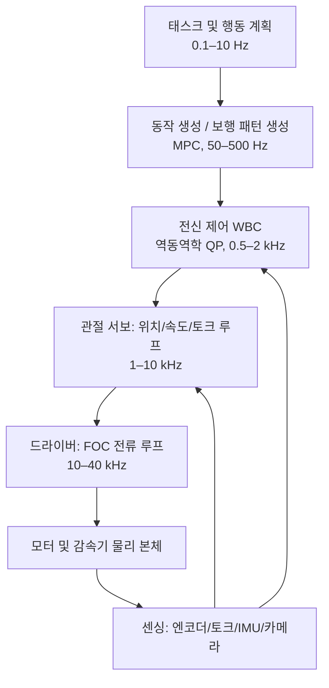
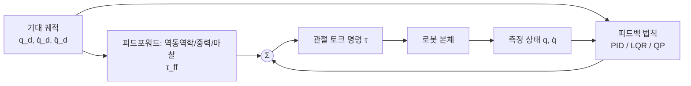
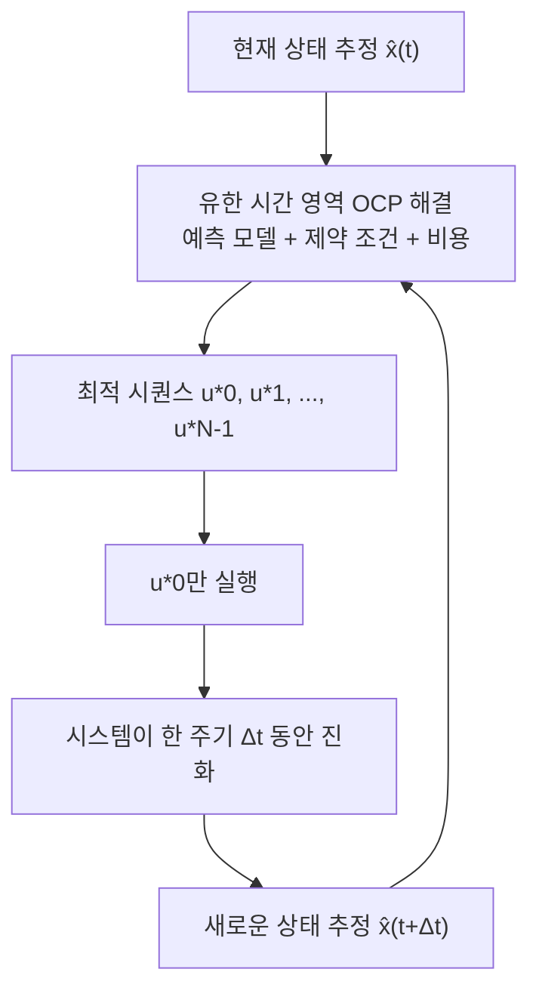

# 제 14장 로봇 제어 기초

## 요약

제 8장에서는 휴머노이드 로봇의 기구학 및 동역학 모델을, 제 9장에서는 각 하위 시스템의 물리적 구현을 제시했습니다. 이 장에서 다루는 핵심 질문은 다음과 같습니다: **고차원, 플로팅 베이스, 구동 부족, 환경과의 접촉이 지속적으로 전환되는 기계 시스템이 주어졌을 때, 원하는 동작을 수행하고 균형을 유지하도록 관절 토크를 실시간으로 계산하는 방법**. 이 장은 "상향식" 제어 스택을 따라 전개됩니다: 먼저 관절 레벨 서보 제어 – 캐스케이드 전류/속도/위치 루프, PID 제어 법칙 및 이산 구현, 안티와인드업 및 피드포워드 보상, 순응적 상호작용을 위한 임피던스/어드미턴스 제어를 논의합니다. 그런 다음 상태 공간 방법으로 넘어가 LQR의 형식화, 대수 Riccati 방정식 및 게인 스케줄링을 제시합니다. 다음으로 모델 예측 제어(MPC)의 구동 시간 영역 원리, 2차 계획법(QP) 형식화 및 실시간 솔루션 엔지니어링을 논의합니다. 마지막으로 전신 제어(WBC) – 태스크 야코비안, 영공간 투영, 역동역학 QP 및 계층적 QP – 를 체계적으로 설명하고 상태 추정, 실시간 통신 및 안전 체인과 같은 시스템 통합 문제를 논의합니다. 전체 장은 PID, LQR, MPC, WBC의 네 가지 방법론적 주요 라인을 관통하며, 두 개의 실행 가능한 Python 예제를 제공합니다. 이 장은 제 8장에서 이미 유도된 기구학/동역학 모델과 임피던스 제어 기초를 반복하지 않고, **제어기 자체의 구조, 알고리즘 및 엔지니어링 구현**에 초점을 맞춥니다.

**키워드**: 캐스케이드 제어; PID; 적분 와인드업 방지; 토크 제어; 임피던스 제어; 상태 공간; LQR; Riccati 방정식; 모델 예측 제어; 2차 계획법; 전신 제어; 영공간 투영; 계층적 QP; 실시간성; EtherCAT; 기능 안전

---

## 14.1 휴머노이드 로봇 제어 문제 개요

### 14.1.1 제어 스택 계층화: 전력 스위치에서 전신 행동까지

휴머노이드 로봇의 제어는 단일 알고리즘이 아니라, 다섯 자릿수 시간 규모에 걸친 **계층적 제어 스택(control stack)** 입니다. 최하위는 드라이버 내부의 전력 전자 스위치와 자계 방향 제어(Field-Oriented Control, FOC)로, 수십 킬로헤르츠에서 모터 상전류를 조절합니다. 그 위는 관절 서보 루프(전류 루프/속도 루프/위치 루프, FOC 하드웨어에 대한 논의는 제 4장 액추에이터 부분 참조)입니다. 더 위로는 전신 제어(Whole-Body Control, WBC)가 0.5–2 kHz에서 관절 토크를 계산합니다. 더 상위는 동작 생성(MPC 또는 보행 패턴 생성기, 일반적으로 50–500 Hz)입니다. 최상위는 태스크 및 행동 계획으로, 작동 주파수는 1 Hz 미만까지 낮아질 수 있습니다.

!!! note "용어 설명: 제어 스택, 제어 주파수, 실시간성, 하드 실시간 및 소프트 실시간"
    - **제어 스택(control stack)**: 주파수와 추상화 수준에 따라 적층된 다중 제어기 계층 구조로, 각 계층은 하위 계층에 기준값을 전달하고 상위 계층에 상태를 보고합니다.
    - **제어 주파수(control rate)**: 제어기가 매 주기마다 출력을 재계산하는 주파수로, 단위는 Hz입니다. 관절 서보는 일반적으로 1–10 kHz, WBC는 일반적으로 0.5–2 kHz입니다.
    - **실시간성(real-time)**: 계산 결과가 데드라인 이전에 출력되어야 하는 특성입니다. 하드 실시간 시스템에서 데드라인을 놓치는 것은 오류로 간주됩니다.
    - **하드 실시간(hard real-time)**: 단 한 번의 시간 초과도 허용되지 않습니다(예: 모터 전류 루프 및 비상 정지 회로).
    - **소프트 실시간(soft real-time)**: 간헐적인 시간 초과는 성능 저하만 초래할 뿐 치명적이지 않습니다(예: 인식 및 태스크 계획).



각 계층의 일반적인 주파수와 지연 예산은 아래 표와 같습니다(수치는 업계 일반적인 규모이며, 특정 플랫폼에 따라 차이가 큽니다):

| 계층 | 일반적인 주파수 | 단일 주기 예산 | 주요 계산 내용 |
|---|---|---|---|
| FOC 전류 루프 | 10–40 kHz | 25–100 µs | Clarke/Park 변환, PI 조절, PWM 변조 |
| 관절 서보 루프 | 1–10 kHz | 100–1000 µs | PID, 피드포워드, 필터링, 리미팅 |
| 전신 제어 (WBC) | 0.5–2 kHz | 0.5–2 ms | 정/역동역학, QP 솔루션, 접촉력 분배 |
| 동작 생성 (MPC) | 50–500 Hz | 2–20 ms | 유한 시간 영역 최적화, 착지점 계획 |
| 태스크 계획 | 0.1–10 Hz | 100 ms 이상 | 행동 트리, 상태 머신, 의미론적 결정 |

계층적 아키텍처의 엔지니어링적 의미는 다음과 같습니다: **모든 상위 알고리즘의 성능 상한은 하위 루프의 대역폭과 추종 정밀도에 의해 결정됩니다**. 시뮬레이션에서 완벽한 WBC라도 관절 토크 루프의 대역폭이 20Hz에 불과하다면 실제 성능은 이론적 예측보다 훨씬 떨어질 것입니다. 따라서 이 장은 상향식 서술 순서를 채택합니다.

### 14.1.2 휴머노이드 로봇 제어의 네 가지 구조적 어려움

고정 베이스 매니퓰레이터나 바퀴형 섀시와 비교할 때, 휴머노이드 로봇의 제어에는 네 가지 구조적 어려움이 있으며, 이는 이 장의 방법론 선택의 기본 구도를 결정합니다:

1. **플로팅 베이스 및 구동 부족**. 휴머노이드 로봇은 고정 베이스가 없으며, 본체 자세의 6 자유도는 직접적인 액추에이터가 없고 지면 반력을 통해서만 간접적으로 제어됩니다(플로팅 베이스 동역학, 제 8장 8.4.7 참조). 시스템 자유도 \(n + 6\)는 액추에이터 수 \(n\)보다 크므로, 전형적인 구동 부족 시스템입니다.
2. **혼합 동역학(hybrid dynamics)**. 발의 접촉/이탈은 동역학 방정식을 접촉 상태에 따라 이산적으로 전환시킵니다. 제어 법칙은 접촉 상태 머신에 의해 구동되어 구속 조건 집합을 전환하고, 접촉 형성 순간의 충격을 처리해야 합니다.
3. **고차원 및 강한 결합**. 전체 기계의 자유도는 일반적으로 20–60이며, 관성 결합이 상당하여 결합을 무시한 단일 관절 독립 제어는 동적 보행에서 실패합니다.
4. **엄격한 실시간성**. 균형 자체는 동역학적으로 불안정한 문제(역진자)이며, 제어 지연은 안정성 마진을 직접적으로 소모합니다. 일반적으로 센싱 샘플링에서 토크 출력까지의 종단 간 지연이 1ms 증가할 때마다 복구 가능한 교란의 크기는 감소합니다.

### 14.1.3 피드백, 피드포워드 및 공칭/오차 분해

거의 모든 실용적인 휴머노이드 로봇 제어기는 "**공칭 피드포워드 + 오차 피드백**" 형태로 작성될 수 있습니다:

$$
\tau = \tau_{\mathrm{ff}}(q_d, \dot q_d, \ddot q_d) + \tau_{\mathrm{fb}}(q_d - q, \dot q_d - \dot q, \ldots)
$$

여기서 \(\tau_{\mathrm{ff}}\)는 모델(역동역학, 중력 보상, 마찰 모델)에 의해 제공되고, \(\tau_{\mathrm{fb}}\)는 피드백 법칙(PID, LQR, QP)에 의해 제공됩니다. 피드포워드는 "모델이 알고 있는 부분"의 토크 요구량을 담당하므로, 피드백은 모델 오차와 교란만 수정하면 되며, 따라서 더 낮은 피드백 게인으로 동일한 추종 정밀도를 얻을 수 있습니다. 이는 순응성을 유지하고 강성을 무한정 높일 수 없는 상호작용형 로봇에 매우 중요합니다.

!!! note "용어 설명: 피드포워드 제어, 피드백 제어, 계산 토크법, 교란 관측기"
    - **피드포워드 제어(feedforward control)**: 모델을 사용하여 필요한 제어량을 미리 계산하며, 오차 신호에 의존하지 않습니다.
    - **피드백 제어(feedback control)**: 기대값과 실제 측정 상태 간의 차이를 기반으로 제어량을 계산하며, 모델 오차와 외부 교란을 억제할 수 있습니다.
    - **계산 토크법(computed torque control)**: 역동역학 모델을 사용하여 비선형 시스템을 피드백 선형화하여 분리된 이중 적분기로 만든 후 PD 피드백을 적용하는 것으로, 피드포워드+피드백 개념의 극단적인 형태입니다.
    - **교란 관측기(disturbance observer, DOB)**: 모델링되지 않은 토크를 확장 상태로 추정하여 보상하며, 높은 게인의 피드백을 대체하는 데 자주 사용됩니다.



## 14.2 관절 수준 서보 제어

### 14.2.1 캐스케이드 제어: 전류 루프/속도 루프/위치 루프

관절 서보는 일반적으로 **캐스케이드 제어(cascade control)**를 사용한다. 가장 안쪽 루프는 전류(토크) 루프, 중간은 속도 루프, 가장 바깥쪽은 위치 루프이다. 내부 루프의 대역폭은 외부 루프보다 현저히 높아야 하며, 일반적으로 바깥쪽으로 한 레이어 갈 때마다 대역폭이 3–10배 감소한다. 그렇지 않으면 내부 및 외부 루프의 동특성이 서로 간섭하여 튜닝이 무의미해진다.

전류 루프의 대상은 모터 전기적 동특성이다. FOC 변환 후(4장 참조), \(q\)축 전류는 1차 모델에 근사한다.

$$
L_q \frac{d i_q}{dt} = v_q - R_s i_q - k_e \omega_m
$$

여기서 \(L_q\), \(R_s\)는 고정자 인덕턴스와 저항, \(k_e\)는 역기전력 상수, \(\omega_m\)은 모터 각속도이다. 전자기 시상수 \(L_q/R_s\)는 일반적으로 서브 밀리초 수준이므로 전류 루프 대역폭은 수천 헤르츠에 도달할 수 있다. 관절 출력 토크 \(\tau_j = N \eta k_t i_q\)(\(N\)은 감속비, \(\eta\)는 전동 효율, \(k_t\)는 토크 상수)이므로 전류 루프는 실질적으로 **토크 루프**이다.

속도 루프와 위치 루프의 대상은 기계적 동특성이다.

$$
J_{\mathrm{eff}} \dot \omega = \tau_j - \tau_g(q) - \tau_f(\omega) - \tau_{\mathrm{ext}}
$$

여기서 \(J_{\mathrm{eff}} = J_m N^2 + J_l\)은 모터 회전자 관성을 감속비로 증폭한 후 부하 관성을 더한 값, \(\tau_g\)는 중력 토크, \(\tau_f\)는 마찰 토크, \(\tau_{\mathrm{ext}}\)는 외부 결합 토크이다. \(N^2\)의 증폭 효과에 주목하라. 고감속비 관절(예: 하모닉 드라이브, \(N\)은 일반적으로 50–160)에서는 부하 측 관성과 외란이 모터 측으로 환산될 때 \(N^2\)배 감소한다. 이는 고감속비 관절을 "본질적으로 외란에 강하지만 본질적으로 불투명하게" 만든다. 즉, 말단 충돌력도 \(N^2\)배 감소하여 모터 전류로 감지하기 어렵다. QDD(Quasi-Direct-Drive) 방식은 의도적으로 낮은 감속비(일반적으로 \(N = 6\!-\!12\))를 채택하여 토크 투명성과 역구동성을 확보하며, 그 대가로 전류 루프가 부하 외란을 직접 감당해야 하므로 서보 설계에 더 높은 요구 사항이 발생한다.

!!! note "용어 설명: 캐스케이드 제어, 대역폭, 토크 상수, 역구동성, 토크 투명성"
    - **캐스케이드 제어(cascade control)**: 여러 제어 루프가 중첩되어 외부 루프 출력이 내부 루프의 설정값이 된다. 튜닝 순서는 반드시 내부에서 외부로 진행되어야 한다.
    - **대역폭(bandwidth)**: 폐루프 진폭-주파수 특성이 \(-3\) dB로 감소하는 주파수로, 루프가 얼마나 빠른 명령을 추종할 수 있는지를 나타낸다.
    - **토크 상수(torque constant, \(k_t\))**: 단위 전류당 발생하는 모터 토크, 단위 N·m/A.
    - **역구동성(backdrivability)**: 출력단에서 모터를 역구동할 수 있는 능력으로, 낮은 감속비 전동은 역구동성이 좋다.
    - **토크 투명성(torque transparency)**: 전용 토크 센서 없이 전류만으로 출력 토크를 정확하게 추정할 수 있는 정도.

### 14.2.2 PID 제어 법칙과 이산 구현

**PID 제어(PID Control)**는 관절 서보의 주요 알고리즘이다. 연속 형태는 다음과 같다.

$$
u(t) = K_p e(t) + K_i \int_0^t e(s)\, ds + K_d \frac{d e(t)}{dt}
$$

여기서 \(e(t) = r(t) - y(t)\)는 추종 오차이다. 세 항의 역할은 다음과 같이 요약할 수 있다. 비례항은 즉각적인 보정을 제공하여 응답 속도를 결정하고, 적분항은 일정한 외란(예: 중력, 쿨롱 마찰)으로 인한 정상 상태 오차를 제거하며, 미분항은 감쇠를 제공하고 오버슈트를 억제한다. Åström과 Hägglund는 《Advanced PID Control》에서 PID 튜닝과 외란 제거 설계를 체계적으로 정리했으며, Ogata의 《Modern Control Engineering》은 고전적인 주파수 영역 분석 프레임워크를 제공한다. 두 책 모두 이 주제의 표준 참고 자료이다.

디지털 제어기는 주기 \(T_s\)로 샘플링하며, 일반적인 이산 구현은 **위치식**이다.

$$
u[k] = K_p e[k] + K_i T_s \sum_{j=0}^{k} e[j] + K_d \frac{e[k] - e[k-1]}{T_s}
$$

그리고 **증분식(velocity form)**은 다음과 같다.

$$
\Delta u[k] = K_p \left(e[k] - e[k-1]\right) + K_i T_s e[k] + \frac{K_d}{T_s}\left(e[k] - 2e[k-1] + e[k-2]\right)
$$

증분식은 제어량의 증분을 출력하므로 본질적으로 적분 누산기의 명시적 누적을 피하고 수동/자동 전환 시 무충격이므로 공학적으로 더 일반적으로 사용된다.

### 14.2.3 공학적 세부 사항: 안티와인드업, 미분 필터링 및 피드포워드

교과서 PID와 실제 사용 가능한 PID 사이에는 일련의 공학적 세부 사항이 있으며, 이 중 하나라도 빠지면 실제 기기에서 진동이나 사고를 유발할 수 있다.

**안티와인드업(anti-windup)**. 액추에이터 출력이 제한(전류 제한, 토크 제한)될 때 오차가 지속되면 적분항이 무한정 누적(적분 와인드업)되어 포화 해제 후 큰 오버슈트를 유발한다. 일반적인 방법은 **역산 안티와인드업(back-calculation)**으로, 포화 차이를 이득 \(K_t\)를 통해 적분기에 피드백하는 것이다.

$$
I[k+1] = I[k] + K_i T_s e[k] + K_t T_s \left( u_{\mathrm{sat}}[k] - u_{\mathrm{unsat}}[k] \right)
$$

여기서 \(u_{\mathrm{unsat}}\)와 \(u_{\mathrm{sat}}\)는 각각 제한 전후의 제어량이다. 일반적으로 \(K_t = 1/\sqrt{K_p K_d}\)를 사용하거나 적분 시상수의 역수에 따라 선택한다.

**미분 필터링**. 미분항은 측정 노이즈를 증폭시키므로 저역 통과 필터를 직렬로 연결하여 "필터링된 미분"을 구성해야 한다.

$$
D(s) = \frac{K_d s}{1 + s / N_f}
$$

필터 계수 \(N_f\)는 일반적으로 5–20을 사용한다. 또한 설정값 계단 변화가 미분항을 통해 "미분 충격"을 발생시키는 것을 방지하기 위해 실제로는 **측정값 미분(derivative on measurement)**을 주로 사용한다. 즉, 미분은 오차가 아닌 측정값에만 작용한다.

**피드포워드 및 보상**. 14.1.3의 분해에 따라 관절 서보는 일반적으로 세 가지 피드포워드를 중첩한다.

$$
\tau_{\mathrm{cmd}} = \underbrace{J_{\mathrm{eff}} \ddot q_d + \tau_g(\hat q) + \hat \tau_f(\hat \omega)}_{\text{모델 피드포워드}} + \underbrace{K_p e + K_d \dot e + K_i \int e}_{\text{피드백}}
$$

이 중 중력 보상 \(\tau_g(\hat q)\)는 휴머노이드 로봇에서 가장 큰 이점을 제공한다. 다리와 팔 관절의 중력 토크는 최대 토크의 30~50%에 달할 수 있으며, 보상하지 않으면 적분항에만 의존해야 하므로 시작 지연과 정상 상태 떨림이 발생한다. 마찰 보상 \(\hat\tau_f\)는 일반적으로 쿨롱 + 점성 모델 \(\hat \tau_f = b\hat\omega + F_c \,\mathrm{sgn}(\hat\omega)\)을 사용하지만, 감속기 마찰은 온도와 마모에 따라 변동하므로 교정 방법은 8장 8.3.10의 매개변수 식별을 참조하라.

| 공학적 요소 | 목적 | 일반적인 방법 | 누락 시 결과 |
|---|---|---|---|
| 안티와인드업 | 제한 하에서 오버슈트 억제 | 역산법, 적분 클램프 | 큰 오버슈트, 충격 부하 |
| 미분 필터링 | 노이즈 증폭 억제 | 1차 저역 통과 \(N_f = 5\!-\!20\) | 토크 고주파 떨림, 전류 발열 |
| 측정값 미분 | 설정값 계단 변화 충격 방지 | 미분이 측정값에 작용 | 계단 응답 시 토크 피크 |
| 중력 피드포워드 | 피드백 부담 제거 | \(\tau_g(\hat q)\) 온라인 계산 | 정상 상태 오차, 시작 지연 |
| 마찰 피드포워드 | 저속 추종 개선 | 쿨롱 + 점성 모델 | 크리핑, 리미트 사이클 |
| 노치/저역 통과 필터 | 기계적 공진 회피 | FFT 스펙트럼에 따라 노치점 설정 | 공진 울림, 구조 피로 |

### 14.2.4 상호작용 지향 토크 제어: 임피던스, 어드미턴스 및 힘/위치 혼합

로봇이 환경과 물리적 접촉을 할 때 순수 위치 제어는 기하학적 오차 하에서 제어되지 않는 접촉력을 발생시키므로 **순응 제어**를 도입해야 한다. 8장 8.4.11에서 **임피던스 제어(Impedance Control)**, **어드미턴스 제어(Admittance Control)** 및 **힘/위치 혼합 제어(Hybrid Force-Position Control)**의 동역학적 기초를 이미 유도했으며, 이 절에서는 서보 구현 관점에서 세 가지를 보충한다.

첫째, **임피던스 제어의 본질은 토크 루프의 기준을 수정하는 것이다.** 원하는 "가상 스프링-댐퍼-관성" 관계를 토크 명령으로 작성한다.

$$
\tau = J^T(q)\left[ K_t (x_d - x) + D_t (\dot x_d - \dot x) + \Lambda (\ddot x_d - \ddot x) \right] + \tau_g(q)
$$

그 폐루프 동작은 토크 루프의 충실도에 따라 달라진다. QDD 관절은 전류로 토크를 추정하고, SEA(Series Elastic Actuator)는 스프링 변형으로 토크를 측정하며, 둘 다 비교적 "부드러운" 임피던스를 구현할 수 있다. 고감속비 관절은 추가로 관절 토크 센서를 설치해야 하며, 그렇지 않으면 임피던스 제어는 명목상에 불과하다.

둘째, **어드미턴스 제어는 위치 제어 로봇의 컴플라이언트 패치**입니다. 어드미턴스 외부 루프는 측정된 힘에 따라 위치 지령을 보정하며 \(x_c = x_d + \Delta x(F_{\mathrm{ext}})\), 내부 루프는 여전히 고이득 위치 서보이므로 하모닉 감속기와 같은 고강성 관절에 적합하지만, 접촉 과도 상태의 안정성은 외부 루프 샘플링 속도와 센서 노이즈에 의해 제한됩니다.

셋째, **힘/위치 혼합 제어는 방향별로 작업 공간을 분해**합니다. 구속 방향(예: 발바닥 법선 방향, 삽입 방향)에서는 힘을 폐루프 제어하고, 자유 방향에서는 위치를 폐루프 제어하며, 선택 행렬 \(S\)와 \(I - S\)를 사용하여 투영을 구현합니다(8.4.11 참조). 휴머노이드 로봇의 발바닥은 지지 국면에서 실질적으로 "위치 구속 방향"이며, 먼지 닦기, 누르기 등의 조작 작업에서야 비로소 힘 폐루프가 필요합니다.

!!! note "용어 설명: 임피던스 제어, 어드미턴스 제어, 힘/위치 혼합 제어, 직렬 탄성 액추에이터"
    - **임피던스 제어(impedance control)**: 로봇이 환경에 제공하는 동적 관계(관성-감쇠-강성)를 제어하며, 출력은 힘, 입력은 운동 편차입니다.
    - **어드미턴스 제어(admittance control)**: 임피던스의 쌍대——입력은 힘, 출력은 운동 보정량이며, 위치 루프 외부에 감싸집니다.
    - **힘/위치 혼합 제어(hybrid force-position control)**: 작업 공간을 힘 제어 부분 공간과 위치 제어 부분 공간으로 직교 분해합니다.
    - **직렬 탄성 액추에이터(SEA)**: 액추에이터와 부하 사이에 탄성 요소를 직렬로 연결하여 변형으로 힘을 측정하고 고유 컴플라이언스를 제공하며, 대가는 대역폭이 스프링-관성 공진에 의해 제한된다는 점입니다.

### 14.2.5 Python 예제: 단일 관절 서보 시뮬레이션——중력 피드포워드와 안티와인드업의 역할

아래에서는 단일 진자 관절(예: 어깨 굴곡 관절)의 수치 시뮬레이션을 통해 PID + 중력 피드포워드 + 역산 안티와인드업의 조합 효과를 보여줍니다. 독자는 `use_ff`와 `use_aw` 두 스위치를 켜고 끄면서 정상 상태 오차와 포화 오버슈트의 변화를 관찰할 수 있습니다.

```python
# 단일 관절(단진자) 서보 시뮬레이션: PID + 중력 피드포워드 + 역산 안티와인드업
import numpy as np
import matplotlib.pyplot as plt

# 관절 파라미터 (어깨/팔꿈치 관절 근사)
m, l, g = 2.0, 0.30, 9.81      # 링크 질량(kg), 질량 중심 거리(m), 중력 가속도
J = m * l**2                    # 관절 회전 관성 모멘트
b = 0.05                        # 점성 마찰
tau_max = 8.0                   # 토크 제한 (N·m)
Ts = 1e-3                       # 서보 주기 1 kHz
T = 3.0
N = int(T / Ts)

# 기준 궤적: 0 -> 1 rad의 평활 계단 (5차 다항식)
qd = np.ones(N) * 1.0

# PID 게인
Kp, Ki, Kd = 25.0, 12.0, 1.2
Kt = 1.0 / np.sqrt(Kp * Kd)     # 역산 안티와인드업 게인

use_ff = True   # 중력 피드포워드 활성화 여부
use_aw = True   # 안티 적분 와인드업 활성화 여부

q, w = 0.0, 0.0
I = 0.0
log_q, log_tau = [], []

for k in range(N):
    e = qd[k] - q
    ed = -w                       # 미분 선행: 측정값 미분
    tau_g = m * g * l * np.sin(q) # 중력 토크
    tau_ff = tau_g if use_ff else 0.0
    u_unsat = tau_ff + Kp * e + Kd * ed + I
    u = np.clip(u_unsat, -tau_max, tau_max)
    if use_aw:
        I += Ki * Ts * e + Kt * Ts * (u - u_unsat)
    else:
        I += Ki * Ts * e
    # 관절 동역학: J q̈ + b q̇ = u - τ_g
    acc = (u - b * w - tau_g) / J
    w += acc * Ts
    q += w * Ts
    log_q.append(q); log_tau.append(u)

t = np.arange(N) * Ts
plt.plot(t, qd, 'k--', label='reference')
plt.plot(t, log_q, label='q (ff+aw)' if (use_ff and use_aw) else 'q')
plt.xlabel('t [s]'); plt.ylabel('q [rad]'); plt.legend(); plt.grid(True)
plt.show()
```

## 14.3 상태 공간 제어와 선형 2차 조절기

### 14.3.1 상태 공간 모델, 선형화 및 이산화

PID는 단일 입력 단일 출력 방법인 반면, 휴머노이드 로봇의 균형 문제는 본질적으로 다변량 결합 문제입니다. 상태 공간 방법은 시스템을 다음과 같이 표현합니다.

$$
\dot x = f(x, u), \qquad y = h(x)
$$

공칭점 \((x_0, u_0)\)에서 테일러 전개를 수행하고 고차 항을 생략하면 선형화된 모델을 얻습니다.

$$
\delta \dot x = A \delta x + B \delta u, \quad A = \left.\frac{\partial f}{\partial x}\right|_{x_0, u_0}, \quad B = \left.\frac{\partial f}{\partial u}\right|_{x_0, u_0}
$$

디지털 제어기에는 이산 모델이 필요합니다. 샘플링 주기 \(T_s\)에 대한 영차 유지(ZOH) 이산화:

$$
A_d = e^{A T_s} \approx I + A T_s + \frac{(A T_s)^2}{2}, \qquad B_d = \left( \int_0^{T_s} e^{A s} ds \right) B
$$

선형화 모델의 유효성은 국소적입니다. 외란이 상태를 공칭점에서 멀리 밀어낼수록 모델 오차가 커집니다. 이것이 상태 공간 방법이 휴머노이드 로봇에서 항상 앞서 언급한 공칭 궤적 생성(15장) 또는 게인 스케줄링(14.3.4)과 함께 사용되는 이유입니다.

### 14.3.2 안정성 개념과 Lyapunov 판별법

제어의 최소 요구 사항은 "추종이 잘 되는 것"이 아니라 "넘어지지 않는 것"입니다. 선형 시스템 \(\dot x = A x\)의 경우, 점근적 안정성을 위한 필요충분 조건은 \(A\)의 모든 고유값이 좌반평면에 위치하는 것입니다. 비선형 시스템의 경우 일반적으로 사용되는 도구는 **Lyapunov 제2 방법**입니다: 양정치 함수 \(V(x)\)(에너지로 이해 가능)를 찾을 수 있고, 시스템 궤적을 따라 \(\dot V(x) = \nabla V \cdot f(x) < 0\)이면 평형점은 점근적으로 안정합니다.

!!! note "용어 설명: Lyapunov 함수, 점근적 안정, 인력 영역, 제어 Lyapunov 함수"
    - **Lyapunov 함수**: 평형점에서 최솟값을 취하고 시스템 궤적을 따라 단조 감소하는 스칼라 함수로, 안정성의 "에너지 증명서"입니다.
    - **점근적 안정(asymptotic stability)**: 충분히 작은 초기 편차가 결국 평형점으로 수렴합니다.
    - **인력 영역(region of attraction)**: 평형점으로 수렴할 수 있는 초기 상태 집합; 휴머노이드 로봇은 지지 다각형의 제약을 받아 인력 영역은 항상 유한합니다.
    - **제어 Lyapunov 함수(Control Lyapunov Function, CLF)**: 모든 상태에 대해 \(\dot V < 0\)을 만드는 제어가 존재하는 함수로, 제어 제약 조건으로 직접 사용될 수 있습니다(15장 CLF 기반 달리기 학습 참조).

Lyapunov 사상이 휴머노이드 로봇에서 가지는 직접적인 추론 중 하나는 "에너지 기반" 제어(예: 총 기계적 에너지를 원하는 형태로 성형)는 모두 안정성论证의 원형을 내재한다는 것입니다. 반면 순수 데이터 기반 제어기는 이러한 구조가 부착되지 않으면 그 안정성은 대규모 테스트를 통해서만 보증될 수 있습니다(15장 15.4 참조).

### 14.3.3 LQR: 형식화와 대수 Riccati 방정식

**선형 2차 조절기(Linear Quadratic Regulator, LQR)**는 상태 공간 방법 중 가장 실용적인 피드백 법칙입니다. 선형 시스템 \(\dot x = A x + B u\)에 대해 LQR은 무한 시간 영역 2차 비용을 최소화합니다.

$$
J = \int_0^{\infty} \left( x^T Q x + u^T R u \right) dt
$$

여기서 \(Q \succeq 0\)는 상태 편차를, \(R \succ 0\)는 제어 소모를 패널티합니다. 최적 피드백은 선형 상태 피드백입니다.

$$
u = -K x, \qquad K = R^{-1} B^T P
$$

여기서 \(P\)는 **연속 시간 대수 Riccati 방정식(CARE)**의 유일한 양정치 해입니다.

$$
A^T P + P A - P B R^{-1} B^T P + Q = 0
$$

이산 시스템은 이산 대수 Riccati 방정식(DARE)에 해당하며, `scipy.linalg.solve_discrete_are`로 직접 풀 수 있습니다. LQR의 가치는 "최적"이라는 단어 자체에 있는 것이 아니라, 다변량 피드백 설계를 \(Q\), \(R\) 두 행렬의 튜닝으로 압축하고, 폐루프가 이득 및 위상 외란에 대해 고전적인 강인 여유(상태 피드백 형태의 경우 이득 여유 \([1/2, \infty)\), 위상 여유 \(\geq 60^\circ\))를 가진다는 점에 있습니다.

\(Q\), \(R\)의 튜닝은 명확한 물리적 의미를 가집니다: \(Q\)의 어떤 요소를 키우면 "이 상태 편차가 더 비싸다"는 의미이며, 피드백이 더 공격적으로 이를 교정합니다. Bryson의 경험 법칙은 \(Q_{ii} = 1/x_{i,\max}^2\), \(R_{ii} = 1/u_{i,\max}^2\)를 취하여 각 비용을 무차원화한 후, 이를 기반으로 미세 조정합니다.

### 14.3.4 게인 스케줄링과 시변 LQR

단일 LQR은 공칭점 근처에서만 유효합니다. 보행과 같은 주기적인 큰 편차 운동을 처리하는 표준 방법은 다음과 같습니다.

1. **오프라인**: 공칭 궤적 \(\{(x_0(t), u_0(t))\}\)을 따라 점별로 선형화하여 시변 시스템 \(A(t), B(t)\)를 얻고, 시변 Riccati 방정식(TV-LQR)을 풀어 피드백 게인 시퀀스 \(K(t)\)를 얻습니다. 또는 보행 위상에 따라 여러 주요 지점을 샘플링하여 각각 LQR을 풉니다.
2. **온라인**: 테이블 조회 또는 보간을 통해 현재 위상의 게인을 얻고 \(\delta u = -K(t)\, \delta x\)를 실행합니다.

Kuindersma 등이 DARPA 로봇 챌린지 기간 동안 Boston Dynamics Atlas를 위해 개발한 최적화 기반 운동 계획, 추정 및 제어 시스템( *Autonomous Robots* 2016 게재)은 "오프라인 궤적 최적화 + TV-LQR 피드백 + QP 전신 제어"의 조합을 채택했으며, 이는 휴머노이드 로봇에서 이 패러다임의 획기적인 엔지니어링 검증입니다. 최근에는 시변 LQR이 종종 미분 동적 계획법(DDP) 해법의 부산물로 나타나기도 합니다. DDP의 2차 전개 역전파는 자연스럽게 선형 2차 게인을 제공합니다(15장 15.3 참조).

### 14.3.5 Python 예제: 역진자 균형의 LQR 설계

한쪽 다리로 서 있는 것을 역진자(발목 관절 입력 토크)로 단순화하여 이산 LQR을 설계하고 각도 외란 회복을 시뮬레이션합니다. 이 예제는 14.3.1의 선형화와 14.3.3의 DARE 해법을 동시에 보여줍니다.

```python
# 역진자 LQR 균형 제어
import numpy as np
from scipy.linalg import solve_discrete_are
import matplotlib.pyplot as plt

# 물리 파라미터: 역진자 근사(질량 중심 높이 h, 질량 m)
m, h, g = 60.0, 0.9, 9.81
I = m * h**2                    # 발목 관절 관성 모멘트(근사)
# 상태 x = [theta, theta_dot], 입력 u = 발목 토크
# 선형화: thetä = (m g h / I) theta + (1/I) u
A = np.array([[0.0, 1.0],
              [m * g * h / I, 0.0]])
B = np.array([[0.0], [1.0 / I]])

# ZOH 이산화(1차 오일러 근사, Ts가 작을 때 허용 가능)
Ts = 0.005
Ad = np.eye(2) + A * Ts
Bd = B * Ts

# LQR 가중치: 각도 편차를 각속도보다 훨씬 크게 패널티, 토크 가중치는 적당히
Q = np.diag([100.0, 1.0])
R = np.array([[0.5]])
P = solve_discrete_are(Ad, Bd, Q, R)
K = np.linalg.inv(R + Bd.T @ P @ Bd) @ (Bd.T @ P @ Ad)
print("LQR 게인 K =", K)

# 시뮬레이션: 초기 각도 외란 0.1 rad
N = 600
x = np.array([0.1, 0.0])
log = []
for k in range(N):
    u = -K @ x
    x = Ad @ x + Bd.flatten() * u
    log.append([x[0], x[1], u[0]])

log = np.array(log)
t = np.arange(N) * Ts
fig, ax = plt.subplots(2, 1, sharex=True)
ax[0].plot(t, log[:, 0]); ax[0].set_ylabel('theta [rad]'); ax[0].grid(True)
ax[1].plot(t, log[:, 2]); ax[1].set_ylabel('u [N·m]'); ax[1].set_xlabel('t [s]'); ax[1].grid(True)
plt.show()
```

## 14.4 모델 예측 제어 (MPC)

### 14.4.1 구동 시간 영역 최적화 원리

LQR은 무한 시간 영역에서 최적이지만, 제약 조건을 명시적으로 처리할 수 없습니다. 반면, 휴머노이드 로봇의 핵심 제약 조건(관절 한계, 토크 제한, 마찰 원뿔, ZMP 지지 다각형)은 엄격한 필수 조건입니다. **모델 예측 제어 (Model Predictive Control, MPC)** 는 각 제어 주기마다 유한 시간 영역의 개루프 최적 제어 문제를 해결합니다:

$$
\begin{aligned}
\min_{u_{0:N-1},\, x_{1:N}} \quad & \sum_{k=0}^{N-1} \ell(x_k, u_k) + \ell_f(x_N) \\
\text{s.t.} \quad & x_{k+1} = f(x_k, u_k), \quad k = 0, \ldots, N-1 \\
& x_k \in \mathcal{X}, \quad u_k \in \mathcal{U} \\
& x_0 = \hat x(t)
\end{aligned}
$$

그런 다음 **첫 번째 제어 단계만 실행** \(u_0^*\)하고, 다음 주기에는 새로운 상태 추정 \(\hat x\)으로 다시 문제를 해결합니다. 이것이 바로 구동 시간 영역 (receding horizon) 메커니즘입니다. 예측 모델은 매번 문제를 해결할 때 현재 상태에 "재정착"되어, MPC가 최적화의 예측 능력과 피드백의 강건성을 동시에 갖추게 합니다. Borrelli, Bemporad 및 Morari의 《Predictive Control for Linear and Hybrid Systems》는 이 분야의 표준 교재입니다.



시간 영역 길이 \(N\)과 이산 시간 간격 \(\Delta t\)의 선택은 핵심적인 균형입니다. 예측 시간 영역 \(N \Delta t\)은 제어 대상의 지배적인 동특성을 포함해야 하며 (휴머노이드 균형 제어의 경우 일반적으로 0.5–1.5초), 단계 수가 많을수록 해결 속도가 느려집니다. MPC가 LQR에 비해 가지는 비용은 계산량입니다. LQR은 온라인에서 한 번의 행렬-벡터 곱만 필요하지만, MPC는 각 주기마다 최적화 문제를 해결해야 합니다.

### 14.4.2 최적 제어 문제에서 2차 계획법으로

비용이 2차 형식이고, 모델이 선형(또는 선형화)이며, 제약 조건이 선형(또는 선형화된 마찰 원뿔)일 때, 위의 OCP는 **2차 계획법 (Quadratic Program, QP)** 표준 형식으로 변환됩니다.

$$
\min_{z} \; \frac{1}{2} z^T H z + g^T z \quad \text{s.t.} \quad A_{\mathrm{eq}} z = b_{\mathrm{eq}}, \quad A_{\mathrm{in}} z \leq b_{\mathrm{in}}
$$

여기서 최적화 변수 \(z\)는 시간 영역 내의 상태와 제어를 쌓아 올린 것입니다. QP의 최적성은 **KKT 조건 (Karush-Kuhn-Tucker conditions)** 에 의해 특징지어집니다. 최적해에서 기울기, 등식 제약 조건 및 부등식 제약 조건의 승수는 상보적 여유 조건을 만족합니다. 볼록 QP는 볼록 최적화 문제이며, 모든 국소 최적해는 전역 최적해이고 다항식 시간 알고리즘이 존재합니다. 이것이 MPC를 실시간화할 수 있는 이론적 기반입니다.

QP 솔버는 두 가지 주요 계열로 나뉩니다. **활성 집합법 (active-set method)** 은 제약 조건 경계를 따라 반복하며, 이전 주기의 해를 **웜 스타트 (warm start)** 로 사용할 때 일반적으로 소수의 반복만 필요하므로 제어 주기가 매우 짧은 경우에 적합합니다. **내부점법 (interior-point method)** 은 장벽 함수를 통해 부등식 제약 조건을 목적 함수에 흡수하며, 반복 횟수가 문제 규모에 둔감하므로 대규모 희소 문제에 적합합니다. 휴머노이드 로봇 MPC 실무에서는 구조 활용(QP를 시간 단계별로 분할하는 희소 구조를 Riccati 재귀 또는 블록 희소 분해에 맡기는 것)이 솔버 선택 자체보다 해결 속도를 더 결정하는 경우가 많습니다.

!!! note "용어 설명: QP, KKT 조건, 활성 집합법, 내부점법, 웜 스타트, 응축"
    - **QP (quadratic program)** : 2차 목적 함수와 선형 제약 조건을 가진 최적화 문제로, 실시간 MPC의 주요 해결 형태입니다.
    - **KKT 조건** : 제약 조건이 있는 최적화의 1차 필요 조건입니다. 볼록 문제의 경우 충분 조건이기도 합니다.
    - **활성 집합법 (active-set method)** : "작용 제약 조건 집합"을 유지하며 제약 조건 표면 사이를 이동하는 QP 반복 방법입니다.
    - **내부점법 (interior-point method)** : 제약 조건 내부의 중심 경로를 따라 최적해에 접근하는 반복 방법입니다.
    - **웜 스타트 (warm start)** : 이전 해결 결과를 사용하여 현재 반복을 초기화하여 반복 횟수를 크게 줄입니다.
    - **응축 (condensing)** : 동역학 등식을 사용하여 상태 변수를 소거하고 제어 변수만 포함하는 조밀한 소규모 QP를 얻습니다. 시간 영역이 짧을 때 효율적이며, 시간 영역이 길면 희소성을 파괴합니다.

### 14.4.3 실시간화 엔지니어링: 선형화, 사전 계산 및 지연 보상

휴머노이드 로봇 MPC를 오프라인 알고리즘에서 온라인 제어기로 변환하려면 일련의 표준 엔지니어링 방법이 필요합니다:

- **모델 차수 축소 및 선형화**. 전차수 부동 기저 동역학(8장 8.4.7절 참조)은 차원이 높고 강한 비선형성을 가지므로, 현재 1kHz에서 비선형 MPC를 직접 수행하는 것은 여전히 어렵습니다. 주류 접근 방식은 차수 축소입니다. 선형 역진자, 단일 강체(질량 중심 동역학) 등과 같은 단순화된 모델을 MPC 예측 모델로 사용하고, 전차수 추적은 WBC(15장 15.3.2절 참조)에 맡깁니다.
- **단일 단계 선형화 + 다중 단계 예측**. 각 MPC 주기에서 현재 공칭 궤적에 대해 한 번만 선형화하여 선형 시변 (LTV) 모델을 얻고, 비선형 MPC를 단일 QP로 근사합니다. 이는 비선형 정밀도를 희생하지만 속도를 크게 향상시킵니다.
- **사전 계산 및 코드 생성**. \(A(t), B(t)\)의 행렬 값은 공칭 궤적을 따라 오프라인으로 사전 계산할 수 있습니다. QP 솔버 코드는 고정된 문제 구조에 대해 자동으로 생성되어 동적 메모리 할당을 제거할 수 있습니다.
- **지연 보상**. 센싱-계산-실행 링크에는 1–5ms 수준의 지연이 있습니다. 표준 방법은 상태 추정을 지연 주기만큼 전방 시뮬레이션한 후 MPC를 해결하는 것입니다. 그렇지 않으면 잘못된 초기값에서 최적화를 수행하게 됩니다.
- **실행 불가능 처리**. 외란이 너무 클 경우 QP가 실행 불가능해질 수 있습니다. 엔지니어링적으로는 ZMP 지지 다각형과 같은 핵심 제약 조건을 완화 변수가 있는 소프트 제약 조건으로 변경하고 완화량에 큰 페널티를 부과하여 솔버가 항상 "최악이 아닌" 해를 반환하도록 보장합니다.

| 설계 변수 | 일반적인 값 | 증가/완화의 이점 | 비용 |
|---|---|---|---|
| 예측 시간 영역 \(N\Delta t\) | 0.5–1.5 s | 예측 능력 향상, 착지 계획 최적화 | 해결 시간이 거의 선형적으로 증가 |
| 이산 시간 간격 \(\Delta t\) | 10–40 ms | 해상도 향상 | 단계 수 증가, 행렬 상태 악화 |
| 예측 모델 | LIPM / 단일 강체 / 전차수 | 충실도 향상 | 비선형성, 해결 속도 저하 |
| 해결 주파수 | 50–500 Hz | 외란 회복 속도 향상 | 연산 능력 및 전력 소비 |
| 제약 조건 완화 | 완화 + 큰 페널티 | 실행 불가능 붕괴 방지 | 제약 조건이 일시적으로 위반됨 |

### 14.4.4 휴머노이드 로봇의 MPC 응용 스펙트럼

휴머노이드 로봇에서 MPC는 예측 모델에 따라 계층적으로 나타납니다:

1. **패턴 생성 수준 MPC**: ZMP/질량 중심을 상태로 하여 질량 중심 궤적과 ZMP 참조를 생성합니다(15장 15.2.2절의 예측 제어는 그 특수한 경우로 볼 수 있음). 일반적으로 50–200Hz입니다.
2. **질량 중심 동역학 MPC**: 질량 중심 위치/속도와 각운동량을 상태로, 발바닥 반력을 입력으로 하여 미래의 여러 접촉 단계에 대한 반력 분배와 착지점을 직접 최적화합니다. 일반적으로 100–500Hz입니다. MIT Cheetah 3의 볼록 MPC와 Atlas의 QP 시스템은 모두 이러한 접근 방식에 속합니다(15장 15.3.2절에서 자세히 설명).
3. **전신/전차수 MPC**: 전차수 동역학에서 관절 궤적과 접촉 시퀀스를 직접 최적화합니다. 연산 능력의 제약으로 인해 오랫동안 오프라인 또는 저주파 온라인에 머물렀지만, 최근 GPU 샘플링 및 물리 엔진의 발전으로 MuJoCo 기반 보행 로봇 전신 MPC (Whole-Body Model-Predictive Control of Legged Robots with MuJoCo) 및 확산 어닐링 방식 전차수 샘플링 MPC (Full-Order Sampling-Based MPC for Torque-Level Locomotion Control)와 같은 새로운 형태가 등장하여 15장에서 논의할 최첨단 방향을 대표합니다.

## 14.5 전신 제어 (WBC)

### 14.5.1 작업 함수와 작업 Jacobian

**전신 제어 (Whole-Body Control, WBC)** 는 토크 수준에서 전신의 \(n\)개 관절과 모든 접촉을 통합적으로 조정하여 로봇이 여러 작업을 동시에 수행하도록 합니다: 질량 중심 추적, 자세 안정화, 스윙 발 궤적, 손 끝단 자세, 관절 한계 회피 등. 각 작업은 작업 공간량 \(\sigma_i(q)\) (예: 질량 중심 위치, 스윙 발 자세)로 표현되며, 시간에 대한 도함수는 **작업 Jacobian (Task Jacobian)** 에 의해 주어집니다:

$$
\dot \sigma_i = J_i(q)\, \dot q, \qquad \ddot \sigma_i = J_i(q)\, \ddot q + \dot J_i(q, \dot q)\, \dot q
$$

원하는 작업 가속도가 \(\ddot \sigma_i^*\) (일반적으로 작업 공간의 PD 법칙 \(\ddot \sigma_i^* = \ddot \sigma_i^d + K_p(\sigma_i^d - \sigma_i) + K_d(\dot\sigma_i^d - \dot\sigma_i)\) 에 의해 생성됨)일 때, 제어 문제는 다음과 같이 변환됩니다: **모든 작업 오차를 최소화하면서 동시에 동역학 방정식, 접촉 제약 조건 및 한계를 만족하는 관절 가속도 \(\ddot q\)를 구하는 것**.

### 14.5.2 가중 QP와 영공간 투영

다중 작업을 처리하는 두 가지 기본 전략이 있습니다.

**가중 전략 (weighted)** : 모든 작업 오차에 가중치를 부여하여 하나의 목표로 쌓습니다.

$$
\min_{\ddot q} \; \sum_i w_i \left\| J_i \ddot q + \dot J_i \dot q - \ddot \sigma_i^* \right\|^2
$$

가중치 \(w_i\)는 작업의 상대적 중요성을 나타냅니다. 구현이 간단하고 계산이 빠르지만, 가중치는 "소프트" 우선순위만 제공합니다. 즉, 높은 가중치를 가진 작업의 오차도 여전히 0이 아닐 수 있으며, 가중치 튜닝은 작업 조합에 따라 달라집니다.

**엄격한 우선순위 (strict hierarchy)** : 높은 우선순위의 작업은 정확하게 충족되고, 낮은 우선순위의 작업은 높은 우선순위 작업의 **영공간 (null space)** 내에서만 최적화됩니다. 두 수준의 작업에 대한 해는 다음과 같습니다.

$$
\ddot q = J_1^{\dagger} \left( \ddot \sigma_1^* - \dot J_1 \dot q \right) + N_1\, \xi, \qquad N_1 = I - J_1^{\dagger} J_1
$$

여기서 \(J_1^{\dagger}\)는 작업 1 Jacobian의 유사 역행렬, \(N_1\)은 \(J_1\)의 영공간으로의 투영, \(\xi\)는 작업 2의 최적화에 의해 결정됩니다 (\(J_2 N_1\)을 새로운 유효 Jacobian으로 사용하여 재귀적으로 풀 수 있음). 영공간 투영은 작업 2의 어떤 동작도 작업 1을 방해하지 않음을 보장합니다. 이는 여유 자유도를 활용하는 표준 메커니즘입니다 (여유도와 영공간의 운동학적 논의는 8장 8.2.4절 참조).

!!! note "용어 설명: 작업 공간, 유사 역행렬, 영공간 투영, 작업 우선순위, 정칙화"
    - **작업 공간 (task space / operational space)** : 작업 관련 양 (질량 중심, 끝단 자세)으로 운동을 설명하는 좌표 공간.
    - **유사 역행렬 (Moore-Penrose pseudoinverse, \(J^{\dagger}\))** : 최소 노름 의미에서 \(\dot q = J^{\dagger}\dot\sigma\)의 해를 제공.
    - **영공간 투영 (null-space projection)** : 행렬 \(N = I - J^{\dagger}J\)는 임의의 관절 속도를 작업량을 변경하지 않는 방향 집합으로 투영.
    - **작업 우선순위 (task priority)** : 작업 간의 계층 관계; 엄격한 우선순위 하에서 낮은 우선순위 작업은 높은 우선순위 작업의 해를 저하시켜서는 안 됨.
    - **정칙화 (regularization)** : 유사 역행렬/QP에 작은 \(\| \cdot \|\) 페널티를 추가하여 특이점 근처에서의 이득 폭주를 방지.

### 14.5.3 역동역학 QP: WBC의 표준 형식화

현대 토크 수준 WBC의 주류는 **역동역학 QP 형식화 (Inverse-Dynamics QP Formulation)** 입니다. 결정 변수는 \(\nu = [\ddot q^T, \tau^T, f_c^T]^T\) (관절 가속도, 관절 토크, 접촉 반력)이며, 제약 조건은 **부유 기저 동역학 (Floating-Base Dynamics)** 에서 비롯됩니다:

$$
M(q)\, \ddot q + h(q, \dot q) = S^T \tau + J_c(q)^T f_c
$$

여기서 \(M\)은 관성 행렬, \(h\)는 코리올리/원심/중력 항, \(S\)는 구동 선택 행렬 (부유 기저 처음 6행은 구동 없음), \(J_c\)는 접촉 Jacobian, \(f_c\)는 접촉 반력입니다. 표준 QP는 다음과 같이 작성됩니다.

$$
\begin{aligned}
\min_{\ddot q, \tau, f_c} \quad & \sum_i w_i \left\| J_i \ddot q + \dot J_i \dot q - \ddot\sigma_i^* \right\|^2 + \lambda_{\tau} \|\tau\|^2 + \lambda_{f} \|f_c\|^2 \\
\text{s.t.} \quad & M \ddot q + h = S^T \tau + J_c^T f_c && \text{（동역학 일관성）}\\
& J_c \ddot q + \dot J_c \dot q = 0 && \text{（접촉점 가속도 0）}\\
& f_c \in \mathcal{F} && \text{（마찰 원뿔 + CoP 제약, 8.4.13 참조）}\\
& \tau_{\min} \leq \tau \leq \tau_{\max} && \text{（토크 제한）}\\
& \ddot q_{\min} \leq \ddot q \leq \ddot q_{\max} && \text{（가속도 제한）}
\end{aligned}
$$

해를 통해 얻은 \(\tau\)는 직접 관절 토크 루프로 전달됩니다. 이 형식화의 핵심 속성은 다음과 같습니다: **처음 6개의 동역학 방정식 (부유 기저 행)이 "본체 가속도-접촉력-관절 토크"를 서로 묶어** 균형이 더 이상 단일 작업에 의존하지 않고 동역학 제약 조건에 의해 전역적으로 보장됩니다. 마찰 원뿔은 엔지니어링에서 종종 사각뿔 (pyramid)로 선형화되어 QP의 선형 구조를 유지합니다.

### 14.5.4 계층적 QP WBC

작업에 하드 우선순위가 있는 경우, 14.5.2의 영공간 개념과 14.5.3의 QP를 결합하여 **계층적 이차 계획법 전신 제어 (Hierarchical QP Whole-Body Control)** 를 형성할 수 있습니다: 우선순위가 높은 순서대로 일련의 QP를 순차적으로 풀며, 각 QP는 낮은 우선순위 목표를 최적화하는 동시에 "이전 모든 QP의 최적값을 저하시키지 않음"을 등식/부등식 제약 조건으로 추가합니다. 이 접근 방식은 de Lasa 등의 초기 연구에 기반을 두고 Herzog 등에 의해 체계화되었으며, Kim 등의 《Hierarchical QP whole-body control: from theory to practice》에서 실제 로봇을 위한 완전한 엔지니어링 설명 (제약 조건 일관성 및 정칙화 세부 사항 포함)이 제공되었습니다.

가중 QP와의 비교:

| 차원 | 가중 QP | 계층적 QP |
|---|---|---|
| 우선순위 | 소프트 (가중치 비율) | 하드 (엄격한 계층) |
| 계산량 | 단일 QP, 빠름 | 캐스케이드 QP, 계층 수의 배수 |
| 가중치 튜닝 | 작업 조합에 따라 달라짐, 번거로움 | 계층 내에서는 여전히 필요하지만 계층 간에는 불필요 |
| 제약 조건 실행 가능성 | 단일 문제, 진단 용이 | 상위 계층 제약 조건이 하위 계층을 실행 불가능하게 만들 수 있으므로 주의 필요 |
| 적용 시나리오 | 작업이 동등한 수준, 속도 중시 | 안전/균형 작업이 절대적으로 우선되어야 하는 경우 |

인간형 로봇의 경우, "접촉 제약 조건 + 균형 (질량 중심/ZMP)"은 일반적으로 최상위 계층에 배치되고, 스윙 발과 손 끝단이 그 다음, 자세와 관절 한계 회피가 그 다음입니다.

### 14.5.5 엔지니어링 구현 요점

- **접촉 상태 기계** : \(J_c\)와 제약 조건 집합은 지지 단계 (왼쪽 지지/오른쪽 지지/이중 지지)에 따라 전환됩니다. WBC는 보행 상태 기계와 엄격하게 동기화되어야 합니다. 접촉이 설정되는 순간에는 충격 모델이나 단기 어드미턴스 전환을 사용하여 QP 제약 조건의 급격한 변화로 인한 토크 점프를 방지합니다.
- **상태 일관성** : QP는 \(M(q), h(q,\dot q), J_c(q)\)의 정확한 값에 의존하며, 이는 부유 기저 자세 추정에 의존합니다. WBC와 상태 추정 (14.6.1)은 폐루프를 형성하며, 추정 드리프트는 토크 편차로 직접 나타납니다.
- **해결 주파수와 정칙화** : WBC는 일반적으로 0.5–2 kHz에서 작동합니다. \(\lambda_{\tau}, \lambda_{f}\)는 해의 노름을 억제할 뿐만 아니라 (에너지 절약, 잡음 감소) QP가 엄격하게 볼록하고 수치적으로 양호하도록 보장합니다. 특이 형상 근처에서는 유사 역행렬에 감쇠 (damped least squares)를 적용해야 합니다.
- **상위 계층과의 인터페이스** : MPC/패턴 생성기는 질량 중심 가속도 참조, 스윙 발 궤적 및 원하는 접촉력을 출력하며, WBC는 이를 작업 \(\ddot\sigma_i^*\) 및 정칙화 목표로 사용합니다. 상위 계층 주파수가 낮은 경우 (수백 Hz), WBC 내부에서 참조를 보간해야 합니다.
- **토크 인터페이스** : WBC는 원하는 관절 토크를 출력하며, 최종 품질은 14.2절의 토크 루프 충실도에 따라 달라집니다. QDD와 관절 토크 센서가 있는 관절이 현재 주류 인터페이스입니다.

### 14.5.6 Python 예제: 두 작업 영공간 투영

3링크 평면 팔 (\(n=3\), 끝단 위치 작업 차원 2, 여유도 1)을 사용하여 엄격한 우선순위를 보여줍니다: 작업 1은 끝단 위치 추적, 작업 2는 관절 중립 (posture)입니다. 작업 2는 영공간 내에서만 작용하는 것을 볼 수 있습니다.

```python
# 두 작업 엄격한 우선순위 (영공간 투영) 예제
import numpy as np

def fk(q, L):
    # 평면 3R 암 끝단 위치
    x = L[0]*np.cos(q[0]) + L[1]*np.cos(q[0]+q[1]) + L[2]*np.cos(q.sum())
    y = L[0]*np.sin(q[0]) + L[1]*np.sin(q[0]+q[1]) + L[2]*np.sin(q.sum())
    return np.array([x, y])

def jac(q, L):
    s1 = q[0]; s12 = q[0]+q[1]; s123 = q.sum()
    J = np.array([
        [-L[0]*np.sin(s1)-L[1]*np.sin(s12)-L[2]*np.sin(s123), -L[1]*np.sin(s12)-L[2]*np.sin(s123), -L[2]*np.sin(s123)],
        [ L[0]*np.cos(s1)+L[1]*np.cos(s12)+L[2]*np.cos(s123),  L[1]*np.cos(s12)+L[2]*np.cos(s123),  L[2]*np.cos(s123)]
    ])
    return J

L = [0.30, 0.25, 0.20]
q = np.array([0.3, 0.5, -0.4])
q_home = np.array([0.0, 0.6, -0.6])   # 관절 중앙 참조
xd = np.array([0.45, 0.15])           # 끝단 목표

Kp, K2 = 8.0, 2.0
dt = 0.01
for step in range(300):
    J = jac(q, L)
    x = fk(q, L)
    v1 = Kp * (xd - x)                # 작업1: 원하는 끝단 속도
    J1_pinv = np.linalg.pinv(J)
    N1 = np.eye(3) - J1_pinv @ J      # 영공간 투영 행렬
    v2 = K2 * (q_home - q)            # 작업2: 관절 중앙 속도
    qd = J1_pinv @ v1 + N1 @ v2       # 엄격한 우선순위 합성
    q = q + qd * dt

print("최종 끝단 위치:", fk(q, L), "목표:", xd)
print("최종 관절각:", q)
```

## 14.6 제어 시스템 통합 및 선정

### 14.6.1 상태 추정 인터페이스

앞서 설명한 모든 제어기는 상태 \(q, \dot q\)와 부동 기저 자세가 알려져 있다고 가정하지만, 실제로 부동 기저의 6 자유도는 직접 측정할 수 없으며 IMU, 관절 엔코더 및 접촉 정보를 융합하여 추정해야 합니다. 보행 로봇 상태 추정의 주류 접근 방식은 IMU 사전 적분, 순기구학 다리 길이 제약 및 접촉 인자를 결합한 최적화 또는 필터링이며, 대표적인 연구로는 순기구학과 사전 적분 접촉 인자를 결합한 보행 로봇 상태 추정(Legged Robot State-Estimation Through Combined Forward Kinematic and Preintegrated Contact Factors)과 지형 불확실성에 대응하는 적응형 불변 확장 칼만 필터(Adaptive Invariant Extended Kalman Filter for Legged Robot State Estimation)가 있습니다. 공학적 핵심은 접촉 감지입니다. 잘못된 접촉 가정은 운동학적 제약이 추정을 왜곡하게 만들며, 일반적인 판단 기준은 발바닥 힘 스위치 임계값과 충격 감지의 조합입니다. 본 장의 제어 루프와 상태 추정의 결합은 제15장 15.5절에서 계속 논의됩니다.

### 14.6.2 실시간 통신 및 스케줄링

제어 스택의 각 계층은 여러 계산 노드에 분산되어 있습니다. 드라이버 내 MCU(FOC), 관절 수준 제어기, 중앙 실시간 컴퓨터(WBC/MPC), 고성능 컴퓨터(인식/학습 정책) 등입니다. 노드 간 버스의 결정성은 구현 가능한 상위 주파수를 직접 결정합니다.

| 버스 | 일반 주기 | 지터 | 휴머노이드 로봇에서의 역할 |
|---|---|---|---|
| EtherCAT | 100 µs–1 ms | 마이크로초 수준 | 주류 관절 버스, 분산 클록 동기화 |
| CAN / CAN-FD | 1–10 ms | 부하율에 따라 다름 | 저속 센싱, 배터리 관리, 일부 관절 |
| 이더넷 (UDP/TCP) | 불확실 | 밀리초 수준 | 인식 데이터, 비실시간 명령 |

중앙 실시간 컴퓨터는 일반적으로 실시간 패치가 적용된 Linux(PREEMPT_RT)를 CPU 격리 및 FIFO 스케줄링과 함께 사용하여 WBC 스레드의 최악 지연 시간을 제한합니다. 더 높은 결정성이 요구되는 경우 QNX와 같은 상용 실시간 운영 체제가 사용됩니다. EtherCAT의 분산 클록(Distributed Clocks) 메커니즘은 각 관절의 샘플링 위상을 마이크로초 단위로 정렬하며, 이는 토크 수준 WBC를 분산 방식으로 구현할 수 있는 전제 조건입니다.

### 14.6.3 안전 체인 및 장애 보호

휴머노이드 로봇이 인간 근처에서 작업할 때, 제어 시스템은 자체적으로 장애가 발생할 수 있다고 가정하고 이를 위해 **안전 체인(safety chain)**을 설계해야 합니다.

1. **기능 안전 표준 프레임워크**: 전체 시스템 안전 무결성은 IEC 61508의 SIL 등급 또는 ISO 13849의 PL 등급으로 분해됩니다. 개인 케어 로봇은 ISO 13482를 추가로 충족해야 하며, 협업 시나리오는 ISO/TS 15066의 힘/압력 한계를 참조합니다.
2. **하드웨어 계층**: 안전 토크 차단(Safe Torque Off, STO)은 드라이버 하드웨어 수준에서 모터 토크를 차단하며 소프트웨어에 의존하지 않습니다. 비상 정지 회로는 하드와이어링됩니다.
3. **소프트웨어 계층**: 워치독은 제어 주기 초과를 모니터링합니다. 토크/속도/위치 포락선 모니터링(한계 초과 시 성능 저하) 및 낙상 감지는 보호 자세(다리 접기, 머리 보호)를 트리거합니다.
4. **성능 저하 전략**: 센서 장애(예: 단일 발바닥 힘 센서 단선) 시 저대역폭 위치 제어 또는 안전 정지로 전환하며, 직접 충돌하지 않도록 합니다.

제어 알고리즘 선정 시 안전 체인을 반드시 고려해야 합니다. 최적화 기반 제어기(MPC/WBC)는 항상 "해결 실패 시 이전 주기 유지 + 빠른 감쇠"라는 백업 로직을 가져야 합니다. 학습 기반 정책(제15장)은 일반적으로 모델 기반 안전 필터로 감싸집니다.

### 14.6.4 방법 비교 및 선정 가이드

| 방법 | 모델 의존성 | 제약 처리 | 다변량 결합 | 계산량 | 휴머노이드 로봇에서의 일반적인 위치 |
|---|---|---|---|---|---|
| PID | 없음 (국소) | 제한 외부 | 없음 (관절별) | 매우 낮음 | 관절 서보 |
| PID + 피드포워드 | 역동역학/중력 | 제한 외부 | 피드포워드로 부분 보상 | 매우 낮음 | 관절 서보, 정적 작업 |
| 임피던스/어드미턴스 | 목표 임피던스 모델 | 간접 | Jacobian을 통해 | 낮음 | 상호작용 작업, 유연한 보행 |
| LQR / TV-LQR | 선형화 모델 | 명시적 제약 없음 | 있음 | 낮음 (테이블 조회) | 균형 안정화, 궤적 추적 |
| MPC | 예측 모델 | 명시적 (핵심 장점) | 있음 | 중간–높음 | 패턴 생성, 질량 중심 제어 |
| WBC (QP) | 전차수 역동역학 | 명시적 | 있음 (본질적) | 중간 | 토크 수준 전신 조정 |

선정 경험 법칙: **낮은 계층에서 해결할 수 있는 것은 높은 계층으로 올리지 마십시오**(관절 마찰/중력은 서보 계층에서 보상하는 것이 WBC가 직접 계산하는 것보다 훨씬 저렴합니다). **제약이 엄격할수록 MPC/WBC로 배치하십시오**. **모델이 부정확할수록 피드백과 학습에 의존하십시오**(제15장).

### 14.6.5 본 장 요약

본 장에서는 제어 스택을 아래에서 위로 따라 휴머노이드 로봇 제어의 방법론 체계를 구축했습니다. 관절 수준의 PID와 피드포워드 보상은 토크/위치 추적의 정밀도를 결정합니다. 상태 공간 방법(LQR 및 시변 형태)은 다변량 균형에 안정성 증명이 포함된 피드백을 제공합니다. MPC는 경성 제약을 온라인 최적화에 포함시켜 계획과 제어를 연결하는 허브 역할을 합니다. 전신 제어(역동역학 QP / 계층적 QP)는 토크 계층에서 전신 작업과 접촉을 통합적으로 조정합니다. 이러한 모듈은 제15장에서 완전한 보행 및 운동 생성 시스템으로 조립됩니다. 패턴 생성기와 MPC는 질량 중심/착지점 참조를 제공하고, WBC가 이를 추적하며, 관절 서보가 이를 실행합니다.
```
