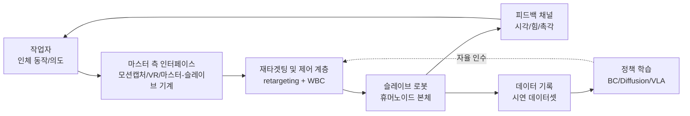
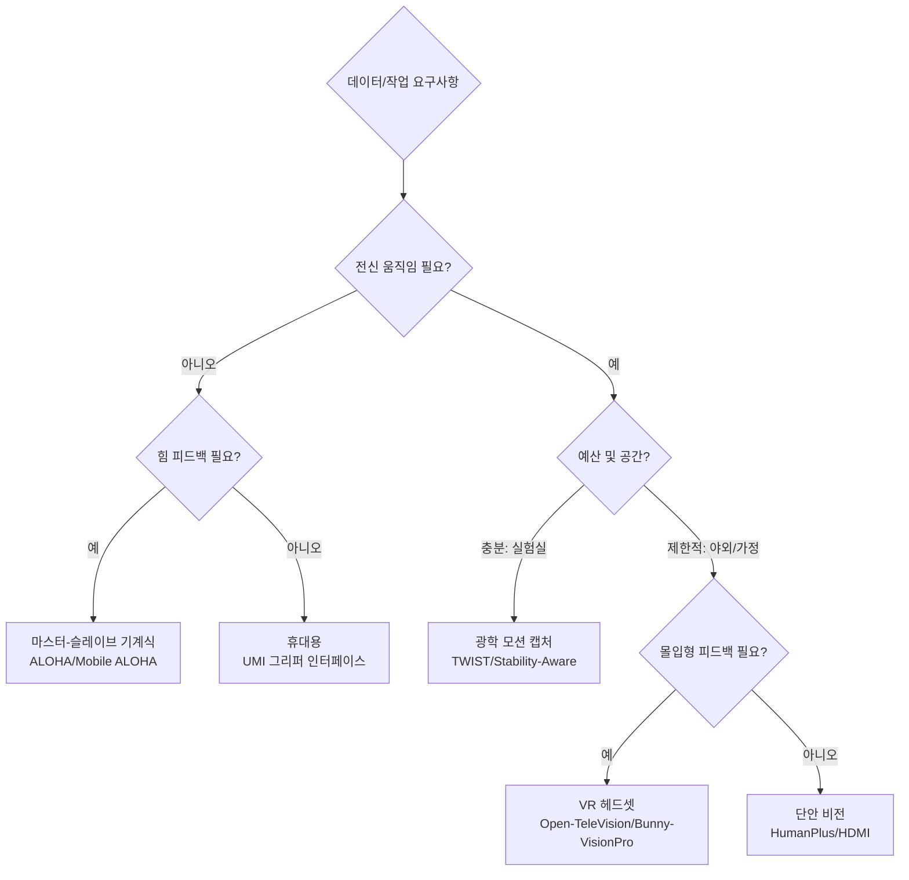
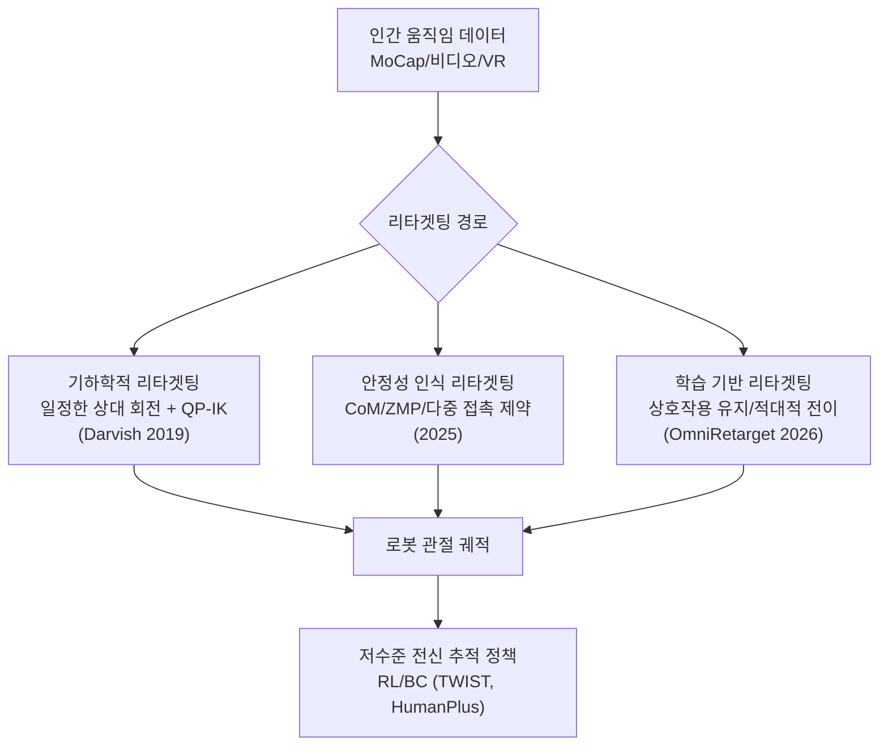
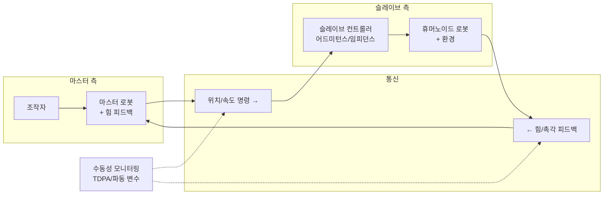
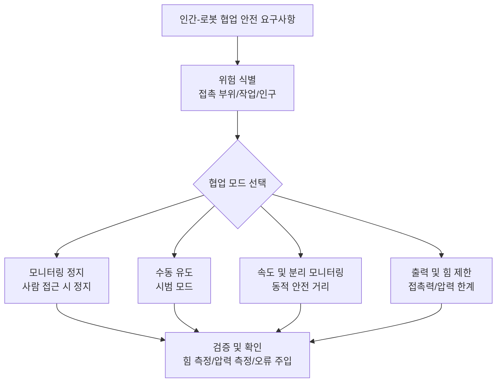

# 제 17장 원격 조작과 인간-로봇 협업

## 요약

원격 조작(teleoperation)과 인간-로봇 협업(human-robot collaboration, HRC)은 휴머노이드 로봇이 실험실 시연에서 실제 현장으로 나아가기 위한 두 가지 다리 역할을 한다. 전자는 인간의 인지-의사 결정 능력을 로봇의 신체에 '투영'하여 데이터 수집, 원격 작업 및 기술 교육을 위한 채널을 제공하고, 후자는 인간과 로봇이 공유 공간에서 안전하게 공존하고, 작업을 분담하며, 상호작용의 유연성을 확보하는 방법을 연구한다. 이 장은 시스템 엔지니어링 관점에서 시작한다. 먼저 원격 조작 시스템의 구성, 분류 및 평가 지표를 제시한다. 그다음 인체 동작 캡처 인터페이스(마스터-슬레이브 기계식, 모션 캡처, VR 헤드셋, 시각적 자세 추정), 동작 재타겟팅(motion retargeting)의 기하학적 및 학습 방법, 양방향 원격 조작의 힘 피드백 아키텍처와 안정성 이론을 순서대로 논의한다. 이후 iCub3 Avatar, OmniH2O, TWIST, HumanPlus, ALOHA 등 대표적인 전신 원격 조작 시스템을 분석한다. 그다음 원격 조작 데이터 수집과 모방 학습의 폐루프, 공유 자율성(shared autonomy) 및 자연어 상호작용을 논의한다. 마지막으로 인간-로봇 협업의 안전 프레임워크와 인간 공학 평가 방법을 요약한다. 이 장은 제 18장(모방 학습 및 정책 학습) 및 제 21장(데이터 인프라)과 상호 보완적이다. 이 장은 '인간과 로봇 간의 실시간 채널'에 초점을 맞추고, 오프라인 정책 훈련의 세부 사항은 후속 장에 맡긴다.

**키워드**: 원격 조작; 인간-로봇 협업; 동작 재타겟팅; 양방향 제어; 힘 피드백; VR 인터페이스; 전신 제어; 공유 자율성; 데이터 수집; 인간-로봇 상호작용

---

## 17.1 원격 조작 및 인간-로봇 협업 개요

### 17.1.1 원격 조작이 휴머노이드 로봇의 핵심 인프라인 이유

휴머노이드 로봇의 궁극적인 목표는 자율적으로 작업을 완료하는 것이지만, 현재 단계의 지능 수준과 작업 복잡성 사이에는 명백한 격차가 존재한다. 이는 지식 그래프에서 '시연 지표와 제품 지표의 격차(Demo-to-Product Gap)' 개념이 설명하는 현상이다. 원격 조작은 이러한 격차에서 세 가지 역할을 수행한다.

1. **데이터 수집 채널**: 모방 학습(imitation learning)은 대량의 고품질 시연 데이터를 필요로 한다. ALOHA 원격 조작 시스템, Mobile ALOHA, HumanPlus 섀도우 시스템 등 저비용 솔루션은 '인간-인-더-루프(human-in-the-loop)' 시범을 확장 가능한 데이터 생산 방식으로 만들어 지식 그래프가 언급하는 '데이터 플라이휠(Data Flywheel)'을 구동한다.
2. **원격 작업 수단**: 위험 환경(원자력 시설, 재해 현장, 우주), 원격 의료 등 시나리오에서 작업자는 '아바타(avatar)' 로봇을 통해 작업을 완료하며, iCub3 Avatar System이 대표적인 사례이다.
3. **능력 보완 메커니즘**: 자율 정책이 실패할 때 인간이 인수(tele-assist)하는 것은 RaaS(로봇 서비스) 비즈니스 모델에서 서비스 가용성을 보장하기 위한 엔지니어링 수단이자 공유 자율성 스펙트럼의 한쪽 끝이다.

!!! note "용어 설명: 원격 조작, 인간-로봇 협업, 공유 자율성, 데이터 플라이휠"
    - **원격 조작(teleoperation)**: 작업자가 원격에서 인터페이스 장치를 통해 로봇을 제어하고 로봇으로부터 시각, 힘 등의 피드백을 수신하는 폐루프 제어 모드.
    - **인간-로봇 협업(human-robot collaboration, HRC)**: 인간과 로봇이 공유 작업 공간 내에서 공동 목표를 위해 협력하는 모드로, 안전 요구 사항은 ISO/TS 15066 등의 기술 규격을 참조.
    - **공유 자율성(shared autonomy)**: 인간과 자율 알고리즘이 동일한 제어 루프 내에서 특정 중재 메커니즘에 따라 로봇의 행동을 공동으로 결정하는 제어 패러다임.
    - **데이터 플라이휠(data flywheel)**: 배포가 데이터를 생성하고, 데이터가 모델을 개선하며, 모델이 성능을 향상시켜 더 많은 데이터를 생성하는 자기 강화 순환.

### 17.1.2 원격 조작 시스템의 구성과 분류

완전한 원격 조작 시스템은 다섯 가지 요소로 구성된다. 작업자 인터페이스(마스터 측), 통신 링크, 로봇 본체(슬레이브 측), 피드백 채널, 그리고 중간에 위치한 **재타겟팅 및 제어 계층**이다. 이 계층은 인체 동작을 로봇이 실행 가능하고 동역학적으로 안정적인 명령으로 매핑하는 역할을 하며, 이는 휴머노이드 로봇 원격 조작이 기존 매니퓰레이터 원격 조작과 구별되는 핵심 난제이다.



마스터-슬레이브 결합 방식에 따라 원격 조작은 네 가지 유형으로 분류된다.

| 유형 | 마스터 측 형태 | 대표 시스템 | 장점 | 한계 |
|---|---|---|---|---|
| 마스터-슬레이브 기계식 | 동형/이형 가이드 암 | ALOHA, Mobile ALOHA | 저지연, 힘 피드백 가능, 비용 통제 가능 | 양팔+몸통에 국한, 전신 동작 표현 어려움 |
| 모션 캡처식 | 광학 모션 캡처/관성 모션 캡처 | TWIST (MoCap 방식), Stability-Aware Retargeting | 전신 고충실도 | 장비 고가, 공간 제약 |
| 시각식 | RGB/RGB-D 카메라 + 자세 추정 | HumanPlus, HDMI | 비착용, 배치 유연 | 폐색에 민감, 깊이 모호성 |
| 착용식 | VR 헤드셋 + 컨트롤러/데이터 글러브 | Open-TeleVision, Bunny-VisionPro, iCub3 Avatar | 몰입감 높음, 공간 위치 정확 | 촉각 없는 손 매핑 정밀도 제한 |

### 17.1.3 인간-로봇 협업의 수준

인간-로봇 협업은 공간 및 작업 결합 정도에 따라 네 가지 수준으로 나눌 수 있으며, 수준이 높을수록 인식, 계획 및 안전에 대한 요구 사항이 높아진다.

1. **공존(coexistence)**: 인간과 로봇이 동일 시설 내에 있지만 작업 공간을 공유하지 않으며, 펜스 또는 영역 모니터링으로 분리.
2. **순차적 협업(sequential collaboration)**: 공간을 공유하지만 동시에 작업하지 않으며, 작업 템포를 분리.
3. **병렬 협업(cooperation)**: 동시에 공유 공간에서 작업하지만 각자 독립적인 작업을 완료.
4. **공동 작업(collaboration proper)**: 인간과 로봇이 동일한 작업물에 힘을 합쳐 작업을 수행(예: 함께 들어 올리기, 인간이 로봇을 잡고 조이기). 이때는 힘 제어, 의도 인식 및 ISO/TS 15066이 규정하는 동력 및 힘 제한(power and force limiting)이 필요.

휴머노이드 로봇은 형태가 인간과 유사하고 작업 공간이 인간과 중첩되므로 자연스럽게 3, 4수준에 위치하며, 이는 안전 설계(제 29장 참조)와 상호작용 설계를 제품화의 전제 조건으로 만든다.

### 17.1.4 자율성 정도 스펙트럼: 이 장의 분석 프레임워크

이 장 전체를 관통하는 유용한 도구는 **자율성 정도 스펙트럼**이다. 순수 원격 조작(인간이 모든 결정), 공유 자율성(인간과 로봇 분담), 감독 자율성(인간이 목표 제시, 로봇 실행, 인간 인수 가능)에서 완전 자율성에 이르기까지, 모든 배포 시스템은 스펙트럼의 특정 지점에 위치할 수 있으며 작업 성숙도에 따라 스펙트럼을 따라 오른쪽으로 이동한다. 이러한 관점의 중요성은 스펙트럼의 각 위치가 서로 다른 엔지니어링 요구 사항에 해당한다는 점이다. 순수 원격 조작은 저지연과 고충실도 매핑을 요구하고, 공유 자율성은 의도 추론과 중재 메커니즘을 요구하며, 감독 자율성은 신뢰할 수 있는 목표 수준 인터페이스와 인수 프로토콜을 요구하고, 완전 자율성은 문제를 제 18-20장의 정책 및 추론에 맡긴다. 원격 조작 기술을 논의할 때는 항상 목표로 하는 위치를 명확히 해야 하며, 감독 자율성으로 충분한 시나리오에 과도한 몰입형 장치를 사용하거나, 24시간 운영이 필요한 서비스를 취약한 순수 원격 조작으로 지원하는 것을 피해야 한다.

## 17.2 인체 모션 캡처 및 마스터 인터페이스

### 17.2.1 마스터-슬레이브 기계식 인터페이스: ALOHA 및 Mobile ALOHA

ALOHA 원격 조작 시스템(ALOHA Teleoperation System)은 저비용 양팔 마스터-슬레이브 시연 패러다임을 개척했습니다. 조작자가 한 쌍의 가벼운 리더 암(leader)을 직접 조작하면, 팔로워 암(follower)이 관절 공간의 위치 서보를 통해 추종합니다. 전체 하드웨어 비용은 수만 위안 수준으로 제어되어 기존 모션 캡처나 힘 피드백 마스터 핸드에 비해 훨씬 저렴합니다. 주요 설계 선택 사항은 다음과 같습니다.

- **관절 공간 직접 매핑**: 리더 암과 팔로워 암의 운동학이 거의 동형이므로 역기구학 및 특이점 처리 문제가 필요 없으며, 지연 시간을 수십 밀리초 수준으로 줄일 수 있습니다.
- **중력 보상과 저구동 트레이드오프**: 리더 암은 경량화되고 중력 균형이 이루어져야 합니다. 그렇지 않으면 장시간 시연 시 피로가 데이터 품질을 현저히 저하시킵니다.
- **손목 카메라 + 파노라마 카메라의 다중 시점 기록**: 후속 행동 복제를 위한 풍부한 시각적 관측을 제공합니다.

Mobile ALOHA는 여기에 이동 베이스와 전신 협조 제어를 추가하여 "이동 조작(mobile manipulation)" 데이터 수집을 가능하게 하며, 요리, 문 열기, 엘리베이터 타기 등 장시간 가정 작업을 수행할 수 있습니다. 한계도 명확합니다. 마스터-슬레이브 아키텍처는 다리 움직임과 전신 자세를 자연스럽게 표현할 수 없으므로, 휴머노이드 로봇의 전신 원격 조작을 위해서는 다음 절에서 설명하는 모션 캡처 및 비전 방식이 필요합니다.

### 17.2.2 모션 캡처 인터페이스: 광학 및 관성 방식

광학 모션 캡처(예: OptiTrack 모션 캡처 시스템)는 다중 카메라 삼각 측량 마커를 통해 서브밀리미터 수준, 수백 헤르츠의 전신 자세 스트림을 제공하며, TWIST, Stability-Aware Retargeting 등 고충실도 전신 원격 조작 방식의 마스터 선택입니다. 관성 모션 캡처(IMU 슈트)는 공간 제약에서 벗어나지만, 드리프트와 자기 간섭이 발생하며, 공학적으로는 인체 운동학적 제약(뼈 길이 고정, 관절 한계)을 통해 온라인 보정을 수행합니다. 2020년의 "A Mobile Robot Hand-Arm Teleoperation System by Vision and IMU"와 같은 초기 연구는 비전+IMU 융합을 사용하여 팔 원격 조작을 구현했으며, 이는 현재 비전 기반 방식의 선구자로 볼 수 있습니다.

모션 캡처 데이터의 엔지니어링 처리 파이프라인은 일반적으로 다음을 포함합니다: 마커/IMU 보정 → 인체 골격 피팅(예: AMASS 데이터셋 사전 기반) → 저역 통과 필터 → 리타겟팅(17.3절) → 전신 제어기 추적. 각 단계에서 발생하는 지연과 노이즈는 최종 원격 조작의 "조작감"을 직접 결정합니다.

### 17.2.3 비전 기반 인터페이스: 단안 자세 추정 및 섀도우 팔로잉

HumanPlus 섀도우 시스템(HumanPlus Shadowing System)은 단안 RGB 카메라만으로 33 자유도, 키 180cm의 휴머노이드 로봇이 인체 및 손 동작을 실시간으로 추종하도록 구동할 수 있음을 입증했습니다. 기술 스택은 다음과 같습니다: 단안 인체 자세 및 손 키포인트 추정 → 관절각 리타겟팅 → 시뮬레이션에서 강화 학습으로 훈련된 저수준 전신 추종 정책(sim-to-real 전이) → 실제 기계 배포. HDMI(Learning Interactive Humanoid Whole-Body Control from Human Videos)는 데이터 소스를 온라인 카메라에서 오프라인 인간 비디오로 더 확장하여 "비디오에서 대화형 전신 제어 학습"을 구현합니다.

비전 기반 방식의 핵심 과제는 **관측 모호성**입니다: 단안 깊이는 관측 불가능하고, 자체 폐색이 빈번하여 자세 추정의 순간 오차가 리타겟팅을 통해 증폭되어 로봇의 균형 불안정을 초래할 수 있습니다. 공학적 대응책으로는 시간 필터링, 칼만 평활화, 저수준 정책에 기준 운동 노이즈에 대한 강건성 훈련 주입 등이 있습니다.

### 17.2.4 웨어러블 인터페이스: VR 헤드셋 및 몰입형 피드백

VR/AR 헤드셋은 "입력"과 "피드백" 양쪽을 동시에 해결합니다: 헤드셋과 컨트롤러의 6-DoF 자세는 팔과 몸통 명령을 제공하고, 입체 디스플레이는 몰입형 1인칭 시각적 피드백을 제공합니다. 대표적인 연구는 다음과 같습니다.

- **Open-TeleVision**: 양팔 조작을 위한 몰입형 능동 시각 피드백 원격 조작으로, 헤드셋 화면이 조작자의 머리 움직임에 따라 로봇의 목 시점을 능동적으로 조정하고 ACT/확산 정책 훈련에 적합한 데이터 형식을 출력합니다.
- **Bunny-VisionPro**: Apple Vision Pro 기반의 실시간 양팔 정밀 원격 조작으로, 헤드셋의 손 추적을 사용하여 정밀 핸드를 구동하며, 저지연과 조작자 편안함을 강조합니다.
- **iCub3 Avatar System**: VR 헤드셋, 전신 모션 캡처 슈트 및 힘 피드백 장갑을 통합한 "완전 몰입형 아바타" 시스템으로, 조작자가 원격지에서 휴머노이드 로봇을 통해 걷기, 악수, 운반을 수행하는 완전한 폐쇄 루프를 구현했습니다(자세한 내용은 17.5.1 참조).

휴대용 인터페이스는 또 다른 주목할 만한 저비용 방향입니다: UMI 그리퍼 인터페이스(UMI Gripper Interface)는 조작자가 카메라가 장착된 그리퍼를 들고 실제 환경에서 직접 시연할 수 있게 하여, 로봇 없이도 "야외(in-the-wild)" 조작 데이터를 수집할 수 있습니다. 그런 다음 정책 학습을 통해 로봇으로 전이되어, 데이터 수집이 로봇 본체 가용성에 의존하는 것을 크게 줄입니다.

### 17.2.5 통신 링크 및 종단 간 지연 예산

원격 조작의 "조작감"은 종단 간 지연에 의해 결정됩니다. 지연 체인은 일반적으로 다음을 포함합니다: 마스터 샘플링(모션 캡처/헤드셋 일반적으로 60–240 Hz) → 자세 추정 또는 골격 계산 → 리타겟팅 및 전신 제어 솔루션 → 버스 전송 및 관절 서보(EtherCAT 등 실시간 버스, 6장 및 22장 참조) → 로봇 움직임 → 카메라 피드백 및 렌더링. 일반적으로 각 단계의 지연 예산 할당은 시스템 수준의 트레이드오프가 필요합니다.

| 단계 | 일반적인 지연 규모 | 주요 압축 수단 |
|---|---|---|
| 마스터 샘플링 및 계산 | 5–30 ms | 샘플링 속도 증가, 하드웨어 타임스탬프, 엣지 추론 |
| 리타겟팅 및 WBC 솔루션 | 1–10 ms | QP 핫 스타트, 차원 축소 작업 세트, 전용 솔버 |
| 버스 및 서보 | 1–5 ms | 실시간 버스, 제어 주기 ≥1 kHz |
| 비디오 피드백 및 렌더링 | 30–80 ms | 저지연 인코딩, 디코딩 버퍼 최소화 |
| 인터넷 전송(원격 시나리오) | 20–200 ms | 전용 회선/엣지 노드, 예측 디스플레이 |

두 가지 경험적 결론: 첫째, 시각적 피드백 루프는 지연에 비교적 관대하지만(조작자가 피드포워드 보상 가능), 힘 루프는 높은 지연에서 감독형 자율 모드로 전환되어야 합니다. 둘째, **지터(jitter)는 평균 지연보다 경험에 더 해롭습니다** — 안정적인 50ms가 20–100ms 사이에서 변동하는 링크보다 훨씬 좋습니다. 따라서 공학적으로는 고정 버퍼를 사용하여 지터를 결정적 지연으로 변환하는 경우가 많습니다. ExtremControl과 같은 저지연 방식의 가치는 제어 체인을 "말단 사지 직접 매핑"으로 단축하여 중간 단계의 누적 지연을 줄이는 데 있습니다.

### 17.2.6 마스터 인터페이스 선택 의사 결정

17.2의 각 절을 종합하면, 마스터 인터페이스의 선택은 "충실도—비용—커버 자유도—데이터 용도"의 4가지 축으로权衡할 수 있습니다.



강조할 점은, 선택이 한 번으로 끝나는 것은 아니라는 것입니다. 많은 팀이 "모션 캡처로 소규모 고충실도 시드 데이터 + 비전/VR로 대규모 수집"의 하이브리드 전략을 채택하여 데이터 품질을 보장하면서 한계 비용을 제어합니다.

## 17.3 모션 리타겟팅: 인간에서 로봇으로의 매핑

### 17.3.1 문제 정형화와 구현 격차

모션 리타겟팅(motion retargeting)은 인간의 움직임 \(\mathbf{q}_H(t)\)을 로봇 관절 궤적 \(\mathbf{q}_R(t)\)으로 매핑합니다. 인간과 로봇의 자유도 수, 링크 비율, 관절 제한, 질량 분포의 차이를 통틀어 **구현 격차(embodiment gap)**라고 합니다. 관절 각도를 직접 복사하는 것은 기하학적으로 불가능하며(인간의 어깨는 볼-소켓 관절이지만 로봇은 종종 세 개의 직교 회전 쌍으로 구성됨), 운동학적으로 불가능하며(팔 길이 비율이 달라 동일한 목표에 도달할 수 없음), 동역학적으로도 불가능합니다(인간의 질량 중심 궤적이 반드시 로봇의 지지 다각형 내에 있지는 않음).

주류 접근 방식은 리타겟팅을 제약 조건이 있는 최적화 문제로 표현하는 것입니다: 작업 공간 오류를 최소화하면서 관절 제한과 안정성 제약 조건을 충족합니다.

$$
\min_{\mathbf{q}_R} \; \sum_{i \in \mathcal{T}} w_i \left\| \mathbf{p}_i^{R}(\mathbf{q}_R) - \tilde{\mathbf{p}}_i^{H} \right\|^2 + \lambda \left\| \mathbf{q}_R - \mathbf{q}_R^{prev} \right\|^2
$$

$$
\text{s.t.} \quad \mathbf{q}_{min} \le \mathbf{q}_R \le \mathbf{q}_{max}, \quad \dot{\mathbf{q}}_{min} \le \dot{\mathbf{q}}_R \le \dot{\mathbf{q}}_{max}, \quad \text{CoM/ZMP 안정성 제약}
$$

여기서 \(\mathcal{T}\)는 선택된 해당 작업 지점 집합(손, 팔꿈치, 발, 골반 등)이고, \(\tilde{\mathbf{p}}_i^H\)는 로봇 비율로 조정된 인간 목표 위치이며, 두 번째 항은 정규화/평활화 항입니다. 이 QP(2차 계획법) 형태는 실시간으로 해결 가능하며, 14장과 15장의 전신 제어 프레임워크와 연결됩니다.

!!! note "용어 설명: 구현 격차, 작업 공간 대응, 발 미끄러짐, 관통"
    - **구현 격차(embodiment gap)**: 인간과 로봇의 형태, 비율, 동역학의 체계적인 차이로, 리타겟팅 오류의 근원입니다.
    - **작업 공간 대응(task-space correspondence)**: 관절 각도를 복사하지 않고, 인간과 로봇의 선택된 주요 지점(손, 발 등)을 데카르트 공간에서 정렬합니다.
    - **발 미끄러짐(foot skating)**: 리타겟팅 후 발바닥과 지면 사이에 상대적인 미끄러짐이 발생하는 인공물로, 리타겟팅 품질의 일반적인 판단 기준입니다.
    - **관통(penetration)**: 로봇 팔다리가 자신 또는 환경 형상 내부로 들어가는 비물리적 인공물입니다.

### 17.3.2 기하학적 리타겟팅: Darvish 전신 프레임워크

2019년의 "인간형 로봇을 위한 전신 기하학적 리타겟팅(Whole-Body Geometric Retargeting for Humanoid Robots, Darvish 등)"은 고전적이고 확장 가능한 기하학적 방식을 제시합니다: **일정한 상대 회전**을 통해 측정된 인간의 각 링크 방향과 각속도를 해당 로봇 링크에 매핑합니다. 즉, 각 해당 링크 쌍 사이의 고정된 오프셋 회전을 미리 보정하고, 실행 시 인간 링크 자세에 해당 오프셋을 오른쪽으로 곱하여 로봇 목표 자세를 얻습니다. 그런 다음 로봇 URDF 모델에서 동적 최적화 QP를 통해 역운동학을 직접 해결하여 관절 제한, 속도 제약 및 다중 작업 우선순위를 통합적으로 처리합니다. 이 프레임워크의 장점은 학습에 의존하지 않는 일반화, 행동 해석 가능성, 안정성 제약 조건을 형식적으로 추가할 수 있다는 점에 있으며, 오늘날까지도 많은 엔지니어링 시스템의 기본 골격으로 사용됩니다.

### 17.3.3 안정성 인식 및 다중 접촉 리타겟팅

순수 운동학적 리타겟팅은 동적 균형을 보장할 수 없습니다. Stability-Aware Retargeting for Humanoid Multi-Contact Teleoperation(2025)과 같은 연구는 질량 중심, ZMP(영점 모멘트) 및 접촉 상태를 리타겟팅 최적화에 명시적으로 포함합니다: 작업자가 벽을 짚거나, 무릎을 꿇거나, 물건을 옮기는 등 다중 접촉 동작을 수행할 때, 솔버는 로봇 자세와 접촉력 분배를 동시에 조정하여 합력 모멘트가 로봇을 전복시키지 않도록 합니다. 엔지니어링에서 일반적으로 사용되는 가벼운 대안은 "질량 중심 투영 보정"입니다: 리타겟팅 결과에 최소한의 하체/허리 보정을 추가하여 질량 중심 투영이 지지 다각형 내에 있도록 합니다. 이는 8장과 15장에서 논의된 ZMP/캡처 포인트(Capture Point) 안정성 기준과 일치합니다.

### 17.3.4 학습 기반 리타겟팅 및 상호작용 유지

최근 추세는 리타겟팅을 "프레임별 기하학적 매핑"에서 "물리적으로 일관된 데이터 생성"으로 업그레이드하는 것입니다. OmniRetarget(2026)은 일반적인 리타겟팅 파이프라인이 인간-물체, 인간-환경 상호작용을 무시하여 발 미끄러짐과 관통이 쉽게 발생한다고 지적하며, **상호작용 메시(interaction mesh)** 기반 데이터 생성 엔진을 제안하여 인간과 물체, 장면 간의 공간 및 접촉 관계를 명시적으로 모델링하고 유지함으로써 인간형 전신 이동 조작(loco-manipulation)을 위한 물리적으로 합리적인 훈련 데이터를 생성합니다. Human-Humanoid Robots Cross-Embodiment(2024)는 분해적 적대적 모방 학습을 사용하여 교차 구현(cross-embodiment) 기술 전이를 각각 학습 가능한 하위 문제로 분해합니다. 이러한 방법들의 공통된 아이디어는: 리타겟팅의 목표는 "인간처럼 보이는 것"이 아니라 "로봇 자체의 동역학적 제약 내에서 작업의 의미를 유지하는 것"입니다.



### 17.3.5 Python 예제: 비율 조정 및 주요 지점 리타겟팅

아래의 최소 예제는 리타겟팅의 첫 번째 단계를 보여줍니다: 팔다리 길이 비율에 따라 인간의 주요 지점을 로봇 작업 공간으로 조정 매핑하고, 목표가 로봇의 팔 길이 포락선을 초과하는지 확인합니다. 실제 시스템에서는 이 위에 자세(회전) 매핑과 QP 해결이 추가되지만, 비율 조정과 포락선 검사는 모든 방식에 공통된 전제 단계입니다:

```python
import numpy as np

# 인간과 로봇의 상지 비율 (예시 값, 단위 m)
human = {"shoulder_width": 0.42, "upper_arm": 0.30, "forearm": 0.28}
robot = {"shoulder_width": 0.50, "upper_arm": 0.32, "forearm": 0.30}

# 각 팔다리 세그먼트 독립 조정 계수
s_ua = robot["upper_arm"] / human["upper_arm"]
s_fa = robot["forearm"] / human["forearm"]

# 인간 어깨, 팔꿈치, 손 주요 지점 (인간 좌표계, 어깨 관절이 원점)
shoulder_h = np.array([0.0, 0.0, 0.0])
elbow_h    = np.array([0.25, -0.15, 0.05])
hand_h     = np.array([0.45, -0.35, 0.10])

# 세그먼트별 조정: 팔꿈치 = 어깨 + s_ua*(팔꿈치-어깨), 손 = 팔꿈치' + s_fa*(손-팔꿈치)
elbow_r = shoulder_h + s_ua * (elbow_h - shoulder_h)
hand_r  = elbow_r + s_fa * (hand_h - elbow_h)

reach_max = robot["upper_arm"] + robot["forearm"]
print("로봇 팔꿈치 목표:", np.round(elbow_r, 3))
print("로봇 손 목표:", np.round(hand_r, 3))
print("손 확장 거리:", round(np.linalg.norm(hand_r - shoulder_h), 3),
      "팔 길이 상한:", reach_max)
```

예제의 핵심은 두 가지입니다: 첫째, **세그먼트별 조정**(각 팔다리 세그먼트의 독립 계수)이 전역 단일 계수보다 우수합니다. 그렇지 않으면 비율 차이가 긴 운동 사슬 끝에서 상당한 오류로 누적됩니다. 둘째, 목표 지점이 팔 길이 포락선을 초과하는 경우 명확한 성능 저하 전략이 필요합니다: 포락면으로 절단, 작업자 안내, 또는 저수준 제어기가 전신 확장(구부리기, 발 디디기)으로 보완하는 것. 이것이 바로 안정성 인식 리타겟팅이 해결해야 할 문제입니다.

## 17.4 양방향 원격 조작과 힘 피드백

### 17.4.1 단방향과 양방향: 투명성 목표

단방향(unilateral) 원격 조작은 "마스터→슬레이브" 명령 흐름만 존재합니다. 양방향 원격 조작(bilateral teleoperation)은 여기에 슬레이브 측에서 측정된 힘/촉각 정보를 마스터 측으로 되돌려 보내 양방향 에너지 교환을 형성합니다. 이상적인 양방향 시스템의 목표는 **투명성(transparency)**입니다. 즉, 조작자가 원격 환경을 직접 조작하는 느낌을 받는 것입니다. 이는 2포트 네트워크의 혼합 행렬로 설명됩니다.

$$
\begin{bmatrix} F_m \\ v_s \end{bmatrix} = \begin{bmatrix} h_{11} & h_{12} \\ h_{21} & h_{22} \end{bmatrix} \begin{bmatrix} v_m \\ -F_s \end{bmatrix}
$$

이상적인 투명성은 \(F_m = F_s\), \(v_m = v_s\)에 해당합니다. 실제 시스템은 관성, 마찰, 통신 지연 및 양자화로 인해 이상에서 벗어나며, 일반적으로 "투명 대역폭"(힘 피드백이 효과적으로 제시될 수 있는 주파수 범위, 일반적으로 수십 헤르츠 정도)을 엔지니어링 지표로 사용합니다.

### 17.4.2 2채널 및 4채널 아키텍처

양방향으로 각각 위치/힘 신호의 조합을 전송하는 방식에 따라 양방향 아키텍처는 위치-위치, 힘-위치 등의 **2채널(two-channel)** 방식과 4개의 신호를 동시에 교환하는 **4채널(four-channel)** 아키텍처로 나눌 수 있습니다. 후자는 이론적으로 환경과 조작자의 동역학을 알 때 완전한 투명성을 달성할 수 있지만, 힘/토크 센서에 대한 의존도가 높고 비용이 많이 들며 노이즈에 민감합니다. 2026년의 Sensorless Four-Channel Control Architecture는 역동역학 모델 추정을 사용하여 힘 센서를 대체하는 방안을 제시했으며, 인간 규모의 WAM 양방향 플랫폼에서 위치 및 힘 추적 개선과 조작자 부담 감소를 검증했습니다. 이는 비용에 민감한 휴머노이드 로봇 시나리오에서 특히 매력적입니다. 휴머노이드 전체에 각 손마다 6축 힘/토크 센서를 장착하면 비용과 신뢰성에 큰 부담이 따르므로, 무센서(sensorless) 외력 추정은 중요한 비용 절감 경로입니다(5장에서 논의된 관절 토크 센싱, 전류 루프 외력 관측과 연계됨).

### 17.4.3 지연, 수동성 및 안정성

양방향 루프는 에너지 루프이며, 통신 지연은 시스템을 능동화(active)하여 불안정하게 만듭니다. 고전 이론은 두 가지 주요 접근법을 제시합니다.

- **수동성(passivity) 방법**: 마스터 측에서 슬레이브 측까지의 2포트 네트워크가 수동성을 만족하도록 요구합니다. 즉, 출력 에너지가 입력 에너지에 초기 저장 에너지를 더한 값을 초과하지 않아야 합니다. 파동 변수(wave variables) 변환은 지연 채널을 무손실 전송선로로 개조하여 임의의 일정 지연 하에서 수동성을 보장하지만, 위치 드리프트와 "파동 반사" 아티팩트를 유발합니다.
- **시간 영역 수동성(TDPA)**: 이산 시스템에서 온라인으로 초과 에너지를 모니터링하고 소산시키며, 주기 제어 및 패킷 손실 네트워크에 더 적합합니다.

공학적 경험 법칙(일반적으로): 힘 감지 폐루프는 왕복 지연에 대한 허용 오차가 시각 폐루프보다 훨씬 낮습니다. LAN/직접 연결 조건에서는 투명성에 가까운 조작이 가능하지만, 지역 간 인터넷 링크는 일반적으로 "감독 자율"로 성능을 낮춰야 합니다. 즉, 사람이 목표를 주고 로봇이 로컬에서 폐루프를 형성합니다. ExtremControl(Low-Latency Humanoid Teleoperation with Direct Extremity Control, 2026)은 바로 제어 링크를 단축하는 관점에서 접근하여, 직접적인 말단 사지 제어를 통해 휴머노이드 원격 조작 지연을 줄입니다.



### 17.4.4 촉각 및 힘 피드백의 장치 계층

힘 피드백은 궁극적으로 웨어러블 또는 데스크탑 장치에 구현되어야 하며, 일반적인 형태는 다음과 같습니다.

- **힘 피드백 마스터 핸드/로봇 팔형 마스터 측**: 직렬 로봇 팔을 사용하여 3–7 자유도의 말단 힘 피드백을 제공하며, 투명 대역폭이 높지만 작업 공간이 작고 비용이 높습니다.
- **힘 피드백 장갑**: 손가락이나 손등에 반력을 가하여 쥐는 저항과 접촉 이벤트를 제시할 수 있으며, iCub3 Avatar 시스템이 이러한 장치를 통합했습니다. 엔지니어링 난제는 무게(손에 약간의 부하만 추가되어도 정밀 조작에 큰 영향을 미침)와 자유도 매칭입니다.
- **진동/전기 자극 촉각 힌트**: 저비용 진동 모터로 접촉, 미끄러짐 이벤트를 인코딩하며, 정보 대역폭은 낮지만 견고하고 가벼워 힘 피드백의 성능 저하 대안으로 자주 사용됩니다.
- **전류 환류형 마스터-슬레이브 피드백**: ALOHA 계열 시스템에서 슬레이브 모터 전류를 직접 사용하여 외력을 추정하고 가이드 암을 역구동하여, 센서를 추가하지 않고도 대략적인 힘 감각을 제공하는 저비용 양방향화의 교묘한 경로입니다.

장치 계층의 일반적인 법칙은 힘 피드백의 자유도와 충실도가 한 단계씩 높아질수록 비용, 무게 및 착용 시간이 한 단계씩 증가한다는 것입니다. 따라서 데이터 수집 중심 시스템에서는 대부분의 팀이 "시각 중심, 힘 감각은 힌트로 성능 저하" 구성을 선택하고, 실제 양방향 힘 피드백은 원격 의료, 정밀 조립 등 힘에 민감한 작업 시나리오에 남겨둡니다.

## 17.5 대표적인 전신 원격 조작 시스템

### 17.5.1 iCub3 Avatar System: 완전 몰입형 원격 아바타

iCub3 Avatar System(2022, *Science Robotics* 게재)은 "로봇 아바타" 경로의 이정표입니다. 조작자는 VR 헤드셋, 전신 모션 캡처 슈트 및 힘 피드백 장갑을 착용하고 iCub3 휴머노이드 로봇을 원격으로 제어하여 걷기, 잡기, 악수 등을 수행하며, 발바닥과 손의 힘 감각을 조작자에게 전달합니다. 이 시스템은 수백 킬로미터 규모의 실제 원격 링크에서 데모를 완료하여 지연 제한 조건에서 "완전 몰입형 구현(fully-immersive embodiment)"의 실현 가능성을 검증했으며, 동시에 전신 힘 피드백 장치의 무거운 중량, 복잡한 착용, 장시간 작업 시 피로 등 엔지니어링 병목 현상을 드러냈습니다.

### 17.5.2 OmniH2O: 범용적인 인간 대 인간 전신 원격 조작

OmniH2O(2024)는 "전신 원격 조작"과 "자율 학습"을 하나의 데이터 폐루프로 통합합니다. 원격 조작 측은 VR 헤드셋 또는 모션 캡처 입력을 지원하며, 로봇 측은 교사-학생 지식 전이 훈련을 통해 학습합니다. 교사 정책은 시뮬레이션 특권 정보(privileged information)를 사용하여 PPO 강화 학습으로 훈련된 후, 배포 관찰에만 의존하는 학생 정책으로 증류됩니다. 수집된 데모는 동시에 ACT/행동 복제에 사용되어 재사용 가능한 전신 기술(예: 배드민턴, 운반, 물주기)을 생성합니다. OmniH2O의 의의는 "원격 조작 = 데이터 생산, 데이터 = 자율 능력"이라는 플라이휠 패러다임을 시연한 데 있습니다.

### 17.5.3 TWIST: 원격 조작 전신 모방 시스템

TWIST(Teleoperated Whole-Body Imitation System, 2025)는 인간 모션 캡처 데이터를 휴머노이드 로봇으로 리타겟팅하고, 2단계 **교사-학생 RL+BC** 프레임워크를 통해 단일 전신 컨트롤러를 훈련시켜 Unitree G1 및 Booster T1과 같은 실제 전신 로봇에서 교차 조작, 이동 및 표현 작업을 위한 실시간 조정 전신 원격 조작을 구현합니다. 시스템의 핵심 사항은 다음과 같습니다: 관절 공간과 작업 공간이 혼합된 리타겟팅 표현, 시뮬레이션에서 참조 동작에 대한 대규모 교란 훈련을 통한 견고성 향상, 배포 시 저지연 관찰 파이프라인. TWIST는 "하나의 컨트롤러가 모든 참조 동작을 처리한다"는 간결한 엔지니어링 철학을 대표합니다.

### 17.5.4 HumanPlus 및 Mobile ALOHA: 데이터 우선 경로

HumanPlus(2024)는 "섀도잉(shadowing) + 모방(imitation)"의 전체 스택을 강조합니다. 단안 카메라가 실시간으로 따라가며 데이터를 수집하고, 약 40개의 데모만으로도 자기 중심 시각 기반의 자율 조작 및 이동 기술을 학습할 수 있습니다. Mobile ALOHA는 이중 팔 + 섀시 하드웨어 형태를 통해 저비용 플랫폼이 장기간 가정 작업 데이터를 수집하는 가치를 입증했습니다. 둘은 공통적으로 하나의 엔지니어링 질문에 답합니다: **데이터의 한계 비용**이 모방 학습의 규모화 가능성을 결정하며, 마스터 측이 저렴하고 휴대성이 높을수록 데이터 플라이휠이 더 빠르게 회전합니다.

### 17.5.5 시스템 비교

| 시스템 | 연도 | 마스터 측 인터페이스 | 로봇 플랫폼 | 힘 피드백 | 데이터/학습 폐루프 | 주요 특징 |
|---|---|---|---|---|---|---|
| ALOHA | 2023 | 마스터-슬레이브 가이드 암 | 이중 팔 워크스테이션 | 부분(전류) | ACT 행동 복제 | 저비용, 쉬운 복제 |
| Mobile ALOHA | 2024 | 마스터-슬레이브 가이드 암+섀시 | 이동형 이중 팔 | 부분 | 행동 복제 | 장시간 이동 조작 |
| iCub3 Avatar | 2022 | VR+모션 캡처 슈트+힘 피드백 장갑 | iCub3 | 전신 다중 지점 | — | 완전 몰입형 원격 아바타 |
| OmniH2O | 2024 | VR/모션 캡처 | Unitree H1 | 없음 | 교사-학생 RL + BC | 원격 조작-자율 학습 통합 |
| HumanPlus | 2024 | 단안 RGB | 33-DoF 휴머노이드(H1 개조) | 없음 | 섀도잉 + BC | 무착용, 높은 데이터 효율 |
| TWIST | 2025 | 모션 캡처 | Unitree G1, Booster T1 | 없음 | RL+BC 단일 전신 컨트롤러 | 교차 작업 조정 전신 제어 |
| Open-TeleVision | 2024 | VR 헤드셋 | 이중 팔 휴머노이드 상체 | 없음 | ACT/확산 정책 | 능동 시각 피드백 |

### 17.5.6 사례의 공통 경험

이러한 시스템들을 가로로 비교하면 반복적으로 검증된 네 가지 엔지니어링 경험을 추출할 수 있습니다.

1. **하위 레벨 컨트롤러가 상한을 결정합니다**: 마스터 측이 아무리 정교해도 최종 경험은 로봇 측의 전신 추적 정책에 의해 결정됩니다. 성공한 시스템(TWIST, HumanPlus, OmniH2O)은 마스터 측 하드웨어를 계속 개선하는 대신 시뮬레이션에서 대규모 교란 훈련을 통한 하위 레벨 정책에 많은 엔지니어링 예산을 투자했습니다.
2. **교사-학생 증류는 표준입니다**: 특권 정보로 교사를 훈련하고 배포 가능한 학생으로 증류하는 패러다임은 OmniH2O와 TWIST에서 반복적으로 나타나며, 훈련 효율성과 배포 관찰 제약 조건의 균형을 맞추는 일반적인 해결책입니다.
3. **데이터 형식이 우선입니다**: 가치를 축적할 수 있는 시스템은 첫날부터 원격 조작 스트림을 학습 친화적인 형식(관찰-행동 정렬, 타임스탬프 동기화, 언어 명령 연결)으로 저장하며, "일단 실행하고 보자"는 방식이 아닙니다.
4. **데모 규모 ≠ 시스템 가치**: iCub3 Avatar와 같은 시스템은 데이터 생산 능력을 목표로 하지 않지만, 원격 구현 및 힘 피드백 통합에서 대체 불가능한 검증을 제공합니다. 원격 조작 시스템을 평가할 때는 먼저 목표 함수(작업 능력 또는 데이터 생산 능력)를 명확히 해야 하며, 둘 사이의 지연, 힘 감각, 비용에 대한 절충은 완전히 다릅니다.

## 17.6 원격 조작 데이터와 자율 학습 폐루프

### 17.6.1 데모에서 정책으로

원격 조작으로 수집된 데모 \(\{(o_t, a_t)\}\)는 행동 복제(behavior cloning), 액션 청킹 트랜스포머(Action Chunking with Transformers, ACT) 또는 확산 정책(diffusion policy)을 통해 자율 정책으로 훈련됩니다. 자세한 내용은 18장을 참조하십시오. 원격 조작 엔지니어링 관점에서 데이터 가치를 결정하는 요소는 다음과 같습니다.

- **커버리지(coverage)**: 상태-행동 공간이 작업 분포를 포괄하는지, 초기 자세와 교란이 다양한지 여부.
- **일관성(consistency)**: 동일한 작업에 대한 데모 스타일 차이는 정책 피팅 난이도를 높이므로, 조작자 교육과 표준화된 절차가 중요합니다.
- **주석 품질**: 언어 명령, 작업 분할, 성공/실패 레이블은 후속 VLA 훈련(19장) 및 평가(25장)에 직접적인 영향을 미칩니다.

### 17.6.2 데이터 증강: 하나의 데모를 천 개로

원격 조작 데이터는 비용이 많이 들기 때문에 "적은 양으로 많은 양을 생성"하는 증강 경로가 등장했습니다. MimicGen은 소수의 인간 데모를 자동으로 재구성하여 많은 새로운 시나리오의 데모를 생성합니다. HumanoidMimicGen(Data Generation for Loco-Manipulation via Whole-Body Planning, 2026)은 휴머노이드 이동 조작을 위해 전신 계획을 통해 원격 조작/외골격 데이터에서 훈련 가능한 전신 궤적을 생성합니다. RoboGen은 생성적 시뮬레이션 경로를 통해 자동으로 작업을 제안하고, 장면을 생성하며, 학습을 진행합니다. 이러한 방법들은 원격 조작과 상호 보완적입니다. 원격 조작은 "씨앗"을 제공하고 증강은 "증폭"을 제공합니다.

### 17.6.3 로봇 원격 조작 vs 인간 원격 조작

자주 간과되는 질문은 원격 조작 로봇과 인간의 직접 원격 작업 중 어느 것이 더 우수한가입니다. 2025년 원격 초음파에 대한 비교 연구(Robotic versus Human Teleoperation for Remote Ultrasound)는 팬텀 실험에서 로봇(Franka Panda) 원격 조작과 HoloLens 2로 안내된 인간 원격 조작이 완료 시간과 이미지 공간 추적 정확도에서 유의미한 차이가 없음을 발견했지만, 인간 원격 조작이 더 일관되고 더 낮은 크기의 힘을 가했습니다. 이는 힘 감각 피드백과 힘 제어 품질이 의료와 같은 힘에 민감한 시나리오에서 원격 조작의 핵심 차별화 지표임을 시사하며, 17.4절의 아키텍처 논의와도 일치합니다.

### 17.6.4 오픈소스 도구 체인과 데이터 생태계

원격 조작 데이터의 규모화와 도구 체인의 성숙도는 서로를 강화합니다. LeRobot과 같은 오픈소스 프레임워크는 "수집-저장-훈련-평가"를 통합 파이프라인으로 캡슐화하고, 데모 데이터의 일반 형식(관찰, 행동, 타임스탬프, 언어 명령의 통합 캡슐화)을 정의하여 ALOHA, Mobile ALOHA 등 다양한 하드웨어 플랫폼의 데이터가 동일한 훈련 스택에서 재사용될 수 있도록 합니다. Open X-Embodiment와 같은 교차 본체 데이터 세트 및 Hugging Face 스타일의 데이터 세트 호스팅 생태계와 결합하여 개별 연구실도 커뮤니티 데이터 위에서 정책을 훈련할 수 있습니다. 엔지니어링 팀에 대한 조언은 가능한 한 빨리 커뮤니티 표준 형식을 채택하고 독점 형식을 피하는 것입니다. 데이터 자산의 장기적 가치는 이전 가능성에 달려 있으며, 이전 가능성은 우선 형식에 의해 결정됩니다.

## 17.7 인간-로봇 협업과 상호작용

### 17.7.1 안전 프레임워크: 격리에서 출력 및 힘 제한으로

인간-로봇 협업 안전(Human-Robot Collaboration Safety)은 표준, 센싱, 제어 법칙 및 작업장 설계의 네 가지 수준에서 협력이 필요합니다: ISO/TS 15066은 인간-로봇 접촉 시 힘과 압력 한계 프레임워크를 제공하며, 협업 작업을 안전 정격 모니터링 정지, 수동 유도, 속도 및 분리 모니터링(speed and separation monitoring, SSM), 출력 및 힘 제한(power and force limiting, PFL)의 네 가지 모드로 분류합니다. 휴머노이드 로봇은 이동형 + 양팔 형태로 개방 공간에서 작업하며 PFL 모드에 가장 가깝지만, 이족 보행의 낙상 위험은 기존 고정 베이스 매니퓰레이터를 대상으로 하는 표준이 다루지 못한 공백입니다. 이 표준 및 규제 문제는 29장에서 다룹니다.



### 17.7.2 공유 자율성과 슬라이딩 자율성

순수 원격 조작은 부담이 크고 순수 자율성은 신뢰성이 낮으며, 공유 자율성(shared autonomy)은 이 둘 사이에서 작업에 따라 제어 권한을 동적으로 할당합니다: 인간은 의도 계층(어떤 물체를 선택할지, 어디에 놓을지)을 담당하고, 로봇은 실행 계층(장애물 회피, 파지 계획, 균형)을 담당합니다. **슬라이딩 자율성(sliding autonomy)**은 할당 계수를 연속화합니다. 작업자의 성능이 좋으면 인간의 가중치를 높이고, 망설임이나 충돌이 감지되면 자율성 가중치를 높입니다. 의도 추론에는 일반적으로 베이지안 방법이 사용됩니다: 후보 목표의 확률 분포를 유지하고, 인간의 부분 궤적으로 온라인 업데이트하여 보조 동작을 출력합니다. 휴머노이드 로봇의 전신 특성으로 인해 공유 자율성은 내비게이션과 조작의 두 가지 수준을 동시에 다루어야 하며, 이는 16장(조작 및 파지)의 계획 스택과 직접 연결됩니다.

### 17.7.3 자연어 및 다중 모달 상호작용

언어는 인간-로봇 협업에서 대역폭이 가장 높고 학습 비용이 가장 낮은 의도 채널입니다. TextOp(2026)은 실시간 텍스트 기반 휴머노이드 동작 생성을 보여줍니다: 상위 계층의 자기회귀 잠재 확산 모델이 스트리밍 언어 명령에서 단기 운동학적 참조를 생성하고, 하위 계층의 강화 학습 전신 추적 정책이 Unitree G1에서 실행되어 "말하면, 행동한다"의 연속적인 지휘를 가능하게 합니다. 대규모 언어 모델을 결합한 작업 수준 인터페이스(예: GPT 계열 모델을 사용하여 음성 명령을 로봇 기술 시퀀스로 분해하는 연구 방향)와 19, 20장의 VLA/세계 모델을 통해 언어는 "상호작용 인터페이스"에서 "제어 루프의 일부"로 진화하고 있습니다. 음성 외에도 제스처, 시선 및 힘 신호가 함께 다중 모달 의도 채널을 구성하며, 엔지니어링에서 해결해야 할 핵심은 채널 간의 충돌 중재와 시간 정렬입니다.

### 17.7.4 인간 공학 평가: "사용성"을 측정하는 방법

원격 조작 및 인간-로봇 협업 시스템의 평가는 작업 성공률만으로는 충분하지 않으며, 인간 공학(human factors) 지표도 중요합니다:

| 차원 | 일반적인 지표 | 일반적인 측정 방식 |
|---|---|---|
| 작업 성과 | 완료 시간, 성공률, 정밀도, 가해진 힘 | 표준화된 작업 벤치 실험 |
| 작업 부하 | NASA-TLX 주관적 부하 척도 | 실험 후 설문 |
| 상황 인식 | SART/동결 탐지법 | 작업 중 탐지 신호 삽입 |
| 현장감 | Presence 설문(VR 시나리오) | 주관적 척도 |
| 신뢰 | 신뢰 척도 + 인수 행동 | 종단 실험 |
| 피로 | 작업 시간, 근전도/심박 변이도 | 웨어러블 모니터링 |

일반적으로 몰입형 1인칭 피드백은 상황 인식과 현장감을 향상시킬 수 있지만, 시각적 피로와 멀미를 악화시킬 수도 있습니다. 힘 피드백은 충돌력을 줄이고 정밀 조작 품질을 향상시키지만, 마스터 측 비용과 유지 관리 부담을 증가시킵니다. 이러한 트레이드오프는 목표 시나리오에서 통제된 실험을 통해 결정되어야 하며, 데모 비디오에서 추론해서는 안 됩니다. 의료, 요양 등의 시나리오를 대상으로 한 사용자 연구(예: 가정 내 노인의 로봇 보조 작업 선호도에 대한 인터뷰 연구)는 반복적으로 최종 사용자가 **로봇 행동에 대한 제어권과 예측 가능성**을 기능의 풍부함보다 더 중요하게 여긴다는 것을 보여줍니다.

### 17.7.5 작업자 교육 및 데이터 품질 관리

원격 조작 시스템의 생산성은 궁극적으로 "인간"이라는 요소에 달려 있습니다. 대규모 데이터 수집 팀의 엔지니어링 실무는 다음과 같은 제도적 배치가 데이터 품질에 알고리즘 못지않은 영향을 미친다는 것을 보여줍니다:

- **표준 운영 절차(SOP)**: 작업 분해, 초기 자세, 성공 기준, 실패 재녹화 규칙을 모두 문서화하여 다른 작업자의 데이터 분포를 일관되게 유지;
- **작업자 등급 및 인증**: 신규 작업자는 먼저 시뮬레이션이나 저위험 작업에서 평가(완료 시간, 충돌 횟수, 궤적 평활도)를 받고, 기준을 충족한 후 실제 작업에 투입;
- **온라인 품질 검사 및 피드백**: 수집 측에서 실시간으로 프레임 드롭, 관절 한계 접촉, 시간 초과 등의 이상을 감지하고 재녹화를 안내하여 "사후 정리에서 대량의 불량 데이터를 발견하는" 상황을 방지;
- **피로 관리**: 웨어러블 인터페이스에서 작업자는 일반적으로 수십 분 작업 후 뚜렷한 피로를 보이며, 교대 및 순환 제도는 데이터의 꼬리 품질을 직접 결정;
- **주석 및 재생 감사**: 일정 비율로 녹화된 데이터를 무작위 재생하여 성공률과 결함 유형 분포를 통계하고, SOP를 폐쇄 루프로 수정.

이러한 실무는 21장의 데이터 인프라와 함께 "데이터 공장"의 완전한 그림을 구성합니다: 원격 조작 시스템은 생산 라인이고, 품질 관리는 생산 라인의 분리할 수 없는 부분입니다.

## 17.8 엔지니어링 과제와 전망

현재 휴머노이드 로봇 원격 조작 및 인간-로봇 협업의 주요 미해결 문제는 다음과 같습니다:

1. **전신 힘 피드백의 부재**: 기존 시스템의 힘 피드백은 손에 집중되거나 완전히 없으며, 발바닥 접촉, 몸통 충돌의 "체감"에 대한 저비용 솔루션이 아직 없음;
2. **지연 예산의 종단 간 최적화**: 자세 추정, 리타겟팅, 제어, 렌더링에 이르기까지 모든 밀리초가 중요하며, ExtremControl 스타일의 직접 말단 제어와 엣지 추론이 추세;
3. **교차 체현 이전**: 하나의 마스터 측이 어떻게 다른 키, 다른 자유도를 가진 로봇(cross-embodiment)에 적응할 수 있는지는 데이터 규모화의 전제 조건;
4. **협업 안전의 휴머노이드 특화**: 이족 보행 낙상, 동적 접촉, 비구조화된 군중 등의 시나리오에는 새로운 안전 측정 및 검증 방법이 필요;
5. **원격 조작에서 자율성으로의 원활한 전환**: 원격 조작, 공유 자율성, 완전 자율성은 연속 스펙트럼으로 간주되어야 하며, 시스템 아키텍처는 제어 권한이 스펙트럼에서 손실 없이 슬라이딩될 수 있도록 지원해야 함.

## 이 장의 요약

원격 조작은 휴머노이드 로봇에게 현재 가장 현실적인 "능력 증폭기"이자 "데이터 생산 라인"이며, 인간-로봇 협업은 그것이 인간과 공유하는 실제 공간에 진입할 수 있는지를 결정합니다. 이 장은 "인터페이스—매핑—피드백—시스템—데이터—협업"의 흐름을 따라 전개됩니다: 마스터 측 인터페이스는 마스터-슬레이브 메커니즘(ALOHA, Mobile ALOHA), 모션 캡처(TWIST), 단안 비전(HumanPlus)에서 VR 웨어러블(Open-TeleVision, iCub3 Avatar)까지 각각 비용-충실도 트레이드오프가 있습니다; 운동 리타겟팅은 기하학적 QP(Darvish 프레임워크)에서 안정성 인식 및 상호작용 유지 학습 방법(OmniRetarget)으로 진화합니다; 양방향 원격 조작은 수동성 이론으로 지연 하의 안정성을 보장하며, 4채널 및 무센서 방식은 더 높은 투명성과 더 낮은 비용을 지향합니다; 공유 자율성, 언어 상호작용 및 인간 공학 평가는 함께 인간-로봇 협업의 "소프트" 계층을 구성합니다. 이 장의 시스템 그림을 이해하는 것은 18–21장의 알고리즘 및 데이터 인프라 논의를 학습하기 위한 전제 조건입니다.

## 추가 읽기(지식 그래프 항목)

- 기술: ALOHA 원격 조작 시스템, Mobile ALOHA, HumanPlus 섀도우 시스템, UMI 그리퍼 인터페이스, OptiTrack 모션 캡처
- 방법: 양방향 원격 조작(Bilateral Teleoperation), 행동 복제, 동작 청크 트랜스포머, 확산 정책
- 논문: OmniH2O(2024), Open-TeleVision(2024), HumanPlus(arXiv:2406.10454), TWIST(arXiv:2505.02833), iCub3 Avatar System(arXiv:2203.06972), Whole-Body Geometric Retargeting(2019), Stability-Aware Retargeting(2025), OmniRetarget(2026), HumanoidMimicGen(2026), TextOp(2026), Sensorless Four-Channel Control Architecture(2026), Robotic versus Human Teleoperation for Remote Ultrasound(2025), Bunny-VisionPro(2024), HDMI(2025), ExtremControl(2026), Teleoperation of Humanoid Robots: A Survey(2023)
- 개념: 인간-로봇 협업 안전, 데이터 플라이휠, 데모 지표와 제품 지표의 격차
- 데이터셋: AMASS, Ego4D, Open X-Embodiment, HumanPlus Shadowing 데이터셋
