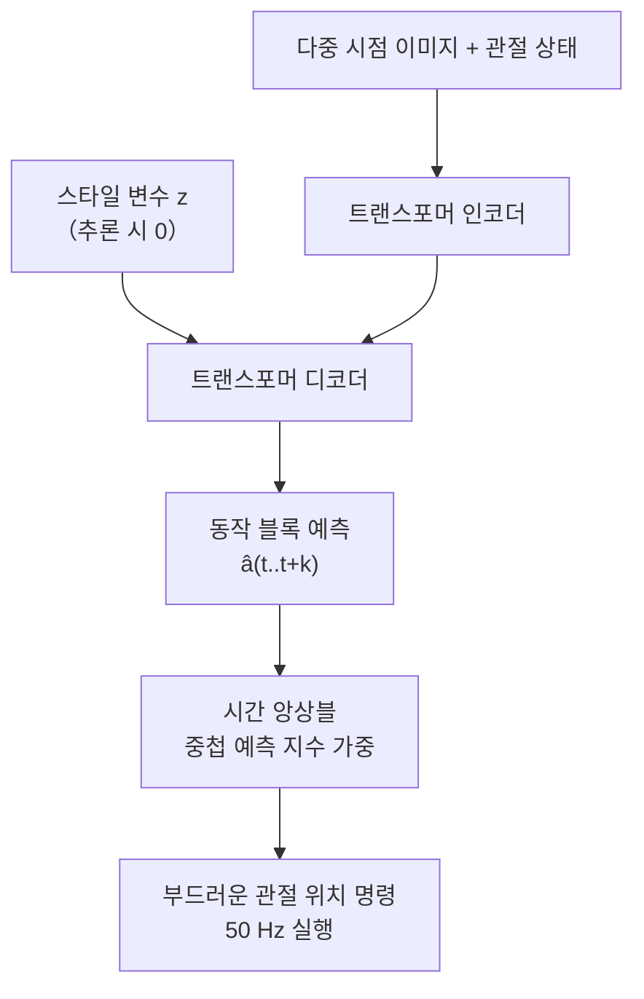
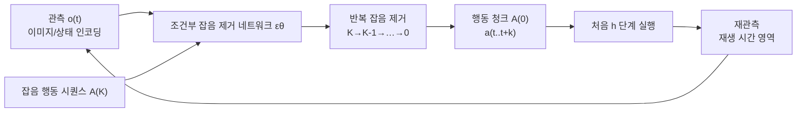
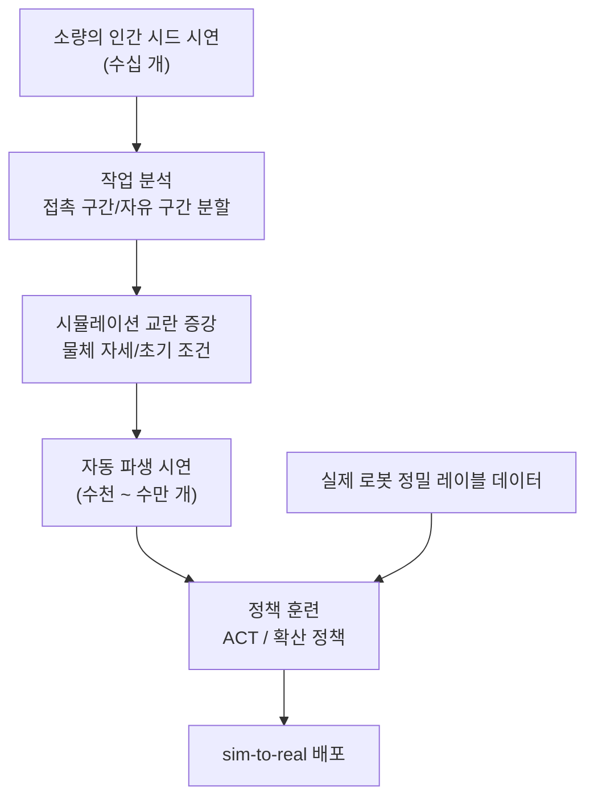
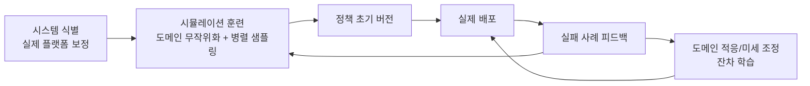

# 제 18장 모방 학습과 정책 학습

## 요약

휴머노이드 로봇의 조작 기술 습득은 '인간 프로그래밍'에서 '데이터 기반'으로의 패러다임 전환을 겪고 있습니다. 즉, 각 작업의 제어기를 수동으로 유도하는 대신 로봇이 시연 데이터로부터 정책(policy)을 학습하도록 하는 것입니다. 이 장에서는 모방 학습(Imitation Learning, IL)과 정책 학습의 기술 체계를 체계적으로 설명합니다. 먼저 모방 학습의 문제 형식화와 복합 오류(compounding error) 분석을 제시합니다. 그런 다음 세 가지 주요 기술 경로인 행동 복제(Behavior Cloning, BC), 동작 청킹 트랜스포머(Action Chunking with Transformers, ACT) 및 확산 정책(Diffusion Policy)을 심층적으로 다루며, 그 수학적 모델, 아키텍처 설계 및 엔지니어링 트레이드오프를 제시합니다. 다음으로 데이터 효율적 학습 및 데이터 규모화 방법을 논의하며, 원격 조작 데이터 수집(ALOHA, Mobile ALOHA, UMI), 시뮬레이션 데이터 합성(MimicGen, DexMimicGen, HumanoidGen) 및 대규모 교차-체현 데이터셋(Open X-Embodiment, AgiBot World)을 포함합니다. 마지막으로 sim-to-real 전환의 현실 격차 원인, 도메인 무작위화(Domain Randomization), 시스템 식별 및 도메인 적응 기술, 그리고 정책 평가 및 배포의 엔지니어링 제약 조건을 논의합니다. 이 장에서 인용된 ACT, 확산 정책, RT-1/RT-2, BC-Z, Octo, OpenVLA, π0, GR00T N1, Helix, LeRobot, Isaac Lab 등은 모두 지식 그래프에 등록된 실제 항목입니다.

**키워드**: 모방 학습; 행동 복제; ACT; 동작 청킹; 확산 정책; 잡음 제거 확산 모델; 데이터 효율적 학습; 원격 조작; sim-to-real; 도메인 무작위화

---

## 18.1 모방 학습의 문제 형식화

### 18.1.1 시연에서 정책으로

모방 학습은 기술 습득을 지도 학습 문제로 모델링합니다. 로봇이 마르코프 결정 과정(Markov Decision Process, MDP) \((\mathcal{S}, \mathcal{A}, P, R, \gamma)\)에 있다고 가정하고, 전문가(사람 또는 다른 제어기)가 시연 데이터셋 \(\mathcal{D} = \{(o_t, a_t)\}\)을 제공합니다. 여기서 \(o_t\)는 관측(이미지, 관절 상태, 힘/촉각 등)이고, \(a_t\)는 전문가 동작입니다. 모방 학습의 목표는 파라미터화된 정책 \(\pi_\theta(a|o)\)을 훈련하여 시연 분포에서 전문가 동작의 가능도를 최대화하는 것입니다:

$$
\theta^* = \arg\max_\theta \sum_{(o,a)\in\mathcal{D}} \log \pi_\theta(a \mid o)
$$

결정론적 정책(회귀식 행동 복제)의 경우, 이는 동작 재구성 오류 \(\|\pi_\theta(o) - a\|^2\)의 최소화와 동일합니다. 이 형식화는 단순해 보이지만, 모방 학습의 모든 핵심 문제를 제기합니다: **테스트 시의 상태 분포가 훈련 시의 시연 분포와 일치하지 않습니다**.

!!! note "용어 설명: 정책, 시연, 관측, 공변량 이동, 복합 오류, 분포 외 상태"
    - **정책(policy)**: 관측에서 동작으로의 매핑 \(\pi: \mathcal{O} \to \mathcal{A}\)으로, 결정론적 함수 또는 조건부 확률 분포일 수 있습니다.
    - **시연(demonstration)**: 전문가가 작업을 수행할 때 기록된 관측-동작 시퀀스로, 모방 학습의 훈련 데이터입니다.
    - **공변량 이동(covariate shift)**: 훈련 시 입력 분포 \(p_{train}(o)\)와 테스트 시 입력 분포 \(p_{test}(o)\)가 일치하지 않는 현상입니다.
    - **복합 오류(compounding error)**: 정책의 작은 오류가 누적되어 상태가 점차 시연 분포에서 벗어나며, 오류가 시간 단계에 따라 대략 제곱으로 증가합니다.
    - **분포 외 상태(out-of-distribution state)**: 정책 실행 중 시연 데이터에 한 번도 나타나지 않은 상태에 도달하여, 이때 정책 출력을 예측할 수 없습니다.

### 18.1.2 복합 오류와 공변량 이동

각 상태에서 정책의 동작 오류가 \(\epsilon\)이라고 가정하면, 오류로 인해 로봇이 시연 분포에서 벗어난 상태로 이동하고, 벗어난 후에는 더 큰 오류를 유발하는 악순환으로 인해 \(T\) 단계 작업의 총 오류는 \(O(T^2 \epsilon)\) 정도에 이를 수 있습니다. 이것이 복합 오류입니다. 완화 경로는 세 가지 유형이 있습니다:

1. **데이터 집계(DAgger 계열)**: 훈련 과정에서 현재 정책을 실행하고, 전문가가 정책이 방문한 상태에 대해 동작을 다시 레이블링하여 데이터셋을 반복적으로 확장합니다. 지식 그래프에 등록된 **Diff-DAgger**(2025)는 불확실성 추정을 이 과정에 도입하여, 정책이 불확실한 상태에서만 인간의 개입을 요청함으로써 레이블링 비용을 절감합니다;
2. **동작 청킹 및 개방 루프 실행**: 미래의 일련의 동작을 한 번에 예측하고 실행하여 '의사 결정 체인'을 단축함으로써 구조적으로 오류 누적을 줄입니다. 이는 ACT의 핵심 아이디어입니다(18.3절 참조);
3. **잡음 주입 및 데이터 증강**: 시연 수집 시 인위적인 교란을 주입하여 전문가가 '올바른 궤도로 돌아오는 방법'을 보여주도록 강제하며, 이는 시연 분포의 적용 범위를 확장하는 것과 같습니다.

### 18.1.3 정책의 입력 및 동작 공간 설계

정책의 입력/출력 설계가 성능에 미치는 영향은 종종 네트워크 구조 자체보다 큽니다. 이 주장에는 직접적인 엔지니어링 추론이 있습니다. 네트워크 아키텍처를 결정하기 전에 소규모 데이터로 관측 및 동작 표현에 대한 절제 실험을 먼저 수행해야 합니다. 모방 학습에서 '무엇을 볼 것인가'와 '무엇을 출력할 것인가'는 '어떤 네트워크를 사용할 것인가'보다 성능 상한을 더 일찍 결정합니다. 일반적인 설계 선택은 다음과 같습니다:

| 설계 차원 | 일반적인 선택 | 트레이드오프 |
|---|---|---|
| 시각 관측 | 3인칭 카메라 / 손목 카메라 / 양안 | 3인칭은 전역 정보가 좋고, 손목 카메라는 폐색에 강하며 정밀 조작에 필수적 |
| 고유 수용 관측 | 관절 각도, 말단 자세, 힘/촉각 | 힘/촉각은 접촉이 많은 작업에 중요하지만, 체현 간 정렬이 어려움 |
| 동작 표현 | 관절 위치 / 말단 자세 증분 / 토크 | 말단 공간은 작업 일반화에 좋고, 관절 공간은 장면 간 안정적 |
| 동작 범위 | 단일 단계 / 동작 청크(chunk) | 동작 청크는 복합 오류를 억제하고 추론 빈도 요구 사항을 낮춤 |
| 조건 정보 | 없음 / 언어 명령 / 목표 이미지 | 언어 조건은 다중 작업 일반화의 주류 인터페이스 |

### 18.1.4 시연 데이터의 출처와 품질

시연 데이터의 '질'과 '양'은 모두 중요하며, 종종 충돌합니다. 출처에 따라 시연은 네 가지 유형으로 나눌 수 있습니다:

1. **로봇 원격 조작 시연**: 데이터 분포가 배포 정책과 완전히 일치합니다(동일 체현, 동일 관측). 가장 품질이 높은 유형이지만 수집 비용이 가장 높습니다;
2. **인간 직접 시연**: 휴대용 장치(예: UMI), 1인칭 비디오(예: EgoMimic) 또는 모션 캡처를 통해 수집합니다. 비용이 낮고 규모가 크지만, 인간-로봇 형태 차이(embodiment gap)가 존재하여 재지정 또는 표현 정렬이 필요합니다;
3. **시뮬레이션 합성 시연**: 시뮬레이터에서 플래너 또는 스크립트 정책에 의해 생성됩니다. 규모가 거의 무제한이지만 현실 격차를 수반합니다;
4. **네트워크 비디오 및 인간 활동 데이터**: 규모가 가장 크고 의미론적으로 가장 풍부하지만 동작 레이블이 부족하여, 현재 주로 시각-언어-동작 정책의 표현 계층 사전 훈련에 사용됩니다.

품질 측면에서 경험적 결론은 다음과 같습니다: 시연자의 능력 분산은 정책에 충실히 상속되며, 다중 스타일 시연은 명시적 모델링(예: CVAE의 스타일 변수) 없이 평균화를 초래합니다. '깨끗하지만 단일한' 데이터셋은 분포 내에서 성능이 좋지만 분포 외에서 취약한 반면, '다양하지만 잡음이 있는' 데이터셋은 그 반대입니다. 성숙한 데이터 엔지니어링 프로세스는 시연에 대한 세그먼트 레이블링, 실패 세그먼트 제거 및 스타일 일관성 필터링을 수행하고, 각 시연의 메타데이터(운영자, 장치, 장면)를 버전 관리에 포함합니다. 이는 15장에서 논의된 데이터 엔지니어링 인프라와 직접적으로 연결됩니다.

## 18.2 행동 복제

### 18.2.1 기본 원리와 훈련

행동 복제(Behavior Cloning, BC)는 가장 직접적인 모방 학습 방법이다: 시연 데이터를 지도 학습 샘플로 사용하여 네트워크가 전문가의 행동을 회귀(또는 분류)하도록 훈련한다. 그 장점은 구현이 간단하고, 훈련이 안정적이며, 환경과의 상호작용이 필요하지 않다는 점이다. 시연 데이터가 충분히 포괄적이고 작업 시간이 짧을 때 사용 가능한 성능을 발휘한다. 휴머노이드 로봇의 경우, BC는 종종 모든 새로운 작업의 "첫 번째 기준선"으로 사용된다: 먼저 50–100개의 시연으로 BC를 훈련하고, 실패 패턴에 따라 ACT, 확산 정책으로 업그레이드하거나 강화 학습 미세 조정을 도입할지 결정한다.

이 "먼저 BC, 그 후 업그레이드"라는 엔지니어링 규율은 이중 가치를 지닌다: 첫째, BC의 실패 패턴 자체가 진단 신호가 된다—다중 모드 실패는 확산 정책을, 장기적 드리프트는 행동 청킹을, 분포 외 붕괴는 데이터 집계를 가리킨다. 둘째, BC 기준선의 존재는 이후의 어떤 복잡한 방법도 그 상대적 이득을 증명해야 하므로, 복잡성 자체를 위한 복잡성을 피할 수 있다.
연산 능력이 제한된 엣지 배포에서, 경량화된 BC는 여전히 많은 양산 기능(예: 고정된 장면에서의 집기 및 배치)의 실제 선택지로 남아 있다.

### 18.2.2 대규모 행동 복제: BC-Z와 RT-1

시연 데이터 규모가 수십만 개 수준으로 증가하면, 행동 복제는 현저한 창발 능력을 보여준다. 지식 그래프에 수록된 두 가지 이정표적 연구:

- **BC-Z**(2021): Google의 대규모 모방 학습 연구로, 12만 9천 개의 시연에서 언어 또는 인간 비디오 조건의 정책을 훈련하여 처음으로 제로샷 작업 일반화를 보여주었다—훈련 중에 보지 못한 언어 명령에 대해 정책이 직접 실행 가능;
- **RT-1(Robotics Transformer)**(2022): 약 13만 개, 700여 개의 작업을 포괄하는 실제 로봇 시연에서 트랜스포머 정책을 훈련하여 행동을 토큰으로 이산화하고 자기회귀 예측을 수행, "데이터 규모 + 트랜스포머 + 멀티태스크" 접근법의 확장성을 체계적으로 검증.

RT-1의 후속 연구인 **RT-2**(2023)는 시각-언어 대규모 모델의 네트워크 지식을 로봇 제어로 전이하여 시각-언어-행동(Vision-Language-Action, VLA) 모델 패러다임을 제안; **Open X-Embodiment / RT-X**(2023)는 여러 기관이 협력하여 22종의 로봇 본체를 아우르고 백만 개 이상의 궤적을 포함하는 개방형 데이터셋을 구축, 본체 간 공동 훈련이 상호 이익을 줄 수 있음을 증명. VLA 모델의 아키텍처는 19장에서 자세히 다루며, 본 장은 모방 학습 훈련 측면의 공통 골격에 초점을 맞춘다.

모방 학습 관점에서, 이 일련의 연구는 이후 널리 재사용된 세 가지 설계를 확립했다: 행동 이산화/토큰화로 언어 모델 훈련 파이프라인을 직접 재사용 가능; 멀티태스크 혼합 훈련과 언어 명령 조건화를 통해 "작업" 자체를 일반화 가능한 입력 차원으로 만듦; 그리고 "사전 훈련 표현 + 로봇 데이터 미세 조정"의 2단계 훈련 패러다임—이는 로봇 데이터 부족 문제를 제한된 데이터에서 사전 훈련 지식을 잊지 않도록 유지하는 최적화 문제로 전환.

### 18.2.3 행동 복제의 한계

단순 BC의 실패 패턴은 매우 일관된다: **다중 모드 시연 데이터의 "평균화"**(동일한 관측에서 전문가가 장애물을 왼쪽으로 돌거나 오른쪽으로 돌 수 있을 때, 회귀 출력이 절충된 행동을 내어 양쪽 모두 충돌), **장기 작업의 오류 누적**, **시연 범위를 벗어난 상태에 대한 복구 능력 부재**. 이 세 가지는 각각 확산 정책(다중 모드 모델링), ACT(행동 청킹), DAgger류 방법(분포 수정)에 의해 해결되며, 18.2.4와 18.3–18.4절의 동기를 구성한다.

또 다른 자주 과소평가되는 문제는 **시연에서의 암묵적 인과 혼동**이다: 정책이 관측에서 행동과 상관관계만 있고 인과관계는 없는 특징(예: 작업자의 습관적 준비 동작, 장면의 고정 배경)을 학습할 수 있으며, 배포 환경이 변경되면 이러한 "지름길 특징"이失效하여 정책 성능이 급락한다. 완화 방법에는 다양한 수집 환경, 시각 입력에 대한 마스킹 증강, 그리고 반사실적 사고로 데이터 수집 프로토콜을 검토하는 것이 포함된다—이는 본질적으로 알고리즘 문제가 아닌 데이터 엔지니어링 문제이다.

### 18.2.4 행동 복제의 개선 변형

ACT와 확산 정책이 도입되기 전, 엔지니어링 현장에서는 BC의 평균화 문제를 완화하기 위해 현재까지도 사용되는 일련의 개선 변형을 개발했다:

- **행동 이산화(action discretization)**: 연속 행동 공간을 구간으로 나누어 이산 토큰으로 만들고, 회귀 손실 대신 분류 손실을 사용. 분류는 자연스럽게 다중 모드를 지원(각 모드가 확률 질량을 얻음), RT-1이 이 방식을 채택; 대가는 이산화 해상도와 행동 차원 간의 균형—고차원의 손재주 있는 손의 결합 이산화는 조합 폭발을 초래;
- **혼합 밀도 네트워크(Mixture Density Network, MDN)**: 가우시안 혼합의 매개변수(각 성분의 평균, 분산, 가중치)를 출력하여 다중 모드 분포를 명시적으로 표현; 훈련이 하이퍼파라미터(성분 수)에 민감하며, 실제로는 점차 확산 모델로 대체;
- **분위수 회귀와 에너지 모델**: 행동 분포의 분위수 또는 에너지 함수로 암시적으로 분포를 정의하며, 후자는 확산 모델과 사상적으로 일맥상통.

!!! note "용어 설명: 다중 모드 분포, 행동 이산화, 혼합 밀도 네트워크, 에너지 모델"
    - **다중 모드 분포(multimodal distribution)**: 확률 밀도가 여러 개의 국소 최대값을 가지는 분포; 시연 데이터의 "동일 관측, 다양한 합리적 행동"은 행동 조건 분포의 다중 모드성에 해당.
    - **행동 이산화(action discretization)**: 연속 행동 차원을 유한한 구간으로 나누어 분류 문제로 변환하는 기술, 언어 모델과 로봇 행동 공간을 연결하는 초기 다리 역할.
    - **혼합 밀도 네트워크(MDN)**: 신경망이 가우시안 혼합 모델의 매개변수를 출력하는 회귀 방법, 유한한 수의 모드를 표현 가능.
    - **에너지 모델(energy-based model)**: 스칼라 에너지 함수로 분포 \(p(a) \propto e^{-E(a)}\)를 암시적으로 정의하는 모델 군, 확산 모델은 그 훈련 가능한 샘플러 구현으로 볼 수 있음.

## 18.3 ACT와 동작 청킹

### 18.3.1 동작 청킹 트랜스포머

동작 청킹 트랜스포머(Action Chunking with Transformers, ACT)는 2023년 Zhao 등이 저비용 양팔 원격 조작 플랫폼 **ALOHA**에서 제안한 것으로, 정밀 양팔 조작 분야에서 가장 영향력 있는 모방 학습 방법 중 하나입니다. 그 설계는 세 가지 기둥으로 구성됩니다:

**（1）동작 청킹(Action Chunking)** : 정책이 더 이상 프레임별로 단일 동작을 회귀하지 않고, 한 번에 미래 \(k\) 단계(일반적으로 100단계)의 동작 시퀀스 \(\hat{a}_{t:t+k}\)를 예측합니다. 청킹은 '단기 의도'를 모델링하는 것과 같으며, 결정 체인이 \(T\)회에서 \(T/k\)회로 단축되어 복합 오류를 크게 억제하고 추론 빈도 요구 사항을 낮춥니다.

**（2）CVAE 모델링** : ACT는 정책을 조건부 변분 오토인코더(Conditional VAE)로 모델링합니다. 훈련 시, 인코더는 시연 동작 블록과 관절 상태를 스타일 변수 \(z\)로 압축하고, 디코더(트랜스포머 인코더-디코더 구조)는 현재 다중 시점 이미지, 관절 상태 및 \(z\)를 조건으로 동작 블록을 재구성하며, 훈련 목표는 재구성 손실에 KL 정규화를 더한 것입니다:

$$
\mathcal{L} = \sum_{i=1}^{k} \|\hat{a}_{t+i} - a_{t+i}\|_1 + \beta\, D_{KL}\!\left(q_\phi(z \mid o_t, a_{t:t+k}) \,\|\, \mathcal{N}(0, I)\right)
$$

추론 시 \(z\)는 직접 사전 평균 \(0\)으로 설정됩니다. CVAE의 역할은 시연 데이터의 스타일 다양성을 흡수하여 다양한 시연에 대한 단순 회귀의 평균화를 방지하는 것입니다.

**（3）시간 앙상블(Temporal Ensemble)** : 실행 단계에서, 매 순간마다 서로 다른 추론 배치에서 온 여러 개의 중첩 예측이 있으며, ACT는 지수 감쇠 가중치 \(w_i \propto \exp(-m \cdot i)\)로 이들을 가중 평균하여 부드럽고 떨림에 강한 출력 궤적을 얻습니다. 가중치 감쇠 계수 \(m\)은 '기억 길이'를 제어합니다: \(m\)이 작을수록 평활화는 강해지지만 교란에 대한 응답은 느려지며, 작업의 동적 정도에 따라 조정해야 합니다.

ALOHA 플랫폼에서 ACT는 약 2만 달러 수준의 저비용 양팔 하드웨어와 50개 정도의 수동 시연과 함께, 지퍼 잠그기, 컵 뚜껑 열기, 슬롯 삽입 등 접촉 정밀도에 민감한 정밀 양팔 작업에서 80%–90%의 성공률을 달성하여, 이후 확산 정책 및 VLA 모델의 중요한 기준선이 되었으며, '동작 청킹'은 로봇 기초 모델 동작 헤드의 주류 설계가 되었습니다.

### 18.3.2 엔지니어링 포인트와 한계

ACT의 엔지니어링 경험은 다음과 같습니다: 동작 블록 길이 \(k\)는 '복합 오류 억제'(큰 \(k\))와 '폐쇄 루프 응답성'(작은 \(k\)) 사이에서 균형을 맞춰야 하며, 일반적으로 50–100을 취합니다. L1 재구성 손실은 L2보다 이상치 시연에 더 강합니다. 이미지 백본 네트워크는 경량 ResNet으로 충분하며, 병목 현상은 일반적으로 용량보다 데이터에 있습니다. 그 한계도 명확합니다: 단일 작업 훈련, 단일 장면 분포로 언어 명령과 개방형 객체 집합에 대한 일반화가 제한적입니다. 시간 앙상블은 연속적인 추론 배치 예측이 일관된다고 가정하므로, 동적 환경이나 갑작스러운 교란에서 응답이 지연됩니다. 이러한 한계는 확산 정책과 다중 작업 VLA의 발전을 직접적으로 촉진했습니다.

### 18.3.3 ACT의 파생과 영향

ACT가 제안한 '동작 청킹 + 시간 앙상블' 패러다임은 빠르게 정밀 조작 분야의 사실상 인터페이스가 되었습니다. 그 직접적인 파생에는 다음이 포함됩니다: 단일 작업 ACT를 언어 조건 다중 작업 정책으로 확장한 Mobile ALOHA 훈련 파이프라인; 동작 블록 예측을 대규모 사전 훈련 백본에 접목한 다양한 VLA 동작 헤드(π0, GR00T N1 등 모델의 동작 전문가는 모두 청킹 형태로 출력); CVAE를 확산/흐름 매칭 생성기로 대체한 하이브리드 아키텍처. 지식 그래프에 수록된 **H-RDT**(2025)는 청킹 확산 동작 헤드를 인간형 전신 동작 공간으로 확장했으며, **Coordinated Humanoid Manipulation with Choice Policies**(2025)는 청킹 프레임워크 내에 이산 모드 선택을 도입했습니다. 이러한 작업들의 공통된 시사점은: **동작 청킹은 '인터페이스' 문제를 해결하고, 생성 모델은 '분포' 문제를 해결하며, 둘은 직교하며 자유롭게 결합될 수 있다**는 것입니다.

## 18.4 확산 정책

### 18.4.1 잡음 제거 확산 모델 기초

확산 정책(Diffusion Policy)은 잡음 제거 확산 확률 모델(Denoising Diffusion Probabilistic Model, DDPM; Ho 등 2020)에 기반을 둡니다. DDPM은 데이터 \(x^0\)를 점진적으로 잡음을 추가하여 가우시안 잡음으로 변환하는 순방향 과정을 정의하고, 네트워크 \(\epsilon_\theta\)가 단계적으로 잡음을 제거하도록 훈련합니다:

$$
q(x^k \mid x^{k-1}) = \mathcal{N}(\sqrt{1-\beta^k}\, x^{k-1},\, \beta^k I), \qquad
\mathcal{L} = \mathbb{E}\left[ \|\epsilon - \epsilon_\theta(x^k, k)\|^2 \right]
$$

생성 시에는 순수 잡음에서 시작하여 반복적으로 잡음을 제거하며 샘플을 얻습니다. 확산 모델의 핵심 특성은 **임의로 복잡한 다중 모드 분포를 표현할 수 있다**는 점입니다. 이는 행동 복제(Behavior Cloning)가 결여한 부분입니다.

!!! note "용어 설명: 순방향 잡음 추가, 잡음 제거 네트워크, 잡음 스케줄, DDIM, 조건부 생성"
    - **순방향 잡음 추가(forward diffusion)**: 잡음 스케줄 \(\beta^k\)에 따라 데이터에 점진적으로 가우시안 잡음을 주입하는 마르코프 체인으로, 훈련 시 각 잡음 수준에 대한 지도 샘플을 제공합니다.
    - **잡음 제거 네트워크(denoising network)**: 추가된 잡음(또는 이에 상응하는 깨끗한 샘플/점수 함수)을 예측하는 신경망으로, 확산 모델에서 유일하게 훈련이 필요한 구성 요소입니다.
    - **잡음 스케줄(noise schedule)**: 각 확산 단계의 잡음 강도 배치로, 훈련 안정성과 생성 품질에 영향을 미칩니다.
    - **DDIM**: 잡음 제거 확산 암시적 모델(Denoising Diffusion Implicit Model)로, 결정론적 샘플러로서 단계를 건너뛰어 추론 지연 시간을 몇 배로 줄일 수 있습니다.
    - **조건부 생성(conditional generation)**: 관측 \(o\)를 조건으로 \(p(a \mid o)\)를 모델링하는 것으로, 확산 정책은 조건부 확산 모델을 행동 공간에 적용한 사례입니다.

### 18.4.2 Diffusion Policy: 확산을 행동 생성에 활용

Chi 등이 2023년에 제안한 확산 정책(Diffusion Policy: Visuomotor Policy Learning via Action Diffusion)은 행동 청크의 조건부 분포 \(p(a_{t:t+k} \mid o_t)\)를 DDPM으로 모델링합니다. 시각 관측 인코딩을 조건으로, 잡음이 있는 행동 시퀀스에서 시작하여 여러 단계의 잡음 제거를 통해 부드러운 행동 청크를 생성합니다. ACT와 비교하여 확산 정책의 구조적 차이점은 다음과 같습니다:

- **다중 모드성**: "왼쪽으로 돌거나 오른쪽으로 돌아도 되는" 관측에 대해 확산 정책은 절충된 출력 대신 한 가지 모드의 완전한 행동을 샘플링합니다.
- **재생 시간 영역 실행(receding horizon)**: 매번 전체 행동 청크를 생성하고, 처음 몇 단계만 실행한 후 재계획하여 개루프 평활성과 폐루프 반응성을 동시에 확보합니다.
- **훈련 안정성**: 잡음 제거 목표가 잡음 예측으로 회귀되므로, CVAE의 KL 균형이나 GAN의 적대적 훈련이 필요하지 않습니다.

확산 정책은 밀기, 뒤집기, 정밀 조립 등의 벤치마크에서 이전 방법들에 비해 일관된 성능 향상을 보였으며, 3D 포인트 클라우드를 관측으로 사용하는 3D Diffusion Policy(DP3), Diffusion Transformer Policy(2024) 등 다양한 관측 모드와 아키텍처를 위한 변형이 빠르게 파생되었습니다. 추론 비용은 잡음 제거를 위한 다단계 반복(일반적으로 10–100단계)이 필요하며, 배포 시에는 증류, 일관성 모델 또는 흐름 매칭(flow matching) 등의 가속 기법을 사용하여 샘플링 단계를 압축합니다.

### 18.4.3 휴머노이드 로봇에서의 확산 정책

확산 정책을 휴머노이드 로봇으로 이전하려면 전신 고차원 행동 공간과 이동-조작 결합이라는 두 가지 추가 문제를 처리해야 합니다. 지식 그래프에 수록된 **Generalizable Humanoid Manipulation with Improved 3D Diffusion Policies**(2024)는 개선된 3D 확산 정책을 사용하여 휴머노이드 로봇의 상체 조작을 구동하며, 포인트 클라우드의 기하학적 일반화 능력을 활용하여 물체와 장면을 넘나드는 파지 및 배치를 구현합니다. **Coordinated Humanoid Manipulation with Choice Policies**(2025)는 확산/흐름 매칭을 양팔 협응 모드의 선택 및 생성에 사용합니다. 전신을 대상으로 하는 **H-RDT(Human Manipulation Enhanced)**(2025) 등의 연구는 확산 행동 헤드를 전신 자유도로 확장하는 것을 탐구합니다. 이러한 연구들의 공통적인 공학적 결론은 다음과 같습니다: **확산 정책은 "어떤 행동을 생성할지"를 담당하고, 전신 제어기는 "안정적으로 실행하는 방법"을 담당하며**, 둘은 행동 인터페이스(말단 자세 또는 전신 관절 목표)를 통해 분리됩니다.

이러한 분업으로 인해 종종 간과되는 인터페이스 설계 문제는 **행동 청크의 실행 가능성 제약 조건**입니다. 확산 모델은 데이터에서 행동 분포를 학습하며, 시연 데이터는 자연스럽게 로봇의 실행 가능 영역 내에 있으므로 생성된 행동 청크는 통계적으로 실행 가능에 가깝습니다. 그러나 "통계적으로 가깝다"는 것이 모든 개별 궤적이 실행 가능함을 의미하지는 않습니다. 관측 분포가 이동(새로운 물체, 새로운 자세)할 때, 생성된 궤적은 관절 한계 또는 자체 충돌 제약 조건을 위반할 수 있습니다. 공학적 보호 방법에는 두 가지가 있습니다: 행동 인터페이스 뒤에 실행 가능성 투영 레이어를 추가(생성된 궤적을 제약 조건 다양체에 투영하여 일부 평활성을 희생)하거나, 훈련 데이터에 제약 조건 위반에 대한 부정적 샘플을 명시적으로 포함시키고 유도 샘플링을 함께 사용하는 것입니다. 휴머노이드 전신 행동의 경우 전자가 더 제어 가능하고 후자가 더 일반적이며, 현재는 공학적 탐색 단계에 있습니다.

### 18.4.4 세 가지 모방 학습 방법 비교

| 차원 | 행동 복제(BC) | ACT | 확산 정책 |
|---|---|---|---|
| 행동 분포 모델링 | 단일 모드 회귀 | CVAE(약한 다중 모드) | 다중 모드 확산 과정 |
| 예측 범위 | 단일 단계 | 행동 청크 | 행동 청크 |
| 복합 오류 | 심각 | 청크 분할로 완화 | 청크 분할 + 재생 시간 영역으로 완화 |
| 추론 비용 | 매우 낮음 | 낮음(단일 순방향 + 앙상블) | 다소 높음(다단계 잡음 제거) |
| 훈련 데이터 양 | 중간 | 중간(수십~수백 개) | 중간, 작업 복잡도에 따라 증가 |
| 대표적 예 | BC-Z, RT-1 | ACT(ALOHA) | Diffusion Policy, DP3 |
| 적용 시나리오 | 단기간, 시연이 충분히 포함된 경우 | 정밀 양팔, 접촉이 많은 경우 | 다중 모드 시연, 복잡한 조작 |

### 18.4.5 확산 정책의 공학적 구현 세부 사항

확산 정책을 논문에서 실제 로봇으로 옮길 때, 다음 구현 세부 사항이 성패를 좌우합니다:

- **잡음 제거 단계 수와 추론 예산**: 훈련 시 50–100단계의 잡음 제거를 사용하고, 배포 시 DDIM과 같은 결정론적 샘플러를 통해 약 10단계로 압축한 후, 증류를 통해 1–4단계까지 줄일 수 있습니다. 각 잡음 제거 단계는 약 한 번의 네트워크 순방향 전파가 필요하며, 실제 로봇의 제어 주파수와 함께 예산을 책정해야 합니다.
- **행동 정규화**: 행동 청크의 각 차원을 정규화(z-점수 또는 최소-최대)하는 것은 확산 훈련 안정성에 큰 영향을 미치며, 관절 공간과 말단 공간의 차원 차이는 먼저 통일되어야 합니다.
- **관측 인코딩**: 이미지 관측은 일반적으로 사전 훈련된 시각 백본을 고정하고, 투영 레이어와 잡음 제거 네트워크만 훈련하여 소량 데이터의 과적합을 완화합니다. 다중 시점 이미지의 시간 동기화 오차는 수십 밀리초 이내로 제어해야 합니다.
- **재생 시간 영역 매개변수**: 행동 청크 길이 \(k\)와 실행 단계 길이 \(h\)(\(h < k\))의 비율은 폐루프 반응성과 평활성 간의 균형을 결정하며, 접촉이 많은 작업에서는 작은 \(h\)를, 준정적 작업에서는 큰 \(h\)를 사용할 수 있습니다.
- **실패 행동**: 확산 샘플링은 때때로 모드 간 "혼합 궤적"을 생성할 수 있으므로, 공학적으로는 하위 수준 안전 검사(속도/가속도 제한)를 통해 대비하고, 연속적인 샘플링 간에 일관성 검증을 수행해야 합니다.

## 18.5 데이터 효율적 학습과 데이터 규모화

### 18.5.1 데이터는 병목: 수집 비용과 '데이터 피라미드'

모방 학습의 성능은 현재 주로 데이터 규모와 다양성에 의해 결정되며, 실제 로봇 데이터 수집은 비용이 많이 든다. 양팔 원격 조작을 예로 들면, 단일 시연에 조작자가 수십 초가 필요하며, 만 건 수준의 데이터셋은 종종 수개월의 인력이 필요하다. 업계에서는 점차 '데이터 피라미드' 합의가 형성되고 있다. 하위 계층은 방대한 양의 시뮬레이션 합성 데이터와 인간 비디오, 중간 계층은 교차 본체 실제 로봇 데이터, 정상은 해당 기종의 정밀 레이블 시연이다. 정책은 먼저 하위 계층을 충분히 학습한 후, 정상을 사용하여 정렬한다.

피라미드 구조의 경제적 의미는 더 자세히 살펴볼 가치가 있다. 정상에 가까울수록 단위 데이터 수집 비용이 높고 최종 성능에 대한 한계 기여도도 크다. 하위 계층에 가까울수록 데이터는 거의 무료에 가깝지만, 이를 활용하기 위해 추가적인 정렬 기술(리디렉션, sim-to-real)이 필요하다. 따라서 데이터 전략의 최적화 문제는 **주어진 예산 하에서 각 계층 데이터의 최적 배분**이다. 이에 대한 해석적 해는 없지만, 한 가지 경험적 규칙이 있다. 해당 기종 시연이 약 수백 개 미만일 때, 실제 데이터를 추가하는 것이 거의 항상 어떤 알고리즘 개선보다 더 큰 수익을 가져온다는 것이다.

### 18.5.2 원격 조작 데이터 수집 시스템

시연 수집의 주요 진입로는 원격 조작이다. 지식 그래프에 수록된 대표적인 시스템은 비용-표현 능력 스펙트럼을 구성한다.

| 시스템 | 형태 | 수집 대상 | 특징 |
|---|---|---|---|
| ALOHA (2023) | 양팔 마스터-슬레이브 원격 조작대 | 데스크탑 양팔 정밀 조작 | 약 2만 달러 수준 저비용, 마스터-슬레이브 동형 |
| Mobile ALOHA (2024) | 이동 베이스 + 양팔 | 가정/창고 전신 이동 조작 | 조작자가 전체 기계를 '운전'하여 작업 완료 |
| 양방향 원격 조작 | 마스터-슬레이브 + 힘 피드백 | 접촉이 많은 작업 | 힘/촉각을 마스터 측으로 전송, 투명성 향상 |
| UMI 그리퍼 인터페이스 (2024) | 휴대용 그리퍼 + 시각 추적 | 야외 무로봇 시연 | 로봇 본체 불필요, 대규모 아웃소싱 수집 가능 |
| HumanPlus 섀도 시스템 (2024) | RGB 자세 추정 + 하위 정책 | 휴머노이드 전신 운동 | 단일 카메라로 전신 휴머노이드 로봇 구동 가능 |

그중 **UMI(Universal Manipulation Interface)** 의 접근 방식은深远한 영향을 미쳤다. '데이터 수집'과 '로봇 보유'를 분리하여, 수집자가 카메라가 달린 그리퍼를 손에 들고 직접 시연하고, 시각적 위치 추정을 통해 말단 궤적을 복원한 후 로봇에서 재현하여 훈련한다. EgoMimic(2024)은 자기 중심적인 1인칭 시점 비디오(예: 스마트 안경)를 활용하여 모방 학습 데이터 소스를 확장한다.

원격 조작 시스템의 인간 공학(ergonomics)도 데이터 품질을 결정한다. 마스터-슬레이브 동형 정도가 높을수록 조작자의 운동 의도 매핑이 더 직접적이고, 시연이 로봇의 동역학적 실행 가능 영역에 더 가까워진다. 반대로, 이형 리디렉션은 조작자가 감지할 수 없는 실행 가능성 손실을 초래하여, 시연 궤적이 로봇에서 '보기에는 맞지만, 움직임은 떨리는' 현상으로 나타난다. 피로는 또 다른 숨은 변수이다. 장시간 원격 조작은 교대 근무에 따라 시연 품질을 저하시키며, 성숙한 데이터 수집 팀은 단일 수집 시간을 제한하고 시연 품질을 온라인으로 모니터링한다. 이러한 '소프트' 요소들은 결국 데이터셋에 체계적인 편향으로 축적되어 하류 정책의 성패에 영향을 미친다.

### 18.5.3 시뮬레이션 데이터 합성: 시드 시연에서 만 건 데이터셋까지

다른 경로는 '소량의 실제 시드 + 시뮬레이션 대규모 증강'이다. 지식 그래프에 수록된 **MimicGen**은 대표적인 프레임워크이다. 소량의 인간 시연을 시드로 사용하여 시뮬레이션에서 체계적으로 물체의 자세와 초기 조건을 교란하고, 자동으로 수천에서 수만 개의 새로운 시연을 파생시킨다. **DexMimicGen**(2024)은 이를 양팔 손재주 조작으로 확장했으며, **HumanoidGen**(2025)은 대규모 언어 모델 추론을 도입하여 양팔 손재주 조작을 위한 작업과 데이터를 자동으로 생성한다. 이 경로의 핵심은 다음과 같다.

1. 시드 시연은 작업 수준 궤적 템플릿과 접촉 패턴 사전 지식을 제공한다.
2. 시뮬레이션 증강은 자세 변화를 포괄하여 시각적 및 물리적 다양성을 제공한다.
3. 파생 데이터로 훈련된 정책은 여전히 sim-to-real 전이가 필요하다(18.6절 참조).

### 18.5.4 대규모 교차 본체 데이터셋과 훈련 생태계

데이터 규모화 측면에서, 지식 그래프에 수록된 **Open X-Embodiment**(2023)는 22종의 로봇 본체, 백만 개 이상의 궤적을 모아 RT-X 시리즈 교차 본체 모델을 지원한다. **AgiBot World Colosseo**(지위안 로봇, 2025)는 휴머노이드/양팔 조작을 위한 대규모 실제 데이터 수집 플랫폼이자 데이터셋이다. 오픈소스 훈련 생태계 측면에서, Hugging Face의 **LeRobot**는 데이터셋 형식, 원격 조작, 훈련 및 배포를 포괄하는 종단간 PyTorch 라이브러리를 제공하며, ACT 및 확산 정책 재현 및 미세 조정을 위한 사실상의 표준 도구 체인 중 하나가 되었다.

대규모 데이터 생태계는 '본체 범위 × 장면 범위'로 다음과 같이 구성할 수 있다.

| 데이터셋/플랫폼 | 본체 형태 | 데이터 유형 | 규모 위치 |
|---|---|---|---|
| Open X-Embodiment | 22종 팔/이동 조작기 | 실제 원격 조작 | 백만 궤적 수준, 기관 간 집계 |
| AgiBot World Colosseo | 휴머노이드/양팔 전체 기계 | 실제 원격 조작 + 시뮬레이션 | 휴머노이드 조작 최대 규모 플랫폼 중 하나 |
| ALOHA 시리즈 데이터셋 | 양팔/이동 양팔 | 실제 원격 조작 | 단일 작업 수십 ~ 수백 개 시연 |
| UMI 수집 | 휴대용 그리퍼 (본체 없음) | 야외 인간 시연 | 아웃소싱 확장 가능 |
| MimicGen/DexMimicGen 파생 | 시뮬레이션 양팔/손재주 손 | 합성 시연 | 시드 수십 개 → 파생 수만 개 |

교차 본체 데이터 활용에는 아직 완전히 해결되지 않은 모순이 있다. **관측 및 행동 공간의 불일치**이다. 다른 로봇의 카메라 장착, 관절 수, 행동 의미는 각기 다르다. 현재의 절충안은 말단 공간 또는 잠재 행동 공간(latent action) 표현으로 통일하거나, 아예 언어-시각을 공유 공간으로 하고 행동 헤드를 본체별로 특화하는 것(VLA의 주류 방식)이다.

휴머노이드 로봇 실무자를 위한 데이터 생태계 선택의 실용적인 조언은 다음과 같다. 사전 훈련 단계에서는 가능한 한 교차 본체 데이터를 재사용하고(시각 및 작업 다양성의 이점이 행동 공간 불일치의 비용보다 큼), 미세 조정 단계에서는 엄격하게 해당 기종 데이터를 사용하며(이 단계에서는 행동 정밀도가 성능을 주도), 둘 사이를 통합된 작업 설명(언어 명령 + 목표 자세)으로 연결한다. 즉, '다양성은 교차 본체에서, 정밀도는 해당 기종에서'이다.

### 18.5.5 소수 샘플 및 자기 개선

데이터 효율적 학습의 또 다른 극단은 '극소수 시연'이다. 메타 학습 기반의 원샷 시각 모방 학습(One-Shot Visual Imitation via Meta-Learning, Finn 등 2017)은 정책이 단일 시연에서 새로운 물체로 일반화하도록 한다. **RoboCat**(DeepMind, 2023)은 자기 개선 폐쇄 루프를 보여준다. 에이전트가 새로운 작업에서 먼저 소량의 시연으로 적응한 후, 자율적으로 데이터를 수집하여 자체 훈련 세트를 확장한다. **차량 데이터 플라이휠(Fleet Data Flywheel)** 은 이 폐쇄 루프를 산업화한다. 배치된 차량이 지속적으로 실패 및 에지 케이스를 전송하고, 모델이 반복된 후 OTA 업데이트를 통해 배포되어 '배포가 많을수록, 데이터가 많을수록, 모델이 좋아진다'는 선순환을 형성한다. 또한, 강화 학습을 사용하여 모방 정책을 사후 훈련 미세 조정하는 것(예: **ConRFT**, **SimpleVLA-RL**, 2025)은 수십 번의 실제 상호 작용 내에 성공률을 50% 수준에서 90% 수준으로 끌어올릴 수 있으며, 이는 최근 데이터 효율적 학습의 중요한 보완책이다.

두 가지 '자기 개선' 데이터 품질 관리를 구분할 가치가 있다. RoboCat식 폐쇄 루프는 시스템이 자율적으로 데이터를 수집하지만, 자율적으로 생성된 궤적을 성공 감지기로 필터링해야 한다. 그렇지 않으면 오류 행동이 긍정 샘플로 환류될 수 있다. 차량 플라이휠은 운영 측에서 전송된 세그먼트를 선별하며, 품질 관리는 레이블링 및 검토 프로세스에 의존한다. 두 폐쇄 루프의 공통점은 **데이터의 한계 가치가 모델이 강해짐에 따라 감소한다**는 것이다. 모델이 이미 숙달한 일반적인 성공 사례는 거의 정보 이득을 제공하지 않으며, 진정으로 가치 있는 것은 실패 및 에지 케이스이다. 이는 성숙한 데이터 폐쇄 루프가 균일한 환송이 아닌 '실패 주도' 샘플링 전략이어야 함을 결정한다.

### 18.5.6 모방에서 강화로: 오프라인 강화 학습과 정책 사후 훈련

순수 모방 학습의 성능 상한은 시연자의 수준이며, 실패 경험을 활용할 수 없다. 모방과 강화의 연결에는 세 가지 엔지니어링 경로가 있다.

1. **오프라인 강화 학습(Offline RL)**: 고정 데이터셋(실패 및 불완전 궤적 포함)에서 가치 함수를 훈련하고 정책을 개선하며, 온라인 상호 작용이 필요하지 않다. 지식 그래프에 수록된 **Q-Transformer**(Chebotar 등, 2023)는 Q 학습과 트랜스포머를 결합하여, 행동을 이산화한 후 각 행동 차원에 대해 자기회귀적으로 Q 값을 추정하여 대규모 로봇 데이터에 대한 오프라인 강화 미세 조정을 구현한다. **AWR(Advantage-Weighted Regression)** 계열 방법은 이점 함수를 사용하여 행동 복제 손실에 가중치를 부여하여, 지도 학습의 안정성을 유지하면서 높은 보상 행동 쪽으로 기울인다.
2. **온라인 강화 미세 조정(RL fine-tuning)**: 모방 정책으로 초기화하고, 실제 또는 시뮬레이션 환경에서 소량의 온라인 상호 작용으로 계속 개선한다. **ConRFT**(2025)는 일관성 정책과 강화 미세 조정을 결합하고, **SimpleVLA-RL**(2025)은 VLA 모델이 온라인 강화 후 현저한 이득을 얻음을 검증했다. 이러한 방법은 일반적으로 수십에서 수백 번의 상호 작용만 필요로 하여 배포 비용을 통제할 수 있다.
3. **보상/가치 유도 샘플링**: 정책 매개변수를 업데이트하지 않고, 추론 시 가치 함수 또는 보상 모델을 사용하여 확산 정책의 여러 샘플 후보를 평가하고 최적을 선택하여 계산으로 성능을 교환한다.

세 경로의 공통 전제는 **획득 가능한 성공 신호**이다. 오프라인 RL은 데이터에 보상 레이블이 필요하고, 온라인 미세 조정은 자동으로 판단 가능한 작업 성공 감지기가 필요하며, 샘플링 유도는 계산 가능한 가치/보상 모델이 필요하다. 따라서 성공 신호의 엔지니어링 설계(규칙 판정, 학습 기반 성공 분류기, 수동 레이블링)는 이 방향의 실제 병목 중 하나가 된다.

### 18.5.7 인간 비디오 및 교차 체현 데이터 활용

로봇 데이터 외에 인간 활동 영상은 가장 규모가 크고 의미론적으로 가장 풍부한 행동 데이터 소스입니다. 활용 경로는 세 가지 수준으로 나뉩니다: **표현 수준** – 비디오 사전 훈련된 시각 인코더로 정책의 인식 모듈을 초기화; **어포던스/궤적 수준** – 1인칭 시점 영상에서 물체 중력, 손-물체 상호작용 궤적을 작업 사전 지식으로 추출 (EgoMimic, 다양한 자아 중심 연구); **동작 수준** – 손 자세 추정 및 재지정을 통해 인간 손 움직임을 직접 다용도 손 데모로 변환. 교차 체현 활용의 핵심 어려움은 **인간-로봇 형태 차이**입니다: 인간의 다섯 손가락, 손목 가동 범위는 어떤 다용도 손과도 일치하지 않으며, 직접적인 관절 매핑은 실행 불가능하거나 제어 불가능한 동작을 생성하므로, 일반적으로 손끝 자세나 물체 움직임을 중간 표현으로 사용하고, 로봇 측의 운동 재지정을 통해 실행 가능한 관절 궤적을 찾아야 합니다. 이 "물체 중심 표현" 접근 방식은 HumanPlus 섀도우 시스템과 DexCap 등 수집 방식의 공통 선택입니다.

## 18.6 Sim-to-Real 전이

### 18.6.1 현실 격차의 원천

시뮬레이션에서 훈련된 정책을 실제 로봇에 직접 배포할 때 성능 저하는 **현실 격차(reality gap)** 에서 비롯됩니다. 강조해야 할 점은 현실 격차가 단일 오차 항이 아니라 인식, 동역학 및 제어 타이밍을 관통하는 체계적 편차 집합이라는 것입니다. 이 중 한 유형만을 대상으로 하는 전이 방법은 다른 유형에서는 실패합니다. 그 원천은 네 가지로 분류할 수 있습니다:

| 격차 유형 | 구체적 표현 | 주요 완화 수단 |
|---|---|---|
| 동역학 격차 | 마찰, 백래시, 유연성, 액추에이터 응답이 시뮬레이션 모델과 불일치 | 시스템 식별, 동역학 무작위화, 액추에이터 모델링 |
| 센싱 격차 | 렌더링 이미지와 실제 카메라의 질감, 조명, 노이즈 차이 | 시각 영역 무작위화, 실제 데이터 미세 조정, 깊이/포인트 클라우드 관측 |
| 접촉 격차 | 접촉 모델(강체 충돌, 쿨롱 마찰)과 실제 접촉 역학의 편차 | 접촉 매개변수 무작위화, 미분 가능 접촉, real2sim 보정 |
| 상태 분포 격차 | 시뮬레이션 초기 상태 분포와 실제 배포 분포 불일치 | 실제 데이터 통계로 초기 분포 설계, 폐루프 훈련 |
| 타이밍 격차 | 제어 지연, 통신 지터, 동작 실행 시간 불일치 | 지연 모델링, 동작 타임스탬프, 타이밍 무작위화 |

### 18.6.2 도메인 무작위화

도메인 무작위화(Domain Randomization, DR)는 가장 일반적인 sim-to-real 기술입니다: 훈련 중 시뮬레이션 매개변수(질량, 마찰 계수, 감쇠, 카메라 내외부 파라미터, 조명, 질감, 지연 등)를 무작위화하여 정책이 매개변수 불확실성에 강건하도록 만듭니다. 실제 세계는 분포의 한 샘플일 뿐입니다. 수학적 본질은 정책 훈련을 단일 동역학 \(P\)에서 매개변수화된 분포군 \(\{P_\xi\}\)으로 확장하여 \(\xi\) 변화에서도 잘 작동하는 정책을 학습하는 것입니다:

$$
\theta^* = \arg\max_\theta \; \mathbb{E}_{\xi \sim \Xi}\left[ J(\pi_\theta; P_\xi) \right]
$$

엔지니어링 핵심 사항은 다음과 같습니다: 무작위화 범위는 실제 매개변수의 불확실성 구간을 포함해야 하지만 너무 넓지 않아야 합니다(너무 넓으면 정책이 지나치게 보수적이 됨); 시각 무작위화는 "제로샷" 시각 전이에 가장 큰 기여를 합니다; 동역학 무작위화는 접촉이 많은 작업에 필수적입니다. Isaac Lab, MuJoCo, Genesis, ManiSkill3 등 GPU 병렬 시뮬레이터는 대규모 도메인 무작위화 훈련의 벽시계 시간 비용을 수용 가능한 수준으로 낮췄습니다.

실용적인 무작위화 매개변수 목록은 다음과 같습니다:

| 범주 | 일반적인 무작위화 대상 | 일반적인 진폭 (공칭 값 대비) |
|---|---|---|
| 강체 동역학 | 링크 질량, 질량 중심, 관성 모멘트 | ±10%–30% |
| 접촉 | 마찰 계수, 반발 계수, 접촉 강성 | 마찰 ±30% 이상 |
| 액추에이터 | 모터 상수, 전기자 저항, 감속기 백래시 및 히스테리시스, 토크 제한 | ±10%–20% |
| 센싱 | 엔코더 노이즈, IMU 바이어스, 제어 지연 | 지연 0–20 ms |
| 시각 | 조명, 질감, 카메라 내외부 파라미터, 왜곡, 노출 | 렌더링 파이프라인에 따라 다름 |
| 환경 | 바닥 경사/거칠기, 외란 힘 | 작업 위험에 따라 설정 |

무작위화 진폭의 보정은 시스템 식별에서 제공하는 신뢰 구간을 우선적으로 활용해야 하며, 무작위로 확장해서는 안 됩니다. 무작위화 범위를 맹목적으로 확장하는 것은 실제로 정책이 "학습하지 못하거나" "지나치게 보수적"이 되는 가장 흔한 원인입니다.

### 18.6.3 시스템 식별, 도메인 적응 및 real2sim2real

도메인 무작위화의 보완적 접근 방식은 **격차 자체를 줄이는 것**입니다:

- **시스템 식별(System Identification, SysID)**: 실제 플랫폼에서의 가진 실험을 통해 동역학 매개변수(질량, 마찰, 모터 상수, 지연)를 추정하고 시뮬레이터를 실제 로봇에 보정합니다. 식별과 무작위화는 일반적으로 결합하여 사용됩니다. 식별은 중심값을 정하고 무작위화는 잔차를 덮습니다.
- **도메인 적응(Domain Adaptation)**: 소스 도메인(시뮬레이션)에서 학습된 표현을 대상 도메인(실제)에 적응시킵니다. 예를 들어 소량의 실제 데이터로 시각 인코더를 미세 조정하거나 시뮬레이션과 실제 관측 사이의 매핑을 학습합니다.
- **real2sim2real**: 먼저 실제 데이터로 시뮬레이션을 보정(real2sim)하고, 시뮬레이션에서 훈련한 후, 다시 실제에 배포(sim2real)합니다. 지식 그래프에 포함된 **CRISP: Contact-Guided Real2Sim**(2025)은 접촉 작업을 위해 시뮬레이션 접촉 매개변수를 보정하고, **ASAP** 시리즈 연구는 "시뮬레이션-실제 동작 잔차 학습"을 통해 휴머노이드 로봇의 전신 동역학을 정렬하여 전신 정책의 전이 효과를 크게 향상시켰습니다.

real2sim2real 접근 방식의 핵심 판단은 **어떤 매개변수를 보정할 때 가장 큰 이득을 보는가**입니다. 모든 동역학 매개변수를 전역적으로 식별하는 것은 비용이 많이 들고 과소 결정적이므로, 실제로는 작업에 민감한 소수의 매개변수(접촉 마찰, 핵심 관절의 액추에이터 이득 및 지연, 부하 질량)만 보정하고 나머지는 도메인 무작위화에 맡깁니다. 이는 민감도 분석의 개념과 일치합니다. 시뮬레이션 그래디언트 또는 매개변수 스윕 실험을 통해 작업 보상에 가장 큰 영향을 미치는 매개변수 하위 집합을 찾고 식별 예산을 여기에 집중합니다.

### 18.6.4 전이 효과에 대한 엔지니어링 경험

지식 그래프에 포함된 sim-to-real 문헌 및 업계 관행에서 몇 가지 경험 법칙을 도출할 수 있습니다. 첫째, **제어 주파수가 낮을수록, 작업이 동적일수록 동역학 격차가 더 치명적입니다** – 준정적 파지는 모델 오류에 덜 민감하지만, 달리기/점프와 같은 전신 운동은 밀리초 단위의 지연에도 민감합니다. 둘째, **저수준 제어기 위에 정책을 구축하면**(직접 토크 대신 관절 목표 또는 말단 자세 출력) 극복해야 할 격차를 크게 줄일 수 있습니다. 셋째, **실제 데이터 미세 조정은 거의 필수적인 마지막 단계입니다**. 제로샷 전이는 현재 상대적으로 정적인 작업에서만 신뢰할 수 있습니다.

또한 자주 과소평가되는 조직적 경험이 있습니다: sim-to-real 능력은 본질적으로 **시뮬레이터 충실도, 하드웨어 일관성 및 데이터 폐루프 속도**의 세 가지 요소의 곱입니다. 시뮬레이터가 아무리 정밀하더라도, 동일 모델 로봇 간의 개체별 동역학 차이(모터 배치, 조립 공차, 감속기 길들이기 상태)가 시뮬레이션과 실제 간의 차이보다 크면 전이는 실패합니다. 따라서 양산 하드웨어의 입고 일관성과 출하 보정(14장 참조)은 sim-to-real의 암묵적 전제 조건입니다. 반대로, 배포 현장에서 실패 데이터를 빠르게 피드백하고 재훈련을 트리거하는 폐루프가 있다면 초기 전이 정밀도는 적절히 완화될 수 있습니다. 이것이 차량 데이터 플라이휠과 sim-to-real이 시스템 수준에서 결합되는 지점입니다.

### 18.6.5 휴머노이드 로봇 sim-to-real의 대표적 사례

휴머노이드 로봇은 자유도가 많고 접촉 전환이 빈번하여 sim-to-real 난이도가 가장 높은 플랫폼 중 하나입니다. 지식 그래프에 포함된 최근 연구는 두 가지 상호 보완적 경로를 제시합니다:

- **잔차 정렬 경로**: **ASAP(Aligning Simulation and Real-World Physics)** 가 대표적입니다. 먼저 시뮬레이션에서 도메인 무작위화로 "사전 훈련 정책"을 훈련하고, 실제 롤아웃 데이터를 사용하여 시뮬레이션과 실제 간의 동작 잔차 모델을 학습한 후, 미세 조정 단계에서 잔차 보상을 시뮬레이션에 주입하여 "사전 훈련-정렬-미세 조정"의 3단계 프로세스를 형성합니다. 전신 운동 추적 작업에서 전이 손실을 크게 줄였습니다.
- **제로샷 경로**: **Closing the Reality Gap: Zero-Shot**(2026) 및 **Closing Sim-to-Real Gap**(2026) 등의 연구가 대표적입니다. 극한의 시스템 식별, 액추에이터 수준 모델링 및 센싱 노이즈 시뮬레이션을 통해 실제 미세 조정 없이 직접 배포하는 것을 목표로 합니다. 제로샷 경로는 하드웨어 일관성에 대한 요구 사항이 매우 높으며, 일반적으로 동역학이 상대적으로 깨끗한 플랫폼에서만 성립합니다.

휴머노이드 조작 작업의 경우 현재 엔지니어링 합의는 "**하체는 시뮬레이션 강화 학습 + 상체는 실제 모방 학습**"입니다. 걷기, 균형 유지와 같은 전신 기술은 시뮬레이션에서 훈련 후 전이(도메인 무작위화 및 잔차 정렬과 함께)하고, 조작 기술은 실제 원격 조작 데이터를 주로 사용하고 시뮬레이션 합성 데이터를 보조로 사용합니다. 이 분업의 본질은 두 작업 유형의 격차 구조가 다르기 때문입니다. 걷기의 현실 격차는 주로 동역학(무작위화로 커버 가능)에 있고, 조작의 현실 격차는 주로 물체 다양성과 접촉 세부 사항(시뮬레이션 생성 비용이 높음)에 있습니다.

## 18.7 정책 평가 및 배포

### 18.7.1 평가 체계

학습 정책의 평가는 "훈련 세트 성공률"을 넘어서야 합니다. 권장되는 계층적 평가는 다음과 같습니다:

| 계층 | 내용 | 도구/기준 |
|---|---|---|
| 오프라인 평가 | 행동 예측 오차, 검증 세트 우도 | 유보된 시연 세트 |
| 시뮬레이션 평가 | 표준 작업 성공률, 교란 강건성 | HumanoidBench, HumanoidVerse, Isaac Lab |
| 실제 소규모 | 분포 내 성공률, 실패 모드 분류 | 작업당 10–30회 시도 |
| 실제 일반화 | 새로운 물체/새로운 자세/새로운 조명 성공률 | 분포 외 테스트 세트 |
| 장시간 운영 | 평균 무고장 시간, 인간 개입률 | 연속 운영 통계 |

지식 그래프에 수록된 **Benchmarking Humanoid Imitation Learning with Motion Difficulty** (2025)는 운동 난이도에 따라 계층적으로 휴머노이드 모방 학습을 평가해야 할 필요성을 구체적으로 논의합니다. 평균 성공률은 어려운 동작에서 정책의 체계적 실패를 가릴 수 있습니다.

통계적 엄밀성은 평가에서 가장 간과되기 쉬운 요소입니다: 단일 작업의 성공률 추정은 의미 있는 결과를 위해 충분한 시도 횟수가 필요합니다. 일반적으로 80%와 90%의 성공률을 구별하려면 단일 작업에 대해 최소 수십 회의 독립 시도가 필요합니다. 결과를 보고할 때는 점 추정이 아닌 신뢰 구간을 제시해야 합니다. 다중 작업 평가 시에는 작업 난이도에 따라 계층적으로 가중치를 부여하여 단순 작업의 비중이 높아 전체 수치가 미화되는 것을 방지해야 합니다. 방법 간 비교 시에는 데이터 양, 시연 품질, 실제 미세 조정 사용 여부 등 훈련 조건이 일치하게 공개되어야 하며, 그렇지 않으면 성공률이 비교 가능하지 않습니다.

### 18.7.2 배포 제약 조건

학습 정책을 실제 기계에 배포할 때의 주요 엔지니어링 제약 조건은 다음과 같습니다: **추론 지연 시간 및 주파수** (확산 정책의 다단계 샘플링과 50Hz 제어 주파수 간의 모순, 일반적으로 롤링 호라이즌 또는 증류로 완화); **안전 래퍼** (학습 정책 출력은 관절 제한, 속도 제한, 토크 포화 및 충돌 검사를 거친 후에야 하달 가능하며, 필요한 경우 하위 제어기가 거부); **장애 등급 저하** (정책 출력 이상 시 정지/순응 유지 상태로 복귀); 및 **엣지 컴퓨팅 성능** (전체 기계의 컴퓨팅 예산 내에서 정책, 인식, 계획에 자원 할당, 엣지 VLA 추론 최적화는 후속 장에서 설명).

배포 측면에는 휴머노이드 플랫폼과 강하게 연관된 두 가지 제약 조건이 더 있습니다: 첫째는 **다중 속도 클록 정렬** – 정책(10–50Hz), 전신 제어기(500–1000Hz) 및 서보(kHz 수준)가 서로 다른 클록 도메인에서 작동하며, 정책이 출력하는 동작 블록은 타임스탬프와 함께 하달되어 하위 계층에서 보간 및 외삽 보상을 수행해야 합니다. 그렇지 않으면 추론 지연이 추적 오차에 직접 주입됩니다. 둘째는 **동시 리소스 경쟁** – 정책 추론은 인식, SLAM, 작업 계획과 제한된 GPU/CPU 예산을 공유하며, 부하 피크로 인한 지연 변동은 평균 지연보다 더 파괴적입니다. 엔지니어링 측면에서는 정책 프로세스에 대한 실시간 스케줄링 격리와 컴퓨팅 성능 할당 관리가 필요합니다.

### 18.7.3 데이터 및 모델의 엔지니어링 관리

학습 기반 로봇이 운영에 투입된 후, 데이터와 모델은 지속적으로 관리해야 할 자산이 됩니다. 권장되는 최소 실천 사항은 다음과 같습니다:

1. **데이터 세트 버전 관리**: LeRobot 등 표준화된 데이터 세트 형식(통일된 관측/행동 스키마, 타임스탬프 정렬, 메타데이터 목록)을 채택하여 각 훈련 데이터가 특정 수집 장치, 작업자 및 펌웨어 버전으로 추적 가능하도록 함;
2. **모델 계보 기록**: 각 배포 모델은 훈련 데이터 버전, 기반 모델, 미세 조정 구성 및 평가 보고서를 기록하여 사고 발생 시 재구성이 가능하도록 함;
3. **섀도우 모드 배포**: 새 모델을 먼저 섀도우 모드로 기존 정책과 병렬 실행하여 기록만 하고 실행하지 않으며, 통계적 불일치율이 기준에 도달한 후에 그레이스케일 전환;
4. **OTA 및 롤백**: 모델 업데이트는 펌웨어와 동일한 OTA 채널을 통해 이루어지며, 이전 안정 버전으로의 원클릭 롤백 기능을 유지 – 이는 차량 데이터 플라이휠과 함께 "수집-훈련-그레이스케일-롤백"의 완전한 폐쇄 루프를 구성합니다.

이러한 관리 실천은 학습 알고리즘과 무관해 보이지만, 모방 학습 시스템이 실제 운영에서 안전하게 반복될 수 있는지 여부를 직접 결정합니다: 버전 관리된 데이터와 모델이 없으면 실패 사례를 원인 규명할 수 없고, 데이터 플라이휠도 구축할 수 없습니다.

## 18.8 장 요약

이 장에서는 모방 학습과 정책 학습의 기술적 전반을 정리했습니다. 행동 복제는 가장 간단한 기술 습득 기준선을 제공하지만, 단일 모드 회귀 가정과 복합 오차 문제로 인해 ACT의 동작 분할과 확산 정책의 다중 모드 동작 생성이 등장했습니다. 데이터 수집 측면에서는 ALOHA/Mobile ALOHA/UMI 등 원격 조작 시스템이 "데이터를 어디서 얻을지"를 해결했고, MimicGen 시리즈와 Open X-Embodiment, AgiBot World는 "데이터를 어떻게 대규모화할지"를 해결했습니다. sim-to-real 측면에서는 도메인 무작위화, 시스템 식별 및 도메인 적응이 현실 격차를 극복하는 세 가지 도구를 구성합니다. 휴머노이드 로봇의 경우, 현재의 주류는 "모방 학습이 작업 사전 정보 제공 + 전신 제어가 안정적 실행 제공 + 강화 학습/데이터 플라이휠이 지속적 개선 제공"의 하이브리드 아키텍처입니다. 비전-언어-행동 모델이 통합 아키텍처에서 이러한 방법을 어떻게 흡수할지는 19장에서 다룹니다.

이 장의 마무리 판단으로: 모방 학습은 제어 이론을 대체하지 않았으며, 오히려 제어 이론의 전장을 재정의했습니다. 10년 전 엔지니어가 수동으로 작성한 것은 각 작업의 상태 머신과 제어기였습니다. 오늘날 수동으로 작성하는 것은 데이터 수집 프로토콜, 제약 인터페이스 및 평가 체계이며, 작업 행동 자체는 데이터에 맡겨집니다. 이러한 전환은 엔지니어링 팀의 역량 구조에 전혀 다른 요구 사항을 제시합니다 – 접촉 역학과 제어 안정성에 대한 이해는 여전히 필수적입니다. 데이터가 "무엇을 할지"는 학습할 수 있지만, "절대 해서는 안 되는 것"은 정확히 알려줘야 하기 때문입니다.
