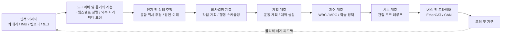
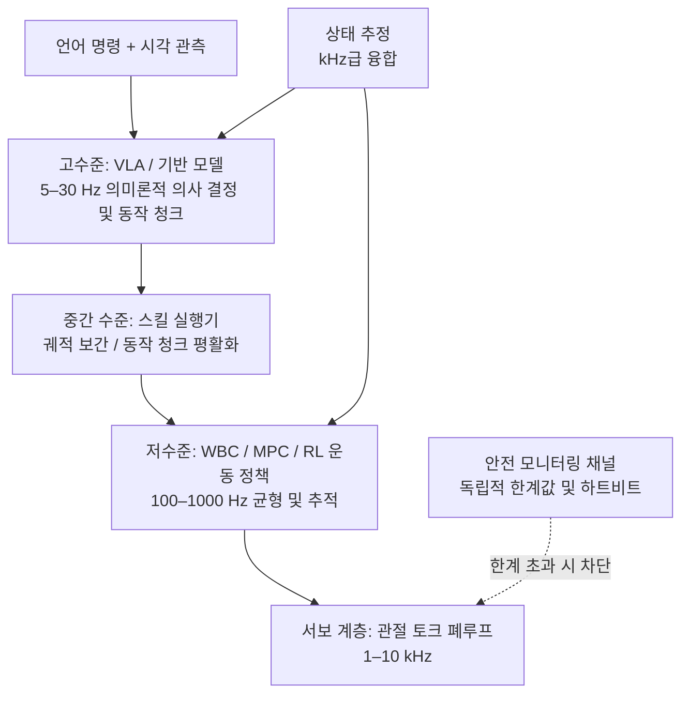
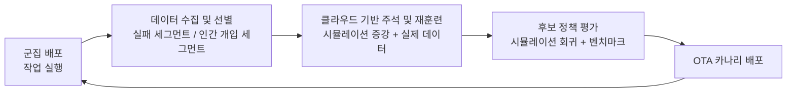

# 제 24장 엔드투엔드 소프트웨어 스택

## 요약

휴머노이드 로봇의 지능은 궁극적으로 광자와 힘 신호가 입력되어 전류가 모터로 흐르는 완전한 데이터 경로로 구현됩니다. 이 장에서는 "엔드투엔드 소프트웨어 스택"을 대상으로, 앞서 설명한 각 장의 알고리즘과 하드웨어를 배포 가능한 시스템으로 연결합니다: 먼저 인지, 의사결정, 계획, 제어, 실행의 5계층 아키텍처와 밀리초에서 초 단위의 주파수 계층화를 제시하고, 모듈식 스택과 엔드투엔드 학습 스택이라는 두 가지 패러다임과 그 융합 추세를 논의합니다. 이후 다중 센서 연결 및 시간 동기화, 상태 추정, 작업 계획 및 운동 계획, 전신 제어 및 관절 서보의 엔지니어링 구현, 그리고 RT-1/RT-2, Octo, OpenVLA, π0, GR00T N1 등 비전-언어-행동 모델을 스택 내에 통합하는 계층적 추론 방식을 계층별로 분석합니다. 이 장의 핵심은 **엣지 배포**에 있습니다: 차량 탑재 컴퓨팅 플랫폼의 전력 소비 및 연산 능력 제약, 엣지 측 VLA 추론의 양자화 및 컴파일 최적화, Linux RT-PREEMPT 및 QNX와 같은 실시간 운영 체제, 그리고 엔드투엔드 지연 예산 분해 방법. 마지막으로 ROS 2 미들웨어, LeRobot 오픈 소스 스택, OTA 소프트웨어 업데이트, 기단 관리 플랫폼 및 차량 데이터 플라이휠로 구성된 배포 후 운영 유지보수 폐쇄 루프를 논의합니다. 이 장은 제14장(제어), 제19장(VLA), 제21장(데이터), 제22장(미들웨어)과 깊이 연결되며, 제26장 전체 시스템 사례에 소프트웨어 관점의 분석 프레임워크를 제공합니다.

**키워드**: 엔드투엔드 소프트웨어 스택; 시스템 아키텍처; 주파수 계층화; 상태 추정; 작업 계획; 전신 제어; VLA 계층적 추론; 엣지 측 VLA 추론; 실시간 운영 체제; OTA 소프트웨어 업데이트; 기단 관리; 데이터 플라이휠

---

## 24.1 엔드투엔드 소프트웨어 스택의 전체 아키텍처

### 24.1.1 인지에서 행동까지의 데이터 경로

휴머노이드 로봇 소프트웨어 스택의 "엔드투엔드"는 두 가지 의미를 갖습니다: 시스템 공학적 의미의 **신호 경로 엔드투엔드**(센서 샘플링에서 모터 토크 출력까지)와 기계 학습적 의미의 **모델 엔드투엔드**(관측을 행동에 직접 매핑하는 미분 가능 모델). 이 장에서는 두 가지를 모두 다루며, 후자가 전자에 어떻게 통합되는지를 주요 내용으로 합니다. 일반적인 실시간 데이터 경로는 다음과 같습니다:



경로상의 어느 한 고리에서 발생하는 지연, 지터 또는 프레임 손실은 체인을 따라 증폭되므로, 엔드투엔드 스택 설계의 첫 번째 원칙은 **전체 링크 예산화**입니다: 각 고리에 지연, 대역폭 및 계산 예산을 할당하고 여유분을 유지합니다(자세한 내용은 24.6.4절 참조).

### 24.1.2 계층형 아키텍처와 주파수 계층화

휴머노이드 로봇 소프트웨어 스택은 시간 척도에 따라 자연스럽게 계층화되며, 각 계층의 주파수는 수 배 차이가 납니다:

| 계층 | 기능 | 일반적인 주파수 | 일반적인 지연 예산 | 일반적인 구현 |
|---|---|---|---|---|
| 작업 계층 | 명령 이해, 작업 분해 | 이벤트 트리거(초 이상) | 수백 ms | LLM / PDDL 플래너 / 행동 트리 |
| 계획 계층 | 경로 및 궤적 생성 | 1–20 Hz | 수십 ms | MoveIt / OMPL / MPC |
| 정책 계층 | 시각 운동 정책 추론 | 5–50 Hz | 20–200 ms | VLA / 확산 정책 / RL 정책 |
| 제어 계층 | 전신 제어, 상태 추정 | 100–1000 Hz | 1–10 ms | WBC / 계층형 QP / 칼만 필터 |
| 서보 계층 | 관절 토크/위치 폐루프 | 1–10 kHz | < 1 ms | 드라이버 펌웨어 / FOC |

이러한 "느린 사고, 빠른 반응"의 주파수 계층화는 우연이 아닙니다: 상위 계층은 처리하는 정보량이 많지만 지연을 허용하는 반면, 하위 계층은 정보량이 적지만 지터에 대해 무관용입니다. 각 계층은 **잘 정의된 상태 인터페이스**(작업 목표, 참조 궤적, 목표 토크)를 통해 분리되어, 특정 계층의 구현을 교체(예: 수동 플래너를 학습 정책으로 대체)하더라도 다른 계층에 영향을 주지 않습니다.

!!! note "용어 설명: 주파수 계층화, 상태 인터페이스, 지연 예산, 지터, 워치독"
    - **주파수 계층화(frequency hierarchy)**: 소프트웨어 스택의 각 계층이 제어 대역폭에 따라 계층적으로 실행되고 출력을 다운샘플링하는 아키텍처.
    - **상태 인터페이스(state interface)**: 계층 간에 전달되는 명확하게 정의된 데이터 계약(예: "목표 관절 위치 + 속도 + 피드포워드 토크").
    - **지연 예산(latency budget)**: 링크의 각 단계에 할당된 최대 허용 처리 시간의 합으로, 상위 계층이 요구하는 응답 시간 제한보다 작아야 함.
    - **지터(jitter)**: 주기적 작업의 실제 실행 시점과 이상적인 시점 간의 편차; 서보 계층의 지터는 토크 노이즈로 직접 변환됨.
    - **워치독(watchdog)**: 작업 하트비트를 모니터링하는 하드웨어 또는 소프트웨어 타이머로, 시간 초과 시 워치독이 트리거되지 않으면 안전 정지가 실행됨.

### 24.1.3 두 가지 패러다임: 모듈식 스택과 엔드투엔드 학습 스택

**모듈식 스택**은 인지, 위치 추정, 계획, 제어를 독립적인 모듈로 분할하며, 각 모듈은 가장 성숙한 기술(기하학적 비전 + 모델 기반 제어)로 구현될 수 있습니다. 장점은 각 모듈을 독립적으로 검증할 수 있고, 오류를 격리할 수 있으며, 동작을 설명할 수 있어 산업 배포의 주류입니다. 단점은 모듈 간 오류의 연쇄 효과와 긴 꼬리 시나리오를 수동 규칙으로 처리하기 어렵다는 점입니다. **엔드투엔드 학습 스택**은 단일 미분 가능 모델(예: VLA)을 사용하여 관측에서 행동으로 직접 매핑합니다. 장점은 상한이 높고 데이터에 따라 확장된다는 점이며, 단점은 설명 가능성과 검증 가능성이 낮고 분포 외 시나리오에 대한 보장이 부족하다는 점입니다.

현재 휴머노이드 로봇 산업의 실제 관행은 **하이브리드 아키텍처**입니다: 학습 및 모델 기반 방법이 계층별로 상호 보완됩니다. 하위 계층의 균형 및 관절 서보는 여전히 모델 기반 제어로 실시간성과 안정성을 보장하고, 상위 계층의 기술 및 의미 이해는 학습 모델이 일반화 능력을 제공합니다. 두 가지 패러다임과 하이브리드 접근 방식의 비교는 다음과 같습니다:

| 차원 | 모듈식 스택 | 엔드투엔드 학습 스택 | 계층형 하이브리드(주류 관행) |
|---|---|---|---|
| 검증 가능성 | 높음, 모듈별 인증 | 낮음, 블랙박스 | 안전 계층은 검증 가능, 지능 계층은 통계적 평가 |
| 긴 꼬리 일반화 | 약함, 규칙 열거에 의존 | 강함, 데이터에 따라 확장 | 비교적 강함, 학습 계층이 담당 |
| 실시간성 보장 | 강함 | 추론 지연에 의해 제한됨 | 강함, 안전 폐루프는 대규모 모델에 의존하지 않음 |
| 오류 설명 가능성 | 높음 | 낮음 | 중간, 계층별 귀인 |
| 데이터 요구 사항 | 낮음 | 매우 높음 | 중간~높음 |

이 장의 24.5절에서는 이러한 "계층형 하이브리드" 통합 방식에 대해 자세히 논의합니다.

## 24.2 인식 및 상태 추정 계층

### 24.2.1 다중 센서 연동 및 시간 동기화

휴머노이드 로봇은 일반적으로 다중 카메라, 깊이 카메라, IMU, 관절 엔코더, 발끝 힘/토크 센서 및 관절 토크 센서를 탑재하며, 데이터 속도는 수백 Hz(카메라)에서 kHz(엔코더)까지 다양합니다. 일반적인 센서 연동 사양은 다음과 같습니다.

| 센서 | 일반적인 데이터 속도 | 일반적인 인터페이스 | 동기화 요구사항 |
|---|---|---|---|
| 글로벌 셔터 카메라 ×2–4 | 30–120 Hz | MIPI / GMSL / USB3 | 프레임 레벨 하드 트리거, 노출 동기화 |
| 깊이 카메라 | 30–90 Hz | USB3 / 이더넷 | RGB 프레임과 정렬 |
| IMU(골반/머리) | 200–1000 Hz | SPI / UART | 엔코더와 공통 클록 도메인 |
| 관절 엔코더 ×30+ | 1–10 kHz | 버스 내장(EtherCAT/CAN) | 분산 클록 동기화 |
| 발끝 힘/토크 센서 | 500–2000 Hz | EtherCAT / 아날로그 수집 | 제어 주기와 정렬 |

연동 계층의 첫 번째 엔지니어링 과제는 **시간 동기화**입니다. 서로 다른 센서의 샘플링 시점을 통일된 클록에 맞춰 정렬해야 하며, 오차는 밀리초 수준(비전과 IMU 융합 시 서브 밀리초 요구)으로 제어해야 합니다. 일반적인 방법으로는 하드웨어 트리거, PTP(Precision Time Protocol) 네트워크 시간 동기화, 소프트웨어 타임스탬프 보간 보상 등이 있습니다. 두 번째 과제는 **외부 파라미터 보정의 일관성**입니다. 카메라-IMU-관절 체인의 외부 파라미터(관절-카메라-IMU 결합 보정 방법은 본 지식 그래프의 해당 방법 항목 참조)가 충돌, 온도 변화 또는 조립 불량으로 인해 변동되면, 하위 모든 융합 결과에 체계적인 편향이 발생합니다. 따라서 스택 내에 외부 파라미터 온라인 자체 점검 및 경보 기능을 내장해야 합니다.

!!! note "용어 설명: 시간 동기화, 하드웨어 트리거, PTP, 외부 파라미터, 타임스탬프 보간"
    - **시간 동기화(time synchronization)**: 여러 센서의 샘플링 시점을 통일된 시간 기준에 맞추는 과정.
    - **하드웨어 트리거(hardware trigger)**: 물리적 신호선을 사용하여 여러 센서를 동시에 샘플링하도록 트리거하며, 동기화 정밀도가 가장 높음.
    - **PTP(IEEE 1588)**: 하드웨어 타임스탬프가 포함된 패킷을 네트워크를 통해 교환하여 서브 마이크로초 수준의 시간 동기화를 구현하는 프로토콜.
    - **외부 파라미터(extrinsic parameters)**: 센서 좌표계 간(또는 센서와 로봇 링크 간)의 상대적 위치 및 자세.
    - **타임스탬프 보간(timestamp interpolation)**: 두 샘플링 지점 사이에서 선형 보간을 통해 자세를 계산하여 비동기 샘플링을 소프트웨어적으로 보상하는 방법.

### 24.2.2 상태 추정: 고유 감각 융합

상태 추정은 물리적 세계와 모든 의사 결정 계층을 연결하는 "사실의 근원"입니다. 휴머노이드 로봇의 핵심 추정량은 부동 베이스의 위치 및 속도이며, 일반적으로 확장 칼만 필터(EKF) 또는 팩터 그래프를 사용하여 다음 정보를 융합합니다.

- **다리 오도메트리(legged odometry)**: 접촉 가정 하에 지지하는 발의 속도가 0이라는 제약 조건을 이용하여 관절 엔코더와 순기구학으로부터 베이스 움직임을 추정.
- **IMU**: 고주파 각속도와 가속도를 제공하여 엔코더의 낮은 속도와 전달 유연성을 보상.
- **접촉 상태**: 발끝 힘/토크 센서 또는 관절 토크 잔차를 통해 판단하며, 오도메트리 업데이트의 신뢰성을 결정.
- **외부 관측**: 비전 또는 레이저 특징을 통한 베이스 자세의 저주파 보정으로 드리프트 억제.

엔지니어링 핵심은 **접촉 감지의 견고성**입니다. 미끄러짐을 정지 상태로 잘못 판단하면 오도메트리가 직접 오염됩니다. 또한 **추정 지연의 상한**도 중요합니다. 상태 추정은 WBC 주기 전에 완료되어야 하며, 일반적인 예산은 수 밀리초입니다.

!!! note "용어 설명: 확장 칼만 필터, 팩터 그래프, 다리 오도메트리, 접촉 감지, 제로 속도 업데이트"
    - **확장 칼만 필터(Extended Kalman Filter, EKF)**: 비선형 시스템을 국소적으로 선형화하는 재귀적 상태 추정기로, 계산량이 적어 임베디드 융합의 주력.
    - **팩터 그래프(factor graph)**: 추정 문제를 변수 노드와 제약 팩터 노드의 그래프 구조로 표현하고, 배치 최적화를 통해 해를 구하며, 정밀도가 높고 과거 궤적을 평활화 가능.
    - **다리 오도메트리(legged odometry)**: 지지하는 발과 지면 사이에 미끄러짐이 없다는 제약 조건을 이용하여 관절 엔코더로부터 베이스 움직임을 추정하는 방법.
    - **접촉 감지(contact detection)**: 각 발이 지지 상태인지 판단하는 것으로, 다리 오도메트리의 신뢰성을 위한 전제 조건.
    - **제로 속도 업데이트(zero-velocity update, ZUPT)**: 지지하는 발이 정지 상태임을 확인했을 때 해당 발의 속도 관측값을 강제로 0으로 설정하여 IMU 적분 드리프트를 억제.

### 24.2.3 장면 이해: 기하학에서 의미론까지

작업 지향적 장면 이해는 세 가지 유형의 결과물을 출력합니다. **기하학 계층**(점유 격자, 깊이 포인트 클라우드, 통행 가능 영역)은 장애물 회피 및 착지점 선택에 사용됩니다. **객체 계층**(객체 감지, 6D 자세, 관절 객체의 개폐 상태)은 파지 및 조작 계획에 사용됩니다. **의미론 계층**(장면 그래프, affordance 가용성 주석)은 작업 계획 및 VLA의 언어 조건에 사용됩니다. 엔드투엔드 학습 스택에서 이러한 세 가지 유형의 결과물은 명시적인 중간 표현이 아닌 경우가 많으며, 비전 인코더의 특징으로 압축됩니다. 그러나 하이브리드 아키텍처에서도 명시적인 점유 및 자세 추정은 안전 관련 기능(충돌 방지)의 신뢰할 수 있는 근원으로 남아 있습니다.

## 24.3 의사 결정 및 계획 계층

### 24.3.1 작업 계획: 기호 계획에서 대규모 언어 모델 계획까지

**작업 계획(Task Planning)** 은 목표를 달성하기 위한 고수준 동작 시퀀스를 생성하는 과정입니다. 일반적으로 PDDL(Planning Domain Definition Language)과 같은 기호 표현을 사용합니다. "파지-운반-배치"를 전제 조건과 효과가 있는 동작 연산자로 추상화하고, 플래너가 해 시퀀스를 검색합니다. 엔지니어링 배포에서는 행동 트리(Behavior Tree)가 유지보수성과 반응형 실행으로 인해 널리 사용됩니다. 이는 기술을 선택, 시퀀스, 병렬 및 조건 노드로 구성하며, 실행 중에 외부 이벤트에 의해 중단되고 부분적으로 재시도될 수 있어, 일회성으로 생성된 계획 시퀀스보다 동적 작업장 환경에 더 적합합니다. 최근에는 대규모 언어 모델(LLM)이 작업 플래너로 부상했습니다. 자연어 명령을 기술 호출 시퀀스로 분해하며, 개방형 어휘 능력은 기호 계획의 도메인 지식 수동 코딩 병목 현상을 보완하지만, 환각을 억제하기 위해 실행 피드백 검증 및 실패 재계획 메커니즘(신경-기호 추론 경로)과 결합해야 합니다.

!!! note "용어 설명: PDDL, 행동 트리, 기술 프리미티브, 반응형 실행, 실패 재계획"
    - **PDDL(Planning Domain Definition Language)**: 계획 도메인 정의 언어로, 술어, 동작 연산자, 전제 조건 및 효과를 사용하여 작업 계획 문제를 설명.
    - **행동 트리(Behavior Tree, BT)**: 트리 구조로 제어 흐름을 구성하는 작업 스케줄링 형태로, 노드는 성공/실패/실행 중 세 가지 상태를 반환.
    - **기술 프리미티브(skill primitive)**: 작업 계층에서 호출 가능한 최소 캡슐화된 능력으로, 예를 들어 "특정 물체 파지", "특정 지점으로 이동".
    - **반응형 실행(reactive execution)**: 실행 중 최신 인식에 따라 실시간으로 후속 동작을 변경하는 것으로, 미리 정해진 계획을 맹목적으로 따르지 않음.
    - **실패 재계획(replanning on failure)**: 기술 실행 실패 시, 실패 원인을 계획 계층에 피드백하여 새로운 시퀀스를 생성하는 메커니즘.

### 24.3.2 운동 계획: MoveIt 및 샘플링 기반 플래너

운동 계획은 작업 계층의 이산적 목표를 연속적인 충돌 없는 궤적으로 세분화합니다. **MoveIt 운동 계획(MoveIt Motion Planning)** 은 ROS 생태계에서 일반적으로 사용되는 운동 계획 프레임워크로, **OMPL(Open Motion Planning Library)** 등의 플래너, 역기구학 해법 및 충돌 감지를 통합하며, 로봇 팔 및 휴머노이드 로봇의 전신 운동 계획에 널리 사용됩니다. OMPL은 RRT*, PRM, BIT*와 같은 샘플링 기반 운동 계획 알고리즘을 제공하며, 고차원 구성 공간에서 확률적 완전성을 가집니다. 휴머노이드 로봇의 경우 운동 계획의 특수 제약 조건은 다음과 같습니다. 전신 충돌 쌍이 많음(자체 충돌 포함), 균형 제약 조건을 제어 계층과 조정해야 함, 계획-실행 비동기 문제(계획 소요 시간 동안 환경이 이미 변경됨) 등이 있습니다. 엔지니어링에서는 일반적으로 "거친 모델로 계획, 실행 시 온라인 장애물 회피"의 2단계 구조를 사용합니다.

!!! note "용어 설명: 확률적 완전성, 자체 충돌, 구성 공간, 계획-실행 비동기, 온라인 장애물 회피"
    - **확률적 완전성(probabilistic completeness)**: 샘플링 기반 플래너가 샘플 수가 무한대에 가까워질 때 확률 1로 실행 가능한 해(해가 존재하는 경우)를 찾는 특성.
    - **자체 충돌(self-collision)**: 로봇 자체 링크 간의 충돌로, 휴머노이드 로봇은 팔다리가 밀집되어 있어 명시적으로 확인해야 함.
    - **구성 공간(configuration space, C-space)**: 모든 관절 각도를 좌표로 하는 공간으로, 계획은 이 공간에서 시작점에서 목표점까지의 충돌 없는 경로를 검색하는 것.
    - **계획-실행 비동기(plan-execute asynchrony)**: 계획이 완료되었을 때 환경이 계획 가정과 달라져 궤적이 구식이 되는 문제.
    - **온라인 장애물 회피(online obstacle avoidance)**: 실행 계층이 최신 인식을 기반으로 참조 궤적을 국소적으로 수정하는 능력.

### 24.3.3 계획과 제어 간 인터페이스 설계

계획 계층의 출력과 제어 계층의 입력 간 인터페이스 형태는 시스템의 조합 가능성을 결정합니다. 세 가지 일반적인 형태는 다음과 같습니다. **궤적 인터페이스**(시간 매개변수화된 관절/말단 궤적, 제어 계층은 순수 추적)는 간단하지만 온라인 조정 능력이 부족합니다. **목표 인터페이스**(착지점, 말단 목표 자세, 제어 계층이 자체적으로 운동 생성)는 실시간 성능이 좋지만 제어 가능성이 약합니다. **참조+제약 조건 인터페이스**(참조 궤적에 실행 가능 영역 및 접촉 시퀀스 추가)는 전신 MPC의 표준 방식으로, 성능과 온라인성을 모두 갖춥니다. 인터페이스 선택과 전체 로봇 제어 아키텍처 간의 대응 관계는 14장 및 15장을 참조하십시오.

## 24.4 제어 실행 계층

### 24.4.1 전신 제어 및 모델 제어군

제어 계층은 휴머노이드 로봇의 모든 관절과 접촉점을 통합적으로 조정합니다. **전신 제어(Whole-Body Control, WBC)** 는 모든 관절과 접촉점을 조정하여 균형, 주시, 조작 등 여러 작업을 동시에 실현합니다. 일반적인 구현 방식인 **계층적 QP 전신 제어(Hierarchical QP WBC)** 는 여러 작업을 우선순위에 따라 쌓고 계단식 2차 계획법을 통해 해결하여, 높은 우선순위 작업(예: 넘어지지 않기)이 낮은 우선순위 작업(예: 팔 자세)보다 먼저 충족되도록 합니다. **모델 예측 제어(Model Predictive Control, MPC)** 는 예측 모델을 기반으로 유한 시간 영역 최적 제어 문제를 반복적으로 해결하고 첫 번째 제어량만 실행하며, 질량 중심 궤적 및 접촉력 계획의 주류 방식입니다. 상호 작용의 유연성은 **임피던스 제어(Impedance Control)** 와 **어드미턴스 제어(Admittance Control)** 에 의해 제공됩니다. 전자는 말단의 질량-댐퍼-스프링 특성을 조절하고, 후자는 측정된 외력을 원하는 운동 궤적으로 변환합니다. 이러한 방법의 수학적 세부 사항은 14장에서 다루며, 본 장에서는 스택 내 통합 제약 조건에 초점을 맞춥니다. WBC/MPC는 1–10 ms 내에 단일 해를 완료해야 하며, 상태 추정 지연에 민감합니다.

제어 계층의 통합 검증은 일반적으로 네 가지 하드 지표를 포함합니다. **해결 시간**(평균값이 아닌 최악의 경우, 주기의 일정 비율 미만이어야 하며 다른 실시간 작업에 여유를 남겨야 함), **제약 조건 실현 가능성**(QP가 불가능할 때의 완화 및 다운그레이드 동작이 명확해야 함), **접촉 전환 과도 상태**(착지/발 들기 순간의 토크 충격이 액추에이터 대역폭 내로 제한되어야 함), **고장 주입 테스트**(인위적으로 상태 추정을 지연시키거나 버스 프레임을 손실하여 제어기의 안전 응답을 검증). 이러한 지표는 23장의 HIL 테스트 매트릭스와 직접 연결됩니다.

### 24.4.2 관절 서보 및 필드버스

제어 계층에서 출력된 목표 관절 토크/위치는 필드버스를 통해 각 관절 드라이버로 전달됩니다. **EtherCAT**은 표준 이더넷 프레임 기반의 고성능 산업용 필드버스로, "비행 중 읽기/쓰기(processing on the fly)" 메커니즘을 통해 슬레이브 스테이션이 프레임이 통과할 때 즉시 데이터를 읽고 쓰며, 분산 클록(Distributed Clocks, DC)과 함께 마이크로초 단위 동기화를 구현하여 1 kHz급 전신 토크 제어를 지원하는 주류 선택입니다. **CAN 버스**(CAN FD 포함)는 저비용, 간편한 배선, 강력한 내간섭성으로 인해 대역폭 요구 사항이 낮은 상체 관절 및 정교한 손에 널리 사용됩니다. 두 버스의 스택 내 역할 구분 비교는 다음과 같습니다.

| 차원 | EtherCAT | CAN / CAN FD |
|---|---|---|
| 일반적인 제어 주파수 | 1–4 kHz | 0.1–1 kHz |
| 동기화 메커니즘 | 분산 클록(DC), 마이크로초 단위 | 기본 동기화 없음, 메시지 타임스탬프 사용 |
| 대역폭 | 100 Mbit/s 공유 | 1 Mbit/s(FD 데이터 세그먼트는 더 높음) |
| 토폴로지 | 주로 라인/데이지 체인 | 버스형, 다중 마스터 중재 |
| 일반적인 설치 부위 | 하체 대형 관절, 전신 주축 | 손목, 정교한 손, 센서 노드 |
| 비용 및 배선 | 높음 | 낮음, 연선만 필요 |

서보 계층의 핵심 지표는 **주기 지터**입니다. 1 kHz 제어 주기에서 지터는 수십 마이크로초 이내로 제어되어야 하며, 그렇지 않으면 토크 명령의 시간 이산화 오차가 관절 진동을 유발할 수 있습니다. 엔지니어링 구현에서 EtherCAT 마스터 스레드는 전용 CPU 코어에 바인딩되고 실시간 스케줄링 클래스에서 실행되어야 합니다(24.6.3절 참조). 버스 토폴로지(데이지 체인/스타), 케이블 응력 완화 및 커넥터 잠금과 같은 전기기계적 세부 사항은 6장과 9장에서 다룹니다.

### 24.4.3 안전 모니터링 및 다운그레이드 전략

엔드투엔드 스택은 모든 모듈이 고장날 수 있다고 가정하고 독립적인 안전 모니터링 경로를 내장해야 합니다.

- **한계 모니터링**: 관절 위치/속도/토크, 모터 온도, 버스 전류의 하드 한계. 트리거 시 동력 차단(STO, Safe Torque Off).
- **하트비트 모니터링**: 정책 추론, 상태 추정, 버스 통신의 워치독 하트비트. 시간 초과 시 자세 유지 또는 제어된 스쿼트 진입.
- **행동 합리성 모니터링**: 독립 채널을 통해 명령과 추정 상태의 일관성 비교(예: 보행 명령이지만 IMU가 기울어짐 경향 표시). 긴급 제동 트리거.
- **다운그레이드 전략**: 연산 능력 또는 센서가 부분적으로 고장난 경우, 전신 자율 모드에서 저속 원격 제어 또는 정지 유지 모드로 다운그레이드.

안전 경로는 지능형 주 경로와 전원 및 연산이 독립적이어야 하며, 이는 IEC 61508과 같은 기능 안전 표준이 안전 관련 시스템에 요구하는 기본 사항입니다(표준 적합성에 대한 자세한 내용은 12장 참조).

## 24.5 학습형 전략의 접목: VLA와 엔드투엔드 스택

### 24.5.1 모방 학습 전략의 스택 내 위치

모방 학습 계열 방법은 전문가 시연을 정책 네트워크로 압축하며, 스택 내에서는 일반적으로 '정책 계층' 위치를 차지합니다. **행동 복제(Behavior Cloning)**는 지도 학습을 통해 정책이 전문가 시연을 재현하도록 훈련시키며, 스킬 학습의 기준선입니다. **액션 청킹 트랜스포머(Action Chunking with Transformers, ACT)**는 트랜스포머를 CVAE 형태로 사용하여 미래의 일련의 동작 시퀀스를 한 번에 예측하고 시간적 통합을 통해 부드럽게 실행함으로써, 장시간 정밀 작업에서의 오류 누적을 현저히 줄입니다. 이는 ALOHA 저가형 양팔 원격 조작 플랫폼과의 결합을 통해 '저비용 수집 + 엔드투엔드 정책' 패러다임을开创했습니다. **확산 정책(Diffusion Policy)**은 동작 분포를 조건부 잡음 제거 확산 과정으로 모델링하여, 다중 모드이고 부드러운 로봇 동작을 생성할 수 있으며, 정밀 조작 작업에서 뛰어난 성능을 보입니다. 세 가지의 스택 내 특징 비교는 다음과 같습니다.

| 차원 | 행동 복제(BC) | ACT | 확산 정책 |
|---|---|---|---|
| 동작 표현 | 단일 단계 회귀 | 동작 청크(CVAE+Transformer) | 조건부 잡음 제거 확산 과정 |
| 다중 모드 분포 모델링 | 약함 | 중간 | 강함 |
| 장시간 오류 누적 | 심각 | 현저히 완화 | 완화 |
| 단일 추론 지연 시간 | 매우 낮음 | 낮음 | 다소 높음(다단계 잡음 제거) |
| 일반적인 출력 주파수 | 10–50 Hz | 5–50 Hz(청킹 + 통합) | 5–20 Hz |

세 가지의 동작 출력 주파수(5–50 Hz)는 자연스럽게 계획 계층과 제어 계층 사이에 위치하며, 하위 계층에는 이를 받아줄 고속 추적 컨트롤러가 필요합니다. 이것이 하이브리드 아키텍처의 첫 번째 결합 지점입니다.

### 24.5.2 VLA 모델 계보

비전-언어-동작(Vision-Language-Action, VLA) 모델은 대규모 비전-언어 사전 훈련과 로봇 동작 헤드를 결합한 것으로, 엔드투엔드 스택의 '지능형 코어'에 대한 현재 주류 후보입니다. 본 지식 그래프에 수록된 대표적인 계보는 다음과 같습니다.

| 모델 | 기관 | 아키텍처 핵심 | 데이터 기반 |
|---|---|---|---|
| RT-1 | Google DeepMind | Transformer 기반 대규모 실제 세계 로봇 제어 모델 | 약 13만 건의 실제 로봇 시연(공개 보도) |
| RT-2 | Google DeepMind | 웹 규모 비전-언어 지식을 로봇 제어로 전이하는 VLA | 웹 이미지-텍스트 + 로봇 데이터 공동 미세 조정 |
| Octo | UC Berkeley 등 | 이기종 교차 체현 데이터에서 훈련된 오픈소스 범용 로봇 정책 | Open X-Embodiment |
| OpenVLA | Stanford 등 | 70억 파라미터 오픈소스 VLA | Open X-Embodiment의 97만 개 세그먼트 |
| π0 | Physical Intelligence | VLA 흐름(flow) 모델, 범용 제어 및 개방형 세계 일반화 지향 | 교차 체현 멀티태스크 데이터 |
| GR00T N1 | NVIDIA | VLA + 확산 Transformer 동작 헤드를 갖춘 휴머노이드 로봇 개방형 기반 모델 | 실제 로봇 + 시뮬레이션 합성 데이터(Isaac Sim 파이프라인) |

이 계보의 진화 흐름은 명확합니다: 단일 팔 단일 작업의 RT-1에서, 웹 지식 전이를 도입한 RT-2, 교차 체현 오픈소스화된 Octo와 OpenVLA를 거쳐, 휴머노이드 로봇을 대상으로 확산 동작 헤드와 합성 데이터 파이프라인을 융합한 GR00T N1에 이릅니다. VLA 모델의 내부 구조와 훈련 방법은 19장에서 자세히 다루며, 본 장에서는 **시스템 접목 문제**에 초점을 맞춥니다.

### 24.5.3 계층적 추론: 고수준 VLA와 저수준 제어의 하이브리드 아키텍처

VLA 출력을 모터에 직접 연결하는 것은 불가능합니다. VLA 추론 주파수(일반적으로 5–30 Hz)는 균형 제어에 필요한 500 Hz 이상보다 훨씬 낮기 때문입니다. 업계의 주된 해결책은 **계층적 추론(hierarchical inference)**입니다.



GR00T N1의 이중 시스템 설계가 대표적입니다: 느린 시스템(시각-언어 추론)은 의도와 동작 청크를 생성하고, 빠른 시스템(확산 Transformer 동작 헤드)은 부드러운 관절 명령을 세분화하여 하위 계층 전신 제어가 실행하도록 합니다. 이러한 '의미론은 느리고, 반사는 빠른' 구조는 생물학적 신경계와 동일하며, 엣지 컴퓨팅 자원 제약 하에서의 필연적인 선택입니다. 대규모 모델은 킬로헤르츠로 실행될 수 없으며, 킬로헤르츠 루프에도 대규모 모델이 필요하지 않습니다.

!!! note "용어 설명: 동작 청크, 시간적 통합, 이중 시스템 아키텍처, 스킬 실행기, 비대칭 주파수"
    - **동작 청크(action chunk)**: 정책이 한 번에 예측하는 미래 k단계 동작 시퀀스로, ACT에서 유래했으며 현재 VLA 동작 헤드의 주류 설계입니다.
    - **시간적 통합(temporal ensemble)**: 중첩된 시점의 여러 동작 청크 예측을 가중 평균하여 실행 떨림을 억제합니다.
    - **이중 시스템 아키텍처(dual-system architecture)**: 느린 의미론적 추론 시스템과 빠른 동작 생성 시스템이 협력하는 아키텍처로, GR00T N1이 대표적입니다.
    - **스킬 실행기(skill executor)**: 고수준 스킬 호출을 저수준 제어 인터페이스(궤적, 목표, 제약 조건)로 변환하는 미들웨어입니다.
    - **비대칭 주파수**: 고수준 대규모 모델은 저주파로 추론하고, 저수준 컨트롤러는 고주파로 실행하며, 중간에 버퍼 큐로 연결되는 아키텍처 특징입니다.

### 24.5.4 엣지, 에지 및 클라우드 추론의 경계

VLA 추론을 어디에 배치할지는 엔드투엔드 스택의 최상위 아키텍처 결정입니다. 세 가지의 장단점은 다음과 같습니다.

| 차원 | 엣지(차량 탑재) | 에지(현장 서버) | 클라우드 |
|---|---|---|---|
| 지연 시간 | 가장 낮고 결정적(수십 ms 수준) | LAN 품질에 영향 받음 | WAN 변동에 큰 영향 받음 |
| 가용성 | 네트워크 차단 시에도 실행 가능 | 현장 네트워크에 의존 | 지속적인 연결에 의존 |
| 개인정보 보호 및 규정 준수 | 데이터가 기기 외부로 나가지 않음 | 데이터가 현장 외부로 나가지 않음 | 국경 간 전송/비식별화 처리 필요 |
| 모델 규모 상한 | VRAM 및 전력 소비 제한(7B급은 양자화 필요) | 중간 | 거의 무제한 |
| 업데이트 빈도 | OTA에 따라 | 유연함 | 가장 유연함 |

업계 트렌드는 **기본적으로 엣지, 필요에 따라 클라우드**입니다. 안전 관련 및 반응형 기능은 엣지에서 폐루프를 형성해야 하며(이것이 엣지 VLA 추론 항목이 지연 시간, 연결성, 개인정보 보호라는 세 가지 제약을 강조하는 이유입니다), 느리고 안전에 중요하지 않은 의미론적 추론(예: 일일 보고서 생성, 작업 후 분석)은 클라우드로 오프로드할 수 있습니다. 하이브리드 방식은 스택 내에 **추론 위치와 무관한 인터페이스**를 구현해야 합니다. 동일한 정책 서비스는 로컬 모델 또는 원격 모델에 의해 제공될 수 있으며, 네트워크 상태에 따라 동적으로 전환되어야 하고, 어떤 전환도 하위 계층의 안전 폐루프를 중단해서는 안 됩니다.

## 24.6 엣지 배포 및 엔드사이드 추론

### 24.6.1 차량 탑재 컴퓨팅 플랫폼의 전력 소비 및 연산 성능 제약

휴머노이드 로봇의 엔드사이드 컴퓨팅은 엄격한 제약에 직면합니다: 배터리 용량이 제한적이며(일반적인 전체 기기 0.5–2 kWh), 계산 부하가 100W 증가할 때마다 직접적으로 주행 거리가 감소합니다. 동시에 계산 장치는 보행으로 인한 지속적인 진동과 온도 변화를 견뎌야 합니다. 일반적인 구성은 "이기종 이중 영역"입니다: 안전 영역은 저전력 실시간 제어기(MCU/실시간 SoC)가 서보 및 안전 모니터링을 실행하고, 지능 영역은 GPU SoC(예: Jetson 시리즈 임베디드 모듈)가 인식, 전략 및 계획을 실행하며, 사용 가능한 연산 성능은 일반적으로 수십에서 수백 TOPS(INT8)이고, 전력 소비 예산은 15–60W입니다. 두 계산 영역의 역할 구분은 다음과 같습니다:

| 계산 영역 | 하드웨어 형태 | 실행 내용 | 주요 제약 |
|---|---|---|---|
| 안전/실시간 영역 | MCU, 실시간 SoC | 관절 서보, 버스 마스터, 안전 모니터링 | 하드 실시간, 결정론적, 기능 안전 |
| 지능 영역 | GPU SoC(임베디드) | 인식, 상태 추정, 전략 추론, 계획 | 연산 성능/전력 비율, 비디오 메모리 용량 |
| 게이트웨이 영역(선택 사항) | 통신 모듈 | 클라우드 링크, OTA, 로그 업로드 | 네트워크 단절 시 성능 저하, 데이터 압축 |

연산 성능 선택 방법론과 전원 무결성 설계는 6장에서 다루며, 본 장에서는 주어진 연산 성능 이후의 **소프트웨어 측 최적화**에 초점을 맞춥니다.

!!! note "용어 설명: TOPS, 비디오 메모리 대역폭, 전력 소비 예산, 열 설계 전력, 클록 다운"
    - **TOPS(Tera Operations Per Second)**: 초당 1조 번의 정수 연산으로, 엣지 AI 칩의 연산 성능을 나타내는 일반적인 지표(일반적으로 INT8 기준).
    - **비디오 메모리 대역폭(memory bandwidth)**: 단위 시간당 전송 가능한 비디오 메모리 데이터 양; 대규모 모델 추론에서는 종종 연산 성능보다 먼저 병목 현상이 발생합니다.
    - **전력 소비 예산(power budget)**: 계산 서브시스템에 할당된 최대 전력; 초과 시 주행 거리가 감소하거나 열 보호가 작동합니다.
    - **열 설계 전력(Thermal Design Power, TDP)**: 냉각 시스템이 지속적으로 배출할 수 있는 열 전력으로, 연산 성능의 지속 가능한 수준을 결정합니다.
    - **클록 다운(thermal throttling)**: 온도가 한계를 초과할 때 칩이 자동으로 주파수를 낮추어 공칭 연산 성능을 사용할 수 없게 만드는 현상으로, 고온 환경에서의 숨겨진 위험입니다.

### 24.6.2 엔드사이드 VLA 추론: 양자화, 컴파일 최적화 및 지연 시간 분해

**엔드사이드 VLA 추론(On-Device VLA Inference)** 은 시각-언어-행동 모델을 로봇에 내장된 엣지 컴퓨팅 장치에 직접 배포하여, 지연 시간, 연결성 및 개인정보 보호 제약을 충족하기 위해 엣지 또는 클라우드 서버에 오프로드하지 않는 것을 의미합니다. 엔지니어링 도구 체인은 다음과 같습니다:

- **양자화(quantization)**: 가중치와 활성화를 FP16에서 INT8/INT4로 압축하여 비디오 메모리 사용량과 메모리 대역폭을 거의 비례적으로 줄이며, 정밀도 손실은 보정 세트로 제어해야 합니다. 70억 파라미터 모델의 FP16은 약 14GB, INT8은 약 7GB, INT4는 약 3.5GB이며, 양자화는 7B급 VLA를 차량용 비디오 메모리에 탑재하는 핵심 수단입니다.
- **컴파일 최적화**: TensorRT와 같은 추론 컴파일러를 사용하여 연산자 융합, 커널 선택 및 비디오 메모리 재사용을 수행하며, 일반적으로 상당한 가속을 얻을 수 있습니다.
- **행동 헤드 재구성**: 확산/흐름 매칭 행동 헤드의 다단계 노이즈 제거는 지연 시간의 주요 원인이므로, 증류(일관성 기반 방법) 또는 적은 단계 샘플링으로 압축할 수 있습니다.
- **투기 및 비동기**: 시각 인코딩과 언어 인코딩은 주기 간에 재사용할 수 있으며(장면이 변경되지 않은 경우 재계산하지 않음), 행동 블록 예측과 실행은 파이프라인 병렬로 처리됩니다.

VLA-Perf와 같은 엔드사이드 추론 평가 연구에 따르면, VLA 추론 지연 시간은 모델 규모, 양자화 구성 및 행동 헤드 설계에 매우 민감하므로, 선택은 실제 측정을 기준으로 해야 합니다. 파라미터 수가 \(N_p\)인 모델의 경우, 가중치 비디오 메모리 사용량은 대략 다음과 같습니다.

$$
M_{\text{weights}} \approx N_p \times b, \qquad b \in \{2\,\text{B (FP16)},\ 1\,\text{B (INT8)},\ 0.5\,\text{B (INT4)}\}
$$

추론 지연 시간은 다음과 같이 분해할 수 있습니다.

$$
T_{\text{VLA}} = T_{\text{vision}} + T_{\text{lang}} + T_{\text{action-head}} + T_{\text{pre/post}}
$$

그리고 각 항목을 예산에 맞춰 최적화합니다. 단일 항목이 예산을 초과하여 해결책이 없는 경우, 아키텍처 옵션은 상위 수준 추론을 "이벤트 트리거"(새 명령 또는 장면 변경 시에만 실행)로 전환하는 것이며, 고정 주기로 실행하지 않습니다.

### 24.6.3 실시간 운영 체제 및 스케줄링

범용 운영 체제는 하드 실시간을 위해 설계되지 않았습니다. 실시간 운영 체제(RTOS)는 커널 선점, 우선순위 스케줄링 및 결정론적 인터럽트 응답을 통해 마이크로초 단위의 타이밍 요구 사항을 충족합니다. 휴머노이드 로봇의 일반적인 옵션은 다음과 같습니다:

- **Linux RT-PREEMPT**: Linux 커널의 대부분을 선점 가능하게 하고 인터럽트를 스레드화하는 패치 세트로, Linux의 풍부한 생태계를 유지하면서 수십 마이크로초의 스케줄링 지연 시간을 제공하며, 메인 컨트롤러의 일반적인 선택입니다.
- **Xenomai**: 이중 커널 방식으로, 실시간 작업은 Cobalt 실시간 커널에서 실행되며 지연 시간이 마이크로초 수준까지 낮아질 수 있지만 유지 관리가 복잡합니다.
- **QNX**: 상용 마이크로커널 실시간 운영 체제로, 파일 시스템과 네트워크 스택이 모두 사용자 모드 서비스이며, 신뢰성과 결정론적 특성이 뛰어나 자동차 및 안전 중요 시스템에 널리 사용됩니다.
- **Zephyr**: 리소스가 제한된 임베디드 장치를 위한 오픈 소스 RTOS로, 센서 노드 및 모터 컨트롤러에 자주 사용됩니다.

네 가지의 엔지니어링 비교는 다음과 같습니다:

| 차원 | Linux RT-PREEMPT | Xenomai | QNX | Zephyr |
|---|---|---|---|---|
| 스케줄링 지연 시간 수준 | 수십 마이크로초 | 마이크로초 수준 | 마이크로초 수준 | 마이크로초 수준 |
| 생태계 풍부도 | 매우 높음(완전한 Linux) | 높음(Linux 사용자 모드 재사용) | 중간 | 낮음(임베디드) |
| 유지 관리 비용 | 낮음 | 높음 | 중간(상용 라이선스) | 낮음 |
| 안전 인증 기반 | 자체 구축 필요 | 자체 구축 필요 | 성숙된 인증 사례 있음 | 일부 |
| 일반적인 설치 위치 | 메인 컨트롤러 컴퓨터 | 메인 컨트롤러 컴퓨터 | 안전 영역 컨트롤러 | 관절/센서 노드 |

일반적인 스케줄링 설계는 다음과 같습니다: EtherCAT 마스터와 WBC 작업은 독립적인 CPU 코어에 바인딩되고, 최고 SCHED_FIFO 우선순위를 가지며 메모리를 잠급니다(mlockall). 전략 추론과 일반 프로세스는 나머지 코어를 공유하며, cgroups를 통해 선점 간섭을 제한합니다. 모든 실시간 스레드는 동적 메모리 할당 및 비결정론적 시스템 호출을 비활성화합니다. 커널 및 드라이버 수준의 더 자세한 내용은 6장과 22장을 참조하십시오.

### 24.6.4 Python 예제: 종단 간 지연 시간 예산 분해

다음 예제는 "카메라 입력, 토크 출력" 제어 체인에 대한 지연 시간 예산 분해를 수행하고, 최악의 경우 총 지연 시간과 유효 제어 주파수를 계산하는 방법을 보여줍니다.

```python
# 종단 간 지연 시간 예산: 카메라 노출 -> 인식 -> VLA -> WBC -> 버스 -> 드라이버
# 목표: 최악의 경우 총 지연 시간 <= 상위 작업에서 요구하는 응답 시간 제한
stages = {
    # 단계: (일반적인 지연 시간 ms, 최악의 지터 ms)
    "카메라 노출+전송":      (12.0, 3.0),
    "전처리+인식":        ( 8.0, 2.0),
    "VLA 추론(INT8)":     (45.0, 8.0),
    "행동 블록 보간+WBC":     ( 2.0, 0.3),
    "EtherCAT 전송":     ( 0.5, 0.1),
    "드라이버 응답+모터 시간 상수": ( 5.0, 1.0),
}

typ = sum(v[0] for v in stages.values())
worst = sum(v[0] + v[1] for v in stages.values())
print(f"일반적인 종단 간 지연 시간: {typ:.1f} ms")
print(f"최악의 종단 간 지연 시간: {worst:.1f} ms  (≈ 유효 응답 주파수 {1000/worst:.0f} Hz)")
print("\n단계별 최악의 지연 시간 비율:")
for name, (t, j) in sorted(stages.items(), key=lambda x: -(x[1][0]+x[1][1])):
    print(f"  {name:<24s} {t+j:6.1f} ms  ({100*(t+j)/worst:.0f}%)")

budget = 100.0  # 상위에서 허용하는 응답 시간 제한 (ms)
slack = budget - worst
print(f"\n예산 {budget:.0f} ms 하의 여유: {slack:+.1f} ms")
if slack < 0:
    print("결론: 예산 초과, 최대 지연 시간 항목(이 예에서는 VLA 추론)을 압축해야 함")
```

이 예에서 VLA 추론은 최악의 지연 시간의 절반 이상을 차지하며, 이는 24.6.2절의 주장을 뒷받침합니다: 엔드사이드 대규모 모델 추론은 종단 간 지연 시간 예산의 주요 최적화 대상입니다. 양자화 및 컴파일 최적화가 여전히 부족할 경우, 전략 계층의 주파수를 낮추는 것(행동 블록으로 실행 평활화를 얻는 것)이 시스템 수준의 최후 수단입니다.

## 24.7 미들웨어와 시스템 통합

### 24.7.1 ROS 2와 통신 백본

**ROS 2 미들웨어(ROS 2 Middleware)** 는 DDS 기반의 발행/구독 및 실시간 지원을 제공하는 사실상 표준 로봇 미들웨어로, 노드 관리, 토픽/서비스/액션 통신, 파라미터 및 생명주기 관리를 제공합니다. 엔드투엔드 스택에서 ROS 2는 비실시간 또는 소프트 실시간 영역(인지, 계획, 인간-로봇 상호작용, 로깅)의 통합 골격을 담당합니다. 하드 실시간 영역(WBC, EtherCAT 마스터)은 일반적으로 독립적인 실시간 프로세스로 실행되며, 공유 메모리 또는 실시간 안전 발행기를 통해 ROS 2와 연결됩니다. DDS의 QoS 정책(신뢰성, 데드라인, 지속성)은 토픽별로 튜닝해야 합니다. 상태 추정과 같은 고주파 토픽은 낮은 지연 시간을 위해 "최선 전송 + 최신 유지"를 사용하고, 명령 및 파라미터 업데이트는 전달 보장을 위해 "신뢰성 있는 전송 + 지속성"을 사용합니다. 미들웨어 아키텍처, DDS 선택 및 메시지 정의 규칙에 대한 자세한 내용은 22장에서 다루므로, 이 절에서는 생략합니다.

### 24.7.2 동역학 라이브러리 및 알고리즘 컴포넌트

스택 내의 모델 계산은 성숙된 컴포넌트에 의존합니다. **Pinocchio**는 효율적인 강체 동역학, 운동학 및 해석적 도함수 계산을 제공하며, WBC/MPC와 시뮬레이터가 공유하는 동역학 커널입니다. **OMPL**과 **MoveIt**은 계획 기능을 제공합니다(24.3.2절 참조). MJCF/URDF 모델은 런타임에 모델 파서를 통해 통합된 동역학 데이터 구조로 로드됩니다. 컴포넌트 재사용의 핵심 엔지니어링 규율은 **단일 모델 소스(single source of truth)** 입니다. 시뮬레이션, 계획 및 제어는 동일한 로봇 모델과 캘리브레이션 데이터를 사용해야 하며, "제어용 모델 하나, 시뮬레이션용 모델 하나"와 같은 분기는 Sim-to-Real 격차를 인위적으로 확대합니다.

### 24.7.3 오픈소스 엔드투엔드 스택: LeRobot

**LeRobot**은 데이터셋 형식, 원격 조작, 훈련 및 배포를 포괄하는 엔드투엔드 PyTorch 라이브러리로, Hugging Face에서 유지 관리합니다. 이 라이브러리는 정책 학습 스택의 네 가지 요소(표준화된 데이터셋 형식(LeRobotDataset), 원격 조작 수집 인터페이스, 주요 정책 구현(ACT, 확산 정책 등) 및 배포 추론)를 하나의 프레임워크로 통합하여 "데이터에서 로봇 탑재까지"의 통합 비용을 크게 줄입니다. 휴머노이드 로봇 팀에게 LeRobot과 같은 프레임워크의 가치는 검증된 엔드투엔드 참조 구현을 제공한다는 점에 있습니다. 기업은 해당 데이터 형식과 정책 인터페이스 위에 사설 파이프라인을 구축하여 인프라를 반복적으로 구축하는 대신 본체 적응 및 안전 계층에 엔지니어링 노력을 집중할 수 있습니다. 관련 데이터 인프라에 대한 시스템 논의는 21장에서 다룹니다.

### 24.7.4 로깅, 재생 및 디버깅 도구 체인

엔드투엔드 스택의 유지보수성은 **관찰 가능성(observability)** 에 달려 있습니다. 엔지니어링 관점에서 전체 체인 로깅은 세 가지 요구 사항을 충족해야 합니다. 첫째, **통합 시간 기준** – 모든 토픽, 버스 프레임 및 내부 이벤트는 동일한 소스의 타임스탬프를 가져야 합니다. 그렇지 않으면 프로세스 간 인과 관계 분석이 불가능합니다. 둘째, **재생 가능성(replay)** – rosbag 등 형식으로 기록된 원시 센서 스트림은 스택에 다시 주입되어 실제 로봇의 모든 이상 현상을 재현할 수 있어야 합니다. 셋째, **결정론적 재생** – 디버그 모드에서 고정된 랜덤 시드와 스케줄링 순서를 사용하여 "기록된 버그"를 안정적으로 재현할 수 있도록 합니다. 이는 간헐적인 낙상이나 그립 실패와 같은 문제를 찾는 데 필수적입니다. 로그 데이터는 동시에 23장의 사고 기반 시나리오 라이브러리와 24.8.3절의 데이터 플라이휠의 원자재이므로, 로깅 시스템의 저장 할당량, 링 버퍼 및 선택적 업로드 전략은 사후 패치가 아닌 아키텍처 설계 단계에서 함께 설계되어야 합니다.

## 24.8 배포 후 운영: OTA, 로봇 군집 및 데이터 폐쇄 루프

### 24.8.1 OTA 소프트웨어 업데이트

**OTA 소프트웨어 업데이트(OTA Software Update)** 는 배포된 휴머노이드 로봇 군집에 제어 정책, 펌웨어 및 시스템 소프트웨어를 무선으로 배포하는 기술입니다. 로봇 OTA는 휴대폰/자동차 OTA보다 더 민감합니다. 결함이 있는 제어 정책 업데이트는 직접적인 물리적 사고로 이어질 수 있기 때문입니다. 엔지니어링 요구 사항은 다음과 같습니다. A/B 이중 파티션 및 실패 시 자동 롤백; 업데이트의 단계적 배포; 업데이트 패키지의 서명 검증 및 버전-하드웨어 호환성 매트릭스; 업데이트 전 강제 시뮬레이션 회귀 테스트(23장의 시나리오 라이브러리와 연동) – 모든 제어 관련 업데이트는 먼저 전체 시뮬레이션 회귀 테스트와 HIL 검증을 통과해야 합니다. 일반적인 단계적 배포 파이프라인은 다음과 같습니다.

| 단계 | 범위 | 통과 기준 | 실패 시 처리 |
|---|---|---|---|
| 시뮬레이션 회귀 | 전체 시나리오 라이브러리 | 100% 통과 | 배포 차단, 수정 후 재시도 |
| HIL 벤치 | 대표 구성 | 실시간성 및 안전 사용 사례 통과 | 배포 차단 |
| 단일 로봇 카나리 | 내부 테스트 로봇 1–2대 | 연속 무사고 운행 N시간 | 자동 롤백 |
| 소규모 배치 | 군집의 5%–10% | KPI가 현재 버전보다 나쁘지 않음 | 자동 롤백 및 경고 |
| 전체 배포 | 전체 군집 | 카나리 기간 KPI 안정 | 지속적 모니터링 |

### 24.8.2 로봇 군집 관리 플랫폼

**로봇 군집 관리 플랫폼(Fleet Management Platform)** 은 여러 대의 배포된 휴머노이드 로봇에 걸쳐 작업 오케스트레이션, 충전, 상태 모니터링 및 분석을 수행하는 클라우드 플랫폼입니다. 핵심 기능은 다음과 같습니다. 작업 스케줄링 및 작업 지시 발행(공장 WMS/MES와 연동); 배터리 및 충전 오케스트레이션(가용성을 보장하면서 배터리 수명 연장); 상태 모니터링(관절 온도, 토크 잔차, 진동 스펙트럼의 이상 감지를 통한 예측 유지보수 지원); KPI 분석(작업 성공률, 평균 고장 간격, 개입 횟수). 군집 플랫폼의 가용성 목표는 비즈니스 모델의 성립 여부를 직접 결정합니다. 단일 로봇의 성능이 아무리 뛰어나더라도 안정적인 운송 능력을 가진 군집으로 오케스트레이션될 수 없다면 수익을 창출할 수 없습니다.

### 24.8.3 데이터 플라이휠과 지속적 학습

**로봇 군집 데이터 플라이휠(Fleet Data Flywheel)** 은 배포된 로봇 군집에서 생성된 데이터가 모델을 지속적으로 개선하고, 모델이 다시 군집 성능을 향상시켜 더 많은 데이터를 생성하는 폐쇄 루프 시스템입니다. 그 작동 메커니즘은 다음과 같습니다.



플라이휠의 두 가지 엔지니어링 핵심 사항은 다음과 같습니다. 첫째, **수집 전략은 정보 이득에 편향되어야 합니다.** 전체 업로드는 불가능하므로 "실패, 낮은 신뢰도, 인간 개입" 시에만 수집을 트리거해야 합니다. 둘째, **평가 기준은 현재 버전보다 엄격해야 합니다.** 후보 정책은 시뮬레이션 회귀 및 통제된 실제 로봇 평가에서 현재 버전보다 동시에 우수한 경우에만 카나리 배포가 허용됩니다. 데이터 폐쇄 루프의 저장, 주석 및 규정 준수 인프라는 21장에서 자세히 다룹니다.

명심해야 할 점은 데이터 플라이휠에는 **콜드 스타트 문제**가 있다는 것입니다. 군집 규모가 충분하지 않으면 수집된 데이터의 다양성이 제한되어 모델 개선 속도가 알고리즘 성능보다는 배포 규모에 의해 제한됩니다. 따라서 플라이휠 설계는 시뮬레이션 합성 데이터(23장) 및 인간 원격 조작 시연(17장)과 함께 세 가지 상호 보완적인 데이터 공급원을 형성해야 하며, 단일 공급원만으로는 지속적인 진화를 지원할 수 없습니다.

## 24.9 장 요약

이 장에서는 휴머노이드 로봇 소프트웨어를 "알고리즘 집합"에서 "배포 가능한 시스템"으로 구성했습니다. 아키텍처 측면에서 엔드투엔드 스택은 작업 계층, 계획 계층, 정책 계층, 제어 계층, 서보 계층으로 주파수 계층화되고, 계층 간은 상태 인터페이스로 분리되며, 안전 모니터링 경로는 독립적인 체인을 형성합니다. 모듈식 스택과 엔드투엔드 학습 스택은 "계층적 혼합" 패러다임 아래에서 융합되고 있습니다. ACT, 확산 정책, OpenVLA, π0, GR00T N1과 같은 학습 모델은 의미 및 기술 계층을 차지하고, WBC, MPC 및 임피던스/어드미턴스 제어는 실시간 및 안정성 계층을 담당합니다.

배포 측면에서 엣지 컴퓨팅의 전력 소비 및 컴퓨팅 성능 제약으로 인해 엣지 측 VLA 추론(양자화, 컴파일 최적화, 액션 헤드 재구성)이 지연 예산의 주요 전장이 되었습니다. Linux RT-PREEMPT, Xenomai, QNX 및 Zephyr는 실시간 기반을 제공하고, ROS 2, Pinocchio, MoveIt/OMPL 및 LeRobot은 통합 골격을 제공합니다. 운영 측면에서 OTA 소프트웨어 업데이트, 로봇 군집 관리 플랫폼 및 로봇 군집 데이터 플라이휠은 단일 로봇을 지속적으로 진화하는 운송 능력 네트워크로 확장합니다. 이로써 이 책은 재료 및 하드웨어(1–9장), 제조 및 테스트(10–13장), 제어 및 지능(14–22장)에서 시뮬레이션 및 소프트웨어 시스템(23–24장)에 이르는 기술 체인을 완성했습니다. 이후 장에서는 평가, 사례 연구 및 산업 관점으로 전환합니다.
