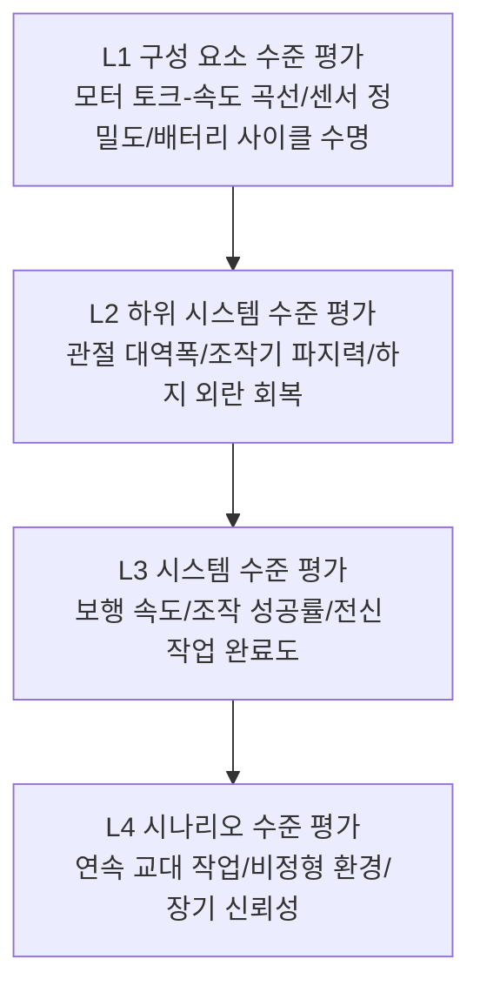
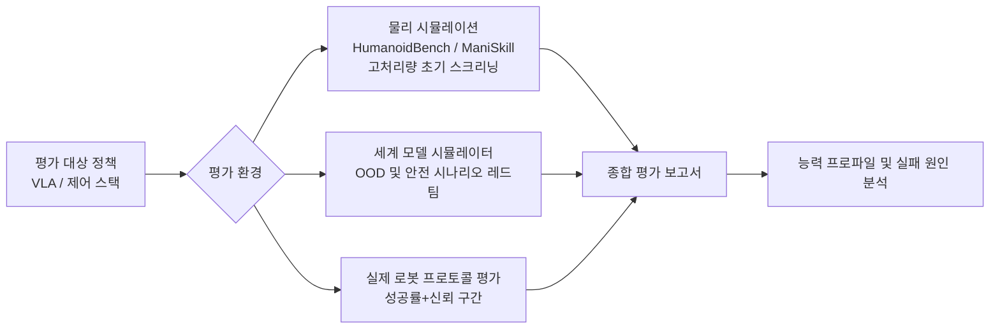
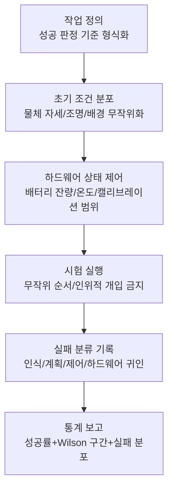

# 제 25 장 로봇 평가 체계

## 요약

"이 휴머노이드 로봇은 얼마나 유능한가?"——이 간단해 보이는 질문에 대해 현재 업계 전체의 답변 능력은 여전히 취약합니다. 데모 영상은 편집할 수 있고, 단일 성공률은 장면을 선택할 수 있지만, 양산 배포에 필요한 것은 **재현 가능하고, 비교 가능하며, 원인을 추적할 수 있는** 평가 체계입니다. 이 장에서는 휴머노이드 로봇 평가 방법론과 도구 스택을 체계적으로 정리합니다. 먼저 평가의 목적과 계층 구조에서 출발하여, 구성 요소 수준, 하위 시스템 수준, 시스템 수준 및 시나리오 수준 평가를 구분하고, 시뮬레이션 평가, 실제 로봇 평가 및 세계 모델 기반 생성형 평가라는 세 가지 기술 경로를 논의합니다. 이후 능력 차원별로 살펴봅니다: 운동 제어 및 전신 성능 평가에서는 MPJPE, 토크 변화 점수(TVS), HumanoidBench 및 인간형 구동 점수(HLAS)를 다루고; 조작 기술 평가에서는 LIBERO, LIBERO-Plus, ManiSkill 및 Isaac Gym 벤치마크, 그리고 시뮬레이션 충실도 자체의 평가 방법을 다루며; 기초 모델 평가에서는 VLA 모델의 일반화 차원, 휴머노이드 로봇 기초 모델 벤치마크 및 세계 시뮬레이터를 활용한 정책 레드 팀 테스트라는 새로운 패러다임을 논의합니다. 실제 로봇 평가 부분에서는 성공률의 통계적 추론 방법, 평가 프로토콜 설계 핵심 사항 및 신뢰성/내구성 평가를 제시합니다. 마지막으로 벤치마크 과적합, 데모-제품 격차(demo-to-product gap) 등 기존 문제점과 추세를 논의합니다. 이 장은 제 12 장(인증 규정 준수)과 함께 휴머노이드 로봇의 "검증 및 시장 계층" 방법론적 순환 고리를 구성합니다: 전자는 "로봇이 충분히 좋은가"에 답하고, 후자는 "로봇이 충분히 안전하고 합법적인가"에 답합니다.

**키워드**: 평가 벤치마크; HumanoidBench; LIBERO; ManiSkill; HLAS; MPJPE; 성공률 통계; sim-to-real; 일반화; 세계 모델 평가

---

## 25.1 평가의 목적과 계층 구조

### 25.1.1 왜 평가가 구현 지능의 병목인가

대규모 언어 모델 분야에는 MMLU, HumanEval 등 비교적 성숙한 공공 벤치마크가 있어, 모델 능력의 도약마다 정량적 기록을 추적할 수 있습니다. 그러나 휴머노이드 로봇 분야는 그렇지 않습니다: 각 제조사의 발표회에서 선보이는 파쿠르, 옷 개기, 물건 운반 시연은 화려하지만, 외부에서는 세 가지 기본 질문에 답할 수 없습니다:

1. **재현 가능한가?** 시연은 몇 번의 시도 중에서 선택된 성공적인 구간인가? 초기 조건이 정교하게 설계되었는가?
2. **비교 가능한가?** 로봇 A는 티셔츠를 개고, 로봇 B는 20kg 상자를 운반할 수 있다면, 누가 더 유능한가?
3. **외삽 가능한가?** 이 방에서 수행하는 작업을 조명, 물체, 평면도를 바꿔도 여전히 수행할 수 있는가?

이 세 가지 질문은 각각 평가의 세 가지 기본 속성에 해당합니다: **재현성(reproducibility), 비교 가능성(comparability) 및 일반화 예측력(generalization predictiveness)**. 평가 체계의 가치는 학문적 순위뿐만 아니라 산업 체인의 "공통 통화" 역할에 있습니다: 본체 제조사는 이를 통해 고객에게 능력 경계를 증명해야 하고, 모델 회사는 이를 통해 알고리즘을 선별해야 하며, 투자자는 이를 통해 마케팅과 실제 진행 상황의 차이를 식별해야 하고, 인증 기관(제 12 장)은 "안전"과 "능력"에 대한 입증 데이터를 필요로 합니다.

!!! note "용어 설명: 데모-제품 격차(demo-to-product gap)"
    연출된(staged) 데모를 위해 최적화된 지표와 신뢰할 수 있고 인증 가능하며 양산 가능한 제품이 요구하는 지표 간의 체계적인 차이입니다. 데모는 단발적인 시각적 충격을 추구하는 반면, 제품은 장시간 무고장 예상 성능을 요구합니다. 평가 체계의 핵심 사명 중 하나는 후자를 정량화하여 "데모는 훌륭하다"와 "제품은 사용 가능하다" 사이의 간극을 측정 가능하게 만들고, 마케팅 수사에 가려지지 않도록 하는 것입니다.

### 25.1.2 평가의 계층 피라미드

완전한 휴머노이드 로봇 평가 체계는 추상화 수준에 따라 하위에서 상위로 네 가지 계층으로 나뉩니다:



- **L1 구성 요소 수준**: 본서 제 2–6장에서 논의된 다양한 하드웨어 지표——액추에이터의 피크 토크와 지속 토크(인간형 구동 점수 HLAS, 25.2.4절 참조), 감속기 정밀도 등급, 토크 센서 노이즈 플로어, 배터리 에너지 밀도. 특징은 측정 수단이 성숙하고 기성 표준이 있지만, 구성 요소 지표만으로는 전체 기계의 능력을 예측할 수 없다는 점입니다.
- **L2 하위 시스템 수준**: 관절의 위치/힘 제어 대역폭, 조작기의 최대 파지력과 자유도 활용률, 하지의 추력 외란 하 회복 능력. 이 수준에서는 "지표 조합" 문제가 나타나기 시작합니다——대역폭, 정밀도, 부하는 종종 양립할 수 없습니다.
- **L3 시스템 수준**: 작업 지향 평가, 예: 보행 속도, 계단 통과율, 지정 조작 작업의 성공률과 완료 시간. 학술 벤치마크(HumanoidBench, LIBERO 등)는 주로 이 수준에서 작동합니다.
- **L4 시나리오 수준**: 연속 8시간 교대 작업의 종합 성능, 평균 고장 간격(MTBF), 통제되지 않은 환경에서의 작업 일반화. 이것이 제품이 실제로 관심을 가지는 계층이며, 현재 공개 벤치마크가 거의 없는 계층이기도 합니다.

계층 간에는 고전적인 **집계 오류** 문제가 존재합니다: L1이 모두 우수해도 L3가 잘 작동한다고 보장할 수 없으며(통합 손실, 제어 병목), L3에서 높은 점수를 받아도 L4의 신뢰성(내구성, 유지보수성)을 보장할 수 없습니다. 성숙한 평가 체계는 각 계층에 독립적인 지표를 설정하고 계층 간 매핑 관계를 연구해야 합니다.

### 25.1.3 세 가지 평가 기술 경로

평가 환경에 따라 현재 세 가지 병행 발전 경로가 있습니다:

| 경로 | 대표 도구 | 장점 | 한계 |
|------|----------|------|------|
| 시뮬레이션 평가 | Isaac Gym 벤치마크, HumanoidBench, ManiSkill, LIBERO | 저비용, 병렬화 가능, 정밀 재현 가능 | sim-to-real 격차, 접촉/마찰 모델링 오류 |
| 실제 로봇 평가 | 작업 성공률 프로토콜, 원격 측정 데이터, 경진대회 | 진정성에 논란의 여지 없음 | 고비용, 낮은 처리량, 재현성 확보 어려움 |
| 생성형/세계 모델 평가 | 비디오 세계 모델 기반 정책 시뮬레이터 | 처리량과 시각적 사실감 겸비, OOD 시나리오 생성 가능 | 물리적 일관성 미보장, 연구 단계 |

세 가지 경로는 대체 관계가 아니라 깔때기 관계입니다: 시뮬레이션은 대규모 초기 선별, 세계 모델은 분포 외 및 안전 시나리오의 보충 테스트, 실제 로봇은 최종 확인을 담당합니다. 25.4.3절에서 소개할 "Veo 세계 시뮬레이터에서 Gemini Robotics 정책 평가"는 바로 세 번째 경로의 대표적인 작업입니다.

### 25.1.4 평가 지표 설계 원칙

새로운 벤치마크를 설계하든 평가 보고서를 검토하든, 네 가지 원칙으로 지표의 품질을 검증할 수 있습니다:

1. **단조성(monotonicity)**: 지표의 증가는 능력의 실제 향상과 안정적으로 대응해야 합니다. 측정되지 않은 차원을 희생하여 지표를 높일 수 있다면(예: 이동 속도를 낮추어 성공률을 높임), 이는 단조성을 위반한 것이며, 반드시 제약 조건(이 경우 완료 시간)을 함께 보고해야 합니다.
2. **분해 가능성(decomposability)**: 총점은 물리적 또는 의미론적 의미를 가진 구성 요소로 분해될 수 있어야 하며, 낮은 점수가 직접 하위 시스템이나 능력 차원을 가리킬 수 있어야 합니다. HLAS의 5가지 구성 요소 구조와 DSJE의 난이도 계층화는 분해 가능성의 예시입니다. 분해 불가능한 단일 블랙박스 점수(예: 일부 종합 순위표의 총점)는 진단 가치가 제한적입니다.
3. **조작 저항성(gaming resistance)**: 지표 정의는 "목표 최적화"의 비용이 "실제 능력 향상"의 비용보다 높도록 해야 합니다. 초기 조건이 공개되고 고정된 벤치마크는 과적합되기 쉬우며, 비공개 테스트 세트와 교란 스캔(LIBERO-Plus 방식)은 조작 저항성을 높이는 주요 수단입니다.
4. **경제성(cost of measurement)**: 지표의 측정 비용은 사용 빈도를 결정합니다. 실제 로봇 지표는 매일 회귀 테스트를 할 수 없으므로, 평가 체계는 항상 "저렴한 대리 지표로 고빈도 모니터링 + 비싼 실제 지표로 마일스톤 확인"의 조합이며, 대리 지표와 실제 지표 간의 상관 관계는 정기적으로 보정되어야 합니다.

---

### 25.1.5 이 장의 구성 방식

25.2절은 "신체 능력"의 평가(운동 제어 및 전신 성능)를 다루고, 25.3절은 "손재주"의 평가(조작 기술 벤치마크)를 다루며, 25.4절은 "두뇌"의 평가(기초 모델 및 VLA)를 다루고, 25.5절은 실제 로봇 평가의 통계 및 프로토콜을 다루며, 25.6절은 체계의 기존 문제점과 추세를 논의합니다. 읽을 때 본서의 다른 장과 대조할 수 있습니다: 하드웨어 구성 요소 지표는 제 2–6장, 운동 제어 원리는 전신 제어 및 보행 관련 장, 안전 관련 평가 증거 체인은 제 12장에 해당합니다.

## 25.2 운동 제어 및 전신 성능 평가

### 25.2.1 운동 모방 오차: MPJPE 및 그 한계

모션 캡처 또는 비디오 리타겟팅 기반의 운동 모방(motion imitation)은 현재 휴머노이드 로봇 전신 제어의 주요 패러다임 중 하나입니다. 가장 일반적으로 사용되는 평가 지표는 **MPJPE(Mean Per-Joint Position Error, 평균 관절 위치 오차)** 입니다:

$$
\text{MPJPE} = \frac{1}{T}\sum_{t=1}^{T} \frac{1}{J}\sum_{j=1}^{J} \left\| \mathbf{p}_j^{robot}(t) - \mathbf{p}_j^{ref}(t) \right\|_2
$$

여기서 \(\mathbf{p}_j(t)\)는 세계 좌표계에서 \(j\)번째 신체 키포인트의 위치입니다. MPJPE는 직관적이고 계산하기 쉽지만, 근본적인 결함이 있습니다: **모방 결과만 측정할 뿐, 오차의 원인을 구분하지 않습니다**. 특정 동작 모방이 실패했을 때, 그것이 정책 네트워크의 능력 부족 때문인지, 아니면 해당 동작 자체가 "배우기 어려운"(역학적으로 강화 학습에 불리한) 것인지? 이를 혼동하면 알고리즘 반복 방향을 오도할 수 있습니다.

이 문제를 해결하기 위해, 2025년 연구 *Benchmarking Humanoid Imitation Learning with Motion Difficulty* (arXiv:2512.07248)는 **토크 변화 점수(TVS, Torque Variation Score)** 를 제안했습니다: 참조 동작의 자세에 작은 교란을 가하고, 교란을 "바로잡는" 데 필요한 토크 변화 크기를 측정합니다. 이 지표의 물리적 의미는 동작의 역학적 민감도입니다. 높은 TVS 동작은 보상 지형에서 평탄한 영역에 해당하여 정책 기울기가 사라지므로, 원칙적으로 기울기 기반 방법으로 학습하기 어렵습니다. 실험 결과 TVS는 UHC, PHC+ 등 주요 방법의 모방 오차와 강한 상관관계를 보여, 세 가지 실용적인 도구를 지원합니다:

- **최대 모방 가능 난이도(MID, Maximum Imitable Difficulty)** : 정책의 능력 상한을 나타냄 – 오차가 통제 불능이 되기 시작하는 TVS 임계값으로, 서로 다른 정책을 가로로 비교하는 데 사용됨;
- **난이도 계층화 관절 오차(DSJE, Difficulty-Stratified Joint Error)** : MPJPE를 동작 난이도별로 계층화하여 보고, "저난이도 동작에서 오차가 높음 = 정책 결함; 고난이도 동작에서 오차가 높음 = 작업 자체가 어려움"이라는 귀인 구조를 밝힘;
- **결함 동작 탐지** : 데이터셋에서 비정상적으로 높은 난이도의 세그먼트를 찾아내어, 모션 캡처 데이터 정제 및 품질 관리에 사용됨.

이 연구의 모범적 의미는 운동 모방 자체를 넘어섭니다: **좋은 평가 지표는 단순히 점수를 매기는 것이 아니라 오차 귀인(attribution)을 지원해야 합니다**.

### 25.2.2 HumanoidBench: 전신 운동 및 조작 벤치마크

**HumanoidBench** (arXiv:2403.10506)는 현재 가장 널리 인용되는 휴머노이드 로봇 전신 제어 시뮬레이션 벤치마크 중 하나입니다. Unitree H1 로봇 형태를 기반으로 구축되었으며, 40개 이상의 작업을 포함하여 네 가지 능력 범주를 다룹니다:

- **운동(locomotion)** : 걷기, 달리기, 계단 오르기 등;
- **도달 및 조작(reaching / manipulation)** : 운반, 밀기/당기기, 물체 상호작용;
- **이동 조작(loco-manipulation)** : 걸으면서 조작하기, 상하체 협응이 필요한 전신 작업;
- **손재주 작업** : 일부 작업은 높은 자유도의 손을 구성하여 정밀 조작을 평가함.

그 방법론적 가치는 **통제된 비교(controlled comparison)** 에 있습니다: 모든 알고리즘은 동일한 로봇 모델, 물리적 매개변수 및 작업 정의에 직면하며, 차이는 오직 "두뇌"에서만 발생합니다. HumanoidBench의 실험은 업계에 경고적인 의미를 지닌 현상도 밝혀냈습니다: 이 벤치마크에서 계층적/분할 구조(고수준 계획 + 저수준 사전 학습 기술)가 일반적으로 종단간 강화 학습 기준선보다 우수하여, "하나의 네트워크가 직접 전신 40개 이상의 작업을 학습하는 것"은 현재 알고리즘과 데이터 조건에서 현실적이지 않음을 보여줍니다 – 평가 결과가 아키텍처 선택에 대한 합의를 형성하게 된 것입니다.

한계도 명확합니다: 작업과 동작 공간이 Unitree H1 형태에 묶여 있어, 결론을 다른 휴머노이드 플랫폼으로 외삽할 때는 주의가 필요합니다. 또한 순수 시뮬레이션 환경에서의 높은 점수가 실제 로봇 성능을 의미하지는 않습니다(25.3.5절에서 충실도 평가 논의).

### 25.2.3 이족 보행 능력의 고전적 물리 지표

학술 벤치마크 외에도, 이족 보행 능력에는 생체역학 및 제어 이론에서 비롯된 여러 고전적 지표가 있으며, 오늘날까지 논문과 제품 사양서의 공통 언어로 사용됩니다:

- **보행 속도 및 정규화 속도** : 절대 속도(m/s)를 다리 길이로 무차원화하여 프로우드 수(Froude number) \(Fr = v^2/(g l)\)를 얻어, 서로 다른 체형의 로봇을 비교 가능하게 함;
- **운송 비용(CoT, Cost of Transport)** : 단위 체중당 단위 거리당 에너지 소비,
  $$
  CoT = \frac{P}{m g v}
  $$
  여기서 \(P\)는 평균 전력 소비입니다. 인간 보행 CoT의 일반적인 값은 약 0.2이며, 이족 보행 로봇은 일반적으로 여전히 수 배에서 한 자릿수 높아, 에너지 효율성을 측정하는 핵심 지표입니다;
- **외란 회복 능력** : 표준화된 추력 외란(지정된 충격량의 푸시 로드 또는 진자 해머) 하에서 넘어지지 않는지, 그리고 회복에 필요한 걸음 수;
- **지형 통과율** : 계단, 경사로, 자갈, 잔디 등 표준 지형 패키지의 성공률;
- **안정성 여유** : ZMP/캡처 포인트(Capture Point) 기반의 동역학적 여유(원리는 본서 설계 원리 관련 장 참조)로, 시뮬레이션에서 연속형 지표로 사용 가능.

### 25.2.4 인간 수준 구동 점수(HLAS): 하드웨어 능력의 정량적 벤치마크

"이 로봇의 액추에이터가 인간 수준에 도달했는가?" 업체들은 종종 이러한 주장을 하지만, 피크 토크, 피크 회전 속도 등의 단일 사양만으로는 관절이 작업 관련 자세와 속도에서 적절한 토크, 출력 및 지구력을 동시에 발휘할 수 있는지 설명할 수 없습니다. 2025년 연구 *Human-Level Actuation for Humanoids* (arXiv:2511.06796)는 "인간 수준"을 측정 가능한 양으로 바꾸는 재현 가능한 프레임워크를 제안했습니다:

1. **자유도 지도(DoF atlas)** : ISB(국제 생체역학 학회) 관례를 채택하여 관절 좌표계와 운동 범위 정의를 통일, 인체 관절과 로봇 관절이 동일한 좌표 의미론 하에서 비교되도록 함;
2. **인간 등가 포락선(HEE, Human-Equivalence Envelope)** : 자세와 속도에 따라 변화하는 토크-출력 평면에서 인체 관절의 능력 경계를 묘사;
3. **인간 수준 구동 점수(HLAS, Human-Level Actuation Score)** : 참조 인체를 1.0으로 하는 스칼라 점수로, 다섯 가지 물리적 근거가 있는 구성 요소로 분해 가능 – **작업 공간 커버리지, HEE 포락선 커버리지, 토크 패턴 대역폭, 효율성, 열 지속 가능성**.

HLAS의 공학적 가치는 **분해 가능성**에 있습니다: 총점이 낮을 때, 운동 범위 부족(기계 설계 문제), 토크-출력 포락선 결함(모터/감속기 선정 문제), 또는 열 지속 가능성 저하(방열 설계 문제) 등 약점을 즉시 파악하여 평가 결과를 설계 반복 입력으로 직접 변환할 수 있습니다(3장 및 4장의 액추에이터 및 모터 설계 논의와 연결됨). 이러한 "인체를 참조 프레임으로 사용"하는 지표는 하드웨어 평가의 중요한 방향을 나타냅니다: 절대값의 최대화를 추구하지 않고, 생물학적 참조와의 해석 가능한 격차를 추구합니다.

## 25.3 조작 기술 평가 벤치마크

### 25.3.1 LIBERO: 평생 학습과 지식 전이

**LIBERO** (*Benchmarking Knowledge Transfer for Lifelong Robot Learning*, NeurIPS 2023, arXiv:2304.13470)는 탁상 단거리 조작 작업을 매개체로 삼아, 연구의 핵심 문제를 "단일 작업 성공률"이 아닌 **지식 전이**에 둡니다. 즉, 로봇 학습자가 일련의 작업을 순차적으로 학습할 때, 이전 작업의 지식을 활용하여 후속 학습을 가속화하고 치명적 망각을 방지할 수 있는지 여부입니다. 이를 위해 LIBERO는 프로그래밍된 객체 및 장면 변화 메커니즘을 제공하고, 변화 차원에 따라 작업 스위트를 구성합니다. 즉, 공간 배치 변화, 객체 범주 변화, 목표(명령) 변화 및 장기 시퀀스 조합 작업으로 구성되어, "일반화"를 모호한 구호에서 독립적으로 측정 가능한 차원으로 분해합니다.

LIBERO가 VLA(비전-언어-행동) 시대에 미친 영향은 지대합니다. 이는 표준화된 작업 스위트와 평가 프로토콜을 제공하여, 다수의 VLA 모델 논문이 일반화 성능을 보고하는 기본 옵션 중 하나가 되었습니다. "변화 차원별 분리" 설계 사상은 이후 벤치마크에서 널리 계승되었습니다.

### 25.3.2 LIBERO-Plus: 강건성의 시스템적 해부

LIBERO가 "얼마나 빨리 배우는가"를 평가한다면, **LIBERO-Plus** (arXiv:2510.13626)는 "교란 하에서 얼마나 안정적인가"를 평가합니다. 이는 LIBERO를 **10,030개 작업**으로 확장하고, 7가지 교란 차원을 따라 체계적으로 압력을 가합니다:

1. 카메라 시점 변화;
2. 로봇 초기 상태 변화;
3. 언어 명령 변화 (동의어 재작성, 표현 스타일);
4. 조명 변화;
5. 배경 변화;
6. 센서 노이즈;
7. 객체 배치 변화.

이러한 "단일 변수 교란 스캔" 방식의 실험 설계는 모델의 취약 차원을 정밀하게 파악할 수 있습니다. 그 분석 결론은 전체 VLA 분야에 방법론적 의미를 갖습니다. 표준 LIBERO에서 높은 성공률을 보고한 많은 모델이 특정 교란 차원(전형적으로 카메라 시점 및 초기 상태 편차)에서 성능이 크게 저하되어, 벤치마크 내 성공률이 강건성 결핍을 은폐하고 있음을 보여줍니다. **벤치마크 설계의 경쟁은 "작업 수"에서 "교란 차원의 체계성"으로 전환되고 있습니다** – 이는 평가 체계 자체의 진화를 나타내는 명확한 신호입니다.

### 25.3.3 ManiSkill 및 Isaac Gym 벤치마크

**ManiSkill**은 일반화 가능한 조작 기술을 위한 통합 벤치마크로, 표준화된 작업 정의, 시뮬레이션 환경 및 평가 프로토콜을 제공합니다. 그 특징은 대규모 병렬 시뮬레이션 처리량과 포인트 클라우드/RGB-D와 같은 사실적인 관측을 강조하며, 모방 학습, 강화 학습에서 오프라인 멀티태스크 학습에 이르기까지 다양한 패러다임을 동일한 프로토콜 하에서 비교할 수 있도록 지원합니다.

**Isaac Gym 벤치마크** (Isaac Gym Benchmarks)는 NVIDIA Isaac Gym을 기반으로 구축되었으며, 핵심 기여는 물리 시뮬레이션과 정책 학습을 모두 GPU로 옮겨, CPU-GPU 간 데이터 왕복을 종단간 제거하여 강화 학습의 샘플 처리량을 몇 자릿수 향상시킨 것입니다. 휴머노이드 로봇의 경우, 높은 처리량은 대규모 병렬 지형 무작위화 및 도메인 무작위화 실험을 감당할 수 있음을 의미하며, 이는 최근 "시뮬레이션 훈련 + 실제 로봇 배치" 방식의 이족 보행 정책의 폭발적인 증가를 직접적으로 촉발했습니다. Isaac Gym 계열 도구 체인(및 그 후속인 Isaac Lab)은 휴머노이드 운동 정책 훈련 및 평가의 사실상의 인프라 중 하나가 되었습니다.

### 25.3.4 벤치마크 선택의 다차원적 절충

다양한 시뮬레이션 벤치마크에 직면하여, 연구자는 평가 목표에 따라 도구를 선택해야 합니다:

| 벤치마크 | 주요 평가 대상 | 형태 | 작업 규모 | 특징 |
|------|--------------|------|----------|------|
| HumanoidBench | 전신 운동 + 조작 정책 | 이족 휴머노이드 (Unitree H1) | 40+ 작업 | 휴머노이드 전용, 통제된 비교 |
| LIBERO | 지식 전이/평생 학습 | 탁상 단일 암 | 멀티태스크 스위트 | 변화 차원 분리 |
| LIBERO-Plus | VLA 강건성 | 탁상 단일 암 | 10,030 작업 | 7차원 교란 스캔 |
| ManiSkill | 일반화 가능한 조작 기술 | 다중 형태 | 대량 작업 | 높은 처리량, 사실적인 관측 |
| Isaac Gym 벤치마크 | RL 훈련 및 평가 처리량 | 다중 형태 | 작업 세트 | GPU 종단간 가속 |

주의해야 할 점은 **벤치마크 간 비공약성**입니다. 서로 다른 벤치마크의 성공률 수치는 수평 비교가 불가능하며, "모델 A가 벤치마크 X에서 90%, 모델 B가 벤치마크 Y에서 80%"와 같은 교차 벤치마크 비교는 무효한 논증입니다. 모델 간 비교는 동일한 벤치마크, 동일한 프로토콜, 동일한 평가 시드 분포에 고정되어야 합니다.

### 25.3.5 평가 시뮬레이터 자체: 충실도 벤치마크

시뮬레이션 평가의 유효성은 시뮬레이션과 현실 간의 차이(sim-to-real gap)에 달려 있으며, 이 차이 자체도 평가되어야 합니다. Collins 등이 2019년에 발표한 연구 *Benchmarking Simulated Robotic Manipulation through a Real World Dataset*는 "하드웨어 불필요" 충실도 평가 패러다임을 제공합니다. 실제 로봇(Kinova MICO2 암 + Robotiq 센서, Qualisys 모션 캡처 기록)이 작업을 수행하는 실제 세계 데이터 세트와 표준화된 프로토콜을 공개하여, 연구자가 자신의 시뮬레이터에서 생성된 궤적을 이와 비교하고 **23가지 운동학 및 동역학 지표**를 사용하여 편차를 정량화합니다. 이 연구의 시사점은 다음과 같습니다. **시뮬레이터는 "있거나 없거나"의 가정이 아니라, 벤치마크화될 수 있는 모델입니다.** 시뮬레이션 스택(PyBullet, MuJoCo, Isaac 계열 등)을 선택할 때, 충실도 벤치마크 데이터는 속도 및 기능과 함께 선택 결정에 포함되어야 합니다.

## 25.4 기반 모델과 VLA 평가

### 25.4.1 VLA 평가의 특수성

시각-언어-행동(VLA) 모델은 지각, 언어 이해 및 행동 생성을 하나의 네트워크로 통합하며, 그 평가는 기존 제어기보다 훨씬 어렵습니다. 그 이유는 세 가지입니다:

1. **개방형 명령 공간은 무한합니다**: 기존 벤치마크는 "빨간 블록을 그릇에 넣어라"와 같은 과제를 평가하지만, VLA는 임의의 자연어 표현에 직면해야 하므로 명령 이해 자체가 오차의 원인이 됩니다;
2. **실패 모드는 의미론적입니다**: 모델이 "이해는 잘못했지만 실행은 완벽"하거나 "이해는 정확했지만 물리적으로 실패"할 수 있어 계층적 원인 분석이 필요합니다;
3. **실제 로봇 평가 비용이 매우 높습니다**: 각 모델 변형에 대해 통계적 유의성을 확보하려면 실제 로봇으로 충분한 횟수를 실행해야 하므로(25.5절), 평가가 시뮬레이션과 세계 모델로 전환됩니다.

따라서 VLA 평가는 일반적으로 차원별로 구성됩니다: **명령 내 일반화**(동일 과제의 새로운 표현), **시각적 일반화**(새로운 물체/배경/시점), **의미론적 일반화**(새로운 명령 조합), **물리적 일반화**(무게, 마찰 등 새로운 물체 속성). LIBERO-Plus의 7차원 교란은 바로 이러한 차원화 사고의 구체적인 구현입니다.

### 25.4.2 휴머노이드 로봇 기반 모델 벤치마크

각 휴머노이드 기업이 자체 "로봇 기반 모델"을 발표함에 따라 독립적인 제3자 평가가 등장하기 시작했습니다. 휴머노이드 기반 모델 벤치마크(Humanoid Foundation Model Benchmark, humanoid.guide, 2026년 발표)는 대표적인 시도입니다: **10가지 능력 차원**에서 휴머노이드 로봇 AI 기반 모델을 평가하고 비교하며, 이동(locomotion), 조작(manipulation), 추론(reasoning), 시뮬레이션-현실 전이(sim-to-real transfer) 등을 포괄하며, 일반에 공개되어 조회 가능합니다.

이러한 "업계 평가형" 벤치마크는 학술 벤치마크와 상호 보완적입니다: 학술 벤치마크는 통제된 환경에서 정밀한 비교를 제공하고, 업계 벤치마크는 제조사 간의 전체적인 지도를 제공합니다. 전자를 사용할 때는 프로토콜 세부 사항을 면밀히 검토해야 하며, 후자를 사용할 때는 평가 방법론의 투명성에 주의해야 합니다. 평가의 근거(공개 시연, 기술 보고서 또는 제3자 실제 측정)가 결론의 신뢰성을 결정합니다.

### 25.4.3 세계 모델 평가: 생성적 레드팀 테스트

실제 로봇 평가는 비싸고 물리 시뮬레이션은 시각적 다양성을 포괄하기 어렵기 때문에 새로운 접근 방식이 부상했습니다: **학습된 세계 모델을 평가 환경으로 사용**. 2026년 연구 *Evaluating Gemini Robotics Policies in a Veo World Simulator*는 상징적인 사례입니다: 연구자들은 로봇 데이터로 Veo2 비디오 생성 모델을 미세 조정하여 행동 조건화되고 다중 시점 일관된 세계 시뮬레이터를 구축한 후, 생성적 장면 편집과 결합하여 ALOHA 2 양팔 작업에서 Gemini Robotics 정책을 세 가지 설정으로 평가했습니다:

- **정상(nominal) 시나리오**: 시뮬레이터 내 평가 결과와 실제 로봇 평가 결과의 일관성 검증;
- **분포 외(OOD) 시나리오**: 학습 중에 보지 못한 시각적 변화를 생성하여 정책 일반화 테스트;
- **안전 중요(safety-critical) 시나리오**: 위험 상황(예: 사람 침입, 장애물 출현)을 생성하여 정책에 대한 "레드팀 테스트" 수행.

이 패러다임의 심오한 의미는 12장에서 논의된 SOTIF의 "알려지지 않은 안전하지 않은 시나리오" 탐색을 공학화했다는 점입니다. 과거에는 운에 맡겨야 했던 에지 시나리오를 이제 생성 모델로 대량 생산하고 자동 평가할 수 있습니다. 그 한계 역시 명확히 인식해야 합니다: 생성된 비디오의 물리적 일관성(접촉, 가려짐 후 물체 상태)은 엄격하게 보장되지 않으며, 평가 결론을 안전论证에 사용할 때는 실제 로봇 샘플링 검증으로 뒷받침해야 합니다. 세계 모델 평가는 증폭기일 뿐, 면제 증명서가 아닙니다.



### 25.4.4 데이터셋을 평가 인프라로

대규모 모델 시대에는 데이터셋과 평가의 경계가 사라지고 있습니다: 데이터셋은 능력 분포를 정의하고, 평가는 해당 분포에서 샘플링합니다. 휴머노이드 로봇 평가와 밀접한 공개 데이터셋은 다음과 같습니다:

- **Open X-Embodiment**: 다양한 실제 로봇 플랫폼과 기관의 시연 데이터를 집계한 대규모 교차 체현(cross-embodiment) 데이터셋으로, VLA 사전 학습에 널리 사용됨; 플랫폼 다양성 덕분에 "교차 형태 일반화" 평가의 데이터 기반 역할도 함;
- **DROID**: 여러 연구실과 환경에 걸쳐 분산 수집된 실제 조작 데이터셋으로, 환경 다양성이 시각 및 환경 견고성 평가에 직접 기여;
- **RH20T**: 약 11만 개의 접촉이 풍부한 조작 시퀀스로, 시각, 힘 감각, 오디오 및 인간 시연 쌍을 포함하여 힘 제어/접촉 작업 평가의 참조 제공;
- **AMASS** 등 인체 동작 데이터셋: 25.2.1절의 동작 모방 평가를 위한 참조 동작 소스 제공(파생된 모션 캡처 품질 문제는 TVS 작업에서 "결함 동작 감지" 도구의 적용 대상).

평가 설계자는 데이터셋의 **분포 편향**을 경계해야 합니다: 단일 연구실, 단일 플랫폼의 데이터로 학습하고 해당 분포 내에서 평가된 높은 점수는 외부 세계에 대한 예측력이 제한적입니다. 데이터셋 구성(누가, 어디서, 무엇으로 수집했는지)은 평가 보고서의 필수 공개 항목이 되어야 합니다.

## 25.5 실제 기기 평가 방법과 통계

### 25.5.1 성공률의 통계적 추론

실제 기기 평가의 가장 기본적인 척도는 작업 성공률입니다. 독립 반복 시험 \(n\)회 중 \(k\)회 성공 시, 점 추정 \(\hat{p} = k/n\)입니다. 하지만 "20회 중 19회 성공(95%)"과 "1000회 중 950회 성공(95%)"의 신뢰도는 완전히 다르므로, 반드시 신뢰 구간을 보고해야 합니다. 로봇 시험 횟수는 일반적으로 제한적이므로, 정규 근사 대신 Wilson 구간을 권장합니다.

$$
\frac{\hat{p} + \frac{z^2}{2n} \pm z\sqrt{\frac{\hat{p}(1-\hat{p})}{n} + \frac{z^2}{4n^2}}}{1 + \frac{z^2}{n}}
$$

여기서 \(z\)는 표준 정규 분위수(95% 신뢰 수준에서 \(z \approx 1.96\))입니다. 공학적으로 유용한 직관: \(n=20\)회 모두 성공했을 때, 95% 신뢰 구간 하한은 약 83% 정도에 불과합니다. 성공률 구간 폭을 ±5% 이내로 줄이려면 수백 회의 독립 시험이 필요합니다. 이것이 엄격한 VLA 평가에서 작업당 수백 회의 rollout이 요구되는 이유이며, "발표회에서 한 번 성공한 데모"가 통계적으로 능력 정보를 거의 제공하지 못하는 이유를 설명합니다.

!!! note "용어 설명: 독립 동일 분포(i.i.d.) 가정의 함정"
    성공률 통계는 각 시험이 독립적이고 동일한 분포를 따른다고 가정하지만, 실제 기기 평가에서는 이 가정이 종종 은밀히 위반됩니다: 연속된 여러 시험 사이에 배터리 잔량 감소, 모터 온도 상승, 컨베이어 벨트 위 물체 위치에 이전 시험의 영향이 남아 있음, 작업자가 "상황 수습"을 위해 무의식적으로 초기 조건을 조정하는 경우 등이 있습니다. 평가 프로토콜은 시험 순서 무작위화, 하드웨어 상태 제어(온도, 배터리 잔량 범위), 자동 리셋 및 작업자 블라인드 등의 방법을 통해 i.i.d.에 근접해야 하며, 그렇지 않으면 신뢰 구간의 수학적 보장이 무효화됩니다.

### 25.5.2 평가 프로토콜 설계 핵심 사항

검증 가능한 실제 기기 평가 프로토콜은 최소한 다음 요소를 포함해야 합니다.



- **성공 판정 기준 형식화**: 기계적으로 판단 가능한 상태 조건으로 성공을 기술(예: "물체가 목표 영역 내에 완전히 위치하고 로봇이 대기 자세로 복귀"), "성공해 보이는" 주관적 판단을 배제합니다.
- **초기 조건 분포 명시**: 물체 초기 자세의 샘플링 범위를 명확히 기술해야 합니다. 중심 5cm 영역에서만 무작위로 한 "100% 성공률"과 전체 책상에서 무작위로 한 것은 다릅니다.
- **개입 및 인수 기록**: 모든 인위적 개입(원격 조작 인수, 전략 내부 상태 수동 리셋)은 집계되어 공개되어야 합니다. 원격 조작 지원 정도는 자율성 평가의 핵심 변수입니다.
- **실패 귀인 분류**: 실패를 인식 오류, 계획 오류, 제어 실행 오류, 하드웨어 고장으로 분류하여 통계를 내야 합니다. 실패 모드 분포는 종종 총점보다 더 많은 정보를 제공합니다(25.2.1절의 귀인 사상과 일치).
- **계산 및 시간 비용**: 작업 완료 시간, 추론 지연 시간, 에너지 소비를 함께 보고하여 "무한 재시도 + 느린 실행"으로 성공률을 높이는 것을 방지합니다.

### 25.5.3 자율성 등급과 숨겨진 변수

실제 기기 평가에서 가장 큰 "숨겨진 변수"는 **자율성 수준**입니다. 둘 다 "작업을 완료한" 로봇이라도, 하나는 완전 자율이고 다른 하나는 인간의 원격 인수에 여러 번 의존했을 수 있습니다. 평가 보고서는 자율성 등급을 명확히 명시해야 하며, 참고할 수 있는 등급 차원은 다음과 같습니다: 인식이 탑재형인지, 의사 결정이 탑재형인지, 인간의 개입 복구가 필요한지, 환경 개조(마커 부착, 가구 고정 등)가 사전 설정되었는지 여부. 업계 대회(예: 각종 로봇 챌린지)의 가치 중 하나는 바로 이러한 변수를 명시화하는 데 있습니다. 통일된 장소, 통일된 규칙, 통일된 판정 하의 횡적 비교는 정보 밀도가 각 제조사가 자체적으로 공개하는 데모보다 훨씬 높습니다.

### 25.5.4 신뢰성 및 내구성 평가

시나리오 수준(L4) 평가의 핵심은 시간 차원입니다: 로봇이 "할 수 있는지"가 아니라 "얼마나 오래 연속해서 고장 없이 작동할 수 있는지"입니다. 주요 지표는 다음과 같습니다.

- **MTBF(평균 고장 간격 시간)** 및 **MTTR(평균 수리 시간)**, 이 둘이 가용률 \(A = MTBF/(MTBF + MTTR)\)을 결정합니다.
- **작업 감쇠 곡선**: 연속 작동 수시간 동안 성공률/정밀도의 시간에 따른 변화(열 드리프트, 마모, 배터리 잔량 감소의 복합 효과).
- **가속 수명 시험(ALT)**: 응력 수준(온도, 부하, 사이클 빈도)을 높여 고장을 가속화하고, 정상 응력 하의 수명을 외삽하며, 명확한 가속 모델 가정이 필요합니다.
- **유지보수성 지표**: 소모품(덱스트러스 핸드 텐던, 배터리, 발 끝 완충재)의 교체 주기 및 교체 작업 시간.

신뢰성 데이터는 논문 단계에서 얻기 어렵습니다. 수백, 수천 시간의 누적 작동이 필요하기 때문입니다. 이것이 차량화 배포(fleet deployment)의 운영 데이터가 선두 기업의 가장 깊은 해자 중 하나가 되는 이유이며, "데이터 플라이휠" 개념과도 연결됩니다: 운영 데이터가 모델 개선에 피드백되고, 개선된 모델이 다시 차량화 배포됩니다.

### 25.5.5 Python 예제: Wilson 신뢰 구간 및 시험 횟수 계획

아래 코드는 Wilson 구간을 구현하고, 평가 일정에서 가장 자주 발생하는 두 가지 질문에 답합니다: (1) 주어진 시험 결과에 대해 성공률의 신뢰 구간은 얼마인가? (2) 구간 반폭을 목표값으로 줄이려면 몇 번의 시험이 필요한가?

```python
import math

def wilson_interval(k, n, z=1.96):
    """이항 비율에 대한 Wilson score 구간.

    k: 성공 횟수, n: 총 시험 횟수, z: 표준 정규 분위수(95% -> 1.96)
    반환 (하한, 점 추정, 상한)
    """
    p = k / n
    denom = 1 + z**2 / n
    center = (p + z**2 / (2 * n)) / denom
    half = z * math.sqrt(p * (1 - p) / n + z**2 / (4 * n**2)) / denom
    return center - half, p, center + half

def required_trials(p, half_width, z=1.96):
    """Wilson 구간 반폭을 half_width로 줄이는 데 필요한 시험 횟수를 대략적으로 추정합니다.

    정규 근사 반폭 z*sqrt(p(1-p)/n)을 사용한 반복 근사로 공학적 일정 정밀도를 충족합니다.
    """
    n = 1
    while True:
        lo, _, hi = wilson_interval(int(round(p * n)), n, z)
        if (hi - lo) / 2 <= half_width:
            return n
        n += 1

# 시나리오 1: 발표회 기준 "20회 시험 모두 성공"
lo, p, hi = wilson_interval(20, 20)
print(f"20/20 성공: 점 추정 {p:.1%}, 95% 구간 [{lo:.1%}, {hi:.1%}]")
# -> 하한은 약 83%에 불과: 소표본 전승이 높은 성공률을 증명하지 못함

# 시나리오 2: 엄격한 평가 "400회 시험 중 372회 성공"
lo, p, hi = wilson_interval(372, 400)
print(f"372/400 성공: 점 추정 {p:.1%}, 95% 구간 [{lo:.1%}, {hi:.1%}]")

# 시나리오 3: 일정 계획——실제 성공률 약 90%, 구간 반폭 <= 3% 요구
n = required_trials(0.90, 0.03)
print(f"실제 성공률 90%에서 반폭을 ±3%로 줄이려면 약 {n}회의 독립 시험 필요")
```

실행 결과는 25.5.1절의 직관을 확인해 줍니다: 20회 전승의 구간 하한은 80%대 초반에 불과하며, 구간 반폭을 ±3%로 줄이려면 실제 성공률 90% 근처에서 약 400회의 독립 시험이 필요합니다. 실제 기기 rollout 한 번에 리셋 시간 포함 1~2분이 소요된다고 가정하면, 단일 작업의 통계적 검증만으로도 하루 종일 기계 시간이 필요합니다. 이것이 실제 기기 평가가 비싼 이유이며, 시뮬레이션 및 세계 모델 평가(25.1.3절)가 존재하는 경제적 근원입니다.

!!! note "용어 설명: Wilson 구간과 정규 근사의 차이"
    성공률의 단순 정규 근사 구간 \(\hat{p} \pm z\sqrt{\hat{p}(1-\hat{p})/n}\)은 \(n\)이 작거나 \(\hat{p}\)가 0/1에 가까울 때 \([0,1]\) 범위를 벗어나는 터무니없는 결과를 제공합니다(예: 20/20에서 구간 폭이 0이 되어 "절대적으로 신뢰할 수 있음"을 암시). Wilson 구간은 이항 분포의 점수 검정을 역으로 구성하여 소표본 및 극단 비율에서도 올바른 커버리지를 유지하므로, 로봇 평가 보고서에서 기본 형식으로 채택해야 합니다. 더 보수적인 경우 Clopper-Pearson 정확 구간을 사용할 수 있습니다.

---

## 25.6 현재 문제점과 발전 추세

### 25.6.1 벤치마크 과적합과 리더보드 동역학

공개 벤치마크가 커뮤니티의 초점이 되면 **굿하트 법칙**(“지표가 목표가 되면 더 이상 좋은 지표가 아니다”)이 발동합니다. 모델이 벤치마크 작업에 과적합되기 시작하고, 벤치마크 점수와 실제 능력 간의 상관관계가 감소합니다. 로봇 분야의 특별한 완화 방법으로는 정기적인 작업 세트 교체/변동(LIBERO-Plus 방식의 변동 확장), 비공개 테스트 세트(held-out tasks), 실제 로봇 재검증, 그리고 평가를 “단일 성공률”에서 “다차원 능력 프로파일”로 업그레이드하는 것이 포함됩니다. 평가 체계 자체도 버전 관리와 갱신이 필요하며, 5년 동안 업데이트되지 않은 벤치마크는 역사적 가치만 남게 됩니다.

### 25.6.2 오프라인 벤치마크에서 온라인 평가로

평가의 최종 형태는 **지속적인 온라인 평가**일 가능성이 높습니다. 로봇이 실제 배치에서 수행하는 모든 작업 실행, 모든 개입, 모든 실패가 평가 파이프라인에 입력되어 시간과 소프트웨어 버전에 따라 진화하는 능력 곡선을 형성합니다. 이는 평가를 “입학 시험”에서 “평생 건강 검진”으로 바꾸며, 제12장에서 논의된 운영 준수 모니터링과 합류합니다. 기술적으로 해결해야 할 문제로는 개인정보 보호 준수(가정 환경 데이터), 실패 이벤트의 자동 마이닝 및 클러스터링, 차량 간 통계의 편향 보정이 있습니다.

### 25.6.3 표준화: 평가 체계의 마지막 퍼즐

현재 각 벤치마크가 제각각 운영되는 구도는 장기적으로 지속될 수 없습니다. 예상되는 발전 방향은 학계가 계속해서 작업 세트와 지표(HumanoidBench, LIBERO 계열)를 생산하고, 산업 연합과 표준 기관(제12장의 표준 체계에 대응)이 이를 테스트 사양으로 정착시키며, 인증 기관이 그중 안전 관련 부분(예: 인간-로봇 협업 시나리오의 장애물 회피 능력 테스트)을 적합성 평가 증거 체인에 포함시키는 것입니다. 그때쯤이면 “평가—표준—인증”이 실험실에서 시장까지의 완전한 신뢰 체인을 구성할 것이며, 이것이 본 저서 제12장과 이 장이 함께 그리는 그림입니다.

### 25.6.4 평가 검토 체크리스트

이 장의 방법론을 실제로 적용하기 위해, 로봇 능력에 대한 모든 주장(논문, 발표, 백서, 실사 자료)에 대해 다음 체크리스트를 사용하여 증거 품질을 신속하게 검토할 수 있습니다.

| 검토 항목 | 적격한 표현 | 위험 신호 |
|-----------|-------------|-----------|
| 실험 횟수와 구간 | \(n\), \(k\) 및 신뢰 구간 보고 | “성공률 99%”만 있고 표본 크기 없음 |
| 초기 조건 | 샘플링 분포 선언 및 무작위화 | 고정된 초기 자세, 연출된 배치 |
| 자율성 주장 | 원격 조작 개입 횟수와 시점 명시 | “인간 개입 여부” 회피 |
| 실패 전시 | 실패 분류 통계 제공 | 성공片段만 전시 |
| 환경 다양성 | 여러 장소, 여러 조명, 여러 물체 | 단일 실험실 배경 |
| 벤치마크 앵커 | 공개 벤치마크에서 재현 가능한 비교 | 사용자 정의 비공개 테스트만 인용 |
| 시간 차원 | 연속 작동 시간과 감소 보고 | 단일 최고 성적만 있음 |

하나의 체크리스트가 완전한 평가 체계를 대체할 수는 없지만, 대부분의 마케팅 수사와 엄격한 증거를 구분할 수 있습니다. 벤치마크 표준화가 완료되기 전까지, 이러한 “독자의 자기 방어 능력”은 평가 생태계의 일부입니다.

---

## 25.7 장 요약

- 평가 체계의 핵심 속성은 재현성, 비교 가능성 및 일반화 예측력입니다. 그 가치는 “데모-제품 격차”를 정량화하여 산업 체인에 공통 통화를 제공하는 데 있습니다.
- 평가는 수준별로 구성 요소 수준, 하위 시스템 수준, 시스템 수준 및 시나리오 수준으로 나뉘며, 수준 간에 집계 오류가 있으므로 수준별로 지표를 설정해야 합니다. 환경별로는 시뮬레이션, 실제 로봇 및 세계 모델의 세 가지 경로로 나뉘며, “시뮬레이션 1차 선별 → 세계 모델 추가 테스트 → 실제 로봇 확인”의 깔때기를 형성합니다.
- 운동 제어 평가는 “점수 매기기”에서 “귀인”으로 나아가고 있습니다. MPJPE는 모방 결과를 측정하고, TVS는 동작의 내재적 학습 난이도를 측정하며 MID/DSJE와 같은 귀인 도구를 지원합니다. HumanoidBench는 Unitree H1 기반의 40여 가지 전신 작업에 대한 통제된 비교를 제공합니다. HLAS는 인간을 기준(=1.0)으로 삼아 액추에이터 능력을 작업 공간, HEE 커버리지, 대역폭, 효율성 및 열 지속 가능성의 다섯 가지 구성 요소로 분해합니다.
- 조작 기술 평가는 LIBERO(지식 전이), LIBERO-Plus(10,030개 작업, 7차원 교란 강건성), ManiSkill(일반화 가능한 조작) 및 Isaac Gym 벤치마크(GPU 고처리량 RL)로 대표됩니다. 시뮬레이터 충실도 자체도 벤치마크화될 수 있습니다(Collins 등의 23개 지표 방법).
- VLA/기초 모델 평가는 명령, 시각, 의미, 물리적 네 가지 일반화 차원으로 구성됩니다. 업계에는 10차원의 휴머노이드 기초 모델 벤치마크가 등장했습니다. 세계 시뮬레이터(Veo2 미세 조정)를 사용한 OOD 및 안전 중요 시나리오 레드 팀 테스트는 최첨단 패러다임이지만, 실제 로봇 검증을 대체할 수는 없습니다.
- 실제 로봇 평가는 Wilson 신뢰 구간을 보고하고 i.i.d. 가정 위반 위험을 통제해야 합니다. 프로토콜 설계는 성공 기준을 형식화하고, 초기 조건 분포를 선언하며, 원격 조작 개입을 공개해야 합니다. 신뢰성 평가(MTBF/MTTR, 작업 감소, ALT)는 시나리오 수준 능력의 핵심이며, 차량 데이터의 해자입니다.
- 벤치마크 과적합은 장기적인 게임이며, 평가 체계는 다차원 능력 프로파일, 온라인 지속 평가 및 “평가—표준—인증” 통합으로 진화할 것입니다.

---

## 참고 문헌

[1] Sferrazza, C., et al. (2024). *HumanoidBench: Simulated Humanoid Benchmark for Whole-Body Locomotion and Manipulation*. arXiv:2403.10506. https://arxiv.org/abs/2403.10506

[2] Liu, B., et al. (2023). *LIBERO: Benchmarking Knowledge Transfer for Lifelong Robot Learning*. NeurIPS 2023. arXiv:2304.13470. https://arxiv.org/abs/2304.13470

[3] *LIBERO-Plus: In-depth Robustness Analysis of Vision-Language-Action Models*. (2025). arXiv:2510.13626. https://arxiv.org/abs/2510.13626

[4] *Benchmarking Humanoid Imitation Learning with Motion Difficulty*. (2025). arXiv:2512.07248. https://arxiv.org/abs/2512.07248

[5] *Human-Level Actuation for Humanoids*. (2025). arXiv:2511.06796. https://arxiv.org/abs/2511.06796

[6] Collins, J., et al. (2019). *Benchmarking Simulated Robotic Manipulation through a Real World Dataset*.

[7] Choromanski, K., et al. (2026). *Evaluating Gemini Robotics Policies in a Veo World Simulator*.

[8] Makoviychuk, V., et al. (2021). *Isaac Gym: High Performance GPU-Based Physics Simulation For Robot Learning*. NeurIPS 2021 Datasets and Benchmarks.

[9] ManiSkill 시리즈 버전: 일반화 가능한 조작 기술을 위한 통합 벤치마크 및 시뮬레이션 환경.

[10] Open X-Embodiment Collaboration. (2023). *Open X-Embodiment: Robotic Learning Datasets and RT-X Models*.

[11] Khazatsky, A., et al. (2024). *DROID: A Large-Scale In-The-Wild Robot Manipulation Dataset*.

[12] humanoid.guide. (2026). *Humanoid Foundation Models Benchmark*. https://humanoid.guide/foundation-models/

[13] Goodhart, C. A. E. (1975). Problems of monetary management: the U.K. experience（굿하트 법칙 원래 표현）.
