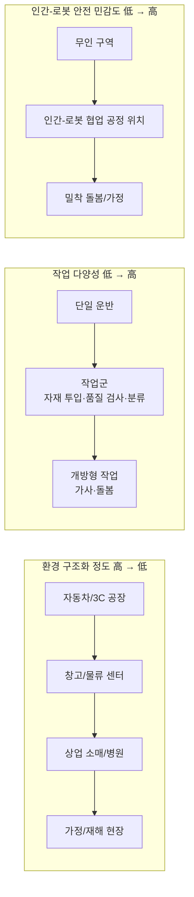
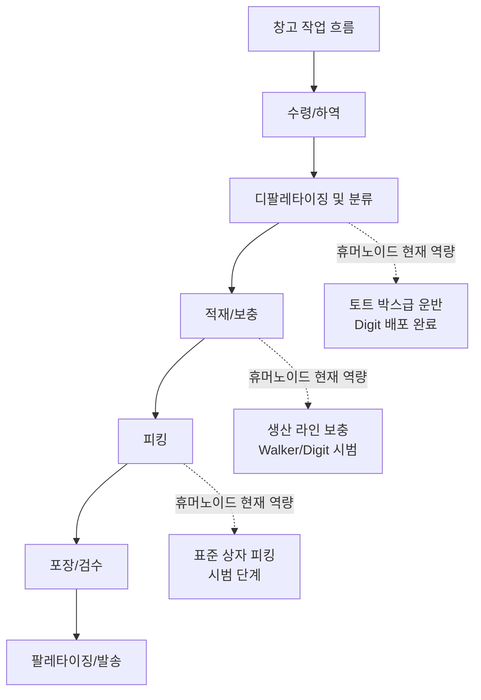

# 제 27장 응용 시나리오

## 요약

휴머노이드 로봇의 가치는 궁극적으로 구체적인 시나리오에서 실현됩니다. 이 장은 "시나리오 주도"를 주축으로 하여 휴머노이드 로봇의 7가지 응용 시나리오를 체계적으로 분석합니다: 창고 물류, 자동차 제조 및 산업 조립, 산업 순찰 및 유지보수, 의료 재활 및 요양 돌봄, 가정 및 가사 서비스, 상업 소매 및 공공 서비스, 연구 교육 및 개발자 생태계. 각 시나리오에 대해 이 장은 통일된 프레임워크에 따라 전개됩니다: 시나리오 정의 및 작업 분해, 휴머노이드 형태의 적합성 분석, 핵심 기술 요구 사항, 지식 그래프(KG) 기반 실제 엔터티(Agility Digit, Walker S1/S2, Figure 02, Galbot G1, Fourier GR-1/GR-3, Unitree G1, EngineAI PM01 등)의 대표적인 배치, 그리고 현재의 병목 현상. 이 장의 시나리오 분류 및 분석 차원은 본 프로젝트의 응용 조사 워크플로우(`scripts/ai4sci_workstreams/applications/` 내 warehouse_logistics, industrial_inspection, assistive_rehabilitation, home_assistive 4개 조사 방향 정의 파일)에서 설정한 검색 영역 및 대상 엔터티 유형을 참조하였으며, 장 말미에는 시나리오를 아우르는 공통 엔지니어링 제약 조건(안전 표준, 총소유비용(TCO) 모델, RaaS 비즈니스 모델 및 데이터 플라이휠)을 제시하여 제28장 시장 및 투자 분석을 위한 시나리오 측 기반을 마련합니다.

**핵심어**: 응용 시나리오; 창고 물류; 자동차 제조; 산업 순찰; 의료 재활; 요양 동반; 가사 서비스; 인간-로봇 협업 안전; TCO; RaaS

---

## 27.1 응용 시나리오 분석 프레임워크

### 27.1.1 왜 "형태"보다 "시나리오"가 더 중요한가

제26장의 완제품 사례 비교는 현재 가장 성공적으로 배치된 제품(Digit의 창고, Galbot G1의 약국 및 편의점)이 모두 형태를 정의하는 시나리오의 산물임을 보여줍니다. 응용 시나리오 분석은 세 가지 단계적 질문에 답합니다:

1.  **왜 이 시나리오인가?** 해당 시나리오에 로봇 대체가 경제적 또는 윤리적 정당성을 갖출 만큼 충분히 큰 노동력 부족 또는 위험 계수가 존재하는가;
2.  **왜 휴머노이드인가?** 해당 시나리오의 환경이 인간을 위해 설계되었는가(계단, 문 손잡이, 선반 높이, 도구 인터페이스) 그래서 인간형 형태가 환경을 재구성하는 것보다 저렴한가;
3.  **왜 지금인가?** 액추에이터 비용, VLA 모델 일반화 능력 및 배터리 기술이 이미 해당 시나리오의 합격선을 넘었는가.

세 질문 모두에 긍정적인 답이 나올 때만 시나리오가 배치 조건을 갖춥니다. 이 장은 각 시나리오 유형에 대해 이 논리에 따라 검증합니다.

### 27.1.2 시나리오 분류학: 세 가지 직교 차원

휴머노이드 로봇 응용 시나리오는 세 가지 직교 차원을 따라 위치를 정할 수 있습니다:

-   **환경 구조화 정도**: 고도로 구조화된 자동차 용접 공장에서 반구조화된 창고 및 병원, 비구조화된 가정 및 재해 현장까지;
-   **작업 다양성**: 단일 반복 작업(운반 상자)에서 작업군(총조립 물류의 수십 가지 공정 위치)을 거쳐 개방형 작업(가사)까지;
-   **인간-로봇 상호작용 및 안전 민감도**: 무인 창고의 낮은 민감도에서 협업 생산 라인의 중간 민감도, 요양 및 가정 시나리오의 높은 민감도까지.



일반적으로 상업화 성숙도는 "구조화 정도 높음, 작업 다양성 낮음, 안전 민감도 낮음"의 꼭지점에서 우선적으로 돌파합니다: 이것이 창고 물류와 자동차 총조립 물류가 2024–2026년 배치의 선봉이 된 이유입니다.

### 27.1.3 시나리오-역량 매핑 매트릭스

아래 표는 7가지 시나리오를 완제품 역량 요구 사항(역량 정의는 제26.1.2절 참조)에 매핑합니다:

| 시나리오 | 이동 요구 사항 | 조작 요구 사항 | 배터리/보급 | 안전 등급 | 일반 부하 | 대표 완제품 (KG 엔터티) |
|------|----------|----------|-----------|----------|----------|---------------------|
| 창고 물류 | 평지 보행, 좁은 통로 | 상자 파지, 팔레타이징 | 4 h+, 자가 충전 | 중 (인간-로봇 구역 분리) | 10–20 kg | `ent_product_agility_robotics_digit` |
| 자동차 제조/조립 | 생산 라인 보행, 공정 위치 정렬 | 양팔 협업, 도구 사용 | 배터리 교체 24 h | 고 (협업 공정 위치) | 5–15 kg | `ent_product_ubtech_walker_s2` |
| 산업 순찰 | 전천후, 계단/파이프 랙 | 계량기 판독, 밸브 조작 | 장시간 배터리 + 넓은 온도 범위 | 중 | <5 kg | `ent_product_boston_dynamics_atlas_electric` |
| 의료 재활 | 저속 안정 | 순응력 제어 접촉 | 교대 수준 | 매우 높음 | 접촉력 수준 | `ent_product_fourier_gr1` |
| 요양 동반 | 실내 저속 | 경량 조작, 감정 상호작용 | 핫 스왑 | 매우 높음 | <3 kg | `ent_product_fourier_gr3` |
| 가사 서비스 | 비구조화 실내 | 다양한 가사 조작 | 장시간 배터리 | 매우 높음 | 1–5 kg | `ent_product_one_x_technologies_neo` |
| 상업 소매 | 평평한 바닥 | 선반 물건 집기/내려놓기, 안내 | 24 h 교대 근무 | 고 | 1–5 kg | `ent_product_galbot_g1` |
| 연구 교육 | 실험실 | 개방형 2차 개발 | 1–2 h 허용 가능 | 저 | — | `ent_product_unitree_g1`, `ent_product_engineai_pm01` |

### 27.1.4 시나리오 경제성의 정량적 프레임워크: TCO 및 단위 작업 비용

시나리오의 성립 여부는 궁극적으로 총소유비용(TCO)과 인건비 대체 비용의 비교에 의해 결정됩니다. 단순화된 TCO 모델은 다음과 같습니다:

$$
TCO = \frac{C_{robot} + \sum_{t=1}^{T} \frac{C_{maint}(t) + C_{energy}(t) + C_{integrate}(t)}{(1+r)^t}}{N_{task}}
$$

여기서 \(C_{robot}\)은 구매 비용(또는 RaaS 모델의 연간 임대료), \(C_{maint}\), \(C_{energy}\), \(C_{integrate}\)는 각각 유지보수, 에너지 및 통합 개조 비용, \(r\)은 할인율, \(T\)는 서비스 수명, \(N_{task}\)는 전체 수명 주기 동안 완료된 유효 작업 수입니다. 로봇으로 대체되는 인건비 임계값은 다음과 같이 쓸 수 있습니다.

$$
C_{labor}^{eff} = w \cdot h_{shift} \cdot n_{shift} \cdot \eta_{task}
$$

여기서 \(w\)는 시간당 종합 인건비, \(h_{shift}\)와 \(n_{shift}\)는 교대 시간과 교대 횟수(로봇의 연속 근무 가능 이점 반영), \(\eta_{task}\)는 해당 공정 위치 작업에 대한 로봇의 유효 커버리지입니다. \(TCO < C_{labor}^{eff}\)일 때 시나리오는 경제적 순환을 갖춥니다. 현재 대부분의 산업 시나리오에서 제약 항목은 분모(작업 수)가 아니라 분자의 \(C_{integrate}\)에 있습니다. 통합 및 개조 비용은 종종 첫해 배치 비용의 30~50%를 차지하며, 이것이 "로봇을 위한 생산 라인 개조"와 "로봇이 생산 라인에 적응"이 경로 경쟁이 되는 이유를 설명합니다.

### 27.1.5 시나리오 배치의 추진 요인 및 시간 창

"왜 지금인가"라는 질문은 동시에 수렴하는 네 가지 힘(KG 개념 엔터티 `ent_concept_demo_to_product_gap`의 2025–2026년 새로운 물결에 대한 정리)으로 분해될 수 있습니다:

1.  **AI 능력 수렴**: 대규모 모델과 VLA(시각-언어-행동 모델, 제19장 참조)는 로봇이 작업 간 인식, 이해 및 일반화 능력을 갖추게 하여 작업 프로그래밍을 "공정 위치별 시범"에서 "데이터 기반 학습"으로 전환시켜 \(C_{integrate}\)를 직접적으로 압축합니다.
2.  **비용 곡선 수렴**: 정밀 제조 및 공급망 성숙(제7장 참조)으로 액추에이터, 감속기 등 핵심 부품 비용이 빠르게 하락하여 완제품 BOM이 산업 고객의 TCO 허용 범위에 진입합니다.
3.  **노동력 구조 수렴**: 제조업 및 물류업의 인건비 상승, 구인난 및 인구 고령화는 \(C_{labor}^{eff}\)의 임계값을 높여 더 많은 시나리오가 경제적 순환선을 넘도록 합니다.
4.  **자본 수렴**: 자본 시장은 선두 기업에게 대규모 자금을 제공하여 긴 검증 주기의 시나리오 시범(예: Figure의 BMW 11개월 배치)을 견딜 수 있게 합니다.

네 가지 힘의 방향은 동일하지만 속도는 다릅니다: AI 능력과 비용 곡선은 분기별로 변화하고, 노동력 구조는 연간 단위로 변화하며, 표준 및 인증 체계는 수년 단위로 변화합니다. 시나리오 배치의 순서는 본질적으로 각 시나리오가 이 네 가지 힘에 대해 민감한 정도를 정렬한 결과입니다.

## 27.2 창고 물류 시나리오

### 27.2.1 시나리오 정의 및 작업 분해

창고 물류(응용 조사 방향 `warehouse_logistics`에 해당)는 피킹(picking), 포장(packing), 팔레타이징/디팔레타이징(palletizing/depalletizing), 선반 보충 및 '라스트 미터' 자재 운반을 포괄합니다. 이 시나리오의 공통 특징은 SKU 수량이 많고, 주문 변동성이 크며, 인력 수요의 계절성이 뚜렷하고, 창고 환경(통로 폭, 선반 높이, 토트 박스 규격)이 인체 공학을 중심으로 설계되었다는 점입니다.



### 27.2.2 휴머노이드 형태의 적합성

창고는 휴머노이드 로봇의 '인간을 위해 설계된 환경' 논증이 가장 강력한 시나리오입니다: 좁은 통로(보통 1.2m 이내), 선반 층 높이(인체가 닿을 수 있는 범위), 토트 박스 손잡이와 문 손잡이 모두 인간의 치수에 맞춰 설계되었습니다. 바퀴 달린 AMR(자율 이동 로봇)은 평면 운반에서 효율성이 더 높지만, 계단, 지하 구덩이 가장자리 및 '높은 곳에 닿아 양손으로 조작해야 하는' 작업장을 처리할 수 없습니다. 휴머노이드/이족 형태가 바로 이 '라스트 미터'를 보완합니다. Agility Digit의 역방향 무릎 관절 설계는 '좁은 통로에서 토트 박스를 안고 쪼그려 앉았다 일어서는' 특정 동작에 최적화되어 있습니다(26.6절 참조).

### 27.2.3 핵심 기술 요구 사항

| 능력 | 요구 사항 (일반적) | 설명 |
|------|------------------|------|
| 지속 하중 | 15–20 kg | 표준 토트 박스 만재 중량 |
| 단위 시간당 처리량 | 인간 작업 속도와 유사 (수십 상자/시간 수준) | TCO 달성 여부 결정 |
| 자율 충전/배터리 교체 | 중단 시간 < 5분 | 가동 시간 결정 (26.10.3절 공식 참조) |
| 차량 관리 | WMS와 연동 | 단일 기계 지능이 아닌 작업 스케줄링 |
| 안전 | 인간-로봇 구역 분리 또는 협력 속도 제한 | 무인 구역은 완화 가능, 혼행 구역은 제한 |

### 27.2.4 대표적인 배포 및 병목 현상

KG의 벤치마크 사례는 Agility Digit(`ent_product_agility_robotics_digit`)입니다: Amazon, GXO, Spanx 등 고객사의 창고에서 토트 박스 분류 및 운반을 수행하며, RaaS 모델로 제공되고 연간 생산 능력 10,000대의 RoboFab 공장이 공급을 뒷받침합니다. Galaxy General Galbot G1(`ent_product_galbot_g1`)은 바퀴 달린 섀시 + 승강 동체 방식을 통해 창고 및 소매 보충 시나리오에서 24시간 배포를 구현하여 '평탄한 환경에서 바퀴가 이족을 대체'하는 비용 논리를 검증했습니다.

현재 병목 현상은 주로 세 가지입니다. 첫째, 피킹 단계의 SKU 일반화 – 연포장, 투명 및 반사 물체는 시각-파지 전략에 여전히 도전 과제입니다. 둘째, 속도 차이 – 휴머노이드의 단일 상자 처리 시간은 여전히 숙련된 작업자보다 높아, 연속 작업 이점(\(n_{shift}\) 항)으로 보완해야 합니다. 셋째, WMS 심층 통합 – 로봇은 단순한 지점 간 운반이 아닌 웨이브, 위치 및 우선순위 의미를 이해해야 합니다.

### 27.2.5 Python 예제: 창고 운반 작업장의 경제성 계산

다음 예제는 27.1.4절의 TCO 프레임워크를 사용하여 '휴머노이드 로봇이 창고 운반 작업자 한 명을 대체'하는 임계 조건을 추정합니다. 모든 매개변수는 업계 결론을 제시하기보다 계산 방법을 보여주기 위한 예시 가정값입니다:

```python
# 창고 운반 작업장: 휴머노이드 로봇 TCO와 인건비 비교 (예시 매개변수)
w = 25.0          # 인건비 종합 (USD/h)
h_shift = 8.0     # 교대 시간 (h)
n_shift_human = 1.0   # 인간 교대 횟수 (휴식 포함, 실제 약 1교대 유효)
eta_task = 0.85       # 로봇의 작업장 작업 유효 커버리지

# 로봇 측: RaaS 연간 임대료 + 통합 + 에너지 + 유지보수
rent_year = 60000.0     # RaaS 연간 임대료 (USD)
integrate_year1 = 30000.0  # 첫해 통합 개조 비용 (USD)
maint_year = 8000.0     # 연간 유지보수 (USD)
energy_year = 1500.0    # 연간 에너지 (USD)
n_shift_robot = 2.5     # 로봇 연속 작업 가능 교대 횟수 (배터리 교체/자율 충전)
years = 5

# 연간 인건비 (단일 작업장)
c_labor_year = w * h_shift * 250 * n_shift_human  # 250 근무일
# 로봇 연간 비용
c_robot_year = rent_year + maint_year + energy_year + integrate_year1 / years
# 로봇이 실제로 대체하는 인력 등가 (연속 작업 × 커버리지)
c_labor_eff = c_labor_year * n_shift_robot * eta_task

print(f"연간 인건비 (단일 교대): {c_labor_year:,.0f} USD")
print(f"로봇 연간 비용:     {c_robot_year:,.0f} USD")
print(f"로봇이 대체하는 인력 등가 가치: {c_labor_eff:,.0f} USD")
print(f"경제적 타당성: {'성립' if c_labor_eff > c_robot_year else '불성립'}")
```

예제는 창고 시나리오의 두 가지 구조적 특징을 보여줍니다. 첫째, **연속 작업 능력이 경제성의 주요 레버**입니다 – 로봇이 2교대 이상 운영될 수 있다면, 단일 교대 속도가 인간보다 느리더라도 연간 총 생산량은 역전될 수 있습니다. 둘째, **커버리지 \(\eta_{task}\)는 민감한 변수**입니다 – 커버리지가 0.85에서 0.6으로 떨어지면 경제적 타당성이 즉시 사라지며, 이것이 제조사들이 복잡한 피킹은 나중으로 미루고 '토트 박스 운반'과 같이 커버리지가 높은 좁은 작업을 우선 배포하는 이유입니다.

---

## 27.3 자동차 제조 및 산업 조립 시나리오

### 27.3.1 시나리오 정의 및 작업 분해

자동차 제조는 현재 산업용 휴머노이드가 가장 집중적으로 배치되는 분야이다. 총조립 공장의 작업군에는 부품 분류 및 배송(SPS 물류), 와이어링 하네스 연결, 나사 체결, 내장재 설치, 품질 검사 및 접착 도포가 포함된다. 이러한 작업들의 공통된 특징은 작업대가 인체공학적으로 설계되었고, 작업에 일정한 다양성이 있지만 환경은 고도로 구조화되어 있으며, '라인 정지 불가'에 대한 요구가 매우 높다는 점이다.

### 27.3.2 대표적인 배치: 실습에서 생산 라인까지

KG 제품 엔터티는 여러 제조업체의 자동차 시나리오에서의 비교 배치를 기록하고 있다:

| 완성체(KG 엔터티) | 고객/기지 | 작업 | 단계 |
|-----------------|-----------|------|------|
| Figure 02 (`ent_product_figure_ai_figure_02`) | BMW 스파르탄부르크 | 섀시 조립, 자재 운반 | 생산 라인 시범 |
| Walker S1 (`ent_product_ubtech_walker_s1`) | BYD, 동풍류자동차, 지리, 아우디-일기 | 총조립 물류, 운반, 품질 검사 | 다중 공장 실습 |
| Walker S2 (`ent_product_ubtech_walker_s2`) | 니오, BYD, 에어버스 등 | 박스 개봉, 자재 투입, 품질 검사, 도장 | 기업 납품 |
| Tesla Optimus Gen 3 (`ent_product_tesla_optimus_gen3`) | 테슬라 자체 공장 | 배터리 분류, 자재 운반 | 내부 테스트 |
| XPeng Iron (`ent_product_xpeng_iron`) | 샤오펑 광저우 공장 | 나사 조이기, 자재 정리, 생산 양식 확인 | 생산 라인 실습 |

이 표 자체는 한 가지 산업적 사실을 드러낸다: **완성차 업체는 가장 적극적인 고객이면서 동시에 가장 적극적인 경쟁자이다**(테슬라, 샤오펑은 자체 개발 및 자체 사용). 타사 로봇 제조업체에게 자동차 시나리오의 전략적 가치는 작업대 밀도가 높고 재현성이 뛰어나다는 점에 있다. 즉, 한 공장에서 검증된 작업대 솔루션을 수십 개의 공장으로 수평 확장할 수 있다.

### 27.3.3 핵심 기술 요구 사항

- **사이클 타임 및 업타임**: 생산 라인 사이클 타임은 초 단위로 측정된다. 로봇은 사이클 타임 내에 통합되거나(고동적 요구 사항), 사이클 타임 외의 물류 작업을 담당해야 한다(현재 주류 선택). Walker S2의 3분 자율 핫 스왑 배터리 교체는 3교대 연속 생산에 맞춰 설계된 것이다.
- **정밀 조작**: 와이어링 하네스 연결, 클립 설치에는 10+ DOF 정밀 핸드와 힘/촉각 피드백이 필요하다. Walker S2의 4세대 5손가락 정밀 핸드와 Optimus의 22 DOF 핸드는 모두 이러한 공정을 대상으로 한다.
- **인간-로봇 협업 안전**: 협업 작업대는 속도, 힘 및 접촉 압력 제한을 충족해야 한다(자세한 내용은 27.9절 표준 체계 참조).
- **시스템 통합**: MES(제조 실행 시스템)와 연동하여 작업 지시를 수신하고 상태를 보고해야 한다. 이것이 '로봇 공장 진입'과 '로봇 전시회 참가'의 분수령이다.

### 27.3.4 병목 현상

주요 병목 현상은 작업대 전환 비용에 있다. 작업대를 변경할 때마다 시범 또는 원격 조작 데이터를 다시 수집하고, 지그를 조정하며, 안전을 재검증해야 하므로 통합 비용 \(C_{integrate}\)이 높다. VLA 모델의 제로샷 일반화(예: Figure Helix의 미경험 작업물 파지)가 이 비용을 줄이고 있지만, 2026년 현재 '작업대 변경 시 플러그 앤 플레이'는 아직 실현되지 않았다.

### 27.3.5 작업대 등급: 물류 작업대에서 조립 작업대로의 상향 경로

자동차 총조립 공장의 작업대는 휴머노이드 로봇에 대한 친화도에 따라 등급을 나눌 수 있으며, 이는 배치의 상향 경로를 구성한다:

| 작업대 등급 | 대표 작업대 | 환경 제약 | 조작 요구 사항 | 배치 상태(2026년 기준) |
|----------|----------|----------|----------|--------------------------|
| G1 물류 작업대 | 상자 배송, SPS 분류, 빈 상자 회수 | 넓은 통로 | 상자 파지 및 운반 | 다중 지점 배치 완료(Walker, Digit 계열) |
| G2 보조 작업대 | 부품 사전 조립, 품질 검사 보조, 양식 확인 | 작업대 옆 작업 | 양팔 협업, 시각 판단 | 시범 검증(Figure@BMW, Iron@샤오펑) |
| G3 라인 측 작업대 | 와이어링 하네스 연결, 클립 설치, 나사 체결 | 생산 라인 사이클 타임 내 통합 | 정밀 핸드+힘 제어, 도구 사용 | 시연에서 시범으로의 전환 구간 |
| G4 특수 작업대 | 도장, 접착 도포, 용접 보조 | 방폭/보호 인증 | 공정 수준 정밀도 | 맞춤형 개조 필요, 아직 대규모 배치되지 않음 |

이 등급 분류는 현재 '로봇 공장 진입'의 본질이 **먼저 G1 물류 작업대의 인력 부족을 해소**하고, 이후 정밀 핸드와 힘 제어 능력이 성숙해짐에 따라 G2/G3로 상향 이동하는 것임을 설명한다. '휴머노이드 로봇이 곧 생산 라인 작업자를 완전히 대체할 것'이라는 주장은 G1과 G3 사이의 기술적 격차를 혼동한 것이다.

---

## 27.4 산업 순찰 및 유지보수 시나리오

### 27.4.1 시나리오 정의 및 작업 분해

산업 순찰(응용 조사 방향 `industrial_inspection`에 해당)은 장비 육안 검사, 비파괴 검사(NDT) 보조, 계량기 및 계기판 판독, 밀폐 공간 진입, 그리고 공장 제어 시스템과의 연동을 포함한다. 대표적인 고객은 전력, 석유화학, 제철 및 철도 교통 운영사이다.

### 27.4.2 휴머노이드 형태의 적합성

순찰 시나리오에서 휴머노이드 형태에 대한 요구는 두 가지에서 비롯된다. 첫째, 발전소, 변전소 등의 시설에는 많은 계단, 사다리 및 문턱이 존재하여 이족/휴머노이드의 통과성이 바퀴형 섀시보다 우수하다. 둘째, 밸브, 핸들, 키 스위치 등의 조작 인터페이스는 사람 손에 맞춰 설계되었다. 그러나 이 시나리오에서는 특수 목적 로봇(레일 장착형, 사족형)과의 경쟁이 치열하며, 휴머노이드의 차별화는 '순찰 + 간단한 조치'의 통합에 있다. 즉, 이상 징후 발견 시 현장에서 밸브 조정과 같은 가벼운 작업을 수행할 수 있어야 하며, 단순히 이미지를 다시 전송하는 것에 그치지 않는다.

### 27.4.3 핵심 기술 요구 사항 및 대표 플랫폼

- **환경 적응성**: 광온도(-20°C ~ 40°C), IP65+ 보호 등급, 방폭 인증(석유화학 시나리오). Atlas 전기형의 IP67 및 광온도 지표(`ent_product_boston_dynamics_atlas_electric`)는 열악한 산업 환경을 대상으로 한다.
- **인지**: 적외선 열화상, 음향 패턴, 가스 감지 및 계기판 판독을 위한 시각 인식.
- **긴 배터리 수명 및 자율 복귀 충전**: 순찰 경로가 길고 지점이 드물어 에너지 예산이 운반 시나리오보다 더 빡빡하다.
- **시스템 통합**: DCS/SCADA 등의 공장 시스템과 연동하여 '순찰 발견-작업 지시 생성-조치 완료'의 폐쇄 루프를 구현한다.

이 시나리오의 병목 현상은 단일 순찰의 가치 밀도가 낮고 로봇 단가가 높다는 점이다. 따라서 현재는 '위험 지역의 인력 진입 대체'(비용 가치가 아닌 안전 가치)를 주요 프로젝트 추진 사유로 삼고 있으며, 예를 들어 고온, 방사선 또는 유독성 구역의 정기 점검이 이에 해당한다.

### 27.4.4 응급 및 특수 시나리오로의 확장

산업 순찰의 기술 스택(통과성, 원격 인지, 열악한 환경 내성)은 재난 응급 대응과 매우 유사하므로, 순찰은 종종 휴머노이드가 특수 시나리오에 진입하기 위한 발판으로 간주된다. 지적해야 할 점은, 잔해, 돌무더기 등의 극도로 비구조화된 환경에서 휴머노이드가 반드시 최적의 형태는 아니라는 것이다. KG 논문 엔터티 `ent_paper_maur_roboa_construction_and_evaluat_2022`("RoBoa: 수색 및 구조 응용을 위한 방향 전환 가능한 덩굴 로봇의 구축 및 평가")는 완전히 다른 경로를 보여준다. RoBoa는 외반 유연성 직물 튜브를 통해 17m급의 가느다란 형태를 구현하여 붕괴된 건물의 좁은 틈새로 들어갈 수 있으며, 이는 어떤 휴머노이드 로봇도 진입할 수 없는 공간이다. 이 사례가 시나리오 분석에 주는 방법론적 의미는 다음과 같다: **특수 시나리오의 올바른 질문은 '휴머노이드가 진입할 수 있는가'가 아니라 '어떤 형태의 단위 위험 비용이 가장 낮은가'이다**. 특수 시나리오에서 휴머노이드의 합리적인 위치는 극한 공간의 탐험가보다는 '위험 환경에서의 범용 작업자'(예: 원자력 시설 해체 작업에서의 밸브 조작 및 도구 사용)에 더 가깝다.

## 27.5 의료 재활 및 요양 보호 시나리오

### 27.5.1 시나리오 정의 및 작업 분해

의료 재활 및 요양 보호(응용 조사 방향 `assistive_rehabilitation`에 해당)는 물리 치료 보조, 보행 훈련, 노인 일상 생활 활동(ADL, Activities of Daily Living) 지원, 인지 장애人群의 사회적 상호 작용 및 알림을 포함합니다. 이 시나리오의 평가 지표는 일반 산업 시나리오와 다릅니다. 작업 성공률 외에도 순응도(adherence), 참여도(engagement) 및 기능 개선과 같은 임상 지표가 포함됩니다.

### 27.5.2 대표 플랫폼 및 연구 증거

Fourier는 KG에서 이 시나리오의 핵심 엔터티 패밀리입니다. GR-1(`ent_product_fourier_gr1`)은 이미 여러 3차 종합 병원의 재활의학과에 도입되어 보행 훈련 및 재활 치료 보조에 사용되며, 힘 제어 순응성은 Fourier의 재활 외골격 제품 라인에서 계승되었습니다. GR-3(`ent_product_fourier_gr3`, Care-bot)은 독거 노인 동행 및 재활 보조를 더욱 지향하며, 소프트 커버 외관, 전감각 상호 작용 시스템(청각, 시각, 촉각) 및 이중 배터리 핫 스왑으로 장시간 동행 작업을 지원합니다.

연구 측면의 증거도 축적되고 있습니다. KG 논문 엔터티 `ent_paper_mishra_does_elderly_enjoy_playing_bin_2021`("노인들은 로봇과 빙고 게임을 즐길까? – 휴머노이드 로봇 Nadine을 사례로 한 사례 연구")은 사회적 휴머노이드 로봇 Nadine이 요양원에서 자율 빙고 진행자로 배치된 것을 보고합니다. 컴퓨터 비전 분석 결과, 로봇이 활동을 진행하는 동안 노인 거주자들이 더 많이 웃고 직원들의 부담이 줄어든 것으로 나타났습니다. 이러한 연구는 휴머노이드 형태가 **사회적 수용도**에서 가지는 독특한 가치, 즉 얼굴과 신체 언어가 노인 인구에게 주는 친근감은 비휴머노이드 장치로는 대체하기 어렵다는 점을 설명합니다.

### 27.5.3 주요 기술 요구 사항

| 능력 | 요구 사항 | 근거 |
|------|----------|------|
| 순응 힘 제어 | 접촉력 폐쇄 루프, 충돌 감지 및 빠른 후퇴 | 노인/환자와의 직접 신체 접촉 |
| 안전 인증 | ISO 13482(개인 케어 로봇) 등 | 27.9절 참조 |
| 상호 작용 자연스러움 | 음성, 표정, 촉각 다중 모드 | 순응도 및 참여도 지표 |
| 지속 작동 | 교대 수준 배터리 수명, 무소음 배터리 교체 | GR-3 이중 배터리 핫 스왑 설계 근거 |
| 개인정보 보호 규정 준수 | 오디오/비디오 데이터의 로컬 처리 | 요양 시나리오의 강력한 개인정보 보호 제약 |

### 27.5.4 병목 현상

재활 의료 시나리오의 대규모화는 임상 검증 주기와 건강 보험 지불 경로에 의해 제약을 받습니다. "의료 기기"로 허가를 받으려면 등록 및 임상 평가가 필요하고, "소비자 제품"으로는 높은 단가를 감당하기 어렵습니다. 현재 현실적인 경로는 기관(재활의학과, 요양원) 구매 + 서비스별 요금제이며, 가정용 시장의 확대는 비용 하락과 표준 완비를 기다려야 합니다.

### 27.5.5 재활 서비스 폐쇄 루프 및 평가 지표

재활 및 요양 시나리오의 독특한 점은 서비스가 "평가-중재-재평가"의 임상 폐쇄 루프이며, 로봇이 중재 실행자와 데이터 수집자의 이중 역할을 동시에 수행한다는 것입니다.


산업 시나리오가 "단위 시간 처리량"을 핵심 지표로 삼는 것과 달리, 이 시나리오의 KPI 체계는 인간 중심입니다. 훈련 순응도(환자가 처방된 훈련을 완료한 비율), 참여도(훈련 과정 중 적극적인 투입 정도, 시각적 표정 및 동작 범위 분석으로 추정 가능), 기능 개선량(훈련 전후 표준화 척도 점수 차이)이 포함됩니다. 이 폐쇄 루프에서 휴머노이드 로봇의 가치 제안은 치료사를 대체하는 것이 아니라 **치료사의 단위 시간당 서비스 반경을 확대**하는 것입니다. 즉, 한 명의 치료사가 여러 대의 장비 훈련 과정을 동시에 감독할 수 있으며, 이는 치료사가 만성적으로 부족한 재활 의료 시스템에 직접적인 구조적 의미를 갖습니다.

---

## 27.6 가정 및 가사 서비스 시나리오

### 27.6.1 시나리오 정의 및 작업 분해

가사 서비스(응용 조사 방향 `home_assistive`에 해당)는 작업 다양성이 가장 높고 환경 구조화 정도가 가장 낮은 시나리오입니다. 정리 정돈, 청소, 세탁, 물건 가져오기, 동행 및 긴급 호출 응답 등이 포함됩니다. KG 제품 엔터티 중 1X Technologies의 NEO(`ent_product_one_x_technologies_neo`)와 Fourier GR-3는 이러한 시나리오를 목표로 합니다. Tesla도 Optimus의 장기 목표 시나리오로 가사 서비스를 지정했습니다.

가사 작업을 "조작 강도 × 환경 변동성"의 두 차원으로 분류하면 자율화의 상향 경로를 명확히 볼 수 있습니다.

| 작업 등급 | 대표 작업 | 조작 강도 | 환경 변동성 | 현재 자율화 수준 |
|----------|----------|----------|------------|----------------|
| L0 동행 상호 작용 | 음성 알림, 감정 교류, 화상 통화 | 무접촉 | 낮음 | 이미 제품화 가능(GR-3 포지셔닝) |
| L1 경량 물건 가져오기 | 물 건네기, 리모컨 가져오기, 약 전달 | 한 손 경량 | 중간 | 원격 조작 보조 하에 사용 가능 |
| L2 정리 정돈 | 책상 정리, 옷 개기 | 두 손 조작 | 높음 | 데모 수준, 성공률 불안정 |
| L3 복잡한 가사 | 설거지, 요리 준비, 심층 청소 | 도구+액체+깨지기 쉬운 물건 | 매우 높음 | 연구 단계 |

이 분류는 27.1.2절의 시나리오 분류학과 일치합니다. 자율화는 "낮은 조작 강도, 낮은 환경 변동성"의 코너에서 먼저 진행되며, 각 등급의 도약은 데이터 플라이휠이 축적한 롱테일 작업 샘플에 의존합니다.

### 27.6.2 가정이 "마지막"으로 정복되는 이유

가정 시나리오의 어려움은 체계적입니다.

1. **비구조화된 환경**: 각 가정의 평면도, 물건 배치, 조명 조건이 모두 다르므로 인식 및 조작 모델이 사전 지도에 의존할 수 없습니다.
2. **개방형 작업 공간**: 가사 작업의 물체 종류와 조작 시퀀스는 거의 무한하므로 VLA 모델의 일반화 능력에 대한 요구 사항이 공장 작업군을 훨씬 능가합니다.
3. **안전 및 심리적 수용도**: 어린이, 노인, 반려동물과의 공존은 충돌력, 낙상 위험 및 "불쾌한 골짜기" 효과에 모두 매우 민감합니다.
4. **가격 상한선**: 가정 사용자의 지불 의향은 산업 고객의 TCO 임계값보다 훨씬 낮으므로 전체 기기 BOM이 산업용 기기보다 한 자릿수 낮아야 합니다.

KG 보고서 엔터티 `ent_report_humanoid_home_robot_safety_is_all_about_2026`("Home Robot Safety Is All About Relationships")은 ISO가 시행 12년 된 개인 케어 로봇 안전 요구 사항을 업데이트하고 있음을 지적하며, 이는 가정용 로봇 안전 표준이 제품화 과정에 따라 진화하고 있는 상태를 반영합니다.

### 27.6.3 현재 가능한 진입점

단기적으로 가정 시나리오의 현실적인 경로는 "작업 영역 축소"입니다. 동행, 알림, 경량 물건 가져오기와 같은 낮은 조작 강도 작업으로 진입하고(GR-3의 동행 포지셔닝이 이 논리), 원격 조작 보조(human-in-the-loop)를 통해 롱테일 작업을 보완하면서 동시에 데이터를 축적하여 자율 작업 범위를 점진적으로 확장하는 것입니다. 이는 KG 개념 `ent_concept_demo_to_product_gap`의 판단과 일치합니다. 가정 시나리오의 격차가 가장 크므로 진입점을 좁히는 것이 필수 경로입니다.

---

## 27.7 상업 소매 및 공공 서비스 시나리오

### 27.7.1 시나리오 정의 및 대표 배치

상업 소매 시나리오는 약국, 편의점의 선반 보충 및 재고 조사, 매장 안내, 판촉 상호 작용 및 야간 무인 운영을 포함합니다. KG에서 가장 완전한 사례는 Galbot G1(`ent_product_galbot_g1`)입니다. 바퀴형 전방향 섀시 + 65cm 승강 동체로 최대 약 240cm의 작업 높이를 커버하며, 순수 비전 내비게이션으로 매장 인프라 개조가 필요 없습니다. AstraBrain 시스템은 약국, 편의점의 24시간 상업용 배치를 지원합니다. XPeng Iron도 매장 안내 및 상업 서비스를 계획하고 있습니다.

### 27.7.2 시나리오 특징 및 병목 현상

상업 소매의 기술적 장벽은 산업보다 낮지만(작업군이 좁고 환경이 반구조화됨), 독특한 제약 조건이 있습니다. 고객 흐름 혼잡은 더 높은 동적 장애물 회피 및 행동 예측 가능성을 요구합니다. 매장 야간 무인 운영은 원격 유지 보수 및 이상 상황 자체 처리 능력을 요구합니다. 단일 매장의 지불 능력이 제한적이므로 전체 기기 비용과 유지 보수 비용이 충분히 낮아야 합니다. 이 시나리오는 본질적으로 로봇을 사용하여 소매업의 야간 및 비성수기 인력 부족을 메우는 것이며, 경제 모델은 "공유 직원"에 가깝습니다.

## 27.8 연구 교육 및 개발자 시나리오

### 27.8.1 시나리오 정의와 독특한 위치

연구 교육은 간과되기 쉬우나 2024–2026년 실제 출하 규모가 가장 큰 시나리오입니다. 대학 및 연구 기관은 운동 제어, 강화 학습, VLA 배포 및 구현 지능 연구를 위해 휴머노이드 플랫폼을 구매합니다. 이 시나리오는 "작업 성공률"에 민감하지 않으며, 개방성, 문서 및 가격에 매우 민감합니다.

Unitree G1(`ent_product_unitree_g1`)은 약 16,000 USD의 가격, ROS2 및 Python/C++ SDK를 통해 전 세계 출하량 선두의 휴머노이드 개발 플랫폼 중 하나입니다. H1(`ent_product_unitree_h1`)은 3.3 m/s의 달리기 능력으로 고동적 운동 연구에 서비스를 제공합니다. Zhongqing EngineAI PM01(`ent_product_engineai_pm01`)은 오픈소스 훈련/배포 코드와 교육용 버전 구성을 통해 알고리즘 교육 및 2차 개발 시장에 진입합니다.

연구팀의 기기 선정 시 일반적인 트레이드오프는 다음과 같이 요약할 수 있습니다.

| 선정 차원 | 설명 | 대표 옵션 |
|----------|------|----------|
| 예산 및 접근성 | 단일 구매 가격 및 도착 주기 | G1 기본 버전, PM01 교육용 버전 |
| 2차 개발 깊이 | SDK 계층(관절 수준/작업 수준), 시뮬레이션 모델 완성도 | Unitree SDK + ROS2 |
| 연산 확장 | Jetson Orin 등 엣지 컴퓨팅 추가 가능 여부 | G1 EDU 버전 |
| 조작 능력 | 정교한 손 옵션 선택 가능 여부 | G1 + Dex3-1, H1-2 업그레이드 암 |
| 운동 성능 | 달리기, 점프 등 고동적 검증 요구 | H1 |

### 27.8.2 전략적 의의: 생태계와 데이터의 전초 기지

연구 교육 시나리오의 상업적 가치는 단일 기기 이윤이 아닌 세 가지에 있습니다. 첫째, 제조사 SDK에 익숙한 개발자 생태계를 육성하여 플랫폼 고착성을 형성합니다. 둘째, 대학의 연구 성과(논문, 오픈소스 알고리즘)가 제조사의 기술 방향에 환류됩니다. 셋째, 미래 산업 시나리오를 위한 인재와 시스템 통합 업체를 확보합니다. KG 관점에서 이 시나리오는 완제품 제조사가 "제품 판매"에서 "생태계 구축"으로 나아가는 발판이며, 28장에서 기업 경쟁 구도를 분석할 때 중요한 변수입니다.

---

## 27.9 시나리오 간 공통 엔지니어링 제약

### 27.9.1 안전 표준 체계

휴머노이드 로봇은 작업 환경에서 인간과 밀접하게 상호작용하므로 기능 안전, 전기 안전, 전자기 호환성 및 기계 안전 등 표준을 준수해야 합니다. KG 개념 엔터티 `ent_concept_human_robot_collaboration_safety`가 정리한 주요 표준은 다음과 같습니다.

| 표준 | 적용 범위 | 핵심 요구 사항 |
|------|----------|----------|
| ISO 13482:2014 | 개인 케어 로봇 | 속도, 힘, 접촉 압력 제한 |
| ISO/TS 15066 | 협동 로봇 | 인간-로봇 협력 안전 요구 사항(준정적/과도 접촉 한계) |
| IEC 61508 | 기능 안전 | 제어 시스템 안전 무결성 수준(SIL) |
| ISO 13849 | 기계 안전 제어 시스템 | 안전 관련 제어 부품의 성능 수준(PL) |
| IEC 62368 | 오디오/비디오 및 정보 기술 장비 안전 | 전기 안전, 화재 위험 |

지역 시장 접근 측면에서 EU는 CE 마크, 미국은 UL 인증 및 FCC 전자기 호환성, 중국은 CR 인증(중국 로봇 인증) 및 CCC 등을 요구합니다. 응용 시나리오에 대한 직접적인 의미는 안전 민감도가 높은 시나리오(요양, 가정)일수록 인증 주기가 길어지고, 시나리오 확장 속도가 표준 발전에 더 많이 제약된다는 점입니다.

### 27.9.2 비즈니스 모델: CapEx에서 RaaS로

로봇 서비스(Robot-as-a-Service, RaaS, KG 개념 `ent_concept_robot_as_a_service`)는 임대 또는 구독으로 매입을 대체하고 유지보수, 소프트웨어 업데이트 및 차량 관리를 패키지로 제공합니다. RaaS는 TCO 공식(27.1.4절)의 구매 비용 \(C_{robot}\)을 예측 가능한 연간 운영 비용으로 전환하는 동시에 가용성 위험을 제조사에 이전합니다. 이는 현금 흐름에 민감하고 로봇 운영 및 유지보수 역량이 부족한 창고, 소매 등 고객에게 적합합니다. Agility Digit의 창고 배포는 RaaS 모델을 채택하고 있습니다.

### 27.9.3 데이터 플라이휠과 시나리오 선택

KG 개념 `ent_concept_data_flywheel`이 설명하는 순환(배포가 데이터를 생성하고, 데이터가 모델을 개선하며, 모델이 성능을 향상시켜 더 많은 배포를 가능하게 함)은 시나리오 선택이 전략적 복리 효과를 가짐을 의미합니다.


Tesla(자체 공장), Figure(BMW 생산 라인), Ubtech(다수 자동차 기업 실습)의 시나리오 전략은 모두 이 논리를 따릅니다. 즉, "데이터 밀도 × 지불 능력"이 최적인 시나리오를 먼저 점유한 후 인접 시나리오로 확산합니다. 창업자에게 시나리오 선택의 첫 번째 질문은 "어디에 수요가 가장 큰가"가 아니라 "어디의 데이터가 나를 가장 빠르게 강하게 만들 수 있는가"입니다.

### 27.9.4 고장 모드와 운영 및 유지보수

시나리오 간 배포에서 반복적으로 발생하는 고장 모드에는 낙상(동적 균형 실패), 파지 실패(인식 또는 정책 일반화 부족), 배터리/액추에이터 열 폭주 위험, 네트워크 중단으로 인한 작업 중단 등이 있습니다. 공학적 완화 수단은 계층적 다운그레이드 전략입니다. 작업 실패 시 안전 자세로 복귀, 원격 텔레오퍼레이션 인계, 현장 수동 개입 순입니다. 운영 및 유지보수 시스템(예비 부품, OTA, 예측 유지보수)의 비용은 대규모 배포에서 TCO의 상당 부분을 차지할 수 있으며, 시나리오 경제성 계산에서 생략할 수 없는 항목입니다.

---

## 27.10 장 요약

이 장에서는 "시나리오 견인" 프레임워크를 통해 휴머노이드 로봇의 7가지 응용 시나리오를 분석했습니다. 창고 물류 및 자동차 제조는 "환경 구조화 + 작업군 명확 + 지불 능력 강함"으로 인해 현재 배포의 선봉(Digit, Walker S1/S2, Figure 02, Optimus의 생산 라인 기록이 증명)입니다. 산업 검사는 안전 가치로 프로젝트를 수립합니다. 의료 재활 및 요양 케어(Fourier GR-1/GR-3)는 임상 검증 및 지불 경로 제약으로 인해 장기적인 특성을 보입니다. 가정 서비스는 작업 다양성이 가장 높고 격차가 가장 큰 최종 시나리오로, 현재 동행 등 낮은 조작 강도의 작업으로 진입합니다. 상업 소매(Galbot G1)는 바퀴형 휴머노이드 상반신의 실용적인 경로를 검증했습니다. 연구 교육(Unitree G1/H1, EngineAI PM01)은 생태계 및 데이터 전초 기지의 전략적 역할을 담당합니다. 시나리오 간 공통 제약(안전 표준, TCO, RaaS 및 데이터 플라이휠)은 시나리오 배포의 속도와 순서를 결정합니다. 먼저 구조화된 후 비구조화된, 먼저 산업 후 가정, 먼저 좁은 작업 후 일반적인 순서입니다.

독자에 대한 실용적인 조언은 세 문장으로 요약할 수 있습니다. **시나리오를 평가할 때는 먼저 적용 범위를 보고 그 다음에 템포를 보십시오**(\(\eta_{task}\)는 TCO 폐쇄의 민감 변수). **제조사를 평가할 때는 먼저 배포 기록을 보고 그 다음에 데모 비디오를 보십시오**(데모-제품 간극을 넘는 판단 기준은 제3자 시나리오의 지속적인 운영 시간). **시기를 평가할 때는 먼저 표준을 보고 그 다음에 가격을 보십시오**(안전 민감도가 높은 시나리오의 확장 속도는 BOM이 아닌 인증 체계에 의해 결정됩니다). 28장에서는 이 시나리오 지형 위에서 시장 구도, 기업 경쟁 및 투자 논리에 대한 분석을 펼칠 것입니다.
