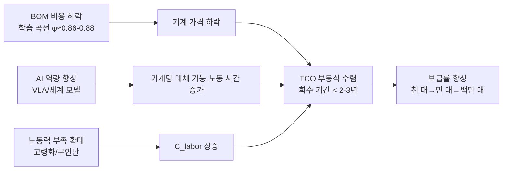
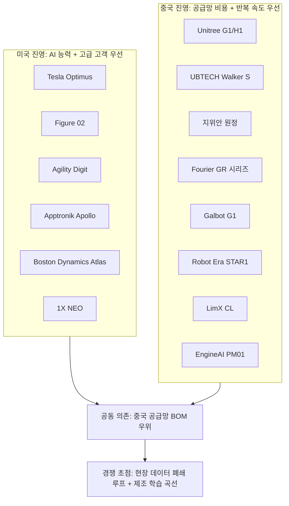
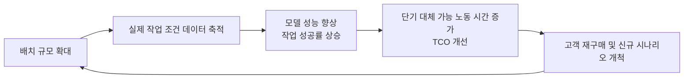
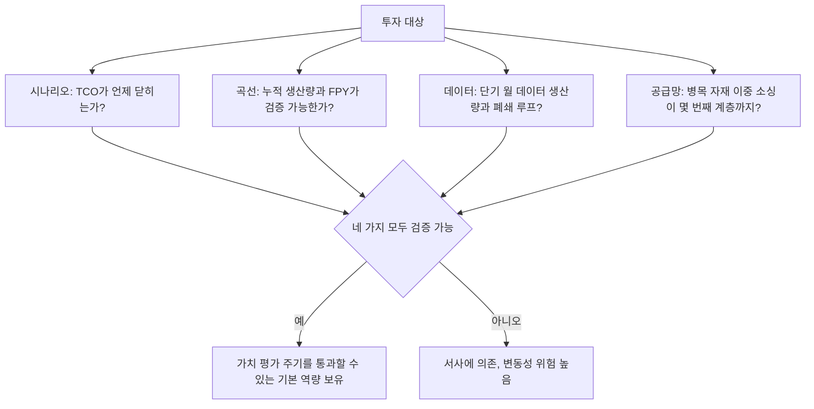

# 제 28장 시장, 기업 및 투자

## 요약

휴머노이드 로봇은 기술 검증기에서 상업 검증기로 진입하고 있으며, 시장 규모 예측, 기업 경쟁 구도 및 자본 흐름은 이 산업을 이해하는 '제3의 시각'을 구성합니다. 전자(기술과 제조)는 본서의 앞선 장에서 이미 다루었으며, 본 장에서는 세 가지 질문에 답합니다: 시장은 얼마나 큰가, 플레이어는 누구인가, 자금은 어디로 흐르고 있는가. 본 장에서는 먼저 업계 공개 예측(지식 그래프에 수록된 미국 은행 연구소의 《Humanoid Robots 101》 등의 보고서로 대표됨)이 제시하는 출하량, 비용 및 침투 경로 그림을 정리하고, 이는 분석가 추정치로서의 불확실성을 강조합니다. 이후 산업, 물류, 상업 서비스 및 가정의 4단계 시나리오에 따라 수요 구조와 지불 능력을 분석합니다. 이어서 전 세계 주요 완제품 기업인 테슬라(Tesla), Figure AI, Agility Robotics, Apptronik, 보스턴 다이내믹스(Boston Dynamics), 1X Technologies, Sanctuary AI, 그리고 중국 기업군인 위수 테크놀로지(Unitree), 유비테크(UBTECH), 지위안 로봇(AGIBOT), 푸리에(Fourier), 은하 통용(Galbot), 성동기원(Robot Era), 축제동력(LimX Dynamics), EngineAI, Astribot, 러쥐(Leju) 등의 제품 포지셔닝과 상업화 진행 상황을 체계적으로 정리합니다. 나아가 자금 조달 및 가치 평가 동향, 공급망 투자 주요 라인 및 비즈니스 모델(완제품 판매, 리스 및 RaaS)을 정리합니다. 마지막으로 시장 위험과 투자 프레임워크를 논의합니다. 본 장의 모든 시장 수치는 업계 공개 예측 또는 공개 보도 기준이며, 규모 참고용으로만 제공됩니다.

**키워드**: 시장 규모; 침투율; 총소유비용; 경쟁 구도; 자금 조달 및 가치 평가; RaaS; 공급망 투자; 임베디드 인텔리전스

---

## 28.1 시장 규모 및 성장 예측

### 28.1.1 예측의 공통 골격: 3단계 보급

각 기관의 수치 차이가 크지만, 업계 공개 예측은 **보급 경로의 형태**에서 높은 일관성을 보입니다. 미국 은행 연구소의 《Humanoid Robots 101》(2025년 4월, 지식 그래프 엔터티 ent_report_bofa_humanoid_robots_101_2025)이 제시한 3단계 프레임워크가 대표적입니다:

1. **개발기(약 2025–2027)**: 소량의 산업 및 물류 파일럿, 연간 글로벌 출하량 수천~수만 대 수준, 고객은 본질적으로 "공동 개발권"과 데이터 수집 창구를 구매합니다.
2. **상업적 대규모 채택기(약 2028–2034)**: 상업 서비스 및 반구조화 환경 보급, 출하량 수십만~수백만 대 수준, 일부 시나리오에서 TCO(총소유비용)가 수렴됩니다.
3. **대규모 소비자 채택기(약 2035년 이후)**: 가정 및 요양 돌봄 시장 진입, 보유량 수억 대 수준. 해당 보고서의 장기 전망은: 가정 하에 2060년 글로벌 휴머노이드 로봇 보유량이 30억 대 수준에 도달할 수 있다는 것입니다.

!!! note "예측 수치에 대한 방법론적 경고"
    휴머노이드 로봇은 아직 표준 규격 제품이 아니며, 각 기관의 예측은 "휴머노이드 로봇"의 통계 범위(바퀴형 섀시 휴머노이드 포함 여부, 고정 베이스 양팔 포함 여부), 단가 가정, 인력 대체 탄력성 가정에서 큰 차이를 보입니다. 이 장의 모든 시장 수치는 **업계 공개 예측의 규모 지표**로 이해해야 하며, 정확한 예언이 아닙니다. 동일 보고서도 BOM 및 출하 예측에 내재된 불확실성을 명확히 언급하고 있습니다.

### 28.1.2 출하량 및 금액 규모 전망

업계 공개 예측의 공통 범위(서로 다른 기관 기준의 중첩 구간)를 종합하면 신중한 규모 전망을 제시할 수 있습니다:

| 시간대 | 연간 글로벌 출하량 규모 | 평균 단가 규모 | 연간 생산액 규모 | 주요 시나리오 |
|---|---|---|---|---|
| 2025–2027 | 수천~수만 대 | 5만~25만 달러(전체 크기 산업용); 1.6만 달러부터(연구용) | 수억~수십억 달러 | 자동차/3C 공장 파일럿, 연구 |
| 2028–2030 | 수만~수십만 대 | 2만~10만 달러 | 수십억~수백억 달러 | 제조, 물류 운반 및 분류 |
| 2030–2035 | 수십만~수백만 대 | 1.3만~5만 달러(BOM 예측은 13장 참조) | 수백억~천억 달러 수준 | 상업 서비스, 순찰, 범산업 |
| 2035년 이후 | 연간 수백만 대 이상 | 1만~2만 달러 수준 | 천억 달러 이상 | 가정, 요양, 공공 서비스 |

이 곡선을 추진하는 하위 변수는 세 가지입니다: **BOM 비용 곡선**(13장에서 설명, 업계 공개 예측 약 3.5만 달러→1.3~1.7만 달러), **AI 역량 곡선**(VLA 모델 및 세계 모델, 19, 20장 참조), **노동력 부족 곡선**(제조업 및 고령화 사회의 구조적 인력 부족). 세 가지의 시간적 정렬 정도가 예측이 구간의 상한선에 위치할지 하한선에 위치할지를 결정합니다.

### 28.1.3 예측 차이의 원인: 기관별 수치가 한 자릿수 차이 나는 이유

같은 연도의 출하량 예측에서 기관 간 5~10배 차이는 일반적입니다. 차이는 주로 네 가지 가정에서 비롯됩니다:

- **범위 가정**: 바퀴형 섀시 휴머노이드(예: Galaxy General G1) 통계 여부, 고정 베이스 양팔 시스템 통계 여부, "반휴머노이드"(다리 없는 이동 조작 플랫폼) 통계 여부, 범위의 넓고 좁음이 직접적으로 수 배 차이를 유발합니다.
- **가격-수요 탄력성 가정**: 비관적 측은 가격 하락이 느리고 시나리오가 고도로 구조화된 공장에만 국한된다고 가정합니다. 낙관적 측은 가격이 학습 곡선을 따라 빠르게 하락하고 시나리오가 서비스업으로 확장된다고 가정합니다.
- **AI 역량 가정**: 이는 가장 큰 잠재 변수입니다. VLA 모델이 2027~2028년에 "단일 시나리오 99% 성공률"의 도약을 달성하면 보급 곡선은 상한선을 따릅니다. 긴 꼬리 작업 성공률이 장기간 90% 수준에 머물면 고객은 항상 "사람이 로봇을 감시"해야 하므로 TCO가 수렴되지 않습니다.
- **정책 및 노동력 가정**: 보조금(예: 중국 지방 정부의 조달 및 시장 개방 정책)은 단기적으로 출하량을 인위적으로 증가시킬 수 있습니다. 반면 고용 보호 규제는 보급을 억제할 수 있습니다.

독자에 대한 조언은: **예측의 최종 수치가 아닌 예측의 전제 가정에 주목하세요.** "BOM이 2만 달러로 하락, 단일 시나리오 성공률 99%, 2교대 인건비 5만 달러"라는 세 가지 요소 가정을 제시하는 예측은 고립된 "2030년 100만 대"보다 훨씬 더 많은 정보를 제공합니다.

### 28.1.4 수요 탄력성: TCO에서 보급률로의 환산 논리

시장 규모의 미시적 기반은 단일 시나리오의 TCO 비교입니다. 고객(특히 산업 고객)의 의사 결정 부등식은 다음과 같이 쓸 수 있습니다:

$$
\frac{P_{robot}}{Y} + C_{om} + C_{int} < C_{labor}
$$

여기서 \(P_{robot}/Y\)는 사용 연수 \(Y\)에 따른 연간 기계 비용, \(C_{om}\)은 연간 운영 유지비(유지보수, 에너지, 보험 포함), \(C_{int}\)는 통합 및 생산 라인 개조의 연간 비용, \(C_{labor}\)는 대체되는 직무의 연간 인건비입니다. 제조업 2교대 직무를 예로 들면, 선진 경제권의 연간 인건비는 일반적으로 4만~8만 달러, 중국 연안 지역은 1.5만~3만 달러입니다. 기계 가격이 3만 달러 미만, 연간 운영 유지비가 1만 달러 미만으로 떨어지면 투자 회수 기간이 2~3년으로 단축될 수 있으며, 이는 13.4.4에서 설명한 "BOM이 2만 달러 수준으로 하락, TCO가 수렴되기 시작"하는 수요 측 표현입니다. 보급률의 회수 기간에 대한 탄력성은 매우 강력합니다. 회수 기간이 1년 단축될 때마다 도달 가능한 잠재 고객 풀은 대략 한 자릿수 증가합니다(경험 법칙, 정확한 규칙 아님).



### 28.1.5 Python 예제: 투자 회수 기간 민감도 분석

다음 스크립트는 다양한 기계 가격과 운영 유지비 조합에서 2교대 운반 직무를 대체하는 투자 회수 기간을 계산하여 TCO 부등식의 가격 민감도를 보여줍니다(수치는 규모 시연용이며 특정 제품 견적이 아닙니다):

```python
# 휴머노이드 로봇 2교대 직무 대체 투자 회수 기간 민감도 분석
def payback_years(price, om_cost, int_cost, labor_cost, utilization=0.85):
    """
    price:      기계 가격 (달러)
    om_cost:    연간 운영 유지비 (달러/년)
    int_cost:   일회성 통합 및 개조 비용 (달러)
    labor_cost: 대체되는 직무의 연간 인건비 (달러/년)
    utilization: 유효 가동률 (충전, 고장, 대기 고려)
    """
    annual_saving = labor_cost * utilization - om_cost
    if annual_saving <= 0:
        return float("inf")
    return (price + int_cost) / annual_saving

scenarios = [
    # (기계 가격, 연간 운영 유지비, 통합 비용, 연간 인건비, 레이블)
    (150000, 30000, 50000, 60000, "현재 전체 크기 산업용 / 선진 경제권 2교대 직무"),
    ( 50000, 15000, 20000, 60000, "대규모화 후 / 선진 경제권 2교대 직무"),
    ( 30000, 10000, 10000, 60000, "BOM 수렴 후 / 선진 경제권 2교대 직무"),
    ( 30000, 10000, 10000, 20000, "BOM 수렴 후 / 중국 연안 2교대 직무"),
    ( 16000,  8000,  5000, 20000, "소비자 가격 / 중국 연안 1교대 직무"),
]

for price, om, integ, labor, tag in scenarios:
    pb = payback_years(price, om, integ, labor)
    msg = f"{pb:5.1f}년" if pb != float("inf") else "수렴 안 됨"
    print(f"{tag:<38s} 회수 기간: {msg}")
```

일반적인 출력은 다음과 같습니다: 15만 달러 가격대에서는 선진 경제권 2교대 직무를 대체하더라도 회수 기간이 5년 이상이며, "노동력 보험"형 고객만 수용할 의사가 있습니다. 가격이 3만 달러 수준으로 떨어지면 회수 기간이 2년 이내로 진입하여 TCO가 수렴되기 시작합니다. 인건비가 낮은 시장에서는 수렴을 위해 더 낮은 기계 가격이 필요합니다. 이는 **중국 기계 제조사의 극한 비용 절감 경로(예: Unitree G1의 1.6만 달러 가격 책정)가 시장 보급에 레버리지 효과를 갖는 이유**와 선진 경제권 시장이 오히려 휴머노이드 로봇 초기 보급의 단맛이 되는 이유를 정량적으로 설명합니다.

## 28.2 수요 구조: 시나리오 등급화와 지불 능력

### 28.2.1 4단계 시나리오의 기술-경제 매트릭스

지식 그래프 내 응용 엔터티(예: ent_application_industrial_manufacturing)는 본서 제27장의 시나리오 분석과 대응되며, 본장에서는 시장 관점에서 등급 매트릭스를 제시한다:

| 시나리오 등급 | 대표 과업 | 구조화 정도 | 지불 능력 | 대체 논리 | 현황(공개 기준) |
|---|---|---|---|---|---|
| L1 산업 제조 | 자재 운반, 상하차, 공정 간 이송 | 높음 | 강함(자본 지출 예산) | 2교대 운반/보조 작업자 대체 | 다수 완성차 업체가 자동차 공장에서 시범 운영 중 |
| L2 창고 물류 | 상자/가방 운반, 분류, 하역 | 중상 | 강함(처리량 기준 과금) | 성수기 탄력 고용 대체 | Agility Digit 등이 상업 배치 계약 체결 |
| L3 상업 서비스 | 안내, 순찰, 소매 보충, 청소 보조 | 중 | 중(운영 예산) | 대체가 아닌 보완 | 소규모 시범 운영 |
| L4 가정/요양 | 돌봄 보조, 가사 | 낮음 | 약하나 규모가 매우 큼 | 새로운 공급 창출 | 1X 등이 가정 시범 운영 시작, 장기 시나리오 |

핵심 통찰은: **단기 수익은 L1/L2에, 장기적 가능성은 L4에 있으며, L4의 기술적 장벽(비구조화 환경, 안전, 비용)이 가장 높다.** 기업의 시나리오 우선순위 설정 능력은 그 자체로 핵심 전략 역량이다.

### 28.2.2 초기 고객의 실제 동기

공개 시범 사례를 분석하면, 초기 고객의 지불 동기는 일반적으로 당기 ROI가 아니라 다음 세 가지 중 하나이다:

- **데이터 및 공정 선점**: 완성차 업체가 휴머노이드 로봇 시범 운영을 도입하는 핵심 이점은 '로봇 고용'에 대한 공정 지식과 안전 규범을 축적하는 것;
- **노동력 보험**: 인력난이 구조적으로 심화되는 지역에서 시범 운영은 미래 인력 부족에 대한 옵션;
- **브랜드 및 자본 시장 신호**: 완성차 업체 자체적으로, 주요 고객 로고는 가장 강력한 자금 조달 자산.

이를 이해하면, 현재 '계약 발표는 많지만 재구매 발표는 적은' 이유를 알 수 있다. 업계는 여전히 고객 교육을 통해 데이터와 반복 개발 시간을 확보하는 단계에 있다.

### 28.2.3 지역 시장 구조

수요의 지리적 분포 측면에서, 업계 공개 기준의 합의된 그림은 다음과 같다:

- **중국**: 가장 큰 잠재적 제조 시나리오(제조업 노동력 기반 최대), 가장 완벽한 공급망, 가장 적극적인 지방 정책 지원(시나리오 개방, 구매 보조금, 데이터 수집 센터 구축); 동시에 인건비가 상대적으로 낮아 TCO 달성을 위해 더 낮은 완제품 가격이 필요하며(28.1.5 계산 예시 참조), 시장은 '가격 주도형' 침투가 주를 이룰 것;
- **미국**: 인건비 높음, 물류 및 소매업 발달, AI 역량 선도, '역량 주도형' 침투의 최적 시장; 제조업 회귀 정책이 휴머노이드 로봇에 추가적인 수요 서사 제공;
- **일본 및 유럽**: 고령화가 가장 심각, 요양 돌봄(L4)에 대한 지불 의사와 시급성이 가장 높지만, 규제가 신중하고 노조 영향력이 커 침투 속도는 중미보다 느릴 수 있음;
- **기타 신흥 시장**: 단기적으로는 연구 및 전시 수요 위주.

지역 구조가 기업에 주는 의미는: 중국 완성차 업체는 자국 시장에서 비용 전쟁에서 승리해야 하며, 해외 진출 시 안전 인증(CE, UL) 및 서비스 네트워크를 보완해야 한다; 미국 완성차 업체는 자국 시장에서 TCO 혜택을 누리지만, BOM이 중국 공급망에 의존할 경우 관세와 수출 정책의 이중 변동성에 노출된다.

## 28.3 경쟁 구도: 글로벌 주요 완제품 기업

### 28.3.1 북미 진영

| 기업 (KG 카드) | 대표 제품 | 포지셔닝 및 진행 상황 (공개 기준) |
|---|---|---|
| 테슬라 Tesla (company_tesla / ent_oem_tesla) | Optimus | 수직 통합, 자체 공장 우선 적용; 공개 목표는 대량 생산과 장기적인 2만 달러대 가격 |
| Figure AI (company_figure_ai / ent_oem_figure_ai) | Figure 02 (product_figure_02) | 물류 및 제조 현장; 자동차 고객과 공동 창조; 자체 BotQ 공장 건설; 업계 최고 수준의 자금 조달 규모 (28.4 참조) |
| Agility Robotics (company_agility_robotics) | Digit (product_digit) | 물류 운반 전문; RoboFab 전용 생산라인 만 대 규모로 계획; 상업적 배치 계약 체결 |
| Apptronik (company_apptronik) | Apollo | NASA 외골격/휴머노이드 기술 축적에서 비롯; 메르세데스-벤츠 등과 공개 협력 시범 운영 |
| 보스턴 다이내믹스 Boston Dynamics (company_boston_dynamics) | 전기 Atlas (product_atlas_electric) | 동적 제어 기술 벤치마크; 전동화 전환 후 산업용 애플리케이션에 집중, 현대자동차그룹 지원 |
| 1X Technologies (company_one_x_technologies) | NEO | 가정용 현장 선구자; 원격 조작 보조를 통한 가정 데이터 수집 전략 채택 |
| Sanctuary AI (company_sanctuary_ai) | Phoenix | 손재주 조작 및 인지 소프트웨어를 핵심 판매 포인트로 |

### 28.3.2 중국 진영

중국 진영의 특징은 **많은 수, 빠른 반복, 공격적인 가격 인하, 강력한 공급망 깊이**입니다. 주요 플레이어 (모두 지식 그래프 기업 카드 보유):

| 기업 | 대표 제품 | 포지셔닝 및 진행 상황 (공개 기준) |
|---|---|---|
| 위슈 테크놀로지 Unitree (company_unitree / ent_oem_unitree_robotics) | G1, H1, H2 | 소비자용 가격 파괴자; G1 1.6만 달러부터 판매; 운동 제어 능력 탁월 |
| 유비테크 UBTECH (company_ubtech) | Walker S 시리즈 | 홍콩 증시 상장; 자동차 공장 실습 현장에 집중, 다수 자동차 기업 협력 공개 |
| 지위안 로봇 AGIBOT (company_agi_bot) | 원정 A2 등 (product_agi_bot_a2) | 양산 템포 공격적; 산업용 및 상업용 서비스 포괄; 임베디드 AI 데이터 오픈소스 활동 활발 |
| 푸리에 Fourier (company_fourier) | GR-1, GR-3 (product_fourier_gr1 / gr3) | 재활 의료 장비 출신, 범용 휴머노이드로 확장 |
| 은하통용 Galbot (company_galbot) | Galbot G1 | 바퀴형 섀시 + 양팔 경로, 소매 및 산업용 파지에 집중, VLA 능력 우수 |
| 성동기원 Robot Era (company_star1) | STAR1 | 칭화대 계열 배경; 엔드투엔드 모델과 완제품 협력 |
| 축제동력 LimX Dynamics (company_limx) | CL 시리즈 | 강화 학습 운동 제어에 강점, 이족/사족에서 휴머노이드로 확장 |
| EngineAI 중경 (company_engineai) | PM01, SE01 (product_engineai_pm01) | 고동적 운동 능력; 연구 및 개발자 시장 |
| Astribot 성진지능 (company_astribot) | S1 (product_astribot_s1) | 상지 조작 속도 및 힘 제어에 강점 |
| 러쥐 Leju (company_leju) | 쿠아푸 KUAVO | 교육 시장 출신, 오픈소스 생태계 전략 |
| 송연동력 (company_songyan_dynamics) | N2 | 중소형, 극한 가성비 경로 |
| 마법원자 MagicLab (company_magic_atom) | MagicBot | 추미 계열 배경, 산업 현장 지향 |
| 샤오펑 로봇 XPeng Robotics (company_xpeng_robotics) | Iron | 자동차 기업 배경, 자율주행 인식 및 제조 시스템 재활용 |

### 28.3.3 구도 판단: 세 가지 구조적 특징

**첫째, 미중 양극, 경로 분화.** 미국 진영은 AI 능력과 고급 산업 고객을 우선시 (Figure, Agility는 자동차 기업 및 물류 대기업과 결합), 중국 진영은 공급망 비용과 반복 속도를 우선시 (Unitree는 진입 가격을 1.6만 달러대로 인하). 지식 그래프의 공급망 보고서 (예: ent_report_bofa_humanoid_robots_101_2025)는 중국 공급망 중심의 BOM 가정이 현재 비용 예측의 기초임을 명확히 지적하며, 이는 **글로벌 휴머노이드 로봇 산업이 제조 측면에서 중국 공급망에 깊이 의존**함을 의미합니다.

**둘째, 자동차 기업이 가장 큰 단일 '인큐베이팅 현장'으로 부상.** 테슬라 자체 사용, Figure와 BMW, Apptronik과 메르세데스, UBTECH과 다수 중국 자동차 기업 – 완성차 업체는 고객, 투자자, 제조 멘토의 세 가지 역할을 동시에 수행합니다. 그 이유는 자동차 공장이 '구조화 정도가 충분히 높음'과 '인건비가 충분히 높음'이라는 스위트 스팟 속성을 동시에 갖추고 있으며, 자동차 기업이 대량 생산의 학습 곡선을 이해하고 있기 때문입니다.

**셋째, 아직 진정한 플랫폼 독점자는 등장하지 않음.** 스마트폰이나 전기차와 달리, 휴머노이드 로봇의 '운영체제 계층' (운동 제어, VLA, 시뮬레이션 스택)은 아직 수렴되지 않았으며, 하드웨어 형태 (바퀴형 vs 이족, 하모닉 vs 유성 감속기, 손재주 손 자유도)는 여전히 분산 탐색 중입니다. 지식 그래프 보고서에서 언급된 '약 24개월 공급업체 진입 기회' 판단 – 아키텍처 수렴 전에 공급망 진입 – 은 완제품 구도 판단에도 동일하게 적용됩니다: 현재 구도는 **예선전이지 결승전이 아닙니다**.

### 28.3.4 완제품 기업의 네 가지 전략 원형

국가별 레이블을 제거하면, 현재 완제품 기업의 전략 선택은 네 가지 원형으로 요약될 수 있으며, 자원 배분 논리는 완전히 다릅니다:

| 전략 원형 | 대표 기업 | 자원 배분 중점 | 핵심 베팅 | 주요 위험 |
|---|---|---|---|---|
| 현장 심화형 | Agility (물류), 1X (가정) | 단일 현장의 신뢰성, 운영 및 서비스 네트워크 | 단일 현장 TCO 우선 폐쇄로 현금 흐름 플라이휠 형성 | 현장 천장 낮음, 수평 이동 비용 큼 |
| 플랫폼 범용형 | Tesla, Figure, 지위안 | 범용 하드웨어 플랫폼 + 대형 모델 + 대량 생산 | 범용성이 변곡점을 넘은 후 승자 독식 | 자본 소모 막대, 변곡점 시점 불확실 |
| 비용 파괴형 | Unitree, 송연동력 | 공급망 통합 및 빠른 반복 | 가격 인하로 새로운 수요 풀 창출 (연구, 교육, 경상업용) | 저가가 신뢰성과 브랜드에 미치는 역효과 |
| 기술 외부 효과형 | 보스턴 다이내믹스, 축제동력, Astribot | 단일 기술 강점 (동적 제어, 강화 학습, 힘 제어 조작) | 강점 기술이 업계 표준이 되어 라이선스/고급 제품으로 수익화 | 강점이 대형 모델이나 오픈소스 솔루션에 추월당함 |

주목할 점은 네 가지 원형이 상호 배타적이지 않다는 것입니다: Tesla는 동시에 플랫폼 범용형이자 (잠재적) 비용 파괴형입니다; 지위안은 플랫폼 경로 외에도 빠르게 가격대를 낮추고 있습니다. 원형 프레임워크의 가치는 투자자와 업계 관계자에게 **동일한 업계 뉴스라도 다른 원형에게는 완전히 다른 신호 강도를 의미**한다는 점을 시사하는 데 있습니다 – 예를 들어, 특정 자동차 기업의 시범 주문은 현장 심화형에게는 생존선이지만, 플랫폼 범용형에게는 단지 데이터 진입점 중 하나일 뿐입니다.



## 28.4 자금 조달과 가치 평가

### 28.4.1 자본 흐름의 전체적인 그림

2023년 이후, 휴머노이드 로봇과 임베디드 인텔리전스는 글로벌 하드테크 투자에서 가장 집중된 분야 중 하나가 되었습니다. 공개 보도된 전체적인 특징은 다음과 같습니다:

- **선두 완제품 기업의 단일 라운드 자금 조달 규모는 수억에서 수십억 달러에 이르며**, 가치 평가는 수백억 달러 구간에 진입했습니다. Figure AI의 여러 차례 자금 조달은 공개 보도에서 가장 주목받는 사례 중 하나이며, 투자자는 선두 기술 기업과 주류 벤처 캐피탈을 포함합니다.
- **중국 임베디드 인텔리전스 기업의 자금 조달 밀도가 매우 높습니다**: 지식 그래프에 등록된 X Square Robot(ent_company_x_square_robot_secures_four_co_2026)은 연속 4차례 자금 조달을 완료하고 가치 평가가 280억 달러를 초과했으며, 중국 4대 인터넷 기술 대기업의 투자를 동시에 받았습니다. 이는 '모델 회사 + 완제품 회사'라는 이중 내러티브에 자본의 선호가 더해진 전형적인 사례입니다.
- **상장 기업의 진입 경로가 열렸습니다**: UBTech은 이미 홍콩 증시에 상장했습니다. 여러 공급망 기업(Greenharmonic, Shuanghuan Transmission, Tuopu Group, Sanhua Intelligent Controls 등)은 A주 시장에서 '휴머노이드 로봇 컨셉트'로 유의미한 가치 재평가를 받았습니다. 자본 시장은 공급망에 대한 가격 책정을 완제품의 수익 실현보다 먼저 진행하기도 합니다.

### 28.4.2 가치 평가 논리의 해부

현재 단계에서 완제품 기업의 가치 평가는 현재 수익(대부분의 기업 수익은 여전히 시범 및 소량 생산 위주)에 의존하지 않고, 세 가지 옵션의 중첩으로 이루어집니다:

$$
V = V_{tech} + V_{data} + V_{mfg}
$$

- \(V_{tech}\): 기술 선도 옵션 – 운동 제어, VLA 모델, 정교한 조작의 검증 가능한 선도성 (공개 벤치마크 및 시연을 통해 평가 가능)
- \(V_{data}\): 데이터 자산 옵션 – 배치 규모는 데이터 수집 규모와 같으며, 공장 및 고객 현장 데이터는 차세대 모델 훈련을 위한 독점 원료입니다.
- \(V_{mfg}\): 제조 학습 곡선 옵션 – 생산 능력 확장을 먼저 완료한 기업이 비용 곡선에서 선점 위치를 확보합니다 (13장 참조).

!!! note "투자 관점의 실사 체크리스트"
    휴머노이드 로봇 기업을 평가할 때, '시연 영상'보다 더 신뢰할 수 있는 신호는 다음과 같습니다: 단일 작업 성공률의 정량적 공개 및 제3자 재현, 배치 고객 수 및 재구매율, 핵심 부품 자체 개발/외부 조달 구조, FPY 및 생산 능력 확장 속도의 제조 지표, 데이터 폐쇄 루프의 자동화 정도, 로봇 1대당 월간 데이터 생산량. 시연은 리허설이 가능하지만, 제조 수율과 재구매율은 리허설이 불가능합니다.

### 28.4.3 자금 조달 구조의 새로운 특징

이전 로봇 투자 붐(2015–2018)과 비교하여, 이번 라운드에는 세 가지 새로운 특징이 있습니다:

1. **산업 자본의 깊은 참여**: 자동차 제조사, 배터리 공장, 인터넷 플랫폼이 전략적 투자자로 참여합니다 (X Square Robot이 4대 인터넷 대기업의 지지를 동시에 받은 것은 극단적인 사례). 산업 자본은 동시에 주문과 시나리오를 제공합니다.
2. **'모델 + 완제품' 연계 자금 조달**: 자본 시장은 '임베디드 인텔리전스 기반 모델 + 자체 하드웨어 플랫폼'의 폐쇄형 내러티브를 더 선호하며, 순수 하드웨어 기업의 가치 평가 프리미엄은 상대적으로 압박을 받습니다.
3. **지방 정부 펀드의 대규모 진입 (중국 시장)**: 여러 지역에서 수백억 위안 규모의 임베디드 인텔리전스/로봇 산업 펀드를 조성하고, 데이터 수집 센터 및 테스트 장을 함께 구축합니다. 이는 한편으로 생산 능력 구축을 가속화하지만, 다른 한편으로는 지역 간 생산 능력 동질화 경쟁의 우려를 낳고 있습니다.

### 28.4.4 가치 평가의 닻: PS에서 '단위 배치 가치'로

수익이 전통적인 가치 평가 모델을 뒷받침하기에 부족한 단계에서, 시장이 실제로 사용하는 가치 평가의 닻은 세 번의 변화를 겪었습니다:

- **2023년 전후: 팀 닻**. 창업자의 배경 (최고 연구소, 대기업 경력)과 자금 조합을 기준으로 가격을 책정하며, 본질적으로 '인재 옵션'입니다.
- **2024–2025년: 주문 닻**. 자동차 제조사/물류 고객의 시범 주문 수량과 선두 고객 로고를 기준으로 가격을 책정하며, 본질적으로 '시나리오 옵션'입니다.
- **2026년부터: 배치 닻**. 선행 지표는 누적 배치 대수, 로봇 1대당 월간 유효 작업 시간 및 데이터 반환량으로 전환되며, 가치 평가는 '단위 배치 가치 × 배치 규모'와 연동되기 시작합니다.

이러한 변화 자체는 산업 성숙의 신호입니다: 가치 평가의 닻이 운영 지표에 가까워질수록 거품 성분은 낮아집니다. 1차 시장 참여자에게는, 기업이 현재 '어떤 닻으로 가격이 책정되는지'를 식별하는 것이 절대적인 가치 평가의 높낮이를 논쟁하는 것보다 의사 결정에 더 가치가 있습니다. 팀 닻으로 가격이 책정된 기업은 기술 실사를 통해 파고들어야 하고, 주문 닻으로 가격이 책정된 기업은 주문의 재구매 조건을 검증해야 하며, 배치 닻으로 가격이 책정된 기업은 대수와 작업 시간의 통계 기준을 감사해야 합니다.

## 28.5 공급망 투자 주요 라인

### 28.5.1 왜 '물 장수'가 '금 채굴자'보다 먼저 수익을 실현하는가

완제품의 수익 실현은 시나리오 검증의 긴 주기에 의존하는 반면, 공급망의 수익 실현은 완제품 제조사의 자본 지출과 시제품 양산에만 의존합니다. 역사적 유추는 명확합니다: 전기차 물결에서 먼저 실적을 실현한 것은 배터리와 구조 부품 공급업체였습니다. 휴머노이드 로봇의 해당 종목 풀 (모두 지식 그래프 카드 보유):

| 부문 | 대표 기업 | 투자 논리 요점 |
|---|---|---|
| 하모닉/유성 감속기 | Harmonic Drive Systems, Nabtesco, Leaderdrive, Laifual, Shuanghuan, Zhongda Leader | 사용량 탄력성 최대: 로봇 1대당 30개 이상의 감속기; 구도가 일본 기업 과점에서 중일 다극 구도로 변화 |
| 볼스크류 (로울러/볼) | GSA, Rollvis, Ewellix, Nanjing Gongyi, Best, Dingzhi | 선형 액추에이터 핵심; 고정밀 연삭기 생산 능력이 하드 병목 |
| 모터 및 드라이브 | maxon, Kollmorgen, Moons', Jiangsu Leili, Buke, Nidec | 프레임리스 토크 모터와 할로우 컵 모터의 두 가지 트랙 |
| 센서 | ATI, Kunwei, Bota Systems, Heidenhain, Renishaw, Orbbec, Hesai, RoboSense | 6축 힘/토크 센서와 엔코더의 국산화 탄력성 큼 |
| 액추에이터 어셈블리 Tier 1 | Tuopu Group, Sanhua Intelligent Controls | 완제품 제조사의 아웃소싱을承接, 자동차 부품 성장 경로 복제 |
| 소재 및 자성 재료 | Zhongke Sanhuan, JL Mag, Zhenghai Magnetic Materials, Ningbo Yunsheng, Baowu Magnesium | 희토류 자석 사용량이 로봇 모터 수에 선형적으로 증가; 경량화 마그네슘/알루미늄 합금 |
| 배터리 | CATL, EVE Energy | 고속 방전, 고안전 배터리 팩의 맞춤형 기회 |
| 컴퓨팅 플랫폼 | NVIDIA, Horizon Robotics, Black Sesame Technologies, Rockchip, Allwinner | 엣지 사이드 대형 모델 추론 칩의 새로운 증분 시장 |

### 28.5.2 로봇 1대당 부품 가치 분석

28.5.1의 부문을 '로봇 1대당 가치'로 더 환산하면 탄력성 순위를 더 직관적으로 볼 수 있습니다. 다음은 업계 공개 분석 기준의 전형적인 규모입니다 (전체 크기 산업용, 약 40 자유도, 정교한 손 장착 기준; 실제 값은 설계에 따라 크게 변동):

| 부문 | 로봇 1대당 가치 규모 (현재 / 대량 생산 후) | 탄력성 원천 |
|---|---|---|
| 감속기 (하모닉+유성, 30개 이상) | 수천–1.5만 달러 / 절반 이하로 감소 | 사용량 × 국산 대체 이중 탄력성 |
| 볼스크류 (선형 액추에이터 10–14개) | 수천–1만 달러 / 감소 폭 더 큼 | 연삭기 생산 능력 확대와 공정 성숙 |
| 모터 (프레임리스 토크+할로우 컵, 40개 이상) | 수천 달러 수준 | 국산화와 플랫폼화 |
| 힘/토크 센서 (6축 힘 2–4개+관절 토크) | 수천 달러 수준 | 6축 힘 센서 단가 현재 높음, 국산화 공간 큼 |
| 컴퓨팅 플랫폼 (1–2세트 SoC) | 수백–수천 달러 | 모델 엣지화에 따라 소폭 상승 |
| 배터리 팩 (2–4 kWh) | 수백 달러 수준 | 단가 낮지만 확실성 높음 |
| 구조 및 외관 부품 | 수백–수천 달러 | 다이캐스팅을 통한 원가 절감 |
| 정교한 손 (1–2개) | 수백–수천 달러 | 자유도 축소와 국산 설계 |

이로부터 투자 탄력성 순위에 대한 경험적 결론을 도출할 수 있습니다: **'고단가 × 고사용량 × 고국산화 대체 공간' 세 가지가 결합된 부문의 탄력성이 가장 큽니다** – 현재 시점에서 가장 적합한 것은 감속기, 볼스크류 및 6축 힘 센서입니다. 반면 배터리, 구조 부품은 '확실성 높음, 탄력성 낮음'의 보완적 논리에 속합니다. 이 순위는 BOM 하락에 따라 동적으로 변화합니다: 액추에이터 가치가 압축된 후, 센서와 컴퓨팅 플랫폼의 상대적 비중이 오히려 증가합니다.

### 28.5.3 공급망 투자의 두 가지 위험선

- **기술 경로 위험**: 하모닉 vs 유성, 로울러 스크류 vs 기타 선형 설계, 브러시드 vs 브러시리스, 라이다 vs 순수 비전 – 경로 전환은 자산 집약적 생산 능력을 침몰시킬 수 있습니다. 지식 그래프 보고서가 강조하는 '아키텍처 수렴 전의 기회 창' 판단은 양방향입니다: 기회이자, 잘못된 경로를 선택할 위험의 원천이기도 합니다.
- **지정학 및 정책 위험**: 희토류 영구 자석의 수출 규제 변동 (지식 그래프 엔터티 ent_report_oceanwall_rare_earth_bottleneck_2025에서 이에 대한 특별 분석 제공)은 해외 완제품 제조사와 중국 자성 재료 수출업체 모두에 충격을 줍니다. 컴퓨팅 칩의 수출 정책은 중국 완제품 제조사의 고급 컴퓨팅 구성에 영향을 미칩니다. 공급망 투자는 정책 시나리오에 대한 스트레스 테스트를 반드시 수행해야 합니다.

## 28.6 비즈니스 모델: 하드웨어 판매에서 노동 판매로

### 28.6.1 세 가지 비즈니스 모델 비교

| 모델 | 수익 구조 | 고객 TCO에 미치는 영향 | 완성체 제조사 요구사항 | 현황 |
|---|---|---|---|---|
| 완성체 판매 (CAPEX) | 일회성 하드웨어 수익 + 유지보수 | 고객이 잔존가치와 가동률 위험 부담 | 채널 및 서비스 네트워크 | 현재 주류 (연구 시장에서는 거의 유일한 모델) |
| 임대 (OPEX) | 월 사용료 | 고객 초기 투자 부담 완화, 회수 기간 단축 | 대차대조표 부담, 금융 파트너 필요 | 물류 현장에서 등장 시작 |
| RaaS (Robot-as-a-Service, 작업/시간당 과금) | 운반 건수, 시간당 과금 | 고객 TCO가 생산량과 직접 연동 | 가동률 위험 부담, 자체 기단 운영 필수 | 초기 탐색 단계; 최종 형태 중 하나로 간주 |

RaaS의 경제적 본질은 **완성체 제조사가 '가동률 위험'을 고객에서 자신에게 이전**하는 것이므로, 극도로 높은 단기 신뢰성(MTBF)과 매우 낮은 운영 유지비가 요구되며, 원격 운영 플랫폼이 뒷받침되어야 합니다. 지식 그래프의 Formant(company_formant, product_formant_platform)와 Freedom Robotics(company_freedom_robotics)와 같은 로봇 함대 관리 플랫폼이 바로 이 모델의 인프라입니다.

### 28.6.2 소프트웨어와 서비스의 수익 가능성

장기적으로 볼 때, 하드웨어 마진율은 학습 곡선을 따라 경쟁에 의해 압축될 것이며, 수익 풀은 세 가지 소프트웨어 계층으로 이동합니다: **스킬 애플리케이션 계층**(특정 작업의 전략 모델 및 공정 패키지), **함대 운영 계층**(스케줄링, 원격 인수, 예측 유지보수), **데이터 및 모델 서비스 계층**(임베디드 모델의 지속적 훈련 및 라이선싱). 이는 자동차 산업의 '소프트웨어 정의 자동차' 서사와 동형이지만, 휴머노이드 로봇의 소프트웨어 수익화는 더 빠를 수 있습니다. 고객이 구매하는 것이 본질적으로 '장비'가 아닌 '노동'이기 때문입니다.

### 28.6.3 데이터 플라이휠: 비즈니스 모델과 AI의 결합점

휴머노이드 로봇 비즈니스 모델이 전통적인 산업 장비와 구별되는 핵심 변수는 판매된 모든 장비가 훈련 데이터를 생성한다는 점입니다. 이로 인해 형성되는 데이터 플라이휠은 다음과 같습니다:



플라이휠이 회전하려면 세 가지 엔지니어링 전제 조건이 충족되어야 합니다: **데이터의 자동화된 환류**(로봇 엣지에서 이벤트 트리거 업로드, 수동 복사 아님), **데이터의 훈련 가능성**(센서 정렬, 타임스탬프 동기화, 작업 태그 체계, 21장 참조), **성능 향상의 측정 가능성**(작업 성공률을 핵심 지표로 하는 릴리스-검증 폐쇄 루프, 25장 참조). RaaS 또는 '데이터 자산' 서사를 주장하는 모든 회사는 실사 시 이 세 가지가 이미 구현되었는지 질문해야 합니다. 자동화된 환류 파이프라인이 없는 '데이터 플라이휠'은 단지 PPT 플라이휠일 뿐입니다.

### 28.6.4 비즈니스 모델 선택의 의사 결정 논리

세 가지 모델은 대체 관계가 아니라 기술 및 고객 성숙도에 따라 계층화되어 공존합니다. 완성체 제조사의 의사 결정 논리는 다음과 같이 요약할 수 있습니다:

- **단기 신뢰성이 아직 검증되지 않았을 때**(MTBF 짧음, 현장 고장률 높음)는 완성체 판매만 선택 가능 – 운영 위험을 고객 측에 남기고 자체적으로 유료 유지보수를 제공하며, 유지보수 데이터로 신뢰성 개선에 환류;
- **신뢰성이 임계값을 넘었지만 고객이 여전히 구매 예산 항목을 확보하지 못했을 때**는 임대가 과도기 형태이며, 완성체 제조사는 금융 기관을 도입하여 대차대조표 부담을 분담해야 함;
- **작업 성공률과 가동률을 모두 예측할 수 있고, 시나리오에서 생산량 기준 과금이 자연스럽게 성립할 때**(예: 운반 건수 기준) 비로소 RaaS가 경제성을 가지며, 이때 경쟁 초점은 하드웨어 사양에서 운영 효율성과 자금 비용으로 이동합니다.

즉, 비즈니스 모델은 신뢰성과 운영 능력의 함수이지 단순한 판매 전략 선택이 아닙니다. 이는 또한 28.7의 실사 프레임워크가 MTBF, 재구매율 및 작업 시간을 핵심 지표로 삼는 이유를 설명합니다: **이들은 동시에 한 회사가 비즈니스 모델 스펙트럼에서 어떤 위치에 설 수 있는지를 결정합니다.**

## 28.7 위험 요소 및 투자 프레임워크

### 28.7.1 주요 위험 목록

1. **기술 위험**: 비정형 환경에서의 작업 성공률이 여전히 상용 임계값에 크게 미치지 못함; 데모 비디오와 실제 배포 사이에 '분포 외 일반화 격차' 존재;
2. **수요 위험**: 산업 고객의 파일럿에서 대량 주문으로의 전환율이 입증되지 않음; 2027–2028년 재구매 데이터가 기대에 미치지 못할 경우, 가치 평가 체계가 수정될 것임;
3. **비용 위험**: BOM 하락은 희토류 자석, 고정밀 가공 장비 등 외부 조건에 의존하며, 비용 곡선은 순수 내생적이지 않음;
4. **정책 및 윤리 위험**: 고용 충격에 대한 여론 및 규제 대응, 인간-로봇 혼용 안전 책임 판단 (29장 참조);
5. **가치 평가 위험**: 1차 시장 가치 평가는 2030년 이후의 실현 가정을 내포하며, 단일 유명 기업의 인도 불이행이라도 업계 전반의 조정을 유발할 수 있음.

### 28.7.2 간결한 투자 분석 프레임워크

이 장을 종합하여, 네 가지 질문으로 모든 휴머노이드 로봇 투자 대상을 검증할 수 있습니다:

- **시나리오**: 첫 번째 '만 대 규모 시나리오'는 무엇인가? 해당 시나리오의 TCO 부등식(28.1.4)은 어떤 가격대에서 닫히는가?
- **곡선**: 학습 곡선의 어느 위치에 있는가? 누적 생산량, FPY, 병목 공정 사이클 타임이 검증 가능한가?
- **데이터**: 배치된 로봇 한 대당 매월 얼마나 많은 훈련 가능한 유효 데이터가 생성되는가? 폐쇄 루프가 자동화되어 있는가?
- **공급망**: 주요 병목 자재(볼스크류, 감속기, 자석, 연산 능력)의 공급 보장 구조는 무엇인가? 이중 소싱이 몇 번째 계층까지 적용되는가?



### 28.7.3 역사적 교훈: 세 차례 로봇 투자 붐의 교훈

휴머노이드 로봇이 자본의 주목을 받는 것은 처음이 아닙니다. 세 차례 로봇 투자 붐을 되돌아보면 냉정한 비교를 얻을 수 있습니다:

1. **2010년 전후 서비스 로봇 붐**: 청소 로봇 외에도 반려, 안내 로봇이 대거 등장했지만, 대부분 '상호작용 능력 부족 + 시나리오 가짜 수요'로 시장에서 퇴출됨; 교훈은 **작업 성공률이 뒷받침되지 않는 반려 서사는 지속 불가능**하다는 점;
2. **2015–2018년 협동 로봇 및 물류 로봇 붐**: 생존한 것은 AMR/AGV(Geek+, Quicktron 등 창고 자동화 회사, 모두 지식 그래프 카드 보유)와 같이 '시나리오가 폐쇄적이고 ROI를 계산할 수 있는' 품목이었고, 일반화된 '경량 휴머노이드/양팔' 프로젝트는 대부분 침체됨; 교훈은 **폐쇄된 시나리오의 계산 가능한 ROI가 주기를 극복하는 필수 조건**이라는 점;
3. **2021년 이후 현재의 임베디드 지능 붐**: 이전 두 차례와의 본질적 차이는 AI 능력(대규모 모델 + 모방 학습 + 강화 학습)이 진정한 일반화 가능성을 제공했고, BOM 곡선이 처음으로 닫힐 수 있는 구간에 진입했다는 점; 그러나 'AI 능력 향상 속도'와 '자본의 인내심 길이' 간의 경쟁은 아직 승부가 나지 않았습니다.

역사가 제시하는 투자 규율은 한 문장으로 요약할 수 있습니다: **검증 가능한 작업 성공률과 재계산 가능한 TCO에 대해 비용을 지불하고, 서사에 대해서는 할인을 유지하라.**

## 28.8 장 요약

- 업계 공개 예측은 숫자상으로는 분산되지만 형태상으로는 수렴: 2025–2027 파일럿 기간, 2028–2034 대규모 상용화, 2035 이후 소비자 침투; 미국 은행 연구소의 《Humanoid Robots 101》이 제시한 BOM 궤적(약 3.5만 달러 → 1.3–1.7만 달러)과 2060년 30억 대 보유량 전망은 대표적인 참고 자료이지만, 모두 분석가 추정치임;
- 시장 규모의 미시적 기반은 시나리오 수준의 TCO 부등식; 완성체 가격이 3만 달러 이하로 떨어지고 회수 기간이 2–3년으로 단축되는 것이 보급률 도약의 임계 조건;
- 경쟁 구도는 미국-중국 양극: 미국은 AI 능력과 고급 고객으로 선행, 중국은 공급망 비용과 반복 속도로 선행; 자동차 제조사가 가장 중요한 인큐베이팅 시나리오; 구도는 여전히 예선전 단계;
- 자본 측면: 선두 완성체 기업의 자금 조달은 수억에서 수십억 달러 규모(Figure AI 대표), 중국 임베디드 지능 기업의 자금 조달 밀도는 매우 높음(X Square Robot 평가액 28억 달러 이상 대표), 가치 평가는 기술, 데이터, 제조의 세 가지 옵션이 중첩되어 형성;
- 공급망이 완성체보다 먼저 실적을 실현: 감속기, 볼스크류, 모터, 힘 센서, 액추에이터 Tier 1(拓普, 三花), 자석 재료, 배터리 및 컴퓨팅 플랫폼이 투자 메인 라인을 구성하지만, 기술 경로 전환 및 지리적 정책 위험에 대한 스트레스 테스트가 필요함;
- 비즈니스 모델은 완성체 판매에서 임대를 거쳐 RaaS로 발전할 것이며, 수익 풀은 장기적으로 스킬 애플리케이션, 함대 운영 및 데이터 모델 서비스로 이동할 것임.

## 이 장에서 다루는 지식 그래프 엔티티

| 엔티티 ID | 이름 | 이 장에서 인용된 위치 |
|---|---|---|
| ent_report_bofa_humanoid_robots_101_2025 | 뱅크오브아메리카 연구소 《Humanoid Robots 101》 | 28.1.1, 28.3.3 |
| ent_report_oceanwall_rare_earth_bottleneck_2025 | 희토류 병목 분석 보고서 | 28.5.2 |
| ent_report_unitree_unitree_g1_humanoid_agent_pric_2024 | 유니트리 G1 가격 공지 | 28.1.2, 28.3.2 |
| ent_company_x_square_robot_secures_four_co_2026 | X Square Robot 자금 조달 (기업가치 28억 달러 초과) | 28.4.1 |
| ent_oem_tesla / ent_oem_figure_ai / ent_oem_unitree_robotics | 테슬라 / Figure AI / 유니트리 로보틱스 | 28.3 |
| ent_application_industrial_manufacturing | 산업 제조 응용 시나리오 | 28.2.1 |
| 부록 D 기업/제품 카드 | company_/product_ 시리즈: Agility, Apptronik, Boston Dynamics, 1X, Sanctuary, UBTECH, AGIBOT, Fourier, Galbot, Robot Era (star1), LimX, EngineAI, Astribot, Leju, Magic Atom, 송옌동력, XPeng, 및 Harmonic Drive, Nabtesco, Leaderdrive, 쌍환, GSA, Rollvis, Ewellix, maxon, Kollmorgen, 밍즈, ATI, 쿤웨이, Orbbec, Hesai, RoboSense, 톄푸, 싼화, 중커싼환, 진리융츠, CATL, 이웨이, NVIDIA, 지평선, 헤이즈마, Formant, Freedom Robotics 등 | 28.3–28.6 |

## 참고 문헌

- Bank of America Institute. (2025-04). *Humanoid Robots 101*. https://institute.bankofamerica.com/content/dam/transformation/humanoid-robots.pdf (업계 공개 예측; 숫자는 분석가 추정치)
- Unitree Robotics. (2024). *Unitree G1 Humanoid Agent — Price from $16K* (지식 그래프에 수록된 기업 공지 엔티티)
- 지식 그래프 research/companies/ 및 research/reports/ 엔티티군; 부록 D: 주요 공급업체 및 기업 명부
- 본서 상호 참조: 제6장 (공급망 구도), 제13장 (양산 및 규모화), 제27장 (응용 시나리오), 제29장 (정책, 규제 및 윤리)
