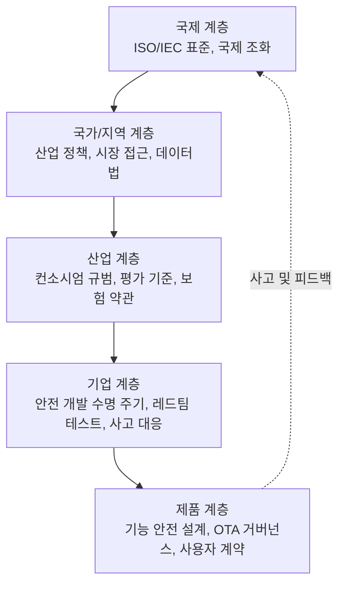
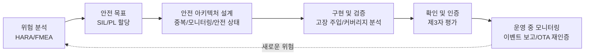
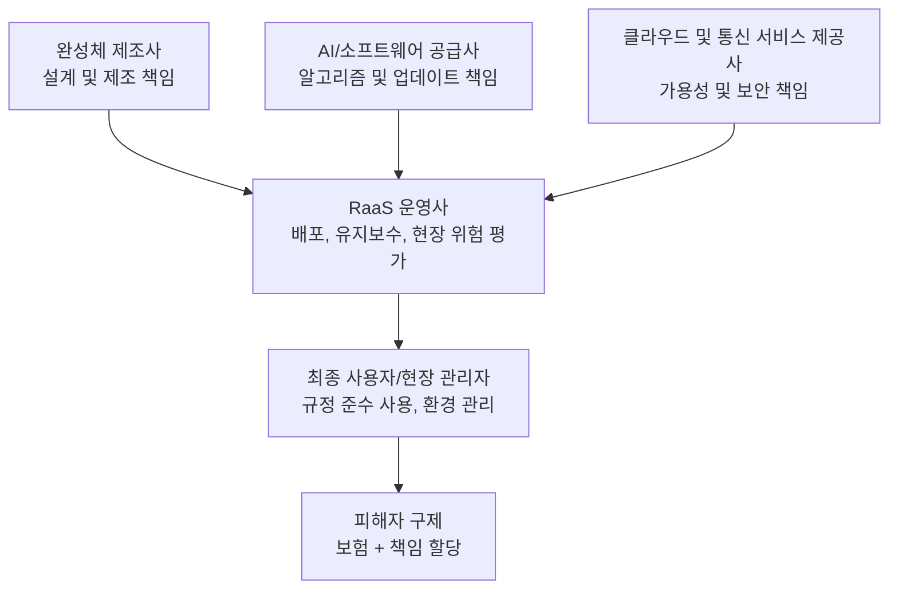
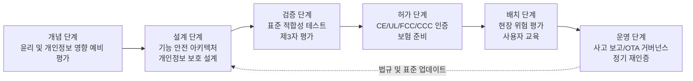

# 제 29장 정책, 규제 및 윤리

## 요약

휴머노이드 로봇은 '인간의 형태'로 인간의 생활 공간에 진입하는 최초의 기계입니다. 물리적 힘을 가하는 능력, 이동 능력, 그리고 점차 강화되는 자율 의사 결정 능력을 갖추고 있어, 그 거버넌스 문제는 산업 정책, 제품 안전 규제, 데이터 프라이버시, 책임 귀속 및 사회 윤리 등 여러 차원에 걸쳐 있습니다. 이 장은 공학과 거버넌스의 교차 관점에서 시작합니다. 먼저 거버넌스 프레임워크의 계층 구조와 '데모-제품 간 격차(Demo-to-Product Gap)'가 규제에 제기하는 과제를 살펴보고, 중국, 미국, EU, 일본, 한국 등 주요 경제권의 로봇 및 AI 산업 정책 방향을 비교합니다. 그런 다음 휴머노이드 로봇 관련 안전 표준 체계(ISO/TS 15066, ISO 13482, ISO 13849, IEC 61508 등)와 지역 시장 접근 인증(CE, UL, FCC, CCC)을 체계적으로 소개하고, 현행 표준이 휴머노이드 로봇을 포괄하지 못하는 부분을 지적합니다. 이후 제품 책임, 보험 및 로봇 서비스(RaaS) 모델 하의 책임 사슬, 데이터 거버넌스 및 생체 인식 프라이버시를 논의합니다. 마지막으로 노동 시장 충격, 인간-로봇 관계 윤리, 이중 용도 등 사회적 영향을 분석하고 거버넌스 도구 상자와 전망을 제시합니다. 이 장의 입장은 정책과 윤리는 기술 이후의 외부적 제약이 아니라 휴머노이드 로봇 시스템 설계의 일등 입력(input)이라는 것입니다.

**핵심어**: 로봇 정책; 기능 안전; 인간-로봇 협업 안전; 제품 책임; 데이터 프라이버시; 생체 인식; 로봇 윤리; 규제 샌드박스; 시장 접근 인증; 사회적 영향

---

## 29.1 정책, 규제 및 윤리 개요

### 29.1.1 휴머노이드 로봇에 특화된 거버넌스 논의가 필요한 이유

산업용 로봇 팔과 비교할 때, 휴머노이드 로봇의 거버넌스 어려움은 네 가지 구조적 특징에서 비롯됩니다.

1.  **물리적 체화성(Physical Embodiment)**: 체화된 지능 시스템은 물리적 세계에 직접 힘을 가하므로 소프트웨어 결함이 인체 상해를 초래할 수 있습니다. 이는 '안전은 내장되어야 하며, 사후에 부착되어서는 안 된다(Safety must be built in, not bolted on)'는 원칙이 자율주행 분야에서 휴머노이드 로봇으로 자연스럽게 확장되게 합니다.
2.  **공간 개방성**: 휴머노이드 로봇의 가치 제안은 바로 인간을 위해 설계된, 울타리가 없는 비구조화된 환경에서 작업하는 데 있습니다. 전통적인 산업용 로봇의 '격리 곧 안전' 패러다임은 더 이상 적용되지 않습니다.
3.  **데이터 집약성**: 로봇은 움직이는 센서 플랫폼으로, 이미지, 음성, 얼굴, 보행 패턴 등의 데이터를 지속적으로 수집하여 본질적으로 프라이버시 및 생체 인식 거버넌스 문제와 연결됩니다(29.5절 참조).
4.  **자율 진화성**: 데이터 플라이휠(Data Flywheel)은 제품 출고 후에도 성능이 변화함을 의미합니다. '출고 상태'를 대상으로 하는 일회성 인증으로는 지속적으로 학습하는 시스템을 포괄하기 어렵습니다.

지식 그래프의 '데모-제품 간 격차(Demo-to-Product Gap)' 개념은 무대 시연에 최적화된 지표(단일 성공률, 동작의 관람성)와 인증 가능하고, 양산 가능하며, 보험 가입이 가능한 제품 지표(평균 무고장 시간, 고장 모드 적용 범위, 추적 가능성) 사이에 체계적인 차이가 있음을 상기시킵니다. 규제 및 윤리 논의의 대상은 반드시 후자여야 합니다.

!!! note "용어 설명: 정책, 규제, 표준, 윤리 거버넌스"
    - **정책(policy)**: 정부가 산업 발전 및 위험 통제를 위해 수립하는 지침, 계획 및 재정 도구로, 일반적으로 강제적인 기술 구속력은 없습니다.
    - **규제(regulation)**: 법적 구속력이 있는 규칙 체계로, 시장 접근, 사고 책임 추궁, 데이터 보호 규정 등이 포함됩니다.
    - **표준(standard)**: 표준화 기구가 발행하는 기술 규범으로, 자체는 대부분 자발적이지만 규정에 인용되어 사실상 강제력을 얻는 경우가 많습니다.
    - **윤리 거버넌스(ethics governance)**: 규정 준수의 최소 기준을 넘어서는 가치 정렬 및 사회적 수용성 관리로, 공정성, 존엄성, 투명성 등의 주제를 다룹니다.

### 29.1.2 거버넌스 프레임워크의 계층

휴머노이드 로봇의 거버넌스는 다층 중첩 구조로, 어느 한 계층이 기능을 상실하면 위험이 다른 계층으로 전가됩니다.

- **국제 계층**: ISO와 IEC가 국가 간 상호 인정되는 안전 및 성능 표준을 제정하여 무역 장벽을 낮춥니다.
- **국가/지역 계층**: 산업 보조금, 수출 통제, 제품 책임법, 데이터 보호법(예: EU GDPR, 중국 PIPL) 등이 포함됩니다.
- **산업 계층**: 보험 요율, 평가 기준, 모범 사례 백서(예: 미국 은행 연구소의 'Humanoid Robots 101' 보고서는 자본 시장 차원에서도 기대치를 형성합니다).
- **기업 및 제품 계층**: 안전 개발 수명 주기, 고장 수목 분석, OTA 업데이트 거버넌스, 사고 보고 체계 등이 포함됩니다.

### 29.1.3 시제품에서 제품으로: 거버넌스 관점의 일곱 가지 도약

지식 그래프의 '0에서 1까지의 일곱 가지 도약(Seven Transitions)' 프레임워크는 휴머노이드 로봇이 프로토타입에서 제품이 되기 위해 기술, 시스템, 공급망, 제조, 비용, 검증, 시장의 일곱 관문을 넘어야 한다고 지적합니다. 이 중 **검증(validation) 도약**과 **시장 도약**은 이 장의 주제와 직접적으로 연결됩니다. 검증 도약은 안전성을 '시연 중 넘어지지 않음'에서 감사 가능한 증거 사슬로 업그레이드해야 함을 요구합니다. 시장 도약은 책임, 보험, 데이터 규정 준수 및 대중 수용성 문제에 대한 답변을 요구합니다. 즉, 거버넌스 성숙도는 그 자체로 제품 성숙도의 한 차원입니다.

### 29.1.4 이 책의 다른 장과의 관계

이 장은 전체 책의 거버넌스 차원을 마무리하는 장으로, 앞선 여러 장의 내용과 연결됩니다. 안전 표준의 엔지니어링 구현은 제9장의 V&V 프로세스, 제12장의 인증 및 품질 표준과 직접 연결됩니다. 데이터 프라이버시의 기술적 구현은 제21장의 데이터 인프라 및 제24장의 소프트웨어 스택 설계에 의존합니다. RaaS 책임 사슬은 제28장의 비즈니스 모델 분석과 상호 보완적입니다. 고용 충격에 대한 논의는 제27장의 애플리케이션 시나리오 침투 경로를 전제로 합니다. 독자는 이 장을 '앞서 논의된 각 장의 엔지니어링 결정을 사회적 좌표계에 배치하는 장'으로 간주할 수 있습니다.

### 29.1.5 거버넌스 성숙도 자가 평가

각 절을 전개하기에 앞서, 기업 거버넌스 성숙도를 빠르게 자가 평가할 수 있는 체크리스트를 제시합니다. 이후 각 절에서 항목별로 자세히 다룹니다.

| 차원 | 초급 (시제품 단계) | 중급 (소량 생산) | 성숙 (대규모 배포) |
|---|---|---|---|
| 안전 | 작업자 감독에 의존 | 비상 정지 및 힘 제한 등 안전 기능 구현 | SIL/PL에 따라 입증된 안전 아키텍처 + 사고 보고 |
| 규정 준수 | 인증 계획 없음 | CE/UL 등 인증 계획 수립 | 다지역 인증 완비, OTA 재인증 프로세스 구축 |
| 책임 | 면책 계약에 의존 | 제품 책임 보험 가입 | 책임-보험-계약 체계화, 완전한 추적 가능 사슬 |
| 데이터 | 데이터 정책 없음 | 프라이버시 정책 및 최소 수집 원칙 | 프라이버시 보호 설계 + 국경 간 규정 준수 + 데이터 플라이휠 거버넌스 |
| 윤리 | 별도 논의 없음 | 시연 투명성 선언 | 윤리 심의 메커니즘 + 사용자 통제권 설계 |

## 29.2 주요 경제권의 로봇 및 AI 정책

### 29.2.1 정책 도구의 유형학

각국 정책 수단은 다양하지만, 다섯 가지 도구 유형으로 분류할 수 있습니다:

| 도구 유형 | 전형적 수단 | 작용 단계 |
|---|---|---|
| 수요 견인 | 정부 조달, 시범 사업, 응용 보조금 | 시장 도약 |
| 공급 지원 | 연구개발 지원, 세제 혜택, 최초 세트 보험 보상 | 기술 및 제조 도약 |
| 요소 보장 | 인재 양성, 데이터 개방, 테스트 장소 | 시스템 및 검증 도약 |
| 위험 규제 | 안전 기준, 시장 진입, 사고 책임 추궁 | 검증 및 시장 도약 |
| 국제 경쟁 | 수출 통제, 기술 동맹, 표준 주도권 | 공급망 도약 |

### 29.2.2 중국: 최상위 계획이 주도하는 전방위적 배치

중국은 휴머노이드 로봇을 미래 산업의 중점 방향으로 지정했습니다. 2023년, 공업정보화 주관 부처는 휴머노이드 로봇 분야의 전담 지도 문서를 발표하여 2025년까지 혁신 체계 구축 및 핵심 기술 돌파, 2027년까지 안전하고 신뢰할 수 있는 산업 공급망 체계 형성이라는 단계적 목표를 제시했습니다 (참고: 이는 정책 목표의 개괄적 전환이며, 구체적 표현은 공식 문서 기준). 정책 특징은 다음과 같습니다:

- **"로봇+" 응용 행동**: 제조, 물류, 의료, 요양, 재난 대응 등 시나리오를 견인하여 완제품과 시나리오 제공자의 짝짓기 시범 사업 추진;
- **지역 경쟁**: 베이징, 상하이, 선전, 항저우 등지에서 잇따라 휴머노이드 로봇 전담 정책을 발표하고 혁신 센터, 훈련장, 시험 생산 기지를 건설하여 "국가 계획 - 지방 실행 - 산업단지 수용"의 3단계 구조 형성;
- **공급망 자립 지향**: 감속기, 볼스크류, 토크 센서 등 취약 부문에 대한 돌파 전담 과제 설정, 이는 제7장에서 논의된 공급망 거버넌스와 연계됨; 희토류 영구자석 등 상류 소재의 공급 구조 (희토류 병목 현상에 대한 산업 보고서 참조 가능)도 산업 안보 관점에 포함됨;
- **표준 선행**: 국내 표준화 기관과 업계 연합이 휴머노이드 로봇 용어, 안전, 테스트 방법 등 표준 제정을 추진 중이며, ISO/IEC 국제 표준화 과정에 적극적으로 참여하고 있음.

### 29.2.3 미국: 연구개발 지원과 위험 신중주의 병행

미국의 로봇 정책은 "연방 연구개발 지원 + 주 차원의 응용 규제"라는 이중 구조를 보입니다:

- **연구개발 측면**: 국가 로봇 계획(National Robotics Initiative)이 10년 넘게 기초 로보틱스 연구를 지속적으로 지원해 왔으며, 국방 및 우주 체계(DARPA, NASA)는 이족 보행, 원격 조작 등 초기 기술을 견인함; 최근 AI 정책 자원은 더욱 체화된 지능(Embodied Intelligence)으로 쏠리고 있음;
- **기업 생태계 주도**: 산업 정책은 상대적으로 간접적이며, 주로 자본 시장과 대형 기술 기업(칩, 클라우드 컴퓨팅, 완제품 기업)의 수직 통합을 통해 추진됨. Tesla, Figure AI, Unitree Robotics 등 완제품 제조사와 NVIDIA 등 컴퓨팅 플랫폼 공급업체가 혁신의 주축을 이룸 (기업 사례는 제28장 참조);
- **규제 측면**: 연방 차원의 통일된 로봇법은 없으며, 안전은 주로 OSHA 직업 안전 프레임워크, 제품 책임 소송, 업계 표준(예: UL 인증)을 통해 간접적으로 실현됨; 자율주행 분야의 주 차원 허가 및 사고 보고 제도는 로봇 규제의 선례로 간주됨; 수출 통제(첨단 컴퓨팅 칩, 희토류 공급망)는 휴머노이드 로봇 산업 체인을 지경학적 갈등에 끌어들이고 있음.

### 29.2.4 유럽연합: 위험 등급 분류 및 규정 준수 선행

유럽연합은 "먼저 규칙을 세우는 것"으로 유명하며, 휴머노이드 로봇과 가장 관련성이 높은 제도는 다음과 같습니다:

- **인공지능법(EU AI Act)**: 위험 등급(허용 불가 위험, 고위험, 제한적 위험, 최소 위험)에 따라 AI 시스템에 차별적 의무를 부과함. 휴머노이드 로봇이 법 집행, 핵심 인프라, 고용 선별 등에 사용될 경우 고위험 범주로 분류되어 데이터 거버넌스, 기술 문서, 인간 감독, 견고성 등의 요구 사항을 충족해야 함;
- **기계 규정(Machinery Regulation)**: 기존 기계 지침을 대체하며, "자기 진화적 행동"을 가진 기계를 규율 대상에 포함시킴. 제조사는 위험 평가를 수행하고 적합성 선언서를 첨부해야 하며, 이는 CE 마크의 법적 기반 중 하나임;
- **데이터 및 개인정보**: GDPR은 로봇이 수집하는 개인 데이터(특히 얼굴, 음성 등 생체 인식 데이터)에 대해 엄격한 처리 조건을 설정함;
- **책임 제도**: EU는 오랫동안 제품 책임 프레임워크를 AI 및 로봇에 적용하는 방안을 논의해 왔으며, 핵심 쟁점은 결함 입증 책임과 소프트웨어 업데이트 후 책임의 지속성임.

EU 접근 방식의 특징은 **규정 준수 선행**입니다: 제품이 시장에 진입하기 전에 대부분의 규정 준수 입증을 완료해야 하며, 이는 스타트업에게 비용 부담이 되지만 인증을 통과한 제품에는 신뢰 프리미엄을 제공합니다.

### 29.2.5 일본과 한국: 사회적 수요가 견인하는 로봇 입국

- **일본**: "Society 5.0"을 총괄 프레임워크로 삼아 로봇을 저출산 고령화에 대응하는 국가적 해법으로 간주함. "로봇 혁명" 관련 이니셔티브는 제조, 간호, 농업 분야의 로봇 보급을 추진함; 간호 로봇(예: 이동 보조, 동반형 기기)은 전담 보조금 및 보험 지급 경로를 제공받음. 일본은 휴머노이드 로봇(ASIMO 1세대) 분야에 깊은 축적을 가지고 있으며, 정책은 인간-로봇 공존의 사회적 수용성 구축을 더욱 강조함;
- **한국**: 지능형 로봇 개발 및 보급 촉진 관련 법률을 통해 연구개발부터 시장까지의 지원 체계를 구축하고, 로봇 산업 클러스터 및 실증 특구를 설립함; 배송, 안내 등 서비스 로봇을 위한 옥외 주행 규칙, 개인 이동 장치 규제 샌드박스 등 제도 시범 운영이 활발함; 2023년 전후로 휴머노이드 로봇이 국가 전략 기술 논의에 포함되었으며, 대기업(자동차, 전자 그룹)이 잇따라 완제품 기업에 투자함.

### 29.2.6 정책 방향 비교

| 차원 | 중국 | 미국 | EU | 일본 | 한국 |
|---|---|---|---|---|---|
| 정책 스타일 | 최상위 계획, 전방위적 | 연구개발 지원, 기업 주도 | 규정 준수 선행, 위험 등급 분류 | 사회적 수요 견인 | 특구 시범, 대기업 주도 |
| 핵심 시나리오 | 제조, 물류, 요양, 재난 대응 | 제조, 창고, 국방 | 산업, 공공 서비스 | 간호, 농업, 서비스 | 배송, 안내, 제조 |
| 규제 중점 | 표준 제정 + 공급망 안보 | 소송 및 업계 자율 규제 중심 | AI 법 + 기계 규정 | 사회적 수용성 + 간호 지불 | 옥외 주행 및 특구 규칙 |
| 산업에 대한 의미 | 빠른 규모 확장, 정책 기회 창 | 혁신 속도 빠름, 책임 위험 후행 | 진입 장벽 높음, 신뢰 프리미엄 | 기존 시장 깊음, 지불 체계 성숙 | 실증 기회 많음, 시장 규모 제한적 |

독자께 두 가지 방법론적 주의점을 상기시킵니다: 첫째, 정책 텍스트와 집행 강도 사이에는 종종 차이가 있으므로, 한 국가의 환경을 평가할 때는 계획 제목만 보지 말고 재정 자금의 실제 흐름, 시범 사업의 실제 추진 건수, 지방 정부의 후속 조치 속도를 함께 관찰해야 합니다; 둘째, 휴머노이드 로봇 정책은 더 광범위한 AI, 반도체, 신재생 에너지 정책과 높은 연관성을 가지므로, "로봇 전담 정책"만 보면 실제 지원 강도와 제약 강도를 과소평가할 수 있습니다. 해외 진출 기업의 경우, 규정 준수 체계 설계는 최소한 "본사 소재국 + 주요 제조지 + 주요 판매지" 세 가지 법역의 교차 요구 사항을 포괄해야 합니다.

### 29.2.7 표준 주도권과 공급망 지경학

산업 정책의 마지막 층위는 국제 경쟁이며, 이는 두 가지 주요 축을 따라 전개됩니다:

- **표준 주도권 경쟁**: 누가 먼저 자신의 기술 관행을 국제 표준으로 작성하느냐에 따라 전 세계 경쟁자에게 규정 준수 비용 구조가 설정됩니다. 주요 경제권은 모두 ISO/IEC의 휴머노이드 로봇 및 체화된 지능 관련 표준화 활동에 적극적으로 참여하고 있으며, 국내 기업 연합도 양산 관행에서 형성된 테스트 방법을 국제 제안으로 추진하고 있습니다. 엔지니어링 팀에게 표준화 과정을 추적하는 것은 문서 작업이 아닙니다. 표준 초안의 테스트 방법은 2년 후의 진입 장벽이 될 가능성이 높기 때문입니다;
- **공급망 안보와 수출 통제**: 휴머노이드 로봇 산업 체인은 소수의 핵심 부문(첨단 컴퓨팅 칩, 희토류 영구자석 재료, 정밀 감속기 및 볼스크류)에 크게 의존합니다. 희토류 공급 병목 현상에 대한 업계 분석(예: Oceanwall의 희토류 보고서)과 주요 경제권의 수출 통제 조치는 "핵심 자재의 확보 가능성"을 조달 문제에서 국가 정책 문제로 격상시켰습니다. 완제품 기업의 대응은 일반적으로 다중 소스 인증, 전략적 비축, 현지화 대체의 "복합 전략"이며, 이는 제7장의 공급망 거버넌스와 상호 보완적입니다.

즉, 휴머노이드 로봇 기업의 "규정 준수 반경"은 제품 자체에 국한되지 않고 공급망의 지리적 분포와 기술 출처를 포괄합니다. 이는 해외 진출 전략 수립 시 사전에 평가되어야 합니다.

## 29.3 안전 기준과 기능 안전

### 29.3.1 휴머노이드 로봇 관련 표준 지도

현행 사용 가능한 표준은 대부분 산업용 로봇 암과 서비스 로봇 시대에 탄생했으며, 휴머노이드 로봇은 일반적으로 "조합 적용"이 필요합니다:

| 표준 | 적용 범위 | 휴머노이드 로봇과의 관계 |
|---|---|---|
| ISO 10218 (산업용 로봇 안전) | 고정 베이스 산업용 로봇 및 통합 유닛 | 위험 평가 및 안전 기능 설계 방법 참조 |
| ISO/TS 15066 (협동 로봇 안전) | 협동 운영 시스템, 인-로봇 접촉력/압력 한계 포함 | 인간-로봇 협업 시나리오의 접촉 안전 기준 |
| ISO 13482 (개인 케어 로봇 안전) | 개인 케어 및 서비스 로봇 (서비스 휴머노이드 포함) | 비산업 환경 서비스 휴머노이드 로봇의 주요 안전 근거 |
| ISO 13849 (기계 안전 제어 시스템) | 안전 관련 제어 부품, PL (성능 레벨)로 정량화 | 비상 정지, 안전 모니터링 등 안전 기능 설계 근거 |
| IEC 61508 (전기/전자/프로그래밍 가능 전자 시스템 기능 안전) | 일반 기능 안전, SIL (안전 무결성 레벨)로 정량화 | 안전 관련 전자 시스템의 최상위 방법론 |
| IEC 62368, UL 1740 등 | 오디오/비디오/ICT 장비 안전, 로봇 및 전동 기기 | 전기 안전, 배터리 및 충전 안전 |
| FCC Part 15, EMC 지침 | 전자기 적합성 | 무선 통신 및 전체 기기 EMC 규정 준수 |

!!! note "용어 설명: 기능 안전, SIL, PL, 위험 평가"
    - **기능 안전 (functional safety)**: 시스템이 고장 발생 시에도 위험을 허용 가능한 범위 내로 제어할 수 있는 속성으로, "본질 안전"과 구분됩니다.
    - **SIL (Safety Integrity Level)**: IEC 61508에서 정의한 안전 무결성 레벨로, 레벨이 높을수록 체계적 고장 및 무작위 하드웨어 고장의 허용 확률이 낮아집니다.
    - **PL (Performance Level)**: ISO 13849에서 정의한 제어 시스템 안전 성능 레벨로, PLa에서 PLe로 증가합니다.
    - **위험 평가 (risk assessment)**: 위험을 식별하고, 부상 심각도와 노출 확률을 추정하며, 위험 감소 조치를 결정하는 체계적인 프로세스입니다.

### 29.3.2 기능 안전 엔지니어링 프로세스

휴머노이드 로봇의 안전 관련 기능(비상 정지, 관절 토크 제한, 낙상 방지, 속도 및 이격 모니터링)은 제9장 V&V 프로세스와 연계된 기능 안전 개발 수명 주기를 따라야 합니다:

핵심 엔지니어링 실무는 다음과 같습니다:

- **안전 상태 (safe state) 정의**: 이족 보행 로봇의 경우 "정지"가 "안전"을 의미하지 않습니다. 전원 차단 후 자유 낙하는 그 자체로 2차 부상을 유발할 수 있으므로, 제어된 스쿼트, 무릎 굽혀 낙상, 손 지지 내밀기 등 능동적 안전 상태를 설계해야 합니다. 이는 휴머노이드 로봇이 바퀴형 플랫폼과 구별되는 기능 안전의 난제입니다.
- **안전 관련 채널과 비안전 채널 분리**: 안전 회로(비상 정지, 토크 차단)는 AI 전략을 실행하는 범용 컴퓨팅 플랫폼(실시간 운영 체제 선정은 제6, 22장 참조)에 의존하지 않고, 독립적이며 목표 SIL/PL을 충족하는 채널에서 구현되어야 합니다.
- **고장 모드 및 영향 분석 (FMEA)**: 지식 그래프는 FMEA를 독립적인 방법 항목으로 분류합니다. 휴머노이드 로봇에서의 특별한 과제는 "AI 구성 요소 고장"을 기존의 무작위 고장 모델로 특성화하기 어렵다는 점이며, 시나리오 라이브러리 테스트와 운영 모니터링을 결합해야 합니다.

!!! note "용어 설명: 안전 논거, 잔여 위험, 고장 주입"
    - **안전 논거 (safety case)**: 구조화된 논증 체인(주장-논거-증거)을 사용하여 "특정 시나리오에서 시스템이 충분히 안전하다"는 것을 설명하는 공식 문서로, 규제 커뮤니케이션 및 제3자 평가의 핵심 매체입니다.
    - **잔여 위험 (residual risk)**: 모든 위험 감소 조치를 취한 후에도 남아 있는 위험으로, 그 수용 가능성을 명시적으로 평가하고 사용자에게 공개해야 하며, 절대적인 제로 리스크를 추구해서는 안 됩니다.
    - **고장 주입 (fault injection)**: 테스트에서 인위적으로 센서 고장, 통신 패킷 손실, 액추에이터 고착 등의 고장을 발생시켜 안전 메커니즘이 의도대로 작동하는지 검증하는 방법으로, 안전 검증 커버리지의 직접적인 증거입니다.

### 29.3.3 지역 시장 진입 인증

제품이 다른 시장에 진입하려면 각자의 인증 조합을 충족해야 합니다(지식 그래프 "지역 진입 인증 (UL/FCC/CE)" 항목에 요약되어 있음):

| 지역 | 주요 인증/마크 | 성격 | 핵심 관심 사항 |
|---|---|---|---|
| 유럽 연합 | CE 마크 (기계 규정, EMC, 무선 장비 등) | 강제 | 자체 선언 + 지정 기관, 위험 평가 문서 |
| 미국 | UL 인증, OSHA 작업장 요구 사항 | 자발적/사실상 진입 장벽 | 전기 및 화재 안전, 보험 수용성 |
| 미국 | FCC (전자기 적합성 및 무선 주파수) | 강제 | 무선 송신 규정 준수 |
| 중국 | CCC 인증, CR 로봇 인증 | 강제/자발적 | 전기 안전, 로봇 전용 인증 |
| 일본 | PSE, 전파법 인증 | 강제 | 전기 용품 안전, 무선 규정 준수 |

스타트업의 경우, 인증 계획은 설계 동결 전에 선행되어야 합니다. 안전 기능의 아키텍처(예: 이중 채널 비상 정지 채택 여부)가 일단 확정되면, 이후 수정 비용은 초기 규정 준수 설계보다 훨씬 높습니다.

### 29.3.4 표준 격차: 휴머노이드 로봇이 "따를 표준이 없는" 부분

조합 적용이 대부분의 위험을 커버할 수 있지만, 휴머노이드 로봇에는 여전히 명백한 표준 공백이 존재합니다:

1. **이족 보행 동적 안정성**: 기존 표준은 정적 전복 또는 고정 베이스를 전제로 하며, 이족 보행 낙상 위험에 대한 테스트 방법 및 허용 기준이 없습니다.
2. **동적 인간-로봇 접촉**: ISO/TS 15066의 힘/압력 한계 프레임워크는 준정적 접촉을 기반으로 하며, 보행 중인 로봇과 보행자의 충돌은 과도 동역학 문제입니다.
3. **학습형 구성 요소의 안전 논증**: 신경망 정책의 동작은 전통적인 결정론적 방법으로 완전히 검증할 수 없습니다. 안전 논거(safety case)를 제시하는 방법은 미해결 문제이며, 시뮬레이션-실물(sim-to-real) 증거 체인의 감사 방법은 아직 탐색 중입니다.
4. **지속적 업데이트 시스템**: OTA 소프트웨어 업데이트(제22, 24장 참조)가 인증된 제품의 동작을 변경한 후의 재인증 경계가 불명확합니다.

국제 표준화 기구 내부에는 이미 휴머노이드 로봇과 임베디드 인텔리전스를 위한 표준화 논의가 있지만, 일반적으로 기술적 합의에서 표준 발표까지는 수년의 기간이 필요합니다. 이것이 규제 샌드박스(제29.7절 참조)가 존재하는 이유입니다.

### 29.3.5 배터리, 충전 및 운송 안전 규정 준수

본체 외에도 에너지 시스템은 또 다른 고빈도 규정 준수 트리거입니다. 휴머노이드 로봇은 일반적으로 대용량 리튬 배터리 팩(제6장 참조)을 탑재하며, 그 규제 요구 사항은 세 가지 단계에 걸쳐 있습니다:

- **제품 수준**: 셀과 배터리 팩은 목표 시장의 전기 안전 인증 체계(예: 휴대용 장치 배터리용 일반 안전 표준 및 운송 테스트 규격)를 통과해야 합니다. 과충전, 단락, 열 폭주 확산 방지 설계는 인증 테스트의 핵심 항목입니다.
- **사용 수준**: 자동 재충전/배터리 교체소의 소방 조건, 충전 구역과 인원의 격리, BMS 고장 시 성능 저하 전략은 배치 현장의 위험 평가에 포함되어야 합니다.
- **물류 수준**: 대용량 리튬 배터리는 항공 및 육상 운송의 제한 화물에 해당하며, 운송 포장, 충전 상태 및 첨부 문서에 대한 특별 규정이 있습니다. 이는 국경 간 납품 및 애프터 서비스 부품 물류에 실질적인 운영 제약이 되므로, 공급망 설계에서 사전에 계획해야 합니다.

배터리 규정 준수의 특수성은 "제품 안전-운송 안전-소방 안전"이라는 세 가지 규제 체계를 넘나든다는 점에 있습니다. 어느 한 단계의 허점이라도 전체 기기 납품의 병목 현상으로 이어질 수 있습니다.

## 29.4 책임, 보험 및 비즈니스 모델의 법적 차원

### 29.4.1 제품 책임 프레임워크

제품 책임(Product Liability)은 결함 또는 안전하지 않은 제품으로 인한 인적 피해 또는 재산 손실에 대해 제조업체와 판매업체가 부담하는 법적 책임으로, 휴머노이드 로봇에 직접 적용됩니다. 전통적인 제품 책임법은 세 가지 유형의 결함을 구분합니다:

- **제조 결함**: 개별 제품이 설계 사양에서 벗어난 경우(예: 특정 로봇의 토크 센서가 교정되지 않음)
- **설계 결함**: 설계 자체가 불합리한 경우(예: 무릎 관절에 과열 보호 기능이 없음)
- **경고 결함**: 예측 가능한 위험을 충분히 알리지 않은 경우(예: "젖은 바닥에서 작동 금지"를 알리지 않음)

휴머노이드 로봇은 이 프레임워크에 두 가지 새로운 과제를 제기합니다: 첫째, **학습형 행동의 귀책 가능성** – 피해가 훈련 분포 외부에서의 정책 네트워크 일반화 실패로 인해 발생한 경우, 결함은 데이터, 알고리즘 또는 배포 주체 중 어디에 있는가? 둘째, **지속적으로 진화하는 제품의 책임 시점** – OTA 업데이트 후 동작이 출고 상태와 달라진 경우, 책임은 제조사에 있는가, 업데이트 승인 주체에 있는가? 현재 각 법역은 일반적으로 기존 제품 책임 및 소비자 보호 프레임워크를 적용하여 처리하고 있으며, 자율 시스템에 특화된 책임 입법은 여전히 진화 중입니다.

### 29.4.2 RaaS 모델 하의 책임 사슬

로봇 서비스(Robot-as-a-Service, RaaS)는 구매 대신 임대 또는 구독을 사용하며 유지보수, 소프트웨어 업데이트 및 차량 관리를 패키지로 제공합니다. RaaS는 책임 구조를 변경합니다:

RaaS 하에서 로봇은 장기적으로 사용자 소유가 아니며, 제조사는 OTA를 통해 제품을 지속적으로 변경합니다. "제품"과 "서비스"의 경계가 모호해져 서비스 계약 기반의 책임 약정(SLA, 면책 조항, 보험 약정)의 중요성이 높아집니다. 공학적 의미는 차량 단위의 원격 측정, 이벤트 기록 및 추적 가능성(21장 데이터 인프라)이 운영 도구일 뿐만 아니라 법적 증거 사슬이라는 점입니다.

### 29.4.3 보험 및 리스크 풀

보험은 휴머노이드 로봇 시장의 보이지 않는 인프라입니다. 현재 가능한 경로는 다음과 같습니다: 로봇을 기업 재산 보험 및 공공 책임 보험의 추가 조항에 포함; 파일럿 프로젝트를 위한 특수 제품 책임 보험; 정부 주도의 첫 번째(세트) 중대 장비 보험 보상 메커니즘. 정확한 가격 책정의 장애물은 사고 통계 데이터의 부족입니다 – 이는 다시 데이터 플라이휠과 차량 원격 측정으로 이어집니다: 대규모 배포를 통해 고장 데이터가 축적되어야 보험 가격 책정이 "보수적 거절"에서 "보험수리적 보장 가능"으로 이동할 수 있습니다. 자율주행 산업의 경험(예: 로봇택시 산업 보고서에서 강조된 "안전은 내장되어야 한다"는 원칙)은 설명 가능한 안전 논증과 표준화된 이벤트 보고가 보험 및 규제 신뢰를 얻기 위한 공통 전제 조건임을 보여줍니다.

### 29.4.4 이벤트 보고, 리콜 및 전 생애 주기 거버넌스

제품 출시는 책임의 종점이 아닙니다. 성숙한 거버넌스 시스템은 기업이 세 가지 운영 메커니즘을 구축하도록 요구합니다:

1. **이벤트 모니터링 및 보고**: 자동차 및 의료 기기 산업의 관행을 참고하여 낙상 부상, 통제 불능 충돌, 데이터 유출 등 이벤트에 대해 등급별, 시간 제한 보고 체계를 수립하고 규제 기관 및 업계와 적절히 공유합니다. 이벤트 데이터의 업계 차원 집계는 표준 개정 및 보험 가격 책정을 위한 공공재입니다;
2. **결함 조사 및 리콜**: 대량 결함(예: 특정 배치의 배터리 열 폭주 위험, 특정 펌웨어 버전의 낙상 방지 기능失效)이 확인되면 기업은 추적 가능한 제품 일련 번호 체계, 원격 비활성화 기능 및 리콜 절차가 필요합니다. 로봇의 경우 OTA 롤백은 저비용 "리콜" 수단이지만, 각 OTA의 영향 평가, 카나리 배포 및 롤백 계획을 제도화하는 것이 전제 조건입니다;
3. **폐기 및 사후 처리**: 배터리 재활용, 데이터 삭제(사용자 가정 데이터는 재판매 또는 폐기 전에 검증 가능하게 삭제되어야 함), 예비 부품 공급 기간 약속은 환경 및 소비자 보호 요구 사항일 뿐만 아니라 브랜드 신뢰의 구성 요소입니다.

이러한 메커니즘의 공통 기반은 **추적 가능성**입니다: 부품 배치, 펌웨어 버전부터 각 OTA 및 각 이벤트까지, 전 생애 주기 데이터 사슬은 책임 할당, 결함 위치 파악 및 규제 커뮤니케이션을 위한 기술적 기반입니다.

## 29.5 데이터 거버넌스, 프라이버시 및 생체 인식

### 29.5.1 이동형 센서 플랫폼으로서의 로봇

가정이나 병원에 진입하는 휴머노이드 로봇의 센서 제품군(RGB/깊이 카메라, 마이크 어레이, 라이다, 촉각)은 동의 없이 수집된 방문객, 이웃 및 환자를 포함한 환경 내 모든 사람의 데이터를 지속적으로 수집합니다. 프라이버시 및 생체 인식(Privacy and Biometrics) 거버넌스의 대상에는 얼굴, 음성, 보행 등 식별 가능한 생체 특징과 가정 배치, 생활 습관 등 민감한 추론 자료가 포함됩니다. 스마트폰 앱과 비교하여 로봇 데이터의 위험은 더 높습니다: 수집은 지속적이고 수동적이며, 데이터는 다중 모드로 교차 식별 가능하고, 모델 훈련을 위해 클라우드에 업로드될 수 있습니다(데이터 플라이휠의 어두운 면).

### 29.5.2 주요 법역의 데이터 보호 프레임워크

- **EU GDPR**: 합법적 근거, 목적 제한, 데이터 최소화, 잊힐 권리 등의 원칙을 확립하며, 생체 인식 데이터는 원칙적으로 특별 범주 데이터로 처리 조건이 매우 엄격합니다; AI 법은 고위험 시스템의 데이터 거버넌스 문서화를 추가로 요구합니다;
- **중국 《개인정보보호법》(PIPL) 및 《데이터안전법》**: 고지-동의, 민감 개인정보 별도 동의, 데이터 해외 이전 안전 평가 등의 제도를 확립합니다; 로봇 기업은 생성형 AI 서비스 관련 관리 규정이 모델 훈련 데이터에 미치는 요구 사항에도 주목해야 합니다;
- **미국**: 연방 통일 프라이버시법은 없으며, 주 차원의 법률(예: 캘리포니아 프라이버시법 체계)과 산업 규정(의료 분야 HIPAA)이 혼합되어 적용되며, 생체 인식 정보는 일부 주에서 별도 법률이 있으며 위반 시 막대한 집단 소송이 발생할 수 있습니다;
- **기타**: 일본 APPI, 한국 PIPA 등은 개인정보 처리에 의무를 부과하며, 해외 운영 시 각각의 규정을 준수해야 합니다.

### 29.5.3 엔지니어링 규정 준수: 프라이버시 보호 설계

프라이버시 보호 설계(Privacy by Design)는 규정 준수를 아키텍처 결정으로 전환하도록 요구합니다:

| 기술적 수단 | 역할 |
|---|---|
| 엣지 처리 및 익명화(얼굴 블러 처리, 골격화 후 업로드) | 원시 생체 인식 데이터의 기기 외부 유출 감소 |
| 데이터 등급 분류 및 최소 수집(마이크 지속 녹음 기본 비활성화) | 규정 준수 노출 표면 감소 |
| 로컬 저장 및 차등 프라이버시/연합 학습 훈련 | 데이터 플라이휠과 프라이버시 균형 |
| 명시적 상태 표시(녹화 표시등, 프라이버시 모드 물리적 스위치) | 고지 의무 및 사회적 수용도 충족 |
| 데이터 보존 기간 및 삭제 파이프라인 | 잊힐 권리 및 감사 지원 |

의료 건강(Healthcare Assistance) 및 가정 서비스(Home Service)는 프라이버시 민감도가 가장 높은 두 가지 애플리케이션 시나리오입니다: 전자는 의료 기기 및 환자 데이터 규제(원격 초음파, 병원 휴머노이드 로봇 등 연구가 임상 인접 시나리오에 진입)와 중첩되고, 후자는 미성년자 및 동의 능력이 없는 사람을 포함하므로 배포 전 프라이버시 영향 평가가 필수 단계여야 합니다.

### 29.5.4 데이터 플라이휠의 규정 준수 폐쇄 루프

데이터 플라이휠은 기술 자산이자 규정 준수 부채의 증폭기입니다: 수집 규모가 클수록, 모델 반복이 빠를수록 한 번의 규정 준수 결함(예: 특정 배치 데이터에 유효한 동의 부족)의 영향 범위는 더 넓어집니다 – 모델에 훈련된 데이터는 "삭제"하기 어렵습니다. 이는 GDPR 잊힐 권리 맥락에서 실제 기술-법률 충돌을 구성합니다. 가능한 엔지니어링 완화 경로는 다음과 같습니다:

- **데이터 계보(data lineage) 관리**: 각 훈련 샘플의 출처, 권한 상태 및 타임스탬프를 기록하여 "특정 사용자 데이터 철회 및 재훈련 또는 기계 망각(machine unlearning)"이 기술적으로 가능하도록 함;
- **권한 등급별 훈련**: 데이터를 권한 등급에 따라 분할하여 핵심 모델은 완전한 권한 체인을 가진 데이터 풀만 사용하고, 회색 데이터는 통제된 평가에만 사용;
- **합성 데이터 대체**: 시뮬레이션 및 생성형 데이터(23장 참조)로 실제 얼굴, 음성 데이터의 일부를 대체하여 원천적으로 프라이버시 노출 감소;
- **정기 규정 준수 감사**: 데이터 규정 준수 검사를 연간 감사의 사후 조치가 아닌 각 모델 릴리스의 게이트(release gate)에 통합.

즉, 21장의 데이터 인프라는 모델 성능을 지원할 뿐만 아니라 설계 초기부터 규정 준수 의미를 포함해야 합니다 – "훈련 가능"과 "훈련해야 함"은 시스템에 의해 강제로 구분되어야 합니다.

## 29.6 윤리 및 사회적 영향

### 29.6.1 노동력 충격과 고용 전환

휴머노이드 로봇이 고용에 미치는 영향은 공공 토론에서 가장 격렬한 주제입니다. 업계 연구(예: 미국 은행 연구소의 《Humanoid Robots 101》에서 수십 년간의 보급 단계 구분)는 일반적으로 보급이 "구조화된 산업 현장 → 반구조화된 물류/소매 → 비구조화된 가정 서비스" 경로를 따라 점진적으로 전개될 것이며, 하룻밤 사이에 인간을 대체하지는 않을 것으로 예상합니다. 독자에게 명확히 해야 할 몇 가지 판단은 다음과 같습니다.

- **대체되는 것은 직업이 아닌 작업이다**: 대부분의 직업은 다양한 작업으로 구성되며, 로봇이 먼저 그중 반복적이고 위험하며 무거운 부분을 인수하고, 직업의 내용은 그에 따라 재구성됩니다.
- **노동력 부족이 우선이다**: 제조, 물류, 요양 등 목표 현장은 주요 경제권에서普遍적으로 인력난을 겪고 있으며, 단기적으로 로봇은 고용을 밀어내기보다는 부족분을 메우는 역할을 합니다.
- **새로운 일자리가 함께 등장한다**: 원격 조작자, 로봇 운영 및 유지보수 기술자, 데이터 라벨링 및 감사자, 보안 및 규정 준수 엔지니어 등의 직종이 이미 증가하고 있습니다.
- **분배 효과에는 정책적 대응이 필요하다**: 전환 비용은 저숙련 노동자에게 집중되며, 재교육 시스템, 사회 보장 및 가능한 세제 조정(예: 자동화 세금 부담에 관한 공공 토론)은 산업 정책과 사회 정책의 경계에 속하며, 기업은 이를 시장 전환의 위험 평가에 포함시켜야 합니다.

### 29.6.2 인간-로봇 관계 윤리: 동반자, 의인화 및 존엄성

휴머노이드 외형은 독특한 윤리적 문제를 제기합니다.

1. **의인화된 오도(anthropomorphic deception)**: 휴머노이드와 의인화된 상호작용은 사용자가 로봇의 이해 및 감정 능력을 과대평가하게 만들 수 있으며, 특히 노인, 어린이 등 취약 계층에게 더욱 그렇습니다. 재가 노인을 대상으로 한 인터뷰 연구(예: Older Adults' Task Preferences for Robot Assistance in the Home, 2023)에 따르면, 노인들은 로봇이 사회적 교감보다는 가사적 물리적 지원을 제공하기를 더 원하며, 로봇 행동에 대한 통제권을 유지하기를 원합니다. 이는 "친밀감 조성"이라는 설계 충동보다 "사용자 자율성 존중"이 우선되어야 함을 시사합니다.
2. **돌봄 현장에서의 존엄성**: 간병 로봇이 부적절하게 설계되면 돌봄을 받는 사람이 감시당하고, 대상화된다고 느낄 수 있습니다. 윤리적 설계는 인간의 최종 의사 결정권을 보존하고, 로봇이 필요한 대인 접촉을 대체하지 않도록 요구합니다.
3. **투명성 의무**: 사용자는 항상 자신이 기계와 상호작용하고 있음을 명확히 알아야 하며, 음성 및 행동 설계는 기계의 정체를 의도적으로 숨겨서는 안 됩니다.
4. **데이터 및 감정 조작**: 장기적인 동반 관계를 통해 축적된 선호도 데이터가 상업적 유도에 사용된다면, 새로운 형태의 조작 위험을 구성합니다.

### 29.6.3 이중 용도 및 군사화

휴머노이드 로봇 기술은 전형적인 이중 용도(dual-use) 기술입니다. 동일한 전신 제어, 원격 조작 및 자율 주행 스택은 재해 구조에도 사용될 수 있고, 군사 현장에도 사용될 수 있습니다. 현재 공공 토론의 초점은 무장 로봇의 책임 소재, 자율 무기에 대한 국제 인도법의 제약, 그리고 분쟁에서의 원격 조작 "아바타" 사용을 포함합니다. 대부분의 주요 완성체 기업은 제품의 무기화 용도를 금지한다고 공개적으로 선언하고, 판매 계약 및 원격 운영에 제한 조항을 포함시킵니다. 그러나 거버넌스 관점에서 볼 때, 기업의 자율 규제는 수출 통제 및 국제 협약 논의(예: 특정 재래식 무기 협약 프레임워크 내에서의 장기적인 논쟁)와 연결되어야 합니다. 연구 커뮤니티 내부의 규범(예: 공개 발표 시 오용 위험에 대한 성명)도 책임 있는 확산 통제의 일부입니다.

### 29.6.4 안전 문화 및 시연 윤리

마지막으로 업계 내부로 돌아옵니다. 휴머노이드 로봇 분야는 시연 동영상 유포에 크게 의존하며, 이는 "시연 윤리" 문제를 발생시킵니다. 편집되고, 단일 성공 사례이며, 은밀한 수동 지원이 있는 시연은 대중, 투자자, 나아가 규제 기관의 기대를 체계적으로 왜곡할 수 있습니다. 지식 그래프에서 "시연 지표와 제품 지표의 격차" 개념은 바로 이 현상에 대한 공학적 표현입니다. 건강한 안전 문화는 다음을 요구합니다. 시연의 자율성 정도(원격 조작 여부, 재생 속도 여부)를 명시하고, 실패 사례와 사고 데이터를 공개하며, 검증되지 않은 능력에 대해 신중한 표현을 사용하는 것입니다. 이는 윤리적 자율 규제이자 업계의 장기적인 신뢰성의 기초입니다.

### 29.6.5 공평성, 접근성 및 디지털 격차

마지막 사회적 영향 차원은 분배 공평성입니다. 휴머노이드 로봇의 초기 비용은 높으며, 그 이익은 자연스럽게 지불 능력이 있는 기업과 가정에 편중되어 세 가지 격차를 심화시킬 수 있습니다.

- **기업 간**: 대규모 제조 기업이 로봇을 선제적으로 도입하여 비용을 절감하고 효율성을 높이는 반면, 중소기업은 "자동화하지 않으면 도태되고, 자동화하려면 자금이 없는" 딜레마에 직면합니다. RaaS 구독 모델은 바로 이 문제에 대한 시장 기반 대응이며, 그 보편적 가치는 정책적 장려를 받을 만합니다.
- **지역 간**: 로봇 운영 및 유지보수, 데이터 서비스 등 새로운 일자리는 기술 중심 도시에 집중되는 반면, 대체되는 일자리는 더 넓은 지역에 분포할 수 있으므로, 지역 전환 정책은 사전에 준비해야 합니다.
- **계층 간**: 노인, 장애인은 보조 로봇의 가장 큰 수혜자가 되어야 하지만, 제품 설계가 "전형적인 젊은 사용자"를 기본값으로 삼는다면 오히려 배제될 수 있습니다. 무장애 설계, 고령 친화적 상호작용(큰 글씨, 음성 우선, 물리적 비상 정지 버튼)은 사후 적응 단계가 아닌 요구 단계부터 제품 정의에 포함되어야 합니다.

공평성 문제가 엔지니어링 팀에 주는 실질적인 시사점은 접근성(accessibility)과 경제성(affordability)이 기술 지표의 일부라는 것입니다. 13장에서 논의된 비용 공학과 27장의 시나리오 선택은 궁극적으로 사회적 수용도의 형태로 산업의 생명선에 피드백될 것입니다.

### 29.6.6 대중 인식 및 위험 커뮤니케이션

사회적 수용도는 궁극적으로 대중의 인식에 의해 결정되며, 대중의 인식은 크게 두 가지 극단적인 서사에 의해 형성됩니다. 하나는 "로봇이 곧 인간을 대체할 것"이라는 공포 서사이고, 다른 하나는 "로봇이 이미 전능하다"는 과도한 약속 서사입니다. 둘 다 거버넌스 논의를 왜곡합니다. 전자는 과도한 방어적 규제를 낳고, 후자는 신뢰 붕괴의 위험을 내포합니다. 책임 있는 위험 커뮤니케이션은 세 가지 원칙을 따라야 합니다.

1. **"검증된 능력"과 "로드맵 예상"을 구분한다**: 커뮤니케이션 자료에서 어떤 기능이 이미 대량 배치되었는지, 어떤 기능이 시범 단계에 있는지, 어떤 기능이 여전히 연구 개발 목표인지 명확히 표시합니다.
2. **이해 가능한 방식으로 위험을 공개한다**: 비전문 사용자에게 로봇의 능력 한계(미끄러운 바닥에서 작동 불가, 정격 중량 이상의 사람을 안아 들 수 없음 등)를 설명하는 것은 항공 안전 시연만큼 중요합니다.
3. **대중 참여를 위한 통로를 마련한다**: 요양, 의료, 교육 등 민감한 현장에 배치하기 전에 지역 사회 청문회와 사용 평가 피드백을 실시하여 "배치 대상자"를 수동적 수용자에서 공동 설계자로 전환시킵니다.

역사적 경험(자율주행 산업의 발전 과정이 최근 사례)은 한 번의 과장된 사고 사건이 업계 전체에 미치는 충격이 통계적 의미를 훨씬 초과한다는 것을 보여줍니다. 신뢰 구축은 년 단위로, 붕괴는 일 단위로 이루어지며, 위험 커뮤니케이션은 이러한 비대칭성을 상쇄하기 위한 필수 투자입니다.

## 29.7 거버넌스 도구 상자 및 전망

### 29.7.1 기업을 위한 규정 준수 로드맵

### 29.7.2 규제 샌드박스와 민첩한 거버넌스

표준과 법규가 기술을 따라잡지 못하는 공백 기간 동안, **규제 샌드박스(regulatory sandbox)** – 제한된 지역, 제한된 기간, 제한된 인구 집단 내에서 일부 규칙을 면제하여 실증 실험을 수행하는 것 – 는 주요 경제권이 모두 채택하는 민첩한 거버넌스 도구가 되었습니다. 중국의 응용 시범 구역, 한국의 실증 특구, 일본의 국가 전략 특구 모두 유사한 방식을 가지고 있습니다. 기업에게 샌드박스는 공식적인 규정 준수 경로가 명확해지기 전에 실제 운영 데이터와 규제 기관과의 신뢰를 축적하는 통로입니다. 규제 기관에게 샌드박스에서 나온 사고 및 행동 데이터는 공식 규칙을 수립하기 위한 실증적 기초입니다.

### 29.7.3 전망: 규정 준수에서 가치 정렬로

휴머노이드 로봇 거버넌스의 장기적 방향에는 세 가지 예측 가능한 추세가 있습니다. 첫째, 표준 체계는 이족 동적 안전과 학습형 구성 요소 입증의 공백을 메워 진정한 "휴머노이드 특화" 안전 표준군을 형성할 것입니다. 둘째, 책임 및 보험 제도는 차량 규모가 확장됨에 따라 개별 협상에서 보험 계리화, 제도화로 나아갈 것입니다. 셋째, 구현된 일반 지능(Embodied General Intelligence) 능력이 향상됨에 따라 거버넌스의 중심은 "물리적 안전"에서 "행동 정렬"로 확장될 것입니다. 로봇은 안전하게 행동할 뿐만 아니라 인간의 가치관에 따라 행동해야 합니다. 30장에서는 기술 발전 관점에서 이 전망을 계속할 것입니다.

이 책의 독자에게 더 실용적인 판단은 향후 5~10년 내에 거버넌스 능력의 차이는 기술 능력의 차이만큼이나 선두 기업과 추종자를 구분하는 분수령이 될 것이라는 점입니다. 자동차 산업의 기능 안전, 모바일 인터넷의 개인정보 규정 준수와 마찬가지로, 휴머노이드 로봇 업계의 승자는 규정 준수와 윤리를 법무 부서에 아웃소싱하는 것이 아니라 엔지니어링 능력으로 내재화하는 기업이 될 것입니다.

### 29.7.4 연구 커뮤니티와 오픈 소스 생태계의 자율 규제

거버넌스는 정부와 기업만의 일이 아닙니다. 휴머노이드 로봇 분야는 오픈 소스 소프트웨어 스택, 공개 데이터 세트 및 사전 인쇄 논문에 크게 의존하며, 연구 커뮤니티의 자율 규제는 거버넌스의 "네 번째 기둥"을 구성합니다.

- **데이터 세트 윤리 검토**: 모션 캡처 및 원격 조작 데이터는 실제 사람의 동작, 음성 및 얼굴 정보를 포함하므로, 수집 시 사전 동의, 비식별화 처리 및 사용 범위 제한은 인체 실험 검토와 마찬가지로 공개 전제 조건이 되어야 합니다.
- **모델 및 가중치의 책임 있는 공개**: 구현된 모델은 물리적 로봇을 직접 구동할 수 있으므로, 공개자는 모델 카드(model card)에서 훈련 데이터 출처, 알려진 실패 모드 및 사용 금지 시나리오를 설명해야 합니다.
- **재현성 및 평가 신뢰성**: 공개 벤치마크(예: HumanoidBench, LIBERO, ManiSkill 등, 25장 참조)를 사용하고 완전한 평가 프로토콜을 보고하는 것은 "시연 과장"을 억제하는 가장 효과적인 동료 제약입니다.
- **안전 연구 공유**: 낙상 방지, 비상 정지 아키텍처, 적대적 실패 모드 등 안전 관련 부정적 결과는 비밀로 하는 것보다 공유함으로써 얻는 이익이 훨씬 큽니다. 업계 수준의 안전 지식 베이스는 공공재입니다.

### 29.7.5 다양한 독자를 위한 행동 목록

이 장을 마무리하며 거버넌스 논의를 실행 가능한 행동 제안으로 전환합니다.

- **완성체 및 알고리즘 팀**: 다음 설계 동결 전에 기능 안전 아키텍처 검토 및 개인정보 영향 예비 평가를 완료하십시오. 사건 기록 및 데이터 계보 기능을 최근 반복 주기에 포함시키십시오.
- **창업자 및 관리자**: 인증 계획 선행, 보험 상품 견적 선행, 목표 시장의 법규 모니터링 메커니즘 선행 – 세 가지 "선행"의 비용은 사후 대응 비용보다 훨씬 낮습니다.
- **연구자**: 논문 및 발표에서 시연의 자율성 정도를 명시하고, 공개 벤치마크를 우선 사용하며, 안전 관련 부정적 결과를 기록으로 남기십시오.
- **정책 연구자**: 이족 동적 안전, 학습형 구성 요소 입증, 지속적 업데이트 시스템이라는 세 가지 표준 공백에 주목하십시오. 이는 학문적 문제이자 입법 자료입니다.

## 29.8 이 장의 요약

이 장에서는 정책, 규제 및 윤리를 "휴머노이드 로봇 시스템 설계의 일등 입력"으로 통합했습니다. 산업 정책 측면에서 중국은 최상위 계획을 통해 전 체인을 구축하고, 미국은 연구개발 지원과 기업 생태계에 의존하며, EU는 규제 준수를 선행하고, 일본과 한국은 사회적 수요에 기반을 둡니다. 다섯 가지 접근 방식은 각각 엔지니어링 팀에 실질적인 의미를 갖습니다. 안전 규제 측면에서 현재 시스템은 ISO/TS 15066, ISO 13482, ISO 13849, IEC 61508 및 지역 인증(CE, UL, FCC, CCC)을 조합하여 적용하지만, 이족 보행 동적 안전, 학습형 구성 요소 검증 및 지속적 업데이트 시스템은 여전히 표준의 공백으로 남아 있습니다. 법적 측면에서 제조물 책임, RaaS 책임 체계 및 보험 메커니즘은 시장 기반의 보이지 않는 인프라를 구성합니다. 데이터 측면에서 프라이버시 및 생체 인식 거버넌스는 프라이버시 보호 설계를 아키텍처 수준의 결정으로 요구합니다. 사회적 측면에서 고용 전환, 인간-로봇 관계 윤리, 이중 용도 및 시연 윤리는 업계가 투명성을 통해 장기적 신뢰를 확보해야 함을 요구합니다. 거버넌스 성숙도와 기술 성숙도는 동시에 발전해야 하며, 이는 휴머노이드 로봇이 프로토타입에서 사회로 나아가기 위한 필수 조건입니다.

정책과 윤리는 종종 "소프트"한 주제로 간주되지만, 이 장은 이들이 결국 하드한 제약으로 굳어짐을 설명하고자 합니다. 인증 테스트를 통과하지 못하면 제품을 출시할 수 없고, 책임 체계가 명확하지 않으면 보험 가격을 책정할 수 없으며, 프라이버시 설계가 적절하지 않으면 데이터 플라이휠을 합법적으로 돌릴 수 없습니다. 거버넌스를 엔지니어링 문제로 취급하는 것이 바로 이 책의 "원리에서 제품으로" 방법론이 사회적 차원에서 확장된 것입니다.

## 추가 자료 (지식 그래프 항목)

- 표준: ISO 13482 개인 케어 로봇 안전, ISO/TS 15066 협동 로봇 안전, ISO 13849, IEC 61508, 지역 인증(UL/FCC/CE)
- 개념: 인간-로봇 협력 안전, 프라이버시 및 생체 인식, 제조물 책임, 로봇 서비스(RaaS), 0에서 1로의 일곱 가지 도약, 시연 지표와 제품 지표의 격차, 데이터 플라이휠, 구현된 범용 지능
- 보고서: 미국 은행 연구소《Humanoid Robots 101》(2025), NVIDIA《For Robotaxis, Safety Must Be Built In, Not Bolted On》(2026), 희토류 병목 산업 보고서
- 논문: 재가 노인의 로봇 보조 작업 선호도 연구(2023), 원격 초음파의 로봇과 인간 원격 조작 비교(2025), Humanoids in Hospitals(2025)
- 적용 시나리오: 의료 건강, 가정 서비스

위 항목들은 모두 이 지식 그래프의 `research/` 디렉토리에서 해당 구조화된 기록(영문/한글명, 출처 및 관련 엔터티 포함)을 검색할 수 있습니다. 독자는 제2장에서 소개된 지식 그래프 구축 방법을 활용하여 이 장에서 다루는 "표준-개념-보고서-시나리오"를 정적 서적 목록이 아닌 검색 가능한 하위 그래프로 사용할 것을 권장합니다.
