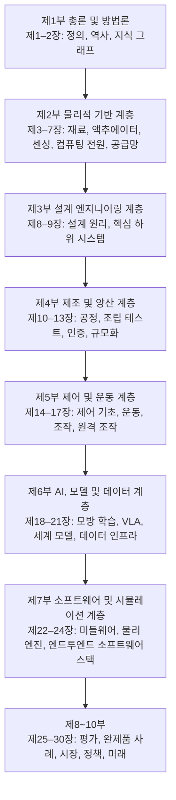
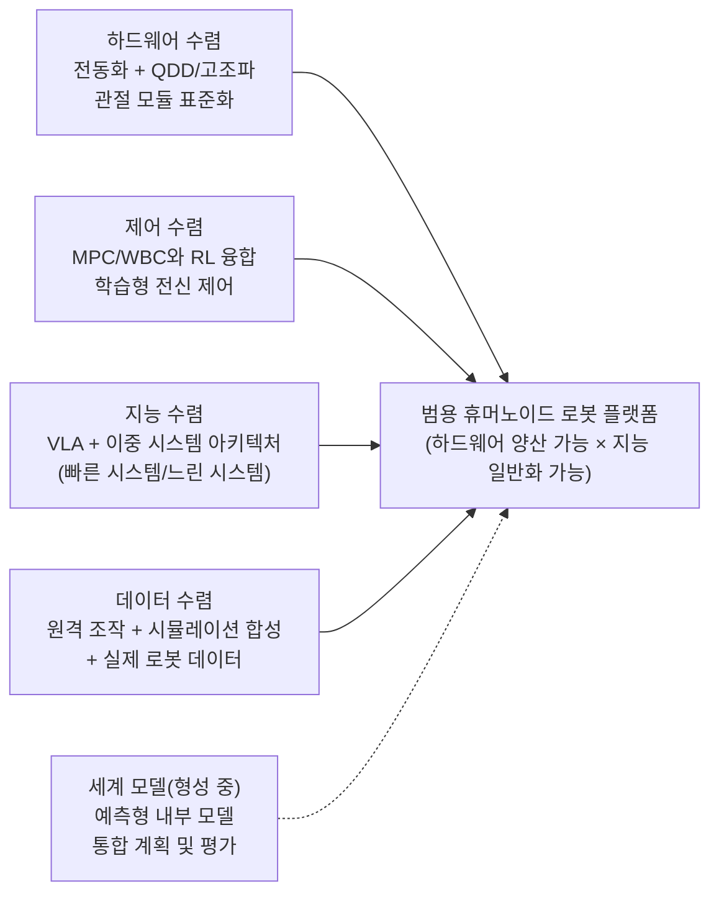
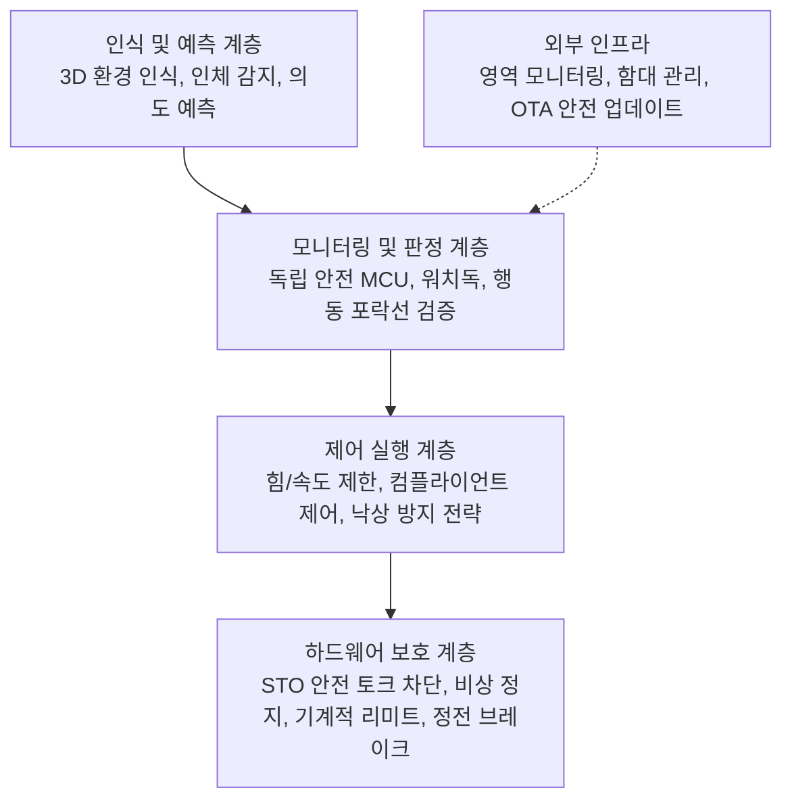
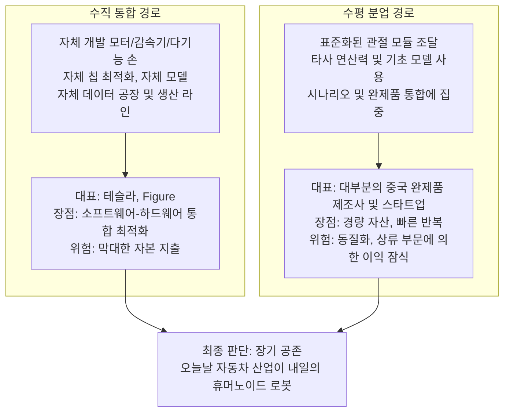
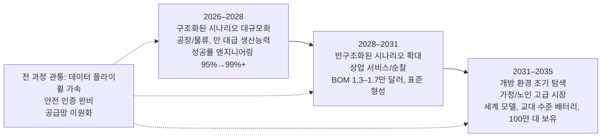

# 제 30장 미래 전망

## 요약

이 장은 이 책의 마무리 장입니다. 앞선 29개 장은 "물리적 기반—설계 엔지니어링—제조 양산—제어 운동—AI와 데이터—소프트웨어 시뮬레이션—평가 검증—완제품 시장—정책 윤리"라는 주축을 따라 휴머노이드 로봇의 재료, 액추에이터, 센싱, 컴퓨팅, 공급망, 하위 시스템, 공정, 알고리즘 및 시장을 체계적으로 분석했습니다. 이 장에서는 이를 바탕으로 종합적인 전망을 제시합니다. 먼저 이 책의 전체적인 흐름을 되돌아보고 기술 성숙도(Technology Readiness Level, TRL) 프레임워크를 사용하여 각 계층 기술의 위치를 점검합니다. 이후 진행 중인 네 가지 기술 수렴(하드웨어 형태, 운동 제어, 지능 아키텍처 및 데이터 파이프라인의 수렴)과 세계 모델(World Model)이 차기 집결점이 될 가능성에 대해 논의합니다. 다음으로 아직 해결되지 않은 네 가지 근본적인 난제(일반화(Generalization), 안전(Safety), 비용(Cost), 에너지(Energy))를 심층 분석하고 정량화된 제약 조건 분석을 제시합니다. 그런 다음 산업 구도의 진화 방향(수직 통합과 수평 분업의 경쟁, 희토류 및 공급망 제약, 데이터 플라이휠(Data Flywheel)이 형성하는 새로운 경쟁 장벽 포함)을 설명합니다. 마지막으로 2026–2035년의 5~10년 로드맵을 제시하여 각 단계의 주요 이정표, 측정 지표 및 로드맵을 변경할 수 있는 변수를 명확히 하고, "구체적 범용 지능(Embodied General Intelligence, EGI)"으로 이 책을 마무리합니다. 이 장의 입장은 공학적으로 신중합니다. 모든 예측에는 가정과 불확실성이 표시되며, 업계 상식적인 수치는 "일반적으로", "대개"와 같은 표현으로 서술되고, 분석가의 예측과 검증된 사실은 엄격히 구분됩니다.

**핵심어**: 기술 수렴; 일반화; 기능 안전; BOM 비용; 에너지 지속 시간; 세계 모델; 데이터 플라이휠; 로봇 서비스; 산업 구도; 로드맵; 구체적 범용 지능

---

## 30.1 마무리 관점: 이 책의 전체 흐름과 기술 성숙도 점검

### 30.1.1 이 책의 10개 부분 논리적 주축

휴머노이드 로봇은 전형적인 "풀스택" 엔지니어링 대상입니다. 그 능력의 상한은 재료 물리학에 의해 결정되고, 하한은 제조 공정에 의해 결정되며, 능력이 실제 가치를 창출할 수 있는지 여부는 시장과 정책에 의해 결정됩니다. 이 책의 10개 부분 구조는 본질적으로 이 대상을 하향식으로 계층별 분석한 것입니다.



이 구조는 중요한 사실을 반영합니다. **어느 한 계층의 병목 현상이 전체 로봇의 병목 현상이 됩니다.** 네오디뮴-철-붕소 자석의 보자력은 관절 모터의 피크 토크 밀도를 결정하고(제3장), 관절 모듈의 백래시와 강성은 전신 제어(Whole-Body Control, WBC)의 대역폭 상한을 결정하며(제9, 14장), 배터리 에너지 밀도는 지속 시간과 수행 가능한 작업 시간을 결정하고(제6장), 데이터 규모와 다양성은 시각-언어-행동 모델(Vision-Language-Action, VLA)의 일반화 경계를 결정합니다(제19, 21장). 향후 5년간의 기술 발전은 단일 돌파구보다는 이러한 "다계층 협력 추진" 형태일 가능성이 높습니다.

### 30.1.2 시제품에서 제품으로: 일곱 가지 도약 재검토

제1장에서는 "0에서 1로의 일곱 가지 도약(Seven Transitions from 0 to 1)" 프레임워크를 소개했습니다. 휴머노이드 로봇이 연구실 시제품에서 판매 가능한 제품이 되기 위해서는 **기술, 시스템, 공급망, 제조, 비용, 검증 및 시장**이라는 일곱 가지 차원의 도약을 순차적으로 완료해야 합니다. 이 책의 결론에서 되돌아볼 때, 이 프레임워크의 가치는 2023–2026년의 "데모 붐"이 산업 성숙도를 직접적으로 의미하지 않는 이유를 설명한다는 점에 있습니다.

- **기술 도약**: 단일 기술(보행, 파지)이 통제된 조건에서 사용 가능함 — Atlas, Optimus, Figure 02, Unitree H1/G1 등 수많은 데모를 통해 입증됨.
- **시스템 도약**: 인지, 의사 결정, 실행, 에너지, 열 관리가 전체 로봇에서 장시간 무고장으로 협력함 — 현재 업계 평균 무고장 시간은 여전히 핵심적인痛点이며, 일반적으로 "월" 단위가 아닌 "일" 단위로 측정됨.
- **공급망 도약**: 하모닉 드라이브, 행성 롤러 스크류, 토크 센서 등 핵심 부품이 "맞춤형 부품"에서 "기성 부품"으로 변화함 — 현재 진행 중(제7장).
- **제조 도약 및 비용 도약**: 수동 조립에서 생산 라인 택트 제조로 전환, BOM 비용 하락 추세 진입(30.5절 참조).
- **검증 도약**: 표준 부재 상태에서 인증 가능한 안전 및 성능 체계 형성으로 전환 — 격차가 가장 큼(30.4절 참조).
- **시장 도약**: 정부 및 연구 기관 구매에서 실제 비용을 지불하는 산업 및 상업 고객으로 전환 — Figure AI의 BMW 공장 11개월 배치, UBTECH Walker S의 자동차 공장 주문은 초기 신호임.

지식 그래프의 "데모 지표와 제품 지표 간의 격차(Demo-to-Product Gap)" 개념은 이러한 현실을 정확하게 묘사합니다. 데모에 최적화된 지표(단일 성공률, 시각적 효과)와 제품에 최적화된 지표(MTBF, 유지보수성, 인증 준수, 단위 경제성) 사이에는 체계적인 차이가 존재합니다. 이 격차를 극복하는 것이 향후 5~10년간 산업의 주요 과제입니다.

### 30.1.3 기술 성숙도 점검: 각 계층 기술의 현재 위치

아래 표는 TRL 1–9의 일반적인 의미(TRL 4 = 실험실 검증, TRL 6 = 관련 환경 데모, TRL 9 = 실제 환경 장기 운영)를 사용하여 이 책의 각 계층 기술을 신중하게 점검한 것입니다. 등급은 편집자의 종합적인 판단이며, 정확한 측정이 아닌 추세 참고용입니다.

| 기술 계층 | 대표 기술 | 현재 TRL(약) | TRL 9 달성을 위한 핵심 제약 조건 |
|---|---|---|---|
| 구조 및 기능 재료 | 네오디뮴-철-붕소, 알루미늄 합금, 엔지니어링 플라스틱 | 9 | 희토류 공급 및 중희토류 감량화 |
| 액추에이터 | 프레임리스 토크 모터 + 하모닉/유성, 준직구동(QDD) | 7–8 | 수명, 백래시 일관성, 비용 |
| 정교한 손 | 텐던 구동/링크 구동 다지 손 | 5–7 | 내구성, 촉각 폐쇄 루프, 비용 |
| 센싱 및 인지 하드웨어 | 깊이 카메라, IMU, 6축 힘 센서 | 8 | 촉각 어레이의 견고성 및 표준화 |
| 컴퓨팅 및 전원 | Jetson Thor급 엣지 컴퓨팅, 리튬 배터리 팩 | 7–8 | 컴퓨팅 전력 대비 성능비, 에너지 밀도 |
| 이족 보행 운동 제어 | MPC+WBC, 강화 학습 보행 | 7–8 | 복잡한 지형 견고성, 낙상 회복 |
| 이동 조작(Loco-Manipulation) | HOVER, ASAP, ExBody2형 전신 정책 | 5–6 | 접촉이 많은 작업의 신뢰성 |
| 작업 수준 지능 | VLA(RT-2, OpenVLA, π0, GR00T N1) | 4–6 | 일반화, 장시간 시퀀스, 성공률 |
| 세계 모델 | 비디오 생성형 세계 모델, 1X/Humanoid World Models | 3–5 | 물리적 일관성, 장기 예측 |
| 양산 공정 | 관절 모듈 생산 라인, 완제품 조립 | 5–7 | 수율, 택트 타임, 테스트 지그 |
| 안전 인증 체계 | ISO 13482, ISO/TS 15066 적용 | 3–5 | 휴머노이드 전용 표준 부재 |

이 표는 이 책의 결론 중 하나를 보여줍니다. **휴머노이드 로봇 산업의 약점은 "움직일 수 있는지"가 아니라 "안정적이고 안전하며 저렴하게 장기간 작동할 수 있는지"에 있습니다.** 향후 10년간의 기술 발전은 주로 표에서 TRL ≤ 6인 항목을 중심으로 이루어질 것입니다.

## 30.2 기술 수렴 추세

산업이 탐색기에서 엔지니어링 단계로 진입할 때 가장 두드러진 신호는 기술 경로의 수렴입니다. 경쟁자들이 각자 다른 길을 가는 것이 아니라 몇 가지 핵심 아키텍처 선택에 합의하는 것입니다. 2024~2026년, 휴머노이드 로봇 분야에서는 네 가지 명확한 수렴과 하나의 형성 중인 수렴이 나타났습니다.



### 30.2.1 하드웨어 형태 수렴: 전동화, 준직구동 및 관절 모듈화

유압 경로(초기 Atlas가 대표적)는 신세대 휴머노이드 로봇에서 사실상 퇴출되었으며, 전기 구동이 합의가 되었습니다. 전기 구동 내에서 산업은 두 가지 주류 기술 경로로 더욱 수렴하고 있습니다:

- **고감속비 경로**: 프레임리스 토크 모터(Frameless Torque Motor) + 고조파 감속기(Harmonic Reducer) 또는 정밀 유성 감속기, 출력단에 엔코더와 토크 센서를 장착. 미국 은행 연구소(Bank of America Institute)가 2025년 4월 발표한 《Humanoid Robots 101》 보고서에 따르면, 고조파 감속기는 현재 휴머노이드 로봇 회전 액추에이터의 주요 선택지 중 하나이며, 선형 액추에이터는 일반적으로 유성 롤러 나사(Planetary Roller Screw)를 사용합니다.
- **준직구동 경로(Quasi-Direct Drive, QDD)**: 저감속비(일반적으로 6–10:1) + 대토크 아웃러너 모터, 전류 루프를 통해 본체 순응성과 투명 힘 제어를 구현. 대표적인 솔루션은 지식 그래프 "준직구동 액추에이터" 항목과 그것이 사족 및 휴머노이드 플랫폼으로 확산된 것을 참조. 직렬 탄성 액추에이터(Series Elastic Actuator, SEA)는 중간 경로로서 정밀한 힘 제어와 충격 저항이 필요한 관절에서 여전히 채택되고 있습니다.

더 깊은 수준의 수렴은 **집적도**에서 발생합니다: 모터, 감속기, 이중 엔코더, 토크 센서, 드라이버, 브레이크가 표준화된 "관절 모듈(Joint Module)"(9장)로 통합되어, 완성체 제조사는 블록을 쌓듯 다양한 구성을 가진 로봇을 구축할 수 있게 되었습니다. 이러한 "모듈화" 추세는 스마트폰 산업의 "카메라 모듈화"와 매우 유사하며, 경쟁의 초점을 개별 부품에서 시스템 통합 및 소프트웨어로 전환시킵니다.

### 30.2.2 운동 제어 수렴: 모델 기반 제어에서 학습형 전신 제어로

이족 보행 제어는 세 가지 세대의 패러다임을 거쳤습니다: 영점 모멘트(Zero-Moment Point, ZMP)와 캡처 포인트(Capture Point)로 대표되는 단순화된 모델 계획(14, 15장); 모델 예측 제어(MPC) + 계층적 2차 계획 전신 제어(Hierarchical QP WBC)로 대표되는 최적화 제어; 그리고 강화 학습(RL)으로 대표되는 학습형 제어. 현재의 수렴 방향은 "누가 누구를 대체하는가"가 아니라 **계층적 융합**입니다:

- 하위 계층(1 kHz급): 관절 서보 및 힘 제어, 여전히 고전적 제어의 영역;
- 중간 계층(50–500 Hz): RL로 훈련된 전신 정책, 보행, 균형 회복 및 전신 조정을 담당. HOVER 범용 휴머노이드 컨트롤러, ASAP 프레임워크, ExBody2 등의 연구는 단일 정책 네트워크가 이미 보행, 달리기/점프, 전신 원격 조작 추적 등 여러 모드를 동시에 지원할 수 있음을 보여줍니다;
- 상위 계층(1–10 Hz): 모델 기반 계획 또는 학습 기반 고급 정책, 작업 분해 및 접촉 타이밍을 담당.

2025년에 발표된 리뷰 논문 《A Survey of Behavior Foundation Model》은 이러한 추세를 "행동 기초 모델(Behavior Foundation Model)"로 더욱 일반화합니다: 각 기술에 대해 개별적으로 훈련된 정책을 대체하는 대규모 사전 훈련된 전신 제어 모델을 사용하여, 운동 능력이 언어 모델처럼 프롬프트와 미세 조정을 통해 전이될 수 있도록 합니다. 이는 18–19장에서 설명하는 정책 학습 흐름과 자연스럽게 연결됩니다. 즉, **운동 계층의 "GPT 순간" – 즉 범용 운동 정책의 출현 – 은 향후 5년 동안 가장 주목할 만한 수렴 사건 중 하나입니다**.

### 30.2.3 지능 아키텍처 수렴: VLA와 이중 시스템 패러다임

작업 수준 지능의 아키텍처 수렴은 더욱 빠르게 진행되고 있습니다. RT-1(Robotics Transformer)과 RT-2가 시각-언어 모델을 직접 동작을 출력하는 VLA로 확장한 이후, OpenVLA, Octo 통달 정책, Physical Intelligence의 π0, NVIDIA GR00T N1, Google의 Gemini Robotics 등의 연구가 2년 내에 집중적으로 등장하여 사실상의 아키텍처 합의를 빠르게 형성했습니다:

1. **백본 네트워크 재사용**: 인터넷 규모의 시각-언어 사전 훈련 모델을 백본으로 사용하여 의미론적 사전 지식을 계승;
2. **동작 청킹(Action Chunking)**: 한 번에 미래 동작 시퀀스를 예측(ACT, 확산 정책(Diffusion Policy) 모두 채택), 반응성과 평활성의 균형 유지;
3. **이중 시스템(System 1 / System 2)**: 저주파 "느린 시스템"은 언어 이해, 작업 계획 및 추론을 담당하고, 고주파 "빠른 시스템"은 의도를 연속 동작으로 변환 – GR00T N1은 명확히 이 분업을 채택하고 있으며, Gemini Robotics 등 시스템도 유사한 구조를 보임;
4. **교차 본체 사전 훈련 + 본체 적응**: Open X-Embodiment와 같은 다중 본체 데이터셋에서 사전 훈련한 후, 특정 휴머노이드 본체로 전이.

!!! note "용어 설명: VLA, 동작 청킹, 이중 시스템, 교차 본체 전이"
    - **VLA(Vision-Language-Action)**: 시각 관측과 언어 명령을 로봇 동작으로 매핑하는 대규모 모델로, "시각-언어 모델(VLM)"을 동작 공간으로 확장한 것.
    - **동작 청킹(Action Chunking)**: 정책이 매번 단일 동작 대신 미래 \(H\) 단계의 동작 \(\{a_t,\dots,a_{t+H-1}\}\)을 출력하여 누적 오차와 결정 빈도를 낮춤.
    - **이중 시스템(System 1/System 2)**: 인지 과학에서 차용한 은유로, System 2는 느리고 깊이 생각하며, System 1은 빠르게 반응함; 로봇에서는 "계획 모델 + 반응형 정책"의 캐스케이드에 해당.
    - **교차 본체 전이(Cross-Embodiment Transfer)**: 다양한 로봇 팔/휴머노이드 로봇 데이터를 공동으로 훈련하여, 정책이 특정 하드웨어에 덜 의존적인 조작 사전 지식을 얻도록 함.

### 30.2.4 데이터 파이프라인 수렴: 원격 조작, 시뮬레이션 및 실제 데이터의 비율

데이터 측면의 수렴은 "삼원 혼합" 파이프라인의 표준화로 나타납니다(21장에서 상세히 설명):

- **원격 조작 수집**: ALOHA, Mobile ALOHA 저가형 양팔 원격 조작 플랫폼, UMI 핸드헬드 그리퍼 인터페이스, HumanPlus의 섀도우 팔로잉(Shadowing) 시스템은 인간 시연 데이터 수집 비용을 1–2 자릿수 낮췄습니다;
- **시뮬레이션 합성**: NVIDIA Isaac Sim/Isaac Lab, MuJoCo 및 그 Playground, Genesis 생성형 물리 엔진은 대규모 병렬 데이터 생성과 도메인 무작위화(Domain Randomization)를 제공하며, MimicGen과 같은 시스템은 "소량의 인간 시연 + 프로그램적 증강"의 증폭 경로를 보여줍니다;
- **실제 로봇 데이터 환류**: DROID와 같은 "야생" 조작 데이터셋과 Open X-Embodiment 다중 본체 컬렉션은 실제 분포의 앵커 포인트를 제공하며, AgiBot World Colosseo는 완성체 제조사가 자체적으로 수백만 건의 실제 궤적 데이터 팩토리를 구축하는 방향을 보여줍니다.

일반적으로 현재 주류 VLA 훈련에서 실제/합성 데이터 비율은 크게 차이가 나지만(합성이 대다수), 일반화 상한을 결정하는 것은 종종 그 실제 데이터의 **다양성**이지 양이 아닙니다. 이러한 "비율 예술"은 가까운 미래에도 여전히 각 사의 핵심 노하우(know-how)로 남을 것입니다.

### 30.2.5 세계 모델: 다음 집결지

VLA가 "주어진 명령에 따라 어떻게 행동할 것인가"를 해결한다면, 세계 모델(World Model)은 "행동 후 세상이 어떻게 될 것인가"를 해결합니다. 1X의 세계 모델 챌린지(World Model Challenge), Humanoid World Models 등의 연구는 비디오 생성 모델을 사용하여 행동의 결과를 예측하는 것을 탐구합니다; NVIDIA가 발표한 Cosmos 3 개방형 세계 기초 모델은 시각 추론, 다중 모달 생성 및 동작 예측을 결합하여 물리적 AI가 "먼저 생각하고 행동하도록" 시도합니다.

세계 모델의 전략적 중요성은 **현재 분리된 세 가지 단계를 통합**할 가능성에 있습니다:

1. **계획**: 내부 모델에서 여러 동작 시퀀스의 결과를 "상상"하고 최적의 것을 선택하여 실행(즉, 모델 기반 정책 평가);
2. **평가**: 시뮬레이션 방식의 생성 환경에서 정책에 대한 안전하고 저렴한 폐쇄 루프 테스트를 수행하여 실제 평가의 고비용과 위험을 완화(25장);
3. **데이터**: 물리 법칙을 준수하는 훈련 데이터를 생성하여 실제 데이터와 상호 보완.

현재 비디오 생성형 세계 모델은 접촉이 많은 조작 작업에서 물리적 일관성 부족 문제가 여전히 존재하며(예: 파지 후 물체 자세를 정확하게 예측하기 어려움), 성숙하려면 3D 표현, 촉각 양식 및 미분 가능 물리의 추가 융합이 필요할 가능성이 높습니다(20장). 그러나 산업 신호로 볼 때, 주요 플레이어들은 모두 세계 모델을 차세대 플랫폼의 필수 경쟁 영역으로 지정하고 있습니다.

## 30.3 해결되지 않은 난제 중 하나: 일반화

### 30.3.1 일반화의 네 가지 수준

일반화(Generalization)는 "시연"과 "제품" 사이에 가로놓인 첫 번째 깊은 골짜기입니다. 휴머노이드 로봇에 필요한 일반화는 적어도 네 가지 수준을 포함하며, 난이도는 점차 증가합니다:

| 수준 | 의미 | 현재 상태 |
|---|---|---|
| 물체 일반화 | 본 적 없는 물체의 파지 및 조작 | 부분 구현: 대규모 데이터에서 일반적인 물체 범주에 유효 |
| 자세/배치 일반화 | 물체 위치, 조명, 배경 변화에도 성공 | 기본적으로 사용 가능하나, 경계 상황에서 실패율 높음 |
| 작업 일반화 | 언어로 설명된 새로운 작업에 합리적인 동작 시퀀스 조합 | 초기 구현: VLA는 본 적 있는 기술을 조합할 수 있으나, 장시간 시퀀스 작업 성공률 낮음 |
| 환경/본체 일반화 | 새로운 장소, 새로운 로봇 본체로 전이 | 연구 최전선: 본체 간 전이는 여전히 미해결 문제 |

경험적 법칙은 다음과 같습니다: **일반화 수준이 하나 올라갈 때마다 필요한 데이터 양은 대략 한 자릿수 증가합니다**. 이는 "물 한 잔 따르기" 시연이 이미 흔한 반면, "낯선 주방에서 식사 준비하기"가 여전히 먼 이유를 설명합니다. 후자는 네 가지 일반화 수준이 동시에 성립해야 하며, 실패는 곱셈으로 누적됩니다: 단계 성공률이 \(p\)일 때, \(n\)단계 작업의 전체 성공률은 약 \(p^n\)입니다. \(p=0.95\), \(n=50\)일 때 전체 성공률은 8% 미만입니다. 90%의 전체 성공률을 달성하려면 단계 성공률이 99.8% 이상이어야 합니다. 이 간단한 곱셈 법칙은 "시연은 훌륭하지만 제품은 신뢰할 수 없다"는 모든 현상을 이해하는 첫 번째 열쇠입니다.

### 30.3.2 데이터 규모와 조합 일반화: 정량적 관점

학습 이론에서 볼 때, 분포 외(Out-of-Distribution, OOD)에서의 정책 오차는 형식적으로 다음과 같이 분해될 수 있습니다:

$$
\mathbb{E}_{\mathcal{D}_{test}}[\ell(\pi)] \;\le\; \mathbb{E}_{\mathcal{D}_{train}}[\ell(\pi)] \;+\; d\big(\mathcal{D}_{train}, \mathcal{D}_{test}\big) \;+\; \mathcal{O}\!\left(\sqrt{\frac{\log |\Pi|}{N}}\right)
$$

여기서 \(\mathcal{D}_{train}\), \(\mathcal{D}_{test}\)는 훈련 및 배포 분포, \(d(\cdot,\cdot)\)는 두 분포 간의 어떤 차이 측도, \(|\Pi|\)는 정책 클래스의 유효 용량, \(N\)은 샘플 수입니다. 이 부등식은 세 가지 상호 보완적인 오차 감소 경로를 제시합니다: **실제 데이터 범위 확대**(\(d\) 감소), **샘플 수 증가**(세 번째 항 감소), 그리고 **구조화된 사전 지식 도입**(\(|\Pi|\) 감소, 예: 계층적 정책, 기술 원시 동작 또는 기호 계획을 통한 탐색 공간 제약). 신경-기호 추론(Neuro-Symbolic Reasoning)과 작업 계획(Task Planning)의 부흥은 본질적으로 세 번째 경로의 구현입니다.

언어 모델과 달리, 로봇 데이터의 "토큰"은 물리적 상호작용을 통해 생성되어야 하며, 인터넷에서 무한히 가져올 수 없습니다. 따라서 "로봇 분야의 스케일링 법칙이 존재하는지, 지수는 무엇인지"는 여전히 미해결 문제입니다. 대부분의 경험적 관찰은 "성능이 데이터 양에 따라 로그-선형적으로 증가하며, 실제 다양성이 부족할 때 조기 포화된다"는 판단을 지지합니다.

### 30.3.3 Sim-to-Real 격차의 장기성

Sim-to-Real 전이(Sim-to-Real Transfer)는 도메인 무작위화, 도메인 적응(Domain Adaptation) 및 시스템 식별을 통해 이족 보행 운동 제어에서 공학적 수준의 성공을 거두었습니다. 이는 주로 동역학 시뮬레이션의 오차가 무작위화와 온라인 적응을 통해 흡수될 수 있기 때문입니다. 그러나 조작 작업에서는 접촉 역학, 마찰, 유연체 및 시각적 렌더링의 잔차로 인해 순수 시뮬레이션 정책을 직접 배포하기가 여전히 어렵습니다. VIRAL 등의 연구는 대규모 시각 Sim-to-Real이 이동 조작에서 진전을 보여주었지만, 업계의 합의는 다음과 같습니다: **시뮬레이션은 계속해서 "데이터 증폭기" 및 "안전 시험장" 역할을 할 것이며, 실제 데이터의 대체재는 아니다**. 격차를 해소하기 위한 장기적인 해결책은 세 가지의 결합에서 비롯될 수 있습니다: 더 현실적인 미분 가능 물리, 생성적 세계 모델이 제공하는 시각적 사전 지식, 그리고 실제 데이터 피드백에 의한 시뮬레이션 매개변수 보정(디지털 트윈(Digital Twin)).

### 30.3.4 미해결 문제 목록

일반화 방향에서 향후 5~10년 동안 지속적으로 주목할 만한 미해결 문제는 다음과 같습니다:

- 장시간 시퀀스 작업의 **계층화**(기술 라이브러리 + 계획)와 **엔드-투-엔드**(단일 네트워크 + 규모화) 중 어느 것이 먼저 제품 수준의 신뢰성에 도달할 것인지에 대한 논쟁;
- 실패 감지 및 복구: 정책이 인간처럼 "자신이 실패하고 있음을 인지"하고 중단하거나 도움을 요청할 수 있는지;
- 지속적 학습(Continual Learning): 배포 후 파국적 망각 없이 새로운 작업을 흡수하는 것;
- 일반화의 **측정** 자체: HumanoidBench, LIBERO/LIBERO-Plus, ManiSkill 및 "휴머노이드 로봇 기초 모델 벤치마크" 등의 벤치마크가 평가 프로토콜을 표준화하고 있지만, "벤치마크 점수 높음 = 실제 배포 성공"은 아직 성립하지 않습니다.

## 30.4 미해결 난제之二: 안전

### 30.4.1 휴머노이드 로봇 안전 문제의 특수성

휴머노이드 로봇의 안전 과제는 구조적으로 산업용 로봇 암 및 협동 로봇(Cobot)과 다릅니다:

1. **동적 불안정성**: 이족 보행 플랫폼 자체가 지속적인 균형 제어 상태에 있으며, 컨트롤러 오류, 지면 교란 또는 전력 차단으로 인해 전체 기기가 넘어질 수 있습니다. 일반적인 풀사이즈 휴머노이드 로봇의 질량은 50–90 kg으로, 넘어질 때의 충격은 협동 로봇 암의 접촉 손상 수준을 훨씬 상회합니다.
2. **공동 영역 작업**: 그 설계 가치는 바로 인간을 위해 구축된 비정형 공간에 진입하는 데 있으며, 산업용 로봇처럼 펜스로 격리할 수 없습니다.
3. **전신 접촉**: 이동 조작은 손, 팔, 몸통, 다리가 모두 인간과 의도치 않게 접촉할 수 있음을 의미하며, 말단에만 동력 및 힘 제한(Power and Force Limiting)을 적용하는 것으로는 충분하지 않습니다.
4. **AI 불확실성**: 학습 기반 전략의 행동은 완전히 검증하기 어렵고, 전통적인 "결함 트리 + 결정론적 테스트" 인증 방법론은 근본적인 도전에 직면합니다.

지식 그래프의 "인간 등가 포락선(Human-Equivalence Envelope)"과 "인간 수준 구동 점수(Human-Level Actuation Score)"는 또 다른 관점을 제공합니다: 로봇의 관절 토크, 속도 및 질량이 인간 수준에 근접할 때, 그 위험성도 "강한 인간"에 근접합니다. 이는 안전 설계가 "능력 제한"에서 "행동 관리"로 전환되어야 함을 요구합니다.

### 30.4.2 표준 체계: 현황과 격차

현재 참조 가능한 표준 체계(12장, 29장에서 상세히 설명)는 다음 표와 같습니다:

| 표준 | 적용 범위 | 휴머노이드 로봇에 대한 한계 |
|---|---|---|
| IEC 61508 | 전기/전자 프로그래밍 가능 시스템의 기능 안전 일반 프레임워크 | 동적 균형 및 AI 의사 결정을 다루지 않음 |
| ISO 13849 | 기계 안전 관련 제어 시스템 성능 레벨(PL) | 결정론적 제어 지향, 학습 전략 평가 어려움 |
| ISO/TS 15066 | 협동 로봇: 동력 및 힘 제한, 속도 및 분리 모니터링 | 고정 베이스 로봇 암의 접촉 한계에 적용되며, 이동형 이족 플랫폼에는 부적합 |
| ISO 13482 | 개인 케어 로봇 안전 | 가장 근접하지만 2014년에 발표되어 VLA/RL 시대의 능력을 다루지 않음 |
| UL / FCC / CE | 지역 시장 접근(전기, EMC, 기계 지침) | 적합성 증명에 필요한 구체적인 휴머노이드 조항 부재 |

결론은 명확합니다: **현재 동적 균형 휴머노이드 로봇을 위한 전용 안전 표준은 존재하지 않습니다.** 업계는 표준 기관과 주요 제조업체가 향후 몇 년 내에 휴머노이드 전용 조항 제정을 추진할 것으로 예상합니다. 그 전까지 완성차 제조업체는 "위험 분석 + 다중 표준 참조 + 제3자 평가"의 조합을 통해 자체적으로 안전을 입증해야 하며, 이는 소비자 시장 진입 장벽을 직접적으로 높입니다.

### 30.4.3 엔지니어링 경로: 계층형 안전 아키텍처

표준 부재 기간 동안 엔지니어링 실무는 "계층형 안전(Layered Safety)" 아키텍처로 수렴되고 있습니다:



- **인식 계층**: 안전 인증 3D 센싱이 등장하고 있습니다. 예를 들어 Sonair가 출시한 안전 인증 3D 초음파 센서는 인간-로봇 협업 공간에서 신뢰할 수 있는 인체 감지를 목표로 합니다.
- **모니터링 계층**: 주 컴퓨팅 스택과 독립적인 안전 마이크로컨트롤러(Safety MCU)가 AI 결정이 "행동 포락선"(속도, 힘, 작업 영역)을 벗어나는지 지속적으로 검증합니다. FORT Robotics와 NVIDIA Halos의 협업은 "외부에서 내부로(Outside-In)" 안전 모니터링 접근 방식을 보여줍니다. 안전 결론은 AI 내부 상태에 의존하지 않고 독립적인 채널 관찰 및 판정에 의해 이루어집니다.
- **제어 계층**: 임피던스 제어(Impedance Control)와 어드미턴스 제어(Admittance Control)는 접촉 컴플라이언스를 제공합니다. 전용 낙상 방지 전략(예: 팔 접기, 무릎 굽히기, 옆으로 넘어지기)이 연구 주제가 되고 있습니다.
- **하드웨어 계층**: 안전 토크 차단(STO), 정전 브레이크 및 기계적 리미트가 최후의 방어선 역할을 합니다.

이 아키텍처의 사상적 핵심은 고전적인 "**심층 방어(Defense in Depth)**"입니다: 어떤 단일 요소(특히 AI)도 항상 올바르다고 가정하지 않습니다.

### 30.4.4 책임, 보험 및 사회적 수용

기술적 안전 외에도 제품 책임(Product Liability) 프레임워크의 부재는 상업화를 제약합니다: 학습형 로봇이 손해를 발생시켰을 때, 책임은 완성차 제조업체, 모델 제공자 또는 배치자에게 있습니까? 29장에서 이미 정책과 윤리에 대해 체계적으로 논의했으므로, 여기서는 한 가지만 지적합니다: 보험 계리에는 정량화 가능한 고장률 데이터가 필요하며, 이는 대규모 실제 배치를 요구합니다. 따라서 "보험 없이는 배치를 못하고, 배치 없이는 보험 데이터가 없다"는 순환이 발생합니다. RaaS 모델(30.5.4 참조)은 로봇을 제조업체의 자산표에 유지하고 제조업체가 운영 및 책임을 통일적으로 부담함으로써 현재 이 순환을 해결하는 현실적인 경로입니다. 개인정보 및 생체特征 데이터(가정 내 카메라, 음성)의 거버넌스는 가정 환경에서 피할 수 없는 또 다른 장벽입니다.

## 30.5 미해결 난제 3: 비용

### 30.5.1 BOM 비용 궤적과 학습 목표

비용은 휴머노이드 로봇이 '천 대 단위 시범'에서 '백만 대 단위 산업'으로 나아가는 결정적 변수입니다. 《Humanoid Robots 101》이 제시한 분석가 추정에 따르면, 2025년 말 기준 일반적인 휴머노이드 로봇의 BOM(자재 명세서) 비용은 약 35,000달러/대(16개의 회전 액추에이터, 14개의 선형 액추에이터, 하모닉 드라이브, 행성 롤러 스크류, 6자유도 정교한 손, 깊이 카메라와 LiDAR 각 1개, 주로 중국산 부품 가정)이며, 규모의 효과와 부품 설계 개선에 힘입어 2030~2035년에는 13,000~17,000달러/대로 낮아질 것으로 예상됩니다. 이는 연평균 약 14%의 감소율을 의미합니다. 시장 측의 가격 신호는 더욱 공격적입니다. Unitree G1은 16,000달러부터 시작하는 가격으로 연구 및 경량 상업 시장을 직접 공략하고 있습니다.

세 가지 가격 개념을 구분하여 홍보 숫자에 오도되지 않도록 주의해야 합니다.

- **BOM 비용**: 부품 조달 비용으로, 제조, 연구개발 상각 및 이윤이 포함되지 않습니다.
- **출고가/판매가**: 제조 및 총이익을 포함하며, 연구용 저가형 모델은 일반적으로 토크, 배터리 지속 시간 및 내구성을 희생합니다.
- **TCO(총 소유 비용)**: 유지보수, 에너지 소비, 보험 및 가동 중단 손실을 포함하며, 이것이 고객 의사 결정의 진정한 기준입니다.

### 30.5.2 학습 곡선: 비용 하락의 정량적 모델

제조 비용이 누적 생산량에 따라 감소하는 법칙은 일반적으로 라이트의 법칙(Wright's Law)으로 설명됩니다.

$$
C(N) = C_1 \left(\frac{N}{N_1}\right)^{-b}
$$

여기서 \(N\)은 누적 생산량, \(C_1\)은 누적 생산량 \(N_1\)일 때의 단위 비용, \(b>0\)은 학습 지수입니다. 누적 생산량이 두 배가 될 때마다 비용은 \(2^{-b}\)배(진보율이라고 함)로 감소합니다. 리튬 배터리와 같은 성숙한 품목의 경우 \(b\)는 일반적으로 0.2~0.3 사이입니다. 초기 복잡한 전기기계 제품의 경우 보수적으로 \(b\approx0.15\)(두 배 증가 시 약 10% 비용 절감)를 취하는 것이 더 안전합니다. 아래 Python 계산 예시는 2025년 BOM 35,000달러, 누적 설치 약 16,000대를 시작점으로 하여 15,000달러 목표를 달성하는 데 필요한 누적 생산량을 보여줍니다.

```python
# 라이트의 법칙: 휴머노이드 로봇 BOM 비용 하락에 필요한 누적 생산량 (예시적 추정)
C1, N1 = 35_000, 16_000      # 2025년: BOM ≈ 35,000달러, 누적 설치 ≈ 16,000대
b = 0.15                     # 학습 지수 (보수적取值)

def cost(N):
    return C1 * (N / N1) ** (-b)

for target in (25_000, 20_000, 15_000):
    N_target = N1 * (C1 / target) ** (1 / b)
    print(f"목표 BOM {target:>6,} 달러 -> 필요 누적 생산량 약 {N_target:,.0f} 대")
```

실행 결과는 대략적으로 BOM이 15,000달러로 낮아지려면 누적 생산량이 수백만 대 수준에 도달해야 함을 보여줍니다. 이는 **비용 변곡점의 도달 시점이 본질적으로 수요 측이 지속적인 생산량 두 배 증가를 지원할 수 있는지 여부에 달려 있으며**, 단순한 공학 기술 문제가 아님을 의미합니다. 이 추정치는 \(b\)와 시작 데이터에 매우 민감하므로, 단지 규모의 참고 자료로만 사용해야 합니다.

### 30.5.3 비용 절감 레버리지와 공급망 제약

공학적 측면에서 비용 절감 레버리지는 10~13장에서 이미 체계적으로 논의되었으며, 여기서는 그 우선순위를 요약합니다.

1. **설계 측면**: 제조 용이성 설계(DFM), 조립 용이성 설계(DFA) 및 가치 분석/가치 공학(VA/VE)을 통해 설계 단계에서 비용을 제거합니다. 일반적으로 제품 비용의 70% 이상은 설계가 확정될 때 이미 결정됩니다.
2. **부품 측면**: 관절 모듈, 정교한 손 등 고가 부품의 국산화 및 다중 공급업체화, BOM 비용 공학(BOM Cost Engineering)을 통한 항목별 비용 절감.
3. **제조 측면**: 생산 라인 자동화, 테스트 지그 및 수율 향상.
4. **규모 측면**: 공유 플랫폼 및 모델 간 부품 공유를 통한 연구개발 및 금형 비용 분산.

제약 사항도 명확합니다. 고성능 희토류 영구 자석(네오디뮴-철-붕소)은 중희토류 결정립계 확산 공정에 의존하며, OceanWall의 《Robotics and The Rare Earth Bottleneck》 보고서는 희토류 자석 재료 공급이 휴머노이드 로봇의 대규모화에 있어 상류 병목 현상 중 하나가 될 수 있음을 시사합니다. 정밀 감속기, 행성 롤러 스크류는 고급 공작 기계 생산 능력에 의존합니다(7장). 즉, **비용 곡선은 순수한 함수가 아니라, 동시에 공급망 지정학의 함수이기도 합니다.**

### 30.5.4 비즈니스 모델 혁신: RaaS와 데이터 플라이휠

단일 기계 비용이 단기간에 소비자 수준으로 낮아지기 어려울 때, 비즈니스 모델 혁신이 원활한 전환의 핵심이 됩니다. 로봇 서비스(Robot-as-a-Service, RaaS)는 임대 또는 구독을 통해 일회성 구매를 대체하고, 유지보수, 소프트웨어 업데이트 및 로봇 차량 관리를 패키지로 제공합니다. 고객에게는 자본 지출을 운영 지출로 전환하여 도입 장벽을 낮춥니다. 제조업체에게는 자산 소유권을 유지함으로써 **데이터 소유권**을 유지합니다. 이를 통해 차량 데이터 플라이휠(Fleet Data Flywheel)이 시작됩니다. 배치된 각 로봇은 실제 데이터를 지속적으로 반환하여 모델을 개선하고 성능과 신뢰성을 향상시켜 더 큰 규모의 배치를 지원합니다. 따라서 RaaS는 재무적 배치일 뿐만 아니라 데이터 전략의 조직 형태이기도 합니다(30.7.4 참조).

## 30.6 미해결 난제 4: 에너지

### 30.6.1 배터리 지속 시간 제약의 정량적 분석

에너지는 네 가지 미해결 난제 중 물리적 제약이 가장 엄격한 것입니다. 배터리 지속 시간은 배터리 에너지와 평균 전력 소비에 의해 직접 결정됩니다.

$$
T_{run} \approx \frac{\rho_e \cdot m_b \cdot \eta_{sys}}{\bar{P}}
$$

여기서 \(\rho_e\)는 배터리 비에너지, \(m_b\)는 배터리 질량, \(\eta_{sys}\)는 시스템 레벨 방전 효율(BMS 손실, 전압 변환 및 심방전 제한 포함), \(\bar P\)는 기계 전체의 평균 전력입니다. 6장의 NCR18650B급 NCA 셀을 예로 들면, 비에너지는 약 243 Wh/kg입니다. 배터리 팩 질량이 3kg, 사용 가능 계수가 0.85, 기계 전체 평균 전력이 350W(일반적으로 보행 및 경부하 작업 시 300~500W 범위)라면 배터리 지속 시간은 약 1.8시간입니다. 이는 현재 시판되는 풀사이즈 휴머노이드 로봇의 일반적인 공칭 배터리 지속 시간인 약 2시간과 일치합니다. **공장 한 교대(8시간) 또는 가정에서의 하루 사용 기대치에 비해 약 4배의 에너지 격차가 존재합니다.**

### 30.6.2 에너지 효율: 운송 비용

이동 효율성을 평가하는 일반적인 무차원 지표는 운송 비용(Cost of Transport, CoT)입니다.

$$
\mathrm{CoT} = \frac{P}{m g v}
$$

즉, 단위 체중, 단위 속도당 전력 소비입니다. 인간 보행의 CoT는 일반적으로 0.2 정도인 반면, 현재 이족 보행 로봇의 보행 CoT는 일반적으로 인간의 수 배입니다. 감속기 마찰, 모터 구리 손실, 자세 제어를 위한 지속적인 작업 및 힘줄과 같은 탄성 에너지 회수 부족이 주요 원인입니다. 액추에이터 수준의 준-직접 구동화(낮은 감속비로 전달 손실 감소), 보행 패턴 수준의 수동 역학 활용, 그리고 직렬 탄성 요소를 통한 에너지 임시 저장은 CoT를 낮추는 세 가지 알려진 경로입니다. 이는 동시에 \(\bar P\)를 낮추고 간접적으로 배터리 지속 시간을 연장하는 수단이기도 합니다.

### 30.6.3 배터리 기술 로드맵: 고니켈, 전고체 및 신속 교체

4배의 에너지 격차를 해소하기 위한 후보 경로는 다음과 같습니다.

- **고니켈/실리콘-탄소 점진적 개선**: 기존 액체 리튬 이온 시스템 내에서 비에너지는 연간 약 3~5%의 속도로 완만하게 증가하며, 신뢰할 수 있지만 단독으로 격차를 해소하기에는 부족합니다.
- **전고체 배터리**: 액체 전해질을 고체 전해질로 대체하여 이론적 비에너지가 기존 시스템을 크게 능가하고 안전성을 개선할 수 있습니다(3장). 업계 분석은 일반적으로 2030년대에 로봇과 같은 고급 응용 분야에 점진적으로 도입될 것으로 예상하지만, 현재 비용과 양산 공정은 아직 성숙하지 않았습니다.
- **신속 교체 배터리 및 자동 충전**: 에너지 밀도를 높이는 대신 '에너지 보충 방식'을 변경합니다. 3분 교체 또는 작업 간격 자동 재충전을 통해 '단일 배터리 지속 시간' 문제를 '보충 인프라' 문제로 전환합니다. 공장 현장의 경우, 이는 일반적으로 배터리 혁명을 기다리는 것보다 더 현실적인 공학적 해결책입니다.

### 30.6.4 시스템 수준의 에너지 절약 설계

에너지 문제는 궁극적으로 시스템 공학 문제입니다. 배터리 용량을 늘리면 기계 전체 질량이 증가하여 보행 전력 소비가 증가합니다. 명확한 **질량-에너지 악순환**이 존재합니다. 따라서 시스템 수준 최적화는 기계 전체 수준에서 수행되어야 합니다(8, 9장). 구조 경량화(마그네슘 합금, 위상 최적화), 저전력 컴퓨팅 플랫폼(Jetson Thor 등 차세대 엣지 컴퓨팅 성능은 연산 능력을 향상시키면서 전력 소비 예산을 제어), 온디바이스 VLA 추론(On-Device VLA Inference)을 통한 클라우드 왕복 통신 에너지 소비 및 지연 시간 방지, 그리고 작업 수준 에너지 계획('에너지 소비'를 작업 계획의 비용 함수에 명시적으로 포함)이 포함됩니다. 일반적으로 기계 전체의 에너지 예산은 질량 예산, 비용 예산과 마찬가지로 설계 초기에 확정되어 하위 시스템으로 단계적으로 분해되어야 합니다.

## 30.7 산업 구도 진화

### 30.7.1 현재 구도: 완제품, 부품 및 연산력의 세 가지 플레이어

2026년 기준, 산업 참여자는 대략 세 가지 유형으로 분류할 수 있습니다(26장, 28장에서 상세히 설명):

| 유형 | 대표 | 경쟁 포인트 |
|---|---|---|
| 완제품 제조사(OEM) | 테슬라(Optimus), Figure AI, 보스턴 다이내믹스(Atlas), Agility(Digit), Apptronik(Apollo), 1X(NEO), 위슈 테크놀로지(G1/H1), 지위안 로봇(원정 A1), 유비테크(Walker S), 푸리에 인텔리전트(GR-1) | 완제품 통합, AI 모델, 데이터 자산, 양산 능력 |
| 핵심 부품 | Harmonic Drive Systems, Nabtesco, maxon, 싼화지콩, 터푸 그룹, 뤼디셰보(Leaderdrive), 후이촨 테크놀로지 등 | 감속기, 볼스크류, 모터, 센서의 일관성 및 비용 |
| 연산력 및 플랫폼 | NVIDIA(Jetson Thor, Isaac, GR00T), 시뮬레이션 및 데이터 도구 체인 업체 | 칩, 시뮬레이션, 기초 모델 및 개발자 생태계 |

시장 데이터(1장과 동일): 2025년 글로벌 휴머노이드 로봇 시장 규모는 약 29~32억 달러, 설치 대수는 약 1만 6000대이며, 이 중 중국 비중이 80%를 초과합니다. 위슈 테크놀로지는 2025년 매출 17억 800만 위안을 기록하며 상하이 증권거래소 과학기술혁신판(科创板) 상장을 추진 중입니다. 지위안 로봇은 2025년 출하량이 Omdia 통계 기준 5168대에 달합니다. 유비테크는 2025년 휴머노이드 로봇 수주가 약 14억 위안에 이릅니다. 테슬라 Optimus Gen 3는 2026년 1월 프리몬트에서 양산을 시작했습니다. Figure AI는 10억 달러 규모의 시리즈 C 자금 조달을 완료하고 BMW 공장에서 11개월간 9만여 개의 부품을 운반하는 실제 배치를 완료했습니다. 이러한 신호들은 공통적으로 **산업 경쟁의 주요 전장이 '누구의 시연이 더 멋진가'에서 '누구의 양산 속도와 실제 배치가 더 빠른가'로 이동했음**을 나타냅니다.

### 30.7.2 수직 통합과 수평 분업의 대립

미래 구도의 핵심 긴장은 **수직 통합(Vertical Integration)과 수평 분업(Horizontal Specialization)** 간의 대립입니다:



역사적 경험(자동차 산업, 스마트폰 산업)에 따르면, 기술이 급변하는 시기에는 수직 통합이 우세하고(소프트웨어-하드웨어 협업의 반복 속도가 모든 것을 압도), 기술이 성숙해지는 시기에는 수평 분업이 우세합니다(규모와 전문화가 비용을 낮춤). 휴머노이드 로봇은 현재 분명히 전자 단계에 있습니다. 이는 주요 제조사들이 일반적으로 액추에이터와 모델을 자체 개발하는 현상을 설명합니다. 그러나 관절 모듈과 기초 모델의 상용화가 진행됨에 따라 후자 단계의 씨앗은 이미 뿌려졌습니다.

### 30.7.3 지리적 요인과 공급망: 희토류 병목 현상 재검토

7장의 공급망 거버넌스 분석은 전망에 지리적 차원을 추가해야 합니다. 휴머노이드 로봇의 '근육'은 희토류 영구 자석에 의존하며, 글로벌 고성능 네오디뮴-철-붕소 생산 능력은 고도로 집중되어 있습니다. OceanWall 보고서 등의 분석은 이미 희토류 자석 재료를 로봇 규모화의 잠재적 병목 현상으로 지목하고 있습니다. 동시에, 고급 칩 수출 통제, 정밀 공작 기계 생산 능력 분포, 그리고 각국의 '로봇 산업 주권'에 대한 정책 지원은 모두 공급망의 지리적 배치를 재편하고 있습니다. 완제품 제조사에게 향후 10년의 공급망 전략 키워드는 다음과 같습니다: **이중 소싱(Dual Sourcing), 핵심 부품 자체 생산/전략적 제휴, 그리고 다양한 시장을 위한 다중 생산지 배치**.

### 30.7.4 데이터 플라이휠: 새로운 경쟁 장벽

하드웨어는 분해하여 모방할 수 있고, 모델 아키텍처는 논문을 통해 공개되지만, **대규모 실제 배치를 통해 축적된 데이터 자산은 복제할 수 없습니다**. 데이터 플라이휠(Data Flywheel) – 배치는 데이터를 생성하고, 데이터는 모델을 개선하며, 모델은 성능을 향상시키고, 성능은 배치를 촉진함 – 은 주요 제조사의 진정한 해자(moat)가 되고 있습니다:

- 플라이휠을 시작하려면 '최소 실행 가능 시나리오'가 필요합니다: 공장 운반, 물류 분류 등 구조화된 작업이 먼저 실제 데이터 토양을 제공합니다.
- 플라이휠의 속도는 데이터 인프라에 따라 달라집니다: 자동 레이블링, 실패 사례 분석, 시뮬레이션 재생 및 재훈련 파이프라인(21장).
- 플라이휠의 해자 효과는 승자독식(Matthew effect) 특성을 가집니다: 선두 기업의 모델은 실제 분포에서 지속적으로 개선되는 반면, 후발 기업은 동일한 알고리즘을 가지고 있더라도 동일한 분포의 데이터가 부족합니다.

향후 5년 동안 '누가 가장 큰 규모의 실제 로봇 데이터 폐쇄 루프를 보유하는가'가 '누구의 논문 점수가 더 높은가'보다 산업 순위를 더 잘 예측할 것으로 예상됩니다.

### 30.7.5 시장 예측의 일치와 불일치

1장에 요약된 여러 기관의 예측을 종합하면: 2025년 시장 규모는 약 30억 달러 수준이며, 2030년에는 100~150억 달러를 돌파할 것으로 예상됩니다(내재 CAGR 약 35~43%). 《Humanoid Robots 101》이 제시한 채택 단계 구분은 다음과 같습니다: 2025~2027년 소규모 산업/물류 파일럿, 2028~2034년 상업 서비스 및 반구조화 환경에서의 규모 채택, 2035년부터 대중 소비 단계 진입, 장기적으로는 매우 낙관적인 보유량 전망을 제시합니다. 이러한 예측을 대하는 올바른 태도는 **'조건부 확률 진술'이지 '약속'이 아니다**라는 점입니다. 예측이 성립하기 위한 조건(비용 하락 곡선, 안전 인증 진행 상황, AI 일반화 돌파)은 바로 이 장의 30.3~30.6절에서 논의된 미해결 과제입니다. 예측 자체의 불일치(2025년 기준 19~32억 달러의 차이)는 또한 이 산업에 통일된 측정 기준이 아직 없으며, 기준(출고가/최종 소비자가, 서비스 포함 여부)의 투명성이 점 추정보다 더 중요함을 시사합니다.

## 30.8 5~10년 로드맵 (2026–2035)

### 30.8.1 로드맵 방법론 선언

이 섹션의 로드맵은 앞서 논의된 기술 수렴 추세, 4대 미해결 과제의 해결 속도, 주요 기관 예측의 교차점을 종합하여 제시됩니다. 이는 세 가지 방법론 원칙을 충족합니다: 첫째, **달력 연도보다 능력 이정표를 주축으로 함** – 연도는 단지 기대치일 뿐, 능력이 논리입니다; 둘째, **신뢰도가 높은 판단과 낮은 판단을 구분** – 구조적 추세(비용 하락, 모듈화)는 신뢰도가 높고, 특정 시점(몇 년에 가정에 진입할지)은 신뢰도가 낮습니다; 셋째, **예측 불가능성을 인정** – 기초 모델의 비선형적 진보와 지정학적 사건 모두 전체 일정을 이동시킬 수 있습니다.

### 30.8.2 단기 (2026–2028): 구조화된 시나리오의 대규모 검증

- **시나리오**: 자동차 및 3C 공장, 창고 물류의 분류/운반/상하차 – 환경이 구조화되고, 작업이 반복적이며, 오류 허용도가 높고, 지불 의사가 명확함;
- **기술 중점**: 이동 조작의 성공률 엔지니어링 (95%에서 99%+로), 장애 복구 및 원격 제어 체계, 생산 라인 택트 매칭;
- **산업 중점**: 만 대급 연간 생산 능력 확대, BOM 2만 달러 구간 하향, RaaS 모델의 단위 경제성 확보;
- **상징적 사건 (후보 판단 기준)**: 단일 고객이 100대 이상 배치하고 재계약; 휴머노이드 로봇 전용 보험 계리 상품 등장; VLA 모델이 제한된 작업군에서 "지루할 정도로 안정적"이 됨.

### 30.8.3 중기 (2028–2031): 반구조화된 시나리오와 비용 변곡점

- **시나리오**: 상업 서비스 (소매 보충, 호텔, 병원 물류), 보안 순찰, 위험 환경 작업 – 공간은 인간을 위해 설계되었지만 작업은 열거 가능함;
- **기술 중점**: 행동 기초 모델이 운동 기술 라이브러리를 통합; 작업 수준 일반화가 단일 작업이 아닌 작업군을 포괄; 안전 인증 체계 초기 형성 (휴머노이드 전용 표준 심의 진입);
- **산업 중점**: BOM 1.3–1.7만 달러 구간에 근접; 누적 생산량 수십만 대 규모 진입, 학습 곡선 효과 발현; 수평 분업 생태계 (모듈, 툴체인, 통합업체) 형성;
- **상징적 사건 (후보 판단 기준)**: 여러 시나리오에서 TCO가 인건비와 같거나 낮아짐; 연간 출하량 10만 대급 단일 모델 등장.

### 30.8.4 장기 (2031–2035): 개방 환경과 가정 시나리오의 초기 탐색

- **시나리오**: 가사 서비스, 노인 돌봄의 초기 고급 시장 – 개방형 환경, 긴 꼬리 작업, 안전과 프라이버시에 가장 민감함;
- **기술 중점**: 세계 모델 기반 계획 및 자기 평가, 지속적 학습, 자연스러운 인간-로봇 상호작용; 고체 배터리 등 차세대 에너지원이 예정대로 성숙하면, 배터리 수명을 "교대 수준"으로 끌어올림;
- **산업 중점**: 소비자용 제품 정의 및 규제 프레임워크 시행; 데이터 프라이버시 거버넌스가 제품 경쟁력의 일부가 됨;
- **상징적 사건 (후보 판단 기준)**: 완전한 안전 인증을 통과하고 구독제로 판매되는 가정용 휴머노이드 로봇 등장; 보유 대수 100만 대 문턱 돌파.



### 30.8.5 주요 이정표와 측정 지표

로드맵은 관찰 가능한 지표로 검증 가능해야 합니다. 다음 KPI를 지속적으로 추적할 것을 권장합니다:

| 차원 | 지표 | 2026년 기준 (약) | 2030년 목표 (약) | 2035년 전망 |
|---|---|---|---|---|
| 신뢰성 | 작업 성공률 (제한된 작업군) | 90–98% | ≥99.5% | ≥99.9% |
| 신뢰성 | 평균 무고장 시간 | 일 단위 | 주–월 단위 | 월 단위 이상 |
| 비용 | 일반 BOM | ~3.5만 달러 | ≤2만 달러 | ≤1.5만 달러 |
| 에너지 | 실제 작업 배터리 수명 | ~2시간 | 4–6시간 | 교대 수준 (8시간) |
| 지능 | 작업군 일반화 (동일군 신규 작업 성공률) | <70% | ≥90% | ≥95% (장시간 포함) |
| 산업 | 글로벌 연간 출하량 | 만 대급 | 십만 대급 | 백만 대급 |
| 표준 | 휴머노이드 전용 안전 표준 | 공백 | 심의/초판 | 인증 체계 성숙 |

표의 숫자는 업계 분석가 추정과 엔지니어링 외삽을 종합한 **목표 구간**으로, 정확한 약속이 아닌 규모를刻画하기 위한 것입니다.

### 30.8.6 로드맵을 변경할 수 있는 변수

마지막으로 로드맵의 주요 위험과 상승 변수를 솔직히 나열해야 합니다:

| 변수 | 방향 | 영향 |
|---|---|---|
| 기초 모델의 비선형적 돌파 (예: 세계 모델 성숙, 교차 본체 일반화 해결) | 상승 | 지능 관련 이정표 전체 2–3년 조기화 |
| 고체 배터리 등 에너지 저장 기술 조기 양산 | 상승 | 가정 및 이동 시나리오 조기 개방 |
| 심각한 안전 사고로 인한 규제 강화 | 하락 | 공동 공간 배치 1–3년 동결 |
| 희토류/칩 공급망 중단 | 하락 | 비용 변곡점 지연, 지역 시장 분열 |
| 거시경제 및 노동 시장 변화 | 양방향 | 지불 의사 및 자본 지출에 영향 |
| 데이터 프라이버시 규제 강화 | 하락 (단기) | 가정 시나리오 데이터 수집 제한, 플라이휠 감속 |

## 30.9 결론: 구현된 일반 지능을 향하여

### 30.9.1 구현된 일반 지능: 이 책의 궁극적인 질문

지식 그래프는 구현된 일반 지능 (Embodied General Intelligence, EGI)을 다음과 같이 정의합니다: 다양한 물리적 환경에서 신체를 통해 유연하게 학습, 추론 및 행동할 수 있는 지능형 에이전트를 구축하는 장기 목표. 책 전체를 되돌아보면, EGI의 모든 퍼즐 조각은 이미 개별적으로 존재합니다: 재료와 액추에이터는 인간에 근접한 "신체"를 제공하고 (인간 등가 포락선은 해마다 수렴 중), VLA는 초기 "작업 이해"를 제공하며, 세계 모델은 "상상력"을 가리키고, 데이터 플라이휠은 "경험 축적 메커니즘"을 제공합니다. **아직 일어나지 않은 것은, 이러한 조각들이 동일한 시스템 내에서, 동일한 시간 척도로 폐쇄 루프 통합되는 것** – 신체, 지각, 상상, 행동이 지속적으로 자기 개선하는 전체를 구성하도록 하는 것입니다.

이것이 바로 휴머노이드 로봇이 독립적인 학문 분야로 서술될 가치가 있는 이유입니다: 이는 기계 공학의 연장선도, AI의 응용 분야도 아니며, **지능이 물리적 신체를 통해 개방 세계에서 스스로를 유지해야 하는** 최초의 공학 대상입니다. 그 미해결 과제 각각 – 일반화, 안전, 비용, 에너지 – 은 본질적으로 "지능"과 "물리"의 경계에서 발생하는 긴장입니다.

### 30.9.2 독자에게 드리는 말

엔지니어에게, 이 책의 29개 선행 장은 여러분의 도구 상자이며, 이 장의 4대 과제는 여러분의 문제 목록입니다; 연구자에게, 30.3–30.6절의 미해결 문제는 5년 단위로 투자할 가치가 있습니다; 창업자와 투자자에게, 30.7–30.8절의 구도와 로드맵은 다음을 시사합니다: 휴머노이드 로봇이라는 장거리 경주에서 **진정한 위험은 기술이 미성숙한 것이 아니라, 잘못된 성숙도 가정 하에 자원을 배치하는 것입니다**. 휴머노이드 로봇은 어느 날 아침 갑자기 도래하지 않을 것입니다. 전기, 자동차, 인터넷처럼 먼저 주변 시나리오에서 없어서는 안 될 존재가 된 후, 조용히 일상이 될 것입니다. 이 책의 사명은 그 날이 오기 전에, 여러분이 그 전체 구조를 꿰뚫어 볼 수 있도록 돕는 것입니다.

## 30.10 이 장의 요약

- 이 책의 10개 부분은 "물리적 기초→설계→제조→제어→지능→소프트웨어→평가→시장→정책"의 완전한 스택을 구성합니다; 모든 계층의 병목이 전체 기계의 병목이며, 현재 취약점은 운동 능력 자체가 아닌 신뢰성, 안전 인증 및 단위 경제성에 집중되어 있습니다.
- 기술은 네 방향으로 수렴 중입니다: 하드웨어는 전동화와 관절 모듈화로, 운동 제어는 "고전적 서보 + 학습형 전신 전략" 계층 융합으로, 작업 지능은 VLA + 이중 시스템 패러다임으로, 데이터 엔지니어링은 원격 조작/시뮬레이션/실제 삼원 혼합으로; 세계 모델은 가장 가능성 있는 다음 집결점입니다.
- 4대 미해결 과제는 각각 정량적 제약이 있습니다: 일반화는 \(p^n\) 성공률 곱셈 법칙과 분포 차이에 의해 제약됨; 안전은 휴머노이드 전용 표준이 부족하여 엔지니어링적으로 계층적 심층 방어로 전환; 비용은 라이트의 법칙을 따르며, BOM을 1.5만 달러 수준으로 낮추려면 누적 수백만 대 생산 필요; 에너지는 약 4배의 배터리 수명 격차가 존재하며, 배터리 기술, 효율성 향상 및 보급 방식 혁신의 결합으로 해소해야 함.
- 산업 구도는 "완성체–부품–컴퓨팅 플랫폼"의 3계층 경쟁이며, 수직 통합과 수평 분업이 장기간 공존할 것임; 데이터 플라이휠이 알고리즘을 대체하여 가장 깊은 해자로 부상; 시장 예측은 조건부 확률 진술로 신중하게 사용해야 함.
- 2026–2035 로드맵은 "구조화→반구조화→개방 환경"의 3단계로 진행되며, 능력 이정표를 주축으로 하고 7대 KPI로 지속적으로 검증하며, 기초 모델 돌파, 안전 사고, 공급망 중단 등 양방향 변수에 민감하게 반응합니다.

## 참고 문헌

1. Bank of America Institute. (2025-04-29). *Humanoid Robots 101*. https://institute.bankofamerica.com/content/dam/transformation/humanoid-robots.pdf
2. OceanWall. (2025). *Robotics and The Rare Earth Bottleneck*. https://oceanwall.com/wp-content/uploads/2025/10/Robotics-Market-and-Rare-Earth-Magnet-Supply-Chain_.pdf
3. Chi, C., et al. (2023). Diffusion Policy: Visuomotor Policy Learning via Action Diffusion. https://arxiv.org/abs/2303.04137
4. Brohan, A., et al. (2022). RT-1: Robotics Transformer for Real-World Control at Scale. https://arxiv.org/abs/2212.06817
5. Brohan, A., et al. (2023). RT-2: Vision-Language-Action Models Transfer Web Knowledge to Robotic Control. https://arxiv.org/abs/2307.15818
6. Open X-Embodiment Collaboration. (2023). Open X-Embodiment: Robotic Learning Datasets and RT-X Models. https://arxiv.org/abs/2310.08864
7. Octo Model Team. (2024). Octo: An Open-Source Generalist Robot Policy. https://github.com/octo-models/octo
8. Kim, M. J., et al. (2024). OpenVLA: An Open-Source Vision-Language-Action Model. https://github.com/openvla/openvla
9. Physical Intelligence. (2024). π0: A Vision-Language-Action Flow Model for General Robot Control（openpi 코드베이스）. https://github.com/Physical-Intelligence/openpi
10. NVIDIA. (2025). GR00T N1: An Open Foundation Model for Generalist Humanoid Robots（데이터 및 모델 리소스）. https://huggingface.co/datasets/nvidia/PhysicalAI-Robotics-GR00T-X-Embodiment-Sim
11. Abeyruwan, S., et al. (2025). Gemini Robotics: Bringing AI into the Physical World. https://arxiv.org/abs/2503.20020
12. Ψ₀ Team. (2026). Ψ₀: An Open Foundation Model Towards Universal Humanoid Loco-Manipulation. https://arxiv.org/abs/2603.12263
13. Khazatsky, A., et al. (2024). DROID: A Large-Scale In-The-Wild Robot Manipulation Dataset. https://arxiv.org/abs/2403.12945
14. Sferrazza, C., et al. (2024). HumanoidBench: Simulated Humanoid Benchmark for Whole-Body Locomotion and Manipulation. https://arxiv.org/abs/2403.10506
15. Liu, R., et al. (2025). A Survey of Behavior Foundation Model: Next-Generation Whole-Body Control System of Humanoid Robots. https://arxiv.org/abs/2506.20487
16. Humanoid World Models Team. (2025). Humanoid World Models: Open World Foundation Models for Humanoid Robotics. https://arxiv.org/abs/2506.01182
17. 1X Technologies. (2025). Generative World Modelling for Humanoids: 1X World Model Challenge Technical Report. https://arxiv.org/abs/2510.07092
18. Mandlekar, A., et al. (2023). MimicGen: A Data Generation System for Scalable Robot Learning using Human Demonstrations. https://arxiv.org/abs/2310.17596
19. Fu, Z., et al. (2024). Mobile ALOHA: Learning Bimanual Mobile Manipulation with Low-Cost Whole-Body Teleoperation. https://mobile-aloha.github.io/
20. Chi, C., et al. (2024). Universal Manipulation Interface (UMI). https://umi-gripper.github.io/
21. Fu, Z., et al. (2024). HumanPlus: Humanoid Shadowing and Imitation from Humans. https://humanoid-ai.github.io/
22. He, T., et al. (2024). HOVER: Versatile Neural Whole-Body Controller for Humanoid Robots. https://hover-versatile-humanoid.github.io/
23. He, T., et al. (2025). ASAP: Aligning Simulation and Real-World Physics for Learning Agile Humanoid Whole-Body Skills. https://agile.human2humanoid.com/
24. ExBody2 Team. (2024). ExBody2: Advanced Expressive Humanoid Whole-Body Control. https://exbody2.github.io/
25. NVIDIA. Isaac Sim. https://developer.nvidia.com/isaac-sim
26. NVIDIA. Isaac Lab. https://developer.nvidia.com/isaac-lab
27. Todorov, E., et al. MuJoCo Physics Engine. https://mujoco.org/
28. MuJoCo Playground. (2025). https://playground.mujoco.org/
29. Genesis Authors. (2024). Genesis: A Generative and Universal Physics Engine for Robotics and Beyond. https://genesis-world.readthedocs.io/
30. Hugging Face. LeRobot: Making AI for Robotics More Accessible. https://github.com/huggingface/lerobot
31. Grauman, K., et al. (2022). Ego4D: Around the World in 3,000 Hours of Egocentric Video. https://ego4d-data.org/
32. NVIDIA. (2025). Introducing NVIDIA Jetson Thor, the Ultimate Platform for Physical AI. https://developer.nvidia.com/blog/introducing-nvidia-jetson-thor-the-ultimate-platform-for-physical-ai/
33. NVIDIA. (2026). How Cosmos 3 Helps Physical AI Think Before It Acts. https://blogs.nvidia.com/blog/cosmos-3-physical-ai-open-world-foundation-model/
34. Unitree Robotics. (2024). Unitree G1 Humanoid Agent | Price from $16K. https://www.unitree.com/mobile/news
35. Robotics Tomorrow. (2026-06-22). FORT Robotics Extends Its Trust Layer for Physical AI by Adding Outside-In Safety in Collaboration with NVIDIA Halos. http://www.RoboticsTomorrow.com/news/2026/06/22/fort-robotics-extends-its-trust-layer-for-physical-ai-by-adding-outside-in-safety-in-collaboration-with-nvidia-halos-for-robotics-/26752
36. Robotics Tomorrow. (2026-06-30). Robot Safety Is Now 3D: Sonair Unveils World's First Safety-Certified 3D Ultrasonic Sensor for Human-Robot Collaboration. http://www.RoboticsTomorrow.com/news/2026/06/30/robot-safety-is-now-3d-sonair-unveils-worlds-first-safety-certified-3d-ultrasonic-sensor-for-human-robot-collaboration/26791
37. IEC 61508:2010. *Functional safety of electrical/electronic/programmable electronic safety-related systems*. International Electrotechnical Commission.
38. ISO 13849-1:2015. *Safety of machinery — Safety-related parts of control systems*. International Organization for Standardization.
39. ISO/TS 15066:2016. *Robots and robotic devices — Collaborative robots*. International Organization for Standardization.
40. ISO 13482:2014. *Robots and robotic devices — Safety requirements for personal care robots*. International Organization for Standardization.
