# 第 1 章 绪论：为什么是人形机器人？

## 摘要

人形机器人（Humanoid Robot）是指外形和运动方式模仿人类的机器人，通常具有躯干、头部、双臂、双腿和多指手。2025–2026 年，这一领域正经历从“技术演示”向“产业落地”的关键转折：全球 2025 年市场规模约 29–32 亿美元，安装量约 1.6 万台，其中中国占比超过 80%；特斯拉 Optimus Gen 3 于 2026 年 1 月在弗里蒙特工厂启动量产，Figure AI 在宝马斯巴达堡工厂完成了 11 个月、搬运 9 万余个零件的真实工业验证，而宇树科技、智元机器人、优必选等中国厂商已进入万台级产能爬坡阶段。

然而，能够在演示视频中完成行走、奔跑或抓取动作的“演示型机器人”，与能够在工厂、仓库或家庭中稳定工作多年的“产品型机器人”之间，仍然存在巨大鸿沟。这一鸿沟体现在可靠性、成本、可维护性与合规性四个维度。从实验室样机到规模化复制，人形机器人需要经历七个递进的跃迁阶段。由于该领域横跨机械、电子、控制、人工智能、材料、制造、供应链和政策等多个学科，必须以知识图谱的方式组织其跨学科知识，才能支持系统性的认知、推理与决策。

**关键词**：人形机器人；产业化；知识图谱；系统工程；从 0 到 1；具身智能；VLA；可靠性；学习曲线；技术采用 S 曲线

---

## 1.1 什么是人形机器人？

### 1.1.1 基本定义

人形机器人是一种设计上模仿人类身体结构和运动能力的机器人。与工业机械臂、扫地机器人、无人机等专用机器人不同，人形机器人的核心特征是：

- **双足行走**：用两条腿像人一样行走，而不是轮子或履带。
- **上身操作**：通常具有两只手臂和多指手掌，能够抓取、搬运、操作工具。
- **人机环境兼容**：外形尺寸接近人类，理论上可以直接使用为人类设计的楼梯、门、工具、工作台和交通工具。

用一句话概括：**人形机器人是试图在人类建造的世界中，以人类的方式完成任务的通用机器。**

!!! note "术语解释：机器人（Robot）"
    机器人一词源自捷克语 *robota*（苦役、劳役），1920 年卡雷尔·恰佩克（Karel Čapek）的戏剧《罗素姆的万能机器人》首次将其引入现代语境。从系统科学角度，机器人是可编程的机电系统，能够在物理世界中感知、决策并执行动作，以完成有用任务。它不等同于“人形的机器”，也涵盖机械臂、移动平台、无人机等非人形形态。

### 1.1.2 为什么是人形？

初学者最常问的问题是：既然轮式机器人更稳定、机械臂更便宜，为什么还要做双足人形？原因可以归纳为三点，并在更深层的理论视角下得到解释。

| 理由 | 具体解释 |
|------|---------|
| **环境兼容性** | 人类社会的楼梯、门槛、狭窄通道、扶手、操作台都是按人体尺寸设计的。轮式机器人无法上下楼梯，固定机械臂无法移动。人形形态理论上可以直接进入这些空间。 |
| **任务通用性** | 工厂中的拧螺丝、搬运箱子、按按钮、推门等动作，人类用双手完成。人形机器人如果足够灵活，理论上可以执行多种任务，而不需要为每个任务重新设计专用设备。 |
| **社会接受度** | 在服务、医疗、家庭等与人密切接触的场景中，人形外形更容易被人类理解和预测其动作意图，从而提升安全感与交互体验。 |

这三个优势目前还只是“理论优势”。现实中的双足行走仍然能耗高、控制难、易跌倒，灵巧手的成本和可靠性也远未达到人类水平。这也是为什么人形机器人产业化如此困难。

!!! note "术语解释：可供性（Affordance）"
    可供性由美国心理学家詹姆斯·吉布森（James J. Gibson）于 1977 年提出，指环境对象“提供给观察者行动的可能性”。例如，楼梯的台阶高度约为 15–18 cm，门把手高度约为 90–110 cm，这些尺寸是为两足直立、手臂可及的人类身体设计的。人形机器人的人体尺寸使其能够直接利用这些“为人类而建”的可供性，而不必重新改造环境。

!!! note "术语解释：恐怖谷（Uncanny Valley）"
    恐怖谷由日本机器人学家森政弘（Masahiro Mori）于 1970 年提出。该假说指出：当机器人或仿真人形的外观和动作接近人类但尚未完全一致时，观察者的好感度会突然下降，产生强烈的不适感。Mori 的原始论文以“*Bunshin*”（分身）概念讨论人形物体与情感反应之间的关系。对人形机器人设计而言，这意味着外观与动作不必过度拟人，关键在于“可预测性”和“行为一致性”。

从经济学视角看，人形形态是一种**通用性投资**：它牺牲了在单一任务上的最优效率，换取了跨任务、跨环境的适应能力。设专用机器人完成任务的效率为 $\eta_s$，人形机器人为 $\eta_h$，若 $\eta_h < \eta_s$ 但任务种类 $N$ 足够大，则人形的综合部署成本可能更低：

$$
C_{total}^{(h)} = C_{robot} + \sum_{i=1}^{N} c_{adapt,i} \quad \text{vs.} \quad C_{total}^{(s)} = \sum_{i=1}^{N} (C_{robot,i} + c_{integration,i})
$$

当 $N$ 增大且 $c_{adapt,i}$ 足够小时，人形方案可能占据总拥有成本（TCO）优势。

!!! note "术语解释：总拥有成本（TCO）"
    总拥有成本（Total Cost of Ownership）是经济学与供应链管理中的核心概念，指资产从采购到报废全生命周期内的全部成本，包括初始购置成本、集成成本、运行能耗、维护维修、停机损失、培训、软件升级和最终处置成本。人形机器人产业化的商业论证通常以 TCO 替代单纯的硬件售价进行比较。

### 1.1.3 主要形态与分类

人形机器人并非只有一种形态。根据下半身设计，可以分为：

- **全尺寸双足人形**：身高 1.5–1.8 米，双腿行走，如 Tesla Optimus、Unitree H1、Figure 02/03、波士顿动力 Atlas。
- **轮式/混合人形**：上半身为人形，下半身用轮子或腿轮混合，如 Agility Digit、Hexagon AEON（用于宝马莱比锡工厂）。
- **小型桌面人形**：主要用于研究、教育和娱乐，如 NAO、Pepper、宇树 G1。
- **半身或 telepresence 人形**：只有上半身，用于远程呈现和交互。

根据应用目标，又可分为：

- **研究平台**：供高校和实验室开发算法，如 Atlas、H1。
- **工业应用型**：面向工厂、物流，如 Figure 03、Optimus Gen 3。
- **服务/家庭型**：面向商业服务、医疗陪护、家庭助理，目前尚不成熟。

### 1.1.4 关键子系统一览

一台人形机器人由机械本体、执行器、传感器、计算平台、电源、软件与 AI 模型等多个子系统组成。下图给出了简化结构：

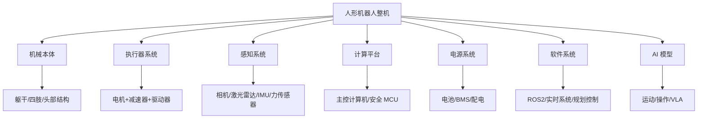

!!! note "术语解释：执行器（Actuator）"
    执行器是机器人的“肌肉”，负责将电能或其他形式的能量转换为机械运动和力。一台人形机器人通常有 20–50 个执行器。从控制理论角度看，执行器是系统输入 $u$ 的物理实现，其带宽、扭矩密度、反向间隙和响应延迟直接影响闭环控制性能。

!!! note "术语解释：减速器（Reducer/Gearbox）"
    减速器是降低电机转速、放大输出扭矩的装置。常用类型包括谐波减速器（Harmonic Drive）、RV 减速器（Rotary Vector）和行星减速器（Planetary Gearbox）。减速比 $N$ 使得输出扭矩 $T_{out} = N \cdot T_{motor} \cdot \eta$（$\eta$ 为传动效率），但也会引入摩擦、惯量和背隙。

!!! note "术语解释：IMU（Inertial Measurement Unit）"
    惯性测量单元包含加速度计和陀螺仪，有时还包括磁力计，用于感知姿态、角速度和线加速度。IMU 是机器人状态估计的核心传感器，但其测量存在零偏漂移（bias drift）和噪声，需要与运动学、视觉或力觉信息融合。

!!! note "术语解释：VLA（Vision-Language-Action Model）"
    视觉-语言-动作模型是一种能够将图像、自然语言指令和机器人动作统一建模的 AI 架构。它通常以视觉编码器和大语言模型为骨干，输出低层动作 token 或策略参数，使人形机器人能够根据“把红色盒子放到左边桌子上”这样的自然语言指令执行操作。

!!! note "术语解释：BMS（Battery Management System）"
    电池管理系统是保护电池安全并优化续航的电子系统，负责电池状态估计（SOC/SOH）、均衡、过充过放保护、热管理和故障诊断。BMS 的功能安全等级直接影响整机安全认证。

### 1.1.5 机器人的形式化定义

从控制理论和系统科学出发，机器人可以被形式化为一个**动态系统**（Dynamical System）：

$$
\dot{x}(t) = f\big(x(t), u(t)\big), \quad y(t) = h\big(x(t), u(t)\big)
$$

其中：

- $x(t) \in \mathbb{R}^n$ 是系统状态向量，例如关节角度、角速度、质心位置、姿态四元数等；
- $u(t) \in \mathbb{R}^m$ 是控制输入，例如电机电流、扭矩或电压；
- $y(t) \in \mathbb{R}^p$ 是系统输出，即传感器测量；
- $f$ 是状态转移函数，描述系统动力学；
- $h$ 是观测函数，描述传感器模型。

!!! note "术语解释：状态空间（State Space）"
    状态空间是控制理论中描述动态系统全部可能状态的数学空间。系统的未来演化只依赖于当前状态和未来的输入，而与过去无关，这一性质称为“马尔可夫性”。人形机器人的状态空间维度通常在 30–100 维以上，带来所谓的“维度灾难”。

对于人形机器人，$f$ 通常由刚体动力学方程给出。以拉格朗日方程为例：

$$
M(q)\ddot{q} + C(q, \dot{q})\dot{q} + G(q) = S^T \tau + J_c^T F_c
$$

其中：

- $q \in \mathbb{R}^n$ 为广义坐标；
- $M(q)$ 为质量矩阵；
- $C(q, \dot{q})$ 为科氏力和离心力项；
- $G(q)$ 为重力项；
- $\tau$ 为关节力矩；
- $S$ 为选择矩阵；
- $J_c$ 为接触点雅可比矩阵；
- $F_c$ 为地面接触力。

!!! note "术语解释：雅可比矩阵（Jacobian Matrix）"
    雅可比矩阵 $J$ 描述机器人关节空间速度到操作空间（如末端执行器或质心）速度的线性映射：$v = J(q)\dot{q}$。在力控制中，其转置 $J^T$ 将操作空间力映射到关节力矩：$\tau = J^T F$。雅可比矩阵是机器人运动学和静力学分析的核心工具。

从**智能体（Agent）**视角看，机器人是一个与环境交互的自治实体，遵循**感知-决策-执行循环**（Sense-Decide-Act Loop）：

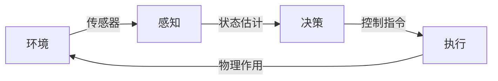

在具身智能（Embodied AI）框架下，智能不仅存在于算法之中，而是**嵌入在身体形态、传感器配置与动态交互之中**。这一思想与形态计算（Morphological Computation）密切相关：机器人本体的物理特性（如柔顺性、质量分布、弹性足）本身就可以承担一部分计算功能，从而减轻控制器的负担。

!!! note "术语解释：具身智能（Embodied AI）"
    具身智能强调智能行为必须通过具有物理身体的智能体与真实环境交互而产生，而非仅靠符号推理或离线数据学习。其哲学根源可追溯至梅洛-庞蒂（Merleau-Ponty）的“身体主体”概念和皮亚杰（Piaget）的认知发展理论。对人形机器人而言，具身智能意味着：运动控制、感知、推理与社会交互必须统一在身体-环境耦合的框架下。

!!! note "术语解释：形态计算（Morphological Computation）"
    形态计算指利用智能体自身物理结构和材料特性来完成部分“计算”任务，从而减少显式控制器的复杂度。例如，鸟类的羽毛和骨骼结构、猎豹的脊柱弹性、人形机器人的柔顺关节都可以在一定程度上“预先解决”动态稳定性问题，使高层控制更简洁。

### 1.1.6 人形机器人的分类学

为了系统研究人形机器人，需要建立明确的分类维度。以下从六个维度给出形式化的分类标准：

**按移动方式**

| 类型 | 定义 | 代表产品 |
|------|------|---------|
| 双足行走 | 仅依靠两条腿实现移动 | Tesla Optimus、Unitree H1、Figure 02 |
| 轮式移动 | 依靠轮子移动，上身人形 | Agility Digit（早期）、移动服务机器人 |
| 腿轮混合 | 同时具备腿和轮，可切换模式 | 部分研究平台、轮足复合机器人 |
| 固定底座 | 只有上半身，无移动能力 | 远程呈现机器人、部分服务机器人 |

**按尺寸与尺度**

| 类型 | 身高范围 | 典型应用 |
|------|---------|---------|
| 全尺寸成人型 | 1.5–1.8 m | 工业、服务、家庭 |
| 青少年/儿童型 | 1.0–1.4 m | 教育、研究、陪伴 |
| 桌面型 | 0.3–0.8 m | 科研、教育、娱乐 |

**按驱动方式**

| 类型 | 原理 | 优缺点 |
|------|------|--------|
| 电机驱动 | 电动机+减速器 | 成熟、可控、噪声低；扭矩密度受限 |
| 液压驱动 | 液压泵+油缸/执行器 | 高功率密度；泄漏、维护复杂 |
| 气动驱动 | 气体压力驱动 | 柔顺、安全；效率低、控制难 |
| 肌腱/绳驱 | 电机通过缆绳驱动远端关节 | 减轻远端惯量；摩擦、磨损 |
| 人工肌肉 | 气动人工肌肉、EAP 等 | 高仿生；寿命和重复性差 |

**按自主性等级**

| 等级 | 描述 | 人形机器人应用状态 |
|------|------|------------------|
| L0 遥操作 | 完全由人类远程控制 | 当前大量工业部署 |
| L1 辅助 | 人类主导，机器人提供辅助 | 部分装配任务 |
| L2 半自主 | 机器人执行特定子任务，人类监督 | 当前主流目标 |
| L3 条件自主 | 在限定环境和任务中自主运行 | 研究与小范围试点 |
| L4/L5 高度/完全自主 | 开放环境长期自主 | 尚未实现 |

**按应用领域**

| 领域 | 典型任务 | 成熟度 |
|------|---------|--------|
| 工业制造 | 搬运、分拣、拧螺丝、质检 | 早期试点 |
| 仓储物流 | 拣选、搬运、码垛 | 试点阶段 |
| 商业服务 | 引导、迎宾、零售 | 小规模部署 |
| 医疗康复 | 陪护、辅助行走、康复训练 | 研究/试点 |
| 家庭服务 | 清洁、照料、陪伴 | 极早期 |
| 科研教育 | 算法验证、教学演示 | 较成熟 |

**按商业化阶段**

| 阶段 | 特征 | 代表 |
|------|------|------|
| 实验室样机 | 验证单项技术，不可重复 | 高校研究项目 |
| 工程样机 | 系统集成，少量可运行 | 早期创业公司产品 |
| 小批量验证 | 数十至数百台，真实场景测试 | 宇树、智元、优必选 |
| 量产产品 | 规模化生产，成本可控 | Tesla Optimus Gen 3（目标） |
| 规模化运营 | 多场景 fleet 管理 | 尚未成熟 |

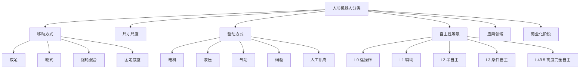

---

## 1.2 人形机器人的发展历程

人形机器人的历史不仅是技术演进史，也是数学、控制理论、计算机科学、材料科学与经济学交汇的缩影。以下从科学思想根源出发，梳理其发展历程。

### 1.2.1 机械自动机时代（18–19 世纪）

在电力和电子控制出现之前，人形自动机是纯机械工程的杰作。

- **雅克·德·沃康松（Jacques de Vaucanson）** 于 1738 年制造出“吹笛手”“鼓手”和著名的“消化鸭”，展示了复杂的凸轮、齿轮和连杆机构。
- **雅克德罗父子（Jaquet-Droz）** 于 18 世纪 70 年代制作出“书写者”“绘图者”和“风琴演奏者”，使用凸轮编码程序，可更换凸轮以改变行为。

这些自动机没有感知和决策能力，但证明了**复杂运动可以通过机械机构精确编码**。其控制方式本质上是开环的：凸轮轮廓即“程序”，时间即“输入”。

!!! note "术语解释：开环控制（Open-Loop Control）"
    开环控制是指控制器的输出不依赖于系统实际状态的反馈。例如，机械自动机按照预设凸轮运动，不考虑外部扰动。其数学形式为 $u(t) = u_{ref}(t)$。开环控制简单、成本低，但无法应对不确定性；现代机器人普遍采用闭环控制。

### 1.2.2 控制论与计算机科学的诞生（20 世纪 30–50 年代）

现代机器人学的思想根基在 20 世纪中叶奠定：

- **诺伯特·维纳（Norbert Wiener）** 于 1948 年出版《控制论：或关于在动物和机器中控制和通信的科学》，提出反馈控制、信息论和系统科学的统一框架。
- **克劳德·香农（Claude Shannon）** 于 1948 年发表《通信的数学理论》，奠定了信息论基础，其熵概念 $H(X) = -\sum p(x)\log p(x)$ 成为感知、学习与决策的度量工具。
- **阿兰·图灵（Alan Turing）** 于 1936 年提出图灵机模型，1950 年提出“图灵测试”，开启了人工智能的思想传统。

!!! note "术语解释：反馈控制（Feedback Control）"
    反馈控制是指根据系统输出与期望参考值之间的误差来调整输入，使系统状态趋向目标。其核心思想是 $u(t) = K\big(r(t) - y(t)\big)$，其中 $K$ 为控制器增益。维纳将反馈机制从工程系统推广到生物、社会和认知系统，奠定了控制论的基础。

反馈控制使机器人能够在不确定环境中维持稳定，这是双足机器人动态平衡的理论起点。

### 1.2.3 早期人形机器人（1960s–1980s）

这一时期，电子计算机和伺服电机开始应用于机器人。

- **WABOT-1（早稻田大学，1973）**：世界上第一台完整的人形机器人，高约 2 米，具有双腿、双臂和视觉系统，实现了静态行走。其控制计算机相当于当时的小型机，算力极其有限。
- **WL-10 系列（早稻田大学，1980s）**：实现了更自然的动态步态，为后续双足控制研究奠定基础。
- **HD-2（加藤实验室）**：进一步提升了运动协调性。

这一时期的核心特征是**静态行走（Static Walking）**：机器人质心（Center of Mass, CoM）投影始终保持在支撑多边形内，速度缓慢但稳定。

!!! note "术语解释：质心（Center of Mass, CoM）"
    质心是物体质量分布的平均位置。对于多刚体系统，质心位置 $r_{CoM} = \frac{\sum_i m_i r_i}{\sum_i m_i}$。在机器人学中，质心投影是否落在支撑多边形内是判断静态稳定性的常用判据。

!!! note "术语解释：零力矩点（Zero Moment Point, ZMP）"
    零力矩点由南斯拉夫（今塞尔维亚）机器人学家米奥米尔·武科布拉托维奇（Miomir Vukobratović）于 1969 年提出。ZMP 是地面上的一点，使得由重力和惯性力产生的水平力矩为零。对于平面接触，若 ZMP 位于支撑多边形内，则机器人不会发生绕支撑边界的翻转。ZMP 准则是过去数十年双足机器人控制的主流稳定性判据。

### 1.2.4 动态平衡时代（1990s–2010s）

这一时期，控制理论和计算能力的进步使人形机器人实现了动态行走、跑步甚至跳跃。

- **本田 ASIMO（2000）**：以 6 km/h 速度跑步、上下楼梯、避障、语音交互，成为 2000 年代人形机器人的技术象征。本田于 2018 年停止 ASIMO 开发，原因包括成本过高和应用场景不清。
- **索尼 QRIO（2003）**：小型双足娱乐机器人，展示了较强的运动控制能力，但因商业原因很快停产。
- **波士顿动力 PETMAN/Atlas（2009–2013）**：PETMAN 用于测试防护服，Atlas 则代表了液压驱动双足动态运动的最高水平，能够后空翻、跑酷、跨越障碍。

这一时期的关键技术包括：

1. **ZMP 轨迹规划与 preview control（Kajita et al., 2003）**：将双足行走转化为线性倒立摆（LIPM）模型下的最优控制问题。
2. **模型预测控制（MPC）**：在有限时域内滚动优化控制输入，处理约束和多接触问题。
3. **非线性优化与全身控制（WBC）**：协调下肢、上肢和躯干运动，实现复杂任务。

!!! note "术语解释：线性倒立摆（Linear Inverted Pendulum Model, LIPM）"
    线性倒立摆由梶田秀司（Shuuji Kajita）等人提出，将双足机器人简化为一个质点通过无质量杆连接到地面。在假设质心高度恒定、忽略角动量的情况下，其水平动力学为线性方程：$\ddot{x} = \frac{g}{z_c} x + \frac{1}{m z_c} u_x$，其中 $z_c$ 为质心高度，$g$ 为重力加速度。LIPM 极大简化了步态规划，是 preview control 的理论基础。

!!! note "术语解释：模型预测控制（Model Predictive Control, MPC）"
    模型预测控制是一种在有限预测时域内求解最优控制序列、并只执行第一步控制的滚动优化方法。其标准形式为：$\min_{u_{0:N-1}} \sum_{k=0}^{N-1} \ell(x_k, u_k) + V_f(x_N)$，满足 $x_{k+1} = f(x_k, u_k)$ 和约束 $x_k \in \mathcal{X}, u_k \in \mathcal{U}$。MPC 能够显式处理约束，是双足动态平衡和足式机器人控制的主流方法。

!!! note "术语解释：全身控制（Whole-Body Control, WBC）"
    全身控制指同时协调机器人多个任务（如保持平衡、跟踪足部轨迹、操作物体、避障）的控制系统。通常采用任务层级或加权优化框架，将高优先级任务（如平衡）放在低优先级任务的零空间中执行，确保关键约束不被违反。

### 1.2.5 AI 融合与量产时代（2020s 至今）

2020 年代，人形机器人重新成为焦点，核心驱动力是人工智能、供应链成熟和资本投入：

- **AI 大模型与 VLA**：RT-2、OpenVLA、GR00T N1、Figure Helix、π0 等模型将视觉、语言和动作统一，使机器人能够理解自然语言指令并泛化到新任务。
- **强化学习与 sim-to-real**：在仿真中训练运动与操作策略，通过域随机化（Domain Randomization）和迁移学习部署到真实机器人。
- **供应链成熟**：谐波减速器、无框力矩电机、力传感器、高算力计算平台成本快速下降。
- **量产尝试**：Tesla Optimus、Figure BotQ、Unitree、智元机器人等进入万台级甚至百万台级产能规划。

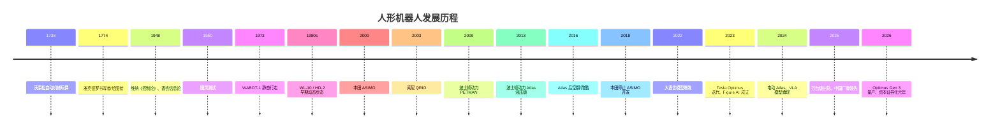

### 1.2.6 本田 ASIMO：技术巅峰与商业困境

本田 ASIMO（Advanced Step in Innovative Mobility）是 2000 年代最具代表性的人形机器人。它能够以 6 km/h 的速度跑步、上下楼梯、避障、与人握手，甚至进行简单的语音交互。

然而，本田于 2018 年停止 ASIMO 的开发。其原因值得深思：

- **成本过高**：单台成本估计超过 100 万美元，无法商业化。
- **应用场景不清**：除了展示和接待，难以找到可持续的商业模式。
- **技术封闭**：系统高度定制化，难以扩展。

ASIMO 的故事说明：**技术先进不等于商业成功**。人形机器人要实现产业化，必须在成本、应用场景和可维护性上取得突破。

### 1.2.7 波士顿动力 Atlas：动态能力的极限

波士顿动力 Atlas 代表了双足动态运动的最高水平，能够后空翻、跑酷、跨越障碍。2024 年，波士顿动力退役了液压版 Atlas，推出全电动版，转向商业应用探索，尤其是在现代汽车集团的工厂网络中。

Atlas 的价值在于推动控制理论和机器人极限，但其商业化路径仍在探索中。

### 1.2.8 2025–2026 年新一波浪潮：从演示到真实部署

与 ASIMO 和早期 Atlas 不同，2025–2026 年的新浪潮强调**真实场景中的长期部署和量产可行性**：

- **Tesla Optimus**：2026 年 1 月 21 日，Gen 3 在弗里蒙特工厂启动量产；Model S/X 产线被改造为 Optimus 生产线，目标年产能 100 万台；得州 Gigafactory 在建专用工厂，目标年产能 1000 万台。
- **Figure AI**：2025 年 9 月完成 10 亿美元 C 轮融资，估值 390 亿美元；Figure 02 在宝马斯巴达堡工厂完成 11 个月部署，搬运 9 万余个零件，参与生产 3 万余辆 BMW X3。
- **中国厂商**：宇树科技 2025 年营收 17.08 亿元、扣非净利润约 6 亿元，2026 年科创板 IPO 已获受理；智元机器人 2025 年出货量据 Omdia 统计达 5168 台，全球第一；优必选 2025 年人形机器人订单近 14 亿元人民币。

这一波浪潮的核心驱动力是：

1. AI 大模型和 VLA 使机器人获得了更强的感知、理解和泛化能力。
2. 精密制造和供应链成熟使核心零部件成本快速下降。
3. 劳动力成本上升和制造业自动化需求提供了明确市场。
4. 资本市场愿意为头部玩家提供大规模资金支持。

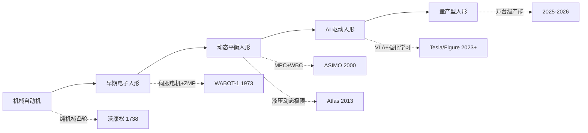

---

## 1.3 为什么现在是人形机器人的关键窗口期？

### 1.3.1 市场规模与增长预测

根据多家研究机构 2025–2026 年的最新预测，全球人形机器人市场正在快速扩张：

| 研究机构 | 2025 年市场规模 | 2030 年预测 | 2032/2034/2035 年预测 | 关键判断 |
|---------|----------------|------------|----------------------|---------|
| MarketsandMarkets | 29.2 亿美元 | 152.6 亿美元 | — | CAGR 39.2%（2025–2030） |
| Research Nester | 31.4 亿美元 | — | — | CAGR 38.5%（2026–2035） |
| BCC Research | 19.0 亿美元 | 110.0 亿美元 | — | CAGR 42.8% |
| MarketIntelo | 32.0 亿美元 | — | 431.0 亿美元（2034） | CAGR 35.0% |
| Maximizemarketresearch | 29.2 亿美元 | — | 295.7 亿美元（2032） | CAGR 39.2% |
| Goldman Sachs | — | — | 380 亿美元（2035） | 长期乐观情景 |
| Yahoo Finance / Counterpoint | 约 9 亿美元收入（2025） | 70 亿美元（2030） | — | 侧重商业收入 |

数据来源：MarketsandMarkets、Research Nester、BCC Research、MarketIntelo、Maximize Market Research、Goldman Sachs、Yahoo Finance（2025–2026 年报告）

尽管各机构预测差异较大，但共同趋势是：**2025 年市场规模约为 30 亿美元量级，2026 年预计达到 40–50 亿美元，2030 年有望突破 100–150 亿美元。**

#### 1.3.1.1 预测方法论：自上而下与自下而上

市场预测本质上是对未来供需的量化推断，常用两种方法相互校验。

**自上而下（Top-Down）**：从宏观 TAM 出发，乘以渗透率：

$$
M_{t} = TAM_t \cdot p_t \cdot ASP_t
$$

其中：

- $M_t$：时刻 $t$ 的预测市场规模（美元）；
- $TAM_t$：总可触达市场（Total Addressable Market），理论上所有可能购买该产品的市场总额；
- $p_t$：技术渗透率，即目标市场中实际采用人形机器人的比例；
- $ASP_t$：平均售价（Average Selling Price）。

**自下而上（Bottom-Up）**：从单位出货量与均价出发：

$$
M_t = N_t \cdot ASP_t
$$

其中 $N_t$ 为出货量。当两种方法结果差异过大时，通常意味着对渗透率或均价的假设存在分歧。2025 年各机构对市场规模预测在 19–32 亿美元之间，差异主要源于：是否计入低价科研本体、是否计入服务与软件收入、以及采用出厂价还是终端价。

!!! note "术语解释：CAGR（Compound Annual Growth Rate）"
    复合年均增长率描述一段时间内某项指标的年均增长幅度。若起始值为 $V_0$，终值为 $V_T$，时间跨度为 $T$ 年，则
    $$
    CAGR = \left(\frac{V_T}{V_0}\right)^{1/T} - 1
    $$
    例如从 2025 年 30 亿美元增长到 2030 年 150 亿美元，$CAGR = (150/30)^{1/5}-1 \approx 37.9\%$。CAGR 平滑了年度波动，但不反映路径风险。

!!! note "术语解释：ASP（Average Selling Price）"
    平均售价是总销售收入除以总出货量。人形机器人市场 ASP 下降极快：2023 年科研/样机阶段 ASP 可能超过 10 万美元，2025 年中国厂商已将部分型号做到 1–3 万美元。市场预测对 ASP 曲线假设不同，会显著影响收入预测。

#### 1.3.1.2 情景分析与置信区间

单一预测数字容易掩盖不确定性。更好的做法是给定情景假设，构造乐观、基准、悲观三种路径。

设 2030 年出货量 $N_{30}$ 和 ASP $P_{30}$ 为随机变量，则市场规模

$$
M_{30} = N_{30} \cdot P_{30}
$$

采用对数正态假设，可估计 90% 置信区间：

$$
\ln M_{30} \sim \mathcal{N}\left(\ln(N_{base}P_{base}), \sigma_N^2 + \sigma_P^2 + 2\rho\sigma_N\sigma_P\right)
$$

其中：

- $N_{base}, P_{base}$：基准出货量与基准 ASP；
- $\sigma_N, \sigma_P$：出货量与 ASP 的对数标准差，反映预测不确定性；
- $\rho$：出货量与 ASP 的相关系数，通常为负（规模扩大伴随降价）。

以基准情景 $N_{base}=500$ 千台、$P_{base}=30{,}000$ 美元、$\sigma_N=0.5$、$\sigma_P=0.3$、$\rho=-0.3$ 为例：

```python
import numpy as np

N_base, P_base = 500e3, 30_000
sigma_N, sigma_P, rho = 0.5, 0.3, -0.3

mu = np.log(N_base * P_base)
sigma = np.sqrt(sigma_N**2 + sigma_P**2 + 2*rho*sigma_N*sigma_P)

samples = np.random.lognormal(mu, sigma, 100_000)
print(f"2030 市场规模中位数: ${np.median(samples)/1e9:.2f}B")
print(f"90% 置信区间: ${np.percentile(samples,5)/1e9:.1f}B - ${np.percentile(samples,95)/1e9:.1f}B")
```

运行结果大致为：中位数 150 亿美元，90% 置信区间 60–370 亿美元。这一范围解释了为何不同机构对 2030 年预测从 100 亿美元到 380 亿美元不等。

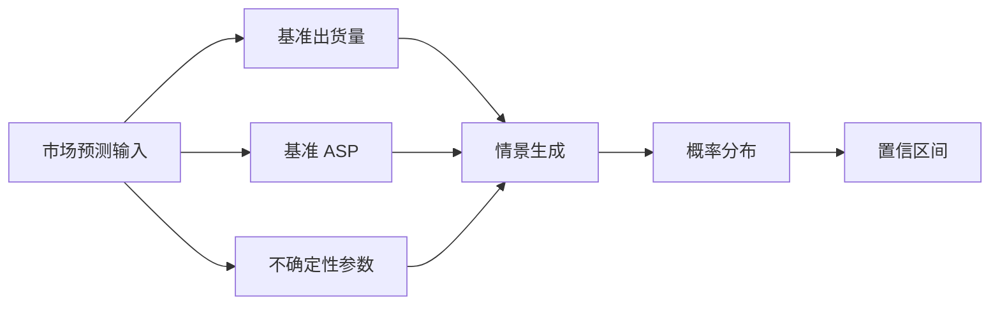

### 1.3.2 出货量与区域格局

相比金额预测，出货量数据更能反映真实进展：

| 指标 | 数据 | 来源/时间 |
|------|------|----------|
| 2025 年全球人形机器人安装量 | 约 16,000 台 | Counterpoint Research（2026 年 1 月） |
| 中国占全球安装量比例 | 超过 80% | Counterpoint Research（2026 年 1 月） |
| 2027 年全球出货量预测 | 115,000 台 | ABI Research |
| 2027 年累计安装量预测 | 超过 100,000 台 | Counterpoint Research |
| 2026 年一季度中国人形机器人出口同比增长 | 210% | 中国海关数据（2026 年 1–4 月） |
| 2026 年中国人形机器人销量预测 | 28,000 台 | 摩根士丹利 |

**2025 年全球市场份额（按安装量）：**

| 公司 | 总部 | 2025 年市场份额 | 代表产品 | 主要应用场景 |
|------|------|----------------|---------|------------|
| 智元机器人（AgiBot） | 上海 | 约 31% | X2、G2 | 制造、物流、服务 |
| 宇树科技（Unitree） | 杭州 | 约 27% | G1、H1 | 科研、工业、消费 |
| 优必选（UBTECH） | 深圳 | 约 5% | Walker S/S1/S2 | 汽车制造 |
| 乐聚机器人（Leju） | 深圳 | 约 5% | Kuavo | 教育、医疗、服务 |
| Tesla | 美国 | 约 5% | Optimus Gen 2/3 | 内部工厂、物流 |
| 其他 | 全球 | 约 27% | 各类产品 | 多元 |

数据来源：Robozaps、Counterpoint Research、Omdia、36 氪、虎嗅（2025–2026 年）

从上表可以看出，中国厂商占据了 2025 年全球安装量的前四名中的三席，合计市场份额超过 70%。这反映了中国在供应链、成本控制和制造能力上的优势。

### 1.3.3 投资热度与资本证券化

2025–2026 年是人形机器人投资的爆发期，也是资本证券化元年：

**全球主要融资事件（2025–2026）：**

| 公司 | 时间 | 轮次 | 金额 | 估值/亮点 |
|------|------|------|------|----------|
| Figure AI | 2025 年 9 月 | Series C | 10 亿美元+ | 估值 390 亿美元 |
| Apptronik | 2025 年 | Series A | 4.03 亿美元 | 奔驰、Google 投资 |
| EngineAI | 2025–2026 年 | A/B 轮 | 1.4–2.0 亿美元 | 中国深圳 |
| RobotEra | 2025–2026 年 | A/Growth | 1.4 亿美元+ | 吉利、北汽投资 |
| Galbot | 2025 年 12 月 | — | 3.0 亿美元 | — |
| Leju Robotics | 2025 年 10 月 | — | 2.0 亿美元 | — |
| Spirit AI | 2026 年 4 月 | Series A | 1.45 亿美元 | 具身智能平台 |

**中国市场融资与上市动态（2025–2026）：**

| 公司 | 时间 | 事件 | 规模/估值 |
|------|------|------|----------|
| 银河通用 | 2025 年 | 单轮融资 | 超 3 亿美元，估值 211 亿元 |
| 宇树科技 | 2026 年 3 月 | 科创板 IPO 受理 | 募资约 42 亿元，估值约 420 亿元 |
| 优必选 | 2025 年 | 港股三次再融资 | 合计约 65 亿港元，累计融资 86.91 亿港元 |
| 智元机器人 | 2025–2026 年 | 股改+借壳上纬新材 | 估值 150 亿元以上 |
| 乐聚机器人 | 2025 年 | Pre-IPO 轮 | 近 15 亿元 |
| 傅利叶智能 | 2025–2026 年 | 上市辅导备案 | 估值百亿级 |

数据来源：Crunchbase、36 氪、凤凰网、新浪财经、AI 中国网（2025–2026 年）

**关键观察**：

- 2025 年全球机器人初创企业融资总额超过 85 亿美元，为 2021 年以来最高；其中人形机器人专项融资约 43 亿美元，较 2018 年增长约 6 倍。
- 2025 年中国前三季度机器人赛道融资达 500 亿元人民币（约 70 亿美元），同比增长 250%。
- 2026 年一季度，中国人形机器人全产业链融资事件超过 100 起，单笔最高 25 亿元，10 亿元及以上大额融资 15 笔。
- 超过 20 家具身智能公司在 2026 年初明确上市计划。

### 1.3.4 成本下降曲线

成本下降是人形机器人产业化的关键信号。根据高盛和美银等机构数据：

| 指标 | 数据 | 来源 |
|------|------|------|
| 2023–2024 年制造成本降幅 | 40% | Goldman Sachs（via Deloitte） |
| 当前西方工厂试点单台成本 | 9–10 万美元 | Bank of America（2026） |
| 当前中国 BOM 成本 | 约 3.5 万美元 | Bank of America（2026） |
| 2030 年单台成本预测 | 低于 1.7 万美元 | Bank of America |
| 宇树 G1 售价 | 约 1.6 万美元 | 公开售价 |
| 宇树 R1 售价（2025 年 7 月） | 5900 美元 | 公开售价 |
| Tesla Optimus 目标售价 | 2–3 万美元 | Musk，2026 年 1 月 |

数据来源：Goldman Sachs、Bank of America、Optimusk.blog、公开售价信息（2025–2026 年）

宇树 2025 年 7 月推出售价 5900 美元的 R1 人形机器人，震惊了市场——这一价格点此前被认为需要多年才能实现。这显示中国供应链在成本压缩上的巨大潜力。

### 1.3.5 劳动力市场的结构性需求

人形机器人产业化的根本驱动力之一是劳动力结构变化：

- **人口老龄化**：中国 60 岁以上人口占比已超过 20%，制造业一线工人缺口持续扩大；日本、欧洲同样面临严重老龄化。
- **危险岗位替代**：化工、采矿、建筑、救援等领域存在大量危险作业，人形机器人可以替代人类进入高风险环境。
- **柔性制造需求**：传统工业机器人擅长重复性任务，但面对多品种、小批量、频繁换线的生产模式，人形机器人理论上更具灵活性。

#### 1.3.5.1 人口老龄化与劳动力缺口的量化

人口结构变化可用**老年抚养比**（Old-Age Dependency Ratio, OADR）衡量：

$$
OADR_t = \frac{P_{65+,t}}{P_{15-64,t}} \times 100\%
$$

其中 $P_{65+,t}$ 为 65 岁以上人口，$P_{15-64,t}$ 为 15–64 岁劳动年龄人口。中国 2023 年 OADR 约为 21.1%，预计 2035 年将超过 30%；日本 2023 年已超过 50%。这意味着每 100 名劳动年龄人口需要抚养的老年人口从 21 人增加到 30 人以上，劳动力供给压力持续加大。

制造业工资因此面临上涨压力。设某岗位年人工成本为 $C_h$，机器人替代该岗位的年等价成本为 $C_r$，则替代条件为：

$$
C_r < C_h
$$

机器人年等价成本可分解为：

$$
C_r = \frac{C_{robot} - S_{residual}}{T_{life}} + C_{maint} + C_{energy}
$$

其中：

- $C_{robot}$：机器人购置成本（美元）；
- $S_{residual}$：设计寿命结束时的残值（美元）；
- $T_{life}$：设计寿命（年）；
- $C_{maint}$：年维护成本（美元/年）；
- $C_{energy}$：年能耗成本（美元/年）。

!!! note "术语解释：老年抚养比（Old-Age Dependency Ratio）"
    老年抚养比是衡量人口老龄化对劳动力供给压力的核心指标，定义为 65 岁及以上人口与 15–64 岁劳动年龄人口之比。OADR 越高，意味着每个劳动年龄人口负担的老年人越多，社会养老和医疗支出压力越大，劳动力供给相对收缩。

#### 1.3.5.2 人机替代盈亏平衡点分析

将替代条件转换为小时工资更为直观。设机器人设计寿命为 8 年，年运行 6000 小时（约每天 16 小时 × 375 天），购置成本 5 万美元，年维护成本为购置价的 10%（5000 美元/年），年能耗成本 1000 美元，残值忽略，则：

$$
C_r = \frac{50{,}000}{8} + 5{,}000 + 1{,}000 = 12{,}250 \text{ 美元/年}
$$

机器人小时成本：

$$
c_r = \frac{12{,}250}{6{,}000} \approx 2.04 \text{ 美元/小时}
$$

若该岗位人类工人年总成本（含工资、社保、福利）为 6 万美元，年工作 2000 小时，则小时成本为 30 美元/小时。此时机器人替代的人力成本优势约为 $30 - 2.04 = 27.96$ 美元/小时。即便机器人效率仅为人类的 50%，等效小时成本也仅为 4.08 美元/小时，仍具显著优势。

```python
# 人机替代盈亏平衡点计算
C_robot = 50_000      # 购置成本（美元）
T_life = 8            # 设计寿命（年）
hours_per_year = 6000 # 年运行小时
C_maint = 0.10 * C_robot  # 年维护成本
C_energy = 1_000      # 年能耗成本

C_r = C_robot / T_life + C_maint + C_energy
c_r = C_r / hours_per_year
print(f"机器人年等价成本: ${C_r:,.0f}/年")
print(f"机器人小时成本: ${c_r:.2f}/小时")

# 盈亏平衡人类小时工资
C_h_human = 60_000    # 人类年总成本
h_human = 2000        # 人类年工作小时
c_h = C_h_human / h_human
breakeven_efficiency = c_r / c_h
print(f"人类小时成本: ${c_h:.2f}/小时")
print(f"盈亏平衡效率阈值: {breakeven_efficiency*100:.1f}%")
```

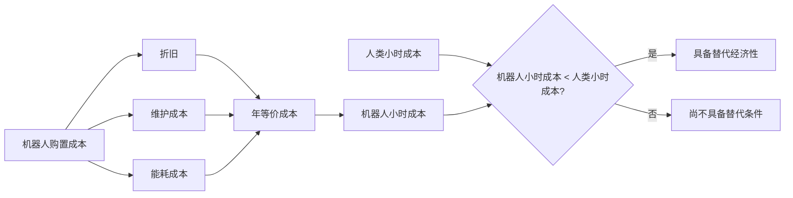

!!! note "术语解释：盈亏平衡点（Break-Even Point）"
    盈亏平衡点是指两种方案总成本相等时的临界状态。在人机替代分析中，常用于判断机器人效率需要达到人类多少比例才能在经济上持平。该分析忽略了培训成本、任务适应性、社会接受度等非财务因素，实际决策需要更全面的 TCO 评估。

人形机器人经济性分析的更多细节见第 13 章 13.3 节。

### 1.3.6 AI 能力的跃升

人形机器人之所以在 2020 年代重新受到关注，关键在于人工智能能力的跃升：

- **计算机视觉**：目标检测、语义分割、深度估计能力大幅提升，使机器人能够更好地理解环境。
- **大语言模型（LLM）**：使机器人能够理解复杂指令和上下文。
- **VLA 模型**：将视觉、语言和动作统一，使机器人能够根据自然语言指令完成操作任务。代表性模型包括 RT-2、OpenVLA、GR00T N1、Figure Helix、π0。
- **强化学习**：在仿真环境中训练 locomotion 和操作技能，并通过 sim-to-real 迁移到真实机器人。

这些 AI 能力弥补了传统控制方法在开放环境中的不足，使人形机器人从“按预编程动作执行”向“根据感知自主决策”演进。

### 1.3.7 市场预测的方法论边界

市场预测数字虽然引人注目，但理解其方法论边界同样重要。产业分析中常用以下框架：

!!! note "术语解释：TAM/SAM/SOM"
    - **TAM（Total Addressable Market）**：总潜在市场，指理论上所有可能购买某类产品或服务的市场总额。
    - **SAM（Serviceable Addressable Market）**：可服务市场，指企业实际能够触达并服务的市场部分，受地域、渠道、技术能力限制。
    - **SOM（Serviceable Obtainable Market）**：可获得市场，指企业在短期内实际能够获取的市场份额。

例如，若 2035 年全球人形机器人 TAM 为 3800 亿美元，某企业的 SAM 可能仅为工业制造细分市场，而 SOM 则取决于其产能、渠道和品牌。

**技术采用 S 曲线（Logistic Curve）**

新技术的市场渗透率通常遵循 S 曲线：

$$
P(t) = \frac{L}{1 + e^{-k(t - t_0)}}
$$

其中：

- $L$ 为市场渗透率上限（通常设为 100% 或某个饱和值）；
- $k$ 为增长率参数；
- $t_0$ 为拐点时间，即渗透率增长最快的时刻；
- $P(t)$ 为时刻 $t$ 的市场渗透率。

S 曲线的拐点处对应最大增长速率，对于投资决策和产能规划具有重要意义。

!!! note "术语解释：学习曲线（Learning Curve）"
    学习曲线描述随着累计产量增加，单位成本下降的定量关系。经典形式为：
    $$
    C_n = C_1 \cdot n^{-b}
    $$
    其中 $C_n$ 是第 $n$ 个产品的成本，$C_1$ 是第一个产品的成本，$b$ 是学习指数。学习率 $LR$ 定义为产量每翻一番成本下降的比例：$LR = 1 - 2^{-b}$。例如，若 $b = 0.32$，则 $LR \approx 20\%$，即产量每翻倍，成本下降 20%。

!!! note "术语解释：经验曲线（Experience Curve）"
    经验曲线由波士顿咨询集团（BCG）于 1960 年代提出，是学习曲线在更广泛商业场景中的推广。它不仅包括制造学习，还包括供应链优化、设计改进、规模经济和流程创新。经验曲线常用于战略咨询，解释为何行业龙头在成本上具有持续优势。

**对市场预测的批判性思考**

1. **预测区间越长，不确定性越大**：2035 年的预测高度依赖对技术成熟度、政策法规和社会接受度的假设。
2. **出货量与收入不完全对应**：低价教育/科研机器人可能拉高出货量但对收入贡献有限。
3. **中美市场结构差异**：中国供应链成本优势可能使中国厂商在出货量上领先，但高端应用和软件服务价值仍可能由美国企业主导。
4. **泡沫风险**：2025–2026 年的高估值和高融资额包含了显著的资本市场情绪成分，需要区分“能融资”和“能盈利”。

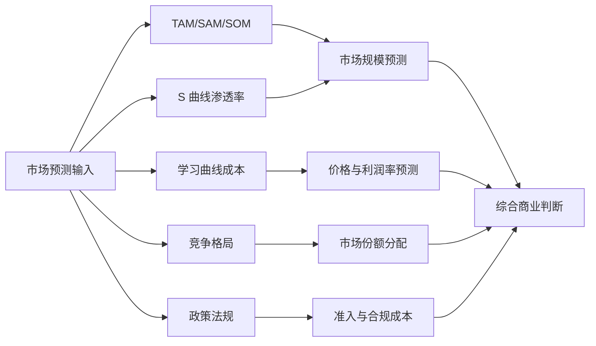

**Python 示例 1：技术采用 S 曲线参数拟合与预测**

以下代码使用历史出货量数据拟合 Logistic 曲线，并预测未来市场渗透率：

```python
import numpy as np
import matplotlib.pyplot as plt
from scipy.optimize import curve_fit

# 假设历史年份与全球出货量（千台）
years = np.array([2023, 2024, 2025, 2026])
shipments_k = np.array([1.5, 5.0, 16.0, 40.0])

# 假设远期饱和出货量为 5000 千台
L = 5000.0

# 标准化为渗透率
P = shipments_k / L

# Logistic 模型
def logistic(t, k, t0):
    return L / (1 + np.exp(-k * (t - t0)))

# 拟合
popt, _ = curve_fit(logistic, years, shipments_k, p0=[0.8, 2028])
k, t0 = popt
print(f"拟合参数: k={k:.4f}, t0={t0:.2f}")

# 预测
future_years = np.arange(2023, 2036)
predicted = logistic(future_years, k, t0)

plt.figure(figsize=(8, 5))
plt.scatter(years, shipments_k, color='red', label='历史出货量（千台）')
plt.plot(future_years, predicted, label=f'Logistic 拟合: k={k:.3f}, t0={t0:.1f}')
plt.axhline(L, color='gray', linestyle='--', label=f'饱和量 L={L} 千台')
plt.xlabel('年份')
plt.ylabel('全球出货量（千台）')
plt.title('人形机器人市场采用 S 曲线预测')
plt.legend()
plt.grid(True)
plt.tight_layout()
plt.show()
```

!!! note "术语解释：曲线拟合（Curve Fitting）"
    曲线拟合是通过优化方法找到一条数学曲线，使其最接近一组观测数据的过程。常用方法包括最小二乘法（Least Squares）和最大似然估计。拟合参数的不确定性需要通过置信区间和残差分析来评估。

**Python 示例 2：学习曲线成本投影**

以下代码根据学习曲线估算累计产量增加时的单台 BOM 成本：

```python
import numpy as np
import matplotlib.pyplot as plt

C1 = 100_000.0  # 第一台 BOM 成本（美元）
learning_rate = 0.20  # 产量每翻倍，成本下降 20%
b = -np.log2(1 - learning_rate)

n_units = np.logspace(0, 6, 100)  # 1 到 1e6 台
C_n = C1 * n_units ** (-b)

plt.figure(figsize=(8, 5))
plt.loglog(n_units, C_n)
plt.axhline(17_000, color='red', linestyle='--', label='Bank of America 2030 目标 $17k')
plt.axhline(5_900, color='green', linestyle='--', label='Unitree R1 售价 $5.9k')
plt.xlabel('累计产量（台）')
plt.ylabel('单台 BOM 成本（美元）')
plt.title(f'学习曲线：学习率 {learning_rate*100:.0f}%')
plt.legend()
plt.grid(True, which='both', linestyle='--', alpha=0.5)
plt.tight_layout()
plt.show()

# 计算达到目标成本所需累计产量
target_cost = 17_000
n_required = (target_cost / C1) ** (-1 / b)
print(f"达到 ${target_cost:,.0f} 所需累计产量约: {n_required:,.0f} 台")
```

!!! note "术语解释：BOM（Bill of Materials）"
    物料清单（BOM）是制造一台产品所需的所有零部件及其成本的清单。BOM 成本是硬件产品成本分析的基础，但不包括研发、模具、认证、营销、物流和售后等间接成本。

---

## 1.4 核心矛盾：能走的机器人 vs 能卖的机器人

人形机器人产业化面临的核心判断是：市场上有两种成功标准，一种是“能完成演示”，另一种是“能成为产品”。

| 维度 | 能走的机器人（演示型） | 能卖的机器人（产品型） |
|------|----------------------|----------------------|
| **目标** | 展示技术可能性 | 解决客户问题并盈利 |
| **环境** | 受控、平坦、光照固定 | 开放、不确定、动态变化 |
| **运行时间** | 几分钟到几小时 | 每天 8–16 小时，全年 300 天以上 |
| **故障率** | 允许失败和重启 | 必须达到 99% 以上的可用性 |
| **成本** | 不计成本，追求性能 | 必须控制在客户可接受范围 |
| **维护** | 由工程师现场调试 | 可由普通技师快速维修 |
| **合规** | 无需认证 | 必须通过安全、EMC、电气等认证 |

这一差距可从四个维度加以理解。

### 1.4.1 可靠性：从“能跑”到“不坏”

演示型机器人可能只需要在几个特定动作上表现良好，例如走几步、拿起一个杯子。但产品型机器人需要在数万乃至数十万小时的运行中保持性能稳定。

**具体挑战包括：**

- **机械磨损**：减速器、轴承、齿轮在长期使用中会产生磨损和背隙增加。
- **电子老化**：电容、电池、连接器在高温、振动环境下会老化失效。
- **传感器漂移**：IMU 零偏漂移、相机标定变化、力传感器温漂会导致感知和控制性能下降。
- **软件稳定性**：算法在边界情况下可能出现异常，需要完善的故障检测与恢复机制。

以工业机器人为参照，汽车产线的工业机器人通常要求 MTBF（平均无故障时间）超过 60,000 小时。而目前大多数人形机器人的 MTBF 还远低于这一水平。Figure 02 在宝马 11 个月部署中完成了约 1,250 小时运行，这已是行业内的重要里程碑，但距离 8 小时/天 × 300 天/年 = 2,400 小时/年的工业标准仍有差距。

!!! note "术语解释：可靠性函数 R(t)"
    可靠性函数 $R(t)$ 表示产品在时间区间 $[0, t]$ 内不发生故障的概率。对于恒定故障率 $\lambda$ 的指数分布：
    $$
    R(t) = e^{-\lambda t}
    $$
    平均无故障时间 $MTBF = \frac{1}{\lambda}$。指数分布适用于随机失效阶段，但不适用于早期失效和磨损失效阶段。

!!! note "术语解释：MTBF（Mean Time Between Failures）"
    平均无故障时间是衡量可修复设备可靠性的核心指标，指两次相邻故障之间的平均时间。对于恒定故障率的指数分布，$MTBF = 1/\lambda$。MTBF 越高，说明设备越不容易发生故障。需要注意的是，MTBF 是统计概念，不表示设备会在恰好 MTBF 时间点故障。

!!! note "术语解释：浴缸曲线（Bathtub Curve）"
    浴缸曲线描述产品全生命周期故障率的变化趋势，分为三个阶段：
    1. **早期失效期（Infant Mortality）**：故障率随时间下降，通常由制造缺陷、设计问题引起；
    2. **随机失效期（Useful Life）**：故障率近似恒定，对应正常使用阶段；
    3. **磨损失效期（Wear-Out）**：故障率随时间上升，由材料老化、疲劳、磨损引起。
    浴盆曲线的形状启发产品工程中的“老化筛选”（Burn-in）和预防性维护策略。

### 1.4.2 成本：从“百万美元”到“几万美元”

成本是制约人形机器人商业化的最关键因素之一。以下是主要成本构成（以一台全尺寸双足人形机器人为例）：

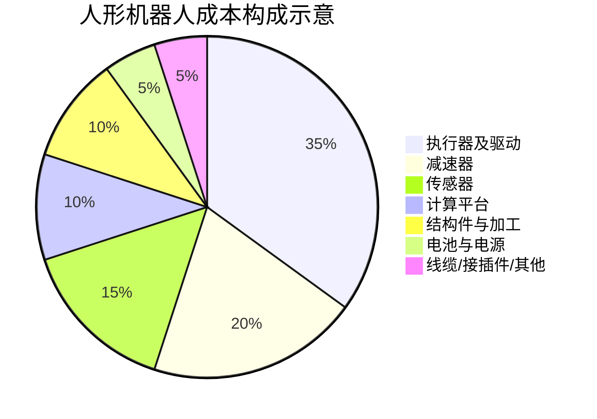

**关键零部件单价参考（2025–2026 年市场水平）：**

| 零部件 | 高端进口 | 国产替代 | 说明 |
|--------|---------|---------|------|
| 谐波减速器 | 2000–5000 元 | 800–2000 元 | 数量约 10–20 个 |
| RV 减速器 | 5000–15,000 元 | 2000–6000 元 | 常用于腿部大负载关节 |
| 无框力矩电机 | 3000–10,000 元 | 1000–4000 元 | 数量约 10–20 个 |
| 六维力传感器 | 5000–20,000 元 | 2000–8000 元 | 常用于脚踝/手腕 |
| 激光雷达 | 3000–10,000 元 | 1000–5000 元 | 如 Livox Mid-360 |
| 高算力计算平台 | 5000–20,000 元 | 3000–10,000 元 | 如 Jetson AGX Orin/Thor |

一台全尺寸人形机器人的 BOM（物料清单）成本在 2025–2026 年因配置不同差异很大：西方厂商试点成本约 9–10 万美元，而中国厂商 BOM 已降至约 3.5 万美元。要实现大规模商业化，单台成本需要进一步降至 3 万美元以下。

**成本建模框架**

产品总成本可以分解为：

$$
C_{total} = C_{BOM} + C_{NRE} + C_{manufacturing} + C_{logistics} + C_{service}
$$

其中：

- $C_{BOM}$：物料清单成本；
- $C_{NRE}$：一次性工程开发成本（Non-Recurring Engineering），包括研发、模具、认证、软件；
- $C_{manufacturing}$：制造费用，包括人工、设备折旧、工厂运营；
- $C_{logistics}$：物流与库存成本；
- $C_{service}$：售后、维修、培训成本。

!!! note "术语解释：NRE（Non-Recurring Engineering）"
    NRE 是指一次性、非重复发生的工程开发成本，例如芯片流片费用、模具费用、认证费用、软件开发费用等。NRE 需要在产品生命周期总销量中摊销，销量越大，单位 NRE 成本越低。

### 1.4.3 可维护性：从“工程师陪护”到“现场维修”

商业部署的机器人必须支持快速维修、零部件更换和软件升级。这要求：

- **模块化设计**：执行器、电池、传感器等部件可以快速拆卸和更换。
- **标准化接口**：减少专用工具和培训成本。
- **远程诊断**：通过 fleet 管理平台监控机器人状态，提前发现潜在故障。
- **OTA 升级**：软件可以远程更新，修复 bug 和优化性能。
- **备件供应**：建立完善的备件库存和物流体系。

例如，汽车工厂的机器人如果出现故障，通常要求 30 分钟内恢复运行。人形机器人要达到类似水平，必须在设计阶段就考虑维护性。

!!! note "术语解释：MTTR（Mean Time To Repair）"
    平均修复时间是指从故障发生到系统恢复正常运行所需的平均时间。它包括故障检测、诊断、维修、验证和恢复的时间。可用性（Availability）与 MTBF 和 MTTR 的关系为：$A = \frac{MTBF}{MTBF + MTTR}$。

!!! note "术语解释：可用性（Availability）"
    可用性 $A$ 是系统在规定条件下、规定时间内处于可工作状态的概率。对于可修复系统，稳态可用性为：
    $$
    A = \frac{MTBF}{MTBF + MTTR}
    $$
    它综合反映了可靠性和可维护性。提高可用性可以通过提高 MTBF（更可靠）或降低 MTTR（更易修）两条路径实现。

!!! note "术语解释：OTA（Over-The-Air）"
    空中升级是指通过无线网络远程更新设备软件。OTA 使得机器人可以在部署后修复漏洞、优化算法、添加功能，而无需召回或现场维护。OTA 也带来了网络安全风险，需要身份验证、加密和回滚机制。

### 1.4.4 合规性：从“实验室自由”到“市场准入”

人形机器人在工作环境中与人密切互动，必须符合功能安全、电气安全、电磁兼容、机械安全等相关标准。主要标准包括：

| 标准 | 适用范围 | 核心要求 |
|------|---------|---------|
| ISO 13482:2014 | 个人护理机器人 | 速度、力、接触压力限制 |
| ISO/TS 15066 | 协作机器人 | 人机协作安全要求 |
| IEC 61508 | 功能安全 | 控制系统安全完整性等级（SIL） |
| ISO 13849 | 机械安全控制系统 | 控制系统安全相关部件 |
| IEC 62368 | 音视频与信息技术设备安全 | 电气安全、火灾风险 |

不同地区还有不同的市场准入要求：

- **欧盟**：CE 标志
- **美国**：UL 认证、FCC 电磁兼容
- **中国**：CR 认证（中国机器人认证）、CCC 等

合规性不仅影响设计选择（如最大运动速度、外壳材料、急停按钮位置），还直接影响测试成本和时间。一个完整的安全认证周期可能需要 6–18 个月，费用从数万美元到数十万美元不等。

!!! note "术语解释：功能安全（Functional Safety）"
    功能安全是指系统在故障条件下仍能保持安全状态的能力。IEC 61508 定义了安全完整性等级 SIL 1–4，SIL 4 为最高等级。实现功能安全需要危险分析、冗余设计、故障检测、安全关断机制和系统验证。

!!! note "术语解释：EMC（Electromagnetic Compatibility）"
    电磁兼容性指设备在电磁环境中正常工作且不对其他设备产生不可接受电磁干扰的能力。EMC 测试包括辐射发射（RE）、传导发射（CE）、静电放电（ESD）、电快速瞬变脉冲群（EFT）等。

### 1.4.5 系统可靠性：串联模型

对于由多个部件组成的机器人，若任一关键部件故障都会导致整机失效，则系统可靠性可近似为各部件可靠性的乘积（串联模型）：

$$
R_s(t) = \prod_{i=1}^{n} R_i(t)
$$

若各部件故障率恒定且为 $\lambda_i$，则：

$$
R_s(t) = \exp\left(-\sum_{i=1}^{n} \lambda_i t\right), \quad MTBF_s = \frac{1}{\sum_{i=1}^{n} \lambda_i}
$$

这意味着：即使每个部件的可靠性都很高，部件数量增加也会显著降低整机 MTBF。例如，若机器人有 30 个执行器，每个执行器 MTBF 为 100,000 小时，则仅执行器子系统串联 MTBF 约为 3,333 小时。

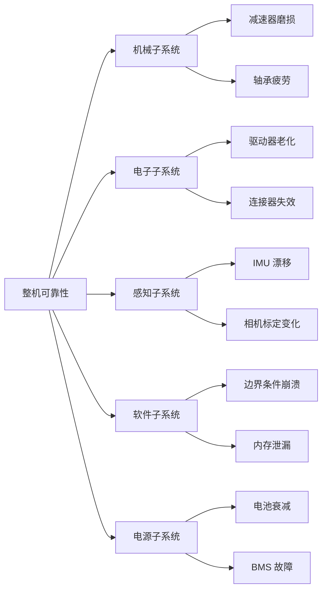

**Python 示例 3：串联系统可靠性估计**

```python
import numpy as np
import matplotlib.pyplot as plt

# 假设各关键子系统的 MTBF（小时）
components = {
    '执行器×30': 100_000 / 30,
    '减速器×20': 150_000 / 20,
    '传感器套件': 80_000,
    '计算平台': 120_000,
    '电池/BMS': 60_000,
    '线缆接插件': 50_000,
}

# 计算各部件故障率
lambdas = {k: 1/v for k, v in components.items()}
total_lambda = sum(lambdas.values())
system_mtbf = 1 / total_lambda
print(f"系统总故障率: {total_lambda:.6f} /小时")
print(f"系统 MTBF: {system_mtbf:,.0f} 小时")

# 绘制可靠性函数
t = np.linspace(0, 10_000, 500)
R_system = np.exp(-total_lambda * t)
R_target = np.exp(-t / 60_000)  # 工业机器人参考

plt.figure(figsize=(8, 5))
plt.plot(t, R_system, label=f'人形机器人串联模型 (MTBF={system_mtbf:.0f}h)')
plt.plot(t, R_target, '--', label='工业机器人参考 (MTBF=60,000h)')
plt.xlabel('运行时间 t（小时）')
plt.ylabel('可靠性 R(t)')
plt.title('串联系统可靠性随时间衰减')
plt.legend()
plt.grid(True)
plt.tight_layout()
plt.show()
```

!!! note "术语解释：故障率（Failure Rate）"
    故障率 $\lambda(t)$ 是单位时间内发生故障的概率密度，常用单位为 FIT（Failures In Time，10⁻⁹ 次/小时）或 %/1000 小时。恒定故障率下，$\lambda = 1/MTBF$。

**Python 示例 4：可用性 A 与 MTBF/MTTR 的关系**

```python
import numpy as np
import matplotlib.pyplot as plt

# 固定 MTBF，变化 MTTR
mtbf = 1000  # 小时
mttr_range = np.linspace(1, 200, 100)
A_fixed_mtbf = mtbf / (mtbf + mttr_range)

# 固定 MTTR，变化 MTBF
mttr = 24  # 小时
mtbf_range = np.linspace(100, 5000, 100)
A_fixed_mttr = mtbf_range / (mtbf_range + mttr)

fig, axs = plt.subplots(1, 2, figsize=(12, 5))

axs[0].semilogy(mttr_range, 1 - A_fixed_mtbf)
axs[0].set_xlabel('MTTR（小时）')
axs[0].set_ylabel('不可用性 1-A')
axs[0].set_title(f'MTBF={mtbf}h 时，MTTR 对不可用性的影响')
axs[0].grid(True)

axs[1].plot(mtbf_range, A_fixed_mttr)
axs[1].set_xlabel('MTBF（小时）')
axs[1].set_ylabel('可用性 A')
axs[1].set_title(f'MTTR={mttr}h 时，MTBF 对可用性的影响')
axs[1].grid(True)

plt.tight_layout()
plt.show()

# 示例：达到 99% 可用性，MTTR=24h 所需 MTBF
target_A = 0.99
mttr_example = 24
required_mtbf = mttr_example * target_A / (1 - target_A)
print(f"MTTR={mttr_example}h 时，达到可用性 {target_A*100:.0f}% 需要 MTBF ≥ {required_mtbf:,.0f}h")
```

---

## 1.5 从 0 到 1 的七个跃迁

将人形机器人从概念变为可规模化的产品，需要经历七个递进的跃迁阶段。下图展示了这一过程的宏观流程：


### 1.5.1 阶段与 NASA TRL / DoD MRL 的映射

为了更精确地评估每个阶段的技术与制造成熟度，可以将其映射到 NASA 的技术成熟度等级（TRL）和美国国防部的制造成熟度等级（MRL）：

| 跃迁阶段 | TRL 范围 | MRL 范围 | 核心任务 | 主要风险 | 退出标准 |
|---------|---------|---------|---------|---------|---------|
| 实验室样机 | TRL 1–3 | MRL 1–2 | 原理验证、关键技术突破 | 理论不可行、性能天花板 | 关键技术在受控条件下可复现 |
| 工程样机 | TRL 4–5 | MRL 3–4 | 系统集成、结构/热/电源设计 | 集成失败、可靠性不足 | 样机可连续运行并完成指定任务 |
| 小批量验证 | TRL 6 | MRL 5–6 | 可制造性、供应链、现场测试 | 工艺不稳定、供应商风险 | 数十台样机在真实场景稳定运行 |
| 量产准备 | TRL 7 | MRL 7–8 | 产线设计、BOM 优化、质量体系 | 产能爬坡慢、良率低 | 产线验证通过，工艺流程固化 |
| 场景部署 | TRL 8 | MRL 8 | 客户现场验证、价值证明 | 客户需求错配、现场适配难 | 客户签署商业订单或长期协议 |
| 运营维护 | TRL 9 | MRL 9 | fleet 管理、远程诊断、备件 | 故障率高、服务成本失控 | 可用性达到合同承诺水平 |
| 规模化复制 | TRL 9 | MRL 10 | 多地区、多场景、商业模式复制 | 市场饱和、竞争加剧 | 可持续盈利和规模化增长 |

!!! note "术语解释：TRL（Technology Readiness Level）"
    技术成熟度等级由 NASA 提出，用于评估技术从概念到实际应用的成熟程度。TRL 1 为基本原理观察，TRL 9 为在实际任务中得到验证的系统。TRL 是科技项目管理、预算分配和风险评估的重要工具。

!!! note "术语解释：MRL（Manufacturing Readiness Level）"
    制造成熟度等级由美国国防部提出，用于评估制造过程从概念到全面生产的成熟程度。MRL 1 为制造可行性识别，MRL 10 为全面低速/全速生产并持续改进。MRL 与 TRL 互补，共同决定技术产业化成熟度。

### 1.5.2 第一阶段：实验室样机

**目标**：证明核心技术的可行性。

此阶段通常在高校或企业研究院进行，研究人员关注某个具体问题，例如双足动态行走、全身控制或灵巧操作。样机可能使用现成零部件和大量手动调参，重点在于发表论文或申请专利，而非工程化。

**关键交付物**：

- 概念验证样机
- 关键算法原型
- 学术论文或专利

**主要风险**：理论假设不成立、关键性能指标无法达到。

### 1.5.3 第二阶段：工程样机

**目标**：将技术原型转化为可重复运行的系统。

工程样机阶段开始关注系统集成、结构强度、热管理、电源效率和软件稳定性。零部件逐步从货架产品向定制件过渡，控制算法与真实硬件深度耦合。

**关键交付物**：

- 可重复运行的整机系统
- 结构设计图纸和 BOM
- 控制软件框架
- 初步测试报告

### 1.5.4 第三阶段：小批量验证

**目标**：验证设计可制造性和供应链稳定性。

通常制造数十台至数百台样机，在真实或接近真实的场景中进行长期测试。此阶段会暴露设计缺陷、工艺问题和供应商风险，为量产提供输入。

**2025–2026 年案例**：优必选 Walker S2 月产能超过 300 台；乐聚 2025 年批量交付数千台本体机器人；宇树、智元进入万台级产能规划。

### 1.5.5 第四阶段：量产准备

**目标**：将工程样机转化为可重复、可追溯、可扩展的生产流程。

量产准备阶段涉及产线设计、工艺固化、BOM 优化、供应商锁定、测试流程标准化和质量体系建设。

**2025–2026 年案例**：Tesla 将弗里蒙特 Model S/X 产线改造为 Optimus Gen 3 生产线，目标年产能 100 万台；Figure AI 建成 BotQ 工厂，初始年产能 12,000 台，计划扩至 10 万台。

### 1.5.6 第五阶段：场景部署

**目标**：在真实客户场景中验证价值。

部署阶段将机器人投入到真实客户场景中运行，例如工厂产线、仓储物流或商业服务。此阶段需要解决现场适配、人机协作、异常处理和运营支持等问题。

**2025–2026 年案例**：Figure 02 在宝马斯巴达堡工厂完成 11 个月部署；宝马 2026 年夏季在莱比锡工厂启动 Hexagon AEON 人形机器人试点；Tesla Optimus 在弗里蒙特和得州工厂进行电池分类、零件搬运和质检任务。

### 1.5.7 第六阶段：运营维护

**目标**：保障机器人长期稳定运行并持续优化。

运营维护阶段关注远程监控、故障诊断、OTA 升级、备件供应、维修培训和性能优化。此阶段的数据反馈也将成为产品迭代的重要依据。

### 1.5.8 第七阶段：规模化复制

**目标**：在多个地区和场景中大规模推广。

规模化复制阶段意味着产品、供应链、服务和商业模式已经成熟，可以在多个地区和场景中大规模推广。

**2025–2026 年观察**：行业正处于从第五阶段向第六、七阶段跨越的过程中。大多数厂商仍在试点和小批量阶段，真正的规模化复制尚未到来。

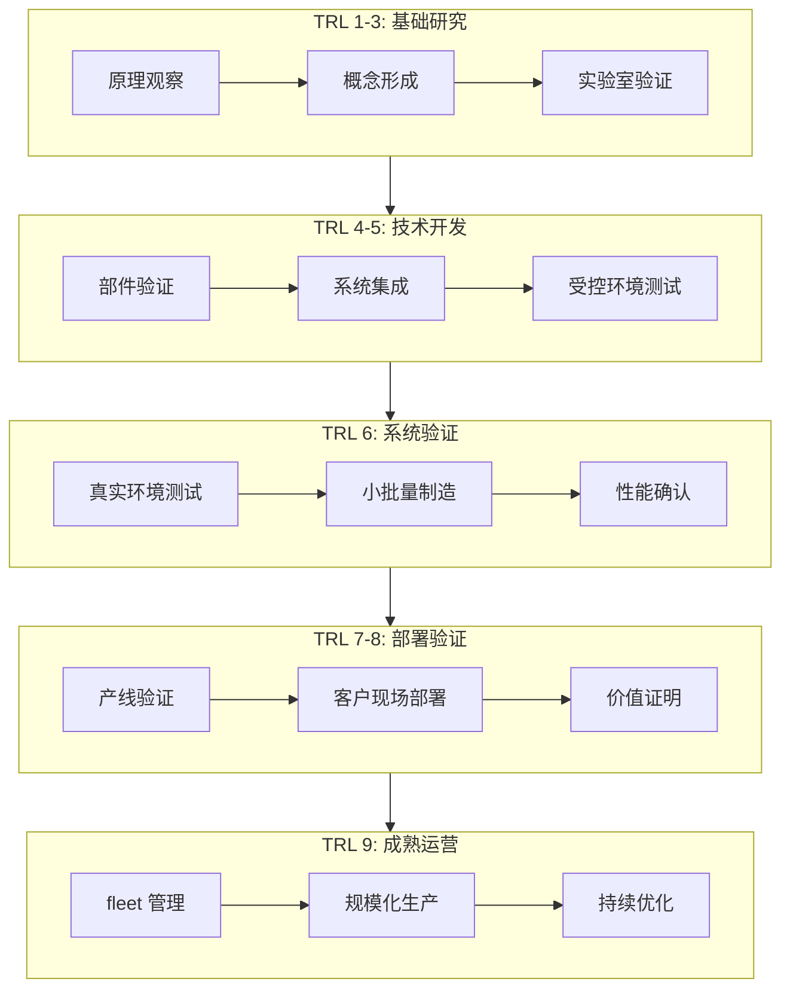

### 1.5.9 阶段门（Stage-Gate）管理

对于高复杂度产品，通常采用阶段门（Stage-Gate）管理方法：每个阶段结束时设置一个“门”，只有通过评审才能进入下一阶段。评审维度包括：

| 维度 | 评审问题 |
|------|---------|
| 技术成熟度 | 关键技术是否达到阶段目标？ |
| 制造准备度 | 工艺、供应链、产能是否就绪？ |
| 成本控制 | 目标 BOM 成本是否可达成？ |
| 质量与可靠性 | 测试数据是否满足可靠性目标？ |
| 合规认证 | 安全认证计划是否清晰？ |
| 商业可行性 | 客户价值与商业模式是否成立？ |

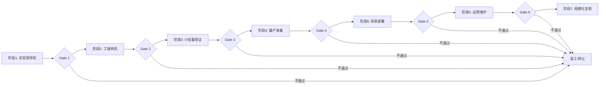

---

## 1.6 系统复杂度的来源

人形机器人之所以难以产业化，根本原因在于其是一个高度复杂的系统工程对象。其复杂度主要来源于以下几个方面。

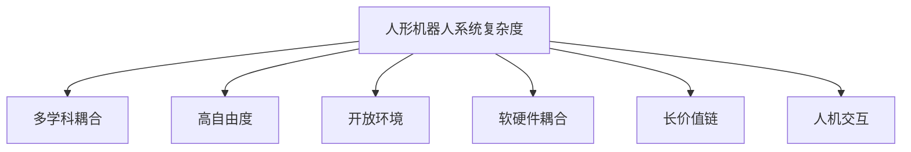

### 1.6.1 多学科耦合

人形机器人同时涉及机械工程、电子工程、控制理论、计算机科学、人工智能、材料科学、人因工程等多个学科。这些学科的设计目标和约束往往相互冲突。例如，轻量化要求使用更薄的结构件，但这会降低刚度和强度；高性能 AI 算法需要更大算力，但这会增加功耗和散热压力。

!!! note "术语解释：强耦合与弱耦合"
    在系统科学中，若两个子系统的状态或参数相互强烈影响，则称为强耦合；若影响较小或可忽略，则称为弱耦合。人形机器人中，电池容量、散热、算力、结构强度和动态性能之间存在强耦合：提高算力会增加功耗和发热，需要更大电池和散热结构，从而增加重量，进而影响动态平衡和能耗。

#### 1.6.1.1 设计耦合矩阵与设计结构矩阵

为量化子系统间的耦合，可引入**设计结构矩阵**（Design Structure Matrix, DSM）。设系统有 $n$ 个子系统，定义耦合矩阵 $\mathcal{D} \in \{0,1\}^{n \times n}$，其中 $d_{ij}=1$ 表示子系统 $i$ 的设计决策会直接影响子系统 $j$ 的性能。人形机器人主要子系统的 DSM 可表示为：

|  | 结构 | 执行器 | 感知 | 计算 | 电源 | 软件 | AI |
|--|------|--------|------|------|------|------|----|
| 结构 | — | 1 | 1 | 1 | 1 | 0 | 0 |
| 执行器 | 1 | — | 0 | 1 | 1 | 1 | 0 |
| 感知 | 1 | 0 | — | 1 | 1 | 1 | 1 |
| 计算 | 1 | 1 | 1 | — | 1 | 1 | 1 |
| 电源 | 1 | 1 | 1 | 1 | — | 1 | 0 |
| 软件 | 0 | 1 | 1 | 1 | 1 | — | 1 |
| AI | 0 | 0 | 1 | 1 | 0 | 1 | — |

矩阵中 1 的密度越高，系统整体耦合度越高。上表密度约为 44%，远高于典型消费电子产品（通常 15–25%）。高耦合意味着单一设计变更可能引发连锁修改，增加了系统集成和验证的复杂度。

系统耦合度可定义为：

$$
\rho_c = \frac{\sum_{i \neq j} d_{ij}}{n(n-1)}
$$

其中 $\rho_c$ 为耦合度，$n$ 为子系统数量。上例中 $n=7$，非对角 1 的个数为 26，故 $\rho_c = 26/(7\times6) \approx 0.619$。若采用加权 DSM，还可区分影响强度。

!!! note "术语解释：设计结构矩阵（Design Structure Matrix）"
    设计结构矩阵是系统工程中用于描述任务、组件或子系统之间依赖关系的布尔矩阵或加权矩阵。通过对 DSM 进行聚类分析，可以识别高度耦合的模块群，指导模块化设计和接口标准化。DSM 最早由 Donald Steward 于 1981 年在项目管理研究中提出，现广泛应用于复杂产品开发。

#### 1.6.1.2 能量-质量-算力三角约束

人形机器人存在一个根本性的能量-质量-算力三角约束。提高 onboard 计算能力会同时增加功耗和热耗散，而电池能量密度增长缓慢，导致：

$$
E_{battery} \geq \left(P_{compute} + P_{actuators} + P_{sensors}\right) \cdot t_{operation}
$$

其中：

- $E_{battery}$：电池可用能量（Wh）；
- $P_{compute}, P_{actuators}, P_{sensors}$：计算、执行器、感知功耗（W）；
- $t_{operation}$：目标续航时间（h）。

若计算功耗增加 $\Delta P$，为保持续航 $t$ 不变，需增加电池容量：

$$
\Delta E = \Delta P \cdot t
$$

以锂离子电池能量密度 $\rho_E \approx 250 \text{ Wh/kg}$ 计算，电池增重：

$$
\Delta m = \frac{\Delta E}{\rho_E} = \frac{\Delta P \cdot t}{\rho_E}
$$

例如，将 onboard 计算功耗从 100 W 提升到 200 W（增加 $\Delta P = 100$ W），若要求续航 4 小时：

$$
\Delta m = \frac{100 \times 4}{250} = 1.6 \text{ kg}
$$

这 1.6 kg 额外质量全部集中在躯干，会提高质心、增加腿部负载和行走能耗，形成正反馈。因此硬件选型必须在算力、功耗、重量之间进行帕累托优化。电源与能量管理的详细分析见第 6 章 6.2 节。

```python
# 计算功耗增加对电池质量和行走能耗的影响
Delta_P = 100       # 计算功耗增加（W）
t_op = 4            # 续航要求（h）
rho_E = 250         # 电池能量密度（Wh/kg）
g = 9.81            # 重力加速度（m/s^2）

Delta_m = Delta_P * t_op / rho_E
print(f"电池增重: {Delta_m:.2f} kg")

# 估算额外行走能耗：假设步长 0.7 m，速度 1 m/s，
# COT = 1.0（无量纲，相对人类约 0.2）
COT = 1.0
v = 1.0             # 行走速度（m/s）
extra_power = COT * Delta_m * g * v
print(f"额外行走功耗: {extra_power:.1f} W")
```

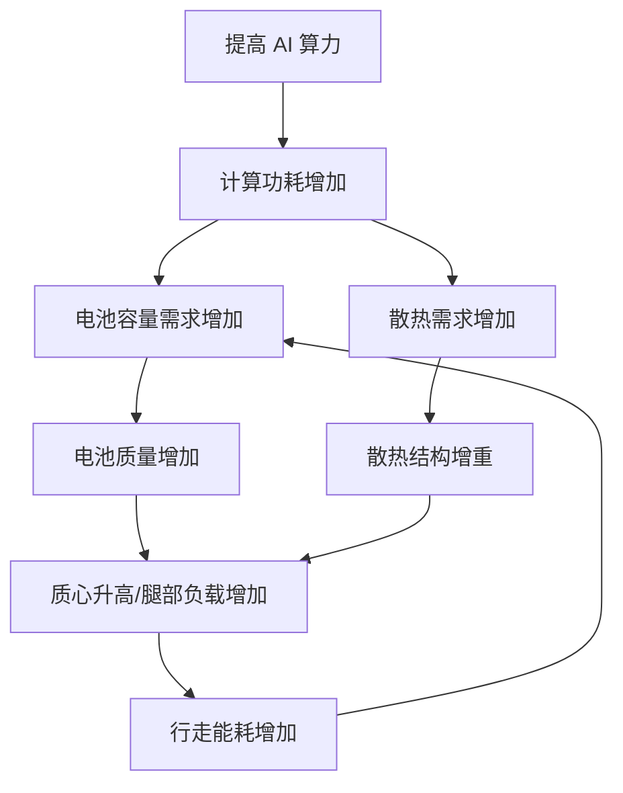

### 1.6.2 高自由度与动态不稳定性

人形机器人通常具有 20–50 个自由度，并且处于 inherently unstable 的双足支撑状态。其运动控制需要在高维状态空间中实时求解，同时满足接触约束、摩擦约束、力约束和运动学约束。

!!! note "术语解释：自由度（Degree of Freedom, DOF）"
    自由度是描述机械系统独立运动参数的数目。对于串联机器人，若每个关节提供一个独立运动，则总 DOF 等于关节数。人形机器人通常有 20–50 个 DOF，其中每条腿 5–7 个、每只手臂 6–7 个、躯干 2–3 个、头部 2–3 个、每只手 6–20 个。

!!! note "术语解释：维度灾难（Curse of Dimensionality）"
    维度灾难由理查德·贝尔曼（Richard Bellman）在动态规划研究中提出，指状态空间维度增加时，计算复杂度、数据需求和优化难度呈指数级增长。对于 30 维状态空间，即使每个维度仅离散化为 10 个值，状态总数也达到 $10^{30}$，远超常规计算能力。

### 1.6.3 开放环境的不可预测性

真实环境具有高度的不确定性。地面材质、光照条件、物体形状、人员行为、障碍物分布等因素都在动态变化。机器人需要具备感知、推理、规划和执行的闭环能力。

!!! note "术语解释：涌现行为（Emergent Behavior）"
    涌现行为是指复杂系统中由多个简单组件相互作用而产生的、无法从单个组件行为直接预测的整体现象。在人形机器人中，步态、群体协作、人机交互中的意外行为都可能是涌现的。系统工程需要通过仿真、测试和监控来识别和管理涌现风险。

### 1.6.4 软硬件深度耦合

人形机器人的性能不仅取决于算法，还取决于传感器精度、执行器响应、通信延迟、计算能力和电源管理。软件优化必须充分考虑硬件特性，硬件选型也必须服务于软件需求。

#### 1.6.4.1 端到端延迟预算

感知-决策-执行闭环的总延迟决定了机器人对动态环境的响应能力。设各环节延迟为：

$$
T_{total} = T_{sensor} + T_{comm}^{sense} + T_{compute} + T_{comm}^{ctrl} + T_{actuator}
$$

其中：

- $T_{sensor}$：传感器采集与读出延迟；
- $T_{comm}^{sense}$：传感器到计算平台通信延迟；
- $T_{compute}$：感知与决策推理延迟；
- $T_{comm}^{ctrl}$：计算平台到执行器通信延迟；
- $T_{actuator}$：执行器响应延迟。

典型取值（2025–2026 年水平）：

| 环节 | 典型延迟 | 说明 |
|------|---------|------|
| 相机曝光与读出 $T_{sensor}$ | 5–33 ms | 与帧率相关，30 Hz 相机约 33 ms |
| 传感器到计算平台通信 $T_{comm}^{sense}$ | 1–5 ms | 取决于总线，GigE 较高，MIPI/PCIe 较低 |
| 感知与决策推理 $T_{compute}$ | 20–100 ms | VLA 大模型推理可达 100 ms 以上 |
| 计算到执行器通信 $T_{comm}^{ctrl}$ | 1–2 ms | 实时以太网或 CAN-FD |
| 执行器响应 $T_{actuator}$ | 1–10 ms | 电流环带宽决定 |

总延迟通常在 30–150 ms 之间。对于跌倒恢复等高速反应任务，可用反应时间窗口约为 200–300 ms，因此控制算法必须预留足够裕量。更严格的分析需要使用采样定理：控制回路采样周期 $T_s$ 应满足：

$$
T_s < \frac{1}{2 f_{max}}
$$

其中 $f_{max}$ 为需要抑制的扰动频率。若期望抑制 10 Hz 的躯干摆动，采样周期应小于 50 ms。

!!! note "术语解释：控制带宽（Control Bandwidth）"
    控制带宽是闭环控制系统能够有效跟踪或抑制的最大频率范围，通常定义为闭环增益下降至 -3 dB 时的频率。根据香农采样定理，数字控制器的采样频率至少应为信号最高频率的 2 倍；工程实践中通常取 10–20 倍以上以保证稳定性和抗混叠性能。控制带宽受限于采样周期、传感器延迟、执行器动态和通信延迟。

#### 1.6.4.2 感知-决策-执行数据流

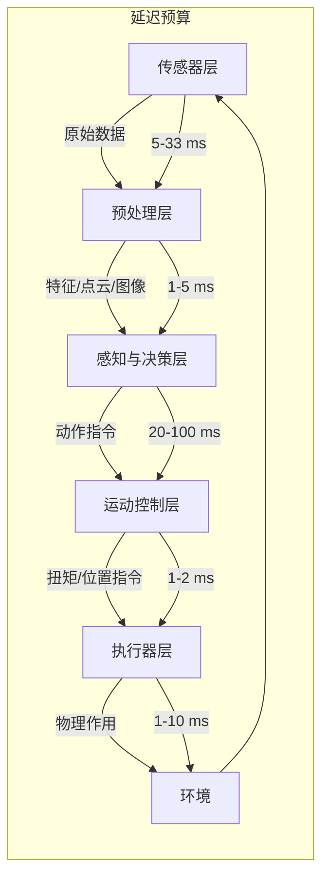

该数据流对软硬件协同设计提出要求：若 AI 推理占用过多 CPU/GPU 资源，可能导致控制任务抖动；若通信协议非确定性，则高频控制回路难以保证稳定性。因此，主流人形机器人采用分层计算架构：实时控制任务运行在 MCU/RTOS 上，感知与 AI 任务运行在 Linux/GPU 上，两者之间通过确定性总线或共享内存通信。计算平台架构详见第 6 章 6.1 节，软件栈设计见第 22 章。

```python
# 端到端延迟预算与稳定性裕量分析
delays = {
    '相机读出': 33,        # ms
    '传感器通信': 5,        # ms
    'AI 推理': 80,          # ms
    '控制通信': 2,          # ms
    '执行器响应': 5,        # ms
}

T_total = sum(delays.values())
print(f"端到端总延迟: {T_total} ms")

# 针对跌倒恢复任务，假设可用反应窗口 250 ms
reaction_window = 250
margin = reaction_window - T_total
print(f"安全裕量: {margin} ms")

# 控制带宽估算：采样周期取总延迟的 1/3 到 1/5
T_s = T_total / 5  # ms
f_bw = 1 / (2 * T_s / 1000)  # Hz, 奈奎斯特频率
print(f"估算控制带宽上限: {f_bw:.1f} Hz")
```

!!! note "术语解释：确定性通信（Deterministic Communication）"
    确定性通信指消息传输延迟具有已知上界且抖动很小的通信机制。与尽力而为（best-effort）的以太网不同，实时以太网（如 EtherCAT、PROFINET IRT）、CAN-FD 和时间敏感网络（TSN）通过调度、时间触发或主从同步保证确定性。人形机器人高带宽感知数据与非实时 AI 任务可使用普通网络，但关节级控制循环通常需要确定性通信。

### 1.6.5 长价值链与供应链风险

人形机器人的价值链从原材料、零部件、模组、整机到应用服务和运营维护，跨度极长。任何一个环节出现问题，都可能影响整机交付和成本控制。

以执行器为例，其价值链包括：

```
稀土矿产 → 永磁材料 → 电机 → 减速器 → 编码器 → 驱动器 → 执行器总成 → 整机 → 应用服务
```

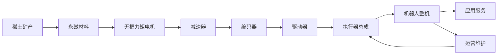

### 1.6.6 人机交互与社会接受度

人形机器人最终要在人类社会中工作，其动作、外观、声音和行为都会影响人类的感受。如果机器人动作过于僵硬或不可预测，可能引起恐惧或不适；如果机器人外观过于逼真，可能引发“恐怖谷”效应。

!!! note "术语解释：人机交互（Human-Robot Interaction, HRI）"
    人机交互是研究人类与机器人之间交互的跨学科领域，涵盖心理学、认知科学、设计学、工程学和伦理学。HRI 关注交互的可理解性、安全性、效率和社会接受度。对于人形机器人，HRI 设计需要特别考虑姿态、 gaze、动作可预测性、语音语调和物理接触安全。

---

### 1.6.7 复杂度的量化：接口数量与系统熵

系统复杂度可以通过接口数量和熵来初步量化。对于一个由 $n$ 个子系统组成的系统，若每两个子系统之间都可能存在接口，则潜在接口数量为 $O(n^2)$。人形机器人涉及 6–10 个主要子系统，每个子系统内部又有多个组件，接口数量可达数百。

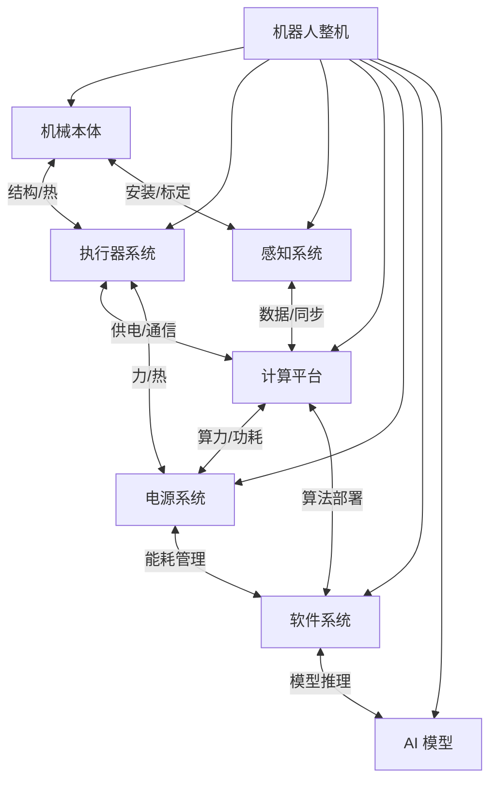

从信息论角度，系统的不确定性可以用熵来度量。若每个接口存在 $m$ 种可能的失效模式，则系统总的不确定性与接口数量和失效模式相关。复杂度管理的目标是通过模块化、标准化接口和接口契约来降低系统熵。

!!! note "术语解释：系统熵（System Entropy）"
    系统熵借用了热力学和信息论中的熵概念，描述系统的无序程度或不确定性。在系统工程中，高熵意味着组件间关系复杂、行为难以预测、故障传播路径多。降低系统熵的方法包括模块化、接口标准化、解耦设计和数字孪生。

### 1.6.8 级联风险与故障传播

人形机器人中的故障往往具有级联效应：一个子系统的微小故障可能通过耦合接口传播到其他子系统，最终导致整机停机或安全事故。例如：

- IMU 漂移 → 状态估计错误 → 落脚位置偏差 → 足部力传感器异常读数 → 控制器误判 → 跌倒
- 电池电压下降 → 电机输出扭矩不足 → 关节跟踪误差增大 → 全身控制器补偿过度 → 热保护触发 → 停机


管理级联风险需要：

1. **故障模式与影响分析（FMEA）**：系统识别潜在故障及其后果。
2. **冗余设计**：关键传感器、执行器和通信链路冗余。
3. **故障检测与隔离（FDI）**：实时检测异常并隔离故障源。
4. **安全状态机**：故障时切换到安全状态（如停机、蹲下、扶手）。

!!! note "术语解释：FMEA（Failure Mode and Effects Analysis）"
    失效模式与影响分析是一种系统化的风险评估方法，用于识别产品或过程中潜在失效模式、其原因和影响，并评估风险优先级数（RPN = 严重度 × 发生度 × 探测度）。FMEA 是汽车、航空航天和医疗设备行业的标准工具。

!!! note "术语解释：故障检测与隔离（Fault Detection and Isolation, FDI）"
    故障检测是判断系统是否发生故障，故障隔离是确定故障发生的位置或原因。FDI 方法包括基于模型的残差生成、基于数据驱动的异常检测和基于规则的诊断。在人形机器人中，FDI 对于安全运行至关重要。

### 1.6.9 社会技术系统视角

人形机器人不仅是技术系统，也是社会技术系统（Sociotechnical System）。它的部署会影响工作流程、劳动分工、培训需求、法律法规和公众认知。技术成功不等于社会接受，产品设计必须考虑：

- **工作岗位影响**：是替代人类还是增强人类能力？
- **隐私与安全**：机器人采集的数据如何保护？
- **责任归属**：发生事故时，责任在制造商、运营商还是用户？
- **文化差异**：不同地区对机器人外形和行为的接受度不同。

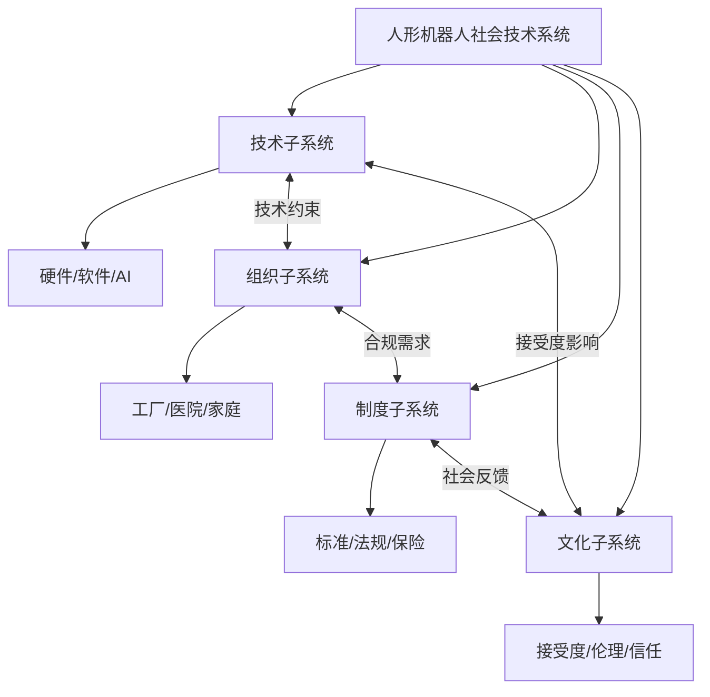

---

## 1.7 为什么需要知识图谱？

面对如此复杂的系统工程问题，传统的文献综述、技术报告或产品清单难以提供系统性的认知支持。它们往往是扁平的、碎片化的，无法清晰呈现不同技术、零部件、企业、标准和应用之间的关联关系。

### 1.7.1 传统知识组织方式的局限

| 方式 | 优点 | 局限 |
|------|------|------|
| 论文综述 | 系统梳理研究进展 | 更新慢，难以关联产业信息 |
| 产品数据库 | 便于查询产品参数 | 缺乏技术原理和供应链关系 |
| 行业报告 | 提供市场洞察 | 往往一次性，难以动态更新 |
| 技术博客 | 及时、具体 | 碎片化、来源质量参差不齐 |

### 1.7.2 知识图谱的核心优势

知识图谱以实体为节点、以关系为边，将人形机器人领域的各类知识结构化地组织起来。每个实体（如一种减速器、一篇论文、一家公司、一条标准）都有明确的类型、属性和来源；每条关系（如“使用”“组成”“制造”“适用于”）都经过定义和审核。

知识图谱具有以下优势：

**（1）跨层关联**

知识图谱可以表达从基础材料到整机系统、从算法到硬件、从制造到市场的多层次关系。例如，可以追踪：

```
某算法 → 使用了某数据集 → 部署于某机器人 → 使用某厂商减速器 → 由某种材料制成 → 受某标准约束
```

这种跨层链路对于识别瓶颈、评估替代方案和进行系统优化至关重要。

**（2）来源可追溯**

每个实体和关系都可以链接到其来源，如论文、报告、公司官网或标准文档。这保证了知识的可验证性。

**（3）动态演进**

人形机器人领域发展迅速，新知识、新产品和新企业不断涌现。知识图谱支持增量更新和版本管理。

**（4）支持推理与查询**

基于知识图谱，可以进行复杂的查询和推理，例如：

- 找出所有使用谐波减速器的人形机器人
- 识别某算法依赖的硬件清单
- 分析某零部件的供应商集中度
- 追踪某标准影响的设计选择

### 1.7.3 本书的知识图谱方法

本书选择以知识图谱为核心组织方式，系统梳理人形机器人从 0 到 1 的全流程知识。具体而言：

- **实体**：包括材料、零部件、方法、算法、数据集、软件、机器人、企业、标准、应用等。
- **关系**：包括组成关系、使用方法、制造关系、部署关系、适用关系、测试关系、监管关系等。
- **分层**：按照物理层、感知层、决策层、执行层、系统层、产业层组织知识。
- **跨层链路**：揭示从基础研究到产业应用的完整链条。

下图展示了本书知识图谱的简化结构：

```mermaid
graph TD
    subgraph 物理层
        M[材料] --> C[零部件]
        C --> A[执行器]
    end

    subgraph 感知层
        S[传感器] --> P[感知算法]
    end

    subgraph 决策层
        AI[AI 模型] --> PL[规划算法]
    end

    subgraph 执行层
        A --> CTRL[控制算法]
        CTRL --> A
    end

    subgraph 系统层
        R[机器人整机] --> SW[软件栈]
    end

    subgraph 产业层
        SUP[供应商] --> OEM[整机厂]
        OEM --> APP[应用场景]
        APP --> MKT[市场]
        STD[标准] --> R
    end

    A --> R
    P --> AI
    PL --> CTRL
    SW --> AI
    SW --> CTRL
```

!!! note "术语解释：知识图谱（Knowledge Graph）"
    知识图谱是一种用图结构表示知识的语义网络，由实体（节点）、关系（边）和属性组成。它起源于语义网（Semantic Web）和本体论（Ontology）研究，2012 年 Google 正式提出 Knowledge Graph 概念。知识图谱支持结构化查询、推理和可视化，是处理跨学科复杂知识的有效工具。

### 1.7.4 认知可扩展性：为什么知识图谱适合人形机器人

人形机器人领域知识横跨数十个学科、数百种零部件、数千家企业和数万篇文献。人类认知的短期记忆和工作记忆容量有限，无法同时处理如此大量的碎片化信息。知识图谱通过以下方式提升认知可扩展性：

1. **分层抽象**：将复杂系统分解为可管理的层次和模块。
2. **关系显式化**：将隐含的关联（如“某电机用于某机器人”）显式表达。
3. **多尺度导航**：既能在宏观层面查看产业链全景，也能在微观层面追踪某个零件的技术参数。
4. **持续更新**：随着技术和产业发展，知识图谱可以不断扩展和修正。

```mermaid
graph TD
    A[人形机器人知识] --> B[物理层]
    A --> C[感知层]
    A --> D[决策层]
    A --> E[执行层]
    A --> F[系统层]
    A --> G[产业层]

    B --> B1[材料属性]
    B --> B2[零件规格]
    C --> C1[传感器类型]
    C --> C2[感知算法]
    D --> D1[运动规划]
    D --> D2[VLA 模型]
    E --> E1[执行器]
    E --> E2[控制律]
    F --> F1[整机集成]
    F --> F2[软件栈]
    G --> G1[企业]
    G --> G2[市场]
    G --> G3[标准]
```

---

## 1.8 本书的结构与阅读路径

本书按照人形机器人产业化的逻辑链条组织内容，共分为十个部分、三十章。

### 1.8.1 全书结构

| 部分 | 主题 | 章节 |
|------|------|------|
| 第一部分 | 总论与方法论 | 第 1–2 章 |
| 第二部分 | 物理基础层：材料、零部件与供应链 | 第 3–7 章 |
| 第三部分 | 设计工程层 | 第 8–9 章 |
| 第四部分 | 制造与量产层 | 第 10–13 章 |
| 第五部分 | 控制与运动层 | 第 14–17 章 |
| 第六部分 | AI、模型与数据层 | 第 18–21 章 |
| 第七部分 | 软件与仿真层 | 第 22–24 章 |
| 第八部分 | 评测、基准与验证 | 第 25 章 |
| 第九部分 | 整机、企业与市场 | 第 26–28 章 |
| 第十部分 | 政策、伦理与未来 | 第 29–30 章 |

### 1.8.2 针对不同读者的阅读路径

不同专业背景的读者可按以下路径选择性阅读：

**学生/新进入者（建议从基础读起）**

```
第 1 章 → 第 3–5 章 → 第 8 章 → 第 14–16 章 → 第 18–19 章 → 第 26 章
```

**机械/制造工程师（聚焦物理实现）**

```
第 3–5 章 → 第 8–9 章 → 第 10–13 章 → 第 25 章
```

**AI/软件工程师（聚焦算法与系统）**

```
第 18–21 章 → 第 22–24 章 → 第 14–17 章 → 第 5–6 章
```

**产业/投资人（聚焦商业与生态）**

```
第 1 章 → 第 7 章 → 第 13 章 → 第 26–28 章 → 第 29–30 章
```

**政策研究者（聚焦监管与社会影响）**

```
第 1 章 → 第 12 章 → 第 29–30 章
```

---

## 1.9 为什么是人形：更深层的形态经济学

### 1.10.1 形态与任务的匹配

机器人形态的选择本质上是任务-环境-成本三者匹配的结果。轮式机器人在平坦地面上效率最高；飞行机器人适合三维空间快速移动；机械臂擅长重复性精密操作；人形机器人则在以下条件下具有潜在优势：

- 环境为人类设计（楼梯、门、工具、操作台）
- 任务多样且难以预先穷举
- 需要与人近距离协作
- 专用设备的集成和改造成本高于通用人形方案

```mermaid
graph TD
    A[机器人形态选择] --> B[轮式]
    A --> C[足式]
    A --> D[飞行]
    A --> E[机械臂]
    A --> F[人形]

    B --> B1[平坦地面高效率]
    C --> C1[复杂地形通过性]
    D --> D1[三维空间快速移动]
    E --> E1[高精度重复操作]
    F --> F1[人类环境通用性]
    F --> F2[人机协作接受度]
```

### 1.10.2 双足行走的权衡

双足行走是高能量效率与高机动性之间的折中。从生物力学看，人类双足行走的能量效率约为 0.8 J/(kg·m)，与轮式移动相比仍有差距，但双足能够跨越障碍、上下楼梯、在狭窄空间转身。

!!! note "术语解释：科斯特（Cost of Transport, COT）"
    运输成本是指移动单位质量、单位距离所消耗的能量，通常单位为 J/(N·m) 或无量纲（除以重力）。人类的 COT 约为 0.2；传统双足机器人的 COT 通常在 1–10 之间，远高于人类；优化的现代双足机器人可接近 0.5–1。

双足控制的困难在于：

1. **动态不稳定**：单支撑相时，机器人需要在倒立摆动力学下保持稳定。
2. **接触切换**：步态过程中支撑脚切换，导致系统动力学离散变化。
3. **欠驱动性**：地面接触力不可直接控制，只能通过整体运动间接调节。

数学上，双足机器人可以看作混合系统（Hybrid System）：

$$
\begin{cases}
\dot{x} = f_i(x, u), & \text{当处于接触模式 } i \\
x^+ = \Delta_{ij}(x^-), & \text{当发生模式切换 } i \to j
\end{cases}
$$

其中 $\Delta_{ij}$ 为碰撞/切换映射。

!!! note "术语解释：混合系统（Hybrid System）"
    混合系统是由连续动态和离散事件共同组成的动态系统。在机器人学中，双足行走的连续动态是肢体运动，离散事件是脚触地/离地、支撑相切换。混合系统理论为分析步态稳定性提供了数学框架。

### 1.10.3 通用性与专用性的经济学

人形机器人的商业论证最终取决于通用性溢价是否超过专用性效率损失。设：

- 专用设备完成单个任务的年成本为 $C_s$
- 人形机器人完成 $N$ 个任务的年成本为 $C_h + \sum_{i=1}^{N} c_i$

则人形方案具有成本优势的条件为：

$$
C_h + \sum_{i=1}^{N} c_i < \sum_{i=1}^{N} C_{s,i}
$$

当任务数量 $N$ 增加、专用设备集成成本高、任务切换频繁时，人形方案的通用性溢价更容易显现。

```mermaid
graph LR
    A[任务数量 N] --> B[专用方案总成本]
    A --> C[人形方案总成本]

    B -->|线性增长| D[ΣCs]
    C -->|亚线性增长| E[Ch + Σci]

    D --> F[盈亏平衡点]
    E --> F
```

---

## 1.10 产业化关键指标仪表盘

为跟踪人形机器人从 0 到 1 的进程，可以建立以下关键指标仪表盘：

| 维度 | 指标 | 2025 年行业水平 | 工业目标 |
|------|------|----------------|---------|
| 技术 | 双足行走速度 | 3–6 km/h | 5–8 km/h |
| 技术 | 续航时间 | 2–4 小时 | 8–12 小时 |
| 技术 | 灵巧手 DOF | 6–11 | 15–20 |
| 可靠性 | MTBF | 500–2,000 h | > 20,000 h |
| 可靠性 | 可用性 | 90–95% | > 99% |
| 成本 | BOM | $35k–100k | <$20k |
| 成本 | 售价 | $10k–250k | <$30k |
| 制造 | 年产能 | 百台–万台 | > 10 万台 |
| 部署 | 单场景运行时长 | 100–1,500 h | > 5,000 h |
| 合规 | 认证覆盖率 | 部分/试点 | 全市场准入 |

```mermaid
graph LR
    A[产业化仪表盘] --> B[技术指标]
    A --> C[可靠性指标]
    A --> D[成本指标]
    A --> E[制造指标]
    A --> F[部署指标]
    A --> G[合规指标]

    B --> B1[速度/续航/负载]
    C --> C1[MTBF/MTTR/可用性]
    D --> D1[BOM/售价/TCO]
    E --> E1[产能/良率/节拍]
    F --> F1[运行时长/任务成功率]
    G --> G1[认证/标准/市场准入]
```

---

## 1.11 本章延伸阅读与思考题

### 1.12.1 延伸阅读

- 维纳《控制论》第一章：反馈与信息
- Kajita 等《Introduction to Humanoid Robotics》：LIPM 与 preview control
- Siciliano & Khatib《Springer Handbook of Robotics》：机器人学全景
- Mori《The Uncanny Valley》：人形外观与情感反应
- Ebeling《An Introduction to Reliability and Maintainability Engineering》：可靠性工程基础

### 1.12.2 练习题

1. 假设某机器人有 20 个执行器，每个执行器 MTBF 为 80,000 小时，计算仅执行器子系统串联模型下的 MTBF。
2. 使用学习曲线公式，若第一台产品成本为 10 万美元，学习率为 20%，计算累计产量达到 10,000 台时的单位成本。
3. 解释为什么 ZMP 准则适用于平面足式机器人，但在点接触或复杂地形上需要更一般的处理方法。
4. 比较 Tesla Optimus 和 Figure AI 在产业化路径上的异同。
5. 设计一个适用于人形机器人研发项目的 TRL/MRL 评估检查表。

---


## 1.12 标准、认证与市场准入体系

人形机器人从实验室走向市场，必须通过多层次的标准与认证体系。这些标准不仅规定了产品必须满足的安全要求，也塑造了设计选择、测试流程和成本结构。

### 1.13.1 标准体系的层级结构

全球机器人标准体系呈现金字塔结构：顶层为国际基础标准，中层为区域和行业应用标准，底层为企业内部标准和测试规范。

```mermaid
graph TD
    A[机器人标准体系] --> B[国际标准]
    A --> C[区域标准]
    A --> D[行业标准]
    A --> E[企业标准]

    B --> B1[ISO/IEC 基础标准]
    B --> B2[IEEE 技术标准]
    C --> C1[欧盟 EN/CE]
    C --> C2[美国 UL/FCC]
    C --> C3[中国 GB/CR/CCC]
    D --> D1[汽车 ISO/TS 15066]
    D --> D2[医疗 IEC 60601]
    D --> D3[物流 VDI 2853]
    E --> E1[设计规范]
    E --> E2[测试规范]
    E --> E3[供应商规范]
```

!!! note "术语解释：标准（Standard）"
    标准是由公认机构制定、经协商一致批准的规范性文件，用于统一产品、过程或服务的技术要求。标准降低了交易成本、提高了互操作性、保障了安全，但也可能成为技术壁垒和市场准入门槛。

### 1.13.2 主要国际与区域标准概览

| 标准/认证 | 制定机构 | 适用范围 | 核心关注点 |
|----------|---------|---------|-----------|
| ISO 13482:2014 | ISO | 个人护理机器人 | 机械安全、速度/力限制、接触安全 |
| ISO/TS 15066:2016 | ISO | 协作机器人 | 最大允许压力/力、安全功能 |
| ISO 13849-1:2023 | ISO | 机械安全控制系统 | 控制系统安全相关部件可靠性 |
| IEC 61508:2010 | IEC | 功能安全通用标准 | SIL 等级、安全生命周期 |
| IEC 62368-1:2018 | IEC | 信息技术设备安全 | 电气安全、火灾、能量危险 |
| UL 1740 | UL | 工业机器人安全 | 机器人系统安全评估 |
| FCC Part 15 | FCC | 美国无线电设备 | 电磁兼容与射频干扰 |
| CE 标志 | 欧盟 | 欧盟市场准入 | 符合相关指令（机械指令、低电压指令等） |
| CR 认证 | 中国机器人联盟/认监委 | 中国机器人市场准入 | 安全、EMC、性能、可靠性 |
| CCC | 中国质检总局 | 强制性产品认证 | 电气安全等 |

!!! note "术语解释：CE 标志与 CCC 认证"
    CE 标志是产品进入欧盟市场的合格声明标志，表示产品符合欧盟相关指令的基本要求。CCC（China Compulsory Certification）是中国强制性产品认证，涉及人身安全、动植物生命健康和环境保护的产品必须获得 CCC 认证方可销售。

### 1.13.3 人形机器人标准面临的特殊挑战

相比工业机械臂和协作机器人，人形机器人的标准制定面临特殊挑战：

1. **形态多样性**：双足、轮式、混合形态难以用统一标准覆盖。
2. **动态接触**：跌倒、碰撞、抓取等动态接触场景的安全评估复杂。
3. **人机交互**：家庭和服务场景下与儿童、老人、残障人士的交互需要额外考虑。
4. **AI 自主性**：VLA 和强化学习模型的不确定性给功能安全评估带来新挑战。
5. **跨场景应用**：同一台机器人可能在工厂、物流、服务等多种场景使用，标准适用边界模糊。

```mermaid
graph TD
    A[人形机器人标准化挑战] --> B[形态多样性]
    A --> C[动态接触]
    A --> D[人机交互]
    A --> E[AI 自主性]
    A --> F[跨场景应用]

    B --> B1[双足/轮式/混合标准不统一]
    C --> C1[跌倒/碰撞/抓取安全]
    D --> D1[儿童/老人/弱势群体]
    E --> E1[模型不确定性/可解释性]
    F --> F1[同一产品多场景认证]
```

---

## 1.13 AI 与量产时代的技术栈

### 1.14.1 从传统控制到学习驱动

人形机器人的控制方法经历了从经典控制到优化控制、再到学习驱动的演进：

```mermaid
graph LR
    A[经典控制] --> B[ZMP/LIPM]
    B --> C[MPC/WBC]
    C --> D[强化学习]
    D --> E[端到端 VLA]

    A --> A1[PD 控制]
    B --> B1[倒立摆模型]
    C --> C1[约束优化]
    D --> D1[仿真训练]
    E --> E1[视觉-语言-动作统一]
```

!!! note "术语解释：强化学习（Reinforcement Learning, RL）"
    强化学习是一种通过与环境交互学习最优策略的机器学习方法。智能体在状态 $s_t$ 下采取动作 $a_t$，获得奖励 $r_t$ 并转移到下一状态 $s_{t+1}$，目标是最大化累计回报 $R = \sum_{t} \gamma^t r_t$。在机器人学中，RL 常用于学习 locomotion 和操作策略。

!!! note "术语解释：Sim-to-Real"
    Sim-to-Real 指将在仿真环境中训练的策略迁移到真实机器人的过程。由于仿真与真实世界存在动力学、感知和接触模型的差异（称为 reality gap），需要通过域随机化、系统辨识、残差学习和真实微调等技术缩小差距。

### 1.14.2 VLA 模型架构概述

VLA 模型通常由三个核心模块组成：

1. **视觉编码器**：将图像/视频转换为视觉特征。
2. **语言模型**：理解自然语言指令并生成任务规划。
3. **动作解码器**：将视觉-语言表示映射为机器人动作（关节位置、速度、力矩或末端位姿）。

```mermaid
graph LR
    I[图像输入] --> V[视觉编码器]
    T[文本指令] --> L[语言模型]
    V --> F[多模态融合]
    L --> F
    F --> A[动作解码器]
    A --> M[机器人动作]
```

代表性 VLA 模型包括：

- **RT-2（Google DeepMind）**：将机器人动作作为语言 token 处理。
- **OpenVLA**：开源 VLA 模型，支持多机器人数据微调。
- **GR00T N1（NVIDIA）**：面向人形机器人的基础模型。
- **Helix（Figure AI）**：端到端高速人形机器人控制。
- **π0（Physical Intelligence）**：通用机器人策略模型。

!!! note "术语解释：域随机化（Domain Randomization）"
    域随机化是在仿真训练中有意随机化物理参数（如质量、摩擦、阻尼、地形、光照、纹理），使策略对仿真与真实的差异具有鲁棒性。数学上，策略优化目标为 $J = \mathbb{E}_{p(\xi)}[R(\pi, \xi)]$，其中 $\xi$ 为随机化的环境参数。

### 1.14.3 数据飞轮与规模化学习

人形机器人的 AI 能力提升依赖于数据飞轮：

```mermaid
graph LR
    A[部署机器人] --> B[采集真实数据]
    B --> C[数据清洗与标注]
    C --> D[模型训练]
    D --> E[模型部署]
    E --> A

    D --> F[仿真生成数据]
    F --> C
```

真实数据包括遥操作演示、人类动作捕捉、自主运行记录和失败案例。仿真数据可以快速生成大量多样场景，但存在 reality gap。成功的数据策略通常是真实数据与仿真数据的结合。

!!! note "术语解释：数据飞轮（Data Flywheel）"
    数据飞轮是指产品使用越多，产生的数据越多，模型越好，产品体验越好，从而吸引更多使用的正反馈循环。在人形机器人中，数据飞轮是实现泛化能力和持续改进的关键机制。

---

## 1.14 产业化路径的多国比较

### 1.15.1 美国：技术领先与资本驱动

美国在人形机器人领域的技术创新和资本运作方面领先：

- **代表企业**：Tesla、Figure AI、Boston Dynamics、Agility Robotics、Apptronik。
- **优势**：AI 算法、大模型、资本市场、高端制造。
- **挑战**：制造成本高、供应链部分依赖亚洲、劳动力成本较高。

### 1.15.2 中国：供应链与成本优势

中国已成为全球最大的人形机器人生产和出货市场：

- **代表企业**：宇树科技、智元机器人、优必选、乐聚、傅利叶、银河通用。
- **优势**：完整供应链、低成本制造、快速迭代、庞大内需市场。
- **挑战**：高端芯片、部分核心零部件仍依赖进口、国际市场准入和品牌认知。

### 1.15.3 日本与欧洲：技术积累与应用探索

- **日本**：ASIMO、HRP 系列积累了大量双足控制和人机交互经验，但商业化相对谨慎。
- **欧洲**：重视安全标准、协作机器人、医疗和工业应用，但缺乏大规模量产企业。

#### 1.15.4 比较优势框架与政策工具箱

各国在人形机器人产业中的分工可用比较优势理论解释。设国家 $i$ 生产人形机器人整机的机会成本为 $OC_i$（以其他高技术产业产出衡量），则机会成本较低的国家在整机集成上具有比较优势。当前中国的比较优势在于制造执行器、减速器等机电部件的规模化生产能力；美国的比较优势在于 AI 模型、芯片设计和高价值软件；日本的优势在于精密减速器和长期可靠性技术；欧洲的优势在于安全标准、医疗监管经验和工业设计。

政府政策可视为改变比较优势的外生变量。常见政策工具包括：

| 政策工具 | 作用机制 | 典型应用 |
|---------|---------|---------|
| 研发补贴 | 降低企业 R&D 成本 | 美国 NSF/DoD 机器人项目、中国国家重点研发计划 |
| 政府采购 | 提供早期市场验证 | 工厂、医院、公共场景试点 |
| 产业基金 | 缓解资本约束 | 中国地方政府机器人基金 |
| 标准制定 | 塑造市场准入规则 | 欧盟 CE、中国 CR、美国 UL |
| 人才培养 | 扩大工程师供给 | 高校机器人专业、产教融合 |

```mermaid
graph TD
    A[国家产业政策] --> B[研发补贴]
    A --> C[政府采购]
    A --> D[产业基金]
    A --> E[标准制定]
    A --> F[人才培养]

    B --> G[降低创新成本]
    C --> H[创造早期需求]
    D --> I[扩大融资规模]
    E --> J[设置准入门槛]
    F --> K[增加要素供给]

    G --> L[比较优势重塑]
    H --> L
    I --> L
    J --> L
    K --> L
```

!!! note "术语解释：比较优势（Comparative Advantage）"
    比较优势由大卫·李嘉图（David Ricardo）于 1817 年提出，指一个国家或主体生产某种产品的机会成本低于其他主体时，即使其绝对效率并非最高，也应专注于该产品生产并通过贸易获益。在人形机器人产业链中，比较优势决定了零部件、整机、软件和服务的国际分工格局。

!!! note "术语解释：机会成本（Opportunity Cost）"
    机会成本是经济学中的核心概念，指为选择某一方案而放弃的最佳替代方案的收益。例如，一个国家将同样资源投入人形机器人整机制造而非半导体设计，所放弃的半导体产业收益即为其机会成本。比较优势分析强调相对效率而非绝对效率。

```python
# 四国比较优势量化示意：以成本指数与技术水平为二维指标
import numpy as np

countries = ['美国', '中国', '日本', '欧洲']
cost_index = np.array([85, 45, 70, 75])       # 整机制造成本指数，越低越好
tech_index = np.array([95, 75, 85, 80])       # 综合技术水平指数，越高越好

# 计算单位技术水平所需成本（机会成本代理）
opportunity_cost = cost_index / tech_index
for c, oc in zip(countries, opportunity_cost):
    print(f"{c}: 机会成本指数 = {oc:.3f}")
```

结果中中国机会成本指数最低，意味着在当前资源禀赋下，中国在整机制造上具有相对比较优势；美国虽然技术水平最高，但成本也最高，更适合占据高附加值环节。各国政策对产业格局的影响还将在第 28 章和第 29 章进一步讨论。

---

## 1.15 对未来的展望：从“有身体”到“有工作”

人形机器人产业化的终极标志不是技术参数，而是**在真实经济活动中持续创造价值**。这意味着：

1. **从演示到生产力**：机器人能够完成客户愿意付费的任务。
2. **从单台到 fleet**：多台机器人协同工作，由统一平台管理。
3. **从遥操作到自主**：人类监督而非直接控制。
4. **从试点到商业模式**：清晰的成本结构、定价、服务和盈利模式。

```mermaid
graph LR
    A[当前状态] --> B[短期目标]
    B --> C[中期目标]
    C --> D[长期愿景]

    A --> A1[万台级出货]
    A --> A2[工厂试点]
    B --> B1[十万台级产能]
    B --> B2[多场景部署]
    C --> C1[百万台级市场]
    C --> C2[半自主运行]
    D --> D1[通用劳动力]
    D --> D2[社会深度融合]
```

---

## 1.16 关键公式的快速参考

| 公式 | 含义 | 应用场景 |
|------|------|---------|
| $\dot{x} = f(x,u), y = h(x,u)$ | 动态系统形式化 | 控制设计、状态估计 |
| $M(q)\ddot{q} + C(q,\dot{q})\dot{q} + G(q) = \tau$ | 拉格朗日动力学 | 运动规划、仿真 |
| $P(t) = L / (1 + e^{-k(t-t_0)})$ | 技术采用 S 曲线 | 市场预测 |
| $C_n = C_1 n^{-b}$ | 学习曲线 | 成本预测 |
| $R(t) = e^{-\lambda t}$ | 可靠性函数 | 寿命预测 |
| $MTBF = 1/\lambda$ | 平均无故障时间 | 可靠性指标 |
| $A = MTBF / (MTBF + MTTR)$ | 可用性 | 维护规划 |
| $R_s = \prod R_i$ | 串联系统可靠性 | 系统可靠性设计 |

---

## 1.17 本章小结

本章从产业化的视角出发，系统回答了“为什么是人形机器人”以及“为什么现在是人形机器人的关键窗口期”这两个问题。

核心观点如下：

1. **人形机器人是模仿人类形态和运动能力的通用机器**，其优势在于环境兼容性、任务通用性和社会接受度，但这些优势目前还只是理论上的。

2. **当前正处于产业化关键窗口期**：2025 年全球市场规模约 30 亿美元，安装量约 1.6 万台，中国占比超过 80%；特斯拉、Figure AI、宇树、智元、优必选等头部厂商已进入真实部署或量产爬坡阶段。

3. **成本正在快速下降**：2023–2024 年制造成本下降 40%，中国厂商 BOM 已降至约 3.5 万美元，宇树 R1 售价低至 5,900 美元，为规模化应用奠定基础。

4. **人形机器人产业化的核心矛盾是“能走”与“能卖”的差距**。可靠性、成本、可维护性与合规性构成了产品化的四维约束。

5. **从 0 到 1 需要经历七个跃迁阶段**：实验室样机、工程样机、小批量验证、量产准备、场景部署、运营维护和规模化复制。2025–2026 年行业正处于从场景部署向运营维护和规模化复制过渡的早期。

6. **人形机器人是高度复杂的系统工程对象**，具有多学科耦合、高自由度、开放环境不确定性、软硬件深度耦合、长价值链和人机交互复杂性等特点。

7. **传统知识组织方式难以应对这种复杂性**，知识图谱能够以实体-关系的方式结构化组织跨领域知识，支持跨层关联、来源追溯、动态演进和复杂查询。

8. **人形形态的选择是形态经济学的结果**：在人类建造的环境中，双足行走的通用性可能抵消其在单一任务上的效率劣势，前提是任务多样性和部署规模足够大。

9. **可靠性与可用性是可量化的工程指标**：通过 $R(t)$、MTBF、MTTR、串联系统模型和可用性公式，可以建立从演示到产品的工程判断标准。

10. **标准与认证是市场准入的必要条件**：ISO、IEC、UL、CE、CCC、CR 等多层次标准体系塑造产品设计、测试流程和成本结构。

11. **AI 与量产正在重塑技术栈**：VLA 模型、强化学习、sim-to-real 和数据飞轮正在推动人形机器人从预编程动作向感知驱动的自主行为演进。

12. **2025–2026 年的产业格局由美国技术创新、中国供应链与成本优势、日本与欧洲的技术积累共同塑造**，真正的规模化复制尚未到来。

后续章节将围绕这一框架展开，逐步深入人形机器人从材料到市场、从技术到产业的完整旅程。

---

## 1.18 本章符号表

| 符号 | 含义 | 单位/量纲 | 首次出现 |
|------|------|----------|---------|
| $x(t)$ | 系统状态向量 | $\mathbb{R}^n$ | 1.1.5 |
| $u(t)$ | 控制输入 | $\mathbb{R}^m$ | 1.1.5 |
| $y(t)$ | 系统输出/传感器测量 | $\mathbb{R}^p$ | 1.1.5 |
| $q$ | 广义坐标 | $\mathbb{R}^n$ | 1.1.5 |
| $M(q)$ | 质量矩阵 | kg·m² | 1.1.5 |
| $C(q,\dot{q})$ | 科氏力与离心力项 | kg·m²/s | 1.1.5 |
| $G(q)$ | 重力项 | N·m | 1.1.5 |
| $\tau$ | 关节力矩 | N·m | 1.1.5 |
| $J_c$ | 接触点雅可比矩阵 | — | 1.1.5 |
| $F_c$ | 地面接触力 | N | 1.1.5 |
| $C_{total}^{(h)}$ | 人形方案总拥有成本 | 美元 | 1.1.2 |
| $C_{total}^{(s)}$ | 专用方案总拥有成本 | 美元 | 1.1.2 |
| $N$ | 任务种类数 | — | 1.1.2 |
| $\eta_s$ | 专用机器人任务效率 | — | 1.1.2 |
| $\eta_h$ | 人形机器人任务效率 | — | 1.1.2 |
| $R(t)$ | 可靠性函数 | 概率 | 1.4.1 |
| $\lambda$ | 故障率 | /小时 | 1.4.1 |
| $MTBF$ | 平均无故障时间 | 小时 | 1.4.1 |
| $MTTR$ | 平均修复时间 | 小时 | 1.4.3 |
| $A$ | 可用性 | 概率 | 1.4.3 |
| $C_n$ | 第 $n$ 台产品成本 | 美元 | 1.3.7 |
| $C_1$ | 第一台产品成本 | 美元 | 1.3.7 |
| $b$ | 学习指数 | — | 1.3.7 |
| $LR$ | 学习率 | — | 1.3.7 |
| $P(t)$ | 市场渗透率 | — | 1.3.7 |
| $L$ | 市场渗透率上限 | — | 1.3.7 |
| $k$ | S 曲线增长率参数 | 1/年 | 1.3.7 |
| $t_0$ | S 曲线拐点时间 | 年 | 1.3.7 |
| $M_t$ | 市场规模 | 美元 | 1.3.1.1 |
| $TAM_t$ | 总可触达市场 | 美元 | 1.3.1.1 |
| $ASP_t$ | 平均售价 | 美元 | 1.3.1.1 |
| $N_t$ | 出货量 | 台 | 1.3.1.1 |
| $C_h$ | 人类岗位年成本 | 美元/年 | 1.3.5.1 |
| $C_r$ | 机器人年等价成本 | 美元/年 | 1.3.5.1 |
| $c_h$ | 人类小时成本 | 美元/小时 | 1.3.5.2 |
| $c_r$ | 机器人小时成本 | 美元/小时 | 1.3.5.2 |
| $OADR_t$ | 老年抚养比 | % | 1.3.5.1 |
| $\mathcal{D}$ | DSM 耦合矩阵 | $\{0,1\}^{n\times n}$ | 1.6.1.1 |
| $\rho_c$ | 系统耦合度 | — | 1.6.1.1 |
| $E_{battery}$ | 电池可用能量 | Wh | 1.6.1.2 |
| $\rho_E$ | 电池能量密度 | Wh/kg | 1.6.1.2 |
| $T_{total}$ | 端到端总延迟 | s | 1.6.4.1 |
| $T_s$ | 控制采样周期 | s | 1.6.4.1 |
| $f_{max}$ | 扰动最高频率 | Hz | 1.6.4.1 |
| $OC_i$ | 国家 $i$ 生产整机的机会成本 | — | 1.15.4 |

---

## 本章知识图谱锚点

**核心实体**

| 实体类型 | 代表实体 |
|---------|---------|
| `robot_system` | Tesla Optimus Gen 3、Unitree H1/G1/R1、Figure 02/03、Boston Dynamics Atlas、Agility Digit、Hexagon AEON |
| `company` | Tesla、Figure AI、Unitree、AgiBot、UBTECH、Leju Robotics、Apptronik、Boston Dynamics |
| `component` | actuator、harmonic reducer、RV reducer、IMU、LiDAR、compute unit |
| `technology` | locomotion、manipulation、teleoperation、VLA、sim-to-real |
| `concept` | system engineering、mass production、compliance、uncanny valley |
| `standard` | ISO 13482、IEC 61508、ISO 13849、ISO/TS 15066 |
| `market` | industrial manufacturing、logistics、healthcare、home service |

**核心关系**

| 关系类型 | 含义 | 示例 |
|---------|------|------|
| `is_part_of` | 零部件组成整机 | 执行器 → 机器人 |
| `implemented_on` | 方法/算法部署于机器人 | Helix → Figure 03 |
| `applies_to` | 标准/工艺适用于系统 | ISO 13482 → 服务机器人 |
| `manufactures` | 供应商制造零部件 | Harmonic Drive Systems → 谐波减速器 |
| `sources_from` | 整机厂从供应商采购 | Tesla → 拓普集团 |
| `uses_dataset` | 方法使用数据集 | GR00T N1 → 人形机器人训练数据 |
| `requires` | 方法依赖硬件/软件 | VLA → Jetson Thor |
| `deployed_at` | 机器人部署于客户场景 | Figure 02 → BMW Spartanburg |

**跨层链路示例**

```
稀土材料 → 永磁体 → 无框力矩电机 → 执行器 → 机器人整机 → 宝马工厂部署 → 工业制造市场 → 安全标准/认证
```

**关键思考问题**

1. 人形机器人与轮式机器人、工业机械臂的本质区别是什么？
2. 2025–2026 年为什么被认为是人形机器人产业化的关键窗口期？有哪些数据支撑？
3. “能走的机器人”与“能卖的机器人”在哪些方面存在差距？
4. 从实验室到规模化部署需要经历哪些阶段？每个阶段的核心任务和风险是什么？
5. 知识图谱方法如何解决人形机器人领域的知识碎片化问题？

---

## 参考文献与数据来源

[1] Siciliano, B., & Khatib, O. (Eds.). (2016). *Springer Handbook of Robotics* (2nd ed.). Springer.

[2] Sakagami, Y., Watanabe, R., Aoyama, C., Matsunaga, S., Higaki, N., & Fujimura, K. (2002). The intelligent ASIMO: System overview and integration. *IEEE/RSJ International Conference on Intelligent Robots and Systems (IROS)*, 2478–2483.

[3] Kuindersma, S., Deits, R., Fallon, M., Valenzuela, A., Dai, H., Permenter, F., ... & Tedrake, R. (2016). Optimization-based locomotion planning, estimation, and control design for the Atlas humanoid robot. *Autonomous Robots*, 40(3), 429–455.

[4] ISO 13482:2014. *Robots and robotic devices — Safety requirements for personal care robots*. International Organization for Standardization.

[5] IEC 61508:2010. *Functional safety of electrical/electronic/programmable electronic safety-related systems*. International Organization for Standardization.

[6] Mori, M. (1970). The uncanny valley. *Energy*, 7(4), 33–35.

[7] Gibson, J. J. (1977). The theory of affordances. In R. Shaw & J. Bransford (Eds.), *Perceiving, Acting, and Knowing* (pp. 67–82). Lawrence Erlbaum.

[8] Wiener, N. (1948). *Cybernetics: Or Control and Communication in the Animal and the Machine*. MIT Press.

[9] Shannon, C. E. (1948). A mathematical theory of communication. *Bell System Technical Journal*, 27(3), 379–423.

[10] Turing, A. M. (1950). Computing machinery and intelligence. *Mind*, 59(236), 433–460.

[11] Vukobratović, M., & Borovac, B. (2004). Zero-moment point — Thirty five years of its life. *International Journal of Humanoid Robotics*, 1(1), 157–173.

[12] Kajita, S., Kanehiro, F., Kaneko, K., Fujiwara, K., Harada, K., Yokoi, K., & Hirukawa, H. (2003). Biped walking pattern generation by using preview control of zero-moment point. *IEEE International Conference on Robotics and Automation (ICRA)*, 2, 1620–1626.

[13] Kajita, S., Hirukawa, H., Harada, K., & Yokoi, K. (2014). *Introduction to Humanoid Robotics*. Springer.

[14] Pfeifer, R., & Bongard, J. (2006). *How the Body Shapes the Way We Think: A New View of Intelligence*. MIT Press.

[15] Wilson, A. D., & Golonka, S. (2013). Embodied cognition is not what you think it is. *Frontiers in Psychology*, 4, 58.

[16] MarketsandMarkets. (2026). *Humanoid Robot Market Report, 2025–2030*.

[17] Research Nester. (2026). *Humanoid Robot Market Size & Forecast, 2026–2035*.

[18] BCC Research. (2026). *Global Humanoid Robot Market Report*.

[19] MarketIntelo. (2026). *Physical AI Humanoid Robotics Market Size, Share & Trends Analysis Report 2025–2034*.

[20] Maximizemarketresearch. (2026). *Global Humanoid Robot Market Size, 2025–2032*.

[21] Goldman Sachs Global Investment Research. (2025–2026). *Humanoid robots: The next general purpose platform?*

[22] Robozaps. (2026-06-09). Humanoid Robot Market Size: $38B by 2035 [Data]. https://blog.robozaps.com/b/market-size-for-humanoid-robots

[23] Counterpoint Research. (2026-01). *Humanoid Robot Market Monitor*.

[24] Yahoo Finance / iiots-world. (2026-05-19). *Global Commercial Humanoid Robotics Market Research 2025–2030*.

[25] Bank of America / Deloitte. (2026). *Tech Trends: Humanoid Robot Cost Analysis*.

[26] Fortune / Tesla Q4 2024 Earnings Call. (2025-01-30). Elon Musk reveals massive plans for Tesla and Optimus.

[27] Teslarati. (2026-07-01). Tesla Optimus project fires up as Musk sees production line progress.

[28] Optimusk.blog. (2026-06). *Tesla Optimus Factory Deployment 2025–2026: Inside the Gigafactory Rollout*.

[29] BMW Group PressClub. (2026-02-27/05-13). BMW Group to deploy humanoid robots in production in Germany for the first time.

[30] Figure AI. (2025-11). BMW Spartanburg pilot results: 30,000+ X3 vehicles, 90,000+ parts, 1,250 hours.

[31] TechMarketBriefs. (2026-04). *Figure AI IPO 2026: $39B Valuation, Risks & Bull Case*.

[32] 36 氪 / 虎嗅 / 未来汽车日报. (2026-06). 人形机器人出海，从“演员”到“打工人”。

[33] AI 中国网. (2026-04). 乐聚机器人完成 IPO 辅导验收，人形机器人上市潮谁先盈利？

[34] 新浪财经. (2026-04). 宇树一年赚 6 亿，优必选一年亏 7 亿：同样的机器人赛道，完全不同的账本。

[35] Mankins, J. C. (2009). Technology readiness assessments: A retrospective. *Acta Astronautica*, 65(9–10), 1216–1223.

[36] U.S. Department of Defense. (2011). *Manufacturing Readiness Level (MRL) Deskbook*.

[37] Cooper, R. G. (2008). Perspective: The Stage-Gate® idea-to-launch process — Update, what's new, and NexGen systems. *Journal of Product Innovation Management*, 25(3), 213–232.

[38] OICA. (2025). *World Motor Vehicle Production Statistics*.

[39] International Federation of Robotics (IFR). (2025). *World Robotics 2025 Industrial Robots*.

[40] ISO 13849-1:2023. *Safety of machinery — Safety-related parts of control systems — Part 1: General principles for design*. International Organization for Standardization.

[41] ISO/TS 15066:2016. *Collaborative robots — Safety requirements*. International Organization for Standardization.

[42] IEC 62368-1:2018. *Audio/video, information and communication technology equipment — Part 1: Safety requirements*. International Electrotechnical Commission.

[43] Boston Consulting Group (BCG). (1972). *Perspectives on Experience*. Boston Consulting Group.

[44] Wright, T. P. (1936). Factors affecting the cost of airplanes. *Journal of the Aeronautical Sciences*, 3(4), 122–128.

[45] Barlow, R. E., & Proschan, F. (1975). *Statistical Theory of Reliability and Life Testing: Probability Models*. Holt, Rinehart and Winston.

[46] Ebeling, C. E. (2019). *An Introduction to Reliability and Maintainability Engineering* (3rd ed.). Waveland Press.

[47] Nahmias, S. (2021). *Production and Operations Analysis* (8th ed.). Waveland Press.

[48] Murphy, R. R., & Woods, D. D. (2009). Beyond Asimov: The three laws of responsible robotics. *IEEE Intelligent Systems*, 24(4), 14–20.

[49] Goodrich, M. A., & Schultz, A. C. (2007). Human-robot interaction: A survey. *Foundations and Trends in Human-Computer Interaction*, 1(3), 203–275.

[50] Hogan, N. (1985). Impedance control: An approach to manipulation: Part I — Theory. *Journal of Dynamic Systems, Measurement, and Control*, 107(1), 1–7.

[51] Broekman, W., Aftergood, L., Ho, O., Toschi, C., Jackson, P., & Madhaven, R. (2021). *Technology Readiness Assessment Guidebook*. NASA.

[52] 本书知识图谱项目：Awesome Humanoid Robot. 内部项目资料.


### 1.4.6 产品化四维约束的权衡关系

可靠性、成本、可维护性和合规性四个维度并非独立，而是相互制约。提高可靠性通常需要更贵的零部件和更严格的测试；降低成本可能牺牲可维护性或合规投入；加快认证周期可能需要增加测试资源和费用。

```mermaid
graph TD
    A[产品化四维约束] --> B[可靠性]
    A --> C[成本]
    A --> D[可维护性]
    A --> E[合规性]

    B <-->|冗余设计增加成本| C
    B <-->|高可靠性部件延长认证| E
    C <-->|低成本材料增加维护频率| D
    D <-->|模块化设计增加初期成本| C
    E <-->|认证费用抬高成本| C
    E <-->|安全要求限制设计自由度| B
```

在实际产品开发中，企业需要根据目标应用场景确定约束优先级。例如：

- **工厂产线**：可靠性 > 可维护性 > 合规性 > 成本
- **消费级教育机器人**：成本 > 可维护性 > 合规性 > 可靠性
- **医疗护理机器人**：合规性 > 可靠性 > 可维护性 > 成本

!!! note "术语解释：约束优化（Constrained Optimization）"
    约束优化是在满足一组约束条件的前提下，使目标函数最大化或最小化的数学问题。标准形式为：$\min_x f(x)$，满足 $g_i(x) \leq 0$ 和 $h_j(x) = 0$。产品化四维约束可以看作多目标优化问题，常用 Pareto 前沿方法寻找最优权衡。

### 1.4.7 从演示到产品的成本结构演变

随着产量增加，成本结构会发生显著变化。早期样机的成本主要由 NRE 和小批量采购决定；进入量产后，BOM 和制造成本成为主导；规模化运营阶段，服务和维护成本占比上升。

```mermaid
pie title 样机阶段成本构成（小批量）
    "NRE 摊销" : 45
    "BOM" : 30
    "人工装配" : 15
    "测试认证" : 7
    "物流" : 3
```

```mermaid
pie title 量产阶段成本构成（大规模）
    "BOM" : 55
    "制造费用" : 20
    "人工装配" : 10
    "物流与库存" : 8
    "售后服务" : 5
    "NRE 摊销" : 2
```

### 1.4.8 可靠性与成本的帕累托前沿

在产品设计中，可靠性和成本通常存在帕累托权衡：提高可靠性需要更好的材料、更严格的工艺和更多的测试，从而增加成本。企业需要在帕累托前沿上选择适合自己定位的点。

```mermaid
graph LR
    A[低成本低可靠性] --> B[边际改善]
    B --> C[帕累托前沿拐点]
    C --> D[高成本高可靠性]

    style A fill:#ffcccc
    style D fill:#ccffcc
    style C fill:#ffffcc
```

数学上，若 $R$ 表示可靠性水平，$C$ 表示成本，帕累托前沿由满足以下条件的点组成：

$$
\nexists (R', C') : R' > R \text{ 且 } C' < C
$$

即不存在可靠性更高且成本更低的方案。

---


[53] IEEE. (2022). *IEEE 1872-2015 — Standard Ontologies for Robotics and Automation*. IEEE.

[54] ASTM International. (2023). *F45 Committee on Robotics, Automation, and Autonomous Systems*.

[55] VDI/VDE 2853. (2021). *Requirements for service robots in intralogistics*. VDI/VDE.

[56] Underwriters Laboratories. (2018). *UL 1740 Standard for Safety for Robots and Robotic Equipment*.

[57] European Commission. (2006). *Machinery Directive 2006/42/EC*.

[58] State Administration for Market Regulation (SAMR), China. (2022). *China Robot Certification (CR) Implementation Rules*.

[59] Google DeepMind. (2023). RT-2: Vision-language-action models transfer web knowledge to robotic control. *arXiv preprint arXiv:2307.15818*.

[60] Kim, S., Zhou, Y., Allshire, A., Bhatia, E., Antonova, R., Hogan, F. R., ... & Fazeli, N. (2024). OpenVLA: An open-source vision-language-action model. *arXiv preprint arXiv:2406.09246*.

[61] Black, K., Brown, N., Driess, D., Esmail, A., Equi, M., Finn, C., ... & Wahid, A. (2024). π0: A vision-language-action flow model for general robot control. *arXiv preprint arXiv:2410.24164*.

[62] NVIDIA. (2025). GR00T N1: An open foundation model for humanoid robots. *NVIDIA Technical Blog*.

[63] Figure AI. (2025). Helix: A vision-language-action model for generalist humanoid control. *Figure AI Research*.

[64] Tobin, J., Fong, R., Ray, A., Schneider, J., Zaremba, W., & Abbeel, P. (2017). Domain randomization for transferring deep neural networks from simulation to the real world. *IEEE/RSJ International Conference on Intelligent Robots and Systems (IROS)*, 23–30.

[65] Pinto, L., Andrychowicz, M., Welinder, P., Zaremba, W., & Abbeel, P. (2017). Asymmetric actor critic for image-based robot learning. *Robotics: Science and Systems (RSS)*.

[66] Raibert, M. H. (1986). *Legged Robots That Balance*. MIT Press.

[67] Pratt, J., Carff, J., Drakunov, S., & Goswami, A. (2006). Capture point: A step toward humanoid push recovery. *IEEE-RAS International Conference on Humanoid Robots*, 200–207.

[68] Stephens, B. J., & Atkeson, C. G. (2010). Push recovery by stepping for humanoid robots with force controlled joints. *IEEE-RAS International Conference on Humanoid Robots*, 52–59.

[69] Herzog, A., Rotella, N., Mason, S., Grimminger, F., Schaal, S., & Righetti, L. (2016). Momentum control with hierarchical inverse dynamics on a torque-controlled humanoid. *Autonomous Robots*, 40(3), 473–491.

[70] Wieber, P. B. (2006). Trajectory free linear model predictive control for stable walking in the presence of strong perturbations. *IEEE-RAS International Conference on Humanoid Robots*, 137–142.

[71] Hwang, J., Fu, Y., & Mittal, R. (2021). Zero-shot text-to-image generation. *arXiv preprint arXiv:2102.12092*.

[72] Agrawal, P., Nair, A. V., Abbeel, P., Malik, J., & Levine, S. (2016). Learning to poke by poking: Experiential learning of intuitive physics. *Advances in Neural Information Processing Systems (NeurIPS)*, 29.

[73] Levine, S., Finn, C., Darrell, T., & Abbeel, P. (2016). End-to-end training of deep visuomotor policies. *Journal of Machine Learning Research*, 17(1), 1334–1373.

[74] Sutton, R. S., & Barto, A. G. (2018). *Reinforcement Learning: An Introduction* (2nd ed.). MIT Press.

[75] IEEE. (2020). *IEEE 7000-2021 — IEEE Standard Model Process for Addressing Ethical Concerns during System Design*.

[76] Winfield, A. F., & Jirotka, M. (2018). Ethical governance is essential to building trust in robotics and artificial intelligence systems. *Philosophical Transactions of the Royal Society A*, 376(2133), 20180085.

[77] Bryson, J. J., Diamantis, M. E., & Grant, T. D. (2017). Of, for, and by the people: the legal lacuna of synthetic persons. *Artificial Intelligence and Law*, 25(3), 273–291.

[78] Calo, R., Froomkin, A. M., & Kerr, I. (2016). *Robot Law*. Edward Elgar Publishing.

[79] International Federation of Robotics (IFR). (2024). *World Robotics 2024 Service Robots*.

[80] McKinsey & Company. (2025). *The future of robotics: Humanoids and the path to general-purpose automation*.

[81] Boston Consulting Group (BCG). (2025). *Humanoid robots: The next industrial revolution?*

[82] ABI Research. (2026). *Humanoid Robot Market Forecast: 2025–2035*.

[83] Omdia. (2026). *Humanoid Robotics Market Tracker: 2025 Shipments and Market Share*.

[84] Morgan Stanley. (2026). *China Humanoid Robot Industry Outlook 2026*.

[85] 本书知识图谱项目：Awesome Humanoid Robot. 内部项目资料.
