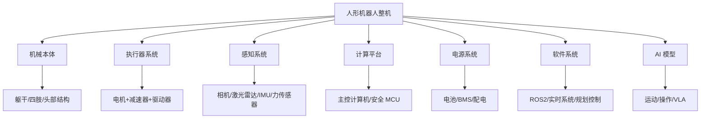
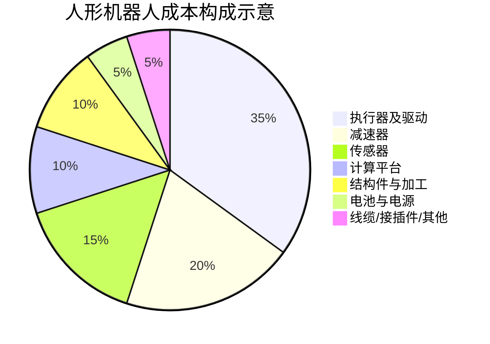
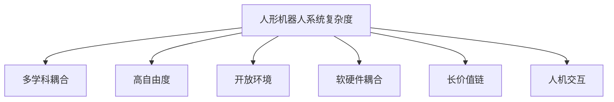
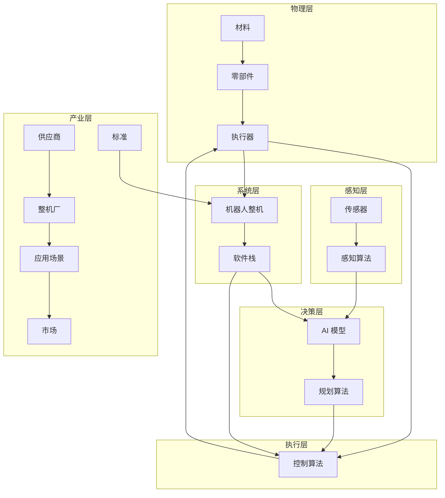

# 第 1 章 绪论：为什么是人形机器人？

## 摘要

人形机器人（Humanoid Robot）是指外形和运动方式模仿人类的机器人，通常具有躯干、头部、双臂、双腿和多指手。2025-2026 年，这一领域正经历从"技术演示"向"产业落地"的关键转折：全球 2025 年市场规模约 29-32 亿美元，安装量约 1.6 万台，其中中国占比超过 80%；特斯拉 Optimus Gen 3 于 2026 年 1 月在弗里蒙特工厂启动量产，Figure AI 在宝马斯巴达堡工厂完成了 11 个月、搬运 9 万余个零件的真实工业验证，而宇树科技、智元机器人、优必选等中国厂商已进入万台级产能爬坡阶段。

然而，能够在演示视频中完成行走、奔跑或抓取动作的"演示型机器人"，与能够在工厂、仓库或家庭中稳定工作多年的"产品型机器人"之间，仍然存在巨大鸿沟。这一鸿沟体现在可靠性、成本、可维护性与合规性四个维度。从实验室样机到规模化复制，人形机器人需要经历七个递进的跃迁阶段。由于该领域横跨机械、电子、控制、人工智能、材料、制造、供应链和政策等多个学科，必须以知识图谱的方式组织其跨学科知识，才能支持系统性的认知、推理与决策。

**关键词**：人形机器人；产业化；知识图谱；系统工程；从 0 到 1；具身智能；VLA

---

## 1.1 什么是人形机器人？

### 1.1.1 基本定义

人形机器人是一种设计上模仿人类身体结构和运动能力的机器人。与工业机械臂、扫地机器人、无人机等专用机器人不同，人形机器人的核心特征是：

- **双足行走**：用两条腿像人一样行走，而不是轮子或履带。
- **上身操作**：通常具有两只手臂和多指手掌，能够抓取、搬运、操作工具。
- **人机环境兼容**：外形尺寸接近人类，理论上可以直接使用为人类设计的楼梯、门、工具、工作台和交通工具。

用一句话概括：**人形机器人是试图在人类建造的世界中，以人类的方式完成任务的通用机器。**

### 1.1.2 为什么是人形？

初学者最常问的问题是：既然轮式机器人更稳定、机械臂更便宜，为什么还要做双足人形？原因可以归纳为三点：

| 理由 | 具体解释 |
|------|---------|
| **环境兼容性** | 人类社会的楼梯、门槛、狭窄通道、扶手、操作台都是按人体尺寸设计的。轮式机器人无法上下楼梯，固定机械臂无法移动。人形形态理论上可以直接进入这些空间。 |
| **任务通用性** | 工厂中的拧螺丝、搬运箱子、按按钮、推门等动作，人类用双手完成。人形机器人如果足够灵活，理论上可以执行多种任务，而不需要为每个任务重新设计专用设备。 |
| **社会接受度** | 在服务、医疗、家庭等与人密切接触的场景中，人形外形更容易被人类理解和预测其动作意图，从而提升安全感与交互体验。 |

当然，这三个优势目前还只是"理论优势"。现实中的双足行走仍然能耗高、控制难、易跌倒，灵巧手的成本和可靠性也远未达到人类水平。这也是为什么人形机器人产业化如此困难。

### 1.1.3 主要形态与分类

人形机器人并非只有一种形态。根据下半身设计，可以分为：

- **全尺寸双足人形**：身高 1.5-1.8 米，双腿行走，如 Tesla Optimus、Unitree H1、Figure 02/03、波士顿动力 Atlas。
- **轮式/混合人形**：上半身为人形，下半身用轮子或腿轮混合，如 Agility Digit、Hexagon AEON（用于宝马莱比锡工厂）。
- **小型桌面人形**：主要用于研究、教育和娱乐，如 NAO、Pepper、宇树 G1。
- **半身或 telepresence 人形**：只有上半身，用于远程呈现和交互。

根据应用目标，又可分为：

- **研究平台**：供高校和实验室开发算法，如 Atlas、H1。
- **工业应用型**：面向工厂、物流，如 Figure 03、Optimus Gen 3。
- **服务/家庭型**：面向商业服务、医疗陪护、家庭助理，目前尚不成熟。

### 1.1.4 关键子系统一览

一台人形机器人由机械本体、执行器、传感器、计算平台、电源、软件与 AI 模型等多个子系统组成。下图给出了简化结构：



> **术语解释框 1.1**：
> - **执行器（Actuator）**：机器人的"肌肉"，负责产生运动和力。一台人形机器人通常有 20-50 个执行器。
> - **减速器（Reducer/Gearbox）**：降低电机转速、放大输出扭矩的装置。常用类型包括谐波减速器、RV 减速器和行星减速器。
> - **IMU（Inertial Measurement Unit）**：惯性测量单元，包含加速度计和陀螺仪，用于感知姿态和运动。
> - **VLA（Vision-Language-Action Model）**：视觉-语言-动作模型，能够理解图像和自然语言指令并输出机器人动作。
> - **BMS（Battery Management System）**：电池管理系统，保护电池安全并优化续航。

---

## 1.2 人形机器人的发展历程

### 1.2.1 从机械玩偶到动力学行走

人形机器人的历史可以分为四个阶段：

| 阶段 | 时间 | 代表成果 | 核心特征 |
|------|------|---------|---------|
| **机械时代** | 18-20 世纪初 | 自动机械玩偶 | 纯机械传动，无智能 |
| **机电时代** | 1960s-1980s | WABOT-1（1973，日本早稻田大学） | 第一台完整人形机器人，静态行走 |
| **动态行走时代** | 1990s-2010s | 本田 ASIMO（2000）、波士顿动力 PETMAN/Atlas | 实现动态平衡、跑步、跳跃 |
| **AI 融合与量产时代** | 2020s 至今 | Tesla Optimus、Figure、Unitree、智元机器人 | AI 驱动感知决策，强调量产和产业化 |

### 1.2.2 本田 ASIMO：技术巅峰与商业困境

本田 ASIMO（Advanced Step in Innovative Mobility）是 2000 年代最具代表性的人形机器人。它能够以 6 km/h 的速度跑步、上下楼梯、避障、与人握手，甚至进行简单的语音交互。

然而，本田于 2018 年停止 ASIMO 的开发。其原因值得深思：

- **成本过高**：单台成本估计超过 100 万美元，无法商业化。
- **应用场景不清**：除了展示和接待，难以找到可持续的商业模式。
- **技术封闭**：系统高度定制化，难以扩展。

ASIMO 的故事说明：**技术先进不等于商业成功**。人形机器人要实现产业化，必须在成本、应用场景和可维护性上取得突破。

### 1.2.3 波士顿动力 Atlas：动态能力的极限

波士顿动力 Atlas 代表了双足动态运动的最高水平，能够后空翻、跑酷、跨越障碍。2024 年，波士顿动力退役了液压版 Atlas，推出全电动版，转向商业应用探索，尤其是在现代汽车集团的工厂网络中。

Atlas 的价值在于推动控制理论和机器人极限，但其商业化路径仍在探索中。

### 1.2.4 2025-2026 年新一波浪潮：从演示到真实部署

与 ASIMO 和早期 Atlas 不同，2025-2026 年的新浪潮强调**真实场景中的长期部署和量产可行性**：

- **Tesla Optimus**：2026 年 1 月 21 日，Gen 3 在弗里蒙特工厂启动量产；Model S/X 产线被改造为 Optimus 生产线，目标年产能 100 万台；得州 Gigafactory 在建专用工厂，目标年产能 1000 万台。
- **Figure AI**：2025 年 9 月完成 10 亿美元 C 轮融资，估值 390 亿美元；Figure 02 在宝马斯巴达堡工厂完成 11 个月部署，搬运 9 万余个零件，参与生产 3 万余辆 BMW X3。
- **中国厂商**：宇树科技 2025 年营收 17.08 亿元、扣非净利润约 6 亿元，2026 年科创板 IPO 已获受理；智元机器人 2025 年出货量据 Omdia 统计达 5168 台，全球第一；优必选 2025 年人形机器人订单近 14 亿元人民币。

这一波浪潮的核心驱动力是：
1. AI 大模型和 VLA 使机器人获得了更强的感知、理解和泛化能力。
2. 精密制造和供应链成熟使核心零部件成本快速下降。
3. 劳动力成本上升和制造业自动化需求提供了明确市场。
4. 资本市场愿意为头部玩家提供大规模资金支持。

---

## 1.3 为什么现在是人形机器人的关键窗口期？

### 1.3.1 市场规模与增长预测

根据多家研究机构 2025-2026 年的最新预测，全球人形机器人市场正在快速扩张：

| 研究机构 | 2025 年市场规模 | 2030 年预测 | 2032/2034/2035 年预测 | 关键判断 |
|---------|----------------|------------|----------------------|---------|
| MarketsandMarkets | 29.2 亿美元 | 152.6 亿美元 | — | CAGR 39.2%（2025-2030） |
| Research Nester | 31.4 亿美元 | — | — | CAGR 38.5%（2026-2035） |
| BCC Research | 19.0 亿美元 | 110.0 亿美元 | — | CAGR 42.8% |
| MarketIntelo | 32.0 亿美元 | — | 431.0 亿美元（2034） | CAGR 35.0% |
| Maximizemarketresearch | 29.2 亿美元 | — | 295.7 亿美元（2032） | CAGR 39.2% |
| Goldman Sachs | — | — | 380 亿美元（2035） | 长期乐观情景 |
| Yahoo Finance / Counterpoint | 约 9 亿美元收入（2025） | 70 亿美元（2030） | — | 侧重商业收入 |

数据来源：MarketsandMarkets、Research Nester、BCC Research、MarketIntelo、Maximize Market Research、Goldman Sachs、Yahoo Finance（2025-2026 年报告）

尽管各机构预测差异较大，但共同趋势是：**2025 年市场规模约为 30 亿美元量级，2026 年预计达到 40-50 亿美元，2030 年有望突破 100-150 亿美元。**

### 1.3.2 出货量与区域格局

相比金额预测，出货量数据更能反映真实进展：

| 指标 | 数据 | 来源/时间 |
|------|------|----------|
| 2025 年全球人形机器人安装量 | 约 16,000 台 | Counterpoint Research（2026 年 1 月） |
| 中国占全球安装量比例 | 超过 80% | Counterpoint Research（2026 年 1 月） |
| 2027 年全球出货量预测 | 115,000 台 | ABI Research |
| 2027 年累计安装量预测 | 超过 100,000 台 | Counterpoint Research |
| 2026 年一季度中国人形机器人出口同比增长 | 210% | 中国海关数据（2026 年 1-4 月） |
| 2026 年中国人形机器人销量预测 | 28,000 台 | 摩根士丹利 |

**2025 年全球市场份额（按安装量）：**

| 公司 | 总部 | 2025 年市场份额 | 代表产品 | 主要应用场景 |
|------|------|----------------|---------|------------|
| 智元机器人（AgiBot） | 上海 | 约 31% | X2、G2 | 制造、物流、服务 |
| 宇树科技（Unitree） | 杭州 | 约 27% | G1、H1 | 科研、工业、消费 |
| 优必选（UBTECH） | 深圳 | 约 5% | Walker S/S1/S2 | 汽车制造 |
| 乐聚机器人（Leju） | 深圳 | 约 5% | Kuavo | 教育、医疗、服务 |
| Tesla | 美国 | 约 5% | Optimus Gen 2/3 | 内部工厂、物流 |
| 其他 | 全球 | 约 27% | 各类产品 | 多元 |

数据来源：Robozaps、Counterpoint Research、Omdia、36 氪、虎嗅（2025-2026 年）

从上表可以看出，中国厂商占据了 2025 年全球安装量的前四名中的三席，合计市场份额超过 70%。这反映了中国在供应链、成本控制和制造能力上的优势。

### 1.3.3 投资热度与资本证券化

2025-2026 年是人形机器人投资的爆发期，也是资本证券化元年：

**全球主要融资事件（2025-2026）：**

| 公司 | 时间 | 轮次 | 金额 | 估值/亮点 |
|------|------|------|------|----------|
| Figure AI | 2025 年 9 月 | Series C | 10 亿美元+ | 估值 390 亿美元 |
| Apptronik | 2025 年 | Series A | 4.03 亿美元 | 奔驰、Google 投资 |
| EngineAI | 2025-2026 年 | A/B 轮 | 1.4-2.0 亿美元 | 中国深圳 |
| RobotEra | 2025-2026 年 | A/Growth | 1.4 亿美元+ | 吉利、北汽投资 |
| Galbot | 2025 年 12 月 | — | 3.0 亿美元 | — |
| Leju Robotics | 2025 年 10 月 | — | 2.0 亿美元 | — |
| Spirit AI | 2026 年 4 月 | Series A | 1.45 亿美元 | 具身智能平台 |

**中国市场融资与上市动态（2025-2026）：**

| 公司 | 时间 | 事件 | 规模/估值 |
|------|------|------|----------|
| 银河通用 | 2025 年 | 单轮融资 | 超 3 亿美元，估值 211 亿元 |
| 宇树科技 | 2026 年 3 月 | 科创板 IPO 受理 | 募资约 42 亿元，估值约 420 亿元 |
| 优必选 | 2025 年 | 港股三次再融资 | 合计约 65 亿港元，累计融资 86.91 亿港元 |
| 智元机器人 | 2025-2026 年 | 股改+借壳上纬新材 | 估值 150 亿元以上 |
| 乐聚机器人 | 2025 年 | Pre-IPO 轮 | 近 15 亿元 |
| 傅利叶智能 | 2025-2026 年 | 上市辅导备案 | 估值百亿级 |

数据来源：Crunchbase、36 氪、凤凰网、新浪财经、AI 中国网（2025-2026 年）

**关键观察**：
- 2025 年全球机器人初创企业融资总额超过 85 亿美元，为 2021 年以来最高；其中人形机器人专项融资约 43 亿美元，较 2018 年增长约 6 倍。
- 2025 年中国前三季度机器人赛道融资达 500 亿元人民币（约 70 亿美元），同比增长 250%。
- 2026 年一季度，中国人形机器人全产业链融资事件超过 100 起，单笔最高 25 亿元，10 亿元及以上大额融资 15 笔。
- 超过 20 家具身智能公司在 2026 年初明确上市计划。

### 1.3.4 成本下降曲线

成本下降是人形机器人产业化的关键信号。根据高盛和美银等机构数据：

| 指标 | 数据 | 来源 |
|------|------|------|
| 2023-2024 年制造成本降幅 | 40% | Goldman Sachs（via Deloitte） |
| 当前西方工厂试点单台成本 | 9-10 万美元 | Bank of America（2026） |
| 当前中国 BOM 成本 | 约 3.5 万美元 | Bank of America（2026） |
| 2030 年单台成本预测 | 低于 1.7 万美元 | Bank of America |
| 宇树 G1 售价 | 约 1.6 万美元 | 公开售价 |
| 宇树 R1 售价（2025 年 7 月） | 5900 美元 | 公开售价 |
| Tesla Optimus 目标售价 | 2-3 万美元 | Musk，2026 年 1 月 |

数据来源：Goldman Sachs、Bank of America、Optimusk.blog、公开售价信息（2025-2026 年）

宇树 2025 年 7 月推出售价 5900 美元的 R1 人形机器人，震惊了市场——这一价格点此前被认为需要多年才能实现。这显示中国供应链在成本压缩上的巨大潜力。

### 1.3.5 劳动力市场的结构性需求

人形机器人产业化的根本驱动力之一是劳动力结构变化：

- **人口老龄化**：中国 60 岁以上人口占比已超过 20%，制造业一线工人缺口持续扩大；日本、欧洲同样面临严重老龄化。
- **危险岗位替代**：化工、采矿、建筑、救援等领域存在大量危险作业，人形机器人可以替代人类进入高风险环境。
- **柔性制造需求**：传统工业机器人擅长重复性任务，但面对多品种、小批量、频繁换线的生产模式，人形机器人理论上更具灵活性。

### 1.3.6 AI 能力的跃升

人形机器人之所以在 2020 年代重新受到关注，关键在于人工智能能力的跃升：

- **计算机视觉**：目标检测、语义分割、深度估计能力大幅提升，使机器人能够更好地理解环境。
- **大语言模型（LLM）**：使机器人能够理解复杂指令和上下文。
- **VLA 模型**：将视觉、语言和动作统一，使机器人能够根据自然语言指令完成操作任务。代表性模型包括 RT-2、OpenVLA、GR00T N1、Figure Helix、π0。
- **强化学习**：在仿真环境中训练 locomotion 和操作技能，并通过 sim-to-real 迁移到真实机器人。

这些 AI 能力弥补了传统控制方法在开放环境中的不足，使人形机器人从"按预编程动作执行"向"根据感知自主决策"演进。

---

## 1.4 核心矛盾：能走的机器人 vs 能卖的机器人

人形机器人产业化面临的核心判断是：市场上有两种成功标准，一种是"能完成演示"，另一种是"能成为产品"。

| 维度 | 能走的机器人（演示型） | 能卖的机器人（产品型） |
|------|----------------------|----------------------|
| **目标** | 展示技术可能性 | 解决客户问题并盈利 |
| **环境** | 受控、平坦、光照固定 | 开放、不确定、动态变化 |
| **运行时间** | 几分钟到几小时 | 每天 8-16 小时，全年 300 天以上 |
| **故障率** | 允许失败和重启 | 必须达到 99% 以上的可用性 |
| **成本** | 不计成本，追求性能 | 必须控制在客户可接受范围 |
| **维护** | 由工程师现场调试 | 可由普通技师快速维修 |
| **合规** | 无需认证 | 必须通过安全、EMC、电气等认证 |

这一差距可从四个维度加以理解。

### 1.4.1 可靠性：从"能跑"到"不坏"

演示型机器人可能只需要在几个特定动作上表现良好，例如走几步、拿起一个杯子。但产品型机器人需要在数万乃至数十万小时的运行中保持性能稳定。

**具体挑战包括：**
- **机械磨损**：减速器、轴承、齿轮在长期使用中会产生磨损和背隙增加。
- **电子老化**：电容、电池、连接器在高温、振动环境下会老化失效。
- **传感器漂移**：IMU 零偏漂移、相机标定变化、力传感器温漂会导致感知和控制性能下降。
- **软件稳定性**：算法在边界情况下可能出现异常，需要完善的故障检测与恢复机制。

以工业机器人为参照，汽车产线的工业机器人通常要求 MTBF（平均无故障时间）超过 60,000 小时。而目前大多数人形机器人的 MTBF 还远低于这一水平。Figure 02 在宝马 11 个月部署中完成了约 1,250 小时运行，这已是行业内的重要里程碑，但距离 8 小时/天 × 300 天/年 = 2,400 小时/年的工业标准仍有差距。

> **术语解释框 1.2**：
> - **MTBF（Mean Time Between Failures）**：平均无故障时间，是衡量设备可靠性的核心指标。MTBF 越高，说明设备越不容易坏。
> - **ROI（Return on Investment）**：投资回报率。对于机器人采购方而言，ROI 是决定是否部署的关键商业指标。

### 1.4.2 成本：从"百万美元"到"几万美元"

成本是制约人形机器人商业化的最关键因素之一。以下是主要成本构成（以一台全尺寸双足人形机器人为例）：



**关键零部件单价参考（2025-2026 年市场水平）：**

| 零部件 | 高端进口 | 国产替代 | 说明 |
|--------|---------|---------|------|
| 谐波减速器 | 2000-5000 元 | 800-2000 元 | 数量约 10-20 个 |
| RV 减速器 | 5000-15000 元 | 2000-6000 元 | 常用于腿部大负载关节 |
| 无框力矩电机 | 3000-10000 元 | 1000-4000 元 | 数量约 10-20 个 |
| 六维力传感器 | 5000-20000 元 | 2000-8000 元 | 常用于脚踝/手腕 |
| 激光雷达 | 3000-10000 元 | 1000-5000 元 | 如 Livox Mid-360 |
| 高算力计算平台 | 5000-20000 元 | 3000-10000 元 | 如 Jetson AGX Orin/Thor |

一台全尺寸人形机器人的 BOM（物料清单）成本在 2025-2026 年因配置不同差异很大：西方厂商试点成本约 9-10 万美元，而中国厂商 BOM 已降至约 3.5 万美元。要实现大规模商业化，单台成本需要进一步降至 3 万美元以下。

> **术语解释框 1.3**：
> - **BOM（Bill of Materials）**：物料清单，指制造一台产品所需的所有零部件及其成本清单。

### 1.4.3 可维护性：从"工程师陪护"到"现场维修"

商业部署的机器人必须支持快速维修、零部件更换和软件升级。这要求：

- **模块化设计**：执行器、电池、传感器等部件可以快速拆卸和更换。
- **标准化接口**：减少专用工具和培训成本。
- **远程诊断**：通过 fleet 管理平台监控机器人状态，提前发现潜在故障。
- **OTA 升级**：软件可以远程更新，修复 bug 和优化性能。
- **备件供应**：建立完善的备件库存和物流体系。

例如，汽车工厂的机器人如果出现故障，通常要求 30 分钟内恢复运行。人形机器人要达到类似水平，必须在设计阶段就考虑维护性。

> **术语解释框 1.4**：
> - **OTA（Over-The-Air）**：空中升级，指通过无线网络远程更新设备软件。

### 1.4.4 合规性：从"实验室自由"到"市场准入"

人形机器人在工作环境中与人密切互动，必须符合功能安全、电气安全、电磁兼容、机械安全等相关标准。主要标准包括：

| 标准 | 适用范围 | 核心要求 |
|------|---------|---------|
| ISO 13482:2014 | 个人护理机器人 | 速度、力、接触压力限制 |
| ISO/TS 15066 | 协作机器人 | 人机协作安全要求 |
| IEC 61508 | 功能安全 | 控制系统安全完整性等级（SIL） |
| ISO 13849 | 机械安全控制系统 | 控制系统安全相关部件 |
| IEC 62368 | 音视频与信息技术设备安全 | 电气安全、火灾风险 |

不同地区还有不同的市场准入要求：
- **欧盟**：CE 标志
- **美国**：UL 认证、FCC 电磁兼容
- **中国**：CR 认证（中国机器人认证）、CCC 等

合规性不仅影响设计选择（如最大运动速度、外壳材料、急停按钮位置），还直接影响测试成本和时间。一个完整的安全认证周期可能需要 6-18 个月，费用从数万美元到数十万美元不等。

---

## 1.5 从 0 到 1 的七个跃迁

将人形机器人从概念变为可规模化的产品，需要经历七个递进的跃迁阶段。下图展示了这一过程的宏观流程：


### 1.5.1 第一阶段：实验室样机

**目标**：证明核心技术的可行性。

此阶段通常在高校或企业研究院进行，研究人员关注某个具体问题，例如双足动态行走、全身控制或灵巧操作。样机可能使用现成零部件和大量手动调参，重点在于发表论文或申请专利，而非工程化。

### 1.5.2 第二阶段：工程样机

**目标**：将技术原型转化为可重复运行的系统。

工程样机阶段开始关注系统集成、结构强度、热管理、电源效率和软件稳定性。零部件逐步从货架产品向定制件过渡，控制算法与真实硬件深度耦合。

### 1.5.3 第三阶段：小批量验证

**目标**：验证设计可制造性和供应链稳定性。

通常制造数十台至数百台样机，在真实或接近真实的场景中进行长期测试。此阶段会暴露设计缺陷、工艺问题和供应商风险，为量产提供输入。

**2025-2026 年案例**：优必选 Walker S2 月产能超过 300 台；乐聚 2025 年批量交付数千台本体机器人；宇树、智元进入万台级产能规划。

### 1.5.4 第四阶段：量产准备

**目标**：将工程样机转化为可重复、可追溯、可扩展的生产流程。

量产准备阶段涉及产线设计、工艺固化、BOM 优化、供应商锁定、测试流程标准化和质量体系建设。

**2025-2026 年案例**：Tesla 将弗里蒙特 Model S/X 产线改造为 Optimus Gen 3 生产线，目标年产能 100 万台；Figure AI 建成 BotQ 工厂，初始年产能 12,000 台，计划扩至 10 万台。

### 1.5.5 第五阶段：场景部署

**目标**：在真实客户场景中验证价值。

部署阶段将机器人投入到真实客户场景中运行，例如工厂产线、仓储物流或商业服务。此阶段需要解决现场适配、人机协作、异常处理和运营支持等问题。

**2025-2026 年案例**：Figure 02 在宝马斯巴达堡工厂完成 11 个月部署；宝马 2026 年夏季在莱比锡工厂启动 Hexagon AEON 人形机器人试点；Tesla Optimus 在弗里蒙特和得州工厂进行电池分类、零件搬运和质检任务。

### 1.5.6 第六阶段：运营维护

**目标**：保障机器人长期稳定运行并持续优化。

运营维护阶段关注远程监控、故障诊断、OTA 升级、备件供应、维修培训和性能优化。此阶段的数据反馈也将成为产品迭代的重要依据。

### 1.5.7 第七阶段：规模化复制

**目标**：在多个地区和场景中大规模推广。

规模化复制阶段意味着产品、供应链、服务和商业模式已经成熟，可以在多个地区和场景中大规模推广。

**2025-2026 年观察**：行业正处于从第五阶段向第六、七阶段跨越的过程中。大多数厂商仍在试点和小批量阶段，真正的规模化复制尚未到来。

---

## 1.6 系统复杂度的来源

人形机器人之所以难以产业化，根本原因在于其是一个高度复杂的系统工程对象。其复杂度主要来源于以下几个方面。



### 1.6.1 多学科耦合

人形机器人同时涉及机械工程、电子工程、控制理论、计算机科学、人工智能、材料科学、人因工程等多个学科。这些学科的设计目标和约束往往相互冲突。例如，轻量化要求使用更薄的结构件，但这会降低刚度和强度；高性能 AI 算法需要更大算力，但这会增加功耗和散热压力。

### 1.6.2 高自由度与动态不稳定性

人形机器人通常具有 20-50 个自由度，并且处于 inherently unstable 的双足支撑状态。其运动控制需要在高维状态空间中实时求解，同时满足接触约束、摩擦约束、力约束和运动学约束。

### 1.6.3 开放环境的不可预测性

真实环境具有高度的不确定性。地面材质、光照条件、物体形状、人员行为、障碍物分布等因素都在动态变化。机器人需要具备感知、推理、规划和执行的闭环能力。

### 1.6.4 软硬件深度耦合

人形机器人的性能不仅取决于算法，还取决于传感器精度、执行器响应、通信延迟、计算能力和电源管理。软件优化必须充分考虑硬件特性，硬件选型也必须服务于软件需求。

### 1.6.5 长价值链与供应链风险

人形机器人的价值链从原材料、零部件、模组、整机到应用服务和运营维护，跨度极长。任何一个环节出现问题，都可能影响整机交付和成本控制。

以执行器为例，其价值链包括：
```
稀土矿产 → 永磁材料 → 电机 → 减速器 → 编码器 → 驱动器 → 执行器总成 → 整机 → 应用服务
```

### 1.6.6 人机交互与社会接受度

人形机器人最终要在人类社会中工作，其动作、外观、声音和行为都会影响人类的感受。如果机器人动作过于僵硬或不可预测，可能引起恐惧或不适；如果机器人外观过于逼真，可能引发"恐怖谷"效应。

> **术语解释框 1.5**：
> - **恐怖谷效应（Uncanny Valley）**：当机器人外形接近人类但又不完全相同时，人类会对其产生强烈不适感的假说。

---

## 1.7 为什么需要知识图谱？

面对如此复杂的系统工程问题，传统的文献综述、技术报告或产品清单难以提供系统性的认知支持。它们往往是扁平的、碎片化的，无法清晰呈现不同技术、零部件、企业、标准和应用之间的关联关系。

### 1.7.1 传统知识组织方式的局限

| 方式 | 优点 | 局限 |
|------|------|------|
| 论文综述 | 系统梳理研究进展 | 更新慢，难以关联产业信息 |
| 产品数据库 | 便于查询产品参数 | 缺乏技术原理和供应链关系 |
| 行业报告 | 提供市场洞察 | 往往一次性，难以动态更新 |
| 技术博客 | 及时、具体 | 碎片化、来源质量参差不齐 |

### 1.7.2 知识图谱的核心优势

知识图谱以实体为节点、以关系为边，将人形机器人领域的各类知识结构化地组织起来。每个实体（如一种减速器、一篇论文、一家公司、一条标准）都有明确的类型、属性和来源；每条关系（如"使用""组成""制造""适用于"）都经过定义和审核。

知识图谱具有以下优势：

**（1）跨层关联**

知识图谱可以表达从基础材料到整机系统、从算法到硬件、从制造到市场的多层次关系。例如，可以追踪：

```
某算法 → 使用了某数据集 → 部署于某机器人 → 使用某厂商减速器 → 由某种材料制成 → 受某标准约束
```

这种跨层链路对于识别瓶颈、评估替代方案和进行系统优化至关重要。

**（2）来源可追溯**

每个实体和关系都可以链接到其来源，如论文、报告、公司官网或标准文档。这保证了知识的可验证性。

**（3）动态演进**

人形机器人领域发展迅速，新知识、新产品和新企业不断涌现。知识图谱支持增量更新和版本管理。

**（4）支持推理与查询**

基于知识图谱，可以进行复杂的查询和推理，例如：
- 找出所有使用谐波减速器的人形机器人
- 识别某算法依赖的硬件清单
- 分析某零部件的供应商集中度
- 追踪某标准影响的设计选择

### 1.7.3 本书的知识图谱方法

本书选择以知识图谱为核心组织方式，系统梳理人形机器人从 0 到 1 的全流程知识。具体而言：

- **实体**：包括材料、零部件、方法、算法、数据集、软件、机器人、企业、标准、应用等。
- **关系**：包括组成关系、使用方法、制造关系、部署关系、适用关系、测试关系、监管关系等。
- **分层**：按照物理层、感知层、决策层、执行层、系统层、产业层组织知识。
- **跨层链路**：揭示从基础研究到产业应用的完整链条。

下图展示了本书知识图谱的简化结构：



---

## 1.8 本书的结构与阅读路径

本书按照人形机器人产业化的逻辑链条组织内容，共分为十个部分、三十章。

### 1.8.1 全书结构

| 部分 | 主题 | 章节 |
|------|------|------|
| 第一部分 | 总论与方法论 | 第 1-2 章 |
| 第二部分 | 物理基础层：材料、零部件与供应链 | 第 3-7 章 |
| 第三部分 | 设计工程层 | 第 8-9 章 |
| 第四部分 | 制造与量产层 | 第 10-13 章 |
| 第五部分 | 控制与运动层 | 第 14-17 章 |
| 第六部分 | AI、模型与数据层 | 第 18-21 章 |
| 第七部分 | 软件与仿真层 | 第 22-24 章 |
| 第八部分 | 评测、基准与验证 | 第 25 章 |
| 第九部分 | 整机、企业与市场 | 第 26-28 章 |
| 第十部分 | 政策、伦理与未来 | 第 29-30 章 |

### 1.8.2 针对不同读者的阅读路径

不同专业背景的读者可按以下路径选择性阅读：

**学生/新进入者（建议从基础读起）**
```
第 1 章 → 第 3-5 章 → 第 8 章 → 第 14-16 章 → 第 18-19 章 → 第 26 章
```

**机械/制造工程师（聚焦物理实现）**
```
第 3-5 章 → 第 8-9 章 → 第 10-13 章 → 第 25 章
```

**AI/软件工程师（聚焦算法与系统）**
```
第 18-21 章 → 第 22-24 章 → 第 14-17 章 → 第 5-6 章
```

**产业/投资人（聚焦商业与生态）**
```
第 1 章 → 第 7 章 → 第 13 章 → 第 26-28 章 → 第 29-30 章
```

**政策研究者（聚焦监管与社会影响）**
```
第 1 章 → 第 12 章 → 第 29-30 章
```

---

## 1.9 本章小结

本章从产业化的视角出发，系统回答了"为什么是人形机器人"以及"为什么现在是人形机器人的关键窗口期"这两个问题。

核心观点如下：

1. **人形机器人是模仿人类形态和运动能力的通用机器**，其优势在于环境兼容性、任务通用性和社会接受度，但这些优势目前还只是理论上的。

2. **当前正处于产业化关键窗口期**：2025 年全球市场规模约 30 亿美元，安装量约 1.6 万台，中国占比超过 80%；特斯拉、Figure AI、宇树、智元、优必选等头部厂商已进入真实部署或量产爬坡阶段。

3. **成本正在快速下降**：2023-2024 年制造成本下降 40%，中国厂商 BOM 已降至约 3.5 万美元，宇树 R1 售价低至 5,900 美元，为规模化应用奠定基础。

4. **人形机器人产业化的核心矛盾是"能走"与"能卖"的差距**。可靠性、成本、可维护性与合规性构成了产品化的四维约束。

5. **从 0 到 1 需要经历七个跃迁阶段**：实验室样机、工程样机、小批量验证、量产准备、场景部署、运营维护和规模化复制。2025-2026 年行业正处于从场景部署向运营维护和规模化复制过渡的早期。

6. **人形机器人是高度复杂的系统工程对象**，具有多学科耦合、高自由度、开放环境不确定性、软硬件深度耦合、长价值链和人机交互复杂性等特点。

7. **传统知识组织方式难以应对这种复杂性**，知识图谱能够以实体-关系的方式结构化组织跨领域知识，支持跨层关联、来源追溯、动态演进和复杂查询。

后续章节将围绕这一框架展开，逐步深入人形机器人从材料到市场、从技术到产业的完整旅程。

---

## 参考文献与数据来源

[1] Siciliano, B., & Khatib, O. (Eds.). (2016). Springer Handbook of Robotics (2nd ed.). Springer.

[2] Sakagami, Y., Watanabe, R., Aoyama, C., Matsunaga, S., Higaki, N., & Fujimura, K. (2002). The intelligent ASIMO: System overview and integration. In IEEE/RSJ International Conference on Intelligent Robots and Systems (IROS), 2478-2483.

[3] Kuindersma, S., Deits, R., Fallon, M., Valenzuela, A., Dai, H., Permenter, F., ... & Tedrake, R. (2016). Optimization-based locomotion planning, estimation, and control design for the Atlas humanoid robot. Autonomous Robots, 40(3), 429-455.

[4] ISO 13482:2014. Robots and robotic devices — Safety requirements for personal care robots. International Organization for Standardization.

[5] IEC 61508:2010. Functional safety of electrical/electronic/programmable electronic safety-related systems. International Electrotechnical Commission.

[6] Mori, M. (1970). The uncanny valley. Energy, 7(4), 33-35.

[7] MarketsandMarkets. (2026). Humanoid Robot Market Report, 2025-2030.

[8] Research Nester. (2026). Humanoid Robot Market Size & Forecast, 2026-2035.

[9] BCC Research. (2026). Global Humanoid Robot Market Report.

[10] MarketIntelo. (2026). Physical AI Humanoid Robotics Market Size, Share & Trends Analysis Report 2025-2034.

[11] Maximizemarketresearch. (2026). Global Humanoid Robot Market Size, 2025-2032.

[12] Goldman Sachs Global Investment Research. (2025-2026). Humanoid robots: The next general purpose platform?

[13] Robozaps. (2026-06-09). Humanoid Robot Market Size: $38B by 2035 [Data]. https://blog.robozaps.com/b/market-size-for-humanoid-robots

[14] Counterpoint Research. (2026-01). Humanoid Robot Market Monitor.

[15] Yahoo Finance / iiots-world. (2026-05-19). Global Commercial Humanoid Robotics Market Research 2025-2030.

[16] Bank of America / Deloitte. (2026). Tech Trends: Humanoid Robot Cost Analysis.

[17] Fortune / Tesla Q4 2024 Earnings Call. (2025-01-30). Elon Musk reveals massive plans for Tesla and Optimus.

[18] Teslarati. (2026-07-01). Tesla Optimus project fires up as Musk sees production line progress.

[19] Optimusk.blog. (2026-06). Tesla Optimus Factory Deployment 2025-2026: Inside the Gigafactory Rollout.

[20] BMW Group PressClub. (2026-02-27/05-13). BMW Group to deploy humanoid robots in production in Germany for the first time.

[21] Figure AI. (2025-11). BMW Spartanburg pilot results: 30,000+ X3 vehicles, 90,000+ parts, 1,250 hours.

[22] TechMarketBriefs. (2026-04). Figure AI IPO 2026: $39B Valuation, Risks & Bull Case.

[23] 36 氪 / 虎嗅 / 未来汽车日报. (2026-06). 人形机器人出海，从"演员"到"打工人"。

[24] AI 中国网. (2026-04). 乐聚机器人完成 IPO 辅导验收，人形机器人上市潮谁先盈利？

[25] 新浪财经. (2026-04). 宇树一年赚 6 亿，优必选一年亏 7 亿：同样的机器人赛道，完全不同的账本。

[26] 本书知识图谱项目：Awesome Humanoid Robot. 内部项目资料.

---

## 本章知识图谱锚点

**核心实体**

| 实体类型 | 代表实体 |
|---------|---------|
| `robot_system` | Tesla Optimus Gen 3、Unitree H1/G1/R1、Figure 02/03、Boston Dynamics Atlas、Agility Digit、Hexagon AEON |
| `company` | Tesla、Figure AI、Unitree、AgiBot、UBTECH、Leju Robotics、Apptronik、Boston Dynamics |
| `component` | actuator、harmonic reducer、RV reducer、IMU、LiDAR、compute unit |
| `technology` | locomotion、manipulation、teleoperation、VLA、sim-to-real |
| `concept` | system engineering、mass production、compliance、uncanny valley |
| `standard` | ISO 13482、IEC 61508、ISO 13849、ISO/TS 15066 |
| `market` | industrial manufacturing、logistics、healthcare、home service |

**核心关系**

| 关系类型 | 含义 | 示例 |
|---------|------|------|
| `is_part_of` | 零部件组成整机 | 执行器 → 机器人 |
| `implemented_on` | 方法/算法部署于机器人 | Helix → Figure 03 |
| `applies_to` | 标准/工艺适用于系统 | ISO 13482 → 服务机器人 |
| `manufactures` | 供应商制造零部件 | Harmonic Drive Systems → 谐波减速器 |
| `sources_from` | 整机厂从供应商采购 | Tesla → 拓普集团 |
| `uses_dataset` | 方法使用数据集 | GR00T N1 → 人形机器人训练数据 |
| `requires` | 方法依赖硬件/软件 | VLA → Jetson Thor |
| `deployed_at` | 机器人部署于客户场景 | Figure 02 → BMW Spartanburg |

**跨层链路示例**

```
稀土材料 → 永磁体 → 无框力矩电机 → 执行器 → 机器人整机 → 宝马工厂部署 → 工业制造市场 → 安全标准/认证
```

**关键思考问题**

1. 人形机器人与轮式机器人、工业机械臂的本质区别是什么？
2. 2025-2026 年为什么被认为是人形机器人产业化的关键窗口期？有哪些数据支撑？
3. "能走的机器人"与"能卖的机器人"在哪些方面存在差距？
4. 从实验室到规模化部署需要经历哪些阶段？每个阶段的核心任务和风险是什么？
5. 知识图谱方法如何解决人形机器人领域的知识碎片化问题？
