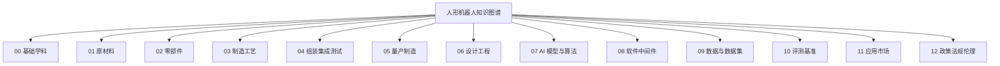

# 第 2 章 知识图谱构建方法论

## 摘要

人形机器人是一个横跨材料、机械、电子、控制、人工智能、软件、制造、供应链、应用和政策的复杂系统。面对如此异构且快速演化的知识领域，传统的文献综述、产品清单或技术报告难以支撑系统性的认知、推理与决策。知识图谱通过实体-关系-来源的形式化模型，将碎片化知识结构化、关联化、可追溯化。本章系统阐述本书所采用的知识图谱构建方法论，包括信息模型、Schema 设计、分层体系、跨层关系、数据摄取流水线、去重消歧机制、人工审阅流程以及质量验证体系。这套方法不仅是本书的组织基础，也可为其他复杂工程领域的知识管理提供参考。

**关键词**：知识图谱；信息模型；Schema；实体-关系；跨层链路；数据摄取；质量控制；人工审阅

---

## 2.1 从数据到知识：为什么传统方式不够

### 2.1.1 人形机器人知识的复杂性

人形机器人领域的知识具有四个显著特征：

| 特征 | 具体表现 | 带来的认知挑战 |
|------|---------|--------------|
| **跨学科** | 涉及机械、电子、材料、AI、控制、制造、法规等 | 不同学科使用不同术语和模型，难以统一理解 |
| **快速演化** | 新论文、新产品、新企业、新标准持续涌现 | 传统综述成书即过时 |
| **强关联性** | 材料影响零部件，零部件影响整机，整机影响应用 | 扁平列表无法表达产业链路 |
| **来源多样** | 论文、专利、新闻、财报、标准、博客并存 | 质量参差不齐，需要来源追溯 |

### 2.1.2 传统知识组织方式的局限

| 方式 | 典型形态 | 优势 | 局限 |
|------|---------|------|------|
| 文献综述 | 学术论文、综述文章 | 系统、严谨 | 更新慢，难以关联产业数据 |
| 产品数据库 | 参数表、产品页 | 查询方便 | 缺乏原理、关系和来源 |
| 行业报告 | 市场分析、预测 | 有商业洞察 | 一次性，难以持续更新 |
| 维基百科 | 开放百科 | 覆盖面广 | 深度不足，结构松散 |
| 技术博客 | 公司/个人博客 | 及时、具体 | 碎片化，可信度不一 |

这些方式各有价值，但都无法同时满足**结构化、关联化、可追溯、可更新**四个要求。

### 2.1.3 知识图谱的解决思路

知识图谱（Knowledge Graph）是一种用图结构表示知识的方法。其核心思想是：

- **实体（Entity）**：表示领域中的对象，如一个机器人、一家公司、一种材料、一篇论文。
- **关系（Relationship）**：表示实体之间的关联，如"使用""制造""组成""适用于"。
- **属性（Property）**：描述实体的特征，如名称、年份、成本、性能参数。
- **来源（Source）**：记录知识的出处，保证可验证性。

通过这种方式，知识图谱能够将人形机器人领域的碎片化信息系统地组织起来，并支持跨层推理和复杂查询。

---

## 2.2 信息模型

本书采用的信息模型可以概括为"**实体-关系-来源-验证**"四元组。下面分别说明。

### 2.2.1 实体模型

每个实体用一个 Markdown 文件表示，文件 frontmatter 采用 YAML 格式，包含以下核心字段：

```yaml
---
id: ent_robot_unitree_h1_humanoid_robot_2024
type: robot_system
title: Unitree H1 Humanoid Robot
domain: 11_applications_markets
theoretical_depth: system
aliases:
  - Unitree H1
  - 宇树 H1
status: active
created_at: 2024-01-15T00:00:00Z
updated_at: 2026-06-30T00:00:00Z
sources:
  - id: unitree_official_h1
    type: website
    title: Unitree H1 Official Page
    url: https://www.unitree.com/products/h1
verification:
  reviewed_by: human_and_ai
  reviewed_at: 2026-06-30T00:00:00Z
---
```

> **术语解释框 2.1**：
> - **Frontmatter**：Markdown 文件顶部的元数据块，通常用 `---` 包裹，采用 YAML 格式。
> - **YAML**：一种人类可读的数据序列化格式，常用于配置文件和元数据。

**实体字段说明：**

| 字段 | 类型 | 必填 | 说明 |
|------|------|------|------|
| `id` | 字符串 | 是 | 实体唯一标识符，全小写，仅含字母、数字和下划线 |
| `type` | 枚举 | 是 | 实体类型，如 `paper`、`method`、`component`、`company` |
| `title` | 字符串 | 是 | 实体标题 |
| `domain` | 枚举 | 是 | 所属领域编码，如 `02_components`、`07_ai_models_algorithms` |
| `theoretical_depth` | 枚举 | 是 | 理论深度：`foundation`、`principle`、`formalism`、`method`、`system` |
| `aliases` | 列表 | 否 | 别名，用于搜索和消歧 |
| `status` | 枚举 | 是 | 状态：`active`、`staged`、`rejected`、`deprecated` |
| `sources` | 列表 | 是 | 来源信息 |
| `verification` | 对象 | 是 | 审阅信息 |

### 2.2.2 实体类型

本书的实体类型覆盖人形机器人全产业链。主要类型包括：

| 实体类型 | 英文 | 示例 | 说明 |
|---------|------|------|------|
| 论文 | `paper` | Diffusion Policy、GR00T N1 | 学术论文或预印本 |
| 方法 | `method` | Action Chunking、MPC | 研究方法或技术方法 |
| 算法 | `algorithm` | PPO、SAC、QP | 具体算法 |
| 数据集 | `dataset` | Open X-Embodiment、DROID | 训练或评测数据集 |
| 软件平台 | `software_platform` | ROS 2、Isaac Sim、MuJoCo | 软件或平台 |
| 技术 | `technology` | URDF、EtherCAT、VLA | 技术概念或框架 |
| 零部件 | `component` | 谐波减速器、无框力矩电机 | 硬件零部件 |
| 机器人系统 | `robot_system` | Tesla Optimus、Unitree H1 | 完整机器人产品 |
| 公司 | `company` | Tesla、Figure AI、宇树科技 | 企业或机构 |
| 零部件制造商 | `component_manufacturer` | Harmonic Drive Systems | 专门制造零部件的厂商 |
| 一级供应商 | `tier1_supplier` | 三花智控 | 直接向整机厂供货的供应商 |
| 整机厂 | `oem` | Tesla、优必选 | 原始设备制造商 |
| 标准 | `standard` | ISO 13482、IEC 61508 | 标准或法规 |
| 材料 | `material` | 钕铁硼磁体、铝镁合金 | 原材料或材料 |
| 应用 | `application` | 汽车制造、物流仓储 | 应用场景 |
| 市场 | `market` | 工业人形机器人市场 | 市场或细分领域 |
| 基础概念 | `concept` | 系统工程、恐怖谷效应 | 抽象概念 |
| 原理 | `principle` | 动力学、控制理论 | 基础原理 |
| 形式化 | `formalism` | 欧拉-拉格朗日方程、QP | 数学或计算形式 |
| 基准 | `benchmark` | Human-Level Actuation Score | 评测基准 |
| 设备 | `equipment` | 系统集成测试台 | 设备或工具 |

### 2.2.3 关系模型

关系同样用 Markdown 文件表示，frontmatter 包含源实体、目标实体、关系类型、来源和验证信息。

```yaml
---
id: rel_ent_component_harmonic_reducer_2024_is_part_of_ent_component_rotary_actuator_2024
source_id: ent_component_harmonic_reducer_2024
target_id: ent_component_rotary_actuator_2024
type: is_part_of
strength: strong
direction: directed
status: active
sources:
  - id: curated_workflow_relationship
    type: website
    title: Humanoid Robot Workflow Relationship Curation
verification:
  reviewed_by: ai_autonomous
  reviewed_at: 2026-07-01T00:00:00Z
---
```

**关系字段说明：**

| 字段 | 类型 | 必填 | 说明 |
|------|------|------|------|
| `id` | 字符串 | 是 | 关系唯一标识符 |
| `source_id` | 字符串 | 是 | 源实体 ID |
| `target_id` | 字符串 | 是 | 目标实体 ID |
| `type` | 枚举 | 是 | 关系类型 |
| `strength` | 枚举 | 否 | 关系强度：`strong`、`moderate`、`weak` |
| `direction` | 枚举 | 是 | 方向：`directed`、`bidirectional` |
| `status` | 枚举 | 是 | 状态 |
| `sources` | 列表 | 是 | 来源信息 |
| `verification` | 对象 | 是 | 审阅信息 |

### 2.2.4 关系类型

本书定义的关系类型覆盖技术依赖、组成关系、制造关系、应用场景和监管关系等。

| 关系类型 | 含义 | 示例 |
|---------|------|------|
| `is_part_of` | 源是目标的组成部分 | 谐波减速器 → 旋转执行器 |
| `uses` | 源使用目标 | VLA 模型 → 数据集 |
| `requires` | 源依赖目标 | MPC → IMU |
| `implemented_on` | 方法/算法部署于目标 | Diffusion Policy → Unitree H1 |
| `manufactures` | 源制造目标 | Harmonic Drive Systems → 谐波减速器 |
| `supplies` | 源向目标供货 | 拓普集团 → Tesla |
| `sources_from` | 源从目标采购 | Tesla → 拓普集团 |
| `applies_to` | 源适用于目标 | ISO 13482 → 服务机器人 |
| `regulates` | 源监管/约束目标 | IEC 61508 → 控制系统 |
| `tested_with` | 源通过目标测试 | 机器人 → HIL 测试台 |
| `validates_on` | 源验证目标 | 测试台 → 机器人 |
| `analyzes` | 源分析目标 | FEA → 机械结构 |
| `models` | 源建模目标 | URDF → 机器人 |
| `manages` | 源管理目标 | Fleet 平台 → 机器人 |
| `deployed_at` | 源部署于目标场景 | Figure 02 → BMW Spartanburg |
| `competes_with` | 源与目标竞争 | Tesla → Figure AI |
| `partners_with` | 源与目标合作 | BMW → Figure AI |

### 2.2.5 来源与验证模型

每个实体和关系都必须有来源和验证信息。

**来源类型：**

| 类型 | 说明 | 示例 |
|------|------|------|
| `primary` | 一手来源，如论文原文、公司官网 | arXiv 论文、Unitree 官网 |
| `secondary` | 二手分析，如综述、报告 | Goldman Sachs 报告 |
| `press_release` | 新闻稿 | 公司融资公告 |
| `patent` | 专利文件 | 执行器结构专利 |
| `report` | 研究报告 | Counterpoint Research |
| `paper` | 学术论文 | Conference on Robot Learning |
| `annual_report` | 年报 | Tesla 10-K |
| `website` | 网站 | 技术博客、百科 |
| `interview` | 访谈 | CEO 采访 |
| `other` | 其他 | 内部整理资料 |

**验证字段：**

| 字段 | 类型 | 说明 |
|------|------|------|
| `reviewed_by` | 枚举 | `human`、`ai`、`ai_autonomous`、`human_and_ai` |
| `reviewed_at` | 时间戳 | 审阅时间 |
| `review_notes` | 字符串 | 审阅备注 |

---

## 2.3 分层体系与理论深度

### 2.3.1 Domain 分层

为了组织异构知识，本书将人形机器人领域划分为 13 个 domain：



**Domain 说明：**

| 编码 | 名称 | 覆盖内容 |
|------|------|---------|
| `00_foundations` | 基础学科 | 数学、物理、化学、计算机科学基础 |
| `01_raw_materials` | 原材料 | 稀土、磁材、合金、电池材料、半导体 |
| `02_components` | 零部件 | 执行器、减速器、电机、传感器、计算单元 |
| `03_manufacturing_processes` | 制造工艺 | 机加工、绕线、铸造、热处理、DFM |
| `04_assembly_integration_testing` | 组装集成测试 | 装配线、测试台、HIL、标定 |
| `05_mass_production` | 量产制造 | 产能爬坡、BOM、良率、供应链 |
| `06_design_engineering` | 设计工程 | 机械设计、动力学、URDF、FEA |
| `07_ai_models_algorithms` | AI 模型与算法 | VLA、模仿学习、强化学习、控制算法 |
| `08_software_middleware` | 软件中间件 | ROS 2、实时系统、仿真平台、fleet 管理 |
| `09_data_datasets` | 数据与数据集 | 遥操作数据、公开数据集、数据工程 |
| `10_evaluation_benchmarks` | 评测基准 | 仿真基准、真实任务基准、安全基准 |
| `11_applications_markets` | 应用市场 | 工业制造、物流、医疗、家庭、市场 |
| `12_policy_regulation_ethics` | 政策法规伦理 | 标准、认证、责任、伦理、社会影响 |

### 2.3.2 理论深度（Theoretical Depth）

每个实体还被赋予一个理论深度，反映其在知识层级中的位置：

| 深度 | 含义 | 示例 |
|------|------|------|
| `foundation` | 基础学科 | 线性代数、牛顿力学、材料科学 |
| `principle` | 基本原理 | 控制理论、机器学习原理 |
| `formalism` | 形式化方法 | 欧拉-拉格朗日方程、QP、马尔可夫决策过程 |
| `method` | 方法或技术 | Diffusion Policy、MPC、URDF |
| `system` | 系统或产品 | Tesla Optimus、ROS 2、Open X-Embodiment |

理论深度的作用是识别知识的"根基"。例如，当分析一个机器人系统时，可以向上追溯其依赖的方法、形式化、原理和基础学科，形成完整的认知链路。

---

## 2.4 跨层关系设计

### 2.4.1 为什么需要跨层关系

人形机器人的核心挑战在于不同层次之间的强耦合。例如：

- 一个 AI 算法（第 7 层）的性能依赖于数据集（第 9 层）和计算硬件（第 2 层）。
- 一个机器人系统（第 11 层）由零部件（第 2 层）组成，零部件由材料（第 1 层）制成。
- 一个制造方法（第 3 层）会影响设计选择（第 6 层），进而影响整机成本（第 5 层）。

跨层关系将这些分散的实体连接起来，形成可分析的产业链路。

### 2.4.2 典型跨层链路

以下是几个人形机器人领域的典型跨层链路：

**链路 1：从数据到机器人**
```
遥操作系统 → 数据集 → VLA 模型 → 边缘计算平台 → 机器人整机
```

**链路 2：从材料到市场**
```
稀土材料 → 永磁体 → 无框力矩电机 → 执行器 → 机器人 → 工业应用 → 市场规模
```

**链路 3：从设计到认证**
```
安全原理 → 功能安全标准 → 安全设计 → 急停系统 → 机器人 → CR/CE 认证
```

**链路 4：从软件到部署**
```
ROS 2 中间件 → 运动规划库 → 控制算法 → 仿真平台 → sim-to-real → 工厂部署
```

### 2.4.3 跨层关系的验证标准

跨层关系比普通关系更难验证，因为涉及不同领域的知识。本书采用以下标准：

| 标准 | 说明 |
|------|------|
| **来源明确** | 关系必须有公开来源支撑，如论文、官方文档、权威报告 |
| **逻辑合理** | 关系应符合技术或商业逻辑，不能牵强附会 |
| **可证伪** | 关系应具体到可以验证或反驳，避免模糊表述 |
| **粒度适中** | 既不过于笼统（如"AI 用于机器人"），也不过于细碎 |

---

## 2.5 数据摄取流水线

### 2.5.1 整体架构

本书知识图谱的数据摄取流水线采用"来源 → 适配器 → 去重 → 写入 → 验证"的架构：


### 2.5.2 数据来源

当前知识图谱的数据来源包括：

| 来源 | 类型 | 内容 | 更新频率 |
|------|------|------|---------|
| `arxiv_ro_rss` | RSS | 机器人学 arXiv 论文 | 每日 |
| `humanoid_paper_notebooks_progress` | 数据集 | 人形机器人论文跟踪 | 每日 |
| `robotics_tomorrow_rss` | RSS | 机器人新闻 | 每日 |
| `ieee_spectrum_robotics_rss` | RSS | IEEE Spectrum 机器人新闻 | 每日 |
| `unitree_news` | RSS | 宇树科技新闻 | 每日 |
| `nvidia_robotics_blog` | RSS | NVIDIA 机器人博客 | 每日 |
| `humanoid_actuators_suppliers` | 人工整理 JSON | 执行器/供应商实体 | 按需 |
| `humanoid_workflow_entities` | 人工整理 JSON | 工作流相关实体 | 按需 |
| `humanoid_manufacturing_systems` | 人工整理 JSON | 制造/系统实体 | 按需 |

### 2.5.3 适配器（Adapter）

每个来源对应一个适配器，负责将原始数据转换为统一格式的 `ParsedItem`。适配器屏蔽了不同来源的数据格式差异，使后续处理可以统一进行。

适配器的主要职责：
- 抓取或读取原始数据
- 提取标题、摘要、作者、日期、URL 等元数据
- 生成实体 ID 和初始属性
- 返回标准化的 `ParsedItem` 列表

### 2.5.4 去重（Dedup）

去重服务在写入前检查实体是否已存在，避免重复创建。去重策略包括：

| 策略 | 说明 |
|------|------|
| ID 匹配 | 通过规范化 ID 直接匹配 |
| 标题相似度 | 对标题进行清洗和归一化后比较 |
| URL 匹配 | 对同一来源的 URL 去重 |
| 摘要相似度 | 使用文本相似度算法识别近似条目 |

### 2.5.5 写入与验证

`EntryWriter` 负责将新的实体和关系写入文件系统。为了提高性能，写入器会预加载现有 ID，避免每次写入时扫描大量文件。

写入后，`validate_entries.py` 会对所有实体和关系文件进行 Schema 校验，检查必填字段、枚举值、格式等是否符合规范。校验通过后才能进入人工审阅队列或直接进入生产环境。

---

## 2.6 命名规范、去重与消歧

### 2.6.1 实体 ID 命名规范

实体 ID 是知识图谱的核心标识符，必须唯一、稳定、可读。

**命名规则：**
- 格式：`ent_<type>_<normalized_title>_<year>`
- 全部小写
- 仅包含字母、数字和下划线
- 标题部分截取前几个有意义的单词
- 年份可选，用于区分同名不同代的实体

**示例：**

| 实体 | ID |
|------|-----|
| Tesla Optimus | `ent_robot_system_tesla_optimus` |
| Unitree H1（2024） | `ent_robot_unitree_h1_humanoid_robot_2024` |
| Diffusion Policy（2023） | `ent_paper_diffusion_policy_2023` |
| 谐波减速器（2024） | `ent_component_harmonic_reducer_2024` |

### 2.6.2 关系 ID 命名规范

关系 ID 由源实体 ID、关系类型和目标实体 ID 组合而成：

- 格式：`rel_<source_id>_<type>_<target_id>`
- 全部小写
- 仅包含字母、数字和下划线

**示例：**

| 关系 | ID |
|------|-----|
| 谐波减速器是旋转执行器的一部分 | `rel_ent_component_harmonic_reducer_2024_is_part_of_ent_component_rotary_actuator_2024` |
| Diffusion Policy 部署于 Unitree H1 | `rel_ent_paper_diffusion_policy_2023_implemented_on_ent_robot_unitree_h1_humanoid_robot_2024` |

### 2.6.3 消歧策略

同一术语在不同语境下可能指代不同实体。例如：
- "Atlas" 可能指波士顿动力的机器人，也可能指古希腊神话人物或地图服务。
- "ROS" 可能指机器人操作系统，也可能指其他缩写。

消歧策略包括：
- **上下文消歧**：根据来源和描述判断实体类型。
- **别名管理**：为每个实体维护别名列表，避免重复创建。
- **人工标注**：对歧义严重的条目进行人工确认。
- **类型约束**：关系类型本身可以约束实体的可能类型。

---

## 2.7 人工审阅与质量控制

### 2.7.1 三级审阅机制

为了保证知识质量，本书采用三级审阅机制：


**AI 初审：**
- 自动完成 Schema 校验
- 自动检查必填字段和格式
- 自动识别明显的低质量或重复条目

**人工复核：**
- 检查实体类型和 domain 是否正确
- 验证关系是否合理
- 确认来源是否可靠

**专家终审：**
- 对跨层关系和关键论断进行专业判断
- 处理有争议的条目
- 决定条目是否进入生产环境

### 2.7.2 审阅状态

| 状态 | 说明 |
|------|------|
| `staged` | 已摄取但未审阅 |
| `active` | 已通过审阅，进入生产环境 |
| `rejected` | 未通过审阅，被驳回 |
| `deprecated` | 已过时或被替代 |

### 2.7.3 质量指标

本书使用以下指标监控知识图谱质量：

| 指标 | 说明 |
|------|------|
| **实体总数** | 知识图谱中实体的数量 |
| **关系总数** | 知识图谱中关系的数量 |
| **跨层关系数** | 连接不同 domain 的关系数量 |
| **缺失 theoretical_depth 的实体数** | 未设置理论深度的实体数量 |
| **悬空关系数** | 源或目标实体不存在的关系数量 |
| **待审阅条目数** | staging 中等待审阅的条目数量 |
| **被驳回条目数** | 审阅未通过的条目数量 |

---

## 2.8 知识图谱的应用

### 2.8.1 查询与探索

知识图谱支持多种查询方式：

**按实体查询：**
- 查询某个机器人的所有零部件
- 查询某个零部件的所有供应商
- 查询某个方法使用的数据集

**按关系查询：**
- 查询所有使用谐波减速器的机器人
- 查询所有部署于汽车工厂的人形机器人
- 查询受 ISO 13482 约束的所有系统

**按路径查询：**
- 从材料到整机到市场的完整链路
- 从算法到硬件到应用的技术依赖链
- 从标准到设计选择的影响路径

### 2.8.2 推理与分析

基于知识图谱可以进行更高层次的推理：

- **瓶颈识别**：找出只有少数供应商的关键零部件，评估供应链风险。
- **替代方案分析**：当某个零部件缺货或涨价时，寻找替代零部件和供应商。
- **技术成熟度评估**：通过关联的论文、产品、部署案例，判断某项技术的成熟度。
- **投资标的研究**：分析某家公司在知识图谱中的位置、技术布局和供应链关系。

### 2.8.3 可视化

知识图谱可以通过网络图、树图、桑基图等形式可视化：

- **网络图**：展示实体和关系的全局结构。
- **树图**：展示某个系统的零部件层次结构。
- **桑基图**：展示从材料到整机到市场的价值流动。
- **时间线**：展示技术、产品、企业的发展历程。

---

## 2.9 局限性与演进方向

### 2.9.1 当前局限

尽管知识图谱方法具有显著优势，但本书构建的知识图谱仍存在一些局限：

| 局限 | 说明 |
|------|------|
| **覆盖不均衡** | AI 算法和论文覆盖较全，但制造、供应链和政策覆盖相对薄弱 |
| **关系稀疏** | 部分系统级实体缺乏跨层关系，需要持续补全 |
| **来源质量参差** | 部分条目依赖新闻报道或博客，可信度不如学术论文 |
| **动态更新压力** | 领域发展快，需要持续投入以保持时效性 |
| **量化属性不足** | 成本、性能等数值属性尚未充分结构化 |

### 2.9.2 演进方向

未来知识图谱可以在以下方向持续改进：

- **增强量化属性**：为零部件、机器人、市场等实体添加更多数值属性，支持成本分析和性能对比。
- **引入时序信息**：记录实体和关系的时间范围，支持历史演进分析。
- **强化多语言支持**：增加英文、中文、韩文等多语言标题和描述。
- **与仿真数据联动**：将知识图谱与仿真平台、数据集链接，支持从知识到实验的闭环。
- **开发交互式前端**：构建 Web 界面，支持自然语言查询、图谱浏览和路径分析。
- **引入自动补全**：利用大语言模型自动生成缺失的关系和属性建议，再由人工审核。

---

## 2.10 本章小结

本章系统阐述了本书所采用的知识图谱构建方法论。核心要点如下：

1. **信息模型采用"实体-关系-来源-验证"四元组**，每个实体和关系都有明确的 Schema、来源和审阅记录。

2. **实体类型覆盖人形机器人全产业链**，包括论文、方法、算法、数据集、软件、零部件、机器人、公司、标准、材料、应用、市场等。

3. **关系类型覆盖组成、使用、依赖、部署、制造、供应、适用、监管等多种关联**，支持跨层链路构建。

4. **Domain 分层将领域划分为 13 个层次**，从基础学科到政策法规伦理；理论深度将实体分为 foundation、principle、formalism、method、system 五个层级。

5. **数据摄取流水线包括来源、适配器、去重、写入、验证和人工审阅六个环节**，保证知识的质量和时效性。

6. **命名规范、去重消歧和三级审阅机制**是维护大规模知识图谱一致性和准确性的关键。

7. **知识图谱支持查询、推理、可视化和跨层分析**，是人形机器人领域系统性认知的基础设施。

8. **当前知识图谱仍存在覆盖不均衡、关系稀疏、动态更新压力等局限**，未来需要在量化属性、时序信息、多语言、仿真联动和交互式前端等方向持续演进。

---

## 参考文献与数据来源

[1] Hogan, A., Blomqvist, E., Cochez, M., d'Amato, C., Melo, G. D., Gutierrez, C., ... & Zimmermann, A. (2021). Knowledge graphs. ACM Computing Surveys (CSUR), 54(4), 1-37.

[2] Ji, S., Pan, S., Cambria, E., Marttinen, P., & Yu, P. S. (2021). A survey on knowledge graphs: Representation, acquisition, and applications. IEEE Transactions on Neural Networks and Learning Systems, 33(2), 494-514.

[3] Wang, Q., Mao, Z., Wang, B., & Guo, L. (2017). Knowledge graph embedding: A survey of approaches and applications. IEEE Transactions on Knowledge and Data Engineering, 29(12), 2724-2743.

[4] Bollacker, K., Evans, C., Paritosh, P., Sturge, T., & Taylor, J. (2008). Freebase: A collaboratively created graph database for structuring human knowledge. In Proceedings of the 2008 ACM SIGMOD International Conference on Management of Data, 1247-1250.

[5] Vrandečić, D., & Krötzsch, M. (2014). Wikidata: A free collaborative knowledgebase. Communications of the ACM, 57(10), 78-85.

[6] Auer, S., Bizer, C., Kobilarov, G., Lehmann, J., Cyganiak, R., & Ives, Z. (2007). DBpedia: A nucleus for a web of open data. In The Semantic Web, 722-735.

[7] Noy, N. F., Shah, N. H., Whetzel, P. L., Dai, B., Dorf, M., Griffith, N., ... & Musen, M. A. (2009). BioPortal: Ontologies and integrated data resources at the click of a mouse. Nucleic Acids Research, 37(suppl_2), W170-W173.

[8] Tyson, A., et al. (2020). AIChemist: A knowledge graph for AI-driven materials discovery. npj Computational Materials, 6, 1-12.

[9] 本书知识图谱项目：Awesome Humanoid Robot. 内部项目资料，包括 `scripts/ingestion/`、`scripts/validate_entries.py`、`scripts/coverage_dashboard.py` 等。

---

## 本章知识图谱锚点

**核心实体**

| 实体类型 | 代表实体 |
|---------|---------|
| `concept` | knowledge graph、schema、entity、relationship、verification |
| `technology` | YAML、Markdown、RSS、Mermaid、ROS 2 |
| `software_platform` | `validate_entries.py`、`coverage_dashboard.py`、`EntryWriter`、`DedupService` |
| `method` | schema validation、deduplication、cross-layer relationship、curation |
| `standard` | ISO 13482、IEC 61508 |

**核心关系**

| 关系类型 | 含义 | 示例 |
|---------|------|------|
| `is_part_of` | 概念/组件属于更大系统 | Schema → 知识图谱 |
| `uses` | 方法/工具使用某技术 | 知识图谱 → YAML |
| `requires` | 流程依赖某组件 | 数据摄取 → 去重服务 |
| `applies_to` | 标准/方法适用于某对象 | Schema 校验 → 实体文件 |
| `validates_on` | 工具验证某对象 | `validate_entries.py` → 关系文件 |

**跨层链路示例**

```
原始数据源 → Adapter → ParsedItem → 去重 → 实体文件 → Schema 校验 → 人工审阅 → 生产环境 → 查询/推理/可视化
```

**关键思考问题**

1. 为什么人形机器人领域需要知识图谱而不是传统文献综述？
2. 实体-关系-来源-验证四元组各自的作用是什么？
3. Domain 分层和理论深度如何帮助组织异构知识？
4. 跨层关系的设计原则和验证标准是什么？
5. 如何保证知识图谱的动态更新和质量控制？
