# 第 2 章 知识图谱构建方法论

## 摘要

人形机器人是一个横跨材料、机械、电子、控制、人工智能、软件、制造、供应链、应用和政策的复杂系统。面对如此异构且快速演化的知识领域，传统的文献综述、产品清单或技术报告难以支撑系统性的认知、推理与决策。知识图谱通过实体-关系-来源的形式化模型，将碎片化知识结构化、关联化、可追溯化。本章系统阐述本书所采用的知识图谱构建方法论，包括信息模型、Schema 设计、分层体系、跨层关系、数据摄取流水线、去重消歧机制、人工审阅流程以及质量验证体系。这套方法不仅是本书的组织基础，也可为其他复杂工程领域的知识管理提供参考。

**关键词**：知识图谱；信息模型；Schema；实体-关系；跨层链路；数据摄取；质量控制；人工审阅

---

## 2.1 从数据到知识：为什么传统方式不够

### 2.1.1 人形机器人知识的复杂性

人形机器人领域的知识具有四个显著特征：

| 特征 | 具体表现 | 带来的认知挑战 |
|------|---------|--------------|
| **跨学科** | 涉及机械、电子、材料、AI、控制、制造、法规等 | 不同学科使用不同术语和模型，难以统一理解 |
| **快速演化** | 新论文、新产品、新企业、新标准持续涌现 | 传统综述成书即过时 |
| **强关联性** | 材料影响零部件，零部件影响整机，整机影响应用 | 扁平列表无法表达产业链路 |
| **来源多样** | 论文、专利、新闻、财报、标准、博客并存 | 质量参差不齐，需要来源追溯 |

!!! note "术语解释：跨学科（Interdisciplinary）"
    跨学科指研究或工程问题需要融合多个学科的概念、方法和工具。从信息论角度看，每个学科可以视为一个“符号系统”，其术语、假设和推理规则构成局部的编码方式；跨学科的核心困难在于不同符号系统之间的“翻译损失”与“语义鸿沟”。知识图谱通过统一的实体-关系语言，为这些符号系统提供共享的参考层。

### 2.1.2 传统知识组织方式的局限

| 方式 | 典型形态 | 优势 | 局限 |
|------|---------|------|------|
| 文献综述 | 学术论文、综述文章 | 系统、严谨 | 更新慢，难以关联产业数据 |
| 产品数据库 | 参数表、产品页 | 查询方便 | 缺乏原理、关系和来源 |
| 行业报告 | 市场分析、预测 | 有商业洞察 | 一次性，难以持续更新 |
| 维基百科 | 开放百科 | 覆盖面广 | 深度不足，结构松散 |
| 技术博客 | 公司/个人博客 | 及时、具体 | 碎片化，可信度不一 |

这些方式各有价值，但都无法同时满足**结构化、关联化、可追溯、可更新**四个要求。

!!! note "术语解释：可追溯性（Traceability）"
    可追溯性指任何结论或数据都可以反向追踪到其来源、产生过程和上下文。在软件工程中，可追溯性常用于需求-设计-测试链路；在知识工程中，它要求每一条知识都有明确的来源、作者、时间和验证状态。可追溯性的数学基础是“来源记录”：若把知识看作命题，则来源是该命题的元数据，保证命题可被审计。

### 2.1.3 知识图谱的解决思路

知识图谱（Knowledge Graph）是一种用图结构表示知识的方法。其核心思想是：

- **实体（Entity）**：表示领域中的对象，如一个机器人、一家公司、一种材料、一篇论文。
- **关系（Relationship）**：表示实体之间的关联，如"使用""制造""组成""适用于"。
- **属性（Property）**：描述实体的特征，如名称、年份、成本、性能参数。
- **来源（Source）**：记录知识的出处，保证可验证性。

通过这种方式，知识图谱能够将人形机器人领域的碎片化信息系统地组织起来，并支持跨层推理和复杂查询。

!!! note "术语解释：图结构（Graph Structure）"
    图结构由节点（node）和边（edge）组成。节点表示对象，边表示对象之间的二元关系。在离散数学中，图记为 $G=(V,E)$，其中 $V$ 是顶点集合，$E \subseteq V \times V$ 是边集合。图论为知识图谱提供了形式化基础：连通性、路径、度、中心性等概念都可以用来分析知识的结构特征。

### 2.1.4 从数据到知识的哲学与信息论基础

理解知识图谱不能仅停留在工程层面，还需要回到“数据-信息-知识-智慧”（DIKW）金字塔、命题逻辑、一阶逻辑、描述逻辑以及语义网络等基础框架。

!!! note "术语解释：DIKW 金字塔（Data-Information-Knowledge-Wisdom Pyramid）"
    DIKW 金字塔描述从原始信号到智慧的层次递进：
    - **数据（Data）**：离散的原始符号或观测值，如传感器读数“42”。
    - **信息（Information）**：带有上下文的数据，能够回答“谁、何时、何地”等问题，如“电机温度为 42°C”。
    - **知识（Knowledge）**：将信息组织成可复用的模式，能够解释“为什么”和“如何”，如“电机温度超过 40°C 会加速磁体退磁”。
    - **智慧（Wisdom）**：在复杂情境中运用知识做出判断的能力，如“为延长寿命，应在高温场景选用更高等级绝缘材料”。
    从信息论角度，数据到信息是熵的降低：$H(X|Y) < H(X)$，即获得上下文 $Y$ 后，对 $X$ 的不确定性减少。

!!! note "术语解释：命题逻辑（Propositional Logic）"
    命题逻辑研究由命题（可判断真假的陈述句）通过逻辑连接词（与 $\land$、或 $\lor$、非 $\neg$、蕴含 $\rightarrow$）构成的公式。它是计算机科学中布尔电路、数据库查询和自动推理的基础。例如，“机器人使用谐波减速器”可以表示为原子命题 $P$，而“若机器人使用谐波减速器，则机器人需要润滑维护”可表示为 $P \rightarrow Q$。

!!! note "术语解释：一阶逻辑（First-Order Logic, FOL）"
    一阶逻辑在命题逻辑基础上引入量词（全称 $\forall$、存在 $\exists$）、变量、谓词和函数。例如，$\forall r \, \text{Robot}(r) \rightarrow \exists a \, \text{Actuator}(a) \land \text{hasPart}(r,a)$ 表示“每个机器人都有某个执行器”。一阶逻辑是知识表示和数据库理论的共同基础，但一般的一阶逻辑推理是不可判定的。

!!! note "术语解释：描述逻辑（Description Logic, DL）"
    描述逻辑是一族可判定的一阶逻辑子集，专门用于表示概念层次和角色关系。它在语义网和本体工程中被广泛使用，是 OWL（Web Ontology Language）的逻辑基础。描述逻辑在表达能力和推理复杂度之间取得平衡：例如 $\mathcal{ALC}$ 支持概念合取、析取、否定和存在/全称量词，其概念可满足性判定是 ExpTime-完全的。

!!! note "术语解释：语义网络（Semantic Network）"
    语义网络是一种用有向图表示知识的方法，节点表示概念或实例，边表示语义关系。它由 Quillian 于 1968 年提出，是知识图谱的前身。语义网络强调联想和继承，但不具备严格的逻辑语义，直到 RDF 和描述逻辑出现才实现形式化。

!!! note "术语解释：框架（Frame）"
    框架由 Minsky 于 1975 年提出，是一种结构化的知识表示方法。每个框架有槽（slot）和填充值（filler），例如“机器人”框架可以有“名称”“制造商”“自由度”等槽。框架与面向对象编程中的类有相似之处，但更侧重于知识表示而非计算。

!!! note "术语解释：本体（Ontology）"
    本体是对某个领域概念、关系、属性和约束的明确、形式化、可共享的规范。在哲学中，本体论研究“存在”的本质；在计算机科学中，本体是一种工程工件，用于统一术语和促进互操作性。一个本体通常包含类、属性、个体和公理。

从数据到知识的转换过程可以形式化地理解为：

1. **模式识别**：从原始数据中提取有意义的结构。
2. **概念化**：将结构映射到预定义的类别和关系。
3. **关联化**：在不同概念之间建立关系，形成网络。
4. **形式化**：用逻辑语言描述概念和关系，支持推理。
5. **验证**：通过来源和审阅保证知识的可靠性。

下面的 Mermaid 图展示了 DIKW 金字塔与知识图谱构建阶段的对应关系：

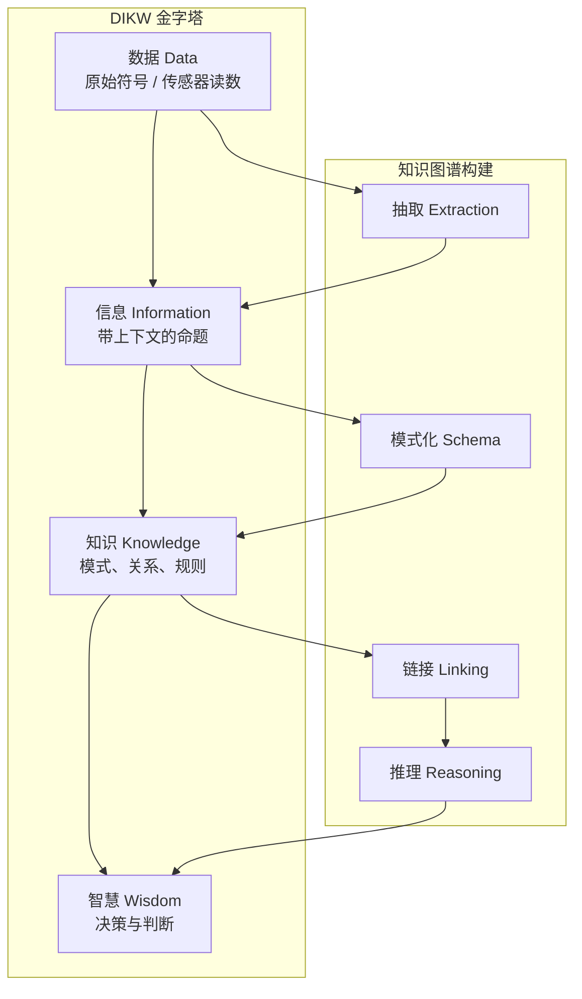

从信息论角度看，DIKW 金字塔的每一层都对应一次熵减。原始数据的熵最高，因为缺乏上下文；信息通过元数据降低不确定性；知识通过模式进一步压缩表示；智慧则是在约束条件下的最优决策。知识图谱的价值在于把“信息”固化为“知识”，并通过图结构和逻辑规则支持从知识到智慧的自动化推理。

知识表示方法的历史演进可以用下图概括：


### 2.1.5 小结

传统知识组织方式在结构化、关联化、可追溯和可更新方面存在明显不足。知识图谱通过图结构、统一 Schema 和来源验证，为复杂领域提供了一种工程化的知识管理方法。其理论基础包括信息论、命题逻辑、一阶逻辑、描述逻辑、语义网络、框架和本体论。

---

## 2.2 信息模型

本书采用的信息模型可以概括为“**实体-关系-来源-验证**”四元组。下面分别说明。

### 2.2.1 实体模型

每个实体用一个 Markdown 文件表示，文件 frontmatter 采用 YAML 格式，包含以下核心字段：

```yaml
---
id: ent_robot_unitree_h1_humanoid_robot_2024
type: robot_system
title: Unitree H1 Humanoid Robot
domain: 11_applications_markets
theoretical_depth: system
aliases:
  - Unitree H1
  - 宇树 H1
status: active
created_at: 2024-01-15T00:00:00Z
updated_at: 2026-06-30T00:00:00Z
sources:
  - id: unitree_official_h1
    type: website
    title: Unitree H1 Official Page
    url: https://www.unitree.com/products/h1
verification:
  reviewed_by: human_and_ai
  reviewed_at: 2026-06-30T00:00:00Z
---
```

!!! note "术语解释：Frontmatter"
    Frontmatter 是 Markdown 文件顶部的元数据块，通常用 `---` 包裹，采用 YAML 格式。它允许作者在不改变正文的情况下，为文档附加结构化属性。从技术实现看，Frontmatter 是一种轻量级的元数据层，介于纯文本和数据库记录之间。

!!! note "术语解释：YAML"
    YAML（YAML Ain't Markup Language）是一种人类可读的数据序列化格式，常用于配置文件和元数据。它支持标量、列表、字典等结构，其语法通过缩进表示层级。YAML 与 JSON 在表达能力上等价，但更便于人工阅读和编辑。

**实体字段说明：**

| 字段 | 类型 | 必填 | 说明 |
|------|------|------|------|
| `id` | 字符串 | 是 | 实体唯一标识符，全小写，仅含字母、数字和下划线 |
| `type` | 枚举 | 是 | 实体类型，如 `paper`、`method`、`component`、`company` |
| `title` | 字符串 | 是 | 实体标题 |
| `domain` | 枚举 | 是 | 所属领域编码，如 `02_components`、`07_ai_models_algorithms` |
| `theoretical_depth` | 枚举 | 是 | 理论深度：`foundation`、`principle`、`formalism`、`method`、`system` |
| `aliases` | 列表 | 否 | 别名，用于搜索和消歧 |
| `status` | 枚举 | 是 | 状态：`active`、`staged`、`rejected`、`deprecated` |
| `sources` | 列表 | 是 | 来源信息 |
| `verification` | 对象 | 是 | 审阅信息 |

### 2.2.2 实体类型

本书的实体类型覆盖人形机器人全产业链。主要类型包括：

| 实体类型 | 英文 | 示例 | 说明 |
|---------|------|------|------|
| 论文 | `paper` | Diffusion Policy、GR00T N1 | 学术论文或预印本 |
| 方法 | `method` | Action Chunking、MPC | 研究方法或技术方法 |
| 算法 | `algorithm` | PPO、SAC、QP | 具体算法 |
| 数据集 | `dataset` | Open X-Embodiment、DROID | 训练或评测数据集 |
| 软件平台 | `software_platform` | ROS 2、Isaac Sim、MuJoCo | 软件或平台 |
| 技术 | `technology` | URDF、EtherCAT、VLA | 技术概念或框架 |
| 零部件 | `component` | 谐波减速器、无框力矩电机 | 硬件零部件 |
| 机器人系统 | `robot_system` | Tesla Optimus、Unitree H1 | 完整机器人产品 |
| 公司 | `company` | Tesla、Figure AI、宇树科技 | 企业或机构 |
| 零部件制造商 | `component_manufacturer` | Harmonic Drive Systems | 专门制造零部件的厂商 |
| 一级供应商 | `tier1_supplier` | 三花智控 | 直接向整机厂供货的供应商 |
| 整机厂 | `oem` | Tesla、优必选 | 原始设备制造商 |
| 标准 | `standard` | ISO 13482、IEC 61508 | 标准或法规 |
| 材料 | `material` | 钕铁硼磁体、铝镁合金 | 原材料或材料 |
| 应用 | `application` | 汽车制造、物流仓储 | 应用场景 |
| 市场 | `market` | 工业人形机器人市场 | 市场或细分领域 |
| 基础概念 | `concept` | 系统工程、恐怖谷效应 | 抽象概念 |
| 原理 | `principle` | 动力学、控制理论 | 基础原理 |
| 形式化 | `formalism` | 欧拉-拉格朗日方程、QP | 数学或计算形式 |
| 基准 | `benchmark` | Human-Level Actuation Score | 评测基准 |
| 设备 | `equipment` | 系统集成测试台 | 设备或工具 |

#### 2.2.2.1 实体类型的本体论承诺与分类学

!!! note "术语解释：分类学（Taxonomy）"
    分类学是对领域概念进行系统归类的学科。在本体工程中，分类学通常表现为一个由 `rdfs:subClassOf` 关系构成的有向无环图（DAG）。形式上，若类 $C_1$ 是类 $C_2$ 的子类，则 $C_1 \preceq C_2$。这种偏序关系满足自反性、反对称性和传递性，使得每个实体都能被放置到一条从抽象到具体的继承链中。

表 2.2 中的实体类型并非随意罗列，而是对应到人形机器人知识从“抽象概念”到“物理产品”的连续谱。我们可以将其抽象为三大本体承诺（ontological commitment）：

1. **物理实体（Physical Entity）**：能够占据时空、具有质量和能量的对象，如 `component`、`robot_system`、`material`、`company`。
2. **信息实体（Information Entity）**：以符号或数据形式存在的对象，如 `paper`、`method`、`algorithm`、`dataset`、`standard`。
3. **过程与状态（Process & State）**：描述事件、能力或市场状态的实体，如 `application`、`market`、`technology`、`benchmark`。

用形式化语言，可定义一个实体类型偏序集 $(\mathcal{T}, \preceq)$，其中 $\mathcal{T}$ 为类型集合，$\preceq$ 为子类关系。对任意实体 $e$，其最具体的类型为 $type(e) \in \mathcal{T}$，而其实例化的类层次可表示为：

$$\mathcal{A}(e) = \{ t \in \mathcal{T} \mid type(e) \preceq t \}$$

例如，一个 `frameless_motor` 实体满足：

$$\mathcal{A}(e) = \{ \text{frameless\_motor}, \text{component}, \text{physical\_entity}, \text{entity} \}$$

这种分类结构有两个直接工程价值：一是支持**继承推理**——若本体规定 `component` 必须具有 `mass` 属性，则所有 `frameless_motor` 实体自动继承该约束；二是支持**跨层查询**——查询所有 `physical_entity` 即可一次性返回零部件、机器人、材料等。

!!! note "术语解释：有向无环图（Directed Acyclic Graph, DAG）"
    有向无环图是指边具有方向且不包含有向环的图。形式化地，图 $G=(V,E)$ 为有向无环图当且仅当不存在顶点序列 $v_1, v_2, \dots, v_k$ 使得 $(v_i, v_{i+1}) \in E$ 且 $v_k=v_1$。本体的类层次必须是 DAG，否则会出现“$A$ 是 $B$ 的子类且 $B$ 是 $A$ 的子类”的逻辑矛盾。

#### 2.2.2.2 实体类型与全书章节映射

实体类型的设计直接服务于本书后续的章节划分。表 2.3 给出主要实体类型与对应章节的索引关系，便于读者在知识图谱与正文之间跳转。

| 实体类型 | 主要对应章节 | 说明 |
|---------|------------|------|
| `material` | 第 3 章 | 稀土永磁、结构材料、电池材料、半导体材料 |
| `component` | 第 4、5、6 章 | 执行器、传感器、计算/电源/热管理硬件 |
| `robot_system` | 第 8、9 章 | 整机设计原理与关键子系统 |
| `method` / `algorithm` / `software_platform` | 第 7 章及后续 AI 章节 | 控制、感知、决策算法与中间件 |
| `company` / `tier1_supplier` / `oem` | 第 7 章 | 供应商地图与供应链治理 |
| `standard` / `policy` | 第 12 章 | 政策法规伦理 |

以下 Python 示例展示如何用 `networkx` 构建实体类型的子类 DAG，并计算每个类型的祖先集合：

```python
import networkx as nx

G = nx.DiGraph()
# 类型层级（示意）
edges = [
    ("entity", "physical_entity"),
    ("entity", "information_entity"),
    ("physical_entity", "component"),
    ("physical_entity", "robot_system"),
    ("physical_entity", "material"),
    ("information_entity", "paper"),
    ("information_entity", "method"),
    ("information_entity", "algorithm"),
]
G.add_edges_from(edges)

# 计算每个类型的祖先集合（包含自身）
for t in G.nodes():
    ancestors = nx.ancestors(G, t) | {t}
    print(f"{t}: {sorted(ancestors)}")
```

运行结果说明：`component` 的祖先集合为 `['component', 'entity', 'physical_entity']`，这意味着对该类型的属性约束会沿 DAG 向上聚合、向下继承。

!!! note "术语解释：继承推理（Inheritance Reasoning）"
    继承推理是指子类自动获得父类属性和约束的推理过程。在描述逻辑中，若 $\text{Component} \sqsubseteq \text{PhysicalEntity}$ 且 $\text{PhysicalEntity} \sqsubseteq \exists \text{hasMass}$，则可推出 $\text{Component} \sqsubseteq \exists \text{hasMass}$。这是本体工程中避免重复建模、保证一致性的核心机制。

### 2.2.3 关系模型

关系同样用 Markdown 文件表示，frontmatter 包含源实体、目标实体、关系类型、来源和验证信息。

```yaml
---
id: rel_ent_component_harmonic_reducer_2024_is_part_of_ent_component_rotary_actuator_2024
source_id: ent_component_harmonic_reducer_2024
target_id: ent_component_rotary_actuator_2024
type: is_part_of
strength: strong
direction: directed
status: active
sources:
  - id: curated_workflow_relationship
    type: website
    title: Humanoid Robot Workflow Relationship Curation
verification:
  reviewed_by: ai_autonomous
  reviewed_at: 2026-07-01T00:00:00Z
---
```

**关系字段说明：**

| 字段 | 类型 | 必填 | 说明 |
|------|------|------|------|
| `id` | 字符串 | 是 | 关系唯一标识符 |
| `source_id` | 字符串 | 是 | 源实体 ID |
| `target_id` | 字符串 | 是 | 目标实体 ID |
| `type` | 枚举 | 是 | 关系类型 |
| `strength` | 枚举 | 否 | 关系强度：`strong`、`moderate`、`weak` |
| `direction` | 枚举 | 是 | 方向：`directed`、`bidirectional` |
| `status` | 枚举 | 是 | 状态 |
| `sources` | 列表 | 是 | 来源信息 |
| `verification` | 对象 | 是 | 审阅信息 |

### 2.2.4 关系类型

本书定义的关系类型覆盖技术依赖、组成关系、制造关系、应用场景和监管关系等。

| 关系类型 | 含义 | 示例 |
|---------|------|------|
| `is_part_of` | 源是目标的组成部分 | 谐波减速器 → 旋转执行器 |
| `uses` | 源使用目标 | VLA 模型 → 数据集 |
| `requires` | 源依赖目标 | MPC → IMU |
| `implemented_on` | 方法/算法部署于目标 | Diffusion Policy → Unitree H1 |
| `manufactures` | 源制造目标 | Harmonic Drive Systems → 谐波减速器 |
| `supplies` | 源向目标供货 | 拓普集团 → Tesla |
| `sources_from` | 源从目标采购 | Tesla → 拓普集团 |
| `applies_to` | 源适用于目标 | ISO 13482 → 服务机器人 |
| `regulates` | 源监管/约束目标 | IEC 61508 → 控制系统 |
| `tested_with` | 源通过目标测试 | 机器人 → HIL 测试台 |
| `validates_on` | 源验证目标 | 测试台 → 机器人 |
| `analyzes` | 源分析目标 | FEA → 机械结构 |
| `models` | 源建模目标 | URDF → 机器人 |
| `manages` | 源管理目标 | Fleet 平台 → 机器人 |
| `deployed_at` | 源部署于目标场景 | Figure 02 → BMW Spartanburg |
| `competes_with` | 源与目标竞争 | Tesla → Figure AI |
| `partners_with` | 源与目标合作 | BMW → Figure AI |

### 2.2.5 来源与验证模型

每个实体和关系都必须有来源和验证信息。

**来源类型：**

| 类型 | 说明 | 示例 |
|------|------|------|
| `primary` | 一手来源，如论文原文、公司官网 | arXiv 论文、Unitree 官网 |
| `secondary` | 二手分析，如综述、报告 | Goldman Sachs 报告 |
| `press_release` | 新闻稿 | 公司融资公告 |
| `patent` | 专利文件 | 执行器结构专利 |
| `report` | 研究报告 | Counterpoint Research |
| `paper` | 学术论文 | Conference on Robot Learning |
| `annual_report` | 年报 | Tesla 10-K |
| `website` | 网站 | 技术博客、百科 |
| `interview` | 访谈 | CEO 采访 |
| `other` | 其他 | 内部整理资料 |

**验证字段：**

| 字段 | 类型 | 说明 |
|------|------|------|
| `reviewed_by` | 枚举 | `human`、`ai`、`ai_autonomous`、`human_and_ai` |
| `reviewed_at` | 时间戳 | 审阅时间 |
| `review_notes` | 字符串 | 审阅备注 |

信息模型四元组的关系可以用下图表示：

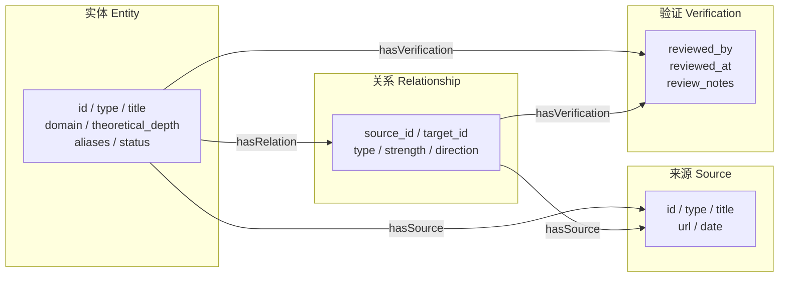

### 2.2.6 知识图谱的图论基础

知识图谱的底层数据结构是图。理解图论基础对于设计 Schema、评估质量、选择存储和查询方式至关重要。

!!! note "术语解释：有向图（Directed Graph）"
    有向图是指边具有方向的图，记为 $G=(V,E)$，其中 $E$ 是有序顶点对的集合，$E \subseteq V \times V$。在知识图谱中，三元组 $(s,p,o)$ 就是有向图中的一条边，方向从主语 $s$ 指向宾语 $o$。

!!! note "术语解释：三元组（Triple）"
    三元组是知识图谱的基本数据单元，形式为 $(subject, predicate, object)$，简称 $(s,p,o)$。例如：
    $$(\text{Unitree H1}, \text{uses}, \text{谐波减速器})$$
    三元组与一阶逻辑中的原子公式 $P(s,o)$ 对应，是 RDF、SPARQL 和描述逻辑的共同基础。

!!! note "术语解释：属性图（Labeled Property Graph, LPG）"
    属性图是一种图数据模型，节点和边都可以带标签（label）和属性（property）。Neo4j 等图数据库采用 LPG 模型。LPG 与 RDF 的主要区别在于：LPG 允许边拥有属性，而 RDF 的边是谓词，属性需要通过辅助节点或 reification 表达。

!!! note "术语解释：资源描述框架（Resource Description Framework, RDF）"
    RDF 是 W3C 推荐的语义网数据模型，将知识表示为三元组集合。RDF 中的每个资源都有统一资源标识符（URI），谓词也是 URI。RDF 强调可互操作性和形式化语义，是 SPARQL 查询语言和 OWL 本体的数据基础。

!!! note "术语解释：度（Degree）"
    在无向图中，节点的度 $d(v)$ 是与该节点相连的边数。在有向图中，分为入度 $d_{in}(v)$（指向该节点的边数）和出度 $d_{out}(v)$（从该节点指出的边数）。度的分布是知识图谱结构分析的基本指标。

!!! note "术语解释：路径（Path）与连通分量（Connected Component）"
    路径是图中从一个节点到另一个节点的节点-边序列。连通分量是指图中任意两个节点之间都存在路径的最大子图。在有向图中，进一步分为弱连通分量和强连通分量。路径和连通性是图遍历、查询和推理的基础。

!!! note "术语解释：中心性（Centrality）"
    中心性度量节点在图中的重要性。常见类型包括：
    - **度中心性（Degree Centrality）**：$C_D(v) = \frac{d(v)}{|V|-1}$
    - **介数中心性（Betweenness Centrality）**：$C_B(v) = \sum_{s \neq v \neq t} \frac{\sigma_{st}(v)}{\sigma_{st}}$，其中 $\sigma_{st}$ 是从 $s$ 到 $t$ 的最短路径数，$\sigma_{st}(v)$ 是经过 $v$ 的最短路径数。
    - **接近中心性（Closeness Centrality）**：$C_C(v) = \frac{|V|-1}{\sum_{u \neq v} d(v,u)}$

!!! note "术语解释：PageRank"
    PageRank 是一种基于随机游走的节点重要性度量，最初用于网页排序。其迭代公式为：
    $$PR(v) = \frac{1-\alpha}{|V|} + \alpha \sum_{u \in N_{in}(v)} \frac{PR(u)}{d_{out}(u)}$$
    其中 $\alpha$ 是阻尼系数，通常取 0.85。PageRank 假设重要性可以通过边传播，适用于发现知识图谱中的核心实体。

!!! note "术语解释：聚类系数（Clustering Coefficient）"
    聚类系数度量节点的邻居之间相互连接的程度。局部聚类系数定义为：
    $$C(v) = \frac{2 \cdot |\{(u,w) \in E : u,w \in N(v)\}|}{d(v)(d(v)-1)}$$
    高聚类系数表示局部社区结构紧密，可能与领域中的技术集群或供应链集群对应。

下面的 Mermaid 图对比了 LPG 和 RDF 两种数据模型：

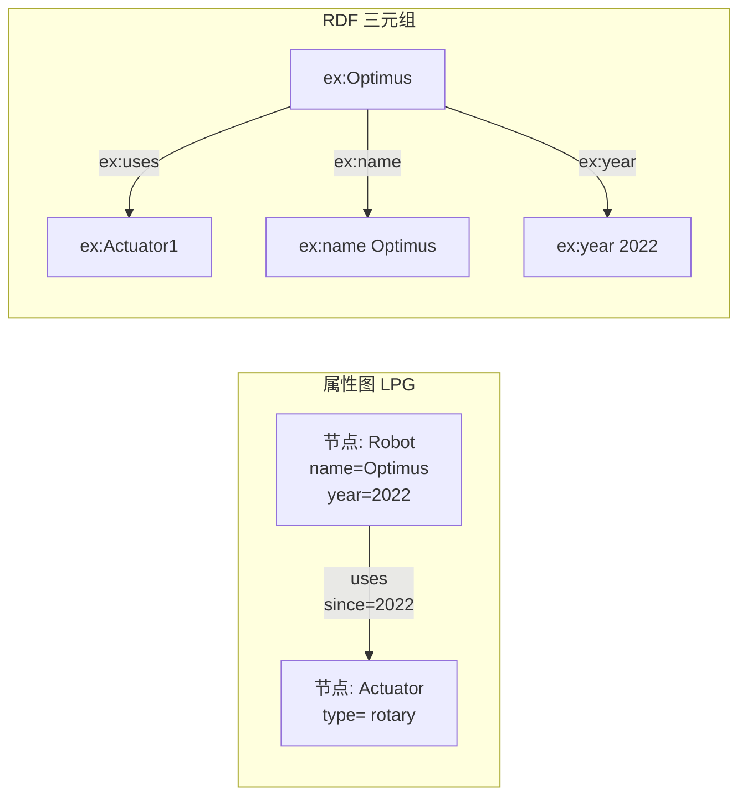

下面的 Python 示例展示了如何用 `networkx` 构建一个简单的人形机器人知识图谱，并计算度、PageRank 和聚类系数。

```python
import networkx as nx

# 创建有向图
G = nx.DiGraph()

# 添加实体节点
entities = [
    ("Optimus", {"type": "robot_system"}),
    ("Unitree H1", {"type": "robot_system"}),
    ("Harmonic Reducer", {"type": "component"}),
    ("Frameless Motor", {"type": "component"}),
    ("Rotary Actuator", {"type": "component"}),
    ("Tesla", {"type": "company"}),
    ("Harmonic Drive Systems", {"type": "company"}),
]
G.add_nodes_from(entities)

# 添加关系边
triples = [
    ("Optimus", "uses", "Harmonic Reducer"),
    ("Optimus", "uses", "Frameless Motor"),
    ("Unitree H1", "uses", "Harmonic Reducer"),
    ("Rotary Actuator", "is_part_of", "Optimus"),
    ("Rotary Actuator", "is_part_of", "Unitree H1"),
    ("Harmonic Reducer", "is_part_of", "Rotary Actuator"),
    ("Frameless Motor", "is_part_of", "Rotary Actuator"),
    ("Tesla", "manufactures", "Optimus"),
    ("Harmonic Drive Systems", "manufactures", "Harmonic Reducer"),
]
G.add_edges_from([(s, o, {"predicate": p}) for s, p, o in triples])

# 度分析
print("In-degree:", dict(G.in_degree()))
print("Out-degree:", dict(G.out_degree()))

# PageRank
pr = nx.pagerank(G, alpha=0.85)
print("PageRank:", sorted(pr.items(), key=lambda x: -x[1]))

# 聚类系数需要无向图
G_undirected = G.to_undirected()
cc = nx.clustering(G_undirected)
print("Clustering coefficient:", cc)
```

---

## 2.3 分层体系与理论深度

### 2.3.1 Domain 分层

为了组织异构知识，本书将人形机器人领域划分为 13 个 domain：

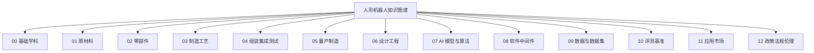

**Domain 说明：**

| 编码 | 名称 | 覆盖内容 |
|------|------|---------|
| `00_foundations` | 基础学科 | 数学、物理、化学、计算机科学基础 |
| `01_raw_materials` | 原材料 | 稀土、磁材、合金、电池材料、半导体 |
| `02_components` | 零部件 | 执行器、减速器、电机、传感器、计算单元 |
| `03_manufacturing_processes` | 制造工艺 | 机加工、绕线、铸造、热处理、DFM |
| `04_assembly_integration_testing` | 组装集成测试 | 装配线、测试台、HIL、标定 |
| `05_mass_production` | 量产制造 | 产能爬坡、BOM、良率、供应链 |
| `06_design_engineering` | 设计工程 | 机械设计、动力学、URDF、FEA |
| `07_ai_models_algorithms` | AI 模型与算法 | VLA、模仿学习、强化学习、控制算法 |
| `08_software_middleware` | 软件中间件 | ROS 2、实时系统、仿真平台、fleet 管理 |
| `09_data_datasets` | 数据与数据集 | 遥操作数据、公开数据集、数据工程 |
| `10_evaluation_benchmarks` | 评测基准 | 仿真基准、真实任务基准、安全基准 |
| `11_applications_markets` | 应用市场 | 工业制造、物流、医疗、家庭、市场 |
| `12_policy_regulation_ethics` | 政策法规伦理 | 标准、认证、责任、伦理、社会影响 |

### 2.3.2 理论深度（Theoretical Depth）

每个实体还被赋予一个理论深度，反映其在知识层级中的位置：

| 深度 | 含义 | 示例 |
|------|------|------|
| `foundation` | 基础学科 | 线性代数、牛顿力学、材料科学 |
| `principle` | 基本原理 | 控制理论、机器学习原理 |
| `formalism` | 形式化方法 | 欧拉-拉格朗日方程、QP、马尔可夫决策过程 |
| `method` | 方法或技术 | Diffusion Policy、MPC、URDF |
| `system` | 系统或产品 | Tesla Optimus、ROS 2、Open X-Embodiment |

理论深度的作用是识别知识的“根基”。例如，当分析一个机器人系统时，可以向上追溯其依赖的方法、形式化、原理和基础学科，形成完整的认知链路。

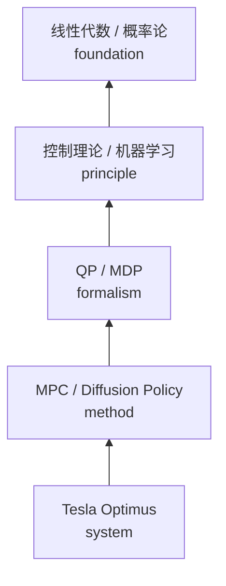

Domain 分层与理论深度共同构成一个二维组织框架：同一 domain 中的实体按理论深度从 foundation 到 system 递进，而不同 domain 之间通过跨层关系连接，形成完整的知识网络。

### 2.3.3 本体工程方法

本体工程是设计和维护本体的系统化过程。在人形机器人这样复杂的领域中，本体工程帮助我们统一术语、明确关系、支持推理和共享知识。

!!! note "术语解释：顶层本体（Upper Ontology / Top-level Ontology）"
    顶层本体是跨领域的通用概念框架，不针对特定学科。著名的顶层本体包括：
    - **BFO（Basic Formal Ontology）**：强调 continuants（持续存在物）和 occurrents（发生过程）的区分，广泛应用于生物医学。
    - **DOLCE（Descriptive Ontology for Linguistic and Cognitive Engineering）**：从认知和语言角度描述实体，区分物理对象、抽象对象、事件等。
    - **SUMO（Suggested Upper Merged Ontology）**：规模大，覆盖哲学、数学、时间、空间等，与 WordNet 有映射。

!!! note "术语解释：领域本体（Domain Ontology）"
    领域本体是针对特定学科或应用场景的本体，例如“人形机器人本体”“汽车制造本体”。它继承顶层本体的通用概念，并添加专业术语、关系和约束。

领域本体的设计通常遵循以下工作流：

1. **需求分析**：明确本体的使用场景和用户问题。
2. **术语收集**：从文献、专家、标准中提取关键术语。
3. **概念层次化**：建立类与子类的层次结构。
4. **属性与关系定义**：定义数据属性（如名称、年份）和对象属性（如使用、制造）。
5. **约束与公理**：添加基数约束、互斥约束、传递闭包等。
6. **评估与迭代**：通过用例、查询和专家评审验证本体。


!!! note "术语解释：OOPS（OntOlogy Pitfall Scanner）"
    OOPS 是一个自动化的本体缺陷检测工具，能够识别常见的本体设计错误，如“创建多态实例”“混淆类与实例”“未声明的等价关系”“缺少注释”等。OOPS 的检测结果可以帮助本体工程师提高本体的清晰度和一致性。

!!! note "术语解释：本体匹配（Ontology Matching）与模式对齐（Schema Alignment）"
    本体匹配是发现两个或多个本体之间语义对应关系的过程。对应关系包括等价（equivalence）、包含（subsumption）、相关（related）等。模式对齐是数据库和知识图谱领域中的类似问题，目标是将不同来源的 Schema 映射到统一视图。常用的技术包括基于字符串相似度、结构相似度、实例重叠和嵌入学习的方法。

!!! note "术语解释：互操作性（Interoperability）"
    互操作性指不同系统、组织或数据集之间能够有效交换和使用信息的能力。本体通过提供共享词汇表和形式化语义，减少数据集成时的歧义，从而提高互操作性。

本体工程在人形机器人领域的应用示例：

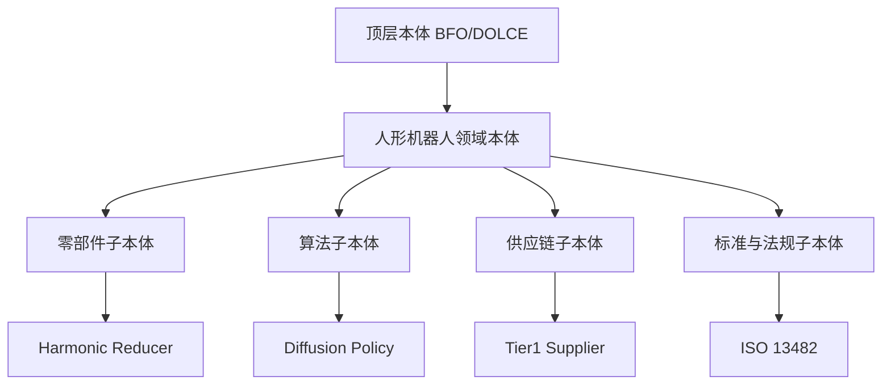

### 2.3.4 形式化语义与 OWL

形式化语义赋予知识图谱机器可解释的含义，使计算机能够自动检测矛盾、推导隐含关系和回答复杂查询。

!!! note "术语解释：RDF 三元组（RDF Triple）"
    RDF 三元组形式为 $(subject, predicate, object)$，其中主语和谓词是 URI，宾语可以是 URI 或字面量。例如：
    ```turtle
    ex:UnitreeH1 rdf:type ex:RobotSystem .
    ex:UnitreeH1 ex:uses ex:HarmonicReducer .
    ```
    RDF 是语义网的数据层标准，支持不同数据源之间的互操作。

!!! note "术语解释：RDFS（RDF Schema）"
    RDFS 是 RDF 的词汇描述语言，支持定义类（rdfs:Class）、属性（rdf:Property）、子类关系（rdfs:subClassOf）、子属性关系（rdfs:subPropertyOf）和定义域/值域（rdfs:domain / rdfs:range）。RDFS 提供了轻量级的推理能力。

!!! note "术语解释：OWL（Web Ontology Language）"
    OWL 是 W3C 推荐的本体语言，基于描述逻辑，提供比 RDFS 更强的表达能力。OWL 支持类表达式、属性约束、个体断言和复杂的推理任务。OWL 2 是其最新版本，增加了更多构造子和概要（profiles）以平衡表达能力和计算复杂度。

OWL 的核心构造包括：

| 构造 | 含义 | 示例 |
|------|------|------|
| `owl:Class` | 类 | `RobotSystem` 是一个类 |
| `owl:ObjectProperty` | 对象属性，连接两个个体 | `uses` 连接机器人和零部件 |
| `owl:DatatypeProperty` | 数据属性，连接个体和字面量 | `hasYear` 连接机器人和年份 |
| `rdfs:subClassOf` | 子类关系 | `HumanoidRobot` 是 `RobotSystem` 的子类 |
| `owl:inverseOf` | 逆属性 | `manufactures` 与 `manufacturedBy` 互逆 |
| `owl:TransitiveProperty` | 传递属性 | `isPartOf` 是传递的 |
| `owl:FunctionalProperty` | 函数型属性 | 每个机器人有唯一的序列号 |
| `owl:Restriction` | 约束 | 每个机器人至少有一个执行器 |

下面的 Turtle 示例展示了一个人形机器人材料本体的片段：

```turtle
@prefix ex: <http://example.org/humanoid-robot#> .
@prefix rdfs: <http://www.w3.org/2000/01/rdf-schema#> .
@prefix owl: <http://www.w3.org/2002/07/owl#> .
@prefix xsd: <http://www.w3.org/2001/XMLSchema#> .

ex:RobotSystem a owl:Class .
ex:Component a owl:Class .
ex:Material a owl:Class .

ex:HumanoidRobot rdfs:subClassOf ex:RobotSystem .
ex:Actuator rdfs:subClassOf ex:Component .
ex:MagnetMaterial rdfs:subClassOf ex:Material .

ex:uses a owl:ObjectProperty ;
    rdfs:domain ex:RobotSystem ;
    rdfs:range ex:Component .

ex:isPartOf a owl:ObjectProperty ;
    a owl:TransitiveProperty ;
    rdfs:domain ex:Component ;
    rdfs:range ex:Component .

ex:isMadeOf a owl:ObjectProperty ;
    rdfs:domain ex:Component ;
    rdfs:range ex:Material .

ex:NeodymiumMagnet a ex:MagnetMaterial .
ex:FramelessMotor a ex:Actuator .
ex:Optimus a ex:HumanoidRobot .

ex:FramelessMotor ex:isMadeOf ex:NeodymiumMagnet .
ex:Optimus ex:uses ex:FramelessMotor .
```

基于上述本体，OWL 推理机可以推导出：

- 因为 `HumanoidRobot rdfs:subClassOf RobotSystem`，所以 `Optimus` 也是 `RobotSystem`。
- 因为 `isPartOf` 是传递的，若“减速器是执行器的一部分”且“执行器是机器人的一部分”，则可推出“减速器是机器人的一部分”。
- 因为 `uses` 的定义域是 `RobotSystem`，可推断 `FramelessMotor` 的使用主体是机器人系统。

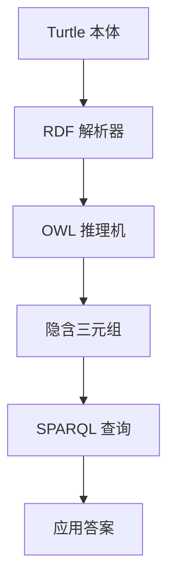

OWL 通过类层次、属性定义和约束表达，使知识图谱不仅记录事实，还能支持自动推理和一致性检查。

---

## 2.4 跨层关系设计

### 2.4.1 为什么需要跨层关系

人形机器人的核心挑战在于不同层次之间的强耦合。例如：

- 一个 AI 算法（第 7 层）的性能依赖于数据集（第 9 层）和计算硬件（第 2 层）。
- 一个机器人系统（第 11 层）由零部件（第 2 层）组成，零部件由材料（第 1 层）制成。
- 一个制造方法（第 3 层）会影响设计选择（第 6 层），进而影响整机成本（第 5 层）。

跨层关系将这些分散的实体连接起来，形成可分析的产业链路。

### 2.4.2 典型跨层链路

以下是几个人形机器人领域的典型跨层链路：

**链路 1：从数据到机器人**
```
遥操作系统 → 数据集 → VLA 模型 → 边缘计算平台 → 机器人整机
```

**链路 2：从材料到市场**
```
稀土材料 → 永磁体 → 无框力矩电机 → 执行器 → 机器人 → 工业应用 → 市场规模
```

**链路 3：从设计到认证**
```
安全原理 → 功能安全标准 → 安全设计 → 急停系统 → 机器人 → CR/CE 认证
```

**链路 4：从软件到部署**
```
ROS 2 中间件 → 运动规划库 → 控制算法 → 仿真平台 → sim-to-real → 工厂部署
```

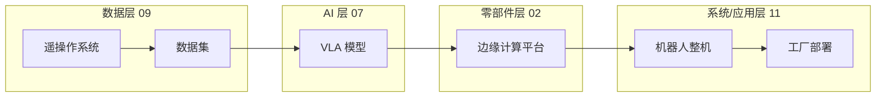

#### 2.4.2.1 跨层链路的加权路径与依赖强度

2.4.2 节用文字概括了四条典型链路，但这些链路在实际知识图谱中往往具有不同的**依赖强度**和**置信度**。为了支持供应链风险评估与技术依赖分析，我们将跨层链路建模为加权有向图。对每条关系 $(u,v)$ 赋予两个数值属性：

- **关系强度** $w(u,v) \in [0,1]$：反映源实体对目标实体的依赖程度或事实确定性。$1$ 表示强依赖（如“减速器是执行器的必要组成部分”），$0$ 表示弱关联。
- **来源置信度** $c(u,v) \in [0,1]$：反映支撑该关系的来源可靠程度。学术论文、官方文档通常高于新闻报道。

一条跨层路径 $P = (e_0, e_1, \dots, e_k)$ 的**综合依赖得分**可以定义为边上强度的乘积：

$$S(P) = \prod_{i=1}^{k} w(e_{i-1}, e_i)$$

该式的物理意义在于：依赖关系具有**传递衰减**特性。若某条链路上的任一环节依赖较弱，则整条链路的有效依赖会迅速下降。例如，若材料→磁体→电机→执行器→机器人→市场的每条边强度均为 $0.9$，则六节点五边路径的依赖得分为：

$$S(P) = 0.9^5 \approx 0.5905$$

这意味着即使每段局部关系都相当确定，整条“从稀土到市场”的宏观链路仍有约 $41\%$ 的语义衰减。该现象与供应链中“牛鞭效应”类似：局部不确定性会在链路上被放大。

!!! note "术语解释：牛鞭效应（Bullwhip Effect）"
    牛鞭效应是供应链管理学中的术语，指需求端的微小波动会沿供应链向上游逐级放大。其数学本质是具有正反馈的延迟系统：若每一级根据下游订单量调整库存，并叠加预测误差，则上游订单方差会显著大于实际需求方差。在知识图谱中，关系置信度的乘积衰减可视为该效应在语义层面的映射。

#### 2.4.2.2 路径可靠性的概率传播

若将 $c(u,v)$ 解释为关系为真的概率，并假设各条关系独立，则一条路径上所有关系同时为真的概率为：

$$R(P) = \prod_{i=1}^{k} c(e_{i-1}, e_i)$$

这就是**串联系统可靠性**公式：路径上的任一环节失效都会破坏整条路径。若某节点有多条并行路径，则该节点对上游节点的可达可靠性可用并行系统公式计算：

$$R_{\text{parallel}} = 1 - \prod_{j=1}^{m} (1 - R(P_j))$$

其中 $P_j$ 为第 $j$ 条并行路径。该公式说明：即使单一路径可靠性不高，多条独立路径可显著提升整体可达可靠性。

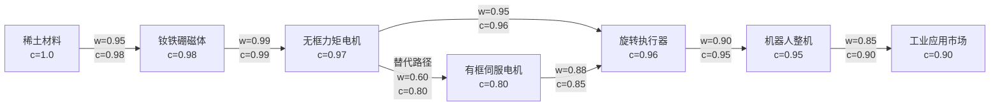

以图为例，主路径 $A \to B \to C \to D \to E \to F$ 的可靠性为：

$$R_{\text{main}} = 0.98 \times 0.99 \times 0.96 \times 0.95 \times 0.90 \approx 0.797$$

而经替代电机 $G$ 的并行路径为：

$$R_{A \to C \to D} = 0.98 \times 0.96 \approx 0.941$$
$$R_{A \to G \to D} = 0.80 \times 0.85 \approx 0.680$$
$$R_{\text{parallel}}(A \to D) = 1 - (1-0.941)(1-0.680) \approx 0.981$$

可见引入一条中等置信度的替代路径，即可将从磁体到执行器路径的可靠性从 $94.1\%$ 提升至 $98.1\%$。这一计算对供应链多源化决策具有直接参考意义（详情见第 7 章）。

下面的 Python 示例实现加权路径得分与并行路径可靠性的计算：

```python
import itertools

edges = {
    ("A","B"): (0.95, 0.98),
    ("B","C"): (0.99, 0.99),
    ("C","D"): (0.95, 0.96),
    ("D","E"): (0.90, 0.95),
    ("E","F"): (0.85, 0.90),
    ("C","G"): (0.60, 0.80),
    ("G","D"): (0.88, 0.85),
}

def path_score(path, use="strength"):
    idx = 0 if use == "strength" else 1
    s = 1.0
    for u, v in zip(path, path[1:]):
        s *= edges[(u, v)][idx]
    return s

main = ["A","B","C","D","E","F"]
print(f"主路径依赖得分: {path_score(main):.4f}")
print(f"主路径可靠性: {path_score(main, 'confidence'):.4f}")

# A->D 的并行路径
paths_A_D = [["A","B","C","D"], ["A","B","C","G","D"]]
rels = [path_score(p, "confidence") for p in paths_A_D]
parallel = 1.0
for r in rels:
    parallel *= (1 - r)
parallel = 1 - parallel
print(f"A->D 并行可靠性: {parallel:.4f}")
```

!!! note "术语解释：串联系统可靠性（Series System Reliability）"
    在可靠性工程中，若系统由 $n$ 个单元串联组成，且各单元失效相互独立，则系统可靠度为各单元可靠度之积：$R_s = \prod_{i=1}^{n} R_i$。该模型要求任一单元失效即导致系统失效，适用于无冗余的关键路径分析。

### 2.4.3 跨层关系的验证标准

跨层关系比普通关系更难验证，因为涉及不同领域的知识。本书采用以下标准：

| 标准 | 说明 |
|------|------|
| **来源明确** | 关系必须有公开来源支撑，如论文、官方文档、权威报告 |
| **逻辑合理** | 关系应符合技术或商业逻辑，不能牵强附会 |
| **可证伪** | 关系应具体到可以验证或反驳，避免模糊表述 |
| **粒度适中** | 既不过于笼统（如“AI 用于机器人”），也不过于细碎 |

### 2.4.4 路径查询与图遍历

跨层关系本质上是在图中寻找路径。路径查询和图遍历是知识图谱查询的核心能力。

!!! note "术语解释：路径查询（Path Query）"
    路径查询是在图中寻找满足特定模式的路径。例如，从“稀土材料”到“市场规模”的路径、从“算法”到“硬件”的依赖链。路径查询可以用正则路径查询（Regular Path Query, RPQ）形式化，其模式由正则表达式定义，如 `uses · is_part_of*`。

!!! note "术语解释：图遍历（Graph Traversal）"
    图遍历是按照某种策略访问图中节点的过程。常见策略包括深度优先搜索（DFS）、广度优先搜索（BFS）和双向搜索。图遍历是许多图算法（最短路径、连通分量、中心性）的基础。

路径查询可以用形式化语言描述。设关系集合为 $\Sigma$，路径模式为 $r$ 上的正则表达式，则路径查询形如：
$$Q(x,y) :- x \xrightarrow{r} y$$
其中 $r$ 可以是原子关系 $p$、连接 $r_1 \cdot r_2$、选择 $r_1 | r_2$ 或 Kleene 星号 $r^*$。

例如，查询“所有使用谐波减速器的机器人”可以表示为：
$$Q(robot) :- robot \xrightarrow{uses \cdot is\_part\_of^*} reducer$$
其中 $reducer$ 被绑定为“谐波减速器”。


图遍历算法的选择取决于查询目标：

| 目标 | 算法 | 时间复杂度 |
|------|------|-----------|
| 两点可达性 | DFS / BFS | $O(|V|+|E|)$ |
| 最短路径 | Dijkstra / BFS（无权图） | $O(|V|+|E|)$ 到 $O(|E| \log |V|)$ |
| 所有最短路径 | Floyd-Warshall | $O(|V|^3)$ |
| 连通分量 | Union-Find / BFS | $O(|V|+|E|)$ |
| 中心性 | Brandes 算法（介数） | $O(|V||E|)$ |

---

## 2.5 数据摄取流水线

### 2.5.1 整体架构

本书知识图谱的数据摄取流水线采用“来源 → 适配器 → 去重 → 写入 → 验证”的架构：


### 2.5.2 数据来源

当前知识图谱的数据来源包括：

| 来源 | 类型 | 内容 | 更新频率 |
|------|------|------|---------|
| `arxiv_ro_rss` | RSS | 机器人学 arXiv 论文 | 每日 |
| `humanoid_paper_notebooks_progress` | 数据集 | 人形机器人论文跟踪 | 每日 |
| `robotics_tomorrow_rss` | RSS | 机器人新闻 | 每日 |
| `ieee_spectrum_robotics_rss` | RSS | IEEE Spectrum 机器人新闻 | 每日 |
| `unitree_news` | RSS | 宇树科技新闻 | 每日 |
| `nvidia_robotics_blog` | RSS | NVIDIA 机器人博客 | 每日 |
| `humanoid_actuators_suppliers` | 人工整理 JSON | 执行器/供应商实体 | 按需 |
| `humanoid_workflow_entities` | 人工整理 JSON | 工作流相关实体 | 按需 |
| `humanoid_manufacturing_systems` | 人工整理 JSON | 制造/系统实体 | 按需 |

### 2.5.3 适配器（Adapter）

每个来源对应一个适配器，负责将原始数据转换为统一格式的 `ParsedItem`。适配器屏蔽了不同来源的数据格式差异，使后续处理可以统一进行。

适配器的主要职责：
- 抓取或读取原始数据
- 提取标题、摘要、作者、日期、URL 等元数据
- 生成实体 ID 和初始属性
- 返回标准化的 `ParsedItem` 列表

### 2.5.4 去重（Dedup）

去重服务在写入前检查实体是否已存在，避免重复创建。去重策略包括：

| 策略 | 说明 |
|------|------|
| ID 匹配 | 通过规范化 ID 直接匹配 |
| 标题相似度 | 对标题进行清洗和归一化后比较 |
| URL 匹配 | 对同一来源的 URL 去重 |
| 摘要相似度 | 使用文本相似度算法识别近似条目 |

### 2.5.5 写入与验证

`EntryWriter` 负责将新的实体和关系写入文件系统。为了提高性能，写入器会预加载现有 ID，避免每次写入时扫描大量文件。

写入后，`validate_entries.py` 会对所有实体和关系文件进行 Schema 校验，检查必填字段、枚举值、格式等是否符合规范。校验通过后才能进入人工审阅队列或直接进入生产环境。

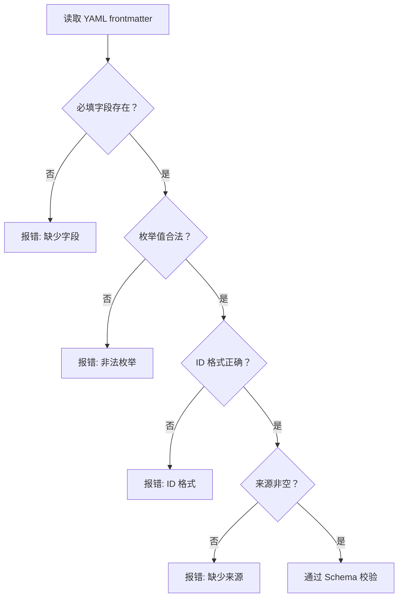

#### 2.5.5.1 流水线吞吐与延迟：排队论视角

2.5.1 节给出了摄取流水线的逻辑阶段，但要评估其在工程上的可行性，还需要量化**吞吐量**与**延迟**。将每个处理阶段抽象为一个服务节点，将待处理的 `ParsedItem` 抽象为顾客，则整个流水线可以用排队论（queuing theory）建模。

!!! note "术语解释：排队论（Queuing Theory）"
    排队论是研究随机到达过程与服务过程相互作用的数学分支，广泛应用于通信网络、计算机系统与生产制造。最基本的 M/M/1 队列假设：顾客到达服从泊松过程（到达率为 $\lambda$），服务时间服从指数分布（服务率为 $\mu$），单服务台。当系统达到稳态且 $\rho = \lambda / \mu < 1$ 时，平均队列长度与平均等待时间分别为：
    $$L = \frac{\rho}{1-\rho}, \quad W = \frac{1}{\mu - \lambda}$$
    其中 $\rho$ 称为**利用率**。若 $\rho \to 1$，队列长度与等待时间将发散，系统进入不稳定状态。

假设某来源每日产生新条目数 $\lambda = 100\ \text{条/小时}$，适配器-去重-写入-验证整体的处理能力为 $\mu = 150\ \text{条/小时}$，则：

$$\rho = \frac{100}{150} = 0.667$$

稳态下平均队列长度：

$$L = \frac{0.667}{1-0.667} \approx 2.0\ \text{条}$$

平均等待时间（含服务时间）：

$$W = \frac{1}{150-100} = 0.02\ \text{小时} = 72\ \text{秒}$$

这意味着，从条目进入 staging 区到完成写入与校验，平均约需 72 秒；staging 区中通常只有约 2 条在等待。若来源突增到 $\lambda = 140\ \text{条/小时}$，则 $\rho = 0.933$，$W$ 升至 $900$ 秒（15 分钟），说明系统对到达率非常敏感。工程上应设置**反压（backpressure）**机制或水平扩展写入节点，以控制 $\rho$ 不超过约 $0.7$。

!!! note "术语解释：反压（Backpressure）"
    反压是流处理系统中的一种流量控制机制：当下游处理速度低于上游产生速度时，向下游传播反压信号，使上游降低发送速率。其本质是控制理论中的负反馈，用于防止缓冲区无限增长。反压可以用令牌桶、滑动窗口或背压队列实现。

#### 2.5.5.2 Schema 校验的形式化模型

2.5.5 节的校验流程可进一步形式化为**约束满足问题（Constraint Satisfaction Problem, CSP）**。对每一个实体或关系文件，定义变量集合 $X = \{x_1, x_2, \dots, x_n\}$，其中 $x_i$ 对应 frontmatter 中的一个字段。每个字段的 Schema 定义一个约束 $C_i$，例如：

- $C_{\text{id}}$：`id` 必须匹配正则表达式 `^[a-z0-9_]+$`。
- $C_{\text{type}}$：`type` 必须属于枚举集合 $\mathcal{T}$。
- $C_{\text{sources}}$：`sources` 非空，即 $|sources| \ge 1$。

一个实体文件是**合法**的，当且仅当其所有变量同时满足对应约束：

$$\text{Valid}(X) = \bigwedge_{i=1}^{n} C_i(x_i)$$

若任一约束不满足，则校验失败。该模型与数据库中的完整性约束、编程语言中的类型系统同源，只是约束的表达能力较 OWL 弱，更适合作为轻量级入口检查。

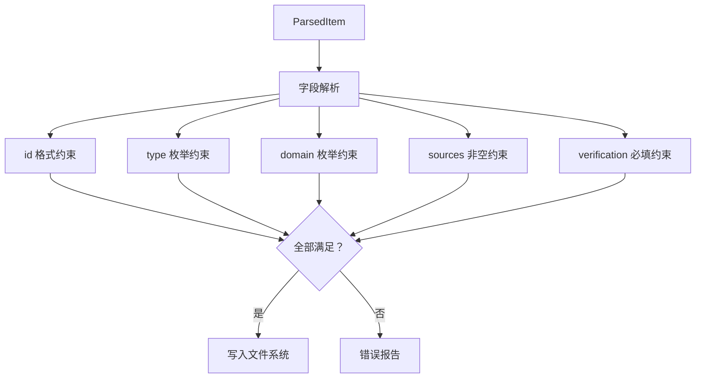

以下 Python 示例用简单的 CSP 思路模拟校验过程，并统计各类错误的出现频率：

```python
import re
from collections import Counter

entities = [
    {"id": "ent_robot_optimus", "type": "robot_system", "domain": "11", "sources": ["s1"]},
    {"id": "Ent_Invalid ID!", "type": "robot_system", "domain": "11", "sources": ["s1"]},
    {"id": "ent_component_motor", "type": "unknown_type", "domain": "02", "sources": []},
    {"id": "ent_paper_diffusion", "type": "paper", "domain": "07", "sources": ["s2"]},
]

valid_types = {"robot_system", "component", "paper", "method", "company"}
id_pattern = re.compile(r"^[a-z0-9_]+$")
valid_domains = {"00","01","02","03","04","05","06","07","08","09","10","11","12"}

errors = Counter()

def validate(e):
    ok = True
    if not id_pattern.match(e["id"]):
        errors["id_format"] += 1; ok = False
    if e["type"] not in valid_types:
        errors["type_enum"] += 1; ok = False
    if e["domain"] not in valid_domains:
        errors["domain_enum"] += 1; ok = False
    if len(e.get("sources", [])) == 0:
        errors["missing_source"] += 1; ok = False
    return ok

valid_count = sum(validate(e) for e in entities)
print(f"Valid: {valid_count}/{len(entities)}")
print("Error distribution:", dict(errors))
```

输出显示：第二个实体违反 `id_format`，第三个实体同时违反 `type_enum` 与 `missing_source`。这种细粒度错误分类有助于在 CI/CD 报告中快速定位问题。

!!! note "术语解释：约束满足问题（Constraint Satisfaction Problem, CSP）"
    CSP 由变量集合、值域集合和约束集合组成，目标是找到满足所有约束的变量赋值。形式化地，一个 CSP 可表示为三元组 $(X, D, C)$，其中 $X$ 为变量，$D$ 为值域，$C$ 为约束。CSP 是 NP-完全问题，但在 frontmatter 字段这种有限、结构化域上，校验可在多项式时间内完成。

### 2.5.6 知识抽取技术

知识抽取是将非结构化或半结构化数据转换为结构化三元组的过程。它通常包括命名实体识别、关系抽取、实体链接和共指消解等步骤。

!!! note "术语解释：命名实体识别（Named Entity Recognition, NER）"
    NER 是从文本中识别出命名实体（如人名、地名、机构名、技术术语）并标注其类别的任务。从概率图模型角度看，NER 是一个序列标注问题：给定 token 序列 $x_1, \dots, x_n$，预测标签序列 $y_1, \dots, y_n$。常用方法包括条件随机场（CRF）、BiLSTM-CRF 和基于 Transformer 的模型（如 BERT）。

!!! note "术语解释：条件随机场（Conditional Random Field, CRF）"
    CRF 是一种判别式概率图模型，常用于序列标注。它直接建模条件概率 $P(y|x)$，并能够捕获标签之间的转移约束。对于 NER，CRF 层可以保证输出标签序列的合法性，例如“I-PER”不能紧跟“B-ORG”。

!!! note "术语解释：BERT（Bidirectional Encoder Representations from Transformers）"
    BERT 是一种基于 Transformer 编码器的预训练语言模型。它通过掩码语言模型（MLM）和下一句预测（NSP）在大规模文本上预训练，然后在下游任务上微调。BERT 的双向上下文表示使其在 NER、关系抽取等任务中表现优异。

!!! note "术语解释：spaCy"
    spaCy 是一个开源的自然语言处理库，提供分词、词性标注、命名实体识别、依存句法分析等功能。它支持训练自定义 NER 模型，也提供预训练的多语言模型。

!!! note "术语解释：关系抽取（Relation Extraction, RE）"
    关系抽取是从文本中识别实体之间语义关系的任务。例如，从“Tesla manufactures Optimus”中抽取 `(Tesla, manufactures, Optimus)`。关系抽取方法包括：
    - **基于模式**：手工编写规则或模板。
    - **监督学习**：使用标注数据训练分类器。
    - **远程监督（Distant Supervision）**：利用现有知识图谱自动标注训练数据。
    - **基于提示的学习（Prompt-based）**：用大语言模型根据提示生成关系。

!!! note "术语解释：远程监督（Distant Supervision）"
    远程监督假设：如果知识图谱中存在关系 $(e_1, r, e_2)$，那么所有同时包含 $e_1$ 和 $e_2$ 的句子都可能表达关系 $r$。这一假设会产生噪声，因此需要多实例学习（Multi-Instance Learning）或注意力机制来缓解。

!!! note "术语解释：实体链接（Entity Linking）与实体消歧（Entity Disambiguation）"
    实体链接是将文本中的实体提及（mention）映射到知识库中唯一实体的过程。实体消歧是当提及可能对应多个实体时，选择正确目标的过程。常用方法包括：
    - 知识库查找：基于名称、别名、上下文匹配。
    - 嵌入相似度：计算 mention 上下文与候选实体描述的向量相似度。
    - 图神经网络：利用知识图谱的结构信息辅助消歧。

!!! note "术语解释：共指消解（Coreference Resolution）"
    共指消解是识别文本中指向同一现实世界对象的多个提及的过程。例如，在“Tesla announced Optimus. It will be deployed in factories.”中，“It”指代“Optimus”。共指消解对于跨句子关系抽取和文档级知识抽取至关重要。


下面的 Python 示例展示了用 spaCy 进行简单 NER，以及用正则模式抽取关系的流程：

```python
import spacy
import re

# 加载 spaCy 英文模型
nlp = spacy.load("en_core_web_sm")

text = """
Tesla manufactures the Optimus humanoid robot.
Unitree launched the H1 humanoid robot in 2024.
Harmonic Drive Systems produces precision harmonic reducers.
"""

doc = nlp(text)

# NER
entities = [(ent.text, ent.label_) for ent in doc.ents]
print("Named entities:", entities)

# 关系抽取：基于简单模式
relations = []
patterns = [
    (r"(\w+) manufactures the ([\w\s]+) robot", "manufactures"),
    (r"(\w+) launched the ([\w\s]+) robot", "launched"),
    (r"(\w+) produces ([\w\s]+)", "produces"),
]

for pattern, rel in patterns:
    for match in re.finditer(pattern, text, re.IGNORECASE):
        relations.append((match.group(1), rel, match.group(2).strip()))

print("Extracted relations:", relations)
```

---

## 2.6 命名规范、去重与消歧

### 2.6.1 实体 ID 命名规范

实体 ID 是知识图谱的核心标识符，必须唯一、稳定、可读。

**命名规则：**
- 格式：`ent_<type>_<normalized_title>_<year>`
- 全部小写
- 仅包含字母、数字和下划线
- 标题部分截取前几个有意义的单词
- 年份可选，用于区分同名不同代的实体

**示例：**

| 实体 | ID |
|------|-----|
| Tesla Optimus | `ent_robot_system_tesla_optimus` |
| Unitree H1（2024） | `ent_robot_unitree_h1_humanoid_robot_2024` |
| Diffusion Policy（2023） | `ent_paper_diffusion_policy_2023` |
| 谐波减速器（2024） | `ent_component_harmonic_reducer_2024` |

### 2.6.2 关系 ID 命名规范

关系 ID 由源实体 ID、关系类型和目标实体 ID 组合而成：

- 格式：`rel_<source_id>_<type>_<target_id>`
- 全部小写
- 仅包含字母、数字和下划线

**示例：**

| 关系 | ID |
|------|-----|
| 谐波减速器是旋转执行器的一部分 | `rel_ent_component_harmonic_reducer_2024_is_part_of_ent_component_rotary_actuator_2024` |
| Diffusion Policy 部署于 Unitree H1 | `rel_ent_paper_diffusion_policy_2023_implemented_on_ent_robot_unitree_h1_humanoid_robot_2024` |

### 2.6.3 消歧策略

同一术语在不同语境下可能指代不同实体。例如：
- "Atlas" 可能指波士顿动力的机器人，也可能指古希腊神话人物或地图服务。
- "ROS" 可能指机器人操作系统，也可能指其他缩写。

消歧策略包括：
- **上下文消歧**：根据来源和描述判断实体类型。
- **别名管理**：为每个实体维护别名列表，避免重复创建。
- **人工标注**：对歧义严重的条目进行人工确认。
- **类型约束**：关系类型本身可以约束实体的可能类型。

### 2.6.4 实体对齐与记录链接

实体对齐（Entity Alignment）是识别不同知识图谱或不同数据源中指代同一现实世界对象的实体的过程。记录链接（Record Linkage）是数据库领域中的对应问题，目标是识别同一对象在不同记录中的重复出现。

!!! note "术语解释：Jaccard 相似度"
    Jaccard 相似度度量两个集合的交集与并集之比：
    $$J(A,B) = \frac{|A \cap B|}{|A \cup B|}$$
    常用于字符串的 n-gram 集合比较或标签集合比较。Jaccard 取值范围为 $[0,1]$，值越大表示越相似。

!!! note "术语解释：Levenshtein 编辑距离"
    Levenshtein 距离是将一个字符串转换为另一个字符串所需的最少单字符编辑操作（插入、删除、替换）次数。归一化后的相似度为 $1 - \frac{d(s,t)}{\max(|s|,|t|)}$。它适合捕捉拼写变化和缩写差异。

!!! note "术语解释：TF-IDF 与余弦相似度"
    TF-IDF（Term Frequency-Inverse Document Frequency）是一种词袋加权方法，给文档中每个词赋予权重：
    $$\text{TF-IDF}(t,d) = \text{tf}(t,d) \cdot \text{idf}(t)$$
    其中 $\text{idf}(t) = \log \frac{N}{|\{d : t \in d\}|}$。将文档表示为 TF-IDF 向量后，余弦相似度度量夹角：
    $$\cos(\vec{a},\vec{b}) = \frac{\vec{a} \cdot \vec{b}}{\|\vec{a}\| \|\vec{b}\|}$$

!!! note "术语解释：分块（Blocking）"
    分块是记录链接中的预处理步骤，通过廉价策略将记录划分为若干候选对集合，避免 $O(n^2)$ 的全量比较。常用分块键包括首字母、邮编、类别标签、n-gram 签名等。

!!! note "术语解释：成对匹配（Pairwise Matching）与聚类（Clustering）"
    成对匹配是为每一对候选记录计算相似度并判断是否匹配的过程。由于传递性（若 A=B 且 B=C，则 A=C），匹配结果通常需要聚类以形成等价类。常用算法包括传递闭包、连通分量或层次聚类。

!!! note "术语解释：置信度评分（Confidence Scoring）与真值发现（Truth Discovery）"
    置信度评分是为每个匹配判断赋予概率或分数，便于设定阈值和人工复核。真值发现是在多个冲突来源中推断最可能正确值的过程，常用方法包括投票、EM 算法和基于图模型的方法。

实体对齐的典型流程如下图所示：


去重决策树可以用下图表示：

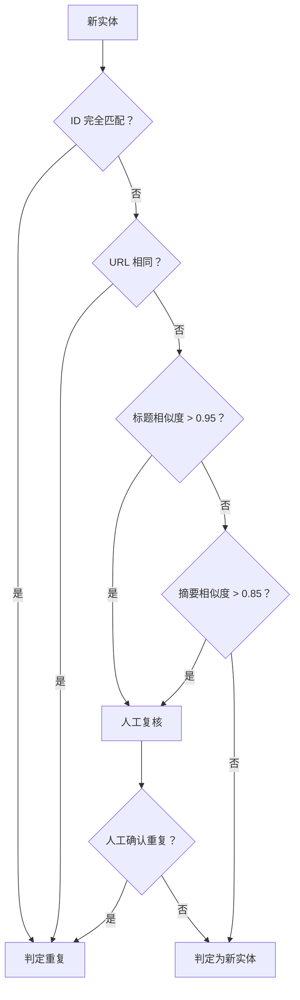

下面的 Python 示例展示了字符串相似度、TF-IDF 余弦相似度和简单嵌入余弦相似度的实体去重：

```python
import numpy as np
from sklearn.feature_extraction.text import TfidfVectorizer
from sklearn.metrics.pairwise import cosine_similarity

# 候选实体名称
candidates = [
    "Unitree H1 Humanoid Robot",
    "Unitree H1 robot",
    "宇树 H1 人形机器人",
    "Tesla Optimus Gen 2",
    "Tesla Optimus",
]

# 1. TF-IDF 余弦相似度
vectorizer = TfidfVectorizer().fit(candidates)
vectors = vectorizer.transform(candidates)
sim_matrix = cosine_similarity(vectors)
print("TF-IDF cosine similarity matrix:")
print(np.round(sim_matrix, 2))

# 2. 基于简单嵌入的余弦相似度（用随机向量示意，实际应用可用 sentence-transformers）
np.random.seed(42)
embeddings = np.random.rand(len(candidates), 128)
# 归一化
embeddings = embeddings / np.linalg.norm(embeddings, axis=1, keepdims=True)
emb_sim = embeddings @ embeddings.T
print("Embedding cosine similarity matrix:")
print(np.round(emb_sim, 2))

# 3. 简单去重：阈值 0.8
threshold = 0.8
duplicates = []
for i in range(len(candidates)):
    for j in range(i+1, len(candidates)):
        if sim_matrix[i, j] > threshold:
            duplicates.append((candidates[i], candidates[j], sim_matrix[i, j]))
print("Duplicate candidates:", duplicates)
```

---

## 2.7 人工审阅与质量控制

### 2.7.1 三级审阅机制

为了保证知识质量，本书采用三级审阅机制：


**AI 初审：**
- 自动完成 Schema 校验
- 自动检查必填字段和格式
- 自动识别明显的低质量或重复条目

**人工复核：**
- 检查实体类型和 domain 是否正确
- 验证关系是否合理
- 确认来源是否可靠

**专家终审：**
- 对跨层关系和关键论断进行专业判断
- 处理有争议的条目
- 决定条目是否进入生产环境

### 2.7.2 审阅状态

| 状态 | 说明 |
|------|------|
| `staged` | 已摄取但未审阅 |
| `active` | 已通过审阅，进入生产环境 |
| `rejected` | 未通过审阅，被驳回 |
| `deprecated` | 已过时或被替代 |

审阅状态转换可以用下图表示：

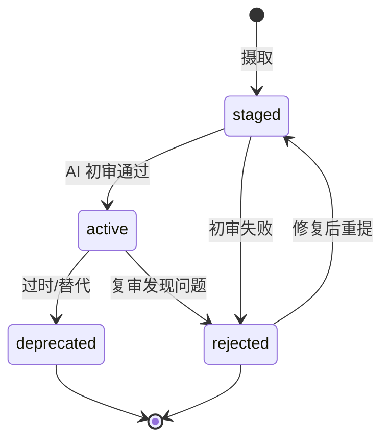

### 2.7.3 质量指标

本书使用以下指标监控知识图谱质量：

| 指标 | 说明 |
|------|------|
| **实体总数** | 知识图谱中实体的数量 |
| **关系总数** | 知识图谱中关系的数量 |
| **跨层关系数** | 连接不同 domain 的关系数量 |
| **缺失 theoretical_depth 的实体数** | 未设置理论深度的实体数量 |
| **悬空关系数** | 源或目标实体不存在的关系数量 |
| **待审阅条目数** | staging 中等待审阅的条目数量 |
| **被驳回条目数** | 审阅未通过的条目数量 |

### 2.7.4 知识图谱质量维度

知识图谱的质量是一个多维概念。学术界和工业界通常从以下几个维度进行评估：

!!! note "术语解释：完整性（Completeness）"
    完整性度量知识图谱覆盖目标领域知识的充分程度。可以分为：
    - **模式完整性**：是否定义了所有必需的类和属性。
    - **实体完整性**：是否覆盖了目标实体集合。
    - **属性完整性**：实体的关键属性是否被填充。
    - **关系完整性**：实体之间的重要关系是否被捕获。
    完整性可以用覆盖率（coverage）量化：$\text{Coverage} = \frac{|\text{实际包含的知识}|}{|\text{期望包含的知识}|}$。

!!! note "术语解释：准确性（Accuracy）"
    准确性度量知识图谱中事实的正确程度。例如，若知识图谱断言“Tesla 制造 Optimus”，该断言是否与客观现实一致。准确性常用精确率（Precision）评估：$P = \frac{|\{\text{正确的三元组}\}|}{|\{\text{抽取的三元组}\}|}$。

!!! note "术语解释：一致性（Consistency）"
    一致性度量知识图谱是否满足预定义的约束和公理。例如，若本体规定“每个 RobotSystem 至少有一个 Component”，则缺少 Component 的机器人系统违反一致性。一致性可以通过 OWL 推理机或自定义规则检查。

!!! note "术语解释：时效性（Timeliness）与可信度（Credibility）"
    时效性度量知识是否反映当前状态。人形机器人领域发展迅速，过时的信息可能误导决策。可信度度量知识来源的可靠程度，通常与来源类型（学术论文 > 官方文档 > 新闻 > 博客）和审阅状态相关。

!!! note "术语解释：可解释性（Explainability）"
    可解释性指知识图谱中的结论可以被追溯到来源和推理链。对于知识驱动的决策系统，解释性至关重要，因为它允许用户审计结论、发现偏见和纠正错误。

!!! note "术语解释：精确率、召回率与 F1 分数（Precision, Recall, F1）"
    精确率、召回率和 F1 是信息检索和机器学习中的基本指标：
    $$P = \frac{TP}{TP+FP}, \quad R = \frac{TP}{TP+FN}, \quad F1 = \frac{2PR}{P+R}$$
    其中 $TP$ 是真正例，$FP$ 是假正例，$FN$ 是假反例。在知识图谱质量评估中，$TP$ 可以定义为“正确抽取/断言的三元组数量”，$FP$ 为“错误三元组数量”，$FN$ 为“遗漏的正确三元组数量”。

!!! note "术语解释：统计质量控制（Statistical Quality Control）"
    统计质量控制源于制造业，核心思想是通过抽样检查和过程监控保证产品质量。在知识图谱审阅中，可以随机抽取一定比例的条目进行人工复核，估计整体错误率。若批次错误率超过阈值，则对该批次进行全量重审。此外，可以利用审阅者一致性（inter-annotator agreement）评估标注质量，常用 Kappa 系数：
    $$\kappa = \frac{P_o - P_e}{1 - P_e}$$
    其中 $P_o$ 是观察者一致率，$P_e$ 是随机一致率。

质量监控仪表盘应定期输出以下指标：

| 维度 | 指标 | 计算方法 |
|------|------|---------|
| 完整性 | 实体覆盖率 | 已覆盖目标实体数 / 目标实体总数 |
| 完整性 | 属性填充率 | 已填充属性数 / 期望属性总数 |
| 准确性 | 人工抽样精确率 | 抽样中正确三元组比例 |
| 一致性 | Schema 违反数 | 违反约束的实体/关系数量 |
| 时效性 | 平均更新间隔 | 当前时间 - 最后更新时间的中位数 |
| 可信度 | 来源类型分布 | 一手/二手/新闻来源占比 |
| 可解释性 | 缺失来源比例 | 无来源三元组占比 |

```mermaid
flowchart TD
    A["知识图谱"] --> B["完整性检查"]
    A --> C["准确性抽样"]
    A --> D["一致性推理"]
    A --> E["时效性扫描"]
    A --> F["来源可信度评估"]
    B --> G["质量报告"]
    C --> G
    D --> G
    E --> G
    F --> G
    G --> H["人工复核队列"]
```

下面的 Python 示例计算知识图谱的核心质量指标，包括覆盖率、悬空边和 Schema 一致性：

```python
import pandas as pd
import networkx as nx

# 模拟实体和关系数据
entities = pd.DataFrame({
    "id": ["e1", "e2", "e3", "e4"],
    "type": ["robot_system", "component", "company", "paper"],
    "domain": ["11", "02", "11", "07"],
    "theoretical_depth": ["system", "method", "system", None],
})

relations = pd.DataFrame({
    "source_id": ["e1", "e1", "e2", "e5"],
    "target_id": ["e2", "e3", "e4", "e1"],
    "type": ["uses", "manufactured_by", "is_part_of", "uses"],
})

# 覆盖率：有 theoretical_depth 的实体比例
coverage = entities["theoretical_depth"].notna().mean()
print(f"Theoretical depth coverage: {coverage:.2%}")

# 悬空边：源或目标不在实体集合中的关系
entity_ids = set(entities["id"])
dangling = relations[
    ~relations["source_id"].isin(entity_ids) |
    ~relations["target_id"].isin(entity_ids)
]
print(f"Dangling edges: {len(dangling)}")
print(dangling)

# Schema 一致性：检查关系类型对应的源/目标类型是否合法
allowed = {
    "uses": {"source": {"robot_system", "method"}, "target": {"component", "dataset"}},
    "manufactured_by": {"source": {"robot_system", "component"}, "target": {"company"}},
    "is_part_of": {"source": {"component"}, "target": {"component", "robot_system"}},
}

def check_schema(row):
    rel_type = row["type"]
    if rel_type not in allowed:
        return False
    src_type = entities.set_index("id").loc.get(row["source_id"], {}).get("type")
    tgt_type = entities.set_index("id").loc.get(row["target_id"], {}).get("type")
    return src_type in allowed[rel_type]["source"] and tgt_type in allowed[rel_type]["target"]

relations["schema_valid"] = relations.apply(check_schema, axis=1)
print(f"Schema consistency: {relations['schema_valid'].mean():.2%}")
print(relations)
```

#### 2.7.4.1 质量控制的统计抽样

2.7.3 节列出若干质量指标，但要将其转化为可操作的审阅流程，还需要回答一个统计问题：**需要抽查多少条目，才能以给定置信水平估计整体错误率？** 这本质上是二项比例置信区间问题。

!!! note "术语解释：二项比例置信区间（Binomial Proportion Confidence Interval）"
    若从总体中随机抽取 $n$ 个样本，其中 $k$ 个为“错误”样本，则样本错误率为 $\hat{p} = k/n$。由于抽样随机性，$\hat{p}$ 只是真实错误率 $p$ 的估计。Wilson 评分区间给出 $p$ 的 $100(1-\alpha)\%$ 置信区间：
    $$\hat{p} \pm \frac{z}{1+z^2/n} \sqrt{\frac{\hat{p}(1-\hat{p})}{n} + \frac{z^2}{4n^2}}$$
    其中 $z = z_{1-\alpha/2}$ 是标准正态分布的分位数。当 $n$ 较大时，Wilson 区间接近正态近似区间 $\hat{p} \pm z\sqrt{\hat{p}(1-\hat{p})/n}$。

若希望在 95% 置信水平下将真实错误率估计到绝对误差 $E$ 以内，且预期错误率约为 $\hat{p}$，则最小样本量可由下式估算：

$$n \approx \frac{z^2 \hat{p}(1-\hat{p})}{E^2}$$

取 $z_{0.975} \approx 1.96$，预期错误率 $\hat{p}=0.05$，允许误差 $E=0.02$，则：

$$n \approx \frac{1.96^2 \times 0.05 \times 0.95}{0.02^2} \approx 456.2$$

即每批次至少随机抽查 457 条。若批次总条目数不足 457，则应全量审阅。

审阅结果还可以用**p-控制图（p-chart）**进行过程监控。对连续的 $m$ 个批次，分别计算错误率 $\hat{p}_1, \dots, \hat{p}_m$，中心线与控制限为：

$$\bar{p} = \frac{1}{m}\sum_{i=1}^{m} \hat{p}_i$$
$$\text{UCL} = \bar{p} + 3\sqrt{\frac{\bar{p}(1-\bar{p})}{n_i}}, \quad \text{LCL} = \max\left(0, \bar{p} - 3\sqrt{\frac{\bar{p}(1-\bar{p})}{n_i}}\right)$$

若某批次错误率超出控制上限，则该批次存在系统性质量问题，需要全量重审。

!!! note "术语解释：p-控制图（p-chart）"
    p-控制图是统计过程控制（SPC）中用于监控不合格品率的工具。它以批次不合格率为纵轴、时间为横轴，画出中心线（CL）与上下控制限（UCL/LCL）。当观测点超出控制限或呈现非随机模式时，提示过程失控。其理论基础是二项分布的正态近似，控制限通常取 $\pm 3\sigma$。

以下 Python 示例计算 Wilson 置信区间、最小样本量并绘制 p-控制图：

```python
import numpy as np
import matplotlib.pyplot as plt
from scipy import stats

def wilson_interval(k, n, alpha=0.05):
    p = k / n
    z = stats.norm.ppf(1 - alpha / 2)
    denom = 1 + z**2 / n
    centre = (p + z**2 / (2*n)) / denom
    margin = z * np.sqrt((p*(1-p) + z**2/(4*n)) / n) / denom
    return centre - margin, centre + margin

# 示例：抽查 457 条，发现 23 条错误
n, k = 457, 23
lo, hi = wilson_interval(k, n)
print(f"错误率估计: {k/n:.3f}, 95% Wilson CI: [{lo:.3f}, {hi:.3f}]")

# 最小样本量
p_hat, E = 0.05, 0.02
z = stats.norm.ppf(0.975)
n_min = int(np.ceil(z**2 * p_hat * (1-p_hat) / E**2))
print(f"最小样本量: {n_min}")

# p-控制图
np.random.seed(0)
batch_sizes = np.full(20, 457)
errors = np.random.binomial(batch_sizes, 0.05)
p_hat_i = errors / batch_sizes
p_bar = p_hat_i.mean()
ucl = p_bar + 3*np.sqrt(p_bar*(1-p_bar)/batch_sizes)
lcl = np.maximum(0, p_bar - 3*np.sqrt(p_bar*(1-p_bar)/batch_sizes))

plt.figure(figsize=(8,4))
plt.plot(p_hat_i, marker='o', label='Batch error rate')
plt.axhline(p_bar, color='green', label='CL')
plt.plot(ucl, color='red', linestyle='--', label='UCL')
plt.plot(lcl, color='red', linestyle='--', label='LCL')
plt.xlabel('Batch index'); plt.ylabel('Error rate')
plt.title('p-Chart for KG Review Quality')
plt.legend(); plt.grid(True)
plt.tight_layout()
plt.savefig('p_chart_kg_quality.png', dpi=150)
print("Saved p_chart_kg_quality.png")
```

该代码输出的 95% Wilson 置信区间约为 $[0.032, 0.076]$，说明即使样本中观察到 $5\%$ 的错误率，真实错误率仍可能在 $3.2\%$ 到 $7.6\%$ 之间。p-控制图可集成到 `coverage_dashboard.py` 的质量看板中（参见 2.7.3 节）。

---

## 2.8 知识图谱的应用

### 2.8.1 查询与探索

知识图谱支持多种查询方式：

**按实体查询：**
- 查询某个机器人的所有零部件
- 查询某个零部件的所有供应商
- 查询某个方法使用的数据集

**按关系查询：**
- 查询所有使用谐波减速器的机器人
- 查询所有部署于汽车工厂的人形机器人
- 查询受 ISO 13482 约束的所有系统

**按路径查询：**
- 从材料到整机到市场的完整链路
- 从算法到硬件到应用的技术依赖链
- 从标准到设计选择的影响路径

#### 2.8.1.1 查询实例：SPARQL、Cypher 与 Python 实现

2.8.1 节概括了查询类型，本节给出三个可直接运行的实例，分别对应 RDF 三元组存储、属性图数据库和 Python 内存图。

**实例 1：SPARQL 查询所有使用谐波减速器的机器人**

```sparql
PREFIX ex: <http://example.org/humanoid-robot#>

SELECT ?robot ?manufacturer
WHERE {
  ?robot rdf:type ex:HumanoidRobot .
  ?robot ex:uses ?actuator .
  ?actuator rdf:type ex:RotaryActuator .
  ?actuator ex:isPartOf ?reducer .
  ?reducer rdf:type ex:HarmonicReducer .
  OPTIONAL { ?robot ex:manufacturedBy ?manufacturer . }
}
```

该查询假设 `ex:isPartOf` 的逆关系可用于从执行器定位到减速器；若本体已声明 `ex:isPartOf` 的逆属性 `ex:hasPart`，可通过 `owl:inverseOf` 自动推导。更多关于谐波减速器的物理机理见第 4 章。

**实例 2：Cypher 查询零部件的多级供应商**

```cypher
MATCH (c:Component {name: 'Harmonic Reducer'})<-[:manufactures]-(m:ComponentManufacturer)
OPTIONAL MATCH (m)-[:supplies]->(oem:OEM)-[:manufactures]->(r:RobotSystem)
RETURN c.name AS component, m.name AS manufacturer, oem.name AS oem, r.name AS robot
```

该查询从零部件出发，沿 `manufactures` 找到制造商，再沿 `supplies` 找到 OEM，最后定位到机器人系统，体现了跨层关系在供应链分析中的价值（详情见第 7 章）。

**实例 3：Python 内存图路径搜索——从钕铁硼到市场**

```python
import networkx as nx

G = nx.DiGraph()
G.add_edges_from([
    ("NdFeB Magnet", "Frameless Motor", {"rel": "isMadeOf"}),
    ("Frameless Motor", "Rotary Actuator", {"rel": "isPartOf"}),
    ("Rotary Actuator", "Optimus", {"rel": "isPartOf"}),
    ("Optimus", "Car Factory", {"rel": "deployedAt"}),
    ("Car Factory", "Industrial Market", {"rel": "hasMarketSize"}),
    ("Optimus", "BMW Spartanburg", {"rel": "deployedAt"}),
])

# 所有从 NdFeB Magnet 到 Industrial Market 的简单路径
paths = list(nx.all_simple_paths(G, "NdFeB Magnet", "Industrial Market"))
print("Paths:", paths)

# 最短路径（按边数）
sp = nx.shortest_path(G, "NdFeB Magnet", "Industrial Market")
print("Shortest path:", sp)
```

运行结果将输出两条市场路径：`... → Optimus → Car Factory → Market` 与 `... → Optimus → BMW Spartanburg → Market`。这类路径查询在评估技术-市场映射和供应链脆弱性时非常关键。

!!! note "术语解释：可选模式（OPTIONAL Pattern）"
    OPTIONAL 是 SPARQL 中的修饰符，表示若模式存在则返回绑定结果，否则不导致整行被过滤。它对应关系代数中的左外连接（left outer join），用于处理缺失数据，避免因为某个属性未填充而丢失主体记录。

### 2.8.2 推理与分析

基于知识图谱可以进行更高层次的推理：

- **瓶颈识别**：找出只有少数供应商的关键零部件，评估供应链风险。
- **替代方案分析**：当某个零部件缺货或涨价时，寻找替代零部件和供应商。
- **技术成熟度评估**：通过关联的论文、产品、部署案例，判断某项技术的成熟度。
- **投资标的研究**：分析某家公司在知识图谱中的位置、技术布局和供应链关系。

### 2.8.3 可视化

知识图谱可以通过网络图、树图、桑基图等形式可视化：

- **网络图**：展示实体和关系的全局结构。
- **树图**：展示某个系统的零部件层次结构。
- **桑基图**：展示从材料到整机到市场的价值流动。
- **时间线**：展示技术、产品、企业的发展历程。

### 2.8.4 存储与查询系统

知识图谱的存储和查询系统决定了其可扩展性、查询能力和应用场景。根据数据模型，主要分为 RDF 三元组存储和属性图数据库两大类。

!!! note "术语解释：RDF 三元组存储（Triple Store）"
    RDF 三元组存储是专门存储 RDF 三元组的数据库，支持 SPARQL 查询和 OWL/RDFS 推理。典型系统包括 Apache Jena、GraphDB、Virtuoso 和 Amazon Neptune（RDF 模式）。三元组存储的优势在于形式化语义和标准互操作，适合需要强语义约束的场景。

!!! note "术语解释：属性图数据库（Property Graph Database）"
    属性图数据库以节点、边、标签和属性组织数据，支持灵活的图遍历和模式匹配。典型系统包括 Neo4j、Amazon Neptune（Gremlin 模式）、JanusGraph 和 TigerGraph。属性图数据库的优势在于高性能的图遍历和丰富的属性表达，适合推荐系统、欺诈检测和供应链分析。

!!! note "术语解释：SPARQL"
    SPARQL 是 W3C 推荐的 RDF 查询语言，语法类似 SQL，但针对图模式匹配设计。例如：
    ```sparql
    SELECT ?robot WHERE {
      ?robot ex:uses ex:HarmonicReducer .
    }
    ```
    SPARQL 支持可选模式、过滤、聚合、子查询和联邦查询。

!!! note "术语解释：Cypher"
    Cypher 是 Neo4j 开发的属性图查询语言，使用 ASCII 艺术风格表示节点和关系。例如：
    ```cypher
    MATCH (r:RobotSystem)-[:uses]->(c:Component)
    WHERE c.name = 'Harmonic Reducer'
    RETURN r.name
    ```

!!! note "术语解释：Gremlin"
    Gremlin 是 Apache TinkerPop 的图遍历语言，采用函数式风格。它是图数据库的“通用语言”，可在多种后端上运行。例如：
    ```gremlin
    g.V().hasLabel('RobotSystem').out('uses').has('name','Harmonic Reducer').in('uses').values('name')
    ```

!!! note "术语解释：向量检索与 RAG（Retrieval-Augmented Generation）"
    向量检索将文本或实体嵌入为稠密向量，通过近似最近邻（ANN）搜索快速找到语义相似的条目。RAG 将检索结果作为上下文提供给大语言模型，以减少幻觉并提高事实性。知识图谱与 RAG 结合时，可以用图谱中的结构化关系补充向量检索的语义相关性，实现“图增强生成”（GraphRAG）。

| 维度 | RDF 三元组存储 | 属性图数据库 |
|------|----------------|--------------|
| 数据模型 | 三元组 $(s,p,o)$ | 节点+边+属性 |
| 查询语言 | SPARQL | Cypher、Gremlin |
| 推理能力 | 强（OWL/RDFS） | 弱或需扩展 |
| 模式灵活性 | 高 | 高 |
| 图遍历性能 | 中等 | 高 |
| 典型应用 | 语义网、生命科学 | 社交网络、推荐、供应链 |

```mermaid
flowchart LR
    subgraph RDF["RDF 技术栈"]
        A["RDF 数据"] --> B["SPARQL 查询"]
        B --> C["OWL 推理"]
    end
    subgraph PG["属性图技术栈"]
        D["节点/边/属性"] --> E["Cypher/Gremlin"]
        E --> F["图算法库"]
    end
    RDF --> G["应用层"]
    PG --> G
    G --> H["可视化 / 推荐 / 问答"]
```

下面的 Python 示例展示了如何用 pandas 模拟 RDF 三元组存储，并执行简单的 SPARQL 式查询：

```python
import pandas as pd

# 模拟 RDF 三元组
triples = [
    ("ex:Optimus", "rdf:type", "ex:HumanoidRobot"),
    ("ex:Optimus", "ex:uses", "ex:HarmonicReducer"),
    ("ex:UnitreeH1", "rdf:type", "ex:HumanoidRobot"),
    ("ex:UnitreeH1", "ex:uses", "ex:HarmonicReducer"),
    ("ex:HarmonicReducer", "rdf:type", "ex:Component"),
    ("ex:HarmonicReducer", "ex:manufacturedBy", "ex:HarmonicDriveSystems"),
]
df = pd.DataFrame(triples, columns=["subject", "predicate", "object"])

# SPARQL 式查询：找出所有使用 HarmonicReducer 的机器人
robots = df[
    (df["predicate"] == "ex:uses") &
    (df["object"] == "ex:HarmonicReducer")
]["subject"].tolist()
print("Robots using HarmonicReducer:", robots)

# 查询：找出 HarmonicReducer 的制造商
manufacturer = df[
    (df["subject"] == "ex:HarmonicReducer") &
    (df["predicate"] == "ex:manufacturedBy")
]["object"].tolist()
print("Manufacturer:", manufacturer)
```

### 2.8.5 评测基准与竞赛

知识图谱领域的评测基准推动了算法的发展。主要任务和基准包括：

!!! note "术语解释：知识图谱补全（Knowledge Graph Completion, KGC）"
    知识图谱补全是根据已有三元组预测缺失三元组的任务，包括链接预测（link prediction）和实体预测。常用方法包括基于嵌入的模型（TransE、DistMult、ComplEx、RotatE）和基于图神经网络的模型。

!!! note "术语解释：链接预测（Link Prediction）"
    链接预测是给定 $(s,p,?)$ 或 $(?,p,o)$ 预测缺失实体，或给定 $(s,?,o)$ 预测关系的任务。评估指标通常包括 Mean Rank（MR）、Mean Reciprocal Rank（MRR）和 Hits@N。

!!! note "术语解释：实体对齐基准（Entity Alignment Benchmark）"
    实体对齐基准提供两个或多语言知识图谱之间的对齐种子，用于评估对齐算法。典型数据集包括 DBP15K、DWY100K 和 OpenEA 系列。评估指标通常为 Hits@1 和 Hits@10。

| 任务 | 代表基准 | 评估指标 |
|------|---------|---------|
| 知识图谱补全 | FB15k-237、WN18RR、YAGO3-10 | MRR、Hits@1、Hits@10 |
| 链接预测 | OGBL-BioKG、OGBL-Wikikg2 | MRR、Hits@10 |
| 实体对齐 | DBP15K、DWY100K | Hits@1、Hits@10 |
| 问答 | WebQuestions、ComplexWebQuestions | F1、Hits@1 |
| 实体链接 | AIDA-CoNLL、MSNBC | 精确率、召回率、F1 |

```mermaid
flowchart TD
    A["评测任务"] --> B["知识图谱补全"]
    A --> C["链接预测"]
    A --> D["实体对齐"]
    A --> E["知识图谱问答"]
    A --> F["实体链接"]
    B --> G["FB15k-237 / WN18RR"]
    C --> H["OGBL-Wikikg2"]
    D --> I["DBP15K / DWY100K"]
    E --> J["WebQuestions"]
    F --> K["AIDA-CoNLL"]
```

---

## 2.9 局限性与演进方向

### 2.9.1 当前局限

尽管知识图谱方法具有显著优势，但本书构建的知识图谱仍存在一些局限：

| 局限 | 说明 |
|------|------|
| **覆盖不均衡** | AI 算法和论文覆盖较全，但制造、供应链和政策覆盖相对薄弱 |
| **关系稀疏** | 部分系统级实体缺乏跨层关系，需要持续补全 |
| **来源质量参差** | 部分条目依赖新闻报道或博客，可信度不如学术论文 |
| **动态更新压力** | 领域发展快，需要持续投入以保持时效性 |
| **量化属性不足** | 成本、性能等数值属性尚未充分结构化 |

### 2.9.2 演进方向

未来知识图谱可以在以下方向持续改进：

- **增强量化属性**：为零部件、机器人、市场等实体添加更多数值属性，支持成本分析和性能对比。
- **引入时序信息**：记录实体和关系的时间范围，支持历史演进分析。
- **强化多语言支持**：增加英文、中文、韩文等多语言标题和描述。
- **与仿真数据联动**：将知识图谱与仿真平台、数据集链接，支持从知识到实验的闭环。
- **开发交互式前端**：构建 Web 界面，支持自然语言查询、图谱浏览和路径分析。
- **引入自动补全**：利用大语言模型自动生成缺失的关系和属性建议，再由人工审核。

### 2.9.3 知识图谱的 DevOps

将知识图谱纳入持续集成/持续部署（CI/CD）流程，是保证其长期可用性和可靠性的关键。

!!! note "术语解释：ETL 与 ELT"
    ETL（Extract-Transform-Load）是先抽取、再转换、最后加载到目标系统的流程。ELT（Extract-Load-Transform）是先加载原始数据，再在目标系统中转换。知识图谱摄取通常采用 ETL，因为需要在写入前完成实体抽取、消歧和 Schema 对齐。

!!! note "术语解释：版本控制（Versioning）"
    版本控制记录知识图谱随时间的变化，允许回溯历史状态、比较差异和恢复误操作。对于文件型知识图谱，Git 本身即可作为版本控制系统；对于数据库型知识图谱，需要设计增量日志和时间戳机制。

!!! note "术语解释：CI/CD（Continuous Integration / Continuous Deployment）"
    CI/CD 是软件工程中自动构建、测试和部署的实践。在知识图谱工程中，CI/CD 可以自动运行 Schema 校验、质量检查、链接预测测试和可视化生成，确保每次更新都不会破坏现有结构。

!!! note "术语解释：增量更新（Incremental Update）与回滚（Rollback）"
    增量更新只处理自上次更新以来新增或修改的数据，减少计算开销。回滚是在发现错误时将系统恢复到之前稳定状态的操作。两者都需要完善的来源记录和变更日志支持。

!!! note "术语解释：来源与溯源（Provenance）"
    在知识工程中，provenance 指数据的来源、产生过程和处理历史。W3C PROV 是一个标准化的来源模型，可以描述实体、活动和代理之间的关系。来源信息对于审计、可信度和责任追溯至关重要。

!!! note "术语解释：LLM 与 RAG 联动"
    大语言模型（LLM）可以用于辅助知识抽取、关系建议和文本摘要。RAG（Retrieval-Augmented Generation）将知识图谱作为检索源，为 LLM 提供结构化上下文。两者结合时，需要注意 LLM 的幻觉问题和知识图谱的覆盖不足问题。

知识图谱 DevOps 流水线如下图所示：

```mermaid
flowchart LR
    A["数据源"] --> B["ETL 抽取"]
    B --> C["Staging 区"]
    C --> D["Schema 校验"]
    D --> E{"质量检查"}
    E -->|通过| F["合并到主分支"]
    E -->|失败| G["人工修复"]
    F --> H["构建与部署"]
    H --> I["生产环境"]
    I --> J["监控与回滚"]
```

知识图谱与 LLM/RAG 的联动架构可以用下图表示：

```mermaid
flowchart LR
    A["用户查询"] --> B["查询理解"]
    B --> C{"是否需要结构化知识？"}
    C -->|是| D["知识图谱检索"]
    C -->|否| E["向量检索"]
    D --> F["子图 / 三元组"]
    E --> G["相关文本片段"]
    F --> H["上下文组装"]
    G --> H
    H --> I["LLM 生成"]
    I --> J["带来源引用的答案"]
```

一条三元组的生命周期可以用下图概括：

```mermaid
flowchart LR
    A["数据源"] --> B["抽取"]
    B --> C["消歧 / 对齐"]
    C --> D["Schema 校验"]
    D --> E["人工审阅"]
    E --> F["生产环境"]
    F --> G["查询 / 推理"]
    G --> H["监控与更新"]
    H --> I["版本归档"]
```

---

## 2.10 本章小结

本章系统阐述了本书所采用的知识图谱构建方法论。核心要点如下：

1. **信息模型采用“实体-关系-来源-验证”四元组**，每个实体和关系都有明确的 Schema、来源和审阅记录。

2. **实体类型覆盖人形机器人全产业链**，包括论文、方法、算法、数据集、软件、零部件、机器人、公司、标准、材料、应用、市场等。

3. **关系类型覆盖组成、使用、依赖、部署、制造、供应、适用、监管等多种关联**，支持跨层链路构建。

4. **Domain 分层将领域划分为 13 个层次**，从基础学科到政策法规伦理；理论深度将实体分为 foundation、principle、formalism、method、system 五个层级。

5. **数据摄取流水线包括来源、适配器、去重、写入、验证和人工审阅六个环节**，保证知识的质量和时效性。

6. **命名规范、去重消歧和三级审阅机制**是维护大规模知识图谱一致性和准确性的关键。

7. **知识图谱支持查询、推理、可视化和跨层分析**，是人形机器人领域系统性认知的基础设施。

8. **当前知识图谱仍存在覆盖不均衡、关系稀疏、动态更新压力等局限**，未来需要在量化属性、时序信息、多语言、仿真联动、交互式前端和 DevOps 等方向持续演进。

### 本章符号表

为便于查阅，本章使用的主要符号整理如下。

| 符号 | 含义 | 单位/取值范围 |
|------|------|--------------|
| $G=(V,E)$ | 图，顶点集 $V$、边集 $E$ | — |
| $(s,p,o)$ | RDF/三元组：主语、谓词、宾语 | — |
| $d(v)$ | 节点 $v$ 的度 | 整数 |
| $PR(v)$ | 节点 $v$ 的 PageRank 值 | $[0,1]$ |
| $C(v)$ | 节点 $v$ 的局部聚类系数 | $[0,1]$ |
| $\mathcal{T}$ | 实体类型集合 | — |
| $type(e)$ | 实体 $e$ 的类型 | $\mathcal{T}$ 中元素 |
| $w(u,v)$ | 关系 $(u,v)$ 的依赖强度 | $[0,1]$ |
| $c(u,v)$ | 关系 $(u,v)$ 的来源置信度 | $[0,1]$ |
| $S(P)$ | 路径 $P$ 的综合依赖得分 | $[0,1]$ |
| $R(P)$ | 路径 $P$ 的可靠性 | $[0,1]$ |
| $\lambda$ | 数据到达率 | 条/小时 |
| $\mu$ | 数据处理率 | 条/小时 |
| $\rho = \lambda/\mu$ | 系统利用率 | $[0,1)$ |
| $L$ | 稳态平均队列长度 | 条 |
| $W$ | 稳态平均等待时间 | 小时 |
| $X,D,C$ | CSP 的变量、值域、约束 | — |
| $\hat{p}$ | 样本错误率 | $[0,1]$ |
| $z_{1-\alpha/2}$ | 标准正态分布分位数 | — |
| $\text{UCL}/\text{LCL}$ | p-控制图上下控制限 | $[0,1]$ |

---

## 参考文献与数据来源

[1] Hogan, A., Blomqvist, E., Cochez, M., d'Amato, C., Melo, G. D., Gutierrez, C., ... & Zimmermann, A. (2021). Knowledge graphs. ACM Computing Surveys (CSUR), 54(4), 1-37.

[2] Ji, S., Pan, S., Cambria, E., Marttinen, P., & Yu, P. S. (2021). A survey on knowledge graphs: Representation, acquisition, and applications. IEEE Transactions on Neural Networks and Learning Systems, 33(2), 494-514.

[3] Wang, Q., Mao, Z., Wang, B., & Guo, L. (2017). Knowledge graph embedding: A survey of approaches and applications. IEEE Transactions on Knowledge and Data Engineering, 29(12), 2724-2743.

[4] Bollacker, K., Evans, C., Paritosh, P., Sturge, T., & Taylor, J. (2008). Freebase: A collaboratively created graph database for structuring human knowledge. In Proceedings of the 2008 ACM SIGMOD International Conference on Management of Data, 1247-1250.

[5] Vrandečić, D., & Krötzsch, M. (2014). Wikidata: A free collaborative knowledgebase. Communications of the ACM, 57(10), 78-85.

[6] Auer, S., Bizer, C., Kobilarov, G., Lehmann, J., Cyganiak, R., & Ives, Z. (2007). DBpedia: A nucleus for a web of open data. In The Semantic Web, 722-735.

[7] Noy, N. F., Shah, N. H., Whetzel, P. L., Dai, B., Dorf, M., Griffith, N., ... & Musen, M. A. (2009). BioPortal: Ontologies and integrated data resources at the click of a mouse. Nucleic Acids Research, 37(suppl_2), W170-W173.

[8] Tyson, A., et al. (2020). AIChemist: A knowledge graph for AI-driven materials discovery. npj Computational Materials, 6, 1-12.

[9] 本书知识图谱项目：Awesome Humanoid Robot. 内部项目资料，包括 `scripts/ingestion/`、`scripts/validate_entries.py`、`scripts/coverage_dashboard.py` 等。

[10] Page, L., Brin, S., Motwani, R., & Winograd, T. (1999). The PageRank citation ranking: Bringing order to the web. Technical Report, Stanford InfoLab.

[11] W3C. (2014). RDF 1.1 Concepts and Abstract Syntax. W3C Recommendation. https://www.w3.org/TR/rdf11-concepts/

[12] W3C. (2014). RDF Schema 1.1. W3C Recommendation. https://www.w3.org/TR/rdf-schema/

[13] W3C. (2012). OWL 2 Web Ontology Language Document Overview (Second Edition). W3C Recommendation. https://www.w3.org/TR/owl2-overview/

[14] W3C. (2013). SPARQL 1.1 Overview. W3C Recommendation. https://www.w3.org/TR/sparql11-overview/

[15] W3C. (2013). PROV-O: The PROV Ontology. W3C Recommendation. https://www.w3.org/TR/prov-o/

[16] Arp, R., Smith, B., & Spear, A. D. (2015). Building ontologies with basic formal ontology. MIT Press.

[17] Gangemi, A., Guarino, N., Masolo, C., Oltramari, A., & Schneider, L. (2002). Sweetening ontologies with DOLCE. In Knowledge Engineering and Knowledge Management: Ontologies and the Semantic Web, 166-181.

[18] Niles, I., & Pease, A. (2001). Towards a standard upper ontology. In Proceedings of the International Conference on Formal Ontology in Information Systems, 2-9.

[19] Poveda-Villalón, M., Suárez-Figueroa, M. C., & Gómez-Pérez, A. (2014). Validating ontologies with OOPS!. In Knowledge Engineering and Knowledge Management, 267-281.

[20] Euzenat, J., & Shvaiko, P. (2013). Ontology matching (2nd ed.). Springer.

[21] Lafferty, J., McCallum, A., & Pereira, F. C. (2001). Conditional random fields: Probabilistic models for segmenting and labeling sequence data. In Proceedings of ICML, 282-289.

[22] Devlin, J., Chang, M. W., Lee, K., & Toutanova, K. (2019). BERT: Pre-training of deep bidirectional transformers for language understanding. In Proceedings of NAACL-HLT, 4171-4186.

[23] Honnibal, M., & Montani, I. (2017). spaCy 2: Natural language understanding with Bloom embeddings, convolutional neural networks and incremental parsing. To appear, 7(1), 411-420.

[24] Mintz, M., Bills, S., Snow, R., & Jurafsky, D. (2009). Distant supervision for relation extraction without labeled data. In Proceedings of ACL-IJCNLP, 1003-1011.

[25] Bordes, A., Usunier, N., Garcia-Duran, A., Weston, J., & Yakhnenko, O. (2013). Translating embeddings for modeling multi-relational data. In NeurIPS, 2787-2795.

[26] Sun, Z., Deng, Z. H., Nie, J. Y., & Tang, J. (2019). RotatE: Knowledge graph embedding by relational rotation in complex space. In ICLR.

[27] Schlichtkrull, M., Kipf, T. N., Bloem, P., van den Berg, R., Titov, I., & Welling, M. (2018). Modeling relational data with graph convolutional networks. In ESWC, 593-607.

[28] Levenshtein, V. I. (1966). Binary codes capable of correcting deletions, insertions, and reversals. Soviet Physics Doklady, 10(8), 707-710.

[29] Jaccard, P. (1912). The distribution of the flora in the alpine zone. New Phytologist, 11(2), 37-50.

[30] Salton, G., & McGill, M. J. (1983). Introduction to modern information retrieval. McGraw-Hill.

[31] Christen, P. (2012). Data matching: Concepts and techniques for record linkage, entity resolution, and duplicate detection. Springer.

[32] Li, Y., Li, J., Suhara, Y., Doan, A., & Tan, W. C. (2020). Deep entity matching with pre-trained language models. Proceedings of the VLDB Endowment, 14(1), 50-60.

[33] Cohen, J. (1960). A coefficient of agreement for nominal scales. Educational and Psychological Measurement, 20(1), 37-46.

[34] Newman, M. E. (2010). Networks: An introduction. Oxford University Press.

[35] Hagberg, A., Swart, P., & Chult, D. S. (2008). Exploring network structure, dynamics, and function using NetworkX. In Proceedings of SciPy, 11-15.

[36] TinkerPop, A. (2019). Apache TinkerPop 3 documentation. https://tinkerpop.apache.org/docs/current/

[37] Francis, N., Green, A., Guagliardo, P., Libkin, L., Lindaaker, T., Marsault, V., ... & Taylor, A. (2018). Cypher: An evolving query language for property graphs. In Proceedings of SIGMOD, 1433-1445.

[38] Bizer, C., Heath, T., & Berners-Lee, T. (2011). Linked data: The story so far. In Semantic Services, Interoperability and Web Applications: Emerging Concepts, 205-227.

[39] Lewis, P., Perez, E., Piktus, A., Petroni, F., Karpukhin, V., Goyal, N., ... & Kiela, D. (2020). Retrieval-augmented generation for knowledge-intensive NLP tasks. In NeurIPS, 9459-9474.

[40] Toutanova, K., Chen, D., Pantel, P., Poon, H., Choudhury, P., & Gamon, M. (2015). Representing text for joint embedding of text and knowledge bases. In Proceedings of EMNLP, 1499-1509.

[41] Thellmann, K., & Scheglmann, S. (2024). GraphRAG: A modular approach to knowledge-enabled retrieval-augmented generation. arXiv preprint arXiv:2405.18414.

---

## 本章知识图谱锚点

**核心实体**

| 实体类型 | 代表实体 |
|---------|---------|
| `concept` | knowledge graph、schema、entity、relationship、verification |
| `technology` | YAML、Markdown、RSS、Mermaid、ROS 2 |
| `software_platform` | `validate_entries.py`、`coverage_dashboard.py`、`EntryWriter`、`DedupService` |
| `method` | schema validation、deduplication、cross-layer relationship、curation |
| `standard` | ISO 13482、IEC 61508 |

**核心关系**

| 关系类型 | 含义 | 示例 |
|---------|------|------|
| `is_part_of` | 概念/组件属于更大系统 | Schema → 知识图谱 |
| `uses` | 方法/工具使用某技术 | 知识图谱 → YAML |
| `requires` | 流程依赖某组件 | 数据摄取 → 去重服务 |
| `applies_to` | 标准/方法适用于某对象 | Schema 校验 → 实体文件 |
| `validates_on` | 工具验证某对象 | `validate_entries.py` → 关系文件 |

**跨层链路示例**

```
原始数据源 → Adapter → ParsedItem → 去重 → 实体文件 → Schema 校验 → 人工审阅 → 生产环境 → 查询/推理/可视化
```

**关键思考问题**

1. 为什么人形机器人领域需要知识图谱而不是传统文献综述？
2. 实体-关系-来源-验证四元组各自的作用是什么？
3. Domain 分层和理论深度如何帮助组织异构知识？
4. 跨层关系的设计原则和验证标准是什么？
5. 如何保证知识图谱的动态更新和质量控制？
