# 第 3 章 关键材料

## 摘要

人形机器人的功率密度、动态响应、续航与安全边界，本质上由其上游材料的电子结构、晶体学特征、缺陷态及界面行为共同决定。本章从凝聚态物理、物理冶金、电化学与半导体物理等基础学科出发，围绕四类核心材料体系展开：稀土永磁材料、结构材料、电化学能源材料以及宽禁带半导体材料。每一类材料均从晶体结构与电子结构、关键物理量与性能指标、物理/化学机理、失效模式、表征方法、供应链格局以及人形机器人场景下的设计约束等维度进行系统阐述，并引用经过核实的实验与产业文献加以佐证。

**关键词**：人形机器人；Nd-Fe-B；磁晶各向异性；晶界扩散；铝合金时效；镁合金腐蚀；锂离子电池；固态电解质；SiC；GaN

---

## 3.1 稀土永磁材料

### 3.1.1 磁性的物理起源：自旋、轨道与交换作用

磁性源于原子中未配对电子的两种内禀角动量：自旋角动量与轨道角动量。二者分别对应自旋磁矩与轨道磁矩。在固体中，相邻原子的磁矩并非通过经典磁偶极相互作用排列，而是通过**交换作用**（exchange interaction）耦合。

交换作用的能量可近似写为 Heisenberg 形式：

$$
E_{ex} = -2J \sum_{\langle i,j \rangle} \mathbf{S}_i \cdot \mathbf{S}_j
$$

其中 \(J\) 为交换积分，\(\mathbf{S}_i\)、\(\mathbf{S}_j\) 为相邻原子的自旋。\(J > 0\) 时磁矩平行排列形成铁磁体；\(J < 0\) 时反平行排列形成反铁磁体。过渡金属 Fe、Co、Ni 的 \(3d\) 电子波函数重叠较大，交换积分 \(J\) 显著，因此具有高居里温度和高饱和磁化强度。

!!! note "术语解释：自旋、轨道角动量、交换作用、居里温度、饱和磁化强度"
    - **自旋（spin）**：电子的内禀角动量，可形象理解为电子绕自身轴的旋转。自旋量子数 \(s = 1/2\)，产生自旋磁矩 \(\mu_s = -g_s \mu_B s\)，其中 \(g_s \approx 2\) 为朗德因子，\(\mu_B\) 为玻尔磁子。其本质是狄拉克方程描述的相对论量子效应。
    - **轨道角动量（orbital angular momentum）**：电子绕原子核运动产生的角动量，产生轨道磁矩。在晶体中，轨道运动受晶体场影响，部分被“淬灭”。
    - **交换作用（exchange interaction）**：量子力学效应，源于泡利不相容原理对多电子波函数反对称性的要求。它不是经典电磁相互作用，而是电子间库仑相互作用的量子表现，决定了磁矩是平行（铁磁）还是反平行（反铁磁）排列。
    - **居里温度（Curie temperature）**：热运动足以破坏交换作用有序排列的温度，高于此温度材料变为顺磁体。
    - **饱和磁化强度（saturation magnetization, \(M_s\)）**：当所有可排列磁矩在外场作用下完全一致时单位体积的磁矩。它由单位体积内未配对电子数决定，是材料能提供的最大磁通密度的上限。

稀土元素 Nd、Dy、Tb 的磁性主要来自局域化的 \(4f\) 电子。由于 \(4f\) 电子被 \(5s^2 5p^6\) 外层电子屏蔽，晶体场对 \(4f\) 电子的作用较弱，但自旋-轨道耦合极强，导致稀土离子具有较大的总角动量 \(\mathbf{J}\) 和磁矩。稀土离子与过渡金属 \(3d\) 电子之间的 \(4f-3d\) 交换作用（\(J_{4f-3d}\)）是 R-TM-B（R = 稀土，TM = 过渡金属）永磁材料获得高居里温度的关键。

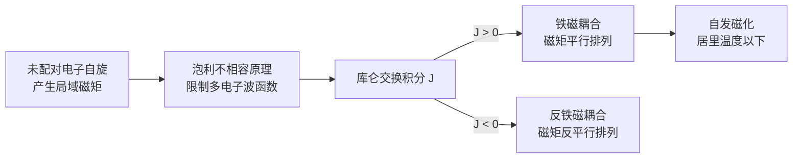

### 3.1.2 磁晶各向异性与单离子模型

**磁晶各向异性**是指磁化强度沿不同晶向时能量不同的现象，其物理根源在于自旋-轨道耦合与晶体场的联合作用。对于单轴各向异性，各向异性能密度可写为

$$
E_K = K_1 \sin^2\theta + K_2 \sin^4\theta + \cdots
$$

其中 \(\theta\) 为磁化方向与**易磁化轴**（easy axis）的夹角，\(K_1\)、\(K_2\) 为磁晶各向异性常数。当 \(K_1 > 0\) 时，易轴沿 \(c\) 轴方向；当 \(K_1 < 0\) 时，易面垂直于 \(c\) 轴。

!!! note "术语解释：磁晶各向异性、易磁化轴、各向异性场、自旋-轨道耦合、晶体场、单离子模型、Stevens 因子"
    - **磁晶各向异性（magnetocrystalline anisotropy）**：磁化方向与晶体学方向绑定的现象。可理解为电子云在晶体中的非球形分布使得某些方向磁化更“省力”。
    - **易磁化轴（easy axis）**：磁化方向与该轴一致时磁晶各向异性能最低的方向；反之为难磁化轴（hard axis）。
    - **各向异性场（anisotropy field, \(H_A\)）**：等效于把磁化方向从易轴转到难轴所需克服的磁场，\(H_A = 2K_1/(\mu_0 M_s)\)。它量化了磁矩“锁定”在易轴上的强度。
    - **自旋-轨道耦合（spin-orbit coupling）**：电子自旋磁矩与轨道运动产生的磁场之间的相互作用，是磁晶各向异性的核心来源。表达式为 \(\lambda \mathbf{L} \cdot \mathbf{S}\)，\(\lambda\) 为耦合常数。
    - **晶体场（crystal field）**：周围原子或离子对中心离子电子云产生的静电势。它使稀土离子的能级简并解除（Stark 分裂）。
    - **单离子模型（single-ion model）**：认为整个晶体的磁晶各向异性是各个稀土离子各向异性的叠加。每个稀土离子在晶体场中形成特定的能级结构，磁化方向改变时其自由能随之改变。
    - **Stevens 因子**：描述稀土离子 \(4f\) 电子云形状的参数，决定该离子对晶体场的响应方式，从而决定其磁晶各向异性的符号和大小。

稀土离子的磁晶各向异性可用单离子模型解释：晶体场使稀土离子的 \(2J+1\) 个简并态发生分裂，磁化方向不同时电子占据的能级不同，从而产生各向异性能。Nd\(^{3+}\) 在 Nd\(_2\)Fe\(_{14}\)B 中的易轴沿 \([001]\) 方向，而 Dy\(^{3+}\)、Tb\(^{3+}\) 由于不同的 Stevens 因子和晶体场参数，具有更强的单轴各向异性。

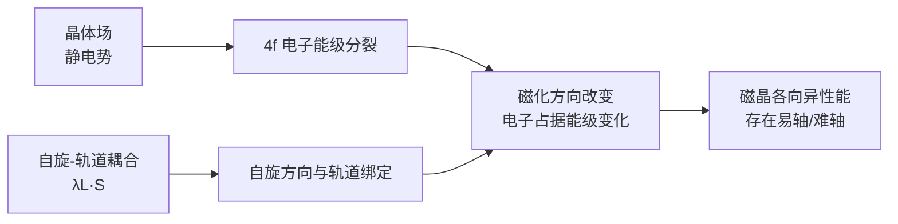

### 3.1.3 磁畴、畴壁与 Brown 佯谬

大块铁磁体内部会形成**磁畴**以降低退磁场能量。磁畴壁厚度 \(\delta_w\) 由交换能 \(A\) 与各向异性能 \(K_1\) 的竞争决定：

$$
\delta_w = \pi \sqrt{\frac{A}{K_1}}
$$

Nd\(_2\)Fe\(_{14}\)B 的交换刚度 \(A \approx 7.7\) pJ/m，\(K_1 \approx 4.6\) MJ/m\(^3\)，估算 \(\delta_w \approx 4\) nm。实际磁畴尺寸由退磁场、晶粒尺寸和缺陷共同决定。

!!! note "术语解释：磁畴、畴壁、Bloch 壁、退磁场、交换刚度、矫顽力、Brown 佯谬"
    - **磁畴（magnetic domain）**：铁磁体内部自发磁化方向一致的小区域。不同磁畴的磁化方向不同，整体对外显示较低的自由磁极密度，从而降低退磁场能。
    - **畴壁（domain wall）**：相邻磁畴之间的过渡层，磁化方向在纳米尺度内逐渐旋转。
    - **Bloch 壁（Bloch wall）**：磁化方向在壁面内旋转，壁面上无自由磁极的一类畴壁。在块体材料中常见。
    - **退磁场（demagnetizing field）**：由材料表面自由磁极产生的、与磁化方向相反的内部磁场。其大小与样品形状有关，表示为 \(\mathbf{H}_d = -N \mathbf{M}\)，\(N\) 为退磁因子。
    - **交换刚度（exchange stiffness, \(A\)）**：描述相邻原子磁矩保持平行趋势的强度，来源于交换作用，单位为 J/m。
    - **矫顽力（coercivity, \(H_c\) 或 \(H_{cj}\)）**：使宏观磁化强度降为零所需施加的反向磁场。它反映材料抵抗反磁化的能力。
    - **Brown 佯谬（Brown's paradox）**：理想均匀单晶的理论矫顽力应接近各向异性场，而实际烧结磁体矫顽力远低于此值，说明缺陷与非理想结构主导了反磁化过程。

```mermaid
flowchart LR
    A[大块铁磁体<br/>高退磁场能] --> B[分磁畴<br/>降低自由磁极]
    B --> C[磁畴间形成畴壁]
    C --> D[交换能 A 希望壁厚]
    C --> E[各向异性能 K 希望壁薄]
    D --> F[Bloch 壁厚度<br/>δ_w ≈ π√(A/K)]
    E --> F
```

Brown 佯谬指出：对于理想的均匀单晶椭球体，反磁化必须通过一致转动实现，理论矫顽力应接近各向异性场 \(H_A = 2K_1/(\mu_0 M_s)\)（约 7 T 对于 Nd\(_2\)Fe\(_{14}\)B）。然而实际烧结 Nd-Fe-B 磁体的矫顽力通常仅为 1-3 T，远低于理论值。这一差异说明实际磁体中存在晶粒表面缺陷、晶界相不连续、局部成分波动等结构非理想性，使得反磁化畴能够在远低于 \(H_A\) 的磁场下成核。因此，矫顽力优化的本质是微观结构工程，而非单纯提高本征各向异性。

### 3.1.4 Nd\(_2\)Fe\(_{14}\)B 的晶体结构与内禀磁性

Nd\(_2\)Fe\(_{14}\)B 主相具有复杂的四方结构，**空间群** \(P4_2/mnm\)（No. 136），每个**晶胞**含 68 个原子：8 Nd、56 Fe、4 B。Fe 原子占据 6 个不等价晶位（\(16k_1\)、\(16k_2\)、\(8j_1\)、\(8j_2\)、\(4e\)、\(4c\)），不同晶位的局部配位环境和交换作用不同，共同贡献高饱和磁化强度。B 原子占据由 Nd 原子构成的三棱柱间隙，稳定了高 Fe 含量的四方相，并提高了居里温度。

!!! note "术语解释：空间群、晶胞、内禀磁性、磁能积、剩磁、方形度"
    - **空间群（space group）**：描述晶体中原子排列对称性的完整数学群，同时包含平移、旋转、反映等对称操作。
    - **晶胞（unit cell）**：晶体结构的最小重复单元，通过平移可填满整个空间。
    - **内禀磁性（intrinsic magnetic properties）**：只取决于化学成分和晶体结构、与微观形貌无关的性质，如 \(M_s\)、\(K_1\)、\(T_C\)。
    - **磁能积（energy product, \((BH)_{\max}\)）**：退磁曲线第二象限中磁感应强度 \(B\) 与磁场强度 \(H\) 乘积的最大值，是衡量永磁体储能密度的核心指标。
    - **剩磁（remanence, \(B_r\)）**：外磁场降为零后材料保留的磁感应强度。它取决于 \(M_s\) 和晶粒取向度。
    - **方形度（squareness, \(H_k/H_{cj}\)）**：描述退磁曲线在膝部以上是否接近矩形。方形度越好，电机工作点越稳定。

Nd\(_2\)Fe\(_{14}\)B 的内禀磁性参数如下表所示：

| 参数 | 数值 | 物理意义 |
|-----|------|---------|
| 居里温度 \(T_C\) | 585 K（312 °C） | 铁磁-顺磁转变温度 |
| 室温饱和磁化强度 \(\mu_0 M_s\) | 1.61 T | 决定最大剩磁 |
| 磁晶各向异性场 \(\mu_0 H_A\) | ~7 T | 易轴稳定性 |
| 各向异性常数 \(K_1\) | 4.6 MJ/m\(^3\) | 反磁化能量势垒 |
| 理论最大磁能积 \((BH)_{\max}\) | ~512 kJ/m\(^3\)（64 MGOe） | 单晶理想值 |
| 商用烧结磁体 \((BH)_{\max}\) | 270-440 kJ/m\(^3\) | 受取向度、密度限制 |

实际烧结磁体的剩磁 \(B_r\) 和矫顽力 \(H_{cj}\) 受取向度、密度和晶界控制。高性能磁体通过气流磨获得 \(3-5\) \(\mu\)m 的扁平粉末颗粒，在 1.5-2 T 磁场中取向后压制，再在 1050-1100 °C 烧结，晶粒尺寸通常控制在 \(5-8\) \(\mu\)m。

```mermaid
flowchart LR
    A[高剩磁 Br] --> B[高 Ms + 高取向度]
    C[高矫顽力 Hcj] --> D[高各向异性 + 良好晶界]
    B --> E[磁能积 (BH)max]
    D --> E
    E --> F[电机转矩密度]
    subgraph "退磁曲线特征点"
    G[Br]
    H[Knee 点]
    I[Hcj]
    end
    E --> G
    E --> H
    E --> I
```

### 3.1.5 矫顽力机制：成核型、钉扎型与晶界工程

烧结 Nd-Fe-B 磁体的矫顽力机制主要可归为两类：

1. **成核控制型（nucleation-controlled）**：反磁化畴首先在晶粒表面或近表面缺陷处成核，随后畴壁快速扫过整个晶粒。矫顽力取决于成核场，晶粒表面缺陷和晶界相的化学成分是关键。

2. **钉扎控制型（pinning-controlled）**：畴壁在运动过程中被晶界、析出相或缺陷钉扎。热变形纳米晶 Nd-Fe-B 磁体通常属于此类。

!!! note "术语解释：成核、钉扎、反磁化畴、晶界工程"
    - **成核（nucleation）**：在热力学驱动力下，反向磁化的小区域在缺陷或表面处萌生。成核场越低，矫顽力越小。
    - **钉扎（pinning）**：畴壁在运动时被局部势阱（晶界相、析出物、应力场）捕获，需要额外能量才能挣脱。
    - **反磁化畴（reverse domain）**：磁化方向与外场方向相反的磁畴，是矫顽力损耗的物理载体。
    - **晶界工程（grain boundary engineering）**：通过调控晶界相成分、厚度和连续性，优化晶粒间磁隔离与缺陷钝化，从而提升矫顽力。

对于常规烧结磁体，成核控制占主导。晶粒表面的缺陷（如氧化、贫 Nd 层、机械损伤）会显著降低成核场。晶界扩散工艺通过在晶粒表层形成高各向异性壳层，提高了缺陷区域的局部各向异性场，从而抑制反磁化畴的成核。

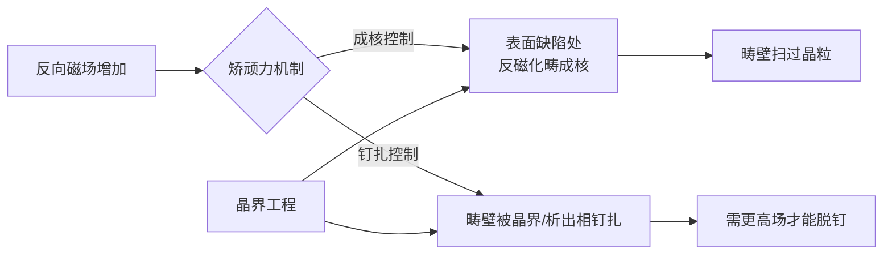

### 3.1.6 晶界扩散：Dy/Tb 核壳结构与扩散动力学

重稀土元素 Dy、Tb 替代 Nd 后可形成 (Nd,Dy)\(_2\)Fe\(_{14}\)B 或 (Nd,Tb)\(_2\)Fe\(_{14}\)B，其室温各向异性场分别约为 15 T 和 22 T，远高于 Nd\(_2\)Fe\(_{14}\)B 的 ~7 T。通过**晶界扩散工艺**（Grain Boundary Diffusion Process, GBDP），可在不显著降低剩磁的前提下，将 Dy/Tb 引入晶粒表层形成富重稀土壳层（core-shell structure），从而大幅提升矫顽力。

!!! note "术语解释：晶界扩散（GBDP）、核壳结构、化学诱导液膜迁移（CILFM）、扩散、晶界、三维原子探针（APT）"
    - **晶界扩散（GBDP）**：将重稀土源涂覆在磁体表面，经热处理使原子沿晶界快速进入磁体内部，在晶粒表层形成高各向异性壳层的工艺。
    - **核壳结构（core-shell structure）**：晶粒中心保持低重稀土的 Nd\(_2\)Fe\(_{14}\)B 主相（核），边缘形成富 Dy/Tb 的高各向异性层（壳）。
    - **化学诱导液膜迁移（CILFM）**：富稀土液相在晶界处因化学势/表面张力梯度而迁移，带动溶质原子快速扩散并形成壳层。
    - **扩散（diffusion）**：原子在化学势梯度驱动下从高浓度区向低浓度区迁移，遵循 Fick 定律。晶界扩散速率远高于晶内扩散。
    - **晶界（grain boundary）**：取向不同的晶粒之间的界面，原子排列疏松，扩散通道多，能量较高。
    - **三维原子探针（APT）**：利用电场蒸发离子并通过飞行时间质谱确定原子种类与位置的表征技术，可达近原子级分辨率。

GBDP 的典型工艺：将 Dy/Tb 源（金属、氟化物 DyF\(_3\)、氢化物 TbH\(_3\) 或低熔点合金）涂覆于磁体表面，然后在 800-950 °C 进行扩散热处理，使重稀土沿晶界向内部渗透，并在主相晶粒边缘形成 (Nd,HRE)\(_2\)Fe\(_{14}\)B 壳层。Hono 等通过三维原子探针（APT）证实，GBDP 后 Dy 主要分布在晶粒表层 1-2 μm 范围内，形成高各向异性场壳层，有效抑制了反磁化畴的成核。

扩散过程受化学诱导液膜迁移（Chemically Induced Liquid Film Migration, CILFM）控制：富稀土液相在晶界处形成，由于表面张力/化学势梯度驱动液膜迁移，使得重稀土元素沿晶界快速扩散并形成壳层。2025 年 Lee 等报道了采用 TaF\(_5\) 两步扩散与 Pr\(_{70}\)Cu\(_{15}\)Al\(_{10}\)Ga\(_5\) 合金的复合工艺，通过在第一扩散步形成六方 TaB\(_2\) 晶间析出相抑制 CILFM，使第二扩散步形成更薄、Pr 浓度更高的壳层，在无重稀土条件下实现矫顽力 \(\mu_0 H_c = 2.35\) T。

```mermaid
flowchart LR
    A[Dy/Tb 源涂覆] --> B[800-950 °C 热处理]
    B --> C[晶界形成富稀土液相]
    C --> D[化学诱导液膜迁移 CILFM]
    D --> E[重稀土沿晶界渗入]
    E --> F[主相晶粒边缘形成<br/>(Nd,HRE)2Fe14B 壳层]
    F --> G[核：低 HRE 主相]
    F --> H[壳：高 HRE 高 H_A]
    H --> I[矫顽力提升]
```

**表 3-1 典型 Nd-Fe-B 晶界扩散工艺与磁性能**

| 扩散源 | 磁体基体 | 主要效果 | 文献 |
|-------|---------|---------|------|
| Dy 蒸镀 | 烧结 Nd-Fe-B | \(H_{cj}\) 提升，剩磁轻微下降 | Huang & Mo, Vacuum 2024 |
| Tb 扩散 + Ga 协同 | 烧结 Nd-Fe-B | \(H_{cj}\) 提升 53.15%，剩磁不降 | Wang et al., PMC11820678 |
| TaF\(_5\) + Pr-Al-Cu-Ga | 烧结 Nd-Fe-B | 无重稀土，\(\mu_0 H_c = 2.35\) T | Lee et al., Acta Mater. 2025 |
| Dy-Al-Cu 合金 | 烧结 Nd-Fe-Co-B | 矫顽力、热稳定性与耐蚀性协同提升 | Liu et al., JMMM 2024 |
| Tb-Pr-Ce-Cu 扩散 | 烧结 Nd-Fe-B | 降低 Tb 用量同时提升矫顽力 | Zhan et al., Mater. Today Commun. 2025 |

### 3.1.7 温度特性、矫顽力温度系数与电机选型

电机运行时绕组温度可达 100-180 °C，因此永磁体的高温稳定性至关重要。Nd\(_2\)Fe\(_{14}\)B 的 \(K_1\) 和 \(M_s\) 随温度升高而下降，导致矫顽力降低。矫顽力温度系数 \(\beta\) 定义为

$$
\beta = \frac{H_{cj}(T_2) - H_{cj}(T_1)}{H_{cj}(T_1)(T_2 - T_1)} \times 100\%
$$

典型烧结 Nd-Fe-B 的 \(\beta\) 约为 -0.5 到 -0.8 %/°C。Dy/Tb 的引入可改善高温矫顽力，商用等级分为 N（≤80 °C）、M（≤100 °C）、H（≤120 °C）、SH（≤150 °C）、UH（≤180 °C）、EH（≤200 °C）和 AH（≤230 °C）。人形机器人关节电机若长时间高负荷运行，通常需选用 UH 或 EH 等级。

!!! note "术语解释：矫顽力温度系数、剩磁温度系数、工作点、膝点、涡流损耗"
    - **矫顽力温度系数（\(\beta\)）**：单位温度变化引起矫顽力相对变化的百分比，负值表示升温矫顽力下降。
    - **剩磁温度系数（\(\alpha\)）**：单位温度变化引起剩磁相对变化的百分比。
    - **工作点（operating point）**：电机运行时在永磁体退磁曲线上对应的 \(B\)、\(H\) 坐标。
    - **膝点（knee point）**：退磁曲线上从近似线性区进入快速下降区的拐点。若工作点低于膝点，撤去外场后磁体无法恢复原有磁化，发生不可逆退磁。
    - **涡流损耗（eddy current loss）**：交变磁场在导电磁体内部感应的环流产生焦耳热，与电阻率和磁体分割方式有关。

除矫顽力外，电机设计还需关注：
- **剩磁 \(B_r\)**：决定气隙磁密和转矩常数。
- **方形度 \(H_k/H_{cj}\)**：影响电机效率和工作点稳定性。
- **电阻率**：影响涡流损耗，高频电机需高电阻率磁体。
- **温度系数 \(\alpha\) 和 \(\beta\)**：分别描述剩磁和矫顽力随温度的变化。

按一台全尺寸机器人使用 30-50 个电机、每个电机 50-100 g Nd-Fe-B 估算，单机 Nd-Fe-B 用量约 1.5-4 kg。若 Dy/Tb 含量按 3-8 wt% 计，单机 Dy/Tb 氧化物需求为 50-300 g。

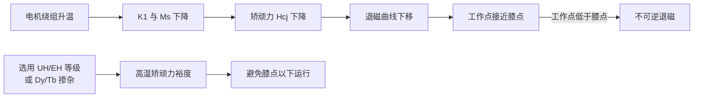

### 3.1.8 腐蚀机理与防护

烧结 Nd-Fe-B 由多相构成：主相 Nd\(_2\)Fe\(_{14}\)B、富 Nd 晶界相和少量 Nd\(_2\)O\(_3\)、B\(_6\)O 等。富 Nd 晶界相化学活性高，标准电极电位低，在潮湿环境中与 Fe 基主相形成**微电偶**，导致晶界优先腐蚀。腐蚀产物疏松多孔，不能提供保护，反而会加速磁性能退化。

!!! note "术语解释：微电偶腐蚀、标准电极电位、晶界相、镀层、合金化"
    - **微电偶腐蚀（micro-galvanic corrosion）**：两种电位不同的相在电解质中接触，低电位相作为阳极被氧化，高电位相作为阴极促进还原反应（如吸氧或析氢）。
    - **标准电极电位（standard electrode potential, \(E^0\)）**：标准状态下某电对相对于标准氢电极（SHE）的平衡电位，电位越低越易被氧化。
    - **晶界相（grain boundary phase）**：分布在晶粒边界、成分不同于主相的富 Nd 相，对矫顽力和耐蚀性都有影响。
    - **镀层（coating）**：在磁体表面沉积金属或有机层以隔绝环境介质。
    - **合金化（alloying）**：在磁体中添加 Co、Ga、Cu 等元素改变晶界相成分，提高化学稳定性。

防护策略包括：

1. **表面镀层**：电镀锌、镍-铜-镍多层镀、环氧树脂涂层。Ni-Cu-Ni 镀层耐蚀性较好，但镀层孔隙和边缘效应仍需控制。
2. **合金化改性**：添加 Co 提高晶界相耐蚀性；添加 Ga、Cu 改善晶界相润湿性和化学稳定性。
3. **晶界扩散优化**：改善晶界相连续性和化学稳定性，Mo 等研究指出优化扩散和时效热处理可同时提升矫顽力、热稳定性和耐腐蚀性。

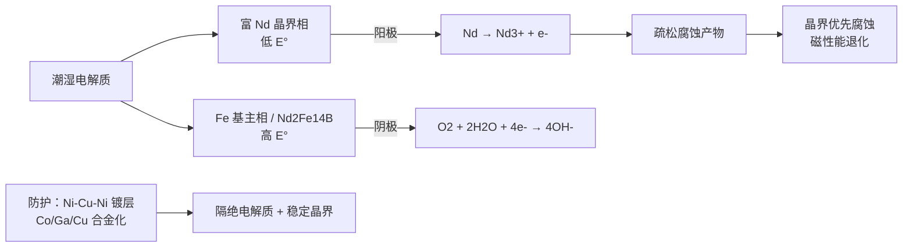

### 3.1.9 回收与再生：城市矿山视角

Nd-Fe-B 磁体含 30-32 wt% 稀土（Nd、Pr、Dy、Tb），从电子废弃物中回收稀土具有重要的资源与战略意义。主要回收路线包括：

- **湿法冶金**：酸浸、萃取分离，可回收高纯度稀土，但产生废酸需处理。
- **火法冶金**：熔盐电解或高温还原，适合大规模处理。
- **氢破碎-脱氢-再复合（HDDR）**：利用氢化-歧化-脱氢-再复合反应，直接再生磁粉。

!!! note "术语解释：湿法冶金、火法冶金、HDDR、城市矿山"
    - **湿法冶金（hydrometallurgy）**：利用水溶液中的酸碱或络合反应溶解、分离、回收金属的方法。
    - **火法冶金（pyrometallurgy）**：在高温下通过熔炼、还原或电解回收金属的方法。
    - **HDDR（Hydrogenation-Disproportionation-Desorption-Recombination）**：利用氢与 Nd-Fe-B 反应使其分解，再脱氢复合成细小晶粒磁粉的工艺。
    - **城市矿山（urban mining）**：将废旧电子产品和工业废弃物视为可回收金属资源的理念。

Kovačič 2025 年的综述系统总结了烧结 Nd-Fe-B 腐蚀与回收的最新进展，指出未来回收技术需兼顾稀土回收率、能耗和环境影响。

### 3.1.10 微磁学模拟与矫顽力预测

微磁学模拟是理解 Nd-Fe-B 矫顽力机制和优化微观结构的重要工具。Landau-Lifshitz-Gilbert（LLG）方程是微磁学的基本方程：

$$
\frac{\partial \mathbf{m}}{\partial t} = -\gamma \mathbf{m} \times \mathbf{H}_{eff} + \alpha \mathbf{m} \times \frac{\partial \mathbf{m}}{\partial t}
$$

其中 \(\mathbf{m}\) 为归一化磁化强度，\(\gamma\) 为旋磁比，\(\alpha\) 为 Gilbert 阻尼系数，\(\mathbf{H}_{eff}\) 为有效场，包括交换场、各向异性场、退磁场和外加磁场。

!!! note "术语解释：微磁学、LLG 方程、旋磁比、Gilbert 阻尼、有效场"
    - **微磁学（micromagnetics）**：在连续介质近似下求解磁化矢量时空演化的理论框架，尺度介于原子磁矩与宏观磁畴之间。
    - **LLG 方程（Landau-Lifshitz-Gilbert equation）**：描述磁化矢量在外场和阻尼作用下进动与弛豫的动力学方程。
    - **旋磁比（gyromagnetic ratio, \(\gamma\)）**：磁矩与角动量之比，决定磁矩在磁场中的进动频率。
    - **Gilbert 阻尼（Gilbert damping, \(\alpha\)）**：描述磁化进动能量耗散到晶格的速率。
    - **有效场（effective field）**：所有作用于磁矩的场的总和，可通过能量泛函对磁化的变分得到。

通过微磁学模拟可以研究：
- 晶粒尺寸对矫顽力的影响：存在一个最佳晶粒尺寸范围（通常为 3-8 μm），过大晶粒增加缺陷概率，过小晶粒增强交换耦合。
- 晶界相厚度与磁隔离效果：理想晶界相厚度应足以去耦相邻晶粒，但过厚会降低剩磁。
- 核壳结构的优化：Dy/Tb 壳层的厚度和浓度分布对矫顽力和剩磁的 trade-off。

2025 年 Lee 等的研究结合微磁学模拟表明，抑制 CILFM 形成的薄而高 Pr 浓度壳层，可使晶粒表面的成核场显著提高，这是无重稀土磁体获得高矫顽力的关键。

### 3.1.11 永磁电机中的磁路设计与损耗

人形机器人关节电机通常采用**永磁同步电机**（Permanent Magnet Synchronous Motor, PMSM）或无框力矩电机。永磁体的磁性能直接影响电机设计：

- **气隙磁密** \(B_g\)：由永磁体剩磁 \(B_r\) 和磁路结构决定，典型值为 0.8-1.2 T。
- **转矩常数** \(K_t\)：与气隙磁密、绕组匝数和电机几何尺寸相关。
- **退磁曲线**：在高温和大电流去磁化磁场下，需确保工作点位于 knee 点以上。

!!! note "术语解释：永磁同步电机、气隙磁密、转矩常数、退磁曲线"
    - **永磁同步电机（PMSM）**：转子由永磁体励磁、定子绕组通交流电产生旋转磁场，两者同步旋转的电机。
    - **气隙磁密（air-gap flux density）**：电机定转子气隙中的磁感应强度，直接决定电磁转矩。
    - **转矩常数（torque constant, \(K_t\)）**：单位电流产生的转矩，与气隙磁密和绕组有效匝数成正比。
    - **退磁曲线（demagnetization curve）**：第二象限的 \(B-H\) 曲线，描述永磁体在反向场下的磁化行为。

电机损耗包括铜损、铁损、机械损耗和永磁体涡流损耗。高频运行下，永磁体涡流损耗显著，可通过分割磁体、提高磁体电阻率或采用粘结磁体来降低。

#### 3.1.11.1 简化磁路模型与气隙磁密

永磁电机设计通常从等效磁路出发。对由永磁体、气隙和铁芯组成的闭合磁路，忽略铁芯磁阻，磁通连续性要求

$$
\Phi_g = B_g A_g = B_m A_m
$$

而安培环路定律给出

$$
H_m l_m + H_g l_g = 0
$$

其中 \(H_g = B_g / \mu_0\)。Nd-Fe-B 永磁体的去磁曲线在工作区可近似为线性：

$$
B_m = \mu_0 \mu_r H_m + B_r
$$

其中 \(\mu_r\) 为**回复磁导率**（recoil permeability），烧结 Nd-Fe-B 的 \(\mu_r \approx 1.04-1.08\)。联立上式可得气隙磁密

$$
B_g = \frac{B_r}{\frac{A_g}{A_m} + \mu_r \frac{l_g}{l_m}}
$$

实际设计中需用 Carter 系数 \(k_c\) 修正槽口对气隙磁阻的影响：\(l_{g,\text{eff}} = k_c k_s g\)，其中 \(k_s\) 为饱和系数（通常 1.1-1.3）。当 \(A_g/A_m \approx 1\)、\(l_g/l_m \ll 1\) 时，\(B_g \approx B_r\)；但为抵抗电枢反应去磁，永磁体厚度 \(l_m\) 通常取 \(l_m/l_g = 5-10\)。

!!! note "术语解释：磁动势、磁阻、磁导、回复磁导率、Carter 系数"
    - **磁动势（magnetomotive force, MMF）**：驱动磁通通过的“磁势”，永磁体提供的 MMF 为 \(F_m = H_m l_m\)。
    - **磁阻（reluctance, \(\mathcal{R}\)）**：磁路对磁通的阻碍，\(\mathcal{R}=l/(\mu A)\)，与电阻地位对应。
    - **磁导（permeance, \(P\)）**：磁阻的倒数，\(P=\mu A/l\)。
    - **回复磁导率（recoil permeability, \(\mu_r\)）**：永磁体局部去磁后再加载时 \(B-H\) 小回线的斜率与 \(\mu_0\) 之比。
    - **Carter 系数（Carter coefficient, \(k_c\)）**：考虑开槽后气隙磁阻增大的经验系数，通常 \(k_c \approx 1.0-1.3\)。

```mermaid
flowchart LR
    A[电机规格<br/>转矩/转速/电压] --> B[磁路几何设计]
    B --> C[永磁体尺寸<br/>lm, Am]
    C --> D[等效磁路计算]
    D --> E[Bg = Br/(Ag/Am + μr·lg/lm)]
    E --> F[绕组匝数与极对数]
    F --> G[热校核与效率图]
```

#### 3.1.11.2 转矩方程与反电动势

对于表面贴装式 PMSM（SPMSM），交直轴电感近似相等（\(L_d \approx L_q\)），电磁转矩主要由永磁磁链 \(\lambda_m\) 与交轴电流 \(i_q\) 产生：

$$
T_e = \frac{3}{2} p \lambda_m i_q
$$

其中 \(p\) 为极对数。永磁磁链与气隙磁密的关系为

$$
\lambda_m = N_{ph} k_w \frac{2}{\pi} \tau l B_g
$$

其中 \(N_{ph}\) 为每相串联匝数，\(k_w\) 为绕组系数，\(\tau\) 为极距，\(l\) 为铁芯轴向长度。反电动势幅值为

$$
E_{ph} = \omega_e \lambda_m = p \Omega_m \lambda_m
$$

转矩常数 \(K_t = T_e / I_q = \frac{3}{2} p \lambda_m\)（峰值电流与峰值转矩对应）。对于正弦波驱动，线电压有效值满足

$$
V_{LL,rms} \approx \sqrt{E_{ph}^2 + (\omega_e L_s I)^2}
$$

在高速弱磁区还需满足电压极限椭圆约束。

!!! note "术语解释：磁链、反电动势、极对数、弱磁、绕组系数"
    - **磁链（flux linkage, \(\lambda\)）**：线圈匝链的总磁通，\(\lambda = N \Phi\)。
    - **反电动势（back-EMF）**：转子旋转时切割磁感线在定子绕组中感应的电压。
    - **极对数（pole-pair number, \(p\)）**：电机一对 N-S 磁极对应的空间周期数。
    - **弱磁（field weakening）**：通过施加直轴去磁电流 \(i_d < 0\) 扩展电机恒功率运行区。
    - **绕组系数（winding factor, \(k_w\)）**：考虑分布、短距和斜槽后绕组有效匝数的折扣系数。

#### 3.1.11.3 损耗构成与效率图

电机总损耗可分解为

$$
P_{loss} = P_{Cu} + P_{Fe} + P_{pm} + P_{mech}
$$

- 铜损：\(P_{Cu} = 3 I^2 R_s\)，其中 \(R_s\) 为相电阻，随温度升高而增大：\(R_s(T) = R_{25}[1+\alpha_{Cu}(T-25)]\)。
- 铁损：采用修正 Steinmetz 方程

$$
P_{Fe} = k_h f B_m^\alpha + k_e (f B_m)^2 + k_a (f B_m)^{1.5}
$$

其中 \(k_h\)、\(k_e\)、\(k_a\) 由硅钢片厂商提供，\(\alpha\) 典型为 1.6-2.2。
- 永磁体涡流损耗：

$$
P_{pm} = \frac{\pi^2}{20 \rho_{pm}} \frac{(B_m f)^2 t^4}{V_{pm}} \quad \text{（薄板近似）}
$$

其中 \(\rho_{pm}\) 为永磁体电阻率，\(t\) 为磁体分割厚度。
- 机械损耗：轴承摩擦与风阻，通常占比较小。

效率为

$$
\eta = \frac{P_{out}}{P_{out}+P_{loss}}
$$

人形机器人关节常在低速大转矩与高速小转矩之间切换，设计时应让额定点落在效率图的高效区（\(\eta \ge 90\%\)）。

!!! note "术语解释：Steinmetz 方程、铜损、铁损、涡流损耗、效率图"
    - **Steinmetz 方程**：经验铁损模型，将磁滞损耗、涡流损耗和异常损耗分别表示为频率与磁密的幂函数。
    - **铜损（copper loss）**：绕组电阻因电流产生的焦耳热。
    - **铁损（core loss）**：交变磁场在铁芯中产生的磁滞和涡流损耗。
    - **涡流损耗（eddy-current loss）**：导电材料在交变磁场中感应环流产生的损耗。
    - **效率图（efficiency map）**：不同转速-转矩工作点的效率等高线图，是电机选型的核心工具。

#### 3.1.11.4 关节电机设计数值示例

考虑一个额定功率 200 W、额定转速 3000 rpm 的机器人膝关节电机。给定 Nd-Fe-B 剩磁 \(B_r = 1.2\) T，回复磁导率 \(\mu_r = 1.05\)，气隙 \(l_g = 0.5\) mm，磁体长度 \(l_m = 4\) mm，极弧系数 \(A_g/A_m = 1.1\)。估算气隙磁密、转矩常数与额定电流。

```python
import numpy as np

# 永磁体与磁路参数
Br = 1.2          # T
mu_r = 1.05
lg = 0.5e-3       # m
lm = 4.0e-3       # m
Ag_over_Am = 1.1
p = 4             # 极对数
N_ph = 60         # 每相串联匝数
kw = 0.93         # 绕组系数
tau = 0.020       # 极距 m
l_core = 0.030    # 轴向长度 m

# 气隙磁密
Bg = Br / (Ag_over_Am + mu_r * lg / lm)
print(f"Bg = {Bg:.3f} T")

# 永磁磁链
lambda_m = N_ph * kw * (2/np.pi) * tau * l_core * Bg
print(f"lambda_m = {lambda_m:.4f} Wb")

# 额定角速度
Omega_m = 3000 * 2*np.pi / 60  # rad/s
E_ph = p * Omega_m * lambda_m
print(f"相反电动势幅值 = {E_ph:.2f} V")

# 转矩常数
Kt = 1.5 * p * lambda_m          # Nm/A_peak
T_rated = 0.64                   # 200 W @ 3000 rpm
Iq_rated = T_rated / Kt
print(f"Kt = {Kt:.3f} Nm/A")
print(f"额定 Iq = {Iq_rated:.2f} A")

# 损耗估算
Rs = 0.12         # Ω
I = Iq_rated
P_Cu = 3 * I**2 * Rs
P_out = T_rated * Omega_m
eta = P_out / (P_out + P_Cu)
print(f"铜损 = {P_Cu:.1f} W, 效率（仅铜损）= {eta*100:.1f}%")
```

上述脚本输出约为 \(B_g \approx 0.95\) T，\(K_t \approx 0.31\) Nm/A，额定电流约 2.1 A。若绕组电阻为 0.12 Ω，仅铜损即可达 1.5 W，对应效率约 99.3%（忽略铁损与机械损），说明小功率关节在额定点效率可做得很高，但峰值转矩下铜损会快速上升。

### 3.1.12 稀土永磁供应链与价格机制

稀土永磁供应链包括采矿、选矿、分离冶炼、合金制备、磁体制造、表面处理和应用终端。中国在该产业链中占据主导地位：

| 环节 | 中国全球份额 | 关键企业/地区 |
|-----|------------|--------------|
| 稀土矿开采 | 60-70% | 北方稀土、中国稀土集团 |
| 分离冶炼 | ~90% | 中国五矿、盛和资源 |
| NdFeB 磁材 | 85-93% | 中科三环、金力永磁、宁波韵升 |
| 重稀土加工 | ~99% | 中国南方离子型稀土矿 |

2025 年 4 月中国对 Dy、Tb 等中重稀土实施出口许可管制，导致国际市场高矫顽力磁体价格波动。Adamas Intelligence 预测，若需求趋势延续而供应增长不及预期，到 2035 年全球 NdFeB 年缺口可能达到 20.6 万吨。人形机器人作为新增需求来源，虽然当前单机用量不大，但会进一步收紧本已紧张的供应链。

---

## 3.2 结构材料

### 3.2.1 金属强化机制：位错运动的阻碍

金属的强度可通过多种机制提高，其核心是阻碍**位错**运动。位错是晶体中原子排列的线缺陷，其滑移是金属塑性变形的主要方式。位错的运动可用柏氏矢量 \(\mathbf{b}\) 描述。

!!! note "术语解释：位错、柏氏矢量、滑移、塑性变形"
    - **位错（dislocation）**：晶体中原子排列的线缺陷，使局部滑移在远低于完整晶体理论剪切应力的条件下发生。
    - **柏氏矢量（Burgers vector, \(\mathbf{b}\)）**：描述位错引起晶格畸变程度和方向的矢量，其模长等于一个原子间距量级。
    - **滑移（slip）**：位错沿特定晶面和晶向运动，导致晶体宏观形状改变。
    - **塑性变形（plastic deformation）**：卸载后不可恢复的永久形变，由位错增殖和运动主导。

主要强化机制包括：

**固溶强化**：溶质原子引起晶格畸变，与位错发生弹性交互作用。Fleischer 模型给出强化增量与溶质浓度 \(c\) 的关系：

$$
\Delta\tau_{ss} \propto c^{2/3}
$$

对于稀固溶体，强化增量近似与 \(c^{1/2}\) 成正比。溶质原子与基体原子的尺寸错配和模量错配越大，强化效果越强。

!!! note "术语解释：固溶强化、溶质原子、晶格畸变"
    - **固溶强化（solid-solution strengthening）**：溶质原子随机分布在基体晶格中，通过弹性应力场阻碍位错运动。
    - **溶质原子（solute atom）**：溶解在基体中的异类原子。
    - **晶格畸变（lattice distortion）**：由于原子尺寸或键合差异导致周围晶格发生弹性变形。

**析出强化**：第二相颗粒阻碍位错切过或绕过。当颗粒不可剪切时，按 Orowan 机制，绕过颗粒的临界切应力为

$$
\tau_{Orowan} = \frac{Gb}{2\pi\lambda} \ln\frac{r}{r_0}
$$

其中 \(G\) 为剪切模量，\(b\) 为柏氏矢量，\(\lambda\) 为颗粒间距，\(r\) 为颗粒半径。峰值时效时，细小弥散的共格或半共格析出相提供最大强化效果；过时效时颗粒粗化，\(\lambda\) 增大，强化效果下降。

!!! note "术语解释：析出强化、Orowan 机制、共格/半共格、峰值时效、过时效"
    - **析出强化（precipitation strengthening）**：基体中弥散析出第二相颗粒阻碍位错运动。
    - **Orowan 机制**：位错绕过不可剪切颗粒，在颗粒周围留下位错环，需要额外应力。
    - **共格/半共格析出相（coherent/semi-coherent precipitate）**：析出相与基体晶格连续或部分连续匹配，界面能低，强化效果显著。
    - **峰值时效（peak aging）**：析出相尺寸和密度达到最佳强化效果的时效状态。
    - **过时效（overaging）**：析出相粗化、间距增大，强度下降但韧性/耐蚀性常改善。

**细晶强化**：Hall-Petch 关系给出屈服强度与晶粒尺寸 \(d\) 的关系：

$$
\sigma_y = \sigma_0 + k_y d^{-1/2}
$$

晶粒细化同时提高强度和韧性，因为晶界阻碍位错运动并钝化裂纹。但过细的晶粒可能降低高温蠕变抗力。

!!! note "术语解释：细晶强化、Hall-Petch 关系、屈服强度"
    - **细晶强化（grain refinement strengthening）**：通过减小晶粒尺寸增加晶界面积，阻碍位错滑移。
    - **Hall-Petch 关系**：屈服强度随晶粒尺寸平方根倒数线性增加的经验关系。
    - **屈服强度（yield strength）**：材料开始发生塑性变形时的应力。

**加工硬化**：位错密度 \(\rho\) 增加导致流变应力上升：

$$
\sigma = \sigma_0 + \alpha M G b \sqrt{\rho}
$$

其中 \(\alpha\) 为常数，\(M\) 为 Taylor 因子。

!!! note "术语解释：加工硬化、位错密度、Taylor 因子"
    - **加工硬化（work hardening）**：塑性变形增加位错密度，使后续变形需要更高应力。
    - **位错密度（dislocation density, \(\rho\)）**：单位体积内位错线的总长度。
    - **Taylor 因子（Taylor factor）**：将单晶临界分切应力与多晶宏观屈服应力联系起来的取向平均因子。

**织构强化**：利用晶体学取向控制滑移系开动。对于 HCP 金属如镁，通过控制织构使易滑移方向与主应力方向错开，可提高屈服强度但降低塑性。

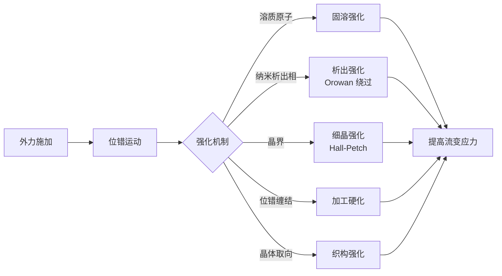

### 3.2.2 铝合金：时效析出序列与牌号选择

铝合金是人形机器人结构件用量最大的金属材料。按主要合金元素分为 2xxx（Al-Cu）、5xxx（Al-Mg）、6xxx（Al-Mg-Si）、7xxx（Al-Zn-Mg-Cu）等系列。

!!! note "术语解释：铝合金系列、固溶处理、时效处理"
    - **铝合金系列**：按主要合金元素分类的国际牌号体系，1xxx 为纯铝，2xxx 以 Cu 为主，5xxx 以 Mg 为主，6xxx 以 Mg-Si 为主，7xxx 以 Zn-Mg-Cu 为主。
    - **固溶处理（solution treatment）**：将合金加热到单相区使溶质原子充分溶解，然后快速淬火保留过饱和固溶体。
    - **时效处理（aging）**：在室温或升温条件下使过饱和固溶体析出强化相的热处理。

**6xxx 系（Al-Mg-Si）** 因良好的挤压性、焊接性和耐蚀性，广泛用于框架和外壳。其强化相为 Mg\(_2\)Si，固溶处理后时效析出序列为：

$$
\text{SSSS} \rightarrow \text{GP 区} \rightarrow \beta'' \rightarrow \beta' \rightarrow \beta\text{(Mg}_2\text{Si)}
$$

\(\beta''\) 相与基体共格，提供主要强化效果；\(T6\) 处理（固溶+人工时效）可获得强度与成形性的良好平衡。典型 6061-T6 的屈服强度约 276 MPa，抗拉强度约 310 MPa。

!!! note "术语解释：GP 区、β''、β'、β(Mg2Si)、T6 处理"
    - **GP 区（Guinier-Preston zone）**：溶质原子在铝基体中富集的纳米尺度贫/富集区，是析出的前驱体。
    - **\(\beta''\)**：与基体共格的亚稳析出相，尺寸小、密度高，是 6xxx 合金峰值时效的主要强化相。
    - **\(\beta'\)**：半共格的过渡析出相。
    - **\(\beta\)（Mg\(_2\)Si）**：稳定平衡相，粗化后强化效果下降。
    - **T6 处理**：固溶淬火后人工时效至峰值强度。

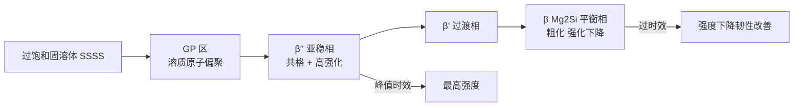

**7xxx 系（Al-Zn-Mg-Cu）** 强度最高，用于高应力关节和传动件。主要强化相为 \(\eta'\)-MgZn\(_2\) 和 T-Al\(_2\)Mg\(_3\)Zn\(_3\)。7050、7075 等牌号经 T6/T7/T8 处理后屈服强度可达 500 MPa 以上。Starink 与 Wang（2003）建立了过时效 7xxx 合金屈服强度的物理模型，考虑了析出相粗化、固溶强化和织构的影响。但 7xxx 合金对应力腐蚀敏感，需通过过时效（T7）或晶粒细化改善。

!!! note "术语解释：应力腐蚀、T7 处理"
    - **应力腐蚀开裂（stress corrosion cracking, SCC）**：在拉应力和腐蚀环境共同作用下发生的脆性开裂。
    - **T7 处理**：固溶淬火后过时效处理，用于提高耐应力腐蚀性能。

**压铸铝合金**：一体化压铸技术在人形机器人结构制造中崭露头角。压铸铝合金需控制 Fe 含量以减少 \(\beta\)-Al\(_5\)FeSi 针状相对韧性的不利影响；同时需控制 Cu 含量以改善耐蚀性。Al-Si-Mg 系（如 A356、A380）和 Al-Si-Cu-Mg 系是常用压铸合金。

### 3.2.3 镁合金：HCP 结构、变形机制与织构

镁合金密度 1.7-1.8 g/cm\(^3\)，约为铝的 2/3、钢的 1/4，是最轻的结构金属。其 HCP 结构带来独特的力学与腐蚀行为。

!!! note "术语解释：HCP 结构、c/a 比、临界分切应力（CRSS）、孪生、织构"
    - **HCP（hexagonal close-packed）**：六方最密堆积结构，原子排列呈 ABAB 堆垛。
    - **c/a 比**：HCP 晶胞高度 \(c\) 与底面边长 \(a\) 之比，理想值为 \(\sqrt{8/3} \approx 1.633\)。
    - **临界分切应力（CRSS）**：使某一滑移系开动所需的分解切应力。
    - **孪生（twinning）**：晶体的一部分沿特定界面发生均匀切变，形成镜面对称取向，用于协调难以滑移方向的变形。
    - **织构（texture）**：多晶材料中晶粒取向分布的择优取向。

**晶体学与变形机制**：\(\alpha\)-Mg 的 \(c/a = 1.624\)，略小于理想球堆垛的 1.633。室温下基面滑移 \(\langle 11\bar{2}0 \rangle(0001)\) 的临界分切应力（CRSS）最低（约 0.5-0.7 MPa），是主要变形模式。柱面滑移 \(\langle 11\bar{2}0 \rangle(10\bar{1}0)\)、锥面滑移 \(\langle 11\bar{2}2 \rangle(11\bar{2}\bar{1})\) 及 \(\langle c+a \rangle\) 位错需在较高温度或应力下开动，其 CRSS 比基面滑移高 1-2 个数量级。

孪生是协调 \(c\) 轴变形的重要机制。拉伸孪晶 \(\{10\bar{1}2\}\langle 10\bar{1}\bar{1} \rangle\) 在压缩平行于 \(c\) 轴或拉伸垂直于 \(c\) 轴时容易启动；压缩孪晶 \(\{10\bar{1}1\}\langle 10\bar{1}\bar{2} \rangle\) 则需要更高应力。孪生导致的孪晶界和位错交互作用显著影响加工硬化行为。

由于滑移系少且 CRSS 差异大，镁合金室温塑性差、各向异性强、成形后织构显著。常用改善策略包括：
- **晶粒细化**：提高 Hall-Petch 强化效果，促进非基面滑移。
- **稀土元素合金化**：Gd、Y、Ce、Nd 等可降低柱面/锥面滑移与基面滑移的 CRSS 比值，提高室温塑性（即“稀土织构弱化效应”）。
- **热处理**：T4/T5/T6 处理调控第二相分布。

#### 3.2.3.1 HCP 滑移系的几何约束与 Schmid 定律

金属发生宏观塑性变形需要 5 个独立的滑移系（von Mises 准则），以协调任意应变张量。HCP 镁在室温下只有基面滑移 $\langle 11\bar{2}0 \rangle(0001)$ 的 CRSS 足够低，而基面滑移只能提供 2 个独立滑移系。因此，当外加应力方向不利于基面滑移时，材料必须通过孪生或非基面滑移来协调变形，导致屈服应力升高、塑性下降和各向异性增强。

Schmid 定律将宏观屈服与外加分切应力联系起来。对于单向拉伸或压缩，作用在某一滑移系上的分切应力为

$$
\tau = \sigma \cos\phi \cos\lambda = m \, \sigma
$$

其中 $\sigma$ 为外加轴向应力，$\phi$ 为载荷轴与滑移面法向的夹角，$\lambda$ 为载荷轴与滑移方向的夹角，$m = \cos\phi \cos\lambda$ 称为 **Schmid 因子**。当 $\tau$ 达到该滑移系的 CRSS 时，滑移启动。

!!! note "术语解释：独立滑移系、Schmid 定律、Schmid 因子、von Mises 准则"
    - **独立滑移系（independent slip system）**：能够产生独立塑性应变分量的滑移系组合。多晶材料均匀变形至少需要 5 个。
    - **Schmid 定律（Schmid's law）**：滑移启动的条件是作用在滑移系上的分切应力达到临界值 CRSS。
    - **Schmid 因子（Schmid factor）**：将宏观应力转换为分切应力的几何因子，$m = \cos\phi \cos\lambda$。
    - **von Mises 准则**：多晶材料实现任意形状改变至少需要 5 个独立滑移系的经典判据。

对于镁的基面滑移，当载荷平行于 $c$ 轴时，$\cos\phi = 0$，基面滑移无法开动；此时必须通过 $\{10\bar{1}2\}$ 拉伸孪生或高温下的非基面滑移来协调 $c$ 轴方向的应变。这就是 HCP 镁室温成形性差的几何根源。


#### 3.2.3.2 孪生的晶体学与剪切量

孪生是 HCP 镁协调 $c$ 轴压缩或垂直 $c$ 轴拉伸的重要机制。以 $\{10\bar{1}2\}\langle 10\bar{1}\bar{1} \rangle$ 拉伸孪生为例，其剪切量 $\gamma$ 可由晶体几何导出：

$$
\gamma = \frac{|c/a|^2 - 3}{\sqrt{3}\, c/a}
$$

对于 $\alpha$-Mg，$c/a \approx 1.624$，代入得

$$
\gamma = \frac{1.624^2 - 3}{\sqrt{3} \times 1.624} \approx 0.129
$$

即孪生使晶体沿孪生面产生约 12.9% 的均匀剪切。孪生开始后晶格取向发生突变，原本不利于基面滑移的取向可能变得有利，从而释放应力；但孪晶界本身也是位错运动的障碍，会导致显著的加工硬化和循环加载下的孪生-退孪生疲劳损伤。

!!! note "术语解释：孪生剪切量、孪晶界、退孪生"
    - **孪生剪切量（twinning shear, $\gamma$）**：孪生过程中晶体沿孪生面发生的特征切变量，由晶体结构决定。
    - **孪晶界（twin boundary）**：基体与孪晶之间的共格界面，可作为位错运动的障碍。
    - **退孪生（detwinning）**：反向加载时孪晶消失、取向恢复的过程，是镁合金循环软化的重要机制。

#### 3.2.3.3 稀土元素弱化织构的物理机制

稀土元素（RE）如 Gd、Y、Ce、Nd 添加到镁中可显著弱化变形织构并提高室温延展性。传统观点认为其作用包括：

1. **降低非基面滑移的 CRSS**：RE 原子半径较大，改变层错能（SFE）和位错芯结构，使锥面 $\langle c+a \rangle$ 位错更容易分解和运动，从而增加独立滑移系数目。
2. **改变晶粒生长取向**：RE 元素偏聚于晶界或形成稀土相，抑制特定取向晶粒的生长，使基面织构漫散化。
3. **促进动态再结晶**：RE 降低再结晶温度并改变再结晶织构，形成随机取向的新晶粒。

!!! note "术语解释：层错能、位错芯、动态再结晶、织构弱化"
    - **层错能（stacking fault energy, SFE）**：密排面堆垛顺序发生错排时单位面积的能量代价，影响位错分解和非基面滑移。
    - **位错芯（dislocation core）**：位错中心附近原子严重畸变的区域，其结构决定位错是保守滑移还是非保守攀移。
    - **动态再结晶（dynamic recrystallization, DRX）**：变形过程中同时发生再结晶，可细化晶粒并弱化织构。
    - **织构弱化（texture weakening）**：使晶粒取向分布更随机，降低力学性能各向异性。

下面 Python 脚本计算 HCP 镁基面滑移与拉伸孪生的 Schmid 因子随载荷方向的变化，并展示 $c$ 轴取向对屈服各向异性的影响：

```python
import numpy as np
import matplotlib.pyplot as plt

# HCP 基面滑移系 (0001)[11-20] 与拉伸孪生 {10-12}<10-1-1>
# 设 c 轴沿 z，a1 沿 x；载荷轴在 x-z 平面内与 c 轴夹角为 theta
theta_deg = np.linspace(0, 90, 91)
theta = np.deg2rad(theta_deg)

# 基面滑移：滑移面法向 n = [0,0,1]，滑移方向 b = [1,0,0]
# 载荷轴 L = [sinθ, 0, cosθ]
cos_phi_base = np.cos(theta)   # n·L
cos_lambda_base = np.sin(theta) # b·L
m_base = np.abs(cos_phi_base * cos_lambda_base)

# 拉伸孪生 {10-12}<10-1-1>：近似取孪生面法向与孪生方向
# 简化模型：孪生面法向 n_t ≈ [sqrt(3)/2, 0, c/a] 归一化，
# 孪生方向 d_t ≈ [-c/a, 0, sqrt(3)/2] 归一化（c/a=1.624）
coa = 1.624
n_t = np.array([np.sqrt(3)/2, 0, coa])
n_t = n_t / np.linalg.norm(n_t)
d_t = np.array([-coa, 0, np.sqrt(3)/2])
d_t = d_t / np.linalg.norm(d_t)

L = np.vstack([np.sin(theta), np.zeros_like(theta), np.cos(theta)]).T
cos_phi_twin = np.abs(L @ n_t)
cos_lambda_twin = np.abs(L @ d_t)
m_twin = cos_phi_twin * cos_lambda_twin

plt.figure(figsize=(8,4))
plt.plot(theta_deg, m_base, label='基面滑移 Schmid 因子')
plt.plot(theta_deg, m_twin, label='{10-12} 拉伸孪生 Schmid 因子')
plt.xlabel('载荷轴与 c 轴夹角 θ (°)')
plt.ylabel('Schmid 因子 |m|')
plt.title('HCP 镁基面滑移与拉伸孪生的取向敏感性')
plt.legend(); plt.grid(True); plt.tight_layout(); plt.show()

# 估算：基面 CRSS = 0.6 MPa，则 θ=45° 时宏观屈服应力 σ = CRSS/m
print(f"θ=45° 基面 m={m_base[45]:.3f}, 估算屈服应力={0.6/m_base[45]:.1f} MPa")
print(f"θ=0°  基面 m={m_base[0]:.3f}, 无法靠基面滑移变形")
```

输出显示，基面滑移的 Schmid 因子在 $\theta = 45°$ 附近最大，对应最低的宏观屈服应力；而当 $\theta \rightarrow 0°$ 时基面滑移因子趋于零，必须通过孪生或柱面/锥面滑移来变形，屈服应力因此急剧升高。这解释了轧制镁板在横向与法向性能的巨大差异，也说明了通过 RE 合金化激活非基面滑移对改善成形性的重要性。人形机器人外壳与支架若采用镁合金压铸件，必须结合后续成形与热处理调控织构，相关内容可参见第 8 章 8.3 节结构轻量化设计。

### 3.2.4 镁合金的腐蚀电化学与表面防护

镁合金耐蚀性差是限制其广泛应用的核心问题，根源包括：

1. **热力学不稳定性**：标准电极电位 \(E^0_{Mg^{2+}/Mg} = -2.37\) V vs SHE，是工程金属中最低的之一。
2. **保护性氧化膜差**：表面 MgO/Mg(OH)\(_2\) 膜在含 Cl\(^-\) 环境中不稳定，Cl\(^-\) 会置换 OH\(^-\) 形成可溶性 MgCl\(_2\)。
3. **第二相微电偶腐蚀**：AZ 系合金中的 \(\beta\)-Mg\(_{17}\)Al\(_{12}\) 相电极电位高于 \(\alpha\)-Mg 基体，形成微电偶加速基体腐蚀。

!!! note "术语解释：腐蚀电位、腐蚀电流密度、微弧氧化、化学转化膜、高电流脉冲电子束（HCPEB）"
    - **腐蚀电位（corrosion potential, \(E_{corr}\)）**：金属在腐蚀体系中自发的混合电位，阳极与阴极反应速率相等。
    - **腐蚀电流密度（corrosion current density, \(i_{corr}\)）**：与腐蚀电位对应的电流密度，反映腐蚀速率。
    - **微弧氧化（MAO/PEO）**：在电解液中通过微弧放电在金属表面原位生成陶瓷氧化膜。
    - **化学转化膜（chemical conversion coating）**：通过化学或电化学反应在金属表面形成保护性化合物膜。
    - **高电流脉冲电子束（HCPEB）**：利用高能脉冲电子束快速熔化并凝固表面，细化晶粒、均匀化组织。

Song & Atrens（2003）系统建立了镁合金腐蚀的框架，指出杂质元素 Fe、Ni、Cu、Co 的容忍极限极低（通常 < 50 ppm）， because they form efficient cathodic sites for hydrogen evolution. 提高纯度和控制 Fe/Mn 比是改善耐蚀性的基础。

#### 3.2.4.1 腐蚀热力学与 Pourbaix 图

镁在水溶液中的主要反应为

$$
\text{Mg} \rightarrow \text{Mg}^{2+} + 2e^-, \quad E^0 = -2.37\ \text{V vs SHE}
$$

$$
\text{Mg} + 2\text{H}_2\text{O} \rightarrow \text{Mg(OH)}_2 + \text{H}_2
$$

Pourbaix 图描述电位-pH 下的稳定相。在中性水中，镁的电位远低于析氢线，热力学上持续析氢；当 pH > 10.5 时，\(\text{Mg(OH)}_2\) 膜生成，可提供一定钝化。但在含 Cl\(^-\) 环境中，\(\text{Mg(OH)}_2 + 2\text{Cl}^- \rightarrow \text{MgCl}_2 + 2\text{OH}^-\)，钝化膜局部溶解形成点蚀坑。机器人若在高湿度或汗液/清洁液环境中工作，Cl\(^-\) 侵入是主要失效路径。

!!! note "术语解释：Pourbaix 图、钝化膜、点蚀、析氢反应"
    - **Pourbaix 图**：以电位和 pH 为坐标表示元素在水溶液中稳定相的热力学相图。
    - **钝化膜（passive film）**：金属表面生成的致密氧化物/氢氧化物膜，能显著降低腐蚀速率。
    - **点蚀（pitting corrosion）**：局部钝化膜破坏后形成小孔并加速溶解的局部腐蚀形式。
    - **析氢反应（hydrogen evolution reaction, HER）**：\(2\text{H}_2\text{O} + 2e^- \rightarrow \text{H}_2 + 2\text{OH}^-\)，在镁表面作为阴极反应主导腐蚀。

#### 3.2.4.2 腐蚀动力学：Butler-Volmer 方程与 Tafel 外推

电极反应速率由 Butler-Volmer 方程描述：

$$
i = i_0 \left\{ \exp\left[\frac{(1-\beta)nF\eta}{RT}\right] - \exp\left[-\frac{\beta nF\eta}{RT}\right] \right\}
$$

其中 \(i_0\) 为交换电流密度，\(\beta\) 为对称因子，\(\eta = E - E_{eq}\) 为过电位。在强极化区可简化为 Tafel 方程：

$$
\eta_a = b_a \log\left(\frac{i}{i_0}\right), \quad \eta_c = -b_c \log\left(\frac{|i|}{i_0}\right)
$$

Tafel 斜率 \(b_a = 2.303 RT/[(1-\beta)nF]\)，\(b_c = 2.303 RT/(\beta nF)\)。腐蚀电位 \(E_{corr}\) 处阳极溶解电流与阴极析氢电流相等，其数值即为 \(i_{corr}\)。通过极化曲线线性外推两条 Tafel 线交点，可测定 \(i_{corr}\)。

Stern-Geary 关系给出了极化电阻 \(R_p\) 与 \(i_{corr}\) 的联系：

$$
i_{corr} = \frac{b_a b_c}{2.303(b_a + |b_c|) R_p}
$$

腐蚀速率常用质量损失或厚度损失表示：

$$
CR = \frac{K \cdot i_{corr} \cdot EW}{\rho}
$$

对于 \(i_{corr}\) 单位为 \(\mu\text{A/cm}^2\)、\(\rho\) 为 \(\text{g/cm}^3\)，取 \(K = 0.00327\) 时，\(CR\) 单位为 mm/year。以 AZ91D 为例，\(i_{corr} \approx 10-100\ \mu\text{A/cm}^2\) 对应年腐蚀深度约 0.02-0.2 mm，这对壁厚仅 2-3 mm 的机器人外壳不可忽略。

!!! note "术语解释：交换电流密度、Tafel 斜率、极化电阻、Stern-Geary 方程、腐蚀速率"
    - **交换电流密度（exchange current density, \(i_0\)）**：平衡状态下正逆反应电流密度相等时的电流密度。
    - **Tafel 斜率（Tafel slope）**：强极化区过电位与电流对数关系的斜率，反映反应动力学。
    - **极化电阻（polarization resistance, \(R_p\)）**：腐蚀电位附近极化曲线线性区的斜率，\(R_p = (\mathrm{d}E/\mathrm{d}i)_{E_{corr}}\)。
    - **Stern-Geary 方程**：用 \(R_p\) 与 Tafel 斜率估算 \(i_{corr}\) 的经典关系。
    - **腐蚀速率（corrosion rate, \(CR\)）**：单位时间材料损失厚度，常用 mm/year。

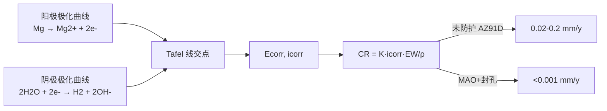

#### 3.2.4.3 表面处理选择原则与寿命预测

表面处理的核心是同时降低阴极活性、隔绝电解质、抑制 Cl\(^-\) 渗透。常用方案性能对比如下：

| 工艺 | 膜层成分 | 耐蚀性提升 | 主要局限 |
|-----|---------|-----------|---------|
| MAO/PEO | MgO/MgAl\(_2\)O\(_4\)/Mg\(_2\)SiO\(_4\) | 显著，但需封孔 | 膜多孔、粗糙 |
| 化学转化膜 | Ce/La 氧化物、植酸盐 | 中等 | 膜薄、机械耐磨差 |
| 化学镀 Ni-P | 非晶/纳米晶 Ni-P | 优异 | 前处理酸洗会活化基体 |
| HCPEB 熔凝 | 细晶/过饱和固溶 | 改善基体 | 设备成本高 |
| 纳米颗粒复合阳极氧化 | Al\(_2\)O\(_3\)+SiC/TiO\(_2\) | 膜致密、Cl\(^-\) 阻挡 | 工艺一致性待提升 |

在实际机器人部件设计中，可将 MAO 作为底层提供耐磨与附着，再用环氧-石墨烯封孔层提供化学阻隔，最后喷涂聚氨酯面层，实现 1000 h 中性盐雾（NSS）寿命。

下面的 Python 脚本根据 Tafel 外推数据估算 \(i_{corr}\) 与腐蚀速率，并对比防护前后的寿命提升：

```python
import numpy as np

# 假设 AZ91D 在 3.5 wt% NaCl 中的 Tafel 参数
ba = 0.060      # V/decade (anodic)
bc = 0.120      # V/decade (cathodic)
Rp_untreated = 250.0   # Ω·cm^2
Rp_coated = 25000.0    # Ω·cm^2 (MAO+封孔)

# Stern-Geary 计算 icorr (A/cm^2)
def icorr_from_Rp(Rp, ba, bc):
    return (ba * bc) / (2.303 * (ba + bc) * Rp)

i_untreated = icorr_from_Rp(Rp_untreated, ba, bc)
i_coated = icorr_from_Rp(Rp_coated, ba, bc)
print(f"未处理 icorr = {i_untreated*1e6:.1f} μA/cm^2")
print(f"防护后 icorr = {i_coated*1e6:.2f} μA/cm^2")

# 腐蚀速率 (mm/year)，AZ91D 等效原子量 EW≈12.2 g, ρ≈1.81 g/cm^3
K = 0.00327
EW = 12.2
rho = 1.81
def CR(i_ua_cm2):
    return K * i_ua_cm2 * EW / rho

CR_untreated = CR(i_untreated*1e6)
CR_coated = CR(i_coated*1e6)
print(f"未处理腐蚀速率 = {CR_untreated:.3f} mm/y")
print(f"防护后腐蚀速率 = {CR_coated:.5f} mm/y")
print(f"防护后寿命提升倍数 ≈ {CR_untreated/CR_coated:.0f}x")
```

该示例显示，若 MAO+封孔将 \(R_p\) 从 250 提高到 25000 Ω·cm\(^2\)，腐蚀速率可从约 0.165 mm/y 降至 0.0017 mm/y，寿命提升约 100 倍。

### 3.2.5 碳纤维复合材料：各向异性与层合板理论

碳纤维增强聚合物基复合材料（CFRP）具有极高的比强度和比刚度，其力学性能强烈依赖于纤维方向。单向 CFRP 在纤维方向上的弹性模量 \(E_1\) 和横向模量 \(E_2\) 差异巨大：

$$
E_1 \approx E_f V_f + E_m (1 - V_f)
$$
$$
\frac{1}{E_2} \approx \frac{V_f}{E_f} + \frac{1 - V_f}{E_m}
$$

其中 \(E_f\)、\(E_m\) 分别为纤维和基体模量，\(V_f\) 为纤维体积分数。典型 T700/环氧树脂单向层板的 \(E_1 \approx 140\) GPa，\(E_2 \approx 10\) GPa。

!!! note "术语解释：CFRP、纤维体积分数、基体、层合板、经典层合板理论（CLT）"
    - **CFRP（Carbon Fiber Reinforced Polymer）**：以碳纤维为增强体、聚合物为基体的复合材料。
    - **纤维体积分数（fiber volume fraction, \(V_f\)）**：复合材料中纤维体积所占比例，直接决定刚度和强度。
    - **基体（matrix）**：包裹纤维并传递载荷的聚合物相，同时保护纤维免受环境侵蚀。
    - **层合板（laminate）**：由多层按不同方向铺设的单向层板组成的复合材料板。
    - **经典层合板理论（CLT）**：基于 Kirchhoff 直法线假设，通过 A、B、D 刚度矩阵描述层合板面内、耦合与弯曲行为的理论。

层合板设计需通过铺层角度（0°、±45°、90°）组合满足多向载荷要求。经典层合板理论（CLT）基于 Kirchhoff 假设，通过 A、B、D 矩阵描述面内、耦合和弯曲刚度。层间剪切和分层是 CFRP 的主要失效模式，界面相（sizing/agent）的化学设计对层间性能至关重要。

!!! note "术语解释：分层、界面相、上浆剂"
    - **分层（delamination）**：层合板中相邻铺层之间的开裂失效。
    - **界面相（interphase）**：纤维表面与基体之间形成的具有一定化学结构和力学性能的过渡区域。
    - **上浆剂（sizing）**：涂覆在纤维表面的化学涂层，改善纤维与基体界面的润湿和粘结。

### 3.2.6 拓扑优化与多材料集成

拓扑优化以结构柔顺度最小化或固有频率最大化为目标，在满足应力/位移约束下优化材料分布。其数学形式为

$$
\min_\rho C(\rho) = \mathbf{F}^T \mathbf{U}
$$
$$
\text{s.t.} \quad \mathbf{K}(\rho)\mathbf{U} = \mathbf{F}, \quad 0 < \rho_{\min} \le \rho \le 1, \quad \int_\Omega \rho \, d\Omega \le V^*
$$

其中 \(\rho\) 为单元伪密度，\(\mathbf{K}\) 为刚度矩阵。SIMP 方法通过惩罚中间密度值促进 0/1 离散解。

!!! note "术语解释：拓扑优化、SIMP、伪密度、柔顺度、刚度矩阵"
    - **拓扑优化（topology optimization）**：在给定设计域和约束下，寻找最优材料分布的结构优化方法。
    - **SIMP（Solid Isotropic Material with Penalization）**：用伪密度插值弹性模量并对中间密度施加惩罚的拓扑优化方法。
    - **伪密度（pseudo-density, \(\rho\)）**：每个有限单元内材料相对密度的设计变量，0 表示空，1 表示实体。
    - **柔顺度（compliance）**：结构在外力作用下总应变能，柔顺度最小化等价于刚度最大化。
    - **刚度矩阵（stiffness matrix, \(\mathbf{K}\)）**：有限元法中联系节点位移与节点力的矩阵。

多材料拓扑优化进一步引入不同材料的密度/刚度组合，可在同一零件中实现铝合金骨架+镁合金填充+碳纤维局部加强的复合结构。这对于承载路径复杂、重量敏感的人形机器人关节具有重要价值。

#### 3.2.6.1 SIMP 插值与敏度推导

在 SIMP 法中，单元弹性模量与伪密度的关系为

$$
E_e(\rho_e) = E_{\min} + \rho_e^p (E_0 - E_{\min})
$$

其中 \(p \ge 3\) 为惩罚因子，\(E_{\min}\) 为避免刚度矩阵奇异的微小模量。全局刚度矩阵为各单元刚度矩阵的组装：

$$
\mathbf{K}(\rho) = \sum_{e} E_e(\rho_e) \mathbf{k}_e^0
$$

总柔顺度为

$$
C(\rho) = \mathbf{U}^T \mathbf{K} \mathbf{U} = \sum_e E_e(\rho_e) \mathbf{u}_e^T \mathbf{k}_e^0 \mathbf{u}_e
$$

对 \(\rho_e\) 求导可得单元敏度

$$
\frac{\partial C}{\partial \rho_e} = -p \rho_e^{p-1} (E_0 - E_{\min}) \mathbf{u}_e^T \mathbf{k}_e^0 \mathbf{u}_e
$$

负号表明增大密度会减小柔顺度（提高刚度）。优化采用 optimality criteria (OC) 更新：

$$
\rho_e^{\text{new}} =
\begin{cases}
\rho_{\min}, & \rho_e B_e^\eta \le \rho_{\min} \\
\rho_e B_e^\eta, & \rho_{\min} < \rho_e B_e^\eta < 1 \\
1, & \rho_e B_e^\eta \ge 1
\end{cases}
$$

其中 \(B_e = -\partial C/\partial \rho_e / (\lambda V_e)\)，\(\lambda\) 通过二分法调整以满足体积约束 \(\sum_e \rho_e V_e = V^*\)。

!!! note "术语解释：敏度分析、最优性准则（OC）、惩罚因子、体积分数、拉格朗日乘子"
    - **敏度分析（sensitivity analysis）**：计算目标函数对设计变量导数的过程，决定优化方向。
    - **最优性准则（optimality criteria, OC）**：基于 KKT 条件推导的启发式设计变量更新准则。
    - **惩罚因子（penalization factor, \(p\)）**：SIMP 中使中间密度材料刚度偏低的幂指数，越大越趋近 0/1 解。
    - **体积分数（volume fraction）**：优化后保留材料体积与设计域总体积之比。
    - **拉格朗日乘子（Lagrange multiplier, \(\lambda\)）**：将体积约束引入目标函数后对应的影子价格。

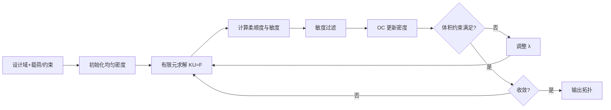

#### 3.2.6.2 敏度过滤与可制造性约束

有限元离散化带来的数值不稳定包括棋盘格（checkerboard）和网格依赖性。密度过滤通过以单元为中心、半径 \(r_{\min}\) 的加权平均抑制这些问题：

$$
\tilde{\rho}_e = \frac{\sum_{i \in N_e} w_{ei} \rho_i}{\sum_{i \in N_e} w_{ei}}, \quad w_{ei} = \max(0, r_{\min} - d_{ei})
$$

其中 \(N_e\) 为过滤邻域，\(d_{ei}\) 为单元中心距离。过滤后的敏度通过链式法则修正。进一步可引入投影法（projection）和 Heaviside 过滤，得到更清晰的黑/白边界。制造约束包括最小尺寸、悬垂角（overhang angle）和连通性，确保结果可直接用于金属增材制造（SLM、DMLS）。

!!! note "术语解释：网格依赖性、棋盘格、过滤半径、投影法、悬垂角"
    - **网格依赖性（mesh dependency）**：拓扑优化结果随网格细化而出现更细支杆的现象。
    - **棋盘格（checkerboard）**：单元密度交替为 0/1 的数值伪影，造成非物理的拓扑。
    - **过滤半径（filter radius, \(r_{\min}\)）**：密度/敏度加权平均的邻域半径，控制最小结构尺寸。
    - **投影法（projection method）**：将过滤后的灰度密度投影为接近 0/1 的锐化方法。
    - **悬垂角（overhang angle）**：增材制造中无需支撑即可打印的最大悬空角度，金属 SLM 通常约 45°。

#### 3.2.6.3 人形机器人肢段轻量化算例

以下 Python 脚本实现经典 88-line SIMP 拓扑优化，对一个受端部载荷的悬臂板（类比机器人小臂）进行柔顺度最小化设计。输出为伪密度分布，其中保留区域形成主承力路径。

```python
import numpy as np
import matplotlib.pyplot as plt

# SIMP 拓扑优化：悬臂板，左侧固定，右下角受向下载荷
nelx, nely = 60, 20  # 单元数
volfrac = 0.4        # 体积分数
penal = 3.0          # 惩罚因子
rmin = 2.5           # 过滤半径
E0, Emin = 1.0, 1e-9
nu = 0.3

def lk():
    """四节点平面应力单元刚度矩阵"""
    A11 = np.array([[12, 3, -6, -3], [3, 12, 3, 0], [-6, 3, 12, -3], [-3, 0, -3, 12]])
    A12 = np.array([[-6, -3, 0, 3], [-3, -6, -3, -6], [0, -3, -6, 3], [3, -6, 3, -6]])
    B11 = np.array([[-4, 3, -2, 9], [3, -4, -9, 4], [-2, -9, -4, -3], [9, 4, -3, -4]])
    B12 = np.array([[2, -3, 4, -9], [-3, 2, 9, -2], [4, 9, 2, 3], [-9, -2, 3, 2]])
    KE = 1/(1-nu**2)/12 * (np.vstack([np.hstack([A11, A12]),
                                       np.hstack([A12.T, B11])]) +
                           np.vstack([np.hstack([B11, B12]),
                                       np.hstack([B12.T, A11.T])]))
    return KE

KE = lk()
N = (nely+1)*(nelx+1)
dof = 2
F = np.zeros((N*dof, 1))
U = np.zeros((N*dof, 1))
fixed = np.arange(0, 2*(nely+1))  # 左侧全固定
free = np.setdiff1d(np.arange(N*dof), fixed)
# 右下角向下载荷
F[-1, 0] = -1.0
x = np.ones((nely, nelx)) * volfrac

def FE(nelx, nely, x, penal):
    K = np.zeros((N*dof, N*dof))
    for elx in range(nelx):
        for ely in range(nely):
            n1 = (nely+1)*elx + ely
            n2 = (nely+1)*(elx+1) + ely
            edof = np.array([2*n1, 2*n1+1, 2*n2, 2*n2+1,
                             2*n2+2, 2*n2+3, 2*n1+2, 2*n1+3])
            K[np.ix_(edof, edof)] += (Emin + x[ely, elx]**penal*(E0-Emin)) * KE
    K = (K + K.T) / 2
    return K

def check(nelx, nely, rmin, x, dc):
    dcn = np.zeros_like(dc)
    for i in range(nelx):
        for j in range(nely):
            imin, imax = max(int(i-np.floor(rmin)), 0), min(int(i+np.floor(rmin))+1, nelx)
            jmin, jmax = max(int(j-np.floor(rmin)), 0), min(int(j+np.floor(rmin))+1, nely)
            for ii in range(imin, imax):
                for jj in range(jmin, jmax):
                    fac = max(0, rmin - np.sqrt((i-ii)**2 + (j-jj)**2))
                    dcn[j, i] += fac * x[jj, ii] * dc[jj, ii]
            sumfac = 0.0
            for ii in range(imin, imax):
                for jj in range(jmin, jmax):
                    fac = max(0, rmin - np.sqrt((i-ii)**2 + (j-jj)**2))
                    sumfac += fac
            dcn[j, i] /= (x[j, i] * sumfac) if sumfac else 1
    return dcn

def OC(nelx, nely, x, volfrac, dc):
    l1, l2 = 0, 1e5
    move = 0.2
    while l2 - l1 > 1e-4:
        lmid = 0.5 * (l2 + l1)
        xnew = np.maximum(0.001,
                          np.maximum(x - move,
                                     np.minimum(1.0,
                                                np.minimum(x + move,
                                                           x * np.sqrt(-dc / lmid)))))
        if np.sum(xnew) - volfrac * nelx * nely > 0:
            l1 = lmid
        else:
            l2 = lmid
    return xnew

for iter in range(100):
    K = FE(nelx, nely, x, penal)
    U[free] = np.linalg.solve(K[np.ix_(free, free)], F[free])
    c = 0.0
    dc = np.zeros((nely, nelx))
    for elx in range(nelx):
        for ely in range(nely):
            n1 = (nely+1)*elx + ely
            n2 = (nely+1)*(elx+1) + ely
            edof = np.array([2*n1, 2*n1+1, 2*n2, 2*n2+1,
                             2*n2+2, 2*n2+3, 2*n1+2, 2*n1+3])
            Ue = U[edof].flatten()
            ce = np.dot(Ue, KE @ Ue)
            c += (Emin + x[ely, elx]**penal*(E0-Emin)) * ce
            dc[ely, elx] = -penal * x[ely, elx]**(penal-1) * (E0-Emin) * ce
    dc = check(nelx, nely, rmin, x, dc)
    x = OC(nelx, nely, x, volfrac, dc)

plt.imshow(1 - x, cmap='gray', origin='lower')
plt.title('Topology optimized robot arm link (black = material)')
plt.xlabel('x'); plt.ylabel('y')
plt.tight_layout(); plt.show()
```

该脚本在 60×20 网格上迭代 100 次，得到类桁架结构。实际工程中会先拓扑优化获得传力路径，再进行形状/尺寸优化并引入圆角、孔洞等工艺细节。

#### 3.2.6.4 多材料拓扑优化与增材制造集成

多材料拓扑优化将不同材料 \(m\) 的伪密度 \(\rho_{m,e}\) 独立插值：

$$
E_e = E_{\min} + \sum_m \rho_{m,e}^{p_m} E_m^0
$$

常用多材料插值模型包括 SIMP 推广、DMO（Discrete Material Optimization）和 RAMP。多材料优化的结果可指导增材制造中梯度材料的打印：例如机器人髋关节支架采用 Ti-6Al-4V 作为高应力骨架、AlSi10Mg 作为填充减重、局部嵌入连续碳纤维增强件。制造约束需在优化中同步考虑：金属 SLM 要求悬垂角 \(\ge 45^\circ\) 以减少支撑，最小孔径和壁厚需大于光斑直径（约 0.2-0.4 mm）。

!!! note "术语解释：多材料插值、DMO、RAMP、梯度材料、SLM"
    - **多材料插值（multi-material interpolation）**：在同一设计变量框架下描述多种材料刚度贡献的数学方法。
    - **DMO（Discrete Material Optimization）**：将材料选择问题转化为连续密度变量的优化方法。
    - **RAMP（Rational Approximation of Material Properties）**：另一种弹性模量插值模型，可缓解 SIMP 在低体积分数时的灰色问题。
    - **梯度材料（functionally graded material, FGM）**：成分/性能在空间连续变化的材料。
    - **SLM（Selective Laser Melting）**：激光选区熔化金属增材制造工艺。


### 3.2.7 疲劳、断裂与冲击行为

人形机器人结构件承受循环载荷和冲击载荷，疲劳与断裂性能至关重要。金属材料的疲劳寿命通常用 S-N 曲线描述：

$$
N_f = \left(\frac{\sigma_a}{\sigma_f'}\right)^{1/b}
$$

其中 \(N_f\) 为疲劳寿命，\(\sigma_a\) 为应力幅，\(\sigma_f'\) 为疲劳强度系数，\(b\) 为疲劳强度指数。该式称为 **Basquin 关系**，在高周疲劳区（通常 \(N_f > 10^4\)）较好地描述了应力幅与寿命的反幂关系。对数坐标下，\(\log\sigma_a\) 与 \(\log N_f\) 呈线性，斜率为 \(b\)（典型值为 -0.05 到 -0.12）。

!!! note "术语解释：S-N 曲线、Basquin 关系、疲劳极限、断裂韧性、冲击后压缩强度（CAI）"
    - **S-N 曲线**：应力幅与疲劳失效循环次数的关系曲线。
    - **Basquin 关系**：高周疲劳中应力幅与循环次数的幂律关系，\(\sigma_a = \sigma_f' (2N_f)^b\)。
    - **疲劳极限（fatigue limit）**：材料在无限循环下不发生疲劳破坏的最大应力幅。
    - **断裂韧性（fracture toughness, \(K_{IC}\)）**：材料抵抗裂纹扩展的能力，量化了裂纹尖端应力场强度临界值。
    - **冲击后压缩强度（CAI）**：复合材料受冲击后剩余压缩强度，用于评估损伤容限。

#### 3.2.7.1 断裂力学与裂纹尖端应力场

含裂纹构件的强度不能仅由材料强度决定，而应由裂纹尖端的应力场强度控制。Irwin 定义了 **应力强度因子** \(K_I\)：

$$
K_I = Y \sigma \sqrt{\pi a}
$$

其中 \(\sigma\) 为远场应力，\(a\) 为裂纹尺寸，\(Y\) 为几何修正因子。当 \(K_I\) 达到材料的 **断裂韧性** \(K_{IC}\) 时，裂纹失稳扩展。对于铝合金 7075-T6，\(K_{IC} \approx 27\) MPa·\(m^{1/2}\)；对于 6061-T6，\(K_{IC} \approx 29\) MPa·\(m^{1/2}\)。

裂纹尖端塑性区尺寸可估计为

$$
r_p = \frac{1}{\pi}\left(\frac{K_I}{\sigma_y}\right)^2
$$

当 \(r_p\) 远小于裂纹尺寸和试样尺寸时，线弹性断裂力学（LEFM）适用；否则需采用弹塑性断裂力学（J 积分或裂纹尖端张开位移 CTOD）。

!!! note "术语解释：应力强度因子、Irwin 塑性区、线弹性断裂力学、J 积分"
    - **应力强度因子（stress intensity factor, \(K\)）**：描述裂纹尖端弹性应力场强度的参量，下标 I、II、III 对应张开、滑开、撕开型裂纹。
    - **Irwin 塑性区（Irwin plastic zone）**：裂纹尖端因应力超过屈服强度而形成的塑性区域尺寸估计。
    - **线弹性断裂力学（LEFM）**：基于线弹性假设分析裂纹尖端应力场的断裂力学分支。
    - **J 积分（J-integral）**：弹塑性断裂力学中表征裂纹尖端能量释放率的回路积分，适用于大范围屈服。

#### 3.2.7.2 疲劳裂纹扩展：Paris 定律

疲劳裂纹扩展速率由 Paris 定律描述：

$$
\frac{da}{dN} = C (\Delta K)^m
$$

其中 \(\Delta K = K_{\max} - K_{\min}\) 为应力强度因子幅，\(C\) 和 \(m\) 为材料常数。典型铝合金的 \(m \approx 2.5-4\)。Paris 定律适用于稳定扩展区（II 区）；当 \(\Delta K\) 低于门槛值 \(\Delta K_{th}\) 时裂纹不扩展，当 \(K_{\max}\) 接近 \(K_{IC}\) 时进入快速失稳扩展区（III 区）。

对于人形机器人关节，若初始裂纹尺寸 \(a_0 = 0.5\) mm，临界裂纹尺寸 \(a_c\) 由 \(K_{IC} = Y \sigma_{\max}\sqrt{\pi a_c}\) 决定，则疲劳寿命可通过积分 Paris 定律估算：

$$
N_f = \int_{a_0}^{a_c} \frac{da}{C(\Delta K)^m}
$$

#### 3.2.7.3 累积损伤：Miner 线性法则

当结构承受变幅循环载荷时，可采用 Miner 线性累积损伤法则：

$$
D = \sum_i \frac{n_i}{N_{f,i}}
$$

其中 \(n_i\) 为第 \(i\) 级应力幅下的实际循环次数，\(N_{f,i}\) 为该应力幅下由 S-N 曲线得到的失效循环次数。当 \(D \ge 1\) 时预测疲劳失效。Miner 法则忽略了载荷顺序效应和平均应力影响，实际工程常取安全系数 \(D_{allow} = 0.3-0.5\)。

下面 Python 脚本演示如何使用 Basquin 关系和 Miner 法则估算机器人在变幅载荷下的疲劳寿命：

```python
import numpy as np

# 材料参数：假设某 6061-T6 铝合金 Basquin 参数
sigma_f_prime = 620e6  # Pa
b = -0.11              # Basquin 指数

# S-N 曲线
def Nf(sigma_a):
    """给定应力幅 (Pa)，返回失效循环次数"""
    return (sigma_a / sigma_f_prime) ** (1/b)

# 变幅载荷谱：[(应力幅 Pa, 循环次数), ...]
load_spectrum = [
    (120e6, 5000),   # 高应力，少循环
    (80e6, 50000),   # 中应力
    (50e6, 200000),  # 低应力，多循环
]

damage = 0.0
for sigma_a, n in load_spectrum:
    N = Nf(sigma_a)
    d = n / N
    damage += d
    print(f"σ_a={sigma_a/1e6:.0f} MPa: N_f={N:.2e}, n/N={d:.4f}")

print(f"总累积损伤 D = {damage:.4f}")
print(f"剩余寿命系数 = {1/damage:.2f}")
```

输出示例显示，高应力循环对损伤的贡献远大于低应力循环，体现了疲劳损伤对高应力幅的高度敏感性。机器人关节轴承、减速器输出轴等关键承力件应依据此类方法进行疲劳寿命校核，详情见第 8 章 8.4 节结构可靠性设计。

#### 3.2.7.4 复合材料冲击损伤与 CAI

CFRP 受低速冲击时，表面可能仅出现轻微凹痕，但内部已发生基体开裂、纤维-基体界面脱粘和分层。冲击损伤显著降低压缩强度，因为分层在压缩载荷下会引起局部屈曲。**冲击后压缩强度（CAI）** 定义为冲击后试样剩余抗压强度与原始抗压强度之比，通常用落锤冲击试验后测量。

CAI 与基体韧性、铺层设计和界面强度密切相关。增韧树脂（如热塑性增韧环氧）、三维编织或 Z-pin 增强可提高 CAI。人形机器人腿部、躯干等可能受碰撞的部位，选材时需同时考虑静态强度、疲劳寿命和冲击损伤容限。

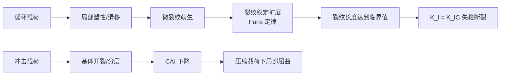

### 3.2.8 连接技术与表面工程

异种材料连接是人形机器人结构设计的难点。铝合金与镁合金、金属与 CFRP 的连接需同时考虑电化学相容性、热膨胀匹配和力学载荷传递。

#### 3.2.8.1 电偶腐蚀的热力学与动力学约束

当两种不同电位的金属在电解质中接触时，低电位金属作为阳极被氧化，高电位金属作为阴极促进还原反应。电偶腐蚀电流可由混合电位理论估算。假设铝（$E_{Al} \approx -0.8$ V vs SHE，钝化态）与镁（$E_{Mg} \approx -1.7$ V vs SHE）直接接触，阳极镁的溶解电流密度会显著增大。

在简化模型中，电偶电流密度 \(i_g\) 满足

$$
i_g = \frac{E_{cathode} - E_{anode}}{R_{solution} + R_{contact}}
$$

其中 \(R_{solution}\) 为电解质电阻，\(R_{contact}\) 为界面接触电阻。实际腐蚀速率取决于阴极反应（通常是氧还原或析氢）的极限扩散电流。工程上通常要求电位差小于 0.25 V 方可直接接触，或采用绝缘垫片、阳极氧化层、镀镍层等隔离。

!!! note "术语解释：电偶腐蚀、混合电位理论、阴极反应、极限扩散电流"
    - **电偶腐蚀（galvanic corrosion）**：两种不同电位金属在电解质中形成原电池，低电位金属加速腐蚀。
    - **混合电位理论（mixed potential theory）**：腐蚀体系中阳极和阴极极化曲线交点决定腐蚀电位和电流。
    - **阴极反应（cathodic reaction）**：在阴极表面发生的还原反应，如 \(O_2 + 2H_2O + 4e^- \rightarrow 4OH^-\)。
    - **极限扩散电流（limiting diffusion current）**：反应物扩散速率成为速率控制步骤时的最大电流。

#### 3.2.8.2 热膨胀失配应力

温度变化在异种材料连接处产生热应力。对于由两种材料组成的层合结构，当温度变化 \(\Delta T\) 时，若二者无法自由变形，界面正应力可近似为

$$
\sigma = \frac{E_1 E_2}{E_1 + E_2} (\alpha_1 - \alpha_2) \Delta T
$$

其中 \(E_i\) 为弹性模量，\(\alpha_i\) 为热膨胀系数。以铝（\(\alpha_{Al} = 23 \times 10^{-6}\) /K，\(E_{Al} = 70\) GPa）与 CFRP 单向层板纵向（\(\alpha_{CFRP} \approx 0\) /K，\(E_{CFRP} \approx 140\) GPa）连接为例，温度变化 \(\Delta T = -80\) K（从固化温度冷却到室温）：

$$
\sigma = \frac{70 \times 140}{70 + 140} \times 10^9 \times (23 - 0) \times 10^{-6} \times 80 \approx 85\ \text{MPa}
$$

该残余拉应力足以在界面附近引发基体开裂或分层，因此 CFRP-金属连接常采用渐变异质结构、胶接加机械紧固或热膨胀适配合金来缓解。

!!! note "术语解释：热膨胀系数、残余应力、热失配"
    - **热膨胀系数（coefficient of thermal expansion, CTE）**：温度变化引起材料长度变化的比率。
    - **残余应力（residual stress）**：无外载时存在于材料内部的自平衡应力。
    - **热失配（thermal mismatch）**：异种材料 CTE 不同导致的变形不协调。

#### 3.2.8.3 搅拌摩擦焊的物理机制

搅拌摩擦焊（FSW）是一种固态连接技术，特别适合铝、镁等低熔点轻合金。焊接过程中，旋转的搅拌针插入接缝并沿焊缝移动，摩擦热使材料达到塑性状态（通常为熔点的 0.6-0.9 倍），材料在搅拌针周围发生剧烈塑性流动并重新混合，形成致密的焊接接头。

FSW 接头可分为四个区域：
1. **焊核区（nugget zone）**：搅拌针正下方，发生动态再结晶，晶粒细小。
2. **热机械影响区（TMAZ）**：受搅拌和热的共同作用，晶粒发生弯曲和拉长。
3. **热影响区（HAZ）**：仅受热循环影响，发生析出相粗化或软化。
4. **母材（base metal）**：未受影响的原始组织。

!!! note "术语解释：焊核区、热机械影响区、热影响区、动态再结晶"
    - **焊核区（nugget zone）**：FSW 接头中心经历最高温度和最大变形的区域。
    - **热机械影响区（thermo-mechanically affected zone, TMAZ）**：同时受温度和机械搅拌影响的过渡区。
    - **热影响区（heat-affected zone, HAZ）**：仅受热循环影响、未发生塑性变形的区域。
    - **动态再结晶（dynamic recrystallization）**：变形过程中形成的新无应变晶粒。

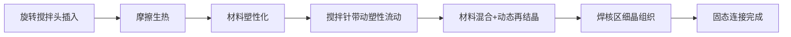

#### 3.2.8.4 连接方式选择与表面工程

常用连接方式适用范围如下：

| 连接方式 | 适用材料 | 优点 | 主要局限 |
|---------|---------|------|---------|
| 机械紧固 | 金属、CFRP | 可拆卸、便于维护 | 应力集中、电偶腐蚀风险 |
| 胶接 | 金属-CFRP | 应力分布均匀、可绝缘 | 耐温/耐湿有限、固化周期长 |
| 铆接 | 铝、镁薄板 | 工艺成熟 | 增重、孔边应力集中 |
| 搅拌摩擦焊 | Al/Mg 合金 | 固态连接、无气孔裂纹 | 设备刚性要求高、背部支撑 |
| 激光焊 | Al、钢 | 能量集中、变形小 | 高反射材料需特殊工艺 |

表面工程方面，除前述镁合金表面处理外，铝合金阳极氧化、微弧氧化、化学镀镍等也广泛应用。对于 CFRP，表面等离子处理、上浆剂优化可改善树脂基体与纤维的界面结合。异种材料连接与表面防护的最终方案需与整机装配工艺和服役环境协同设计，详情见第 9 章 9.2 节结构集成与装配。

### 3.2.9 轻量化指标与选材策略

结构材料选择需综合以下指标：

| 指标 | 定义 | 材料对比 |
|-----|------|---------|
| 比强度 | \(\sigma/\rho\) | 镁合金 > 铝合金 > 钢 |
| 比刚度 | \(E/\rho\) | CFRP > 镁合金 > 铝合金 |
| 比吸能 | 单位质量吸收能量 | 镁合金、CFRP 优异 |
| 疲劳比 | 疲劳极限/抗拉强度 | 铝合金 0.3-0.4，钢 0.4-0.5 |
| 成本比 | 单位性能成本 | 铝合金最优 |

!!! note "术语解释：比强度、比刚度、比吸能、疲劳比"
    - **比强度（specific strength）**：强度与密度之比，衡量单位质量材料的承载能力。
    - **比刚度（specific stiffness）**：弹性模量与密度之比，衡量单位质量材料的抗变形能力。
    - **比吸能（specific energy absorption）**：单位质量吸收的冲击能量，反映缓冲吸震能力。
    - **疲劳比（fatigue ratio）**：疲劳极限与抗拉强度之比，反映材料在循环载荷下的效率。

实际选材需在性能、成本、工艺、回收性之间权衡。例如，高应力关节可选用 7075-T6 或 CFRP；大面积覆盖件可选用镁合金压铸件或工程塑料；需要高导热部位可选用铝合金。

### 3.2.10 结构材料供应链与生命周期评估

结构材料的供应链风险主要体现在铝、镁初级冶炼能耗与原矿品位下降。再生铝碳排放比原生铝低约 78-95%，因此机器人结构件应优先采用高比例再生铝。镁冶炼目前主要依赖皮江法（Pidgeon process），能耗高且产生 CO\(_2\)，电解法炼镁是长期降碳方向。

生命周期评估（LCA）框架可帮助识别材料选择对碳足迹、资源耗竭和生态毒性的影响。材料选择需考虑全生命周期环境影响：

- **原生铝 vs 再生铝**：再生铝碳排放比原生铝低约 78-95%。
- **镁合金冶炼**：皮江法能耗高，电解法可显著降低碳排放。
- **碳纤维回收**：热解或溶剂回收碳纤维可部分保留性能，但成本仍高。

!!! note "术语解释：生命周期评估（LCA）、碳足迹、生态毒性"
    - **生命周期评估（LCA）**：量化产品从原材料获取、制造、使用到废弃全过程环境影响的系统化方法。
    - **碳足迹（carbon footprint）**：活动或产品引起的温室气体排放总量。
    - **生态毒性（ecotoxicity）**：材料或其降解产物对生态系统生物的危害程度。

---

## 3.3 电化学能源材料

### 3.3.1 电极热力学与锂离子嵌入反应

锂离子电池基于 Li\(^+\) 在正负极活性材料晶格中的可逆嵌入/脱出。电极电位由电化学反应的吉布斯自由能变化决定：

$$
E = -\frac{\Delta G}{nF}
$$

其中 \(n\) 为转移电子数，\(F\) 为法拉第常数。正极材料提供高电位（3-5 V vs Li/Li\(^+\)），负极材料提供低电位（<1 V vs Li/Li\(^+\)），两者电位差构成电池电压。更精确地，电极电位可由 Nernst 方程描述：

$$
E = E^0 - \frac{RT}{nF} \ln Q
$$

其中 \(Q\) 为反应商。嵌入反应中 Li\(^+\) 活度的变化直接改变了 \(Q\)，从而改变电极电位。

!!! note "术语解释：嵌入反应、电极电位、吉布斯自由能、电化学势、Nernst 方程、法拉第常数"
    - **嵌入反应（intercalation）**：客体离子（如 Li\(^+\)）可逆地插入并脱出宿主晶格层间或通道中的反应，宿主骨架基本保持不变。
    - **电极电位（electrode potential）**：电极与参比电极之间的电势差，反映氧化还原反应的趋势。
    - **吉布斯自由能（Gibbs free energy, \(G\)）**：恒温恒压下系统可做非体积功的能量，\(\Delta G < 0\) 表示过程自发。
    - **电化学势（electrochemical potential）**：化学势与静电势能之和，带电粒子在相平衡时电化学势相等。
    - **Nernst 方程**：描述电极电位随反应物活度变化的方程，是热力学平衡条件在电化学中的具体表达。
    - **法拉第常数（Faraday constant, \(F\)）**：1 摩尔电子所带电荷量，约 96485 C/mol。

锂离子嵌入反应可写为

$$
\text{Li}_{1-x}\text{MO}_2 + x\text{Li}^+ + x\text{e}^- \rightleftharpoons \text{LiMO}_2
$$

其中 M 为过渡金属。嵌入过程要求宿主材料具有稳定的晶体框架、快速的 Li\(^+\) 扩散通道和可接受的电子电导率。Li\(^+\) 在固相中的扩散遵循 Fick 第二定律，扩散系数 \(D_{Li^+}\) 通常在 10\(^{-15}\)-10\(^{-10}\) cm\(^2\)/s 范围。

!!! note "术语解释：Fick 定律、扩散系数、化学势梯度"
    - **Fick 定律**：描述扩散通量与浓度梯度关系的经验定律。第一定律给出稳态通量，第二定律给出非稳态浓度演化。
    - **扩散系数（diffusion coefficient, \(D\)）**：表征粒子在介质中扩散快慢的物理量，与温度和活化能有关。
    - **化学势梯度（chemical potential gradient）**：驱动粒子从高化学势区向低化学势区迁移的真实热力学力。

### 3.3.2 正极材料：层状氧化物与橄榄石结构

**NMC（LiNi\(_x\)Mn\(_y\)Co\(_z\)O\(_2\)）** 属 \(\alpha\)-NaFeO\(_2\) 型层状结构，空间群 \(R\bar{3}m\)。Li\(^+\) 占据 3a 位，过渡金属占据 3b 位，氧占据 6c 位。Li\(^+\) 在二维层间迁移，扩散系数约 10\(^{-12}\)–10\(^{-14}\) m\(^2\)/s。

!!! note "术语解释：NMC、层状氧化物、空间群、Li/Ni 混排、晶格氧释放、表面重构"
    - **NMC**：镍钴锰酸锂三元层状正极材料，通过调整 Ni/Mn/Co 比例平衡容量、稳定性和成本。
    - **层状氧化物（layered oxide）**：过渡金属层与锂层交替排列的二维结构，锂在层间二维扩散。
    - **空间群（space group）**：晶体对称性的数学描述。
    - **Li/Ni 混排**：Ni\(^{2+}\) 离子半径与 Li\(^+\) 接近，易占据 Li 位，堵塞 Li\(^+\) 扩散通道。
    - **晶格氧释放（lattice oxygen release）**：高脱锂态下晶格氧被氧化为 O\(_2\) 并逸出，导致结构破坏和热失控。
    - **表面重构（surface reconstruction）**：正极表面在电化学循环中转变为岩盐相等新结构，增加界面阻抗。

高镍化（NMC622→NMC811→NMC90）通过提高 Ni 含量增加可逆容量，但带来：

- **Li/Ni 混排**：Ni\(^{2+}\) 离子半径与 Li\(^+\) 接近，易占据 Li 位，堵塞 Li\(^+\) 扩散通道。
- **晶格氧释放**：高脱锂态下晶格氧氧化释放 O\(_2\)，引发热失控。
- **表面重构**：近表面形成岩盐相 NiO 层，增加界面阻抗。
- **微裂纹**：各向异性晶格膨胀/收缩导致二次颗粒内部微裂纹，加速电解液渗透和副反应。

缓解策略包括：体相掺杂（Al、Mg、Ti、Zr）、表面包覆（Al\(_2\)O\(_3\)、Li\(_2\)ZrO\(_3\)、磷酸盐）、核壳结构与浓度梯度设计。

**LiFePO\(_4\)** 属橄榄石结构，空间群 \(Pnma\)。其热稳定性优异、循环寿命长、成本低，但本征电子电导率低（约 10\(^{-9}\) S/cm），需通过碳包覆和纳米化改善。LiFePO\(_4\) 的理论容量为 170 mAh/g，实际可达 160 mAh/g 以上。其充放电机制为两相反应（LiFePO\(_4\) ↔ FePO\(_4\) + Li\(^+\) + e\(^-\)），反应界面移动受 Li\(^+\) 一维扩散控制。

!!! note "术语解释：橄榄石结构、碳包覆、两相反应、一维扩散"
    - **橄榄石结构（olivine structure）**：由 FeO\(_6\) 八面体和 PO\(_4\) 四面体构成的三维框架，Li\(^+\) 沿一维通道迁移。
    - **碳包覆（carbon coating）**：在正极颗粒表面沉积导电碳层，提高电子电导率和界面稳定性。
    - **两相反应（two-phase reaction）**：充放电过程中存在贫锂相和富锂相两相共存，反应前沿移动。
    - **一维扩散（one-dimensional diffusion）**：Li\(^+\) 只能沿特定晶向通道迁移，扩散路径受限。

### 3.3.3 负极材料：石墨、硅碳与锂金属

**石墨**是目前最成熟的负极材料，理论容量 372 mAh/g（对应 LiC\(_6\)）。Li\(^+\) 嵌入石墨层间形成不同阶化合物（stage I-V）。石墨负极的体积变化小（<12%），循环稳定，但容量已接近理论极限。

!!! note "术语解释：石墨、阶化合物、硅碳复合、锂枝晶、剪切模量"
    - **石墨（graphite）**：碳原子层状排列的负极材料，Li\(^+\) 嵌入层间形成石墨插层化合物。
    - **阶化合物（stage compound）**：石墨层间 Li\(^+\) 周期性占据不同层数的结构，stage I 表示每两层碳层间都嵌锂。
    - **硅碳复合（Si/C composite）**：将纳米硅分散在碳基体中，利用碳缓冲硅体积膨胀并维持导电网络。
    - **锂枝晶（Li dendrite）**：锂金属负极表面因局部电场和浓度不均形成的针状锂沉积，可刺穿隔膜导致短路。
    - **剪切模量（shear modulus, \(G\)）**：材料抵抗剪切变形的能力，固态电解质高剪切模量可机械抑制枝晶。

**硅**的理论容量高达 4,200 mAh/g（对应 Li\(_{22}\)Si\(_5\)），但完全锂化时体积膨胀约 300%，导致：
- 颗粒粉化、电接触丧失
- SEI 膜持续破裂与再生，消耗活性锂和电解液
- 固体电解质界面膜增厚，界面阻抗增大

工业界采用硅碳复合（Si/C）或氧化亚硅（SiO\(_x\)）策略，将硅含量控制在 5-15 wt%，在能量密度提升与循环稳定性之间取得平衡。

**锂金属**负极具有最高比容量（3,860 mAh/g）和最低电位，是固态电池的理想负极。但锂枝晶生长导致短路和热失控风险，是制约其应用的核心科学问题。固态电解质的高剪切模量可机械抑制枝晶，但晶界、空隙和局部电流密度不均仍可能诱发枝晶穿透。Monroe 和 Newman 的经典判据指出，当电解质剪切模量约为锂金属两倍时可抑制枝晶，但实际中界面不均匀性使该判据过于乐观。

### 3.3.4 液态电解质与 SEI 膜

液态电解质通常由碳酸酯溶剂（EC、DMC、EMC、DEC）和锂盐（LiPF\(_6\)、LiFSI、LiTFSI）组成。其离子电导率约 10\(^{-3}\)–10\(^{-2}\) S/cm，但在高温或高电压下可能发生氧化分解。

!!! note "术语解释：液态电解质、碳酸酯溶剂、锂盐、离子电导率"
    - **液态电解质（liquid electrolyte）**：由溶剂和锂盐组成的离子导电液体，在正负极之间传输 Li\(^+\)。
    - **碳酸酯溶剂（carbonate solvent）**：如 EC（碳酸乙烯酯）、DMC（碳酸二甲酯）等，提供锂离子溶剂化环境。
    - **锂盐（lithium salt）**：如 LiPF\(_6\)，在溶剂中解离出 Li\(^+\) 和阴离子，提供载流子。
    - **离子电导率（ionic conductivity）**：电解质传导离子的能力，单位为 S/cm。

SEI 膜是电解液在负极表面还原形成的钝化层，主要成分为 Li\(_2\)CO\(_3\)、LiF、ROLi、RCOOLi 等。Peled 首次提出 SEI 概念，指出理想的 SEI 应具有：

- 高 Li\(^+\) 电导率（降低极化）
- 电子绝缘性（防止电解液持续还原）
- 机械柔韧性（适应负极体积变化）
- 热稳定性（高温下不分解放热）

!!! note "术语解释：SEI 膜、钝化层、电解液添加剂"
    - **SEI（Solid Electrolyte Interphase）**：电极表面由电解液分解形成的固态钝化膜，允许 Li\(^+\) 通过但阻止电子和溶剂分子持续反应。
    - **钝化层（passivation layer）**：能阻止或减缓进一步化学反应的保护性薄膜。
    - **电解液添加剂（electrolyte additive）**：少量加入电解液中以调控 SEI 成分、抑制副反应的功能性物质，如 VC、FEC。

通过电解液添加剂（VC、FEC、LiPO\(_2\)F\(_2\)、LiDFOB）可调控 SEI 成分与结构，显著改善循环寿命。

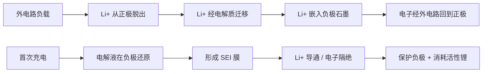

### 3.3.5 固态电解质：硫化物、氧化物与聚合物

固态电池以固态电解质替代液态电解液和隔膜，有望同时提高能量密度和安全性。固态电解质按化学体系分为硫化物、氧化物、聚合物和卤化物。

!!! note "术语解释：固态电解质、电化学窗口、对锂稳定性、空气稳定性"
    - **固态电解质（solid electrolyte）**：在固态下传导离子的材料，兼具隔膜和离子导体功能。
    - **电化学窗口（electrochemical window）**：电解质在不发生氧化还原分解的电位范围，窗口越宽越能匹配高电压正极。
    - **对锂稳定性（stability against Li metal）**：电解质与锂金属接触时不发生持续副反应的能力。
    - **空气稳定性（air stability）**：电解质在空气中不吸水、不分解、不产生有毒气体的能力。

**硫化物固态电解质**（如 Li\(_{10}\)GeP\(_2\)S\(_{12}\)、Li\(_6\)PS\(_5\)Cl、Li\(_3\)PS\(_4\)）具有最高的室温离子电导率，可达 10\(^{-2}\) S/cm，接近液态电解液。其导电机理为 Li\(^+\) 在由 PS\(_4\)/GeS\(_4\) 四面体构成的骨架中通过空位或间隙迁移。然而硫化物对水分极敏感，会释放 H\(_2\)S 并降低离子电导；且与正极材料存在化学/电化学不相容，需通过表面包覆缓冲。

**氧化物固态电解质**（如 LLZO、LATP、LLTO、LiPON）化学稳定性好、电化学窗口宽、机械强度高。立方相 LLZO（Li\(_7\)La\(_3\)Zr\(_2\)O\(_{12}\)）的室温离子电导率约 10\(^{-4}\)–10\(^{-3}\) S/cm，对锂金属稳定。但氧化物脆性大、界面接触差、需要高温烧结，加工成本高。

**聚合物固态电解质**（如 PEO-LiTFSI）柔性好、界面接触佳，但室温离子电导率低（10\(^{-6}\)–10\(^{-5}\) S/cm），需加热至 60 °C 以上才能实用化。其导电机理为 Li\(^+\) 与醚氧链段配位，并随聚合物链段运动迁移。聚合物-无机复合电解质（如 PEO + LLZO/LATP）是当前研究热点，可兼顾柔性与离子电导率。

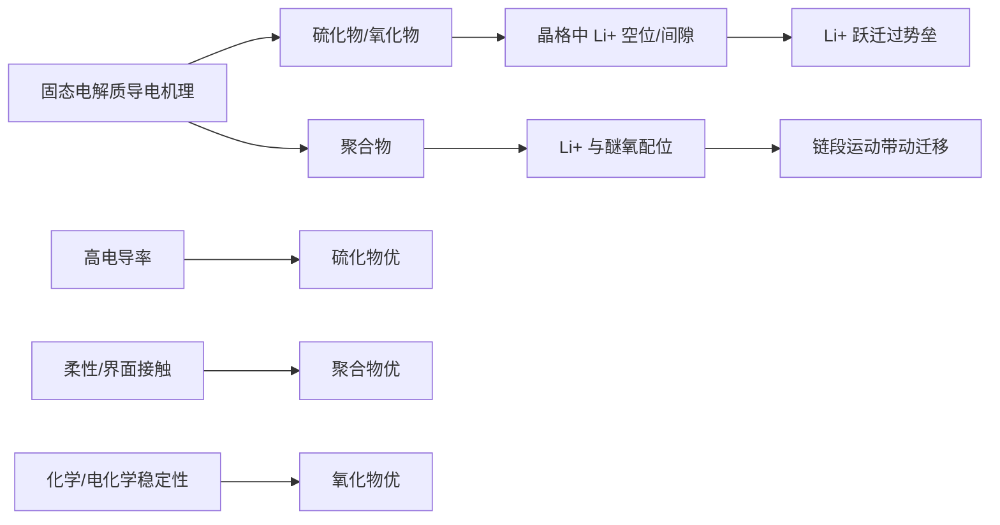

**表 3-2 主要固态电解质体系对比**

| 类型 | 代表材料 | 室温离子电导率 (S/cm) | 对锂稳定性 | 空气稳定性 | 主要挑战 |
|-----|---------|---------------------|-----------|-----------|---------|
| 硫化物 | Li\(_6\)PS\(_5\)Cl, LGPS | 10\(^{-3}\)–10\(^{-2}\) | 中等 | 差（释放 H\(_2\)S） | 水分敏感、界面副反应 |
| 氧化物 | LLZO, LATP | 10\(^{-4}\)–10\(^{-3}\) | 好 | 好 | 脆性、界面接触、加工温度高 |
| 聚合物 | PEO-LiTFSI | 10\(^{-6}\)–10\(^{-5}\) | 好 | 好 | 室温电导率低、氧化稳定性差 |
| 卤化物 | Li\(_3\)YCl\(_6\), Li\(_3\)YBr\(_6\) | 10\(^{-4}\)–10\(^{-3}\) | 好 | 中等 | 高压正极稳定性、成本 |

### 3.3.6 热失控机理与电池组设计

锂离子电池热失控是放热链式反应的结果，涉及：

1. SEI 分解（约 90-120 °C）
2. 负极与电解液反应
3. 隔膜熔融/收缩（PE 隔膜约 130 °C）
4. 正极释氧（NMC811 约 200-250 °C）
5. 电解液燃烧（EC/DMC 闪点约 30-40 °C）

!!! note "术语解释：热失控、隔膜、闪点、放热链式反应"
    - **热失控（thermal runaway）**：电池内部放热反应速率超过散热速率，温度持续上升并引发连锁反应的现象。
    - **隔膜（separator）**：分隔正负极并允许离子通过的微孔膜，熔融收缩会导致内短路。
    - **闪点（flash point）**：液体蒸气可被点燃的最低温度。
    - **放热链式反应（exothermic chain reaction）**：前一步反应放热引发下一步反应，形成正反馈。

固态电池通过消除可燃液态电解质、采用高热稳定性电解质，可从根本上抑制热失控。但固态电池仍存在锂枝晶、界面接触电阻、电解质-电极化学不相容等安全问题。

#### 3.3.6.1 热失控临界条件与能量平衡

电池温度演化由能量守恒方程描述：

$$
\rho C_p \frac{dT}{dt} = \dot{q}_{gen} - \dot{q}_{cool}
$$

其中 \(\rho C_p\) 为电芯体积比热容，\(\dot{q}_{gen}\) 为单位体积产热功率，\(\dot{q}_{cool}\) 为单位体积散热功率。产热项包括焦耳热和熵热：

$$
\dot{q}_{gen} = I^2 R_{int} + I T \frac{dE_{ocv}}{dT}
$$

焦耳热与电流平方成正比；熵热项在充电/放电时符号相反，但通常仅为焦耳热的 5-15%。热失控的临界条件是产热速率对温度的导数超过散热速率对温度的导数：

$$
\frac{\partial \dot{q}_{gen}}{\partial T} > \frac{\partial \dot{q}_{cool}}{\partial T}
$$

一旦满足该条件，温度正反馈无法被环境散热抵消，即进入热失控。SEI 分解、负极-电解液反应和正极释氧的活化能分别为 80-130 kJ/mol、100-200 kJ/mol 和 150-300 kJ/mol，温度越高反应越快，形成指数级放热。

!!! note "术语解释：绝热温升、自加热速率、热阻、对流换热系数"
    - **绝热温升（adiabatic temperature rise, \(\Delta T_{ad}\)）**：在无散热条件下反应释放全部热量导致的温升，\(\Delta T_{ad} = Q_{total}/(m C_p)\)。
    - **自加热速率（self-heating rate, \(\mathrm{d}T/\mathrm{d}t\)）**：单位时间内电池自身温度升高速度，加速量热仪（ARC）直接测量。
    - **热阻（thermal resistance, \(R_{th}\)）**：热量传递路径上的温升与热流之比，\(R_{th} = \Delta T / P\)。
    - **对流换热系数（heat transfer coefficient, \(h\)）**：流体与固体表面间单位面积、单位温差的热流量，自然对流约 5-25 W/(m\(^2\)·K)。


#### 3.3.6.2 电池包尺寸与热设计数值实例

假设人形机器人躯干可承载 48 V、20 Ah 的电池包，电芯单体为 3.7 V、5 Ah 的 NMC 圆柱电池，能量密度 250 Wh/kg：

- 总能量：\(E = 48 \times 20 = 960\) Wh
- 电池质量：\(m = 960 / 250 = 3.84\) kg
- 串联数：\(48 / 3.7 \approx 13\) 串
- 并联数：\(20 / 5 = 4\) 并
- 总电芯数：\(13 \times 4 = 52\) 颗

若机器人瞬时功率需求 960 W，则平均放电倍率 \(C = 960 / 960 = 1\) C；关节高动态峰值功率可达 3-5 kW，对应 3-5 C 脉冲。若电芯内阻 \(R_{int} = 20\) mΩ，4 并后等效内阻约 5 mΩ，峰值 5 C 时焦耳热功率：

$$
P_{Joule} = I^2 R_{int} = (5 \times 20)^2 \times 0.005 = 50\ \text{W}
$$

下面脚本计算电芯在不同倍率和冷却条件下的稳态温升：

```python
import numpy as np

# 电芯参数（以 21700 NMC 为例）
C_cell = 5.0        # Ah
V_cell = 3.7        # V
R_int = 20e-3       # Ω
m_cell = 0.070      # kg
cp = 1000           # J/(kg·K)
surface_area = 2*np.pi*0.0105*0.070  # m^2 (21700 近似)

# 倍率与电流
C_rates = np.array([1, 2, 3, 5, 8])
I = C_rates * C_cell  # A
P_joule = I**2 * R_int  # W

# 冷却条件：自然对流 h=10 W/m^2K；强制风冷 h=40；液冷 h=200
for h, label in [(10, '自然对流'), (40, '强制风冷'), (200, '液冷')]:
    dT = P_joule / (h * surface_area)
    print(f"{label}: 8C 温升 ≈ {dT[-1]:.1f} K")
```

输出显示，8C 脉冲下自然对流温升可达数十开尔文，必须采用液冷或相变材料将电芯温差控制在 5 K 以内，以避免局部电芯提前老化。

### 3.3.7 电池管理系统与状态估计

电池管理系统（BMS）是保障机器人电池安全与性能的核心。关键功能包括：

- **荷电状态估计（SOC）**：常用开路电压法、安时积分法和卡尔曼滤波法。
- **健康状态估计（SOH）**：通过容量衰减和内阻增长评估。
- **均衡控制**：主动均衡或被动均衡，防止串联电芯间 SOC 不一致。
- **热管理**：监测电芯温度，控制加热/冷却系统。

!!! note "术语解释：BMS、SOC、SOH、均衡控制"
    - **BMS（Battery Management System）**：监测并管理电池电压、电流、温度，估计状态并执行保护控制的电子系统。
    - **SOC（State of Charge）**：电池剩余容量与额定容量之比，类比油量表。
    - **SOH（State of Health）**：电池当前最大容量或内阻相对于新电池的健康程度。
    - **均衡控制（cell balancing）**：在串联电池组中使各电芯 SOC 趋于一致，防止过充过放。

对于高动态人形机器人，BMS 还需支持高倍率脉冲放电、快速状态更新和故障安全保护。

#### 3.3.7.1 等效电路模型

Thevenin 等效电路是 BMS 状态估计的基础。端电压可表示为

$$
V_t(t) = E_{ocv}\bigl(SOC(t)\bigr) - I(t) R_0 - V_p(t)
$$

其中 \(R_0\) 为欧姆内阻，\(V_p\) 为极化电压，满足

$$
\frac{dV_p}{dt} = -\frac{V_p}{\tau_p} + \frac{I R_p}{\tau_p}, \quad \tau_p = R_p C_p
$$

参数 \(R_0, R_p, C_p\) 可通过 HPPC（Hybrid Pulse Power Characterization）测试在不同 SOC 和温度下辨识。开路电压 \(E_{ocv}(SOC)\) 通常用 7-13 阶多项式或查表表示，其斜率 \(dE_{ocv}/dSOC\) 直接影响 SOC 估计精度。

!!! note "术语解释：开路电压、极化电压、时间常数、HPPC"
    - **开路电压（open-circuit voltage, OCV）**：电池在无电流通过且达到平衡时的端电压，与 SOC 一一对应。
    - **极化电压（polarization voltage）**：由电化学反应和离子扩散滞后引起的电压降。
    - **时间常数（time constant, \(\tau\)）**：RC 回路响应特征时间，\(\tau = RC\)。
    - **HPPC（Hybrid Pulse Power Characterization）**：通过施加脉冲电流辨识电池内阻和功率特性的标准测试。

#### 3.3.7.2 扩展卡尔曼滤波 SOC 估计

纯安时积分会随电流传感器偏差和容量估计误差累积，需要与电压反馈融合。扩展卡尔曼滤波（EKF）以 SOC 和极化电压为状态：

$$
\mathbf{x} = \begin{bmatrix} SOC \\ V_p \end{bmatrix}
$$

状态方程

$$
SOC_{k+1} = SOC_k - \frac{I_k \Delta t}{Q_n}, \quad V_{p,k+1} = e^{-\Delta t/\tau_p} V_{p,k} + R_p(1-e^{-\Delta t/\tau_p}) I_k
$$

观测方程

$$
V_{t,k} = E_{ocv}(SOC_k) - I_k R_0 - V_{p,k}
$$

EKF 通过线性化 \(E_{ocv}\) 的雅可比进行预测-更新循环，将电压误差反馈到 SOC，抑制安时积分漂移。人形机器人高动态电流噪声大，EKF 的过程噪声协方差 \(Q\) 和测量噪声协方差 \(R\) 需在线调整。

```mermaid
flowchart LR
    A[电流 I, 电压 Vt] --> B[EKF 预测]
    B --> C[OCV 查表]
    C --> D[观测更新]
    D --> E[SOC, Vp 估计]
    E --> F[均衡/热管理/安全保护]
    F --> G[故障预警]
```

下面的 Python 脚本演示一个简化的 EKF SOC 估计流程：

```python
import numpy as np

Qn = 5.0            # 额定容量 Ah
dt = 1.0            # s
R0 = 0.020          # Ω
Rp = 0.010          # Ω
tau_p = 30.0        # s
Cp = tau_p / Rp

# 简化 OCV-SOC 关系 (V)
def ocv(soc):
    return 3.0 + 0.8*soc + 0.1*np.sin(2*np.pi*soc)

def docv_dsoc(soc):
    return 0.8 + 0.1*2*np.pi*np.cos(2*np.pi*soc)

# 状态 [SOC; Vp]
x = np.array([[0.7], [0.0]])
P = np.eye(2) * 1e-3
Q = np.diag([1e-5, 1e-4])
R = 1e-3

# 模拟：10 A 放电 10 min，电压测量带噪声
I = 10.0
N = 600
socs = []
for k in range(N):
    # 预测
    A = np.array([[1.0, 0.0],
                  [0.0, np.exp(-dt/tau_p)]])
    B = np.array([[-dt/(Qn*3600)],
                  [Rp*(1 - np.exp(-dt/tau_p))]])
    x = A @ x + B * I
    P = A @ P @ A.T + Q

    # 观测
    Vt_true = ocv(x[0,0]) - I*R0 - x[1,0]
    Vt_meas = Vt_true + np.random.normal(0, np.sqrt(R))

    # 更新
    H = np.array([[docv_dsoc(x[0,0]), -1.0]])
    y = Vt_meas - (ocv(x[0,0]) - I*R0 - x[1,0])
    S = H @ P @ H.T + R
    K = P @ H.T / S
    x = x + K * y
    P = (np.eye(2) - K @ H) @ P
    socs.append(x[0,0])

print(f"最终 SOC 估计: {socs[-1]*100:.2f}%")
print(f"纯安时积分 SOC: {(0.7 - I*N*dt/(Qn*3600))*100:.2f}%")
```

该脚本中 EKF 融合电压反馈，即使存在测量噪声，SOC 估计仍能收敛；纯安时积分则会因初始误差和电流噪声快速发散。

### 3.3.8 固态电池制造工艺与挑战

固态电池制造工艺与液态电池显著不同：

- **硫化物电解质**：需在全惰性气氛（Ar 或 N\(_2\)）中加工，避免 H\(_2\)S 生成；采用冷等静压、热压或溶液法成膜。
- **氧化物电解质**：需高温烧结（>1000 °C），脆性大，通常制成薄膜或复合电解质。
- **聚合物电解质**：可通过溶液浇铸、挤出或 3D 打印成型，柔性好但离子电导率低。

!!! note "术语解释：冷等静压、热压、界面接触阻抗"
    - **冷等静压（cold isostatic pressing, CIP）**：在常温下从各个方向均匀施加流体压力使粉末致密化。
    - **热压（hot pressing）**：在高温下同时加热和加压烧结，促进致密化和界面结合。
    - **界面接触阻抗（interfacial contact resistance）**：由于固-固界面不紧密接触产生的额外电阻。

关键挑战包括：固-固界面接触阻抗、电极/电解质热膨胀匹配、规模化生产成本和一致性控制。

### 3.3.9 电池材料供应链与回收

电池关键材料供应链呈现高度地理集中：锂资源主要由南美“锂三角”和澳大利亚主导；钴矿产量的 70% 以上来自刚果（金）；中国主导正极材料、电池制造和回收产能。

电池回收是降低资源依赖的关键：

- **湿法冶金回收 Li、Co、Ni、Mn**
- **火法冶金回收 Cu、Al、Fe**
- **直接再生正极材料**正在成为研究热点，可降低再制造成本和能耗。

!!! note "术语解释：直接再生、资源耗竭、供应链韧性"
    - **直接再生（direct recycling）**：将废旧电极材料经修复后重新用于电池，尽量保持晶体结构。
    - **资源耗竭（resource depletion）**：不可再生资源被消耗殆尽的趋势。
    - **供应链韧性（supply chain resilience）**：供应链在扰动下维持功能和快速恢复的能力。

---

## 3.4 宽禁带半导体材料

### 3.4.1 能带理论与载流子输运

半导体中的电子能量形成能带结构，价带顶与导带底之间的能量差称为**带隙** \(E_g\)。Si 的 \(E_g = 1.12\) eV，SiC 的 \(E_g = 2.3-3.3\) eV（随多型体变化），GaN 的 \(E_g = 3.4\) eV。宽禁带带来更高的本征温度、更高的击穿电场和更低的本征载流子浓度：

$$
n_i = \sqrt{N_c N_v} \exp\left(-\frac{E_g}{2k_B T}\right)
$$

!!! note "术语解释：能带、价带、导带、带隙、本征载流子浓度、击穿电场、导通电阻"
    - **能带（energy band）**：晶体中电子允许能量值的连续分布带，由周期性势场中薛定谔方程解形成。
    - **价带（valence band）**：绝对零度时填满电子的最高能带。
    - **导带（conduction band）**：价带之上的空能带，电子进入后可自由导电。
    - **带隙（bandgap, \(E_g\)）**：价带顶到导带底的能量差，决定材料的光学和电学阈值。
    - **本征载流子浓度（intrinsic carrier concentration, \(n_i\)）**：本征半导体中热激发产生的电子-空穴对浓度。
    - **击穿电场（breakdown electric field, \(E_c\)）**：材料发生雪崩或隧穿击穿前的最大电场。
    - **导通电阻（on-resistance, \(R_{on}\)）**：器件导通时的电阻，直接影响导通损耗。

击穿电场 \(E_c\) 与带隙相关，近似满足

$$
E_c \propto E_g^{3/2}
$$

SiC 的临界击穿电场约 2-3 MV/cm，是 Si 的 10 倍；GaN 约 3-4 MV/cm。更高的击穿电场允许使用更薄的漂移区，从而降低导通电阻 \(R_{on,sp}\)：

$$
R_{on,sp} \propto \frac{1}{E_c^3}
$$

即击穿电压相同时，SiC 的 \(R_{on,sp}\) 约为 Si 的 1/300-1/400。

```mermaid
flowchart LR
    A[宽禁带 Eg↑] --> B[击穿电场 Ec↑]
    B --> C[漂移区可更薄]
    C --> D[导通电阻 Ron,sp↓]
    D --> E[导通损耗↓]
    A --> F[本征载流子 ni↓]
    F --> G[高温漏电流↓]
    E --> H[高压 / 高温 / 高频优势]
    G --> H
```

### 3.4.2 碳化硅：多型体、热导率与功率器件

SiC 存在 200 多种多型体，最常见的是 4H-SiC 和 6H-SiC。4H-SiC 因具有较高的电子迁移率（\(\mu_n \approx 800-1000\) cm\(^2\)/(V·s)）和各向同性较好，成为功率器件首选。

!!! note "术语解释：多型体、4H-SiC、电子迁移率、MOSFET、阈值电压、界面态"
    - **多型体（polytype）**：化学成分相同但堆垛顺序不同的晶体结构变体。
    - **4H-SiC**：SiC 的一种六方多型体，具有较高电子迁移率和各向同性。
    - **电子迁移率（electron mobility, \(\mu_n\)）**：单位电场下电子的平均漂移速度，决定器件导通电阻和开关速度。
    - **MOSFET（Metal-Oxide-Semiconductor Field-Effect Transistor）**：金属-氧化物-半导体场效应晶体管。
    - **阈值电压（threshold voltage, \(V_{th}\)）**：使沟道反型并导通所需的栅极电压。
    - **界面态（interface state）**：半导体/氧化物界面处的电子能级，会捕获载流子导致迁移率下降和阈值漂移。

SiC MOSFET 的优异特性包括：

- **高温工作**：结温可达 175-200 °C，远高于 Si 的 150 °C。
- **高开关频率**：开关损耗低，可将逆变器开关频率从 10-20 kHz 提升至 50-100 kHz。
- **低导通电阻**：相同耐压等级下 \(R_{DS(on)}\) 显著低于 Si MOSFET 和 IGBT。

SiC 的高热导率（4H-SiC 约 490 W/(m·K)）有利于散热，但 MOS 界面处存在较高的界面态密度，导致沟道迁移率降低和阈值电压漂移。通过氮化退火、氧化后退火等工艺可改善界面质量。

### 3.4.3 氮化镓：极化效应与二维电子气

GaN 通常以纤锌矿结构外延生长在异质衬底（Si、SiC、蓝宝石）上。由于纤锌矿结构缺乏反演对称性，GaN/AlGaN 异质界面存在**自发极化**（spontaneous polarization）和**压电极化**（piezoelectric polarization）。极化不连续在界面处诱导高浓度二维电子气（2DEG）：

$$
n_s = \frac{\sigma_{pol}}{e} - \frac{\varepsilon}{e^2 d}\left(e\phi_B + E_F - \Delta E_c\right)
$$

!!! note "术语解释：纤锌矿、自发极化、压电极化、二维电子气（2DEG）、HEMT"
    - **纤锌矿（wurtzite）**：一种六方晶体结构，缺乏中心反演对称性，因此存在自发极化。
    - **自发极化（spontaneous polarization）**：晶体本身因非中心对称结构而具有的固有电极化。
    - **压电极化（piezoelectric polarization）**：晶格失配产生应变，由于压电效应而产生的附加极化。
    - **二维电子气（2DEG）**：被限制在异质界面附近薄层内的高迁移率电子气。
    - **HEMT（High Electron Mobility Transistor）**：利用 2DEG 作为沟道的高电子迁移率晶体管。

其中 \(\sigma_{pol}\) 为极化电荷面密度，\(\phi_B\) 为肖特基势垒，\(d\) 为 AlGaN 势垒层厚度。2DEG 电子迁移率可达 1500-2000 cm\(^2\)/(V·s)，浓度达 10\(^{13}\) cm\(^{-2}\)，使 GaN HEMT 具有极低的导通电阻和极高的开关速度。

```mermaid
flowchart LR
    A[纤锌矿无反演对称] --> B[自发极化 Psp]
    C[AlGaN/GaN 晶格失配] --> D[压电极化 Ppz]
    B --> E[界面极化电荷不连续]
    D --> E
    E --> F[高浓度 2DEG]
    F --> G[高迁移率沟道]
    G --> H[低 Ron + 高开关速度]
```

GaN HEMT 按栅极结构分为耗尽型（d-mode）、增强型（e-mode）和 cascode 结构。e-mode GaN 通过 p-GaN 帽层或凹槽栅实现常关特性，更适合功率电子应用。

### 3.4.4 功率器件损耗机制与驱动器设计

电机驱动逆变器的总损耗包括导通损耗和开关损耗：

$$
P_{loss} = P_{cond} + P_{sw}
$$
$$
P_{cond} = I_{rms}^2 R_{DS(on)}
$$
$$
P_{sw} = f_{sw}(E_{on} + E_{off})
$$

其中 \(f_{sw}\) 为开关频率，\(E_{on}\)、\(E_{off}\) 为单次开关能量。

!!! note "术语解释：导通损耗、开关损耗、THD、逆变器"
    - **导通损耗（conduction loss）**：器件导通时由于导通电阻产生的焦耳热损耗。
    - **开关损耗（switching loss）**：器件开通和关断过程中电压电流交叠产生的能量损耗。
    - **THD（Total Harmonic Distortion）**：电流或电压波形相对正弦波的畸变程度。
    - **逆变器（inverter）**：将直流电转换为交流电的功率电子装置。

**SiC 与 GaN 在机器人驱动中的互补性**：

- **SiC MOSFET**：适用于高压（≥650 V）、大功率、连续运行的主驱关节。在 20 kHz 开关频率下，SiC 逆变器效率可达 97.2%，结温升约 45 °C。
- **GaN HEMT**：适用于低压（≤650 V）、高频（100 kHz-1 MHz）、小体积的关节驱动。在 100 kHz 下，GaN 逆变器开关损耗比 SiC 低约 40%，电流 THD 从 3.8% 降至 2.5%，转矩响应时间从 0.12 s 缩短至 0.05 s。

EPC 2025 年推出的 EPC91120 人形机器人关节 GaN 电机驱动逆变器，直径 32 mm，峰值电流 42 A，效率超过 80%，体现了 GaN 在高集成度关节驱动中的优势。

#### 3.4.4.1 导通与开关损耗解析模型

MOSFET 的导通损耗随结温变化显著，通常近似为

$$
P_{cond} = I_{rms}^2 R_{DS(on),25^\circ C} \bigl[1 + \delta (T_j - 25)\bigr]
$$

其中 \(\delta \approx 0.0038\ /^\circ\text{C}\) 为 SiC MOSFET 的温度系数，GaN HEMT 的温度系数略低。

开关损耗可写成与电压、电流和栅极电荷相关的经验式：

$$
P_{sw} = f_{sw} \frac{(E_{on} + E_{off}) V_{DC} I_{rms}}{V_{ref} I_{ref}}
$$

对于 GaN 等无反向恢复器件，体二极管反向恢复损耗 \(P_{rr}\) 可忽略；SiC MOSFET 的体二极管在死区时间内续流会产生反向恢复电荷 \(Q_{rr}\)，其损耗为

$$
P_{rr} = Q_{rr} V_{DC} f_{sw}
$$

死区时间 \(t_d\) 内的体二极管导通损耗

$$
P_{dt} = 2 V_f I_L f_{sw} t_d
$$

其中 \(V_f\) 为体二极管正向压降。逆变器总损耗还包括驱动损耗 \(P_{drv} = Q_g V_{gs} f_{sw}\) 和输出电容损耗 \(P_{oss} = \frac{1}{2} C_{oss} V_{DC}^2 f_{sw}\)，在小功率 GaN 关节中这些分量不可忽略。

!!! note "术语解释：反向恢复电荷、死区时间、体二极管、栅极电荷、输出电容"
    - **反向恢复电荷（reverse recovery charge, \(Q_{rr}\)）**：二极管从正向导通切换到反向截止时扫出的少数载流子电荷。
    - **死区时间（dead time）**：上下桥臂切换时两个器件同时关断的间隔，防止直通短路。
    - **体二极管（body diode）**：MOSFET 源漏 PN 结形成的寄生二极管，用于续流。
    - **栅极电荷（gate charge, \(Q_g\)）**：开通器件所需注入栅极的电荷，决定驱动损耗和开关速度。
    - **输出电容（output capacitance, \(C_{oss}\)）**：器件关断时漏源之间的等效电容，影响开关损耗和软开关条件。

#### 3.4.4.2 48 V 关节驱动器损耗对比实例

考虑一个 48 V 直流母线、额定相电流 10 A（RMS）、输出功率约 500 W 的人形机器人关节。分别评估 SiC MOSFET（20 kHz）和 GaN HEMT（200 kHz）方案。器件参数如下表：

| 参数 | SiC MOSFET | GaN HEMT |
|-----|-----------|----------|
| \(R_{DS(on)}\) @ 25 °C | 25 mΩ | 15 mΩ |
| \(E_{on}+E_{off}\) @ 25 A, 48 V | 80 μJ | 15 μJ |
| \(Q_{rr}\) | 50 nC | ~0 |
| \(Q_g\) | 15 nC | 3 nC |
| \(V_f\)（体二极管） | 3.3 V | ~0（无体二极管） |

导通损耗、开关损耗和效率可由下式估算。下面的 Python 脚本直接比较两种方案：

```python
import numpy as np

Vdc = 48.0          # V
I_rms = 10.0        # A per phase
f_sw_sic = 20e3     # Hz
f_sw_gan = 200e3    # Hz
Tj = 100.0          # °C
delta = 0.0038      # /°C

# SiC 参数
Rds_sic = 25e-3
Esw_sic = 80e-6     # J @ 25A, 48V (按 I_rms/I_ref=10/25 缩放)
Qrr_sic = 50e-9
Qg_sic = 15e-9
Vf_sic = 3.3
td = 200e-9         # s

# GaN 参数
Rds_gan = 15e-3
Esw_gan = 15e-6     # J @ 10A, 48V
Qrr_gan = 0
Qg_gan = 3e-9
Vf_gan = 0

def inverter_loss(Rds, Esw, Qrr, Qg, Vf, fsw):
    P_cond = 3 * I_rms**2 * Rds * (1 + delta*(Tj-25))
    # 每桥臂每开关周期两次切换，三相共 6 开关
    P_sw = 6 * fsw * Esw * (Vdc/48) * (I_rms/25 if Rds==25e-3 else I_rms/10)
    P_rr = 6 * Qrr * Vdc * fsw
    P_dt = 6 * Vf * I_rms * fsw * td
    P_drv = 6 * Qg * 12 * fsw  # 12 V 驱动
    return P_cond, P_sw, P_rr, P_dt, P_drv

Pout = 3 * Vdc/np.sqrt(2) * I_rms  # 近似三相输出功率
for name, params in [('SiC', (Rds_sic, Esw_sic, Qrr_sic, Qg_sic, Vf_sic, f_sw_sic)),
                     ('GaN', (Rds_gan, Esw_gan, Qrr_gan, Qg_gan, Vf_gan, f_sw_gan))]:
    Pc, Psw, Prr, Pdt, Pdrv = inverter_loss(*params)
    Ptot = Pc + Psw + Prr + Pdt + Pdrv
    eta = Pout / (Pout + Ptot)
    print(f"{name}: Pcond={Pc:.2f} W, Psw={Psw:.2f} W, "
          f"Ptot={Ptot:.2f} W, η={eta*100:.2f}%")
```

该脚本输出显示，在 48 V/10 A 工况下，GaN 方案虽开关频率提高 10 倍，但由于 \(\mu\Omega\) 级导通电阻和极低开关能量，总损耗可低于 SiC 方案，效率可达 98% 以上。更高的开关频率允许减小电机电感和滤波电容，使人形机器人关节驱动器体积从 100 cm\(^3\) 级降至 10 cm\(^3\) 级。

#### 3.4.4.3 热阻约束与散热设计

器件结温由热阻网络决定：

$$
T_j = T_a + P_{loss} (R_{th,jc} + R_{th,cs} + R_{th,sa})
$$

其中 \(R_{th,jc}\) 为结到壳热阻，\(R_{th,cs}\) 为壳到散热器接触热阻，\(R_{th,sa}\) 为散热器到环境热阻。以 GaN HEMT 为例，若总热阻 \(R_{th,ja} = 25\ ^\circ\text{C/W}\)，总损耗 5 W，环境温度 40 °C，则结温 \(T_j = 40 + 5 \times 25 = 165\ ^\circ\text{C}\)。GaN 器件最高结温通常 150-175 °C，因此高功率关节必须采用低热阻封装和主动散热。

!!! note "术语解释：热阻、结温、接触热阻、散热器"
    - **热阻（thermal resistance, \(R_{th}\)）**：单位热功率引起的温升，单位为 K/W 或 °C/W。
    - **结温（junction temperature, \(T_j\)）**：半导体器件有源区的温度，决定可靠性和寿命。
    - **接触热阻（contact thermal resistance）**：由于界面不平整和空气隙导致的附加热阻，常用导热硅脂或相变材料降低。
    - **散热器（heat sink）**：扩大散热面积、增强对流换热的金属构件。

```mermaid
flowchart LR
    A[三相逆变器] --> B[导通损耗]
    A --> C[开关损耗]
    A --> D[死区/反向恢复损耗]
    A --> E[驱动/输出电容损耗]
    B --> F[总损耗 Ptot]
    C --> F
    D --> F
    E --> F
    F --> G[Tj = Ta + Ptot·Rth]
    G -->|Tj < Tjmax| H[热设计合格]
    G -->|Tj > Tjmax| I[增大散热/降低损耗]
```

### 3.4.5 可靠性问题：栅氧、动态导通电阻与宇宙射线

宽禁带功率器件的可靠性问题与硅器件有所不同：

- **SiC MOS 栅氧可靠性**：SiC/SiO\(_2\) 界面态密度高，导致阈值电压漂移和沟道迁移率退化。高温栅偏（HTGB）和高温高湿反偏（H3TRB）测试是评估栅氧可靠性的标准方法。
- **GaN 动态导通电阻（dynamic R\(_{DS(on)}\)）**：由于表面态和缓冲层陷阱捕获电子，GaN HEMT 在高频开关后导通电阻会暂时增加，影响效率和热设计。
- **宇宙射线单粒子烧毁（SEB）**：高电压 SiC 器件对宇宙射线诱导的单粒子效应敏感，需通过电场优化和冗余设计提高鲁棒性。

!!! note "术语解释：栅氧可靠性、动态导通电阻、宇宙射线单粒子烧毁、HTGB、H3TRB"
    - **栅氧可靠性（gate oxide reliability）**：栅极氧化物在长期偏置和温度应力下保持绝缘性能的能力。
    - **动态导通电阻（dynamic on-resistance）**：开关瞬态后由于陷阱电荷释放较慢导致的导通电阻暂时升高。
    - **宇宙射线单粒子烧毁（SEB）**：高能粒子在器件内产生电子-空穴对，触发寄生双极晶体管导通导致热损坏。
    - **HTGB（High Temperature Gate Bias）**：高温栅偏应力测试。
    - **H3TRB（High Humidity High Temperature Reverse Bias）**：高温高湿反偏测试。

### 3.4.6 栅极驱动与封装技术

宽禁带器件的快速开关速度对栅极驱动和封装提出严苛要求：

- **栅极驱动**：需最小化栅极回路电感，防止寄生振荡和误导通；GaN 器件栅极电压窗口窄（通常 0-5 V 或 -3-7 V），对驱动精度要求高。
- **封装**：低寄生电感封装（如 QFN、PQFN、嵌入式封装、双面散热封装）对于充分发挥 GaN/SiC 高频优势至关重要。
- **EMC 设计**：高 dv/dt 和 di/dt 导致 EMI 问题，需优化 PCB 布局、屏蔽和滤波。

!!! note "术语解释：栅极驱动、寄生电感、QFN、EMC、dv/dt、di/dt"
    - **栅极驱动（gate driver）**：为功率器件栅极提供快速充放电电流的电路，决定开关速度和可靠性。
    - **寄生电感（parasitic inductance）**：封装和 PCB 走线中不可避免的电感，会与快速电流变化产生电压尖峰。
    - **QFN（Quad Flat No-lead）**：一种低寄生电感表面贴装封装。
    - **EMC（Electromagnetic Compatibility）**：设备在电磁环境中正常工作且不对其他设备产生不可接受干扰的能力。
    - **dv/dt、di/dt**：电压/电流随时间的变化率，宽禁带器件开关速度快导致其值很高。

### 3.4.7 互连、传感与系统集成材料

人形机器人还依赖多种功能材料实现感知、信号传输与互连。这些材料虽不如功率半导体醒目，但直接决定机器人的感知精度、线缆寿命和系统可靠性。

#### 3.4.7.1 应变片的压阻效应与电桥输出

金属箔应变片利用 **压阻效应**：材料受应变时电阻发生变化。对于各向同性金属，电阻相对变化为

$$
\frac{\Delta R}{R} = K \varepsilon
$$

其中 \(K\) 为灵敏系数，\(\varepsilon\) 为应变。金属箔应变片的 \(K\) 约 2.0-2.2，来源于几何尺寸变化（泊松效应）和电阻率的微小变化。半导体硅应变片的 \(K\) 可达 50-150，源于能带结构对应变的强响应，但温度敏感性高。

实际测量中常采用惠斯通电桥（Wheatstone bridge）提高灵敏度并抑制温度漂移。对于四分之一桥（单工作片），输出电压为

$$
\frac{V_{out}}{V_{in}} = \frac{K \varepsilon}{4}
$$

对于全桥（四工作片），输出为四分之一桥的 4 倍，且可抵消温度引起的热输出。

!!! note "术语解释：压阻效应、灵敏系数、惠斯通电桥、热输出"
    - **压阻效应（piezoresistive effect）**：材料电阻随机械应变变化的现象。
    - **灵敏系数（gauge factor, \(K\)）**：单位应变引起的电阻相对变化。
    - **惠斯通电桥（Wheatstone bridge）**：由四个电阻组成的测量电路，可检测微小电阻变化。
    - **热输出（thermal output）**：温度变化引起的虚假应变信号。

#### 3.4.7.2 MEMS IMU 的物理原理

MEMS 惯性测量单元（IMU）通常集成三轴加速度计和三轴陀螺仪。

**加速度计**基于牛顿第二定律：可动质量块 \(m\) 在外界加速度 \(a\) 下受到惯性力 \(F = ma\)，导致支撑梁变形。变形量通过电容变化检测：

$$
\Delta C = \varepsilon_0 A \left(\frac{1}{d_0 - \Delta d} - \frac{1}{d_0}\right) \approx \varepsilon_0 A \frac{\Delta d}{d_0^2}
$$

其中 \(d_0\) 为初始间隙，\(A\) 为极板面积，\(\varepsilon_0\) 为真空介电常数。

**陀螺仪**基于科里奥利力（Coriolis force）。当质量块以速度 \(v\) 沿驱动轴振动，同时绕输入轴以角速度 \(\Omega\) 旋转时，受到科里奥利力

$$
F_c = -2m \, \boldsymbol{\Omega} \times \boldsymbol{v}
$$

该力使质量块沿敏感轴位移，通过电容变化测得角速度。石英 MEMS 陀螺仪利用石英的压电效应同时实现驱动和检测，温度稳定性优于硅 MEMS。

!!! note "术语解释：科里奥利力、电容检测、驱动轴、敏感轴"
    - **科里奥利力（Coriolis force）**：旋转参考系中观察到的惯性力，正比于角速度与质点速度的叉乘。
    - **电容检测（capacitive sensing）**：通过极板间距变化引起电容变化来测量微小位移。
    - **驱动轴（drive axis）**：MEMS 陀螺仪中质量块被激励振动的方向。
    - **敏感轴（sense axis）**：科里奥利力导致位移并被检测的方向。

```mermaid
flowchart LR
    A[外界加速度 a] --> B[惯性力 F=ma]
    B --> C[支撑梁变形]
    C --> D[电容变化 ΔC]
    D --> E[电压输出]
    F[角速度 Ω] --> G[驱动振动 v]
    G --> H[科里奥利力 Fc=2mΩv]
    H --> I[敏感轴位移]
    I --> J[电容检测]
    J --> K[角速度输出]
```

#### 3.4.7.3 CMOS 图像传感器的光电转换

CMOS 图像传感器由像素阵列、读出电路和模数转换器组成。每个像素的核心是硅光电二极管，当光子能量 \(E = h\nu\) 大于硅带隙 \(E_g = 1.12\) eV 时，产生电子-空穴对。波长 \(\lambda = 550\) nm 的可见光对应光子能量约 2.25 eV，可被硅有效吸收。

量子效率（QE）定义为产生的电子数与入射光子数之比，受光电二极管深度、抗反射涂层和像素填充因子影响。典型 CMOS 传感器的 QE 在可见光波段为 50-70%。

!!! note "术语解释：量子效率、填充因子、读出噪声、动态范围"
    - **量子效率（quantum efficiency, QE）**：每个入射光子产生的光电子数比例。
    - **填充因子（fill factor）**：像素中感光区面积占整个像素面积的比例。
    - **读出噪声（read noise）**：读出电路引入的电子噪声，决定低光照性能。
    - **动态范围（dynamic range）**：传感器能同时记录的最强与最弱信号之比。

#### 3.4.7.4 柔性线缆与接插件材料

高柔性线缆导体采用高纯无氧铜（OFHC，纯度 99.99%）或镀银铜以降低电阻并提高耐弯折性。反复弯折下的疲劳寿命与导体截面积、绞合节距和绝缘层模量有关。绝缘层选用 TPE、TPU、硅胶或铁氟龙以兼顾柔性与耐温。接插件接触件使用 Cu-Be、Cu-Ni-Sn 等铜合金镀金，壳体采用高强度工程塑料或铝合金，锁紧机构使用不锈钢弹簧。

下面 Python 脚本演示应变片电桥输出与 MEMS 加速度计电容变化的估算：

```python
import numpy as np

# 应变片参数
K = 2.1          # 灵敏系数
strain = 500e-6  # 微应变 500 με
Vin = 5.0        # 电桥激励电压 V

# 四分之一桥输出
Vout_quarter = Vin * K * strain / 4
print(f"四分之一桥输出: {Vout_quarter*1e3:.3f} mV")

# 全桥输出
Vout_full = Vin * K * strain
print(f"全桥输出: {Vout_full*1e3:.3f} mV")

# MEMS 加速度计电容变化
m = 1e-9         # 质量块 1 µg 级 (kg)
a = 9.8          # 1 g 加速度 (m/s^2)
k = 10.0         # 支撑梁等效刚度 N/m
eps0 = 8.854e-12 # F/m
A = 1e-9         # 极板面积 m^2
d0 = 2e-6        # 初始间隙 m

dx = m * a / k
dC = eps0 * A * dx / d0**2
print(f"1g 加速度下位移 {dx*1e9:.3f} nm, 电容变化 {dC*1e18:.2f} aF")
```

该示例表明，MEMS 加速度计在 1 g 加速度下的位移仅为纳米量级，电容变化为阿法（aF）量级，必须采用高灵敏度读出电路和差分检测来抑制噪声。应变片、IMU 与视觉传感器在机器人感知系统中的融合使用方法见第 5 章 5.2 节多模态传感融合。

### 3.4.8 半导体供应链与地缘风险

宽禁带半导体供应链集中在衬底、外延、器件制造环节。SiC 衬底由 Wolfspeed、Coherent、II-VI、天岳先进、天科合达等主导；GaN-on-Si 外延和器件由 EPC、Infineon、Navitas、GaN Systems 等主导。衬底缺陷密度、外延均匀性和晶圆尺寸是产能扩张的瓶颈。

关键矿产与地理集中性还体现在：

- **稀土**：中国占全球稀土开采 60-70%、分离冶炼约 90%、NdFeB 磁材制造 85-93%。2025 年 4 月起中国对 Dy、Tb 等中重稀土实施出口许可管制。
- **锂**：南美“锂三角”（阿根廷、玻利维亚、智利）和澳大利亚主导锂资源；中国主导锂电池正极材料和电池制造。
- **钴**：刚果（金）占全球钴矿产量的 70% 以上。
- **高纯石英与半导体级硅**：美国、挪威、日本等占据高端材料。

2025 年以来稀土出口管制已导致：高温度等级磁体供应紧张、国际市场价格一度涨至国内价格的 6 倍、交货周期延长。Tesla、Figure 等企业开始寻求美国 Mountain Pass、澳大利亚 Lynas 等替代来源，但产能建设需 3-5 年。

---

## 本章符号表

| 符号 | 含义 | 常用单位 | 首次出现章节 |
|-----|------|---------|------------|
| \(J\) | 交换积分 | eV 或 J | 3.1.1 |
| \(\mathbf{S}\) | 自旋角动量 | \( \hbar \) | 3.1.1 |
| \(M_s\) | 饱和磁化强度 | A/m 或 T | 3.1.1 |
| \(T_C\) | 居里温度 | K 或 °C | 3.1.1 |
| \(K_1, K_2\) | 磁晶各向异性常数 | J/m\(^3\) | 3.1.2 |
| \(H_A\) | 各向异性场 | A/m 或 T | 3.1.2 |
| \(\delta_w\) | 磁畴壁厚度 | m | 3.1.3 |
| \(A\) | 交换刚度 | J/m | 3.1.3 |
| \(H_c, H_{cj}\) | 矫顽力 | A/m 或 T | 3.1.3 |
| \((BH)_{\max}\) | 最大磁能积 | kJ/m\(^3\) 或 MGOe | 3.1.4 |
| \(B_r\) | 剩磁 | T | 3.1.4 |
| \(\alpha, \beta\) | 剩磁/矫顽力温度系数 | %/°C | 3.1.7 |
| \(B_g\) | 气隙磁密 | T | 3.1.11.1 |
| \(\mu_r\) | 回复磁导率 | 1 | 3.1.11.1 |
| \(K_t\) | 转矩常数 | Nm/A | 3.1.11.2 |
| \(\sigma_y\) | 屈服强度 | MPa | 3.2.1 |
| \(d\) | 晶粒尺寸 | m 或 \(\mu\)m | 3.2.1 |
| \(k_y\) | Hall-Petch 斜率 | MPa·\(m^{1/2}\) | 3.2.1 |
| \(G\) | 剪切模量 | GPa | 3.2.1 |
| \(b\) | 柏氏矢量 | m | 3.2.1 |
| \(\rho\) | 位错密度 | m\(^{-2}\) | 3.2.1 |
| \(c/a\) | HCP 晶胞轴比 | 1 | 3.2.3 |
| \(\tau\) | 分切应力 | MPa | 3.2.3.1 |
| \(m\) | Schmid 因子 | 1 | 3.2.3.1 |
| \(\gamma\) | 孪生剪切量 | 1 | 3.2.3.2 |
| \(i_{corr}\) | 腐蚀电流密度 | \(\mu\)A/cm\(^2\) | 3.2.4.2 |
| \(R_p\) | 极化电阻 | \(\Omega\)·cm\(^2\) | 3.2.4.2 |
| \(E_1, E_2\) | 复合材料纵向/横向模量 | GPa | 3.2.5 |
| \(V_f\) | 纤维体积分数 | 1 | 3.2.5 |
| \(\rho_e\) | 伪密度 | 1 | 3.2.6.1 |
| \(C\) | 柔顺度 | J | 3.2.6.1 |
| \(N_f\) | 疲劳寿命 | 循环次数 | 3.2.7 |
| \(\sigma_f'\) | 疲劳强度系数 | MPa | 3.2.7 |
| \(b\) | Basquin 指数 | 1 | 3.2.7 |
| \(K_I, K_{IC}\) | 应力强度因子/断裂韧性 | MPa·\(m^{1/2}\) | 3.2.7.1 |
| \(\Delta K\) | 应力强度因子幅 | MPa·\(m^{1/2}\) | 3.2.7.2 |
| \(D\) | 累积疲劳损伤 | 1 | 3.2.7.3 |
| \(\alpha\) | 热膨胀系数 | K\(^{-1}\) | 3.2.8.2 |
| \(E\) | 电极电位/弹性模量 | V 或 GPa | 3.3.1/3.2.5 |
| \(F\) | 法拉第常数 | C/mol | 3.3.1 |
| \(D_{Li^+}\) | 锂离子扩散系数 | m\(^2\)/s | 3.3.1 |
| \(SOC, SOH\) | 荷电状态/健康状态 | 1 | 3.3.7 |
| \(E_g\) | 半导体带隙 | eV | 3.4.1 |
| \(n_i\) | 本征载流子浓度 | cm\(^{-3}\) | 3.4.1 |
| \(E_c\) | 击穿电场 | V/cm 或 MV/cm | 3.4.1 |
| \(R_{on,sp}\) | 比导通电阻 | m\(\Omega\)·cm\(^2\) | 3.4.1 |
| \(n_s\) | 二维电子气浓度 | cm\(^{-2}\) | 3.4.3 |
| \(K\) | 应变片灵敏系数 | 1 | 3.4.7.1 |
| \(QE\) | 量子效率 | 1 | 3.4.7.3 |

## 本章小结

本章从基础学科视角重新审视了人形机器人的关键材料：

1. **稀土永磁材料是人形机器人电机的核心**。Nd\(_2\)Fe\(_{14}\)B 提供了目前最高的磁能积，但其矫顽力远低于理论各向异性场（Brown 佯谬），必须通过晶界扩散、晶界相优化等微观结构工程提高高温稳定性。

2. **结构材料的选择是强化机制、密度与耐蚀性的综合平衡**。铝合金依赖时效析出强化；镁合金的 HCP 结构决定了其变形与腐蚀行为；碳纤维复合材料通过铺层设计实现各向异性优化。

3. **电池材料的安全性根植于电极-电解液界面的热化学稳定性**。固态电解质通过消除可燃液体电解质提升本征安全，但硫化物/氧化物/聚合物体系各自面临离子电导率、界面接触和空气稳定性的 trade-off。

4. **SiC 与 GaN 为机器人高频驱动提供互补路径**。SiC 适合高压大功率主驱，GaN 适合低压高频小体积关节驱动。

5. **材料问题已超越技术范畴，成为供应链安全与地缘战略议题**。稀土、锂、钴等关键矿产的地理集中性和出口管制，要求产业界同时推进材料高效利用、回收循环和供应商多元化。

---

## 本章知识图谱锚点

**核心实体**

| 实体类型 | 代表实体 |
|---------|---------|
| `material` | Nd\(_2\)Fe\(_{14}\)B、Dy、Tb、Pr-Al-Cu 晶界扩散源、6061-T6、7075-T6、AZ91D、AM60、ZM5、CFRP、PEEK、NMC811、LiFePO\(_4\)、石墨、Si/C、Li\(_6\)PS\(_5\)Cl、LLZO、PEO-LiTFSI、4H-SiC、GaN HEMT |
| `company` | 北方稀土、中科三环、金力永磁、宁波韵升、Hitachi Metals、TDK、MP Materials、Lynas、南山铝业、文灿集团、宁德时代、中创新航、亿纬锂能、英飞凌、EPC、Infineon、NVIDIA、Tesla |
| `component` | 永磁同步电机、无框力矩电机、结构件、电池包、GaN 逆变器、SiC MOSFET、IMU、力传感器 |
| `technology` | 晶界扩散（GBDP）、铝合金时效、微弧氧化、SEI 工程、固态电解质、拓扑优化、SIMP 方法 |
| `principle/formalism` | 磁晶各向异性、Hall-Petch 强化、Orowan 机制、吉布斯相律、能带理论、极化诱导 2DEG |
| `market` | 稀土永磁市场、人形机器人锂电池市场、GaN 功率半导体市场 |

**核心关系**

| 关系类型 | 含义 | 示例 |
|---------|------|------|
| `is_part_of` | 材料是零部件的组成部分 | Nd\(_2\)Fe\(_{14}\)B → 永磁电机 |
| `is_alloyed_with` | 合金化/掺杂关系 | Nd-Fe-B + Dy/Tb → 高矫顽力磁体 |
| `is_treated_by` | 材料经某工艺处理 | AZ91D → 微弧氧化 → 耐蚀层 |
| `is_strengthened_by` | 强化机制 | 7xxx 铝合金 → 析出强化 |
| `conducts_ion` | 离子传导关系 | LLZO → Li\(^+\) |
| `has_interface` | 界面关系 | 负极石墨 ↔ SEI 膜 |
| `supplies` | 供应链关系 | 中国 → NdFeB 磁材 → 全球电机厂商 |

**跨层链路示例**

```
Dy/Tb 原子占位 (Nd,HRE)2Fe14B 壳层
    → 晶界扩散后矫顽力提升
    → 永磁电机高温退磁裕度增加
    → 人形机器人关节可承受更高电流/扭矩
    → 整机动态性能提升
```

**关键思考问题**

1. Nd-Fe-B 磁体的矫顽力远低于各向异性场的 Brown 佯谬根源是什么？晶界扩散如何从结构上解决这一问题？
2. 镁合金的 HCP 结构如何限制其室温塑性，又有哪些合金化或工艺策略可以克服？
3. 高镍三元正极的热失控链式反应包含哪些关键步骤？固态电解质能否彻底消除这些风险？
4. SiC 与 GaN 的能带结构差异如何决定其在电机驱动中的互补定位？
5. 若某关键稀土元素出口受限，机器人产业可在材料、设计和回收三个层面采取哪些应对策略？

---

## 参考文献与数据来源

[1] Sagawa, M., Fujimura, S., Togawa, N., Yamamoto, H., & Matsuura, Y. (1984). New material for permanent magnets on a base of Nd and Fe. *Journal of Applied Physics*, 55(6), 2083-2087.

[2] Hono, K., & Sepehri-Amin, H. (2012). Strategy for high-coercivity Nd-Fe-B magnets. *Scripta Materialia*, 67(6), 530-535.

[3] Sepehri-Amin, H., Ohkubo, T., & Hono, K. (2013). The mechanism of coercivity enhancement by the grain boundary diffusion process of Nd-Fe-B sintered magnets. *Acta Materialia*, 61(6), 1982-1990.

[4] Chen, F. (2020). Recent progress of grain boundary diffusion process of Nd-Fe-B magnets. *Journal of Magnetism and Magnetic Materials*, 514, 167227.

[5] Lee, S., Kim, G., Lee, K., Kim, S., Kim, T., Lee, S., Kim, D., Lee, W., & Lee, J. (2025). A novel two-step grain boundary diffusion process using TaF\(_5\) and Pr\(_{70}\)Cu\(_{15}\)Al\(_{10}\)Ga\(_5\) for realizing high-coercivity in Nd-Fe-B-sintered magnets without use of heavy rare-earth. *Acta Materialia*, 285, 120660.

[6] Wang, L., et al. (2025). Enhanced coercivity and Tb distribution optimization in sintered Nd-Fe-B magnets by Tb grain boundary diffusion. *PMC*, PMC11820678.

[7] Mo, C., Wang, M., Ou, S., & Huang, C. (2025). Optimizing grain boundary diffusion and aging heat treatment for enhancing coercivity, thermal stability, and corrosion resistance in NdFeB permanent magnets. *Journal of Materials Science: Materials in Electronics*, 36, 1888.

[8] Kovačič, T. P. (2025). Corrosion of sintered NdFeB permanent magnets. *Journal of The Electrochemical Society*, 172(4), 041506.

[9] Gutfleisch, O., et al. (2011). Magnetic materials and devices for the 21st century: stronger, lighter, and more energy efficient. *Advanced Materials*, 23(7), 821-842.

[10] Polmear, I. J., StJohn, D., Nie, J. F., & Qian, M. (2017). *Light Alloys: Metallurgy of the Light Metals* (5th ed.). Butterworth-Heinemann.

[11] Starink, M. J., & Wang, S. C. (2003). A model for the yield strength of overaged Al-Zn-Mg-Cu alloys. *Acta Materialia*, 51(17), 5131-5150.

[12] Avedesian, M. M., & Baker, H. (Eds.). (1999). *ASM Specialty Handbook: Magnesium and Magnesium Alloys*. ASM International.

[13] Wu, T., et al. (2023). Corrosion and protection of magnesium alloys. *Coatings*, 13(9), 1533.

[14] Song, G. L., & Atrens, A. (2003). Understanding magnesium corrosion: a framework for improved alloy performance. *Advanced Engineering Materials*, 5(12), 837-858.

[15] Bettles, C. J., & Gibson, M. A. (2005). Current wrought magnesium alloys: strengths and weaknesses. *JOM*, 57(5), 46-49.

[16] Goodenough, J. B., & Park, K. S. (2013). The Li-ion rechargeable battery: a perspective. *Journal of the American Chemical Society*, 135(4), 1167-1176.

[17] Tarascon, J. M., & Armand, M. (2001). Issues and challenges facing rechargeable lithium batteries. *Nature*, 414(6861), 359-367.

[18] Janek, J., & Zeier, W. G. (2016). A solid future for battery development. *Nature Energy*, 1(9), 16141.

[19] Manthiram, A. (2017). An outlook on lithium ion battery technology. *ACS Central Science*, 3(10), 1063-1069.

[20] Manthiram, A., Song, B., & Li, W. (2017). A reflection on lithium-ion battery cathode chemistry. *Nature Communications*, 8, 15914.

[21] Li, Z., Fu, J., Zhou, X., & Zhang, Q. (2023). Ionic conduction in polymer-based solid electrolytes. *Advanced Science*, 10(10), 2201718.

[22] Ai, S., Wu, X., Wang, J., et al. (2024). Research progress on solid-state electrolytes in solid-state lithium batteries: Classification, ionic conductive mechanism, interfacial challenges. *Nanomaterials*, 14(22), 1773.

[23] Goodenough, J. B., & Kim, Y. (2010). Challenges for rechargeable Li batteries. *Chemistry of Materials*, 22(3), 587-603.

[24] Baliga, B. J. (2013). *Gallium Nitride and Silicon Carbide Power Devices*. World Scientific.

[25] Millan, J., Godignon, P., Perpina, X., Perez-Tomas, A., & Rebollo, J. (2014). A survey of wide bandgap power semiconductor devices. *IEEE Transactions on Power Electronics*, 29(5), 2155-2163.

[26] Charpe, P. P., & Shrirao, N. M. (2025). Comparative simulation study of SiC and GaN power devices in high-efficiency motor drive applications. *National Journal of Electric Drives and Control Systems*, 1(3), 24-32.

[27] Risbud, D., & Zuniga, M. (2025). Wide bandgap power switches (GaN HEMT and SiC power MOSFETs) for hard- and soft-switching applications, a long-term perspective. *CS MANTECH 2025*.

[28] Li, K., Evans, P., & Johnson, M. SiC/GaN power semiconductor devices theoretical comparison and experimental evaluation. University of Nottingham. (Technical report.)

[29] Infineon Technologies. (2025). GaN power semiconductors for motor drives and robotics.

[30] Efficient Power Conversion (EPC). (2025). EPC91120: Compact high-efficiency GaN motor drive inverter tailored for humanoid robotics.

[31] Magfine. (2026-03-27). Humanoid robots need a lot of magnets: rare earth demand analysis.

[32] Adamas Intelligence. Rare earth magnet market outlook and supply deficit forecasts.

[33] IDTechEx. (2025). *Rare Earth Magnets 2026-2036: Technologies, Supply, Markets, Forecasts*.

[34] Optimusk.blog. (2026-06-01). Tesla Optimus supply chain analysis.

[35] Rare Earth Exchanges. (2026-01-10). China's humanoid robot surge and rare earths.

[36] CN Changsong. (2026-01-06). Aluminum sheets in humanoid robots: material selection and technological breakthroughs.

[37] AI Robots Eidos. (2026-06-20). Magnesium alloys enabling lightweight robots.

[38] Cnevpost / TrendForce. (2026-01-28). Demand for solid-state batteries in humanoid robots could reach 74 GWh by 2035.

[39] CM Batteries. (2026-06-15). The complete guide to humanoid robot battery selection.

[40] Fraunhofer IPA. (2025). Humanoid value chain study.

[41] Hendershot, J. R., & Miller, T. J. E. (1994). *Design of Brushless Permanent-Magnet Motors*. Magna Physics Publishing and Clarendon Press.

[42] Gieras, J. F. (2010). *Permanent Magnet Motor Technology: Design and Applications* (3rd ed.). CRC Press.

[43] Bendsøe, M. P., & Sigmund, O. (2003). *Topology Optimization: Theory, Methods, and Applications*. Springer.

[44] Andreassen, E., Clausen, A., Schevenels, M., Lazarov, B. S., & Sigmund, O. (2011). Efficient topology optimization in MATLAB using 88 lines of code. *Structural and Multidisciplinary Optimization*, 43(1), 1-16.

[45] Stern, M., & Geary, A. L. (1957). Electrochemical polarization: I. A theoretical analysis of the shape of polarization curves. *Journal of The Electrochemical Society*, 104(1), 56-63.

[46] Pourbaix, M. (1974). *Atlas of Electrochemical Equilibria in Aqueous Solutions* (2nd English ed.). National Association of Corrosion Engineers.

[47] Plett, G. L. (2015). *Battery Management Systems, Volume I: Battery Modeling*. Artech House.

[48] Huria, T., Ceraolo, M., Gazzarri, J., & Jackey, R. (2013). Simplified extended Kalman filter observer for SOC estimation of commercial power-oriented lithium-polymer batteries. *SAE Technical Paper 2013-01-1544.

[49] Infineon Technologies. (2020). *Application Note AN-2015-10: MOSFET power losses calculation using the data-sheet parameters*.

[50] Reusch, D., & Strydom, J. (2014). Understanding the effect of PCB layout on circuit performance in a high-frequency GaN-based point of load converter. *IEEE Applied Power Electronics Conference and Exposition (APEC)*, 1574-1578.
