# 第 4 章 执行器：人形机器人的"肌肉"

## 摘要

执行器（actuator）是人形机器人把电能转化为机械运动、并在与环境交互时承载与释放能量的"肌肉"。与工业机械臂不同，人形机器人要求关节在紧凑的质量与体积内同时提供高瞬时扭矩、宽速度范围、毫秒级响应、可反向驱动的柔顺性，以及与人共处的安全性。本章从电磁学、力学与热力学的基本原理出发，依次讨论电机产生转矩的物理机制、减速器放大扭矩与反射惯量的规律、刚性/弹性/准直驱等执行器架构的权衡，以及电流/速度/位置/力多层控制环路与功率电子的实现；最后结合 Tesla Optimus、Boston Dynamics Atlas、Agility Digit 等案例，给出关节选型指标、供应链格局与前沿趋势。

**关键词**：人形机器人；执行器；永磁同步电机；谐波减速器；串联弹性执行器；准直驱；磁场定向控制；扭矩密度；反向驱动性；阻抗控制

---

## 4.1 执行器概述与机器人关节需求

### 4.1.1 执行器是什么：从能量流到机械接口

一个机器人关节通常由 **执行器**、传动机构、结构件、传感器与驱动器组成。执行器接受控制器给出的电信号，把电源的电能转换成机械能，最终表现为关节的角位移、角速度或输出力矩。从物理学角度看，这是电磁场对载流导体做功，再经齿轮/连杆等传动机构改变力矩-速度配比的过程。

!!! note "术语解释：执行器、关节、扭矩、功率、带宽、透明度、效率"
    - **执行器（actuator）**：把电能、液压能、气压能或化学能等初级能量转换为机械运动的装置。电动执行器的核心通常是一台电机加传动机构。
    - **关节（joint）**：机器人两个连杆之间的运动副，通常由执行器驱动，实现一个或多个旋转或平移自由度。
    - **扭矩 / 力矩（torque）**：力产生转动效果的量度，大小等于力乘以力臂 \(\tau = r F_\perp\)。单位是 N·m。扭矩决定关节能否克服重力与惯性完成动作。
    - **功率（power）**：单位时间内做功或能量转换的速率，机械功率 \(P = \tau \omega\)（扭矩乘以角速度），电功率 \(P = V I\)。单位 W。功率决定动作的"快慢"与"有力"能否同时满足。
    - **带宽（bandwidth）**：执行器对控制指令频率的响应能力，通常用闭环系统幅值下降至 -3 dB 时的频率 \(f_{-3\mathrm{dB}}\) 表示。带宽越高，机器人越能完成快速、精细的动态动作。
    - **透明度 / 反向驱动性（transparency / backdrivability）**：外部用手推动关节输出端时，电机侧能否"感受"到并顺畅运动的能力。透明度高意味着摩擦力、减速比小，适合力控与人机交互。
    - **效率（efficiency）**：输出机械功率与输入电功率之比 \(\eta = P_{\text{out}}/P_{\text{in}}\)。效率决定续航与热负荷。

人形机器人的每个关节都要在重力和惯性负载下工作，因此其执行器必须在质量、体积受限的前提下同时满足多个相互牵制的指标。

### 4.1.2 功率密度、扭矩密度与动态响应

把执行器看作一个能量转换装置，其核心指标可归结为两点：

1. **扭矩密度** \(\tau_d = \tau_{\text{peak}} / m\)（单位：N·m/kg）或 N·m/L，衡量单位质量/体积能产生多大扭矩。
2. **功率密度** \(P_d = P_{\text{peak}} / m\)（单位：W/kg），衡量单位质量能输出多大机械功率。

二者通过电机转速关联：

$$
P = \tau \, \omega
$$

其中 \(\omega\) 为角速度（rad/s）。电机本体通常在高转速、低扭矩区运行效率最高；机器人关节需要低转速、高扭矩，因此必须借助减速器进行"扭矩放大"。这一匹配是本章后续讨论的核心。

机器人动态响应还可用 **机械时间常数** 描述：

$$
\tau_m = \frac{J \, R}{k_t^2}
$$

其中 \(J\) 为转子与负载的等效转动惯量，\(R\) 为电枢电阻，\(k_t\) 为转矩常数。时间常数越小，电机加减速越快。

!!! note "术语解释：转动惯量、机械时间常数、转矩常数"
    - **转动惯量（moment of inertia）**：物体抵抗角加速度的能力，类比平动中的质量。离转轴越远、质量越大，转动惯量越大。单位 kg·m²。
    - **机械时间常数（mechanical time constant）**：电机从静止加速到约 63% 稳态转速所需的时间，反映机械响应快慢。
    - **转矩常数（torque constant）**：电机电流与产生转矩之间的比例系数 \(\tau = k_t I\)。单位 N·m/A，其大小取决于磁场强度与绕组有效长度。

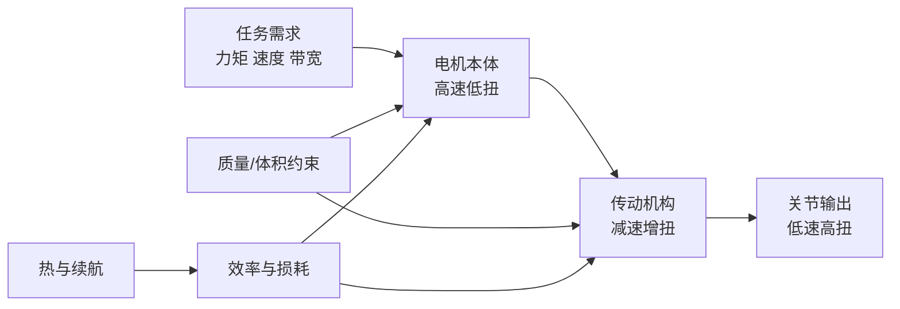

### 4.1.3 安全、柔顺与接触交互

人形机器人在工厂或家庭场景中会与人、物体接触。若执行器是"刚性"的，一旦发生碰撞，接触力会瞬间很大；而具有柔顺性的执行器可把冲击能量暂时储存在弹性体中，或通过电流环感知外力并主动退让。Neville Hogan 在 1985 年提出的 **阻抗控制**（impedance control）把机器人端表现为可编程的"质量-弹簧-阻尼"系统，使接触力与位置偏差之间形成可控关系[3]。

#### 阻抗控制的物理基础：从质点-弹簧-阻尼到端口特性

把机器人末端抽象为一个质量-弹簧-阻尼单元，其动力学方程可由牛顿第二定律直接写出：

\[
M_d \, \ddot{x} + B_d \, \dot{x} + K_d \, (x - x_d) = F_{ext}
\]

其中：
- \(M_d\)：期望等效质量（kg），决定碰撞时加速度响应；
- \(B_d\)：期望等效阻尼（N·s/m 或 kg/s），决定能量耗散速率；
- \(K_d\)：期望等效刚度（N/m），决定位置偏差与恢复力的关系；
- \(x_d\)：期望轨迹位置（m）；
- \(F_{ext}\)：环境作用于机器人端的外部力（N）。

在拉普拉斯域，该方程可写成机器人端口的**机械阻抗**

\[
Z(s) = \frac{F_{ext}(s)}{\dot{X}(s)} = M_d s + B_d + \frac{K_d}{s}
\]

其物理意义是：外界以速度 \(\dot{x}\) “推动”机器人端口时，机器人以力 \(F_{ext}\) 回应；阻抗 \(Z(s)\) 就是力与速度之间的动态传递函数。阻抗越大，同样速度扰动产生的反力越大，机器人表现得越“刚硬”；阻抗越小，反力越小，表现越“柔顺”。

**数值示例**：设期望参数为 \(M_d=2\ \text{kg}\)、\(B_d=50\ \text{N·s/m}\)、\(K_d=2000\ \text{N/m}\)。当机器人末端被外界以 \(0.01\ \text{m/s}\) 的恒定速度推动时，稳态下弹簧项主导，接触力为

\[
F_{ext} \approx K_d \Delta x
\]

若推动 0.1 s，位移增量 \(\Delta x \approx 0.001\ \text{m}\)，则

\[
F_{ext} \approx 2000 \times 0.001 = 2\ \text{N}
\]

而无阻抗控制时，若机器人刚性位置环刚度高达 \(K_{pos}=10^5\ \text{N/m}\)，同样位移将产生

\[
F_{ext} \approx 10^5 \times 0.001 = 100\ \text{N}
\]

这说明阻抗控制可把潜在碰撞力降低约两个数量级。更深入的阻抗控制实现与无源性分析见第 4.5.6 节；与整机平衡/接触力规划的关系见第 6 章。

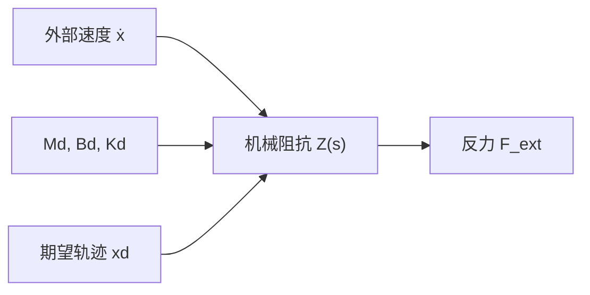

!!! note "术语解释：机械阻抗、拉普拉斯域、等效质量、等效阻尼、等效刚度"
    - **机械阻抗（mechanical impedance）**：力与速度之间的动态传递函数，单位 N·s/m。
    - **拉普拉斯域（Laplace domain）**：用复变量 \(s\) 描述线性时不变系统动态的频率/算子域。
    - **等效质量（equivalent mass）**：阻抗控制中机器人端口表现出的虚拟质量。
    - **等效阻尼（equivalent damping）**：阻抗控制中机器人端口表现出的虚拟阻尼，决定能量耗散。
    - **等效刚度（equivalent stiffness）**：阻抗控制中机器人端口表现出的虚拟弹簧刚度。

!!! note "术语解释：柔顺性、阻抗、导纳、人机交互安全"
    - **柔顺性（compliance）**：机构在外力作用下产生形变的能力。柔顺应理解为"刚度低"，例如弹簧比钢棒更柔顺。
    - **阻抗（impedance）**：机器人对外界施加的"阻力特性"，即力与位移/速度之间的关系。阻抗控制让机器人对外表现为一个设定的质量-弹簧-阻尼系统。
    - **导纳（admittance）**：阻抗的倒数，表示运动对外力的响应。位置控制为主的系统常用导纳控制实现力调节。
    - **人机交互安全（human-robot interaction safety）**：通过机械柔顺、力限制、碰撞检测与低惯性设计，把潜在碰撞造成的伤害降到可接受范围。

综合而言，一个优秀的人形机器人关节需要在图 4.1 所示的多维空间中取得折中。

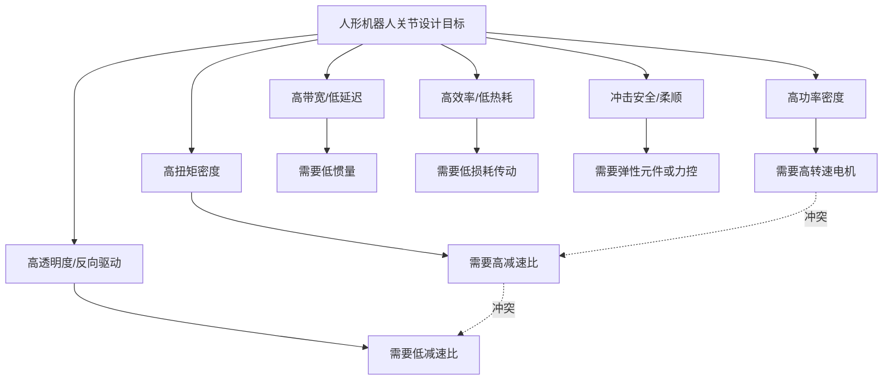


#### 整机动力学视角下的关节负载

到目前为止，我们把执行器需求抽象为扭矩、速度、带宽等指标。然而这些指标并非孤立给定，而是由**整机逆动力学**（whole-body inverse dynamics）从任务运动与接触条件反推出来的[36][37]。理解这一点，有助于在选型阶段把“关节需要多大扭矩”从经验表格还原为可计算的物理因果关系。

##### 关节力矩的拉格朗日来源

一个 \(n\) 自由度机器人的动力学可写成拉格朗日形式

\[
\tau = M(q)\ddot{q} + C(q,\dot{q})\dot{q} + g(q) - J^T F_{ext}
\]

其中各项的物理意义为：

- \(M(q)\)：**质量矩阵**（mass matrix），描述各关节加速度之间的惯性耦合；
- \(C(q,\dot{q})\dot{q}\)：**科氏力与离心力项**，由非惯性坐标系和连杆相对运动产生；
- \(g(q)\)：**重力项**，等于机器人位形下重力势能的梯度；
- \(J^T F_{ext}\)：**外部接触力通过雅可比转置映射到关节空间的力矩**；
- \(q,\dot{q},\ddot{q}\) 分别为广义坐标、速度与加速度。

!!! note "术语解释：广义坐标、质量矩阵、科氏力、雅可比、接触力旋量"
    - **广义坐标（generalized coordinates）**：唯一确定系统位形的一组独立变量，对机器人通常取关节角度 \(q\)。
    - **质量矩阵（mass matrix）**：拉格朗日动力学中的正定对称矩阵 \(M(q)\)，其元素 \(M_{ij}\) 表示关节 \(j\) 的加速度对关节 \(i\) 所需力矩的影响。
    - **科氏力 / 离心力（Coriolis / centrifugal force）**：由于连杆相对转动在非惯性系中出现的惯性力项，与速度乘积成正比。
    - **雅可比矩阵（Jacobian）**：把关节速度映射到操作空间速度（如足端线速度）的矩阵；其转置把操作空间力映射回关节力矩。
    - **接触力旋量（contact wrench）**：作用于接触点的力与力矩组合，通常记为 \(F_{ext} = [f_x,f_y,f_z,m_x,m_y,m_z]^T\)。


##### 支撑相与摆动相的负载特征

以行走中的单腿为例，一个步态周期可分为：

1. **支撑相（stance phase）**：足底与地面接触，腿像倒立摆一样支撑全身重量。此时髋、膝、踝的关节力矩主要用于平衡**地面反力**与重力矩。
2. **摆动相（swing phase）**：足离地向前摆动，关节力矩主要用于克服自身连杆惯性、实现快速屈伸，接触项 \(J^T F_{ext}\) 几乎为零。

在支撑相，膝关节力矩往往最大，因为地面反力通过小腿传递到膝关节时会产生很大的力臂；在摆动相，踝关节需要快速背屈/跖屈以清除地面障碍，主要克服足部和小腿惯性。

!!! note "术语解释：支撑相、摆动相、地面反力、倒立摆模型"
    - **支撑相（stance phase）**：步态周期中足部与地面接触的阶段。
    - **摆动相（swing phase）**：足部离地并向前摆动的阶段。
    - **地面反力（ground reaction force, GRF）**：地面作用于足底的反作用力，支撑相内可达体重的 1–1.5 倍。
    - **倒立摆模型（inverted pendulum model）**：把支撑腿简化为绕足底转动的单摆，用于粗略估计平衡所需力矩。

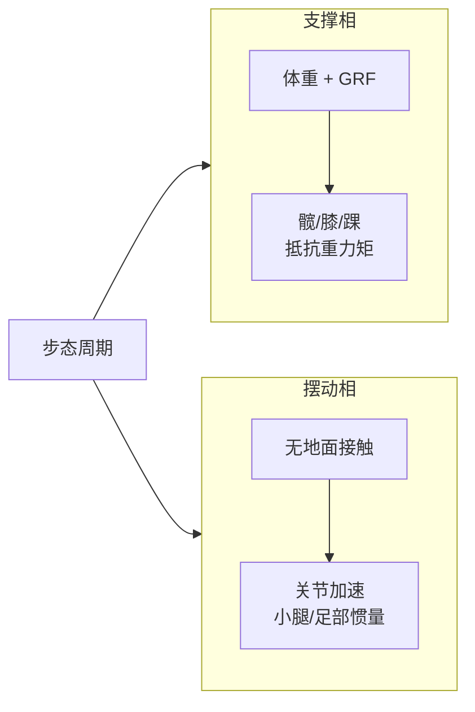

##### 两连杆腿的膝力矩估算

为定性地理解膝力矩为何如此之大，可把腿简化为大腿（长度 \(l_t\)）加小腿（长度 \(l_s\)）的两连杆模型，全身质量近似集中在躯干质心。支撑相中，躯干质心位于足底上方，水平距离约等于小腿在地面的投影。若把全身重量 \(m_{tot}g\) 近似作用在膝关节水平前方距离 \(d\) 处，则膝关节为维持静止站立所需力矩约为

\[
\tau_{knee} \approx m_{tot} g \, d
\]

其中 \(d\) 是足底接触点到膝关节的水平距离。人直立时 \(d\) 可达 5–10 cm，因此一个 80 kg 级机器人单腿支撑时

\[
\tau_{knee} \approx 80 \times 9.8 \times 0.08 \approx 63\ \text{N·m}
\]

这还只是准静态估算；若考虑地面反力峰值、动态加速度和膝关节自身加速度，实际峰值扭矩会再放大 1.5–2.5 倍。该简单模型说明：膝关节力矩可以与髋关节相当甚至更大，因为膝关节处地面反力的力臂往往比髋关节处更长[38]。

!!! note "术语解释：两连杆模型、力臂、准静态估算、地面反力力臂"
    - **两连杆模型（two-link model）**：把大腿和小腿各简化为一根连杆的动力学近似。
    - **力臂（moment arm）**：力的作用线到转动轴的垂直距离，决定力矩大小。
    - **准静态估算（quasi-static estimate）**：忽略加速度惯性力，仅按静力平衡估计负载。
    - **地面反力力臂（GRF moment arm）**：地面反力作用线到关节轴的距离，是关节力矩的主要来源。

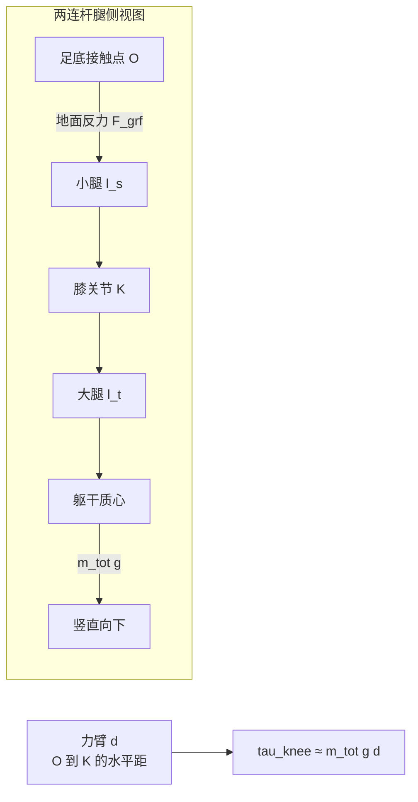

##### 接触力旋量向关节的传递

当足底受到地面反力 \(F_{grf}\) 时，该力通过小腿、踝关节、膝关节、髋关节向上传递。设足端到关节 \(i\) 的雅可比为 \(J_i\)，则关节力矩增量为

\[
\Delta \tau_i = J_i^T F_{grf}
\]

在**脚跟着地（heel-strike）**瞬间，地面反力沿小腿方向产生巨大轴向力，同时在踝关节处形成力臂很短的力矩，因此踝力矩会出现尖峰；在**蹬地（push-off）**阶段，跖屈肌群需要通过踝关节输出大推力，同样导致踝力矩峰值。由于踝关节距地面最近、力臂短，要产生同样的地面力矩需要更大的关节力矩，这正是踝执行器往往峰值极高的原因。

!!! note "术语解释：脚跟着地、蹬地、关节力矩尖峰、力矩传递"
    - **脚跟着地（heel-strike）**：摆动足落地瞬间与地面发生的冲击接触。
    - **蹬地（push-off）**：支撑相末期足部向后下方推地以推进身体的动作。
    - **关节力矩尖峰（torque spike）**：由于冲击或快速加载导致的短时高力矩。
    - **力矩传递（torque transmission）**：接触力经连杆几何关系在各关节处产生的力矩。


##### 动态与静态驱动裕量

工程上常用两步法确定执行器规格：

1. **准静态 worst-case**：计算机器人在极端姿势（如单腿站立最大前倾、下蹲最深处）下各关节所需力矩；
2. **动态放大**：在上述静力矩上乘以动态放大系数 \(k_{dyn} \approx 1.5\sim2.5\)，以覆盖行走、跳跃或摔倒恢复时的惯性负载。

全轨迹优化虽然更精确，但需要已知完整任务轨迹与接触序列，计算成本高；而 quasi-static + dynamic margin 的方法便于在早期设计阶段快速筛选电机与减速比。若关节的峰值扭矩裕量不足，后续要么增大减速比、要么换用更大电机，都会带来质量与透明度的代价。

!!! note "术语解释：驱动裕量、动态放大系数、worst-case 姿态、轨迹优化"
    - **驱动裕量（actuation margin）**：执行器峰值扭矩相对于任务所需峰值力矩的富余比例。
    - **动态放大系数（dynamic amplification factor）**：把准静态力矩放大到动态力矩的经验系数。
    - **worst-case 姿态**：使关节力矩最大的极端静态位形。
    - **轨迹优化（trajectory optimization）**：同时优化运动轨迹与接触力以满足动力学约束的数值方法。

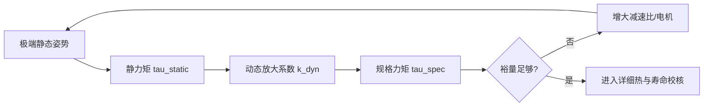


---

## 4.2 电机基础：电磁学、力学与热学


#### 电机电磁场基础：从麦克斯韦方程到有限元思想

进入电机转矩与尺寸的具体计算之前，有必要从电磁场的连续介质描述出发，说明电机设计的物理基础。永磁电机本质上是一个求解磁场在定子、转子、气隙中分布的边值问题[8][29]。

##### 电机设计中的麦克斯韦方程

在电机工作频率远低于光速时，位移电流可忽略，磁场满足**磁静学**（magnetostatics）方程：

\[
\nabla \times \mathbf{H} = \mathbf{J}, \qquad
\nabla \cdot \mathbf{B} = 0, \qquad
\mathbf{B} = \mu \mathbf{H}
\]

其中：

- \(\mathbf{H}\)：磁场强度，单位 A/m；
- \(\mathbf{B}\)：磁感应强度，单位 T；
- \(\mathbf{J}\)：电流密度，单位 A/m²；
- \(\mu = \mu_r \mu_0\)：材料的磁导率。

若恢复时间变化项，则完整的麦克斯韦-安培定律为

\[
\nabla \times \mathbf{H} = \mathbf{J} + \frac{\partial \mathbf{D}}{\partial t}
\]

以及磁场高斯定律

\[
\nabla \cdot \mathbf{B} = 0
\]

积分形式分别为安培环路定律与磁通连续性定律。磁静学忽略位移电流的合理性在于：电机中电场变化率远小于传导电流密度，因此 \(\partial \mathbf{D}/\partial t\) 对磁场的贡献可以忽略。

!!! note "术语解释：麦克斯韦方程组、磁静学、安培环路定律、磁通连续性、磁导率"
    - **麦克斯韦方程组（Maxwell's equations）**：描述电场、磁场与电荷、电流之间关系的四个基本方程。
    - **磁静学（magnetostatics）**：研究不随时间变化的磁场问题的分支，忽略位移电流。
    - **安培环路定律（Ampère's circuital law）**：磁场强度沿闭合回路的线积分等于穿过该回路包围面积的传导电流。
    - **磁通连续性（magnetic flux continuity）**：穿过任意闭合曲面的磁通量为零，即不存在磁单极子。
    - **磁导率（permeability）**：材料对磁场的传导能力，\(\mu = \mu_r \mu_0\)。

##### 磁矢位与二维泊松方程

由于 \(\nabla \cdot \mathbf{B}=0\)，可引入**磁矢位** \(\mathbf{A}\) 使得

\[
\mathbf{B} = \nabla \times \mathbf{A}
\]

对于二维电机截面问题，设磁场只有 \(z\) 向分量 \(A_z(x,y)\)，电流密度也只有 \(z\) 向分量 \(J_z\)，则代入 \(\nabla \times \mathbf{H} = \mathbf{J}\) 可得

\[
\nabla \cdot \left( \frac{1}{\mu} \nabla A_z \right) = -J_z
\]

这是电机有限元求解器的核心方程。商业软件如 JMAG、Ansys Maxwell、Altair Flux、FEMM 等正是把定子、转子、永磁体、空气区域离散成三角形或四边形网格，在每个单元内近似 \(A_z\)，然后求解上述偏微分方程的弱形式[8][29]。

!!! note "术语解释：磁矢位、泊松方程、有限元法、网格、弱形式"
    - **磁矢位（magnetic vector potential）**：一个辅助矢量场，其旋度给出磁感应强度。
    - **泊松方程（Poisson equation）**：形为 \(\nabla^2 u = -f\) 的二阶椭圆型偏微分方程。
    - **有限元法（finite element method, FEM）**：把连续区域离散为有限个小单元进行数值求解的方法。
    - **网格（mesh）**：离散单元的集合，决定数值解的精度与计算量。
    - **弱形式（weak form）**：通过乘以测试函数并分部积分得到的积分方程，适合有限元离散。


##### 从连续介质到集总磁路

在连续介质模型中，材料的“阻碍磁通”能力体现在 \(1/\mu\)。若把磁场约束在某一根细磁通管内，则沿通管长度积分可得

\[
\mathcal{R} = \int \frac{dl}{\mu A}
\]

这正是第 4.2.6 节中介绍的等效磁路里磁阻 \(R = l/(\mu A)\) 的来源。因此，集总磁路模型是有限元连续模型在“单通管、均匀截面”假设下的离散近似。磁路法计算快、物理直观，适合初步设计与参数扫描；但它无法捕捉：

- **凸极效应与磁饱和**：铁芯局部饱和会改变局部磁导率，使线性磁路假设失效；
- **端部效应**：轴向三维漏磁、绕组端部磁场在二维模型中无法体现；
- **齿槽与谐波**：开槽引起的气隙磁导谐波需要精细网格才能分辨。

这正是高性能电机设计必须结合 FEM 的原因。

!!! note "术语解释：磁阻、集总磁路、磁饱和、漏磁、齿槽谐波"
    - **磁阻（reluctance）**：磁路对磁通的阻碍，\(\mathcal{R}=l/(\mu A)\)。
    - **集总磁路（lumped magnetic circuit）**：用磁阻、磁动势源、磁通等集总元件近似磁场的模型。
    - **磁饱和（magnetic saturation）**：铁磁材料中磁导率随磁密增大而下降的现象。
    - **漏磁（leakage flux）**：不经过主磁路、在空气中闭合的磁通。
    - **齿槽谐波（slot harmonic）**：由定子开槽导致的气隙磁导周期性变化。

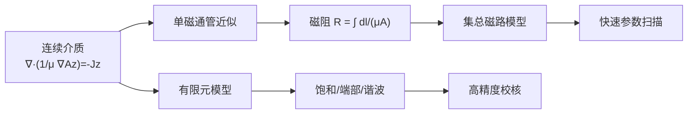

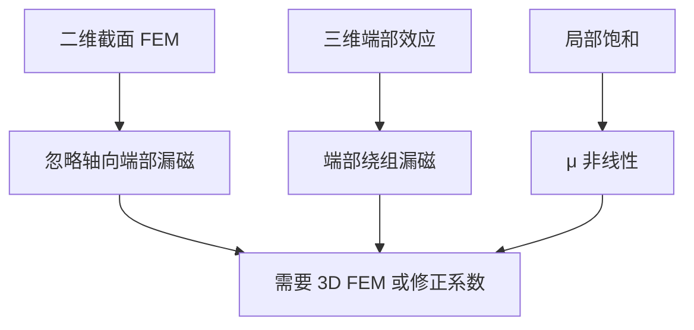


### 4.2.1 洛伦兹力与电机转矩

电机产生转矩的根本来源是磁场对运动电荷或载流导体的作用力——**洛伦兹力**（Lorentz force）。一段长度为 \(l\)、通有电流 \(I\) 的导体处于磁感应强度为 \(B\) 的磁场中时，所受安培力为

$$
\mathbf{F} = I \, \mathbf{l} \times \mathbf{B}
$$

其大小 \(F = B I l \sin\theta\)，方向由右手定则（或叉乘）决定。在旋转电机中，许多段导体被固定在转子槽内，每段导体在半径 \(r\) 处产生的切向力共同形成转矩：

$$
\tau = \sum_i r_i F_i = \sum_i r_i B_i l_i I_i \sin\theta_i
$$

若用等效总导体数 \(N\)、平均半径 \(r\) 和气隙磁密 \(B\) 表示，可写成工程常用的形式：

$$
\tau = k_t \, I
$$

其中 \(k_t = N B l r\)（几何与磁场因素合并）称为 **转矩常数**。这个关系说明：在磁场确定的情况下，电机输出转矩与电枢电流成正比。

!!! note "术语解释：洛伦兹力、安培力、磁感应强度、磁通、磁链、转矩常数"
    - **洛伦兹力（Lorentz force）**：电磁场对运动电荷的作用力 \(\mathbf{F}=q(\mathbf{E}+\mathbf{v}\times\mathbf{B})\)。在导体中表现为载流子整体受到的安培力。
    - **安培力（Ampère force）**：载流导线在磁场中受到的力，本质上是洛伦兹力的宏观统计结果。
    - **磁感应强度（magnetic flux density）**：描述磁场强弱与方向的物理量，用 \(B\) 表示，单位特斯拉（T）。电机中由永磁体或励磁绕组产生。
    - **磁通（magnetic flux）**：穿过某一面积的磁场总量 \(\Phi = \int \mathbf{B}\cdot d\mathbf{A}\)，单位韦伯（Wb）。
    - **磁链（flux linkage）**：线圈匝数与每匝磁通的乘积 \(\lambda = N \Phi\)，反映磁场与线圈的耦合程度。反电动势与磁链随时间的变化率成正比。
    - **转矩常数（torque constant, \(k_t\)）**：电流产生转矩的系数，单位 N·m/A。在永磁电机中 \(k_t\) 与 \(k_e\) 在 SI 单位下数值相等。


### 4.2.2 直流电机的等效电路与电压方程

为了理解电机驱动，先把直流有刷电机抽象成等效电路：电枢可视为电阻 \(R_a\)、电感 \(L_a\) 与运动感应电压源（反电动势 \(E_b\)）的串联。外部施加端电压 \(V\) 时，电路方程为

$$
V = R_a I + L_a \frac{dI}{dt} + E_b
$$

稳态时电感项为零，电流为

$$
I = \frac{V - E_b}{R_a}
$$

反电动势与转速成正比：

$$
E_b = k_e \, \omega
$$

其中 \(k_e\) 为 **反电动势常数**，单位 V·s/rad 或 V/(rad/s)。在 SI 单位制中，永磁电机的 \(k_t\)（N·m/A）与 \(k_e\)（V·s/rad）数值相等。

稳态转矩可写成

$$
\tau = k_t \, I = k_t \frac{V - k_e \omega}{R_a}
$$

这说明：在固定端电压下，转速越高，反电动势越大，可用电流越小，输出转矩越低——这正是直流电机的自然 **转矩-速度特性**。

!!! note "术语解释：反电动势、电枢电阻、电枢电感、电压方程、机械特性"
    - **反电动势（back electromotive force, back-EMF）**：导体在磁场中运动时切割磁感线产生的感应电动势，方向与外加电压相反，大小与转速成正比。
    - **电枢电阻（armature resistance）**：电机绕组与换向器的等效电阻 \(R_a\)，导致铜损 \(I^2 R_a\)。
    - **电枢电感（armature inductance）**：绕组的等效电感 \(L_a\)，限制电流变化率，产生电气时间常数 \(\tau_e = L_a/R_a\)。
    - **电压方程**：描述外加电压如何被电阻压降、电感压降和反电动势平衡的关系式。
    - **机械特性**：电机在恒定电压下转矩随转速变化的曲线，通常是一条从堵转转矩到空载转速的下降直线。

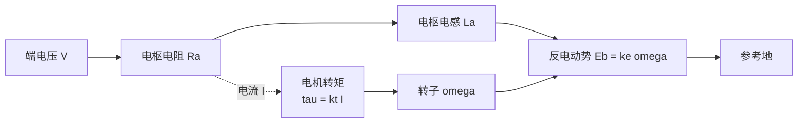

### 4.2.3 交流旋转磁场与永磁同步电机

实际人形机器人中大量采用 **永磁同步电机**（PMSM）。定子三相绕组通入相位差 120° 的正弦电流后，会在气隙中形成一个以电角速度 \(\omega_e\) 旋转的磁场：

$$
\omega_e = 2 \pi f = p \, \omega_m
$$

其中 \(f\) 为电流频率，\(p\) 为 **极对数**，\(\omega_m\) 为机械角速度。转子上装有永磁体，其磁场被定子旋转磁场"拖住"同步旋转。同步转速为

$$
n_s = \frac{60 f}{p} \quad (\text{r/min})
$$

!!! note "术语解释：永磁同步电机、极对数、同步转速、电角速度、机械角速度、旋转磁场"
    - **永磁同步电机（permanent magnet synchronous motor, PMSM）**：转子使用永磁体产生励磁磁场，定子通入交流电形成旋转磁场，二者同步旋转的电机。
    - **极对数（pole pair number, \(p\)）**：电机中 N-S 磁极的对数。极对数越多，相同机械转速对应的电频率越高。
    - **同步转速（synchronous speed）**：旋转磁场的转速。转子理想情况下以该转速运行。
    - **电角速度（electrical angular velocity）**：以电周期计量的角速度，是机械角速度的 \(p\) 倍。
    - **旋转磁场（rotating magnetic field）**：多相交流绕组产生的在空间中以恒定速度旋转的磁场，是交流电机工作的基础。

在 **磁场定向控制**（FOC）下，把定子电流分解到随转子同步旋转的 \(d\) 轴（直轴，与永磁磁链对齐）和 \(q\) 轴（交轴，超前 \(d\) 轴 90° 电角度）。对于表面式永磁电机（SPMSM）有 \(L_d = L_q\)，电磁转矩为

$$
\tau = \frac{3}{2} p \, \lambda_f \, i_q
$$

对于内置式永磁电机（IPMSM）存在 **磁阻转矩**：

$$
\tau = \frac{3}{2} p \left[ \lambda_f i_q + (L_d - L_q) i_d i_q \right]
$$

其中 \(\lambda_f\) 为永磁体产生的转子磁链。第一项是永磁转矩，第二项是由于 \(d\)、\(q\) 轴电感不等导致的磁阻转矩。

!!! note "术语解释：直轴、交轴、磁链、磁阻转矩、凸极效应、内置式永磁电机"
    - **直轴（d-axis）**：与转子永磁磁链方向一致的轴，记为 \(d\)。
    - **交轴（q-axis）**：超前直轴 90° 电角度的轴，是产生转矩的主要电流方向。
    - **磁链（flux linkage, \(\lambda_f\)）**：转子永磁体在定子绕组中耦合的磁链，是永磁转矩的来源。
    - **磁阻转矩（reluctance torque）**：由于磁路各向异性（\(L_d \neq L_q\)），电流在 \(d\)、\(q\) 轴产生不同磁阻而引起的附加转矩。
    - **凸极效应（salient-pole effect）**：转子 \(d\)、\(q\) 轴磁阻不同，导致 \(L_d \neq L_q\)。
    - **内置式永磁电机（IPMSM）**：永磁体嵌入转子铁芯内部，利用磁阻转矩提高转矩密度，常用于牵引电机。

### 4.2.4 无刷直流电机与正弦永磁同步电机的换相及 FOC

**无刷直流电机**（BLDC）与 PMSM 结构相似，但反电动势波形不同：BLDC 设计为梯形波，配合简单的六步换相（每 60° 电角度切换一次导通相）；PMSM 反电动势为正弦波，配合 FOC 可获得更小转矩脉动、更高效率。

!!! note "术语解释：无刷直流电机、梯形反电动势、六步换相、霍尔传感器、正弦反电动势"
    - **无刷直流电机（brushless DC motor, BLDC）**：用电子换相替代机械电刷的直流电机，通常反电动势为梯形波，控制简单、成本较低。
    - **梯形反电动势 / 正弦反电动势**：分别指电机绕组中感应电压随转子位置呈梯形或正弦变化。正弦电机配合正弦电流可实现零转矩脉动。
    - **六步换相（six-step commutation）**：BLDC 每 60° 电角度切换一次导通相，任一时刻两相导通、一相悬空。
    - **霍尔传感器（Hall sensor）**：检测转子磁极位置的磁性开关，常用于 BLDC 换相。

**磁场定向控制** 的核心思想是把三相静止坐标系下的电流通过 **Clark 变换** 变到两相静止 \(\alpha\beta\) 坐标系，再通过 **Park 变换** 变到随转子旋转的 \(dq\) 坐标系，从而使交流量变成直流量，用 PI 控制器分别控制 \(i_d\) 和 \(i_q\)。最后通过 **空间矢量脉宽调制**（SVPWM）生成三相逆变器开关信号。

!!! note "术语解释：磁场定向控制、Clark 变换、Park 变换、空间矢量脉宽调制、逆变器"
    - **磁场定向控制（field-oriented control, FOC）**：把定子电流矢量分解到转子旋转坐标系进行独立控制，使交流电机像直流电机一样易于控制转矩。
    - **Clark 变换**：把三相静止坐标系 \(abc\) 转换为两相静止坐标系 \(\alpha\beta\)。
    - **Park 变换**：把两相静止坐标系 \(\alpha\beta\) 转换为随转子旋转的 \(dq\) 坐标系。
    - **空间矢量脉宽调制（SVPWM）**：一种让三相逆变器输出最接近目标电压矢量的 PWM 方法，比正弦 PWM 电压利用率高约 15%。
    - **逆变器（inverter）**：把直流电变换为交流电的功率电子电路，通常由六个开关管组成三相桥。

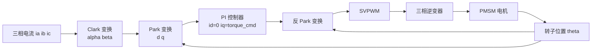

### 4.2.5 无框力矩电机与关节集成

人形机器人髋关节、肩关节往往需要几十到上百 N·m 的输出扭矩。若采用普通伺服电机加高减速比，虽可放大扭矩，但会牺牲透明度和带宽。一种方案是使用 **无框力矩电机**（frameless torque motor）：它把定子和转子直接嵌入关节结构，取消外壳、端盖和轴承，直径大、极数多，可在低转速下直接输出大扭矩。

无框力矩电机的扭矩密度可表示为

$$
\tau = 2 \pi r^2 l B_{\text{gap}} J_s
$$

其中 \(r\) 为气隙半径，\(l\) 为轴向长度，\(B_{\text{gap}}\) 为气隙磁密，\(J_s\) 为电负荷（绕组总电流 per 周长）。增大 \(r\) 对扭矩的提升是二次方关系，因此大直径无框电机在相同质量下可获得更高扭矩。

!!! note "术语解释：无框力矩电机、电负荷、气隙、直接驱动、力矩电机"
    - **无框力矩电机（frameless torque motor）**：没有外壳、转轴和端盖的电机，由用户把定子、转子直接集成到机械结构中，以最大化扭矩密度。
    - **电负荷（electric loading）**：单位圆周长度上的总安培导体数，反映绕组"载流能力"。
    - **气隙（air gap）**：定子与转子之间的微小空气间隙，磁通必须跨越它。气隙越小，磁阻越低，但制造与热变形要求更高。
    - **直接驱动（direct drive）**：电机不经减速器直接驱动负载，无背隙、高透明度，但需要大扭矩电机。
    - **力矩电机（torque motor）**：专为低速大扭矩设计的电机，通常直径大、极数多。

Tesla Optimus 的旋转关节 reportedly 采用无框力矩电机加谐波减速器的一体化方案[14]。

### 4.2.6 损耗与热模型

电机并非理想能量转换器，损耗主要以热的形式耗散。主要有三类：

1. **铜损**（绕组电阻发热）：
   $$
   P_{\text{Cu}} = I^2 R_{\text{ac}}
   $$
   其中 \(R_{\text{ac}}\) 为交流等效电阻，随频率略有增加。

2. **铁损**（磁芯中磁滞与涡流损耗）：
   $$
   P_{\text{Fe}} = P_{\text{hyst}} + P_{\text{eddy}} \approx k_h f B^n + k_e f^2 B^2
   $$
   其中 \(f\) 为磁化频率，\(B\) 为磁密幅值，\(n\) 为 Steinmetz 系数（通常 1.6-2.2）。

3. **机械损耗**：轴承摩擦与风阻，通常较小。

!!! note "术语解释：铜损、铁损、磁滞损耗、涡流损耗、热阻、绝缘等级、热时间常数"
    - **铜损（copper loss）**：电流流经绕组电阻产生的焦耳热，与电流平方成正比。
    - **铁损 / 铁心损耗（core loss）**：交变磁场在铁磁材料中产生的能量损失，包括磁滞损耗与涡流损耗。
    - **磁滞损耗（hysteresis loss）**：铁磁材料反复磁化时磁畴壁移动摩擦导致的能量损失，与频率和磁密有关。
    - **涡流损耗（eddy current loss）**：交变磁场在导电铁芯中感应涡电流产生的焦耳热，与频率平方成正比。
    - **热阻（thermal resistance）**：热量传递路径对温升的阻力，单位 K/W。温升 = 损耗 × 热阻。
    - **绝缘等级（insulation class）**：电机绕组绝缘材料允许的最高工作温度，如 F 级 155 °C、H 级 180 °C。
    - **热时间常数（thermal time constant）**：电机温度达到 63% 稳态温升所需时间，决定短时过载能力。

电机的热行为可用一阶热等效电路描述：

$$
T_j = T_{\text{amb}} + P_{\text{loss}} \, R_{\text{th}}
$$

其中 \(T_j\) 为绕组（结）温度，\(T_{\text{amb}}\) 为环境温度，\(R_{\text{th}}\) 为总热阻。考虑热容 \(C_{\text{th}}\) 后，温度变化满足

$$
C_{\text{th}} \frac{dT_j}{dt} + \frac{T_j - T_{\text{amb}}}{R_{\text{th}}} = P_{\text{loss}}
$$

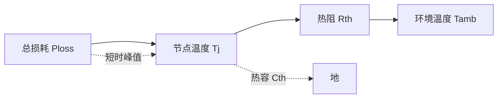

当绕组温度接近绝缘极限时，必须降低电流或增加冷却，这决定了 **连续转矩** 与 **峰值转矩** 的差异：峰值转矩可在短时间内超过连续值，利用热容吸收瞬时热量，但无法持续。

#### 两节点热网络模型

单节点模型只能给出绕组到环境的平均温升，无法解释短时峰值期间“绕组先热、外壳后热”的暂态行为。更精细的模型把电机分成两个热节点：**绕组节点** \(T_w\) 与**机壳节点** \(T_c\)，两者之间用热阻 \(R_{th1}\) 和热容 \(C_w\) 描述，机壳到环境再用 \(R_{th2}\) 与 \(C_c\) 描述，如图 4.2(c) 所示。

\[
\begin{aligned}
C_w \frac{dT_w}{dt} &= P_{\text{loss}} - \frac{T_w - T_c}{R_{th1}} \\
C_c \frac{dT_c}{dt} &= \frac{T_w - T_c}{R_{th1}} - \frac{T_c - T_{\text{amb}}}{R_{th2}}
\end{aligned}
\]

两节点模型能更准确地预测短时过载：由于绕组热容 \(C_w\) 的存在，一个持续数秒的电流尖峰只会使 \(T_w\) 瞬时上升，而机壳温度 \(T_c\) 几乎不变；因此峰值转矩可以远高于连续转矩。只有当过载持续时间与绕组热时间常数相当时，才需要担心绝缘过热。

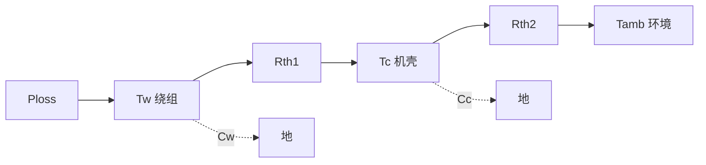

!!! note "术语解释：两节点热网络、热阻、热容、暂态热阻抗、热时间常数"
    - **两节点热网络（two-node thermal network）**：把电机简化为绕组与机壳两个热节点的集总参数热模型。
    - **热阻（thermal resistance, \(R_{th}\)）**：热量传递路径对温升的阻力，单位 K/W。
    - **热容（thermal capacitance, \(C_{th}\)）**：物体储存热能的能力，决定温度变化的快慢，单位 J/K。
    - **暂态热阻抗（transient thermal impedance）**：随时间变化的有效热阻，\(Z_{th}(t)=\Delta T(t)/P\)，用于评估短时过载。
    - **热时间常数（thermal time constant, \(\tau_{th}=R_{th}C_{th}\)）**：温度达到 63% 稳态温升所需的时间。

#### 表面贴装永磁电机的等效磁路

为了把电机转矩与几何尺寸更定量地联系起来，可把表面贴装永磁电机（SPMSM）抽象成一条**等效磁路**。永磁体被看作一个恒定的磁动势（MMF）源 \(F_m\) 串联一个内磁阻 \(R_m\)；气隙、定子齿、定子轭分别用磁阻 \(R_g\)、\(R_t\)、\(R_y\) 表示。根据磁路基尔霍夫定律，总磁通为

\[
\Phi = \frac{F_m}{R_m + R_g + R_t + R_y}
\]

在优质硅钢片中，铁芯磁阻往往远小于气隙磁阻，即 \(R_t+R_y \ll R_g\)。若再令永磁体与气隙的等效截面积近似相等，则气隙磁密可写成

\[
B_g \approx \frac{\mu_0 F_m}{g' + l_m/\mu_r}
\]

其中 \(g' = k_c g\) 为考虑定子开槽影响的**卡特等效气隙**（Carter gap），\(k_c>1\) 为卡特系数；\(l_m\) 与 \(\mu_r\) 分别为永磁体厚度与相对磁导率。该式表明：

- 增大永磁体厚度 \(l_m\) 可提高磁动势，但同时增加内磁阻，存在最优厚度；
- 减小气隙 \(g\) 可显著降低磁路总磁阻，提高 \(B_g\)，但受制造公差、热变形与机械安全限制；
- 选用更高剩磁 \(B_r\)（即更高 \(F_m\)）的 Nd-Fe-B 磁体，是提高气隙磁密最直接的手段。

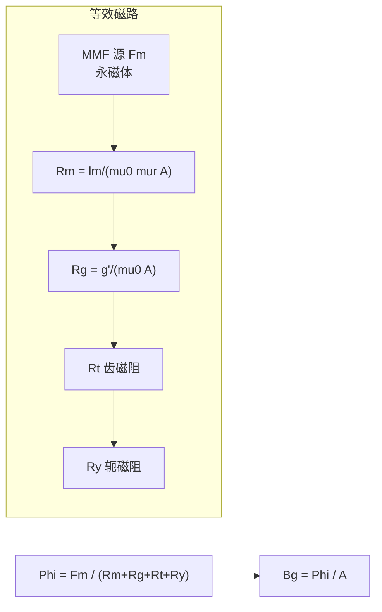

!!! note "术语解释：磁动势、磁阻、等效磁路、卡特系数、气隙磁密"
    - **磁动势（magnetomotive force, MMF）**：驱动磁通在磁路中流动的“磁压”，永磁体可等效为恒定 MMF 源 \(F_m = H_c l_m\)。
    - **磁阻（reluctance）**：磁路对磁通的阻力，\(R = l/(\mu A)\)，与几何长度成正比、与磁导率成反比。
    - **等效磁路（magnetic equivalent circuit）**：用磁阻、磁动势源、磁通等元件模拟电机磁场的集总参数模型。
    - **卡特系数（Carter coefficient）**：把开槽气隙折算为光滑气隙的修正系数，\(k_c>1\)，反映定子齿槽对气隙磁阻的等效增大。
    - **气隙磁密（air-gap flux density, \(B_g\)）**：气隙中的磁感应强度，直接决定电机的电磁转矩与反电动势。

#### 永磁体的退磁特性与安全工作点

Nd-Fe-B 永磁体的可用工作区位于其去磁曲线的第二象限。表征磁体性能的关键参数有：

- **剩磁 \(B_r\)**：外加磁场降为零后磁体内部的磁感应强度；
- **矫顽力 \(H_c\)**：使磁体磁化强度降为零所需的反向磁场强度；
- **内禀矫顽力 \(H_{ci}\)**：表征磁体抗退磁能力的本征参数，高温时会显著下降。

Nd-Fe-B 的退磁曲线在低温下近似线性，但在高温或高反向磁场下会出现“膝点”（knee）。若磁体的工作点（由外磁路负载线与电枢反应磁场共同决定）落到膝点以下，将发生**不可逆退磁**。因此，在最恶劣的电流（短路、堵转）和温度条件下，必须保证

\[
B_m(T_{\max}, I_{\max}) > B_{\text{knee}}(T_{\max})
\]

工程上常保留 10%–20% 的安全裕量。对于人形机器人高过载关节，退磁校核是电机设计的必要步骤[29]。

```mermaid
xychart-beta
    title "Nd-Fe-B 第二象限退磁曲线示意"
    x-axis "H [-kA/m]" [0, 1, 2, 3, 4]
    y-axis "B [T]"
    line "20 degC" [1.4, 1.2, 0.8, 0.4, 0.0]
    line "120 degC" [1.2, 0.9, 0.5, 0.2, -0.1]
    annotation "膝点" {x: 3, y: 0.2}
```

!!! note "术语解释：去磁曲线、膝点、矫顽力、内禀矫顽力、不可逆退磁"
    - **去磁曲线（demagnetization curve）**：永磁体在第二象限的 \(B\!-\!H\) 关系，描述磁体从剩磁到矫顽力之间的状态。
    - **膝点（knee point）**：退磁曲线上由近似线性转为急剧弯曲的转折点，低于该点易发生不可逆退磁。
    - **矫顽力（coercivity, \(H_c\)）**：使磁感应强度 \(B\) 降为零所需反向磁场。
    - **内禀矫顽力（intrinsic coercivity, \(H_{ci}\)）**：使磁体内部磁化强度 \(J\) 降为零的反向磁场，反映抗退磁能力。
    - **不可逆退磁（irreversible demagnetization）**：磁体工作点越过膝点后，即使外部条件恢复，磁性能也无法完全恢复的损失。

#### 永磁体涡流损耗与抑制

分数槽集中绕组（FSCW）产生的空间谐波磁动势会在转子永磁体中感应出涡流，导致磁体发热甚至退磁。永磁体中的涡流损耗密度可近似表示为

\[
p_{\text{PM,eddy}} \propto \frac{B_{\nu}^2 \, f_{\nu}^2 \, t^2}{\rho_{\text{PM}}}
\]

其中 \(B_{\nu}\)、\(f_{\nu}\) 为第 \(\nu\) 次谐波的磁密幅值与频率，\(t\) 为磁体厚度，\(\rho_{\text{PM}}\) 为磁体电阻率。抑制方法包括：

1. **分段（segmentation）**：把整块磁体沿轴向或周向切分为多段，切断涡流通路；
2. **叠层（lamination）**：采用粘结磁体或薄片叠压结构，提高等效电阻率；
3. **优化极槽配合**：降低谐波幅值 \(B_{\nu}\)；
4. **选用高电阻率磁体**：如 Sm-Co 或铁氧体，但需在磁能积与电阻率之间权衡。


!!! note "术语解释：永磁体涡流损耗、槽谐波、分段、叠层、电阻率"
    - **永磁体涡流损耗（PM eddy-current loss）**：交变谐波磁场在导电永磁体中感应涡电流产生的焦耳热。
    - **槽谐波（slot harmonic）**：由定子开槽引起的气隙磁导谐波，是永磁体涡流损耗的主要来源。
    - **分段（segmentation）**：把整块磁体沿涡流路径方向分割，以增大电阻、减小涡流。
    - **叠层（lamination）**：将薄片磁体绝缘叠压，与硅钢片抑制铁损的原理相同。
    - **电阻率（resistivity, \(\rho\)）**：材料抵抗电流通过的能力，电阻率越高，涡流损耗越小。

#### 经典电机尺寸方程（\(D^2L\) 方程）

电机的电磁转矩本质上等于气隙圆周力乘以半径。若把绕组电流分布用**线负荷（electric loading）** \(A_{\text{rms}}\)（单位圆周长度上的 rms 安培导体数）表示，则经典电机尺寸方程为

\[
T = \frac{\pi}{2\sqrt{2}} \, k_w \, B_{g1} \, A_{\text{rms}} \, D^2 L
\]

其中 \(D\) 为气隙直径，\(L\) 为轴向铁心长度，\(B_{g1}\) 为气隙磁密基波幅值，\(k_w\) 为绕组系数。该式说明：

- 转矩与电机“有效体积”\(D^2L\) 成正比——这是电机**体积定尺寸**的根本依据；
- 在固定体积下，提高 \(B_{g1}\)（更强磁体、更小气隙）或 \(A_{\text{rms}}\)（更多导体、更高电流密度）均可提升转矩；
- 增大直径 \(D\) 对转矩的提升优于增大长度 \(L\)（二次方 vs 一次方），这正是无框力矩电机采用大直径扁平结构的原因。

```mermaid
xychart-beta
    title "转矩与体积的关系示意"
    x-axis "D^2 L [m^3]" [0, 1, 2, 3, 4, 5]
    y-axis "T [N m]"
    line "尺寸方程" [0, 2, 4, 6, 8, 10]
```

!!! note "术语解释：线负荷、尺寸方程、绕组系数、气隙磁密基波、有效体积"
    - **线负荷 / 电负荷（electric loading, \(A_{\text{rms}}\)）**：气隙圆周单位长度上的总 rms 安培导体数，单位 A/m。
    - **尺寸方程（sizing equation）**：把电机转矩表示为几何尺寸与电磁负荷乘积的经验/解析公式。
    - **绕组系数（winding factor, \(k_w\)）**：实际绕组基波磁动势与集中整距绕组之比，反映分布与短距效应。
    - **气隙磁密基波（fundamental air-gap flux density, \(B_{g1}\)）**：气隙磁场空间傅里叶分解后的基波分量。
    - **有效体积（active volume）**：通常指 \(D^2L\)，是电机电磁转矩能力的主要标度。


### 4.2.7 从洛伦兹力到转矩方程的分布绕组建模

在 4.2.1 节中，我们已给出单根导体所受安培力。为把 \(\tau = k_t I\) 与绕组几何更紧密地联系起来，考虑定子槽中共有 \(N\) 匝有效导体沿轴向长度 \(l\) 分布，气隙磁密径向分量为 \(B_r(\theta)\)。第 \(i\) 根导体位于机械角 \(\theta_i\) 处，距转轴半径 \(r\)，导体电流为 \(I\)（方向垂直于纸面），则其受到的切向洛伦兹力为

$$
F_{\tau,i} = l \, I \, B_r(\theta_i)
$$

该导体对转轴的转矩贡献为 \(r F_{\tau,i}\)。把所有导体求和，并把气隙磁密用基波幅值 \(B_{g1}\) 近似，可得

$$
\tau = r l I \sum_{i=1}^{N} B_r(\theta_i)
     \approx r l N B_{g1} \, k_w \, I
$$

其中 \(k_w\) 为 **绕组系数**（winding factor），它综合了分布绕组中各导体磁场切割不同相角带来的削弱（通常 \(k_w \approx 0.85\sim0.96\)）。将几何与磁场常量合并，即得到工程常用的转矩方程

$$
\tau = k_t I, \qquad k_t = r l N B_{g1} k_w
$$

对于三相 PMSM，常把 \(k_t\) 进一步写成 \(\frac{3}{2} p \lambda_f / I_{\text{peak}}\) 的形式，二者在 SI 单位下一致。该推导说明：转矩常数本质上是“单位电流在气隙磁场中产生的总洛伦兹力矩”，因此增大半径 \(r\)、轴向长度 \(l\)、气隙磁密 \(B_g\) 或绕组匝数 \(N\) 都会提高 \(k_t\)。

!!! note "术语解释：绕组系数、分布绕组、气隙磁密基波、有效导体"
    - **绕组系数（winding factor, \(k_w\)）**：实际绕组产生的基波磁动势与所有导体集中在一处时产生的磁动势之比，反映分布、短距等效应对基波的削弱。
    - **分布绕组（distributed winding）**：绕组线圈分散在多个槽中，磁场利用更充分、谐波更低，但端部较长。
    - **气隙磁密基波（fundamental air-gap flux density）**：气隙磁场按空间傅里叶分解后的基波分量 \(B_{g1}\)，是产生有效转矩的主要来源。
    - **有效导体（effective conductor）**：实际参与切割气隙磁通并产生转矩的导体数，需乘以绕组系数修正。

```mermaid
flowchart LR
    A["N 根导体分布<br/>于定子槽内"] --> B["每根导体受<br/>切向洛伦兹力"]
    B --> C["力臂 r 形成<br/>单根转矩"]
    C --> D["求和并乘绕组系数<br/>tau = r l N kw Bg I"]
    D --> E["定义转矩常数<br/>kt = r l N kw Bg"]
```

### 4.2.8 Clarke 与 Park 变换的显式矩阵

磁场定向控制（FOC）把三相静止坐标系 \(abc\) 的电流/电压变换到两相静止坐标系 \(\alpha\beta\)，再变换到随转子旋转的 \(dq\) 坐标系。下面给出 **幅值不变（amplitude-invariant）** 形式的最常用矩阵。

**Clarke 变换**（3→2，功率不守恒但幅值守恒）：

$$
\begin{bmatrix} i_\alpha \\ i_\beta \\ i_0 \end{bmatrix}
=
\frac{2}{3}
\begin{bmatrix}
1 & -\frac{1}{2} & -\frac{1}{2} \\
0 & \frac{\sqrt{3}}{2} & -\frac{\sqrt{3}}{2} \\
\frac{1}{2} & \frac{1}{2} & \frac{1}{2}
\end{bmatrix}
\begin{bmatrix} i_a \\ i_b \\ i_c \end{bmatrix}
$$

对于三相无中线系统 \(i_a+i_b+i_c=0\)，零序分量 \(i_0=0\)，因此只用前两行。

**Park 变换**（\(\alpha\beta\)→\(dq\)，旋转角 \(\theta_e\) 为转子磁链电角度）：

$$
\begin{bmatrix} i_d \\ i_q \end{bmatrix}
=
\begin{bmatrix}
\cos\theta_e & \sin\theta_e \\
-\sin\theta_e & \cos\theta_e
\end{bmatrix}
\begin{bmatrix} i_\alpha \\ i_\beta \end{bmatrix}
$$

逆变换为

$$
\begin{bmatrix} i_\alpha \\ i_\beta \end{bmatrix}
=
\begin{bmatrix}
\cos\theta_e & -\sin\theta_e \\
\sin\theta_e & \cos\theta_e
\end{bmatrix}
\begin{bmatrix} i_d \\ i_q \end{bmatrix}
$$

Clarke 变换的物理意义是：用两个正交静止绕组 \(\alpha\beta\) 等效替代三个互差 120° 的静止绕组；Park 变换则进一步把 \(\alpha\beta\) 投影到随转子同步旋转的 \(dq\) 轴上。由于 \(dq\) 坐标系与转子相对静止，原本随时间正弦变化的交流量变成了直流量，使 PI 控制器可以无静差跟踪。

!!! note "术语解释：幅值不变变换、零序分量、同步旋转坐标系、投影"
    - **幅值不变变换（amplitude-invariant transformation）**：变换后矢量的幅值与变换前一致，但功率标幺值不直接守恒；工程控制中便于直观读电流幅值。
    - **零序分量（zero-sequence component）**：三相电流之和的三分之一，无中线系统中恒为零，不参与机电能量转换。
    - **同步旋转坐标系（synchronous rotating frame）**：以电角速度 \(\omega_e\) 随转子磁场旋转的 \(dq\) 坐标系。
    - **投影（projection）**：把空间矢量分解到指定坐标轴上，得到该轴上的分量。

```mermaid
flowchart LR
    A["三相静止 abc"] --> B["Clarke<br/>alpha beta"]
    B --> C["Park<br/>d q"]
    C --> D["PI 控制器<br/>id iq 直流"]
    D --> E["逆 Park<br/>alpha* beta*"]
    E --> F["SVPWM<br/>abc 开关信号"]
```

### 4.2.9 PMSM 的 dq 轴电压方程与各项物理意义

在旋转 \(dq\) 坐标系中，表面式/内置式 PMSM 的定子电压方程可写为

$$
\begin{aligned}
v_d &= R_s i_d + L_d \frac{di_d}{dt} - \omega_e L_q i_q \\
v_q &= R_s i_q + L_q \frac{di_q}{dt} + \omega_e L_d i_d + \omega_e \lambda_f
\end{aligned}
$$

逐项解释如下：

1. **电阻压降** \(\,R_s i_d\)、\(R_s i_q\)：绕组欧姆损耗导致的电压降。
2. **变压器电压** \(\,L_d \frac{di_d}{dt}\)、\(L_q \frac{di_q}{dt}\)：电流变化在电感上感应的电压，决定电流环的动态响应。
3. **速度电压 / 旋转电势（cross-coupling 项）** \(\,-\omega_e L_q i_q\) 与 \( \omega_e L_d i_d \)：由于 \(dq\) 坐标系本身在旋转，电感储能随转子位置变化而产生的耦合项。它们把 \(d\) 轴电流变化耦合到 \(q\) 轴电压（反之亦然），在电流环中通常需要 **解耦前馈** 补偿。
4. **永磁反电动势** \(\,\omega_e \lambda_f\)：转子永磁磁链被定子绕组切割产生的感应电势，方向沿 \(q\) 轴正方向。转速越高，反电动势越大，需要更高的端电压才能维持电流。

对于 SPMSM（\(L_d = L_q = L_s\)），若采用 \(i_d=0\) 控制，则 \(q\) 轴方程简化为

$$
v_q = R_s i_q + L_s \frac{di_q}{dt} + \omega_e \lambda_f, \qquad
\tau = \frac{3}{2} p \lambda_f i_q
$$

此时转矩只与 \(i_q\) 成正比，控制非常直观。IPMSM 则利用 \(L_d \neq L_q\) 产生的磁阻转矩，通过 MTPA 在相同电流下获得更大转矩。

!!! note "术语解释：速度电压、旋转电势、解耦前馈、反电动势、永磁磁链"
    - **速度电压（speed voltage）**：因坐标系或导体运动导致磁链变化而产生的感应电压项，体现机电能量转换。
    - **解耦前馈（decoupling feedforward）**：在电流控制器中加入 \(\omega_e L i\) 项，消除 \(d\)、\(q\) 轴之间的动态耦合。
    - **反电动势（back-EMF）**：转子磁链切割定子绕组产生的感应电压，\(E_b = \omega_e \lambda_f\)。
    - **永磁磁链（permanent-magnet flux linkage, \(\lambda_f\)）**：永磁体在定子相绕组中耦合的恒定磁链幅值。

### 4.2.10 齿槽转矩与转矩脉动

即使电流理想正弦，电机输出转矩也会存在周期性波动，统称 **转矩脉动**（torque ripple）。主要来源有三：

1. **齿槽转矩（cogging torque）**：永磁体磁极与定子开槽之间的相互作用，导致转子倾向于停在某些“齿槽对齐”位置。当转子旋转时，该转矩以齿槽通过频率脉动。
2. **反电动势谐波**：实际反电动势并非理想正弦，含有 5 次、7 次等谐波，与基波电流作用产生 6 次转矩脉动。
3. **电流谐波与换相脉动**：BLDC 的六步换相、逆变器死区、电流环有限带宽都会引入电流谐波，进而产生转矩脉动。

齿槽转矩的基波幅值可近似表示为

$$
\tau_{\text{cog}}(\theta) \approx \sum_{k} \tau_{\text{cog},k} \sin\left( k N_s \frac{\theta}{p} \right)
$$

其中 \(N_s\) 为定子槽数，\(p\) 为极对数，\(\theta\) 为机械转角。

常用抑制手段包括：

- **斜极/斜槽（skewing）**：把转子磁极或定子槽沿轴向扭斜一个齿距，使不同轴向位置的齿槽转矩相互抵消。
- **分数槽集中绕组（FSCW）**：选择使定子槽数与极数互为质数的组合，降低齿槽转矩谐波阶次与幅值。
- **极弧优化**：调整永磁体覆盖的极弧角度，削弱齿槽转矩基波。
- **电流谐波注入**：在线检测转矩脉动并注入补偿电流，适合反电动势谐波导致的脉动。

!!! note "术语解释：齿槽转矩、转矩脉动、斜极、分数槽集中绕组、极弧"
    - **齿槽转矩（cogging torque）**：永磁体与定子齿槽之间因磁阻变化而产生的无电流转矩脉动。
    - **转矩脉动（torque ripple）**：输出转矩在平均值附近的周期性波动，通常用峰峰值或百分比表示。
    - **斜极/斜槽（skewing）**：将磁极或槽沿轴向倾斜，使齿槽效应在轴向上平均化。
    - **分数槽集中绕组（fractional-slot concentrated winding, FSCW）**：每极每相槽数为分数的集中绕组结构，可显著降低齿槽转矩并缩短端部。
    - **极弧（pole arc）**：永磁体在圆周上覆盖的电角度，影响气隙磁场谐波含量。

```mermaid
flowchart LR
    A["齿槽相互作用"] --> B["齿槽转矩"]
    C["反电势谐波"] --> D["谐波转矩脉动"]
    E["电流谐波/换相"] --> F["控制相关脉动"]
    B --> G["抑制手段"]
    D --> G
    F --> G
    G --> H["斜极/斜槽"]
    G --> I["FSCW"]
    G --> J["谐波注入"]
```

### 4.2.11 绕组型式：集中绕组、分布绕组与 FSCW

PMSM 定子绕组按线圈跨距可分为 **集中绕组**（concentrated winding）和 **分布绕组**（distributed winding）：

- **集中绕组**：每个线圈只跨一个齿距，端部短、铜损低、槽满率高，适合自动化绕线；但气隙磁动势谐波较高。
- **分布绕组**：线圈跨多个齿距，磁场正弦性更好、谐波低，但端部长、铜损稍大。

**分数槽集中绕组（FSCW）** 是集中绕组的一种，其每极每相槽数

$$
q = \frac{N_s}{2 p m}
$$

为分数（\(m=3\) 为相数）。例如 12 槽/10 极（\(q=2/5\)）是机器人无框电机的常见配置。FSCW 的优点包括：

1. 端部极短，铜损低，利于高扭矩密度；
2. 齿槽转矩低，通常无需斜槽；
3. 极数多、轴向长度短，适合扁平关节；
4. 线圈独立，便于批量自动化绕制。

其主要缺点是：

- **转子涡流损耗**：定子磁动势谐波在永磁体中感应涡流，导致磁铁发热甚至退磁；常需分段磁铁或采用低电导率磁体。
- **绕组系数较低**：某些极槽组合基波绕组系数仅 0.866 左右，需要更多匝数补偿。

!!! note "术语解释：集中绕组、分布绕组、每极每相槽数、端部绕组、槽满率"
    - **集中绕组（concentrated winding）**：线圈跨距等于一个齿距的绕组，结构紧凑。
    - **分布绕组（distributed winding）**：线圈跨距大于一个齿距、分布在多个槽中的绕组，磁场波形更正弦。
    - **每极每相槽数（slots per pole per phase, \(q\)）**：\(q = N_s/(2pm)\)，整数为整数槽绕组，分数为分数槽绕组。
    - **端部绕组（end winding）**：槽外连接线圈两端的导线部分，不参与气隙磁场作用但产生铜损。
    - **槽满率（slot fill factor）**：槽内导体截面积与槽可用面积之比，高槽满率有利于提高转矩密度。

```mermaid
flowchart TD
    A["绕组型式"] --> B["集中绕组"]
    A --> C["分布绕组"]
    B --> D["端部短 铜损低"]
    B --> E["谐波较高"]
    C --> F["磁场正弦 谐波低"]
    C --> G["端部长 铜损大"]
    D --> H["FSCW 适合机器人关节"]
    E --> H
    H --> I["注意磁铁涡流损耗"]
```

### 4.2.12 小功率机器人电机的数值算例

为建立数量级直觉，考虑一个用于上肢关节的小型无刷电机：转矩常数 \(k_t = 0.10\ \text{N·m/A}\)，相电阻 \(R = 0.50\ \Omega\)，母线电压 \(V_{dc} = 48\ \text{V}\)，热阻 \(R_{th} = 2.0\ \text{K/W}\)，环境温度 \(T_{amb}=40°\text{C}\)，绝缘等级 F（极限 155°\text{C}）。

1. **空载转速**：当输出转矩为零时，反电动势近似等于可用电压。忽略电阻压降，有
   $$
   \omega_{nl} \approx \frac{V_{dc}}{k_e} = \frac{48}{0.10} = 480\ \text{rad/s} \approx 4580\ \text{r/min}
   $$
   其中使用了 SI 单位下 \(k_e = k_t\)。

2. **堵转转矩**：转速为零时电流仅受电阻限制，
   $$
   I_{stall} = \frac{V_{dc}}{R} = \frac{48}{0.50} = 96\ \text{A}, \qquad
   \tau_{stall} = k_t I_{stall} = 0.10 \times 96 = 9.6\ \text{N·m}
   $$

3. **峰值功率点**：理想直流电机的最大功率出现在 \(\omega = \omega_{nl}/2\)、\(\tau = \tau_{stall}/2\) 处，
   $$
   P_{max} = \frac{\tau_{stall} \omega_{nl}}{4} = \frac{9.6 \times 480}{4} = 1152\ \text{W}
   $$

4. **连续转矩热限制**：允许绕组温升 \(\Delta T = 155 - 40 = 115\ \text{K}\)。由一阶热模型
   $$
   P_{loss} = \frac{\Delta T}{R_{th}} = \frac{115}{2.0} = 57.5\ \text{W}
   $$
   若铜损主导，则 \(I_{rms} = \sqrt{P_{loss}/R} = \sqrt{57.5/0.50} \approx 10.7\ \text{A}\)，对应连续转矩
   $$
   \tau_{cont} = k_t I_{rms} = 0.10 \times 10.7 \approx 1.07\ \text{N·m}
   $$

该算例说明：同一电机可短时输出近 10 N·m，但持续运行只能维持约 1 N·m——这正是人形机器人需要短时峰值与热管理并重的根本原因。

!!! note "术语解释：空载转速、堵转转矩、连续转矩、绝缘等级、热限制"
    - **空载转速（no-load speed）**：无负载时电机能达到的最高转速，受反电动势与母线电压限制。
    - **堵转转矩（stall torque）**：转速为零时的输出转矩，受电阻与电流极限限制。
    - **连续转矩（continuous torque）**：在允许温升内可持续输出的转矩，由热阻与铜损决定。
    - **绝缘等级（insulation class）**：绕组绝缘材料允许的最高温度，F 级为 155 °C，H 级为 180 °C。
    - **热限制（thermal limit）**：电机持续运行能力的边界，由绕组最高允许温度决定。

---

## 4.3 传动机构：齿轮、减速器与柔顺元件

### 4.3.1 齿轮基础：减速增扭与反射惯量

齿轮副最基本的功用是改变转速与扭矩的配比。设输入（电机侧）转速为 \(\omega_m\)，输出（负载侧）转速为 \(\omega_l\)，则 **传动比**（或称减速比）

$$
G = \frac{\omega_m}{\omega_l} = \frac{\tau_l}{\tau_m}
$$

其中第二个等号在理想无损耗情况下成立。实际有摩擦与形变，因此输出功率

$$
P_l = \eta \, P_m
$$

\(\eta\) 为传动效率。减速器同时把负载惯量"反射"到电机侧。设负载转动惯量为 \(J_l\)，经减速比 \(G\) 后，电机感受到的等效负载惯量为

$$
J_{\text{ref}} = \frac{J_l}{G^2}
$$

这说明高减速比可以显著降低电机侧感受到的负载惯量，使电机更容易加速。但高减速比也会引入摩擦、背隙和刚度损失。

!!! note "术语解释：传动比、减速比、效率、反射惯量、负载惯量、减速器"
    - **传动比 / 减速比（gear ratio / reduction ratio）**：输入转速与输出转速之比，通常大于 1 表示减速增扭。
    - **效率（transmission efficiency）**：输出功率与输入功率之比，反映齿轮啮合、轴承等带来的能量损失。
    - **反射惯量 / 折算惯量（reflected inertia）**：把负载惯量按传动比平方折算到电机侧的等效惯量。
    - **负载惯量（load inertia）**：被驱动端的转动惯量。
    - **减速器（gear reducer）**：由齿轮、轴承、壳体组成的减速增扭装置。

```mermaid
flowchart LR
    M["电机<br/>Jm omegam taum"] --> G["减速器<br/>传动比 G eta"]
    G --> L["负载<br/>Jl omegal taul"]
    J["Jl/G^2 折算到电机侧"] --> M
    T["taul = eta G taum"] --> L
```

### 4.3.2 谐波减速器：应变波传动

**谐波减速器**（harmonic drive）由三部分组成：柔轮（flexspline）、刚轮（circular spline）和波发生器（wave generator）。波发生器是一个椭圆形凸轮，装入薄壁柔轮后使柔轮变形为椭圆，椭圆长轴处的柔轮齿与刚轮啮合。波发生器旋转时，啮合区沿周向移动，柔轮相对于刚轮缓慢转动。

#### 谐波减速器的运动学推导

设波发生器为输入，旋转一周（\(360°\)），柔轮随其一起转过一周。由于柔轮比刚轮少 \(\Delta z = z_c - z_f\) 个齿，波发生器每转一圈，柔轮相对于刚轮在啮合处“落后” \(\Delta z\) 个齿，对应柔轮相对刚轮的转角为

$$
\Delta \theta_f = -\frac{\Delta z}{z_f} \cdot 360°
$$

因此传动比（输入转速 \(\omega_{in}\) 与输出转速 \(\omega_{out}\) 之比）为

$$
G = \frac{\omega_{in}}{\omega_{out}} = \frac{z_c}{z_c - z_f}
$$

常见单级谐波减速比为 30:1 到 160:1。谐波传动的“两点啮合”源于波发生器的椭圆形状：椭圆长轴两端各有一处啮合区，短轴处脱开。随着波发生器旋转，这两处啮合区像“应变波”一样沿周向传播，因此谐波减速器也被称为 **应变波传动**（strain wave gearing）。由于同时啮合的齿数可达总齿数的 25%–30%，承载能力与定位精度都很高。

#### 柔轮的环向应力

波发生器把薄壁柔轮撑成椭圆，柔轮中性圆半径 \(r_f\)、壁厚 \(t\)，椭圆长半轴 \(a\)、短半轴 \(b\)。近似椭圆度 \(e = (a-b)/2\) 对应柔轮的最大径向变形。其环向拉应力可近似为

$$
\sigma_{hoop} \approx E \, \frac{e}{r_f}
$$

其中 \(E\) 为柔轮材料的弹性模量。该循环应力是限制谐波减速器疲劳寿命的关键因素，通常采用高强度合金钢并对齿形进行优化以减小变形量。Harmonic Drive 的技术资料给出典型柔轮疲劳寿命可达 \(10^7\)–\(10^8\) 转[10][23]。

!!! note "术语解释：应变波传动、环向应力、疲劳寿命、椭圆度"
    - **应变波传动（strain wave gearing）**：利用柔性齿轮周期性弹性变形实现减速的传动形式，谐波减速器是其典型实现。
    - **环向应力 / 周向应力（hoop stress）**：薄壁圆环受径向变形时在圆周方向产生的拉应力。
    - **疲劳寿命（fatigue life）**：材料在循环应力作用下发生疲劳破坏前的循环次数。
    - **椭圆度（ellipticity）**：波发生器形成的椭圆长、短轴之差，决定柔轮变形量。

!!! note "术语解释：谐波减速器、柔轮、刚轮、波发生器、应变波、零背隙、传动误差"
    - **谐波减速器（harmonic drive）**：利用薄壁柔性齿轮的弹性变形实现高减速比的精密减速器。
    - **柔轮（flexspline）**：薄壁柔性齿轮，通常比刚轮少两个齿。
    - **刚轮（circular spline）**：刚性内齿圈，固定或作为输出。
    - **波发生器（wave generator）**：椭圆形凸轮组件，使柔轮产生可控弹性变形。
    - **应变波（strain wave）**：柔轮在波发生器作用下形成的周期性弹性变形波。
    - **零背隙（zero backlash）**：由于多齿同时啮合且柔轮预紧，谐波减速器几乎无齿隙。
    - **传动误差（transmission error）**：输出轴实际转角与理想转角之差，反映精度和刚度。

```mermaid
flowchart LR
    A["波发生器<br/>椭圆凸轮"] --> B["柔轮<br/>薄壁外齿"]
    B --> C["刚轮<br/>刚性内齿"]
    C --> D["输出法兰"]
    A --> E["输入轴"]
    B -.应变波.-> F["多齿啮合<br/>高减速比"]
```

谐波减速器优点是高减速比、零背隙、结构紧凑；缺点是柔轮承受循环应力，疲劳寿命与热变形敏感，效率一般 70-90%，且高减速比导致低反向驱动性。

#### 谐波柔轮的壳体力学与疲劳热点

第 4.3.2 节用环向拉应力 \(\sigma_{hoop}\) 初步估计了柔轮应力。更精确的分析应把柔轮看作支承在波发生器上的**薄壁圆柱壳**。在椭圆波发生器作用下，柔轮同时承受：

1. **环向拉应力** \(\sigma_{hoop}\)：由径向变形引起；
2. **弯曲应力** \(\sigma_{bend}\)：由壳体曲率沿周向变化引起，对薄壳贡献显著；
3. **局部接触应力**：齿啮合处的赫兹接触应力（见下节）。

按 Timoshenko/Kirchhoff 壳理论，椭圆变形下的最大弯曲应力可近似为

\[
\sigma_{bend} \approx \frac{E t e}{2 r_f^2}
\]

其中 \(t\) 为壁厚，\(e\) 为椭圆长、短轴差的一半，\(r_f\) 为柔轮中性圆半径。疲劳裂纹最容易在**柔轮筒底与输出法兰过渡的隔膜区**萌生，因为该区域弯曲与扭转应力集中叠加。因此，高端谐波减速器会对柔轮进行喷丸强化、齿根圆角优化和材料热处理，以延长疲劳寿命[10][23]。

```mermaid
flowchart LR
    A["波发生器椭圆变形"] --> B["环向拉应力"]
    A --> C["壳体弯曲应力"]
    B --> D["隔膜区应力集中"]
    C --> D
    D --> E["疲劳裂纹萌生源"]
```

!!! note "术语解释：薄壁圆柱壳、Timoshenko 壳理论、Kirchhoff 壳理论、弯曲应力、隔膜区"
    - **薄壁圆柱壳（thin cylindrical shell）**：壁厚远小于半径的圆筒结构，谐波柔轮即属此类。
    - **Timoshenko 壳理论**：考虑剪切变形的壳体理论，适用于中等厚度壳。
    - **Kirchhoff 壳理论**：忽略剪切变形的经典薄壳理论，适用于很薄的壳。
    - **弯曲应力（bending stress）**：由曲率变化引起的壳体表面拉/压应力。
    - **隔膜区（diaphragm region）**：柔轮底部与输出法兰连接的过渡薄壁区域，应力集中最严重。


### 4.3.3 行星减速器与摆线减速器

**行星减速器**由太阳轮、行星轮、齿圈和行星架组成。太阳轮输入，行星架输出，齿圈固定时传动比为

$$
G = 1 + \frac{z_r}{z_s}
$$

其中 \(z_r\) 为齿圈齿数，\(z_s\) 为太阳轮齿数。行星减速器效率高（可达 97%）、承载能力强，常用于机器人关节的中低减速比段。

#### 行星减速器的载荷分配与效率

由于多个行星轮（通常 3–5 个）同时啮合，行星减速器具有良好的 **载荷分配**（load sharing）。理想情况下每个行星轮承受总转矩的 \(1/N_p\)，其中 \(N_p\) 为行星轮数。实际中由于制造误差与轴承变形，各行星载荷不均，常用浮动太阳轮或柔性行星架来均衡载荷。

行星减速器的总效率可分解为

$$
\eta_{planetary} = \eta_{sun-planet}^{N_p} \, \eta_{planet-ring}^{N_p} \, \eta_{bearing}
$$

其中 \(\eta_{sun-planet}\)、\(\eta_{planet-ring}\) 分别为单对齿轮啮合效率，\(\eta_{bearing}\) 为轴承与搅油损失。由于功率分流，单级行星可在保持高效率的同时实现较大减速比。

!!! note "术语解释：载荷分配、浮动太阳轮、功率分流、搅油损失"
    - **载荷分配（load sharing）**：多个啮合点共同承担负载，降低单点应力。
    - **浮动太阳轮（floating sun gear）**：轴向可微调的太阳轮，用于补偿制造误差以均衡行星轮载荷。
    - **功率分流（power splitting）**：输入功率通过多条路径传递到输出，提高承载能力。
    - **搅油损失（churning loss）**：齿轮搅动润滑油产生的粘性阻力损耗。

**摆线减速器**（cycloidal drive）则利用偏心安装的摆线轮与针齿啮合。摆线轮外摆线轮廓与针齿壳内的一圈圆柱销啮合，偏心轴旋转一圈，摆线轮只移动一个齿距，从而实现极高的减速比（单级可达 100:1 以上）。

#### 摆线轮廓与传动比

摆线轮的标准齿廓是 **外摆线**（epitrochoid）的等距曲线。设针齿壳半径为 \(R_r\)，针齿中心圆半径为 \(R_p\)，偏心距为 \(e\)，针齿半径为 \(r_r\)。摆线轮齿廓可由参数方程描述

$$
\begin{aligned}
x(\phi) &= \left(R_p - e\right) \cos\phi + \frac{e}{k_1} \cos\left[(k_1 - 1)\phi\right] - r_r \cos\alpha \\
y(\phi) &= \left(R_p - e\right) \sin\phi - \frac{e}{k_1} \sin\left[(k_1 - 1)\phi\right] - r_r \sin\alpha
\end{aligned}
$$

其中 \(k_1 = R_p/e\) 为摆线轮短幅系数相关参数，\(\phi\) 为生成参数，\(\alpha\) 为齿廓法向角。简化后的 **传动比** 为

$$
G = \frac{z_p}{z_p - z_c}
$$

其中 \(z_p\) 为针齿数，\(z_c\) 为摆线轮齿数，二者差通常为 1。对于单齿差摆线减速器，\(G = z_c\)。偏心距 \(e\) 决定摆线轮相对针齿壳的偏移量，而针齿半径 \(r_r\) 影响啮合间隙与接触应力：增大 \(r_r\) 可提高接触强度，但会减小有效啮合深度。Sensinger 给出了摆线齿廓、应力与效率统一优化方法[13]。

!!! note "术语解释：外摆线、等距曲线、短幅系数、针齿、偏心距"
    - **外摆线（epitrochoid）**：一个圆在另一个固定圆外侧滚动时，圆上或圆内一点形成的轨迹。
    - **等距曲线（offset curve）**：与原曲线保持固定法向距离的曲线，用于生成摆线轮实际齿廓。
    - **短幅系数（shortening ratio）**：描述外摆线幅值压缩程度的参数，决定齿廓曲率。
    - **针齿（ring pins/rollers）**：固定在针齿壳上的圆柱销或滚子，与摆线轮啮合。
    - **偏心距（eccentricity, \(e\)）**：摆线轮中心与输入轴中心之间的距离，决定摆线运动幅度。

```mermaid
flowchart TD
    subgraph 摆线轮廓几何
    A["偏心轴旋转 phi"] --> B["摆线轮中心绕<br/>针齿壳中心运动"]
    B --> C["摆线轮同时自转<br/>差一个齿"]
    C --> D["传动比 G = zp/(zp-zc)"]
    E["针齿半径 rr"] --> F["影响接触应力<br/>与背隙"]
    end
```

!!! note "术语解释：行星减速器、太阳轮、行星轮、齿圈、行星架、摆线减速器、摆线轮、针齿壳"
    - **行星减速器（planetary gearbox）**：多个行星轮同时与太阳轮和齿圈啮合的减速机构，功率分流、承载力大。
    - **太阳轮（sun gear）**：位于中心的输入齿轮。
    - **行星轮（planet gear）**：围绕太阳轮旋转并自转的齿轮。
    - **齿圈（ring gear）**：带内齿的固定或输出外环。
    - **行星架（planet carrier）**：支撑行星轮并输出的支架。
    - **摆线减速器（cycloidal drive）**：通过摆线轮与针齿啮合实现减速的机构，具有高刚度、高减速比、低背隙。
    - **摆线轮（cycloidal disc）**：具有摆线齿廓的圆盘，通常两个摆线轮相差 180° 安装以平衡惯性力。
    - **针齿壳（ring gear housing with pins）**：内嵌一圈圆柱销的壳体，与摆线轮啮合。

```mermaid
flowchart TD
    subgraph 行星减速器
    S["太阳轮"] --> P["行星轮"]
    R["齿圈固定"] --> P
    P --> C["行星架输出"]
    end
    subgraph 摆线减速器
    E["偏心输入轴"] --> D["摆线轮"]
    N["针齿壳"] --> D
    D --> O["输出法兰"]
    end
```

#### 齿轮/摆线齿的赫兹接触应力

齿轮、摆线针齿与轴承滚动体之间的接触都可归为**赫兹接触**。两个弹性体在法向力 \(F_n\) 作用下形成椭圆（或矩形）接触斑，其最大接触压力为

\[
p_{\max} = \frac{2 F_n}{\pi a b}
\]

其中 \(a\)、\(b\) 为接触椭圆的长、短半轴。\(p_{\max}\) 直接决定齿面塑性变形、点蚀与胶合风险，因此是减速器承载能力的核心约束。对给定材料与几何，许用接触应力 \([p_H]\) 决定了最大允许法向力，从而限制了输出转矩与使用寿命[30]。

```mermaid
flowchart LR
    A["法向力 Fn"] --> B["赫兹接触椭圆"]
    B --> C["pmax = 2Fn/(pi a b)"]
    C --> D["限制输出扭矩 / 寿命"]
```

!!! note "术语解释：赫兹接触应力、接触椭圆、最大接触压力、点蚀、胶合"
    - **赫兹接触应力（Hertzian contact stress）**：两个弹性体在法向压力下接触时产生的局部压应力分布。
    - **接触椭圆（contact ellipse）**：一般曲面接触时形成的椭圆形接触区域。
    - **最大接触压力（maximum contact pressure, \(p_{\max}\)）**：接触斑中心的最大压应力。
    - **点蚀（pitting）**：接触表面在循环应力下产生疲劳剥落的小坑。
    - **胶合（scuffing）**：高速重载下齿面油膜破裂导致的金属粘着损伤。

#### 滚动接触疲劳与 L10 寿命

轴承与摆线针齿都属于滚动接触，其疲劳寿命通常用 **Lundberg-Palmgren 关系**描述：

\[
L_{10} = \left(\frac{C}{P}\right)^p
\]

其中 \(C\) 为额定动载荷，\(P\) 为等效当量动载荷，\(L_{10}\) 表示 90% 轴承能达到的额定寿命（百万转）。指数 \(p=3\) 适用于球轴承，\(p=10/3\) 适用于滚子轴承。对人形机器人高转速关节，离心力与陀螺力矩会显著降低轴承寿命，因此必须在选型阶段验证 \(L_{10}\) 是否满足设计寿命要求。

```mermaid
xychart-beta
    title "L10 寿命与载荷比的关系"
    x-axis "C/P" [0, 1, 2, 3, 4]
    y-axis "L10 [百万转]"
    line "球轴承 p=3" [0, 1, 8, 27, 64]
    line "滚子轴承 p=10/3" [0, 1, 10, 32, 100]
```

!!! note "术语解释：滚动接触疲劳、L10 寿命、额定动载荷、当量动载荷、Lundberg-Palmgren"
    - **滚动接触疲劳（rolling-contact fatigue）**：滚动体与滚道在循环接触应力下产生的疲劳失效。
    - **L10 寿命**：90% 的同类轴承在给定载荷下能达到或超过的寿命。
    - **额定动载荷（dynamic load rating, \(C\)）**：制造商给出的、对应 100 万转 L10 寿命的允许载荷。
    - **当量动载荷（equivalent dynamic load, \(P\)）**：综合径向、轴向载荷后的等效载荷。
    - **Lundberg-Palmgren 关系**：滚动轴承寿命与载荷比之间的幂律经验公式。

#### Stribeck 摩擦曲线与润滑状态

润滑接触面的摩擦力随相对速度 \(v\) 变化呈典型的 **Stribeck 曲线**，可分为四个区：

1. **静摩擦区**（\(v=0\)）：静摩擦力最大，需要突破才能启动；
2. **边界润滑区**（低速）：金属表面微凸体直接接触，摩擦系数高；
3. **混合润滑区**（中速）：部分油膜承载，摩擦系数随速度增加而下降；
4. **流体动力润滑区**（高速）：完整油膜隔离齿面，摩擦系数低但存在粘性阻力。

Stribeck 曲线解释了减速器中的多种现象：低速爬行（stick-slip）、力矩反向时的死区、以及高减速比减速器**反向驱动性差**的原因——低速时摩擦占主导，外部力难以克服静摩擦带动电机。

```mermaid
xychart-beta
    title "Stribeck 摩擦曲线示意"
    x-axis "相对速度 v" [0, 1, 2, 3, 4]
    y-axis "摩擦系数 mu"
    line "Stribeck" [0.5, 0.45, 0.2, 0.08, 0.1]
    annotation "边界润滑" {x: 1, y: 0.45}
    annotation "混合润滑" {x: 3, y: 0.15}
    annotation "流体动力润滑" {x: 4, y: 0.09}
```

!!! note "术语解释：Stribeck 曲线、边界润滑、混合润滑、流体动力润滑、爬行"
    - **Stribeck 曲线（Stribeck curve）**：描述润滑接触面摩擦系数随速度变化的曲线。
    - **边界润滑（boundary lubrication）**：低速下油膜极薄，表面微凸体直接接触。
    - **混合润滑（mixed lubrication）**：油膜与表面接触共同承载的过渡状态。
    - **流体动力润滑（hydrodynamic lubrication）**：高速下完整油膜将两表面完全隔开。
    - **爬行 / 粘滑（stick-slip）**：静摩擦与动摩擦交替导致的低速抖动现象。

#### 传动链扭转刚度的测量与参数辨识

传动链的扭转刚度 \(K\)、背隙 \(\delta\) 与等效阻尼 \(c\) 可通过**扭矩-转角滞回曲线**测量得到。实验时把电机端固定，在输出端缓慢施加正弦变化的扭矩 \(\tau(\theta)\)，记录转角响应。理想纯弹性体的曲线是一条过原点的直线；实际减速器会呈现图 4.3(d) 所示的滞回环，从中可提取：

- **刚度** \(K\)：滞回环上升段直线斜率；
- **背隙** \(\delta\)：过零点附近无扭矩变化的转角区间；
- **阻尼** \(c\)：滞回环包围的面积代表每周期耗散的能量 \(W_d\)，可近似 \(c \approx W_d/(\pi \omega \theta_0^2)\)。

```mermaid
xychart-beta
    title "扭矩-转角滞回曲线示意"
    x-axis "转角 theta [rad]" [0, 1, 2, 3]
    y-axis "扭矩 tau [N m]"
    line "加载" [-0.05, 0, 50, 100]
    line "卸载" [100, 50, 0, -0.05]
    annotation "背隙 delta" {x: 1, y: 0}
    annotation "刚度 K" {x: 2, y: 50}
```

!!! note "术语解释：扭矩-转角滞回曲线、扭转刚度、背隙、等效阻尼、能量耗散"
    - **扭矩-转角滞回曲线（torque-angle hysteresis loop）**：加载与卸载路径不重合的力-变形回线。
    - **扭转刚度（torsional stiffness, \(K\)）**：单位扭转变形所需的扭矩，\(K=\Delta\tau/\Delta\theta\)。
    - **背隙（backlash, \(\delta\)）**：正反向切换时无扭矩传递的转角空程。
    - **等效阻尼（equivalent damping, \(c\)）**：用粘性阻尼模型拟合滞回环能量损耗的系数。
    - **能量耗散（energy dissipation）**：滞回环包围的面积，表示一个变形循环中转化为热的机械能。


### 4.3.4 带传动、绳/腱传动与连杆

除齿轮外，人形机器人也常使用 **同步带**、**钢丝绳 / 腱** 和 **连杆** 传递运动：

- **同步带**：带齿与带轮啮合，无滑动，适合远距离传动。张力需预紧以避免跳齿，弹性模量决定刚度。
- **腱传动**：用钢丝绳把电机（常置于近端）的力传递到远端关节，可减轻肢体末端的惯量，常用于机器手。需要研究摩擦、预紧、蠕变与磨损。
- **连杆**：通过刚性杆件把运动从一个关节传到另一个关节，如四连杆膝关节。优点是刚度高、无滑动；缺点是占用空间、运动范围受限。

#### 腱传动中的 Capstan 效应与张紧不对称

腱绳绕过滑轮时，由于摩擦存在，进入端张力 \(T_1\) 与离开端张力 \(T_2\) 满足 **Capstan 方程**（也称 Euler–Eytelwein 公式）

$$
\frac{T_1}{T_2} = e^{\mu \theta}
$$

其中 \(\mu\) 为腱绳与滑轮之间的摩擦系数，\(\theta\) 为包角。这意味着：

- 电机拉动腱绳时，主动侧张力大、从动侧张力小；
- 当运动方向反转时，两侧张力关系互换；
- 正反向运动时同一位置对应的电机力矩不同，形成 **滞回**（hysteresis）。

为减小滞回与传动损耗，腱传动系统常采用低摩擦涂层滑轮、最小化包角、以及预紧力设计。预紧力 \(T_0\) 需足够大以防止松弛，但又不能过大以免增加摩擦与轴承负荷。

!!! note "术语解释：Capstan 方程、包角、滞回、预紧力、腱绳"
    - **Capstan 方程 / Euler–Eytelwein 公式**：描述柔性绳索绕过圆柱体时两端张力关系的公式，\(T_1/T_2 = e^{\mu\theta}\)。
    - **包角（wrap angle, \(\theta\)）**：绳索与滑轮接触对应的圆心角。
    - **滞回（hysteresis）**：加载与卸载路径不重合的现象，导致力-位移关系出现回环误差。
    - **腱绳（tendon/cable）**：用于传递拉力的柔性钢丝绳或聚合物绳，通常具有较高的拉伸刚度。

```mermaid
flowchart LR
    A["腱绳张力 T2"] --> B["绕过滑轮<br/>包角 theta"]
    B --> C["输出张力 T1 = T2 e^{mu theta}"]
    C --> D["方向反转时<br/>张力关系互换"]
    D --> E["产生滞回"]
```

#### 腱传动数值算例：Capstan 效应导致的张力放大与滞回

考虑一根不锈钢腱绳绕过半径 \(r=5\ \text{mm}\) 的滑轮，腱绳与滑轮之间的摩擦系数 \(\mu=0.15\)。若电机侧施加张力 \(T_2=20\ \text{N}\)，包角 \(\theta=\pi\ \text{rad}\)（即绕过半周），则负载端张力为

\[
T_1 = T_2 e^{\mu\theta} = 20 \times e^{0.15\pi} \approx 20 \times 1.60 \approx 32.0\ \text{N}
\]

若包角增大到 \(2\pi\)（绕一整周），则

\[
T_1 = 20 \times e^{0.30\pi} \approx 20 \times 2.57 \approx 51.4\ \text{N}
\]

这表明在灵巧手等多滑轮 routing 中，即使摩擦系数不大，多次绕经滑轮后张力会被显著放大。当运动方向反转时，原来的主动侧与从动侧互换，负载端张力变为

\[
T_1' = \frac{T_2}{e^{\mu\theta}} = \frac{20}{1.60} \approx 12.5\ \text{N}
\]

同一位置正反向对应的张力差 \(\Delta T = 32.0 - 12.5 = 19.5\ \text{N}\)，这就是腱传动力控中**滞回**的主要来源。为减小滞回，工程上常把包角控制在 \(90^\circ\) 以内、采用低摩擦涂层（如 PTFE），并在设计阶段用数值方法评估张力分布。

```python
import numpy as np
import matplotlib.pyplot as plt

mu = 0.15          # 摩擦系数
T2 = 20.0          # 电机侧张力 N
theta = np.linspace(0, 2*np.pi, 200)  # 包角 0 ~ 2π rad

T1_forward = T2 * np.exp(mu * theta)   # 电机拉动方向
T1_reverse = T2 * np.exp(-mu * theta)  # 反向运动

plt.figure(figsize=(7,4))
plt.plot(np.degrees(theta), T1_forward, label='电机拉动')
plt.plot(np.degrees(theta), T1_reverse, label='反向运动')
plt.xlabel('包角 θ [°]')
plt.ylabel('负载端张力 T1 [N]')
plt.title('Capstan 效应：张力随包角变化')
plt.legend(); plt.grid(True)
plt.tight_layout()
plt.savefig('capstan_effect.png', dpi=150)
```

上图显示，包角从 \(0^\circ\) 增加到 \(360^\circ\) 时，正向张力从 20 N 增长到约 51 N，而反向张力下降到约 7.8 N。这一非对称性必须在灵巧手力控算法中通过张力传感器反馈或模型前馈进行补偿。更多关于灵巧手腱驱动的内容见第 9 章。

!!! note "术语解释：张力放大、滞回误差、低摩擦涂层、张力反馈"
    - **张力放大（tension amplification）**：由于摩擦，绕过滑轮后腱绳张力被放大的现象。
    - **滞回误差（hysteresis error）**：正反向运动时同一位置输出力不同的误差。
    - **低摩擦涂层（low-friction coating）**：降低腱绳与滑轮摩擦系数的表面处理。
    - **张力反馈（tension feedback）**：用拉力传感器测量腱绳张力并用于闭环补偿。

!!! note "术语解释：同步带、腱传动、预紧力、弹性伸长、蠕变、连杆机构"
    - **同步带（timing belt）**：内表面有齿的传动带，与带轮啮合实现同步传动。
    - **腱传动 / 绳传动（tendon / cable drive）**：用柔性绳索把力和运动从驱动端传到执行端，常用于空间受限或远端驱动的场合。
    - **预紧力（preload / pretension）**：传动带或绳索在安装时施加的张力，用于消除松弛、提高刚度。
    - **弹性伸长（elastic elongation）**：绳索或带在负载下因弹性模量而产生的长度变化。
    - **蠕变（creep）**：材料在长期应力作用下缓慢、不可逆的变形，会导致腱传动零点漂移。
    - **连杆机构（linkage mechanism）**：由刚性杆和转动副组成的机构，可把输入运动转换为所需输出运动。

### 4.3.5 刚度、背隙与固有频率

传动链的 **扭转刚度** \(K\) 定义为单位角变形所需的扭矩：

$$
K = \frac{\Delta \tau}{\Delta \theta}
$$

整个传动链可近似为电机惯量 \(J_m\)、减速器刚度 \(K_g\)、负载惯量 \(J_l\) 组成的二阶系统，其 **固有频率** 为

$$
\omega_n = \sqrt{K_g \left( \frac{1}{J_m} + \frac{1}{J_l/G^2} \right)}
$$

或简化为

$$
\omega_n \approx \sqrt{ \frac{K_g}{J_{\text{eq}}} }
$$

其中 \(J_{\text{eq}}\) 为折算到同一侧的等效惯量。若 \(K_g\) 低或 \(J_{\text{eq}}\) 大，\(\omega_n\) 会降低，控制系统可能激发谐振。

**背隙**（backlash）是齿轮副正反向切换时因齿隙造成的空程角。它会导致定位误差、力矩换向延迟和振荡，力控精度高的关节需尽量消除背隙。

!!! note "术语解释：扭转刚度、背隙、固有频率、谐振、传动误差、滞后"
    - **扭转刚度（torsional stiffness）**：轴或传动链抵抗扭转变形的能力，单位 N·m/rad。
    - **背隙（backlash）**：齿轮啮合齿侧间隙导致的空程角，正反转切换时输出不响应输入。
    - **固有频率（natural frequency）**：系统无阻尼自由振动的频率。若控制带宽接近或超过它，会激发谐振。
    - **谐振（resonance）**：外部激励频率接近系统固有频率时的大幅振动，会恶化控制性能。
    - **传动误差（transmission error）**：输入与输出之间理想运动关系的偏差，包括弹性变形、背隙和制造误差。
    - **滞后（hysteresis）**：加载与卸载曲线不重合的现象，导致力-变形关系出现回环，影响力控精度。

```mermaid
flowchart LR
    A["电机惯量 Jm"] --> B["减速器<br/>扭转刚度 Kg"]
    B --> C["负载惯量 Jl"]
    B -.背隙 delta theta.-> C
    D["固有频率<br/>omega_n = sqrt(Kg/Jeq)"] --> E["控制带宽上限"]
```

### 4.3.6 反射惯量与电机尺寸

减速器不仅放大转矩，还按传动比平方把负载惯量“反射”到电机侧。计入减速器自身惯量 \(J_g\) 后，电机轴上的总等效惯量为

$$
J_{\text{eq}} = J_m + J_g + \frac{J_l}{G^2}
$$

其中 \(J_l\) 为负载惯量。高减速比使 \(J_l/G^2\) 很小，电机只需克服自身惯量即可快速加速负载，因此可选用小惯量、高转速电机。但 \(G\) 过大时：

- 摩擦与背隙增加，反向驱动性下降；
- 减速器惯量 \(J_g\) 在 \(J_{\text{eq}}\) 中的占比上升；
- 外部冲击按 \(G\) 倍放大到电机侧，易损坏减速器与电机。

工程上常引入 **惯量匹配** 准则：当

$$
G^2 = \frac{J_l}{J_m}
$$

时，负载加速度 \(\alpha_l = \tau_m G / (J_m G^2 + J_l)\) 达到最大。人形机器人由于同时要求高峰值转矩、高带宽和低摩擦，实际传动比往往偏离理想匹配点，需要在加速能力与力控透明度之间权衡。

!!! note "术语解释：等效惯量、惯量匹配、负载加速度、反向驱动性、透明度"
    - **等效惯量（equivalent inertia）**：折算到同一参考轴上的总转动惯量。
    - **负载加速度（load acceleration）**：负载端获得的角加速度，受电机转矩、传动比与总等效惯量共同影响。
    - **透明度（transparency）**：外部力能否顺畅地传递到电机侧并被电流环感知，低减速比和高效率有助于提高透明度。

```mermaid
flowchart LR
    A["负载惯量 Jl"] --> B["除以 G^2"]
    B --> C["反射惯量"]
    D["电机惯量 Jm"] --> E["总等效惯量"]
    C --> E
    E --> F["加速度能力"]
    E --> G["带宽与透明度"]
```


### 4.3.7 关节机械集成：轴承、密封、润滑与可靠性

减速器与电机只是关节的核心传动部件；要把它们长期可靠地集成到机器人整机中，还必须解决轴承、密封、润滑与系统可靠性问题。关节失效往往不是电机烧毁，而是轴承磨损、润滑失效、污染进入减速器或编码器失灵。

#### 滚动轴承在机器人关节中的选型

机器人关节常用三类滚动轴承：

- **深沟球轴承**（deep-groove ball bearing）：主要承受径向载荷，也能承受一定轴向载荷，成本低、转速高。
- **角接触球轴承成对配置**（angular-contact ball bearing pair）：可同时承受径向和双向轴向载荷，常用于电机输出端或减速器输入端以承受斜齿轮产生的轴向力。
- **交叉滚子轴承**（crossed-roller bearing）：滚子呈 90° 交叉排列，能以极小轴向尺寸同时承受径向、轴向和倾覆力矩，广泛用于谐波减速器输出法兰与关节外壳之间。

!!! note "术语解释：深沟球轴承、角接触轴承、交叉滚子轴承、倾覆力矩"
    - **深沟球轴承（deep-groove ball bearing）**：滚动体为球、滚道为深沟形的径向轴承。
    - **角接触轴承（angular-contact bearing）**：滚动体与滚道接触法线与轴承径向平面成一定角度，可同时承受径向和轴向载荷。
    - **交叉滚子轴承（crossed-roller bearing）**：圆柱滚子相互垂直交叉排列，可承受复合载荷。
    - **倾覆力矩（overturning moment）**：使关节绕垂直于轴线的轴翻转的力矩。

```mermaid
flowchart LR
    subgraph 关节轴承布置
    A["电机转子"] --> B["深沟球轴承"]
    B --> C["减速器输入"]
    C --> D["角接触轴承对"]
    D --> E["减速器输出法兰"]
    E --> F["交叉滚子轴承"]
    F --> G["关节输出"]
    end
    H["外部径向/轴向/倾覆力矩"] --> F
```

#### 轴承寿命与预紧、速度、污染

滚动轴承的疲劳寿命已由第 4.3.3 节的 Lundberg-Palmgren 关系给出：

\[
L_{10} = \left(\frac{C}{P}\right)^p
\]

实际关节设计中，\(P\) 不仅取决于外载荷，还受以下因素影响：

1. **预紧（preload）**：对成对角接触轴承施加轴向预紧可消除游隙、提高刚度，但会增大当量载荷 \(P\)，从而降低 \(L_{10}\)。
2. **转速**：高速下离心力和陀螺力矩增加轴承内部载荷，且润滑膜温度升高、粘度下降。
3. **污染**：灰尘、磨粒进入轴承会压痕滚道，使局部应力集中，显著缩短疲劳寿命。

工程上常引入寿命修正系数 \(a_{ISO}\) 来综合考虑润滑、清洁度和可靠度，将基本额定寿命修正为

\[
L_{na} = a_1 a_{ISO} L_{10}
\]

其中 \(a_1\) 为可靠度修正系数（90% 可靠度时 \(a_1=1\)）。

!!! note "术语解释：预紧、轴承游隙、寿命修正系数、清洁度、可靠度"
    - **预紧（preload）**：安装时施加的持续性轴向力，用于消除轴承内部游隙。
    - **轴承游隙（bearing clearance）**：滚动体与滚道之间的间隙，影响刚度和发热。
    - **寿命修正系数（life modification factor）**：考虑润滑与污染条件对轴承寿命的修正。
    - **清洁度（cleanliness）**：润滑剂中颗粒污染程度，直接影响滚动接触疲劳。
    - **可靠度（reliability）**：轴承在额定寿命内不失效的概率。

```mermaid
flowchart LR
    A["额定动载荷 C"] --> B["当量动载荷 P"]
    B --> C["基本 L10 寿命"]
    C --> D["预紧修正"]
    E["转速/温度修正"] --> D
    F["污染/清洁度修正"] --> D
    D --> G["修正后寿命 L_na"]
```

#### 密封与污染防护

谐波减速器、行星减速器和编码器都对清洁度敏感。常见密封形式有：

- **接触式橡胶唇形密封**（rubber lip seal）：靠弹性唇口贴紧轴表面，防尘防水效果好，但产生摩擦与磨损。
- **非接触式迷宫密封**（labyrinth seal）：利用曲折间隙阻挡颗粒，摩擦小、寿命长，但防水性较弱。
- **磁力密封 / 离心密封**：高速下利用离心力甩出污染物，常用于电机内部。

人形机器人在工厂粉尘或户外环境中运行时，关节应达到至少 **IP54**；涉水或清洗场景要求 **IP65 及以上**。谐波减速器若混入金属屑或沙尘，会加速柔轮与刚轮的磨损，导致传动误差增大甚至疲劳断裂。

!!! note "术语解释：唇形密封、迷宫密封、IP 等级、防尘防水"
    - **唇形密封（lip seal）**：由弹性材料唇口与旋转轴接触形成的密封件。
    - **迷宫密封（labyrinth seal）**：利用曲折通道阻止固体颗粒和液体进入的非接触密封。
    - **IP 等级（ingress protection rating）**：国际防护等级，如 IP54 表示防尘、防溅水；IP65 表示防尘、防喷水。
    - **防尘防水（dust/water protection）**：阻止固体颗粒和液体进入关节内部的能力。

```mermaid
flowchart LR
    A["外部环境<br/>粉尘/水汽"] --> B["外壳防护<br/>IP54/IP65"]
    B --> C["第一道防线<br/>迷宫密封"]
    C --> D["第二道防线<br/>橡胶唇封"]
    D --> E["减速器/轴承<br/>清洁润滑"]
    E --> F["低磨损长寿命"]
```

#### 润滑基础

润滑剂在滚动体与滚道之间形成油膜，避免金属直接接触。关节常用润滑方式：

- **润滑脂（grease）**：密封简单、不易泄漏，适合终身润滑或定期补脂。润滑脂性能由**基础油粘度**、**稠化剂类型**和 **NLGI 等级** 决定；NLGI 0–2 号常用于机器人关节。
- **润滑油（oil）**：散热好、可过滤，但需要密封与油路，常用于高速齿轮箱。

谐波减速器通常使用专用谐波润滑脂，其基础油粘度与稠化剂配方针对薄壁柔轮和微动磨损优化。行星/摆线齿轮箱则需要润滑油膜厚度满足 **弹流润滑**（elastohydrodynamic lubrication, EHL）条件：

\[
\Lambda = \frac{h_{min}}{\sqrt{R_{q1}^2 + R_{q2}^2}} \gtrsim 1
\]

其中 \(h_{min}\) 为最小油膜厚度，\(R_{q1},R_{q2}\) 为两齿面粗糙度。若 \(\Lambda<1\)，齿面微凸体接触加剧，磨损与点蚀风险上升。

!!! note "术语解释：润滑脂、基础油、NLGI 等级、弹流润滑、膜厚比"
    - **润滑脂（grease）**：基础油与稠化剂组成的半固体润滑剂。
    - **基础油（base oil）**：润滑脂中起润滑作用的液体油相。
    - **NLGI 等级（NLGI grade）**：润滑脂稠度的标准分级，数字越大越硬。
    - **弹流润滑（elastohydrodynamic lubrication, EHL）**：高压下弹性变形与流体动压共同作用的润滑状态。
    - **膜厚比（film thickness ratio）**：最小油膜厚度与综合表面粗糙度之比，衡量润滑充分程度。

```mermaid
flowchart LR
    A["齿面粗糙度 Rq"] --> B["润滑油膜厚度 h_min"]
    B --> C["膜厚比 Λ = h_min/Rq"]
    C --> D{"Λ ≥ 1?"}
    D -->|是| E["EHL 充分<br/>低磨损"]
    D -->|否| F["边界润滑<br/>点蚀风险"]
```

#### 关节可靠性：串联模型

一个关节可看作由轴承、柔轮/齿轮、编码器、驱动器、密封件等组成的**串联系统**。只要任一关键部件失效，关节就失效。若各部件可靠度为 \(R_i\)，则关节可靠度为

\[
R_{joint} = \prod_i R_i
\]

例如，若轴承可靠度 0.99、柔轮 0.995、编码器 0.99、驱动器 0.995，则

\[
R_{joint} = 0.99 \times 0.995 \times 0.99 \times 0.995 \approx 0.970
\]

这一“短板效应”说明：单纯提高电机性能并不能保证整机可靠性；必须对每个子系统进行降额设计、选用高可靠度元件，或在关键部位引入冗余（如双编码器、双轴承）。对于人形机器人整机，多个关节串联进一步降低整机可靠度，因此单关节可靠性目标通常要求 \(R_i>0.999\) 才能满足整机上万小时运行需求。

!!! note "术语解释：可靠度、串联系统、降额设计、冗余、MTBF"
    - **可靠度（reliability）**：在规定条件下、规定时间内完成规定功能的概率。
    - **串联系统（series system）**：所有部件都必须正常工作系统才正常的系统。
    - **降额设计（derating）**：让元件工作应力低于额定值，以提高寿命和可靠度。
    - **冗余（redundancy）**：增加备用部件或测量通道以提高系统容错能力。
    - **MTBF（mean time between failures）**：平均故障间隔时间，常用于描述可修复系统可靠性。

```mermaid
flowchart LR
    A["输入"] --> B["轴承 R1"]
    B --> C["柔轮/齿轮 R2"]
    C --> D["编码器 R3"]
    D --> E["驱动器 R4"]
    E --> F["密封 R5"]
    F --> G["输出<br/>R_joint = Π Ri"]
```


---

## 4.4 执行器架构：刚性、弹性、准直驱与变刚度

### 4.4.1 刚性高减速比执行器

最传统的机器人关节是 "电机 + 高减速比减速器" 的 **刚性执行器**。典型配置为伺服电机 + 谐波减速器 + 输出编码器。其优势是：

- 结构简单、技术成熟；
- 减速器把电机高速低扭转化为关节低速高扭；
- 定位精度高，适合位置控制。

劣势也很明显：

- 减速器摩擦大、反向驱动困难，外部力难以传递到电机侧；
- 高减速比把外部冲击载荷按 \(G\) 倍放大到电机侧，易造成损坏；
- 无法直接感知输出力矩，除非额外安装力/力矩传感器；
- 与人碰撞时刚性高，冲击能量无处吸收。

!!! note "术语解释：刚性执行器、高减速比、自锁、力矩传感器、位置控制"
    - **刚性执行器（rigid actuator）**：输出端与电机侧之间几乎无弹性元件、刚度很高的执行器。
    - **高减速比（high reduction ratio）**：减速比通常大于 50:1，甚至 100:1 以上。
    - **自锁（self-locking）**：当传动效率低于约 50% 或导程角很小时，负载力无法反向驱动电机，关节像"锁住"一样。
    - **力矩传感器（torque sensor）**：测量轴上扭矩的传感器，常用应变片或磁弹性原理。
    - **位置控制（position control）**：以关节角度为被控量的控制方式，是工业机器人的主流。

### 4.4.2 串联弹性执行器（SEA）

1995 年 Pratt 与 Williamson 提出 **串联弹性执行器**（Series Elastic Actuator, SEA），在电机与输出端之间串入一个弹性体（弹簧或弹性扭杆）[1]。其基本思想是把力控问题转化为位移控制问题：输出力矩与弹簧变形成正比

$$
\tau_{\text{out}} = K_s \, (\theta_m/G - \theta_l)
$$

其中 \(K_s\) 为串联弹簧刚度，\(\theta_m\) 为电机转角，\(\theta_l\) 为负载输出转角，\(G\) 为减速比。通过测量弹簧两端的角度差即可估算输出力矩，无需昂贵的大力矩传感器。

#### SEA 的质量-弹簧-阻尼模型与力控带宽

把电机经减速器后的等效惯量记为 \(J_m' = J_m G^2\)，阻尼记为 \(b_m'\)，负载惯量为 \(J_l\)，负载阻尼为 \(b_l\)。SEA 的简化二质量模型可写为

$$
\begin{aligned}
J_m' \ddot{\theta}_m + b_m' \dot{\theta}_m + K_s (\theta_m - \theta_l) &= \tau_m G \\
J_l \ddot{\theta}_l + b_l \dot{\theta}_l - K_s (\theta_m - \theta_l) &= -\tau_{\text{ext}}
\end{aligned}
$$

输出力矩即弹簧力矩

$$
\tau_{\text{out}} = K_s (\theta_m - \theta_l)
$$

若忽略阻尼并把电机端视为力源，则 SEA 力控通道的近似固有频率为

$$
\omega_{\text{SEA}} \approx \sqrt{ \frac{K_s}{J_l + J_m/G^2} }
$$

弹簧刚度 \(K_s\) 越低，同样输出力矩下弹簧变形越大，力矩分辨率越高（因为编码器可分辨更小的力），储能能力也越强；但 \(\omega_{\text{SEA}}\) 越低，力控带宽受限。因此 SEA 的设计关键是 **刚度-带宽-分辨率三角**：高分辨率需要软弹簧，高带宽需要硬弹簧，二者不可兼得。Paine 等人对高性能 SEA 的设计与控制进行了系统讨论[11]。

!!! note "术语解释：二质量模型、力控带宽、力矩分辨率、刚度-带宽折中、储能"
    - **二质量模型（two-mass model）**：把电机侧与负载侧分别等效为两个惯量，中间由弹簧连接的动力学模型。
    - **力控带宽（force-control bandwidth）**：力矩闭环系统能有效跟踪指令的最高频率。
    - **力矩分辨率（torque resolution）**：执行器能分辨的最小输出力矩差，受弹簧刚度与编码器分辨率影响。
    - **刚度-带宽折中（stiffness-bandwidth trade-off）**：低刚度提高力矩分辨率但降低带宽，高刚度相反。
    - **储能（energy storage）**：弹性体在受外力时储存势能，可在反向运动时释放，提高能量效率。

!!! note "术语解释：串联弹性执行器、弹性体、串联弹簧刚度、力矩估计、能量存储"
    - **串联弹性执行器（SEA）**：在传动链中串联弹性元件的执行器，通过测量弹性变形实现力矩感知与柔顺控制。
    - **弹性体 / 弹簧（spring / elastic element）**：在外力作用下可逆变形的机械元件，储存势能。
    - **串联弹簧刚度（series spring stiffness, \(K_s\)）**：弹簧产生单位变形所需的力矩，单位 N·m/rad。刚度越低，同样力矩下变形越大，力控分辨率越高，但带宽越低。
    - **力矩估计（torque estimation）**：通过测量弹性变形并乘以刚度来间接计算输出力矩。
    - **能量存储（energy storage）**：弹性体在减速或外部推动时储存能量，可在加速时释放，提高能量效率。

SEA 的动力学可近似为

$$
J_m \ddot{\theta}_m + b_m \dot{\theta}_m + \frac{K_s}{G}(\theta_m/G - \theta_l) = \tau_m
$$

其 **力控带宽** 受弹簧刚度限制，近似为

$$
\omega_{\text{SEA}} \approx \sqrt{ \frac{K_s}{J_m G^2 + J_l} }
$$

因此 SEA 的关键设计折中是：弹簧刚度越低，力控分辨率越高、储能越多，但带宽越低；刚度越高越接近刚性驱动器，但失去了柔顺优势。

```mermaid
flowchart LR
    M["电机"] --> G["减速器 G"]
    G --> S["串联弹簧 Ks"]
    S --> O["关节输出"]
    E1["电机端编码器"] --> S
    E2["输出端编码器"] --> S
    S --> F["弹簧变形 delta theta"]
    F --> T["输出力矩 tau = Ks delta theta"]
```

SEA 广泛应用于早期的双足机器人与康复外骨骼，如 NASA Valkyrie、DRC-HUBO+ 等。


#### SEA 与 QDD 的刚度-带宽折中：频域解释

SEA 与 QDD 的力控能力差异可用频域直观解释。SEA 的力控通道近似为一个**弹簧主导的二阶系统**：

\[
\frac{\tau_{\text{out}}(s)}{\tau_m(s)} \approx \frac{K_s}{J_{\text{eq}} s^2 + c s + K_s}
\]

其带宽被弹簧刚度 \(K_s\) 与等效惯量 \(J_{\text{eq}}\) 决定的固有频率 \(\omega_{\text{SEA}}\approx\sqrt{K_s/J_{\text{eq}}}\) 所限制——弹簧越软，带宽越低，但力矩分辨率与储能能力越高。QDD 没有串联弹簧，其力控带宽主要受电机电磁时间常数与输出端反射惯量限制，表现为**惯量主导**系统，带宽显著更高，但需要大扭矩电机来直接驱动负载。

在 Bode 图上，SEA 的幅频曲线在 \(\omega_{\text{SEA}}\) 处出现一个谐振峰，之后迅速衰减；QDD 的曲线则在更宽的频率范围内保持接近 0 dB，仅在高频段因电机电感与机械惯量而滚降。设计时需要在“柔软/高分辨率/安全”与“刚硬/高带宽/高扭矩密度”之间取折中。

```mermaid
flowchart LR
    subgraph Bode 示意图
    A["低频"]
    B["SEA 谐振峰"]
    C["QDD 平坦区"]
    D["高频滚降"]
    end
    A --> B --> D
    A --> C --> D
```

!!! note "术语解释：弹簧主导系统、惯量主导系统、力控带宽、频域折中、Bode 图"
    - **弹簧主导系统（spring-dominated system）**：弹性元件刚度决定系统动态主导极点的机械系统。
    - **惯量主导系统（inertia-dominated system）**：电机与负载惯量决定动态响应上限的系统。
    - **力控带宽（force-control bandwidth）**：力闭环能有效跟踪指令的最高频率。
    - **频域折中（frequency-domain trade-off）**：通过幅频/相频曲线分析刚度、带宽与稳定性的关系。
    - **Bode 图（Bode plot）**：系统频率响应的幅值与相位随频率变化的图示。


### 4.4.3 准直驱（QDD）与本体感觉力控

**准直驱**（Quasi-Direct Drive, QDD）采用 **低减速比**（通常 3:1 到 10:1）配合 **高扭矩密度无框电机**。由于减速比低，电机侧几乎可以反向驱动负载，外部力可以直接引起电机电流变化。此时通过测量电机电流即可估算输出力矩：

$$
\tau_{\text{out}} \approx G \, k_t \, I_m - J_{\text{eq}} \ddot{\theta}_m
$$

其中第二项为惯性补偿。QDD 的力控带宽远高于 SEA，因为不存在低刚度弹簧的限制；其代价是需要大直径、高扭矩密度的电机，且对电机热设计提出更高要求。

#### QDD 的碰撞动力学优势

当机器人足部或手部与外界发生碰撞时，接触力峰值与碰撞侧等效惯量密切相关。设地面刚度极大，碰撞瞬间接触力可近似为

$$
F_{\text{impact}} \approx \frac{\Delta p}{\Delta t} \approx v_0 \sqrt{ \frac{k_{\text{contact}}}{J_{\text{eq,out}}} }
$$

其中 \(v_0\) 为碰撞初速度，\(k_{\text{contact}}\) 为接触刚度，\(J_{\text{eq,out}}\) 为折算到接触点的等效惯量。对于经减速比 \(G\) 的电机驱动关节，折算到输出端的电机惯量为 \(J_m G^2\)，因此

$$
J_{\text{eq,out}} = J_l + J_m G^2 + J_g G^2
$$

QDD 使用低减速比（\(G=3\sim10\)），使 \(J_m G^2\) 显著小于高减速比方案。因此碰撞峰值力更低，机器人对地面冲击更“柔顺”，这正是 MIT Cheetah 能够实现高动态奔跑与落地缓冲的关键[2]。

!!! note "术语解释：碰撞力峰值、接触刚度、等效惯量、冲击缓冲、低减速比"
    - **碰撞力峰值（impact force peak）**：碰撞瞬间产生的最大接触力，与等效惯量和相对速度有关。
    - **接触刚度（contact stiffness）**：接触面抵抗形变的能力，地面/物体通常刚度很高。
    - **等效惯量（equivalent inertia）**：折算到研究点的总转动惯量，决定碰撞动态响应。
    - **冲击缓冲（impact mitigation）**：通过降低等效惯量或增加柔顺性减小碰撞力峰值的能力。
    - **低减速比（low gear ratio）**：减速比较小（通常 <10），使输出端反射电机惯量较低。

```mermaid
flowchart LR
    A["高减速比 G=100"] --> B["Jm G^2 很大"]
    B --> C["碰撞峰值力大"]
    D["QDD G=6"] --> E["Jm G^2 很小"]
    E --> F["碰撞峰值力小"]
    F --> G["高动态安全"]
```

!!! note "术语解释：准直驱、低减速比、本体感觉力控、电流环力控、反向驱动性、带宽"
    - **准直驱（quasi-direct drive, QDD）**：使用低减速比（通常 <10:1）和高扭矩密度电机的执行器，兼具直驱的高透明度与减速器的扭矩放大。
    - **低减速比（low reduction ratio）**：减速比小于 10:1，通常配合大力矩电机使用。
    - **本体感觉力控（proprioceptive force control）**：利用电机自身的电流和位置信息估计关节输出力矩，无需额外力传感器。
    - **电流环力控（current-based force control）**：把力控指令转换为电流指令，因为电机转矩与电流成正比。
    - **反向驱动性（backdrivability）**：外部力能否顺畅地驱动电机反向旋转。低摩擦、低减速比有助于提高反向驱动性。
    - **带宽（bandwidth）**：系统对快速力/位置指令的响应能力。QDD 由于无弹性环节，力控带宽可达数百 Hz。

MIT Cheetah 系列四足机器人是 QDD 的代表：Wensing 等人 2017 年报道的 Cheetah 关节采用定制无框电机 + 单级行星减速器，能够实现高动态奔跑与落地冲击缓冲[2]。Seok 等 2015 年进一步总结了能效腿式机器人的设计原则，指出低减速比与轻量腿部是高速动态运动的关键[4]。Kenneally、De 与 Koditschek 则从模块化直接驱动腿式机器人族的角度，系统讨论了高透明度、低反射惯量关节的设计准则[44]。

```mermaid
flowchart LR
    A["力矩指令 tau*"] --> B["电流指令 I* = tau*/(G kt)"]
    B --> C["电流环 PI"]
    C --> D["逆变器 + 无框电机"]
    D --> E["低减速比行星 G"]
    E --> F["关节输出"]
    G["编码器 theta_m"] --> H["速度/加速度估计"]
    H --> I["惯性补偿<br/>Jeq alpha_m"]
    D --> J["电流测量 Im"]
    J --> K["力矩估计 tau_hat = G kt Im"]
    I --> L["输出力矩估计"]
    K --> L
```

### 4.4.4 变刚度执行器

**变刚度执行器**（Variable Stiffness Actuator, VSA）在 SEA 基础上进一步引入可调刚度机构，使关节的物理刚度可根据任务需要改变。例如 DLR 的 FSJ（Floating Spring Joint）采用 antagonistic（拮抗）弹簧机构，通过改变两个弹簧的预紧来调节刚度[24]。

!!! note "术语解释：变刚度执行器、拮抗驱动、刚度调节、机械阻抗、能量效率"
    - **变刚度执行器（VSA）**：输出端刚度可主动改变的执行器，兼顾高刚度定位任务与低刚度柔顺交互。
    - **拮抗驱动（antagonistic drive）**：由两个执行元件相互"对抗"地驱动同一输出，类似于人体肌肉的屈肌/伸肌配对。
    - **刚度调节（stiffness modulation）**：通过机械结构改变弹性元件的有效刚度，使关节对外呈现不同的"硬度"。
    - **机械阻抗（mechanical impedance）**：系统对动态外力的抵抗特性，包含刚度、阻尼和惯性。
    - **能量效率（energy efficiency）**：变刚度执行器可通过在低刚度时储存/释放弹性能来降低电机能耗。

#### 拮抗变刚度模型

以一对对称的非线性弹簧为例，设两端预紧量分别为 \(\alpha\) 和 \(-\alpha\)，弹簧力-位移关系为 \(F = k x + k_3 x^3\)。当关节偏离中立位置 \(x\) 时，两侧弹簧力分别为

$$
\begin{aligned}
F_1 &= k(x+\alpha) + k_3 (x+\alpha)^3 \\
F_2 &= k(x-\alpha) + k_3 (x-\alpha)^3
\end{aligned}
$$

净输出力为 \(F_1 - F_2\)，而端点切线刚度为

$$
K_{\text{eff}} = \frac{d(F_1 - F_2)}{dx}
           = 2k + 6 k_3 \alpha^2 + 6 k_3 x^2
$$

在小位移 \(x \approx 0\) 时，

$$
K_{\text{eff}} \approx 2k + 6 k_3 \alpha^2
$$

通过改变预紧量 \(\alpha\) 即可连续调节端点刚度：\(\alpha=0\) 时刚度最低，增大 \(\alpha\) 时刚度升高。DLR FSJ 即利用此类拮抗机构实现刚度可调[24]。

!!! note "术语解释：拮抗弹簧、预紧量、端点刚度、非线性弹簧、中立位置"
    - **拮抗弹簧（antagonistic spring）**：成对布置、相互对抗的弹簧，类似生物肌肉的屈肌/伸肌配对。
    - **预紧量（preload, pretension）**：弹簧在安装或调节时施加的初始变形量。
    - **端点刚度（endpoint stiffness）**：关节输出端在小位移下的力-位移变化率。
    - **非线性弹簧（nonlinear spring）**：力-位移关系不是直线，常用于实现大范围的刚度调节。
    - **中立位置（neutral position）**：弹簧预紧对称、净力为零的平衡位置。

```mermaid
flowchart LR
    A["调节预紧 alpha"] --> B["拮抗弹簧张力改变"]
    B --> C["端点切线刚度 Keff 改变"]
    C --> D["低 alpha: 柔顺"]
    C --> E["高 alpha: 刚硬"]
```

VSA 的缺点是机构复杂、带宽低、控制难度大，目前在人形机器人整机中应用较少，但在康复机器人与仿生研究中备受关注。

#### 变刚度数值算例：拮抗弹簧刚度调节

沿用第 4.4.4 节的拮抗非线性弹簧模型。取参数：线性刚度 \(k=1000\ \text{N/m}\)，三次非线性系数 \(k_3=5\times10^4\ \text{N/m}^3\)，最大预紧量 \(\alpha_{\max}=0.01\ \text{m}\)。在小位移 \(x\approx0\) 时，端点切线刚度为

\[
K_{\text{eff}} \approx 2k + 6k_3 \alpha^2
\]

当 \(\alpha=0\) 时，\(K_{\text{eff}}=2k=2000\ \text{N/m}\)；当 \(\alpha=0.01\ \text{m}\) 时，

\[
K_{\text{eff}} = 2000 + 6\times 5\times10^4 \times (0.01)^2
= 2000 + 30 = 2030\ \text{N/m}
\]

该例中非线性项贡献较小；若改用强非线性弹簧（如 \(k_3=5\times10^6\ \text{N/m}^3\)），则

\[
K_{\text{eff}} = 2000 + 6\times 5\times10^6 \times 10^{-4}
= 2000 + 3000 = 5000\ \text{N/m}
\]

刚度调节范围可达 2.5 倍。实际 VSA 中常通过凸轮、杠杆或柔性机构实现大范围可变刚度，而非单纯依赖材料非线性。

```python
import numpy as np
import matplotlib.pyplot as plt

k = 1000.0                    # N/m
k3_strong = 5.0e6             # N/m^3
alpha = np.linspace(0, 0.01, 200)  # m

K_eff_weak = 2*k + 6*5.0e4*alpha**2
K_eff_strong = 2*k + 6*k3_strong*alpha**2

plt.figure(figsize=(7,4))
plt.plot(alpha*1000, K_eff_weak/1000, label='k3=5e4 N/m^3')
plt.plot(alpha*1000, K_eff_strong/1000, label='k3=5e6 N/m^3')
plt.xlabel('预紧量 α [mm]')
plt.ylabel('端点刚度 Keff [kN/m]')
plt.title('拮抗变刚度执行器：刚度随预紧量变化')
plt.legend(); plt.grid(True)
plt.tight_layout()
plt.savefig('vsa_stiffness.png', dpi=150)
```

该代码绘制了两种非线性系数下端点刚度随预紧量的变化。可以看到，通过调节预紧量，VSA 能够在一个工作周期内把关节刚度从低柔顺状态切换到高刚度定位状态，这正是其区别于固定刚度 SEA/QDD 的核心优势。关于变刚度执行器在康复机器人中的应用，见第 12 章。

!!! note "术语解释：刚度调节范围、强非线性弹簧、凸轮机构、柔性机构"
    - **刚度调节范围（stiffness modulation range）**：变刚度执行器可达到的最大刚度与最小刚度之比。
    - **强非线性弹簧（strongly nonlinear spring）**：力-位移曲线显著偏离直线的弹簧。
    - **凸轮机构（cam mechanism）**：通过凸轮轮廓把输入位移转换为特定输出力-位移关系的机构。
    - **柔性机构（compliant mechanism）**：利用弹性变形传递力与运动的机构。

### 4.4.5 刚性、SEA、QDD 与变刚度的权衡

四种架构在 **扭矩密度** 与 **透明度/柔顺性** 两个维度上的定位大致如图 4.6 所示。

```mermaid
flowchart LR
    subgraph 扭矩密度 vs 透明度
    direction TB
    A["高扭矩密度<br/>低透明度"] --> B["刚性高减速比<br/>Harmonic drive"]
    C["中等扭矩密度<br/>中等透明度"] --> D["SEA<br/>Series elastic"]
    E["较低扭矩密度<br/>高透明度"] --> F["QDD<br/>Quasi-direct drive"]
    G["可变刚度<br/>可变透明度"] --> H["VSA<br/>Variable stiffness"]
    end
    X["刚性高减速比"] --> Y["SEA"] --> Z["QDD"]
    X -."增加弹性".-> Y
    Y -."降低减速比/提高电机扭矩".-> Z
```

选择哪种架构取决于任务：工业抓取与高负载定位偏向刚性执行器；与人频繁接触的服务机器人偏向 SEA 或 QDD；需要能量回收的动态奔跑则 QDD 更具优势。


---

## 4.5 控制与驱动电子

### 4.5.1 三相逆变器与 PWM

永磁同步电机由三相逆变器供电。逆变器由六个功率开关管（MOSFET 或 IGBT）组成三相桥，通过快速开关把直流母线电压 \(V_{dc}\) 斩波成三相交流电压。控制开关管导通时间比例（即 **占空比** \(D\)）即可调节输出电压幅值：

$$
V_{\text{phase,rms}} \approx \frac{D}{\sqrt{2}} \, V_{dc}
$$

实际中采用 **脉宽调制**（PWM）技术，常见开关频率为 10-40 kHz（Si MOSFET/IGBT）到 100 kHz 以上（GaN/SiC）。开关频率越高，电流谐波越小、控制带宽越高，但开关损耗也越大。

!!! note "术语解释：三相逆变器、PWM、占空比、死区、MOSFET、IGBT、开关损耗、导通损耗"
    - **三相逆变器（three-phase inverter）**：由六个开关管组成的三相全桥，把直流电转换为幅值/频率可控的三相交流电。
    - **PWM（pulse-width modulation）**：通过快速开关和调节导通时间占空比来等效获得所需平均电压的方法。
    - **占空比（duty cycle）**：一个开关周期内导通时间所占比例，决定输出电压平均值。
    - **死区（dead time）**：为避免上下桥臂直通而插入的短暂"同时关断"时间，会引入电压/电流失真。
    - **MOSFET / IGBT**：两种常用功率开关器件。MOSFET 适合低压高频，IGBT 适合高压大电流；SiC/GaN 是宽禁带新一代器件。
    - **开关损耗（switching loss）**：开关管开通/关断过程中电压电流交叠产生的瞬时功率损失。
    - **导通损耗（conduction loss）**：开关管导通时因其导通电阻或饱和压降产生的焦耳热。

功率电子的总损耗影响续航与散热。一个关节驱动器的效率可写为

$$
\eta_{\text{drive}} = \frac{P_{\text{out}}}{P_{\text{out}} + P_{\text{cond}} + P_{\text{sw}} + P_{\text{dead}}}
$$

其中 \(P_{\text{dead}}\) 为死区带来的额外损耗。

### 4.5.2 磁场定向控制（FOC）的数学结构

FOC 使 PMSM 的转矩控制解耦为对 \(i_d\) 和 \(i_q\) 的独立控制。在旋转 \(dq\) 坐标系中，定子电压方程为

$$
\begin{aligned}
v_d &= R_s i_d + L_d \frac{di_d}{dt} - \omega_e L_q i_q \\
v_q &= R_s i_q + L_q \frac{di_q}{dt} + \omega_e L_d i_d + \omega_e \lambda_f
\end{aligned}
$$

其中 \(R_s\) 为定子电阻，\(L_d\)、\(L_q\) 为 \(d\)、\(q\) 轴电感，\(\omega_e\) 为电角速度，\(\lambda_f\) 为永磁磁链。

#### Clarke/Park 变换矩阵

为便于在控制器中实现，下面给出 **幅值不变** 形式的标准矩阵。Clarke 变换为

$$
\begin{bmatrix} i_\alpha \\ i_\beta \\ i_0 \end{bmatrix}
=
\frac{2}{3}
\begin{bmatrix}
1 & -\frac{1}{2} & -\frac{1}{2} \\
0 & \frac{\sqrt{3}}{2} & -\frac{\sqrt{3}}{2} \\
\frac{1}{2} & \frac{1}{2} & \frac{1}{2}
\end{bmatrix}
\begin{bmatrix} i_a \\ i_b \\ i_c \end{bmatrix}
$$

Park 变换为

$$
\begin{bmatrix} i_d \\ i_q \end{bmatrix}
=
\begin{bmatrix}
\cos\theta_e & \sin\theta_e \\
-\sin\theta_e & \cos\theta_e
\end{bmatrix}
\begin{bmatrix} i_\alpha \\ i_\beta \end{bmatrix}
$$

逆变换把 \(dq\) 电压/电流重新投影回 \(\alpha\beta\) 平面，再经 SVPWM 生成三相开关信号。

转矩方程重写为

$$
\tau = \frac{3}{2} p \left[ \lambda_f i_q + (L_d - L_q) i_d i_q \right]
$$

对 SPMSM 通常令 \(i_d = 0\)，则 \(\tau \propto i_q\)。对 IPMSM 可利用 **最大转矩电流比**（MTPA）控制，在给定电流幅值下选择最优 \(i_d\)、\(i_q\) 组合，使输出转矩最大：

$$
\frac{\partial \tau}{\partial i_d} = 0 \quad \Rightarrow \quad i_d = \frac{\lambda_f}{2(L_q - L_d)} - \sqrt{ \frac{\lambda_f^2}{4(L_q - L_d)^2} + i_q^2 }
$$

高速区还需 **弱磁控制**（flux weakening），通过注入负 \(i_d\) 削弱永磁磁场，使电机能在电压限制下继续升速。

#### 电压限制椭圆与电流限制圆

在稳态且忽略电阻压降时，电压约束可写成

$$
\left(\omega_e L_q i_q\right)^2 + \left(\omega_e L_d i_d + \omega_e \lambda_f\right)^2 \le V_{max}^2
$$

或

$$
\left(i_d + \frac{\lambda_f}{L_d}\right)^2 + \left(\frac{L_q}{L_d} i_q\right)^2 \le \left(\frac{V_{max}}{\omega_e L_d}\right)^2
$$

这是一个中心在 \((-\lambda_f/L_d, 0)\)、长短轴与电感比有关的 **电压限制椭圆**。随着转速 \(\omega_e\) 升高，椭圆缩小并向左移动，因此高速区需要负 \(i_d\)（弱磁）才能维持电流工作点落在椭圆内。

电流限制则由逆变器与电机热能力决定：

$$
i_d^2 + i_q^2 \le I_{max}^2
$$

对应 \(i_d\)-\(i_q\) 平面上的 **电流限制圆**。

MTPA 轨迹从原点出发沿电流圆切向最大转矩方向；进入弱磁区后，工作点沿电压椭圆与电流圆的交线向负 \(i_d\)、正 \(i_q\) 移动，以同时满足转矩与电压约束。

!!! note "术语解释：最大转矩电流比、弱磁控制、电压椭圆、电流圆、解耦控制"
    - **最大转矩电流比（MTPA）**：在给定定子电流幅值下，分配 \(i_d\)、\(i_q\) 使转矩最大的控制策略。
    - **弱磁控制（flux weakening）**：通过负 \(i_d\) 抵消永磁磁链，扩展电机的恒功率高速运行区。
    - **电压椭圆 / 电流圆**：在 \(i_d\)-\(i_q\) 平面上，由逆变器电压与电流限制形成的可行域边界。
    - **解耦控制（decoupling control）**：把相互耦合的多变量系统分解为独立单变量进行控制，FOC 即实现了转矩与磁链的解耦。

```mermaid
flowchart TD
    A["id-iq 平面"] --> B["电流限制圆"]
    A --> C["电压限制椭圆"]
    B --> D["MTPA 轨迹"]
    C --> E["弱磁轨迹"]
    D --> F["低速高扭区"]
    E --> G["高速恒功率区"]
```


#### PMSM 的状态空间模型与解耦前馈

把 \(d\)、\(q\) 轴电流作为状态变量 \(x=[i_d,\,i_q]^T\)，电压作为输入 \(u=[v_d,\,v_q]^T\)，可将 SPMSM 的电压方程写成标准状态空间形式

\[
\dot{x} = A x + B u + E \omega_e
\]

其中

\[
A = \begin{bmatrix}
-\dfrac{R_s}{L_d} & \dfrac{L_q}{L_d}\omega_e \\[6pt]
-\dfrac{L_d}{L_q}\omega_e & -\dfrac{R_s}{L_q}
\end{bmatrix},
\quad
B = \begin{bmatrix}
\dfrac{1}{L_d} & 0 \\[6pt]
0 & \dfrac{1}{L_q}
\end{bmatrix},
\quad
E = \begin{bmatrix}
0 \\[6pt]
-\dfrac{\lambda_f}{L_q}
\end{bmatrix}
\]

矩阵 \(A\) 的非对角元体现了 \(d\)、\(q\) 轴电流之间的**交叉耦合**：\(i_q\) 会通过 \(L_q\omega_e i_q\) 影响 \(d\) 轴电压，\(i_d\) 同样会耦合到 \(q\) 轴。为了提高电流环动态性能，常在电流控制器输出中加入**解耦前馈**

\[
v_d^{\text{ff}} = -\omega_e L_q i_q^*, \qquad
v_q^{\text{ff}} = \omega_e L_d i_d^* + \omega_e \lambda_f
\]

使得每个轴的闭环对象近似为一阶惯性 \(1/(R_s + Ls)\)，便于 PI 参数整定[7][35]。

```mermaid
flowchart LR
    A["id* iq*"] --> PI["PI 控制器"]
    PI --> Dec["解耦前馈 v_d^ff v_q^ff"]
    Dec --> Sum["+"]
    W["omega_e L i"] --> Sum
    Sum --> INV["逆变器"]
    INV --> M["PMSM"]
```

!!! note "术语解释：状态空间模型、交叉耦合、解耦前馈、状态矩阵、输入矩阵"
    - **状态空间模型（state-space model）**：用一阶微分方程组描述系统动态，\(\dot{x}=Ax+Bu\)。
    - **交叉耦合（cross-coupling）**：\(d\)、\(q\) 轴因旋转坐标系运动而产生的相互影响电压项。
    - **解耦前馈（decoupling feedforward）**：在控制量中加入与转速、电流相关的补偿项，消除轴间耦合。
    - **状态矩阵（state matrix, \(A\)）**：决定系统内部动态与稳定性的矩阵。
    - **输入矩阵（input matrix, \(B\)）**：把控制输入映射到状态变化率的矩阵。

#### 转矩脉动前馈补偿

第 4.2.10 节已讨论齿槽转矩与反电动势谐波是转矩脉动的主要来源。若这些谐波具有可重复的位置依赖性，则可通过编码器测得的转子位置进行**前馈补偿**。以 6 次谐波为例，可在 \(i_q\) 指令上叠加

\[
i_q^{\text{comp}}(\theta) = \sum_k I_k \sin\!\left(k N_s \frac{\theta}{p} + \phi_k\right)
\]

其中 \(N_s\) 为定子槽数，\(p\) 为极对数，\(I_k\)、\(\phi_k\) 通过离线标定或在线自适应算法获得。补偿电流产生的电磁转矩与原始脉动幅值相等、相位相反，从而把输出转矩的谐波分量显著压低。

```mermaid
flowchart LR
    A["编码器 theta"] --> B["谐波查表 / 自适应"]
    B --> C["iq^comp"]
    C --> D["叠加到电流指令"]
    D --> E["逆变器 + 电机"]
    E --> F["降低转矩脉动"]
```

!!! note "术语解释：转矩脉动前馈、谐波补偿、位置相关扰动、自适应算法"
    - **转矩脉动前馈（torque-ripple feedforward）**：根据转子位置提前注入补偿电流，以抵消周期性转矩扰动。
    - **谐波补偿（harmonic compensation）**：针对特定次数的谐波分量施加大小相等、方向相反的补偿量。
    - **位置相关扰动（position-dependent disturbance）**：幅值或相位随转子位置周期性变化的扰动，适合用前馈抑制。
    - **自适应算法（adaptive algorithm）**：根据实测误差在线修正补偿参数，使系统适应磨损与温度变化。


### 4.5.3 空间矢量脉宽调制（SVPWM）

三相逆变器的八个开关状态对应八个 **基本电压矢量**：六个非零矢量 \(\mathbf{V}_1\sim\mathbf{V}_6\) 在 \(\alpha\beta\) 平面上形成一个正六边形，两个零矢量 \(\mathbf{V}_0\)、\(\mathbf{V}_7\) 位于原点。SVPWM 的核心思想是：任意给定目标电压矢量 \(\mathbf{V}^*\) 都可通过其所在扇区相邻的两个非零矢量与零矢量按伏秒等效合成。

设目标矢量位于第 1 扇区（由 \(\mathbf{V}_1\)、\(\mathbf{V}_2\) 夹成），开关周期为 \(T_s\)，则作用时间为

$$
\mathbf{V}^* T_s = \mathbf{V}_1 T_1 + \mathbf{V}_2 T_2 + \mathbf{V}_0 T_0
$$

其中 \(T_1+T_2+T_0 = T_s\)。对各扇区，先由 \(\mathbf{V}_\alpha^*\)、\(\mathbf{V}_\beta^*\) 判断扇区号，再查表计算相邻矢量作用时间，最后把 \(T_1\)、\(T_2\)、\(T_0\) 分配为三相桥臂的导通时刻。

SVPWM 相比正弦 PWM 的优势在于：

1. 直流母线电压利用率提高约 15.5%，相电压基波幅值可达 \(V_{dc}/\sqrt{3}\)；
2. 开关谐波集中在两倍载波频率附近，电流纹波更小；
3. 易于数字化实现，是现代电机驱动的标准调制策略。

!!! note "术语解释：基本电压矢量、伏秒等效、扇区、零矢量、母线电压利用率"
    - **基本电压矢量（basic voltage vector）**：逆变器开关状态在 \(\alpha\beta\) 平面上的矢量表示。
    - **伏秒等效（volt-second equivalence）**：在一个开关周期内，不同电压矢量作用时间与幅值的乘积之和等于目标矢量的伏秒积。
    - **扇区（sector）**：正六边形的六个 60° 区域，用于判断使用哪两个非零矢量。
    - **零矢量（zero vector）**：三相桥臂全上或全下对应的零电压矢量，用于调节占空比。
    - **母线电压利用率（DC-bus voltage utilization）**：逆变器输出基波电压幅值与直流母线电压之比。

```mermaid
flowchart LR
    A["目标矢量 V*"] --> B["判断扇区"]
    B --> C["计算 V1 V2 作用时间"]
    C --> D["插入零矢量 V0/V7"]
    D --> E["生成三相 PWM"]
```


#### SVPWM 的完整算法与占空比推导

三相逆变器的 8 个开关状态对应 8 个基本电压矢量：6 个非零矢量 \(\mathbf{V}_1\sim\mathbf{V}_6\) 在 \(\alpha\beta\) 平面上间隔 \(60^\circ\) 排列成六边形，2 个零矢量 \(\mathbf{V}_0(000)\)、\(\mathbf{V}_7(111)\) 位于原点。任意目标电压矢量 \(\mathbf{V}^*\) 都可通过其所在扇区相邻的两个非零矢量与零矢量按**伏秒平衡**合成。

以第 1 扇区为例，\(\mathbf{V}^*\) 落在 \(\mathbf{V}_1(100)\) 与 \(\mathbf{V}_2(110)\) 之间。设开关周期为 \(T_s\)，作用时间分别为 \(T_1\)、\(T_2\)、\(T_0\)，则

\[
\mathbf{V}^* T_s = \mathbf{V}_1 T_1 + \mathbf{V}_2 T_2 + \mathbf{V}_0 T_0, \qquad T_1+T_2+T_0=T_s
\]

将 \(\mathbf{V}_1=(2/3)V_{dc}\)、\(\mathbf{V}_2=(1/3)V_{dc}+j(\sqrt{3}/3)V_{dc}\) 代入并分离实部、虚部，可得

\[
T_1 = \frac{\sqrt{3} T_s}{V_{dc}}
\left( v_\alpha^* - \frac{1}{\sqrt{3}} v_\beta^* \right), \qquad
T_2 = \frac{\sqrt{3} T_s}{V_{dc}} \cdot \frac{2}{\sqrt{3}} v_\beta^*
\]

其余扇区通过查表或坐标旋转得到。零矢量时间 \(T_0=T_s-T_1-T_2\) 用于调节调制比并降低开关损耗。

SVPWM 的相电压基波幅值最大可达 \(V_{dc}/\sqrt{3}\)，而正弦 PWM（SPWM）仅能达到 \(V_{dc}/2\)，因此 SVPWM 的直流母线电压利用率提高了约 15.5%[34]：

\[
\frac{V_{\max,\text{SVPWM}}}{V_{\max,\text{SPWM}}}
= \frac{V_{dc}/\sqrt{3}}{V_{dc}/2}
= \frac{2}{\sqrt{3}} \approx 1.155
\]

```mermaid
flowchart LR
    subgraph 电压空间矢量六边形
    direction TB
    V0["V0/V7 原点"] --> V1["V1"]
    V1 --> V2["V2"]
    V2 --> V3["V3"]
    V3 --> V4["V4"]
    V4 --> V5["V5"]
    V5 --> V6["V6"]
    V6 --> V1
    Vstar["V* 在第1扇区"] --> V1
    Vstar --> V2
    end
```

!!! note "术语解释：基本电压矢量、扇区、伏秒平衡、占空比、母线电压利用率"
    - **基本电压矢量（basic voltage vector）**：逆变器 8 种开关状态在 \(\alpha\beta\) 平面上的矢量表示。
    - **扇区（sector）**：六边形的 6 个 \(60^\circ\) 区域，用于判断采用哪两个相邻非零矢量。
    - **伏秒平衡（volt-second balance）**：一个开关周期内各矢量电压-时间乘积之和等于目标矢量的伏秒积。
    - **占空比（duty cycle）**：开关周期内某开关状态所占的时间比例。
    - **母线电压利用率（DC-bus utilization）**：逆变器输出基波电压幅值与直流母线电压之比。

#### 死区效应与补偿

为防止上下桥臂直通，驱动器会在开关信号中插入短暂的**死区时间** \(t_d\)（通常数百纳秒到数微秒）。在死区期间，上下管同时关断，输出电压由电流方向决定，导致实际输出电压与理想电压存在误差

\[
\Delta V \approx \frac{t_d}{T_s} V_{dc} \, \operatorname{sgn}(i)
\]

其中 \(\operatorname{sgn}(i)\) 为相电流极性。死区误差使电流波形畸变、低转速转矩脉动增大，并可能在电流过零处产生“钳位”现象。简单的**前馈补偿**是在电压指令中加入与电流极性相关的修正项

\[
v_{\text{comp}} = \frac{t_d}{T_s} V_{dc} \, \operatorname{sgn}(i)
\]

当过零点检测困难时，也可采用基于脉冲补偿或观测器的方法[35]。

```mermaid
flowchart LR
    A["理想 PWM"] --> B["插入死区"]
    B --> C["电流极性决定实际电压"]
    C --> D["电压畸变 / 转矩脉动"]
    D --> E["按 sgn(i) 前馈补偿"]
```

!!! note "术语解释：死区时间、死区失真、电流极性、前馈补偿、过零钳位"
    - **死区时间（dead time）**：为避免桥臂直通而插入的上下管同时关断的短暂时间。
    - **死区失真（dead-time distortion）**：死区期间实际输出电压偏离理想 PWM 电压的现象。
    - **电流极性（current polarity）**：相电流的方向，决定死区期间续流二极管导通路径。
    - **前馈补偿（feedforward compensation）**：根据已知死区误差模型提前修正电压指令。
    - **过零钳位（zero-current clamping）**：电流过零时死区导致输出电压被固定，引起电流波形畸变。

#### 电流采样与 ADC 设计

FOC 对电流采样的带宽、精度与同步性要求很高。常见电流检测方案有：

1. **分流电阻（shunt resistor）**：成本低、带宽高、线性度好，但需考虑功率损耗与共模电压；
2. **霍尔效应电流传感器**：隔离测量、安装方便，但带宽与温度漂移需关注；
3. **磁通门传感器**：精度最高，常用于高端伺服与测试设备。

为了准确捕获平均电流，采样时刻必须与 PWM 同步，通常在 PWM 周期中心（即零矢量中段）触发 ADC。若采样频率过低，还会发生**混叠**，使高频开关谐波被错误地映射到基带。此外，电流传感器存在**零点偏移**，需要在上电或停机时进行校准，否则会在输出转矩中引入直流分量。

```mermaid
flowchart LR
    A["PWM 载波"] --> B["中心触发 ADC"]
    B --> C["平均电流采样"]
    C --> D["抗混叠滤波"]
    D --> E["偏移校准"]
    E --> F["FOC 电流环"]
```

!!! note "术语解释：分流电阻、隔离电流传感器、PWM 同步采样、混叠、零点偏移校准"
    - **分流电阻（shunt resistor）**：利用已知小电阻上的压降测量电流，成本低、响应快。
    - **隔离电流传感器（isolated current sensor）**：输入/输出电气隔离的电流测量器件，如霍尔传感器、磁通门传感器。
    - **PWM 同步采样（PWM-synchronous sampling）**：在 PWM 周期特定时刻触发 ADC，以获取无开关纹波的平均电流。
    - **混叠（aliasing）**：采样频率不足时，高频信号被错误地映射为低频信号的现象。
    - **零点偏移校准（offset calibration）**：测量并扣除传感器在无电流时的输出偏差。

#### 无传感器控制基础

在某些关节（如灵巧手内部、恶劣环境）中无法安装编码器，需要**无传感器控制**。中高速区最常用的方法是**反电动势观测器**：根据电压模型估计定子磁链

\[
\frac{d\lambda_\alpha}{dt} = v_\alpha - R i_\alpha, \qquad
\frac{d\lambda_\beta}{dt}  = v_\beta - R i_\beta
\]

再由永磁磁链 \(\lambda_f\) 与电感贡献得到转子磁链，提取转子位置

\[
\theta_e = \operatorname{atan2}(\lambda_\beta - L_s i_\beta,\; \lambda_\alpha - L_s i_\alpha)
\]

该方法的精度在低速时显著下降，因为反电动势太小、电阻压降与参数误差占比大。对于凸极式电机（IPMSM），可在零速/低速注入**高频信号**（高频电压或电流），利用 \(L_d \neq L_q\) 引起的电流响应差异来估计转子位置[33]。扩展卡尔曼滤波器（EKF）和滑模观测器也是工程上常用的实现形式。

```mermaid
flowchart LR
    A["v_alpha beta i_alpha beta"] --> B["磁链观测器"]
    B --> C["lambda_alpha beta"]
    C --> D["转子角度提取"]
    D --> E["theta_e"]
    E --> F["FOC"]
    G["低速 HFI"] --> D
```

!!! note "术语解释：无传感器控制、反电动势观测器、磁链观测器、高频注入、扩展卡尔曼滤波器"
    - **无传感器控制（sensorless control）**：不使用机械位置传感器，而通过电气量估计转子位置的方案。
    - **反电动势观测器（back-EMF observer）**：利用电压方程估计反电动势，进而推算转速与位置。
    - **磁链观测器（flux observer）**：通过积分电压降估计定子/转子磁链位置的观测器。
    - **高频注入（high-frequency injection, HFI）**：注入高频电压/电流信号，利用凸极效应估计低速转子位置。
    - **扩展卡尔曼滤波器（extended Kalman filter, EKF）**：在线性化基础上递归估计电机状态与位置的方法。


#### FOC 与 SVPWM 的 Python 实现示例

下面给出可直接运行的 Python 片段，演示 Clarke/Park 变换、SVPWM 扇区判断与电流环 PI 离散实现。这些代码不是生产级驱动固件，但足以帮助理解坐标变换与调制过程。

```python
import numpy as np

# ---------- Clarke 变换（幅值不变） ----------
def clarke(i_a, i_b, i_c):
    i_alpha = (2.0/3.0) * (i_a - 0.5*i_b - 0.5*i_c)
    i_beta  = (2.0/3.0) * (np.sqrt(3)/2 * i_b - np.sqrt(3)/2 * i_c)
    return i_alpha, i_beta

# ---------- Park 变换 ----------
def park(i_alpha, i_beta, theta_e):
    i_d =  i_alpha * np.cos(theta_e) + i_beta * np.sin(theta_e)
    i_q = -i_alpha * np.sin(theta_e) + i_beta * np.cos(theta_e)
    return i_d, i_q

# ---------- 逆 Park 变换 ----------
def inv_park(v_d, v_q, theta_e):
    v_alpha = v_d * np.cos(theta_e) - v_q * np.sin(theta_e)
    v_beta  = v_d * np.sin(theta_e) + v_q * np.cos(theta_e)
    return v_alpha, v_beta

# ---------- SVPWM：扇区判断与作用时间 ----------
def svpwm(v_alpha, v_beta, v_dc, t_s):
    # 基本矢量幅值
    v_ref = np.sqrt(v_alpha**2 + v_beta**2)
    angle = np.arctan2(v_beta, v_alpha)
    sector = int(np.floor((angle + np.pi/6) / (np.pi/3))) % 6 + 1
    
    # 归一化到基本矢量幅值 2/3 Vdc
    X = np.sqrt(3) * v_beta * t_s / v_dc
    Y = t_s / v_dc * (np.sqrt(3)/2 * v_beta + 3.0/2.0 * v_alpha)
    Z = t_s / v_dc * (np.sqrt(3)/2 * v_beta - 3.0/2.0 * v_alpha)
    
    if sector == 1:
        t1, t2 = Z, Y
    elif sector == 2:
        t1, t2 = Y, -X
    elif sector == 3:
        t1, t2 = -Z, X
    elif sector == 4:
        t1, t2 = -Y, Z
    elif sector == 5:
        t1, t2 = -X, -Z
    else:  # sector 6
        t1, t2 = X, -Y
    
    t1 = max(0.0, min(t_s, t1))
    t2 = max(0.0, min(t_s - t1, t2))
    t0 = t_s - t1 - t2
    return sector, t1, t2, t0

# 示例：id=0 控制
i_a, i_b, i_c = 2.0, -1.0, -1.0
theta = 0.5
i_alpha, i_beta = clarke(i_a, i_b, i_c)
i_d, i_q = park(i_alpha, i_beta, theta)
print(f"id={i_d:.3f}, iq={i_q:.3f}")
```

上述 `clarke` 与 `park` 函数对应第 4.2.8 节给出的幅值不变矩阵。`svpwm` 函数把 $\alpha\beta$ 平面上的目标电压矢量分解到相邻基本矢量与零矢量；若发生过调制（$t_1+t_2>T_s$），需要对 $t_1$、$t_2$ 进行限幅并重新分配零矢量时间。

```python
# ---------- 电流环 PI 离散实现（后向欧拉） ----------
class CurrentPI:
    def __init__(self, Kp, Ki, Ts):
        self.Kp = Kp
        self.Ki = Ki
        self.Ts = Ts
        self.integral = 0.0
    
    def update(self, ref, meas):
        err = ref - meas
        self.integral += err * self.Ts
        return self.Kp * err + self.Ki * self.integral

# 示例参数
R = 0.30          # Ω
L = 0.0005        # H
omega_i = 2*np.pi*2000  # 2 kHz 带宽
Kp = L * omega_i
Ki = R * omega_i
Ts = 1/20000      # 开关周期 20 kHz

pi_q = CurrentPI(Kp, Ki, Ts)
# 每个控制周期调用：vq_cmd = pi_q.update(iq_ref, iq_meas)
```

实际驱动器中，电流环通常在 DSP/ARM 上以 10–40 kHz 运行，并需考虑 PWM 死区、ADC 采样延迟和量化噪声。上述代码可用于离线仿真与参数敏感性分析。

!!! note "术语解释：过调制、后向欧拉、积分饱和、离散 PI"
    - **过调制（over-modulation）**：目标电压矢量超出 SVPWM 六边形边界，需要限幅。
    - **后向欧拉（backward Euler）**：一种数值积分方法，常用于离散化 PI 控制器。
    - **积分饱和（integrator windup）**：误差长期存在导致积分项过大，需抗饱和处理。
    - **离散 PI（discrete PI）**：在数字控制器中实现的 PI 算法。


### 4.5.4 电流环 PI 参数的工程整定

电流环是 FOC 的最内环，其带宽直接决定转矩响应速度。设 \(d\) 轴（或 \(q\) 轴）对象近似为一阶惯性

$$
G_i(s) = \frac{1}{R_s + L_d s}
$$

采用 PI 控制器 \(K_p + K_i/s\)。常用的 **零极点对消** 整定法是让 PI 控制器的零点抵消对象极点，即

$$
\frac{K_i}{K_p} = \frac{R_s}{L_d}
$$

此时闭环传递函数近似为

$$
\frac{I_d(s)}{I_d^*(s)} \approx \frac{K_p/L_d}{s + K_p/L_d}
$$

若期望电流环带宽为 \(\omega_i\)（rad/s），则

$$
K_p \approx L_d \, \omega_i, \qquad K_i \approx R_s \, \omega_i
$$

工程经验：电流环带宽通常取开关频率的 1/10 到 1/5，例如开关频率 20 kHz 时电流环带宽可设为 2–4 kHz。带宽过高会放大噪声与开关谐波，过低则限制外环性能。

!!! note "术语解释：电流环带宽、零极点对消、PI 控制器、开关频率、噪声"
    - **电流环带宽（current-loop bandwidth）**：电流闭环系统幅值降至 -3 dB 时的频率。
    - **零极点对消（pole-zero cancellation）**：用控制器零点抵消对象极点，使闭环简化为低通系统。
    - **PI 控制器（proportional-integral controller）**：由比例项和积分项组成，用于消除稳态误差。
    - **开关频率（switching frequency）**：逆变器 PWM 的载波频率，影响谐波、损耗与可实现的控制带宽。
    - **噪声（noise）**：电流采样与编码器中的高频扰动，过高带宽会放大其影响。

```mermaid
flowchart LR
    A["期望带宽 omega_i"] --> B["Kp = L omega_i"]
    B --> C["Ki = R omega_i"]
    C --> D["验证 f_sw/10 约束"]
    D --> E["实验微调"]
```

### 4.5.5 电流环、速度环、位置环的级联控制

实际关节驱动通常采用三级级联控制：最内层 **电流环**（力矩环），中间 **速度环**，最外层 **位置环**。每一层带宽约为下一层的 5-10 倍，以保证稳定性。

!!! note "术语解释：电流环、速度环、位置环、PI 控制器、前馈、抗饱和、带宽级联"
    - **电流环（current loop）**：以电机相电流为被控量的最快内环，直接决定输出力矩。
    - **速度环（velocity loop）**：以电机转速为被控量，输出电流指令。
    - **位置环（position loop）**：以关节角度为被控量，输出速度指令。
    - **PI 控制器（proportional-integral controller）**：由比例项和积分项组成的经典控制器，用于消除稳态误差。
    - **前馈（feedforward）**：根据期望轨迹提前计算并加入控制量，提高跟踪性能。
    - **抗饱和（anti-windup）**：防止积分器在饱和时过度累积，避免退出饱和后的大超调。
    - **带宽级联（bandwidth cascade）**：内环带宽远高于外环，确保外环指令能被内环快速跟踪。

```mermaid
flowchart TD
    P["位置指令 theta*"] --> PC["位置环 PI"]
    PC --> V["速度指令 omega*"]
    V --> VC["速度环 PI"]
    VC --> I["电流指令 I*"]
    I --> IC["电流环 PI"]
    IC --> INV["三相逆变器"]
    INV --> M["PMSM"]
    M --> ENC["编码器 theta"]
    ENC --> DIFF["omega = dtheta/dt"]
    DIFF --> VC
    ENC --> PC
    M --> CS["电流传感器"]
    CS --> IC
```

电流环带宽通常可达 1-5 kHz；速度环 50-500 Hz；位置环 5-100 Hz，具体取决于负载惯量、刚度和采样率。

### 4.5.6 力/力矩控制与阻抗控制

对于需要与环境交互的关节，仅有位置环不够，还需要 **力/力矩控制**。常见策略包括：

- **直接力控**：通过力/力矩传感器闭环控制输出力矩。
- **电流环力控**：QDD 利用 \(\tau = k_t I\) 直接控制电机电流。
- **SEA 力控**：通过弹簧变形估算力矩并闭环。
- **阻抗控制**：把机器人端表现成 programmable 的机械阻抗

$$
\tau = M_d (\ddot{\theta}^* - \ddot{\theta}) + B_d (\dot{\theta}^* - \dot{\theta}) + K_d (\theta^* - \theta)
$$

其中 \(M_d\)、\(B_d\)、\(K_d\) 分别为期望的惯性、阻尼和刚度。Hogan 的阻抗控制理论为机器人柔顺交互奠定了数学基础[3]。

#### 阻抗控制的离散实现与数值示例

将连续时间阻抗律

\[
\tau = M_d (\ddot{\theta}^* - \ddot{\theta}) + B_d (\dot{\theta}^* - \dot{\theta}) + K_d (\theta^* - \theta)
\]

离散化后可得到关节力矩指令。设采样周期为 \(T_s\)，采用后向欧拉近似速度、加速度：

\[
\dot{\theta}_k \approx \frac{\theta_k - \theta_{k-1}}{T_s}, \qquad
\ddot{\theta}_k \approx \frac{\theta_k - 2\theta_{k-1} + \theta_{k-2}}{T_s^2}
\]

则第 \(k\) 步的力矩指令为

\[
\tau_k = M_d (\ddot{\theta}^*_k - \ddot{\theta}_k) + B_d (\dot{\theta}^*_k - \dot{\theta}_k) + K_d (\theta^*_k - \theta_k)
\]

该力矩指令经电流环转换为 \(i_q^* = \tau_k/(G k_t)\)，再经 FOC 与逆变器施加到电机。

**数值示例**：设关节期望阻抗为 \(M_d=0.5\ \text{kg·m}^2\)、\(B_d=2.0\ \text{N·m·s/rad}\)、\(K_d=50\ \text{N·m/rad}\)，采样周期 \(T_s=1\ \text{ms}\)。在 \(t=0\) 时，关节位于 \(\theta=0\)，期望位置阶跃到 \(\theta^*=0.1\ \text{rad}\)。初始速度、加速度均为零，则第一步力矩指令为

\[
\tau_0 = 0 + 0 + 50\times(0.1 - 0) = 5.0\ \text{N·m}
\]

该力矩使关节向目标位置运动；随着 \(\theta\) 接近 \(\theta^*\)，弹簧项减小，阻尼项消耗动能，最终稳态误差为零（若存在重力等恒定力矩，可在阻抗律中加入前馈重力补偿 \(\tau_g\)）。

```python
import numpy as np
import matplotlib.pyplot as plt

# 阻抗参数
Md, Bd, Kd = 0.5, 2.0, 50.0   # kg·m^2, N·m·s/rad, N·m/rad
Ts = 0.001                     # s
t = np.arange(0, 2.0, Ts)
theta_star = 0.1 * np.ones_like(t)  # rad

# 简化离散仿真：把关节近似为纯惯量 J=0.8 kg·m^2
J = 0.8
theta = np.zeros_like(t)
theta_dot = np.zeros_like(t)
tau = np.zeros_like(t)

for k in range(2, len(t)):
    # 数值微分
    th_d = (theta[k-1] - theta[k-2]) / Ts
    th_dd = (theta[k-1] - 2*theta[k-2] + theta[k-3]) / Ts**2
    st_d = (theta_star[k-1] - theta_star[k-2]) / Ts
    st_dd = (theta_star[k-1] - 2*theta_star[k-2] + theta_star[k-3]) / Ts**2
    
    tau[k] = Md*(st_dd - th_dd) + Bd*(st_d - th_d) + Kd*(theta_star[k] - theta[k-1])
    # 加速度与积分
    alpha = tau[k] / J
    theta_dot[k] = theta_dot[k-1] + alpha * Ts
    theta[k] = theta[k-1] + theta_dot[k] * Ts

plt.figure(figsize=(8,4))
plt.plot(t, theta, label='θ [rad]')
plt.plot(t, theta_star, 'k--', label='θ* [rad]')
plt.plot(t, tau, label='τ [N·m]')
plt.xlabel('时间 [s]')
plt.ylabel('数值')
plt.title('阻抗控制阶跃响应仿真')
plt.legend(); plt.grid(True)
plt.tight_layout()
plt.savefig('impedance_step.png', dpi=150)
```

上述仿真假设关节本身为纯惯量，未考虑减速器柔性、摩擦与电机动态；实际工程中需把阻抗外环与电流环、速度环级联，并注意采样延迟与无源性条件。阻抗控制的物理基础与碰撞力降低示例见第 4.1.3 节。

!!! note "术语解释：离散阻抗律、后向欧拉、阶跃响应、重力前馈"
    - **离散阻抗律（discrete impedance law）**：在连续时间阻抗律基础上用数值方法得到的离散时间力矩指令。
    - **后向欧拉（backward Euler）**：一种数值微分/积分方法，具有较好稳定性。
    - **阶跃响应（step response）**：系统对阶跃输入的响应，用于评估动态品质。
    - **重力前馈（gravity feedforward）**：在控制量中加入重力矩补偿，消除重力引起的稳态误差。

!!! note "术语解释：力/力矩控制、阻抗控制、导纳控制、力位混合控制、期望阻抗"
    - **力/力矩控制（force/torque control）**：以关节输出力或力矩为被控量的控制方式。
    - **阻抗控制（impedance control）**：通过调节机器人对外部运动的阻力特性来实现柔顺交互。
    - **导纳控制（admittance control）**：以力为输入、位置为输出的控制方式，常用于力传感器位于基座的机器人。
    - **力位混合控制（hybrid force/position control）**：在不同自由度上分别控制力或位置，如沿表面法向控制力、切向控制位置。
    - **期望阻抗（desired impedance）**：设计者希望机器人表现出来的等效质量-弹簧-阻尼参数。

#### 阻抗/导纳控制的无源性

阻抗控制把机器人端口表现为一个期望的机械阻抗 \(Z(s)\)，满足 \(F(s)=Z(s)\,sX(s)\)（力与速度的关系）。若把 \(Z(s)\) 看作一个一端口网络，则当 \(Z(s)\) 是**正实（positive real）**函数时，该端口是**无源（passive）**的：

- \(Z(s)\) 的所有极点位于左半平面或虚轴上，且虚轴极点为一阶留数正；
- 对所有实频率 \(\omega\)，有 \(\operatorname{Re}\{Z(j\omega)\}\ge 0\)。

无源性的重要意义在于：两个无源系统互联后仍保持无源，从而保证**与任意无源环境耦合稳定**。这正是 Hogan 阻抗控制[3]与 Colgate、Hogan 对接触稳定性分析[32]的理论基石。对人形机器人而言，只要控制器实现的阻抗始终正实，即使碰到未知刚度的人或物体，也不会因接触而失稳。

```mermaid
flowchart LR
    A["机器人端口 Z(s)"]<-->B["无源环境 Ze(s)"]
    C["Z(s) 正实"] --> D["耦合系统无源"]
    D --> E["任意被动环境稳定"]
```

!!! note "术语解释：无源性、正实函数、一端口网络、耦合稳定性、机械阻抗"
    - **无源性（passivity）**：系统从外部吸收的能量始终非负，不会主动产生能量。
    - **正实函数（positive real function）**：实部在所有频率非负、极点满足稳定性条件的传递函数。
    - **一端口网络（one-port network）**：通过一对端子与外界交换能量的系统。
    - **耦合稳定性（coupled stability）**：机器人与环境连接后整体闭环稳定的能力。
    - **机械阻抗（mechanical impedance）**：力与速度之间的动态关系 \(Z(s)=F(s)/\dot{X}(s)\)。


### 4.5.7 传感器：位置、速度与电流

FOC 需要精确的转子位置。常用位置传感器有：

- **光电/磁编码器**：分辨率高，可达 17-23 位单圈绝对值。
- **旋转变压器（resolver）**：抗振动、耐高温，但分辨率与处理电路有关。
- **霍尔传感器**：用于 BLDC 初始换相或低成本方案。

电流检测常用 **分流电阻**、**霍尔电流传感器** 或 **磁通门传感器**，要求带宽高、噪声低、与 PWM 同步采样。

!!! note "术语解释：编码器、旋转变压器、绝对值编码器、增量编码器、电流传感器、分流电阻"
    - **编码器（encoder）**：把角位移转换为电信号的传感器，分为增量式与绝对式。
    - **旋转变压器（resolver）**：基于电磁感应的角位置传感器，无电子元件，可靠性高。
    - **绝对值编码器（absolute encoder）**：上电即可输出唯一角度值，无需回零。
    - **增量编码器（incremental encoder）**：输出相对脉冲，需配合回零操作。
    - **电流传感器（current sensor）**：测量绕组电流的传感器。
    - **分流电阻（shunt resistor）**：利用已知小电阻上的压降测电流，成本低、带宽高。

---

## 4.6 人形机器人典型关节设计

### 4.6.1 旋转关节与线性关节

人形机器人的关节按运动形式可分为：

- **旋转关节（revolute joint）**：提供角位移，如肩、肘、髋、膝、踝。常用电机 + 谐波/行星减速器实现。
- **线性关节（prismatic / linear joint）**：提供直线位移，常用电机 + 滚珠丝杠 / 行星滚柱丝杠实现，常用于脊柱、膝/踝关节的推拉驱动。

!!! note "术语解释：旋转关节、线性关节、自由度、关节行程、工作空间、关节极限"
    - **旋转关节（revolute joint）**：只允许绕一个轴旋转的运动副。
    - **线性关节（prismatic joint）**：只允许沿一个轴平移的运动副。
    - **自由度（degree of freedom, DoF）**：描述系统独立运动所需的最少变量数。人形机器人全身 DoF 通常在 30-50 之间。
    - **关节行程 / 关节极限（joint range / joint limit）**：关节允许运动的最大范围，受机械结构与线缆约束。
    - **工作空间（workspace）**：机器人末端能到达的所有空间位置集合。


#### 滚珠丝杠与行星滚柱丝杠的力学与效率

人形机器人的线性关节（如 Optimus 躯干与腿部的部分直线驱动器）常采用滚珠丝杠或行星滚柱丝杠把电机旋转运动转换为直线推力。其基本运动学关系为：螺距（lead）$l$ 表示丝杠旋转一周螺母前进的距离，因此螺母线位移

$$
x = \frac{l}{2\pi} \, \theta
$$

其中 $\theta$ 为丝杠转角（rad）。对时间求导得到线速度与角速度的关系

$$
v = \frac{l}{2\pi} \, \omega
$$

设电机输出转矩为 $\tau$，忽略损耗时产生的轴向推力为

$$
F = \frac{2\pi}{l} \, \tau
$$

计入传动效率 $\eta$ 后

$$
F = \frac{2\pi \, \eta}{l} \, \tau
$$

或反解电机所需转矩

$$
\tau = \frac{F \, l}{2\pi \, \eta}
$$

例如，Tesla Optimus 线性关节 reportedly 采用行星滚柱丝杠，若需输出 $F=8000\ \text{N}$，丝杠导程 $l=5\ \text{mm}=0.005\ \text{m}$，效率 $\eta=0.90$，则电机侧所需连续转矩约为

$$
\tau = \frac{8000 \times 0.005}{2\pi \times 0.90} \approx 7.07\ \text{N·m}
$$

这解释了为何直线关节仍需要较大尺寸的无框力矩电机。

!!! note "术语解释：螺距、导程、滚珠丝杠、行星滚柱丝杠、背驱、自锁"
    - **螺距 / 导程（lead, $l$）**：丝杠旋转一周螺母沿轴向移动的距离，单位 mm/rev 或 m/rad。
    - **滚珠丝杠（ball screw）**：通过滚珠在丝杠与螺母滚道间滚动传递载荷，摩擦低、效率高。
    - **行星滚柱丝杠（planetary roller screw）**：用多个行星滚柱替代滚珠，接触面积大、承载能力与寿命远高于同尺寸滚珠丝杠。
    - **背驱（back-driving）**：轴向负载推动螺母反向旋转的现象，与导程角和摩擦有关。
    - **自锁（self-locking）**：当导程角小于摩擦角时，轴向力无法反向驱动丝杠，关节保持静止。

丝杠的力学优势可用**导程角**（lead angle）$\lambda$ 理解。把丝杠螺纹展开为斜面，导程角满足

$$
\tan\lambda = \frac{l}{\pi d_m}
$$

其中 $d_m$ 为螺纹中径。丝杠副效率可近似写成

$$
\eta = \frac{\tan\lambda}{\tan(\lambda + \rho)}
$$

$\rho$ 为等效摩擦角，$\tan\rho = \mu$，$\mu$ 为滚动或滑动摩擦系数。对滚珠丝杠，$\mu\approx0.003$–$0.01$，效率可达 90%–95%；对滑动丝杠，$\mu$ 可达 0.1–0.2，效率仅 30%–50%。

!!! note "术语解释：导程角、摩擦角、等效摩擦系数、螺纹中径"
    - **导程角（lead angle, $\lambda$）**：螺纹展开后斜面与垂直于轴线的平面之间的夹角。
    - **摩擦角（friction angle, $\rho$）**：摩擦系数对应的等效角度，$\tan\rho=\mu$。
    - **等效摩擦系数（equivalent friction coefficient）**：综合滚动/滑动接触、润滑状态的摩擦系数。
    - **螺纹中径（pitch diameter, $d_m$）**：螺纹牙顶与牙底之间的平均直径。

当 $\lambda < \rho$ 时，丝杠具有**自锁**特性，即轴向负载无法反向驱动电机；当 $\lambda > \rho$ 时，丝杠可被背驱。人形机器人关节通常需要一定程度的背驱性以便力控与柔顺交互，因此多选用大导程滚珠/滚柱丝杠，而非自锁梯形丝杠。

滚珠丝杠与行星滚柱丝杠的核心差异在于承载元件。滚珠为点接触，赫兹接触应力高；行星滚柱为线接触，接触面积显著增大。SKF 技术资料显示，同尺寸下行星滚柱丝杠的额定动载荷可达滚珠丝杠的 3–5 倍，寿命可达 10–15 倍，但成本和制造精度要求也更高[43]。因此 Optimus 等强调高推力的平台倾向于滚柱丝杠，而一般工业直线模组多用滚珠丝杠。

```mermaid
flowchart LR
    A["电机转矩 tau"] --> B["丝杠旋转 omega"]
    B --> C["导程 l"]
    C --> D["轴向推力 F = 2π η tau / l"]
    E["滚珠: 点接触"] --> F["中等承载 高效率"]
    G["滚柱: 线接触"] --> H["高承载 长寿命 高成本"]
```

##### 丝杠轴向刚度与临界转速

直线关节的动态性能还受丝杠轴向刚度与临界转速限制。丝杠可近似为一根承受轴向拉压的杆，其轴向刚度为

$$
K_{axial} = \frac{E A}{L}
$$

其中 $E$ 为弹性模量，$A$ 为丝杠有效截面积，$L$ 为支承间距。刚度越低，在负载作用下的弹性变形越大，位置环带宽受限。

对于两端支承的丝杠轴，其**临界转速**（一阶弯曲共振）可近似为

$$
n_{cr} \approx \frac{60 \, \lambda_1^2}{2\pi L^2} \sqrt{\frac{E I}{\rho A}}
$$

其中 $\lambda_1$ 为支承条件系数（两端铰支时 $\lambda_1=\pi$），$I$ 为截面惯性矩，$\rho$ 为材料密度。高速直线关节设计时需保证工作转速远低于 $n_{cr}$，否则会产生剧烈振动与噪声。

!!! note "术语解释：轴向刚度、临界转速、弯曲共振、支承条件"
    - **轴向刚度（axial stiffness）**：丝杠抵抗轴向弹性变形的能力，$K_{axial}=\Delta F/\Delta x$。
    - **临界转速（critical speed）**：轴发生一阶弯曲共振的转速，超过该转速运行会导致振动。
    - **弯曲共振（bending resonance）**：轴在离心力或扰动作用下发生横向弯曲振动。
    - **支承条件（support condition）**：丝杠两端约束方式（固定/铰支/自由），影响临界转速。

### 4.6.2 髋、膝、踝、肩、肘、腕的约束

不同关节承受的负载与运动范围差异很大：

| 关节 | 典型自由度 | 主要运动 | 关键需求 |
|------|-----------|---------|---------|
| 髋 | 3（屈伸、外展内收、旋转） | 支撑全身重量、迈步 | 高扭矩、宽角度范围 |
| 膝 | 1（屈伸） | 支撑与推进 | 高峰值扭矩、快速屈伸 |
| 踝 | 2-3（跖屈/背屈、内外翻） | 平衡调节、地面接触 | 高扭矩、柔顺接触 |
| 肩 | 3（屈伸、外展、旋转） | 手臂大范围运动 | 高扭矩密度、轻量化 |
| 肘 | 1（屈伸） | 手臂伸展 | 中等扭矩、快速 |
| 腕 | 2-3（屈伸、偏航、旋转） | 末端姿态调整 | 紧凑、低惯量 |

髋关节与踝关节需要输出的峰值扭矩可达数十到上百 N·m，因此常采用大直径无框力矩电机加谐波减速器；腕关节则要求极低惯量，常使用小型电机加行星减速器或腱驱动。

#### 典型关节转矩与速度需求

下表汇总了公开文献与厂商资料中常见的人形机器人下肢与上肢关节设计指标。不同机器人体重、身高与任务差异较大，数值仅供量级参考。

| 关节 | 自由度 | 峰值转矩 (N·m) | 连续转矩 (N·m) | 最大角速度 (rad/s) | 备注 / 代表平台 |
|------|--------|----------------|----------------|--------------------|-----------------|
| 髋屈伸 | 1–2 | 80–180 | 20–50 | 6–12 | 支撑全身重量，Optimus、Atlas |
| 髋外展/内收 | 1 | 60–120 | 15–35 | 5–10 | 侧向平衡，TALOS、Digit |
| 膝屈伸 | 1 | 100–250 | 30–60 | 8–15 | 支撑与推进，需高扭矩 |
| 踝背屈/跖屈 | 1–2 | 60–150 | 15–40 | 8–12 | 高带宽接触调节，ASIMO |
| 踝内外翻 | 1 | 20–50 | 5–15 | 5–10 | 地形适应 |
| 肩屈伸/外展 | 1–2 | 40–100 | 10–25 | 8–15 | 宽角度范围，Optimus |
| 肘屈伸 | 1 | 20–50 | 5–15 | 10–20 | 快速伸展 |
| 腕屈伸/偏航 | 2–3 | 5–15 | 1–4 | 10–30 | 紧凑多 DOF，低惯量 |

髋、膝需要高转矩是因为它们在单腿支撑相要承受几乎全部体重产生的力矩；膝关节在脚跟触地到支撑中期经历较大屈曲力矩，因此峰值扭矩常高于髋。踝关节则需要高带宽以快速调节地面反力，实现平衡与柔顺接触；肩、肘需要在较宽运动范围内提供中等转矩；腕关节由于靠近末端，惯量敏感度最高，通常采用小型电机或远端腱驱动以减小动态负载。

!!! note "术语解释：峰值扭矩、连续转矩、角速度、单腿支撑相、地面反力"
    - **峰值扭矩（peak torque）**：关节在短时间内可输出的最大转矩，通常受电机电流极限与减速器强度限制。
    - **连续转矩（continuous torque）**：在热限制下可持续输出的转矩。
    - **角速度（angular velocity）**：关节转动的快慢，单位 rad/s。
    - **单腿支撑相（single-leg support phase）**：步态周期中仅一条腿支撑体重的阶段。
    - **地面反力（ground reaction force）**：地面作用于足底的反作用力，踝关节通过调节力矩控制其分布。

### 4.6.3 整机执行器数量与质量分布

人形机器人全身执行器数量常见在 20-50 个之间。下表给出更细化的全身自由度与执行器分布，以及质量与功率占比的典型范围。

| 部位 | 典型 DoF | 执行器数/侧 | 执行器质量占比 | 功率占比 | 关键设计目标 |
|------|----------|-------------|----------------|----------|--------------|
| 头部/颈部 | 2–3 | 1 | 2–4% | <5% | 紧凑、轻量 |
| 躯干/脊柱 | 2–4 | 1–2 | 5–10% | 5–10% | 姿态调节、柔性 |
| 手臂 | 7 × 2 | 7 | 15–25% | 15–25% | 宽 ROM、轻量化 |
| 腿部 | 6 × 2 | 6 | 30–45% | 35–50% | 高扭矩、高功率密度 |
| 灵巧手 | 11–22 × 2 | 11–22 | 10–20% | 5–15% | 紧凑、低惯量、力控 |
| **整机合计** | **30–50** | **20–40（本体）+ 20–40（手）** | **25–40%** | **50–70%** | — |

整机执行器质量分数（actuator mass fraction）是衡量集成度的关键指标。以 60–80 kg 级人形机器人为例，若执行器总质量 20 kg、整机峰值机械功率 2–3 kW，则 **比功率**（power-to-mass）目标约为 100–150 W/kg（执行器本体），整机比功率约为 30–50 W/kg。提升该指标需要在高扭矩密度电机、高效率减速器、集成化散热与轻量化结构之间协同优化。

!!! note "术语解释：自由度、执行器质量分数、比功率、功率密度、运动范围"
    - **自由度（degree of freedom, DoF）**：描述系统独立运动所需的最少变量数。
    - **执行器质量分数（actuator mass fraction）**：执行器总质量占整机质量的百分比。
    - **比功率 / 功率质量比（power-to-mass ratio）**：单位质量可输出的机械功率，单位 W/kg。
    - **运动范围（range of motion, ROM）**：关节允许运动的最大角度范围。

```mermaid
flowchart TD
    A["人形机器人执行器分布"] --> B["头部/颈 2-3 DoF"]
    A --> C["躯干/脊柱 2-4 DoF"]
    A --> D["手臂 7 DoF x 2"]
    A --> E["腿部 6 DoF x 2"]
    A --> F["手 11-22 DoF x 2"]
    D --> D1["肩 3 + 肘 1 + 腕 3"]
    E --> E1["髋 3 + 膝 1 + 踝 2"]
```

### 4.6.4 案例：Optimus、Atlas、Digit、Figure

上述选型原则在不同平台上的具体体现各不相同。以下从执行器架构、关节类型、自由度与场景定位四个维度，对四个代表性平台进行系统比较。

**Tesla Optimus** 是“电动一体化关节 + 远端灵巧手”路线的典型代表。据 Tesla AI Day 2022 及后续公开信息，Optimus Gen 2/Gen 3 躯干采用 28 个执行器：14 个旋转关节与 14 个线性关节[14]。旋转关节 reportedly 使用无框力矩电机 + 谐波减速器，以在髋、肩等重载部位输出高扭矩密度；线性关节使用无框力矩电机 + 行星滚柱丝杠，把旋转运动转换为膝、踝、脊柱等部位的大推力直线运动。其灵巧手从 Gen 2 的 11 DoF 升级到 Gen 3 的 22 DoF，采用腱驱动把微型执行器布置在前臂或手掌内部，降低手指末端惯量（详见第 4.3.4 节与第 9 章）。这一路线强调规模化制造与成本控制，旋转/线性关节的模块化设计有利于快速迭代与装配。

**Boston Dynamics Atlas** 展示了从液压到电动的驱动技术演进。早期 Atlas 采用 3–20 MPa 级液压执行器，凭借极高的功率密度完成后空翻、跑酷等高动态动作[15][42]；2024 年发布的全电动 Atlas 则改用定制高功率电动执行器，保留高爆发力同时降低系统复杂度与维护需求。Atlas 的关节设计特别注重平衡恢复与落地冲击缓冲，这与第 4.4.3 节讨论的 QDD 低反射惯量优势一致。

**Agility Robotics Digit** 选择 SEA 作为腿部主要执行器架构。Digit 的腿部关节在电机与输出之间串联弹性体，通过测量弹簧变形实现力矩感知与柔顺控制[16]。这一选择与 Digit 面向仓储物流、需要长时间行走并与人类共处的场景高度相关：SEA 的储能能力可提高行走能效，弹性环节可吸收脚跟着地时的冲击。相比之下，Digit 上肢自由度较少，主要满足搬运托盘、开关门等操作，而非精细抓取。

**Figure AI Figure 02** 强调全电动执行器与端到端 AI 的集成。Figure 02 整机质量约 70 kg，宣称可搬运 20 kg 负载，其关节 reportedly 采用高扭矩密度电动执行器并集成力矩传感，以支持与人协作的通用操作[17]。与 Optimus 类似，Figure 02 也重视灵巧手与视觉-语言-动作（VLA）模型的结合，但公开技术细节较少。

下表从执行器架构、关键关节类型、自由度、典型应用场景与供应链策略五个角度对上述平台进行横向比较。

| 平台 | 执行器架构 | 关键关节类型 | 躯干/肢体自由度 | 典型场景 | 供应链/集成策略 |
|------|-----------|-------------|----------------|---------|---------------|
| Tesla Optimus Gen 2/3 | 电动一体化关节（刚性/高减速比为主） | 旋转：无框电机+谐波；线性：无框电机+行星滚柱丝杠 | 28 躯干 + 22 DoF 手 | 工厂装配、物流搬运 | 自研电机与减速器一体化，垂直整合 |
| Boston Dynamics Atlas（2024） | 定制高功率电动执行器 | 高扭矩旋转关节，强调爆发力与动态平衡 | 未完全公开 | 高动态运动、研究/特种 | 自研液压/电动驱动，长期迭代 |
| Agility Robotics Digit | 腿部 SEA，上肢刚性关节 | 串联弹性旋转关节 + 简单上肢 | 腿部 4×2 + 躯干/上肢若干 | 仓储物流、人机共存 | 外购+自研混合，强调行走能效 |
| Figure AI Figure 02 | 全电动，集成力矩传感 | 高扭矩旋转关节 + 多 DoF 灵巧手 | 未完全公开 | 通用制造操作、协作 | 强调 AI 与执行器协同，细节未公开 |

从表中可见，当前主流平台均选择全电动方案，但在执行器架构上存在明显分化：Optimus/Atlas 偏向高扭矩密度刚性关节以支撑高负载与动态动作；Digit 通过 SEA 换取能效与柔顺；Figure 02 则强调 AI 驱动的通用操作。这些差异本质上反映了第 4.4.5 节所述“扭矩密度—透明度”折中在不同应用场景下的具体取舍。关于整机运动规划如何把任务需求映射到关节扭矩，见第 6 章；关于灵巧手腱驱动与触觉集成，见第 9 章。

!!! note "术语解释：行星滚柱丝杠、液压执行器、灵巧手、腱驱动手、人形机器人平台、垂直整合"
    - **行星滚柱丝杠（planetary roller screw）**：由丝杠、滚柱和螺母组成的高效精密直线传动机构，承载力与寿命远高于滚珠丝杠。
    - **液压执行器（hydraulic actuator）**：利用高压油液推动活塞产生力的执行器，功率密度极高但系统复杂。
    - **灵巧手（dexterous hand）**：具有多自由度、多触点的仿人手，可执行抓握与精细操作。
    - **腱驱动手（tendon-driven hand）**：电机布置在前臂或手掌，通过腱绳驱动手指关节，降低手指惯量。
    - **人形机器人平台（humanoid robot platform）**：面向研究与商业应用的完整机器人系统，如 Atlas、Digit、Optimus、Figure 等。
    - **垂直整合（vertical integration）**：企业同时掌握上游零部件与下游整机制造，如 Tesla 自研执行器。

---

## 4.7 性能指标与选型方法

### 4.7.1 扭矩-速度曲线与功率包络

电机数据手册通常给出 **连续转矩-速度曲线** 与 **峰值转矩-速度曲线**。曲线下方为安全工作区（Safe Operating Area, SOA）。曲线边界由以下因素决定：

1. **电压限制线**：\(V = k_e \omega + I R\)，转速越高，可用于产生电流的电压越小，转矩越低。
2. **热限制线**：由绕组温升决定，连续运行不能越过；峰值运行可在短时间内超出。
3. **机械极限**：轴承极限转速、转子强度等。

机械输出功率为

$$
P = \tau \, \omega
$$

在 \(\tau\)-\(\omega\) 平面上，等功率线为双曲线。最大机械功率点通常位于连续转矩曲线与电压限制线的交点附近。

!!! note "术语解释：连续转矩、峰值转矩、堵转转矩、空载转速、安全工作区、功率包络"
    - **连续转矩（continuous torque）**：在允许温升范围内可持续输出的转矩。
    - **峰值转矩（peak torque）**：短时间内可输出的最大转矩，受电流极限或磁路饱和限制。
    - **堵转转矩（stall torque）**：转速为零时能输出的最大转矩。
    - **空载转速（no-load speed）**：无负载时的最高转速。
    - **安全工作区（SOA）**：电机可安全运行的转矩-速度范围。
    - **功率包络（power envelope）**：转矩-速度平面上恒定功率的边界，通常呈双曲线。

```mermaid
flowchart TD
    subgraph 扭矩-速度平面
    direction LR
    A["堵转转矩"] --> B["峰值区"]
    B --> C["电压限制线"]
    C --> D["空载转速"]
    E["热限制线<br/>连续运行"] --> C
    end
    F["功率包络 P=tau*omega"] --> G["最大机械功率点"]
```

### 4.7.2 连续功率、峰值功率与占空比

关节执行器的能力还需用 **均方根（RMS）转矩** 评估。对一个周期性动作，RMS 转矩定义为

$$
\tau_{\text{RMS}} = \sqrt{ \frac{1}{T} \int_0^T \tau^2(t) \, dt }
$$

只要 \(\tau_{\text{RMS}}\) 不超过连续转矩，电机温升即可接受。峰值转矩只在短时超过 RMS 值，持续时间由热时间常数决定。

!!! note "术语解释：RMS 转矩、占空比、热时间常数、过载能力、额定功率"
    - **RMS 转矩（root-mean-square torque）**：等效热效应的转矩值，用于评估周期性负载下的发热。
    - **占空比（duty cycle）**：负载持续时间与整个周期之比，影响允许的平均功率。
    - **过载能力（overload capability）**：执行器在短时间内超出额定值运行的能力，由热容决定。
    - **额定功率（rated power）**：在额定工况下可持续输出的机械功率。

### 4.7.3 效率图与效率级联

电机与减速器共同决定关节效率。电机效率随负载与转速变化，通常在中等负载、中高转速处最高。减速器效率随转矩、转速和温度变化。整体关节效率为

$$
\eta_{\text{joint}} = \eta_{\text{motor}} \cdot \eta_{\text{gear}} \cdot \eta_{\text{drive}}
$$

称为 **效率级联**（efficiency cascade）。若三个环节效率分别为 90%、85%、97%，则总效率仅约 74%。

!!! note "术语解释：效率图、效率级联、部分负载效率、再生制动"
    - **效率图（efficiency map）**：以转矩和转速为坐标绘制的效率等高线图，用于选择高效工作区。
    - **效率级联（efficiency cascade）**：多个串联环节效率相乘得到的总效率。
    - **部分负载效率（partial-load efficiency）**：电机在非额定负载下的效率，通常低于额定效率。
    - **再生制动（regenerative braking）**：电机作为发电机运行，把机械能回馈电源，可提高能效。

### 4.7.4 惯量匹配与传动比选择

传动比 \(G\) 的选择需要同时满足：

1. **扭矩要求**：\(G \ge \tau_{\text{load,peak}} / \tau_{\text{motor,peak}}\)。
2. **速度要求**：\(G \le \omega_{\text{motor,max}} / \omega_{\text{load,max}}\)。
3. **惯量匹配**：为使负载加速最快，理论上应满足

$$
G^2 = \frac{J_l}{J_m}
$$

即电机侧反射惯量等于电机自身惯量，称为 **惯量匹配**（inertia matching）。但在人形机器人中，由于要同时满足高扭矩、高带宽、低摩擦，实际 \(G\) 往往偏离理想值。

4. **带宽要求**：传动链的固有频率应高于位置/力控制期望带宽的 5-10 倍。

!!! note "术语解释：惯量匹配、负载惯量、电机惯量、最优传动比、速度-力矩折中"
    - **惯量匹配（inertia matching）**：选择传动比使反射到电机侧的负载惯量等于电机惯量，以最大化加速度。
    - **最优传动比（optimal gear ratio）**：综合考虑扭矩、速度、惯量、效率和带宽后的最佳减速比。
    - **速度-力矩折中（speed-torque trade-off）**：减速比越大输出扭矩越大，但输出速度越低，二者不可兼得。

### 4.7.5 机械常数：转矩常数与反电动势常数

电机数据手册中最基本的两个电磁常数是 **转矩常数** \(k_t\) 与 **反电动势常数** \(k_e\)。

- **转矩常数** \(k_t\)：单位电流产生的转矩，\(\tau = k_t I\)，单位 N·m/A。
- **反电动势常数** \(k_e\)：单位转速产生的反电动势，\(E_b = k_e \omega\)，单位 V·s/rad（等价于 V/(rad/s)）。

对于永磁电机，由能量守恒可证明二者在 SI 单位下数值相等：

$$
k_t \approx k_e \quad (\text{SI})
$$

严格关系为 \(k_t = \sqrt{3} k_{e,\text{line-line,rms}}\) 等，取决于厂家采用的反电动势定义（线电压还是相电压、峰值还是有效值）。选型时应仔细核对数据手册的单位与定义，避免混用导致转矩估算错误。

!!! note "术语解释：转矩常数、反电动势常数、线电压、相电压、SI 单位制"
    - **转矩常数（torque constant, \(k_t\)）**：电流产生转矩的比例系数。
    - **反电动势常数（back-EMF constant, \(k_e\)）**：转速产生反电动势的比例系数。
    - **线电压 / 相电压（line-line / phase voltage）**：三相系统中两线之间或相对中性点的电压，数值相差 \(\sqrt{3}\)。
    - **SI 单位制（International System of Units）**：国际单位制，在此制下 \(k_t\) 与 \(k_e\) 数值相等。

### 4.7.6 选型算例：髋关节电机+减速器

考虑一款 60 kg 级人形机器人的 **髋关节屈伸** 执行器，设计指标如下：

- 输出峰值扭矩：\(\tau_{peak} = 120\ \text{N·m}\)
- 输出连续 RMS 转矩：\(\tau_{rms} = 35\ \text{N·m}\)
- 输出最大角速度：\(\omega_{out,max} = 8\ \text{rad/s}\)
- 减速器效率：\(\eta = 0.85\)

候选电机参数：峰值转矩 \(\tau_{m,peak} = 3.0\ \text{N·m}\)，连续 RMS 转矩 \(\tau_{m,cont} = 1.0\ \text{N·m}\)，最大转速 \(\omega_{m,max} = 300\ \text{rad/s}\)。

**步骤 1：按峰值转矩初选减速比**

$$
G \ge \frac{\tau_{peak}}{\tau_{m,peak} \, \eta} = \frac{120}{3.0 \times 0.85} \approx 47.1
$$

**步骤 2：按速度要求校验上限**

$$
G \le \frac{\omega_{m,max}}{\omega_{out,max}} = \frac{300}{8} = 37.5
$$

步骤 1 与步骤 2 冲突：电机峰值转矩不足或最高转速不足。需重新选择电机，例如换用 \(\tau_{m,peak}=4.5\ \text{N·m}\)、\(\omega_{m,max}=400\ \text{rad/s}\) 的电机：

$$
G \ge \frac{120}{4.5 \times 0.85} \approx 31.4, \qquad
G \le \frac{400}{8} = 50
$$

取 \(G = 40\) 兼顾扭矩裕量与速度裕量。

**步骤 3：校验连续 RMS 转矩**

电机侧连续转矩需求为

$$
\tau_{m,rms} = \frac{\tau_{rms}}{G \eta} = \frac{35}{40 \times 0.85} \approx 1.03\ \text{N·m}
$$

略大于电机连续转矩 1.0 N·m，可通过稍微提高 \(G\) 至 42 或选用连续转矩 1.2 N·m 的电机解决。

**步骤 4：热校验**

设电机相电阻 \(R = 0.30\ \Omega\)，热阻 \(R_{th} = 1.8\ \text{K/W}\)，允许温升 \(\Delta T = 115\ \text{K}\)。

$$
P_{loss,allow} = \frac{\Delta T}{R_{th}} = \frac{115}{1.8} \approx 63.9\ \text{W}
$$

对应允许 RMS 电流

$$
I_{rms,max} = \sqrt{\frac{P_{loss,allow}}{R}} = \sqrt{\frac{63.9}{0.30}} \approx 14.6\ \text{A}
$$

电机转矩常数 \(k_t = 0.12\ \text{N·m/A}\)，则允许连续转矩

$$
\tau_{cont,allow} = k_t I_{rms,max} = 0.12 \times 14.6 \approx 1.75\ \text{N·m}
$$

大于需求 1.03 N·m，热设计通过。

**步骤 5：迭代优化**

若整机对质量敏感，可绘制 \(G\) 与电机质量、减速器质量、效率的 Pareto 前沿，选择满足全部约束且质量最小的组合。通常较高减速比允许更小电机但更重减速器；较低减速比则相反。人形机器人髋关节常在 \(G=30\sim80\) 之间权衡。

!!! note "术语解释：峰值扭矩、连续 RMS 转矩、减速比、效率、热校验、Pareto 前沿"
    - **峰值扭矩（peak torque）**：短时最大输出转矩，决定电机+减速器的强度下限。
    - **连续 RMS 转矩（continuous RMS torque）**：周期性负载的等效热转矩。
    - **减速比（gear ratio）**：电机转速与输出转速之比。
    - **热校验（thermal check）**：验证电机在 RMS 电流下的温升是否低于绝缘极限。
    - **Pareto 前沿（Pareto front）**：多目标优化中不可再同时改进所有目标的解集。

```mermaid
flowchart TD
    A["任务需求<br/>转矩 速度 热"] --> B["初选电机"]
    B --> C["按峰值选 G<br/>G >= tau_peak/(kt_m eta)"]
    C --> D["按速度校验 G<br/>G <= omega_m/omega_out"]
    D --> E{"约束冲突?"}
    E -->|是| F["换电机/减速器"]
    F --> B
    E -->|否| G["热校验<br/>I_rms R_th"]
    G --> H{"通过?"}
    H -->|否| I["增大 G 或加强散热"]
    I --> C
    H -->|是| J["质量/效率迭代优化"]
```

---


#### 选型算例：膝关节执行器

下面以一台 60 kg 级人形机器人的**膝关节屈伸**为例，说明与第 4.7.6 节髋关节算例不同的设计过程。

**任务需求**

- 机器人质量 \(m=60\ \text{kg}\)；
- 膝关节输出峰值扭矩：\(\tau_{peak}=200\ \text{N·m}\)（单腿支撑、下蹲起立、爬楼梯时）；
- 输出最大角速度：\(\omega_{out,max}=10\ \text{rad/s}\)；
- 典型运动周期 \(T=1.5\ \text{s}\)，其中支撑相占 1.0 s、平均扭矩 150 N·m，摆动相占 0.5 s、平均扭矩 30 N·m。

则输出端 RMS 转矩为

\[
\tau_{\text{rms}} = \sqrt{\frac{150^2\times 1.0 + 30^2\times 0.5}{1.5}}
\approx 124\ \text{N·m}
\]

**电机与减速比初选**

候选无框电机：峰值转矩 \(\tau_{m,peak}=8\ \text{N·m}\)，连续转矩 \(\tau_{m,cont}=2.5\ \text{N·m}\)，最高转速 \(\omega_{m,max}=500\ \text{rad/s}\)。减速器效率 \(\eta=0.85\)。

按峰值扭矩选减速比：

\[
G \ge \frac{\tau_{peak}}{\tau_{m,peak}\eta}
= \frac{200}{8\times 0.85}
\approx 29.4
\]

按最高速度校验上限：

\[
G \le \frac{\omega_{m,max}}{\omega_{out,max}}
= \frac{500}{10}=50
\]

取 \(G=40\)。

**连续扭矩与热校验**

电机侧 RMS 转矩需求

\[
\tau_{m,\text{rms}} = \frac{\tau_{\text{rms}}}{G\eta}
= \frac{124}{40\times 0.85}
\approx 3.65\ \text{N·m}
\]

略大于电机连续转矩 2.5 N·m。可通过把减速比提高到 \(G=45\) 或选用连续转矩更大的电机解决。若采用 \(G=45\)，则

\[
\tau_{m,\text{rms}} \approx \frac{124}{45\times 0.85}\approx 3.24\ \text{N·m}
\]

仍略大，说明该候选电机在热限制上偏紧张。换用 \(\tau_{m,cont}=3.5\ \text{N·m}\) 的电机后满足。

热校验：设相电阻 \(R=0.25\ \Omega\)，热阻 \(R_{th}=1.2\ \text{K/W}\)，绝缘等级 H（极限 \(180^\circ\text{C}\)），环境温度 \(40^\circ\text{C}\)。

\[
P_{loss,allow}=\frac{180-40}{1.2}\approx 117\ \text{W}
\]

允许 RMS 电流

\[
I_{rms,max}=\sqrt{\frac{117}{0.25}}\approx 21.6\ \text{A}
\]

若转矩常数 \(k_t=0.20\ \text{N·m/A}\)，允许连续转矩 \(0.20\times 21.6\approx 4.3\ \text{N·m}\)，大于 3.24 N·m，热设计通过。

```mermaid
flowchart TD
    A["膝关节需求<br/>200 Nm 峰值 / 10 rad/s"] --> B["初选电机<br/>8 Nm 峰值"]
    B --> C["按峰值选 G>=29"]
    C --> D["按速度校验 G<=50"]
    D --> E["取 G=40~45"]
    E --> F["RMS 扭矩校验"]
    F --> G{"热校验通过?"}
    G -->|否| H["换电机/加散热"]
    H --> B
    G -->|是| I["完成初选"]
```

!!! note "术语解释：膝关节执行器、RMS 转矩、峰值扭矩、热校验、减速比选型"
    - **膝关节执行器（knee actuator）**：驱动膝关节屈伸的执行器，承受全身重量与动态冲击。
    - **RMS 转矩（root-mean-square torque）**：等效热效应的转矩，用于周期性负载下的热评估。
    - **峰值扭矩（peak torque）**：短时最大输出转矩，由电机峰值电流与减速器强度决定。
    - **热校验（thermal check）**：验证电机在 RMS 电流下的稳态温升是否低于绝缘极限。
    - **减速比选型（gear ratio selection）**：在满足扭矩、速度、惯量与寿命约束下选择减速比。


#### 扭矩-速度曲线与 RMS 转矩的 Python 计算示例

工程选型中常需把离散的任务力矩序列转化为等效热转矩，并绘制电机的安全工作区（SOA）。下面给出 Python 示例。

```python
import numpy as np
import matplotlib.pyplot as plt

# 电机参数
kt = 0.12        # N·m/A
R = 0.30         # Ω
Vdc = 48.0       # V
Tmax = 155.0     # °C
Tamb = 40.0      # °C
Rth = 1.8        # K/W

# 转速范围
omega = np.linspace(0, 400, 400)  # rad/s

# 电压限制：tau = kt * (Vdc - kt*omega)/R
tau_volt = kt * (Vdc - kt*omega) / R
tau_volt = np.maximum(tau_volt, 0)

# 热限制（连续）
Ploss_max = (Tmax - Tamb) / Rth
I_cont = np.sqrt(Ploss_max / R)
tau_thermal = kt * I_cont * np.ones_like(omega)

# 峰值电流限制
I_peak = 30.0
tau_peak = kt * I_peak * np.ones_like(omega)

# 实际峰值包络取电压限制与电流限制的较小值
tau_peak_env = np.minimum(tau_peak, tau_volt)

plt.figure(figsize=(8,5))
plt.plot(omega, tau_peak_env, 'r-', label='峰值转矩（电压+电流限制）')
plt.plot(omega, tau_thermal, 'b--', label='连续热限制')
plt.fill_between(omega, 0, np.minimum(tau_thermal, tau_volt),
                 alpha=0.2, label='安全工作区 SOA')
plt.xlabel('角速度 omega [rad/s]')
plt.ylabel('转矩 tau [N·m]')
plt.title('电机扭矩-速度曲线与 SOA')
plt.legend()
plt.grid(True)
plt.savefig('motor_soa.png', dpi=150)
```

一段典型膝关节任务力矩如下，可用于计算 RMS 转矩：

```python
# 假设一个步态周期内采样力矩（N·m）
t = np.linspace(0, 1.5, 1500)
tau_profile = (120 * np.sin(2*np.pi*t/1.5) * 
               (t < 1.0) + 30 * (t >= 1.0))

dt = t[1] - t[0]  # 均匀采样步长
tau_rms = np.sqrt(np.sum(tau_profile**2) * dt / (t[-1]-t[0]))
print(f"RMS 转矩 = {tau_rms:.2f} N·m")
```

若 RMS 值超过电机连续热限制，则需增大减速比、选用更大电机或改善散热。该脚本可作为早期多方案筛选的快速工具。

!!! note "术语解释：安全工作区、电压限制线、热限制线、力矩包络、数值积分"
    - **安全工作区（safe operating area, SOA）**：电机可长期或短时安全运行的转矩-速度区域。
    - **电压限制线（voltage limit line）**：由母线电压与反电动势决定的转矩上限。
    - **热限制线（thermal limit line）**：由绕组温升决定的连续运行边界。
    - **力矩包络（torque envelope）**：峰值与连续转矩在转速变化时的边界曲线。
    - **数值积分（numerical integration）**：用离散采样近似连续积分，用于 RMS 计算。

#### 执行器质量-输出扭矩密度的 Pareto 前沿

执行器设计是一个典型的多目标优化问题：在输出峰值扭矩一定时，减小电机质量需要提高减速比或增大电机电磁负荷；但减速比增大又会增加减速器质量、摩擦与损耗。把大量可行设计点画在以“执行器总质量”为横轴、“输出扭矩密度”为纵轴的平面上，**Pareto 前沿**左上方边界上的点表示：在不增加质量的前提下无法再提高扭矩密度，在不降低扭矩密度的前提下无法再减轻质量。

优化“膝点”（knee of the curve）通常是工程首选：它用较小的质量增加换取明显的扭矩密度提升，同时不会过度牺牲反向驱动性与效率。人形机器人整机设计常把髋、膝等重载关节布置在 Pareto 前沿靠近膝点处，而腕、颈等轻载关节则偏向质量更轻的解。

```mermaid
xychart-beta
    title "执行器 Pareto 前沿示意"
    x-axis "执行器总质量 [kg]" [0, 1, 2, 3, 4]
    y-axis "输出扭矩密度 [N m/kg]"
    line "Pareto 前沿" [80, 60, 45, 35, 28]
    annotation "膝点" {x: 2, y: 45}
```

!!! note "术语解释：Pareto 前沿、多目标优化、膝点、扭矩密度、质量-性能折中"
    - **Pareto 前沿（Pareto front）**：多目标优化中无法同时改进所有目标的解集边界。
    - **多目标优化（multi-objective optimization）**：同时优化多个相互冲突的目标函数。
    - **膝点（knee point）**：Pareto 前沿上曲率最大的点，代表边际收益最大的折中解。
    - **扭矩密度（torque density）**：单位质量可输出的扭矩，单位 N·m/kg。
    - **质量-性能折中（mass-performance trade-off）**：减轻质量往往以降低性能或增加成本为代价。

#### 公开人形机器人执行器规格对比

下表汇总若干公开平台的关键指标。需要说明的是，多数厂商未公布关节级连续扭矩、冷却边界或减速比，表中带 * 的数值为第三方估算或论文公开数据，设计时应以官方 RFQ 为准。

| 平台 | 整机质量 | 身高 | 主要关节峰值扭矩（公开来源） | 执行器类型 / 备注 | 来源 |
|------|----------|------|------------------------------|-------------------|------|
| Honda ASIMO（2011） | ≈50 kg | 130 cm | 未公开关节级数据；采用伺服电机 + 谐波减速器 | 传统高减速比旋转关节 | [28] |
| PAL Robotics TALOS | 95 kg | 175 cm | 髋 284 N·m / 膝 465 N·m / 踝 284 N·m（最大瞬时） | 谐波 + 全关节力矩传感器 | [26] |
| Tesla Optimus Gen 2/Gen 3 | ≈57–73 kg | 173 cm | 未公开关节级扭矩；躯干 28 执行器（14 旋转 + 14 线性） | 无框力矩电机 + 谐波/行星滚柱丝杠 | [14] |
| Agility Robotics Digit | ≈65 kg | 175 cm | 未公开关节级扭矩；腿部采用 SEA | 串联弹性执行器，面向物流 | [16] |
| Figure AI Figure 02 | 70 kg | 168 cm | 未公开关节级扭矩；全电动、20 kg 负载 | 自定义电动关节 | [17] |
| Boston Dynamics Atlas（2024/2026） | 89 kg | 150 cm | 未公开关节级扭矩；全电动、360° 旋转关节 | 定制高功率电动执行器 | [15] |

从上表可见：

- TALOS 公布了较完整的下肢关节扭矩极限，适合作为重载关节设计的参考锚点；
- 现代商业平台（Optimus、Digit、Figure、Atlas）更强调整机级指标，关节细节多属商业机密；
- Unitree H1 等国内平台公开了膝/髋/踝峰值扭矩约 360/220/75 N·m 的量级，可作为 QDD/高扭矩关节的公开基准[27]；
- 随着准直驱与一体化关节模组的普及，整机质量在 55–90 kg 区间内即可获得数百 N·m 的膝/髋峰值扭矩。

!!! note "术语解释：整机质量、关节峰值扭矩、公开规格、力矩传感器、RFQ"
    - **整机质量（robot mass）**：人形机器人本体的总质量，影响关节负载与惯性。
    - **关节峰值扭矩（joint peak torque）**：关节在短时间内可输出的最大扭矩。
    - **公开规格（public specification）**：厂商或论文中公开发布的技术参数。
    - **力矩传感器（torque sensor）**：测量关节输出力矩的传感器，常用于 SEA 或力控关节。
    - **RFQ（request for quotation）**：向供应商索取的正式报价与技术规格。


## 4.8 供应链与主要厂商

### 4.8.1 电机厂商

人形机器人关节电机需要高扭矩密度、低齿槽转矩、定制无框结构。主要供应商包括：

- **国际**：Maxon、Faulhaber、Moog、Kollmorgen、Nidec、Allied Motion。
- **国内**：汇川技术、雷赛智能、禾川科技、步科股份、江苏雷利、江苏鼎智、伟创电气、昊志机电。

Maxon 等厂商提供从微型有刷/无刷电机到无框力矩电机的完整产品线，并配套编码器与驱动器。

### 4.8.2 驱动芯片与功率模块

关节驱动电子包括 MCU/DSP、栅极驱动、功率开关、电流采样与通信接口。主要厂商：

- **功率半导体**：Infineon、STMicroelectronics、onsemi、Rohm、Wolfspeed（SiC）、EPC/Navitas/GaN Systems（GaN）。
- **驱动与 MCU**：Texas Instruments、STMicroelectronics、NXP、Microchip、瑞萨。
- **电机驱动专用芯片 / 模块**：Trinamic（TMC）、Allegro、MPS、峰岹科技、纳芯微、必易微。

GaN 与 SiC 器件可提升开关频率、降低损耗，使人形机器人关节驱动器更轻更小。

### 4.8.3 减速器厂商

减速器是人形机器人关节成本与性能的关键。主要供应商：

- **谐波减速器**：Harmonic Drive（日本）、Nabtesco（RV，日本）、绿的谐波（中国）、来福谐波（中国）、大族传动、中技克美。
- **行星/摆线减速器**：SEW-Eurodrive、Sumitomo、Nidec-Shimpo、Neugart、威腾斯坦、中大力德、双环传动、秦川机床。
- **微型行星减速器**：用于灵巧手，厂商众多，如 Maxon、Faulhaber、国产微型减速器企业。

### 4.8.4 传感器厂商

- **编码器 / 旋变**：Heidenhain、Renishaw、Tamagawa、Amtel、多摩川、汇川、禾赛？（注：禾赛为激光雷达）奥普特？
- **力/力矩传感器**：ATI Industrial Automation、Robotiq、TE Connectivity、坤维科技、宇立仪器、蓝点触控。
- **电流传感器**：Allegro、LEM、Melexis、希磁科技、纳芯微。

!!! note "术语解释：供应链、BOM、垂直整合、关键零部件"
    - **供应链（supply chain）**：从原材料、零部件到整机制造与销售的全过程网络。
    - **BOM（bill of materials）**：产品的物料清单，列出所有零部件及其成本。
    - **垂直整合（vertical integration）**：企业同时掌握上游零部件与下游整机制造，如 Tesla 自研执行器。
    - **关键零部件（critical components）**：对性能、成本或供应安全影响重大的零部件，如减速器、电机、驱动芯片。


#### 供应链成本结构与选型准则

人形机器人执行器供应链的选型不能仅看单品参数，而需从系统成本、交付周期、质量一致性与技术支持的维度综合评估。以一台 40 关节级人形机器人为例，执行器 BOM 成本通常占整机硬件成本的 30%–50%，其中减速器、电机、驱动芯片与传感器是最主要的四项。

| 零部件 | 占执行器 BOM 比例 | 主要成本驱动 | 选型核心指标 |
|--------|------------------|-------------|-------------|
| 减速器 | 35%–50% | 材料、齿形加工、热处理 | 减速比、背隙、扭转刚度、疲劳寿命 |
| 电机本体 | 20%–30% | 永磁体、硅钢片、绕组铜线 | 扭矩密度、$k_t$、热阻、齿槽转矩 |
| 驱动电子 | 15%–25% | 功率器件、MCU、电流传感器 | 开关频率、效率、EMC、保护功能 |
| 传感器 | 5%–15% | 编码器分辨率、力传感器精度 | 分辨率、带宽、抗干扰、冗余 |

表中比例为基于当前公开行业访谈与供应链分析的估算值，具体项目会因产量规模（千台 vs 万台）与定制程度而显著变化。IFR《World Robotics 2024 – Service Robots》报告显示，全球专业/服务机器人市场持续扩张，物流、医疗等场景对高性能执行器的需求为人形机器人供应链带来了规模效应与迭代压力[45]。

工程选型时建议采用**层次化筛选法**：

1. **性能门槛筛选**：根据任务峰值扭矩、速度、带宽列出硬性指标，剔除不满足的候选；
2. **寿命与可靠性校验**：验证减速器 L10 寿命、电机绝缘等级、轴承寿命是否满足设计寿命；
3. **成本与供应评估**：比较单价、MOQ（最小订单量）、交货周期、二供可行性；
4. **集成验证**：通过样机测试验证 EMC、热管理、控制接口与机械接口的匹配。

!!! note "术语解释：BOM 成本、MOQ、二供、生命周期成本、层次化筛选"
    - **BOM 成本（bill-of-materials cost）**：产品所有零部件的采购成本总和。
    - **MOQ（minimum order quantity）**：供应商接受的最小订单数量，影响小批量原型成本。
    - **二供（second source）**：可替代的第二个供应商，用于降低供应中断风险。
    - **生命周期成本（life-cycle cost）**：包括采购、维护、停机损失在内的全周期成本。
    - **层次化筛选（hierarchical screening）**：从性能、可靠性、成本、供应多维度逐步缩小候选范围。

#### 国产替代与供应链韧性

当前人形机器人执行器供应链呈现**高端减速器与高端编码器高度集中**的特征：谐波减速器全球头部企业 Harmonic Drive、RV 减速器 Nabtesco 占据较大市场份额；高端磁编码器/光编也主要由日本、欧洲企业供应。这种集中度带来供应风险，尤其在地缘政治与产能紧张时。

国内供应链在过去十年快速进步：绿的谐波、来福谐波在谐波减速器领域已实现批量供货；汇川、禾川、雷赛等在无框电机与伺服驱动领域具备竞争力；峰岹科技、纳芯微等在栅极驱动与电流传感器芯片上取得突破。然而，在**超高精度谐波减速器、超高分辨率光编、车规级功率模块**等高端领域，国产替代仍在进行中。

提升供应链韧性的工程策略包括：

1. **双源化**：关键零部件至少认证两家供应商，避免单一来源；
2. **模块化接口**：把电机、减速器、驱动器接口标准化，便于切换供应商；
3. **安全库存与 VMI**：对长交期零件建立合理库存或供应商管理库存；
4. **垂直整合**：自研核心部件（如 Tesla 自研执行器、Optimus 电机与减速器一体化），但需权衡资本投入与产能爬坡。

!!! note "术语解释：供应链韧性、双源化、垂直整合、VMI、产能爬坡"
    - **供应链韧性（supply chain resilience）**：供应链抵抗中断并快速恢复的能力。
    - **双源化（dual sourcing）**：为同一零部件认证两个供应商。
    - **垂直整合（vertical integration）**：企业向上游零部件延伸，自主生产关键件。
    - **VMI（vendor managed inventory）**：供应商管理库存，按实际消耗补货。
    - **产能爬坡（production ramp-up）**：从试产到大批量量产的过程，良率与成本逐步优化。

---

## 4.9 前沿趋势


#### 液压、气动与人工肌肉等替代驱动

目前人形机器人关节以电动为主，但液压、气动、人工肌肉等替代驱动技术在特定场景下具有独特优势。理解它们的物理机制与边界条件，有助于判断何时电动方案并非最优。

##### 液压驱动

液压执行器利用高压油液（通常 10–30 MPa，约 100–300 bar）推动活塞或旋转叶片。其输出功率为

\[
P = p \, Q
\]

其中 \(p\) 为工作压力，\(Q\) 为体积流量。液压驱动的优点极为突出：

- **功率/力密度极高**：同质量下液压缸的出力远超电机+减速器；
- **响应快**：油液体积弹性模量大，压力波传播速度快；
- **天然柔顺性**：油液与管路具有一定可压缩性，配合蓄能器可吸收冲击。

缺点同样明显：

- **系统复杂**：需要泵、油箱、过滤器、蓄能器、阀门与管路；
- **质量外移**：动力单元往往不在关节内，增加整机质量；
- **泄漏、噪声与维护**：密封失效会导致油液泄漏与环境污染；
- **安全性**：高压油液喷溅具有危险性。

Boston Dynamics 早期的 Atlas 采用液压执行器完成高动态跳跃与后空翻，其动力由机载内燃机驱动的液压泵站提供[42]；BigDog 四足机器人也采用液压驱动以在崎岖地形输出大推力[19]。

!!! note "术语解释：液压执行器、工作压力、体积流量、蓄能器、体积弹性模量"
    - **液压执行器（hydraulic actuator）**：利用高压液体压力产生力或力矩的执行器。
    - **工作压力（operating pressure）**：液压系统正常工作的压强，常用 MPa 或 bar。
    - **体积流量（volumetric flow rate）**：单位时间内流过某截面的液体体积，单位 m³/s 或 L/min。
    - **蓄能器（accumulator）**：储存加压液体能量的容器，用于缓冲压力脉动与提供瞬时大流量。
    - **体积弹性模量（bulk modulus）**：液体抵抗压缩的能力，决定液压系统的刚度与响应速度。

```mermaid
flowchart LR
    A["油箱"] --> B["液压泵"]
    B --> C["蓄能器"]
    C --> D["比例阀/伺服阀"]
    D --> E["液压缸/摆动马达"]
    E --> F["关节输出"]
    F --> G["回油过滤器"]
    G --> A
```

##### 气动驱动与 McKibben 人工肌肉

气动人工肌肉（Pneumatic Artificial Muscle, PAM）最典型的实现是 **McKibben 肌肉**：在可膨胀橡胶内管外包裹一层编织网套，充气时网套角度改变，产生轴向收缩力。其经典力模型可写成

\[
F = P \, \pi r^2 \left( 1 - \frac{a}{b^2}\sin^2\theta \right)
\]

或在小角度近似下

\[
F \propto P \, (3\cos^2\theta - 1)
\]

其中 \(P\) 为内部气压，\(r\) 为肌肉半径，\(\theta\) 为编织网丝与管轴的夹角。当 \(\theta\) 减小时，肌肉沿轴向收缩；\(\theta\) 增大时则伸长。

McKibben 肌肉的优点是质量轻、成本低、本质柔顺；缺点是刚度低、响应慢（空气可压缩性大）、需要外置压缩机，且力-位移关系高度非线性。Tondu 与 Lopez 系统讨论了其建模与控制方法[39]。

!!! note "术语解释：气动人工肌肉、McKibben 肌肉、编织网、可压缩性"
    - **气动人工肌肉（pneumatic artificial muscle）**：利用气体压力产生收缩力的柔性执行器。
    - **McKibben 肌肉（McKibben muscle）**：由橡胶囊与外部编织网组成的气动人工肌肉。
    - **编织网（braided mesh）**：包裹橡胶囊的纤维网，决定肌肉膨胀时的几何约束与力输出。
    - **可压缩性（compressibility）**：气体体积随压力变化的特性，导致气动系统刚度低、响应慢。

```mermaid
flowchart LR
    subgraph McKibben 肌肉几何
    A["橡胶内囊"] --> B["编织网套"]
    B --> C["编织角 θ"]
    C --> D["充气膨胀"]
    D --> E["θ 减小"]
    E --> F["轴向收缩力 F"]
    end
    G["气压 P"] --> D
```

##### HASEL 与形状记忆合金

- **HASEL（Hydraulically Amplified Self-healing Electrostatic）执行器**：在密封的软袋中填充液态介电质，两侧电极施加高压电场后，电极间的静电压力把液体挤向未覆盖电极的区域，使软袋局部膨胀并产生收缩或弯曲运动。Acome 等 2018 年首次报道了肌肉级性能的 HASEL 执行器[41]。其优势是响应快、可自修复击穿损伤；挑战是需要高压驱动器与液体密封。
- **形状记忆合金（Shape Memory Alloy, SMA）**：如镍钛合金（NiTi）在低温马氏体相与高温奥氏体相之间发生可逆相变。通过焦耳加热，SMA 丝可产生约 4–8% 的恢复应变，输出应力可达数百 MPa。其优点是结构简单、力密度高；缺点是效率低（通常 <10%）、带宽低（加热/冷却时间长）且存在迟滞[40]。

!!! note "术语解释：HASEL、静电压力、介电液体、形状记忆合金、马氏体、奥氏体"
    - **HASEL**：液压放大自修复静电执行器，结合静电驱动与液体位移。
    - **静电压力（electrostatic pressure）**：电场在介质界面上产生的麦克斯韦应力。
    - **介电液体（dielectric liquid）**：不导电、能承受高电场的液体，如硅油。
    - **形状记忆合金（shape memory alloy, SMA）**：通过热弹性马氏体相变产生形状恢复的合金。
    - **马氏体（martensite）**：低温、低对称性的固相，易变形。
    - **奥氏体（austenite）**：高温、高对称性的母相，恢复原始形状。

##### 替代驱动方案对比

下表从力密度、带宽、效率、柔顺性与系统复杂度五个维度，对电动、液压、气动、McKibben、HASEL、SMA 进行定性比较。

| 驱动类型 | 力密度 | 带宽 | 效率 | 柔顺性 | 系统复杂度 |
|---------|--------|------|------|--------|-----------|
| 电动（电机+减速器） | 中–高 | 高 | 中–高 | 低–中 | 中 |
| 液压 | 极高 | 高 | 中 | 中–高 | 高 |
| 气动（气缸） | 中 | 中 | 低–中 | 高 | 高 |
| McKibben 肌肉 | 中–高 | 低 | 低 | 极高 | 高 |
| HASEL | 中 | 高 | 中 | 高 | 中–高 |
| SMA | 高（比力） | 低 | 低 | 中 | 低 |

从表中可以看出：电动方案在效率、带宽、系统复杂度之间取得最佳平衡，因此成为当前人形机器人的主流；液压在高功率密度与动态响应上无可替代，但系统复杂；人工肌肉类驱动在柔顺性与仿生方面潜力大，但力控精度、效率与寿命仍需突破。

!!! note "术语解释：力密度、带宽、效率、柔顺性、系统复杂度"
    - **力密度（force density）**：单位质量或体积产生的力。
    - **带宽（bandwidth）**：执行器对快速指令的响应能力。
    - **效率（efficiency）**：输出机械能与输入能量之比。
    - **柔顺性（compliance）**：执行器在外力下产生形变的能力。
    - **系统复杂度（system complexity）**：驱动系统所需辅助设备与控制难度的综合度量。

```mermaid
flowchart LR
    A["电动"] --> B["主流人形机器人<br/>Optimus/Atlas/Figure"]
    C["液压"] --> D["高功率密度<br/>早期 Atlas/BigDog"]
    E["气动/McKibben"] --> F["高柔顺仿生<br/>康复/外骨骼"]
    G["HASEL/SMA"] --> H["软体/仿生前沿<br/>仍在研发"]
```


### 4.9.1 高度集成化关节模组

未来执行器趋向把无框电机、减速器、双编码器、力矩传感器、驱动器与冷却结构集成为 **一体化关节模组**。集成化可以减少线缆、提高可靠性、降低装配成本，但也对热管理、电磁兼容（EMC）和制造公差提出更高要求。

#### 一体化关节模组的集成架构

高度集成化关节模组把无框电机、减速器、双编码器、力矩传感器、驱动器与冷却结构封装为一个紧凑单元。其典型架构如图 4.9 所示。

```mermaid
flowchart TD
    subgraph 一体化关节模组
    A["无框力矩电机"] --> B["谐波/行星减速器"]
    B --> C["输出法兰 + 交叉滚子轴承"]
    C --> D["关节输出"]
    E["电机端编码器"] --> A
    F["输出端编码器"] --> C
    G["力矩传感器 / 弹性体"] --> C
    H["驱动器功率板"] --> A
    I["驱动器控制板"] --> H
    J["冷却通道"] --> A
    J --> K["外壳散热"]
    end
```

集成化的主要收益：

1. **减少线缆**：功率线、编码器线、通信线全部内置，降低线缆疲劳与 EMI；
2. **提高刚度**：电机转子、减速器与输出轴承共轴设计，减少悬伸与变形；
3. **改善散热**：电机绕组与驱动器功率器件共用外壳散热通道；
4. **便于装配与维护**：模块化单元可直接替换，缩短产线装配时间。

代价则是对制造公差、电磁兼容（EMC）和热管理的更高要求。

#### 热-机-电磁协同设计

一体化关节需要在有限体积内同时解决热、机械与电磁问题：

- **热设计**：电机铜损与驱动器开关损耗共同发热。若总功耗 $P_{loss}=100\ \text{W}$，外壳到环境热阻 $R_{th,ha}=0.5\ \text{K/W}$，则稳态外壳温升 $\Delta T_{case}=50\ \text{K}$。若环境温度 40 °C，外壳将达 90 °C，接近人手触摸极限与邻近电子元件极限。因此需通过铝合金外壳散热鳍片、导热硅脂、液冷通道或风扇强化散热。
- **机械设计**：减速器输出端需承受径向、轴向与倾覆力矩。交叉滚子轴承的选型需满足
  $$
  F_{eq} \le \frac{C}{f_s}
  $$
  其中 $C$ 为额定动载荷，$f_s$ 为安全系数（通常 1.5–2.5）。
- **电磁设计**：驱动器功率板与编码器信号线需隔离，避免开关噪声耦合。功率地与信号地单点连接，功率回路与敏感回路分区布局。

!!! note "术语解释：EMC、热阻网络、共轴设计、散热鳍片、功率地/信号地"
    - **EMC（electromagnetic compatibility）**：设备在电磁环境中正常工作且不对其他设备产生干扰的能力。
    - **热阻网络（thermal resistance network）**：用集总热阻描述热量从热源到环境的传递路径。
    - **共轴设计（coaxial design）**：电机、减速器、输出轴同轴布置，减小径向载荷与变形。
    - **散热鳍片（heat sink fin）**：增大表面积以增强对流散热的结构。
    - **功率地/信号地（power ground / signal ground）**：分别承载大电流与小信号的参考地平面。

#### 可靠性与可维护性

一体化关节的可靠性遵循串联模型：若电机、减速器、编码器、驱动器、密封件的可靠度分别为 $R_m$、$R_g$、$R_e$、$R_d$、$R_s$，则关节可靠度

$$
R_{joint} = R_m R_g R_e R_d R_s
$$

假设各部件可靠度均为 0.995，则关节可靠度仅约 $0.995^5 \approx 0.975$。为满足整机上万小时 MTBF，单部件可靠度通常需达到 0.999 以上，并通过降额设计、冗余编码器与密封来提高。

可维护性方面，模块化关节支持**热插拔更换**。若某关节失效，可在停机后快速更换整个模组，而无需拆解整机。但这也要求关节具有标准化的机械接口、通信协议（如 CAN-FD、EtherCAT）和参数自识别能力。

!!! note "术语解释：MTBF、降额设计、热插拔、CAN-FD、EtherCAT"
    - **MTBF（mean time between failures）**：平均故障间隔时间，常用于可修复系统。
    - **降额设计（derating）**：使元件工作应力低于额定值以提高寿命。
    - **热插拔（hot-swap）**：在不关闭系统的情况下更换部件，实际机器人维护中多为停机后快速更换。
    - **CAN-FD（controller area network with flexible data-rate）**：一种车用/工业现场总线，适合多关节通信。
    - **EtherCAT**：一种实时工业以太网协议，适合高带宽、低延迟的关节控制。


### 4.9.2 线控/肌腱驱动与远端驱动

为降低手臂与手指末端的惯量，越来越多设计把电机放在近端（前臂/上臂），通过高性能腱绳或鲍登线（Bowden cable）驱动远端关节。线控驱动需要解决摩擦、弹性伸长、磨损、预紧与容错问题，但在灵巧手领域前景广阔。

### 4.9.3 人工肌肉与新型驱动

人工肌肉包括：

- **气动人工肌肉（Pneumatic Artificial Muscle, PAM）**：利用气体膨胀产生收缩力，功率密度高但需气源。
- **形状记忆合金（Shape Memory Alloy, SMA）**：利用相变产生形变，力大但响应慢、效率低。
- **介电弹性体（Dielectric Elastomer Actuator, DEA）**：电场驱动薄膜形变，应变大但电压高、寿命受限。
- **HASEL（Hydraulically Amplified Self-healing ELectrostatic）**：静电驱动液体位移，兼具快速响应与柔软性。

这些技术在特定仿生或软体机器人应用中展现潜力，但目前尚难满足人形机器人高功率密度、高精度与长寿命的综合需求。

!!! note "术语解释：人工肌肉、线控驱动、远端驱动、一体化关节、软体驱动"
    - **人工肌肉（artificial muscle）**：模仿生物肌肉收缩特性的软体或柔性驱动器。
    - **线控驱动 / 肌腱驱动（cable/tendon drive）**：用柔性线缆把近端电机的运动传递到远端关节。
    - **远端驱动（distal actuation）**：执行器靠近被驱动关节；相对地，**近端驱动**把电机放在远离末端的位置以降低惯量。
    - **一体化关节（integrated joint）**：把电机、减速器、传感器、驱动器集成在同一机械单元内的关节模组。
    - **软体驱动（soft actuator）**：由柔性材料构成、可产生大范围形变的驱动器。

---

## 本章小结

1. **执行器是人形机器人能量转换与运动生成的核心**。电机基于洛伦兹力产生转矩，经减速器放大后驱动关节；其性能由电磁设计、热管理和传动链共同决定。

2. **电机类型与控制方式决定动态品质**。永磁同步电机配合 FOC 是现代高性能关节的主流；无框力矩电机为紧凑高扭矩关节提供了可能。

3. **传动机构是扭矩、惯量、刚度与效率的转换器**。谐波减速器适合高减速比精密关节，行星/摆线减速器适合高效率/高刚度场景，带/腱传动适合远端驱动。

4. **执行器架构不存在 universally 最优解**。刚性高减速比执行器适合重载定位；SEA 提供力传感与柔顺；QDD 提供高带宽与透明度；VSA 可主动调节刚度。

5. **控制与驱动电子是闭环性能的保障**。电流/速度/位置三级级联、FOC、PWM 逆变器和各类传感器共同决定了关节能否快速、稳定、安全地运行。

6. **选型需要在功率、扭矩、带宽、效率、质量与安全之间系统权衡**。 torque-speed 曲线、RMS 转矩、效率级联和惯量匹配是工程选型的基本工具。

7. **供应链安全日益重要**。电机、减速器、驱动芯片与传感器的关键厂商集中度高，人形机器人规模化量产将推动垂直整合与国产替代。

---

## 本章符号表

| 符号 | 含义 | 单位 | 首次出现 / 定义 |
|------|------|------|----------------|
| \(\tau\) | 转矩 / 力矩 | N·m | 4.1.1 |
| \(\omega\) | 角速度 | rad/s | 4.1.2 |
| \(P\) | 功率 | W | 4.1.2 |
| \(J\) | 转动惯量 | kg·m² | 4.1.2 |
| \(k_t\) | 转矩常数 | N·m/A | 4.2.1 |
| \(k_e\) | 反电动势常数 | V·s/rad | 4.2.2 |
| \(B\) | 磁感应强度 | T | 4.2.1 |
| \(\lambda_f\) | 永磁磁链 | Wb 或 V·s | 4.2.3 |
| \(L_d, L_q\) | 直轴/交轴电感 | H | 4.2.9 |
| \(R_s\) | 定子电阻 | Ω | 4.2.9 |
| \(G\) | 减速比 / 传动比 | 无量纲 | 4.3.1 |
| \(\eta\) | 效率 | 无量纲 | 4.3.1 |
| \(K_s\) | 串联弹簧刚度 | N·m/rad | 4.4.2 |
| \(K_d, B_d, M_d\) | 期望刚度、阻尼、惯性 | N·m/rad, N·m·s/rad, kg·m² | 4.1.3, 4.5.6 |
| \(V_{dc}\) | 直流母线电压 | V | 4.2.12 |
| \(R_{th}\) | 热阻 | K/W | 4.2.6 |
| \(f_{-3\mathrm{dB}}\) | -3 dB 带宽 | Hz | 4.1.1 |
| \(i_d, i_q\) | 直轴、交轴电流 | A | 4.2.3 |
| \(v_d, v_q\) | 直轴、交轴电压 | V | 4.2.9 |
| \(p\) | 极对数 | 无量纲 | 4.2.3 |
| \(K_g\) | 传动链扭转刚度 | N·m/rad | 4.3.5 |
| \(\omega_n\) | 固有角频率 | rad/s | 4.3.5 |
| \(L_{10}\) | 滚动轴承额定寿命 | 百万转 | 4.3.3 |
| \(T_1, T_2\) | 腱绳进入端/离开端张力 | N | 4.3.4 |
| \(\mu\) | 摩擦系数 | 无量纲 | 4.3.4 |
| \(\theta\) | 转角 / 包角 | rad | 4.3.1, 4.3.4 |

## 本章知识图谱锚点

**核心实体**

| 实体类型 | 代表实体 |
|---------|---------|
| `component` | 执行器、无框力矩电机、谐波减速器、行星减速器、摆线减速器、行星滚柱丝杠、串联弹性执行器、准直驱关节、变刚度执行器、灵巧手、三相逆变器、编码器、力矩传感器 |
| `technology` | FOC、SVPWM、PID/PI 控制、阻抗控制、导纳控制、弱磁控制、MTPA、电流环力控、本体感觉力控 |
| `principle/formalism` | 洛伦兹力、转矩方程、反电动势、电压方程、功率方程、反射惯量、扭转刚度、固有频率、效率级联、热等效电路 |
| `company` | Tesla、Boston Dynamics、Agility Robotics、Figure AI、Maxon、Harmonic Drive、绿的谐波、汇川技术、Infineon、TI、EPC |
| `material` | Nd-Fe-B 永磁体、硅钢片、铜绕组、轴承钢、铝合金、工程塑料、弹性体 |
| `robot` | Tesla Optimus、Boston Dynamics Atlas、Agility Digit、Figure 02、MIT Cheetah |

**核心关系**

| 关系类型 | 含义 | 示例 |
|---------|------|------|
| `is_part_of` | 零部件属于整机 | 执行器 → 人形机器人关节 |
| `drives` | 执行器驱动关节 | PMSM + 谐波减速器 → 髋关节 |
| `amplifies_torque_by` | 传动机构放大扭矩 | 谐波减速器 G=100 → 扭矩放大 100 倍 |
| `measures` | 传感器测量物理量 | 编码器 → 转子位置；弹簧变形 → 输出力矩 |
| `controls` | 控制算法调节物理量 | FOC → 电机电流；阻抗控制 → 端阻抗 |
| `has_property` | 性能属性 | 执行器 → 扭矩密度；关节 → 带宽 |
| `supplies` | 供应链关系 | Harmonic Drive / 绿的谐波 → 人形机器人厂商 |

**跨层链路示例**

```
Nd-Fe-B 磁体磁能积提升
    → 无框力矩电机 k_t 增大、体积缩小
    → 准直驱关节扭矩密度提高
    → 机器人可在更低减速比下输出所需扭矩
    → 反向驱动性与力控带宽提升
    → 整机动态行走与接触交互能力增强
```

**关键思考问题**

1. 洛伦兹力是如何转化为电机转矩的？为什么增加气隙半径能显著提高无框力矩电机的扭矩密度？
2. 高减速比谐波减速器在提升扭矩密度的同时，如何影响反向驱动性、反射惯量和碰撞安全性？
3. SEA 与 QDD 在力控原理上有何本质区别？各自的带宽限制来源是什么？
4. FOC 中 Clark/Park 变换的物理意义是什么？为什么 \(i_d=0\) 控制对 SPMSM 是合理的？
5. 如果要为一款 60 kg 级人形机器人设计膝关节执行器，你如何选择电机、减速比、传感器和控制架构？需要哪些关键数据？

---

## 参考文献与数据来源

[1] Pratt, G. A., & Williamson, M. M. (1995). Series elastic actuators. In *Proceedings 1995 IEEE/RSJ International Conference on Intelligent Robots and Systems. Human Robot Interaction and Cooperative Robots*, vol. 1, pp. 399–406. IEEE. https://doi.org/10.1109/IROS.1995.525827

[2] Wensing, P. M., Wang, A., Seok, S., Otten, D., Lang, J., & Kim, S. (2017). Proprioceptive actuator design in the MIT Cheetah: Impact mitigation and high-bandwidth physical interaction for dynamic legged robots. *IEEE Transactions on Robotics*, 33(3), 509–522. https://doi.org/10.1109/TRO.2016.2640183

[3] Hogan, N. (1985). Impedance control: An approach to manipulation—Parts I, II, III. *ASME Journal of Dynamic Systems, Measurement, and Control*, 107(1), 1–24. https://doi.org/10.1115/1.3140701

[4] Seok, S., Wang, A., Otten, D., & Kim, S. (2015). Design principles for energy-efficient legged locomotion and implementation on the MIT Cheetah robot. *IEEE/ASME Transactions on Mechatronics*, 20(3), 1117–1129. https://doi.org/10.1109/TMECH.2014.2339013

[5] Spong, M. W., Hutchinson, S., & Vidyasagar, M. (2006). *Robot Modeling and Control*. John Wiley & Sons.

[6] Siciliano, B., & Khatib, O. (Eds.). (2016). *Springer Handbook of Robotics* (2nd ed.). Springer.

[7] Krause, P. C., Wasynczuk, O., Sudhoff, S. D., & Pekarek, S. D. (2013). *Analysis of Electric Machinery and Drive Systems* (3rd ed.). Wiley-IEEE Press.

[8] Hendershot, J. R., & Miller, T. J. E. (2010). *Design of Brushless Permanent-Magnet Machines*. Motor Design Books LLC.

[9] Maxon Motor. (2023). *Formulas and Units: Drive Systems for High-Performance Applications*. Technical Manual. https://www.maxongroup.com

[10] Harmonic Drive LLC. *Strain Wave Gearing / CSF and SHD Component Sets: Technical Data*. https://www.harmonicdrive.net

[11] Paine, N., Oh, S., & Sentis, L. (2014). Design and control considerations for high-performance series elastic actuators. *IEEE/ASME Transactions on Mechatronics*, 19(3), 1080–1091. https://doi.org/10.1109/TMECH.2013.2276425

[12] Asada, H., & Youcef-Toumi, K. (1987). *Direct-Drive Robots: Theory and Practice*. MIT Press.

[13] Sensinger, J. W. (2010). Unified approach to cycloid drive profile, stress, and efficiency optimization. *ASME Journal of Mechanical Design*, 132(2), 024503. https://doi.org/10.1115/1.4000832

[14] Tesla. (2022). *Tesla AI Day 2022: Optimus Humanoid Robot*. Public presentation. https://www.tesla.com/ai-day

[15] Boston Dynamics. (2024). *New Atlas: Electric, Stronger, More Agile*. Technical blog / press release. https://bostondynamics.com/atlas

[16] Agility Robotics. *Digit Technical Specifications*. https://www.agilityrobotics.com/digit

[17] Figure AI. *Figure 02 Technical Summary*. https://www.figure.ai

[18] Bledt, G., Powell, M. J., Katz, B., Di Carlo, J., Wensing, P. M., & Kim, S. (2018). MIT Cheetah 3: Design and control of a robust, dynamic quadruped robot. In *2018 IEEE/RSJ International Conference on Intelligent Robots and Systems (IROS)*, pp. 2245–2252. IEEE. https://doi.org/10.1109/IROS.2018.8594005

[19] Raibert, M., Blankespoor, K., Nelson, G., & Playter, R. (2008). BigDog, the rough-terrain quadruped robot. *IFAC Proceedings Volumes*, 41(2), 10822–10825. https://doi.org/10.3182/20080706-5-KR-1001.01833

[20] Di Carlo, J., Wensing, P. M., Katz, B., Bledt, G., & Kim, S. (2018). Dynamic locomotion in the MIT Cheetah 3 through convex model-predictive control. In *2018 IEEE/RSJ International Conference on Intelligent Robots and Systems (IROS)*, pp. 1–9. IEEE. https://doi.org/10.1109/IROS.2018.8594448

[21] Khatib, O. (1987). A unified approach for motion and force control of robot manipulators: The operational space formulation. *IEEE Journal on Robotics and Automation*, 3(1), 43–53. https://doi.org/10.1109/JRA.1987.1087068

[22] Maxon Motor. *Frameless Motors and IDX Drive Systems: Product Catalog*. https://www.maxongroup.com

[23] Harmonic Drive. (2024). *Strain Wave Gearing Technical Paper*. https://www.harmonicdrive.net

[24] Wolf, S., Eiberger, O., & Hirzinger, G. (2011). The DLR FSJ: Energy based design of a variable stiffness joint. In *2011 IEEE International Conference on Robotics and Automation (ICRA)*, pp. 5082–5089. IEEE. https://doi.org/10.1109/ICRA.2011.5980303

[25] Saerens, E., Crispel, S., López García, P., Verstraten, T., Ducastel, V., Vanderborght, B., & Lefeber, D. (2019). Scaling laws for robotic transmissions. *Mechanism and Machine Theory*, 140, 601–621. https://doi.org/10.1016/j.mechmachtheory.2019.06.027

[26] Stasse, O., Flayols, T., Budhiraja, R., Giraud-Esclasse, K., Carpentier, J., Mirabel, J., Del Prete, A., Souères, P., Mansard, N., Lamiraux, F., Laumond, J.-P., Marchionni, L., Tome, H., & Ferro, F. (2017). TALOS: A new humanoid research platform targeted for industrial applications. In *2017 IEEE-RAS 17th International Conference on Humanoid Robotics (Humanoids)*, pp. 689–695. IEEE. https://doi.org/10.1109/HUMANOIDS.2017.8246947

[27] Unitree Robotics. *H1 Humanoid Robot Specifications*. Product page. https://www.unitree.com/products/h1

[28] Honda. (2014). *Especificaciones clave del nuevo ASIMO* (Key specifications of the new ASIMO). Honda Robotics press release. https://www.honda.es/hondadreams/wp-content/uploads/20140716-NP-La-última-generación-de-ASIMO-de-Honda-hace-su-debut-en-Europa1.pdf

[29] Gieras, J. F. (2010). *Permanent Magnet Motor Technology: Design and Applications* (3rd ed.). CRC Press. ISBN 978-0-429-29273-6

[30] Harris, T. A., & Kotzalas, M. N. (2006). *Rolling Bearing Analysis* (5th ed.). CRC Press. ISBN 978-0-8493-7182-0

[31] Armstrong-Hélouvry, B., Dupont, P., & De Wit, C. C. (1994). A survey of models, analysis tools and compensation methods for the control of machines with friction. *Automatica*, 30(7), 1083–1138. https://doi.org/10.1016/0005-1098(94)90209-7

[32] Colgate, J. E., & Hogan, N. (1988). Robust stability of dynamically interacting systems. *International Journal of Control*, 48(1), 65–88. https://doi.org/10.1080/00207178808906161

[33] Bolognani, S., Oboe, R., & Zigliotto, M. (1999). Sensorless full-digital PMSM drive with EKF estimation of speed and rotor position. *IEEE Transactions on Industrial Electronics*, 46(1), 184–191. https://doi.org/10.1109/41.744407

[34] Texas Instruments. (2013). *Field Oriented Control of PMSM Motors with Space Vector Modulation*. Application Report SPRABQ0. https://www.ti.com/lit/an/sprabq0

[35] Krishnan, R. (2010). *Permanent Magnet Synchronous and Brushless DC Motor Drives*. CRC Press. ISBN 978-0-8247-5384-9

[36] Craig, J. J. (2005). *Introduction to Robotics: Mechanics and Control* (3rd ed.). Pearson.

[37] Featherstone, R. (2014). *Rigid Body Dynamics Algorithms*. Springer.

[38] Vukobratović, M., & Borovac, B. (2004). Zero-moment point—thirty five years of its life. *International Journal of Humanoid Robotics*, 1(1), 157–173. https://doi.org/10.1142/S0219843604000083

[39] Tondu, B., & Lopez, P. (2000). Modeling and control of McKibben artificial muscle robot actuators. *IEEE Control Systems Magazine*, 20(2), 15–38. https://doi.org/10.1109/37.833638

[40] Otsuka, K., & Wayman, C. M. (1998). *Shape Memory Materials*. Cambridge University Press.

[41] Acome, E., Mitchell, S. K., Morrissey, T. G., Emmett, M. B., Benjamin, C., King, M., Radakovitz, M., & Keplinger, C. (2018). Hydraulically amplified self-healing electrostatic actuators with muscle-like performance. *Science*, 359(6371), 61–65. https://doi.org/10.1126/science.aao6139

[42] Kuindersma, S., Deits, R., Fallon, M., Valenzuela, A., Dai, H., Permenter, F., Koolen, T., Marion, P., & Tedrake, R. (2016). Optimization-based locomotion planning, estimation, and control design for the Atlas humanoid robot. *Autonomous Robots*, 40(3), 429–455. https://doi.org/10.1007/s10514-015-9479-3

[43] SKF Group. (2023). *Ball and Roller Screws: Technical Handbook*. https://www.skf.com/group/products/rolling-bearings/ball-screws

[44] Kenneally, G., De, A., & Koditschek, D. E. (2016). Design principles for a family of direct-drive legged robots. *IEEE Robotics and Automation Letters*, 1(2), 900–907. https://doi.org/10.1109/LRA.2016.2528294

[45] International Federation of Robotics (IFR). (2024). *World Robotics 2024 – Service Robots*. https://ifr.org/wr-service-robots/
