# 第 5 章 传感与感知硬件

## 摘要

传感与感知硬件是人形机器人获取自身状态与外界信息的"感官"。如果说执行器是机器人的肌肉，那么传感器就是神经系统的前端：它们把光、声、力、热、磁场、加速度等物理量转换为可被计算单元处理的电信号，并在噪声、延迟、漂移与动态范围受限的条件下，为状态估计、运动控制、场景理解与交互决策提供数据基础。本章从电磁学、力学、光学与统计估计的基础原理出发，依次讨论光电传感器与视觉系统、激光雷达与测距传感器、关节级位置/速度/力感知、惯性测量单元、触觉与接近觉、麦克风与听觉，以及多传感器标定、同步与融合；最后结合 Tesla Optimus、Boston Dynamics Atlas、Agility Digit、Figure 02 等整机案例，给出人形机器人感知布局的工程实践、供应链格局与前沿趋势。

**关键词**：人形机器人；传感器；感知系统；图像传感器；深度相机；激光雷达；编码器；力/力矩传感器；惯性测量单元；触觉传感器；多传感器融合；标定

---

## 5.1 传感与感知硬件概述

### 5.1.1 为什么感知是人形机器人的前提：本体感知与外感知

人形机器人在真实环境中行走、抓取、与人交互，本质上是一个"闭环"过程：先感知，再决策，最后执行。没有传感器，控制器就不知道机器人在哪里、姿态如何、脚是否着地、手边有什么物体。传感器把物理世界映射为数字信号，是一切智能行为的前提。

!!! note "术语解释：传感器、感知、本体感知、外感知、模态"
    - **传感器（sensor）**：把一种物理量（如光强、力、温度、磁场）转换成可测量电信号的装置。核心是一个"换能器"（transducer），完成物理域到电域的能量或信息转换。
    - **感知（perception）**：从传感器原始数据中提取语义、几何或状态信息的过程，例如从图像中识别物体、从 IMU 数据中估计姿态。
    - **本体感知（proprioception）**：感知机器人自身状态的模态，包括关节角度、角速度、关节力矩、躯干姿态、足底受力等。对应生物的"本体感觉"。
    - **外感知（exteroception）**：感知机器人外部环境的模态，包括视觉、深度、激光雷达、声音、触觉等。
    - **模态（modality）**：感知信息的不同物理来源或表现形式，例如 RGB 图像、深度、力、惯性、声音分别是不同模态。

人形机器人对两类感知都有极高要求。本体感知必须实时、低延迟、高带宽，因为关节控制环通常在 kHz 级运行；外感知则需要高分辨率、大视场、对动态场景鲁棒，以支撑导航、避障、操作与语义理解。二者的数据要在统一的时间与空间框架下融合，才能形成一致的"世界模型"。

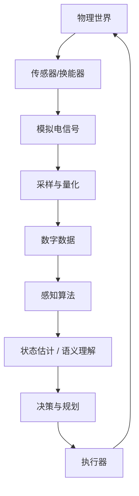

### 5.1.2 传感器性能指标：分辨率、精度、量程、带宽、延迟、噪声、漂移与冗余

选择传感器时，工程师面对的不是单一指标，而是一组相互牵制的性能参数。理解这些参数的物理含义，是后续所有讨论的基础。

!!! note "术语解释：分辨率、精度、量程、带宽、延迟、噪声、漂移、冗余"
    - **分辨率（resolution）**：传感器能够区分的最小输入变化量。对数字传感器而言，常等于一个最低有效位（LSB）对应的物理量。分辨率决定"能不能看到小的变化"。
    - **精度（accuracy）**：测量值与真实值之间的接近程度，通常用最大允许误差或标准差表示。精度反映"测得准不准"，受系统误差（偏置、非线性、温度影响）和随机误差共同影响。
    - **量程（range / full scale）**：传感器能够线性或有效工作的输入范围。超过量程可能导致饱和或损坏。
    - **带宽（bandwidth）**：传感器能忠实复现的快速变化频率范围，通常用 -3 dB 截止频率表示。带宽决定动态响应能力。
    - **延迟（latency）**：从物理输入变化到数字输出可用之间的时间差。低延迟对闭环控制至关重要。
    - **噪声（noise）**：随机涨落导致的输出不确定度，常用功率谱密度（PSD）或标准差描述。
    - **漂移（drift）**：在输入不变的情况下，输出随时间缓慢变化的系统性偏离，常由温度、老化或材料应力松弛引起。
    - **冗余（redundancy）**：用多个独立传感器测量同一物理量或同一状态的不同投影，以提高可靠性和容错能力。

这些指标之间存在典型的工程折中：提高分辨率往往伴随更窄的量程；降低噪声可能需要牺牲带宽；提高带宽可能放大高频噪声；消除漂移需要更复杂的标定与温度补偿。因此，感知系统的设计首先是系统级权衡。

### 5.1.3 人形机器人感知系统的整体架构

一个典型的人形机器人感知系统可以分为四层：

1. **传感层（sensor layer）**：物理换能器与前端模拟电路，输出原始电信号。
2. **数据采集层（data acquisition layer）**：对模拟信号进行滤波、采样、量化和时间戳对齐。
3. **状态与感知层（state & perception layer）**：运行 SLAM、视觉里程计、力/位估计、物体检测、语义分割等算法。
4. **决策与控制层（decision & control layer）**：把感知结果用于步态规划、操作规划、人机交互与安全保障。

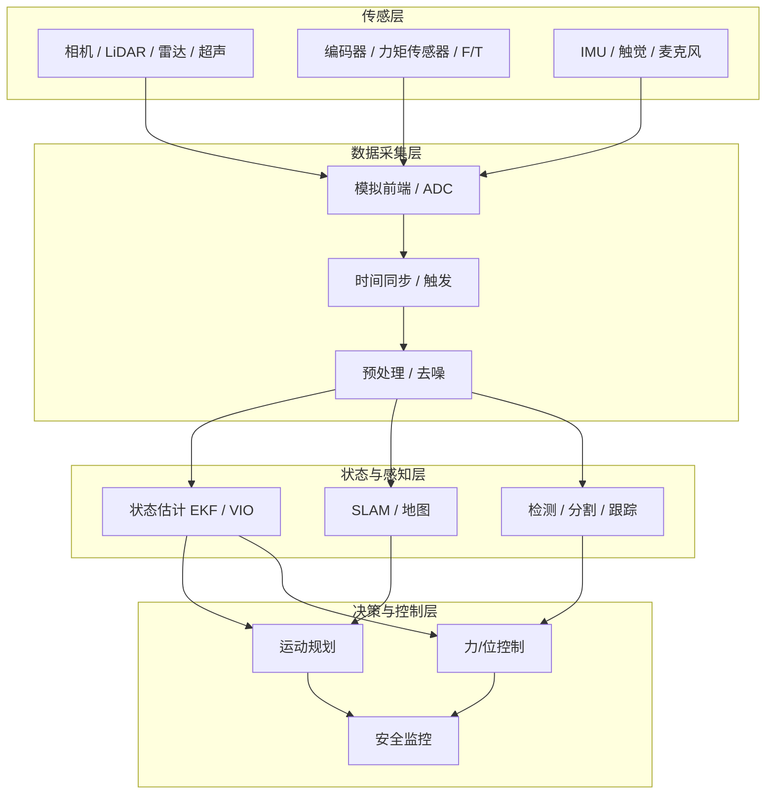

---

## 5.2 光电传感器与视觉系统

### 5.2.1 光的粒子性与光子能量

视觉始于光。经典电磁学把光描述为电磁波，其电场与磁场以波的形式在空间中传播；而在量子层面，光由离散的"光子"组成。光子能量由普朗克关系给出：

$$
E = h \nu = \frac{h c}{\lambda}
$$

其中 \(h = 6.626 \times 10^{-34}\ \mathrm{J \cdot s}\) 是普朗克常数，\(\nu\) 是光的频率，\(c\) 是真空中的光速，\(\lambda\) 是波长。波长越短（如蓝光、紫外），单个光子能量越高；波长越长（如红外），单个光子能量越低。

!!! note "术语解释：光子、波长、频率、电磁波谱、可见光、近红外"
    - **光子（photon）**：光的能量量子，既具有粒子性（能量一份一份），也具有波动性（干涉、衍射）。
    - **波长（wavelength）**：波在一个周期内传播的距离，决定光的颜色或电磁波类别。单位常用 nm（纳米）。
    - **频率（frequency）**：单位时间内振动的次数，\(\nu = c/\lambda\)。单位 Hz。
    - **电磁波谱（electromagnetic spectrum）**：按波长或频率排列的全部电磁辐射，从 \(\gamma\) 射线到无线电波。
    - **可见光（visible light）**：人眼可感知的波段，约 380–780 nm。
    - **近红外（near-infrared, NIR）**：波长约 780 nm–1.4 \(\mu\mathrm{m}\)，常用于结构光、夜视与 ToF 深度相机。

传感器能探测的光波长范围取决于材料。硅（Si）的带隙约为 1.12 eV，对应截止波长约 1100 nm，因此硅基光电二极管对可见光与近红外敏感，但对更长波长的中远红外不敏感。

### 5.2.2 光电效应、PN 结与光电二极管

光电二极管是几乎所有固态图像传感器的核心单元。其工作原理基于半导体的 **内光电效应**：当光子能量大于半导体材料的带隙 \(E_g\) 时，光子被吸收并激发一个电子从价带跃迁到导带，同时留下一个带正电的空穴，形成"电子-空穴对"。

!!! note "术语解释：光电效应、带隙、价带、导带、电子-空穴对"
    - **光电效应（photoelectric effect）**：光照射物质时，光子能量被电子吸收，使电子从束缚态释放或跃迁到高能态的现象。固体中的内光电效应产生自由载流子。
    - **带隙（band gap）**：半导体中价带顶与导带底之间的能量差。只有能量大于带隙的光子才能激发电子-空穴对。
    - **价带（valence band）**：原子外层电子在晶体中形成的低能带，常温下基本被填满。
    - **导带（conduction band）**：电子可自由移动的高能带。导带中的电子可参与导电。
    - **电子-空穴对（electron-hole pair）**：价带电子跃迁到导带后留下的空位（空穴）与导带电子的成对出现，是光电转换的载流子来源。

光电二极管本质上是一个反向偏置的 **PN 结**。PN 结由 P 型半导体（空穴多）和 N 型半导体（电子多）接触形成，界面处存在一个内建电场。光照产生的电子-空穴对在耗尽层内建电场作用下被分离：电子向 N 区漂移，空穴向 P 区漂移，从而形成光生电流。

光电流的大小与入射光功率成正比：

$$
I_{ph} = \frac{q \, \eta \, \Phi}{h \nu}
$$

其中 \(q\) 是电子电荷，\(\eta\) 是量子效率（每个光子平均产生多少个可收集电子），\(\Phi\) 是入射光功率。该式说明：光子能量越低（波长越长），同样光功率对应的光子数越多，若量子效率不变，电流也越大。

!!! note "术语解释：PN 结、耗尽层、内建电场、反向偏置、光生电流、量子效率"
    - **PN 结（PN junction）**：P 型与 N 型半导体接触形成的结构，具有单向导电性。
    - **耗尽层（depletion region）**：PN 结附近载流子被内建电场扫空后留下的缺乏自由载流子的区域，内建电场最强。
    - **内建电场（built-in electric field）**：由 P 区与 N 区费米能级对齐后空间电荷区产生的电场。
    - **反向偏置（reverse bias）**：给 PN 结施加与导通方向相反的电压，使耗尽层加宽、电容减小、响应加快。
    - **光生电流（photocurrent）**：光照在光电二极管中产生的电流，方向与反向饱和电流相反。
    - **量子效率（quantum efficiency, QE）**：收集到的电子数与入射光子数之比，反映光电转换效率。

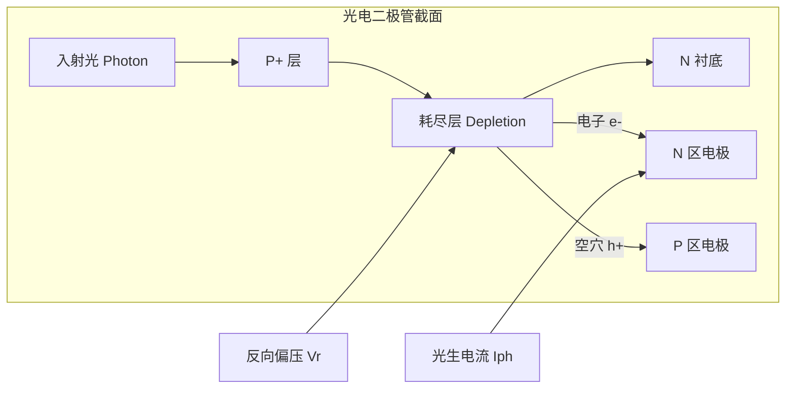

光电二极管本身只能测量光强，无法区分空间位置。要把光强分布转化为图像，就需要把大量光电二极管排列成二维阵列，并为每个像素提供独立的电荷读出路径。这就是图像传感器的核心任务。

### 5.2.3 CCD 与 CMOS 图像传感器

**电荷耦合器件（Charge-Coupled Device, CCD）** 与 **互补金属氧化物半导体（Complementary Metal-Oxide-Semiconductor, CMOS）** 图像是两种主流的固态成像技术。二者都基于光电二极管阵列，但电荷读出方式不同。

!!! note "术语解释：CCD、CMOS 图像传感器、像素、感光二极管、读出电路"
    - **CCD（Charge-Coupled Device）**：通过时钟电压控制电荷在芯片内部逐行/逐列转移，最终在少数输出节点完成电荷-电压转换的图像传感器。
    - **CMOS 图像传感器（CMOS image sensor, CIS）**：每个像素或每列集成放大与读出电路，可直接以电压/数字形式并行读出。
    - **像素（pixel）**：图像传感器中最小的独立感光单元，由光电二极管、滤色片、微透镜和读出电路组成。
    - **感光二极管（photodiode）**：像素内部完成光电转换的核心器件。
    - **读出电路（readout circuit）**：把像素电荷或电压信号放大、采样并输送出芯片的电路。

CCD 的工作方式类似"水桶传水"：曝光期间每个像素积累光生电荷；曝光结束后，电荷在时钟脉冲驱动下沿列和行方向依次耦合传递，最终到达片内或片外的电荷-电压转换器。这种方式读出噪声低、量子效率高、像素填充因子大，但功耗高、读出速度慢、需要复杂的外部驱动。

CMOS 图像传感器则把放大器（通常是源极跟随器）和选择开关集成到每个像素内部或列级。每个像素可以独立寻址，像读取内存一样随机读出。CMOS 的优势包括：低功耗、高集成度、高帧率、可片上集成 ADC 与图像处理；缺点是早期读出噪声较大，且像素中部分面积被晶体管占据，填充因子低于 CCD。

现代机器人视觉几乎全部采用 CMOS 图像传感器，因为其速度、功耗和系统集成度更适合实时应用。

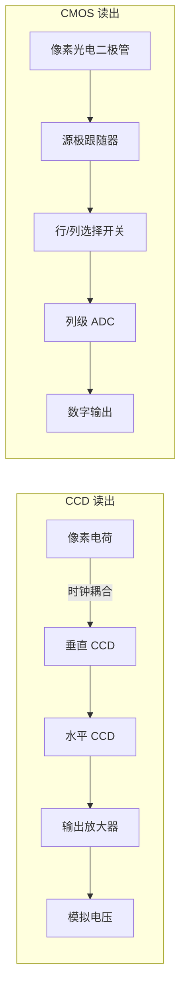

CMOS 像素的典型结构包括：

1. **微透镜（microlens）**：把入射光会聚到感光区，提高有效填充因子。
2. **滤色片（color filter）**：通常采用 Bayer 阵列（RGGB），让每个像素只接收红、绿或蓝光，后续通过去马赛克算法恢复全彩色。
3. **光电二极管（photodiode）**：通常为 pinned 光电二极管（PPD），降低暗电流、提高满阱容量。
4. **转移栅（transfer gate）** 与 **浮置扩散节点（floating diffusion, FD）**：把电荷转移到 FD 节点，通过源极跟随器转换为电压。

!!! note "术语解释：微透镜、滤色片、Bayer 阵列、暗电流、满阱容量、浮置扩散"
    - **微透镜（microlens）**：像素顶部的小型透镜，用于把斜射光聚焦到光电二极管上。
    - **滤色片（color filter）**：只透过特定波长范围光的有色薄膜。
    - **Bayer 阵列（Bayer pattern）**：RGGB 排列的滤色片 mosaic，绿色像素数量是红/蓝的两倍，以匹配人眼对绿光更高的敏感度。
    - **暗电流（dark current）**：无光照时由于热激发产生的电流，是图像噪声的重要来源。
    - **满阱容量（full-well capacity）**：一个像素能够容纳的最大电荷量，决定最大可探测光强。
    - **浮置扩散（floating diffusion, FD）**：CMOS 像素中把电荷转换为电压的电容节点。

#### CMOS 图像传感器像素与制造工艺

CMOS 图像传感器的性能在很大程度上由单个像素的结构、材料与制造工艺决定。可以把一个像素理解为“微型光电二极管 + 电荷-电压转换器 + 颜色选择器”的集成体：光子进入像素后，先经过微透镜和彩色滤光片，被光电二极管吸收并产生电子-空穴对；曝光结束后，电子通过转移栅被移动到浮置扩散节点，由源极跟随器读出为电压信号。

!!! note "术语解释：前照式、背照式、堆栈式、像素开口率、量子效率、暗电流非均匀性"
    - **前照式（Front-Side Illuminated, FSI）**：光电二极管位于金属互连层下方，光线必须先穿过金属线才能到达感光区。
    - **背照式（Back-Side Illuminated, BSI）**：将硅片减薄并翻转，使光线从背面直接进入光电二极管，减少金属布线遮挡。
    - **堆栈式（stacked sensor）**：把感光像素层与逻辑/存储/ADC 电路层分别制造后再垂直互连，提高像素填充因子并提升读出速度。
    - **像素开口率（fill factor）**：感光区面积占整个像素面积的比例，开口率越高，捕获光子的能力越强。
    - **量子效率（Quantum Efficiency, QE）**：每个入射光子平均产生并被收集到的电子数，反映光电转换效率。
    - **暗电流非均匀性（DSNU）与光响应非均匀性（PRNU）**：像素之间在无光与有光条件下的输出差异，影响图像平坦度和标定难度。

**FSI、BSI 与堆栈式结构**

在传统 FSI 像素中，金属互连层、栅极和多晶硅层位于光电二极管上方。这些不透明或半透明的结构会遮挡部分入射光，导致开口率和量子效率受限；同时，光线入射角度较大时还会出现串扰和阴影效应。BSI 工艺通过将晶圆背面研磨抛光到约 \(3\!\sim\!10\ \mu\mathrm{m}\)，然后从背面引入光线，使感光区不再被金属层遮挡，开口率和 QE 显著提升，尤其有利于小像素（\(<1.4\ \mu\mathrm{m}\)）和高帧率应用。

堆栈式传感器进一步把像素阵列晶圆与逻辑电路晶圆键合在一起：像素层只负责感光和电荷转移，逻辑层集成 ADC、数字读出、DRAM 缓存乃至 ISP 模块。这种 3D 集成不仅释放了像素面积，还实现了高速全像素读出（如 Sony 的 DRAM-in-CIS 设计可达每秒数千帧），是人形机器人高速视觉反馈的理想基础。

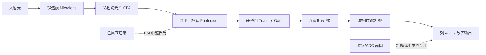

**像素内部的光电-电荷-电压链路**

光电二极管通常采用 **pinned photodiode（PPD）** 结构：在 P 型衬底中嵌入 N 型电荷收集区，并在表面加一层 P+  pinning 层。PPD 能把暗电流压制到很低水平，同时实现低噪声的完全电荷转移。曝光时，光子在耗尽区产生电子-空穴对，电子被收集在 N 区；曝光结束后，转移栅（TG）打开，电子流入浮置扩散节点。浮置扩散可视为一个微小电容 \(C_{FD}\)，电荷 \(Q\) 在其上产生电压变化：

$$
\Delta V = \frac{Q}{C_{FD}}
$$

随后源极跟随器（source follower, SF）把高阻抗的浮置扩散电压转换为低阻抗输出电压，供列级或像素级 ADC 采样。这个“电荷-电压转换增益” \(G_{CV} = q / C_{FD}\) 越大，单个电子引起的电压变化越大，有利于弱光信噪比，但也会降低满阱容量和动态范围。

!!! note "术语解释： pinned 光电二极管、转移栅、源极跟随器、电荷-电压转换增益、满阱容量"
    - **pinned photodiode（PPD）**：表面被 P+ 层“钉扎”的光电二极管结构，可抑制表面暗电流并提高电荷转移效率。
    - **转移栅（transfer gate, TG）**：控制电荷从光电二极管转移到浮置扩散的 MOS 开关。
    - **源极跟随器（source follower, SF）**：像素内或列级放大器，具有高输入阻抗和低输出阻抗，用于缓冲 FD 电压。
    - **电荷-电压转换增益（conversion gain）**：单位电荷在 FD 上产生的电压，\(G_{CV}=q/C_{FD}\)。
    - **满阱容量（full-well capacity, FWC）**：像素在饱和前能容纳的最大电荷量，\(N_{sat}=Q_{max}/q\)。

**彩色滤光片阵列**

人眼对亮度（绿光）最敏感，因此多数 CMOS 采用 **Bayer 阵列（RGGB）**：每 \(2\times2\) 像素块包含 1 红、2 绿、1 蓝。Bayer 损失了三分之二的彩色信息，需要通过后续去马赛克算法恢复全彩。为了增强弱光或近红外感知，工业/机器人相机会使用：

- **RCCB**：用透明（clear）像素替换部分绿色像素，提升灵敏度但牺牲部分颜色精度。
- **RGB-IR**：在部分像素上放置红外透过滤光片，使同一传感器同时获取可见光与 NIR 深度/夜视信息。
- **单色（mono）**：去掉 CFA，最大化 QE 和分辨率，常用于 SLAM 与视觉里程计。

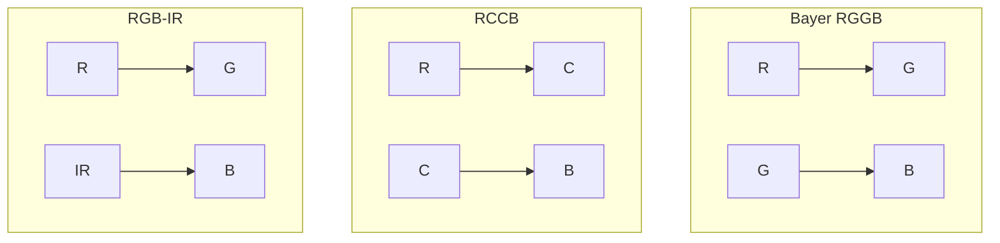

**关键性能指标**

- **像素间距（pixel pitch）**：相邻像素中心之间的距离，单位 \(\mu\mathrm{m}\)。更小像素可在同样芯片面积上获得更高分辨率，但单像素感光面积减小、FWC 降低、噪声相对增大。
- **量子效率（QE）**：表示入射光子转换为可收集电子的效率，受硅吸收系数、表面反射、CFA 透过率、BSI/FSI 结构等影响。硅对可见光 QE 可达 \(50\!\sim\!80\%\)，近红外区随波长增加而下降。
- **暗电流（dark current）**：无光照时热激发产生的电子-空穴对。暗电流随温度指数上升，约每升高 \(8\!\sim\!10\ ^\circ\mathrm{C}\) 翻倍。暗电流Shot噪声为 \(\sqrt{2qI_d\Delta t}/q\) 个电子。
- **DSNU / PRNU**：DSNU 是在无光（黑电平）条件下各像素输出的标准差；PRNU 是均匀光照下像素响应的相对标准差。DSNU 主要来源于像素间暗电流差异、FD 电容差异和读出电路失调；PRNU 则来源于微透镜/CFA 均匀性、QE 和转换增益差异。
- **光子转移曲线（Photon Transfer Curve, PTC）**：在均匀光照下改变曝光，测量信号方差与均值的关系。读出噪声区方差平坦，Shot噪声区方差与信号均值成正比，其斜率倒数即为转换增益；饱和区方差下降，对应 FWC。
- **动态范围（dynamic range, DR）**：最大非饱和信号与最小可分辨信号之比，常用 dB 表示：

$$
\mathrm{DR} = 20 \log_{10}\left(\frac{N_{sat}}{N_{read}}\right)
$$

其中 \(N_{read}\) 为读出噪声电子数。人形机器人在室内外切换、逆光等场景需要高动态范围，通常要求 \(>70\ \mathrm{dB}\)。

- **SNR10**：信噪比达到 10 dB 时对应的最低照度，用于衡量弱光成像能力。SNR10 越低，暗光表现越好。

```mermaid
xychart-beta
    title "光子转移曲线示意"
    x-axis "信号均值 (DN)" 0 --> 100
    y-axis "方差 (DN²)" 0 --> 120
    line "方差" [10, 15, 22, 32, 45, 60, 80, 95, 105, 100]
    annotation "读出噪声区" {"x":10, "y":10}
    annotation "Shot 噪声区 (斜率≈1)" {"x":50, "y":55}
    annotation "满阱饱和" {"x":90, "y":102}
```

#### 图像信号处理（ISP）管线

从 CMOS 传感器输出的 RAW 数据到最终可用的 RGB/YUV 图像，需要经过一条 **图像信号处理（Image Signal Processing, ISP）** 管线。ISP 的目标是在保留场景信息的同时，补偿传感器和光学系统的物理缺陷，并将数据转换到适合人眼或算法的色彩空间。

!!! note "术语解释：黑电平校正、镜头阴影校正、坏点校正、去马赛克、色彩校正矩阵、伽马校正"
    - **黑电平校正（black-level correction, BLC）**：减去暗电流和读出偏置，使零光照对应零数字值。
    - **镜头阴影校正（lens shading correction, LSC）**：补偿由于镜头 cos⁴ 定律和微透镜角度响应导致的图像边角暗角。
    - **坏点校正（defect pixel correction, DPC）**：用邻域像素插值替换固定坏点或动态坏点。
    - **去马赛克（demosaicing）**：从 Bayer 稀疏采样恢复每个像素 R/G/B 三通道的插值过程。
    - **色彩校正矩阵（Color Correction Matrix, CCM）**：将传感器原始 RGB 响应线性变换到目标色彩空间（如 sRGB）。
    - **伽马校正（gamma correction）**：把线性光强映射到非线性显示/存储空间，匹配人眼亮度感知。

**ISP 典型流程**

1. **黑电平校正**：传感器在完全遮光时仍输出一个非零基准（black level），由光遮罩暗像素或帧间统计估计。BLC 将每个像素减去对应通道的黑电平，保证后续线性处理的正确性。

2. **镜头阴影校正（LSC）**：广角镜头在视场边缘的光照按 \(\cos^4\theta\) 衰减，同时微透镜对斜入射光的收集效率下降，导致图像中心亮、四角暗。LSC 通过预先标定的增益图（gain table）或径向多项式对 RAW 数据进行逐像素补偿。

3. **坏点校正（DPC）**：由于制造缺陷，某些像素始终过亮（hot pixel）或过暗（dead pixel）。DPC 在静态标定表中标记固定坏点；动态坏点则通过比较邻域中值检测并插值替换。

4. **去马赛克（Demosaicing）**：Bayer 阵列每个像素只有 R/G/B 中一种颜色。去马赛克利用空间和光谱相关性插值缺失颜色。经典算法如双线性插值会产生锯齿；高质量算法（如 Malvar-He-Cutler、基于方向插值、深度学习去马赛克）能在边缘处保持细节。

5. **白平衡（AWB）与色彩校正**：不同光源色温下，同一物体的 RGB 比例不同。AWB 估计场景 illuminant，再对各通道乘以增益使中性色灰度一致。随后 CCM 把去马赛克后的传感器 RGB 转换到 sRGB 或 Rec.2020 等标准空间：

$$
\begin{bmatrix} R_{out} \\ G_{out} \\ B_{out} \end{bmatrix}
=
\mathbf{M}_{CCM}
\begin{bmatrix} R_{in} \\ G_{in} \\ B_{in} \end{bmatrix}
$$

6. **伽马校正**：显示设备和人眼对亮度的响应是非线性的。伽马校正将线性亮度 \(L\) 映射到 \(L^{1/\gamma}\)（通常 \(\gamma\approx2.2\)），既提高暗部编码精度，又兼容显示标准。

7. **噪声降低与边缘增强**：RAW 图像经放大后可见随机噪声。空域降噪（如双边滤波、引导滤波）保持边缘；时域降噪（多帧对齐融合）利用连续帧统计提升 SNR。随后通过 unsharp masking 或边缘增强恢复锐度。

8. **色调映射（tone mapping）与高动态范围（HDR）**：当场景光比超出单次曝光的动态范围时，ISP 可融合多帧不同曝光（multi-exposure fusion）或多增益输出，将高动态范围压缩到显示可呈现的低动态范围，同时保留高光和阴影细节。

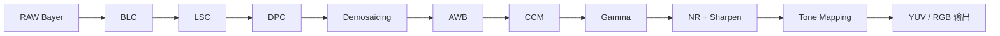

**自动曝光（AE）、自动增益（AGC）与自动白平衡（AWB）反馈环**

ISP 通常与传感器形成闭环控制：

- **AE**：根据图像亮度直方图或目标亮度，调整曝光时间和光圈（若可控），使输出处于合适的动态范围。
- **AGC**：在曝光已达上限或下限时，通过调节模拟/数字增益控制亮度；增益过高会放大噪声。
- **AWB**：统计图像中性色区域或全局颜色分布，估计光源色温并更新通道增益。

这些环路通过 SoC 中的统计引擎（statistics engine）读取曝光、白点、直方图等信息，再由固件计算新的曝光参数和增益，实时反馈给传感器寄存器。

!!! note "术语解释：自动曝光、自动增益、自动白平衡、统计引擎、反馈环"
    - **自动曝光（Auto Exposure, AE）**：根据场景亮度自动调整曝光时间的控制回路。
    - **自动增益（Auto Gain Control, AGC）**：在曝光受限时调节模拟/数字增益的回路。
    - **自动白平衡（Auto White Balance, AWB）**：估计光源色温并调整 RGB 通道增益的回路。
    - **统计引擎（statistics engine）**：ISP 中提取亮度、颜色、直方图等统计信息的硬件模块。
    - **反馈环（feedback loop）**：根据输出统计反向调节传感器/ISP 参数的控制结构。

**ISP 部署位置：片上、SoC 内与独立 ISP 芯片**

- **片上 ISP（on-sensor ISP）**：部分 CMOS 传感器在芯片上集成简单 ISP，直接输出 YUV/JPEG，适合低功耗模组。
- **SoC 内置 ISP**：手机、机器人主控芯片（如 Qualcomm Snapdragon、NVIDIA Jetson、Rockchip RK3588）集成多路 ISP，支持高分辨率、多相机同步与 HDR。
- **独立 ISP 芯片**：用于对图像质量要求极高的工业/车载场景，可处理大靶面、全局快门、多曝光融合，延迟和噪声控制更优。

对于人形机器人，ISP 的选择取决于算法输入：若后端运行神经网络，通常希望获得经过白平衡、伽马和降噪的 YUV/RGB；若进行视觉 SLAM，则倾向使用 Bayer RAW 或经过最小处理的灰度图，以避免非线性伽马和降噪引入的几何/亮度畸变。

#### ISP 的寄存器级控制与硬件数据通路

前面从功能角度介绍了 ISP 处理管线。在芯片实现层面，ISP 是一组由**寄存器映射（register map）**控制的硬件流水线：CPU 或 MCU 固件通过总线向配置寄存器写入参数，硬件模块以行为单位、在 DMA 引擎配合下完成实时图像处理。理解寄存器级数据通路，是定位图像撕裂、带宽瓶颈、颜色漂移等工程问题的关键。

!!! note "术语解释：行缓冲、乒乓缓存、DMA 引擎、寄存器映射、影子寄存器、AHB/APB、AXI/AXI-Stream"
    - **行缓冲（line buffer）**：ISP 模块内部用于暂存若干行像素的 SRAM/寄存器阵列。去马赛克、降噪等空域算法需要同时访问当前行及其上下邻近行。
    - **乒乓缓存（ping-pong buffer）**：由两组相同容量的缓冲区交替进行读写，保证数据生产者与消费者之间无停顿衔接。
    - **DMA 引擎（Direct Memory Access engine）**：在内存与硬件模块之间搬移整块数据而无需 CPU 逐字节干预，显著降低处理器负载。
    - **寄存器映射（register map）**：把硬件控制位、状态位、系数表映射到 CPU 可寻址的地址空间，固件通过读写地址来配置硬件。
    - **影子寄存器（shadow register）**：帧处理期间保持当前有效配置的缓冲寄存器，新配置只在安全时刻（如垂直消隐期）才同步到影子寄存器，避免画面撕裂。
    - **AHB/APB**：ARM 先进高性能总线 / 先进外设总线，常用于连接 CPU 与低速/中速外设寄存器。
    - **AXI/AXI-Stream**：ARM 高性能总线协议，AXI 支持地址与数据分离，AXI-Stream 面向连续数据流，是 ISP 与 DDR 或视频接口之间常用的数据通路。

**ISP 硬件流水线的基本组成**

一个典型 ISP 硅实现可以抽象为以下单元：

1. **输入接口 / 接收 FIFO**：从 MIPI CSI-2 接收 RAW 数据，或从 DDR 读取 RAW 帧；进行字节对齐、数据包解析和错误检测。
2. **输入 DMA**：在 SoC 内部通过 AXI 总线从 DDR 读取待处理图像，写入 ISP 内部行缓冲或乒乓缓存。
3. **行缓冲 / 窗口缓存**：为 BLC、LSC、DPC、Demosaic、NR 等模块提供局部像素窗口。窗口大小决定需要缓存的行数，例如 \(5 \times 5\) 去马赛克核需要至少 2 行前后缓冲。
4. **可配置运算通路**：每个处理节点对应一组系数寄存器或查找表（LUT）。例如 CCM 为 \(3 \times 3\) 系数，Gamma 为分段 LUT 基址与长度，LSC 为网格增益表。
5. **统计引擎（statistics engine）**：对整帧或分块 ROI 计算亮度均值、直方图、白点统计等，为 AE/AGC/AWB 反馈提供输入。
6. **输出 DMA / 格式转换**：将处理后的 RGB/YUV 数据按目标格式（如 YUV420、RGB888）写回 DDR，或经 AXI-Stream 送入显示控制器、视频编码器或 NPU。

由于 ISP 通常以**流式（streaming）**方式逐行处理，每个模块只需保存有限行数的像素，片上 SRAM 开销远小于整帧缓存，这是其能够在高分辨率、高帧率下实时运行的根本原因。

**典型寄存器类别与含义**

下表给出 ISP 寄存器映射中常见的配置类别（名称仅为示意，不同厂商差异很大）：

| 寄存器类别 | 示例寄存器名 | 功能说明 |
|-----------|-------------|---------|
| 管线使能 / 旁路 | `REG_ISP_ENABLE`、`REG_ISP_BYPASS_DEMOSAIC` | 打开或跳过某个处理节点，便于调试与功耗管理。 |
| 黑电平校正 | `REG_ISP_BLC_R/G/B` | 各通道黑电平偏移量，通常在暗场标定后写入。 |
| 镜头阴影校正 | `REG_ISP_LSC_GRID[0..N]` | 二维网格增益系数，补偿镜头 cos⁴ 衰减与微透镜角度响应。 |
| 去马赛克 | `REG_ISP_DEMOSAIC_EDGE_THR`、`REG_ISP_DEMOSAIC_MODE` | 边缘检测阈值、插值模式（双线性 / 方向自适应等）。 |
| 色彩校正矩阵 | `REG_ISP_CCM_00..22` | \(3 \times 3\) 矩阵系数，通常以定点格式存储。 |
| 伽马校正 | `REG_ISP_GAMMA_LUT_ADDR`、`REG_ISP_GAMMA_LUT_LEN` | LUT 在 DDR 中的基址与长度，硬件通过 DMA 加载。 |
| 自动曝光 / 增益 | `REG_ISP_AE_ROI_X/Y/W/H`、`REG_ISP_AE_TARGET` | AE 统计窗口位置与目标亮度。 |
| 自动白平衡 | `REG_ISP_AWB_GAIN_R/G/B` | 白平衡各通道增益。 |
| 降噪与锐化 | `REG_ISP_NR_STRENGTH`、`REG_ISP_SHARPEN_GAIN` | 空域/时域降噪强度、边缘增强增益。 |
| 输出格式 / 裁剪 / 缩放 | `REG_ISP_OUT_FMT`、`REG_ISP_CROP_X/Y/W/H`、`REG_ISP_SCALE_H/V` | 输出像素格式、有效区域、缩放系数。 |

**V-blank 期间的安全寄存器更新**

ISP 处理当前帧时，若固件直接改写活动寄存器，会导致同一帧内前后行使用不同配置，产生撕裂或闪烁。工程上通常采用**影子寄存器**机制：

- 帧 active 期间，影子寄存器保持当前帧配置不变；
- 帧处理结束、进入**垂直消隐期（V-blank）**后，固件一次性把新配置从配置寄存器加载到影子寄存器；
- 下一帧从第一行开始即使用更新后的参数。

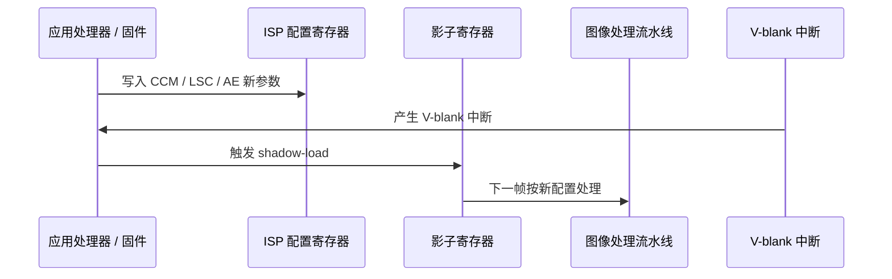

这种更新时序对 AE/AGC 尤为重要：曝光参数必须在sensor 开始新一帧曝光之前下发，否则会出现亮度跳变。

**DMA 数据流：从 Sensor 到 DDR 再到显示/编码**

ISP 的数据搬运通常遵循以下路径：

1. RAW 帧从 MIPI CSI-2 接口进入接收 FIFO，由 DMA 写入 DDR 的 RAW 缓冲区；
2. ISP 输入 DMA 从 DDR 读取 RAW，经 AXI-Stream 送入内部线缓冲；
3. 各处理节点流式运算后，输出 DMA 把 YUV/RGB 写回 DDR；
4. 显示控制器、视频编码器或 AI NPU 从 DDR 读取处理后的图像。

需要注意的带宽约束包括：

- **位宽 × 行宽 × 帧率**：例如 12 MP、10 bit、30 fps 的 RAW，单路理论带宽约 \(12\times10^6 \times 10 \times 30 / 8 \approx 450\ \mathrm{MB/s}\)，多路 ISP 会迅速耗尽 DDR 带宽；
- **AXI 总线仲裁**：ISP、NPU、显示控制器共享 AXI 互连，需要合理的 QoS 与优先级；
- **行缓冲位深**：内部 SRAM 按像素位宽（如 10/12/14 bit）设计，位深越高，面积和功耗越大。

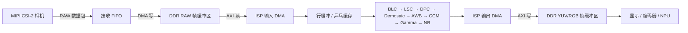

**定点 CCM 寄存器示例**

色彩校正矩阵的系数通常以定点数存储，例如 Q10 格式（10 位小数，缩放因子 \(2^{10}=1024\)）。一个 \(2 \times 2\) 简化 CCM 的伪寄存器写法如下：

```text
REG_ISP_CCM_00 = round(CCM[0][0] * 1024)   // 例如 1.20 * 1024 = 1229
REG_ISP_CCM_01 = round(CCM[0][1] * 1024)   // 例如 -0.10 * 1024 = -103 (需按有符号补码存储)
REG_ISP_CCM_10 = round(CCM[1][0] * 1024)
REG_ISP_CCM_11 = round(CCM[1][1] * 1024)
REG_ISP_CCM_ENABLE = 1
```

硬件运算时，先把像素值与 CCM 系数做乘加，再将结果右移 10 位得到定点输出。需要特别注意：

- **符号与位宽**：CCM 系数可正可负，寄存器需用有符号数表示，并预留足够位宽防止中间结果溢出；
- **舍入与截断**：右移后按四舍五入或截断处理，影响低亮度色度精度；
- **裁剪（clipping）**：最终输出需限制在有效位宽范围内（如 10 bit 输出限制为 \([0, 1023]\)）。

!!! note "术语解释：定点数、Q 格式、补码、溢出、裁剪"
    - **定点数（fixed-point number）**：小数点位置固定不变的数值表示，适合无浮点单元的硬件加速器。
    - **Q 格式（Q-format）**：如 Q10 表示 10 位小数、其余为整数位的定点格式。
    - **补码（two's complement）**：用最高位表示符号的有符号整数编码方式。
    - **溢出（overflow）**：运算结果超出寄存器位宽，导致数值回绕或截断。
    - **裁剪（clipping / saturation）**：把超限结果限制到最大/最小可表示值，常用于图像像素输出。

**消费级模组中的 ISP 寄存器**

实际产品中，ISP 寄存器往往被厂商固件封装，开发者只能看到高级 API。例如 Intel RealSense D4xx 系列、Luxonis OAK-D、Sony ISX 系列、OmniVision OVxxxx 系列都有各自的固件和寄存器访问策略。尽管如此，上述“配置寄存器 + 影子寄存器 + DMA + 线缓冲”的硬件架构是通用的，理解这些概念有助于在阅读厂商 SDK、调试 MIPI 协议分析仪抓取或评估 ISP 延迟时抓住要害。

### 5.2.4 相机光学模型：针孔模型、内参外参与畸变

相机把三维世界中的点投影到二维图像平面。最简单的几何模型是 **针孔相机模型（pinhole camera model）**。它假设光线通过一个无穷小的孔（光心）投射到成像平面，形成倒立的实像。

!!! note "术语解释：针孔模型、光心、成像平面、焦距、主点"
    - **针孔模型（pinhole camera model）**：用理想小孔投影描述相机成像几何的简化模型。
    - **光心（optical center / camera center）**：所有入射光线的汇聚点，即针孔的位置。
    - **成像平面（image plane）**：记录光强分布的二维平面。
    - **焦距（focal length）**：光心到成像平面的距离，决定视场角大小。单位常用 mm 或像素。
    - **主点（principal point）**：光轴与成像平面的交点，理想情况下位于图像中心。

设世界坐标系中一点 \(\mathbf{P}_w = [X_w, Y_w, Z_w]^T\)，相机坐标系中对应点为 \(\mathbf{P}_c = [X_c, Y_c, Z_c]^T\)。从世界坐标到相机坐标的变换是一个刚体变换，由旋转矩阵 \(\mathbf{R}\) 和平移向量 \(\mathbf{t}\) 描述：

$$
\mathbf{P}_c = \mathbf{R} \mathbf{P}_w + \mathbf{t}
$$

在相机坐标系下，根据相似三角形关系，针孔投影给出成像平面上的坐标：

$$
x = f \frac{X_c}{Z_c}, \quad y = f \frac{Y_c}{Z_c}
$$

其中 \(f\) 为焦距。将图像坐标进一步转换为像素坐标 \((u, v)\)，需要考虑像素尺寸和主点偏移：

$$
\begin{bmatrix} u \\ v \\ 1 \end{bmatrix}
= \frac{1}{Z_c}
\begin{bmatrix}
f_x & 0 & c_x \\
0 & f_y & c_y \\
0 & 0 & 1
\end{bmatrix}
\begin{bmatrix} X_c \\ Y_c \\ Z_c \end{bmatrix}
$$

其中 \(f_x = f / d_x\)、\(f_y = f / d_y\) 是以像素为单位的焦距，\((c_x, c_y)\) 是主点坐标。这个 \(3 \times 3\) 矩阵称为 **相机内参矩阵（camera intrinsic matrix）**，\(\mathbf{R}, \mathbf{t}\) 称为 **相机外参（extrinsic parameters）**。

!!! note "术语解释：相机内参、相机外参、旋转矩阵、平移向量、像素坐标"
    - **相机内参（camera intrinsics）**：描述相机自身几何特性的参数，包括焦距、主点、像素尺寸和畸变系数。
    - **相机外参（camera extrinsics）**：描述相机坐标系与世界坐标系之间刚体变换的参数，即 \(\mathbf{R}\) 和 \(\mathbf{t}\)。
    - **旋转矩阵（rotation matrix）**：\(3 \times 3\) 正交矩阵，描述坐标系之间的旋转关系。
    - **平移向量（translation vector）**：描述坐标系原点之间的平移。
    - **像素坐标（pixel coordinates）**：以图像左上角或中心为原点的离散图像坐标。

真实相机镜头会引入几何畸变，主要包括 **径向畸变（radial distortion）** 和 **切向畸变（tangential distortion）**。径向畸变由镜头曲率引起，使远离光轴的点向内或向外偏移；切向畸变由镜头光心与成像平面不完全平行引起。常用 Brown-Conrady 模型描述：

$$
\begin{aligned}
x_{\text{distorted}} &= x \left(1 + k_1 r^2 + k_2 r^4 + k_3 r^6\right) + 2 p_1 x y + p_2 \left(r^2 + 2 x^2\right) \\
y_{\text{distorted}} &= y \left(1 + k_1 r^2 + k_2 r^4 + k_3 r^6\right) + p_1 \left(r^2 + 2 y^2\right) + 2 p_2 x y
\end{aligned}
$$

其中 \(r^2 = x^2 + y^2\)，\(k_1, k_2, k_3\) 是径向畸变系数，\(p_1, p_2\) 是切向畸变系数。

!!! note "术语解释：径向畸变、切向畸变、畸变系数、Brown-Conrady 模型"
    - **径向畸变（radial distortion）**：由于镜头径向曲率导致的像点沿径向偏移，常见为枕形或桶形畸变。
    - **切向畸变（tangential distortion）**：由于镜头装配不共面导致的像点切向偏移。
    - **畸变系数（distortion coefficients）**：标定得到的用于校正上述畸变的参数。
    - **Brown-Conrady 模型**：经典的镜头畸变数学模型，被 OpenCV 等库广泛采用。

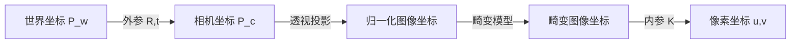

### 5.2.5 双目立体视觉与三角测量

人眼通过两只眼睛观察同一场景时，由于两眼位置不同，看到的图像存在细微差异，大脑利用这种差异感知深度。双目立体视觉（stereo vision）模仿这一原理，用两个水平放置的相机同时拍摄同一场景，通过匹配左右图像中的对应点来恢复深度。

!!! note "术语解释：双目立体视觉、基线、视差、对应点匹配、深度估计"
    - **双目立体视觉（stereo vision）**：利用两个相机从略微不同视角拍摄同一物体，通过几何关系计算三维结构的技术。
    - **基线（baseline）**：两个相机光心之间的水平距离，记为 \(B\)。
    - **视差（disparity）**：同一场景点在左右图像中像素坐标的水平差，记为 \(d\)。
    - **对应点匹配（correspondence matching）**：在左右图像中找到同一场景点的过程。
    - **深度估计（depth estimation）**：从图像信息恢复场景点到相机距离的过程。

设两个相机光心在同一水平线上，相距 \(B\)，且已校正到成像平面共面。若某空间点 \(P\) 在左图像中的横坐标为 \(x_L\)，在右图像中为 \(x_R\)，则视差 \(d = x_L - x_R\)。根据相似三角形：

$$
Z = \frac{f B}{d}
$$

其中 \(f\) 为校正后的焦距，\(Z\) 为空间点到相机平面的深度。该式表明：视差越大，深度越小；基线越长，对相同深度的视差越大，测距相对精度越高，但近距离盲区也越大。

!!! note "术语解释：双目校正、共面成像、极线约束、三角测量"
    - **双目校正（stereo rectification）**：把两个相机的成像平面通过重投影变换到同一平面的过程，使对应点只沿水平方向搜索。
    - **共面成像（coplanar imaging）**：校正后左右相机的像平面在同一平面且光轴平行。
    - **极线约束（epipolar constraint）**：在已校正的立体图像中，对应点位于同一条水平扫描线上。
    - **三角测量（triangulation）**：通过两条或多条视线交汇确定空间点位置的方法。

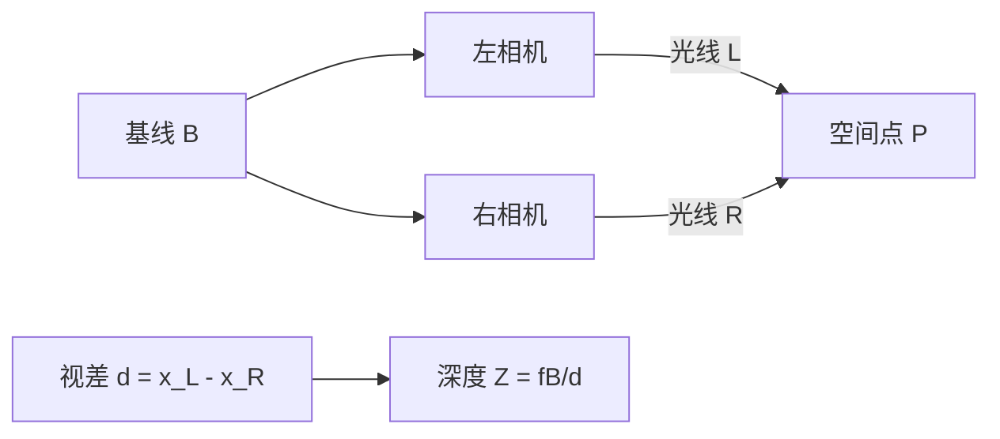

双目立体视觉的挑战在于：弱纹理区域难以匹配；重复图案会导致误匹配；透明、反光或高动态场景会破坏对应点假设。为克服这些问题，工业深度相机常引入主动纹理投影（结构光）或直接测量飞行时间。

### 5.2.6 结构光与飞行时间（ToF）深度相机

**结构光（structured light）** 深度相机向场景投射已知图案（如条纹、散斑或格雷码图案），并用相机观察图案在物体表面的变形。通过分析图案的形变，可以解算每个像素对应的深度。

!!! note "术语解释：结构光、投射器、编码图案、相位展开、三角测量"
    - **结构光（structured light）**：通过向场景投射已知光学图案并观察其形变来获取三维形状的技术。
    - **投射器（projector）**：发射结构光图案的主动光源，常见为红外激光加 DOE 衍射元件。
    - **编码图案（coded pattern）**：带有空间或时间编码的光强/相位图案，便于识别和匹配。
    - **相位展开（phase unwrapping）**：从包裹相位恢复真实绝对相位的算法步骤。
    - **三角测量（triangulation）**：结构光系统中投射器、相机与物体点构成三角形，通过几何关系求深度。

正弦条纹结构光中，投射图案可写成：

$$
I(x, y) = A(x, y) + B(x, y) \cos\left(\phi(x, y)\right)
$$

其中 \(\phi(x, y)\) 为相位。物体表面高度变化会改变相机看到的相位，通过相移法获取包裹相位后，再经相位展开得到绝对相位，最后结合标定参数换算为深度。

**飞行时间（Time-of-Flight, ToF）** 深度相机则直接测量光脉冲从发射到反射回接收器的时间 \(\Delta t\)，从而得到距离：

$$
Z = \frac{c \, \Delta t}{2}
$$

其中 \(c\) 为光速，因子 2 是因为光走了往返距离。

!!! note "术语解释：飞行时间、ToF、dToF、iToF、调制光、解调"
    - **飞行时间（Time-of-Flight, ToF）**：通过测量光脉冲或调制光往返时间来计算距离的技术。
    - **dToF（direct ToF）**：直接测量光脉冲往返时间的飞行时间方案，常配合单光子雪崩二极管（SPAD）。
    - **iToF（indirect ToF）**：通过测量调制光往返引起的相位差间接计算距离的方案。
    - **调制光（modulated light）**：强度按正弦或方波周期性变化的光信号。
    - **解调（demodulation）**：从接收信号中提取相位或时间差的过程。

iToF 中，发射光被调制成正弦波，接收端通过多个相位采样（通常 4 个相位，间隔 \(90^\circ\)）计算接收光相对于发射光的相位差 \(\phi\)：

$$
Z = \frac{c \, \phi}{4 \pi f_m}
$$

其中 \(f_m\) 为调制频率。iToF 精度受多径反射、运动模糊和背景光影响；dToF 在远距离和低反射率下更具优势，但时间分辨率要求极高。

结构光适合中近距离、高精度、静态或低速场景；ToF 适合中远距离、高帧率、户外或动态场景，但精度通常低于结构光。

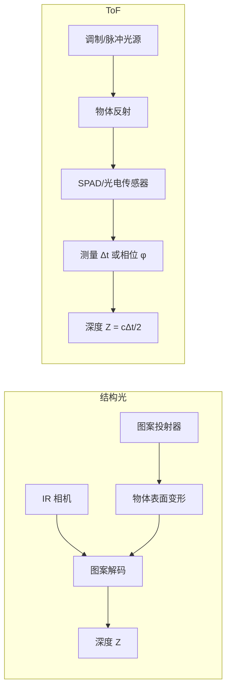

### 5.2.7 事件相机（Event Camera）原理简介

传统相机以固定帧率采集整幅图像，存在时间分辨率受帧率限制、运动模糊、数据冗余等问题。**事件相机（event camera）** 或**动态视觉传感器（Dynamic Vision Sensor, DVS）** 采用完全不同的工作方式：每个像素独立地、异步地响应局部光强变化。

!!! note "术语解释：事件相机、动态视觉传感器、事件、光强对数、异步读出"
    - **事件相机（event camera）**：以异步事件流而非帧序列输出视觉信息的传感器。
    - **动态视觉传感器（Dynamic Vision Sensor, DVS）**：事件相机的早期名称，强调对动态变化的响应。
    - **事件（event）**：单个像素在光强变化超过阈值时产生的一个时空数据点，通常包含 \((x, y, t, p)\)。
    - **光强对数（log intensity）**：事件相机通常响应 \(\log I\) 的变化，而不是线性光强。
    - **异步读出（asynchronous readout）**：像素独立输出，无全局曝光时刻。

当像素处的对数光强变化超过阈值 \(C\) 时，该像素产生一个事件：

$$
\Delta \log I(x, y, t) = \log I(x, y, t) - \log I(x, y, t - \Delta t) \approx \pm C
$$

事件通常用一个四元组 \((x, y, t, p)\) 表示，其中 \((x, y)\) 是像素坐标，\(t\) 是时间戳（可达微秒级），\(p = \pm 1\) 表示光强增加或减少的极性。

事件相机的优势包括：微秒级时间分辨率、极低延迟、高动态范围（通常 > 120 dB）、数据稀疏性。挑战在于：对静态场景无输出；事件数据非传统图像，需要新的算法；噪声和阈值非均匀性会增加处理难度。Gallego 等对事件相机的原理、算法和应用做了系统综述[28]。

!!! note "术语解释：极性、时间戳、动态范围、稀疏性、运动模糊"
    - **极性（polarity）**：事件表示光强增加（ON）或减少（OFF）的二值符号。
    - **时间戳（timestamp）**：事件发生的高精度时间标记。
    - **动态范围（dynamic range）**：传感器能同时记录的最亮与最暗信号之比，通常用 dB 表示。
    - **稀疏性（sparsity）**：事件只在光强变化处产生，静态区域无数据，因此数据量远小于帧图像。
    - **运动模糊（motion blur）**：传统相机曝光期间物体运动导致的图像拖影，事件相机由于响应快而几乎不存在。

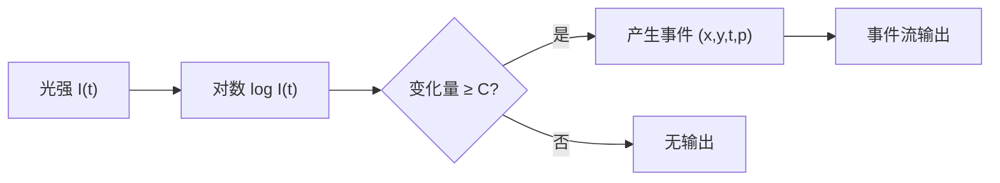

### 5.2.8 图像传感器与相机模组产品选型

人形机器人的视觉系统需要在分辨率、帧率、动态范围、成本、体积和算法友好性之间取得平衡。下表列出常见图像传感器与整机相机模组的代表性型号及其适用场景。

| 传感器/模组 | 厂商 | 分辨率 / 光学格式 | 关键特性 | 典型应用 |
|------------|------|------------------|---------|---------|
| Sony IMX179 | Sony | 8 MP, 1/3.2" | 堆栈式 BSI、低功耗、小尺寸 | 笔记本/机器人前置视觉 |
| Sony IMX214 | Sony | 13 MP, 1/3.06" | BSI、相位对焦、高动态 | 早期智能手机/机器人视觉 |
| Sony IMX296 | Sony | 1.58 MP, 1/2.9" | 全局快门、高帧率、低延迟 | 机器视觉、SLAM |
| Sony IMX477 | Sony | 12.3 MP, 1/2.3" | BSI、高 QE、支持 4K | Raspberry Pi HQ Cam、科研/机器人 |
| Sony IMX519 | Sony | 16 MP, 1/2.53" | BSI、高分辨率、快速 AF | 高分辨率导航/识别 |
| Sony IMX582 | Sony | 48 MP, 1/2" | 堆栈式 BSI、Quad Bayer、高动态 | 高分辨率语义感知 |
| ON Semi AR0234 | onsemi | 2.3 MP, 1/2.6" | 全局快门、高 QE、HDR | 工业视觉、AGV/AMR |
| ON Semi AR0820 | onsemi | 8.3 MP, 1/1.8" | 高动态、LED 闪烁抑制 | 自动驾驶/机器人前视 |
| OmniVision OV9281 | OMNIVISION | 1 MP, 1/4" | 全局快门、单目/双目、IR+ | 结构光/RGB-D 参考相机 |
| OmniVision OV9782 | OMNIVISION | 1 MP, 1/4" | 全局快门、低光、NIR 增强 | 视觉里程计、深度辅助 |
| Samsung ISOCELL | Samsung | 多款 | 双像素、Tetracell、高动态 | 消费电子、机器人 |
| Intel RealSense D435i | Intel | 1280×720 @ 90 Hz | 主动红外双目 + IMU | 机器人导航、避障、SLAM[13] |
| Intel RealSense D455 | Intel | 1280×720 @ 90 Hz | 更优深度精度、IMU、更远基线 | 室内外移动机器人[13] |
| Azure Kinect DK | Microsoft | 3840×2160 RGB + ToF | ToF 深度、麦克风阵列、IMU | 人体追踪、交互 |
| ZED 2i | StereoLabs | 2×1920×1200 @ 30 Hz | 被动双目、内置 IMU、耐候 | 户外 SLAM、人形平台 |
| OAK-D / OAK-D-Pro | Luxonis | 12 MP RGB + 双目 | 4 TOPS 边缘 AI + 深度 | 嵌入式视觉、人形头部 |
| Orbbec Gemini 2 | Orbbec | 1280×800 @ 60 Hz | 主动双目、宽 FOV、IP65 | 服务/人形机器人 |

!!! note "术语解释：全局快门、卷帘快门、光学格式、Quad Bayer、LED 闪烁抑制"
    - **全局快门（global shutter）**：所有像素同时曝光，适合高速运动和滚动平台，避免果冻效应。
    - **卷帘快门（rolling shutter）**：逐行顺序曝光，成本低但运动场景会产生畸变。
    - **光学格式（optical format）**：传感器感光区域对角线长度，常用 1/N 英寸表示。
    - **Quad Bayer**：把 2×2 同色像素合并为一个大像素，兼顾高分辨率和高灵敏度。
    - **LED 闪烁抑制（LED flicker mitigation, LFM）**：通过多曝光或特殊像素结构减少 LED 光源闪烁造成的图像伪影。

选型时需要综合考虑以下因素：

1. **SLAM/VIO 友好性**：全局快门、高帧率、低果冻效应、良好的弱光 SNR10。
2. **深度感知方式**：被动双目适合纹理丰富环境；主动双目/结构光/ToF 适合弱纹理和室内。
3. **处理链位置**：若算法在机器人主 SoC 运行，选择输出 RAW/YUV 的模组；若需要前端 AI 推理，Luxonis OAK-D 等带神经加速器的模组更有优势。
4. **机械与电气接口**：MIPI CSI-2 适合板级连接；USB3/GigE 便于快速原型但延迟较高。

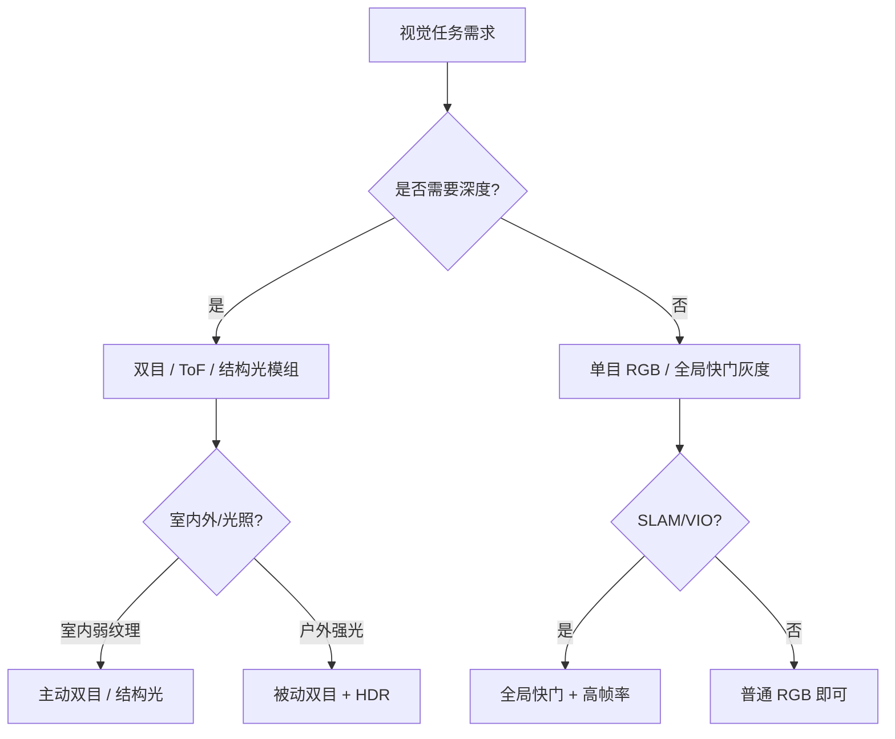

---

## 5.3 激光雷达与毫米波/超声

### 5.3.1 飞行时间测距与 LiDAR 点云

**激光雷达（Light Detection and Ranging, LiDAR）** 通过发射激光脉冲并测量其往返时间来获得目标距离。与相机不同，LiDAR 直接测量三维空间中的距离，输出的是离散的三维点集合，称为 **点云（point cloud）**。

!!! note "术语解释：激光雷达、LiDAR、点云、激光脉冲、回波、测距"
    - **激光雷达 / LiDAR（Light Detection and Ranging）**：利用激光进行探测和测距的主动光学传感器。
    - **点云（point cloud）**：三维空间中一组带坐标（通常还有强度、时间戳）的离散点，是 LiDAR 的输出形式。
    - **激光脉冲（laser pulse）**：LiDAR 发射的短时、高能量光束。
    - **回波（return / echo）**：激光照射目标后反射回来的信号。
    - **测距（ranging）**：测量传感器到目标之间距离的过程。

LiDAR 的基本测距方程为：

$$
R = \frac{c \, \Delta t}{2}
$$

其中 \(R\) 为距离，\(c\) 为光速，\(\Delta t\) 为发射与接收之间的时间差。

LiDAR 接收到的光功率可用 **雷达测距方程** 估算：

$$
P_r = P_t \, \frac{D_r^2}{4 R^2} \, \eta_{atm} \, \eta_{sys} \, \rho \, \cos\theta \, \frac{A_{spot}}{\pi R^2 \tan^2(\theta_{beam}/2)}
$$

其中 \(P_t\) 为发射功率，\(D_r\) 为接收孔径，\(\eta_{atm}\) 和 \(\eta_{sys}\) 分别为大气与系统光学效率，\(\rho\) 为目标反射率，\(\theta\) 为入射角，\(A_{spot}\) 为目标被照亮面积。该式说明：接收功率随距离平方（甚至四次方）衰减，因此远距离探测需要高峰值功率和大接收孔径。

!!! note "术语解释：雷达方程、反射率、接收孔径、大气衰减、光束发散角"
    - **雷达方程（radar equation / LiDAR equation）**：描述发射功率、目标特性、距离与接收功率之间关系的公式。
    - **反射率（reflectivity）**：目标表面反射光的比例，\(\rho\)。
    - **接收孔径（receiver aperture）**：接收光学系统的有效直径。
    - **大气衰减（atmospheric attenuation）**：光在传播中被大气散射和吸收导致的功率损失。
    - **光束发散角（beam divergence angle）**：激光束随传播扩大的角度，决定光斑大小。

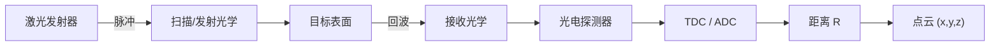

#### LiDAR 发射与接收前端

LiDAR 的性能不仅取决于扫描机制，更取决于发射端的光源、接收端的探测器以及回波信号的数字化方式。可以把一个脉冲式 dToF LiDAR 前端抽象为“光源 + 发射光学 + 目标 + 接收光学 + 光电探测器 + 时间/幅度数字化器”的链路。

!!! note "术语解释：激光二极管、VCSEL、EEL、光纤激光器、脉冲能量、人眼安全等级"
    - **激光二极管（laser diode, LD）**：基于半导体 PN 结的激光源，体积小、效率高，是机器人 LiDAR 最常用的光源。
    - **VCSEL（Vertical-Cavity Surface-Emitting Laser）**：垂直腔面发射激光器，发光面与芯片表面垂直，易于做成阵列和集成光学元件。
    - **EEL（Edge-Emitting Laser）**：边发射激光器，沿晶圆平面发光，功率密度高、光束质量好，常用于远距离 LiDAR。
    - **光纤激光器（fiber laser）**：以掺杂光纤为增益介质的激光器，可产生高能量、窄脉宽脉冲，用于远距离测距和测绘。
    - **脉冲能量（pulse energy）**：单个激光脉冲携带的能量，单位常用 nJ、μJ。
    - **人眼安全等级（laser safety class）**：IEC 60825-1 按激光功率/能量对眼睛和皮肤危害程度分级，Class 1 为正常使用下安全，Class 1M 对裸眼安全但通过光学仪器可能有害。

**激光光源与眼安全**

人形机器人通常在近距离与人交互，LiDAR 的激光辐射必须满足人眼安全标准。IEC 60825-1 将激光产品分为 Class 1、1M、2、3R、3B、4 等等级。对于近红外（905 nm、940 nm、1550 nm）脉冲式 LiDAR，Class 1/1M 意味着在正常操作条件下（包括裸眼直视）不会造成眼损伤；1550 nm 光在角膜前部即被水强烈吸收，无法到达视网膜，因此同样的安全功率阈值远高于 905 nm，这也是远距离车载/机器人 LiDAR 倾向 1550 nm 的原因之一。

发射脉冲的能量 \(E_p\)、峰值功率 \(P_{peak}\)、脉宽 \(\tau_p\) 和重复频率 \(f_{PRF}\) 决定了平均功率 \(P_{avg}=E_p f_{PRF}\)。提高 \(E_p\) 可增大测距能力，但必须在眼安全限值内；减小脉宽可提升时间分辨率和多目标分辨能力，但需要更快的接收前端。

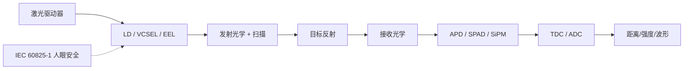

**光电接收器：APD、SPAD、SiPM**

- **APD（Avalanche Photodiode，雪崩光电二极管）**：工作在线性放大区，通过反向偏置电压在耗尽层产生雪崩倍增，内部增益 \(M\) 通常为 \(10\!\sim\!200\)。APD 输出模拟电流脉冲，可用跨阻放大器（TIA）和 ADC 采样，适合中远距离、高动态范围场景。
- **SPAD（Single-Photon Avalanche Diode，单光子雪崩二极管）**：偏置在击穿电压之上，单个光子即可触发自持雪崩，输出数字脉冲。SPAD 具有单光子灵敏度，配合 TDC 可实现皮秒级时间分辨率，是 dToF 和 Flash LiDAR 的核心。
- **SiPM（Silicon Photomultiplier，硅光电倍增管）**：由大量并联的 SPAD 微单元组成，输出为多个 SPAD 脉冲的叠加，兼具高灵敏度和一定的模拟幅度信息，常用于闪烁探测和某些固态 LiDAR。

APD/SPAD 的响应度 \(R\) 定义为光电流与入射光功率之比（A/W）。考虑雪崩增益 \(M\) 后，有效响应度 \(R_M = M R_0\)。但雪崩过程引入过剩噪声因子 \(F(M)\)，使输出信噪比下降。SPAD 的击穿电压 \(V_{br}\) 会随温度漂移，需要主动温度补偿或淬灭电路。

!!! note "术语解释：雪崩倍增、击穿电压、响应度、过剩噪声因子、淬灭电路"
    - **雪崩倍增（avalanche multiplication）**：载流子在强电场中通过碰撞电离产生更多载流子的链式放大过程。
    - **击穿电压（breakdown voltage）**：PN 结发生自持雪崩的反向电压，SPAD 工作在此电压之上。
    - **响应度（responsivity, R）**：探测器输出光电流与入射光功率之比，单位 A/W。
    - **过剩噪声因子（excess noise factor, F）**：雪崩倍增引入的噪声放大倍数，通常随增益增加而增大。
    - **淬灭电路（quenching circuit）**：SPAD 触发后快速降低偏置以停止雪崩并复位的电路。

**时间数字化：TDC 与 ADC**

- **TDC（Time-to-Digital Converter）**：把接收脉冲与参考时钟之间的时间间隔转换为数字码。TDC 分辨率决定 dToF 距离分辨率：\(\Delta R = c \Delta t / 2\)。例如 100 ps 分辨率对应 1.5 cm 距离分辨率。
- **ADC（Analog-to-Digital Converter）**：把 APD 输出的模拟脉冲幅度数字化，可用于强度测量、波形记录和多回波检测。

**峰值检测 vs 全波形数字化**

- **峰值检测（peak detection）**：只记录回波超过阈值的第一个时刻，电路简单、点频高，但会丢失多回波和强度信息。
- **全波形数字化（full-waveform digitization）**：以高采样率记录整个回波波形，可提取多个回波、穿透植被、估计目标粗糙度。数字光子计数 LiDAR（如 Ouster、Hesai 的某些型号）对 SPAD 输出做时间相关单光子计数（TCSPC），本质上也是一种波形数字化。

**测距方程与 SNR**

对于 dToF LiDAR，接收到的平均光子数 \(\bar{n}\) 可写为：

$$
\bar{n} = \eta \frac{E_p}{h \nu} \frac{\rho \cos\theta}{\pi R^2} A_r \, T_{atm}^2(R)
$$

其中 \(\eta\) 为探测器量子效率，\(E_p/(h\nu)\) 为发射光子数，\(\rho\) 为目标反射率，\(A_r\) 为接收孔径面积，\(T_{atm}\) 为单程大气透过率。该式表明回波光子数随距离平方衰减，随反射率和接收孔径线性增加。

信噪比受信号光子数、背景光光子数、暗计数和读出噪声共同决定。在阳光直射下，背景光可能淹没信号，因此常采用窄带滤光片、时间门控、905/940 nm 与 1550 nm 波段选择以及多脉冲累积来提升 SNR。

**多回波、测距模糊与干扰**

- **多回波（multi-return）**：激光光斑可能同时覆盖前景和背景（如植被、窗框），全波形或多次触发检测可输出多个距离值。
- **测距模糊（range ambiguity）**：脉冲重复频率 \(f_{PRF}\) 过高时，前一个脉冲的回波可能在下一个脉冲发射后才到达，导致距离折叠。最大无模糊距离 \(R_{max}=c/(2 f_{PRF})\)。
- **LiDAR 间串扰（inter-LiDAR crosstalk）**：多台 LiDAR 同时工作时，可能接收到彼此的激光脉冲。随机编码脉冲、波长分集和时间同步是主要抑制手段。
- **多径（multipath）**：镜面反射或强散射体使光沿多条路径到达接收器，造成虚假点或距离偏差。
- **反射率依赖**：暗色目标（反射率 \(\rho\approx5\%\)）比浅色目标（\(\rho\approx90\%\)）回波弱一个数量级以上，影响最大测距和点云密度。

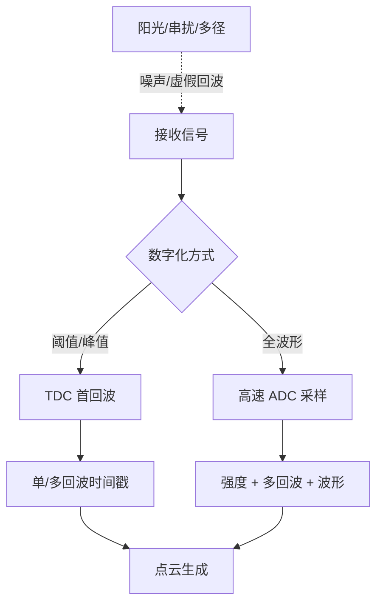

#### dToF LiDAR 链路预算数值算例

前面的雷达方程给出了接收功率与距离、反射率、孔径之间的定性关系。工程选型时需要把方程中的各项代成具体数值，计算不同距离、不同目标反射率下的回波光子数和信噪比，从而判断 LiDAR 是否能满足人形机器人导航与避障的测距要求。

!!! note "术语解释：链路预算、发射光子数、回波光子数、信噪比、探测概率"
    - **链路预算（link budget）**：把发射、传播、接收各环节的能量/功率损失逐项计算，得到最终接收信号强度的过程。
    - **发射光子数（emitted photons）**：单个激光脉冲包含的光子数，$N_t = E_p / (h\nu)$。
    - **回波光子数（return photons）**：被目标反射并进入接收器的光子数。
    - **信噪比（Signal-to-Noise Ratio, SNR）**：信号功率（或光子数）与各类噪声功率（或光子数）之比。
    - **探测概率（detection probability）**：在一定虚警概率下，信号被正确检测到的概率。

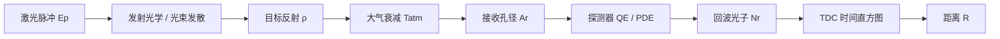

**典型 905 nm dToF LiDAR 参数**

| 参数 | 符号 | 数值 | 说明 |
|------|------|------|------|
| 激光波长 | $\lambda$ | 905 nm | 硅探测器敏感波段 |
| 单脉冲能量 | $E_p$ | 5 nJ | Class 1 人眼安全限制内 |
| 脉冲宽度 | $\tau_p$ | 5 ns | 决定距离分辨率约 0.75 m |
| 重复频率 | $f_{PRF}$ | 100 kHz | 最大无模糊距离 1.5 km |
| 光束发散角 | $\theta_{beam}$ | 0.2° | 1°≈17.45 mrad |
| 接收孔径直径 | $D_r$ | 10 mm | 接收面积 $A_r = \pi D_r^2/4$ |
| 探测器量子效率 | $\eta$ | 0.25 | 905 nm 典型值 |
| 目标反射率 | $\rho$ | 0.10（10%） | 暗色目标 |
| 入射角 | $\theta$ | 0° | 正入射 |
| 单程大气透过率 | $T_{atm}$ | 0.98 | 晴朗空气短距离近似 |

**回波光子数计算**

发射光子数为：

$$
N_t = \frac{E_p}{h c / \lambda} = \frac{5\times 10^{-9}\ \mathrm{J}}{(6.626\times 10^{-34}\ \mathrm{J\cdot s})(3\times 10^8\ \mathrm{m/s}) / 905\times 10^{-9}\ \mathrm{m}} \approx 2.28 \times 10^{10}
$$

单个脉冲约发射 230 亿个光子。这些光子中只有很小一部分被目标反射并进入接收孔径。回波光子数公式可简化为：

$$
N_r = N_t \, \eta \, \rho \, \cos\theta \, \frac{A_r}{\pi R^2} \, T_{atm}^2(R)
$$

该式假设目标为朗伯反射体，反射光在半球空间均匀散射。$\pi R^2$ 项来自半球立体角 $2\pi$ 与几何投影关系；若采用更精确的光束发散模型，可用 $A_r / (\pi R^2 \tan^2(\theta_{beam}/2))$ 乘以光斑覆盖比例。

以 $R = 10\ \mathrm{m}$、$\rho = 0.10$、$A_r = 7.85\times 10^{-5}\ \mathrm{m^2}$ 为例：

$$
N_r \approx 2.28\times 10^{10} \times 0.25 \times 0.10 \times 1 \times \frac{7.85\times 10^{-5}}{\pi \times 10^2} \times 0.98^2 \approx 137
$$

即单个脉冲返回约 137 个光子。对于 SPAD 探测器，若光子探测效率 PDE 为 0.20，则实际被探测到的信号光子约 27 个/脉冲。

**信噪比与探测概率**

总噪声包括暗计数 $N_d$、背景光 $N_b$ 和读出噪声。设每脉冲等效暗计数与背景光共 $N_{noise} = 5$ 个，则单脉冲 SNR 为：

$$
\mathrm{SNR}_{pulse} = \frac{N_{sig}}{\sqrt{N_{sig} + N_{noise}}} = \frac{27}{\sqrt{27 + 5}} \approx 4.8
$$

通过累积 $M = 100$ 个脉冲，信号相干叠加而噪声按 $\sqrt{M}$ 增长，累积 SNR 提升 $\sqrt{M}$ 倍：

$$
\mathrm{SNR}_{accum} = \mathrm{SNR}_{pulse} \sqrt{M} \approx 4.8 \times 10 = 48
$$

高 SNR 意味着距离估计误差小。对于 TCSPC，时间抖动导致距离误差的标准差约为：

$$
\sigma_R = \frac{c \, \sigma_t}{2 \sqrt{N_{sig,accum}}}
$$

若 $\sigma_t = 100\ \mathrm{ps}$，累积信号光子 2700 个，则：

$$
\sigma_R \approx \frac{3\times 10^8 \times 100\times 10^{-12}}{2 \times \sqrt{2700}} \approx 0.29\ \mathrm{cm}
$$

**不同距离与反射率下的回波光子数**

| 距离 $R$ (m) | $\rho=0.05$ | $\rho=0.10$ | $\rho=0.50$ | $\rho=0.90$ |
|-------------|-------------|-------------|-------------|-------------|
| 5 | 548 | 1096 | 5479 | 9862 |
| 10 | 137 | 274 | 1370 | 2465 |
| 30 | 15.2 | 30.5 | 152 | 274 |
| 50 | 5.5 | 11.0 | 55 | 99 |

从表中可见，暗色目标（5% 反射率）在 50 m 处单脉冲回波仅约 5–6 个光子，必须依赖多脉冲累积或更高发射能量；而高反射目标（90%）在 50 m 仍有近百个光子/脉冲。

**Python 示例：dToF LiDAR 链路预算计算**

```python
import numpy as np
import matplotlib.pyplot as plt

# 物理常数
h = 6.626e-34      # J·s
c = 3.0e8          # m/s
# LiDAR 参数
E_p = 5e-9         # J
lam = 905e-9       # m
D_r = 10e-3        # m
A_r = np.pi * (D_r/2)**2
eta = 0.25         # 探测器 QE
PDE = 0.20         # SPAD 光子探测效率
T_atm = 0.98
N_noise_per_pulse = 5
sigma_t = 100e-12  # s

# 发射光子数
N_t = E_p / (h*c/lam)
print(f"发射光子数/脉冲: {N_t:.2e}")

def returned_photons(R, rho, theta_deg=0):
    theta = np.deg2rad(theta_deg)
    return N_t * eta * rho * np.cos(theta) * (A_r / (np.pi * R**2)) * T_atm**2

def detected_photons(R, rho):
    return returned_photons(R, rho) * PDE

# 距离与反射率扫描
R = np.linspace(2, 80, 200)
rhos = [0.05, 0.10, 0.50, 0.90]
plt.figure(figsize=(10,4))
for rho in rhos:
    N_sig = detected_photons(R, rho)
    snr = N_sig / np.sqrt(N_sig + N_noise_per_pulse)
    plt.semilogy(R, snr, label=f"ρ={rho}")
plt.axhline(5, color='k', linestyle='--', label="SNR=5 threshold")
plt.xlabel("Range R (m)"); plt.ylabel("Single-pulse SNR")
plt.title("dToF LiDAR Single-Pulse SNR vs Range")
plt.legend(); plt.grid(True, which='both', ls='--')
plt.tight_layout(); plt.show()

# 50 m, 10% 反射率，累积 100 脉冲的距离精度
R0, rho0, M = 50, 0.10, 100
N_sig_single = detected_photons(R0, rho0)
snr_single = N_sig_single / np.sqrt(N_sig_single + N_noise_per_pulse)
snr_accum = snr_single * np.sqrt(M)
sigma_R = c * sigma_t / (2 * np.sqrt(N_sig_single * M))
print(f"R={R0} m, ρ={rho0}: 单脉冲 SNR={snr_single:.1f}, 累积 SNR={snr_accum:.1f}")
print(f"累积 {M} 脉冲后距离标准差: {sigma_R*100:.2f} cm")
```

该脚本展示了链路预算的核心计算流程：从脉冲能量出发，根据朗伯反射模型估算回波光子数，再考虑探测效率和噪声得到 SNR，最后给出多脉冲累积后的测距精度。工程师可通过修改 $E_p$、$D_r$、$\eta$、PDE 等参数，快速评估不同方案对人形机器人中远距感知的可行性。激光测距技术综述见 Amann 等[44]。

#### SPAD/SiPM 探测阵列：淬火、恢复与时间数字转换

前面的 LiDAR 前端已经提到 APD、SPAD、SiPM 等光电探测器。SPAD 与 SiPM 之所以能够实现单光子灵敏度与皮秒级时间分辨，核心在于把 PN 结偏置在**击穿电压（breakdown voltage）**以上，工作在所谓的**盖革模式（Geiger mode）**。本节从器件物理出发，讨论淬灭/恢复电路、死时间、后脉冲、暗计数、串扰、光子探测效率与时间相关单光子计数（TCSPC）等关键问题。

!!! note "术语解释：盖革模式、击穿电压、过电压、雪崩倍增、淬灭电路"
    - **盖革模式（Geiger mode）**：把 PN 结反向偏置到击穿电压以上，使单个光生载流子即可触发自持雪崩放电的工作模式。
    - **击穿电压（breakdown voltage, \(V_{br}\)）**：PN 结发生自持雪崩的临界反向电压，与掺杂浓度、温度有关。
    - **过电压（overvoltage / excess bias）**：实际偏置电压高于击穿电压的部分，\(\Delta V = V_{bias} - V_{br}\)，直接决定雪崩触发概率和定时精度。
    - **雪崩倍增（avalanche multiplication）**：载流子在强电场中通过碰撞电离产生链式倍增，单个电子-空穴对可演化为宏观电流脉冲。
    - **淬灭电路（quenching circuit）**：雪崩触发后迅速把结电压降到击穿电压以下以终止雪崩，并在死时间后恢复初始偏置的电路。

**盖革模式下的雪崩触发**

在盖革模式下，耗尽层电场极高。当一个光子被吸收并产生一个电子-空穴对时，载流子在电场中加速并与晶格碰撞电离，形成自持雪崩。若不加限制，电流会迅速增大到损坏器件。因此必须配合**淬灭电路**将偏置快速降到 \(V_{br}\) 以下。

过电压定义为：

$$
\Delta V = V_{bias} - V_{br}
$$

\(\Delta V\) 越大，载流子触发雪崩的概率越高，光子探测效率（PDE）和定时精度提升，但暗计数、后脉冲和串扰也会恶化。击穿电压本身随温度升高而增加（温度系数约 \(10\sim 30\ \mathrm{mV/°C}\)），因此高精度 dToF 系统通常需要温度补偿或闭环偏置调节。

雪崩触发概率（breakdown probability）可近似写作：

$$
P_{bd} \approx 1 - \exp\!\left(-\int_{0}^{W} \alpha(x)\,dx\right)
$$

其中 \(W\) 为耗尽层宽度，\(\alpha(x)\) 为与电场相关的电离系数。在工程上常把光子探测效率（Photon Detection Efficiency, PDE）表示为量子效率与触发概率的乘积：

$$
\eta_{PDE}(\lambda, \Delta V) = \eta_{QE}(\lambda) \, P_{bd}(\Delta V)
$$

!!! note "术语解释：光子探测效率、量子效率、电离系数、耗尽层宽度"
    - **光子探测效率（Photon Detection Efficiency, PDE）**：入射光子被探测到的总概率，等于量子效率与雪崩触发概率的乘积。
    - **量子效率（Quantum Efficiency, QE）**：被吸收的光子中产生可收集载流子的比例。
    - **电离系数（ionization coefficient）**：载流子在单位长度内通过碰撞电离产生新载流子的概率。
    - **耗尽层宽度（depletion width）**：PN 结中自由载流子被扫空的区域宽度，决定吸收与倍增的有效体积。

```mermaid
xychart-beta
    title "SPAD 反向 I-V 特性（示意图）"
    x-axis "反向偏压 V (V)" 0 --> 30
    y-axis "电流 I (相对对数刻度)" 0 --> 1000
    line "I-V" [1, 1, 1, 2, 3, 5, 10, 100, 500, 900]
    annotation "击穿电压 V_br" {"x":20, "y":500}
    annotation "盖革工作区" {"x":25, "y":900}
```

**被动淬灭与主动淬灭**

淬灭电路的基本任务是在雪崩发生后迅速降低 SPAD 偏置，然后再恢复到 \(V_{bias}\)。常见方式分为两类：

1. **被动淬灭（passive quenching）**：在 SPAD 阳极或阴极串联一个大电阻（ballast resistor，典型 \(100\ \mathrm{k\Omega}\sim 1\ \mathrm{M\Omega}\)）。雪崩电流流过电阻产生压降，使结电压自动降到 \(V_{br}\) 以下，雪崩因电场不足而停止。随后通过 RC 充电恢复。恢复时间主要由 \(R_{quench}\) 与 SPAD 结电容 \(C_j\) 决定：

$$
\tau_{rec} \sim R_{quench} \, C_j
$$

被动淬灭电路简单、噪声低，但死时间长（典型 \(100\ \mathrm{ns}\sim \mu\mathrm{s}\)），限制了最大计数率。

2. **主动淬灭（active quenching）**：用高速晶体管或比较器检测雪崩电流，主动把偏置迅速拉低（\(<1\ \mathrm{ns}\)），并在可控的**保持时间（hold-off time）**后再主动充电恢复到 \(V_{bias}\)。主动淬灭的死时间可短至几纳秒到几十纳秒，计数率可达 \(10\sim 100\ \mathrm{Mcps}\) 量级，但电路复杂、功耗和电磁干扰更大。

```mermaid
sequenceDiagram
    participant P as 光子入射
    participant A as SPAD 结电压
    participant Q as 淬灭电路
    participant R as 恢复电路
    P->>A: 触发雪崩，电流骤增
    A->>Q: 检测到电流
    alt 被动淬灭
        Q->>A: 大电阻压降，自淬灭
        A->>A: RC 缓慢恢复（死时间长）
    else 主动淬灭
        Q->>A: 晶体管快速拉低偏置
        R->>A: 主动再充电
        A->>A: 死时间 ~ns\sim 10 ns
    end
```

**死时间、后脉冲、暗计数与串扰**

这些参数决定了 SPAD/SiPM 在时间分辨测距中的实际性能：

- **死时间（dead time）**：一次雪崩后器件无法响应下一个光子的最短时间。死时间内到达的光子不被记录，导致计数损失和测距偏差。
- **后脉冲（afterpulsing）**：雪崩过程中被陷阱（trap）捕获的载流子在稍后释放，再次触发雪崩，形成虚假计数。陷阱密度与工艺、温度有关，通常通过降低工作温度或减小过电压抑制。
- **暗计数率（Dark Count Rate, DCR）**：无光照时由于热激发、隧穿等产生的计数，常用 counts/s 或 Hz 表示。DCR 随温度指数上升，约每升高 \(8\sim 10\ ^\circ\mathrm{C}\) 翻倍。
- **串扰（crosstalk）**：一个 SPAD 雪崩时产生的光子或电脉冲触发邻近像素。可分为**光学串扰**（雪崩光子被邻近像素吸收）和**电串扰**（衬底电流/电压波动）。在密集阵列中，串扰会导致时间直方图拖尾和虚假点。
- **光子探测概率 / PDE 随波长与过电压变化**：PDE 在峰值波长处最高，过电压不足时 PDE 下降，过电压过高时噪声增大。

```mermaid
xychart-beta
    title "TCSPC 光子到达时间直方图（示意图）"
    x-axis "时间 bin (ns)" 0 --> 100
    y-axis "计数" 0 --> 60
    line "计数" [3, 3, 4, 6, 10, 18, 35, 55, 40, 20, 10, 6, 4, 3, 2]
    annotation "目标峰（距离）" {"x":60, "y":55}
    annotation "后脉冲拖尾" {"x":80, "y":10}
    annotation "暗计数本底" {"x":20, "y":4}
```

!!! note "术语解释：死时间、后脉冲、暗计数率、串扰、保持时间"
    - **死时间（dead time）**：探测器完成一次事件后不能响应下一次事件的最短时间间隔。
    - **后脉冲（afterpulsing）**：载流子被陷阱捕获后延迟释放导致的虚假雪崩。
    - **暗计数率（Dark Count Rate, DCR）**：无光照时的自发计数率。
    - **串扰（crosstalk）**：一个像素触发事件引起邻近像素误触发。
    - **保持时间（hold-off time）**：主动淬灭中故意维持低偏置的时间，用于降低后脉冲概率。

**时间相关单光子计数（TCSPC）**

dToF LiDAR 把激光脉冲发射时刻作为“START”，SPAD 探测到回波光子作为“STOP”，通过**时间数字转换器（Time-to-Digital Converter, TDC）**测量两者之间的时间差 \(\Delta t\)。由于单光子探测具有随机性，单次测量无法区分信号光子与暗计数/背景光，因此需要重复发射大量激光脉冲，并把每次测得的时间差累加成直方图。直方图峰值对应目标距离：

$$
R = \frac{c \, \Delta t_{peak}}{2}
$$

TCSPC 的信噪比与累积光子数 \(\sqrt{N}\) 成正比：累积光子越多，峰位估计越准。但累积时间过长会降低帧率，因此高帧率 dToF 需要：

- 高重频激光（\(f_{PRF}\) 可达 \(100\ \mathrm{kHz}\sim \mathrm{MHz}\)）；
- 每像素或每小像素组集成一个 TDC，实现大规模并行时间数字化；
- 足够的 SPAD 填充因子与 PDE，以在单位时间内收集足够回波光子。

```mermaid
flowchart LR
    A["激光同步脉冲 START"] --> B["TDC 开始计时"]
    C["SPAD 探测到回波 STOP"] --> B
    B --> D["时间数字化 Δt"]
    D --> E["直方图累加器"]
    E --> F["峰位拟合"]
    F --> G["距离 R = cΔt_peak / 2"]
```

!!! note "术语解释：时间数字转换器、TCSPC、时间抖动、直方图累加"
    - **时间数字转换器（Time-to-Digital Converter, TDC）**：把时间间隔转换为数字码的电路，分辨率决定测距精度。
    - **TCSPC（Time-Correlated Single Photon Counting）**：通过重复测量并累加光子到达时间直方图来估计时间间隔的方法。
    - **时间抖动（timing jitter）**：同一目标距离下多次测量时间差的统计展宽，常用标准差 \(\sigma_t\) 表示。
    - **直方图累加（histogram accumulation）**：把大量单光子事件按到达时间分 bin 计数，以抑制随机噪声。

**定时精度与时间抖动**

TCSPC 测距精度受限于时间抖动，可近似分解为：

$$
\sigma_t^2 = \sigma_{TDC}^2 + \sigma_{SPAD}^2 + \sigma_{walk}^2 + \sigma_{laser}^2
$$

其中 \(\sigma_{TDC}\) 为 TDC 量化与时钟抖动，\(\sigma_{SPAD}\) 为雪崩建立时间的统计涨落，\(\sigma_{walk}\) 为脉冲幅度/形状变化导致的时间游走，\(\sigma_{laser}\) 为激光脉冲宽度。提高 PDE 和过电压可减小 \(\sigma_{SPAD}\)，但会增大噪声；TDC 分辨率通常需要优于 \(100\ \mathrm{ps}\) 才能满足厘米级测距。

**3D 堆叠 SPAD 传感器**

传统平面 SPAD 阵列中，每个像素既要容纳 SPAD 本身，又要容纳淬灭、TDC、读出电路，导致**填充因子（fill factor）**和**读出电路面积**相互争夺。3D 堆叠技术把感光层与逻辑层分别制造后垂直互连，典型结构为：

- **顶层（top tier）**：背照式 SPAD 像素阵列，只负责光电转换与雪崩；
- **底层（bottom tier）**：CMOS 逻辑层，集成淬灭电路、TDC、计数器和读出接口；
- **垂直互连**：通过 Cu-Cu 键合或硅通孔（TSV）实现像素级高速互连。

Sony IMX459 就是业界首款面向车载 LiDAR 的堆叠式 SPAD dToF 传感器：顶层为约 10 \(\mu\mathrm{m}\) 像素的 SPAD 阵列，底层集成距离测量处理电路，实现约 10 万像素、905 nm 下 24% PDE、6 ns 响应速度[36]。这种结构在提高填充因子、降低寄生电容、提升并行 TDC 密度的同时，也减小了模块尺寸与功耗。

```mermaid
flowchart LR
    subgraph 顶层像素芯片
    A["入射光"] --> B["背照式 SPAD 像素阵列"]
    end
    B -->|"Cu-Cu 键合 / TSV"| C["底层逻辑芯片"]
    subgraph 底层逻辑芯片
    C --> D["淬灭与恢复电路"]
    D --> E["TDC / 计数器"]
    E --> F["读出与 MIPI CSI-2 接口"]
    end
```

Cova、Ghioni 等人对 SPAD 淬灭电路与单光子探测特性做了经典综述，奠定了现代 dToF 与 TCSPC 系统的电路设计基础[35]。

### 5.3.2 扫描机制：机械旋转、MEMS、固态/Flash、OPA

LiDAR 按扫描方式可分为机械旋转式、MEMS 微镜式、固态（Flash）和光学相控阵（OPA）。

!!! note "术语解释：机械旋转式 LiDAR、MEMS 微镜、固态 LiDAR、Flash LiDAR、OPA"
    - **机械旋转式 LiDAR（mechanically rotating LiDAR）**：通过电机带动发射/接收模块整体旋转，实现 \(360^\circ\) 水平扫描。
    - **MEMS 微镜（Micro-Electro-Mechanical Systems mirror）**：利用微电子机械系统驱动的微小反射镜，通过快速摆动实现光束偏转。
    - **固态 LiDAR（solid-state LiDAR）**：无宏观运动部件的 LiDAR，通常包括 Flash、OPA 等方案。
    - **Flash LiDAR**：一次性照亮整个视场，并用二维探测器阵列同时接收回波，像"激光闪光灯拍照"。
    - **OPA（Optical Phased Array）**：光学相控阵，通过控制多个相干光源的相位差实现光束电子扫描。

机械旋转式 LiDAR（如 Velodyne HDL-64E、Ouster OS1）优点是 \(360^\circ\) 视场、测距远、技术成熟；缺点是成本高、体积大、机械旋转部件寿命受限、易受振动影响。

MEMS LiDAR 把扫描镜集成到芯片上，体积小、成本低、可批量制造；但扫描角度有限、镜面机械可靠性受冲击影响、扫描速度受限。

Flash LiDAR 无扫描延迟，可同时获取整个场景深度，适合高动态场景；但有效距离受激光总功率和探测器灵敏度限制，分辨率通常较低。

OPA 通过相控阵原理实现纯固态电子扫描，理论上扫描速度快、无机械磨损；但旁瓣抑制、相位校准、工艺一致性和温度稳定性仍是工程难点。

```mermaid
flowchart LR
    A["扫描机制"] --> B["机械旋转"]
    A --> C["MEMS 微镜"]
    A --> D["固态 Flash"]
    A --> E["OPA 相控阵"]
    B --> F["360° 视场 / 高可靠挑战"]
    C --> G["小型化 / 角度受限"]
    D --> H["无扫描延迟 / 距离受限"]
    E --> I["纯固态 / 相位校准难"]
```

### 5.3.3 毫米波雷达与超声波传感器基础

**毫米波雷达（millimeter-wave radar）** 工作在 30–300 GHz 频段（波长 1–10 mm），通过发射和接收电磁波测量目标的距离、速度和角度。

!!! note "术语解释：毫米波雷达、FMCW、多普勒效应、距离-多普勒图、角分辨率"
    - **毫米波雷达（millimeter-wave radar）**：工作在毫米波波段的雷达，常用于汽车 ADAS 和机器人。
    - **FMCW（Frequency-Modulated Continuous Wave）**：调频连续波，通过发射频率线性变化的连续波并比较回波频率差来测距。
    - **多普勒效应（Doppler effect）**：波源与观察者相对运动导致接收频率变化的现象。
    - **距离-多普勒图（range-Doppler map）**：雷达信号处理后得到的二维谱，一个轴是距离，另一个轴是径向速度。
    - **角分辨率（angular resolution）**：雷达区分两个相邻角度目标的能力，与天线孔径成正比。

FMCW 雷达把发射信号频率按锯齿波调制：

$$
f_t(t) = f_0 + k t
$$

其中 \(k = B / T\) 是调频斜率，\(B\) 为带宽，\(T\) 为扫频周期。回波信号与本地发射信号混频后得到中频信号，其频率 \(f_b\) 与距离 \(R\) 成正比：

$$
f_b = \frac{2 k R}{c}
$$

同时，由于多普勒效应，运动目标还会引入频移：

$$
f_d = \frac{2 v_r}{\lambda}
$$

其中 \(v_r\) 为径向速度，\(\lambda\) 为波长。毫米波雷达对雨雾灰尘穿透能力强，可测速，但角分辨率和点云密度远低于 LiDAR。

**超声波传感器（ultrasonic sensor）** 利用频率高于人耳听觉上限（通常 20–200 kHz）的机械波测距。其原理与 ToF 相同：

$$
R = \frac{v_{sound} \, \Delta t}{2}
$$

其中 \(v_{sound}\) 为声速（空气中约 343 m/s，受温度影响）。超声波传感器成本低、结构简单，适合近距离避障和液位检测；但波束宽、更新慢、对软吸声目标不敏感。

!!! note "术语解释：超声波、机械波、声速、波束角、回波时间"
    - **超声波（ultrasound）**：频率高于 20 kHz 的声波。
    - **机械波（mechanical wave）**：需要介质传播的波，声波是典型的纵波机械波。
    - **声速（speed of sound）**：声波在介质中的传播速度，空气中约 343 m/s（常温）。
    - **波束角（beam angle）**：超声波发射能量的主瓣角度范围。
    - **回波时间（echo time）**：声波发射到接收反射波的时间。

#### FMCW 毫米波雷达信号模型与距离-多普勒处理

毫米波雷达虽然与 LiDAR 同属主动测距，但它发射的是连续调频电磁波而非激光脉冲。FMCW 雷达的发射信号通常是一个频率随时间线性增长的“啁啾（chirp）”：

$$
s_t(t)=A_t\cos\!\left[2\pi\left(f_0 t+\frac{1}{2}k t^2\right)\right],\qquad 0\le t\le T
$$

其中 $f_0$ 为起始频率，$B=kT$ 为 chirp 带宽，$T$ 为 chirp 持续时间，$k=B/T$ 为调频斜率。信号遇到目标后延迟 $\tau=2R/c$ 返回，接收信号为：

$$
s_r(t)=A_r\cos\!\left[2\pi\left(f_0(t-\tau)+\frac{1}{2}k(t-\tau)^2\right)\right]
$$

将接收信号与发射信号混频（相乘）并低通滤波，得到中频（beat）信号：

$$
s_{IF}(t)=A_{IF}\cos\!\left[2\pi\left(k\tau t+f_0\tau-\frac{1}{2}k\tau^2\right)\right]
$$

忽略常数相位项后，中频频率为：

$$
f_b=k\tau=\frac{2kR}{c}=\frac{2BR}{cT}
$$

这说明在理想静止目标下，测距转化为测频。由于 $	au$ 通常远小于 $T$，$k\tau t$ 项在单个 chirp 内近似为常频，对 $s_{IF}(t)$ 做 FFT 即可在距离维出现峰值。距离分辨率由带宽决定：

$$
\Delta R=\frac{c}{2B}
$$

例如 $B=1\ \mathrm{GHz}$ 时，$\Delta R\approx 0.15\ \mathrm{m}$；$B=4\ \mathrm{GHz}$ 时，$\Delta R\approx 3.75\ \mathrm{cm}$，已接近机器人近距离操作所需的精度。

当目标以径向速度 $v_r$ 运动时，回波还叠加多普勒频移 $f_d=-2v_r/\lambda$（接近雷达时为正）。单 chirp 内 $f_b$ 同时包含距离与速度信息：

$$
f_b=\frac{2kR}{c}-\frac{2v_r}{\lambda}
$$

为解耦距离和速度，工程上通常发射一帧多个 chirp（pulse repetition interval $T_{PRI}=T+T_{idle}$），对同一距离 bin 在不同 chirp 间做 FFT（多普勒 FFT），得到二维 **range-Doppler map**。第 $n$ 个 chirp 的采样可写为：

$$
s_{IF}(m,n)=A_{IF}\exp\!\left[j2\pi\left(\frac{2kR}{c}\frac{m}{f_s}-\frac{2v_r}{\lambda}nT_{PRI}\right)\right]
$$

对其先做“距离 FFT”（沿快时间 $m$），再做“多普勒 FFT”（沿慢时间 $n$），峰值位置即给出 $(R,v_r)$。速度分辨率为：

$$
\Delta v=\frac{\lambda}{2NT_{PRI}}
$$

最大不模糊速度为：

$$
v_{\max}=\frac{\lambda}{4T_{PRI}}
$$

$N$ 为每帧 chirp 数。要提高速度分辨率需增加帧长；要提高不模糊速度需缩短 $T_{PRI}$，二者相互制约。

!!! note "术语解释：啁啾、中频信号、距离 FFT、多普勒 FFT、距离分辨率、不模糊速度"
    - **啁啾（chirp）**：频率随时间线性变化的连续波脉冲。
    - **中频信号（intermediate frequency, IF）**：FMCW 雷达混频后得到的差频信号。
    - **距离 FFT（range FFT）**：对单个 chirp 的快时间采样做 FFT，得到距离谱。
    - **多普勒 FFT（Doppler FFT）**：对多个 chirp 同一距离 bin 的慢时间序列做 FFT，得到速度谱。
    - **距离分辨率（range resolution）**：雷达可区分两个相邻目标的最小距离差，$\Delta R=c/(2B)$。
    - **不模糊速度（unambiguous velocity）**：单帧内不发生速度混叠的最大可测速度。

```mermaid
flowchart LR
    A["发射 chirp s_t(t)"] --> B["目标反射延迟 τ=2R/c"]
    B --> C["接收 chirp s_r(t)"]
    C --> D["混频 + 低通"]
    D --> E["中频 s_IF(t)"]
    E --> F["距离 FFT"]
    F --> G["多普勒 FFT"]
    G --> H["Range-Doppler map"]
```

#### MIMO 雷达与角度分辨

人形机器人若只用单个收发通道，毫米波雷达只能测距离和径向速度，无法直接估计方位。要获得角度，必须利用多个天线组成阵列。与麦克风阵列（见 5.7.4 节）类似，均匀线阵的导向矢量为：

$$
\mathbf{a}(\theta)=\begin{bmatrix}1 & e^{-j\frac{2\pi d}{\lambda}\sin\theta} & \cdots & e^{-j\frac{2\pi d}{\lambda}(M-1)\sin\theta}\end{bmatrix}^T
$$

其中 $d$ 为阵元间距，$M$ 为阵元数。半功率波束宽度（角度分辨率）近似为：

$$
\Delta\theta\approx\frac{\lambda}{M d\cos\theta}
$$

可见要获得 $1°$ 级分辨率，需要孔径 $M d\approx 60\lambda$；在 77 GHz（$\lambda\approx 3.9\ \mathrm{mm}$）下约需 $23\ \mathrm{cm}$ 的阵列，对人形机器人头部或躯干并不现实。

**MIMO（Multiple-Input Multiple-Output）雷达**通过 $N_{TX}$ 个发射天线和 $N_{RX}$ 个接收天线形成 $N_{TX}\times N_{RX}$ 个虚拟通道，等效扩展阵列孔径而不增加物理尺寸。若发射信号正交（如时分、频分或码分），接收端可分离各发射通道贡献，得到虚拟阵列响应：

$$
\mathbf{a}_{\text{virtual}}(\theta)=\mathbf{a}_{RX}(\theta)\otimes\mathbf{a}_{TX}(\theta)
$$

其中 $\otimes$ 为 Kronecker 积。虚拟孔径增大 $N_{TX}$ 倍，角度分辨率相应提高。例如 3 发 4 收可得到 12 个虚拟通道，等效孔径扩大 3 倍。

!!! note "术语解释：MIMO 雷达、虚拟阵列、导向矢量、方位角、波束宽度"
    - **MIMO 雷达（Multiple-Input Multiple-Output radar）**：使用多个发射和接收通道，通过信号正交性构造虚拟阵列的雷达。
    - **虚拟阵列（virtual array）**：由收发通道组合形成的等效天线阵列。
    - **方位角（azimuth angle）**：目标相对于雷达正前方的水平角度。
    - **波束宽度（beamwidth）**：天线主瓣的半功率角宽度，决定角度分辨率。

```mermaid
flowchart TD
    subgraph 物理天线
    TX1["TX1"] --> RX1["RX1"]
    TX1 --> RX2["RX2"]
    TX2["TX2"] --> RX1
    TX2 --> RX2
    end
    A["N_TX × N_RX 虚拟通道"] --> B["虚拟阵列导向矢量"]
    B --> C["MUSIC / Beamforming DOA"]
    C --> D["目标方位角 θ"]
```

#### 超声波测距的温度补偿与波束指向性

超声波传感器在人形机器人中常用于足端或躯干的近距离避障。其最大系统误差来源之一是声速随温度变化。空气中声速的经验公式为：

$$
v_{sound}(T)\approx 331.3+0.606\,T\quad (\mathrm{m/s})
$$

$T$ 为摄氏温度。若机器人从 $20°\mathrm{C}$ 车间进入 $40°\mathrm{C}$ 户外，声速从 $343.4\ \mathrm{m/s}$ 升至 $355.5\ \mathrm{m/s}$，变化约 $3.5\%$。对 $1\ \mathrm{m}$ 目标，固定使用 $343\ \mathrm{m/s}$ 将产生约 $3.5\ \mathrm{cm}$ 的距离误差。因此高精度超声波测距必须配备温度补偿，或用多普勒/回波标定在线修正。

超声波换能器通常近似为圆形活塞声源，其远场声压方向性由第一类一阶贝塞尔函数描述。第一零点角度满足：

$$
\sin\theta_1\approx 1.22\frac{\lambda}{D}
$$

其中 $D$ 为换能器直径。以 $40\ \mathrm{kHz}$ 超声波为例，$\lambda=v/f\approx 8.6\ \mathrm{mm}$，若 $D=16\ \mathrm{mm}$，则 $\theta_1\approx 33°$。这意味着超声能量集中在较宽的锥形区域内，对精确指向不利，但对近距离避障有利。

!!! note "术语解释：温度补偿、圆形活塞声源、贝塞尔函数、波束宽度、换能器直径"
    - **温度补偿（temperature compensation）**：根据环境温度修正声速或传播时间的措施。
    - **圆形活塞声源（circular piston source）**：把换能器振动面近似为刚性圆盘声源的模型。
    - **贝塞尔函数（Bessel function）**：描述圆形孔径辐射方向性的特殊函数。
    - **换能器直径（transducer diameter）**：超声发射/接收振膜的有效直径，决定波束宽度。

#### Python 示例：FMCW 雷达距离-多普勒图与超声波温漂修正

下面的脚本演示 FMCW 雷达二维处理的完整流程：生成一个静止目标和一个运动目标的回波，加高斯白噪声，经距离 FFT 和多普勒 FFT 得到 range-Doppler map。同时给出超声波在不同温度下的距离修正示例。该示例对应 5.3.1 节的雷达链路预算思想，并与 5.8.3 节的多传感器融合框架衔接。

```python
import numpy as np
import matplotlib.pyplot as plt

# ---------------- FMCW 雷达参数 ----------------
c = 3e8                      # 光速 m/s
f0 = 77e9                    # 载频 77 GHz
B = 1e9                      # 带宽 1 GHz
T = 50e-6                    # chirp 时长 50 us
k = B / T                    # 调频斜率
fs = 20e6                    # ADC 采样率 20 MHz
N_chirps = 128               # 每帧 chirp 数
PRI = 60e-6                  # chirp 重复周期

# 目标：目标1 静止 R=10m；目标2 运动 R=20m, v=2m/s
R1, v1 = 10.0, 0.0
R2, v2 = 20.0, 2.0
lam = c / f0

def beat_signal(R, v):
    tau = 2 * R / c
    fd = -2 * v / lam
    # 快时间采样
    m = np.arange(int(fs * T))
    t = m / fs
    # 中频相位：2*pi*(k*tau + fd)*t 近似（忽略常数项）
    phase = 2 * np.pi * (k * tau * t + fd * t)
    return np.cos(phase)

sig1 = beat_signal(R1, v1)
sig2 = beat_signal(R2, v2)
# 构造帧：每行一个 chirp
frame = np.zeros((N_chirps, len(sig1)), dtype=complex)
for n in range(N_chirps):
    frame[n, :] = (beat_signal(R1, v1) +
                   beat_signal(R2, v2) * np.exp(1j * 2 * np.pi * (-2 * v2 / lam) * n * PRI))
noise = 0.1 * (np.random.randn(*frame.shape) + 1j * np.random.randn(*frame.shape))
frame += noise

# 距离 FFT + 多普勒 FFT（加窗抑制旁瓣）
range_win = np.hanning(frame.shape[1])
doppler_win = np.hanning(frame.shape[0])
rd = np.fft.fftshift(np.fft.fft2(frame * range_win * doppler_win[:, None]), axes=0)

# 坐标换算
range_bins = np.arange(frame.shape[1]) * c / (2 * B)
doppler_bins = np.fft.fftshift(np.fft.fftfreq(N_chirps, PRI))
velocity_bins = -doppler_bins * lam / 2

plt.figure(figsize=(10, 4))
plt.imshow(20*np.log10(np.abs(rd) + 1e-12), aspect='auto', origin='lower',
           extent=[range_bins[0], range_bins[-1], velocity_bins[0], velocity_bins[-1]],
           cmap='jet', vmin=-20, vmax=60)
plt.colorbar(label='幅度 (dB)')
plt.xlabel('距离 R (m)'); plt.ylabel('径向速度 v_r (m/s)')
plt.title('FMCW Range-Doppler Map（仿真）')
plt.tight_layout(); plt.show()

# ---------------- 超声波温度补偿 ----------------
def v_sound(T_c):
    return 331.3 + 0.606 * T_c

for T_c in [10, 20, 30, 40]:
    dt = 2 * 1.0 / v_sound(T_c)      # 1 m 往返时间
    R_est = v_sound(20) * dt / 2     # 若仍按 20°C 声速计算
    print(f"T={T_c}°C: v={v_sound(T_c):.1f} m/s, 1m 回波按 20°C 修正后距离={R_est:.3f} m")
```

运行 FMCW 仿真可看到 $R=10\ \mathrm{m}$、$v=0$ 和 $R=20\ \mathrm{m}$、$v=2\ \mathrm{m/s}$ 的两个峰值；超声波部分则显示未做温度补偿时的系统误差随温度线性增大。将毫米波雷达的速度测量与 LiDAR 的几何测量在卡尔曼滤波器中融合，可弥补单一传感器的距离-速度耦合和角分辨率不足，详见 5.8.3 节。

### 5.3.5 商用 LiDAR 产品对比

| 产品 | 厂商 | 扫描方式 | 线束/通道 | 典型测距 (@10% 反射率) | 水平/垂直 FOV | 典型应用 |
|------|------|---------|----------|----------------------|--------------|---------|
| VLP-16 | Velodyne | 机械旋转 | 16 线 | ~100 m | 360° / ±15° | 早期机器人/测绘[15] |
| Puck / Puck Hi-Res | Velodyne | 机械旋转 | 16 线 | 100 m | 360° / ±15° | 机器人、自动驾驶[15] |
| Alpha Prime | Velodyne | 机械旋转 | 128 线 | ~245 m | 360° / ±25° | 高阶自动驾驶[15] |
| OS1 / OS1-128 | Ouster | 机械旋转/数字 | 32/64/128 通道 | 120–240 m | 360° / ±22.5° | 机器人、工业[16] |
| OS2 / OS2-128 | Ouster | 机械旋转/数字 | 32/64/128 通道 | 240 m | 360° / ±11.25° | 长距自动驾驶[16] |
| Mid-360 | Livox | 固态旋转 | 非重复扫描 | 150 m | 360°(H) / 59°(V) | 机器人导航、补盲[14] |
| HAP | Livox | 混合固态 | 等效多线 | 180 m | 120° / 25° | 自动驾驶前向[14] |
| Avia | Livox | 混合固态 | 等效多线 | 190 m | 70.4° / 77.2° | 测绘、无人机 |
| PandarXT / Pandar64 | Hesai | 机械旋转 | 40/64 线 | 200 m | 360° / ±16° | 自动驾驶、机器人 |
| ET25 | Hesai | 舱内远距 | 等效 300 线 | 250 m | 120° / 25° | 自动驾驶前向 |
| Helios / RS-Ruby | RoboSense | 机械旋转 | 32/128 线 | 180–230 m | 360° / ±25° | 自动驾驶 |
| M1 | RoboSense | MEMS | 等效 125 线 | 200 m | 120° / 25° | 前向/机器人 |
| Iris | Luminar | 1550 nm 光纤 + 扫描 | 高分辨率 | 250 m @10% | 120° / 28° | 前向远距 |
| Aeries | Aeva | FMCW 4D LiDAR | 连续波 | 300 m | 120° / 30° | 长距 + 速度 |
| Falcon | Seyond (Innovusion) | 1550 nm 扫描 | 高分辨率 | 500 m | 120° / 25° | 高速远距 |

!!! note "术语解释：视场角、点频、盲补 LiDAR、固态旋转、FMCW LiDAR"
    - **视场角（Field of View, FOV）**：LiDAR 能够扫描的角度范围，分水平 FOV 和垂直 FOV。
    - **点频（point rate）**：每秒输出的点数，决定点云密度。
    - **盲补 LiDAR（blind-spot-filling LiDAR）**：安装于车身/机器人四周、FOV 宽但距离较近，用于补全主 LiDAR 盲区。
    - **固态旋转（solid-state rotation）**： Livox Mid-360 等采用的楔形棱镜/Wedge 棱镜扫描，无外露旋转电机。
    - **FMCW LiDAR**：调频连续波 LiDAR，除距离外还能直接测速，抗干扰强。

人形机器人通常不需要 360° 车顶机械旋转 LiDAR，而是把小型固态/半固态 LiDAR 布置在头部、胸部或肩部，用于中近距离三维建图与避障。选型时重点考虑：体积、功耗、抗振动、FOV 与深度密度、阳光/互扰鲁棒性，以及与 IMU/Camera 的硬同步能力。

```mermaid
flowchart LR
    A["人形机器人 LiDAR 布局"] --> B["头部/胸部主 LiDAR"]
    A --> C["肩部/髋部补盲 LiDAR"]
    B --> D["中远距离感知 / SLAM"]
    C --> E["近身避障 / 楼梯/台阶"]
```

---

## 5.4 本体感知：位置、速度与力

### 5.4.1 电位器、光学编码器、磁编码器与霍尔传感器

机器人关节需要精确知道当前角度。常见的角度传感器包括电位器、光学编码器、磁编码器和基于霍尔效应的编码器。

!!! note "术语解释：电位器、编码器、光学编码器、磁编码器、霍尔传感器、分辨率"
    - **电位器（potentiometer）**：通过机械滑动触点改变电阻值，从而把角度或位置转换为电压分压的传感器。
    - **编码器（encoder）**：把角位移或线位移转换为数字脉冲或数字码的传感器。
    - **光学编码器（optical encoder）**：利用光栅盘与光电探测器，通过透光/遮光产生脉冲信号的编码器。
    - **磁编码器（magnetic encoder）**：利用磁场变化检测旋转位置的编码器，常基于霍尔效应或磁阻效应。
    - **霍尔传感器（Hall sensor）**：基于霍尔效应测量磁场强度的传感器，常用于无刷电机换相和粗略位置检测。
    - **分辨率（resolution）**：编码器能区分的最小角度增量，常用每转脉冲数（PPR）或位数表示。

**电位器**结构简单、成本低，但存在机械磨损、接触噪声、寿命短和绝对位置精度有限的问题，通常用于低成本伺服或粗略位置反馈，不适合高精度关节。

**光学编码器**的核心是一块刻有透明与不透明条纹的码盘，以及一对光电探测器。当码盘旋转时，光被调制为脉冲序列。为了提高方向判别能力，通常使用两路相位相差 \(90^\circ\) 的信号，称为 **正交编码（quadrature encoding）**。

!!! note "术语解释：正交编码、A/B 相信号、Z 相信号、脉冲计数、方向判别"
    - **正交编码（quadrature encoding）**：两路相位差 \(90^\circ\) 的方波信号，用于同时判断位移大小和方向。
    - **A/B 相信号**：光学编码器的两路正交输出信号。
    - **Z 相信号**：每转一圈产生一次的索引脉冲，用于确定绝对零位。
    - **脉冲计数（pulse counting）**：通过统计脉冲数量计算角位移。
    - **方向判别（direction detection）**：根据 A、B 相信号的相位超前/滞后关系判断旋转方向。

通过 4 倍频（对 A、B 两信号的上升沿和下降沿都计数），光学编码器的有效分辨率可以提高 4 倍。例如，一个 1024 线的码盘经 4 倍频后每转产生 4096 个计数，对应约 0.088° 的角度分辨率。

```mermaid
flowchart LR
    subgraph 正交编码器信号
    A["码盘旋转"] --> B["A 相信号"]
    A --> C["B 相信号"]
    B --> D{"A 超前 B?"}
    D -->|是| E["顺时针"]
    D -->|否| F["逆时针"]
    C --> D
    end
    G["4 倍频计数"] --> H["角位移 = 计数 / 4N × 360°"]
```

**磁编码器**使用永磁体或齿轮与磁敏元件配合，检测磁场方向变化。常见磁敏原理包括：

- **霍尔效应（Hall effect）**：通电导体在垂直磁场中产生横向电压。
- **各向异性磁阻（AMR）**：材料电阻随磁场方向变化。
- **巨磁阻（GMR）/隧道磁阻（TMR）**：基于多层薄膜纳米结构的磁阻效应，灵敏度高。

磁编码器抗油污、抗震动、体积小、成本低，但精度受外部磁场干扰、磁体温度漂移和安装偏心影响。高端磁编码器通过校准和自校准算法可达到与光学编码器接近的分辨率。

!!! note "术语解释：霍尔效应、霍尔电压、磁阻效应、AMR、GMR、TMR"
    - **霍尔效应（Hall effect）**：载流导体在磁场中受洛伦兹力作用，在垂直于电流和磁场的方向上产生电压差的现象。
    - **霍尔电压（Hall voltage）**：霍尔效应产生的横向电压，大小与电流和磁感应强度成正比。
    - **磁阻效应（magnetoresistance）**：材料电阻随外加磁场变化的效应。
    - **AMR（Anisotropic Magnetoresistance）**：各向异性磁阻，电阻随磁场与电流方向夹角变化。
    - **GMR（Giant Magnetoresistance）**：巨磁阻，由两层磁性金属夹一层非磁金属形成的纳米结构产生的大磁阻变化。
    - **TMR（Tunnel Magnetoresistance）**：隧道磁阻，利用电子隧穿实现的磁阻效应，灵敏度通常最高。

霍尔电压的表达式为：

$$
V_H = \frac{I B}{n q t}
$$

其中 \(I\) 为流过导体的电流，\(B\) 为垂直于电流的磁感应强度，\(n\) 为载流子浓度，\(q\) 为载流子电荷，\(t\) 为导体厚度。该式表明：在电流和材料一定时，霍尔电压与磁感应强度成正比，因此可用来测量磁场或间接测量位置。

```mermaid
flowchart LR
    A["电流 I"] --> C["霍尔元件"]
    B["磁场 B"] --> C
    C --> D["洛伦兹力偏转载流子"]
    D --> E["横向电荷积累"]
    E --> F["霍尔电压 V_H"]
```

#### 编码器码盘、材料、插值与接口

编码器的精度不仅取决于线数，还与码盘材料、刻线工艺、信号插值方法和电气接口密切相关。人形机器人关节通常要求角度分辨率 \(>17\) bit（机械角度约 \(0.0027^\circ\)），且要能承受振动、油污和温度变化。

!!! note "术语解释：码盘、透射式码盘、反射式码盘、玻璃码盘、金属码盘、光栅"
    - **码盘（code disk / scale）**：编码器中带有周期性透光/反光图案或绝对码道的圆盘/直线尺。
    - **透射式码盘（transmissive disk）**：光线穿过透明与不透明条纹，被另一侧光电探测器接收。
    - **反射式码盘（reflective disk）**：光源与探测器在同一侧，通过反射光强变化读取条纹。
    - **玻璃码盘（glass disk）**：在玻璃基底上镀铬刻线，线数高、热稳定性好，是高精度光学编码器的首选。
    - **金属码盘（metal disk）**：在不锈钢或黄铜上刻蚀/冲压图案，耐冲击但线密度受限。
    - **光栅（grating）**：周期性刻线结构，可把角位移调制为光强或相位变化。

**码盘材料与制造工艺**

高精度光学编码器多采用硼硅玻璃或熔融石英基底，通过光刻和溅射/蒸镀铬层形成不透光条纹，线宽可达亚微米级。玻璃的热膨胀系数低，能保证温度变化时几何稳定。对于中等精度或高冲击场景，金属码盘通过化学蚀刻或激光切割形成光栅，成本更低，但易受温度膨胀和边缘毛刺影响。塑料码盘用于低成本消费级编码器，分辨率和耐久性有限。

**增量式与绝对式码盘图案**

- **增量式码盘**：只有均匀条纹，需要配合参考零位（Z 相）确定绝对角度。条纹周期决定基础分辨率，常用 \(100\!\sim\!10\,000\) 线/转。
- **绝对式码盘**：采用格雷码、二进制码或 M 序列伪随机码，每条角度对应唯一编码，上电即可读绝对位置。多圈绝对编码器还需要齿轮或磁编码记录圈数。

**插值（interpolation）**

正交 AB 信号经 4 倍频后只能得到整数倍分辨率。要进一步提升，可对模拟 sin/cos 信号进行反正切插值：若码盘输出两路相位差 \(90^\circ\) 的正弦信号 \(A = A_0 \sin(2\pi x/p)\)、\(B = A_0 \cos(2\pi x/p)\)，则在一个条纹周期 \(p\) 内的位置为：

$$
\theta_{intra} = \arctan2(A, B)
$$

通过高分辨率 ADC 采样 \(A, B\)，可在单个条纹内实现 \(2^{10}\!\sim\!2^{14}\) 倍插值，使 1\,024 线码盘达到 20 bit 以上有效分辨率。插值精度受信号直流偏移、幅度不平衡、正交误差和噪声影响，需要自校准。

!!! note "术语解释：Sin/Cos 模拟输出、反正切插值、直流偏移、正交误差、自校准"
    - **Sin/Cos 模拟输出**：编码器输出两路相位差 90° 的正弦模拟信号，用于高分辨率插值。
    - **反正切插值（arctangent interpolation）**：利用 \(\arctan2(A,B)\) 计算条纹内细分位置的方法。
    - **直流偏移（DC offset）**：模拟信号的平均值偏离零点的误差。
    - **正交误差（quadrature error）**：A/B 信号相位差偏离 90° 的误差。
    - **自校准（auto-calibration）**：编码器内部或上位机根据信号质量自动修正偏移、增益和相位的算法。

**编码器输出接口**

| 接口 | 类型 | 特点 | 典型应用 |
|------|------|------|---------|
| ABZ / TTL / RS-422 | 增量 | 方波正交，抗干扰版用差分 RS-422 | 普通伺服电机 |
| Sin/Cos 1 Vpp | 增量模拟 | 高分辨率插值，模拟传输 | 高精度 CNC、机器人关节 |
| SSI (Synchronous Serial Interface) | 绝对 | 同步串行，布线简单 | 工业绝对编码器 |
| BiSS-C | 绝对 | 双向、高速、CRC 校验，支持总线 | 高端伺服 |
| EnDat 2.2 | 绝对 | Heidenhain 标准，高带宽、在线诊断 | 高精度机床、机器人 |
| RS-485 / Modbus | 绝对 | 远距离、抗干扰，速率较低 | 工业现场 |

**磁编码器细节：径向充磁环、多极环与轴上/离轴安装**

磁编码器的核心是一个径向充磁的永磁环：随轴旋转时，环表面磁场方向连续变化。传感器芯片（霍尔、AMR、GMR 或 TMR）检测磁场方向得到角度。

- **轴上（on-axis）**：磁环与转轴同心安装，芯片位于环上方或侧面，结构简单，但对轴向间隙敏感。
- **离轴（off-axis）**：磁环与芯片在同一平面，适合空心轴或空间受限关节。
- **多极环（multipole ring）**：环上交替排列多个 N/S 磁极，每转产生多个正弦周期，提高基础分辨率，但对磁极均匀性要求更高。

磁编码器的误差来源包括：磁环充磁不对称、外部磁场、温度导致的磁体 \(B_r\) 变化、芯片与环的偏心、铁磁性结构磁化。高端磁编码器采用自校准和椭圆校正算法，可将精度提升到 \(0.1^\circ\) 以内。

```mermaid
flowchart TD
    A["编码器类型"] --> B["光学"]
    A --> C["磁式"]
    A --> D["电容式"]
    B --> E["玻璃码盘 + 光电探测"]
    C --> F["径向充磁环 + 霍尔/AMR/TMR"]
    D --> G["发射/接收极板电容变化"]
    E --> H["ABZ / SinCos / SSI / BiSS / EnDat"]
    F --> H
    G --> H
```

**电容式编码器**

电容式编码器利用转子和定子之间周期性变化电容来检测角度。其结构类似多层 PCB，转子上刻有发射/接收极板图案，定子上有对应接收极板。当转子旋转时，耦合电容随角度调制。电容式编码器抗磁场干扰、低功耗、成本低，但易受湿度、灰尘和油污影响，密封要求高。

### 5.4.2 速度观测与测速发电机

关节速度可以通过对位置信号差分获得，也可以直接使用速度传感器测量。

!!! note "术语解释：速度观测、差分法、测速发电机、反电动势测速、滤波"
    - **速度观测（velocity observation）**：从位置或其他测量中估计角速度的过程。
    - **差分法（differentiation）**：对离散位置信号求差分来估算速度，\(\omega \approx \Delta \theta / \Delta t\)。
    - **测速发电机（tachogenerator / tachometer）**：输出与转速成正比的电压的电机式速度传感器。
    - **反电动势测速（back-EMF speed sensing）**：利用电机旋转时产生的反电动势与转速成正比的关系估算速度。
    - **滤波（filtering）**：通过低通或状态估计方法抑制差分引入的高频噪声。

差分法简单，但会放大编码器量化噪声。一个常用的改进是使用 **跟踪微分器** 或 **状态观测器**，在平滑噪声的同时减少相位滞后。

测速发电机本质上是一台小型永磁直流发电机，其输出电压与转速成正比：

$$
V_{out} = k_t \, \omega
$$

其中 \(k_t\) 为测速常数。测速发电机响应快、线性度好，但有电刷磨损、维护需求，在现代机器人中大多被编码器差分或反电动势观测替代。

!!! note "术语解释：量化噪声、相位滞后、状态观测器、跟踪微分器"
    - **量化噪声（quantization noise）**：模拟信号数字化时由于有限分辨率引入的误差。
    - **相位滞后（phase lag）**：滤波或差分过程中输出相对于输入的时间延迟。
    - **状态观测器（state observer）**：利用系统模型和测量值估计内部状态的算法，如 Luenberger 观测器、卡尔曼滤波器。
    - **跟踪微分器（tracking differentiator）**：一种非线性微分器，可在抑制噪声的同时跟踪输入信号及其导数。

### 5.4.3 应变片、惠斯通电桥与力/力矩传感器

力/力矩传感器是机器人与环境交互的关键。最常用的原理是基于 **应变片（strain gauge）** 的电阻变化。

!!! note "术语解释：应变、应变片、泊松比、杨氏模量、电阻应变效应"
    - **应变（strain）**：物体受力后单位长度的形变量，\(\varepsilon = \Delta L / L\)，无量纲。
    - **应变片（strain gauge）**：把机械应变转换为电阻变化的敏感元件，通常由金属箔或半导体薄膜制成。
    - **泊松比（Poisson's ratio）**：材料受拉伸时横向收缩与纵向伸长的比值。
    - **杨氏模量（Young's modulus）**：材料在弹性范围内应力与应变的比值，\(E = \sigma / \varepsilon\)。
    - **电阻应变效应（piezoresistive effect in metals）**：金属导体形变导致电阻变化的现象。

金属应变片的电阻变化与应变的关系为：

$$
\frac{\Delta R}{R} = G_f \, \varepsilon
$$

其中 \(G_f\) 为应变片的 **应变系数（gauge factor）**，金属箔应变片的 \(G_f\) 约为 2，半导体应变片可高达 100 以上。

!!! note "术语解释：应变系数、金属箔应变片、半导体应变片、灵敏度"
    - **应变系数（gauge factor）**：电阻相对变化与应变之比，\(G_f = (\Delta R / R) / \varepsilon\)。
    - **金属箔应变片（foil strain gauge）**：由金属箔电阻栅制成的应变片，稳定性好、成本低。
    - **半导体应变片（semiconductor strain gauge）**：利用半导体压阻效应，灵敏度高但温度漂移大。
    - **灵敏度（sensitivity）**：输出变化量与输入被测量变化量之比。

单个应变片的电阻变化很小，且受温度影响大。工程中常把多个应变片组成 **惠斯通电桥（Wheatstone bridge）**，既提高灵敏度，又实现温度自补偿。

惠斯通电桥由四个电阻组成，如图 5.X 所示。当电桥平衡时，输出电压为零。若其中一个或多个桥臂电阻因应变发生变化，输出电压为：

$$
V_{out} = V_{in} \left( \frac{R_2}{R_1 + R_2} - \frac{R_4}{R_3 + R_4} \right)
$$

对于等臂电桥 \(R_1 = R_2 = R_3 = R_4 = R\)，若四个桥臂电阻分别变化 \(\Delta R_1, \Delta R_2, \Delta R_3, \Delta R_4\)，在小应变近似下：

$$
V_{out} \approx \frac{V_{in}}{4} \left( -\frac{\Delta R_1}{R} + \frac{\Delta R_2}{R} - \frac{\Delta R_3}{R} + \frac{\Delta R_4}{R} \right)
$$

将拉伸与压缩应变片合理布置在相邻或相对桥臂，可以使信号相加、温度漂移相抵消。

!!! note "术语解释：惠斯通电桥、桥臂、等臂电桥、温度补偿、差动测量"
    - **惠斯通电桥（Wheatstone bridge）**：由四个电阻组成的四边形电路，用于精确测量电阻微小变化。
    - **桥臂（bridge arm）**：电桥中的单个电阻支路。
    - **等臂电桥（equal-arm bridge）**：四个桥臂电阻初始值相等的电桥。
    - **温度补偿（temperature compensation）**：利用对称布置使温度引起的电阻变化在电桥输出中相互抵消。
    - **差动测量（differential measurement）**：通过比较两个受相反影响的敏感元件输出来抑制共模干扰。

```mermaid
flowchart LR
    subgraph 惠斯通电桥
    A["Vin+"] --> B["R1"]
    A --> C["R2"]
    B --> D["Vin-"]
    C --> D
    B --> E["Vout+"]
    C --> E
    E --> F["Vout- 接 D"]
    end
    G["应变引起 ΔR"] --> H["桥失衡"]
    H --> I["Vout ∝ 应变"]
```

六轴 **力/力矩传感器（Force/Torque sensor, F/T sensor）** 通常由弹性体和多个应变片组构成。弹性体设计为在受力和力矩时产生可计算的应变分布；通过在不同位置粘贴应变片并组成多个电桥，可以解耦出三个方向的力和三个方向的力矩。典型结构包括十字梁式、E 型膜片式和 Stewart 平台式。

!!! note "术语解释：力/力矩传感器、弹性体、六轴力传感器、解耦、标定矩阵"
    - **力/力矩传感器（force/torque sensor）**：同时测量三维力和三维力矩的传感器。
    - **弹性体（elastic body）**：力传感器中受力产生弹性形变的机械结构。
    - **六轴力传感器（6-axis F/T sensor）**：能测量 \(F_x, F_y, F_z, M_x, M_y, M_z\) 的传感器。
    - **解耦（decoupling）**：从多个应变桥输出中分离出独立力和力矩分量的过程。
    - **标定矩阵（calibration matrix）**：把原始桥路输出转换为力和力矩的线性变换矩阵。

F/T 传感器的输出可表示为：

$$
\begin{bmatrix} F_x \\ F_y \\ F_z \\ M_x \\ M_y \\ M_z \end{bmatrix}
= \mathbf{C} \, \mathbf{V}_{bridge}
$$

其中 \(\mathbf{C}\) 为 \(6 \times n\) 的标定矩阵，\(\mathbf{V}_{bridge}\) 为各电桥输出电压向量。标定矩阵通过在已知载荷下的标定实验确定。

```mermaid
flowchart LR
    A["外部力/力矩"] --> B["弹性体形变"]
    B --> C["应变片电阻变化"]
    C --> D["惠斯通电桥"]
    D --> E["电压信号"]
    E --> F["放大/滤波/ADC"]
    F --> G["标定矩阵 C"]
    G --> H["(F_x,F_y,F_z,M_x,M_y,M_z)"]
```

#### 应变片制造、温度补偿与硅 MEMS 力传感

力/力矩传感器的性能极限往往由应变片和弹性体的材料、制造工艺决定。理解这些基础有助于解释为什么高精度 F/T 传感器昂贵且需要定期标定。

!!! note "术语解释：康铜、箔式应变片、基底、胶粘剂、蠕变、滞后"
    - **康铜（Constantan）**：铜镍合金，电阻温度系数低，是金属箔应变片最常用的敏感栅材料。
    - **箔式应变片（foil strain gauge）**：厚度 3–5 μm 的金属箔通过光刻制成电阻栅，粘贴在聚酰亚胺基底上。
    - **基底（backing）**：承载敏感栅的绝缘薄膜，需具备柔韧性、绝缘性和热稳定性。
    - **胶粘剂（adhesive）**：把应变片固定到弹性体上的粘结层，其蠕变和老化直接影响传感器长期漂移。
    - **蠕变（creep）**：在恒定载荷下，传感器输出随时间缓慢变化的现象，与胶层松弛和材料粘弹性有关。
    - **滞后（hysteresis）**：加载与卸载曲线不重合的现象，反映材料内耗和机械间隙。

**金属箔应变片制造与温度自补偿**

金属箔应变片通过在聚酰亚胺基底上光刻腐蚀康铜箔形成电阻栅。制造流程包括：箔材轧制、光刻图案、腐蚀、引线焊接、覆盖保护层。应变系数 \(G_f\) 由材料决定，康铜约为 2.0–2.1。

温度会影响应变片电阻和弹性体弹性模量，造成虚假输出。温度自补偿通过选择敏感栅合金和栅丝几何，使其电阻温度系数与弹性体热膨胀造成的表观应变相互抵消。更高端的方案在桥路中加入 ** dummy 桥臂 ** 或使用独立温度传感器做软件补偿。

**硅 MEMS 压阻式力传感器**

硅的压阻系数远高于金属（约高两个数量级），因此可在硅梁上集成扩散或离子注入压敏电阻。MEMS 工艺（光刻、刻蚀、键合）可批量制造微米级弹性体，适合指尖、关节等空间受限位置。硅压阻传感器灵敏度高、响应快，但温度漂移和非线性较大，常采用集成温度补偿、惠斯通电桥和数字校准。

!!! note "术语解释：压阻系数、离子注入、体微加工、表面微加工、SOI"
    - **压阻系数（piezoresistive coefficient）**：描述材料电阻率随应力变化程度的张量。
    - **离子注入（ion implantation）**：把掺杂离子加速注入硅中以形成压敏电阻区。
    - **体微加工（bulk micromachining）**：从硅片体部刻蚀形成结构。
    - **表面微加工（surface micromachining）**：在硅片表面沉积和刻蚀薄膜形成结构。
    - **SOI（Silicon-on-Insulator）**：绝缘层上硅，可减少寄生电容并提高高温稳定性。

**标定矩阵、串扰与过载保护**

六轴 F/T 传感器的输出通常不是理想解耦的，因此需要用标定矩阵把原始桥路电压映射到力和力矩。更一般地，若考虑非线性，可写成：

$$
\mathbf{F} = \mathbf{W} \, \mathbf{V} + \mathbf{W}_2 \, (\mathbf{V} \otimes \mathbf{V}) + \cdots
$$

其中 \(\mathbf{W}\) 为 \(6 \times n\) 线性标定矩阵（也称解耦矩阵），高阶项用于补偿非线性。标定通常在六维力加载设备上进行，沿各轴及组合方向施加已知力/力矩。

- **串扰（crosstalk）**：某一方向载荷在另一方向输出上的响应。优质 F/T 传感器的串扰可低于 1%。
- **过载保护**：通过机械止挡或弹性体设计限制最大应变，防止塑性变形。
- **疲劳寿命**：反复加载会导致弹性体微裂纹和应变片断裂，高动态应用需要评估疲劳极限。

```mermaid
flowchart LR
    A["敏感材料"] --> B["金属箔应变片"]
    A --> C["硅压阻 MEMS"]
    B --> D["粘贴在弹性体"]
    C --> E["集成在硅梁"]
    D --> F["惠斯通电桥"]
    E --> F
    F --> G["ADC + 温度补偿"]
    G --> H["标定矩阵 W"]
    H --> I["六轴 F/T"]
```

### 5.4.4 关节力矩传感与电流环力估算

关节力矩可以通过两种方式获得：在输出端安装力矩传感器，或通过电机电流和动力学模型估算。

!!! note "术语解释：关节力矩、力矩传感器、电流环力估算、柔性关节、传动刚度"
    - **关节力矩（joint torque）**：驱动关节绕轴旋转的力矩。
    - **力矩传感器（torque sensor）**：测量转轴或传动链中力矩的传感器。
    - **电流环力估算（current-based force estimation）**：通过电机电流和传动比估算关节输出力矩的方法。
    - **柔性关节（compliant joint）**：含有弹性元件、具有一定柔性的关节。
    - **传动刚度（transmission stiffness）**：传动机构抵抗形变的能力，刚度越高形变越小。

在理想刚性传动下，电机输出力矩 \(\tau_m\) 与关节输出力矩 \(\tau_j\) 的关系为：

$$
\tau_j = G \, \tau_m = G \, k_t \, I_q
$$

其中 \(G\) 为减速比，\(k_t\) 为电机转矩常数，\(I_q\) 为 q 轴电流。这种方法成本低、无需额外传感器，但精度受减速器摩擦、背隙、惯量和动力学耦合影响。

更精确的方法是在关节输出端安装 **力矩传感器** 或在串联弹性执行器（SEA）中测量弹性体变形。SEA 的关节力矩为：

$$
\tau_j = k_{spring} \, \Delta \theta
$$

其中 \(k_{spring}\) 为弹簧刚度，\(\Delta \theta\) 为弹簧两端相对转角。通过测量弹簧变形，可获得高精度的关节力矩信息。

!!! note "术语解释：转矩常数、q 轴电流、减速比、背隙、串联弹性执行器"
    - **转矩常数（torque constant）**：电机电流与输出转矩之间的比例系数。
    - **q 轴电流（q-axis current）**：磁场定向控制中产生转矩的电流分量。
    - **减速比（gear ratio）**：减速器输入转速与输出转速之比。
    - **背隙（backlash）**：传动机构中正反转切换时因间隙产生的空程误差。
    - **串联弹性执行器（Series Elastic Actuator, SEA）**：在电机与输出之间串联弹性体的执行器，可同时测量力矩和提供柔顺性。

#### 电流环力估算的完整动力学模型与扰动观测器

电流环力估算并非简单的“电流 × 转矩常数 × 减速比”。实际传动链存在惯性、摩擦、柔性和外部扰动，因此需要建立电机-减速器-负载的集总参数动力学模型，并通过扰动观测器（Disturbance Observer, DOB）从电流与速度测量中分离出真实的关节输出力矩。

!!! note "术语解释：扰动观测器、集总扰动、摩擦模型、库仑摩擦、粘性摩擦、斯特里贝克效应"
    - **扰动观测器（Disturbance Observer, DOB）**：利用名义模型逆与低通滤波，从控制输入和输出中估计等效扰动的算法。
    - **集总扰动（lumped disturbance）**：把模型不确定性、摩擦、负载变化、外部力等合并为一个等效扰动项。
    - **摩擦模型（friction model）**：描述接触面相对运动或相对静止时摩擦力特性的数学模型。
    - **库仑摩擦（Coulomb friction）**：与速度方向相反、大小近似恒定的摩擦力分量。
    - **粘性摩擦（viscous friction）**：与速度成正比、方向相反的摩擦力分量。
    - **斯特里贝克效应（Stribeck effect）**：低速区摩擦力随速度增加而下降的现象，导致爬行（stick-slip）。

**电机侧动力学**

设电机转子转动惯量为 $J_m$，电机角速度为 $\omega_m$，q 轴电流为 $I_q$，转矩常数为 $k_t$，减速比为 $G$，关节输出角速度为 $\omega_j = \omega_m / G$，关节输出力矩为 $\tau_j$。电机侧运动方程可写为：

$$
J_m \dot{\omega}_m = k_t I_q - \tau_{fric,m} - \frac{\tau_j}{G}
$$

其中 $\tau_{fric,m}$ 为电机侧与减速器输入端的摩擦。该式说明：电磁转矩除了克服摩擦，还要通过减速器把力矩传递到负载侧；若仅用电流失算力矩，会把电机自身加速度和摩擦也误当作关节输出力矩。

**含柔性的传动模型**

对于谐波减速器或皮带传动，传动刚度有限，可近似为电机侧惯量 $J_m$ 通过扭簧 $k_{tvs}$ 与负载侧惯量 $J_l$ 连接：

$$
J_m \ddot{\theta}_m + b_m \dot{\theta}_m + k_{tvs}(\theta_m - G\theta_j) = k_t I_q
$$

$$
J_l \ddot{\theta}_j + b_l \dot{\theta}_j + \tau_{ext} = G\, k_{tvs}(\theta_m - G\theta_j)
$$

其中 $\theta_m, \theta_j$ 分别为电机端与负载端角度，$\tau_{ext}$ 为外部接触力矩。通过编码器测得两端角度，可解耦出弹性力矩 $k_{tvs}(\theta_m - G\theta_j)$，这比纯电流估算更精确。

**摩擦模型**

完整摩擦常采用 Dahl、LuGre 或修正的 Stribeck 模型。一个工程中常用的静态模型为：

$$
\tau_{fric}(\omega) = \underbrace{\tau_c \, \mathrm{sgn}(\omega)}_{\text{库仑}} + \underbrace{b \, \omega}_{\text{粘性}} + \underbrace{\tau_s \left(1 - e^{-|\omega|/\omega_s}\right) \mathrm{sgn}(\omega)}_{\text{Stribeck}}
$$

其中 $\tau_c$ 为库仑摩擦力矩，$b$ 为粘性系数，$\tau_s$ 为静摩擦与库仑摩擦之差，$\omega_s$ 为 Stribeck 速度。该模型在 $\omega \to 0$ 附近呈现非线性下降，是低速爬行和力控精度受限的主要来源。

```mermaid
xychart-beta
    title "Stribeck 摩擦曲线示意"
    x-axis "角速度 ω (rad/s)" 0 --> 0.5
    y-axis "摩擦力矩 τ_fric (N·m)" 0 --> 2.0
    line "τ_fric" [1.8, 1.5, 1.2, 1.05, 1.0, 1.02, 1.05, 1.08, 1.12]
    annotation "Stribeck 谷" {"x":0.08, "y":1.0}
    annotation "粘性区" {"x":0.35, "y":1.12}
```

**扰动观测器设计**

把电机侧运动方程改写为名义模型加集总扰动 $d$：

$$
J_n \dot{\omega}_m = k_{t,n} I_q - \tau_{dist}
$$

其中 $J_n, k_{t,n}$ 为名义参数，$\tau_{dist}$ 包含参数误差、摩擦、关节输出力矩折算到电机侧的分量等。扰动观测器通过名义逆模型和低通滤波估计扰动：

$$
\hat{\tau}_{dist} = Q(s) \left[ k_{t,n} I_q - J_n s \omega_m \right]
$$

其中 $Q(s)$ 为低通滤波器，常用一阶形式 $Q(s) = g_{DOB}/(s + g_{DOB})$，$g_{DOB}$ 为观测器带宽。带宽越高，扰动估计响应越快，但对噪声越敏感；带宽越低，估计越平滑但相位滞后越大。

若目标是从扰动中恢复关节输出力矩，可在稳态（$s \to 0$）近似认为：

$$
\tau_j \approx G \, \hat{\tau}_{dist}
$$

但实际中还需减去已标定的摩擦模型和惯性补偿项，以消除模型偏差。

**电流环力估算的误差预算**

| 误差来源 | 典型影响 | 抑制方法 |
|---------|---------|---------|
| 转矩常数 $k_t$ 温度漂移 | 0.1–0.5 %/°C | 温度补偿、在线辨识 |
| 减速器摩擦与背隙 | 1–5 % 满量程 | 摩擦模型、DOB |
| 传动柔性 | 谐振、相位滞后 | 双编码器、弹性力矩观测 |
| 电流测量噪声/偏移 | 0.1–1 % | 高分辨率 ADC、零偏标定 |
| 电机惯量耦合 | 高加速时显著 | 加速度补偿、前馈 |

**Python 示例：电机侧扰动观测器仿真**

```python
import numpy as np
import matplotlib.pyplot as plt

# 电机参数
Jm = 0.001      # kg·m²
kt = 0.18       # N·m/A
G = 100.0       # 减速比
# 名义参数
Jn = 1.05 * Jm
ktn = 0.98 * kt
# 摩擦参数
tau_c, b_fric, tau_s, omega_s = 0.05, 0.002, 0.03, 0.05

def friction(omega):
    s = np.sign(omega) if abs(omega) > 1e-6 else 0.0
    return tau_c * s + b_fric * omega + tau_s * (1 - np.exp(-abs(omega)/omega_s)) * s

# 仿真设置
dt = 1e-4
t = np.arange(0, 2.0, dt)
N = len(t)
omega = np.zeros(N)
tau_dist_true = np.zeros(N)
tau_dist_est = np.zeros(N)
Iq = np.zeros(N)

# 期望轨迹：正弦速度
omega_ref = 2.0 * np.sin(2 * np.pi * 1.0 * t)
# 外部力矩（作用于关节侧，折算到电机侧）
tau_ext_motor = (0.5 * np.sin(2 * np.pi * 0.5 * t) * (t > 0.5)) / G

# DOB 带宽
g_dob = 2 * np.pi * 50
x_dob = 0.0  # 滤波器状态

for k in range(N-1):
    # 简单速度 PI 控制器
    err = omega_ref[k] - omega[k]
    Iq[k] = 0.5 * err + 0.01 * np.sum(omega_ref[:k+1] - omega[:k+1]) * dt
    Iq[k] = np.clip(Iq[k], -10, 10)

    tau_f = friction(omega[k])
    tau_dist_true[k] = tau_f + tau_ext_motor[k]

    # 电机动力学
    acc = (kt * Iq[k] - tau_dist_true[k]) / Jm
    omega[k+1] = omega[k] + acc * dt

    # 扰动观测器（一阶低通）
    raw = ktn * Iq[k] - Jn * acc
    x_dob += dt * (g_dob * raw - g_dob * x_dob)
    tau_dist_est[k+1] = x_dob

plt.figure(figsize=(10,4))
plt.plot(t, tau_dist_true, label='True disturbance')
plt.plot(t, tau_dist_est, '--', label='DOB estimate')
plt.xlabel('Time (s)'); plt.ylabel('Torque (N·m)')
plt.title('Motor-side Disturbance Observer')
plt.legend(); plt.grid(True); plt.tight_layout()
plt.show()
```

上述代码演示了如何用名义电机模型和低通滤波器从电流与加速度中估计集总扰动。实际部署时，$\omega_m$ 由编码器差分获得，$\dot{\omega}_m$ 可通过跟踪微分器或状态观测器得到，以避免差分噪声放大。扰动观测器在运动控制中的系统论述见 Ohnishi 等[42]。

### 5.4.5 商用编码器产品对比

| 产品 | 厂商 | 原理 | 分辨率 | 接口 | 特点 |
|------|------|------|--------|------|------|
| EQI / ROD / ROC | Heidenhain | 光学 | 高达 29 bit 绝对 | EnDat 2.2 / SSI / BiSS | 超高精度，工业/机器人关节[19] |
| RESM / RGH | Renishaw | 光学 | 1 nm 级直线/角度 | 模拟 Sin/Cos, BiSS | 高端 CNC、精密机器人 |
| AEAT-8800 / HEDS | Broadcom / Avago | 光学/磁 | 12–16 bit | SPI / ABI | 工业伺服、电机 |
| AS5048A / AS5600 | ams OSRAM | 磁 | 12–14 bit | SPI / I2C / PWM | 低成本、小体积、无接触 |
| AMT102 / AMT10 | CUI Devices | 电容 | 12–16 bit | SPI / ABI | 抗污、可现场编程 |
| E5 / E8 / S4 | US Digital | 光学 | 512–10,000 PPR | ABI / SPI | 低成本、模块化 |
| ENX 16/ENX 32 | Maxon | 磁/光 | 16–1024 CPT | ABI / SPI | 与 Maxon 电机集成 |

!!! note "术语解释：CPT、PPR、绝对式、增量式、无接触"
    - **CPT（counts per turn）**：每转计数，常用于磁编码器分辨率。
    - **PPR（pulses per revolution）**：每转脉冲数，增量编码器常用指标。
    - **绝对式（absolute）**：上电即可输出唯一角度，无需回零。
    - **增量式（incremental）**：仅输出相对位移，需要参考零位。
    - **无接触（contactless）**：传感器与被测轴无机械接触，寿命长。

### 5.4.6 商用力/力矩传感器产品对比

| 产品 | 厂商 | 量程 (Fz / Mz) | 直径/尺寸 | 接口 | 典型应用 |
|------|------|----------------|----------|------|---------|
| Nano17 | ATI | 17 N / 170 N·mm | 17 mm | Ethernet / EtherCAT / USB | 微型装配、手术机器人[20] |
| Mini45 | ATI | 145 N / 4 N·m | 45 mm | Ethernet / EtherCAT | 协作机器人腕部[20] |
| Gamma | ATI | 1.3 kN / 80 N·m | 95 mm | EtherCAT / USB | 工业机器人 |
| FT 300-S | Robotiq | 300 N / 30 N·m | 74 mm | Modbus / EtherNet/IP | 协作机器人装配 |
| HEX-E | OnRobot | 100 N / 4 N·m | 52 mm | EtherNet/IP / TCP | 协作机器人 |
| MiniONE | Bota Systems | 150 N / 4 N·m | 40 mm | EtherCAT / ROS | 人形机器人腕部 |
| SE3 | Bota Systems | 100 N / 4 N·m | 32 mm | EtherCAT | 足式/人形机器人 |
| 93x3A / 91x7C | Kistler | 多量程 | 紧凑 | 电荷/电压 | 切削力、振动测试 |

!!! note "术语解释：EtherCAT、Modbus、量程、分辨率、过载保护"
    - **EtherCAT**：工业以太网实时总线，常用于 F/T 传感器高速传输。
    - **Modbus**：串行通信协议，简单可靠但带宽较低。
    - **量程（full scale）**：传感器能测量的最大力/力矩。
    - **分辨率（resolution）**：能分辨的最小力/力矩变化，通常以满量程百分比表示。
    - **过载保护（overload protection）**：机械或电气设计防止传感器因超量程而损坏。

```mermaid
flowchart LR
    A["关节编码器"] --> B["光学/磁/电容"]
    C["腕部 F/T"] --> D["六轴应变式"]
    E["指尖/足底"] --> F["微型 F/T 或压力阵列"]
    B --> G["关节闭环控制"]
    D --> H["力位混合控制"]
    F --> I["抓取/平衡反馈"]
```

---

## 5.5 惯性测量单元（IMU）

### 5.5.1 加速度计：电容式、压阻式、压电式

**加速度计（accelerometer）** 测量的是物体在非惯性参考系中受到的"表观加速度"，即比力（specific force）。在静止于地球表面的情况下，加速度计会测到大小为 \(g\)、方向竖直向上的支撑力对应的加速度，因此可用来感知重力方向。

!!! note "术语解释：加速度计、比力、惯性参考系、非惯性参考系、重力加速度"
    - **加速度计（accelerometer）**：测量比力（单位质量所受合力）的传感器。
    - **比力（specific force）**：单位质量所受的合力，等于非引力外力除以质量。
    - **惯性参考系（inertial frame）**：牛顿定律成立的参考系，通常近似为不加速、不转动的参考系。
    - **非惯性参考系（non-inertial frame）**：加速或转动的参考系，其中会出现惯性力。
    - **重力加速度（gravitational acceleration）**：地球引力产生的加速度，约 \(g = 9.81\ \mathrm{m/s^2}\)。

电容式 MEMS 加速度计是最常见的类型。其核心结构是一个可移动的 ** proof mass（检测质量）** 和固定电极组成的差动电容。当传感器受到加速度时，proof mass 因惯性发生位移，导致两个电容的极板间距变化：

$$
C = \frac{\varepsilon_0 \varepsilon_r A}{d}
$$

其中 \(\varepsilon_0\) 为真空介电常数，\(\varepsilon_r\) 为相对介电常数，\(A\) 为极板重叠面积，\(d\) 为极板间距。通过测量电容差 \(\Delta C\)，可反推出位移，进而得到加速度。

!!! note "术语解释：MEMS、proof mass、差动电容、介电常数、极板间距"
    - **MEMS（Micro-Electro-Mechanical Systems）**：微电子机械系统，把微型机械结构与集成电路集成在同一芯片上。
    - **proof mass（检测质量）**：加速度计中可惯性运动的微质量块。
    - **差动电容（differential capacitance）**：由一对对称电容组成，一个增大时另一个减小，可提高灵敏度和共模抑制。
    - **介电常数（permittivity）**：描述介质在外电场中极化能力的物理量。
    - **极板间距（plate separation）**：平行板电容器两极板之间的距离。

```mermaid
flowchart LR
    A["加速度 a"] --> B["proof mass 惯性位移 Δx"]
    B --> C["上极板电容 C1 减小"]
    B --> D["下极板电容 C2 增大"]
    C --> E["ΔC = C2 - C1"]
    D --> E
    E --> F["a = k_s Δx / m"]
```

压阻式加速度计在 proof mass 的支撑梁上集成压敏电阻，加速度引起的机械应力会改变电阻值，通过惠斯通电桥读取。压阻式灵敏度高、带宽大，但温度漂移较明显。

压电式加速度计利用某些晶体（如石英、PZT）在受力时产生电荷的 **压电效应（piezoelectric effect）**。它们动态响应好、频带宽，但不能测量静态或低频加速度，因此不适合需要感知重力方向的姿态估计任务，更多用于振动监测。

!!! note "术语解释：压阻效应、压电效应、PZT、电荷放大器、振动监测"
    - **压阻效应（piezoresistive effect）**：材料受机械应力时电阻率发生变化的现象。
    - **压电效应（piezoelectric effect）**：某些晶体在机械应力作用下产生电荷，或在电场作用下产生形变的现象。
    - **PZT（Lead Zirconate Titanate）**：锆钛酸铅，一种常用压电陶瓷。
    - **电荷放大器（charge amplifier）**：把压电传感器产生的高阻抗电荷信号转换为低阻抗电压信号的电路。
    - **振动监测（vibration monitoring）**：对机械振动进行测量和分析，用于故障诊断或动态特性评估。

### 5.5.2 陀螺仪：科里奥利力与 MEMS 音叉陀螺

**陀螺仪（gyroscope）** 测量角速度。传统机械陀螺利用高速转子的角动量守恒；现代 MEMS 陀螺则利用 **科里奥利力（Coriolis force）**。

!!! note "术语解释：陀螺仪、角速度、角动量、科里奥利力、惯性力"
    - **陀螺仪（gyroscope）**：测量角速度或角位移的传感器。
    - **角速度（angular velocity）**：物体绕轴旋转的快慢和方向，矢量 \(\boldsymbol{\omega}\)。
    - **角动量（angular momentum）**：\(\mathbf{L} = \mathbf{I} \boldsymbol{\omega}\)，描述物体旋转运动的惯性量。
    - **科里奥利力（Coriolis force）**：旋转参考系中由于物体相对旋转系运动而出现的惯性力。
    - **惯性力（inertial force）**：在非惯性参考系中引入的假想力，用于使牛顿定律形式上成立。

科里奥利加速度的表达式为：

$$
\mathbf{a}_c = -2 \, \boldsymbol{\omega} \times \mathbf{v}
$$

其中 \(\boldsymbol{\omega}\) 是旋转参考系的角速度，\(\mathbf{v}\) 是物体相对于旋转参考系的速度。该式说明：科里奥利加速度同时垂直于角速度矢量和相对速度矢量。

MEMS 音叉陀螺（tuning-fork gyroscope）的工作原理是：驱动质量块沿某一方向（驱动方向）做简谐振动；当传感器绕垂直轴旋转时，质量块在垂直于驱动方向和旋转轴的感测方向上受到科里奥利力，产生附加振动；通过检测该方向的电容变化，即可得到角速度。

!!! note "术语解释：音叉陀螺、驱动模态、感测模态、模态匹配、品质因数"
    - **音叉陀螺（tuning-fork gyroscope）**：利用对称音叉结构抵消共模加速度、通过科里奥利力检测角速度的 MEMS 陀螺。
    - **驱动模态（drive mode）**：质量块被主动激励的振动方向。
    - **感测模态（sense mode）**：科里奥利力引起质量块振动的方向。
    - **模态匹配（mode matching）**：使驱动模态与感测模态谐振频率接近，以提高灵敏度。
    - **品质因数（quality factor, Q）**：谐振系统储能能力与每周期损耗能量之比，高 Q 意味着尖锐的谐振峰和低阻尼。

```mermaid
flowchart LR
    A["驱动电压"] --> B["质量块沿 x 方向振动 v_x"]
    C["绕 z 轴角速度 ω_z"] --> D["科里奥利力 F_c = 2mω_z v_x"]
    B --> D
    D --> E["质量块沿 y 方向振动"]
    E --> F["感测电容变化 ΔC"]
    F --> G["输出角速度 ω_z"]
```

MEMS 陀螺的精度通常远低于光纤陀螺（FOG）或环形激光陀螺（RLG），但成本低、体积小、功耗低，非常适合人形机器人。

### 5.5.3 磁力计与航向参考

**磁力计（magnetometer）** 测量地磁场方向，为姿态估计提供绝对航向参考。常见的 MEMS 磁力计基于霍尔效应、磁阻效应（AMR/GMR/TMR）或磁通门原理。

!!! note "术语解释：磁力计、地磁场、磁偏角、磁倾角、航向角"
    - **磁力计（magnetometer）**：测量磁场强度和方向的传感器。
    - **地磁场（geomagnetic field）**：地球产生的磁场，在地表近似为一个偶极子场。
    - **磁偏角（magnetic declination）**：地磁北与真北之间的水平夹角，随地理位置变化。
    - **磁倾角（magnetic inclination）**：地磁场方向与水平面的夹角。
    - **航向角（heading / yaw）**：机体绕竖直轴的旋转角度，通常以北为参考。

三轴磁力计输出机体坐标系下地磁场的三个分量 \([m_x, m_y, m_z]^T\)。当传感器水平放置时，航向角可由下式估算：

$$
\psi = \arctan2(-m_y, m_x)
$$

但在实际机器人上，磁力计非常容易受到电机电流、金属结构、建筑钢筋和电子设备产生的 **硬铁干扰** 与 **软铁干扰**。因此，磁力计数据通常需要在线或离线的磁干扰标定，并仅在磁场环境可靠时使用。

!!! note "术语解释：硬铁干扰、软铁干扰、磁标定、椭圆拟合、九轴 IMU"
    - **硬铁干扰（hard-iron distortion）**：由恒定磁场源（如永磁体）引起的零偏偏移。
    - **软铁干扰（soft-iron distortion）**：由铁磁性材料引起的磁场方向扭曲和缩放。
    - **磁标定（magnetometer calibration）**：估计并补偿上述干扰的过程。
    - **椭圆拟合（ellipsoid fitting）**：一种常用的磁标定方法，把干扰后的采样点拟合到球面上。
    - **九轴 IMU（9-axis IMU）**：包含三轴加速度计、三轴陀螺仪和三轴磁力计的惯性测量单元。

### 5.5.4 IMU 噪声模型、零偏、标度因数与 Allan 方差

IMU 的输出包含多种误差源。建立合理的噪声模型是后续滤波和标定的基础。

!!! note "术语解释：零偏、标度因数、轴间耦合、随机游走、Allan 方差"
    - **零偏（bias）**：输入为零时传感器的非零输出，会随温度和时间漂移。
    - **标度因数（scale factor）**：输出与真实输入之间的比例系数，偏离 1 时产生比例误差。
    - **轴间耦合（cross-axis coupling）**：某一轴输入在另一轴输出上产生的响应。
    - **随机游走（random walk）**：一种累积性随机过程，如角度随机游走（ARW）和速度随机游走（VRW）。
    - **Allan 方差（Allan variance）**：通过分析传感器长时间静止数据来分离不同噪声源的标准方法。

IMU 的连续时间误差模型通常写作：

$$
\tilde{a}(t) = a(t) + b_a(t) + n_a(t)
$$

$$
\tilde{\omega}(t) = \omega(t) + b_\omega(t) + n_\omega(t)
$$

其中 \(\tilde{a}, \tilde{\omega}\) 为测量值，\(a, \omega\) 为真实值，\(b\) 为缓慢变化的零偏，\(n\) 为白噪声。零偏通常建模为随机游走：

$$
\dot{b}(t) = w_b(t), \quad w_b \sim \mathcal{N}(0, \sigma_b^2)
$$

**Allan 方差** 是标定 IMU 噪声参数的标准工具。将 IMU 长时间静止数据按不同时间跨度 \(\tau\) 分组，计算每组平均值的方差随 \(\tau\) 的变化。在双对数坐标下，不同噪声源呈现不同的斜率：

- 角度随机游走（ARW）：斜率 -1/2
- 零偏不稳定性（bias instability）：出现平坦底部
- 速率随机游走（RRW）：斜率 +1/2

!!! note "术语解释：角度随机游走、零偏不稳定性、速率随机游走、功率谱密度"
    - **角度随机游走（Angle Random Walk, ARW）**：由宽带速率白噪声积分得到的角度误差，随时间平方根增长。
    - **零偏不稳定性（bias instability）**：零偏的低频波动，决定长时间内零偏的最小不确定度。
    - **速率随机游走（Rate Random Walk, RRW）**：零偏的随机游走分量，导致误差随时间增长更快。
    - **功率谱密度（Power Spectral Density, PSD）**：信号功率在不同频率上的分布。

```mermaid
flowchart LR
    A["短平均时间 τ"] -->|"斜率 -1/2"| B["角度随机游走 ARW"]
    B --> C["平坦底部"]
    C -->|"零偏不稳定性"| D["最小 Allan 偏差"]
    D -->|"斜率 +1/2"| E["速率随机游走 RRW"]
    E --> F["长平均时间 τ"]
```

#### IMU 误差模型与温度补偿

除了白噪声和随机游走，IMU 还存在多种确定性误差和温度相关误差。人形机器人关节电机发热、环境温度变化大，若不做补偿，零偏和标度因数漂移会严重恶化状态估计。

!!! note "术语解释：零偏不稳定性、角度随机游走、速率随机游走、开机零偏、标度因数误差、轴间灵敏度、 g 敏感度、振动整流误差"
    - **零偏不稳定性（bias instability, BI）**：零偏在短时间内的低频起伏，常用 °/h 或 µg 表示。
    - **角度随机游走（Angle Random Walk, ARW）**：陀螺宽带角速率噪声积分后导致的姿态角随机漂移，常用 °/√h。
    - **速率随机游走（Rate Random Walk, RRW）**：零偏的随机游走分量，常用 °/h/√Hz 或 °/h^{3/2}。
    - **开机零偏（turn-on to turn-on bias）**：每次上电时的初始零偏差异，重复上电统计得到。
    - **标度因数误差（scale factor error）**：输出与输入真实值之间的比例偏差，通常以 ppm 或 % 表示。
    - **轴间灵敏度（cross-axis sensitivity）**：某一轴输入在另一轴输出上产生的响应比例。
    - **g 敏感度（g-sensitivity）**：加速度或重力引起的陀螺零偏变化，常用 °/h/g。
    - **振动整流误差（Vibration Rectification Error, VRE）**：高频振动经非线性整流后等效为零偏或标度因数误差。

**完整误差模型**

一个更完整的陀螺误差模型可写为：

$$
\tilde{\omega} = \left(1 + S_g\right) \omega + b_g + M_{g} \, a + n_{ARW} + v_{VRE}
$$

其中 \(S_g\) 为标度因数误差（可含非线性），\(b_g\) 为零偏，\(M_g\) 为 g 敏感矩阵，\(n_{ARW}\) 为角度随机游走白噪声，\(v_{VRE}\) 为振动整流误差。加速度计误差模型类似，还包括二次非线性、交叉轴和温度相关项。

**温度依赖模型与标定**

零偏和标度因数通常可建模为温度的多项式函数：

$$
b(T) = b_0 + b_1 (T - T_0) + b_2 (T - T_0)^2 + \cdots
$$

$$
S(T) = S_0 + S_1 (T - T_0) + S_2 (T - T_0)^2 + \cdots
$$

精密标定在温箱中进行：将 IMU 置于可控温度环境中，从低温到高温循环，同时记录输出和温度传感器值。通过最小二乘拟合得到多项式系数或查表（LUT），再写入非易失性存储器或在线补偿。高端 IMU（如 ADIS16495）内部已集成温度传感器和出厂温度补偿系数。

**在线温度补偿**

嵌入式 IMU 通常内置温度传感器，软件可在运行时读取温度并实时补偿：

$$
\omega_{comp} = \tilde{\omega} - b(T), \quad a_{comp} = \frac{\tilde{a} - b_a(T)}{1 + S_a(T)}
$$

在线补偿只能修正建模部分；未建模的随机游走、VRE 和温度滞后仍需通过滤波器和传感器融合抑制。

```mermaid
flowchart LR
    A["IMU 原始输出"] --> B["温度读取 T"]
    B --> C["零偏/标度 LUT"]
    C --> D["温度补偿"]
    D --> E["随机游走/噪声滤波"]
    E --> F["姿态/状态估计"]
```

#### 完整算例：加速度计六位置静态标定

前面讨论了 IMU 的温度补偿与误差模型。在人形机器人量产或现场维护中，经常需要离线估计加速度计的零偏、标度因数和轴间失准角。本节给出一个**六位置静态标定**的完整算例：把三轴加速度计依次让每个敏感轴朝上或朝下静止放置，利用重力 \(g\) 作为已知输入，通过最小二乘法一次性估计出全部线性误差参数。

!!! note "术语解释：六位置静态标定、标度因数、失准角、最小二乘法、条件数"
    - **六位置静态标定（six-position static calibration）**：把三轴加速度计的每个轴分别朝上、朝下放置，共六种姿态，在静止条件下采集数据并估计误差参数。
    - **标度因数（scale factor）**：传感器输出与真实输入之间的比例系数，偏离 1 时产生比例误差。
    - **失准角 / 轴间耦合（misalignment / cross-axis coupling）**：敏感轴与安装基准轴之间的不正交，或不同轴输出之间的相互影响。
    - **最小二乘法（Ordinary Least Squares, OLS）**：通过最小化残差平方和来估计线性模型参数的标准方法。
    - **条件数（condition number）**：设计矩阵的病态程度，条件数越大，参数估计对噪声越敏感。

**误差模型**

三轴加速度计的静态误差模型可写作：

$$
\tilde{\mathbf{a}} = \mathbf{M}_a \mathbf{S}_a (\mathbf{a}_{true} + \mathbf{b}_a) + \mathbf{n}
$$

其中 \(\mathbf{S}_a = \mathrm{diag}(s_x, s_y, s_z)\) 为标度因数矩阵，\(\mathbf{M}_a\) 为单位对角、包含失准角的矩阵，\(\mathbf{b}_a\) 为零偏向量，\(\mathbf{n}\) 为测量噪声。

由于 \(\mathbf{M}_a\) 与 \(\mathbf{S}_a\) 在静态标定中难以完全解耦，工程上常把它们合并为一个 \(3 \times 3\) 矩阵 \(\mathbf{T}\)，并引入等效零偏 \(\mathbf{b}'\)：

$$
\tilde{\mathbf{a}} = \mathbf{T} \, \mathbf{a}_{true} + \mathbf{b}' + \mathbf{n}, \qquad \mathbf{T} = \mathbf{M}_a \mathbf{S}_a, \quad \mathbf{b}' = \mathbf{T}\, \mathbf{b}_a
$$

在静止条件下，真实加速度就是当地重力加速度在传感器坐标系中的投影，其模长 \( \|\mathbf{a}_{true}\| = g \approx 9.81\ \mathrm{m/s^2}\)。

**六种摆放位置与真值**

将加速度计依次让 \(X\)、\(Y\)、\(Z\) 轴朝上或朝下，可得下表：

| 位置编号 | 摆放方式 | 真实加速度 \(\mathbf{a}_{true}\)（m/s²） |
|---------|---------|--------------------------------------|
| 1 | +X 轴向上 | \([g, 0, 0]^T\) |
| 2 | -X 轴向上 | \([-g, 0, 0]^T\) |
| 3 | +Y 轴向上 | \([0, g, 0]^T\) |
| 4 | -Y 轴向上 | \([0, -g, 0]^T\) |
| 5 | +Z 轴向上 | \([0, 0, g]^T\) |
| 6 | -Z 轴向上 | \([0, 0, -g]^T\) |

```mermaid
flowchart LR
    subgraph 六位置静态标定
    A["+X 向上"] 
    B["-X 向上"]
    C["+Y 向上"]
    D["-Y 向上"]
    E["+Z 向上"]
    F["-Z 向上"]
    end
    A --> G["采集静止数据"]
    B --> G
    C --> G
    D --> G
    E --> G
    F --> G
```

**最小二乘线性系统**

对第 \(k\) 个位置有测量方程：

$$
\tilde{\mathbf{a}}_k = \mathbf{T} \, \mathbf{a}_{true,k} + \mathbf{b}' + \mathbf{n}_k
$$

将其展开并按列求解最为直观：对第 \(j\) 个输出轴（\(j=x,y,z\)），需要估计 \(\mathbf{T}\) 的第 \(j\) 行 \(\mathbf{t}_j^T\) 和 \(b'_j\)。把所有 6 个位置的 \(a_{true,k}\) 堆成 \(6 \times 3\) 矩阵 \(\mathbf{A}\)，对应的测量值堆成 \(6 \times 1\) 向量 \(\mathbf{y}_j\)，则：

$$
\mathbf{y}_j =
\begin{bmatrix}
\mathbf{a}_{true,1}^T & 1 \\
\vdots & \vdots \\
\mathbf{a}_{true,6}^T & 1
\end{bmatrix}
\begin{bmatrix}
\mathbf{t}_j \\
b'_j
\end{bmatrix}
+ \mathbf{n}_j
= \mathbf{X} \, \boldsymbol{\theta}_j + \mathbf{n}_j
$$

其中设计矩阵 \(\mathbf{X}\) 为 \(6 \times 4\)。当六个方向相互正交且重力 \(g\) 已知时，\(\mathbf{X}\) 列满秩，OLS 估计为：

$$
\hat{\boldsymbol{\theta}}_j = (\mathbf{X}^T \mathbf{X})^{-1} \mathbf{X}^T \mathbf{y}_j
$$

实际计算中通常直接使用数值稳定的 QR 分解或 SVD，避免直接求逆。

**参数提取**

估计出 \(\mathbf{T}\) 和 \(\mathbf{b}'\) 后，可进一步提取物理意义更明确的参数。若假设 \(\mathbf{M}_a\) 为单位对角矩阵，则：

- 各轴标度因数：\(s_x = T_{11},\ s_y = T_{22},\ s_z = T_{33}\)；
- 失准角（小角度近似）：例如 \(m_{xy} = T_{12}/T_{22}\) 表示 \(Y\) 轴输入在 \(X\) 轴输出上的耦合比例；
- 零偏：\(\mathbf{b}_a = \mathbf{T}^{-1} \mathbf{b}'\)。

如果 \(\mathbf{T}\) 接近病态（条件数很大），说明轴间耦合或安装姿态不正交严重，需要检查实验装置或增加更多姿态。

**数值算例**

假设 \(g = 9.81\ \mathrm{m/s^2}\)，某 MEMS 加速度计在六个位置测得（已平均去噪）的输出如下（单位 m/s²）：

| 编号 | 位置 | \(\tilde{a}_x\) | \(\tilde{a}_y\) | \(\tilde{a}_z\) |
|-----|------|---------------|---------------|---------------|
| 1 | +X 向上 | 9.948 | 0.075 | 0.112 |
| 2 | -X 向上 | -9.848 | -0.162 | -0.004 |
| 3 | +Y 向上 | 0.209 | 9.638 | -0.018 |
| 4 | -Y 向上 | -0.106 | -9.712 | 0.100 |
| 5 | +Z 向上 | -0.044 | 0.020 | 10.022 |
| 6 | -Z 向上 | 0.097 | -0.158 | -9.950 |

用上述最小二乘法估计得到：

$$
\hat{\mathbf{T}} \approx
\begin{bmatrix}
1.0090 & 0.0161 & -0.0072 \\
0.0121 & 0.9863 & 0.0091 \\
0.0059 & -0.0060 & 1.0179
\end{bmatrix}
,
\qquad
\hat{\mathbf{b}}' \approx
\begin{bmatrix}
0.0427 \\
-0.0500 \\
0.0436
\end{bmatrix}
\ \mathrm{m/s^2}
$$

补偿公式为：

$$
\mathbf{a}_{corr} = \hat{\mathbf{T}}^{-1} \left( \tilde{\mathbf{a}} - \hat{\mathbf{b}}' \right)
$$

补偿后六个位置的加速度模长分别为（单位 m/s²）：

| 编号 | 位置 | \(\|\mathbf{a}_{corr}\|\) |
|-----|------|------------------------|
| 1 | +X 向上 | 9.817 |
| 2 | -X 向上 | 9.803 |
| 3 | +Y 向上 | 9.823 |
| 4 | -Y 向上 | 9.797 |
| 5 | +Z 向上 | 9.803 |
| 6 | -Z 向上 | 9.818 |

所有模长都非常接近 \(g=9.81\ \mathrm{m/s^2}\)，误差在 \(0.02\ \mathrm{m/s^2}\)（约 \(2\ \mathrm{mg}\)）以内，说明标定有效。

**温度扩展**

人形机器人关节电机发热和环境温度变化会使零偏与标度因数漂移。完整的温度补偿需要在温控箱中重复上述六位置实验：

1. 在 \(T_1, T_2, \dots, T_m\) 多个温度点分别完成六位置标定；
2. 对每个温度点估计 \(\hat{\mathbf{T}}(T_i)\) 和 \(\hat{\mathbf{b}}'(T_i)\)；
3. 对每个参数拟合多项式（通常一阶或二阶）：

$$
b'_j(T) = b'_{j,0} + b'_{j,1}(T - T_0) + b'_{j,2}(T - T_0)^2
$$

4. 将多项式系数或查表 LUT 写入固件，运行时用当前温度实时补偿。

```mermaid
flowchart LR
    A["温控箱设定 T_i"] --> B["六方向静态放置"]
    B --> C["数据记录与平均"]
    C --> D["最小二乘估计 T, b'"]
    D --> E["温度多项式 / LUT"]
    E --> F["在线温度补偿"]
    F --> G["姿态/速度估计"]
```

Analog Devices 的 AN-1057 与 STMicroelectronics 的 DT0053 等应用笔记均详细介绍了基于多位置翻滚（tumble）的加速度计标定流程[37][38]。

#### Allan 方差实验与数据分析

Allan 方差（Allan variance）和 Allan 偏差（Allan deviation, ADEV）是分析惯性传感器低频噪声的标准工具。它通过把时间序列数据分成不同时长 \(\tau\) 的簇，计算簇均值的标准差随 \(\tau\) 的变化，从而分离出白噪声、零偏不稳定性和随机游走等不同物理过程。

!!! note "术语解释：簇平均、Allan 方差、Allan 偏差、双对数坐标、最小二乘拟合"
    - **簇平均（cluster average）**：将长度为 \(N\) 的序列分成 \(K\) 段，每段 \(\tau = m \Delta t\) 个采样点，计算每段平均值。
    - **Allan 方差**：簇均值之间差值的平方期望的一半，定义为 \(\sigma_A^2(\tau)\)。
    - **Allan 偏差**：Allan 方差的平方根，\(\sigma_A(\tau)\)。
    - **双对数坐标（log-log plot）**：横纵轴均取对数，便于识别幂律斜率。
    - **最小二乘拟合**：用直线拟合 log-log 数据以提取噪声参数。

**数学定义**

设采样间隔为 \(\Delta t\)，采样数为 \(N\)，取簇长 \(m\)（\(\tau = m \Delta t\)），簇均值为：

$$
\bar{\omega}_k(\tau) = \frac{1}{m} \sum_{i=k m}^{(k+1)m - 1} \omega_i
$$

Allan 方差为：

$$
\sigma_A^2(\tau) = \frac{1}{2(K-1)} \sum_{k=1}^{K-1} \left( \bar{\omega}_{k+1}(\tau) - \bar{\omega}_k(\tau) \right)^2
$$

其中 \(K = \lfloor N/m \rfloor\)。Allan 偏差为 \(\sigma_A(\tau) = \sqrt{\sigma_A^2(\tau)}\)。

**双对数曲线解读**

在 log-log 图上，不同噪声机制表现为不同斜率：

| 噪声机制 | 斜率 | Allan 偏差表达式 |
|----------|------|-----------------|
| 角度随机游走（ARW） | \(-1/2\) | \(\sigma_A(\tau) = N / \sqrt{\tau}\) |
| 零偏不稳定性（BI） | \(0\) | 平坦底部，\(\sigma_A(\tau) \approx B\) |
| 速率随机游走（RRW） | \(+1/2\) | \(\sigma_A(\tau) = K \sqrt{\tau}\) |
| 速率斜坡（drift rate ramp） | \(+1\) | \(\sigma_A(\tau) = R \tau\) |

其中 \(N\) 为 ARW 系数（常用单位 °/√h 或 °/h^{1/2}），\(B\) 为零偏不稳定性（°/h），\(K\) 为 RRW 系数。

**实验步骤**

1. **静置 IMU**：将 IMU 刚性固定在大理石平台或隔振台上，避免外界振动和温度扰动，保持恒温箱温度稳定（如 \(25 ^\circ\mathrm{C}\)）。
2. **长时间采集**：连续采集至少数小时到一天，采样率取标称值（如 100 Hz、200 Hz 或 1 kHz）。
3. **去趋势与去除异常值**：去除恒定重力分量（加速度计）和明显的温度漂移趋势。
4. **分簇计算**：对 \(m = 1, 2, \dots, N/2\) 计算 Allan 偏差。
5. **参数拟合**：在 ARW 区（\(\tau\) 较小）拟合斜率 \(-1/2\) 直线；在平坦区读取 BI；在长 \(\tau\) 区识别 RRW 或斜坡。

```mermaid
xychart-beta
    title "Allan 偏差曲线示意（log-log）"
    x-axis "平均时间 τ (s)" 0.01 --> 10000
    y-axis "Allan 偏差 σ_A" 0.001 --> 10
    line "ADEV" [2.0, 1.2, 0.8, 0.5, 0.3, 0.25, 0.25, 0.3, 0.5, 1.2]
    annotation "ARW 斜率 -1/2" {"x":0.1, "y":1.5}
    annotation "BI 平坦区" {"x":50, "y":0.25}
    annotation "RRW 斜率 +1/2" {"x":3000, "y":0.8}
```

实际人形机器人由于电机振动和温度循环，现场测得的 Allan 曲线往往比实验室静置结果更差，因此还需结合温度补偿和在线零偏估计。

### 5.5.5 姿态解算：Mahony、EKF、互补滤波

从 IMU 数据估计姿态是人形机器人状态估计的核心问题之一。姿态可以用旋转矩阵、四元数或欧拉角表示。

!!! note "术语解释：姿态、旋转矩阵、四元数、欧拉角、万向节锁"
    - **姿态（attitude / orientation）**：物体坐标系相对于参考坐标系的旋转关系。
    - **旋转矩阵（rotation matrix）**：\(3 \times 3\) 正交矩阵，用于坐标变换。
    - **四元数（quaternion）**：\(q = [q_0, q_1, q_2, q_3]^T\)，用四个数表示旋转，避免万向节锁。
    - **欧拉角（Euler angles）**：用绕三个轴的连续旋转表示姿态，常用 roll-pitch-yaw。
    - **万向节锁（gimbal lock）**：欧拉角表示中某些姿态下丢失一个自由度的问题。

四元数微分方程描述了姿态随角速度的变化：

$$
\dot{q} = \frac{1}{2} q \otimes \begin{bmatrix} 0 \\ \omega_x \\ \omega_y \\ \omega_z \end{bmatrix}
$$

其中 \(\otimes\) 表示四元数乘法。对陀螺积分可得姿态，但陀螺零偏会导致姿态漂移。因此需要借助加速度计（感知重力方向）和磁力计（感知地磁方向）进行修正。

**互补滤波（complementary filter）** 的思想是：陀螺高频好、低频漂移大；加速度计/磁力计低频好、高频受运动干扰大。于是用高通滤波器保留陀螺信息，用低通滤波器融合加速度计/磁力计信息。

Mahony 滤波器是一种经典的非线性互补滤波器，它根据加速度计和磁力计估计出的重力与地磁方向，计算与当前姿态预测之间的误差，并用比例-积分（PI）控制器修正陀螺零偏。

!!! note "术语解释：互补滤波、Mahony 滤波器、比例-积分修正、观测器"
    - **互补滤波（complementary filter）**：融合不同传感器频域优势的滤波方法。
    - **Mahony 滤波器（Mahony filter）**：一种基于非线性互补滤波思想的姿态估计算法。
    - **比例-积分修正（PI correction）**：用比例项快速修正姿态误差、用积分项估计并补偿陀螺零偏。
    - **观测器（observer）**：利用模型和测量构造状态估计的算法。

**扩展卡尔曼滤波（Extended Kalman Filter, EKF）** 通过非线性系统的一阶线性化，递归地估计姿态、零偏等状态。状态方程来自四元数微分方程和零偏随机游走模型，观测方程来自加速度计测得的重力方向和磁力计测得的地磁方向。

!!! note "术语解释：扩展卡尔曼滤波、状态方程、观测方程、协方差、预测-更新"
    - **扩展卡尔曼滤波（Extended Kalman Filter, EKF）**：对非线性系统使用一阶泰勒展开近似的卡尔曼滤波器。
    - **状态方程（state equation）**：描述状态如何随时间演化的方程。
    - **观测方程（measurement equation）**：描述测量值与状态之间关系的方程。
    - **协方差（covariance）**：描述状态估计不确定度的矩阵。
    - **预测-更新（prediction-update）**：卡尔曼滤波的两个步骤：先按模型预测，再用测量更新。

EKF 的预测和更新步骤可概括为：

预测：

$$
\hat{\mathbf{x}}_{k|k-1} = f(\hat{\mathbf{x}}_{k-1}, \mathbf{u}_k)
$$

$$
\mathbf{P}_{k|k-1} = \mathbf{F}_k \mathbf{P}_{k-1} \mathbf{F}_k^T + \mathbf{Q}_k
$$

更新：

$$
\mathbf{K}_k = \mathbf{P}_{k|k-1} \mathbf{H}_k^T \left( \mathbf{H}_k \mathbf{P}_{k|k-1} \mathbf{H}_k^T + \mathbf{R}_k \right)^{-1}
$$

$$
\hat{\mathbf{x}}_{k} = \hat{\mathbf{x}}_{k|k-1} + \mathbf{K}_k \left( \mathbf{z}_k - h(\hat{\mathbf{x}}_{k|k-1}) \right)
$$

$$
\mathbf{P}_{k} = \left( \mathbf{I} - \mathbf{K}_k \mathbf{H}_k \right) \mathbf{P}_{k|k-1}
$$

其中 \(\mathbf{x}\) 为状态向量，\(\mathbf{P}\) 为协方差矩阵，\(\mathbf{Q}\) 和 \(\mathbf{R}\) 分别为过程噪声和测量噪声协方差，\(\mathbf{K}\) 为卡尔曼增益。

```mermaid
flowchart TD
    A["IMU 数据"] --> B["陀螺积分"]
    A --> C["加速度计/磁力计"]
    B --> D["姿态预测"]
    C --> E["重力/地磁方向观测"]
    E --> F["姿态误差"]
    F --> G["PI 修正 或 EKF 更新"]
    G --> H["估计姿态 + 零偏"]
    D --> H
```

#### 互补滤波器的频域解释与设计

互补滤波的本质是利用不同传感器在不同频段的噪声特性互补。对单轴俯仰角 $\theta$ 而言，陀螺测得的角速度 $\tilde{\omega}$ 经积分得到角度，但零偏 $b_\omega$ 会累积为斜坡误差；加速度计测得的倾斜角 $\theta_{acc}=\arcsin(a_x/g)$ 在低频（准静态）时接近真实值，但在高频会被运动加速度污染。

设真实角度为 $\Theta(s)$，陀螺积分项为 $\tilde{\Omega}(s)/s$，加速度计测角为 $\Theta_{acc}(s)$。互补滤波估计为：

$$
\hat{\Theta}(s)=G_{LP}(s)\,\Theta_{acc}(s)+\bigl[1-G_{LP}(s)\bigr]\,\frac{\tilde{\Omega}(s)}{s}
$$

取一阶低通 $G_{LP}(s)=\frac{1}{1+\tau s}$，则：

$$
\hat{\Theta}(s)=\frac{1}{1+\tau s}\Theta_{acc}(s)+\frac{\tau s}{1+\tau s}\frac{\tilde{\Omega}(s)}{s}
$$

截止频率 $f_c=1/(2\pi\tau)$ 的物理意义是：低于 $f_c$ 时相信加速度计，高于 $f_c$ 时相信陀螺。对人形机器人躯干姿态估计，$f_c$ 通常取 $0.5\!\sim\!2\ \mathrm{Hz}$：太低会引入运动加速度干扰，太高则无法有效抑制陀螺漂移。

!!! note "术语解释：互补滤波、截止频率、时间常数、交叉频率、高通/低通互补"
    - **互补滤波（complementary filter）**：把多个传感器的频域优势通过互补传递函数融合的滤波器。
    - **截止频率（cutoff frequency）**：滤波器幅值下降到 -3 dB 时的频率。
    - **时间常数（time constant）**：一阶系统 $G(s)=1/(1+\tau s)$ 中的 $\tau$，决定响应速度。
    - **交叉频率（crossover frequency）**：高低通互补函数的交点频率。
    - **高通/低通互补（high-pass/low-pass complement）**：两个传递函数之和为 1 的滤波器对。

```mermaid
flowchart TD
    A["陀螺 ω"] --> B["积分 1/s"]
    B --> C["高通 1-G_LP"]
    D["加速度计 a"] --> E["倾斜角 θ_acc"]
    E --> F["低通 G_LP"]
    C --> G["姿态估计 θ̂"]
    F --> G
```

#### Mahony 滤波器的离散实现

Mahony 滤波器把上述互补思想推广到三维，用加速度计（和磁力计）估计的重力/地磁方向与当前姿态预测之间的向量误差，通过 PI 控制器在线修正陀螺零偏。

设当前四元数 $q=[q_0,q_1,q_2,q_3]^T$（标量在前），对应旋转矩阵 $\mathbf{R}(q)$。世界坐标系重力方向取 $\mathbf{g}_w=[0,0,1]^T$，则在机体坐标系中的预测重力方向为：

$$
\mathbf{v}=\mathbf{R}(q)^T\mathbf{g}_w
=
\begin{bmatrix}
2(q_1q_3-q_0q_2)\\
2(q_2q_3+q_0q_1)\\
q_0^2-q_1^2-q_2^2+q_3^2
\end{bmatrix}
$$

加速度计测量值 $\mathbf{a}_b$ 归一化后近似为重力方向。姿态误差向量取外积：

$$
\mathbf{e}=\mathbf{a}_b\times\mathbf{v}
$$

该误差同时垂直于测量重力与预测重力，其大小反映失准角。PI 控制器输出陀螺修正量：

$$
\boldsymbol{\omega}_{corr}=\boldsymbol{\omega}_{meas}-\mathbf{b}+K_p\,\mathbf{e}
$$

零偏积分修正为：

$$
\dot{\mathbf{b}}=-K_i\,\mathbf{e}
$$

其中 $K_p$ 为比例增益（快速修正姿态误差），$K_i$ 为积分增益（估计并补偿陀螺零偏）。离散实现时，用一阶欧拉积分：

$$
\mathbf{b}_{k+1}=\mathbf{b}_k-K_i\,\mathbf{e}_k\Delta t
$$

$$
q_{k+1}=q_k+\frac{1}{2}\Delta t\,\boldsymbol{\Omega}(\boldsymbol{\omega}_{corr,k})\,q_k,
\qquad
\boldsymbol{\Omega}(\omega)=
\begin{bmatrix}
0 & -\omega_x & -\omega_y & -\omega_z\\
\omega_x & 0 & \omega_z & -\omega_y\\
\omega_y & -\omega_z & 0 & \omega_x\\
\omega_z & \omega_y & -\omega_x & 0
\end{bmatrix}
$$

最后对 $q_{k+1}$ 归一化以保持单位四元数。$K_p$、$K_i$ 与截止频率相关：大致 $K_p\approx 2\zeta\omega_n$，$K_i\approx \omega_n^2$，取 $\omega_n=2\pi f_c$，$\zeta\approx 0.7$。例如 $f_c=1\ \mathrm{Hz}$ 时，$K_p\approx 8.8$，$K_i\approx 39.5$（实际还需根据采样率和量纲调整）。

!!! note "术语解释：Mahony 滤波器、姿态误差向量、PI 修正、离散欧拉积分、单位四元数归一化"
    - **姿态误差向量（attitude error vector）**：测量方向与预测方向的外积，用于驱动滤波器修正。
    - **PI 修正（PI correction）**：用比例项快速消除误差、用积分项估计并补偿零偏。
    - **离散欧拉积分（Euler integration）**：用 $\dot{x}\Delta t$ 近似状态增量的数值积分方法。
    - **单位四元数归一化（quaternion normalization）**：保持四元数模长为 1，避免数值漂移破坏旋转约束。

#### Python 示例：Mahony 互补滤波姿态估计

下面的脚本对一个在 5 s 内绕 $z$ 轴旋转 $90°$ 的 IMU 生成合成数据：陀螺叠加零偏和角度随机游走噪声，加速度计在准静态时测重力、运动段叠加运动加速度。然后用 Mahony 滤波器估计姿态，并与真实值比较。该实现可直接用于 5.5.4 节标定后的 IMU 数据，并作为 5.8.3 节 VIO/LIO 前端姿态初值。

```python
import numpy as np
import matplotlib.pyplot as plt

# 四元数乘法（标量在前）
def quat_mult(q, p):
    w0, x0, y0, z0 = q
    w1, x1, y1, z1 = p
    return np.array([
        w0*w1 - x0*x1 - y0*y1 - z0*z1,
        w0*x1 + x0*w1 + y0*z1 - z0*y1,
        w0*y1 - x0*z1 + y0*w1 + z0*x1,
        w0*z1 + x0*y1 - y0*x1 + z0*w1
    ])

def quat_from_axis_angle(axis, angle):
    axis = np.asarray(axis, dtype=float)
    axis /= np.linalg.norm(axis)
    half = angle / 2
    return np.array([np.cos(half), *(np.sin(half) * axis)])

def quat_to_rotmat(q):
    w, x, y, z = q
    return np.array([
        [1-2*(y*y+z*z), 2*(x*y-z*w), 2*(x*z+y*w)],
        [2*(x*y+z*w), 1-2*(x*x+z*z), 2*(y*z-x*w)],
        [2*(x*z-y*w), 2*(y*z+x*w), 1-2*(x*x+y*y)]
    ])

def quat_from_rotmat(R):
    # 标量在前
    tr = np.trace(R)
    if tr > 0:
        s = 2*np.sqrt(tr+1)
        w = s/4
        x = (R[2,1]-R[1,2])/s
        y = (R[0,2]-R[2,0])/s
        z = (R[1,0]-R[0,1])/s
    elif R[0,0] > R[1,1] and R[0,0] > R[2,2]:
        s = 2*np.sqrt(1+R[0,0]-R[1,1]-R[2,2])
        w = (R[2,1]-R[1,2])/s
        x = s/4
        y = (R[0,1]+R[1,0])/s
        z = (R[0,2]+R[2,0])/s
    elif R[1,1] > R[2,2]:
        s = 2*np.sqrt(1-R[0,0]+R[1,1]-R[2,2])
        w = (R[0,2]-R[2,0])/s
        x = (R[0,1]+R[1,0])/s
        y = s/4
        z = (R[1,2]+R[2,1])/s
    else:
        s = 2*np.sqrt(1-R[0,0]-R[1,1]+R[2,2])
        w = (R[1,0]-R[0,1])/s
        x = (R[0,2]+R[2,0])/s
        y = (R[1,2]+R[2,1])/s
        z = s/4
    return np.array([w, x, y, z])

# 仿真参数
dt = 0.005
t = np.arange(0, 10, dt)
N = len(t)
g = 9.81

# 真实轨迹：先静止 2s，然后以恒定角速度绕 z 轴旋转 90°，再静止
omega_true = np.zeros((N, 3))
mask = (t >= 2) & (t <= 4.57)  # 约 2.57 s 完成 90°
omega_true[mask, 2] = np.deg2rad(90) / (4.57 - 2.0)

# 生成真实姿态
q_true = np.zeros((N, 4))
q_true[0] = np.array([1.0, 0, 0, 0])
for k in range(N-1):
    Omega = np.array([
        [0, -omega_true[k,0], -omega_true[k,1], -omega_true[k,2]],
        [omega_true[k,0], 0, omega_true[k,2], -omega_true[k,1]],
        [omega_true[k,1], -omega_true[k,2], 0, omega_true[k,0]],
        [omega_true[k,2], omega_true[k,1], -omega_true[k,0], 0]
    ])
    q_tmp = q_true[k] + 0.5 * dt * Omega @ q_true[k]
    q_true[k+1] = q_tmp / np.linalg.norm(q_tmp)

# 传感器测量：陀螺带零偏 + 白噪声；加速度计在静止时测重力，运动段叠加向心加速度
bias_gyro = np.deg2rad([0.5, -0.3, 0.2])  # rad/s
noise_gyro = np.deg2rad(0.3)              # rad/s 标准差
omega_meas = omega_true + bias_gyro + noise_gyro * np.random.randn(N, 3)

accel_meas = np.zeros((N, 3))
for k in range(N):
    R = quat_to_rotmat(q_true[k])
    # 机体加速度：重力在机体坐标系为 R^T * [0,0,g]
    a_grav = R.T @ np.array([0, 0, g])
    # 运动加速度：向心 a = ω × (ω × r)，r 取质心偏前 0.1 m
    r = np.array([0.1, 0, 0])
    a_motion = np.cross(omega_true[k], np.cross(omega_true[k], r))
    accel_meas[k] = a_grav + a_motion + 0.3 * np.random.randn(3)
accel_meas /= np.linalg.norm(accel_meas, axis=1, keepdims=True)  # 归一化

# Mahony 滤波器
Kp, Ki = 2.0, 0.05
q_est = np.array([1.0, 0, 0, 0])
b = np.zeros(3)
q_history = np.zeros((N, 4))

for k in range(N):
    # 预测重力方向
    R = quat_to_rotmat(q_est).T
    v = R @ np.array([0, 0, 1.0])
    # 姿态误差
    e = np.cross(accel_meas[k], v)
    # PI 修正
    b += -Ki * e * dt
    omega_corr = omega_meas[k] - b + Kp * e
    # 四元数更新
    Omega = np.array([
        [0, -omega_corr[0], -omega_corr[1], -omega_corr[2]],
        [omega_corr[0], 0, omega_corr[2], -omega_corr[1]],
        [omega_corr[1], -omega_corr[2], 0, omega_corr[0]],
        [omega_corr[2], omega_corr[1], -omega_corr[0], 0]
    ])
    q_dot = 0.5 * Omega @ q_est
    q_est = q_est + q_dot * dt
    q_est /= np.linalg.norm(q_est)
    q_history[k] = q_est

# 计算估计姿态与真实姿态的差角
diff_angles = []
for k in range(N):
    q_err = quat_mult(q_true[k], np.array([q_history[k,0], -q_history[k,1], -q_history[k,2], -q_history[k,3]]))
    # 标量取绝对值，避免双覆盖
    angle = 2 * np.arccos(np.clip(abs(q_err[0]), -1, 1))
    diff_angles.append(np.degrees(angle))

plt.figure(figsize=(10,4))
plt.plot(t, diff_angles)
plt.xlabel('时间 (s)'); plt.ylabel('姿态误差 (°)')
plt.title('Mahony 互补滤波姿态估计误差')
plt.grid(True); plt.tight_layout(); plt.show()
print(f"最终姿态误差: {diff_angles[-1]:.2f}°")
```

该脚本的核心流程——用陀螺做短期预测、用加速度计做长期修正、用 PI 控制器在线估计零偏——与人形机器人躯干 IMU 的实时姿态解算一致。若融合磁力计，只需将地磁方向预测与磁力计测量再做一次外积误差并叠加到 $\mathbf{e}$ 即可；若与视觉/LiDAR 融合，则进入 5.8.3 节的 VIO/LIO 后端优化框架。

### 5.5.6 商用 IMU 产品对比

| 产品 | 厂商 | 陀螺量程 | ARW | 零偏不稳定 | 接口 | 典型应用 |
|------|------|---------|-----|-----------|------|---------|
| ADIS16495 | Analog Devices | ±2000 °/s | 0.003 °/√h 级 | <1 °/h | SPI | 高精度导航、机器人[12] |
| ADIS16505 | Analog Devices | ±2000 °/s | 0.006 °/√h | <3.6 °/h | SPI | 战术级机器人[12] |
| ADIS16507 | Analog Devices | ±2000 °/s | 0.004 °/√h | <2 °/h | SPI | 工业/机器人 |
| ICM-42688-P | TDK InvenSense | ±2000 °/s | ~0.02 °/√h | ~4 °/h | SPI/I2C | 消费/机器人姿态[18] |
| IIM-42652 | TDK InvenSense | ±2000 °/s | ~0.012 °/√h | ~3 °/h | SPI/I2C | 工业级机器人 |
| BMI088 | Bosch | ±2000 °/s | ~0.014 °/√h | ~5 °/h | SPI/I2C | 无人机/机器人 |
| BMI270 | Bosch | ±2000 °/s | ~0.025 °/√h | ~8 °/h | SPI/I2C | 可穿戴/轻量机器人 |
| LSM6DSO | STMicroelectronics | ±2000 °/s | ~0.025 °/√h | ~8 °/h | SPI/I2C | 通用机器人[17] |
| ASM330LHH | STMicroelectronics | ±4000 °/s | ~0.015 °/√h | ~5 °/h | SPI/I2C | 汽车/机器人[17] |
| M-G370 / G365 | Epson | ±2000 °/s | <0.03 °/√h | <3 °/h | SPI/UART | 工业/人形机器人 |
| IAM-20680 | InvenSense | ±250 °/s | ~0.02 °/√h | ~10 °/h | SPI/I2C | 汽车辅助 |

!!! note "术语解释：战术级、工业级、消费级、SPI、I2C"
    - **战术级（tactical grade）**：介于导航级与消费级之间，零偏不稳定约 1–10 °/h。
    - **工业级（industrial grade）**：适用于工厂自动化和机器人，成本与性能平衡。
    - **消费级（consumer grade）**：成本低、体积小，但噪声和漂移较大。
    - **SPI/I2C**：常见的板级串行总线，SPI 速度快，I2C 布线简单。

```mermaid
flowchart LR
    A["人形机器人躯干 IMU"] --> B{"精度需求"}
    B -->|"高精度 VIO"| C["ADIS16495 / Epson M-G370"]
    B -->|"成本敏感"| D["ICM-42688-P / BMI088"]
    B -->|"车规可靠"| E["ASM330LHH / IAM-20680"]
```

---

## 5.6 触觉与接近觉

### 5.6.1 触觉传感器的物理原理：电阻、电容、压电、光学

触觉传感器模拟人皮肤感知接触力、温度、纹理和滑动的能力。根据换能原理，可分为电阻式、电容式、压电式、光学式等。

!!! note "术语解释：触觉传感器、taxel、力觉、滑觉、柔顺性、空间分辨率"
    - **触觉传感器（tactile sensor）**：测量与物体接触时产生的力、压力、形变或振动等信息的传感器。
    - **taxel（触觉像素）**：触觉传感器阵列中的单个感测单元，类比图像传感器的像素。
    - **力觉（force sensing）**：感知接触力大小和方向的能力。
    - **滑觉（slip sensing）**：感知物体在手指表面滑动趋势或实际滑动的能力。
    - **柔顺性（compliance）**：传感器或皮肤在接触力作用下产生形变的能力。
    - **空间分辨率（spatial resolution）**：触觉阵列区分相邻接触点的能力。

**电阻式触觉传感器**利用导电聚合物或压阻材料的电阻随形变或压力变化。当外力使电极间距或接触面积改变时，电阻发生变化。例如，基于导电聚合物的传感器在受压时颗粒间接触面积增大，电阻减小。

**电容式触觉传感器**利用平行板电容随极板间距或重叠面积变化。根据：

$$
C = \frac{\varepsilon_0 \varepsilon_r A}{d}
$$

当压力使介电层压缩、\(d\) 减小时，电容 \(C\) 增大。电容式触觉传感器灵敏度高、动态范围宽、温度稳定性较好，但易受电磁干扰。

**压电式触觉传感器**利用压电材料在受力时产生电荷。它们对动态力响应好，但不能测量静态力。

**光学式触觉传感器**使用弹性体内部嵌入的摄像头或光纤，通过观察弹性体表面形变来推断接触力分布。GelSight 是典型代表，它通过高分辨率相机观察涂有特殊涂层的弹性膜在接触时的形变，可获得亚毫米级的几何细节。

!!! note "术语解释：导电聚合物、介电层、压阻材料、GelSight、光纤布拉格光栅"
    - **导电聚合物（conductive polymer）**：具有导电性的聚合物材料，电阻可随形变变化。
    - **介电层（dielectric layer）**：电容器中间的绝缘层。
    - **压阻材料（piezoresistive material）**：电阻随机械应力变化的材料。
    - **GelSight**：一种基于光学成像的高分辨率触觉传感器。
    - **光纤布拉格光栅（Fiber Bragg Grating, FBG）**：利用光纤中周期性折射率调制反射特定波长，可用于分布式应变/压力测量。

```mermaid
flowchart LR
    A["接触力"] --> B["弹性体形变"]
    B --> C{"换能原理"}
    C -->|电阻| D["电阻变化 ΔR/R"]
    C -->|电容| E["电容变化 ΔC/C"]
    C -->|压电| F["电荷 Q"]
    C -->|光学| G["表面形变图像"]
    D --> H["压力/力分布"]
    E --> H
    F --> H
    G --> H
```

#### 触觉传感材料

触觉传感器的材料选择直接决定其灵敏度、线性度、动态范围、耐久性和生物相容性。不同物理原理需要不同的功能材料：电阻式需要导电弹性体，电容式需要介电弹性体，压电式需要压电聚合物，光学式需要透明弹性体。

!!! note "术语解释：弹性体、PDMS、Ecoflex、Dragon Skin、交联、固化"
    - **弹性体（elastomer）**：具有高弹性的高分子材料，受力可大幅变形，卸载后恢复原状。
    - **PDMS（Polydimethylsiloxane，聚二甲基硅氧烷）**：透明、生物相容、易成型的硅橡胶，是触觉传感器最常用的基底。
    - **Ecoflex / Dragon Skin**：Smooth-On 公司生产的铂催化硅橡胶，延展性高、撕裂强度好，常用于仿生皮肤。
    - **交联（cross-linking）**：高分子链之间形成化学键，使液态预聚物固化为弹性网络。
    - **固化（curing）**：预聚物通过加热、紫外线或催化剂形成固态弹性体的过程。

**弹性体基底**

PDMS 由硅氧烷主链和甲基侧基组成，具有低玻璃化转变温度、高透明度、化学惰性和易脱模性。通过调节预聚物与固化剂比例（如 10:1、15:1），可改变杨氏模量（约 \(0.5\!\sim\!3\ \mathrm{MPa}\)）。Ecoflex 和 Dragon Skin 的断裂伸长率可达 \(500\%\) 以上，适合需要大形变和高回弹的指尖皮肤。这些弹性体通常通过浇筑、脱气、固化、脱模等步骤成型。

**导电复合材料（压阻材料）**

把导电填料分散到绝缘弹性体中，可制成压阻复合材料。常见填料包括：

- **炭黑（carbon black）**：成本低，但分散性差、滞后大。
- **碳纳米管（CNT）**：长径比高，渗流阈值低，灵敏度高。
- **石墨烯（graphene）**：导电性好、机械强度高，但易团聚。
- **银片/银纳米线（Ag flakes/nanowires）**：导电性优异，适合低阻电极和可拉伸导线。

当材料受压时，导电填料之间的距离改变，电子隧穿和导电通路数量变化，宏观电阻随之改变。渗流理论（percolation theory）描述导电填料体积分数 \(p\) 接近渗流阈值 \(p_c\) 时电导率急剧上升的现象：

$$
\sigma \propto (p - p_c)^t
$$

其中 \(t\) 为临界指数。触觉传感器常把工作点设计在渗流阈值附近，使小压力即可产生大电阻变化。

!!! note "术语解释：渗流阈值、导电填料、电子隧穿、压阻效应、滞后"
    - **渗流阈值（percolation threshold）**：复合材料中形成连续导电网络所需的最低填料体积分数。
    - **导电填料（conductive filler）**：加入弹性体中以赋予导电性的颗粒或纤维。
    - **电子隧穿（electron tunneling）**：电子穿过纳米尺度绝缘势垒的量子效应。
    - **压阻效应（piezoresistive effect）**：材料电阻随机械应力/形变变化的现象。
    - **滞后（hysteresis）**：加载与卸载曲线不重合，常见于导电复合材料。

**导电聚合物与压电聚合物**

- **PEDOT:PSS**：聚(3,4-乙烯二氧噻吩):聚苯乙烯磺酸盐，水溶液可加工、透明、可拉伸，是柔性电极和压阻层的常用材料。
- **PVDF（聚偏二氟乙烯）**：具有压电性，受力时产生电荷，适合动态力/振动检测。
- **P(VDF-TrFE)**：PVDF 与三氟乙烯共聚物，结晶度更高、压电响应更强，且可通过溶液加工成薄膜。

**离子凝胶、光学弹性体与 FBG**

- **离子凝胶 / 离子皮肤（ionic gel / ionic skin）**：由聚合物网络和离子液体组成，依靠离子迁移产生电容或电阻变化，具有高透明度和本征拉伸性。
- **光学弹性体**：用于 GelSight 等视觉触觉传感器，需透明且表面涂有反射层或嵌入标记点，以便相机观察形变。
- **FBG（光纤布拉格光栅）**：在光纤芯中写入周期性折射率调制，应变或温度会改变反射波长，可用于分布式触觉测量。

```mermaid
flowchart TD
    A["触觉传感材料"] --> B["弹性体基底"]
    A --> C["导电复合材料"]
    A --> D["导电聚合物"]
    A --> E["压电聚合物"]
    A --> F["离子凝胶"]
    A --> G["光学弹性体 / FBG"]
    B --> H["PDMS / Ecoflex / Dragon Skin"]
    C --> I["炭黑 / CNT / 石墨烯 / 银片"]
    D --> J["PEDOT:PSS"]
    E --> K["PVDF / P(VDF-TrFE)"]
```

#### 制造与互连工艺

触觉传感器从材料到可用器件，需要解决微结构成型、电极图案化、taxel 互连和信号读取等问题。

!!! note "术语解释：软光刻、3D 打印、丝网印刷、喷墨印刷、微流控"
    - **软光刻（soft lithography）**：用弹性体模具（如 PDMS）复制微结构的工艺，常用于制备表面微凸点。
    - **3D 打印（3D printing）**：包括 DLP、SLA、多材料喷墨等，可快速制造复杂触觉结构。
    - **丝网印刷（screen printing）**：通过网版将导电浆料印刷到基底上，适合大面积电极。
    - **喷墨印刷（inkjet printing）**：将功能墨水逐滴喷射，分辨率高、材料浪费少。
    - **微流控（microfluidics）**：在弹性体中制作微米级通道，注入导电液体形成可变形传感器。

**微结构成型**

为了提高灵敏度和线性度，触觉传感器的介电层或压阻层常设计成微金字塔、微柱、微穹顶等结构。这些结构在低压下产生较大局部应变，使电容/电阻显著变化；高压下结构压实，灵敏度下降。软光刻是制备此类微结构最成熟的方法：先通过光刻制作硅母模，再浇注 PDMS 脱模得到弹性体复制品。

**互连与扫描**

高密度触觉阵列的互连是一个核心难题：

- **行列扫描（row-column scanning）**：类似电容触摸屏，逐行激励、逐列读取，布线数为 \(m+n\) 而非 \(m\times n\)，但存在寄生电容和串扰。
- **有源矩阵（active matrix）**：每个 taxel 配一个 TFT 或 CMOS 开关，实现独立寻址，类似 OLED 显示背板，布线密度和读取速度高。
- **柔性 PCB / 微同轴**：把导线嵌入聚酰亚胺 FPC，适合曲面和反复弯折。
- **微引线键合（wire bonding）**：把芯片与传感器电极连接，适合小面积高密度阵列。

**读出电路**

根据传感原理不同，读出电路也不同：

- **电容式**：使用电荷放大器或电容-数字转换器（CDC，如 AD7745/AD7150），检测 fF 级电容变化。
- **压阻式**：惠斯通电桥 + 仪表放大器 + ADC；硅 MEMS 可直接集成读出电路。
- **压电式**：电荷放大器把高阻抗电荷转换为低阻抗电压，需考虑泄漏和低频截止。
- **光学式**：高分辨率相机 + 机器学习形变场重建。

```mermaid
flowchart LR
    A["触觉阵列制造"] --> B["软光刻 / 3D 打印成型"]
    B --> C["导电层图案化"]
    C --> D["taxel 互连"]
    D --> E["读出电路"]
    E --> F["AI / 力学反演"]
```

#### 触觉传感器的有限元与多物理场仿真

触觉传感器的性能在很大程度上取决于弹性体几何、电极布局、材料本构和接触条件。如果仅凭经验反复打样，周期长、成本高；借助有限元与多物理场仿真，可以在流片/浇筑前预测接触压力分布、形变场、电容/电阻变化，并优化结构参数。

!!! note "术语解释：有限元法、多物理场、本构模型、应变能密度、变形梯度"
    - **有限元法（Finite Element Method, FEM）**：把连续体离散为有限数量的小单元（网格），在每个单元上近似求解偏微分方程的数值方法。
    - **多物理场（multiphysics）**：同时耦合两种及以上物理场（如力-电、力-热、流-固）的仿真问题。
    - **本构模型（constitutive model）**：描述材料应力-应变关系的数学模型。
    - **应变能密度（strain energy density, \(W\)）**：单位体积弹性体储存的弹性势能，是超弹性本构的核心量。
    - **变形梯度（deformation gradient, \(\mathbf{F}\)）**：描述材料点从参考构型到当前构型局部线性变形的二阶张量，\(J=\det(\mathbf{F})\) 为体积比。

**为什么需要仿真**

在触觉传感器设计中，仿真至少可以回答以下问题：

1. 给定指尖形状与材料，按压不同曲率物体时接触面积和压力分布如何？
2. 微金字塔、微柱等表面结构在多大压力下被压实？灵敏度与线性度如何权衡？
3. 电容式传感器的极板间距变化与电容变化之间的定量关系是什么？
4. 压阻复合材料中导电填料网络随形变如何变化？
5. 温度漂移主要由弹性体热膨胀还是电极/电路温漂引起？

通过仿真迭代，可以显著减少实物实验次数，加速材料和几何优化。

```mermaid
flowchart LR
    A["CAD 几何建模"] --> B["材料本构与参数标定"]
    B --> C["网格划分"]
    C --> D["边界条件与接触定义"]
    D --> E["有限元求解"]
    E --> F["后处理：应力/应变/电容/温度"]
    F --> G{"与实验对比"}
    G -->|符合| H["设计定型"]
    G -->|不符| I["修改几何/材料/网格"]
    I --> A
```

**弹性体的本构模型：从线弹性到超弹性**

当弹性体应变很小（通常 \(<5\%\)）时，可用线弹性模型：

$$
\boldsymbol{\sigma} = \mathbb{C} : \boldsymbol{\varepsilon}
$$

其中 \(\boldsymbol{\sigma}\) 为应力张量，\(\boldsymbol{\varepsilon}\) 为应变张量，\(\mathbb{C}\) 为弹性张量。触觉传感器皮肤常经历 \(>20\%\) 甚至 \(>100\%\) 的应变，线弹性会严重低估真实刚度，因此需要**超弹性（hyperelastic）**模型。

超弹性材料用**应变能密度函数** \(W\) 描述，应力通过对 \(W\) 求导得到。常用不变量定义为：

$$
I_1 = \mathrm{tr}(\mathbf{C}), \quad I_2 = \frac{1}{2}\left[\mathrm{tr}(\mathbf{C})^2 - \mathrm{tr}(\mathbf{C}^2)\right], \quad I_3 = \det(\mathbf{C}) = J^2
$$

其中 \(\mathbf{C} = \mathbf{F}^T \mathbf{F}\) 为右柯西-格林变形张量。

常见超弹性模型包括：

- **Neo-Hookean**：参数少，适合小至中等应变；
- **Mooney-Rivlin**：在较大应变下比 Neo-Hookean 更准确；
- **Ogden**：通过多个主拉伸幂项拟合复杂橡胶行为；
- **Yeoh**：基于 \(I_1\) 的多项式，适合大变形且参数可通过单轴拉伸标定。

!!! note "术语解释：超弹性、Neo-Hookean、Mooney-Rivlin、Ogden、Yeoh、柯西-格林张量"
    - **超弹性（hyperelasticity）**：材料存在标量应变能函数，应力完全由应变能对应变的导数决定。
    - **Neo-Hookean**：最简单的可压缩超弹性模型，应变能只含 \(I_1\) 和 \(J\)。
    - **Mooney-Rivlin**：在 Neo-Hookean 基础上加入 \(I_2\) 项，常用于橡胶。
    - **Ogden**：用主拉伸的多项幂次描述应变能，拟合能力强。
    - **Yeoh**：基于 \(I_1\) 的三项多项式超弹性模型，适合大变形。
    - **右柯西-格林张量（right Cauchy-Green tensor, \(\mathbf{C}\)）**：\(\mathbf{F}^T\mathbf{F}\)，用于定义应变不变量。

**Neo-Hookean 形式示例**

对于可压缩 Neo-Hookean 材料，应变能密度常写为：

$$
W = C_{10}(I_1 - 3) + \frac{1}{D_1}(J - 1)^2
$$

其中 \(C_{10}\) 与剪切模量 \(G\) 相关，\(D_1\) 与体积模量 \(K\) 相关：

$$
C_{10} = \frac{G}{2}, \qquad D_1 = \frac{2}{K}
$$

对于几乎不可压缩的硅胶（PDMS、Ecoflex），\(K \gg G\)，因此 \(D_1\) 很小，体积项对偏离 \(J=1\) 的惩罚极大。实际仿真中常采用**混合公式（mixed formulation）**或设定泊松比 \(\nu \approx 0.49\) 来近似不可压缩性。

**接触力学：惩罚法、摩擦与主从面**

触觉传感器与物体接触是典型的**大变形接触问题**。在 FEM 中通常采用：

- **主从面（master/slave surface）**：把较硬物体表面设为主面，较软弹性体表面设为从面，通过搜索最近点建立接触约束；
- **惩罚法（penalty method）**：当从面穿透主面时引入与穿透量成正比的弹簧力，避免真正贯穿；
- **摩擦模型**：常用库仑摩擦，切向力不超过法向力的 \(\mu\) 倍，\(\mu\) 为摩擦系数；
- **网格细化**：接触区域附近应使用更小的单元尺寸，否则压力分布和切向力会严重失真。

接触非线性是仿真中最难收敛的部分之一。工程师通常需要缓慢加载、调整惩罚刚度、启用线搜索或自动时间步长，并监控能量守恒与接触穿透量。

```mermaid
flowchart LR
    subgraph 接触对定义
    A["刚性压头 / 物体<br/>Master surface"]
    B["弹性体表层<br/>Slave surface"]
    end
    A -->|"法向接触<br/>惩罚法"| C["接触压力 p"]
    B -->|"切向摩擦<br/>库仑定律"| D["摩擦力 f_t ≤ μp"]
    C --> E["有限元求解"]
    D --> E
    E --> F["接触区网格细化迭代"]
```

!!! note "术语解释：主从面、惩罚法、库仑摩擦、收敛、网格细化"
    - **主从面（master/slave surface）**：接触分析中分别指定两个接触体的表面，从面节点被约束不得穿透主面。
    - **惩罚法（penalty method）**：用等效弹簧力阻止穿透，刚度越大约束越严，但可能导致数值不稳定。
    - **库仑摩擦（Coulomb friction）**：切向摩擦力与法向压力成正比，比例系数为摩擦系数 \(\mu\)。
    - **收敛（convergence）**：非线性迭代达到残差或位移增量满足预设容差。
    - **网格细化（mesh refinement）**：在应力/应变梯度大的区域使用更小单元以提高精度。

**电学/电容耦合**

电容式触觉传感器需要在变形后的几何上求解静电场。电容 \(C\) 可由静电能量 \(U_e\) 得到：

$$
C = \frac{2 U_e}{V^2}
$$

其中 \(V\) 为电极间电势差。变形后极板间距 \(d\) 减小，电容增大。对于简单平行板近似：

$$
\frac{\Delta C}{C_0} \approx \frac{d_0}{d} - 1
$$

其中 \(d_0\) 为初始间距。FEM 可以给出非均匀压缩下的真实电容，比平行板近似更准确，尤其当接触面倾斜或弹性体横向膨胀明显时。

对于压阻式传感器，则需要在变形几何上求解稳恒电流场（DC conduction），得到体电阻或导电通路的等效电阻变化。若材料由导电填料分散在绝缘弹性体中，还需考虑渗流与电子隧穿效应。

```mermaid
flowchart LR
    A["机械变形场"] --> B["变形后几何"]
    B --> C{"传感原理"}
    C -->|"电容式"| D["静电场求解"]
    C -->|"压阻式"| E["稳恒电流场求解"]
    D --> F["电容 C 变化"]
    E --> G["电阻 R 变化"]
    F --> H["传感器输出"]
    G --> H
```

**导电填料的渗流与隧穿仿真**

压阻复合材料的导电性通常用**渗流理论（percolation theory）**描述：当导电填料体积分数 \(p\) 接近渗流阈值 \(p_c\) 时，电导率急剧上升：

$$
\sigma \propto (p - p_c)^t
$$

其中 \(t\) 为临界指数。在 FEM 中可以用**电阻网络模型**或**蒙特卡洛方法**模拟填料随机分布：把填料颗粒或团聚体抽象为节点，颗粒间距小于隧穿距离时赋予一个隧穿电阻。压缩使颗粒间距减小，隧穿电阻降低，宏观电阻下降。

!!! note "术语解释：渗流、电阻网络、蒙特卡洛、电子隧穿、临界指数"
    - **渗流（percolation）**：随机网络中形成贯通导电通路的相变过程。
    - **电阻网络（resistor network）**：把复合材料抽象为节点与电阻连接，用于估算宏观电导率。
    - **蒙特卡洛（Monte Carlo）**：基于随机采样估计复杂系统统计特性的数值方法。
    - **电子隧穿（electron tunneling）**：电子穿过纳米尺度绝缘势垒的量子效应。
    - **临界指数（critical exponent）**：渗流阈值附近物理量随浓度变化的幂律指数。

```mermaid
flowchart LR
    A["填料随机分布"] --> B["判断颗粒间距 < 隧穿距离"]
    B --> C["建立电阻网络"]
    C --> D["求解等效电阻"]
    D --> E["压力-电阻曲线"]
```

**热-结构耦合**

环境温度变化或手指摩擦生热会导致弹性体热膨胀、杨氏模量变化，进而改变传感器输出。热-结构耦合仿真需要同时求解：

- **热传导方程**：\(\rho c_p \dot{T} = \nabla \cdot (k \nabla T) + Q\)；
- **力学平衡方程**：考虑温度应变 \(\boldsymbol{\varepsilon}_{th} = \alpha_T (T - T_0) \mathbf{I}\)。

其中 \(\alpha_T\) 为热膨胀系数，\(k\) 为热导率，\(Q\) 为内热源。通过仿真可以预判温度漂移的主要来源，从而在设计阶段加入热补偿结构或材料选择。

```mermaid
flowchart LR
    A["外部热源 / 焦耳热"] --> B["温度场 T(x,y,z,t)"]
    B --> C["热膨胀与材料软化"]
    C --> D["机械变形"]
    D --> E["电容/电阻变化"]
    E --> F["温度漂移输出"]
    F -.->|"反馈"| B
```

**典型软件工作流**

工业级触觉 FEM 仿真通常使用：

- **COMSOL Multiphysics**：多物理场耦合能力强，适合电容/压阻/热-力联合仿真；
- **Abaqus**：非线性接触与大变形分析成熟，材料库丰富；
- **Ansys Mechanical**：与 CAD 集成好，适合参数化优化；
- **开源/学术工具**：FEniCS、deal.II、MuJoCo（配合弹性体插件）可用于原型验证。

通用流程为：CAD 几何 → 材料模型 → 网格划分（四面体/六面体）→ 边界条件 → 求解器设置 → 后处理 → 与力-位移曲线和传感器输出对比验证。

**二维轴对称示例：半球形凸点受压**

考虑一个简化问题：半径 \(r=2\ \mathrm{mm}\) 的半球形 PDMS 凸点置于刚性基板上，上方有一个刚性圆柱以力 \(F\) 下压。可采用二维轴对称模型，把三维问题化为 \(r\)-\(z\) 平面问题：

1. 几何：半球 + 圆柱刚体（解析刚体）；
2. 材料：Neo-Hookean，\(C_{10}\) 由单轴拉伸实验标定；
3. 接触：圆柱下表面为主面，半球表面为从面，库仑摩擦 \(\mu=0.5\)；
4. 电学：若凸点上下方为电容极板，在变形后几何上求解静电场，得到 \(C(F)\)；
5. 验证：将 FEM 计算的 \(C(F)\) 与平行板近似 \(C = \varepsilon_0 \varepsilon_r A / d_{eff}\) 对比，评估接触面积增大和边缘场效应的影响。

通过改变凸点半径、高度、材料模量，可以快速扫描设计空间，找到灵敏度与量程的最佳折中。

```mermaid
flowchart LR
    A["半球凸点 CAD"] --> B["轴对称网格"]
    B --> C["Neo-Hookean 本构"]
    C --> D["刚性圆柱下压"]
    D --> E["接触与变形求解"]
    E --> F["静电场 / 电容"]
    F --> G["灵敏度曲线 C(F)"]
```

Ciocarlie 等人在软手指抓取仿真中较早将有限元建模用于机器人接触分析[40]；De la Cruz Sánchez 与 Roberge 则展示了弹性与超弹性 FEM 在软电容式触觉传感器仿真中的精度差异[39]。Bower 的《Applied Mechanics of Solids》给出了有限变形、超弹性本构和接触问题的系统数学基础[41]。

### 5.6.2 电子皮肤与分布式触觉阵列

**电子皮肤（e-skin）** 是把大量柔性触觉传感器集成到柔软基底上的分布式感知系统，目标是模拟人类皮肤的机械与感知特性。

!!! note "术语解释：电子皮肤、柔性电子、可拉伸导体、分布式阵列、多模态感知"
    - **电子皮肤（electronic skin, e-skin）**：模仿生物皮肤感知功能的柔性、可拉伸电子系统。
    - **柔性电子（flexible electronics）**：在柔性基底上制造的电子器件。
    - **可拉伸导体（stretchable conductor）**：能在拉伸形变下保持导电性的材料。
    - **分布式阵列（distributed array）**：多个感测单元按空间分布排列的系统。
    - **多模态感知（multimodal sensing）**：同时感知压力、温度、滑动、剪切等多种物理量的能力。

电子皮肤面临的核心挑战包括：

1. **柔性与可拉伸性**：需要与曲面（如手指）共形贴合，并在反复弯曲中保持性能。
2. **高密度布线**：大量 taxel 需要行列扫描或复用电路，布线密度和串扰是难点。
3. **信号处理**：要从大面积阵列中实时提取有用信息，需要高效的数据采集与特征提取。
4. **耐用性**：反复接触、摩擦和弯折会导致材料疲劳和失效。

Dahiya 等对人形机器人触觉传感技术做了系统综述，讨论了从材料、制造到系统集成的前沿进展[14]。

```mermaid
flowchart TD
    A["柔性基底"] --> B["taxel 阵列"]
    B --> C["行列扫描/复用"]
    C --> D["ADC + 预处理"]
    D --> E["接触位置"]
    D --> F["压力分布"]
    D --> G["滑动/纹理"]
```

### 5.6.3 接近传感器与安全边界

接近传感器检测物体是否进入某个距离阈值，常用于安全停止、避障和协作机器人的人机安全。

!!! note "术语解释：接近传感器、安全边界、安全停止、协作机器人、红外接近"
    - **接近传感器（proximity sensor）**：检测目标是否靠近而无需物理接触的传感器。
    - **安全边界（safety boundary）**：机器人周围设定的虚拟边界，进入该边界即触发保护动作。
    - **安全停止（safety stop）**：检测到潜在碰撞风险时机器人停止运动。
    - **协作机器人（collaborative robot, cobot）**：设计用于与人近距离协作的机器人。
    - **红外接近（infrared proximity）**：利用红外 LED 发射和接收反射光来探测距离的接近传感器。

常见接近传感器包括：

- **红外反射式**：发射红外光并接收反射光，根据光强估算距离，成本低但精度差。
- **超声波**：测量回波时间，适合较远距离但波束宽。
- **ToF 激光**：用激光测量飞行时间，精度高但成本较高。
- **电容式**：检测人体等导体靠近引起的电容变化，适合短距离非接触检测。

在人形机器人上，接近传感器可以布置在躯干、手臂、手掌外侧等部位，形成多层安全边界：最外层触发减速，中间层触发停止，最内层触发紧急制动。

```mermaid
flowchart TD
    A["人形机器人"] --> B["外层：减速区"]
    B --> C["中层：停止区"]
    C --> D["内层：紧急制动区"]
    E["人体进入"] --> F{"距离层级"}
    F -->|远| G["减速"]
    F -->|中| H["停止"]
    F -->|近| I["紧急制动"]
```

#### 红外反射式接近传感器的辐照度链路

红外反射式接近传感器是最低成本、最常见的方案，其输出与目标距离、表面反射率和环境红外背景光密切相关。可以把链路抽象为“LED 辐射强度 → 目标反射 → 接收立体角 → 光电二极管电流 → ADC 码值”。

LED 的辐射强度常用 $I_e$（单位 $\mathrm{mW/sr}$）描述。在距离 $R$、入射角 $\theta$ 处，目标表面的 irradiance（辐照度）为：

$$
E_{target}=\frac{I_e}{R^2}\cos\theta
$$

若目标为朗伯反射体、反射率为 $\rho$，则其表观光强为 $\rho E_{target} A_{ill}/\pi$（$A_{ill}$ 为光斑照射面积）。接收光功率 $P_r$ 与光电二极管有效接收面积 $A_{PD}$ 成正比：

$$
P_r\approx I_e\,\frac{A_{PD}}{R^4}\,\rho\,\cos^2\theta\,T_{opt}
$$

这一 $1/R^4$ 依赖说明红外反射式传感器对远距离极不敏感，且无法区分“深色物体在近处”与“浅色物体在远处”。因此它只适合设置固定阈值的安全边界，而不适合精确测距。

以一个典型参数为例：LED 辐射强度 $I_e=20\ \mathrm{mW/sr}$，光电二极管面积 $A_{PD}=1\ \mathrm{mm^2}$，目标反射率 $\rho=0.3$，光学透过率 $T_{opt}=0.5$，在 $R=0.3\ \mathrm{m}$、正入射时：

$$
P_r\approx 20\times 10^{-3}\times \frac{10^{-6}}{0.3^4}\times 0.3\times 0.5\approx 3.7\times 10^{-7}\ \mathrm{W}=0.37\ \mu\mathrm{W}
$$

若硅光电二极管在 940 nm 处响应度 $R_{PD}=0.5\ \mathrm{A/W}$，则光电流约 $0.19\ \mu\mathrm{A}$。经 $100\ \mathrm{k\Omega}$ 跨阻放大器后输出 $19\ \mathrm{mV}$，对应 10 bit ADC（$V_{FS}=3.3\ \mathrm{V}$）约 6 LSB。由于噪声和反射率变化，实际阈值需要大量实验标定。

!!! note "术语解释：辐射强度、辐照度、朗伯反射体、响应度、跨阻放大器"
    - **辐射强度（radiant intensity）**：光源在某方向上单位立体角发出的辐射功率，单位 $\mathrm{W/sr}$。
    - **辐照度（irradiance）**：被照表面单位面积接收的辐射功率，单位 $\mathrm{W/m^2}$。
    - **朗伯反射体（Lambertian reflector）**：反射光在各个方向均匀散射的理想漫反射表面。
    - **响应度（responsivity）**：光电探测器输出电流与入射光功率之比，单位 A/W。
    - **跨阻放大器（transimpedance amplifier, TIA）**：把光电流转换为电压的放大器。

```mermaid
flowchart LR
    A["IR LED I_e"] --> B["目标反射 ρ"]
    B --> C["1/R^4 衰减"]
    C --> D["PD 接收 P_r"]
    D --> E["I_ph = R_PD P_r"]
    E --> F["TIA + ADC"]
    F --> G["数字输出"]
```

#### 电容式接近检测原理

电容式接近传感器不依赖光反射，而是利用人体或导体靠近时改变电场分布。常见实现有“自电容”和“互电容”两种：

- **自电容（self-capacitance）**：测量单个电极对地电容。当手指靠近时，电场线被人体拉向地，电极对地电容 $C$ 增大。
- **互电容（mutual capacitance）**：测量两个电极之间的耦合电容。人体靠近会分流部分电场，使互电容 $C_m$ 减小。

对于平行板近似，电容为：

$$
C=\frac{\varepsilon_0\varepsilon_r A}{d}
$$

接近检测中的电场并非均匀平行板场，而是严重依赖边缘场（fringing field），因此定量解析困难，通常用 FEM 仿真或实验标定。工程中常把电容变化转换为频率变化：用传感电极与固定电感/电阻构成 RC 振荡器，或用专用 CDC（Capacitance-to-Digital Converter）芯片直接输出数字码。

以自电容为例，若人体靠近使电容从 $C_0=10\ \mathrm{pF}$ 增加到 $C_0+\Delta C=15\ \mathrm{pF}$，用 RC 振荡器测量时频率从 $f_0=1/(2\pi R C_0)$ 下降到 $f=1/(2\pi R (C_0+\Delta C))$，相对变化：

$$
\frac{\Delta f}{f_0}=-\frac{\Delta C}{C_0+\Delta C}\approx -33\%
$$

这种相对变化远大于红外反射的微弱信号，因此电容式接近检测对潮湿、灰尘等光学干扰不敏感，适合手掌、躯干附近的安全边界。

!!! note "术语解释：自电容、互电容、边缘场、CDC、RC 振荡器"
    - **自电容（self-capacitance）**：单个电极相对于周围地平面或无穷远的电容。
    - **互电容（mutual capacitance）**：两个电极之间通过电场耦合形成的电容。
    - **边缘场（fringing field）**：极板边缘向外弯曲的非均匀电场。
    - **CDC（Capacitance-to-Digital Converter）**：把电容变化直接转换为数字量的专用芯片。
    - **RC 振荡器（RC oscillator）**：利用电阻和电容充放电产生周期信号的电路。

#### 多层安全边界的时间-距离判据

安全边界不是简单的距离阈值，而是由机器人运动学、感知延迟和控制周期共同决定的“停止距离”。设机器人当前速度为 $v$，系统总反应时间为 $t_{react}$（包括传感器采样、时间同步见 5.8.2 节、控制器周期、通信延迟），最大减速度为 $a_{max}$，则最小安全距离为：

$$
D_{safe}=v\,t_{react}+\frac{v^2}{2a_{max}}
$$

例如人形机器人行走速度 $v=0.5\ \mathrm{m/s}$，总反应时间 $t_{react}=150\ \mathrm{ms}$，最大减速度 $a_{max}=2\ \mathrm{m/s^2}$：

$$
D_{safe}=0.5\times 0.15+\frac{0.5^2}{2\times 2}\approx 0.075+0.063=0.138\ \mathrm{m}
$$

再留 $50\%$ 设计余量，可将外层减速区设为 $0.4\ \mathrm{m}$，中层停止区 $0.25\ \mathrm{m}$，内层紧急制动区 $0.15\ \mathrm{m}$。接近传感器的更新率必须足够高，使得在最高速度下每步移动距离不超过边界厚度的几分之一；例如 20 Hz 更新率在 $0.5\ \mathrm{m/s}$ 下每帧移动 $2.5\ \mathrm{cm}$，满足上述分层要求。

!!! note "术语解释：停止距离、反应时间、减速度、安全余量、更新率"
    - **停止距离（stopping distance）**：从发现障碍物到完全停止所需的最小距离。
    - **反应时间（reaction time）**：从感知到开始执行制动命令的时间。
    - **减速度（deceleration）**：速度降低的加速度大小。
    - **安全余量（safety margin）**：设计阈值与理论最小值之间的额外距离。
    - **更新率（update rate）**：传感器每秒输出的测量次数。

#### Python 示例：红外反射与电容接近的安全区判断

下面脚本综合红外反射式（基于 $1/R^4$ 标定）和电容式（基于频率变化）两类接近检测，输出安全等级。红外部分展示了为什么同一 ADC 读数无法唯一确定距离；电容部分给出相对频率变化的灵敏度。实际部署时应结合 5.6.1 节的触觉和 5.9.3 节的躯干/足部布局进行综合决策。

```python
import numpy as np
import matplotlib.pyplot as plt

# ---------------- 红外反射式：ADC 到距离的标定模型 ----------------
def ir_adc_model(R, Ie=20e-3, A_pd=1e-6, rho=0.3, Topt=0.5,
                 R_pd=0.5, R_tia=100e3, Vfs=3.3, Nbit=10):
    """返回给定距离 R (m) 下的 ADC 码值（理想模型）。"""
    Pr = Ie * (A_pd / R**4) * rho * Topt
    I_ph = R_pd * Pr
    V = I_ph * R_tia
    adc = (V / Vfs) * (2**Nbit - 1)
    return np.clip(adc, 0, 2**Nbit - 1)

Rs = np.linspace(0.05, 1.0, 200)
# 同一距离下，不同反射率造成完全不同的 ADC
for rho in [0.1, 0.3, 0.6, 0.9]:
    adcs = ir_adc_model(Rs, rho=rho)
    plt.semilogy(Rs, adcs, label=f'ρ={rho}')
plt.axhline(50, color='k', linestyle='--', label='阈值=50 LSB')
plt.xlabel('距离 R (m)'); plt.ylabel('ADC 码值')
plt.title('红外反射式：距离-反射率耦合导致距离估计不唯一')
plt.legend(); plt.grid(True, which='both'); plt.tight_layout(); plt.show()

# 假设已知反射率 ρ=0.3，由 ADC 反推距离
def ir_estimate_R(adc, rho=0.3):
    """由 ADC 码值估算距离（标定模型反解）。"""
    if adc <= 1:
        return np.inf
    Pr = adc / ((2**10 - 1) / 3.3) / (100e3 * 0.5)
    return (Ie * A_pd * rho * 0.5 / Pr) ** 0.25

# ---------------- 电容式：频率变化 ----------------
C0 = 10e-12       # 10 pF
R = 100e3         # 100 kΩ
dC = np.linspace(0, 10e-12, 100)
f0 = 1 / (2 * np.pi * R * C0)
f = 1 / (2 * np.pi * R * (C0 + dC))
df_rel = (f - f0) / f0

plt.figure(figsize=(8,3))
plt.plot(dC*1e12, df_rel*100)
plt.xlabel('电容变化 ΔC (pF)'); plt.ylabel('频率相对变化 (%)')
plt.title('电容式接近：ΔC 引起的频率变化')
plt.grid(True); plt.tight_layout(); plt.show()

# ---------------- 安全区判断 ----------------
def safety_zone(R_ir, R_cap, v=0.5, t_react=0.15, a_max=2.0, margin=1.5):
    D_safe = margin * (v * t_react + v**2 / (2 * a_max))
    R_min = min(R_ir if R_ir else np.inf, R_cap if R_cap else np.inf)
    if R_min > 0.4:
        return 'normal'
    elif R_min > D_safe:
        return 'slow_down'
    elif R_min > 0.15:
        return 'stop'
    else:
        return 'emergency_brake'

print(safety_zone(R_ir=0.25, R_cap=0.12))
```

该脚本揭示了红外反射式传感器的核心局限：距离与反射率强耦合，因此它更适合做“是否有人进入某区域”的二值判断，而不是精确测距；电容式接近则对导体/人体响应稳定，适合贴身安全边界。将二者与 5.8.2 节的硬件时间同步结合，可避免不同传感器因时间戳错位导致的边界误判。

### 5.6.4 滑觉检测与摩擦锥控制

触觉不仅是“有没有碰到”或“压力多大”，更重要的是判断接触是否稳定、物体是否即将滑动。滑觉检测与摩擦锥分析是机器人实现稳定抓取、柔顺装配和力位混合控制的基础。

!!! note "术语解释：滑觉、摩擦锥、库仑摩擦定律、静摩擦、动摩擦、incipient slip"
    - **滑觉（slip sensing）**：感知或预测物体与手指之间相对滑动的能力。
    - **摩擦锥（friction cone）**：接触点处所有不引起滑动的切向力所构成的锥形区域。
    - **库仑摩擦定律（Coulomb friction law）**：切向力 $|f_t|$ 不超过法向力 $f_n$ 与摩擦系数 $\mu$ 的乘积，$|f_t| \le \mu f_n$。
    - **静摩擦（static friction）**：接触面相对静止时的摩擦力，上限为 $\mu_s f_n$。
    - **动摩擦（kinetic friction）**：接触面相对滑动时的摩擦力，通常 $\mu_k < \mu_s$。
    - **incipient slip（即将滑动）**：接触边缘局部开始出现微观滑动但整个接触面尚未整体滑动的临界状态。

**摩擦锥与力螺旋闭合条件**

在三维接触中，设接触点法向为 $\mathbf{n}$，切向平面内有两个正交基 $\mathbf{t}_1, \mathbf{t}_2$。接触力 $\mathbf{f}$ 可分解为法向分量 $f_n = \mathbf{f} \cdot \mathbf{n}$ 和切向分量 $\mathbf{f}_t = \mathbf{f} - f_n \mathbf{n}$。无滑动条件要求：

$$
\|\mathbf{f}_t\| \le \mu f_n
$$

几何上，这意味着 $\mathbf{f}$ 必须位于以 $\mathbf{n}$ 为轴、半顶角 $\alpha = \arctan \mu$ 的圆锥内，称为**摩擦锥**。若考虑力矩，则形成**力螺旋摩擦锥（friction cone in wrench space）**，用于判断抓取是否力闭合（force closure）。

对于单点接触，摩擦锥可参数化为：

$$
\mathbf{f} = f_n \left( \mathbf{n} + \beta_1 \mathbf{t}_1 + \beta_2 \mathbf{t}_2 \right), \qquad \beta_1^2 + \beta_2^2 \le \mu^2
$$

其中 $\beta_1, \beta_2$ 为切向力相对于法向力的比例系数。

```mermaid
flowchart TD
    A["接触力 f"] --> B["法向分量 f_n"]
    A --> C["切向分量 f_t"]
    B --> D{"||f_t|| ≤ μ f_n ?"}
    C --> D
    D -->|是| E["接触稳定 / 摩擦锥内"]
    D -->|否| F["即将滑动 / 摩擦锥外"]
```

**incipient slip 与切向力估计**

实际接触是一个有限面积，而不是理想点。当切向力增加时，接触区边缘先达到局部静摩擦极限，产生微观滑动；中心区域仍保持粘着。这一现象称为 **incipient slip**。高分辨率触觉阵列（如 GelSight、DIGIT）通过观察弹性体表面剪切形变，可以检测接触区内部的应变分布，从而预测整体滑动前的临界状态。

设传感器测得接触区形变场为 $\mathbf{u}(x,y)$，则表面切向牵引力 $\mathbf{q}(x,y)$ 与形变梯度近似满足：

$$
\mathbf{q}(x,y) = G_{skin} \, \nabla \mathbf{u}(x,y)
$$

其中 $G_{skin}$ 为皮肤（弹性体）的剪切模量。通过积分可得总切向力：

$$
\mathbf{F}_t = \iint_{\mathcal{A}} \mathbf{q}(x,y) \, \mathrm{d}x\mathrm{d}y
$$

当局部 $|\mathbf{q}|$ 接近 $\mu p$（$p$ 为局部法向压力）时，即进入即将滑动区域。

**滑觉检测的传感信号**

| 信号类型 | 检测原理 | 优点 | 局限 |
|---------|---------|------|------|
| 切向力/剪切形变 | 触觉阵列测 x-y 方向形变 | 提前预警、定量 | 需高空间分辨率 |
| 振动/声波 | 压电或加速度检测微滑移振动 | 灵敏、响应快 | 对材料和环境噪声敏感 |
| 法向力变化 | 物体下沉或转动引起法向力波动 | 简单 | 滞后，已发生滑动 |
| 光电标记位移 | GelSight 等观察表面纹理移动 | 直接测滑动位移 | 计算量大 |

**抓握力调节控制律**

为了在不损伤物体的情况下保持稳定抓取，常用“最小稳定力”策略：逐步增加法向力，直到滑觉信号指示安全裕度足够。一个简化的力增量控制律为：

$$
f_n[k+1] = f_n[k] + K_p \left( \frac{\|\mathbf{F}_t\|}{\mu_{est}} + f_{margin} - f_n[k] \right)
$$

其中 $K_p$ 为比例增益，$\mu_{est}$ 为在线估计的摩擦系数，$f_{margin}$ 为安全余量。该控制律使法向力跟踪切向需求并保留余量，避免过度挤压。

**Python 示例：摩擦锥判断与滑觉预警**

```python
import numpy as np

def friction_cone_check(f_normal, f_tangent, mu):
    """判断接触力是否在摩擦锥内。
    f_normal: 法向力（>0 表示压向表面）
    f_tangent: 切向力矢量 ndarray shape (2,) 或 (3,)
    mu: 摩擦系数
    返回：状态字符串与安全裕度
    """
    if f_normal <= 0:
        return "contact_lost", -np.inf
    limit = mu * f_normal
    ratio = np.linalg.norm(f_tangent) / limit
    margin = 1.0 - ratio
    if ratio < 0.7:
        return "stable", margin
    elif ratio < 1.0:
        return "incipient_slip", margin
    else:
        return "slipping", margin

# 示例：手指抓取一个 0.2 kg 物体，摩擦系数 0.5
g = 9.81
mass = 0.2
f_tangent = np.array([0.0, mass * g])      # 需抵抗重力
# 估计所需最小法向力
mu = 0.5
f_n_min = np.linalg.norm(f_tangent) / mu
f_n = 1.3 * f_n_min                         # 留 30% 余量

state, margin = friction_cone_check(f_n, f_tangent, mu)
print(f"法向力 {f_n:.2f} N, 切向力 {np.linalg.norm(f_tangent):.2f} N")
print(f"状态: {state}, 安全裕度: {margin:.2f}")

# 模拟切向扰动逐渐增大
tau_perturb = np.linspace(0, 1.5 * f_n * mu, 200)
statuses = []
for t in tau_perturb:
    s, _ = friction_cone_check(f_n, np.array([0.0, t]), mu)
    statuses.append(s)

# 找到首次进入 incipient slip 的切向力
idx = next(i for i, s in enumerate(statuses) if s == "incipient_slip")
print(f"incipient slip 切向阈值: {tau_perturb[idx]:.2f} N")
```

该脚本输出当前接触状态，并通过扫描切向扰动找到即将滑动的临界切向力。实际机器人中，$\mu$ 会随物体表面材质变化，需要在线估计或离线标定不同物体的摩擦系数。力闭合与摩擦锥的数学基础详见 Murray 等的机器人操作专著[43]。

!!! note "术语解释：力闭合、抓取力矩、安全裕度、在线摩擦估计"
    - **力闭合（force closure）**：通过接触力能够抵抗任意外部扰动的抓取条件。
    - **抓取力矩（grasp wrench）**：所有接触力与力矩在物体坐标系下的总和。
    - **安全裕度（safety margin）**：当前法向力与滑动临界法向力之间的差距比例。
    - **在线摩擦估计（online friction estimation）**：在交互过程中根据力/滑动观测更新摩擦系数。

### 5.6.5 商用触觉传感器产品对比

| 产品 | 厂商/团队 | 原理 | 典型分辨率/量程 | 特点 | 典型应用 |
|------|----------|------|----------------|------|---------|
| BioTac / BioTac SP | SynTouch | 压阻 + 流体 + 温度 | 多模态 | 仿生指尖，纹理/滑觉 | 灵巧手 |
| GelSight / GelSight Mini | GelSight Inc. | 光学（弹性体形变） | 亚毫米几何 | 高分辨率 3D 表面形貌 | 工业质检、抓取 |
| DIGIT | Meta AI | 光学 | 高分辨率 | 低成本、可大规模生产 | 机器人学习 |
| GelSlim | MIT | 光学 + 透明弹性体 | 毫米级剪切/滑动 | 滑觉检测强 | 研究/灵巧操作 |
| Shadow Robot 指尖触觉 | Shadow Robot | 压阻阵列 | 多 taxel | 集成五指灵巧手 | 人形机器人手 |
| FlexiForce | Tekscan | 压阻薄膜 | 多种量程 | 薄、柔性、成本低 | 足底/抓取力 |
| OptoForce / HEX-E | OnRobot | 应变式六轴 | 多量程 | 即插即用 | 协作机器人腕部 |
| MiniONE / SE3 | Bota Systems | 应变式六轴 | 紧凑 | 专为足式/人形设计 | 腕部/踝部 |
| e-skin | Touchlab | 多模态柔性阵列 | 高延展 | 可拉伸、多 taxel | 电子皮肤 |
| NumaTac | SynTouch | 流体压阻 | 柔顺 | 耐冲击、多模态 | 机器人足端 |

!!! note "术语解释：流体触觉、多模态、纹理识别、滑觉"
    - **流体触觉（fluid-based tactile）**：利用填充流体的弹性囊受压改变内部压力或电阻，模拟人类指尖皮肤。
    - **多模态（multimodal）**：同时感知压力、温度、振动、剪切等多种信息。
    - **纹理识别（texture recognition）**：通过触觉传感器表面滑动感知物体表面微观几何。
    - **滑觉（slip sensing）**：检测物体相对于手指表面的滑动趋势。

```mermaid
flowchart LR
    A["人形机器人手部"] --> B["指尖光学触觉"]
    A --> C["指腹压阻阵列"]
    A --> D["腕部六轴 F/T"]
    B --> E["抓取姿态/纹理"]
    C --> F["压力分布/滑觉"]
    D --> G["总交互力"]
```

---

## 5.7 麦克风与听觉

### 5.7.1 麦克风物理：电容式 MEMS 麦克风

麦克风是把声压变化转换为电信号的传感器。现代消费级和机器人用麦克风多为 **电容式 MEMS 麦克风**。

!!! note "术语解释：麦克风、声压、声波、电容式麦克风、MEMS 麦克风、振膜"
    - **麦克风（microphone）**：把声压变化转换为电信号的传感器。
    - **声压（sound pressure）**：声波引起的空气压强变化。
    - **声波（sound wave）**：空气中疏密相间的机械纵波。
    - **电容式麦克风（condenser/capacitor microphone）**：利用振膜与背极板之间电容变化工作的麦克风。
    - **MEMS 麦克风（MEMS microphone）**：用微机械加工制成的电容式麦克风，体积小、可批量生产。
    - **振膜（diaphragm）**：麦克风中对声压敏感并振动的薄膜。

电容式 MEMS 麦克风的核心是一个可振动的薄硅膜（振膜）和一个固定背极板，二者构成一个电容器。声波使振膜振动，改变极板间距 \(d\)，从而引起电容变化：

$$
C = \frac{\varepsilon_0 A}{d}
$$

通过恒电荷或恒电压偏置，电容变化被转换为电压变化，再经片上放大器和 ADC 输出数字音频信号。

!!! note "术语解释：背极板、恒电荷偏置、模数转换、采样率、位深"
    - **背极板（backplate）**：电容式麦克风中固定的电极板。
    - **恒电荷偏置（constant charge bias）**：通过高阻偏置电阻使电容器上电荷近似不变，从而电压随电容变化。
    - **模数转换（Analog-to-Digital Conversion, ADC）**：把模拟电压转换为数字信号的过程。
    - **采样率（sampling rate）**：每秒钟对模拟信号采样的次数，常用 16 kHz、44.1 kHz 等。
    - **位深（bit depth）**：每个采样点的量化位数，决定动态范围。

```mermaid
flowchart LR
    A["声波声压 p(t)"] --> B["振膜振动"]
    B --> C["极板间距 d 变化"]
    C --> D["电容 C 变化"]
    D --> E["电压 V 变化"]
    E --> F["放大 + ADC"]
    F --> G["数字音频"]
```

### 5.7.2 麦克风阵列与声源定位

单只麦克风只能记录声压波形，无法判断声音方向。使用多个麦克风组成 **麦克风阵列（microphone array）**，可以利用声波到达不同麦克风的时延或相位差来估计声源方向。

!!! note "术语解释：麦克风阵列、波束成形、时延估计、DOA、声源定位"
    - **麦克风阵列（microphone array）**：由多个按一定几何关系布置的麦克风组成的系统。
    - **波束成形（beamforming）**：通过调整各麦克风信号的相位和幅度，使阵列对某一方向增强、对其他方向抑制的技术。
    - **时延估计（Time Delay of Arrival, TDOA）**：估计同一声源到达不同麦克风的时间差。
    - **DOA（Direction of Arrival）**：声源到达方向。
    - **声源定位（sound source localization）**：确定声源空间位置的过程。

对于两个间距为 \(d\) 的麦克风，若声源方向与阵列法线夹角为 \(\theta\)，声波到达两麦克风的时延为：

$$
\tau = \frac{d \sin\theta}{c}
$$

其中 \(c\) 为声速。通过估计 \(\tau\) 即可得到 \(\theta\)。

!!! note "术语解释：阵列孔径、空间采样、混响、噪声抑制、广义旁瓣对消"
    - **阵列孔径（array aperture）**：麦克风阵列的几何尺寸，决定角度分辨率。
    - **空间采样（spatial sampling）**：在空间中不同位置采集声场信息。
    - **混响（reverberation）**：声波在环境中多次反射造成的尾音，会降低定位精度。
    - **噪声抑制（noise suppression）**：从带噪信号中提取目标声源信号的技术。
    - **广义旁瓣对消（Generalized Sidelobe Canceller, GSC）**：一种自适应波束成形算法。

```mermaid
flowchart LR
    A["声源 S"] -->|"声波"| B["麦克风 1"]
    A -->|"延迟 τ"| C["麦克风 2"]
    B --> D["互相关 TDOA"]
    C --> D
    D --> E["τ = d sinθ / c"]
    E --> F["DOA θ"]
```

### 5.7.3 MEMS 麦克风性能指标与数字接口

电容式 MEMS 麦克风在机器人听觉前端占据主导地位，理解其核心参数有助于为不同任务选择合适的器件。

!!! note "术语解释：信噪比、声学过载点、灵敏度、频率响应、总谐波失真、PDM、I2S"
    - **信噪比（Signal-to-Noise Ratio, SNR）**：麦克风输出信号与自身本底噪声之比，常用 dB(A) 表示。
    - **声学过载点（Acoustic Overload Point, AOP）**：输出总谐波失真达到规定值（通常 10%）时的最大声压级，单位 dB SPL。
    - **灵敏度（sensitivity）**：输入 1 kHz 94 dB SPL 声压时的输出电平或数字码值，常用 dBV 或 dBFS。
    - **频率响应（frequency response）**：输出幅度随频率变化的曲线。
    - **总谐波失真（THD）**：输出信号中谐波分量与基波之比，反映大信号线性度。
    - **PDM（Pulse Density Modulation）**：1 位高密度脉冲流数字音频接口，节省连线。
    - **I2S（Inter-IC Sound）**：多位串行音频总线，常用于连接编解码器和处理器。

**工作原理补充**

典型 MEMS 麦克风由硅振膜和穿孔背极板构成可变电容。背极板上的孔允许空气在振膜振动时流动，避免空气弹簧效应。芯片内集成电荷泵提供偏置电压，使振膜与背极板之间保持恒定电荷；振膜位移引起电容变化，从而产生电压变化。该电压经前置放大器、Σ-Δ 调制器后输出 PDM 位流或经抽取滤波器后输出 I2S/PCM。

```mermaid
flowchart LR
    A["声压 p(t)"] --> B["硅振膜"]
    B --> C["可变电容"]
    D["电荷泵偏置"] --> C
    C --> E["前置放大"]
    E --> F["Σ-Δ 调制"]
    F --> G["PDM 位流"]
    G --> H["抽取滤波 / I2S"]
```

**关键参数的工程含义**

- **SNR**：机器人需要在嘈杂环境中识别语音指令，通常选择 SNR \(>64\ \mathrm{dB(A)}\) 的麦克风。
- **AOP**：在机器人在高噪声工厂或近音乐场景，需要 AOP \(>120\ \mathrm{dB\ SPL}\) 以避免削波。
- **灵敏度匹配**：多麦克风阵列中，各通道灵敏度不一致会导致波束成形方向图畸变，通常要求匹配误差 \(<1\ \mathrm{dB}\)。
- **频率响应平坦度**：语音唤醒通常只需要 300 Hz–8 kHz；若需声源定位或音质采集，则需要更宽且平坦的响应。

**PDM vs I2S**

- **PDM**：只需 CLK 和 DATA 两条线，便于多麦克风共享 CLK；后端需 DSP 做抽取滤波，适合大规模阵列。
- **I2S**：每个麦克风需 BCLK、LRCLK、DATA，连线多但直接输出 PCM，适合小阵列或直连接入 SoC。

### 5.7.4 麦克风阵列几何、波束成形与 DOA 估计

麦克风阵列的性能由其几何布局、麦克风数量、间距和信号处理算法共同决定。

!!! note "术语解释：线性阵列、环形阵列、球阵列、端射方向、旁瓣、栅瓣"
    - **线性阵列（linear array）**：麦克风沿直线等间距排列，只能估计一维角度（方位角）。
    - **环形阵列（circular array）**：麦克风分布在圆周上，可估计二维 DOA。
    - **球阵列（spherical array）**：麦克风分布在球面上，适合全向三维声场分析。
    - **端射方向（end-fire direction）**：线性阵列轴向上的波束方向。
    - **旁瓣（sidelobe）**：主瓣以外的次级响应方向。
    - **栅瓣（grating lobe）**：空间欠采样导致的伪主瓣，类似光学衍射。

**阵列几何**

- **线性阵列**：结构简单，适合安装在机器人头部额头或躯干边缘。只能分辨以阵列法线为参考的方位角，存在前后模糊（180° 模糊）。
- **环形阵列**：适合水平面 360° 声源定位，是人形机器人头部常用布局。
- **球/半球阵列**：可获得三维声场信息，但结构复杂、计算量大。
- **头相关阵列**：模拟人耳间距的双麦布局，便于结合头相关传输函数（HRTF）实现空间听觉。

**空间采样与混叠**

为了避免栅瓣，麦克风间距 \(d\) 应满足：

$$
d \le \frac{\lambda}{2} = \frac{c}{2 f}
$$

其中 \(\lambda\) 为声波波长，\(c\approx343\ \mathrm{m/s}\)，\(f\) 为最高频率。对于 8 kHz 语音，最大间距约为 21 mm；对于 16 kHz，约为 11 mm。若间距过大，高频方向估计会出现多值模糊。

**波束成形算法**

- **延时求和（Delay-and-Sum, DAS）**：对各通道信号按期望方向补偿时延后相加。实现简单，但对非相干噪声和混响鲁棒性有限。
- **MVDR / Capon 波束成形**：在保持目标方向增益为 1 的约束下，最小化输出功率，自动抑制干扰方向。
- **Frost 波束成形**：线性约束最小方差（LCMV）的递归实现，可加入多个约束方向。
- **超指向性波束成形（superdirective beamforming）**：利用阵列的相位差实现比几何孔径更窄的波束，但对麦克风失配和自噪声敏感。

```mermaid
flowchart LR
    A["多通道麦克风信号"] --> B["时延补偿"]
    B --> C["加权求和"]
    C --> D["增强目标方向"]
    E["噪声/干扰"] -->|"被抑制"| C
```

**DOA 估计算法**

- **GCC-PHAT（Generalized Cross-Correlation with Phase Transform）**：对两路信号做互相关并在频域进行白化，抑制混响，估计 TDOA，进而得到方向。
- **MUSIC（Multiple Signal Classification）**：利用信号子空间和噪声子空间的正交性，实现高分辨率谱估计，可同时估计多个声源。
- **ESPRIT（Estimation of Signal Parameters via Rotational Invariance Techniques）**：利用阵列流型的旋转不变性，计算复杂度低于 MUSIC，适合实时系统。

#### 麦克风阵列波束成形与 MVDR 推导

波束成形是麦克风阵列信号处理的核心。它通过对各通道信号施加复数权重，使阵列对某一方向（期望方向）的信号相干叠加，而对其他方向的噪声和干扰形成相消干涉。理解其数学结构，是设计人形机器人头部阵列的基础。

!!! note "术语解释：阵列流型、导向矢量、阵列因子、波束宽度、主瓣、旁瓣"
    - **阵列流型（array manifold）**：描述不同方向入射信号在阵列各单元上相位/幅度响应的集合。
    - **导向矢量（steering vector）**：对应某个 DOA 的阵列响应向量，记为 $\mathbf{a}(\theta)$。
    - **阵列因子（array factor）**：阵列输出对单位幅度平面波的响应，反映波束形状。
    - **波束宽度（beamwidth）**：主瓣功率下降到 -3 dB 的角度范围。
    - **主瓣（mainlobe）**：波束响应最大的方向区域。
    - **旁瓣（sidelobe）**：主瓣以外的次级响应峰。

**均匀线性阵列（ULA）的阵列因子**

考虑由 $M$ 个麦克风组成的 ULA，间距为 $d$，声速为 $c$，平面波从方向 $\theta$（相对于阵列 broadside 法线）入射，频率为 $f$。第 $m$ 个麦克风接收信号相对于第 0 个麦克风的相位延迟为：

$$
\phi_m(\theta) = -\frac{2\pi f}{c} m d \sin\theta = -\frac{2\pi}{\lambda} m d \sin\theta
$$

导向矢量（steering vector）为：

$$
\mathbf{a}(\theta) = \begin{bmatrix} 1 & e^{-j k d \sin\theta} & \cdots & e^{-j k d (M-1) \sin\theta} \end{bmatrix}^T
$$

其中 $k = 2\pi / \lambda$ 为波数。若各通道权重为 $\mathbf{w} = [w_0, w_1, \dots, w_{M-1}]^H$，则阵列因子为：

$$
B(\theta) = \mathbf{w}^H \mathbf{a}(\theta)
$$

延时求和波束成形取 $\mathbf{w} = \mathbf{a}(\theta_0) / M$，则对来自 $\theta_0$ 的信号各通道同相叠加，输出功率最大：

$$
B(\theta) = \frac{1}{M} \sum_{m=0}^{M-1} e^{-j k m d (\sin\theta - \sin\theta_0)}
$$

当 $\theta = \theta_0$ 时，$B(\theta_0) = 1$（0 dB）；当 $\theta \neq \theta_0$ 时，由于相位差产生相消干涉，形成旁瓣。

!!! note "术语解释：broadside、end-fire、波数、相干叠加、相消干涉"
    - **broadside**：阵列法线方向，对应 $\theta = 0°$。
    - **end-fire**：阵列轴线方向，对应 $\theta = \pm 90°$。
    - **波数（wave number）**：$k = 2\pi / \lambda$，表示单位长度上的相位变化。
    - **相干叠加（coherent summation）**：同相信号相加，幅度线性增长。
    - **相消干涉（destructive interference）**：反相信号相加，幅度相互抵消。

**波束宽度与栅瓣**

对于大孔径 ULA，主瓣 -3 dB 波束宽度近似为：

$$
\Delta\theta \approx \frac{0.886 \lambda}{M d \cos\theta_0}
$$

当 $d > \lambda/2$ 时，会出现栅瓣（grating lobe），即伪主瓣。这是因为空间采样不足导致方向模糊。对于 8 kHz 语音，$\lambda \approx 42.9\ \mathrm{mm}$，因此 ULA 间距应小于约 21 mm。

**MVDR / Capon 波束成形**

延时求和对方向性噪声抑制能力有限。MVDR 在保持期望方向增益为 1 的约束下，最小化阵列总输出功率，从而自适应抑制干扰方向：

$$
\min_{\mathbf{w}} \mathbf{w}^H \mathbf{R}_{xx} \mathbf{w} \quad \text{s.t.} \quad \mathbf{w}^H \mathbf{a}(\theta_0) = 1
$$

其中 $\mathbf{R}_{xx}$ 为接收信号 $M \times M$ 协方差矩阵。利用拉格朗日乘子法，可得最优权重：

$$
\mathbf{w}_{MVDR} = \frac{\mathbf{R}_{xx}^{-1} \mathbf{a}(\theta_0)}{\mathbf{a}(\theta_0)^H \mathbf{R}_{xx}^{-1} \mathbf{a}(\theta_0)}
$$

MVDR 能在干扰方向形成零陷（null），但对导向矢量失配和麦克风自噪声较敏感。实际中常加对角加载（diagonal loading）$\mathbf{R}_{xx} + \delta \mathbf{I}$ 以改善鲁棒性。

```mermaid
flowchart TD
    A["多通道信号 x(t)"] --> B["估计协方差 R_xx"]
    C["期望方向 θ0"] --> D["导向矢量 a(θ0)"]
    B --> E["MVDR 权重 w"]
    D --> E
    E --> F["y(t)=w^H x(t)"]
    F --> G["增强目标方向 / 抑制干扰"]
```

**DOA 估计：MUSIC 算法简介**

设阵列接收信号包含 $K$ 个窄带声源，$K < M$。协方差矩阵可分解为信号子空间与噪声子空间：

$$
\mathbf{R}_{xx} = \mathbf{U}_s \mathbf{\Lambda}_s \mathbf{U}_s^H + \sigma_n^2 \mathbf{U}_n \mathbf{U}_n^H
$$

MUSIC 谱通过扫描导向矢量到噪声子空间的投影来估计 DOA：

$$
P_{MUSIC}(\theta) = \frac{1}{\mathbf{a}(\theta)^H \mathbf{U}_n \mathbf{U}_n^H \mathbf{a}(\theta)}
$$

$P_{MUSIC}(\theta)$ 在真实声源方向出现尖锐峰值，因此分辨率远高于波束扫描法。

**Python 示例：ULA 波束图与 MVDR**

```python
import numpy as np
import matplotlib.pyplot as plt

# 均匀线性阵列参数
M = 8              # 麦克风数
d = 0.02           # 间距 20 mm
c = 343.0          # 声速 m/s
f = 2000           # 频率 Hz
lam = c / f
k = 2 * np.pi / lam

# 导向矢量
def steering_vector(theta):
    m = np.arange(M)
    a = np.exp(-1j * k * d * m * np.sin(np.deg2rad(theta)))
    return a.reshape(-1, 1)

theta_scan = np.linspace(-90, 90, 361)

# 延时求和波束成形，指向 theta0=0°
theta0 = 0
w_das = steering_vector(theta0) / M
B_das = np.array([np.abs(w_das.conj().T @ steering_vector(th))**2
                  for th in theta_scan]).flatten()
B_das_dB = 10 * np.log10(B_das / B_das.max() + 1e-12)

# 构造协方差矩阵：目标在 0°，干扰在 -40°，白噪声
theta_target = 0
theta_interf = -40
SNR = 20         # dB
INR = 30         # dB
N_snapshots = 500
A = np.hstack([steering_vector(theta_target),
               steering_vector(theta_interf)])
s = np.sqrt(10**(SNR/10)) * np.exp(1j*2*np.pi*f*np.arange(N_snapshots)/10000)
i = np.sqrt(10**(INR/10)) * np.exp(1j*2*np.pi*(f+200)*np.arange(N_snapshots)/10000)
noise = np.sqrt(0.5) * (np.random.randn(M, N_snapshots) +
                         1j*np.random.randn(M, N_snapshots))
X = A[:,0:1] @ s.reshape(1,-1) + A[:,1:2] @ i.reshape(1,-1) + noise
Rxx = (X @ X.conj().T) / N_snapshots

# MVDR 权重
a0 = steering_vector(theta0)
w_mvdr = np.linalg.solve(Rxx, a0) / (a0.conj().T @ np.linalg.solve(Rxx, a0))
B_mvdr = np.array([np.abs(w_mvdr.conj().T @ steering_vector(th))**2
                   for th in theta_scan]).flatten()
B_mvdr_dB = 10 * np.log10(B_mvdr / B_mvdr.max() + 1e-12)

plt.figure(figsize=(10,4))
plt.plot(theta_scan, B_das_dB, label='Delay-and-Sum')
plt.plot(theta_scan, B_mvdr_dB, label='MVDR')
plt.axvline(theta_interf, color='r', linestyle='--', label='Interference')
plt.ylim([-40, 0])
plt.xlabel("Angle θ (°)"); plt.ylabel("Beam pattern (dB)")
plt.title("ULA Beamforming: DAS vs MVDR")
plt.legend(); plt.grid(True); plt.tight_layout()
plt.show()
```

该脚本对比了延时求和与 MVDR 的波束图。可以看到，MVDR 在干扰方向（-40°）形成了明显的零陷，而延时求和只是在该方向有自然的旁瓣衰减。实际人形机器人头部阵列常结合两者：低计算量场景用 DAS，复杂噪声环境用 MVDR 或其后滤波版本。波束成形与最优阵列处理的系统理论见 Van Trees[45]。

!!! note "术语解释：协方差矩阵、对角加载、零陷、子空间方法、窄带假设"
    - **协方差矩阵（covariance matrix）**：接收信号各通道之间的二阶统计量矩阵。
    - **对角加载（diagonal loading）**：在协方差矩阵对角线上加小量，提高求逆数值稳定性。
    - **零陷（null）**：波束响应接近零的方向，用于抑制干扰。
    - **子空间方法（subspace method）**：把信号分解为信号子空间和噪声子空间进行 DOA 估计。
    - **窄带假设（narrowband assumption）**：信号带宽远小于中心频率，可近似为单频复指数。

### 5.7.5 噪声抑制、回声消除与语音前端流水线

真实环境中机器人听到的声音往往包含目标语音、背景噪声、自身播放的提示音/音乐回声以及多径混响。完整的语音前端流水线通常包括：

!!! note "术语解释：回声消除、语音活动检测、波束成形、降噪、混响消除"
    - **回声消除（Acoustic Echo Cancellation, AEC）**：消除本地扬声器播放信号在麦克风中的回授。
    - **语音活动检测（Voice Activity Detection, VAD）**：判断当前帧是否包含语音。
    - **降噪（noise suppression, NS）**：抑制稳态和非稳态背景噪声。
    - **混响消除（dereverberation）**：减少房间反射造成的声音拖尾。

**典型前端流水线**

```mermaid
flowchart LR
    A["麦克风阵列"] --> B["AEC"]
    B --> C["波束成形"]
    C --> D["VAD"]
    D --> E["降噪 NS"]
    E --> F["特征提取"]
    F --> G["唤醒词 / ASR / 声纹"]
```

- **AEC**：使用自适应滤波器（如 NLMS）估计扬声器到麦克风的声学路径，从麦克风信号中减去回声副本。在机器人与人对话且同时播放语音时至关重要。
- **波束成形 + 后滤波**：在增强目标方向信号后，进一步用频谱减法或深度学习降噪网络（如 RNNoise、DNS）抑制残余噪声。
- **VAD**：传统方法基于能量和过零率；深度学习方法（如 Silero VAD）在低信噪比下更鲁棒。
- **唤醒词（wake-word）**：通常在前端做低功耗关键词检测，触发后续云端或本地 ASR。

### 5.7.6 商用麦克风与阵列产品对比

| 产品 | 厂商 | 类型 | 数量/通道 | 接口 | 特点 | 典型应用 |
|------|------|------|----------|------|------|---------|
| SPH0645 | Knowles | MEMS | 单麦 | PDM/I2S | 小尺寸、低功耗、高 SNR | 嵌入式语音 |
| SPH1642 | Knowles | MEMS | 单麦 | PDM | 宽 AOP、高 SNR | 机器人听觉 |
| SPK0641 | Knowles | MEMS | 单麦 | PDM | 防水、高可靠 | 户外/机器人 |
| ICS-43434 | TDK | MEMS | 单麦 | I2S | 高 SNR、低失真 | 智能音箱/机器人 |
| ICS-41350 | TDK | MEMS | 单麦 | I2S | 高 AOP、宽频 | 专业音频 |
| IM69D130 | Infineon | MEMS | 单麦 | PDM | 高 SNR、紧密容差 | 阵列匹配 |
| ReSpeaker Mic Array v2.0 | Seeed | 环形阵列 | 4 麦 + XMOS | USB | 即插即用、DOA、AEC | 语音交互 |
| Seeed Voicecard | Seeed | 线性/环形 | 4–6 麦 | I2S/RPI | 开源、低成本 | 教育/原型 |
| xCORE VocalFusion | XMOS | 线性阵列 | 4–7 麦 | USB/I2S | 集成 AEC、BF、VAD | 智能音箱/机器人 |

!!! note "术语解释：NLMS、ASR、声纹、关键词检测"
    - **NLMS（Normalized Least Mean Squares）**：归一化最小均方自适应滤波算法，常用于 AEC。
    - **ASR（Automatic Speech Recognition）**：自动语音识别。
    - **声纹（voiceprint）**：用于身份识别的语音特征。
    - **关键词检测（keyword spotting, KWS）**：在音频流中检测预设唤醒词的技术。

```mermaid
flowchart TD
    A["人形机器人头部"] --> B["4/6 麦环形阵列"]
    B --> C["ReSpeaker / XMOS 前端"]
    C --> D["DOA + 波束成形"]
    D --> E["唤醒词 / ASR"]
    E --> F["人机交互"]
```

---

## 5.8 传感器标定、同步与融合

### 5.8.1 内参/外参标定：棋盘格法、手眼标定

传感器标定是把原始测量映射到统一物理单位和坐标系的过程。相机标定是最典型的例子。

!!! note "术语解释：相机标定、内参标定、外参标定、棋盘格、重投影误差"
    - **相机标定（camera calibration）**：估计相机内参和畸变参数的过程。
    - **内参标定（intrinsic calibration）**：估计焦距、主点、畸变系数等内部参数。
    - **外参标定（extrinsic calibration）**：估计相机坐标系与其他坐标系之间变换关系的过程。
    - **棋盘格（chessboard / checkerboard）**：由黑白方格组成的平面标定靶，角点易于检测。
    - **重投影误差（reprojection error）**：三维标定点按估计参数投影到图像后与检测到的图像点之间的距离。

Zhang 提出的平面标定法是计算机视觉中最常用的相机标定方法[24]。它利用多张不同姿态的棋盘格图像，通过检测角点并建立三维点与二维图像点的对应关系，求解内参和外参。目标函数是最小化重投影误差：

$$
\min_{K, k, R_i, t_i} \sum_{i,j} \left\| m_{ij} - \pi(K, k, R_i, t_i, M_j) \right\|^2
$$

其中 \(K\) 为内参矩阵，\(k\) 为畸变系数，\((R_i, t_i)\) 为第 \(i\) 张图像中外参，\(M_j\) 为标定板上第 \(j\) 个角点的世界坐标，\(m_{ij}\) 为检测到的图像坐标，\(\pi(\cdot)\) 为投影函数。

!!! note "术语解释：单应性矩阵、径向一致约束、非线性优化、Levenberg-Marquardt"
    - **单应性矩阵（homography）**：描述两个平面之间投影变换的 \(3 \times 3\) 矩阵。
    - **径向一致约束（radial alignment constraint）**：Tsai 标定法中利用的从光心到像点方向仅与外参有关的约束。
    - **非线性优化（nonlinear optimization）**：通过迭代方法最小化非线性目标函数。
    - **Levenberg-Marquardt**：一种结合梯度下降与高斯-牛顿法的非线性最小二乘优化算法。

**手眼标定（hand-eye calibration）** 解决的是机器人末端执行器上安装的相机（眼在手上，eye-in-hand）或固定相机（眼在手外，eye-to-hand）与机器人基座/末端之间的外参标定问题。其核心是求解两个坐标系之间的固定变换 \(\mathbf{X}\)，使得：

$$
\mathbf{A} \mathbf{X} = \mathbf{X} \mathbf{B}
$$

其中 \(\mathbf{A}\) 是机器人末端位姿的变化，\(\mathbf{B}\) 是相机观测到的相应位姿变化。

!!! note "术语解释：手眼标定、eye-in-hand、eye-to-hand、AX=XB、位姿"
    - **手眼标定（hand-eye calibration）**：标定机器人与相机之间相对位姿的过程。
    - **eye-in-hand**：相机安装在机器人末端执行器上，随机器人运动。
    - **eye-to-hand**：相机固定在工作空间中，观察机器人运动。
    - **AX=XB**：手眼标定的经典方程形式。
    - **位姿（pose）**：包括位置和姿态的完整空间描述，通常用 \((\mathbf{R}, \mathbf{t})\) 或齐次变换矩阵表示。

#### 相机-LiDAR 联合标定

在人形机器人中，相机提供密集纹理与语义信息，LiDAR 提供精确三维几何。要实现 RGB 点云着色、深度融合、目标 3D 定位等功能，必须精确标定相机与 LiDAR 之间的外参（旋转 $\mathbf{R}_{CL}$ 和平移 $\mathbf{t}_{CL}$）。

!!! note "术语解释：相机-LiDAR 标定、外参、重投影误差、点云配准、标定靶"
    - **相机-LiDAR 标定（camera-LiDAR calibration）**：估计相机坐标系与 LiDAR 坐标系之间刚体变换的过程。
    - **外参（extrinsic parameters）**：两个传感器坐标系之间的旋转和平移。
    - **重投影误差（reprojection error）**：LiDAR 点投影到图像后与对应图像特征之间的距离。
    - **点云配准（point cloud registration）**：把多组点云对齐到同一坐标系的算法，如 ICP。
    - **标定靶（calibration target）**：带有已知几何特征（棋盘格、圆孔、镂空图案）的板，用于提取对应特征。

**坐标变换关系**

设空间点在世界/标定靶坐标系下为 $\mathbf{P}_W$，在相机坐标系下为 $\mathbf{P}_C$，在 LiDAR 坐标系下为 $\mathbf{P}_L$。相机内参矩阵为 $\mathbf{K}$，相机-LiDAR 外参为 $(\mathbf{R}_{CL}, \mathbf{t}_{CL})$，则有：

$$
\mathbf{P}_C = \mathbf{R}_{CL} \mathbf{P}_L + \mathbf{t}_{CL}
$$

$$
\mathbf{p} = \mathbf{K} \mathbf{P}_C / Z_C
$$

其中 $\mathbf{p} = [u, v, 1]^T$ 为图像像素坐标，$Z_C$ 为相机坐标系下的深度。

```mermaid
flowchart TD
    A["标定靶多姿态采集"] --> B["相机检测角点 p_ij"]
    A --> C["LiDAR 提取平面 / 角点 P_L,ij"]
    B --> D["建立 3D-2D 对应"]
    C --> D
    D --> E["PnP 初值 + ICP / 非线性优化"]
    E --> F["外参 R_CL, t_CL"]
    F --> G["重投影误差验证"]
```

**基于标定靶的方法**

最常用的标定靶是棋盘格板或带圆孔的铝板。步骤如下：

1. **相机角点检测**：用 Zhang 法或 OpenCV 检测棋盘格角点，得到每个角点的像素坐标 $\mathbf{p}_{ij}$ 和世界坐标 $\mathbf{P}_{W,j}$。
2. **LiDAR 平面提取**：从点云中提取标定板平面，拟合平面方程；再提取平面边界或孔洞中心，得到角点在 LiDAR 坐标系下的三维坐标 $\mathbf{P}_{L,ij}$。
3. **对应点求解**：若同一角点在相机和 LiDAR 中都被检测到，则可用 PnP + ICP 或全局非线性优化求解 $(\mathbf{R}_{CL}, \mathbf{t}_{CL})$。

**最小化重投影误差**

把所有帧的对应点放在一起，最小化重投影误差：

$$
\min_{\mathbf{R}_{CL}, \mathbf{t}_{CL}} \sum_{i,j} \rho\left( \left\| \mathbf{p}_{ij} - \pi\left(\mathbf{K}, \mathbf{R}_{CL}\mathbf{P}_{L,ij} + \mathbf{t}_{CL}\right) \right\|^2 \right)
$$

其中 $\pi(\cdot)$ 为投影函数，$\rho(\cdot)$ 为鲁棒核函数（如 Huber），用于抑制错误对应点。

**基于点云边缘/互信息的方法**

当标定靶不便使用时，可利用场景中的自然几何边缘或反射强度信息：

- **边缘对齐**：提取图像边缘和 LiDAR 点云投影后的边缘，最小化边缘距离。
- **互信息最大化**：把 LiDAR 反射强度或深度渲染成伪图像，与相机图像求互信息，通过优化外参使两者对齐。

这些方法对初始值敏感，通常先用标定靶得到一个粗略外参，再在线 refinement。

**LiDAR 点云投影到图像的 Python 示例**

```python
import numpy as np
import cv2

def project_lidar_to_image(pts_lidar, R_cl, t_cl, K, dist_coeffs=None):
    """把 LiDAR 点云投影到相机图像。
    pts_lidar: Nx3 numpy array in LiDAR coordinate
    R_cl, t_cl: camera extrinsic w.r.t LiDAR (3x3, 3x1)
    K: 3x3 camera intrinsic matrix
    返回: Nx2 像素坐标和有效掩码
    """
    pts_cam = (R_cl @ pts_lidar.T + t_cl).T
    # 只保留相机前方的点
    valid = pts_cam[:, 2] > 0.1
    pts_cam = pts_cam[valid]
    # 投影
    uv = (K @ pts_cam.T).T
    uv = uv[:, :2] / uv[:, 2:3]
    return uv, valid

# 示例参数
K = np.array([[600, 0, 320],
              [0, 600, 240],
              [0,   0,   1]], dtype=float)
# 相机位于 LiDAR 右侧 0.1 m、下方 0.05 m，绕 y 轴小角度偏转
R_cl = cv2.Rodrigues(np.array([0.0, 0.02, 0.0]))[0]
t_cl = np.array([[0.1], [-0.05], [0.0]])

# 生成模拟 LiDAR 点：前方 5 m 处墙面
xx, zz = np.meshgrid(np.linspace(-2, 2, 40), np.linspace(-1, 1, 20))
yy = np.ones_like(xx) * 5.0
pts_lidar = np.stack([xx.ravel(), yy.ravel(), zz.ravel()], axis=1)

uv, valid = project_lidar_to_image(pts_lidar, R_cl, t_cl, K)
print(f"有效投影点数: {uv.shape[0]} / {pts_lidar.shape[0]}")
print(f"部分像素坐标:\n{uv[:5]}")

# 重投影误差：已知对应图像角点 p_img
p_img = np.array([[350, 230], [400, 230]], dtype=float)
p_lidar = np.array([[0.5, 5.0, 0.0], [1.0, 5.0, 0.0]])
uv_proj, _ = project_lidar_to_image(p_lidar, R_cl, t_cl, K)
repr_err = np.linalg.norm(uv_proj - p_img, axis=1)
print(f"重投影误差: {repr_err} pixels")
```

该脚本演示了点云投影、深度裁剪和重投影误差计算。实际标定中，$\mathbf{R}_{CL}, \mathbf{t}_{CL}$ 是未知量，需要把多个姿态下的重投影误差联合起来，用 Levenberg-Marquardt 或 Ceres/GTSAM 进行非线性优化。基于单次拍摄的相机-距离传感器自动标定方法见 Geiger 等[46]。

**标定精度评估**

| 指标 | 含义 | 典型要求 |
|------|------|---------|
| 重投影误差 | LiDAR 特征点在图像上的投影偏差 | < 2–3 像素 |
| 深度一致性 | 投影后 RGB 与 LiDAR 深度对齐 | 边缘无明显错位 |
| 角度误差 | 旋转估计误差 | < 0.2° |
| 平移误差 | 平移估计误差 | < 10 mm |

相机-LiDAR 外参一旦标定完成，通常固定安装在刚性支架上。但机器人运行中的振动、热胀冷缩可能导致微小漂移，因此需要在线外参校验或定期重标定。

!!! note "术语解释：PnP、ICP、鲁棒核函数、互信息、Ceres、GTSAM"
    - **PnP（Perspective-n-Point）**：从 n 个 3D-2D 对应点求解相机位姿的问题。
    - **ICP（Iterative Closest Point）**：通过迭代寻找最近点并最小化距离来配准点云。
    - **鲁棒核函数（robust kernel）**：降低异常值对优化目标影响的函数。
    - **互信息（mutual information）**：衡量两个随机变量之间依赖程度的量，用于多模态对齐。
    - **Ceres / GTSAM**：常用的非线性最小二乘优化和因子图库。

### 5.8.2 时间同步：PTP、gPTP、硬件触发

多传感器融合要求不同传感器的数据在时间上对齐。时间同步是实现一致状态估计的前提。

!!! note "术语解释：时间同步、时间戳、PTP、gPTP、硬件触发"
    - **时间同步（time synchronization）**：使多个设备或数据流具有统一时间基准的过程。
    - **时间戳（timestamp）**：标记数据产生时刻的标签。
    - **PTP（Precision Time Protocol）**：IEEE 1588 标准定义的网络时间同步协议，可达亚微秒级精度。
    - **gPTP（generalized PTP）**：IEEE 802.1AS 标准定义的用于时间敏感网络（TSN）的 PTP 变体。
    - **硬件触发（hardware trigger）**：用物理信号线同时触发多个传感器采集的同步方式。

常见同步方式包括：

1. **软件时间戳（SOFTWARE timestamp）**：在主机操作系统收到数据时打时间戳，受操作系统调度和总线延迟影响，精度较低（毫秒级）。
2. **硬件触发（HARDWARE trigger）**：用同一触发信号线连接多个传感器，使它们在同一时刻曝光或采样，精度最高（微秒级）。
3. **PTP/gPTP**：通过以太网传递精确时间，使各节点时钟同步，适合分布式系统。
4. **GNSS 授时**：利用全球导航卫星系统提供绝对时间基准。

```mermaid
flowchart LR
    A["主时钟"] --> B["PTP/gPTP 协议"]
    B --> C["相机 1"]
    B --> D["LiDAR"]
    B --> E["IMU"]
    F["硬件触发线"] --> C
    F --> D
    F --> E
```

#### PTP 时钟模型与偏移估计

分布式传感器节点各自拥有本地时钟，它们与主时钟之间存在频率偏移（skew）和相位偏移（offset）。设主时钟时间为 $t_m$，从时钟时间为 $t_s$，线性模型为：

$$
t_s(t_m)=(1+\alpha)\,t_m+\beta
$$

其中 $\alpha$ 为频率偏差（典型 $\pm 50\ \mathrm{ppm}$，即 $50\ \mu\mathrm{s/s}$），$\beta$ 为初始相位偏移。若不做同步，10 分钟后单纯 skew 就可导致 $30\ \mathrm{ms}$ 的时间偏差，足以让 $0.5\ \mathrm{m/s}$ 行走的人形机器人产生 $1.5\ \mathrm{cm}$ 的融合误差。

PTP（IEEE 1588）通过交换四个时间戳估计 offset 和链路延迟。设主时钟在 $t_1$ 发送 Sync 报文，从时钟在 $t_2$ 接收；从时钟在 $t_3$ 发送 Delay_Req，主时钟在 $t_4$ 接收。$t_2$、$t_3$ 为从时钟本地时间，$t_1$、$t_4$ 为主时钟本地时间。在路径延迟对称（上行=下行）假设下：

$$
\text{offset}\;o=\frac{(t_2-t_1)-(t_4-t_3)}{2}
$$

$$
\text{mean path delay}\;d=\frac{(t_2-t_1)+(t_4-t_3)}{2}
$$

从时钟据此修正本地时间：$t_{s,\text{corr}}=t_s-o$。gPTP（IEEE 802.1AS）进一步要求网络节点（交换机）也参与时钟同步，并规定驻留时间补偿，使得跨交换机同步精度可达亚微秒级，适合机器人内部以太网骨干。

!!! note "术语解释：频率偏移、相位偏移、路径延迟、Sync、Delay_Req、驻留时间"
    - **频率偏移（clock skew）**：两个时钟频率的相对偏差，单位 ppm。
    - **相位偏移（clock offset）**：同一时刻两个时钟读数之差。
    - **路径延迟（path delay）**：报文在网络链路上的往返传播时间。
    - **Sync / Delay_Req**：PTP 中主→从和从→主的时间戳报文。
    - **驻留时间（residence time）**：报文在交换机内部缓存的时间，gPTP 要求补偿。

```mermaid
sequenceDiagram
    participant M as 主时钟
    participant S as 从时钟
    M->>S: Sync (t1)
    Note right of S: t2 = 接收时刻
    M-->>S: Follow_Up (t1)
    S->>M: Delay_Req (t3)
    Note left of M: t4 = 接收时刻
    M-->>S: Delay_Resp (t4)
    Note right of S: offset=[(t2-t1)-(t4-t3)]/2
```

#### 硬件触发与 timestamp 抖动预算

PTP 解决的是“时钟读数一致”问题，但无法保证各传感器在同一物理时刻开始曝光/采样。硬件触发通过一根共享的触发线（如 GPIO、SYNC、PPS）把主时钟边沿分发到所有传感器，使相机快门、LiDAR scan start、IMU sample 在微秒级对齐。

触发链路中的抖动来源包括：

1. **触发信号传播延迟差异**：不同长度电缆的传播延迟不同，同轴电缆中电磁波速约 $2\times 10^8\ \mathrm{m/s}$，1 m 电缆差异约为 5 ns，可忽略。
2. **传感器内部启动延迟**：CMOS 传感器的 rolling shutter 从触发到首行曝光有固定延时但各行不同；LiDAR 电机从触发到开始扫描有机械惯性；IMU 内部数字滤波带来群延迟。
3. **FPGA/SoC 跨时钟域**：触发边沿进入不同时钟域时可能产生 ±1 个时钟周期的抖动。对于 100 MHz 时钟，约为 ±10 ns。
4. **温度漂移**：晶振频率随温度变化，skew 补偿后仍会残余缓慢漂移。

对于视觉-惯性里程计，时间戳误差 $\Delta t$ 在角速度 $\omega$ 下会引入姿态误差 $\Delta\theta\approx\omega\Delta t$；在速度 $v$ 下引入位置误差 $\Delta p\approx v\Delta t$。若 $\omega=30°/\mathrm{s}\approx 0.52\ \mathrm{rad/s}$，$\Delta t=1\ \mathrm{ms}$，则 $\Delta\theta\approx 0.03°$，看似不大，但乘以 1 m 基线会产生约 $0.5\ \mathrm{mm}$ 的特征位置误差，在紧耦合优化中会累积。因此高端人形机器人通常要求 IMU 与相机时间同步误差 $<100\ \mu\mathrm{s}$。

!!! note "术语解释：硬件触发、timestamp 抖动、滚动快门、群延迟、跨时钟域"
    - **硬件触发（hardware trigger）**：用物理边沿信号同步多个传感器的采集时刻。
    - **timestamp 抖动（timestamp jitter）**：实际采样时刻与理想时刻之间的随机或固定偏差。
    - **滚动快门（rolling shutter）**：逐行曝光的快门方式，触发后各行曝光时刻不同。
    - **群延迟（group delay）**：滤波器或数字链路导致的信号整体时间延迟。
    - **跨时钟域（clock domain crossing, CDC）**：信号从一个时钟域传递到另一个时钟域。

```mermaid
flowchart LR
    A["主时钟 PTP"] --> B["FPGA 触发发生器"]
    B --> C["相机 SYNC"]
    B --> D["LiDAR SYNC"]
    B --> E["IMU SYNC"]
    C --> F["曝光时刻 + 内部延迟"]
    D --> G["扫描起始时刻"]
    E --> H["采样时刻"]
    F --> I["带时间戳数据"]
    G --> I
    H --> I
```

#### Python 示例：PTP 偏移估计与 timestamp 抖动影响

下面的脚本模拟一次 PTP 交换：主从时钟存在 100 ppm 的 skew 和 1 ms 的 offset，链路往返延迟对称，并叠加 10 µs 的随机抖动。脚本估计 offset 和 delay，并与真值比较。随后计算时间同步误差对 VIO 位姿估计的影响，呼应 5.8.3 节的多传感器融合精度需求。

```python
import numpy as np
import matplotlib.pyplot as plt

# 真实时钟参数
alpha_true = 100e-6      # 100 ppm
beta_true = 1e-3         # 1 ms offset

# 主时钟时间
sync_interval = 0.125    # 125 ms
N = 100

def slave_time(t_master):
    return (1 + alpha_true) * t_master + beta_true

# 模拟单次 PTP 交换，往返延迟对称
def ptp_exchange(t_master, delay=2e-4, jitter=10e-6):
    t1 = t_master
    # 从时钟接收：主→从延迟 + 抖动
    t2 = slave_time(t1 + delay/2 + np.random.normal(0, jitter))
    t3 = slave_time(t1 + delay/2 + 1e-3)   # 从时钟等待 1 ms 后发 Delay_Req
    # 主时钟接收：从→主延迟 + 抖动
    t4 = t1 + delay/2 + 1e-3 + delay/2 + np.random.normal(0, jitter)
    offset_est = ((t2 - t1) - (t4 - t3)) / 2
    delay_est = ((t2 - t1) + (t4 - t3)) / 2
    return offset_est, delay_est

offsets = []
delays = []
for i in range(N):
    o, d = ptp_exchange(i * sync_interval)
    offsets.append(o)
    delays.append(d)

print(f"真实 offset = {beta_true*1e3:.3f} ms")
print(f"估计 offset 均值 = {np.mean(offsets)*1e3:.3f} ms, 标准差 = {np.std(offsets)*1e3:.3f} ms")
print(f"估计 delay 均值 = {np.mean(delays)*1e3:.3f} ms")

# timestamp 误差对 VIO 的影响
v = 0.5                  # m/s
omega = np.deg2rad(30)   # rad/s
dt_errors = np.array([1e-3, 500e-6, 100e-6, 50e-6, 10e-6])
position_errors = v * dt_errors
angle_errors = np.degrees(omega * dt_errors)

plt.figure(figsize=(10,4))
plt.subplot(1,2,1)
plt.plot(np.arange(N)*sync_interval*1e3, (np.array(offsets)-beta_true)*1e6)
plt.xlabel('时间 (ms)'); plt.ylabel('offset 估计误差 (µs)')
plt.title('PTP offset 估计误差'); plt.grid(True)
plt.subplot(1,2,2)
plt.semilogy(dt_errors*1e6, position_errors*1e3, 'o-', label='位置误差')
plt.semilogy(dt_errors*1e6, angle_errors, 's-', label='角度误差 (°)')
plt.xlabel('时间同步误差 (µs)'); plt.ylabel('误差')
plt.title('时间同步误差对 VIO 的影响')
plt.legend(); plt.grid(True, which='both')
plt.tight_layout(); plt.show()
```

仿真表明，即使在 10 µs 的交换抖动下，PTP 仍能将 offset 估计到亚毫秒级；但要达到 VIO 所需的 $<100\ \mu\mathrm{s}$ 同步，通常需要硬件触发 + PTP 的组合：PTP 保证长期时钟一致性，硬件触发保证每帧采集时刻的瞬时对齐。该时间同步框架是 5.8.3 节卡尔曼融合与 5.3.2 节 LiDAR 扫描去畸变共同依赖的基础设施。

### 5.8.3 多传感器融合框架与卡尔曼滤波思想

多传感器融合把来自不同模态、不同坐标系和不同时刻的测量结合起来，获得比单一传感器更鲁棒、更完整的状态估计。

!!! note "术语解释：多传感器融合、状态估计、观测冗余、协方差融合、数据关联"
    - **多传感器融合（multi-sensor fusion）**：整合多个传感器信息以获得更可靠估计的技术。
    - **状态估计（state estimation）**：从带噪测量中推断系统真实状态的过程。
    - **观测冗余（measurement redundancy）**：多个传感器测量同一状态的不同方面。
    - **协方差融合（covariance fusion）**：根据各测量不确定度加权融合的方法。
    - **数据关联（data association）**：把当前测量与已有目标或状态对应起来的过程。

卡尔曼滤波是最常用的融合框架。对于线性高斯系统，卡尔曼滤波给出了最优的最小均方误差估计。其基本思想是：利用系统运动模型预测下一时刻状态，再利用观测模型和实际测量修正预测。

在多传感器融合中，测量更新可以按顺序进行：每收到一个传感器的测量，就执行一次卡尔曼更新。如果传感器之间测量噪声独立，顺序更新与联合批量更新在数学上等价。

!!! note "术语解释：卡尔曼滤波、线性高斯系统、最小均方误差、运动模型、观测模型"
    - **卡尔曼滤波（Kalman filter）**：对线性高斯系统进行最优递推估计的算法。
    - **线性高斯系统（linear Gaussian system）**：系统动态和观测都是线性且噪声服从高斯分布的系统。
    - **最小均方误差（Minimum Mean Square Error, MMSE）**：估计值与真实值误差平方的期望最小。
    - **运动模型（motion model）**：描述状态如何随时间演化的模型。
    - **观测模型（observation model）**：描述测量值如何由状态产生的模型。

对于非线性系统，除了 EKF，还有 **无迹卡尔曼滤波（UKF）**、**粒子滤波（Particle Filter）** 等更一般的方法。在人形机器人中，视觉-惯性里程计（VIO）、LiDAR-惯性里程计（LIO）和多传感器 SLAM 都建立在上述估计框架之上。

!!! note "术语解释：无迹卡尔曼滤波、粒子滤波、VIO、LIO、SLAM"
    - **无迹卡尔曼滤波（Unscented Kalman Filter, UKF）**：用一组确定性采样点逼近非线性变换后分布的卡尔曼滤波变体。
    - **粒子滤波（Particle Filter）**：用随机粒子集合表示概率分布的非参数滤波方法。
    - **VIO（Visual-Inertial Odometry）**：融合相机与 IMU 的里程计。
    - **LIO（LiDAR-Inertial Odometry）**：融合 LiDAR 与 IMU 的里程计。
    - **SLAM（Simultaneous Localization and Mapping）**：同时估计自身位置并构建环境地图的问题。

```mermaid
flowchart TD
    A["IMU 预测"] --> B["状态预测 x-,P-"]
    B --> C{"新测量?"}
    C -->|相机| D["视觉更新"]
    C -->|LiDAR| E["点云配准更新"]
    C -->|编码器/力| F["本体感知更新"]
    D --> G["状态更新 x,P"]
    E --> G
    F --> G
    G --> A
```

#### 视觉-惯性里程计（VIO）

VIO 融合相机图像与 IMU 测量，估计机器人六自由度位姿。IMU 提供高带宽的角速度和加速度信息，但单独积分会快速漂移；相机提供低频但长期的视觉约束，两者互补。

!!! note "术语解释：松耦合、紧耦合、IMU 预积分、Schur 补、边缘化"
    - **松耦合（loosely coupled）**：视觉里程计和 IMU 各自独立估计位姿后再融合，实现简单但信息利用不充分。
    - **紧耦合（tightly coupled）**：将视觉重投影误差和 IMU 预积分误差放在同一优化问题中联合优化，精度更高。
    - **IMU 预积分（IMU preintegration）**：在关键帧之间对 IMU 测量进行积分，得到相对运动约束，避免每次优化都重新积分。
    - **Schur 补（Schur complement）**：利用稀疏结构消去大量路标变量，只优化相机位姿，降低计算量。
    - **边缘化（marginalization）**：当滑窗移出旧关键帧时，用 Schur 补保留其信息，维持一致性约束。

**IMU 预积分**

Forster 等人提出的 IMU 预积分理论把相邻关键帧之间的 IMU 测量累积为相对运动增量[32]。预积分项包括相对位置、速度和旋转增量，并附带协方差矩阵，可以直接作为因子图中的边。

**经典 VIO 系统**

- **MSCKF（Multi-State Constraint Kalman Filter）**：基于 EKF 的紧耦合 VIO，维护一个滑动窗口内的多个相机位姿，对特征点进行多状态约束更新。
- **OKVIS（Open Keyframe-based Visual-Inertial SLAM）**：基于关键帧和滑动窗优化的紧耦合 VIO，同时使用点特征和边缘特征。
- **VINS-Mono / VINS-Robust**：单目视觉-惯性里程计，集成前端特征跟踪、后端非线性优化、回环检测和 4-DOF 位姿图优化[30]。
- **ORB-SLAM3**：支持单目/双目/RGB-D 与 IMU 的视觉-惯性 SLAM，基于 ORB 特征、共视图和地图合并。

**前端与后端**

VIO 前端负责特征点提取、跟踪和关键帧选择；后端通过最小化重投影误差和 IMU 预积分误差估计位姿和路标：

$$
\min_{\mathbf{x}} \left\{ \sum_{i,j} \rho\left( \left\| r_{ij}^{vis}(\mathbf{x}) \right\|^2 \right) + \sum_{k} \left\| r_{k}^{IMU}(\mathbf{x}) \right\|^2_{\Sigma_k} \right\}
$$

其中 \(\mathbf{x}\) 包含位姿、速度、IMU 零偏和三维路标，\(\rho(\cdot)\) 为鲁棒核函数。

```mermaid
flowchart TD
    A["相机图像"] --> B["特征提取/跟踪"]
    C["IMU"] --> D["预积分"]
    B --> E["视觉重投影因子"]
    D --> F["IMU 预积分因子"]
    E --> G["联合优化"]
    F --> G
    G --> H["位姿 + 路标 + 零偏"]
```

#### 激光雷达-惯性 SLAM

LiDAR 提供精确的三维几何结构，但更新速率低（通常 10–20 Hz），且在快速运动或特征稀疏场景容易退化；IMU 可补偿运动畸变并提供高频频段的运动先验。LiDAR-惯性 SLAM（LIO）将两者紧耦合，成为人形机器人三维导航的主流方案。

!!! note "术语解释：点云去畸变、scan-to-map、点到平面 ICP、帧间匹配、外参标定"
    - **点云去畸变（point cloud deskewing）**：利用 IMU 估计的位姿把一帧内不同时间采集的点补偿到同一时刻。
    - **scan-to-map**：将当前扫描与局部地图配准，而非仅与上一帧配准，提高精度和鲁棒性。
    - **点到平面 ICP（point-to-plane ICP）**：最小化点到局部平面投影距离的点云配准方法。
    - **外参标定（extrinsic calibration）**：估计 LiDAR 与 IMU 之间的刚体变换。

**IMU 去畸变**

机械旋转 LiDAR 一帧扫描时间约 50–100 ms，期间机器人可能运动数厘米。IMU 以数百至上千 Hz 记录角速度和加速度，通过积分得到每一点采集时刻的相对位姿，将点云变换到帧起始时刻：

$$
\mathbf{p}_{corrected} = \mathbf{R}(t_i)^{-1} \left( \mathbf{p}_{raw} - \mathbf{t}(t_i) \right)
$$

**代表系统**

- **LOAM（Lidar Odometry and Mapping）**：将点云分为边缘和平面特征，分别做高频里程计和低频建图，实时性高[31]。
- **Lego-LOAM**：在 LOAM 基础上增加地面分割和回环检测，更适合地面机器人。
- **LIO-SAM**：基于因子图，融合 LiDAR、IMU 和可选 GPS，采用关键帧和滑窗优化[33]。
- **FAST-LIO**：使用紧耦合迭代卡尔曼滤波，高效处理高频 LiDAR 点云和 IMU，支持固态和机械旋转 LiDAR[34]。

**LiDAR-IMU 外参标定**

LiDAR 与 IMU 需要精确的外参（旋转和平移）。标定方法包括：

1. **手眼标定思想**：利用已知运动序列，最小化 LiDAR 配准运动与 IMU 积分运动之间的差异。
2. **基于优化的标定**：在 LIO 框架中同时优化外参、时间偏移和 IMU 内参。
3. **工厂标定**：将两者刚性安装在标定夹具上，用 CAD 模型或光学测量获取外参。

```mermaid
flowchart LR
    A["原始 LiDAR 扫描"] --> B["IMU 去畸变"]
    B --> C["特征提取"]
    C --> D["scan-to-map ICP"]
    E["IMU 预积分"] --> F["运动先验"]
    F --> D
    D --> G["LiDAR-IMU 位姿优化"]
```

#### 多模态融合架构

人形机器人除了视觉、LiDAR、IMU，还可能配备轮式/足式里程计、GPS、UWB、气压计、磁力计等。把所有这些信息统一到一个估计框架中，可以构建鲁棒的多模态融合 SLAM。

!!! note "术语解释：因子图、位姿图、回环检测、地点识别、占据栅格、TSDF"
    - **因子图（factor graph）**：用节点表示变量、边表示约束的图模型，是 SLAM 的标准数学表示。
    - **位姿图（pose graph）**：只优化位姿节点、把路标边缘化的因子图。
    - **回环检测（loop closure）**：识别机器人回到历史位置，修正累积漂移。
    - **地点识别（place recognition）**：判断当前观测是否与历史地图相似。
    - **占据栅格（occupancy grid）**：把空间划分为栅格并估计每个栅格被占据概率的地图。
    - **TSDF（Truncated Signed Distance Function）**：截断符号距离函数，用于表示表面附近的距离场。

**因子图统一建模**

在因子图中，状态节点包括机器人位姿 \(\mathbf{x}_i\)、IMU 零偏、路标等；因子包括：

- **IMU 预积分因子**：连接相邻位姿。
- **视觉重投影因子**：连接相机位姿与三维路标。
- **LiDAR 配准因子**：约束位姿与局部地图或点到平面对齐。
- **轮式/足式里程计因子**：提供相对运动约束。
- **GPS/UWB 绝对位置因子**：提供全局位置约束，抑制长程漂移。
- **回环因子**：连接检测到回环的两个位姿。

```mermaid
flowchart LR
    X0["x_0"] -->|"IMU"| X1["x_1"]
    X1 -->|"IMU"| X2["x_2"]
    X2 -->|"IMU"| X3["x_3"]
    X0 -->|"视觉路标 L1"| L1["L_1"]
    X1 -->|"视觉路标 L2"| L2["L_2"]
    X2 -->|"LiDAR 平面"| M2["地图 M"]
    X3 -->|"LiDAR 平面"| M2
    X0 -->|"GPS"| G["GPS"]
    X3 -.->|"Loop"| X0
```

**回环检测与地点识别**

- **DBoW2 / DBoW3**：基于 ORB 特征的词袋模型，广泛用于视觉 SLAM 回环检测。
- **NetVLAD**：基于深度学习的全局图像描述子，对视角和光照变化更鲁棒。
- **ScanContext / PointNetVLAD**：基于 LiDAR 点云的地点描述子，用于 LiDAR SLAM 回环。

**地图表示**

| 地图类型 | 优点 | 缺点 | 适用场景 |
|----------|------|------|---------|
| 点云地图 | 几何细节丰富 | 存储大、查询慢 | 定位、可视化 |
| 体素网格 | 规则、便于碰撞检测 | 分辨率受限 | 规划、避障 |
| 占据栅格 | 概率化、紧凑 | 只表示自由/占据 | 2D/3D 导航 |
| TSDF | 表面重建质量好 | 更新计算量大 | 三维重建 |
| Surfel / Mesh | 轻量、适合渲染 | 生成复杂 | AR/VR、人机交互 |

对于人形机器人，通常同时维护多种地图：稀疏点云/路标用于定位，稠密点云或 TSDF 用于避障和操作，占据栅格用于路径规划。

### 5.8.4 传感器信号调理与接口通用知识

从传感器前端到计算单元，模拟信号需要经过调理、采样和总线传输；数字信号也需要同步、隔离和 EMC 保护。忽视这些环节会导致噪声、数据丢失甚至硬件损坏。

!!! note "术语解释：ADC 分辨率、采样定理、抗混叠滤波、量化噪声、奈奎斯特频率"
    - **ADC 分辨率（ADC resolution）**：ADC 输出数字码的位数，决定最小可分辨电压，常用 8/12/16/24 bit。
    - **采样定理（sampling theorem）**：为了无失真恢复带宽为 \(B\) 的信号，采样率必须大于 \(2B\)。
    - **抗混叠滤波（anti-aliasing filter）**：采样前滤除高于奈奎斯特频率的成分，防止频谱混叠。
    - **量化噪声（quantization noise）**：模拟信号数字化时由有限分辨率引入的误差，近似为 \(\Delta/\sqrt{12}\)。
    - **奈奎斯特频率（Nyquist frequency）**：采样率的一半，\(f_N = f_s/2\)。

**ADC 与采样基础**

ADC 将连续模拟信号转换为离散数字码。分辨率 \(N\) bit 对应的量化台阶为：

$$
\Delta = \frac{V_{FS}}{2^N}
$$

其中 \(V_{FS}\) 为满量程电压。量化噪声功率约为 \(\Delta^2/12\)。若信号带宽为 \(B\)，采样率 \(f_s \ge 2B\)。实际工程中常在 ADC 前加一阶或多阶低通抗混叠滤波器。

对于力/力矩传感器等低频高精度信号，常用 24 bit Σ-Δ ADC；对于麦克风音频，常用 16–24 bit、48 kHz 或更高采样率的逐次逼近型（SAR）或 Σ-Δ ADC。

**隔离、ESD 与电磁兼容（EMC）**

- **隔离（isolation）**：使用光耦、磁耦（变压器）或电容耦合隔离高电压/噪声地，保护低压控制电路。
- **ESD 保护**：在接口处放置 TVS 二极管，泄放静电放电能量。
- **屏蔽（shielding）**：用金属屏蔽罩或屏蔽电缆减少电磁辐射耦合。
- **双绞线（twisted pair）**：通过绞合抵消外部电磁感应，是差分信号传输的基础。
- **EMC（Electromagnetic Compatibility）**：设备在电磁环境中正常工作且不干扰其他设备的能力。

!!! note "术语解释：TVS、光耦、磁耦、共模噪声、差分信号、EMC"
    - **TVS（Transient Voltage Suppressor）**：瞬态电压抑制二极管，用于 ESD 和浪涌保护。
    - **光耦（optocoupler）**：通过光信号实现电气隔离的器件。
    - **共模噪声（common-mode noise）**：同时出现在差分对两线相对于地的噪声。
    - **差分信号（differential signal）**：用两条线传输极性相反的信号，抗共模干扰能力强。

**常见总线接口**

| 总线 | 类型 | 速率 | 拓扑 | 特点 | 典型传感器 |
|------|------|------|------|------|-----------|
| I2C | 串行 | 100 kHz–3.4 MHz | 多主从 | 两线（SDA/SCL），简单 | 温度、IMU、磁编码器 |
| SPI | 串行 | 数 MHz–数十 MHz | 一主多从 | 四线，全双工，速度快 | IMU、ADC、编码器 |
| UART | 串行 | 最高数 Mbps | 点对点 | 简单，常用 RS-232/TTL | GPS、Lidar、调试 |
| CAN-FD | 串行 | 最高 8 Mbps | 总线 | 高可靠、抗干扰、仲裁 | 电机驱动、机器人关节 |
| RS-485 | 串行 | 最高 10+ Mbps | 总线/多点 | 差分、远距离 | 编码器、F/T 传感器 |
| Ethernet | 并行/串行 | 100 Mbps–10 Gbps | 星型/总线 | 高带宽、PTP 同步 | 相机、LiDAR、上位机 |
| MIPI CSI-2 | 串行 | 数 Gbps | 点对点 | 高速差分，用于图像 | 相机模组 |

```mermaid
flowchart LR
    A["传感器"] --> B["模拟前端 / 放大"]
    B --> C["抗混叠滤波"]
    C --> D["ADC"]
    D --> E["隔离/ESD"]
    E --> F{"总线类型"}
    F -->|短距离| G["I2C / SPI"]
    F -->|高可靠| H["CAN-FD / RS-485"]
    F -->|高带宽| I["Ethernet / MIPI"]
```

#### 电源、接地与 PCB 布局要点

传感器前端的电源和地线设计直接影响噪声水平和数据稳定性。

!!! note "术语解释：去耦电容、地回路、星型接地、共模扼流圈、电源抑制比"
    - **去耦电容（decoupling capacitor）**：靠近芯片电源引脚放置的小容量电容，用于滤除高频噪声和提供瞬态电流。
    - **地回路（ground loop）**：不同接地点之间存在电位差形成的环流，会引入噪声。
    - **星型接地（star grounding）**：把所有敏感模拟地汇集到单点，避免大电流经地阻抗耦合到模拟地。
    - **共模扼流圈（common-mode choke）**：对共模噪声呈现高阻抗、对差模信号影响小的磁珠/电感。
    - **电源抑制比（Power Supply Rejection Ratio, PSRR）**：传感器或放大器抑制电源纹波的能力，常用 dB 表示。

**工程实践**

1. **分区分层**：模拟地和数字地在单点连接；高速数字信号远离模拟小信号走线。
2. **去耦网络**：每个电源引脚放置 100 nF 陶瓷电容，必要时加 10 µF 钽电容/MLCC 提供低频储能。
3. **滤波与屏蔽**：传感器电缆使用屏蔽双绞线，屏蔽层单端接地；接口加共模扼流圈和 TVS。
4. **电源完整性**：大电流电机驱动与传感器使用独立电源轨或隔离 DC-DC，避免电压跌落和纹波耦合。
5. **布局紧凑**：模拟前端尽量靠近传感器，缩短高阻抗模拟走线；ADC 参考电压稳定干净。

```mermaid
flowchart LR
    A["传感器"] --> B["屏蔽双绞线"]
    B --> C["ESD/TVS"]
    C --> D["共模扼流圈"]
    D --> E["模拟前端"]
    F["干净电源 + 去耦"] --> E
    E --> G["ADC / 总线"]
    H["数字地"] -.->|"单点连接"| I["模拟地"]
```

---

## 5.9 人形机器人感知布局实例

### 5.9.1 头部：RGB-D/双目/LiDAR/IMU 布局

人形机器人头部通常集成视觉和惯性传感器，用于环境感知、导航、交互和头部姿态估计。

!!! note "术语解释：头部感知、RGB-D 相机、宽视场、深度感知、头部姿态"
    - **头部感知（head perception）**：人形机器人头部传感器的配置与感知功能。
    - **RGB-D 相机（RGB-D camera）**：同时输出彩色图像和深度图像的相机。
    - **宽视场（wide field of view）**：相机能覆盖的大角度范围。
    - **深度感知（depth perception）**：获取场景三维距离信息的能力。
    - **头部姿态（head pose）**：头部坐标系相对于身体或世界坐标系的位姿。

典型头部配置包括：

- **RGB-D 或双目相机**：安装于面部或额头，用于物体识别、操作引导和场景理解。
- **广角/鱼眼相机**：用于导航和视觉里程计，覆盖机器人前方和侧方。
- **LiDAR**：部分平台在头部或躯干高处安装小型固态/MEMS LiDAR，用于大范围三维建图。
- **IMU**：安装在头部或颈部，测量头部运动，辅助图像稳定和视觉-惯性融合。

```mermaid
flowchart TD
    A["头部"] --> B["RGB-D/双目相机"]
    A --> C["广角相机"]
    A --> D["LiDAR"]
    A --> E["IMU"]
    B --> F["物体识别 / 操作"]
    C --> G["VIO / 导航"]
    D --> H["SLAM / 避障"]
    E --> I["头部姿态 / 防抖"]
```

### 5.9.2 手部：指尖触觉与力/力矩

手是人形机器人与环境精细交互的末端。手部感知主要包括关节角度、指尖触觉和腕部力/力矩。

!!! note "术语解释：手部感知、指尖触觉、腕部力/力矩、灵巧手、抓取反馈"
    - **手部感知（hand perception）**：机器人手部传感器的配置与感知功能。
    - **指尖触觉（fingertip tactile sensing）**：手指末端对接触力和形变的感知。
    - **腕部力/力矩（wrist force/torque）**：安装在手与手臂之间的六轴力/力矩传感器。
    - **灵巧手（dexterous hand）**：具有多自由度和高感知能力的多指手。
    - **抓取反馈（grasp feedback）**：根据触觉和力信息调整抓取力的闭环控制。

指尖触觉传感器通常采用电容式、电阻式或光学式 taxel 阵列，分布于指腹和指侧，提供接触位置、法向力、切向力和滑动信息。腕部 F/T 传感器则提供整个手与环境的总交互力/力矩，用于柔顺控制和负载识别。

```mermaid
flowchart LR
    A["手部"] --> B["关节编码器"]
    A --> C["指尖触觉阵列"]
    A --> D["腕部 F/T 传感器"]
    B --> E["手指姿态"]
    C --> F["接触位置/力/滑动"]
    D --> G["总交互力/力矩"]
```

### 5.9.3 躯干与足部：IMU、力/力矩、编码器

躯干和足部是维持平衡和稳定行走的关键区域。

!!! note "术语解释：躯干感知、足部感知、地面反力、零力矩点、平衡控制"
    - **躯干感知（torso perception）**：机器人躯干部位传感器的配置与感知功能。
    - **足部感知（foot perception）**：机器人足底传感器的配置与感知功能。
    - **地面反力（ground reaction force）**：地面作用于足底的反作用力。
    - **零力矩点（Zero Moment Point, ZMP）**：地面上使机器人绕水平轴力矩为零的点，常用于平衡判据。
    - **平衡控制（balance control）**：维持机器人不倾倒的控制策略。

典型配置包括：

- **躯干 IMU**：测量躯干姿态和加速度，是全身状态估计的核心。
- **足底六轴 F/T 传感器或压力分布传感器**：测量地面反力和力矩，检测足-地接触状态。
- **各关节编码器**：测量连杆相对角度，用于正运动学和动力学计算。
- **关节力矩传感器或电流环力估算**：测量关节力矩，用于力控制和碰撞检测。

```mermaid
flowchart TD
    A["躯干"] --> B["IMU"]
    A --> C["关节编码器"]
    B --> D["躯干姿态"]
    C --> E["全身运动学"]
    F["足底"] --> G["六轴 F/T"]
    F --> H["压力分布"]
    G --> I["地面反力 / ZMP"]
    H --> J["接触状态 / 重心"]
```

### 5.9.4 Optimus/Figure/Atlas/Digit 感知配置对比

下表给出几款代表性人形机器人公开报道的感知配置概览。具体型号和参数可能随版本更新而变化，应以厂商最新资料为准。

| 平台 | 视觉 | 深度/测距 | 本体感知 | 特点 |
|-----|------|----------|---------|------|
| Tesla Optimus | 躯干/头部摄像头 | 未公开详细方案 | 关节编码器、IMU、力传感 | 强调纯视觉端到端控制，低成本规模化 |
| Figure 02 | 头部多相机 | 未公开 | 关节编码器、IMU、力/触觉 | 面向工业物流与人机协作 |
| Boston Dynamics Atlas（电动版） | RGB 相机 | LiDAR | 高精度 IMU、关节编码器、F/T | 强调动态运动与平衡 |
| Agility Digit | 躯干/头部相机 | LiDAR（部分版本） | 关节编码器、IMU、足底 F/T | 面向仓储物流与连续作业 |

!!! note "术语解释：端到端控制、工业物流、仓储物流、动态运动、连续作业"
    - **端到端控制（end-to-end control）**：从传感器输入直接映射到执行器输出的控制方式，中间不经过显式状态估计。
    - **工业物流（industrial logistics）**：工厂和仓库中的搬运、分拣、包装等物流作业。
    - **仓储物流（warehouse logistics）**：仓库内部的货物存取、搬运和分拣。
    - **动态运动（dynamic motion）**：包含快速、高加速度的动作，如奔跑、跳跃。
    - **连续作业（continuous operation）**：机器人长时间不间断执行任务的能力。

---

## 5.10 供应链与主要厂商

人形机器人感知系统的供应链涵盖半导体、光学、精密机械和算法多个层面。

!!! note "术语解释：供应链、传感器厂商、模组集成商、国产替代、垂直整合"
    - **供应链（supply chain）**：从原材料、零部件到整机的供应网络。
    - **传感器厂商（sensor vendor）**：生产和销售传感器的公司。
    - **模组集成商（module integrator）**：把传感器、镜头、处理电路集成为完整模组的公司。
    - **国产替代（domestic substitution）**：用本国产品替代进口产品的供应链策略。
    - **垂直整合（vertical integration）**：整机厂商自研关键零部件，减少对外部供应商依赖。

主要厂商和代表产品包括：

- **图像传感器**：Sony（CMOS 图像传感器）、Samsung、ON Semiconductor、OmniVision。
- **相机模组 / RGB-D**：Intel RealSense、Orbbec（奥比中光）、Luxonis、StereoLabs。
- **LiDAR**：Velodyne、Ouster、Livox（禾赛/大疆）、Hesai、RoboSense、Seyond。
- **毫米波雷达**：Texas Instruments、NXP、Infineon、Continental、Bosch。
- **IMU / MEMS**：Bosch、STMicroelectronics、TDK/InvenSense、Analog Devices、Honeywell。
- **编码器 / 磁传感器**：Heidenhain、Renishaw、AMS、Allegro、Tamagawa、多摩川。
- **力/力矩传感器**：ATI Industrial Automation、Robotiq、OnRobot、宇立仪器、坤维科技。
- **触觉传感器**：SynTouch、Pressure Profile Systems、GelSight、IToT（柔触等）。

随着人形机器人量产需求增长，感知硬件面临成本下降、国产替代和供应链安全三重压力。整机厂商可能在摄像头、LiDAR、IMU 等核心传感器上与供应商深度合作，或逐步自研关键模组。

```mermaid
flowchart LR
    A["人形机器人感知供应链"] --> B["半导体/芯片"]
    A --> C["光学/镜头"]
    A --> D["精密机械/换能器"]
    A --> E["模组与算法"]
    B --> F["图像传感器 / IMU MEMS"]
    C --> G["镜头 / 滤光片 / DOE"]
    D --> H["编码器 / F/T / 触觉 taxel"]
    E --> I["RGB-D / LiDAR / VIO 算法"]
```

---

## 5.11 前沿趋势

人形机器人感知硬件正在从"多传感器堆叠"向"高密度集成、低功耗、高智能"方向发展。

!!! note "术语解释：事件驱动感知、神经形态计算、传感器内计算、多模态融合、边缘智能"
    - **事件驱动感知（event-driven sensing）**：只在信息变化时采集和传输数据的感知范式。
    - **神经形态计算（neuromorphic computing）**：模仿生物神经网络结构和事件的计算方式，常与事件相机配合。
    - **传感器内计算（in-sensor computing）**：在传感器前端直接完成部分计算，减少数据搬运。
    - **多模态融合（multimodal fusion）**：整合视觉、触觉、听觉、惯性等多种模态信息。
    - **边缘智能（edge intelligence）**：在传感器端或接近传感器处完成推理，降低延迟和带宽。

主要趋势包括：

1. **固态 LiDAR 与芯片化**：通过 OPA、SPAD 阵列和硅光技术，把 LiDAR 做成芯片级器件，降低成本和体积。
2. **事件相机与低延迟视觉**：利用异步事件流实现微秒级响应，适合高速运动和 HDR 场景。
3. **柔性电子皮肤**：从实验室走向有限量产，目标是高分辨率、多模态、可拉伸的触觉皮肤。
4. **视觉-语言-动作（VLA）模型驱动感知**：感知不再只是几何估计，而是直接为高层语义和动作决策服务。
5. **传感器内计算与边缘 AI**：在传感器内部集成神经网络加速器，减少原始数据传输，提高实时性。

---

### 本章符号表

| 符号 | 含义 | 常用单位 |
|------|------|----------|
| $h$ | 普朗克常数 | $\mathrm{J\cdot s}$ |
| $c$ | 真空中的光速 | $\mathrm{m/s}$ |
| $\lambda$, $\nu$ | 光的波长、频率 | $\mathrm{m}$, $\mathrm{Hz}$ |
| $E$ | 单个光子能量 | $\mathrm{J}$ |
| $I_{ph}$ | 光生电流 | $\mathrm{A}$ |
| $\eta$, QE | 量子效率 | 无量纲 |
| $f_x,f_y,c_x,c_y$ | 相机内参焦距与主点 | 像素 |
| $\mathbf{K}$ | 相机内参矩阵 | — |
| $\mathbf{R},\mathbf{t}$ | 相机/传感器外参旋转矩阵与平移向量 | —, $\mathrm{m}$ |
| $B$ | 双目基线或 FMCW 带宽 | $\mathrm{m}$ 或 $\mathrm{Hz}$ |
| $d$ | 视差、阵元间距或像素间距 | 像素或 $\mathrm{m}$ |
| $Z,R$ | 深度、雷达/激光测距距离 | $\mathrm{m}$ |
| $P_t,P_r$ | 发射/接收光功率 | $\mathrm{W}$ |
| $\rho$ | 目标反射率 | 无量纲 |
| $v_{sound}$ | 空气中声速 | $\mathrm{m/s}$ |
| $k$ | FMCW chirp 调频斜率 | $\mathrm{Hz/s}$ |
| $f_b,f_d$ | 中频（beat）频率、多普勒频移 | $\mathrm{Hz}$ |
| $\tau$ | 时间延迟或力矩 | $\mathrm{s}$ 或 $\mathrm{N\cdot m}$ |
| $G_f$ | 应变片灵敏系数 | 无量纲 |
| $V_{out}$ | 电桥/传感器输出电压 | $\mathrm{V}$ |
| $k_t$ | 电机转矩常数 | $\mathrm{N\cdot m/A}$ |
| $C$ | 电容 | $\mathrm{F}$ |
| $\mathbf{a},\boldsymbol{\omega}$ | 加速度、角速度 | $\mathrm{m/s^2}$, $\mathrm{rad/s}$ |
| $\mathbf{b}$ | 传感器零偏 | 视传感器而定 |
| $\sigma_A$ | Allan 偏差 | 视物理量而定 |
| $q$ | 姿态四元数 | 无量纲 |
| $K_p,K_i$ | Mahony 滤波器比例/积分增益 | 视量纲而定 |
| $\mu$ | 摩擦系数 | 无量纲 |
| $f_n,\mathbf{f}_t$ | 法向力、切向力 | $\mathrm{N}$ |
| $\alpha,\beta$ | 时钟频率偏移、相位偏移 | ppm, $\mathrm{s}$ |
| $o,d$ | PTP 估计的时钟偏移与路径延迟 | $\mathrm{s}$ |

---

## 本章小结

1. **感知是人形机器人闭环智能的基础**。传感器把物理世界转换为数字信号，支撑状态估计、环境理解和交互控制。

2. **视觉系统基于光电效应和几何投影**。从光电二极管到 CMOS 图像传感器，从针孔模型到双目/结构光/ToF，视觉感知是一套完整的光-电-算体系。

3. **LiDAR、毫米波雷达和超声波各有适用场景**。LiDAR 提供高精度三维点云，毫米波雷达抗恶劣天气，超声波成本低但精度有限。

4. **本体感知依赖编码器、力/力矩传感器和电流环估算**。它们为关节控制和整机动力学提供实时反馈。

5. **IMU 是姿态和动态状态估计的核心**。加速度计、陀螺仪、磁力计及其融合算法构成机器人对自身运动的感知基础。

6. **触觉与接近觉使安全交互成为可能**。从指尖力觉到电子皮肤，再到多层安全边界，触觉感知是人机协作的关键。

7. **多传感器标定、同步与融合是工程落地的难点**。时间同步、空间标定和基于卡尔曼滤波的状态估计是保证数据一致性的基础。

8. **整机感知布局是模态、位置、成本和可靠性的综合权衡**。头部、手部、躯干和足部根据功能需求配置不同传感器。

9. **供应链安全与国产替代日益重要**。图像传感器、LiDAR、IMU、编码器和 F/T 传感器的关键厂商集中度高，规模化应用将重塑供应链格局。

10. **前沿趋势指向更高集成度、更低延迟和更强语义感知能力**。事件相机、固态 LiDAR、电子皮肤和传感器内计算将深刻影响下一代人形机器人。

---

## 本章知识图谱锚点

**核心实体**

| 实体类型 | 代表实体 |
|---------|---------|
| `component` | 光电二极管、CMOS 图像传感器、CCD、相机模组、RGB-D 相机、LiDAR、毫米波雷达、超声波传感器、光学编码器、磁编码器、霍尔传感器、应变片、惠斯通电桥、力/力矩传感器、加速度计、陀螺仪、磁力计、IMU、触觉传感器、电子皮肤、MEMS 麦克风、麦克风阵列 |
| `technology` | 针孔模型、双目立体视觉、结构光、ToF、事件相机、FMCW、正交编码、模态匹配、互补滤波、扩展卡尔曼滤波、Allan 方差、相机标定、手眼标定、PTP/gPTP、VIO/LIO、SLAM、波束成形 |
| `principle/formalism` | 光电效应、PN 结、霍尔效应、压阻效应、压电效应、科里奥利力、电容公式、惠斯通电桥方程、针孔投影方程、三角测量、多普勒效应、Allan 方差、卡尔曼滤波 |
| `company` | Sony、Intel RealSense、Orbbec、Velodyne、Ouster、Livox、Hesai、Bosch、STMicroelectronics、TDK/InvenSense、Analog Devices、Honeywell、Heidenhain、ATI、Robotiq、SynTouch、GelSight |
| `robot` | Tesla Optimus、Figure 02、Boston Dynamics Atlas、Agility Digit、Unitree H1 |
| `application` | 视觉里程计、SLAM、避障、抓取、力控、人机协作、声源定位 |

**核心关系**

| 关系类型 | 含义 | 示例 |
|---------|------|------|
| `is_part_of` | 零部件属于整机 | CMOS 传感器 → 相机模组；IMU → 人形机器人躯干 |
| `measures` | 传感器测量物理量 | 编码器 → 关节角度；F/T 传感器 → 力/力矩；IMU → 角速度/加速度 |
| `converts` | 换能器完成能量/信息转换 | 光电二极管 → 光子 → 电子；应变片 → 应变 → 电阻变化 |
| `projects_to` | 三维点到二维图像 | 世界点 → 针孔相机 → 像素坐标 |
| `fuses_with` | 多传感器融合 | 相机 + IMU → VIO；LiDAR + IMU → LIO |
| `calibrates` | 标定建立映射关系 | 棋盘格 → 相机内参；手眼标定 → 相机-机器人外参 |
| `synchronizes_with` | 时间同步 | PTP/gPTP → 相机/LiDAR/IMU 时间戳对齐 |
| `supplies` | 供应链关系 | Sony / Bosch → 人形机器人整机厂商 |

**跨层链路示例**

```
光子能量 E = hν 被硅吸收 → 产生电子-空穴对
    → CMOS 像素输出与光强相关的电压
    → 经镜头投影模型和标定得到像素坐标
    → 双目/结构光/ToF 提供深度图
    → 与 IMU 数据在 EKF 框架下融合
    → 视觉-惯性里程计估计机器人位姿
    → 为 SLAM、避障、操作规划和步态控制提供状态输入
    → 支撑整机动态行走与人机协作能力
```

**关键思考问题**

1. 为什么光电二极管需要 PN 结的内建电场？没有内建电场时，光生电子-空穴对会发生什么？
2. 双目立体视觉的深度精度如何随基线、焦距和视差变化？在近距离和远距离分别面临什么挑战？
3. MEMS 音叉陀螺是如何利用科里奥利力把角速度转换为可测位移的？驱动模态与感测模态为什么要匹配？
4. 为什么加速度计静止时能测到重力方向，却不能在自由落体时测到加速度？这对 IMU 姿态解算意味着什么？
5. 设计一个人形机器人感知系统时，如何在头部、手部、躯干和足部之间分配传感器模态、分辨率和带宽？需要考虑哪些系统级约束？

---

## 参考文献与数据来源

[1] Siciliano, B., & Khatib, O. (Eds.). (2016). *Springer Handbook of Robotics* (2nd ed.). Springer.

[2] Thrun, S., Burgard, W., & Fox, D. (2005). *Probabilistic Robotics*. MIT Press.

[3] Bar-Shalom, Y., & Fortmann, T. E. (1988). *Tracking and Data Association*. Academic Press.

[4] Szeliski, R. (2022). *Computer Vision: Algorithms and Applications* (2nd ed.). Springer. https://doi.org/10.1007/978-3-030-34372-9

[5] Hartley, R., & Zisserman, A. (2004). *Multiple View Geometry in Computer Vision* (2nd ed.). Cambridge University Press.

[6] Zhang, Z. (2000). A flexible new technique for camera calibration. *IEEE Transactions on Pattern Analysis and Machine Intelligence*, 22(11), 1330–1334. https://doi.org/10.1109/34.888718

[7] Salvi, J., Fernandez, S., Pribanic, T., & Llado, X. (2010). A state of the art in structured light patterns for surface profilometry. *Pattern Recognition*, 43(8), 2666–2680. https://doi.org/10.1016/j.patcog.2010.03.004

[8] Dahiya, R. S., Metta, G., Valle, M., & Sandini, G. (2010). Tactile sensing—From humans to humanoids. *IEEE Transactions on Robotics*, 26(1), 1–20. https://doi.org/10.1109/TRO.2009.2033627

[9] Gallego, G., Delbrück, T., Orchard, G., Bartolozzi, C., Taba, B., Censi, A., Leutenegger, S., Davison, A., Conradt, J., Daniilidis, K., & Scaramuzza, D. (2020). Event-based vision: A survey. *IEEE Transactions on Pattern Analysis and Machine Intelligence*, 44(1), 154–180. https://doi.org/10.1109/TPAMI.2020.3008413

[10] Woodman, O. J. (2007). *An introduction to inertial navigation* (Technical Report UCAM-CL-TR-696). University of Cambridge Computer Laboratory.

[11] Honeywell. *Tactical Grade Inertial Products: Application Notes*. https://aerospace.honeywell.com

[12] Analog Devices. *MEMS IMU datasheets and application notes: ADIS16495, ADIS16505*. https://www.analog.com

[13] Intel RealSense. *Depth Camera D455 / D435i Product Datasheets*. https://www.intelrealsense.com

[14] Livox. *Mid-360 / HAP LiDAR User Manual*. https://www.livoxtech.com

[15] Velodyne Lidar. *VLP-16 / HDL-32E / Alpha Prime Product Specifications*. https://velodynelidar.com

[16] Ouster. *OS1 / OS2 Digital LiDAR Sensor Specifications*. https://ouster.com

[17] STMicroelectronics. *LIS2MDL / LSM6DSO / ASM330LHH MEMS sensor datasheets*. https://www.st.com

[18] TDK InvenSense. *ICM-42688-P / IIM-42652 MEMS IMU Product Brief*. https://invensense.tdk.com

[19] Heidenhain. *Rotary Encoders and Angle Encoders: Product Overview*. https://www.heidenhain.com

[20] ATI Industrial Automation. *Nano17 / Mini45 / Gamma Force/Torque Sensor Specifications*. https://www.ati-ia.com

[21] Boston Dynamics. (2024). *New Atlas: Electric, Stronger, More Agile*. Technical blog / press release. https://bostondynamics.com/atlas

[22] Agility Robotics. *Digit Technical Specifications*. https://www.agilityrobotics.com/digit

[23] Figure AI. *Figure 02 Technical Summary*. https://www.figure.ai

[24] Tesla. (2022). *Tesla AI Day 2022: Optimus Humanoid Robot*. Public presentation. https://www.tesla.com/ai-day

[25] Mahony, R., Hamel, T., & Pflimlin, J.-M. (2008). Nonlinear complementary filters on the special orthogonal group. *IEEE Transactions on Automatic Control*, 53(5), 1203–1218. https://doi.org/10.1109/TAC.2008.923738

[26] Welch, G., & Bishop, G. (2006). *An introduction to the Kalman filter* (Technical Report TR 95-041). University of North Carolina at Chapel Hill.

[27] Tsai, R. Y. (1987). A versatile camera calibration technique for high-accuracy 3D machine vision metrology using off-the-shelf TV cameras and lenses. *IEEE Journal on Robotics and Automation*, 3(4), 323–344. https://doi.org/10.1109/JRA.1987.1087109

[28] IEEE 1588-2019. *IEEE Standard for a Precision Clock Synchronization Protocol for Networked Measurement and Control Systems*. IEEE.

[29] IEEE 802.1AS-2020. *Timing and Synchronization for Time-Sensitive Applications*. IEEE.

[30] Qin, T., Li, P., & Shen, S. (2018). VINS-Mono: A robust and versatile monocular visual-inertial state estimator. *IEEE Transactions on Robotics*, 34(4), 1004–1020. https://doi.org/10.1109/TRO.2018.2853729

[31] Zhang, J., & Singh, S. (2014). LOAM: Lidar odometry and mapping in real-time. In *Robotics: Science and Systems X*. https://doi.org/10.15607/RSS.2014.X.007

[32] Forster, C., Carlone, L., Dellaert, F., & Scaramuzza, D. (2017). On-Manifold Preintegration for Real-Time Visual-Inertial Odometry. *IEEE Transactions on Robotics*, 33(1), 1–21. https://doi.org/10.1109/TRO.2016.2597321

[33] Shan, T., Englot, B., Meyers, D., Wang, W., Ratti, C., & Rus, D. (2020). LIO-SAM: Tightly-coupled Lidar Inertial Odometry via Smoothing and Mapping. In *IEEE/RSJ International Conference on Intelligent Robots and Systems (IROS)*, 5135–5142. https://doi.org/10.1109/IROS45743.2020.9341176

[34] Xu, W., & Zhang, F. (2022). FAST-LIO2: Fast Direct LiDAR-Inertial Odometry. *IEEE Transactions on Robotics*, 38(4), 2053–2073. https://doi.org/10.1109/TRO.2022.3141876

[35] Cova, S., Ghioni, M., Lacaita, A., Samori, C., & Zappa, F. (1996). Avalanche photodiodes and quenching circuits for single-photon detection. *Applied Optics*, 35(12), 1956–1976. https://doi.org/10.1364/AO.35.001956

[36] Sony Semiconductor Solutions. (2021). *IMX459 stacked SPAD depth sensor for automotive LiDAR applications* (Product release / public specifications). https://www.sony.eu/presscentre/sony-to-release-a-stacked-spad-depth-sensor-for-automotive-lidar-applications-an-industry-first

[37] STMicroelectronics. *Design Tip DT0053: 6-Point Tumble Sensor Calibration*. https://www.st.com/resource/en/design_tip/dm00253745-6point-tumble-sensor-calibration-stmicroelectronics.pdf

[38] Analog Devices. *Application Note AN-1057: Using an Accelerometer for Inclination Sensing*. https://www.analog.com/media/en/technical-documentation/app-notes/an-1057.pdf

[39] De la Cruz Sánchez, B. A., & Roberge, J.-P. (2025). A hybrid elastic-hyperelastic approach for simulating soft tactile sensors. *Frontiers in Robotics and AI*, 12, 1639524. https://doi.org/10.3389/frobt.2025.1639524

[40] Ciocarlie, M., Lackner, C., & Allen, P. (2007). Soft finger model with adaptive contact geometry for grasping and manipulation tasks. In *Second Joint EuroHaptics Conference and Symposium on Haptic Interfaces for Virtual Environment and Teleoperator Systems (WHC'07)*, 219–224. https://doi.org/10.1109/WHC.2007.103

[41] Bower, A. F. (2010). *Applied Mechanics of Solids*. CRC Press.

[42] Ohnishi, K., Shibata, M., & Murakami, T. (1996). Motion control for advanced mechatronics. *IEEE/ASME Transactions on Mechatronics*, 1(1), 56–67. https://doi.org/10.1109/3516.491410

[43] Murray, R. M., Li, Z., & Sastry, S. S. (1994). *A Mathematical Introduction to Robotic Manipulation*. CRC Press.

[44] Amann, M.-C., Bosch, T., Lescure, M., Myllylä, R., & Rioux, M. (2001). Laser ranging: a critical review of usual techniques for distance measurement. *Optical Engineering*, 40(1), 10–19. https://doi.org/10.1117/1.1330700

[45] Van Trees, H. L. (2002). *Optimum Array Processing*. Wiley-Interscience.

[46] Geiger, A., Moosmann, F., Car, Ö., & Schuster, B. (2012). Automatic camera and range sensor calibration using a single shot. In *IEEE International Conference on Robotics and Automation (ICRA)*, 3936–3943. https://doi.org/10.1109/ICRA.2012.6224580
