# 第 6 章 计算、电源与热管理

## 摘要

人形机器人要在真实世界中实时感知、推理并执行高动态动作，其背后是计算、电源与热管理三大子系统的紧密耦合。计算系统需要在毫秒甚至微秒级的时间尺度上完成传感器数据吞吐、状态估计、运动规划与深度学习推理；电源系统必须在有限的体积与重量预算内提供千瓦级瞬时功率并保证安全；热管理系统则要把 CPU、GPU、NPU、电机驱动与电池产生的热量及时散出，避免性能降频或热失控。本章从数字逻辑、计算机体系结构、电化学与传热学的基本原理出发，系统阐述人形机器人的计算平台架构、处理器与加速器件、感知算法实现、通信中间件与实时操作系统、电池与电源管理、热设计与热安全，以及三者的协同优化方法；并通过双目立体匹配、相机标定、LiDAR 点云去畸变三个完整 Python 算例，展示从理论到代码的实现路径。

**关键词**：人形机器人；计算系统；CPU；GPU；NPU；嵌入式平台；ROS 2；实时操作系统；电池管理系统；热管理；DVFS；双目立体匹配；相机标定；LiDAR 去畸变

---

## 6.1 人形机器人计算系统概述

### 6.1.1 从传感器到执行器的计算链路

人形机器人的完整控制闭环可以概括为：物理世界 → 传感器 → 模数转换 → 预处理 → 感知与状态估计 → 决策与规划 → 控制律计算 → 功率放大 → 执行器 → 物理世界。每一个环节都伴随计算、延迟和能耗。

!!! note "术语解释：计算链路、延迟、带宽、吞吐量、控制闭环"
    - **计算链路（compute pipeline）**：数据从产生到被消费所经过的全部处理阶段，包括采集、传输、预处理、推理、决策与执行。
    - **延迟（latency）**：一个数据样本从进入系统到产生相应输出之间的时间差，单位常用毫秒（ms）或微秒（μs）。
    - **带宽（bandwidth）**：单位时间内可通过某一段链路的数据量，常用 MB/s 或 Gb/s。高带宽不等于低延迟。
    - **吞吐量（throughput）**：系统单位时间内能够处理的任务数量，例如每秒处理的图像帧数（fps）或推理批次。
    - **控制闭环（control loop）**：系统持续比较期望输出与实际测量值，并通过控制器修正偏差的反馈结构。

从信息论的角度看，传感器把连续物理过程采样为离散数字信号。模数转换器（ADC）把模拟电压转换为数字码，这一过程包括采样、量化和编码。

!!! note "术语解释：模数转换、ADC、采样、量化、编码"
    - **模数转换（Analog-to-Digital Conversion, ADC）**：把连续模拟信号转换为离散数字信号的过程。
    - **ADC（Analog-to-Digital Converter）**：完成模数转换的电路或器件。
    - **采样（sampling）**：在离散时间点上获取模拟信号幅值的过程。
    - **量化（quantization）**：把连续幅值映射到有限离散电平的过程，引入量化误差。
    - **编码（encoding）**：把量化后的电平表示为二进制码。

根据奈奎斯特-香农采样定理，为了避免混叠，采样频率 \(f_s\) 必须至少是被测信号最高频率分量 \(f_{\max}\) 的两倍：

$$
f_s \geq 2 f_{\max}
$$

!!! note "术语解释：奈奎斯特-香农采样定理、采样频率、混叠、机械谐波"
    - **奈奎斯特-香农采样定理（Nyquist-Shannon sampling theorem）**：若要从采样信号无失真恢复原始信号，采样率必须至少是信号最高频率分量的两倍。
    - **采样频率（sampling frequency）**：每秒采样的次数，单位 Hz。
    - **混叠（aliasing）**：当采样率不足时，高频信号在频谱上折叠为低频信号，造成失真。
    - **机械谐波（mechanical harmonic）**：机械振动中频率为基频整数倍的振动分量。

例如，IMU 测量躯干的振动，若关心 500 Hz 的机械谐波，则采样率至少为 1 kHz；关节力矩环通常运行在 1–5 kHz；视觉系统帧率常见 30–120 Hz；LiDAR 点云更新率通常为 10–20 Hz。不同传感器的带宽、延迟和计算需求差异巨大，必须分层处理。

**整机传感器带宽估算**。假设人形机器人配置如下：

| 传感器 | 数量 | 采样率 | 每样本数据量 | 总带宽 |
|---|---|---|---|---|
| RGB 相机 | 4 | 60 fps | 2 MB（1920×1080 RAW） | 480 MB/s |
| 深度相机 | 2 | 30 fps | 4 MB | 240 MB/s |
| LiDAR | 1 | 10 Hz | 3 MB（~100k 点） | 30 MB/s |
| IMU | 1 | 1 kHz | 24 B | 24 KB/s |
| 关节编码器 | 20 | 1 kHz | 8 B | 160 KB/s |
| 力/力矩传感器 | 4 | 1 kHz | 48 B | 192 KB/s |

仅相机数据就超过 700 MB/s，这要求计算平台具备高带宽 MIPI/CSI 接口、大容量内存和高效 ISP/DMA。分布式架构把部分预处理（如去畸变、降采样、特征提取）下放到前端节点，可显著降低主干网络负载。

!!! note "术语解释：MIPI、CSI、ISP、DMA、前端节点"
    - **MIPI（Mobile Industry Processor Interface）**：移动设备处理器接口标准联盟，定义了相机、显示等高速串行接口。
    - **CSI（Camera Serial Interface）**：MIPI 定义的相机串行接口，广泛应用于移动和嵌入式相机。
    - **ISP（Image Signal Processor）**：图像信号处理器，负责去马赛克、降噪、白平衡、色彩校正等。
    - **DMA（Direct Memory Access）**：直接内存访问，允许外设在不占用 CPU 的情况下读写内存。
    - **前端节点（front-end node）**：靠近传感器的预处理计算单元。


### 6.1.2 实时性、确定性与安全完整性等级

机器人控制对时间的要求通常用实时性（real-time）来描述，但“实时”并不等同于“快速”，而是指系统必须在规定的截止期限（deadline）内完成任务。

!!! note "术语解释：实时性、确定性、硬实时、软实时、抖动、截止时间"
    - **实时性（real-time）**：系统对外部事件做出响应的时间约束可预测、可验证。
    - **确定性（determinism）**：相同的输入在相同条件下产生相同或高度可重复的时序行为。
    - **硬实时（hard real-time）**：错过截止时间会导致系统失效或危险，例如关节电流环、急停。
    - **软实时（soft real-time）**：偶尔超时可接受，例如语音交互、视觉显示。
    - **抖动（jitter）**：任务实际执行时刻相对于理想周期时刻的波动，通常用最大偏差或标准差衡量。
    - **截止时间（deadline）**：任务必须完成的最晚时刻。

对于安全相关功能，工业界常用 IEC 61508 定义的安全完整性等级（SIL）和 ISO 13849 的性能等级（PL）进行量化。汽车领域则采用 ISO 26262 的汽车安全完整性等级（ASIL）。人形机器人在与人协作时，其安全相关计算链通常需要达到 SIL 2 / ASIL B 或更高。

**安全完整性等级与硬件容错**。SIL 2 要求危险失效率低于 \(10^{-6}\) 至 \(10^{-7}\) /h（PFH，Probability of Failure per Hour），通常需要诊断覆盖率（DC）达到 90% 以上，并采用冗余或自检机制。常见架构包括：

- **1oo1（单通道）**：适用于低 SIL，依赖自诊断。
- **1oo2（双通道异构）**：两个独立通道同时执行，结果比较，一个故障可被检测。
- **2oo3（三取二）**：三个通道投票，可容忍一个通道故障。

!!! note "术语解释：SIL、ASIL、PL、PFH、诊断覆盖率、冗余、2oo3"
    - **SIL（Safety Integrity Level）**：IEC 61508 定义的安全完整性等级，SIL 1 至 SIL 4。
    - **ASIL（Automotive Safety Integrity Level）**：ISO 26262 汽车安全完整性等级，A 至 D。
    - **PL（Performance Level）**：ISO 13849 定义的性能等级，a 至 e。
    - **PFH（Probability of Failure per Hour）**：每小时危险失效概率。
    - **诊断覆盖率（Diagnostic Coverage）**：被诊断检测到的失效比例。
    - **2oo3（2 out of 3）**：三取二表决系统。

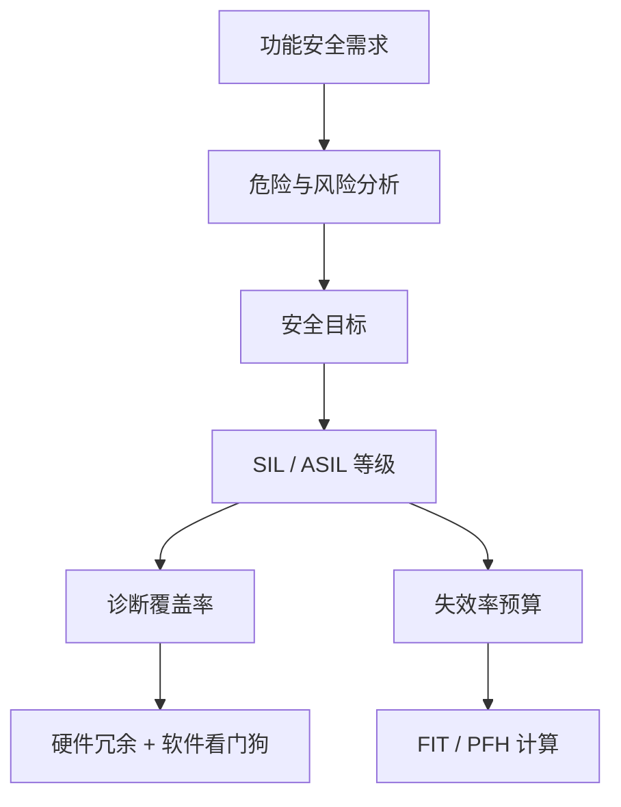

### 6.1.3 集中式 vs 分布式 vs 边缘-云协同

人形机器人的计算架构主要有三种范式：

1. **集中式（centralized）**：所有感知、决策与控制算法运行在一台高性能主计算机上，便于全局优化和开发调试，但对通信带宽、实时性和单点可靠性要求高。
2. **分布式（distributed）**：将低延迟控制任务下沉到关节驱动器、IMU 节点或专用视觉前端，主计算机负责高层感知与规划。可降低主干网络负载，提高容错性。
3. **边缘-云协同（edge-cloud）**：机器人在本地完成实时闭环，把非实时的大规模训练、地图更新或语义理解任务上传到云端。需要处理网络不确定性与数据隐私。

!!! note "术语解释：集中式、分布式、边缘计算、云计算、单点故障"
    - **集中式（centralized）**：计算与决策集中在单一或少数几个节点。
    - **分布式（distributed）**：计算任务分散到多个物理节点，通过网络协同。
    - **边缘计算（edge computing）**：在数据产生源头附近进行计算，减少上传到远端的数据量和延迟。
    - **云计算（cloud computing）**：通过广域网访问远程数据中心的弹性计算资源。
    - **单点故障（single point of failure）**：系统中一旦失效就会导致整个系统失效的单一组件。

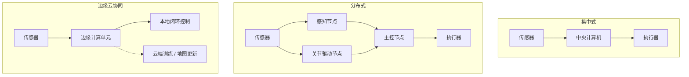

---

## 6.2 处理器与加速器件

### 6.2.1 CPU：架构、流水线、缓存、分支预测、SIMD/NEON/AVX、内存墙

中央处理器（CPU）是通用计算的核心。现代 CPU 通过指令级并行（ILP）、线程级并行（TLP）和数据级并行（DLP）提高性能。

!!! note "术语解释：CPU、指令集架构、微架构、流水线、超标量、乱序执行"
    - **CPU（Central Processing Unit）**：执行通用指令序列的处理器，擅长复杂控制流和低延迟串行任务。
    - **指令集架构（ISA）**：软件与硬件之间的接口，定义指令格式、寄存器和寻址模式，如 x86、ARMv8、RISC-V。
    - **微架构（microarchitecture）**：ISA 的具体实现方式，决定性能、功耗和面积。
    - **流水线（pipeline）**：把指令执行拆分为取指、译码、执行、访存、写回等多个阶段，使多条指令重叠执行。
    - **超标量（superscalar）**：每个周期可发射多条指令的处理器设计。
    - **乱序执行（out-of-order execution）**：当某条指令因数据依赖而阻塞时，先执行后续无依赖的指令，提高流水线利用率。

**流水线与 CPI**。理想情况下，一个 \(k\) 级流水线每周期完成一条指令，时钟周期约为 \(k\) 段中最慢段的延迟。实际性能受限于 CPI（Cycles Per Instruction）：

$$
\text{执行时间} = \text{指令数} \times \text{CPI} \times \text{时钟周期}
$$

分支指令会打断流水线。分支预测器（branch predictor）通过历史信息猜测分支方向，预测失败时需要清空流水线（flush），带来惩罚。

**缓存层次**。CPU 使用多级缓存（L1/L2/L3）缓解主存访问延迟。缓存命中时访问时间为 1–10 ns 级；未命中访问 DRAM 可能达 100 ns。局部性原理包括时间局部性和空间局部性。

!!! note "术语解释：缓存、命中、未命中、局部性、缓存行、缓存一致性"
    - **缓存（cache）**：位于 CPU 与主存之间的高速存储器，存放最近访问的数据副本。
    - **命中（hit）**：所需数据在缓存中；**未命中（miss）**：需要从更慢层级获取。
    - **时间局部性（temporal locality）**：最近访问的数据很可能再次被访问。
    - **空间局部性（spatial locality）**：访问某地址后，相邻地址很可能被访问。
    - **缓存行（cache line）**：缓存与主存之间传输的最小数据块，通常为 64 B。
    - **缓存一致性（cache coherence）**：多核系统中保证同一内存地址在不同核缓存中视图一致的机制。

**SIMD / NEON / AVX**。单指令多数据（SIMD）让一条指令同时操作多个数据元素。ARM NEON 和 x86 AVX/AVX-512 是典型的 SIMD 扩展。对于向量加法 \(c_i = a_i + b_i\)，SIMD 可以把 4、8 甚至 16 个浮点数打包成向量寄存器一次处理。

!!! note "术语解释：SIMD、向量寄存器、NEON、AVX、数据级并行"
    - **SIMD（Single Instruction Multiple Data）**：一条指令同时处理多个数据元素的并行模式。
    - **向量寄存器（vector register）**：可容纳多个标量数据的宽寄存器，如 128 bit NEON、256 bit AVX、512 bit AVX-512。
    - **NEON**：ARM 架构的 SIMD/向量扩展。
    - **AVX（Advanced Vector Extensions）**：Intel/AMD x86 处理器的 SIMD 扩展。
    - **数据级并行（DLP）**：对大量数据元素应用相同操作的并行形式。

**内存墙（memory wall）**。处理器峰值算力增长远快于内存带宽和延迟改善，导致许多应用受限于数据搬运而非计算本身。Wulf 与 McKee 在 1995 年提出“内存墙”概念，指出处理器与 DRAM 性能差距持续扩大。

**Amdahl 定律**。当对系统某一部分加速时，整体加速比受限于该部分所占比例。设可加速部分占比为 \(f\)，该部分加速比为 \(S\)，则整体加速比为：

$$
S_{\text{overall}} = \frac{1}{(1 - f) + \frac{f}{S}}
$$

若 \(f = 0.5\)、\(S = 10\)，则整体仅加速约 1.82 倍。Amdahl 定律说明：单纯提升某一部分性能的收益有上限，必须优化整个计算链路。

**Gustafson 定律**。对于可扩展问题，随着问题规模增大，并行部分占比 \(f\) 也增大，因此加速比可近似为 \(S_{\text{overall}} \approx 1 - f + f \cdot S\)。它强调并行系统的扩展性，而非固定问题的加速比。

!!! note "术语解释：Amdahl 定律、Gustafson 定律、加速比、可扩展性、串行瓶颈"
    - **Amdahl 定律（Amdahl's law）**：固定问题规模下，整体加速比受限于可加速部分的比例。
    - **Gustafson 定律（Gustafson's law）**：可扩展问题规模下，加速比随并行部分比例增加而接近线性。
    - **加速比（speedup）**：优化后执行时间与优化前执行时间之比。
    - **可扩展性（scalability）**：系统随资源增加而保持性能增长的能力。
    - **串行瓶颈（serial bottleneck）**：无法并行化的部分对整体性能的限制。

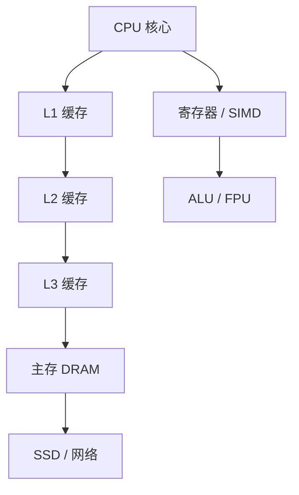

### 6.2.2 GPU：CUDA core / Tensor core / warp / shared memory / bandwidth / CUDA / OpenCL

图形处理器（GPU）最初为图形渲染设计，现在已成为通用并行计算（GPGPU）的主力，特别适用于矩阵乘法、卷积、深度学习和点云处理。

!!! note "术语解释：GPU、CUDA core、Tensor core、SM、warp、显存带宽"
    - **GPU（Graphics Processing Unit）**：高度并行的流处理器阵列，擅长规则数据并行任务。
    - **CUDA core**：NVIDIA GPU 中执行标量/向量浮点和整数运算的基本单元。
    - **Tensor core**：NVIDIA Volta 及以后架构中专门用于矩阵乘累加（MMA）的硬件单元，支持 FP16/INT8/BF16 等低精度。
    - **SM（Streaming Multiprocessor）**：NVIDIA GPU 中由多个 CUDA core、Tensor core、寄存器、共享内存和调度器组成的计算簇。
    - **warp**：NVIDIA GPU 中 32 个线程组成的执行单位，同一 warp 内线程以 SIMT（单指令多线程）方式执行。
    - **显存带宽（memory bandwidth）**：GPU 全局显存（HBM/GDDR/LPDDR）每秒可传输的数据量，常以 GB/s 计。

GPU 采用 SIMT 执行模型：同一 warp 的 32 个线程执行相同指令但操作不同数据。当线程因分支产生不同路径时，需要串行化执行（分支发散），降低效率。

共享内存（shared memory）是 SM 内的高速可编程缓存，延迟约为全局显存的 1/100。通过把数据从全局显存加载到共享内存，再由线程协作计算，可显著减少对带宽的依赖。

!!! note "术语解释：全局内存、共享内存、寄存器、分支发散、CUDA、OpenCL"
    - **全局内存（global memory）**：GPU 上所有线程都可访问的大容量显存，延迟高、带宽高。
    - **共享内存（shared memory）**：同一线程块内线程共享的快速片上存储，可手动管理以优化局部性。
    - **寄存器（register）**：每个线程私有的最快存储，数量受硬件限制。
    - **分支发散（branch divergence）**：同一 warp 内线程走不同分支路径，导致硬件串行执行。
    - **CUDA（Compute Unified Device Architecture）**：NVIDIA 的 GPU 并行计算平台和编程模型。
    - **OpenCL（Open Computing Language）**：跨厂商的异构并行编程框架。

GPU 峰值算力 \(P\) 与 CUDA core 数 \(N\)、频率 \(f\)、每周期每核操作数 \(o\) 有关：

$$
P = N \times f \times o
$$

例如，一个具有 2048 个 CUDA core、频率 1.3 GHz 的 GPU，若每个 CUDA core 每周期可执行 2 次 FP32 FMA（乘加），则峰值 FP32 约为 \(2048 \times 1.3 \times 2 \times 2 = 10.6\) TFLOPS。

**内存合并访问与占用率**。GPU 全局内存以事务（transaction）为单位访问，当同一 warp 的 32 个线程访问连续地址时，硬件可把多次访问合并为少量事务，显著提高有效带宽。若访问模式分散或不对齐，则事务数增加，带宽利用率下降。占用率（occupancy）指每个 SM 上活跃 warp 数与最大 warp 数之比；高占用率有助于隐藏内存延迟，但过高可能导致寄存器/共享内存资源竞争。

!!! note "术语解释：内存合并访问、占用率、事务、隐藏延迟、资源竞争"
    - **内存合并访问（coalesced memory access）**：同一 warp 内线程访问连续内存地址，被硬件合并为高效事务。
    - **占用率（occupancy）**：SM 上活跃 warp 数量与最大支持数量的比值。
    - **事务（transaction）**：GPU 与显存之间一次数据传输单元。
    - **隐藏延迟（latency hiding）**：通过切换执行其他 warp 来覆盖长延迟操作。
    - **资源竞争（resource contention）**：寄存器、共享内存或缓存不足导致性能下降。

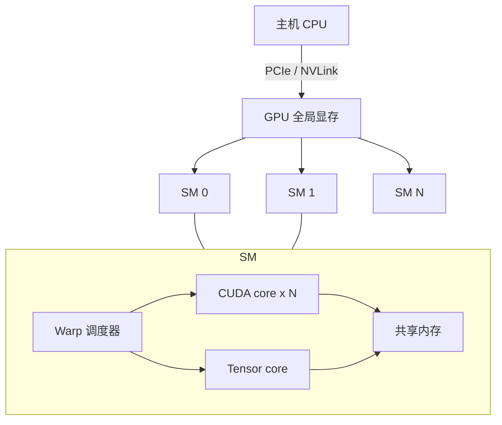

### 6.2.3 NPU / TPU / DSP：systolic array / MAC array / quantization / INT8 / FP16 / ONNX / TensorRT / TOPS/W

神经网络处理器（NPU）和类似加速器专门为深度学习推理优化，通常在能效（TOPS/W）上远超通用 CPU/GPU。

!!! note "术语解释：NPU、TPU、DSP、MAC、systolic array、量化、INT8、FP16"
    - **NPU（Neural Processing Unit）**：专门加速神经网络推理/训练的处理器，通常集成在 SoC 中。
    - **TPU（Tensor Processing Unit）**：Google 开发的张量加速器，以大规模脉动阵列著称。
    - **DSP（Digital Signal Processor）**：针对数字信号处理优化的可编程处理器，常用于音频、调制解调器和视觉预处理。
    - **MAC（Multiply-Accumulate）**：乘加运算 \(a \times b + c\)，是矩阵乘法和卷积的基本操作。
    - **systolic array（脉动阵列）**：数据在相邻处理单元间像心脏搏动一样流动的计算阵列，适合规则矩阵运算。
    - **量化（quantization）**：把模型权重和激活从高精度浮点（如 FP32）映射到低精度整数（如 INT8）或半精度浮点（FP16/BF16），以减少存储和计算量。
    - **INT8 / FP16**：8 位整数和 16 位半精度浮点，是边缘推理常用的低精度格式。

**脉动阵列原理**。考虑矩阵乘法 \(C = A \times B\)，其中 \(A\) 的行和 \(B\) 的列依次流过二维 PE（处理单元）阵列，每个 PE 完成一次 MAC 并把部分和传递给相邻单元。这种设计避免频繁访问主存，计算密度高。

!!! note "术语解释：PE、部分和、推理、训练、TOPS、TOPS/W"
    - **PE（Processing Element）**：加速器中的基本计算单元。
    - **部分和（partial sum）**：矩阵乘法中间结果的累加值。
    - **推理（inference）**：用训练好的模型对新数据做前向计算。
    - **训练（training）**：通过反向传播更新模型权重的过程。
    - **TOPS（Tera Operations Per Second）**：每秒万亿次运算，常用于衡量 NPU 峰值算力。
    - **TOPS/W**：每瓦功耗下的 TOPS，衡量能效。

**量化与部署**。量化把 FP32 映射到 INT8 时，常用线性映射：

$$
x_{\text{int8}} = \text{round}\left(\frac{x_{\text{fp32}} - z}{s}\right)
$$

其中 \(s\) 为缩放因子（scale），\(z\) 为零点（zero-point）。量化后，卷积或全连接层的 MAC 可用整数运算完成，再用 scale 和 zero-point 反量化为 FP32 输出。

**ONNX 与 TensorRT**。ONNX（Open Neural Network Exchange）是跨框架的模型表示格式；TensorRT 是 NVIDIA 的推理优化器，可进行层融合、精度校准、内核自动调优和动态张量内存优化。

!!! note "术语解释：ONNX、TensorRT、层融合、内核自动调优、校准"
    - **ONNX（Open Neural Network Exchange）**：开放的深度学习模型交换格式，支持 PyTorch、TensorFlow 等框架互操作。
    - **TensorRT**：NVIDIA 的推理优化器和运行时。
    - **层融合（layer fusion）**：把多个连续算子合并为一个内核，减少显存访问和内核启动开销。
    - **内核自动调优（kernel auto-tuning）**：根据目标 GPU 选择最优 CUDA kernel 实现。
    - **校准（calibration）**：用代表性数据确定量化参数（scale、zero-point）的过程。

**PTQ 与 QAT**。训练后量化（Post-Training Quantization, PTQ）直接对训练好的 FP32 模型进行量化，简单快速但可能损失精度；量化感知训练（Quantization-Aware Training, QAT）在训练过程中模拟低精度运算，使网络适应量化误差，通常能获得更高精度。对于机器人感知任务，若精度敏感（如深度估计、位姿估计），常采用 QAT 或混合精度（部分层保留 FP16/FP32）。

!!! note "术语解释：PTQ、QAT、混合精度、感知训练、量化误差"
    - **PTQ（Post-Training Quantization）**：训练完成后直接量化模型权重和激活。
    - **QAT（Quantization-Aware Training）**：在训练时模拟量化前向过程，让网络学习适应量化噪声。
    - **混合精度（mixed precision）**：模型不同部分使用不同数值精度。
    - **量化误差（quantization error）**：低精度表示引入的近似误差。

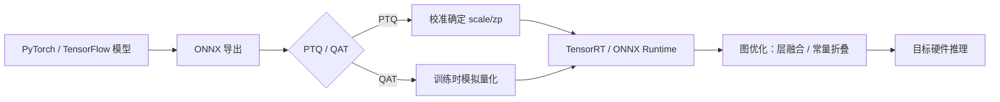

### 6.2.4 FPGA 与可重构计算

现场可编程门阵列（FPGA）由可配置逻辑块（CLB）、DSP slice、块 RAM 和可编程互连组成，可在硬件层面定制数据通路。

!!! note "术语解释：FPGA、CLB、LUT、DSP slice、块 RAM、可重构计算、HLS"
    - **FPGA（Field-Programmable Gate Array）**：可通过硬件描述语言或高级综合工具现场配置的数字电路。
    - **CLB（Configurable Logic Block）**：FPGA 中实现组合逻辑和时序逻辑的基本单元。
    - **LUT（Look-Up Table）**：用查找表实现任意布尔函数，是 CLB 的核心。
    - **DSP slice**：FPGA 中集成的硬连线乘加/乘法器单元。
    - **块 RAM（Block RAM）**：FPGA 片上分布式 SRAM，用于缓存中间数据。
    - **可重构计算（reconfigurable computing）**：根据应用动态改变硬件结构的计算范式。
    - **HLS（High-Level Synthesis）**：把 C/C++/Python 描述自动综合为硬件电路的设计方法。

FPGA 的优势在于确定性的低延迟、高并行 I/O 和能效；劣势是开发复杂、逻辑资源有限、峰值浮点性能通常低于 GPU。对于机器人中需要严格时序的传感器触发、EtherCAT 主站、自定义编码器接口等场景，FPGA 非常合适。

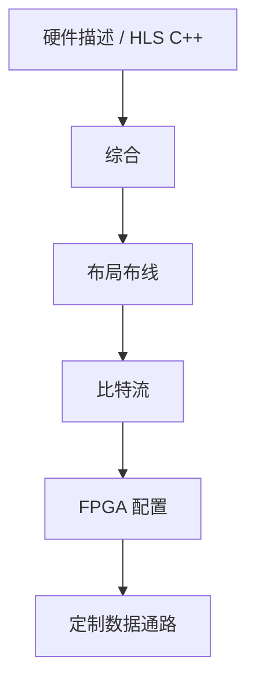

### 6.2.5 典型机器人计算平台对比表

下表列出人形机器人与自主机器中常见的嵌入式计算平台。性能数据来自公开规格，实际功耗和算力取决于具体配置与散热条件。

| 平台 | 架构 | CPU | GPU/NPU | AI 算力 | 内存/带宽 | 典型功耗 | 适用层级 |
|---|---|---|---|---|---|---|---|
| NVIDIA Jetson AGX Orin 64GB | ARM + Ampere GPU | 12× Cortex-A78AE | 2048 CUDA + 64 Tensor | 275 TOPS (INT8) | 64 GB LPDDR5, 204.8 GB/s | 15–60 W | 感知/决策主控 |
| NVIDIA Jetson AGX Xavier | ARM + Volta GPU | 8× Carmel | 512 CUDA + 64 Tensor | 32 TOPS | 32 GB LPDDR4x | 10–30 W | 感知/决策主控 |
| Intel NUC 13 Pro | x86 | Core i5/i7 | Iris Xe / 可选独显 | 数 TOPS | DDR4/DDR5 | 28–65 W | 开发/高端主控 |
| Qualcomm RB5 / QCS8550 | ARM | Kryo / Oryon | Adreno GPU + Hexagon DSP | 15–48 TOPS | LPDDR5 | 5–15 W | 感知前端 |
| AMD Kria K26 | ARM + FPGA | 4× Cortex-A53 | Mali GPU + FPGA | FPGA 定制 | 4 GB DDR4 | 5–10 W | I/O 与实时控制 |
| Apple M-series | ARM | 高性能 + 能效核 | Neural Engine + GPU | 11–38 TOPS | 统一内存 | 10–100 W | 开发/高端边缘 |
| Tesla FSD Chip | ARM + NPU | 12× Cortex-A72 | 2× NPU | 144 TOPS | LPDDR4 | ~36 W | 自动驾驶/机器人 |
| Horizon Journey 5 | ARM + BPU | 8× Cortex-A55 | 2× BPU | 128 TOPS | LPDDR5 | 20–30 W | 自动驾驶/机器人 |
| Rockchip RK3588 | ARM | 4× A76 + 4× A55 | Mali-G610 + 6 TOPS NPU | 6 TOPS | LPDDR4x/LPDDR5 | 5–10 W | 低成本感知 |

!!! note "术语解释：SoC、LPDDR、TOPS、TDP、开发套件、载板"
    - **SoC（System on Chip）**：把整个系统所需 CPU、GPU、NPU、I/O、内存控制器等集成在单一芯片上。
    - **LPDDR（Low-Power DDR）**：面向移动/嵌入式设备的低功耗内存标准。
    - **TDP（Thermal Design Power）**：热设计功耗，是散热系统需要处理的典型功耗上限。
    - **开发套件（developer kit）**：包含 SoM、载板、散热器和电源的完整开发板。
    - **载板（carrier board）**：承载 SoM 并提供外围接口的印刷电路板。

平台选择需要在算力、功耗、散热、体积、成本、生态和实时性之间权衡。人形机器人头部和躯干通常部署 Jetson AGX Orin 或同等级平台，关节层使用 MCU/FPGA 做实时控制。


---

## 6.3 感知计算任务与算法实现

### 6.3.1 计算图与算子：卷积、矩阵乘、池化、attention 的复杂度

现代机器人感知系统通常表示为计算图（computational graph），节点是算子（operator），边是张量（tensor）。理解关键算子的计算复杂度，是进行性能分析和硬件选型的基础。

!!! note "术语解释：计算图、算子、张量、FLOPs、参数量、算术强度"
    - **计算图（computational graph）**：用节点表示运算、边表示数据依赖的图结构，描述神经网络或算法的数据流。
    - **算子（operator）**：图中的基本运算，如卷积、矩阵乘、ReLU、softmax。
    - **张量（tensor）**：多维数组，是深度学习中的基本数据结构。
    - **FLOPs（Floating Point Operations）**：浮点运算次数，衡量计算量。
    - **参数量（number of parameters）**：模型中可学习权重的总数，决定存储和内存占用。
    - **算术强度（arithmetic intensity）**：每访问 1 字节内存所执行的运算次数，是 Roofline 模型的核心变量。

**卷积的复杂度**。对于输入特征图尺寸 \(H \times W\)、输入通道 \(C_{in}\)、输出通道 \(C_{out}\)、核尺寸 \(K \times K\)、输出尺寸 \(H' \times W'\)，卷积的乘加次数为：

$$
\text{FLOPs}_{\text{conv}} \approx 2 H' W' C_{out} K^2 C_{in}
$$

系数 2 来自一次乘法和一次加法。若使用 stride、分组卷积或空洞卷积，需相应调整。

**矩阵乘法**。矩阵乘 \(C = A B\)，其中 \(A \in \mathbb{R}^{m \times k}\)，\(B \in \mathbb{R}^{k \times n}\)，FLOPs 为：

$$
\text{FLOPs}_{\text{matmul}} = 2 m k n
$$

Transformer 中的 self-attention 计算量通常为 \(O(n^2 d)\)，其中 \(n\) 是序列长度，\(d\) 是特征维度。

**Attention 的复杂度分析**。标准 scaled dot-product attention 计算：

$$
\text{Attention}(Q, K, V) = \text{softmax}\left(\frac{Q K^T}{\sqrt{d_k}}\right) V
$$

其中 \(Q, K, V \in \mathbb{R}^{n \times d}\)。计算 \(Q K^T\) 需要 \(2 n^2 d\) FLOPs，softmax 和与 \(V\) 相乘各需约 \(O(n^2 d)\)，因此总计算量为 \(O(n^2 d)\)。当 \(n\) 较大（如长序列视频、语言模型）时，\(n^2\) 项主导计算和内存。FlashAttention 等算法通过分块计算和重排内存访问，减少 HBM 读写次数，提高带宽受限情况下的有效吞吐量。

**池化**。最大池化或平均池化没有可学习参数，主要涉及比较或求和，计算量相对较低。

**算术强度**。算术强度 \(I\) 定义为：

$$
I = \frac{\text{FLOPs}}{\text{Bytes transferred}}
$$

在 Roofline 模型中，若 \(I\) 低于平台脊点（ridge point），应用受内存带宽限制；高于脊点则受峰值算力限制。

**算例：卷积层的算术强度**。假设一个 \(3 \times 3\) 卷积，输入 \(H \times W = 112 \times 112\)，\(C_{in} = 64\)，\(C_{out} = 128\)，输出尺寸相同。FLOPs 约为 \(2 \times 112^2 \times 128 \times 9 \times 64 \approx 1.85\) GFLOPs。若权值和输入/输出各读取一次，内存访问量约为 \(112^2 \times 64 \times 4 + 3^2 \times 64 \times 128 \times 4 + 112^2 \times 128 \times 4 \approx 9.3\) MB。算术强度 \(I \approx 1.85 \times 10^9 / 9.3 \times 10^6 \approx 199\) FLOPs/Byte。Jetson AGX Orin 的脊点约在 1–3 FLOPs/Byte，因此该卷积层通常受算力限制；若使用极小 batch 或稀疏访存，则可能滑向带宽受限区。

!!! note "术语解释：batch、稀疏访存、 Roofline 脊点、算力受限、带宽受限"
    - **batch（批次）**：一次性处理的样本数量。增大 batch 通常提高数据复用。
    - **稀疏访存（sparse access）**：非连续或随机的内存访问模式，降低缓存效率。
    - **算力受限（compute-bound）**：性能由峰值算力决定。
    - **带宽受限（memory-bound）**：性能由内存带宽决定。

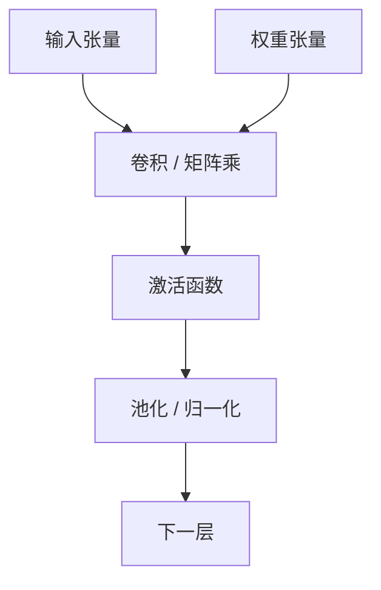

### 6.3.2 双目立体匹配算法

双目立体视觉通过两台相距一定基线 \(B\) 的相机同时拍摄同一场景，利用三角测量恢复像素深度。核心步骤包括：相机标定、极线几何、立体校正、代价计算、代价聚合、视差计算与优化、深度反演。

!!! note "术语解释：双目立体视觉、基线、极线几何、对极约束、本质矩阵、基础矩阵"
    - **双目立体视觉（binocular stereo vision）**：利用两个视角的图像恢复场景三维结构的视觉方法。
    - **基线（baseline, B）**：两个相机光心之间的直线距离。
    - **极线几何（epipolar geometry）**：描述两个相机视图之间几何关系的理论框架。
    - **对极约束（epipolar constraint）**：空间中一点在两幅图像上的投影点必须落在对应的极线上，从而把二维匹配降为一维搜索。
    - **本质矩阵（essential matrix, E）**：在相机归一化坐标系下描述两视图几何关系的 \(3 \times 3\) 矩阵，\(E = [\mathbf{t}]_\times R\)。
    - **基础矩阵（fundamental matrix, F）**：在像素坐标系下描述两视图几何关系，包含内参信息，\(F = K_2^{-T} E K_1^{-1}\)。

设左右相机光心分别为 \(O_L\)、\(O_R\)，空间点 \(P\) 在左右图像上的投影为 \(p_L\)、\(p_R\)。若相机已标定，则在对极校正后，两幅图像的行对齐，\(p_L = (x, y)\)，\(p_R = (x - d, y)\)，其中 \(d\) 称为**视差（disparity）**。

**对极几何与本质矩阵**。设两相机内参相同且已标定，右相机相对左相机的旋转和平移分别为 \(R\)、\(t\)。归一化图像坐标 \(x_L, x_R\) 满足对极约束：

$$
x_R^T E x_L = 0, \quad E = [t]_\times R
$$

其中 \([t]_\times\) 是平移向量 \(t\) 的反对称矩阵。若使用像素坐标 \(p_L = K x_L\)、\(p_R = K x_R\)，则：

$$
p_R^T F p_L = 0, \quad F = K^{-T} E K^{-1}
$$

基础矩阵 \(F\) 把二维搜索约束到一维极线，是立体匹配效率的关键。

**BM 块匹配算法**。OpenCV 的 `StereoBM` 在整幅图像上以固定窗口做 SAD/SSD 匹配，速度快但边缘模糊。其代价函数为：

$$
C_{BM}(x, y, d) = \sum_{(u, v) \in W} |I_L(x+u, y+v) - I_R(x+u-d, y+v)|
$$

SGBM 在此基础上引入多路径代价聚合和 Birchfield-Tomasi 子像素代价，显著改善弱纹理和边缘区域。

!!! note "术语解释：视差、立体校正、重投影、三角测量"
    - **视差（disparity）**：同一点在左右图像上水平坐标的差值，\(d = x_L - x_R\)。
    - **立体校正（rectification）**：通过单应变换把两幅图像变换到同一平面，使得对应极线水平对齐。
    - **重投影（reprojection）**：把图像坐标反投影到三维空间的过程。
    - **三角测量（triangulation）**：利用两条或多条射线交会确定空间点位置的方法。

**深度与视差的关系**。根据相似三角形：

$$
Z = \frac{f B}{d}
$$

其中 \(Z\) 是深度，\(f\) 是校正后的焦距（像素单位），\(B\) 是基线（米），\(d\) 是视差（像素）。该式表明：视差越大，深度越近；基线越大，对相同深度分辨率越高，但遮挡区域也越大。

**代价计算**。匹配代价衡量左右像素对应关系的相似度，常用：

- SAD（Sum of Absolute Differences）：\(C_{SAD} = \sum |I_L - I_R|\)
- SSD（Sum of Squared Differences）：\(C_{SSD} = \sum (I_L - I_R)^2\)
- NCC（Normalized Cross-Correlation）
- 互信息（Mutual Information）

!!! note "术语解释：匹配代价、SAD、SSD、NCC、互信息"
    - **匹配代价（matching cost）**：衡量左右图像中两个候选像素相似程度的函数。
    - **SAD（绝对差和）**：像素差绝对值的和，对光照变化较敏感。
    - **SSD（平方差和）**：像素差平方和，对大差异惩罚更重。
    - **NCC（归一化互相关）**：对亮度和对比度变化更鲁棒的相关度量。
    - **互信息（mutual information）**：基于统计依赖性的相似度度量，Hirschmüller 的 SGM 使用它处理辐射差异。

**SGBM 代价聚合**。Hirschmüller 提出的半全局匹配（Semi-Global Matching, SGM）沿多个方向做一维动态规划，近似全局优化。OpenCV 的 SGBM 是其变体，使用 Birchfield-Tomasi 代价和块匹配。能量函数为：

$$
E(D) = \sum_p C(p, D_p) + \sum_{q \in N_p} P_1 \cdot [|D_p - D_q| = 1] + \sum_{q \in N_p} P_2 \cdot [|D_p - D_q| > 1]
$$

第一项是数据代价，第二项惩罚小视差跳变（保留边缘），第三项惩罚大跳变（但通常限制在图像边缘处）。

!!! note "术语解释：SGBM、SGM、动态规划、代价聚合、子像素求精"
    - **SGBM（Semi-Global Block Matching）**：OpenCV 实现的半全局块匹配算法。
    - **SGM（Semi-Global Matching）**：Hirschmüller 提出的沿多方向一维路径聚合代价的立体匹配方法。
    - **动态规划（dynamic programming）**：把复杂优化问题分解为子问题并保存中间结果的方法。
    - **代价聚合（cost aggregation）**：在局部邻域或路径上累积匹配代价，提高鲁棒性。
    - **子像素求精（subpixel refinement）**：在整数视差附近拟合抛物线或做局部优化，得到更精细的浮点视差。

**Python 实现示例**。以下代码展示用 OpenCV 进行双目校正、SGBM 计算视差、转换为深度图，并可选择 WLS 滤波。

```python
import cv2
import numpy as np

# 1. 读取左右图像（已标定/已知的相机内参和外参）
imgL = cv2.imread('left.png', cv2.IMREAD_GRAYSCALE)
imgR = cv2.imread('right.png', cv2.IMREAD_GRAYSCALE)

# 2. 相机内参（示例值，实际需通过标定获得）
K = np.array([[700.0, 0.0, 320.0],
              [0.0, 700.0, 240.0],
              [0.0, 0.0, 1.0]])
D = np.zeros((4, 1))  # 畸变系数
image_size = (640, 480)

# 3. 立体校正：计算校正变换矩阵
# R, T 为右相机相对左相机的旋转和平移（由标定或立体标定得到）
R = np.eye(3)
T = np.array([[0.12]])  # 基线 12 cm
R1, R2, P1, P2, Q, roi1, roi2 = cv2.stereoRectify(
    K, D, K, D, image_size, R, T,
    flags=cv2.CALIB_ZERO_DISPARITY, alpha=0
)

# 4. 生成校正映射
map1x, map1y = cv2.initUndistortRectifyMap(K, D, R1, P1, image_size, cv2.CV_32FC1)
map2x, map2y = cv2.initUndistortRectifyMap(K, D, R2, P2, image_size, cv2.CV_32FC1)

rectL = cv2.remap(imgL, map1x, map1y, cv2.INTER_LINEAR)
rectR = cv2.remap(imgR, map2x, map2y, cv2.INTER_LINEAR)

# 5. SGBM 参数设置
sgbm = cv2.StereoSGBM_create(
    minDisparity=0,
    numDisparities=128,        # 必须是 16 的倍数
    blockSize=5,
    P1=8 * 3 * 5 ** 2,         # 控制小视差变化的惩罚
    P2=32 * 3 * 5 ** 2,        # 控制大视差变化的惩罚
    disp12MaxDiff=1,
    uniquenessRatio=10,
    speckleWindowSize=100,
    speckleRange=32,
    mode=cv2.STEREO_SGBM_MODE_SGBM_3WAY
)

# 6. 计算视差图（16 位固定点，实际值需除以 16）
disparity = sgbm.compute(rectL, rectR).astype(np.float32) / 16.0

# 7. 子像素求精（可选）：对整数视差做抛物线拟合可进一步提高精度
# disparity 已经是 SGBM 内部做过子像素的结果

# 8. 视差转深度：Z = f * B / d
# Q 矩阵由 stereoRectify 生成，reprojectImageTo3D 可直接得到 (X, Y, Z)
points_3d = cv2.reprojectImageTo3D(disparity, Q)
# 或手动计算
f = P1[0, 0]      # 校正后焦距（像素）
b = abs(T[0])     # 基线（米）
with np.errstate(divide='ignore'):
    depth = (f * b) / disparity
depth[disparity <= 0] = 0  # 无效视差置零

# 9. WLS 滤波（可选）：需要右视图作为参考
right_matcher = cv2.ximgproc.createRightMatcher(sgbm)
wls = cv2.ximgproc.createDisparityWLSFilter(matcher_left=sgbm)
wls.setLambda(8000)
wls.setSigmaColor(1.5)
disparity_right = right_matcher.compute(rectR, rectL).astype(np.float32) / 16.0
filtered_disp = wls.filter(disparity, rectL, None, disparity_right)
```

上述代码中，`cv2.stereoRectify` 通过内参 \(K\)、畸变 \(D\)、旋转 \(R\)、平移 \(T\) 计算校正后的投影矩阵 \(P_1, P_2\) 和重投影矩阵 \(Q\)。`Q[2, 3]\) 和 \(Q[3, 2]\) 等项编码了焦距和基线信息。视差图中无效值通常设为负值或零，计算深度时应排除。


### 6.3.3 相机标定的完整 Python 流程

相机标定是确定相机内参（焦距、主点、畸变系数）和外参（相机相对世界坐标系的位姿）的过程。Zhang 在 2000 年提出的方法利用棋盘格多视角图像，结合了闭式解和非线性优化，是目前最广泛使用的标定方法。

!!! note "术语解释：相机标定、内参、外参、畸变、主点、焦距、棋盘格、Zhang 方法"
    - **相机标定（camera calibration）**：估计相机成像几何参数的过程。
    - **内参（intrinsic parameters）**：由相机自身决定的参数，包括焦距 \(f_x, f_y\)、主点 \(c_x, c_y\) 和畸变系数。
    - **外参（extrinsic parameters）**：相机坐标系相对世界坐标系的旋转 \(R\) 和平移 \(t\)。
    - **畸变（distortion）**：实际镜头偏离理想针孔模型导致的图像几何变形，包括径向畸变和切向畸变。
    - **主点（principal point）**：光轴与图像平面的交点，理想情况下为图像中心。
    - **棋盘格（checkerboard）**：黑白交替的方格标定板，角点易于自动检测。
    - **Zhang 方法（Zhang's method）**：利用棋盘格多视角图像，先求单应矩阵闭式解，再非线性优化重投影误差的标定方法。

**针孔相机模型**。空间点 \(P = [X, Y, Z]^T\) 投影到图像平面：

$$
s \begin{bmatrix} u \\ v \\ 1 \end{bmatrix}
= K [R \ | \ t]
\begin{bmatrix} X \\ Y \\ Z \\ 1 \end{bmatrix}
$$

其中 \(K\) 为内参矩阵：

$$
K = \begin{bmatrix} f_x & 0 & c_x \\ 0 & f_y & c_y \\ 0 & 0 & 1 \end{bmatrix}
$$

**畸变模型**。常用的 Brown-Conrady 模型包括径向畸变和切向畸变：

$$
x_{\text{distorted}} = x(1 + k_1 r^2 + k_2 r^4 + k_3 r^6) + 2 p_1 x y + p_2(r^2 + 2 x^2)
$$
$$
y_{\text{distorted}} = y(1 + k_1 r^2 + k_2 r^4 + k_3 r^6) + p_1(r^2 + 2 y^2) + 2 p_2 x y
$$

其中 \(r^2 = x^2 + y^2\)，\((x, y)\) 是归一化图像坐标。

!!! note "术语解释：径向畸变、切向畸变、Brown-Conrady 模型、重投影误差"
    - **径向畸变（radial distortion）**：由于镜头曲率导致的图像点沿径向偏离，表现为“桶形”或“枕形”。
    - **切向畸变（tangential distortion）**：由于镜头与传感器不平行导致的图像点切向偏离。
    - **Brown-Conrady 模型**：描述径向和切向畸变的经典多项式模型。
    - **重投影误差（reprojection error）**：三维点按估计参数投影到图像平面后，与检测到的二维点之间的像素距离。

**Python 完整标定流程**。以下代码展示棋盘格角点检测、标定、误差评估、保存/加载参数和去畸变。

```python
import cv2
import numpy as np
import glob

# 1. 棋盘格参数：内角点数量（宽 x 高）和方格物理尺寸
CHECKERBOARD = (9, 6)
SQUARE_SIZE = 0.025  # 每个方格边长 25 mm

# 2. 准备三维世界坐标：Z=0 平面上的角点坐标
objp = np.zeros((CHECKERBOARD[0] * CHECKERBOARD[1], 3), np.float32)
objp[:, :2] = np.mgrid[0:CHECKERBOARD[0], 0:CHECKERBOARD[1]].T.reshape(-1, 2)
objp *= SQUARE_SIZE

objpoints = []  # 三维点列表
imgpoints = []  # 二维图像点列表

# 3. 读取所有标定图像
calibration_images = sorted(glob.glob('calib_*.png'))

for fname in calibration_images:
    img = cv2.imread(fname)
    gray = cv2.cvtColor(img, cv2.COLOR_BGR2GRAY)

    # 4. 查找棋盘格角点
    ret, corners = cv2.findChessboardCorners(
        gray, CHECKERBOARD,
        flags=cv2.CALIB_CB_ADAPTIVE_THRESH +
              cv2.CALIB_CB_NORMALIZE_IMAGE +
              cv2.CALIB_CB_FAST_CHECK
    )

    if ret:
        # 5. 亚像素角点求精
        criteria = (cv2.TERM_CRITERIA_EPS + cv2.TERM_CRITERIA_MAX_ITER, 30, 0.001)
        corners2 = cv2.cornerSubPix(gray, corners, (11, 11), (-1, -1), criteria)

        objpoints.append(objp)
        imgpoints.append(corners2)

        # 可视化（可选）
        cv2.drawChessboardCorners(img, CHECKERBOARD, corners2, ret)
        cv2.imshow('Corners', img)
        cv2.waitKey(100)

cv2.destroyAllWindows()

# 6. 相机标定
ret, K, D, rvecs, tvecs = cv2.calibrateCamera(
    objpoints, imgpoints, gray.shape[::-1], None, None
)

print("标定结果：")
print("重投影误差:", ret)
print("内参矩阵 K:\n", K)
print("畸变系数 D:\n", D)

# 7. 逐图像计算重投影误差
mean_error = 0
for i in range(len(objpoints)):
    imgpoints2, _ = cv2.projectPoints(
        objpoints[i], rvecs[i], tvecs[i], K, D
    )
    error = cv2.norm(imgpoints[i], imgpoints2, cv2.NORM_L2) / len(imgpoints2)
    mean_error += error
print("平均重投影误差（像素）:", mean_error / len(objpoints))

# 8. 保存标定结果
np.savez('camera_calibration.npz', K=K, D=D, rvecs=rvecs, tvecs=tvecs)

# 9. 加载标定结果
data = np.load('camera_calibration.npz')
K_loaded = data['K']
D_loaded = data['D']

# 10. 去畸变示例
img = cv2.imread('sample.png')
undistorted = cv2.undistort(img, K_loaded, D_loaded)

# 或使用最优新相机矩阵保留更多有效像素
h, w = img.shape[:2]
optimal_K, roi = cv2.getOptimalNewCameraMatrix(
    K_loaded, D_loaded, (w, h), 1, (w, h)
)
undistorted_opt = cv2.undistort(img, K_loaded, D_loaded, None, optimal_K)
```

标定质量的关键指标是重投影误差。对于消费级相机，误差应控制在 0.3 像素以内；对于高精度测量，应达到 0.1 像素以下。若误差过大，可能原因包括：角点检测不准确、棋盘格平面性不好、标定姿态覆盖不足、图像模糊或光照不均。

**双目相机标定与立体校正**。双目系统除了分别标定左右相机外，还需估计两相机之间的相对位姿 \(R, T\)。OpenCV 提供 `cv2.stereoCalibrate`，同时优化左右内参、畸变和相对位姿，使左右图像中对应角点的重投影误差最小。标定后可进一步进行立体校正：

```python
# 双目标定：需要同时采集左右相机同一棋盘格的图像
ret, K1, D1, K2, D2, R, T, E, F = cv2.stereoCalibrate(
    objpoints, left_imgpoints, right_imgpoints,
    K1, D1, K2, D2, image_size,
    flags=cv2.CALIB_FIX_INTRINSIC
)

# 立体校正
R1, R2, P1, P2, Q, roi1, roi2 = cv2.stereoRectify(
    K1, D1, K2, D2, image_size, R, T,
    flags=cv2.CALIB_ZERO_DISPARITY, alpha=0
)
```

其中 \(F\) 为基础矩阵，\(E\) 为本质矩阵，\(Q\) 为重投影矩阵。立体校正后，左右图像的对应点具有相同的 \(y\) 坐标，从而把立体匹配的二维搜索降为一维搜索。

!!! note "术语解释：双目标定、立体校正、重投影矩阵、StereoCalibrate"
    - **双目标定（stereo calibration）**：同时估计两个相机内参和它们之间相对位姿的过程。
    - **重投影矩阵（reprojection matrix, Q）**：把视差图转换为三维点云的 4×4 矩阵。
    - **StereoCalibrate**：OpenCV 中用于双目相机标定的函数。

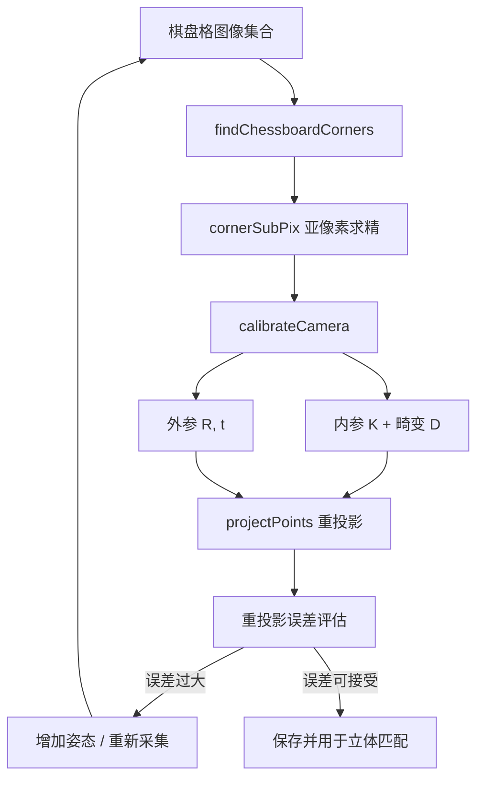

### 6.3.4 LiDAR 点云去畸变算例

机械旋转式 LiDAR 在一次扫描过程中，传感器自身随机器人运动，导致点云产生运动畸变（motion distortion）。去畸变（deskew）需要根据每个点的精确时间戳，把点从采集时刻的传感器坐标系变换到统一参考时刻的坐标系。

!!! note "术语解释：LiDAR、点云、运动畸变、去畸变、时间戳、扫描帧、IMU"
    - **LiDAR（Light Detection and Ranging）**：通过发射激光并接收回波测量距离的传感器。
    - **点云（point cloud）**：由大量三维坐标点组成的数据集，常包含强度、时间戳、环号等信息。
    - **运动畸变（motion distortion）**：由于传感器或目标在运动过程中持续采集，导致一帧数据中不同点处于不同坐标系。
    - **去畸变（deskew）**：根据时间戳和运动估计，把每一点变换到统一参考坐标系的过程。
    - **时间戳（timestamp）**：记录数据采集时刻的时间标签。
    - **IMU（Inertial Measurement Unit）**：测量三轴加速度和三轴角速度的惯性传感器。

设 LiDAR 一帧扫描从 \(t_0\) 到 \(t_1\)，参考时刻选为 \(t_{ref}\)。对于任意一点 \(p_i\)，其时间戳为 \(t_i\)，在 LiDAR 局部坐标系下的坐标为 \(p_i^{L(t_i)}\)。需要估计传感器在 \(t_i\) 相对 \(t_{ref}\) 的位姿变换 \(T_{ref}^{t_i} = (R, t)\)，然后：

$$
p_i^{ref} = R \, p_i^{L(t_i)} + t
$$

若已知 IMU 或里程计在离散时刻的位姿，可对每个点的时间戳做线性插值得到变换。

!!! note "术语解释：位姿、变换矩阵、SE(3)、旋转矩阵、四元数、插值"
    - **位姿（pose）**：物体在空间中的位置和姿态，常用 \(T = (R, t)\) 表示。
    - **变换矩阵（transformation matrix）**：\(4 \times 4\) 矩阵，同时表示旋转和平移。
    - **SE(3)**：三维欧氏变换群，即刚体变换的数学集合。
    - **四元数（quaternion）**：表示旋转的紧凑数学形式，避免万向节锁。
    - **插值（interpolation）**：根据已知离散样本估计中间值的方法。

**Python 实现示例**。以下代码假设已知每个点的相对时间戳（0 到 1 之间），并通过 IMU/里程计位姿做球面线性插值（Slerp）和线性平移插值。

```python
import numpy as np
from scipy.spatial.transform import Slerp, Rotation as R

# 假设一帧 LiDAR 点云：N x 4，列为 [x, y, z, relative_time]
# relative_time 在 [0, 1] 之间，0 表示帧开始，1 表示帧结束
points = np.loadtxt('lidar_scan.txt')  # N x 4
xyz = points[:, :3]
times = points[:, 3]

# 已知帧开始和结束时刻的位姿（相对参考坐标系，例如帧中点）
# T_start, T_end 是 4x4 齐次变换矩阵
T_start = np.eye(4)
T_end = np.eye(4)
T_end[:3, :3] = R.from_euler('z', 0.05).as_matrix()  # 绕 Z 旋转 0.05 rad
T_end[:3, 3] = np.array([0.10, 0.02, 0.005])           # 平移 10 cm

# 提取旋转和平移
R_start = T_start[:3, :3]
t_start = T_start[:3, 3]
R_end = T_end[:3, :3]
t_end = T_end[:3, 3]

# 构建关键帧旋转插值器
key_rots = R.from_matrix([R_start, R_end])
key_times = [0.0, 1.0]
slerp = Slerp(key_times, key_rots)

# 把每个点变换到参考时刻（这里选帧中点 t=0.5）
ref_time = 0.5
deskewed = np.zeros_like(xyz)

for i in range(len(xyz)):
    tau = times[i]
    # 插值得到 t_i 时刻的位姿
    Ri = slerp([tau]).as_matrix()[0]
    ti = (1 - tau) * t_start + tau * t_end
    T_tau = np.eye(4)
    T_tau[:3, :3] = Ri
    T_tau[:3, 3] = ti

    # 计算 t_i 到参考时刻 t_ref 的相对变换
    T_ref = np.eye(4)
    T_ref[:3, :3] = slerp([ref_time]).as_matrix()[0]
    T_ref[:3, 3] = (1 - ref_time) * t_start + ref_time * t_end

    T_rel = T_ref @ np.linalg.inv(T_tau)
    p = np.append(xyz[i], 1.0)
    p_ref = T_rel @ p
    deskewed[i] = p_ref[:3]

# 如果需要变换到机器人基座或世界坐标系，再左乘 LiDAR 外参 T_lidar_to_base
# deskewed_base = (T_lidar_to_base @ np.hstack([deskewed, np.ones((N,1))]).T).T[:, :3]

print("原始点数:", len(xyz))
print("去畸变后点数:", len(deskewed))
```

对于更密集的姿态估计，可分段处理：把一帧按时间分成若干子帧，对每个子帧用 IMU 积分得到相对位姿。常用做法是构造从时间戳到位姿的连续函数，例如 B 样条或线性插值。

!!! note "术语解释：IMU 积分、B 样条、外参、雷达坐标系、基座坐标系"
    - **IMU 积分（IMU integration）**：通过对加速度积分得速度、对角速度积分得姿态，从而估计短时间内的位姿变化。
    - **B 样条（B-spline）**：用于表示连续时间轨迹的分段多项式，适合连续时间 SLAM。
    - **外参（extrinsic parameter）**：LiDAR 坐标系到机器人基座坐标系的固定变换。
    - **雷达坐标系（LiDAR frame）**：以 LiDAR 光心为原点的局部坐标系。
    - **基座坐标系（base frame）**：机器人底盘或躯干的参考坐标系。

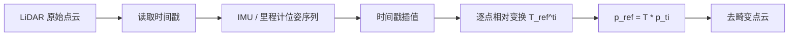

### 6.3.5 视觉里程计 / 特征匹配简介

视觉里程计（Visual Odometry, VO）通过连续图像估计相机运动。经典方法包括特征点法（如 ORB、SIFT）和直接法（如 LK 光流、DSO）。

!!! note "术语解释：视觉里程计、SLAM、特征点、描述子、匹配、RANSAC、本质矩阵"
    - **视觉里程计（VO）**：通过视觉信息估计相机自运动的算法。
    - **SLAM（Simultaneous Localization and Mapping）**：同时估计自身位置并构建环境地图。
    - **特征点（feature point）**：图像中具有显著性和可重复性的局部点，如角点、斑点。
    - **描述子（descriptor）**：特征点周围的向量表示，用于在不同图像间匹配。
    - **RANSAC（Random Sample Consensus）**：通过随机采样和一致性检验剔除异常值的鲁棒估计方法。
    - **本质矩阵 / 基础矩阵**：见 6.3.2 节定义。

特征点法流程：

1. 对当前帧和上一帧分别提取特征点和描述子；
2. 用最近邻搜索或 FLANN 做描述子匹配；
3. 用 RANSAC 剔除误匹配，估计本质矩阵或基础矩阵；
4. 由本质矩阵恢复相对位姿；
5. 可选地，与 IMU 做松/紧耦合融合，得到尺度准确的轨迹。

**视觉惯性里程计（VIO）**。纯 VO 存在尺度不确定问题：从两帧图像恢复的运动轨迹差一个未知比例因子。IMU 能提供高频的加速度和角速度测量，其中加速度计提供尺度信息（通过重力方向），陀螺仪提供精确的姿态变化。VIO 把图像特征约束与 IMU 预积分约束融合，在因子图或扩展卡尔曼滤波（EKF）框架下估计位姿、速度和 IMU 偏置。

!!! note "术语解释：视觉惯性里程计、预积分、因子图、扩展卡尔曼滤波、尺度"
    - **视觉惯性里程计（VIO）**：融合相机和 IMU 测量估计六自由度位姿的算法。
    - **预积分（preintegration）**：Forster 等人提出的 IMU 测量紧凑积分方法，避免在优化中反复积分。
    - **因子图（factor graph）**：用节点表示变量、因子表示约束的图优化模型。
    - **扩展卡尔曼滤波（EKF）**：对非线性系统做线性化近似的递推状态估计方法。
    - **尺度（scale）**：单目视觉中距离和运动幅度的绝对比例。

VIO 的关键状态向量通常包括：

$$
\mathbf{x} = [\mathbf{p}, \mathbf{v}, \mathbf{q}, \mathbf{b}_a, \mathbf{b}_g]^T
$$

其中 \(\mathbf{p}\) 为位置，\(\mathbf{v}\) 为速度，\(\mathbf{q}\) 为姿态四元数，\(\mathbf{b}_a\) 和 \(\mathbf{b}_g\) 分别为加速度计和陀螺仪偏置。IMU 测量模型为：

$$
\tilde{\mathbf{a}} = \mathbf{R}_{wb}^T (\ddot{\mathbf{p}} - \mathbf{g}) + \mathbf{b}_a + \mathbf{n}_a
$$
$$
\tilde{\boldsymbol{\omega}} = \boldsymbol{\omega} + \mathbf{b}_g + \mathbf{n}_g
$$

其中 \(\mathbf{g}\) 为重力加速度，\(\mathbf{n}\) 为测量噪声。VIO 在机器人导航、AR/VR 和无人机中广泛应用，典型开源实现包括 OKVIS、VINS-Mono、ORB-SLAM3 和 OpenVINS。

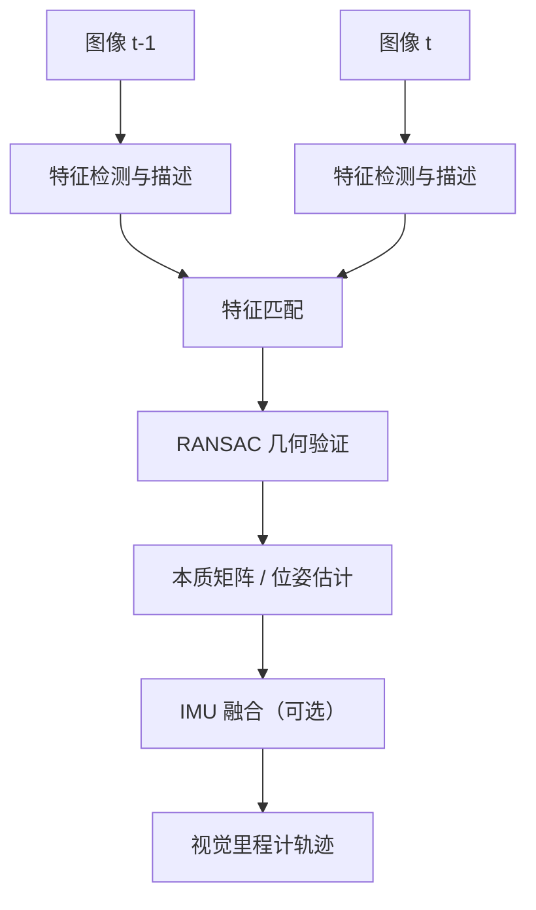


### 6.3.6 SLAM 后端：图优化与 g2o / GTSAM / Ceres

SLAM 算法通常分为前端（front-end）和后端（back-end）两个部分。前端负责从传感器数据中提取几何约束，例如视觉特征匹配、点云配准或 IMU 预积分；后端则把这些约束融合成一个一致的状态估计，并校正前端累积的误差。

!!! note "术语解释：SLAM 前端、SLAM 后端、位姿图、因子图、回环检测"
    - **SLAM 前端（front-end）**：从原始传感器数据中提取、关联并生成相对位姿或观测约束的模块。
    - **SLAM 后端（back-end）**：对前端产生的约束进行全局或局部优化，得到一致轨迹与地图的模块。
    - **位姿图（pose graph）**：以节点表示机器人位姿、以边表示相对位姿约束的图模型。
    - **因子图（factor graph）**：一类二分图，变量节点表示待估计量，因子节点表示约束或测量。
    - **回环检测（loop closure）**：识别机器人回到曾经访问过的位置，从而加入全局约束、消除漂移。

前端的输出通常带有漂移：视觉里程计的尺度不确定、LiDAR 配准的帧间误差、IMU 积分偏置等都会随时间累积。回环检测能够提供“当前帧与历史帧之间的相对位姿”这一强约束，后端通过优化把这些约束分配到整条轨迹上，从而显著降低全局误差。

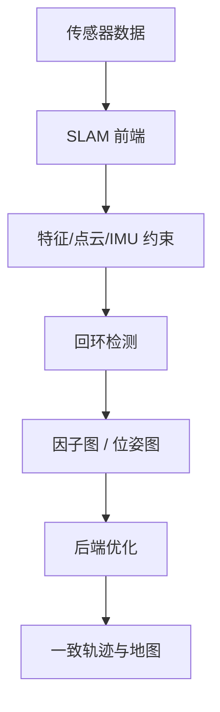

**因子图表示**。在后端中，待估计变量通常包括机器人位姿 \( \mathbf{x}_i \) 和路标点（landmark）\( \mathbf{l}_j \)。每个测量产生一个因子，对应一个残差函数 \( \mathbf{r}_k(\mathbf{x}) \)。例如：

- **里程计因子**：\( \mathbf{r}_{ij}^{odo} = \mathrm{Log}\left( \mathbf{T}_{ij}^{-1} \mathbf{T}_i^{-1} \mathbf{T}_j \right) \)，其中 \( \mathbf{T}_i \in SE(2) \) 或 \( SE(3) \)。
- **回环因子**：形式与里程计因子相同，但 \( i \) 与 \( j \) 不相邻。
- **GPS 先验因子**：\( \mathbf{r}_i^{gps} = \mathbf{p}_i - \mathbf{p}_i^{gps} \)。
- **路标观测因子**：投影误差或重投影误差。

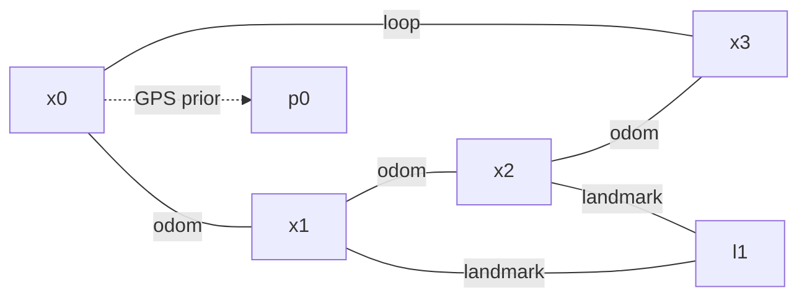

在最大似然估计框架下，假设测量噪声服从高斯分布，后端的优化目标为最小化马氏距离平方和：

$$
\min_{\mathbf{x}} \frac{1}{2} \sum_i \|\mathbf{r}_i(\mathbf{x})\|^2_{\mathbf{\Sigma}_i}
$$

其中 \( \mathbf{\Sigma}_i \) 为第 \( i \) 个测量的协方差矩阵，\( \|\mathbf{r}\|^2_{\mathbf{\Sigma}} = \mathbf{r}^T \mathbf{\Sigma}^{-1} \mathbf{r} \)。常引入信息矩阵 \( \mathbf{\Omega}_i = \mathbf{\Sigma}_i^{-1} \)，目标函数也可写作 \( \frac{1}{2} \sum_i \mathbf{r}_i^T \mathbf{\Omega}_i \mathbf{r}_i \)。

!!! note "术语解释：残差、信息矩阵、协方差、马氏距离"
    - **残差（residual）**：模型预测值与实际测量值之间的差异向量。
    - **信息矩阵（information matrix）**：协方差矩阵的逆，表示测量对变量的约束强度。
    - **协方差矩阵（covariance matrix）**：描述测量噪声或估计不确定性的二阶统计量。
    - **马氏距离（Mahalanobis distance）**：考虑协方差结构的加权距离。

**线性化与求解**。残差函数通常为非线性。在当前估计 \( \mathbf{x} \) 附近做一阶泰勒展开：

$$
\mathbf{r}_i(\mathbf{x} + \Delta \mathbf{x}) \approx \mathbf{r}_i(\mathbf{x}) + \mathbf{J}_i \Delta \mathbf{x}
$$

其中 \( \mathbf{J}_i = \partial \mathbf{r}_i / \partial \mathbf{x} \) 为雅可比矩阵。代入目标函数并对 \( \Delta \mathbf{x} \) 求导令其为零，得到法方程（normal equations）：

$$
\left( \sum_i \mathbf{J}_i^T \mathbf{\Omega}_i \mathbf{J}_i \right) \Delta \mathbf{x} = - \sum_i \mathbf{J}_i^T \mathbf{\Omega}_i \mathbf{r}_i
$$

!!! note "术语解释：雅可比矩阵、法方程、高斯-牛顿法、列文伯格-马夸特法"
    - **雅可比矩阵（Jacobian）**：残差对状态变量的偏导数矩阵，描述局部线性化关系。
    - **法方程（normal equations）**：最小二乘问题中由 \( \mathbf{J}^T \mathbf{\Omega} \mathbf{J} \Delta \mathbf{x} = -\mathbf{J}^T \mathbf{\Omega} \mathbf{r} \) 构成的线性系统。
    - **高斯-牛顿法（Gauss-Newton）**：通过反复线性化并解法方程来迭代逼近非线性最小二乘解。
    - **列文伯格-马夸特法（Levenberg-Marquardt）**：在高斯-牛顿基础上加入阻尼项 \( \lambda \mathbf{I} \) 以提高收敛鲁棒性。

令 \( \mathbf{H} = \sum_i \mathbf{J}_i^T \mathbf{\Omega}_i \mathbf{J}_i \)、\( \mathbf{b} = -\sum_i \mathbf{J}_i^T \mathbf{\Omega}_i \mathbf{r}_i \)，则每次迭代求解 \( \mathbf{H} \Delta \mathbf{x} = \mathbf{b} \)。LM 算法将 \( \mathbf{H} \) 替换为 \( \mathbf{H} + \lambda \, \mathrm{diag}(\mathbf{H}) \)，通过调整 \( \lambda \) 在高斯-牛顿与梯度下降之间切换。

**稀疏结构与 Schur 补**。SLAM 中的雅可比矩阵通常非常稀疏：每个因子只与少量变量相关。稀疏最小二乘求解器（如 CHOLMOD、CSparse）可利用该结构高效求解。若同时优化位姿与路标，可把 \( \mathbf{H} \) 分块为：

$$
\begin{bmatrix}
\mathbf{H}_{pp} & \mathbf{H}_{pl} \\
\mathbf{H}_{lp} & \mathbf{H}_{ll}
\end{bmatrix}
\begin{bmatrix}
\Delta \mathbf{x}_p \\
\Delta \mathbf{x}_l
\end{bmatrix}
=
\begin{bmatrix}
\mathbf{b}_p \\
\mathbf{b}_l
\end{bmatrix}
$$

通过对路标部分求 Schur 补，可先求解位姿子系统，再回代路标点。这一技巧在 bundle adjustment 中尤为关键。

!!! note "术语解释：稀疏矩阵、Schur 补、捆集调整"
    - **稀疏矩阵（sparse matrix）**：绝大多数元素为零的矩阵，SLAM 中每个因子只影响少量变量。
    - **Schur 补（Schur complement）**：通过消元把高维线性系统降维到仅含部分变量的技巧。
    - **捆集调整（bundle adjustment）**：同时优化相机位姿与三维路标点以最小化重投影误差的过程。

**g2o、GTSAM、Ceres 比较**。三者都是 SLAM/状态估计领域最常用的后端优化库：

| 特性 | g2o | GTSAM | Ceres Solver |
|---|---|---|---|
| 主要语言 | C++ | C++（提供 Python 绑定） | C++ |
| 核心抽象 | 图优化顶点/边 | 因子图 | 通用非线性最小二乘 |
| 自动求导 | 需手写雅可比 | 提供自动求导与符号求导 | 强大的 AutoDiff |
| 增量优化 | g2o 增量扩展 | iSAM2 增量平滑 | 不原生支持增量 |
| 流形/李群 | 内置 SE(2)/SE(3) 类型 | Manifolds/LieGroups 原生支持 | 需自定义局部参数化 |
| 典型应用 | ORB-SLAM、Cartographer | GTSAM 示例、视觉惯性导航 | LOAM、VINS-Mono（部分模块） |

!!! note "术语解释：自动求导、流形、李群、增量优化"
    - **自动求导（automatic differentiation）**：通过运算符重载或源码转换自动计算精确导数，避免手工推导雅可比。
    - **流形（manifold）**：局部与欧氏空间同胚的非线性空间，如旋转群 \( SO(3) \)。
    - **李群（Lie group）**：同时具有群结构和光滑流形结构的集合，如 \( SE(3) \)。
    - **增量优化（incremental optimization）**：当新增测量时只更新受影响的部分解，而不是从头优化整个图。

下面给出一个完整的 2D 位姿图优化 Python 算例。该算例不依赖 g2o/GTSAM，仅使用 `scipy.optimize.least_squares`，便于读者直接运行并理解算法核心。

```python
"""
2D pose graph optimization with scipy.optimize.least_squares.
Generates a square trajectory with odometry edges and one loop closure.
"""
import numpy as np
import matplotlib.pyplot as plt
from scipy.optimize import least_squares


def pose_compose(xi, xj):
    """Compose two SE(2) poses: xi * xj."""
    xi_, yi_, thi = xi
    xj_, yj_, thj = xj
    cos_i, sin_i = np.cos(thi), np.sin(thi)
    return np.array([
        xi_ + cos_i * xj_ - sin_i * yj_,
        yi_ + sin_i * xj_ + cos_i * yj_,
        thi + thj
    ])


def pose_inv(x):
    """Inverse of an SE(2) pose."""
    px, py, th = x
    c, s = np.cos(th), np.sin(th)
    return np.array([
        -c * px - s * py,
         s * px - c * py,
        -th
    ])


def pose_diff(xi, xj):
    """Relative pose from xi to xj: xi^{-1} * xj."""
    return pose_compose(pose_inv(xi), xj)


def wrap_angle(theta):
    """Wrap angle to [-pi, pi]."""
    return (theta + np.pi) % (2 * np.pi) - np.pi


# Ground-truth square trajectory: 4 sides, 10 poses per side
n_side = 10
side_len = 1.0
true_poses = []
for k in range(4):
    theta = k * np.pi / 2
    for i in range(n_side):
        t = i / n_side
        if k == 0:
            p = np.array([t * side_len, 0.0, theta])
        elif k == 1:
            p = np.array([side_len, t * side_len, theta])
        elif k == 2:
            p = np.array([(1 - t) * side_len, side_len, theta])
        else:
            p = np.array([0.0, (1 - t) * side_len, theta])
        true_poses.append(p)
true_poses = np.array(true_poses)
num_poses = len(true_poses)

# Build odometry measurements with noise
odom_edges = []
for i in range(num_poses - 1):
    z = pose_diff(true_poses[i], true_poses[i + 1])
    z += np.array([0.01, 0.01, 0.02]) * np.random.randn(3)
    z[2] = wrap_angle(z[2])
    odom_edges.append((i, i + 1, z))

# Add a loop closure between the last and first pose
z_loop = pose_diff(true_poses[-1], true_poses[0])
z_loop += np.array([0.05, 0.05, 0.05]) * np.random.randn(3)
z_loop[2] = wrap_angle(z_loop[2])
loop_edges = [(num_poses - 1, 0, z_loop)]

# Anchor the first pose to remove gauge freedom
anchor = true_poses[0].copy()


def residuals(params):
    """Compute all residuals for least_squares."""
    poses = params.reshape(num_poses, 3)
    poses[0] = anchor  # fix origin
    res = []

    # Odometry residuals
    for i, j, z in odom_edges:
        delta = pose_diff(poses[i], poses[j])
        err = delta - z
        err[2] = wrap_angle(err[2])
        # Weight by information (inverse std)
        err *= np.array([10.0, 10.0, 5.0])
        res.append(err)

    # Loop closure residual
    for i, j, z in loop_edges:
        delta = pose_diff(poses[i], poses[j])
        err = delta - z
        err[2] = wrap_angle(err[2])
        err *= np.array([5.0, 5.0, 3.0])
        res.append(err)

    return np.concatenate(res)


# Initial estimate: integrate noisy odometry without loop closure
init_poses = np.zeros((num_poses, 3))
init_poses[0] = anchor
for idx, (i, j, z) in enumerate(odom_edges):
    init_poses[j] = pose_compose(init_poses[i], z)

# Optimize
result = least_squares(
    residuals,
    init_poses.ravel(),
    method='lm',
    max_nfev=200
)
opt_poses = result.x.reshape(num_poses, 3)
opt_poses[0] = anchor

# Plot
plt.figure(figsize=(6, 6))
plt.plot(true_poses[:, 0], true_poses[:, 1], 'k-o', label='Ground truth')
plt.plot(init_poses[:, 0], init_poses[:, 1], 'r-s', label='Initial (odom only)')
plt.plot(opt_poses[:, 0], opt_poses[:, 1], 'b-^', label='Optimized')
plt.axis('equal')
plt.grid(True)
plt.legend()
plt.title('2D Pose Graph Optimization')
plt.xlabel('x [m]')
plt.ylabel('y [m]')
plt.tight_layout()
plt.savefig('pose_graph_2d.png', dpi=150)
plt.show()
```

运行结果通常显示：仅靠里程计积分的初始轨迹在回到起点时存在明显漂移，而优化后的轨迹与真实方形轨迹几乎重合。调整里程计与回环的信息权重（即残差前的乘数）可改变它们对最终解的影响。

**Ceres Solver C++ 片段**。同样的 2D 位姿图问题在 Ceres 中可写为：

```cpp
#include <ceres/ceres.h>

struct PoseGraph2DError {
  PoseGraph2DError(double dx, double dy, double dtheta)
      : dx_(dx), dy_(dy), dtheta_(dtheta) {}

  template <typename T>
  bool operator()(const T* const xi, const T* const xj, T* residuals) const {
    // xi = [px, py, theta], xj = [px, py, theta]
    T cos_i = cos(xi[2]), sin_i = sin(xi[2]);
    T dx_pred = cos_i * (xj[0] - xi[0]) + sin_i * (xj[1] - xi[1]);
    T dy_pred = -sin_i * (xj[0] - xi[0]) + cos_i * (xj[1] - xi[1]);
    T dtheta_pred = xj[2] - xi[2];
    residuals[0] = dx_pred - T(dx_);
    residuals[1] = dy_pred - T(dy_);
    residuals[2] = dtheta_pred - T(dtheta_);
    return true;
  }

  double dx_, dy_, dtheta_;
};

// Usage:
ceres::CostFunction* cost =
    new ceres::AutoDiffCostFunction<PoseGraph2DError, 3, 3, 3>(
        new PoseGraph2DError(z_dx, z_dy, z_dtheta));
problem.AddResidualBlock(cost, nullptr, pose_i, pose_j);
```

Ceres 的 `AutoDiffCostFunction` 自动完成雅可比计算；只需提供残差定义即可。若涉及 \( SO(3) \) 或 \( SE(3) \)，通常需要配合 `LocalParameterization` 或 `Manifold` 来处理流形上的更新。

**GTSAM 简介**。GTSAM 以因子图为核心抽象，Python 接口可直接构造问题：

```python
import gtsam
from gtsam import Pose2, Values, NonlinearFactorGraph
from gtsam import BetweenFactorPose2, PriorFactorPose2

graph = NonlinearFactorGraph()
initial = Values()

# 添加先验固定第一个位姿
graph.add(PriorFactorPose2(0, Pose2(0, 0, 0), noise_model))
initial.insert(0, Pose2(0, 0, 0))

# 添加里程计与回环因子
graph.add(BetweenFactorPose2(i, j, Pose2(dx, dy, dtheta), noise_model))

# 优化
optimizer = gtsam.LevenbergMarquardtOptimizer(graph, initial)
result = optimizer.optimize()
```

!!! note "术语解释：GTSAM、iSAM2、Bayes 树"
    - **GTSAM（Georgia Tech Smoothing and Mapping library）**：基于因子图与 Bayes 树的 C++/Python 状态估计库。
    - **iSAM2**：GTSAM 中的增量平滑与建图算法，利用 Bayes 树实现新增测量时的局部更新。
    - **Bayes 树（Bayes tree）**：因子图消元后得到的树状数据结构，支持增量推理。

后端图优化的工程要点可总结为三点：

1. **前端约束质量决定优化上限**。错误的回环或配准会引入“幽灵”约束，导致优化结果发散；鲁棒核函数（Huber、Cauchy）或 RANSAC 校验必不可少。
2. **信息矩阵应反映真实测量精度**。对低成本里程计赋予过高权重、对高精度 GPS 赋予过低权重都会扭曲结果。
3. **稀疏求解器与增量算法是大规模场景的关键**。室内/室外 SLAM 的节点数可达 \( 10^4 \sim 10^6 \) 量级，只有利用稀疏结构才能在实时约束内完成优化。

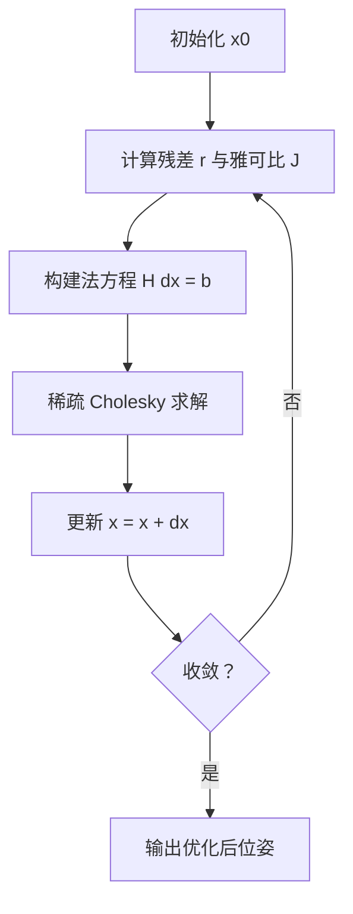

关于图优化的更系统介绍可参考 Grisetti 等人的教程 [58]、g2o 论文 [59]、GTSAM 介绍 [60] 以及 Ceres Solver 文档 [61]。

---

## 6.4 通信、中间件与实时操作系统

人形机器人的通信与中间件是连接传感器、计算单元和执行器的“神经系统”。一个典型双足机器人可能同时运行：几十赫兹的多相机感知流、千赫兹的关节力控环、十赫兹以上的高层规划，以及跨机身各模块的时间同步、故障诊断和日志记录。这些流量在带宽、延迟、抖动、可靠性和安全性上的需求差异极大，无法用单一网络或协议满足。本节从 DDS/RTPS 的发布-订阅语义出发，深入到 TSN、EtherCAT、CAN-FD 等确定性总线，再扩展到 ROS 2 上层框架、消息序列化与性能估算、时间同步，最终给出一个相对完整的机器人通信中间件图景。

!!! note "术语解释：中间件、总线、协议、发布-订阅、确定性通信"
    - **中间件（middleware）**：位于操作系统与应用软件之间的软件层，为分布式应用提供通信、数据管理、资源调度等通用服务。
    - **总线（bus）**：多个节点共享的物理传输介质或通信通道，如 CAN 总线、以太网总线。
    - **协议（protocol）**：通信双方为交换数据而约定的格式、时序和语义规则集合。
    - **发布-订阅（publish-subscribe）**：发送方（发布者）和接收方（订阅者）通过主题解耦，无需彼此知道对方存在。
    - **确定性通信（deterministic communication）**：通信延迟或其上界可被预测和保证的通信方式。

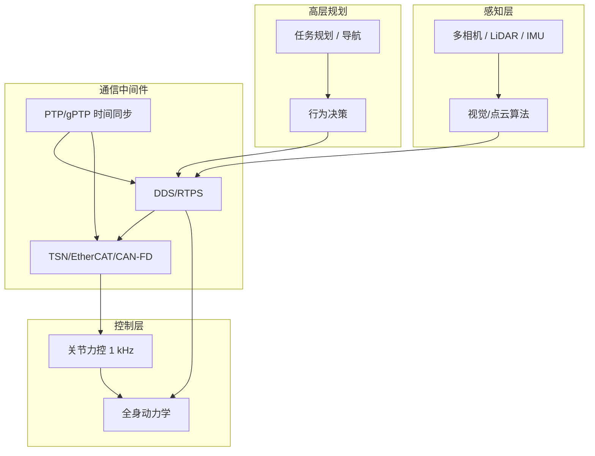

### 6.4.1 ROS 2 与 DDS

机器人操作系统 ROS 2 采用数据分发服务（DDS）作为底层通信中间件，实现了发布-订阅机制、服务质量（QoS）策略和分布式节点发现。与 ROS 1 基于自定义 TCP 主节点不同，ROS 2 的通信去中心化，节点可直接通过 DDS 互相发现，天然支持多机分布式部署。

!!! note "术语解释：ROS 2、DDS、发布-订阅、QoS、话题、节点、RMW"
    - **ROS 2（Robot Operating System 2）**：面向机器人的第二代开源中间件框架，底层默认基于 DDS。
    - **DDS（Data Distribution Service）**：OMG 标准的实时发布-订阅中间件，广泛用于航空、汽车、机器人。
    - **QoS（Quality of Service）**：通信策略集合，包括可靠性、持久性、截止期限、历史深度等。
    - **话题（topic）**：承载同一数据类型的逻辑信道。
    - **节点（node）**：ROS 2 中的最小计算单元。
    - **RMW（ROS Middleware Interface）**：ROS 2 与底层 DDS 实现之间的抽象接口层。

#### DDS 数据模型与实体层次

DDS 的核心抽象是一个分层的实体（Entity）模型。每个实体继承自基类 `Entity`，可配置监听器（Listener）和 QoS。自顶向下，关键实体包括：

1. **DomainParticipant**：DDS 域（domain）中的通信参与者。一个进程通常创建一个 DomainParticipant，加入某个 domain id（整数）。同一 domain id 内的 DomainParticipant 可互相发现；不同 domain 默认隔离。
2. **Publisher / Subscriber**：发布者和订阅者是 DataWriter / DataReader 的容器，负责批量管理和生命周期控制。
3. **Topic**：由名称和数据类型共同定义的逻辑信道。DDS 通过类型支持（TypeSupport）在编译期或运行期知道 Topic 的内存布局。
4. **DataWriter**：发布端实体，应用程序调用 `write(sample)` 把样本推入 DataWriter 的历史缓存，由 DDS 实现负责通过 RTPS 发送到匹配的 DataReader。
5. **DataReader**：订阅端实体，应用程序通过 `take()` 或 `read()` 从 DataReader 的历史缓存中取出样本。

!!! note "术语解释：DomainParticipant、Publisher、Subscriber、Topic、DataWriter、DataReader、Listener"
    - **DomainParticipant**：DDS 域中的通信实体，同一域内节点可互相发现。
    - **Publisher / Subscriber**：DataWriter / DataReader 的容器，管理一组发布或订阅对象。
    - **DataWriter / DataReader**：分别用于发布和订阅数据的对象。
    - **Listener**：DDS 的回调接口，用于异步通知匹配、数据可用、QoS 违规等事件。

这种层次结构带来两个重要工程特性：

- **同进程内多节点隔离**：不同 DomainParticipant 即使运行在同一进程，也可属于不同 domain，互不干扰。
- **资源与 QoS 分组**：Publisher 和 Subscriber 作为容器，可统一设置默认 QoS；DataWriter/DataReader 可在此基础上覆盖。

一个典型关系可概括为：

$$
\text{DomainParticipant} \supseteq \{ \text{Publisher}, \text{Subscriber}, \text{Topic} \}
$$

$$
\text{Publisher} \supseteq \{ \text{DataWriter}_i \}, \quad \text{Subscriber} \supseteq \{ \text{DataReader}_j \}
$$

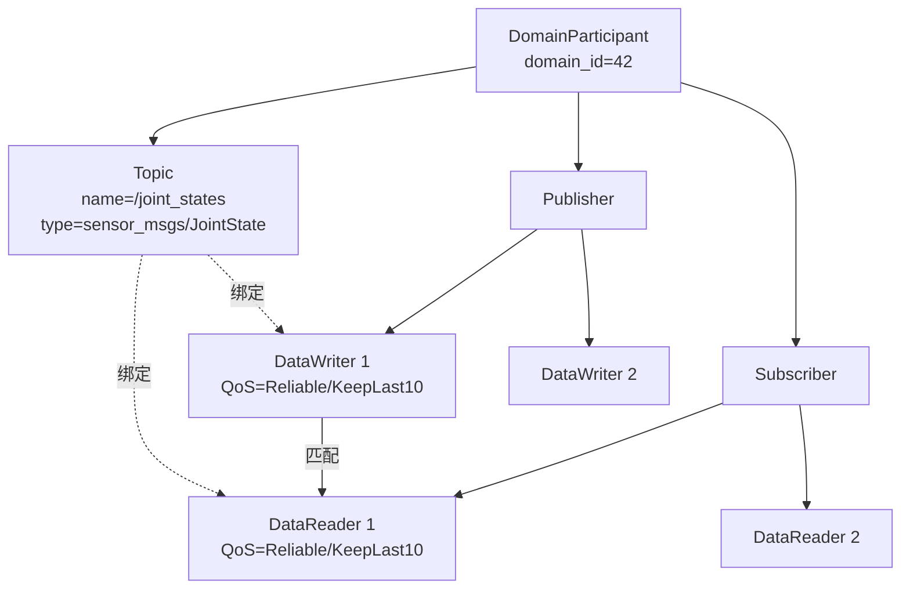

DDS 的数据模型是**以样本（sample）为单位的键控数据流**。一个 Topic 的每个 sample 可以携带一个实例键（instance key），例如同一 `/joint_states` 话题中，不同关节可作为不同实例。DataWriter 为每个实例维护独立的历史队列；DataReader 可单独接收、过滤或过期某个实例。这种设计便于处理“同一话题中多个并发实体”的场景，如多架飞机、多辆车的状态。

!!! note "术语解释：样本、实例键、键控数据、历史队列"
    - **样本（sample）**：Topic 上的一次数据发布单元。
    - **实例键（instance key）**：用于区分同一 Topic 内不同逻辑实例的字段，允许 DDS 为每个实例单独管理生命周期和历史。
    - **键控数据（keyed data）**：带实例键的数据类型，使多个实例可在同一 Topic 上共存。
    - **历史队列（history queue）**：DataWriter 或 DataReader 中保存的最近若干样本缓存。

#### RTPS 协议：发现与传输

DDS 的底层有线协议称为 **RTPS（Real-Time Publish-Subscribe）**，由 OMG DDSI-RTPS 规范定义。RTPS 的设计目标是在无中心 broker 的情况下，让分布式发布者和订阅者自动发现彼此并交换用户数据。

!!! note "术语解释：RTPS、DDSI、Broker、有线协议、端点"
    - **RTPS（Real-Time Publish-Subscribe）**：DDS 的标准有线协议，负责发现、匹配和数据传输。
    - **DDSI（DDS Interoperability）**：OMG 制定的 DDS 互操作有线协议规范。
    - **Broker**：消息中间件中的中心转发节点；RTPS 是无 broker 设计。
    - **有线协议（wire protocol）**：数据在物理网络上实际传输的字节格式和状态机。
    - **端点（endpoint）**：RTPS 中的 DataWriter 或 DataReader 在网络层的表示。

RTPS 的发现分为两个阶段：

1. **Participant Discovery Protocol（PDP）**：每个 DomainParticipant 周期性发送 **ParticipantDeclaration**（在 RTPS 中通常封装为 SPDPdiscoveredParticipantData），宣告自己的存在、GUID、QoS、可用传输等。接收方据此建立 Participant 级别的匹配关系。
2. **Endpoint Discovery Protocol（EDP）**：在 PDP 完成后，参与者交换各自的 DataWriter/DataReader 信息（端点名称、Topic、类型、QoS），确认哪些端点可以匹配。

这两种流量合称 **metatraffic（元流量）**，与承载应用数据的 **user traffic（用户流量）** 分离。元流量通常使用 best-effort 方式通过 UDP 多播或单播发送。

!!! note "术语解释：PDP、EDP、SPDP、metatraffic、user traffic、GUID"
    - **PDP（Participant Discovery Protocol）**：RTPS 的参与者发现协议。
    - **EDP（Endpoint Discovery Protocol）**：RTPS 的端点发现协议。
    - **SPDP（Simple Participant Discovery Protocol）**：最常用的 PDP 实现，基于周期性宣告。
    - **Metatraffic**：发现、心跳、确认等控制流量。
    - **User traffic**：应用实际发布的传感器、控制命令等数据流量。
    - **GUID（Globally Unique Identifier）**：RTPS 中每个实体（Participant、Writer、Reader）的全局唯一标识符。

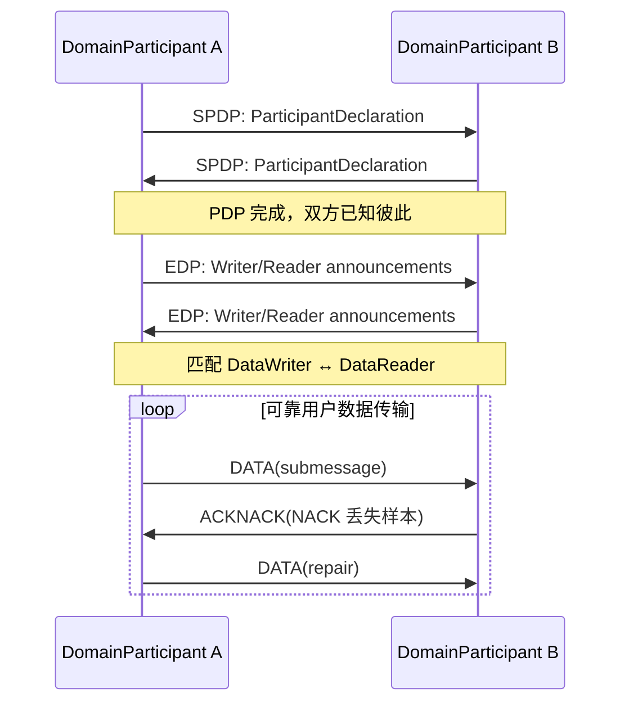

RTPS 默认运行在 **UDP/IP** 之上，原因包括：

- UDP 无连接、低延迟，适合周期性的传感器数据。
- 多播天然支持一对多发现。
- RTPS 自身在传输层之上实现可靠性和顺序性，不依赖 TCP。

对于高吞吐量的同机通信，现代 DDS 实现（如 Fast DDS、CycloneDDS）支持 **共享内存传输（SHM, Shared Memory Transport）**。当发布者和订阅者位于同一主机时，样本直接写入共享内存段，接收方通过零拷贝（zero-copy）读取，避免 UDP 协议栈开销、数据序列化拷贝和内核-用户态切换。

!!! note "术语解释：UDP、TCP、多播、单播、共享内存、零拷贝"
    - **UDP（User Datagram Protocol）**：无连接传输层协议，低开销但不保证可靠性。
    - **TCP（Transmission Control Protocol）**：面向连接的可靠传输协议，但引入握手、重排和缓冲延迟。
    - **多播（multicast）**：一对多的网络传输方式，一个数据包可被多个接收者接收。
    - **单播（unicast）**：一对一的网络传输方式。
    - **共享内存（shared memory）**：同一主机上多个进程可直接访问的同一段物理内存。
    - **零拷贝（zero-copy）**：数据在传输过程中不经过额外内存拷贝，减少 CPU 开销和延迟。

RTPS 的消息格式由若干 **submessage** 组成，常见 submessage 类型包括：

| Submessage | 作用 |
|---|---|
| `DATA` | 携带用户样本或元数据 |
| `DATA_FRAG` | 大样本分片传输 |
| `HEARTBEAT` | Writer 告知 Reader 当前可用序列号范围 |
| `ACKNACK` | Reader 确认收到或请求重传 |
| `GAP` | Writer 通知 Reader 某些序列号不再可用 |
| `NACK_FRAG` | 分片数据的重传请求 |

**最佳实践**：在机器人中，通常把发现配置为“单播 + 少量多播”混合模式。小型局域网内可用多播做 PDP；大型或 Wi-Fi 场景下，为减少网络泛洪，可配置为单播发现并指定对等节点列表（peer list）。

#### QoS 策略详解

DDS 的 QoS（Quality of Service）是策略对象，可分别设置在 Topic、DataWriter、DataReader、Publisher、Subscriber 和 DomainParticipant 上。DataWriter 与 DataReader 匹配时，DDS 会检查双方 QoS 是否兼容（compatible）。

!!! note "术语解释：QoS、兼容策略、请求-提供模型、资源限制"
    - **QoS（Quality of Service）**：DDS 中描述通信语义和资源的策略集合。
    - **请求-提供模型（request-offer model）**：DataReader 请求某种 QoS，DataWriter 提供某种 QoS，匹配需满足 Reader 的请求 ≤ Writer 的承诺。
    - **资源限制（resource limits）**：DDS 实体可使用的最大内存样本数。

下表列出主要 QoS 策略及其在人形机器人中的典型用法。

| QoS 策略 | 发布者侧语义 | 订阅者侧语义 | 机器人典型场景 |
|---|---|---|---|
| RELIABILITY | Reliable / Best-Effort | 同左 | 急停用 Reliable；图像用 Best-Effort |
| HISTORY | Keep Last N / Keep All | 同左 | 控制指令 Keep Last 1；日志 Keep All（若资源允许） |
| DURABILITY | Volatile / Transient Local / Transient / Persistent | 同左 | 地图用 Transient Local |
| DEADLINE | 承诺最小发布周期 | 期望最小接收周期 | 关节状态 1 kHz 监控 |
| LATENCY_BUDGET | 允许 DDS 批量/延迟发送的预算 | 可接受的额外延迟 | 非关键日志聚合 |
| LIFESPAN | 样本有效期 | 同左 | 过期图像自动丢弃 |
| LIVELINESS | Automatic / Manual，lease duration | 同左 | 检测节点是否存活 |
| OWNERSHIP | Shared / Exclusive + strength | 同左 | 多控制器仲裁 |
| PARTITION | 逻辑分区名 | 同左 | 多机器人隔离 |
| TIME_BASED_FILTER | 最小间隔过滤 | 同左 | 降低高频采样到 10 Hz |
| TRANSPORT_PRIORITY | 传输优先级 | 同左 | 紧急控制帧优先 |

**RELIABILITY（可靠性）**。Reliable 模式下，RTPS 使用 **NACK-based repair**：Reader 收到 HEARTBEAT 后，若发现序列号缺失，发送 ACKNACK 请求重传；Writer 收到 NACK 后从缓存中重新发送对应样本。Best-Effort 模式下不发送 ACKNACK，样本一旦发送即丢弃，延迟最低但可能丢包。

!!! note "术语解释：NACK、ACK、HEARTBEAT、重传、确认"
    - **NACK（Negative Acknowledgment）**：接收方通知发送方哪些数据未收到。
    - **ACK（Acknowledgment）**：接收方确认收到数据。
    - **HEARTBEAT**：发送方周期性告知接收方当前已发送的序列号窗口。
    - **重传（retransmission）**：发送方根据 NACK 再次发送丢失的数据。

可靠性的开销可用下式粗略估算：

$$
L_{\text{reliable}} = L_{\text{send}} + L_{\text{prop}} + L_{\text{sched}} + L_{\text{NACK-repair}}
$$

其中 \(L_{\text{NACK-repair}}\) 在稳定网络下接近 0，但在丢包时会引入一个 RTT 量级（百微秒到毫秒）的额外延迟。

**HISTORY（历史）**。Keep Last \(N\) 只保留最近 \(N\) 个样本，旧样本被覆盖；Keep All 保留所有未确认的样本，直到资源限制。DataReader 使用 Keep Last 1 可有效实现“只关心最新值”的语义，例如接收 `/cmd_vel` 速度指令。

!!! note "术语解释：Keep Last、Keep All、历史深度、资源限制"
    - **Keep Last**：只保留最近 N 个样本的 HISTORY 模式。
    - **Keep All**：保留所有未消费或未确认样本的 HISTORY 模式。
    - **历史深度（history depth）**：Keep Last 模式下的 N 值。
    - **资源限制（resource limits）**：控制 DDS 实体最大样本数、实例数和样本/实例比的参数。

**DURABILITY（持久性）**。分为四级：

- **Volatile**：不保留历史，新订阅者加入后只能收到之后的数据。占用内存最小。
- **Transient Local**：DataWriter 在本地内存中保留历史样本，新匹配的 DataReader 加入时可立即收到最新样本。适合地图、参数、配置等“状态型”数据。
- **Transient / Persistent**：由外部持久化服务（DDS Persistence Service）保存历史，DataWriter 退出后新 Reader 仍可获取。实现复杂，机器人中较少使用。

内存占用可近似为：

$$
M_{\text{durability}} \approx N_{\text{samples}} \times S_{\text{sample}} \times N_{\text{instances}}
$$

其中 \(S_{\text{sample}}\) 为序列化后的样本大小。对于 1 MB 点云地图，历史深度为 1，实例数为 1，则 Transient Local 约占用 1 MB。

**DEADLINE 与 LATENCY_BUDGET**。DEADLINE 要求 Writer 在指定周期内至少发布一次；Reader 则期望在周期内收到。若未满足，DDS 触发 `on_requested_deadline_missed` 或 `on_offered_deadline_missed` 回调。LATENCY_BUDGET 允许 DDS 在预算内做批量发送或调度优化。

**LIFESPAN**。样本在 DataWriter 侧有有效期，过期后即使未发送也会被丢弃，避免旧数据在网络中传播。例如，100 ms 前的障碍物检测结果对高速运动机器人可能已失去意义。

**LIVELINESS**。Automatic 模式下，DDS 自动认为 Writer 存活，只要 Writer 进程正常运行；Manual 模式下，应用必须定期调用 `assert_liveliness()`，否则 Reader 触发 `on_liveliness_changed` 并认为 Writer 失去活性。lease duration 定义了超时阈值。

**OWNERSHIP**。Shared 模式下，多个 Writer 向同一 Topic 发布的数据都被 Reader 接收；Exclusive 模式下，只有 strength 最高的 Writer 的数据被接收。这在多控制器热备份中非常有用：主控制器 strength 高，备控制器 strength 低，当主控制器失效时备控制器自动接管。

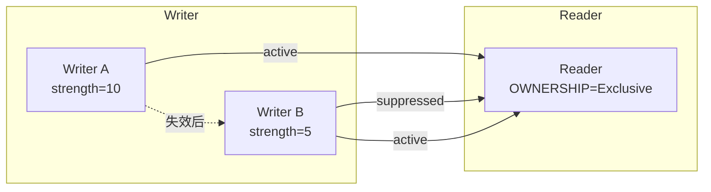

**PARTITION**。通过逻辑分区名把同一个 domain 进一步划分。例如机器人 A 和机器人 B 同处于 domain 0，但分别属于 partition `robot_A` 和 `robot_B`，彼此不会互相订阅，除非显式跨分区配置。

**回调机制**。DDS 提供 `on_requested_deadline_missed`、`on_liveliness_changed`、`on_sample_lost`、`on_sample_rejected`、`on_requested_incompatible_qos` 等 Listener 回调。工程上建议在关键话题（如 `/emergency_stop`）监听 LIVELINESS_CHANGED 和 DEADLINE_MISSED，以及时发现通信异常。

#### DDS 安全与可扩展性

DDS-Security 是 OMG 定义的一套安全插件规范，为 DDS 提供认证、访问控制、加密和审计能力。它通过插件化架构集成到 DDS 实现中，不修改 RTPS 核心消息格式，而是在 submessage 级别增加安全封装。

!!! note "术语解释：DDS-Security、认证、访问控制、加密、审计、插件"
    - **DDS-Security**：OMG 为 DDS 定义的安全扩展规范。
    - **认证（authentication）**：验证通信双方身份的过程。
    - **访问控制（access control）**：根据策略决定哪些实体可以发布/订阅哪些 Topic。
    - **加密（encryption）**：对消息内容进行变换，使未授权方无法读取。
    - **审计（logging）**：记录安全事件以供事后分析。
    - **插件（plugin）**：可动态加载的安全功能模块。

DDS-Security 主要包含以下插件：

1. **Authentication Plugin**：基于 PKI 和数字证书验证 DomainParticipant 身份，使用 Diffie-Hellman 或 ECDH 协商会话密钥。
2. **Access Control Plugin**：通过 `permissions.xml` 和 `governance.xml` 定义每个 Participant 能读写的 Topic、可加入的 domain、可创建的 Publisher/Subscriber。
3. **Cryptography Plugin**：提供 RTPS 消息的加密、签名、HMAC 和密钥派生。
4. **Logging Plugin**：记录安全相关事件。

!!! note "术语解释：PKI、数字证书、Diffie-Hellman、ECDH、HMAC、数字签名"
    - **PKI（Public Key Infrastructure）**：基于公钥密码学的身份认证基础设施。
    - **数字证书（digital certificate）**：由可信机构签发的、绑定公钥与身份的电子文档。
    - **Diffie-Hellman / ECDH**：密钥交换协议，允许双方在公开信道上协商共享密钥。
    - **HMAC（Hash-based Message Authentication Code）**：基于哈希函数的消息认证码，用于完整性校验。
    - **数字签名（digital signature）**：用私钥对数据摘要进行签名，验证数据来源和完整性。

安全部署中需要两类 XML 文件：

- **Governance**：定义全局安全策略，如是否启用加密、签名、是否允许未认证参与者加入 domain。
- **Permissions**：定义每个 Participant 的具体权限，包括允许读写的 Topic、有效期、domain id 等。

!!! note "术语解释：Governance、Permissions、安全域"
    - **Governance**：DDS-Security 中定义全局安全策略的文件。
    - **Permissions**：DDS-Security 中定义单个 Participant 读写权限的文件。
    - **安全域（security domain）**：通过认证和访问控制逻辑隔离的通信范围。

在机器人系统中，DDS-Security 的典型应用包括：

- **多机隔离**：确保机器人 A 不会误接收机器人 B 的控制指令。
- **操作权限分级**：上位机可发布 `/cmd_vel`，关节驱动节点只允许订阅特定控制 Topic 并发布状态 Topic。
- **遥操作安全**：外部遥操作端必须经过证书认证才能写入高权限 Topic。

除安全外，DDS 的可扩展性还体现在 **domain 分段** 和 **Topic 路由**。大型机器人或机器人编队可通过 DDS 网关或 ROS 2 的 `domain bridge` 在不同 domain 之间转发选定 Topic，实现分层网络：

- 高层规划域（低频、大数据量、跨机器人）
- 实时控制域（高频、小数据量、严格时序）
- 维护诊断域（日志、固件升级）

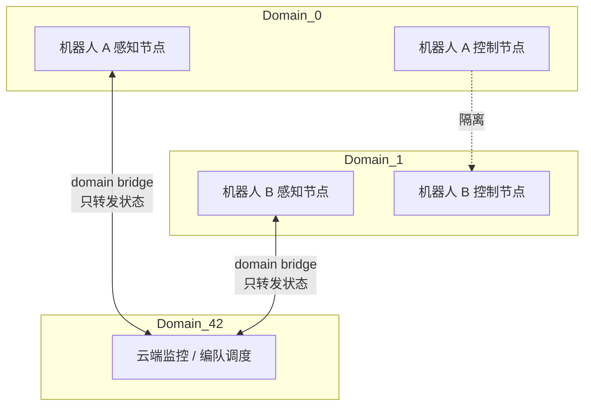

#### DDS 实现对比

目前主流 DDS 实现包括 CycloneDDS、Fast DDS、RTI Connext DDS、GurumDDS 和 OpenDDS。下表从机器人工程角度做对比。

| 实现 | 许可证 | ROS 2 默认 RMW | 共享内存 | DDS-Security | 主要工具链 | 典型适用场景 |
|---|---|---|---|---|---|---|
| Eclipse CycloneDDS | EPL 2.0 | Rolling/Jazzy 默认 | 支持 | 部分支持 | `cyclonedds` CLI | 开源机器人、学术项目 |
| eProsima Fast DDS | Apache 2.0 | Humble 默认 | 优秀 | 支持 | Fast DDS Monitor | 商业机器人、同机零拷贝 |
| RTI Connext DDS | 商业 | 可选 `rmw_connextdds` | 支持 | 完整 | RTI Admin Console、Monitor | 航空航天、汽车、高安全 |
| GurumDDS | 商业 | 可选 | 支持 | 完整 | Gurum Net | 韩国工业/机器人市场 |
| OpenDDS | 开源（OCI） | 无官方 RMW | 支持 | 支持 | OpenDDS Monitor | 已有 OpenDDS 生态 |

!!! note "术语解释：CycloneDDS、Fast DDS、RTI Connext、GurumDDS、OpenDDS、EPL、Apache 2.0"
    - **CycloneDDS**：Eclipse 基金会维护的开源 DDS 实现，以简洁和高性能著称。
    - **Fast DDS**：eProsima 开发的功能丰富的 DDS/RTPS 实现，支持共享内存和安全。
    - **RTI Connext DDS**：Real-Time Innovations 的商业 DDS 产品，工具链成熟。
    - **GurumDDS**：韩国 Gurum Networks 的商业 DDS 实现。
    - **OpenDDS**：Object Computing 维护的开源 DDS 实现。
    - **EPL / Apache 2.0**：常见的开源软件许可证。

选型建议：

- **研发与原型**：CycloneDDS 配置简单，与 ROS 2 集成良好。
- **高性能同机通信**：Fast DDS 的共享内存实现和零拷贝特性优秀。
- **安全关键/认证项目**：RTI Connext DDS 提供完整的安全插件、工具链和认证支持文档。
- **多 DDS 互通**：DDS 互操作性理论上可行，但实际中不同实现对 QoS 默认值和发现行为有差异，需在项目早期做互联互通测试。

#### ROS 2 执行模型与 rclcpp/rclpy

ROS 2 在 DDS 之上提供了 `rcl`（C 接口）、`rclcpp`（C++）和 `rclpy`（Python）客户端库。理解其执行模型对实现低延迟、确定性的机器人软件至关重要。

!!! note "术语解释：rcl、rclcpp、rclpy、客户端库、执行器、回调"
    - **rcl**：ROS 2 的 C 语言客户端库接口。
    - **rclcpp / rclpy**：ROS 2 的 C++ 和 Python 客户端库。
    - **客户端库（client library）**：为开发者提供创建节点、发布/订阅、调用服务等 API 的库。
    - **执行器（executor）**：调度回调函数执行的机制。
    - **回调（callback）**：对事件（如新消息到达、定时器触发、服务请求）的响应函数。

**节点与执行器**。一个 ROS 2 进程可包含一个或多个 Node。执行器负责从 DDS/RMW 层收集事件并调用对应的回调。ROS 2 提供三种主要执行器：

1. **SingleThreadedExecutor**：所有回调按 FIFO 顺序在同一线程执行。最简单，但一个耗时回调会阻塞其他回调。
2. **MultiThreadedExecutor**：使用线程池并发执行回调，适合 I/O 密集型或计算可并行的场景。
3. **StaticSingleThreadedExecutor**：在初始化时确定回调顺序，运行时可减少调度开销，适合确定性强、回调集合固定的实时任务。

!!! note "术语解释：SingleThreadedExecutor、MultiThreadedExecutor、StaticSingleThreadedExecutor、FIFO、线程池"
    - **SingleThreadedExecutor**：单线程顺序执行回调的执行器。
    - **MultiThreadedExecutor**：多线程并发执行回调的执行器。
    - **StaticSingleThreadedExecutor**：静态确定回调顺序以优化调度开销的执行器。
    - **FIFO（First In First Out）**：先到先服务的调度顺序。
    - **线程池（thread pool）**：预先创建的一组线程，用于复用并减少线程创建开销。

**回调组（Callback Groups）**。ROS 2 的回调可放入两类回调组：

- **MutuallyExclusive**：组内回调不能并发执行，适合访问共享资源的回调。
- **Reentrant**：组内回调可重入并发执行，适合无状态、可并行的计算。

通过把实时回调（如控制律）放入独立回调组并配合 `MultiThreadedExecutor` 的线程数限制，可以在一定程度上隔离实时与非实时负载。

```mermaid
flowchart TD
    subgraph Node
    A["订阅 /joint_states"] --> B["回调组 A<br/>MutuallyExclusive<br/>实时控制"]
    C["订阅 /camera/image_raw"] --> D["回调组 B<br/>Reentrant<br/>感知处理"]
    E["定时器 1 kHz"] --> B
    end
    B --> F["Executor 线程池"]
    D --> F
    F --> G["DDS/RTPS"]
```

**组合与进程内通信（Composition）**。ROS 2 支持把多个节点编译到同一进程（composition），并通过 `rclcpp::intra_process` 实现**进程内零拷贝通信**。当发布者和订阅者在同一进程且使用 compatible QoS 时，样本指针可直接传递，无需经过 DDS 序列化和网络栈。

!!! note "术语解释：Composition、进程内通信、零拷贝、指针传递"
    - **Composition**：把多个 ROS 2 节点放入同一进程的技术。
    - **进程内通信（intra-process communication）**：同一进程内节点之间的直接通信，绕过 DDS 网络层。
    - **零拷贝（zero-copy）**：数据在传输时不进行额外的内存拷贝。
    - **指针传递（pointer passing）**：通过传递数据指针而非复制数据实现零拷贝。

**RMW 抽象层**。ROS 2 通过 RMW 接口屏蔽底层 DDS 实现差异。`rmw_fastrtps_cpp`、`rmw_cyclonedds_cpp`、`rmw_connextdds` 等是不同 DDS 的适配层。切换 RMW 通常只需设置环境变量 `RMW_IMPLEMENTATION`，无需修改应用代码。

**实时性陷阱**：

1. **回调中动态内存分配**：`std::vector`、`std::string` 等可能触发堆分配，导致不可预期的延迟。实时路径应预分配内存或使用自定义分配器。
2. **spin 锁与忙等待**：某些 DDS 实现在等待数据时使用自旋锁，会消耗 CPU 并影响同进程其他线程。
3. **DDS 历史缓存**：Keep All 或大量实例会无界增长内存，需配合 ResourceLimits 使用。
4. **Executor 的 FIFO 调度**：SingleThreadedExecutor 无法保证周期任务的精确触发时刻，建议使用 `rclcpp::Timer` 并配合实时优先级线程。

```mermaid
flowchart TD
    A["ROS 2 应用 rclcpp/rclpy"] --> B["rcl 接口层"]
    B --> C["RMW 抽象层"]
    C --> D["DDS 实现层"]
    D --> E["RTPS 协议层"]
    E --> F["UDP / SHM 传输层"]
    F --> G["网卡 / 共享内存"]
```

### 6.4.2 时间敏感网络 TSN / EtherCAT / CAN-FD

机器人内部通信通常分为两类：

- **数据密集型总线**：多相机、点云、日志，要求高带宽、可接受的延迟。
- **控制密集型总线**：关节力控、安全链，要求确定性低延迟和低抖动。

TSN、EtherCAT 和 CAN-FD 分别对应不同层级：TSN 面向高速以太网上的确定性融合；EtherCAT 面向高性能伺服和运动控制；CAN-FD 面向低成本、中低速的分布式节点（如电池管理、传感器）。

!!! note "术语解释：TSN、EtherCAT、CAN-FD、现场总线、确定性通信、周期时间、抖动"
    - **TSN（Time-Sensitive Networking）**：IEEE 802.1 系列标准，在传统以太网上提供确定性时延和同步。
    - **EtherCAT（Ethernet for Control Automation Technology）**：Beckhoff 开发的工业以太网现场总线，采用“飞读飞写”机制，周期可达 100 μs。
    - **CAN-FD（Controller Area Network with Flexible Data-rate）**：CAN 总线的升级版本，提高数据速率和每帧数据长度。
    - **现场总线（fieldbus）**：连接控制器与现场设备的数字通信网络。
    - **周期时间（cycle time）**：控制循环重复的时间间隔。
    - **抖动（jitter）**：实际周期相对理想周期的偏差。

#### TSN 关键机制详解

TSN 是一组 IEEE 802.1 标准的集合，核心目标是在标准以太网上同时承载尽力而为流量（best-effort）和确定性流量（time-critical）。

!!! note "术语解释：TSN、时间敏感网络、尽力而为流量、确定性流量、整形器"
    - **TSN（Time-Sensitive Networking）**：在标准以太网上提供确定性服务的 IEEE 802.1 标准族。
    - **尽力而为流量（best-effort traffic）**：不保证延迟和带宽的流量。
    - **确定性流量（time-critical traffic）**：有严格延迟和抖动上界的流量。
    - **整形器（shaper）**：控制流量输出时机和速率的网络机制。

下表列出 TSN 的关键机制及其作用。

| IEEE 标准 | 机制 | 核心功能 | 机器人应用 |
|---|---|---|---|
| 802.1Qbv | Time-Aware Shaper (TAS) | 门控调度，为不同优先级分配时间窗口 | 机器人控制帧与视觉帧分时传输 |
| 802.1Qbu / 802.3br | Frame Preemption | 高优先级帧可抢占低优先级帧 | 急停帧打断大数据帧 |
| 802.1CB | FRER | 帧复制与消除，提供路径冗余 | 安全关键控制双路径 |
| 802.1Qci | PSFP | 每流过滤与监管，防止错误节点注入流量 | 防止故障节点淹没网络 |
| 802.1AS | gPTP | 亚微秒级时间同步 | 多传感器时间对齐 |

!!! note "术语解释：TAS、Frame Preemption、FRER、PSFP、gPTP"
    - **TAS（Time-Aware Shaper）**：基于门控列表的时隙整形器。
    - **Frame Preemption**：允许高优先级帧中断低优先级帧传输的机制。
    - **FRER（Frame Replication and Elimination for Reliability）**：帧复制与消除可靠性机制。
    - **PSFP（Per-Stream Filtering and Policing）**：每流过滤与监管机制。
    - **gPTP（generic PTP）**：IEEE 802.1AS 定义的时间同步协议。

**IEEE 802.1Qbv TAS**。TAS 把每个以太网端口的出队门划分为 8 个队列，每个队列有一个“门”（gate），门的状态由 **Gate Control List（GCL）** 周期性控制。GCL 是一个时间-门状态表，例如：

| 时间偏移 (μs) | 队列 7（最高） | 队列 6 | ... | 队列 0（最低） |
|---|---|---|---|---|
| 0–100 | 开 | 关 | ... | 关 |
| 100–400 | 关 | 开 | ... | 关 |
| 400–1000 | 关 | 关 | ... | 开 |

!!! note "术语解释：GCL、门控列表、时隙、周期时间、保护带"
    - **GCL（Gate Control List）**：定义每个队列门开关状态的时间表。
    - **时隙（time slot）**：GCL 中分配给特定流量的一段固定时间。
    - **周期时间（cycle time）**：GCL 重复一次的时间长度。
    - **保护带（guard band）**：在关键时隙前预留的时间，防止低优先级帧占用链路过久。

周期时间 \(T_{\text{cycle}}\) 根据最严格控制环设计。例如，1 kHz 关节控制环要求控制帧在 1 ms 内完成收发和计算，若 TSN 周期为 250 μs，则一个控制帧可在最多 4 个时隙内完成端到端传输。保护带 \(T_{\text{guard}}\) 通常等于最大可能发送的帧时间，避免低优先级帧在关键时隙开始时仍在占用链路。

```mermaid
flowchart LR
    subgraph TAS 门控调度
    direction LR
    A["t=0\n队列7 开\n控制帧"] --> B["t=100μs\n队列7 关"]
    B --> C["t=100-400μs\n队列6 开\n传感器帧"]
    C --> D["t=400-950μs\n队列0 开\n背景流量"]
    D --> E["t=950-1000μs\n保护带"]
    E --> A
    end
```

**IEEE 802.1Qbu / 802.3br Frame Preemption**。帧抢占允许高优先级“express frame”中断正在传输的低优先级“preemptable frame”。被抢占的帧会在之后继续发送，接收方通过校验重组。这进一步降低了关键帧的排队延迟，但需要交换机和网卡同时支持。

**IEEE 802.1CB FRER**。FRER 通过在两条不相交路径上复制关键帧，并在接收端消除重复帧来提高可靠性。对机器人而言，安全链（如急停、关节力矩限幅）可配置为 FRER 流，即使单条链路故障也不影响控制。

```mermaid
flowchart TD
    A["发送端 Talker"] --> B["交换机 1"]
    A --> C["交换机 2"]
    B --> D["接收端 Listener"]
    C --> D
    D --> E["序列号去重"]
    E --> F["应用"]
```

**IEEE 802.1Qci PSFP**。PSFP 对进入交换机的每个流进行过滤、监管和门控。若某节点因故障突发大量数据，PSFP 会丢弃或标记超规帧，保护关键流不受影响。

**IEEE 802.1AS gPTP**。gPTP 是 TSN 的时间同步协议，基于 IEEE 1588 PTP，但做了更严格的假设：网络中所有设备都支持 gPTP，且主从关系通过 Best Master Clock Algorithm（BMCA）确定。gPTP 通过 Sync、Follow_Up、Pdelay_Req、Pdelay_Resp 消息测量链路延迟并同步时钟，精度可达亚微秒级。

!!! note "术语解释：BMCA、主时钟、从时钟、透明时钟、边界时钟"
    - **BMCA（Best Master Clock Algorithm）**：选择最佳主时钟的算法。
    - **主时钟（master clock）**：提供参考时间的时钟。
    - **从时钟（slave clock）**：与主时钟同步的时钟。
    - **透明时钟（transparent clock）**：测量并修正报文在交换机内驻留时间的设备。
    - **边界时钟（boundary clock）**：在多个端口上分别作为主/从的时钟设备，用于跨网段同步。

**延迟估算示例**。假设一个控制帧长度 \(L = 1500\ \text{B}\)，链路速率 \(R = 1\ \text{Gb/s}\)，则帧传输时间：

$$
T_{\text{tx}} = \frac{L \times 8}{R} = \frac{1500 \times 8}{10^9} = 12\ \mu\text{s}
$$

经过一个交换机（透明时钟修正后），转发延迟约 1–5 μs；经过 3 个交换机，总传输延迟约 20–40 μs，远小于 1 ms 控制周期。

#### EtherCAT 协议深度

EtherCAT 是一种基于标准以太网帧的工业现场总线，由 Beckhoff 提出并由 EtherCAT Technology Group 维护。其最大特点是“processing on the fly”：从站在帧经过时立即读写数据，无需完整接收帧再转发。

!!! note "术语解释：EtherCAT、主站、从站、飞读飞写、工作计数器、分布式时钟"
    - **EtherCAT（Ethernet for Control Automation Technology）**：基于以太网的高速工业现场总线。
    - **主站（master）**：发起和控制 EtherCAT 通信的节点。
    - **从站（slave）**：响应主站命令的节点，如伺服驱动器、I/O 模块。
    - **飞读飞写（processing on the fly）**：从站在数据帧经过时即时读写。
    - **工作计数器（Working Counter, WC）**：每个 EtherCAT 帧末尾的计数器，用于确认从站是否成功处理。
    - **分布式时钟（Distributed Clocks, DC）**：EtherCAT 的同步机制，让所有从站共享统一时间基准。

**EtherCAT 帧结构**。标准以太网帧的 EtherType 为 `0x88A4`，其后紧跟 EtherCAT 头和若干 datagram：

| 字段 | 长度 | 说明 |
|---|---|---|
| 以太网头 | 14 B | 目的 MAC、源 MAC、EtherType=0x88A4 |
| EtherCAT 头 | 2 B | 数据长度、保留位 |
| Datagram 1 | 变长 | 命令、索引、地址、数据、WC |
| ... | 变长 | 多个 datagram |
| FCS | 4 B | 以太网帧校验 |

!!! note "术语解释：EtherType、Datagram、FCS、MAC 地址"
    - **EtherType**：以太网帧中标识上层协议的字段。
    - **Datagram**：EtherCAT 帧中的独立数据单元。
    - **FCS（Frame Check Sequence）**：以太网帧尾部的校验序列，用于检测传输错误。
    - **MAC 地址（Media Access Control address）**：以太网设备的物理地址。

每个 datagram 的命令包括 `APRD`（自动增量物理读）、 `APWR`（自动增量物理写）、 `FPRD`（固定地址读）、 `FPWR`（固定地址写）、 `LRW`（逻辑读写）等。主站通过逻辑地址把过程数据映射到从站的内存映射区。

**分布式时钟（DC）**。DC 通过测量报文在每个从站的到达和离开时间，计算并补偿传播延迟和时钟偏移：

1. 主站发送特殊同步帧，各从站记录本地时间戳 \(t_{\text{in}}\) 和 \(t_{\text{out}}\)。
2. 通过往返测量计算每个从站到参考时钟的 **传播延迟** \(t_{\text{prop}}\)。
3. 从站根据 \(t_{\text{prop}}\) 和周期偏移调整本地时钟。
4. 每个周期，主站发送 ARMW（Auto Repeat Read/Write）报文，从站在同步事件（如 SYNC0）触发时锁存数据。

!!! note "术语解释：传播延迟、时钟偏移、漂移补偿、SYNC0、ARMW"
    - **传播延迟（propagation delay）**：信号从发送端到接收端所需时间。
    - **时钟偏移（clock offset）**：两个时钟之间的时间差。
    - **漂移补偿（drift compensation）**：对时钟频率差异进行修正。
    - **SYNC0**：EtherCAT 从站的硬件同步信号。
    - **ARMW**：EtherCAT 中用于时钟同步的自动重复读写命令。

DC 同步精度通常可达 100 ns 以内，足以支持多轴伺服在同一微秒级时刻采样和更新。

**PDO 与 SDO**。PDO（Process Data Object）是周期性过程数据，映射到 EtherCAT 帧的逻辑内存区，每个周期自动读写；SDO（Service Data Object）用于非周期性参数配置，通过邮箱（mailbox）协议访问对象字典。

!!! note "术语解释：PDO、SDO、对象字典、邮箱、过程数据"
    - **PDO（Process Data Object）**：周期性过程数据对象。
    - **SDO（Service Data Object）**：服务数据对象，用于参数配置。
    - **对象字典（object dictionary）**：CANopen/EtherCAT 设备中参数的索引表。
    - **邮箱（mailbox）**：用于非周期性通信的缓冲机制。
    - **过程数据（process data）**：控制循环中周期性交换的数据。

**拓扑**。EtherCAT 支持线型、树型、环型拓扑。环型拓扑提供电缆冗余：当某段电缆断开时，从站可自动回环，主站检测到断点并继续与剩余从站通信。

```mermaid
flowchart LR
    A["EtherCAT 主站"] --> B["从站 1"]
    B --> C["从站 2"]
    C --> D["..."]
    D --> E["从站 N"]
    E -->|"回环"| A
    B -.->|"冗余回环"| E
```

**周期时间计算**。EtherCAT 周期时间由帧传输时间和从站处理时间决定：

$$
T_{\text{cycle}} \geq T_{\text{frame}} + N \times T_{\text{slave}} + T_{\text{margin}}
$$

其中帧传输时间：

$$
T_{\text{frame}} = \frac{L_{\text{frame}} \times 8}{R}
$$

例如，100 个从站、每站 16 B 输入 + 16 B 输出，总数据量约 3200 B，加上帧头约 3240 B，在 100 Mb/s 下：

$$
T_{\text{frame}} = \frac{3240 \times 8}{100 \times 10^6} \approx 260\ \mu\text{s}
$$

若每从站处理时间 1 μs，则理论最小周期约 360 μs。实际工程中常取 500 μs–1 ms 以留余量。

#### CAN-FD 物理层与数据链路层

CAN-FD（Controller Area Network with Flexible Data-rate）是经典 CAN 的升级，由 Bosch 提出，现由 ISO 11898-1:2015 标准化。它保持 CAN 的仲裁机制和多主结构，但把数据段速率提高到 5–8 Mbps，并把每帧数据段长度从 8 B 扩展到 64 B。

!!! note "术语解释：CAN、CAN-FD、仲裁、多主结构、位填充、终止电阻"
    - **CAN（Controller Area Network）**：用于汽车和工业控制的串行总线协议。
    - **CAN-FD**：支持灵活数据速率的 CAN 升级版本。
    - **仲裁（arbitration）**：多节点同时发送时通过标识符优先级解决冲突的机制。
    - **多主结构（multi-master）**：多个节点均可主动发起通信的拓扑。
    - **位填充（bit stuffing）**：为避免长时间无跳变而插入的反向位。
    - **终止电阻（termination resistor）**：总线两端匹配的电阻，防止信号反射。

**物理层**。CAN-FD 使用差分信号 CAN_H 和 CAN_L。显性位（dominant，逻辑 0）时两线电压差约 2 V；隐性位（recessive，逻辑 1）时两线接近相等。总线两端各接 120 Ω 终端电阻，中间节点不接。

!!! note "术语解释：CAN_H、CAN_L、显性位、隐性位、差分信号"
    - **CAN_H / CAN_L**：CAN 总线的两条差分信号线。
    - **显性位（dominant bit）**：CAN 总线上逻辑 0，会覆盖隐性位。
    - **隐性位（recessive bit）**：CAN 总线上逻辑 1。
    - **差分信号（differential signal）**：通过两条线之间的电压差传输信息，抗干扰能力强。

**CAN-FD 帧格式**。与经典 CAN 相比，CAN-FD 帧在控制段中增加了 FDF（FD Format）、BRS（Bit Rate Switch）、ESI（Error State Indicator）位：

- **仲裁段**：以经典 CAN 速率（如 500 kbps）发送，包含 SOF、仲裁 ID、RTR、IDE 等。
- **控制段**：FDF=1 表示 CAN-FD 帧；BRS=1 表示数据段切换为高速率；ESI 指示发送节点是否处于错误被动状态。
- **数据段**：以高速率（如 2–8 Mbps）发送，长度可为 0–64 B（通过 DLC 编码）。
- **CRC 段**：采用 17 位或 21 位 CRC，位填充规则改进。
- **ACK 段**：以仲裁速率发送。

!!! note "术语解释：FDF、BRS、ESI、DLC、CRC、ACK"
    - **FDF（FD Format）**：CAN-FD 格式标志位。
    - **BRS（Bit Rate Switch）**：数据段速率切换标志。
    - **ESI（Error State Indicator）**：错误状态指示位。
    - **DLC（Data Length Code）**：数据长度编码。
    - **CRC（Cyclic Redundancy Check）**：循环冗余校验。
    - **ACK（Acknowledgment）**：确认位。

```mermaid
flowchart LR
    A["SOF"] --> B["仲裁段<br/>500 kbps"]
    B --> C["控制段<br/>FDF/BRS/ESI"]
    C --> D["数据段<br/>2-8 Mbps<br/>0-64 B"]
    D --> E["CRC 段"]
    E --> F["ACK 段<br/>500 kbps"]
    F --> G["EOF"]
```

**位定时**。CAN-FD 的采样点由多个段组成：

$$
T_{\text{bit}} = T_{\text{SYNC_SEG}} + T_{\text{PROP_SEG}} + T_{\text{PHASE_SEG1}} + T_{\text{PHASE_SEG2}}
$$

!!! note "术语解释：采样点、SJW、传播段、相位段、同步跳转宽度"
    - **采样点（sample point）**：总线上每一位被采样的时刻。
    - **SJW（Synchronization Jump Width）**：同步跳转宽度，用于重同步。
    - **传播段（propagation segment）**：补偿信号在总线上传播延迟的段。
    - **相位段（phase segment）**：用于微调采样点的段。
    - **同步跳转宽度（SJW）**：允许位定时调整的幅度。

总线负载（bus load）是衡量 CAN/CAN-FD 网络繁忙程度的指标：

$$
\rho_{\text{bus}} = \frac{\sum_i n_i \tau_i}{T}
$$

其中 \(n_i\) 为第 \(i\) 类帧的数量，\(\tau_i\) 为每帧占用总线时间，\(T\) 为观测周期。工程上通常把总线负载控制在 50% 以下，以保留仲裁和重传余量。

**与经典 CAN 对比**：

| 特性 | 经典 CAN | CAN-FD |
|---|---|---|
| 最大数据段速率 | 1 Mbps | 5–8 Mbps（实际常用 2–5 Mbps） |
| 每帧数据长度 | 8 B | 64 B |
| 数据段 CRC | 15 位 | 17/21 位 |
| 位填充 | 每 5 个同极性位插入 1 位 | 每 10 个同极性位插入 1 位（CRC 段） |
| 兼容性 | 仅经典 CAN | 可与传统 CAN 节点共存（需兼容收发器） |

CAN-FD 常用于机器人中的电池管理系统（BMS）、关节驱动器状态上报、力/力矩传感器等节点，这些场景对带宽要求不高，但对成本、可靠性和抗干扰能力要求高。

### 6.4.3 实时操作系统：Linux PREEMPT_RT, Xenomai, QNX, Zephyr

通用操作系统（如标准 Linux）并非为硬实时设计。实时操作系统（RTOS）通过内核抢占、优先级调度和确定性中断响应满足微秒级时序要求。

!!! note "术语解释：实时操作系统、抢占、优先级、中断延迟、调度器"
    - **实时操作系统（RTOS）**：能够满足确定性时间约束的操作系统。
    - **抢占（preemption）**：高优先级任务可中断低优先级任务立即执行。
    - **优先级（priority）**：决定任务执行先后顺序的属性。
    - **中断延迟（interrupt latency）**：从中断发生到进入中断服务程序的时间。
    - **调度器（scheduler）**：决定哪个任务在哪个时刻运行的内核组件。

**Linux PREEMPT_RT**。通过给主线 Linux 打实时补丁，使内核中大部分代码可抢占，中断也可线程化。它保留了 Linux 丰富的生态，同时提供数十微秒的调度延迟，是机器人主控的常见选择。

**Xenomai**。在 Linux 上提供双核（dual-kernel）实时扩展，实时任务运行在 Cobalt 实时核，非实时任务运行在 Linux 核。Xenomai 的调度延迟可低至微秒级，但配置和维护较复杂。

**QNX**。BlackBerry 拥有的微内核实时操作系统，广泛应用于汽车、医疗和工业。其微内核架构把文件系统、网络栈等作为用户态服务，内核只保留最小功能，具有高可靠性和安全性。

**Zephyr**。Linux 基金会托管的开源 RTOS，面向资源受限的嵌入式设备，支持多种架构，常用于传感器节点和电机控制器。

!!! note "术语解释：微内核、双核实时、中断线程化、调度延迟"
    - **微内核（microkernel）**：只在内核态保留最基本服务（进程、内存、IPC），其他服务在用户态运行。
    - **双核实时（dual-kernel real-time）**：在通用 OS 旁边运行一个独立实时内核的架构。
    - **中断线程化（interrupt threading）**：把中断处理程序作为内核线程运行，可被更高优先级实时任务抢占。
    - **调度延迟（scheduling latency）**：从任务变为可运行到真正开始执行的时间。

```mermaid
flowchart TD
    A["应用任务"] --> B["实时内核调度器"]
    B --> C["可抢占内核"]
    C --> D["硬件中断"]
    E["Linux 服务"] -.->|"非实时"| C
```

### 6.4.4 时间同步：PTP/gPTP, hardware timestamping

多传感器融合要求所有数据具有统一的时间基准。常用时间同步协议包括 NTP、PTP（IEEE 1588）和 gPTP（IEEE 802.1AS）。

!!! note "术语解释：NTP、PTP、gPTP、硬件时间戳、主时钟、从时钟"
    - **NTP（Network Time Protocol）**：互联网常用的时间同步协议，精度通常为毫秒级。
    - **PTP（Precision Time Protocol）**：IEEE 1588 标准，可在以太网上实现亚微秒级同步。
    - **gPTP（generic PTP）**：IEEE 802.1AS，TSN 网络中的时间同步协议。
    - **硬件时间戳（hardware timestamping）**：由网卡 PHY/MAC 在数据包收发时记录时间戳，消除操作系统栈抖动。
    - **主时钟（grandmaster/master）**：提供参考时间的节点。
    - **从时钟（slave clock）**：与主时钟同步的节点。

#### 为什么需要时间同步

人形机器人中的相机、LiDAR、IMU、关节编码器、力传感器通常由不同时钟源驱动。即使每个传感器内部时钟精度很高，长期运行后也会因晶振频率差异产生漂移。没有时间同步，就无法把一帧图像中的像素与同一时刻的关节状态、IMU 数据关联起来。

!!! note "术语解释：晶振、时钟漂移、时间基准、数据关联"
    - **晶振（crystal oscillator）**：提供时钟信号的振荡电路，频率存在制造公差和温度漂移。
    - **时钟漂移（clock drift）**：两个独立时钟因频率差异导致的时间差逐渐增大。
    - **时间基准（time reference）**：系统内统一使用的时间源。
    - **数据关联（data association）**：把不同传感器在同一时刻的测量关联起来的过程。

例如，若机器人以 1 m/s 速度移动，1 ms 的时间误差会导致 1 mm 的位置偏差；对于 1 kHz 力控环，100 μs 的时间偏差可能导致显著的力矩相位误差。因此，多传感器融合通常要求时间同步精度优于 100 μs，理想情况下优于 10 μs。

#### PTP/gPTP 消息交换与延迟模型

PTP 通过交换 Sync、Follow_Up、Delay_Req、Delay_Resp 消息测量主从之间的路径延迟和时钟偏移。假设主时钟在 \(t_1\) 发送 Sync，从时钟在 \(t_2\) 收到；从时钟在 \(t_3\) 发送 Delay_Req，主时钟在 \(t_4\) 收到。在假设上下行延迟对称（\(d_{\text{ms}} = d_{\text{sm}} = d\)）时：

$$
\text{offset} = \frac{(t_2 - t_1) - (t_4 - t_3)}{2}
$$

$$
\text{delay} = \frac{(t_2 - t_1) + (t_4 - t_3)}{2}
$$

!!! note "术语解释：offset、delay、Sync、Follow_Up、Delay_Req、Delay_Resp"
    - **offset（时钟偏移）**：主从时钟之间的时间差。
    - **delay（路径延迟）**：报文在网络中的往返单向延迟。
    - **Sync**：主时钟周期性发送的同步报文。
    - **Follow_Up**：携带 Sync 精确发送时间戳的报文。
    - **Delay_Req**：从时钟发送的延迟测量请求。
    - **Delay_Resp**：主时钟回复的延迟测量响应。

```mermaid
sequenceDiagram
    participant M as 主时钟
    participant S as 从时钟
    Note over M: 记录 t1
    M->>S: Sync
    Note over S: 记录 t2
    M->>S: Follow_Up(t1)
    Note over S: 记录 t3
    S->>M: Delay_Req
    Note over M: 记录 t4
    M->>S: Delay_Resp(t4)
    Note over S: 计算 offset 和 delay
```

实际网络中上下行延迟往往不对称。PTP 通过 **透明时钟（Transparent Clock, TC）** 和 **边界时钟（Boundary Clock, BC）** 修正交换机引入的驻留时间。

- **透明时钟（TC）**：交换机测量每个 PTP 报文在其内部的驻留时间，并在 Follow_Up 或 PTP 报文的修正域（correction field）中累加该时间。从时钟计算时直接减去总修正值。
- **边界时钟（BC）**：交换机在不同端口分别作为主从时钟，每个网段独立同步，避免一个网段的延迟抖动传播到另一网段。
- **普通时钟（Ordinary Clock, OC）**：只有一个 PTP 端口的终端设备，可作为主时钟或从时钟。

!!! note "术语解释：透明时钟、边界时钟、普通时钟、修正域、驻留时间"
    - **透明时钟（transparent clock）**：测量并修正报文在交换机内驻留时间的设备。
    - **边界时钟（boundary clock）**：在多个端口上分别作为主/从的时钟设备。
    - **普通时钟（ordinary clock）**：只有一个 PTP 端口的终端时钟。
    - **修正域（correction field）**：PTP 报文中用于累加路径修正值的字段。
    - **驻留时间（residence time）**：报文在交换机内部停留的时间。

#### 硬件时间戳与软件时间戳

时间戳可在协议栈不同层级生成，精度差异巨大：

| 时间戳位置 | 典型精度 | 特点 |
|---|---|---|
| 应用层 | 毫秒级 | 受调度、内核态切换影响大 |
| 内核网络栈 | 几十微秒级 | 优于应用层，但仍受中断和调度影响 |
| 网卡 MAC | 亚微秒级 | 主流 PTP 方案 |
| 网卡 PHY / 硬件辅助 | 纳秒级 | 精度最高，成本也较高 |

!!! note "术语解释：PHY、MAC、协议栈、应用层、内核网络栈"
    - **PHY（Physical Layer）**：网络物理层收发器。
    - **MAC（Media Access Control）**：介质访问控制层，负责帧的封装和调度。
    - **协议栈（protocol stack）**：网络通信协议的分层实现。
    - **应用层（application layer）**：用户程序运行的协议层。
    - **内核网络栈（kernel network stack）**：操作系统内核中实现的网络协议处理。

硬件时间戳通常由网卡 MAC 或 PHY 在数据包到达/离开物理层时记录，时间戳直接写入 PTP 报文或 DMA 描述符。Linux 的 `SOF_TIMESTAMPING_RAW_HARDWARE` 和 `SOF_TIMESTAMPING_TX_HARDWARE` 选项可启用硬件时间戳。PTP 的实现软件（如 `linuxptp`）读取这些时间戳并运行时钟伺服算法（如 PI 控制器）调整系统时钟。

#### 实际部署要点

在实际机器人系统中部署 PTP/gPTP 需注意：

1. **Grandmaster 选择**：通过 BMCA（Best Master Clock Algorithm）自动选择时钟源质量最高、优先级配置最优的节点作为主时钟。通常选择具有 GNSS/GPS 接收能力的交换机或主控计算机作为 grandmaster。

2. **Failover 与 Holdover**：当 grandmaster 失效时，BMCA 会自动推举新的主时钟；从时钟在失去同步后进入 holdover 模式，依靠本地晶振维持时间，直到重新同步。

3. **PTP Domain**：多个独立 PTP 域可用于隔离不同子系统。例如，感知域使用 domain 0，控制域使用 domain 1。

4. **VLAN 与 QoS**：PTP 报文应配置高优先级 VLAN（如 PCP=7），并通过 TSN 整形器保证其不受背景流量影响。

5. **Logging**：记录每个从时钟的 PTP offset、delay、漂移补偿量，便于排查时间同步退化问题。

```mermaid
flowchart TD
    A["GNSS/GPS 接收器"] --> B["Grandmaster 交换机"]
    B --> C["边界时钟 BC<br/>感知域"]
    B --> D["边界时钟 BC<br/>控制域"]
    C --> E["相机 / LiDAR"]
    D --> F["关节驱动 / IMU"]
    E -->|"domain 0"| C
    F -->|"domain 1"| D
```

### 6.4.5 消息序列化、通信拓扑与性能估算

中间件之上是消息序列化与网络拓扑设计。错误的选择会导致 CPU 浪费在编码解码上，或网络成为瓶颈。

!!! note "术语解释：序列化、反序列化、拓扑、带宽、延迟、抖动"
    - **序列化（serialization）**：把内存中的数据结构转换为可传输字节流的过程。
    - **反序列化（deserialization）**：把字节流还原为内存数据结构的过程。
    - **拓扑（topology）**：网络中节点和链路的连接方式。
    - **带宽（bandwidth）**：链路单位时间内可传输的数据量。
    - **延迟（latency）**：数据从发送到接收的时间。
    - **抖动（jitter）**：延迟的变化量。

#### 序列化格式对比

常见序列化格式可分为两类：**自描述型**（如 JSON、XML）和 **二进制模式型**（如 CDR、protobuf、FlatBuffers、Cap'n Proto、MessagePack）。

| 格式 | 模式定义 | 典型用途 | 序列化开销 | 零拷贝 | 模式演进 |
|---|---|---|---|---|---|
| OMG CDR | IDL | DDS 默认编码 | 低 | 否 | 有限 |
| ROS 2 IDL | .msg / .idl | ROS 2 消息 | 低 | 否（除非 loaned） | 有限 |
| protobuf | .proto | 服务通信、配置 | 中 | 否 | 优秀 |
| FlatBuffers | .fbs | 游戏、移动应用 | 低 | 是（读取无需拷贝） | 优秀 |
| Cap'n Proto | .capnp | 高性能 IPC | 极低 | 是 | 优秀 |
| MessagePack | 无模式 | 动态语言通信 | 中 | 否 | 有限 |
| JSON / XML | 无模式 | 配置、REST API | 高 | 否 | 灵活但无约束 |

!!! note "术语解释：CDR、IDL、protobuf、FlatBuffers、Cap'n Proto、MessagePack、JSON、XML"
    - **CDR（Common Data Representation）**：OMG 定义的二进制数据表示格式，DDS 默认使用。
    - **IDL（Interface Definition Language）**：定义数据类型接口的语言。
    - **protobuf**：Google 开发的二进制序列化库，支持模式演进。
    - **FlatBuffers**：Google 开发的零拷贝序列化库。
    - **Cap'n Proto**：Kenton Varda 设计的高性能零拷贝序列化格式。
    - **MessagePack**：二进制 JSON，紧凑但需反序列化。
    - **JSON / XML**：文本型序列化格式，人类可读但开销大。

在机器人系统中，**DDS CDR / ROS 2 IDL** 是默认选择，因为它们与 DDS/ROS 2 原生集成。**FlatBuffers / Cap'n Proto** 适合跨语言、高吞吐量的同机 IPC 或日志存储。**protobuf** 广泛用于 gRPC 服务通信。**JSON/XML** 适合配置文件和与人类交互的接口。

#### 拓扑结构对比

机器人网络拓扑主要有星型、链型、环型、总线型和网状。

| 拓扑 | 延迟 | 可靠性 | 布线复杂度 | 适用场景 |
|---|---|---|---|---|
| 星型（switch） | 低（一跳） | 中（交换机单点） | 中 | 多相机、LiDAR、主控 |
| 链型（daisy-chain） | 累积 | 低（单点断链） | 低 | 关节级联 |
| 环型（ring） | 低 | 高（冗余回环） | 中 | EtherCAT、TSN FRER |
| 总线型（bus） | 中 | 低（冲突/仲裁） | 低 | CAN-FD、经典 CAN |
| 网状（mesh） | 低 | 高 | 高 | 多机器人编队、无线 |

!!! note "术语解释：星型、链型、环型、总线型、网状拓扑"
    - **星型拓扑（star topology）**：所有节点通过独立链路连接到中心交换机。
    - **链型拓扑（daisy-chain topology）**：节点依次串联的拓扑。
    - **环型拓扑（ring topology）**：节点首尾相连形成环，提供冗余路径。
    - **总线型拓扑（bus topology）**：所有节点共享同一传输介质。
    - **网状拓扑（mesh topology）**：节点之间有多条冗余路径。

```mermaid
flowchart TD
    subgraph 星型
    S1["交换机"] --> A1["相机"]
    S1 --> B1["LiDAR"]
    S1 --> C1["主控"]
    end
    subgraph 链型
    A2["主控"] --> B2["关节 1"]
    B2 --> C2["关节 2"]
    C2 --> D2["关节 N"]
    end
    subgraph 环型
    A3["主控"] --> B3["节点 1"]
    B3 --> C3["节点 2"]
    C3 --> D3["节点 N"]
    D3 --> A3
    end
```

#### 延迟预算分解

机器人端到端延迟可分解为：

$$
L_{\text{total}} = L_{\text{sensor}} + L_{\text{serialize}} + L_{\text{queue}} + L_{\text{transport}} + L_{\text{deserialize}} + L_{\text{sched}}
$$

| 分量 | 典型量级 | 优化手段 |
|---|---|---|
| 传感器采集 \(L_{\text{sensor}}\) | 1–10 ms（相机曝光+读出） | 全局快门、短曝光、高帧率 |
| 序列化 \(L_{\text{serialize}}\) | 10–100 μs | CDR、零拷贝、FlatBuffers |
| 中间件排队 \(L_{\text{queue}}\) | 0–数 ms | QoS Keep Last、优先级调度 |
| 传输 \(L_{\text{transport}}\) | 10–100 μs（同机/局域网） | SHM、TSN、高带宽链路 |
| 反序列化 \(L_{\text{deserialize}}\) | 10–100 μs | 零拷贝、预分配 |
| 调度 \(L_{\text{sched}}\) | 10 μs–数 ms | 实时调度、CPU 隔离 |

```mermaid
flowchart LR
    A["传感器采集"] --> B["序列化"]
    B --> C["中间件排队"]
    C --> D["传输"]
    D --> E["反序列化"]
    E --> F["接收端调度"]
    F --> G["算法/控制"]
```

#### 带宽估算示例

假设人形机器人配置如下：

| 传感器 | 数量 | 分辨率 / 格式 | 帧率 | 单路 Mbps | 合计 Mbps |
|---|---|---|---|---|---|
| RGB 相机 | 4 | 1920×1080, RAW10 | 60 fps | 1920×1080×10×60 / 10^6 ≈ 1244 | 4976 |
| 深度相机 | 2 | 640×480, 16-bit | 30 fps | 640×480×16×30 / 10^6 ≈ 147 | 295 |
| LiDAR | 1 | 100k 点/帧, 16 B/点 | 10 Hz | 100000×16×8×10 / 10^6 ≈ 128 | 128 |
| IMU / 编码器 / 力传感器 | — | — | — | ≈ 1 | 1 |
| **合计** | | | | | **≈ 5400** |

!!! note "术语解释：RAW、帧率、Mbps、点云、原始数据"
    - **RAW**：未经压缩或处理的原始图像数据。
    - **帧率（frame rate）**：每秒采集的图像帧数。
    - **Mbps**：兆比特每秒，带宽单位。
    - **点云（point cloud）**：由三维坐标点组成的数据集。

单原始数据流就需要约 5.4 Gb/s。实际系统中通常：

- 在相机前端做 ISP 和压缩（如 H.264/H.265、JPEG），把视频流降到数百 Mbps。
- 使用 10 GbE 或更高速网络连接多相机。
- 为控制总线单独保留 100 Mb/s–1 Gb/s 的 TSN/EtherCAT 链路。

工程上建议总带宽利用率不超过链路容量的 60%–70%，以留出突发和重传余量：

$$
B_{\text{required}} = \frac{B_{\text{raw}}}{\eta_{\text{headroom}}}
$$

若原始需求 5.4 Gb/s，取 headroom \(\eta = 0.6\)，则需要至少 \(5.4 / 0.6 = 9\) Gb/s 的链路容量。因此，10 GbE 成为高端人形机器人主干网络的常见选择。

#### 抖动与截止时间错失概率

对于硬实时控制环，不仅要关注平均延迟，还要关注抖动和截止时间错失概率。若控制任务周期为 \(T_s\)，单次截止时间错失概率为 \(p\)，则 \(n\) 次连续运行中至少发生一次错失的概率为 \(1 - (1-p)^n\)。

!!! note "术语解释：截止时间、错失概率、抖动、置信区间"
    - **截止时间（deadline）**：任务必须完成的最晚时刻。
    - **错失概率（miss probability）**：任务未在截止时间内完成的概率。
    - **置信区间（confidence interval）**：统计估计的不确定性范围。

工程上常用最大延迟 \(L_{\max}\)、平均延迟 \(\bar{L}\) 和 99.9% 分位延迟 \(L_{99.9}\) 评估系统。对于 1 kHz 关节力控，通常要求：

$$
L_{\max} < 0.5\ T_s = 500\ \mu\text{s}
$$

$$
L_{99.9} < 0.2\ T_s = 200\ \mu\text{s}
$$

### 6.4.6 机器人上层中间件与软件框架

在 DDS 通信之上，ROS 2 提供了一系列上层框架，用于运动控制、运动规划和导航。理解这些框架的边界和交互，是构建完整机器人软件栈的关键。

!!! note "术语解释：ROS 2 Control、MoveIt 2、Nav2、行为树、状态机"
    - **ROS 2 Control**：ROS 2 的机器人硬件抽象与控制器框架。
    - **MoveIt 2**：ROS 2 的运动规划框架。
    - **Nav2**：ROS 2 的导航框架。
    - **行为树（behavior tree）**：一种模块化的任务执行模型。
    - **状态机（state machine）**：由状态和转移组成的控制模型。

#### ROS 2 Control

ROS 2 Control 提供硬件抽象层（hardware interfaces）和控制器管理器（controller manager），使上层控制算法不必关心具体执行器接口。

!!! note "术语解释：硬件接口、控制器管理器、控制器、实时循环、关节轨迹"
    - **硬件接口（hardware interface）**：抽象电机、传感器等硬件的读写接口。
    - **控制器管理器（controller manager）**：负责加载、启动、停止控制器的组件。
    - **控制器（controller）**：实现具体控制算法的组件，如位置控制、力控制。
    - **实时循环（real-time loop）**：以固定周期执行的确定性控制循环。
    - **关节轨迹（joint trajectory）**：描述关节位置随时间变化的曲线。

核心组件：

- **Hardware Component**：通过 `hardware_interface::SystemInterface` 或 `ActuatorInterface` 把真实硬件或仿真接口接入 ROS 2 Control。
- **Controller Manager**：维护控制器生命周期，管理资源冲突。
- **Controller**：实现具体控制律，如 `joint_trajectory_controller`、`forward_command_controller`、`admittance_controller`。
- **Resource Manager**：管理硬件接口的 Claim，防止多个控制器同时控制同一关节。

典型实时循环：

1. 从硬件接口读取关节位置和力矩（`read()`）。
2. 控制器根据参考指令和反馈计算控制输出（`update()`）。
3. 把控制命令写入硬件接口（`write()`）。

```mermaid
flowchart TD
    A["参考指令<br/>JointTrajectory"] --> B["Controller Manager"]
    B --> C["Joint Trajectory Controller"]
    C --> D["Forward Command Controller"]
    D --> E["Hardware Interface<br/>read/write"]
    E --> F["真实执行器 / 仿真"]
    G["实时循环 1 kHz"] --> B
```

常见控制器：

- **Joint Trajectory Controller**：执行平滑关节轨迹，内部通常做样条插值。
- **Forward Command Controller**：直接把参考命令转发给硬件接口。
- **Admittance Controller**：根据外力和期望阻抗生成顺应性运动，适合人机交互。

#### MoveIt 2

MoveIt 2 是 ROS 2 的运动规划框架，核心模块包括：

- **Planning Scene**：维护机器人模型、障碍物、碰撞检测状态。
- **Planning Pipeline**：由运动规划器（如 OMPL、CHOMP、STOMP）和规划适配器（如约束近似、轨迹处理）组成。
- **Trajectory Execution Manager**：把规划好的轨迹发送给 ROS 2 Control 执行。

!!! note "术语解释：运动规划、规划场景、碰撞检测、轨迹、OMPL、CHOMP、STOMP"
    - **运动规划（motion planning）**：为机器人找到从初始状态到目标状态的无碰撞轨迹。
    - **规划场景（planning scene）**：包含机器人和环境几何信息的规划环境表示。
    - **碰撞检测（collision detection）**：检查机器人是否与自身或环境发生碰撞。
    - **OMPL（Open Motion Planning Library）**：开源运动规划库，提供 RRT、PRM 等算法。
    - **CHOMP / STOMP**：基于优化的运动规划算法。

```mermaid
flowchart TD
    A["目标 pose / 关节配置"] --> B["Planning Scene"]
    B --> C["Planning Pipeline"]
    C --> D["OMPL / CHOMP / STOMP"]
    D --> E["轨迹后处理<br/>时间参数化 / 约束检查"]
    E --> F["Trajectory Execution"]
    F --> G["ROS 2 Control"]
```

#### Navigation 2 (Nav2)

Nav2 是 ROS 2 的导航框架，采用行为树（Behavior Tree, BT）组织导航任务。核心模块包括：

- **Planner**：全局路径规划，如 A*、Dijkstra。
- **Controller**：局部轨迹跟踪，如 DWB（Dynamic Window Approach）、TEB（Timed Elastic Band）。
- **Recoveries**：故障恢复行为，如清除代价地图、原地旋转。
- **Costmap**：占用栅格地图，用于碰撞避免。

!!! note "术语解释：全局规划、局部控制、行为树、代价地图、恢复行为"
    - **全局规划（global planning）**：从起点到终点的粗路径规划。
    - **局部控制（local control）**：跟踪全局路径并避开动态障碍物。
    - **行为树（behavior tree）**：基于节点组合控制任务执行的树形结构。
    - **代价地图（costmap）**：表示障碍物和通行成本的栅格地图。
    - **恢复行为（recovery behavior）**：导航失败时执行的恢复动作。

行为树 vs 状态机：

| 特性 | 行为树 | 状态机 |
|---|---|---|
| 模块化 | 高，子树可复用 | 中，状态转移硬编码 |
| 可读性 | 高，树状结构直观 | 中，复杂时转移爆炸 |
| 中断与恢复 | 原生支持 | 需额外设计 |
| 适用场景 | 复杂任务组合、导航 | 简单状态转换、设备控制 |

```mermaid
flowchart TD
    Root["Navigation BT"] --> Seq["Sequence"]
    Seq --> A["ComputePathToPose"]
    Seq --> B["FollowPath"]
    Seq --> Sel["Selector"]
    Sel --> C["GoalReached"]
    Sel --> D["ClearCostmapRecovery"]
    Sel --> E["SpinRecovery"]
```

#### 日志、诊断与 rosbag2

机器人软件栈还需要可观测性支持：

- **rclcpp/rclpy logging**：分级日志（DEBUG/INFO/WARN/ERROR/FATAL），支持输出到控制台、文件或远程服务器。
- **diagnostics**：ROS 2 诊断栈，用于聚合硬件和软件状态（温度、电压、错误计数）。
- **rosbag2**：ROS 2 的数据记录和回放工具，支持按 Topic、时间、QoS 记录，便于离线调试和算法迭代。

!!! note "术语解释：日志、诊断、rosbag、可观测性、回放"
    - **日志（logging）**：记录系统运行状态和事件的信息。
    - **诊断（diagnostics）**：对系统健康状态进行监控和报告。
    - **rosbag2**：ROS 2 的数据录制与回放工具。
    - **可观测性（observability）**：通过日志、指标、追踪了解系统内部状态的能力。
    - **回放（playback）**：把记录的数据重新发布到系统中。

```mermaid
flowchart TD
    A["传感器 / 控制器 / 规划器"] --> B["ROS 2 Logging"]
    A --> C["Diagnostics Aggregator"]
    A --> D["rosbag2 Recorder"]
    B --> E["控制台 / 文件 / 远程"]
    C --> F["/diagnostics"]
    D --> G["存储 .mcap / .db3"]
```

### 6.4.7 实时 Linux：PREEMPT_RT、cyclictest 与线程优先级

人形机器人的关节电流环、力控和平衡控制通常要求 0.5–2 ms 的硬实时周期，而标准 Linux 内核的调度延迟往往在数十到数百微秒之间抖动，无法满足最严苛回路的确定性需求。PREEMPT_RT（Real-Time Preemption）补丁把通用 Linux 改造成接近硬实时的操作系统，使人形机器人的实时控制任务能够以可预测的延迟运行。

!!! note "术语解释：PREEMPT_RT、实时抢占、调度延迟、硬实时控制"
    - **PREEMPT_RT（Real-Time Preemption）**：一组使 Linux 内核几乎所有代码段都可被抢占的补丁/配置，目标是让调度延迟降到微秒级。
    - **实时抢占（real-time preemption）**：高优先级实时任务可以中断内核中的低优先级执行路径。
    - **调度延迟（scheduling latency）**：从事件发生（如定时器到期）到相应线程真正开始执行之间的时间差。
    - **硬实时控制（hard real-time control）**：必须在截止期限前完成，否则会导致系统失稳或危险的控制任务。

#### 标准 Linux 与 PREEMPT_RT 的差异

标准 Linux 把大量内核代码放在不可抢占的临界区中，例如中断处理程序、自旋锁保护的代码段和软中断上下文。当高优先级任务需要运行时，必须等待这些临界区退出，导致延迟不可预测。PREEMPT_RT 的核心思想是“把尽可能多的内核执行路径交给调度器管理”，主要技术包括：

- **线程化中断（threaded interrupts）**：把传统上半部（top-half）快速响应和下半部（bottom-half）耗时处理都转换为可调度的内核线程，低优先级中断可被高优先级实时任务抢占。
- **优先级继承（priority inheritance）**：当高优先级任务因互斥锁被低优先级任务阻塞时，低优先级任务临时提升优先级，避免优先级反转（priority inversion）。
- **可睡眠自旋锁（sleeping spinlocks）**：把普通 `spinlock_t` 替换为可睡眠版本，持有锁时仍可被调度器切换。
- **高分辨率定时器（high-resolution timers, hrtimers）**：把定时器精度从传统 `jiffies`（通常 1–10 ms）提升到微秒甚至纳秒级。

!!! note "术语解释：线程化中断、优先级继承、可睡眠自旋锁、高分辨率定时器、优先级反转"
    - **线程化中断（threaded interrupts）**：将中断处理函数作为内核线程运行，使其成为可调度的实体。
    - **优先级继承（priority inheritance）**：实时调度协议，当低优先级任务持有高优先级任务需要的资源时，临时继承高优先级。
    - **可睡眠自旋锁（sleeping spinlocks）**：PREEMPT_RT 中对 `spinlock_t` 的改造，争用时线程可睡眠而不是忙等。
    - **高分辨率定时器（hrtimer）**：不依赖固定时钟节拍、可按纳秒精度设定到期时间的内核定时器。
    - **优先级反转（priority inversion）**：高优先级任务被低优先级任务间接阻塞的现象。

```mermaid
flowchart LR
    subgraph 标准 Linux
    A["硬件中断"] --> B["上半部 ISR\n关中断/不可抢占"]
    B --> C["下半部 softirq\n不可抢占"]
    C --> D["普通线程"]
    end
    subgraph PREEMPT_RT
    E["硬件中断"] --> F["简短入口"]
    F --> G["线程化 IRQ\n可调度"]
    G --> H["RT 控制线程\nSCHED_FIFO"]
    end
```

#### 内核配置与构建要点

使用 PREEMPT_RT 通常有两种方式：

1. **主线内核**：自 Linux 6.12 起，PREEMPT_RT 支持已合并到主线（x86、AArch64、RISC-V），只需在内核配置中启用 `CONFIG_PREEMPT_RT=y`[71]。
2. **打补丁/发行版实时内核**：如 Ubuntu Pro `linux-realtime`、Debian `linux-image-rt`、Yocto RT kernel，或自行下载 `linux-stable-rt` 源码树。

关键配置项：

- `CONFIG_PREEMPT_RT=y`：启用实时抢占。
- `CONFIG_HZ_1000=y`：把内核时钟节拍提高到 1000 Hz，降低非 hrtimer 任务的分辨率误差。
- `CONFIG_NO_HZ_FULL=y`：对隔离 CPU 关闭调度器时钟中断，减少抖动。
- `CONFIG_CPU_FREQ_DEFAULT_GOV_PERFORMANCE=y` 或关闭 CPU 变频：避免频率切换引入延迟。

!!! note "术语解释：CONFIG_PREEMPT_RT、CONFIG_HZ_1000、CONFIG_NO_HZ_FULL、CPU 变频"
    - **CONFIG_PREEMPT_RT**：内核配置开关，启用后内核进入实时抢占模式。
    - **CONFIG_HZ_1000**：把内部时钟节拍设为 1000 Hz，是除 hrtimer 外的最小调度粒度。
    - **CONFIG_NO_HZ_FULL**：在指定 CPU 上关闭周期时钟中断，使其成为“tickless”核心。
    - **CPU 变频（CPU frequency scaling）**：根据负载动态调整 CPU 频率以省电，但会引入微秒级延迟和不确定性。

#### CPU 隔离：isolcpus 与 cgroup.cpuset

为了把实时线程与非实时负载（内核线程、用户守护进程、中断）分开，常用 CPU 隔离：

- **启动参数 `isolcpus=2,3`**：把 CPU 2、3 从内核负载均衡器中隔离，普通调度器不会在上面迁移任务，但中断仍可能路由到这些核，需要配合 `irqaffinity` 或 `NO_HZ_FULL`。
- **cgroup v2 `cpuset.cpus`**：把实时任务放入指定 cgroup，限制其只能在隔离 CPU 上运行；比 `isolcpus` 更灵活，可动态调整。

典型启动参数示例：

```bash
quiet preempt=rt rcu_nocbs=2,3 isolcpus=2,3 nohz_full=2,3 irqaffinity=0,1 intel_pstate=disable processor.max_cstate=1
```

!!! note "术语解释：CPU 隔离、isolcpus、cgroup.cpuset、RCU nocbs、irqaffinity"
    - **CPU 隔离（CPU isolation）**：把特定 CPU 核心从通用调度、中断和内核后台任务中剥离出来，专供实时任务使用。
    - **isolcpus**：Linux 启动参数，用于隔离指定 CPU，使其不运行普通用户任务。
    - **cgroup.cpuset**：cgroup 子系统，用于限制一组进程只能在指定 CPU 和内存节点上运行。
    - **RCU nocbs**：把指定 CPU 的 RCU 回调卸载到其他核心，减少隔离核的延迟。
    - **irqaffinity**：控制中断默认亲和性的启动参数或接口。

#### 用 cyclictest 测量调度延迟

`cyclictest` 是 rt-tests 套件中的核心工具，通过创建周期性线程并测量“期望唤醒时刻”到“实际运行时刻”的偏差，得到调度延迟分布[72]。

常用命令：

```bash
# 绑定到 CPU 2，单线程，周期 1 ms，优先级 80，共采样 100 万次
sudo cyclictest -a 2 -t1 -p 80 -i 1000 -l 1000000 -m -n -q -h 200
```

参数说明：

- `-a 2`：线程亲和性 CPU 2。
- `-p 80`：SCHED_FIFO 优先级 80。
- `-i 1000`：周期 1000 μs。
- `-l 1000000`：采样 100 万次。
- `-m`：调用 `mlockall()` 锁住内存。
- `-n`：使用 `clock_nanosleep`。
- `-q`：精简输出。
- `-h 200`：输出 0–200 μs 的延迟直方图。

!!! note "术语解释：cyclictest、rt-tests、采样、直方图、抖动"
    - **cyclictest**：测量 Linux 调度延迟的标准工具。
    - **rt-tests**：Linux Foundation 维护的实时测试工具集。
    - **采样（sample）**：一次周期唤醒到实际执行的测量记录。
    - **直方图（histogram）**：把大量延迟样本按区间统计，用于观察分布和尾延迟。
    - **抖动（jitter）**：周期任务实际执行时刻相对理想时刻的偏差。

输出解读示例：

```text
T: 0 ( 1234) P:80 I:1000 C:1000000 Min:      2 Act:    5 Avg:    6 Max:     35
```

- `Min`：最小延迟（μs）。
- `Avg`：平均延迟（μs）。
- `Max`：最大延迟（μs），是评估硬实时能力的关键指标。
- `Act`：当前延迟。

```mermaid
flowchart LR
    A["cyclictest 线程\nSCHED_FIFO p80"] -->|"期望 T+k·1 ms"| B["clock_nanosleep"]
    B -->|"内核 hrtimer 到期"| C["调度器唤醒线程"]
    C -->|"实际拿到 CPU"| D["测量实际时刻"]
    D --> E["计算 jitter = 实际 - 期望"]
    E --> F["输出 Min/Avg/Max + 直方图"]
```

#### POSIX 实时调度与线程优先级

Linux 用户空间通过 POSIX API 设置实时调度策略[73]，主要策略有：

- **SCHED_FIFO**：先进先出，高优先级任务一旦就绪会立即抢占低优先级任务；同优先级任务不时间片轮转，必须主动让出。
- **SCHED_RR**：与 SCHED_FIFO 类似，但同优先级任务按时间片轮转，适合多个同优先级实时线程。

优先级范围：SCHED_FIFO/RR 的优先级为 1–99，数值越大优先级越高。设置需 root 或 `CAP_SYS_NICE` 能力，或在 `/etc/security/limits.d/` 中配置 `rtprio`。

!!! note "术语解释：SCHED_FIFO、SCHED_RR、pthread_setschedparam、调度策略"
    - **SCHED_FIFO**：Linux 实时调度策略，按优先级严格抢占，无时间片。
    - **SCHED_RR**：Linux 实时调度策略，同优先级线程按时间片轮转。
    - **pthread_setschedparam**：POSIX 线程 API，用于设置线程调度策略和优先级。
    - **调度策略（scheduling policy）**：内核决定哪个线程在何时运行的规则。

C 代码示例：周期性实时线程

以下程序演示如何用 `SCHED_FIFO` 创建一个 1 ms 周期任务，测量并输出抖动统计。编译时需要 `-pthread -lrt -lm`，运行需要 `sudo`。

```c
#include <stdio.h>
#include <stdlib.h>
#include <signal.h>
#include <sched.h>
#include <time.h>
#include <unistd.h>
#include <sys/mman.h>
#include <limits.h>
#include <math.h>

#define NSEC_PER_SEC 1000000000LL
#define NSEC_PER_USEC 1000LL

static volatile int keep_running = 1;

void signal_handler(int sig) {
    keep_running = 0;
}

static inline long long timespec_to_ns(const struct timespec *ts) {
    return (long long)ts->tv_sec * NSEC_PER_SEC + ts->tv_nsec;
}

int main(int argc, char *argv[]) {
    int period_us = 1000;
    int priority = 80;
    int cpu = 2;
    long long max_samples = 100000;

    if (argc >= 2) period_us = atoi(argv[1]);
    if (argc >= 3) priority = atoi(argv[2]);
    if (argc >= 4) cpu = atoi(argv[3]);

    signal(SIGINT, signal_handler);
    signal(SIGTERM, signal_handler);

    /* 锁住内存，避免页错误 */
    if (mlockall(MCL_CURRENT | MCL_FUTURE) == -1) {
        perror("mlockall");
        return 1;
    }

    /* CPU 亲和性 */
    cpu_set_t cpuset;
    CPU_ZERO(&cpuset);
    CPU_SET(cpu, &cpuset);
    if (sched_setaffinity(0, sizeof(cpuset), &cpuset) == -1) {
        perror("sched_setaffinity");
        return 1;
    }

    /* 设置 SCHED_FIFO */
    struct sched_param param;
    param.sched_priority = priority;
    if (sched_setscheduler(0, SCHED_FIFO, &param) == -1) {
        perror("sched_setscheduler");
        return 1;
    }

    struct timespec next;
    clock_gettime(CLOCK_MONOTONIC, &next);

    long long sum = 0, sum_sq = 0;
    long long min_jitter = LLONG_MAX, max_jitter = 0;
    long long count = 0;

    while (keep_running && count < max_samples) {
        /* 绝对时间睡眠 */
        if (clock_nanosleep(CLOCK_MONOTONIC, TIMER_ABSTIME, &next, NULL) != 0) {
            break;
        }

        struct timespec now;
        clock_gettime(CLOCK_MONOTONIC, &now);

        long long jitter_ns = timespec_to_ns(&now) - timespec_to_ns(&next);
        if (jitter_ns < 0) jitter_ns = 0;

        /* 模拟少量控制计算 */
        volatile double x = 0.0;
        for (int i = 0; i < 50; i++) {
            x += i * 0.001;
        }

        /* 推进下一个周期 */
        next.tv_nsec += period_us * NSEC_PER_USEC;
        while (next.tv_nsec >= NSEC_PER_SEC) {
            next.tv_nsec -= NSEC_PER_SEC;
            next.tv_sec++;
        }

        sum += jitter_ns;
        sum_sq += jitter_ns * jitter_ns;
        if (jitter_ns < min_jitter) min_jitter = jitter_ns;
        if (jitter_ns > max_jitter) max_jitter = jitter_ns;
        count++;
    }

    if (count == 0) return 0;

    double mean = (double)sum / count;
    double std = sqrt((double)sum_sq / count - mean * mean);

    printf("period=%d us, priority=%d, cpu=%d, samples=%lld\n",
           period_us, priority, cpu, count);
    printf("jitter (ns): min=%lld, max=%lld, mean=%.1f, std=%.1f\n",
           min_jitter, max_jitter, mean, std);

    return 0;
}
```

编译与运行：

```bash
gcc -O2 -o rt_periodic rt_periodic.c -pthread -lrt -lm
sudo taskset -c 2 ./rt_periodic 1000 80 2
```

!!! note "术语解释：mlockall、CPU 亲和性、clock_nanosleep、TIMER_ABSTIME"
    - **mlockall**：把进程已分配和将要分配的内存锁定在物理内存中，避免运行时缺页中断。
    - **CPU 亲和性（CPU affinity）**：限制线程只在指定 CPU 核心上运行，减少缓存失效和调度器迁移。
    - **clock_nanosleep**：高精度睡眠系统调用；配合 `TIMER_ABSTIME` 可按绝对时间唤醒，避免累计漂移。
    - **TIMER_ABSTIME**：`clock_nanosleep` 的标志，表示目标时间为绝对时间。

#### Python 中设置实时调度

Python 标准库 `os` 模块提供了 `sched_setscheduler`（Unix）和 `sched_param`，可用来把当前进程设为 SCHED_FIFO。下面示例展示了设置优先级并循环测量周期抖动，注意需要以 root 运行。

```python
import os
import time
import signal
import statistics

# 需要 root 权限
def set_fifo_priority(priority=80):
    param = os.sched_param(priority)
    os.sched_setscheduler(0, os.SCHED_FIFO, param)

def rt_loop(period_us=1000, loops=10000):
    set_fifo_priority(80)
    # Python 标准库没有 mlockall；若需要，可通过 ctypes 调用 libc

    period_ns = period_us * 1000
    next_t = time.perf_counter_ns()
    jitters = []

    for _ in range(loops):
        deadline = next_t
        # 忙等直到下一周期（仅作演示；生产环境应使用 clock_nanosleep）
        while time.perf_counter_ns() < deadline:
            pass
        now = time.perf_counter_ns()
        jitters.append(now - deadline)
        next_t += period_ns

    avg_ns = statistics.mean(jitters)
    max_ns = max(jitters)
    std_ns = statistics.stdev(jitters) if len(jitters) > 1 else 0
    print(f"周期 {period_us} us, 样本 {loops}")
    print(f"平均抖动 {avg_ns:.0f} ns, 最大抖动 {max_ns:.0f} ns, 标准差 {std_ns:.0f} ns")

if __name__ == "__main__":
    signal.signal(signal.SIGINT, lambda s, f: exit(0))
    rt_loop()
```

!!! warning " caution"
    以 `SCHED_FIFO` 高优先级运行无限循环而不让出 CPU，会导致整个 CPU 卡死、鼠标键盘无响应。务必在受控环境中测试，并设置好 `SIGINT` 退出机制。

#### 实时控制的最佳实践

把人形机器人底层控制部署到 PREEMPT_RT Linux 时，建议遵循以下实践：

1. **避免在实时循环中动态分配内存**：`malloc`/`new` 可能触发缺页中断和锁竞争；所有缓冲区在初始化时预分配。
2. **使用 `mlockall()` 锁住进程内存**：防止运行时产生页错误。
3. **关闭 CPU 变频与 C-state 节能**：通过 `cpufrequtils` 设为 `performance` governor，或在启动参数中限制 `processor.max_cstate=1`。
4. **绑定 CPU 亲和性并隔离核心**：把控制线程绑定到 `isolcpus`/`nohz_full` 核心，把中断亲和性限制到非实时核。
5. **选用 `SCHED_FIFO` 并合理设计优先级**：例如电流环 > 力控 > 通信 > 日志，避免优先级反转。
6. **使用 `clock_nanosleep(TIMER_ABSTIME)` 代替 `usleep`**：避免周期累计漂移。
7. **用 `cyclictest` 和真实负载验证**：在目标硬件上长时间运行，并同时施加 CPU、内存、I/O 压力，观察最大延迟。

```mermaid
flowchart LR
    A["初始化阶段"] --> B["mlockall + 预分配内存"]
    B --> C["设置 SCHED_FIFO 优先级"]
    C --> D["绑定隔离 CPU"]
    D --> E["实时循环"]
    E -->|"clock_nanosleep"| F["周期任务"]
    F -->|"无 malloc/无 IO"| G["输出控制量"]
    G --> E
```

典型性能指标：在配置良好的 x86 或 ARM64 实时内核上，电流环级别的 1 ms 周期任务，使用 `cyclictest` 测得的最大延迟通常可低于 50 μs；最差情况下（未隔离、未锁内存）可能达到数百微秒甚至毫秒级，足以导致机器人控制失效[57][71][72]。

## 6.5 电源系统

### 6.5.1 电池化学：Li-ion, LiFePO4, solid-state; 能量密度、功率密度、循环寿命

电池是人形机器人的移动能量来源。常见可充电电池化学体系包括锂离子电池（Li-ion）、磷酸铁锂（LiFePO₄）和固态电池（solid-state battery）。

!!! note "术语解释：锂离子电池、磷酸铁锂、固态电池、正极、负极、电解质、隔膜"
    - **锂离子电池（Li-ion battery）**：以锂离子在正负极之间嵌入/脱嵌实现充放电的二次电池。
    - **磷酸铁锂（LiFePO₄, LFP）**：以磷酸铁锂为正极材料的锂离子电池，热稳定性好、循环寿命长。
    - **固态电池（solid-state battery）**：使用固态电解质替代液态电解液的电池，能量密度和安全性潜力更高。
    - **正极（cathode）**：放电时接受锂离子的电极。
    - **负极（anode）**：放电时释放锂离子的电极。
    - **电解质（electrolyte）**：允许锂离子传导的介质。
    - **隔膜（separator）**：防止正负极直接接触但允许离子通过的微孔膜。

电池性能常用三个指标衡量：

- **能量密度（energy density）**：单位质量或体积存储的能量，单位 Wh/kg 或 Wh/L。
- **功率密度（power density）**：单位质量或体积可输出的功率，单位 W/kg 或 W/L。
- **循环寿命（cycle life）**：容量衰减到初始值一定比例（如 80%）前可完成的充放电循环次数。

典型参数对比如下（数据来自公开文献和产业报告，具体产品差异较大）：

| 化学体系 | 质量能量密度 (Wh/kg) | 体积能量密度 (Wh/L) | 循环寿命（次） | 热稳定性 | 主要应用 |
|---|---|---|---|---|---|
| NCM（三元锂） | 200–300 | 500–700 | 1000–2000 | 中等 | 电动汽车、高端机器人 |
| LFP（磷酸铁锂） | 140–180 | 300–400 | 3000–6000 | 优秀 | 储能、商用车、机器人 |
| 固态电池（实验室/早期商用） | 300–500 | 800–1200 | 待验证 | 优秀 | 未来高性能机器人 |

电池的能量 \(E\) 与容量 \(Q\)、电压 \(V\) 的关系为：

$$
E = Q \cdot V
$$

其中 \(Q\) 常用 Ah（安时），\(V\) 为标称电压，\(E\) 单位为 Wh。例如，一个 48 V、20 Ah 的电池组存储能量为 \(48 \times 20 = 960\) Wh。

!!! note "术语解释：能量密度、功率密度、循环寿命、标称电压、安时、瓦时"
    - **能量密度（energy density）**：单位质量/体积存储的电能。
    - **功率密度（power density）**：单位质量/体积可输出的功率。
    - **标称电压（nominal voltage）**：电池在典型工作点的电压，如 LiFePO₄ 单体约 3.2 V，NCM 约 3.6–3.7 V。
    - **安时（Ah）**：电池容量的单位，表示以 1 A 电流放电可持续 1 小时。
    - **瓦时（Wh）**：能量的单位，1 Wh = 1 W × 1 h。

### 6.5.2 电池管理系统 BMS：SOC/SOH 估计、均衡、过充过放保护、热失控

电池管理系统（BMS）监控并保护电池组，确保其在安全、高效和长寿命的窗口内工作。

!!! note "术语解释：BMS、SOC、SOH、均衡、热失控、过充、过放"
    - **BMS（Battery Management System）**：电池管理系统，负责监测、保护和控制电池组。
    - **SOC（State of Charge）**：荷电状态，表示剩余电量百分比。
    - **SOH（State of Health）**：健康状态，反映电池当前最大容量与初始容量的比值。
    - **均衡（balancing）**：让串联电池单体间电压/容量趋于一致，防止个别单体过充或过放。
    - **热失控（thermal runaway）**：电池内部放热反应自我加速，导致温度急剧上升的现象。
    - **过充 / 过放**：充电电压超过上限或放电电压低于下限，可能损害电池或引发安全事故。

**热失控机理**。锂离子电池热失控通常由过充、过放、短路、机械损伤或高温引发。过程包括：SEI 膜分解（约 80–120 °C）、隔膜收缩（约 130 °C）、正极释氧与电解液氧化（约 150–250 °C），最终导致内部短路和剧烈放热。BMS 通过电压、温度和气体传感器（如 CO、HF）进行多级预警，并在检测到异常时切断主继电器、启动灭火或排气装置。

!!! note "术语解释：SEI 膜、隔膜、电解液、正极释氧、气体传感器"
    - **SEI 膜（Solid Electrolyte Interphase）**：负极表面形成的固态电解质界面膜，对电池性能和安全性至关重要。
    - **正极释氧（cathode oxygen release）**：高温下正极材料释放氧气，加剧电解液燃烧风险。
    - **气体传感器（gas sensor）**：检测电池异常产气（CO、HF、烃类）的传感器。

**SOC 估计**。库仑计数法通过积分电流估计 SOC：

$$
SOC(t) = SOC(t_0) + \frac{1}{Q_{nom}} \int_{t_0}^{t} \eta \, I(\tau) \, d\tau
$$

其中 \(Q_{nom}\) 为标称容量，\(\eta\) 为充放电效率，\(I\) 为电流（充电为正）。库仑计数会累积误差，常与开路电压（OCV）查表或卡尔曼滤波结合。

!!! note "术语解释：库仑计数、开路电压、卡尔曼滤波、内阻"
    - **库仑计数（coulomb counting）**：通过积分电流估计电池充放电量的方法。
    - **开路电压（OCV）**：电池在无负载时的端电压，与 SOC 存在单调关系。
    - **卡尔曼滤波（Kalman filter）**：利用模型和测量递归估计状态的算法。
    - **内阻（internal resistance）**：电池内部的等效电阻，导致充放电时端电压偏离 OCV。

**SOH 估计**。常用方法包括：容量衰减法、内阻增长法、增量容量分析（ICA）和差分电压分析（DVA）。

**扩展卡尔曼滤波（EKF）SOC 估计**。电池可建模为一阶 RC 等效电路：

$$
U_t = U_{OCV}(SOC) - I R_0 - U_1
$$
$$
\dot{U}_1 = -\frac{U_1}{R_1 C_1} + \frac{I}{C_1}
$$
$$
\dot{SOC} = -\frac{\eta I}{Q_{nom}}
$$

状态向量取 \([SOC, U_1]^T\)，观测量为端电压 \(U_t\)。EKF 在每个采样时刻先通过模型预测状态，再用电压测量更新状态，从而同时抑制电流积分漂移和电压测量噪声。更先进的无迹卡尔曼滤波（UKF）和粒子滤波（PF）可处理强非线性，但计算量更大。

!!! note "术语解释：等效电路模型、一阶 RC、极化电压、扩展卡尔曼滤波、无迹卡尔曼滤波"
    - **等效电路模型（equivalent circuit model, ECM）**：用电压源、电阻、电容模拟电池电气行为的简化模型。
    - **一阶 RC 模型**：包含一个欧姆内阻 \(R_0\) 和一个 RC 并联极化支路的电池模型。
    - **极化电压（polarization voltage）**：电池充放电过程中由于电化学极化和浓差极化产生的额外压降。
    - **无迹卡尔曼滤波（UKF）**：通过无迹变换处理非线性系统的卡尔曼滤波变体。
    - **粒子滤波（PF）**：基于蒙特卡洛采样的非线性/非高斯状态估计方法。

**均衡**。被动均衡通过电阻消耗高电压单体的能量；主动均衡通过电感、电容或变压器把能量从高压单体转移到低压单体，效率更高但成本更高。

```mermaid
flowchart TD
    A["电池组"] --> B["电压 / 电流 / 温度采样"]
    B --> C["SOC / SOH 估计"]
    C --> D["均衡控制"]
    D --> E["被动均衡"]
    D --> F["主动均衡"]
    B --> G["安全保护"]
    G --> H["过充 / 过放 / 过温切断"]
```

### 6.5.3 电压变换：Buck, Boost, Buck-Boost, LDO; efficiency, ripple, EMI

机器人内部不同子系统需要不同电压等级。开关电源和线性稳压器是两类基本变换器。

!!! note "术语解释：Buck、Boost、Buck-Boost、LDO、开关电源、线性稳压器、纹波"
    - **Buck（降压）**：输出电压低于输入电压的开关变换器。
    - **Boost（升压）**：输出电压高于输入电压的开关变换器。
    - **Buck-Boost（升降压）**：输出电压可高于或低于输入电压的变换器，输出极性可能反转。
    - **LDO（Low-Dropout Regulator）**：低压差线性稳压器，噪声低但效率受输入输出压差限制。
    - **开关电源（switching regulator）**：通过快速开关电感/电容实现高效电压变换。
    - **线性稳压器（linear regulator）**：通过调整串联导通元件压降稳压，简单但效率低。
    - **纹波（ripple）**：输出电压中的交流分量。

**Buck 变换器**。通过控制开关管占空比 \(D\) 调节输出：

$$
V_{out} = D \cdot V_{in}
$$

理想效率接近 \(V_{out}/V_{in}\)，实际因开关损耗、导通损耗、电感铜损等而降低。

**Boost 变换器**：

$$
V_{out} = \frac{V_{in}}{1 - D}
$$

**效率**。开关电源效率 \(\eta\) 定义为输出功率与输入功率之比：

$$
\eta = \frac{P_{out}}{P_{in}} = \frac{P_{out}}{P_{out} + P_{loss}}
$$

功率损耗主要包括导通损耗（\(I^2 R\)）、开关损耗（与频率和寄生电容相关）、磁芯损耗（磁滞与涡流）和控制电路功耗。

!!! note "术语解释：占空比、导通损耗、开关损耗、磁芯损耗、EMI"
    - **占空比（duty cycle）**：开关管导通时间占整个周期的比例。
    - **导通损耗（conduction loss）**：电流流过导通电阻或电感电阻产生的 \(I^2 R\) 损耗。
    - **开关损耗（switching loss）**：开关管在导通与关断过渡期间因电压电流交叠产生的损耗。
    - **磁芯损耗（core loss）**：电感/变压器磁芯中磁滞和涡流导致的能量耗散。
    - **EMI（Electromagnetic Interference）**：电磁干扰，开关电源的高频开关是主要来源。

**LDO**。输出电压：

$$
V_{out} = V_{in} - V_{dropout}
$$

效率约为 \(V_{out}/V_{in}\)。当压差大或电流大时效率很低，但噪声极低，适合给传感器、ADC 和时钟供电。

**纹波与 EMI 抑制**。Buck 输出纹波峰峰值可近似为：

$$
\Delta V_{out} \approx \frac{V_{out} (1 - D)}{L C f_{sw}^2}
$$

其中 \(L\) 为电感，\(C\) 为输出电容，\(f_{sw}\) 为开关频率。提高开关频率可减小电感和电容尺寸，但会增加开关损耗和 EMI。EMI 抑制措施包括：输入输出滤波电容、LC/π 型滤波器、屏蔽、合理的 PCB 地平面与回路面积控制、软开关（ZVS/ZCS）技术等。

!!! note "术语解释：开关频率、纹波峰峰值、LC 滤波器、软开关、ZVS、ZCS"
    - **开关频率（switching frequency）**：开关管每秒开关的次数。
    - **纹波峰峰值（peak-to-peak ripple）**：输出电压交流分量的最大峰谷差。
    - **LC 滤波器**：由电感和电容组成的低通滤波器，用于抑制高频纹波。
    - **软开关（soft switching）**：在电压或电流为零时切换开关管，以降低开关损耗和 EMI。
    - **ZVS（Zero Voltage Switching）**：零电压开关。
    - **ZCS（Zero Current Switching）**：零电流开关。

```mermaid
flowchart LR
    A["电池包 48 V"] --> B["Buck -> 24 V"]
    B --> C["Buck -> 12 V"]
    C --> D["Buck -> 5 V"]
    D --> E["LDO -> 3.3 V / 1.8 V"]
    E --> F["传感器 / MCU"]
    C --> G["Jetson / GPU"]
    B --> H["电机驱动"]
```

### 6.5.4 配电与保护：fuses, contactors, E-stop, hot-swap, harness sizing

配电系统把电池能量安全地输送到各负载，并在故障时快速切断。

!!! note "术语解释：熔断器、接触器、急停、热插拔、线束、继电器"
    - **熔断器（fuse）**：过流时熔断以保护电路的一次性保护元件。
    - **接触器（contactor）**：大电流电磁开关，用于接通/断开主电路。
    - **急停（E-stop, emergency stop）**：紧急情况下立即切断动力的安全装置。
    - **热插拔（hot-swap）**：在不关闭系统的情况下更换电池或模块。
    - **线束（hiring harness）**：连接各子系统的导线和连接器集合。
    - **继电器（relay）**：电控开关，用于小电流控制大电流回路。

**线束截面积选择**。导线截面积 \(A\) 由允许电流 \(I\)、允许温升和线长决定。欧姆定律给出导线电阻：

$$
R = \rho \frac{L}{A}
$$

其中 \(\rho\) 是电阻率，铜在 20 °C 时约为 \(1.68 \times 10^{-8}\ \Omega\cdot\mathrm{m}\)。功率损耗为 \(P = I^2 R\)。工程上常用安培/平方毫米经验值估算铜导线载流量，并考虑集肤效应和交流损耗。

!!! note "术语解释：电阻率、欧姆定律、载流量、集肤效应"
    - **电阻率（resistivity）**：材料抵抗电流流动的本征属性。
    - **欧姆定律（Ohm's law）**：\(V = IR\)，电压等于电流乘以电阻。
    - **载流量（ampacity）**：导线在不超出允许温升时可长期承载的电流。
    - **集肤效应（skin effect）**：交流电流趋向导体表面分布的现象，高频时有效截面积减小。

### 6.5.5 功率预算与 C-rate

功率预算（power budget）是对整机各模块功耗的估算与分配。C-rate 描述电池充放电电流相对容量的倍数。

!!! note "术语解释：功率预算、C-rate、峰值功率、持续功率、能量预算"
    - **功率预算（power budget）**：系统各模块功耗的总和和分配计划。
    - **C-rate**：充放电电流与电池额定容量的比值。1C 表示 1 小时放完全部容量。
    - **峰值功率（peak power）**：短时间内可达到的最大功率。
    - **持续功率（continuous power）**：可长期稳定输出的功率。
    - **能量预算（energy budget）**：任务所需总能量与电池可用能量的匹配。

C-rate 与电流的关系：

$$
I = C\text{-rate} \times Q_{nom}
$$

例如，20 Ah 电池以 2C 放电，电流为 40 A。功率输出为：

$$
P = V \cdot I = V \cdot C\text{-rate} \cdot Q_{nom}
$$

高 C-rate 会带来更大的内阻发热：

$$
P_{heat} = I^2 R_{int}
$$

因此机器人瞬时大功率动作（如跳跃、快速起身）会显著增加电池和线束的热应力。

**算例：整机功率预算**。假设一台人形机器人配置如下：

| 模块 | 数量 | 单模块持续功率 | 占空比 | 等效持续功率 |
|---|---|---|---|---|
| Jetson AGX Orin | 1 | 45 W | 1.0 | 45 W |
| 关节电机驱动 | 20 | 8 W | 0.6 | 96 W |
| 电机本体铜损 | 20 | 5 W | 0.4 | 40 W |
| 传感器与前端 | — | 10 W | 1.0 | 10 W |
| 通信与配电损耗 | — | 15 W | 1.0 | 15 W |
| 风扇 / 泵等辅助 | — | 8 W | 1.0 | 8 W |
| **合计** | | | | **214 W** |

若电池为 48 V、25 Ah，总能量 \(E = 48 \times 25 = 1200\) Wh。以 214 W 持续运行，理论续航约为 \(1200 / 214 \approx 5.6\) 小时。考虑电池可用容量（通常只用到 80%–90%）和转换损耗，实际续航约为 4–5 小时。若机器人做高强度运动，电机瞬时功率可能使总功率达到 500 W 以上，续航相应缩短。

!!! note "术语解释：可用容量、转换效率、续航、功率预算表"
    - **可用容量（usable capacity）**：实际允许使用的电池容量，通常小于标称容量以保护电池寿命。
    - **转换效率（conversion efficiency）**：电能经过变换器或电机后的输出与输入之比。
    - **续航（endurance）**：设备在满能量状态下可持续工作的时间。
    - **功率预算表（power budget table）**：各模块功耗及合计的表格化估算。


### 6.5.6 BMS 状态估计：库仑计数与 EKF

电池管理系统（BMS）的核心任务之一是实时估计电池的荷电状态（SOC）、健康状态（SOH）与功率状态（SOP）。其中 SOC 相当于电池的“油量表”，直接影响续航估算与充放电策略。

!!! note "术语解释：SOC、SOH、SOP、BMS、荷电状态、健康状态"
    - **SOC（State of Charge）**：电池剩余可用容量与当前最大可用容量的百分比，常写作 0–100%。
    - **SOH（State of Health）**：电池当前最大容量或内阻相对于新电池状态的比值，反映老化程度。
    - **SOP（State of Power）**：电池在当前状态下能够安全提供的峰值功率。
    - **BMS（Battery Management System）**：监测并管理电池组电压、电流、温度的电子系统。

为了估计 SOC，工程上最常用的是基于等效电路模型（Equivalent Circuit Model, ECM）的状态观测器。等效电路用电压源、电阻、电容等集总元件近似电池的端电压行为。

!!! note "术语解释：等效电路模型、Rint 模型、Thevenin 模型、RC 网络、OCV-SOC 曲线"
    - **等效电路模型（ECM）**：用电路元件近似电池电化学行为的简化模型。
    - **Rint 模型**：仅包含一个理想电压源与一个串联内阻的最简模型。
    - **Thevenin 模型**：在 Rint 基础上增加一个或多个 RC 支路以描述暂态响应。
    - **RC 网络**：电阻-电容并联支路，模拟电池的极化过程。
    - **OCV-SOC 曲线**：电池开路电压随 SOC 变化的关系曲线，是 SOC 估计的重要参考。

最常用的 Thevenin 一阶 RC 模型如下图所示。它由理想电压源 \( OCV(SOC) \)、欧姆内阻 \( R_0 \)、以及一个极化 RC 支路 \( R_1 \parallel C_1 \) 组成。

```mermaid
graph LR
    Vt["V_t"] --- R0["R_0"]
    R0 --- n1[" "]
    n1 --- Vrc["V_rc1"]
    Vrc --- R1["R_1"]
    R1 --- n2[" "]
    n2 --- C1["C_1"]
    C1 --- n1
    n2 --- OCV["OCV(SOC)"]
    OCV --- GND["GND"]
    style Vt fill:#fff
    style GND fill:#fff
```

SOC 的定义基于电流积分：

$$
SOC(t) = SOC_0 - \frac{1}{Q_{nom}} \int_0^t \eta \, i(\tau) \, d\tau
$$

其中 \( Q_{nom} \) 为标称容量（Ah），\( i \) 为电流（放电为正），\( \eta \) 为库仑效率。上式的离散形式就是**库仑计数**：

$$
SOC_k = SOC_{k-1} - \frac{\eta \, i_k \, \Delta t}{Q_{nom}}
$$

库仑计数实现简单，但存在明显缺陷：

- **初值误差**：若 \( SOC_0 \) 不准，误差将一直保留。
- **电流传感器漂移与噪声**：积分会放大偏置。
- **容量衰减**：实际 \( Q_{max} \) 随老化下降，若仍使用 \( Q_{nom} \) 会系统性偏差。
- **库仑效率不确定**：低温或大倍率下 \( \eta \) 难以精确标定。

因此，单独的库仑计数难以满足高精度需求，通常与电压反馈结合。扩展卡尔曼滤波（EKF）是实现这种融合的经典方法。

!!! note "术语解释：库仑计数、库仑效率、扩展卡尔曼滤波、状态向量、观测模型"
    - **库仑计数（coulomb counting）**：通过对电流积分估计 SOC 的方法。
    - **库仑效率（coulombic efficiency）**：充放电过程中实际参与电化学反应的电量与总通过电量之比。
    - **扩展卡尔曼滤波（EKF）**：对非线性系统在每个时刻做线性化近似的递推贝叶斯估计器。
    - **状态向量（state vector）**：描述系统内部状态的变量集合。
    - **观测模型（measurement model）**：描述状态如何映射到可测输出的方程。

**EKF 状态空间模型**。以一阶 RC Thevenin 模型为例，取状态向量

$$
\mathbf{x}_k = \begin{bmatrix} SOC_k \\ V_{rc1,k} \end{bmatrix}
$$

过程模型来自库仑计数与 RC 支路动态：

$$
\begin{cases}
SOC_k = SOC_{k-1} - \dfrac{\eta \, i_k \, \Delta t}{Q_{nom}} + w_{1,k} \\[6pt]
V_{rc1,k} = e^{-\Delta t / \tau_1} V_{rc1,k-1} + R_1 \left(1 - e^{-\Delta t / \tau_1}\right) i_k + w_{2,k}
\end{cases}
$$

其中 \( \tau_1 = R_1 C_1 \)。测量模型为端电压：

$$
V_{t,k} = OCV(SOC_k) + V_{rc1,k} + i_k R_0 + v_k
$$

**EKF 预测与更新方程**。记过程模型为 \( \mathbf{x}_k = \mathbf{f}(\mathbf{x}_{k-1}, \mathbf{u}_k) + \mathbf{w}_k \)，观测模型为 \( \mathbf{z}_k = \mathbf{h}(\mathbf{x}_k, \mathbf{u}_k) + \mathbf{v}_k \)。

预测步：

$$
\hat{\mathbf{x}}_{k|k-1} = \mathbf{f}(\hat{\mathbf{x}}_{k-1|k-1}, \mathbf{u}_k)
$$

$$
\mathbf{P}_{k|k-1} = \mathbf{F}_k \mathbf{P}_{k-1|k-1} \mathbf{F}_k^T + \mathbf{Q}_k
$$

更新步：

$$
\mathbf{K}_k = \mathbf{P}_{k|k-1} \mathbf{H}_k^T \left( \mathbf{H}_k \mathbf{P}_{k|k-1} \mathbf{H}_k^T + \mathbf{R}_k \right)^{-1}
$$

$$
\hat{\mathbf{x}}_{k|k} = \hat{\mathbf{x}}_{k|k-1} + \mathbf{K}_k \left( \mathbf{z}_k - \mathbf{h}(\hat{\mathbf{x}}_{k|k-1}, \mathbf{u}_k) \right)
$$

$$
\mathbf{P}_{k|k} = \left( \mathbf{I} - \mathbf{K}_k \mathbf{H}_k \right) \mathbf{P}_{k|k-1}
$$

其中 \( \mathbf{F} = \partial \mathbf{f} / \partial \mathbf{x} \)、\( \mathbf{H} = \partial \mathbf{h} / \partial \mathbf{x} \) 为雅可比矩阵，\( \mathbf{Q} \) 与 \( \mathbf{R} \) 分别为过程噪声与测量噪声协方差，\( \mathbf{K} \) 为卡尔曼增益。

!!! note "术语解释：卡尔曼增益、过程噪声、测量噪声、协方差矩阵 P"
    - **卡尔曼增益（Kalman gain）**：权衡预测与测量可信度的增益矩阵。
    - **过程噪声（process noise）**：模型不确定性或外部扰动在状态转移中引入的噪声。
    - **测量噪声（measurement noise）**：传感器测量过程中引入的噪声。
    - **协方差矩阵 P**：状态估计不确定度的度量。

```mermaid
flowchart TD
    A["k-1 时刻状态 x, P"] --> B["预测：f, F, P-"]
    B --> C["测量：z = V_t"]
    C --> D["计算新息与卡尔曼增益 K"]
    D --> E["更新：x, P"]
    E --> F["k 时刻状态 x, P"]
    F --> A
```

下面是完整的 Python 算例，模拟一条包含脉冲放电、静置与充电的合成电流曲线，对比库仑计数与 EKF 的 SOC 估计效果。

```python
"""
Battery SOC estimation using a first-order RC Thevenin model and EKF.
Synthetic current profile + noisy voltage measurements.
"""
import numpy as np
import matplotlib.pyplot as plt

# --- Model parameters ---
Q_nom = 2.5          # Ah
R0 = 0.01            # Ohm
R1 = 0.005           # Ohm
C1 = 2000.0          # Farad
tau1 = R1 * C1
eta = 1.0            # coulomb efficiency
dt = 1.0             # s

# OCV-SOC lookup (example for a Li-ion cell)
soc_grid = np.array([0.0, 0.1, 0.2, 0.3, 0.4, 0.5, 0.6, 0.7, 0.8, 0.9, 1.0])
ocv_grid = np.array([3.0, 3.45, 3.55, 3.62, 3.70, 3.78, 3.85, 3.92, 4.00, 4.08, 4.20])


def ocv(soc):
    """Piecewise-linear OCV(SOC)."""
    return np.interp(soc, soc_grid, ocv_grid)


def docv_dsoc(soc):
    """Derivative of OCV w.r.t. SOC by finite differences."""
    eps = 1e-4
    return (ocv(soc + eps) - ocv(soc - eps)) / (2 * eps)


# --- Synthetic experiment ---
t_end = 600
N = int(t_end / dt) + 1
t = np.arange(N) * dt

# Synthetic current: discharge pulse, rest, charge pulse (discharge > 0)
i_true = np.zeros(N)
i_true[50:200] = 30.0      # 30 A discharge
i_true[300:450] = -20.0    # 20 A charge

# True SOC and RC voltage
soc_true = np.zeros(N)
soc_true[0] = 0.8
v_rc_true = np.zeros(N)
for k in range(1, N):
    soc_true[k] = soc_true[k-1] - eta * i_true[k] * dt / (Q_nom * 3600)
    v_rc_true[k] = (np.exp(-dt/tau1) * v_rc_true[k-1]
                    + R1 * (1 - np.exp(-dt/tau1)) * i_true[k])

v_t_true = ocv(soc_true) + v_rc_true + i_true * R0
v_t_noisy = v_t_true + 0.01 * np.random.randn(N)  # 10 mV noise

# --- Coulomb counting (with initial error) ---
soc_cc = np.zeros(N)
soc_cc[0] = 0.75  # 5% initial error
for k in range(1, N):
    soc_cc[k] = soc_cc[k-1] - eta * i_true[k] * dt / (Q_nom * 3600)

# --- EKF ---
x = np.array([0.75, 0.0])  # [SOC; V_rc1]
P = np.diag([0.01**2, 0.001**2])
Q = np.diag([1e-6, 1e-6])
R = np.array([[0.01**2]])

soc_ekf = np.zeros(N)
v_rc_ekf = np.zeros(N)
soc_ekf[0] = x[0]
v_rc_ekf[0] = x[1]

for k in range(1, N):
    # Prediction
    F = np.array([
        [1.0, 0.0],
        [0.0, np.exp(-dt/tau1)]
    ])
    x[0] = x[0] - eta * i_true[k] * dt / (Q_nom * 3600)
    x[1] = np.exp(-dt/tau1) * x[1] + R1 * (1 - np.exp(-dt/tau1)) * i_true[k]
    P = F @ P @ F.T + Q

    # Update
    z = v_t_noisy[k]
    h = ocv(x[0]) + x[1] + i_true[k] * R0
    H = np.array([[docv_dsoc(x[0]), 1.0]])
    y = z - h
    S = H @ P @ H.T + R
    K = P @ H.T @ np.linalg.inv(S)
    x = x + (K @ np.array([y])).ravel()
    P = (np.eye(2) - K @ H) @ P

    soc_ekf[k] = x[0]
    v_rc_ekf[k] = x[1]

# --- Plot ---
fig, ax = plt.subplots(3, 1, figsize=(8, 7), sharex=True)
ax[0].plot(t, i_true, 'k')
ax[0].set_ylabel('Current [A]')
ax[0].set_title('Synthetic current profile')
ax[0].grid(True)

ax[1].plot(t, soc_true, 'k-', label='True SOC')
ax[1].plot(t, soc_cc, 'r--', label='Coulomb counting (init error)')
ax[1].plot(t, soc_ekf, 'b-', label='EKF SOC')
ax[1].set_ylabel('SOC')
ax[1].legend()
ax[1].grid(True)

ax[2].plot(t, v_t_true, 'k-', label='True voltage')
ax[2].plot(t, v_t_noisy, 'gray', alpha=0.5, label='Noisy voltage')
ax[2].plot(t, ocv(soc_ekf) + v_rc_ekf + i_true * R0, 'b-', label='EKF voltage')
ax[2].set_ylabel('Terminal voltage [V]')
ax[2].set_xlabel('Time [s]')
ax[2].legend()
ax[2].grid(True)

plt.tight_layout()
plt.savefig('bms_ekf_soc.png', dpi=150)
plt.show()
```

运行后可观察到：库仑计数因初始误差 \( 0.75 \)  versus \( 0.80 \) 而始终偏离真实 SOC；EKF 在电压测量反馈作用下，能在数十秒内将估计 SOC 拉回到真实值附近。测量噪声 \( \sigma_V = 10\ \mathrm{mV} \) 与过程噪声 \( \mathbf{Q} \) 的相对大小决定了收敛速度与稳态波动。

**SOH 估计简要说明**。SOH 常用两个指标衡量：

1. **容量衰减**：\( SOH_Q = Q_{max} / Q_{nom} \)，随循环次数下降。
2. **阻抗增长**：\( SOH_R = R_{0,aged} / R_{0,new} \)，通常随老化上升。

容量与内阻的变化速度远慢于 SOC 和 \( V_{rc} \)，因此可用**联合 EKF** 把 \( Q_{max} \) 或 \( R_0 \) 也加入状态向量，或用**双 EKF** 分别估计快变状态与慢变参数。但 SOH 估计需要长期充放电循环数据，并依赖温度、倍率、老化路径的标定，否则容易出现参数不可观或估计发散。

!!! note "术语解释：联合 EKF、双 EKF、参数不可观"
    - **联合 EKF（joint EKF）**：把待估计参数与状态放在同一个状态向量中一起更新。
    - **双 EKF（dual EKF）**：一个滤波器估计快变状态，另一个滤波器估计慢变参数，二者交替运行。
    - **参数不可观（parameter unobservability）**：某些参数在当前输入输出条件下无法被唯一确定。

```mermaid
graph LR
    SOC["SOC"] --> OCV["OCV(SOC)"]
    RC["V_rc1"] --- SUM["+"]
    OCV --- SUM
    R0["i R_0"] --- SUM
    SUM --> Vt["V_t"]
    style Vt fill:#fff
```

关于电池等效电路模型与 EKF SOC 估计的深入内容，可参考 Plett 的系列论文 [62] 以及 Huria 等人的 SAE 技术报告 [63]。

---

## 6.6 热管理

### 6.6.1 热源与损耗模型：CPU/GPU/NPU, VRM, motor drivers

人形机器人内部的热源主要包括计算芯片、电源变换电路和电机驱动器。

!!! note "术语解释：热源、TDP、VRM、电机驱动器、开关损耗、导通损耗"
    - **热源（heat source）**：将电能转化为热能的组件或区域。
    - **TDP（Thermal Design Power）**：热设计功耗，散热系统需按此设计。
    - **VRM（Voltage Regulator Module）**：给 CPU/GPU 供电的电压调节模块，由电感、电容和 MOSFET 组成。
    - **电机驱动器（motor driver）**：把控制信号放大为电机电流的功率电子电路。
    - **开关损耗 / 导通损耗**：见 6.5.3 节。

对于 CMOS 数字电路，动态功耗可近似为：

$$
P_{dyn} = \alpha C V^2 f
$$

其中 \(\alpha\) 是开关活动因子，\(C\) 是等效负载电容，\(V\) 是供电电压，\(f\) 是时钟频率。静态功耗（漏电流）在低负载时也不可忽略：

$$
P_{static} = I_{leak} V
$$

!!! note "术语解释：动态功耗、静态功耗、漏电流、活动因子、负载电容"
    - **动态功耗（dynamic power）**：电路开关翻转时消耗的功率。
    - **静态功耗（static power）**：电路静止时由于漏电流消耗的功率。
    - **漏电流（leakage current）**：晶体管关断时仍有微小电流流过。
    - **活动因子（activity factor）**：门电路实际发生翻转的概率。
    - **负载电容（load capacitance）**：门输出端需要充放电的等效电容。

MOSFET 的导通损耗为 \(P_{cond} = I_{RMS}^2 R_{DS(on)}\)；开关损耗与开关频率、电压电流交叠时间和栅极电荷有关。电机驱动器中，铜损（绕组电阻）和铁损（磁芯损耗）也产生大量热量。

**电机驱动热估算**。一个关节驱动器若持续输出电流 \(I_{RMS} = 10\) A，MOSFET 总导通电阻 \(R_{DS(on)} = 0.02\ \Omega\)（多管并联），PWM 开关频率 \(f_{sw} = 20\) kHz，每次开关能量损耗 \(E_{sw} = 50\ \mu\mathrm{J}\)，则导通损耗和开关损耗分别为：

$$
P_{cond} = I_{RMS}^2 R_{DS(on)} = 10^2 \times 0.02 = 2\ \text{W}
$$
$$
P_{sw} = 6 \times E_{sw} \times f_{sw} = 6 \times 50 \times 10^{-6} \times 20 \times 10^3 = 6\ \text{W}
$$

系数 6 对应三相逆变器的 6 个开关管。单个驱动器损耗约 8 W，20 个关节累计可达 160 W，这要求驱动板紧贴散热器或采用导热垫与外壳连接。

!!! note "术语解释：PWM、三相逆变器、导通电阻、开关能量、RMS 电流"
    - **PWM（Pulse Width Modulation）**：通过调节脉冲占空比控制平均电压的技术。
    - **三相逆变器（three-phase inverter）**：把直流电转换为三相交流电以驱动无刷电机的电路。
    - **导通电阻（\(R_{DS(on)}\)）**：MOSFET 完全导通时的漏源电阻。
    - **开关能量（switching energy）**：一次开关过程中损耗的能量。
    - **RMS 电流（Root Mean Square current）**：等效热效应的电流有效值。

```mermaid
flowchart TD
    A["电能输入"] --> B["计算芯片"]
    A --> C["VRM"]
    A --> D["电机驱动"]
    A --> E["电池内阻"]
    B --> F["热量"]
    C --> F
    D --> F
    E --> F
    F --> G["散热系统"]
```

### 6.6.2 传热基础：conduction (Fourier), convection (Newton), radiation (Stefan-Boltzmann)

热量传递有三种基本机制：导热、对流和辐射。

!!! note "术语解释：导热、对流、辐射、热流密度、热导率、对流换热系数"
    - **导热（conduction）**：通过物质内部微观粒子相互作用传递热量，无需宏观运动。
    - **对流（convection）**：流体（气体或液体）宏观运动引起的热量传递。
    - **辐射（radiation）**：通过电磁波传递热量，无需介质。
    - **热流密度（heat flux）**：单位面积上的热流量，单位 W/m²。
    - **热导率（thermal conductivity, k）**：材料导热能力的度量，单位 W/(m·K)。
    - **对流换热系数（convective heat transfer coefficient, h）**：描述流体与固体表面换热强度的系数，单位 W/(m²·K)。

**傅里叶导热定律**：

$$
q = -k \nabla T
$$

一维稳态导热通过平壁的热流密度：

$$
q = \frac{k}{L}(T_1 - T_2)
$$

其中 \(L\) 为壁厚，\(T_1, T_2\) 为两侧温度。

**牛顿冷却定律**：

$$
q = h (T_s - T_\infty)
$$

其中 \(T_s\) 为表面温度，\(T_\infty\) 为流体温度。

**斯特藩-玻尔兹曼辐射定律**：

$$
q = \varepsilon \sigma (T_s^4 - T_\infty^4)
$$

其中 \(\varepsilon\) 为发射率，\(\sigma = 5.67 \times 10^{-8}\ \mathrm{W/(m^2 \cdot K^4)}\) 为斯特藩-玻尔兹曼常数。

**热传导方程**。瞬态温度场满足：

$$
\rho c_p \frac{\partial T}{\partial t} = \nabla \cdot (k \nabla T) + \dot{q}
$$

其中 \(\rho\) 为密度，\(c_p\) 为比热容，\(k\) 为热导率，\(\dot{q}\) 为单位体积热源功率。对于一维稳态、无内热源、常物性问题，方程退化为 \(d^2 T / dx^2 = 0\)，温度沿厚度线性分布，即 \(T(x) = T_1 + (T_2 - T_1) x / L\)。

!!! note "术语解释：热传导方程、稳态、瞬态、温度场、热源项"
    - **热传导方程（heat equation）**：描述温度随时间和空间变化的偏微分方程。
    - **温度场（temperature field）**：空间各点温度的分布。
    - **热源项（heat generation term）**：单位体积内产生热量的速率。

!!! note "术语解释：傅里叶定律、牛顿冷却定律、斯特藩-玻尔兹曼定律、发射率"
    - **傅里叶定律（Fourier's law）**：导热热流密度与温度梯度成正比。
    - **牛顿冷却定律（Newton's law of cooling）**：对流热流密度与表面和流体温差成正比。
    - **斯特藩-玻尔兹曼定律（Stefan-Boltzmann law）**：黑体辐射功率与绝对温度四次方成正比。
    - **发射率（emissivity）**：实际表面辐射能力与同温度黑体之比。

### 6.6.3 TIM, heat sink, heat pipe, vapor chamber, liquid cooling, fans

从芯片到环境的热阻链包括：芯片结壳热阻、导热界面材料（TIM）热阻、散热器热阻、对流热阻。

!!! note "术语解释：热阻、结温、壳温、TIM、散热器、热管、均热板、液冷、风扇"
    - **热阻（thermal resistance）**：温度差与热流量之比，单位 K/W，类似电阻。
    - **结温（junction temperature, Tj）**：半导体芯片内部 PN 结温度。
    - **壳温（case temperature, Tc）**：芯片封装外壳温度。
    - **TIM（Thermal Interface Material）**：填充芯片与散热器之间空隙的导热材料，如硅脂、导热垫、相变材料。
    - **散热器（heat sink）**：增大与空气接触面积的金属翅片结构。
    - **热管（heat pipe）**：利用工质相变高效传导热量的两相传热器件。
    - **均热板（vapor chamber）**：二维扩展的热管，可把热量快速均匀分布。
    - **液冷（liquid cooling）**：通过液体循环带走热量的散热方式。
    - **风扇（fan）**：强制对流设备，提高对流换热系数。

**热阻网络**。总温升可表示为：

$$
T_j - T_a = P \cdot (R_{jc} + R_{TIM} + R_{hs} + R_{conv})
$$

其中 \(T_j\) 为结温，\(T_a\) 为环境温度，\(P\) 为功耗，\(R\) 为各环节热阻。

**TIM 的选择**。TIM 热阻 \(R_{TIM}\) 可表示为：

$$
R_{TIM} = \frac{BLT}{k \cdot A}
$$

其中 \(BLT\) 为粘结层厚度（bond line thickness），\(k\) 为 TIM 热导率，\(A\) 为接触面积。常见 TIM 类型包括：硅脂（\(k \approx 1-10\) W/(m·K)）、导热垫（\(k \approx 3-15\) W/(m·K)）、相变材料（室温固态、受热软化填充空隙）、液态金属（\(k \approx 20-80\) W/(m·K)，导电且存在腐蚀风险）和石墨片。对于高功率芯片，选择高导热、低 \(BLT\) 的 TIM 至关重要。

!!! note "术语解释：粘结层厚度、导热垫、相变材料、液态金属、石墨片"
    - **粘结层厚度（BLT）**：TIM 在压力作用下填充间隙后的有效厚度。
    - **导热垫（thermal pad）**：预成型的柔性导热材料，易于装配但热阻较高。
    - **相变材料（phase change material, PCM）**：在特定温度下软化以填充微观空隙的 TIM。
    - **液态金属（liquid metal）**：低熔点金属合金，导热率极高但具有导电性和腐蚀性。
    - **石墨片（graphite sheet）**：各向异性导热材料，面内热导率高，适合均热。

!!! note "术语解释：热阻网络、串联热阻、环境温度、温升"
    - **热阻网络（thermal resistance network）**：用热阻类比电阻，分析多层传热路径的方法。
    - **串联热阻（thermal resistances in series）**：热流依次通过多个热阻，总热阻为各热阻之和。
    - **环境温度（ambient temperature）**：散热器周围流体温度。
    - **温升（temperature rise）**：某点温度高于环境温度的差值。

热管传热能力远高于实心金属。其等效热导率可达 1000–10000 W/(m·K) 量级，适合把热量从狭小空间搬运到远端散热器。均热板进一步把热源扩展为面热源，降低局部热流密度。

```mermaid
flowchart LR
    A["芯片结 Tj"] -->|"Rjc"| B["封装壳 Tc"]
    B -->|"RTIM"| C["散热器基座"]
    C -->|"Rspread"| D["翅片"]
    D -->|"Rconv"| E["环境 Ta"]
    F["热管 / 均热板"] --> C
    G["风扇"] --> D
```

### 6.6.4 热建模：lumped RC thermal network, CFD basics

热建模方法可分为集总参数法和数值仿真法。

!!! note "术语解释：集总参数、RC 热网络、CFD、有限体积法、网格"
    - **集总参数法（lumped parameter method）**：把复杂系统简化为少量节点和热阻/热容元件。
    - **RC 热网络（thermal RC network）**：用电阻类比热阻、电容类比热容的瞬态热模型。
    - **CFD（Computational Fluid Dynamics）**：计算流体动力学，用于数值求解流场和温度场。
    - **有限体积法（finite volume method）**：CFD 中常用的离散方法。
    - **网格（mesh）**：把连续求解域划分为离散单元的集合。

**RC 热网络**。热容 \(C_{th}\) 表示物体储存热量的能力：

$$
C_{th} = m c_p
$$

其中 \(m\) 为质量，\(c_p\) 为比热容。瞬态热方程：

$$
C_{th} \frac{dT}{dt} = P - \frac{T - T_a}{R_{th}}
$$

稳态时 \(dT/dt = 0\)，得到 \(T = T_a + P R_{th}\)。

**算例：芯片温度瞬态响应**。设一个 CPU 功耗 \(P = 30\) W，散热器组合热阻 \(R_{th} = 1.5\) K/W，铝散热器质量 \(m = 0.1\) kg，铝的比热容 \(c_p = 900\) J/(kg·K)，则热容 \(C_{th} = 0.1 \times 900 = 90\) J/K，时间常数 \(\tau = R_{th} C_{th} = 1.5 \times 90 = 135\) s。环境温度 \(T_a = 25\) °C，稳态温升 \(\Delta T = P R_{th} = 30 \times 1.5 = 45\) K，稳态温度 \(T_{ss} = 70\) °C。温度随时间变化为：

$$
T(t) = T_a + P R_{th} \left(1 - e^{-t/\tau}\right)
$$

约经过 \(3\tau \approx 405\) s（6.7 分钟）后，温度达到稳态的 95%。这说明短时峰值负载不会立即导致高温，但长时间高负载需要足够的散热余量。

!!! note "术语解释：热容、比热容、瞬态、稳态、时间常数"
    - **热容（thermal capacitance）**：物体温度升高 1 K 所需热量。
    - **比热容（specific heat capacity）**：单位质量物质升高 1 K 所需热量。
    - **瞬态（transient）**：温度随时间变化的状态。
    - **稳态（steady state）**：温度不随时间变化的状态。
    - **时间常数（time constant）**：\(\tau = R_{th} C_{th}\)，表示系统响应速度。

**CFD 基础**。CFD 求解纳维-斯托克斯方程和能量方程。对于自然对流和强制对流散热器设计，CFD 可预测速度场、压力场和温度分布，帮助优化翅片间距、高度和风扇布局。

### 6.6.5 热安全：throttling, TJunction, reliability, derating

温度过高会导致半导体性能下降、寿命缩短甚至永久损坏。

!!! note "术语解释：降频、结温、可靠性、降额、MTTF、Arrhenius 方程"
    - **降频（throttling）**：芯片在温度超过阈值时主动降低时钟频率或电压以减少发热。
    - **结温（Tjunction）**：半导体 PN 结温度，是限制芯片安全工作最重要的温度。
    - **可靠性（reliability）**：产品在规定条件下、规定时间内完成规定功能的能力。
    - **降额（derating）**：为延长寿命而有意让器件工作在低于额定值的条件下。
    - **MTTF（Mean Time To Failure）**：平均失效时间。
    - **Arrhenius 方程**：描述温度与化学反应速率/老化速率关系的经验公式。

半导体可靠性常用 Arrhenius 模型描述：

$$
AF = \exp\left[ \frac{E_a}{k_B} \left( \frac{1}{T_{use}} - \frac{1}{T_{test}} \right) \right]
$$

其中 \(AF\) 为加速因子，\(E_a\) 为激活能，\(k_B\) 为玻尔兹曼常数，\(T\) 为绝对温度。温度每升高 10 °C，许多电子器件的失效率大约翻倍（经验法则）。

!!! note "术语解释：加速因子、激活能、玻尔兹曼常数、失效率"
    - **加速因子（acceleration factor）**：高温测试相对于使用条件的失效加速倍数。
    - **激活能（activation energy）**：引发失效过程所需的最小能量。
    - **玻尔兹曼常数（Boltzmann constant）**：\(k_B \approx 1.38 \times 10^{-23}\ \mathrm{J/K}\)。
    - **失效率（failure rate）**：单位时间内发生失效的概率。

热设计目标是让关键芯片的结温 \(T_j\) 低于最大允许值并留有余量。例如，Jetson AGX Orin 的最大结温约为 105 °C，工程上通常把稳态工作结温控制在 85 °C 以下。

**可靠性算例**。假设某 MOSFET 在 85 °C 使用条件下的 MTTF 为 100,000 小时，激活能 \(E_a = 0.7\) eV。若因散热不良导致结温升至 105 °C，加速因子为：

$$
AF = \exp\left[ \frac{0.7 \times 1.602 \times 10^{-19}}{1.38 \times 10^{-23}} \left( \frac{1}{358} - \frac{1}{378} \right) \right] \approx 3.2
$$

即 105 °C 下的老化速度约为 85 °C 下的 3.2 倍，等效 MTTF 降至约 31,000 小时。这说明了散热设计对产品寿命的显著影响。


### 6.6.6 关节驱动器热阻网络仿真算例

人形机器人关节驱动器在高动态运动中会产生显著损耗：电机绕组铜损、磁芯铁损、驱动器 MOSFET 导通与开关损耗等。若热量不能及时散出，绕组绝缘等级下降、永磁体退磁、功率器件结温超限都会显著降低可靠性与寿命。热阻网络（thermal resistance network）是一种把复杂三维传热简化为集总参数电路的常用方法。

!!! note "术语解释：热阻、热容、热流、结温、环境温度、集总参数"
    - **热阻（thermal resistance, \(R_{th}\)）**：单位热流通过时两点之间的温差，单位 K/W，类比电阻。
    - **热容（thermal capacitance, \(C_{th}\)）**：物体存储热量的能力，单位 J/K，类比电容。
    - **热流（heat flow, \(\dot{Q}\)）**：单位时间内传递的热量，单位 W，类比电流。
    - **结温（junction temperature, \(T_j\)）**：半导体芯片 PN 结温度，是热设计最关键的约束。
    - **环境温度（ambient temperature, \(T_{amb}\)）**：散热器周围冷却介质的温度。
    - **集总参数（lumped parameter）**：把连续分布的物理量近似为少量离散节点参数的方法。

在热-电类比中：

| 热学量 | 电学类比 | 符号/单位 |
|---|---|---|
| 温度 | 电压 | \(T\) [K] |
| 热流 | 电流 | \(\dot{Q}\) [W] |
| 热阻 | 电阻 | \(R_{th}\) [K/W] |
| 热容 | 电容 | \(C_{th}\) [J/K] |

考虑电机绕组到外壳再到环境的两节点 RC 网络。设 \(T_w \) 为绕组温度，\( T_c \) 为外壳/定子温度，\( T_{amb} \) 为环境温度，热平衡方程为：

$$
\begin{cases}
C_{th,w} \dfrac{dT_w}{dt} = \dot{Q}_{loss} - \dfrac{T_w - T_c}{R_{th,wc}} \\[8pt]
C_{th,c} \dfrac{dT_c}{dt} = \dfrac{T_w - T_c}{R_{th,wc}} - \dfrac{T_c - T_{amb}}{R_{th,ca}}
\end{cases}
$$

其中 \( R_{th,wc} \) 为绕组到外壳的热阻，\( R_{th,ca} \) 为外壳到环境的热阻，\( C_{th,w} \) 与 \( C_{th,c} \) 分别为绕组与外壳的热容。

!!! note "术语解释：绕组、定子、外壳热阻、对流热阻、传导热阻"
    - **绕组（winding）**：电机中由绝缘铜线绕制的线圈，是铜损主要来源。
    - **定子（stator）**：电机固定部分，通常与外壳热接触良好。
    - **外壳热阻（case thermal resistance）**：热量从定子/外壳传递到散热器或环境的热阻。
    - **对流热阻（convection thermal resistance）**：由流体对流换热引起的热阻。
    - **传导热阻（conduction thermal resistance）**：由固体导热引起的热阻。

**损耗模型**。在简化分析中，关节驱动器的主要热源包括：

- **铜损**：\( P_{Cu} = I^2 R \)，其中 \( I \) 为绕组电流有效值，\( R \) 为相电阻。
- **铁损/磁芯损耗**：与磁通密度、频率相关的涡流损耗与磁滞损耗，常用 Steinmetz 方程近似。
- **驱动器开关损耗**：\( P_{sw} = f_{sw} (E_{on} + E_{off}) \)，与 PWM 频率和开关能量有关。

下面的 Python 算例使用 `scipy.integrate.solve_ivp` 对一个阶跃电流下的绕组-外壳两节点网络进行瞬态仿真。

```python
"""
Thermal RC network simulation for a joint motor drive.
Two-node model: winding -> case -> ambient.
"""
import numpy as np
import matplotlib.pyplot as plt
from scipy.integrate import solve_ivp

# --- Thermal parameters ---
R_th_wc = 0.5       # K/W, winding-to-case thermal resistance
R_th_ca = 2.0       # K/W, case-to-ambient thermal resistance
C_th_w = 50.0       # J/K, winding thermal capacitance
C_th_c = 200.0      # J/K, case thermal capacitance
T_amb = 25.0        # degC

# --- Electrical/loss parameters ---
R_phase = 0.1       # Ohm, phase resistance
I_rms = 10.0        # A, step current applied at t=0
P_cu = I_rms**2 * R_phase

# Optional: add driver switching losses as constant heat source
P_sw = 3.0          # W
P_loss = P_cu + P_sw


def thermal_ode(t, T):
    """State vector T = [T_winding, T_case]."""
    T_w, T_c = T
    dTw_dt = (P_loss - (T_w - T_c) / R_th_wc) / C_th_w
    dTc_dt = ((T_w - T_c) / R_th_wc - (T_c - T_amb) / R_th_ca) / C_th_c
    return [dTw_dt, dTc_dt]


# Initial condition: everything at ambient
T0 = [T_amb, T_amb]
t_span = (0, 600)  # 10 minutes
t_eval = np.linspace(*t_span, 1000)

sol = solve_ivp(thermal_ode, t_span, T0, t_eval=t_eval, method='RK45')

# Steady-state check
T_w_ss = T_amb + P_loss * (R_th_wc + R_th_ca)
T_c_ss = T_amb + P_loss * R_th_ca

# Plot
plt.figure(figsize=(8, 5))
plt.plot(sol.t, sol.y[0], 'r-', label='Winding temperature')
plt.plot(sol.t, sol.y[1], 'b-', label='Case temperature')
plt.axhline(T_w_ss, color='r', linestyle='--', alpha=0.5, label='Winding steady state')
plt.axhline(T_c_ss, color='b', linestyle='--', alpha=0.5, label='Case steady state')
plt.axhline(T_amb, color='k', linestyle=':', alpha=0.5, label='Ambient')
plt.xlabel('Time [s]')
plt.ylabel('Temperature [°C]')
plt.title('Motor Winding Thermal Transient (Step Current)')
plt.legend()
plt.grid(True)
plt.tight_layout()
plt.savefig('thermal_rc_motor.png', dpi=150)
plt.show()

print(f"Steady-state winding temp: {T_w_ss:.2f} °C")
print(f"Steady-state case temp: {T_c_ss:.2f} °C")
```

该算例中，绕组温升主要受 \( R_{th,wc} \) 与 \( C_{th,w} \) 控制；外壳温升则反映整个驱动器向环境散热的长期趋势。若绕组稳态温度超过绝缘等级（如 F 级 155 °C 或 H 级 180 °C），需要降低电流、改善导热路径或增强散热。

```mermaid
flowchart LR
    Q["Heat source Qdot"] --> A["Winding Tw"]
    A ---|"R_th_wc"| B["Case Tc"]
    B ---|"R_th_ca"| C["Ambient Tamb"]
    A -.->|"C_th_w"| GND1[" "]
    B -.->|"C_th_c"| GND2[" "]
    C --- GND2
```

**SPICE 网表示例**。由于热-电类比的存在，同一 RC 网络可以直接在 LTspice/ngspice 中仿真。把温度视为节点电压、热流视为电流，使用电压源产生热量、电阻/电容实现热阻/热容：

```spice
* Thermal RC network for motor winding-case-ambient
* Temperatures are represented as node voltages in volts (1 V = 1 K or 1 degC)
* Heat flow is represented as current in amperes (1 A = 1 W)

Iheat 0 Tw DC 13.0          ; Total heat source = P_cu + P_sw = 13 W
Rwc   Tw Tc   0.5           ; Winding-to-case thermal resistance 0.5 K/W
Rca   Tc Tamb 2.0           ; Case-to-ambient thermal resistance 2.0 K/W
Cw    Tw 0    50.0          ; Winding thermal capacitance 50 J/K
Cc    Tc 0    200.0         ; Case thermal capacitance 200 J/K
Vamb  Tamb 0  DC 25.0       ; Ambient temperature = 25 degC

.tran 0 600 0 0.1
.plot tran V(Tw) V(Tc)
.end
```

在 SPICE 中运行上述网表，节点 `Tw` 与 `Tc` 的电压瞬态即对应绕组与外壳的温度变化。该方法的优点是便于把电热耦合模型与驱动电路、控制逻辑放在同一仿真环境中分析。

```mermaid
flowchart TD
    A["Current command"] --> B["I^2 R + P_sw"]
    B --> C["Heat flow Qdot"]
    C --> D["Winding node Tw"]
    D --> E["Case node Tc"]
    E --> F["Ambient Tamb"]
    D --> G{"Tw > T_limit?"}
    G -->|是| H["限流 / 降额 / 报警"]
    G -->|否| I["正常运行"]
```

**工程要点**：

1. **热阻参数必须实测或从电机 datasheet 获取**。绕组到外壳的热阻与浸漆工艺、槽绝缘、导热垫厚度密切相关。
2. **瞬态与稳态需同时校核**。短时过载可能不超过稳态极限，但绕组热时间常数小，瞬时温升仍可能超限。
3. **环境温度的 worst case 要留裕量**。机器人舱内可能达到 50–60 °C，设计应按最恶劣环境评估。
4. **铁损与开关损耗不可忽视**。高速电机或高 PWM 频率下，二者可能与铜损相当。

关于电池与电机驱动器的热建模细节，可参考 Incropera 等人的传热学教材 [18] 以及 Huria 等人关于电池电热耦合模型的论文 [64]。

---

## 6.7 计算-电源-热协同设计

### 6.7.1 DVFS, power capping, task scheduling, thermal-aware control

计算、电源和热是耦合的：功耗随负载和频率变化，温度随功耗变化，高温又反过来限制可用性能。协同优化需要在三者之间动态平衡。

!!! note "术语解释：DVFS、功耗上限、任务调度、热感知控制、性能状态"
    - **DVFS（Dynamic Voltage and Frequency Scaling）**：动态电压频率调整，通过降低电压和频率减少功耗。
    - **功耗上限（power capping）**：设定系统或组件的最大允许功耗。
    - **任务调度（task scheduling）**：决定任务在哪些核、何时执行。
    - **热感知控制（thermal-aware control）**：在控制策略中考虑温度约束。
    - **P-state / C-state**：CPU 的性能状态和空闲状态。

DVFS 的功耗收益来自 \(P \propto V^2 f\)。频率与电压通常近似线性相关（\(V \propto f\)），因此降低频率可带来接近三次方的功耗下降。

!!! note "术语解释：P-state、C-state、能效、性能功耗比"
    - **P-state**：处理器运行时的电压-频率组合。
    - **C-state**：处理器空闲时的省电状态，C0 为运行态，C1–C6 为更深睡眠态。
    - **能效（energy efficiency）**：完成单位计算所消耗的能量。
    - **性能功耗比（performance per Watt）**：单位功耗下的性能。

**DVFS 算例**。假设某处理器在 \(f_0 = 2.0\) GHz、\(V_0 = 1.0\) V 时功耗 \(P_0 = 30\) W。若把频率降到 \(f_1 = 1.0\) GHz，电压近似降至 \(V_1 = 0.7\) V（假设 \(V \propto f^{0.7}\)），则新功耗：

$$
P_1 = P_0 \left(\frac{V_1}{V_0}\right)^2 \left(\frac{f_1}{f_0}\right) = 30 \times 0.7^2 \times 0.5 \approx 7.35\ \text{W}
$$

功耗降至原来的约 24.5%，而性能约为原来的 50%。虽然完成同样任务所需时间翻倍，但总能耗（能量）反而降低，因为 \(E = P \times t \approx 7.35 \times 2 t_0 = 14.7 t_0\) 小于 \(30 t_0\)。这解释了为什么低频率运行对能量受限的移动机器人有利。

任务调度可与热管理结合：把计算密集型任务迁移到温度较低的核，或把非关键任务推迟到温度下降后执行。

```mermaid
flowchart TD
    A["任务负载"] --> B["调度器"]
    B --> C["DVFS 控制器"]
    C --> D["电压 / 频率"]
    D --> E["功耗"]
    E --> F["温度"]
    F --> G["温度监控"]
    G -->|"过热"| H["降频 / 限功"]
    G -->|"低温"| I["升频 / 提速"]
```

### 6.7.2 Roofline model and performance/Watt optimization

Roofline 模型把应用性能表示为算术强度的函数，帮助判断应用是算力受限还是带宽受限。

!!! note "术语解释：Roofline 模型、脊点、带宽屋顶、算力屋顶、性能上限"
    - **Roofline 模型**：以算术强度为横轴、性能为纵轴，显示平台性能上限的可视化模型。
    - **脊点（ridge point）**：带宽屋顶与算力屋顶的交点，是区分带宽受限和算力受限的临界算术强度。
    - **带宽屋顶（memory bandwidth roof）**：受限于数据搬运速度的性能上限。
    - **算力屋顶（compute roof）**：受限于峰值算力的性能上限。

Roofline 模型性能上限：

$$
\text{Performance} = \min\begin{cases}
P_{peak} \\
I \cdot B_{mem}
\end{cases}
$$

其中 \(P_{peak}\) 为峰值算力，\(B_{mem}\) 为内存带宽，\(I\) 为算术强度。

!!! note "术语解释：峰值算力、内存带宽、运算强度、优化空间"
    - **峰值算力（peak performance）**：硬件在理想条件下可达到的最大计算速率。
    - **内存带宽（memory bandwidth）**：处理器与内存之间数据传输速率。
    - **优化空间（optimization headroom）**：当前性能与理论上限之间的差距。

优化策略：若应用位于带宽受限区，可通过提高数据复用、使用缓存/共享内存、量化减少数据量来提升；若位于算力受限区，可通过并行化、向量化、算子融合来提升。

**算例：Jetson AGX Orin 的 Roofline 估算**。已知 Orin GPU 峰值 FP16/INT8 算力约为 170 TOPS（稠密），LPDDR5 内存带宽约为 204.8 GB/s。脊点算术强度为：

$$
I_{\text{ridge}} = \frac{P_{peak}}{B_{mem}} = \frac{170 \times 10^{12}\ \text{ops/s}}{204.8 \times 10^9\ \text{B/s}} \approx 830\ \text{ops/B}
$$

对于 INT8 运算，1 byte 可表示一次操作，脊点约为 830 FLOPs/Byte。6.3.1 节中的卷积层算术强度约为 199 FLOPs/Byte，低于脊点，说明在单帧推理时该卷积层可能受内存带宽限制；但通过增大 batch、使用 Tensor core 和权重复用，可有效把算术强度推向脊点右侧，转为算力受限。

!!! note "术语解释：稠密算力、稀疏算力、 Roofline 脊点、算力屋顶、内存屋顶"
    - **稠密算力（dense performance）**：所有计算单元都参与运算的峰值。
    - **稀疏算力（sparse performance）**：利用权重/激活稀疏性跳过零值后的峰值，通常高于稠密算力。
    - **内存屋顶（memory roof）**：由带宽决定的性能上限线。
    - **算力屋顶（compute roof）**：由峰值算力决定的性能上限线。

### 6.7.3 整机功率与热仿真思路

整机热仿真通常按以下步骤进行：

1. **建立功耗模型**：列出各组件的稳态功耗、峰值功耗和占空比。
2. **构建几何模型**：用 CAD 模型或简化几何表示机器人外壳、散热器、风道。
3. **设置材料属性**：导热系数、比热容、密度、发射率。
4. **划分网格**：对关键区域加密，对远处区域粗化。
5. **设定边界条件**：环境温度、对流系数、风扇曲线、接触热阻。
6. **求解稳态/瞬态温度场**：评估关键芯片结温和外壳温度。
7. **迭代优化**：调整散热器、风道、TIM、功耗分配，直到满足热目标。

!!! note "术语解释：占空比、CAD、边界条件、网格收敛、风扇曲线"
    - **占空比（duty cycle）**：某组件处于高功耗状态的时间比例。
    - **CAD（Computer-Aided Design）**：计算机辅助设计。
    - **边界条件（boundary condition）**：求解域边界上的物理约束，如温度、热流、对流。
    - **网格收敛（mesh convergence）**：加密网格后结果不再显著变化，说明数值解可信。
    - **风扇曲线（fan curve）**：风扇流量与压降的关系曲线。

```mermaid
flowchart TD
    A["功耗模型"] --> B["几何 / CAD"]
    B --> C["材料属性"]
    C --> D["网格划分"]
    D --> E["边界条件"]
    E --> F["CFD / 热网络求解"]
    F --> G["温度场 / 结温评估"]
    G -->|"不满足"| H["优化散热 / 功耗"]
    H --> A
    G -->|"满足"| I["热设计通过"]
```

### 6.7.4 模型部署：PyTorch → ONNX → TensorRT 量化与 Jetson 实测

人形机器人的感知网络（视觉检测、语义分割、位姿估计、策略网络）通常在研发阶段用 PyTorch 训练，但在机器人上部署时必须转换为可在嵌入式 GPU/NPU 上高效运行的格式。部署阶段的核心指标是**延迟（latency）**、**吞吐量（throughput）**和**功耗（power）**：一个 50 Hz 的视觉闭环要求端到端推理延迟低于 20 ms；同时整机热设计功耗又要求推理引擎在单位瓦特下完成尽可能多的运算。PyTorch → ONNX → TensorRT 是当前 NVIDIA Jetson 平台最主流的部署路径。

!!! note "术语解释：模型部署、推理延迟、吞吐量、功耗、Jetson"
    - **模型部署（model deployment）**：把训练好的深度学习模型转换为可在目标硬件上运行的推理程序的过程。
    - **推理延迟（inference latency）**：从输入数据准备好到模型输出可用的时间。
    - **吞吐量（throughput）**：单位时间内完成的推理次数，常用 fps 或 samples/s。
    - **功耗（power consumption）**：硬件运行时消耗的电能功率，单位 W。
    - **Jetson**：NVIDIA 面向机器人和边缘 AI 的嵌入式计算平台系列，典型代表 Jetson AGX Orin。

#### 量化：从 FP32 到 FP16 再到 INT8

量化是把模型权重和激活从高精度浮点映射到低精度表示的过程。常见精度等级：

- **FP32**：训练与基准推理的默认 32 位浮点，精度最高但计算和存储开销大。
- **FP16**：16 位半精度浮点，NVIDIA GPU Tensor core 原生支持，通常几乎不损失精度即可显著提速。
- **INT8**：8 位整数，需要标定（calibration）确定 scale 和 zero-point，可大幅降低内存占用和计算量，但可能损失精度。

线性量化映射公式：

$$
x_{\text{int8}} = \text{round}\left(\frac{x_{\text{fp32}} - z}{s}\right)
$$

其中 \(s\) 为缩放因子（scale），\(z\) 为零点（zero-point）。反量化则把 INT8 结果重新映射回近似 FP32 值，用于后续层或输出。

!!! note "术语解释：FP32、FP16、INT8、scale、zero-point、反量化"
    - **FP32 / FP16 / INT8**：分别表示 32 位浮点、16 位半精度浮点、8 位整数量化格式。
    - **scale（缩放因子）**：把浮点范围映射到整数范围的线性系数 \(s\)。
    - **zero-point（零点）**：浮点值 \(x=0\) 对应的整数值 \(z\)，用于保留零点的非对称量化。
    - **反量化（dequantization）**：把低精度整数值还原为浮点近似值的过程。

按量化时机分类：

- **训练后量化（Post-Training Quantization, PTQ）**：在训练完成后，用少量代表性校准数据确定每层 scale/zp，简单快速。
- **量化感知训练（Quantization-Aware Training, QAT）**：在训练前向过程中模拟低精度舍入，让网络学会补偿量化误差，通常精度更高。
- **动态量化 vs 静态量化**：动态量化在推理时实时统计激活范围，静态量化在转换/校准阶段固定激活范围；TensorRT 的 INT8 通常使用静态量化。

!!! note "术语解释：PTQ、QAT、动态量化、静态量化、校准"
    - **PTQ（Post-Training Quantization）**：训练完成后直接量化权重和激活。
    - **QAT（Quantization-Aware Training）**：训练时模拟量化误差并优化。
    - **动态量化（dynamic quantization）**：运行时动态计算激活的量化参数。
    - **静态量化（static quantization）**：离线校准后固定激活量化参数。
    - **校准（calibration）**：用代表性数据估计每层激活范围，从而确定 scale 和 zero-point。

#### ONNX 导出：从 PyTorch 到中间表示

ONNX（Open Neural Network Exchange）是一种跨框架的模型图表示格式。PyTorch 通过 `torch.onnx.export` 把动态计算图导出为静态 ONNX 图[65]。关键参数包括：

- `opset_version`：ONNX 算子集版本，决定哪些 PyTorch 算子能被直接转换。
- `input_names` / `output_names`：给输入输出张量命名，便于后续 TensorRT 绑定。
- `dynamic_axes`：声明哪些维度是动态的（如 batch、序列长度），避免固定形状导致无法处理多 batch。

!!! note "术语解释：ONNX、opset、动态维度、input_names、output_names"
    - **ONNX（Open Neural Network Exchange）**：开放的深度学习模型交换格式，支持跨框架和硬件部署。
    - **opset**：ONNX 定义的算子版本集合，opset_version 越高支持的算子越多。
    - **动态维度（dynamic axes）**：在导出时声明可变长的张量维度，如 batch size。
    - **input_names / output_names**：ONNX 图中输入和输出节点的名称。

以 torchvision 的 ResNet-18 为例：

```python
import torch
import torchvision

model = torchvision.models.resnet18(weights='IMAGENET1K_V1')
model.eval().cuda()

dummy_input = torch.randn(1, 3, 224, 224, device='cuda')

torch.onnx.export(
    model,
    dummy_input,
    'resnet18.onnx',
    export_params=True,
    opset_version=17,
    do_constant_folding=True,
    input_names=['input'],
    output_names=['output'],
    dynamic_axes={
        'input': {0: 'batch_size'},
        'output': {0: 'batch_size'}
    }
)
print('ONNX export done.')
```

导出后可用 Netron 查看图结构，并用 ONNX Runtime 做精度校验。

#### TensorRT 构建推理引擎

TensorRT 是 NVIDIA 的推理优化器，可对 ONNX 图进行层融合、张量内存优化、内核自动调优，并生成面向目标 GPU 的序列化引擎（engine）[67]。构建引擎有两种常用方式：

1. **trtexec 命令行**：适合快速验证和基准测试。
2. **Python/C++ API**：适合集成到机器人感知管线中。

!!! note "术语解释：TensorRT、推理引擎、层融合、内核自动调优、序列化引擎"
    - **TensorRT**：NVIDIA 的深度学习推理优化器和运行时。
    - **推理引擎（inference engine）**：经过优化的可执行模型表示，通常序列化为 `.plan` 或 `.trt` 文件。
    - **层融合（layer fusion）**：把多个连续算子合并为单个 CUDA kernel，减少显存访问。
    - **内核自动调优（kernel auto-tuning）**：根据目标 GPU 自动选择最优 kernel 实现。
    - **序列化引擎（serialized engine）**：保存到磁盘的编译后引擎，可反序列化后直接推理。

`trtexec` 构建 FP16 引擎示例：

```bash
/usr/src/tensorrt/bin/trtexec \
  --onnx=resnet18.onnx \
  --saveEngine=resnet18_fp16.trt \
  --fp16 \
  --minShapes=input:1x3x224x224 \
  --optShapes=input:4x3x224x224 \
  --maxShapes=input:8x3x224x224 \
  --workspace=4096
```

参数说明：

- `--fp16`：启用 FP16 精度。
- `--minShapes` / `--optShapes` / `--maxShapes`：指定动态输入形状的范围。
- `--workspace`：builder 可用的最大工作空间（MB）；新版 TensorRT（≥10）中对应 `--memPoolSize=workspace:4096M`。

!!! note "术语解释：trtexec、builder config、workspace、动态形状、优化 profile"
    - **trtexec**：TensorRT 自带的命令行工具和示例程序，用于构建引擎和跑 benchmark。
    - **builder config**：构建引擎时的配置对象，包含精度标志、workspace、优化 profile 等。
    - **workspace**：TensorRT builder 在图层融合、算法搜索时使用的临时显存上限。
    - **动态形状（dynamic shapes）**：运行时可变的输入维度，需要预先声明最小/最优/最大范围。
    - **优化 profile（optimization profile）**：动态形状下的一组代表性尺寸，用于生成最优 kernel。

Python API 构建引擎示例：

```python
import tensorrt as trt

logger = trt.Logger(trt.Logger.WARNING)
builder = trt.Builder(logger)
network = builder.create_network(
    1 << int(trt.NetworkDefinitionCreationFlag.EXPLICIT_BATCH)
)
parser = trt.OnnxParser(network, logger)

with open('resnet18.onnx', 'rb') as f:
    parser.parse(f.read())

config = builder.create_builder_config()
config.max_workspace_size = 1 << 30  # 1 GiB
config.set_flag(trt.BuilderFlag.FP16)

# 动态形状优化 profile
profile = builder.create_optimization_profile()
profile.set_shape(
    'input',
    min=(1, 3, 224, 224),
    opt=(4, 3, 224, 224),
    max=(8, 3, 224, 224)
)
config.add_optimization_profile(profile)

engine = builder.build_engine(network, config)
with open('resnet18_fp16_api.trt', 'wb') as f:
    f.write(engine.serialize())
print('TensorRT engine built.')
```

#### INT8 静态量化与校准缓存

当需要最大化能效时，可启用 INT8。TensorRT 要求提供校准器（calibrator），常用 `IInt8EntropyCalibrator2`。在校准过程中，TensorRT 用校准数据跑前向，统计每层激活范围并生成 calibration cache（.cache 文件）。后续构建引擎时可直接加载该缓存，避免重复校准。

```python
import tensorrt as trt
import numpy as np

class EntropyCalibrator(trt.IInt8EntropyCalibrator2):
    def __init__(self, data_loader, cache_file='calibration.cache'):
        super().__init__()
        self.data_loader = data_loader
        self.cache_file = cache_file
        self.batch = next(iter(data_loader)).numpy().astype(np.float32)
        self.device_input = cuda.mem_alloc(self.batch.nbytes)

    def get_batch_size(self):
        return self.batch.shape[0]

    def get_batch(self, names):
        try:
            batch = next(self.data_iter).numpy().astype(np.float32)
        except (StopIteration, AttributeError):
            self.data_iter = iter(self.data_loader)
            batch = next(self.data_iter).numpy().astype(np.float32)
        cuda.memcpy_htod(self.device_input, batch)
        return [int(self.device_input)]

    def read_calibration_cache(self):
        try:
            with open(self.cache_file, 'rb') as f:
                return f.read()
        except FileNotFoundError:
            return None

    def write_calibration_cache(self, cache):
        with open(self.cache_file, 'wb') as f:
            f.write(cache)

# 构建时启用 INT8
calibrator = EntropyCalibrator(calibration_data_loader)
config.set_flag(trt.BuilderFlag.INT8)
config.int8_calibrator = calibrator
```

!!! note "术语解释：IInt8EntropyCalibrator2、校准缓存、激活范围"
    - **IInt8EntropyCalibrator2**：TensorRT 基于熵最小化的 INT8 校准器接口。
    - **校准缓存（calibration cache）**：保存每层 scale/zp 的文件，可避免重复校准。
    - **激活范围（activation range）**：某层输出张量在典型输入下的最小/最大值，用于确定量化参数。

```mermaid
flowchart LR
    A["PyTorch 模型\nFP32"] -->|"torch.onnx.export"| B["ONNX 中间表示"]
    B --> C{"精度选择"}
    C -->|"FP32/FP16"| D["TensorRT Builder"]
    C -->|"INT8"| E["校准数据 + Calibrator"]
    E -->|"生成 calibration cache"| D
    D --> F["优化后的 TensorRT Engine"]
    F --> G["Jetson GPU / DLA 推理"]
```

```mermaid
flowchart TD
    A["加载 ONNX"] --> B["创建 Builder / Network / Config"]
    B --> C["设置精度标志\nFP16 / INT8"]
    C --> D["配置 workspace / profile"]
    D --> E{"启用 INT8?"}
    E -->|"是"| F["读取/生成 calibration cache"]
    E -->|"否"| G["图优化与 kernel 选择"]
    F --> G
    G --> H["build_engine"]
    H --> I["序列化 .trt / .plan"]
```

#### Jetson 实测：延迟与功耗

Jetson 系列（AGX Orin、Orin NX、Xavier）采用 ARM64 CPU + 集成 Ampere/Volta GPU，功耗模式通过 `nvpmodel` 设置，运行频率可用 `jetson_clocks` 锁定。监控系统状态主要工具：

- **`jtop`**：`jetson-stats` 包提供的 TUI/API，可读取 CPU/GPU 频率、温度、功耗、风扇转速等[69]。
- **`tegrastats`**：NVIDIA 官方命令行工具，输出原始系统统计。

!!! note "术语解释：ARM64、nvpmodel、jetson_clocks、jtop、tegrastats"
    - **ARM64**：64 位 ARM 架构，Jetson 的 CPU 指令集。
    - **nvpmodel**：NVIDIA 电源模式配置工具，可切换 15 W / 30 W / 50 W 等功耗上限。
    - **jetson_clocks**：锁定 Jetson CPU/GPU 到最大频率的脚本，用于消除频率切换带来的抖动。
    - **jtop**：第三方 Jetson 监控工具，提供交互界面和 Python API。
    - **tegrastats**：Jetson 官方系统统计工具，可输出电压、电流、功耗、温度等原始数据。

推理时延测量代码示例：

```python
import time
import numpy as np
import tensorrt as trt
import pycuda.driver as cuda
import pycuda.autoinit

def load_engine(engine_path):
    with open(engine_path, 'rb') as f, trt.Runtime(trt.Logger()) as runtime:
        return runtime.deserialize_cuda_engine(f.read())

def benchmark(engine_path, shape=(1, 3, 224, 224), warmup=10, runs=1000):
    engine = load_engine(engine_path)
    context = engine.create_execution_context()
    context.set_binding_shape(0, shape)

    h_input = np.random.randn(*shape).astype(np.float32)
    h_output = np.empty((shape[0], 1000), dtype=np.float32)

    d_input = cuda.mem_alloc(h_input.nbytes)
    d_output = cuda.mem_alloc(h_output.nbytes)
    stream = cuda.Stream()

    # 预热
    for _ in range(warmup):
        cuda.memcpy_htod_async(d_input, h_input, stream)
        context.execute_async_v3(stream_handle=stream.handle)
        cuda.memcpy_dtoh_async(h_output, d_output, stream)
    stream.synchronize()

    times_ms = []
    for _ in range(runs):
        t0 = time.perf_counter_ns()
        cuda.memcpy_htod_async(d_input, h_input, stream)
        context.execute_async_v3(stream_handle=stream.handle)
        cuda.memcpy_dtoh_async(h_output, d_output, stream)
        stream.synchronize()
        t1 = time.perf_counter_ns()
        times_ms.append((t1 - t0) * 1e-6)

    print(f"shape={shape}, runs={runs}")
    print(f"mean={np.mean(times_ms):.3f} ms, std={np.std(times_ms):.3f} ms")
    print(f"min={np.min(times_ms):.3f} ms, max={np.max(times_ms):.3f} ms")
    return times_ms

if __name__ == '__main__':
    benchmark('resnet18_fp16.trt')
```

使用 `jtop` 同时记录功耗：

```python
from jtop import jtop
import threading
import time

power_samples = []

def log_power(interval=0.1, duration=30.0):
    with jtop() as jetson:
        t0 = time.time()
        while jetson.ok() and time.time() - t0 < duration:
            stats = jetson.stats
            # jtop 中功耗字段可能为 'Power VIN' 或 'tot power'，视版本而定
            power = stats.get('Power VIN') or stats.get('tot power') or 0.0
            power_samples.append(power)
            time.sleep(interval)

# 在推理线程启动的同时开始记录
pwr_thread = threading.Thread(target=log_power, args=(0.1, 30.0))
pwr_thread.start()
# benchmark(...)
pwr_thread.join()
print(f"平均功耗: {sum(power_samples)/len(power_samples):.2f} W")
```

也可使用 `tegrastats` 直接输出到文件再解析：

```bash
sudo tegrastats --interval 100 --logfile tegra_power.log &
python benchmark.py
kill %1
# 解析 POM_5V_IN / VDD_IN 等字段得到功耗
```

```mermaid
flowchart TD
    A["加载 TensorRT Engine"] --> B["创建 ExecutionContext"]
    B --> C["分配 pinned 内存与 CUDA 显存"]
    C --> D["warmup"]
    D --> E["循环推理 N 次"]
    E --> F["H2D 拷贝"]
    F --> G["execute_async_v3"]
    G --> H["D2H 拷贝"]
    H --> I["stream.synchronize"]
    I --> J["记录单次延迟"]
    J --> K["jtop / tegrastats 读取功耗"]
    K --> L["统计 mean/std + 平均功耗"]
```

#### FP32 / FP16 / INT8 对比示例

下表给出在 Jetson AGX Orin 上运行 ResNet-18 batch=1 的示意性结果，具体数值受 JetPack 版本、散热、nvpmodel 和输入尺寸影响：

| 精度 | 平均延迟 | 标准差 | 峰值功耗 | 备注 |
|---|---|---|---|---|
| FP32 | ~3.5 ms | ~0.4 ms | ~18 W | 基线精度最高 |
| FP16 | ~1.5 ms | ~0.2 ms | ~15 W | Tensor core 原生，推荐默认 |
| INT8 | ~0.8 ms | ~0.15 ms | ~12 W | 需校准，精度敏感任务需验证 |

从表中可见，FP16 在几乎不损失精度的情况下把延迟和功耗都显著降低；INT8 进一步把能效提升，但需要在校准集和真实数据上仔细验证精度，尤其对人形机器人中关节角预测、深度估计等回归任务更需谨慎。

#### DLA（Deep Learning Accelerator）简介

Jetson AGX Orin/AGX Xavier 还集成了 DLA（Deep Learning Accelerator），一种固定功能的深度学习加速器，可在更低功耗下运行 FP16/INT8 推理[70]。当网络中所有算子都被 DLA 支持时，可显著降低 GPU 负载和整机功耗；若存在不支持的算子，可设置 `--allowGPUFallback` 让 TensorRT 自动回退到 GPU。

```bash
/usr/src/tensorrt/bin/trtexec \
  --onnx=resnet18.onnx \
  --saveEngine=resnet18_dla0_int8.trt \
  --useDLACore=0 \
  --int8 \
  --allowGPUFallback
```

!!! note "术语解释：DLA、GPU fallback、固定功能加速器"
    - **DLA（Deep Learning Accelerator）**：NVIDIA Jetson 中集成的专用深度学习加速器，适合低功耗推理。
    - **GPU fallback**：当算子不被 DLA 支持时，自动在 GPU 上执行的机制。
    - **固定功能加速器（fixed-function accelerator）**：用专用电路而非通用 CUDA core 执行特定运算，能效更高但灵活性较低。

#### 部署经验总结

1. **先保证精度，再追求速度**：在机器人任务中，感知误差可能直接转化为碰撞或跌倒，INT8 前必须做全量验证。
2. **动态 batch 慎重**：动态形状会增大 engine 体积和构建时间；若 batch 固定，建议导出为静态形状以获得最佳性能。
3. **缓存 engine 文件**：TensorRT engine 与 GPU 架构、JetPack 版本强相关，应在目标设备上构建一次后序列化复用。
4. **同步推理 vs 异步流水线**：单任务 latency 用同步执行测量；整机 throughput 可通过 CUDA stream、多线程或 pipeline（预处理 → H2D → 推理 → D2H → 后处理）提升。
5. **功耗是约束不是副作用**：在人形机器人中，GPU/NPU 功耗直接影响散热和续航，FP16 通常是延迟-功耗-精度的最佳平衡点。

---

## 6.8 供应链与主要厂商

人形机器人计算、电源与热管理子系统的供应链高度全球化，同时受到半导体制造、电池材料和热界面材料等上游环节制约。

!!! note "术语解释：供应链、ODM、OEM、IDM、Fabless、Foundry"
    - **供应链（supply chain）**：从原材料到最终产品的所有环节和企业网络。
    - **ODM（Original Design Manufacturer）**：原始设计制造商，负责设计和制造，品牌方贴牌销售。
    - **OEM（Original Equipment Manufacturer）**：原始设备制造商，通常指代工厂或品牌整机厂。
    - **IDM（Integrated Device Manufacturer）**：同时从事芯片设计、制造和封测的垂直整合企业。
    - **Fabless**：无晶圆厂设计公司，只设计芯片，委托 Foundry 制造。
    - **Foundry**：晶圆代工厂，如台积电、三星、Intel Foundry。

**计算平台厂商**：NVIDIA（Jetson 系列、Thor）、Intel（NUC、Xeon）、Qualcomm（RB 系列、QCS 系列）、AMD（Kria FPGA、Ryzen Embedded）、Apple（M 系列）、NXP（i.MX、S32）、Renesas、Horizon Robotics、Rockchip、Allwinner 等。

**电源与电池厂商**：CATL、BYD、LG Energy Solution、Samsung SDI、Panasonic、EVE Energy、欣旺达、亿纬锂能、德州仪器（TI）、ADI、Infineon、ON Semiconductor、MPS、STMicroelectronics 等提供 BMS、功率半导体和电源管理 IC。

**热管理厂商**：Aavid（Boyd）、Delta、Nidec、Fujikura、双鸿、超众、奇鋐等提供散热器、热管、均热板、风扇和液冷方案；Shin-Etsu、Dow、Henkel、信越等提供 TIM 材料。

**制造瓶颈**。先进制程（7 nm 及以下）晶圆代工、HBM 高带宽内存、高端功率半导体（SiC/GaN）是当前机器人与自动驾驶计算平台的关键瓶颈。地缘政治和出口管制进一步增加了供应链不确定性。

**国产替代进展**。中国大陆在计算芯片、功率半导体和电池领域已形成完整产业链：华为昇腾、地平线征程、寒武纪思元、瑞芯微 RK 系列提供从端侧到边缘的 AI 算力；比亚迪、宁德时代在全球动力电池市场占据重要份额；士兰微、华润微、斯达半导、时代电气等在 IGBT 和 SiC 模块领域持续突破。国产替代的成熟度直接影响人形机器人成本可控性和供应链韧性。

!!! note "术语解释：国产替代、IGBT、SiC、GaN、HBM、晶圆代工"
    - **国产替代（domestic substitution）**：用本国或本地供应链产品替代进口产品的过程。
    - **IGBT（Insulated Gate Bipolar Transistor）**：绝缘栅双极型晶体管，中高压功率开关器件。
    - **SiC（Silicon Carbide）**：碳化硅，宽禁带半导体，适合高频高温功率应用。
    - **GaN（Gallium Nitride）**：氮化镓，另一种宽禁带半导体，适合高频高效电源。
    - **HBM（High Bandwidth Memory）**：高带宽存储器，通过 3D 堆叠实现高带宽。
    - **晶圆代工（wafer foundry）**：提供晶圆制造服务的半导体工厂。

**成本结构**。以一台高端人形机器人为例，计算平台（SoM + 载板 + 散热）可能占总 BOM 成本的 10%–20%；电池组占 15%–25%；电机与驱动占 30%–40%；结构件、传感器、线束和组装占其余部分。随着量产规模扩大和芯片集成度提高，计算与电源子系统的成本占比有望下降。

**整机计算架构案例**。当前主流人形机器人厂商多采用“中央大脑 + 分布式小脑”架构：

- **Tesla Optimus**：采用自研 FSD 芯片作为感知与决策主控，躯干和关节通过自定义通信总线连接，强调视觉主导的端到端控制。
- **Boston Dynamics Atlas**：使用嵌入式实时计算机处理状态估计与步态控制，液压/电动执行器由专用驱动板闭环控制，强调高动态运动的确定性。
- **Agility Digit / Figure 02**：采用 NVIDIA Jetson 或类似平台处理多相机感知与导航，下层通过 EtherCAT 或类似总线连接关节驱动器。
- **优必选 Walker / 智元远征 A2 / 傅利叶 GR-1**：多采用 NVIDIA Jetson AGX Orin / Xavier 或国产替代平台作为上位机，结合 ARM MCU/FPGA 做关节实时控制。

这些案例共同表明：人形机器人计算架构正在从早期的 PC/工控机 + 运动控制卡，向高度集成的嵌入式 SoC + 实时总线 + 云端协同演进。

!!! note "术语解释：BOM、中央大脑、分布式小脑、端到端控制、状态估计"
    - **BOM（Bill of Materials）**：物料清单，列出产品所需全部零部件。
    - **中央大脑**：负责高层感知、决策和规划的计算单元。
    - **分布式小脑**：负责低层实时控制与 reflex 的分布式节点。
    - **端到端控制（end-to-end control）**：从传感器直接映射到执行器输出的控制方法。
    - **状态估计（state estimation）**：从传感器数据推断机器人状态的过程。

```mermaid
flowchart TD
    A["上游：半导体材料 / 锂 / 铜 / 稀土"] --> B["晶圆制造 / 电池材料"]
    B --> C["芯片设计 / 电池电芯"]
    C --> D["计算模块 / BMS / 电源模块"]
    D --> E["人形机器人整机集成"]
    E --> F["终端应用"]
```

## 6.9 前沿趋势

人形机器人计算、电源与热管理领域正在经历快速演进，主要趋势包括：

1. **专用 NPU 与异构计算**。面向 Transformer、扩散模型和机器人策略的专用加速器（如 NVIDIA Blackwell、Qualcomm Hexagon NPU、Apple Neural Engine）持续提高能效。未来机器人主控将采用 CPU + GPU + NPU + ISP + DSP 的异构 SoC。

2. **存算一体与近存计算**。为缓解内存墙，HBM、CXL、存内计算（PIM/CIM）和近存计算技术正在从 HPC 向边缘计算渗透。

3. **固态电池与高能量密度电芯**。固态电池有望把质量能量密度提升到 400 Wh/kg 以上，显著延长机器人续航，但成本、循环寿命和制造工艺仍是挑战。

4. **SiC/GaN 功率电子**。宽禁带半导体提高电机驱动和电源变换效率，降低热损耗，使人形机器人更紧凑、更持久。

5. **液冷与相变散热**。随着 Jetson Thor 等平台功耗上升到 75–120 W 级，传统风冷和均热板可能不足，液冷、相变材料、微通道散热将成为高端方案。

6. **边缘-端云协同与模型压缩**。大模型在机器人端侧部署需要量化、剪枝、蒸馏和神经架构搜索（NAS）等技术，同时通过云端进行训练、地图更新和长期记忆。

7. **功能安全与信息安全融合**。随着机器人进入家庭和工厂，计算平台需要同时满足功能安全（ISO 13849、IEC 61508）和网络安全（IEC 62443）要求。

8. **人形机器人专用 SoC**。NVIDIA Jetson Thor、特斯拉 Dojo/FSD 等趋势表明，未来可能出现面向人形机器人感知-规划-控制一体化负载的专用 SoC，集成多路相机 ISP、高性能 NPU、功能安全 MCU 和高速网络接口，以单芯片满足头部/躯干计算需求。

9. **数字孪生与在线热-电-控协同优化**。通过实时采集机器人各节点功耗、温度和姿态数据，在数字孪生中训练热-电-控联合策略，实现预测性热管理和自适应功率分配。

10. **可持续计算与绿色机器人**。随着大模型和机器人数量增长，全生命周期能耗和碳排放受到关注。未来设计将更注重能效优化、可再生能源充电、电池梯次利用和可回收材料使用。

!!! note "术语解释：数字孪生、预测性维护、自适应功率分配、信息安全"
    - **数字孪生（digital twin）**：物理实体在数字空间中的高保真映射模型。
    - **预测性维护（predictive maintenance）**：基于状态监测和模型预测，在故障发生前进行维护。
    - **自适应功率分配（adaptive power allocation）**：根据任务需求和热状态动态调整各模块功率预算。
    - **信息安全（cybersecurity）**：保护系统免受网络攻击和数据泄露的措施。

---

## 本章小结

本章从基础原理到工程实践，系统讨论了人形机器人的计算、电源与热管理三大子系统：

- **计算系统**：分析了 CPU/GPU/NPU/FPGA 的架构原理、机器人计算平台选型和感知算法实现，给出了双目立体匹配、相机标定、LiDAR 点云去畸变三个完整 Python 算例。
- **通信与实时性**：深入介绍了 DDS/RTPS 数据模型、发现协议、QoS 策略、DDS-Security 与实现对比；TSN、EtherCAT、CAN-FD 的底层机制；ROS 2 执行模型；消息序列化、通信拓扑与带宽/延迟估算；ROS 2 Control、MoveIt 2、Nav2 等上层框架；PTP/gPTP 时间同步与硬件时间戳；以及 PREEMPT_RT 实时 Linux、cyclictest 与线程优先级。
- **电源系统**：阐述了电池化学、BMS、电压变换、配电保护和功率预算/C-rate。
- **热管理**：讲解了导热/对流/辐射基础、TIM/散热器/热管/均热板/液冷、热建模和热安全。
- **协同设计**：讨论了 DVFS、功耗上限、任务调度、Roofline 模型、整机热仿真思路，以及 PyTorch → ONNX → TensorRT 量化与 Jetson 实测部署流程。

三者的核心矛盾在于：高性能计算需要高功耗，高功耗需要强散热，强散热增加重量和体积，而人形机器人对重量和体积极其敏感。因此，必须从系统级进行协同优化，而非孤立优化单一子系统。

未来人形机器人的竞争力，不仅取决于算法和机械设计，也取决于能否在有限的能量、散热和成本预算内，持续提供稳定、安全、低延迟的计算能力。这要求工程师同时具备计算机体系结构、电化学、传热学和实时系统的跨学科视野。

---

## 本章知识图谱锚点

### 6.10.1 核心实体与关系速查表

| 实体 | 类型 | 关键属性 | 与其他实体关系 |
|---|---|---|---|
| CPU | 处理器 | 通用、低延迟、缓存、分支预测 | 运行控制算法，与 GPU/NPU 协同 |
| GPU | 处理器 | CUDA core、Tensor core、高带宽 | 加速深度学习与点云处理 |
| NPU | 处理器 | MAC 阵列、低精度、高能效 | 推理加速 |
| FPGA | 处理器 | 可重构、确定性 I/O | 实时控制、自定义接口 |
| ROS 2 | 中间件 | 发布-订阅、QoS、DDS | 连接传感器、算法与执行器 |
| DDS | 中间件 | 实时 pub-sub、QoS | 支撑 ROS 2 通信 |
| Li-ion | 电池化学 | 高能量密度 | 提供整机能量 |
| LiFePO₄ | 电池化学 | 长寿命、热稳定 | 提供整机能量 |
| BMS | 电子系统 | SOC/SOH、均衡、保护 | 管理电池组 |
| VRM | 电源 | 降压、高电流 | 给 CPU/GPU 供电 |
| Heat sink | 散热 | 翅片、对流 | 降低芯片温度 |
| Heat pipe | 散热 | 相变、高导热 | 搬运热量 |
| DVFS | 控制策略 | 动态调压调频 | 平衡性能与功耗 |
| Roofline | 性能模型 | 算术强度、带宽/算力屋顶 | 指导算法与硬件选型 |

这些实体之间的关系构成一个跨域知识网络：处理器通过中间件与传感器/执行器交互，电池和电源变换器为处理器和驱动器供能，散热器把三者的废热排出，DVFS 和任务调度根据热状态和功耗预算动态调节处理器行为。理解这些关系是进行整机级协同设计的基础。

### 6.10.2 跨层示例：一次跳跃动作中的计算-电源-热协同

假设人形机器人执行一次跳跃：

1. **感知层**：双目相机以 60 Hz 运行，GPU 执行 SGBM 深度估计和障碍物检测，功耗约 30 W。
2. **规划层**：CPU/NPU 运行步态网络和落地预测，功耗约 15 W。
3. **控制层**：MCU/FPGA 以 1 kHz 闭环控制 12 个关节电机，瞬时电流可达 100 A。
4. **电源层**：电池以 3C–5C 放电，VRM 和电机驱动产生显著导通损耗和开关损耗。
5. **热层**：CPU/GPU 结温上升，电机线圈和驱动 MOSFET 发热，风扇和散热器需把热量排出。
6. **协同**：若温度接近阈值，DVFS 降低 NPU 频率；若电量不足，调度器推迟非关键感知任务；BMS 监控单体温度和电压，必要时限流。

### 6.10.3 本章五问

1. 为什么人形机器人需要区分硬实时和软实时任务？请各举一例。
2. 用 Roofline 模型解释：为什么 Transformer  attention 在大 batch 下更容易达到算力屋顶，而小 batch 时可能受内存带宽限制？
3. 推导双目深度公式 \(Z = fB/d\)，并说明基线大小对深度精度和遮挡的影响。
4. 电池以高 C-rate 放电时，除了容量下降快，还会带来哪些工程风险？
5. 若 Jetson AGX Orin 在 50 W 功耗下工作，散热器热阻为 0.5 K/W，环境温度 35 °C，估算其封装壳温约为多少？若结壳热阻为 0.2 K/W，结温约为多少？

---

## 参考文献与数据来源

1. Hennessy J L, Patterson D A. *Computer Architecture: A Quantitative Approach* (6th ed.). Morgan Kaufmann, 2019.
2. Patterson D A, Hennessy J L. *Computer Organization and Design: The Hardware/Software Interface* (RISC-V ed.). Morgan Kaufmann, 2020.
3. NVIDIA. *CUDA C Programming Guide*. https://docs.nvidia.com/cuda/cuda-c-programming-guide/
4. NVIDIA. *Jetson AGX Orin Series Technical Brief*. https://www.nvidia.com/en-us/autonomous-machines/embedded-systems/jetson-orin/
5. Hirschmüller H. Stereo processing by semiglobal matching and mutual information. *IEEE Transactions on Pattern Analysis and Machine Intelligence*, 2008, 30(2): 328-341.
6. Zhang Z. A flexible new technique for camera calibration. *IEEE Transactions on Pattern Analysis and Machine Intelligence*, 2000, 22(11): 1330-1334.
7. Szeliski R. *Computer Vision: Algorithms and Applications* (2nd ed.). Springer, 2022.
8. Thrun S, Burgard W, Fox D. *Probabilistic Robotics*. MIT Press, 2005.
9. Open Robotics. *ROS 2 Documentation*. https://docs.ros.org/en/rolling/
10. Object Management Group. *Data Distribution Service (DDS) Specification*. https://www.omg.org/spec/DDS/
11. IEEE 802.1 Working Group. *IEEE 802.1 Time-Sensitive Networking (TSN) Task Group*. https://1.ieee802.org/tsn/
12. EtherCAT Technology Group. *EtherCAT Communication Principles*. https://www.ethercat.org/
13. Linux Foundation. *Real-Time Linux Wiki*. https://wiki.linuxfoundation.org/realtime/start
14. QNX Software Systems. *QNX Neutrino RTOS Documentation*. https://www.qnx.com/developers/docs/
15. IEEE 1588-2019. *IEEE Standard for a Precision Clock Synchronization Protocol for Networked Measurement and Control Systems*.
16. Linden D, Reddy T B. *Handbook of Batteries* (4th ed.). McGraw-Hill, 2011.
17. Lu L, Han X, Li J, Hua J, Ouyang M. A review on the key issues for lithium-ion battery management in electric vehicles. *Journal of Power Sources*, 2013, 226: 272-288.
18. Incropera F P, DeWitt D P, Bergman T L, Lavine A S. *Fundamentals of Heat and Mass Transfer* (7th ed.). Wiley, 2011.
19. Wulf W A, McKee S A. Hitting the memory wall: implications of the obvious. *ACM SIGARCH Computer Architecture News*, 1995, 23(1): 20-24.
20. Williams S, Waterman A, Patterson D. Roofline: an insightful visual performance model for multicore architectures. *Communications of the ACM*, 2009, 52(4): 65-76.
21. Amdahl G M. Validity of the single processor approach to achieving large scale computing capabilities. *Proceedings of AFIPS Spring Joint Computer Conference*, 1967: 483-485.
22. IEC 61508:2010. *Functional Safety of Electrical/Electronic/Programmable Electronic Safety-related Systems*.
23. ISO 26262:2018. *Road Vehicles — Functional Safety*.
24. Birchfield S, Tomasi C. A pixel dissimilarity measure that is insensitive to image sampling. *IEEE Transactions on Pattern Analysis and Machine Intelligence*, 1998, 20(4): 401-406.
25. Bradski G. The OpenCV Library. *Dr. Dobb's Journal of Software Tools*, 2000.
26. Virtanen P, et al. SciPy 1.0: fundamental algorithms for scientific computing in Python. *Nature Methods*, 2020, 17: 261-272.
27. Zhang J, Singh S. LOAM: Lidar odometry and mapping in real-time. *Robotics: Science and Systems*, 2014.
28. Shan T, Englot B. LEGO-LOAM: lightweight and ground-optimized lidar odometry and mapping on variable terrain. *IEEE/RSJ International Conference on Intelligent Robots and Systems (IROS)*, 2018.
29. Hill M D, Reddi V J. Gables: a roofline model for mobile SoCs. *IEEE International Symposium on High Performance Computer Architecture (HPCA)*, 2019.
30. Goodfellow I, Bengio Y, Courville A. *Deep Learning*. MIT Press, 2016.
31. Forster C, Carlone L, Dellaert F, Scaramuzza D. On-Manifold Preintegration for Real-Time Visual-Inertial Odometry. *IEEE Transactions on Robotics*, 2017, 33(1): 1-21.
32. Qin T, Li P, Shen S. VINS-Mono: A robust and versatile monocular visual-inertial state estimator. *IEEE Transactions on Robotics*, 2018, 34(4): 1004-1020.
33. Campos C, et al. ORB-SLAM3: An accurate open-source library for visual, visual-inertial and multimap SLAM. *IEEE Transactions on Robotics*, 2021, 37(6): 1874-1890.
34. Nagel L W, Pederson D O. SPICE (Simulation Program with Integrated Circuit Emphasis). Technical Report, EECS Department, University of California, Berkeley, 1973.
35. Feng X, Ouyang M, Liu X, Lu L, Xia Y, He X. Thermal runaway mechanism of lithium ion battery for electric vehicles: A review. *Energy Storage Materials*, 2018, 10: 246-267.
36. Dao T, Fu D Y, Ermon S, Rudra A, Ré C. FlashAttention: Fast and memory-efficient exact attention with IO-awareness. *Advances in Neural Information Processing Systems (NeurIPS)*, 2022: 16344-16359.
37. Schwab K. The Fourth Industrial Revolution. World Economic Forum, 2016.
38. Tesla. *AI Day 2022: Optimus Robot*. 2022.
39. Boston Dynamics. *Atlas Humanoid Robot*. https://www.bostondynamics.com/atlas
40. NVIDIA. *Jetson Thor: The Next Generation Robot Compute Platform*. 2024.
41. Object Management Group. *DDS Interoperability Wire Protocol (DDSI-RTPS) Specification, v2.5*. https://www.omg.org/spec/DDSI-RTPS/
42. Gerkey B, Vaughan R T, Howard A. The Player/Stage project: Tools for multi-robot and distributed sensor systems. *International Conference on Advanced Robotics (ICAR)*, 2003: 317-323.
43. Maruyama Y, Kato S, Azumi T. Exploring the performance of ROS2. *International Conference on Embedded Software (EMSOFT)*, 2016: 1-10.
44. Object Management Group. *DDS Security Specification*. https://www.omg.org/spec/DDS-SECURITY/
45. IEEE 802.1Qbv-2015. *IEEE Standard for Local and Metropolitan Area Networks—Bridges and Bridged Networks—Amendment 25: Enhancements for Scheduled Traffic*.
46. IEEE 802.1Qbu-2016. *IEEE Standard for Local and Metropolitan Area Networks—Bridges and Bridged Networks—Amendment 26: Frame Preemption*.
47. IEEE 802.1CB-2017. *IEEE Standard for Local and Metropolitan Area Networks—Frame Replication and Elimination for Reliability*.
48. IEEE 802.1Qci-2017. *IEEE Standard for Local and Metropolitan Area Networks—Bridges and Bridged Networks—Amendment 28: Per-Stream Filtering and Policing*.
49. IEEE 802.1AS-2020. *IEEE Standard for Local and Metropolitan Area Networks—Timing and Synchronization for Time-Sensitive Applications*.
50. EtherCAT Technology Group. *EtherCAT Device Protocol Specification*. https://www.ethercat.org/
51. CiA. *CiA 1301 CANopen FD*. https://www.can-cia.org/
52. ROS 2 Control. *ros2_control documentation*. https://control.ros.org/
53. MoveIt 2. *MoveIt 2 Documentation*. https://moveit.picknik.ai/
54. Nav2. *Navigation 2 Documentation*. https://docs.nav2.org/
55. Colledanchise M, Ögren P. *Behavior Trees in Robotics and AI: An Introduction*. CRC Press, 2018.
56. Varga E. *Hands-On RTOS with Microcontrollers*. Packt Publishing, 2020.
57. Buttazzo G C. *Hard Real-Time Computing Systems: Predictable Scheduling Algorithms and Applications* (3rd ed.). Springer, 2011.
58. Grisetti G, Kummerle R, Stachniss C, Burgard W. A tutorial on graph-based SLAM. *IEEE Intelligent Transportation Systems Magazine*, 2010, 2(4): 31-43.
59. Kümmerle R, Grisetti G, Strasdat H, Konolige K, Burgard W. g2o: A general framework for graph optimization. *IEEE International Conference on Robotics and Automation (ICRA)*, 2011: 3607-3613.
60. Dellaert F. Factor graphs and GTSAM: A hands-on introduction. Georgia Institute of Technology Technical Report GT-RIM-CP&R-2012-002, 2012.
61. Agarwal S, Mierle K, others. Ceres Solver. https://ceres-solver.org/
62. Plett G L. Extended Kalman filtering for battery management systems of LiPB-based HEV battery packs: Part 1. Background; Part 2. Modeling and identification; Part 3. State and parameter estimation. *Journal of Power Sources*, 2004, 134(2): 252-261, 262-276, 277-292.
63. Huria T, Ceraolo M, Gazzarri J, Jackey R. Simplified Extended Kalman Filter observer for SOC estimation of commercial power-oriented lithium ferro phosphate battery cells. SAE Technical Paper 2013-01-1544, 2013.
64. Huria T, Ceraolo M, Gazzarri J, Jackey R. High fidelity electrical model with thermal dependence for characterization and simulation of high power lithium battery cells. *IEEE International Electric Vehicle Conference (IEVC)*, 2012: 1-8.
65. PyTorch. *Export a PyTorch model to ONNX*. https://pytorch.org/tutorials/beginner/onnx/export_simple_model_to_onnx_tutorial.html
66. ONNX. *Open Neural Network Exchange*. https://onnx.ai/
67. NVIDIA. *TensorRT Developer Guide*. https://docs.nvidia.com/deeplearning/tensorrt/developer-guide/index.html
68. NVIDIA. *Jetson AGX Orin Developer Kit User Guide*. https://developer.nvidia.com/embedded/jetson-agx-orin-devkit-user-guide
69. Bonghi R. *jetson-stats*. https://github.com/rbonghi/jetson_stats
70. NVIDIA. *TensorRT trtexec sample*. https://github.com/NVIDIA/TensorRT/tree/release/10.1/samples/trtexec
71. Linux Foundation. *Real-Time Linux Wiki*. https://wiki.linuxfoundation.org/realtime/start
72. Linux Foundation. *cyclictest — rt-tests*. https://wiki.linuxfoundation.org/realtime/documentation/howto/tools/cyclictest
73. The Open Group. *POSIX.1-2017: sched_setscheduler*. https://pubs.opengroup.org/onlinepubs/9699919799/functions/sched_setscheduler.html
