# 第 7 章 供应商地图与供应链治理

## 摘要

人形机器人是集精密机械、大功率执行器、多模态感知、边缘智能与高能量密度电源于一体的复杂系统。与智能手机或电动汽车相比，其批量尚小、零部件定制化程度高、质量与可靠性要求严苛，导致供应链不仅是成本问题，更是决定能否量产、能否持续交付的战略瓶颈。本章从经济学、运筹学与工程管理的基础概念出发，系统阐述人形机器人的物料清单（BOM）结构、供应商分层、关键零部件供应商地图、地理分布与产业集群、供应链风险识别与量化、治理策略、地缘政治与贸易政策、可持续性与 ESG、BOM 成本与 should-cost 建模，并通过六个 Python 算例展示蒙特卡洛断供模拟、集中度测算、供应链网络可视化、学习曲线预测与多源采购总拥有成本（TCO）比较；最后以 Tesla Optimus、波士顿动力 Atlas、中国整机厂及日本/德国精密部件生态为例，讨论前沿趋势与知识图谱锚点。

**关键词**：人形机器人；供应链治理；BOM；供应商地图；供应链风险；HHI；CR3/CR5；RPN；EOQ；安全库存；学习曲线；TCO；地缘政治；ESG； should-cost

---

## 7.1 为什么供应链是人形机器人的战略瓶颈

### 7.1.1 从价值链到供应链：基本概念

人形机器人从概念到批量交付，需要把矿石、化学品、半导体、精密金属件、电机绕组、减速器、传感器、软件算法与整机装配连接起来。这一连串活动首先构成**价值链（value chain）**，即企业把投入转化为有价值产品并交付客户过程中所进行的一系列活动[37]。当这些活动跨越多个法律主体、地理区域和产权边界时，就形成了**供应链（supply chain）**。

!!! note "术语解释：价值链、供应链、上游、下游、集成商"
    - **价值链**：企业为创造产品或服务而进行的设计、采购、生产、营销、交付、售后等活动序列。
    - **供应链**：围绕核心产品，从原材料到最终客户所涉及的物料、信息、资金流动的网络。
    - **上游（upstream）**：靠近原材料、零部件和基础技术的一端。
    - **下游（downstream）**：靠近整机装配、分销、客户和应用场景的一端。
    - **集成商（integrator/system integrator）**：把多个子系统整合为完整产品或解决方案的企业。

从政治经济学与制度经济学的角度看，供应链不仅是技术网络，更是**治理结构（governance structure）**[37]。当一家整机厂把关键部件外包给供应商时，它实际上是在选择一种交易组织方式：市场交易、长期契约、战略联盟或纵向一体化。选择何种方式，取决于资产专用性、不确定性、交易频率与议价能力。

!!! note "术语解释：治理结构、资产专用性、不确定性、交易频率、纵向一体化"
    - **治理结构**：协调交易各方利益与风险的制度安排，包括市场、契约、联盟和层级组织。
    - **资产专用性（asset specificity）**：为某一特定交易而投入的、难以转作他用的资产，如专用模具、定制软件、专有工艺。
    - **不确定性（uncertainty）**：交易环境、需求、技术或政策的变化程度。
    - **交易频率（transaction frequency）**：交易重复发生的频繁程度。
    - **纵向一体化（vertical integration）**：企业通过并购或内部扩张把上下游环节纳入同一产权边界。

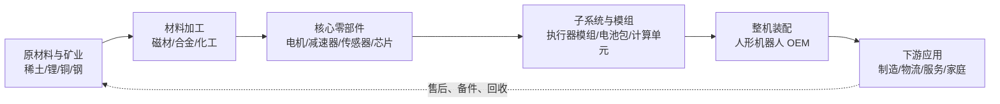

### 7.1.2 战略瓶颈的形成机制

人形机器人目前处于从样机到小批量爬坡的阶段，呈现典型的“高复杂度、低产量、高定制”特征。这三个特征叠加，使供应链成为战略瓶颈：

1. **高复杂度**：整机通常包含数百个 SKU，涉及机械、电子、电磁、热、软件等多学科耦合。
2. **低产量**：相比汽车年产数十万到数百万辆，人形机器人当前批量较小，供应商不愿专门扩产。
3. **高定制**：执行器、灵巧手、力控关节、双足结构往往需要定制设计，难以直接采购现成件。

!!! note "术语解释：SKU、定制化、规模经济、范围经济"
    - **SKU（Stock Keeping Unit）**：库存保有单位，通常指不同规格、型号或包装的最小库存管理单元。
    - **定制化（customization）**：根据特定客户需求调整产品设计或工艺，而非提供标准化产品。
    - **规模经济（economies of scale）**：产量扩大导致单位成本下降的现象，源于固定成本分摊和学习效应。
    - **范围经济（economies of scope）**：同时生产多种产品时，共享资源带来的成本节约。

当供应商面对一个批量小、要求高、定制多的客户时，会要求较高的溢价、较长的交货期，甚至拒绝接单。这就产生了**能力瓶颈（capability bottleneck）**和**产能瓶颈（capacity bottleneck）**。整机厂若不能稳定获得关键零部件，就无法验证设计、无法爬坡量产，从而陷入“销量不足→供应商不愿投入→成本下不来→销量更不足”的负反馈循环。

!!! note "术语解释：能力瓶颈、产能瓶颈、负反馈循环、路径依赖"
    - **能力瓶颈**：供应商或内部团队在设计、工艺、测试等方面无法满足技术要求的约束。
    - **产能瓶颈**：生产设施、设备或劳动力无法满足需求量的约束。
    - **负反馈循环（negative feedback loop）**：系统中自我强化的衰退过程，偏离平衡时进一步放大偏离。
    - **路径依赖（path dependence）**：早期选择会锁定后续发展轨迹，使转换成本递增。

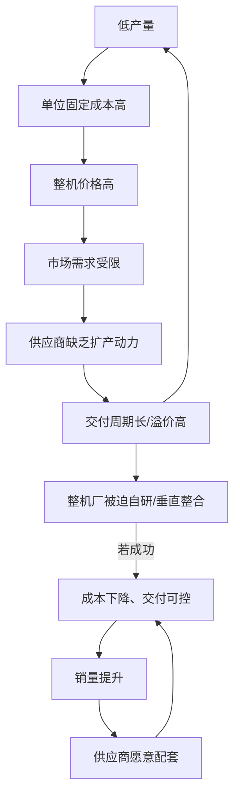

### 7.1.3 供应链风险的系统性

供应链风险具有**系统性（systemic）**特征：单个节点的中断会通过网络传播，放大为整机交付延迟、质量问题或成本飙升。2008 年金融危机后的汽车供应链、2020–2022 年半导体短缺、2021–2022 年海运拥堵都说明，现代供应链的“效率优先”设计在冲击面前非常脆弱。

!!! note "术语解释：系统性风险、级联失效、牛鞭效应、韧性"
    - **系统性风险**：整个系统而非单一单元面临的崩溃风险，具有相关性和传染性。
    - **级联失效（cascading failure）**：一个节点失效引发相邻节点连续失效的传播过程。
    - **牛鞭效应（bullwhip effect）**：需求端小幅波动沿供应链向上游放大，导致库存与产能剧烈震荡。
    - **韧性（resilience）**：系统在扰动后恢复并维持功能的能力，包括吸收、适应和恢复三个维度。

对于人形机器人，关键风险节点包括：高性能钕铁硼磁材、谐波减速器、RV 减速器、力/力矩传感器、高精度编码器、高算力 SoC/GPU/NPU、SiC/GaN 功率器件、锂电池正极材料等。这些节点往往具有**供应商集中度高、转换成本高、扩产周期长**的特征。

---

## 7.2 人形机器人 BOM 与供应商分层

### 7.2.1 物料清单（BOM）的结构

**物料清单（Bill of Materials, BOM）**是描述产品组成的最基础文件，列出制造一件产品所需的全部原材料、零部件、子装配件及其数量关系。BOM 不仅是成本核算起点，也是采购、计划、库存管理和供应商协同的核心数据结构。

!!! note "术语解释：BOM、EBOM、MBOM、Indented BOM、Phantom"
    - **BOM（Bill of Materials）**：产品结构表，记录组成产品的所有物料及其层级关系。
    - **EBOM（Engineering BOM）**：工程设计视图，按功能模块组织。
    - **MBOM（Manufacturing BOM）**：制造视图，按装配工艺和生产线组织。
    - **Indented BOM（缩进式物料清单）**：以父子层级缩进展示零件关系。
    - **Phantom（虚拟件）**：在 BOM 中作为逻辑子组件存在，但不单独入库的装配单元。

BOM 成本可直接按单位用量与单价滚动计算：

$$
C_{\text{BOM}} = \sum_{i} q_i \cdot p_i
$$

其中 \(q_i\) 为第 \(i\) 个零件的单位用量，\(p_i\) 为其采购单价或自制成本。对于多层级 BOM，需要自下向上递归汇总：

$$
C_{\text{parent}} = \sum_{j} q_j \cdot C_j + C_{\text{assembly},j}
$$

这里 \(C_j\) 既可以是子装配件的滚动成本，也可以是外购件单价。

### 7.2.2 供应商分层：Tier-1 / Tier-2 / Tier-3

汽车与电子行业普遍采用分层供应商体系。对于人形机器人，可类比如下：

- **Tier-1（一级供应商）**：直接向整机厂供货，通常提供执行器模组、灵巧手、电池包、计算平台等子系统。
- **Tier-2（二级供应商）**：向 Tier-1 供货，提供电机、减速器、驱动器、传感器、结构件、PCB 等。
- **Tier-3（三级供应商）**：提供原材料、芯片、磁材、化工品、特种气体、精密轴承等基础物料。

!!! note "术语解释：Tier-1、Tier-2、Tier-3、N 级供应链、OEM、ODM"
    - **Tier-1 供应商**：直接向最终装配厂交付子系统或模块的供应商。
    - **Tier-2 供应商**：为 Tier-1 提供零部件或材料的供应商。
    - **Tier-3 供应商**：更上游的原材料、基础元件或设备供应商。
    - **N 级供应链（N-tier supply chain）**：跨越多个层级的完整供应网络。
    - **OEM（Original Equipment Manufacturer）**：原始设备制造商，通常指整机厂。
    - **ODM（Original Design Manufacturer）**：原始设计制造商，负责设计与制造，品牌归属买方。

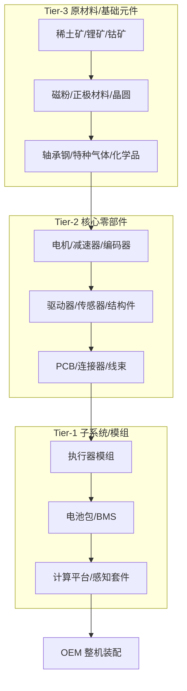

### 7.2.3 人形机器人 BOM 的成本分解（公开估算）

由于当前人形机器人尚未进入大规模消费级市场，公开成本数据多为行业估算。下表给出一种基于拆解与供应链调研的**公开估算**结构，仅用于说明成本分布，不特指任何具体机型。

| 子系统 | 占 BOM 成本估算（%） | 主要构成 | 供应集中度特征 |
|---|---|---|---|
| 执行器系统（电机+减速器+驱动） | 35–45 | 无框力矩电机、谐波/行星减速器、伺服驱动 | 高 |
| 传感器与感知套件 | 15–25 | 摄像头、LiDAR、IMU、力/力矩传感器、编码器 | 中高 |
| 计算平台 | 10–18 | SoC/GPU/NPU、内存、存储、载板 | 高 |
| 电池与功率电子 | 8–15 | 电芯、BMS、MOSFET/SiC/GaN、连接器 | 中 |
| 结构件与外观件 | 5–10 | 铝合金、碳纤维、塑料、线缆 | 低 |
| 软件与算法授权 | 3–8 | 中间件、仿真、AI 模型、专利 | 中 |
| 其他（包装、测试、耗材） | 2–5 | 夹具、测试设备、运输 | 低 |

!!! note "术语解释：BOM 成本分解、成本驱动因素、成本集中度"
    - **BOM 成本分解**：把产品总成本按子系统或零部件拆分的结构分析。
    - **成本驱动因素（cost driver）**：对总成本影响最大的变量或零件类别。
    - **成本集中度**：少数零部件占据总成本的比例，常用于识别降本重点。

执行器系统通常占 BOM 的 35% 以上，是成本与供应风险最集中的环节。计算平台虽然占比不如执行器，但因其技术迭代快、供应商高度集中，也构成关键战略瓶颈。

---

## 7.3 关键零部件供应商地图

人形机器人供应链横跨精密机械、电磁、半导体、化工和材料多个产业。本节按关键零部件类别绘制供应商地图，列出代表性企业。由于市场尚处早期，以下份额与定位为**行业估算**或企业公开披露信息。完整长名单见附录 D。

!!! note "提示：完整供应商名录"
    本节表格仅列出每类 5–10 家代表性企业，用于说明产业结构与技术路线。更完整的主要供应商与企业名录请参见 **附录 D**。

### 7.3.1 电机与驱动

**电机**是把电能转化为机械能的执行元件。人形机器人关节常用**无框力矩电机（frameless torque motor）**和**无刷直流电机（BLDC, Brushless DC Motor）**，配合减速器输出高扭矩密度。

!!! note "术语解释：无框力矩电机、无刷直流电机、永磁同步电机、扭矩密度"
    - **无框力矩电机**：由转子和定子组成、无外壳和轴承的直驱电机，可直接嵌入关节。
    - **无刷直流电机（BLDC）**：用电子换向取代机械电刷的直流电机，寿命长、效率高。
    - **永磁同步电机（PMSM）**：转子带永磁体、定子电流与转子磁场同步旋转的交流电机。
    - **扭矩密度（torque density）**：电机单位体积或单位质量所能输出的扭矩，单位 N·m/kg 或 N·m/L。

电机控制通常采用**磁场定向控制（FOC, Field-Oriented Control）**，通过 Clarke/Park 变换把三相电流解耦为励磁分量与转矩分量，实现类似直流电机的控制性能。

!!! note "术语解释：磁场定向控制（FOC）、Clarke 变换、Park 变换、PWM、逆变器"
    - **磁场定向控制（FOC）**：把交流电机定子电流分解为产生磁通和产生转矩两个正交分量分别控制的方法。
    - **Clarke 变换**：把三相静止坐标系转换为两相静止坐标系的数学变换。
    - **Park 变换**：把两相静止坐标系转换为随转子旋转的坐标系，实现直流量控制。
    - **PWM（Pulse Width Modulation）**：脉宽调制，通过调节开关占空比控制平均电压或电流。
    - **逆变器（inverter）**：把直流电转换为交流电的功率电子电路。

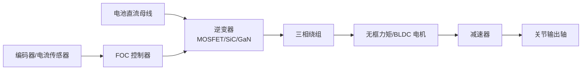

| 公司 | 总部 | 主要产品/定位 | 备注 |
|---|---|---|---|
| Kollmorgen | 美国 | 无框力矩电机、伺服电机 | 广泛用于协作机器人关节 |
| TQ-RoboDrive | 德国 | 无框电机、空心杯电机 | 人形机器人灵巧手常用 |
| Maxon | 瑞士 | 无刷直流电机、减速器、驱动器 | 高精度、医疗/航天背景 |
| Nidec | 日本 | 无刷电机、硬盘电机、伺服电机 | 规模巨大，成本优势明显 |
| 汇川技术 | 中国 | 伺服电机、变频器、驱动器 | 本土龙头，覆盖工业自动化 |
| 禾川科技 | 中国 | 伺服电机与驱动 | 国产替代代表 |
| 步科股份 | 中国 | 低压伺服、无框电机 | 移动机器人/协作机器人 |
| 鸣志电器 | 中国 | 步进电机、空心杯电机、无刷电机 | 灵巧手微型电机 |
| Moog | 美国 | 精密运动控制、无框电机 | 航空航天高可靠性 |
| Allied Motion | 美国 | 无刷电机、伺服系统 | 工业与机器人应用 |

驱动器把控制器指令转换为功率输出。关节驱动器需要高电流环带宽、低 EMI、紧凑体积和散热能力。常见方案包括基于 MOSFET、SiC MOSFET 或 GaN HEMT 的三相半桥逆变器。

### 7.3.2 减速器

减速器用于降低电机转速、放大输出扭矩，是人形机器人关节的核心传动部件。常见类型包括**谐波减速器（harmonic drive）**、**行星减速器（planetary gearbox）**、**摆线针轮减速器（cycloidal drive）**和**RV 减速器（Rotary Vector reducer）**。

!!! note "术语解释：谐波减速器、行星减速器、摆线针轮减速器、RV 减速器、背隙、传动刚度"
    - **谐波减速器**：利用柔性轮、刚性轮和波发生器产生弹性变形传递运动和扭矩的高精度减速器。
    - **行星减速器**：多个行星轮围绕太阳轮旋转的齿轮机构，结构紧凑、效率高。
    - **摆线针轮减速器**：利用摆线轮与针齿啮合的减速机构，扭矩大、刚度高。
    - **RV 减速器**：两级减速机构，第一级为行星齿轮，第二级为摆线针轮，用于重载关节。
    - **背隙（backlash）**：齿轮副在换向时的空程角，影响控制精度。
    - **传动刚度（transmission stiffness）**：输出端抵抗弹性变形的能力，影响动态响应。

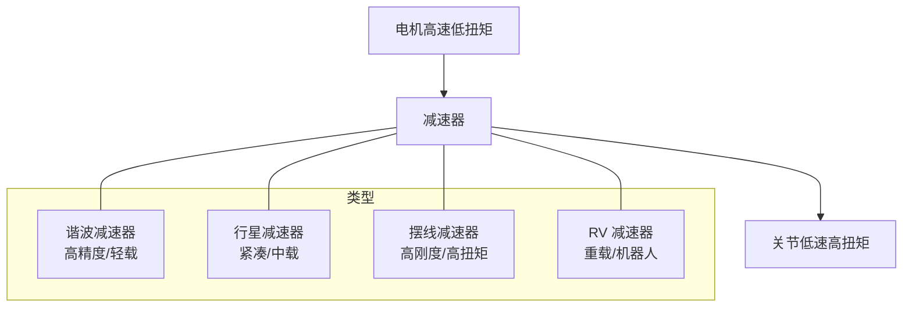

| 公司 | 总部 | 主要产品 | 备注 |
|---|---|---|---|
| Harmonic Drive Systems | 日本 | 谐波减速器 | 行业龙头，全球份额领先 |
| HD Systems (Harmonic Drive LLC) | 美国 | 谐波减速器 | 北美市场 |
| Nabtesco | 日本 | RV 减速器、谐波减速器 | RV 减速器全球领先 |
| 绿的谐波 | 中国 | 谐波减速器 | 国产龙头，份额快速提升 |
| 来福谐波 | 中国 | 谐波减速器 | 国产替代 |
| 双环传动 | 中国 | RV 减速器、行星减速器 | 精密齿轮制造基础 |
| 中大力德 | 中国 | 行星/谐波/RV | 机器人减速器布局 |
| 南通振康 | 中国 | RV 减速器 | 焊接机器人配套 |
| Sumitomo Drive Technologies | 日本 | 摆线/行星减速器 | 工业传动 |
| SEW-EURODRIVE | 德国 | 行星/工业齿轮 | 工业自动化 |

### 7.3.3 传感器

人形机器人需要感知自身状态（本体感觉）与外部环境（外部感知）。本体感觉传感器包括**编码器（encoder）**、**惯性测量单元（IMU）**、**力/力矩传感器（force/torque sensor）**；外部感知包括**摄像头（RGB/RGB-D）**、**LiDAR**、**毫米波雷达**、**超声波**等。

!!! note "术语解释：编码器、IMU、力/力矩传感器、RGB-D、LiDAR、MEMS"
    - **编码器**：把角位移或直线位移转换为电信号的传感器，分为光电、磁电、旋转变压器等。
    - **IMU（Inertial Measurement Unit）**：测量三轴加速度与三轴角速度的惯性传感器组合。
    - **力/力矩传感器**：测量接触力与力矩的传感器，常用于手腕、脚踝和协作机器人关节。
    - **RGB-D 相机**：同时输出彩色图像与深度图像的相机。
    - **LiDAR（Light Detection and Ranging）**：通过发射激光并接收回波测量距离的三维传感器。
    - **MEMS（Micro-Electro-Mechanical Systems）**：微机电系统，用于低成本 IMU、麦克风、压力传感器。

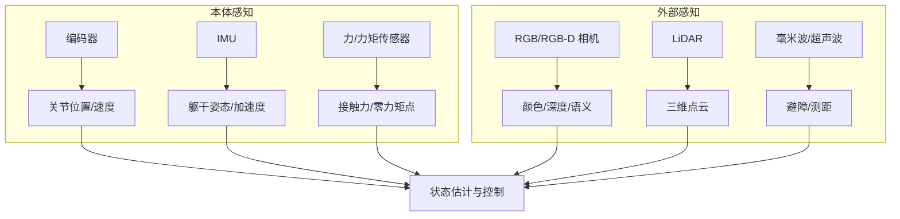

| 公司 | 总部 | 主要产品 | 备注 |
|---|---|---|---|
| Heidenhain | 德国 | 高精度光电/磁编码器 | 工业与机器人高端 |
| Renishaw | 英国 | 磁编码器、光栅 | 精密运动 |
| Tamagawa Seiki | 日本 | 编码器、旋转变压器 | 伺服电机配套 |
| 奥普光电 | 中国 | 光电编码器 | 国产替代 |
| Bosch Sensortec | 德国 | MEMS IMU、气压计 | 消费电子与机器人 |
| TDK/InvenSense | 日本/美国 | MEMS IMU | 低成本方案 |
| ATI Industrial Automation | 美国 | 六维力/力矩传感器 | 机器人手腕/脚踝 |
| 宇立仪器 | 中国 | 六维力传感器 | 国产龙头 |
| Intel RealSense | 美国 | RGB-D 相机 | 机器人开发常用 |
| Ouster / Hesai / Livox | 美国/中国 | 固态/机械 LiDAR | 自动驾驶与机器人 |

#### 7.3.3.1 视觉/深度相机模块

视觉/深度相机是人形机器人外部感知与场景理解的核心入口。当前主流三维深度获取技术包括**结构光（structured light）**、**飞行时间（ToF，含 dToF/iToF）**和**双目立体视觉（stereo vision）**三条路线，分别依赖不同的光学器件、发射器和图像传感器组合。

!!! note "术语解释：结构光、飞行时间（ToF）、dToF、iToF、SPAD、VCSEL、双目立体视觉"
    - **结构光（structured light）**：通过投射已知红外图案并分析其在物体表面的变形来获取深度图像的技术。
    - **飞行时间（ToF, Time-of-Flight）**：测量光脉冲或调制光往返时间来计算距离的三维成像技术。
    - **dToF（direct ToF）**：直接测量单个光脉冲往返时间，常与 SPAD 配合实现远距离、低功耗深度感知。
    - **iToF（indirect ToF）**：通过测量调制光相位差间接计算距离，适合中短距离高分辨率场景。
    - **SPAD（Single-Photon Avalanche Diode）**：单光子雪崩二极管，具有高灵敏度，可用于 dToF 光子计数。
    - **VCSEL（Vertical-Cavity Surface-Emitting Laser）**：垂直腔面发射激光器，常用于结构光和 ToF 的光源。
    - **双目立体视觉（stereo vision）**：利用双相机视差和稠密匹配算法恢复深度的被动视觉方法。

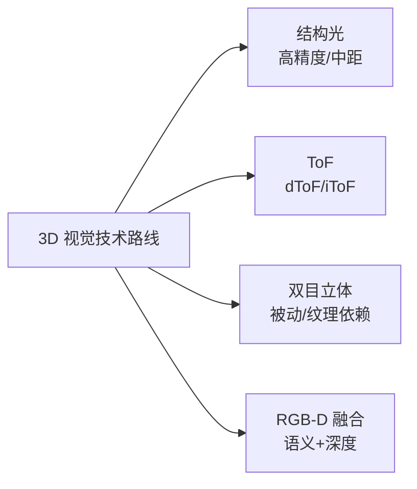

| 公司 | 总部 | 核心技术与产品 | 典型机器人应用 | 供应状态/备注 |
|---|---|---|---|---|
| 灵明光子 | 中国 | SPAD/SiPM dToF 传感器 | 深度相机、避障 | 国产芯片，量产爬坡中[公司官网] |
| 聚芯微电子 | 中国 | iToF 图像传感器、3D 感知方案 | 服务机器人视觉 | 公开资料 |
| 阜时科技 | 中国 | SPAD dToF 芯片、结构光投射 | 机器人/刷脸/车载 | 公开资料 |
| 飞芯电子 | 中国 | dToF 激光雷达/深度传感芯片 | 机器人、扫地机 | 公开资料 |
| 海康机器人 | 中国 | 工业相机、RGB-D、立体相机 | 物流/制造机器人 | 海康威视子公司 |
| 奥比中光 | 中国 | 结构光/ToF 3D 视觉模组 | 服务/人形机器人 | 国产 3D 视觉龙头 |
| 图漾科技 | 中国 | 工业 3D 相机（结构光/ToF） | 物流抓取、检测 | 公开资料 |
| Intel RealSense | 美国 | 立体/结构光/RGB-D 深度相机 | 机器人开发原型 | 产品线调整，需关注 |
| Sony | 日本 | ToF 图像传感器、CMOS | 高端 3D 相机 | 核心器件供应商 |
| 舜宇光学 | 中国 | 光学镜头/模组/ToF 模组 | 手机/机器人视觉 | 光学组件供应稳定 |

#### 7.3.3.2 LiDAR

LiDAR 通过发射激光并接收回波构建三维点云，是人形机器人导航、建图与障碍物检测的重要传感器。按扫描方式可分为机械旋转、MEMS 半固态、OPA/Flash 固态以及 FMCW 等路线，各路线在视场、分辨率、成本和可靠性之间存在显著权衡。

!!! note "术语解释：机械旋转 LiDAR、MEMS LiDAR、固态 LiDAR、OPA、Flash LiDAR、FMCW LiDAR"
    - **机械旋转 LiDAR**：通过 360° 旋转扫描实现水平视场覆盖，点云密度高但成本高、寿命受限。
    - **MEMS LiDAR**：利用微机电振镜偏转光束的半固态方案，体积与成本优于机械式。
    - **固态 LiDAR**：无机械扫描部件，可靠性高，包括 OPA、Flash 等路线。
    - **OPA（Optical Phased Array）**：光学相控阵，通过相位控制实现电子扫描。
    - **Flash LiDAR**：一次性照射整个视场，适合短距高帧率应用。
    - **FMCW LiDAR**：调频连续波激光雷达，可同时测距与测速，抗干扰能力强。

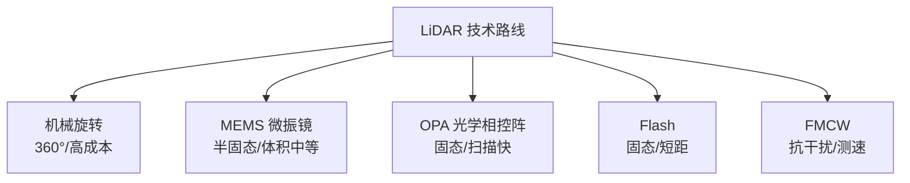

| 公司 | 总部 | 主要产品/技术 | 典型机器人应用 | 供应状态/备注 |
|---|---|---|---|---|
| 禾赛科技 | 中国 | 机械/半固态/纯固态 LiDAR | 自动驾驶、机器人 | 公开招股书/年报 |
| 速腾聚创 | 中国 | MEMS/固态 LiDAR、感知方案 | 自动驾驶、机器人 | 港股上市公开资料 |
| 北醒光子 | 中国 | dToF/固态 LiDAR | 机器人、车联网 | 公开资料 |
| 镭神智能 | 中国 | 机械/混合固态 LiDAR | 机器人、无人车 | 公开资料 |
| 佳光科技 | 中国 | 固态/Flash LiDAR | 机器人、AGV | 公开资料 |
| 览沃 Livox | 中国 | 非重复扫描 LiDAR | 机器人、测绘 | 大疆旗下 |
| Ouster | 美国 | 固态数字 LiDAR | 工业/自动驾驶 | 公开资料 |
| Luminar | 美国 | 1550 nm 长距 LiDAR | 自动驾驶 | 长距方案，成本高 |
| Innovusion | 中国 | 1550 nm 图像级 LiDAR | 自动驾驶 | 成本高 |

#### 7.3.3.3 IMU

**惯性测量单元（IMU）**测量三轴加速度与三轴角速度，是人形机器人状态估计、平衡控制和航位推算的基础。消费级方案以 MEMS 为主，高端场景可能采用光纤陀螺（FOG）或激光陀螺（RLG）以提高精度。

!!! note "术语解释：MEMS IMU、零偏不稳定性、FOG、RLG、组合导航"
    - **MEMS IMU**：基于微机电系统的惯性测量单元，体积小、成本低、适合批量应用。
    - **零偏不稳定性（bias instability）**：陀螺仪输出零偏随时间的随机漂移指标，单位 °/h。
    - **FOG（Fiber Optic Gyroscope）**：光纤陀螺仪，精度高、抗冲击，常用于高端导航。
    - **RLG（Ring Laser Gyroscope）**：激光陀螺仪，精度极高，多用于航空航天与高端装备。
    - **组合导航（GNSS/INS integration）**：将惯性导航与卫星导航融合以抑制漂移、提高定位精度。

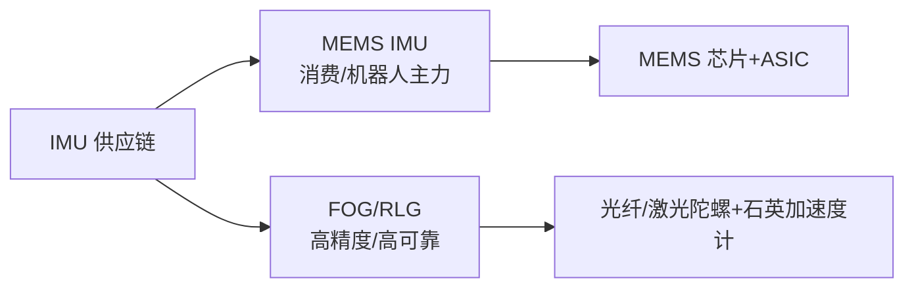

| 公司 | 总部 | 主要产品 | 典型机器人应用 | 供应状态/备注 |
|---|---|---|---|---|
| Bosch Sensortec | 德国 | MEMS IMU、气压计 | 消费/服务机器人 | 成熟供应 |
| TDK/InvenSense | 日本/美国 | MEMS IMU、IMU+气压计 | 机器人、穿戴 | 低成本方案 |
| 芯动联科 | 中国 | 高性能 MEMS IMU | 机器人、无人系统 | 科创板公开资料 |
| 星网宇达 | 中国 | MEMS/光纤 IMU、组合导航 | 无人车/机器人 | 公开资料 |
| 华依科技 | 中国 | 惯性导航、IMU 测试 | 自动驾驶/机器人 | 公开资料 |
| 北斗星通 | 中国 | GNSS/INS 组合导航、高精度定位 | 机器人、无人系统 | 公开资料 |
| STMicroelectronics | 瑞士/意大利 | MEMS IMU、加速度计 | 消费/工业 | 大规模供应 |
| Analog Devices | 美国 | 高精度 MEMS IMU | 工业/机器人 | 高端方案 |

#### 7.3.3.4 力/力矩与触觉

力/力矩传感器为人形机器人提供接触力与力矩反馈，是柔顺控制、双臂协作和足式平衡的关键。手腕和脚踝通常配置**六维力/力矩传感器**，指端和足底可使用一维力传感器，灵巧手则依赖高密度触觉阵列感知滑移、纹理和抓握状态。

!!! note "术语解释：六维力/力矩传感器、一维力传感器、触觉传感器、Taxel、应变式、电容式、压阻式"
    - **六维力/力矩传感器**：同时测量三维力与三维力矩的传感器。
    - **一维力传感器**：测量单方向力大小的传感器。
    - **触觉传感器（tactile sensor）**：检测接触力、压力、温度、滑移等的皮肤式传感器。
    - **Taxel**：触觉阵列中的单个感知像素。
    - **应变式/电容式/压阻式**：力传感器的不同转换原理，分别基于应变片形变、电容极距变化和半导体压阻效应。

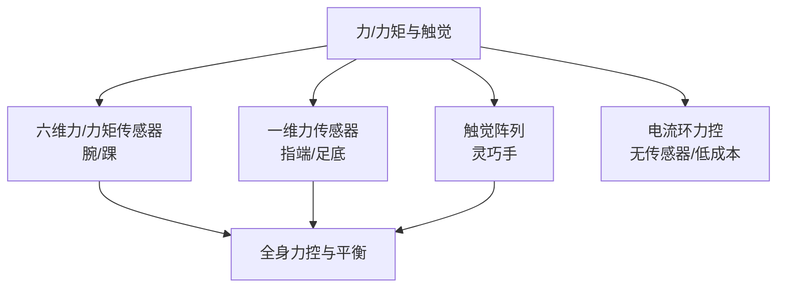

| 公司 | 总部 | 主要产品 | 典型机器人应用 | 供应状态/备注 |
|---|---|---|---|---|
| ATI Industrial Automation | 美国 | 六维力/力矩传感器 | 腕/踝/协作机器人 | 行业标杆 |
| Robotiq | 加拿大 | 力/力矩传感器、夹爪 | 协作机器人末端 | 公开资料 |
| OnRobot | 丹麦 | 力控传感器、夹爪 | 协作装配 | 公开资料 |
| Bota Systems | 瑞士 | 六维力传感器 | 足式/人形机器人 | 公开资料 |
| Kistler | 瑞士 | 压电式力/力矩传感器 | 测试与工业 | 高精度 |
| 宇立仪器 | 中国 | 六维力传感器 | 机器人腕/踝/测试 | 国产龙头 |
| 坤维科技 | 中国 | 六维力/力矩传感器 | 协作/人形机器人 | 公开资料 |
| 柯力传感 | 中国 | 称重/力传感器、六维力 | 工业/物流/机器人 | 公开资料 |
| 汉威科技 | 中国 | 柔性压力/触觉传感器 | 机器人皮肤、可穿戴 | 公开资料 |
| 柔触科技 | 中国 | 柔性夹爪、触觉传感 | 食品/3C 抓取 | 公开资料 |
| 他山科技/Touchlab | 英国/中国 | 电子皮肤/触觉阵列 | 灵巧手、服务机器人 | 公开资料 |

#### 7.3.3.5 编码器

编码器为关节提供位置、速度与方向反馈，是伺服系统闭环控制的前提。按原理可分为光电编码器、磁电编码器和旋转变压器；按输出可分为增量式与绝对式。高精度、低延迟、抗油污和耐振动是机器人关节编码器的主要选型指标。

!!! note "术语解释：光电编码器、磁电编码器、旋转变压器、分辨率、线数"
    - **光电编码器**：利用光栅盘与光电探测器检测角位移的编码器，精度高但对油污敏感。
    - **磁电编码器**：利用磁极与霍尔/磁阻元件检测角位移，抗污染能力强。
    - **旋转变压器（resolver）**：基于电磁感应的角度传感器，抗恶劣环境、耐高温。
    - **分辨率**：编码器能分辨的最小角度或位移。
    - **线数**：增量编码器每转输出的脉冲数，决定基础分辨率。

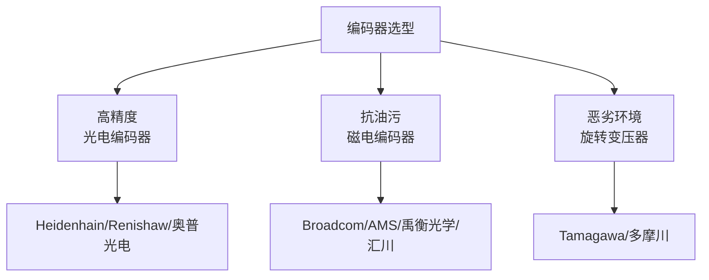

| 公司 | 总部 | 主要产品 | 典型机器人应用 | 供应状态/备注 |
|---|---|---|---|---|
| Heidenhain | 德国 | 高精度光电/磁编码器 | 高端机床/机器人 | 进口高端 |
| Renishaw | 英国 | 磁编码器、光栅尺 | 精密运动 | 进口 |
| Broadcom | 美国 | 光电编码器芯片 | 伺服电机 | 核心器件供应商 |
| AMS-Osram | 奥地利 | 磁位置传感器、编码器 IC | 工业/汽车 | 公开资料 |
| CUI Devices | 美国 | 增量/绝对编码器 | 伺服电机 | 公开资料 |
| US Digital | 美国 | 光学/磁编码器 | 机器人关节 | 公开资料 |
| Maxon | 瑞士 | 编码器、电机+编码器模组 | 高端机器人 | 集成方案 |
| 多摩川精机 | 日本 | 编码器、旋转变压器 | 伺服电机配套 | 日系龙头 |
| 奥普光电 | 中国 | 光电编码器、光栅尺 | 机床/机器人 | 国产替代 |
| 禹衡光学 | 中国 | 光电编码器 | 伺服/机器人 | 国产替代 |
| 汇川技术 | 中国 | 磁编码器、伺服配套编码器 | 国产伺服 | 自供+外供 |
| 鸣志电器 | 中国 | 编码器与步进/伺服配套 | 机器人 | 公开资料 |

#### 7.3.3.6 麦克风与音频

麦克风与音频子系统负责人形机器人的语音交互、环境声感知和声源定位。消费电子级方案以 MEMS 麦克风为主，通常以阵列形式部署，并配合波束成形、回声消除和语音活动检测算法实现远场拾音。

!!! note "术语解释：MEMS 麦克风、麦克风阵列、波束成形、远场拾音、语音活动检测"
    - **MEMS 麦克风**：基于微机电工艺的电容式麦克风，体积小、一致性好、适合阵列。
    - **麦克风阵列**：多个麦克风按几何排布，实现声源定位与波束成形。
    - **波束成形（beamforming）**：通过信号处理增强特定方向声音、抑制噪声和混响。
    - **远场拾音**：在较远距离（数米）采集语音的能力。
    - **语音活动检测（VAD, Voice Activity Detection）**：识别语音起始与结束的技术。

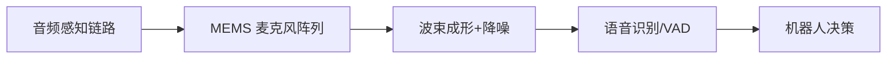

| 公司 | 总部 | 主要产品 | 典型机器人应用 | 供应状态/备注 |
|---|---|---|---|---|
| 歌尔股份 | 中国 | MEMS 麦克风、声学模组 | 智能音箱/机器人 | 全球声学龙头 |
| 瑞声科技 | 中国 | MEMS 麦克风、扬声器 | 手机/机器人 | 公开资料 |
| 敏芯股份 | 中国 | MEMS 麦克风、压力传感器 | 消费电子/机器人 | 科创板公开资料 |
| Knowles | 美国 | MEMS 麦克风 | 高端消费电子 | 公开资料 |
| STMicroelectronics | 瑞士/意大利 | MEMS 麦克风 ASIC | 消费/工业 | 公开资料 |
| TDK/InvenSense | 日本/美国 | MEMS 麦克风 | 消费/机器人 | 公开资料 |


#### 7.3.3.7 毫米波雷达与超声波

毫米波雷达和超声波作为低成本、全天候的辅助传感器，常与相机和 LiDAR 配合使用。毫米波雷达在烟尘、雨雪和低光照条件下仍能提供距离与速度信息；超声波则用于近距离避障和粗糙定位。

!!! note "术语解释：毫米波雷达、超声波、FMCW 雷达、多普勒效应、声纳"
    - **毫米波雷达（mmWave radar）**：工作在 30–300 GHz 频段的雷达，可测距、测速。
    - **超声波（ultrasonic）**：利用机械波反射测距，成本低，适合短距。
    - **FMCW 雷达**：调频连续波雷达，可同时测距和测速。
    - **多普勒效应**：波源与观察者相对运动导致频率偏移的现象。
    - **声纳（sonar）**：利用声波探测水下或空气中目标的装置。

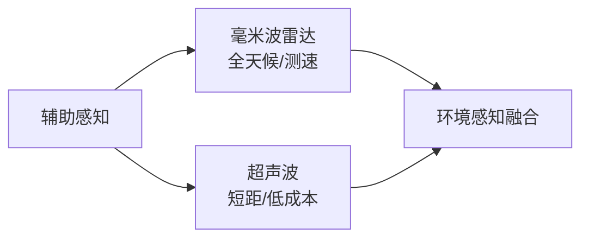

| 公司 | 总部 | 主要产品 | 典型机器人应用 | 供应状态/备注 |
|---|---|---|---|---|
| Texas Instruments | 美国 | mmWave 雷达芯片（AWR/IWR） | 机器人、汽车 | 公开资料 |
| NXP Semiconductors | 荷兰 | 77 GHz 雷达芯片 | 汽车/机器人 | 公开资料 |
| Infineon | 德国 | mmWave 雷达传感器 | 汽车/机器人 | 公开资料 |
| Bosch | 德国 | 毫米波雷达模组 | 汽车/机器人 | 公开资料 |
| Continental | 德国 | 毫米波雷达、ADAS 传感器 | 汽车/机器人 | 公开资料 |
| 华域汽车 | 中国 | 毫米波雷达、ADAS 模组 | 汽车/机器人 | 公开资料 |
| 德赛西威 | 中国 | 毫米波雷达、域控制器 | 汽车/机器人 | 公开资料 |
| 保隆科技 | 中国 | 毫米波雷达、超声波传感器 | 汽车/机器人 | 公开资料 |
| 奥迪威 | 中国 | 超声波传感器 | 机器人、汽车 | 公开资料 |
| 汇川技术 | 中国 | 超声波/接近传感器 | 工业/移动机器人 | 公开资料 |

#### 7.3.3.8 多传感器融合与数据同步

多传感器融合将不同物理原理、不同时间尺度和不同空间分辨率的感知数据整合为统一的环境模型。实现融合的前提是精确的时间同步（软同步或硬同步 PPS/PTP）和外参标定。传感器供应商的选择不仅影响硬件成本，也决定了数据接口、驱动适配和融合算法的开发工作量。

!!! note "术语解释：时间同步、外参标定、时间戳、软同步、硬同步、卡尔曼滤波"
    - **时间同步**：使多个传感器的数据具有统一时间基准的过程。
    - **外参标定（extrinsic calibration）**：确定不同传感器之间空间位姿关系的过程。
    - **时间戳（timestamp）**：标记数据采集时刻的时间标签。
    - **软同步**：通过软件对齐不同传感器时间戳，精度通常为毫秒级。
    - **硬同步**：通过硬件触发信号（如 PPS、PTP）实现微秒级同步。
    - **卡尔曼滤波（Kalman filter）**：融合多源带噪声估计的状态估计算法。

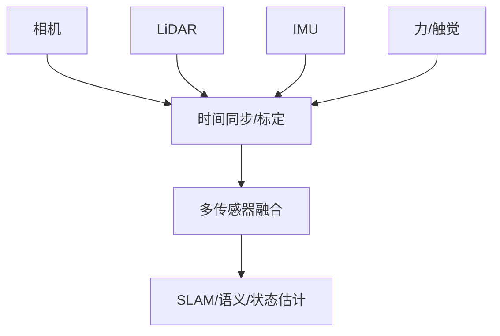

整机厂在评估传感器供应商时，除了单点性能，还应关注其是否提供标准 ROS/ROS2 驱动、SDK、标定工具和长期供货承诺。供应商切换往往意味着重新标定和算法调优，隐性成本不可忽视。


#### 7.3.3.9 传感器供应链的国产替代评估

从供应链安全角度，传感器是国产替代优先级较高的环节。下表从国产化进度、技术成熟度、主要瓶颈和典型国产供应商四个维度，对主要传感器类别进行定性评估。需要强调的是，国产替代不等于简单的 pin-to-pin 替换，往往涉及重新标定、算法适配和可靠性验证。

!!! note "术语解释：国产替代、技术成熟度、导入周期、可靠性验证"
    - **国产替代（import substitution）**：用本国或本地供应商产品替代进口产品的过程。
    - **技术成熟度（technology readiness level, TRL）**：技术从概念到量产应用的成熟程度分级。
    - **导入周期（qualification cycle）**：新产品从样品验证到批量采购所需的时间。
    - **可靠性验证（reliability verification）**：通过环境、寿命和应力测试确认产品满足使用要求的过程。

| 传感器类别 | 国产化进度 | 技术成熟度 | 主要瓶颈 | 典型国产供应商 |
|---|---|---|---|---|
| 普通 MEMS IMU | 高 | 成熟 | 高端零偏稳定性 | 芯动联科、星网宇达 |
| 光电编码器 | 中 | 接近成熟 | 高精度光栅、细分电路 | 奥普光电、禹衡光学 |
| 磁电编码器 | 中高 | 成熟 | 高温/油污环境精度 | 汇川、鸣志 |
| 六维力传感器 | 中 | 提升中 | 串扰补偿、过载保护 | 宇立、坤维、柯力 |
| 3D 视觉模组 | 中高 | 成熟 | 高端 SPAD/VCSEL 芯片 | 奥比中光、海康机器人 |
| LiDAR | 高 | 成熟 | 长距/固态芯片 | 禾赛、速腾聚创、北醒 |
| MEMS 麦克风 | 高 | 成熟 | 高端信噪比 | 歌尔、瑞声、敏芯 |

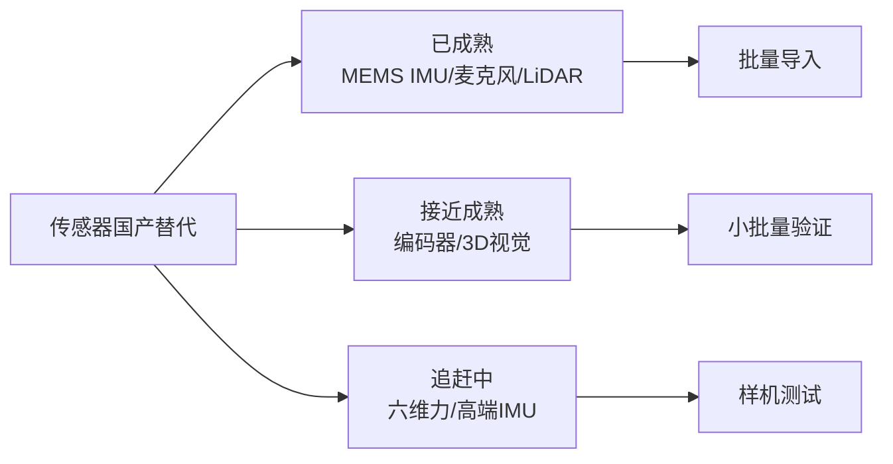

上述传感器细分领域的供应商地图可概括为下图。需要强调的是，人形机器人通常采用多传感器融合架构，单一传感器供应商的切换需要重新标定融合算法和数据同步链路。

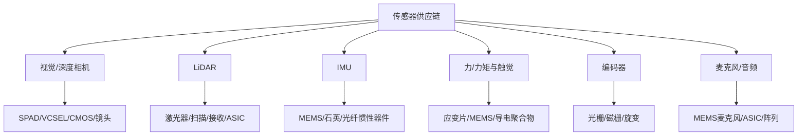


### 7.3.4 计算平台

人形机器人计算平台需要同时运行感知、状态估计、运动规划、控制与 AI 推理。主流架构包括**系统级芯片（SoC）**集成的 CPU+GPU+NPU、独立 GPU/FPGA/MCU 以及未来可能出现的专用机器人 SoC。

!!! note "术语解释：SoC、CPU、GPU、NPU、MCU、FPGA、TOPS、TOPS/W"
    - **SoC（System on Chip）**：把 CPU、GPU、NPU、I/O、内存控制器等集成在单一芯片上。
    - **CPU（Central Processing Unit）**：通用处理器，适合复杂控制流与串行任务。
    - **GPU（Graphics Processing Unit）**：高并行流处理器，适合深度学习与点云处理。
    - **NPU（Neural Processing Unit）**：专用神经网络加速器，能效高。
    - **MCU（Microcontroller Unit）**：微控制器，用于实时控制与 I/O。
    - **FPGA（Field-Programmable Gate Array）**：可现场配置的数字电路，适合低延迟 I/O。
    - **TOPS**：每秒万亿次运算，衡量 AI 峰值算力。
    - **TOPS/W**：每瓦 TOPS，衡量能效。

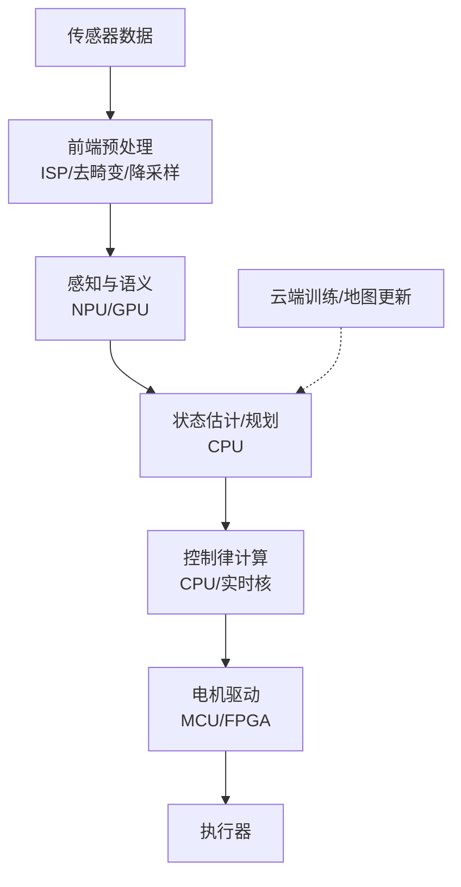

| 公司/平台 | 总部 | 主要产品 | 备注 |
|---|---|---|---|
| NVIDIA | 美国 | Jetson AGX Orin/Thor、Isaac Sim | 机器人计算平台领导者 |
| Qualcomm | 美国 | QCS/RB 系列、Hexagon NPU | 移动端/机器人 SoC |
| Intel | 美国 | Core/NUC、Movidius/Myriad | x86 主控与 AI 加速器 |
| AMD/Xilinx | 美国 | Kria、Versal、FPGA | 可重构计算 |
| 地平线 | 中国 | Journey 5/6、BPU | 自动驾驶/机器人 |
| 黑芝麻 | 中国 | A1000、华山系列 | 自动驾驶/机器人 |
| 华为海思 | 中国 | Ascend、Kirin | AI 与边缘 SoC |
| 瑞芯微 | 中国 | RK3588 等 | 低成本机器人主控 |
| Apple | 美国 | M-series / Neural Engine | 开发/高端边缘 |
| Tesla | 美国 | FSD Chip / Dojo | 自研自动驾驶/机器人芯片 |

### 7.3.5 电池与功率半导体

人形机器人对电池的能量密度、功率密度、循环寿命和安全性要求高。当前主流为**锂离子电池（Li-ion）**，化学体系包括**三元（NCM/NCA）**和**磷酸铁锂（LFP）**。未来**固态电池（solid-state battery）**因更高的能量密度和安全性而被关注。

!!! note "术语解释：锂离子电池、三元电池、磷酸铁锂、固态电池、能量密度、功率密度"
    - **锂离子电池（Li-ion）**：依靠锂离子在正负极之间嵌入/脱嵌实现充放电的二次电池。
    - **三元电池（NCM/NCA）**：正极含镍、钴、锰或镍、钴、铝的锂离子电池，能量密度高。
    - **磷酸铁锂（LFP）**：正极为磷酸铁锂的锂离子电池，循环寿命长、热稳定性好。
    - **固态电池**：使用固态电解质替代液态电解质的电池，能量密度和安全性潜力更大。
    - **能量密度**：单位质量或体积存储的能量，单位 Wh/kg 或 Wh/L。
    - **功率密度**：单位质量或体积可输出的功率，单位 W/kg 或 W/L。

功率半导体负责电能转换与电机驱动。传统硅基 MOSFET/IGBT 正向**碳化硅（SiC）**和**氮化镓（GaN）**宽禁带半导体迁移，以实现更高效率、更高开关频率和更小体积。

!!! note "术语解释：功率半导体、MOSFET、IGBT、SiC、GaN、宽禁带半导体"
    - **功率半导体**：用于电能转换与开关控制的大功率半导体器件。
    - **MOSFET（Metal-Oxide-Semiconductor FET）**：电压控制型场效应晶体管，开关速度快。
    - **IGBT（Insulated Gate Bipolar Transistor）**：绝缘栅双极型晶体管，适合中高功率。
    - **SiC（碳化硅）**：宽禁带半导体材料，耐高温、高频、高效率。
    - **GaN（氮化镓）**：宽禁带半导体，开关频率高、导通电阻低。
    - **宽禁带半导体（WBG）**：禁带宽度大于硅的半导体材料，如 SiC、GaN。

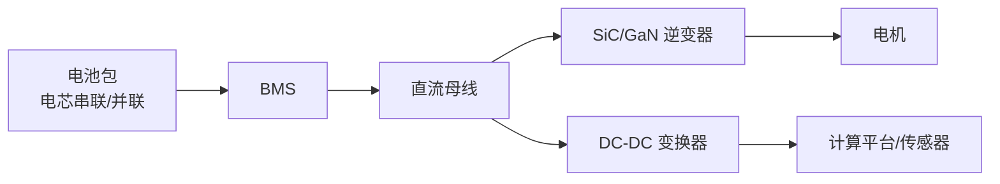

| 公司 | 总部 | 主要产品 | 备注 |
|---|---|---|---|
| CATL | 中国 | 动力电池、LFP/三元 | 全球动力电池龙头 |
| BYD | 中国 | 刀片电池（LFP） | 自供+外供 |
| LG Energy Solution | 韩国 | 三元/LFP 动力电池 | 全球主要供应商 |
| Panasonic | 日本 | 圆柱/动力电池 | 与特斯拉长期合作 |
| Samsung SDI | 韩国 | 三元动力电池 | 高能量密度 |
| 亿纬锂能 | 中国 | 动力电池、圆柱电池 | 机器人/电动工具 |
| Infineon | 德国 | SiC/GaN/IGBT/MOSFET | 功率半导体龙头 |
| STMicroelectronics | 瑞士/意大利 | SiC MOSFET、驱动 IC | 汽车与工业 |
| onsemi | 美国 | SiC、MOSFET、IGBT | 电源与驱动 |
| Wolfspeed | 美国 | SiC 衬底与器件 | 宽禁带材料 |

### 7.3.6 关键材料

关键材料贯穿整个供应链。高性能**钕铁硼（NdFeB）永磁体**决定电机扭矩密度；**铜**用于绕组与线缆；**锂、钴、镍**用于电池正极；**稀土元素**如钕、镝、铽用于磁体；**高纯硅、碳化硅衬底**用于芯片与功率器件。

!!! note "术语解释：钕铁硼、稀土元素、永磁体、钴、镍、正极材料、碳化硅衬底"
    - **钕铁硼（NdFeB）**：由钕、铁、硼组成的稀土永磁材料，磁能积高。
    - **稀土元素（rare earth elements）**：镧系元素加钪、钇共 17 种金属元素，具有特殊电磁性能。
    - **永磁体（permanent magnet）**：无需外部励磁即可长期保持磁性的材料。
    - **钴/镍**：三元正极材料的关键元素，影响能量密度与稳定性。
    - **正极材料**：锂离子电池中提供锂离子的关键材料。
    - **碳化硅衬底（SiC substrate）**：用于制造 SiC 功率器件与射频器件的单晶材料。

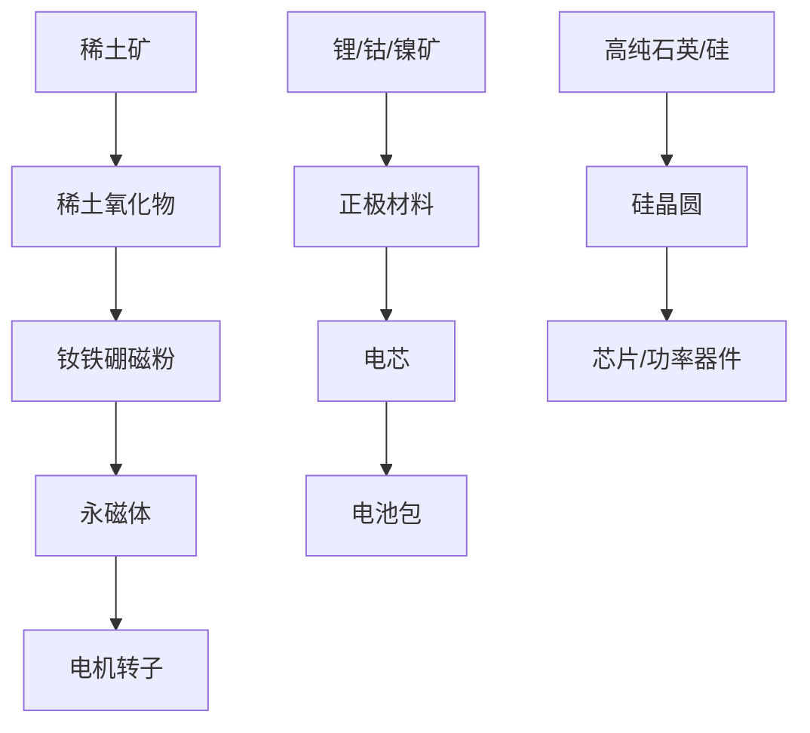

| 材料/类别 | 主要用途 | 主要供应来源（公开估算） | 关键风险 |
|---|---|---|---|
| 钕铁硼磁体 | 电机永磁转子 | 中国（约 80–90% 产能）、日本 | 稀土开采与冶炼集中 |
| 稀土氧化物 | 磁体、催化剂、抛光 | 中国、美国、澳大利亚、缅甸 | 冶炼分离高度集中 |
| 锂 | 锂电池 | 澳大利亚、智利、阿根廷、中国 | 资源国政策与价格波动 |
| 钴 | 三元正极 | 刚果（金）约 70% 产量 | 供应链责任与地缘风险 |
| 镍 | 三元/高镍电池 | 印尼、菲律宾、俄罗斯、加拿大 | ESG 与出口政策 |
| 高纯铜 | 绕组、线缆、散热 | 智利、秘鲁、中国、刚果 | 价格周期与需求增长 |
| 碳化硅衬底 | SiC 器件 | 美国、日本、欧洲、中国 | 8 英寸良率与产能爬坡 |
### 7.3.7 关节模组拆解与供应链

**关节模组（joint module）**是人形机器人运动系统的最小可交付单元。一个典型旋转关节模组至少包括无框力矩电机、减速器、编码器、力/力矩传感器、制动器、轴承、驱动器、壳体、线缆和润滑脂。由于关节模组同时决定机器人的扭矩密度、动态响应、控制精度和可靠性，其 BOM 拆解与供应链治理是整机厂降本与保供的核心抓手。

!!! note "术语解释：关节模组、关节模组总成、系统集成商"
    - **关节模组（joint module）**：将电机、减速器、编码器、传感器、制动器与壳体集成为一体的旋转或直线执行单元。
    - **关节模组总成（joint module assembly）**：可直接装配到机器人关节位置的完整模块。
    - **系统集成商（system integrator）**：将多个子系统整合为整机或解决方案的企业。

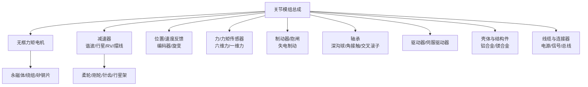

#### 7.3.7.1 关节模组总成与集成商

关节模组总成商负责把电机、减速器、编码器、力传感器、制动器等集成为可直接装配的模块。整机厂既可以直接外购模组，也可以自研核心部件后委托 Tier-1 集成。下表列出具有代表性的总成与集成供应商，其定位从专业减速器/电机厂商延伸至机器人 OEM 自研体系。

| 供应商 | 总部 | 代表产品/定位 | 典型机器人应用 | 供应状态/备注 |
|---|---|---|---|---|
| 绿的谐波 | 中国苏州 | 谐波减速器+关节模组 | 协作/人形机器人 | 国产谐波龙头，产能持续扩张 |
| 来福谐波 | 中国浙江 | 谐波减速器、关节模组 | 协作/服务机器人 | 国产替代 |
| 双环传动 | 中国浙江 | RV/行星/谐波减速器、齿轮 | 工业机器人/人形 | 精密齿轮制造基础 |
| 中大力德 | 中国宁波 | 行星/谐波减速器、电机驱动、模组 | 机器人关节 | 公开资料 |
| 禾川科技 | 中国浙江 | 伺服电机、驱动器、关节模组 | 工业/人形机器人 | 公开资料 |
| 汇川技术 | 中国深圳 | 伺服系统、电机、驱动器 | 工业机器人/人形 | 本土自动化龙头 |
| 埃斯顿 | 中国南京 | 伺服、机器人本体、模组 | 工业机器人/人形 | 自供+外供 |
| 优必选 | 中国深圳 | Walker 系列关节模组 | 教育/服务/人形 | 整机自研为主 |
| 宇树科技 | 中国杭州 | H1/G1 关节执行器 | 高动态人形 | 自研 |
| 智元机器人 | 中国上海 | 远征/灵犀关节模组 | 通用人形 | 初创，快速迭代 |
| 广州数控 | 中国广州 | 伺服电机、驱动、机器人 | 工业/人形 | 公开资料 |
| 拓斯达 | 中国东莞 | 工业机器人、执行器 | 工业自动化 | 公开资料 |
| 配天机器人 | 中国深圳 | 工业机器人、伺服 | 工业/人形 | 公开资料 |

中国关节模组供应商在地理上高度集中于长三角和珠三角，同时京津冀、华中、成渝等地依托整机厂和大学/研究所形成补充。下图给出简化的区域分布示意，节点不代表完整产能布局，仅用于说明产业集聚特征。

```mermaid
flowchart TD
    subgraph 长三角["长三角（苏州/无锡/上海/宁波/杭州）"]
        A1["绿的谐波"] --- A2["来福谐波"]
        A3["汇川技术"] --- A4["禾川科技"]
        A5["鸣志电器"] --- A6["宇立仪器"]
        A7["智元机器人"] --- A8["宇树科技"]
    end
    subgraph 珠三角["珠三角（深圳/东莞/广州）"]
        B1["优必选"] --- B2["广州数控"]
        B3["拓斯达"] --- B4["配天机器人"]
        B5["汇川技术总部"]
    end
    subgraph 京津冀["京津冀（北京/天津/河北）"]
        C1["小米机器人"] --- C2["整机研发"]
    end
    subgraph 华中["华中（武汉/长沙）"]
        D1["华中数控"] --- D2["伺服与电机"]
    end
    subgraph 成渝["成渝（成都/重庆）"]
        E1["成都/重庆精密加工"] --- E2["配套结构件"]
    end
    长三角 --> F["整机厂集成验证"]
    珠三角 --> F
    京津冀 --> F
    华中 --> F
    成渝 --> F
```

#### 7.3.7.2 无框力矩电机

无框力矩电机直接嵌入关节，决定扭矩密度、动态响应和热管理能力。外资品牌在高端医疗、航空航天和协作机器人领域具有先发优势；国产品牌在移动机器人、协作机器人和人形机器人领域快速跟进，部分厂商已实现量产供货。

| 供应商 | 总部 | 主要产品 | 典型机器人应用 | 供应状态/备注 |
|---|---|---|---|---|
| Maxon | 瑞士 | 无刷直流电机、无框电机、驱动器 | 高端医疗/机器人 | 高精度、小批量定制 |
| Moog | 美国 | 精密运动控制、无框力矩电机 | 航空/高可靠机器人 | 进口高端 |
| Kollmorgen | 美国 | 无框力矩电机、伺服系统 | 协作/工业机器人 | 广泛用于协作机器人关节 |
| TQ-RoboDrive | 德国 | 无框电机、空心杯电机 | 人形机器人灵巧手 | 灵巧手微型电机常用 |
| 汇川技术 | 中国深圳 | 伺服电机、无框电机 | 工业/人形机器人 | 国产龙头 |
| 禾川科技 | 中国浙江 | 伺服电机与驱动 | 国产替代 | 公开资料 |
| 步科股份 | 中国上海 | 低压伺服、无框电机 | 移动机器人/协作机器人 | 公开资料 |
| 鸣志电器 | 中国上海 | 步进/空心杯/无刷电机 | 灵巧手微型电机 | 公开资料 |
| 大族电机 | 中国深圳 | 直线/力矩电机 | 自动化/机器人 | 大族激光旗下 |
| 江特电机 | 中国江西 | 伺服电机、新能源汽车电机 | 工业/机器人 | 公开资料 |
| 信质集团 | 中国浙江 | 电机定转子铁芯 | 电机零部件 | 公开资料 |
| 江苏雷利 | 中国江苏 | 微特电机、组件 | 家电/机器人 | 公开资料 |
| 航天电器 | 中国贵州 | 电机、连接器 | 军工/高端装备 | 公开资料 |
| 恒帅股份 | 中国宁波 | 微电机、泵类 | 汽车/机器人 | 公开资料 |

#### 7.3.7.3 减速器

减速器降低电机转速、放大输出扭矩，是人形机器人关节中价值量和工艺门槛最高的部件之一。按原理可分为谐波、行星、摆线和 RV 四大类，分别适用于不同载荷、精度和刚度要求。

| 供应商 | 总部 | 主要产品 | 典型机器人应用 | 供应状态/备注 |
|---|---|---|---|---|
| Harmonic Drive Systems | 日本 | 谐波减速器 | 高端机器人 | 行业龙头 |
| Nabtesco | 日本 | RV 减速器、谐波减速器 | 重载/高精度关节 | RV 龙头 |
| 绿的谐波 | 中国苏州 | 谐波减速器 | 协作/人形机器人 | 国产龙头 |
| 来福谐波 | 中国浙江 | 谐波减速器 | 机器人 | 国产替代 |
| 双环传动 | 中国浙江 | RV/行星/谐波减速器、齿轮 | 工业/人形机器人 | 精密齿轮基础 |
| 中大力德 | 中国宁波 | 行星/谐波/RV 减速器 | 机器人 | 公开资料 |
| 国茂股份 | 中国江苏 | 减速机 | 工业/物流 | 公开资料 |
| 秦川机床 | 中国陕西 | 行星/滚珠丝杠/齿轮 | 机床/机器人 | 公开资料 |
| 丰立智能 | 中国浙江 | 小模数齿轮/减速器 | 机器人/电动工具 | 公开资料 |
| 昊志机电 | 中国广州 | 谐波减速器、电主轴 | 机器人/机床 | 公开资料 |
| 通力科技 | 中国浙江 | 减速机 | 工业 | 公开资料 |
| Sumitomo Drive Technologies | 日本 | 摆线/行星减速器 | 工业传动 | 公开资料 |
| SEW-EURODRIVE | 德国 | 行星/工业齿轮 | 工业自动化 | 公开资料 |

```mermaid
flowchart LR
    A["减速器选型"] --> B["谐波<br/>轻载/高精度"]
    A --> C["行星<br/>紧凑/中载"]
    A --> D["摆线<br/>高刚度"]
    A --> E["RV<br/>重载/高扭矩"]
```

#### 7.3.7.4 编码器

编码器为关节提供位置和速度反馈，是伺服闭环精度的决定因素之一。关节模组通常配置双编码器：电机端编码器用于 FOC 控制，输出端编码器用于负载端定位补偿。

| 供应商 | 总部 | 主要产品 | 典型机器人应用 | 供应状态/备注 |
|---|---|---|---|---|
| Heidenhain | 德国 | 高精度光电/磁编码器 | 高端机床/机器人 | 进口高端 |
| Renishaw | 英国 | 磁编码器、光栅尺 | 精密运动 | 进口 |
| Broadcom | 美国 | 光电编码器芯片 | 伺服电机 | 核心器件 |
| AMS-Osram | 奥地利 | 磁位置传感器、编码器 IC | 工业/汽车 | 公开资料 |
| CUI Devices | 美国 | 增量/绝对编码器 | 伺服电机 | 公开资料 |
| US Digital | 美国 | 光学/磁编码器 | 机器人关节 | 公开资料 |
| Maxon | 瑞士 | 编码器、电机+编码器模组 | 高端机器人 | 集成方案 |
| 多摩川精机 | 日本 | 编码器、旋转变压器 | 伺服电机配套 | 日系龙头 |
| 奥普光电 | 中国长春 | 光电编码器、光栅尺 | 机床/机器人 | 国产替代 |
| 禹衡光学 | 中国长春 | 光电编码器 | 伺服/机器人 | 国产替代 |
| 汇川技术 | 中国深圳 | 磁编码器、伺服配套编码器 | 国产伺服 | 自供+外供 |
| 鸣志电器 | 中国上海 | 编码器与步进/伺服配套 | 机器人 | 公开资料 |

```mermaid
flowchart TD
    A["编码器选型"] --> B["高精度<br/>光电编码器"]
    A --> C["抗油污<br/>磁电编码器"]
    A --> D["恶劣环境<br/>旋转变压器"]
    B --> E["Heidenhain/Renishaw"]
    C --> F["Broadcom/AMS/国产磁编"]
    D --> G["多摩川/Tamagawa"]
```

#### 7.3.7.5 力矩传感器

力矩传感器使关节具备柔顺控制能力。人形机器人的手腕、脚踝通常采用六维力/力矩传感器；部分整机厂也在探索基于电流环和柔性结构的低成本力控方案，以降低高端力传感器的成本压力。

| 供应商 | 总部 | 主要产品 | 典型机器人应用 | 供应状态/备注 |
|---|---|---|---|---|
| ATI Industrial Automation | 美国 | 六维力/力矩传感器 | 腕/踝/协作机器人 | 行业标杆 |
| Robotiq | 加拿大 | 力/力矩传感器、夹爪 | 协作机器人末端 | 公开资料 |
| OnRobot | 丹麦 | 力控传感器、夹爪 | 协作装配 | 公开资料 |
| Bota Systems | 瑞士 | 六维力传感器 | 足式/人形机器人 | 公开资料 |
| Kistler | 瑞士 | 压电式力/力矩传感器 | 测试与工业 | 高精度 |
| 宇立仪器 | 中国上海 | 六维力传感器 | 机器人腕/踝/测试 | 国产龙头 |
| 坤维科技 | 中国苏州 | 六维力/力矩传感器 | 协作/人形机器人 | 公开资料 |
| 柯力传感 | 中国宁波 | 称重/力传感器、六维力 | 工业/物流/机器人 | 公开资料 |
| 汉威科技 | 中国郑州 | 柔性压力/触觉传感器 | 机器人皮肤、可穿戴 | 公开资料 |
| 中航电测 | 中国陕西 | 应变式力/称重传感器 | 工业/航空 | 公开资料 |

#### 7.3.7.6 制动器/抱闸

制动器/抱闸用于断电或急停时保持关节位置，是人形机器人安全功能的重要组成部分。**失电制动器（power-off brake）**在断电时由弹簧施压制动、通电时释放，具有失效安全（fail-safe）特性。

!!! note "术语解释：制动器、抱闸、失电制动器、通电释放、失效安全"
    - **制动器/抱闸（brake）**：在断电或停止时锁止关节的装置。
    - **失电制动器（power-off brake）**：断电时弹簧施压制动、通电时释放的制动器。
    - **通电释放**：需要持续通电才能解除制动的安全设计。
    - **失效安全（fail-safe）**：在故障或断电情况下自动进入安全状态的设计原则。

| 供应商 | 总部 | 主要产品 | 典型机器人应用 | 供应状态/备注 |
|---|---|---|---|---|
| 应流股份 | 中国安徽 | 电磁制动器、精密铸件 | 伺服电机/机器人 | 公开资料 |
| 无锡创明 | 中国江苏 | 电磁制动器、离合器 | 机器人/自动化 | 公开资料 |
| 台湾仟岱 | 中国台湾 | 电磁制动器/离合器 | 伺服电机 | 公开资料 |
| Mayr | 德国 | 安全制动器、扭矩限制器 | 高端自动化 | 进口 |
| Ortlinghaus | 德国 | 电磁离合器/制动器 | 机床/机器人 | 进口 |
| SITEMA | 瑞士 | 安全抱闸、锁紧装置 | 线性轴/压机 | 进口高端 |

```mermaid
flowchart LR
    A["电机轴"] --> B["角接触轴承<br/>输入端预紧"]
    A --> C["深沟球轴承<br/>辅助支撑"]
    D["减速器输出"] --> E["交叉滚子轴承<br/>多向载荷"]
    F["失电制动器"] --> G["关节锁定<br/>断电保护"]
```

#### 7.3.7.7 轴承

轴承支撑电机轴和减速器输出轴，承受径向、轴向和倾覆力矩。人形机器人关节根据载荷与精度要求，常组合使用深沟球轴承、角接触球轴承和交叉滚子轴承。

!!! note "术语解释：深沟球轴承、角接触球轴承、交叉滚子轴承、预紧、额定动载荷"
    - **深沟球轴承（deep groove ball bearing）**：主要承受径向载荷，也可承受一定轴向载荷。
    - **角接触球轴承（angular contact ball bearing）**：可同时承受径向和轴向载荷，常成对预紧使用。
    - **交叉滚子轴承（crossed roller bearing）**：滚子交叉排列，可同时承受多向载荷，旋转精度高。
    - **预紧（preload）**：对轴承施加初始载荷以消除内部游隙、提高刚度。
    - **额定动载荷（dynamic load rating）**：轴承在额定寿命内可承受的载荷。

| 供应商 | 总部 | 轴承类型 | 典型机器人应用 | 供应状态/备注 |
|---|---|---|---|---|
| 人本集团 | 中国浙江 | 深沟球/角接触 | 电机/机器人 | 国产龙头 |
| 万向钱潮 | 中国浙江 | 深沟球/轮毂轴承 | 汽车/机器人 | 公开资料 |
| 洛阳 LYC | 中国河南 | 大型/精密轴承 | 机床/机器人 | 公开资料 |
| 五洲新春 | 中国浙江 | 轴承套圈/成品 | 汽车/机器人 | 公开资料 |
| 南方精工 | 中国江苏 | 滚针/离合器轴承 | 汽车/机器人 | 公开资料 |
| 国机精工 | 中国河南 | 超精密轴承 | 机床/机器人 | 公开资料 |
| 瓦轴 ZWZ | 中国辽宁 | 深沟球/圆柱滚子 | 工业/机器人 | 公开资料 |
| 襄阳轴承 | 中国湖北 | 汽车/圆锥滚子 | 工业/机器人 | 公开资料 |
| Schaeffler | 德国 | 全系列精密轴承 | 高端机器人 | 进口 |
| SKF | 瑞典 | 深沟球/角接触/滚子 | 工业/机器人 | 进口龙头 |
| NSK | 日本 | 高精度球轴承 | 伺服电机/机器人 | 进口 |
| NTN | 日本 | 精密轴承 | 电机/机器人 | 进口 |
| Timken | 美国 | 圆锥/圆柱滚子 | 工业 | 进口 |

#### 7.3.7.8 驱动器/伺服驱动器

伺服驱动器把控制器指令转换为电机功率输出，通常采用 FOC 控制，包含电流环、速度环和位置环。关节驱动器对体积、散热、EMI 和电流环带宽要求较高，是国产替代的重点环节。

!!! note "术语解释：伺服驱动器、电流环、速度环、位置环、总线通信"
    - **伺服驱动器（servo drive）**：控制伺服电机电流、速度和位置的功率电子装置。
    - **电流环/速度环/位置环**：伺服控制的三环结构，由内而外响应越来越快。
    - **总线通信**：驱动器与控制器通过 CAN/EtherCAT/RS485 等总线交换数据。

| 供应商 | 总部 | 主要产品 | 典型机器人应用 | 供应状态/备注 |
|---|---|---|---|---|
| Elmo Motion Control | 以色列 | 小型伺服驱动器 | 协作/医疗机器人 | 进口高端 |
| Copley Controls | 美国 | 伺服驱动器 | 精密运动 | 进口 |
| Ingenia Motion Control | 西班牙 | 数字伺服驱动器 | 机器人关节 | 进口 |
| 汇川技术 | 中国深圳 | 伺服驱动器、变频器 | 工业/人形 | 国产龙头 |
| 禾川科技 | 中国浙江 | 伺服驱动器 | 工业/机器人 | 公开资料 |
| 雷赛智能 | 中国深圳 | 伺服/步进驱动 | 工业自动化 | 公开资料 |
| 埃斯顿 | 中国南京 | 伺服驱动、控制器 | 工业机器人 | 公开资料 |
| 鸣志电器 | 中国上海 | 步进/伺服驱动 | 机器人 | 公开资料 |
| 步科股份 | 中国上海 | 低压伺服驱动器 | 移动/协作机器人 | 公开资料 |
| 英威腾 | 中国深圳 | 伺服驱动、变频器 | 工业 | 公开资料 |
| 信捷电气 | 中国无锡 | 伺服/PLC | 工业 | 公开资料 |
| 固高科技 | 中国深圳/香港 | 运动控制器/驱动 | 机器人/机床 | 公开资料 |

```mermaid
flowchart LR
    A["运动指令"] --> B["伺服驱动器<br/>FOC/PWM"]
    B --> C["无框电机"]
    C --> D["减速器/关节输出"]
    D --> E["编码器/电流传感器"]
    E --> B
```

#### 7.3.7.9 关节壳体、结构件与紧固件

关节壳体与结构件承担支撑、密封、散热和轻量化功能，常用工艺包括铝合金/镁合金压铸、CNC 精加工和 3D 打印。压铸适合大批量复杂薄壁件，CNC 满足高精度配合面，3D 打印则用于小批量拓扑优化和样件验证。

!!! note "术语解释：压铸、CNC、3D 打印、镁合金、阳极氧化、结构件"
    - **压铸（die casting）**：将熔融金属高压注入模具成型的工艺，适合复杂薄壁件。
    - **CNC（Computer Numerical Control）**：数控加工，用于高精度结构件。
    - **3D 打印（增材制造）**：逐层堆积材料，适合小批量复杂结构。
    - **镁合金**：密度低于铝合金的轻质结构材料。
    - **阳极氧化**：铝/镁表面形成氧化膜以提高耐蚀性和绝缘性。

| 供应商 | 总部 | 加工能力/产品 | 典型机器人应用 | 供应状态/备注 |
|---|---|---|---|---|
| 拓普集团 | 中国浙江 | 铝合金/镁合金压铸、CNC | 汽车/机器人结构件 | 公开资料 |
| 三花智控 | 中国浙江 | 精密铝件、热管理 | 机器人/汽车 | 公开资料 |
| 旭升集团 | 中国宁波 | 铝合金压铸/CNC | 汽车/机器人壳体 | 公开资料 |
| 爱柯迪 | 中国宁波 | 铝合金精密压铸 | 汽车/机器人结构 | 公开资料 |
| 文灶股份 | 中国 | 精密结构件、压铸 | 机器人/3C | 公开资料 |
| 领益智造 | 中国广东 | 金属/CNC/注塑结构件 | 消费电子/机器人 | 公开资料 |
| 立讯精密 | 中国广东 | 精密制造、结构件、连接器 | 机器人/消费电子 | 公开资料 |
| 华翔 | 中国浙江 | 金属结构件、压铸 | 汽车/机器人 | 公开资料 |

```mermaid
flowchart LR
    A["铝合金/镁合金锭"] --> B["压铸成型"]
    B --> C["CNC 精加工"]
    C --> D["表面处理<br/>阳极/喷涂"]
    D --> E["装配螺套/轴承位"]
    E --> F["关节壳体总成"]
```

#### 7.3.7.10 润滑脂与润滑油

关节减速器和轴承需要长寿命、低摩擦、抗剪切和宽温域的润滑脂。润滑脂的选择直接影响减速器背隙稳定性、噪声和寿命，是整机厂在样机阶段容易忽视但在量产阶段必须严格管控的物料。

!!! note "术语解释：润滑脂、基础油、稠化剂、极压添加剂、NLGI 等级"
    - **润滑脂（grease）**：稠化剂分散在基础油中的半固体润滑剂。
    - **基础油（base oil）**：润滑脂的主要液体成分。
    - **稠化剂（thickener）**：使基础油形成半固体结构的添加剂。
    - **极压添加剂（EP additive）**：在高负荷下形成保护膜防止金属接触。
    - **NLGI 等级**：润滑脂稠度分类，数字越大越硬。

| 供应商 | 总部 | 代表产品 | 典型机器人应用 | 供应状态/备注 |
|---|---|---|---|---|
| 长城润滑油 | 中国 | 机器人/轴承润滑脂 | 国产机器人 | 中国石化旗下 |
| 昆仑润滑油 | 中国 | 工业润滑脂/油 | 工业/机器人 | 中国石油旗下 |
| Klüber | 德国 | 特种润滑脂 | 高端减速器/轴承 | 进口 |
| Kyodo Yushi | 日本 | 机器人减速器润滑脂 | 谐波/RV | 进口 |
| 道达尔能源 | 法国 | 工业润滑油/脂 | 机器人 | 进口 |
| 协同油脂 | 日本 | 轴承/齿轮润滑脂 | 机器人 | 进口 |

#### 7.3.7.11 线缆与连接器

人形机器人关节运动频繁，线缆需具备高柔性、耐弯折、抗扭转和电磁屏蔽能力。连接器则需满足紧凑、可靠、易维护的要求。动力线、编码器信号线和通信总线通常分开布线，以减少干扰并便于故障排查。

!!! note "术语解释：高柔性线缆、拖链线缆、连接器、屏蔽、IP 等级"
    - **高柔性线缆（high-flex cable）**：可承受反复弯曲的电缆，适合机器人运动部位。
    - **拖链线缆（drag chain cable）**：用于拖链中反复移动的电缆。
    - **连接器（connector）**：实现电气/信号连接的接口器件。
    - **屏蔽（shielding）**：防止电磁干扰的导电层。
    - **IP 等级**：防护固体和液体侵入的等级。

| 供应商 | 总部 | 主要产品 | 典型机器人应用 | 供应状态/备注 |
|---|---|---|---|---|
| TE Connectivity | 瑞士/美国 | 连接器、传感器线缆 | 工业/机器人 | 进口龙头 |
| Molex | 美国 | 连接器、线束 | 消费电子/机器人 | 进口 |
| Amphenol | 美国 | 圆形/工业连接器 | 机器人/军工 | 进口 |
| 立讯精密 | 中国广东 | 连接器、线束、结构件 | 消费电子/机器人 | 公开资料 |
| 中航光电 | 中国河南 | 军/工业连接器 | 高端装备/机器人 | 公开资料 |
| 永贵电器 | 中国浙江 | 连接器、线束 | 轨交/新能源汽车/机器人 | 公开资料 |
| 沃尔核材 | 中国深圳 | 热缩材料、线缆附件 | 机器人/电力 | 公开资料 |

```mermaid
flowchart TD
    A["线缆与连接器"] --> B["动力线<br/>电机三相/抱闸"]
    A --> C["信号线<br/>编码器/力传感器"]
    A --> D["通信总线<br/>CAN/EtherCAT"]
    A --> E["高柔性拖链线<br/>百万次弯曲"]
```

综合上述关节模组子部件，可将供应集中度与风险等级概括为下图。谐波减速器、高端编码器和六维力传感器属于高集中度/高风险节点；无框力矩电机和驱动器处于中集中度；结构件、线缆与润滑脂的供应弹性相对较好。

```mermaid
flowchart TD
    subgraph 高集中["高集中/高风险"]
        A["谐波减速器<br/>CR3 约 80%+"]
        B["高端编码器<br/>进口主导"]
        C["六维力传感器<br/>国产替代中"]
    end
    subgraph 中集中["中集中/中风险"]
        D["无框力矩电机<br/>外资+国产"]
        E["驱动器<br/>国产份额提升"]
    end
    subgraph 低集中["低集中/低替代难度"]
        F["结构件/壳体<br/>加工资源分散"]
        G["线缆/连接器<br/>电子制造成熟"]
        H["润滑脂<br/>多品牌可选"]
    end
    classDef high fill:#f96;
    classDef med fill:#ff9;
    classDef low fill:#9f9;
    class A,B,C high;
    class D,E med;
    class F,G,H low;
```


#### 7.3.7.12 关节模组成本与供应风险拆解

关节模组的 BOM 成本分布受电机、减速器、力传感器和驱动器影响最大。以下给出一种基于公开估算的旋转关节模组成本结构，用于说明供应风险与降本重点，不特指任何具体机型。

!!! note "术语解释：关节模组成本结构、BOM 成本集中度、双源策略"
    - **关节模组成本结构**：关节模组各子部件占总成本的比例分布。
    - **BOM 成本集中度**：少数零部件占据关节模组总成本的比例。
    - **双源策略（dual sourcing）**：对同一关键物料发展两家合格供应商以降低断供风险。

| 子部件 | 占关节模组成本估算（%） | 主要供应商格局 | 供应风险等级 | 常见治理策略 |
|---|---|---|---|---|
| 减速器 | 25–35 | 日/中谐波、RV 厂商集中 | 高 | 双源开发、国产替代 |
| 无框力矩电机 | 20–28 | 外资+国产 | 中高 | 长期合同、自研储备 |
| 力/力矩传感器 | 12–18 | 高端进口/国产追赶 | 中高 | 双源、设计降本 |
| 伺服驱动器 | 8–12 | 外资高端/国产追赶 | 中 | 多源、平台化 |
| 编码器 | 5–8 | 高端进口/国产追赶 | 中 | 双编码器方案、国产化 |
| 轴承 | 4–6 | 国际龙头+国产 | 中低 | AVL 分散 |
| 壳体/结构件 | 4–6 | 压铸/CNC 资源分散 | 低 | 竞价+工艺优化 |
| 制动器 | 3–5 | 外资+国产 | 中低 | AVL 分散 |
| 线缆/连接器 | 2–4 | 电子制造成熟 | 低 | 标准件池 |
| 润滑脂 | <1 | 多品牌可选 | 低 | 规格认证 |

```mermaid
flowchart TD
    A["关节模组成本-风险矩阵"] --> B["高成本+高风险<br/>减速器/力传感器"]
    A --> C["高成本+中风险<br/>无框电机/驱动器"]
    A --> D["低成本+低风险<br/>结构件/线缆/润滑脂"]
    B --> E["优先双源/国产替代"]
    C --> F["长期合同/平台化"]
    D --> G["竞价/工艺优化"]
```

上述估算为行业公开区间，实际比例随减速器类型（谐波 vs 行星）、力传感器配置和量产规模差异显著。整机厂应建立自己的 should-cost 模型，并随着量产爬坡动态更新。


#### 7.3.7.13 关节模组测试与验证供应链

关节模组在量产前需要完成性能、可靠性和安全性验证。测试项目包括扭矩-转速特性、传动效率、背隙、刚度、温升、寿命、EMC 和防护等级。测试设备与工装本身的供应链也会影响整机厂的验证周期和成本。

!!! note "术语解释：测功机、背隙测试、传动效率、寿命测试、EMC"
    - **测功机（dynamometer）**：测量电机或模组扭矩、转速和功率的测试设备。
    - **背隙测试**：测量减速器换向空程的测试。
    - **传动效率**：输出功率与输入功率之比。
    - **寿命测试（life test）**：模拟长期使用条件以评估耐久性的测试。
    - **EMC（Electromagnetic Compatibility）**：电磁兼容性，确保设备在电磁环境中正常工作。

| 供应商/设备类型 | 总部 | 主要产品 | 典型测试项目 | 供应状态/备注 |
|---|---|---|---|---|
| Keysight（是德科技） | 美国 | 示波器、功率分析仪、网络分析仪 | 信号完整性、功率 | 进口高端 |
| Tektronix | 美国 | 示波器、探头 | 驱动器调试 | 进口 |
| National Instruments (NI) | 美国 | 数据采集、PXI 平台 | 多通道同步测试 | 进口 |
| 横河电机 | 日本 | 功率分析仪、示波器 | 电机效率 | 进口 |
| HBM（Hottinger Brüel & Kjær） | 德国 | 扭矩传感器、数据采集 | 扭矩/力标定 | 进口 |
| 清研凌创 | 中国 | 机器人测试平台 | 整机性能 | 公开资料 |
| 东华测试 | 中国 | 动态信号测试系统 | 振动/模态 | 公开资料 |

```mermaid
flowchart TD
    A["关节模组样机"] --> B["性能测试<br/>扭矩/转速/效率"]
    A --> C["精度测试<br/>背隙/刚度/重复定位"]
    A --> D["可靠性测试<br/>寿命/温升/防护"]
    A --> E["EMC 测试<br/>传导/辐射"]
    B --> F["测试报告与整改"]
    C --> F
    D --> F
    E --> F
```


#### 7.3.7.14 关节模组供应链治理要点

围绕关节模组的供应链治理，整机厂需要在技术、商务和合规三个维度建立体系。技术上应制定清晰的规格书、公差链和测试规范；商务上应通过 AVL、双源和长期合同平衡成本与韧性；合规上应确保关键物料的来源可追溯、符合出口管制和 ESG 要求。

!!! note "术语解释：规格书、公差链、AVL、来源追溯"
    - **规格书（specification）**：描述产品性能、尺寸、接口和测试要求的文件。
    - **公差链（tolerance chain）**：零部件公差在装配过程中累积传递的路径。
    - **AVL（Approved Vendor List）**：经审核批准的合格供应商清单。
    - **来源追溯（traceability）**：追踪物料来源、批次和流向的能力。

| 治理维度 | 关键动作 | 常用工具/方法 |
|---|---|---|
| 技术治理 | 规格冻结、DFM、测试规范 | QFD、FMEA、DOE |
| 商务治理 | 多源、长协、产能预留 | should-cost、TCO、VMI |
| 合规治理 | 冲突矿产、出口管制、碳足迹 | RMI、ECCN、LCA |


#### 7.3.7.15 关节模组供应商切换风险

关节模组关键子部件的供应商切换往往伴随较长的导入周期和隐性成本。减速器和力传感器的切换需要重新验证背隙、刚度、标定和寿命；电机和驱动器的切换涉及 FOC 参数整定和 EMC 复测；编码器切换则需要重新建立位置反馈模型和误差补偿表。

| 子部件 | 主要切换风险 | 典型导入周期 | 缓解措施 |
|---|---|---|---|
| 减速器 | 背隙/刚度变化、寿命差异 | 6–12 个月 | 双源并行验证 |
| 无框电机 | 扭矩常数、热特性差异 | 3–6 个月 | 参数库化 |
| 力传感器 | 串扰、标定、过载保护 | 3–6 个月 | 统一接口标准 |
| 驱动器 | EMC、控制带宽 | 3–6 个月 | 平台化设计 |
| 编码器 | 分辨率/信号协议差异 | 2–4 个月 | 软件抽象层 |

### 7.3.8 传动与结构件供应链

除关节模组外，人形机器人的四肢、躯干和灵巧手还依赖大量传动件与结构件：滚珠/滚柱丝杠实现线性自由度，连杆与摇臂传递下肢载荷，同步带、腱绳和钢丝绳实现远距离或柔顺传动，弹簧与弹性体则用于储能、减震和串联弹性执行器（SEA）。

!!! note "术语解释：传动件、结构件、线性自由度、柔顺传动"
    - **传动件**：把动力从原动机传递到执行端的零部件，如丝杠、带、绳、齿轮。
    - **结构件**：构成机器人骨架并承受载荷的零部件。
    - **线性自由度（linear DOF）**：沿直线方向运动的自由度。
    - **柔顺传动（compliant transmission）**：通过弹性元件使执行器具有柔顺性的传动方式。

#### 7.3.8.1 滚珠丝杠 / 滚柱丝杠 / 行星滚柱丝杠

丝杠将旋转运动转换为直线运动，是人形机器人线性执行器（如腿部、躯干推杆）的核心传动件。**滚珠丝杠**效率高、精度好；**滚柱丝杠**承载能力更强；**行星滚柱丝杠**通过行星排布的滚柱实现高刚性、紧凑结构，适合高负载、高频响的人形机器人关节。

!!! note "术语解释：滚珠丝杠、滚柱丝杠、行星滚柱丝杠、导程、背隙、额定动载荷"
    - **滚珠丝杠（ball screw）**：通过滚珠在丝杠与螺母之间滚动传递运动和力的直线传动件。
    - **滚柱丝杠（roller screw）**：通过滚柱替代滚珠，承载能力高于滚珠丝杠。
    - **行星滚柱丝杠（planetary roller screw）**：滚柱行星排布，刚度高、寿命长、结构紧凑。
    - **导程（lead）**：丝杠旋转一周螺母移动的距离。
    - **背隙（backlash）**：丝杠副换向时的空程，影响定位精度。

```mermaid
flowchart LR
    A["丝杠用特种钢"] --> B["研磨/轧制丝杠"]
    B --> C["滚珠丝杠<br/>高效率"]
    B --> D["滚柱丝杠<br/>高载荷"]
    B --> E["行星滚柱丝杠<br/>高刚性/紧凑"]
    C --> F["线性执行器"]
    D --> F
    E --> F
    F --> G["人形机器人腿部/躯干"]
```

| 供应商 | 总部 | 主要产品 | 精度/规格 | 典型机器人应用 | 供应状态/备注 |
|---|---|---|---|---|---|
| THK | 日本 | 滚珠丝杠、直线导轨 | C0-C7 | 精密机床/机器人 | 进口高端 |
| NSK | 日本 | 滚珠丝杠、支撑单元 | C0-C7 | 机床/机器人 | 进口 |
| Schneeberger | 瑞士 | 微型滚珠丝杠、导轨 | 高精度 | 医疗/机器人 | 进口 |
| 上银 Hiwin | 中国台湾 | 滚珠丝杠、直线导轨 | C3-C7 | 自动化/机器人 | 公开资料 |
| TBI Motion | 中国台湾 | 滚珠丝杠、直线模组 | C3-C7 | 自动化/机器人 | 公开资料 |
| 南京工艺 | 中国江苏 | 滚珠丝杠、直线导轨 | C3-C7 | 机床/机器人 | 公开资料 |
| 秦川机床 | 中国陕西 | 滚珠丝杠、齿轮 | 中高精度 | 机床/机器人 | 公开资料 |
| 贝斯特 | 中国江苏 | 精密零部件、丝杠 | 公开资料 | 汽车/机器人 | 公开资料 |
| 恒立液压 | 中国江苏 | 液压件、精密铸造 | 公开资料 | 工程机械/机器人 | 公开资料 |
| 五洲新春 | 中国浙江 | 轴承套圈、精密零部件 | 公开资料 | 汽车/机器人 | 公开资料 |
| 鼎智科技 | 中国 | 微型丝杠、电机组件 | 微型 | 医疗/机器人 | 公开资料 |
| 济南金帝 | 中国山东 | 滚珠丝杠、直线导轨 | 公开资料 | 机床/机器人 | 公开资料 |

#### 7.3.8.2 连杆、摇臂、thigh/shank 结构件

人形机器人下肢的大腿（thigh）和小腿（shank）通常采用铝合金或镁合金结构件，通过压铸+CNC 工艺实现轻量化与刚度平衡。连杆与摇臂把执行器输出传递到足部，承受步行和跳跃时的冲击载荷。

!!! note "术语解释：连杆、摇臂、thigh、shank、拓扑优化"
    - **连杆（link）**：连接两个运动副、传递力和运动的刚性构件。
    - **摇臂（rocker arm）**：绕固定轴摆动以改变力或运动方向的杠杆构件。
    - **thigh（大腿）**：人形机器人髋到膝之间的腿部结构件。
    - **shank（小腿）**：人形机器人膝到踝之间的腿部结构件。
    - **拓扑优化（topology optimization）**：在给定载荷与约束下寻找最优材料分布的结构设计方法。

| 供应商 | 总部 | 主要产品/工艺 | 典型机器人应用 | 供应状态/备注 |
|---|---|---|---|---|
| 拓普集团 | 中国浙江 | 铝合金/镁合金压铸、CNC | 汽车/机器人 thigh/shank | 公开资料 |
| 三花智控 | 中国浙江 | 精密铝件、热管理 | 机器人结构件 | 公开资料 |
| 旭升集团 | 中国宁波 | 铝合金压铸/CNC | 机器人壳体/结构件 | 公开资料 |
| 爱柯迪 | 中国宁波 | 铝合金精密压铸 | 机器人结构件 | 公开资料 |
| 文灶股份 | 中国 | 精密结构件、压铸 | 机器人/3C | 公开资料 |
| 领益智造 | 中国广东 | 金属/CNC/注塑结构件 | 消费电子/机器人 | 公开资料 |
| 立讯精密 | 中国广东 | 精密制造、结构件 | 机器人/消费电子 | 公开资料 |
| 华翔 | 中国浙江 | 金属结构件、压铸 | 汽车/机器人 | 公开资料 |

```mermaid
flowchart TD
    A["下肢结构件"] --> B["大腿 thigh<br/>铝合金/碳纤维"]
    A --> C["小腿 shank<br/>铝合金/镁合金"]
    A --> D["髋关节连杆"]
    A --> E["膝关节摇臂"]
    A --> F["踝关节支架"]
    B --> G["整机下肢总成"]
    C --> G
    D --> G
    E --> G
    F --> G
```

#### 7.3.8.3 同步带 / 腱绳 / 钢丝绳

同步带、腱绳和钢丝绳用于实现远距离、轻量化和柔顺传动。同步带适合精确速度比和中等负载；腱绳传动可以把电机布置在远离关节的位置以降低远端惯量；钢丝绳则用于高负载、高刚度的牵引场景。

!!! note "术语解释：同步带、腱绳、钢丝绳、传动比、预紧力"
    - **同步带（timing belt）**：带齿与带轮啮合的柔性传动件，传动比准确。
    - **腱绳（tendon）**：细柔性缆绳，常用于把电机驱动力传递到远端关节。
    - **钢丝绳（wire rope）**：由多股钢丝捻制而成，强度高、耐磨。
    - **传动比**：输入转速与输出转速之比。
    - **预紧力（pretension）**：传动带或绳在安装时施加的初始拉力。

| 供应商 | 总部 | 主要产品 | 典型机器人应用 | 供应状态/备注 |
|---|---|---|---|---|
| Gates | 美国 | 同步带、带轮 | 自动化/机器人 | 进口 |
| ContiTech | 德国 | 同步带、输送带 | 工业/机器人 | 大陆集团下属 |
| Breco | 德国 | 聚氨酯同步带 | 精密输送/机器人 | 进口 |
| Synchroflex | 荷兰 | 同步带 | 自动化/机器人 | 进口 |
| 麦高迪 Megadyne | 意大利 | 同步带、带轮 | 自动化/机器人 | 进口 |
| 三明化油 | 中国 | 传动带/钢丝绳 | 机器人/机械 | 公开资料 |
| 法尔胜 | 中国江苏 | 钢丝绳、钢绞线 | 起重/机器人 | 公开资料 |

#### 7.3.8.4 弹簧与弹性体

弹簧与弹性体在关节中承担储能、减震、力控和柔顺功能。**串联弹性执行器（SEA）**通过在电机与输出之间串联弹簧，实现低阻抗力控和能量回收，是足式与人形机器人常用的柔顺驱动方案。

!!! note "术语解释：弹簧、弹性体、串联弹性执行器（SEA）、刚度、储能"
    - **串联弹性执行器（SEA, Series Elastic Actuator）**：在驱动器与输出端之间串联弹性元件，以实现柔顺力控的执行器。
    - **刚度（stiffness）**：结构抵抗变形的能力。
    - **储能（energy storage）**：弹性元件在受载时储存机械能并在释放时做功。

| 供应商 | 总部 | 主要产品 | 典型机器人应用 | 供应状态/备注 |
|---|---|---|---|---|
| 美力科技 | 中国浙江 | 弹簧、弹性元件 | 汽车/机器人 | 公开资料 |
| 华纬科技 | 中国浙江 | 悬架弹簧、精密弹簧 | 汽车/机器人 | 公开资料 |
| Mubea | 德国 | 汽车/工业弹簧 | 汽车/机器人 | 进口 |
| Lesjöfors | 瑞典 | 精密弹簧 | 工业/机器人 | 进口 |
| 慕贝尔 | 德国 | 弹簧、稳定杆 | 汽车/机器人 | 进口 |
| 中鼎股份 | 中国安徽 | 橡胶密封件、弹性体 | 汽车/机器人 | 公开资料 |

```mermaid
flowchart LR
    A["SEA 串联弹性执行器"] --> B["电机+减速器"]
    A --> C["弹性体/弹簧"]
    A --> D["力传感器"]
    C --> E["柔顺输出<br/>储能释能"]
```


#### 7.3.8.5 结构件轻量化材料与工艺

结构件的轻量化直接影响人形机器人的能耗、动态响应和续航。常用材料包括铝合金、镁合金、碳纤维复合材料和工程塑料；工艺则涵盖压铸、挤出、CNC、模压和增材制造。

!!! note "术语解释：碳纤维复合材料、工程塑料、挤出成型、模压成型、增材制造"
    - **碳纤维复合材料（CFRP）**：以碳纤维为增强体、树脂为基体的高强度轻质材料。
    - **工程塑料**：具有优良机械、热学和化学性能的塑料，如 PEEK、PA、PC。
    - **挤出成型（extrusion）**：将材料通过模具挤出成型的工艺。
    - **模压成型（compression molding）**：在模具中加热加压成型的工艺。
    - **增材制造（additive manufacturing）**：即 3D 打印，逐层堆积材料。

| 材料 | 密度约值（g/cm³） | 主要优点 | 主要缺点 | 典型应用 |
|---|---|---|---|---|
| 铝合金 6061/7075 | 2.7 | 易加工、成本低 | 刚度/比强度低于 CFRP | 壳体、连杆 |
| 镁合金 AZ91D | 1.8 | 更轻、压铸性好 | 耐蚀性差、易燃风险 | 壳体、支架 |
| 碳纤维复合材料 | 1.5–1.6 | 高比强度、可设计 | 成本高、抗冲击差 | 大腿、小腿 |
| 工程塑料 PEEK | 1.3 | 耐磨、耐化学 | 成本高 | 轴承座、隔套 |
| 钛合金 | 4.5 | 高强耐蚀 | 成本高、难加工 | 紧固件、高载关节 |

```mermaid
flowchart TD
    A["结构件选材"] --> B["铝合金<br/>成本低/易加工"]
    A --> C["镁合金<br/>更轻/压铸"]
    A --> D["碳纤维<br/>高比强"]
    A --> E["工程塑料<br/>耐磨绝缘"]
    B --> F["壳体/连杆"]
    C --> F
    D --> G["thigh/shank"]
    E --> H["隔套/罩壳"]
```

#### 7.3.8.6 人形机器人传动链与运动学耦合

传动链的质量直接决定人形机器人运动学的精度、效率和动态性能。传动间隙会导致定位误差和爬行（stick-slip），刚度不足会降低带宽，惯量过大会限制加速度。整机厂在选型时需要把传动件参数纳入正向运动学和动力学模型统一优化。

!!! note "术语解释：传动链、反向间隙、摩擦、惯量、刚度、爬行"
    - **传动链（transmission chain）**：从原动机到执行端之间传递运动和力的零部件序列。
    - **反向间隙（backlash）**：传动链换向时的空程，导致位置滞后。
    - **摩擦（friction）**：接触面相对运动时的阻力，影响控制精度与能耗。
    - **惯量（inertia）**：物体抵抗角加速度或线加速度的能力。
    - **刚度（stiffness）**：系统抵抗变形的能力。
    - **爬行（stick-slip）**：静摩擦与动摩擦交替导致的低速抖动现象。

| 传动件 | 主要特性 | 对人形运动学的影响 | 典型应用部位 |
|---|---|---|---|
| 谐波/行星减速器 | 高减速比、高扭矩 | 影响关节刚度与背隙 | 旋转关节 |
| 滚珠/滚柱丝杠 | 旋转→直线、高效率 | 影响线性自由度精度 | 腿部推杆/躯干 |
| 同步带 | 柔性、远距离传动 | 引入弹性变形与振动 | 手臂/头部 |
| 腱绳/钢丝绳 | 轻量化、远端驱动 | 降低远端惯量、需预紧 | 灵巧手/手指 |
| 弹簧/弹性体 | 柔顺、储能 | 改变系统固有频率 | SEA/足端 |

```mermaid
flowchart LR
    A["髋部旋转关节"] --> B["大腿 thigh"]
    B --> C["膝关节"]
    C --> D["小腿 shank"]
    D --> E["踝关节"]
    E --> F["足部"]
    B -.-> G["连杆/摇臂"]
    C -.-> G
    D -.-> H["丝杠/弹簧"]
```

传动链与结构件的供应商治理应超越单纯比价。整机厂需要与 Tier-1/Tier-2 供应商共享公差链、动力学模型和测试规范，才能在量产阶段稳定实现设计的运动学性能。


#### 7.3.8.7 紧固件、密封件与表面处理

紧固件、密封件和表面处理虽属于“小零件”，但直接影响关节的装配一致性、防护等级和长期可靠性。人形机器人对高强度、防松、耐腐蚀和轻量化紧固件有较高要求；密封件则需满足 IP 等级和润滑保持需求。

!!! note "术语解释：紧固件、密封件、阳极氧化、化学镀镍、达克罗"
    - **紧固件（fastener）**：螺栓、螺钉、螺母、垫圈等连接件。
    - **密封件（seal）**：防止液体、气体或粉尘泄漏的零件，如 O 形圈、油封。
    - **阳极氧化（anodizing）**：铝表面形成氧化膜以提高耐蚀性和绝缘性。
    - **化学镀镍（electroless nickel plating）**：在金属表面沉积镍层的表面处理工艺。
    - **达克罗（Dacromet）**：一种锌铝涂层，具有优良耐蚀性。

| 类别 | 代表供应商 | 总部 | 主要产品 | 典型应用 |
|---|---|---|---|---|
| 紧固件 | 晋亿实业 | 中国 | 高强度螺栓、螺母 | 结构连接 |
| 紧固件 | 上海标五 | 中国 | 标准件、异形紧固件 | 整机装配 |
| 紧固件 | 伍尔特 | 德国 | 高强度紧固件 | 汽车/机器人 |
| 密封件 | NOK | 日本 | 油封、O 形圈 | 关节密封 |
| 密封件 | 特瑞堡 | 瑞典 | 密封件、减振件 | 机器人/汽车 |
| 表面处理 | 宏达电子 | 中国 | 阳极氧化、镀镍 | 壳体/结构件 |
| 表面处理 | 三孚新科 | 中国 | 电镀化学品 | 表面处理 |

```mermaid
flowchart LR
    A["结构件加工完成"] --> B["表面处理<br/>阳极/镀镍/达克罗"]
    B --> C["装配紧固件<br/>高强/防松"]
    C --> D["安装密封件<br/>油封/O形圈"]
    D --> E["防护等级验证"]
```


#### 7.3.8.8 传动件供应链的地理分布

传动件供应商同样呈现区域集聚特征。日本和中国台湾在精密丝杠、导轨领域占据高端市场；中国大陆长三角、珠三角在压铸结构件、紧固件和标准件方面具备成本和响应优势；德国、瑞典则在高端轴承、密封件和特种钢材方面保持领先。

!!! note "术语解释：供应链地理分布、区域集聚、响应速度"
    - **供应链地理分布**：供应商在全球或区域范围内的空间布局。
    - **区域集聚（regional agglomeration）**：相关企业在特定地理区域集中分布的现象。
    - **响应速度（responsiveness）**：供应链对需求变化做出快速调整的能力。

```mermaid
flowchart TD
    A["传动件供应链地理分布"] --> B["日本/台湾<br/>精密丝杠/导轨"]
    A --> C["长三角/珠三角<br/>压铸/结构件/紧固件"]
    A --> D["德国/瑞典<br/>轴承/密封/特种钢"]
    A --> E["美国<br/>高端带/绳/复合材料"]
```

#### 7.3.8.9 供应链关键物料清单示例

下表以一个人形机器人下肢旋转关节为例，给出关键物料及其双源建议。该示例仅用于说明供应链治理思路，不代表任何具体机型。

| 物料 | 推荐主供 | 推荐备选 | 切换周期估算 |
|---|---|---|---|
| 谐波减速器 | Harmonic Drive/绿的谐波 | 来福谐波 | 6–12 个月 |
| 无框力矩电机 | Kollmorgen/汇川技术 | 禾川科技/步科股份 | 3–6 个月 |
| 六维力传感器 | ATI/宇立仪器 | 坤维科技/柯力传感 | 3–6 个月 |
| 伺服驱动器 | Elmo/汇川技术 | 禾川科技/雷赛智能 | 3–6 个月 |
| 交叉滚子轴承 | Schaeffler/SKF | 国机精工/人本集团 | 2–4 个月 |
| 编码器 | Heidenhain/奥普光电 | 禹衡光学/汇川技术 | 2–4 个月 |

切换周期的长短取决于重新标定、可靠性验证和供应商产能爬坡所需时间，整机厂应在设计阶段就建立备选方案。

传动与结构件供应链的完整性直接影响人形机器人的运动学性能、减重空间和量产一致性。丝杠决定线性自由度精度，连杆/摇臂决定下肢刚度与抗冲击能力，带/绳/弹簧则决定系统的柔顺性与动态响应。整机厂在供应链治理中应将这些部件与关节模组视为同等重要的二级风险节点。

```mermaid
flowchart TD
    A["传动与结构件"] --> B["丝杠/导轨"]
    A --> C["连杆/摇臂"]
    A --> D["同步带/腱绳"]
    A --> E["弹簧/弹性体"]
    B --> F["线性自由度"]
    C --> G["下肢刚度与抗冲击"]
    D --> H["远距离/柔顺传动"]
    E --> I["储能/SEA/减震"]
```


---

## 7.4 地理分布与产业集群

### 7.4.1 全球供应链地理分布

人形机器人供应链呈现明显的地理集聚特征。上游矿产与材料分布受自然资源禀赋约束；中游精密制造集中在日本、德国、中国台湾和中国长三角/珠三角；下游整机与算法创新则主要分布在美国硅谷/波士顿、中国深圳/上海和北京。

!!! note "术语解释：产业集群、地理集聚、比较优势、资源禀赋"
    - **产业集群（industrial cluster）**：在地理上集中、相互关联的企业与机构组成的网络。
    - **地理集聚（geographic agglomeration）**：经济活动在某些区域集中的现象。
    - **比较优势（comparative advantage）**：一国或地区以较低机会成本生产某种产品或服务的优势。
    - **资源禀赋（resource endowment）**：一个地区拥有的自然资源、劳动力、资本和技术条件。

从经济学角度看，产业集群的形成源于**马歇尔外部性（Marshallian externalities）**：专业化劳动力池、供应商邻近与知识溢出。这三个机制降低了交易成本、加速了创新扩散。

!!! note "术语解释：马歇尔外部性、劳动力池、知识溢出、交易成本"
    - **马歇尔外部性**：产业集群带来的正外部性，包括劳动力市场共享、中间投入品可得性和技术外溢。
    - **劳动力池（labor pooling）**：区域内聚集大量相关技能工人，降低企业与员工的匹配成本。
    - **知识溢出（knowledge spillover）**：技术、经验和信息在不同主体间非市场化传播。
    - **交易成本（transaction cost）**：寻找交易对象、谈判、签约、履约和监督的成本。

```mermaid
flowchart TD
    subgraph 上游
    A1["稀土/锂/钴矿产<br/>中国/澳大利亚/智利/刚果(金)"] --> A2["冶炼与材料<br/>中国/日本/韩国"]
    end
    subgraph 中游
    B1["精密齿轮/减速器<br/>日本/德国/中国"]
    B2["半导体/芯片<br/>中国台湾/美国/韩国/日本"]
    B3["电机/传感器<br/>日本/德国/中国/瑞士"]
    end
    subgraph 下游
    C1["整机研发<br/>美国/中国/日本/韩国"]
    C2["系统集成<br/>中国/德国/美国"]
    C3["应用场景<br/>全球"]
    end
    A2 --> B1
    A2 --> B2
    A2 --> B3
    B1 --> C1
    B2 --> C1
    B3 --> C1
    C1 --> C2 --> C3
```

### 7.4.2 主要产业集群及其角色

| 集群 | 核心能力 | 代表企业/机构 | 对人形机器人供应链的意义 |
|---|---|---|---|
| 日本长野/山梨/静冈 | 精密减速器、伺服电机、轴承、编码器 | Harmonic Drive、Nabtesco、Tamagawa、THK | 高精度传动与运动控制核心 |
| 德国巴登-符腾堡/巴伐利亚 | 精密机械、汽车 Tier-1、功率半导体、传感器 | Bosch、SEW、Schaeffler、Infineon、KUKA | 工业级可靠性、自动化集成 |
| 中国台湾 | 晶圆代工、封测、PCB | TSMC、Foxconn、ASE | 芯片制造与电子制造服务 |
| 中国长三角（苏州/无锡/上海） | 精密加工、减速器、电机、传感器 | 绿的谐波、汇川、鸣志、宇立 | 本土替代与成本竞争力 |
| 中国珠三角（深圳/东莞） | 电子制造、电池、结构件、整机集成 | 优必选、大疆、比亚迪、欣旺达 | 快速迭代、完整电子生态 |
| 美国硅谷/波士顿 | AI 算法、芯片、整机创新、风投 | NVIDIA、Tesla、Boston Dynamics、Figure AI | 技术前沿与资本聚集 |
| 韩国 | 电池、存储、显示、机器人 | LG Energy、Samsung SDI、现代汽车/机器人 | 电池与电子元件 |

### 7.4.3 近岸外包、友岸外包与供应链区域化

近年来，供应链战略从“效率最大化”转向“效率与韧性平衡”。企业开始采用**近岸外包（nearshoring）**和**友岸外包（friendshoring）**，把生产基地迁往距离更近或政治盟友所在地。

!!! note "术语解释：近岸外包、友岸外包、离岸外包、回流、供应链韧性"
    - **近岸外包（nearshoring）**：把生产或采购转移到距离目标市场较近的国度或地区。
    - **友岸外包（friendshoring）**：把供应链布局在政治盟友或价值观相近的经济体。
    - **离岸外包（offshoring）**：把生产或采购转移到成本较低的海外地区。
    - **回流（reshoring）**：把海外产能迁回本国。
    - **供应链韧性**：供应链抵御、吸收扰动并快速恢复的能力。

区域化并非简单复制完整产业链，而是形成“区域枢纽+全球专业化分工”的混合结构。对于人形机器人而言，稀土、锂、钴等上游资源难以完全区域化；但减速器、电机、结构件的加工环节可以向消费地附近转移，以降低关税和物流风险。

### 7.4.4 Python 算例：用 networkx 绘制三级供应链网络

下面的代码用 `networkx` 和 `matplotlib` 绘制一个简化的三级供应链网络，节点表示企业或工厂，边表示供应关系。

```python
import networkx as nx
import matplotlib.pyplot as plt

# 创建有向图：原材料 -> 零部件 -> 子系统 -> 整机
G = nx.DiGraph()

# 添加节点并标注层级
nodes = {
    "稀土矿 A": 0, "锂矿 B": 0, "铜矿 C": 0,
    "磁材厂": 1, "正极材料厂": 1, "铜材厂": 1,
    "电机厂": 2, "电池厂": 2, "结构件厂": 2,
    "执行器模组": 3, "电池包": 3,
    "人形机器人 OEM": 4,
}

G.add_nodes_from(nodes.keys())
edges = [
    ("稀土矿 A", "磁材厂"), ("磁材厂", "电机厂"), ("电机厂", "执行器模组"),
    ("锂矿 B", "正极材料厂"), ("正极材料厂", "电池厂"), ("电池厂", "电池包"),
    ("铜矿 C", "铜材厂"), ("铜材厂", "电机厂"), ("铜材厂", "结构件厂"),
    ("结构件厂", "执行器模组"),
    ("执行器模组", "人形机器人 OEM"), ("电池包", "人形机器人 OEM"),
]
G.add_edges_from(edges)

# 按层级布局
pos = {}
levels = {}
for node, level in nodes.items():
    levels.setdefault(level, []).append(node)
for level, nodelist in levels.items():
    n = len(nodelist)
    for i, node in enumerate(nodelist):
        pos[node] = (i - (n - 1) / 2, -level)

plt.figure(figsize=(10, 6))
nx.draw_networkx_nodes(G, pos, node_color="lightblue", node_size=1800, alpha=0.9)
nx.draw_networkx_labels(G, pos, font_size=8, font_family="sans-serif")
nx.draw_networkx_edges(G, pos, arrowstyle="->", arrowsize=15, edge_color="gray")
plt.title("三级供应链网络示意")
plt.axis("off")
plt.tight_layout()
plt.show()

# 打印一些网络指标
print("节点数:", G.number_of_nodes())
print("边数:", G.number_of_edges())
print("最长路径长度:", nx.dag_longest_path_length(G))
print("关键路径:", " -> ".join(nx.dag_longest_path(G)))
```

!!! note "术语解释：有向图、关键路径、节点、边、出度、入度"
    - **有向图（directed graph）**：边具有方向的图，适合表示物料或信息的流动。
    - **关键路径（critical path）**：网络中最长的路径，决定整体交付周期。
    - **节点（node）**：网络中的实体。
    - **边（edge）**：节点之间的连接关系。
    - **出度/入度（out-degree/in-degree）**：一个节点向外/向内连接的边数。

---

## 7.5 供应链风险识别与量化

### 7.5.1 风险分类

供应链风险可按来源分为：供应风险、需求风险、运营风险、财务风险、地缘政治与监管风险、自然与灾害风险、ESG 与声誉风险。

!!! note "术语解释：供应风险、需求风险、运营风险、财务风险、地缘政治风险"
    - **供应风险**：供应商交付中断、质量不合格、价格上涨或产能不足的风险。
    - **需求风险**：市场需求预测错误导致库存积压或缺货的风险。
    - **运营风险**：内部生产、物流、质量、信息系统故障导致的风险。
    - **财务风险**：汇率波动、供应商破产、信用违约带来的风险。
    - **地缘政治风险**：战争、制裁、贸易壁垒、政策变化带来的风险。

```mermaid
flowchart TD
    A["供应链风险"] --> B["供应风险"]
    A --> C["需求风险"]
    A --> D["运营风险"]
    A --> E["财务风险"]
    A --> F["地缘政治/监管风险"]
    A --> G["自然/灾害风险"]
    A --> H["ESG/声誉风险"]
    B --> B1["断供"]
    B --> B2["涨价"]
    B --> B3["质量问题"]
    F --> F1["出口管制"]
    F --> F2["关税"]
    F --> F3["本地化要求"]
```

### 7.5.2 供应商集中度：CR3 与 HHI

衡量市场集中度是识别供应风险的基础。**CR3（Concentration Ratio 3）**表示前三家供应商的市场份额之和；**HHI（Herfindahl-Hirschman Index）**则把所有供应商市场份额的平方加总。

!!! note "术语解释：CR3、CR5、HHI、市场集中度、寡头垄断"
    - **CR3 / CR5**：前 3 家/前 5 家企业的市场份额之和。
    - **HHI（Herfindahl-Hirschman Index）**：市场份额平方和，常用于反垄断与竞争分析。
    - **市场集中度**：少数企业占据市场大部分份额的程度。
    - **寡头垄断（oligopoly）**：少数几家企业主导市场的结构。

设市场上有 \(n\) 家企业，第 \(i\) 家企业市场份额为 \(s_i\)（小数形式），则：

$$
\text{CR3} = s_1 + s_2 + s_3
$$

$$
\text{HHI} = \sum_{i=1}^{n} s_i^2 \times 10{,}000
$$

HHI 取值范围为 0–10,000。美国司法部通常把 HHI < 1,500 视为低集中度，1,500–2,500 为中度，> 2,500 为高度集中。

```python
import pandas as pd

# 示例：某关键零部件市场份额（小数），数据为公开估算
shares = pd.Series([0.42, 0.28, 0.15, 0.08, 0.04, 0.03])

# 计算 CR3 和 HHI
cr3 = shares.nlargest(3).sum()
cr5 = shares.nlargest(5).sum()
hhi = (shares ** 2).sum() * 10000

print(f"CR3 = {cr3:.1%}")
print(f"CR5 = {cr5:.1%}")
print(f"HHI = {hhi:.0f}")

# 判断集中度等级
if hhi < 1500:
    level = "低集中度"
elif hhi < 2500:
    level = "中度集中度"
else:
    level = "高度集中度"
print(f"集中度等级: {level}")
```

### 7.5.3 FMEA 与风险优先数（RPN）

**失效模式与影响分析（FMEA, Failure Mode and Effects Analysis）**是系统识别潜在失效模式、评估其影响并优先改进的方法。其风险优先数定义为：

$$
\text{RPN} = S \times O \times D
$$

其中 \(S\) 为严重度（Severity），\(O\) 为发生度（Occurrence），\(D\) 为探测度（Detection），通常各取 1–10 分。

!!! note "术语解释：FMEA、RPN、严重度、发生度、探测度"
    - **FMEA**：系统分析产品或过程潜在失效模式及其影响的工具。
    - **RPN（Risk Priority Number）**：风险优先数，用于排序改进优先级。
    - **严重度（Severity）**：失效后果的严重程度。
    - **发生度（Occurrence）**：失效原因发生的频率。
    - **探测度（Detection）**：在失效发生前发现或控制的可能性。

```mermaid
flowchart TD
    A["识别潜在失效模式"] --> B["评估严重度 S"]
    B --> C["评估发生度 O"]
    C --> D["评估探测度 D"]
    D --> E["计算 RPN = S*O*D"]
    E --> F{"RPN 是否高于阈值？"}
    F -->|是| G["制定改进措施"]
    F -->|否| H["接受或监控"]
    G --> I["重新评估 RPN"]
```

RPN 的局限在于三个维度的权重相同，且对高 S 低 O 的风险排序可能不足。实践中常辅以 S-O 矩阵或成本-收益分析。

### 7.5.4 时间到恢复与时间到耗尽

在供应链韧性分析中，两个核心指标是**时间到恢复（Time to Recover, TTR）**和**时间到耗尽（Time to Survive, TTS）**。TTR 是供应商中断后恢复正常供应所需时间；TTS 是企业现有库存与替代供应能支撑生产的时间。

!!! note "术语解释：TTR、TTS、库存缓冲、替代供应、业务连续性"
    - **TTR（Time to Recover）**：从供应中断到恢复正常所需时间。
    - **TTS（Time to Survive）**：企业在没有该供应源情况下能维持运营的时间。
    - **库存缓冲（inventory buffer）**：为吸收需求或供应波动而持有的额外库存。
    - **替代供应（alternative supply）**：中断时切换至其他供应商或内部产能的能力。
    - **业务连续性（business continuity）**：组织在重大中断后维持关键运营的能力。

若 TTS < TTR，则企业会在恢复前停产。此时需要提高安全库存、发展替代供应商或缩短采购提前期。

### 7.5.5 Python 算例 1：蒙特卡洛模拟单/双源断供对交付的影响

下面的代码模拟 12 个月内，单一供应商与双供应商策略下，每月发生随机断供的概率对交付可靠性的影响。

```python
import numpy as np
import matplotlib.pyplot as plt

np.random.seed(42)

months = 12
n_sim = 5000
p_disrupt_single = 0.08  # 单一供应商每月断供概率
p_disrupt_dual = 0.08    # 每个双源供应商每月独立断供概率

# 单源：只要该供应商断供，当月交付量按比例损失
def simulate_single(p, months, n_sim, disruption_impact=0.9):
    # 每月生成 0/1 断供事件
    disruptions = np.random.rand(n_sim, months) < p
    # 若断供，损失 disruption_impact 的交付；否则 100%
    deliveries = np.where(disruptions, 1 - disruption_impact, 1.0)
    return deliveries.mean(axis=1)  # 平均月度交付率

# 双源：只有两个供应商同时断供才会严重影响交付（保留 40%）
def simulate_dual(p, months, n_sim, dual_impact=0.6, both_impact=0.9):
    d1 = np.random.rand(n_sim, months) < p
    d2 = np.random.rand(n_sim, months) < p
    # 只有一家断供：另一家补偿部分，损失 dual_impact
    # 两家都断供：损失 both_impact
    deliveries = np.ones((n_sim, months))
    only_one = d1 ^ d2
    both = d1 & d2
    deliveries[only_one] = 1 - dual_impact
    deliveries[both] = 1 - both_impact
    return deliveries.mean(axis=1)

single_del = simulate_single(p_disrupt_single, months, n_sim)
dual_del = simulate_dual(p_disrupt_dual, months, n_sim)

print(f"单源平均交付率: {single_del.mean():.2%}")
print(f"双源平均交付率: {dual_del.mean():.2%}")
print(f"单源交付率 < 80% 的概率: {(single_del < 0.8).mean():.2%}")
print(f"双源交付率 < 80% 的概率: {(dual_del < 0.8).mean():.2%}")

# 绘制分布
plt.figure(figsize=(9, 5))
plt.hist(single_del, bins=50, alpha=0.6, label="Single-source", color="red")
plt.hist(dual_del, bins=50, alpha=0.6, label="Dual-source", color="green")
plt.axvline(single_del.mean(), color="red", linestyle="--", label=f"Single mean={single_del.mean():.2%}")
plt.axvline(dual_del.mean(), color="green", linestyle="--", label=f"Dual mean={dual_del.mean():.2%}")
plt.xlabel("Average monthly delivery rate")
plt.ylabel("Frequency")
plt.title("Monte Carlo: Single vs Dual Source Delivery Reliability")
plt.legend()
plt.grid(True, alpha=0.3)
plt.tight_layout()
plt.show()
```

!!! note "术语解释：蒙特卡洛模拟、交付可靠性、随机断供、情景模拟"
    - **蒙特卡洛模拟（Monte Carlo simulation）**：通过大量随机抽样估计系统输出分布的数值方法。
    - **交付可靠性（delivery reliability）**：按承诺时间/数量完成交付的比例。
    - **随机断供（random disruption）**：以一定概率发生的供应中断事件。
    - **情景模拟（scenario simulation）**：对不同假设情景下系统行为进行建模。

---

## 7.6 供应链治理策略

### 7.6.1 供应商关系谱系

供应链治理不是“越集成越好”，也不是“越外包越好”，而是在**自制（make）**与**外购（buy）**之间寻找最优边界。根据交易成本经济学，当资产专用性高、不确定性大、交易频繁时，企业倾向于内部化或长期契约；反之则采用市场采购[37]。

!!! note "术语解释：自制与外购、交易成本经济学、资产专用性、套牢问题"
    - **自制与外购（make-or-buy）**：企业决定自己生产还是从外部采购的战略选择。
    - **交易成本经济学（Transaction Cost Economics, TCE）**：研究企业边界与治理结构选择的经济学理论。
    - **资产专用性（asset specificity）**：投资于特定关系的资产难以转作他用。
    - **套牢问题（hold-up problem）**：交易一方在关系专用性投资后，被对方利用议价优势剥削剩余。

```mermaid
flowchart LR
    A["市场采购"] --> B["短期合同"]
    B --> C["长期合同"]
    C --> D["战略联盟/联合开发"]
    D --> E["纵向一体化/自研"]
    A -->|"低资产专用性"| F["成本低、灵活性高"]
    E -->|"高资产专用性"| G["控制强、投资大"]
```

### 7.6.2 多源采购、战略库存与供应商开发

常见的治理策略包括：

1. **多源采购（multi-sourcing）**：同一零部件由两家或更多供应商提供，降低断供风险，但可能牺牲规模经济和关系深度。
2. **战略库存（strategic inventory）**：对关键物料持有高于日常周转需求的库存，作为风险缓冲。
3. **供应商开发（supplier development）**：整机厂投入技术、资金和管理资源，帮助供应商提升能力与产能。
4. **长期合同与预付款**：通过承诺采购量换取产能锁定和价格稳定。
5. **供应商协同计划（CPFR, Collaborative Planning, Forecasting and Replenishment）**：共享需求预测与库存信息，降低牛鞭效应。

!!! note "术语解释：多源采购、单源采购、战略库存、供应商开发、CPFR"
    - **多源采购（multi-sourcing）**：从多个供应商采购同一种物料。
    - **单源采购（single sourcing）**：仅从一个供应商采购，常用于高度定制或独家技术。
    - **战略库存（strategic inventory）**：为应对供应中断或价格冲击而持有的库存。
    - **供应商开发（supplier development）**：买方帮助供应商改进质量、成本、交付和技术能力。
    - **CPFR**：协同计划、预测与补货，旨在减少供应链信息不对称。

```mermaid
flowchart TD
    A["风险识别"] --> B{"是否独家/高集中度？"}
    B -->|是| C["多源/双源开发"]
    B -->|否| D["单源+监控"]
    C --> E["长期合同锁定产能"]
    D --> E
    E --> F["战略库存缓冲"]
    F --> G["信息共享与 CPFR"]
    G --> H["持续绩效评估"]
```

### 7.6.3 战略库存与安全库存模型（含 EOQ/报童模型）

#### 经济订货批量（EOQ）

**经济订货批量（Economic Order Quantity, EOQ）**是在需求确定、无缺货、瞬时补货假设下，使订货成本与持有成本之和最小的订货量。

!!! note "术语解释：EOQ、订货成本、持有成本、需求率"
    - **EOQ**：总库存成本最小时的每次订货数量。
    - **订货成本（ordering cost）**：每次下单产生的固定成本，如采购流程、运输 setup。
    - **持有成本（holding cost）**：单位库存单位时间内的保管、资金占用和损耗成本。
    - **需求率（demand rate）**：单位时间内的需求量。

设年需求为 \(D\)，每次订货固定成本为 \(S\)，单位年持有成本为 \(H\)，则：

$$
Q^* = \sqrt{\frac{2DS}{H}}
$$

总可变成本为：

$$
TC(Q) = \frac{D}{Q}S + \frac{Q}{2}H
$$

#### 安全库存与服务水平

当需求和提前期不确定时，需要设置**安全库存（safety stock）**来缓冲波动。若提前期内需求标准差为 \(\sigma_{LT}\)，目标服务水平对应的 z 值为 \(z_{\alpha}\)，则：

$$
SS = z_{\alpha} \cdot \sigma_{LT}
$$

!!! note "术语解释：安全库存、服务水平、提前期、需求波动、z 值"
    - **安全库存**：为应对需求和供应不确定性而额外持有的库存。
    - **服务水平（service level）**：不缺货的概率，常用周期服务水平或订单满足率表示。
    - **提前期（lead time）**：从下单到收货的时间间隔。
    - **需求波动**：需求围绕均值的变化程度。
    - **z 值**：标准正态分布对应目标服务水平分位数的值。

若提前期 \(L\) 固定，每日需求独立同分布，均值为 \(\mu_d\)、标准差为 \(\sigma_d\)，则提前期内需求的均值和标准差为：

$$
\mu_{LT} = L \cdot \mu_d, \quad \sigma_{LT} = \sqrt{L} \cdot \sigma_d
$$

再订货点（ROP）为：

$$
ROP = \mu_{LT} + SS
$$

#### 报童模型（Newsvendor Model）

当产品需求不确定且只考虑一个补货周期时，可用**报童模型**确定最优订货量。设单位采购成本 \(c\)，销售价格 \(p\)，未售出单位残值 \(s\)，缺货单位机会损失 \(c_u = p - c\)，过剩单位成本 \(c_o = c - s\)，则最优订货量满足：

$$
P(D \le Q^*) = \frac{c_u}{c_u + c_o} = \frac{p - c}{p - s}
$$

这个比例称为**临界分位数（critical fractile）**。

!!! note "术语解释：报童模型、临界分位数、缺货成本、残值、机会损失"
    - **报童模型**：在需求不确定下确定一次性订货量的经典库存模型。
    - **临界分位数**：最优订货量对应的需求累积分布函数值。
    - **缺货成本（underage cost）**：因订货不足导致的损失。
    - **残值（salvage value）**：未售出产品的残余价值。
    - **机会损失（opportunity loss）**：因缺货或过剩损失的潜在收益。

```python
import numpy as np
import matplotlib.pyplot as plt

# EOQ 示例
D = 1200       # 年需求量（件）
S = 100        # 每次订货成本（元）
H = 12         # 单位年持有成本（元/件）

Q_star = np.sqrt(2 * D * S / H)
TC_star = (D / Q_star) * S + (Q_star / 2) * H

print(f"EOQ = {Q_star:.1f} 件")
print(f"最小年总可变成本 = {TC_star:.1f} 元")

# 安全库存示例
mu_d = 10           # 日平均需求
sigma_d = 3         # 日需求标准差
L = 14              # 提前期（天）
service_level = 0.95
z = 1.645           # 95% 服务水平对应 z 值

sigma_LT = np.sqrt(L) * sigma_d
SS = z * sigma_LT
ROP = L * mu_d + SS
print(f"提前期需求标准差 = {sigma_LT:.2f}")
print(f"安全库存 = {SS:.1f} 件")
print(f"再订货点 ROP = {ROP:.1f} 件")

# 报童模型示例
c = 50      # 采购成本
p = 120     # 售价
s = 20      # 残值
cu = p - c  # 缺货成本
co = c - s  # 过剩成本
critical = cu / (cu + co)
print(f"临界分位数 = {critical:.2%}")

# 假设需求服从正态分布 N(100, 25)
Q_opt = 100 + 25 * 1.645  # 近似对应临界分位数
print(f"报童模型最优订货量 ≈ {Q_opt:.1f}")

# 绘制 EOQ 成本曲线
Qs = np.linspace(50, 400, 200)
TCs = (D / Qs) * S + (Qs / 2) * H
plt.figure(figsize=(8, 4))
plt.plot(Qs, TCs, label="Total relevant cost")
plt.axvline(Q_star, color="red", linestyle="--", label=f"EOQ={Q_star:.1f}")
plt.xlabel("Order quantity Q")
plt.ylabel("Annual relevant cost")
plt.title("EOQ Cost Trade-off")
plt.legend()
plt.grid(True, alpha=0.3)
plt.tight_layout()
plt.show()
```


---

## 7.7 地缘政治、贸易政策与出口管制

### 7.7.1 出口管制与技术脱钩

出口管制是国家出于安全、外交或经济利益限制敏感技术、产品与数据出境的法律工具。美国《出口管理条例》（EAR, Export Administration Regulations）通过**商业管制清单（CCL）**和**实体清单（Entity List）**对特定国家、实体和物项实施许可要求。

!!! note "术语解释：出口管制、EAR、CCL、实体清单、许可证、外国直接产品规则"
    - **出口管制（export control）**：政府对特定商品、技术、软件出口的监管制度。
    - **EAR（Export Administration Regulations）**：美国商务部工业与安全局（BIS）管理的出口管制法规。
    - **CCL（Commerce Control List）**：商业管制清单，列明受 EAR 管制的物项及对应出口管制分类编码（ECCN）。
    - **实体清单（Entity List）**：被列入清单的实体在获取受 EAR 管制物项时通常需要许可证。
    - **许可证（license）**：出口管制下允许特定出口的官方授权。
    - **外国直接产品规则（FDPR）**：限制使用美国特定技术或软件在海外生产的直接产品的规则。

对于人形机器人，可能受管制的物项包括高端 GPU/AI 芯片、特定 EDA 软件、先进半导体制造设备、高精度惯性传感器、某些军用级元器件等。即使整机本身未被管制，其内部关键芯片若受 EAR 约束，也会影响全球供应链布局。

### 7.7.2 关税、原产地与本地含量要求

关税直接影响零部件与整机的跨境成本。**原产地规则（rules of origin）**决定产品“国籍”，进而决定适用关税和贸易优惠。**本地含量要求（local content requirements）**则要求产品中一定比例的附加值来自本国或特定区域。

!!! note "术语解释：关税、原产地规则、本地含量、最惠国待遇、自由贸易协定"
    - **关税（tariff）**：政府对进出口商品征收的税。
    - **原产地规则（rules of origin）**：确定产品原产地的标准，影响关税和配额。
    - **本地含量（local content）**：产品中本地生产或采购部分所占比例。
    - **最惠国待遇（MFN）**：WTO 成员间相互给予的不低于任何第三国的关税待遇。
    - **自由贸易协定（FTA）**：两个或多个国家间降低关税和非关税壁垒的协定。

美国《通胀削减法案》（IRA）对电动汽车电池的关键矿物来源和电池组件制造地点提出本地含量要求，以获得税收抵免。类似逻辑可能延伸至机器人电池与关键电子组件。USMCA 则对汽车原产地提出更高比例要求，未来机器人整机若纳入类似规则，将重塑供应链地理。

### 7.7.3 欧盟与德国的供应链尽责管理

欧盟《企业可持续发展尽职调查指令》（CSDDD）要求大型企业对自身运营、子公司及价值链上的实际和潜在人权和环境影响进行识别、预防、减轻和补救。德国《供应链尽职调查法》（LkSG）已先行实施，要求相关企业建立风险管理体系、进行定期风险分析并报告。

!!! note "术语解释：CSDDD、LkSG、尽职调查、人权影响、环境影响"
    - **CSDDD（Corporate Sustainability Due Diligence Directive）**：欧盟企业可持续发展尽职调查指令。
    - **LkSG（Lieferkettensorgfaltspflichtengesetz）**：德国供应链尽职调查法。
    - **尽职调查（due diligence）**：在交易或合作前对风险进行系统调查与评估。
    - **人权影响**：企业活动对员工、社区和供应链工人权利的影响。
    - **环境影响**：企业活动对生态系统、气候、生物多样性的影响。

这些法规把合规责任从一级供应商向上游延伸。人形机器人企业若向欧盟出口或采购，需建立覆盖稀土、钴、锂等高风险材料的追溯体系。

```mermaid
flowchart TD
    A["贸易政策与法规"] --> B["出口管制"]
    A --> C["关税与原产地"]
    A --> D["本地化/补贴要求"]
    A --> E["尽责管理法规"]
    B --> B1["芯片/传感器/软件受限"]
    C --> C1["跨境成本上升"]
    D --> D1["区域产能布局"]
    E --> E1["上游人权/环境追溯"]
    B1 --> F["供应链重构"]
    C1 --> F
    D1 --> F
    E1 --> F
```

---

## 7.8 可持续性与 ESG

### 7.8.1 ESG 与供应链可持续性

**ESG（Environmental, Social, Governance）**是评估企业非财务绩效的框架，涵盖环境、社会和治理三个维度。对于人形机器人供应链，ESG 既是合规要求，也是投资者和客户日益关注的采购标准。

!!! note "术语解释：ESG、可持续性、三重底线、利益相关者"
    - **ESG**：环境、社会、治理三大非财务绩效维度。
    - **可持续性（sustainability）**：满足当代需求而不损害后代满足其需求能力的发展模式。
    - **三重底线（Triple Bottom Line）**：利润（Profit）、人（People）、地球（Planet）的综合绩效。
    - **利益相关者（stakeholder）**：受企业决策影响的各方，包括股东、员工、供应商、社区等。

### 7.8.2 生命周期评估与碳排放范围

**生命周期评估（LCA, Life Cycle Assessment）**按照 ISO 14040/14044 标准，评估产品从原材料获取、制造、运输、使用到报废处理全过程的环境影响。碳排放通常分为三个范围：

- **范围 1**：企业直接排放（如工厂燃烧、车辆）。
- **范围 2**：企业外购电力、热力产生的间接排放。
- **范围 3**：价值链上下游产生的其他间接排放，包括采购原材料、运输、产品使用和报废。

!!! note "术语解释：LCA、范围 1/2/3 排放、碳足迹、温室气体协议"
    - **LCA（Life Cycle Assessment）**：系统评估产品全生命周期环境影响的方法。
    - **范围 1/2/3 排放**：温室气体协议对企业碳排放的分类。
    - **碳足迹（carbon footprint）**：活动或产品产生的二氧化碳当量排放总量。
    - **温室气体协议（GHG Protocol）**：企业温室气体核算与报告的国际标准。

人形机器人企业的范围 3 排放往往占主导，因为电池、磁材、芯片等上游材料属于高耗能行业。对供应链进行碳足迹追踪和减碳合作，将成为 ESG 管理重点。

### 7.8.3 冲突矿产与负责任采购

钽、锡、钨、金（3TG）以及钴等矿产在部分冲突地区和高风险地区开采，可能涉及强迫劳动、童工和环境破坏。**冲突矿产（conflict minerals）**法规要求企业进行来源调查与披露。

!!! note "术语解释：冲突矿产、3TG、负责任采购、冶炼厂审计、RMI"
    - **冲突矿产**：在冲突地区开采并可能资助武装团体的矿产。
    - **3TG**：钽（Tantalum）、锡（Tin）、钨（Tungsten）、金（Gold）。
    - **负责任采购（responsible sourcing）**：在采购中考虑人权和环境影响的实践。
    - **冶炼厂审计（smelter audit）**：对矿产冶炼厂进行第三方审核，确认来源合规。
    - **RMI（Responsible Minerals Initiative）**：负责任矿产倡议，提供冶炼厂清单与审计标准。

```mermaid
flowchart TD
    A["人形机器人 ESG 管理"] --> B["环境"]
    A --> C["社会"]
    A --> D["治理"]
    B --> B1["LCA 与范围 3 碳排"]
    B --> B2["电池回收与梯次利用"]
    B --> B3["绿色材料替代"]
    C --> C1["冲突矿产尽职调查"]
    C --> C2["供应商劳工标准"]
    C --> C3["社区影响"]
    D --> D1["反贿赂/反腐败"]
    D --> D2["供应链透明披露"]
    D --> D3["董事会 ESG 监督"]
```

---

## 7.9 BOM 成本与 should-cost 建模

### 7.9.1 should-cost 与报价分析

**Should-cost**是一种自下而上的成本估算方法，通过分析材料、人工、设备、制造费用、利润和管理费用，估计“产品应该花多少钱”，而非接受供应商报价。它是采购谈判和降本的重要工具。

!!! note "术语解释：should-cost、报价分析、降本、目标成本、学习曲线"
    - **should-cost**：基于工程和经济分析得出的合理成本估算。
    - **报价分析（quotation analysis）**：评估供应商报价合理性的过程。
    - **降本（cost down）**：通过设计优化、工艺改进、采购谈判降低成本的工程活动。
    - **目标成本（target costing）**：根据市场价格与目标利润倒推允许成本，再分解到零部件。
    - **学习曲线（learning curve）**：随着累计产量增加，单位工时或成本按固定比例下降的规律。

should-cost 模型通常包含：

$$
C_{\text{should}} = C_{\text{material}} + C_{\text{labor}} + C_{\text{machine}} + C_{\text{overhead}} + C_{\text{profit}}
$$

其中材料和机器成本可通过市场公开价格或设备折旧估算；人工和制造费用需结合工序时间与工厂费率；利润则参考行业平均水平。

### 7.9.2 学习曲线与经验曲线

**学习曲线（learning curve）**描述累计产量每翻一番，单位成本（或工时）按固定比例下降的现象。设第 1 件成本为 \(C_1\)，累计产量为 \(n\)，学习率为 \(LR\)（如 80%、85%），则：

$$
C_n = C_1 \cdot n^b, \quad b = \frac{\log(LR)}{\log 2}
$$

!!! note "术语解释：学习曲线、经验曲线、学习率、累计产量、规模经济"
    - **学习曲线**：单位成本随累计产量增加而下降的定量规律。
    - **经验曲线（experience curve）**：比学习曲线更广的概念，包含技术进步、规模经济、工艺改进带来的成本下降。
    - **学习率（learning rate）**：累计产量翻倍时单位成本下降的比例。
    - **累计产量（cumulative production）**：截至某一时点累计生产的产品总量。

当 \(LR = 80\%\) 时，累计产量翻倍单位成本下降至原来的 80%；\(LR = 90\%\) 时下降至 90%。学习率越低，降本速度越快。学习曲线适用于人工装配、复杂调试等重复性任务；对于高度自动化的半导体制造，经验曲线更多来自工艺改进和规模经济。

### 7.9.3 Python 算例 2：学习曲线与累计产量对成本的影响

```python
import numpy as np
import matplotlib.pyplot as plt

C1 = 1000.0  # 第 1 件成本（元）
learning_rates = [0.75, 0.80, 0.85, 0.90]
n_values = np.logspace(0, 4, 200)  # 1 到 10000 件

plt.figure(figsize=(9, 5))
for lr in learning_rates:
    b = np.log(lr) / np.log(2)
    costs = C1 * n_values ** b
    plt.loglog(n_values, costs, label=f"LR={lr:.0%}")

plt.axhline(100, color="gray", linestyle="--", alpha=0.7, label="Target cost")
plt.xlabel("Cumulative production n")
plt.ylabel("Unit cost C_n")
plt.title("Learning Curve: Unit Cost vs Cumulative Production")
plt.legend()
plt.grid(True, which="both", alpha=0.3)
plt.tight_layout()
plt.show()

# 计算达到目标成本所需的累计产量
target_cost = 100.0
for lr in learning_rates:
    b = np.log(lr) / np.log(2)
    n_needed = (target_cost / C1) ** (1 / b)
    print(f"LR={lr:.0%}: 达到 {target_cost} 元约需累计产量 {n_needed:.0f} 件")
```

!!! note "术语解释：对数坐标、目标成本、累计产量翻倍"
    - **对数坐标（logarithmic scale）**：坐标轴按对数刻度显示，便于观察幂律关系。
    - **目标成本（target cost）**：企业希望达到的成本水平。
    - **累计产量翻倍**：累计产量增加到原来的两倍。

### 7.9.4 Python 算例 3：多源采购下的总拥有成本（TCO）比较

**总拥有成本（TCO, Total Cost of Ownership）**不仅包括采购单价，还包括物流、质量、库存、风险和管理成本。

!!! note "术语解释：TCO、采购价格、物流成本、质量成本、风险成本"
    - **TCO（Total Cost of Ownership）**：拥有或使用某项资产/物料的全部成本。
    - **采购价格**：供应商报价的单价。
    - **物流成本**：运输、仓储、清关、保险等费用。
    - **质量成本**：检验、返工、报废、保修、召回等费用。
    - **风险成本**：断供、涨价、汇率波动带来的预期损失。

设年需求 \(D\)，单价 \(p\)，单件物流成本 \(l\)，单件质量成本 \(q\)，单件风险成本 \(r\)，库存持有成本率 \(h\)，平均库存周转量 \(Q/2\)，则：

$$
TCO = D \cdot (p + l + q + r) + \frac{Q}{2} \cdot p \cdot h
$$

```python
import pandas as pd

D = 1000  # 年需求量

scenarios = {
    "single_source_low_price": {
        "unit_price": 80,
        "logistics": 5,
        "quality": 6,
        "risk": 15,        # 单源断供风险成本高
        "order_qty": 300,
        "holding_rate": 0.20,
    },
    "dual_source_higher_price": {
        "unit_price": 90,
        "logistics": 6,    # 多源管理稍高
        "quality": 4,      # 竞争降低质量风险
        "risk": 5,         # 双源显著降低断供风险
        "order_qty": 150,  # 每单批量更小
        "holding_rate": 0.20,
    },
}

rows = []
for name, s in scenarios.items():
    purchase_cost = D * s["unit_price"]
    logistics_cost = D * s["logistics"]
    quality_cost = D * s["quality"]
    risk_cost = D * s["risk"]
    holding_cost = (s["order_qty"] / 2) * s["unit_price"] * s["holding_rate"]
    tco = purchase_cost + logistics_cost + quality_cost + risk_cost + holding_cost
    rows.append({
        "Scenario": name,
        "采购成本": purchase_cost,
        "物流成本": logistics_cost,
        "质量成本": quality_cost,
        "风险成本": risk_cost,
        "库存持有成本": holding_cost,
        "TCO": tco,
    })

df = pd.DataFrame(rows)
print(df.to_string(index=False))
print(f"\n双源比单源 TCO 变化: {df.loc[1, 'TCO'] - df.loc[0, 'TCO']:+.0f} 元")
```

多源策略通常提高采购单价和物流管理成本，但能显著降低断供风险成本和质量问题带来的潜在损失。当风险溢价较高时，多源可能反而降低 TCO。


---

## 7.10 案例研究

### 7.10.1 Tesla Optimus

Tesla Optimus 代表了“垂直整合+汽车供应链复用”的路径。Tesla 在汽车领域已建立从电芯、电机、功率电子、软件到制造装备的深度自研能力，并将其迁移到人形机器人。

!!! note "术语解释：垂直整合、汽车供应链复用、一体化压铸、自研芯片"
    - **垂直整合**：企业把设计、关键零部件、制造和软件纳入内部控制。
    - **汽车供应链复用**：利用汽车产业的现有供应商、工艺和规模优势满足机器人需求。
    - **一体化压铸（gigacasting）**：大型压铸机一次成型车身结构件，减少零件数量。
    - **自研芯片**：企业自主设计专用芯片以满足性能或供应安全需求。

Tesla 在 2022 AI Day 上展示了 Optimus 的执行器设计，包括 14 个线性执行器和 14 个旋转执行器，并尝试内部生产部分电机和减速器。其 FSD（Full Self-Driving）芯片与神经网络栈可直接复用于机器人的感知与决策。

```mermaid
flowchart TD
    A["Tesla 内部能力"] --> B["电池/电机/电控"]
    A --> C["FSD 芯片/AI 栈"]
    A --> D["一体化结构件"]
    A --> E["制造装备与工艺"]
    B --> F["Optimus 执行器与电源"]
    C --> G["Optimus 感知/规划/控制"]
    D --> H["Optimus 躯干/四肢结构"]
    E --> I["Optimus 装配与量产"]
    F --> J["整机"]
    G --> J
    H --> J
    I --> J
```

Tesla 的优势在于规模、资本和制造文化；挑战在于人形机器人对柔性、灵巧操作和双足平衡的要求远高于汽车，其供应链能否复制汽车的成功仍需验证。

### 7.10.2 波士顿动力 Atlas

波士顿动力（Boston Dynamics）长期引领双足与四足机器人技术。早期 Atlas 采用**液压驱动（hydraulic actuation）**，功率密度高、动态响应快，但系统复杂、泄漏和维护成本高。2024 年发布的全电动 Atlas 转向电机驱动，标志着供应链从液压元件向电机、减速器、电池和电子系统的全面迁移。

!!! note "术语解释：液压驱动、电动驱动、动态响应、功率密度、维护成本"
    - **液压驱动**：利用液体压力传递动力的执行方式，适合高功率密度场景。
    - **电动驱动**：利用电机和减速器输出动力的执行方式，清洁、维护简单。
    - **动态响应**：系统对控制指令变化的快速响应能力。
    - **功率密度**：单位质量或体积输出的功率。
    - **维护成本**：保持设备正常运行所需的保养、维修和更换费用。

波士顿动力的供应链策略更侧重于高性能、小批量定制，而非成本优先。其与 Hyundai 的合作可能借助汽车供应链实现未来规模化。

```mermaid
flowchart TD
    A["Atlas 技术路线"] --> B["液压 Atlas"]
    A --> C["全电动 Atlas"]
    B --> B1["液压泵/阀/缸"]
    B --> B2["高动态但维护复杂"]
    C --> C1["电机/减速器/电池"]
    C --> C2["更易规模化与维护"]
    B1 --> D["供应链重构"]
    C1 --> D
```

### 7.10.3 中国整机厂：优必选、宇树、傅利叶、小米

中国人形机器人整机厂各具特色：

- **优必选（UBTech）**：较早推出 Walker 系列，强调伺服舵机自研与教育/服务场景，供应链覆盖电机、减速器和部分传感器。
- **宇树科技（Unitree）**：以四足机器人和高动态人形机器人 H1/G1 著称，擅长低成本高性能执行器与运动控制。
- **傅利叶智能（Fourier Intelligence）**：从康复机器人切入，通用人形机器人 GR-1 强调医疗与康养场景。
- **小米（CyberOne）**：依托消费电子供应链和 AIoT 生态，尝试把机器人与智能家居、手机生态连接。

!!! note "术语解释：伺服舵机、高动态、康复机器人、AIoT、生态协同"
    - **伺服舵机（servo actuator）**：集成电机、减速器、驱动器和控制器的模块化执行单元。
    - **高动态（high-dynamic）**：机器人完成快速、大加速度运动的能力。
    - **康复机器人（rehabilitation robot）**：辅助患者进行康复训练的机器人。
    - **AIoT（AI + Internet of Things）**：人工智能与物联网融合的应用生态。
    - **生态协同（ecosystem synergy）**：不同产品、服务和平台之间的互补与联动。

```mermaid
flowchart TD
    A["中国人形机器人整机厂"] --> B["优必选<br/>伺服自研/教育服务"]
    A --> C["宇树科技<br/>高动态/低成本执行器"]
    A --> D["傅利叶智能<br/>康复场景/GR-1"]
    A --> E["小米<br/>消费电子生态"]
    B --> F["国产替代供应链"]
    C --> F
    D --> F
    E --> G["手机/家电/IoT 供应链复用"]
```

中国整机厂的优势在于本土制造业生态完整、迭代速度快、成本敏感度高；挑战在于高端减速器、高精度编码器、高端 AI 芯片仍部分依赖进口。

### 7.10.4 日本/德国精密部件供应商生态

日本长野、山梨、静冈等地聚集了大量精密减速器、轴承、编码器、伺服电机企业；德国巴登-符腾堡、巴伐利亚则以汽车 Tier-1、工业自动化、传感器和功率半导体见长。

!!! note "术语解释：精密制造、工匠精神、隐形冠军、工业 4.0"
    - **精密制造**：以极高精度和一致性生产零部件的制造能力。
    - **工匠精神（craftsmanship）**：对工艺细节和质量的长期专注与传承。
    - **隐形冠军（hidden champion）**：在细分市场全球领先但知名度不高的中小企业。
    - **工业 4.0（Industrie 4.0）**：德国提出的智能制造与数字化生产战略。

| 国家/地区 | 代表企业 | 核心能力 | 对人形机器人的意义 |
|---|---|---|---|
| 日本 | Harmonic Drive Systems | 谐波减速器 | 高精度旋转关节 |
| 日本 | Nabtesco | RV 减速器、谐波减速器 | 重载与高精度关节 |
| 日本 | THK | 直线导轨、滚珠丝杠 | 线性执行器 |
| 日本 | Tamagawa Seiki | 编码器、旋变 | 关节反馈 |
| 日本 | Nidec | 电机 | 高功率密度驱动 |
| 德国 | Schaeffler | 轴承、精密机械 | 旋转与直线支撑 |
| 德国 | Bosch | 传感器、工业软件、汽车 Tier-1 | 感知与系统集成 |
| 德国 | Infineon | 功率半导体 | 电机驱动与电源 |
| 德国 | SEW-EURODRIVE | 减速器与驱动系统 | 工业传动 |
| 德国 | KUKA | 工业机器人与自动化 | 制造与集成 |

日本/德国生态的优势在于材料、工艺、精度和可靠性积累；挑战在于成本较高、响应速度相对慢、产能扩张保守。

---

## 7.11 前沿趋势

### 7.11.1 AI 驱动的供应链决策

大模型与机器学习正在进入需求预测、库存优化、供应商选择和风险预警。通过分析多源数据（订单、物流、新闻、天气、政策），AI 可以更早识别中断信号并推荐应对策略。

!!! note "术语解释：需求预测、库存优化、风险预警、数字孪生、预测性分析"
    - **需求预测**：基于历史数据与外部因素估计未来需求。
    - **库存优化**：在满足服务水平的前提下最小化库存成本。
    - **风险预警**：通过监测指标提前发现潜在风险。
    - **数字孪生（digital twin）**：物理对象或过程在数字空间的高保真映射。
    - **预测性分析（predictive analytics）**：用统计与机器学习方法预测未来事件。

### 7.11.2 供应链数字孪生与区块链追溯

**供应链数字孪生**把供应商、工厂、物流、库存和客户数据整合为实时模型，支持情景模拟与优化。**区块链**则因其不可篡改和分布式特性，被用于冲突矿产、电池材料和高价值零部件的来源追溯。

!!! note "术语解释：区块链、分布式账本、可追溯性、不可篡改、智能合约"
    - **区块链（blockchain）**：分布式、去中心化的数据记录技术。
    - **分布式账本（distributed ledger）**：多个节点共同维护的数据库。
    - **可追溯性（traceability）**：追踪产品或物料历史、位置和应用的能力。
    - **不可篡改（immutability）**：一旦记录难以修改的特性。
    - **智能合约（smart contract）**：在区块链上自动执行的合约代码。

### 7.11.3 增材制造与分布式生产

**增材制造（Additive Manufacturing, AM）**即 3D 打印，可用于小批量复杂结构件、夹具和备件生产。对于产量尚低的人形机器人，AM 可以降低模具成本、缩短打样周期；未来若与分布式生产结合，还可缓解长途物流风险。

!!! note "术语解释：增材制造、3D 打印、减材制造、模具成本、分布式生产"
    - **增材制造（AM）**：通过逐层堆积材料制造零件的技术。
    - **3D 打印**：增材制造的通俗说法。
    - **减材制造（subtractive manufacturing）**：通过去除材料获得零件的传统加工方式。
    - **模具成本**：为批量成型制造模具的固定投入。
    - **分布式生产**：把生产能力分散到多个地理位置的模式。

### 7.11.4 区域化、主权供应链与绿色材料

未来十年，供应链可能在“效率”与“韧性”之间重新平衡。区域化生产、主权供应链（sovereign supply chain）和绿色材料替代将成为关键词。稀土回收、无钴/低钴电池、再生铝和生物基塑料等技术将影响人形机器人的材料地图。

!!! note "术语解释：主权供应链、区域化、绿色材料、循环经济、城市采矿"
    - **主权供应链**：国家或地区为保障战略安全而控制的供应链环节。
    - **区域化（regionalization）**：供应链在区域内部聚集的趋势。
    - **绿色材料**：环境影响较小的替代材料。
    - **循环经济（circular economy）**：通过再利用、再制造和回收减少资源消耗的经济模式。
    - **城市采矿（urban mining）**：从废旧产品中回收有价值材料。

```mermaid
flowchart TD
    A["供应链前沿趋势"] --> B["AI 驱动决策"]
    A --> C["数字孪生与区块链追溯"]
    A --> D["增材制造与分布式生产"]
    A --> E["区域化与主权供应链"]
    A --> F["绿色材料与循环经济"]
    B --> G["更快响应中断"]
    C --> H["透明与合规"]
    D --> I["小批量柔性生产"]
    E --> J["降低地缘风险"]
    F --> K["降低环境足迹"]
```

---

## 7.12 本章小结

本章从经济学、运筹学和工程管理视角，系统讨论了人形机器人供应商地图与供应链治理：

- **战略瓶颈**：人形机器人因高复杂度、低产量和高定制化，供应链成为决定量产能力和成本曲线的核心瓶颈。
- **BOM 与分层**：执行器、传感器、计算平台、电池构成主要成本中心；Tier-1/2/3 分层有助于识别风险节点。
- **供应商地图**：电机、减速器、传感器、计算平台、电池、功率半导体和关键材料各自呈现不同的技术路线与地理分布。
- **地理与集群**：日本/德国掌握高精度传动与功率半导体，中国长三角/珠三角具备完整电子制造与本土替代能力，美国引领芯片与算法创新。
- **风险量化**：CR3、HHI、RPN、TTR/TTS 与蒙特卡洛模拟提供了从静态集中度到动态中断影响的分析工具。
- **治理策略**：多源采购、战略库存、长期合同、供应商开发和 CPFR 是提升韧性的主要手段；EOQ、安全库存与报童模型为库存决策提供基础。
- **地缘政治与 ESG**：出口管制、关税、本地化要求、CSDDD/LkSG 等法规正在重塑供应链；ESG 与冲突矿产尽职调查成为不可回避的议题。
- **成本建模**：should-cost、学习曲线与 TCO 帮助整机厂在采购单价之外理解真实成本，并为多源/单源决策提供依据。
- **案例与趋势**：Tesla、波士顿动力、中国整机厂和日本/德国精密生态展示了不同路径；AI、数字孪生、区块链、增材制造与区域化是未来的关键趋势。

供应链治理的最终目标不是消除所有风险，而是在成本、韧性、创新和合规之间找到动态最优解。

---

## 7.13 本章知识图谱锚点

### 7.13.1 核心实体与关系速查表

| 实体 | 类型 | 关键属性 | 与其他实体关系 |
|---|---|---|---|
| 供应链 | 系统 | 网络、层级、流 | 连接原材料、零部件、整机、客户 |
| BOM | 文档 | 层级结构、零件用量、成本 | 描述整机组成，驱动采购与计划 |
| Tier-1 供应商 | 组织 | 子系统交付 | 向 OEM 供货，依赖 Tier-2 |
| Tier-2 供应商 | 组织 | 核心零部件 | 向 Tier-1 供货，依赖 Tier-3 |
| Tier-3 供应商 | 组织 | 原材料/基础元件 | 为上游提供矿产、材料、晶圆 |
| 谐波减速器 | 零部件 | 高精度、轻载 | 与电机、编码器组成关节 |
| 无框力矩电机 | 零部件 | 高扭矩密度 | 与减速器、驱动器集成 |
| 力/力矩传感器 | 传感器 | 六维测量 | 安装于手腕/脚踝，反馈接触力 |
| IMU | 传感器 | 加速度/角速度 | 用于状态估计与平衡控制 |
| SoC/GPU/NPU | 计算 | AI 算力、功耗 | 运行感知、规划、控制算法 |
| 电池包/BMS | 能源 | 能量密度、安全性 | 为整机供电并监控电芯 |
| SiC/GaN | 材料/器件 | 宽禁带、高效率 | 用于电机驱动与电源转换 |
| 钕铁硼磁体 | 材料 | 高磁能积 | 用于电机永磁转子 |
| 锂/钴/镍 | 原材料 | 电池正极 | 受资源禀赋与地缘影响 |
| 产业集群 | 地理 | 马歇尔外部性 | 汇聚供应商、劳动力、知识 |
| HHI | 指标 | 市场集中度 | 量化供应风险与寡头程度 |
| RPN | 指标 | 风险优先数 | 排序失效模式改进优先级 |
| EOQ | 模型 | 订货批量 | 平衡订货与持有成本 |
| 安全库存 | 库存 | 缓冲不确定性 | 与服务水平和提前期相关 |
| TCO | 指标 | 总拥有成本 | 综合价格、物流、质量、风险 |
| 学习曲线 | 模型 | 累计产量-成本关系 | 指导降本预测 |
| ESG | 框架 | 环境/社会/治理 | 约束供应链行为与披露 |
| CSDDD/LkSG | 法规 | 尽职调查 | 要求企业识别和 mitigating 供应链风险 |
| 数字孪生 | 技术 | 实时映射 | 支持供应链仿真与优化 |

### 7.13.2 跨层示例：从稀土矿山到 Optimus 关节执行器

一次完整的跨层链路可描述为：

1. **材料层**：内蒙古或澳大利亚的稀土矿开采钕、镝等稀土元素，经中国冶炼分离厂加工成氧化物和金属。
2. **元件层**：磁材厂将稀土金属制成钕铁硼磁粉并烧结为永磁体；电机厂将磁体装入无框力矩电机转子，绕制定子绕组。
3. **零部件层**：减速器厂加工谐波减速器的柔性轮、刚性轮和波发生器；编码器厂提供磁电或光电位置反馈。
4. **子系统层**：Tier-1 供应商将电机、减速器、驱动器、编码器和力传感器集成为一体化关节执行器模组。
5. **整机层**：OEM 把多个执行器模组装配到躯干、手臂和腿部，连接电池包、计算平台和传感器套件。
6. **治理层**：采购团队通过 should-cost 分析谈判价格，通过双源策略降低减速器断供风险，通过 LCA 追踪磁材碳足迹。
7. **政策层**：若 EAR 对某类高性能芯片实施出口管制，整机厂需评估替代方案或调整地理布局。

### 7.13.3 本章五问

1. 为什么“高复杂度、低产量、高定制”会使人形机器人供应链成为战略瓶颈？请用规模经济与资产专用性解释。
2. 假设某减速器市场前五家份额分别为 40%、25%、15%、8%、5%，请计算 CR3 与 HHI，并判断集中度等级。
3. 在 EOQ 模型中，若年需求增加一倍而订货成本和持有成本不变，最优订货量如何变化？总可变成本如何变化？
4. 为什么双源采购通常能提高交付可靠性，但也可能提高采购单价？在什么条件下双源会降低 TCO？
5. 欧盟 CSDDD 和德国 LkSG 对人形机器人企业提出哪些供应链治理新要求？企业应如何建立合规体系？

### 7.2.4 供应商评估与选择矩阵

供应商选择不能仅看价格，还需综合质量、交付、成本、开发与风险。常用框架是 **QCDD（Quality, Cost, Delivery, Development）** 或更全面的记分卡。

!!! note "术语解释：QCDD、合格供应商名录、记分卡、AVL、KPI"
    - **QCDD**：质量（Quality）、成本（Cost）、交付（Delivery）、开发（Development）四维评估框架。
    - **合格供应商名录（Approved Vendor List, AVL）**：经审核批准可正式采购的供应商清单。
    - **记分卡（scorecard）**：对供应商绩效进行量化评分的工具。
    - **KPI（Key Performance Indicator）**：关键绩效指标，用于衡量供应商表现。

典型的评分维度与权重可设计如下：

| 维度 | 权重 | 评估内容 |
|---|---|---|
| 质量 | 25% | PPM、退货率、审核结果、质量体系建设 |
| 成本 | 25% | 报价竞争力、should-cost 差距、降本提案 |
| 交付 | 20% | 准时交付率、响应速度、产能弹性 |
| 技术 | 15% | 研发能力、专利、协同开发意愿 |
| 风险/ESG | 15% | 财务健康、地理集中度、合规与可持续表现 |

```mermaid
flowchart TD
    A["供应商候选池"] --> B["资质预审"]
    B --> C["现场/体系审核"]
    C --> D["样品与小批量验证"]
    D --> E["QCDD 记分卡评估"]
    E --> F{"是否达标？"}
    F -->|是| G["纳入 AVL"]
    F -->|否| H["整改或淘汰"]
    G --> I["季度绩效评审"]
```

### 7.3.9 关键零部件技术参数与选型逻辑

理解核心参数是选型的前提。电机的**峰值扭矩（peak torque）**决定短时过载能力，**连续扭矩（continuous torque）**决定长期运行能力；两者之间受绕组热阻、散热条件和电流限制制约。

!!! note "术语解释：峰值扭矩、连续扭矩、绕组电阻、热阻、反电动势"
    - **峰值扭矩**：电机在短时间内可输出的最大扭矩。
    - **连续扭矩**：电机在额定温升下可持续输出的扭矩。
    - **绕组电阻**：电机线圈的直流电阻，影响铜损和发热。
    - **热阻（thermal resistance）**：热量从热源传递到散热环境所遇到的阻力，单位 K/W。
    - **反电动势（back-EMF）**：电机旋转时在绕组中感应出的反向电压，与转速成正比。

减速器的关键参数包括**减速比（gear ratio）**、**传动效率（transmission efficiency）**、**啮合刚度（mesh stiffness）**和**疲劳寿命（fatigue life）**。人形机器人关节常要求减速比 50:1 到 160:1，背隙小于 1 arcmin，以保障动态精度。

!!! note "术语解释：减速比、传动效率、啮合刚度、疲劳寿命"
    - **减速比**：输入转速与输出转速之比，也等于输出扭矩与输入扭矩之比（忽略损失）。
    - **传动效率**：输出功率与输入功率之比，反映能量损失。
    - **啮合刚度**：齿轮啮合处抵抗变形的能力，影响系统动态响应。
    - **疲劳寿命**：材料在循环载荷下发生疲劳破坏前的循环次数或运行时间。

传感器选型需关注**分辨率（resolution）**、**采样率（sampling rate）**、**量程（range）**和**信噪比（SNR）**。IMU 的零偏不稳定性、力传感器的串扰、编码器的线数都直接影响控制精度。

!!! note "术语解释：分辨率、采样率、量程、信噪比"
    - **分辨率**：传感器能分辨的最小输入变化。
    - **采样率**：每秒采集信号的次数，单位 Hz。
    - **量程**：传感器可测量的输入范围。
    - **信噪比（SNR）**：信号功率与噪声功率之比，通常以 dB 表示。

电池除能量密度外，还需关注**C-rate（充放电倍率）**、**荷电状态（SoC）**、**健康状态（SoH）**和热失控风险。高倍率放电虽然能提供瞬时功率，但会加速老化并增加热管理负担。

!!! note "术语解释：C-rate、SoC、SoH、热失控"
    - **C-rate**：电池充放电电流相对于额定容量的倍数，1C 表示 1 小时充满/放完。
    - **SoC（State of Charge）**：电池剩余电荷百分比。
    - **SoH（State of Health）**：电池相对于新电池的健康程度，通常用容量保持率衡量。
    - **热失控（thermal runaway）**：电池内部放热反应自我加速导致温度失控的现象。

永磁体的核心指标是**磁能积（BHmax）**，单位为 kJ/m³ 或 MGOe。钕铁硼磁体的磁能积可达 300–400 kJ/m³ 以上，是电机实现高扭矩密度的关键。

!!! note "术语解释：磁能积、剩磁、矫顽力"
    - **磁能积（BHmax）**：永磁材料最大磁能密度的度量。
    - **剩磁（remanence, Br）**：外磁场撤除后材料保留的磁感应强度。
    - **矫顽力（coercivity, Hc）**：使材料退磁所需的反向磁场强度。

### 7.5.6 风险价值（VaR）与压力测试

除了 RPN 和集中度，企业还可用**风险价值（Value at Risk, VaR）**估计在给定置信水平和时间范围内可能遭受的最大损失，以及**压力测试（stress testing）**评估极端情景下的供应链表现。

!!! note "术语解释：风险价值、VaR、置信水平、压力测试、情景分析"
    - **风险价值（VaR）**：在一定置信水平和持有期内，投资组合或业务可能遭受的最大预期损失。
    - **置信水平**：统计区间包含真实值的概率，如 95%、99%。
    - **压力测试**：在极端但合理的情景下评估系统稳健性的方法。
    - **情景分析（scenario analysis）**：对一组特定假设情景进行建模与评估。

```mermaid
flowchart LR
    A["历史价格/中断数据"] --> B["蒙特卡洛/历史模拟"]
    B --> C["损失分布"]
    C --> D["VaR 估计"]
    E["极端情景设计"] --> F["压力测试"]
    F --> G["应急预案"]
```

### 7.6.4 合同设计与激励机制

供应链治理常涉及**委托-代理问题（principal-agent problem）**：买方（委托人）希望供应商（代理人）努力工作、投资质量，但双方存在**信息不对称**，可能出现**逆向选择**（事前隐藏信息）和**道德风险**（事后隐藏行动）。

!!! note "术语解释：委托-代理问题、信息不对称、逆向选择、道德风险、激励相容"
    - **委托-代理问题**：委托人利益与代理人利益不一致时的治理难题。
    - **信息不对称**：交易一方掌握另一方无法观察或验证的信息。
    - **逆向选择（adverse selection）**：签约前代理人隐藏自身类型或质量信息。
    - **道德风险（moral hazard）**：签约后代理人因行为不可观察而降低努力程度。
    - **激励相容（incentive compatibility）**：使代理人追求自身利益时也实现委托人目标的机制设计。

通过**合同设计**——如成本加激励费合同、共享节省合同、质量奖惩条款、产能预留费——可以缓解这些问题。关键是用可观测、可验证的指标（交付准时率、PPM、性能测试）把激励与绩效挂钩。

```mermaid
flowchart TD
    A["买方目标"] --> B["可验证绩效指标"]
    B --> C["合同条款设计"]
    C --> D["供应商激励"]
    D --> E["供应商行为"]
    E --> F["绩效结果"]
    F --> G["奖惩/续约"]
    G --> A
```

### 7.7.4 制裁与长臂管辖的级联效应

**长臂管辖（long-arm jurisdiction）**指一国将其法律适用于境外实体和行为的实践。美国出口管制和**二级制裁（secondary sanctions）**不仅限制本国企业，还威胁与受制裁方交易的第三国企业，迫使银行、物流、保险等服务商退出相关交易。

!!! note "术语解释：长臂管辖、二级制裁、出口许可证、技术封锁"
    - **长臂管辖**：一国法院或行政机关对境外主体行使管辖权。
    - **二级制裁**：对未直接违反本国法律但与受制裁方交易的第三国实体实施的制裁。
    - **出口许可证**：政府授权特定出口的许可文件。
    - **技术封锁**：通过限制技术、设备和人员流动遏制目标产业发展的政策。

```mermaid
flowchart TD
    A["出口管制/制裁"] --> B["受管制芯片/软件禁运"]
    A --> C["银行/物流/保险退出"]
    B --> D["整机厂 redesign"]
    C --> E["采购与支付中断"]
    D --> F["供应链重构"]
    E --> F
```

### 7.8.4 电池回收与闭环供应链

随着人形机器人保有量增长，电池报废将形成新的资源流。**闭环供应链（closed-loop supply chain）**强调把报废电池中的锂、钴、镍、铜回收再利用，降低对原生矿产的依赖。

!!! note "术语解释：闭环供应链、梯次利用、回收率、产品护照、生态设计"
    - **闭环供应链**：把废旧产品回收、再制造或再利用融入正向供应链的网络。
    - **梯次利用（cascade use）**：将退役电池用于对性能要求较低的储能场景，延长使用寿命。
    - **回收率（recovery rate）**：从废旧产品中回收有价值材料的比例。
    - **产品护照（digital product passport）**：记录产品材料、工艺、碳足迹和回收信息的数字档案。
    - **生态设计（eco-design）**：在产品设计阶段考虑环境影响与可回收性的方法。

```mermaid
flowchart TD
    A["电池生产"] --> B["装机使用"]
    B --> C["退役"]
    C --> D{"SoH 评估"}
    D -->|较高| E["梯次利用<br/>储能/低速车"]
    D -->|较低| F["拆解回收"]
    E --> G["最终回收"]
    F --> H["提取 Li/Co/Ni/Cu"]
    H --> A
```

### 7.9.5 固定成本、变动成本与盈亏平衡

should-cost 分析还需区分**固定成本（fixed cost）**与**变动成本（variable cost）**。固定成本不随产量变化，如厂房折旧、研发摊销、专用工装；变动成本随产量线性变化，如材料、计件人工、能源。

!!! note "术语解释：固定成本、变动成本、盈亏平衡点、边际贡献、摊销"
    - **固定成本**：短期内不随产量变化的成本。
    - **变动成本**：随产量增减而近似线性变化的成本。
    - **盈亏平衡点（break-even point）**：总收入等于总成本时的产量。
    - **边际贡献（contribution margin）**：单价减去单位变动成本后的余额，用于覆盖固定成本。
    - **摊销（amortization）**：把无形资产或长期投入的成本分摊到多个会计期间。

设单价 \(p\)，单位变动成本 \(v\)，固定成本 \(F\)，则盈亏平衡产量为：

$$
Q_{BE} = \frac{F}{p - v}
$$

这一公式说明，小批量阶段固定成本分摊压力大，整机厂常通过通用平台、模块化设计或与供应商共摊模具费来缓解。

```mermaid
flowchart LR
    A["固定成本 F"] --> B["总成本 TC = F + vQ"]
    C["单价 p"] --> D["总收入 TR = pQ"]
    B --> E["盈亏平衡点"]
    D --> E
```

### 7.10.5 跨案例供应链策略比较

| 维度 | Tesla Optimus | 波士顿动力 Atlas | 中国整机厂 | 日本/德国生态 |
|---|---|---|---|---|
| 核心策略 | 垂直整合+汽车供应链复用 | 高性能定制+小批量 | 本土替代+快速迭代 | 精密部件+长期合作 |
| 电机来源 | 自研/汽车复用 | 定制采购 | 国产+进口混合 | 高精度进口为主 |
| 减速器来源 | 自研/多源开发 | 定制谐波/行星 | 国产绿的谐波等 | Harmonic Drive/Nabtesco |
| 计算平台 | FSD/自研芯片 | 外部高性能平台 | NVIDIA/国产芯片 | NVIDIA/Intel/Infineon |
| 批量假设 | 大规模 | 小批量/研究 | 中小批量 | 中小批量 |
| 风险特征 | 技术集成风险 | 成本和规模化风险 | 高端芯片/减速器进口依赖 | 响应速度与成本风险 |

!!! note "术语解释：平台化、敏捷开发、迭代速度"
    - **平台化（platformization）**：用通用架构和模块支撑多款产品，降低开发成本。
    - **敏捷开发（agile development）**：通过短周期迭代快速响应需求变化的开发方法。
    - **迭代速度（iteration speed）**：完成一次设计-测试-改进循环所需的时间。

### 7.11.5 生成式 AI 与自主采购

**生成式 AI（generative AI）**可用于自动生成供应商询价单、合同草案、风险报告和供应链情景脚本。**自主采购（autonomous procurement）**则指基于规则和 AI 自动完成寻源、比价、下单和异常处理。

!!! note "术语解释：生成式 AI、自主采购、供应链即服务、RPA"
    - **生成式 AI**：能够生成文本、图像、代码等内容的人工智能模型。
    - **自主采购**：无需人工逐单干预的自动化采购流程。
    - **供应链即服务（SCaaS）**：把供应链规划、执行与分析能力以云服务形式提供。
    - **RPA（Robotic Process Automation）**：机器人流程自动化，用于执行重复性后台任务。

```mermaid
flowchart TD
    A["需求信号"] --> B["生成式 AI 生成询价"]
    B --> C["RPA 自动分发"]
    C --> D["供应商报价"]
    D --> E["AI 比价与风险评估"]
    E --> F{"是否在授权范围？"}
    F -->|是| G["自动下单"]
    F -->|否| H["人工审批"]
    G --> I["履约监控"]
```

### 7.2.5 供应链成熟度模型

企业供应链能力可从**反应式（reactive）**到**主动式（proactive）**再到**自适应（adaptive）**演进。成熟度越高，越能在扰动前识别风险并预先配置缓冲。

!!! note "术语解释：供应链成熟度、反应式、主动式、自适应、基准化"
    - **供应链成熟度**：评估企业供应链流程、数据、协作与韧性水平的分级框架。
    - **反应式**：问题发生后才采取纠正措施。
    - **主动式**：通过监控和预测提前干预。
    - **自适应**：系统根据环境变化自动调整策略与结构。
    - **基准化（benchmarking）**：与行业最佳实践比较以识别改进空间。

一个简化的五级 maturity 模型如下：

| 级别 | 名称 | 特征 |
|---|---|---|
| 1 | 初始级 | 信息分散，依赖个人经验，被动救火 |
| 2 | 管理级 | 有基本流程与 KPI，但跨部门协同弱 |
| 3 | 定义级 | 流程标准化，有供应商管理手册和 AVL |
| 4 | 量化级 | 使用数据驱动决策，有风险模型与成本模型 |
| 5 | 优化级 | 供应链数字孪生、AI 预测、自适应治理 |

### 7.5.7 Python 算例：供应链损失的风险价值（VaR）估计

下面的代码用历史模拟法估计某关键物料月度采购损失分布，并给出 95% 置信水平的 VaR。

```python
import numpy as np
import matplotlib.pyplot as plt

np.random.seed(7)

# 模拟 36 个月的价格上涨比例（月度）
monthly_returns = np.random.normal(loc=0.001, scale=0.05, size=36)
# 月度采购金额（万元）
monthly_spend = 500.0
# 损失 = -spend * return; 若 return 为负代表涨价损失
losses = -monthly_spend * monthly_returns

# 历史模拟法 VaR（95% 置信水平）
var_95 = np.percentile(losses, 95)
print(f"月度采购金额: {monthly_spend} 万元")
print(f"95% VaR: {var_95:.2f} 万元")

plt.figure(figsize=(8, 4))
plt.hist(losses, bins=25, edgecolor="black", alpha=0.7)
plt.axvline(var_95, color="red", linestyle="--", label=f"95% VaR={var_95:.1f}")
plt.xlabel("Monthly loss (10k CNY)")
plt.ylabel("Frequency")
plt.title("Historical Simulation VaR for Procurement Risk")
plt.legend()
plt.grid(True, alpha=0.3)
plt.tight_layout()
plt.show()
```

!!! note "术语解释：历史模拟法、置信区间、损失分布、尾部风险"
    - **历史模拟法**：用历史数据直接估计未来损失分布的方法。
    - **置信区间**：估计结果的不确定性范围。
    - **损失分布**：可能损失值的概率分布。
    - **尾部风险（tail risk）**：极端损失发生的概率，通常位于分布尾部。

### 7.11.6 从供应链韧性到竞争优势

最终，供应链治理能力的差异将转化为产品上市时间、成本、质量和客户信任的差异。能够把供应商网络、库存策略、风险模型和合规体系整合为动态系统的人形机器人企业，将在规模化竞赛中占据优势。

### 7.1.4 供应链韧性与竞争优势

在竞争早期，整机厂往往比拼算法与机械设计；但当产品进入量产阶段，**供应链韧性**本身就成为竞争优势。能够快速扩产、稳定交付、控制成本并符合法规的企业，才能在市场窗口期占据主导地位。

!!! note "术语解释：竞争优势、市场窗口期、规模门槛、先行者优势"
    - **竞争优势**：企业相对于竞争对手持续获得超额收益的能力。
    - **市场窗口期（market window）**：产品或技术最适合进入市场的时段。
    - **规模门槛（scale threshold）**：实现盈亏平衡或显著成本优势所需的最低产量。
    - **先行者优势（first-mover advantage）**：率先进入市场者获得的品牌、渠道、经验和标准制定权。

供应链韧性不仅指“不断供”，还包括在需求激增时快速扩产、在技术变更时快速切换、在政策变化时快速合规。它要求企业在设计阶段就考虑可采购性、可制造性和可替代性。

### 7.4.4 供应链地图的动态演化

供应商地图不是静态的。随着技术进步、政策调整和市场需求变化，某些零部件会从“外部采购”转为“内部生产”，某些材料会被替代，某些产业集群会崛起或衰落。

!!! note "术语解释：技术替代、采购地图、动态能力、实物期权"
    - **技术替代**：一种技术或材料被另一种性能更优或成本更低的技术取代。
    - **采购地图（sourcing map）**：显示零部件来源、供应商位置和风险等级的可视化工具。
    - **动态能力（dynamic capabilities）**：企业整合、构建和重新配置内外部资源以应对快速变化的能力。
    - **实物期权（real option）**：企业在未来根据情况选择投资、扩张或退出的权利。

例如，当 SiC 器件成本下降时，电机驱动器中的硅基 IGBT 可能被逐步替代；当稀土回收技术成熟，原生矿产的重要性会相对下降。整机厂应保持采购地图的动态更新，把供应商开发和备选方案视为实物期权。

### 7.8.5 ESG 评级与资本市场

越来越多的投资者把 ESG 评级作为配置依据。供应链中的环境违规、劳工问题或腐败事件会直接影响企业估值和融资成本。人形机器人企业若计划上市或吸引 ESG 基金，需要把供应链 ESG 数据纳入披露体系。

!!! note "术语解释：ESG 评级、绿色金融、披露体系、资本成本"
    - **ESG 评级**：第三方机构对企业 ESG 表现的评估结果。
    - **绿色金融**：支持环境改善和低碳发展的金融活动。
    - **披露体系**：企业定期公开环境、社会和治理信息的制度安排。
    - **资本成本**：企业为筹集资金所支付的代价，与风险评级相关。

一个综合的供应链韧性能力矩阵可以帮助企业定位短板：

| 能力维度 | 低成熟度 | 高成熟度 |
|---|---|---|
| 可见性 | 仅掌握 Tier-1 信息 | 穿透至 Tier-N，实时更新 |
| 灵活性 | 单源、长提前期 | 多源、模块化、快速切换 |
| 协同性 | 信息孤岛 | 与关键供应商共享预测与库存 |
| 预测性 | 事后响应 | AI 预警与情景模拟 |
| 合规性 | 被动应付审计 | 主动建立 ESG 与出口管制体系 |

提升这些能力需要跨职能协作：采购、工程、质量、法务、财务和可持续发展团队必须共享同一套数据和目标。

### 7.6.5 供应商审计与持续改进

供应商审计是把 QCDD 要求落到实处的关键手段。审计通常包括文件审核、现场检查、过程能力验证和抽样测试。对于高风险零部件，整机厂还应实施**过程审核（process audit）**和**产品审核（product audit）**。

!!! note "术语解释：供应商审计、过程审核、产品审核、纠正预防措施、CAPA"
    - **供应商审计**：买方对供应商体系、过程和能力进行系统评估的活动。
    - **过程审核**：对生产或服务过程是否满足要求的审核。
    - **产品审核**：对最终产品是否符合规格进行的审核。
    - **纠正预防措施（CAPA）**：识别问题根因、采取纠正和预防行动的管理方法。

审计结果应形成闭环：发现不符合项 → 要求供应商提交根因分析与整改计划 → 跟踪验证 → 更新记分卡与风险评级。只有持续改进的供应商关系，才能在长期降低成本并提高韧性。

```mermaid
flowchart TD
    A["制定审核计划"] --> B["文件与现场审核"]
    B --> C["出具不符合项"]
    C --> D["供应商 CAPA"]
    D --> E["整改验证"]
    E --> F["更新记分卡/AVL"]
    F --> A
```

### 7.4.5 全球价值链与微笑曲线

在全球价值链中，不同环节附加值差异显著。研发和核心零部件位于“微笑曲线”两端，附加值高；而简单的组装和加工位于曲线底部，附加值低。人形机器人整机厂若要获取更高利润，必须向高附加值环节延伸。

!!! note "术语解释：全球价值链、微笑曲线、附加值、产业升级"
    - **全球价值链（Global Value Chain, GVC）**：产品从概念到最终消费所跨越的国别分工链条。
    - **微笑曲线（smiling curve）**：描述产业链各环节附加值分布的曲线，两端高、中间低。
    - **附加值（value added）**：生产活动中新增的价值，等于产出减去中间投入。
    - **产业升级（industrial upgrading）**：企业或经济体向更高附加值环节移动的过程。

| 价值链环节 | 附加值 |
|---|---|
| 上游材料 | 80 |
| 零部件 | 60 |
| 子系统 | 50 |
| 整机装配 | 40 |
| 品牌/软件/服务 | 90 |

> 表：微笑曲线：人形机器人价值链附加值示意。上游材料与品牌/软件/服务环节附加值较高，整机装配环节附加值最低，呈现出典型的“微笑曲线”分布。

对于中国企业而言，向上突破高精度减速器、编码器、AI 芯片和操作系统，是摆脱低附加值陷阱的关键；对于日本/德国企业，则需要通过智能化和服务化维持曲线高端地位。

衡量产业集聚程度的常用指标是**区位熵（location quotient, LQ）**：

$$
LQ_i = \frac{e_i / E_i}{e / E}
$$

其中 \(e_i\) 是区域 \(i\) 某产业就业或产值，\(E_i\) 是区域 \(i\) 总就业或产值，\(e\) 是全国该产业就业或产值，\(E\) 是全国总量。LQ > 1 表示该区域在该产业上具有专业化优势。

!!! note "术语解释：区位熵、专业化、产业集聚度"
    - **区位熵（location quotient）**：衡量某地区某产业相对全国专业化程度的指标。
    - **专业化（specialization）**：某地区在特定产业或环节上集中资源的现象。
    - **产业集聚度**：产业活动在空间上的集中程度。

---

## 参考文献与数据来源

1. Porter M E. *Competitive Advantage: Creating and Sustaining Superior Performance*. Free Press, 1985.（价值链理论）
2. Williamson O E. *The Economic Institutions of Capitalism: Firms, Markets, Relational Contracting*. Free Press, 1985.（交易成本经济学）
3. Marshall A. *Principles of Economics*. Macmillan, 1890.（马歇尔外部性）
4. Krugman P. Geography and Trade. MIT Press, 1991.（经济地理与集聚）
5. Sheffi Y. *The Resilient Enterprise: Overcoming Vulnerability for Competitive Advantage*. MIT Press, 2005.（供应链韧性）
6. Chopra S, Meindl P. *Supply Chain Management: Strategy, Planning, and Operation* (7th ed.). Pearson, 2018.
7. Simchi-Levi D, Kaminsky P, Simchi-Levi E. *Designing and Managing the Supply Chain* (3rd ed.). McGraw-Hill, 2008.
8. USGS. *Mineral Commodity Summaries 2024*. U.S. Geological Survey, 2024. https://pubs.usgs.gov/periodicals/mcs2024/
9. IEA. *Critical Minerals Market Review 2023*. International Energy Agency, 2023. https://www.iea.org/reports/critical-minerals-market-review-2023
10. IEA. *Global EV Outlook 2024*. International Energy Agency, 2024. https://www.iea.org/reports/global-ev-outlook-2024
11. BCG. *The Future of Robotics: How Robots Are Changing Industries and Economies*. Boston Consulting Group, 2023. https://www.bcg.com/
12. McKinsey & Company. *The Age of Robots: How Robots Are Redefining Manufacturing and Logistics*. 2023. https://www.mckinsey.com/
13. Yole Développement. *Power SiC 2024: Market and Technology Report*. 2024. https://www.yolegroup.com/
14. Yole Développement. *Power GaN 2024: Market and Technology Report*. 2024. https://www.yolegroup.com/
15. IDTechEx. *Electric Robot Vehicles 2024-2034: Technologies, Trends, Forecasts*. 2024. https://www.idtechex.com/
16. IFR. *World Robotics 2024*. International Federation of Robotics, 2024. https://ifr.org/
17. Tesla. *AI Day 2022: Optimus Robot*. 2022. https://www.tesla.com/AI
18. Tesla. *Q4 2024 Shareholder Deck*. Tesla, Inc., 2025. https://ir.tesla.com/
19. NVIDIA. *Jetson AGX Orin Technical Brief*. NVIDIA Corporation, 2024. https://www.nvidia.com/en-us/autonomous-machines/embedded-systems/jetson-orin/
20. NVIDIA. *Isaac Sim Documentation*. NVIDIA Corporation, 2024. https://docs.nvidia.com/isaacsim/
21. NVIDIA. *Jetson Thor: The Next Generation Robot Compute Platform*. 2024. https://www.nvidia.com/en-us/autonomous-machines/embedded-systems/jetson-thor/
22. Harmonic Drive Systems Inc. *Annual Report 2023*. 2024. https://www.harmonicdrive.net/
23. Nabtesco Corporation. *Annual Report 2023*. 2024. https://www.nabtesco.co.jp/
24. Schaeffler AG. *Annual Report 2023*. 2024. https://www.schaeffler.com/
25. Bosch Group. *Annual Report 2023*. 2024. https://www.bosch.com/
26. Infineon Technologies AG. *Annual Report 2023*. 2024. https://www.infineon.com/
27. CATL. *Annual Report 2023*. Contemporary Amperex Technology Co., Limited, 2024. https://www.catl.com/
28. BYD Company Limited. *Annual Report 2023*. 2024. https://www.byd.com/
29. LG Energy Solution. *Annual Report 2023*. 2024. https://lgensol.com/
30. Panasonic Holdings Corporation. *Annual Report 2024*. 2024. https://holdings.panasonic/global/
31. UBTech Robotics. *Annual Report 2023*. 2024. https://www.ubtrobot.com/
32. Unitree. *Product specifications: H1 / G1 Humanoid Robots*. Unitree Technology, 2024. https://www.unitree.com/
33. Fourier Intelligence. *GR-1 Humanoid Robot Technical Overview*. 2024. https://www.fourierintelligence.com/
34. Xiaomi Corporation. *CyberOne Humanoid Robot Announcement*. 2022. https://www.mi.com/
35. Boston Dynamics. *Atlas Humanoid Robot*. https://www.bostondynamics.com/atlas
36. BIS. *Export Administration Regulations (EAR)*. U.S. Department of Commerce, Bureau of Industry and Security, 15 CFR 730-774. https://www.bis.doc.gov/index.php/regulations/export-administration-regulations-ear
37. U.S. Department of Commerce. *Entity List*. Bureau of Industry and Security. https://www.bis.doc.gov/index.php/policy-guidance/lists-of-parties-of-concern/entity-list
38. European Parliament and Council. *Directive (EU) 2024/1760 on Corporate Sustainability Due Diligence*. OJ L, 2024.
39. Bundesministerium der Justiz. *Lieferkettensorgfaltspflichtengesetz (LkSG)*. BGBl. I S. 2959, 2021.
40. U.S. Congress. *Inflation Reduction Act of 2022*. Public Law 117-169.
41. U.S. Congress. *CHIPS and Science Act of 2022*. Public Law 117-167.
42. Office of the United States Trade Representative. *United States–Mexico–Canada Agreement (USMCA)*. 2020.
43. OECD. *OECD Due Diligence Guidance for Responsible Supply Chains of Minerals from Conflict-Affected and High-Risk Areas* (3rd ed.). OECD Publishing, 2016.
44. IPC. *IPC-1752A Conflict Minerals Data Exchange Standard*. IPC Association Connecting Electronics Industries.
45. Responsible Minerals Initiative (RMI). *Responsible Minerals Assurance Process*. https://www.responsiblemineralsinitiative.org/
46. GHG Protocol. *Corporate Accounting and Reporting Standard*. World Resources Institute / WBCSD, 2015.
47. ISO 14040:2006. *Environmental Management — Life Cycle Assessment — Principles and Framework*.
48. ISO 14044:2006. *Environmental Management — Life Cycle Assessment — Requirements and Guidelines*.
49. ISO 28000:2022. *Security and Resilience — Security Management Systems — Requirements*.
50. IEC 61508:2010. *Functional Safety of Electrical/Electronic/Programmable Electronic Safety-related Systems*.
51. ISO 13849-1:2023. *Safety of Machinery — Safety-related Parts of Control Systems*.
52. IEC 62443 Series. *Industrial Automation and Control Systems Security*.
53. European Parliament and Council. *Regulation (EU) 2023/1542 concerning Batteries and Waste Batteries*. OJ L 191, 2023.
54. European Parliament and Council. *Directive 2011/65/EU on the Restriction of the Use of Certain Hazardous Substances in Electrical and Electronic Equipment (RoHS)*.
55. European Parliament and Council. *Regulation (EC) No 1907/2006 concerning the Registration, Evaluation, Authorisation and Restriction of Chemicals (REACH)*.
56. U.S. Congress. *Dodd-Frank Wall Street Reform and Consumer Protection Act*, Section 1502 Conflict Minerals. 2010.
57. Adamas Intelligence. *Rare Earth Elements: Market Outlook to 2030*. 2023.
58. Cobalt Institute. *Cobalt Market Report 2023*. 2024.
59. SEMI. *World Fab Forecast*. SEMI, 2024.
60. VDMA. *Robotik und Automation: Weltweiter Markt für Robotik*. VDMA, 2024.
61. JETRO. *The Robot Industry in Japan*. Japan External Trade Organization, 2023.
62. Ministry of Industry and Information Technology (MIIT), China. *Robot Industry Development Plan (2021-2025)*. 2021.
63. WTO. *World Trade Report 2023: Re-globalization and Supply Chains*. World Trade Organization, 2023.
64. Science Based Targets initiative (SBTi). *Corporate Net-Zero Standard*. 2023.
65. IPCC. *Climate Change 2023: Synthesis Report*. Intergovernmental Panel on Climate Change, 2023.
66. 绿的谐波传动科技股份有限公司. 公司官网与 2023 年年度报告. https://www.leaderharmonic.com/
67. 来福谐波传动股份有限公司. 公司官网. http://www.laifuharmonic.com/
68. 浙江双环传动机械股份有限公司. 2023 年年度报告. https://www.shuanghuan.com.cn/
69. 宁波中大力德智能传动股份有限公司. 公司官网与公开资料. https://www.zhongdale.com/
70. 浙江禾川科技股份有限公司. 公司官网与 2023 年年度报告. https://www.hctech.com.cn/
71. 深圳市汇川技术股份有限公司. 公司官网与 2023 年年度报告. https://www.inovance.com/
72. 南京埃斯顿自动化股份有限公司. 公司官网与 2023 年年度报告. https://www.estun.com/
73. 优必选科技股份有限公司. 公司官网与 2023 年年度报告. https://www.ubtrobot.com/
74. 杭州宇树科技有限公司. 产品规格与公开资料. https://www.unitree.com/
75. 智元机器人（Agibot）. 公司官网与公开资料. https://www.agibot.com/
76. 广州数控设备有限公司. 公司官网. https://www.gsk.com.cn/
77. 广东拓斯达科技股份有限公司. 公司官网与 2023 年年度报告. https://www.topsrobot.com/
78. 深圳市配天机器人技术有限公司. 公司官网. https://www.peitianrobot.com/
79. Maxon Group. Company website and product catalogs. https://www.maxongroup.com/
80. Moog Inc. Motion control product literature. https://www.moog.com/
81. Kollmorgen Corporation. Frameless torque motors and servo drives. https://www.kollmorgen.com/
82. TQ-RoboDrive. Frameless motors and robot actuators. https://www.robodrive.com/
83. 上海步科自动化股份有限公司. 公司官网与公开资料. https://www.hmktech.com/
84. 鸣志电器股份有限公司. 公司官网与 2023 年年度报告. https://www.moons.com.cn/
85. 大族电机科技有限公司. 公司官网. https://www.hanssystems.com/
86. 江西特种电机股份有限公司. 公司官网. https://www.jtdj.com.cn/
87. 信质集团股份有限公司. 公司官网. https://www.xinzhi.com.cn/
88. 江苏雷利电机股份有限公司. 公司官网. https://www.jiangsuleili.com/
89. 贵州航天电器股份有限公司. 公司官网. https://www.cacae.cn/
90. 恒帅股份有限公司. 公司官网. https://www.henshuai.com/
91. Harmonic Drive Systems Inc. Annual Report 2023 and product catalogs. https://www.harmonicdrive.net/
92. Nabtesco Corporation. Annual Report 2023. https://www.nabtesco.co.jp/
93. 国茂减速机集团有限公司. 公司官网. https://www.guomao.com.cn/
94. 秦川机床工具集团股份公司. 公司官网. https://www.qinchuan.com/
95. 丰立智能科技股份有限公司. 公司官网. https://www.fengli.com.cn/
96. 广州市昊志机电股份有限公司. 公司官网. https://www.haozhi.com.cn/
97. 通力科技股份有限公司. 公司官网. https://www.tongli.com.cn/
98. Heidenhain GmbH. Encoders and length gauges. https://www.heidenhain.de/
99. Renishaw plc. Encoder and metrology products. https://www.renishaw.com/
100. Broadcom Inc. Optical encoder solutions. https://www.broadcom.com/
101. AMS-Osram AG. Magnetic position sensors. https://ams-osram.com/
102. CUI Devices. Encoders and motion components. https://www.cuidevices.com/
103. US Digital. Optical and magnetic encoders. https://www.usdigital.com/
104. Tamagawa Seiki Co., Ltd. Encoders and resolvers. https://www.tamagawa-seiki.com/
105. 长春奥普光电技术股份有限公司. 公司官网. https://www.aoptec.com/
106. 长春禹衡光学有限公司. 公司官网. https://www.yuhengoptics.com/
107. ATI Industrial Automation. Force/torque sensors. https://www.ati-ia.com/
108. Robotiq. Force/torque sensors and grippers. https://robotiq.com/
109. OnRobot A/S. Force/torque sensors and end-effectors. https://onrobot.com/
110. Bota Systems AG. Force/torque sensors for robotics. https://bota-systems.com/
111. Kistler Group. Piezoelectric force sensors. https://www.kistler.com/
112. 宇立仪器有限公司. 公司官网. https://www.sri-test.com/
113. 坤维（北京）科技有限公司. 公司官网. https://www.kunweitech.com/
114. 柯力传感科技股份有限公司. 公司官网与 2023 年年度报告. https://www.kelichina.com/
115. 汉威科技集团股份有限公司. 公司官网. https://www.hanwei.cn/
116. 柔触机器人科技有限公司. 公司官网. https://www.rochu.cn/
117. Touchlab Ltd. Electronic skin and tactile sensors. https://touchlab.co.uk/
118. 安徽应流机电股份有限公司. 公司官网. https://www.yingliu.com/
119. 无锡创明传动工程有限公司. 公司官网. https://www.wxcm.com.cn/
120. 仟岱有限公司（台湾）. 公司官网. https://www.chintek.com.tw/
121. Mayr GmbH + Co. KG. Safety brakes and torque limiters. https://www.mayr.com/
122. Ortlinghaus GmbH. Clutches and brakes. https://www.ortlinghaus.com/
123. SITEMA GmbH. Safety brakes and locking devices. https://www.sitema.com/
124. 人本集团有限公司. 公司官网. https://www.cugroup.com/
125. 万向钱潮股份有限公司. 公司官网. https://www.wxqc.com.cn/
126. 洛阳 LYC 轴承有限公司. 公司官网. https://www.lyc.com.cn/
127. 浙江五洲新春集团股份有限公司. 公司官网. https://www.wzxx.com.cn/
128. 江苏南方精工股份有限公司. 公司官网. https://www.nfjing.com/
129. 国机精工股份有限公司. 公司官网. https://www.sinomach-pi.com/
130. 瓦房店轴承集团有限责任公司. 公司官网. https://www.zwz.com.cn/
131. 襄阳汽车轴承股份有限公司. 公司官网. https://www.zxy.com.cn/
132. Schaeffler AG. Bearings and precision components. https://www.schaeffler.com/
133. SKF Group. Bearings and units. https://www.skf.com/
134. NSK Ltd. Bearings and precision machinery. https://www.nsk.com/
135. NTN Corporation. Bearings and driveshafts. https://www.ntn.co.jp/
136. The Timken Company. Tapered and cylindrical roller bearings. https://www.timken.com/
137. Elmo Motion Control Ltd. Servo drives. https://www.elmomc.com/
138. Copley Controls Corp. Servo drives and motion control. https://www.copleycontrols.com/
139. Ingenia Motion Control. Digital servo drives. https://www.ingenia-motion.com/
140. 深圳市雷赛智能控制股份有限公司. 公司官网. https://www.leisai.com/
141. 深圳市英威腾电气股份有限公司. 公司官网. https://www.invt.com.cn/
142. 信捷电气股份有限公司. 公司官网. https://www.xinje.com/
143. 固高科技股份有限公司. 公司官网. https://www.googoltech.com/
144. 拓普集团股份有限公司. 公司官网与 2023 年年度报告. https://www.tuopu.com/
145. 三花智控股份有限公司. 公司官网与 2023 年年度报告. https://www.sanhuagroup.com/
146. 宁波旭升集团股份有限公司. 公司官网. https://www.xusheng.com/
147. 爱柯迪股份有限公司. 公司官网. https://www.ikd.com.cn/
148. 文灶股份有限公司. 公司官网与公开资料.
149. 领益智造股份有限公司. 公司官网. https://www.ly.com.cn/
150. 立讯精密工业股份有限公司. 公司官网. https://www.luxshare-ict.com/
151. 华翔集团股份有限公司. 公司官网. https://www.huaxiang.com/
152. 中国石化润滑油有限公司（长城润滑油）. 公司官网. https://www.sinopec.com/lube/
153. 中国石油润滑油公司（昆仑润滑油）. 公司官网. https://www.kunlunlube.com.cn/
154. Klüber Lubrication. Specialty lubricants. https://www.klueber.com/
155. Kyodo Yushi Co., Ltd. Robot reducer greases. https://www.kyodoyushi.co.jp/
156. TotalEnergies. Industrial lubricants. https://www.totalenergies.com/
157. 协同油脂株式会社. 公司官网. https://www.kyodoyushi.co.jp/
158. TE Connectivity Ltd. Connectors and sensor cables. https://www.te.com/
159. Molex LLC. Connectors and harnesses. https://www.molex.com/
160. Amphenol Corporation. Industrial and circular connectors. https://www.amphenol.com/
161. 中航光电科技股份有限公司. 公司官网. https://www.jonhon.cn/
162. 浙江永贵电器股份有限公司. 公司官网. https://www.yonggui.com.cn/
163. 深圳市沃尔核材股份有限公司. 公司官网. https://www.woer.com/
164. THK Co., Ltd. Ball screws and linear guides. https://www.thk.com/
165. NSK Ltd. Ball screws and support units. https://www.nsk.com/
166. Schneeberger AG. Miniature ball screws and guides. https://www.schneeberger.com/
167. 上银科技股份有限公司（Hiwin）. 公司官网. https://www.hiwin.tw/
168. 台湾滚珠科技股份有限公司（TBI Motion）. 公司官网. https://www.tbimotion.com/
169. 南京工艺装备制造有限公司. 公司官网. https://www.njgy.com/
170. 无锡贝斯特精密机械股份有限公司. 公司官网. https://www.best.com.cn/
171. 江苏恒立液压股份有限公司. 公司官网. https://www.henglihydraulic.com/
172. 常州市鼎智机电有限公司. 公司官网. https://www.dingzhirobot.com/
173. 济南金帝精密机械股份有限公司. 公司官网. https://www.jindi.com/
174. 三明化油有限公司. 公司官网与公开资料.
175. 法尔胜泓昇集团有限公司. 公司官网. https://www.farsun.com/
176. 美力科技股份有限公司. 公司官网. https://www.meilitech.com/
177. 华纬科技股份有限公司. 公司官网. https://www.huaweitech.com/
178. Mubea GmbH. Automotive and industrial springs. https://www.mubea.com/
179. Lesjöfors AB. Precision springs. https://www.lesjoforsab.com/
180. 安徽中鼎密封件股份有限公司. 公司官网. https://www.zhongdinggroup.com/
181. 灵明光子（南京）科技有限公司. 公司官网. https://www.illumipower.com/
182. 聚芯微电子（深圳）有限公司. 公司官网. https://www.pixelplus.com.cn/
183. 深圳阜时科技有限公司. 公司官网. https://www.fushi-tech.com/
184. 飞芯电子科技有限公司. 公司官网. https://www.feixinelec.com/
185. 杭州海康机器人股份有限公司. 公司官网. https://www.hikrobotics.com/
186. 奥比中光科技集团股份有限公司. 公司官网与公开资料. https://www.orbbec.com.cn/
187. 图漾科技（上海）有限公司. 公司官网. https://www.percipio.xyz/
188. 禾赛科技有限公司. 招股说明书与公开资料. https://www.hesaitech.com/
189. 速腾聚创科技有限公司. 公开资料. https://www.robosense.cn/
190. 北醒（北京）光子科技有限公司. 公司官网. https://www.benewake.com/
191. 深圳市镭神智能系统有限公司. 公司官网. https://www.leishen-lidar.com/
192. 佳光科技（深圳）有限公司. 公司官网与公开资料.
193. Livox Technology 览沃科技. 公司官网. https://www.livoxtech.com/
194. 芯动联科电子股份有限公司. 招股说明书与公开资料. https://www.xindong.com.cn/
195. 北京星网宇达科技股份有限公司. 公司官网. https://www.star-net.cn/
196. 上海华依科技集团股份有限公司. 公司官网. https://www.huayitech.com/
197. 北京北斗星通导航技术股份有限公司. 公司官网. https://www.bdstar.com/
198. 歌尔股份有限公司. 公司官网与 2023 年年度报告. https://www.goertek.com/
199. 瑞声科技控股有限公司. 公司官网. https://www.aactech.com/
200. 苏州敏芯微电子技术股份有限公司. 公司官网. https://www.memsensing.com/
201. Texas Instruments Incorporated. mmWave radar sensors. https://www.ti.com/mmWave
202. NXP Semiconductors N.V. Radar sensors for automotive and industrial. https://www.nxp.com/products/radar
203. Infineon Technologies AG. mmWave radar solutions. https://www.infineon.com/cms/en/product/sensor/radar/
204. Continental AG. Radar and ADAS sensor portfolio. https://www.continental-automotive.com/
205. 华域汽车系统股份有限公司. 公司官网与公开资料. https://www.huayu-auto.com/
206. 惠州市德赛西威汽车电子股份有限公司. 公司官网. https://www.desay-svautomotive.com/
207. 上海保隆汽车科技股份有限公司. 公司官网. https://www.baolong.com/
208. 广东奥迪威传感科技股份有限公司. 公司官网. https://www.audiewell.com/
209. 安徽中鼎密封件股份有限公司. 公司官网. https://www.zhongdinggroup.com/
210. 美力科技股份有限公司. 公司官网. https://www.meilitech.com/
211. 华纬科技股份有限公司. 公司官网. https://www.huaweitech.com/
212. Keysight Technologies. Test and measurement solutions. https://www.keysight.com/
213. Tektronix, Inc. Oscilloscopes and probes. https://www.tek.com/
214. National Instruments Corporation. Data acquisition and PXI platforms. https://www.ni.com/
215. Yokogawa Electric Corporation. Power analyzers and oscilloscopes. https://www.yokogawa.com/
216. HBM (Hottinger Brüel & Kjær). Torque sensors and data acquisition. https://www.hbm.com/
217. 清研凌创（北京）科技有限公司. 公司官网与公开资料.
218. 江苏东华测试技术股份有限公司. 公司官网. https://www.dhtest.com/
219. 晋亿实业股份有限公司. 公司官网. https://www.chinafastener.com/
220. 上海标五高强度紧固件有限公司. 公司官网与公开资料.
221. Würth Industrie Service GmbH & Co. KG. Fasteners and assembly materials. https://www.wuerth-industrie.com/
222. NOK Corporation. Oil seals and O-rings. https://www.nok.co.jp/
223. Trelleborg AB. Sealing solutions and damping. https://www.trelleborg.com/
224. 宏达电子股份有限公司. 公司官网与公开资料.
225. 广州三孚新材料科技股份有限公司. 公司官网. https://www.sanfukm.com/
