# 第 8 章 人形机器人设计原理

## 摘要

人形机器人是机械、电子、控制、材料、软件与认知科学深度耦合的复杂机电系统。与工业机器人相比，其设计不仅要满足多自由度运动、动态平衡、人机交互与轻量化等相互冲突的指标，还要在制造、维护、安全、成本与法规之间取得平衡。本章从数学、力学与工程基础出发，系统阐述人形机器人设计的核心原理：系统工程 V 模型与 design-in 输入、自由度与关节构型、运动学与动力学基础、结构轻量化与可靠性、面向制造与维护的设计、安全与人机工程、CAD/CAE 与数字孪生工作流；随后通过 ASIMO、Atlas、Optimus、Digit、TALOS 及中国代表机型说明典型设计取舍；最后讨论仿生、柔性与 AI 辅助设计等前沿趋势。本章在运动学、动力学、结构设计、安全、数字孪生与设计案例等维度进行了深化：引入旋量理论与指数积、对偶四元数、运动学校准、质心动量、浮动基动力学、接触动力学、捕获点、全身控制、FEA 与拓扑优化、晶格结构、螺栓与疲劳、功能安全、碰撞检测、急停回路、MBSE 与参数驱动协同；并通过 ASIMO、Atlas、Optimus、Digit、TALOS 及中国代表机型说明典型设计取舍。本章包含九个可运行 Python 算例，分别覆盖 7-DOF 机械臂改进型 DH 正运动学、工作空间蒙特卡洛采样、ZMP 稳定判据、Jacobian 伪逆数值逆运动学、梁弯曲应力与截面惯性矩计算、小车-桌子 LIPM 仿真、捕获点计算、整机 CoM 与惯量估算以及螺栓预紧力矩估算。

**关键词**：人形机器人设计；自由度；运动学；动力学；零力矩点；Jacobian；拉格朗日方程；牛顿-欧拉；拓扑优化；数字孪生；安全；人机工程；模块化关节

---

## 8.1 人形机器人设计概述

### 8.1.1 从需求到产品：系统工程 V 模型

任何复杂工程产品的起点都是需求。**系统工程（systems engineering）**是把需求、约束、功能、物理实现与验证整合为一体的跨学科方法。其经典表达是**V 模型（V-model）**：左侧从顶层需求逐层分解为子系统与部件设计，右侧从部件测试逐层集成并验证回到系统级需求[6][58]。

!!! note "术语解释：系统工程、V 模型、需求分解、验证与确认"
    - **系统工程**：把复杂系统需求转化为可验证实现的跨学科工程管理方法。
    - **V 模型**：以时间轴为横轴、抽象程度为纵轴，左侧逐层细化设计、右侧逐层集成验证的图形化流程。
    - **需求分解（requirements decomposition）**：把顶层需求拆分为子系统、部件可执行技术指标的过程。
    - **验证与确认（Verification & Validation, V&V）**：验证产品是否按设计制造，确认产品是否满足真实用户需求。

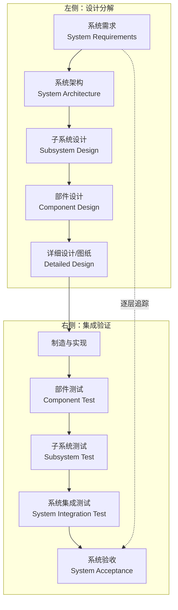

对于人形机器人，左侧需求通常包括：双足行走速度、负载能力、续航时间、安全工作空间、跌倒自保护、人机协作等级、成本目标等。这些需求逐层分解为：执行器扭矩/转速、关节 DOF、连杆质量与刚度、传感器精度、控制周期、电池能量、结构安全系数等。右侧验证则通过单元测试（电机测试台、减速器寿命台）、子系统测试（单腿测试台、手臂测试台）、整机测试（行走、操作、跌落、EMC）直至现场试运行。

!!! note "术语解释：设计输入、技术指标、设计输出、可追溯性"
    - **设计输入（design input）**：产品必须满足的明确需求、约束和假设。
    - **技术指标（specification）**：量化描述性能、质量、环境适应性的参数集合。
    - **设计输出（design output）**：设计过程产生的结果，包括图纸、BOM、代码、工艺文件。
    - **可追溯性（traceability）**：需求、设计、验证之间双向可追踪的关系。

### 8.1.2 设计输入：任务、环境与约束

人形机器人的设计输入可分为三类：**任务需求、环境约束、资源约束**。任务需求决定机器人需要做什么；环境约束决定它必须在怎样的场景中可靠运行；资源约束决定成本、周期、团队能力与供应链边界。

!!! note "术语解释：任务需求、环境约束、资源约束、生命周期成本"
    - **任务需求（mission requirement）**：机器人应完成的功能与性能目标。
    - **环境约束（environmental constraint）**：温度、湿度、粉尘、振动、电磁干扰、人机密度等外部条件。
    - **资源约束（resource constraint）**：预算、时间、人才、供应链与制造能力。
    - **生命周期成本（Life Cycle Cost, LCC）**：产品从概念到报废全过程产生的总成本。

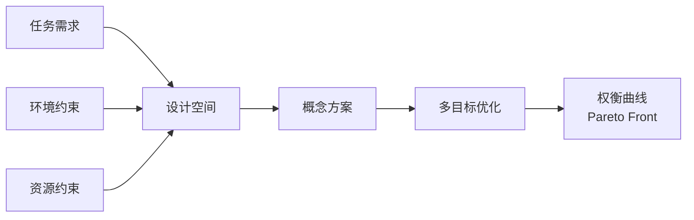

设计输入通常写成需求规格书（Requirements Specification）。例如，某工厂物流人形机器人的需求可表达为：

| 需求类别 | 示例指标 |
|---|---|
| 运动 | 平地行走 ≥ 1.0 m/s，可上下 15° 斜坡，单腿站立稳定性裕度 ≥ 30 mm |
| 操作 | 双臂 7-DOF，末端负载 ≥ 5 kg，重复定位精度 ± 1 mm |
| 感知 | RGB-D 相机 × 4，LiDAR × 1，IMU × 1，力/力矩传感器 ≥ 6 轴 × 4 |
| 续航 | 连续运行 ≥ 4 h，电池可热插拔 |
| 安全 | 协作速度 ≤ 1.5 m/s，碰撞力 ≤ 150 N，满足 ISO/TS 15066 |
| 环境 | 工作温度 5–40 °C，IP54 |
| 成本 | 目标 BOM 成本 ≤ 15 万美元（小批量） |

### 8.1.3 为什么选择人形形态：动因与代价

人形形态的核心动因是**环境兼容性（environmental compatibility）**：人类社会的基础设施、工具、楼梯、门把手、操作台面都按人体尺寸与运动能力设计。轮式、履带式或四足机器人虽在某些场景更高效，但在为人类构建的环境中往往需要额外改造。人形机器人可直接使用既有设施，降低部署成本。

!!! note "术语解释：环境兼容性、拟人化、双足、通用性、专用性"
    - **环境兼容性**：机器人形态与尺寸适配既有环境的能力。
    - **拟人化（anthropomorphism）**：赋予机器人体态、行为或交互特征以类似人类的属性。
    - **双足（bipedal）**：用两条腿行走的 locomotion 方式。
    - **通用性（generality）**：在多种任务与环境中保持可用性的能力。
    - **专用性（specialization）**：针对特定任务优化的能力，通常以牺牲通用性为代价。

然而，人形形态的代价显著：

1. **高自由度**：通常需要 28–52 个执行自由度，导致控制、标定、维护复杂。
2. **动态不稳定**：双足支撑面小，必须主动控制平衡，能耗高于轮式。
3. **高功率密度**：关节空间有限，要求电机、减速器、驱动器高度集成。
4. **安全敏感**：跌倒可能伤及人与物，必须设计轻量结构、柔顺控制与自保护策略。

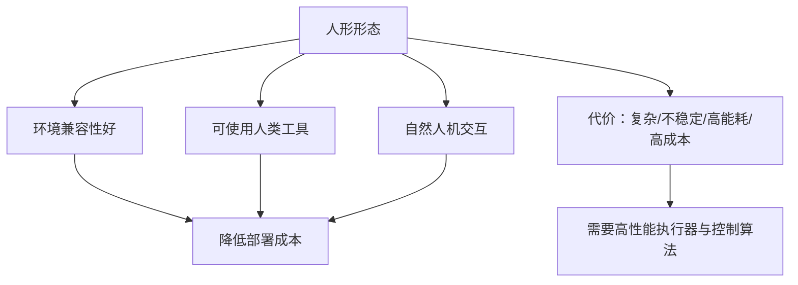

### 8.1.4 设计流程：概念设计 → 详细设计 → 验证

典型人形机器人设计流程包括以下阶段：

1. **概念设计**：确定功能、形态、尺寸、DOF、行走方式、操作方式。
2. **系统架构设计**：划分子系统（躯干、手臂、腿、头、电源、计算、感知）。
3. **运动学与动力学建模**：建立连杆模型、计算工作空间、验证稳定性。
4. **结构详细设计**：CAD 建模、材料选择、强度/刚度/模态/疲劳分析。
5. **执行器与关节设计**：电机、减速器、驱动器、传感器、热管理集成。
6. **控制与软件设计**： walking、balancing、manipulation、safety 软件栈。
7. **原型制造与测试**：快速原型、单腿/单臂测试台、整机集成测试。
8. **迭代优化**：根据测试数据更新设计与控制参数。

!!! note "术语解释：概念设计、详细设计、原型、迭代优化"
    - **概念设计**：在信息不充分时形成若干可行方案并比较选优。
    - **详细设计**：把选定方案转化为可制造的图纸、BOM 与工艺。
    - **原型（prototype）**：用于验证设计假设的早期样机。
    - **迭代优化（iterative optimization）**：基于测试反馈反复改进设计。


### 8.1.5 设计权衡与多目标优化

人形机器人设计本质上是多目标优化问题：提高速度往往增加能耗，提高刚度往往增加质量，提高自由度往往增加控制复杂度。这些冲突目标无法同时最优，只能在 **Pareto 前沿（Pareto front）** 上寻找可接受的权衡方案。

!!! note "术语解释：多目标优化、Pareto 前沿、权衡、设计变量、目标函数"
    - **多目标优化（multi-objective optimization）**：同时优化多个可能冲突的目标函数。
    - **Pareto 前沿**：所有 Pareto 最优解在目标空间中构成的边界。
    - **权衡（trade-off）**：改善一个目标时不得不牺牲另一个目标。
    - **设计变量（design variable）**：可调整的参数，如连杆长度、材料厚度、电机型号。
    - **目标函数（objective function）**：需要最大化或最小化的性能指标。

以腿部设计为例，常见目标函数包括：

- 最小化腿部质量 $m_{\text{leg}}$，降低摆动惯量。
- 最大化关节扭矩密度 $T/V$，保证运动能力。
- 最大化结构刚度 $k$，减小变形与振动。
- 最小化成本 $C$，提高商业化可行性。

多目标优化的一般形式为：

$$
\min_{\mathbf{x}} \, \left[f_1(\mathbf{x}), f_2(\mathbf{x}), \ldots, f_k(\mathbf{x})\right]
$$

约束条件包括几何约束、强度约束、驱动能力约束、工作空间约束等。

!!! note "术语解释：约束条件、可行域、优化算法、遗传算法、粒子群"
    - **约束条件（constraint）**：设计变量必须满足的限制。
    - **可行域（feasible region）**：满足所有约束的设计变量集合。
    - **优化算法（optimization algorithm）**：搜索最优解的数值方法。
    - **遗传算法（genetic algorithm）**：模拟自然选择的全局优化方法。
    - **粒子群优化（particle swarm optimization）**：模拟群体行为的优化算法。

```mermaid
xychart-beta
    title "人形机器人设计 Pareto 前沿示意"
    x-axis "成本"
    y-axis "性能"
    line [0.9, 0.85, 0.75, 0.6, 0.4, 0.2]
    annotation "Pareto front" [0.5, 0.7]
```

工程实践中，设计者通常先确定主导目标（如成本或性能），再在其他目标上设定最低可接受阈值，从而把多目标问题转化为带约束的单目标或序贯优化问题。

---

## 8.2 自由度与关节构型

### 8.2.1 自由度（DOF）与机构学基础

**自由度（Degree of Freedom, DOF）**是描述机构独立运动参数数目的量。对于空间中的单个刚体，其有 6 个自由度：3 个平移（沿 x、y、z 轴）和 3 个旋转（绕 x、y、z 轴）。对于由关节连接的连杆机构，其自由度可通过 **Grübler-Kutzbach 公式** 计算[2][3]：

$$
M = 6(n - 1) - \sum_{i=1}^{j}(6 - f_i)
$$

其中，$n$ 为连杆数（包括基座），$j$ 为关节数，$f_i$ 为第 $i$ 个关节的自由度数。对于平面机构，公式退化为 $M = 3(n-1) - \sum_{i}(3 - f_i)$。

!!! note "术语解释：自由度（DOF）、刚体、关节、连杆、Grübler-Kutzbach 公式"
    - **自由度（DOF）**：确定机构位形所需的独立坐标数。
    - **刚体（rigid body）**：假设内部任意两点距离不变的物体。
    - **关节（joint）**：连接相邻连杆并允许特定相对运动的机构单元。
    - **连杆（link）**：机构中视为刚体的构件。
    - **Grübler-Kutzbach 公式**：根据连杆数与关节自由度计算机构总自由度的公式。

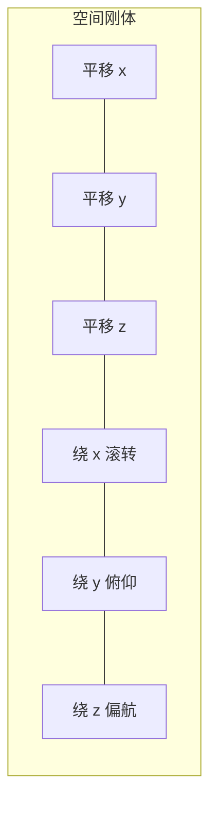

常见关节类型及其自由度：

| 关节类型 | 符号 | 自由度 | 运动描述 |
|---|---|---|---|
| 转动关节 | Revolute (R) | 1 | 绕固定轴旋转 |
| 移动关节 | Prismatic (P) | 1 | 沿固定轴平移 |
| 圆柱关节 | Cylindrical (C) | 2 | 沿轴平移 + 绕轴旋转 |
| 球关节 | Spherical (S) | 3 | 三个方向旋转 |
| 万向节 | Universal (U) | 2 | 两个正交轴旋转 |
| 平面关节 | Planar (E) | 3 | 平面内两平移一旋转 |

!!! note "术语解释：转动关节、移动关节、球关节、万向节"
    - **转动关节（revolute joint）**：只允许绕一个轴旋转的关节。
    - **移动关节（prismatic joint）**：只允许沿一个轴平移的关节。
    - **球关节（spherical joint）**：允许三个方向旋转，类似肩关节。
    - **万向节（universal joint）**：允许两个正交方向旋转的关节。

### 8.2.2 人形机器人典型自由度布局

人形机器人的自由度布局通常模仿人体，但会根据任务、成本与可靠性做工程简化。一个常见整机构型为：

- **头部**：2-DOF（俯仰 + 偏航，有时增加滚转）
- **躯干**：1–3 DOF（腰俯仰/偏航/侧摆）
- **单臂**：7-DOF（肩 3 + 肘 1 + 腕 3）
- **单腿**：6-DOF（髋 3 + 膝 1 + 踝 2）
- **手/灵巧手**：每手 4–22 DOF

以 2 臂 7-DOF + 2 腿 6-DOF + 躯干 2-DOF + 头 2-DOF + 无独立手为例，总 DOF = 2×7 + 2×6 + 2 + 2 = 30。若加入 16-DOF 双手，则总 DOF 达到 62。

!!! note "术语解释：髋关节、膝关节、踝关节、肩关节、肘关节、腕关节"
    - **髋关节（hip）**：连接躯干与大腿的关节，通常有 3 个旋转自由度。
    - **膝关节（knee）**：大腿与小腿之间的关节，主要提供俯仰自由度。
    - **踝关节（ankle）**：小腿与脚之间的关节，通常有滚转/俯仰 2 个自由度。
    - **肩关节（shoulder）**：连接躯干与上臂，通常有 3 个旋转自由度。
    - **肘关节（elbow）**：上臂与前臂之间的关节，主要提供俯仰自由度。
    - **腕关节（wrist）**：前臂与手之间的关节，通常有 3 个旋转自由度。

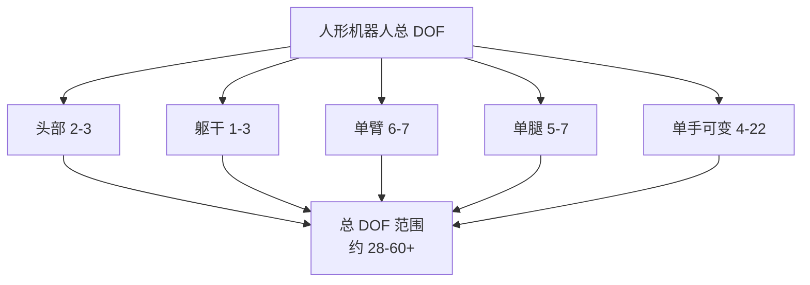

### 8.2.3 关节轴线配置：髋、膝、踝与肩、肘、腕

关节轴线配置直接影响运动范围、力矩需求与姿态奇异性。人形机器人通常采用以下正交轴线命名：

- **髋部（hip）**：通常配置为 roll（绕 x 轴）、pitch（绕 y 轴）、yaw（绕 z 轴）三个正交轴，顺序可为 R-P-Y 或 Y-P-R。
- **膝部（knee）**：仅有 pitch 轴，屈伸运动。
- **踝部（ankle）**：通常配置 roll + pitch 两轴，控制脚掌姿态。
- **肩部（shoulder）**：类似髋部，3 个正交旋转轴。
- **肘部（elbow）**：通常为 pitch 轴。
- **腕部（wrist）**：roll + pitch + yaw 或偏斜轴配置。

!!! note "术语解释：滚转、俯仰、偏航、正交轴、关节顺序"
    - **滚转（roll）**：绕 x 轴的旋转。
    - **俯仰（pitch）**：绕 y 轴的旋转。
    - **偏航（yaw）**：绕 z 轴的旋转。
    - **正交轴（orthogonal axes）**：两两垂直的旋转轴。
    - **关节顺序（joint order）**：多自由度关节中各轴的排列次序，影响雅可比与奇异构型。

髋关节轴线配置的常见选择：

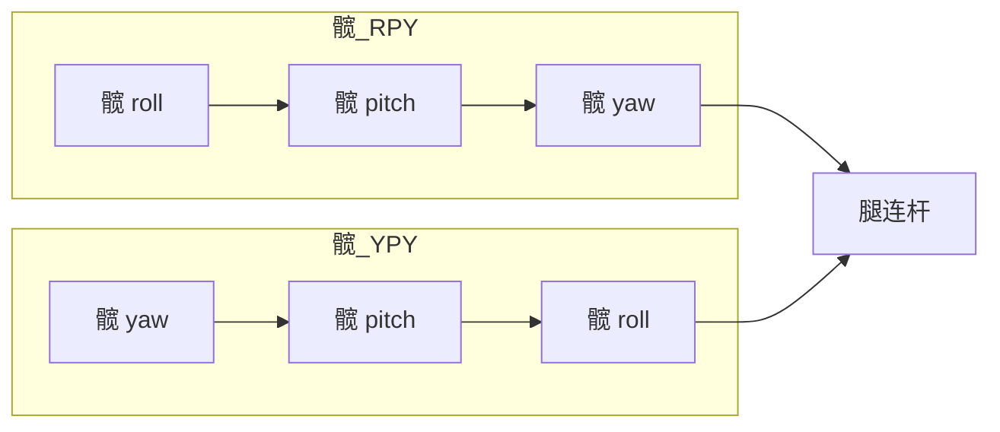

髋部 RPY 配置使俯仰轴靠近躯干中心，有利于 walking 时的前后摆动惯性控制；YPY 配置则让 yaw 轴在上下两端，便于转向与侧摆解耦。实际设计中需权衡结构空间、电缆走线、力矩传递路径与制造装配。

### 8.2.4 冗余与零空间

当机器人 DOF 大于任务所需 DOF 时，称为**运动冗余（kinematic redundancy）**。例如，7-DOF 手臂完成 6-DOF 末端位姿任务时存在 1 维冗余；双臂协作、全身移动操作也引入冗余。冗余带来灵活性，也带来了控制上的额外自由度。

!!! note "术语解释：运动冗余、零空间、自运动、优化目标"
    - **运动冗余**：机器人可用 DOF 多于任务空间维度的情形。
    - **零空间（null space）**：不改变末端任务的关节速度子空间。
    - **自运动（self-motion）**：保持末端位姿不变的关节运动。
    - **优化目标（objective）**：在零空间内最小化或最大化的次级指标。

设任务空间速度为 $\dot{\mathbf{x}} \in \mathbb{R}^m$，关节速度为 $\dot{\mathbf{q}} \in \mathbb{R}^n$，雅可比矩阵为 $\mathbf{J} \in \mathbb{R}^{m \times n}$，且 $n > m$。则：

$$
\dot{\mathbf{q}} = \mathbf{J}^\dagger \dot{\mathbf{x}} + (\mathbf{I} - \mathbf{J}^\dagger \mathbf{J}) \dot{\mathbf{q}}_0
$$

其中 $\mathbf{J}^\dagger$ 为雅可比伪逆，$(\mathbf{I} - \mathbf{J}^\dagger \mathbf{J})$ 为投影到零空间的矩阵，$\dot{\mathbf{q}}_0$ 为任意关节速度。第二项不改变末端任务速度，可用于优化姿态、远离奇异、避障或最小化关节力矩。

!!! note "术语解释：雅可比矩阵、伪逆、投影矩阵、奇异构型"
    - **雅可比矩阵（Jacobian）**：把关节速度映射到末端操作空间速度的矩阵。
    - **伪逆（pseudoinverse）**：对非方或奇异矩阵的广义逆。
    - **投影矩阵（projection matrix）**：将向量投影到特定子空间的矩阵。
    - **奇异构型（singularity）**：雅可比矩阵降秩、某些方向速度或力不可控的位形。

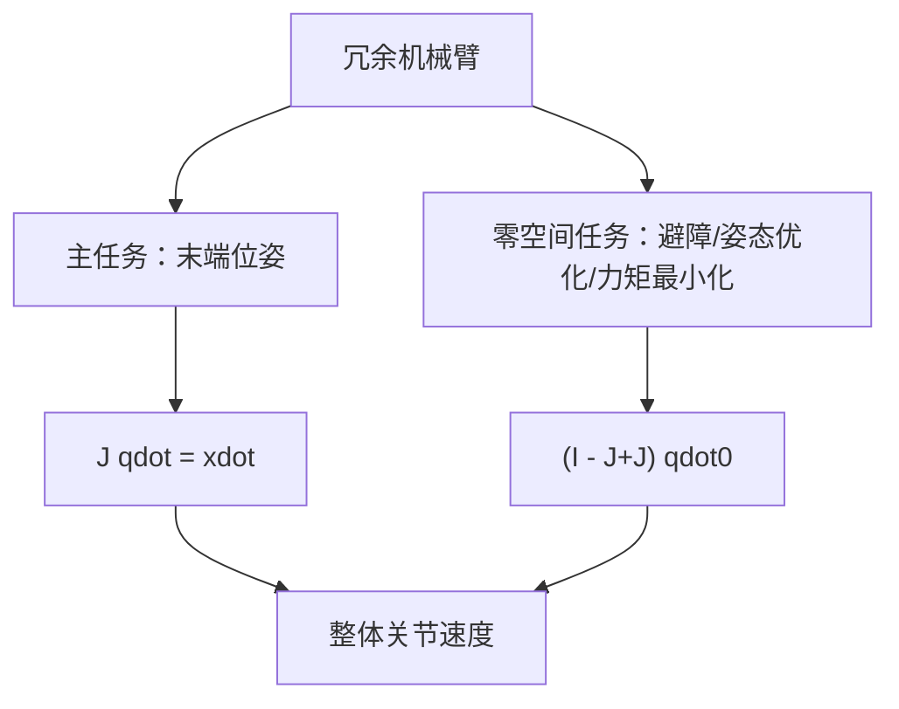

### 8.2.5 典型整机 DOF 与质量分布估算

下表汇总若干公开人形机器人的 DOF 与主要尺寸（公开资料）。这些数据会随版本更新而变化，仅用于说明设计空间。

| 机型 | 公开身高（m） | 公开质量（kg） | 公开 DOF | 备注 |
|---|---|---|---|---|
| Honda ASIMO（2011） | 1.30 | 48 | 57 | 经典电驱动人形，锂電池背包[27] |
| Boston Dynamics Atlas（液压，2020 前） | 1.50 | 89 | 28 | 液压驱动，高动态运动[35] |
| Boston Dynamics Atlas（电动，2024） | 约 1.50 | 公开资料 | 公开资料 | 全新电动设计 |
| Tesla Optimus Gen-2 | 约 1.73 | 约 63 | 公开资料（预计 40+） | 电驱动，面向制造场景[17] |
| Agility Digit | 约 1.75 | 约 65 | 公开资料 | 物流/仓储人形 |
| PAL Robotics TALOS | 1.75 | 约 95 | 32 | 扭矩可控，面向研究[公开资料] |
| Unitree H1 | 约 1.80 | 约 47 | 公开资料 | 高动态电驱动 |
| 优必选 Walker X | 约 1.30 | 约 63 | 41 | 服务/教育场景[31] |
| 傅利叶 GR-1 | 约 1.65 | 约 55 | 40 | 通用人形 |
| 智元远征 A1/A2 | 约 1.75 | 约 55 | 公开资料 | 面向工业与家庭 |

!!! note "术语解释：整机 DOF、质量分布、质心、转动惯量"
    - **整机 DOF（total DOF）**：机器人全部独立运动自由度的总和。
    - **质量分布（mass distribution）**：质量在机器人各连杆上的空间分布。
    - **质心（Center of Mass, CoM）**：质量加权平均位置。
    - **转动惯量（moment of inertia）**：描述刚体抵抗角加速度能力的量。

### 8.2.6 腕部与踝部：末端位姿与稳定性

腕部和踝部是肢体末端的“末端执行器接口”。腕部决定手的姿态与可达范围；踝部决定脚板姿态，是双足稳定的关键。

对于踝关节，pitch 轴控制脚掌俯仰（上坡/下坡/脚尖站立），roll 轴控制脚掌侧倾（侧向平衡）。踝部力矩需求通常很高：在单腿支撑阶段，全身重量绕踝关节产生力矩，且地面反作用力通过踝部传递。

!!! note "术语解释：末端执行器、地面反作用力、力矩、力臂"
    - **末端执行器（end-effector）**：机器人肢体末端与环境交互的装置，如手、脚、工具。
    - **地面反作用力（Ground Reaction Force, GRF）**：地面施加于脚部的接触力。
    **力矩（torque/moment）**：力绕某点或某轴产生转动效应的量，$\mathbf{M} = \mathbf{r} \times \mathbf{F}$。
    - **力臂（moment arm）**：力的作用线到转动轴的垂直距离。

---

## 8.3 运动学基础

### 8.3.1 连杆、关节与坐标系

**运动学（kinematics）**研究物体运动的几何关系，而不考虑产生运动的力。机器人运动学的基本单元是**连杆（link）**和**关节（joint）**。为描述相邻连杆之间的相对位姿，需在每一连杆上固连一个坐标系。

!!! note "术语解释：运动学、连杆、关节、坐标系、位姿"
    - **运动学（kinematics）**：研究物体位置、速度、加速度等几何运动量之间关系的学科。
    - **连杆（link）**：机器人机构中视为刚体的构件。
    - **关节（joint）**：连接相邻连杆并约束其相对运动的元件。
    - **坐标系（coordinate frame）**：由原点与一组正交基向量组成的空间参考系。
    - **位姿（pose）**：包括位置（position）和姿态（orientation）的完整空间描述。

为系统描述连杆之间的几何关系，Denavit 与 Hartenberg 于 1955 年提出 **DH 参数法（Denavit-Hartenberg parameters）**。经典 DH 用四个参数 $(\theta_i, d_i, a_i, \alpha_i)$ 描述相邻坐标系之间的变换关系[2][3][6]：

- $\theta_i$：绕 $z_i$ 轴从 $x_{i-1}$ 到 $x_i$ 的旋转角。
- $d_i$：沿 $z_i$ 轴从 $x_{i-1}$ 到 $x_i$ 的距离。
- $a_i$：沿 $x_i$ 轴从 $z_i$ 到 $z_{i+1}$ 的距离。
- $\alpha_i$：绕 $x_i$ 轴从 $z_i$ 到 $z_{i+1}$ 的旋转角。

**改进型 DH（modified DH, mDH）**则把连杆长度 $a_{i-1}$ 和扭角 $\alpha_{i-1}$ 放在前一根连杆上，使得变换顺序略有不同。改进型 DH 特别适用于含 prismatic 关节或闭环机构的建模，且在工业界与 ROS/URDF 中广泛使用[2]。

!!! note "术语解释：DH 参数、改进型 DH、连杆长度、扭角、关节角、连杆偏距"
    - **DH 参数**：用四个参数描述相邻连杆坐标系变换的标准方法。
    - **改进型 DH（modified DH）**：把连杆几何参数前置的 DH 变体，常用于 ROS/URDF。
    - **连杆长度（link length）$a$**：相邻关节轴线之间的公垂线长度。
    - **扭角（twist angle）$\alpha$**：相邻关节轴线之间的夹角。
    - **关节角（joint angle）$\theta$**：绕关节轴的旋转角（转动关节变量）。
    - **连杆偏距（link offset）$d$**：沿关节轴的平移（移动关节变量）。

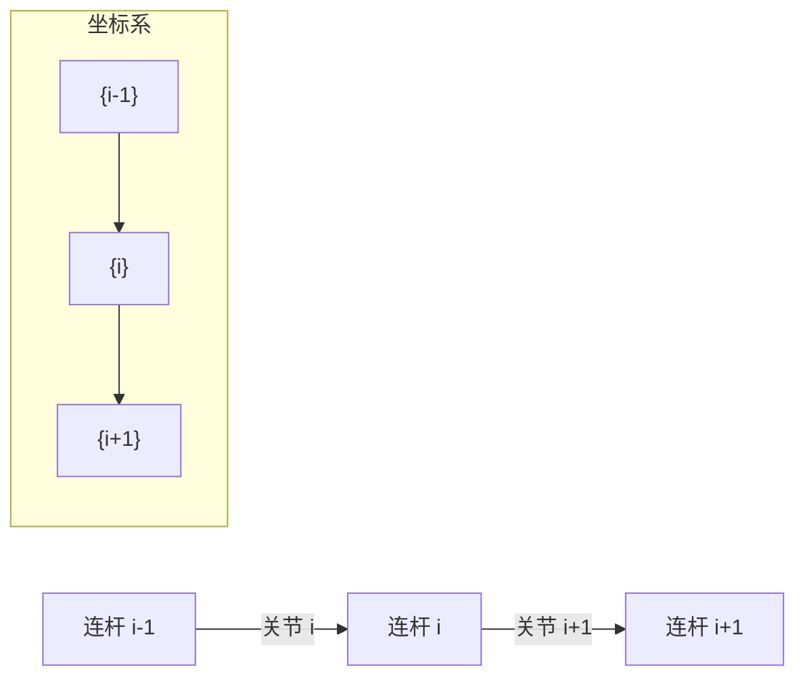

### 8.3.2 齐次变换矩阵

空间中两个坐标系之间的变换可用 **齐次变换矩阵（homogeneous transformation matrix）** $\mathbf{T} \in SE(3)$ 表示：

$$
\mathbf{T} = \begin{bmatrix}
\mathbf{R} & \mathbf{p} \\
\mathbf{0}^T & 1
\end{bmatrix}
$$

其中 $\mathbf{R} \in SO(3)$ 是 $3 \times 3$ 旋转矩阵，$\mathbf{p} \in \mathbb{R}^3$ 是平移向量。$SE(3)$ 与 $SO(3)$ 分别是三维特殊欧氏群与特殊正交群。

!!! note "术语解释：齐次变换矩阵、旋转矩阵、平移向量、SE(3)、SO(3)"
    - **齐次变换矩阵**：把旋转和平移统一为 $4 \times 4$ 矩阵的表示方法。
    - **旋转矩阵（rotation matrix）**：描述坐标系或向量旋转的正交矩阵，$\mathbf{R}^T\mathbf{R} = \mathbf{I}$，$\det(\mathbf{R}) = 1$。
    - **平移向量（translation vector）**：描述坐标系原点相对位移的向量。
    - **$SE(3)$**：三维特殊欧氏群，由旋转矩阵与平移向量组成。
    - **$SO(3)$**：三维特殊正交群，由所有 $3 \times 3$ 旋转矩阵组成。

对于改进型 DH，相邻坐标系之间的齐次变换为：

$$
{}^{i-1}\mathbf{T}_i = \text{Rot}_x(\alpha_{i-1}) \cdot \text{Trans}_x(a_{i-1}) \cdot \text{Rot}_z(\theta_i) \cdot \text{Trans}_z(d_i)
$$

写成矩阵形式：

$$
{}^{i-1}\mathbf{T}_i = \begin{bmatrix}
c\theta_i & -s\theta_i & 0 & a_{i-1} \\
s\theta_i c\alpha_{i-1} & c\theta_i c\alpha_{i-1} & -s\alpha_{i-1} & -d_i s\alpha_{i-1} \\
s\theta_i s\alpha_{i-1} & c\theta_i s\alpha_{i-1} & c\alpha_{i-1} & d_i c\alpha_{i-1} \\
0 & 0 & 0 & 1
\end{bmatrix}
$$

其中 $c\theta_i = \cos\theta_i$，$s\theta_i = \sin\theta_i$。

!!! note "术语解释：正弦、余弦、欧拉角、 roll-pitch-yaw"
    - **正弦/余弦（sine/cosine）**：直角三角形中对边/斜边、邻边/斜边的比值，描述旋转分量。
    - **欧拉角（Euler angles）**：用三个连续绕坐标轴的旋转描述姿态。
    - **roll-pitch-yaw**：绕固定坐标轴 x-y-z 顺序旋转的姿态表示。

### 8.3.3 正运动学：从关节空间到操作空间

**正运动学（forward kinematics）**解决：给定关节角 $\mathbf{q}$，计算末端执行器在基坐标系中的位姿。通过连乘各连杆变换矩阵得到：

$$
{}^0\mathbf{T}_n(\mathbf{q}) = {}^0\mathbf{T}_1(q_1) \cdot {}^1\mathbf{T}_2(q_2) \cdots {}^{n-1}\mathbf{T}_n(q_n)
$$

末端位姿由 ${}^0\mathbf{T}_n$ 的旋转部分 $\mathbf{R}$ 和平移部分 $\mathbf{p}$ 给出。

!!! note "术语解释：正运动学、关节空间、操作空间、末端执行器"
    - **正运动学（forward kinematics）**：由关节变量计算末端位姿的映射。
    - **关节空间（joint space）**：以关节变量为坐标的空间。
    - **操作空间（task/operational space）**：以末端位姿为坐标的空间。
    - **末端执行器（end-effector）**：机器人与环境交互的末端装置。

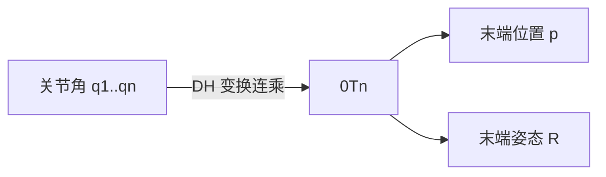

### 8.3.4 Python 算例 1：7-DOF 机械臂改进型 DH 正运动学

以下代码定义一个 7-DOF 串联机械臂的改进型 DH 参数表，计算各连杆齐次变换矩阵并提取末端位姿。该算例使用 `numpy`，可在任意 Python 环境中运行。

```python
import numpy as np

# 7-DOF 机械臂改进型 DH 参数表
# 列：alpha_{i-1}, a_{i-1}, d_i, theta_i（theta 为关节变量，此处为示例配置）
# 单位：米（m）、弧度（rad）
mdh_table = np.array([
    [0.0,      0.0,    0.180,  0.0],      # 关节 1
    [-np.pi/2, 0.0,    0.0,    -np.pi/2], # 关节 2
    [np.pi/2,  0.0,    0.350,  0.0],      # 关节 3
    [-np.pi/2, 0.0,    0.0,    0.0],      # 关节 4
    [np.pi/2,  0.0,    0.320,  0.0],      # 关节 5
    [-np.pi/2, 0.0,    0.0,    0.0],      # 关节 6
    [np.pi/2,  0.0,    0.110,  0.0],      # 关节 7
], dtype=float)

def rot_x(alpha):
    """绕 x 轴旋转 alpha 角的 4x4 齐次变换矩阵。"""
    ca, sa = np.cos(alpha), np.sin(alpha)
    return np.array([
        [1, 0,  0, 0],
        [0, ca, -sa, 0],
        [0, sa,  ca, 0],
        [0, 0,  0, 1]
    ])

def trans_x(a):
    """沿 x 轴平移 a 的 4x4 齐次变换矩阵。"""
    return np.array([
        [1, 0, 0, a],
        [0, 1, 0, 0],
        [0, 0, 1, 0],
        [0, 0, 0, 1]
    ])

def rot_z(theta):
    """绕 z 轴旋转 theta 角的 4x4 齐次变换矩阵。"""
    ct, st = np.cos(theta), np.sin(theta)
    return np.array([
        [ct, -st, 0, 0],
        [st,  ct, 0, 0],
        [0,   0, 1, 0],
        [0,   0, 0, 1]
    ])

def trans_z(d):
    """沿 z 轴平移 d 的 4x4 齐次变换矩阵。"""
    return np.array([
        [1, 0, 0, 0],
        [0, 1, 0, 0],
        [0, 0, 1, d],
        [0, 0, 0, 1]
    ])

def mdh_transform(alpha_prev, a_prev, d, theta):
    """改进型 DH 单连杆齐次变换：Rot_x * Trans_x * Rot_z * Trans_z。"""
    return rot_x(alpha_prev) @ trans_x(a_prev) @ rot_z(theta) @ trans_z(d)

def forward_kinematics_7dof(mdh, q):
    """
    给定 mDH 参数表和关节角向量 q，返回末端齐次变换矩阵。
    mdh: Nx4 数组，列顺序 [alpha_{i-1}, a_{i-1}, d_i, theta_i_offset]
    q:   Nx1 关节变量（替换 theta_i_offset）
    """
    T = np.eye(4)
    transforms = []
    for i, row in enumerate(mdh):
        alpha_prev, a_prev, d, theta_offset = row
        theta = theta_offset + q[i]
        Ti = mdh_transform(alpha_prev, a_prev, d, theta)
        T = T @ Ti
        transforms.append(T.copy())
    return T, transforms

# 示例关节角：零位附近配置
q_example = np.array([0.1, -0.5, 0.2, 0.8, -0.3, 0.6, 0.4])

T_end, Ts = forward_kinematics_7dof(mdh_table, q_example)
R_end = T_end[:3, :3]
p_end = T_end[:3, 3]

print("末端位置 (m):", p_end)
print("末端旋转矩阵:\n", R_end)
print("末端位姿齐次变换矩阵:\n", T_end)

# 验证旋转矩阵正交性
ortho_error = np.max(np.abs(R_end.T @ R_end - np.eye(3)))
print("旋转矩阵正交性误差:", ortho_error)
```

!!! note "术语解释：齐次变换连乘、单位矩阵、正交性"
    - **齐次变换连乘**：通过矩阵乘法复合多个坐标系之间的变换。
    - **单位矩阵（identity matrix）**：对角线为 1、其余为 0 的方阵，任何矩阵乘以单位矩阵不变。
    - **正交性（orthogonality）**：旋转矩阵满足 $\mathbf{R}^T\mathbf{R} = \mathbf{I}$，保持向量长度与夹角不变。

### 8.3.5 逆运动学：从操作空间到关节空间

**逆运动学（inverse kinematics, IK）**解决：给定末端期望位姿，求满足条件的关节角。与正运动学不同，IK 通常无解析解，且可能存在多解或无解[2][3]。

对于满足 **Pieper 条件** 的 6-DOF 机械臂（腕部三轴交于一点），存在解析闭式解。对于 7-DOF 或更一般构型，常用数值方法：Jacobian 伪逆、梯度下降、优化（如 Levenberg-Marquardt）或神经网络近似。

!!! note "术语解释：逆运动学、解析解、数值解、Pieper 条件"
    - **逆运动学（inverse kinematics）**：由末端位姿求关节变量的映射。
    - **解析解（closed-form solution）**：用有限公式直接求出的解。
    - **数值解（numerical solution）**：通过迭代逼近满足精度要求的解。
    - **Pieper 条件**：6-DOF 机械臂腕部三轴交于一点时可解析求解逆运动学的几何条件。

#### 8.3.6 旋量理论与指数积（PoE）

Denavit-Hartenberg 参数法以连杆坐标系为媒介，把正运动学表示为一系列相邻坐标系变换的连乘。这种方法系统、通用，但在实际机构设计中，设计者往往更关心**关节轴（joint axis）**本身在空间中的几何位置与方向，而不是为每一根连杆定义的中间坐标系。**旋量理论（screw theory）**与**指数积公式（Product of Exponentials, PoE）**正是从关节轴的几何直观出发描述机器人运动学的方法[5][6]。

!!! note "术语解释：旋量、螺旋轴、关节轴、指数积（PoE）"
    - **旋量（screw）**：同时描述刚体瞬时转动与平动的六维几何量，可视为“轴+节距”的组合。
    - **螺旋轴（screw axis）**：刚体绕其旋转并沿其平移的空间直线，由方向向量与轴上一点确定。
    - **关节轴（joint axis）**：关节允许相对运动的轴线，是旋量理论中的基本几何元素。
    - **指数积（Product of Exponentials, PoE）**：把机器人正运动学写成各关节螺旋轴指数映射连乘的公式。

在三维空间中，一个单位旋量可用 6 维向量 $\mathbf{S} = (\boldsymbol{\omega}, \mathbf{v})$ 表示。对于转动关节，$\|\boldsymbol{\omega}\| = 1$，$\mathbf{v} = -\boldsymbol{\omega} \times \mathbf{q}$，其中 $\mathbf{q}$ 为轴上任意一点；对于移动关节，$\boldsymbol{\omega} = \mathbf{0}$，$\|\mathbf{v}\| = 1$。把旋量写成 $4 \times 4$ 矩阵形式 $[\mathbf{S}]$，则**矩阵指数（matrix exponential）** $e^{[\mathbf{S}]\theta}$ 给出沿该螺旋轴运动 $\theta$（转动角或移动距离）所产生的齐次变换。

PoE 正运动学公式为：

$$
\mathbf{T}(\boldsymbol{\theta}) = e^{[\mathbf{S}_1]\theta_1} \, e^{[\mathbf{S}_2]\theta_2} \, \cdots \, e^{[\mathbf{S}_n]\theta_n} \, \mathbf{M}
$$

其中 $\mathbf{M} \in SE(3)$ 为机器人处于**初始位形（home configuration）**时末端坐标系相对于基座的位姿，$\mathbf{S}_i$ 为第 $i$ 个关节在初始位形下的螺旋轴。该公式直接以关节轴为对象，无需为每根连杆建立中间坐标系[5]。

PoE 相对于传统 DH 的主要优势体现在：

1. **几何直观**：设计者可从 CAD 模型中直接读取关节轴线，立即构造 $\mathbf{S}_i$，无需为每一连杆定义 $z_i$、$x_i$ 轴。
2. **无中间坐标系歧义**：DH 参数对坐标系选择敏感，改进型 DH 与经典 DH 容易混淆；PoE 只需要基座、末端和初始位形。
3. **便于参数辨识**：螺旋轴参数直接从几何测量获得，校准误差可表示为轴方向与位置的微小平移/旋转。
4. **与机构设计天然契合**：在概念设计阶段，设计者往往先确定关节布局，再细化连杆形状；PoE 与这一流程一致。

!!! note "术语解释：初始位形、home configuration、螺旋轴参数、矩阵指数"
    - **初始位形（home configuration）**：所有关节变量为零（或参考值）时机器人的空间构型。
    - **矩阵指数（matrix exponential）**：把李代数元素映射到李群元素的运算，$e^{[\mathbf{S}]\theta}$ 表示沿螺旋轴的有限运动。
    - **螺旋轴参数**：描述关节轴方向与位置的 6 维量 $(\boldsymbol{\omega}, \mathbf{v})$。

对于一个绕单位轴 $\boldsymbol{\omega}$ 转动 $\theta$ 角的旋转关节，其矩阵指数为：

$$
e^{[\mathbf{S}]\theta} = \begin{bmatrix}
e^{[\boldsymbol{\omega}]\theta} & (\mathbf{I} - e^{[\boldsymbol{\omega}]\theta})(\boldsymbol{\omega} \times \mathbf{v}) + \boldsymbol{\omega}\boldsymbol{\omega}^T \mathbf{v}\,\theta \\
\mathbf{0}^T & 1
\end{bmatrix}
$$

其中 $[\boldsymbol{\omega}]$ 为 $\boldsymbol{\omega}$ 的反对称矩阵，$e^{[\boldsymbol{\omega}]\theta}$ 即为 Rodrigues 旋转公式对应的旋转矩阵。对于移动关节：

$$
e^{[\mathbf{S}]\theta} = \begin{bmatrix}
\mathbf{I} & \mathbf{v}\,\theta \\
\mathbf{0}^T & 1
\end{bmatrix}
$$

**二维 PoE 示例：平面 2-DOF RR 机械臂**

考虑一个平面 2-DOF 转动关节机械臂，基座位于原点，第一关节轴垂直于纸面向外，第二关节轴平行于第一关节轴，连杆长度分别为 $L_1, L_2$。初始位形时两臂沿 x 轴伸直，因此末端 home 位姿为：

$$
\mathbf{M} = \begin{bmatrix}
1 & 0 & 0 & L_1 + L_2 \\
0 & 1 & 0 & 0 \\
0 & 0 & 1 & 0 \\
0 & 0 & 0 & 1
\end{bmatrix}
$$

两关节的螺旋轴（均为转动关节，$\boldsymbol{\omega}_1 = \boldsymbol{\omega}_2 = (0,0,1)^T$）为：

$$
\mathbf{S}_1 = \begin{bmatrix} 0 \\ 0 \\ 1 \\ 0 \\ 0 \\ 0 \end{bmatrix}, \quad
\mathbf{S}_2 = \begin{bmatrix} 0 \\ 0 \\ 1 \\ 0 \\ -L_1 \\ 0 \end{bmatrix}
$$

正运动学为：

$$
\mathbf{T}(\theta_1, \theta_2) = e^{[\mathbf{S}_1]\theta_1} \, e^{[\mathbf{S}_2]\theta_2} \, \mathbf{M}
$$

展开后末端位置为：

$$
\mathbf{p}(\theta_1, \theta_2) = \begin{bmatrix}
L_1 \cos\theta_1 + L_2 \cos(\theta_1 + \theta_2) \\
L_1 \sin\theta_1 + L_2 \sin(\theta_1 + \theta_2) \\
0
\end{bmatrix}
$$

这与传统 DH 连乘结果一致，但推导过程直接来自关节轴的几何位置。

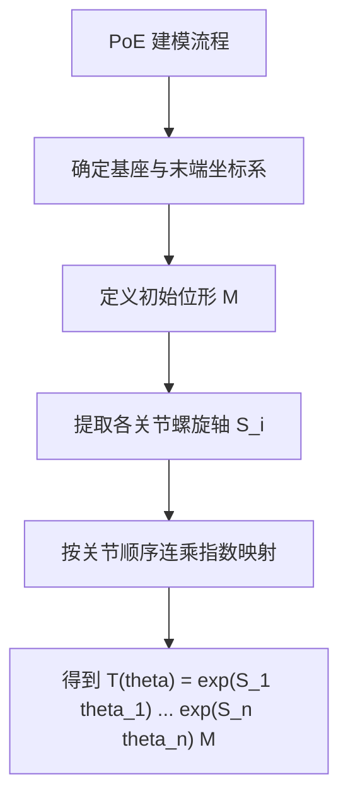

!!! note "术语解释：Rodrigues 旋转公式、反对称矩阵、平面 RR 机械臂"
    - **Rodrigues 旋转公式**：由旋转轴与旋转角直接构造旋转矩阵的公式。
    - **反对称矩阵（skew-symmetric matrix）**：满足 $[\mathbf{a}]^T = -[\mathbf{a}]$ 的矩阵，用于把叉乘写成矩阵乘法。
    - **平面 RR 机械臂**：由两个转动关节组成的平面二连杆机械臂。

#### 8.3.7 对偶四元数与位姿插值

**对偶四元数（dual quaternion）**是四元数的推广，用 8 个实数 $\hat{\mathbf{q}} = \mathbf{q}_r + \varepsilon \mathbf{q}_d$ 表示，其中 $\mathbf{q}_r$ 为实部四元数，$\mathbf{q}_d$ 为对偶部四元数，$\varepsilon$ 满足 $\varepsilon^2 = 0$。对偶四元数能紧凑地表示刚体位姿——同时包含旋转与平移——并且具有比齐次变换矩阵更优的插值性质[5][6]。

!!! note "术语解释：对偶四元数、对偶部、实部四元数、对偶数"
    - **对偶四元数（dual quaternion）**：由实部四元数与对偶部四元数相加构成的 8 维数，$\hat{\mathbf{q}} = \mathbf{q}_r + \varepsilon \mathbf{q}_d$。
    - **对偶部（dual part）**：含对偶单位 $\varepsilon$ 的部分，描述平移信息。
    - **实部四元数（real quaternion）**：描述旋转的普通四元数。
    - **对偶数（dual number）**：形如 $a + \varepsilon b$ 且 $\varepsilon^2 = 0$ 的数。

刚体位姿 $(\mathbf{R}, \mathbf{p})$ 对应的对偶四元数为：

$$
\hat{\mathbf{q}} = \mathbf{q}_r + \varepsilon \, \frac{1}{2} \mathbf{t} \, \mathbf{q}_r
$$

其中 $\mathbf{q}_r$ 为旋转矩阵 $\mathbf{R}$ 对应的单位四元数，$\mathbf{t} = (0, \mathbf{p})$ 为纯虚四元数（把平移向量嵌入四元数）。对偶四元数的乘法同时复合旋转与平移，且避免了 $SE(3)$ 矩阵乘法带来的数值漂移。

位姿插值是人形机器人轨迹规划中的常见需求。若直接用欧拉角或 roll-pitch-yaw 插值，可能遇到**万向节锁（gimbal lock）**问题：当俯仰角接近 $\pm 90°$ 时，滚转与偏航失去独立意义，导致姿态插值出现不连续或异常路径。四元数插值（Slerp）可避免万向节锁，但只能插值旋转；对偶四元数插值（ScLERP，screw linear interpolation）可同时插值旋转与平移，并且沿着同一螺旋轴运动，得到最短路径意义上的“直线”位姿变化[5]。

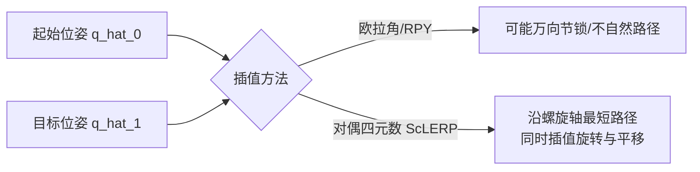

!!! note "术语解释：万向节锁、Slerp、ScLERP、最短路径插值"
    - **万向节锁（gimbal lock）**：某些姿态下欧拉角参数化失去一个自由度，导致插值与控制奇异。
    - **Slerp（Spherical Linear Interpolation）**：单位四元数间的球面线性插值。
    - **ScLERP（Screw Linear Interpolation）**：对偶四元数间的螺旋线性插值，同时处理旋转与平移。
    - **最短路径插值**：在姿态空间中沿测地线进行的插值，避免不必要的绕路。

ScLERP 公式与四元数 Slerp 类似：

$$
\hat{\mathbf{q}}(\lambda) = \frac{\sin\left((1-\lambda)\hat{\theta}\right)}{\sin\hat{\theta}} \, \hat{\mathbf{q}}_0 + \frac{\sin\left(\lambda\hat{\theta}\right)}{\sin\hat{\theta}} \, \hat{\mathbf{q}}_1, \quad \lambda \in [0,1]
$$

其中 $\hat{\theta} = \theta + \varepsilon d$ 为对偶角，$\theta$ 为旋转角，$d$ 为沿螺旋轴的平移距离。该插值产生的轨迹在 $SE(3)$ 上是一条恒定节距的螺旋线，自然对应人形机器人手臂或躯干的复合运动。

在人形机器人应用中，对偶四元数常用于：

1. **手臂末端位姿插值**：在抓取、传递物体时保持腕部姿态平滑过渡。
2. **多肢体协调**：把躯干、双臂、双腿的位姿统一表示为对偶四元数，便于设计协调控制律。
3. **动画与仿真**：在数字孪生中生成自然、无奇异的人体运动轨迹。

!!! note "术语解释：姿态插值、轨迹规划、螺旋线轨迹、数字孪生"
    - **姿态插值（orientation interpolation）**：在两个姿态之间生成连续过渡姿态的过程。
    - **轨迹规划（trajectory planning）**：生成满足运动学与动力学约束的连续路径。
    - **螺旋线轨迹（helical trajectory）**：同时包含绕轴旋转和沿轴平移的轨迹。
    - **数字孪生（digital twin）**：物理系统在数字空间中的实时映射。

#### 8.3.8 运动学校准

制造与装配误差会导致实际机器人几何参数偏离名义模型。即使 DH 或 PoE 参数在 CAD 中精确设定，加工公差、轴承间隙、减速器偏心、装配变形都会引入**运动学误差（kinematic error）**。运动学校准（kinematic calibration）通过外部测量数据辨识真实几何参数，从而提高**绝对定位精度（absolute positioning accuracy）**[2][3][6]。

!!! note "术语解释：运动学校准、几何误差、绝对定位精度、重复定位精度"
    - **运动学校准（kinematic calibration）**：通过测量数据估计机器人真实几何参数的过程。
    - **几何误差（geometric error）**：由连杆长度、扭角、关节轴线位置偏差引起的运动学误差。
    - **绝对定位精度（absolute accuracy）**：末端实际位姿与指令位姿的一致程度。
    - **重复定位精度（repeatability）**：在相同条件下多次到达同一位姿的能力，主要由传动与传感器决定。

以 DH 模型为例，每个连杆有四个名义参数 $(\theta_i, d_i, a_i, \alpha_i)$，可引入微小误差 $(\Delta\theta_i, \Delta d_i, \Delta a_i, \Delta\alpha_i)$。末端位置误差与参数误差之间的关系可通过正运动学对参数求导得到：

$$
\Delta \mathbf{p} = \sum_{i=1}^{n} \left( \frac{\partial \mathbf{p}}{\partial a_i} \Delta a_i + \frac{\partial \mathbf{p}}{\partial \alpha_i} \Delta \alpha_i + \frac{\partial \mathbf{p}}{\partial d_i} \Delta d_i + \frac{\partial \mathbf{p}}{\partial \theta_i} \Delta \theta_i \right) = \mathbf{J}_{\text{cal}} \, \Delta \boldsymbol{\phi}
$$

其中 $\mathbf{J}_{\text{cal}}$ 为**标定雅可比（calibration Jacobian）**，$\Delta \boldsymbol{\phi}$ 为待辨识的参数误差向量。通过在多个位形下测量末端位置，可组成超定线性方程组：

$$
\begin{bmatrix}
\Delta \mathbf{p}^{(1)} \\
\Delta \mathbf{p}^{(2)} \\
\vdots \\
\Delta \mathbf{p}^{(m)}
\end{bmatrix}
=
\begin{bmatrix}
\mathbf{J}_{\text{cal}}^{(1)} \\
\mathbf{J}_{\text{cal}}^{(2)} \\
\vdots \\
\mathbf{J}_{\text{cal}}^{(m)}
\end{bmatrix}
\Delta \boldsymbol{\phi}
$$

用最小二乘法求解：

$$
\Delta \boldsymbol{\phi} = \left( \mathbf{J}_{\text{cal}}^T \mathbf{J}_{\text{cal}} \right)^{-1} \mathbf{J}_{\text{cal}}^T \Delta \mathbf{P}
$$

!!! note "术语解释：标定雅可比、超定方程组、最小二乘、参数辨识"
    - **标定雅可比（calibration Jacobian）**：末端位姿误差对几何参数误差的偏导数矩阵。
    - **超定方程组（overdetermined system）**：方程数多于未知数的线性系统，通常无精确解而采用最小二乘近似。
    - **最小二乘法（least squares）**：最小化误差平方和求解超定系统的方法。
    - **参数辨识（parameter identification）**：从输入输出数据估计模型未知参数的过程。

制造公差对绝对精度的影响十分显著。以一根名义长度 300 mm 的连杆为例，若实际长度偏差 ±0.1 mm，在末端产生的位置误差可能放大到 ±(n×0.1) mm（n 为相关连杆数）。对于 7-DOF 手臂，末端绝对误差通常可达数毫米；经过标定补偿后，可降至 ±0.3 mm 甚至更低。因此，高端人形机器人整机出厂前通常进行：

1. **单关节零点标定**：用高精度编码器或激光对准确定机械零位。
2. **连杆几何标定**：使用激光跟踪仪、三坐标测量机或视觉测量获取实际 DH/PoE 参数。
3. **整机末端标定**：让机器人到达若干位形，测量末端实际位姿，优化全参数。

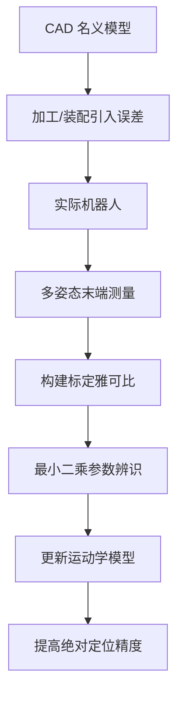

!!! note "术语解释：零点标定、激光跟踪仪、三坐标测量机、视觉测量"
    - **零点标定（zero calibration）**：确定关节机械零位与电气零位对应关系的过程。
    - **激光跟踪仪（laser tracker）**：利用激光干涉测量大空间三维坐标的高精度设备。
    - **三坐标测量机（Coordinate Measuring Machine, CMM）**：接触式高精度尺寸测量设备。
    - **视觉测量（vision-based measurement）**：利用相机与标定板估计末端位姿的方法。

运动学校准还需注意**可辨识性（identifiability）**问题：某些参数误差对末端位姿影响很小，或与关节零点误差耦合，导致无法独立辨识。提高可辨识性的方法包括：选择测量位形使标定雅可比条件数较小、固定部分已知参数、采用闭环运动链约束等。对于人形机器人，由于存在浮动基和多个闭合运动链（双腿同时触地），标定问题比固定基机械臂更复杂，通常需要结合 IMU、视觉与运动捕捉系统共同完成[6]。

!!! note "术语解释：可辨识性、条件数、闭环运动链、运动捕捉系统"
    - **可辨识性（identifiability）**：模型参数是否能从观测数据中唯一确定。
    - **条件数（condition number）**：矩阵最大与最小奇异值之比，条件数大表示辨识对噪声敏感。
    - **闭环运动链（closed kinematic chain）**：形成闭合回路的连杆连接方式，如双腿同时站立。
    - **运动捕捉系统（motion capture system）**：通过光学或惯性传感器记录物体三维运动的系统。

### 8.3.9 Python 算例 4：Jacobian 伪逆数值逆运动学

以下代码展示 3 连杆平面机械臂的数值 IK：给定目标位置，通过 Jacobian 伪逆迭代调整关节角，使末端接近目标。

```python
import numpy as np

# 3 连杆平面机械臂参数
L = np.array([0.4, 0.35, 0.25])  # 连杆长度

def fk_planar(q):
    """3-DOF 平面机械臂正运动学，返回末端位置 (x, y)。"""
    x = L[0] * np.cos(q[0]) + L[1] * np.cos(q[0]+q[1]) + L[2] * np.cos(q[0]+q[1]+q[2])
    y = L[0] * np.sin(q[0]) + L[1] * np.sin(q[0]+q[1]) + L[2] * np.sin(q[0]+q[1]+q[2])
    return np.array([x, y])

def jacobian_planar(q):
    """3-DOF 平面机械臂 2x3 Jacobian 矩阵。"""
    s1, c1 = np.sin(q[0]), np.cos(q[0])
    s12, c12 = np.sin(q[0]+q[1]), np.cos(q[0]+q[1])
    s123, c123 = np.sin(q[0]+q[1]+q[2]), np.cos(q[0]+q[1]+q[2])
    J = np.array([
        [-L[0]*s1 - L[1]*s12 - L[2]*s123, -L[1]*s12 - L[2]*s123, -L[2]*s123],
        [ L[0]*c1 + L[1]*c12 + L[2]*c123,  L[1]*c12 + L[2]*c123,  L[2]*c123]
    ])
    return J

def ik_pseudoinverse(target, q0=None, max_iter=200, tol=1e-4, alpha=0.5):
    """基于 Jacobian 伪逆的数值逆运动学。"""
    if q0 is None:
        q0 = np.zeros(3)
    q = q0.copy()
    for i in range(max_iter):
        pos = fk_planar(q)
        err = target - pos
        if np.linalg.norm(err) < tol:
            break
        J = jacobian_planar(q)
        # Jacobian 伪逆（阻尼最小二乘可提升数值稳定性）
        J_pinv = np.linalg.pinv(J)
        dq = alpha * J_pinv @ err
        q += dq
    return q, pos, i

# 目标末端位置
target = np.array([0.6, 0.4])
q_sol, pos_sol, iters = ik_pseudoinverse(target)
print("目标位置:", target)
print("求解关节角 (rad):", q_sol)
print("实际末端位置:", pos_sol)
print("位置误差:", np.linalg.norm(target - pos_sol))
print("迭代次数:", iters)
```

!!! note "术语解释：Jacobian 矩阵、伪逆、阻尼最小二乘、迭代收敛"
    - **Jacobian 矩阵**：将关节速度映射到末端操作空间速度的线性映射。
    - **伪逆（Moore-Penrose pseudoinverse）**：对非方阵或秩亏矩阵的广义逆。
    - **阻尼最小二乘（damped least squares）**：在伪逆中加入正则项 $\lambda^2 \mathbf{I}$ 以改善近奇异时的数值稳定性。
    - **迭代收敛**：数值方法逐步减小误差直至满足容差。

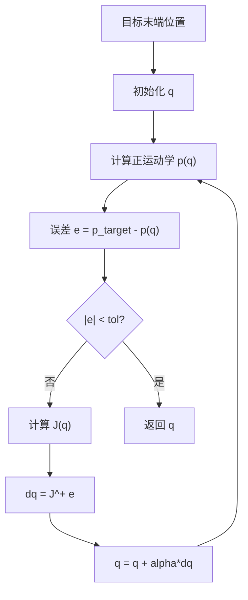

### 8.3.10 Jacobian、速度映射与奇异性

Jacobian 矩阵 $\mathbf{J}(\mathbf{q})$ 建立了关节空间速度与操作空间速度之间的关系：

$$
\dot{\mathbf{x}} = \mathbf{J}(\mathbf{q}) \dot{\mathbf{q}}
$$

其中 $\dot{\mathbf{x}}$ 可表示末端线速度、角速度或二者的组合。Jacobian 的每一列代表对应关节对末端速度的“贡献”。

!!! note "术语解释：线速度、角速度、Jacobian 列向量、速度椭球"
    - **线速度（linear velocity）**：位置对时间的变化率。
    - **角速度（angular velocity）**：姿态对时间的变化率。
    - **Jacobian 列向量**：对应关节单独运动时末端产生的速度方向与大小。
    - **速度椭球（velocity ellipsoid）**：描述关节速度到末端速度映射几何特性的椭球。

在 **奇异构型（singularity）** 处，Jacobian 降秩，某些方向的速度或力无法由关节实现。衡量奇异程度常用 **可操作性（manipulability）** 指标：

$$
w(\mathbf{q}) = \sqrt{\det(\mathbf{J}\mathbf{J}^T)}
$$

当 $w = 0$ 时，机器人处于奇异位形。

!!! note "术语解释：奇异构型、秩、可操作性、条件数"
    - **奇异构型**：Jacobian 矩阵秩亏的关节位形。
    - **秩（rank）**：矩阵线性无关行/列的最大数目。
    - **可操作性（manipulability）**：描述机器人远离奇异程度的标量指标。
    - **条件数（condition number）**：矩阵最大奇异值与最小奇异值之比，衡量数值灵敏度。

### 8.3.11 工作空间

**工作空间（workspace）**是机器人末端可达的所有位姿集合。可分为：

- **可达工作空间（reachable workspace）**：末端至少能以一种姿态到达的所有位置。
- **灵活工作空间（dexterous workspace）**：末端能以任意姿态到达的所有位置（通常更小）。

!!! note "术语解释：工作空间、可达工作空间、灵活工作空间"
    - **工作空间（workspace）**：机器人末端可到达的所有位姿集合。
    - **可达工作空间**：末端可到达的位置集合，不考虑姿态。
    - **灵活工作空间**：末端可在任意姿态下到达的位置集合。

### 8.3.12 Python 算例 2：工作空间蒙特卡洛采样

以下代码对 7-DOF 机械臂（使用 8.3.4 的 mDH 参数）进行蒙特卡洛采样，随机生成大量关节角组合，计算末端位置并绘制 3D 点云。由于 7-DOF 手臂末端位姿为 6 维，这里仅采样位置空间。

```python
import numpy as np
import matplotlib.pyplot as plt

# 复用 8.3.4 的 mDH 表与 forward_kinematics_7dof 函数
mdh_table = np.array([
    [0.0,      0.0,    0.180,  0.0],
    [-np.pi/2, 0.0,    0.0,    -np.pi/2],
    [np.pi/2,  0.0,    0.350,  0.0],
    [-np.pi/2, 0.0,    0.0,    0.0],
    [np.pi/2,  0.0,    0.320,  0.0],
    [-np.pi/2, 0.0,    0.0,    0.0],
    [np.pi/2,  0.0,    0.110,  0.0],
], dtype=float)

def rot_x(alpha):
    ca, sa = np.cos(alpha), np.sin(alpha)
    return np.array([[1,0,0,0],[0,ca,-sa,0],[0,sa,ca,0],[0,0,0,1]])

def trans_x(a):
    return np.array([[1,0,0,a],[0,1,0,0],[0,0,1,0],[0,0,0,1]])

def rot_z(theta):
    ct, st = np.cos(theta), np.sin(theta)
    return np.array([[ct,-st,0,0],[st,ct,0,0],[0,0,1,0],[0,0,0,1]])

def trans_z(d):
    return np.array([[1,0,0,0],[0,1,0,0],[0,0,1,d],[0,0,0,1]])

def mdh_transform(alpha_prev, a_prev, d, theta):
    return rot_x(alpha_prev) @ trans_x(a_prev) @ rot_z(theta) @ trans_z(d)

def forward_kinematics_7dof(mdh, q):
    T = np.eye(4)
    for i, row in enumerate(mdh):
        alpha_prev, a_prev, d, theta_offset = row
        theta = theta_offset + q[i]
        T = T @ mdh_transform(alpha_prev, a_prev, d, theta)
    return T

# 蒙特卡洛采样
n_samples = 5000
positions = np.zeros((n_samples, 3))
# 关节限位（示例）
q_limits = np.array([
    [-np.pi, np.pi],
    [-np.pi/2, np.pi/2],
    [-np.pi/3, np.pi/3],
    [-np.pi/2, np.pi/2],
    [-np.pi/3, np.pi/3],
    [-np.pi/2, np.pi/2],
    [-np.pi/3, np.pi/3],
])

for i in range(n_samples):
    q = np.random.uniform(q_limits[:,0], q_limits[:,1])
    T = forward_kinematics_7dof(mdh_table, q)
    positions[i] = T[:3, 3]

# 绘制 3D 工作空间点云
fig = plt.figure(figsize=(8, 6))
ax = fig.add_subplot(111, projection='3d')
ax.scatter(positions[:,0], positions[:,1], positions[:,2], s=2, alpha=0.4, c='b')
ax.set_xlabel('X (m)')
ax.set_ylabel('Y (m)')
ax.set_zlabel('Z (m)')
ax.set_title('7-DOF 机械臂可达工作空间蒙特卡洛采样')
plt.tight_layout()
plt.savefig('workspace_7dof.png', dpi=150)
plt.show()

print("采样点数:", n_samples)
print("X 范围: [%.3f, %.3f] m" % (positions[:,0].min(), positions[:,0].max()))
print("Y 范围: [%.3f, %.3f] m" % (positions[:,1].min(), positions[:,1].max()))
print("Z 范围: [%.3f, %.3f] m" % (positions[:,2].min(), positions[:,2].max()))
```

!!! note "术语解释：蒙特卡洛方法、随机采样、点云、均匀分布"
    - **蒙特卡洛方法**：通过大量随机采样近似求解问题的数值方法。
    - **随机采样**：按一定概率分布生成样本。
    - **点云（point cloud）**：由大量空间点组成的数据集，常用于表示几何形状。
    - **均匀分布（uniform distribution）**：区间内每个值出现概率相等的分布。

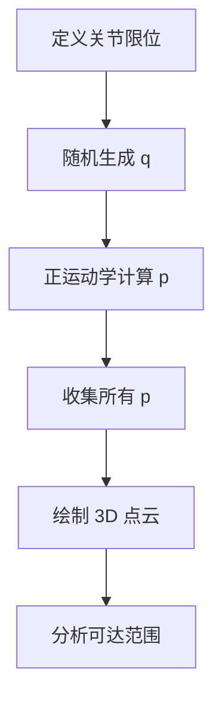

---

## 8.4 动力学基础

### 8.4.1 质心、惯性张量与刚体惯性

**质心（Center of Mass, CoM）**是刚体质量加权平均位置。对于由多个连杆组成的机器人，整体质心为：

$$
\mathbf{r}_{\text{CoM}} = \frac{\sum_i m_i \mathbf{r}_i}{\sum_i m_i}
$$

其中 $m_i$ 为第 $i$ 个连杆质量，$\mathbf{r}_i$ 为其质心位置。

!!! note "术语解释：质心、质量加权平均、连杆质心、总质量"
    - **质心（CoM）**：物体质量分布的平均位置。
    - **质量加权平均**：以质量为权重对位置求平均。
    - **连杆质心**：单个连杆自身的质量中心。
    - **总质量（total mass）**：所有连杆质量之和。

**惯性张量（inertia tensor）**描述刚体质量相对旋转轴的分布：

$$
\mathbf{I} = \begin{bmatrix}
I_{xx} & I_{xy} & I_{xz} \\
I_{yx} & I_{yy} & I_{yz} \\
I_{zx} & I_{zy} & I_{zz}
\end{bmatrix}
$$

其中对角元为绕各轴的转动惯量，非对角元为惯性积。平行轴定理可将质心处的惯性张量转换到任意点：

$$
\mathbf{I}_P = \mathbf{I}_{\text{CoM}} + m\left[(\mathbf{d}^T\mathbf{d})\mathbf{I}_3 - \mathbf{d}\mathbf{d}^T\right]
$$

其中 $\mathbf{d}$ 为从质心到点 $P$ 的向量。

!!! note "术语解释：惯性张量、转动惯量、惯性积、平行轴定理"
    - **惯性张量**：描述刚体绕任意轴旋转时惯性特性的 $3 \times 3$ 矩阵。
    - **转动惯量（moment of inertia）**：衡量刚体抵抗绕某轴角加速度的能力。
    - **惯性积（product of inertia）**：反映质量分布不对称性的交叉项。
    - **平行轴定理**：将绕质心轴的转动惯量平移到平行轴的定理。

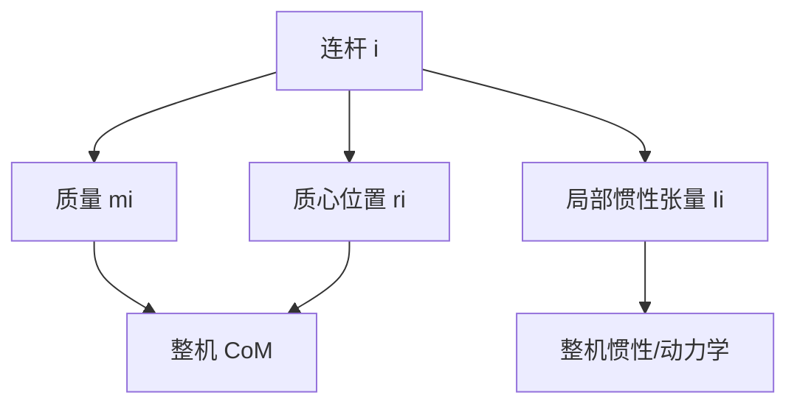

### 8.4.2 拉格朗日动力学

**拉格朗日方法（Lagrangian dynamics）**从能量角度出发，自动导出系统运动方程，适合串联机械臂和树形结构机器人[3][6]。定义拉格朗日量：

$$
L = T - V
$$

其中 $T$ 为系统总动能，$V$ 为总势能。对于关节变量 $q_i$，欧拉-拉格朗日方程为：

$$
\frac{d}{dt}\left(\frac{\partial L}{\partial \dot{q}_i}\right) - \frac{\partial L}{\partial q_i} = \tau_i
$$

其中 $\tau_i$ 为对应关节的广义力/力矩。

!!! note "术语解释：拉格朗日量、动能、势能、广义力、欧拉-拉格朗日方程"
    - **拉格朗日量（Lagrangian）**：系统动能与势能之差，$L = T - V$。
    - **动能（kinetic energy）**：由于运动而具有的能量，$T = \frac{1}{2}\dot{\mathbf{q}}^T \mathbf{M}(\mathbf{q}) \dot{\mathbf{q}}$。
    - **势能（potential energy）**：由于位置或形变而具有的能量，如重力势能 $V_g = mgh$。
    - **广义力（generalized force）**：与广义坐标对应的力或力矩。
    - **欧拉-拉格朗日方程**：由能量推导运动方程的标准形式。

机器人动力学方程的标准形式为：

$$
\mathbf{M}(\mathbf{q})\ddot{\mathbf{q}} + \mathbf{C}(\mathbf{q}, \dot{\mathbf{q}})\dot{\mathbf{q}} + \mathbf{g}(\mathbf{q}) = \boldsymbol{\tau} + \mathbf{J}^T \mathbf{F}_{\text{ext}}
$$

其中：
- $\mathbf{M}(\mathbf{q})$：质量矩阵（正定对称）。
- $\mathbf{C}(\mathbf{q}, \dot{\mathbf{q}})$：科氏力与离心力项。
- $\mathbf{g}(\mathbf{q})$：重力项。
- $\boldsymbol{\tau}$：关节驱动力矩。
- $\mathbf{F}_{\text{ext}}$：末端外部接触力。

!!! note "术语解释：质量矩阵、科氏力、离心力、重力项、接触力"
    - **质量矩阵（mass matrix）**：把关节加速度映射为惯性力矩的矩阵。
    - **科氏力（Coriolis force）**：由于坐标系旋转与相对运动耦合产生的惯性力。
    - **离心力（centrifugal force）**：由于旋转而产生的径向惯性力。
    - **重力项（gravity term）**：由重力场引起的广义力。
    - **接触力（contact force）**：机器人与外界接触时产生的力。

### 8.4.3 牛顿-欧拉递归动力学

**牛顿-欧拉方法（Newton-Euler dynamics）**通过向前递推速度/加速度、向后递推力/力矩，计算各关节所需力矩，计算复杂度为 $O(n)$，适合实时控制[3][6][41]。

递推步骤：

1. **向外递推（forward recursion）**：从基座到末端，计算各连杆角速度、角加速度、线加速度与质心加速度。
2. **向内递推（backward recursion）**：从末端到基座，计算各连杆受力/力矩，并提取关节力矩。

!!! note "术语解释：牛顿-欧拉、递归算法、向外递推、向内递推"
    - **牛顿-欧拉方程**：牛顿第二定律与欧拉转动方程的组合。
    - **递归算法（recursive algorithm）**：通过重复利用相邻连杆计算结果降低复杂度的算法。
    - **向外递推（forward recursion）**：从基座向末端传播运动学量。
    - **向内递推（backward recursion）**：从末端向基座传播力/力矩。

对于连杆 $i$，牛顿方程给出质心受力：

$$
\mathbf{F}_i = m_i \mathbf{a}_{c,i}
$$

欧拉方程给出绕质心的力矩：

$$
\mathbf{N}_i = \mathbf{I}_i \dot{\boldsymbol{\omega}}_i + \boldsymbol{\omega}_i \times (\mathbf{I}_i \boldsymbol{\omega}_i)
$$

其中 $\boldsymbol{\omega}_i$ 为连杆角速度，$\dot{\boldsymbol{\omega}}_i$ 为角加速度。

!!! note "术语解释：角速度、角加速度、叉乘、力矩平衡"
    - **角速度（angular velocity）**：姿态变化率向量。
    - **角加速度（angular acceleration）**：角速度对时间的变化率。
    - **叉乘（cross product）**：产生垂直于两向量平面的向量，用于计算力矩。
    - **力矩平衡（moment equilibrium）**：刚体所受合力矩等于其角动量变化率。

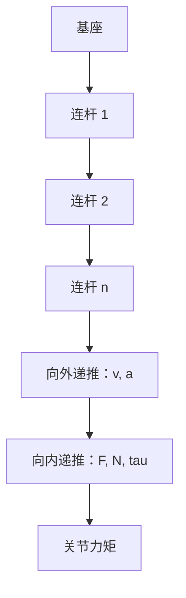

### 8.4.4 零力矩点（ZMP）与动态平衡

**零力矩点（Zero Moment Point, ZMP）**是地面上的一个点，在该点处地面反作用力产生的水平力矩分量为零[43][44]。ZMP 是人形机器人动态平衡的核心判据：若 ZMP 位于支撑多边形（support polygon）内，则机器人理论上不会绕地面边缘倾倒。

!!! note "术语解释：零力矩点（ZMP）、支撑多边形、地面反作用力、动态平衡"
    - **零力矩点（ZMP）**：地面反作用力等效作用点，水平力矩分量为零。
    - **支撑多边形（support polygon）**：脚底与地面接触点构成的凸包。
    - **地面反作用力（GRF）**：地面作用于脚的力。
    - **动态平衡（dynamic balance）**：在运动过程中保持不倾倒的能力。

在简化模型中，假设质心高度 $z_c$ 恒定，ZMP 坐标为：

$$
x_{\text{ZMP}} = x_{\text{CoM}} - \frac{z_c}{g} \ddot{x}_{\text{CoM}}
$$

$$
y_{\text{ZMP}} = y_{\text{CoM}} - \frac{z_c}{g} \ddot{y}_{\text{CoM}}
$$

其中 $g$ 为重力加速度，$\ddot{x}_{\text{CoM}}$、$\ddot{y}_{\text{CoM}}$ 为质心水平加速度。

!!! note "术语解释：质心高度、水平加速度、重力加速度、凸包"
    - **质心高度（CoM height）**：质心到地面的垂直距离。
    - **水平加速度（horizontal acceleration）**：质心在水平面内的加速度分量。
    - **重力加速度（gravitational acceleration）**：$g \approx 9.81\ \text{m/s}^2$。
    - **凸包（convex hull）**：包含一组点的最小凸集。

### 8.4.5 Python 算例 3：ZMP 稳定判据

以下代码给定质心轨迹与加速度，计算 ZMP，并判断其是否位于支撑多边形内。支撑多边形以单脚与双脚支撑两种情形示例。

```python
import numpy as np
import matplotlib.pyplot as plt
from matplotlib.patches import Polygon

# 物理参数
z_c = 0.8      # 质心高度 (m)
g = 9.81       # 重力加速度 (m/s^2)

# 生成示例质心轨迹：x 方向正弦，y 方向小幅波动
t = np.linspace(0, 2, 500)
x_com = 0.05 * np.sin(2 * np.pi * t)
y_com = 0.02 * np.cos(2 * np.pi * t)

# 数值微分求速度和加速度
dx = np.gradient(x_com, t)
ddx = np.gradient(dx, t)
dy = np.gradient(y_com, t)
ddy = np.gradient(dy, t)

# 计算 ZMP
x_zmp = x_com - (z_c / g) * ddx
y_zmp = y_com - (z_c / g) * ddy

# 定义双脚支撑多边形（示例：两脚分别位于 x=-0.1 与 x=0.1，宽 0.08）
def support_polygon_double():
    return np.array([
        [-0.14, -0.04],
        [-0.14,  0.04],
        [-0.06,  0.04],
        [-0.06, -0.04],
        [ 0.06, -0.04],
        [ 0.06,  0.04],
        [ 0.14,  0.04],
        [ 0.14, -0.04],
    ])

def support_polygon_single():
    # 右脚单支撑
    return np.array([
        [0.06, -0.04],
        [0.06,  0.04],
        [0.14,  0.04],
        [0.14, -0.04],
    ])

def point_in_polygon(point, poly):
    """射线法判断点是否在多边形内（含边界）。"""
    x, y = point
    n = len(poly)
    inside = False
    for i in range(n):
        x1, y1 = poly[i]
        x2, y2 = poly[(i+1) % n]
        if ((y1 > y) != (y2 > y)) and (x < (x2 - x1) * (y - y1) / (y2 - y1) + x1):
            inside = not inside
    return inside

# 判断每个时刻 ZMP 是否在双脚支撑多边形内
poly = support_polygon_double()
inside = np.array([point_in_polygon((x_zmp[i], y_zmp[i]), poly) for i in range(len(t))])

print("ZMP 在支撑多边形内比例: %.2f%%" % (inside.mean() * 100))

# 绘图
fig, ax = plt.subplots(figsize=(6, 6))
p = Polygon(poly, closed=True, fill=False, edgecolor='k', linewidth=1.5, label='支撑多边形')
ax.add_patch(p)
ax.plot(x_zmp[inside], y_zmp[inside], 'g.', markersize=2, label='ZMP 在内')
ax.plot(x_zmp[~inside], y_zmp[~inside], 'r.', markersize=2, label='ZMP 在外')
ax.set_xlabel('X (m)')
ax.set_ylabel('Y (m)')
ax.set_title('ZMP 轨迹与支撑多边形')
ax.legend()
ax.axis('equal')
ax.grid(True)
plt.tight_layout()
plt.savefig('zmp_stability.png', dpi=150)
plt.show()
```

!!! note "术语解释：数值微分、梯度、射线法、支撑多边形内判断"
    - **数值微分**：用离散数据近似计算导数的方法。
    - **梯度（gradient）**：函数对各个自变量的偏导数组成的向量。
    - **射线法（ray casting）**：判断点是否在多边形内的常用算法。
    - **支撑多边形内判断**：验证 ZMP 是否落在稳定支撑区域内的几何计算。

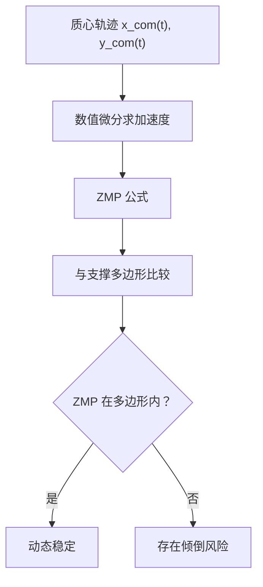

#### 8.4.6 质心动量与中心角动量

人形机器人是多连杆系统，其整体运动状态不仅由各连杆速度决定，还可以通过**质心动量（centroidal momentum）**统一描述。质心动量把机器人所有连杆的线动量与角动量汇总到**质心（Center of Mass, CoM）**处，是分析行走、奔跑、跳跃等动态运动的强有力工具[41]。

!!! note "术语解释：质心动量、中心角动量、线动量、角动量、质心"
    - **质心动量（centroidal momentum）**：机器人总线动量与相对于质心的总角动量在质心处的合成。
    - **中心角动量（centroidal angular momentum）**：机器人相对于质心的总角动量。
    - **线动量（linear momentum）**：质量与质心速度的乘积，$\mathbf{P} = m \mathbf{v}_{\text{CoM}}$。
    - **角动量（angular momentum）**：描述旋转运动状态的矢量，$\mathbf{L} = \mathbf{I}\boldsymbol{\omega}$。
    - **质心（CoM）**：系统质量加权平均位置。

定义机器人广义坐标 $\mathbf{q}$ 与广义速度 $\mathbf{v}$，则**质心动量矩阵（Centroidal Momentum Matrix, CMM）** $\mathbf{A}_G(\mathbf{q})$ 把广义速度映射为质心处的 6 维质心动量：

$$
\begin{bmatrix} \mathbf{P} \\ \mathbf{L}_G \end{bmatrix} = \mathbf{A}_G(\mathbf{q}) \, \mathbf{v}
$$

其中 $\mathbf{P} \in \mathbb{R}^3$ 为总线动量，$\mathbf{L}_G \in \mathbb{R}^3$ 为相对于质心的总角动量。质心动量矩阵具有清晰的物理意义：其行向量表示各关节速度对整体线动量与角动量的贡献权重[41]。

质心动量的时间导数等于外力之和：

$$
\frac{d}{dt} \begin{bmatrix} \mathbf{P} \\ \mathbf{L}_G \end{bmatrix} = \begin{bmatrix} m \mathbf{g} + \sum_j \mathbf{F}_j \\ \sum_j (\mathbf{r}_j - \mathbf{r}_G) \times \mathbf{F}_j \end{bmatrix}
$$

其中 $\mathbf{F}_j$ 为第 $j$ 个外部接触力，$\mathbf{r}_j$ 为其作用点，$\mathbf{r}_G$ 为质心位置。由此可见，质心水平加速度由地面反作用力的水平分量决定，而中心角动量的变化率由接触力绕质心的力矩决定。

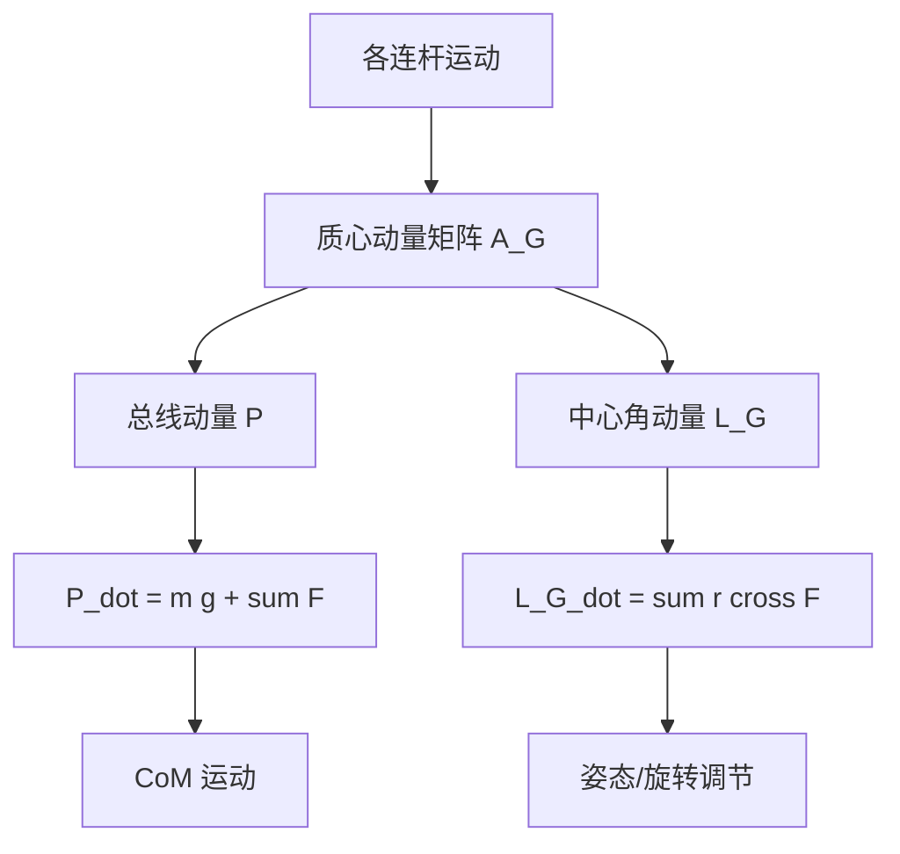

!!! note "术语解释：质心动量矩阵（CMM）、外力矩、地面反作用力、质心加速度"
    - **质心动量矩阵（Centroidal Momentum Matrix, CMM）**：把关节速度映射到质心动量的 6×n 矩阵。
    - **外力矩（external moment）**：外部作用力绕某点的力矩之和。
    - **地面反作用力（Ground Reaction Force, GRF）**：地面作用于机器人脚的接触力。
    - **质心加速度（CoM acceleration）**：质心位置对时间的二阶导数。

在**飞行相（flight phase）**，如跳跃或跑步离地阶段，机器人所受合外力仅有重力 $m\mathbf{g}$，因此：

$$
\dot{\mathbf{P}} = m \mathbf{g}, \quad \dot{\mathbf{L}}_G = \mathbf{0}
$$

这意味着**角动量守恒（conservation of angular momentum）**：在腾空期间，机器人无法通过内部关节运动改变总角动量，只能通过改变肢体相对位置调整姿态。体操运动员、猫的下落翻转都利用了这一原理。人形机器人在跳跃落地、跌倒恢复中，必须预先规划好起跳时的角动量，因为空中无法补充或消除。

!!! note "术语解释：飞行相、角动量守恒、腾空、姿态调整"
    - **飞行相（flight phase）**：机器人双脚离地的运动阶段。
    - **角动量守恒（conservation of angular momentum）**：无外力矩时系统总角动量保持不变。
    - **腾空（airborne）**：身体完全离开支撑面的状态。
    - **姿态调整（attitude adjustment）**：通过改变肢体构型改变身体朝向，而不改变总角动量。

控制上身角动量是人形机器人动态平衡的重要手段。例如，当外界扰动使身体绕某轴产生角动量时，可通过手臂或躯干的反向摆动产生补偿力矩，使总角动量保持在期望范围。这种策略在**角动量平衡控制（angular momentum-based balance control）**中被广泛应用[41][53]。

#### 8.4.7 浮动基动力学

人形机器人不同于固定基座的工业机械臂，其基座（躯干）可在空间中自由移动。因此需要用**浮动基（floating base）**坐标描述系统位形：

$$
\mathbf{q} = (\mathbf{p}_{\text{base}}, \mathbf{R}_{\text{base}}, \mathbf{q}_{\text{joints}})
$$

其中 $\mathbf{p}_{\text{base}} \in \mathbb{R}^3$ 为基座位置，$\mathbf{R}_{\text{base}} \in SO(3)$ 为基座姿态，$\mathbf{q}_{\text{joints}} \in \mathbb{R}^{n_j}$ 为关节角[4][6]。

!!! note "术语解释：浮动基、浮动基坐标、基座位置、基座姿态、广义坐标"
    - **浮动基（floating base）**：可在空间中自由平移和旋转的机器人基座。
    - **基座位置（base position）**：浮动基坐标系原点在惯性系中的位置。
    - **基座姿态（base orientation）**：浮动基坐标系相对于惯性系的旋转。
    - **广义坐标（generalized coordinates）**：描述系统位形的最小独立变量集合。

浮动基系统的关键特征是**欠驱动（underactuation）**：基座的 6 个自由度没有直接执行器，只能通过脚与地面的接触力间接控制。这使人形机器人本质上成为一个受接触力驱动的系统。

浮动基动力学方程的标准形式为：

$$
\mathbf{M}(\mathbf{q}) \dot{\mathbf{v}} + \mathbf{C}(\mathbf{q}, \mathbf{v}) \mathbf{v} + \mathbf{g}(\mathbf{q}) = \mathbf{S}^T \boldsymbol{\tau} + \sum_{c} \mathbf{J}_c^T(\mathbf{q}) \mathbf{F}_c
$$

其中：

- $\mathbf{M}(\mathbf{q})$：包含浮动基与关节的 $n \times n$ 质量矩阵。
- $\mathbf{C}(\mathbf{q}, \mathbf{v})$：科氏力与离心力项。
- $\mathbf{g}(\mathbf{q})$：重力项。
- $\mathbf{S}$：选择矩阵，把关节力矩 $\boldsymbol{\tau}$ 映射到广义坐标空间（仅作用于关节，不作用于浮动基）。
- $\mathbf{J}_c$：第 $c$ 个接触点对应的雅可比矩阵。
- $\mathbf{F}_c$：第 $c$ 个接触力。

!!! note "术语解释：欠驱动、选择矩阵、接触雅可比、广义力"
    - **欠驱动（underactuation）**：系统自由度多于独立控制输入的情形。
    - **选择矩阵（selection matrix）**：区分受控关节与未受控浮动基自由度的矩阵。
    - **接触雅可比（contact Jacobian）**：把广义速度映射到接触点速度的雅可比矩阵。
    - **广义力（generalized force）**：与广义坐标对应的力或力矩。

该方程也可按浮动基与关节分块写成：

$$
\begin{bmatrix}
\mathbf{M}_{b} & \mathbf{M}_{bj} \\
\mathbf{M}_{jb} & \mathbf{M}_{j}
\end{bmatrix}
\begin{bmatrix}
\dot{\mathbf{v}}_b \\
\ddot{\mathbf{q}}_j
\end{bmatrix}
+
\begin{bmatrix}
\mathbf{h}_b \\
\mathbf{h}_j
\end{bmatrix}
=
\begin{bmatrix}
\mathbf{0} \\
\boldsymbol{\tau}
\end{bmatrix}
+
\sum_c
\begin{bmatrix}
\mathbf{J}_{c,b}^T \\
\mathbf{J}_{c,j}^T
\end{bmatrix}
\mathbf{F}_c
$$

上块（浮动基）没有 $\boldsymbol{\tau}$ 项，这正是欠驱动的数学体现：基座加速度 $\dot{\mathbf{v}}_b$ 完全由接触力 $\mathbf{F}_c$ 决定。

```mermaid
flowchart TD
    A["浮动基动力学"] --> B["基座 6-DOF 无执行器"]
    B --> C["欠驱动系统"]
    C --> D["接触力 F_c 间接控制基座"]
    D --> E["M v_dot + C v + g = S^T tau + J_c^T F_c"]
    E --> F["步态/平衡控制器设计"]
```

!!! note "术语解释：质量矩阵分块、科氏力项、浮动基加速度、关节加速度"
    - **质量矩阵分块（partitioned mass matrix）**：把浮动基与关节对应子矩阵分开表示。
    - **科氏力项（Coriolis term）**：由坐标系旋转和相对运动耦合产生的惯性项。
    - **浮动基加速度（floating base acceleration）**：基座线加速度与角加速度的组合。
    - **关节加速度（joint acceleration）**：关节角对时间的二阶导数。

接触约束进一步限制了系统运动。若某接触点固定于地面（无滑移、无抬脚），则接触点速度为零：

$$
\mathbf{J}_c \mathbf{v} = \mathbf{0}
$$

求导得到加速度级约束：

$$
\mathbf{J}_c \dot{\mathbf{v}} + \dot{\mathbf{J}}_c \mathbf{v} = \mathbf{0}
$$

该约束与动力学方程联立，可同时求解关节力矩与接触力。这是人形机器人模型预测控制（MPC）与全身控制（WBC）的数学基础。

!!! note "术语解释：接触约束、无滑移约束、加速度级约束、模型预测控制（MPC）"
    - **接触约束（contact constraint）**：限制接触点运动学量的等式或不等式约束。
    - **无滑移约束（no-slip constraint）**：要求接触点切向速度为零的约束。
    - **加速度级约束（acceleration-level constraint）**：对加速度而非速度的约束。
    - **模型预测控制（MPC）**：基于动态模型在未来时域内滚动优化控制输入的方法。

#### 8.4.8 接触动力学与摩擦锥

人形机器人与地面之间的接触是动态运动的基础。真实接触既不是完全刚性点接触，也不是简单弹簧阻尼模型；但为了控制与规划，通常将其抽象为**刚性接触（rigid contact）**，并引入**互补条件（complementarity condition）**描述接触状态切换[54]。

!!! note "术语解释：刚性接触、互补条件、法向间隙、接触力"
    - **刚性接触（rigid contact）**：假设接触面无变形的理想接触模型。
    - **互补条件（complementarity condition）**：两个量不能同时为正，常用于描述接触-分离切换，如 $f_n \geq 0$, $\phi \geq 0$, $f_n \phi = 0$。
    - **法向间隙（normal gap）**：接触面之间的法向距离，$\phi > 0$ 表示分离。
    - **接触力（contact force）**：接触面之间相互作用的力。

设接触点法向间隙为 $\phi \geq 0$，法向接触力为 $f_n \geq 0$，则 Signorini 接触条件为：

$$
0 \leq \phi \ \perp \ f_n \geq 0
$$

这表示：要么接触面分离（$\phi > 0$，$f_n = 0$），要么接触面压紧（$\phi = 0$，$f_n > 0$），两者不能同时发生。对于动态系统，还需引入速度级或加速度级互补条件才能完整描述碰撞与反弹。

!!! note "术语解释：Signorini 条件、法向力、切向力、接触状态"
    - **Signorini 条件**：描述无穿透接触的法向互补条件。
    - **法向力（normal force）**：垂直于接触面的压力分量，$f_n \geq 0$。
    - **切向力（tangential force）**：平行于接触面的摩擦力分量。
    - **接触状态（contact state）**：接触点处于分离、滑动或粘着的状态。

 Coulomb 摩擦模型把切向力限制在法向力的一定比例内。三维空间中，所有允许接触力构成一个**摩擦锥（friction cone）**：

$$
\sqrt{f_x^2 + f_y^2} \leq \mu f_z, \quad f_z \geq 0
$$

其中 $\mu$ 为摩擦系数，$f_z$ 为法向力（通常取向上为正），$f_x, f_y$ 为水平摩擦力分量。摩擦锥是一个凸锥，其半顶角为 $\arctan\mu$。

```mermaid
flowchart TD
    A["接触状态"] --> B{"分离/接触?"}
    B -->|"分离"| C["phi > 0, f_n = 0"]
    B -->|"接触"| D{"滑动/粘着?"}
    D -->|"粘着"| E["|f_t| < mu f_n"]
    D -->|"滑动"| F["|f_t| = mu f_n, 方向相反"]
    E --> G["摩擦锥内部"]
    F --> H["摩擦锥边界"]
```

!!! note "术语解释：Coulomb 摩擦、摩擦锥、摩擦系数、摩擦锥半顶角"
    - **Coulomb 摩擦（Coulomb friction）**：切向摩擦力大小与法向力成正比、方向与相对滑动方向相反的干摩擦模型。
    - **摩擦锥（friction cone）**：满足 Coulomb 摩擦条件的接触力集合形成的圆锥。
    - **摩擦系数（friction coefficient）**：最大切向力与法向力之比，$\mu = |f_t|/f_n$。
    - **摩擦锥半顶角（friction cone angle）**：摩擦锥轴线与母线之间的夹角，$\alpha = \arctan\mu$。

为了便于数值优化，常把圆形摩擦锥线性化为**摩擦金字塔（friction pyramid）**：

$$
|f_x| \leq \frac{\mu f_z}{\sqrt{2}}, \quad |f_y| \leq \frac{\mu f_z}{\sqrt{2}}
$$

或用四个或更多平面近似：

$$
|f_x| \leq \mu f_z, \quad |f_y| \leq \mu f_z
$$

线性化后，摩擦约束变为线性不等式，可直接嵌入二次规划（QP）求解器。

!!! note "术语解释：摩擦金字塔、线性化摩擦锥、二次规划（QP）"
    - **摩擦金字塔（friction pyramid）**：用多面体近似圆形摩擦锥的线性化模型。
    - **线性化摩擦锥（linearized friction cone）**：把非线性摩擦锥约束用线性不等式近似。
    - **二次规划（Quadratic Programming, QP）**：目标函数为二次、约束为线性的优化问题。

人形机器人行走必须求解接触力，原因有三：

1. **驱动欠驱动基座**：基座 6-DOF 没有直接执行器，必须由地面反作用力产生所需加速度。
2. **防止滑倒**：摩擦系数决定最大可用水平力；若所需摩擦力超出锥面，脚会打滑。
3. **稳定性边界**：ZMP 必须在支撑多边形内，而 ZMP 位置由接触力分布决定。

典型橡胶鞋底与干燥地面的摩擦系数约为 0.6–0.8，潮湿或油渍地面可能降至 0.2–0.3。因此，人形机器人在不同地面上的运动能力差异显著；控制器需要在规划阶段就考虑摩擦约束，避免生成不可行的接触力。

!!! note "术语解释：ZMP、支撑多边形、摩擦约束、接触力分布"
    - **ZMP（Zero Moment Point）**：地面反作用力等效作用点，水平力矩分量为零。
    - **支撑多边形（support polygon）**：支撑脚与地面接触点构成的凸包。
    - **摩擦约束（friction constraint）**：限制切向力不超过法向力倍数的物理约束。
    - **接触力分布（contact force distribution）**：多个接触点上法向力与摩擦力的分配方式。

#### 8.4.9 捕获点（Capture Point）与线性倒立摆

**捕获点（Capture Point, CP）**是人形机器人推恢（push recovery）与步态规划中的核心概念：它是地面上这样一个点——若机器人能在该点立即踩下去并把质心置于支撑脚正上方，则无需再迈下一步即可停止[44][45]。捕获点的存在把复杂的动态平衡问题转化为“下一步应踩在哪里”的几何问题。

!!! note "术语解释：捕获点（Capture Point）、推恢、步态规划、动态平衡"
    - **捕获点（Capture Point, CP）**：给定当前质心状态，单步之内使机器人恢复静止所需的落脚点。
    - **推恢（push recovery）**：受到外部推扰后通过迈步或姿态调整恢复平衡的能力。
    - **步态规划（gait planning）**：生成行走步序与落脚点的过程。
    - **动态平衡（dynamic balance）**：在运动过程中保持不倾倒的能力。

在**线性倒立摆模型（Linear Inverted Pendulum Model, LIPM）**中，假设质心高度 $z_c$ 恒定，且质点通过无质量杆连接到地面上的 ZMP。LIPM 的水平动力学为：

$$
\ddot{x} = \frac{g}{z_c}(x - x_{\text{ZMP}})
$$

其中 $g$ 为重力加速度，$x$ 为质心水平位置。该方程可改写为：

$$
\dot{x} = \omega_0 (x - x_{\text{ZMP}})
$$

其中 $\omega_0 = \sqrt{g/z_c}$ 为 LIPM 的自然频率。若 ZMP 保持恒定，质心运动可分解为收敛分量与发散分量。发散分量称为**发散运动分量（Divergent Component of Motion, DCM）**：

$$
\xi = x + \frac{\dot{x}}{\omega_0}
$$

!!! note "术语解释：线性倒立摆模型（LIPM）、自然频率、发散运动分量（DCM）"
    - **线性倒立摆模型（LIPM）**：把机器人简化为高度恒定的质心-无质量杆-ZMP 的线性模型。
    - **自然频率（natural frequency）**：LIPM 特征频率 $\omega_0 = \sqrt{g/z_c}$。
    - **发散运动分量（DCM）**：质心运动中随时间指数发散的分量，决定机器人是否需要迈步。

捕获点本质上就是当前 DCM 的位置。对于二维 LIPM：

$$
x_{\text{CP}} = x_{\text{CoM}} + \frac{\dot{x}_{\text{CoM}}}{\omega_0}
$$

扩展到三维水平面：

$$
\mathbf{r}_{\text{CP}} = \mathbf{r}_{\text{CoM}}^{xy} + \frac{\dot{\mathbf{r}}_{\text{CoM}}^{xy}}{\omega_0}
$$

若把下一步落脚点（即新的 ZMP）正好置于捕获点，则质心将沿直线趋向该点并最终静止；若不迈到捕获点，DCM 将继续发散，机器人必须再迈一步甚至跌倒。

```mermaid
flowchart TD
    A["当前 CoM 位置与速度"] --> B["计算 omega_0 = sqrt(g/z_c)"]
    B --> C["计算 DCM / CP"]
    C --> D["r_CP = r_CoM + v_CoM / omega_0"]
    D --> E{"脚踏在 CP 上?"}
    E -->|"是"| F["单步内静止"]
    E -->|"否"| G["继续迈步或跌倒"]
```

!!! note "术语解释：落脚点、ZMP、DCM 控制、捕获区域"
    - **落脚点（foot placement）**：行走时脚落地的位置。
    - **ZMP（Zero Moment Point）**：地面反作用力等效作用点。
    - **DCM 控制（DCM control）**：通过调节 ZMP 或落脚点控制发散分量的方法。
    - **捕获区域（capture region）**：所有能使机器人恢复平衡的可行落脚点集合。

**Python 算例：捕获点与所需落脚点计算**

以下代码给定质心水平位置、速度、质心高度，计算捕获点；并给定实际迈步位置，判断是否能单步恢复静止。

```python
import numpy as np

def compute_capture_point(r_com, v_com, z_c, g=9.81):
    """
    计算二维/三维水平面捕获点。
    r_com: CoM 水平位置 (x, y) 或 (x, y, z)（只取 x, y）
    v_com: CoM 水平速度 (vx, vy) 或 (vx, vy, vz)
    z_c: 质心高度（恒定）
    """
    r_com = np.array(r_com)[:2]
    v_com = np.array(v_com)[:2]
    omega_0 = np.sqrt(g / z_c)
    r_cp = r_com + v_com / omega_0
    return r_cp, omega_0

def step_recovery_check(r_com, v_com, z_c, foot_place, g=9.81):
    """
    判断给定落脚点 foot_place 是否能把 CoM 稳定下来。
    简单判据：新 ZMP 位于 foot_place，若 DCM 收敛到该点则成功。
    """
    r_cp, omega_0 = compute_capture_point(r_com, v_com, z_c, g)
    dist = np.linalg.norm(r_cp - np.array(foot_place)[:2])
    omega_0_val = omega_0
    # 若实际落脚点与捕获点重合，则理论上可单步静止
    # 这里给出时间常数 tau = 1/omega_0，以及偏移
    tau = 1.0 / omega_0_val
    return {
        'capture_point': r_cp,
        'omega_0': omega_0_val,
        'time_constant': tau,
        'foot_placement_error': dist,
        'single_step_capture': dist < 0.02  # 允许 2 cm 误差
    }

# 示例：质心高度 0.8 m，质心位于原点，速度 (0.3, 0.1) m/s
r_com = np.array([0.0, 0.0])
v_com = np.array([0.3, 0.1])
z_c = 0.8

r_cp, omega_0 = compute_capture_point(r_com, v_com, z_c)
print("omega_0 = %.3f rad/s" % omega_0)
print("时间常数 tau = %.3f s" % (1/omega_0))
print("捕获点 (m):", r_cp)

# 假设实际落脚点
foot = np.array([0.35, 0.12])
result = step_recovery_check(r_com, v_com, z_c, foot)
print("落脚点误差 (m): %.3f" % result['foot_placement_error'])
print("能否单步捕获:", result['single_step_capture'])
```

!!! note "术语解释：捕获点计算、时间常数、落脚点误差、单步捕获"
    - **捕获点计算（capture point computation）**：由质心状态推导恢复平衡所需落脚点。
    - **时间常数（time constant）**：DCM 收敛或发散的特征时间，$\tau = 1/\omega_0$。
    - **落脚点误差（foot placement error）**：实际落脚点与捕获点之间的距离。
    - **单步捕获（single-step capture）**：仅通过一步落脚即可恢复静止的能力。

三维扩展需要考虑质心高度变化、非平面地面、多接触点以及角动量影响。更一般的捕获理论定义了 **N-step capture region**：机器人在 N 步之内能恢复平衡的所有初始状态集合。该理论为模型预测控制（MPC）提供了可行性判据：控制器只需规划使系统状态始终位于某 N-step capture region 内的轨迹[45]。

!!! note "术语解释：N-step capture region、模型预测控制（MPC）、可行性判据"
    - **N-step capture region**：N 步之内可恢复平衡的所有状态集合。
    - **模型预测控制（MPC）**：在有限时域内滚动优化控制策略的方法。
    - **可行性判据（feasibility criterion）**：判断系统状态是否仍可被控制的安全条件。

#### 8.4.10 全身控制简介

人形机器人同时需要完成多个任务：保持平衡、跟踪期望 footsteps、操作物体、避免奇异与自碰撞。**全身控制（Whole-Body Control, WBC）**通过把多个任务映射到关节空间，并在冗余自由度中协调这些任务[53][54]。

!!! note "术语解释：全身控制（WBC）、任务空间、冗余协调、多任务控制"
    - **全身控制（Whole-Body Control, WBC）**：同时协调全身多自由度完成多项任务的控制框架。
    - **任务空间（task space）**：描述特定任务变量的空间，如质心位置、末端位姿。
    - **冗余协调（redundancy resolution）**：在冗余自由度内分配任务优先级。
    - **多任务控制（multi-task control）**：同时实现多个可能相互冲突的任务目标。

最基础的 WBC 方法是**任务空间逆动力学（task-space inverse dynamics, TSID）**：给定各任务的期望加速度 $\ddot{\mathbf{x}}_i^*$，通过雅可比把任务加速度映射到关节加速度：

$$
\ddot{\mathbf{x}}_i = \mathbf{J}_i \dot{\mathbf{v}} + \dot{\mathbf{J}}_i \mathbf{v}
$$

然后构造二次规划（QP）问题，求解满足动力学、摩擦锥、关节力矩限等约束的关节加速度与接触力。

!!! note "术语解释：任务空间逆动力学（TSID）、期望加速度、雅可比导数"
    - **任务空间逆动力学（TSID）**：由任务空间期望加速度反解关节加速度与力矩的方法。
    - **期望加速度（desired acceleration）**：任务变量应达到的目标加速度。
    - **雅可比导数（Jacobian derivative）**：雅可比矩阵对时间的导数，出现在加速度映射中。

**操作空间控制（Operational Space Control, OSC）**是另一种常见框架。它直接把任务空间力/力矩映射为关节力矩：

$$
\boldsymbol{\tau} = \sum_i \mathbf{J}_i^T \mathbf{F}_i^* + \mathbf{N}^T \boldsymbol{\tau}_0
$$

其中 $\mathbf{F}_i^*$ 为第 $i$ 个任务所需的虚拟力，$\mathbf{N}$ 为投影到任务零空间的矩阵，$\boldsymbol{\tau}_0$ 为零空间中的任意力矩。

!!! note "术语解释：操作空间控制（OSC）、虚拟力、零空间投影"
    - **操作空间控制（OSC）**：在操作空间设计控制力并映射到关节空间的控制方法。
    - **虚拟力（virtual force）**：为完成任务在任务空间中施加的等效力。
    - **零空间投影（null-space projection）**：把关节力矩投影到不干扰高优先级任务的子空间。

当有多个任务时，通常按优先级排序。设主任务雅可比为 $\mathbf{J}_1$，次级任务雅可比为 $\mathbf{J}_2$。关节速度可分解为：

$$
\dot{\mathbf{q}} = \mathbf{J}_1^\dagger \dot{\mathbf{x}}_1^* + \mathbf{N}_1 \mathbf{J}_2^\dagger \left( \dot{\mathbf{x}}_2^* - \mathbf{J}_2 \mathbf{J}_1^\dagger \dot{\mathbf{x}}_1^* \right)
$$

其中 $\mathbf{N}_1 = \mathbf{I} - \mathbf{J}_1^\dagger \mathbf{J}_1$ 为投影到 $\mathbf{J}_1$ 零空间的矩阵。上式第一项完成主任务，第二项在不影响主任务的前提下完成次级任务。

```mermaid
flowchart TD
    A["任务优先级栈"] --> B["主任务：平衡/CoM"]
    A --> C["次任务：足端轨迹"]
    A --> D["再次任务：手臂操作"]
    A --> E["最低优先级：姿态优化"]
    B --> F["J_1^dagger x_1_dot"]
    C --> G["N_1 J_2^dagger x_2_dot"]
    D --> H["N_12 J_3^dagger x_3_dot"]
    E --> I["零空间任务"]
    F --> J["合成关节速度/力矩"]
    G --> J
    H --> J
    I --> J
```

!!! note "术语解释：任务优先级、零空间矩阵、主任务、次级任务"
    - **任务优先级（task priority）**：多任务控制中各任务的重要性排序。
    - **零空间矩阵（null-space matrix）**：投影到某任务零空间的矩阵，如 $\mathbf{N}_1$。
    - **主任务（primary task）**：最高优先级的任务，如保持平衡。
    - **次级任务（secondary task）**：在主任务完成后才尽可能满足的任务。

**全身 QP 控制**是现代 WBC 的主流实现方式。它把所有任务统一为优化目标，同时显式施加动力学、摩擦锥、关节力矩限、关节限位等约束：

$$
\min_{\dot{\mathbf{v}}, \boldsymbol{\tau}, \mathbf{F}_c} \ \sum_i w_i \left\| \mathbf{J}_i \dot{\mathbf{v}} + \dot{\mathbf{J}}_i \mathbf{v} - \ddot{\mathbf{x}}_i^* \right\|^2 + \text{正则项}
$$

约束：

$$
\mathbf{M}\dot{\mathbf{v}} + \mathbf{C}\mathbf{v} + \mathbf{g} = \mathbf{S}^T \boldsymbol{\tau} + \mathbf{J}_c^T \mathbf{F}_c
$$

$$
\mathbf{F}_c \in \mathcal{C}(\mu), \quad \boldsymbol{\tau}_{\min} \leq \boldsymbol{\tau} \leq \boldsymbol{\tau}_{\max}, \quad \mathbf{q}_{\min} \leq \mathbf{q} + \Delta t \, \dot{\mathbf{q}} \leq \mathbf{q}_{\max}
$$

其中 $\mathcal{C}(\mu)$ 为摩擦锥约束。全身 QP 能统一处理接触力、关节力矩与任务跟踪，是当前 Atlas、Digit、TALOS 等高动态人形机器人控制的核心方法[54]。

!!! note "术语解释：全身 QP 控制、优化目标、约束、摩擦锥约束、关节力矩限"
    - **全身 QP 控制（whole-body QP control）**：用二次规划求解全身控制输入的方法。
    - **优化目标（objective）**：需要最小化的任务跟踪误差与正则项加权和。
    - **约束（constraint）**：动力学方程、摩擦锥、关节限位等必须满足的条件。
    - **摩擦锥约束（friction cone constraint）**：接触力必须位于摩擦锥内的约束。
    - **关节力矩限（torque limit）**：执行器可提供的最大/最小力矩。
### 8.4.11 Python 算例：小车-桌子（Cart-table）LIPM 仿真

**小车-桌子模型（cart-table model）**是线性倒立摆的常用可视化形式：质心被假定为位于高度 $z_c$ 处的小车上的一个质点，小车可在地面上无摩擦滑动，桌腿始终垂直于地面并经过 ZMP。该模型广泛用于人形机器人步态生成与 ZMP 跟踪[42][43]。

!!! note "术语解释：小车-桌子模型、ZMP 跟踪、步态生成、前馈控制"
    - **小车-桌子模型（cart-table model）**：把 LIPM 表示为小车承载桌面上质点的简化模型。
    - **ZMP 跟踪（ZMP tracking）**：使实际 ZMP 跟踪期望 ZMP 的控制目标。
    - **步态生成（gait generation）**：生成行走轨迹的过程。
    - **前馈控制（feedforward control）**：基于模型提前计算控制量的方法。

LIPM 动力学方程为：

$$
\ddot{x} = \omega_0^2 (x - x_{\text{ZMP}}), \quad \omega_0 = \sqrt{\frac{g}{z_c}}
$$

给定 ZMP 参考轨迹 $x_{\text{ZMP}}^*(t)$，可通过前馈控制得到期望 CoM 加速度：

$$
\ddot{x}^* = \omega_0^2 (x^* - x_{\text{ZMP}}^*) - k_d (\dot{x}^* - \dot{x}_{\text{ref}}) - k_p (x^* - x_{\text{ref}})
$$

其中后两项为跟踪误差的反馈修正。以下代码演示给定正弦 ZMP 参考时，如何用前馈+反馈跟踪 ZMP。

```python
import numpy as np
import matplotlib.pyplot as plt

def simulate_cart_table_lipm(z_c=0.8, g=9.81, T=5.0, dt=0.01,
                             kp=20.0, kd=8.0):
    """
    小车-桌子 LIPM 仿真：跟踪正弦 ZMP 参考轨迹。
    """
    omega_0 = np.sqrt(g / z_c)
    t = np.arange(0, T, dt)
    # ZMP 参考：正弦，振幅 0.05 m，周期 2 s
    zmp_ref = 0.05 * np.sin(2 * np.pi * t / 2.0)
    dzmp_ref = np.gradient(zmp_ref, dt)
    
    # 初始 CoM 状态
    x = 0.0
    dx = 0.0
    x_traj = []
    zmp_actual = []
    
    for i in range(len(t)):
        # 前馈：基于当前 x 与参考 ZMP 计算期望加速度
        # 实际 ZMP：x - z_c/g * ddx
        # 为跟踪 zmp_ref，令 ddx_ff = omega_0^2 * (x - zmp_ref[i])
        ddx_ff = omega_0**2 * (x - zmp_ref[i])
        # 反馈修正
        err = x - zmp_ref[i]
        ddx_fb = -kp * err - kd * dx
        ddx = ddx_ff + ddx_fb
        
        # 积分
        dx += ddx * dt
        x += dx * dt
        
        x_traj.append(x)
        zmp_actual.append(x - (z_c / g) * ddx)
    
    x_traj = np.array(x_traj)
    zmp_actual = np.array(zmp_actual)
    return t, x_traj, zmp_ref, zmp_actual

# 运行仿真
t, x_traj, zmp_ref, zmp_actual = simulate_cart_table_lipm()

# 绘图
fig, ax = plt.subplots(figsize=(8, 4))
ax.plot(t, zmp_ref, 'r--', label='ZMP 参考')
ax.plot(t, zmp_actual, 'b-', label='实际 ZMP')
ax.plot(t, x_traj, 'g-', label='CoM 位置')
ax.set_xlabel('时间 (s)')
ax.set_ylabel('位置 (m)')
ax.set_title('Cart-table LIPM ZMP 跟踪')
ax.legend()
ax.grid(True)
plt.tight_layout()
plt.savefig('cart_table_lipm.png', dpi=150)
plt.show()

print("ZMP 跟踪 RMSE:", np.sqrt(np.mean((zmp_ref - zmp_actual)**2)))
```

!!! note "术语解释：前馈-反馈控制、数值积分、ZMP 跟踪误差、RMSE"
    - **前馈-反馈控制（feedforward-feedback control）**：结合模型预测与误差修正的控制策略。
    - **数值积分（numerical integration）**：用离散时间步长近似求解微分方程。
    - **ZMP 跟踪误差（ZMP tracking error）**：实际 ZMP 与参考 ZMP 的偏差。
    - **RMSE（Root Mean Square Error）**：均方根误差，衡量跟踪精度。

### 8.4.12 接触力与摩擦锥

机器人与环境接触时，接触力必须满足物理约束。对于点接触，接触力 $\mathbf{f}$ 可分解为法向分量 $f_n$ 和切向摩擦力 $\mathbf{f}_t$。库仑摩擦模型要求：

$$
\|\mathbf{f}_t\| \leq \mu f_n
$$

其中 $\mu$ 为摩擦系数。

!!! note "术语解释：接触力、法向力、切向力、摩擦力、库仑摩擦"
    - **接触力（contact force）**：接触面之间相互作用的力。
    - **法向力（normal force）**：垂直于接触面的力分量。
    - **切向力（tangential force）**：平行于接触面的力分量。
    - **摩擦力（friction force）**：阻碍相对运动的切向接触力。
    - **库仑摩擦（Coulomb friction）**：摩擦力与法向力成正比的干摩擦模型。

在三维空间中，所有满足库仑摩擦条件的接触力构成一个 **摩擦锥（friction cone）**：

$$
\sqrt{f_x^2 + f_y^2} \leq \mu f_z, \quad f_z \geq 0
$$

为保证脚不打滑，地面反作用力必须位于摩擦锥内。 walking/running 中的急停、转向、斜坡行走都会使接触力接近摩擦锥边界。

!!! note "术语解释：摩擦锥、摩擦系数、防滑条件、接触稳定性"
    - **摩擦锥（friction cone）**：满足库仑摩擦条件的接触力集合。
    - **摩擦系数（friction coefficient）**：切向力与法向力比值的上限。
    - **防滑条件（no-slip condition）**：接触力位于摩擦锥内的约束。
    - **接触稳定性（contact stability）**：接触力满足物理约束并避免滑移或分离的状态。

```mermaid
flowchart TD
    A["地面反作用力 F"] --> B["分解 Fn, Ft"]
    B --> C{"|Ft| <= mu Fn?"}
    C -->|"是"| D["摩擦锥内，不滑移"]
    C -->|"否"| E["摩擦锥外，可能滑移"]
```

### 8.4.13 简化动力学模型：线性倒立摆

为了实时控制，常将人形机器人简化为 **线性倒立摆（Linear Inverted Pendulum, LIP）** 模型：一个质点（代表全身质心）通过无质量杆连接到地面上的 ZMP。在质心高度恒定的假设下，LIP 动力学是线性的：

$$
\ddot{x} = \frac{g}{z_c}(x - x_{\text{ZMP}})
$$

该模型广泛用于步态生成与平衡控制[43][44]。

!!! note "术语解释：线性倒立摆、质点模型、无质量杆、步态生成"
    - **线性倒立摆（LIP）**：将人形机器人简化为质心-无质量杆-ZMP 的线性动力学模型。
    - **质点模型（point-mass model）**：忽略尺寸，把质量集中于一点的简化模型。
    - **无质量杆（massless rod）**：仅传递力而不计自身质量的理想杆。
    - **步态生成（gait generation）**：生成周期性或任意行走运动模式的过程。

```mermaid
flowchart TD
    A["质心 CoM"] -->|"无质量杆"| B["ZMP"]
    B --> C["地面"]
    A --> D["高度 zc 恒定"]
    D --> E["线性动力学方程"]
```

### 8.4.14 角动量与上身协调

实际人形机器人并非质点，躯干的旋转、手臂的摆动都会影响整体 **角动量（angular momentum）**。在行走、跑步与跳跃中，合理利用上身角动量可以提高稳定性与运动效率。

!!! note "术语解释：角动量、角动量守恒、上身协调、反作用运动"
    - **角动量（angular momentum）**：描述刚体旋转运动状态的矢量，$\mathbf{L} = \mathbf{I}\boldsymbol{\omega}$。
    - **角动量守恒（conservation of angular momentum）**：无外力矩时系统总角动量保持不变。
    - **上身协调（upper-body coordination）**：利用躯干与手臂运动补偿下肢角动量。
    - **反作用运动（reaction motion）**：利用一部分肢体运动产生反作用力矩驱动另一部分肢体。

全身角动量可表示为各连杆角动量之和：

$$
\mathbf{L}_{\text{total}} = \sum_i \left[ \mathbf{r}_i \times (m_i \mathbf{v}_i) + \mathbf{I}_i \boldsymbol{\omega}_i \right]
$$

地面反作用力对 ZMP 的力矩与角动量变化率相关：

$$
\dot{\mathbf{L}} = \sum_j (\mathbf{r}_j - \mathbf{r}_{\text{ZMP}}) \times \mathbf{F}_j
$$

其中 $\mathbf{F}_j$ 为外部接触力。通过控制上身姿态与手臂摆动，可以在不移动 ZMP 的情况下调节整体角动量，从而提高抗扰动能力与运动效率。

!!! note "术语解释：角动量变化率、接触力矩、姿态调节、抗扰动"
    - **角动量变化率**：角动量对时间的导数，等于外力矩。
    - **接触力矩（contact moment）**：接触力绕某点产生的力矩。
    - **姿态调节（posture regulation）**：通过调整身体姿态改变动力学状态。
    - **抗扰动（disturbance rejection）**：系统抵抗外部扰动保持性能的能力。

```mermaid
flowchart TD
    A["下肢触地"] --> B["产生地面反作用力"]
    B --> C["改变全身角动量"]
    C --> D["上身/手臂协调"]
    D --> E["补偿角动量"]
    E --> F["维持平衡与效率"]
```

---

## 8.5 结构设计与轻量化

### 8.5.1 刚度、强度、模态与疲劳

结构设计需要在多重性能指标之间权衡：

- **刚度（stiffness）**：结构抵抗弹性变形的能力，通常用 $k = F/\delta$ 表示。刚度不足会导致末端定位误差、振动与控制带宽受限。
- **强度（strength）**：结构抵抗永久变形或断裂的能力，常用屈服强度 $\sigma_y$ 和极限强度 $\sigma_u$ 描述。
- **模态（modal）**：结构的固有振动特性，包括固有频率 $f_n$ 和振型。低频模态容易被激励，影响控制精度。
- **疲劳（fatigue）**：结构在循环载荷下裂纹萌生和扩展导致的失效，常用 S-N 曲线描述。

!!! note "术语解释：刚度、强度、模态、疲劳、S-N 曲线"
    - **刚度（stiffness）**：单位变形所需外力，$k = F/\delta$。
    - **强度（strength）**：材料或结构抵抗破坏的能力。
    - **模态（modal）**：结构固有振动模式，包括频率与振型。
    - **疲劳（fatigue）**：循环载荷下材料逐渐损伤直至断裂的现象。
    - **S-N 曲线**：应力幅值与循环次数之间的关系曲线。

```mermaid
flowchart TD
    A["结构设计目标"] --> B["刚度：减小变形"]
    A --> C["强度：避免破坏"]
    A --> D["模态：避开激励频率"]
    A --> E["疲劳：延长寿命"]
    B --> F["轻量化约束"]
    C --> F
    D --> F
    E --> F
```

### 8.5.2 材料选择：铝、钢、钛、镁、碳纤维与工程塑料

材料选择是轻量化与性能权衡的核心。常用材料特性如下：

| 材料 | 密度（g/cm³） | 屈服强度（MPa） | 弹性模量（GPa） | 特点与典型用途 |
|---|---|---|---|---|
| 铝合金 6061-T6 | 2.70 | 276 | 69 | 易加工、耐腐蚀、常用于连杆与支架 |
| 铝合金 7075-T6 | 2.81 | 503 | 72 | 高强度、常用于承力结构 |
| 结构钢 | 7.85 | 250–1000+ | 210 | 高模量、高密度，用于高刚度部位 |
| 钛合金 Ti-6Al-4V | 4.43 | 880 | 114 | 比强度高、耐腐蚀、成本高 |
| 镁合金 AZ91D | 1.77 | 150–230 | 45 | 最轻结构金属，耐蚀性较差 |
| 碳纤维复合材料（CFRP） | 1.5–1.6 | 1500+（比强度） | 150–230 | 高比刚度、各向异性、成本高 |
| 工程塑料（PA、POM、PEEK） | 1.1–1.4 | 50–250 | 2–4 | 轻、耐磨、绝缘，用于罩壳与小零件 |

!!! note "术语解释：密度、屈服强度、弹性模量、比强度、比刚度"
    - **密度（density）**：单位体积质量，$\rho = m/V$。
    - **屈服强度（yield strength）**：材料开始发生塑性变形的应力。
    - **弹性模量（Young's modulus）**：材料抵抗弹性变形的能力，$E = \sigma/\varepsilon$。
    - **比强度（specific strength）**：强度与密度之比。
    - **比刚度（specific stiffness）**：弹性模量与密度之比。

```mermaid
flowchart LR
    A["选材约束"] --> B["强度要求"]
    A --> C["刚度要求"]
    A --> D["重量要求"]
    A --> E["成本/工艺"]
    B --> F["材料筛选"]
    C --> F
    D --> F
    E --> F
```

### 8.5.3 梁弯曲应力与截面惯性矩

对于细长连杆，弯曲是主要载荷形式。**欧拉-伯努利梁理论**给出弯曲正应力：

$$
\sigma = \frac{M y}{I}
$$

其中 $M$ 为弯矩，$y$ 为到中性轴的距离，$I$ 为截面二次矩（惯性矩）。最大应力出现在最外层纤维（$y = h/2$）：

$$
\sigma_{\max} = \frac{M c}{I}
$$

对于矩形截面（宽 $b$，高 $h$）：

$$
I = \frac{b h^3}{12}
$$

对于外径 $D$、内径 $d$ 的圆管：

$$
I = \frac{\pi}{64}(D^4 - d^4)
$$

!!! note "术语解释：欧拉-伯努利梁、弯矩、中性轴、截面惯性矩、最大应力"
    - **欧拉-伯努利梁（Euler-Bernoulli beam）**：忽略剪切变形的细长梁理论。
    - **弯矩（bending moment）**：使梁发生弯曲的内力矩。
    - **中性轴（neutral axis）**：梁弯曲时应变为零的轴线。
    - **截面惯性矩（area moment of inertia）**：截面抵抗弯曲变形能力的几何量。
    - **最大应力（maximum stress）**：截面上应力最大的位置，通常在最外层纤维。

### 8.5.4 Python 算例 5：梁弯曲应力与截面惯性矩

以下代码计算矩形梁与圆管梁在集中载荷下的截面惯性矩、最大弯曲应力和端部挠度。

```python
import numpy as np

# 参数定义
# 矩形截面
b_rect = 0.020   # 宽 (m)
h_rect = 0.040   # 高 (m)
# 圆管截面
D_tube = 0.040   # 外径 (m)
d_tube = 0.032   # 内径 (m)

L = 0.40         # 梁长度 (m)
F = 500.0        # 端部集中载荷 (N)
E_al = 69e9      # 铝合金弹性模量 (Pa)
sigma_y = 276e6  # 6061-T6 屈服强度 (Pa)

def I_rectangle(b, h):
    """矩形截面惯性矩。"""
    return b * h**3 / 12.0

def I_round_tube(D, d):
    """圆管截面惯性矩。"""
    return np.pi / 64.0 * (D**4 - d**4)

def bending_stress(M, c, I):
    """弯曲正应力：sigma = M*c/I。"""
    return M * c / I

def cantilever_deflection(F, L, E, I):
    """悬臂梁端部集中载荷挠度：delta = F L^3 / (3 E I)。"""
    return F * L**3 / (3.0 * E * I)

# 矩形梁
I_rect = I_rectangle(b_rect, h_rect)
M_max = F * L  # 固定端最大弯矩
c_rect = h_rect / 2.0
sigma_rect = bending_stress(M_max, c_rect, I_rect)
delta_rect = cantilever_deflection(F, L, E_al, I_rect)
safety_rect = sigma_y / sigma_rect

# 圆管梁
c_tube = D_tube / 2.0
I_tube = I_round_tube(D_tube, d_tube)
sigma_tube = bending_stress(M_max, c_tube, I_tube)
delta_tube = cantilever_deflection(F, L, E_al, I_tube)
safety_tube = sigma_y / sigma_tube

print("=== 矩形截面梁 ===")
print("截面惯性矩 I = %.3e m^4" % I_rect)
print("最大弯曲应力 sigma_max = %.2f MPa" % (sigma_rect/1e6))
print("端部挠度 delta = %.3f mm" % (delta_rect*1000))
print("安全系数 n = %.2f" % safety_rect)

print("\n=== 圆管截面梁 ===")
print("截面惯性矩 I = %.3e m^4" % I_tube)
print("最大弯曲应力 sigma_max = %.2f MPa" % (sigma_tube/1e6))
print("端部挠度 delta = %.3f mm" % (delta_tube*1000))
print("安全系数 n = %.2f" % safety_tube)

# 比较单位质量刚度（线密度）
rho_al = 2700.0  # kg/m^3
A_rect = b_rect * h_rect
A_tube = np.pi/4.0 * (D_tube**2 - d_tube**2)
mass_rect = rho_al * A_rect * L
mass_tube = rho_al * A_tube * L
print("\n矩形梁质量: %.3f kg, 圆管梁质量: %.3f kg" % (mass_rect, mass_tube))
print("矩形梁 EI/m = %.2e N·m^3/kg" % (E_al*I_rect/mass_rect))
print("圆管梁 EI/m = %.2e N·m^3/kg" % (E_al*I_tube/mass_tube))
```

!!! note "术语解释：悬臂梁、集中载荷、挠度、安全系数、单位质量刚度"
    - **悬臂梁（cantilever beam）**：一端固定、另一端自由的梁。
    - **集中载荷（point load）**：作用于一点的力。
    - **挠度（deflection）**：梁在载荷下的横向位移。
    - **安全系数（safety factor）**：屈服强度与工作应力之比，$n = \sigma_y/\sigma_{\max}$。
    - **单位质量刚度**：刚度特性与质量的比值，衡量轻量化效率。

### 8.5.5 拓扑优化与尺寸优化

**拓扑优化（topology optimization）**在给定设计空间、载荷与边界条件下，寻找最优材料分布，使目标（如刚度最大、质量最小）满足约束。常用方法包括 SIMP（Solid Isotropic Material with Penalization）、水平集法与进化结构优化（ESO）。

!!! note "术语解释：拓扑优化、SIMP、水平集法、设计空间、材料插值"
    - **拓扑优化**：在给定空间内确定最优材料分布的结构优化方法。
    - **SIMP**：用连续密度变量近似离散 0/1 材料分布的惩罚插值模型。
    - **水平集法（level set method）**：用隐函数边界描述结构拓扑演化的方法。
    - **设计空间（design space）**：允许布置材料的区域。
    - **材料插值（material interpolation）**：在多孔密度与实体材料之间建立等效材料模型。

SIMP 方法中，单元弹性模量与密度关系为：

$$
E_e = E_0 \rho_e^p
$$

其中 $\rho_e \in [0,1]$ 为单元相对密度，$p \geq 3$ 为惩罚因子，$E_0$ 为实体材料模量。

```mermaid
flowchart TD
    A["定义设计空间"] --> B["施加载荷与约束"]
    B --> C["建立有限元模型"]
    C --> D["SIMP/水平集迭代"]
    D --> E["密度分布收敛"]
    E --> F["提取可制造结构"]
    F --> G["后处理/验证"]
```

#### 8.5.6 有限元分析在连杆设计中的应用

**有限元分析（Finite Element Analysis, FEA）**是预测连杆、关节支架与壳体在载荷下应力、变形与模态的核心数值工具。通过把连续体离散为有限数量的单元，FEA 把偏微分方程转化为线性代数方程组求解，从而在设计阶段发现潜在的结构弱点[27][28]。

!!! note "术语解释：有限元分析（FEA）、离散化、单元、节点、自由度"
    - **有限元分析（FEA）**：把连续结构离散为有限单元并数值求解力学响应的方法。
    - **离散化（discretization）**：把连续几何和物理场分解为有限数量单元的过程。
    - **单元（element）**：构成有限元网格的基本几何块，如四面体、六面体、壳单元。
    - **节点（node）**：单元之间的连接点，场变量在节点处计算。
    - **自由度（DOF）**：每个节点上待求的位移分量数。

人形机器人连杆 FEA 的标准工作流程如下：

1. **几何导入与清理**：从 CAD 导入 STEP/IGES 模型，去除小圆角、螺纹、倒角、细小孔洞等不影响整体力学响应的特征。
2. **材料属性定义**：设置弹性模量 $E$、泊松比 $\nu$、密度 $\rho$，对于复合材料还需定义各向异性参数。
3. **网格划分**：把几何离散为单元集合。常见单元类型包括：
   - **四面体单元（tetrahedron）**：适应复杂几何，但同样节点数下精度通常低于六面体。
   - **六面体单元（hexahedron）**：规则网格精度高、收敛快，适合块状结构。
   - **壳单元（shell）**：用于薄壁结构，可显著降低自由度。
   - **梁单元（beam）**：用于细长杆件，计算效率最高。
4. **边界条件与载荷**：约束关节安装面或轴承座，施加重力、惯性载荷、关节力矩、地面反作用力等。
5. **求解与后处理**：计算位移、应力、应变、安全系数、固有频率，识别高应力区与变形模式。
6. **收敛性验证**：逐步细化网格，观察关键部位应力是否趋于稳定。

```mermaid
flowchart TD
    A["CAD 几何"] --> B["几何清理/简化"]
    B --> C["材料属性"]
    C --> D["网格划分"]
    D --> E["边界条件与载荷"]
    E --> F["FEA 求解"]
    F --> G["应力/变形/模态"]
    G --> H["收敛性检查"]
    H -->|"未收敛"| D
    H -->|"已收敛"| I["设计决策"]
```

!!! note "术语解释：几何清理、网格收敛、后处理、边界条件、载荷工况"
    - **几何清理（geometry cleanup）**：去除不影响分析结果的小特征以简化模型。
    - **网格收敛（mesh convergence）**：随着网格细化，计算结果趋于稳定的现象。
    - **后处理（post-processing）**：对 FEA 结果进行可视化和评估。
    - **边界条件（boundary condition）**：约束位移或温度的条件。
    - **载荷工况（load case）**：特定工作状态下作用在结构上的载荷组合。

网格类型选择对结果影响显著。对于承受复杂应力状态的关节支架，二阶四面体单元（10 节点）能较好捕捉弯曲；对于细长连杆，六面体单元可提高效率。壳单元适用于壁厚远小于其他尺寸的罩壳和薄壁管。

**应力集中（stress concentration）**是连杆设计中的常见问题。几何突变处——如孔边、缺口、台阶、锐角——会出现局部应力显著高于名义应力的现象，应力集中系数 $K_t$ 可定义为：

$$
K_t = \frac{\sigma_{\max}}{\sigma_{\text{nom}}}
$$

其中 $\sigma_{\max}$ 为局部最大应力，$\sigma_{\text{nom}}$ 为名义应力。减缓应力集中的方法包括：增大圆角半径、避免尖角、采用渐变截面、在孔边设置加强环等。

!!! note "术语解释：应力集中、应力集中系数、圆角、名义应力"
    - **应力集中（stress concentration）**：几何突变导致局部应力显著增大的现象。
    - **应力集中系数（stress concentration factor）**：局部最大应力与名义应力之比。
    - **圆角（fillet）**：两个表面之间的圆滑过渡，用于降低应力集中。
    - **名义应力（nominal stress）**：按简化公式计算的平均应力。

收敛性检验是 FEA 可靠性的保障。理论上，当单元尺寸 $h \to 0$ 时，数值解应趋于精确解。工程上常采用 **h-收敛**：不断细化网格，绘制关键位置应力随单元数变化曲线；当相对变化小于 5% 时认为结果收敛。对于关键承载件，建议至少进行两次网格细化对比。

!!! note "术语解释：h-收敛、单元尺寸、数值解、精确解、收敛准则"
    - **h-收敛（h-convergence）**：通过减小单元尺寸提高计算精度的收敛方式。
    - **单元尺寸（element size）**：有限元网格中单元的典型边长。
    - **数值解（numerical solution）**：离散模型计算得到的近似解。
    - **精确解（exact solution）**：连续问题的理论解。
    - **收敛准则（convergence criterion）**：判断数值解是否足够稳定的判据。

#### 8.5.7 拓扑优化方法

**拓扑优化（topology optimization）**在给定设计空间、载荷、边界条件与约束下，自动寻找最优材料分布。与尺寸优化（改变截面尺寸）和形状优化（改变边界轮廓）不同，拓扑优化能改变结构的连通性，从而在更宽的设计空间内寻找高比刚度、高比强度的构型[30][31]。

!!! note "术语解释：拓扑优化、尺寸优化、形状优化、设计空间、材料分布"
    - **拓扑优化（topology optimization）**：在给定空间内确定最优材料分布的结构优化方法。
    - **尺寸优化（size optimization）**：优化杆件截面尺寸或板厚。
    - **形状优化（shape optimization）**：优化结构边界形状。
    - **设计空间（design space）**：允许布置材料的区域。
    - **材料分布（material distribution）**：材料在设计空间中的空间排布。

最常用的拓扑优化方法之一是 **SIMP（Solid Isotropic Material with Penalization）**。SIMP 把每个有限单元的密度 $\rho_e \in [0,1]$ 作为设计变量，其中 0 表示空，1 表示实体。为避免中间密度单元大量出现，引入惩罚因子 $p \geq 3$ 使中间密度变得不经济：

$$
E_e(\rho_e) = E_0 \, \rho_e^p
$$

其中 $E_0$ 为实体材料弹性模量，$E_e$ 为单元等效弹性模量。当 $p$ 足够大时，优化结果倾向于 0/1 分布。

!!! note "术语解释：SIMP、惩罚因子、设计变量、中间密度、等效弹性模量"
    - **SIMP**：用密度惩罚实现近似 0/1 材料分布的拓扑优化方法。
    - **惩罚因子（penalty factor）**：使中间密度材料模量降低的指数 $p$。
    - **设计变量（design variable）**：优化过程中可调整的参数，此处为单元密度。
    - **中间密度（intermediate density）**：介于 0 与 1 之间的单元密度。
    - **等效弹性模量（effective Young's modulus）**：根据密度插值得到的单元模量。

典型优化问题为**柔度最小化（compliance minimization）**在体积约束下：

$$
\min_{\boldsymbol{\rho}} \ C(\boldsymbol{\rho}) = \mathbf{u}^T \mathbf{K}(\boldsymbol{\rho}) \mathbf{u}
$$

约束：

$$
\sum_{e} \rho_e V_e \leq V^*, \quad 0 < \rho_{\min} \leq \rho_e \leq 1, \quad \mathbf{K}\mathbf{u} = \mathbf{f}
$$

其中 $C$ 为柔度（刚度越小柔度越大），$\mathbf{K}$ 为总体刚度矩阵，$\mathbf{u}$ 为位移向量，$\mathbf{f}$ 为载荷向量，$V_e$ 为单元体积，$V^*$ 为允许材料体积上限。柔度最小化等价于在限定材料用量下最大化结构刚度[30]。

```mermaid
flowchart TD
    A["定义设计空间"] --> B["施加载荷与约束"]
    B --> C["SIMP 密度插值"]
    C --> D["有限元求解"]
    D --> E["灵敏度分析"]
    E --> F["优化器更新密度"]
    F --> G{"收敛?"}
    G -->|"否"| C
    G -->|"是"| H["提取拓扑"]
    H --> I["后处理/制造"]
```

!!! note "术语解释：柔度、体积约束、灵敏度分析、优化器、收敛"
    - **柔度（compliance）**：结构在外载下变形能的度量，柔度越小刚度越大。
    - **体积约束（volume constraint）**：对可用材料总量的限制。
    - **灵敏度分析（sensitivity analysis）**：计算目标函数对设计变量导数的过程。
    - **优化器（optimizer）**：搜索最优设计变量的数值算法，如 MMA、OC 法。
    - **收敛（convergence）**：设计变量与目标函数趋于稳定的过程。

除 SIMP 外，还有两类主流方法：

- **水平集法（Level-Set Method）**：用隐式函数 $\phi(\mathbf{x}) = 0$ 描述结构边界，通过求解 Hamilton-Jacobi 方程演化边界。优点是可得到清晰边界，便于制造解释；缺点是拓扑变化（如出现新孔洞）需要特殊处理。
- **进化结构优化（Evolutionary Structural Optimization, ESO）**：从实体设计空间出发，逐步删除低应力（低效）单元，直到满足体积约束。概念直观，但收敛性与结果质量依赖于删除策略。

!!! note "术语解释：水平集法、Hamilton-Jacobi 方程、隐式函数、进化结构优化（ESO）"
    - **水平集法（level set method）**：用隐式函数零等值面描述结构边界的拓扑优化方法。
    - **Hamilton-Jacobi 方程**：描述水平集函数演化的偏微分方程。
    - **隐式函数（implicit function）**：用 $f(\mathbf{x}) = 0$ 表示边界的函数。
    - **进化结构优化（ESO）**：通过逐步删除低效单元获得拓扑的优化方法。

拓扑优化能在给定载荷路径下自动形成传力骨架，去除不参与承载的材料。例如，一个受弯的悬臂梁经过拓扑优化后，往往呈现出类似桁架或空腹梁的构型：材料集中在上下翼缘承受弯曲应力，腹板区域形成斜向或竖向支撑。这种“材料只在需要的地方存在”的特性，使其成为人形机器人连杆轻量化的有力工具。

!!! note "术语解释：传力路径、翼缘、腹板、空腹梁、轻量化"
    - **传力路径（load path）**：外力从作用点传递到约束端的路径。
    - **翼缘（flange）**：梁截面中主要承受轴向应力的部分。
    - **腹板（web）**：连接上下翼缘并承受剪力的部分。
    - **空腹梁（open-web beam）**：腹板开孔或形成桁架状的梁。
    - **轻量化（lightweighting）**：在保持性能的前提下减小结构质量。

#### 8.5.8 晶格与填充结构

传统拓扑优化得到的是实体-空腔分布，而**晶格结构（lattice structure）**与**填充结构（infill structure）**把内部区域替换为周期性或梯度化的多孔微结构，在减轻质量的同时保持刚度。晶格结构特别适用于增材制造（3D 打印），因为人形机器人连杆内部复杂网格很难通过传统机加工实现[32]。

!!! note "术语解释：晶格结构、填充结构、多孔微结构、相对密度、增材制造"
    - **晶格结构（lattice structure）**：由周期性单胞组成的多孔点阵结构。
    - **填充结构（infill structure）**：零件内部用于填充的非实体微结构。
    - **多孔微结构（porous microstructure）**：具有规则孔洞的单胞结构。
    - **相对密度（relative density）**：晶格密度与实体材料密度之比。
    - **增材制造（additive manufacturing）**：逐层堆积材料的制造方法，俗称 3D 打印。

常见晶格单胞类型包括：

| 晶格类型 | 特点 | 力学性能 |
|---|---|---|
| **Gyroid（螺旋面）** | 连续光滑曲面，无自支撑问题，应力集中小 | 各向同性较好，能量吸收优秀 |
| **Diamond（金刚石型）** | 各向同性优异，节点连接对称 | 高刚度/质量比 |
| **Body-Centered Cubic（BCC）** | 简单立方加体心节点，易于生成 | 压缩性能良好 |
| **Octet-truss（八面体桁架）** | 由八面体和四面体组成，接近各向同性桁架 | 极高比刚度 |
| **Triangular/Hexagonal 2.5D** | 平面蜂窝拉伸到三维，制造简单 | 面内各向异性明显 |

!!! note "术语解释：Gyroid、Diamond 晶格、BCC 晶格、Octet-truss、蜂窝结构"
    - **Gyroid**：一种三重周期性极小曲面晶格，表面光滑连续。
    - **Diamond 晶格**：金刚石碳原子排列对应的空间点阵。
    - **BCC 晶格**：体心立方晶格，立方体中心有一个节点。
    - **Octet-truss**：由正八面体和正四面体单元组成的桁架晶格。
    - **蜂窝结构（honeycomb）**：二维多边形周期性排列的轻量化结构。

晶格的等效力学性能取决于**相对密度** $\bar{\rho} = \rho_{\text{lattice}} / \rho_{\text{solid}}$。对于许多拉伸主导的桁架晶格，弹性模量与屈服强度近似满足：

$$
\frac{E_{\text{lattice}}}{E_{\text{solid}}} \propto \bar{\rho}^n, \quad n \approx 1 \sim 2
$$

当 $n \approx 1$ 时，材料利用效率最高；弯曲主导的晶格（如简单杆件）通常 $n \approx 2$，意味着刚度下降更快。因此，设计高比刚度晶格时应优先选择拉伸主导构型，并保证节点处连接牢固。

```mermaid
flowchart TD
    A["实体连杆"] --> B["拓扑优化确定传力骨架"]
    B --> C["内部替换为晶格"]
    C --> D["Gyroid / Diamond / BCC"]
    D --> E["相对密度梯度分布"]
    E --> F["高应力区：高密度晶格"]
    E --> G["低应力区：低密度晶格"]
    F --> H["轻量化 + 保持刚度"]
    G --> H
```

!!! note "术语解释：拉伸主导、弯曲主导、节点连接、相对密度梯度"
    - **拉伸主导（stretch-dominated）**：单元主要承受轴向拉压的承载机制。
    - **弯曲主导（bending-dominated）**：单元主要承受弯曲的承载机制。
    - **节点连接（node connection）**：晶格杆件交汇处的几何连接。
    - **相对密度梯度（relative density gradient）**：相对密度随位置变化的分布。

各向异性是晶格设计的另一重要考量。Gyroid 晶格由于三重周期极小曲面的对称性，在三个正交方向上具有接近的弹性模量；而 2.5D 蜂窝在面内与面外方向性能差异巨大。对于承受多方向载荷的人形机器人连杆，应优先选用各向同性较好的晶格，或在设计时按主载荷方向定向排列晶格单元。

增材制造为晶格结构提供了制造自由度，但也带来挑战：打印方向影响层间强度，悬垂角过小需要支撑，表面粗糙度可能降低疲劳性能。因此，晶格设计需与打印工艺协同优化，例如选择自支撑 Gyroid 以避免内部支撑难以去除的问题。

!!! note "术语解释：各向异性、主载荷方向、悬垂角、层间强度、自支撑"
    - **各向异性（anisotropy）**：材料或结构在不同方向上性能不同。
    - **主载荷方向（principal load direction）**：结构中承受最大应力的方向。
    - **悬垂角（overhang angle）**：打印层相对于水平面的倾斜角，过小需要支撑。
    - **层间强度（interlayer strength）**：增材制造层与层之间的结合强度。
    - **自支撑（self-supporting）**：无需额外支撑即可打印的几何特征。

#### 8.5.9 螺栓连接与预紧力

螺栓连接是人形机器人关节、连杆与壳体装配中最常见的可拆连接方式。螺栓不仅要承受工作载荷，还要通过**预紧力（preload）**在被连接件之间产生足够的夹紧力，防止接合面分离、滑移或泄漏[26][40]。

!!! note "术语解释：螺栓连接、预紧力、夹紧力、接合面、工作载荷"
    - **螺栓连接（bolted joint）**：用螺栓、螺母或螺纹孔实现的机械连接。
    - **预紧力（preload）**：装配时施加在螺栓上的初始轴向拉力。
    - **夹紧力（clamping force）**：被连接件之间由于螺栓预紧而产生的压紧力。
    - **接合面（interface）**：两个被连接件相互接触的平面。
    - **工作载荷（working load）**：机器人运行中螺栓承受的外部载荷。

螺栓可简化为一个轴向弹簧，被连接件也可简化为受压弹簧。预紧后，螺栓与被连接件形成一个静不定系统。当外部轴向载荷 $F_e$ 作用时，一部分载荷由螺栓承担，另一部分由被连接件接触面承担：

$$
\Delta F_b = \frac{k_b}{k_b + k_m} F_e = C F_e
$$

其中 $k_b$ 为螺栓刚度，$k_m$ 为被连接件等效刚度，$C$ 为**载荷系数（load factor）**。螺栓总载荷为：

$$
F_b = F_i + C F_e
$$

$F_i$ 为预紧力。同时，接合面剩余夹紧力为：

$$
F_m = F_i - (1-C)F_e
$$

为防止接合面分离，需保证 $F_m > 0$，工程上常要求 $F_m$ 为工作载荷的某个比例。

!!! note "术语解释：螺栓刚度、被连接件刚度、载荷系数、静不定系统"
    - **螺栓刚度（bolt stiffness）**：螺栓在轴向单位伸长所需的力。
    - **被连接件刚度（member stiffness）**：被连接件在轴向单位压缩所需的力。
    - **载荷系数（load factor）**：外部载荷分配到螺栓上的比例。
    - **静不定系统（statically indeterminate system）**：仅由静力平衡无法完全求解内力分布的系统。

拧紧力矩与预紧力的关系由以下经验公式给出：

$$
T = K F_i d
$$

其中 $T$ 为拧紧力矩，$F_i$ 为预紧力，$d$ 为螺栓公称直径，$K$ 为**扭矩系数（torque coefficient）**，通常取 0.15–0.25，取决于螺纹摩擦、支承面摩擦与润滑状态。由于摩擦分散性大，按扭矩控制预紧力的误差可达 ±25%。更精确的方法包括：

- **转角法（turn-of-nut）**：在贴合后按特定角度继续拧紧，误差约 ±10%。
- **屈服点控制（yield control）**：监测拧紧曲线拐点，误差约 ±5%。
- **液压拉伸器（hydraulic tensioner）**：直接拉伸螺栓后拧紧螺母，误差约 ±5%。
- **应变片/垫圈传感器（load-indicating washer）**：直接测量预紧力，精度最高。

!!! note "术语解释：扭矩系数、转角法、屈服点控制、液压拉伸器、载荷指示垫圈"
    - **扭矩系数（torque coefficient）**：把拧紧力矩转换为预紧力的综合系数。
    - **转角法（turn-of-nut method）**：通过控制螺母相对转角控制预紧力的方法。
    - **屈服点控制（yield control）**：通过监测扭矩-转角曲线判断螺栓屈服的拧紧方法。
    - **液压拉伸器（hydraulic tensioner）**：用液压直接拉伸螺栓的工具。
    - **载荷指示垫圈（load-indicating washer）**：可直观显示预紧力大小的特殊垫圈。

VDI 2230 是德国工程师协会发布的高强度螺栓连接系统设计标准，被广泛应用于机器人、汽车与航空领域。它系统考虑了：

- 工作载荷与预紧力关系
- 螺栓应力校核（拉应力、扭应力、表面压力）
- 疲劳强度评估
- 拧紧工艺与分散性
- 安全系数与可靠性

按照 VDI 2230，最小装配预紧力 $F_M$ 通常取为：

$$
F_M = k \cdot F_{K_{erf}}
$$

其中 $F_{K_{erf}}$ 为工作所需最小夹紧力，$k$ 为分散系数（考虑摩擦、工具精度等，通常 1.5–2.5）。

```mermaid
flowchart TD
    A["工作载荷 F_e"] --> B["确定所需夹紧力"]
    B --> C["选择螺栓规格与强度等级"]
    C --> D["计算预紧力 F_i"]
    D --> E{"拧紧方法"}
    E -->|"扭矩法"| F["T = K F_i d"]
    E -->|"转角法"| G["控制螺母转角"]
    E -->|"直接测量"| H["应变片/传感器"]
    F --> I["校核螺栓应力与疲劳"]
    G --> I
    H --> I
    I --> J["VDI 2230 合规"]
```

!!! note "术语解释：强度等级、分散系数、疲劳强度、表面压力"
    - **强度等级（property class）**：如 8.8、10.9、12.9，表示螺栓抗拉强度与屈服强度比。
    - **分散系数（scatter factor）**：考虑工艺分散性的安全系数。
    - **疲劳强度（fatigue strength）**：材料在循环载荷下抵抗破坏的能力。
    - **表面压力（bearing pressure）**：螺栓头或螺母支承面施加在零件上的压强。

在人形机器人中，螺栓连接承受振动、冲击与交变载荷，容易松动。防松措施包括：

- **摩擦防松**：双螺母、弹簧垫圈、尼龙锁紧螺母。
- **机械防松**：开口销、止动垫片、串联钢丝。
- **永久防松**：螺纹锁固胶、冲点、焊接（用于不可拆连接）。

同时，螺栓所在区域应避免应力集中：加大支承面、采用倒角或沉头、保证螺纹啮合长度足够（通常 ≥1d）。

!!! note "术语解释：防松措施、锁紧螺母、止动垫片、螺纹锁固胶"
    - **防松措施（anti-loosening measure）**：防止螺栓在振动中松动的设计。
    - **锁紧螺母（lock nut）**：带有尼龙圈或变形螺纹的防松螺母。
    - **止动垫片（tab washer）**：通过弯折舌片限制螺母转动的垫片。
    - **螺纹锁固胶（thread-locking adhesive）**：固化后增加螺纹摩擦的厌氧胶。

**Python 算例：螺栓预紧力矩估算**

以下代码根据螺栓直径、目标预紧力和扭矩系数估算所需拧紧力矩，并给出 VDI 2230 风格的安全提示。

```python
import numpy as np

def bolt_torque_estimate(d, F_preload, K=0.2):
    """
    估算螺栓拧紧力矩。
    d: 螺栓公称直径 (m)
    F_preload: 目标预紧力 (N)
    K: 扭矩系数，通常 0.15-0.25
    """
    T = K * F_preload * d
    return T

def preload_from_stress(d, sigma_y, utilization=0.75):
    """
    根据螺栓屈服强度和利用系数估算最大允许预紧力。
    d: 直径 (m)
    sigma_y: 屈服强度 (Pa)
    utilization: 预紧力占屈服载荷比例，通常 0.7-0.9
    """
    A_t = np.pi / 4.0 * d**2  # 简化用公称截面积；精确计算应用应力截面积
    F_y = A_t * sigma_y
    F_preload_max = utilization * F_y
    return F_preload_max, A_t

# 示例：M8 螺栓，12.9 级， sigma_y ≈ 1100 MPa
# 精确应力截面积 A_s ≈ 36.6 mm^2，这里用简化公式示意
d = 0.008  # m
sigma_y = 1100e6  # Pa
F_max, A_t = preload_from_stress(d, sigma_y, utilization=0.75)
T = bolt_torque_estimate(d, F_max, K=0.20)

print("螺栓直径 d = %.0f mm" % (d*1000))
print("屈服强度 sigma_y = %.0f MPa" % (sigma_y/1e6))
print("简化截面积 A_t = %.2f mm^2" % (A_t*1e6))
print("最大允许预紧力 F_max = %.0f N" % F_max)
print("建议拧紧力矩 T = %.2f N·m" % T)
print("扭矩系数 K = 0.20 时，预紧力分散约 ±20-25%")
```

!!! note "术语解释：应力截面积、屈服载荷、利用系数、拧紧力矩估算"
    - **应力截面积（tensile stress area）**：考虑螺纹几何后用于强度计算的等效截面积。
    - **屈服载荷（yield load）**：螺栓达到屈服时的轴向拉力。
    - **利用系数（utilization factor）**：预紧力占屈服载荷的比例。
    - **拧紧力矩估算（torque estimation）**：由预紧力和摩擦系数估算拧紧力矩。

#### 8.5.10 疲劳与耐久

人形机器人关节、连杆与紧固件在行走、搬运与重复操作中承受**循环载荷（cyclic load）**。即使单次应力远低于材料屈服强度，长期循环也可能导致**疲劳（fatigue）**裂纹萌生、扩展并最终断裂。疲劳失效约占机械结构失效的 80% 以上，是人形机器人可靠性设计的核心问题之一[27][28]。

!!! note "术语解释：循环载荷、疲劳、疲劳裂纹、疲劳失效、耐久性"
    - **循环载荷（cyclic load）**：大小或方向随时间反复变化的载荷。
    - **疲劳（fatigue）**：材料在循环应力下逐渐损伤直至断裂的现象。
    - **疲劳裂纹（fatigue crack）**：循环载荷下萌生的微小裂纹。
    - **疲劳失效（fatigue failure）**：由疲劳裂纹扩展导致的断裂。
    - **耐久性（durability）**：产品在循环载荷下保持功能的能力。

材料的疲劳性能通常用 **S-N 曲线（Wöhler curve）** 表示：在给定平均应力或应力比下，应力幅 $S_a$ 与失效循环次数 $N$ 之间的关系。对于钢材，当应力幅低于**疲劳极限（endurance limit）**时，理论上可承受无限次循环而不失效。

!!! note "术语解释：S-N 曲线、应力幅、应力比、疲劳极限、Wöhler 曲线"
    - **S-N 曲线（Wöhler curve）**：应力幅与失效循环次数的关系曲线。
    - **应力幅（stress amplitude）**：循环应力最大值与最小值之差的一半，$S_a = (S_{\max} - S_{\min})/2$。
    - **应力比（stress ratio）**：最小应力与最大应力之比，$R = S_{\min}/S_{\max}$。
    - **疲劳极限（endurance limit）**：材料可承受无限次循环而不失效的最大应力幅。
    - **Wöhler 曲线**：S-N 曲线的别称，以德国工程师 Wöhler 命名。

循环应力的关键参数为：

$$
S_m = \frac{S_{\max} + S_{\min}}{2}, \quad S_a = \frac{S_{\max} - S_{\min}}{2}
$$

$S_m$ 为**平均应力（mean stress）**。平均应力会显著影响疲劳寿命：拉平均应力降低疲劳寿命，压平均应力则提高疲劳寿命。为考虑平均应力影响，常用 **Goodman 修正**：

$$
\frac{S_a}{S_e} + \frac{S_m}{S_u} = 1
$$

其中 $S_e$ 为完全反向（$R=-1$）下的疲劳极限，$S_u$ 为极限抗拉强度。Goodman 线为保守估计；**Gerber 修正**则使用抛物线，预测寿命略长：

$$
\frac{S_a}{S_e} + \left(\frac{S_m}{S_u}\right)^2 = 1
$$

!!! note "术语解释：平均应力、Goodman 修正、Gerber 修正、极限抗拉强度"
    - **平均应力（mean stress）**：循环应力最大值与最小值的平均值。
    - **Goodman 修正**：线性平均应力修正方法，偏于保守。
    - **Gerber 修正**：抛物线平均应力修正方法，预测寿命较 Goodman 长。
    - **极限抗拉强度（ultimate tensile strength）**：材料拉伸断裂前的最大应力。

实际载荷往往不是等幅正弦波，而是随机或变幅载荷。此时需要**雨流计数法（rainflow counting）**把复杂载荷历程分解为一系列具有不同幅值和均值的循环。雨流法模拟雨水沿屋顶瓦片流动的路径，从峰值或谷值出发，遇到更大（或更小）值时停止计数，从而得到各应力水平的循环次数 $n_i$。

```mermaid
flowchart TD
    A["实测载荷历程"] --> B["雨流计数"]
    B --> C["提取循环 n_i, S_ai, S_mi"]
    C --> D["S-N 曲线求各循环损伤 D_i = n_i/N_i"]
    D --> E["Miner 累积损伤"]
    E --> F["预测疲劳寿命"]
```

!!! note "术语解释：雨流计数法、载荷历程、变幅载荷、循环计数"
    - **雨流计数法（rainflow counting）**：把复杂载荷历程分解为等效循环的计数方法。
    - **载荷历程（load history）**：应力或载荷随时间变化的记录。
    - **变幅载荷（variable amplitude load）**：幅值变化的循环载荷。
    - **循环计数（cycle counting）**：从载荷历程中提取等效循环的过程。

得到各应力水平下的循环次数 $n_i$ 与对应失效循环次数 $N_i$ 后，可用 **Miner 累积损伤准则**估算总损伤：

$$
D = \sum_i \frac{n_i}{N_i}
$$

当 $D \geq 1$ 时，预测发生疲劳失效。Miner 准则是线性累积假设，实际中由于载荷顺序、残余应力等因素，失效常发生在 $D$ 接近但不一定等于 1 时。工程上常取 $D = 0.7 \sim 1.3$ 作为寿命终点判据。

!!! note "术语解释：Miner 准则、累积损伤、失效循环次数、寿命终点"
    - **Miner 准则（Miner's rule）**：线性累积疲劳损伤准则。
    - **累积损伤（cumulative damage）**：各循环对材料造成的损伤之和。
    - **失效循环次数（cycles to failure）**：在给定应力水平下导致失效的循环数。
    - **寿命终点（end of life）**：结构被认为不再安全使用的时刻。

对于人形机器人，典型疲劳载荷来源包括：

- **步行触地冲击**：每一步产生一次冲击循环，一天运行 8 小时约 $10^7$ 次/年。
- **关节往复运动**：膝关节屈伸、踝关节滚转/俯仰产生弯曲与扭转循环。
- **搬运启停**：手持负载的加载-卸载循环。
- **振动与共振**：电机、减速器激励下的高频振动。

设计对策包括：

1. **降低应力幅**：选用高比强度材料、加大截面、优化传力路径。
2. **减少应力集中**：增大圆角、避免尖角、控制表面粗糙度。
3. **改善表面质量**：喷丸、滚压、抛光可提高疲劳强度。
4. **合理预紧**：螺栓疲劳寿命对预紧力敏感，过高或过低都会降低寿命。
5. **状态监测与预测性维护**：通过应变、振动、温度监测预测疲劳裂纹萌生。

!!! note "术语解释：喷丸强化、滚压强化、表面粗糙度、预测性维护"
    - **喷丸强化（shot peening）**：用高速弹丸撞击表面引入残余压应力以提高疲劳寿命。
    - **滚压强化（roller burnishing）**：用滚轮碾压表面提高光洁度并引入压应力。
    - **表面粗糙度（surface roughness）**：表面微观不平度，影响疲劳裂纹萌生。
    - **预测性维护（predictive maintenance）**：基于状态监测预测故障并提前维护。

### 8.5.11 壳体、连杆与关节支架设计

人形机器人结构可分为三类主要承载件：

1. **连杆（link）**：连接相邻关节的细长构件，承受拉压弯扭组合载荷。
2. **壳体（shell/cover）**：覆盖在机构外部的保护/外观件，同时可参与传力与电磁屏蔽。
3. **关节支架（joint bracket/housing）**：电机、减速器、轴承的安装基体，需承受大扭矩与冲击。

!!! note "术语解释：连杆、壳体、关节支架、承载件、传力路径"
    - **连杆（link）**：连接关节并传递力与运动的构件。
    - **壳体（shell）**：覆盖、保护内部机构的薄壁结构。
    - **关节支架（joint bracket）**：支撑轴承、电机、减速器的结构件。
    - **承载件（load-bearing component）**：承受并传递载荷的零件。
    - **传力路径（load path）**：外力从作用点传递到地面的路径。

连杆设计要点：
- 采用空心圆管或盒形截面提高抗弯与抗扭刚度。
- 在关节连接处加厚或设置加强筋，避免应力集中。
- 预留线缆走线孔，减少运动中的磨损。

壳体设计要点：
- 在满足防护等级（IP）的前提下尽量薄壁化。
- 考虑散热孔、天线窗口与电磁兼容（EMC）。
- 便于拆装，支持维护与更换。

```mermaid
flowchart LR
    A["载荷"] --> B["关节支架"]
    B --> C["连杆"]
    C --> D["下一关节"]
    D --> E["地面"]
    F["壳体"] -.->|"保护与散热"| C
```

### 8.5.12 紧固、密封与可靠性

人形机器人中存在大量螺栓、轴承、密封圈与线束连接。这些“小零件”对可靠性至关重要。

!!! note "术语解释：紧固件、预紧力、密封圈、可靠性、应力集中"
    - **紧固件（fastener）**：螺栓、螺钉、螺母、销等连接件。
    - **预紧力（preload）**：装配时施加在紧固件上的初始轴向拉力。
    - **密封圈（seal/gasket）**：防止液体、粉尘进入的弹性元件。
    - **可靠性（reliability）**：产品在规定条件下和规定时间内完成规定功能的能力。
    - **应力集中（stress concentration）**：几何突变处应力显著增大的现象。

螺栓预紧力设计常用 VDI 2230 标准，其基本关系为：

$$
F_M = k \cdot F_{\text{req}}
$$

其中 $F_M$ 为装配预紧力，$F_{\text{req}}$ 为工作所需最小夹紧力，$k$ 为安全系数（通常 1.5–2.5）。

密封设计需根据工作介质、温度、运动形式选择材料与结构。常见密封类型包括 O 形圈、骨架油封、迷宫密封与端面密封。

```mermaid
flowchart TD
    A["紧固设计"] --> B["螺栓选型/预紧力"]
    A --> C["防松措施"]
    A --> D["密封设计"]
    A --> E["应力集中控制"]
    B --> F["连接可靠性"]
    C --> F
    D --> F
    E --> F
```

### 8.5.13 疲劳与耐久性估算

机器人关节与连杆在行走、搬运与重复操作中承受循环载荷，长期运行会导致**疲劳（fatigue）**损伤。疲劳设计不能仅依赖静强度，而需基于 **S-N 曲线（Wöhler curve）** 或断裂力学方法评估寿命。

!!! note "术语解释：疲劳、S-N 曲线、应力幅、平均应力、疲劳极限"
    - **疲劳（fatigue）**：材料在循环应力作用下裂纹萌生并扩展直至断裂的现象。
    - **S-N 曲线**：应力幅 $S_a$ 与失效循环次数 $N$ 之间的关系曲线。
    - **应力幅（stress amplitude）$S_a$**：循环应力最大值与最小值之差的一半。
    - **平均应力（mean stress）$S_m$**：循环应力最大值与最小值的平均值。
    - **疲劳极限（endurance limit）**：材料可承受无限次循环而不失效的最大应力幅。

对于对称循环（$S_m = 0$），Basquin 方程给出近似关系：

$$
S_a = S_f' \cdot (2N)^b
$$

其中 $S_f'$ 为疲劳强度系数，$b$ 为疲劳强度指数，$N$ 为失效循环次数。考虑平均应力的 Goodman 修正：

$$
\frac{S_a}{S_e} + \frac{S_m}{S_u} = 1
$$

其中 $S_e$ 为修正后的疲劳极限，$S_u$ 为极限抗拉强度。

!!! note "术语解释：Basquin 方程、Goodman 修正、疲劳强度系数、疲劳极限修正"
    - **Basquin 方程**：描述应力幅与循环次数对数线性关系的经验公式。
    - **Goodman 修正**：考虑平均应力影响的疲劳寿命修正方法。
    - **疲劳强度系数 $S_f'$**：循环一次时的假想疲劳强度。
    - **疲劳极限修正**：根据尺寸、表面、载荷类型等修正材料疲劳极限。

人形机器人典型循环载荷来源包括：步行触地冲击、关节往复运动、搬运物体的启停。以每秒 1 步、每天运行 8 小时计算，一年步行循环约 1.0×10⁷ 次；若设计寿命 5 年，则关键结构需承受 5×10⁷ 次循环。这要求连杆、关节支架与紧固件在低于疲劳极限的应力水平下工作，或通过定期检测与更换管理寿命。

```mermaid
flowchart TD
    A["载荷谱测量"] --> B["雨流计数"]
    B --> C["S-N/断裂力学分析"]
    C --> D["Miner 累积损伤"]
    D --> E["预测寿命"]
    E --> F["设计优化/维护策略"]
```

---

## 8.6 面向制造与维护的设计

### 8.6.1 DFM、DFA 与 DFS

面向制造的设计（Design for Manufacturing, DFM）、面向装配的设计（Design for Assembly, DFA）与面向维护/服务的设计（Design for Serviceability, DFS）是降低全生命周期成本的关键方法。

!!! note "术语解释：DFM、DFA、DFS、面向成本的设计、生命周期成本"
    - **DFM（Design for Manufacturing）**：在产品设计阶段考虑制造工艺约束，降低制造难度与成本。
    - **DFA（Design for Assembly）**：简化装配过程，减少零件数量与装配时间。
    - **DFS（Design for Serviceability）**：便于维护、检修、更换与升级的设计。
    - **生命周期成本（LCC）**：产品从概念到报废全过程的总成本。

DFM 原则包括：
1. 减少零件数量与定制件比例。
2. 采用标准材料、标准件与标准工艺。
3. 避免无法加工或检测的几何特征。
4. 考虑公差累积与装配调整。

DFA 原则包括：
1. 设计自定位、自锁紧特征。
2. 减少紧固件种类与数量。
3. 保证装配方向单一、操作空间充足。
4. 采用模块化、子装配先调后装。

DFS 原则包括：
1. 高故障率部件（电池、风扇、线缆）易于更换。
2. 关键关节可在不解体整机的情况下拆装。
3. 提供维护窗口、诊断接口与状态监测。

```mermaid
flowchart TD
    A["设计阶段"] --> B["DFM"]
    A --> C["DFA"]
    A --> D["DFS"]
    B --> E["可制造性"]
    C --> F["可装配性"]
    D --> G["可维护性"]
    E --> H["降低 LCC"]
    F --> H
    G --> H
```

### 8.6.2 模块化关节设计

**模块化关节（modular joint）**把电机、减速器、编码器、制动器、驱动器与传感器集成为一个独立单元，是现代人形机器人提高可维护性与扩展性的重要手段。

!!! note "术语解释：模块化关节、执行器模组、减速器、编码器、制动器"
    - **模块化关节**：将驱动、传动、感知、控制集成于一体的标准化关节单元。
    - **执行器模组（actuator module）**：包含电机、减速器、驱动器的动力单元。
    - **减速器（reducer/gearbox）**：降低转速、提高输出扭矩的传动装置。
    - **编码器（encoder）**：测量关节位置/速度的传感器。
    - **制动器（brake）**：断电时保持关节位置的安全装置。

一个典型模块化关节包括：

```mermaid
flowchart LR
    A["无框力矩电机"] --> B["减速器<br/>谐波/行星"]
    B --> C["输出端编码器"]
    C --> D["力/力矩传感器"]
    D --> E["输出法兰"]
    F["驱动器"] -->|"电力与通信"| A
    G["制动器"] -.->|"安全保持"| B
```

模块化关节的优点：
- **标准化**：同型号关节可在不同机器人、不同位置复用。
- **可维护性**：单个关节可独立更换、标定与维修。
- **并行开发**：各关节可独立设计、测试、验证后再集成。
- **降本潜力**：批量生产同规格关节可摊薄模具与工艺成本。

### 8.6.3 公差、配合与装配序列

公差设计决定零件互换性与装配精度。常用配合制度包括基孔制与基轴制。机器人关节中，轴承与轴常用过盈或过渡配合，滑动部位用间隙配合。

!!! note "术语解释：公差、配合、过盈、过渡、间隙、装配序列"
    - **公差（tolerance）**：允许尺寸变化的范围。
    - **配合（fit）**：孔与轴尺寸公差带之间的关系。
    - **过盈配合（interference fit）**：孔小于轴，装配后产生径向压力。
    - **过渡配合（transition fit）**：可能产生微小过盈或间隙的配合。
    - **间隙配合（clearance fit）**：孔大于轴，允许相对运动。
    - **装配序列（assembly sequence）**：零件按一定顺序装配成产品的过程。

装配序列规划需考虑：
1. 几何可达性：每个零件在装配方向上无干涉。
2. 稳定性：已装配子组件在后续工序中保持稳定。
3. 工装夹具：减少临时支撑与调整。
4. 检测点：在关键工序设置尺寸与功能检测。

```mermaid
flowchart TD
    A["零件加工"] --> B["来料检验"]
    B --> C["子装配"]
    C --> D["过程检测"]
    D --> E["总装"]
    E --> F["功能测试"]
    F --> G["出厂检验"]
```

### 8.6.4 装配工装、测试夹具与标定

装配工装（fixture）与测试夹具（test jig）是保证装配精度与测试重复性的关键。人形机器人关节轴线位置精度直接影响运动学模型精度，因此需要用专用夹具定位关节、测量实际轴线、修正 DH 参数。

!!! note "术语解释：装配工装、测试夹具、标定、重复精度、定位精度"
    - **装配工装（fixture）**：在装配过程中固定或定位零件的装置。
    - **测试夹具（test jig）**：用于测试、测量或标定的专用装置。
    - **标定（calibration）**：确定模型参数真实值的过程。
    - **重复精度（repeatability）**：在相同条件下多次到达同一位置的能力。
    - **定位精度（accuracy）**：实际位置与期望位置的一致程度。

关节标定通常包括：

1. **零点标定**：确定关节机械零位与电气零位的对应关系。
2. **连杆参数标定**：通过高精度测量设备（如激光跟踪仪、三坐标测量机）获取实际 DH 参数。
3. **传感器标定**：编码器零点、力/力矩传感器零点与坐标系对齐。
4. **整机标定**：通过末端位姿测量优化全机器人几何参数。

!!! note "术语解释：零点标定、激光跟踪仪、三坐标测量机、坐标系对齐"
    - **零点标定（zero-position calibration）**：建立关节机械零位与编码器零位的对应关系。
    - **激光跟踪仪（laser tracker）**：高精度大空间坐标测量设备。
    - **三坐标测量机（CMM）**：高精度接触式尺寸测量设备。
    - **坐标系对齐（frame alignment）**：使不同传感器坐标系一致的过程。

```mermaid
flowchart TD
    A["零件加工"] --> B["来料检验"]
    B --> C["工装定位装配"]
    C --> D["关节零点标定"]
    D --> E["连杆参数标定"]
    E --> F["整机功能测试"]
    F --> G["出厂交付"]
```

---

## 8.7 安全与人机工程

### 8.7.1 安全设计原则

人形机器人在人机共融环境中运行，安全设计必须贯穿机械、电气、控制与软件全栈。核心原则包括：

1. **本质安全设计**：通过降低质量、速度、刚度从源头减小伤害风险。
2. **功能安全**：通过安全-rated 控制、冗余与故障检测保证安全功能。
3. **安全人机交互**：通过速度/距离监控、碰撞检测、紧急停止保护人员。
4. **跌落安全**：在失去平衡时采取自保护姿态，减小冲击与二次伤害。

!!! note "术语解释：本质安全、功能安全、故障安全、紧急停止、冗余"
    - **本质安全（inherent safety）**：通过设计本身消除或降低危险，而非依赖附加保护装置。
    - **功能安全（functional safety）**：安全功能在故障情况下仍能正确执行的能力。
    - **故障安全（fail-safe）**：故障后进入安全状态的设计理念。
    - **紧急停止（emergency stop, E-stop）**：手动触发的立即停机装置。
    - **冗余（redundancy）**：通过重复关键部件或功能提高可靠性。

```mermaid
flowchart TD
    A["安全设计"] --> B["机械本质安全"]
    A --> C["功能安全"]
    A --> D["控制安全"]
    A --> E["人机交互安全"]
    B --> F["低风险运行"]
    C --> F
    D --> F
    E --> F
```

### 8.7.2 碰撞、夹点与跌落风险

**碰撞（collision）**是机器人与人体或环境发生意外接触。**夹点（pinch point）**是可能夹住手指、衣物或线缆的狭小间隙。**跌落（fall）**是双足机器人特有的风险，可能砸伤人员或损坏自身。

!!! note "术语解释：碰撞、夹点、跌落、挤压、剪切"
    - **碰撞（collision）**：机器人与外部物体发生非预期接触。
    - **夹点（pinch point）**：运动中可能夹住物体的间隙。
    - **跌落（fall）**：机器人失去平衡倒向地面。
    - **挤压（crushing）**：由相对运动产生的夹持力造成伤害。
    - **剪切（shearing）**：相对运动造成的切割或撕裂风险。

碰撞力可近似估算为：

$$
F_{\text{collision}} \approx \frac{m v}{\Delta t}
$$

其中 $m$ 为有效碰撞质量，$v$ 为碰撞速度，$\Delta t$ 为接触持续时间。降低质量与速度、增加接触顺应性（软包覆）可显著降低碰撞力。

夹点设计应避免尖锐边缘，并在运动关节处设置护罩或间隙限制。跌落安全策略包括：
- 实时监测 ZMP/CoM，预测失稳。
- 触发保护姿态：收拢四肢、保护头部与关节。
- 落地瞬间采用柔顺控制吸收冲击。

```mermaid
flowchart TD
    A["失稳检测"] --> B["保护姿态触发"]
    B --> C["收拢四肢"]
    C --> D["落地冲击吸收"]
    D --> E["二次伤害评估"]
```

### 8.7.3 安全标准与法规

人形机器人涉及的安全标准跨越多个领域：

| 标准 | 适用范围 |
|---|---|
| ISO 10218-1/2 | 工业机器人安全要求 |
| ISO/TS 15066 | 协作机器人安全要求 |
| ISO 13482 | 个人护理机器人安全要求 |
| IEC 61508 / ISO 13849 | 功能安全通用标准 |
| IEC 62368-1 | 音视频与信息技术设备安全 |
| ISO 12100 | 机械安全通用设计原则 |

!!! note "术语解释：ISO 10218、ISO/TS 15066、ISO 13482、功能安全等级、PL"
    - **ISO 10218**：工业机器人及其系统集成安全国际标准。
    - **ISO/TS 15066**：协作机器人系统设计与部署的技术规范。
    - **ISO 13482**：个人护理机器人安全要求。
    - **功能安全等级（SIL/PL）**：安全功能失效概率的定量等级。
    - **PL（Performance Level）**：ISO 13849 定义的安全性能等级。

ISO/TS 15066 对协作机器人提出生物力学 pain/ injury 阈值，例如：

| 身体部位 | 最大允许压力（N/cm²） | 最大允许力（N） |
|---|---|---|
| 头/颈 | 130 | 150 |
| 胸/背 | 130 | 210 |
| 腿 | 190 | 260 |
| 手/指 | — | 140 |

实际设计需通过风险评估确定具体限值。

```mermaid
flowchart LR
    A["风险识别"] --> B["风险评估"]
    B --> C["安全功能设计"]
    C --> D["SIL/PL 定级"]
    D --> E["验证确认"]
    E --> F["合规声明"]
```

### 8.7.4 人机工程与可维护性

**人机工程（ergonomics/human factors）**研究人与系统之间的交互效率、安全性与舒适性。对于人形机器人，人机工程体现在：

1. **外形尺寸**：身高、臂展、操作高度应适配目标场景与人类工位。
2. **交互界面**：显示、语音、手势应直观易懂。
3. **维护姿态**：维修窗口高度、拆装方向应适合人工操作。
4. **可触及性**：常用接口、开关、电池仓应便于操作。

!!! note "术语解释：人机工程、人体尺寸、操作高度、可触及性、维护姿态"
    - **人机工程（ergonomics）**：优化人与系统交互的学科。
    - **人体尺寸（anthropometry）**：人体各部位尺寸测量数据。
    - **操作高度（working height）**：适合人操作或机器人操作的高度范围。
    - **可触及性（accessibility）**：部件或接口可被操作或维护的容易程度。
    - **维护姿态（maintenance posture）**：维修人员执行维护任务时的身体姿态。

```mermaid
flowchart TD
    A["人机工程设计"] --> B["尺寸适配"]
    A --> C["交互自然"]
    A --> D["维护便利"]
    B --> E["减少改造环境"]
    C --> F["降低培训成本"]
    D --> G["缩短停机时间"]
```

---

#### 8.7.5 功能安全与 SIL/PL

人形机器人在人机共融环境中运行，其安全相关控制系统必须满足**功能安全（functional safety）**要求：当发生故障时，系统仍能将机器人带入安全状态。功能安全等级通常用 **IEC 61508 的 SIL（Safety Integrity Level）** 或 **ISO 13849 的 PL（Performance Level）** 来量化[37][38]。

!!! note "术语解释：功能安全、SIL、PL、安全完整性、故障安全"
    - **功能安全（functional safety）**：安全功能在故障情况下仍能正确执行的能力。
    - **SIL（Safety Integrity Level）**：IEC 61508 定义的安全完整性等级，从 SIL1 到 SIL4。
    - **PL（Performance Level）**：ISO 13849 定义的安全性能等级，从 PL a 到 PL e。
    - **安全完整性（safety integrity）**：安全功能按要求执行的概率。
    - **故障安全（fail-safe）**：故障后进入安全状态的设计理念。

ISO 13849 主要适用于机械安全相关控制系统，其 PL 等级与每小时危险失效概率 $PFH_d$（Probability of Dangerous Failure per Hour）对应：

| PL | $PFH_d$（每小时） | 典型应用 |
|---|---|---|
| PL a | $5 \times 10^{-5} \sim <10^{-4}$ | 低风险 |
| PL b | $3 \times 10^{-5} \sim <5 \times 10^{-5}$ | 一般风险 |
| PL c | $2 \times 10^{-6} \sim <3 \times 10^{-5}$ | 中等风险 |
| PL d | $1 \times 10^{-6} \sim <2 \times 10^{-6}$ | 较高风险 |
| PL e | $\sim 1 \times 10^{-6}$ | 高风险 |

IEC 61508 的 SIL 主要针对电气/电子/可编程电子系统，SIL1–SIL4 对应不同风险降低因子。对于人形机器人这类复杂机电系统，通常 SIL2/PL d 是较高要求，SIL3/PL e 用于与人频繁近距离交互的关键功能。

!!! note "术语解释：PFH_d、危险失效概率、风险降低因子、安全相关控制系统"
    - **PFH_d**：每小时危险失效概率（Probability of Dangerous Failure per Hour）。
    - **危险失效概率（dangerous failure probability）**：导致安全功能丧失的失效概率。
    - **风险降低因子（risk reduction factor）**：基准风险与采用安全功能后剩余风险之比。
    - **安全相关控制系统（safety-related control system）**：执行安全功能的控制部件集合。

ISO 13849 确定 PL 的过程称为**风险图（risk graph）**方法。设计者从三个维度评估风险：

1. **伤害严重程度（S）**：S1（轻微，通常可恢复）或 S2（严重，不可逆）。
2. **暴露于危险的频率和时间（F）**：F1（很少或短）或 F2（频繁或长）。
3. **避免危险的可能性（P）**：P1（可能）或 P2（几乎不可能）。

根据 S、F、P 的组合，风险图给出推荐 PL 等级。例如，S2+F2+P2 通常要求 PL e。

!!! note "术语解释：风险图、伤害严重程度、暴露频率、避免可能性"
    - **风险图（risk graph）**：根据伤害严重程度、暴露频率和避免可能性确定 PL 的图形化方法。
    - **伤害严重程度（severity）**：事故造成伤害的严重程度。
    - **暴露频率（frequency of exposure）**：人员暴露于危险的频繁程度。
    - **避免可能性（possibility of avoidance）**：人员能否及时避免危险。

实现高 SIL/PL 的核心技术包括：

- **冗余（redundancy）**：关键传感器、执行器或通道重复配置，如双编码器、双通道急停。
- **诊断覆盖率（Diagnostic Coverage, DC）**：系统能检测到的危险失效比例，分为 none、low、medium、high 四档。
- **平均危险失效间隔时间（MTTFd）**：子系统平均无危险失效的时间，用于计算整体 PFH_d。
- **共因失效（Common Cause Failure, CCF）控制**：通过电气隔离、多样化设计、物理隔离降低多通道同时失效概率。

!!! note "术语解释：冗余、诊断覆盖率、MTTFd、共因失效"
    - **冗余（redundancy）**：通过重复配置提高可靠性的方法。
    - **诊断覆盖率（DC）**：能被诊断出的危险失效占总危险失效的比例。
    - **MTTFd（Mean Time To dangerous Failure）**：平均危险失效间隔时间。
    - **共因失效（CCF）**：由同一原因导致多个独立通道同时失效的现象。

IEC 62061 是 IEC 61508 在机械安全领域的应用标准，常用于机器人安全控制系统设计。它采用 SIL 等级，并结合 ISO 13849 的 PFH_d 计算方法来评估系统安全完整性。实际项目中，人形机器人安全功能（如安全停止、速度监控、碰撞检测）需要同时满足适用的机械安全标准与功能安全标准。

```mermaid
flowchart TD
    A["风险评估"] --> B["伤害严重度 S"]
    A --> C["暴露频率 F"]
    A --> D["避免可能性 P"]
    B --> E["风险图"]
    C --> E
    D --> E
    E --> F["确定目标 PL/SIL"]
    F --> G["设计冗余与诊断"]
    G --> H["计算 PFH_d / SIL"]
    H --> I["验证确认"]
```

!!! note "术语解释：IEC 62061、安全功能、验证确认、残余风险"
    - **IEC 62061**：机械安全控制系统与安全有关的电气控制系统标准。
    - **安全功能（safety function）**：为保护人员而设计的功能，如安全停止。
    - **验证确认（verification & validation）**：检查设计是否满足要求并确认是否满足真实需求。
    - **残余风险（residual risk）**：采取安全措施后仍然存在的风险。

#### 8.7.6 碰撞检测与柔顺控制

人形机器人在人机共融环境中无法避免与人或物体发生意外接触。**碰撞检测（collision detection）**与**柔顺控制（compliance control）**是降低碰撞伤害的两道防线：前者尽早发现异常接触，后者在接触发生后减小接触力[36][73]。

!!! note "术语解释：碰撞检测、柔顺控制、接触力、外部力矩、安全反应"
    - **碰撞检测（collision detection）**：识别机器人与外部物体发生非预期接触的过程。
    - **柔顺控制（compliance control）**：使机器人在受力时按期望动态响应的控制方法。
    - **接触力（contact force）**：机器人与外界接触时相互作用的力。
    - **外部力矩（external torque）**：由接触力在关节处产生的力矩。
    - **安全反应（safety reaction）**：检测到危险后触发的保护动作。

机器人通常没有在每个表面安装力传感器，因此需要通过**外部扭矩观测器（external torque observer）**间接估计接触。其基本思想是比较电机端测量的关节力矩与由动力学模型预测的名义力矩：

$$
\boldsymbol{\tau}_{\text{ext}} = \boldsymbol{\tau}_{\text{meas}} - \left[ \mathbf{M}(\mathbf{q})\ddot{\mathbf{q}} + \mathbf{C}(\mathbf{q}, \dot{\mathbf{q}})\dot{\mathbf{q}} + \mathbf{g}(\mathbf{q}) \right]
$$

$\boldsymbol{\tau}_{\text{ext}}$ 为各关节处的外部力矩估计。由于模型误差、摩擦、噪声，通常需要滤波和阈值处理。更鲁棒的方法包括基于动量观测器的碰撞检测，它通过比较实际动量与预测动量的偏差来检测碰撞：

$$
\mathbf{r}(t) = \mathbf{K}_I \left[ \mathbf{p}(t) - \int_0^t \left( \boldsymbol{\tau} - \mathbf{g}(\mathbf{q}) + \mathbf{r}(s) \right) ds \right]
$$

其中 $\mathbf{p} = \mathbf{M}(\mathbf{q})\dot{\mathbf{q}}$ 为广义动量，$\mathbf{K}_I$ 为观测器增益。动量观测器对加速度测量噪声不敏感，是人形机器人碰撞检测的常用方法。

!!! note "术语解释：外部扭矩观测器、动量观测器、名义力矩、观测器增益"
    - **外部扭矩观测器（external torque observer）**：估计关节外部力矩的算法。
    - **动量观测器（momentum observer）**：基于广义动量偏差检测碰撞的观测器。
    - **名义力矩（nominal torque）**：由动力学模型预测的关节力矩。
    - **观测器增益（observer gain）**：调节观测器响应速度与噪声抑制能力的参数。

碰撞检测阈值设定是关键。阈值过低会导致误触发，影响正常作业；阈值过高则延迟反应，增加伤害风险。阈值通常根据 ISO/TS 15066 的生物力学限值、机器人速度、工作空间和任务类型确定。例如，对于协作速度低于 1.5 m/s 的手臂，可将碰撞力阈值设为 150 N 左右。

!!! note "术语解释：碰撞阈值、误触发、生物力学限值、协作速度"
    - **碰撞阈值（collision threshold）**：触发安全反应的力/力矩或动量偏差门限。
    - **误触发（false positive）**：非碰撞情况下错误触发安全反应。
    - **生物力学限值（biomechanical limit）**：人体可承受的力、压力或能量上限。
    - **协作速度（collaborative speed）**：人机协作中允许的最大机器人速度。

检测到碰撞后，常见的安全反应策略包括：

1. **立即停止（stop）**：关闭电机力矩或进入位置保持，适用于低速轻接触。
2. **回退（recede）**：沿接触反方向移动，减小接触力，适用于可反向运动的情况。
3. **柔顺顺应（compliant）**：切换到零力/导纳控制模式，让机器人顺应外力自由运动。
4. **紧急停机（emergency stop）**：触发最高级别安全响应，切断动力。

```mermaid
flowchart TD
    A["正常运行"] --> B{"碰撞检测"}
    B -->|"无碰撞"| A
    B -->|"检测到碰撞"| C["评估严重程度"]
    C -->|"轻微"| D["柔顺顺应/回退"]
    C -->|"严重"| E["立即停止/E-stop"]
    D --> F["记录事件并恢复"]
    E --> G["安全状态/人工确认"]
```

!!! note "术语解释：立即停止、回退、导纳控制、紧急停机"
    - **立即停止（stop）**：机器人迅速减速并停止运动。
    - **回退（recede）**：机器人沿接触力反方向移动以脱离接触。
    - **导纳控制（admittance control）**：根据外力生成期望运动的控制策略。
    - **紧急停机（emergency stop）**：触发安全回路使机器人进入安全状态。

柔顺控制实现方式包括：

- **阻抗控制（impedance control）**：调节机器人表现出的质量-阻尼-弹簧特性，使接触力与位移成期望关系。
- **导纳控制（admittance control）**：根据测得的外力计算期望运动轨迹，适合位置控制的内环。
- **力矩控制（torque control）**：直接控制关节输出力矩，实现低刚度响应。
- **变刚度控制（variable stiffness control）**：根据任务阶段调整关节刚度，兼顾精度与安全。

在人形机器人中，柔顺控制不仅用于人机交互，也用于落地冲击吸收、不平地面顺应和跌倒保护。

!!! note "术语解释：阻抗控制、变刚度控制、落地冲击、跌倒保护"
    - **阻抗控制（impedance control）**：控制机器人端表现出的阻抗（质量-阻尼-刚度）。
    - **变刚度控制（variable stiffness control）**：在线调整关节刚度的控制方法。
    - **落地冲击（landing impact）**：脚触地时的冲击力。
    - **跌倒保护（fall protection）**：在失去平衡时采取措施减小伤害的策略。

#### 8.7.7 急停与安全回路架构

**急停（Emergency Stop, E-Stop）**是任何人机共融机器人必须配备的手动安全装置。根据 ISO 13850，急停应能在紧急情况下快速、可靠地使机器停止危险运动。急停不是普通停止按钮，它触发的是安全回路，必须满足高安全完整性要求[36][38]。

!!! note "术语解释：急停、E-Stop、安全回路、安全继电器、安全状态"
    - **急停（Emergency Stop）**：手动触发的紧急停机装置。
    - **安全回路（safety circuit）**：由安全传感器、继电器、控制器组成的专用安全链。
    - **安全继电器（safety relay）**：具有强制导向结构的继电器，用于监控触点状态。
    - **安全状态（safe state）**：机器人不对人员构成威胁的状态。

ISO 13849 定义了急停的安全功能类别（Category），从 B 到 4：

| 类别 | 结构要求 | 诊断覆盖率（DC） | 典型实现 |
|---|---|---|---|
| Category B | 单一通道 | 无 | 普通停止按钮 |
| Category 1 | 单一通道 + 高可靠性元件 | 无 | 高 MTTFd 单通道 |
| Category 2 | 单一通道 + 定期测试 | 低 | 带自检的单通道 |
| Category 3 | 双通道，单故障安全 | 中 | 双通道急停，交叉监控 |
| Category 4 | 双通道，单故障安全且可诊断多数故障 | 高 | 双通道 + 高 DC |

!!! note "术语解释：安全类别、双通道、交叉监控、单故障安全"
    - **安全类别（safety category）**：ISO 13849 对控制系统安全结构的分类。
    - **双通道（dual channel）**：使用两条独立信号通道提高可靠性。
    - **交叉监控（cross-monitoring）**：两通道相互检测对方状态，发现不一致即触发安全动作。
    - **单故障安全（single-fault tolerance）**：任一单点故障不会导致安全功能丧失。

现代人形机器人急停通常采用 **Category 3 或 Category 4** 双通道设计。两个急停触点串联或并联接入安全继电器，安全继电器持续检测两通道状态是否一致。若任一通道断开（按钮被按下）或两通道不一致（线路故障），安全继电器立即切断电机驱动器电源或触发安全转矩关闭。

```mermaid
flowchart LR
    A["急停按钮 NC1"] --> C["安全继电器"]
    B["急停按钮 NC2"] --> C
    C --> D{"双通道一致?"}
    D -->|"是"| E["允许运行"]
    D -->|"否"| F["触发 STO"]
    E --> G["电机驱动器"]
    F --> G
```

!!! note "术语解释：NC 触点、安全转矩关闭、STO、电机驱动器"
    - **NC 触点（Normally Closed contact）**：常态闭合的触点，按下急停时断开。
    - **安全转矩关闭（Safe Torque Off, STO）**：安全切断电机转矩的功能。
    - **电机驱动器（motor drive）**：控制电机电流与力矩的电子装置。
    - **STO**：IEC 61800-5-2 定义的安全关断转矩功能。

**安全转矩关闭（STO, Safe Torque Off）**是伺服驱动器中最基本的安全功能。当 STO 触发时，驱动器立即关闭功率晶体管的 PWM 信号，电机不再产生转矩，但机械抱闸可独立控制。STO 通常通过双通道脉冲信号实现，驱动器监控两路 STO 信号是否同时为高；若任一变为低，即执行 STO。

!!! note "术语解释：PWM、功率晶体管、机械抱闸、安全关断"
    - **PWM（Pulse Width Modulation）**：脉宽调制，用于控制电机电压/电流。
    - **功率晶体管（power transistor）**：驱动器中控制电机电流的功率开关。
    - **机械抱闸（mechanical brake）**：断电时锁住关节的机械制动装置。
    - **安全关断（safe shutdown）**：安全地切断动力的过程。

除 STO 外，IEC 61800-5-2 还定义了其他安全运动功能：

- **SS1（Safe Stop 1）**：按监控减速曲线停止后进入 STO。
- **SS2（Safe Stop 2）**：按监控减速曲线停止后保持位置控制。
- **SOS（Safe Operating Stop）**：保持位置控制但限制运动。
- **SLS（Safely-Limited Speed）**：限制安全速度。
- **SLP（Safely-Limited Position）**：限制安全位置范围。

!!! note "术语解释：SS1、SS2、SOS、SLS、SLP"
    - **SS1（Safe Stop 1）**：监控减速后关闭转矩的安全停止。
    - **SS2（Safe Stop 2）**：监控减速后保持位置控制的安全停止。
    - **SOS（Safe Operating Stop）**：安全运行停止，保持位置闭环。
    - **SLS（Safely-Limited Speed）**：安全限速功能。
    - **SLP（Safely-Limited Position）**：安全限位功能。

**安全制动控制（safe brake control）**用于防止机器人在 STO 后由于重力或惯性下滑。安全制动器通常为失电制动（fail-safe）：正常通电时释放，断电或急停时抱紧。制动控制回路本身也应纳入安全回路，确保制动器在 STO 触发后可靠闭合。

完整的安全回路架构示例：

```mermaid
flowchart TD
    A["急停按钮 x2"] --> B["安全继电器"]
    C["安全围栏门开关 x2"] --> B
    D["光幕/激光扫描仪"] --> B
    E["控制器安全信号"] --> B
    B -->|"触发"| F["STO 信号"]
    F --> G["关节驱动器 STO"]
    F --> H["安全制动器"]
    F --> I["主控制器安全状态"]
    G --> J["电机无转矩"]
    H --> K["关节机械锁定"]
    I --> L["进入安全程序"]
```

!!! note "术语解释：安全围栏、光幕、激光扫描仪、失电制动"
    - **安全围栏（safety fence）**：物理隔离危险区域的围栏。
    - **光幕（light curtain）**：用红外光束检测人员进入的装置。
    - **激光扫描仪（laser scanner）**：二维区域扫描的安全传感器。
    - **失电制动（fail-safe brake）**：断电时自动抱紧的制动器。

设计安全回路时需注意：

1. **冗余与多样性**：关键信号采用双通道，必要时使用不同类型传感器。
2. **故障检测**：安全继电器或安全 PLC 持续监控回路完整性。
3. **响应时间**：从急停触发到电机转矩关闭的时间应满足停止距离要求。
4. **可测试性**：安全功能应能定期测试，确保安全回路正常工作。
5. **文档与验证**：安全回路设计、计算与测试记录是功能安全评估的重要依据。

!!! note "术语解释：安全 PLC、停止距离、响应时间、功能安全评估"
    - **安全 PLC（safety PLC）**：符合功能安全要求的可编程逻辑控制器。
    - **停止距离（stopping distance）**：从触发安全功能到机器人完全停止所移动的距离。
    - **响应时间（response time）**：从信号变化到系统响应的时间。
    - **功能安全评估（functional safety assessment）**：验证系统是否满足功能安全要求的过程。

## 8.8 CAD/CAE 与数字孪生工作流

### 8.8.1 CAD 建模与参数化设计

**计算机辅助设计（Computer-Aided Design, CAD）**是机器人结构设计的基础工具。通过参数化建模，设计者可以快速修改尺寸、生成变型、评估装配干涉并输出制造图纸。

!!! note "术语解释：CAD、参数化设计、特征建模、装配体、干涉检查"
    - **CAD（Computer-Aided Design）**：利用计算机辅助创建、修改、分析设计的软件技术。
    - **参数化设计（parametric design）**：用可调整参数驱动几何形状的设计方法。
    - **特征建模（feature-based modeling）**：基于拉伸、旋转、孔、倒角等工程特征构建模型。
    - **装配体（assembly）**：多个零件按约束关系组合成的整体模型。
    - **干涉检查（interference detection）**：检测零件之间是否存在不该有的重叠或碰撞。

参数化建模的核心优势在于：当关键尺寸（如关节轴距、电机直径、连杆长度）变化时，相关特征与装配约束自动更新。这为多目标优化与系列化设计提供基础。

```mermaid
flowchart TD
    A["需求参数"] --> B["草图约束"]
    B --> C["特征建模"]
    C --> D["零件装配"]
    D --> E["干涉检查"]
    E --> F["工程图/BOM"]
    F --> G["制造"]
```

### 8.8.2 CAE：有限元分析、模态分析与多体动力学

**计算机辅助工程（Computer-Aided Engineering, CAE）**包括有限元分析（FEA）、计算流体力学（CFD）、多体动力学（MBS）等，用于在设计阶段预测结构、热、流体与运动性能。

!!! note "术语解释：CAE、有限元分析（FEA）、模态分析、多体动力学（MBS）"
    - **CAE（Computer-Aided Engineering）**：利用计算机仿真分析产品性能的技术。
    - **有限元分析（FEA）**：将连续体离散为有限单元求解应力、变形等场量的方法。
    - **模态分析（modal analysis）**：计算结构固有频率与振型的仿真。
    - **多体动力学（MBS）**：研究由多个刚体或柔性体通过关节连接的系统运动与受力。

FEA 的基本步骤：

1. **几何清理与简化**：去除小圆角、螺纹等不影响结果的细节。
2. **网格划分**：将几何离散为单元（四面体、六面体、壳单元等）。
3. **材料与边界条件**：定义弹性模量、泊松比、密度、约束与载荷。
4. **求解**：计算位移、应力、应变等场量。
5. **后处理**：云图、报告、安全系数评估。

!!! note "术语解释：网格划分、单元类型、边界条件、泊松比、后处理"
    - **网格划分（meshing）**：把连续几何离散为有限单元的过程。
    - **单元类型（element type）**：如四面体、六面体、梁单元、壳单元。
    - **边界条件（boundary condition）**：约束与载荷的定义。
    - **泊松比（Poisson's ratio）**：材料横向应变与轴向应变之比的负值。
    - **后处理（post-processing）**：对仿真结果进行可视化和评估。

模态分析给出结构固有频率 $f_i$ 与振型 $\phi_i$。避免激励频率与固有频率重合是防止共振的基本要求：

$$
f_i = \frac{\omega_i}{2\pi}, \quad (\mathbf{K} - \omega_i^2 \mathbf{M})\phi_i = 0
$$

其中 $\mathbf{K}$ 为刚度矩阵，$\mathbf{M}$ 为质量矩阵。

!!! note "术语解释：固有频率、振型、刚度矩阵、质量矩阵、共振"
    - **固有频率（natural frequency）**：结构自由振动的频率。
    - **振型（mode shape）**：结构在固有频率下的变形模式。
    - **刚度矩阵（stiffness matrix）**：把节点位移映射为节点力的矩阵。
    - **质量矩阵（mass matrix）**：把节点加速度映射为惯性力的矩阵。
    - **共振（resonance）**：激励频率接近固有频率时振幅显著增大的现象。

```mermaid
flowchart TD
    A["CAD 几何"] --> B["几何清理"]
    B --> C["网格划分"]
    C --> D["定义材料与边界"]
    D --> E["FEA 求解"]
    E --> F["应力/变形/模态"]
    F --> G["设计迭代"]
```

### 8.8.3 数字孪生：从虚拟样机到在线映射

**数字孪生（digital twin）**是物理实体在数字空间的实时映射，可用于设计验证、虚拟调试、健康监测与预测性维护。

!!! note "术语解释：数字孪生、虚拟样机、虚拟调试、预测性维护、在线映射"
    - **数字孪生（digital twin）**：物理系统的高保真数字映射，可实时同步状态。
    - **虚拟样机（virtual prototype）**：在软件中构建的产品模型，用于仿真验证。
    - **虚拟调试（virtual commissioning）**：在虚拟环境中验证控制逻辑与软件。
    - **预测性维护（predictive maintenance）**：基于状态监测预测故障并提前维护。
    - **在线映射（online mapping）**：物理状态实时反馈到数字模型的过程。

人形机器人数字孪生工作流通常包括：

1. **高保真模型**：CAD/CAE 模型 + 多体动力学 + 传感器模型。
2. **仿真平台**：Isaac Sim、Gazebo、MuJoCo、Webots 等。
3. **数据接口**：ROS 2、DDS、EtherCAT 等实现虚实数据同步。
4. **在线标定**：通过真实传感器数据修正模型参数。
5. **闭环优化**：在数字空间中测试控制策略，再部署到实体。

!!! note "术语解释：高保真模型、仿真平台、数据接口、在线标定、闭环优化"
    - **高保真模型（high-fidelity model）**：接近真实物理行为的详细模型。
    - **仿真平台（simulation platform）**：提供物理引擎与可视化环境的软件。
    - **数据接口（data interface）**：不同系统之间交换数据的协议与 API。
    - **在线标定（online calibration）**：利用实际数据修正模型参数。
    - **闭环优化（closed-loop optimization）**：根据反馈持续改进设计或控制。

```mermaid
flowchart TD
    A["物理机器人"] -->|"传感器数据"| B["数据接口"]
    B --> C["数字孪生模型"]
    C --> D["仿真/分析/预测"]
    D --> E["优化策略"]
    E -->|"控制指令"| A
    C -.->|"可视化/监控"| F["运维平台"]
```

### 8.8.4 设计-仿真-测试闭环

现代人形机器人开发强调 **设计-仿真-测试闭环（design-simulation-test loop）**：在 CAD 中设计结构，在 CAE 中验证强度/刚度/模态，在仿真平台中验证运动与控制，在样机上进行物理测试，最后把测试结果反馈修正模型与设计。

!!! note "术语解释：设计闭环、仿真验证、物理测试、模型修正"
    - **设计闭环（design loop）**：设计、仿真、测试、修正的迭代过程。
    - **仿真验证（simulation verification）**：用仿真确认设计是否满足要求。
    - **物理测试（physical testing）**：在真实样机上进行的实验验证。
    - **模型修正（model updating）**：用测试数据改进仿真模型精度。

```mermaid
flowchart LR
    A["CAD 设计"] --> B["CAE 仿真"]
    B --> C["虚拟控制验证"]
    C --> D["物理样机测试"]
    D -->|"数据反馈"| E["模型修正"]
    E --> A
```

---

#### 8.8.5 基于模型的系统工程（MBSE）

人形机器人是机械、电气、控制、软件、感知与 AI 深度融合的复杂系统。传统基于文档的系统工程（Document-Based Systems Engineering, DBSE）在需求、设计、验证之间存在大量断裂，容易导致信息不一致、追溯困难。**基于模型的系统工程（Model-Based Systems Engineering, MBSE）**用形式化模型作为系统全生命周期信息的核心载体，实现需求、功能、结构、行为与验证的统一表达[58][59]。

!!! note "术语解释：MBSE、DBSE、形式化模型、系统生命周期、数字主线"
    - **MBSE（Model-Based Systems Engineering）**：以模型为核心载体的系统工程方法。
    - **DBSE（Document-Based Systems Engineering）**：以文档为主要载体的传统系统工程。
    - **形式化模型（formal model）**：用严格语法和语义定义的系统描述。
    - **系统生命周期（system life cycle）**：系统从概念到退役的全过程。
    - **数字主线（digital thread）**：贯穿产品全生命周期的数据流与信息链路。

MBSE 最常用的建模语言是 **SysML（Systems Modeling Language）**，它扩展自 UML，包含九种图，可覆盖需求、结构、行为与参数：

| SysML 图 | 类型 | 用途 |
|---|---|---|
| **需求图（Requirement Diagram）** | 需求 | 描述系统需求及需求间关系 |
| **模块定义图（Block Definition Diagram, BDD）** | 结构 | 定义系统模块、属性、接口、关系 |
| **内部模块图（Internal Block Diagram, IBD）** | 结构 | 展示模块内部组成与连接 |
| **参数图（Parametric Diagram）** | 参数 | 表达工程约束与参数关系 |
| **活动图（Activity Diagram）** | 行为 | 描述流程、控制流与数据流 |
| **状态机图（State Machine Diagram）** | 行为 | 描述系统状态与转换 |
| **序列图（Sequence Diagram）** | 行为 | 描述对象间消息交互时序 |
| **用例图（Use Case Diagram）** | 行为 | 描述系统功能与用户交互 |
| **包图（Package Diagram）** | 组织 | 组织模型元素 |

!!! note "术语解释：SysML、需求图、模块定义图、内部模块图、参数图"
    - **SysML（Systems Modeling Language）**：面向系统工程的标准建模语言。
    - **需求图（Requirement Diagram）**：描述需求及其派生、满足、验证关系的图。
    - **模块定义图（BDD）**：定义系统模块分类与属性的结构图。
    - **内部模块图（IBD）**：展示模块实例之间连接与接口的图。
    - **参数图（Parametric Diagram）**：表达工程约束方程与参数依赖的图。

在人形机器人 MBSE 实践中，典型建模流程为：

1. **需求建模**：把顶层需求（如“双足行走速度 ≥ 1.0 m/s”）分解为子系统需求（腿部驱动扭矩、控制周期等），建立需求追溯链。
2. **结构建模**：用 BDD/IBD 定义躯干、手臂、腿、头、电源、计算、感知等模块及其接口。
3. **行为建模**：用活动图描述行走、跌倒保护、维护流程；用状态机描述运行模式（待机、行走、操作、急停、维护）。
4. **参数建模**：用参数图把性能指标与物理参数关联，如质心高度与稳定性、关节扭矩与加速度。
5. **仿真与验证**：把 SysML 模型与仿真工具集成，进行需求验证与权衡分析。

```mermaid
flowchart TD
    A["顶层需求"] --> B["需求图"]
    B --> C["模块定义图 BDD"]
    C --> D["内部模块图 IBD"]
    D --> E["活动图/状态机"]
    E --> F["参数图"]
    F --> G["仿真验证"]
    G --> H["需求追溯闭环"]
```

!!! note "术语解释：需求追溯、接口、运行模式、权衡分析"
    - **需求追溯（requirements traceability）**：需求与设计、验证之间的双向追踪关系。
    - **接口（interface）**：模块之间交换物质、能量或信息的边界。
    - **运行模式（operation mode）**：系统在不同工况下的行为模式。
    - **权衡分析（trade-off analysis）**：在多目标之间比较不同方案的方法。

**数字主线（digital thread）**是 MBSE 的重要概念：它把需求、设计、仿真、制造、测试、运维数据以模型为中心串联起来，实现信息的一致流动。在人形机器人开发中，数字主线意味着：当需求变更时，设计模型、仿真模型、BOM、测试用例能够自动或半自动地同步更新；当测试发现问题时，可以快速定位到原始需求与设计决策。

!!! note "术语解释：数字主线、数字孪生、BOM、测试用例、变更管理"
    - **数字主线（digital thread）**：贯穿产品全生命周期的集成数据流。
    - **数字孪生（digital twin）**：物理实体在数字空间中的实时映射。
    - **BOM（Bill of Materials）**：物料清单。
    - **测试用例（test case）**：用于验证需求的测试方案。
    - **变更管理（change management）**：控制系统变更的流程与方法。

MBSE 工具包括 Cameo Systems Modeler、IBM Engineering Systems Design Rhapsody、Enterprise Architect、CATIA Magic、Modelio 等。选择工具时需考虑与现有 CAD/CAE/PLM 平台的集成能力、团队协作支持以及模型导出格式（如 XMI、ReqIF）。

!!! note "术语解释：PLM、ReqIF、XMI、MBSE 工具、协同建模"
    - **PLM（Product Lifecycle Management）**：产品生命周期管理系统。
    - **ReqIF（Requirements Interchange Format）**：需求交换标准格式。
    - **XMI（XML Metadata Interchange）**：模型交换的 XML 格式。
    - **MBSE 工具**：支持 SysML 建模的软件平台。
    - **协同建模（collaborative modeling）**：多人在同一模型上协作设计。

#### 8.8.6 参数驱动的 CAD-CAE-控制协同

现代人形机器人开发要求机械、仿真与控制团队紧密协同。**参数驱动的 CAD-CAE-控制协同**通过共享参数模型，实现设计变更在三个领域之间的快速传播，从而大幅缩短迭代周期[58][60]。

!!! note "术语解释：参数驱动、CAD-CAE-控制协同、参数模型、设计迭代"
    - **参数驱动（parametric-driven）**：由关键参数自动驱动几何、仿真与控制模型更新。
    - **CAD-CAE-控制协同**：机械设计、工程仿真与控制设计之间的数据联动。
    - **参数模型（parametric model）**：用可调参数描述的系统模型。
    - **设计迭代（design iteration）**：根据分析结果反复改进设计的过程。

参数链路的核心是建立统一的**主参数表（master parameter list）**：

| 参数 | 符号 | 影响 CAD | 影响 CAE | 影响控制 |
|---|---|---|---|---|
| 大腿长度 | $L_{\text{thigh}}$ | 连杆几何 | 惯性、刚度 | 运动学模型 |
| 小腿长度 | $L_{\text{shank}}$ | 连杆几何 | 惯性、刚度 | 运动学模型 |
| 电机转子惯量 | $J_m$ | 电机选型 | — | 控制带宽 |
| 减速比 | $N$ | 减速器尺寸 | 传动刚度 | 等效惯量 |
| 连杆壁厚 | $t$ | 截面尺寸 | 质量、刚度 | 动力学参数 |
| 质心高度 | $z_c$ | 整体布局 | 稳定性 | LIPM 参数 |

!!! note "术语解释：主参数表、几何参数、动力学参数、控制参数"
    - **主参数表（master parameter list）**：跨学科共享的关键参数清单。
    - **几何参数（geometric parameter）**：决定结构形状的参数。
    - **动力学参数（dynamic parameter）**：决定运动与力学响应的参数，如质量、惯量。
    - **控制参数（control parameter）**：控制器中使用的模型参数。

当主参数变化时，理想的工作流如下：

1. CAD 模型自动更新几何与装配。
2. CAE 模型自动重新划分网格并运行 FEA/模态/多体仿真。
3. 控制模型（URDF/SDF/MuJoCo）自动更新连杆质量、惯量、关节极限。
4. 仿真结果反馈给 CAD，指导下一轮设计优化。

```mermaid
flowchart LR
    A["主参数表"] --> B["CAD 模型"]
    A --> C["CAE 模型"]
    A --> D["控制模型"]
    B --> E["几何/装配"]
    C --> F["FEA/模态/多体"]
    D --> G["URDF/控制器"]
    E --> H{"设计评估"}
    F --> H
    G --> H
    H -->|"优化"| A
    H -->|"满足要求"| I["释放设计"]
```

!!! note "术语解释：URDF、SDF、多体仿真、设计评估"
    - **URDF（Unified Robot Description Format）**：ROS 中常用的机器人描述格式。
    - **SDF（Simulation Description Format）**：Gazebo 仿真使用的描述格式。
    - **多体仿真（multi-body simulation）**：研究多个刚体/柔体系统运动的仿真。
    - **设计评估（design evaluation）**：根据仿真与测试结果判断设计是否满足要求。

为了高效探索设计空间，常结合**试验设计（Design of Experiments, DoE）**与**代理模型（surrogate model）**。DoE 通过有限次采样（如拉丁超立方采样、正交试验）覆盖多维参数空间；代理模型（如 Kriging、径向基函数、神经网络）用这些样本拟合输入参数与输出性能之间的近似关系，从而快速预测任意参数组合下的响应。

!!! note "术语解释：试验设计（DoE）、拉丁超立方采样、代理模型、Kriging"
    - **试验设计（DoE）**：科学安排实验以高效获取信息的统计方法。
    - **拉丁超立方采样（Latin Hypercube Sampling, LHS）**：在多维空间中均匀分布的随机采样方法。
    - **代理模型（surrogate model）**：用少量样本拟合的廉价近似模型。
    - **Kriging**：一种基于高斯过程的代理模型方法。

典型优化闭环为：

$$
\min_{\mathbf{x}} f(\hat{y}(\mathbf{x})) \quad \text{s.t.} \quad g_i(\hat{y}(\mathbf{x})) \leq 0
$$

其中 $\mathbf{x}$ 为设计参数，$\hat{y}(\mathbf{x})$ 为代理模型预测的性能响应，$f$ 为目标函数，$g_i$ 为约束。代理模型经过多轮“采样-更新-优化”逐步逼近真实最优解。结合贝叶斯优化时，每次迭代选择**期望改进（Expected Improvement, EI）**最大的点进行高保真仿真，从而用最少次数找到近似最优。

!!! note "术语解释：贝叶斯优化、期望改进、高保真仿真、优化闭环"
    - **贝叶斯优化（Bayesian optimization）**：基于代理模型和采集函数的全局优化方法。
    - **期望改进（Expected Improvement, EI）**：贝叶斯优化中常用的采集函数。
    - **高保真仿真（high-fidelity simulation）**：精度高但计算成本高的仿真。
    - **优化闭环（optimization loop）**：设计、仿真、优化反复迭代的过程。

参数驱动协同的挑战包括：

1. **参数一致性**：不同工具对同一参数的定义可能不一致，需要统一单位和参考系。
2. **模型更新自动化**：CAD-CAE 网格重划分、控制模型导出需要脚本或 API 驱动。
3. **版本管理**：参数、模型、仿真结果需要版本控制，避免团队成员使用过期数据。
4. **计算成本**：高保真仿真耗时，需要代理模型或降阶模型加速。
5. **多学科耦合**：机械、热、电磁、控制相互影响，单一优化目标难以覆盖。

!!! note "术语解释：参考系、版本控制、降阶模型、多学科耦合"
    - **参考系（reference frame）**：定义位置和方向的坐标系。
    - **版本控制（version control）**：跟踪文件变更历史的管理方法。
    - **降阶模型（reduced-order model）**：在保持主要特征的前提下降低计算复杂度的模型。
    - **多学科耦合（multidisciplinary coupling）**：多个物理域或工程学科之间的相互影响。

为应对这些挑战，现代企业常采用 PLM 平台作为单一数据源，并通过中间件（如 Python、MATLAB、ModeFrontier、optiSLang）串联 CAD、CAE 与控制工具。这种集成化的参数驱动工作流，正在成为人形机器人从概念到量产的关键使能技术。

## 8.9 典型人形机器人设计案例

### 8.9.1 Honda ASIMO：电驱人形的先驱

Honda ASIMO（Advanced Step in Innovative Mobility）是电驱动人形机器人的里程碑。其设计体现了对双足行走、人机交互与可靠性的长期积累[27][28]。

!!! note "术语解释：ASIMO、双足行走、零力矩点、人机交互"
    - **ASIMO**：Honda 开发的电驱动双足人形机器人系列。
    - **双足行走（bipedal walking）**：用两条腿交替支撑和移动的步态。
    - **零力矩点（ZMP）**：地面反作用力等效点，用于判断动态平衡。
    - **人机交互（HRI）**：人与机器人之间的信息与动作交流。

ASIMO 2011 版公开参数（公开资料）：
- 身高约 130 cm，质量约 48 kg。
- 约 57 个 DOF。
- 采用电机+谐波减速器关节。
- 行走速度约 9 km/h（约 2.5 m/s）。
- 电池背包供电，可上下楼梯、慢跑、与人握手。

设计特点：
- 躯干紧凑，质心控制在较低位置，提高静态与动态稳定性。
- 髋关节采用三自由度布局，膝关节单自由度屈伸，踝关节 roll/pitch 两自由度。
- 手臂 7-DOF，手腕 2-DOF，五指各有关节实现基本抓取。

```mermaid
flowchart TD
    A["Honda ASIMO"] --> B["电驱+谐波减速器"]
    A --> C["ZMP 动态行走"]
    A --> D["紧凑低质心躯干"]
    A --> E["多自由度手臂与手"]
    B --> F["高可靠性"]
    C --> G["稳定上下楼梯/慢跑"]
    D --> G
    E --> H["人机交互与操作"]
```

### 8.9.2 Boston Dynamics Atlas：液压驱动到电动驱动

Boston Dynamics Atlas 以高动态运动著称。早期版本采用液压驱动，能够奔跑、跳跃、后空翻；2024 年发布的全新 Atlas 转向全电驱动，强调可维护性与商业化前景[35]。

!!! note "术语解释：液压驱动、电动驱动、高动态运动、后空翻、可维护性"
    - **液压驱动（hydraulic actuation）**：利用高压液体传递动力的驱动方式。
    - **电动驱动（electric actuation）**：利用电机与减速器传递动力的驱动方式。
    - **高动态运动（highly dynamic motion）**：快速、大加速度、高冲击的运动。
    - **后空翻（backflip）**：空中向后翻转的动作，展示高功率与控制能力。
    - **可维护性（maintainability）**：系统易于维修和保养的程度。

液压 Atlas 的优势在于高功率密度与抗冲击能力，但存在噪音、油液泄漏、维护复杂等问题。电动 Atlas 通过高扭矩密度电机与先进控制，试图在保持性能的同时降低运行与维护成本。

```mermaid
flowchart TD
    A["Atlas 液压版"] --> B["高功率密度"]
    A --> C["高动态运动"]
    A --> D["噪音/泄漏/维护复杂"]
    B --> E["奔跑/跳跃/后空翻"]
    C --> E
    D --> F["电动化动机"]
    G["Atlas 电动版"] --> H["安静/清洁/易维护"]
    G --> I["性能保留"]
    F --> G
```

### 8.9.3 Tesla Optimus：面向制造的成本导向设计

Tesla Optimus 的设计目标是在汽车制造等场景中替代或辅助人类劳动，因此强调成本、产量与可维护性[17][18]。

!!! note "术语解释：Optimus、成本导向设计、规模化、制造场景"
    - **Optimus**：Tesla 开发的人形机器人。
    - **成本导向设计（cost-driven design）**：以降低成本为核心目标的设计决策。
    - **规模化（scalability）**：设计支持从小批量到大批量的扩展。
    - **制造场景（manufacturing scenario）**：工厂、仓储等重复性劳动环境。

Optimus 公开设计特点（公开资料）：
- 身高约 173 cm，质量约 63 kg。
- 采用 Tesla 自研执行器与控制器。
- 强调零件数量少、制造工艺简单、易于自动化装配。
- 视觉感知基于 Tesla 自动驾驶技术迁移。
- 目标低成本大规模生产。

```mermaid
flowchart TD
    A["Tesla Optimus"] --> B["自研执行器"]
    A --> C["少零件/易装配"]
    A --> D["视觉感知复用"]
    A --> E["汽车供应链协同"]
    B --> F["降本"]
    C --> F
    D --> G["快速迭代"]
    E --> H["规模化"]
```

### 8.9.4 Agility Digit：物流仓储专用人形

Agility Digit 定位于物流与仓储场景，设计强调在有限空间内搬运货物、上下台阶、长时间运行。

!!! note "术语解释：Digit、物流机器人、仓储自动化、末端配送"
    - **Digit**：Agility Robotics 开发的人形机器人。
    - **物流机器人（logistics robot）**：用于搬运、分拣、运输的机器人。
    - **仓储自动化（warehouse automation）**：利用机器人与系统自动完成仓储作业。
    - **末端配送（last-mile delivery）**：从配送中心到最终用户的最后一段物流。

Digit 的设计取舍包括：
- 腿部反屈膝（backward-bending knee）设计，便于下蹲搬运低处货物。
- 躯干上方设有货架空间，可在移动中暂存物品。
- 强调与现有仓库布局兼容，无需大幅改造环境。

```mermaid
flowchart TD
    A["Agility Digit"] --> B["反屈膝设计"]
    A --> C["躯干货架"]
    A --> D["紧凑机身"]
    B --> E["低位搬运"]
    C --> F["移动暂存"]
    D --> G["适配仓库通道"]
```

### 8.9.5 PAL Robotics TALOS：研究型扭矩可控人形

TALOS 是由 PAL Robotics 开发的研究型全尺寸人形机器人，强调全身扭矩控制、开放软件接口与学术研究应用。

!!! note "术语解释：TALOS、扭矩控制、研究平台、开放接口"
    - **TALOS**：PAL Robotics 开发的人形机器人平台。
    - **扭矩控制（torque control）**：直接控制关节输出力矩而非位置。
    - **研究平台（research platform）**：供学术与产业研究使用的开放系统。
    - **开放接口（open interface）**：提供 API、ROS 接口等便于二次开发。

TALOS 公开参数（公开资料）：
- 身高约 175 cm，质量约 95 kg。
- 32 个 DOF。
- 全身关节配备力/力矩传感器，支持阻抗/导纳控制。
- 采用 ROS 软件栈，便于算法研究与验证。

```mermaid
flowchart TD
    A["TALOS"] --> B["全身力矩控制"]
    A --> C["ROS 开放接口"]
    A --> D["32-DOF 全尺寸"]
    B --> E["柔顺交互"]
    C --> F["算法研究"]
    D --> G["人体尺度任务"]
```

### 8.9.6 中国代表机型

中国企业在人形机器人整机设计上呈现多元化布局：

- **优必选 Walker 系列**：服务与家庭场景，强调交互与稳定行走[31]。
- **宇树 H1 / G1**：高动态电驱动，强调运动性能与性价比[32]。
- **傅利叶 GR-1**：通用人形，面向康复与工业场景[33]。
- **智元远征 A1/A2**：强调 AI 与具身智能结合，面向工业与家庭[75]。
- **小米 CyberOne**：消费级探索，强调情感识别与交互[34]。

!!! note "术语解释：具身智能、情感识别、消费级人形、工业人形"
    - **具身智能（embodied AI）**：具有物理身体并通过交互学习与行动的 AI。
    - **情感识别（emotion recognition）**：识别语音、表情、姿态中情感状态的能力。
    - **消费级人形（consumer humanoid）**：面向家庭或个人用户的机器人。
    - **工业人形（industrial humanoid）**：面向工厂、仓储等工业场景的机器人。

下表对比若干公开参数：

| 机型 | 身高（m） | 质量（kg） | DOF（公开） | 主要场景 |
|---|---|---|---|---|
| 优必选 Walker X | 约 1.30 | 约 63 | 41 | 服务/教育 |
| 宇树 H1 | 约 1.80 | 约 47 | 公开资料 | 高动态/研究 |
| 傅利叶 GR-1 | 约 1.65 | 约 55 | 40 | 通用/康复 |
| 智元远征 A1/A2 | 约 1.75 | 约 55 | 公开资料 | 工业/家庭 |
| 小米 CyberOne | 约 1.77 | 约 52 | 公开资料 | 消费/展示 |

```mermaid
flowchart TD
    A["中国人形机器人"] --> B["服务/教育"]
    A --> C["工业/物流"]
    A --> D["高动态/研究"]
    A --> E["消费/展示"]
    B --> F["Walker / CyberOne"]
    C --> G["远征 A1/A2"]
    D --> H["宇树 H1/G1"]
    E --> I["CyberOne"]
```

---

### 8.9.7 案例设计数据汇总、DOF 布局与整机对比

前述各案例分别从场景与技术路线角度介绍了代表性人形机器人。为了进一步理解设计取舍，本节汇总各机型的公开设计数据，包括自由度布局、质量分布、关键关节性能、几何与负载参数，并以比较表形式呈现。

!!! note "术语解释：质量分布、关键关节性能、负载能力、设计取舍"
    - **质量分布（mass distribution）**：机器人质量在各肢体上的近似分配比例。
    - **关键关节性能（key joint performance）**：主要关节的峰值扭矩、峰值转速等参数。
    - **负载能力（payload capacity）**：机器人可携带或操作的额外质量。
    - **设计取舍（design trade-off）**：为达成某目标而牺牲其他指标的选择。

#### Honda ASIMO（2011）

ASIMO 是电驱人形的经典代表，其设计优先考虑稳定行走与人机交互可靠性。

- 身高/质量：约 1.30 m / 48 kg。
- DOF：约 57（头 3 + 躯干 2 + 双臂 14 + 双手 26 + 双腿 12）。
- 质量分布（估算）：双腿约 35%，躯干约 25%，双臂约 25%，头+手约 15%。
- 关键关节：髋/肩三轴各采用小型电机+谐波减速器；膝/肘单轴高扭矩；踝/腕 2-DOF。
- 行走速度：约 9 km/h（2.5 m/s）。
- 设计特点：紧凑低质心躯干、电池背包、ZMP 动态行走。

```mermaid
flowchart TD
    A["ASIMO 57-DOF"] --> B["头 3"]
    A --> C["躯干 2"]
    A --> D["双臂 14"]
    A --> E["双手 26"]
    A --> F["双腿 12"]
    D --> G["肩 3 + 肘 1 + 腕 3"]
    F --> H["髋 3 + 膝 1 + 踝 2"]
```

#### Boston Dynamics Atlas

Atlas 液压版以高功率密度和冲击耐受著称；2024 电动版转向可维护与商业化。

- 液压版（2013–2020）：约 1.50 m / 89 kg，28 DOF，液压执行器。
- 电动版（2024）：约 1.50 m，质量公开资料有限，全电驱动。
- 质量分布（液压版估算）：腿部约 40%（含液压管路），躯干约 30%，手臂约 25%，头约 5%。
- 关键关节：液压关节峰值扭矩可达数百 N·m；电动版采用高扭矩密度无框电机。
- 运动能力：奔跑、跳跃、后空翻；电动版强调工业场景应用。
- 设计特点：液压版高动态、高维护；电动版降低运行成本。

```mermaid
flowchart TD
    A["Atlas 液压版 28-DOF"] --> B["双腿 12"]
    A --> C["躯干/腰 6"]
    A --> D["双臂 10"]
    B --> E["髋 3 + 膝 1 + 踝 2"]
    D --> F["肩 2 + 肘 1 + 腕 2"]
```

#### Tesla Optimus Gen-2

Optimus 面向汽车工厂等制造场景，设计目标为低成本、高产量、易维护。

- 身高/质量：约 1.73 m / 63 kg（公开资料）。
- DOF：公开资料预计 40+，手可能 11-DOF。
- 质量分布（估算）：躯干约 30%，双腿约 35%，双臂约 25%，头+手约 10%。
- 关键关节：Tesla 自研执行器，分 heavy/lighter 规格以适应不同关节。
- 负载：公开演示中可搬运约 10–20 kg 级物体。
- 设计特点：少零件、汽车供应链协同、视觉感知复用、强调自动化装配。

#### Agility Digit

Digit 定位于物流仓储，设计围绕低位搬运、货架兼容与长时间运行。

- 身高/质量：约 1.75 m / 65 kg。
- DOF：公开资料约 16（腿部为主），手臂用于简单搬运。
- 质量分布（估算）：腿部约 45%（反屈膝设计增加小腿长度），躯干约 35%，手臂约 15%，头约 5%。
- 关键关节：腿部关节扭矩以满足蹲起和搬运为主；踝部 2-DOF 提供站立稳定。
- 设计特点：反屈膝、躯干货架、紧凑机身、适配仓库通道。

```mermaid
flowchart TD
    A["Digit 腿部"] --> B["髋 3"]
    A --> C["膝 1（反屈）"]
    A --> D["踝 2"]
    C --> E["便于低位搬运"]
```

#### PAL Robotics TALOS

TALOS 是面向研究的全尺寸扭矩可控人形机器人。

- 身高/质量：约 1.75 m / 95 kg。
- DOF：32。
- 质量分布（估算）：双腿约 35%，躯干约 25%，双臂约 25%，头+手约 15%。
- 关键关节：全身关节配备力/力矩传感器，支持阻抗/导纳控制；髋、膝、踝大扭矩。
- 设计特点：全身扭矩控制、ROS 开放接口、学术研究导向。

#### 中国代表机型

- **优必选 Walker X**：约 1.30 m / 63 kg / 41 DOF；服务/教育场景，强调交互与稳定行走。
- **宇树 H1**：约 1.80 m / 47 kg；高动态电驱动，强调运动性能与性价比。
- **傅利叶 GR-1**：约 1.65 m / 55 kg / 40 DOF；通用人形，面向康复与工业。
- **智元远征 A1/A2**：约 1.75 m / 55 kg；强调 AI 与具身智能结合。
- **小米 CyberOne**：约 1.77 m / 52 kg；消费级探索，强调情感识别与交互。

#### 机型综合对比表

| 机型 | 身高（m） | 质量（kg） | DOF | 驱动方式 | 主要场景 | 设计特点 |
|---|---|---|---|---|---|---|
| Honda ASIMO | 1.30 | 48 | 57 | 电机+谐波 | 服务/展示 | 低质心、ZMP 行走、高可靠性[27] |
| Boston Dynamics Atlas（液压） | 1.50 | 89 | 28 | 液压 | 研究/高动态 | 高功率、高冲击、维护复杂[35] |
| Boston Dynamics Atlas（电动） | ~1.50 | 公开 | 公开 | 全电 | 工业/研究 | 可维护、商业化 |
| Tesla Optimus Gen-2 | ~1.73 | ~63 | 40+ | 自研电驱 | 制造/汽车 | 成本导向、规模化、少零件[17] |
| Agility Digit | ~1.75 | ~65 | ~16 | 电驱 | 物流/仓储 | 反屈膝、躯干货架、紧凑 |
| PAL Robotics TALOS | 1.75 | 95 | 32 | 电驱+力控 | 研究 | 全身扭矩控制、ROS 开放 |
| Unitree H1 | ~1.80 | 47 | 公开 | 电驱 | 高动态/研究 | 轻量化、高性价比[32] |
| 优必选 Walker X | ~1.30 | 63 | 41 | 电驱 | 服务/教育 | 交互、稳定行走[31] |
| 傅利叶 GR-1 | ~1.65 | 55 | 40 | 电驱 | 通用/康复 | 模块化、面向人机交互[33] |
| 智元远征 A1/A2 | ~1.75 | 55 | 公开 | 电驱 | 工业/家庭 | AI 与具身智能结合[75] |

!!! note "术语解释：综合对比、驱动方式、模块化、性价比"
    - **综合对比（comparative overview）**：跨机型比较关键设计参数的方法。
    - **驱动方式（actuation method）**：实现关节运动的动力形式，如电机、液压、气动。
    - **模块化（modularity）**：系统由可独立设计、更换的模块组成。
    - **性价比（cost-performance ratio）**：性能与成本的比值。

#### Python 算例：机器人整机 CoM 与惯量估算

以下代码给定各连杆质量和局部 CoM 位置，计算机器人总 CoM 和相对于总 CoM 的近似转动惯量。该方法适用于概念设计阶段快速评估质量分布对平衡与动态性能的影响。

```python
import numpy as np

def compute_total_com(masses, com_positions):
    """
    计算机器人总质心。
    masses: 各连杆质量列表 (kg)
    com_positions: 各连杆 CoM 在全局坐标系中的位置 (m), Nx3
    """
    masses = np.array(masses)
    com_positions = np.array(com_positions)
    total_mass = masses.sum()
    total_com = (masses[:, None] * com_positions).sum(axis=0) / total_mass
    return total_mass, total_com

def compute_centroidal_inertia(masses, com_positions, local_inertias=None):
    """
    计算相对于总 CoM 的近似转动惯量。
    local_inertias: 各连杆关于自身 CoM 的 3x3 惯性张量列表（可选）
    """
    masses = np.array(masses)
    com_positions = np.array(com_positions)
    total_mass, total_com = compute_total_com(masses, com_positions)
    r = com_positions - total_com  # 各 CoM 到总 CoM 的矢量
    I_parallel = np.zeros((3, 3))
    for i in range(len(masses)):
        ri = r[i]
        I_parallel += masses[i] * (np.dot(ri, ri) * np.eye(3) - np.outer(ri, ri))
    if local_inertias is not None:
        I_local = sum(local_inertias)
        I_total = I_local + I_parallel
    else:
        I_total = I_parallel
    return I_total

# 示例：简化人形机器人质量分布（全身坐标系：原点为两脚中点，z 向上）
links = [
    ("躯干", 20.0, [0.0, 0.0, 0.90]),
    ("头", 2.5, [0.0, 0.0, 1.55]),
    ("左上臂", 2.0, [0.12, 0.18, 1.20]),
    ("右上臂", 2.0, [-0.12, 0.18, 1.20]),
    ("左前臂+手", 1.5, [0.25, 0.20, 0.95]),
    ("右前臂+手", 1.5, [-0.25, 0.20, 0.95]),
    ("左大腿", 4.0, [0.08, 0.0, 0.55]),
    ("右大腿", 4.0, [-0.08, 0.0, 0.55]),
    ("左小腿+脚", 3.0, [0.08, 0.0, 0.15]),
    ("右小腿+脚", 3.0, [-0.08, 0.0, 0.15]),
]

masses = [m for _, m, _ in links]
com_positions = [p for _, _, p in links]

m_total, com = compute_total_com(masses, com_positions)
I_total = compute_centroidal_inertia(masses, com_positions)

print("连杆数:", len(links))
print("总质量 (kg): %.2f" % m_total)
print("总 CoM (m): [%.3f, %.3f, %.3f]" % tuple(com))
print("质心高度 (m): %.3f" % com[2])
print("总质心转动惯量张量 (kg·m^2):")
print(I_total)
print("主转动惯量:", np.linalg.eigvalsh(I_total))
```

!!! note "术语解释：总质心、质心转动惯量、平行轴定理、主转动惯量"
    - **总质心（total CoM）**：多体系统质量加权平均位置。
    - **质心转动惯量（centroidal inertia）**：相对于总质心的转动惯量。
    - **平行轴定理（parallel axis theorem）**：把绕质心轴的转动惯量平移到平行轴的定理。
    - **主转动惯量（principal moments of inertia）**：惯性张量的特征值，对应绕主轴的转动惯量。

## 8.10 设计前沿趋势

### 8.10.1 仿生设计：从形态仿生到功能仿生

**仿生设计（biomimetic/bio-inspired design）**从生物结构与功能中获取灵感。人形机器人仿生设计可分为：

1. **形态仿生**：模仿人体骨骼、肌肉、肌腱布局。
2. **功能仿生**：模仿人体平衡、行走、抓取、柔顺交互机制。
3. **材料仿生**：模仿皮肤、软骨、骨骼的力学特性。

!!! note "术语解释：仿生设计、形态仿生、功能仿生、生物力学"
    - **仿生设计（biomimetic design）**：从生物系统获取灵感的设计方法。
    - **形态仿生（morphological mimicry）**：模仿生物外形与结构布局。
    - **功能仿生（functional mimicry）**：模仿生物功能与行为策略。
    - **生物力学（biomechanics）**：研究生物体机械原理的学科。

例如，人类行走利用倒立摆被动动力学与肌肉主动控制结合，耗能远低于完全位置控制机器人。仿生设计试图通过顺应性机构与振荡控制降低能耗。

```mermaid
flowchart TD
    A["仿生设计"] --> B["形态仿生"]
    A --> C["功能仿生"]
    A --> D["材料仿生"]
    B --> E["类人骨骼布局"]
    C --> F["节能行走/柔顺抓取"]
    D --> G["类皮肤/类肌腱材料"]
```

### 8.10.2 柔性执行器与变刚度关节

传统刚性关节通过高减速比实现高精度与大力矩，但人机交互安全性差、冲击耐受低。**柔性执行器（compliant actuator）**与**变刚度关节（variable stiffness actuator, VSA）**通过引入弹性体或可调控刚度机构，改善这些缺陷。

!!! note "术语解释：柔性执行器、变刚度关节、弹性体、柔顺性、储能"
    - **柔性执行器（compliant actuator）**：包含弹性元件、可存储与释放能量的执行器。
    - **变刚度关节（VSA）**：可在线调节输出刚度的关节。
    - **弹性体（elastomer）**：具有高弹性的聚合物材料。
    - **柔顺性（compliance）**：系统在受力下变形的能力。
    - **储能（energy storage）**：弹性元件在形变中储存机械能。

变刚度关节的力学模型可写为：

$$
\tau = k(\theta)\,(\theta - \theta_0)
$$

其中 $k(\theta)$ 为可调刚度，$\theta_0$ 为平衡位置。VSA 可在低刚度时实现安全交互，高刚度时实现精确定位与快速响应。

!!! note "术语解释：刚度、平衡位置、可调刚度、安全交互"
    - **刚度（stiffness）**：单位变形所需的力或力矩，$k = F/\delta$。
    - **平衡位置（equilibrium position）**：无外力时系统静止的位置。
    - **可调刚度（variable stiffness）**：可主动改变的关节刚度。
    - **安全交互（safe interaction）**：在人机接触时降低伤害风险的能力。

```mermaid
flowchart TD
    A["变刚度关节"] --> B["电机"]
    A --> C["弹性机构"]
    A --> D["刚度调节机构"]
    B --> E["输出轴"]
    C --> E
    D --> C
    E --> F["负载"]
```

### 8.10.3 AI 辅助设计

人工智能正在改变机器人设计流程，主要应用包括：

1. **生成式设计（generative design）**：AI 根据约束自动生成并优化结构拓扑。
2. **强化学习控制**：在仿真中自动学习行走、操作、平衡策略。
3. **多目标优化**：用进化算法或贝叶斯优化搜索 Pareto 最优设计参数。
4. **故障预测与维护**：基于运行数据预测零部件寿命。

!!! note "术语解释：生成式设计、强化学习、贝叶斯优化、Pareto 最优"
    - **生成式设计（generative design）**：AI 根据目标和约束自动生成多种设计方案。
    - **强化学习（reinforcement learning）**：通过与环境交互学习最优策略的机器学习方法。
    - **贝叶斯优化（Bayesian optimization）**：基于概率模型的高效全局优化方法。
    - **Pareto 最优**：在不损害任一目标的情况下无法再改进任一目标的状态。

生成式设计的工作流程：

```mermaid
flowchart TD
    A["定义设计目标"] --> B["设定约束"]
    B --> C["生成候选方案"]
    C --> D["仿真评估"]
    D --> E["筛选与迭代"]
    E --> F["输出最优结构"]
```

### 8.10.4 软硬结合与模块化生态

未来人形机器人设计趋向于**软硬结合**：刚性骨架提供承载与定位，柔性皮肤与肌腱提供顺应与感知，智能软件提供行为与决策。同时，**模块化生态**允许不同厂商的关节、传感器、计算单元通过标准接口互换，降低整机开发门槛。

!!! note "术语解释：软硬结合、模块化生态、标准接口、互换性"
    - **软硬结合（soft-rigid integration）**：刚性结构与柔性材料/控制协同设计。
    - **模块化生态（modular ecosystem）**：由可互换模块组成的产业生态。
    - **标准接口（standard interface）**：统一定义的机械、电气、软件接口。
    - **互换性（interchangeability）**：不同来源模块可互相替换的能力。

```mermaid
flowchart TD
    A["未来人形机器人"] --> B["刚性骨架"]
    A --> C["柔性执行器/皮肤"]
    A --> D["智能软件"]
    A --> E["模块化生态"]
    B --> F["承载+定位"]
    C --> G["顺应+感知"]
    D --> H["决策+学习"]
    E --> I["快速迭代/降本"]
```

### 8.10.5 可持续与可回收设计

随着人形机器人产量上升，**可持续设计（sustainable design）**与**可回收设计（design for recycling, DfR）**变得越来越重要。设计阶段需考虑材料获取能耗、制造碳排放、运行能效、维护耗材与报废回收。

!!! note "术语解释：可持续设计、可回收设计、生命周期评估、碳足迹、循环经济"
    - **可持续设计（sustainable design）**：在满足功能的同时最小化环境负面影响的设计。
    - **可回收设计（DfR）**：便于产品报废后拆解、分类与回收的设计。
    - **生命周期评估（Life Cycle Assessment, LCA）**：量化产品全生命周期环境影响的系统方法。
    - **碳足迹（carbon footprint）**：产品或活动产生的二氧化碳当量排放。
    - **循环经济（circular economy）**：通过再利用、再制造、回收减少资源消耗的经济模式。

生命周期评估通常遵循 ISO 14040/14044 框架，包括目标与范围定义、清单分析、影响评价与结果解释。对于机器人，主要环境影响来源包括：

1. **原材料**：铝、稀土磁材、锂、钴、碳纤维等的开采与冶炼。
2. **制造**：机加工、压铸、热处理、电子组装能耗。
3. **运输**：全球供应链运输的燃料消耗与排放。
4. **运行**：电池充电、电机损耗、计算功耗。
5. **报废**：拆解、材料回收与废弃物处理。

!!! note "术语解释：清单分析、影响评价、稀土磁材、再制造"
    - **清单分析（life cycle inventory, LCI）**：收集产品全生命周期输入输出数据的过程。
    - **影响评价（life cycle impact assessment, LCIA）**：把清单数据转化为环境影响指标。
    - **稀土磁材（rare-earth magnet）**：含钕、镝、铽等稀土元素的永磁材料，如 NdFeB。
    - **再制造（remanufacturing）**：把废旧产品恢复到接近新品性能的过程。

可回收设计原则包括：减少材料种类、避免不可分离的复合材料、采用标准紧固件、标注材料代码、设计易拆解结构。模块化关节不仅提高可维护性，也便于单独再制造与回收。

```mermaid
flowchart TD
    A["可持续设计"] --> B["材料选择"]
    A --> C["能效优化"]
    A --> D["寿命延长"]
    A --> E["报废回收"]
    B --> F["降低环境负荷"]
    C --> F
    D --> F
    E --> F
```

---

## 8.11 本章小结

本章从系统工程 V 模型出发，系统阐述了人形机器人设计原理。主要结论如下：

1. **设计方法论**：人形机器人设计必须遵循系统工程 V 模型，将任务需求、环境约束与资源约束逐层分解为可验证的技术指标，并通过部件测试、子系统测试与整机测试完成闭环验证。

2. **自由度与构型**：典型人形机器人具有 28–60+ 个自由度，髋/肩通常采用三自由度正交布局，膝/肘以俯仰为主，踝/腕提供姿态调整。冗余自由度带来灵活性，也要求零空间任务管理。

3. **运动学基础**：DH 与改进型 DH 参数法是建立连杆坐标系的标准工具；正运动学通过齐次变换连乘实现；逆运动学可用解析法或 Jacobian 伪逆等数值法；Jacobian 描述速度映射并决定奇异构型；工作空间可通过蒙特卡洛采样近似。旋量理论与指数积（PoE）提供几何直观的运动学建模方法；对偶四元数避免姿态插值中的万向节锁；运动学校准可辨识制造误差并提高绝对定位精度。

4. **动力学基础**：拉格朗日方法从能量出发导出运动方程；牛顿-欧拉递归算法适合实时力矩计算；ZMP 与支撑多边形是动态平衡的核心判据；接触力必须满足摩擦锥约束。质心动量与中心角动量是分析全身动态运动的有力工具；浮动基动力学揭示人形机器人欠驱动本质；捕获点把动态平衡转化为落脚点几何问题；全身控制通过任务优先级与 QP 协调多任务。

5. **结构轻量化**：刚度、强度、模态与疲劳是结构设计四大指标；铝、钛、镁、碳纤维与工程塑料各有适用场景；拓扑优化可自动生成材料分布；梁弯曲理论为连杆设计提供快速估算。FEA 是连杆强度与模态验证的核心；拓扑优化（SIMP/水平集/ESO）与晶格结构进一步挖掘轻量化潜力；螺栓预紧与疲劳设计决定连接可靠性与寿命。

6. **制造与维护**：DFM、DFA、DFS 可降低全生命周期成本；模块化关节提高可维护性与标准化程度；公差配合与装配序列决定整机精度与可制造性。

7. **安全与人机工程**：本质安全、功能安全、碰撞/夹点/跌落风险与安全标准是设计不可分割的部分；人机工程影响尺寸、交互与维护便利性。功能安全等级（SIL/PL）通过风险图、冗余与诊断覆盖率量化；碰撞检测与柔顺控制降低人机接触伤害；急停与安全回路（STO、安全制动）是最后一道防线。

8. **CAD/CAE/数字孪生**：参数化 CAD、FEA 模态分析、多体动力学仿真与数字孪生构成现代设计-仿真-测试闭环。MBSE 用 SysML 统一需求、结构与行为；参数驱动的 CAD-CAE-控制协同通过 DoE、代理模型与优化闭环加速迭代。

9. **典型案例**：ASIMO、Atlas、Optimus、Digit、TALOS 及中国代表机型展示了不同场景下的设计取舍。

10. **前沿趋势**：仿生设计、柔性/变刚度执行器、AI 辅助设计与软硬结合的模块化生态正在重塑人形机器人设计范式。

---

## 8.12 本章知识图谱锚点

### 8.12.1 核心实体与关系表

本章涉及的主要实体与关系可纳入 Awesome Humanoid Robot 知识图谱，为后续章节（控制、制造、AI、应用）提供跨层连接。

| 实体类型 | 代表实体 | 属性示例 |
|---|---|---|
| 设计方法 | 系统工程、V 模型、DFM、DFA、DFS | 适用阶段、目标、输出 |
| 机构参数 | DOF、关节、连杆、DH 参数、Jacobian | 数值、单位、坐标系 |
| 动力学量 | CoM、惯性张量、ZMP、GRF、摩擦锥 | 计算方法、稳定性判据 |
| 结构属性 | 刚度、强度、模态、疲劳、安全系数 | 材料、载荷、约束 |
| 材料 | 铝合金、钛合金、碳纤维、工程塑料 | 密度、E、σ_y |
| 软件工具 | CAD、FEA、MBS、数字孪生平台 | 功能、接口 |
| 整机系统 | ASIMO、Atlas、Optimus、Digit、TALOS、Walker | DOF、质量、场景 |
| 安全概念 | 本质安全、功能安全、夹点、跌落 | 标准、限值 |

关系示例：

| 头实体 | 关系 | 尾实体 | 说明 |
|---|---|---|---|
| 人形机器人 | 具有 | 自由度 | 整机 DOF 由关节组合决定 |
| 连杆 | 通过 | 关节 | 关节连接相邻连杆 |
| 质心 | 影响 | ZMP | CoM 轨迹决定 ZMP 位置 |
| ZMP | 必须位于 | 支撑多边形 | 动态平衡的判据 |
| 结构件 | 由 | 材料 | 材料决定刚度、强度与重量 |
| CAD 模型 | 输入到 | FEA | 几何模型用于仿真分析 |
| 数字孪生 | 映射 | 物理机器人 | 实时状态同步 |
| 模块化关节 | 提高 | 可维护性 | 独立更换与标定 |
| 安全标准 | 约束 | 设计 | ISO/TS 15066 等规范 |
| 仿生设计 | 启发于 | 生物系统 | 形态/功能/材料仿生 |

### 8.12.2 跨层连接示例：从设计需求到供应链

以“模块化关节”为核心节点，可向上连接需求与标准，向下连接制造、供应链与成本：

```mermaid
flowchart TD
    A["模块化关节设计"] --> B["DFM/DFA/DFS"]
    A --> C["安全标准 ISO/TS 15066"]
    A --> D["性能指标：扭矩/转速/刚度"]
    B --> E["制造工艺：CNC/压铸/3D 打印"]
    E --> F["供应链：电机/减速器/编码器"]
    F --> G["BOM 成本"]
    D --> H["控制算法：力矩/阻抗控制"]
    H --> I["运动表现：行走/操作"]
```

### 8.12.3 本章五道关键问题

1. **为什么人形机器人通常选择 7-DOF 手臂而非 6-DOF？** 7-DOF 手臂在末端位姿任务外具有 1 维冗余，可优化姿态、避障并避开奇异构型，但控制与标定更复杂。

2. **ZMP 判据的物理含义是什么？它的局限性有哪些？** ZMP 是地面反作用力等效作用点，位于支撑多边形内是动态平衡的必要条件。局限性包括：未考虑摩擦锥、接触力分布、上半身角动量及非平面地面。

3. **如何在连杆设计中同时实现轻量化与高刚度？** 可通过选用高比刚度材料（碳纤维、钛合金）、采用空心截面与盒形结构、拓扑优化材料分布、控制传力路径实现。

4. **模块化关节设计的核心优势与挑战是什么？** 优势是标准化、可维护、可并行开发；挑战是接口一致性、热管理、电缆寿命、扭矩密度与成本控制。

5. **数字孪生如何改变人形机器人开发流程？** 数字孪生将物理状态实时映射到虚拟模型，支持设计验证、虚拟调试、在线标定、预测性维护与闭环优化，缩短迭代周期。

---

## 参考文献与数据来源

1. Siciliano B, Khatib O. *Springer Handbook of Robotics* (2nd ed.). Springer, 2016.（机器人学综合参考）[6]
2. Craig J J. *Introduction to Robotics: Mechanics and Control* (4th ed.). Pearson, 2017.（机器人运动学与动力学经典教材）
3. Spong M W, Hutchinson S, Vidyasagar M. *Robot Modeling and Control*. Wiley, 2005.（机器人建模与控制）
4. Featherstone R. *Rigid Body Dynamics Algorithms*. Springer, 2008.（刚体动力学算法）
5. Murray R M, Li Z, Sastry S S. *A Mathematical Introduction to Robotic Manipulation*. CRC Press, 1994.（机器人操作数学基础）
6. Lynch K M, Park F C. *Modern Robotics: Mechanics, Planning, and Control*. Cambridge University Press, 2017.（现代机器人学）
7. Corke P. *Robotics, Vision and Control* (2nd ed.). Springer, 2017.（机器人、视觉与控制，含 MATLAB/Python）
8. Siciliano B, Sciavicco L, Villani L, Oriolo G. *Robotics: Modelling, Planning and Control*. Springer, 2009.
9. Angeles J. *Fundamentals of Robotic Mechanical Systems* (4th ed.). Springer, 2013.
10. Tsai L W. *Robot Analysis: The Mechanics of Serial and Parallel Manipulators*. Wiley, 1999.
11. Vukobratović M, Borovac B. Zero-moment point—thirty five years of its life. *International Journal of Humanoid Robotics*, 2004, 1(1): 157–173.（ZMP 理论综述）[43]
12. Vukobratović M, Stepanenko Y. On the stability of anthropomorphic systems. *Mathematical Biosciences*, 1972, 15(1–2): 1–37.（早期人形机器人稳定性）[44]
13. Hirai K, Hirose M, Haikawa Y, Takenaka T. The development of Honda humanoid robot. *Proceedings of the IEEE ICRA*, 1998: 1321–1326.（ASIMO 早期技术）[27]
14. Hirose M, Ogawa K. Honda humanoid robots development. *Philosophical Transactions of the Royal Society A*, 2007, 365(1850): 11–19.（ASIMO 发展历程）[28]
15. Sakagami Y, Watanabe R, Aoyama C, et al. The intelligent ASIMO: system overview and integration. *IEEE/RSJ IROS*, 2002: 2478–2483.
16. Boston Dynamics. *Atlas Humanoid Robot*. https://www.bostondynamics.com/atlas.（Atlas 公开资料）[35]
17. Tesla. *AI Day 2022: Optimus Robot*. 2022. https://www.tesla.com/AI.（Optimus 公开介绍）
18. Tesla. *Q4 2024 Shareholder Deck*. Tesla, Inc., 2025. https://ir.tesla.com/.（Optimus 量产目标公开资料）
19. Agility Robotics. *Digit: Humanoid Robot for Logistics*. https://www.agilityrobotics.com/.（Digit 公开资料）
20. PAL Robotics. *TALOS Humanoid Robot*. https://pal-robotics.com/robots/talos/.（TALOS 公开资料）
21. Unitree. *Product specifications: H1 / G1 Humanoid Robots*. Unitree Technology, 2024. https://www.unitree.com/.[32]
22. UBTech Robotics. *Annual Report 2023*. https://www.ubtrobot.com/.[31]
23. Fourier Intelligence. *GR-1 Humanoid Robot Technical Overview*. 2024. https://www.fourierintelligence.com/.[33]
24. Xiaomi Corporation. *CyberOne Humanoid Robot Announcement*. 2022. https://www.mi.com/.[34]
25. 智元机器人（Agibot）. *远征 A1/A2 公开资料*. https://www.agibot.com/.[75]
26. Shigley J E, Mischke C R, Budynas R G. *Mechanical Engineering Design* (7th ed.). McGraw-Hill, 2004.（机械设计经典教材）
27. Beer F P, Johnston E R, DeWolf J T, Mazurek D F. *Mechanics of Materials* (7th ed.). McGraw-Hill, 2014.（材料力学）
28. Boresi A P, Schmidt R J. *Advanced Mechanics of Materials* (6th ed.). Wiley, 2003.
29. Hibbeler R C. *Structural Analysis* (10th ed.). Pearson, 2018.
30. Bendsoe M P, Sigmund O. *Topology Optimization: Theory, Methods, and Applications*. Springer, 2003.（拓扑优化经典）
31. Haftka R T, Gürdal Z. *Elements of Structural Optimization*. Springer, 1992.
32. Ashby M F. *Materials Selection in Mechanical Design* (4th ed.). Butterworth-Heinemann, 2011.（材料选择）
33. Callister W D, Rethwisch D G. *Materials Science and Engineering: An Introduction* (9th ed.). Wiley, 2013.
34. ISO 10218-1:2011. *Robots and robotic devices — Safety requirements for industrial robots — Part 1: Robots*.
35. ISO/TS 15066:2016. *Collaborative robots — Safety requirements*.
36. ISO 13482:2014. *Robots and robotic devices — Safety requirements for personal care robots*.
37. IEC 61508:2010. *Functional Safety of Electrical/Electronic/Programmable Electronic Safety-related Systems*.
38. ISO 13849-1:2023. *Safety of machinery — Safety-related parts of control systems — Part 1: General principles for design*.
39. ISO 12100:2010. *Safety of machinery — General principles for design — Risk assessment and risk reduction*.
40. VDI 2230 Part 1:2015. *Systematic calculation of high duty bolted joints — Joints with one cylindrical bolt*.
41. Orin D E, Goswami A. Centroidal momentum matrix of a humanoid robot: structure and properties. *IEEE/RSJ IROS*, 2008: 653–659.
42. Kajita S, Kanehiro F, Kaneko K, et al. Biped walking pattern generation by using preview control of zero-moment point. *IEEE ICRA*, 2003: 1620–1626.（ZMP  preview 控制）
43. Wieber P B. Trajectory free linear model predictive control for stable walking in the presence of strong perturbations. *IEEE-RAS Humanoids*, 2006: 137–142.
44. Pratt J, Carff J, Drakunov S, Goswami A. Capture point: A step toward humanoid push recovery. *IEEE-RAS Humanoids*, 2006: 200–207.
45. Koolen T, de Boer T, Rebula J, et al. Capturability-based analysis and control of legged locomotion, Part 1: Theory and application to three simple gait models. *IEEE Transactions on Robotics*, 2012, 28(5): 1095–1113.
46. Takenaka T, Matsumoto T, Yoshiike T. Real time motion generation and control for biped robot—1st report: Walking gait pattern generation. *IEEE/RSJ IROS*, 2009: 1084–1091.
47. de Lasa M, Mordatch I, Hertzmann A. Feature-based locomotion controllers. *ACM SIGGRAPH*, 2010.
48. Radford N A, Strawser P, Hambuchen K, et al. Valkyrie: NASA's first bipedal humanoid robot. *Journal of Field Robotics*, 2015, 32(3): 397–419.
49. Kaneko K, Kanehiro F, Morisawa M, et al. Cybernetic human HRP-4C. *IEEE-RAS Humanoids*, 2009: 7–14.
50. Kaneko K, Kanehiro F, Kajita S, et al. Humanoid robot HRP-2. *IEEE ICRA*, 2004: 1083–1090.
51. Lohmeier S, Buschmann T, Ulbrich H. Humanoid robot LOLA. *IEEE ICRA*, 2009: 775–780.
52. Englsberger J, Ott C, Albu-Schäffer A. Three-dimensional bipedal walking control based on divergent component of motion. *IEEE Transactions on Robotics*, 2015, 31(2): 355–368.
53. Stephens B J, Atkeson C G. Dynamic balance force control for compliant humanoid robots. *IEEE/RSJ IROS*, 2010: 1248–1255.
54. Herzog A, Schaal S, Righetti L. Structured contact force optimization for kino-dynamic motion generation. *IEEE/RSJ IROS*, 2016: 2703–2710.
55. Fankhauser P, Bloesch M, Gehring C, et al. Robot-centric elevation mapping with uncertainty estimates. *International Conference on Climbing and Walking Robots*, 2014.
56. Hutter M, Gehring C, Jud D, et al. ANYmal—a highly mobile and dynamic quadrupedal robot. *IEEE/RSJ IROS*, 2016: 38–44.
57. Semini C, Tsagarakis N G, Guglielmino E, et al. Design of HyQ—a hydraulically and electrically actuated quadruped robot. *Proceedings of the Institution of Mechanical Engineers, Part I*, 2011, 225(8): 831–849.
58. INCOSE. *Systems Engineering Handbook: A Guide for System Life Cycle Processes and Activities* (4th ed.). Wiley, 2015.
59. NASA. *Systems Engineering Handbook*. NASA/SP-2016-6105 Rev 2, 2016.
60. Pahl G, Beitz W, Feldhusen J, Grote K H. *Engineering Design: A Systematic Approach* (3rd ed.). Springer, 2007.
61. Boothroyd G, Dewhurst P, Knight W. *Product Design for Manufacture and Assembly* (3rd ed.). CRC Press, 2010.（DFMA 经典）
62. Gershenson J K, Prasad G J, Zhang Y. Product modularity: definitions and benefits. *Journal of Engineering Design*, 2003, 14(3): 295–313.
63. Ulrich K T, Eppinger S D. *Product Design and Development* (7th ed.). McGraw-Hill, 2020.
64. Vanderplaats G N. *Numerical Optimization Techniques for Engineering Design* (3rd ed.). VR&D, 1999.
65. Nocedal J, Wright S J. *Numerical Optimization* (2nd ed.). Springer, 2006.
66. IEEE 1588-2019. *IEEE Standard for a Precision Clock Synchronization Protocol for Networked Measurement and Control Systems*.
67. EtherCAT Technology Group. *EtherCAT Communication Principles*. https://www.ethercat.org/.
68. ROS 2 Documentation. https://docs.ros.org/en/humble/.
69. NVIDIA. *Isaac Sim Documentation*. NVIDIA Corporation, 2024. https://docs.nvidia.com/isaacsim/.[20]
70. Open Robotics. *Gazebo Simulation*. https://gazebosim.org/.
71. Todorov E, Erez T, Tassa Y. MuJoCo: A physics engine for model-based control. *IEEE/RSJ IROS*, 2012: 5026–5033.
72. Michel O. Webots: Professional mobile robot simulation. *International Journal of Advanced Robotic Systems*, 2004, 1(1): 39–42.
73. Vanderborght B, Albu-Schäffer A, Bicchi A, et al. Variable impedance actuators: A review. *Robotics and Autonomous Systems*, 2013, 61(12): 1601–1614.（变刚度执行器综述）
74. Pratt G A, Williamson M M. Series elastic actuators. *IEEE/RSJ IROS*, 1995: 399–406.
75. 智元机器人（Agibot）. 公司官网与公开资料. https://www.agibot.com/.

76. ASME. *Y14.5-2018 Dimensioning and Tolerancing*. American Society of Mechanical Engineers, 2018.
77. ISO 1101:2017. *Geometrical product specifications (GPS) — Geometrical tolerancing — Tolerances of form, orientation, location and run-out*.

78. Dassault Systèmes. *Abaqus Documentation*. https://www.3ds.com/products-services/simulia/products/abaqus/.
79. ISO 13850:2015. *Safety of machinery — Emergency stop function — Principles for design*.
80. IEC 61800-5-2:2016. *Adjustable speed electrical power drive systems — Part 5-2: Safety requirements — Functional*.
81. Kenwright B. A beginners guide to dual-quaternions: what they are, how they work, and how to use them for 3D character hierarchies. *Proceedings of the International Conference on Computer Games, Multimedia and Allied Technology*, 2012.
82. Kajita S, Hirukawa H, Harada K, Yokoi K. *Introduction to Humanoid Robotics*. Springer Tracts in Advanced Robotics, 2014.
83. Wieber P B. On the stability of walking systems. *Proceedings of the International Workshop on Humanoid and Human Friendly Robotics*, 2002.
