# 第 9 章 关键子系统设计

## 摘要

人形机器人整机性能并非单一执行器或算法的胜利，而是下肢、上肢、手部、躯干、头颈、关节模组、结构件与验证体系等关键子系统协同设计的结果。本章从系统工程视角出发，将人形机器人分解为具有明确接口、功能与验证要求的子系统，逐层阐述其设计原理、力学基础、工程权衡与典型案例。内容覆盖下肢与足部、上肢与手臂、手部与末端执行器、躯干与骨盆、头颈与感知桅杆、关节模组集成、结构件与制造工艺、子系统验证与测试，并延伸至 Optimus、Atlas、Digit、Walker、H1、Shadow/Figure/Sanctuary 等典型手部与整机案例。本章在运动学可达区域、7-DOF 臂工作空间与可操作性、三指抓取力封闭、关节模组热阻网络以及悬臂连杆挠度与模态等主题上给出五个可运行 Python 算例，以期为读者提供从理论到数值实现的完整参照。

**关键词**：关键子系统；下肢；上肢；灵巧手；躯干；骨盆；关节模组；结构件；验证与确认；V 模型；HALT/HASS；力封闭；热阻网络

---

## 9.1 关键子系统设计概述

### 9.1.1 子系统划分：从整机到可交付单元

人形机器人整机复杂度高，必须通过**子系统划分（subsystem decomposition）**将其拆分为功能内聚、接口清晰、可独立设计、制造与验证的单元。划分的依据通常包括：功能聚合、物理边界、运动链独立性、维护可达性、供应链成熟度与测试可行性。

!!! note "术语解释：子系统、子系统划分、功能内聚、接口、可交付单元"
    - **子系统（subsystem）**：由多个部件组成、完成某一完整功能的物理或逻辑单元。
    - **子系统划分（subsystem decomposition）**：按功能、物理或流程边界将整机拆分为子系统的过程。
    - **功能内聚（functional cohesion）**：子系统内部各部件围绕同一核心功能紧密协作的程度。
    - **接口（interface）**：子系统之间机械、电气、热、数据或软件的连接边界。
    - **可交付单元（deliverable unit）**：可独立验收、测试、更换或升级的单元。

典型的子系统划分如下：

| 子系统 | 主要功能 | 典型自由度/组成 |
|---|---|---|
| 下肢与足部 | 支撑、行走、缓冲、转向 | 髋 3 + 膝 1 + 踝 2–3 × 2 |
| 上肢与手臂 | 伸取、操作、负载传递 | 肩 3 + 肘 1 + 腕 2–3 × 2 |
| 手部/末端执行器 | 抓取、捏取、工具使用 | 多指灵巧手或二指夹爪 |
| 躯干与骨盆 | 连接上下肢、承载电池/计算、姿态调节 | 腰/脊柱 1–3 |
| 头颈与感知桅杆 | 传感器布局、视野调节、人机交互 | 颈 2–3 |
| 关节模组 | 力/运动输出、感知、制动、热管理 | 电机+减速器+编码器+力矩传感器+制动器 |
| 结构件与连接 | 承载、定位、传力、保护 | 连杆、支架、关节壳体、紧固件 |

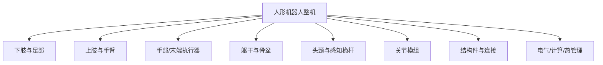

### 9.1.2 接口定义：机械、电气、热、数据与安全

子系统之间的接口决定了整机集成效率与可靠性。接口设计需在早期冻结，并通过**接口控制文件（Interface Control Document, ICD）**进行管理。

!!! note "术语解释：接口控制文件、机械接口、电气接口、热接口、数据接口"
    - **接口控制文件（ICD）**：记录子系统间所有接口参数、版本与责任的受控文件。
    - **机械接口（mechanical interface）**：几何尺寸、配合、紧固、公差、刚度与质量约束。
    - **电气接口（electrical interface）**：电压、电流、功率、信号、接插件、EMC 与保护。
    - **热接口（thermal interface）**：热生成、散热路径、界面材料、温度限值。
    - **数据接口（data interface）**：通信协议、带宽、周期、同步与安全校验。

接口五维度的设计要点见下表：

| 接口维度 | 关键参数 | 设计风险 |
|---|---|---|
| 机械 | 定位销、螺栓规格、配合公差、刚度 | 装配超差、松动、对中不良 |
| 电气 | 额定电压、峰值电流、接插件键位 | 电弧、过流、接触失效、EMC |
| 热 | 热阻、界面热导率、冷却方式 | 电机/驱动过热、减速器润滑失效 |
| 数据 | EtherCAT、CAN-FD、以太网、同步精度 | 丢包、抖动、时钟漂移 |
| 安全 | STO、急停、互锁、故障安全态 | 失控、碰撞、电击 |

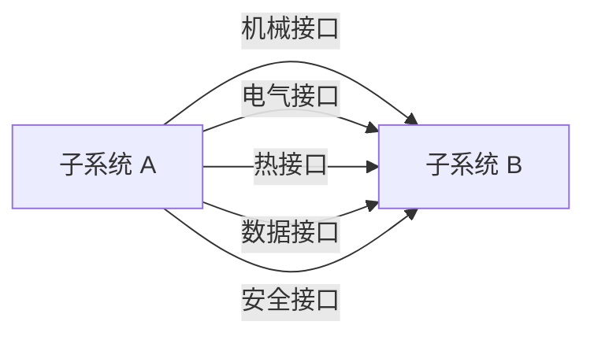

### 9.1.3 V&V、DV 与 PV：从设计验证到产品验证

人形机器人子系统开发遵循 V 模型，其中验证与确认贯穿始终。**设计验证（Design Verification, DV）**验证产品是否按设计规范制造；**产品验证（Product Validation, PV）**确认产品是否满足用户需求与真实场景。

!!! note "术语解释：V&V、设计验证、产品验证、确认、可追溯性"
    - **V&V（Verification & Validation）**：验证产品符合规范、确认产品满足需求的系统工程活动。
    - **设计验证（DV）**：在受控条件下检验设计输出是否满足设计输入。
    - **产品验证（PV）**：在真实或代表性场景中确认产品满足用户需求。
    - **确认（validation）**：回答"是否做了正确的事"，而非"是否正确地做事"。
    - **可追溯性（traceability）**：需求-设计-验证-问题之间的双向追踪关系。

!!! note "术语解释：需求追踪矩阵、测试覆盖矩阵、设计评审、基线"
    - **需求追踪矩阵（Requirements Traceability Matrix, RTM）**：将需求、设计、验证与测试用例一一对应的表格。
    - **测试覆盖矩阵（test coverage matrix）**：验证每个需求是否被测试覆盖的矩阵。
    - **设计评审（design review）**：对设计输出进行系统性审查的工程活动。
    - **基线（baseline）**：经过正式评审与批准、作为后续变更参照的文档或产品状态。

DV/PV 的典型层级如下：

1. **单元级**：电机台架、减速器寿命、编码器精度、力矩传感器标定。
2. **子系统级**：单腿测试台、手臂测试台、灵巧手抓取台、头颈伺服台。
3. **系统集成级**：整机行走、操作、跌落、EMC、热平衡。
4. **现场验证级**：真实场景试运行、用户验收、可靠性增长。

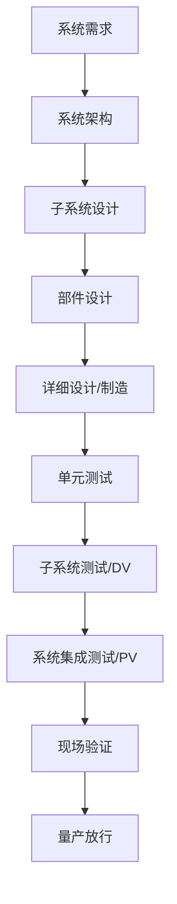

### 9.1.4 模块化设计：标准化、可维护与并行开发

**模块化设计（modular design）**将功能封装为具有标准接口的模块，使不同团队可并行开发、独立验证、快速替换。对于人形机器人，模块化主要体现在关节模组、电池包、计算单元、感知桅杆与手部。

!!! note "术语解释：模块化、标准化、可维护性、并行工程、平台化"
    - **模块化（modularity）**：将系统拆分为可独立设计、制造、替换的模块。
    - **标准化（standardization）**：统一接口、规格、测试方法与文档格式。
    - **可维护性（maintainability）**：产品发生故障后能被快速修复的能力。
    - **并行工程（concurrent engineering）**：多领域团队同步开展设计与验证。
    - **平台化（platforming）**：基于共用模块衍生多款产品的策略。

模块化带来的收益与挑战：

| 收益 | 挑战 |
|---|---|
| 缩短开发周期 | 接口定义需提前冻结 |
| 降低集成风险 | 模块间电磁/热/振动耦合 |
| 提高可维护性 | 标准化与定制化平衡 |
| 支持平台扩展 | 模块成本与性能边界 |

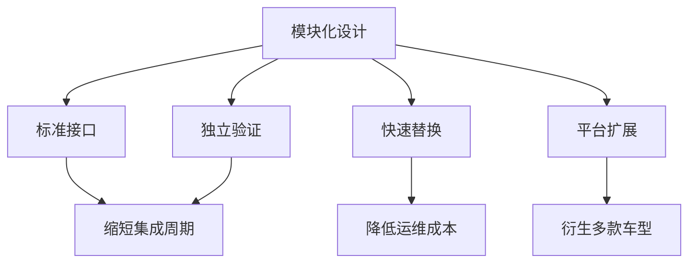

### 9.1.5 本章在整机设计流程中的位置

第 8 章阐述人形机器人总体设计原理，本章聚焦关键子系统，后续章节将分别讨论制造工艺、装配测试、控制算法与 AI 模型。本章是连接总体需求与具体实现的桥梁。

!!! note "术语解释：总体设计、详细设计、设计迭代、跨层连接"
    - **总体设计（conceptual/system design）**：确定功能、架构、关键参数与主要权衡。
    - **详细设计（detailed design）**：完成可制造的图纸、BOM、工艺与测试规范。
    - **设计迭代（design iteration）**：根据验证结果反复优化方案的过程。
    - **跨层连接（cross-layer linkage）**：不同技术层之间的输入输出关系。

---

## 9.2 下肢与足部子系统设计

### 9.2.1 下肢运动链：髋、膝、踝的功能分配

人形机器人下肢通常由双侧对称的髋、膝、踝组成，承担支撑体重、推进身体、吸收冲击与保持平衡的任务。髋关节通常采用 3-DOF 正交布局（屈曲/伸展、外展/内收、内旋/外旋），膝关节以 1-DOF 屈曲/伸展为主，踝关节提供俯仰与横滚（2-DOF），部分设计加入偏航（3-DOF）以辅助转向。

!!! note "术语解释：髋关节、膝关节、踝关节、屈曲/伸展、外展/内收、内旋/外旋"
    - **髋关节（hip joint）**：连接躯干/骨盆与大腿的关节，通常为多自由度球窝类布局。
    - **膝关节（knee joint）**：连接大腿与小腿的关节，主要实现屈曲/伸展。
    - **踝关节（ankle joint）**：连接小腿与足的关节，控制足部俯仰与横滚。
    - **屈曲/伸展（flexion/extension）**：关节在矢状面内的前后运动。
    - **外展/内收（abduction/adduction）**：关节在冠状面内的侧向运动。
    - **内旋/外旋（internal/external rotation）**：绕肢体长轴的旋转运动。

!!! note "术语解释：矢状面、冠状面、横断面、解剖学姿势"
    - **矢状面（sagittal plane）**：将身体分为左右两部分的垂直平面。
    - **冠状面（coronal/frontal plane）**：将身体分为前后两部分的垂直平面。
    - **横断面（transverse plane）**：将身体分为上下两部分的水平平面。
    - **解剖学姿势（anatomical position）**：人体直立、面向前、掌心向前的标准参考姿势。

下肢各关节功能分配：

| 关节 | 主要 DOF | 核心功能 | 典型运动范围 |
|---|---|---|---|
| 髋 | 3 | 抬腿、侧摆、转向、步长调节 | 屈曲 ±120°，外展 ±45°，旋转 ±45° |
| 膝 | 1 | 支撑期锁定、摆动期抬脚、落地缓冲 | 0–135° 屈曲 |
| 踝 | 2–3 | 足跟着地缓冲、足尖蹬地、侧倾调节 | 俯仰 ±45°，横滚 ±30° |


### 9.2.2 运动学建模：简化腿的正运动学

为便于分析下肢工作空间，常将单腿简化为 3-DOF 髋（roll/pitch/yaw）+ 1-DOF 膝 + 2-DOF 踝（pitch/roll）的串链。通过改进型 DH 参数或旋量法建立正运动学，可计算机足相对髋的位置。

!!! note "术语解释：正运动学、DH 参数、改进型 DH、旋量、齐次变换"
    - **正运动学（forward kinematics）**：由关节角计算末端位姿的映射。
    - **DH 参数（Denavit-Hartenberg parameters）**：用四个参数（a, α, d, θ）描述相邻连杆坐标系关系。
    - **改进型 DH（modified DH, MDH）**：将连杆长度 α 与扭角 α 定义在前一关节处，避免相邻平行轴奇异。
    - **旋量（screw）**：描述刚体绕轴旋转并沿轴平移的几何量。
    - **齐次变换（homogeneous transformation）**：4×4 矩阵，同时描述旋转与平移。

对于平面简化腿（髋 pitch θ₁、膝 θ₂、踝 pitch θ₃），足端位置可写为：

$$
\begin{aligned}
x &= l_1 \sin\theta_1 + l_2 \sin(\theta_1+\theta_2) + l_3 \sin(\theta_1+\theta_2+\theta_3) \\
z &= -l_1 \cos\theta_1 - l_2 \cos(\theta_1+\theta_2) - l_3 \cos(\theta_1+\theta_2+\theta_3)
\end{aligned}
$$

其中 \(l_1, l_2, l_3\) 分别为大腿、小腿与足长，z 轴向上为正。

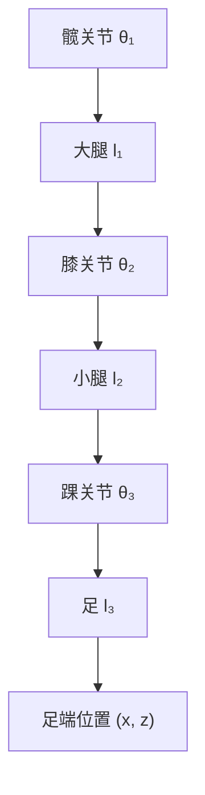

### 9.2.3 足底可达区域：Python 算例 1

以下 Python 示例计算简化 6-DOF 腿（髋 roll/pitch/yaw、膝 pitch、踝 pitch/roll）在关节限位内的足底中心可达点云，并绘制侧视图与俯视图。

```python
import numpy as np
import matplotlib.pyplot as plt

# 下肢简化正运动学与足底可达区域
# 定义连杆长度 (m): 髋->膝, 膝->踝, 踝->足底中心
L_thigh = 0.40
L_shank = 0.40
L_foot  = 0.08

# 关节限位 (度)
limits = {
    'hip_roll':  (-30, 30),
    'hip_pitch': (-90, 60),
    'hip_yaw':   (-45, 45),
    'knee':      (0, 135),
    'ank_pitch': (-45, 45),
    'ank_roll':  (-20, 20),
}

# 绕 x, y, z 轴的旋转矩阵
def Rx(a): c, s = np.cos(a), np.sin(a); return np.array([[1,0,0],[0,c,-s],[0,s,c]])
def Ry(a): c, s = np.cos(a), np.sin(a); return np.array([[c,0,s],[0,1,0],[-s,0,c]])
def Rz(a): c, s = np.cos(a), np.sin(a); return np.array([[c,-s,0],[s,c,0],[0,0,1]])

# 齐次变换：绕轴旋转后平移
def T_rot_trans(R, p):
    T = np.eye(4)
    T[:3,:3], T[:3,3] = R, p
    return T

points = []
np.random.seed(42)
for _ in range(80000):
    hr = np.radians(np.random.uniform(*limits['hip_roll']))
    hp = np.radians(np.random.uniform(*limits['hip_pitch']))
    hy = np.radians(np.random.uniform(*limits['hip_yaw']))
    kn = np.radians(np.random.uniform(*limits['knee']))
    ap = np.radians(np.random.uniform(*limits['ank_pitch']))
    ar = np.radians(np.random.uniform(*limits['ank_roll']))

    # 髋关节：roll -> pitch -> yaw
    T_hip = T_rot_trans(Rz(hy) @ Ry(hp) @ Rx(hr), np.zeros(3))
    # 大腿连杆沿 -z 方向（向下）
    T_thigh = T_rot_trans(np.eye(3), np.array([0, 0, -L_thigh]))
    # 膝关节仅 pitch
    T_knee = T_rot_trans(Ry(kn), np.zeros(3))
    # 小腿连杆
    T_shank = T_rot_trans(np.eye(3), np.array([0, 0, -L_shank]))
    # 踝关节 roll -> pitch
    T_ankle = T_rot_trans(Ry(ap) @ Rx(ar), np.zeros(3))
    # 足底中心
    T_foot = T_rot_trans(np.eye(3), np.array([0, 0, -L_foot]))

    T_total = T_hip @ T_thigh @ T_knee @ T_shank @ T_ankle @ T_foot
    points.append(T_total[:3, 3])

points = np.array(points)

fig, ax = plt.subplots(1, 2, figsize=(12, 5))
ax[0].scatter(points[:,0], points[:,2], s=1, alpha=0.3, c='b')
ax[0].set_xlabel('x (m)'); ax[0].set_ylabel('z (m)')
ax[0].set_title('足底可达区域侧视图')
ax[0].set_aspect('equal'); ax[0].grid(True)

ax[1].scatter(points[:,0], points[:,1], s=1, alpha=0.3, c='r')
ax[1].set_xlabel('x (m)'); ax[1].set_ylabel('y (m)')
ax[1].set_title('足底可达区域俯视图')
ax[1].set_aspect('equal'); ax[1].grid(True)
plt.tight_layout(); plt.savefig('leg_workspace_ch9.png', dpi=150)
print(f"采样点数: {len(points)}")
print(f"x 范围: [{points[:,0].min():.3f}, {points[:,0].max():.3f}]")
print(f"y 范围: [{points[:,1].min():.3f}, {points[:,1].max():.3f}]")
print(f"z 范围: [{points[:,2].min():.3f}, {points[:,2].max():.3f}]")
```

该算例说明：即使关节运动范围较宽，足端可达区域仍受连杆长度与关节耦合约束，呈现近似椭球壳形状；设计时应保证常用步态工作点位于可达区中心，避免靠近边界奇异。

!!! note "术语解释：可达区域、工作空间、蒙特卡洛采样、奇异构型"
    - **可达区域（reachable workspace）**：末端执行器至少能以一种姿态到达的所有点集合。
    - **工作空间（workspace）**：末端可达点与可达姿态的综合描述。
    - **蒙特卡洛采样（Monte Carlo sampling）**：通过随机采样近似复杂几何或概率问题的方法。
    - **奇异构型（singular configuration）**：Jacobian 降秩、速度/力传递出现极值或无穷解的构型。

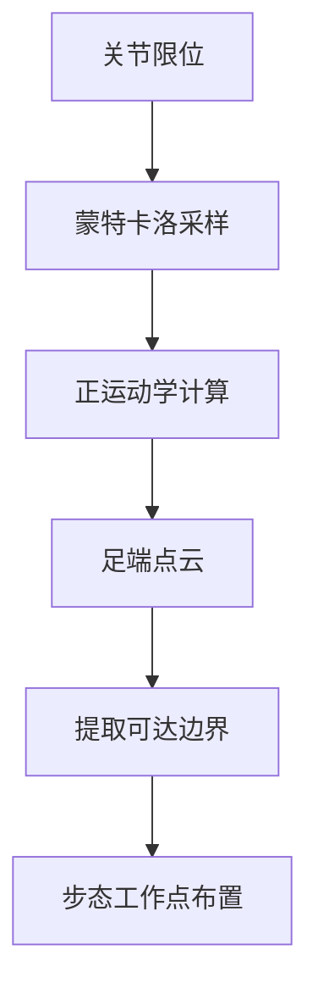

### 9.2.4 柔顺吸振：足、踝与小腿的缓冲设计

双足行走必然伴随周期性冲击。地面反作用力峰值可达体重的 1.2–1.8 倍（行走）或 2–3 倍（跑步/跌落）。若冲击直接传递至刚性关节与结构，将引发振动、噪声、疲劳与传感噪声。因此下肢必须具备**柔顺性（compliance）**与**吸振（vibration absorption）**能力。

!!! note "术语解释：柔顺性、刚度、阻尼、吸振、冲击、地面反作用力"
    - **柔顺性（compliance）**：系统在力作用下产生变形的难易程度，刚度的倒数。
    - **刚度（stiffness）**：单位变形所需的力。
    - **阻尼（damping）**：耗散振动能量的机制。
    - **吸振（vibration absorption）**：通过材料、结构或控制吸收并衰减冲击能量。
    - **冲击（impact）**：短时高幅值的力或加速度。
    - **地面反作用力（Ground Reaction Force, GRF）**：地面作用于足部的力。

柔顺设计通常分布在三个层级：

1. **被动柔顺**：足底橡胶垫、踝部弹簧、小腿弹性板、关节输出弹性体。
2. **半主动柔顺**：变刚度机构、磁流变/电流变阻尼器。
3. **主动柔顺**：基于力矩传感器的阻抗/导纳控制、顺应地形控制。

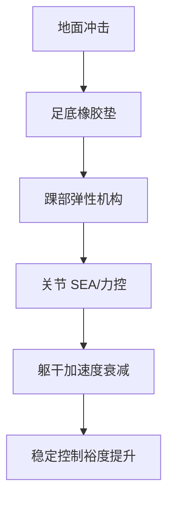

#### 9.2.4.1 足-地冲击的集中参数模型

为从第一性原理理解柔顺吸振，可将足-地接触简化为一个单自由度质量-弹簧-阻尼器（mass-spring-damper, MSD）系统。设等效质量为机器人落地时参与冲击的足部与小腿远端质量 \(m\)，等效刚度为足底垫与踝部弹性机构的串联刚度 \(k\)，等效阻尼为 \(c\)。足端在触地瞬间具有垂直向下的初速度 \(v_0\)，地面反作用力 \(F_g(t)\) 使足端减速。

!!! note "术语解释：质量-弹簧-阻尼器、固有角频率、阻尼比、临界阻尼、过冲"
    - **质量-弹簧-阻尼器（mass-spring-damper, MSD）**：由集中质量、理想弹簧与理想阻尼器组成的二阶振动系统。
    - **固有角频率（natural angular frequency）**：无阻尼自由振动的角频率，\(\omega_n = \sqrt{k/m}\)。
    - **阻尼比（damping ratio）**：实际阻尼与临界阻尼的比值，\(\zeta = c / (2\sqrt{mk})\)。
    - **临界阻尼（critical damping）**：使系统以最快速度回到平衡位置且无振荡的阻尼，\(c_c = 2\sqrt{mk}\)。
    - **过冲（overshoot）**：欠阻尼响应中超过稳态值的最大峰值。

运动方程由牛顿第二定律给出：

$$
m\ddot{x} + c\dot{x} + kx = -mg
$$

其中 \(x\) 为足端相对地面的垂直压缩位移（向下为正），右侧 \(-mg\) 为重力项。在触地瞬间可忽略重力（冲击时间远小于重力产生显著位移的时间），并令 \(y = x + mg/k\) 将方程齐次化，得到标准形式：

$$
\ddot{y} + 2\zeta\omega_n\dot{y} + \omega_n^2 y = 0, \quad \omega_n = \sqrt{\frac{k}{m}}, \quad \zeta = \frac{c}{2\sqrt{mk}}
$$

初始条件为 \(y(0) = mg/k\)（静平衡偏移）、\(\dot{y}(0) = v_0\)。对于欠阻尼情形 \(0 < \zeta < 1\)，其解析解为：

$$
y(t) = e^{-\zeta\omega_n t}\left[ y(0)\cos(\omega_d t) + \frac{\dot{y}(0) + \zeta\omega_n y(0)}{\omega_d}\sin(\omega_d t) \right]
$$

其中 \(\omega_d = \omega_n\sqrt{1-\zeta^2}\) 为阻尼固有角频率。地面反力（忽略静平衡部分）为：

$$
F_g(t) = k\,y(t) + c\,\dot{y}(t)
$$

**峰值力估算**：当阻尼较小时（\(\zeta < 0.3\)），最大压缩位移可用零阻尼上界快速估计：

$$
\delta_{\max}^{(0)} \approx \frac{v_0}{\omega_n} = v_0\sqrt{\frac{m}{k}}
$$

峰值地面反力出现在压缩位移最大、速度近似为零的时刻，因此更准确的估算为：

$$
F_{g,\max} \approx k\,\delta_{\max} + m g
$$

其中 \(\delta_{\max}\) 为计入阻尼后的实际最大压缩。该式表明：在相同触地速度下，峰值反力与 \(\sqrt{k}\) 近似成正比——softer 的足底垫显著降低冲击载荷，但过软会延长支撑相稳定时间并降低位置精度。

**数值示例**：设足部等效质量 \(m = 1.5\,\text{kg}\)，触地速度 \(v_0 = 0.8\,\text{m/s}\)，足底垫刚度 \(k = 5\times10^4\,\text{N/m}\)，阻尼比 \(\zeta = 0.25\)。则：

$$
\omega_n = \sqrt{\frac{5\times10^4}{1.5}} \approx 182.6\,\text{rad/s}, \quad f_n \approx 29.1\,\text{Hz}
$$

零阻尼上界 \(\delta_{\max}^{(0)} \approx 0.8/182.6 \approx 4.38\,\text{mm}\)；计入阻尼后数值解给出 \(\delta_{\max} \approx 2.94\,\text{mm}\)，对应峰值地面反力：

$$
F_{g,\max} \approx 5\times10^4 \times 2.94\times10^{-3} + 1.5\times9.81 \approx 147 + 15 \approx 162\,\text{N}
$$

与数值解 \(169\,\text{N}\) 接近。该峰值力对 1.5 kg 等效质量相当于约 \(11.5\,g\) 的等效过载，说明柔顺设计可将冲击载荷控制在有限范围内。

```python
import numpy as np
import matplotlib.pyplot as plt
from scipy.integrate import solve_ivp

# 足-地冲击集中参数模型参数
m = 1.5            # 等效质量 kg
k = 5e4            # 等效刚度 N/m
zeta = 0.25        # 阻尼比
v0 = 0.8           # 触地速度 m/s（向下）
g = 9.81           # 重力加速度 m/s^2

omega_n = np.sqrt(k / m)
c = 2 * zeta * np.sqrt(m * k)
omega_d = omega_n * np.sqrt(1 - zeta**2)

def impact_dynamics(t, state):
    x, v = state
    # x 为压缩位移（向下为正），弹簧力向上为负
    dxdt = v
    dvdt = (-k * x - c * v - m * g) / m
    return [dxdt, dvdt]

# 初始：x=0（未压缩），v=v0 向下（取为正）
sol = solve_ivp(impact_dynamics, [0, 0.08], [0.0, v0], max_step=1e-4, dense_output=True)
t = sol.t
x = sol.y[0]
v = sol.y[1]
F_g = k * x + c * v  # 地面反力（向上为正，因 x 向下压缩时弹簧受压向上推）

plt.figure(figsize=(10, 4))
plt.subplot(1, 2, 1)
plt.plot(t * 1000, x * 1000, label='压缩位移 x')
plt.xlabel('时间 (ms)'); plt.ylabel('压缩位移 (mm)')
plt.grid(True); plt.legend()
plt.subplot(1, 2, 2)
plt.plot(t * 1000, F_g, label='地面反力 F_g')
plt.axhline(m * g, color='k', linestyle='--', label='静重 mg')
plt.xlabel('时间 (ms)'); plt.ylabel('地面反力 (N)')
plt.grid(True); plt.legend()
plt.tight_layout(); plt.savefig('foot_impact_msd_ch9.png', dpi=150)

print(f"固有频率 f_n = {omega_n/(2*np.pi):.2f} Hz")
print(f"最大压缩位移 = {np.max(x)*1000:.2f} mm")
print(f"峰值地面反力 = {np.max(F_g):.2f} N")
print(f"达到峰值时间 = {t[np.argmax(F_g)]*1000:.2f} ms")
```

该算例展示了冲击载荷的瞬态特征：峰值力出现在触地后约 \(5\!-\!10\,\text{ms}\)，随后经阻尼衰减。设计时可通过调整 \(k\) 与 \(\zeta\) 在峰值力、压缩量与能量回弹之间权衡。详情见第 6 章 6.3 节关于热-力耦合与执行器选型的讨论。

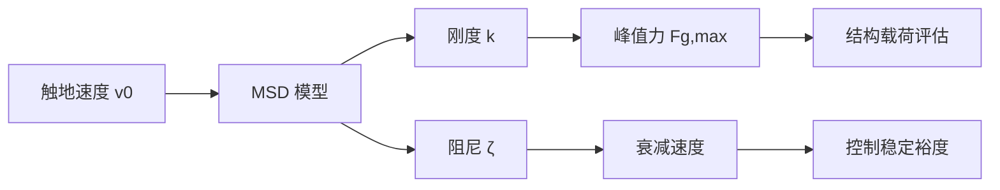

### 9.2.5 质量分布：减轻摆动腿惯量

摆动腿加速度高，其质量与惯量直接影响能耗与控制带宽。设计原则是：**尽量将质量靠近髋关节（近端），小腿与足部轻量化**。

!!! note "术语解释：惯量、转动惯量、质心、摆动腿、支撑腿、质量分布"
    - **惯量（inertia）**：物体抵抗角加速度的能力。
    - **转动惯量（moment of inertia）**：绕特定轴的惯量，与质量分布有关。
    - **质心（Center of Mass, CoM）**：质量加权平均位置。
    - **摆动腿（swing leg）**：迈步过程中不接触地面的腿。
    - **支撑腿（stance leg）**：支撑体重的腿。
    - **质量分布（mass distribution）**：质量沿肢体不同位置的分配。

腿部连杆质量分布经验：

| 部位 | 目标质量占比 | 设计手段 |
|---|---|---|
| 大腿 | 可适度集中 | 电机/减速器可部分上置 |
| 小腿 | 尽量轻 | 碳纤维管、镂空铝合金 |
| 足部 | 尽量轻 | 薄壁壳体、轻量橡胶 |

腿部总质量通常占整机质量的 30–40%。若小腿与足部过重，将显著增加髋关节力矩需求并降低动态响应。

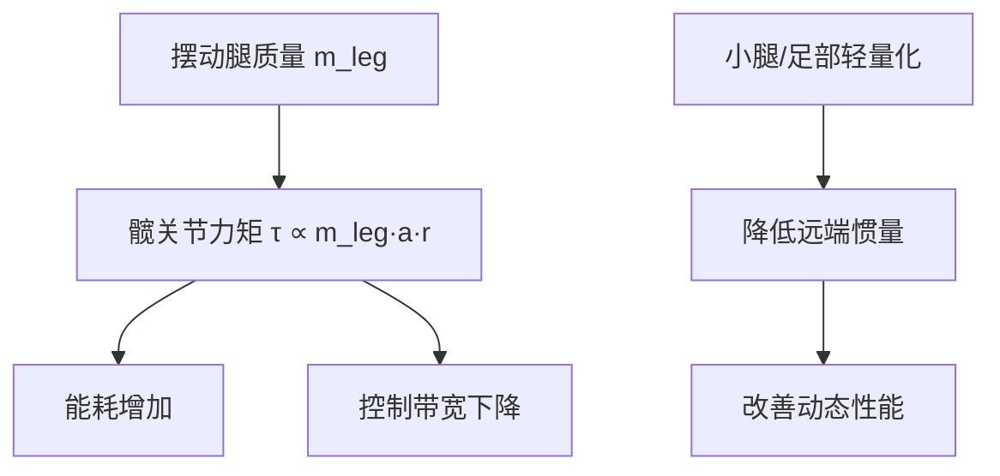

### 9.2.6 足部设计：接触面、CoP 与足式传感器

足部是下肢与地面的唯一接触界面，其形状、尺寸、材料与传感器布局直接影响稳定性与感知能力。足部设计需在**支撑面积、灵活性、重量与传感复杂度**之间权衡。

!!! note "术语解释：足底、压力中心、CoP、足式传感器、六维力/力矩传感器、触觉阵列"
    - **足底（foot sole）**：足部与地面接触的表面。
    - **压力中心（Center of Pressure, CoP）**：地面反作用力在足底上的等效作用点。
    - **足式传感器（foot sensor）**：测量足底力、力矩、压力或触觉的装置。
    - **六维力/力矩传感器（6-axis F/T sensor）**：同时测量三个力与三个力矩的传感器。
    - **触觉阵列（tactile array）**：分布式压力/剪切力传感单元。

CoP 与 ZMP 的关系：当足底完全接触水平地面且摩擦足够时，ZMP 与 CoP 重合。动态稳定判据为 CoP 位于支撑多边形内：

$$
\mathbf{p}_{\text{CoP}} = \frac{\sum_i p_i F_{z,i}}{\sum_i F_{z,i}}
$$

其中 \(p_i\) 为各压力单元位置，\(F_{z,i}\) 为垂直压力。

足部形态对比：

| 形态 | 优点 | 缺点 | 代表 |
|---|---|---|---|
| 平板足 | 支撑稳定、易集成传感器 | 缺乏足弓缓冲 | ASIMO、Digit |
| 分段足 | 可模仿足跟着地-滚动-蹬地 | 结构复杂 | Atlas、部分研究机 |
| 点接触足 | 灵活、越障 | 稳定性差 | 早期双足机 |


### 9.2.7 下肢设计要点总结

下肢设计的核心指标可归纳为：

| 指标 | 关键设计参数 | 验证手段 |
|---|---|---|
| 运动能力 | 关节范围、速度、加速度 | 单腿台架、运动捕捉 |
| 负载能力 | 峰值扭矩、结构强度 | 静载/疲劳试验 |
| 动态稳定性 | 惯量、CoP/GRF 控制 | 行走实验、扰动测试 |
| 能效 | 质量分布、传动效率、再生制动 | 能耗测试 |
| 可靠性 | 密封、润滑、紧固 | HALT、寿命台 |
| 安全 | 跌倒保护、碰撞力 | 跌落实验、力限测试 |


#### 9.2.8 下肢载荷工况与关节力矩估算

真实下肢设计必须从典型载荷工况出发，而非仅看额定关节扭矩。主要工况包括：**支撑相（stance phase）**单腿支撑全身、**摆动相（swing phase）**抬腿加速、**落地冲击（landing impact）**足触地瞬间，以及**深蹲/起立**、**楼梯/斜坡**、**跌倒保护**等极限工况。

!!! note "术语解释：支撑相、摆动相、落地冲击、静态力矩、动态力矩"
    - **支撑相（stance phase）**：行走周期中足部与地面接触、承担体重的阶段。
    - **摆动相（swing phase）**：足部离地并向前摆动的阶段。
    - **落地冲击（landing impact）**：摆动腿足端触地时产生的短时高幅值地面反力。
    - **静态力矩（static torque）**：由重力、地面反力等稳态载荷产生的关节力矩。
    - **动态力矩（dynamic torque）**：由加速度、惯性力产生的关节力矩。

工程估算中，单腿支撑相地面反力峰值通常取 \(1.5\!-\!2.5\,mg\)（行走）或 \(2.5\!-\!4.0\,mg\)（跑步/跌落缓冲），其中 \(m\) 为整机质量。以矢状面简化模型为例，髋关节力矩可近似为地面反力对髋部力臂的叠加：

$$
\tau_{\text{hip}} \approx F_z \cdot x_{\text{foot}/\text{hip}} + m_{\text{thigh}} g \cdot x_{\text{thigh,CoM}} + m_{\text{shank}} g \cdot x_{\text{shank,CoM}}
$$

更一般地，对任意连杆 \(i\)，关节力矩满足：

$$
\tau_i = \mathbf{r}_i \times \mathbf{F}_{\text{ground}} + \sum_{j\ge i} m_j \, \mathbf{g} \times \mathbf{r}_{j,\text{CoM}}
$$

其中 \(\mathbf{r}_i\) 为从关节 \(i\) 到地面反力作用点的矢量，\(m_j\) 为远端连杆质量，\(\mathbf{r}_{j,\text{CoM}}\) 为远端连杆质心相对关节的位置矢量。落地冲击时还需计入惯性项 \(I_i \ddot{\theta}_i\)，髋/膝/踝瞬时力矩可比稳态高 \(30\!-\!80\%\)。

典型人形机器人（整机质量 60–80 kg）关节峰值力矩工程估算：

| 关节 | 支撑相力矩 (N·m) | 落地冲击力矩 (N·m) | 备注 |
|---|---|---|---|
| 髋 pitch | 80–180 | 150–300 | 与步长、躯干倾角强相关 |
| 膝 pitch | 80–200 | 180–400 | 深蹲时最大 |
| 踝 pitch | 60–150 | 120–280 | 足尖蹬地与足跟着地 |
| 踝 roll | 30–80 | 60–150 | 单腿站立侧倾 |

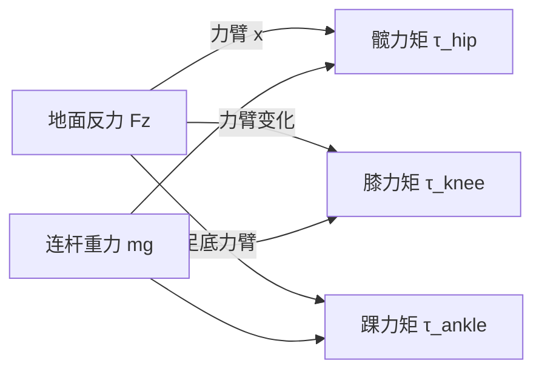


**典型工况参数化示例**：

| 工况 | 垂直 GRF (N) | 水平 GRF (N) | 髋力矩 (N·m) | 膝力矩 (N·m) | 踝力矩 (N·m) |
|---|---|---|---|---|---|
| 平静站立（双足） | 300 | 0 | ±10 | 5 | 5 |
| 单腿支撑（60 kg 机器人） | 600 | 50 | 120 | 100 | 80 |
| 快走落地冲击 | 1000 | 150 | 250 | 280 | 200 |
| 深蹲起立 | 800 | 0 | 200 | 300 | 150 |
| 侧向单腿站立 | 600 | 80 | 80 | 90 | 120 |

表中数值为工程估算，实际设计应通过多体动力学仿真与样机测试迭代确定。安全系数通常取 \(1.5\!-\!2.5\) 覆盖动态不确定性与材料分散性。

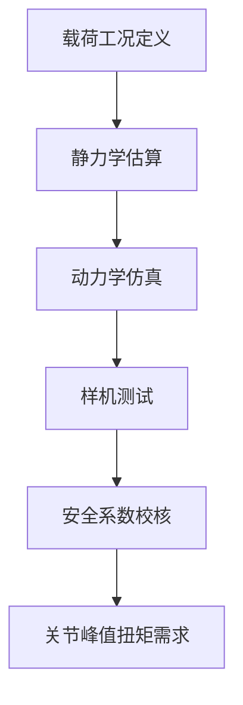

#### 9.2.9 髋关节详细设计

髋关节承受全身重量并通过大腿传递地面反力，其设计核心是在紧凑空间内实现高刚度、低摩擦与长寿命。常见结构为 3-DOF 正交轴系：髋 roll（外展/内收）、髋 pitch（屈曲/伸展）、髋 yaw（内旋/外旋），三轴通常采用嵌套或堆叠布局。

!!! note "术语解释：交叉滚子轴承、额定动载荷、L10 寿命、螺栓布置圈、预紧、偏心距、壳体刚度"
    - **交叉滚子轴承（crossed roller bearing）**：滚子以 90° 交叉排列，可同时承受径向、轴向与倾覆力矩的轴承。
    - **额定动载荷（basic dynamic load rating, C）**：轴承在额定寿命 \(10^6\) 转时能承受的恒定载荷。
    - **L10 寿命**：90% 轴承能达到或超过的额定寿命。
    - **螺栓布置圈（bolt circle diameter, BCD）**：法兰安装螺栓中心分布圆的直径。
    - **预紧（preload）**：装配时施加的初始压紧力，用于消除间隙、提高刚度。
    - **偏心距（offset）**：关节旋转轴线与结构几何中心之间的偏移距离。
    - **壳体刚度（housing stiffness）**：关节外壳抵抗变形的能力，影响轴承实际载荷分布。

**轴承选型**：髋关节输出端常用交叉滚子轴承或双列角接触轴承。以交叉滚子轴承为例，其额定动载荷 \(C\) 应满足：

$$
C \ge P \cdot \left(\frac{L_{10}}{10^6}\right)^{1/\epsilon}
$$

其中 \(P\) 为当量动载荷，\(L_{10}\) 为目标额定寿命（转），\(\epsilon=10/3\)（滚子轴承）。对于人形机器人髋关节，目标寿命通常取 \(>5\times10^7\) 转，对应 \(C\) 应取峰值径向载荷的 \(1.5\!-\!2.5\) 倍。若峰值倾覆力矩 \(M_t\) 较大，需校核轴承静载安全系数 \(S_0 = C_0/P_0\)，通常要求 \(S_0 \ge 2\)。

**螺栓布置与预紧**：髋关节法兰螺栓布置圈直径 \(D_{\text{bc}}\) 通常取轴承节圆直径的 \(1.1\!-\!1.3\) 倍。螺栓预紧力 \(F_p\) 应保证在工作载荷下接合面不分离：

$$
F_p \ge \frac{F_{\text{external}}}{1 - \frac{k_b}{k_b + k_m}}
$$

式中 \(k_b\)、\(k_m\) 分别为螺栓与被连接件刚度。M8 高强度螺栓（10.9 级）典型预紧力 20–30 kN，拧紧力矩 \(T \approx 0.2 F_p d\)。

**偏心距控制**：髋关节各轴轴线交点应尽可能靠近人体解剖学髋臼中心，一般控制在 \(\pm 2\,\text{mm}\) 以内。轴线偏移过大会导致步态中额外的寄生力矩与 CoM 晃动。

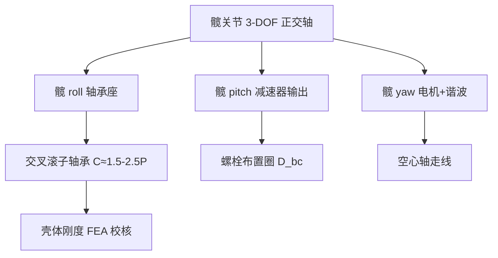


**髋关节刚度经验目标**：整机行走时，骨盆相对大腿的扭转角变形应控制在 \(0.1°\) 以内。设髋 roll 轴额定工作力矩 \(M=150\,\text{N·m}\)，则关节扭转刚度应满足：

$$
K_{\text{hip}} \ge \frac{M}{\theta_{\text{max}}} = \frac{150}{0.1° \times \pi/180} \approx 8.6\times10^4\,\text{N·m/rad}
$$

实际设计中，交叉滚子轴承、壳体与输出法兰共同构成串联刚度，通常壳体刚度应设计为轴承刚度的 \(2\!-\!5\) 倍以上，避免壳体成为薄弱环节。

**轴承预紧与摩擦**：交叉滚子轴承预紧力过大会显著增加启动力矩与温升。工程上以轻预紧或定位预紧为主，预紧后轴承摩擦力矩 \(M_f\) 可估算为：

$$
M_f \approx 0.5 \mu P_a d_m
$$

其中 \(\mu\) 为摩擦系数，\(P_a\) 为预紧力，\(d_m\) 为轴承节圆直径。髋关节轴承摩擦力矩通常应 \(<2\,\text{N·m}\)，否则影响力控精度。


#### 9.2.10 膝关节详细设计

膝关节主要实现矢状面屈伸，但人行走时膝关节还伴随小幅滚动-滑动。机器人膝关节常见两种结构：**旋转膝（revolute knee）**与**四连杆膝（four-bar linkage knee）**。

!!! note "术语解释：旋转膝、四连杆膝、髌骨、机械限位、轴承布置、腱传动、皮带传动"
    - **旋转膝（revolute knee）**：单旋转轴膝关节，结构简单、控制直接。
    - **四连杆膝（four-bar linkage knee）**：用四连杆机构近似人体膝关节瞬时中心，改善人机仿生。
    - **髌骨（patella）**：仿生设计中模拟膝盖骨的限位或导向结构。
    - **机械限位（mechanical stop）**：限制关节运动范围的物理挡块。
    - **轴承布置（bearing arrangement）**：支撑关节轴的轴承类型、数量与位置安排。
    - **腱传动（tendon drive）**：用柔性腱绳传递运动的传动方式。
    - **皮带传动（belt drive）**：用同步带传递运动的传动方式。

**旋转膝**：电机+谐波/行星减速器直接驱动膝轴，输出端通过交叉滚子轴承或圆锥滚子轴承承受径向与轴向联合载荷。其优点是控制模型简单、刚度直接可测；缺点是屈伸过程中膝瞬时中心固定，小腿相对大腿的轨迹与人腿差异较大。

**四连杆膝**：通过大腿杆、小腿杆、前后连杆构成四连杆，使膝关节瞬时中心在屈伸过程中沿近似人体膝的轨迹移动。其优点是人机运动学更匹配、假肢/外骨骼中应用广泛；缺点是机构复杂、存在连杆间隙与额外惯量，需要更复杂的正逆运动学。

**髌骨与限位**：旋转膝通常在伸直方向（\(0°\)）设置硬限位，防止过伸；屈曲方向限制在 \(130°\!-\!150°\)。限位处可设置缓冲垫（聚氨酯或硫化橡胶）吸收残余冲击。四连杆膝则通过连杆几何死点实现自然伸直锁定。

**轴承布置**：膝轴承受大腿以下全部重量与地面反力，常用一对圆锥滚子轴承背对背（DB）或面对面（DF）配置，以同时承受径向力与倾覆力矩。轴承跨距 \(L_b\) 建议为关节输出法兰直径的 \(0.5\!-\!0.8\) 倍，以减小悬臂导致的倾覆角变形。

**腱/皮带空间**：若电机上置大腿以减轻小腿质量，需通过同步带或腱将动力跨过膝关节。同步带需保证包角 \(>120°\)，张紧力约为工作拉力的 \(1.3\!-\!1.5\) 倍；腱传动需设置导向轮，最小滑轮直径通常为腱径的 \(20\!-\!40\) 倍，以降低弯曲疲劳。

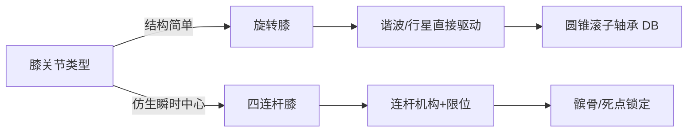


**膝轴强度与挠度**：膝轴直径 \(d\) 可按最大弯矩估算。设膝轴跨距 \(L_b=60\,\text{mm}\)，最大径向载荷 \(F_r=5000\,\text{N}\)，则最大弯矩 \(M = F_r L_b / 4 = 75\,\text{N·m}\)。按许用弯曲应力 \(\sigma_{\text{adm}} = 200\,\text{MPa}\)：

$$
d \ge \left(\frac{32 M}{\pi \sigma_{\text{adm}}}\right)^{1/3} \approx 0.015\,\text{m} = 15\,\text{mm}
$$

考虑键槽、轴承配合及安全系数，实际膝轴直径通常 \(20\!-\!35\,\text{mm}\)。轴挠度应 \(<0.02\,\text{mm}\)，以保证减速器与轴承正常工作。

**四连杆膝设计要点**：四连杆杆长比例影响膝关节瞬时中心轨迹。典型设计取：
- 大腿杆 \(a = 80\,\text{mm}\)
- 小腿杆 \(b = 90\,\text{mm}\)
- 前连杆 \(c = 40\,\text{mm}\)
- 后连杆 \(d = 50\,\text{mm}\)

杆件常用 \(17\!-\!4\) PH 不锈钢或 7075-T6 铝合金，关节处使用免维护自润滑轴承。

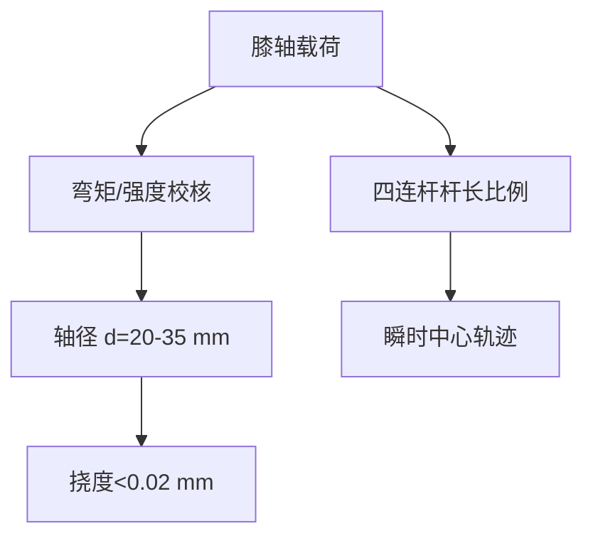

#### 9.2.11 踝关节与足部详细设计

踝关节通常提供 pitch（俯仰）与 roll（横滚）两个自由度，部分设计增加 yaw（偏航）以辅助转向。踝部空间狭小但力矩需求大，是下肢设计中的难点。

!!! note "术语解释：踝关节、pitch/roll 交汇点、谐波减速器、行星减速器、六维力传感器、平面度、Shore A、压缩量"
    - **踝关节（ankle joint）**：连接小腿与足部的关节，控制足部姿态。
    - **pitch/roll 交汇点（pitch/roll intersection）**：踝关节俯仰轴与横滚轴的空间交点。
    - **六维力/力矩传感器（6-axis F/T sensor）**：同时测量三方向力与三方向力矩的传感器。
    - **平面度（flatness）**：实际表面对理想平面的允许变动量。
    - **Shore A**：橡胶/弹性体硬度的邵氏 A 标度。
    - **压缩量（compression set）**：弹性体在压缩后不可恢复的变形量。

**轴线交汇点**：为降低行走时足端位置因踝角变化产生的寄生位移，pitch 轴与 roll 轴应尽可能交汇于一点，交汇点宜位于足底支撑面中心上方 \(30\!-\!60\,\text{mm}\) 处。轴线不交汇会引入额外运动学耦合，增加控制补偿难度。

**减速器空间**：踝 pitch 力矩大，通常采用谐波减速器（减速比 50–100）或摆线/行星减速器（减速比 30–50）以获得高扭矩密度；踝 roll 力矩相对较小，可采用紧凑型谐波或行星。由于踝部包络受限，电机常布置于小腿后侧或内侧，通过同步带/锥齿轮传动至踝轴。

**六维力传感器安装**：六维力传感器安装面的平面度通常要求 \(\le 0.02\,\text{mm}\)，粗糙度 \(Ra \le 1.6\,\mu\text{m}\)。螺栓预紧需均匀、对称，分 2–3 步拧紧至规定扭矩，避免传感器基座翘曲引入串扰。传感器上表面与足板之间应保留 \(0.1\!-\!0.3\,\text{mm}\) 的预压缩间隙，用于安装后的零点微调。

**足底橡胶垫**：足底垫材料常用丁腈橡胶（NBR）、聚氨酯（PU）或热塑性弹性体（TPE），硬度 Shore A 50–70。静态压缩量设计为垫厚的 \(10\!-\!20\%\)，以在足跟着地时提供足够缓冲又不至于过度塌陷。耐磨性能可通过 DIN 磨耗试验评估，目标磨耗量 \(<150\,\text{mm}^3\)。

**脚趾关节**：部分仿生足设计增加 \(1\!-\!2\) 个脚趾自由度，用于蹬地推进与越障。脚趾驱动可采用小型直线电机或腱驱动，关节角度范围通常 \(0\!-\!45°\)。脚趾增加复杂度与重量，需根据任务取舍。

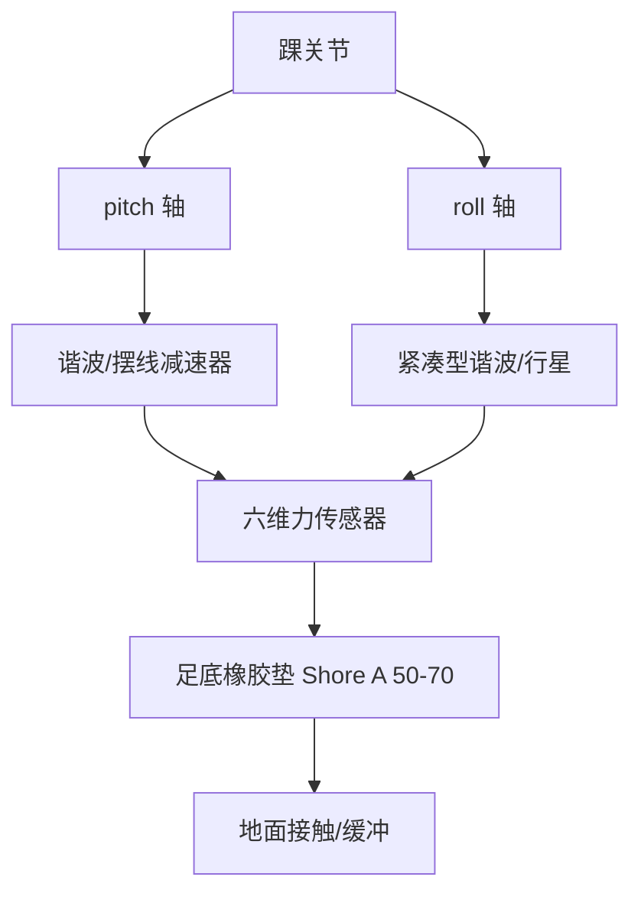


**六维力传感器串扰控制**：六维力传感器各通道之间存在机械耦合与电气串扰。安装面不平会导致额外弯矩，表现为力与力矩通道的串扰。工程要求：
- 安装面平面度 \(\le 0.02\,\text{mm}\)
- 螺栓预紧不均匀度 \(<10\%\)
- 传感器标定后串扰 \(<2\%\) FS

**足底压力分布**：理想足底压力分布为足跟触地时压力中心（CoP）从足跟向足尖移动。足底可布置 3–6 个压力传感器区域（足跟、足弓外侧、足弓内侧、跖骨、足尖），用于估计 CoP 与滑移。

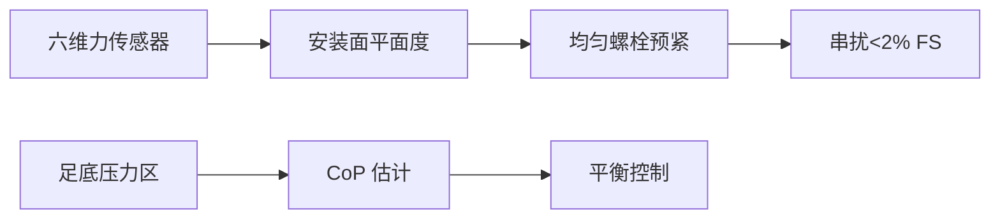

#### 9.2.12 柔顺机构工程实现

柔顺性不能仅依赖控制，必须通过机械结构实现可靠的冲击吸收与能量管理。下肢柔顺机构分布在足底、踝、膝乃至髋多个层级。

!!! note "术语解释：柔顺机构、弹簧刚度、阻尼器、粘弹材料、腱式吸振、能量回收"
    - **柔顺机构（compliant mechanism）**：通过弹性变形传递力与运动的机构。
    - **弹簧刚度（spring stiffness）**：弹簧产生单位变形所需的力。
    - **阻尼器（damper）**：耗散振动能量的装置。
    - **粘弹材料（viscoelastic material）**：同时具有弹性与粘性耗散特性的材料。
    - **腱式吸振（tendon vibration absorption）**：利用腱绳弹性吸收冲击振动。
    - **能量回收（energy regeneration）**：将机械能回收为电能储存的过程。

**弹簧刚度选择**：串联弹性执行器（SEA）的弹簧刚度 \(K_s\) 需在力控带宽与能量存储之间权衡。设电机-减速器侧等效刚度为 \(K_m\)，输出刚度近似为：

$$
\frac{1}{K_{\text{out}}} = \frac{1}{K_m} + \frac{1}{K_s}
$$

为获得良好力控特性，通常取 \(K_s = (0.05\!-\!0.2) K_m\)。过软会降低位置刚度与响应速度；过硬则失去柔顺优势。典型踝 SEA 弹簧刚度为 \(10^4\!-\!10^5\,\text{N·m/rad}\)。

**阻尼器/粘弹材料**：落地冲击的高频成分需要阻尼快速衰减。聚氨酯垫、Sorbothane、硅胶等粘弹材料的损耗因子 \(\tan\delta\) 在 \(0.1\!-\!0.5\) 之间，可将冲击能量的一部分转化为热能。磁流变/电流变阻尼器可实现可变阻尼，但重量与功耗较大。

**腱式吸振**：腱传动中适当长度的腱绳本身具有弹性，可起到类似 SEA 的作用。通过调节腱预紧力可改变等效刚度；预紧过低会导致回差，过高则失去吸振效果。腱弹性与电机惯量耦合还可能形成谐振，需通过阻尼或控制抑制。

**能量回收思路**：行走中支撑腿在足跟着地至全足支撑阶段储存重力势能，足尖蹬地阶段释放。理论上可通过串联弹性体与电机再生制动回收部分能量，但实际回收效率受电机发电效率、储能单元功率密度与转换电路限制，目前多在研究阶段。

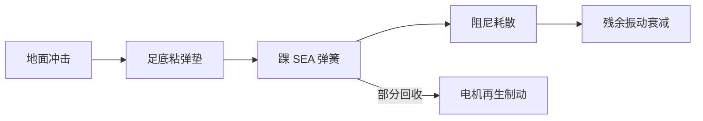


**柔顺机构设计检查清单**：

| 检查项 | 目标 | 验证方法 |
|---|---|---|
| 弹簧刚度 | \(K_s = 0.05\!-\!0.2 K_m\) | 扭转试验 |
| 阻尼比 | \(\zeta = 0.1\!-\!0.3\) | 自由衰减 |
| 最大变形 | 不超过弹性极限 | FEA/试验 |
| 疲劳寿命 | \(>10^7\) 次 | 疲劳台 |
| 温度稳定性 | 工作温度范围内刚度变化 \(<10\%\) | 高低温试验 |

**能量回收估算**：若踝 SEA 在每一步中可储存并释放 \(E_s = 5\,\text{J}\) 能量，步行频率 \(1\,\text{Hz}\)，理想回收效率 \(30\%\)，则整机 ankle 能量回收功率约为 \(3\,\text{W}\)。对续航提升有限，但可降低电机峰值功率与热负荷。

```mermaid
flowchart TD
    A["柔顺设计"] --> B["弹簧刚度"]
    A --> C["阻尼比"]
    A --> D["疲劳寿命"]
    B --> E["SEA 参数"]
    C --> F["冲击衰减"]
    D --> G["维护周期"]
```

#### 9.2.13 下肢关键尺寸与公差

下肢连杆长度、关节轴线偏移与配合公差直接决定运动学精度、装配可行性与动态性能。

!!! note "术语解释：连杆长度、关节轴线偏移、轴承座孔公差、同轴度、H7/g6、形位公差"
    - **连杆长度（link length）**：相邻关节轴线之间的垂直距离。
    - **关节轴线偏移（joint axis offset）**：实际旋转轴线与名义轴线之间的位置偏差。
    - **轴承座孔公差（bearing housing tolerance）**：安装轴承的孔的直径允许变动范围。
    - **同轴度（coaxiality）**：两轴或孔轴线重合程度的形位公差。
    - **H7/g6**：孔 H7、轴 g6 的配合代号，表示间隙配合。
    - **形位公差（geometric dimensioning and tolerancing, GD&T）**：控制零件几何特征相对理想形状、方向、位置和跳动允许的变动量。

**典型连杆长度范围**：以身高 1.6–1.8 m 的人形机器人为例：

| 尺寸 | 范围 | 说明 |
|---|---|---|
| 大腿长 \(l_{\text{thigh}}\) | 0.38–0.45 m | 髋-膝轴线距离 |
| 小腿长 \(l_{\text{shank}}\) | 0.38–0.45 m | 膝-踝轴线距离 |
| 足长 | 0.22–0.28 m | 足跟-足尖 |
| 足宽 | 0.08–0.12 m | 影响侧倾稳定 |
| 髋间距 | 0.16–0.22 m | 双髋关节轴线距离 |

**关节轴线偏移**：髋、膝、踝三轴在矢状面的共面度误差应控制在 \(\pm 0.3\,\text{mm}\) 以内，否则步态中会出现侧向摆动力矩。髋 yaw 轴与 pitch/roll 轴正交度建议 \(\le 0.05°\)。

**轴承座孔公差**：滚动轴承外圈与座孔常用 H7/k6（过渡配合）或 H7/g6（间隙配合便于装配）。关节输出轴与轴承内圈常用 k6/m6（轻微过盈）。轴承座孔圆柱度要求 \(\le 0.01\,\text{mm}\)，同轴度相对装配基准 \(\le 0.02\,\text{mm}\)。

**配合示例**：铝合金壳体中安装深沟球轴承 6206，外圈直径 \(D=62\,\text{mm}\)：座孔选 H7（\(+0.030/0\)），外圈配合后为轻微间隙或过渡；轴颈选 k6（\(+0.021/+0.002\)）以保证内圈随轴转动。

```mermaid
flowchart TD
    A["下肢连杆"] --> B["大腿 L1"]
    A --> C["小腿 L2"]
    A --> D["足 L3"]
    B --> E["髋-膝同轴度 ≤0.02 mm"]
    C --> E
    D --> F["踝-足平面度 ≤0.02 mm"]
    E --> G["轴承座孔 H7/k6"]
```


**GD&T 在下肢的应用示例**：以膝关节输出法兰为例：

| 特征 | 公差 | 基准 | 功能 |
|---|---|---|---|
| 法兰端面平面度 | \(0.02\,\text{mm}\) | — | 与小腿端面贴合 |
| 端面对轴颈垂直度 | \(0.03\,\text{mm}\) | A | 保证小腿轴线正交 |
| 轴颈圆柱度 | \(0.01\,\text{mm}\) | A | 轴承配合精度 |
| 螺栓孔位置度 | \(\phi 0.1\,\text{mm}\) | A|B|C | 装配通过性 |

**公差链示例**：从髋关节到踝关节的同轴度公差链包括：髋壳体轴承座同轴度、大腿管两端法兰同轴度、膝壳体同轴度、小腿管同轴度、踝壳体同轴度。若每项控制在 \(\pm 0.02\,\text{mm}\)，则 worst-case 累积为 \(\pm 0.10\,\text{mm}\)，需通过选配或调整垫片补偿。

```mermaid
flowchart LR
    A["髋壳体"] -->|"±0.02"| B["大腿管"]
    B -->|"±0.02"| C["膝壳体"]
    C -->|"±0.02"| D["小腿管"]
    D -->|"±0.02"| E["踝壳体"]
    E --> F["同轴度累积 ±0.10"]
```

#### Python 算例：下肢逆静力学估算

以下代码根据简化矢状面腿模型与地面反力，估算髋、膝、踝俯仰力矩。

```python
import numpy as np

# 简化下肢逆静力学估算（矢状面）
# 连杆长度 (m)
L_thigh = 0.40      # 髋-膝
L_shank = 0.40      # 膝-踝
L_foot  = 0.10      # 踝-足底中心水平距离

# 连杆质量与质心位置（相对各自近端）
m_thigh, r_thigh = 2.5, 0.5 * L_thigh   # 大腿质心在中点
m_shank, r_shank = 1.8, 0.5 * L_shank   # 小腿质心在中点
m_foot,  r_foot  = 0.8, 0.5 * L_foot    # 足质心

# 地面反力（单腿支撑，峰值工况）
F_grf = np.array([50.0, 600.0])   # [Fx, Fz] N
r_grf_to_ankle = np.array([L_foot, 0.0])  # GRF 作用点相对踝

# 重力加速度
g = np.array([0.0, -9.81])

def cross2d(r, F):
    """二维叉积 r x F，返回标量力矩（正为逆时针）"""
    return r[0] * F[1] - r[1] * F[0]

# 踝力矩 = GRF 对踝的力矩 + 足重力对踝的力矩
r_foot_com = np.array([r_foot, 0.0])
tau_ankle = cross2d(r_grf_to_ankle, F_grf) + cross2d(r_foot_com, m_foot * g)

# 膝力矩 = 踝力矩 + (F_grf + 足重) 对膝的力矩 + 小腿重对膝的力矩
F_below_knee = F_grf + m_foot * g
r_knee_to_ankle = np.array([0.0, -L_shank])
r_shank_com = np.array([0.0, -(L_shank - r_shank)])
tau_knee = tau_ankle + cross2d(r_knee_to_ankle, F_below_knee) + cross2d(r_shank_com, m_shank * g)

# 髋力矩 = 膝力矩 + (F_grf + 足重 + 小腿重) 对髋的力矩 + 大腿重对髋的力矩
F_below_hip = F_below_knee + m_shank * g
r_hip_to_knee = np.array([0.0, -L_thigh])
r_thigh_com = np.array([0.0, -(L_thigh - r_thigh)])
tau_hip = tau_knee + cross2d(r_hip_to_knee, F_below_hip) + cross2d(r_thigh_com, m_thigh * g)

print(f"踝力矩: {tau_ankle:.2f} N·m")
print(f"膝力矩: {tau_knee:.2f} N·m")
print(f"髋力矩: {tau_hip:.2f} N·m")

# 简要敏感性：改变 GRF 垂直分量
Fzs = np.linspace(300, 900, 7)
for fz in Fzs:
    F = np.array([50.0, fz])
    ta = cross2d(r_grf_to_ankle, F) + cross2d(r_foot_com, m_foot * g)
    tk = ta + cross2d(r_knee_to_ankle, F + m_foot * g) + cross2d(r_shank_com, m_shank * g)
    th = tk + cross2d(r_hip_to_knee, F + (m_foot + m_shank) * g) + cross2d(r_thigh_com, m_thigh * g)
    print(f"Fz={fz:4.0f}N  -> 髋={th:7.2f} 膝={tk:7.2f} 踝={ta:7.2f} N·m")
```

该算例说明：髋/膝/踝力矩与地面反力垂直分量近似线性相关，且髋力矩因力臂最大而数值最高；实际设计还需计入动态惯性项与安全系数。

---

## 9.3 上肢与手臂子系统设计

### 9.3.1 上肢运动链：肩、肘、腕的功能分配

人形机器人手臂通常模仿人类上肢，由肩、肘、腕组成，完成伸取、搬运、装配、操作工具等任务。肩关节常采用 3-DOF 正交布局（类似球关节），肘关节以 1-DOF 屈曲/伸展为主，腕关节提供 2–3 个 DOF 以调整末端姿态。

!!! note "术语解释：肩关节、肘关节、腕关节、伸展、屈曲、旋前/旋后"
    - **肩关节（shoulder joint）**：连接躯干与上臂的关节，通常为多自由度。
    - **肘关节（elbow joint）**：连接上臂与前臂的关节，主要实现屈曲/伸展。
    - **腕关节（wrist joint）**：连接前臂与手的关节，调整末端姿态。
    - **伸展（extension）**：关节从屈曲状态回到伸直位置的运动。
    - **旋前/旋后（pronation/supination）**：前臂绕自身长轴的旋转。

!!! note "术语解释：人体测量学、人体百分位、可达包络、功能尺寸"
    - **人体测量学（anthropometry）**：测量人体尺寸、形状与力量的学科。
    - **人体百分位（anthropometric percentile）**：人群中某一尺寸小于该值的比例，如 50 百分位为平均值。
    - **可达包络（reach envelope）**：肢体末端在全部关节范围内可达到的空间边界。
    - **功能尺寸（functional dimension）**：完成特定任务所需的人体或机构尺寸。

上肢自由度配置：

| 关节 | DOF | 运动描述 | 典型范围 |
|---|---|---|---|
| 肩 | 3 | 屈曲/伸展、外展/内收、内/外旋 | ±180°/±90°/±90° |
| 肘 | 1 | 屈曲/伸展 | 0–135° |
| 腕 | 2–3 | 俯仰、横滚、（偏航） | ±45°/±45°/(±90°) |

```mermaid
flowchart LR
    A["躯干"] -->|"肩 3-DOF"| B["上臂"]
    B -->|"肘 1-DOF"| C["前臂"]
    C -->|"腕 2-3 DOF"| D["手/末端"]
```

### 9.3.2 臂长、工作空间与人机尺寸匹配

臂长决定机器人可伸取范围。设计时需参考人体百分位数据，使机器人能够到达人类常用操作空间（如桌面、货架、门把手）。典型人形机器人臂长（肩到腕）为 0.55–0.75 m。

!!! note "术语解释：臂长、工作空间、可达范围、人体百分位、操作空间"
    - **臂长（arm length）**：通常指肩到腕或肩到指尖的直线距离。
    - **可达范围（reach envelope）**：手臂末端可达到的空间区域。
    - **人体百分位（anthropometric percentile）**：人体尺寸统计分布中的位置，如 50 百分位为平均值。
    - **操作空间（manipulation workspace）**：完成典型任务所需的三维空间。

臂长 \(L_{arm}\) 与工作空间体积大致满足：

$$
V_{ws} \propto L_{arm}^3
$$

但过长手臂会增加惯量、降低刚度并提高对肩/躯干力矩的要求。设计时需权衡：

| 指标 | 长臂优势 | 长臂劣势 |
|---|---|---|
| 可达范围 | 大 | 惯量增大 |
| 负载能力 | 力臂大 | 结构刚度下降 |
| 控制带宽 | — | 降低 |
| 人机安全 | — | 碰撞动能大 |

```mermaid
flowchart TD
    A["臂长选择"] --> B["人体尺寸 50 百分位"]
    A --> C["任务空间需求"]
    A --> D["整机惯量约束"]
    B --> E["目标臂长"]
    C --> E
    D --> E
```

### 9.3.3 刚度设计：连杆、关节与末端变形

手臂刚度影响定位精度、动态响应与接触稳定性。整机刚度可建模为串联弹簧：

$$
\frac{1}{K_{total}} = \frac{1}{K_{link}} + \frac{1}{K_{joint}} + \frac{1}{K_{drive}}
$$

其中 \(K_{link}\)、\(K_{joint}\)、\(K_{drive}\) 分别为连杆、关节结构与传动系统的刚度。

!!! note "术语解释：刚度、柔度、变形、定位精度、传动刚度"
    - **刚度（stiffness）**：产生单位变形所需的力或力矩。
    - **柔度（compliance）**：刚度的倒数。
    - **变形（deflection）**：在外力作用下的几何位移。
    - **定位精度（positioning accuracy）**：实际位置与目标位置的符合程度。
    - **传动刚度（drive stiffness）**：减速器、关节输出端在负载下的扭转刚度。

提高刚度的措施：

1. **连杆**：采用盒形截面、碳纤维管、增大截面惯性矩。
2. **关节**：预紧轴承、增大壳体壁厚、优化螺栓布置。
3. **传动**：选用高刚度减速器（如行星、谐波、RV），减少背隙。

```mermaid
flowchart TD
    A["末端刚度不足"] --> B["定位误差"]
    A --> C["振动/残余振荡"]
    A --> D["接触不稳定"]
    E["提高连杆刚度"] --> F["改善 K_total"]
    G["提高关节/传动刚度"] --> F
```

### 9.3.4 7-DOF 手臂：冗余度与可操作性

7-DOF 手臂在 6-DOF 笛卡尔任务之外具有 1 维冗余，可在保持末端位姿的同时优化肘部位置、避障、避开奇异并降低关节力矩。NASA Valkyrie、TALOS、Optimus 等机器人均采用 7-DOF 手臂。

!!! note "术语解释：冗余度、零空间、可操作性、雅可比、力椭球"
    - **冗余度（redundancy）**：关节数大于完成任务所需自由度数。
    - **零空间（null space）**：不改变末端任务性能的关节运动方向。
    - **可操作性（manipulability）**：由 Yoshikawa 定义，衡量机构末端速度/力传递能力。
    - **雅可比（Jacobian）**：关节速度到末端速度的线性映射矩阵。
    - **力椭球（force ellipsoid）**：末端可输出力方向的描述。

可操作性度量：

$$
w = \sqrt{\det(\mathbf{J}\mathbf{J}^T)}
$$

其中 \(\mathbf{J}\) 为手臂雅可比矩阵。\(w\) 越大，手臂在该构型下的运动/力传递能力越均衡。

### 9.3.5 Python 算例 2：7-DOF 手臂工作空间与可操作性

以下示例对 7-DOF 手臂进行蒙特卡洛采样，计算末端位置云与可操作性分布。

```python
import numpy as np
import matplotlib.pyplot as plt
from mpl_toolkits.mplot3d import Axes3D

# 7-DOF 手臂工作空间与可操作性椭球
# 采用简化 DH 参数：肩 3 + 肘 1 + 腕 3
# 连杆长度 (m)
a = [0.0, 0.0, 0.0, 0.30, 0.0, 0.0, 0.0]   # 连杆长度
 d = [0.15, 0.0, 0.0, 0.0, 0.25, 0.0, 0.08]  # 连杆偏置
alpha = [-np.pi/2, np.pi/2, -np.pi/2, 0, -np.pi/2, np.pi/2, 0]

# 标准 DH 齐次变换
def dh_transform(theta, d, a, alpha):
    ct, st = np.cos(theta), np.sin(theta)
    ca, sa = np.cos(alpha), np.sin(alpha)
    return np.array([
        [ct, -st*ca,  st*sa, a*ct],
        [st,  ct*ca, -ct*sa, a*st],
        [0,   sa,     ca,    d   ],
        [0,   0,      0,     1   ]
    ])

# 关节限位 (rad)
qlim = [
    (-np.pi, np.pi),
    (-np.pi/2, np.pi/2),
    (-np.pi/3, np.pi/3),
    (0, 2*np.pi/3),
    (-np.pi/2, np.pi/2),
    (-np.pi/2, np.pi/2),
    (-np.pi, np.pi),
]

# 几何雅可比
def geometric_jacobian(q):
    T = np.eye(4)
    Ts = [T]
    for i in range(7):
        T = T @ dh_transform(q[i], d[i], a[i], alpha[i])
        Ts.append(T)
    pe = Ts[-1][:3, 3]
    J = np.zeros((6, 7))
    for i in range(7):
        z_i = Ts[i][:3, 2]
        o_i = Ts[i][:3, 3]
        J[:3, i] = np.cross(z_i, pe - o_i)
        J[3:, i] = z_i
    return J

N = 40000
points = np.zeros((N, 3))
manip = np.zeros(N)
np.random.seed(7)
for k in range(N):
    q = np.array([np.random.uniform(lo, hi) for lo, hi in qlim])
    T = np.eye(4)
    for i in range(7):
        T = T @ dh_transform(q[i], d[i], a[i], alpha[i])
    points[k] = T[:3, 3]
    J = geometric_jacobian(q)
    # 位置雅可比的 3x3 子块用于位置可操作性
    Jp = J[:3, :]
    manip[k] = np.sqrt(max(np.linalg.det(Jp @ Jp.T), 0))

fig = plt.figure(figsize=(12,5))
ax1 = fig.add_subplot(121, projection='3d')
sc = ax1.scatter(points[:,0], points[:,1], points[:,2], c=manip, s=1, cmap='viridis', alpha=0.5)
ax1.set_xlabel('x'); ax1.set_ylabel('y'); ax1.set_zlabel('z')
ax1.set_title('7-DOF 手臂工作空间与可操作性')
fig.colorbar(sc, ax=ax1, shrink=0.5, label='sqrt(det(J J^T))')

ax2 = fig.add_subplot(122)
ax2.hist(manip, bins=50, color='steelblue', edgecolor='k', alpha=0.7)
ax2.set_xlabel('可操作性度量'); ax2.set_ylabel('频数')
ax2.set_title('可操作性分布')
plt.tight_layout(); plt.savefig('arm_workspace_ch9.png', dpi=150)
print(f"采样点数: {N}")
print(f"平均可操作性: {manip.mean():.4f}")
```

!!! note "术语解释：蒙特卡洛工作空间、笛卡尔空间、构型空间、速度椭球"
    - **构型空间（configuration space）**：由所有关节变量张成的空间。
    - **笛卡尔空间（Cartesian space）**：由末端位置与姿态张成的空间。
    - **速度椭球（velocity ellipsoid）**：由雅可比奇异值描述末端速度能力。

```mermaid
flowchart TD
    A["7-DOF 关节角"] --> B["正运动学"]
    B --> C["末端位置"]
    A --> D["雅可比 J"]
    D --> E["可操作性 w=sqrt(det(JJ^T))"]
    C --> F["工作空间点云"]
    E --> G["构型优劣评估"]
```

### 9.3.6 手臂布线：电缆、软管与可维护性

手臂内部需布置电机动力线、编码器信号线、力矩传感器线、通信线、可能的气管或液管。布线设计需避免以下问题：

!!! note "术语解释：电缆寿命、弯曲半径、疲劳、应力集中、线束"
    - **电缆寿命（cable life）**：在规定弯曲次数下保持电气性能的能力。
    - **弯曲半径（bend radius）**：电缆可安全弯曲的最小半径。
    - **疲劳（fatigue）**：循环载荷下材料或结构逐渐失效的现象。
    - **应力集中（stress concentration）**：几何突变处局部应力显著增大的现象。
    - **线束（wire harness）**：多根线缆按路径捆扎成的集合。

布线原则：

1. **固定端与浮动端分离**：线缆在连杆中部固定，关节处留弯曲余量。
2. **避免扭转**：采用滑环或限制关节连续旋转角度。
3. **弯曲半径控制**：通常 ≥ 电缆外径的 8–10 倍。
4. **耐磨与护套**：使用 PTFE/聚氨酯护套、波纹管、拖链。
5. **可维护性**：接插件集中布置在臂根或肩部，便于更换。

```mermaid
flowchart LR
    A["肩部接插件"] -->|"线束穿越肩关节"| B["肘部接插件"]
    B -->|"线束穿越肘关节"| C["腕部/手部接插件"]
    C --> D["手指执行器/传感器"]
```

### 9.3.7 上肢设计要点总结

| 指标 | 关键参数 | 验证手段 |
|---|---|---|
| 可达性 | 臂长、关节范围 | 工作空间测量 |
| 负载 | 关节扭矩、结构强度 | 静载/疲劳试验 |
| 精度 | 连杆/关节刚度、背隙 | 重复定位测试 |
| 灵巧性 | 7-DOF 冗余、腕部范围 | 操作任务测试 |
| 可靠性 | 电缆寿命、密封 | 弯折/寿命台 |
| 安全 | 碰撞力、夹点 | 力限/安全测试 |


#### 9.3.8 肩关节详细设计

肩关节是上肢最复杂的关节之一，需在紧凑空间内实现 3-DOF 正交运动并承载手臂全部质量与操作载荷。典型布局为肩 roll（绕躯干前后轴）、肩 pitch（绕躯干左右轴）、肩 yaw（绕上臂长轴）三层嵌套。

!!! note "术语解释：肩关节、3-DOF 正交轴、空心轴、角接触轴承、配对预紧、壳体壁厚、加强筋"
    - **肩关节（shoulder joint）**：连接躯干与上臂的多自由度关节。
    - **3-DOF 正交轴（3-DOF orthogonal axes）**：三个相互垂直的旋转轴。
    - **空心轴（hollow shaft）**：中心开孔的旋转轴，用于通过电缆或管路。
    - **角接触轴承（angular contact bearing）**：可同时承受径向与轴向载荷的滚动轴承。
    - **配对预紧（paired preload）**：将两个角接触轴承以特定排列预紧安装，提高刚度。
    - **壳体壁厚（housing wall thickness）**：关节外壳壁的厚度。
    - **加强筋（rib）**：局部增厚以提高刚度的结构。

**3-DOF 正交轴布局**：第一轴（肩 roll）通常与躯干前后方向平行，第二轴（肩 pitch）与肩 roll 垂直并位于其输出端，第三轴（肩 yaw/上臂旋转）嵌套在最外层。三轴应尽量交汇于一点以简化运动学，实际交汇误差建议 \(<2\,\text{mm}\)。

**空心轴走线**：肩关节内部需穿过电机动力线、编码器线、力矩传感器线和通信线。空心轴内径通常 \(>15\,\text{mm}\)，并预留 \(30\%\) 以上余量；线缆需用 PTFE 护套或柔性扁平电缆，避免与旋转轴摩擦。若需连续旋转，应在某一层设置滑环或限制连续转角。

**角接触轴承配对预紧**：肩 yaw 轴承受弯矩与轴向力，常用两个角接触轴承背对背（DB）或面对面（DF）安装并预紧。预紧力大小通常按轴承厂商推荐，以消除轴向游隙并提高刚度。预紧过大会导致摩擦发热与寿命下降；过小则无法消除游隙。轻预紧时轴向刚度约为无预紧的 \(1.5\!-\!2.5\) 倍。

**壳体壁厚与加强筋**：铝合金肩壳体壁厚通常 \(4\!-\!8\,\text{mm}\)，轴承座区域局部加厚至 \(10\!-\!15\,\text{mm}\)。加强筋高度建议为壁厚的 \(2\!-\!4\) 倍，厚度为壁厚的 \(0.6\!-\!0.8\) 倍，布置方向沿主应力路径。

```mermaid
flowchart TD
    A["肩 3-DOF"] --> B["肩 roll 轴"]
    B --> C["肩 pitch 轴"]
    C --> D["肩 yaw 轴"]
    D --> E["空心轴走线"]
    E --> F["角接触轴承 DB 预紧"]
    F --> G["壳体壁厚+加强筋"]
```


**肩关节动力学载荷**：手臂伸展并端持 \(5\,\text{kg}\) 负载时，肩关节需承受的力矩约为：

$$
\tau_{\text{shoulder}} \approx m_{\text{arm}} g \cdot r_{\text{arm}} + m_{\text{payload}} g \cdot L_{\text{arm}}
$$

若 \(m_{\text{arm}}=4\,\text{kg}\)，\(r_{\text{arm}}=0.25\,\text{m}\)，\(m_{\text{payload}}=5\,\text{kg}\)，\(L_{\text{arm}}=0.6\,\text{m}\)，则：

$$
\tau_{\text{shoulder}} \approx 4\times9.81\times0.25 + 5\times9.81\times0.6 \approx 10 + 29 = 39\,\text{N·m}
$$

考虑动态加速度 \(2g\) 与安全系数 \(1.5\)，肩 pitch 峰值扭矩目标约 \(120\,\text{N·m}\)。

**肩壳体材料选择**：高强度铝合金 7075-T6 屈服强度约 \(503\,\text{MPa}\)，适合肩壳体；若需更高刚度，可用钛合金 Ti-6Al-4V 或镁合金 AZ91D（更轻但刚度低）。

```mermaid
flowchart TD
    A["肩载荷"] --> B["臂自重+负载"]
    B --> C["动态系数 2g"]
    C --> D["安全系数 1.5"]
    D --> E["峰值扭矩目标"]
    E --> F["材料/结构选型"]
```

#### 9.3.9 肘与腕详细设计

肘关节连接上臂与前臂，主要实现屈伸；腕关节调整末端姿态，通常提供 pitch/roll/yaw。

!!! note "术语解释：肘关节偏置、腕关节、紧凑谐波减速器、摆线减速器、轴承寿命、输出法兰"
    - **肘关节偏置（elbow offset）**：肘关节轴线相对上臂中心线的横向偏移。
    - **腕关节（wrist joint）**：连接前臂与手的关节，调整末端姿态。
    - **紧凑谐波减速器（compact harmonic drive）**：体积小、减速比大的谐波减速器。
    - **摆线减速器（cycloidal drive）**：利用摆线齿形实现高减速比的减速器。
    - **轴承寿命（bearing life）**：轴承在额定工况下可运转的时间或转数。
    - **输出法兰（output flange）**：减速器或关节的输出连接盘。

**肘关节偏置**：为避开上臂电机包络并使人臂外形更接近人体，肘轴常相对上臂中心线偏置 \(20\!-\!40\,\text{mm}\)。偏置会引入前臂质量对肩关节的附加力矩，需在整机动力学中补偿。

**腕部 pitch/roll/yaw 轴布局**：腕部常见两种布局：
1. **正交腕（orthogonal wrist）**：三轴交汇且相互垂直，运动学解耦，类似工业机器人手腕。
2. **非正交腕（non-orthogonal wrist）**：为减小体积，三轴不完全交汇或夹角略偏离 90°，需通过雅可比补偿。

**紧凑谐波或摆线减速器**：腕部空间极为有限，常采用杯型谐波减速器（外径 30–60 mm，减速比 50–100）或微型摆线减速器。输出端通过交叉滚子轴承承受末端负载力矩。腕部电机可选无框力矩电机或有框中空电机，以最大化空心走线空间。

**轴承寿命校核**：腕关节轴承当量动载荷通常由末端操作力 \(F_{\text{end}}\) 与力臂 \(L\) 决定：

$$
P = X F_r + Y F_a
$$

其中 \(F_r\)、\(F_a\) 为径向与轴向载荷，\(X\)、\(Y\) 为轴承系数。目标寿命 \(L_{10h}\)（小时）与转速 \(n\)（rpm）满足：

$$
L_{10h} = \frac{10^6}{60 n} \left(\frac{C}{P}\right)^{\epsilon}
$$

腕关节目标寿命通常 \(>10{,}000\) 小时。

```mermaid
flowchart LR
    A["肘关节"] -->|"偏置"| B["屈伸 0-135°"]
    B --> C["腕 pitch"]
    C --> D["腕 roll"]
    D --> E["腕 yaw"]
    E --> F["紧凑谐波/摆线"]
    F --> G["交叉滚子轴承"]
```


**腕部紧凑性设计**：腕部外径通常限制在 \(60\!-\!90\,\text{mm}\) 以内。以谐波减速器 SHF-14（外径约 50 mm，减速比 50）为例，其额定扭矩约 \(40\,\text{N·m}\)，峰值扭矩约 \(100\,\text{N·m}\)，适合中小型腕关节。若需更高扭矩，可采用 SHF-17 或摆线减速器。

**腕部电缆通道**：腕部三轴堆叠时，电缆需依次穿过 yaw、roll、pitch 三轴。每级空心轴内径至少比线缆束大 \(30\%\)，并在轴端设置旋转密封或护线套。腕部电缆弯曲半径应 \(\ge 30\,\text{mm}\)。

```mermaid
flowchart LR
    A["腕部约束"] --> B["外径 60-90 mm"]
    B --> C["谐波 SHF-14/17"]
    C --> D["扭矩 40-100 N·m"]
    D --> E["三轴中空走线"]
```

#### 9.3.10 连杆结构设计

手臂连杆需在轻质前提下提供足够弯曲与扭转刚度。常见截面形式包括圆管、方管与盒形梁。

!!! note "术语解释：圆管、方管、盒形梁、壁厚估算、法兰、螺栓组、刚度重量比"
    - **圆管（circular tube）**：截面为圆形的空心杆件。
    - **方管（square tube）**：截面为矩形的空心杆件。
    - **盒形梁（box beam）**：由壁板围成的闭口矩形截面梁。
    - **壁厚估算（wall thickness estimation）**：根据载荷与刚度要求估算管壁厚度。
    - **法兰（flange）**：用于连接两个零件的带孔盘状结构。
    - **螺栓组（bolt group）**：由多个螺栓共同承受载荷的连接。
    - **刚度重量比（stiffness-to-weight ratio）**：结构刚度与质量的比值。

**圆管 vs 方管/盒形梁**：
- 圆管：各向同性抗弯刚度好，抗扭刚度优异，适合承受多方向载荷；但与其他零件连接需加工平面或法兰。
- 方管/盒形梁：便于安装平面、法兰与盖板，抗弯刚度在强轴方向高；闭口盒形梁抗扭刚度远高于开口截面。

**壁厚估算**：对矩形截面悬臂梁，端部挠度：

$$
\delta = \frac{F L^3}{3 E I}, \quad I = \frac{b h^3 - (b-2t)(h-2t)^3}{12}
$$

给定目标挠度 \(\delta_{\text{max}}\)，可反推壁厚 \(t\)。典型铝合金手臂连杆壁厚 \(2\!-\!5\,\text{mm}\)；碳纤维管壁厚 \(1.5\!-\!3\,\text{mm}\)。

**法兰设计**：法兰厚度通常取螺栓直径的 \(1.0\!-\!1.5\) 倍，螺栓布置圈直径取法兰外径的 \(0.7\!-\!0.85\) 倍。法兰与管体过渡处需设置圆角（\(R\ge 3\,\text{mm}\)）以降低应力集中。

**螺栓组受力**：法兰受弯矩 \(M\) 时，最外侧螺栓拉力最大：

$$
F_{b,\max} = \frac{M \cdot r_{\max}}{\sum r_i^2}
$$

其中 \(r_i\) 为各螺栓到法兰中心的距离。螺栓预紧力应大于最大工作拉力并保留安全系数 \(1.5\!-\!2.5\)。

**刚度/重量比优化**：在弯曲刚度约束下，增加截面高度比增加壁厚更有效。因此优先采用大截面、薄壁设计，并通过内部筋板或泡沫填充提高局部稳定性。

```mermaid
flowchart TD
    A["连杆截面"] --> B["圆管"]
    A --> C["方管"]
    A --> D["盒形梁"]
    B --> E["各向同性/抗扭好"]
    C --> F["安装方便"]
    D --> G["高抗扭刚度"]
    G --> H["壁厚 t 估算"]
    H --> I["法兰+螺栓组"]
```


**管壁局部屈曲校核**：薄壁圆管受轴向压缩时，除整体欧拉屈曲外，还可能发生局部屈曲。局部屈曲临界应力：

$$
\sigma_{cr,local} \approx 0.605 \frac{E t}{R}
$$

其中 \(R\) 为管中径，\(t\) 为壁厚。设计时应保证 \(\sigma_{cr,local} > \sigma_{cr,global}\)，或至少高于工作应力。

**法兰螺栓数量估算**：设法兰受弯矩 \(M\)，螺栓布置圈半径 \(R_b\)，螺栓数量 \(n\)，则单个螺栓最大拉力：

$$
F_b = \frac{2 M}{n R_b}
$$

对于 \(n=6\)、\(R_b=40\,\text{mm}\)、\(M=100\,\text{N·m}\)，\(F_b = 833\,\text{N}\)，远小于 M6 螺栓许用预紧力，设计安全。

```mermaid
flowchart TD
    A["薄壁管"] --> B["整体欧拉屈曲"]
    A --> C["局部屈曲"]
    B --> D["长细比控制"]
    C --> E["t/R 控制"]
    E --> F["通常 t/R > 1/30"]
```

#### 9.3.11 手臂电缆管理工程

手臂电缆需在多自由度运动中保持可靠，是人形机器人故障率较高的子系统之一。

!!! note "术语解释：电缆管理、拖链、旋转接头、柔性 PCB、弯曲半径、屏蔽、接地"
    - **电缆管理（cable management）**：对机器人内部线缆进行布置、固定与保护的设计。
    - **拖链（cable carrier）**：可随运动弯曲并保护线缆的链状护套。
    - **旋转接头（rotary joint/slip ring）**：允许连续旋转的电气连接装置。
    - **柔性 PCB（flexible PCB, FPC）**：可弯曲的印刷电路板。
    - **弯曲半径（bend radius）**：电缆可安全弯曲的最小半径。
    - **屏蔽（shielding）**：用导电层隔离电磁干扰。
    - **接地（grounding）**：将电路或屏蔽层连接到公共参考电位。

**空心轴走线**：肩、腕等关节若采用中空电机或中空减速器，电缆可从轴心穿过。空心轴内径需为电缆束最大外径的 \(1.5\!-\!2.0\) 倍，并在出口处设置护套防止磨损。

**拖链**：肘关节等外置走线可采用微型拖链。拖链弯曲半径应为电缆最小弯曲半径的 \(1.5\) 倍以上。高速往复运动（>1 Hz）时，拖链寿命需按 \(>10^7\) 次循环选型。

**旋转接头**：若肩关节或腕关节需连续旋转超过 \(\pm 360°\)，应使用滑环或无线供电/通信方案。滑环接触电阻波动应 \(<10\,\text{m}\Omega\)，寿命 \(>10^7\) 转。

**柔性 PCB**：手指与手部大量传感器可使用 FPC，厚度 \(0.1\!-\!0.3\,\text{mm}\)，弯曲半径可低至 \(1\,\text{mm}\)。FPC 需避免在弯折区布置过孔与焊盘，并预留应力释放弯。

**弯曲半径与固定**：动力电缆最小弯曲半径通常为外径的 \(6\!-\!10\) 倍；编码器/差分信号线为 \(8\!-\!15\) 倍。线束每隔 \(80\!-\!150\,\text{mm}\) 用扎带或线夹固定，关节处保留 \(10\!-\!20\,\text{mm}\) 松量。

**屏蔽与接地**：电机动力线与信号线应分束布置，间距 \(>50\,\text{mm}\)；信号线采用双绞屏蔽线，屏蔽层在控制器端单点接地。高频通信线（如 EtherCAT、GigE Vision）需使用屏蔽双绞或同轴电缆。

```mermaid
flowchart LR
    A["肩部接插件"] -->|"空心轴"| B["肘部"]
    B -->|"拖链/护套"| C["腕部"]
    C -->|"FPC"| D["手指传感器"]
    E["屏蔽双绞"] --> A
    F["单点接地"] --> E
```


**电缆疲劳寿命估算**：电缆在关节处反复弯曲，其寿命可用弯曲半径与弯曲次数表征。一般柔性电缆制造商给出最小弯曲半径下的额定循环次数。实际寿命随弯曲半径增大呈指数提高：

$$
N_{\text{life}} \propto \left(\frac{R_{\text{bend}}}{R_{\text{min}}}\right)^m
$$

其中 \(m\approx 2\!-\!4\)。若最小弯曲半径 \(R_{\text{min}}=30\,\text{mm}\) 时额定寿命 \(10^6\) 次，则实际弯曲半径 \(60\,\text{mm}\) 时寿命可提高到 \(4\!-\!16\times10^6\) 次。

**电磁兼容分区**：手臂内部建议将空间分为：
1. 高压动力区（电机相线，\(>48\,\text{V}\)）
2. 低压信号区（编码器、力矩传感器）
3. 通信区（EtherCAT、CAN）

各区之间保持最小间距 \(30\,\text{mm}\)，或设置接地金属隔板。

```mermaid
flowchart LR
    A["电缆弯曲半径↑"] --> B["疲劳寿命↑"]
    C["强弱电分区"] --> D["间距/屏蔽"]
    D --> E["EMC 合规"]
```

#### 9.3.12 上肢 GD&T 示例

以肩关节输出法兰为例，说明几何公差标注的工程含义。

!!! note "术语解释：GD&T、平面度、垂直度、同轴度、位置度、基准、最大实体要求"
    - **GD&T（Geometric Dimensioning and Tolerancing）**：几何尺寸与公差标注体系。
    - **平面度（flatness）**：实际表面对理想平面的允许变动量。
    - **垂直度（perpendicularity）**：实际要素对基准垂直的允许变动量。
    - **同轴度（coaxiality）**：两轴线重合的允许变动量。
    - **位置度（position）**：实际要素相对理想位置的允许变动量。
    - **基准（datum）**：用于建立公差参考的理想要素。
    - **最大实体要求（Maximum Material Requirement, MMR）**：与最大实体状态相关的公差补偿原则。

**示例法兰 GD&T 要求**：

| 几何特征 | 公差 | 基准 | 说明 |
|---|---|---|---|
| 法兰端面平面度 | \(0.02\,\text{mm}\) | — | 保证与配合面贴合，避免局部间隙 |
| 端面对轴承座轴线垂直度 | \(0.03\,\text{mm}\) | A（轴承座轴线） | 保证输出轴与连杆轴线正交 |
| 输出轴颈同轴度 | \(\phi 0.015\,\text{mm}\) | A | 保证轴与壳体轴承座同轴 |
| 螺栓孔位置度 | \(\phi 0.1\,\text{mm}\) | A|B|C | 保证螺栓组装配顺利，可用 MMR |
| 法兰外圆圆柱度 | \(0.02\,\text{mm}\) | A | 保证旋转间隙均匀 |

标注时，轴承座轴线 A 由两端轴承孔建立（最大内切圆柱轴线），端面 B 与 C 为辅助定位基准。螺栓孔位置度采用 MMR 可在孔偏离最大实体时获得额外公差补偿，降低制造成本而不影响装配功能。

```mermaid
flowchart TD
    A["法兰端面"] -->|"平面度 0.02"| B["贴合密封"]
    A -->|"垂直度 0.03@A"| C["轴系正交"]
    D["输出轴颈"] -->|"同轴度 φ0.015@A"| E["轴承同轴"]
    F["螺栓孔"] -->|"位置度 φ0.1@A|B|C"| G["装配通过"]
```


**GD&T 与功能关系**：

| GD&T 项目 | 功能影响 | 常用检具 |
|---|---|---|
| 平面度 | 密封、接触刚度 | 精密直尺/塞尺 |
| 垂直度 | 轴系正交、负载传递 | 直角尺/CMM |
| 同轴度 | 轴承寿命、摩擦 | V 形块/同轴度仪 |
| 位置度 | 装配通过性 | 检具销/CMM |
| 圆柱度 | 轴承配合松紧 | 圆度仪 |

**最大实体要求应用**：当螺栓孔位置度采用 MMR 时，若孔加工至最大实体状态（孔径最小），允许位置度最小；若孔径大于最小实体，可获得额外位置度补偿。这降低了孔径精度要求，同时保证螺栓顺利穿过。

```mermaid
flowchart TD
    A["GD&T 标注"] --> B["平面度/垂直度"]
    A --> C["同轴度/位置度"]
    B --> D["功能保证"]
    C --> E["装配通过"]
    E --> F["MMR 补偿"]
```

#### Python 算例：螺栓连接预紧与分离校核

以下代码计算给定工作载荷下所需螺栓预紧力与拧紧力矩，并校核接合面是否分离。

```python
import numpy as np

# 螺栓连接预紧与分离校核
F_external = 8000.0      # 工作拉力 N
T_bolt = 0.1             # 螺栓拉伸刚度系数（EA/L）相对值
T_member = 0.4           # 被连接件压缩刚度系数相对值
# 刚度比 C = kb / (kb + km)
C = T_bolt / (T_bolt + T_member)

# 要求接合面剩余压力 > 0（不分离），安全系数 1.2
F_preload_min = F_external * (1 - C) * 1.2
print(f"所需最小预紧力: {F_preload_min:.1f} N")

# 螺栓最大拉力 = 预紧 + 外部载荷引起的附加拉力
F_bolt_max = F_preload_min + C * F_external
print(f"螺栓最大工作拉力: {F_bolt_max:.1f} N")

# M8 10.9 级螺栓参数（工程估算）
d = 8.0e-3               # 公称直径 m
A_s = 36.6e-6            # 应力截面积 m^2
sigma_y = 900e6          # 屈服强度 Pa (10.9 级)
# 许用预紧力（按 70% 屈服）
F_preload_allow = 0.7 * sigma_y * A_s
print(f"M8 10.9 级允许预紧力(70%屈服): {F_preload_allow:.1f} N")

# 拧紧力矩 T = K * Fp * d, K 取 0.20
K_torque = 0.20
T_required = K_torque * F_preload_min * d
print(f"所需拧紧力矩: {T_required:.3f} N·m")

# 校核
if F_preload_min <= F_preload_allow:
    print("预紧力满足要求")
else:
    print("警告：预紧力超过螺栓许用值，需选用更大规格或更高等级螺栓")

# 接合面剩余压力（假设接触面积 A_c）
A_c = 0.002              # 接触面积 m^2
p_residual = (F_preload_min - F_external * (1 - C)) / A_c
print(f"接合面剩余压应力: {p_residual/1e3:.2f} kPa")
```

该算例体现了 VDI 2230 的核心思想：螺栓预紧不仅需抵抗工作载荷，还需保证接合面不分离；同时预紧力受螺栓强度限制。


#### Python 算例：轴承寿命 L10 计算

以下代码根据载荷、转速与寿命要求，选择滚动轴承额定动载荷。

```python
import numpy as np

# 轴承寿命 L10 计算（滚子轴承 epsilon=10/3，球轴承 epsilon=3）
P = 2500.0          # 当量动载荷 N
n = 1500.0          # 转速 rpm
L10h_target = 20000 # 目标额定寿命 h

epsilon = 10/3      # 滚子轴承

# L10 (rev) = 60 * n * L10h
L10_rev = 60 * n * L10h_target

# 所需额定动载荷 C
C_required = P * (L10_rev / 1e6)**(1/epsilon)
print(f"目标寿命 L10h={L10h_target} h")
print(f"对应转数 L10={L10_rev:.2e} rev")
print(f"所需额定动载荷 C >= {C_required:.1f} N")

# 可选：根据选定轴承 C 反算实际寿命
C_catalog = 32000.0   # 某型号轴承额定动载荷 N
L10_rev_actual = 1e6 * (C_catalog / P)**epsilon
L10h_actual = L10_rev_actual / (60 * n)
print(f"选用轴承 C={C_catalog} N 时，实际 L10h={L10h_actual:.1f} h")

# 峰值载荷校核：峰值出现时需满足静载安全系数
C0_catalog = 45000.0  # 额定静载荷 N
P0_peak = 5000.0      # 峰值当量静载荷 N
S0 = C0_catalog / P0_peak
print(f"静载安全系数 S0 = {S0:.2f} (通常要求 >=2)")
```

工程上，髋关节/腰部等重载关节轴承的额定动载荷通常取峰值径向载荷的 \(1.5\!-\!2.5\) 倍，并校核倾覆力矩下的当量载荷。


#### Python 算例：连杆欧拉屈曲临界载荷

以下代码计算等截面压杆在两端铰支条件下的欧拉临界载荷。

```python
import numpy as np

# 连杆欧拉屈曲临界载荷（两端铰支）
L = 0.35            # 杆长 m
b = 0.025           # 截面宽度 m
h = 0.040           # 截面高度 m
E = 70e9            # 铝合金弹性模量 Pa
K = 1.0             # 长度系数（两端铰支 K=1）

A = b * h
I_min = min(b * h**3 / 12, h * b**3 / 12)  # 取最小惯性矩
r_g = np.sqrt(I_min / A)                   # 回转半径
slenderness = K * L / r_g

# 欧拉临界应力
sigma_cr = np.pi**2 * E / slenderness**2
P_cr = sigma_cr * A

print(f"截面面积 A={A*1e6:.2f} mm^2")
print(f"最小惯性矩 I_min={I_min*1e12:.3f} mm^4")
print(f"回转半径 r_g={r_g*1e3:.3f} mm")
print(f"长细比 λ={slenderness:.1f}")
print(f"欧拉临界应力 σ_cr={sigma_cr/1e6:.2f} MPa")
print(f"欧拉临界载荷 P_cr={P_cr/1e3:.2f} kN")

# 校核是否超过材料屈服（工程上应满足 σ_cr < σ_y，否则进入非弹性屈曲）
sigma_y = 270e6
if sigma_cr < sigma_y:
    print("弹性欧拉屈曲适用")
else:
    print("临界应力超过屈服，需用非弹性屈曲或经验公式")

# 参数扫描：壁厚对空心圆管临界载荷的影响
# 外径 D=30 mm，内径 d 变化
D = 0.030
for d in [0.022, 0.024, 0.026, 0.028]:
    I = np.pi * (D**4 - d**4) / 64
    A_ = np.pi * (D**2 - d**2) / 4
    P = np.pi**2 * E * I / (K * L)**2
    print(f"D={D*1000:.0f}mm d={d*1000:.0f}mm -> P_cr={P/1e3:.2f} kN, 质量={A_*L*2700*1e3:.2f} g")
```

该算例说明：在材料与长度固定时，提高截面惯性矩（如增加高度、采用闭口薄壁）是提升屈曲承载力的最有效手段。

---

## 9.4 手部与末端执行器设计

### 9.4.1 人手解剖：骨骼、肌腱、自由度与抓取模式

人手是高度优化的末端执行器，具有 21 个内部自由度（4×4 指间 + 拇指 5）加上腕部自由度。人形机器人手部设计常以人手为仿生蓝本，但受限于执行器数量、控制复杂度与成本。

!!! note "术语解释：掌骨、指骨、近节指骨、中节指骨、远节指骨、掌指关节、近端指间关节、远端指间关节"
    - **掌骨（metacarpal）**：手掌内的长骨，连接腕骨与指骨。
    - **指骨（phalanx/phalanges）**：手指内的骨段，分近节、中节、远节。
    - **掌指关节（Metacarpophalangeal joint, MCP）**：掌骨与近节指骨之间的关节。
    - **近端指间关节（Proximal Interphalangeal joint, PIP）**：近节与中节指骨之间。
    - **远端指间关节（Distal Interphalangeal joint, DIP）**：中节与远节指骨之间。

人手自由度分布：

| 部位 | 自由度 | 主要运动 |
|---|---|---|
| 拇指 | 5 | 屈伸、外展、对掌 |
| 食指/中指/环指/小指 | 4 各 | MCP 2 + PIP 1 + DIP 1 |
| 腕 | 2 | 俯仰、横滚 |

主要抓取模式：

| 模式 | 特点 | 适用对象 |
|---|---|---|
| 柱状握（power grasp） | 全指包裹 | 圆柱、工具柄 |
| 指尖捏（precision pinch） | 拇指与食指指尖对捏 | 细小物体 |
| 三指捏（tripod grasp） | 拇指、食指、中指 | 球/锥形物体 |
| 钩握（hook grasp） | 四指屈曲，拇指不参与 | 提袋、把手 |
| 侧捏（lateral pinch） | 拇指垫抵食指侧面 | 钥匙、薄片 |

```mermaid
flowchart TD
    A["人手自由度"] --> B["拇指 5 DOF"]
    A --> C["食指/中指/环指/小指 4 DOF"]
    A --> D["腕 2 DOF"]
    B --> E["对掌/力量型抓取"]
    C --> F["精确型/包络型抓取"]
    D --> G["姿态调整"]
```

### 9.4.2 灵巧手与夹爪：自由度、驱动与成本权衡

机器人手部主要分为**多指灵巧手（dexterous hand）**与**二指/三指夹爪（gripper）**。灵巧手自由度高、适应性强，但控制复杂、成本高；夹爪结构简单、成本低，但只能完成有限抓取类型。

!!! note "术语解释：灵巧手、夹爪、欠驱动、全驱动、自适应抓取"
    - **灵巧手（dexterous hand）**：具有多手指、多自由度、可完成复杂操作的末端执行器。
    - **夹爪（gripper）**：通常自由度较少、结构简单的抓取装置。
    - **欠驱动（underactuated）**：执行器数量少于自由度，通过机械耦合传递运动。
    - **全驱动（fully actuated）**：每个自由度由独立执行器驱动。
    - **自适应抓取（adaptive grasp）**：手根据物体形状自动包络的抓取方式。

| 类型 | 自由度 | 驱动方式 | 优点 | 缺点 | 代表 |
|---|---|---|---|---|---|
| 全驱动灵巧手 | 16–24 | 电机/腱/直驱 | 高灵巧 | 复杂、贵 | Shadow Hand、HIT Hand |
| 欠驱动灵巧手 | 8–16 | 腱/杆/差动 | 自适应、轻 | 控制精度低 | Robotiq 3F、SVH |
| 二指夹爪 | 1–2 | 电机+丝杠 | 简单、可靠 | 类型受限 | Robotiq 2F |
| 软体手 | 多变 | 气动/线缆 | 顺应、安全 | 力控难 | RBO Hand、PneuNet |

```mermaid
flowchart TD
    A["手部选择"] --> B{"任务复杂度?"}
    B -->|"高"| C["多指灵巧手"]
    B -->|"中"| D["欠驱动三指手"]
    B -->|"低"| E["二指夹爪"]
    C --> F["高灵巧/高成本"]
    D --> G["自适应/中等成本"]
    E --> H["简单/低成本"]
```

### 9.4.3 腱驱动、连杆驱动与直驱

手部驱动方式主要有三种：腱驱动、连杆驱动与直驱（电机置于手指关节内）。

!!! note "术语解释：腱驱动、连杆驱动、直驱、鲍登线、导向轮、摩擦损耗"
    - **腱驱动（tendon-driven）**：用柔性线缆（腱）传递电机运动到手指关节。
    - **连杆驱动（linkage-driven）**：用刚性杆件传递运动与力。
    - **直驱（direct-drive）**：电机直接安装在关节处，无中间传动。
    - **鲍登线（Bowden cable）**：由外套管与内线组成的柔性传动线。
    - **摩擦损耗（friction loss）**：传动过程中因摩擦损失的能量或力。

三种驱动方式对比：

| 方式 | 优点 | 缺点 | 适用 |
|---|---|---|---|
| 腱驱动 | 电机可置于前臂，手指轻量化 | 摩擦、磨损、张力标定复杂 | Shadow Hand、DLR Hand |
| 连杆驱动 | 刚性高、传动精确 | 手指尺寸大、自由度受限 | 工业夹爪 |
| 直驱 | 免传动损耗、控制直接 | 手指笨重、电机散热难 | 小型手指、研究平台 |

```mermaid
flowchart LR
    A["电机"] -->|"腱/Bowden"| B["手指关节"]
    A -->|"连杆"| B
    A -->|"直驱"| B
```

### 9.4.4 抓取力封闭：Python 算例 3

**力封闭（force closure）**是判断给定接触点与摩擦条件下能否抵抗任意外 wrench 的判据。对于点接触 with friction，每个接触提供一个摩擦锥；若摩擦锥边的正组合能包围原点，则实现力封闭。

!!! note "术语解释：力封闭、摩擦锥、接触力、wrench、凸包、正组合"
    - **力封闭（force closure）**：接触力可平衡任意外部扰动 wrench 的条件。
    - **摩擦锥（friction cone）**：接触力方向受库仑摩擦约束形成的锥形区域。
    - **wrench**：力与力矩的六维组合。
    - **凸包（convex hull）**：包含给定点集的最小凸集合。
    - **正组合（positive combination）**：系数非负的线性组合。

库仑摩擦锥约束：

$$
\sqrt{f_x^2 + f_y^2} \leq \mu f_z, \quad f_z \geq 0
$$

其中 \(\mu\) 为摩擦系数。

```python
import numpy as np
from scipy.spatial import ConvexHull

# 三指抓取力封闭简单测试
# 接触点（物体坐标系，m）
contacts = np.array([
    [ 0.05,  0.00, 0.0],
    [-0.025, 0.0433, 0.0],
    [-0.025,-0.0433, 0.0]
])
mu = 0.5          # 摩擦系数
fz = 1.0          # 法向力单位化
n_edges = 8       # 摩擦锥边数

wrenches = []
for p in contacts:
    # 法向沿 -p 方向（指向物体质心）
    n = -p / (np.linalg.norm(p) + 1e-9)
    # 切向平面内两个正交基
    if abs(n[2]) < 0.99:
        t1 = np.cross(n, np.array([0,0,1])); t1 /= np.linalg.norm(t1)
    else:
        t1 = np.array([1,0,0])
    t2 = np.cross(n, t1)
    for k in range(n_edges):
        phi = 2 * np.pi * k / n_edges
        f_dir = n + mu * (np.cos(phi)*t1 + np.sin(phi)*t2)
        f_dir /= np.linalg.norm(f_dir)
        f = fz * f_dir
        tau = np.cross(p, f)
        wrenches.append(np.concatenate([f, tau]))

wrenches = np.array(wrenches)
# 力封闭判据：原点位于 wrench 凸包内部
# 方法：将原点加入点集，若凸包未使用原点作为顶点，则原点在内部
combined = np.vstack([wrenches, np.zeros(6)])
hull = ConvexHull(combined)
origin_vertex = len(wrenches) in hull.vertices
print("凸包顶点数:", len(hull.vertices))
print("原点是否为凸包顶点:", origin_vertex)
print("力封闭成立?" , not origin_vertex)

# 额外：计算包含原点的最小法向力缩放（简化：用 LP 或试凑）
# 这里仅演示概念性判断
```

!!! note "术语解释：库仑摩擦、法向力、切向力、接触模型"
    - **库仑摩擦（Coulomb friction）**：摩擦力与正压力成正比、方向与相对运动方向相反的简化模型。
    - **法向力（normal force）**：垂直于接触面的力分量。
    - **切向力（tangential force）**：平行于接触面的力分量。
    - **接触模型（contact model）**：描述接触面力-变形关系的数学模型。

```mermaid
flowchart TD
    A["接触点 + 摩擦锥"] --> B["离散化为锥边"]
    B --> C["生成接触 wrench"]
    C --> D["构造凸包"]
    D --> E{"原点是否在凸包内?"}
    E -->|"是"| F["力封闭成立"]
    E -->|"否"| G["需调整接触/摩擦"]
```

### 9.4.5 抓取力、夹持力与安全接触力

手部设计需明确三类力：

1. **夹持力（gripping force）**：手指对物体施加的法向力，防止滑移。
2. **负载力（payload force）**：手部能稳定搬运的最大外力。
3. **安全接触力（safe contact force）**：与人接触时不造成伤害的力上限。

!!! note "术语解释：夹持力、负载力、安全接触力、滑移、挤压伤害"
    - **夹持力（gripping force）**：手指施加在物体上的正压力。
    - **负载力（payload force）**：手部能抵抗的最大外部扰动力。
    - **安全接触力（safe contact force）**：不对人体造成疼痛或损伤的接触力上限。
    - **滑移（slip）**：物体在手指间相对滑动的现象。
    - **挤压伤害（crushing injury）**：过大夹持力造成的组织损伤。

防滑移条件（重力方向抓取）：

$$
2 \mu F_g \geq m g
$$

其中 \(F_g\) 为单侧手指夹持力，\(\mu\) 为摩擦系数，\(m\) 为物体质量。

对于人机协作场景，ISO/TS 15066 给出手指/手掌不同部位的疼痛阈值，设计时应将最大夹持力限制在阈值以下，并通过力控或柔性指垫实现。

```mermaid
flowchart TD
    A["抓取物体"] --> B["估算 m 与 μ"]
    B --> C["计算最小夹持力 F_g"]
    C --> D{"是否与人交互?"}
    D -->|"是"| E["限制最大力 < 安全阈值"]
    D -->|"否"| F["按结构极限设计"]
    E --> G["力控/柔性指垫"]
```

#### 9.4.5.1 指尖接触的赫兹应力与安全力预算

夹持力不仅要防止滑移，还必须保证指尖与物体均不发生不可接受的局部变形或损伤。对于球形/圆柱形指尖与平面/球形物体的接触，可采用**赫兹接触理论（Hertzian contact theory）**估算最大接触压应力与接触面积。

!!! note "术语解释：赫兹接触、接触半宽、最大接触压力、等效弹性模量、等效曲率半径"
    - **赫兹接触理论（Hertzian contact theory）**：描述两个弹性体在法向力下局部接触变形的经典理论。
    - **接触半宽（contact half-width）**：接触区域在垂直于接触线方向上的半宽度或半径。
    - **最大接触压力（maximum contact pressure）**：接触区中心处的最大法向压应力。
    - **等效弹性模量（effective elastic modulus）**：反映两接触材料联合刚度的参数。
    - **等效曲率半径（effective radius of curvature）**：综合两接触表面曲率的参数。

考虑指尖为半径 \(R_1\)、弹性模量 \(E_1\)、泊松比 \(\nu_1\) 的弹性球，物体为半径 \(R_2\)、弹性模量 \(E_2\)、泊松比 \(\nu_2\) 的弹性球。在法向力 \(F_n\) 作用下，接触为圆形，接触半径 \(a\) 与最大接触压力 \(p_0\) 为：

$$
\frac{1}{E^*} = \frac{1-\nu_1^2}{E_1} + \frac{1-\nu_2^2}{E_2}, \quad \frac{1}{R^*} = \frac{1}{R_1} + \frac{1}{R_2}
$$

$$
a = \left( \frac{3 F_n R^*}{4 E^*} \right)^{1/3}
$$

$$
p_0 = \frac{3 F_n}{2 \pi a^2} = \left( \frac{6 F_n (E^*)^2}{\pi^3 (R^*)^2} \right)^{1/3}
$$

其中 \(E^*\) 为等效弹性模量，\(R^*\) 为等效曲率半径。若物体表面为平面，可令 \(R_2 \to \infty\)，则 \(1/R^* = 1/R_1\)。

**工程意义**：最大接触压强 \(p_0\) 必须低于指尖覆盖层（硅胶、TPE）的许用压应力，以及被抓物体（如水果、电子元件、塑料外壳）的许用接触应力。硅胶指尖的许用压应力通常为 \(0.5\!-\!2\,\text{MPa}\)；脆性物体（如鸡蛋壳、玻璃）远低于此值。

**安全力预算**：设计夹持力 \(F_g\) 需同时满足三个约束：

1. **防滑移约束**：\(F_g \ge \dfrac{m g}{2\mu}\)（二指捏取）
2. **指尖材料强度约束**：\(p_0(F_g) \le [p]_{\text{fingertip}}\)
3. **物体强度约束**：\(p_0(F_g) \le [p]_{\text{object}}\)
4. **人机安全约束**：\(F_g \le F_{\text{safe}}\)（如 ISO/TS 15066 疼痛阈值）

最终设计力取上述约束的交集，并引入安全系数 \(n_s\)：

$$
F_{g,\text{design}} = n_s \cdot \max\left( F_{g,\text{slip}},\; F_{g,\text{fingertip}},\; F_{g,\text{object}} \right), \quad F_{g,\text{design}} \le F_{\text{safe}}
$$

**数值示例**：指尖为硅胶球，\(R_1 = 10\,\text{mm}\)，\(E_1 = 5\,\text{MPa}\)，\(\nu_1 = 0.45\)；被抓物为铝块平面，\(E_2 = 70\,\text{GPa}\)，\(\nu_2 = 0.33\)。则：

$$
\frac{1}{E^*} = \frac{1-0.45^2}{5\times10^6} + \frac{1-0.33^2}{70\times10^9} \approx 1.805\times10^{-7}\,\text{Pa}^{-1}
$$

$$
E^* \approx 5.54\,\text{MPa}, \quad R^* = R_1 = 10\,\text{mm}
$$

若 \(F_n = 10\,\text{N}\)：

$$
a = \left( \frac{3\times10\times0.01}{4\times5.54\times10^6} \right)^{1/3} \approx 2.04\,\text{mm}
$$

$$
p_0 = \frac{3\times10}{2\pi(2.04\times10^{-3})^2} \approx 1.15\,\text{MPa}
$$

该压强接近软硅胶指尖的常用上限；若需抓取更脆弱物体，应增大指尖曲率半径、降低弹性模量，或采用更大接触面积的包络抓取。

```python
import numpy as np
import matplotlib.pyplot as plt

# 赫兹接触参数：硅胶指尖（球）对铝平面
R1 = 10e-3          # 指尖半径 m
E1 = 5e6            # 硅胶弹性模量 Pa
nu1 = 0.45
E2 = 70e9           # 铝弹性模量 Pa
nu2 = 0.33
R2 = np.inf         # 平面

E_star = 1 / ((1 - nu1**2)/E1 + (1 - nu2**2)/E2)
R_star = 1 / (1/R1 + 1/R2)

Fn = np.linspace(0.5, 50, 100)  # 法向力 N
a = (3 * Fn * R_star / (4 * E_star))**(1/3)
p0 = 3 * Fn / (2 * np.pi * a**2)

plt.figure(figsize=(10, 4))
plt.subplot(1, 2, 1)
plt.plot(Fn, a * 1000)
plt.xlabel('法向力 F_n (N)'); plt.ylabel('接触半径 a (mm)')
plt.grid(True)
plt.subplot(1, 2, 2)
plt.plot(Fn, p0 / 1e6)
plt.axhline(2.0, color='r', linestyle='--', label='硅胶许用压应力 2 MPa')
plt.xlabel('法向力 F_n (N)'); plt.ylabel('最大接触压强 p_0 (MPa)')
plt.legend(); plt.grid(True)
plt.tight_layout(); plt.savefig('hertz_contact_ch9.png', dpi=150)

# 安全力预算示例
m_obj = 0.3         # 物体质量 kg
mu = 0.5            # 摩擦系数
F_slip = m_obj * 9.81 / (2 * mu)
# 由 p0 <= 2 MPa 反推最大允许法向力
p_allow = 2e6       # Pa
Fn_max_from_p0 = (np.pi**3 * R_star**2 * p_allow**3) / (6 * E_star**2)
F_safe = 30.0       # 人机安全上限 N
F_design = min(max(F_slip, 1.0), Fn_max_from_p0, F_safe)
print(f"防滑移所需力: {F_slip:.2f} N")
print(f"指尖许用压应力限制最大法向力: {Fn_max_from_p0:.2f} N")
print(f"人机安全上限: {F_safe:.2f} N")
print(f"推荐设计夹持力: {F_design:.2f} N")
```

该算例说明：对于软指尖与小物体，防滑移往往不是最紧约束，指尖材料的局部压应力或人机安全阈值才是夹持力上限的决定因素。详情见第 5 章 5.4 节关于触觉与力传感的内容。

```mermaid
flowchart TD
    A["抓取任务"] --> B["防滑移约束"]
    A --> C["指尖强度约束"]
    A --> D["物体强度约束"]
    A --> E["人机安全约束"]
    B --> F["最小夹持力"]
    C --> G["最大允许夹持力"]
    D --> G
    E --> G
    F --> H["设计力 = 交集 × 安全系数"]
    G --> H
```

### 9.4.6 触觉传感：阵列、剪切力与滑移检测

灵巧操作不仅需要位置控制，还需要**触觉（tactile sensing）**反馈以感知接触位置、法向力、剪切力、温度、纹理与滑移。

!!! note "术语解释：触觉传感、压力阵列、剪切力、滑移检测、模态识别"
    - **触觉传感（tactile sensing）**：测量接触界面力学信息的传感技术。
    - **压力阵列（pressure array）**：分布式测量垂直压力的传感器矩阵。
    - **剪切力（shear force）**：平行于接触面的力分量。
    - **滑移检测（slip detection）**：判断物体是否开始滑动的感知能力。
    - **模态识别（modal estimation）**：通过触觉信号估计物体硬度、纹理等属性。

触觉传感器技术路线：

| 原理 | 测量量 | 优点 | 缺点 |
|---|---|---|---|
| 电阻式 | 压力 | 成本低、薄 | 漂移、迟滞 |
| 电容式 | 压力/剪切 | 灵敏、动态好 | 噪声、布线复杂 |
| 压电式 | 动态力/振动 | 高频响应 | 不能测静态力 |
| 光学式 | 形变场 | 高空间分辨率 | 体积大、算力需求高 |
| MEMS | 力/温度 | 集成度高 | 脆弱、成本高 |

```mermaid
flowchart LR
    A["指尖接触"] --> B["压力/剪切传感"]
    B --> C["信号处理"]
    C --> D["接触位置/力/滑移估计"]
    D --> E["抓取力调节"]
```

### 9.4.7 手部设计要点总结

| 指标 | 关键参数 | 验证手段 |
|---|---|---|
| 自由度 | 手指/拇指 DOF、耦合方式 | 动作范围测试 |
| 抓取能力 | 力封闭、包络物体尺寸范围 | 标准抓取测试集 |
| 输出力 | 指尖力、夹持力 | 力传感器标定 |
| 感知 | 触觉单元密度、动态范围 | 压力标定、滑移实验 |
| 可靠性 | 腱/连杆寿命、电机热 | 寿命台、弯折测试 |
| 重量 | 手掌+手指质量 | 天平测量 |


#### 9.4.8 手指骨节尺寸与运动范围

机器人手指设计通常以人手为仿生参考，但需在自由度、驱动力与包络能力之间取舍。

!!! note "术语解释：近节指骨、中节指骨、远节指骨、DIP、PIP、MCP、关节角度限位"
    - **近节指骨（proximal phalanx）**：手指靠近手掌的第一节骨。
    - **中节指骨（middle phalanx）**：四指中间的骨节。
    - **远节指骨（distal phalanx）**：手指末端的骨节。
    - **DIP（Distal Interphalangeal joint）**：远端指间关节。
    - **PIP（Proximal Interphalangeal joint）**：近端指间关节。
    - **MCP（Metacarpophalangeal joint）**：掌指关节。
    - **关节角度限位（joint angle limit）**：关节允许的最大/最小角度。

**骨节长度比例**：人手近节、中节、远节长度近似比例为 \(1.0 : 0.6 : 0.4\)。机器人手指为保证包络与指尖力，通常取：

| 骨节 | 相对近节长度 | 典型绝对长度 |
|---|---|---|
| 近节 | \(1.0\) | 35–55 mm |
| 中节 | \(0.55\!-\!0.65\) | 20–35 mm |
| 远节 | \(0.35\!-\!0.45\) | 15–25 mm |

拇指仅有两节骨，近节与远节比例约 \(1.0 : 0.7\)。

**轴线位置**：PIP 与 DIP 轴线通常平行且垂直于手指长轴；MCP 轴线可略偏斜（掌弓角 \(5°\!-\!15°\)），使手指屈曲时向中指收拢，增强捏取稳定性。

**典型关节角度限位**：

| 关节 | 屈曲范围 | 伸展/外展 |
|---|---|---|
| MCP | \(0°\!-\!90°\) | 侧向 \(\pm 15°\) |
| PIP | \(0°\!-\!100°\) | — |
| DIP | \(0°\!-\!80°\) | — |
| 拇指 MCP | \(0°\!-\!60°\) | 外展 \(0°\!-\!50°\) |

设计中应设置机械限位与软件限位双重保护，避免 tendon 过拉导致结构损坏。

```mermaid
flowchart LR
    A["掌骨"] -->|"MCP"| B["近节"]
    B -->|"PIP"| C["中节"]
    C -->|"DIP"| D["远节"]
    D --> E["指尖"]
```


**人手与机器人手差异**：人手 MCP 关节为 2-DOF（屈伸+外展/内收），而许多机器人手为简化 1-DOF MCP。若需实现对掌与侧捏，拇指 MCP 与食指 MCP 至少需要 2-DOF。欠驱动手指通过差动机构可用 1 个电机驱动 2 个 MCP 自由度，降低电机数量。

**关节角度限位设计**：机械限位应比软件限位提前 \(2°\!-\!5°\) 触发，作为安全冗余。限位材料选用聚氨酯或 POM，硬度 Shore D 70–85，既能吸收冲击又不易碎裂。

```mermaid
flowchart LR
    A["人手 21 DOF"] --> B["机器人手简化"]
    B --> C["欠驱动差动"]
    C --> D["降低电机数"]
    E["软件限位"] --> F["机械限位提前 2-5°"]
```

#### 9.4.9 腱驱动与传动细节

腱驱动是灵巧手最常见的传动方式，允许将电机置于前臂或手掌，从而减轻手指质量。

!!! note "术语解释：滑轮直径、腱绳材料、Dyneema、钢丝绳、张力预紧、Capstan 摩擦、回差"
    - **滑轮直径（pulley diameter）**：驱动滑轮的节圆直径。
    - **腱绳材料（tendon material）**：制作腱绳的纤维或金属材料。
    - **Dyneema**：一种超高分子量聚乙烯纤维，强度高、重量轻。
    - **钢丝绳（steel cable）**：由多股钢丝捻制的柔性传动绳。
    - **张力预紧（tension preload）**：腱绳安装时的初始张力。
    - **Capstan 摩擦（Capstan friction）**：绳索绕过圆柱面时因摩擦产生的张力变化。
    - **回差（backlash）**：传动反向时的空程。

**滑轮直径选择**：滑轮直径 \(D_p\) 直接影响腱绳弯曲疲劳寿命。工程经验：

$$
D_p \ge (20\!-\!40) d_t
$$

其中 \(d_t\) 为腱绳直径。Dyneema 腱绳因弯曲疲劳较敏感，宜取较大值；钢丝绳可取较小值。典型指尖关节滑轮直径 \(6\!-\!12\,\text{mm}\)。

**腱绳材料**：
- **Dyneema/Spectra**：密度低（约 \(0.97\,\text{g/cm}^3\)），抗拉强度高（\(>2.5\,\text{GPa}\)），但耐磨损与耐切割性一般。
- **不锈钢钢丝绳（7×7 或 7×19）**：耐磨、耐温，但密度大、弯曲刚度较高。
- **涂层钢丝绳**：在不锈钢外覆尼龙或 PTFE，降低摩擦与磨损。

**张力预紧**：单腱驱动需预紧以消除回差；双腱拮抗驱动中两腱预紧力 \(T_0\) 需大于最大工作张力的一半，防止松腱。预紧力过大则增加轴承摩擦与电机损耗。典型预紧为最大工作张力的 \(1.1\!-\!1.3\) 倍。

**Capstan 摩擦损失**：腱绳绕过半径为 \(r\) 的滑轮时，张力从 \(T_1\) 变为 \(T_2\)：

$$
T_2 = T_1 e^{\mu \theta}
$$

其中 \(\mu\) 为摩擦系数，\(\theta\) 为包角。驱动侧张力增大、从动侧张力减小，有效传递力下降。为减少损失，滑轮表面应抛光或覆低摩擦涂层（如 PTFE、DLC），导向轮采用滚动轴承。

**回差控制**：腱绳在负载下的弹性伸长、滑轮与腱之间的微滑都会产生回差。通过高刚度腱绳、足够预紧与闭环力控制可将回差限制在 \(0.5°\) 以内。

```mermaid
flowchart TD
    A["电机"] -->|"卷绕"| B["滑轮 D_p"]
    B -->|"腱绳"| C["导向轮"]
    C -->|"张力 T"| D["手指关节"]
    E["预紧 T0"] --> D
    F["Capstan 摩擦"] -->|"损失"| D
```


**腱绳张力监测**：为闭环控制腱张力，可在手掌或前臂设置载荷单元（load cell）测量腱张力，或采用电机电流观测。电流观测法成本低但受摩擦影响大；载荷单元精度高但增加复杂度。

**鲍登线外套**：鲍登线（Bowden cable）外套需具有一定刚度以抵抗受压变形，内径与腱直径间隙通常为 \(0.1\!-\!0.3\,\text{mm}\)。外套弯曲半径应 \(>50\,\text{mm}\)，否则摩擦显著增加。

```mermaid
flowchart TD
    A["腱张力控制"] --> B["载荷单元直接测量"]
    A --> C["电机电流观测"]
    B --> D["高精度/高成本"]
    C --> E["低成本/受摩擦影响"]
    F["鲍登线外套"] --> G["间隙 0.1-0.3 mm"]
```

#### 9.4.10 指尖与接触设计

指尖是手部与环境交互的直接界面，其几何、材料与传感布局决定抓取稳定性与安全性。

!!! note "术语解释：指尖曲率半径、硅胶硬度、摩擦系数、接触面积、力传感器嵌入槽"
    - **指尖曲率半径（fingertip radius of curvature）**：指尖表面的曲率半径。
    - **硅胶硬度（silicone hardness）**：硅胶材料的邵氏 A 硬度。
    - **摩擦系数（friction coefficient）**：接触面间摩擦力与正压力的比值。
    - **接触面积（contact area）**：指尖与物体实际接触的面积。
    - **力传感器嵌入槽（force sensor pocket）**：指尖内安装力传感器的凹槽。

**指尖曲率半径**：曲率半径 \(R_f\) 影响接触类型与力封闭能力。小曲率半径（\(R_f < 5\,\text{mm}\)）适合精确捏取小物体，但接触应力集中；大曲率半径（\(R_f > 15\,\text{mm}\)）适合包络抓取，分散接触压力。多指灵巧手常在不同手指采用不同曲率：食指/中指指尖较尖，无名指/小指较圆。

**硅胶硬度**：指尖覆盖层常用硅胶或 TPE，硬度 Shore A 20–60。较软材料（20–40）增大接触面积与摩擦，适合 fragile 物体；较硬材料（50–60）提供更好的力传递与耐磨性，适合工具操作。

**摩擦系数**：干燥硅胶对常见物体（塑料、木材、金属）的静摩擦系数约为 \(0.4\!-\!0.8\)。为增加摩擦，可在表面加工微结构（沟槽、凸点）或涂覆高摩擦涂层。潮湿或油污环境会显著降低有效摩擦系数。

**接触面积**：软指尖在法向力作用下产生变形，接触面积 \(A_c\) 与法向力 \(F_n\)、材料弹性模量 \(E\)、曲率半径有关。较大的接触面积降低局部压强并提高切向摩擦力：

$$
F_t \le \mu F_n
$$

**力传感器嵌入槽**：指尖内可嵌入微型六维力传感器或应变梁。传感器槽应保证传感器上表面与硅胶层紧密接触，下表面与指骨刚性连接。槽深应使传感器受压面略突出指骨表面 \(0.05\!-\!0.1\,\text{mm}\)，确保加载时首先接触传感器。

```mermaid
flowchart TD
    A["指尖设计"] --> B["曲率半径 Rf"]
    A --> C["硅胶硬度 Shore A"]
    A --> D["表面纹理"]
    B --> E["接触类型"]
    C --> F["摩擦/顺应"]
    D --> G["有效摩擦系数"]
    E --> H["抓取稳定性"]
    F --> H
    G --> H
```


**触觉阵列集成密度**：指尖触觉传感器空间分辨率通常为 \(2\!-\!5\,\text{mm}\)，与人类手指指尖 Merkel 细胞密度相近。过高密度会增加布线复杂度；过低则无法准确估计接触形心。常见布局为 \(5\times5\) 至 \(8\times8\) 阵列。

**指尖耐磨与更换**：指尖是磨损最快的部位，应设计为可更换模块。硅胶套通过卡扣或过盈配合固定，更换时间目标 \(<1\,\text{min}\)。耐磨测试可采用往复摩擦试验，目标寿命 \(>10^5\) 次接触循环。

```mermaid
flowchart LR
    A["指尖分辨率"] --> B["2-5 mm"]
    B --> C["5x5-8x8 阵列"]
    D["指尖模块"] --> E["卡扣快拆"]
    E --> F["<1 min 更换"]
```

#### 9.4.11 手部电机/减速器选型

手部执行器需在极小空间内提供足够力与速度。常见方案包括微型直流无刷电机+行星减速器、微型谐波减速器、直线电机或 SMA。

!!! note "术语解释：指尖力、夹持力、传动链、减速比、速度-力矩匹配、电机连续扭矩"
    - **指尖力（fingertip force）**：手指指尖施加在物体上的力。
    - **夹持力（gripping force）**：手指对物体施加的夹紧力。
    - **传动链（transmission chain）**：从电机到指尖的力/运动传递路径。
    - **减速比（gear ratio）**：减速器输出转速与输入转速之比。
    - **速度-力矩匹配（speed-torque matching）**：电机转速-力矩特性与负载需求的匹配。
    - **电机连续扭矩（motor continuous torque）**：电机可持续输出的扭矩。

**指尖力到电机扭矩的传动链**：假设手指采用腱驱动，电机输出经减速器、卷筒、腱绳到关节滑轮，传动关系为：

$$
F_{\text{fingertip}} = \frac{\tau_{\text{motor}} \cdot N \cdot \eta \cdot r_p}{r_j \cdot r_f}
$$

其中 \(N\) 为减速比，\(\eta\) 为传动效率，\(r_p\) 为电机卷筒半径，\(r_j\) 为手指关节滑轮半径，\(r_f\) 为指尖到关节的距离（力臂）。以食指 PIP 为例，若要求指尖力 \(F_{\text{tip}} = 5\,\text{N}\)，力臂 \(r_f = 25\,\text{mm}\)，关节滑轮半径 \(r_j = 4\,\text{mm}\)，卷筒半径 \(r_p = 3\,\text{mm}\)，\(N=50\)，\(\eta=0.7\)，则电机所需扭矩：

$$
\tau_{\text{motor}} = \frac{F_{\text{tip}} \cdot r_j \cdot r_f}{N \cdot \eta \cdot r_p} = \frac{5 \times 4 \times 25}{50 \times 0.7 \times 3} \approx 4.8\,\text{N·mm}
$$

**夹持力估算**：对二指捏取，防止质量 \(m\) 物体滑落所需单侧夹持力：

$$
F_g = \frac{m g}{2 \mu}
$$

若 \(m=0.5\,\text{kg}\)，\(\mu=0.5\)，则 \(F_g = 4.9\,\text{N}\)。考虑安全系数 \(1.5\!-\!2.0\)，设计目标 \(7\!-\!10\,\text{N}\)。

**速度-力矩匹配**：手指闭合速度目标通常为 \(0.2\!-\!0.5\,\text{s}\) 完成全行程。电机转速 \(\omega_m\) 与关节角速度 \(\omega_j\) 满足 \(\omega_j = \omega_m / N\)。需校核电机峰值扭矩与转速同时满足快速闭合与最大夹持力要求。

```mermaid
flowchart LR
    A["电机扭矩 τm"] -->|"减速器 N"| B["卷筒"]
    B -->|"腱张力"| C["关节滑轮"]
    C -->|"力臂 rf"| D["指尖力 Ftip"]
    E["负载需求"] --> D
```


**电机连续扭矩校核**：手指快速闭合时，电机可能同时工作在高速与大力矩区。需校核电机热极限：

$$
I_{\text{rms}} = \sqrt{\frac{1}{T}\int_0^T I^2(t) dt} \le I_{\text{rated}}
$$

若抓放周期为 \(2\,\text{s}\)，闭合阶段电流高但时间短，需计算 RMS 电流确保不超过电机额定电流。

**减速器背隙对手部影响**：手部减速器背隙会导致指尖位置不确定性。对于指尖力控，背隙可通过高刚度传动与力闭环补偿；对于位置控制，背隙应 \(<0.5°\)。

```mermaid
flowchart TD
    A["电机选型"] --> B["峰值扭矩"]
    A --> C["RMS 电流"]
    B --> D["抓取力"]
    C --> E["热极限"]
    D --> F["任务满足"]
```

#### 9.4.12 手部密封、布线与人机维护

手部结构紧凑、自由度多，密封、布线与维护设计常被低估，却直接影响可靠性与全生命周期成本。

!!! note "术语解释：软排线、防水等级、快速拆指、校准、维护开口"
    - **软排线（flexible flat cable, FFC）**：扁平柔性电缆。
    - **防水等级（waterproof rating）**：以 IP 代码表示的防护能力。
    - **快速拆指（quick-detach finger）**：可快速拆卸更换的手指模块。
    - **校准（calibration）**：使传感器/执行器输出与真实物理量对应的过程。
    - **维护开口（access opening）**：便于检修、更换部件的开口。

**软排线通道**：手指内部传感器、电机编码器信号可通过 FFC 或 FPC 走线。FPC 通道应沿手指背侧或侧向布置，避免在弯曲关节处直接弯折。通道最小宽度应比 FPC 宽 \(2\,\text{mm}\) 以上，厚度方向预留 \(0.2\,\text{mm}\) 余量。

**防水**：手部目标防水等级通常为 IP54（防溅水）或更高。关节缝隙、传感器槽、接插件是进水薄弱环节。可在关节处采用迷宫结构、O 型圈或涂覆疏水涂层；接插件选用防水型号并在出线处使用热缩管密封。

**快速拆指**：为降低维护时间，手指可设计为模块化快拆结构：掌骨端采用定位销+单螺钉或卡扣，电气通过板对板连接器或弹簧触点连接。拆指时间目标 \(<5\,\text{min}\)。

**校准**：手部出厂前需进行：
1. **编码器零位标定**：记录各关节机械限位或标定孔对应的编码器值。
2. **力传感器零点标定**：在无负载状态下采集并扣除偏置。
3. **腱张力标定**：测量不同预紧力下的电机电流-张力关系，建立查找表。
4. **触觉阵列标定**：使用已知压力分布的压头标定各像素灵敏度与串扰。

```mermaid
flowchart TD
    A["手部维护"] --> B["快拆手指"]
    A --> C["FPC 通道"]
    A --> D["防水接插件"]
    B --> E["<5 min 更换"]
    C --> F["避免弯折区过孔"]
    D --> G["IP54 防护"]
```


**人机安全设计**：手部与人接触时，应限制指尖最大力与夹持速度。ISO/TS 15066 建议指尖/手掌 pain threshold 约为 \(140\,\text{N}\)（成人手掌），但为留安全裕度，机器人手最大夹持力通常限制在 \(30\!-\!50\,\text{N}\) 以下，并通过柔性指尖与力控实现。

**校准流程示例**：
1. 安装手指后，手动移动到机械限位，记录编码器值；
2. 在手掌处安装标定夹具，施加已知张力标定腱张力-电流关系；
3. 使用标准砝码加载指尖，标定力传感器输出；
4. 运行标准抓取动作，验证重复精度。

```mermaid
flowchart LR
    A["手部安全"] --> B["力限制 30-50 N"]
    B --> C["柔性指尖"]
    C --> D["力控闭环"]
    E["校准流程"] --> F["零位/张力/力标定"]
```

#### Python 算例：手部腱传动 Capstan 张力损失

以下代码计算腱绳绕过滑轮后因摩擦产生的张力变化。

```python
import numpy as np

# Capstan 摩擦张力计算
mu = 0.15           # 腱-滑轮摩擦系数
r_pulley = 0.005    # 滑轮半径 m
d_tendon = 0.001    # 腱直径 m
# 包角（rad）
theta_deg = 120.0
theta = np.radians(theta_deg)

# 驱动侧张力 T1，从动侧张力 T2 < T1（制动方向）
T1 = 10.0           # N
T2 = T1 / np.exp(mu * theta)
loss_ratio = 1 - T2 / T1

print(f"包角 θ={theta_deg}°")
print(f"驱动侧张力 T1={T1:.2f} N")
print(f"从动侧张力 T2={T2:.2f} N")
print(f"张力损失比例={loss_ratio*100:.2f}%")

# 反向传动：从动侧张力 T2 已知，求所需驱动侧张力
T2_required = 8.0
T1_required = T2_required * np.exp(mu * theta)
print(f"若要求从动侧张力 {T2_required} N，驱动侧需提供 {T1_required:.2f} N")

# 包角与摩擦系数对损失的影响
mus = [0.05, 0.10, 0.15, 0.20, 0.25]
thetas = np.radians([90, 120, 150, 180])
print("\n张力损失比例 (%):")
print("mu\\theta  90°    120°   150°   180°")
for mu_ in mus:
    row = [f"{mu_:4.2f}"]
    for th in thetas:
        loss = (1 - 1/np.exp(mu_ * th)) * 100
        row.append(f"{loss:5.1f}")
    print("  ".join(row))
```

工程中，为降低 Capstan 损失，应尽量减小包角、降低摩擦系数（抛光/涂层/滚动导向），并在力控中补偿张力差。

---

## 9.5 躯干与骨盆设计

### 9.5.1 骨盆：上下肢枢纽与承载结构

骨盆是人形机器人连接下肢与躯干的核心结构，承受来自双腿的支撑反力、来自躯干与手臂的惯性载荷，并为髋关节提供安装基准。其设计需在刚度、重量、空间布置与装配可达性之间取得平衡。

!!! note "术语解释：骨盆、枢纽、承载结构、安装基准、传力路径"
    - **骨盆（pelvis）**：连接脊柱/躯干与双侧髋关节的骨架结构。
    - **枢纽（hub）**：多个子系统交汇并传递力/运动的结构节点。
    - **承载结构（load-bearing structure）**：主要承受机械载荷的部件。
    - **安装基准（mounting datum）**：用于定位其他部件的几何参考面或孔系。
    - **传力路径（load path）**：外力从作用点传递至支撑点的连续路径。

骨盆受力特点：

| 载荷来源 | 类型 | 量级估算 |
|---|---|---|
| 单腿支撑期地面反力 | 静载+冲击 | 1.5–3 倍体重 |
| 摆臂惯性力 | 动态 | 与臂质量×加速度成正比 |
| 腰部/脊柱作动力 | 力矩 | 与躯干姿态调节相关 |
| 跌倒冲击 | 冲击 | 需按安全工况设计 |

```mermaid
flowchart TD
    A["地面反力"] --> B["足部"]
    B --> C["小腿"]
    C --> D["大腿"]
    D --> E["髋关节"]
    E --> F["骨盆"]
    F --> G["躯干/脊柱"]
    G --> H["电池/计算/手臂"]
```

### 9.5.2 腰与脊柱：姿态调节与整机惯量

腰部或脊柱为躯干提供俯仰、横滚与偏航自由度，使机器人能够弯腰、侧身、转身并协调上下肢运动。同时，腰部质量与惯量对整机动态平衡影响显著。

!!! note "术语解释：腰部、脊柱、俯仰、横滚、偏航、整机惯量"
    - **腰部（waist）**：躯干与骨盆之间的关节区域。
    - **脊柱（spine）**：模拟人类脊柱的多节段结构，可提供多自由度运动。
    - **俯仰（pitch）**：绕横轴的前后旋转。
    - **横滚（roll）**：绕纵轴的侧向旋转。
    - **偏航（yaw）**：绕垂直轴的旋转。
    - **整机惯量（whole-body inertia）**：机器人关于质心的惯性张量。

腰部自由度配置：

| 配置 | DOF | 特点 | 代表 |
|---|---|---|---|
| 无腰 | 0 | 结构简单、刚度最高 | 早期 ASIMO、部分小型机 |
| 1-DOF 腰 | 1 | 俯仰弯腰 | Digit |
| 2-DOF 腰 | 2 | 俯仰+横滚 | 部分研究机 |
| 3-DOF 腰 | 3 | 俯仰+横滚+偏航 | TALOS、Optimus（公开资料） |

腰部运动对质心位置的影响：

$$
\Delta x_{\text{CoM}} = \frac{m_{\text{torso}} \cdot \Delta x_{\text{torso}}}{m_{\text{total}}}
$$

通过主动弯腰可在不移动足部的情况下小范围调节 CoM，提高平衡裕度。

```mermaid
flowchart TD
    A["腰部俯仰"] --> B["躯干前倾"]
    B --> C["CoM 前移"]
    C --> D["无需迈步调整平衡"]
```

### 9.5.3 电池与计算集成：质心、散热与可维护性

躯干是布置电池包、主控制器、电源管理、通信交换机和部分驱动器的最佳区域，因其空间大、靠近整机质心且便于连接上下肢线束。

!!! note "术语解释：电池包、电源管理、主控制器、通信交换机、热管理"
    - **电池包（battery pack）**：由电芯、BMS、结构件组成的储能单元。
    - **电源管理（Power Management）**：分配、转换与保护电能的系统。
    - **主控制器（main controller）**：运行高层规划与控制算法的计算单元。
    - **通信交换机（communication switch）**：连接多节点的高速网络设备。
    - **热管理（thermal management）**：控制部件温度的综合措施。

电池与计算集成设计要点：

| 主题 | 设计要点 | 风险 |
|---|---|---|
| 质心 | 电池尽量靠近髋/腰，降低上身俯仰惯量 | 质心过高降低稳定性 |
| 散热 | 计算单元与电池分离风道，避免热耦合 | 局部过热触发降频 |
| 可维护性 | 背部或侧面开盖，支持热插拔 | 维修困难、停机时间长 |
| 安全 | 电池阻燃、泄压阀、碰撞保护 | 热失控、起火 |
| 电缆 | 短而粗的母线减少损耗 | 电磁干扰、布线拥挤 |

```mermaid
flowchart TD
    A["躯干集成"] --> B["电池包"]
    A --> C["主控制器/工控机"]
    A --> D["电源分配单元"]
    A --> E["通信交换机"]
    A --> F["散热风道/液冷板"]
    B --> G["整机质心调节"]
    C --> H["运动规划与 AI 推理"]
    D --> I["安全配电与保护"]
```

### 9.5.4 骨架设计：盒形梁、加强筋与接头

躯干骨架需同时满足轻量化、高刚度与多部件安装需求。常见结构形式包括：

!!! note "术语解释：盒形梁、加强筋、接头、局部刚度、整体刚度"
    - **盒形梁（box beam）**：由四块壁板围成的闭口截面梁，抗扭与抗弯刚度优异。
    - **加强筋（rib/stiffener）**：局部增厚的结构特征，用于提高局部刚度。
    - **接头（joint fitting）**：连接杆件或安装部件的局部结构。
    - **局部刚度（local stiffness）**：结构在局部载荷下的抵抗变形能力。
    - **整体刚度（global stiffness）**：结构在整体载荷下的抵抗变形能力。

躯干骨架设计原则：

1. **传力路径最短**：从髋关节到电池/计算单元的载荷路径尽量直接。
2. **闭口截面优先**：盒形梁比开口截面抗扭刚度高一个数量级。
3. **关键接头局部加强**：髋关节安装座、腰部轴承座采用加厚与筋板。
4. **预留维护开口**：盖板可拆卸，便于电池更换与线缆检修。

```mermaid
flowchart TD
    A["载荷" ] --> B["髋关节安装座"]
    B --> C["盒形主梁"]
    C --> D["加强筋/隔板"]
    D --> E["电池/计算安装面"]
    E --> F["均匀传力/低变形"]
```

### 9.5.5 线缆管理：躯干与骨盆的线束通道

躯干与骨盆是整机线束最密集的区域，汇集来自双腿、双臂、头部和腰部的全部电缆。线束管理不善会导致装配困难、电磁干扰、磨损与散热阻塞。

!!! note "术语解释：线束通道、电磁兼容、串扰、接地、屏蔽"
    - **线束通道（cable routing channel）**：预设的线缆走线空间或导管。
    - **电磁兼容（Electromagnetic Compatibility, EMC）**：设备在电磁环境中正常工作的能力。
    - **串扰（crosstalk）**：相邻信号线之间的电磁耦合干扰。
    - **接地（grounding）**：将电路参考点与大地或机壳连接的措施。
    - **屏蔽（shielding）**：用导电材料隔离电磁场的措施。

线束管理原则：

1. **强弱电分离**：动力线与信号线分通道布置，必要时屏蔽。
2. **固定与松量平衡**：每隔 100–150 mm 固定，关节处留弯曲余量。
3. **标识与接插件标准化**：便于故障定位与模块更换。
4. **避免锐弯与挤压**：弯曲半径、护套、波纹管保护。

```mermaid
flowchart LR
    A["左腿线束"] --> C["骨盆分线盒"]
    B["右腿线束"] --> C
    D["左臂线束"] --> C
    E["右臂线束"] --> C
    F["头颈线束"] --> C
    C --> G["躯干主控制器/电源"]
```

### 9.5.6 躯干设计要点总结

| 指标 | 关键参数 | 验证手段 |
|---|---|---|
| 刚度 | 骨盆扭转刚度、脊柱弯曲刚度 | FEA、台架加载 |
| 质量分布 | 电池/计算位置、整机 CoM 高度 | 三维模型/样机测量 |
| 散热 | 热阻、风道流量、热点温度 | 热平衡试验 |
| 可维护性 | 开盖时间、电池更换时间 | 维护作业演练 |
| 安全 | 电池防护、碰撞吸能 | 跌落/挤压测试 |


#### 9.5.7 骨盆结构详细设计

骨盆是上下肢载荷交汇的枢纽，其结构设计决定了整机扭转刚度、髋关节定位精度与跌落生存能力。

!!! note "术语解释：骨盆、负载路径、中央承力盒、加强筋、安装耳片、跌落吸能"
    - **骨盆（pelvis）**：连接躯干与双侧髋关节的承载结构。
    - **负载路径（load path）**：外力从作用点传递到支撑点的连续路径。
    - **中央承力盒（central load box）**：骨盆中心承受主载荷的闭口盒形结构。
    - **安装耳片（mounting lug）**：用于安装其他部件的耳状凸台。
    - **跌落吸能（drop energy absorption）**：通过结构变形吸收跌落冲击能量的能力。

**负载路径**：单腿支撑时，地面反力经足-踝-小腿-膝-大腿-髋关节传递至骨盆，再通过骨盆中央承力盒分散到躯干、电池包与对侧髋关节。设计时应使主载荷路径尽量短、直接，避免通过薄弱盖板或悬臂耳片传力。

**中央承力盒**：骨盆中心通常采用闭口盒形结构，由上下壁板、前后隔板与左右侧板组成，壁厚 \(4\!-\!8\,\text{mm}\)。盒形结构抗扭刚度远高于开口截面，能有效抵抗行走中骨盆的扭转力矩。

**加强筋**：髋关节安装座、腰部轴承座等局部高应力区需设置放射状或三角形筋板。筋板厚度为壁厚的 \(0.6\!-\!0.8\) 倍，高度为壁厚的 \(2\!-\!4\) 倍，并与壁板平滑过渡（圆角 \(R\ge 3\,\text{mm}\)）。

**电池/计算安装耳片**：电池包与计算单元通常通过多个 M6–M8 螺栓安装于骨盆前后侧。耳片应具有足够的剪切与撕裂强度，并在耳片根部设置圆角。若耳片承受较大冲击，可采用可更换的吸能支架。

**跌落吸能**：骨盆底部可设计压溃管、可更换吸能块或局部减薄区，在跌落时通过可控塑性变形吸收能量，保护电池与髋关节。吸能结构应可单独更换，避免整机报废。

```mermaid
flowchart TD
    A["地面反力"] --> B["髋关节"]
    B --> C["骨盆中央承力盒"]
    C --> D["躯干/腰"]
    C --> E["电池包耳片"]
    C --> F["对侧髋关节"]
    G["跌落冲击"] --> H["吸能结构"]
```


**骨盆材料与工艺**：骨盆可采用铝合金压铸（大批量）或 CNC 整体加工（小批量）。压铸骨盆需重点控制轴承座孔与安装面的气孔，通常这些面需后续 CNC 精加工。CNC 骨盆可采用 7075-T6 整体铣削，刚度更高但成本与周期较长。

**髋关节安装座局部加强**：髋关节安装座处应力集中明显。可通过以下方式加强：
- 安装座周围设置放射筋，延伸至中央承力盒；
- 螺栓孔周围局部加厚至壁厚的 \(1.5\!-\!2.0\) 倍；
- 采用钢制或钛合金嵌件承受高载荷。

```mermaid
flowchart TD
    A["骨盆工艺"] --> B["压铸+CNC 精加工"]
    A --> C["整体 CNC"]
    B --> D["成本低/周期短"]
    C --> E["刚度高/成本高"]
    F["髋安装座"] --> G["放射筋+局部加厚"]
```

#### 9.5.8 腰/脊柱实现

腰部或脊柱提供躯干相对骨盆的姿态调节能力，是人形机器人实现弯腰、转身与平衡调整的关键。

!!! note "术语解释：腰部、脊柱、1-DOF 腰、3-DOF 腰、波纹管、过线"
    - **腰部（waist）**：躯干与骨盆之间的关节区域。
    - **脊柱（spine）**：模拟人类脊柱的多自由度结构。
    - **1-DOF 腰（1-DOF waist）**：仅提供俯仰自由度的腰。
    - **3-DOF 腰（3-DOF waist）**：提供俯仰、横滚、偏航的腰。
    - **波纹管（bellows）**：可伸缩的管状防护件。
    - **过线（cable pass-through）**：线缆通过旋转轴或关节的路径。

**轴线布置**：1-DOF 腰通常为俯仰轴，位于骨盆上方；2-DOF 腰增加横滚轴；3-DOF 腰再叠加偏航轴。三轴可正交交汇于一点，也可分层堆叠。交汇式有利于运动学解耦，但结构复杂；堆叠式便于装配，但存在运动学耦合。

**减速器选择**：腰俯仰轴力矩大，常采用 RV 减速器或大型谐波减速器；横滚与偏航力矩相对较小，可采用谐波或行星减速器。若追求高动态，也可采用直驱力矩电机+低减速比行星。

**波纹管防护**：腰关节外露旋转缝隙可用橡胶或聚氨酯波纹管防护，防止灰尘、液体与线缆缠绕。波纹管应预留足够的轴向与径向伸缩量，并避免与运动件摩擦。

**电缆过线**：腰部是躯干与下肢、双臂、头部线束的必经之地。中空轴或过线孔内径应大于线缆束外径的 \(1.5\) 倍，并在孔两端设置护线环。强电母线与弱信号线分孔或分槽布置，间距 \(>50\,\text{mm}\)。

```mermaid
flowchart LR
    A["骨盆"] -->|"俯仰"| B["腰关节"]
    B -->|"横滚"| C["腰关节"]
    C -->|"偏航"| D["躯干"]
    D --> E["波纹管防护"]
    E --> F["中空过线"]
```


**腰关节功率估算**：躯干质量 \(m_t=20\,\text{kg}\)，质心到腰俯仰轴距离 \(r=0.15\,\text{m}\)，弯腰角加速度 \(\ddot{\theta}=5\,\text{rad/s}^2\)，则腰俯仰力矩：

$$
\tau_{\text{waist}} \approx m_t r^2 \ddot{\theta} + m_t g r \sin\theta
$$

在 \(\theta=30°\) 时：

$$
\tau_{\text{waist}} \approx 20\times0.15^2\times5 + 20\times9.81\times0.15\times0.5 \approx 2.25 + 14.7 \approx 17\,\text{N·m}
$$

考虑动态与安全系数，腰俯仰峰值扭矩目标 \(50\!-\!100\,\text{N·m}\)。

```mermaid
flowchart LR
    A["躯干质量+加速度"] --> B["腰俯仰力矩"]
    B --> C["安全系数"]
    C --> D["峰值扭矩目标"]
    D --> E["RV/谐波/直驱选型"]
```

#### 9.5.9 热管理与 EMI

躯干集成电池包、主控制器、电源分配单元等大功率/高热流密度部件，热管理与电磁兼容（EMI）设计至关重要。

!!! note "术语解释：导热垫、风道、热管、接地、屏蔽罩、EMI 滤波"
    - **导热垫（thermal pad）**：填充间隙、提高热传导的弹性材料。
    - **风道（air duct）**：引导冷却气流流动的通道。
    - **热管（heat pipe）**：利用相变高效传导热量的装置。
    - **接地（grounding）**：建立电气参考连接的措施。
    - **屏蔽罩（shielding can）**：隔离电磁场的金属罩。
    - **EMI 滤波（EMI filter）**：抑制电磁干扰的滤波电路。

**导热垫选择**：电池包与计算模块与散热壳体之间常填导热垫或导热硅脂。导热垫厚度 \(0.5\!-\!3\,\text{mm}\)，导热系数 \(2\!-\!12\,\text{W/(m·K)}\)。为降低接触热阻，导热垫应受压 \(10\!-\!30\%\)，接触面粗糙度 \(Ra \le 3.2\,\mu\text{m}\)。

**风道/热管**：若采用风冷，应在电池包与计算单元之间设置独立风道，避免热耦合。热管可将局部热点热量快速传导至大面积散热片或外壳，等效导热系数可达 \(10{,}000\!-\!100{,}000\,\text{W/(m·K)}\)。

**接地方案**：躯干金属骨架作为整机接地基准（机壳地）。各子系统屏蔽层通过低阻抗路径单点接地，避免地环流。电机驱动器功率地与信号地应在电源入口附近汇接，敏感模拟信号采用差分传输。

**屏蔽罩**：主控制器、通信模块等数字电路应置于金属屏蔽罩内，屏蔽罩与 PCB 地平面多点接触，缝隙尺寸应小于最高干扰频率波长的 \(1/20\)。高速接口（USB、HDMI、以太网）需加共模扼流圈与 TVS 保护。

```mermaid
flowchart TD
    A["电池/计算发热"] --> B["导热垫"]
    B --> C["散热壳体/热管"]
    C --> D["风道/散热片"]
    E["数字电路"] --> F["屏蔽罩"]
    F --> G["单点接地"]
```


**热阻网络简化估算**：假设电池包发热 \(P_{\text{bat}}=50\,\text{W}\)，计算单元发热 \(P_{\text{comp}}=80\,\text{W}\)，环境 \(T_{\text{amb}}=40°\text{C}\)。若电池到环境热阻 \(R_{\text{th,bat}}=1.5\,\text{K/W}\)，计算单元到环境热阻 \(R_{\text{th,comp}}=1.0\,\text{K/W}\)：

$$
T_{\text{bat}} = 40 + 50 \times 1.5 = 115°\text{C}
$$

$$
T_{\text{comp}} = 40 + 80 \times 1.0 = 120°\text{C}
$$

均接近或超过电池与计算芯片的安全温度，需通过降低热阻（导热垫、热管、风冷）或减少发热（降频）解决。

```mermaid
flowchart TD
    A["发热 P"] --> B["热阻 Rth"]
    B --> C["温升 ΔT=P·Rth"]
    C --> D["评估是否超限"]
    D -->|"超限"| E["降热阻/降功耗"]
```

#### 9.5.10 躯干线束工程

躯干线束是整机电气系统的"神经系统”，需在有限空间内实现高可靠连接与可维护性。

!!! note "术语解释：中央线槽、分支、固定扎带、连接器面板、维护开口"
    - **中央线槽（central cable tray）**：躯干内集中布线的通道。
    - **分支（branch）**：线槽向各子系统分出的支路。
    - **固定扎带（cable tie）**：捆扎与固定线束的带状件。
    - **连接器面板（connector panel）**：集中布置接插件的安装面板。
    - **维护开口（access opening）**：便于检修维护的可拆开口。

**中央线槽**：骨盆与躯干内部应预留截面 \(40\times40\,\text{mm}\) 以上的中央线槽，容纳双腿、双臂、头部与腰部的全部线缆。线槽内壁应光滑，避免锐边割伤线缆护套。

**分支设计**：线束从中央线槽向各关节分支时，应在分支点设置分线盒或接线板。分线盒应有明确的标识与固定点，避免拉扯接插件。每个分支应预留 \(50\!-\!100\,\text{mm}\) 余量，便于装配与维护。

**固定扎带**：线束每隔 \(100\!-\!150\,\text{mm}\) 用扎带或线夹固定；在振动较大区域（靠近髋关节、腰部）应缩短至 \(60\!-\!80\,\text{mm}\)。扎带不应过紧，以免压扁线缆改变特性阻抗。

**连接器面板**：在躯干背部或侧面设置连接器面板，集中布置电源、通信、调试接口。面板接插件应选用带锁扣、防呆键位的工业级连接器，额定电流留有 \(1.5\) 倍以上余量。

**维护开口**：电池包、主控制器、接线板等需频繁维护的部件应位于可快速开启的盖板后方。盖板采用手拧螺钉或快拆卡扣，开启时间目标 \(<2\,\text{min}\)。

```mermaid
flowchart LR
    A["中央线槽"] -->|"分支"| B["左腿"]
    A --> C["右腿"]
    A --> D["左臂"]
    A --> E["右臂"]
    A --> F["头颈"]
    G["连接器面板"] --> A
```
---


**线束弯曲与扭转预算**：躯干与腰部线束在弯腰、转身时同时承受弯曲与扭转。设计时应计算最大扭转角：若腰偏航范围 \(\pm 90°\)，则线束需预留至少 \(\pm 180°\) 扭转余量（从腰部到头部再返回）。可通过增加线束长度、使用螺旋缠绕或旋转接头来释放扭转。

**线束固定点间距**：在振动区（髋关节、腰部）固定点间距 \(60\!-\!80\,\text{mm}\)；静态区（躯干内部）可为 \(150\!-\!200\,\text{mm}\)。固定件应采用减震型线夹，避免硬边切割护套。

```mermaid
flowchart LR
    A["腰偏航 ±90°"] --> B["线束扭转 ±180°"]
    B --> C["螺旋缠绕/旋转接头"]
    D["振动区"] --> E["固定间距 60-80 mm"]
```

## 9.6 头颈与感知桅杆设计

### 9.6.1 颈部 2-DOF：俯仰与偏航

人形机器人颈部通常提供 2 个自由度：俯仰（点头）与偏航（摇头），部分设计加入横滚以增强姿态表达或补偿运动模糊。颈部设计需在视野范围、响应速度、惯量与外观自然度之间权衡。

!!! note "术语解释：颈部、俯仰、偏航、横滚、视野、运动模糊"
    - **颈部（neck）**：连接头部与躯干的关节结构。
    - **视野（Field of View, FOV）**：传感器能感知的空间角度范围。
    - **运动模糊（motion blur）**：相机/传感器在运动过程中因曝光产生的图像模糊。

颈部典型参数：

| 自由度 | 范围 | 速度 | 作用 |
|---|---|---|---|
| 俯仰 | ±30° 至 ±45° | 60–180 °/s | 看上下、避障 |
| 偏航 | ±90° 至 ±180° | 60–180 °/s | 扫视、跟随目标 |
| 横滚（可选） | ±15° | 低 | 姿态补偿/表情 |

```mermaid
flowchart TD
    A["视觉任务"] --> B["目标在视野内?"]
    B -->|"否"| C["颈部偏航/俯仰"]
    C --> D["调整头部姿态"]
    D --> E["继续感知/跟踪"]
```

### 9.6.2 传感器布局：相机、LiDAR、IMU、麦克风

头部是感知传感器的集中布置区域，常见传感器包括 RGB 相机、深度相机、LiDAR、IMU、麦克风阵列等。布局需考虑基线、FOV、遮挡、振动与线缆。

!!! note "术语解释：立体视觉、基线、视差、深度相机、LiDAR、IMU、麦克风阵列"
    - **立体视觉（stereo vision）**：利用双相机视差估计深度的方法。
    - **基线（baseline）**：双相机光心之间的距离。
    - **视差（disparity）**：同一物点在左右图像中的像素位置差。
    - **深度相机（depth camera）**：直接输出深度图的相机，如结构光、ToF、立体。
    - **LiDAR（Light Detection and Ranging）**：通过激光测距获取三维点云的传感器。
    - **IMU（Inertial Measurement Unit）**：测量角速度与线加速度的单元。
    - **麦克风阵列（microphone array）**：多个麦克风组成的声源定位与拾音系统。

典型头部传感器布局：

| 传感器 | 数量 | 布置位置 | 关键参数 |
|---|---|---|---|
| RGB-D 相机 | 2 | 双眼位置 | 基线 50–80 mm，FOV 60–90° |
| 广角相机 | 1–2 | 额头/下颌 | 大 FOV 用于避障 |
| LiDAR | 1 | 头顶/前额 | 水平 360° 或前向 120° |
| IMU | 1 | 头内刚性安装 | 与躯干 IMU 互补 |
| 麦克风 | 2–4 | 耳部/前额 | 声源定位与语音交互 |

双目深度估计：

$$
Z = \frac{f \cdot B}{d}
$$

其中 \(Z\) 为深度，\(f\) 为焦距，\(B\) 为基线，\(d\) 为视差。

```mermaid
flowchart LR
    A["左相机"] --> C["立体匹配"]
    B["右相机"] --> C
    C --> D["视差图"]
    D --> E["深度图 Z=fB/d"]
```

### 9.6.3 FOV、基线与深度精度

头部传感器的 FOV 与基线直接决定机器人对环境的感知能力。FOV 越大，环境覆盖越好，但单像素分辨率越低；基线越长，远距离深度精度越高，但近距离盲区越大。

!!! note "术语解释：视场角、盲区、深度精度、角分辨率、像素分辨率"
    - **视场角（Field of View, FOV）**：传感器能覆盖的角度范围。
    - **盲区（dead zone）**：传感器无法有效测量的近距离区域。
    - **深度精度（depth accuracy）**：深度测量值与真实值的接近程度。
    - **角分辨率（angular resolution）**：相邻像素对应的角度间隔。
    - **像素分辨率（pixel resolution）**：单位角度或单位距离对应的像素数。

深度误差传播：

$$
\Delta Z \approx \frac{Z^2}{f B} \Delta d
$$

可见深度误差随距离平方增长，因此长基线有利于远距离精度，但会增加近距离最小测量距离。

```mermaid
flowchart TD
    A["基线 B↑"] --> B["远距离精度↑"]
    A --> C["近距离盲区↑"]
    D["FOV↑"] --> E["环境覆盖↑"]
    D --> F["角分辨率↓"]
```

#### 9.6.3.1 立体视觉的深度不确定度与基线-FOV 权衡

头部 RGB-D 或立体相机的深度感知能力可由三角测量原理严格导出。设左右相机光心间距为基线 \(B\)，光轴平行且焦距为 \(f\)（像素）。空间点 \(P\) 在左右图像中的水平像素坐标分别为 \(x_L\) 与 \(x_R\)，则视差 \(d = x_L - x_R\)。由相似三角形：

$$
Z = \frac{f B}{d}
$$

其中 \(Z\) 为 \(P\) 点到相机基线的垂直距离（深度）。

!!! note "术语解释：立体三角测量、视差、像素坐标、焦距、基线、不确定性传播"
    - **立体三角测量（stereo triangulation）**：利用两个已知相对位姿的相机通过像素位置解算三维坐标的方法。
    - **视差（disparity）**：同一空间点在不同相机图像中像素坐标的差值。
    - **不确定性传播（uncertainty propagation）**：由输入变量的不确定性推导输出变量不确定性的方法。
    - **像素坐标（pixel coordinate）**：图像平面上以像素为单位的二维坐标。

**深度不确定度推导**：假设视差测量误差为 \(\sigma_d\)（单位：像素），对 \(Z = fB/d\) 求全微分：

$$
\sigma_Z = \left| \frac{\partial Z}{\partial d} \right| \sigma_d = \frac{fB}{d^2}\sigma_d = \frac{Z^2}{fB}\sigma_d
$$

此即文中给出的 \(\Delta Z\) 公式。该式说明：
1. 深度不确定度与 \(Z^2\) 成正比——远距离精度急剧下降；
2. 增大 \(fB\)（长焦距或长基线）可降低不确定度；
3. 提高视差估计精度（亚像素匹配，\(\sigma_d < 0.1\,\text{pixel}\)）是提升远距离精度的根本途径。

**近距离盲区**：当 \(Z\) 过小时，目标可能只出现在一个相机视野中（超出另一相机的 FOV），或两相机视角差异过大导致匹配失败。最小可测深度 \(Z_{\min}\) 近似为：

$$
Z_{\min} \approx \frac{B}{2 \tan(\theta_h/2)}
$$

其中 \(\theta_h\) 为水平 FOV。更严格地，需保证目标在左右图像中均有足够重叠区域。

**FOV 与角分辨率**：水平 FOV \(\theta_h\) 与图像宽度 \(W\)（像素）、焦距 \(f\)（像素）的关系：

$$
\theta_h = 2 \arctan\left( \frac{W}{2f} \right)
$$

角分辨率（每像素对应的角度）：

$$
\alpha = \frac{\theta_h}{W} \approx \frac{1}{f}\,\text{rad/pixel}
$$

在深度 \(Z\) 处，单个像素对应的物理尺寸：

$$
\Delta x_Z \approx \frac{Z}{f}
$$

**设计权衡**：
- 长基线 + 窄 FOV：远距离精度高，但近距离盲区大、系统体积大；
- 短基线 + 宽 FOV：近距离覆盖好、结构紧凑，但远距离精度差；
- 多相机组合（广角 + 长焦）：在不同距离段切换，兼顾覆盖与精度。

**数值示例**：设 \(f = 800\,\text{pixel}\)，\(B = 65\,\text{mm}\)，\(\sigma_d = 0.2\,\text{pixel}\)：

| 深度 \(Z\) | 视差 \(d = fB/Z\) | \(\sigma_Z = Z^2\sigma_d/(fB)\) | 相对精度 \(\sigma_Z/Z\) |
|---|---|---|---|
| 0.3 m | 173.3 pixel | 0.58 mm | 0.19% |
| 1.0 m | 52.0 pixel | 6.4 mm | 0.64% |
| 3.0 m | 17.3 pixel | 58 mm | 1.9% |
| 5.0 m | 10.4 pixel | 160 mm | 3.2% |

该表说明：在 3 m 以外，纯立体深度的厘米级误差将显著影响抓取精度，需融合 LiDAR 或结构光深度。详情见第 5 章 5.2 节关于深度相机的讨论。

```python
import numpy as np
import matplotlib.pyplot as plt

# 立体视觉深度精度分析
f = 800.0           # 焦距 pixel
B = 65e-3           # 基线 m
sigma_d = 0.2       # 视差误差 pixel

Z = np.linspace(0.3, 8.0, 200)
d = f * B / Z
sigma_Z = Z**2 * sigma_d / (f * B)

# FOV 与角分辨率
W = 1280            # 图像宽度 pixel
theta_h = 2 * np.arctan(W / (2 * f))
alpha = theta_h / W

plt.figure(figsize=(12, 4))
plt.subplot(1, 3, 1)
plt.plot(Z, d)
plt.xlabel('深度 Z (m)'); plt.ylabel('视差 d (pixel)')
plt.grid(True)
plt.subplot(1, 3, 2)
plt.semilogy(Z, sigma_Z * 1000)
plt.xlabel('深度 Z (m)'); plt.ylabel('深度不确定度 σ_Z (mm)')
plt.grid(True)
plt.subplot(1, 3, 3)
plt.plot(Z, sigma_Z / Z * 100)
plt.xlabel('深度 Z (m)'); plt.ylabel('相对深度精度 (%)')
plt.grid(True)
plt.tight_layout(); plt.savefig('stereo_depth_accuracy_ch9.png', dpi=150)

print(f"水平 FOV = {np.degrees(theta_h):.2f}°")
print(f"角分辨率 = {np.degrees(alpha)*3600:.2f} arcsec/pixel")
print(f"在 Z=1m 处单像素物理尺寸 ≈ {1/f:.4f} m = {1000/f:.2f} mm")
```

```mermaid
flowchart TD
    A["抓取距离 Z"] --> B{"远距离?"}
    B -->|"是"| C["长基线/长焦/融合 LiDAR"]
    B -->|"否"| D["短基线/广角/结构光"]
    C --> E["高精度但盲区大"]
    D --> F["大覆盖但远距离精度低"]
```

### 9.6.4 眼手协调：头部-手臂-手部的标定链

眼手协调（hand-eye coordination）要求机器人将视觉感知到的目标位置准确映射到手臂/手部运动空间。这需要精确的**手眼标定（hand-eye calibration）**与统一的机器人-相机外参。

!!! note "术语解释：手眼标定、外参、内参、坐标变换、eye-in-hand、eye-to-hand"
    - **手眼标定（hand-eye calibration）**：确定机器人末端与相机之间坐标变换的过程。
    - **外参（extrinsic parameters）**：相机在世界或机器人坐标系中的位姿。
    - **内参（intrinsic parameters）**：相机自身焦距、主点、畸变等参数。
    - **eye-in-hand**：相机安装在机器人末端随其运动。
    - **eye-to-hand**：相机固定于环境中观察机器人。

对于头部相机（eye-to-hand 近似），目标点从相机坐标系到机器人基坐标系的变换为：

$$
\mathbf{p}_{base} = \mathbf{T}_{base}^{neck} \mathbf{T}_{neck}^{head} \mathbf{T}_{head}^{cam} \mathbf{p}_{cam}
$$

其中各 \(\mathbf{T}\) 为 4×4 齐次变换矩阵。

```mermaid
flowchart TD
    A["相机检测到目标"] --> B["相机内参去畸变"]
    B --> C["深度 -> 相机 3D 点"]
    C --> D["头-颈-躯干-肩-臂-手坐标链"]
    D --> E["末端目标位姿"]
    E --> F["运动规划与抓取"]
```

### 9.6.5 头颈设计要点总结

| 指标 | 关键参数 | 验证手段 |
|---|---|---|
| 视野 | FOV、基线、 neck DOF | 标定板/实际场景测试 |
| 动态 |  neck 速度/加速度 | 阶跃响应测试 |
| 精度 | 手眼标定误差、重复定位 | 标定残差、抓取成功率 |
| 惯量 | 头部质量、颈部力矩 | 动力学仿真 |
| 外观 | 尺寸、比例、表情 | 人机交互实验 |


#### 9.6.6 颈部传动与刚度

颈部需在支撑头部重量的同时实现快速、精确的俯仰与偏航运动，其传动刚度与固有频率直接影响图像稳定性与跟踪性能。

!!! note "术语解释：颈部传动、中空走线、编码器、IMU、固有频率"
    - **颈部传动（neck transmission）**：驱动颈部关节的传动机构。
    - **中空走线（hollow cable routing）**：线缆通过中空轴穿过关节。
    - **编码器（encoder）**：测量关节角度的传感器。
    - **IMU（Inertial Measurement Unit）**：测量角速度与加速度的单元。
    - **固有频率（natural frequency）**：结构自由振动的特征频率。

**减速器选择**：颈部俯仰与偏航力矩相对较小，但响应速度要求高，常采用小型谐波减速器（外径 30–50 mm，减速比 50–100）或行星减速器（减速比 20–50）配合无框/有框电机。为降低齿隙引起的头部微振，优先选用低背隙谐波。

**中空走线**：颈部内部需穿过相机电源/数据线、LiDAR 线、麦克风线等。俯仰轴与偏航轴应尽量采用中空设计，内径 \(>12\,\text{mm}\)。线缆在颈部上下两端固定，中间段预留弯曲余量，避免扭转。

**编码器/IMU 安装**：关节输出端应配置绝对值编码器或增量编码器+霍尔回零，分辨率建议 \(\ge 19\,\text{bit/rev}\)。头部刚性安装一个 IMU，与躯干/腰部 IMU 形成冗余，用于运动补偿与图像去模糊。

**固有频率估算**：将头部简化为颈部顶端的集中质量 \(m\)，颈部等效为悬臂梁，则一阶弯曲固有频率：

$$
f_1 = \frac{1}{2\pi}\sqrt{\frac{3EI}{mL^3}}
$$

其中 \(L\) 为颈部有效长度，\(E I\) 为颈部等效弯曲刚度。为避免与控制带宽/步行激励频率耦合，通常要求 \(f_1 > 30\,\text{Hz}\)。

```mermaid
flowchart TD
    A["颈部"] --> B["俯仰谐波/行星"]
    A --> C["偏航谐波/行星"]
    B --> D["中空轴走线"]
    C --> D
    D --> E["头部编码器+IMU"]
    E --> F["固有频率 f1"]
```


**颈部伺服带宽**：颈部跟踪视觉目标时，位置环带宽通常需 \(>10\,\text{Hz}\)。带宽受电机响应、减速器刚度与结构固有频率限制。结构一阶固有频率 \(f_1\) 应至少为位置环带宽的 \(3\!-\!5\) 倍，即 \(f_1 > 30\!-\!50\,\text{Hz}\)。

**颈部惯性匹配**：电机转子惯量 \(J_m\) 与折算到电机端的负载惯量 \(J_L\) 应满足 \(J_L/J_m \le 5\!-\!10\)，否则响应迟缓。通过合理选择减速比可优化惯量匹配。

```mermaid
flowchart TD
    A["颈部带宽目标"] --> B[">10 Hz"]
    B --> C["f1>30-50 Hz"]
    C --> D["结构刚度"]
    E["惯量匹配"] --> F["JL/Jm<5-10"]
```

#### 9.6.7 传感器支架与热/振

头部传感器（相机、LiDAR、IMU）对安装面几何精度、热稳定性与振动环境极为敏感。

!!! note "术语解释：传感器支架、安装面平面度、减振垫、热膨胀、标定稳定性"
    - **传感器支架（sensor bracket）**：安装传感器的结构件。
    - **安装面平面度（mounting surface flatness）**：传感器安装表面的平面度。
    - **减振垫（vibration isolator pad）**：隔离振动的弹性垫。
    - **热膨胀（thermal expansion）**：温度变化导致的尺寸变化。
    - **标定稳定性（calibration stability）**：标定参数随时间与环境保持稳定的程度。

**安装面平面度**：相机与 LiDAR 安装面平面度通常要求 \(\le 0.05\,\text{mm}\)，粗糙度 \(Ra \le 3.2\,\mu\text{m}\)。双目相机两个安装面的共面度误差会直接影响光轴平行性与立体标定精度，建议共面度 \(\le 0.03\,\text{mm}\)。

**减振垫**：为 attenuate 颈部与躯干传递的振动，可在传感器支架与头部骨架之间加入硅胶、Sorbothane 或金属丝网减振垫。减振垫刚度选择应使传感器-支架系统的固有频率远离主要激励频率（步行 \(1\!-\!3\,\text{Hz}\)、电机齿槽 \(>100\,\text{Hz}\)）。

**热膨胀**：相机镜头、支架与外壳材料热膨胀系数不同，温度变化会导致焦距与光轴偏移。设计时应尽量使相机光轴与支架对称中心重合，并选用低热膨胀材料（如铝合金 6061，\(\alpha\approx 23\times10^{-6}/°\text{C}\)；或因瓦合金用于高精度场合）。

**标定稳定性**：头-眼标定参数（相机内参、外参、IMU 偏差）应能在整机工作温度范围（\(0\!-\!45°\text{C}\)）内保持稳定。结构设计应避免传感器支架在温度循环中产生塑性变形或螺栓松动。

```mermaid
flowchart TD
    A["相机/LiDAR"] --> B["高平面度安装面"]
    B --> C["减振垫"]
    C --> D["头部骨架"]
    D --> E["热膨胀匹配"]
    E --> F["标定稳定性"]
```
---


**双目相机基线稳定性**：若双目基线 \(B=65\,\text{mm}\)，温度变化 \(\Delta T=30°\text{C}\)，支架材料为铝（\(\alpha=23\times10^{-6}/°\text{C}\)），则基线变化：

$$
\Delta B = B \alpha \Delta T = 65\times23\times10^{-6}\times30 \approx 0.045\,\text{mm}
$$

对深度精度影响较小，但若支架采用不同材料组合（如铝+塑料），热膨胀差异会导致相对光轴偏移，需通过结构设计或软件补偿。

```mermaid
flowchart LR
    A["温度变化"] --> B["基线变化 ΔB"]
    B --> C["深度误差"]
    C --> D["材料匹配/软件补偿"]
```

## 9.7 关节模组集成设计

### 9.7.1 关节模组成套件：电机/减速器/编码器/力矩传感器/制动器

关节模组是人形机器人最基础的可重复单元，通常将无框力矩电机、减速器、输入/输出编码器、力矩传感器、制动器、轴承与壳体集成于一体。

!!! note "术语解释：无框力矩电机、减速器、编码器、力矩传感器、制动器、轴承"
    - **无框力矩电机（frameless torque motor）**：无外壳与轴的直驱电机，直接嵌入关节结构。
    - **减速器（speed reducer）**：降低转速、放大扭矩的传动装置。
    - **编码器（encoder）**：测量角度或位置的传感器。
    - **力矩传感器（torque sensor）**：测量关节输出力矩的传感器。
    - **制动器（brake）**：断电或故障时保持关节位置的装置。
    - **轴承（bearing）**：支撑旋转轴并降低摩擦的机械元件。

关节模组组成框图：

```mermaid
flowchart LR
    A["无框电机"] --> B["减速器"]
    B --> C["输出法兰"]
    C --> D["力矩传感器"]
    D --> E["连杆侧"]
    F["输入编码器"] --> A
    G["输出编码器"] --> C
    H["制动器"] --> A
```

### 9.7.2 电机选型：扭矩-转速曲线与峰值/持续功率

电机选型需同时满足峰值扭矩、持续功率、热极限与转速要求。无框力矩电机常用于髋、肩等大扭矩关节；小型有框电机用于手指、腕部。

!!! note "术语解释：峰值扭矩、持续扭矩、额定转速、堵转扭矩、反电动势常数"
    - **峰值扭矩（peak torque）**：电机在短时间内可输出的最大转矩。
    - **持续扭矩（continuous torque）**：电机长期运行不过热的转矩。
    - **额定转速（rated speed）**：额定条件下的工作转速。
    - **堵转扭矩（stall torque）**：电机转速为零时的输出转矩。
    - **反电动势常数（back-EMF constant）**：电机转速与感应电压之间的比例系数。

电机基本方程：

$$
\tau = K_t I, \quad V = R I + K_e \omega
$$

其中 \(\tau\) 为转矩，\(K_t\) 为转矩常数，\(I\) 为电流，\(V\) 为端电压，\(R\) 为电阻，\(K_e\) 为反电动势常数，\(\omega\) 为角速度。

```mermaid
flowchart TD
    A["关节峰值扭矩需求"] --> B["电机峰值扭矩"]
    A --> C["减速比 N"]
    B --> D["关节输出扭矩 = 电机扭矩 × N × η"]
    C --> D
    D --> E["校核持续功率与热"]
```

#### 9.7.2.1 电机-减速器联合选型的热-力边界

电机选型不能孤立地看额定扭矩，而应将电机电气极限、减速器机械极限与热极限统一为一条"可用工作区"。直流无刷电机的稳态电压方程与转矩方程为：

$$
\tau = K_t I, \quad V = R I + K_e \omega
$$

其中 \(K_t\) 为转矩常数（\(\text{N·m/A}\)），\(K_e\) 为反电动势常数（\(\text{V/(rad/s)}\)），对同一台电机有 \(K_t = K_e\)（SI 单位下）。

!!! note "术语解释：可用工作区、转矩-转速包络、热极限、电气极限、机械极限"
    - **可用工作区（operating envelope）**：电机在各项约束下可连续或短时工作的转矩-转速区域。
    - **转矩-转速包络（torque-speed envelope）**：电机输出转矩随转速变化的边界曲线。
    - **热极限（thermal limit）**：由绕组温升限制决定的长期工作边界。
    - **电气极限（electrical limit）**：由电源电压与反电动势决定的高速转矩边界。
    - **机械极限（mechanical limit）**：由减速器、轴承或结构强度决定的最大输出转矩。

**电气极限**：给定母线电压 \(V_{\text{bus}}\) 与驱动器调制后最大相电压 \(V_{\text{max}} = k_{\text{mod}} V_{\text{bus}}\)（对于 SVPWM，\(k_{\text{mod}} \approx 0.577\)），高速时反电动势消耗大部分电压，可用于产生电流的电压下降：

$$
I_{\max}(\omega) = \frac{V_{\text{max}} - K_e \omega}{R}
$$

对应的电气转矩边界：

$$
\tau_{\text{elec}}(\omega) = K_t I_{\max}(\omega) = K_t \frac{V_{\text{max}} - K_e \omega}{R}
$$

当 \(\omega = V_{\max}/K_e\) 时，\(\tau_{\text{elec}} = 0\)，该转速为理论空载最高转速。

**热极限**：电机持续运行时，铜损 \(P_{\text{cu}} = I^2 R\) 产生的热量需通过热阻网络散出。设绕组到环境的热阻为 \(R_{\text{th}}\)，允许最大绕组温升为 \(\Delta T_{\max}\)，则最大持续电流：

$$
I_{\text{cont}} = \sqrt{\frac{\Delta T_{\max}}{R_{\text{th}} R}}
$$

对应的热极限转矩：

$$
\tau_{\text{cont}} = K_t I_{\text{cont}}
$$

热极限在转矩-转速图中近似为一条水平线，不随转速变化（忽略铁损与风摩耗增加）。

**机械极限**：减速器额定输出扭矩 \(\tau_{\text{gear,rated}}\)、峰值扭矩 \(\tau_{\text{gear,peak}}\) 以及关节结构强度共同决定机械极限。折算到电机端：

$$
\tau_{\text{mech,motor}} = \frac{\tau_{\text{gear,peak}}}{N \eta}
$$

其中 \(N\) 为减速比，\(\eta\) 为传动效率。

**联合工作区**：电机可用转矩为三条边界的最小值：

$$
\tau_{\text{avail}}(\omega) = \min\left( \tau_{\text{elec}}(\omega),\; \tau_{\text{cont}},\; \tau_{\text{mech,motor}} \right)
$$

短时峰值工作区可扩展至 \(\tau_{\text{peak}}\)（受磁饱和与绕组绝缘冲击限制），但持续时间受瞬态热容约束。

**数值示例**：某无框电机参数：\(K_t = 0.25\,\text{N·m/A}\)，\(R = 0.15\,\Omega\)，\(V_{\text{bus}} = 48\,\text{V}\)，\(k_{\text{mod}} = 0.577\)，\(R_{\text{th}} = 1.2\,\text{K/W}\)，\(\Delta T_{\max} = 80\,\text{K}\)。

$$
V_{\max} = 0.577 \times 48 \approx 27.7\,\text{V}
$$

$$
I_{\text{cont}} = \sqrt{\frac{80}{1.2 \times 0.15}} \approx 21.1\,\text{A}, \quad \tau_{\text{cont}} = 0.25 \times 21.1 \approx 5.28\,\text{N·m}
$$

$$
\omega_{\max} = \frac{V_{\max}}{K_e} = \frac{27.7}{0.25} \approx 110.8\,\text{rad/s} \approx 1058\,\text{rpm}
$$

若配减速比 \(N = 80\)、效率 \(\eta = 0.85\) 的谐波减速器，关节输出持续扭矩：

$$
\tau_{\text{joint,cont}} = 5.28 \times 80 \times 0.85 \approx 359\,\text{N·m}
$$

已接近髋/膝关节的持续扭矩需求。若峰值电机扭矩为 \(15\,\text{N·m}\)，则关节输出峰值扭矩约 \(1020\,\text{N·m}\)，可覆盖动态冲击。

```python
import numpy as np
import matplotlib.pyplot as plt

# 无框力矩电机参数
Kt = 0.25           # N·m/A
R = 0.15            # Ohm
V_bus = 48.0        # V
k_mod = 0.577       # SVPWM 最大相电压系数
R_th = 1.2          # K/W
Delta_T_max = 80.0  # K

V_max = k_mod * V_bus
omega_max = V_max / Kt  # Kt = Ke in SI

# 热极限
I_cont = np.sqrt(Delta_T_max / (R_th * R))
tau_cont = Kt * I_cont

# 电气极限
omega = np.linspace(0, omega_max, 500)
I_elec = np.maximum(0, (V_max - Kt * omega) / R)
tau_elec = Kt * I_elec

# 机械极限（示例：电机端峰值扭矩 15 N·m）
tau_mech = 15.0

tau_avail = np.minimum(np.minimum(tau_elec, tau_cont), tau_mech)

plt.figure(figsize=(8, 5))
plt.plot(omega * 30 / np.pi, tau_elec, 'b--', label='电气极限 τ_elec')
plt.axhline(tau_cont, color='r', linestyle='--', label=f'热极限 τ_cont={tau_cont:.2f} N·m')
plt.axhline(tau_mech, color='g', linestyle='--', label=f'机械极限 τ_mech={tau_mech:.1f} N·m')
plt.fill_between(omega * 30 / np.pi, 0, tau_avail, alpha=0.2, color='k', label='可用工作区')
plt.xlabel('转速 (rpm)'); plt.ylabel('电机端扭矩 (N·m)')
plt.title('电机-减速器联合选型：转矩-转速可用工作区')
plt.legend(); plt.grid(True)
plt.xlim(0, omega_max * 30 / np.pi)
plt.ylim(0, tau_mech * 1.1)
plt.tight_layout(); plt.savefig('motor_torque_speed_envelope_ch9.png', dpi=150)

print(f"热极限转矩: {tau_cont:.2f} N·m")
print(f"理论最高转速: {omega_max*30/np.pi:.1f} rpm")
print(f"电气极限与热极限交点转速: {((V_max - R*I_cont)/Kt)*30/np.pi:.1f} rpm")
```

该算例说明：低速时热极限与机械极限限制输出，高速时电气极限（反电动势）限制输出。减速比的选择需保证机器人在常用工作转速区间内仍有足够转矩裕度。详情见第 4 章 4.2 节关于电机与驱动的讨论。

```mermaid
flowchart TD
    A["电机参数"] --> B["电气极限"]
    A --> C["热极限"]
    A --> D["机械极限"]
    B --> E["τ_elec(ω)"]
    C --> E
    D --> E
    E --> F["可用工作区"]
    F --> G["减速比 N 优化"]
```

### 9.7.3 减速器类型：谐波、行星、RV、摆线

减速器决定关节的扭矩密度、刚度、背隙与效率。人形机器人常用类型包括谐波减速器、行星减速器、RV 减速器与摆线减速器。

!!! note "术语解释：谐波减速器、行星减速器、RV 减速器、摆线减速器、背隙、效率"
    - **谐波减速器（harmonic drive）**：利用柔轮弹性变形实现高减速比的精密减速器。
    - **行星减速器（planetary gearbox）**：由太阳轮、行星轮、齿圈组成的多级减速器。
    - **RV 减速器（Rotary Vector reducer）**：摆线针轮与行星齿轮复合的精密减速器。
    - **摆线减速器（cycloidal drive）**：利用摆线齿形实现高刚度减速。
    - **背隙（backlash）**：输入反向时输出端的空程角。
    - **效率（efficiency）**：输出功率与输入功率之比。

| 类型 | 单级减速比 | 刚度 | 背隙 | 效率 | 适用关节 |
|---|---|---|---|---|---|
| 谐波 | 30–160 | 高 | 极小 | 70–90% | 肩、肘、腕、踝 |
| 行星 | 3–100 | 中 | 小 | 90–98% | 膝、髋部分轴 |
| RV | 30–300 | 很高 | 极小 | 80–90% | 髋、腰 |
| 摆线 | 10–100 | 高 | 小 | 85–95% | 膝、踝 |

```mermaid
flowchart TD
    A["关节需求"] --> B{"扭矩/刚度优先级?"}
    B -->|"极高"| C["RV/摆线"]
    B -->|"高+轻"| D["谐波"]
    B -->|"中+高效"| E["行星"]
```

### 9.7.4 编码器与力矩传感器：分辨率、带宽与漂移

编码器用于闭环控制，力矩传感器用于力控与碰撞检测。二者性能直接影响关节控制品质。

!!! note "术语解释：分辨率、带宽、漂移、噪声、绝对编码器、增量编码器"
    - **分辨率（resolution）**：传感器可分辨的最小变化量。
    - **带宽（bandwidth）**：传感器能有效响应的频率范围。
    - **漂移（drift）**：输入不变时输出随时间缓慢变化的现象。
    - **噪声（noise）**：输出的随机波动。
    - **绝对编码器（absolute encoder）**：上电即可输出唯一绝对位置。
    - **增量编码器（incremental encoder）**：输出相对位置变化，需回零。

编码器分辨率与力矩传感器带宽要求：

| 参数 | 典型值 | 说明 |
|---|---|---|
| 输入编码器分辨率 | 17–23 bit/rev | 电机侧高速端 |
| 输出编码器分辨率 | 17–21 bit/rev | 关节输出端 |
| 力矩传感器分辨率 | 0.1–1% FS | 满量程百分比 |
| 力矩传感器带宽 | 500 Hz–2 kHz | 影响力控带宽 |

```mermaid
flowchart LR
    A["电机编码器"] --> C["速度/位置环"]
    B["输出编码器"] --> C
    D["力矩传感器"] --> E["力控/碰撞检测"]
    C --> F["驱动器 FOC"]
    E --> F
```

### 9.7.5 制动器与安全：断电保持与紧急制动

制动器用于断电或故障时保持关节位置，防止机器人因重力坍塌。常见类型有弹簧加载摩擦制动器与电磁制动器。

!!! note "术语解释：弹簧加载制动器、电磁制动器、保持扭矩、紧急制动、STO"
    - **弹簧加载制动器（spring-applied brake）**：断电时弹簧压紧摩擦片制动，通电释放。
    - **电磁制动器（electromagnetic brake）**：通电产生磁力制动或释放。
    - **保持扭矩（holding torque）**：制动器能抵抗的最大静态扭矩。
    - **紧急制动（emergency braking）**：故障或急停时快速安全停止运动。
    - **STO（Safe Torque Off）**：安全转矩关闭，切断电机驱动输出。

制动器选型要点：

1. **保持扭矩 ≥ 关节最大静态负载扭矩 × 安全系数（通常 1.5–2）**。
2. **响应时间 < 控制周期**，通常为毫秒级。
3. **与 STO 回路联动**：急停时同时切断驱动与制动。

```mermaid
flowchart TD
    A["急停信号/STO"] --> B["驱动器关闭"]
    A --> C["制动器上闸"]
    B --> D["电机无转矩输出"]
    C --> E["关节机械锁止"]
    D --> F["安全停机"]
    E --> F
```

### 9.7.6 热管理：热阻网络与 Python 算例 4

关节模组内部热量主要来自电机铜损、铁损与减速器摩擦。若热量不能有效散出，将触发过热保护并降低性能。

!!! note "术语解释：铜损、铁损、热阻、热容、稳态温度、瞬态温度"
    - **铜损（copper loss）**：电流流过绕组电阻产生的焦耳热，\(P_{cu} = I^2 R\)。
    - **铁损（iron loss）**：磁芯中磁滞与涡流产生的热损耗。
    - **热阻（thermal resistance）**：单位热流下的温升，\(R_{th} = \Delta T / P\)。
    - **热容（thermal capacitance）**：储存热能的能力。
    - **稳态温度（steady-state temperature）**：长时间运行后的平衡温度。
    - **瞬态温度（transient temperature）**：温度随时间变化的过程。

两节点热阻网络模型：

$$
\begin{aligned}
C_1 \frac{dT_1}{dt} &= P - \frac{T_1 - T_2}{R_{12}} \\
C_2 \frac{dT_2}{dt} &= \frac{T_1 - T_2}{R_{12}} - \frac{T_2 - T_{amb}}{R_{2a}}
\end{aligned}
$$

节点 1 为电机绕组，节点 2 为关节外壳/散热面。

```python
import numpy as np
import matplotlib.pyplot as plt
from scipy.integrate import solve_ivp

# 关节模组两节点热阻网络
# 参数：电机发热 P (W)，热阻 R12 (K/W)，R2a (K/W)，热容 C1, C2 (J/K)
P   = 80.0    # 电机持续损耗 W
R12 = 0.8     # 绕组到外壳热阻 K/W
R2a = 1.5     # 外壳到环境热阻 K/W
C1  = 200.0   # 绕组等效热容 J/K
C2  = 800.0   # 外壳等效热容 J/K
Tamb = 25.0   # 环境温度 °C

def thermal_model(t, T):
    T1, T2 = T
    dT1dt = (P - (T1 - T2)/R12) / C1
    dT2dt = ((T1 - T2)/R12 - (T2 - Tamb)/R2a) / C2
    return [dT1dt, dT2dt]

# 瞬态仿真 30 分钟，前 10 分钟满功率，后 20 分钟停机冷却
def piecewise_P(t):
    return P if t < 600 else 0.0

def thermal_model_pw(t, T):
    Pnow = piecewise_P(t)
    T1, T2 = T
    dT1dt = (Pnow - (T1 - T2)/R12) / C1
    dT2dt = ((T1 - T2)/R12 - (T2 - Tamb)/R2a) / C2
    return [dT1dt, dT2dt]

t_span = (0, 1800)
t_eval = np.linspace(0, 1800, 2000)
sol = solve_ivp(thermal_model_pw, t_span, [Tamb, Tamb], t_eval=t_eval, method='RK45')

# 稳态解析解（满功率）
T2_ss = Tamb + P * (R12 + R2a)
T1_ss = T2_ss + P * R12

plt.figure(figsize=(10,5))
plt.plot(sol.t/60, sol.y[0], label='绕组温度 T1')
plt.plot(sol.t/60, sol.y[1], label='外壳温度 T2')
plt.axhline(T1_ss, color='r', linestyle='--', label=f'T1 稳态 {T1_ss:.1f} °C')
plt.axhline(T2_ss, color='g', linestyle='--', label=f'T2 稳态 {T2_ss:.1f} °C')
plt.axvline(10, color='k', linestyle=':', label='10 min 停机')
plt.xlabel('时间 (min)'); plt.ylabel('温度 (°C)')
plt.title('关节模组两节点热阻网络瞬态响应')
plt.legend(); plt.grid(True)
plt.tight_layout(); plt.savefig('joint_thermal_ch9.png', dpi=150)
print(f"稳态绕组温度: {T1_ss:.2f} °C")
print(f"稳态外壳温度: {T2_ss:.2f} °C")
```

!!! note "术语解释：热阻网络、节点、边界条件、对流换热、导热"
    - **热阻网络（thermal resistance network）**：用热阻与热容元件模拟传热的等效电路。
    - **节点（node）**：网络中温度均匀的代表点。
    - **边界条件（boundary condition）**：模型边界上的温度或热流约束。
    - **对流换热（convective heat transfer）**：流体与固体表面之间的热量交换。
    - **导热（conduction）**：热量在固体内部的传递。

```mermaid
flowchart LR
    A["绕组 P"] -->|"R12"| B["外壳"]
    B -->|"R2a"| C["环境 Tamb"]
    D["C1"] --- A
    E["C2"] --- B
```

### 9.7.7 电气与机械接口：接插件、密封与润滑

关节模组的电气接口需承受反复运动、振动与温度循环；机械接口需保证定位精度、刚度和密封。

!!! note "术语解释：接插件、密封等级、防护等级、润滑脂、脂润滑、油润滑"
    - **接插件（connector）**：可插拔的电气连接件。
    - **密封等级（sealing level）**：防止固体/液体侵入的能力，常用 IP 代码表示。
    - **防护等级（Ingress Protection, IP）**：如 IP54、IP67。
    - **润滑脂（grease）**：半固体润滑剂，常用于减速器与轴承。
    - **脂润滑（grease lubrication）**：使用润滑脂的润滑方式。
    - **油润滑（oil lubrication）**：使用润滑油的润滑方式。

密封与润滑要点：

| 主题 | 设计要点 |
|---|---|
| 接插件 | 键位防呆、锁扣、屏蔽、IP67 |
| 密封 | 旋转轴用骨架油封/O 型圈，壳体用密封垫 |
| 润滑 | 谐波/RV 用专用润滑脂，按寿命补充 |
| 排气 | 避免温差产生凝露，可设透气阀 |
| 接地 | 电机壳、编码器屏蔽层单点接地 |

```mermaid
flowchart TD
    A["关节模组"] --> B["电机动力接插件"]
    A --> C["编码器/力矩传感器接插件"]
    A --> D["通信接插件"]
    A --> E["输出法兰机械接口"]
    A --> F["骨架油封 + O 型圈"]
    A --> G["润滑脂填充"]
```

### 9.7.8 关节模组设计要点总结

| 指标 | 关键参数 | 验证手段 |
|---|---|---|
| 扭矩密度 | N·m/kg、N·m/L | 台架测试 |
| 控制带宽 | 位置/力控带宽 | 频响测试 |
| 效率 | 传动效率、热损耗 | 温升/能耗测试 |
| 可靠性 | 减速器寿命、制动寿命 | 寿命台 |
| 密封 | IP 等级、润滑保持 | 喷淋/尘埃试验 |
| 安全 | STO、制动保持扭矩 | 功能安全测试 |


#### 9.7.9 关节模组堆叠与公差

关节模组内部包含电机、减速器、编码器、力矩传感器、轴承与壳体，各部件的同轴度、轴向定位与预紧直接决定模组精度与寿命。

!!! note "术语解释：同轴度、轴向预紧、轴承配置、电机轴、减速器、编码器、力矩传感器"
    - **同轴度（coaxiality）**：旋转轴线重合程度的形位公差。
    - **轴向预紧（axial preload）**：沿轴向施加的初始压紧力。
    - **轴承配置（bearing arrangement）**：轴承的类型、排列与预紧方式。
    - **力矩传感器（torque sensor）**：测量输出力矩的传感器。

**同轴度要求**：电机轴、减速器输入轴、输入编码器轴、输出编码器轴与力矩传感器中心孔应保证同轴。典型同轴度要求：

| 配合部位 | 同轴度要求 | 说明 |
|---|---|---|
| 电机轴-减速器输入 | \(\le 0.02\,\text{mm}\) | 避免减速器柔轮偏载 |
| 减速器输出-力矩传感器 | \(\le 0.02\,\text{mm}\) | 降低传感器串扰 |
| 力矩传感器-输出法兰 | \(\le 0.03\,\text{mm}\) | 保证输出精度 |
| 输入编码器-电机轴 | \(\le 0.05\,\text{mm}\) | 避免读数跳动 |

**轴向预紧**：谐波减速器通常需要一定的轴向定位预紧，以消除柔轮与刚轮之间的轴向间隙。预紧力大小按厂商推荐，常用波形弹簧或 shim 垫片实现。预紧过大会增加摩擦与磨损；过小则导致传动不稳定。

**轴承配置**：电机转子通常由一对深沟球轴承或角接触轴承支承；减速器输出端常用交叉滚子轴承或角接触轴承配对。轴承内圈与轴采用 k6/m6 配合，外圈与壳体采用 H7/K7 配合。

```mermaid
flowchart LR
    A["电机轴"] -->|"同轴 ≤0.02"| B["减速器输入"]
    B --> C["减速器输出"]
    C -->|"同轴 ≤0.02"| D["力矩传感器"]
    D -->|"同轴 ≤0.03"| E["输出法兰"]
    F["输入编码器"] --> A
    G["输出编码器"] --> E
```


**轴向定位链设计**：关节模组中，电机转子、减速器柔轮、力矩传感器、输出法兰的轴向位置需通过定位面、挡边与垫片精确控制。典型轴向公差链：

| 环节 | 轴向公差 (mm) | 控制方法 |
|---|---|---|
| 电机转子端面 | ±0.05 | 机加工定位 |
| 减速器轴向游隙 | ±0.03 | 选配垫片 |
| 力矩传感器厚度 | ±0.02 | 出厂检测 |
| 输出法兰配合 | ±0.05 | 机加工 |
| 累积 worst-case | ±0.15 | 调整垫片补偿 |

通过选配 \(0.05\,\text{mm}\) 级 shim 垫片，可将实际轴向间隙控制在 \(\pm 0.03\,\text{mm}\) 以内。

```mermaid
flowchart LR
    A["轴向公差链"] --> B["各环节 ±0.02-0.05"]
    B --> C["worst-case ±0.15"]
    C --> D["shim 选配"]
    D --> E["实际 ±0.03"]
```

#### 9.7.10 热界面详细设计

关节模组热设计需从发热源到环境建立完整的热路径，热界面材料的选择与接触热阻控制是关键。

!!! note "术语解释：导热硅脂、导热垫、热阻、散热片、强制风冷、液冷接口"
    - **导热硅脂（thermal grease）**：填充微小间隙的导热膏状材料。
    - **导热垫（thermal pad）**：固态弹性导热界面材料。
    - **热阻（thermal resistance）**：单位热流下的温升。
    - **散热片（heat sink）**：增大散热面积的金属构件。
    - **强制风冷（forced air cooling）**：利用风扇强制对流散热。
    - **液冷接口（liquid cooling port）**：用于连接液冷管路的接口。

**导热硅脂/垫选择**：电机定子与外壳之间常使用导热硅脂（导热系数 \(3\!-\!8\,\text{W/(m·K)}\)）或导热垫。硅脂适用于固定装配、不常拆卸的场合；导热垫适用于需要一定压缩回弹与维护便利性的场合。界面热阻 \(R_{\text{int}}\) 可表示为：

$$
R_{\text{int}} = \frac{t}{k A}
$$

其中 \(t\) 为界面材料厚度，\(k\) 为导热系数，\(A\) 为接触面积。为降低 \(R_{\text{int}}\)，应减小界面厚度、提高接触压力与表面平整度。

**热阻计算**：从电机绕组到环境的总热阻为各环节热阻之和：

$$
R_{\text{total}} = R_{\text{winding-insulation}} + R_{\text{stator-housing}} + R_{\text{interface}} + R_{\text{housing-ambient}}
$$

典型无框电机绕组到外壳热阻为 \(0.3\!-\!1.0\,\text{K/W}\)，外壳到环境自然对流热阻为 \(1.0\!-\!3.0\,\text{K/W}\)。

**散热片与强制风冷**：在大腿、小腿等空间允许处，可在关节外壳外周加工散热鳍片，鳍片高度 \(5\!-\!15\,\text{mm}\)，间距 \(3\!-\!8\,\text{mm}\)。必要时在外壳附近布置微型风扇，强制对流可将热阻降低 \(30\!-\!60\%\)。

**液冷接口**：高功率关节（持续损耗 \(>200\,\text{W}\)）可考虑液冷。壳体内部加工冷却流道，通过快插接头连接外部管路。冷却液常用乙二醇水溶液，流量按热平衡计算：

$$
\dot{m} = \frac{P}{c_p \Delta T}
$$

其中 \(c_p\) 为冷却液比热容，\(\Delta T\) 为允许温升。

```mermaid
flowchart TD
    A["电机绕组发热"] --> B["绝缘层热阻"]
    B --> C["定子-壳体导热垫"]
    C --> D["壳体散热片"]
    D -->|"自然/强制对流"| E["环境"]
    D -->|"可选"| F["液冷流道"]
```


**热界面材料对比**：

| 材料 | 导热系数 (W/(m·K)) | 厚度 (mm) | 可压缩性 | 适用场景 |
|---|---|---|---|---|
| 导热硅脂 | 3–8 | 0.05–0.1 | 低 | 固定装配、高热流 |
| 导热垫 | 2–12 | 0.5–3 | 高 | 需公差吸收 |
| 相变材料 | 3–8 | 0.1–0.3 | 中 | 高温软化填充 |
| 金属箔（铟/铝） | 50–150 | 0.1–0.5 | 低 | 极高热流 |

**接触热阻实测**：实际接触热阻受表面粗糙度、平面度、压力影响。典型铝合金-铝合金干接触热阻约为 \(1\times10^{-4}\!-\!5\times10^{-4}\,\text{m}^2\text{K/W}\)，加导热垫后可降至 \(10^{-5}\,\text{m}^2\text{K/W}\) 量级。

```mermaid
flowchart TD
    A["热界面材料"] --> B["导热硅脂"]
    A --> C["导热垫"]
    A --> D["相变材料"]
    A --> E["金属箔"]
    B --> F["高热流固定"]
    C --> G["公差吸收"]
```

#### 9.7.11 电气接口与线束

关节模组电气接口需同时满足动力传输、信号完整性与长期可靠性要求。

!!! note "术语解释：连接器选型、pin 数、额定电流、信号线、线缆规格、屏蔽、EMI 滤波"
    - **连接器选型（connector selection）**：根据电流、信号与环境选择接插件。
    - **pin 数（pin count）**：连接器导电触点的数量。
    - **额定电流（rated current）**：连接器触点长期安全工作电流。
    - **线缆规格（wire gauge）**：导线截面积规格（如 AWG）。
    - **屏蔽（shielding）**：用导电层隔离电磁干扰。
    - **EMI 滤波（EMI filtering）**：抑制电磁干扰的滤波措施。

**连接器选型**：关节模组连接器通常分为：
- 动力连接器：3 相电机线，峰值电流 10–80 A，选用额定电流 \(>1.5\times\) 峰值。
- 信号连接器：编码器、力矩传感器、温度传感器，多用差分对+电源，pin 数 8–20。
- 通信连接器：EtherCAT、CAN-FD，选用带屏蔽的工业以太网/M12 连接器。

**线缆规格**：按电流密度 \(3\!-\!5\,\text{A/mm}^2\) 估算导线截面积。例如持续电流 20 A 可选用 \(4\,\text{mm}^2\)（约 AWG 12）导线。高频信号线采用双绞屏蔽线，特性阻抗匹配（如 EtherCAT 100 Ω）。

**屏蔽与接地**：电机动力线屏蔽层在驱动器端接地；编码器/传感器屏蔽层在控制器端单点接地。屏蔽层应 360° 压接于连接器金属壳体，避免"pigtail"接地。

**EMI 滤波**：在电机动力入口处设置共模扼流圈与差模电容，抑制开关噪声。通信端口加 TVS 二极管与铁氧体磁珠。电源母线应并联高频低 ESR 电容与 bulk 电容。

```mermaid
flowchart LR
    A["驱动器"] -->|"动力"| B["电机连接器"]
    A -->|"编码器"| C["信号连接器"]
    A -->|"EtherCAT"| D["通信连接器"]
    E["共模扼流圈"] --> A
    F["TVS/磁珠"] --> C
```


**连接器选型检查清单**：

| 检查项 | 要求 | 说明 |
|---|---|---|
| 额定电流 | \(>1.5\times\) 峰值电流 | 避免触点过热 |
| 插拔寿命 | \(>1000\) 次 | 维护需求 |
| 振动等级 | 符合 IEC 60068-2-6 | 防止松动 |
| 防护等级 | 与关节 IP 等级匹配 | 通常 IP54 以上 |
| 键位/锁扣 | 防呆 | 避免插错 |
| 屏蔽 360° | 金属外壳压接 | 高频 EMC |

**线缆弯曲疲劳**：关节附近线缆应选用高柔性电缆（如拖链级），并通过弯曲寿命试验验证。

```mermaid
flowchart LR
    A["连接器选型"] --> B["电流/寿命/振动/IP"]
    B --> C["防呆键位"]
    C --> D["360°屏蔽"]
    D --> E["EMC 合规"]
```

#### 9.7.12 密封与润滑工程

关节模组在运行中暴露于灰尘、湿度与温度变化环境，密封与润滑是保证寿命的关键。

!!! note "术语解释：O-ring 沟槽、IP 等级、润滑脂、注入口、寿命维护"
    - **O-ring 沟槽（O-ring groove）**：安装 O 型密封圈的槽。
    - **IP 等级（Ingress Protection rating）**：防护固体/液体侵入的等级。
    - **润滑脂（grease）**：半固体润滑剂。
    - **注入口（grease fitting）**：用于补充润滑脂的接口。
    - **寿命维护（life maintenance）**：为保持设计寿命而进行的定期保养。

**O-ring 沟槽设计**：旋转轴与壳体之间常用 O-ring 或骨架油封。O-ring 沟槽尺寸按 ISO 3601 或 AS 568 标准选取，沟槽宽度约为 O-ring 线径的 \(1.3\!-\!1.5\) 倍，深度约为线径的 \(0.7\!-\!0.85\) 倍，以保证压缩率 \(15\!-\!25\%\)。沟槽表面粗糙度 \(Ra \le 1.6\,\mu\text{m}\)。

**IP 等级**：室内服务机器人关节通常要求 IP54（防尘、防溅水）；户外或工业场景建议 IP65 以上。接插件、透气阀、轴封是薄弱环节，需单独验证。

**润滑脂选择**：谐波减速器应使用厂商指定的专用润滑脂（如 Harmonic Drive grease SK-1A/2），基础油粘度、稠度与极压添加剂需匹配。行星减速器常用锂基脂或合成烃脂。润滑脂填充量约为减速器内部空腔的 \(30\!-\!50\%\)，过多会增加搅拌损失与温升。

**注入口与维护**：为便于维护，可在壳体上设置注油嘴或注油孔。维护周期按运行小时或里程确定，典型为每 \(2{,}000\!-\!5{,}000\) 小时检查/补充润滑脂。

```mermaid
flowchart TD
    A["关节密封"] --> B["O-ring 沟槽"]
    A --> C["骨架油封"]
    A --> D["接插件密封"]
    B --> E["IP54/IP65"]
    F["润滑"] --> G["谐波专用脂"]
    G --> H["注入口维护"]
```


**润滑脂寿命**：润滑脂寿命受温度、转速、载荷影响。可采用 SKF 经验公式估算：

$$
L_{\text{grease}} = k \cdot \frac{10^6}{60 n \left(\frac{d}{D}\right)^{0.5}}
$$

其中 \(k\) 为与温度、污染相关的系数，\(n\) 为转速，\(d\) 为轴承内径，\(D\) 为外径。高温或污染环境下 \(k\) 显著降低，需缩短维护周期。

**透气阀**：关节模组从低温环境进入高温环境时，内部空气膨胀可能推开密封；反向则吸入湿气。设置防水透气阀（如 Gore 透气阀）可平衡内外压力并阻止液态水进入。

```mermaid
flowchart TD
    A["润滑脂寿命"] --> B["温度/转速/载荷"]
    B --> C["维护周期"]
    D["温度循环"] --> E["内外压差"]
    E --> F["防水透气阀"]
```

#### 9.7.13 关节模组装配与标定

关节模组的装配顺序、关键扭矩与标定流程决定了产品一致性与性能。

!!! note "术语解释：装配顺序、关键扭矩、编码器零位、力矩传感器标定、标定夹具"
    - **装配顺序（assembly sequence）**：零部件按特定次序装配的步骤。
    - **关键扭矩（critical torque）**：需严格控制拧紧力矩的紧固点。
    - **编码器零位（encoder zero）**：编码器读数对应的机械零位。
    - **力矩传感器标定（torque sensor calibration）**：建立传感器输出与真实力矩对应关系的过程。
    - **标定夹具（calibration fixture）**：用于标定的专用工装。

**装配顺序**：典型关节模组装配流程：
1. 轴承与电机定子压入壳体；
2. 转子装入定子并安装输入编码器；
3. 减速器输入端与电机轴连接，输出端与力矩传感器连接；
4. 输出法兰、输出编码器与力矩传感器安装；
5. 制动器、接插件与润滑脂注入；
6. 最终检查同轴度、轴向游隙与旋转阻力。

**关键扭矩**：电机与减速器连接螺栓、力矩传感器螺栓、输出法兰螺栓、接插件锁紧螺母等均需按工艺卡控制扭矩。建议使用校准过的扭矩扳手或电动拧紧工具，并记录扭矩值。关键螺栓通常按 VDI 2230 计算预紧力与拧紧扭矩。

**编码器零位标定**：装配后需将编码器读数与机械零位对齐。常用方法：
- 机械标定孔/销：插入标定销时编码器读数记为零位。
- 软件寻零：驱动关节缓慢运动至限位，记录限位位置并反推零位。
- 外部基准：使用激光跟踪仪或高精度编码器建立零位映射。

**力矩传感器标定**：使用标定夹具在关节输出端施加已知力矩，采集传感器输出并拟合标定矩阵。标定应覆盖正反向与多个温度点，典型标定点数 \(\ge 11\) 点（含零点），重复加载 3 次取平均。标定后非线性度应 \(<0.5\%\) FS，迟滞 \(<0.3\%\) FS。

```mermaid
flowchart TD
    A["装配"] --> B["轴承/电机/减速器"]
    B --> C["力矩传感器+输出法兰"]
    C --> D["编码器零位标定"]
    D --> E["力矩传感器标定"]
    E --> F["性能测试"]
    F --> G["合格放行"]
```
---


**装配清洁度控制**：关节模组装配应在洁净车间或局部洁净台进行，避免金属屑、灰尘进入减速器与轴承。减速器装配前需检查柔轮与刚轮齿面清洁度，必要时应使用无尘布与专用清洗剂。

**标定环境要求**：力矩传感器标定应在温度稳定（\(20\pm2°\text{C}\)）的环境中进行，标定前需对传感器进行预热（通电 \(30\,\text{min}\) 以上），以消除温度漂移。标定后应进行复测，验证线性度与重复性。

```mermaid
flowchart LR
    A["洁净装配"] --> B["无尘环境"]
    B --> C["减速器/轴承无杂质"]
    D["力矩标定"] --> E["温度稳定"]
    E --> F["预热 30 min"]
    F --> G["复测验证"]
```

## 9.8 结构件与制造工艺选择

### 9.8.1 结构件功能：承载、定位、传力与保护

结构件是子系统的物理骨架，承担以下功能：承载载荷、提供安装定位基准、传递力与力矩、保护内部组件、支撑热管理与电缆通道。

!!! note "术语解释：结构件、承载、定位基准、传力、保护壳体"
    - **结构件（structural part）**：构成机器人骨架的机械零件。
    - **承载（load bearing）**：承受并传递机械载荷。
    - **定位基准（locating datum）**：用于确定其他零件位置的参考面/孔/轴。
    - **传力（force transmission）**：将载荷从作用点传递到支撑点。
    - **保护壳体（protective housing）**：覆盖内部组件、防止外部损伤的外壳。

结构件设计需同时考虑：

| 要求 | 关注点 |
|---|---|
| 刚度 | 截面惯性矩、材料弹性模量、结构形式 |
| 强度 | 屈服强度、疲劳极限、冲击韧性 |
| 轻量化 | 比刚度、比强度、拓扑优化 |
| 可制造性 | 工艺可达性、公差、成本 |
| 可装配性 | 基准、紧固、调试开口 |

```mermaid
flowchart TD
    A["结构件设计"] --> B["刚度"]
    A --> C["强度"]
    A --> D["轻量化"]
    A --> E["可制造性"]
    A --> F["可装配性"]
    B --> G["整机性能"]
    C --> G
    D --> G
    E --> H["成本/周期"]
    F --> H
```

### 9.8.2 制造工艺：铸造、锻造、CNC、增材制造与复合材料

不同制造工艺在成本、精度、强度与几何复杂度上各有优劣，需根据零件功能、产量与质量要求选择。

!!! note "术语解释：铸造、锻造、CNC 加工、增材制造、复合材料、铺层"
    - **铸造（casting）**：将熔融金属倒入模具凝固成形。
    - **锻造（forging）**：通过压力使金属塑性变形，改善晶粒组织。
    - **CNC 加工（CNC machining）**：计算机数控切削加工。
    - **增材制造（Additive Manufacturing, AM）**：逐层堆积材料的成形技术。
    - **复合材料（composite material）**：由两种及以上材料组成的新材料，如碳纤维增强塑料。
    - **铺层（layup）**：复合材料中纤维层的铺设方式。

工艺对比：

| 工艺 | 优点 | 缺点 | 适用零件 |
|---|---|---|---|
| 压铸 | 复杂形状、大批量、成本低 | 气孔、强度低于锻件 | 躯干壳体、关节外壳 |
| 砂铸/熔模 | 大件、小批量 | 精度低、后续加工多 | 基座、支架 |
| 锻造 | 高强度、高疲劳寿命 | 模具贵、几何受限 | 高强度连杆、曲柄 |
| CNC | 高精度、灵活 | 材料利用率低、工时高 | 关节壳体、安装座、连杆 |
| 增材制造 | 复杂拓扑、轻量化 | 速度慢、表面粗糙、疲劳数据少 | 拓扑优化支架、夹具 |
| 复合材料 | 高比刚度、可设计性强 | 成本高、连接难、回收难 | 小腿、手臂外壳 |

```mermaid
flowchart TD
    A["零件需求"] --> B{"产量?"}
    B -->|"大批量"| C["压铸/锻造 + CNC 精加工"]
    B -->|"中批量"| D["CNC/半固态成形"]
    B -->|"小批量/定制"| E["增材制造 + CNC"]
    A --> F{"复杂度?"}
    F -->|"高"| G["增材/压铸"]
    F -->|"中"| H["CNC"]
    F -->|"低"| I["型材+机加工"]
```

### 9.8.3 连接技术：螺栓、销、焊接、胶接与复合连接

结构件之间的连接直接影响整机刚度、可靠性、可维护性与装配效率。

!!! note "术语解释：螺栓连接、定位销、焊接、胶接、复合连接、预紧力"
    - **螺栓连接（bolted joint）**：通过螺栓预紧产生夹紧力的可拆卸连接。
    - **定位销（dowel pin）**：用于精确定位的圆柱销。
    - **焊接（welding）**：通过熔化母材或填充材料实现永久连接。
    - **胶接（adhesive bonding）**：用胶粘剂连接材料。
    - **复合连接（hybrid joining）**：组合多种连接方式以提升性能。
    - **预紧力（preload）**：螺栓拧紧后产生的轴向夹紧力。

螺栓预紧力矩估算：

$$
T = K \cdot F_p \cdot d
$$

其中 \(T\) 为拧紧力矩，\(K\) 为扭矩系数（0.15–0.25），\(F_p\) 为预紧力，\(d\) 为螺栓公称直径。

连接方式对比：

| 方式 | 刚度 | 可拆卸 | 疲劳 | 适用 |
|---|---|---|---|---|
| 螺栓 | 高 | 是 | 中 | 关节法兰、盖板、安装座 |
| 销+螺栓 | 很高 | 是 | 高 | 高精度定位接口 |
| 焊接 | 高 | 否 | 需处理 | 机架、大支架 |
| 胶接 | 中 | 否 | 中 | 复合材料、减振 |
| 复合 | 很高 | 部分 | 高 | 关键承载接头 |

!!! note "术语解释：疲劳、S-N 曲线、疲劳极限、应力集中、应力幅"
    - **疲劳（fatigue）**：材料或结构在循环载荷下逐渐损伤并最终断裂的现象。
    - **S-N 曲线**：应力幅与失效循环次数之间的关系曲线。
    - **疲劳极限（endurance limit）**：材料可承受无限循环而不失效的最大应力幅。
    - **应力集中（stress concentration）**：几何突变处局部应力显著增大的现象。
    - **应力幅（stress amplitude）**：循环应力中最大应力与最小应力差值的一半。

```mermaid
flowchart TD
    A["连接设计"] --> B["载荷分析"]
    B --> C{"是否需拆卸?"}
    C -->|"是"| D["螺栓/销"]
    C -->|"否"| E["焊接/胶接/复合"]
    D --> F["预紧力与防松设计"]
    E --> G["表面处理与检测"]
```

### 9.8.4 表面处理：阳极氧化、涂层、镀层与耐磨处理

表面处理可提高耐腐蚀性、耐磨性、外观与生物相容性。铝合金常用阳极氧化，钢件常用镀镍/镀锌/发黑，关键摩擦面可采用 DLC 涂层或硬质阳极氧化。

!!! note "术语解释：阳极氧化、涂层、镀层、DLC、耐磨、耐腐蚀"
    - **阳极氧化（anodizing）**：在铝表面生成氧化膜的表面处理。
    - **涂层（coating）**：覆盖在基体表面的薄膜。
    - **镀层（plating）**：通过电化学或化学方法沉积金属层。
    - **DLC（Diamond-Like Carbon）**：类金刚石碳涂层，高硬度低摩擦。
    - **耐磨（wear resistance）**：抵抗摩擦磨损的能力。
    - **耐腐蚀（corrosion resistance）**：抵抗化学或电化学腐蚀的能力。

表面处理选择：

| 基体 | 处理 | 目的 |
|---|---|---|
| 铝合金 | 阳极氧化 | 耐磨、绝缘、着色 |
| 钢 | 镀镍/镀锌 | 防锈、导电 |
| 钢 | 发黑 | 防锈、消光 |
| 摩擦面 | DLC/PTFE | 减摩、耐磨 |
| 外观件 | 喷漆/PVD | 美观、耐候 |

```mermaid
flowchart LR
    A["材料选择"] --> B["结构设计"]
    B --> C["工艺选择"]
    C --> D["连接设计"]
    D --> E["表面处理"]
    E --> F["整机验证"]
```

### 9.8.5 Python 算例 5：悬臂连杆挠度与一阶固有频率

以下示例计算矩形截面悬臂连杆在端部载荷下的挠度与近似一阶弯曲固有频率。

```python
import numpy as np

# 悬臂连杆挠度与一阶固有频率
# 几何与材料参数
L = 0.35          # 悬臂长度 m
b = 0.030         # 截面宽度 m
h = 0.050         # 截面高度 m
E = 70e9          # 铝合金弹性模量 Pa
rho = 2700        # 铝合金密度 kg/m^3
F = 50.0          # 端部集中载荷 N

A = b * h                    # 截面积 m^2
I = b * h**3 / 12            # 截面惯性矩 m^4
delta = F * L**3 / (3 * E * I)  # 悬臂端部挠度 m

# 等效质量：悬臂梁一阶模态等效到端部的质量系数约为 0.23m
m_beam = rho * A * L
m_eff = 0.23 * m_beam
k_eff = 3 * E * I / L**3     # 悬臂端部等效刚度 N/m
f1 = (1 / (2 * np.pi)) * np.sqrt(k_eff / m_eff)

print(f"截面积 A = {A*1e6:.2f} mm^2")
print(f"惯性矩 I = {I*1e12:.3f} mm^4")
print(f"端部挠度 δ = {delta*1e3:.4f} mm")
print(f"梁质量 m = {m_beam:.4f} kg")
print(f"等效刚度 k_eff = {k_eff/1e6:.4f} N/μm")
print(f"一阶弯曲频率 f1 ≈ {f1:.2f} Hz")

# 参数扫描：高度 h 对挠度与频率的影响
hs = np.linspace(0.02, 0.08, 50)
deltas = F * L**3 / (3 * E * (b * hs**3 / 12))
fs = np.array([(1/(2*np.pi))*np.sqrt((3*E*(b*h_**3/12)/L**3)/(0.23*rho*b*h_*L)) for h_ in hs])

import matplotlib.pyplot as plt
fig, ax1 = plt.subplots(figsize=(8,4))
ax1.plot(hs*1000, deltas*1000, 'b-', label='端部挠度 mm')
ax1.set_xlabel('截面高度 h (mm)'); ax1.set_ylabel('挠度 (mm)', color='b')
ax1.tick_params(axis='y', labelcolor='b')
ax2 = ax1.twinx()
ax2.plot(hs*1000, fs, 'r--', label='一阶频率 Hz')
ax2.set_ylabel('一阶频率 (Hz)', color='r')
ax2.tick_params(axis='y', labelcolor='r')
plt.title('截面高度对悬臂连杆刚度与频率的影响')
fig.tight_layout(); plt.savefig('link_deflection_ch9.png', dpi=150)
```

!!! note "术语解释：挠度、截面惯性矩、弹性模量、固有频率、模态"
    - **挠度（deflection）**：结构在载荷下的位移。
    - **截面惯性矩（area moment of inertia）**：截面抵抗弯曲变形的几何量。
    - **弹性模量（Young's modulus）**：材料抵抗弹性变形的能力。
    - **固有频率（natural frequency）**：结构自由振动的特征频率。
    - **模态（mode shape）**：结构在固有频率下的振型。

```mermaid
flowchart TD
    A["端载荷 F"] --> B["截面惯性矩 I"]
    B --> C["挠度 δ = FL^3/(3EI)"]
    C --> D["刚度不足则定位误差大"]
    E["材料 E、密度 ρ"] --> F["一阶频率 f1"]
    F --> G["避开控制带宽/激励频率"]
```

### 9.8.6 制造设计要点总结

| 主题 | 关键决策 | 验证手段 |
|---|---|---|
| 材料 | 铝/钛/镁/钢/碳纤维 | 材料复验、力学测试 |
| 工艺 | 压铸/CNC/锻造/增材 | 首件检验、尺寸报告 |
| 连接 | 螺栓/销/焊接/胶接 | 扭矩抽检、探伤 |
| 表面处理 | 阳极/镀层/DLC | 膜厚、盐雾、耐磨 |
| 轻量化 | 拓扑优化、晶格、复合材料 | 称重、模态测试 |


#### 9.8.7 铸造与压铸设计细节

压铸是大批量生产铝合金躯干、关节外壳等复杂结构件的首选工艺，设计细节直接影响铸件质量与模具寿命。

!!! note "术语解释：拔模斜度、浇口、冒口、壁厚过渡、加强筋、气孔控制"
    - **拔模斜度（draft angle）**：为便于脱模在铸件表面设置的斜度。
    - **浇口（gate）**：熔融金属进入模具型腔的入口。
    - **冒口（riser）**：用于补缩的附加金属 reservoir。
    - **壁厚过渡（wall thickness transition）**：铸件不同壁厚之间的渐变过渡。
    - **加强筋（rib）**：铸件中局部增厚的加强结构。
    - **气孔控制（porosity control）**：减少铸件内部气孔的措施。

**拔模斜度**：压铸件内外表面通常需 \(0.5°\!-\!2°\) 拔模斜度；深腔或纹理表面取更大值。拔模方向应尽量减少侧向抽芯，降低模具复杂度。

**浇口与流道**：浇口位置应使金属液流动路径最短、填充平稳，避免涡流与氧化夹渣。多浇口设计需平衡各型腔填充时间，防止冷隔。浇口截面积按锁模力与充型速度计算。

**冒口与补缩**：厚大截面（如轴承座、安装耳片根部）易出现缩孔，需设置冒口或冷却水道控制凝固顺序。局部厚壁与薄壁过渡处应设置圆角（\(R\ge 2\,\text{mm}\)）并渐变过渡，避免应力集中。

**加强筋**：压铸筋厚度为相连壁厚的 \(0.6\!-\!0.8\) 倍，高度不超过壁厚的 \(4\!-\!5\) 倍，拔模斜度 \(1°\!-\!2°\)。筋交叉处易形成热节，应局部减薄或加设散热片。

**气孔控制**：气孔是压铸件的典型缺陷。控制措施包括：提高模具排气效率、优化注射速度曲线、采用真空压铸、控制合金液含气量、设置集渣包。关键承载面（如轴承座孔、安装面）应通过后续 CNC 去除表层气孔层或采用嵌件。

```mermaid
flowchart TD
    A["压铸设计"] --> B["拔模斜度"]
    A --> C["浇口/流道"]
    A --> D["冒口补缩"]
    A --> E["壁厚过渡"]
    A --> F["气孔控制"]
    B --> G["模具/脱模"]
    F --> H["真空/排气"]
```


**压铸合金选择**：人形机器人结构件常用铝合金：
- **ADC12/A380**：流动性好、成本低，适合复杂薄壁件，但力学性能一般。
- **A360/AlSi10Mg(Fe)**：耐腐蚀性、强度较好，适合户外件。
- **Aural-2/AlSi9Cu3(Fe)**：高强度高韧性，适合承载结构。

**铸件壁厚设计**：压铸件最小壁厚通常为 \(1.5\!-\!2.5\,\text{mm}\)；承重区域 \(4\!-\!8\,\text{mm}\)。壁厚突变处应设置过渡斜度 \(1:3\!-\!1:5\)，避免应力集中与冷隔。

```mermaid
flowchart TD
    A["压铸合金"] --> B["ADC12 低成本"]
    A --> C["A360 耐腐蚀"]
    A --> D["Aural-2 高强度"]
    B --> E["躯干壳体"]
    D --> F["承载结构"]
```

#### 9.8.8 CNC 加工设计细节

CNC 加工是人形机器人结构件高精度制造的主要手段，设计需兼顾装夹可达性、刀具空间与形位公差。

!!! note "术语解释：装夹基准、刀具可达、最小圆角、表面粗糙度、形位公差"
    - **装夹基准（locating datum）**：用于装夹定位的工件表面或孔。
    - **刀具可达（tool accessibility）**：刀具能到达加工表面的能力。
    - **最小圆角（minimum fillet）**：刀具能加工出的最小内圆角半径。
    - **表面粗糙度（surface roughness）**：加工表面的微观不平度。
    - **形位公差（geometric tolerance）**：形状、方向、位置、跳动公差。

**装夹基准**：零件设计应明确加工基准（如一面两销），并在毛坯上预留工艺凸台或基准孔。多次装夹加工时，基准转换应保证累计误差可控。关键特征尽量在一次装夹中完成，减少重复定位误差。

**刀具可达**：深腔、窄槽、内凹特征需校核刀具长度与直径。深径比超过 \(5:1\) 时刀具刚性显著下降，需降低切削参数或采用专用长颈刀具。内圆角半径应大于刀具半径并留有余量，推荐最小内圆角 \(R\ge 1.5\,\text{mm}\)。

**最小圆角**：铝合金件常用刀具最小圆角 \(R0.5\!-\!R1.0\)；钢件因刀具磨损可取 \(R1.0\!-\!R2.0\)。过小圆角会增加刀具成本与加工时间。

**表面粗糙度**：
- 轴承座孔：\(Ra\,0.8\!-\!1.6\,\mu\text{m}\)
- 配合平面：\(Ra\,1.6\!-\!3.2\,\mu\text{m}\)
- 外观面：\(Ra\,3.2\,\mu\text{m}\) 以下
- 非配合面：\(Ra\,6.3\,\mu\text{m}\) 可接受

**形位公差**：关键功能尺寸应标注 GD&T 而非仅线性公差。例如轴承座孔应标注圆柱度、同轴度与位置度；安装面应标注平面度与垂直度。基准体系应遵循"3-2-1"定位原则。

```mermaid
flowchart TD
    A["CNC 设计"] --> B["装夹基准"]
    A --> C["刀具可达"]
    A --> D["最小圆角"]
    A --> E["粗糙度要求"]
    A --> F["GD&T 标注"]
    B --> G["一次装夹完成关键特征"]
```


**加工变形控制**：薄壁铝合金件在 CNC 加工中易因切削热与夹紧力变形。措施包括：
- 粗加工后释放应力，再精加工；
- 采用真空吸盘或随形夹具，减少夹紧变形；
- 对称加工、分层切削，控制切削力与温度。

**刀具路径规划**：深腔加工应采用摆线铣或高速轮廓铣，避免满刀切削。刀具悬伸长度应最小化，以提高刚性并减少振刀。

```mermaid
flowchart TD
    A["薄壁 CNC"] --> B["粗加工释放应力"]
    A --> C["随形夹具"]
    A --> D["对称分层切削"]
    B --> E["减少变形"]
    D --> E
```

#### 9.8.9 增材制造设计细节

增材制造（AM）为复杂拓扑优化结构、快速原型与小批量定制件提供了可能，但需针对工艺特点进行设计。

!!! note "术语解释：支撑、打印方向、后处理、热等静压、疲劳缺陷"
    - **支撑（support structure）**：打印过程中支撑悬空特征的临时结构。
    - **打印方向（build orientation）**：零件在打印平台上的摆放方向。
    - **后处理（post-processing）**：打印后的热处理、机加工、表面处理。
    - **热等静压（Hot Isostatic Pressing, HIP）**：在高温高压下去除内部孔隙的工艺。
    - **疲劳缺陷（fatigue defect）**：影响疲劳寿命的内部或表面缺陷。

**支撑设计**：悬空角度小于 \(45°\) 或悬挑长度较大时需要支撑。支撑应易于去除，避免损伤表面。设计时应尽量减少悬空特征，或通过改变打印方向避免支撑。

**打印方向**：打印方向影响表面质量、支撑量与力学性能。通常将主要承载方向沿打印层间强度较高的方向布置；金属粉末床熔融（PBF）的层间强度约为面内强度的 \(80\!-\!95\%\)。圆柱形孔宜垂直或水平放置，避免倾斜导致椭圆化。

**后处理**：金属 AM 件通常需进行热处理（去应力、固溶时效）以改善组织与性能。关键配合面、螺纹孔、轴承座需通过 CNC 精加工达到尺寸与表面粗糙度要求。表面喷丸或化学抛光可降低表面粗糙度，提高疲劳寿命。

**热等静压**：对于承受疲劳载荷的关键件，可进行 HIP 处理以闭合内部微孔，提高疲劳性能。HIP 后通常需重新进行尺寸与性能验证。

**疲劳缺陷管理**：AM 件的疲劳寿命对表面粗糙度、内部孔隙与未熔合缺陷敏感。关键承载件应进行 X 射线或 CT 检测，缺陷尺寸控制在设计允许范围内。设计时应避免尖角与突变截面，采用大圆角过渡。

```mermaid
flowchart TD
    A["AM 设计"] --> B["打印方向优化"]
    A --> C["支撑最小化"]
    A --> D["热处理"]
    A --> E["HIP"]
    A --> F["CT 检测"]
    B --> G["各向异性控制"]
    F --> H["疲劳缺陷管理"]
```


**金属 AM 材料选择**：

| 材料 | 屈服强度 (MPa) | 特点 | 应用 |
|---|---|---|---|
| AlSi10Mg | 240–280 | 轻、易打印 | 支架、外壳 |
| Ti-6Al-4V | 900–1100 | 高强、耐蚀 | 高承载件 |
| 18Ni300 (马氏体时效钢) | 1800–2000 | 极高强 | 模具、关键接头 |
| 316L | 400–500 | 耐蚀、延展性好 | 食品/医疗相关 |

**表面粗糙度控制**：PBF 金属打印表面粗糙度 \(Ra\) 通常为 \(8\!-\!16\,\mu\text{m}\)。配合面需 CNC 精加工；非配合外观面可通过喷丸、化学抛光或电化学抛光降至 \(Ra\,1\!-\!3\,\mu\text{m}\)。

```mermaid
flowchart LR
    A["AM 材料"] --> B["AlSi10Mg 轻"]
    A --> C["Ti-6Al-4V 强"]
    A --> D["18Ni300 极高强"]
    B --> E["支架/外壳"]
    C --> F["高承载"]
```

#### 9.8.10 公差累积分析

整机精度由众多零件尺寸公差累积决定。工程上常用 worst-case 与 RSS（Root Sum Square）两种方法分析公差累积。

!!! note "术语解释：公差累积、worst-case、RSS、统计公差、封闭环、组成环"
    - **公差累积（tolerance stack-up）**：多个尺寸公差叠加对装配结果的影响。
    - **worst-case（极值法）**：所有组成环同时取极限时的最坏情况分析。
    - **RSS（统计公差法）**：假设各尺寸服从正态分布，按方差叠加计算。
    - **封闭环（closed loop）**：公差分析中最终需要控制的尺寸。
    - **组成环（constituent loop）**：影响封闭环的各个尺寸。

设有 \(n\) 个组成环 \(L_i\)，公差 \(\pm T_i\)，封闭环 \(L_0 = \sum L_i\)。

**Worst-case**：

$$
T_{0,\text{wc}} = \sum_{i=1}^{n} T_i
$$

该方法保守，适用于关键安全尺寸或小批量。

**RSS**：假设各尺寸独立且服从正态分布，\(3\sigma\) 公差：

$$
T_{0,\text{rss}} = \sqrt{\sum_{i=1}^{n} T_i^2}
$$

RSS 结果通常远小于 worst-case，适用于大批量、过程能力稳定的尺寸。

**示例**：某关节输出法兰轴向间隙由 5 个零件厚度公差组成，每个 \(\pm 0.1\,\text{mm}\)：

- Worst-case：\(T_0 = 5 \times 0.1 = 0.5\,\text{mm}\)
- RSS：\(T_0 = \sqrt{5} \times 0.1 \approx 0.224\,\text{mm}\)

若功能要求间隙 \(\pm 0.3\,\text{mm}\)，RSS 满足而 worst-case 不满足，此时可通过提高关键尺寸精度或增加选配/垫片补偿。

```mermaid
flowchart TD
    A["公差累积"] --> B["Worst-case"]
    A --> C["RSS"]
    B --> D["保守/安全"]
    C --> E["经济/统计"]
    D --> F["关键尺寸"]
    E --> G["大批量稳定过程"]
```


**公差分配方法**：当封闭环公差超差时，可采用：
1. **等公差法**：各组成环分配相同公差；
2. **等精度法**：按尺寸大小与加工难度分配公差；
3. **经济加工精度法**：难加工尺寸给较大公差，易加工尺寸给较小公差；
4. **选配与补偿**：通过分组选配或调整垫片补偿累积误差。

**统计公差与 Cpk 结合**：采用 RSS 法时，要求各组成环过程能力 \(C_{pk}\ge1.33\)，否则实际合格率会低于 RSS 预测。

```mermaid
flowchart TD
    A["封闭环超差"] --> B["等公差分配"]
    A --> C["等精度分配"]
    A --> D["选配/补偿"]
    B --> E["重新设计"]
    D --> F["降低精度要求"]
```

#### 9.8.11 焊接与胶接设计

焊接与胶接常用于机架、支架、复合材料结构及减振连接，设计需关注接头形式、尺寸与强度。

!!! note "术语解释：焊缝尺寸、搭接长度、胶层厚度、剪切强度、焊接变形、胶接接头"
    - **焊缝尺寸（weld size）**：焊缝的有效厚度或喉厚。
    - **搭接长度（lap length）**：胶接或搭接焊中重叠区域的长度。
    - **胶层厚度（adhesive thickness）**：胶粘接头的胶层厚度。
    - **剪切强度（shear strength）**：材料在剪切载荷下抵抗破坏的能力。
    - **焊接变形（welding distortion）**：焊接热过程引起的结构变形。
    - **胶接接头（adhesive joint）**：用胶粘剂连接的接头。

**焊缝尺寸**：对接焊缝按板厚设计，角焊缝喉厚 \(a\) 通常取较薄板厚的 \(0.5\!-\!0.7\) 倍，但不小于 \(3\,\text{mm}\)。焊缝计算长度应扣除起弧/收弧缺陷区，每端扣减 \(2a\)。

**搭接长度**：搭接角焊缝的搭接长度 \(l\) 应满足：

$$
l \ge \max\left(5t,\; 25\,\text{mm}\right)
$$

其中 \(t\) 为较薄板厚。搭接过短会导致端部应力集中与撕裂。

**胶层厚度**：结构胶粘接头的最佳胶层厚度通常为 \(0.1\!-\!0.3\,\text{mm}\)。过薄缺胶、过厚则内聚强度下降且固化收缩大。胶接面积按剪切强度设计：

$$
A_{\text{glue}} = \frac{F}{\tau_{\text{adm}}}
$$

其中 \(\tau_{\text{adm}}\) 为胶粘剂许用剪切强度（环氧结构胶约 \(10\!-\!30\,\text{MPa}\)，需按厂商数据与老化系数折减）。

**焊接变形控制**：薄壁铝合金焊接易产生热变形。控制措施包括：优化焊接顺序、采用夹具约束、预留反变形量、控制热输入、焊后时效或机械矫正。

```mermaid
flowchart TD
    A["焊接/胶接"] --> B["焊缝尺寸/喉厚"]
    A --> C["搭接长度"]
    A --> D["胶层厚度"]
    B --> E["强度校核"]
    C --> E
    D --> F["胶接面积"]
    E --> G["变形控制"]
```


**胶接接头形式**：

| 接头形式 | 强度 | 适用 |
|---|---|---|
| 单搭接 | 中 | 薄板、剪切载荷 |
| 双搭接 | 高 | 需要避免剥离 |
| 槽接 | 高 | 高承载、抗剥离 |
| 斜接 | 高 | 外观与强度兼顾 |

**胶接表面处理**：铝合金胶接前需进行阳极氧化或磷酸/铬酸蚀刻，以提高表面能与胶接强度；复合材料需打磨并清除脱模剂。表面处理不当是胶接失效的首要原因。

```mermaid
flowchart TD
    A["胶接设计"] --> B["接头形式"]
    A --> C["胶层厚度 0.1-0.3 mm"]
    A --> D["表面处理"]
    B --> E["搭接/槽接/斜接"]
    D --> F["阳极氧化/蚀刻"]
```

#### Python 算例：公差累积 worst-case / RSS

以下代码叠加多个尺寸公差，比较 worst-case 与 RSS 结果。

```python
import numpy as np

# 各组成环公差（±mm）
tolerances = np.array([0.05, 0.05, 0.10, 0.08, 0.06])
labels = ["L1", "L2", "L3", "L4", "L5"]

# Worst-case
T_wc = np.sum(tolerances)
# RSS
T_rss = np.sqrt(np.sum(tolerances**2))

print("组成环公差:")
for lab, t in zip(labels, tolerances):
    print(f"  {lab}: ±{t:.3f} mm")
print(f"Worst-case 封闭环公差: ±{T_wc:.3f} mm")
print(f"RSS 封闭环公差: ±{T_rss:.3f} mm")

# 功能要求 ±0.3 mm
spec = 0.30
print(f"功能规格: ±{spec:.3f} mm")
print(f"Worst-case {'通过' if T_wc <= spec else '不通过'}")
print(f"RSS {'通过' if T_rss <= spec else '不通过'}")

# 若要 worst-case 通过，需将各公差按比例缩小
if T_wc > spec:
    scale = spec / T_wc
    print(f"Worst-case 通过需公差缩放系数: {scale:.3f}")
    print("缩放后公差:", [f"±{t*scale:.3f}" for t in tolerances])
```

当 worst-case 不满足而 RSS 满足时，设计者可选择提高精度（成本高）或引入统计公差并配合过程能力控制。

---

## 9.9 子系统验证与测试

### 9.9.1 验证金字塔：单元、子系统、系统、现场

子系统验证遵循自下而上的金字塔结构，从部件单元到整机现场逐步集成。

!!! note "术语解释：验证金字塔、单元测试、子系统测试、系统集成测试、现场测试"
    - **验证金字塔（verification pyramid）**：从底层到顶层逐步集成的测试层级。
    - **单元测试（unit test）**：对最小可测试单元的验证。
    - **子系统测试（subsystem test）**：对功能子系统的验证。
    - **系统集成测试（system integration test）**：对多子系统协同的验证。
    - **现场测试（field test）**：在真实使用环境中的验证。

```mermaid
flowchart TD
    A["现场测试"] --> B["系统集成测试"]
    B --> C["子系统测试"]
    C --> D["单元测试"]
    D --> E["部件/组件测试"]
    style A fill:#f9f
    style E fill:#bbf
```

### 9.9.2 台架测试：单腿、单臂、关节模组与手部

台架测试在受控环境中复现子系统工作载荷，测量性能、效率、温升、噪声与寿命。

!!! note "术语解释：台架测试、负载谱、循环寿命、效率、温升"
    - **台架测试（bench test）**：在专用试验台上对部件或子系统进行的测试。
    - **负载谱（load spectrum）**：载荷随时间变化的统计描述。
    - **循环寿命（cycle life）**：在规定载荷下可完成的循环次数。
    - **效率（efficiency）**：输出功率与输入功率之比。
    - **温升（temperature rise）**：相对于环境温度的温度升高值。

典型台架：

| 子系统 | 台架类型 | 测量量 |
|---|---|---|
| 单腿 | 六自由度腿测试台 | 扭矩、位移、GRF、功耗 |
| 单臂 | 手臂悬挂测试台 | 末端力、轨迹精度、重复定位 |
| 关节模组 | 电机测试台 | 扭矩-转速、效率、频响 |
| 手部 | 抓取测试台 | 指尖力、抓取成功率、触觉 |

```mermaid
flowchart LR
    A["被测关节"] --> B["加载电机/制动器"]
    B --> C["扭矩/转速/温度采集"]
    C --> D["负载谱循环"]
    D --> E["性能退化评估"]
```

### 9.9.3 环境测试：温度、湿度、粉尘、振动、盐雾

环境测试验证子系统在极端或典型使用条件下的可靠性。常见标准包括 MIL-STD-810、IEC 60068、ISO 10218。

!!! note "术语解释：环境测试、温度循环、湿度、粉尘、振动、盐雾"
    - **环境测试（environmental test）**：模拟使用环境条件的测试。
    - **温度循环（temperature cycling）**：在规定高低温之间循环以考验热胀冷缩。
    - **湿度（humidity）**：空气中水蒸气含量，影响绝缘与腐蚀。
    - **粉尘（dust）**：固体颗粒物，影响密封与散热。
    - **振动（vibration）**：机械振荡，影响连接与疲劳。
    - **盐雾（salt spray）**：含盐雾气，加速腐蚀。

环境测试项目：

| 项目 | 典型条件 | 关注失效 |
|---|---|---|
| 高温存储 | 60–70 °C | 润滑脂流失、密封老化 |
| 低温启动 | -20–0 °C | 润滑脂粘度增大、启动扭矩 |
| 温度循环 | -20 ↔ 60 °C | 热胀冷缩、接插件松动 |
| 湿度 | 95% RH | 凝露、绝缘下降 |
| 粉尘 | IP5X/IP6X | 密封失效 |
| 振动 | 随机/正弦 | 紧固松动、焊点疲劳 |
| 盐雾 | 5% NaCl, 48–96 h | 腐蚀 |

```mermaid
flowchart TD
    A["环境应力"] --> B["温度"]
    A --> C["湿度"]
    A --> D["粉尘"]
    A --> E["振动"]
    A --> F["盐雾"]
    B --> G["加速老化/失效暴露"]
    C --> G
    D --> G
    E --> G
    F --> G
```

### 9.9.4 HALT/HASS：高加速寿命与应力筛选

**HALT（Highly Accelerated Life Test）**通过逐步增加温度、振动等应力暴露设计缺陷；**HASS（Highly Accelerated Stress Screen）**则在量产阶段对每台产品进行高加速应力筛选，剔除早期失效。

!!! note "术语解释：HALT、HASS、工作极限、破坏极限、早期失效"
    - **HALT（高加速寿命试验）**：通过极端应力发现设计薄弱点的试验。
    - **HASS（高加速应力筛选）**：量产中对产品施加低于 HALT 极限的应力筛选。
    - **工作极限（operating limit）**：产品仍能工作的应力极限。
    - **破坏极限（destruct limit）**：产品发生不可逆损坏的应力极限。
    - **早期失效（early failure）**：产品寿命早期因缺陷导致的失效。

HALT/HASS 流程：

```mermaid
flowchart TD
    A["HALT 低温步进"] --> B["HALT 高温步进"]
    B --> C["快速温度循环"]
    C --> D["振动步进"]
    D --> E["组合应力"]
    E --> F["识别设计缺陷"]
    F --> G["设计改进"]
    G --> H["HASS 筛选规范"]
    H --> I["量产逐台筛选"]
```

### 9.9.5 SiL/HiL：软件在环与硬件在环

**SiL（Software-in-the-Loop）**在纯软件环境中验证控制算法；**HiL（Hardware-in-the-Loop）**将真实控制器与实时仿真模型连接，验证硬件接口与实时性能。

!!! note "术语解释：SiL、HiL、实时仿真、 plant model、控制器"
    - **SiL（软件在环）**：算法在仿真环境中运行的验证方式。
    - **HiL（硬件在环）**：真实控制器与仿真被控对象连接的验证方式。
    - **实时仿真（real-time simulation）**：仿真步长与实际时间同步的仿真。
    - **plant model**：被控对象的数学模型。
    - **控制器（controller）**：执行控制算法的硬件或软件。

SiL/HiL 对比：

| 方式 | 控制器 | 被控对象 | 用途 |
|---|---|---|---|
| SiL | 软件模型 | 软件模型 | 算法开发、参数调优 |
| HiL | 真实硬件 | 实时仿真 | 接口验证、实时性、故障注入 |

```mermaid
flowchart TD
    A["控制算法"] --> B{"验证阶段"}
    B -->|"早期"| C["SiL: 仿真控制器 + 仿真机器人"]
    B -->|"中期"| D["HiL: 真实控制器 + 实时仿真机器人"]
    B -->|"后期"| E["实物测试台"]
```

### 9.9.6 测试规范与数据管理

测试需形成规范文档，记录测试条件、样品、设备、步骤、数据与结论，并建立可追溯的问题闭环。

!!! note "术语解释：测试规范、测试用例、可追溯性、问题闭环、DFMEA"
    - **测试规范（test specification）**：描述测试目的、方法与判据的文件。
    - **测试用例（test case）**：具体测试步骤与预期结果的集合。
    - **可追溯性（traceability）**：测试与需求、设计、问题之间的关联。
    - **问题闭环（issue closure）**：从问题发现到根因分析与纠正措施的完整流程。
    - **DFMEA（Design Failure Mode and Effects Analysis）**：设计失效模式与影响分析。

```mermaid
flowchart TD
    A["需求"] --> B["测试用例"]
    B --> C["执行测试"]
    C --> D["数据采集"]
    D --> E{"通过?"}
    E -->|"否"| F["问题记录"]
    F --> G["根因分析"]
    G --> H["设计/工艺改进"]
    H --> C
    E -->|"是"| I["测试报告/放行"]
```

### 9.9.7 子系统验证要点总结

| 层级 | 测试类型 | 关键输出 |
|---|---|---|
| 单元 | 电机/减速器/编码器/传感器 | 性能曲线、精度、寿命 |
| 子系统 | 腿/臂/手/头颈台架 | 动态响应、精度、能耗 |
| 系统 | 整机集成 | 行走、操作、安全、EMC |
| 现场 | 真实场景 | 可靠性、可用性、维护性 |


#### 9.9.8 关节模组台架测试规范

关节模组台架测试是验证其性能、可靠性与一致性的核心环节，应在标准工况与边界条件下系统开展。

!!! note "术语解释：扭矩-转速、刚度、背隙、效率、温升、寿命测试"
    - **扭矩-转速测试（torque-speed test）**：测量关节在不同转速下可输出扭矩的能力。
    - **刚度测试（stiffness test）**：测量关节输出端在负载下的扭转刚度。
    - **背隙测试（backlash test）**：测量输入反向时输出端的空程角。
    - **效率测试（efficiency test）**：测量输出功率与输入功率之比。
    - **温升测试（temperature rise test）**：测量运行中温度升高情况。
    - **寿命测试（life test）**：在规定负载谱下考核耐久性。

**扭矩-转速测试**：将被测关节固定在刚性台架上，对侧加载电机施加反向扭矩。从低速到高速逐步扫描，记录最大扭矩、连续扭矩与极限转速。绘制 \(\tau\!-\!\omega\) 曲线，并标出峰值/持续工作区。

**刚度测试**：对关节输出端施加递增力矩并测量角位移，拟合 \(\tau\!-\!\theta\) 曲线，取线性段斜率作为扭转刚度 \(K_t\)。测试时应正反方向加载以评估迟滞。典型关节刚度目标 \(>10^4\,\text{N·m/rad}\)。

**背隙测试**：锁定电机转子，在输出端缓慢施加小幅正反向扭矩，测量输出角位移变化。背隙通常以角分或弧分表示，精密关节要求 \(<3\,\text{arcmin}\)。

**效率测试**：测量输入电功率 \(P_{\text{in}} = V I\) 与输出机械功率 \(P_{\text{out}} = \tau \omega\)，效率 \(\eta = P_{\text{out}}/P_{\text{in}}\)。应在多个扭矩-转速点测试，绘制效率 map。

**温升测试**：在额定连续扭矩/转速下运行至热平衡，记录电机绕组、减速器、外壳温度。稳态温升应低于绝缘等级与润滑脂允许温度。例如 F 级绝缘允许绕组温升 \(105\,\text{K}\)，但机器人应用通常预留 \(30\%\) 裕量。

**寿命测试**：按典型负载谱（如步行周期力矩曲线）进行循环加载，监视力矩波动、噪声、温升与效率退化。失效判据：扭矩精度下降 \(>5\%\)、背隙增大 \(>50\%\)、噪声异常或温度超限。

```mermaid
flowchart TD
    A["关节模组"] --> B["扭矩-转速"]
    A --> C["刚度/背隙"]
    A --> D["效率 map"]
    A --> E["温升"]
    A --> F["寿命循环"]
    B --> G["性能判据"]
    F --> H["失效判据"]
```


**测试报告内容**：每次台架测试应记录：
- 被测件序列号、软件版本、测试日期；
- 环境温湿度、测试设备校准信息；
- 负载谱曲线、转速曲线、温度曲线；
- 关键性能指标（扭矩、刚度、背隙、效率、温升）；
- 失效判据与实测结果对比；
- 测试人员签名与审核。

**测试设备要求**：扭矩传感器精度优于 \(0.1\%\) FS，转速编码器分辨率 \(\ge 1000\) PPR，温度传感器精度 \(\pm 0.5°\text{C}\)，数据采集频率 \(\ge 1\,\text{kHz}\)。

```mermaid
flowchart TD
    A["测试报告"] --> B["样品/设备信息"]
    A --> C["测试曲线"]
    A --> D["性能指标"]
    A --> E["失效判据"]
    D --> F["合格判定"]
```

#### 9.9.9 结构测试规范

结构件与整机结构需通过静载、模态、疲劳与跌落测试验证其力学性能。

!!! note "术语解释：静载测试、模态测试、疲劳测试、跌落测试、应变片、加速度计"
    - **静载测试（static load test）**：施加静态载荷考核强度与刚度。
    - **模态测试（modal test）**：测量结构固有频率、阻尼与振型。
    - **疲劳测试（fatigue test）**：循环加载考核结构寿命。
    - **跌落测试（drop test）**：从一定高度跌落考核抗冲击能力。
    - **应变片（strain gauge）**：测量表面应变的传感器。
    - **加速度计（accelerometer）**：测量加速度的传感器。

**静载测试**：在关键承载路径上逐步加载至设计载荷（通常 \(1.25\!-\!1.5\) 倍工作载荷），保持 5–30 min，测量变形与应变。卸载后检查残余变形，要求 \(<0.1\%\) 跨距。

**模态测试**：通过锤击法或激振器激励结构，用加速度计采集响应，识别前 3–5 阶固有频率、阻尼比与振型。模态结果应与仿真对比，误差一般要求 \(<10\%\)。

**疲劳测试**：对结构施加代表实际工况的载荷谱，循环 \(10^5\!-\!10^7\) 次。监测试件裂纹、刚度退化与螺栓松动。可采用液压作动器或电磁激振器加载。

**跌落测试**：按整机或子系统从设计跌落高度（如 \(0.3\!-\!1.0\,\text{m}\)）自由跌落到标准地面，考核吸能结构、连接强度与关键部件完整性。测试需重复 3 次以上，检查结构损伤与功能恢复情况。

```mermaid
flowchart TD
    A["结构测试"] --> B["静载"]
    A --> C["模态"]
    A --> D["疲劳"]
    A --> E["跌落"]
    B --> F["强度/刚度"]
    C --> G["固有频率"]
    D --> H["寿命"]
    E --> I["抗冲击"]
```


**跌落测试条件**：

| 跌落面 | 高度 | 姿态 | 次数 | 判据 |
|---|---|---|---|---|
| 混凝土/钢板 | 0.3–0.5 m | 直立 | 3 | 功能正常、无裂纹 |
| 侧向 | 0.3 m | 侧面着地 | 2 | 结构完整 |
| 后仰 | 0.3 m | 背部着地 | 2 | 电池无损伤 |

跌落测试后应进行功能测试、尺寸检查与无损检测（目视、敲击、必要时 X 射线/超声）。

```mermaid
flowchart LR
    A["跌落测试"] --> B["高度/姿态/次数"]
    B --> C["功能测试"]
    C --> D["尺寸/无损检测"]
    D --> E["合格放行"]
```

#### 9.9.10 测量不确定度与统计过程控制

现代机器人制造需将测量不确定度与统计过程控制（SPC）纳入验证体系，以保证批量一致性。

!!! note "术语解释：测量不确定度、Cpk、GR&R、SPC、控制图、过程能力"
    - **测量不确定度（measurement uncertainty）**：测量结果可能偏离真值的分散性。
    - **Cpk（过程能力指数）**：考虑偏移的过程能力指数。
    - **GR&R（Gauge Repeatability and Reproducibility）**：测量系统的重复性与再现性。
    - **SPC（Statistical Process Control）**：统计过程控制。
    - **控制图（control chart）**：监控过程稳定性的图表。
    - **过程能力（process capability）**：过程满足规格的能力。

**Cpk 计算**：对于关键尺寸，过程能力指数：

$$
C_{pk} = \min\left(\frac{\text{USL} - \mu}{3\sigma},\; \frac{\mu - \text{LSL}}{3\sigma}\right)
$$

其中 USL/LSL 为上下规格限，\(\mu\) 为均值，\(\sigma\) 为标准差。通常要求关键尺寸 \(C_{pk} \ge 1.33\)，重要尺寸 \(C_{pk} \ge 1.67\)。

**GR&R**：测量系统变异应小于过程总变异的 \(10\%\)（优秀），或至少 \(<30\%\)（可接受）。GR&R 过高时需改进测量方法或仪器。

**SPC 应用**：对轴承座孔径、同轴度、法兰平面度等关键尺寸建立 \(\bar{x}-R\) 或 \(\bar{x}-S\) 控制图。当点超出控制限或出现非随机趋势时，及时停线排查。

```mermaid
flowchart TD
    A["关键尺寸"] --> B["GR&R 评估"]
    B --> C["SPC 控制图"]
    C --> D["Cpk 计算"]
    D -->|"Cpk<1.33"| E["工艺改进"]
    D -->|"Cpk≥1.33"| F["批量放行"]
```


**GR&R 分析步骤**：
1. 选择 \(n\) 个样品（通常 10 个），覆盖规格范围；
2. 选择 2–3 名操作员，每名操作员对每个样品重复测量 2–3 次；
3. 计算重复性（同一操作员多次测量变异）、再现性（不同操作员之间变异）；
4. 计算 \(GR\&R = \sqrt{EV^2 + AV^2}\)，并除以过程总变异或公差带，得到 \(%GR\&R\)。

**控制图判异规则**：常用的 Western Electric 规则包括：
- 1 点超出 \(3\sigma\) 控制限；
- 连续 9 点同侧；
- 连续 6 点递增或递减；
- 连续 14 点上下交替。

```mermaid
flowchart TD
    A["GR&R 分析"] --> B["重复性 EV"]
    A --> C["再现性 AV"]
    B --> D["GR&R 评估"]
    C --> D
    D -->|"<10%"| E["测量系统可接受"]
    D -->|"10-30%"| F["可接受但需关注"]
    D -->|">30%"| G["需改进测量系统"]
```

#### 9.9.11 可靠性设计

可靠性设计贯穿子系统开发全过程，通过 FMEA、降额设计、环境应力筛选等手段提升整机寿命。

!!! note "术语解释：FMEA、降额设计、环境应力筛选、MTBF、失效模式、可靠性增长"
    - **FMEA（Failure Mode and Effects Analysis）**：失效模式与影响分析。
    - **降额设计（derating design）**：使工作应力低于额定值的可靠性设计方法。
    - **环境应力筛选（Environmental Stress Screening, ESS）**：通过环境应力暴露早期缺陷。
    - **MTBF（Mean Time Between Failures）**：平均故障间隔时间。
    - **失效模式（failure mode）**：产品失效的具体表现形式。
    - **可靠性增长（reliability growth）**：通过试验-改进循环提高可靠性的过程。

**FMEA 示例**：以关节模组减速器为例：

| 失效模式 | 潜在原因 | 影响 | 风险等级 | 预防措施 |
|---|---|---|---|---|
| 齿面磨损 | 润滑不足、过载 | 背隙增大、噪声 | 高 | 定时润滑、选足够 C |
| 轴承疲劳 | 偏载、预紧不当 | 卡死、振动 | 高 | 同轴度控制、预紧规范 |
| 密封失效 | 老化、装配损伤 | 进尘进水 | 中 | 材料选型、装配培训 |
| 编码器丢步 | 干扰、电缆断 | 控制失控 | 高 | 屏蔽接地、冗余校验 |

**降额设计**：电机持续工作电流通常不超过额定电流的 \(70\%\)；电子元器件按温度、电压、电流降额 50%–80% 选型；螺栓预紧力取屈服强度的 \(70\%\) 以下。

**环境应力筛选**：量产产品通过温度循环、随机振动等 ESS，剔除早期失效。ESS 应力水平应低于 HALT 破坏极限，但高于正常工作范围。

**MTBF 估算**：对电子/电气部分可采用 MIL-HDBK-217 或 Telcordia SR-332 进行 parts count 预测；机械部分可通过疲劳/磨损模型与台架数据拟合。整机 MTBF 目标通常 \(>1{,}000\) 小时（早期平台）至 \(>5{,}000\) 小时（成熟产品）。

```mermaid
flowchart TD
    A["可靠性设计"] --> B["FMEA"]
    A --> C["降额设计"]
    A --> D["ESS"]
    A --> E["MTBF 估算"]
    B --> F["识别风险"]
    C --> G["降低应力"]
    D --> H["剔除早期失效"]
    E --> I["寿命目标"]
```
---


**可靠性增长模型**：常用 Duane 模型或 AMSAA 模型描述可靠性增长：

$$
MTBF(t) = MTBF_0 \left(\frac{t}{t_0}\right)^m
$$

其中 \(m\) 为增长率（通常 \(0.3\!-\!0.6\)）。通过试验-故障-改进循环，MTBF 随累计试验时间增长。

**降额设计准则示例**：

| 元器件 | 参数 | 降额准则 |
|---|---|---|
| MOSFET | 电压 | \(V_{ds} \le 0.8 V_{ds,\text{max}}\) |
| 电解电容 | 电压 | \(V \le 0.7 V_{\text{rated}}\) |
| 连接器 | 电流 | \(I \le 0.5 I_{\text{rated}}\) |
| 轴承 | 载荷 | \(P \le 0.5 C\) |

```mermaid
flowchart TD
    A["可靠性增长"] --> B["试验-故障-改进"]
    B --> C["MTBF 提升"]
    D["降额设计"] --> E["降低工作应力"]
    E --> F["延长寿命"]
```

## 9.10 典型人形机器人子系统案例

### 9.10.1 Tesla Optimus：一体化躯干与执行器集成

Tesla Optimus 的子系统设计强调制造可扩展性与成本可控。根据 Tesla AI Day 2022 公开资料，Optimus 采用大量**执行器模组（actuator module）**覆盖全身 28 个主要自由度，并将电池组、计算单元与散热系统集成于躯干中部。其设计思路借鉴电动汽车的大规模制造经验：通过减少零件数量、采用压铸结构件与标准化关节模组，有望将整机 BOM 成本从原型阶段逐步压低。Optimus 的躯干将 2.3 kWh 电池包置于接近人体腹部的位置，使整机质心靠近髋部，有利于动态平衡；同时计算单元前置，便于视觉线缆与头部传感器的短路径连接。

!!! note "术语解释：一体化躯干、执行器模组、热插拔、制造可扩展性"
    - **一体化躯干（integrated torso）**：将结构、电源、计算、散热融为一体的躯干设计。
    - **执行器模组（actuator module）**：标准化、可互换的驱动单元。
    - **热插拔（hot-swappable）**：不关机即可更换的部件。
    - **制造可扩展性（manufacturing scalability）**：设计易于从原型扩展到量产的能力。

Optimus 子系统特点：

| 子系统 | 公开资料描述 |
|---|---|
| 下肢 | 髋 3 + 膝 1 + 踝 2 × 2，强调行走与深蹲负载 |
| 上肢 | 肩 3 + 肘 1 + 腕 2 × 2，执行器布局靠近躯干 |
| 手部 | 11-DOF 五指灵巧手，腱驱动 |
| 躯干 | 2.3 kWh 电池包居中，计算单元前置 |
| 头部 | 2-DOF 颈 + 多相机视觉 |

```mermaid
flowchart TD
    A["Optimus 整机"] --> B["躯干电池+计算"]
    A --> C["标准化执行器模组"]
    A --> D["11-DOF 灵巧手"]
    A --> E["2-DOF 头颈"]
    C --> F["髋/膝/踝/肩/肘/腕"]
    B --> G["整机质心居中"]
```

### 9.10.2 Boston Dynamics Atlas：液压驱动与高动态下肢

Atlas 是液压驱动人形机器人的代表，具备极高的动态运动能力，包括跑步、跳跃、后空翻与复杂地形穿越。其下肢与躯干采用**液压执行器（hydraulic actuator）**，通过高压油液驱动关节。液压系统的功率密度显著高于同质量电机系统，使 Atlas 能够在关节处输出极大瞬时功率；但液压动力单元、伺服阀、管路密封与维护成本也相应增加。Atlas 的足部分段设计与高自由度踝关节允许其利用地面反作用力的快速变化完成蹬地与缓冲，体现了以动态性能为首要目标的子系统设计哲学。

!!! note "术语解释：液压执行器、液压动力单元、伺服阀、功率密度、动态响应"
    - **液压执行器（hydraulic actuator）**：以高压液体为工作介质的执行器。
    - **液压动力单元（Hydraulic Power Unit, HPU）**：提供高压油液的泵、阀、油箱系统。
    - **伺服阀（servo valve）**：精确控制油液流量与方向的阀。
    - **功率密度（power density）**：单位质量或体积的输出功率。
    - **动态响应（dynamic response）**：系统对输入快速变化的能力。

Atlas 子系统特点：

| 子系统 | 特点 |
|---|---|
| 下肢 | 高功率液压驱动，踝关节 3-DOF，足部多段 |
| 上肢 | 电动或液压混合，7-DOF |
| 手部 | 三指夹爪式，强调力量型抓取 |
| 躯干 | 液压动力单元与电池集成 |
| 头颈 | 立体视觉与激光雷达集成 |

```mermaid
flowchart TD
    A["Atlas 整机"] --> B["液压动力单元"]
    B --> C["高功率髋/膝/踝"]
    C --> D["高动态 locomotion"]
    A --> E["三指夹爪"]
    A --> F["立体视觉+LiDAR"]
```

### 9.10.3 Agility Digit：物流场景下肢与躯干

Digit 专为物流场景设计，强调在仓库中搬运箱子、上下台阶与长时间工作。其下肢采用串联弹性执行器（SEA），躯干集成电池与计算，手臂简化以完成搬运任务。Digit 的设计将实际物流作业作为第一性输入：足部较大且带有柔顺橡胶垫，可在仓库常见不平地面稳定行走；躯干可前倾以将手臂伸入货架或地面取物；电池包后置并支持现场快速更换，延长有效作业时间。其手臂并非追求通用灵巧，而是针对箱式物体的夹持与搬运进行优化，体现了场景驱动的子系统取舍。

!!! note "术语解释：串联弹性执行器、物流场景、搬运、续航"
    - **串联弹性执行器（Series Elastic Actuator, SEA）**：在电机与输出之间串联弹性体的执行器，天然柔顺。
    - **物流场景（logistics scenario）**：仓储、分拣、搬运等应用场景。
    - **搬运（material handling）**：移动物体的操作任务。
    - **续航（endurance）**：单次充电可持续运行的时间。

Digit 子系统特点：

| 子系统 | 特点 |
|---|---|
| 下肢 | SEA 驱动，踝关节柔顺，适应不平地面 |
| 躯干 | 电池包后置，可弯腰以取放地面物体 |
| 手臂 | 简化 4-DOF 手臂，末端为夹爪 |
| 头部 | 感知传感器集成于躯干前部 |

```mermaid
flowchart TD
    A["Digit 整机"] --> B["SEA 下肢"]
    B --> C["柔顺踝/足"]
    A --> D["可弯腰躯干"]
    D --> E["地面取放"]
    A --> F["简化手臂+夹爪"]
    F --> G["箱式搬运"]
```

### 9.10.4 UBTech Walker：家庭服务场景整机集成

Walker 系列面向家庭与商用服务场景，强调人机交互、安全与双臂操作能力。其躯干与头部设计注重外观亲和性，手臂自由度较多，手部可更换夹爪与灵巧手。与工厂物流机器人不同，服务场景要求机器人在有限空间内与人近距离互动，因此 Walker 的肩臂尺寸更接近人体比例，末端速度受限以满足协作安全标准；头部集成交互屏幕与表情灯带，可通过视觉与语音反馈建立用户信任。其手部采用可更换设计，可在二指夹爪与多指灵巧手之间切换，以兼顾简单递送与精细操作任务。

!!! note "术语解释：服务机器人、人机交互、双臂协调、可更换末端"
    - **服务机器人（service robot）**：在非工业环境中为人类提供服务的机器人。
    - **人机交互（Human-Robot Interaction, HRI）**：人与机器人之间的信息交换与协作。
    - **双臂协调（bimanual coordination）**：两只手臂协同完成任务。
    - **可更换末端（interchangeable end-effector）**：根据任务快速更换的手部工具。

Walker 子系统特点（公开资料）：

| 子系统 | 特点 |
|---|---|
| 下肢 | 双足步行，髋/膝/踝布局 |
| 躯干 | 电池与计算集成，可扩展模块 |
| 上肢 | 双臂 7-DOF，仿人臂长 |
| 手部 | 可换夹爪/灵巧手 |
| 头颈 | 显示屏+多相机，表情交互 |

```mermaid
flowchart TD
    A["Walker 整机"] --> B["双足下肢"]
    A --> C["双臂操作"]
    A --> D["可换手部"]
    A --> E["交互式头颈"]
    C --> F["家庭服务任务"]
    E --> G["人机交互"]
```

### 9.10.5 Unitree H1：高动态与轻量化下肢

Unitree H1 强调高动态运动与轻量化设计，采用大功率关节模组与碳纤维/铝合金结构。其下肢关节扭矩密度较高，可实现奔跑与跳跃。H1 的设计将动态性能与成本可及性作为核心目标：小腿与前臂大量使用碳纤维管与薄壁铝合金，降低摆动惯量；髋、膝、踝关节采用高功率密度电机配合谐波或行星减速器，使整机能够以接近四足机器人的速度运动。其上肢在早期版本中相对简化，为后续根据应用需求扩展灵巧手或夹爪留出空间，体现了平台化开发思路。

!!! note "术语解释：高动态、轻量化、扭矩密度、碳纤维"
    - **高动态（high-dynamic）**：具有大加速度、快速响应能力的运动性能。
    - **轻量化（lightweighting）**：在不降低性能的前提下降低质量。
    - **扭矩密度（torque density）**：单位质量的输出扭矩。
    - **碳纤维（carbon fiber）**：高比强度、高比模量的纤维增强材料。

H1 子系统特点（公开资料）：

| 子系统 | 特点 |
|---|---|
| 下肢 | 大功率髋/膝/踝，强调动态运动 |
| 上肢 | 可配置，早期版本手臂相对简化 |
| 躯干 | 紧凑集成电池与计算 |
| 结构 | 碳纤维+铝合金轻量化 |

```mermaid
flowchart TD
    A["H1 整机"] --> B["高扭矩密度下肢"]
    B --> C["奔跑/跳跃"]
    A --> D["轻量化结构"]
    D --> E["低惯量/高响应"]
```

### 9.10.6 Fourier GR-1：通用人形平台子系统

傅利叶智能 GR-1 定位为通用人形机器人平台，强调模块化与可扩展性。其全身自由度较多，支持二次开发与多种末端替换。GR-1 的关节模组采用统一电气与机械接口，使研发团队能够快速替换不同扭矩等级的执行器；其软件接口对外开放，便于接入 ROS 2 生态与各类 AI 模型。作为平台型产品，GR-1 的躯干与手臂预留了额外的传感器与计算扩展位，用户可根据工业巡检、科研教育或交互展示等场景进行二次开发，体现了从单一产品向生态底座演进的子系统设计策略。

!!! note "术语解释：通用平台、可扩展性、二次开发、模块化"
    - **通用平台（general-purpose platform）**：可适配多种应用的基础机器人平台。
    - **可扩展性（extensibility）**：系统功能可通过附加模块扩展的能力。
    - **二次开发（secondary development）**：用户在现有平台上开发应用的能力。
    - **模块化（modularity）**：系统由可独立开发/替换模块组成。

GR-1 子系统特点（公开资料）：

| 子系统 | 特点 |
|---|---|
| 全身 | 40+ DOF，关节模组标准化 |
| 下肢 | 仿人腿足，支持行走 |
| 上肢 | 7-DOF 手臂，可换手部 |
| 躯干 | 电池与计算可扩展 |

```mermaid
flowchart TD
    A["GR-1 平台"] --> B["标准化关节模组"]
    B --> C["40+ DOF"]
    A --> D["可换末端"]
    D --> E["二次开发"]
```

### 9.10.7 Shadow Robot Hand：高自由度腱驱动灵巧手

Shadow Robot Hand 是研究界广泛使用的仿生灵巧手，具有 20 个自由度，采用**腱驱动**与气动肌腱混合驱动，能够完成接近人手的复杂操作。其每个手指均配备位置与力传感器，指尖可选配触觉阵列，为灵巧操作与遥操作研究提供丰富的传感反馈。由于执行器与大部分传动系统置于前臂，手指本身保持相对纤细，便于伸入狭窄空间；但腱的张力标定、磨损补偿与维护复杂度也相应提高。Shadow Hand 常用于验证抓取算法、人机协作策略与神经-机械接口，是连接仿生设计与机器人操作研究的重要平台。

!!! note "术语解释：仿生手、腱驱动、气动肌腱、遥操作"
    - **仿生手（bionic hand）**：模仿人手结构与功能的机械手。
    - **气动肌腱（pneumatic muscle）**：用气压驱动的柔性人工肌肉。
    - **遥操作（teleoperation）**：由人类远程控制机器人的操作方式。

Shadow Hand 子系统特点：

| 指标 | 参数 |
|---|---|
| 自由度 | 20 |
| 驱动 | 腱驱动 + 部分气动肌腱 |
| 感知 | 指尖力/位置/触觉可选 |
| 应用 | 遥操作、灵巧操作研究 |

```mermaid
flowchart TD
    A["Shadow Hand"] --> B["20 DOF"]
    B --> C["多腱驱动"]
    A --> D["指尖力/触觉"]
    D --> E["遥操作灵巧任务"]
```

### 9.10.8 Figure 01 与 Sanctuary Phoenix：面向通用人形操作的手部

Figure AI 与 Sanctuary AI 均强调人形机器人在通用环境中的操作能力，其手部设计注重多自由度、触觉与 AI 驱动的灵巧控制。

!!! note "术语解释：通用人形操作、AI 驱动控制、端到端学习"
    - **通用人形操作（general humanoid manipulation）**：在多样环境中完成多种操作任务的能力。
    - **AI 驱动控制（AI-driven control）**：利用机器学习模型生成控制策略。
    - **端到端学习（end-to-end learning）**：从感知输入直接映射到动作输出的学习方法。

| 手部 | 公开资料特点 |
|---|---|
| Figure 01 | 多指灵巧手，强调与人类协作 |
| Sanctuary Phoenix | 高自由度手部，遥操作数据采集 |

```mermaid
flowchart TD
    A["通用人形操作"] --> B["多自由度手部"]
    B --> C["触觉反馈"]
    C --> D["遥操作/模仿学习数据"]
    D --> E["AI 策略生成"]
```

### 9.10.9 案例对比总结

| 机型 | 驱动方式 | 下肢特点 | 手部特点 | 场景 |
|---|---|---|---|---|
| Tesla Optimus | 电动 | 标准化执行器 | 11-DOF 灵巧手 | 工厂/通用 |
| Boston Dynamics Atlas | 液压/混合 | 极高动态 | 三指夹爪 | 研究/高动态 |
| Agility Digit | 电动 SEA | 柔顺物流腿 | 夹爪 | 物流搬运 |
| UBTech Walker | 电动 | 服务双足 | 可换手 | 家庭/商用 |
| Unitree H1 | 电动 | 高动态轻量化 | 可配置 | 研究/通用 |
| Fourier GR-1 | 电动 | 模块化 | 可换手 | 平台/开发 |
| Shadow Hand | 腱/气动 | — | 20-DOF 研究手 | 遥操作/研究 |
| Figure 01 | 电动 | — | 灵巧手 | 通用操作 |
| Sanctuary Phoenix | 电动 | — | 灵巧手 | 遥操作/数据 |

```mermaid
flowchart TD
    A["典型子系统案例"] --> B["电动一体化: Optimus/GR-1"]
    A --> C["液压高动态: Atlas"]
    A --> D["柔顺物流: Digit"]
    A --> E["服务交互: Walker"]
    A --> F["高动态轻量: H1"]
    A --> G["灵巧手: Shadow/Figure/Sanctuary"]
```

---

## 9.11 子系统设计前沿趋势

### 9.11.1 仿生肌腱与人工肌肉

受人体肌肉-肌腱系统启发，研究者开发基于腱驱动、气动人工肌肉、电活性聚合物与形状记忆合金的**仿生执行器**，以实现高功率密度、柔顺性与轻量化。

!!! note "术语解释：仿生肌腱、人工肌肉、电活性聚合物、形状记忆合金"
    - **仿生肌腱（biomimetic tendon）**：模仿生物肌腱传力与储能的人工结构。
    - **人工肌肉（artificial muscle）**：模拟肌肉收缩的柔性驱动器。
    - **电活性聚合物（Electroactive Polymer, EAP）**：在外加电场下变形的聚合物材料。
    - **形状记忆合金（Shape Memory Alloy, SMA）**：受热恢复预定形状的智能材料。

```mermaid
flowchart TD
    A["仿生肌腱/人工肌肉"] --> B["高柔顺性"]
    A --> C["高功率重量比"]
    A --> D["可变刚度"]
    B --> E["安全人机交互"]
    C --> F["轻量肢体"]
    D --> G["自适应环境"]
```

### 9.11.2 触觉灵巧手与传感器内嵌

未来灵巧手将向更高密度触觉、更接近人手自由度的方向发展，并在指垫、掌面甚至关节内部嵌入多模态传感器，实现力、温度、振动、滑移与材质识别。

!!! note "术语解释：多模态触觉、传感器内嵌、材质识别、神经形态传感"
    - **多模态触觉（multimodal tactile sensing）**：同时感知多种物理量的触觉技术。
    - **传感器内嵌（embedded sensing）**：将传感元件集成到结构内部。
    - **材质识别（material recognition）**：通过触觉信号判断物体材质。
    - **神经形态传感（neuromorphic sensing）**：模拟生物神经系统的传感方式。

```mermaid
flowchart TD
    A["触觉灵巧手"] --> B["高密度压力/剪切阵列"]
    A --> C["温度/振动传感"]
    A --> D["滑移与材质识别"]
    B --> E["精确力控"]
    C --> F["环境感知"]
    D --> G["自适应抓取"]
```

### 9.11.3 压铸躯干与大型一体化结构

为降低躯干、骨盆等大型结构件的成本并提高刚度，汽车行业的**大型压铸（gigacasting）**技术正在进入机器人领域。通过一次压铸成型复杂薄壁结构，可减少零件数量、焊接工序与装配误差。

!!! note "术语解释：大型压铸、一体化压铸、薄壁结构、减少装配"
    - **大型压铸（large-scale die casting）**：一次成型大尺寸复杂铸件的技术。
    - **一体化压铸（gigacasting）**：将多个零件整合为一个大型压铸件。
    - **薄壁结构（thin-walled structure）**：壁厚较薄的轻量化结构。
    - **减少装配（assembly reduction）**：通过减少零件数量降低装配工序。

```mermaid
flowchart TD
    A["传统躯干"] --> B["多件 CNC/焊接"]
    B --> C["装配工序多/误差累积"]
    D["一体化压铸躯干"] --> E["单件成型"]
    E --> F["刚度高/成本低/周期短"]
```

### 9.11.4 模块化与开放平台生态

未来人形机器人子系统将向**标准化模块**与**开放平台**演进：不同厂商的关节、手部、头部、电池包可通过统一接口互换，软件栈通过 ROS 2/Micro-ROS 等标准框架互通。

!!! note "术语解释：开放平台、软件栈、互通性、生态系统"
    - **开放平台（open platform）**：对外提供标准接口与开发工具的机器人平台。
    - **软件栈（software stack）**：从底层驱动到上层应用的软件层次。
    - **互通性（interoperability）**：不同系统之间协同工作的能力。
    - **生态系统（ecosystem）**：围绕平台形成的供应商、开发者与用户网络。

```mermaid
flowchart TD
    A["模块化开放平台"] --> B["标准机械/电气接口"]
    A --> C["统一软件框架"]
    A --> D["开源算法与数据集"]
    B --> E["多厂商兼容"]
    C --> F["快速应用开发"]
    D --> G["社区协同进化"]
```

### 9.11.5 AI 辅助子系统设计

生成式设计、拓扑优化、强化学习与多物理场仿真正被用于自动生成结构、优化关节参数与预测可靠性，加速子系统设计迭代。

!!! note "术语解释：生成式设计、拓扑优化、强化学习、多物理场仿真"
    - **生成式设计（generative design）**：由算法根据约束自动生成候选设计的软件方法。
    - **拓扑优化（topology optimization）**：在给定载荷与边界下优化材料分布。
    - **强化学习（Reinforcement Learning, RL）**：通过与环境交互学习策略的机器学习方法。
    - **多物理场仿真（multiphysics simulation）**：同时考虑结构、热、电磁、流体等多物理场的仿真。

```mermaid
flowchart TD
    A["AI 辅助设计"] --> B["生成式结构优化"]
    A --> C["关节参数自动寻优"]
    A --> D["可靠性预测"]
    A --> E["仿真-测试闭环"]
    B --> F["轻量化结构"]
    C --> G["高扭矩密度"]
    D --> H["寿命评估"]
```

### 9.11.6 可持续与可回收设计

随着产量上升，子系统设计需考虑材料获取、制造能耗、运行效率、维护耗材与报废回收。模块化关节与标准化材料有助于再制造与循环利用。

!!! note "术语解释：可持续设计、可回收设计、生命周期评估、再制造"
    - **可持续设计（sustainable design）**：最小化环境负面影响的设计。
    - **可回收设计（design for recycling）**：便于报废后回收的设计。
    - **生命周期评估（Life Cycle Assessment, LCA）**：量化全生命周期环境影响的方法。
    - **再制造（remanufacturing）**：将废旧产品恢复至接近新品性能的过程。

```mermaid
flowchart TD
    A["可持续子系统设计"] --> B["低碳材料"]
    A --> C["高效驱动"]
    A --> D["模块化易拆解"]
    A --> E["再制造/回收"]
    B --> F["降低碳足迹"]
    C --> F
    D --> G["延长材料寿命"]
```

---

## 9.12 本章小结

本章从系统工程视角系统阐述了人形机器人关键子系统的设计原理与方法。主要结论如下：

1. **子系统划分与接口**：人形机器人应划分为下肢、上肢、手部、躯干、头颈、关节模组、结构件等可独立验证的子系统，并通过机械、电气、热、数据与安全接口进行集成管理。V&V、DV/PV 与模块化设计是降低开发风险的核心手段。

2. **下肢与足部**：下肢需在运动能力、负载能力、柔顺吸振与质量分布之间取得平衡。通过正运动学与可达区域分析可验证步态工作点的可达性；足部的 CoP、GRF 与柔顺设计对动态稳定至关重要。

3. **上肢与手臂**：臂长、刚度、7-DOF 冗余与可操作性是手臂设计的关键。关节模组与连杆刚度共同决定末端定位精度与动态响应；电缆布线直接影响可靠性与可维护性。

4. **手部与末端执行器**：灵巧手与夹爪的选择取决于任务复杂度。腱驱动、连杆驱动与直驱各有优劣；力封闭、夹持力与触觉传感是灵巧操作的基础。

5. **躯干与骨盆**：骨盆作为上下肢枢纽，需具备高刚度与合理的传力路径；腰部自由度可辅助 CoM 调节；电池与计算的集成需兼顾质心、散热与可维护性。

6. **头颈与感知桅杆**：颈部 2-DOF 满足大部分视野调节需求；传感器布局需权衡 FOV、基线、深度精度与线缆；手眼标定链保证视觉-操作闭环精度。

7. **关节模组集成**：关节模组是子系统的核心，需在电机、减速器、编码器、力矩传感器、制动器、热管理与密封润滑之间进行综合设计。热阻网络模型可用于预测稳态与瞬态温度。

8. **结构件与制造**：材料、工艺、连接与表面处理的选择直接影响整机刚度、重量、成本与可靠性。悬臂连杆的挠度与模态分析是结构快速估算的重要工具。

9. **验证与测试**：子系统验证需通过单元、子系统、系统与现场四级金字塔完成；环境测试、HALT/HASS、SiL/HiL 是发现设计缺陷与保障可靠性的关键手段。

10. **典型案例与趋势**：Optimus、Atlas、Digit、Walker、H1、GR-1 以及 Shadow/Figure/Sanctuary 手部展示了不同场景下的设计取舍；仿生肌腱、触觉手、压铸躯干、模块化平台、AI 辅助设计与可持续设计是未来发展的重要方向。

---

## 9.12.1 本章符号表

为便于查阅，将本章关键符号、单位与首次出现位置汇总如下：

| 符号 | 含义 | 单位 | 首次出现/主要应用 |
|---|---|---|---|
| \(l_1, l_2, l_3\) | 大腿、小腿、足长 | m | 9.2.2 平面腿正运动学 |
| \(\theta_i\) | 第 \(i\) 个关节角 | rad 或 ° | 9.2.2 正运动学 |
| \(F_z, F_g\) | 地面反作用力垂直分量 | N | 9.2.4、9.2.8 |
| \(m, k, c\) | 等效质量、刚度、阻尼 | kg, N/m, N·s/m | 9.2.4.1 冲击 MSD 模型 |
| \(\omega_n, \zeta\) | 固有角频率、阻尼比 | rad/s, 无量纲 | 9.2.4.1 |
| \(L_{arm}\) | 臂长 | m | 9.3.2 工作空间 |
| \(K_{link}, K_{joint}, K_{drive}\) | 连杆/关节/传动刚度 | N·m/rad | 9.3.3 刚度设计 |
| \(\mathbf{J}\) | 雅可比矩阵 | 依维度而定 | 9.3.4 可操作性 |
| \(w = \sqrt{\det(\mathbf{J}\mathbf{J}^T)}\) | 可操作性度量 | 依维度而定 | 9.3.4 |
| \(\mu\) | 摩擦系数 | 无量纲 | 9.4.4 摩擦锥 |
| \(F_g\) | 单侧夹持力 | N | 9.4.5 防滑移 |
| \(E^*, R^*\) | 等效弹性模量、等效曲率半径 | Pa, m | 9.4.5.1 赫兹接触 |
| \(a, p_0\) | 赫兹接触半径、最大接触压力 | m, Pa | 9.4.5.1 |
| \(m_{\text{torso}}, m_{\text{total}}\) | 躯干质量、整机质量 | kg | 9.5.2 腰部 CoM 调节 |
| \(B, f, d\) | 立体基线、焦距、视差 | m, pixel, pixel | 9.6.3 深度精度 |
| \(\sigma_Z, \sigma_d\) | 深度不确定度、视差误差 | m, pixel | 9.6.3.1 |
| \(K_t, K_e\) | 电机转矩常数、反电动势常数 | N·m/A, V/(rad/s) | 9.7.2 |
| \(R, R_{\text{th}}\) | 电机相电阻、热阻 | \(\Omega\), K/W | 9.7.2、9.7.6 |
| \(\tau_{\text{elec}}, \tau_{\text{cont}}\) | 电气极限转矩、热极限转矩 | N·m | 9.7.2.1 |
| \(N, \eta\) | 减速比、传动效率 | 无量纲 | 9.7.2 |
| \(C, C_0, L_{10}\) | 轴承额定动载荷、额定静载荷、额定寿命 | N, N, rev | 9.2.9、9.3.9 |
| \(E, I, \rho\) | 弹性模量、截面惯性矩、密度 | Pa, m\(^4\), kg/m\(^3\) | 9.3.10、9.8.5 |
| \(\delta, f_1\) | 挠度、一阶固有频率 | m, Hz | 9.3.10、9.8.5 |
| \(C_{pk}, GR\&R\) | 过程能力指数、测量系统重复性与再现性 | 无量纲 | 9.9.10 |
| \(MTBF\) | 平均故障间隔时间 | h | 9.9.11 |

---

## 9.13 本章知识图谱锚点

### 9.13.1 核心实体与关系表

本章涉及的关键实体可纳入 Awesome Humanoid Robot 知识图谱，为控制、制造、AI、应用等后续章节提供跨层连接。

| 实体类型 | 代表实体 | 属性示例 |
|---|---|---|
| 子系统 | 下肢、上肢、手部、躯干、头颈、关节模组 | 自由度、质量、功能 |
| 机械部件 | 连杆、关节、骨盆、脊柱、足 | 材料、尺寸、刚度 |
| 驱动元件 | 电机、减速器、制动器、腱、夹爪 | 扭矩、减速比、寿命 |
| 传感器 | 编码器、力矩传感器、相机、LiDAR、触觉 | 分辨率、带宽、量程 |
| 工艺 | 压铸、CNC、锻造、增材、复合材料 | 精度、成本、批量 |
| 验证方法 | 台架测试、HALT、HiL、环境测试 | 应力、循环、判据 |
| 整机系统 | Optimus、Atlas、Digit、Walker、H1、GR-1 | DOF、质量、场景 |
| 设计属性 | 刚度、惯量、CoP、力封闭、热阻 | 计算方法、单位 |

关系示例：

| 头实体 | 关系 | 尾实体 | 说明 |
|---|---|---|---|
| 下肢 | 包含 | 髋/膝/踝 | 运动链组成 |
| 关节模组 | 驱动 | 连杆 | 电机+减速器输出运动 |
| 足部 | 测量 | CoP/GRF | 通过力传感器获取接触信息 |
| 手部 | 实现 | 力封闭 | 接触力平衡外部扰动 |
| 躯干 | 集成 | 电池/计算 | 提供能源与算力 |
| 头颈 | 支撑 | 相机/LiDAR | 调整传感器姿态 |
| 结构件 | 由 | 材料/工艺 | 制造属性决定性能 |
| 子系统 | 通过 | 台架测试 | 验证性能与可靠性 |
| HALT | 识别 | 设计缺陷 | 高加速应力暴露薄弱点 |
| 灵巧手 | 依赖 | 触觉传感 | 实现精确力控 |

### 9.13.2 跨层连接示例：从关节模组到制造与测试

以"关节模组"为核心节点，可向上连接子系统需求，向下连接制造工艺、供应链与验证体系：

```mermaid
flowchart TD
    A["关节模组设计"] --> B["扭矩/转速/刚度需求"]
    A --> C["电机+减速器+编码器+力矩传感器"]
    A --> D["热阻网络与密封润滑"]
    C --> E["供应链：磁材/轴承/减速器"]
    E --> F["BOM 成本"]
    D --> G["压铸/CNC 壳体 + 润滑脂"]
    G --> H["制造工艺选择"]
    A --> I["台架测试/HALT/HiL"]
    I --> J["可靠性验证"]
```

### 9.13.3 本章五道关键问题

1. **为什么人形机器人小腿与足部要尽量轻量化？** 远端质量增大会显著提高摆动腿惯量与髋关节力矩需求，降低动态响应与能效，因此应通过碳纤维、薄壁结构等手段将质量尽量集中到近端。

2. **7-DOF 手臂相比 6-DOF 手臂的优势是什么？** 7-DOF 手臂在保持末端 6-DOF 位姿任务外具有 1 维冗余，可优化姿态、避障、避开奇异并改善可操作性，但控制与标定更复杂。

3. **如何判断一个抓取是否为力封闭？** 若各接触点摩擦锥边所生成的接触 wrench 的凸包包含原点，则可通过正组合抵抗任意外 wrench，力封闭成立。

4. **关节模组热设计为何不能只看电机额定功率？** 持续功率产生的热量需通过热阻网络传递到环境，绕组稳态温度由热阻、热容、散热条件与环境温度共同决定；短时峰值可容忍更高温升，但需校验瞬态。

5. **子系统验证为什么要做 HALT/HASS 与 HiL？** HALT 在极端应力下暴露设计缺陷并确定工作/破坏极限；HASS 在量产中剔除早期失效；HiL 在真实控制器与实时仿真模型之间验证接口、实时性与故障响应，降低实物测试风险。

---

## 参考文献与数据来源

1. Siciliano B, Khatib O. *Springer Handbook of Robotics* (2nd ed.). Springer, 2016.（机器人学综合参考）
2. Craig J J. *Introduction to Robotics: Mechanics and Control* (4th ed.). Pearson, 2017.（机器人运动学经典教材）
3. Spong M W, Hutchinson S, Vidyasagar M. *Robot Modeling and Control*. Wiley, 2005.（机器人建模与控制）
4. Lynch K M, Park F C. *Modern Robotics: Mechanics, Planning, and Control*. Cambridge University Press, 2017.（现代机器人学）
5. Murray R M, Li Z, Sastry S S. *A Mathematical Introduction to Robotic Manipulation*. CRC Press, 1994.（机器人操作数学基础）
6. Corke P. *Robotics, Vision and Control* (2nd ed.). Springer, 2017.（机器人、视觉与控制）
7. Siciliano B, Sciavicco L, Villani L, Oriolo G. *Robotics: Modelling, Planning and Control*. Springer, 2009.
8. Angeles J. *Fundamentals of Robotic Mechanical Systems* (4th ed.). Springer, 2013.
9. Mason M T. *Mechanics and Planning of Manipulator Pushing Operations*. MIT Press, 1986.（操作力学）
10. Murray R M, Sastry S S. Grasping and manipulation using multifingered robot hands. *Robotics*, 1990: 91–128.
11. Bicchi A, Kumar V. Robotic grasping and contact: A review. *IEEE International Conference on Robotics and Automation*, 2000: 348–353.
12. Prattichizzo D, Trinkle J C. Grasping. *Springer Handbook of Robotics*, 2016: 955–988.
13. Hirai K, Hirose M, Haikawa Y, Takenaka T. The development of Honda humanoid robot. *Proceedings of the IEEE ICRA*, 1998: 1321–1326.（ASIMO 早期技术）
14. Sakagami Y, Watanabe R, Aoyama C, et al. The intelligent ASIMO: system overview and integration. *IEEE/RSJ IROS*, 2002: 2478–2483.
15. Boston Dynamics. *Atlas Humanoid Robot*. https://www.bostondynamics.com/atlas.（Atlas 公开资料）
16. Boston Dynamics. *Atlas: The Next Generation*. 2016. https://www.bostondynamics.com/.（Atlas 公开资料）
17. Tesla. *AI Day 2022: Optimus Robot*. 2022. https://www.tesla.com/AI.（Optimus 公开介绍）
18. Tesla. *Q4 2024 Shareholder Deck*. Tesla, Inc., 2025. https://ir.tesla.com/.（Optimus 量产目标公开资料）
19. Agility Robotics. *Digit: Humanoid Robot for Logistics*. https://www.agilityrobotics.com/.（Digit 公开资料）
20. Agility Robotics. *Digit: Technical Specifications*. https://www.agilityrobotics.com/.（Digit 规格公开资料）
21. PAL Robotics. *TALOS Humanoid Robot*. https://pal-robotics.com/robots/talos/.（TALOS 公开资料）
22. Stasse O, Flayols T, Budhiraja R, et al. TALOS: A new humanoid research platform targeted for industrial applications. *IEEE-RAS Humanoids*, 2017: 689–695.
23. Radford N A, Strawser P, Hambuchen K, et al. Valkyrie: NASA's first bipedal humanoid robot. *Journal of Field Robotics*, 2015, 32(3): 397–419.（Valkyrie 设计）
24. Unitree. *Product specifications: H1 / G1 Humanoid Robots*. Unitree Technology, 2024. https://www.unitree.com/.（H1 公开资料）
25. UBTech Robotics. *Annual Report 2023*. https://www.ubtrobot.com/.（Walker 公开资料）
26. UBTech Robotics. *Walker X Humanoid Robot*. https://www.ubtrobot.com/.（Walker 公开资料）
27. Fourier Intelligence. *GR-1 Humanoid Robot Technical Overview*. 2024. https://www.fourierintelligence.com/.（GR-1 公开资料）
28. Shadow Robot Company. *Shadow Dexterous Hand*. https://www.shadowrobot.com/.（Shadow Hand 公开资料）
29. Shadow Robot Company. *Shadow Hand Technical Specification*. https://www.shadowrobot.com/.（Shadow Hand 规格）
30. Figure AI. *Figure 01 Humanoid Robot*. https://www.figure.ai/.（Figure 公开资料）
31. Sanctuary AI. *Phoenix Humanoid Robot*. https://www.sanctuary.ai/.（Sanctuary Phoenix 公开资料）
32. Honda Motor Co. *ASIMO Official Site*. https://www.honda.co.jp/ASIMO/.（ASIMO 公开资料）
33. Pratt G A, Williamson M M. Series elastic actuators. *IEEE/RSJ IROS*, 1995: 399–406.（SEA 经典）
34. Vanderborght B, Albu-Schäffer A, Bicchi A, et al. Variable impedance actuators: A review. *Robotics and Autonomous Systems*, 2013, 61(12): 1601–1614.（变刚度执行器综述）
35. Robinson D W, Pratt J E, Paluska D J, et al. Series elastic actuator development for a biomimetic walking robot. *IEEE/ASME International Conference on Advanced Intelligent Mechatronics*, 1999: 561–568.
36. Tsagarakis N G, Laffranchi M, Vanderborght B, et al. A compact soft actuator unit for small scale humanoid robots. *IEEE ICRA*, 2009: 4356–4362.
37. Kaneko K, Kanehiro F, Morisawa M, et al. Cybernetic human HRP-4C. *IEEE-RAS Humanoids*, 2009: 7–14.
38. Kaneko K, Kanehiro F, Kajita S, et al. Humanoid robot HRP-2. *IEEE ICRA*, 2004: 1083–1090.
39. Kaneko K, et al. Design of advanced leg module for humanoid robotics research of high power and large range of motion. *IEEE-RAS Humanoids*, 2022.
40. Vukobratović M, Borovac B. Zero-moment point—thirty five years of its life. *International Journal of Humanoid Robotics*, 2004, 1(1): 157–173.（ZMP 综述）
41. Kajita S, Hirukawa H, Harada K, Yokoi K. *Introduction to Humanoid Robotics*. Springer Tracts in Advanced Robotics, 2014.
42. Kajita S, Kanehiro F, Kaneko K, et al. Biped walking pattern generation by using preview control of zero-moment point. *IEEE ICRA*, 2003: 1620–1626.
43. Wieber P B. Trajectory free linear model predictive control for stable walking in the presence of strong perturbations. *IEEE-RAS Humanoids*, 2006: 137–142.
44. Pratt J, Carff J, Drakunov S, Goswami A. Capture point: A step toward humanoid push recovery. *IEEE-RAS Humanoids*, 2006: 200–207.
45. Koolen T, de Boer T, Rebula J, et al. Capturability-based analysis and control of legged locomotion, Part 1: Theory and application to simple gait models. *IEEE Transactions on Robotics*, 2012, 28(5): 1095–1113.
46. Featherstone R. *Rigid Body Dynamics Algorithms*. Springer, 2008.（刚体动力学算法）
47. Orin D E, Goswami A. Centroidal momentum matrix of a humanoid robot: structure and properties. *IEEE/RSJ IROS*, 2008: 653–659.
48. Takenaka T, Matsumoto T, Yoshiike T. Real time motion generation and control for biped robot—1st report: Walking gait pattern generation. *IEEE/RSJ IROS*, 2009: 1084–1091.
49. Stephens B J, Atkeson C G. Dynamic balance force control for compliant humanoid robots. *IEEE/RSJ IROS*, 2010: 1248–1255.
50. Herzog A, Schaal S, Righetti L. Structured contact force optimization for kino-dynamic motion generation. *IEEE/RSJ IROS*, 2016: 2703–2710.
51. Khatib O. A unified approach for motion and force control of robot manipulators: The operational space formulation. *IEEE Journal on Robotics and Automation*, 1987, 3(1): 43–53.
52. Shigley J E, Mischke C R, Budynas R G. *Mechanical Engineering Design* (7th ed.). McGraw-Hill, 2004.（机械设计经典教材）
53. Beer F P, Johnston E R, DeWolf J T, Mazurek D F. *Mechanics of Materials* (7th ed.). McGraw-Hill, 2014.（材料力学）
54. Boresi A P, Schmidt R J. *Advanced Mechanics of Materials* (6th ed.). Wiley, 2003.
55. Ashby M F. *Materials Selection in Mechanical Design* (4th ed.). Butterworth-Heinemann, 2011.（材料选择）
56. Callister W D, Rethwisch D G. *Materials Science and Engineering: An Introduction* (9th ed.). Wiley, 2013.
57. ASM International. *ASM Handbook, Volume 1: Properties and Selection: Irons, Steels, and High-Performance Alloys*. ASM International, 1990.
58. ASM International. *ASM Handbook, Volume 2: Properties and Selection: Nonferrous Alloys and Special-Purpose Materials*. ASM International, 1990.
59. Boothroyd G, Dewhurst P, Knight W. *Product Design for Manufacture and Assembly* (3rd ed.). CRC Press, 2010.（DFMA 经典）
60. Ulrich K T, Eppinger S D. *Product Design and Development* (7th ed.). McGraw-Hill, 2020.
61. INCOSE. *Systems Engineering Handbook: A Guide for System Life Cycle Processes and Activities* (4th ed.). Wiley, 2015.
62. NASA. *Systems Engineering Handbook*. NASA/SP-2016-6105 Rev 2, 2016.
63. Pahl G, Beitz W, Feldhusen J, Grote K H. *Engineering Design: A Systematic Approach* (3rd ed.). Springer, 2007.
64. ISO 10218-1:2011. *Robots and robotic devices — Safety requirements for industrial robots — Part 1: Robots*.
65. ISO/TS 15066:2016. *Collaborative robots — Safety requirements*.
66. ISO 13482:2014. *Robots and robotic devices — Safety requirements for personal care robots*.
67. IEC 61508:2010. *Functional Safety of Electrical/Electronic/Programmable Electronic Safety-related Systems*.
68. ISO 13849-1:2023. *Safety of machinery — Safety-related parts of control systems — Part 1: General principles for design*.
69. ISO 12100:2010. *Safety of machinery — General principles for design — Risk assessment and risk reduction*.
70. MIL-STD-810H:2019. *Environmental Engineering Considerations and Laboratory Tests*.
71. IEC 60068-2-1:2007. *Environmental testing — Part 2-1: Tests — Test A: Cold*.
72. IEC 60068-2-2:2007. *Environmental testing — Part 2-2: Tests — Test B: Dry heat*.
73. IEC 60068-2-14:2009. *Environmental testing — Part 2-14: Tests — Test N: Change of temperature*.
74. ASTM D573:2018. *Standard Test Method for Rubber—Deterioration in an Air Oven*.
75. VDI 2230 Part 1:2015. *Systematic calculation of high duty bolted joints — Joints with one cylindrical bolt*.
76. SAE AS9100. *Quality Management Systems—Requirements for Aviation, Space and Defense Organizations*.
77. ISO 1101:2017. *Geometrical product specifications (GPS) — Geometrical tolerancing — Tolerances of form, orientation, location and run-out*.
78. IEEE 1588-2019. *IEEE Standard for a Precision Clock Synchronization Protocol for Networked Measurement and Control Systems*.
79. EtherCAT Technology Group. *EtherCAT Communication Principles*. https://www.ethercat.org/.
80. ROS 2 Documentation. https://docs.ros.org/en/humble/.

81. Shigley J E, Mischke C R, Budynas R G, Nisbeth J K. *Shigley's Mechanical Engineering Design* (11th ed.). McGraw-Hill, 2020.（机械设计综合参考）
82. VDI 2230 Part 1:2015. *Systematic calculation of high duty bolted joints — Joints with one cylindrical bolt*. VDI, 2015.
83. ISO 286-1:2010. *Geometrical product specifications (GPS) — ISO code system for tolerances on linear sizes — Part 1: Basis of tolerances, deviations and fits*.
84. ASME Y14.5-2018. *Dimensioning and Tolerancing*. ASME, 2018.（GD&T 标准）
85. SKF Group. *SKF General Catalogue 6000*. SKF, 2023.（轴承选型与寿命计算）
86. NSK Ltd. *NSK Rolling Bearings Catalogue*. NSK, 2023.
87. Schaeffler Technologies AG & Co. KG. *INA/FAG Rolling Bearings Catalogue*. Schaeffler, 2023.
88. ASM International. *ASM Handbook, Volume 15: Casting*. ASM International, 2008.
89. ASM International. *ASM Handbook, Volume 16: Machining*. ASM International, 1989.
90. ASM International. *ASM Handbook, Volume 21: Composites*. ASM International, 2001.
91. MIL-STD-810H:2019. *Environmental Engineering Considerations and Laboratory Tests*. DoD, 2019.
92. IEC 60068-2-6:2007. *Environmental testing — Part 2-6: Tests — Test Fc: Vibration (sinusoidal)*.
93. IEC 60068-2-27:2008. *Environmental testing — Part 2-27: Tests — Test Ea and guidance: Shock*.
94. IEC 60529:2013. *Degrees of protection provided by enclosures (IP Code)*.
95. ISO 1101:2017. *Geometrical product specifications (GPS) — Geometrical tolerancing — Tolerances of form, orientation, location and run-out*.
96. Juvinall R C, Marshek K M. *Fundamentals of Machine Component Design* (6th ed.). Wiley, 2012.
97. Hamrock B J, Schmid S R, Jacobson B O. *Fundamentals of Fluid Film Lubrication* (2nd ed.). Marcel Dekker, 2004.
98. Norton R L. *Machine Design: An Integrated Approach* (5th ed.). Pearson, 2013.
99. Childs P R N. *Mechanical Design Engineering Handbook* (2nd ed.). Butterworth-Heinemann, 2019.
100. ISO/TS 15066:2016. *Collaborative robots — Safety requirements for industrial robots*.
