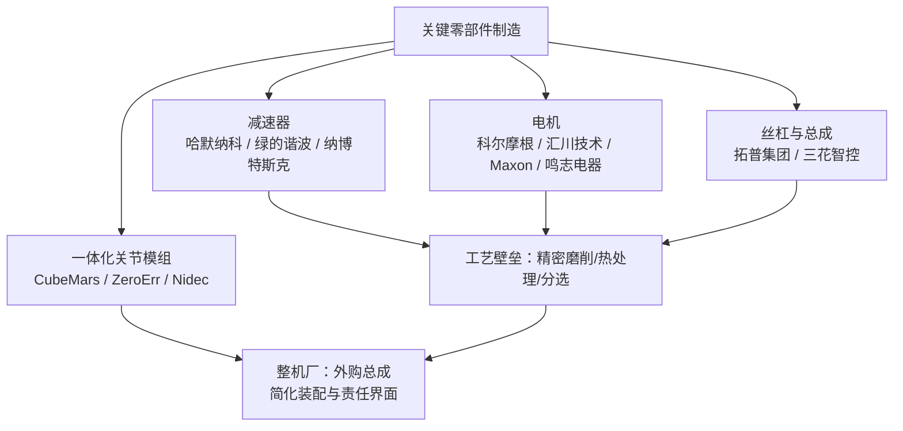

# 第 10 章 制造工艺体系

## 摘要

人形机器人从图纸走向量产，中间隔着一整套制造工艺体系：同一个关节壳体，在样机阶段可以用 CNC 精雕，在万台量级则必须转向压铸或锻造；同一只灵巧手，其微型齿轮可能来自金属注射成型（MIM），而覆盖件则来自注塑模具。本章衔接第 8–9 章的设计与子系统工程，系统阐述人形机器人的四大主流制造工艺——CNC 精密机加工、注塑成型、压铸与金属成形、增材制造（3D 打印）——的工艺原理、精度与成本特性及适用零部件，进而讨论可制造性设计（DFM）与可装配性设计（DFA）、公差链分析与 GD&T、模具工装与首件检验（FAI），并以谐波减速器、无框力矩电机、行星滚柱丝杠、空心杯电机等关键零部件为例，说明工艺选择如何与哈默纳科、绿的谐波、纳博特斯克、科尔摩根、汇川技术、鸣志电器、拓普集团、三花智控等供应商生态耦合。本章内容是第 11 章"装配、集成与测试"的工艺基础。

**关键词**：制造工艺；CNC 机加工；注塑成型；压铸；增材制造；DFM；DFA；公差链；GD&T；MBD；FAI；PPAP

---

## 10.1 制造工艺体系总览

### 10.1.1 从子系统设计到量产：工艺体系的位置

第 9 章将人形机器人分解为下肢、上肢、手部、躯干、头颈与关节模组等可独立验证的子系统。然而，子系统设计冻结的只是"几何与接口"，它并不回答"用什么设备、以什么节拍、花多少钱把它做出来"。制造工艺体系（manufacturing process system）正是连接设计与量产的桥梁：它把 CAD 模型转化为工艺路线（process routing）、工装夹具、检验规范与成本结构，并在小批量试产（Pilot Run）中接受良率与一致性的检验。

在本知识图谱的人形机器人产品开发 WBS（工作分解结构，Work Breakdown Structure）中，制造相关任务贯穿多个阶段：

- **P5 本体结构工程与原型（Mechanical Structure）**：完成中心骨架与四肢连杆设计（P5.1.1）、关节安装接口与壳体设计（P5.1.2）、外观覆盖件与分缝设计（P5.1.3），并进行结构材料选型（P5.2.1）、面向增材制造的设计（DfAM，P5.2.2）与面向量产工艺评估（P5.2.3），输出《材料选型表》与量产工艺路线图。
- **P8 结构强度仿真与迭代（Structural FEA）**：通过有限元分析（FEA）验证关键截面，其网格与载荷假设必须与后续工艺能实现的壁厚、圆角与加强筋相匹配。
- **P16 小批量试产与量产准备（Pilot & Production Ramp）**：执行 DFM/DFA 评审（P16.1.1）、模具与工装设计（P16.1.2）、供应商选择与审核（P16.2.1），直至 PPAP/量产就绪评估（P16.3.3）。


!!! note "术语解释：工艺路线、工装、首件检验、PPAP"
    - **工艺路线（process routing）**：零件从原材料到成品所经历的工序序列，含设备、工时与检验节点。
    - **工装（tooling）**：模具、夹具、检具等专用工艺装备的总称。
    - **首件检验（First Article Inspection, FAI）**：对工装或工艺变更后生产的首件进行全尺寸测量，验证其是否符合图纸要求。
    - **PPAP（Production Part Approval Process，生产件批准程序）**：源自汽车工业的量产件批准流程，要求供应商提交设计记录、过程流程图、PFMEA、控制计划、测量系统分析与全尺寸报告等证据包。

### 10.1.2 工艺路线决策框架：批量、精度、成本与交期

人形机器人零部件的工艺选择本质上是一个多目标决策问题，其主导变量包括：

1. **年需求量（批量）**：决定模具类工艺（注塑、压铸、锻造、MIM）的固定投入能否被摊薄；
2. **精度与公差等级**：减速器零件、丝杠副等要求 IT5–IT7 级，覆盖件通常 IT13 级即可；
3. **材料**：铝合金、镁合金、钛合金、工程塑料、碳纤维复合材料的可用工艺集合不同；
4. **结构复杂度**：内流道、点阵结构、一体化异形件往往只有增材制造可行；
5. **交期与迭代速度**：研发期强调快速迭代，量产期强调节拍与一致性。

工艺的单位成本可粗略分解为与批量无关的固定部分和与批量成正比的变动部分：

$$
C_{\text{unit}}(N) = \frac{C_{\text{tooling}} + C_{\text{setup}}}{N} + C_{\text{material}} + C_{\text{cycle}} \cdot t_{\text{cycle}} + C_{\text{finish}}
$$

其中 \(N\) 为总产量，\(C_{\text{tooling}}\) 为模具/工装成本，\(t_{\text{cycle}}\) 为单件循环时间。当 \(N\) 很小时，无模具工艺（CNC、3D 打印）占优；当 \(N\) 超过某一**盈亏平衡批量** \(N^*\) 时，模具类工艺占优。典型地，注塑与压铸的盈亏平衡点处于数千至数万件量级，具体数值取决于模具复杂度与机时费率。

### 10.1.3 零部件—工艺映射总表

人形机器人整机 BOM 中的零部件可按"结构—传动—电气—外观"四类映射到主流工艺：

| 零部件类别 | 典型零件 | 样机阶段工艺 | 量产阶段工艺 | 关键精度要求 |
|---|---|---|---|---|
| 结构承载件 | 骨盆骨架、大腿/小腿连杆、关节壳体 | CNC 铝合金、碳纤维铺层 | 压铸、锻造 + CNC 精加工 | 轴承位 IT6–IT7，形位公差 0.02–0.05 mm |
| 传动零件 | 谐波柔轮/刚轮、行星齿轮、行星滚柱丝杠 | CNC + 磨削 | 锻造/粉末冶金/MIM + 精磨 | 齿面 IT5–IT6，丝杠导程精度微米级 |
| 电气部件 | 无框力矩电机定转子、空心杯电机绕组 | 外购标准件 | 专业电机厂冲压/绕线产线 | 叠片公差、气隙均匀性 |
| 外观覆盖件 | 外壳、护板、装饰件 | 3D 打印、真空复模 | 注塑、吸塑 | 外观 A 面，配合间隙 0.3–0.8 mm |
| 线束与连接 | 动力线束、通信线束、接插件 | 手工线束 | 半自动压接 + 导通测试 | 压接拉力、接触电阻 |
| 灵巧手微型件 | 微型齿轮、腱轮、指节连杆 | CNC、3D 打印 | MIM、精密注塑 | 模数 0.2–0.5 齿轮精度 |

### 10.1.4 工艺体系的数字化主线：MBD 与单一数据源

传统"二维图纸 + 三维模型"的双轨制容易在版本迭代中产生不一致。**基于模型的定义（Model-Based Definition, MBD）** 将几何、运动学、质量特性、几何尺寸与公差（GD&T）及制造标注嵌入单一数字主模型，使设计、工艺、检测三端共享同一权威数据源。对人形机器人这类关节多、接口密的产品，MBD 的价值尤其突出：关节壳体上的轴承位公差、同轴度要求可以直接被三坐标测量机（CMM）程序读取，避免人工转录错误；URDF 模型中的质量特性也可与 MBD 中的材料与工艺信息保持一致，为第 11 章的系统辨识提供先验。

---

## 10.2 CNC 精密机加工

### 10.2.1 工艺原理与能力边界

CNC 精密机加工（CNC precision machining）是以计算机数控切削从坯料上去除材料、获得高精度结构件的减材工艺，涵盖铣削、车削、钻镗与磨削。其本质约束来自切削力 \(F_c\) 引起的刀具—工件系统变形：在悬伸长度为 \(L\) 的刀具上，端部挠度近似为

$$
\delta = \frac{F_c L^3}{3EI}
$$

这决定了细长特征、薄壁件的加工精度上限。人形机器人关节壳体常为薄壁深腔结构，加工时壁厚振动（颤振）与让刀变形是主要误差源，工程上通常通过分层切削、减小切深、专用真空吸盘或低熔点合金填充支撑来抑制。

### 10.2.2 精度等级与公差—成本律

机加工精度以公差等级（IT 等级）表征。一般而言，公差每收紧一个等级，成本呈近似指数上升，因为更严的公差要求更精密的机床、更低的切削参数、更多的工序与更高的废品率：

$$
C \approx C_0 \cdot \left(\frac{T_0}{T}\right)^{\alpha}, \quad \alpha \approx 1.5 \sim 2
$$

其中 \(T\) 为公差带宽度，\(C_0\) 为基准成本。这就是 DFM 中"公差宽松化"的经济学依据：在不损害功能的前提下，应把严公差只保留在真正需要配合的尺寸上。

| 工艺 | 常规可达公差等级 | 典型表面粗糙度 Ra (μm) | 人形机器人中的典型应用 |
|---|---|---|---|
| 普通铣削/车削 | IT9–IT11 | 1.6–6.3 | 支架、盖板、非配合结构 |
| 精密铣削/镗削 | IT7–IT8 | 0.8–1.6 | 关节壳体轴承位、减速器安装面 |
| 磨削 | IT5–IT6 | 0.2–0.8 | 丝杠滚道、齿轮轴颈、柔轮配合面 |
| 研磨/珩磨 | IT4–IT5 | 0.05–0.4 | 精密轴承位、液压偶件 |

### 10.2.3 人形机器人典型机加工件

- **关节壳体与骨盆骨架**：多为 6061/7075 铝合金（铝镁合金体系，见第 3 章）五轴铣削件，要求轴承位与减速器安装面的同轴度、垂直度控制在 0.02–0.05 mm 量级，以保证关节模组的传动精度与寿命。
- **行星滚柱丝杠（planetary roller screw）**：作为 Tesla Optimus 等线性执行器的核心部件，其丝杠、滚柱与螺母的螺纹滚道需精密磨削，导程精度通常在微米级，表面需硬化处理以承受高赫兹接触应力。该部件加工工艺门槛高，是当前供应链瓶颈之一（见第 7 章）。
- **谐波减速器零件**：柔轮的薄壁杯体要求极低的壁厚差与圆度误差，刚轮内齿需插齿或慢走丝加工后精磨。

### 10.2.4 机加工 DFM 要点

可制造性设计（DFM）在机加工场景下的核心规则包括：避免深腔窄槽（深度/宽度比一般不超过 4:1）；内圆角半径不小于刀具半径；薄壁件设置工艺加强筋或对称结构以释放应力；统一孔径系列以减少换刀；将配合面集中在一次装夹中完成以保证形位精度。这些规则应固化为企业的《DFM 检查清单》，并在 WBS 的 P16.1.1 DFM/DFA 评审中逐条核对。

---

## 10.3 注塑成型

### 10.3.1 工艺原理与模具系统

注塑成型（injection molding）将熔融塑料在高压下注入闭合模具型腔，冷却定型后开模取件。其过程变量——熔体温度、模具温度、注射压力与速度、保压压力与时间、冷却时间——共同决定制品的尺寸精度与缺陷倾向。模具系统由型腔/型芯、浇注系统、冷却水路、顶出机构构成，一副复杂覆盖件模具的开发周期通常为 8–16 周，成本从数十万到数百万元人民币不等，这决定了注塑只适合确定批量足够大的零件。

### 10.3.2 覆盖件与分缝设计

人形机器人的外观覆盖件（exterior covering）是注塑工艺的主要对象。WBS 中的 P5.1.3"外观覆盖件与分缝设计"要求输出覆盖件 3D 模型、分缝方案与维护开口布局，其工程要点包括：

- **分缝位置**：应沿视觉不敏感区域布置，并与关节运动包络保持安全间隙，避免运动干涉与夹挤风险；
- **壁厚均匀性**：典型壁厚 2.0–3.0 mm，壁厚突变处应渐变过渡，防止缩痕与翘曲；
- **拔模斜度**：外观面一般不小于 1°–3°，皮纹面需加大；
- **卡扣与螺丝柱**：配合 DFA 采用集成卡扣减少紧固件数量，但需校核拆装寿命。

材料方面，覆盖件常用 ABS、PC/ABS 合金或玻纤增强尼龙；靠近电机与电池的隔热罩可考虑阻燃等级更高的材料。

### 10.3.3 典型缺陷与工艺窗口

| 缺陷 | 成因 | 对策 |
|---|---|---|
| 短射（欠注） | 熔体前沿过早凝固、排气不良 | 提高料温/模温、增加浇口、优化排气 |
| 飞边 | 锁模力不足、分型面磨损 | 增大锁模力、修模、降低注射压力 |
| 缩痕 | 壁厚不均、保压不足 | 减薄胶位、加强保压、筋位减胶 |
| 翘曲 | 冷却不均、取向应力 | 平衡水路、优化浇口位置、退火 |
| 熔接线 | 多股料流汇合 | 调整浇口、提高汇合温度、设置溢料井 |

### 10.3.4 成本模型与批量门槛

注塑单件成本由模具摊销主导。设模具成本 \(C_{\text{mold}}\)、寿命 \(N_{\text{life}}\) 模次、单件材料与机时成本 \(C_{\text{part}}\)，则

$$
C_{\text{unit}} \approx \frac{C_{\text{mold}}}{\min(N, N_{\text{life}})} + C_{\text{part}}
$$

当整机规划产量处于百台量级时，覆盖件宜采用 3D 打印、真空复模（硅胶模）或 CNC 手板；产量进入万台量级后，注塑的单价优势才会显现。这正是人形机器人行业在"原型—小批量—量产"三阶段中覆盖件工艺演进的典型路径。

---

## 10.4 压铸与金属成形

### 10.4.1 高压压铸原理

高压压铸（high-pressure die casting, HPDC）将熔融铝/镁合金在高速高压下充入钢模，一次成形复杂薄壁结构件。其优势在于节拍快（单循环数十秒）、近净成形、尺寸一致性好；局限在于模具投入大、内部易含气孔（不利于后续热处理与高气密要求）、壁厚不能过薄。人形机器人的关节壳体、躯干骨架在批量达到数千台以上时，由 CNC 转向压铸通常可使单件成本下降一个量级。

### 10.4.2 一体化压铸与大型结构件

汽车行业验证的"一体化压铸"（giga casting）思路正在向人形机器人渗透：将原本由数十个钣金/机加件拼焊的躯干骨架整合为一两个大型压铸件，可显著减少零件数量、装配工时与累积公差（与第 9 章 9.11.3 节的趋势判断一致）。Tesla Optimus 的供应链布局中，拓普集团（Tuopu Group）作为执行器总成与结构件供应商、三花智控（Sanhua Intelligent Controls）作为机电执行器合作伙伴，均具备大型压铸与精密制造能力，体现了"汽车零部件工艺向人形机器人迁移"的产业逻辑。

!!! note "术语解释：一体化压铸、近净成形、免热处理合金"
    - **一体化压铸（giga casting）**：使用超大型压铸机将多个结构件一次成形为单一大型铸件的工艺。
    - **近净成形（near-net-shape）**：成形后仅需少量加工即达最终尺寸的工艺。
    - **免热处理合金**：通过合金设计使铸件在铸态即满足强度要求，避免热处理变形，适合大型一体化件。

### 10.4.3 锻造、粉末冶金与金属注射成型

- **锻造（forging）**：通过塑性变形细化晶粒、致密组织，适合高疲劳载荷的连杆与关节叉类零件；典型流程为"锻造毛坯 + CNC 精加工"。
- **粉末冶金（powder metallurgy, PM）**：适合大批量小型齿轮与含油轴承，材料利用率高，但冲击韧性受限。
- **金属注射成型（Metal Injection Molding, MIM）**：将金属粉末与粘结剂混合后注塑成形再脱脂烧结，特别适合灵巧手中的微型齿轮、腱轮与异形小件——这类零件模数小、批量大、形状复杂，CNC 加工不经济。

### 10.4.4 镁合金与半固态成形

镁合金密度仅为铝合金的约三分之二，对减重敏感的四肢结构具有吸引力（第 3 章已述其冶金特性），但其铸造与加工需处理易燃、易腐蚀问题。半固态成形（semi-solid processing, 触变铸造）在半固态温度区间压射浆料，卷气少、缩松低、可热处理强化，是镁/铝合金高性能结构件的进阶选项，目前在人形机器人领域尚处早期导入阶段。

---

## 10.5 增材制造（3D 打印）

### 10.5.1 工艺家族与能力对比

增材制造（Additive Manufacturing, AM）逐层堆积材料成形，主要工艺家族包括：

| 工艺 | 材料 | 精度/表面 | 典型用途 |
|---|---|---|---|
| FDM/FFF（熔融沉积） | PLA、ABS、PA-CF | 低，层纹明显 | 概念模型、工装夹具、非标治具 |
| SLA/DLP（光固化） | 光敏树脂 | 高，表面好 | 外观验证、精密手板 |
| SLS/MJF（粉末烧结） | PA12、TPU | 中 | 功能样件、小批量覆盖件 |
| SLM/LPBF（金属激光熔融） | AlSi10Mg、Ti6Al4V、316L | 高，需后加工配合面 | 拓扑优化结构件、一体化关节零件 |

### 10.5.2 面向增材制造的设计（DfAM）

WBS 的 P5.2.2 明确要求输出 DfAM 检查清单、打印件图纸与打印参数。DfAM 的核心不是"把原有零件拿去打印"，而是利用增材工艺的几何自由度重新设计：

1. **拓扑优化与点阵填充**：在满足刚度约束下将实体替换为晶格结构，四肢连杆可减重 30%–60%；
2. **零件整合**：将支架、线束卡扣、传感器座整合为单件，直接执行 DFA 的零件数削减原则；
3. **随形流道**：在关节壳体内打印随形冷却流道，配合第 9 章的热管理设计；
4. **方向与支撑设计**：成形方向决定层间强度方向与支撑去除成本，各向异性必须在强度校核中显式建模。

### 10.5.3 金属打印件的后处理与性能

SLM 铝合金/钛合金件通常需要热等静压（HIP）消除内部孔隙、去应力退火、配合面 CNC 精加工以及表面喷砂/阳极氧化。打印态疲劳性能通常低于锻件，关键承力件应通过工艺鉴定试样（witness coupon）与同炉试棒的力学测试建立批次可追溯性。

### 10.5.4 在"原型—小批量—量产"谱系中的定位

增材制造在人形机器人中的合理定位是：研发期快速迭代（1–7 天交付）、小批量阶段的复杂件与定制件、以及量产产线上的工装夹具与备件。当产量超过数百至上千件后，除几何上无法开模的结构外，多数件应转向传统模具工艺。

---

## 10.6 DFM、DFA 与成本工程

### 10.6.1 可制造性设计（DFM）方法论

**可制造性设计（Design for Manufacturing, DFM）** 是使零部件与总成易于、可重复且经济地实现规模化制造的工程设计方法。其人形机器人落地形式是一份按工艺分类的检查清单（机加工、钣金、注塑、压铸、增材、PCBA 各一份），在详细设计评审时逐条核对，输出工程变更请求（ECR）。DFM 的经济杠杆主要来自：公差宽松化、材料与坯料规格标准化、工序合并、以及避免需要特殊设备的特征。

### 10.6.2 可装配性设计（DFA）与零件数削减

**可装配性设计（Design for Assembly, DFA）** 通过减少零件数量、简化连接方式、缩短装配时间来降低生产成本并提高可靠性。其经典判据（Boothroyd-Dewhurst 方法）对每一个零件追问三个问题：该零件是否必须相对其他零件运动？是否必须使用不同材料？是否必须独立以便维护或装配？三问皆非者应考虑合并。人形机器人关节模组是 DFA 的高价值对象：将电机、减速器、编码器、驱动器集成为一体关节（如 CubeMars、ZeroErr 等厂商的一体化关节模组），本质上是供应链层面的 DFA——整机厂把装配复杂度转移给专业模组厂，换取整机装配节拍与一致性。

DFA 的效率可用装配效率（assembly efficiency）度量：

$$
\eta_{\text{DFA}} = \frac{N_{\min} \cdot t_{\text{basic}}}{t_{\text{total}}}
$$

其中 \(N_{\min}\) 为理论最少零件数，\(t_{\text{basic}}\) 为单件基本装配时间，\(t_{\text{total}}\) 为实际总装配时间。该指标可在 P5.3.2"装配顺序与工装夹具规划"阶段预估，并在第 11 章的装配线规划中复核。

### 10.6.3 DFM/DFA 评审与工程变更闭环

WBS 的 P16.1.1"DFM/DFA 评审"要求输出 DFM/DFA 报告、工程变更清单与成本影响评估。评审应由设计、工艺、质量、采购与供应商共同参加，典型输出包括：

| 评审发现 | 变更类型 | 成本/周期影响 |
|---|---|---|
| 关节壳体轴承位公差过严（IT5） | 放宽至功能所需 IT6 | 机加工成本下降，废品率下降 |
| 覆盖件螺丝柱过密 | 改为卡扣 + 少量螺钉 | 模具复杂度下降，装配工时下降 |
| 连杆由 3 件拼焊改整体压铸 | 工艺路线变更 | 增加模具投入，单件成本大幅下降 |
| 线束跨关节无走线槽 | 结构开槽 + 卡扣 | 可靠性提升，装配防错 |

### 10.6.4 BOM 成本工程与 VA/VE

**BOM 成本工程（BOM cost engineering）** 通过平衡器件选型、供应商议价、良率与设计折中，对物料清单成本进行系统分析与优化；**价值分析/价值工程（Value Analysis / Value Engineering, VA/VE）** 则在保持功能的前提下降低成本、或在可接受成本下提升功能。在 P16.3.2"成本核算与降本"中，二者与 should-cost 建模（见第 7 章）结合，形成"目标成本 → 设计降本 → 采购降本 → 良率降本"的闭环。人形机器人当前阶段的降本主战场通常在执行器（约占整机 BOM 的最大份额）、减速器与计算平台，这正是 DFM/DFA 与 VA/VE 应当优先投入的对象。

---

## 10.7 公差链、GD&T 与测量

### 10.7.1 公差链叠加：极值法与统计法

**公差链（tolerance chain/stack-up）** 分析回答的问题是：当 \(n\) 个零件串联装配后，封闭环（如关节间隙、末端位置误差）的公差是多少？极值法（worst case）给出绝对保证：

$$
T_0 = \sum_{i=1}^{n} T_i
$$

统计法（RSS，均方根法）在尺寸独立且正态分布的假设下给出更经济的估计：

$$
T_0 = \sqrt{\sum_{i=1}^{n} T_i^2}
$$

极值法保守但成本高；统计法允许单件公差放宽，代价是存在小概率超差，需要以过程能力（见第 11 章 Cpk）来保证假设成立。工程惯例是：安全相关与运动学关键链用极值法，一般装配链用统计法。

### 10.7.2 GD&T 与基于模型的定义

几何尺寸与公差（Geometric Dimensioning and Tolerancing, GD&T）用位置度、同轴度、垂直度、轮廓度等符号把功能要求精确传递给制造与检测环节，其标注体系（ASME Y14.5 / ISO GPS 系列）已成为精密机电产品的事实标准。配合 10.1.4 节的 MBD，GD&T 标注直接挂载在三维模型的特征上，CMM 检测程序可半自动生成，实现"设计—制造—检测"同源。

### 10.7.3 关键公差链案例：关节同轴度与腿部运动学精度

人形机器人末端定位误差由"连杆制造误差 + 关节装配误差 + 编码器误差"逐级放大。以腿部为例，若大腿与小腿长度各约 400 mm，单个轴承位同轴度误差 0.02 mm 引起的角度偏差约为 \(0.02/400 \approx 5\times10^{-5}\) rad，经两连杆放大后足端位置偏差仍在 0.1 mm 量级；真正主导足端精度的往往是减速器背隙（谐波减速器典型背隙小于 1 arcmin，但长期磨损后增大）与连杆热膨胀。下面给出公差链统计叠加的 Python 算例：

```python
import math

# 某关节模组装配链：各环节的公差（mm，对称公差带半宽）
chain = {
    "轴承位加工公差": 0.010,
    "轴承游隙折算": 0.008,
    "减速器安装面垂直度折算": 0.012,
    "壳体配合间隙": 0.015,
}

T_worst = sum(chain.values())                      # 极值法
T_rss = math.sqrt(sum(t**2 for t in chain.values()))  # 统计法(RSS)

for name, t in chain.items():
    print(f"{name}: ±{t:.3f} mm")
print(f"极值法封闭环公差: ±{T_worst:.3f} mm")
print(f"统计法封闭环公差: ±{T_rss:.3f} mm")
```

输出表明统计法给出的封闭环公差约为极值法的一半，这一差额就是"公差放宽空间"，可直接转化为单件加工成本的下降。

### 10.7.4 测量体系：CMM、光学扫描与在机测量

测量能力必须与公差要求匹配：一般而言测量系统的不确定度应优于被测公差的 1/10（量具 10:1 原则）。人形机器人结构件的常用手段包括三坐标测量机（CMM）全尺寸测量（用于 FAI）、蓝光/激光扫描比对（用于覆盖件轮廓度）、在机测头（用于加工过程闭环）与关节模组专用的背隙/传动误差测试台。测量系统本身需通过 GR&R（测量系统重复性与再现性）分析验证，通常要求 %GR&R 小于 10%（关键特性）或 30%（一般特性）。

---

## 10.8 关键零部件的制造工艺与供应商生态

### 10.8.1 减速器：柔轮变形下的精密制造

谐波减速器（harmonic reducer）依赖柔轮弹性变形传递运动，其性能由齿形精度、柔轮疲劳寿命与背隙决定。柔轮毛坯需经锻造、精密车削、插齿/滚齿与热处理，齿面精度要求 IT5–IT6 级；这是**哈默纳科（Harmonic Drive Systems）**长期占据高端市场的工艺壁垒所在，也是**绿的谐波（Leaderdrive）**等中国厂商近年持续攻关、在人形机器人供应链中份额提升的方向。RV 减速器（摆线针轮行星传动）则以**纳博特斯克（Nabtesco）**为代表，其摆线轮磨削与曲柄轴相位精度同样构成高门槛；德国 **Wittenstein**、意大利**邦飞利（Bonfiglioli）**则在精密行星减速器领域积累深厚。

### 10.8.2 电机：无框力矩电机与空心杯电机

**无框力矩电机（frameless torque motor）** 将定转子直接嵌入关节结构，其制造核心是硅钢片精密冲压叠片、高槽满率绕线与磁钢（Nd-Fe-B，见第 3 章）粘接工艺；**科尔摩根（Kollmorgen）**是该品类的传统强者，**汇川技术（Inovance Technology）**等中国自动化厂商正在快速切入。灵巧手用**空心杯电机（hollow cup motor）**的无铁芯杯形绕组需要专用绕线设备，**鸣志电器（Mingzhi Appliance）**与瑞士 **Maxon Group** 是该领域的代表供应商。电机量产的一致性指标（反电动势常数、齿槽转矩、相间电阻离散度）直接决定第 11 章关节模组 EOL 测试的通过率。

### 10.8.3 丝杠与执行器总成

行星滚柱丝杠的螺纹滚道精密磨削与滚柱一致性分选是其工艺核心，当前全球产能有限。**拓普集团**、**三花智控**等 Tier-1 供应商正在布局线性执行器总成（电机 + 丝杠 + 传感器 + 壳体）的集成制造，将丝杠磨削、总成装配与出厂测试整合为交钥匙产品——对整机厂而言，这与一体化关节模组同理，是"以外购总成换取装配简化与责任界面清晰"的制造策略。



---

## 10.9 模具、工装与首件检验

### 10.9.1 模具与工装设计

WBS 的 P16.1.2"模具与工装设计"要求输出模具/工装图纸、FAI 计划与验收标准。工装体系的层次为：成形模具（注塑模、压铸模、锻模）→ 加工夹具（CNC 工装）→ 装配夹具（见第 11 章）→ 检具（专用通止规、轮廓检具）。工装开发是量产准备的关键路径：一副压铸模的设计制造周期通常为 12–20 周，必须在设计冻结前完成工艺可行性确认，否则设计变更将直接转化为模具修改成本与交期延误。

### 10.9.2 首件检验（FAI）与 PPAP 衔接

首件检验对工装产出的首件执行全尺寸测量与材料验证，确认"模具开对了"。FAI 通过后进入小批量验证，最终汇入 PPAP 证据包（设计记录、工程变更文件、过程流程图、PFMEA、控制计划、MSA、全尺寸报告、初始过程研究）。其中 **PFMEA（过程失效模式与影响分析）** 是 FMEA 方法在制造过程上的应用：对每道工序评估潜在失效模式的严重度（S）、发生度（O）与探测度（D），以风险优先数 \(RPN = S \times O \times D\) 排序并驱动改进。**供应商认证（supplier qualification）**——量产前对零部件制造商进行质量、产能、可追溯性与合规性审核——则保证外部供应链同样纳入该体系，对应 WBS 的 P16.2.1"供应商选择与审核"。

---

## 10.10 本章小结

本章系统阐述了人形机器人制造工艺体系，主要结论如下：

1. **工艺体系是设计与量产之间的桥梁**：在 WBS 中，制造任务贯穿 P5（本体结构工程）、P8（结构 FEA）与 P16（量产准备）；MBD 提供单一数字数据源，贯通设计、制造与检测。

2. **四大工艺各有经济区间**：CNC 机加工适合样机与精密传动件，精度可达 IT5 但成本随公差收紧近似指数上升；注塑适合万台级覆盖件；压铸与一体化压铸适合数千台以上的结构件；增材制造主导快速迭代、复杂件与工装。盈亏平衡批量是工艺切换的核心判据。

3. **DFM/DFA 是成本与质量的前置杠杆**：公差宽松化、零件数削减与装配效率度量应在设计冻结前完成评审；BOM 成本工程与 VA/VE 将降本固化为流程。

4. **公差链决定整机精度上限**：极值法保证安全，统计法释放成本；关节同轴度、减速器背隙与热膨胀是足端精度的主导项；测量系统需满足 10:1 原则并经 GR&R 验证。

5. **关键零部件的工艺壁垒构成供应链格局**：谐波减速器柔轮、行星滚柱丝杠滚道、空心杯绕组等精密工艺是哈默纳科、纳博特斯克、Maxon 等厂商的长期壁垒，也是绿的谐波、汇川技术、鸣志电器、拓普集团、三花智控等中国供应商的突破方向。

---

## 10.10.1 本章符号表

| 符号 | 含义 | 单位 | 首次出现 |
|---|---|---|---|
| \(C_{\text{unit}}\) | 单件成本 | 元/件 | 10.1.2 |
| \(C_{\text{tooling}}, C_{\text{mold}}\) | 工装/模具成本 | 元 | 10.1.2、10.3.4 |
| \(N, N^*, N_{\text{life}}\) | 产量、盈亏平衡批量、模具寿命 | 件 | 10.1.2、10.3.4 |
| \(F_c, \delta, L\) | 切削力、刀具挠度、悬伸长度 | N, mm, mm | 10.2.1 |
| \(T, T_0, T_i\) | 公差带、封闭环公差、组成环公差 | mm | 10.2.2、10.7.1 |
| \(\eta_{\text{DFA}}\) | 装配效率 | 无量纲 | 10.6.2 |
| \(N_{\min}, t_{\text{basic}}, t_{\text{total}}\) | 理论最少零件数、基本装配时间、总装配时间 | 件, s, s | 10.6.2 |
| \(S, O, D, RPN\) | 严重度、发生度、探测度、风险优先数 | 无量纲 | 10.9.2 |

---

## 10.11 本章知识图谱锚点

### 10.11.1 核心实体与关系表

| 实体类型 | 代表实体（KG 条目） | 属性示例 |
|---|---|---|
| 制造工艺 | CNC 精密机加工（ent_process_cnc_machining）、注塑、压铸、增材制造 | 精度、批量区间、成本结构 |
| 设计方法 | 可制造性设计 DFM、可装配性设计 DFA、基于模型的定义 MBD | 检查清单、评审节点 |
| WBS 流程 | P5 本体结构工程与原型、P16 小批量试产与量产准备 | 输出物、验收指标 |
| 零部件 | 行星滚柱丝杠、谐波减速器、无框力矩电机、空心杯电机 | 精度等级、工艺壁垒 |
| 供应商 | 哈默纳科、绿的谐波、纳博特斯克、科尔摩根、汇川技术、Maxon、鸣志电器、拓普集团、三花智控、Wittenstein、邦飞利、CubeMars、ZeroErr | 品类、工艺能力 |
| 质量方法 | FAI、PPAP、PFMEA、供应商认证 | 证据包、审核维度 |

关系示例：

| 头实体 | 关系 | 尾实体 | 说明 |
|---|---|---|---|
| 关节壳体 | 采用 | 压铸 / CNC | 按批量选择工艺 |
| 灵巧手微型齿轮 | 采用 | MIM | 小模数复杂件的经济工艺 |
| DFM/DFA 评审 | 输出 | 工程变更清单 | P16.1.1 交付物 |
| 行星滚柱丝杠 | 依赖 | 精密磨削 | 滚道精度微米级 |
| MBD | 贯通 | 设计—制造—检测 | 单一数字主模型 |
| PFMEA | 驱动 | 控制计划 | RPN 排序改进 |

### 10.11.2 跨层连接示例：从材料到量产就绪


### 10.11.3 本章五道关键问题

1. **为什么样机用 CNC、量产转压铸？** 模具类工艺把固定成本摊到大批量上，单件成本随 \(1/N\) 下降；批量低于盈亏平衡点时，无模具的 CNC 反而更经济，且支持快速设计迭代。

2. **公差为什么不是越严越好？** 机加工成本随公差收紧近似指数上升；公差链统计法表明，多数装配链可用更宽松的单件公差达到同样的封闭环要求，多余精度是纯粹的浪费。

3. **一体化关节模组为什么能同时降本与提质？** 它是供应链层面的 DFA：零件数与装配工序在模组厂内完成整合，整机厂获得更短装配节拍、更清晰的责任界面与更一致的来料质量。

4. **增材制造在人形机器人量产中的正确定位是什么？** 快速迭代、几何复杂件、小批量定制件与产线工装；除无法开模的结构外，大批量零件应回归模具工艺。

5. **FAI 与 PPAP 解决什么问题？** FAI 验证"工装做对了首件"，PPAP 验证"过程能稳定地做对每一件"，二者共同把制造风险关闭在量产之前。

---

## 参考文献与数据来源

1. Kalpakjian S, Schmid S R. *Manufacturing Engineering and Technology* (8th ed.). Pearson, 2020.（制造工艺教科书）
2. Groover M P. *Fundamentals of Modern Manufacturing: Materials, Processes, and Systems* (7th ed.). Wiley, 2018.（制造系统）
3. Boothroyd G, Dewhurst P, Knight W A. *Product Design for Manufacture and Assembly* (3rd ed.). CRC Press, 2010.（DFMA 经典）
4. Shigley J E, Mischke C R, Budynas R G. *Mechanical Engineering Design* (7th ed.). McGraw-Hill, 2004.（机械设计）
5. ASME Y14.5-2018. *Dimensioning and Tolerancing*. American Society of Mechanical Engineers, 2018.（GD&T 标准）
6. ISO 2768-1:1989. *General tolerances*. International Organization for Standardization, 1989.（一般公差）
7. ISO 286-1:2010. *Geometrical product specifications (GPS) — ISO code system for tolerances on linear sizes*. ISO, 2010.（IT 公差等级）
8. AIAG. *Production Part Approval Process (PPAP)* (4th ed.). Automotive Industry Action Group, 2006.（PPAP 手册）
9. AIAG. *Potential Failure Mode and Effects Analysis (FMEA)* (4th ed.). AIAG, 2008.（FMEA 手册）
10. AIAG. *Statistical Process Control (SPC)* (2nd ed.). AIAG, 2005.（SPC 手册）
11. IATF 16949:2016. *Quality management system requirements for automotive production and relevant service parts organizations*. IATF, 2016.（汽车质量体系）
12. ISO/ASTM 52900:2021. *Additive manufacturing — General principles — Fundamentals and vocabulary*. ISO, 2021.（增材制造术语）
13. Gibson I, Rosen D, Stucker B. *Additive Manufacturing Technologies* (3rd ed.). Springer, 2021.（增材制造）
14. Ashby M F. *Materials Selection in Mechanical Design* (4th ed.). Butterworth-Heinemann, 2011.（材料与工艺选择）
15. Harmonic Drive Systems Inc. *Corporate and product information*. https://www.hds.co.jp/.（谐波减速器公开资料）
16. Nabtesco Corporation. *Precision reduction gears*. https://www.nabtesco.com/.（RV 减速器公开资料）
17. Leaderdrive（绿的谐波）. *公司公开资料*. https://www.leaderdrive.com/.（谐波减速器公开资料）
18. Kollmorgen. *Frameless motors and servo drives*. https://www.kollmorgen.com/.（无框电机公开资料）
19. Inovance Technology（汇川技术）. *公司公开资料*. https://www.inovance.com/.（伺服与电机公开资料）
20. Maxon Group. *Precision drive systems*. https://www.maxongroup.com/.（精密电机公开资料）
21. Tuopu Group（拓普集团）. *公司公开资料*.（执行器总成与结构件公开信息）
22. Sanhua Intelligent Controls（三花智控）. *公司公开资料*. https://www.sanhuagroup.com/.（机电执行器公开信息）
23. Tesla. *AI Day 2022: Optimus Robot*. 2022. https://www.tesla.com/AI.（Optimus 执行器与制造公开介绍）
24. Wittenstein SE. *Precision gearboxes and servo systems*. https://www.wittenstein.de/.（精密减速器公开资料）
25. Mingzhi Appliance（鸣志电器）. *公司公开资料*.（空心杯电机公开信息）
