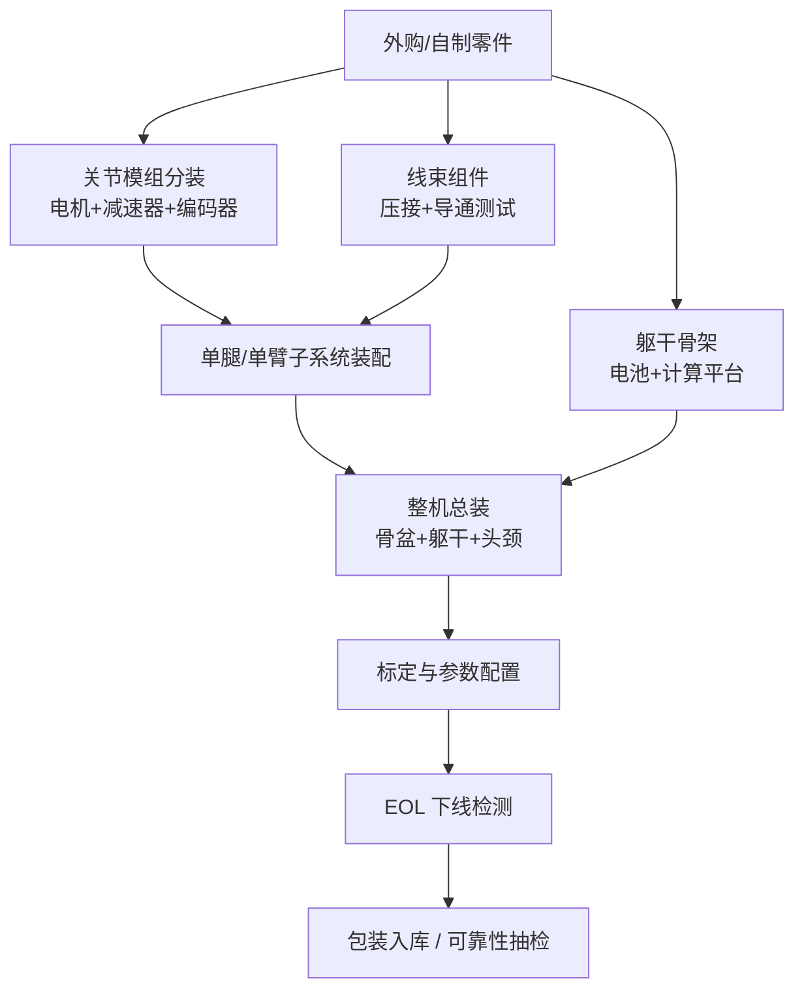

# 第 11 章 装配、集成与测试

## 摘要

装配（Assembly）、集成（Integration）与测试（Testing）是人形机器人工程链条中"把合格零部件变成合格整机"的最后一段，也是设计意图与制造波动的最终汇合点。本章承接第 10 章的制造工艺体系，围绕四条主线展开：其一是**装配工艺工程**，讨论螺纹连接与拧紧控制、压装与胶接、减速器与轴承装配、线束工程等核心工序及其防错设计；其二是**装配线规划与整机集成**，覆盖装配顺序与工装夹具规划、节拍与线平衡、关节模组分装与整机总装的层级化集成策略；其三是**标定与参数配置**，包括关节零位标定、运动学参数补偿、多传感器联合标定与系统辨识；其四是**测试验证体系**，从设计验证（DV）与生产验证（PV）、硬件在环（HIL）测试，到下线检测（EOL）、统计过程控制（SPC）与量产爬坡。本章内容对应知识图谱 WBS 中的 P15（整机集成与验证测试）与 P16（小批量试产与量产准备）两大阶段，是从工程样机走向批量交付的操作手册。

**关键词**：装配工艺；拧紧控制；整机集成；关节标定；系统辨识；DV/PV；HIL；EOL 测试；SPC；直通率；量产爬坡

---

## 11.1 装配、集成与测试在量产链条中的位置

### 11.1.1 从零部件到整机：装配层级

人形机器人的装配是一个典型的多层级聚合过程：零件（part）→ 组件（component）→ 子装配体（subassembly）→ 子系统（subsystem）→ 整机（system）。以腿部为例，无框力矩电机、谐波减速器、编码器与力矩传感器先集成为关节模组（子装配体），关节模组再与连杆、线束集成为单腿（子系统），最终左右腿与骨盆、躯干集成为整机。每一层级都对应自己的**装配作业指导书（SOP, Standard Operating Procedure）**、工装与检验节点，层级的划分直接决定了产线工位数量与在制品库存。

### 11.1.2 V 模型右半边：DV 与 PV 的角色

第 9 章 9.1.3 节已在设计流程中引入 V&V、DV（Design Verification，设计验证）与 PV（Production Validation，生产验证）的概念。本章从执行角度进一步明确二者的分工：

- **DV** 回答"设计对不对"：用工程样件（通常是软模或机加件）验证产品是否满足全部设计规范，手段包括环境试验、耐久试验、EMC 试验与安全功能试验；
- **PV** 回答"制造过程对不对"：用**量产工装、量产工艺、量产节拍**下生产的产品，验证制造过程能否稳定地产出合格品，其证据包汇入 PPAP/量产就绪评估（WBS P16.3.3）。

换言之，DV 冻结设计，PV 冻结工艺；二者都通过后，产品才具备 SOP（Start of Production，量产启动）条件。

### 11.1.3 WBS 视角：P15 与 P16 的任务映射

知识图谱中的 WBS 将本阶段任务分解为两个一级阶段：

- **P15 整机集成与验证测试（Integration & V&V）**：腿部系统集成与调试（P15.1.1）、手臂与手部集成（P15.1.2）、感知-规划-控制闭环集成（P15.1.3）；安全功能测试（P15.2.1）、性能基准测试（P15.2.2）、环境适应性测试（P15.2.3）；关节与整机耐久测试（P15.3.1）、软件稳定性与回归测试（P15.3.2）、认证准备与预审核（P15.3.3）。
- **P16 小批量试产与量产准备（Pilot & Production Ramp）**：装配线规划与 SOP（P16.1.3）、质量控制体系建立（P16.2.2）、来料与过程异常处理（P16.2.3）、小批量试产（P16.3.1）、成本核算与降本（P16.3.2）、PPAP/量产就绪评估（P16.3.3）、服务手册与培训（P16.3.4）。

本章 11.2–11.3 节对应 P5.3.2/P16.1.3 的装配工程任务，11.4 节对应标定类任务，11.5–11.6 节对应 P15 的测试任务，11.7–11.8 节对应 P16 的质量与爬坡任务。

---

## 11.2 装配工艺工程

### 11.2.1 螺纹连接与拧紧控制

螺纹连接是人形机器人装配中数量最多的连接方式，其质量由预紧力（preload）决定：预紧力不足会在振动下松脱，过大会拉伤螺纹或压溃被连接件。拧紧扭矩 \(T\) 与预紧力 \(F\) 的工程关系为

$$
T = K \cdot F \cdot d
$$

其中 \(d\) 为螺纹公称直径，\(K\) 为扭矩系数（典型范围 0.15–0.25），它强烈依赖摩擦状态——润滑、镀层、垫片材料的批次波动都会使同一扭矩下的预紧力产生 ±30% 量级的散布。因此关键连接（关节模组安装、减速器法兰）应采用**扭矩-转角法**：先拧至贴合扭矩，再旋转规定角度，利用螺栓弹性伸长直接控制预紧力，将散布压缩到 ±10% 量级。

产线层面，关键工位应使用带曲线监控的伺服拧紧轴，记录"扭矩-转角"曲线并判定贴合点异常（滑牙、异物、漏装垫片）；曲线数据随产品序列号归档，构成可追溯性的一部分。

!!! note "术语解释：预紧力、扭矩系数、扭矩-转角法、贴合扭矩"
    - **预紧力（preload）**：螺栓拧紧后产生的轴向夹紧力，是被连接件抵抗松动与外载的基础。
    - **扭矩系数（torque coefficient, \(K\)）**：拧紧扭矩与预紧力之间的比例系数，综合反映螺纹摩擦与支承面摩擦。
    - **扭矩-转角法（torque-to-yield / torque-plus-angle）**：先拧至贴合点再加转角，以螺栓伸长量直接控制预紧力。
    - **贴合扭矩（snug torque）**：连接面刚贴合时的扭矩，是转角阶段的起点。

### 11.2.2 压装、铆接与胶接

- **压装（press fitting）**：轴承与轴承位、销轴与孔的过盈连接采用压装，需控制压入力-位移曲线：压入力突降提示尺寸超差或偏斜，曲线随序列号存档。人形机器人关节中的交叉滚子轴承对压装同轴度尤为敏感。
- **铆接与卡接**：覆盖件与轻量化结构常用抽芯铆钉或卡扣，配合第 10 章 DFA 的零件数削减策略。
- **胶接（adhesive bonding）**：磁钢粘接（电机转子）、结构胶（碳纤维连杆接头）与螺纹锁固胶是三类典型应用；胶接质量依赖表面清洁度、胶层厚度与固化制度，产线需以剪切试样做批次验证。

### 11.2.3 减速器与轴承装配：精度最终形成的地方

谐波减速器的整机装配工序（柔轮与输出法兰连接、波发生器装入、刚轮定位）直接决定背隙与传动误差的最终值：一般而言，装配应使用定力矩多颗螺钉对角分步拧紧，避免柔轮杯体附加变形；波发生器轴承与柔轮内壁之间需按规定牌号与填充量加注润滑脂，填充过多会增大搅油损耗与温升。装配完成后在专用测试台上测量**背隙（backlash）**与**传动误差（transmission error）**，不合格品返修而非流入下工序——这是第 10 章所述哈默纳科、绿的谐波等减速器厂出厂检验的逻辑，整机厂自研关节时同样需要。

轴承装配的要点是清洁度与预紧：颗粒物污染是轴承早期失效的首因，装配区洁净度、防尘服与离子风除静电应纳入 SOP；角接触轴承对的预紧量通过隔套配磨或垫片分组实现，分组数据同样要求可追溯。

### 11.2.4 线束工程：布线、压接与导通测试

人形机器人线束穿越多个运动关节，是整机可靠性最脆弱的环节之一。WBS 的 P5.3.1"线缆与管路布线设计"要求输出《布线设计规范》，明确线缆型号、固定点、弯曲半径与走向；装配端的关键控制项包括：

1. **最小弯曲半径**：运动部位线束一般不小于线缆外径的 7–10 倍，扭转段采用高柔拖链电缆；
2. **应力释放**：接插件两端必须设固定点，使运动应力由线束本体而非端子承受；
3. **压接质量**：端子压接以压接高度（crimp height）与拉脱力双指标控制，抽样做金相剖面；
4. **导通与绝缘测试**：100% 线束经导通测试台检查通断、短路、错针，动力线束加测绝缘电阻与耐压。

### 11.2.5 防错设计与静电防护

**防错（Poka-Yoke）** 把"装配正确性"从操作者注意力转移到工装与流程上：非对称定位销防止装反、传感器确认零件到位、拧紧程序按工位自动调用、料盒光电感应防漏取。电子工段（电机驱动器、计算平台、电池 BMS）需按静电防护体系（EPA 区域、防静电手环与台垫、离子风机）管理，避免 ESD 损伤流入整机后在 EOL 甚至现场才暴露。

---

## 11.3 装配线规划与整机集成

### 11.3.1 装配顺序与工装夹具规划

WBS 的 P5.3.2"装配顺序与工装夹具规划"要求输出装配顺序图、工装清单与 SOP 草案。装配顺序规划的原则是：由内向外（先装内部骨架与线束，后装覆盖件）、先重后轻、先难后易（操作空间狭小的工序先行）、关键精度工序尽早并设检验点。工装夹具需满足定位基准统一（与设计基准、检测基准重合）、防错、快换三项要求；人形机器人的整机装配通常需要专用翻转工装，以支撑卧式装配与竖直姿态测试的切换。

### 11.3.2 节拍、线平衡与 SOP

装配线规划（WBS P16.1.3）以**节拍（takt time）**为核心：设市场需求速率为每班 \(D\) 台、有效作业时间为 \(T_{\text{avail}}\)，则

$$
\text{Takt} = \frac{T_{\text{avail}}}{D}
$$

所有工位的作业时间应平衡至接近节拍，线平衡率（line balancing efficiency）为

$$
\eta_{\text{LB}} = \frac{\sum_{i} t_i}{n_{\text{stations}} \cdot t_{\max}}
$$

其中 \(t_i\) 为第 \(i\) 工位作业时间，\(t_{\max}\) 为瓶颈工位时间。人形机器人当前多处于年产数百至数千台阶段，产线形态以**单元式装配（cell assembly）**为主：少量多功能工位 + 熟练技师，而非汽车式流水线；但关节模组等需求量数十倍于整机的部件，值得先期建设半自动分装线。SOP 文件需包含作业分解、要点图示、质量特性（CTQ）标识与异常处置指引，并与工时测定（time study）数据一同维护。

### 11.3.3 关节模组分装与系统集成测试台

关节模组是人形机器人数量最大、价值最高的子装配体（整机通常 28–50 个）。其分装线应按"装配 → 老化（burn-in）→ 性能测试"组织：模组装配完成后先进行带载老化跑合，使润滑脂分布均匀、配合面磨合稳定；随后在**系统集成测试台（System Integration Test Bench）**上完成性能鉴定——该类测试台在整机装配前验证关节性能、通信总线、控制回路与安全系统，典型测试项包括峰值扭矩、持续扭矩-温升曲线、背隙、力矩传感器零漂、通信丢包率。测试合格的模组获得独立序列号并绑定测试档案，作为整机 BOM 追溯的叶子节点。

### 11.3.4 整机总装流程

整机总装的典型顺序为：骨盆骨架 → 双腿 → 躯干（电池、计算平台、配电）→ 双臂 → 头颈与感知桅杆 → 线束总连接 → 覆盖件。每完成一个子系统即进行局部上电检查（通信扫描、急停链路、绝缘检查），避免故障被后续装配覆盖。整机装配完成后进入 11.4 节的标定与配置工序，再进入 EOL。

---

## 11.4 标定与参数配置

### 11.4.1 关节标定流程

装配后的第一批"个性化数据"来自**关节标定流程（Joint Calibration Procedure）**：确定每个执行器的绝对零位、编码器偏置与方向标志。典型实现是：控制关节以低速触碰机械限位或专用标定块，记录编码器读数，与基准姿态（如双腿并拢直立）比对，解算零位偏置并写入驱动器非易失存储。该流程须对每个关节独立执行并双向校验（正反两个方向趋近限位，评估背隙对零位的影响）。

### 11.4.2 运动学标定与连杆参数补偿

制造与装配误差使实际连杆长度、关节轴线偏离名义值，直接损害足端与手端的绝对定位精度。运动学标定通过外部测量（激光跟踪仪、摄影测量或标定工装）采集若干姿态下的末端位姿，对 DH/PoE 参数做最小二乘辨识：

$$
\min_{\Delta \boldsymbol{\theta}} \sum_{k} \left\| \mathbf{p}_k^{\text{meas}} - f(\boldsymbol{q}_k, \boldsymbol{\theta}_0 + \Delta \boldsymbol{\theta}) \right\|^2
$$

其中 \(\boldsymbol{\theta}\) 为运动学参数向量。补偿后的参数写入控制器，与第 8 章的运动学校准方法衔接；量产中通常按"首件全参数标定 + 批量抽检关键参数"策略控制工时。

### 11.4.3 多传感器联合标定

感知-控制闭环要求相机、深度相机/LiDAR、IMU 与关节坐标系之间的外参一致。**联合标定（Joint-Camera-IMU Calibration）** 估计各传感器的内参、外参以及时间偏移：相机内参用棋盘格/圆点靶标定；相机-LiDAR 外参以重投影误差最小化求解；IMU 与相机的时空标定可借助连续时间轨迹估计方法完成。头颈桅杆上的传感器在整机姿态变化时会因结构变形引入额外误差，故标定应在整机水平姿态基准（如标定间内的水平基座）上进行，并在 EOL 中以特征物复测验证。

### 11.4.4 系统辨识与动力学参数整定

整机控制器（平衡、全身控制）依赖准确的质量、质心与惯量参数。**系统辨识（System Identification）** 利用激励轨迹下的关节力矩与运动数据，回归刚体动力学方程中的基准参数（base parameters）：

$$
\boldsymbol{\tau} = \mathbf{Y}(\mathbf{q}, \dot{\mathbf{q}}, \ddot{\mathbf{q}})\, \boldsymbol{\pi}
$$

其中 \(\mathbf{Y}\) 为回归矩阵，\(\boldsymbol{\pi}\) 为待辨识参数向量。工程上按"CAD 先验 + 关节级摩擦辨识 + 整臂/整腿激励辨识"三步推进；摩擦模型（库仑 + 黏滞 + 静摩擦）的逐关节辨识结果同时用于前馈补偿与 EOL 的摩擦一致性判据。

### 11.4.5 软件刷写、参数分区与追溯

标定完成后，整机执行统一的软件灌装：固件（驱动器、BMS、安全 MCU）、操作系统镜像、中间件（ROS 2 等）与应用软件按版本基线刷写，标定参数与序列号写入参数分区。**OTA（Over-The-Air）软件更新** 体系在出厂前需完成首次注册与安全通道建立，为售后升级与第 12 章之后的软件迭代预留通路。所有刷写记录（版本号、校验和、工位、时间）进入 MES 与序列号绑定，形成"一机一档"。

---

## 11.5 测试验证体系：DV 与 PV

### 11.5.1 测试金字塔与层级责任

整机测试体系呈金字塔结构：底层是元器件与 PCBA 级测试（来料检验、ICT 在线测试），中间是模组/子系统测试（关节测试台、电池包充放电柜、HIL），顶层是整机与现场测试。层级越低，发现缺陷的成本越低；测试规划的目标是让绝大多数缺陷在模组级之前被拦截，整机级只暴露集成性问题（接口、干涉、系统动力学）。

### 11.5.2 DV：设计验证试验矩阵

DV 用工程样件验证设计规范，对应 WBS P15.2 与 P15.3 系列任务：

| 试验类别 | 典型项目 | 目的 | WBS 锚点 |
|---|---|---|---|
| 安全功能测试 | 急停链路、安全 MCU 监控、断电制动保持、碰撞检测 | 验证安全功能按设计动作 | P15.2.1 |
| 性能基准测试 | 行走速度、续航、负载、抓取成功率、关节跟随误差 | 验证 KPI 达标 | P15.2.2 |
| 环境适应性测试 | 高低温工作/贮存、湿热、振动、冲击、防尘防水 | 暴露环境敏感缺陷 | P15.2.3 |
| 耐久测试 | 关节循环寿命、整机行走里程、覆盖件开合寿命 | 验证寿命设计 | P15.3.1 |
| EMC 试验 | 传导/辐射发射、静电/射频抗扰度 | 满足法规与自身兼容 | P13.3.2 |
| 软件稳定性 | 长时运行、故障注入恢复、回归测试 | 验证软件健壮性 | P15.3.2 |

第 9 章 9.9 节已详述 HALT/HASS 与单项环境试验方法，本节强调其在 DV 矩阵中的编排逻辑：以 FMEA 识别的失效模式为索引设计试验剖面，使每一项试验都能追溯到具体风险。

### 11.5.3 HIL：硬件在环在集成阶段的角色

**硬件在环测试（Hardware-in-the-Loop, HIL）** 让真实控制器与实时仿真的被控对象交互，在整机集成前安全、可重复地验证控制软件。人形机器人的 HIL 有两种典型形态：

1. **控制器 HIL**：真实主控/关节驱动器运行控制软件，实时仿真机模拟整机动力学、传感器与故障场景（如编码器断线、总线丢帧），验证故障响应与降级策略；
2. **执行器 HIL**：物理执行器与控制器对接实时仿真模型，在台架上模拟整机负载谱，提前暴露力矩饱和、热过载与控制带宽问题。

HIL 把大量"整机级"风险前移到台架阶段，与 SiL（软件在环）构成第 9 章所述的验证梯度，是 P15.1.3"感知-规划-控制闭环集成"的前置安全网。

### 11.5.4 PV：生产验证与 PPAP

PV 的核心命题是"用量产条件造出来的产品是否依然合格"。其输入是量产模具、量产工艺参数与量产线操作人员，输出是 PPAP 证据包（见第 10 章 10.9.2）与量产就绪评估结论（WBS P16.3.3）。PV 批次的样本量与测试项应覆盖：全尺寸测量（抽样）、初始过程能力研究（关键特性 Cpk ≥ 1.67，一般特性 Cpk ≥ 1.33 为汽车行业惯例门槛）、整机 EOL 全项通过、以及至少一轮完整的包装运输验证。PV 通过后冻结工艺参数窗口，此后的任何变更（4M 变更：人、机、料、法）须走变更管理流程。

---

## 11.6 下线检测（EOL）

### 11.6.1 EOL 测试项设计原则

下线检测（End-of-Line testing, EOL）对每一台整机执行，其设计原则是：**短节拍、全覆盖、可追溯**。测试项只验证"制造是否正确"而非"设计是否合理"（后者属于 DV/PV），典型节拍控制在整机数十分钟量级。EOL 数据全部绑定序列号上传 MES，既作为放行依据，也作为售后问题的回溯起点。

### 11.6.2 关节模组 EOL

关节模组在分装线末端执行模组级 EOL，典型项目：

| 测试项 | 方法 | 判据示例（典型地） |
|---|---|---|
| 绝缘电阻/耐压 | 兆欧表、耐压仪 | 绝缘电阻 ≥ 规定阈值 |
| 反电动势常数 | 拖动法测线反电动势 | 与名义值偏差 ≤ ±5% |
| 空载摩擦转矩 | 低速正反转 | 摩擦-速度曲线在模板内 |
| 背隙 | 双向往复加载 | ≤ 规格值（如 1 arcmin 级） |
| 力矩传感器零点 | 无载读数 | 零漂 ≤ 阈值 |
| 通信与编码器 | 总线扫描、多圈计数 | 无丢帧、多圈位置正确 |
| 噪声与振动 | 麦克风/加速度计（可选） | 异常谱线报警 |

### 11.6.3 整机 EOL

整机 EOL 的典型流程为：外观与紧固检查 → 上电自检（传感器、驱动器、电池 BMS 通信）→ 急停与安全链路测试 → 关节零位复核 → 静态站立与质心对齐 → 原地踏步/小步行走 → 上肢典型动作与抓取冒烟测试 → 充电功能检查 → 数据归档放行。行走测试通常在限速、吊架保护下执行；判据以"动作完成 + 关键信号包络在模板内"为主，避免把 EOL 变成耗时的性能试验。

---

## 11.7 质量与过程控制

### 11.7.1 SPC 与过程能力指数

**统计过程控制（Statistical Process Control, SPC）** 用控制图监控关键特性的过程波动，区分普通原因与特殊原因变异。过程能力指数定义为

$$
C_p = \frac{USL - LSL}{6\sigma}, \qquad C_{pk} = \min\!\left(\frac{USL-\mu}{3\sigma}, \frac{\mu-LSL}{3\sigma}\right)
$$

其中 \(USL/LSL\) 为规格上下限，\(\mu,\sigma\) 为过程均值与标准差。WBS 的 P16.2.2"质量控制体系建立"要求输出质量计划、检验规范与 SPC 控制图；人形机器人产线的 SPC 重点对象包括：机加工轴承位尺寸、拧紧扭矩/转角曲线、压装力曲线、注塑覆盖件关键配合尺寸、模组 EOL 的摩擦与背隙数据。

### 11.7.2 直通率与试产闭环

**直通率（First Pass Yield, FPY）** 是产品不经返修一次通过所有工序的比例，多工位下为各站良率之积：

$$
FPY = \prod_{i=1}^{n} y_i
$$

人形机器人整机工序多，即使单站良率 98%，三十站累积 FPY 也只有约 55%——这正是 P16.3.1"小批量试产"要输出试产总结报告、直通率与问题闭环率的原因：试产的目的不是造出几台能用的样机，而是把每一站的 \(y_i\) 拉高并锁定条件。试产批次按"EVT → DVT → PVT"（工程/设计/生产验证）递进，批量逐级放大，问题闭环率与 FPY 趋势是进入下一阶段的核心门禁。

### 11.7.3 异常处理与 8D

来料与过程异常处理（WBS P16.2.3）采用 **8D 报告**框架：组建团队（D1）、问题描述（D2）、临时围堵（D3）、根因分析（D4，常用 5Why/鱼骨图）、永久纠正措施（D5）、实施与验证（D6）、预防再发（D7，横展到类似工序）、表彰与标准化（D8）。对安全相关缺陷，围堵措施应包括已交付产品的追溯筛查——这依赖 11.4.5 节建立的"一机一档"体系。

### 11.7.4 追溯体系与 MES

制造执行系统（MES）承载序列号管理、工艺参数绑定、测试数据归档与反追溯查询。人形机器人的追溯颗粒度建议到：关节模组序列号、减速器/电机批次、拧紧曲线、标定参数版本、软件版本基线。当现场出现批量性故障时，可按批次号圈定影响范围，把售后成本与声誉损失限制在最小范围。

---

## 11.8 量产爬坡与交付准备

### 11.8.1 从 Pilot Run 到 SOP：爬坡曲线

量产爬坡（ramp-up）遵循学习曲线规律：随着累计产量翻倍，单台装配工时按固定比例下降（典型学习率 80%–90%），FPY 与产能同步爬升。爬坡期的管理要点是：固定一线班组以减少人为变量、每日质量例会跟踪 Top 不良、工程变更设"断点"（cut-in）管理以区分变更前后产品。Tesla Optimus 以工厂部署与高产量制造为公开目标、Unitree G1 以相对低价实现批量交付、Figure AI 为 Figure 02 规划专用量产设施，这些头部厂商的公开路径都表明：人形机器人量产竞争力的本质是把第 10–11 章所述的制造与装配体系跑通，而非单点技术突破。

### 11.8.2 成本核算与降本闭环

P16.3.2"成本核算与降本"以小批量实际数据校准第 10 章的 should-cost 模型：区分材料、工艺、工装摊销、良率损失与装配工时五条成本线，按降幅潜力排序立项（VA/VE 项目），形成"核算 → 立项 → 验证 → 切换"的季度闭环。装配侧的降本杠杆主要是 DFA 再设计（减少紧固与调整工序）、模组化采购（转移装配复杂度）与 EOL 节拍优化。

### 11.8.3 服务手册、备件与培训

交付准备（WBS P16.3.4）输出服务手册、备件策略与培训计划：服务手册按 MTTR（平均修复时间）目标组织拆装路径，把 WBS P5.3.3"可维护性与维修性设计"的成果落实为可执行的维修作业；备件策略按故障率与停机损失分级（关节模组、电池包、线束为高优先级备件）；培训覆盖产线操作员、质检与售后工程师三个层次。这些内容将衔接本书后续关于运维与全生命周期管理的章节。

### 11.8.4 量产就绪评审与放行门禁

在 PPAP 批准（WBS P16.3.3）之后、SOP 之前，应举行跨职能的量产就绪评审（readiness review），对下列门禁项逐项签字确认：

| 门禁项 | 责任方 | 通过判据 |
|---|---|---|
| 设计与工艺冻结 | 研发/工艺 | DV/PV 报告闭环，变更通道受控 |
| 产线与工装 | 制造工程 | 节拍实测达标，工装验收完成 |
| 质量体系 | 质量 | 控制计划生效，关键特性 Cpk 达标 |
| 供应链 | 采购 | 合格供方名录锁定，PPAP 证据齐备 |
| 售后准备 | 服务 | 服务手册、备件与培训到位 |

门禁未达标的项目必须携带明确的关闭计划与责任人方可放行，避免把未关闭的制造风险带入爬坡期。

---

## 11.9 本章小结

本章系统阐述了人形机器人装配、集成与测试体系，主要结论如下：

1. **装配是多层级聚合过程**：零件 → 关节模组 → 子系统 → 整机，每层对应独立 SOP、工装与检验节点；模组化分装 + 整机总装是当前主流组织方式。

2. **装配质量在工序中被制造出来**：拧紧的扭矩-转角控制、减速器的定力矩分步装配与润滑管理、线束的弯曲半径与应力释放、压装与胶接的曲线监控，共同决定整机的初始精度与长期可靠性；防错与静电防护把正确性从人转移到流程。

3. **标定与辨识是个性化数据的来源**：关节零位、运动学补偿、多传感器外参与动力学基准参数，使每台整机获得一致的精度起点；软件刷写与参数分区经 MES 形成"一机一档"。

4. **DV 冻结设计、PV 冻结工艺**：DV 以 FMEA 为索引编排试验矩阵，HIL 把整机风险前移到台架；PV 用量产条件产出 PPAP 证据，初始过程能力达标后冻结工艺窗口。

5. **EOL 与 SPC 构成量产质量闭环**：模组级 EOL 拦截绝大多数缺陷，整机 EOL 只验证集成正确性；Cpk、FPY 与 8D 驱动持续改进，试产闭环与爬坡学习曲线决定量产成本曲线的下降速度。

---

## 11.9.1 本章符号表

| 符号 | 含义 | 单位 | 首次出现 |
|---|---|---|---|
| \(T, F, d, K\) | 拧紧扭矩、预紧力、螺纹直径、扭矩系数 | N·m, N, mm, 无量纲 | 11.2.1 |
| \(\text{Takt}\) | 生产节拍 | s/台 | 11.3.2 |
| \(\eta_{\text{LB}}\) | 线平衡率 | 无量纲 | 11.3.2 |
| \(\mathbf{Y}, \boldsymbol{\pi}\) | 动力学回归矩阵、基准参数向量 | — | 11.4.4 |
| \(USL, LSL, \mu, \sigma\) | 规格上下限、过程均值与标准差 | 视特性而定 | 11.7.1 |
| \(C_p, C_{pk}\) | 过程能力指数 | 无量纲 | 11.7.1 |
| \(FPY, y_i\) | 直通率、单站良率 | 无量纲 | 11.7.2 |

---

## 11.10 本章知识图谱锚点

### 11.10.1 核心实体与关系表

| 实体类型 | 代表实体（KG 条目） | 属性示例 |
|---|---|---|
| WBS 流程 | P15 整机集成与验证测试、P16 小批量试产与量产准备 | 三级任务、交付物 |
| 装配工艺 | 拧紧控制、压装、胶接、线束压接、防错 | 曲线判据、CTQ |
| 标定方法 | 关节标定流程、联合标定（相机-IMU-关节）、系统辨识 | 零位偏置、外参、基准参数 |
| 测试方法 | 硬件在环 HIL、DV/PV、EOL、环境/耐久/EMC 试验 | 测试项、判据 |
| 测试装备 | 系统集成测试台、关节模组 EOL 台 | 测试能力 |
| 质量方法 | SPC、FPY、8D、PPAP、MES 追溯 | 控制图、门禁指标 |
| 整机案例 | Tesla Optimus、Unitree G1、Figure 02 | 量产路径 |

关系示例：

| 头实体 | 关系 | 尾实体 | 说明 |
|---|---|---|---|
| 关节模组分装 | 通过 | 系统集成测试台 | 装配前验证性能与安全 |
| 整机总装 | 依赖 | 装配顺序图 / SOP | P5.3.2、P16.1.3 输出 |
| 关节标定 | 写入 | 驱动器参数分区 | 一机一档追溯 |
| HIL | 前置 | 闭环集成风险 | P15.1.3 安全网 |
| PV | 汇入 | PPAP 证据包 | 量产就绪门禁 |
| SPC 控制图 | 监控 | 拧紧/压装曲线 | 特殊原因变异报警 |

### 11.10.2 跨层连接示例：从工艺窗口到整机放行

### 11.10.3 本章五道关键问题

1. **为什么关键螺栓连接要用扭矩-转角法而不是定扭矩法？** 定扭矩法的预紧力受摩擦系数散布影响可达 ±30%；扭矩-转角法以螺栓伸长量直接控制预紧力，把散布压缩到 ±10% 量级，对关节与减速器法兰等关键连接至关重要。

2. **DV 与 PV 的本质区别是什么？** DV 用工程样件验证设计是否满足规范，回答"设计对不对"；PV 用量产工装、工艺与人员验证制造过程的稳定性，回答"过程对不对"。前者冻结设计，后者冻结工艺。

3. **EOL 为什么不能替代 DV？** EOL 节拍短、项目有限，只验证"这台造得对不对"；设计缺陷（如寿命不足、EMC 超标）在 EOL 中不可见，必须由 DV/PV 的系统性试验矩阵覆盖。

4. **为什么小批量试产的核心指标是 FPY 而不是产量？** 多工位下 FPY 是各站良率之积；试产的任务是把每一站的良率拉高并锁定条件，否则放大批量只会放大返修与报废成本。

5. **标定数据为什么要与序列号绑定归档？** 零位偏置、外参与动力学参数是每台整机的"个性化指纹"，既是控制器正常工作的前提，也是售后故障回溯与批量性缺陷圈定的关键数据资产。

---

## 参考文献与数据来源

1. Groover M P. *Fundamentals of Modern Manufacturing: Materials, Processes, and Systems* (7th ed.). Wiley, 2018.（制造与装配系统）
2. Boothroyd G, Dewhurst P, Knight W A. *Product Design for Manufacture and Assembly* (3rd ed.). CRC Press, 2010.（DFA 与装配分析）
3. Shigley J E, Mischke C R, Budynas R G. *Mechanical Engineering Design* (7th ed.). McGraw-Hill, 2004.（螺纹连接设计）
4. Bickford J H. *Handbook of Bolts and Bolted Joints*. CRC Press, 1998.（螺栓连接工程）
5. Montgomery D C. *Introduction to Statistical Quality Control* (8th ed.). Wiley, 2019.（SPC 与过程能力）
6. AIAG. *Statistical Process Control (SPC)* (2nd ed.). AIAG, 2005.（SPC 手册）
7. AIAG. *Measurement Systems Analysis (MSA)* (4th ed.). AIAG, 2010.（测量系统分析）
8. AIAG. *Production Part Approval Process (PPAP)* (4th ed.). AIAG, 2006.（PPAP 手册）
9. AIAG. *Potential Failure Mode and Effects Analysis (FMEA)* (4th ed.). AIAG, 2008.（FMEA 手册）
10. IATF 16949:2016. *Quality management system requirements for automotive production and relevant service parts organizations*. IATF, 2016.（质量体系）
11. ISO 10218-1:2011. *Robots and robotic devices — Safety requirements for industrial robots*. ISO, 2011.（机器人安全）
12. ISO/TS 15066:2016. *Robots and robotic devices — Collaborative robots*. ISO, 2016.（协作安全）
13. ISO 13849-1:2015. *Safety of machinery — Safety-related parts of control systems*. ISO, 2015.（功能安全）
14. Siciliano B, Khatib O. *Springer Handbook of Robotics* (2nd ed.). Springer, 2016.（标定与辨识方法）
15. Khalil W, Dombre E. *Modeling, Identification and Control of Robots*. Butterworth-Heinemann, 2002.（机器人辨识经典）
16. Featherstone R. *Rigid Body Dynamics Algorithms*. Springer, 2008.（动力学参数辨识基础）
17. Harmonic Drive Systems Inc. *Product and engineering information*. https://www.hds.co.jp/.（谐波减速器装配与性能公开资料）
18. Tesla. *AI Day 2022: Optimus Robot*. 2022. https://www.tesla.com/AI.（Optimus 制造与量产公开介绍）
19. Figure AI. *Figure 02 and BotQ manufacturing*. https://www.figure.ai/.（Figure 量产公开资料）
20. Unitree Robotics. *G1 Humanoid Robot*. https://www.unitree.com/.（G1 批量交付公开资料）
