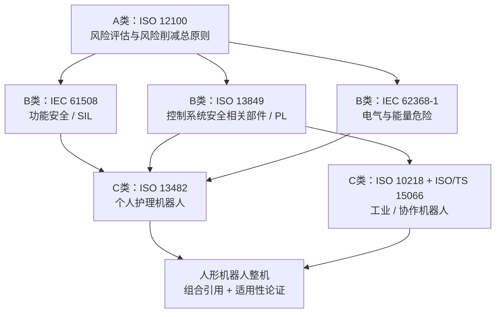
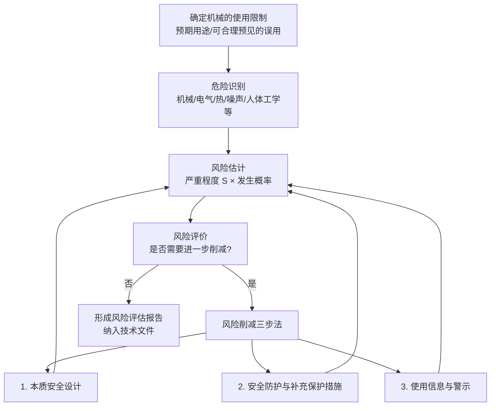
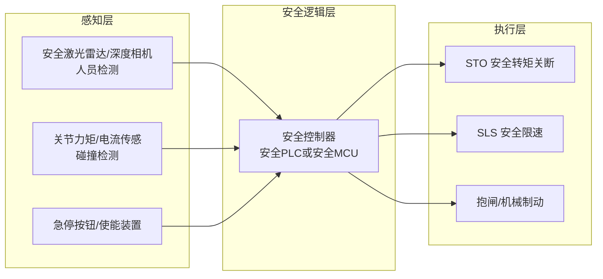
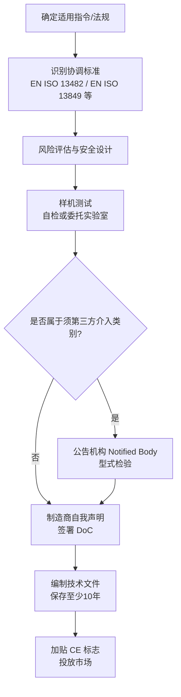

# 第 12 章 认证、合规与质量标准

## 摘要

人形机器人从实验室样机走向工厂、物流与家庭场景，必须跨越的门槛不是单项性能指标，而是**合规性（compliance）**：产品必须在目标市场被法律允许销售，并在发生伤害事件时经得起责任追溯。本章系统梳理人形机器人面临的认证、合规与质量标准体系。首先从标准层级结构与风险评估方法论入手，介绍 ISO 12100 风险评估流程与"三步法"风险削减策略；随后深入功能安全工程，讲解 IEC 61508 的安全完整性等级（SIL）与 ISO 13849 的性能等级（PL）的量化方法，包括 PFH/PFD、MTTF\(_d\)、DC\(_{avg}\) 与共因失效（CCF）等关键概念；接着剖析与人形机器人最直接相关的两类产品安全标准——ISO 13482 个人护理机器人安全标准与 ISO/TS 15066 协作机器人技术规范，重点讨论人机接触的力与压力生物力学限值；然后按区域展开市场准入认证：欧盟 CE 标志、北美 UL 1740 与 FCC Part 15、中国 CR 认证与 CCC，以及横跨各区域的电磁兼容（EMC）与电池安全要求；最后讨论 AI 自主性给传统功能安全框架带来的挑战，以及预期功能安全（SOTIF）等新兴应对思路。本章与第 1 章的标准概览互为补充：第 1 章回答"有哪些标准"，本章回答"如何工程化地满足这些标准"。

**关键词**：功能安全；IEC 61508；ISO 13849；ISO 13482；ISO/TS 15066；风险评估；CE 标志；UL 1740；FCC Part 15；CR 认证；电磁兼容；SOTIF

---

## 12.1 认证与合规的总体框架

### 12.1.1 为什么合规是产品化的前提

人形机器人是一种与人共享物理空间、能够自主移动并施加物理力的机器。这一本质决定了它不可能像纯软件产品那样"先发布、后迭代"：一旦造成人身伤害，厂商面对的不仅是召回成本，还有产品责任诉讼与市场禁入风险。因此，合规能力本身就是人形机器人企业的核心竞争力之一，它至少在三个层面发挥作用：

1. **市场准入**：绝大多数经济体对投放市场的机电产品设有强制或事实强制的认证要求。例如欧盟要求加贴 CE 标志，美国工作场所的机器人需满足 OSHA 体系下由 UL 等 NRTL（国家认可实验室）出具的安全认证，中国市场则有 CR 认证（中国机器人认证）与 CCC 强制性产品认证。
2. **责任界定**：当事故发生时，"是否遵循了适用的现行标准"是法庭与监管机构判断制造商是否尽到注意义务（duty of care）的首要依据。符合标准不等于免除责任，但显著降低法律风险。
3. **设计约束传导**：合规要求会直接传导为工程设计参数——最大运动速度、末端接触力上限、急停按钮的位置与颜色、外壳的阻燃等级、电池的热失控防护等。越早把标准要求纳入设计冻结（design freeze），后期整改成本越低。

!!! note "术语解释：合规（compliance）、认证（certification）、标准（standard）"
    - **标准**：由公认机构（ISO、IEC、IEEE、UL 等）制定、经协商一致批准的规范性文件，统一产品、过程或服务的技术要求。标准本身通常不具法律强制力。
    - **认证**：由第三方机构（或制造商自我声明）证明产品符合特定标准或法规要求的过程。
    - **合规**：产品满足目标市场全部适用法律、法规与被引用标准的状态。法规是强制的，标准被法规引用后即获得强制效力。

### 12.1.2 标准体系的层级结构

第 1 章已给出人形机器人标准的金字塔概览（国际—区域—行业—企业四层）。从工程实施角度，更有用的是 ISO 对机械安全标准的**A/B/C 三级分类**：

| 类别 | 定义 | 典型标准 | 与人形机器人的关系 |
|------|------|----------|--------------------|
| A 类（基础安全标准） | 给出适用于所有机械的基本概念与设计原则 | ISO 12100（风险评估与风险削减） | 一切安全设计的起点 |
| B 类（通用安全标准） | 针对一类安全装置或一种安全相关特性 | ISO 13849（控制系统安全相关部件）、IEC 61508（功能安全）、IEC 60204-1（机械电气设备） | 决定安全控制架构与元器件选型 |
| C 类（产品安全标准） | 针对特定机械类型的全部安全要求 | ISO 13482（个人护理机器人）、ISO 10218-1/-2（工业机器人） | 决定整机的限值与验证方法 |

当 C 类标准与 B 类标准冲突时，以 C 类为准。人形机器人目前的尴尬处境在于：**尚无专门的 C 类标准**。双足人形机器人既不完全属于 ISO 10218 的"工业机器人"，也不完全属于 ISO 13482 的"个人护理机器人"，厂商通常需要组合引用多个标准并向认证机构论证其适用性，这也是人形机器人认证周期长的根本原因之一。

### 12.1.3 合规的成本与周期

合规不是一次性的测试费用，而是贯穿研发全周期的成本项。根据行业经验，一个完整的安全认证周期可能需要 **6–18 个月**，直接费用从数万美元到数十万美元不等（视目标市场数量、测试项目与整改轮次而定）。成本构成大致包括：

- **第三方测试费**：EMC 暗室测试、电气安全测试、电池滥用测试等按项目计费；
- **认证机构审核费**：技术文件（Technical File）审查、工厂检查（如适用）；
- **整改与复测**：首次送样即通过全部项目的概率很低，EMC 整改（屏蔽、滤波、重新布线）往往需要数轮；
- **内部人力**：安全工程师编写风险分析报告、HARA/FMEA 文档、安全手册的时间成本；
- **时间机会成本**：认证期间设计冻结，任何重大设计变更都可能触发重新评估。

经验法则是：**安全与合规设计应当与整机架构设计同步启动**，而不是在样机完成后"补认证"。本书第 9 章讨论的 DV/PV（设计验证/生产验证）流程中，合规测试应作为 DV 阶段的正式交付物。

### 12.1.4 本章的组织方式

本章其余部分按"方法论 → 功能安全 → 产品安全标准 → 区域准入 → 前沿挑战"展开：12.2 节讲风险评估这一所有安全标准的共同语言；12.3 节讲如何量化"控制系统足够可靠"；12.4 节讲直接约束整机行为的 ISO 13482 与 ISO/TS 15066；12.5 节按市场区域梳理 CE、UL、FCC、CR、CCC 等准入路径；12.6 节讨论 AI 时代标准体系面临的新问题。

---

## 12.2 风险评估：一切安全工程的起点

### 12.2.1 ISO 12100 风险评估流程

ISO 12100《机械安全 设计通则 风险评估与风险削减》是 A 类基础标准，定义了所有 C 类标准背后的通用方法论。其核心是"风险 = 伤害严重程度 × 伤害发生概率"的半定量框架，并规定了迭代闭环流程：

风险评估中容易被忽视但至关重要的一步是**可合理预见的误用（reasonably foreseeable misuse）**。对人形机器人而言，误用场景极为丰富：儿童攀爬机器人、用户让机器人搬运超过额定负载的物体、在湿滑地面运行、遮挡传感器等。认证机构在审核时通常要求制造商逐一列出误用清单并给出防护措施。

### 12.2.2 风险估计的量化：风险图方法

ISO 13849 提供了机械行业最常用的风险估计工具——**风险图（risk graph）**。设计者从三个维度评估每一项已识别危险：

1. **伤害严重程度（S）**：S1（轻微伤害，通常可恢复，如擦伤、轻微挫伤）或 S2（严重伤害，通常不可逆，如骨折、截肢、死亡）；
2. **暴露于危险的频率与持续时间（F）**：F1（很少发生或暴露时间短）或 F2（频繁发生或暴露时间长）；
3. **避免危险的可能性（P）**：P1（在特定条件下可能避免，如有足够反应时间与空间）或 P2（几乎不可能避免）。

S、F、P 的组合映射到要求的性能等级 PL\(_r\)（required Performance Level），从 PL a 到 PL e。例如 S2 + F2 + P2 的组合通常要求 PL e，即安全相关控制系统必须达到最高的每小时危险失效概率要求。人形机器人在人员密集环境中执行搬运、协作任务时，其跌倒、碰撞等危险通常落入 S2/F2 区间，这意味着关键安全功能（如速度限制、力限制、急停）往往需要 PL d 甚至 PL e 等级——这一点对成本与架构的影响将在 12.3 节展开。

### 12.2.3 风险削减三步法

ISO 12100 规定风险削减必须按优先级顺序执行：

1. **本质安全设计（inherently safe design）**：从源头消除危险。对人形机器人而言包括：限制关节峰值扭矩与运动速度（以牺牲部分性能换取安全）、圆角化外壳消除锐边、采用低惯量连杆降低碰撞动能、选择热失控风险更低的电池化学体系（参见第 3 章、第 4 章的材料讨论）。
2. **安全防护与补充保护措施（safeguarding and complementary protective measures）**：无法消除的残余风险通过工程防护控制。典型措施包括：安全-rated 激光雷达/深度相机构成的防护区域、关节力矩传感器实现的碰撞检测、安全 PLC 监控的急停回路、跌倒检测后的保护性关断（protective stop）。
3. **使用信息（information for use）**：前两步之后的残余风险通过警示标识、用户手册、培训告知用户。法律上这是最后一道防线，不能用它替代前两步。

!!! note "术语解释：残余风险（residual risk）"
    实施全部风险削减措施后仍然存在的风险。标准不要求、也不可能要求"零风险"；要求的是残余风险被降低到可接受水平，并被如实告知用户。风险评估报告中对残余风险的记录与论证，是 CE 技术文件的核心内容之一。

### 12.2.4 人形机器人的典型危险源清单

结合 ISO 12100 的危险分类与人形机器人的形态特点，整机风险评估至少应覆盖下表中的危险源：

| 危险类别 | 人形机器人具体表现 | 主要削减手段 |
|----------|--------------------|--------------|
| 机械危险——挤压、剪切 | 关节夹挤点（膝、肘、髋屈伸处）、手指夹伤 | 夹挤点防护罩、间隙/距离设计、力限制 |
| 机械危险——冲击碰撞 | 行走中手臂摆动撞击人体、跌倒时整机砸压 | 速度分离监控、功率与力限制、跌倒保护策略 |
| 机械危险——失稳跌倒 | 双足动态平衡失效导致整机倾倒 | 稳定余量监控、低能量失效姿态设计、人员回避 |
| 电气危险 | 高压动力电池、母线电容电击 | 双重绝缘、接地、互锁、IEC 62368-1 能量分级 |
| 热危险 | 电机/驱动器高温表面、电池热失控 | 表面温度限制、BMS 多级保护、隔热与泄压设计 |
| 电磁危险 | 大功率驱动器 EMI 干扰医疗设备等 | EMC 设计（屏蔽、滤波、接地）、12.5.4 节测试 |
| 功能失效危险 | 控制器死机、传感器错误、通信中断导致失控 | 12.3 节功能安全架构（SIL/PL 分级设计） |
| 网络安全危险 | 远程劫持导致恶意运动 | 安全通道加密、指令白名单、安全层独立于网络栈 |

---

## 12.3 功能安全：IEC 61508 与 ISO 13849

### 12.3.1 功能安全的基本概念

第 8 章已介绍过 SIL 与 PL 的基本概念，本节从认证工程角度深入其实现方法。**功能安全（functional safety）**回答的问题是：当控制系统自身发生故障（元器件损坏、软件跑飞、通信丢包）时，系统能否以足够高的概率仍执行安全功能，把机器人带入安全状态？

这里有两个关键区分：

- **安全性（safety）≠ 可靠性（reliability）**：一个高可靠系统很少故障，但故障时可能进入危险状态；功能安全关心的是故障的**后果**与**可检测性**，而非仅仅故障频率。
- **危险失效（dangerous failure）≠ 安全失效（safe failure）**：导致安全功能丧失的失效才是危险失效。继电器触点熔接导致急停失效是危险失效；继电器线圈开路导致机器人无法启动是安全失效（虽然影响可用性）。

IEC 61508 把整个安全工作组织为**安全生命周期（safety lifecycle）**：危险与风险分析 → 安全要求分配 → 安全完整性设计 → 验证与确认 → 运行维护 → 退役。每个阶段都有文档化交付物，认证审核的核心就是这些交付物构成的"安全论证（safety case）"。

### 12.3.2 SIL 的量化：PFH 与 PFD

IEC 61508 用危险失效概率把安全完整性量化为 SIL 1–4 四个等级。按运行模式分为两种度量：

- **低要求模式（low demand mode）**用平均要求时失效概率 PFD\(_{avg}\)（Probability of Failure on Demand）；
- **高要求/连续模式（high demand / continuous mode）**用每小时危险失效频率 PFH（Probability of dangerous Failure per Hour）。

机器人安全功能几乎都工作在高要求或连续模式，对应关系为：

| SIL | PFH（每小时） | 风险降低因子量级 |
|-----|---------------|------------------|
| SIL 1 | \(10^{-6} \sim <10^{-5}\) | 10–100 |
| SIL 2 | \(10^{-7} \sim <10^{-6}\) | 100–1000 |
| SIL 3 | \(10^{-8} \sim <10^{-7}\) | 1000–10000 |
| SIL 4 | \(10^{-9} \sim <10^{-8}\) | 10000–100000 |

直观理解：SIL 2 意味着安全功能平均每一千万小时才发生一次危险失效。对一支年运行数千小时的机器人车队，这一量级把"因控制系统故障导致伤害"的概率压到极低水平。

安全功能的 PFH 由其组成的子系统串联累加。若安全链路由传感器（S）、逻辑单元（L）与执行器（A）串联构成，则

$$
PFH_{sys} \approx PFH_S + PFH_L + PFH_A
$$

系统整体的 SIL 不能超过任一环节所能支持的最高 SIL。这就是为什么"用一个 SIL 3 的激光雷达配上普通 MCU"无法宣称 SIL 3——木桶效应决定了整条链路必须逐级达标。

### 12.3.3 ISO 13849 的 PL：Category、MTTFd 与 DC

ISO 13849-1 面向机械安全相关控制系统（SRP/CS, Safety-Related Parts of Control Systems），用 PL a–e 与 PFH\(_d\) 对应（对照表见第 8 章 8.7.5 节）。工程上确定一个通道能达到的 PL，需要同时评估四个要素：

1. **结构类别（Category）**：描述架构的容错能力。Category B 为单通道无诊断；Category 1 采用经考验的元器件与安全原则；Category 2 引入周期性测试；Category 3 为冗余双通道，单一故障不导致安全功能丧失；Category 4 在 Category 3 基础上要求故障被及时检测。
2. **平均危险失效时间 MTTF\(_d\)**（Mean Time To dangerous Failure）：每个通道的元器件级可靠性统计量，分低（3–10 年）、中（10–30 年）、高（30–100 年）三档。它由元器件失效率数据（如制造商提供的 B10\(_d\) 值）计算：
   $$
   MTTF_d = \frac{B_{10d}}{0.1 \times n_{op}}
   $$
   其中 \(B_{10d}\) 为 10% 元件发生危险失效时的循环次数，\(n_{op}\) 为年均动作次数。
3. **平均诊断覆盖率 DC\(_{avg}\)**（Diagnostic Coverage）：危险失效中被自诊断发现的百分比，分无（<60%）、低（60–90%）、中（90–99%）、高（≥99%）四档。交叉监控、奇偶校验、看门狗、输出回读都是提高 DC 的手段。
4. **共因失效（CCF, Common Cause Failure）**：冗余通道因共同原因（同一电源跌落、同一高温环境、同一软件 bug）同时失效。标准要求通过隔离、多样性、环境试验等措施获得足够的 CCF 评分。

人形机器人关键安全功能的典型目标是 **PL d / SIL 2 或 PL e / SIL 3**：例如双通道急停回路常按 Category 3 + PL d 设计；与人持续近距离交互时的功率与力限制功能则可能需要 PL e 等级的论证。

### 12.3.4 人形机器人的典型安全功能分解

将标准语言落到整机架构，人形机器人通常需要实现下列安全功能（Safety Function），每项都要分配 PL\(_r\)/SIL 目标并独立验证：

- **STO（Safe Torque Off，安全转矩关断）**：切断电机转矩输出而不切断控制电源，是最基本的驱动级安全功能，主流伺服驱动器均提供 STO 端子并宣称 SIL 3 / PL e 能力。
- **SLS（Safely-Limited Speed，安全限速）**：监控并限制关节速度不超过安全限值，需要安全级的速度反馈通道（如双编码器交叉校验）。
- **SLP（Safely-Limited Position，安全限位）**：限制关节位置不进入危险区域（如人员防护空间）。
- **碰撞检测与功率/力限制**：通过电流环估计外力矩或专用力矩传感器，在接触力超限时触发保护性停止——这是 ISO/TS 15066 功率与力限制模式的技术基础（见 12.4.2 节）。
- **急停（Emergency Stop）**：红色蘑菇头黄色背景的 Category 0/1 停止，独立于主控制器的硬接线回路。

关键架构原则是：**安全层必须独立于功能层**。主控跑 Linux/ROS 的视觉-语言-动作（VLA）栈崩溃时，安全控制器仍能执行 STO/SLS。这通常意味着安全 MCU/PLC 与主计算平台物理分离，安全传感器直接接入安全控制器而非经由主控转发。

### 12.3.5 预期功能安全（SOTIF）与 AI 带来的新问题

IEC 61508 与 ISO 13849 处理的是"系统故障"——功能失效导致危险。但人形机器人还有另一类危险：**系统没有任何故障，只是功能本身不足以应对环境**。例如视觉模型在逆光下把人误判为背景、VLA 策略对训练分布外的指令产生危险动作。这类"性能不足"危险由**预期功能安全（SOTIF, Safety Of The Intended Functionality，源自汽车领域的 ISO 21448）**框架处理。

SOTIF 把场景分为四象限：已知安全、已知不安全、未知不安全、未知安全，工程目标是通过场景库积累、触发条件分析与设计改进，不断扩大"已知安全"区域、压缩"未知不安全"区域。对搭载学习模型的机器人，这意味着：

- 感知与策略模型需要独立的**OOD（分布外）检测与降级机制**，检测到不确定性升高时切换到保守行为；
- 安全决策不能完全委托给学习型组件，最终的安全关断必须保留在确定性、可验证的安全层（12.3.4 节的架构）；
- 验证方法从"故障注入"扩展为"场景遍历 + 统计论证"，与本书第 25 章讨论的评测体系直接衔接。

---

## 12.4 产品安全标准：ISO 13482 与 ISO/TS 15066

### 12.4.1 ISO 13482:2014 个人护理机器人安全

ISO 13482 是目前与服务/家庭场景人形机器人最接近的 C 类标准。它将**个人护理机器人（personal care robot）**定义为以提高个人生活质量为目标的服务机器人，覆盖三类：

1. **移动仆人机器人（mobile servant robot）**：执行物品搬运、清洁等任务的可移动机器人——大多数轮式底盘人形机器人落入此类；
2. **物理辅助机器人（physical assistant robot）**：与人有物理接触、辅助其移动或作业的设备，如下肢外骨骼；
3. **载人机器人（person carrier robot）**：承载人员移动的机器人轮椅等。

标准的核心要求围绕"与人共处"展开：

- **运动速度与力的限制**：机器人在可能接触人员的模式下，其运动速度与接触力必须被限制在不造成伤害的水平，具体限值与被接触的人体部位相关；
- **接触安全**：外壳表面不得有锐边锐角，表面温度不得超过可能造成烫伤的限值，夹挤点需要防护或力限制；
- **稳定性与倾倒防护**：机器人应在预期地面条件与外力扰动下保持稳定，倾倒风险不可消除时需限制倾倒能量或给出警示；
- **自主功能的约束**：自主移动机器人必须能检测路径上的人员并做出避免或无害化接触的反应，且不允许在无人监督时执行危险操作；
- **电池与充电安全**：涵盖充电过程的电气与火灾风险。

ISO 13482 的现实局限在于它制定于 2014 年，彼时双足人形机器人尚未产业化，标准中的许多验证方法（如静态稳定性试验）并不直接适用于动态平衡的双足平台。当前厂商通常的做法是以 ISO 13482 的总体要求为纲，对双足特有的危险（动态跌倒、全身接触）引用 ISO/TS 15066 的接触限值并自行补充试验方法，形成向认证机构提交的适用性论证文件。

### 12.4.2 ISO/TS 15066:2016 协作机器人技术规范

ISO/TS 15066 是 ISO 10218 工业机器人标准的补充技术规范，定义了四种**协作操作（collaborative operation）**模式，机器人系统只要实现其中一种或多种，即可在防护栏内/外的混合空间与人共事：

| 协作模式 | 英文原名 | 原理 | 人形机器人适用性 |
|----------|----------|------|------------------|
| 安全级监控停止 | Safety-rated monitored stop | 人员进入协作空间时机器人停止，离开后恢复 | 适合展示、装配协作 |
| 手动引导 | Hand guiding | 人员通过手动引导装置直接带动机器人运动 | 示教编程、拖拽示教 |
| 速度与分离监控 | Speed and separation monitoring, SSM | 根据人机距离动态调节速度，保持最小保护距离 | 双足移动操作的主要模式 |
| 功率与力限制 | Power and force limiting, PFL | 允许物理接触，但接触力/压力被限制在生物力学阈值内 | 贴身服务、物理辅助 |

SSM 模式的最小保护距离由人体接近速度、机器人停止时间与系统响应时间决定，其经典形式为

$$
S_p(t_0) = \int_{t_0}^{t_0+T_R+T_B} v_H(t)\,dt + \int_{t_0}^{t_0+T_R} v_R(t)\,dt + T_R \cdot v_R + C + Z_d + Z_r
$$

其中 \(v_H\) 为人员接近速度（通常取 1.6 m/s 的步行速度），\(T_R\) 为系统响应时间，\(T_B\) 为制动停止时间，\(C\) 为考虑人体侵入的附加距离，\(Z_d\)、\(Z_r\) 分别为传感器位置不确定性与机器人位置不确定性。该公式的工程含义是：**机器人制动越慢、传感器延迟越大，安全距离就得留得越大，协作效率越低**——安全与节拍之间的张力由此而生。

PFL 模式则给出按人体部位划分的**生物力学限值**，区分两类接触：

- **准静态接触（quasi-static contact）**：人体被夹在机器人与固定物体之间的持续挤压，限值最严格；
- **瞬态接触（transient contact）**：短暂的冲击碰撞，限值约为准静态的两倍。

!!! note "术语解释：准静态接触与瞬态接触"
    ISO/TS 15066 的生物力学限值表中，面部、颅骨等敏感部位甚至**不允许**发生准静态接触；躯干、大腿等肌肉丰厚部位允许的准静态压力典型值在百帕量级（约 100–200 N/cm² 量级），对应几十至一百余牛顿的力限值；瞬态接触限值放宽约一倍。这些数值源自人体疼痛阈值研究，代表的是"疼痛开始"而非"受伤"水平，留有安全余量。

对双足人形机器人而言，PFL 模式的适配存在特殊困难：ISO/TS 15066 的限值模型假设机器人是固定基座的机械臂，接触是单点、可控制的；而双足机器人在行走中可能与人体发生全身多部位接触，且跌倒时的接触能量远超机械臂——一个 50–80 kg 的整机从 1.5 m 高度倾倒所携带的能量（约 \(mgh \approx 700\)–1200 J 量级）远远超过任何生物力学限值。因此现行共识是：**双足人形机器人的首要安全目标是"不跌倒"和"接触前减速"，PFL 只作为残余接触的兜底**，这也解释了为什么各厂商把大量安全预算投在平衡控制的鲁棒性上。

### 12.4.3 生物力学限值与接触模型

PFL 模式的验证需要测量机器人末端或身体部位的接触力。冲击力峰值可用集中质量模型估算：质量为 \(m_R\) 的机器人部件以速度 \(v\) 撞击人体部位（等效弹簧常数 \(k_H\)，机器人侧等效弹簧 \(k_R\)）时，峰值力近似为

$$
F_{max} = v \sqrt{m_{red}\, k_{eff}}, \quad m_{red} = \frac{m_R m_H}{m_R + m_H}, \quad k_{eff} = \frac{k_R k_H}{k_R + k_H}
$$

其中 \(m_H\) 为人体部位的有效质量。该模型揭示了降低冲击力的三条设计途径，全部在第 9 章的子系统设计中有对应实现：

1. **降低接触速度 \(v\)**：SSM 减速、柔顺控制降低接近速度——力的峰值与速度近似成正比，是性价比最高的手段；
2. **降低有效质量 \(m_{red}\)**：轻量化连杆与低惯量设计（参见第 3 章结构材料、第 9 章摆动腿惯量优化）；
3. **降低系统刚度 \(k_{eff}\)**：软包覆材料、柔顺关节（如串联弹性执行器）、碰撞时控制器主动退让。

### 12.4.4 工业机器人标准的继承：ISO 10218

对部署在工厂环境的人形机器人，最直接的标准依据仍是 ISO 10218-1/-2（机器人本体与机器人系统/集成的安全要求）。该标准历经修订，最新版本进一步纳入了对移动与协作功能的要求，并与人机协作场景下的 ISO/TS 15066 配套使用。实践中，工厂场景的人形机器人通常按"工业机器人系统"完成单元级风险评估：机器人本体符合 ISO 10218-1，集成应用（含工装、物料流、人员通道）由集成商按 ISO 10218-2 完成单元（cell）级认证。

值得强调的是"**谁认证**"的问题：本体厂商只能对机器人本体负责，机器人放入具体产线后的整体安全由**系统集成商或最终用户**重新评估并负责。人形机器人企业若以"交钥匙单元"方式交付（机器人 + 工装 + 布局），实际上承担了集成商角色，认证责任随之扩大——这是商业模式选择对合规成本的直接影响。

### 12.4.5 电气与电池安全

人形机器人搭载数十伏至近百伏的动力电池与大功率驱动器，电气安全独立于功能安全自成体系：

- **IEC 62368-1**：音视频与信息技术设备安全标准，采用**危险能量分级（HBSE, Hazard-Based Safety Engineering）**思想，把电、热、机械能量按对人体的伤害能力分级（Class 1–3），要求对 Class 2 及以上能量源提供防护。人形机器人的充电座、主电源板通常按此标准评估；
- **电池安全**：电芯与电池包层面通常引用 IEC 62133 系列（便携式密封电池安全）与运输领域的 UN 38.3（振动、冲击、短路、过充、强制放电等滥用试验，是锂电池航空运输的强制前提）；
- **BMS 的功能安全**：过充、过放、过温、短路保护属于安全相关功能，高要求场合同样需要做 SIL/PL 论证，且电池主回路通常要求双重保护（主保护 IC + 独立二级保护）；
- **充电安全**：自动回充的人形机器人涉及无人值守充电，对接触点防异物短路、充电通信握手、热失控早期检测（气体/温度传感器）都是评估要点。

---

## 12.5 区域市场准入认证

### 12.5.1 欧盟：CE 标志体系

CE 标志（Conformité Européenne）是产品进入欧盟及欧洲经济区市场的合格声明。它不是单一认证，而是一套**指令/法规 + 协调标准 + 合格评定程序**的组合。人形机器人通常涉及：

| 指令/法规 | 管辖内容 | 对人形机器人的要点 |
|-----------|----------|--------------------|
| 机械指令 2006/42/EC（正过渡为机械法规 (EU) 2023/1230） | 机械基本健康与安全要求 | 整机风险评估、安全功能、技术文件 |
| 低电压指令 2014/35/EU | 50–1000 V AC / 75–1500 V DC 电气安全 | 充电器、电源部件（机器人本体电池电压常低于此范围，但充电器适用） |
| EMC 指令 2014/30/EU | 电磁兼容 | 12.5.4 节详述 |
| 无线电设备指令 2014/53/EU（RED） | 含 Wi-Fi/蓝牙/4G/5G 模块的设备 | 射频参数、频谱合规 |
| RoHS 2011/65/EU | 限制有害物质 | 铅、镉、阻燃剂等材料申报 |
| 欧盟人工智能法 (EU) 2024/1689 | 按风险分级监管 AI 系统 | 涉及生物识别、情感识别等功能时可能触发额外义务 |

CE 合格评定的典型流程为：

大多数机器人可由制造商走**自我声明**路径（签署符合性声明 DoC），但前提是完整执行协调标准并备齐技术文件；技术文件需包含风险评估报告、计算与试验记录、图纸、元器件证书、使用手册等，供市场监管机构随时调阅。值得注意的趋势是：新机械法规与 AI 法都在把"自主/学习型机器"纳入更明确的监管视野，制造商应跟踪其过渡期与实施细则。

### 12.5.2 北美：UL 1740、NRTL 制度与 FCC Part 15

美国市场没有 CE 式的统一标志，而是多层结构：

- **电气与火灾安全**：由 OSHA 认可的 NRTL（国家认可实验室，如 UL、Intertek/ETL、TÜV 北美）认证。机器人领域的专用标准是 **UL 1740**《机器人与机器人设备安全标准》，覆盖机器人本体的电气、机械与防火要求。实际项目中常以 UL 1740 为纲，叠加 UL 61010 或 IEC 62368-1 的部件级评估；
- **电磁兼容与射频**：**FCC Part 15** 规定了无意辐射体（数字设备）与有意辐射体（无线模块）的射频发射限值。带处理器的机器人属于 Class B（居住环境）或 Class A（工业环境）数字设备，需通过传导发射与辐射发射测试；含 Wi-Fi/蓝牙模块的还需模块级或整机级的 FCC 认证；
- **工作场所安全**：OSHA 法规要求雇主提供安全的工作环境，工业机器人部署需符合 ANSI/RIA R15.06（与 ISO 10218 协调一致）的单元安全要求。人形机器人进入美国工厂，通常由集成商按 R15.06 完成应用级风险评估；
- **加拿大**：CSA 标志与 SCC 认可体系，标准与 UL 高度协调（cUL 认证）。

与 CE 自我声明不同，美国路径强依赖第三方实验室，且认证机构会对量产一致性做**后续工厂检查（follow-up inspection）**，更换关键元器件需要报备甚至重新评估——这对快速迭代的人形机器人硬件是不小的流程约束。

### 12.5.3 中国：CR 认证、CCC 与 GB 标准

中国机器人市场的准入由以下层次构成：

- **CR 认证（中国机器人认证）**：在国家认证认可监督管理委员会指导下建立的机器人自愿性认证制度，覆盖安全、EMC、性能与可靠性等维度，按认证范围分为整机、部件等类别。虽然名为自愿，CR 标志在政府采购、央企招标与行业客户中常被列为加分或门槛条件，事实上具有准强制效力；
- **CCC 认证（China Compulsory Certification）**：强制性产品认证，人形机器人的电源适配器、充电器等部件若在 CCC 目录内则必须获证；
- **GB 国家标准**：机器人安全相关 GB 标准大多等同或修改采用 ISO 标准（如 GB 11291 对应 ISO 10218），EMC 引用 GB/T 17626（对应 IEC 61000-4 系列）等；
- **地方与行业试点**：北京、上海、深圳等地针对具身智能/人形机器人出台了测试评价与示范应用的管理办法，对进入公共空间的机器人提出路权、保险与数据合规要求，属于标准体系之外但同样影响部署的软约束。

### 12.5.4 电磁兼容（EMC）测试详解

EMC 指设备在其电磁环境中正常工作、且不对其他设备产生不可接受电磁干扰的能力。人形机器人内部的高频开关驱动器（数十 kHz 的 PWM、高 di/dt 电流）、长走线束与无线模块使 EMC 成为最容易"翻车"的认证环节。主要测试项目包括：

| 测试项目 | 英文缩写 | 检验内容 | 人形机器人典型风险点 |
|----------|----------|----------|----------------------|
| 辐射发射 | RE | 设备向空间辐射的电磁噪声是否超限 | 驱动器 PWM、电机线束天线效应 |
| 传导发射 | CE | 沿电源线传导的噪声 | 充电座、开关电源 |
| 静电放电抗扰度 | ESD | 人体静电接触/空气放电后设备是否正常工作 | 外壳缝隙、屏幕、按键 |
| 电快速瞬变脉冲群 | EFT | 感性负载开关引起的脉冲群 | 长电缆、I/O 端口 |
| 浪涌抗扰度 | Surge | 雷击感应浪涌 | 充电桩、市电接口 |
| 射频电磁场抗扰度 | RS | 强射频场中是否误动作 | 无线基站附近运行 |

EMC 问题必须在设计阶段预防而非测试阶段补救：驱动器输出端共模扼流圈、屏蔽电缆单端/双端接地策略、金属结构件的等电位搭接、传感器信号线与动力线的分束走线（参见第 9 章手臂电缆管理），都是成本远低于暗室整改的设计手段。一般而言，EMC 首次测试通过率与团队经验强相关，预留一至两轮整改复测是排期常识。

### 12.5.5 多市场准入的策略选择

面向全球销售的人形机器人企业通常在三种认证策略间权衡：

1. **标准前置设计**：以最严格市场（通常是欧盟 + 北美）的要求为设计基线，一次设计、多处取证，边际成本最低；
2. **CB 体系互认**：利用 IECEE CB 体系，一份 CB 测试报告可转换为多国认证，减少重复测试；
3. **分区域 SKU**：对不同市场做硬件差异化（如无线模块、电源规格），灵活但抬高供应链与量产一致性管理成本（参见第 7 章供应链讨论）。

无论选择哪种策略，**变更管理（change management）**都是量产期合规的核心：每一次涉及安全相关元器件、固件或结构的 ECO（工程变更单）都需要评估是否触发重新认证，这要求 PLM 系统与认证文档联动。

---

## 12.6 前沿挑战：当标准遇上学习型机器人

### 12.6.1 现有框架的四道裂缝

综合本章与第 1 章的讨论，人形机器人标准化面临的结构性困难可归纳为四点：

1. **形态多样**：双足、轮式底盘 + 双臂、复合形态并存，C 类标准的"机械类型"划分难以覆盖；
2. **动态接触**：跌倒、全身多部位接触的能量尺度超出 ISO/TS 15066 的单点接触模型；
3. **AI 自主性**：基于学习的行为无法用传统的确定性故障模型验证，SOTIF 类方法尚在向机器人领域迁移的过程中；
4. **跨场景部署**：同一台机器人今天在工厂、明天在商场，认证边界随场景移动，"一次认证、处处适用"不再成立。

### 12.6.2 应对思路与行业动向

产业界与标准组织正在沿多条路径补缝：

- **专用标准立项**：ISO、IEC 及各国标准化机构均已启动面向人形机器人/具身智能的标准预研与立项工作，涵盖术语、安全要求与测试方法；企业参与标准制定既可提前锁定技术话语权，也能降低未来认证的适用性论证成本；
- **测试方法与场景库先行**：在正式标准缺位期，第三方测试机构与行业联盟以"测试规范 + 场景库"形式提供事实标准，例如针对双足稳定性的抗扰测试、针对服务场景的人机共处试验规程；
- **安全论证（safety case）驱动**：借鉴核能、航空领域的做法，以结构化的论证文档（目标结构化记法 GSN 等）组织"为什么这台机器人足够安全"的证据链，把标准符合性、测试数据与运行监控整合为可审计的整体；
- **运行期合规**：通过遥测与安全事件上报实现"部署后持续评估"，把认证从一次性关卡延伸为全生命周期管理，这也呼应了第 25 章将讨论的评测体系从离线走向在线的趋势。

---

## 12.7 本章小结

- 合规是人形机器人产品化的前提，覆盖市场准入、责任界定与设计约束三个层面；完整认证周期典型为 6–18 个月，应与整机架构设计同步启动。
- ISO 12100 的风险评估（危险识别 → 风险估计 → 三步法削减）是所有安全标准的共同语言；风险图方法把严重程度、暴露频率与可避免性映射到要求的 PL 等级。
- 功能安全由 IEC 61508（SIL 1–4，PFH/PFD 量化）与 ISO 13849（PL a–e，Category、MTTF\(_d\)、DC\(_{avg}\)、CCF 四要素）共同支撑；人形机器人关键安全功能典型目标为 PL d / SIL 2 至 PL e / SIL 3，且安全层必须独立于运行 VLA 栈的功能层。
- ISO 13482 与 ISO/TS 15066 是最贴近的两类产品标准：前者规定个人护理机器人的速度、力与接触安全，后者定义四种协作模式与按人体部位划分的生物力学限值；双足平台的动态跌倒能量远超该限值体系，"不跌倒 + 接触前减速"是首要安全策略。
- 区域准入方面：欧盟 CE 依赖协调标准与技术文件的合格声明路径；北美依赖 UL 1740（NRTL 认证）与 FCC Part 15；中国有 CR 认证（事实门槛）与 CCC；EMC 测试（RE/CE/ESD/EFT 等）是跨区域共性难点，须在布线、屏蔽与接地设计阶段前置解决。
- AI 自主性正在推动安全工程从"故障安全"扩展到"预期功能安全（SOTIF）"，安全论证、场景库与运行期监控将成为下一代人形机器人合规体系的三根支柱。

---

## 参考文献

[1] ISO 12100:2010. *Safety of machinery — General principles for design — Risk assessment and risk reduction*. International Organization for Standardization.

[2] ISO 13482:2014. *Robots and robotic devices — Safety requirements for personal care robots*. International Organization for Standardization. https://www.iso.org/standard/53820.html

[3] ISO/TS 15066:2016. *Robots and robotic devices — Collaborative robots*. International Organization for Standardization. https://www.iso.org/standard/62996.html

[4] ISO 13849-1. *Safety of machinery — Safety-related parts of control systems*. International Organization for Standardization.

[5] IEC 61508:2010. *Functional safety of electrical/electronic/programmable electronic safety-related systems*. International Electrotechnical Commission.

[6] IEC 62368-1:2018. *Audio/video, information and communication technology equipment — Part 1: Safety requirements*. International Electrotechnical Commission.

[7] ISO 10218-1/-2. *Robotics — Safety requirements for industrial robot systems*. International Organization for Standardization.

[8] ISO 21448:2022. *Road vehicles — Safety of the intended functionality*. International Organization for Standardization.

[9] UL 1740. *Standard for Robots and Robotic Equipment*. Underwriters Laboratories.

[10] FCC Part 15. *Radio Frequency Devices*. U.S. Federal Communications Commission.

[11] Directive 2006/42/EC (Machinery Directive) 与 Regulation (EU) 2023/1230 (Machinery Regulation). European Union.

[12] Regulation (EU) 2024/1689 (Artificial Intelligence Act). European Union.

[13] UN Manual of Tests and Criteria, Part III, subsection 38.3 (UN 38.3 锂电池运输测试).

[14] IEC 62133-2. *Secondary cells and batteries containing alkaline or other non-acid electrolytes — Safety requirements*. International Electrotechnical Commission.

[15] 国家认证认可监督管理委员会等. 中国机器人认证（CR 认证）实施规则.
