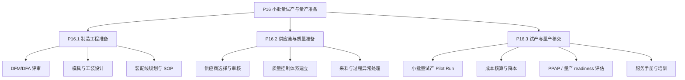
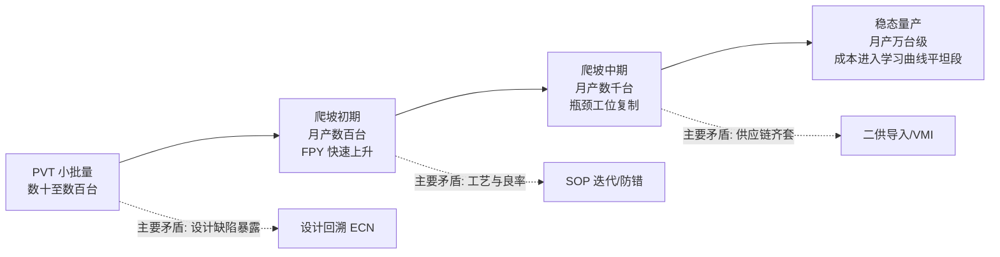
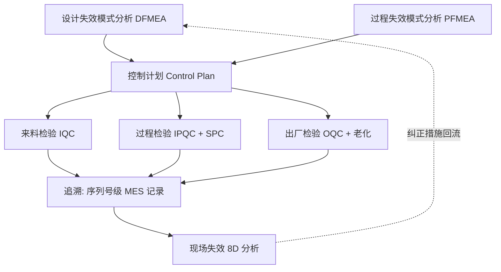
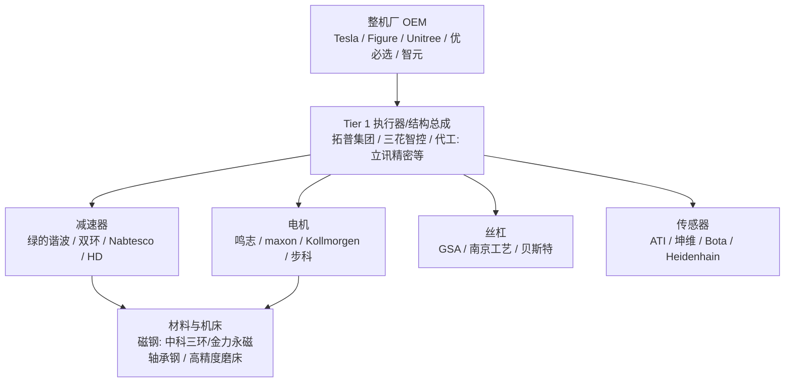

# 第 13 章 量产与规模化

## 摘要

人形机器人从实验室样机走向万台级、十万台级交付，要跨越的并不只是工程技术鸿沟，更是一整套制造体系能力：可制造性设计、供应链锁定、试产验证、产能爬坡、良率工程、成本曲线管理与质量体系建设。本章以知识图谱中的量产流程实体（P0 项目立项至 P16 小批量试产与量产准备）为主线，系统讨论人形机器人量产化的六个核心议题——量产导入流程、产能爬坡模型、良率与可靠性工程、成本曲线与降本路径、供应链组织与保供策略、典型企业的制造模式。本章给出产能爬坡的学习曲线模型、串联良率模型、缺陷密度模型与制程能力指数等定量工具，并结合特斯拉（Tesla）、Figure AI、宇树科技（Unitree Robotics）、Agility Robotics 等整机厂商的公开实践，以及美国银行研究所《Humanoid Robots 101》（2025）等行业公开预测中的 BOM 成本轨迹，刻画人形机器人规模化的工程经济学图景。本章与第 6 章（供应链）、第 9 章（子系统设计）互补：第 6 章侧重零部件供给侧格局，第 9 章侧重设计验证（DV/PV）本身，本章则聚焦"把设计稳定、低成本、大规模地造出来"这一制造系统问题。

**关键词**：量产导入；产能爬坡；学习曲线；良率工程；制程能力指数；BOM 成本；DFM/DFA；PPAP；供应链保供；垂直整合

---

## 13.1 从原型到量产：量产导入的总体框架

### 13.1.1 原型思维与量产思维的根本差异

实验室样机的目标是"证明可行"，量产产品的目标是"证明可重复"。二者在工程目标函数上的差异可以概括为：

- **样机**：最大化性能上限，容忍手工调试、单件定制、长装配工时；
- **量产**：在性能下限满足规格的前提下，最小化单位成本、装配工时与质量波动。

一台人形机器人通常包含 30–60 个自由度、数千个零部件、数十个供应商。任何单点波动——某批谐波减速器背隙超差、某批无框力矩电机磁钢退磁、某个关节模组装配同轴度失控——都会在整机层面放大为行走稳定性或寿命问题。因此量产导入（New Product Introduction, NPI）的本质是**把不确定性从系统中逐层驱逐出去**的过程。

!!! note "术语解释：NPI、EVT/DVT/PVT、DV/PV、量产就绪"
    - **NPI（New Product Introduction，新产品导入）**：将产品设计转化为可稳定量产的制造系统的全过程，涵盖工艺开发、供应链搭建、试产验证与爬坡。
    - **EVT/DVT/PVT**：工程验证、设计验证、生产验证三个阶段的原型迭代；PVT 之后进入量产爬坡（Ramp-up）。
    - **DV/PV（Design Validation / Production Validation）**：DV 验证"设计是否满足规格"，PV 验证"用量产工艺造出来的产品是否仍满足规格"。第 9 章已讨论 DV/PV 的试验内容，本章关注 PV 之后的制造一致性。
    - **量产就绪（Production Readiness）**：工艺冻结、供应链冻结、质量基线冻结三者同时达成，通常以 PPAP 批准为标志。

### 13.1.2 知识图谱中的量产流程主线：P0–P16

知识图谱将人形机器人从立项到量产的完整流程建模为 17 个阶段实体（research/methods/ent_process_p0 … p16），构成全书的流程骨架：

| 阶段 | 名称 | 与量产的关系 |
|---|---|---|
| P0 | 项目立项与商业基线 | 确定目标成本、目标产量、目标市场 |
| P1 | 需求定义与系统方案（Concept / Pre-A） | 冻结产品规格与平台化策略 |
| P2–P3 | 工业设计与机电总体设计 | 决定可制造性上限 |
| P4–P5 | 关节模组与驱动系统、本体结构工程 | 决定 BOM 成本的主要部分 |
| P6–P9 | URDF 校核、仿真、结构与热迭代 | 以仿真降低物理试制轮次 |
| P10–P14 | 控制、灵巧手、AI、电子电气与软件集成 | 决定软件可刷写、可标定的制造需求 |
| P15 | 整机集成与验证测试（Integration & V&V） | DV/PV 验证 |
| P16 | 小批量试产与量产准备（Pilot & Production Ramp） | 本章核心 |

其中 P16 阶段被进一步细分为三组子流程，恰好对应量产准备的三个工作面：



### 13.1.3 量产导入的里程碑与"冻结"纪律

典型的量产导入时间线包含四个"冻结点"，其纪律性强于人形机器人行业以往的科研文化：

1. **设计冻结（Design Freeze）**：之后任何变更走 ECN（Engineering Change Notice，工程变更通知）流程，评估对模具、库存、已售产品的影响；
2. **工艺冻结（Process Freeze）**：装配顺序、拧紧力矩、点胶量、标定参数固化进 SOP（Standard Operating Procedure，标准作业程序）；
3. **供应链冻结（Supply Freeze）**：关键物料的合格供应商清单（Approved Vendor List, AVL）与二供比例确定；
4. **质量基线冻结（Quality Baseline Freeze）**：出厂检验规范（OQC）、可靠性验收标准与可追溯粒度（到关节模组序列号级）确定。

汽车行业惯用的 PPAP（Production Part Approval Process，生产件批准程序）在第 9 章的 DV/PV 语境下是验证工具，在本章语境下则是**量产移交的法律性文件**：供应商提交尺寸报告、材料报告、性能试验报告与过程能力数据，整机厂批准后方可按量产节拍供货。

## 13.2 产能规划与产能爬坡

### 13.2.1 产能的基本度量：节拍、瓶颈与 OEE

产线产能由瓶颈工位决定。设产线有 \(n\) 个工位，第 \(i\) 个工位的节拍（Cycle Time）为 \(t_i\)（含作业时间与上下料时间），则理论节拍为

$$
t_{cyc} = \max_{i=1,\dots,n} t_i, \qquad Q_{theory} = \frac{T_{avail}}{t_{cyc}}
$$

其中 \(T_{avail}\) 为可用生产时间。实际产出需乘以**综合设备效率**（Overall Equipment Effectiveness, OEE）：

$$
OEE = A \times P \times Q
$$

- \(A\)（Availability，时间开动率）：扣除换型、故障、缺料停线；
- \(P\)（Performance，性能开动率）：实际节拍与理论节拍之比；
- \(Q\)（Quality，良品率）：一次通过良率（First Pass Yield, FPY）。

人形机器人总装目前仍以**手工装配岛式产线**为主——关节模组预装、线束敷设、整机标定高度依赖熟练工，这与汽车行业高度自动化的流水线有本质不同。典型地，整机总装节拍在小批量阶段以"天/台"计，爬坡目标是将瓶颈工位压缩到以"小时/台"计。制约因素通常不在总装，而在**关节模组的老化测试（Burn-in）与整机标定**：每个关节需要温升、背隙、效率、噪声测试，每台整机需要步态标定与传感器标定，这些工位的时间常数决定了产线投资额。

!!! note "术语解释：节拍、瓶颈、OEE、FPY、老化测试、标定"
    - **节拍（Cycle Time）**：产线上相邻两台产品下线的时间间隔，由最慢工位决定。
    - **瓶颈（Bottleneck）**：节拍最长的工位；提升非瓶颈工位速度对总产能无效（约束理论，TOC）。
    - **OEE（Overall Equipment Effectiveness）**：衡量设备综合效率的标准指标，世界级离散制造典型值约 85%。
    - **FPY（First Pass Yield，一次通过率）**：不经返修直接通过全部检验的产品比例，是爬坡期最重要的健康指标。
    - **老化测试（Burn-in）**：在高温/满载下通电运行以激发早期失效的筛选工序。
    - **标定（Calibration）**：将传感器零偏、关节零点、运动学参数写入个体产品配置的过程；每台人形机器人都是"千机千面"，标定数据需随序列号存档。

### 13.2.2 产能爬坡曲线与学习模型

爬坡期的单位产量随时间近似服从 S 型曲线，工程上常用两类模型刻画。

**（1）学习曲线（Wright 定律）**：累计产量每翻一番，单位成本（或单位工时）下降固定比例 \(1-\phi\)，其中 \(\phi\) 为学习率：

$$
C(N) = C_1 \cdot N^{-b}, \qquad b = -\log_2 \phi
$$

典型离散制造的学习率 \(\phi \in [0.80, 0.95]\)：\(\phi=0.85\) 意味着累计产量每翻倍一次，单位成本下降 15%。人形机器人关节模组（电机+减速器+编码器+驱动器的一体化部件）与消费级无人机、新能源车驱动电机在工艺上有同源性，可参照的学习率约为 0.85–0.92。

**（2）爬坡产量模型**：月度产量 \(Q(t)\) 在爬坡期近似为

$$
Q(t) = Q_{max}\left(1 - e^{-t/\tau}\right)
$$

其中 \(\tau\) 为爬坡时间常数，由产线调试、工人熟练度与供应链齐套率共同决定。一般而言，全新品类（无可借用工艺遗产）的 \(\tau\) 以季度计；有汽车 Tier 1 供应商参与的产线 \(\tau\) 显著缩短——这也是特斯拉（Tesla）、拓普集团（Tuopu Group）、三花智控（Sanhua Intelligent Controls）等车规级供应商被整机厂高度重视的原因之一。



### 13.2.3 爬坡期的典型失效模式与对策

爬坡期的主要矛盾不是"造得慢"，而是"造得不一样"。典型问题包括：

- **批次间一致性差**：同一 SOP 下不同班次装配的关节背隙分布漂移——对策是关键工位**防错设计**（Poka-Yoke）与拧紧枪联网记录力矩-转角曲线；
- **标定产能不足**：整机步态标定依赖工程师经验——对策是把标定流程脚本化、治具化，将"老师傅调参"转化为"自动标定工位"；
- **软件版本碎片化**：试产批次固件与出厂固件不一致——对策是建立制造执行系统（Manufacturing Execution System, MES）中的软件基线管理，配合 OTA（Over-The-Air，空中升级）实现出厂后版本统一（知识图谱实体：ent_technology_ota_software_update_2024）；
- **返修工位挤占产能**：FPY 低于约 80% 时返修会吞噬瓶颈工位——对策是设立独立返修区与 8D 问题解决流程。

## 13.3 良率工程与制造质量

### 13.3.1 串联良率模型：为什么人形机器人良率是"乘法问题"

人形机器人整机由数千个零件、数十个关键模组串联构成。若整机的合格要求所有关键工序都合格，且各工序近似独立，则整机一次通过良率为各工序良率之积：

$$
Y_{total} = \prod_{i=1}^{n} Y_i
$$

以一个简化算例说明其严峻性：假设一台机器人有 40 个关节模组工序与 20 个整机工序，每个工序良率均为 99%，则

$$
Y_{total} = 0.99^{60} \approx 54.7\%
$$

即近一半整机需要返修。若要整机 FPY 达到 90%，则平均单工序良率需满足

$$
\bar{Y} \ge 0.90^{1/60} \approx 99.82\%
$$

这解释了为什么人形机器人量产必须向汽车行业的 PPM（Parts Per Million，百万分之一缺陷率）管理靠拢：**单点良率的"小数点后位数"，在串联系统中会被指数放大。**

### 13.3.2 缺陷密度模型与面积/复杂度缩放

对于减速器齿面、电机磁钢粘接、PCB 焊接等工艺，良率常用缺陷密度模型估计。Poisson 模型给出：

$$
Y = e^{-D_0 A}
$$

其中 \(D_0\) 为缺陷密度（defects per unit area 或 per joint），\(A\) 为关键面积（或焊点数、配合面数）。改良的 Murphy 模型考虑了缺陷聚集效应：

$$
Y = \left(\frac{1 - e^{-D_0 A}}{D_0 A}\right)^2
$$

工程含义是：**减小关键面积或关键特征数量，本身就是良率工程。**这解释了关节模组高度集成化（电机、减速器、编码器、驱动器、力矩传感器一体化）的双重收益——既降低 BOM，又减少装配界面数量，从而指数级改善串联良率。

### 13.3.3 统计过程控制与制程能力指数

关键特性（如谐波减速器背隙、关节零位误差、整机静平衡）需纳入统计过程控制（Statistical Process Control, SPC）。制程能力指数定义为：

$$
C_p = \frac{USL - LSL}{6\sigma}, \qquad C_{pk} = \min\left(\frac{USL-\mu}{3\sigma}, \frac{\mu-LSL}{3\sigma}\right)
$$

其中 \(USL/LSL\) 为规格上下限，\(\mu,\sigma\) 为过程均值与标准差。车规级要求通常为 \(C_{pk} \ge 1.33\)（对应约 63 PPM），关键安全特性要求 \(C_{pk} \ge 1.67\)。人形机器人关节的背隙、空程、效率等特性目前少有供应商能稳定提供 \(C_{pk}\) 数据，这是 P16.2.2"质量控制体系建立"阶段必须补齐的能力。

### 13.3.4 可靠性与寿命验证

量产质量不仅是出厂合格，更是在寿命期内合格。人形机器人的可靠性工程要点：

- **MTBF 目标**：工业场景通常要求平均故障间隔时间（Mean Time Between Failures）数千小时级；以每日双班运行计，年运行约 4000–6000 小时，整机关键件寿命需覆盖保修期；
- **加速寿命试验（Accelerated Life Test, ALT）**：对关节模组施加超额定负载与高温，用逆幂律模型外推寿命：

$$
L = L_0 \left(\frac{S_0}{S}\right)^{m}
$$

其中 \(S\) 为应力水平，\(m\) 为材料/机理相关指数（疲劳失效典型 \(m\approx 3\)–\(5\)）；
- **失效模式库**：第 4、5 章已讨论执行器与传动的失效机理（齿面疲劳、轴承磨损、磁钢退磁、编码器污染），量产阶段需将其转化为控制计划（Control Plan）中的检测项与频次。



### 13.3.5 Python 算例：串联良率与爬坡期报废成本

下面的脚本把 13.3.1 的串联良率模型与爬坡学习曲线联立，估算爬坡期因良率损失产生的额外制造成本，并演示"先良率、后扩产"的财务含义：

```python
# 串联良率与爬坡期报废成本算例
import math

# 整机关键工序: 40 个关节模组工序 + 20 个整机工序
n_ops = 60

def total_yield(p_op, n=n_ops):
    """串联良率: 各工序良率均为 p_op 时的整机一次通过良率"""
    return p_op ** n

for p in [0.99, 0.995, 0.998, 0.999]:
    print(f"单工序良率 {p:.1%} -> 整机 FPY {total_yield(p):.1%}")

# 爬坡学习曲线: 月度产量 Q(t) = Qmax * (1 - exp(-t/tau))
Qmax, tau = 2000, 9          # 稳态月产 2000 台, 爬坡时间常数 9 个月
fpy0, fpy1, k = 0.55, 0.90, 0.25  # FPY 从 55% 向 90% 收敛, 速率 k
unit_cost = 25000            # 爬坡期单位制造成本 (美元, 量级估计)

def monthly_output(t):
    return Qmax * (1 - math.exp(-t / tau))

def monthly_fpy(t):
    return fpy1 - (fpy1 - fpy0) * math.exp(-k * t)

scrap = 0.0
for t in range(24):          # 头 24 个月
    q = monthly_output(t)
    scrap += q * (1 - monthly_fpy(t)) * unit_cost

print(f"爬坡期 24 个月累计产量约 {sum(monthly_output(t) for t in range(24)):,.0f} 台")
print(f"良率损失对应的报废/返修成本量级约 {scrap/1e6:,.0f} 百万美元")
```

算例的工程解读：在 FPY 从 55% 爬升到 90% 的过程中，良率损失是与设备投资同量级的现金流出。因此爬坡期的首要 KPI 不是产量而是 **FPY 斜率**——这与 13.2.3 中"返修工位挤占产能"的定性判断互为印证。

## 13.4 成本曲线与降本路径

### 13.4.1 BOM 成本的现状与公开预测

物料清单（Bill of Materials, BOM）成本是人形机器人商业化的第一约束。行业公开预测给出的量级图景如下（均为分析机构估计值，非审计数据）：

- 美国银行研究所《Humanoid Robots 101》（2025 年 4 月，知识图谱实体 ent_report_bofa_humanoid_robots_101_2025）估计：以中国供应链为主、含 16 个旋转执行器、14 个直线执行器（行星滚柱丝杠）、6 自由度灵巧手、深度相机与激光雷达配置的典型人形机器人，2025 年底 BOM 约 **3.5 万美元/台**；
- 同一报告预测 BOM 将在 2030–2035 年降至 **1.3 万–1.7 万美元/台**，隐含年均降幅约 14%，与学习曲线模型（\(\phi \approx 0.86\)–\(0.88\)）自洽；
- 消费级售价的先行锚点已经出现：宇树科技（Unitree Robotics）G1 人形机器人公开售价自 **1.6 万美元**起（知识图谱实体 ent_report_unitree_unitree_g1_humanoid_agent_pric_2024），其路径是牺牲部分性能（负载、续航、防护等级）换取价格下探，验证了中国供应链的成本潜力。

!!! note "数据使用说明"
    本节及第 28 章引用的 BOM 与市场规模数字均为行业公开预测或企业公开报价，属于分析机构的前瞻性估计，实际值取决于技术路线（谐波 vs 行星、滚柱丝杠 vs 梯形丝杠、是否配置灵巧手与激光雷达）与产量假设，读者应将其视为量级参考而非精确预测。

### 13.4.2 BOM 结构：成本大头在哪里

综合知识图谱中的零部件实体与行业公开拆解，一台全尺寸电驱人形机器人的 BOM 大致按以下结构分布（典型地，随方案不同有显著浮动）：

| 成本项 | 占比量级 | 关键零部件（KG 实体示例） | 降本杠杆 |
|---|---|---|---|
| 关节执行器（旋转+直线） | 40%–60% | 谐波减速器（Harmonic Drive、绿的谐波 Leaderdrive）、行星减速器（Nabtesco、Wittenstein）、无框力矩电机（Kollmorgen、maxon）、行星滚柱丝杠（GSA、Rollvis、Ewellix） | 集成化、国产替代、规格降配 |
| 灵巧手与末端 | 5%–15% | 因时机器人（Inspire Robots）、DH Robotics、Wonik Robotics、灵巧手微型丝杠/腱绳 | 自由度降配、腱绳方案 |
| 计算与传感 | 10%–20% | NVIDIA Jetson 平台、深度相机（Orbbec）、激光雷达（Hesai、RoboSense）、IMU、六维力传感器（ATI、坤维 Kunwei、Bota Systems） | 国产 SoC、传感器减配融合 |
| 电池与电源 | 3%–8% | 锂电池 pack（CATL、亿纬锂能 EVE Energy）、BMS、DC-DC | 平台化电池包 |
| 结构与外观 | 5%–10% | 铝合金/镁合金压铸与 CNC、碳纤维覆盖件 | 压铸替代 CNC、以塑代铝 |
| 线束与电气 | 3%–5% | 连接器（TE Connectivity、JST）、线束 | EtherCAT 一线到底、无线化 |

### 13.4.3 降本的四条路径

**路径一：设计降本（Design-to-Cost, DTC）。** 在 P1–P5 阶段即设定目标成本并逐层分解到模组。知识图谱中的方法实体**价值工程/价值分析**（Value Analysis / Value Engineering, VAVE，ent_method_value_analysis_value_engineering）提供了系统工具：对每个零部件问"它的功能是什么、实现该功能的最低成本方案是什么"。典型 VAVE 案例包括：以准直驱（Quasi-Direct-Drive, QDD）方案替代高减速比谐波方案（用控制带宽换取减速器成本与体积，宇树路线）；以行星滚柱丝杠替代梯形丝杠仅用于高负载关节（特斯拉 Optimus 思路）；灵巧手自由度从 20+ 降至 6–11 以匹配真实任务需求。

**路径二：规模降本。** 由学习曲线 \(C(N)=C_1 N^{-b}\) 描述。规模降本的前提是可制造性设计（DFM）先行，否则规模只会放大缺陷成本。

**路径三：供应链降本。** 国产替代是中国整机厂的核心杠杆：谐波减速器从 Harmonic Drive Systems 转向绿的谐波（Leaderdrive）或来福谐波（Laifual），行星减速器转向双环传动（Shuanghuan）、中大力德（Zhongda），电机转向鸣志电器（Mingzhi Appliance / Moons'）、江苏雷利（Jiangsu Leili），行业公开拆解普遍报告此类替代可带来零部件级 30%–60% 的成本下降。

**路径四：制造降本。** 即 P16.3.2"成本核算与降本"的日常化：通过压铸、MIM（金属注射成型）、冷镦等净成形工艺替代 CNC 全切削（参照知识图谱实体 ent_process_cnc_machining 的工艺边界），将结构件机加工工时压缩一个数量级；通过工装治具与自动拧紧、自动点胶降低直接人工。

### 13.4.4 成本、产量与价格的联动

整机厂面对的是一个动态联立方程：价格决定需求，需求决定产量，产量经由学习曲线决定成本，成本决定可行价格。该联动的简化表述为

$$
P(N) = \frac{C_1 N^{-b}}{1 - m}
$$

其中 \(m\) 为目标毛利率。当 \(N\) 在千台级以下时，任何正毛利定价都难以匹配工业客户的投资回报要求（通常要求机器人替代人工的投资回收期在 2–3 年以内）；只有当累计产量进入万台级、BOM 降至 2 万美元以下，工业场景的总拥有成本（Total Cost of Ownership, TCO）才开始闭合。这是"量产与规模化"一章的核心结论：**人形机器人的商业化本质是制造学习曲线与场景 TCO 曲线的赛跑。**

## 13.5 供应链组织与保供策略

### 13.5.1 关键长周期物料的识别

爬坡期供应链管理的重心是**长周期、高瓶颈、高波动**物料。综合知识图谱实体与行业公开信息，人形机器人的关键瓶颈物料包括：

| 物料 | 瓶颈成因 | KG 相关实体 |
|---|---|---|
| 行星滚柱丝杠 | 高精度磨床/旋风铣设备稀缺，工艺 know-how 集中 | GSA、Rollvis、Ewellix、南京工艺（Nanjing Craft）、贝斯特（Best） |
| 谐波减速器 | 柔轮材料与齿形加工一致性 | Harmonic Drive Systems、绿的谐波（Leaderdrive）、来福（Laifual） |
| 高性能钕铁硼磁钢 | 稀土原料与出口管制波动 | 中科三环（Zhongke Sanhuan）、金力永磁（JL Mag）、正海磁材（Zhenghai Magnet）、宁波韵升（Ningbo Yunsheng）；ent_report_oceanwall_rare_earth_bottleneck_2025 |
| 车规级算力芯片 | 先进制程产能与出口政策 | NVIDIA、地平线（Horizon）、黑芝麻（Black Sesame） |
| 六维力传感器 | 标定产能与一致性 | ATI、坤维科技（Kunwei）、Bota Systems |
| 高端编码器 | 光栅刻划工艺 | Heidenhain、Renishaw、多摩川（Tamagawa） |

### 13.5.2 供应商选择、审核与二供策略

P16.2.1"供应商选择与审核"在人形机器人行业的特殊之处：大量核心供应商是从汽车零部件、3C、医疗器械行业跨界而来，其质量体系（IATF 16949 或 ISO 9001）成熟度差异极大。实务要点：

- **分级管理**：按"瓶颈/杠杆/常规/关键"四象限（Kraljic 矩阵）分配资源；谐波减速器、丝杠、磁钢属于"瓶颈+关键"，必须双源或签署产能预留协议；
- **过程审核**：对关键供应商执行 VDA 6.3 或等效过程审核，重点核查 SPC 数据真实性与变更管理（未经通知的材料/工艺变更是批量事故的最大来源）；
- **二供导入节奏**：二供不仅是议价工具，更是保供保险；但二供件必须通过完整的 PPAP 与整机级 A/B 对比验证，避免"名义双源、实际单源"；
- **库存策略**：对稀土磁钢等政策性波动物料，安全库存可按

$$
SS = z \cdot \sigma_L \cdot \sqrt{LT}
$$

估计，其中 \(z\) 为服务水平系数，\(\sigma_L\) 为需求波动，\(LT\) 为补货提前期。政策风险导致的"提前期分布右尾"需要用情景储备而非正态假设处理。

### 13.5.3 整机厂与 Tier 1 的新型关系

人形机器人产业正在复制汽车行业"整车厂—Tier 1—Tier 2"的分层。知识图谱中已出现明确的一级供应商实体：**拓普集团**（Tuopu Group，执行器总成方向）、**三花智控**（Sanhua Intelligent Controls，机电执行器方向），二者均从新能源车热管理与结构件跨界，承接整机厂的执行器总成外包。这种模式的工程含义是：

- 整机厂聚焦"大脑+小脑"（AI 与运动控制）与整机集成，把关节模组的制造学习曲线外包给有车规量产经验的 Tier 1；
- Tier 1 再向上整合减速器（绿的、双环）、电机（鸣志、步科等）、丝杠（南京工艺、贝斯特）等 Tier 2；
- 整机厂保留对关键接口（通信协议、力矩-位置特性、失效安全行为）的定义权，即第 9 章所述 ICD 的外延。



## 13.6 典型制造模式与案例

### 13.6.1 垂直整合模式：特斯拉 Optimus

特斯拉（Tesla，知识图谱实体 ent_oem_tesla）的量产哲学继承自其汽车业务：**设计可制造性内生化**——先确定目标成本（公开表述为长期 2 万美元级售价）与目标产量，再反推每个执行器、每根丝杠的设计；自研执行器总成，复用汽车的压铸、电机与电池工艺遗产；工厂即产品（"the machine that builds the machine"），把产线本身当作迭代对象。其风险在于全新执行器供应链需自建学习曲线，短期成本高于外购。

### 13.6.2 专业工厂模式：Agility Robotics 与 Figure AI

Agility Robotics 为 Digit（知识图谱实体 product_digit）建设了专用工厂 RoboFab，是行业首个公开宣称按年产万台级规划的人形机器人专用产线，其意义在于验证"人形机器人专用制造系统"的单元经济学。Figure AI（ent_oem_figure_ai）则公开了自建工厂 BotQ 的产能规划，并采取"整机自产+汽车客户场景共创"（与宝马等车企的公开合作）的双轮模式：工厂既是交付能力，也是真实工况数据的采集基础设施——这指向本章与第 21 章（数据基础设施）的深层联系：**量产工厂同时是数据工厂。**

### 13.6.3 成本颠覆模式：宇树科技

宇树科技（Unitree Robotics，ent_oem_unitree_robotics）的路径是消费级定价反向定义工程规格：G1 以 1.6 万美元起的公开售价（ent_report_unitree_unitree_g1_humanoid_agent_pric_2024）锚定科研与开发者市场，H1/H2 覆盖更高性能段。其制造模式的关键是：准直驱关节自研自产、结构件大量采用压铸与型材、复用四足机器人（Go2 等）已跑通的电机与减速器供应链。该模式证明了中国供应链支撑下，人形机器人的价格下降速度可以显著快于行业公开预测的均值——代价是初始性能与工业场景要求之间仍有距离。

### 13.6.4 三种模式的对比

| 维度 | 垂直整合（Tesla） | 专用工厂（Agility/Figure） | 成本颠覆（Unitree） |
|---|---|---|---|
| 目标场景 | 自有工厂→泛工业 | 物流/制造客户 | 科研/开发者→轻商用 |
| 核心壁垒 | 制造工艺遗产+数据闭环 | 场景 know-how+专用产线 | 供应链成本+快速迭代 |
| 量产风险 | 全链条自建，资本开支大 | 依赖单一大客户导入节奏 | 性能上限与工业可靠性 |
| 成本路径 | 规模+工艺复用 | 学习曲线+客户共担 | 国产供应链+降配设计 |

## 13.7 质量体系与量产法规衔接

人形机器人量产还需跨越法规门槛：整机需满足目标市场的电气安全（如 IEC 60204-1）、电磁兼容（EMC）、功能安全（ISO 13849、IEC 61508）与人机协作安全（ISO/TS 15066 的精神延伸至双足平台）要求；知识图谱中的标准机构实体（ISO、IEEE SA、ANSI/RIA、UL Solutions、TÜV SÜD、SGS）构成认证生态。量产质量体系通常以 ISO 9001 为基线，有汽车客户者叠加 IATF 16949。本章不展开标准条文（见附录 E），仅强调一点：**认证能力必须在 P16 之前内建到设计里**——事后再补安全回路（如关节抱闸、力矩限制）几乎必然推翻既有设计，这是从协作机器人行业反复验证过的教训。

## 13.8 本章小结

- 量产导入的本质是驱逐不确定性：设计、工艺、供应链、质量四重冻结是量产就绪的标志，PPAP 是移交的法律文件；
- 产能爬坡受瓶颈工位（关节老化测试、整机标定）支配，遵循 \(C(N)=C_1N^{-b}\) 的学习曲线，典型学习率 0.85–0.92；
- 人形机器人的良率是串联乘法问题：60 个 99% 良率的工序只剩约 55% 整机 FPY，量产必须向 PPM 管理与 \(C_{pk}\ge1.33\) 的车规水平靠拢；
- 成本曲线的锚点：行业公开预测（BofA《Humanoid Robots 101》）给出 2025 年约 3.5 万美元、2030–2035 年 1.3–1.7 万美元的 BOM 轨迹；宇树 G1 以 1.6 万美元售价提供了消费端先行锚点；
- 供应链的瓶颈物料是行星滚柱丝杠、谐波减速器、钕铁硼磁钢、车规算力与六维力传感器；拓普、三花等 Tier 1 的崛起标志着产业分层正在形成；
- 制造模式分化出垂直整合、专用工厂与成本颠覆三条路线，其共同点是：工厂同时承担制造与数据采集双重职能。

## 本章涉及的知识图谱实体

| 实体 ID | 名称 | 本章引用位置 |
|---|---|---|
| ent_process_p0 – p16 | 立项到量产流程主线（含 P16 全部子流程） | 13.1–13.7 |
| ent_method_value_analysis_value_engineering | 价值工程/价值分析（VAVE） | 13.4.3 |
| ent_report_bofa_humanoid_robots_101_2025 | 美国银行研究所《Humanoid Robots 101》 | 13.4.1 |
| ent_report_oceanwall_rare_earth_bottleneck_2025 | 稀土瓶颈分析报告 | 13.5.1 |
| ent_report_unitree_unitree_g1_humanoid_agent_pric_2024 | 宇树 G1 售价公告 | 13.4.1, 13.6.3 |
| ent_oem_tesla / ent_oem_figure_ai / ent_oem_unitree_robotics | 特斯拉 / Figure AI / 宇树科技 | 13.6 |
| ent_tier1_supplier_tuopujituan / ent_tier1_supplier_sanhuazhikong | 拓普集团 / 三花智控 | 13.5.3 |
| ent_technology_ota_software_update_2024 | OTA 空中升级 | 13.2.3 |
| ent_process_cnc_machining | CNC 加工工艺 | 13.4.3 |
| 附录 D 企业卡片 | Harmonic Drive、Nabtesco、Leaderdrive、maxon、Kollmorgen、ATI、Heidenhain、CATL、Orbbec、Hesai 等 | 13.4.2, 13.5.1 |

## 参考

- Bank of America Institute. (2025-04). *Humanoid Robots 101*. https://institute.bankofamerica.com/content/dam/transformation/humanoid-robots.pdf （知识图谱收录，其 BOM 与普及预测为分析师估计值）
- 知识图谱 research/methods/ent_process_p0.md – ent_process_p16.md（量产流程实体族）
- 附录 D：主要供应商与企业名录；附录 E：标准、法规与认证清单
