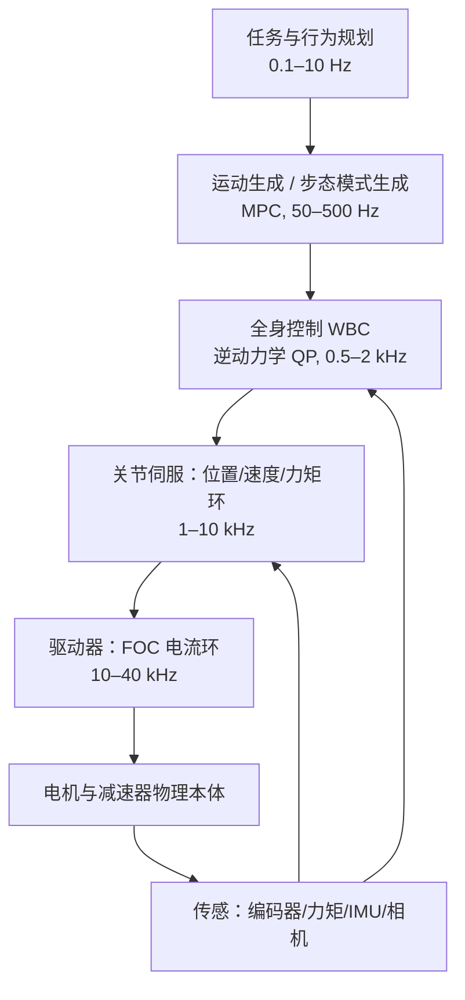
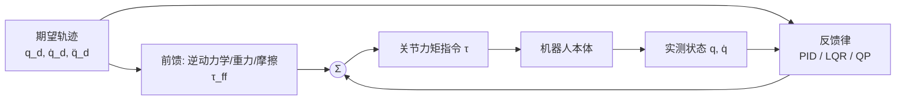
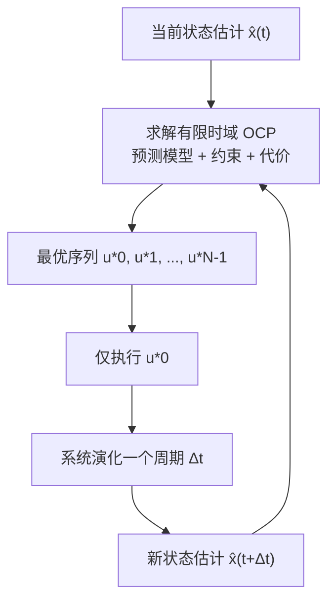

# 第 14 章 机器人控制基础

## 摘要

第 8 章给出了人形机器人的运动学与动力学模型，第 9 章给出了各子系统的物理实现；本章回答的核心问题是：**给定一个高维、浮动基、欠驱动且与环境的接触不断切换的机械系统，如何实时地计算关节力矩，使其完成期望的运动并保持平衡**。本章按"自底向上"的控制栈展开：首先讨论关节级伺服控制——级联的电流/速度/位置环、PID 控制律及其离散实现、抗饱和与前馈补偿、面向柔顺交互的阻抗/导纳控制；随后进入状态空间方法，给出 LQR 的形式化、代数 Riccati 方程与增益调度；再讨论模型预测控制（MPC）的滚动时域原理、二次规划（QP）形式化与实时求解工程；最后系统阐述全身控制（WBC）——任务 Jacobian、零空间投影、逆动力学 QP 与分层 QP——并讨论状态估计、实时通信与安全链等系统集成问题。全章以 PID、LQR、MPC、WBC 四条方法主线贯穿，并给出两个可运行的 Python 算例。本章刻意不重复第 8 章已推导的运动学/动力学模型与阻抗控制基础，而把重点放在**控制器本身的结构、算法与工程实现**上。

**关键词**：级联控制；PID；抗积分饱和；力矩控制；阻抗控制；状态空间；LQR；Riccati 方程；模型预测控制；二次规划；全身控制；零空间投影；分层 QP；实时性；EtherCAT；功能安全

---

## 14.1 人形机器人控制问题概述

### 14.1.1 控制栈分层：从功率开关到全身行为

人形机器人的控制不是单一算法，而是一个跨越五个数量级时间尺度的**分层控制栈（control stack）**。最底层是驱动器内部的功率电子开关与磁场定向控制（Field-Oriented Control, FOC），在数十千赫兹下调节电机相电流；其上是关节伺服环（电流环/速度环/位置环，见第 4 章执行器部分对 FOC 硬件的论述）；再向上是全身控制（Whole-Body Control, WBC）在 0.5–2 kHz 求解关节力矩；更上层是运动生成（MPC 或步态模式生成器，典型 50–500 Hz）；最顶层是任务与行为规划，工作频率可低至 1 Hz 以下。

!!! note "术语解释：控制栈、控制频率、实时性、硬实时与软实时"
    - **控制栈（control stack）**：由多层控制器按频率与抽象级别堆叠而成的体系结构，每层向下一层下发参考量、向上层汇报状态。
    - **控制频率（control rate）**：控制器每个周期重新计算输出的频率，单位为 Hz。关节伺服典型为 1–10 kHz，WBC 典型为 0.5–2 kHz。
    - **实时性（real-time）**：计算结果必须在截止时间前输出的性质。错过截止时间在硬实时系统中视为故障。
    - **硬实时（hard real-time）**：不允许任何一次超时，如电机电流环与急停回路。
    - **软实时（soft real-time）**：偶发超时只导致性能下降而非灾难，如感知与任务规划。



各层的典型频率与延迟预算如下表所示（数值为行业常见量级，具体平台差异较大）：

| 层级 | 典型频率 | 单周期预算 | 主要计算内容 |
|---|---|---|---|
| FOC 电流环 | 10–40 kHz | 25–100 µs | Clarke/Park 变换、PI 调节、PWM 调制 |
| 关节伺服环 | 1–10 kHz | 100–1000 µs | PID、前馈、滤波、限幅 |
| 全身控制（WBC） | 0.5–2 kHz | 0.5–2 ms | 正逆动力学、QP 求解、接触力分配 |
| 运动生成（MPC） | 50–500 Hz | 2–20 ms | 有限时域优化、落脚点规划 |
| 任务规划 | 0.1–10 Hz | 100 ms 以上 | 行为树、状态机、语义决策 |

分层架构的工程含义是：**任何上层算法的性能上限都被下层环路的带宽与跟踪精度锁死**。一个在仿真中完美的 WBC，若关节力矩环带宽只有 20 Hz，其实际表现会远逊于理论预期。因此本章采用自底向上的叙述顺序。

### 14.1.2 人形机器人控制的四个结构性困难

与固定基座机械臂或轮式底盘相比，人形机器人的控制问题有四个结构性困难，它们决定了本章方法选型的基本格局：

1. **浮动基与欠驱动**。人形机器人没有固定基座，本体位姿的 6 个自由度没有直接执行器，只能通过地面反作用力间接控制（浮动基动力学，见第 8 章 8.4.7）。系统自由度数 \(n + 6\) 大于执行器数 \(n\)，是典型的欠驱动系统。
2. **混合动力学（hybrid dynamics）**。足的接触/脱离使动力学方程随接触状态离散切换；控制律必须在接触状态机驱动下切换约束集，并处理接触建立瞬间的冲击。
3. **高维与强耦合**。整机自由度典型为 20–60，惯量耦合显著，任何忽略耦合的单关节独立控制在动态行走中都会失效。
4. **严格实时性**。平衡本身是动力学不稳定问题（倒立摆），控制延迟直接消耗稳定裕度。一般而言，从传感采样到力矩输出的端到端延迟每增加 1 ms，可恢复扰动的量级就下降一截。

### 14.1.3 反馈、前馈与标称/误差分解

几乎所有实用的人形机器人控制器都可写成"**标称前馈 + 误差反馈**"的形式：

$$
\tau = \tau_{\mathrm{ff}}(q_d, \dot q_d, \ddot q_d) + \tau_{\mathrm{fb}}(q_d - q, \dot q_d - \dot q, \ldots)
$$

其中 \(\tau_{\mathrm{ff}}\) 由模型（逆动力学、重力补偿、摩擦模型）给出，\(\tau_{\mathrm{fb}}\) 由反馈律（PID、LQR、QP）给出。前馈承担了"模型已知部分"的力矩需求，反馈只需修正模型误差与扰动，从而可以用较低的反馈增益获得同样的跟踪精度——这对于需要保持柔顺、不能无限提高刚度的交互型机器人至关重要。

!!! note "术语解释：前馈控制、反馈控制、计算力矩法、扰动观测器"
    - **前馈控制（feedforward control）**：利用模型预先计算所需控制量，不依赖误差信号。
    - **反馈控制（feedback control）**：根据期望与实测状态之差计算控制量，能抑制模型误差与外部扰动。
    - **计算力矩法（computed torque control）**：用逆动力学模型把非线性系统反馈线性化为解耦的双积分器，再配 PD 反馈，是前馈+反馈思想的极端形式。
    - **扰动观测器（disturbance observer, DOB）**：把未建模力矩作为扩张状态估计并补偿，常用于替代高增益反馈。



## 14.2 关节级伺服控制

### 14.2.1 级联控制：电流环/速度环/位置环

关节伺服普遍采用**级联控制（cascade control）**：最内环是电流（力矩）环，中间是速度环，最外环是位置环。内环带宽必须显著高于外环——典型地每向外一层带宽降低 3–10 倍——否则内外环动态相互干涉，整定失去意义。

电流环的对象是电机电气动态。经 FOC 变换后（见第 4 章），\(q\) 轴电流近似满足一阶模型

$$
L_q \frac{d i_q}{dt} = v_q - R_s i_q - k_e \omega_m
$$

其中 \(L_q\)、\(R_s\) 为定子电感与电阻，\(k_e\) 为反电动势常数，\(\omega_m\) 为电机角速度。电磁时间常数 \(L_q/R_s\) 典型为亚毫秒级，因此电流环带宽可达数千赫兹。关节输出力矩 \(\tau_j = N \eta k_t i_q\)（\(N\) 为减速比，\(\eta\) 为传动效率，\(k_t\) 为转矩常数），故电流环实质上就是**力矩环**。

速度环与位置环的对象则是机电动态：

$$
J_{\mathrm{eff}} \dot \omega = \tau_j - \tau_g(q) - \tau_f(\omega) - \tau_{\mathrm{ext}}
$$

其中 \(J_{\mathrm{eff}} = J_m N^2 + J_l\) 为电机转子惯量经减速比放大后与负载惯量之和，\(\tau_g\) 为重力矩，\(\tau_f\) 为摩擦力矩，\(\tau_{\mathrm{ext}}\) 为外部耦合力矩。注意 \(N^2\) 的放大作用：高减速比关节（如谐波减速，\(N\) 典型为 50–160）中，负载侧惯量与扰动被折算到电机侧后缩小 \(N^2\) 倍，这使得高减速比关节"天然抗扰但天然不透明"——末端碰撞力也被缩小 \(N^2\) 倍，难以用电机电流感知。准直驱（Quasi-Direct-Drive, QDD）方案刻意取低减速比（典型 \(N = 6\!-\!12\)）以换取力矩透明度与反向驱动能力，其代价是电流环必须直接承受负载扰动，对伺服设计提出更高要求。

!!! note "术语解释：级联控制、带宽、转矩常数、反向驱动性、力矩透明度"
    - **级联控制（cascade control）**：多个控制环嵌套，外环输出作为内环给定。整定顺序必须由内向外。
    - **带宽（bandwidth）**：闭环幅频特性下降到 \(-3\) dB 对应的频率，反映环路能跟踪多快的指令。
    - **转矩常数（torque constant, \(k_t\)）**：单位电流产生的电机转矩，单位 N·m/A。
    - **反向驱动性（backdrivability）**：从输出端反向驱动电机转动的能力，低减速比传动反向驱动性好。
    - **力矩透明度（torque transparency）**：无需专用力矩传感器、仅靠电流即可准确估计输出力矩的程度。

### 14.2.2 PID 控制律与离散实现

**PID 控制（PID Control）**是关节伺服的主力算法。连续形式为

$$
u(t) = K_p e(t) + K_i \int_0^t e(s)\, ds + K_d \frac{d e(t)}{dt}
$$

其中 \(e(t) = r(t) - y(t)\) 为跟踪误差。三项的作用可概括为：比例项提供即时纠正，决定响应速度；积分项消除常值扰动（如重力、库仑摩擦）造成的稳态误差；微分项提供阻尼、抑制超调。Åström 与 Hägglund 在《Advanced PID Control》中系统总结了 PID 的整定与抗扰设计，Ogata 的《Modern Control Engineering》给出了经典的频域分析框架，二者均为本主题的标准参考。

数字控制器以周期 \(T_s\) 采样，常用离散实现为**位置式**：

$$
u[k] = K_p e[k] + K_i T_s \sum_{j=0}^{k} e[j] + K_d \frac{e[k] - e[k-1]}{T_s}
$$

以及**增量式（velocity form）**：

$$
\Delta u[k] = K_p \left(e[k] - e[k-1]\right) + K_i T_s e[k] + \frac{K_d}{T_s}\left(e[k] - 2e[k-1] + e[k-2]\right)
$$

增量式输出的是控制量的增量，天然避免了积分累加器的显式累加，且在手动/自动切换时无扰，工程上更常用。

### 14.2.3 工程细节：抗饱和、微分滤波与前馈

教科书 PID 与实际可用 PID 之间隔着一串工程细节，缺失任何一项都可能在真机上造成振荡甚至事故。

**抗积分饱和（anti-windup）**。执行器输出受限（电流限幅、力矩限幅）时，误差持续存在会使积分项无限累积（积分饱和），饱和解除后造成巨大超调。常用方案是**反算抗饱和（back-calculation）**：把饱和差值经增益 \(K_t\) 反馈到积分器，

$$
I[k+1] = I[k] + K_i T_s e[k] + K_t T_s \left( u_{\mathrm{sat}}[k] - u_{\mathrm{unsat}}[k] \right)
$$

其中 \(u_{\mathrm{unsat}}\) 与 \(u_{\mathrm{sat}}\) 分别为限幅前后的控制量。典型取 \(K_t = 1/\sqrt{K_p K_d}\) 或按积分时间常数倒数选取。

**微分滤波**。微分项放大量测噪声，必须串联低通滤波器，构成"带滤波微分"：

$$
D(s) = \frac{K_d s}{1 + s / N_f}
$$

滤波系数 \(N_f\) 典型取 5–20。此外，为避免给定值阶跃经微分项产生"微分冲击"，实用中多采用**微分先行（derivative on measurement）**：微分只作用于测量值而非误差。

**前馈与补偿**。按 14.1.3 的分解，关节伺服通常叠加三项前馈：

$$
\tau_{\mathrm{cmd}} = \underbrace{J_{\mathrm{eff}} \ddot q_d + \tau_g(\hat q) + \hat \tau_f(\hat \omega)}_{\text{模型前馈}} + \underbrace{K_p e + K_d \dot e + K_i \int e}_{\text{反馈}}
$$

其中重力补偿 \(\tau_g(\hat q)\) 在人形机器人上收益最大：腿与手臂关节的重力矩可达峰值力矩的三至五成，不补偿时只能靠积分项硬扛，导致启动迟缓与稳态抖动。摩擦补偿 \(\hat\tau_f\) 常用库仑+粘性模型 \(\hat \tau_f = b\hat\omega + F_c \,\mathrm{sgn}(\hat\omega)\)，但减速器摩擦随温度与磨损漂移，标定方法见第 8 章 8.3.10 的参数辨识。

| 工程环节 | 目的 | 典型做法 | 缺失后果 |
|---|---|---|---|
| 抗积分饱和 | 限幅下抑制超调 | 反算法、积分钳位 | 大超调、冲击负载 |
| 微分滤波 | 抑制噪声放大 | 一阶低通 \(N_f = 5\!-\!20\) | 力矩高频抖动、电流发热 |
| 微分先行 | 避免给定阶跃冲击 | 微分作用于测量值 | 阶跃响应力矩尖峰 |
| 重力前馈 | 卸掉反馈负担 | \(\tau_g(\hat q)\) 在线计算 | 稳态误差、启动迟滞 |
| 摩擦前馈 | 改善低速跟踪 | 库仑+粘性模型 | 爬行、极限环 |
| 陷波/低通滤波 | 避开机械谐振 | 按 FFT 谱设置陷波点 | 谐振啸叫、结构疲劳 |

### 14.2.4 面向交互的力矩控制：阻抗、导纳与力/位混合

当机器人与环境发生物理接触时，纯位置控制在几何误差下会产生不受控的接触力，必须引入**柔顺控制**。第 8 章 8.4.11 已推导了**阻抗控制（Impedance Control）**、**导纳控制（Admittance Control）**与**力/位混合控制（Hybrid Force-Position Control）**的动力学基础，本节从伺服实现角度补充三点。

第一，**阻抗控制的本质是修改力矩环的参考**。把期望的"虚拟弹簧-阻尼-惯量"关系写成力矩指令

$$
\tau = J^T(q)\left[ K_t (x_d - x) + D_t (\dot x_d - \dot x) + \Lambda (\ddot x_d - \ddot x) \right] + \tau_g(q)
$$

其闭环行为取决于力矩环的保真度：QDD 关节靠电流估计力矩，串联弹性执行器（Series Elastic Actuator, SEA）靠弹簧形变测量力矩，二者都能实现较"软"的阻抗；高减速比关节则必须额外安装关节力矩传感器，否则阻抗控制只是名义上的。

第二，**导纳控制是位置控制机器人的柔顺补丁**。导纳外环根据测量力修正位置给定 \(x_c = x_d + \Delta x(F_{\mathrm{ext}})\)，内环仍是高增益位置伺服，因此适合谐波减速类的高刚度关节，但接触瞬态的稳定性受外环采样率与传感器噪声限制。

第三，**力/位混合控制按方向分解任务空间**。在约束方向（如足底法向、插入方向）闭环控制力，在自由方向闭环控制位置，选择矩阵 \(S\) 与 \(I - S\) 实现投影（见 8.4.11）。人形机器人足底在支撑相实质上是"位置约束方向"，而擦灰、按压等操作任务才真正需要力闭环。

!!! note "术语解释：阻抗控制、导纳控制、力/位混合控制、串联弹性执行器"
    - **阻抗控制（impedance control）**：控制机器人呈现给环境的动态关系（惯量-阻尼-刚度），输出为力、输入为运动偏差。
    - **导纳控制（admittance control）**：阻抗的对偶——输入为力，输出为运动修正量，包裹在位置环之外。
    - **力/位混合控制（hybrid force-position control）**：在任务空间正交分解为力控子空间与位置控子空间。
    - **串联弹性执行器（SEA）**：在执行器与负载间串联弹性元件，以形变测力并提供固有柔顺，代价是带宽受弹簧-惯量谐振限制。

### 14.2.5 Python 算例：单关节伺服仿真——重力前馈与抗饱和的作用

下面用一个单摆关节（如肩屈曲关节）的数值仿真，演示 PID + 重力前馈 + 反算抗饱和的组合效果。读者可开关 `use_ff` 与 `use_aw` 两个开关观察稳态误差与饱和超调的变化。

```python
# 单关节（单摆）伺服仿真：PID + 重力前馈 + 反算抗饱和
import numpy as np
import matplotlib.pyplot as plt

# 关节参数（近似一个肩/肘关节）
m, l, g = 2.0, 0.30, 9.81      # 连杆质量(kg)、质心距离(m)、重力加速度
J = m * l**2                    # 绕关节转动惯量
b = 0.05                        # 粘性摩擦
tau_max = 8.0                   # 力矩限幅 (N·m)
Ts = 1e-3                       # 伺服周期 1 kHz
T = 3.0
N = int(T / Ts)

# 参考轨迹：0 -> 1 rad 的平滑阶跃（五次多项式）
qd = np.ones(N) * 1.0

# PID 增益
Kp, Ki, Kd = 25.0, 12.0, 1.2
Kt = 1.0 / np.sqrt(Kp * Kd)     # 反算抗饱和增益

use_ff = True   # 是否启用重力前馈
use_aw = True   # 是否启用抗积分饱和

q, w = 0.0, 0.0
I = 0.0
log_q, log_tau = [], []

for k in range(N):
    e = qd[k] - q
    ed = -w                       # 微分先行：对测量值微分
    tau_g = m * g * l * np.sin(q) # 重力矩
    tau_ff = tau_g if use_ff else 0.0
    u_unsat = tau_ff + Kp * e + Kd * ed + I
    u = np.clip(u_unsat, -tau_max, tau_max)
    if use_aw:
        I += Ki * Ts * e + Kt * Ts * (u - u_unsat)
    else:
        I += Ki * Ts * e
    # 关节动力学：J q̈ + b q̇ = u - τ_g
    acc = (u - b * w - tau_g) / J
    w += acc * Ts
    q += w * Ts
    log_q.append(q); log_tau.append(u)

t = np.arange(N) * Ts
plt.plot(t, qd, 'k--', label='reference')
plt.plot(t, log_q, label='q (ff+aw)' if (use_ff and use_aw) else 'q')
plt.xlabel('t [s]'); plt.ylabel('q [rad]'); plt.legend(); plt.grid(True)
plt.show()
```

## 14.3 状态空间控制与线性二次型调节器

### 14.3.1 状态空间模型、线性化与离散化

PID 是单输入单输出方法，而人形机器人的平衡问题天然是多变量耦合的。状态空间方法把系统写成

$$
\dot x = f(x, u), \qquad y = h(x)
$$

在标称点 \((x_0, u_0)\) 处做泰勒展开并略去高阶项，得到线性化模型

$$
\delta \dot x = A \delta x + B \delta u, \quad A = \left.\frac{\partial f}{\partial x}\right|_{x_0, u_0}, \quad B = \left.\frac{\partial f}{\partial u}\right|_{x_0, u_0}
$$

数字控制器需要离散模型。对采样周期 \(T_s\) 的零阶保持（ZOH）离散化：

$$
A_d = e^{A T_s} \approx I + A T_s + \frac{(A T_s)^2}{2}, \qquad B_d = \left( \int_0^{T_s} e^{A s} ds \right) B
$$

线性化模型的有效性是局部的：扰动把状态推离标称点越远，模型误差越大。这就是为什么状态空间方法在人形机器人上总是与前述标称轨迹生成（第 15 章）或增益调度（14.3.4）配合使用。

### 14.3.2 稳定性概念与 Lyapunov 判据

控制的最低要求不是"跟踪好"而是"不倒"。对线性系统 \(\dot x = A x\)，渐近稳定的充要条件是 \(A\) 的全部特征值位于左半平面。对非线性系统，常用工具是 **Lyapunov 第二方法**：若能找到正定函数 \(V(x)\)（可理解为能量），且沿系统轨迹 \(\dot V(x) = \nabla V \cdot f(x) < 0\)，则平衡点渐近稳定。

!!! note "术语解释：Lyapunov 函数、渐近稳定、吸引域、控制 Lyapunov 函数"
    - **Lyapunov 函数**：在平衡点取最小值、沿系统轨迹单调递减的标量函数，是稳定性的"能量证书"。
    - **渐近稳定（asymptotic stability）**：充分小的初始偏差最终收敛回平衡点。
    - **吸引域（region of attraction）**：能收敛回平衡点的初始状态集合；人形机器人受支撑多边形限制，吸引域总是有限的。
    - **控制 Lyapunov 函数（Control Lyapunov Function, CLF）**：对每个状态都存在控制使 \(\dot V < 0\) 的函数，可直接用作控制约束（见第 15 章 CLF 引导的跑步学习）。

Lyapunov 思想在人形机器人中的一个直接推论是：任何"基于能量的"控制（如把总机械能塑造成期望形式）都自带稳定性论证的雏形；而纯数据驱动控制器若不附加此类结构，其稳定性只能靠大量测试背书（见第 15 章 15.4）。

### 14.3.3 LQR：形式化与代数 Riccati 方程

**线性二次型调节器（Linear Quadratic Regulator, LQR）** 是状态空间方法中最实用的反馈律。对线性系统 \(\dot x = A x + B u\)，LQR 最小化无限时域二次代价

$$
J = \int_0^{\infty} \left( x^T Q x + u^T R u \right) dt
$$

其中 \(Q \succeq 0\) 惩罚状态偏差，\(R \succ 0\) 惩罚控制消耗。最优反馈为线性状态反馈

$$
u = -K x, \qquad K = R^{-1} B^T P
$$

其中 \(P\) 是**连续时间代数 Riccati 方程（CARE）**的唯一正定解：

$$
A^T P + P A - P B R^{-1} B^T P + Q = 0
$$

离散系统对应离散代数 Riccati 方程（DARE），`scipy.linalg.solve_discrete_are` 可直接求解。LQR 的价值不在"最优"二字本身，而在于：它把多变量反馈设计压缩为 \(Q\)、\(R\) 两个矩阵的整定，且闭环对增益与相位扰动具有经典的鲁棒裕度（对状态反馈形式，增益裕度 \([1/2, \infty)\)、相位裕度 \(\geq 60^\circ\)）。

\(Q\)、\(R\) 的整定有明确物理含义：\(Q\) 中某元素加大，意味着"这个状态偏差更贵"，反馈会更 aggressively 地纠正它。Bryson 经验法则取 \(Q_{ii} = 1/x_{i,\max}^2\)、\(R_{ii} = 1/u_{i,\max}^2\)，使各项代价无量纲化，再在此基础上微调。

### 14.3.4 增益调度与时变 LQR

单个 LQR 只在标称点附近有效。处理行走这类周期性大偏差运动的标准做法是：

1. **离线**：沿标称轨迹 \(\{(x_0(t), u_0(t))\}\) 逐点线性化，得到时变系统 \(A(t), B(t)\)，求解时变 Riccati 方程（TV-LQR），得到反馈增益序列 \(K(t)\)；或按步态相位采样若干关键点，各解一个 LQR。
2. **在线**：查表或插值得到当前相位的增益，执行 \(\delta u = -K(t)\, \delta x\)。

Kuindersma 等人在 DARPA 机器人挑战赛期间为 Boston Dynamics Atlas 开发的基于优化的运动规划、估计与控制系统（发表于 *Autonomous Robots* 2016）即采用"离线轨迹优化 + TV-LQR 反馈 + QP 全身控制"的组合，是这一范式在人形机器人上的标志性工程验证。近年来时变 LQR 也常以微分动态规划（DDP）求解的副产品形式出现——DDP 的二阶展开反向传播天然给出沿线性二次增益（见第 15 章 15.3）。

### 14.3.5 Python 算例：倒立摆平衡的 LQR 设计

以单腿站立简化为倒立摆（踝关节输入力矩）为例，设计离散 LQR 并仿真角度扰动恢复。该算例同时演示了 14.3.1 的线性化与 14.3.3 的 DARE 求解。

```python
# 倒立摆 LQR 平衡控制
import numpy as np
from scipy.linalg import solve_discrete_are
import matplotlib.pyplot as plt

# 物理参数：倒立摆近似（质心高度 h、质量 m）
m, h, g = 60.0, 0.9, 9.81
I = m * h**2                    # 绕踝关节惯量（近似）
# 状态 x = [theta, theta_dot]，输入 u = 踝力矩
# 线性化：thetä = (m g h / I) theta + (1/I) u
A = np.array([[0.0, 1.0],
              [m * g * h / I, 0.0]])
B = np.array([[0.0], [1.0 / I]])

# ZOH 离散化（一阶欧拉近似，Ts 较小时可接受）
Ts = 0.005
Ad = np.eye(2) + A * Ts
Bd = B * Ts

# LQR 权重：惩罚角度偏差远大于角速度，力矩权重适中
Q = np.diag([100.0, 1.0])
R = np.array([[0.5]])
P = solve_discrete_are(Ad, Bd, Q, R)
K = np.linalg.inv(R + Bd.T @ P @ Bd) @ (Bd.T @ P @ Ad)
print("LQR 增益 K =", K)

# 仿真：初始角度扰动 0.1 rad
N = 600
x = np.array([0.1, 0.0])
log = []
for k in range(N):
    u = -K @ x
    x = Ad @ x + Bd.flatten() * u
    log.append([x[0], x[1], u[0]])

log = np.array(log)
t = np.arange(N) * Ts
fig, ax = plt.subplots(2, 1, sharex=True)
ax[0].plot(t, log[:, 0]); ax[0].set_ylabel('theta [rad]'); ax[0].grid(True)
ax[1].plot(t, log[:, 2]); ax[1].set_ylabel('u [N·m]'); ax[1].set_xlabel('t [s]'); ax[1].grid(True)
plt.show()
```

## 14.4 模型预测控制（MPC）

### 14.4.1 滚动时域优化原理

LQR 在无限时域上最优，但无法显式处理约束——而人形机器人的核心约束（关节限位、力矩限幅、摩擦锥、ZMP 支撑多边形）恰恰是硬性的。**模型预测控制（Model Predictive Control, MPC）** 在每个控制周期求解一个有限时域开环最优控制问题：

$$
\begin{aligned}
\min_{u_{0:N-1},\, x_{1:N}} \quad & \sum_{k=0}^{N-1} \ell(x_k, u_k) + \ell_f(x_N) \\
\text{s.t.} \quad & x_{k+1} = f(x_k, u_k), \quad k = 0, \ldots, N-1 \\
& x_k \in \mathcal{X}, \quad u_k \in \mathcal{U} \\
& x_0 = \hat x(t)
\end{aligned}
$$

然后**只执行第一步控制** \(u_0^*\)，下一周期用新的状态估计 \(\hat x\) 重新求解——这就是滚动时域（receding horizon）机制。预测模型在每次求解时被"重新锚定"到当前状态，使 MPC 兼具优化的前瞻性与反馈的鲁棒性。Borrelli、Bemporad 与 Morari 的《Predictive Control for Linear and Hybrid Systems》是这一领域的标准教材。



时域长度 \(N\) 与离散步长 \(\Delta t\) 的选择是核心权衡：预测时域 \(N \Delta t\) 必须覆盖被控对象的主导动态（人形平衡控制典型取 0.5–1.5 s），而步数越多求解越慢。MPC 相比 LQR 的代价是计算量：LQR 在线只需一次矩阵-向量乘，MPC 每个周期都要解一个优化问题。

### 14.4.2 从最优控制问题到二次规划

当代价取二次型、模型取线性（或线性化）、约束取线性（或线性化的摩擦锥）时，上述 OCP 转化为**二次规划（Quadratic Program, QP）**标准形

$$
\min_{z} \; \frac{1}{2} z^T H z + g^T z \quad \text{s.t.} \quad A_{\mathrm{eq}} z = b_{\mathrm{eq}}, \quad A_{\mathrm{in}} z \leq b_{\mathrm{in}}
$$

其中优化变量 \(z\) 堆叠了时域内的状态与控制。QP 的最优性由 **KKT 条件（Karush-Kuhn-Tucker conditions）**刻画：最优解处梯度、等式约束与不等式约束乘子满足互补松弛条件。凸 QP 是凸优化问题，任何局部最优即全局最优，且有多项式时间算法——这是 MPC 能实时化的理论基础。

QP 求解器分两大家族：**积极集法（active-set method）**沿约束边界迭代，利用上一周期的解**热启动（warm start）**时通常只需少数迭代，适合控制周期极短的场合；**内点法（interior-point method）**通过障碍函数把不等式约束吸收进目标，迭代次数对问题规模不敏感，适合大规模稀疏问题。人形机器人 MPC 实践中，结构利用（把 QP 按时间步分块的稀疏结构交给 Riccati 递推或块稀疏分解）往往比求解器选择本身更能决定求解速度。

!!! note "术语解释：QP、KKT 条件、积极集法、内点法、热启动、紧缩"
    - **QP（quadratic program）**：二次目标加线性约束的优化问题，是实时 MPC 的主力求解形式。
    - **KKT 条件**：带约束优化的一阶必要条件；对凸问题也是充分条件。
    - **积极集法（active-set method）**：维护一个"起作用约束集"，在约束面之间移动的 QP 迭代方法。
    - **内点法（interior-point method）**：沿约束内部的中心路径逼近最优解的迭代方法。
    - **热启动（warm start）**：用上一次求解结果初始化本次迭代，显著减少迭代次数。
    - **紧缩（condensing）**：利用动力学等式把状态变量消去，得到只含控制量的稠密小 QP；时域短时效率高，时域长时破坏稀疏性。

### 14.4.3 实时化工程：线性化、预计算与延迟补偿

把人形机器人 MPC 从离线算法变成在线控制器，需要一组标准工程手段：

- **模型降阶与线性化**。全阶浮动基动力学（见第 8 章 8.4.7）维数高且强非线性，直接在 1 kHz 下做非线性 MPC 目前仍困难。主流做法是降阶：用线性倒立摆、单刚体（质心动力学）等简化模型做 MPC 预测模型，把全阶跟踪交给 WBC（见第 15 章 15.3.2）。
- **单步线性化 + 多步预测**。在每个 MPC 周期只对当前标称轨迹做一次线性化，得到线性时变（LTV）模型，把非线性 MPC 近似为单个 QP；这牺牲了非线性精度但换来数量级的速度。
- **预计算与代码生成**。\(A(t), B(t)\) 的矩阵值可沿标称轨迹离线预计算；QP 求解器代码可针对固定问题结构自动生成，消除动态内存分配。
- **延迟补偿**。传感-计算-执行链路存在 1–5 ms 级延迟，标准做法是用前向模拟把状态估计推进一个延迟周期再求解 MPC，否则相当于在错误的初值上优化。
- **不可行处理**。扰动过大时 QP 可能不可行；工程上把关键约束（如 ZMP 支撑多边形）改写为带松弛变量的软约束，并对松弛量施加大惩罚，保证求解器总能返回一个"最不坏"的解。

| 设计旋钮 | 典型取值 | 增大/放宽的收益 | 代价 |
|---|---|---|---|
| 预测时域 \(N\Delta t\) | 0.5–1.5 s | 前瞻性强、落脚规划更优 | 求解时间近似线性增长 |
| 离散步长 \(\Delta t\) | 10–40 ms | 分辨率高 | 步数增加、矩阵病态 |
| 预测模型 | LIPM / 单刚体 / 全阶 | 保真度高 | 非线性、求解变慢 |
| 求解频率 | 50–500 Hz | 抗扰恢复快 | 算力与功耗 |
| 约束软化 | 松弛 + 大惩罚 | 避免不可行崩溃 | 约束被暂时违反 |

### 14.4.4 人形机器人中的 MPC 应用谱系

MPC 在人形机器人中按预测模型分层出现：

1. **模式生成级 MPC**：以 ZMP/质心为状态，生成质心轨迹与 ZMP 参考（第 15 章 15.2.2 的预观控制可视为其特例），典型 50–200 Hz。
2. **质心动力学 MPC**：以质心位置/速度与角动量为状态、足底反力为输入，直接优化未来若干个接触相的反力分配与落脚点，典型 100–500 Hz。MIT Cheetah 3 的凸 MPC 与 Atlas 的 QP 体系均属此类思路（第 15 章 15.3.2 详述）。
3. **全身/全阶 MPC**：直接在全阶动力学上优化关节轨迹与接触序列。受算力限制长期停留在离线或低频在线，近年随 GPU 采样与物理引擎进步出现新形态，如基于 MuJoCo 的腿足机器人全身 MPC（Whole-Body Model-Predictive Control of Legged Robots with MuJoCo）与扩散退火式全阶采样 MPC（Full-Order Sampling-Based MPC for Torque-Level Locomotion Control），代表第 15 章讨论的前沿方向。

## 14.5 全身控制（WBC）

### 14.5.1 任务函数与任务 Jacobian

**全身控制（Whole-Body Control, WBC）** 在力矩层统一协调全身 \(n\) 个关节与全部接触，使机器人同时完成多个任务：质心跟踪、姿态稳定、摆动足轨迹、手末端位姿、关节限位规避等。每个任务写为任务空间量 \(\sigma_i(q)\)（如质心位置、摆动足位姿），其对时间的导数由**任务 Jacobian（Task Jacobian）**给出：

$$
\dot \sigma_i = J_i(q)\, \dot q, \qquad \ddot \sigma_i = J_i(q)\, \ddot q + \dot J_i(q, \dot q)\, \dot q
$$

若期望任务加速度为 \(\ddot \sigma_i^*\)（通常由任务空间的 PD 律 \(\ddot \sigma_i^* = \ddot \sigma_i^d + K_p(\sigma_i^d - \sigma_i) + K_d(\dot\sigma_i^d - \dot\sigma_i)\) 生成），则控制问题转化为：**求关节加速度 \(\ddot q\) 使所有任务误差最小，同时满足动力学方程、接触约束与限位**。

### 14.5.2 加权 QP 与零空间投影

处理多任务有两种基本策略。

**加权策略（weighted）**：把所有任务误差加权堆叠进一个目标，

$$
\min_{\ddot q} \; \sum_i w_i \left\| J_i \ddot q + \dot J_i \dot q - \ddot \sigma_i^* \right\|^2
$$

权重 \(w_i\) 表达任务相对重要性。实现简单、计算快，但权重只提供"软"优先级——高权重任务的误差仍可能非零，且权重整定随任务组合变化。

**严格优先级（strict hierarchy）**：高优先级任务精确满足，低优先级任务只能在高优先级任务的**零空间（null space）**内优化。对两级任务，解为

$$
\ddot q = J_1^{\dagger} \left( \ddot \sigma_1^* - \dot J_1 \dot q \right) + N_1\, \xi, \qquad N_1 = I - J_1^{\dagger} J_1
$$

其中 \(J_1^{\dagger}\) 为任务 1 Jacobian 的伪逆，\(N_1\) 向 \(J_1\) 的零空间投影，\(\xi\) 由任务 2 的优化确定（可把 \(J_2 N_1\) 作为新的有效 Jacobian 递归求解）。零空间投影保证了任务 2 的任何动作都不会干扰任务 1——这是冗余机器人利用多余自由度的标准机制（冗余与零空间的运动学讨论见第 8 章 8.2.4）。

!!! note "术语解释：任务空间、伪逆、零空间投影、任务优先级、正则化"
    - **任务空间（task space / operational space）**：以任务相关量（质心、末端位姿）描述运动的坐标空间。
    - **伪逆（Moore-Penrose pseudoinverse, \(J^{\dagger}\)）**：给出最小范数意义下 \(\dot q = J^{\dagger}\dot\sigma\) 的解。
    - **零空间投影（null-space projection）**：矩阵 \(N = I - J^{\dagger}J\) 把任意关节速度投影到不改变任务量的方向集合。
    - **任务优先级（task priority）**：任务间的层次关系；严格优先级下低优先级任务不得劣化高优先级任务的解。
    - **正则化（regularization）**：在伪逆/QP 中加入小的 \(\| \cdot \|\) 惩罚避免奇异附近增益爆炸。

### 14.5.3 逆动力学 QP：WBC 的标准形式化

现代力矩级 WBC 的主流是**逆动力学 QP 形式化（Inverse-Dynamics QP Formulation）**。决策变量取 \(\nu = [\ddot q^T, \tau^T, f_c^T]^T\)（关节加速度、关节力矩、接触反力），约束来自**浮动基动力学（Floating-Base Dynamics）**：

$$
M(q)\, \ddot q + h(q, \dot q) = S^T \tau + J_c(q)^T f_c
$$

其中 \(M\) 为惯量矩阵，\(h\) 为科氏/离心/重力项，\(S\) 为驱动选择矩阵（浮动基前 6 行无驱动），\(J_c\) 为接触 Jacobian，\(f_c\) 为接触反力。标准 QP 写为

$$
\begin{aligned}
\min_{\ddot q, \tau, f_c} \quad & \sum_i w_i \left\| J_i \ddot q + \dot J_i \dot q - \ddot\sigma_i^* \right\|^2 + \lambda_{\tau} \|\tau\|^2 + \lambda_{f} \|f_c\|^2 \\
\text{s.t.} \quad & M \ddot q + h = S^T \tau + J_c^T f_c && \text{（动力学一致性）}\\
& J_c \ddot q + \dot J_c \dot q = 0 && \text{（接触点加速度为零）}\\
& f_c \in \mathcal{F} && \text{（摩擦锥 + CoP 约束，见 8.4.13）}\\
& \tau_{\min} \leq \tau \leq \tau_{\max} && \text{（力矩限幅）}\\
& \ddot q_{\min} \leq \ddot q \leq \ddot q_{\max} && \text{（加速度限幅）}
\end{aligned}
$$

解出的 \(\tau\) 直接下发关节力矩环。该形式化的关键性质是：**前 6 行动力学方程（浮动基行）把"本体加速度—接触力—关节力矩"三者绑定**，平衡不再依赖任何单一任务，而是由动力学约束全局保证。摩擦锥在工程上常以四棱锥（pyramid）线性化以保持 QP 的线性结构。

### 14.5.4 分层 QP WBC

当任务有硬优先级时，可把 14.5.2 的零空间思想与 14.5.3 的 QP 结合，形成**分层二次规划全身控制（Hierarchical QP Whole-Body Control）**：按优先级从高到低依次求解一串 QP，每个 QP 在低优先级目标上优化，同时把"不得劣化此前所有 QP 最优值"作为等式/不等式约束加入。这一路线由 de Lasa 等人的早期工作奠基，经 Herzog 等人的系统化，并由 Kim 等人的《Hierarchical QP whole-body control: from theory to practice》给出了面向实机的完整工程论述（包括约束一致性与正则化细节）。

与加权 QP 的对比：

| 维度 | 加权 QP | 分层 QP |
|---|---|---|
| 优先级 | 软（权重比） | 硬（严格层次） |
| 计算量 | 单 QP，快 | 级联 QP，约为层数倍 |
| 权重整定 | 随任务组合变化，繁琐 | 层内仍需权重，但层间无需 |
| 约束可行性 | 单问题，易诊断 | 需防止高层约束使低层不可行 |
| 适用场景 | 任务同级、追求速度 | 安全/平衡任务必须绝对优先 |

人形机器人上，"接触约束 + 平衡（质心/ZMP）"通常置于最高层，摆动足与手末端次之，姿态与关节限位规避再次之。

### 14.5.5 工程实现要点

- **接触状态机**：\(J_c\) 与约束集随支撑相切换（左支撑/右支撑/双支撑），WBC 必须与步态状态机严格同步；接触建立瞬间用冲击模型或短时导纳过渡，避免 QP 约束突变引起力矩跳变。
- **状态一致性**：QP 依赖 \(M(q), h(q,\dot q), J_c(q)\) 的准确值，而它们依赖浮动基位姿估计——WBC 与状态估计（14.6.1）构成闭环，估计漂移会直接表现为力矩偏差。
- **求解频率与正则化**：WBC 典型运行在 0.5–2 kHz；\(\lambda_{\tau}, \lambda_{f}\) 既抑制解的范数（节能、降噪），也保证 QP 严格凸、数值良态。接近奇异构型时伪逆需带阻尼（damped least squares）。
- **与上层接口**：MPC/模式生成器输出质心加速度参考、摆动足轨迹与期望接触力，WBC 将其作为任务 \(\ddot\sigma_i^*\) 与正则目标；上层频率低（百 Hz 级）时，WBC 内部需对参考做插值。
- **力矩接口**：WBC 输出的是期望关节力矩，最终品质取决于 14.2 节的力矩环保真度；QDD 与带关节力矩传感器的关节是当前主流接口。

### 14.5.6 Python 算例：两任务零空间投影

用一个 3 连杆平面臂（\(n=3\)，末端位置任务维数 2，冗余度 1）演示严格优先级：任务 1 为末端位置跟踪，任务 2 为关节居中（posture）。可以看到任务 2 只在零空间内起作用。

```python
# 两任务严格优先级（零空间投影）示例
import numpy as np

def fk(q, L):
    # 平面 3R 臂末端位置
    x = L[0]*np.cos(q[0]) + L[1]*np.cos(q[0]+q[1]) + L[2]*np.cos(q.sum())
    y = L[0]*np.sin(q[0]) + L[1]*np.sin(q[0]+q[1]) + L[2]*np.sin(q.sum())
    return np.array([x, y])

def jac(q, L):
    s1 = q[0]; s12 = q[0]+q[1]; s123 = q.sum()
    J = np.array([
        [-L[0]*np.sin(s1)-L[1]*np.sin(s12)-L[2]*np.sin(s123), -L[1]*np.sin(s12)-L[2]*np.sin(s123), -L[2]*np.sin(s123)],
        [ L[0]*np.cos(s1)+L[1]*np.cos(s12)+L[2]*np.cos(s123),  L[1]*np.cos(s12)+L[2]*np.cos(s123),  L[2]*np.cos(s123)]
    ])
    return J

L = [0.30, 0.25, 0.20]
q = np.array([0.3, 0.5, -0.4])
q_home = np.array([0.0, 0.6, -0.6])   # 关节居中参考
xd = np.array([0.45, 0.15])           # 末端目标

Kp, K2 = 8.0, 2.0
dt = 0.01
for step in range(300):
    J = jac(q, L)
    x = fk(q, L)
    v1 = Kp * (xd - x)                # 任务1：期望末端速度
    J1_pinv = np.linalg.pinv(J)
    N1 = np.eye(3) - J1_pinv @ J      # 零空间投影矩阵
    v2 = K2 * (q_home - q)            # 任务2：关节居中速度
    qd = J1_pinv @ v1 + N1 @ v2       # 严格优先级合成
    q = q + qd * dt

print("最终末端位置:", fk(q, L), "目标:", xd)
print("最终关节角:", q)
```

## 14.6 控制系统集成与选型

### 14.6.1 状态估计接口

所有前述控制器都假设状态 \(q, \dot q\) 与浮动基位姿已知，但实际上浮动基的 6 自由度无法直接测量，必须融合 IMU、关节编码器与接触信息估计。腿足机器人状态估计的主流做法是把 IMU 预积分、正运动学腿长约束与接触因子联合优化或滤波，代表性工作如结合正运动学与预积分接触因子的腿足机器人状态估计（Legged Robot State-Estimation Through Combined Forward Kinematic and Preintegrated Contact Factors），以及针对地形不确定性的自适应不变扩展卡尔曼滤波（Adaptive Invariant Extended Kalman Filter for Legged Robot State Estimation）。工程要点是接触检测：错误的接触假设会让运动学约束把估计拉偏，常见判据是足底力开关阈值 + 冲击检测的组合。本章控制环路与状态估计的耦合在第 15 章 15.5 继续讨论。

### 14.6.2 实时通信与调度

控制栈各层分布在多个计算节点上：驱动器内的 MCU（FOC）、关节级控制器、中央实时计算机（WBC/MPC）、高算力计算机（感知/学习策略）。节点间总线的确定性直接决定可实现的上层频率：

| 总线 | 典型周期 | 抖动 | 在人形机器人中的角色 |
|---|---|---|---|
| EtherCAT | 100 µs–1 ms | 微秒级 | 主流关节总线，分布式时钟同步 |
| CAN / CAN-FD | 1–10 ms | 取决于负载率 | 低速传感、电池管理、部分关节 |
| 以太网（UDP/TCP） | 不确定 | 毫秒级 | 感知数据、非实时指令 |

中央实时计算机通常运行带实时补丁的 Linux（PREEMPT_RT）配合 CPU 隔离与 FIFO 调度，保证 WBC 线程的最坏延迟有界；对确定性要求更高的场合则采用 QNX 等商用实时操作系统。EtherCAT 的分布式时钟（Distributed Clocks）机制把各关节的采样相位对齐到微秒级，是力矩级 WBC 得以分布式实施的前提。

### 14.6.3 安全链与失效保护

人形机器人在人类近旁作业，控制系统必须假设自身会失效并为此设计**安全链（safety chain）**：

1. **功能安全标准框架**：整机安全完整性按 IEC 61508 的 SIL 等级或 ISO 13849 的 PL 等级分解；个人护理机器人还需满足 ISO 13482，协作场景参考 ISO/TS 15066 的力/压强限值。
2. **硬件层**：安全转矩关断（Safe Torque Off, STO）在驱动器硬件层切断电机转矩，不依赖软件；急停回路硬接线。
3. **软件层**：看门狗监控控制周期超时；力矩/速度/位置包络监控（超限即降级）；跌倒检测触发保护姿态（收腿、护头）。
4. **降级策略**：传感失效（如单只足底力传感器断线）时切换到低带宽位置控制或安全停机，而非直接崩溃。

控制算法选型必须把安全链考虑在内：基于优化的控制器（MPC/WBC）必须永远有"求解失败时的上一周期保持 + 快速衰减"兜底逻辑；学习型策略（第 15 章）通常外套模型法安全过滤器。

### 14.6.4 方法对比与选型指南

| 方法 | 模型依赖 | 约束处理 | 多变量耦合 | 计算量 | 在人形机器人中的典型位置 |
|---|---|---|---|---|---|
| PID | 无（局部） | 限幅外置 | 无（逐关节） | 极低 | 关节伺服 |
| PID + 前馈 | 逆动力学/重力 | 限幅外置 | 经前馈部分补偿 | 极低 | 关节伺服、静态作业 |
| 阻抗/导纳 | 目标阻抗模型 | 间接 | 经 Jacobian | 低 | 交互任务、柔顺行走 |
| LQR / TV-LQR | 线性化模型 | 无显式约束 | 有 | 低（查表） | 平衡镇定、轨迹跟踪 |
| MPC | 预测模型 | 显式（核心优势） | 有 | 中–高 | 模式生成、质心控制 |
| WBC（QP） | 全阶逆动力学 | 显式 | 有（本质） | 中 | 力矩级全身协调 |

选型经验法则：**能用低层解决的不要放到高层**（关节摩擦/重力在伺服层补偿，比让 WBC 硬算便宜得多）；**约束越硬越往 MPC/WBC 放**；**模型越不准越依赖反馈与学习**（第 15 章）。

### 14.6.5 本章小结

本章沿控制栈自底向上建立了人形机器人控制的方法体系：关节级的 PID 与前馈补偿决定了力矩/位置跟踪的保真度；状态空间方法（LQR 及其时变形式）为多变量平衡提供了带稳定性论证的反馈；MPC 把硬约束纳入在线优化，是连接规划与控制的枢纽；全身控制（逆动力学 QP / 分层 QP）在力矩层统一协调全身任务与接触。这些模块在第 15 章将被组装为完整的行走与运动生成系统：模式生成器与 MPC 给出质心/落脚点参考，WBC 跟踪之，关节伺服执行之。
