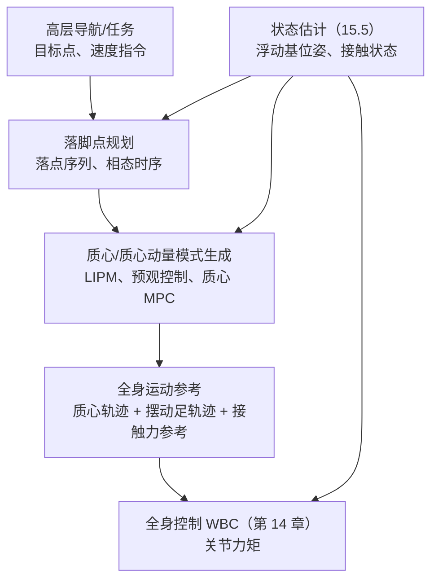
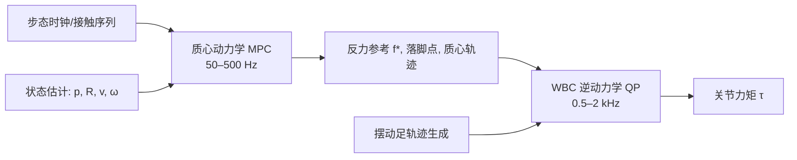

# 第 15 章 运动生成与 Locomotion

## 摘要

第 14 章解决了"如何控制"的问题，本章解决"控制什么"的问题：**如何为人形机器人生成从静止站立到行走、奔跑、跳跃乃至地形穿越的运动指令**。双足运动生成的特殊性在于：支撑是不连续的（接触序列离散切换）、平衡是动态的（质心不能停留在支撑面内）、目标是周期的（步态）。本章沿三条技术路线展开。第一条是**基于简化模型的模式生成**：以线性倒立摆（LIPM）为核心，推导 ZMP 预观控制、摆动足轨迹与基于捕获点（CP）/离散捕获点（DCM）的落脚点反馈——这是 ASIMO 以来最成熟、可解释性最强的路线。第二条是**基于优化的运动生成**：打靶法、直接配点法与 DDP 等轨迹优化方法，质心动力学 MPC 的凸化与在线实现，以及全阶/采样式 MPC 的新进展。第三条是**基于学习的运动生成**：大规模并行强化学习管线、奖励与域随机化设计、盲态与感知地形行走的代表性工作、运动模仿与表达性全身控制（ExBody、HOVER、ASAP、HugWBC 等），以及跑步、跳跃、跑酷等敏捷行为。最后讨论状态估计与地形感知的支撑作用、典型整机控制栈、性能评测指标，并对模型法与学习法的融合趋势作出判断。

**关键词**：步态；支撑相；双支撑；LIPM；ZMP 预观控制；捕获点；DCM；落脚点规划；轨迹优化；直接配点法；DDP；质心动力学 MPC；强化学习；域随机化；Sim-to-Real；运动模仿；Froude 数；运输成本

---

## 15.1 双足运动问题的结构

### 15.1.1 步态相态与步态参数

行走是一个周期过程，其最小单元是**步态周期（gait cycle）**：同一只脚两次触地之间的过程。步态周期按接触状态分解为若干**相（phase）**：

| 相 | 接触状态 | 人类步态中占比（典型） | 机器人控制要点 |
|---|---|---|---|
| 双支撑相（DS） | 双脚触地 | 约 20%（两个各约 10%） | 体重转移、ZMP 从前足向后足过渡 |
| 单支撑相（SS） | 支撑脚触地、摆动脚离地 | 约 40% × 2 | 质心侧向转移、摆动足轨迹跟踪 |
| 飞行相（flight） | 双脚离地 | 行走为 0；跑步时 >0 | 仅跑步/跳跃存在，质心弹道不可控 |

描述步态的常用参数有：**步长（step length）**（前后两足落点纵向距离）、**步幅（stride length）**（同侧足相邻落点距离，约两倍步长）、**步频（cadence）**（每分钟步数）、**步宽（step width）**（横向落点间距）与**步态周期时长**。步速近似等于步长乘以步频；提高步速既可以加大步长也可以加快步频，但步长受腿长与稳定裕度限制，步频受摆动腿惯量与执行器带宽限制，二者的乘积存在工程上界。

!!! note "术语解释：步态周期、双支撑相、单支撑相、步长、步频、静态行走与动态行走"
    - **步态周期（gait cycle）**：一个完整步态重复单元，从某足触地到该足再次触地。
    - **双支撑相（double support, DS）**：两脚同时触地的阶段，体重在双足间转移。
    - **单支撑相（single support, SS）**：仅一脚支撑，另一脚摆动的阶段。
    - **步长（step length）**：相邻两足落点沿行进方向的距离。
    - **步频（cadence）**：单位时间步数，常用步/分钟。
    - **静态行走（static walking）**：质心投影始终位于支撑多边形内，任意时刻可静止的慢速行走。
    - **动态行走（dynamic walking）**：质心可越出支撑多边形，依赖动量与落脚点维持不倒的快速行走；人形机器人主流。

### 15.1.2 运动生成的分层架构

与第 14 章的控制栈对应，运动生成同样分层，核心是把"去哪里"逐级细化为"每个关节此刻的力矩"：



这一"落脚点 → 质心 → 全身"的分解之所以可行，是因为双足系统的稳定主要由质心相对支撑足的动力学决定；只要质心模式与接触力一致，全身细节（手臂如何摆、头如何转）对平衡是二阶效应。学习路线的兴起并不否定这一分层：多数学习型全身策略内部仍显式或隐式地学习类似的分解（如以基座线速度为主要任务变量），只是边界变得模糊（见 15.4）。

### 15.1.3 稳定判据谱系：从静态稳定到捕获域

运动生成算法的第一步是选定"不倒"的数学表述。历史上形成了一条判据谱系：

1. **静态稳定**：质心投影在支撑多边形内。过于保守，只能用于极慢行走。
2. **ZMP 判据**：零力矩点（ZMP，推导见第 8 章 8.4.4）保持在支撑多边形内部。允许质心动，但要求水平力矩可控——是当前模式生成的主干判据。
3. **捕获点（Capture Point, CP）判据**：给定当前质心位置与速度，CP 给出"踩在这里即可停下"的点（第 8 章 8.4.9）。它把"会不会倒"转化为"能否踩到那里"，天然适合落脚点规划与推恢（push recovery）。
4. **可行捕获域（capturability）/ 可达性分析**：考虑步数与落脚可达区域，回答"N 步内能否停下"，是更完整但计算更重的判据。

工程上这些判据并非互斥：ZMP 用于规划质心参考（保证可执行），CP/DCM 用于在线落脚点修正（保证抗扰），二者通过 15.2 的框架缝合。

## 15.2 基于简化模型的步态生成

### 15.2.1 LIPM 回顾与解析结构

**线性倒立摆模型（Linear Inverted Pendulum Model, LIPM）** 假设：质心高度恒定 \(z_c = h\)、忽略角动量变化、腿无质量。此时质心水平运动解耦为

$$
\ddot x = \omega^2 (x - p_x), \qquad \ddot y = \omega^2 (y - p_y), \qquad \omega = \sqrt{g/h}
$$

其中 \(p = (p_x, p_y)\) 为 ZMP 位置（完整推导见第 8 章 8.4.14）。LIPM 的三个结构性事实决定了本章所有模式生成方法：

- **不稳定模态时间常数**为 \(1/\omega = \sqrt{h/g}\)。质心高度约 0.9 m 时约 0.3 s——这就是人形机器人平衡控制必须快的原因，也是第 14 章实时性预算的物理根源。
- **轨道能量（orbital energy）** \(E = \tfrac{1}{2}\dot x^2 - \tfrac{1}{2}\omega^2(x - p)^2\) 沿自由运动守恒，可用于判定质心是否会越过支撑点。
- **捕获点** \(\xi = x + \dot x / \omega\) 是 LIPM 的发散分量；把 ZMP 直接置于 CP 上即可使发散分量归零，这是 15.2.4 落脚点控制的理论基础。

Cart-table 模型给出了 LIPM 的物理解读：桌上小车的加速度 \(\ddot x\) 与桌面支点（ZMP）位置满足 \(p = x - \ddot x\, h/g\)，即"想让 ZMP 在哪里，就让质心以相应加速度移动"。

### 15.2.2 ZMP 预观控制

单纯按 LIPM 解析解生成的质心轨迹，ZMP 会呈现尖峰状突变，与期望的平滑 ZMP 参考（双支撑期在两脚间平滑转移）不符。Kajita 等人提出的**预观控制（preview control）**把 ZMP 视为系统的输出，用伺服思想让实际 ZMP 跟踪未来一段的 ZMP 参考。

把质心 jerk（加加速度）\(u = \dddot x\) 作为控制输入，状态取 \(x = [x, \dot x, \ddot x]^T\)，系统为

$$
\dot x = \begin{bmatrix} 0 & 1 & 0 \\ 0 & 0 & 1 \\ 0 & 0 & 0 \end{bmatrix} x + \begin{bmatrix} 0 \\ 0 \\ 1 \end{bmatrix} u, \qquad p = \begin{bmatrix} 1 & 0 & -h/g \end{bmatrix} x
$$

为消除稳态误差，对 ZMP 跟踪误差 \(e = p^{\mathrm{ref}} - p\) 增广积分器，得到增广系统 \((\bar A, \bar B, \bar C)\)。预观控制的性能指标为

$$
J = \sum_{k} \left( e_k^2 + R\, \Delta u_k^2 + \Delta x_k^T Q\, \Delta x_k \right)
$$

其中 \(\Delta\) 表示增量。对无限时域 LQ 问题求解，最优控制为

$$
u_k = -K_I \sum_{j=0}^{k} e_j - K_x \Delta x_k + \sum_{l=1}^{N_L} K_p(l)\, p^{\mathrm{ref}}_{k+l}
$$

三项分别为：积分反馈（消差）、状态反馈（镇定）、**预观前馈**（利用未来 \(N_L\) 步的 ZMP 参考提前动作）。预观步数 \(N_L\) 需覆盖 LIPM 的主导时间常数，典型取 1–2 s 对应的步数。预观增益 \(K_p(l)\) 可离线计算，在线只做向量内积，计算量极小——这正是该方法在算力受限年代成为工业标准的原因。

!!! note "术语解释：预观控制、增广系统、jerk 输入、预观增益、模式生成器"
    - **预观控制（preview control）**：利用未来参考轨迹的预瞄信息进行前馈的最优控制方法。
    - **增广系统（augmented system）**：把积分器、滤波器等附加动态并入状态空间模型后的系统。
    - **jerk（加加速度）**：加速度的导数。以 jerk 为输入可保证质心加速度连续，从而接触力平滑。
    - **预观增益（preview gain）**：对未来各步参考的前馈系数，由 LQ 问题的 Riccati 解离线导出。
    - **模式生成器（pattern generator）**：根据落脚点与 ZMP 参考生成质心轨迹的模块。

### 15.2.3 摆动足轨迹与双支撑过渡

质心轨迹之外，模式生成器还需输出摆动足轨迹。其设计约束为：起止位置/速度/加速度边界条件、抬脚高度（越障与防拖地）、离地/触地法向速度（触地速度过大产生冲击）、以及避障形状。常用构造：

- **关节/笛卡尔多项式**：对每个方向用五次多项式连接起止边界条件；摆线（cycloid）剖面 \(z(t) = \tfrac{h_s}{2}\left(1 - \cos(\pi t / T_s)\right)\) 给出平滑的抬脚-落脚曲线，触地法向速度为零（\(h_s\) 为抬脚高度，\(T_s\) 为摆动时长）。
- **双支撑过渡**：ZMP 参考从后足平滑移至前足（典型用一段斜坡或五次曲线），质心横向摆动幅度需与步宽匹配；双支撑时长缩短可提速，但 ZMP 转移时间受踝力矩带宽限制。
- **奇异步与起停**：起步与停步是半步模式，需专门的边界条件处理，否则预观控制的积分项会产生瞬态超调。

### 15.2.4 基于 CP/DCM 的落脚点反馈

预观控制是"开环模式 + 闭环跟踪"，对大扰动（推、绊）不够直接。基于 CP 的落脚点控制提供显式的抗扰机制：

1. **在线估计当前 CP**：\(\hat\xi = \hat x + \hat{\dot x}/\omega\)（依赖 15.5 的状态估计）。
2. **比较标称 CP 与实测 CP**：偏差 \(\Delta \xi\) 即扰动造成的发散分量变化。
3. **修正落脚点与时序**：把下一步落点改为 \(p^{\mathrm{new}} = p^{\mathrm{nom}} + \Delta \xi\)（一阶修正），同时可缩短支撑时长提前触地。

其理论基础是 LIPM 的分解：质心运动可分解为以 CP 为核心的稳定流形与发散分量；只要把 ZMP 推向实测 CP，发散分量即被抑制。Englsberger 等人把这一发散分量称为 **DCM（Divergent Component of Motion）**，并给出 DCM 边界的解析推进公式，使"质心轨迹规划"转化为"DCM 端点规划"——规划对象从二阶不稳定系统变成了直接可控的量，这是当前许多模型法行走控制器的内核。

!!! note "术语解释：捕获点、DCM、落脚点修正、推恢、支撑时序调节"
    - **捕获点（Capture Point, CP）**：LIPM 假设下，踩到该点并维持 ZMP 于其上即可使质心最终静止的点，\(\xi = x + \dot x/\omega\)。
    - **DCM（divergent component of motion）**：质心运动中发散分量的坐标表示，形式与 CP 相同，但结合参考 ZMP 动态做解析推进，用于轨迹规划。
    - **落脚点修正（footstep adjustment）**：根据 CP/DCM 偏差在线修改下一步落点，是双足抗扰的主要机制。
    - **推恢（push recovery）**：受推力扰动后通过跨步、踝策略、髋策略恢复平衡的过程。
    - **支撑时序调节（timing adaptation）**：除落点位置外同时调整触地时刻，提前触地可更早开始减速。

### 15.2.5 Python 算例：ZMP 预观控制器设计与仿真

下面完整实现 15.2.2 的预观控制：增广系统、离散 LQR 求反馈增益与预观增益、对一段含双支撑过渡的 ZMP 参考进行跟踪。与第 8 章 8.4.14 的解析 LIPM 仿真不同，这里以 jerk 为输入、ZMP 误差经积分器消差，质心加速度天然连续。

```python
# ZMP 预观控制（Kajita 型）：设计 + 跟踪仿真
import numpy as np
from scipy.linalg import solve_discrete_are
import matplotlib.pyplot as plt

g, h = 9.81, 0.80          # 重力加速度、质心高度
dt = 0.005                 # 采样周期
T = 4.0
N = int(T / dt)
NL = 320                   # 预观步数（约 1.6 s）

# Cart-table 系统：状态 [x, dx, ddx]，输入 jerk u，输出 ZMP p = x - (h/g) ddx
A = np.array([[0, 1, 0], [0, 0, 1], [0, 0, 0]], float)
B = np.array([[0], [0], [1]], float)
C = np.array([[1, 0, -h / g]], float)

# ZOH 离散化（dt 较小，欧拉近似）
Ad = np.eye(3) + A * dt
Bd = B * dt
Cd = C

# 增量增广系统：z = [e; Δx]
# e_{k+1} = e_k + Cd(Ad - I) Δx_k + Cd Bd u_k
C2 = Cd @ (Ad - np.eye(3))
Aa = np.block([[np.ones((1, 1)), C2],
               [np.zeros((3, 1)), Ad]])
Ba = np.vstack([Cd @ Bd, Bd])
Qe, R = 1.0, 1e-6
Qa = np.zeros((4, 4)); Qa[0, 0] = Qe
P = solve_discrete_are(Aa, Ba, Qa, np.array([[R]]))
Ka = np.linalg.inv(R + Ba.T @ P @ Ba) @ (Ba.T @ P @ Aa)
KI, Kx = Ka[0, 0], Ka[0, 1:]

# 预观增益递推
Acl = Aa - Ba @ Ka
Kp_list, X = [], -Acl.T @ P @ Ba
for l in range(NL):
    Kp_l = np.linalg.inv(R + Ba.T @ P @ Ba) @ (Ba.T @ X)
    Kp_list.append(Kp_l[0, 0])
    X = Acl.T @ X
Kp_list = np.array(Kp_list)

# ZMP 参考：0 -> 0.1 m 的过渡（模拟起步双支撑转移）
t_all = np.arange(N) * dt
p_ref = np.where(t_all < 1.0, 0.0,
        np.where(t_all < 1.5, (t_all - 1.0) / 0.5 * 0.1, 0.1))

# 仿真
x = np.zeros(3); x_prev = np.zeros(3); e_int = 0.0
log_p, log_x = [], []
for k in range(N):
    p = (Cd @ x)[0]
    e = p_ref[k] - p
    dx = x - x_prev; x_prev = x.copy()
    if k + 1 < N:
        fut = p_ref[k + 1: k + 1 + NL]
        fut = np.pad(fut, (0, max(0, NL - len(fut))), mode='edge')[:NL]
        preview = Kp_list @ (fut - p_ref[k])
    else:
        preview = 0.0
    u = -KI * e_int - Kx @ dx + preview
    e_int += e
    x = Ad @ x + Bd.flatten() * u
    log_p.append(p); log_x.append(x[0])

plt.plot(t_all, p_ref, 'k--', label='ZMP ref')
plt.plot(t_all, log_p, label='ZMP actual')
plt.plot(t_all, log_x, label='CoM x')
plt.legend(); plt.grid(True); plt.xlabel('t [s]'); plt.show()
```

## 15.3 基于优化的运动生成

### 15.3.1 轨迹优化方法谱系：打靶、配点与 DDP

当任务超越平地周期行走（跨越、爬楼梯、跳跃、搬运）时，逐相手工设计模式不再可行，需要把运动生成表述为**轨迹优化（trajectory optimization）**问题：

$$
\min_{x(\cdot),\, u(\cdot)} \; \int_0^T \ell(x, u)\, dt + \ell_f(x(T)) \quad \text{s.t.} \quad \dot x = f(x, u),\; c(x, u) \leq 0,\; \text{接触时序约束}
$$

三条主要离散化路线：

| 方法 | 思想 | 优点 | 局限 | 典型用途 |
|---|---|---|---|---|
| 打靶法（Shooting Method） | 只优化控制（与初值），动力学靠前向积分满足 | 变量少、精度高 | 对初值敏感、难加状态约束 | 短周期行为、初值猜测良好时 |
| 直接配点法（Direct Collocation） | 状态与控制都离散为变量，动力学作为配置点等式约束 | 收敛域大、约束自然 | 变量多、需稀疏 NLP 求解器 | 全身跳跃/跨越等复杂接触行为 |
| DDP / iLQR | 利用动态规划结构做二阶局部展开 | 单次迭代快、给出时变反馈增益 | 接触等硬约束处理繁琐 | 在线重规划、MPC 内层 |

**打靶法（Shooting Method）** 与 **直接配点法（Direct Collocation）** 是人形机器人离线轨迹优化的两大支柱；DDP 则因天然副产品是时变反馈增益（见第 14 章 14.3.4），常被用作"优化 + 反馈"一体化的在线方案。三者的共同难点都是接触：接触切换造成动力学不连续，标准做法是把接触序列固定（按预定相态分段优化，即接触显式），或用互补约束的接触隐式（contact-implicit）方法让优化器自行决定接触时刻——后者通用性更强但求解更难。

### 15.3.2 质心动力学 MPC：单刚体模型与凸化

把人形机器人对腿足运动的主导部分抽象为**单刚体模型（Single Rigid Body Dynamics, SRBD）**：全部质量集中于躯干刚体（位置 \(p\)、姿态 \(R\)），腿无质量，控制输入为各接触足的地面反力 \(f_i\)。动力学为

$$
m \ddot p = \sum_{i \in \mathcal{C}} f_i - m g\, \mathbf{e}_z, \qquad \frac{d}{dt}\left( I \omega \right) = \sum_{i \in \mathcal{C}} (r_i - p) \times f_i
$$

其中 \(r_i\) 为接触点位置，\(\mathcal{C}\) 为当前接触集合。方程对状态与力近似双线性：若姿态变化小、惯量近似恒定，可在当前标称附近线性化，配合摩擦锥的四棱锥线性化，每个 MPC 周期得到一个 **QP**——这就是 MIT Cheetah 3 所采用的凸 MPC（convex MPC）方案，后在大量四足与人形平台上复用。Boston Dynamics Atlas 的行走控制体系（Kuindersma 等，*Autonomous Robots* 2016）同样以 QP 为核心：质心/落脚点规划、状态估计与全身 QP 分层执行，是"模型法 + 优化"在复杂人形平台上最早的大规模工程实证之一。

质心 MPC 与 WBC 的分工清晰：MPC 在 50–500 Hz 决定**未来 0.5–1.5 s 的反力序列与落脚点**，WBC 在 1 kHz 把第一步反力与摆动足/质心任务映射为关节力矩（第 14 章 14.5）。预测时域内接触序列通常固定（由步态时钟给出），避免整数变量；更激进的方案让 MPC 同时优化接触时序，代价是问题变为混合整数或非凸。



### 15.3.3 全阶与采样式 MPC

质心 MPC 的代价是模型简化：忽略腿惯量与全身运动学限制，导致生成的反力参考有时无法被全身实现（例如需要摆动腿提供显著角动量时）。两条升级路线近年活跃：

- **全阶非线性 MPC**：直接以浮动基全动力学为预测模型。随求解器与硬件进步，已能在人形机器人上达到数十至上百 Hz，但鲁棒部署仍受模型误差与求解耗时方差限制。
- **采样式/基于物理引擎的 MPC**：放弃梯度，直接用物理引擎并行前滚大量控制采样，按代价选择最优序列。代表性工作包括基于 MuJoCo 的腿足机器人全身 MPC（Whole-Body Model-Predictive Control of Legged Robots with MuJoCo）与扩散退火式全阶采样 MPC（Full-Order Sampling-Based MPC for Torque-Level Locomotion Control via Diffusion-Style Annealing）。其吸引力在于：预测模型就是高保真仿真器本身，无需手工线性化，且天然可利用 GPU 并行；代价是采样效率与端到端延迟。

### 15.3.4 落足点规划与离散地形

在台阶、踏石、梁木等**离散地形**上，落脚点从"修正量"变回"规划变量"：可达落点集合是离散甚至稀疏的。模型法的处理是混合整数规划或 A*/RRT 式落点搜索加底层可行性检验；学习法则把落点可行性隐式学进策略，代表性工作如 BeamDojo（Learning Agile Humanoid Locomotion on Sparse Footholds），通过专门的地形课程与落脚奖励，使人形机器人能在稀疏踏点上敏捷行走。无论哪条路线，核心约束都是落点可达域与稳定裕度的联合：落点既要在摆动腿运动学可达范围内，又要为后续若干步留下捕获域。

### 15.3.5 Python 算例：LIPM-MPC 的 QP 构建与滚动求解

下面的算例把 Cart-table 模型直接用作 MPC 预测模型：每个控制周期构建一个紧缩 QP（预测 ZMP 跟踪误差 + jerk 增量正则），用 `scipy.optimize` 求解并只执行第一步，演示第 14 章 14.4 的滚动时域机制与 15.2.2 预观控制的关系——预观控制可视为该 QP 在无约束、无限时域下的解析解。

```python
# LIPM-MPC（Cart-table 预测模型）的紧缩 QP 滚动求解
import numpy as np
from scipy.optimize import minimize

g, h = 9.81, 0.80
dt = 0.05                    # MPC 离散步长（比伺服慢）
Np = 30                      # 预测步数（1.5 s）
w_track, w_reg = 1.0, 1e-4   # ZMP 跟踪权重、jerk 增量正则

# 单步模型（同 15.2.5）：x=[x,dx,ddx], u=jerk, p = C x
Ad = np.array([[1, dt, dt**2/2], [0, 1, dt], [0, 0, 1]])
Bd = np.array([[dt**3/6], [dt**2/2], [dt]])
Cd = np.array([[1, 0, -h/g]])

# 预构建预测矩阵：X = Phi x0 + Gamma U；P = Cbar X
Phi = np.vstack([np.linalg.matrix_power(Ad, k+1) for k in range(Np)])
Gamma = np.zeros((3*Np, Np))
for k in range(Np):
    for j in range(k+1):
        Gamma[3*k:3*k+3, j] = (np.linalg.matrix_power(Ad, k-j) @ Bd).flatten()
Cbar = np.kron(np.eye(Np), Cd)
Pz_x = Cbar @ Phi            # P = Pz_x x0 + Pz_u U
Pz_u = Cbar @ Gamma
Hz = Pz_u.T @ Pz_u * w_track + w_reg * np.eye(Np)

def mpc_step(x0, p_ref_seg, u_prev):
    # 目标：min 0.5 U'Hz U + gz'U，gz 含跟踪偏置与增量正则耦合
    gz = (Pz_u.T @ (Pz_x @ x0 - p_ref_seg)) * w_track
    gz += -w_reg * np.r_[u_prev, np.zeros(Np-1)]  # U_0 - u_prev 项的线性部分
    U0 = np.full(Np, u_prev)
    res = minimize(lambda U: 0.5*U@Hz@U + gz@U, U0, method='SLSQP',
                   options={'maxiter': 60, 'ftol': 1e-10})
    return res.x[0]

# 滚动仿真：ZMP 参考从 0 转移到 0.1 m
T, Ns = 4.0, int(4.0/dt)
t_all = np.arange(Ns) * dt
p_ref = np.where(t_all < 1.0, 0.0,
        np.where(t_all < 1.5, (t_all-1.0)/0.5*0.1, 0.1))
x = np.zeros(3); u_prev = 0.0
log_p, log_x = [], []
for k in range(Ns):
    fut = p_ref[k:k+Np]
    fut = np.pad(fut, (0, max(0, Np-len(fut))), mode='edge')[:Np]
    u = mpc_step(x, fut, u_prev); u_prev = u
    log_p.append((Cd @ x)[0]); log_x.append(x[0])
    x = Ad @ x + Bd.flatten() * u

import matplotlib.pyplot as plt
plt.plot(t_all, p_ref, 'k--', label='ZMP ref')
plt.plot(t_all, log_p, label='ZMP actual (MPC)')
plt.plot(t_all, log_x, label='CoM x')
plt.legend(); plt.grid(True); plt.xlabel('t [s]'); plt.show()
```

与 15.2.5 的预观控制相比，该实现在每个周期付出一次小规模 QP 求解的代价，换来的是直接在问题中加入约束（如 jerk 限幅、ZMP 支撑多边形边界）的能力——预观控制遇到约束时只能靠增益饱和近似处理。工程中该 QP 会用专用求解器与热启动，而非通用 SLSQP。

## 15.4 基于学习的运动生成

### 15.4.1 强化学习 Locomotion 管线

2019 年后，大规模并行 GPU 仿真把**强化学习（Reinforcement Learning, RL）**推为腿足运动生成的主流路线之一。标准管线为：


技术要点：

- **策略输出接口**：主流不是直接输出力矩，而是输出关节位置偏置（叠加在标称站立姿态上），由底层关节 PD 执行（第 14 章 14.2）。PD 起到了"动作滤波 + 阻抗整形"的作用，显著缓解仿真-现实执行器差异。
- **算法选择**：**近端策略优化（Proximal Policy Optimization, PPO）** 因稳定、易并行成为事实标准；SAC 等离策略算法在样本效率上有优势，但并行墙钟时间常不如 PPO。
- **规模化仿真**：NVIDIA Isaac Lab 与 MuJoCo Playground 等平台可在单卡上并行数千环境，把数十亿步训练压缩到数小时至数天；Humanoid-Gym 把人形机器人的训练框架与零样本 Sim2Real 流程开源化；Learning to Walk in Minutes Using Massively Parallel Deep Reinforcement Learning 一类工作则把"分钟级学会行走"作为并行化能力的极限展示。
- **观测设计**：盲态（blind）策略只用本体感知（关节、IMU、历史序列）；感知（perceptive）策略额外输入地形高度采样或深度特征。历史观测窗口承担了隐式系统辨识与状态估计的功能。

### 15.4.2 奖励设计与域随机化实践

奖励函数通常由任务项、正则项与风格项三类组成：

| 类别 | 典型项 | 作用 |
|---|---|---|
| 任务项 | 线速度/角速度跟踪、基座高度 | 定义"走对" |
| 正则项 | 力矩、功率、jerk、动作变化率惩罚 | 平滑、节能、保护硬件 |
| 稳定项 | 基座姿态、足部滑移、触地冲击惩罚 | 抑制不良接触行为 |
| 风格项 | 步频/步幅/抬脚高度塑形、对称性 | 控制步态外观 |

**域随机化（Domain Randomization）** 是零样本迁移的关键手段：训练时在物理参数、环境与扰动上随机采样，迫使策略学习对模型误差不敏感的保守行为。典型随机化维度包括：连杆质量与质心、地面摩擦系数、执行器强度（力矩缩放）与延迟、传感器噪声与偏置、外部推力扰动、地形起伏。**Sim-to-Real 迁移（Sim-to-Real Transfer）** 的失败案例大多可追溯到未随机化的"仿真特权"：理想刚性的接触、无延迟的总线、无齿隙的减速器。系统辨识（第 8 章 8.3.10）与域随机化互补：前者缩小仿真与现实的参数差距，后者覆盖残余不确定性。

### 15.4.3 代表性工作：盲态、感知与两阶段训练

- **盲态全身行走**：Learning Humanoid Locomotion over Challenging Terrain（Radosavovic 等，2024）为 Digit 人形机器人训练了基于 Transformer 的盲态控制器：先在平地轨迹上以序列建模预训练，再在不平地形上以强化学习微调，实现自然与城市环境的零样本真实部署——证明"序列建模预训练 + RL 微调"对腿足控制同样有效。
- **两阶段训练**：Adapting Humanoid Locomotion over Challenging Terrain via Two-Phase Training（2024）采用先教师后学生的两阶段方案，缓解感知-控制耦合的训练难度。
- **感知内模型与世界模型**：Learning Humanoid Locomotion with Perceptive Internal Model 与 Learning Humanoid Locomotion with World Model Reconstruction 把地形感知编码进内部表征或世界模型重建目标，提升稀疏感知下的鲁棒性；Advancing Humanoid Locomotion: Mastering Challenging Terrains with Denoising World Model Learning 进一步引入去噪世界模型学习处理部分可观测性。
- **硬件约束适配**：Learning Bipedal Locomotion on Gear-Driven Humanoid Robot Using Foot-Mounted IMUs 面向高减速比（不可反驱）关节平台，用足底 IMU 改善接触感知——说明学习路线并非准直驱平台的专利。

### 15.4.4 运动模仿与表达性全身控制

纯速度跟踪奖励只能得到"能走"的步态，外观僵硬。**运动模仿（motion imitation）** 把人类动捕或视频数据重定向到机器人，以跟踪参考动作为奖励或监督信号，得到自然、有表现力的全身运动。知识图谱中收录的代表性工作构成了一条清晰的技术演进线：

| 工作 | 年份 | 核心思路 | 备注 |
|---|---|---|---|
| Expressive Whole-Body Control（ExBody） | 2024 | 把人体运动转为可跟踪目标，结合 PPO/模仿学习训练全身策略 | 表现性全身控制的早期代表 |
| ExBody2 | 2024 | 动作跟踪驱动的进阶表现性全身控制 | 扩大可模仿动作的规模与保真度 |
| HOVER（Versatile Humanoid Controller） | 2024 | 单一神经全身控制器支持多种行为模式 | 以"通用人形控制器"为目标 |
| ASAP Framework | 2024 | 面向敏捷全身动作的 Sim-to-Real 框架，缩小动力学失配 | 强调高动态动作的真机复现 |
| HugWBC | 2025 | 统一且通用的人形全身控制器（运动-操作一体） | 把步态、上身姿态等纳入统一指令空间 |

这条路线的工程意义超出"好看"：模仿学习提供了稠密、结构化的奖励，把大量人类运动先验注入策略，使机器人获得模型法难以编程的上身协调、手臂摆动与姿态多样性；同时也为遥操作与具身数据采集（第 17、21 章）提供了直接载体。

### 15.4.5 跑步、跳跃与敏捷运动

比行走更动态的行为把控制问题推向极限：跑步存在飞行相（质心弹道不可控，只能靠触地瞬间修正），跳跃与跑酷要求全身动量的精确调度。

- **跑步**：飞行相使 ZMP 判据失效（无支撑点），控制目标转为触地映射与能量管理。Chasing Stability: Humanoid Running via Control Lyapunov Function Guided RL（2025）把**控制 Lyapunov 函数（CLF）**作为奖励塑形项引导 RL，使学习到的人形跑步兼具稳定性证书与样本效率——是模型法结构注入学习法的典型样本。
- **跳跃与落地**：质心 MPC + WBC 框架可直接推广，关键在落地冲击的力分配与缓冲（第 9 章下肢缓冲设计）；学习法则通过课程逐步提升跳跃高度。
- **跑酷与全身敏捷**：Extreme Parkour with Legged Robots、Deep Whole-body Parkour 等工作展示了攀爬、跨越、腾跃的组合行为，说明在充分并行训练与感知课程下，学习策略可达传统方法难以编程的敏捷度，但可靠性与失效边界仍是开放问题。

### 15.4.6 模型法与学习法对比

| 维度 | 模型法（LIPM/MPC/WBC） | 学习法（RL/模仿） |
|---|---|---|
| 模型依赖 | 显式、可解释 | 隐式（策略内嵌） |
| 约束与安全 | 显式约束、可分析 | 依赖奖励与测试，可结合安全过滤 |
| 泛化 | 参数化即泛化（新速度/落点直接规划） | 分布内强，分布外需重训或微调 |
| 开发成本 | 建模与调参人力大 | 奖励/随机化设计 + 算力投入大 |
| 涌现行为 | 难（手工结构） | 易（如抗扰跨步、地形适应） |
| 数据需求 | 无（模型即数据） | 数亿~数十亿步仿真 |
| 部署成熟度 | 工业界长期验证 | 商业人形平台快速普及 |

实践趋势不是二选一而是融合：学习策略输出质心/落点参考交给模型法 WBC；CLF 与平衡判据作为学习奖励（Embedding Classical Balance Control Principles in Reinforcement Learning for Humanoid Recovery 即把经典平衡控制原理嵌入 RL 用于推恢）；残差学习在模型控制器之上学习修正量。第 18 章将进一步讨论策略学习的数据侧。

## 15.5 状态估计与感知支撑

### 15.5.1 本体状态估计

本章所有控制器都以浮动基状态 \((p, R, v, \omega)\) 与接触状态为输入，但人形机器人无法直接测量基座位姿。主流方案是把 IMU、关节编码器与接触运动学约束融合：当足处于支撑相时，正运动学给出"基座相对足"的刚体约束（足无滑移假设），与 IMU 预积分联合估计。代表性工作包括结合正运动学与预积分接触因子的状态估计（Legged Robot State-Estimation Through Combined Forward Kinematic and Preintegrated Contact Factors），以及自适应不变扩展卡尔曼滤波（Adaptive Invariant Extended Kalman Filter for Legged Robot State Estimation）。关键失效模式是**足部滑移与错误接触判定**：滑移使运动学约束注入错误速度，工程上以足底力阈值、IMU 冲击检测与多假设滤波缓解。接触状态本身也是步态状态机的输入（15.3.2），估计与控制构成闭环。

### 15.5.2 地形感知

盲态策略与 LIPM 模式生成假设地面已知或为平地；楼梯、台阶与崎岖地形需要地形感知：深度相机/激光雷达构建高度图（elevation map），供落脚点规划（15.3.4）或感知策略（15.4.3）使用。感知链路的延迟（数十至上百毫秒）与控制频率差距大，常见架构是"低频地形特征 + 高频本体反馈"：地形只影响落脚点与步态参数的选择，不进入力矩级回路。感知的另一个用途是**落脚点语义检查**（边缘、湿滑、可踩踏性），目前仍以保守规则为主。

## 15.6 工程实践、评测与趋势

### 15.6.1 典型整机控制栈对照

| 平台 | 运动生成路线 | 特点 |
|---|---|---|
| Boston Dynamics Atlas | 模型法为主：轨迹优化 + QP 体系 + WBC | 高动态跑跳的先驱，工程复杂度极高 |
| Agility Digit | 学习法 + 模型结构混合（Transformer 盲态控制器等） | 面向物流场景的鲁棒行走 |
| Unitree H1 等电驱平台 | 学习法为主：RL 全身策略 + 关节 PD | 依托准直驱关节与大规模并行训练，迭代快 |

Unitree H1 的官方白皮书与规格资料（Unitree H1 Humanoid Robot Whitepaper & Specifications）给出了这类平台面向开发者的接口形态：上层以速度/姿态指令驱动，下层由厂商预置的行走控制栈执行，应用开发者通常只接触落脚点级或速度级接口——这反映了学习法控制栈"黑盒化、平台化"的产业趋势。

### 15.6.2 性能与能效指标

运动系统的横向比较有赖于统一指标：

- **无量纲速度与 Froude 数**：\(Fr = v^2 / (g\, l_0)\)，其中 \(l_0\) 为腿长。\(Fr < 1\) 为倒立摆可达区域，\(Fr \approx 1\) 对应步态由走到跑的转换点，用于跨尺度比较不同大小机器人的"等效速度"。
- **运输成本（Cost of Transport, CoT）**：\(CoT = P / (m g v)\)，即单位距离、单位体重消耗的无量纲能量。人类行走 CoT 约为 0.2 量级；人形机器人普遍高出一个数量级上下，是执行器效率、步态经济性与待机功耗的综合体现。
- **鲁棒性指标**：可恢复推力冲量、最大跨越台阶/沟壑、单位时间跌倒率、平均无故障行走时间——这类指标尚无统一标准，是第 25 章评测体系的主题。

### 15.6.3 常见失效模式与调试线索

真机调试中，运动生成的失效往往表现为相似症状但根因分散在各层。下表给出常见症状与排查顺序（自上而下）：

| 症状 | 常见根因 | 排查线索 |
|---|---|---|
| 原地踏步即跌倒 | 状态估计漂移、接触判定错误、质心参数不准 | 检查估计基座速度与 CP 轨迹是否物理自洽 |
| 行走数步后发散 | ZMP 参考与质心模式不一致、踝力矩饱和 | 对比期望/实测 ZMP；查看力矩限幅日志 |
| 触地冲击大、整机抖动 | 摆动足触地速度过高、接触增益过刚、时序失配 | 摆动轨迹末端速度、接触状态机相位 |
| 转弯/侧向失稳 | 侧向步宽不足、横向 DCM 边界被突破 | 绘制横向 CP 与支撑边界 |
| 仿真好、真机差 | 未随机化的执行器延迟/齿隙、接触模型差异 | 逐步在仿真中加入延迟与噪声复现 |
| 高动态动作后关节过热 | 奖励缺少功率/力矩正则、步态经济性差 | 关节电流积分与温度曲线 |

### 15.6.4 本章小结与展望

本章沿"简化模型 → 优化 → 学习"三条路线梳理了双足运动生成：LIPM 与 ZMP 预观控制提供了可解释、低算力的模式生成基线；CP/DCM 落脚点反馈补上了抗扰机制；质心动力学 MPC 把接触力与落脚点纳入在线优化，与第 14 章的 WBC 构成模型法主栈；强化学习与运动模仿则在敏捷性、表现力与开发范式上改写了行业格局。可以判断的趋势是**结构的回流**：学习策略的规模化部署正在倒逼可解释的安全层（模型法过滤器、CLF 约束、落脚点可行性检查），而模型法也在吸收学习的感知与适应能力。运动生成不再是"规划一条轨迹"，而是"在模型、数据与约束之间实时协商"——这正是后续章节（第 16 章操作、第 18 章策略学习）将反复见到的主题。
