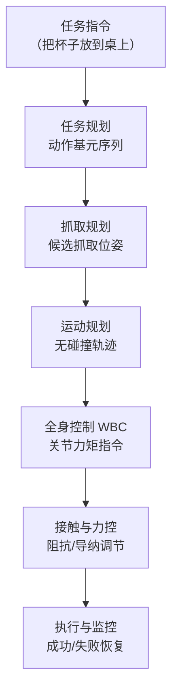
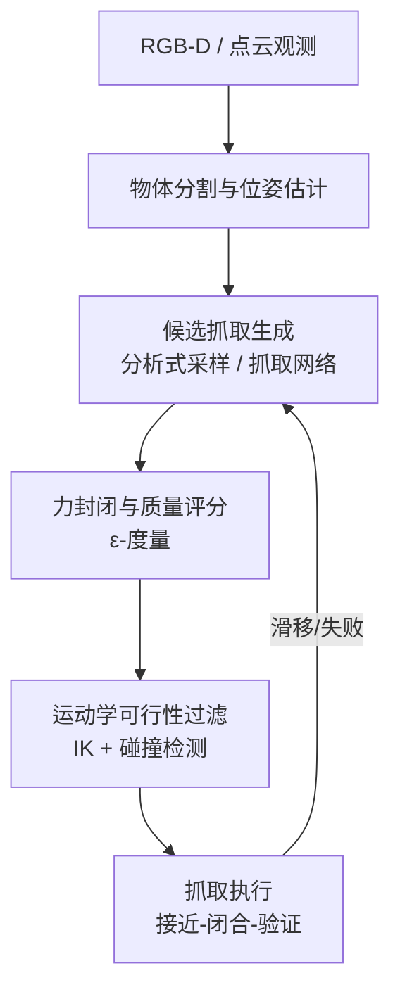
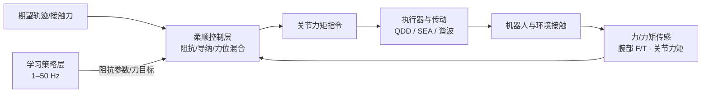
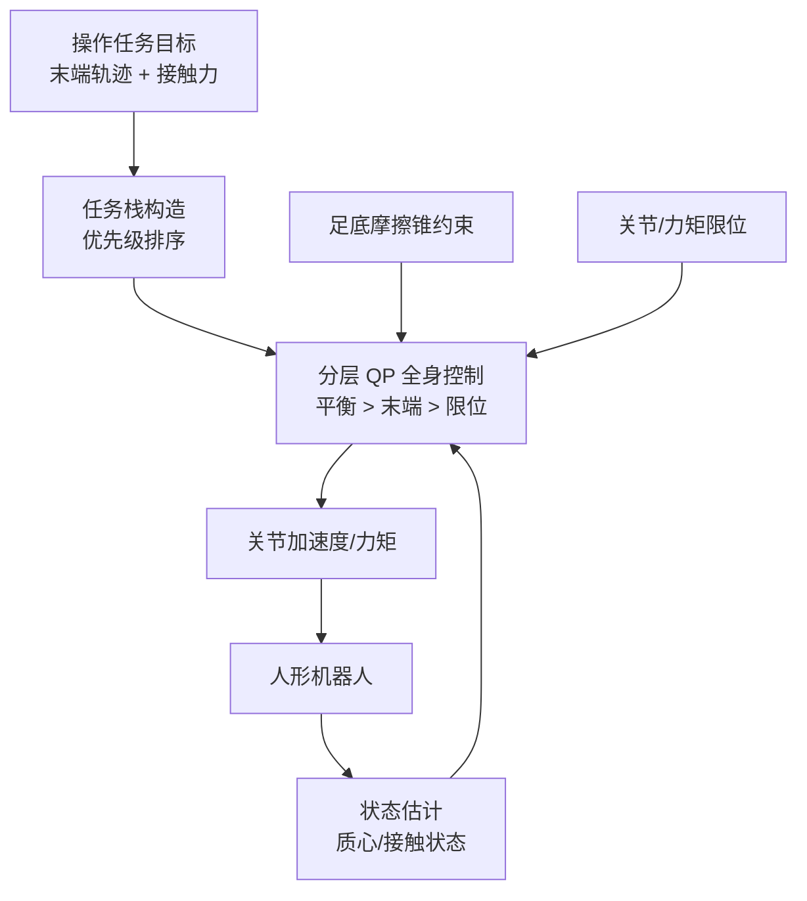

# 第 16 章 操作与抓取

## 摘要

操作（manipulation）是人形机器人区别于移动平台的核心能力：它要求机器人在浮动基座、多接触、强扰动的条件下，对物体施加可控的力和运动。本章围绕人形机器人操作与抓取的关键技术链条展开：首先从抓取分类学与力封闭理论出发，阐述抓取规划（grasp planning）的分析式与数据驱动两类范式；其次介绍力控与柔顺控制的三大经典框架——阻抗控制（Impedance Control）、导纳控制（Admittance Control）与力位混合控制（Force/Position Hybrid Control），并讨论其在人形平台上的工程约束；随后聚焦灵巧手（dexterous hand）操作，包括手中重定向、触觉反馈与灵巧遥操作；最后讨论全身操作（whole-body manipulation）与移动操作（loco-manipulation），说明操作任务如何与全身控制（Whole-Body Control, WBC）、双臂协调与移动底盘耦合。本章引用知识图谱中的 GRASP 抓取分类法、Allegro Hand、LEAP Hand、宇树 Dex3-1、ByteDexter 手、HOMIE、FALCON、HAFO、GraspVLA、Mobile ALOHA 等真实条目，并给出一个可运行的力封闭判据 Python 算例。

**关键词**：操作；抓取规划；力封闭；摩擦锥；阻抗控制；导纳控制；力位混合控制；灵巧手；手中操作；全身操作；移动操作

---

## 16.1 操作问题概述

### 16.1.1 从“抓住”到“用好”：操作任务的层次

操作并不等同于抓取。抓取（grasping）解决的是“如何建立并保持与物体的接触”，而操作解决的是“如何通过接触改变物体的状态”。一个完整的操作任务通常可分解为五个阶段：

1. **接近（reach）**：规划无碰撞轨迹，使末端执行器进入预抓取位姿；
2. **抓取（grasp）**：闭合手指或夹爪，建立力封闭或形封闭；
3. **操作（manipulate）**：搬运、推、拉、旋转、插入、装配等接触丰富（contact-rich）阶段；
4. **放置/释放（place/release）**：在目标位姿处可控地解除接触；
5. **复位（retreat）**：撤离并准备下一个动作基元。

前两个阶段主要依赖几何与力学分析，第三阶段是力控与学习方法的交汇点，也是人形机器人与工业机械臂差异最大的地方：工业臂有刚性基座和结构化环境，而人形机器人的“基座”本身是动态的。

!!! note "术语解释：操作、抓取、接触丰富任务、预抓取位姿、动作基元"
    - **操作（manipulation）**：通过机器人与物体间的接触，有目的地改变物体位姿或状态的过程。
    - **抓取（grasping）**：建立对物体的约束，使其相对于手保持可控位姿的子任务。
    - **接触丰富任务（contact-rich task）**：任务成功依赖对接触力/接触模式的精确调节，如插装、擦拭、开门、拧瓶盖。
    - **预抓取位姿（pre-grasp pose）**：闭合手指之前末端应达到的位姿，通常位于抓取位姿沿接近方向的后撤位置。
    - **动作基元（motion primitive）**：完成一个语义子任务的参数化运动模板，是任务规划与运动规划之间的接口。

### 16.1.2 人形操作的特殊性

人形机器人的操作在以下四个方面显著区别于固定基座机械臂：

- **浮动基座（floating base）**：上肢运动产生的反作用力矩会扰动全身姿态，必须通过全身控制与地面接触力联合调节（见第 17 章）；
- **高维双臂与灵巧末端**：自由度总数通常是工业臂的 2–4 倍，抓取规划与逆运动学的搜索空间急剧增大；
- **非结构化环境**：家庭、仓库场景中的物体种类、位姿、遮挡远比产线开放，对感知与泛化提出更高要求；
- **安全约束**：人在回路的共享空间要求末端力、关节力矩与运动速度受到严格限制，柔顺控制从“可选项”变为“必选项”。



### 16.1.3 抓取分类学：从人的抓法到机器人的抓法

要建立“什么是好的抓取”的共同语言，研究界发展了多套抓取分类法。知识图谱收录的 **GRASP 抓取分类法（GRASP Taxonomy）** 是一种用于人类与机器人手部抓取的标准化分类系统，将抓取组织为“力型抓取（power grasp）—精度型抓取（precision grasp）—中间型”的谱系，常用于评估灵巧操作研究中的抓取多样性与覆盖范围。另一常用的临床-机器人交叉工具是 **Kapandji 测试（Kapandji Test）**，通过拇指与其余各指对指的能力评分来衡量手部功能，被借用来评估灵巧手的对掌能力。

| 抓取类型 | 力学特征 | 典型场景 | 对硬件的要求 |
|---|---|---|---|
| 力型抓握（power grasp） | 大面积接触、高法向力、形封闭为主 | 提箱、握锤、搬箱子 | 高握力、被动顺应表面 |
| 精度型捏取（precision grasp） | 指腹接触、低力、高位置分辨率 | 捏硬币、捡针、按键 | 指尖触觉、低背隙传动 |
| 侧捏（lateral pinch） | 拇指与食指侧面对夹 | 拧钥匙、持卡片 | 拇指对掌自由度 |
| 三指捏（tripod grasp） | 拇指与两指三点接触 | 持笔写字、使用工具 | 至少 3 个独立手指 |
| 钩抓（hook grasp） | 屈指成钩、无需拇指 | 提购物袋、单杠悬垂 | 高屈指力矩即可 |

工程上一个被反复验证的经验是：**抓取类型的覆盖率比峰值握力更能预测任务成功率**。一个只能做圆柱力握的手，在面对钥匙、拉链、按钮等日常对象时会系统性失败，这正是 GRASP 分类法被用作灵巧手评估基准的原因。

### 16.1.4 操作系统的分层架构

成熟的人形操作系统是多速率分层架构，各层的频率、方法与失效后果各不相同：

| 层级 | 典型频率 | 核心方法 | 失效后果 |
|---|---|---|---|
| 任务规划层 | 0.1–1 Hz | 任务规划、大模型推理 | 任务逻辑错误 |
| 运动规划层 | 1–10 Hz | 采样/优化式规划（OMPL、MoveIt、cuRobo） | 轨迹不可行、碰撞 |
| 策略/技能层 | 10–50 Hz | 模仿学习策略、抓取网络 | 动作不鲁棒 |
| 柔顺控制层 | 200–1000 Hz | 阻抗/导纳/力位混合 | 接触力超限 |
| 全身控制层 | 500–1000 Hz | 分层 QP、MPC | 失稳跌倒 |
| 伺服层 | 1–10 kHz | FOC 电流环 | 关节抖动、过热 |

分层架构的两条设计原则是：**上层向下层发送目标而非直接跨越发令**（策略层不直接输出力矩，而是输出位姿/阻抗目标），以及**下层的安全约束对上层不可旁路**（柔顺层与伺服层的限幅永远生效）。第 17 章将详细讨论全身控制层与伺服层，本章聚焦策略/技能层与柔顺控制层。

## 16.2 抓取规划

抓取规划（grasp planning）回答“在物体何处、以何种接触配置抓取”的问题。其技术版图可按对几何模型与数据的依赖程度组织为两条路线：分析式方法从物体几何与接触力学出发搜索力封闭构型，数据驱动方法从大规模抓取样本中学习“何处可抓”的先验。实际系统通常把二者串联：学习模型给出候选，分析判据负责过滤与排序。



### 16.2.1 力封闭与抓取质量

抓取规划的古典理论基础是接触力学。设手与物体有 \(n_c\) 个接触点，第 \(i\) 个接触可施加的接触力 \(\mathbf{f}_i\) 必须位于摩擦锥（friction cone）内：

$$
\|\mathbf{f}_i^t\| \le \mu_i f_i^n
$$

其中 \(\mathbf{f}_i^t\) 为切向分量，\(f_i^n\) 为法向分量，\(\mu_i\) 为摩擦系数。所有接触力对物体产生的旋量（wrench）集合记为抓取旋量空间 \(W\)。**力封闭（force closure）** 的判据是：抓取旋量空间包含以原点为中心的一个球，即任意方向的外力扰动都能被接触力抵消。常用的抓取质量指标是 **\(\epsilon\)-度量（epsilon metric）**，即 \(W\) 所能容纳的最大内切球半径——半径越大，抓取对扰动的鲁棒性越强。

与力封闭互补的是 **形封闭（form closure）**：仅依靠手指与物体的几何约束（不考虑摩擦）就完全限制物体的运动。形封闭抓取对摩擦系数误差不敏感，是低摩擦物体（光滑餐具、包装袋）的首选，但通常需要更多接触点：平面物体形封闭至少需要 4 个无摩擦接触点，三维物体至少需要 7 个。

!!! note "术语解释：摩擦锥、旋量、力封闭、形封闭、ε-度量"
    - **摩擦锥（friction cone）**：库仑摩擦对接触力的约束所构成的锥形可行域，锥角由摩擦系数决定。
    - **旋量（wrench）**：力与力矩的六维组合 \(\mathbf{w} = (\mathbf{f}, \boldsymbol{\tau})\)，是接触作用的统一表示。
    - **力封闭（force closure）**：接触力集合能平衡任意方向的外力旋量，抓取在力学上鲁棒。
    - **形封闭（form closure）**：仅靠接触几何约束即完全固定物体，与摩擦无关。
    - **\(\epsilon\)-度量（epsilon metric）**：抓取旋量空间内切球半径，量化抓取“最坏方向”上的抗扰能力。

### 16.2.2 分析式抓取规划

分析式方法直接在物体几何上搜索满足力封闭的接触配置，典型流程为：候选接触点采样 → 力封闭检验 → 按 \(\epsilon\)-度量排序 → 运动学可行性过滤。知识图谱收录的 **Robot Learning of 6-DoF Grasping**（Berscheid 等，2021）等工作将这一思路扩展到六自由度抓取：抓取不再局限于自上而下，而是允许侧抓、斜抓，显著扩大了可达工作空间，这对人形机器人在货架、台面等受限空间中取物尤为重要。

分析式方法的优点是可解释、质量指标明确；局限在于：依赖精确物体模型，对感知误差敏感；力封闭只是静态判据，无法处理抓取过程中的滑动与动态扰动；高自由度灵巧手的接触配置组合爆炸，在线搜索成本高。因此实际系统常采用“离线生成抓取库 + 在线匹配”的两段式架构。

### 16.2.3 数据驱动抓取规划

随着大模型进入机器人领域，抓取规划出现了明显的“基础模型化”趋势，其核心是用大规模合成或真实数据训练抓取网络，把几何推理转化为可学习的回归/生成问题。知识图谱收录的代表性条目包括：

- **GraspVLA**（2025）：在十亿级规模的合成动作数据上预训练的抓取基础模型，把视觉-语言-动作（VLA）范式引入抓取，支持用语言指令指定目标物体并直接生成抓取动作；
- **ClutterDexGrasp**（2025）：面向杂乱场景的灵巧抓取 sim-to-real 框架，在仿真中生成密集堆叠场景训练抓取策略，再迁移到真实灵巧手；
- **Lightning Grasp**（2025）：追求高性能与低延迟的抓取合成方法，面向实时抓取规划场景；
- **Learning to Grasp Anything by Playing with Random Toys**（2026）：通过“与随机玩具交互”的自主游戏式数据收集，学习开放集合物体的抓取。

数据驱动路线的关键工程问题是**数据分布与真实分布的匹配**：合成数据提供规模，真实数据提供保真度。目前主流做法是“仿真预训练 + 少量真实数据微调”，这与第 18 章讨论的 sim-to-real 与数据高效学习一脉相承。

### 16.2.4 抓取质量算例：平面力封闭检验

下面给出一个可运行的平面三点抓取力封闭检验算例。对平面抓取，力封闭的充分必要条件是各接触摩擦锥的凸包在平面上两两“张成”整个平面，等价于：存在一组非负的锥内接触力，使合力与合力矩均为零，且任一接触处法向力严格为正。

```python
import numpy as np
from scipy.optimize import linprog

def planar_force_closure(contacts, normals, mu):
    """检验平面抓取是否力封闭。
    contacts: (n,2) 接触点位置；normals: (n,2) 内法向单位向量；mu: 摩擦系数。
    返回 (是否力封闭, 一组可行接触力)。
    """
    n = len(contacts)
    # 每个接触用摩擦锥的两条边线性化：f = a*(n + mu*t) + b*(n - mu*t), a,b >= 0
    A_eq, b_eq = [], np.zeros(3)
    cols = 2 * n
    Aeq = np.zeros((3, cols))
    for i, (p, nv) in enumerate(zip(contacts, normals)):
        t = np.array([-nv[1], nv[0]])          # 切向
        for k, edge in enumerate([nv + mu * t, nv - mu * t]):
            Aeq[0, 2*i+k] = edge[0]            # 合力 x
            Aeq[1, 2*i+k] = edge[1]            # 合力 y
            Aeq[2, 2*i+k] = p[0]*edge[1] - p[1]*edge[0]  # 合力矩（标量）
    # 最大化最小法向力裕度：引入松弛变量 s，约束法向分量 >= s
    c = np.zeros(cols + 1); c[-1] = -1.0
    Aeq_full = np.hstack([Aeq, np.zeros((3, 1))])
    A_ub = np.zeros((n, cols + 1))
    for i, nv in enumerate(normals):
        t = np.array([-nv[1], nv[0]])
        A_ub[i, 2*i]   = -nv @ (nv + mu * t)
        A_ub[i, 2*i+1] = -nv @ (nv - mu * t)
        A_ub[i, -1]    = 1.0                   # -f_n + s <= 0
    res = linprog(c, A_ub=A_ub, b_ub=np.zeros(n),
                  A_eq=Aeq_full, b_eq=np.zeros(3),
                  bounds=[(0, 1)] * (cols + 1), method="highs")  # 归一化避免无界
    ok = res.success and res.x[-1] > 1e-6
    return ok, res.x if res.success else None

if __name__ == "__main__":
    # 单位圆上互成 120° 的三点抓取
    ang = np.deg2rad([0, 120, 240])
    pts = np.stack([np.cos(ang), np.sin(ang)], axis=1)
    nrm = -pts                                # 内法向指向圆心
    ok, x = planar_force_closure(pts, nrm, mu=0.4)
    print("力封闭:", ok)
```

该算例体现了两个工程要点：其一，摩擦锥可用边向量线性化，从而把二次锥规划转化为线性规划；其二，将“最小法向力裕度”作为优化目标而非仅仅检验可行性，得到的裕度可直接用作抓取质量分数。

### 16.2.5 面向抓取的感知：位姿估计、可供性与语言指引

抓取规划的上游是感知。面向抓取的感知模块需要回答三个层次的问题：

1. **物体在哪**：六自由度物体位姿估计（6-DoF pose estimation）提供实例级位姿，是分析式抓取的直接输入；对无模型的未知物体，则退化为以点云/深度为条件的抓取位姿直接回归；
2. **哪里可以抓**：可供性（affordance）学习不追求精确位姿，而是预测物体表面上“可抓”“可握”“可按压”的区域分布。知识图谱收录的 **Learning 3D Affordances**（2026）等工作把可供性提升到三维点云层面，对类别级新物体具有更好的泛化；
3. **抓哪个**：语言指引抓取把目标指定从“坐标”变为“指令”。**Language-Guided Grasping**（2026）等工作研究在语言歧义与场景干扰下的目标 grounding，是抓取模块接入视觉-语言模型的接口层。

工程上的常见取舍是：结构化场景用“位姿估计 + 抓取库匹配”，非结构化场景用“可供性/抓取网络直接回归”，需要人机协作时用语言指引层做目标消歧。三条路线的输出最终都归结为 16.2.1 节所述的候选接触配置，由下游统一做运动学可行性与力封闭过滤。

## 16.3 力控与柔顺控制

抓取建立之后，操作任务进入接触丰富阶段，此时位置控制的“刚性跟踪”会导致力超调甚至损坏物体。力控与柔顺控制是人形操作的中间层支柱。

### 16.3.1 阻抗控制

阻抗控制（Impedance Control）由 Hogan 提出，其思想是**不直接控制位置或力，而是控制二者之间的动态关系**，使末端对外呈现期望的质量-弹簧-阻尼特性：

$$
\mathbf{F}_{ext} = M_d(\ddot{\mathbf{x}} - \ddot{\mathbf{x}}_d) + B_d(\dot{\mathbf{x}} - \dot{\mathbf{x}}_d) + K_d(\mathbf{x} - \mathbf{x}_d)
$$

其中 \(M_d, B_d, K_d\) 分别为期望惯性、阻尼与刚度矩阵。当环境刚性且接触模型未知时，阻抗控制通过“柔顺地退让”把冲击力限制在安全范围内。在关节空间的实现通常写为：

$$
\boldsymbol{\tau} = J^\top(\mathbf{q})\,\mathbf{F} + \mathbf{g}(\mathbf{q})
$$

即将任务空间阻抗力经雅可比转置映射为关节力矩，并补偿重力。阻抗控制要求机器人具备良好的力矩可控性——这正是准直驱执行器（Quasi-Direct Drive, QDD）与串联弹性执行器（Series Elastic Actuator, SEA）在人形机器人上流行的控制侧原因（硬件细节见第 4 章）。

### 16.3.2 导纳控制

导纳控制（Admittance Control）与阻抗控制构成对偶：它**测量外力，输出运动**。外环根据力传感器读数 \(\mathbf{F}_{ext}\) 按期望导纳模型生成位置修正量，内环仍是高精度位置控制器：

$$
M_d \ddot{\mathbf{e}} + B_d \dot{\mathbf{e}} + K_d \mathbf{e} = \mathbf{F}_{ext}, \qquad \mathbf{x}_{cmd} = \mathbf{x}_d + \mathbf{e}
$$

| 维度 | 阻抗控制 | 导纳控制 |
|---|---|---|
| 因果方向 | 运动 → 力 | 力 → 运动 |
| 内环要求 | 力矩控制（电流环、低减速比） | 位置控制（高减速比亦可） |
| 适合环境 | 软/中等刚度环境 | 高刚度环境 |
| 典型硬件 | QDD、SEA、直驱关节 | 工业臂、谐波减速关节 |
| 传感依赖 | 关节力矩或电流估计 | 腕部六维力/力矩传感器 |
| 带宽 | 高（直接力矩） | 受内环位置带宽限制 |

工程上的选择规律是：**关节力矩可控性好时用阻抗，位置可控性好时用导纳**。人形机器人的腿部多用阻抗（吸收落地冲击），臂部在有腕力传感器时常用导纳（稳定跟踪接触力）。

### 16.3.3 力位混合控制

许多任务中，不同方向的需求本质不同：沿桌面推物体时，水平方向要控位置，垂直方向要控接触力。力位混合控制（Force/Position Hybrid Control）通过选择矩阵 \(\boldsymbol{\Sigma}\) 把任务空间正交分解：

$$
\mathbf{F}_{cmd} = \boldsymbol{\Sigma}\,\mathbf{F}_{pos} + (\mathbf{I} - \boldsymbol{\Sigma})\,\mathbf{F}_{force}
$$

其中 \(\boldsymbol{\Sigma}\) 为对角 0/1 矩阵，按方向选择位置通道或力通道。力位混合控制的经典难点是**接触切换时的选择矩阵切换**：从自由空间运动到接触建立，各方向的角色突变，若切换不平滑会引起力冲击。实践中常将力位混合与阻抗框架结合，即“变阻抗 + 方向选择”，在接触瞬间先降低接近方向刚度，再逐步建立目标接触力。

!!! note "术语解释：选择矩阵、约束方向、接触切换、被动性"
    - **选择矩阵（selection matrix）**：力位混合控制中按任务空间方向选取位置/力通道的对角矩阵，对角元 1 表示位置通道，0 表示力通道。
    - **约束方向（constrained direction）**：运动受环境几何限制的方向（如垂直于桌面的法向），应分配为力通道。
    - **接触切换（contact transition）**：自由运动与接触状态之间的切换瞬间，是力冲击与失稳的高发时段。
    - **被动性（passivity）**：系统对外不主动输出能量的性质；被动系统与任意被动环境互连必然稳定，是力控安全的理论基础。

### 16.3.4 工程约束与学习型力控

在真实人形平台上，力控受以下工程约束主导：

- **力感知分辨率**：腕部六维力/力矩传感器成本高、量程与分辨率矛盾；知识图谱收录的 **Contact Sensing via Joint Torque**（2025）等工作探索用关节力矩传感器间接估计接触，降低成本；
- **控制带宽**：柔顺控制环通常需要 200–1000 Hz，与上层规划/学习策略（1–50 Hz）形成多速率架构；
- **模型不确定**：足地接触、手物接触同时存在，任何单一接触模型都不完备。

因此出现了学习与传统力控融合的方向。知识图谱收录的代表性工作包括：**FALCON**（2025）学习力自适应的人形移动操作，把接触力/触觉信号纳入数据闭环；**HAFO**（2025）面向强交互环境的力自适应控制框架；**ForceBand**（2026）用低成本腕戴式表面肌电（sEMG）设备从人体采集中富含力信息的演示，使策略能够学习“有力操作”，在抓取-挤压-放置类任务上取得比纯视觉基线明显更低的力预测误差。这类工作的共同点是：**把“力”从控制层的内部变量提升为数据层的一等公民**。



### 16.3.5 变阻抗控制与力控安全

固定阻抗参数难以兼顾任务的不同阶段：自由空间希望高刚度以保证跟踪精度，接触瞬间希望低刚度以吸收冲击。**变阻抗控制（variable impedance control）** 根据任务阶段、接触状态或力反馈在线调整 \(K_d, B_d\)：典型策略是“接近时高刚度、接触检测后切换低刚度、力建立后按误差逐步恢复刚度”。学习路线则让策略直接输出阻抗参数（如 FALCON 等力自适应框架），把阻抗剖面作为技能的一部分从演示中学习。

变阻抗带来稳定性风险：时变增益可能向环境注入能量，破坏被动性（passivity）。**能量罐（energy tank）** 方法把控制器允许消耗的能量显式记账——控制器输出的功率从“罐”中支取，罐空则强制切换到被动行为，从机制上保证互连系统的稳定。知识图谱收录的 **Energy Tank-based Control Framework**（2023）将能量罐用于满足 ISO/TS 15066 协作机器人功率与力限制，表明被动性约束可以与任务性能兼得。对人形机器人而言，能量记账的思路同样适用于全身：行走时的柔顺踝关节、操作时的柔顺腕部，都可以在统一的功率预算下调度。

## 16.4 灵巧手操作

### 16.4.1 灵巧手的硬件形态

灵巧手硬件已在第 9 章作为子系统讨论过结构设计，此处从操作能力视角归纳几类典型形态，并引用知识图谱中的真实条目：

| 灵巧手 | 自由度/驱动 | 操作特征 | 定位 |
|---|---|---|---|
| Allegro Hand | 16 DOF（4 指×4），腱绳 | 成熟的研究平台，控制接口开放 | 学术研究基准 |
| LEAP Hand | 低成本开源，直驱电机 | 低成本复现、强化学习友好 | 开源教学/研究 |
| Unitree Dex3-1（宇树） | 3 指，欠驱动 | 与人形整机协同出货 | 整机配套 |
| ByteDexter Hand（字节） | 20 DOF | 支持 20 自由度人-机运动重定向遥操作 | 数据采集/遥操作 |
| DexLink Hand | 紧凑、低成本 | 面向互联网级数据生态的灵巧手 | 数据生态 |

欠驱动（underactuated）与全驱动（fully actuated）的权衡是灵巧手设计的核心矛盾：欠驱动手用少量电机通过连杆/腱绳差动驱动多个关节，抓取时被动适应物体形状，鲁棒、便宜、轻，但难以做精确手中操作；全驱动手指关节独立可控，支持手中重定向，但成本、重量与故障率显著上升。

从驱动布局看，主流方案分三类：**电机内置式**（电机在指节/掌内，如 Allegro、LEAP），响应快、传动误差小，但手指粗、惯量大；**腱绳远驱式**（电机集中在前臂，腱绳传动到手指，如 Shadow Hand 及多数全尺寸灵巧手），手指纤细、惯量低，但腱绳的摩擦、迟滞与弹性使精确的力控制与标定显著复杂化；**连杆驱动式**（如部分工业灵巧手），刚度好、传动误差小，但机构复杂、指根粗大。知识图谱收录的 **Antagonistic Bowden Cable Actuation**（2025）等工作继续在拮抗腱驱方向推进，以变刚度顺应抓取。对操作能力而言，传动方案的首要影响不在峰值性能而在**可控性**：腱驱手的迟滞非线性往往迫使控制侧引入张力传感器或学习型前馈补偿。

### 16.4.2 手中操作与重定向

灵巧操作（Dexterous Manipulation）的高级形式是**手中操作（in-hand manipulation）**：物体不脱手，通过手指的滚动、滑动接触重新调整物体位姿，典型如把笔从“握持”调整到“书写”姿态。其动力学基础是接触模式切换（抓握-滑动-滚动）的调度，传统方法需要精确的接触状态估计，实现复杂；近年强化学习与模仿学习路线占据主导——先在仿真中用大规模并行训练手中重定向策略，再 sim-to-real 迁移（详见第 18 章）。

灵巧操作对传感的依赖远高于夹爪操作：指尖触觉提供接触位置与法向信息，是滑动检测与力微调的基础。知识图谱收录的触觉传感器阵列条目与 **Learning Visuotactile Skills**（2024）等工作表明，视觉-触觉融合策略在插入、翻转等精细任务上显著优于纯视觉策略；**Tactile-VLA**（2025）进一步把触觉信号接入视觉-语言-动作模型，使语言条件策略能利用接触反馈。

### 16.4.3 灵巧遥操作与数据采集

灵巧手技能学习高度依赖演示数据，而灵巧遥操作本身就是技术难点：人手的自由度与灵巧手并不一一对应，需要运动重定向（retargeting）把人手指尖位姿映射为机器人手指关节角。知识图谱收录的 **Dexterous Teleoperation of 20-DoF ByteDexter Hand via Human Motion Retargeting**（2025）即为 20 自由度灵巧手的人-机重定向遥操作方案；**DexCap**（2024）则提出便携式手部运动捕捉系统，可在无机器人环境下采集手部操作数据。这些系统与 ALOHA 之于双臂的关系类似，是灵巧操作“数据飞轮”的入口设备。

灵巧遥操作的延迟要求比臂式遥操作更苛刻：人手的精细动作带宽高，采集链路（视觉跟踪 → 重定向 → 下发 → 反馈呈现）的端到端延迟若超过约百毫秒量级，操作者会无意识地放慢动作以适配系统，采集到的数据因此丢失人手操作中最有价值的快速微调模式。这也是 DexCap 等“脱离机器人本体”采集路线的隐性收益——去掉闭环中的机器人，就消除了由机器人动力学引入的延迟与限速。

### 16.4.4 滑动检测与抓取维持

抓取建立之后，任务失败最常见的直接原因是**未被察觉的滑动（slip）**：物体在指间缓慢滑移，直到接触配置脱离力封闭而脱落。滑动检测依赖两类信号：指尖触觉阵列的高频法向/切向力波动，以及视触觉传感器（如 GelSight 类）成像的接触区微位移。知识图谱收录的 **Feeling the Unexpected**（2026）等工作专门研究非预期接触事件的触觉检测。检测到初期滑动后的标准响应是**按最小充分力原则递增握力**：以恰好克服当前负载的握力抓取（节能且不压伤物体），滑动征兆出现时按步长增加握力。

握力的精细调节本身也在被学习化。**Shear-Based Grasp Control**（2025）利用剪切力信号闭环调节抓取，**ForceBand**（2026）从人体 sEMG 信号中提取“何时该用多大力”的先验。这些工作的工程启示是一致的：抓取维持不是一次性的静态力封闭判定，而是一个持续感知-调节的闭环过程。

## 16.5 全身操作与移动操作

### 16.5.1 移动操作：当“手”长在一台会走路的机器人上

移动操作（loco-manipulation）指机器人在移动过程中或移动到位后执行操作，其难点是移动与操作的耦合：伸臂取物改变质心，质心变化要求足底反力重新分配，而足底反力又受摩擦锥与支撑多边形约束。人形机器人搬运重物时，这一耦合尤为明显——**Embracing Bulky Objects with Humanoid Robots**（2025）、**Heavy Lifting Tasks via Haptic Feedback**（2025）等工作专门研究抱持大体积物体与重物搬运场景下的全身协调。

!!! note "术语解释：移动操作、支撑多边形、可操作性椭球、闭运动链、内力"
    - **移动操作（loco-manipulation）**：移动与操作能力联合调度的任务范式，典型如边走边搬、开门后通过。
    - **支撑多边形（support polygon）**：足底（及其他支撑接触）接触点在地面投影的凸包，质心投影落在其内是静态稳定的必要条件。
    - **可操作性椭球（manipulability ellipsoid）**：由雅可比奇异值定义的椭球 \(\mathbf{J}\mathbf{J}^\top\)，衡量当前构型下末端各方向的速度/力输出能力，用于规划“好发力、好运动”的操作姿态。
    - **闭运动链（closed kinematic chain）**：双臂共同持物或手扶环境时形成的约束环路，使各臂运动不再独立。
    - **内力（internal force）**：闭链中相互抵消、不产生物体净运动的力分量，过大内力导致物体变形或滑脱。

知识图谱收录的两个代表性系统是：

- **HOMIE**（2025）：基于同构外骨骼驾驶舱（isomorphic exoskeleton cockpit）的人形移动操作系统，操作者穿戴外骨骼直接“驾驶”机器人的全身，完成移动+双臂操作任务，同时采集全身演示数据；
- **FALCON**（2025）：学习力自适应的移动操作，把接触力纳入策略观测，实现搬运、推拉等需要力调节的移动操作。

### 16.5.2 全身控制对操作的支撑

操作的底层执行依赖全身控制（Whole-Body Control, WBC；详见第 17 章）。从操作视角，WBC 提供三个不可或缺的能力：

1. **质心与动量调节**：操作时把质心保持在支撑区域内，常用分层二次规划（Hierarchical QP WBC）按优先级求解“保持平衡 > 跟踪末端轨迹 > 关节限位避让”的任务栈；
2. **接触力分配**：在多接触（双足+单手扶墙等）场景下把期望旋量分配到各接触点；
3. **零空间利用**：在不影响末端任务的前提下，用冗余自由度调整肘部、躯干姿态以避障或改善可操作性。

值得强调的是，WBC 与学习策略的分工在人形操作中已被工程界反复验证为“策略输出目标、WBC 保证可行”：学习策略不必（也不应）直接关心足底摩擦锥、关节限位等硬约束，这些由 WBC 以约束形式显式保证；策略只需在任务空间给出语义正确的目标。这一分工使操作策略可以在不同人形平台间迁移——只要两台机器人的 WBC 提供相同的任务空间接口，同一策略即可复用。



### 16.5.3 双臂协调操作

双臂操作不是“两只单臂”的简单叠加，而是引入闭运动链约束：当双手共同持物时，两臂与物体构成闭链，相对位姿误差会直接转化为内力（internal force）。双臂协调的三个层次为：

- **主从式（leader-follower）**：一臂规划轨迹，另一臂通过相对位姿约束跟随，实现简单但误差累积明显；
- **协同规划式**：把两臂末端位姿作为联合变量规划，闭链约束显式进入优化问题；
- **策略学习式**：用模仿学习直接学习双臂联合动作分布，ALOHA/ACT 与 Mobile ALOHA 是最典型的数据-策略组合（详见第 18 章）。

知识图谱收录的 **Coordinated Humanoid Manipulation with Choice Policies**（2025）将双臂协调建模为“选择策略”问题，在多个候选协调模式中离散选择；**Bimanual Dexterity for Complex Tasks**（2024）则研究复杂任务下的双臂灵巧性。工程实践表明，双臂任务失败的首要原因往往不是单臂精度不足，而是**闭链内力超限导致物体滑脱或变形**，因此双臂操作通常需要在任务空间显式监控并约束内力。

### 16.5.4 典型全身操作任务剖析

三类任务集中暴露了全身操作的技术要点：

**开门/开抽屉**是“移动 + 约束跟踪”的复合任务：手需握住把手并沿铰链约束的圆弧轨迹运动，同时身体后撤让出摆动空间。其难点在于铰链参数（转轴位置、转动方向）通常未知，需要在拉/推的初始阶段用力和位姿信号在线辨识，再切换为导纳控制沿约束方向跟随。

**推/拉重物**（推车、货箱）把机器人本身变成“移动的手指”：推力经手-躯干-腿-足传递到地面，足底摩擦成为推力上限的约束源。控制器需要在“增大推力”与“保持足底摩擦锥内”之间实时权衡，这正是全身控制的接触力分配问题。

**抱持与搬运**直接改变机器人质心与转动惯量。**Heavy Lifting Tasks via Haptic Teleoperation of a Wheeled Humanoid**（2025）用带力反馈的遥操作完成重物搬运，说明在 autonomy 尚未成熟时，“人提供任务决策、机器人提供全身稳定”的人机共驾是务实的落地方案；**Embracing Bulky Objects**（2025）则显示，当物体大到遮挡视野时，抱持姿态本身需要作为规划变量。

## 16.6 评估指标与系统集成

### 16.6.1 操作能力的评估维度

操作系统的评估应覆盖以下维度，而非仅报告单任务成功率：

| 维度 | 指标 | 说明 |
|---|---|---|
| 成功率 | 任务级 / 阶段级成功率 | 阶段级分解（接近/抓取/搬运/放置）便于定位瓶颈 |
| 效率 | 周期时间（cycle time） | 产业场景对节拍敏感，常决定部署可行性 |
| 鲁棒性 | 扰动恢复率、扰动下成功率 | 外力推搡、物体位姿扰动、光照变化 |
| 泛化 | 新物体/新位姿/新场景成功率 | 训练分布外的零样本或少样本表现 |
| 力品质 | 峰值接触力、力跟踪误差 | 脆弱物体操作的关键指标 |
| 覆盖度 | GRASP 分类法抓取类型覆盖率 | 衡量末端与策略的抓取多样性 |

### 16.6.2 典型方案对比

| 方案 | 末端 | 抓取规划 | 力控 | 数据来源 | 适用场景 |
|---|---|---|---|---|---|
| 工业式方案 | 二指夹爪 | 分析式 6-DoF 抓取 | 导纳控制 | 人工示教 | 结构化仓库拣选 |
| ALOHA/Mobile ALOHA 路线 | 平行夹爪 ×2 | 学习策略隐式决策 | 策略隐式 + 低增益位置控制 | 双臂遥操作演示 | 家务、厨房等精细双臂任务 |
| 灵巧手路线 | 多指灵巧手 | 数据驱动（GraspVLA 等） | 阻抗 + 触觉微调 | 灵巧遥操作/仿真合成 | 开放物体、工具使用 |
| 全身操作路线 | 手/臂/躯干协同 | 任务规划 + WBC | 阻抗/分层 QP | 外骨骼遥操作（HOMIE） | 搬运、抱持、全身协调任务 |

### 16.6.3 失效模式与恢复

操作系统的现场失效集中在四类：**感知失效**（遮挡导致目标位姿错误）、**抓取失效**（滑动、脱落）、**力失效**（接触冲击超限、内力过大）、**全身失效**（操作时失稳）。成熟的系统会为每类失效设计检测器与恢复基元：抓取失效用“重新接近-再抓”基元，力失效用“卸载-退避”基元，全身失效触发平衡恢复策略。恢复能力（而非单次成功率）往往决定机器人在真实场景中的可用时间占比。

失效管理还有两个工程要点：一是**失效检测必须比失效发展更快**——滑动检测的延迟若超过物体滑出手指的时间常数，再快的恢复也无效，这决定了触觉采样率（通常要求 100 Hz 以上）；二是**恢复策略本身也要学习**——人工设计的恢复基元只能覆盖预想中的失效模式，近年工作开始把失败片段回传作为负样本，训练失败分类器与恢复策略，与第 18 章的数据飞轮机制合流。

## 16.7 本章小结

本章沿“抓取规划—力控—灵巧手—全身操作”的技术链条梳理了人形机器人操作的核心方法。要点如下：抓取规划正从分析式力封闭搜索走向 GraspVLA 等数据驱动基础模型，但力封闭与摩擦锥仍是理解抓取鲁棒性的基础语言；阻抗、导纳与力位混合控制构成接触丰富任务的控制底座，其选型取决于关节力矩可控性与环境刚度；灵巧手操作的核心瓶颈在传感（触觉）与数据（灵巧遥操作），而非自由度数量本身；移动操作与双臂操作把操作问题嵌入全身控制框架，闭链内力与质心调节是特有的工程约束。第 17 章将深入全身控制与平衡控制的数学细节，第 18 章则讨论操作技能如何通过模仿学习与策略学习从数据中获得。
