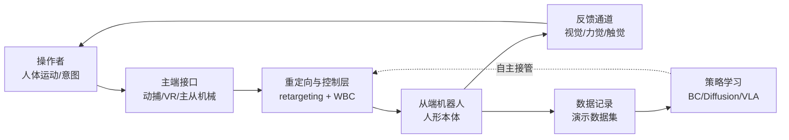
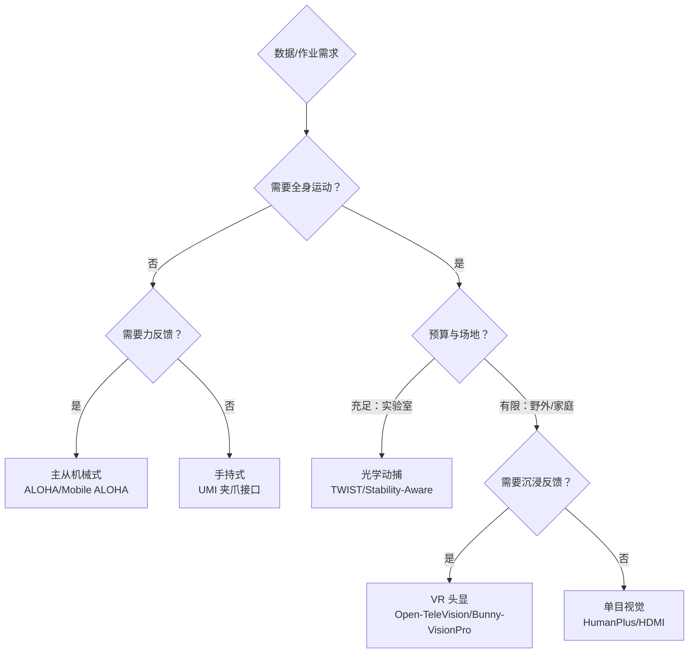
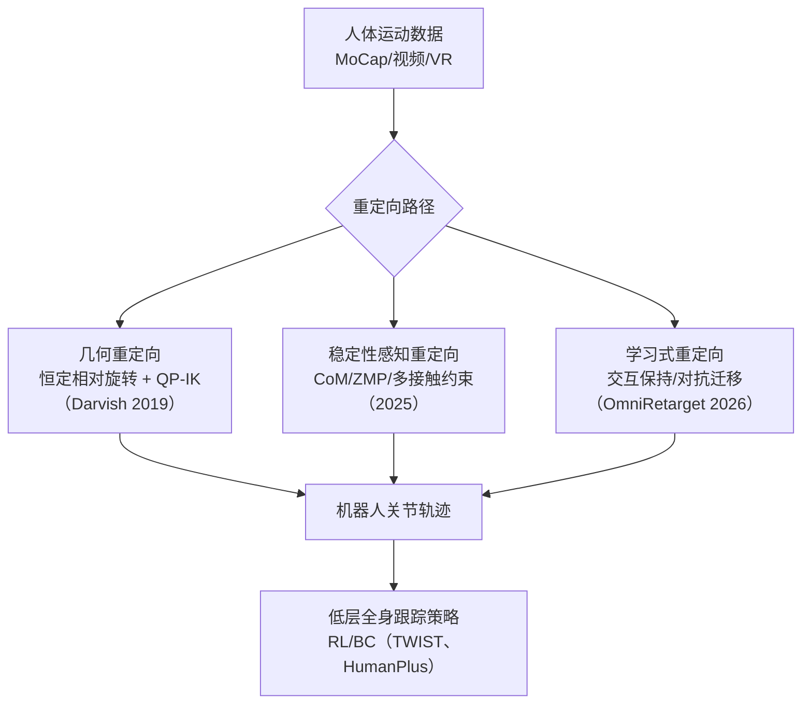
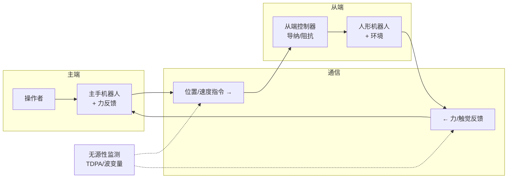
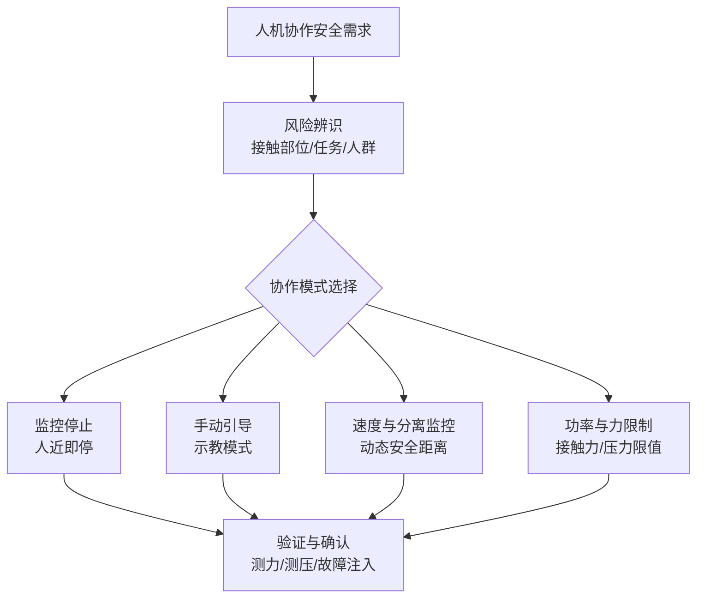

# 第 17 章 遥操作与人机协作

## 摘要

遥操作（teleoperation）与人机协作（human-robot collaboration, HRC）是人形机器人从实验室演示走向真实场景的两座桥梁：前者把人的感知-决策能力"投射"到机器人身体上，为数据采集、远程作业与技能教学提供通道；后者研究人与机器人在共享空间中的安全共存、任务分配与交互流畅性。本章从系统工程角度展开：首先给出遥操作系统的组成、分类与评价指标；然后依次讨论人体运动捕捉接口（主从机械、动捕、VR 头显、视觉姿态估计）、运动重定向（motion retargeting）的几何与学习方法、双边遥操作的力反馈架构与稳定性理论；随后剖析 iCub3 Avatar、OmniH2O、TWIST、HumanPlus、ALOHA 等代表性全身遥操作系统；再讨论遥操作数据采集与模仿学习的闭环、共享自主（shared autonomy）与自然语言交互；最后总结人机协作的安全框架与人因评价方法。本章与第 18 章（模仿学习与策略学习）、第 21 章（数据基础设施）互补：本章聚焦"人与机器人之间的实时通道"，而把离线策略训练的细节留给后续章节。

**关键词**：遥操作；人机协作；运动重定向；双边控制；力反馈；VR 接口；全身控制；共享自主；数据采集；人机交互

---

## 17.1 遥操作与人机协作概述

### 17.1.1 为什么遥操作是人形机器人的关键基础设施

人形机器人的终极目标是自主完成任务，但当前阶段的智能水平与任务复杂度之间存在明显落差——这正是知识图谱中"演示指标与产品指标的鸿沟（Demo-to-Product Gap）"概念所描述的现象。遥操作在这一落差中扮演三重角色：

1. **数据采集通道**：模仿学习（imitation learning）需要大量高质量演示数据。ALOHA 遥操作系统、Mobile ALOHA、HumanPlus 影子系统等低成本方案，使"人在回路（human-in-the-loop）"的示教成为可规模化的数据生产方式，驱动知识图谱所称的"数据飞轮（Data Flywheel）"。
2. **远程作业手段**：在危险环境（核设施、灾害现场、太空）、远程医疗等场景，操作者通过"化身（avatar）"机器人完成作业，iCub3 Avatar System 即为代表性实践。
3. **能力兜底机制**：在自主策略失败时由人接管（tele-assist），是 RaaS（机器人即服务）商业模式下保证服务可用性的工程手段，也是共享自主谱系的一端。

!!! note "术语解释：遥操作、人机协作、共享自主、数据飞轮"
    - **遥操作（teleoperation）**：操作者在远端通过接口设备控制机器人，并接收来自机器人的视觉、力觉等反馈的闭环控制模式。
    - **人机协作（human-robot collaboration, HRC）**：人与机器人在共享工作空间内为共同目标协同作业的模式，安全要求见 ISO/TS 15066 等技术规范。
    - **共享自主（shared autonomy）**：人与自主算法在同一控制回路中按某种仲裁机制共同决定机器人行为的控制范式。
    - **数据飞轮（data flywheel）**：部署产生数据、数据改进模型、模型提升性能进而产生更多数据的自我增强循环。

### 17.1.2 遥操作系统的组成与分类

一个完整的遥操作系统由五个环节构成：操作者接口（主端）、通信链路、机器人本体（从端）、反馈通道、以及位于中间的**重定向与控制层**——这一层负责把人体运动映射为机器人可执行、且动力学稳定的指令，是人形机器人遥操作区别于传统机械臂遥操作的核心难点。



按主从耦合方式，遥操作可分为四类：

| 类型 | 主端形态 | 代表系统 | 优点 | 局限 |
|---|---|---|---|---|
| 主从机械式 | 同构/异构引导臂 | ALOHA、Mobile ALOHA | 低延迟、可力反馈、成本可控 | 限于双臂+躯干，难以表达全身运动 |
| 动捕式 | 光学动捕/惯性动捕 | TWIST（MoCap 方案）、Stability-Aware Retargeting | 全身高保真 | 设备昂贵、场地受限 |
| 视觉式 | RGB/RGB-D 相机 + 姿态估计 | HumanPlus、HDMI | 无穿戴、部署灵活 | 遮挡敏感、深度歧义 |
| 穿戴式 | VR 头显 + 手柄/数据手套 | Open-TeleVision、Bunny-VisionPro、iCub3 Avatar | 沉浸感强、空间定位准 | 无触觉的手部映射精度有限 |

### 17.1.3 人机协作的层次

人机协作可按空间与任务耦合程度分为四个层次，层次越高对感知、规划与安全的要求越高：

1. **共存（coexistence）**：人机在同一设施内但无共享工作空间，靠围栏或区域监控隔离；
2. **顺序协作（sequential collaboration）**：共享空间但不同时作业，通过节拍错开；
3. **并行协作（cooperation）**：同时在共享空间作业，但各自完成独立任务；
4. **共事（collaboration proper）**：人机在同一工件上联合施力完成任务，例如共同抬运、人扶机器人拧——此时需要力控、意图识别与 ISO/TS 15066 所规范的功率与力限制（power and force limiting）。

人形机器人由于形态与人相近、作业空间与人重叠，天然处于第 3、4 层次，这使其安全设计（详见第 29 章）与交互设计成为产品化的前置条件。

### 17.1.4 自主程度谱系：本章的分析框架

贯穿本章的一个有用工具是**自主程度谱系**：从纯遥操作（人做全部决策）、共享自主（人机分担）、监督式自主（人给目标、机器人执行、人可接管）到全自主。任何一个部署系统都可定位在谱系某一点上，且随任务成熟度沿谱系右移。这一视角的意义在于：谱系上的每个位置对应不同的工程需求——纯遥操作要求低延迟与高保真映射，共享自主要求意图推断与仲裁机制，监督式自主要求可靠的目标级接口与接管协议，全自主则把问题交给第 18–20 章的策略与推理。讨论遥操作技术时，应始终明确所服务的目标位置，避免用过度的沉浸设备服务一个本可监督式自主的场景，或用脆弱的纯遥操作支撑一个需要全天候运行的服务。

## 17.2 人体运动捕捉与主端接口

### 17.2.1 主从机械式接口：ALOHA 与 Mobile ALOHA

ALOHA 遥操作系统（ALOHA Teleoperation System）开创了低成本双臂主从示教的范式：操作者直接扳动一对轻量引导臂（leader），从臂（follower）通过关节空间的位置伺服跟随，整站硬件成本控制在数万元人民币量级，远低于传统动捕或力反馈主手。其关键设计取舍包括：

- **关节空间直接映射**：引导臂与从臂运动学近似同构，省去逆解与奇异处理问题，延迟可做到数十毫秒级；
- **重力补偿与欠驱动权衡**：引导臂需轻量化并做重力平衡，否则长时间示教疲劳会显著降低数据质量；
- **腕部相机 + 全景相机的多视角记录**：为后续行为克隆提供丰富的视觉观测。

Mobile ALOHA 在此基础上加入移动底盘与全身协调控制，使"移动操作（mobile manipulation）"数据采集成为可能，可完成炒菜、开门、乘电梯等长时程家庭任务。其局限同样明显：主从架构无法自然表达腿部运动与全身姿态，因此对人形机器人的全身遥操作需要下一节所述的动捕与视觉方案。

### 17.2.2 动捕式接口：光学与惯性方案

光学动捕（如 OptiTrack 运动捕捉系统）通过多相机三角测量标记点，可提供亚毫米级、数百赫兹的全身姿态流，是 TWIST、Stability-Aware Retargeting 等高保真全身遥操作方案的主端选择。惯性动捕（IMU 套装）则摆脱场地限制，代价是漂移与磁干扰，工程上通常以人体运动学约束（骨长固定、关节限位）做在线校正。2020 年的"A Mobile Robot Hand-Arm Teleoperation System by Vision and IMU"一类早期工作即采用视觉+IMU 融合实现手臂遥操作，可视为如今视觉式方案的先声。

动捕数据的工程处理管线通常包括：标记点/IMU 标定 → 人体骨架拟合（如基于 AMASS 数据集先验）→ 低通滤波 → 重定向（17.3 节）→ 全身控制器跟踪。每一环节引入的延迟与噪声都直接决定最终遥操作的"手感"。

### 17.2.3 视觉式接口：单目姿态估计与影子跟随

HumanPlus 影子系统（HumanPlus Shadowing System）证明了仅靠单目 RGB 相机即可驱动 33 自由度、身高 180 cm 的人形机器人实时跟随人体与手部动作。其技术栈为：单目人体姿态与手部关键点估计 → 关节角重定向 → 在仿真中以强化学习训练的低层全身跟踪策略（sim-to-real 迁移）→ 实机部署。HDMI（Learning Interactive Humanoid Whole-Body Control from Human Videos）进一步把数据源从在线相机扩展到离线人类视频，实现"从视频中学习交互式全身控制"。

视觉式方案的核心挑战是**观测歧义**：单目深度不可观、自遮挡频繁，姿态估计的瞬时误差会经重定向放大为机器人平衡失稳。工程对策包括时间滤波、卡尔曼平滑、以及在低层策略中注入对参考运动噪声的鲁棒性训练。

### 17.2.4 穿戴式接口：VR 头显与沉浸反馈

VR/AR 头显同时解决"输入"与"反馈"两端：头显与手柄的 6-DoF 位姿提供手臂与躯干指令，立体显示提供沉浸式第一人称视觉反馈。代表性工作包括：

- **Open-TeleVision**：面向双臂操作的沉浸式主动视觉反馈遥操作，头显画面可随操作者头部运动主动调整机器人颈部视角，并输出适于 ACT/扩散策略训练的数据格式；
- **Bunny-VisionPro**：基于 Apple Vision Pro 的实时双臂灵巧遥操作，利用头显的手部追踪驱动灵巧手，强调低延迟与操作者舒适性；
- **iCub3 Avatar System**：集成 VR 头显、全身动作捕捉服与力反馈手套的"全沉浸化身"系统，实现了操作者在远端通过人形机器人行走、握手、搬运的完整闭环（详见 17.5.1）。

手持式接口是另一个值得注意的低成本方向：UMI 夹爪接口（UMI Gripper Interface）让操作者手持带相机的夹爪直接在真实环境中演示，无需机器人在场即可采集"野外（in-the-wild）"操作数据，再经策略学习迁移到机器人，显著降低了数据采集对机器人本体可用率的依赖。

### 17.2.5 通信链路与端到端延迟预算

遥操作的"手感"由端到端延迟决定。延迟链通常包括：主端采样（动捕/头显典型为 60–240 Hz）→ 姿态估计或骨架解算 → 重定向与全身控制求解 → 总线传输与关节伺服（EtherCAT 等实时总线，见第 6、22 章）→ 机器人运动 → 相机回传与渲染。一般而言，各环节的延迟预算分配需要一次系统级的权衡：

| 环节 | 典型延迟量级 | 主要压缩手段 |
|---|---|---|
| 主端采样与解算 | 5–30 ms | 提高采样率、硬件时间戳、边缘推理 |
| 重定向与 WBC 求解 | 1–10 ms | QP 热启动、降维任务集、专用求解器 |
| 总线与伺服 | 1–5 ms | 实时总线、控制周期 ≥1 kHz |
| 视频回传与渲染 | 30–80 ms | 低延迟编码、解码缓冲最小化 |
| 互联网传输（远程场景） | 20–200 ms | 专线/边缘节点、预测显示 |

两个经验性结论：其一，视觉反馈回路对延迟相对宽容（操作者可前馈补偿），但力觉回路在高延迟下必须降级为监督式自主；其二，**抖动（jitter）比平均延迟更伤体验**——稳定的 50 ms 往往好用在 20–100 ms 间波动的链路，因此工程上常用固定缓冲把抖动换成确定性延迟。ExtremControl 这类低延迟方案的价值即在于把控制链路缩短到"末端肢体直接映射"，减少中间环节的累积延迟。

### 17.2.6 主端接口选型决策

综合 17.2 各节，主端接口的选型可按"保真度—成本—覆盖自由度—数据用途"四维权衡：



需要强调的是，选型并非一选定终身：许多团队采用"动捕做小规模高保真种子数据 + 视觉/VR 做规模化采集"的混合策略，在保证数据质量的同时控制边际成本。

## 17.3 运动重定向：从人体到机器人的映射

### 17.3.1 问题形式化与具身差距

运动重定向（motion retargeting）要把人体运动 \(\mathbf{q}_H(t)\) 映射为机器人关节轨迹 \(\mathbf{q}_R(t)\)。人与机器人在自由度数目、连杆比例、关节限位、质量分布上的差异统称为**具身差距（embodiment gap）**。直接复制关节角在几何上不可行（人肩是球窝关节而机器人常为三个正交转动副），在运动学上不可行（臂展比例不同导致够不到同一目标），在动力学上更不可行（人的质心轨迹未必落在机器人的支撑多边形内）。

主流做法是把重定向表述为带约束优化问题：最小化任务空间误差的同时满足关节限位与稳定性约束，

$$
\min_{\mathbf{q}_R} \; \sum_{i \in \mathcal{T}} w_i \left\| \mathbf{p}_i^{R}(\mathbf{q}_R) - \tilde{\mathbf{p}}_i^{H} \right\|^2 + \lambda \left\| \mathbf{q}_R - \mathbf{q}_R^{prev} \right\|^2
$$

$$
\text{s.t.} \quad \mathbf{q}_{min} \le \mathbf{q}_R \le \mathbf{q}_{max}, \quad \dot{\mathbf{q}}_{min} \le \dot{\mathbf{q}}_R \le \dot{\mathbf{q}}_{max}, \quad \text{CoM/ZMP 稳定约束}
$$

其中 \(\mathcal{T}\) 为选定的对应任务点集合（手、肘、脚、骨盆等），\(\tilde{\mathbf{p}}_i^H\) 为按机器人比例缩放后的人体目标位置，第二项为正则化/平滑项。该 QP（二次规划）形式可实时求解，并与第 14、15 章的全身控制框架衔接。

!!! note "术语解释：具身差距、任务空间对应、脚部打滑、穿透"
    - **具身差距（embodiment gap）**：人与机器人在形态、比例、动力学上的系统性差异，是重定向误差的根源。
    - **任务空间对应（task-space correspondence）**：不复制关节角，而是让人体与机器人的选定关键点（手、脚等）在笛卡尔空间对齐。
    - **脚部打滑（foot skating）**：重定向后足底与地面发生相对滑动的伪影，是重定向质量的常用判据。
    - **穿透（penetration）**：机器人肢体穿入自身或环境几何体的非物理伪影。

### 17.3.2 几何重定向：Darvish 全身框架

2019 年的"面向人形机器人的全身几何重定向（Whole-Body Geometric Retargeting for Humanoid Robots，Darvish 等）"给出了一种经典且可扩展的几何方案：通过**恒定相对旋转**把测得的人体各连杆朝向与角速度映射到对应机器人连杆——即预先标定每个对应连杆对之间的固定偏置旋转，运行时人体连杆姿态右乘该偏置即得机器人目标姿态；随后在机器人 URDF 模型上以动态优化 QP 直接求解逆运动学，统一处理关节限位、速度约束与多任务优先级。该框架的优势在于不依赖学习的泛化性、行为可解释、可形式化地加入稳定性约束，至今仍是许多工程系统的骨架。

### 17.3.3 稳定性感知与多接触重定向

纯运动学重定向无法保证动态平衡。Stability-Aware Retargeting for Humanoid Multi-Contact Teleoperation（2025）一类工作把质心、零力矩点（ZMP）与接触状态显式纳入重定向优化：当操作者做扶墙、跪姿、搬运等多接触动作时，求解器同时调整机器人姿态与接触力分配，保证合外力矩不使机器人倾覆。工程上常用的轻量替代是"质心投影修正"：在重定向结果上叠加一个最小的下肢/腰部补偿，使质心投影回到支撑多边形内——这与第 8 章、第 15 章讨论的 ZMP/捕获点（Capture Point）稳定性准则一致。

### 17.3.4 学习式重定向与交互保持

近年趋势是把重定向从"逐帧几何映射"升级为"物理一致的数据生成"。OmniRetarget（2026）指出常见重定向管线忽视人-物、人-环境交互，容易产生脚部打滑与穿透，因而提出基于**交互网格（interaction mesh）**的数据生成引擎，显式建模并保持人与物体、场景之间的空间与接触关系，为人形全身移动操作（loco-manipulation）产出物理合理的训练数据。Human-Humanoid Robots Cross-Embodiment（2024）则采用分解式对抗模仿学习，把跨具身（cross-embodiment）技能迁移分解为可分别学习的子问题。这类方法的共同思想是：重定向的目标不是"像人"，而是"在机器人自己的动力学约束下保留任务的语义"。



### 17.3.5 Python 算例：比例缩放与关键点重定向

下面的最小算例演示重定向的第一步——按肢体长度比例把人体关键点缩放映射到机器人任务空间，并检查目标是否超出机器人臂展包络。真实系统会在此基础上叠加姿态（旋转）映射与 QP 求解，但比例缩放与包络检查是所有方案共有的前置步骤：

```python
import numpy as np

# 人体与机器人的上肢比例（示意值，单位 m）
human = {"shoulder_width": 0.42, "upper_arm": 0.30, "forearm": 0.28}
robot = {"shoulder_width": 0.50, "upper_arm": 0.32, "forearm": 0.30}

# 各肢体段独立缩放系数
s_ua = robot["upper_arm"] / human["upper_arm"]
s_fa = robot["forearm"] / human["forearm"]

# 人体肩、肘、手关键点（人体坐标系，肩关节为原点）
shoulder_h = np.array([0.0, 0.0, 0.0])
elbow_h    = np.array([0.25, -0.15, 0.05])
hand_h     = np.array([0.45, -0.35, 0.10])

# 分段缩放：肘 = 肩 + s_ua*(肘-肩)，手 = 肘' + s_fa*(手-肘)
elbow_r = shoulder_h + s_ua * (elbow_h - shoulder_h)
hand_r  = elbow_r + s_fa * (hand_h - elbow_h)

reach_max = robot["upper_arm"] + robot["forearm"]
print("机器人肘目标:", np.round(elbow_r, 3))
print("机器人手目标:", np.round(hand_r, 3))
print("手部伸展距离:", round(np.linalg.norm(hand_r - shoulder_h), 3),
      "臂展上限:", reach_max)
```

算例的要点有二：其一，**分段缩放**（每段肢体独立系数）优于全局单一系数，否则比例差异会在长运动链末端累积为显著误差；其二，目标点超出臂展包络时必须有明确的降级策略——截断到包络面、引导操作者、或由低层控制器以全身伸展（弯腰、垫步）补足，这正是稳定性感知重定向要解决的问题。

## 17.4 双边遥操作与力反馈

### 17.4.1 单边与双边：透明性目标

单边（unilateral）遥操作只有"主→从"指令流；双边遥操作（bilateral teleoperation）在此基础上把从端测得的力/触觉信息回传主端，形成双向能量交换。理想双边系统的目标是**透明性（transparency）**：操作者感觉自己在直接操作远端环境。用二端口网络的混合矩阵描述，

$$
\begin{bmatrix} F_m \\ v_s \end{bmatrix} = \begin{bmatrix} h_{11} & h_{12} \\ h_{21} & h_{22} \end{bmatrix} \begin{bmatrix} v_m \\ -F_s \end{bmatrix}
$$

理想透明对应 \(F_m = F_s\)、\(v_m = v_s\)。实际系统因惯性、摩擦、通信延迟与量化而偏离理想，常用"透明带宽"（力反馈可有效呈现的频率范围，典型为数十赫兹量级）作为工程指标。

### 17.4.2 二通道与四通道架构

按双向各传输位置/力信号的组合，双边架构可分为位置-位置、力-位置等**二通道（two-channel）**方案，以及同时交换四个信号的**四通道（four-channel）**架构——后者在理论上可在已知环境与操作者动力学时实现完全透明，但对力/力矩传感器的依赖强、成本高、噪声敏感。2026 年的 Sensorless Four-Channel Control Architecture 提出用逆动力学模型估计替代力传感器，在人尺度的 WAM 双边平台上验证了对位置与力跟踪的改善并降低了操作者负担，这对成本敏感的人形机器人场景尤其有吸引力：人形整机若每只手都要六维力/力矩传感器，成本与可靠性压力巨大，无传感（sensorless）外力估计是重要的降本路径（与第 5 章讨论的关节力矩传感、电流环外力观测相呼应）。

### 17.4.3 时延、无源性与稳定性

双边回路是能量回路，通信时延会使系统主动化（active）而失稳。经典理论给出两条主线：

- **无源性（passivity）方法**：要求从主端到从端的二端口网络满足无源性——输出能量不超过输入能量加初始储能。波变量（wave variables）变换把时延通道改造为无损传输线，保证任意恒定时延下的无源性，代价是引入位置漂移与"波反射"伪影；
- **时间域无源性（TDPA）**：在离散系统中在线监测并耗散多余能量，更适合周期控制与丢包网络。

工程经验法则（一般而言）：力觉闭环对往返时延的容忍度远低于视觉闭环，局域网/直连条件下可做到接近透明的操作，而跨地域互联网链路通常需要降级为"监督式自主"——人给目标、机器人本地闭环。ExtremControl（Low-Latency Humanoid Teleoperation with Direct Extremity Control, 2026）正是从缩短控制链路角度切入，以直接的末端肢体控制降低人形遥操作延迟。



### 17.4.4 触觉与力反馈的设备层

力反馈最终要落到可穿戴或桌面设备上，常见形态包括：

- **力反馈主手/机械臂式主端**：以串联机械臂提供 3–7 自由度的末端力反馈，透明带宽高但工作空间小、成本高；
- **力反馈手套**：在手指或手背施加反作用力，可呈现抓握阻力与接触事件，iCub3 Avatar 系统即集成了此类设备；其工程难点是重量（手部每增加一点负载都显著影响精细操作）与自由度匹配；
- **振动/电刺激触觉提示**：以低成本振动马达编码接触、滑移事件，信息带宽低但鲁棒、轻便，常作为力反馈的降级替代；
- **电流回灌式主从反馈**：ALOHA 类系统中直接利用从端电机电流估计外力并回驱引导臂，不增加传感器即可提供粗略力觉，是低成本双边化的巧妙路径。

设备层的总体规律是：力反馈的自由度与保真度每提高一档，成本、重量与穿戴时间就上升一个台阶。因此在数据采集导向的系统中，多数团队选择"视觉为主、力觉降级为提示"的配置，把真正的双边力反馈留给远程医疗、精密装配等力敏感作业场景。

## 17.5 代表性全身遥操作系统

### 17.5.1 iCub3 Avatar System：全沉浸远程化身

iCub3 Avatar System（2022，发表于 *Science Robotics*）是"机器人化身"路线的里程碑：操作者穿戴 VR 头显、全身动捕服与力反馈手套，远程控制 iCub3 人形机器人行走、抓取、与人握手，并把足底、手部力觉回传操作者。该系统在数百公里量级的真实远程链路上完成演示，验证了"全沉浸具身（fully-immersive embodiment）"在延迟受限条件下的可行性，也暴露了全身力反馈设备重量大、穿戴复杂、长时间操作疲劳等工程瓶颈。

### 17.5.2 OmniH2O：通用灵巧的人对人全身遥操作

OmniH2O（2024）把"全身遥操作"与"自主学习"统一在一个数据闭环里：遥操作端支持 VR 头显或动捕输入，机器人端通过教师-学生知识迁移训练——教师策略使用仿真特权信息（privileged information）以 PPO 强化学习训练，再蒸馏为只依赖部署观测的学生策略；采集的演示同时用于 ACT/行为克隆，产出可复用的全身技能（如打羽毛球、搬运、浇花）。OmniH2O 的意义在于示范了"遥操作即数据生产、数据即自主能力"的飞轮范式。

### 17.5.3 TWIST：遥操作全身模仿系统

TWIST（Teleoperated Whole-Body Imitation System, 2025）将人体动捕数据重定向到人形机器人，并通过两阶段**教师-学生 RL+BC** 框架训练单一全身控制器，在 Unitree G1 与 Booster T1 等真实整机上实现跨操作、移动与表现性任务的实时协调全身遥操作。其系统要点包括：关节空间与任务空间混合的重定向表示、在仿真中对参考运动做大规模扰动训练以提升鲁棒性、以及部署时的低延迟观测管线。TWIST 代表了"一个控制器吃所有参考动作"的简洁工程哲学。

### 17.5.4 HumanPlus 与 Mobile ALOHA：数据优先路线

HumanPlus（2024）强调"影子跟随（shadowing）+ 模仿（imitation）"的全栈：单目相机实时跟随采数据，少则约 40 条演示即可学会基于自我中心视觉的自主操作与移动技能。Mobile ALOHA 则以双臂+底盘的硬件形态证明了低成本平台采集长时程家庭任务数据的价值。两者共同回答了一个工程问题：**数据的边际成本**决定了模仿学习能否规模化——主端越便宜、越便携，数据飞轮转动越快。

### 17.5.5 系统对比

| 系统 | 年份 | 主端接口 | 机器人平台 | 力反馈 | 数据/学习闭环 | 突出特点 |
|---|---|---|---|---|---|---|
| ALOHA | 2023 | 主从引导臂 | 双臂工作站 | 部分（电流） | ACT 行为克隆 | 低成本、易复制 |
| Mobile ALOHA | 2024 | 主从引导臂+底盘 | 移动双臂 | 部分 | 行为克隆 | 长时程移动操作 |
| iCub3 Avatar | 2022 | VR+动捕服+力反馈手套 | iCub3 | 全身多点 | — | 全沉浸远程化身 |
| OmniH2O | 2024 | VR/动捕 | Unitree H1 | 无 | 教师-学生 RL + BC | 遥操作-自主学习统一 |
| HumanPlus | 2024 | 单目 RGB | 33-DoF 人形（H1 改装） | 无 | 影子跟随 + BC | 无穿戴、数据效率高 |
| TWIST | 2025 | 动捕 | Unitree G1、Booster T1 | 无 | RL+BC 单一全身控制器 | 跨任务协调全身控制 |
| Open-TeleVision | 2024 | VR 头显 | 双臂人形上身 | 无 | ACT/扩散策略 | 主动视觉反馈 |

### 17.5.6 案例的共性经验

横向比较这些系统，可以提炼出四条反复被验证的工程经验：

1. **低层控制器决定上限**：无论主端多么精巧，最终体验由机器人端的全身跟踪策略决定。成功者（TWIST、HumanPlus、OmniH2O）都把大量工程预算投在仿真中大规模扰动训练的低层策略上，而非继续打磨主端硬件；
2. **教师-学生蒸馏是标配**：用特权信息训练教师、蒸馏为部署可用学生的范式，在 OmniH2O 与 TWIST 中反复出现，是平衡训练效率与部署观测约束的通行解法；
3. **数据格式先行**：能积累价值的系统从第一天就把遥操作流按学习友好的格式落盘（观测-动作对齐、时间戳同步、语言指令挂接），而不是"先跑起来再说"；
4. **演示规模 ≠ 系统价值**：iCub3 Avatar 这类系统不以数据产能为目标，却在远程具身、力反馈集成上提供了不可替代的验证——评价遥操作系统要先明确其目标函数（作业能力 or 数据产能），二者对延迟、力觉、成本的取舍截然不同。

## 17.6 遥操作数据与自主学习闭环

### 17.6.1 从演示到策略

遥操作采集的演示 \(\{(o_t, a_t)\}\) 经行为克隆（behavior cloning）、动作分块 Transformer（Action Chunking with Transformers, ACT）或扩散策略（diffusion policy）训练为自主策略，细节见第 18 章。从遥操作工程角度，决定数据价值的因素包括：

- **覆盖度（coverage）**：状态-动作空间是否覆盖任务分布，初始位姿与扰动是否多样；
- **一致性（consistency）**：同一任务的演示风格差异会增大策略拟合难度，操作者培训与标准化流程很关键；
- **标注质量**：语言指令、任务分段、成功/失败标签直接影响后续 VLA 训练（第 19 章）与评测（第 25 章）。

### 17.6.2 数据扩增：一条演示变千条

遥操作数据昂贵，因此出现了"以少生多"的扩增路线：MimicGen 把少量人类演示自动重组为大量新场景下的演示；HumanoidMimicGen（Data Generation for Loco-Manipulation via Whole-Body Planning, 2026）针对人形移动操作，通过全身规划从遥操作/外骨骼数据出发生成可训练的全身轨迹；RoboGen 走生成式仿真路线，自动提出任务、生成场景并教学。这些方法与遥操作构成互补：遥操作提供"种子"，扩增提供"放大"。

### 17.6.3 机器人遥操作 vs 人类遥操作

一个常被忽视的问题是：遥操作的机器人与人直接远程作业相比孰优？2025 年针对远程超声的对比研究（Robotic versus Human Teleoperation for Remote Ultrasound）在体模实验中发现：机器人（Franka Panda）遥操作与经 HoloLens 2 引导的人类遥操作在完成时间与图像空间跟踪精度上无显著差异，但人类遥操作施加的力更一致、幅度更低。这提示力觉反馈与力控品质是医疗等力敏感场景遥操作的关键差异化指标，也呼应了 17.4 节的架构讨论。

### 17.6.4 开源工具链与数据生态

遥操作数据的规模化和工具链成熟度互相成就。以 LeRobot 为代表的开源框架把"采集—存储—训练—评测"封装为统一管线，定义了演示数据的通用格式（观测、动作、时间戳、语言指令的统一封装），使 ALOHA、Mobile ALOHA 等不同硬件平台的数据可以在同一训练栈上复用；配合 Open X-Embodiment 这类跨本体数据集与 Hugging Face 式的数据集托管生态，单个实验室也能站在社区数据之上训练策略。对工程团队的建议是：尽早采用社区通行格式而非私有格式——数据资产的长期价值取决于其可迁移性，而可迁移性首先由格式决定。

## 17.7 人机协作与交互

### 17.7.1 安全框架：从隔离到功率与力限制

人机协作安全（Human-Robot Collaboration Safety）要求在标准、传感、控制律与工位设计四个层面协同：ISO/TS 15066 给出了人机接触时的力与压力限值框架，将协作操作分为安全额定监控停止、手动引导、速度与分离监控（speed and separation monitoring, SSM）、功率与力限制（power and force limiting, PFL）四种模式。人形机器人以移动+双臂形态在开放空间作业，最贴近 PFL 模式，但双足跌倒风险是现有以固定基座机械臂为对象的标准未曾覆盖的缺口——这一标准与监管议题将在第 29 章展开。



### 17.7.2 共享自主与滑动自主

纯遥操作负担重、纯自主不可靠，共享自主（shared autonomy）在两者之间按任务动态分配控制权：人负责意图层（选哪个物体、放到哪里），机器人负责执行层（避障、抓取规划、平衡）。**滑动自主（sliding autonomy）**把分配系数连续化——操作者表现好则放大人的权重，检测到犹豫或冲突则提高自主权重。意图推断常用贝叶斯方法：维护一组候选目标的概率分布，用人的部分轨迹在线更新并输出辅助动作。人形机器人的全身特性使共享自主必须同时覆盖导航与操作两个层次，这与第 16 章（操作与抓取）的规划栈直接衔接。

### 17.7.3 自然语言与多模态交互

语言是人机协作中带宽最高、学习成本最低的意图通道。TextOp（2026）展示了实时文本驱动的人形运动生成：高层自回归潜在扩散模型从流式语言命令生成短期运动学参考，低层强化学习全身跟踪策略在 Unitree G1 上执行，使"说一句、做一段"的连续指挥成为可能。结合大语言模型的任务级接口（如用 GPT 类模型把口语指令拆解为机器人技能序列的研究路线）与第 19、20 章的 VLA/世界模型，语言正从"交互界面"演变为"控制回路的一部分"。语音之外，手势、视线与力信号共同构成多模态意图通道，工程上要解决的核心是通道间的冲突仲裁与时间对齐。

### 17.7.4 人因评价：如何衡量"好用"

遥操作与人机协作系统的评价不能只看作务成功率，人因工程（human factors）指标同样关键：

| 维度 | 常用指标 | 典型测量方式 |
|---|---|---|
| 任务绩效 | 完成时间、成功率、精度、施加力 | 标准化任务台架实验 |
| 操作负荷 | NASA-TLX 主观负荷量表 | 实验后问卷 |
| 态势感知 | SART/冻结探测法 | 任务中插入探测信号 |
| 临场感 | Presence 问卷（VR 场景） | 主观量表 |
| 信任 | 信任量表 + 接管行为 | 纵向实验 |
| 疲劳 | 操作时长、肌电/心率变异性 | 可穿戴监测 |

一般而言，沉浸式第一人称反馈可提升态势感知与临场感，但也可能加重视觉疲劳与晕动；力反馈能降低碰撞力、提升精细操作品质，却增加主端成本与维护负担——这些权衡必须在目标场景中做受控实验确定，而非从演示视频推断。面向医疗、养老等场景的用户研究（如居家老年人对机器人辅助任务偏好的访谈研究）还反复表明：最终用户更在意**对机器人行为的控制权与可预期性**，而非功能的丰富程度。

### 17.7.5 操作者培训与数据质量管理

遥操作系统的产能最终取决于"人"这一环节。规模化数据采集团队的工程实践表明，以下制度性安排对数据质量的影响不亚于算法：

- **标准化作业程序（SOP）**：任务分解、初始位姿、成功判据、失败重录规则全部文档化，使不同操作者的数据分布一致；
- **操作者分级与认证**：新操作者先在仿真或低风险任务上考核（完成时间、碰撞次数、轨迹平滑度），达标后再接触真实任务；
- **在线质检与反馈**：采集端实时检测掉帧、关节限位触碰、超时等异常并提示重录，避免"事后清洗才发现大批废片"；
- **疲劳管理**：穿戴式接口下操作者通常工作数十分钟即出现明显疲劳，排班与轮换制度直接决定数据的尾部质量；
- **标注与回放审计**：按比例回放抽查已录数据，统计成功率与缺陷类型分布，闭环修正 SOP。

这些实践与第 21 章的数据基础设施共同构成"数据工厂"的完整图景：遥操作系统是产线，质量管理是产线不可分割的部分。

## 17.8 工程挑战与展望

当前人形机器人遥操作与人机协作的主要开放问题包括：

1. **全身力反馈的缺失**：现有系统的力反馈集中于手部或完全缺失，足底接触、躯干碰撞的"体感"尚无低成本解决方案；
2. **延迟预算的端到端优化**：从姿态估计、重定向、控制到渲染，每一毫秒都值得争夺，ExtremControl 式的直接末端控制与边缘推理是趋势；
3. **跨具身迁移**：一套主端如何适配不同身高、不同自由度的机器人（cross-embodiment），是数据规模化的前提；
4. **协作安全的人形特化**：双足跌倒、动态接触、非结构化人群等场景需要新的安全度量与验证方法；
5. **从遥操作到自主的平滑过渡**：遥操作、共享自主、全自主应被视为连续谱，系统架构要支持控制权在谱系上的无损滑动。

## 本章小结

遥操作是人形机器人当下最现实的"能力放大器"与"数据生产线"，人机协作则决定了它能否进入与人共享的真实空间。本章沿"接口—映射—反馈—系统—数据—协作"的线索展开：主端接口从主从机械（ALOHA、Mobile ALOHA）、动捕（TWIST）、单目视觉（HumanPlus）到 VR 穿戴（Open-TeleVision、iCub3 Avatar）各有成本-保真权衡；运动重定向从几何 QP（Darvish 框架）演进到稳定性感知与交互保持的学习方法（OmniRetarget）；双边遥操作以无源性理论保证时延下的稳定，四通道与无传感方案指向更高的透明性与更低的成本；而共享自主、语言交互与人因评价共同构成人机协作的"软"层。理解这一章的系统图景，是进入第 18–21 章学习算法与数据基础设施讨论的前提。

## 延伸阅读（知识图谱条目）

- 技术：ALOHA 遥操作系统、Mobile ALOHA、HumanPlus 影子系统、UMI 夹爪接口、OptiTrack 运动捕捉
- 方法：双边遥操作（Bilateral Teleoperation）、行为克隆、动作分块 Transformer、扩散策略
- 论文：OmniH2O（2024）、Open-TeleVision（2024）、HumanPlus（arXiv:2406.10454）、TWIST（arXiv:2505.02833）、iCub3 Avatar System（arXiv:2203.06972）、Whole-Body Geometric Retargeting（2019）、Stability-Aware Retargeting（2025）、OmniRetarget（2026）、HumanoidMimicGen（2026）、TextOp（2026）、Sensorless Four-Channel Control Architecture（2026）、Robotic versus Human Teleoperation for Remote Ultrasound（2025）、Bunny-VisionPro（2024）、HDMI（2025）、ExtremControl（2026）、Teleoperation of Humanoid Robots: A Survey（2023）
- 概念：人机协作安全、数据飞轮、演示指标与产品指标的鸿沟
- 数据集：AMASS、Ego4D、Open X-Embodiment、HumanPlus Shadowing 数据集
